# MIT18.01 Single-variate Calculus

📊 **Progress:** `317` Notes | `331` Screenshots

---

## MIT18.01 Single-variate Calculus

 

## Lec 1: Rate Of Change

 

<kbd></kbd>

> [!NOTE]
> về khía cạnh hình học, bài toán là tìm đường tiếp tuyến
> với function y = f(x) tại P. Thì gs vẽ đường này và cho
> rằng bằng cách nào đó ông đã làm xong. Nhưng vấn đề
> là làm sao để tìm nó analytically để máy tính cũng có
> thể làm được

 

<kbd></kbd>

> [!NOTE]
> Dựa vào kiến thức highschool, phương trình đường tiếp tuyến tại
> P (x0, y0) sẽ có dạng như vầy. Ta sẽ cần tìm P và độ dốc (slope)
> m, và slope độ dốc của đường thẳng tại P (x0, y0) được gọi là
> derivative f'(x0)

 

<kbd></kbd>

> [!NOTE]
> Ta có định nghĩa f'(x0) là derivative của hàm f tại x(0)
> chính là độ dốc của đường tiếp tuyến với hàm f(x) tại P (x0, y0)

 

<kbd></kbd>

> [!NOTE]
> Thế thì gs đặt vấn đề là, làm sao để biết một line như đường màu
> cam không phải là tangent. Ông cho rằng không phải vì nó cắt f tại 2
> điểm P, Q mà nói nó không phải tangent, bởi lẽ function có thể wiggly.

 

<kbd></kbd>

> [!NOTE]
> và thực tế tangent line chính là đường
> secant line khi Q -> P với P cố định

 

<kbd></kbd>

> [!NOTE]
> tiếp theo gs vẽ lại secant line, gọi delta_x (xQ - xP) là khoảng
> thay đổi của x, delta_f= f(Q) - f(P) là khoảng thay đổi của f
>
>
>
> thì độ dốc của tangent theo định nghĩa (gs cho rằng lim có thể áp
> dụng cho cả line và độ dốc) sẽ là limit của delta_f / delta_x khi
> delta_x nhỏ vô cùng

 

<kbd></kbd>

> [!NOTE]
> và ta với việc thay delta_x = f(x0+delta_x) - f(x0) ta có định
> nghĩa chính thức của derivative of f tại x0: f'(x0)

 

<kbd></kbd>

> [!NOTE]
> và biểu thức cần tìm limit có tên gọi là
> **DIFFERENCE QUOTIENT**

 

<kbd></kbd>

> [!NOTE]
> Ta sẽ áp dụng để tìm derivative của f(x) = 1/x. Ông cho rằng ta
> sẽ chọn 1 điểm x0. Và kết quả là ta sẽ tìm được tangent line
> của hyperbolla này

 

<kbd></kbd>

> [!NOTE]
> Thế thì ta sẽ thiết lập delta_f/delta_x
> như vầy. Và thu gọn nó lại

 

<kbd></kbd>

> [!NOTE]
> Mục đích là khử đi delta_x ở tử và mẫu thoát khỏi dạng 0/0 (khi
> delta_x -> 0)
>
>
>
> Kết quả cuối cùng, là -1/(x0 + delta_x)x0. Và để có lim khi delta_x
> -> 0  chỉ việc thế delta_x = 0, Ta có **-1/x0^2**
>
>
>
> Dễ thấy đây cũng chính là công thức tính đạo hàm của hàm 1/x
> Thì ở đây chính là ta tìm lại công thức của nó theo định nghĩa đạo
> hàm

 

<kbd></kbd>

> [!NOTE]
> nhận xét là tangent của hàm 1/x chúi xuống vì slope âm. Và khi x0 ->
> vô cùng, tức là điểm tiếp tuyến càng xa thì độ dốc càng nhỏ lại
>
>
>
> ý nói cái mà ta tìm ra phù hợp với hình ảnh của tangent của hyperbol

 

<kbd></kbd>

> [!NOTE]
> gs giải thích khi tìm limit của biểu thức này khi delta_x -> 0, điều
> ta làm thật sự chỉ là bỏ 0 vào delta_x thôi

 

<kbd></kbd>

<kbd></kbd>

> [!NOTE]
> Tiếp ta sẽ thử giải bài toán này: tìm diện tích của hình tạo bởi
> tangent của f(x) = 1/x và 2 trục. Nó là vấn đề calculus vì nó có dính
> đến tangent.

 

<kbd></kbd>

> [!NOTE]
> Gọi x0,y0 là điểm tiếp xúc
>
>
>
> Thế thì rõ ràng ta cần tìm base và height thể hiện bằng 2 điểm
> line cắt 2 trục
>
>
>
> Thế thì ta đã có phương trình đường tangent với độ dốc đã NHỜ
> CALCULUS MÀ TÍNH ĐƯỢC = -1/x^2.
>
>
>
> Gs gọi nó là yếu tố duy nhất của calculus trong bài toán này

 

<kbd></kbd>

> [!NOTE]
> Và để tìm hai giao điểm của tangent line với 2 trục ta cho y = 0 để
> tìm điểm thứ nhất, và x = 0 để tìm điểm thứ 2.
>
>
>
> Từ đó ta có height và base của tam giác

 

<kbd></kbd>

> [!NOTE]
> đại khái gs có thể làm nhanh hơn bằng cách
> dùng tính đối xứng của x và y

 

<kbd></kbd>

> [!NOTE]
> và từ base và  height ta tính ra area của tam giác và vì y0 = 1/x0,
> diện tích không còn phụ thuộc x0, y0 nữa ( = 2)

 

<kbd></kbd>

> [!NOTE]
> Gs nói thêm một số notation: đó là derivative có thể dùng **f'(x)**, và đó
> là notation của **Newton**. Hoặc **df/dx** là **Leibniz**
>
> NOTATION CỦA DERIVATIVE:
>
>
>
> NEWTON: f'
>
>
>
> LEIBNIZ: df/dx, hoặc (d/dx) f

 

<kbd></kbd>

> [!NOTE]
> Ví dụ 2. tìm derivative của f(x) = x^n.
>
>
>
> Thế thì ta cũng sẽ thiết lập biểu thức delta_f / delta_x Nhưng gs cho
> rằng ta không còn cần dùng notation x0 nữa. Mà chỉ cần biết x là fixed
> - là điểm cần tìm derivative và delta x là khoảng thay đổi của x từ đó

 

<kbd></kbd>

 

<kbd></kbd>

> [!NOTE]
> Gs cho rằng ta sẽ vận dụng Binomial theorem (nhị thức newton) để
> triển khai
>
>
>
> (x+delta_x)^n = x^n + x^(n-1)*delta_x + O(delta_x^2)
>
>
>
> Có nghĩa là binomial theorem,sẽ giúp ta triển (x+y)^n thành một tổng
> các biểu thức của x và y.
>
>
>
> Thế thì với x+delta_x ta **chỉ cần hai cái đầu** và gọi tất cả các term
> mà dính tới bậc cao hơn 1 của delta_x là O(delta_x^2)
>
>
>
> Đương nhiên ta hiểu rằng là m vậy là vì trong bài toán này ta sẽ tìm lim
> của nó khi  delta_x -> 0 thì O(detal_x^2) ~= 0

 

<kbd></kbd>

> [!NOTE]
> và triển khai như trước ,thế delta_f = f(x+delta_x) - f(x) và rút gọn
> ta có n*x^(n-1) + O(delta_x)

 

<kbd></kbd>

> [!NOTE]
> và khi tìm limit khi delta_x -> 0 Thì
> O(delta_x) = 0 và chỉ còn n*x^(n-1)

 

<kbd></kbd>

> [!NOTE]
> và ta sẽ có thể áp dụng
> nó như thế này

 

## Lec 2: Limits

 

<kbd></kbd>

<kbd></kbd>

> [!NOTE]
> Gs: tuần trước ta đã học về định nghĩa của derivative: là độ dốc (slope)
> của tiếp tuyến. Sau đó ta đã tính derivative của một số function như
> 1/x, x^n

 

<kbd></kbd>

> [!NOTE]
> Đại ý là, bài trước ta đã hiểu về derivative là như vậy (độ dốc
> của tiếp tuyến). Nhưng hôm nay ta sẽ tiếp tục bàn về ý nghĩa
> của derivative nhưng ở GÓC NHÌN THỨ 2, gs cho rằng đây là
> cái RẤT QUAN TRỌNG. Đó là hiểu về derivative theo ý nghĩa:
> RATE OF CHANGE

 

<kbd></kbd>

> [!NOTE]
> Ở góc nhìn thứ hai này, khi x change một khoảng delta_x, thì /
> và function change một khoảng delta_y. Thì delta_y / delta_x giống 
> như rate of change trung bình. Và khi xét trên một khoảng vô cùng
> nhỏ, thì nó trở thành dy/dx mang ý nghĩa là rate of change tức thời
> (instantaneous)

 

<kbd></kbd>

> [!NOTE]
> Gs lấy ví dụ như s là quãng đường di
> chuỷên thì ds/dt là vận tốc

 

<kbd></kbd>

> [!NOTE]
> Lấy ví dụ ta thả quả dưa từ sân thượng xuống đất, và độ cao của quả
> dưa được thể hiện theo t bởi h = 80 - 5*t^2. Thế thì, tại t = 0, h = 80.
> Còn tại t = 4, h = 0. Từ đó ta tính delta_h / delta_t = -20 m/sec. Và đây
> mang ý nghĩa là average speed

 

<kbd></kbd>

> [!NOTE]
> Nhưng cái mà ta quan tâm là vận tốc tức thời. Ta sẽ lấy derivative
> của h w.r.t t: dh/dt. Và sử dụng công thức mà ta đã chứng minh là d
> x^n / dx = n*x^(n-1) với n=0,1,2...
>
>
>
> Thì d 80 / dt coi như d 80*t^0 /dt = 80*0*t^-1 = 0. Và d t^2 / dt = 2t từ
> đó ta có dh/dt = -10t
>
>
>
> Từ đó khi t = 4, ta có vận tốc tức thời là -40 m/s

 

<kbd></kbd>

> [!NOTE]
> Ta sẽ học qua Limit và Continuity. Gs cho rằng nó sẽ giúp ta derive
> mọi công thức derivative mà ta sẽ cần cho việc vi tích phân
>
>
>
> Thế thì đầu tiên gs nói ông cho rằng có hai loại limit, loại thứ nhất
> là "Easy" limit ví dụ như cái này lim x-> 4 của (x+3)/(x^2+1) thì
> để tính limit này chỉ việc thế x = 4 vào là xong.

 

<kbd></kbd>

> [!NOTE]
> Thế thì loại thứ hai, mà điển hình là khi ta tính derivative, theo định nghĩa
> mà bài trước đã học, nó là limit của tỉ lệ giữa delta f = f(x0+deltax) - f(x0)
> với delta x = x - x0 khi x -> x0
>
>
>
> Thì nếu thế x = x0 vào thì ta luôn có dạng 0/0. Do đó ta cần một số cách
> làm khác.

 

<kbd></kbd>

> [!NOTE]
> Tiếp gs nói về right-hand limit và left-hand limit. Với right-hand limit
> kí hiệu là lim x-> x0+ f(x) thì có nghĩa là x > x0 và do đó nó tiếp cận
> x0 từ bên phải (right-hand)

 

<kbd></kbd>

> [!NOTE]
> Ngược lại left-hand limit là  lim x->x0- f(x) có nghĩa là x < x0,
> và tiến về x0 ở bên trái

 

<kbd></kbd>

> [!NOTE]
> Gs cho một ví dụ về function f(x) như vầy, tức là khi x>0 thì f(x) = x+1
> và khi x<0 thì f(x) = -x+2
>
>
>
> Vậy, khi dễ hiểu tính lim x->0+ của f(x) thì nó sẽ chính là lim x->0 của
> x+1 và bằng 1. Và ngược lại khi tính lim x->0- của f(x) thì nó chính là
> lim x->0 của -x+2 và kết qủa ra 2

 

<kbd></kbd>

> [!NOTE]
> Thế thì nếu ta muốn define thêm tại x = 0 thì f(x) như thế nào (vì
> vừa rồi vẫn chưa biết x = 0 thì f ra sao) thì ta có thể dùng notation
> như vầy, ví dụ x>=0 thì f(x) = x+1 thì hình ảnh thường được dùng
> là tại x = 0 ở phần đồ thị x+1 sẽ là dấu chấm đặc. Còn tại x = 0 ở
> nhánh -x+2 là vòng tròn rỗng

 

<kbd></kbd>

> [!NOTE]
> Ta sẽ biết về định nghĩa của của khái niệm tính continuous của hàm f
> đó là, khi nói hàm f liên tục tại x0 thì điều này có nghĩa là lim x->x0 f(x)
> = f(x0)

 

<kbd></kbd>

> [!NOTE]
> Và điều đó hàm chứa 3 ý nghĩa sau:
>
>
>
> 1) limit của f(x) khi x->x0 tồn tại cả từ bên trái lẫn bên phải (left-hand
> và right-hand) và chúng bằng nhau.
>
>
>
> 2) f(x0) có xác định
>
>
>
> 3) Và chúng bằng nhau

 

<kbd></kbd>

> [!NOTE]
> Gs nói đại khái là, điều cần lưu ý của định nghĩa này đó là nó có
> nghĩa là hai phần hoàn toàn khác nhau. Ví dụ, phần bên trái khi 
> tính sẽ không dính gì đến x0. Còn phần bên phải thì thì là easy
> limit, tức là có thể gắn x0 vào để có kết quả.
>
>
>
> Chưa hiểu lắm nhưng có thể sẽ rõ hơn khi làm qua các ví dụ

 

<kbd></kbd>

> [!NOTE]
> Và từ đó ta có khái niệm JUMP DISCONTINUITY (bước nhảy gián
> đoạn). Đó chính là trong ví dụ hồi nãy, khi right-hand limit và left-hand
> limit đều tồn tại nhưng hai cái không bằng nhau.

 

<kbd></kbd>

> [!NOTE]
> Tiếp theo là một khái niệm nữa gọi là REMOVABLE DISCONTINUITY,
> Đại khái là khi ta có một function có limit bên trái và bên phải bằng nhau
> nhưng giống như tron hình ảnh này, function liên tục nhưng bị thiếu 
> một điểm tạo thành một cái lỗ như vầy, mà tại đó có thể function không
> xác định hoặc thể hiện bởi cái điểm ở trên.

 

<kbd></kbd>

> [!NOTE]
> Gs lấy ví dụ là function g(x) = sin(x) / x và h(x) = (1-cos(x)) / x. Cả
> hai đều là các function removable discontinuity tại x = 0.

 

<kbd></kbd>

> [!NOTE]
> Và cuối bài hoặc bài sau ta sẽ chứng minh, tính ra limit
> của chúng khi x -> 0 thật sự sẽ là 1. Trong khi đó dễ thấy
> cả hai đều không xác định tại x = 0

 

<kbd></kbd>

<kbd></kbd>

> [!NOTE]
> Gs nói tiếp về dạng DISCONTINUITY thứ 3 là INFINITE
> DISCONTINUITY. Lấy ví dụ này, khi ta có hyperbola y = 1/x. Khi đó, ta
> sẽ có right hand  limit tại x sẽ là = + infinity còn left hand limit tại x sẽ là
> -infinity (có thể thấy trên đồ thị nếu ta đi về 0 từ bên phải thí nhánh
> hyperbola sẽ vọt  lên, ngược lại nếu ta đi từ bên trái thì f sẽ cắm đầu
> xuống -> -infinity)
>
>
>
> Gs cũng nói một số sách ghi là limit 1/x tại x -> 0 = infinity là sai.

 

<kbd></kbd>

> [!NOTE]
> Tiếp gs nói về việc ta đã biết derivative của y: y' = -1 / x^2. Và nếu
> vẽ đồ thị của nó ra thì nó sẽ như vầy.
>
>
>
> Gs nhấn mạnh rằng, sẽ sai lầm nếu ta nghĩ đồ thị của derivative
> phải giống giống đồ thị của hàm f. Bởi vì nên nhớ ý nghĩa derivative
> là độ dốc. Nên đồ thị của y' sẽ thể hiện sự thay đổi của độ dốc.

 

<kbd></kbd>

> [!NOTE]
> Và với f' thì cả left và right limit của nó tại 0 đều bằng -infinity. Nhưng
> again, nó không xác định tại x = 0 và đây cũng là function có tính 
> infinity discontinuity tại 0

 

<kbd></kbd>

> [!NOTE]
> Một điểm nữa gs cho biết, y = 1/x là hàm lẻ (là hàm mà f(x) = -
> f(-x) thì derivative của nó gs nói rằng sẽ luôn là hàm chẵn
> (event) (là hàm mà g(x) = g(-x))

 

<kbd></kbd>

> [!NOTE]
> Một dạng cuối cùng gọi là OTHER UGLY DISCONTINUITIES, ví
> dụ hàm y =sin(1/x), khi x->0 thì không có cả left lẫn right hand
> limit. Nhưng gs nói trong class này ta sẽ không gặp các function
> như vậy

 

<kbd></kbd>

> [!NOTE]
> Tiếp theo ta sẽ học một Theorem quan trọng nói rằng: Nếu hàm f
> **differentiable** (khả vi) tại x0 thì đồng nghĩa nó cũng sẽ **continuous**
> tại x0

 

<kbd></kbd>

> [!NOTE]
> Thế thì để chứng minh theorem này, cái ta chỉ cần chứng minh là
> **limit của f(x) - f(x0) tại x0 là bằng 0**.
>
>
>
> Vì khi đó cũng đồng nghĩa là **limit của  f(x) tại x->x0 là bằng f(x0)(*)**
> và đây chính là định nghĩa rằng f continuous tại x0
>
>
>
> (*) vì sao vì khi x->0 mà khác biệt giữa f(x) và f(x0) = 0 thì trừ hai vế
> cho f(x0) thì ta sẽ đồng nghĩa với khi x->0 thì f(x) -> f(x0)

 

<kbd></kbd>

> [!NOTE]
> Thế thì ta sẽ nhân thêm và chia bớt cho x-x0, để rồi khi x->x0 thì 
> [f(x)-f(x0)]/(x-x0) chính là f'(x0) mà cái này đã tồn tại như điều kiện
> ban đầu đã nói. Còn là, với x-x0 thì khi x->x0 cái này sẽ -> 0.
>
>
>
> Vậy limit = 0 và ta đã chứng minh xong.

 

<kbd></kbd>

> [!NOTE]
> Thế thì trong cách làm vừa rồi, nhìn thì có vẻ có vấn đề khi ta nhân và
> chia đi cho x-x0 trong khi đó khi x->x0 thì x-x0 = 0 khiến việc chia cho 0
> có vẻ không hợp lệ.
>
>
>
> Tuy nhiên, gs nhấn mạnh một ý hồi nãy đó là, khi tính limit, ta phải hiểu
> là kiểu như ta chưa / không bao giờ đụng tới x0, để từ đó x-x0 KHÔNG
> BẰNG 0. Nên x-x0 dù nhỏ nhưng vẫn khác 0, giúp cho việc nhân và chia
> cho x-x0 HOÀN TOÀN HỢP LỆ.

 

## Lec 3: Derivatives

 

<kbd></kbd>

> [!NOTE]
> Bài này ta sẽ xây dựng công thức để tính derivative của một số function
> cụ thể cũng như khái quát lên với bất cứ function bằng cách dùng các 
> tool như (u+v)' = u' + v', (cu)' = cu' (c là constant)

 

<kbd></kbd>

> [!NOTE]
> Đầu tiên ta sẽ tính derivative của f = sin(x). Theo định nghĩa, ta sẽ
> thiết lập delta_f / delta_x (gọi là **DIFFERENCE QUOTIENT**)
>
>
>
> Và ta sẽ tìm limit của cái này khi delta_x -> 0.
>
>
>
> Thế thì, ta sẽ dùng công thức sin(a+b) = sin(a)cos(b) - cos(a)sin(b)
> để triển khai sin(x+delta_x) ra.

 

<kbd></kbd>

> [!NOTE]
> Thế thì ông mới tách difference quotient thành hai biểu thức:
> sin[x(cos(delta_x) - 1))/delta_x] và cos[x(sin(delta_x)/delta_x)]
>
>
>
> Và limit của cos(delta_x) - 1))/delta_x khi delta_x -> 0 là bằng 0
>
>
>
> và limit của sin(delta_x)/delta_x khi delta_x -> 0 là bằng 1.
>
>
>
> Đây là hai cái (A), (B) mà **tí nữa ta sẽ chứng minh** sau.
>
>
>
> Để rồi **limit của sin(x)** khi delta_x -> 0 là bằng sin(x*0) + cos(x*1) =
> **cos(x)**

 

<kbd></kbd>

> [!NOTE]
> Để từ đó ta có công thức đạo
> hàm của sin(x) = cos(x).

 

<kbd></kbd>

> [!NOTE]
> Tương tự, để tính derivative của cos(x) ta cũng nhớ lại công thức
> cos(a+b) = cos(a)cos(b) - sin(a)sin(b) trước.

 

<kbd></kbd>

> [!NOTE]
> Để từ đó, difference quotient trong trường hợp này là
> [cos(x+delta_x)-cos(x)] / delta_x có thể triển khai ra là
>
>
>
> cos[x(cos(delta_x) - 1) / delta_x] và - sin(x)*[sin(delta_x) / delta_x]
>
>
>
> và tiếp tục dùng hai properties (A) và (B) (mà ta sẽ chứng minh ngay
> sau đây) ta sẽ có cos'(x) = -sin(x0

 

<kbd></kbd>

> [!NOTE]
> Thế thì trước khi chứng minh A và B, gs remark thêm vai trò của A, B:
>
>
>
> Đó là gỉa sử ta muốn tính đạo hàm của cos(x) tại 0, theo định nghĩa
> đó là limit khi delta_x -> 0 của [cos(0+delta_x) - cos(0)] / delta_x
> và cái này bằng [cos(delta_x) - 1] / delta_x
>
>
>
> Và với property A thì  cos(delta_x) - 1] / delta_x = 0, để rồi đúng với
> kết quả là cos'(0) = -sin(0) = 0

 

<kbd></kbd>

> [!NOTE]
> Và tương tự, khi tính đạo hàm của sin(x) tại 0, ta sẽ thấy
> nhờ B = 1 nên kết quả ra 1, tương thích với công thức
> đạo hàm hàm sin(0) = cos(0) = 1

 

<kbd></kbd>

> [!NOTE]
> Thế thì đại khái là ta sẽ chứng minh bằng hình học (geometric proof)
> vì theo gs, hình học là cách duy nhất ta có thể thể hiện sin(x) và
> cos(x).
>
>
>
> Ông vẽ đường tròn đơn vị (bán kính 1) với góc thêta. Thế thì dễ hiểu,
> độ dài đoạn màu xanh sẽ là **sin(theta)** (tìm sin lấy đối chia huyền, mà
> huyền là bán kinh = 1) nên sin = độ dài cạnh đối diện).
>
>
>
> Ngoài ra, góc theta cũng ứng với cung có độ dài arclength(theta) và
> nó bằng theta (vì chu vi đường tròn là 2pi*r = 2pi (r=1) ứng với góc
> 2pi, thì với cung ứng với góc theta thì chiều dài cung là 2pi*r * theta /
> 2pi = **theta**

 

<kbd></kbd>

<kbd></kbd>

> [!NOTE]
> Đại khái là ta có thể x2 lên để có góc 2*theta ứng với cung dài
> 2*theta, và đoạn màu xanh sẽ là 2*sin(theta). Và theo hình học thì
> khi theta nhỏ dần về 0 thì cung (màu cam) sẽ dần dần ngày càng
> gần giống với đoạn thẳng, và chiều dài của nó sẽ ngày càng bằng
> đoạn màu xanh
>
>
>
> Do đó limit của 2sin(theta)/2theta = **limit cuả sin(theta)/theta = 1
> khi theta -> 0
>
>
>
> Đây chính là chứng minh theo hình học của (B):
>
>
>
> lim x->0 sin(x) / x = 1**
>
>
>
> Và nguyên tắc mà ta dùng để chứng minh đó là là **đường cong ngắn 
> thì coi như thẳng**

 

<kbd></kbd>

> [!NOTE]
> Tiếp, ta sẽ chứng minh property A. Gs vẽ lại hình ảnh trên bự hơn,
> cũng hai góc theta ứng với hai cung dài theta, và đường màu xanh
> (2 đoạn, thì độ dài mỗi đoạn là sin(theta)). Thì dễ hiểu đường màu
> tím chính là cos(theta), và do đó đoạn nhỏ màu xanh dương, chính
> là r - cos(theta) = 1 **- cos(theta)**

 

<kbd></kbd>

> [!NOTE]
> Đoạn nhỏ này chính là 1 - cos(theta)
>
>
>
> Thế thì, khi theta -> 0 thì đoạn nhỏ này (1-cos(theta)) sẽ nhỏ về 0
> rất nhanh. Nên [1 - cos(theta)] / theta -> 0
>
>
>
> Có sinh viên hỏi đúng chỗ này, là có phải vì theta -> 0 nên ta sẽ có
> kết quả là 0/0 không. Nhưng gs nói rằng, tuy theta (tức góc theta
> cũng như chiều dài cung = theta) cũng nhỏ về 0, nhưng như hình
> ảnh cho thấy đoạn **nhỏ 1 - cos(theta) sẽ nhỏ về 0 nhanh hơn** nên
> kết quả là **tỉ lệ của đoạn này trên theta sẽ tiến về 0**
>
>
>
> Và đây là chứng minh của (A).

 

<kbd></kbd>

> [!NOTE]
> Chỗ này có câu hỏi mà student ở VN có lẽ không thắc
> mắc, đó là tại sao chiều dài cung lại là theta.

 

<kbd></kbd>

> [!NOTE]
> Thế thì vừa rồi, chỉ là ta chứng minh đạo hàm của sin(theta) =
> cos(theta) tại theta = 0. Tiếp theo gs sẽ chứng minh d sin(theta) /
> dtheta = cos(theta) tại mọi theta

 

<kbd></kbd>

> [!NOTE]
> Gs set up như vầy, cho điểm P trên unit circle ứng với góc theta, và khi
> nó di chuyển để tạo góc delta_theta thì nó tới điểm Q, ứng với theta+
> delta_theta.
>
>
>
> Khi đó, nếu tính đoạn vuông góc với trục x PR, thì nó chính là delta_y (y
> = sin(theta)) (vì đây là difference giữa sin(theta+delta_theta) và sin(theta)
>
>
>
> Và như vậy ta cần tìm hiểu tỉ lệ giữa R (delta_y = delta_sin(theta)) với
> delta_theta thì đó chính là đạo hàm của sin(theta) theo theta.

 

<kbd></kbd>

> [!NOTE]
> đại khái ta sẽ xem xét kĩ hơn là hình ảnh của 3 điểm Q,R,P. Chú ý
> đường màu trắng nối giữa Q, P là một phần của đường trong, dù rất
> nhỏ, do đó nó là một cung. Và dễ hiểu chiều dài cung là delta_theta*r
> = delta_theta (vì r = 1, và cung này ứng với góc delta_theta.
>
>
>
> Còn đoạn màu xanh lá PQ đương nhiên là khi delta_theta vô cùng
> nhỏ, ta biết nó sẽ xấp xỉ bằng chiều dài cung PQ, để rồi PQ ~=
> delta_theta.
>
>
>
> Và cái ta cần làm tiếp theo là tìm góc QPR, khi đó, dựa vào việc đây
> là tam giác vuông, đã biết cạnh huyền (hypotenuse), nếu biết góc
> QPR thì ta sẽ tìm được đoạn PR

 

<kbd></kbd>

> [!NOTE]
> Thế thì đầu tiên, nhận định rằng khi cung QP vô cùng nhỏ nó coi như
> trùng với đoạn thẳng PO. Và khi đó P**Q coi như trùng vói tiếp tuyến tại
> P, nên PQ vuông góc với OP**.
>
>
>
> Và khi đó góc **QPR thì dễ thấy nó chính là thêta**. Gs thích theo gs là
> khi ta xoa góc theta (tạo bởi horizontal line và OP một góc 90 độ) thì ta
> sẽ có QPR. Nhưng ta nhớ cấp hai đã học tính chất là khi hai góc có
> các cạnh vuông góc nhau thì nó bằng nhau.

 

<kbd></kbd>

> [!NOTE]
> Vậy ta có PQ coi như vuông góc OP, và QPR coi như bằng theta,
> nên từ đó ta tính ra **PR ~= (delta_theta) cos(theta)** (cạnh góc vuông
> bằng cạnh huyền * cos(góc kề))

 

<kbd></kbd>

> [!NOTE]
> Do đó delta_y / delta_theta chính là xấp xỉ cos(theta) có dấu xấp sỉ
> tại vì nãy giờ ta có dùng các xấp xỉ.
>
>
>
> Và khi cho delta_theta -> 0 thì ta có đạo hàm của y = sin(theta)
> = cos(theta) theo định nghĩa

 

<kbd></kbd>

> [!NOTE]
> Những phút cuối gs nói về một số general rule. Đầu tiên là quy
> tắc nhân (product rule): (uv)' = u'v = uv'
>
>
>
> Và gs cho rằng ta có thể hiểu nó theo cách thay đổi mỗi thứ mỗi
> lần. Tức là đầu tiên coi v như constant và tính đạo hàm theo ta
> sẽ có u'v. Sau đó coi u như constant và tính đạo hàm theo v ta
> có uv'. Sau đó cộng lại

 

<kbd></kbd>

> [!NOTE]
> Và rule thứ hai là Quotient rule. (u/v)' = (u'v - uv') / v^2
>
>
>
> Gs cho rằng ta sẽ chứng minh nó ở bài sau

 

## Lec 4: Chain Rule

 

<kbd></kbd>

 

<kbd></kbd>

> [!NOTE]
> Gs cho nói lại một số rule mà ta đã biết như d(cu)/dt = c du/dt hoặc
> có thể viết (cu)' = cu' (là hai cách viết theo Newton hoặc Leibniz)
>
>
>
> Và sum rule d(u+v)/dt = du/dt + dv/dt hay (u+v)' = u' + v'

 

<kbd></kbd>

> [!NOTE]
> Đầu tiên gs nhắc lại cho ta về product rule. Và lấy ví dụ, nó sẽ
> giúp ta tính đạo hàm của d(x^n sin(x))

 

<kbd></kbd>

> [!NOTE]
> Đại khái là để chứng minh, đầu tiên ta sẽ tính delta_uv.
>
> Đương nhiên nó sẽ bằng hàm uv evaluate tại x+delta_x trừ hàm uv
> evaluate tại x (chú ý là ở đây gs voi u, v là hàm theo x, tức u(x), v(x)
> đương nhiên nhân u với v thì cũng thành hàm uv là hàm theo x, [uv](x)
>
>
>
> Vậy delta_uv = [uv](x+delta_x) - [uv](x). Ghi như vậy ý là hàm uv gộp. 
> Thế thì [uv](x) = u(x)*v(x) nên cái trên sẽ bằng u(x+delta_x)*v(x+delta+x)
>
>
>
> Để rồi, bằng cách cộng thêm và trừ bớt cho u(x)v(x+delta_x), ta có thể
> đưa nó về như vầy: **delta_u*v(x+delta_x) + u(x)*delta_v**

 

<kbd></kbd>

> [!NOTE]
> Và khi lấy limit của vế trái, limit delta_x -> 0 của delta(uv) / delta(x)
> chính là định nghĩa của derivative của uv đối với x
>
>
>
> Còn vế trái, khi lấy limit thì delta_u/delta_x * v(x+delta_x) sẽ bằng
> du/dx * v(x)
>
>
>
> Vì theo định nghĩa về tính liên tục (continuity) của hàm số đó là limit
> của f(x) khi x-> x0 = f(x0) điều này tương đương limit khi delta_x -> 0
> của f(x+delta_x) = f(x)
>
>
>
> còn limit của u delta_v/delta_x trở thành u dv/dx
>
>
>
> Như vậy là chứng minh xong

 

<kbd></kbd>

> [!NOTE]
> Tiếp theo ta sẽ chứng
> minh Quotient Rule

 

<kbd></kbd>

> [!NOTE]
> Tương tự, cũng tính delta_f tức delta(u/v)
>
>
>
> Thì delta_f = f(x+delta_x) - f(x). Nên với f(x) = u(x)/v(x) thì 
> f(x+delta_x) - f(x) = u(x+delta_x) / v(x+delta_x) - u(x)/v(x)
>
>
>
> Triển khai ra (quy đồng mẫu số) ta có: 
>
>
>
> (uv + (delta_u)*v - uv - u*delta_v) / (v+delta_v)*v
>
>
>
> = ((delta_u)*v - u*delta_v) / (v+delta_v)*v

 

<kbd></kbd>

> [!NOTE]
> Và từ đó ta tính delta(f) / delta(x) = delta(u/v) / delta(x) và lấy
> limit thì tử số trở thành u'v - uv'. Còn mẫu số, (v+delta_v).v trở
> thành v.v = v^2.

 

<kbd></kbd>

> [!NOTE]
> Một ví dụ của việc áp dụng quotient rule để tính d (1/v) / dx (chú ý v là
> hàm theo x v(x)), và cái này khác với d (1/x) / dx mà ta biết là bằng
> -1/x^2
>
>
>
> Vậy thì để tính cái này thì gs cho rằng nếu áp dụng d(u/v) với u = 1.
> thì theo công thức ta sẽ có:
>
>
>
> (u'v - uv') / v^2 với:
>
>
>
> u = 1 (tức u(x) = 1) thì du/dx, hay u' = 0. Do đó:
>
>
>
> d(u/v) = (0*v - 1*v') / v^2 = **-v'/v^2**
>
>
>
> Có thể thấy kết quả này tương tự như áp dụng chain rule:
>
>
>
> d(1/v) / dx. Đặt w = 1/v. Ta có dw / dx = dw / dv * dv / dx 
>
>
>
> Và với việc w = 1/v thì dw/dv = -1/v^2 
>
>
>
> Do đó kết quả trở thành **-1/v^2 * v'**

 

<kbd></kbd>

> [!NOTE]
> Một ví dụ khác đó là tính derivative của x^-n hay 1/x^n.
>
>
>
> Áp dụng công thức mà ta vừa chứng minh d(1/v)/dx = -[v^(-2)]v'
>
>
>
> d(1/x^n) / dx = -{[x^n]^(-2)} * (x^n)' = -x^(-2n) * n * x^(n-1)
>
>
>
> = -x^(-2n + n - 1) * n = **-n * x^(-n-1)**

 

<kbd></kbd>

> [!NOTE]
> Thế thì qua đó cho thấy rầng công thức d(x^n)/dx = n*x^(n-1)
> đúng với cả khi n âm

 

<kbd></kbd>

> [!NOTE]
> Tiếp theo ta sẽ học qua Composition Rule (hay Chain Rule):
>
>
>
> Ví dụ ta cần tính y = (sin(t)]^10 cũng có thể được viết là sin^10 (t)
> (gs nói khi ta thấy cách ghi như vậy thì phải hiểu nó là lũy thừa 10
> của sin(t))
>
>
>
> Thế thì ta sẽ đặt một biến trung gian. x = sin(t), khi đó y (từ việc
> đang là function theo t, trở thành function theo x): y = x^10

 

<kbd></kbd>

> [!NOTE]
> Trước tiên gs chứng minh Chain Rule:
>
>
>
> Bắt đầu với delta_y / delta_t có thể được viết thành
> (delta_y / delta_x) * (delta_x / delta_t) 
>
>
>
> (vì ta có thể nhân và chia cho delta_x, là đại lượng khác 0).
>
>
>
> Thì khi lấy limit delta_t -> 0 thì vế trái theo định nghĩa chính
> là dy/dt. Còn vế phải sẽ trở thành dy/dx * dx/dt

 

<kbd></kbd>

> [!NOTE]
> Ví dụ, áp dụng chain rule ta có thể tính bài toán trên như vầy.
> (ko có gì khó hiểu) chỉ là ta sẽ có dy/dx = 10x^9, dx/dt = cos(t)
> và thế x = sin(t) vào lại ta sẽ có 10*sin^9(t) cos(t)

 

<kbd></kbd>

> [!NOTE]
> Ví dụ 2, d sin(10t) / dt, thì tương tự ta cũng có thể đăt x = 10t, y =
> sin(x) và áp dụng Chain rule như vừa rồi để tính ra 10 cos(10t)

 

<kbd></kbd>

> [!NOTE]
> Nhưng gs cho rằng ta có thể không cần đặt tên cho biến trung gian mà
> làm bước này trong đầu để có cách viết mà ta hay gặp trong các lớp 
> sau (không đặt tên cho biến trung gian sẽ nhanh hơn)
>
>
>
> d sin(10t) / dt = d sin(10t) / d (10t) * d(10t) / dt = cos(10t) * 10

 

<kbd></kbd>

> [!NOTE]
> Gs nói về higher derivative (đạo hàm bậc cao hơn (2)) thì đơn giản
> chỉ là tiếp tục tính derivative của derivative. 
>
>
>
> Ví dụ như hàm u = sin(x), thì u' = cos(x), và u'' = [cos(x)]' = -sin(x)
> để rồi u''' = (u'')' = (-sin(x))' = -cos(x). Và u'''', lúc này sẽ viết là u^(4)
> sẽ bằng (u''')' = -cos(x)]' = --sin(x) = sin(x)

 

<kbd></kbd>

> [!NOTE]
> Tiếp gs giới thiệu một số notation khác.
>
>
>
> Trong đó ta biết u' = du/dx và ta biết thêm ở đây là có thể còn
> một notation khác là (d/dx)u với ý nghĩa (d/dx) là một OPERATOR
> áp dụng vào function sẽ cho ra một function, và operator đó là
> "take derivative". 
>
>
>
> Và ta có thể dùng kí hiệu Du để represent d/dx. Nên ví dụ D(sin(x))
> chính là apply operator "take derivative" của hàm sin(x)

 

<kbd></kbd>

> [!NOTE]
> Khi hiểu về notation (d/dx) là operator (take derivative) apply lên một
> function để cho ra một function mới. Thì ta sẽ hiểu u'' có thể được viết
> theo kiểu (d/dx)(du/dx) với ý nghĩa là apply "take derivative" (d/dx) lên
> function du/dx
>
>
>
> Và cũng bằng (d/dx) (d/dx) u với ý nghĩa là apply d/dx lên u, rồi apply
> d/dx lên kết quả đó.
>
>
>
> Để từ đó người ta có thể ghi thành (d/dx)^2 u và tiến xa hơn là
> d^2/(dx)^2 để rồi trở thành d^2 u / dx^2
>
>
>
> Và đây là khi ta cần nhớ những điều trên để hiểu d^2 u / dx^2 chính là
> (d/dx)(d/dx) u và đó là u'' chứ không phải hiểu dx^2 là d(x^2) là sai

 

<kbd></kbd>

> [!NOTE]
> Và với D là kí hiệu cho d/dx thì u'' cũng có thể thể hiện bằng D^2 u
>
>
>
> Tương tự u''' = d^3 u / dx^3 và cũng là D^3 u

 

<kbd></kbd>

> [!NOTE]
> Gs lấy ví dụ tính higher derivative của x^n.
>
>
>
> D x^n = (x^n)' = n*x^n-1
>
>
>
> D^2 x^n = (x^n)'' = (n*x^n-1)' = n(n-1)*x^n-2
>
>
>
> ...
>
>
>
> D^n x^n = (n(n-1).....2.1)*1 và đó chính là n! như vậy n'th derivative
> của x^n là constant có công thức n!

 

<kbd></kbd>

> [!NOTE]
> Và cũng vì vậy mà (n+1)'th derivative của x^n là derivative
> của constant và chính là bằng 0

 

## Lec 5: Implicit
differentiaion

 

<kbd></kbd>

> [!NOTE]
> Bài này ta sẽ thảo luận về **IMPLICIT DIFFERENTIATION**
>
>
>
> Gs nhắc lại các bài trước ta đã biết derivative của x^a với a = 0,
> +/-1,  +/-2.....
>
>
>
> Và bài này ta sẽ xem xét a = m/n với m là số nguyên.
>
>
>
> Trong 18.02, gs có nói về implicit differentiation, đó là:
>
>
>
> nếu ta có **y = f(x) thì dy = f'(x) dx**.
>
>
>
> Thì bài này ta sẽ chính thức được học về **implicit** **differentiation**.

 

<kbd></kbd>

> [!NOTE]
> Thế thì, với y = x^(m/n) gọi là equation (1) thì nó tương đương
> (lũy thừa n hai vế):
>
>
>
> y^n = x^m (2)
>
>
>
> Để rồi bằng cách APPLY d/dx (mà bài trước ta đã biết, đó là
> một operation, cụ thể là 'take derivative' operation, để khi apply
> vào function sẽ cho ta một function) VÀO HAI VẾ thì ta sẽ có:
>
>
>
> (d/dx) y^n = (d/dx) x^m
>
>
>
> Gs nói sở dĩ ta apply d/dx vào (2) mà không phải vào (1) là vì nếu
> apply vào (1) thì ta có (d/dx) y (cũng chính là dy/dx) = (d/dx) x^m/n
> mà d x^m/n / dx thì ta không biết cách tính. Trong khi đó (d/dx) y^n, 
> (d/dx) x^m thì ta đều có thể tính bằng công thức đã biết

 

<kbd></kbd>

> [!NOTE]
> Vế trái (d/dx) y^n, thì vì y là function theo x tức y(x) nên cái này ta
> phải dùng chain rule:
>
>
>
> d y^n / dx = (d y^n / dy) * (dy / dx)
>
>
>
> Và (d y^n / dy) dễ thấy sẽ chính là n*y^n-1
>
>
>
> Còn vế phải là (d / dx) x^m hay d x^m / dx chính là (x^m)' = m*x^m-1

 

<kbd></kbd>

> [!NOTE]
> Tiếp theo ta sẽ solve for dy/dx bằng cách chia hai vế cho
> n^y^(n-1) và thay y = x^m/n vào

 

<kbd></kbd>

> [!NOTE]
> Triển khai ra ta có (m/n)
> x^[m-1-(n-1)m/n]

 

<kbd></kbd>

<kbd></kbd>

> [!NOTE]
> Và kết quả là a*x^a-1. Cho thấy công thức derivative của x^a =
> a*x^a-1 đúng với cả a = m/n

 

<kbd></kbd>

> [!NOTE]
> Ví dụ thứ 2, ta có equation x^2 + y^2 = 1, và ta muốn tính (d/dx)
> y (again, đương nhiên bây giờ ta biết nó là dy/dx hay y').
>
>
>
> Thế thì sở dĩ ở đây ta sẽ nhắc đến khái niệm implicit là bởi y là function
> theo x xuất phát từ equation trên. Và ta có thể tính dy/dx theo hai cách
> mà cách hay hơn chính là dùng IMPLICIT DIFFERENTIATION.
>
>
>
> Nhưng trước đó ta sẽ tính Explicit, bằng cách từ equation x^2+y^2=1
> ta giải ra tìm y = +/- sqrt(1-x^2)
>
>
>
> Đến đây gs cho rằng ta sẽ chỉ quan tấm phần positive của function thôi.
> thì y trở thành y = sqrt(1-x^2) và ta sẽ thể hiện thành (1-x^2)^(1/2)
>
>
>
> Để rồi muốn tính dy/dx ta sẽ áp dụng Chain Rule:
>
>
>
> = (d (1-x^2)^1/2 / d(1-x^2)) * d(1-x^2) / dx
>
>
>
> Áp dụng (x^a)' = a*x^a-1 với việc đã chứng minh công thức này work
> với cả a = m/n nên ta có (d (1-x^2)^1/2 / d(1-x^2))  = (1/2)*(1-x^2)^(1/2-1)
>
>
>
> = (1/2)*(1-x^2)^(-1/2)
>
>
>
> Và từ đó dy/dx = (1/2)*(1-x^2)^(-1/2) * -2x

 

<kbd></kbd>

> [!NOTE]
> Thế thì với IMPLICIT DIFFERENTIATION, đơn giản là ta giữ nguyên
> function x^2 + y^2 = 1 và chỉ việc apply operator d/dx vào hai vế.
>
>
>
> (động cơ xuất phát cho việc này là vì ta quan sát thấy việc tính derivative
> của x^2 + y^2 (theo x) sẽ dễ hơn là solve y = f(x) và tính derivative của
> f(x) là function có dính sqrt ở trỏng)
>
>
>
> Vậy ta có (d/dx) d(x^2+y^2) = (d/dx) 1 (chú ý d/dx 1 mang ý nghĩa là
> apply 'take derivative operator d/dx vào function mà function này là
> constant  = 1, và đương nhiên là = 0)
>
>
>
> Vế trái d (x^2+y^2) / dx với y = y(x) (ý là y là function theo x), sẽ bằng:
>
>
>
> d (x^2+y^2) / dx = d x^2 / dx + d y^2 / dx = 2x + d y^2 / dy * dy / dx
>
>
>
> = 2x + 2y * dy/dx = **2x + 2yy'
>
>
>
> Vậy ta có 2x + 2yy' = 0**

 

<kbd></kbd>

> [!NOTE]
> Và solve for y' ta được y' = -x / y

 

<kbd></kbd>

> [!NOTE]
> Và hai kết quả từ hai cách là như nhau.
>
>
>
> Có chú ý là nếu ta xét phần âm tức y = -sqrt(1-x^2) thì dy/dx =
> -x/-sqrt(1-x^2) thì nó vẫn the same với result của implicit method vì
> implicit method cho ra kết quả -x/y hàm chứa cả hai case y dương
> hoặc âm

 

<kbd></kbd>

> [!NOTE]
> Ví dụ 3, cho equation y^4 + xy^2 - 2 = 0, again, để tính dy/dx ta có
> thể explicitly express y theo x và take derivative. Nhưng trong bài
> toán này nếu làm vậy thì function y rất phức tạp và làm sẽ rất khó

 

<kbd></kbd>

> [!NOTE]
> Và sẽ dễ hơn nếu ta làm theo implicit method. Đó là, giữ nguyên
> equation ẩn chứa function y = y(x) ở trong đó (chữ implicit có nghĩa là
> ẩn, ẩn chứa ý nói trong equation ẩn chứa function y(x))
>
>
>
> Áp dụng operator d/dx hai vế (cũng là lấy đạo hàm theo x hai vế) ta
> có:
>
>
>
> 4y^3*y' + y^2 + x(2yy') = 0
>
>
>
> d(y^4) / dx =  d y^4 / dy * dy / dx = 4y^3* dy/dx = 4y^3 * y'
>
>
>
> Còn d (xy^2) / dx thì áp dụng cả chain rule và (uv)':
>
>
>
> d (xy^2) / dx = dx / dx * y^2 + x * d y^2 / dx = y^2 + x * d y^2 / dy * dy / dx
>
>
>
> = y^2 + x * 2y * dy / dx = **y^2 + x * 2y * y'**

 

<kbd></kbd>

> [!NOTE]
> Từ đó ta solve for y', đương nhiên là ta vẫn cần solve for y
> để có y theo x và gắn vào đây. Nhưng việc tính derivative
> đơn giản hơn

 

<kbd></kbd>

> [!NOTE]
> Ví dụ như để tính derivative y' tại x = 1, ta sẽ cần tính y và nó
> sẽ ra 1. Và từ đó thế vào tính y'(1) theo công thức y' trên để ra 1/6
> chính là độ dốc hàm y(x) tại (1,1)

 

<kbd></kbd>

> [!NOTE]
> Nhưng với x = 2 thì gs nói ta sẽ gặp trouble trong việc tìm ra y từ (*),
> và do đó cũng trouble trong việc tính ra y' luôn.
>
>
>
> Do đó, gs nói trong bài này ta bắt đầu với tuyên bố rằng Implicit
> differentiation sẽ giúp ta dễ dàng hơn trong việc tính derivative nếu
> như ta đã xác định được function.
>
>
>
> Nhưng nếu ta cũng không xác định được function, hay chưa có function
> thì đương nhiên không thể dễ dàng tìm ra derivative được. Ví dụ như
> ở đây, ta không tìm được y(x=2) nên cũng khó mà tìm được derivative 
> tại đó y'(x=2).
>
>
>
> Tuy vậy rõ ràng là implicit differentiation giúp ta tìm ra formula của
> y' dễ hơn so với explicit method

 

<kbd></kbd>

> [!NOTE]
> Tiếp theo gs nói một trong những ứng dụng quan trọng của implicit 
> differentiation là nó giúp ta tìm derivative của inverse function.
>
>
>
> Lấy ví dụ y = sqrt(x) với x>0. Tương đương y^2 = x. Vậy thì f(x) = √x
> thì x = g(y) = y^2 là inverse của f(x)

 

<kbd></kbd>

> [!NOTE]
> Khái quát lên thì nếu ta có y = f(x) thì x = g(y) = g(f(x))
>
>
>
> và g và f là inverse của nhau: g = f^-1, f = g^-1

 

<kbd></kbd>

> [!NOTE]
> Thế thì giả sử ta muốn thể hiện f và g (tức f^-1) trên cùng một đồ thị.
> Thì đầu tiên ta có đồ thị function f(x) = sqrt(x) là đường màu trắng.
>
>
>
> Thế thì đương nhiên đồ thị của hàm y = sqrt(x) là tập hợp các điểm
> x,y sao cho y = sqrt(x). Thì vì y = sqrt(x) cũng tương đương y^2 = x
> tức y = f(x) tương đương g(y) = x. Nên đường cong trên cũng chính
> là đồ thị của g(y) = x.
>
>
>
> Tuy nhiên ta muốn thể hiện đồ thị của g(x), tức là tập hợp các điểm (x,y)
> sao cho y = g(x)

 

<kbd></kbd>

> [!NOTE]
> Thì khi đó ta sẽ thay thế y = x, và x = y. Để rồi đường màu trắng sẽ đối
> xứng qua trục chéo và trở thành đường màu đỏ. Thì đó chính là đồ thị
> của y = g(x) (hay f^-1(x)) và nó chính là đồ thị của parabol y = x^2

 

<kbd></kbd>

> [!NOTE]
> Tiếp theo, ta sẽ học về việc implicit differentiation cho
> phép ta tính derivative của bất kì inverse function nếu ta
> biết derivative của function

 

<kbd></kbd>

> [!NOTE]
> Lấy ví dụ ta có y = arctan(x) <=> tan(y) = x và đương nhiên ta
> muốn tính dy/dx

 

<kbd></kbd>

> [!NOTE]
> Tương tự như đồ thị của f(x) = sqrt(x) và f(x) = x^2 đối xứng nhau
> qua đường chéo y = x,  ta có thể visualize đồ thị của tan(x) và
> arctan(x) sẽ như vầy

 

<kbd></kbd>

> [!NOTE]
> Gs nhắc lại cho ta nhớ d tan(y) / dy, thật ra có thể derive dễ dàng
> nhờ Quotient rule vì tan(y)  thực ra là sin(y) / cos(y)
>
>
>
> Và d/dy sin(y)/cos(y) áp dụng (u/v)' = (uv' + u'v) / v^2 ta sẽ thấy tử số
> là sin^2(y) + cos^2(y) = 1, mẫu số là cos^2(y)
>
>
>
> Kết quả là 1/cos^2(y) và nó gọi là secan^2(y)

 

<kbd></kbd>

> [!NOTE]
> Theo cách làm implicit differentiation, tức apply d/dx vào equation ,
> cũng là 2 vế của equation ta có
>
>
>
> (d/dx) tan(y) = dx/dx
>
>
>
> Áp dụng chain rule cho vế trái:
>
>
>
> <=> d tan(y) / dy * dy / dx = 1
>
>
>
> áp dụng kết quả tan'(y) = 1/cos^2(y) vừa rồi
>
>
>
> <=> (1/cos^2(y)) * y' = 1

 

<kbd></kbd>

> [!NOTE]
> Và từ đó solve for y' ta có y' = cos^2(y).
>
>
>
> Có điều ta cần thể hiện nó theo x, bằng cách gắn y = tan^-1(x)
>
>
>
> Hay nói cách khác, ta đang có kết quả: 
>
>
>
> d/dx tan^-1(x) = cos^2(tan^-1(x))
>
>
>
> Cái này tuy đúng nhưng có thể còn đơn giản hơn

 

<kbd></kbd>

> [!NOTE]
> Thế thì tới đây ta sẽ dùng equation:
>
>
>
> f^-1(y) = x tức tan(y) = x
>
>
>
> Và vì tan(y) đối / kề của hình tam giác vuông. Nên việc
> tan(y) = x  đồng nghĩa với ta có tam giác vuông cạnh x, và
> cạnh 1 với góc có độ lớn theo radian = y như vầy

 

<kbd></kbd>

> [!NOTE]
> Và do đó để tính cos y ta sẽ lấy kề / huyền = 1 / sqrt(1+x^2) 
>
>
>
> Nên cos^2(y) = 1 / (1+x^2)

 

<kbd></kbd>

> [!NOTE]
> Và từ đó d tan^-1(x) / dx  = 1 / (1 + x^2) là kết quả đơn giản hơn
> nhiều so với cos^2(tan^-1(x))

 

<kbd></kbd>

> [!NOTE]
> Ví dụ nữa là y = sin^-1(x)
>
>
>
> nó sẽ tương đương sin(y) = x, apply implicit differentiation = take d/dx
> equation ta có
>
>
>
> d sin(y) / dx = dx/dx <=> d sin(y) / dy * dy / dx = 1 <=> cos(y) y' = 1
> <=> y' = 1 / cos(y)
>
>
>
> với cos(y) = sqrt(1 - sin^2(y)) = sqrt(1 - x^2)
>
>
>
> Vậy y' = 1 / sqrt(1 - x^2)

 

## Lec 6: Exponential &
log

 

<kbd></kbd>

> [!NOTE]
> Đầu tiên gs nói lại một số tính chất của **Exponential**
> function: Như **a^(x1+x2) = a^x1*a^x2** và (**a^x1)^x2 = a^x1x2**

 

<kbd></kbd>

> [!NOTE]
> Đại ý là theo định nghĩa **a^m/n** là **căn bậc n của a^m**. Và a^x sẽ
> được định nghĩa v**ới mọi x** (**vô tỉ** hoặc **hữu tỉ**) bằng cách **lấp
> đầy các khoảng trống** (giữa các a^ hữu tỉ) **nhờ tính chất liên tục**

 

<kbd></kbd>

> [!NOTE]
> Đồ thị của hàm y = 2^x

 

<kbd></kbd>

> [!NOTE]
> Thế thì cái ta quan tâm dĩ nhiên là **derivative của a^x** kí hiệu là
> **(d/dx) a^x.**
>
>
>
> Theo **định nghĩa của derivative**, dĩ nhiên đó là **limit** của **delta_f /
> delta_x**  khi **delta_x -> 0**.
>
>
>
> Và **delta_f = f(x+delta) - f(x)** = **a^(x+delta_x) - a^x**

 

<kbd></kbd>

> [!NOTE]
> Tại đây ta sẽ **dùng tính chất a^(x+y) = a^x*a^y** và
> do đó **a^(x+delta_x) = a^x*a^delta_x**
>
>
>
> Để triển khai **tử số** thành **a^x*(a^delta_x - 1)**

 

<kbd></kbd>

> [!NOTE]
> Tiếp theo, đại khái là **trong bối cảnh này**, tuy **x là variable**, nhưng ở
> đây, **x là đại lượng fixed**. Còn **delta_x mới moving -> 0**. Do đó, **a^x**
> là constant. Và vì vậy có thể **đưa ra ngoài limit**

 

<kbd></kbd>

> [!NOTE]
> Như vậy nếu đặt **M(a)** là limit delta_x->0 của **(a^delta_x - 1) / delta_x**
> thì **d/dx a^x = M(a) a^x** và cái ta **cần tìm chỉ là M(a)**

 

<kbd></kbd>

> [!NOTE]
> Thế thì **gắn x = 0** vào, ta **sẽ có derivative của a^x tại x = 0.** Sẽ
> bằng **M(a)*a^0** = M(a).1 = **M(a)**
>
>
>
> Mà **d/dx a^x tại 0** đương nhiên **mang ý nghĩa** **độ dốc** của hàm
> số **tại x = 0.**
>
>
>
> Vậy **độ dốc của hàm a^x tại x = 0 là M(a)**

 

<kbd></kbd>

> [!NOTE]
> Và cụ thể **với a = 2**, thì độ dốc của hàm **y = 2^x** tại
> **0 là M(2)
>
>
>
> (again, ta sẽ tìm function M(a) sau)**

 

<kbd></kbd>

> [!NOTE]
> Tiếp theo, đại khái là gs nói rằng ở đây ta cũng **sẽ thấy nó tương tự** 
> với khi ta **tính đạo hàm** của **hàm sin(x) và cos(x)**. Nhưng với sin(x)
> và cos(x), ta **có thể dùng ý nghĩa hình học** để chứng minh công
> thức của sin(x) và cos(x). Còn **ở đây thì khó hơn**

 

<kbd></kbd>

> [!NOTE]
> **Câu hỏi là M(a) là gì?**
>
>
>
> Thế thì tới đây ta sẽ dùng một cái **trick** đó là ta sẽ **DEFINE e
> LÀ MỘT UNIQUE NUMHER SAO CHO  M(e) = 1**

 

<kbd></kbd>

> [!NOTE]
> Và một khi đã **define e như vậy (để M(e) = 1)** thì **d/dx e^x** chính là
> bằng **e^x * M(e) = e^x*1 = e^x**.
>
>
>
> Và gs cho rằng **d/dx e^x = e^x** là **một công thức cực kì quan trọng**
>
>
>
> Và với e như vậy thì **d/dx e^x tại x = 0** sẽ có giá trị **bằng e^0 = 1**,
> tức là **độ dốc của hàm e^x tại 0 bằng 1**

 

<kbd></kbd>

> [!NOTE]
> Đại khái là, gs cho rằng **ta sẽ biết e là gì ở cuối bài**. Nhưng trước
> tiên ta sẽ **chứng minh e tồn tại**.
>
>
>
> Quay lại **hàm f(x) = 2^x**. Và ta đã biết **f'(0) = M(2)**. Thế thì, khi ta
> **stretch** (kéo giãn) **x** bằng **factor k**.
>
>
>
> Thì **f(kx)** = **2^(kx)**, và áp dụng a^(m*n) = (a^m)^n, ta có nó = **(2^k)^x** 
>
>
>
> Đặt **b = 2^k** thì **f(kx) = b^x**

 

<kbd></kbd>

> [!NOTE]
> Và **việc stretching** kx có ý nghĩa là ta **kéo function theo trục x**, để
> rồi khi **k lớn, function sẽ bị bóp** lại **theo phương x**, và **khiến độ
> dốc tại 0 sẽ tăng lên**, **tiếp tuyến tại x=0 sẽ dốc lên thêm**

 

<kbd></kbd>

> [!NOTE]
> Thế thì, **(d/dx) b^x = (d/dx) f(kx)**, và theo chain rule ta biết nó sẽ bằng:
>
>
>
> **d f(kx) / d(kx)** * **d(kx) / dx** = **f'(kx) * k**
>
>
>
> Nên **slope tại x = 0** sẽ là f**'(0)*k** = **k*M(2)**
>
>
>
> Điều này **biện minh cho nhận định vừa rồi** rằng khi **ta stretch function
> với factor k** thì **độ dốc của tiếp tuyến tại 0 sẽ scale với factor k: k*M(2)**
>
>
>
> Vậy thì từ đó, **để tìm e**, **tức giá trị khiến M(e) = 1**, ta **chỉ cần cho M(b)
> = k*M(2) = 1** => **k = 1/M(2)**. Khi đó ta sẽ có b = e
>
>
>
> Tức là, điều này **chứng minh e tồn tạ**i, vì chỉ cần k như vậy là ta sẽ có
> b=e là cái khiến M(e) = 1

 

<kbd></kbd>

> [!NOTE]
> Thế thì để **gắn kết mọi thứ** lại, ta sẽ cần biết đến **NATURAL
> LOG**. kí hiệu là **ln**
>
>
>
> Và **w = ln(x)** là **inverse function của e^x**. Có nghĩa là nếu
> **y = e^x <=>  ln(y) = x**

 

<kbd></kbd>

> [!NOTE]
> Và ta nhớ lại **một số tính chất** của **ln**: l**n(x1x2) = ln(x1) + ln(x2)** 
>
>
>
> cũng như l**n(1) = 0** và **ln(e) = 1** (tương ứng với **e^0 = 1**, và **e^1 = e**)

 

<kbd></kbd>

> [!NOTE]
> **Đồ thị cũa e^x và ln(x)** là như vầy, như đã biết **để vẽ inverse function**
> ta sẽ **đổi chỗ x thành y và y thành x**, nên chúng sẽ đ**ối xứng nhau qua
> diagonal axis y = x**
>
>
>
> Và gs lưu ý rằng, **độ dốc của e^x tại 0** (tức x=0, y=1) là **bằng 1** và **của
> ln(x) cũng bằng 1**. (vì **tangent** của chúng **tại 1** c**ũng đối xứng nhau**
> qua y=x nên **chúng phải cùng có slope bằng 1**, điều này là có thể
> hiểu được

 

<kbd></kbd>

> [!NOTE]
> Thế thì **để tìm derivative của ln(x)**, là inverse function của e^x. ta
> sẽ dùng **Implicit differentiation** đã học ở bài trước.
>
>
>
> Nhớ lại cái này, đại khái là **khi ta có một implicit function** thể hiện
> **bởi một equation**, ví dụ x^2+y^3 = 1 (equation này **ẩn chứa
> function y = f(x)**) thì **để tìm derivative của y**, **thay vì** ta **solve
> y từ equation** rồi **lấy derivative**, vốn có thể **phức tạp**.
>
>
>
> Ta có thể **"lấy d/dx của equation**, tức **apply d/dx operation vào
> hai vế** của equation. Sau đó ta có thể **solve cho ra y' dễ hơn.** 
>
>
>
> Trước tiên từ **w = ln(x)** ta suy ra **e^w = x**

 

<kbd></kbd>

> [!NOTE]
> Từ đó, **apply d/dx vào equation**. Vế phải là **(d/dx) x** cũng chính là 
> **dx/dx và bằng 1**. Vế trái là (d/dx) e^w. Dùng **chain rule** ta sẽ có:
>
>
>
> (d e^w / dw) * (dw / dx) 
>
>
>
> Thì d e^w / dw chính là e^w như ta đã rút ra từ phần trước
>
>
>
> Vậy dw / dx = 1 / e^w = **1 / x
>
>
>
> Vậy ta đã chứng minh d/dx ln(x) = 1/x**
>
> d/dx ln(x) = 1/x

 

<kbd></kbd>

> [!NOTE]
> Tiếp theo ta sẽ quay lại
> vấn đề **tìm d/dx a^x**

 

<kbd></kbd>

> [!NOTE]
> Có **hai** phương pháp mà **gs cho là như nhau** thôi. Cách **1** là ta sẽ
> **chuyển sang base e**:
>
>
>
> Bằng cách **dùng e^ln(a)** thay cho **a**. Vì **e^ln(a) quả thật chính là a**
> theo định nghĩa của logarit.
>
>
>
> Nên **a^x** = [e^ln(a)]^x và dùng (a^n)^m = a^(nm) ta có [e^ln(a)]^x 
> = **e^[xln(a)]**

 

<kbd></kbd>

> [!NOTE]
> Apply **implicit differentiation** vào **a^x = e^[xln(a)]** ta có:
>
>
>
> (d/dx) a^x = (d/dx) e^(xln(a))
>
>
>
> Đến đây gs cho rằng, bài toán **hoàn toàn tương tự** như khi ta 
> tính **(d/dx) e^3x** bằng chain rule ta sẽ được 
>
>
>
> d e^3x / d (3x) * d (3x) / dx = e^3x * 3 = **3 * e^3x**
>
>
>
> Thì ở đây tương tự, **ln(a) cũng là constant**, nên:
>
>
>
> (d/dx) e^(xln(a)) = **ln(a) * e^(xln(a))**

 

<kbd></kbd>

> [!NOTE]
> Và vì e^xln(a) chính là a^x nên công thức của **(d/dx) a^x**
>
>
>
> (d/dx) e^(xln(a)) = ln(a) * e^(xln(a)) trở thành: 
>
>
>
> **(d/dx) a^x = ln(a) * a^x**
>
>
>
> Và như vậy, nhớ lại **lúc đầu tiên** khi **tìm cách tính (d/dx) a^x** 
> ta **ra kết quả là M(a) a^x** và ta bị kẹt vì không biết M(a) là gì
>
>
>
> Thì bây giờ với kết quả này ta đã biết **M(a) chính là ln(a)**
>
> Chúng minh d/dx a^x = ln(a) a^x theo
> cách CHUYỂN SANG BASE e

 

<kbd></kbd>

> [!NOTE]
> Và kết quả này ta thấy
>
>
>
> d/dx 2^x = ln(2) 2^x, d/dx 10^x = ln(10) 10^x
>
>
>
> Có nghĩa là **CHO DÙ TA ĐANG MUỐN TÍNH VỚI BASE GÌ, 2 HAY
> 10**. THÌ **NATURAL LOGARIT (BASE E) SẼ VẪN XUẤT HIỆN MỘT
> CÁCH TỰ NHIÊN** (ĐÓ CHÍNH LÀ LÍ DO NÓ CÓ TÊN NATURAL
> LOGARITHM)

 

<kbd></kbd>

> [!NOTE]
> Method thứ 2, đó là dùng cái gọi là **LOGARITHMIC DIFFERENTIATION**
>
>
>
> Đại khái là **có khi ta khó tính (d/dx) u**, nhưng **tính (d/dx) ln(u)** thì sẽ 
> **dễ hơn**.
>
>
>
> Dựa vào **chain rule** d ln(u) / dx = **d ln(u) / du** * d**u / dx** 
>
>
>
> Và **dln(u)/du** thì hồi nãy dùng implicit differentiation ta đã biết là bằng **1/u**

 

<kbd></kbd>

> [!NOTE]
> Do đó (ln u)' tức **(d/dx) ln(u)** chính là **u' / u**
>
>
>
> Thế thì dựa vào đó ta sẽ tính **(d/dx) a^x**:
>
>
>
> Bằng cách **cho u = a^x** và lấy **ln hai vế** ta có **ln(u) = ln[a^x]** và cái
> này chính là **x ln(a)** vì tính chất của logarithm
>
>
>
> Và áp dụng **implicit differentiation** (**lấy d/dx hai vế**) ta sẽ có:
>
>
>
> **(d/dx) ln(u)** = (**d/dx) xln(a)**.
>
>
>
> Mà **vế trái chính là ln'(u)**, và nó bằng **u'/u** ở trên.
>
>
>
> **Vế phải** **không cần dùng chain rule** vì nó **chỉ là d/dx của c*x** với
> **c = ln(a)**. Nên đương nhiên sẽ là c*1 = **c**
>
>
>
> Vậy ta có u'/u = ln(a) => **u' = ln(a)*u**
>
>
>
> Vậy thay u bằng a^x, ta có lại **d/dx a^x = ln(a) a^x** kết quả
> giống như method 1
>
> Chúng minh d/dx a^x = ln(a) a^x theo
> LOGARITHMIC DIFFERENTIATION

 

<kbd></kbd>

 

<kbd></kbd>

> [!NOTE]
> Tiếp theo gs sẽ **làm một ví dụ** gọi là "**moving exponents**" (ý là
> **cơ số không fixed** nữa mà **cũng là variable**: v = **x^x**)
>
>
>
> Gs cho biết **có thể giải bằng cả hai cách**, nhưng ta sẽ **dùng cách 2
> logarithmic differentiation**.
>
>
>
> Thế thì từ **v = x^x**, nó sẽ tương đương **ln(v) = xln(x)** (cái này không
> có gì khó hiểu, chỉ là apply ln() hai vế)
>
>
>
> Sau đó **dùng implicit differentiation** 
>
>
>
> **(d/dx) ln(v) = (d/dx) (x*ln(x))**
>
>
>
> Thì **vế phải** cần phải dùng **product rule:** **(uv)' = u'v  +uv**':
>
>
>
> vế phải = ln(x) + x (1/x) = **ln(x) + 1** (vì **d/dx ln(x) ta đã biết = 1/x**)
>
>
>
> Còn vế trái **(d/dx) ln(v)** ta đã chứng minh nó là **v'/v**
>
>
>
> Vậy **v'/v = 1 + ln(x) => v = v(1+ln(x)) =x^x*(1+ln(x))**

 

<kbd></kbd>

> [!NOTE]
> Và ta có kết quả:
>
>
>
> **d(x^x)/dx = x^x*(1 + ln(x))**

 

<kbd></kbd>

> [!NOTE]
> Qua ví dụ này, tìm limit của (1+1/n)^n tại infinity
>
>
>
> Bài toán này, đại khái gs nói là vì **trong limit là một "cái" có
> moving exponent** (ý nói (..)^n) nên **sẽ hữu ích** nếu ta **dùng**
> **logarithm** để làm
>
>
>
> Do đó ta sẽ **lấy ln()** của nó (1+1/n)^n, để bằng **n*ln(1+1/n)**

 

<kbd></kbd>

> [!NOTE]
> Tiếp đặt **∆x** = **1/n** => n = 1/∆x thì khi **n -> inf**, **∆x -> 0**
>
>
>
> Viết lại **n*ln(1+1/n)** thành **(1/∆x) ln(1+∆x)**

 

<kbd></kbd>

> [!NOTE]
> Và ta sẽ thực hiện **một hành động nhỏ**, đó là **trừ đi 0 (= ln(1))**
> đương nhiên **không thay đổi gì bài toán**
>
>
>
> Nhưng quan trọng là khi đó ta sẽ **thấy bài toán trở thành một thứ
> mà ta sẽ nhận ra:**  **lim** ∆**x->0 của [ln(1+∆x) - ln(1)] / ∆x**
>
>
>
> Thì cái này chính là **định nghĩa của derivative** của function **ln()**
> tại **x = 1**

 

<kbd></kbd>

> [!NOTE]
> Gs: Chính xác là vậy. Nó chính là **(d/dx) ln(x) evaluated tại x=1**

 

<kbd></kbd>

> [!NOTE]
> Và **(ln(x))'** thì ta biết rồi, **bằng 1/x** vậy **kết quả là = 1/1 = 1**. 
>
>
>
> Như vậy **limit của ln [ (1+1/n)^n ] khi n -> infinity chính là bằng 1**

 

<kbd></kbd>

> [!NOTE]
> Thế thì phải chú ý rằng, cái kết quả 1 vừa rồi là **lim của ln [(1+1/n)^n]** 
> (limit của log)Và **limit của log** bằng **log của limit**:
>
>
>
> **ln lim ( ln [(1+1/n)^n] ) = lim ln [(1+1/n)^n]**
>
>
>
> Do đó: 
>
>
>
> **apply e^()** hai vế ta có:
>
>
>
> lim [(1+1/n)^n] = e^{lim ln [(1+1/n)^n]} và = e^1 = e
>
>
>
> Vậy kết qủa **lim [(1+1/n)^n] = e**

 

<kbd></kbd>

> [!NOTE]
> Và đại khái là kết quả này cho ta một cách để tính ra giá
> trị của e, ví dụ (1+1/100)^100 có thể coi như xấp xỉ e

 

## Lec 7: Exam Review (ko Có Lec 8)

 

## Lec 9: Linear And Quadratic
approximations

 

<kbd></kbd>

> [!NOTE]
> Bài này gs nói ta sẽ nói về ứng dụng của differentiation. Đầu tiên 
> là LINEAR APPROXIMATIONS. Thể hiện qua công thức quan trọng
> mà ta sẽ đào sâu tiếp theo:
>
>
>
> f(x) ~= f(x0) + f'(x0)(x-x0)

 

<kbd></kbd>

> [!NOTE]
> Và gs nói, nó có nghĩa là, nếu ta có đường cong (curve) y =
> f(x), thì nó (tại x0, ý nói đường cong trong khu vực gần x0) sẽ
> xấp xỉ tangent line (tiếp tuýến) tại điểm x0

 

<kbd></kbd>

> [!NOTE]
> Lấy ví dụ f(x) = ln(x) natural logarithm đã biết ở bài trước. Và bài
> trước ta cũng đã chứng minh / derive f'(x) = 1/x
>
>
>
> Tại x0 = 1, f(x0) = f(1) = ln(1) = 0 và f'(1) = 1/1 = 1
>
>
>
> Áp dụng công thức linear approximation ta có ln(x) ~ 0 + 1*(x-1)

 

<kbd></kbd>

> [!NOTE]
> Và hình ảnh sẽ là như vầy, ta
> có đường cong của y = ln(x)
> và tiếp tuyến tại x0=1

 

<kbd></kbd>

> [!NOTE]
> Thì Ý NGHĨA CỦA LINEAR APPROXIMATION CHÍNH LÀ 
> XÉT TRONG PHẠM VI GẦN x=1 thì HAI ĐƯỜNG (CONG
> CỦA Y = LN(X) VÀ TIẾP TUYẾN Y = X-1 LÀ COI NHƯ 
> GIỐNG NHAU, XẤP XỈ NHAU

 

<kbd></kbd>

> [!NOTE]
> Thế thì theo gs ta cần ôn lại chút xíu về định nghĩa của derivative, 
> mà một cách định nghĩa đó là, derivative của f tại x0 sẽ là limit của
> delta_f / delta_x khi delta_x -> 0. 
>
>
>
> Và nhìn theo góc nhìn ngược lại, thì f'(x0) (derivative của function f)
> là cách / function để evaluate limit (của delta_f / delta_x khi delta_x -> 0)

 

<kbd></kbd>

> [!NOTE]
> Thế thì cái mới bây giờ sẽ là:
>
>
>
> Dựa trên định nghĩa này,
>
>
>
> rằng **limit của delta_f / delta_x khi delta_x -> 0** **LÀ** **f'(x0)**
>
>
>
> THÌ TỪ ĐÓ ta có thể nói rằng,
>
>
>
> khi **delta_x rất nhỏ**, thì **delta_f / delta_x** CÓ THỂ ĐƯỢC **XẤP XỈ**
> BỞI **f'(x0)**

 

<kbd></kbd>

> [!NOTE]
> Và cái này chính là lập luận của công thức LINEAR APPROXIMATION 
> f(x) ~= f(x0) + f'(x0)(x-x0) ở trên

 

<kbd></kbd>

> [!NOTE]
> Gs làm rõ tại sao hai công thức này là the same. Cũng dễ thấy, 
> dựa trên việc delta_f chính là f(x) - f(x0), delta_x là x-x0
> chuyển vế ta sẽ có công thức ở trên

 

<kbd></kbd>

> [!NOTE]
> Gs nhấn mạnh rằng, công thức này CHỈ ĐÚNG TRONG PHẠM VI
> RẤT GẦN X0

 

<kbd></kbd>

> [!NOTE]
> Hay công thức này cũng vậy chỉ đúng khi x~=x0, đồng
> nghĩa delta_x rất nhỏ

 

<kbd></kbd>

> [!NOTE]
> Khi x0 = 0 thì ta có công thức này, f(x) ~= f(0) + f'(0)x và
> again, ta nhấn mạnh nó chỉ đúng khi x~=0.

 

<kbd></kbd>

> [!NOTE]
> Thế thì dựa vào cái này ta sẽ có thể approximate một số function
> thông dụng như sin(x), cos(x) e^x khi x~=0
>
>
>
> sin(x) ~= sin(0) + sin'(0)x = x,
>
>
>
> cos(x) ~=cos(0) + cos'(0)x = 1
>
>
>
> e^x ~= e^0 + e^(0)*x = 1 + x
>
>
>
> Tới đây ta đã hiểu trong bài giảng của 1802 khi gs nói về việc khi
> theta~0 thì sin(theta) ~= theta, và cos(theta) ~=1 là dùng kiến thức
> Linear approximation này

 

<kbd></kbd>

> [!NOTE]
> Hình ảnh sẽ là như vầy, có thể thấy tại x~=0 (các điểm rất gần x)
> thì " đoạn" của sin(x) có thể coi như trùng bới y = x và với cos(x)
> thì là y = 1

 

<kbd></kbd>

> [!NOTE]
> Với y=e^x cũng vậy

 

<kbd></kbd>

> [!NOTE]
> Tiếp theo đại khái là, gs áp dụng linear approximation
> cho ln(1+x) và (1+x)^r tại x~=0
>
>
>
> Kết quả ra là ln(1+x) ~= x.
>
>
>
> Thế thì ý chính muốn nói, với function ln(x) và x^r, thì ta không thể 
> approximate chúng tại x=0, vì các function này, độ dốc tại 0 là infinity
>
>
>
> Mà thay vào đó 1 mới là điểm thích hợp hơn để thực hiện linear approx
>
>
>
> Do đó để approx ta mới +1, để coi như approx ln() tại 1
>
>
>
> và liên hệ hai kết quả thực ra là như nhau. vì thật ra ta sẽ có ln(u) ~= u - 1
> và nếu đặt u = x+1 thì kết quả sẽ thành ln(1+x) ~= x là cái mà ta vừa 
> cho ra.

 

<kbd></kbd>

 

<kbd></kbd>

> [!NOTE]
> Gs lấy ví dụ dùng linear approximation ln(1+x) ~= x, ta có thể
> xấp xỉ ln(1,1) tức là ln(1+0.1) ~= 0.1
>
>
>
> Vì ta có thể cho rằng x = 0.1 là đủ nhỏ để ~= 0, cho phép áp 
> dụng công thức linear approximation tại x=0: ln(1+x)~=x
>
>
>
> Gs dùng ví dụ này muốn nhấn mạnh rằng ln(1.1) là phần khó,
> còn 0,1 thì dễ. ý nói, nhiều vấn đề tính trực tiếp f(x) thì khó, nhưng
> tính f(x0) + f'(x0)(x-x0) thì dễ

 

<kbd></kbd>

> [!NOTE]
> ví dụ như ở đây tính (1+x)^r thì khó, nhưng dùng linear
> approximation 1 + rx thì dễ.
>
>
>
> Và đó là cái ưu điểm của Linear approximation, cho phép đơn
> giản hóa nhiều bài toán phức tạp

 

<kbd></kbd>

> [!NOTE]
> Tiếp ta sẽ tìm linear approximation tại x~=0 (near x=0) của e^-3x /
> sqrt(1+x) và gs cho rằng ta sẽ không cần tính đạo hàm gì, mà chỉ
> cần dùng các công thức linear approximation vừa rồi đã biết
> như cửa e^x và (1+x)^r

 

<kbd></kbd>

> [!NOTE]
> Thế thì, ta có thể dùng linear approximation formula:
>
>
>
> e^x ~= (1+x) để có e^-3x ~= 1-3x
>
>
>
> và (1+x)^r ~= 1+rx để có (1+x)^(-1/2) ~= 1-(1/2)x
>
>
>
> Dẫn tới e^x(1+x)^(-1/2)  ~= (1-3x)[1-(1/2)x]
>
>
>
> Triển khai ra, thì gs cho rằng ta sẽ bỏ luôn cái term bậc 2 (3/2x^2)
> Lí do là vì thật ra khi dùng linear approximation, thì ta cũng đã bỏ
> đi các higher derivative, chỉ còn giữ lại 1st derivative để chỉ còn 
> những term bậc 1 (linear)
>
>
>
> Từ đó kết quả e^x(1+x)^(-1/2) ~= 1 - (7/2)x

 

<kbd></kbd>

> [!NOTE]
> Có câu hỏi là nếu ta coi e^x(1+x)^(-1/2) là f(x) và dùng công thức
> linear approximation gốc, tức là f(x) ~= f0) + f'(0)x thì sẽ như thế
> nào?
>
>
>
> Câu trả lời là, ta cũng sẽ có kết quả y như này. Đó là f(0) sẽ bằng 1
> Và nếu ta tính f'(x) bằng product rule, và evaluate tại x=0. Kết quả
> nhất định ra bằng -7/2

 

<kbd></kbd>

> [!NOTE]
> Tiếp theo ta sẽ nói qua QUADRATIC APPROXIMATION. Bằng
> cách thêm một quadratic term f''(x0)/x * (x-x0)^2.

 

<kbd></kbd>

> [!NOTE]
> Nếu quadratic approximate thì ln(1+x) sẽ là  ln(1+x) ~= x-x^2/2
>
>
>
> Và ln(1,1) sẽ ~= 1/10 - 0.5*(1/10)^2 ~= .095

 

<kbd></kbd>

> [!NOTE]
> Với quadratic approximation thì công thức approx tại x = 0
> này có thêm f''(0)x^2/2

 

<kbd></kbd>

> [!NOTE]
> Sau đó gs update các kết quả ước lượng của sin(x), cos(x), e^x
> với quadratic approximation
>
>
>
> Thì với sin(x) kết quả vẫn là x, cho thấy linear approximation 
> là một approximation rất tốt khi nó cũng chính là quadratic.

 

<kbd></kbd>

> [!NOTE]
> Cuối cùng, gs nói về ý nghĩa hình học của Quadratic approximation.
> Ví dụ như vối y=cos(x),
>
>
>
> Linear approx tại x=0 có ý nghĩa là trong đoạn gần 0 x~=0, thì có thể
> coi hàm y = cos(x) trùng với đường y=1.
>
>
>
> Còn Quadratic approx tại x=9 có ý nghĩa là trong đoạn gần 0, ta có
> thể coi hàm y trùng với đường parabola y=1-x2/2.

 

<kbd></kbd>

> [!NOTE]
> Đại khái là, có công thức trong vật lí thể hiện liên hệ giữa T' (thời gian
> của người ở dưới) và T (thời gian trên vệ tinh). với v là vận tốc vệ tinh
> và c là tốc độ ánh sáng.
>
>
>
> Thế thì dùng linear approximation ta có thể approx (1+u)^-1/2 bằng công
> thức linear approx lúc nãy để có ~= 1+u/2 = 1 + v^2/2c^2
>
>
>
> Từ đó, ta sẽ có thể approx T'~=T(1+v^2/2c^2) và con số này rất nhỏ cho
> thấy hầu như ko có vấn đề gì trong việc sai khác thời gian giữa T và T'

 

## Lec 10: Curve Sketching

 

<kbd></kbd>

> [!NOTE]
> Mở đầu bài giảng đại ý gs lướt lại ví dụ bữa trước, về bài toán kĩ
> thuật liên quan đến thời gian trên đồng hồ của nguời ở dưới đất và
> thời gian trên vệ tinh, lệch nhau. Thông qua một phương trình T' =
> T(1-v^2/c^2)^-1/2. Và dùng linear approximation ta có thể  approx T'
> ~=T(1+v^2/2c^2).
>
>
>
> Thế thì nay gs nói tiếp, từ đó ta có thể thấy delta_T/T (=(T'-T)/T)
> v^2/2c^2 và con số này rất nhỏ, thể hiện error fraction (sự lệch thời
> gian tương đối) rất nhỏ. Nên có thể bỏ qua được.
>
>
>
> Và ý của gs là, trong thực tế, người ta dùng rất nhiều linear
> approximation hay quadratic approximation để đơn giản hoá quan hệ
> của các yếu tố. Và việc dùng cách ước lượng nào có ảnh hưởng của
> yếu tố kinh nghiệm. Giống như người ta có thể thử nghiệm và thấy
> nếu dùng quadratic approx thì tốt hơn linear approx nhưng dùng bậc
> 3 hay cao hơn thì useless

 

<kbd></kbd>

> [!NOTE]
> Thế thì bài trước ta cũng đã học về quadratic approximation, gs cho biết
> thêm, nó sẽ được dùng khi linear approximation không đủ.
>
>
>
> Công thức của nó thì ta đã biết, đó là thêm một quadratic term vào
> linear approximation:
>
>
>
> Tại x~=0, f(x) ~= f(0) + f'(0)x + f''(0)x^2/2

 

<kbd></kbd>

> [!NOTE]
> Gs giải thích ta có thể hiểu đại khái tại sao lại cần 1/2. Bằng cách
> xét function f(x) = a + bx + cx^2
>
>
>
> Ý chính là, giả sử ta có function này, parabola, thế thì giả sử ta có
> các 1st, 2nd derivative của nó là b+2cx, 2c. Thì nếu mà muốn
> quadratic approx  lại nó thì ta sẽ dùng công thức nào. Ý là, nếu ta
> có f'(x) và f''(x) thì dùng công thức nào để cho ra lại f(x) (vì nếu
> approx tốt thì trong trường hợp function gốc là hàm bậc 2 a + bx +
> cx^2 thì việc quadratic approx sẽ phải cho ra lại function đó.
>
>
>
> Vậy nếu mà approx = (1) + (2)x + (3)x^2 thì (1) sẽ là f(0) = a, (2) sẽ 
> là f'(0) = b và (3) sẽ PHẢI LÀ (1/2)*f''(0) thì mới ra c.

 

<kbd></kbd>

> [!NOTE]
> Đại khái là gs viết lại việc quadratic approximation với một số
> function hay dùng như sin(x), cos(x), e^x, ln(1+x), (1+x)^r.

 

<kbd></kbd>

> [!NOTE]
> Thế thì gs nói lại bài toán này, trong các bài trước ta đã chứng
> minh rằng (1+1/k)^k sẽ -> e khi k -> infinity
>
>
>
> Cách làm bữa trước đó là ta sẽ lấy natural log:
>
>
>
> ln(ak) = k*ln(1+1/k). Và tìm limit của ln(ak)
>
>
>
> Có thể làm lại để nhớ như sau: lim k->inf của k*ln(1+1/k)
>
>
>
> - Ta sẽ đặt 1/k = ∆x, thì khi k -> inf, ∆x sẽ -> 0.
>
>
>
> limit cần tìm trở thành lim ∆x->0 của ln(1+∆x)/∆x
>
>
>
> - Trừ đi cho 0 = ln(1) (ta nhớ e^0 = 1, nên ln(e^0) = ln(1) <=> 
> 0*ln(e) = ln(1) <=> 0 = ln(1)):
>
>
>
> limit cần tính trở thành lim ∆x->0 của [ln(1+∆x)-ln(1)]/∆x
>
>
>
> Và cái này, có dạng lim ∆x->0 của ∆f/∆x với f(x) = ln(x) và
> đó chính là định nghĩa của derivative f'(x), và chính xác hơn thì
> đó chính là derivative của ln(x) tại x = 1, tức f'(1).
>
>
>
> Và ln'(x) đã chứng minh = 1/x, nên kết quả của limit là 1/1 = 1
>
>
>
> Vậy ln [lim ban đầu cần tìm] = 1 => limit ban đầu = e^1 = e

 

<kbd></kbd>

> [!NOTE]
> Thế thì bài này gs sẽ giải nó theo cách khác, dùng linear
> approximation
>
>
>
> Đầu tiên ông dựa vào công thức linear approx: ln(1+x) ~= x khi x~=0
> để có ln(1+1/k) ~=k
>
>
>
> Từ đó ln(ak) ~= k*(1/k) = 1

 

<kbd></kbd>

> [!NOTE]
> Và ông nhấn mạnh, linear approximation ln(1+x) ~= x chỉ đúng
> khi x~=0
>
>
>
> Thì trong trường hợp này, khi k->infinity thì 1/k->0 khi do đó
> 1/k~=0 cho phép ta dùng linear approximation trên
>
>
>
> Và again, lim ln(ak) = 1 nên exponential hai vế ta có lim ak = e^1 = e

 

<kbd></kbd>

> [!NOTE]
> Thế thì, tới đây ta gặp khái niệm "rate of convergence" (tốc độ hội tụ)
> thể hiện bằng ln(ak) - 1, đương nhiên có thể hiểu khi k->inf thì như
> đã chứng minh ln(ak) -> 1, vậy cái hiệu giữa chúng sẽ nhỏ lại dần
> về 0, và ta quan tâm rằng việc nó nhỏ về 0 nhanh chậm như thế nào
> mà theo gs là thể hiện qua ln(ak) - 1 lớn nhỏ ra sao

 

<kbd></kbd>

> [!NOTE]
> Và ta có thể dùng quadratic approximation để tìm hiểu
>
>
>
> Và đây là nội dung trong problem set

 

<kbd></kbd>

> [!NOTE]
> Ta sẽ qua ví dụ này, tìm quadraric approx
> khi x~=0 của e^-3x*(1+x)^-1/2

 

<kbd></kbd>

> [!NOTE]
> Áp dung quadratic approx formula:
>
>
>
> f(x) ~= f(0) + f'(0)x + f''(0)x^2/2 (x~=0)
>
>
>
> Với e^-3x, 
>
>
>
> f'(x) = (d/dx) e^-3x = d e^(-3x) / d(-3x) * d (-3x) / dx = e^-3x * -3 = -3*e^(-3x)
>
>
>
> f''(x) = (d/dx) -3*e^(-3x) = -3 * (d/dx) e^-3x = -3 * [-3*e^(-3x)] = 9*e^-3x
>
>
>
> e^-3x ~= e^-3*0 + -3*e^(-3*0)*x + [9*e^-3*0]*x^2/2
>
>
>
> = 1 - 3x + 9x^2/2.
>
>
>
> Thật ra gs ghi e^-3x ~= như vậy thì gs đang coi như e^u, với u = -3x
> thì e^u ~= e^0 + (e^u)'(0)*u + (e^u)''(0)*u^2/2 = 1 + e^0*u + (e^0)*u^2/2
> = **1 + (-3x) + (-3x)^2/2 cũng là 1 - 3x + 9x^2/2**
>
>
>
> Tương tự
>
>
>
> (1+x)^-1/2 thì f(x) = 1+x thì f(0) = 1, f'(x) = (-1/2)(1+x)^(-3/2), f'(0) = -1/2
>
>
>
> f''(x) = (-1/2)(-3/2)(1+x)^(-5/2) => f''(0) = **(-1/2)(-3/2)**
>
>
>
> Từ đó **(1+x)^-1/2 ~= 1 + (-1/2)x + (-1/2)(-3/2)x^2/2**

 

<kbd></kbd>

> [!NOTE]
> Thế thì, tiếp theo, ta sẽ nhân phân phối (distributive law) vào, nhưng
> gs nói đại ý là, cái lợi của việc ta đang dùng quadratic approximation
> đó là ta chỉ care  (giữ lại) các quadratic term bậc 2 trở xuống. Còn cao
> hơn thì bỏ đi

 

<kbd></kbd>

> [!NOTE]
> Câu hỏi là tại sao lại bỏ đi các higher order term.
>
>
>
> Gs trả lời rằng, vì ta đang quadratic approximation, như đã biết, bởi vì ta
> đang cho rằng ta làm việc với x rất nhỏ ~= 0, ví dụ 1/100 (vì khi đó mới
> cho phép dùng công thức quadratic approximation tại x=0).
>
>
>
> Vậy thì việc ta bỏ đi các higher order term, chính là, ta đang lấy gần
> đúng bằng cách chỉ dùng kết quả đến số thập phân thứ 4 thôi, ví  dụ x.
> **1234, và bỏ đi các số thập phân sau đó**

 

<kbd></kbd>

> [!NOTE]
> Kết quả là so với bữa trước ra 1-7x/2 thì ta có thêm 51x^2/8
>
>
>
> và gs nói đương nhiên so với linear approx thì ta luôn thấy nó
> phức tạp hơn

 

<kbd></kbd>

> [!NOTE]
> Tiếp gs, derive để cho thấy tại sao quadratic approx của ln(1+x) ~= x -
> x^2/2.
>
>
>
> Dễ hiểu là với f = ln(1+x) thì f' = 1/(1+x), f'' = -1/(1+x)^2 và nên f'(0) = 1,
> f''(0) = -1.
>
>
>
> Do ráp vào công thức quadratic approx f(x) ~= f(0) + f'(0)x + f''(0)x^2 thì
> ta có:
>
>
>
> ln(1+x)~= 0 + 1*x -1*x^2/2 = x - x^2/2

 

<kbd></kbd>

> [!NOTE]
> Tương tự cũng dễ hiểu
> khi làm cho (1+x)^r

 

<kbd></kbd>

> [!NOTE]
> Ta sẽ qua CURVE SKETCHING
>
>
>
> Mục đích sẽ là, vẽ hàm f sao bằng cách dùng f', f''. Cụ thể là dựa
> trên việc chúng positive hay negative

 

<kbd></kbd>

> [!NOTE]
> Đầu tiên, ta sẽ nhận định rằng nếu f' dương, tức là hàm f đang
> tăng lên và ngược lại f' < 0, đồng nghĩa hàm f đang giảm (đương
> nhiên ta hiểu khi nói f' > 0, thì ý là derivative tại một điểm nào đó
> hoặc trong một interval nào đó của x)

 

<kbd></kbd>

> [!NOTE]
> Tiếp, nếu f''>0, có nghĩa là độ dốc của hàm số đang tăng lên, và
> hình ảnh minh họa là hàm f tuy vẫn đang giảm nhưng độ dốc của nó
> ngày càng bớt âm hơn, tức là đang bớt dốc hơn. Gs gọi nó là f
> **concave up**
>
>
>
> Ngược lại nếu f''<0, có nghĩa là độ dốc của hàm số đang giảm bớt,
> gọi là **f concave down**

 

<kbd></kbd>

<kbd></kbd>

> [!NOTE]
> Lấy ví dụ này, f(x) = 3x - x^3. f'(x) dễ thấy là 3-3x^2, ta thấy có thể
> factor thành 3(1-x)(1+x).
>
>
>
> Từ đó gs phân tích dấu của f' trong 3 đoạn:
>
>
>
> với x từ -1 tới 1, dễ thấy f' luôn dương -> f tăng. Ngược lại khi x bé
> hơn -1 hay lớn hơn 1 thì f' âm -> f giảm

 

<kbd></kbd>

> [!NOTE]
> Từ đó ta có thể phác thảo đồ thị hàm f như vầy, trong khoảng
> -1:1, hàm f tăng, ngoài khoảng đó hàm f giảm. Thì tại x=-1, và
> x=1, là điểm mà hàm số f đổi chiều. Gs gọi là turning points

 

<kbd></kbd>

> [!NOTE]
> Và đó chính là điểm mà tại đó f'(x0) = 0. Được gọi là CRITICAL
> POINT và giá trị tại đó gọi là CRITICAL VALUE
>
>
>
> Và đúng là bằng cách cho f'(x0) = 0, ta sẽ giải ra x0 = +/- 1
> trong ví dụ này

 

<kbd></kbd>

> [!NOTE]
> Thế thì, gắn +/-1 vào, ta có f(1) = 2, f(-1) = -2
>
>
>
> Và vẽ hai điểm nó lên đồ thị. 
>
>
>
> Gs cho rằng, tại đây ta biết ĐƯỢC HAI ĐOẠN CỦA FUNCTION TẠI
> VÙNG GẦN HAI ĐIỂM NÀY SẼ LÀ NHƯ VẦY, vì ta đã biết khi đi qua
> đó, hàm sẽ chuyển từ "đang giảm" thành "tăng lên" (đối với (-1,-2))
> và từ tăng thành giảm ở điềm (1, 2).

 

<kbd></kbd>

> [!NOTE]
> Gs cho rằng đồ thị có thể như vầy, và ta sẽ tìm cách hoàn thành nó.
> Nhưng  ta có nhận định f là hàm lẻ nên f(x) = -f(-x). Và có đi qua O vì
> f(0) = 0

 

<kbd></kbd>

> [!NOTE]
> đại khái là bằng cách check lim f(x) tại -inf, và inf ta sẽ biết f(x)
> sẽ -> -inf khi x->inv và f(x)->-inf khi x->inf
>
>
>
> lim 3x-x^3 khi x->inf ta hiểu rằng tuy 3x sẽ -> inf, nhưng -x^3 sẽ -> -inf 
> nhanh hơn, nên 3x-x^3 sẽ -> -inf. Tương tự với khi x->-inf

 

<kbd></kbd>

> [!NOTE]
> Từ đó ta có thể vẽ thêm hai cái đuôi của đồ thị, vì ta biết rằng nó sẽ
> kéo lên inf và đâm xuống -inf (chứ không phải đi ngang)

 

<kbd></kbd>

> [!NOTE]
> Tiếp, ta sẽ dùng f'', để thấy nó sẽ concave down khi x < 0 và
> concave up khi x>0. Và tại O chính là điểm mà hàm số từ concave
> down chuyển thành concave up

 

<kbd></kbd>

> [!NOTE]
> Nhờ đó ta sẽ vẽ
> hàm số f như vầy

 

## Lec 11: Max-min

 

<kbd>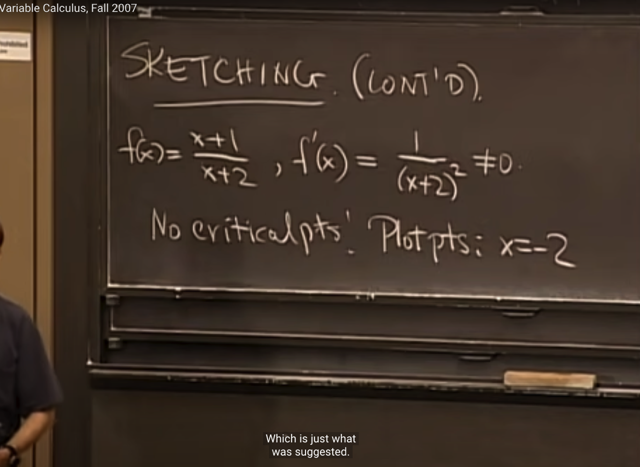</kbd>

> [!NOTE]
> đại khái là ta tiếp tục vấn đề CURVE SKETCHING với hàm f(x)
> = (x+1)/(x+2) 
>
>
>
> Gs cho rằng ta có thể dễ dàng tính ra f'(x) = 1/(x+2)^2 để thấy nó luôn
> khác 0 với mọi x, từ đó suy ra f không có critical point
>
>
>
> Từ đó, gs nói rất nhiều sinh viên tới đây sẽ kết luận rằng functon
> không có critical points, nên không biết làm thế nào nữa.
>
>
>
> Thế thì cái ta sẽ làm là ta sẽ phải tìm hiểu điều gì xảy ra tại điểm mà
> function không xác định, trong trường hợp này đó là tại x=-2

 

<kbd>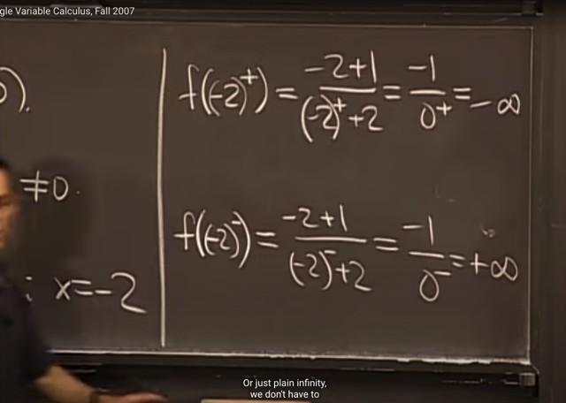</kbd>

> [!NOTE]
> Tiếp theo, ta sẽ evaluate f tại (-2)^+, ta sẽ có -infinity và f tại
> (-2)^-1 ta sẽ có +infinity
>
> Thật ra cách thể hiện f((-2)+) chỉ là đồng nghĩa với limit f(x)
> khi x->(-2)+ (chính là cái gọi là right-hand limit)

 

<kbd>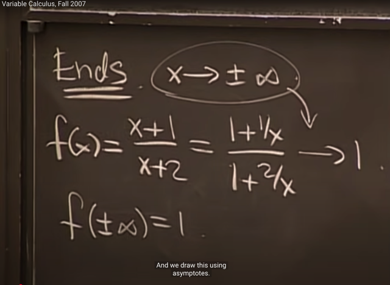</kbd>

> [!NOTE]
> Thế thì ta sẽ tìm limit của f(x) khi x -> +/- inf, theo cách làm này gs
> chia tử và mẫu cho x, để rồi khi x -> inf thì 1/x -> 0, khiến f(x) -> 1
>
>
>
> Gs cho rằng có thể ghi là f(+/- inf) = 1

 

<kbd>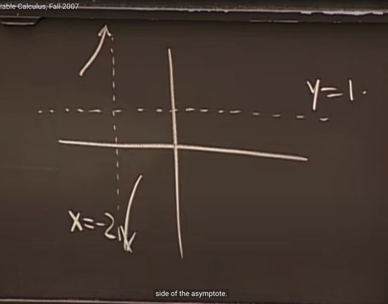</kbd>

> [!NOTE]
> Và từ đó, ta sẽ có thể vẽ đồ thị của f như này: khi x->-2 từ bên
> trái, hàm f sẽ -> +inf, và khi x -> -2 từ bên phải, hàm f sẽ -> -inf

 

<kbd>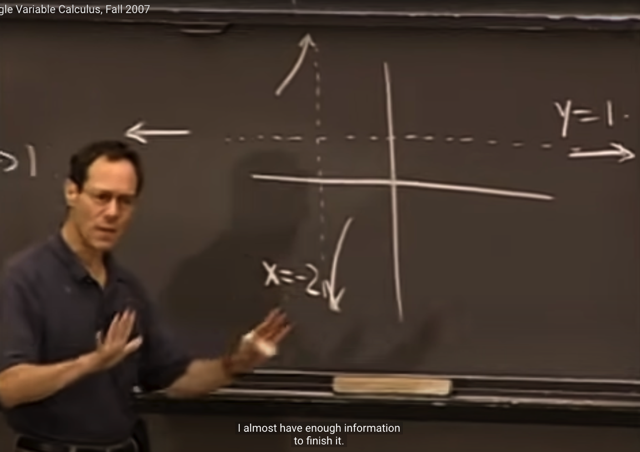</kbd>

> [!NOTE]
> Và từ  limit của f khi x->+/- inf đều bằng 1, ta có thể biết
> hàm số sẽ tiệm cận 1 khi kéo dài ra hai đầu

 

<kbd>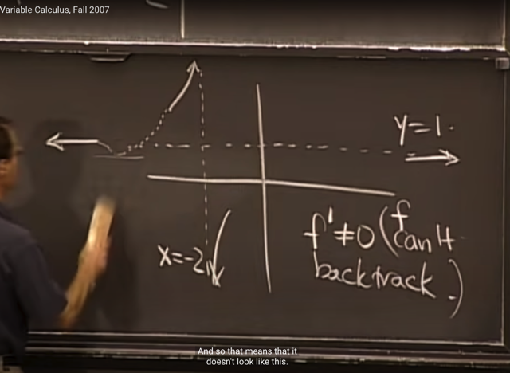</kbd>

> [!NOTE]
> Tiếp, gs hỏi rằng, thế thì cái đoạn ở giữa, làm sao ta biết hàm số
> không đi vòng xuống dưới rồi vượt lên trên lại trước khi tiệm cận
> 1.
>
>
>
> Thì đó là bởi ta có f' khác 0, không có critical point, nên không thể
> có chuyện đó được vì nếu như vậy sẽ có điểm khiến độ dốc tiếp
> tuyến nằm ngang tức f' = 0

 

<kbd>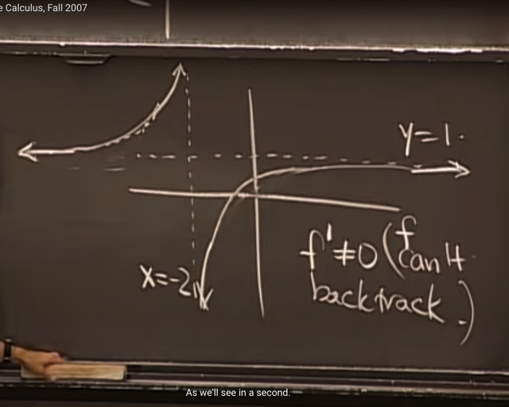</kbd>

> [!NOTE]
> Từ đó cho ta kết luận dạng của
> đồ thị hàm f sẽ như vầy

 

<kbd>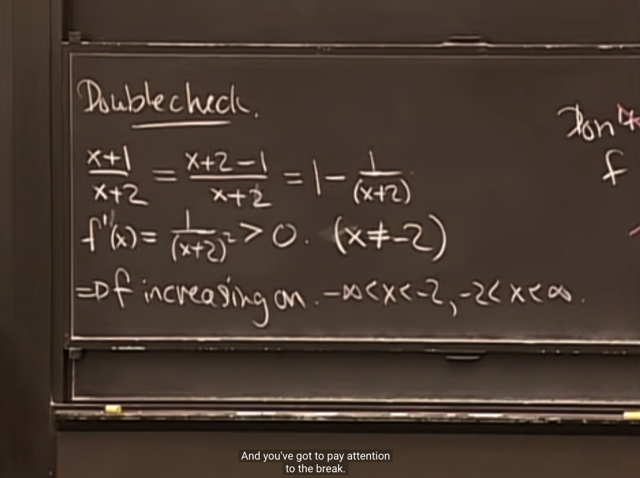</kbd>

> [!NOTE]
> Đại khái là ta sẽ doublecheck, tính f'(x) ra bằng 1/(x+2)^2
> (thật ra lúc đầu gs đã nói kết quả f' sẽ là vậy rồi), mục đích
> chính là cho thấy f' dương nên hàm số luôn tăng
>
>
>
> Nhưng gs lưu ý là, ta phải hiểu rõ là nó tăng trong hai khoảng
> riêng biệt: -inf:-2 và -2:inf, và undefined tại -2

 

<kbd>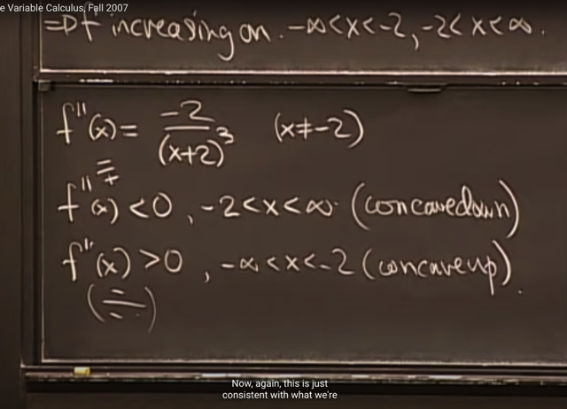</kbd>

> [!NOTE]
> Tiếp, ta xem xét f''(x) = -2 / (x+2)^3, để nhận định rằng: khi x
> từ -2:inf thì f''(x) luôn âm (vì khi đó mẫu số dương, còn tử thì
> = -2 âm rồi)
>
>
>
> Từ đó có thể kết luận khi x từ -2 đến inf, hàm f luôn concave down
> (tức là mặt lõm hướng lên). Và ý nghĩa của f'' ta đã biết là độ dốc
> của độ dốc, và nó âm chứng tỏ hàm số f ngày càng bớt dốc - có thể
> thấy rõ là khi đi từ -2 đến inf, ngày càng bớt dốc.
>
>
>
> Tương tự, khi x từ -inf đến -2 thì f'' dương -> đồ thị hàm f concave
> up (lõm hướng xuống).

 

<kbd>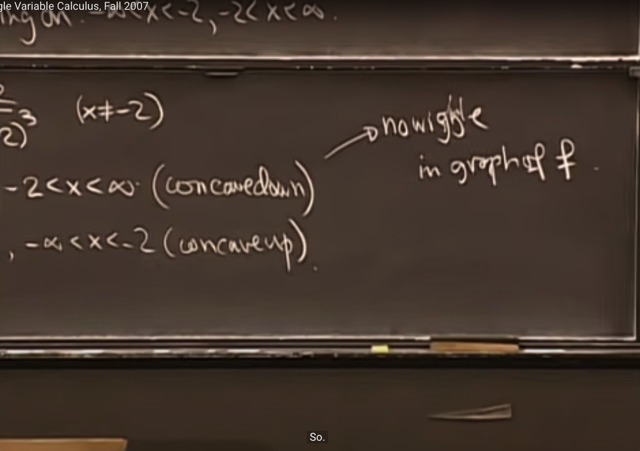</kbd>

> [!NOTE]
> Tuy nhiên gs nhấn mạnh, một thông tin quan trọng nữa mà cái này
> mang lại cho ta đó là: KHÔNG CÓ CHUYỆN WIGGLE - tức là ta biết
> chắc đường hàm số sẽ đi mượt mà để tạo một "vòng cung" (lõm lên
> và lõm xuống), chứ không thể có những đoạn cong qua cong lại
> được. Vì nếu vậy, trong những đoạn đó, f'' sẽ đổi dấu

 

<kbd>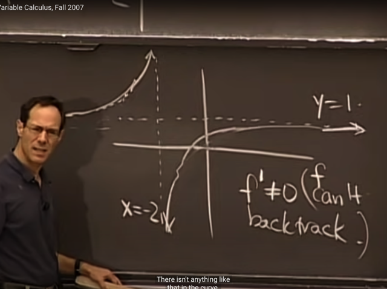</kbd>

 

<kbd>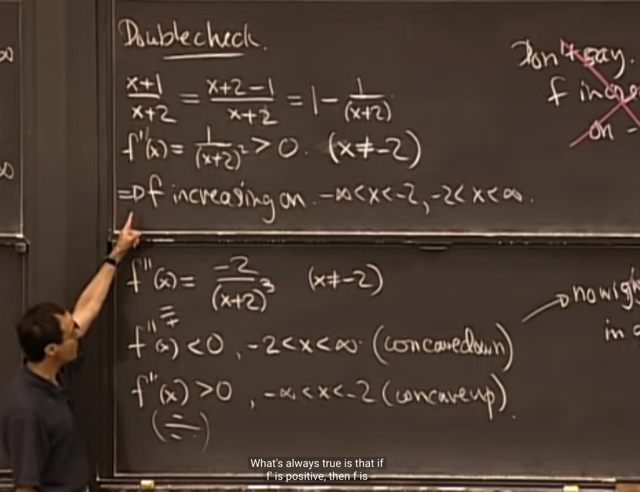</kbd>

> [!NOTE]
> Student: Có phải khi f' dương (positive derivative) thì đồng nghĩa với
> function increasing không?
>
>
>
> gs: Không. Nếu f' dương thì ta suy ra hàm increase. Nhưng ngược lại
> thì chưa chắc, vì có hàm increasing nhưn f' có thể = 0 ở vài chỗ

 

<kbd>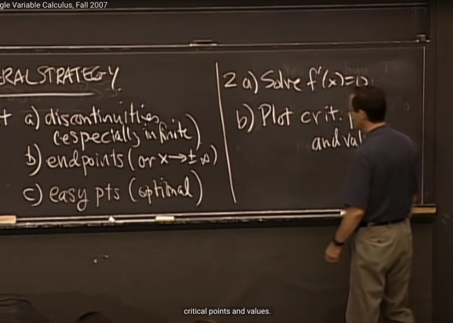</kbd>

> [!NOTE]
> gs summarize lại các bước mà ta sẽ làm Curve Sketching:
>
>
>
> 1) là plot các điểm đặc biệt như 1) discontinuity (như tại điểm mà function
> infinite - không xác định), hoặc 2) endpoints (khi x-> +/- infinity) và c) các 
> điểm easy point (như cắt trục x, y)
>
>
>
> 2) Sau đó là tìm critical point bằng cách solve f'(x) = 0 và plot chúng

 

<kbd>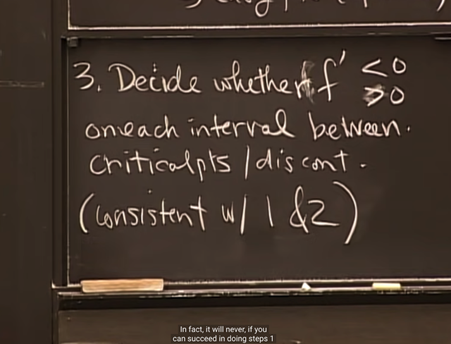</kbd>

> [!NOTE]
> 3) Dựa vào f' dương hay âm mà ta sẽ xác định f increasing /
> decreasing trong mỗi interval giữa critical points và discontinuity
>
>
>
> Gs lưu ý ta nên chú ý bước 3 nên được coi như bước checking,
> vì nếu làm sai ở 1) và 2), ta sẽ thấy có vấn đề ở bước 3

 

<kbd>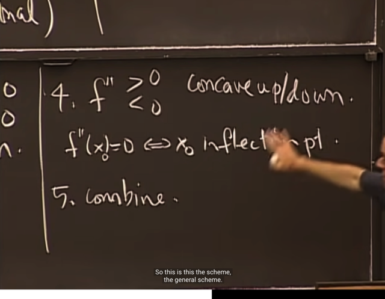</kbd>

> [!NOTE]
> Bước 4, ta sẽ dựa vào f'' để xem tính chất concave up /
> down. Cũng như tìm điểm mà tại đó f''(x) = 0 , gọi là
> INFLECTION POINTS

 

<kbd>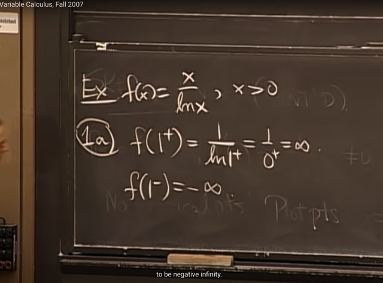</kbd>

> [!NOTE]
> Tiếp ví dụ này, f(x) = x / ln(x).
>
>
>
> Theo scheme trên, bước 1 ta sẽ xem xét f tại các điểm đặc biệt, quan
> trọng nhất là discontinuity; ở đây hàm f sẽ ko xác định khi ln(x) = 0,
> tức x = 1.
>
>
>
> Nên ta sẽ xem f(1+), chính là notation mang ý nghĩa tính limit của f(x) 
> khi x->1+ (định nghĩa là right hand limit đã học)
>
>
>
> Kết quả là khi x ->1+, ln(x) -> 0, và kết quả là x / ln(x) -> infinity
>
>
>
> Và f(1-) = -inf

 

<kbd>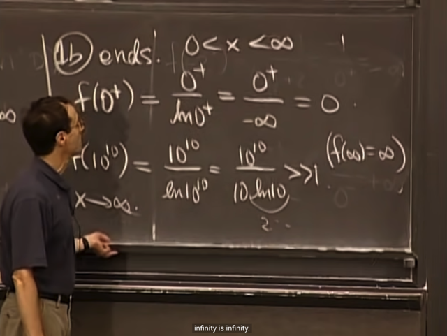</kbd>

> [!NOTE]
> Tiếp là check endpoints. vì ln(x) chỉ xác định khi x dương, nên ta 
> sẽ check hai endpoints là x->0+
>
>
>
> f(0+) = 0+ / ln(0+) = 0+ / -inf = 0 (vì một số chia cho infinity thì sẽ ra
> rất nhỏ dù là dấu âm hay dương, nên coi như bằng 0
>
>
>
> Còn f(inf) gs cho rằng có thể lấy con số rất lớn để xem thử, ví dụ
> 10^10 thế vào thì có thể thấy tử số là 10^10, còn mẫu số chỉ cỡ 2
> trăm mấy (vì ln (10^10) = 10*ln(10). Từ đó có thể thấy tử lớn hơn
> mâũ rất nhiều lần, giúp ta kết luận f(inf) = inf

 

<kbd>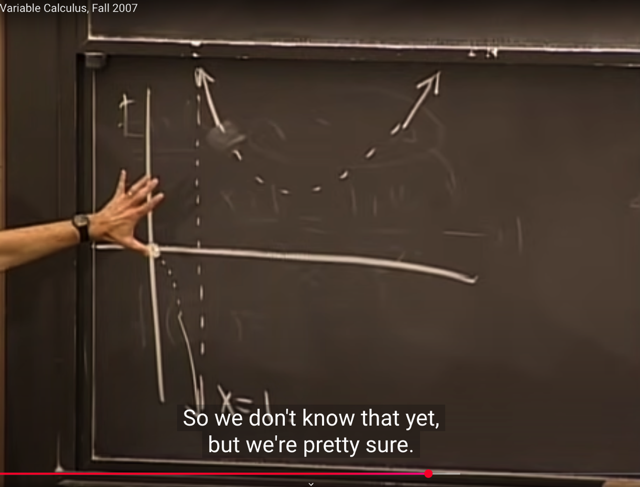</kbd>

> [!NOTE]
> Đại khái là dựa trên bước 1a: f(1+) = inf (f -> inf khi x->1+, tức tới
> gần 1 từ bên phải) và f(1-) = -inf (f->-inf khi x->1-, tức tiến tới gần 1
> từ bên trái) và f(0+) = 0 cũng như f(inf) = inf ta có thể expect dạng
> của f sẽ như vầy

 

<kbd>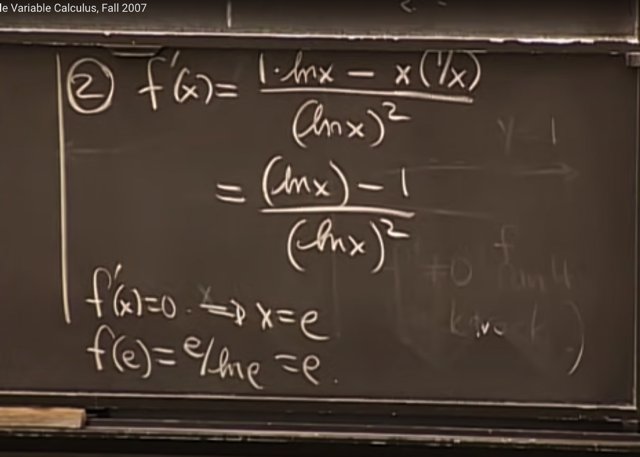</kbd>

> [!NOTE]
> Tiếp, bước 2 ta sẽ tìm critical points bằng cách solve f'(x) = 0 dựa
> vào quotient rule: (u/v)' = [u'v - uv'] / v^2 ta sẽ có f' như vầy, và
> giải ra x=e sẽ là critical point (giá trị tại đó f(e) gọi là critical point value)

 

<kbd>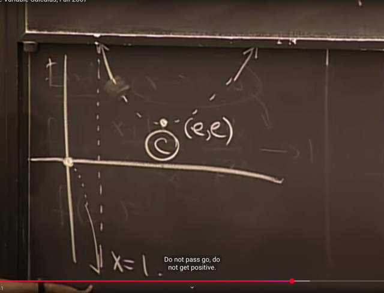</kbd>

> [!NOTE]
> Từ đó ta vẽ được critical point và ông kí hiệu là C.
>
>
>
> Và gs cho rằng vì ta chỉ có 1 critical point nên ta sẽ đã có thể
> hoàn thiện đồ thị hàm f

 

<kbd>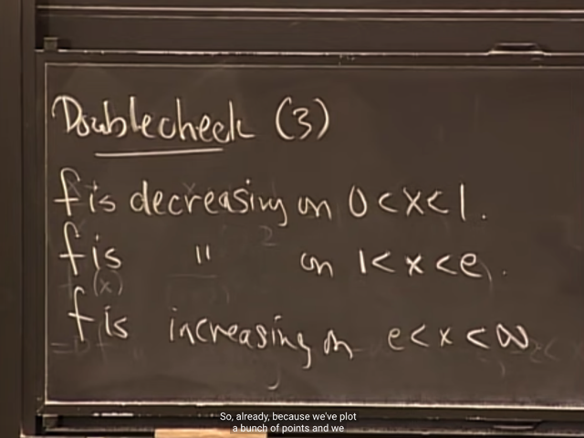</kbd>

> [!NOTE]
> Đại khái là, ta sẽ double check, bằng cách xem xét dấu của f'(x)
> xem có phải như ta dự đoán rằng nó sẽ giảm trong khoảng (0,1)
> và (1,e) và tăng trong khoảng (e, infinity) không

 

<kbd>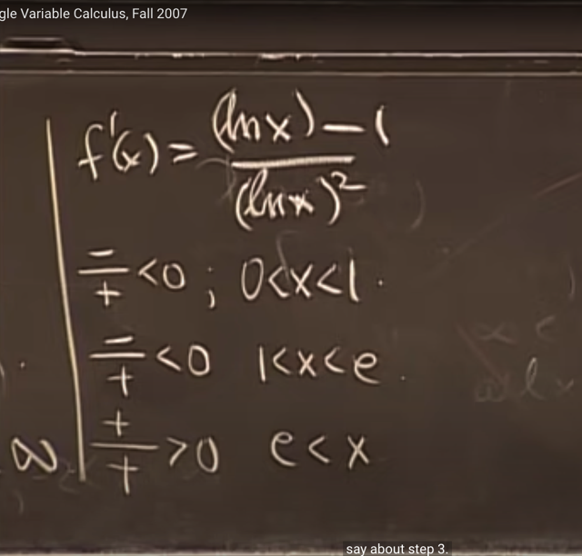</kbd>

> [!NOTE]
> Và quả thật ta có thể
> confirm điều này

 

<kbd>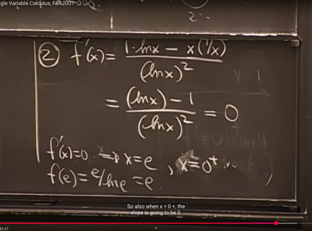</kbd>

> [!NOTE]
> đại khái là, gs quay lại đây, để nói rằng, ta đã miss một case nữa
> mà f'(x) = 0. Đó là khi mà ln(x) -> infinity (đồng nghĩa khi x->0) vì
> khi đó f'(x) cũng sẽ = 0

 

<kbd>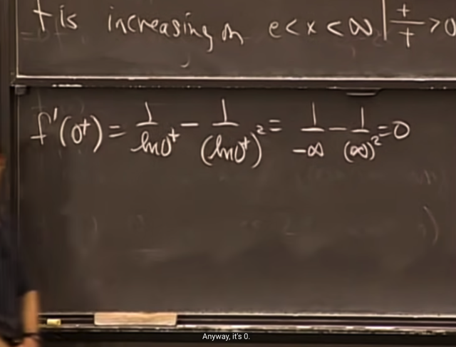</kbd>

> [!NOTE]
> Có thể thấy điều này rõ hơn bằng cách thể hiện f'(x) ở dạng 1/ln(x) 
> - 1/ln(x)^2 (thì khi ln(x)->infinity thì cả hai đều -> 0

 

<kbd>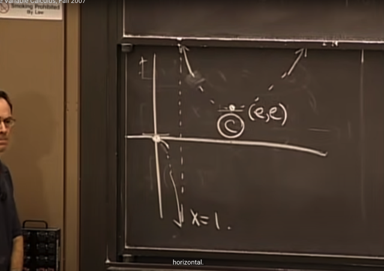</kbd>

> [!NOTE]
> Để rồi ta thấy đồ thị khi bắt đầu tại 0 sẽ đi
> ngang trước khi đâm xuống -infinity

 

<kbd>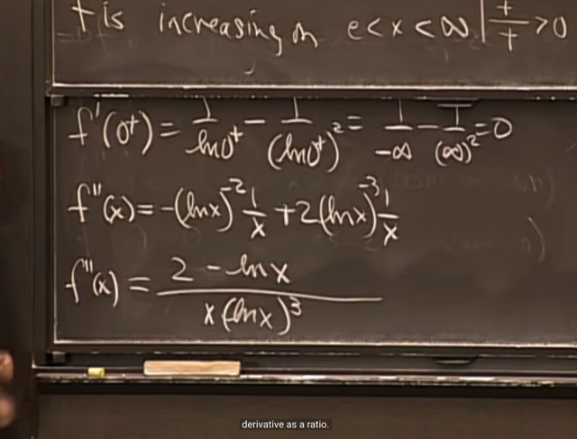</kbd>

> [!NOTE]
> Tiếp theo gs xem xét f''(x)
>
>
>
> Cũng không khó hiểu, dùng chain rule và ln'(x) = 1/x
> ta sẽ ra kết quả này

 

<kbd>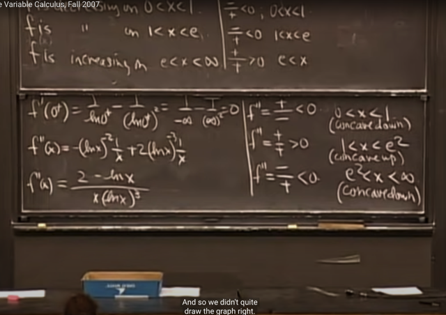</kbd>

> [!NOTE]
> Để từ đó ta sẽ xét dấu của f''(x) để thấy trên khoảng (0,1) và
> (e^2, inf), f'' âm, f concave down. Còn trên khoảng (1, e^2),
> f''(x) dương, hàm f concave up

 

<kbd>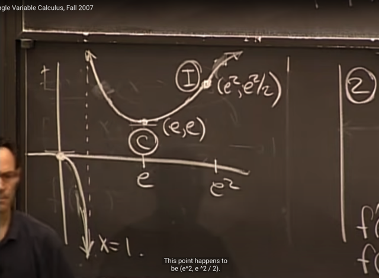</kbd>

> [!NOTE]
> Từ đó ta biết dạng đồ thị f ở nhánh (1, inf) thật ra có hai phần,
> một phần concave up (mặt lõm hướng lên) từ (1, e^2) và qua
> điểm đó đồ thị sẽ concave down (vẫn đi lên infinity nhưng nó sẽ
> giảm dần độ dốc)

 

<kbd>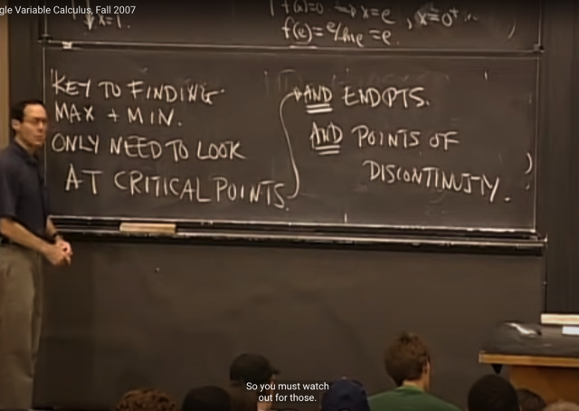</kbd>

> [!NOTE]
> Thế thì nếu ta chỉ cần tìm max / min, thì gs cho rằng ta không
> cần làm toàn bộ các bước curve-sketching.
>
>
>
> Mà chỉ cần xem xét CRITICAL POINTS VÀ ENDPOINTS CŨNG
> NHƯ DISCONTINUITY POINTS

 

<kbd>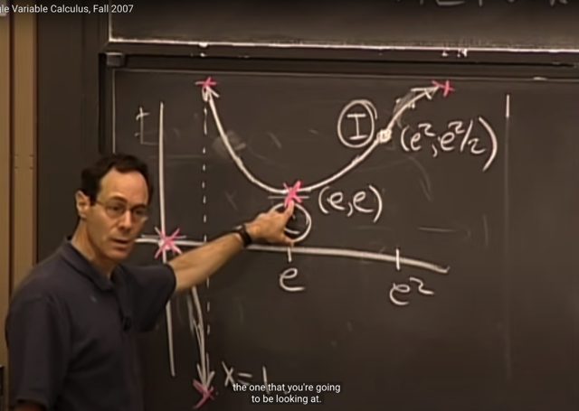</kbd>

> [!NOTE]
> Và theo đó thì ví dụ này sẽ có 5 điểm ta cần xem xét.
> Và ta sẽ tiếp tục ở bài kế tiếp.

 

## Lec 12: Related Rates

 

<kbd>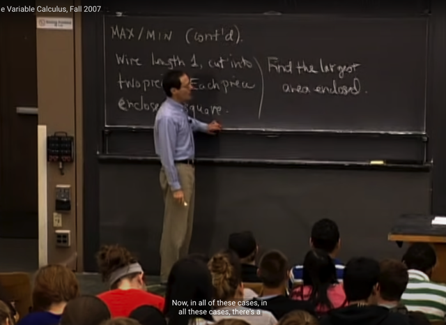</kbd>

> [!NOTE]
> Ta sẽ tiếp tục với Max / Min. Bài toán là, cho đoạn dây chiều dài
> 1. Cắt thành 2 phần, làm thành 2 hình vuông. Câu hỏi là tìm
> diện tích lớn nhất có thể tạo ra được bởi hai hình vuông đó.

 

<kbd>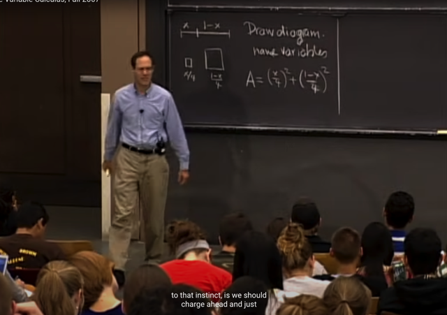</kbd>

> [!NOTE]
> Thế thì gọi hai đoạn là x, và 1-x, ta sẽ thiết lập diện tích của
> hai hình vuông như sau A = (x/4)^2 + [(1-x)/4]^2

 

<kbd>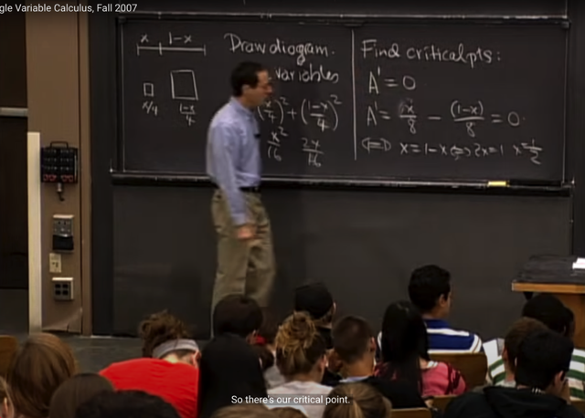</kbd>

> [!NOTE]
> Thế thì, solve A' = 0 ta có
> x=1/2 là critical point.

 

<kbd>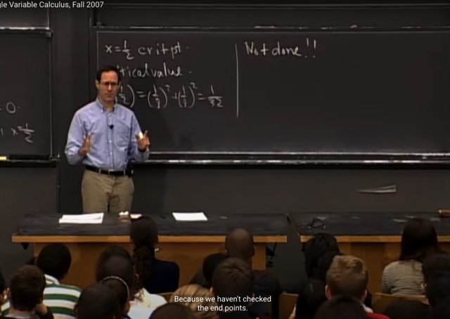</kbd>

> [!NOTE]
> Từ đó thế vào ta có critical point value là 1/32. Tuy nhiên gs cho rằng
> ta chưa xong, vì như đã nói, ta còn cần phải check các endpoint cũng
> như discontinuity point
>
>
>
> (vài suy nghĩ, đương nhiên từ 1802 ta biết critical point không chắc là
> max, min thậm chí có thể là critical point nữa. Muốn biết ta sẽ phải
> check bằng second derivative test. Thì đối với hàm đơn biến ở lớp này
> chắc gs cũng sẽ nói)

 

<kbd>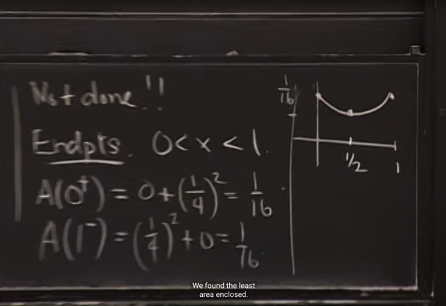</kbd>

> [!NOTE]
> Bằng cách check thêm giá trị hàm A tại các endpoint, ta thấy:
>
>
>
> A(0+) = 1/16 và A(1-) = 1/16 cho thấy thật ra critical point có thể là
> minimum chứ không phải maximum của Area mà ta đang muốn

 

<kbd>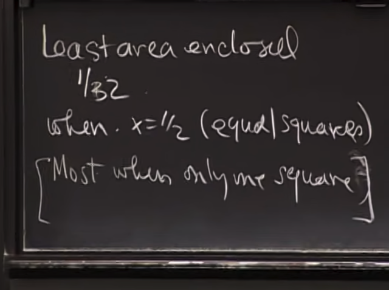</kbd>

 

<kbd></kbd>

> [!NOTE]
> Như vậy maximum của A là 1/16, và minimum value là 1/32.
> Và gs lưu ý rằng, x=1/2 là nơi mà minimum achieved (nơi
> function đạt minimum value), nên hỏi minimum ở đâu thì trả
> lời là tại 1/2 nhưng minimum value bằng bao nhiêu thì đương
> nhiên phải là 1/16

 

<kbd>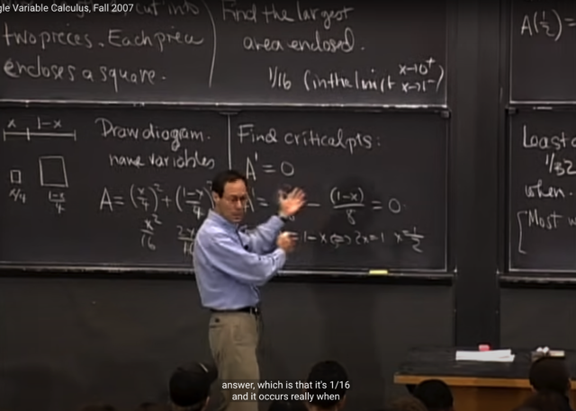</kbd>

> [!NOTE]
> Đại khái là, gs cho rằng câu hỏi đặt ra khi hỏi diện tích lớn nhất
> enclosed, là một trick question (tạm hiểu là câu hỏi cũng không
> dễ trả lời) và theo ông ta sẽ trả lời là 1/16, dù rằng đây đương
> nhiên là giá trị tại limit
>
>
>
> (1/16 là limit của A(x) khi x->0+ hoặc x->1-)

 

<kbd>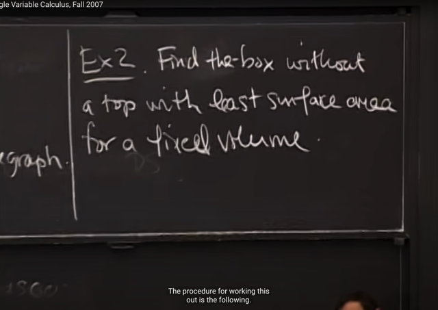</kbd>

> [!NOTE]
> Ví dụ thứ hai, câu hỏi là tìm cái hộp có đáy vuông (ý là tìm kích
> thước của nó) không có nắp, sao cho diện tích bề mặt ít nhất với
> thể tích cho trước

 

<kbd>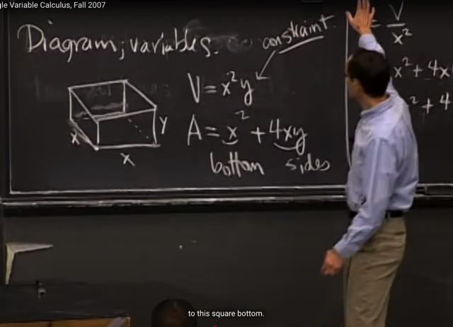</kbd>

> [!NOTE]
> gọi x là chiều dài cạnh đáy và y là chiều cao. Thể
> tích V cho trước là x^2y và A = x^2 + 4xy
>
>
>
> Vì V fixed, nên ta có thể solve y theo x

 

<kbd>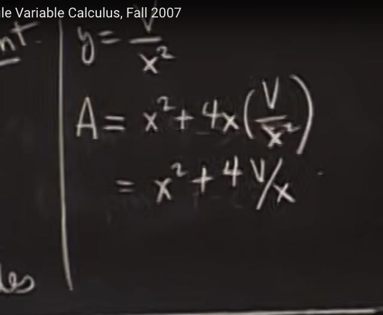</kbd>

> [!NOTE]
> Để có y = V / x^2 và A trở thành
> function theo x: x^2 + 4v/x

 

<kbd>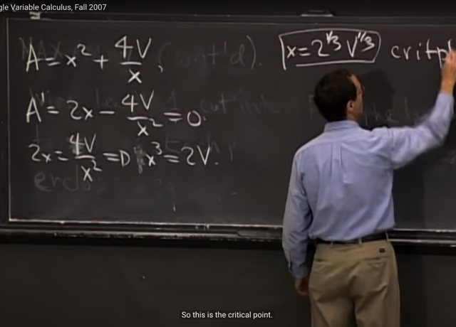</kbd>

> [!NOTE]
> Từ đó, tìm A' và giải A' = 0 ta có
> critical point là x = (2V)^1/3

 

<kbd>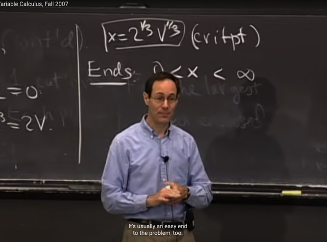</kbd>

> [!NOTE]
> Đại khái là, ta sẽ xem range của x là gì. Thì x sẽ lớn hơn 0 (vì
> nếu bằng 0, V sẽ bằng 0) và x có thể lớn đến vô cùng.
>
>
>
> Gs cho rằng khi ta gặp bài toán mà không có giới hạn trên cụ
> thể nào thì giới hạn trên sẽ thường là infinity.

 

<kbd>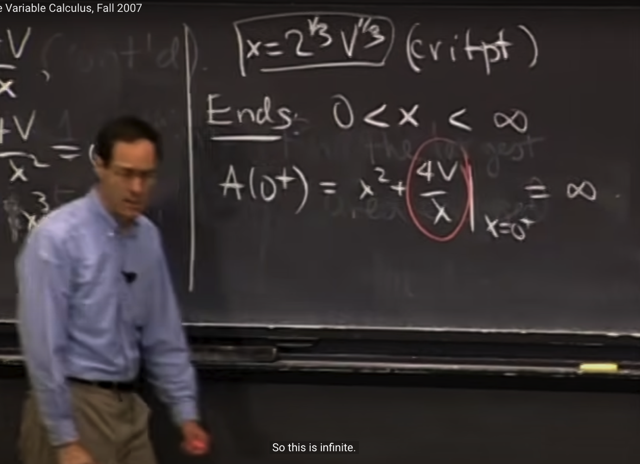</kbd>

> [!NOTE]
> Ta sẽ check value của nó tại end points:
>
>
>
> A(0+), tức là limit của A(x) khi x -> 0+, bằng cách thế 0+
> vào x^2 + 4V/x thì (0+)^2 = 0, 4V/(0+) = infinity, nên kết quả
> là 0 + infinity = infinity

 

<kbd>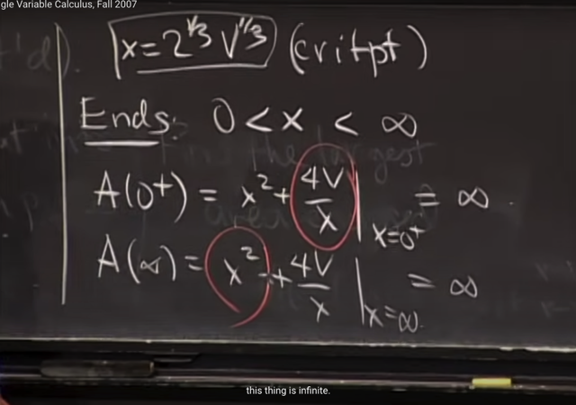</kbd>

> [!NOTE]
> Tương tự, A(infinity) = (inf)^2 +
> 4V/(inf) = inf + 0 = inf

 

<kbd>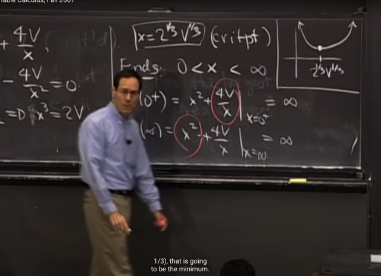</kbd>

> [!NOTE]
> Từ đó ta có thể kết luận critical point, x =
> (2V)^1/3 chính là minimum

 

<kbd>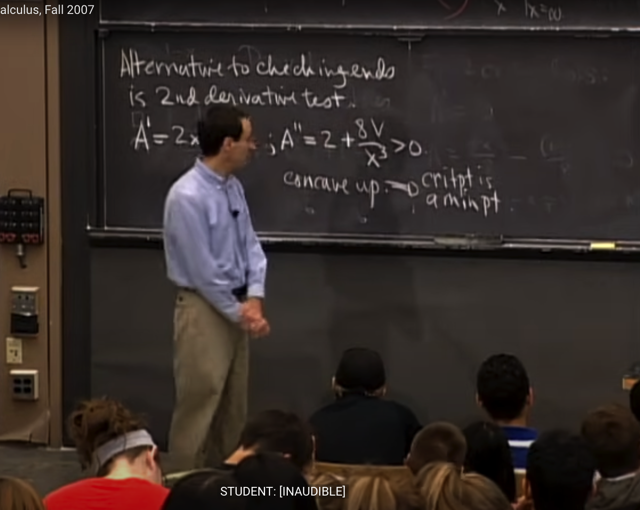</kbd>

> [!NOTE]
> Gs nói đại khái là ông cho rằng có thể dùng second derivative test để
> kiểm tra xem critical point là min hay max.
>
>
>
> Bằng cách tính A''(x), kết quả ra 2 + 8V / x^3 luôn lớn hơn 0 với mọi x 
> lớn hơn 0.
>
>
>
> Và do đó có thể kết luận function concave up (lõm hướng lên) suy ra
> critical points là minimum point

 

<kbd>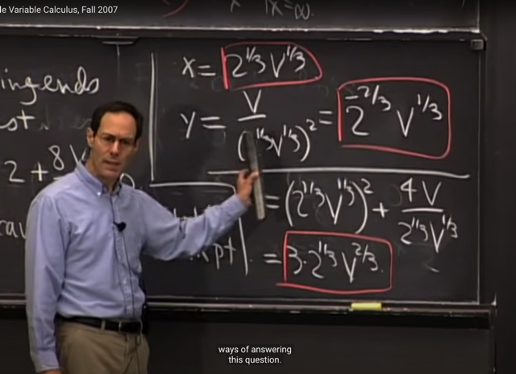</kbd>

> [!NOTE]
> Từ đó ta tính ra y và A khiến
> minimize diện tích hộp

 

<kbd>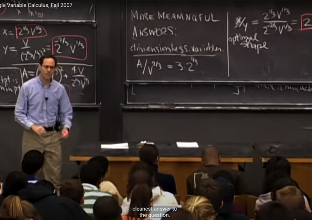</kbd>

> [!NOTE]
> Đại khái là, gs cho rằng ta có thể trả lời theo cách hay hơn, bằng
> cách dùng dimensionless variable: ví dụ A/V^(2/3) là tỉ lệ không còn 
> dính đến đơn vị nữa.
>
>
>
> Hay x/y cũng vậy, vậy nếu theo kết quả x, y ta có thì x/y = 2. Và đó là
> câu trả lời ý nghĩa nhất: miễn là hộp có x/y = 2 thì đó là optimal box

 

<kbd></kbd>

> [!NOTE]
> Câu hỏi của student:
>
>
>
> ? Nếu không cho mặt đáy vuông thì có giải được không? -> Được,
> nếu dùng 1802 tức là multivariate calculus. vì khi đó ta sẽ có thêm
> một variable z nữa.

 

<kbd>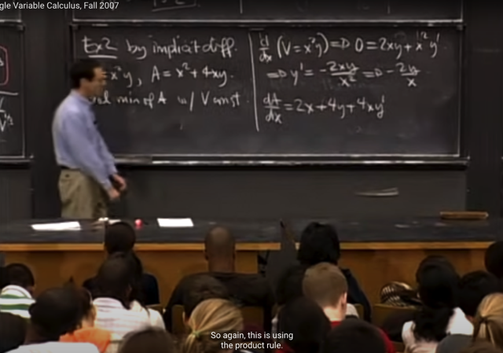</kbd>

> [!NOTE]
> Tiếp theo gs cho rằng ông sẽ giải bài toán này lại sử dùng implicit
> differentiation (vi phân hàm ẩn). Như đã biết, implicit differentiation có
> nghĩa là, ta có một equation, ẩn chứa trong đó là một function ví dụ
> trong V = x^2y, ẩn chứa (implicitly) function y = y(x) = V / x^2.
>
>
>
> Thế thì, bằng cách lấy đạo hàm equation - tức apply (d/dx) operator
> vào hai vế ta sẽ có thể solve y'.
>
>
>
> vậy từ V = x^2*y (again, chú ý y lúc này là implicit function theo x),
> ta có (d/dx) V = (d/dx) x^2*y 
>
>
>
> <=> 0 = 2xy + x^2y' (vì V là fixed, constant, nên (d/dx) V = 0, còn vế 
> phải thì theo product rule.
>
>
>
> từ đó suy ra y' = -2y/x.
>
>
>
> Tương tự (d/dx) A = 2x + 4y + 4xy'

 

<kbd>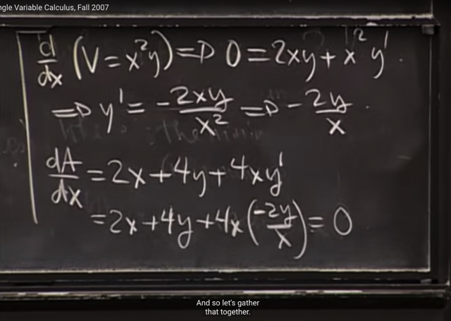</kbd>

> [!NOTE]
> Và gắn y' vào dA/dx. Ta sẽ solve equation dA/dx (để
> tìm critical point như cách thông thường)

 

<kbd>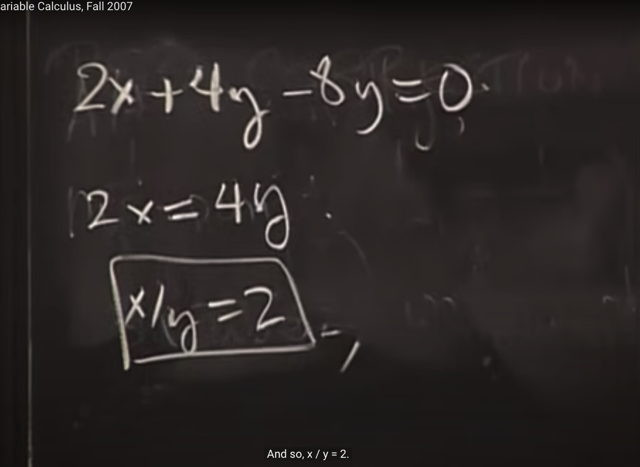</kbd>

> [!NOTE]
> Kết quả ra x/y=2 như cách hồi nãy (đương nhiên nếu apply
> vào V = x^2y thì sẽ solve ra x, y theo V giống như cách 1
> nhưng ta đã nói để kết quả ở dạng x/y=2 như vầy thì hay hơn)

 

<kbd>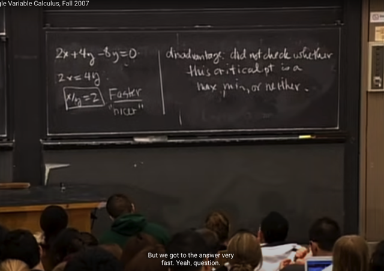</kbd>

> [!NOTE]
> gs cho rằng cách này nhanh hơn, và cho ra kết quả nicer. Nhưng
> disadvantage của nó là nó không check dc critical point là max / min
> hay cả hai (vẫn có thể là cả hai như đã biết ở 1802, gọi là saddle
> point)
>
>
>
> Student hỏi làm sao để check. Thì gs nói trong bài toán cụ thể này
> thì ta phải check như hồi nãy ta check, đó là xem A(0+) và A(inf+)
> để ra A đều bằng infinity để kết luận critical point là min.
>
>
>
> Nhưng ông cho rằng sẽ có nhiều bài toán mà việc check này không
> cần thiết vì nó rõ ràng rồi. Khi đó cách này sẽ giúp ta làm nhanh hơn

 

<kbd>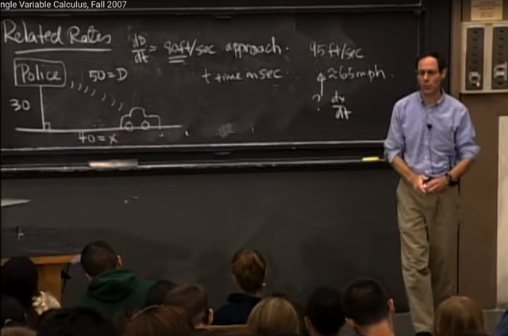</kbd>

> [!NOTE]
> Mấy phút cuối gs set up bài toán về Related
> Rate. Ta sẽ tiếp tục ở bài sau

 

## Lec 13: Newton's Method

 

<kbd></kbd>

> [!NOTE]
> Bài toán như vầy, các khoảng các giữa các điểm: ta, police có thể
> coi như cái cột camera đo tốc độ ví dụ vậy, và chân cột là 50, 40, 30
> Câu hỏi là dựa trên dD/dt = -80, thì ta có đang vượt quá tốc độ không
> (giới hạn là 95 ft/sec)

 

<kbd></kbd>

> [!NOTE]
> Ta sẽ có equation liên hệ giữa x (khoảng cách giữa ta và chân cột)
> D (khoảng cách giữa ta và police) vì tại thời điểm đang xét làm
> thành tam giác vuông (right triangle) nên ta có:
>
>
>
> x^2 + 30^2 = D^2
>
>
>
> Gs cho rằng tuy rằng ta có thể solve để có x theo D, rồi tính  đạo
> hàm, nhưng cách dễ hơn sẽ là implicit differentiation. (ý tưởng là,
> khi ta có equation ẩn chứa một function ví dụ x^2 + y^2 = c, thì ta
> thay vì solve để có dạng explicitly của function y = f(x) rồi tính đạo
> hàm của y theo x (giả sử ta cần tính), thì ta có thể implicit
> differentiation, lấy đạo hàm của equation theo x luôn, từ đó solve ra
> y'(x))
>
>
>
> Vậy lấy đạo hàm theo t của phương trình trên, vế trái trở thành
> 2x*dx/dt = 2D*dD/dt (đương nhiên là dùng chain rule)
>
>
>
> Gs lưu ý, đương nhiên ta sẽ phải để x ở dạng variable rồi mới làm
> bước lấy đạo hàm, chứ sẽ sai lầm nếu ta lại gắn giá trị tại thời điểm
> này x = 40 vào, rồi lấy đạo hàm thì sẽ sai. Lí do đương nhiên vì x là
> biến, x, và D thay đổi theo t.

 

<kbd></kbd>

> [!NOTE]
> Sau khi đạo hàm xong, ta mới gắn giá trị x và D vào, để có
> dx/dt = -100 ft/sec, từ đó kết luận ta đang di chuyển hướng về
> với vận tốc (dx/dt chính là vận tốc) -100 ft/sec đồng nghĩa đang 
> overspeed

 

<kbd></kbd>

> [!NOTE]
> Ví dụ tiếp theo là cái bể nước (hình nón ngược) có bán kính top
> là 4ft, sâu 10 ft và được fill với dung lượng 2 cubic ft / min.
>
>
>
> Câu hỏi là mực nước dâng  nhanh cỡ nào khi mực nước ở mốc
> 5ft

 

<kbd></kbd>

> [!NOTE]
> gs cho rằng ta sẽ cần vẽ minh họa bài toán, ta sẽ thể hiện mặt
> cắt (và chỉ lấy 1/2) để thể hiện các thông số như bán kính top,
> chiều cao, chiều cao mực nước h và bán kính mực nước r
>
>
>
> Từ đó ta có equation: h/r = 10/4

 

<kbd></kbd>

<kbd></kbd>

> [!NOTE]
> Và ta nhớ công thức tích thể tích bể nước V = (1/3)πr^3
>
>
>
> Và thể tích đang tăng thêm với rate là 2 cu ft / min nên ta có dV/dt = 2

 

<kbd></kbd>

> [!NOTE]
> Câu hỏi sẽ là tìm dh/dt khi h = 5 (mực nước
> dâng nhanh ra sao khi h = 5)

 

<kbd></kbd>

> [!NOTE]
> Thế r = 2h/5 vào phương trình V và dùng implicit differentiation
> (đạo hàm hai vế theo t) ta sẽ có:
>
>
>
> Vế trái là dV/dt, và bằng 2 như vừa rồi nói vế phải đạo hàm của h^3
> theo t là 3h^2 dh/dt với các constant (1/3)*(2/5)^2

 

<kbd></kbd>

> [!NOTE]
> Rút gọn và ta có kết quả là dh/dt =
> 1/2π (ft/min) (thầy ghi sai)

 

<kbd></kbd>

> [!NOTE]
> Và đây chính là ý nghĩa của Related Rate, đại khái là khi ta có các
> rate of change giữa các yếu tố liên quan, ví dụ có rate of change
> giữa thể tích và mực nước, và rate of change giữa thể tích với thời
> gian thì ta có thể tính rate of change giữa mực nước và thời gian
> (thông qua Chain Rule)

 

<kbd></kbd>

> [!NOTE]
> Bài toán tiếp theo là, ta muốn tìm vị trí của cục sắt nếu như
> hai đầu không cao bằng nhau

 

<kbd></kbd>

> [!NOTE]
> Thế thì gọi tọa độ hai đầu là (0,0) và (a,b) và toạ độ cục sắt là (x, y).
> Bài toán này gs cho là bài toán minimization, với constrain là đường
> cong này. Có nghĩa đại khái là ta cần tìm vị trí thấp nhất của cục sắt
> với ràng buộc là nó chỉ di chuyển trên đường cong này. Hay, là tìm
> điểm thấp nhất của đường cong này. Và dĩ nhiên nó sẽ phụ thuộc
> chiều dài sợi dây và hai điểm đầu

 

<kbd></kbd>

> [!NOTE]
> Dựa vào các tọa độ, không khó để hiểu chiều dài mỗi đoạn sẽ là
> vầy (dựa vào pythagores) (chú ý x, b là các tọa độ nên phải là b-x
> chứ không phải b+x vì x âm)

 

<kbd></kbd>

> [!NOTE]
> Và tổng hai đoạn là chiều dài sợi dây, là fixed value (constant), gọi là
> L. Và đây là equation mô tả ràng buộc (constrain)
>
>
>
> Và quan trọng là ta cần nhận ra bài toán này ta cần tìm y nhỏ nhất
>
>
>
> Vì trong constrains equation này implicitly ngầm ẩn một function của
> y theo x. Và dễ thấy rằng tại điểm thấp nhất, tiếp tuyến với đường
> cong sẽ nằm ngang, y'(x) sẽ bằng 0, đó chính là critical point

 

<kbd></kbd>

> [!NOTE]
> Đại khái là theo quy trình ta sẽ check critical points và sau đó là
> check các end point để xem thử critical point là maximum hay
> minimum
>
>
>
> Trong bài toán này ta có thể kết luận luôn critical point là minimum.
>
>
>
> Đương nhiên ta có thể dùng second derivative test nhưng ở đây
> làm cách đó sẽ rất phức tạp

 

<kbd></kbd>

> [!NOTE]
> Ta sẽ implicit differentiation, lấy đạo hàm hai vế theo x
>
>
>
> Áp dụng chain rule, không khó để ra kết quả này
> với vế phải là dL/dx = 0 do L là constant

 

<kbd></kbd>

> [!NOTE]
> Tiếp, ta sẽ dùng thực tế là ta đang solve equation y'
> = 0, với constrain trên, do đó ta có thể lắp y' = 0 vào

 

<kbd></kbd>

> [!NOTE]
> Và thật ra equation trên chính là sin(alpha) - sin(beta) = 0, và
> kết quả là alpha = beta
>
>
>
> Và gs cho rằng chỉ cần thêm một chút toán nữa là ta có thể
> tính ra y, nhưng kết quả tới đây là được rồi

 

<kbd></kbd>

 

<kbd></kbd>

> [!NOTE]
> Tiếp theo ta qua Newton's method. Ví dụ ta muốn tính x sao
> cho x^2 = 5.
>
>
>
> ta có thể set f(x) = x^2 - 5 và chuyển bài toán thành giải
> phương trình f(x) = 0
>
>
>
> (thật ra chỉ là chuyển vế đổi dấu để có phương trình tương
> đương x^2 = 5 <=> x^2 - 5 = 0)

 

<kbd></kbd>

> [!NOTE]
> Gs sketch đồ thị của hàm y = x^2 - 5 là parabola này, đương nhiên nó
> cắt trục y (x=0) tại -5
>
>
>
> Và tìm solution của y = 0 đương nhiên là tìm x của điểm mà parabola
> cắt trục x (vì khi đó y = 0)
>
>
>
> Vậy thì phương pháp Newton sẽ là: ta sẽ bắt đầu với một initial guess
> (dự đoán ban đầu) về vị trí (x) của giao điểm. Ví dụ tại x0 = 2.
>
>
>
> Từ đó ta mới thiết lập phương trình của tiếp tuyến (tangent line) tại (x0,
> y(x0) = y0). Tiếp tuyến này sẽ cắt trục x, và ta sẽ tìm x của điểm đó để
> có new guess x1
>
>
>
> Quá trình sẽ lặp lại để các guess ngày càng tiến về giao điểm của
> parabola và trục x

 

<kbd></kbd>

> [!NOTE]
> Thế thì phương trình tiếp tuyến đi qua x0, y0 sẽ có dạng thế này y-y0 =
> m(x-x0) với m như đã biết sẽ là đạo hàm của hàm y tại x0: y'(x0).
>
>
>
> Vậy thì để tìm new guess - giao điểm của tangent line với trục x, ta sẽ
> cho y = 0, khi đó x sẽ là new guess, tức x1
>
>
>
> 0 - y0 = m(x1 - x0)

 

<kbd></kbd>

> [!NOTE]
> Để rồi ta solve ra x1 = x0 - y0 / m. Và y0 như đã biết là f(x0)
> còn m là độ dốc (slope) của hàm f tại x0: f'(x0)
>
>
>
> Vậy **x1 = x0 - f(x0)/f'(x0)
>
>
>
> Gs cho rằng đây là công thức giúp ta tính mọi căn (root)**

 

<kbd></kbd>

> [!NOTE]
> Và đây là công thức của
> Newton's Method
>
>
>
> x_n+1 = x_n - f(x_n) / f'(x_n)

 

<kbd></kbd>

> [!NOTE]
> Áp dụng vào, ở đây f'(x) dễ thấy là 2x, từ
> đó ta tính ra x1 = x0/2 + 5/2x0

 

<kbd></kbd>

> [!NOTE]
> Thế x0 = 2 (initial guess) ta có x1 = 9/4. Tiếp tục áp dụng
> x_n+1 = x_n + f(x_n) / f'(x_n) vẫn sẽ là x2 = 1/2*x1 + (5/2x1)
> = 161/72

 

<kbd></kbd>

> [!NOTE]
> Và sau vài iteration ta đã thấy sai khác giữa
> sqrt (5) và x_n đã rất nhỏ

 

## Lec 14: Mean
value Theorem

 

<kbd></kbd>

> [!NOTE]
> Đầu tiên đại khái gs review lại Newton's method. Ta nhớ bài toán đặt
> ra là ta cần tìm solution của equation f(x) = x^2 - 5 = 0, để có thể tìm
> căn  bậc hai của 5.
>
>
>
> Thế thì bài để solve equation này đương nhiên là ta cần tìm x nơi
> function  f(x) cắt trục y.
>
>
>
> Vậy cách làm là, ta sẽ bắt đầu bằng initial guess x0. Từ đó vẽ (thiết
> lập) tiếp tuyến với hàm f(x) tại x0 và tìm giao điểm của nó với trục y.
> Đây sẽ  là next guess x1. Tiếp tục làm vậy, dần dần ta sẽ tiến về giao
> điểm của  f(x) và trục y

 

<kbd></kbd>

> [!NOTE]
> Phương trình tiếp tuyến tại x0 của f(x) thì biết rồi: y - y0 = f'(x0)(x-x0)
> từ đó, giải tìm giao điểm của nó với f(x) tức y = 0, ta có x = x0 - f(x0)/f'(x0)
> và đó là x1 (second guess)
>
>
>
> Tương tự vậy, công thức của mỗi guess sẽ là x_n+1 = x_n - f(x_n)/f'(x_n)

 

<kbd></kbd>

> [!NOTE]
> Tiếp theo ta sẽ xem xét error sẽ như
> thế nào sau mỗi lần guess.

 

<kbd></kbd>

> [!NOTE]
> Gs cho biết E2 = E1^2 (không rõ tại sao)

 

<kbd></kbd>

> [!NOTE]
> Và do đó số digit của độ chính xác
> sẽ double sau mỗi step

 

<kbd></kbd>

> [!NOTE]
> Một số điều kiện để Newton method có tác dụng, là:
>
>
>
> f' không quá nhỏ, f'' không quá lớn và x0 bắt đầu ở gần x

 

<kbd></kbd>

> [!NOTE]
> Nó có thể fail. theo cách này, nếu ta  bắt đầu ở điểm này thì
> thay vì nó tìm ra điểm cần tìm là √5, thì nó lại tìm ra -√5

 

<kbd></kbd>

> [!NOTE]
> nếu bắt đầu (x0) ở tại điểm này, nới có f' = 0 thì ta cũng sẽ fail,
> vì khi đó tangent sẽ song song với trục x, không thể tìm được
> x1

 

<kbd></kbd>

> [!NOTE]
> Và theo công thức cũng có thể thấy f'
> (x0) = 0 khiến denominator = 0

 

<kbd></kbd>

> [!NOTE]
> Và một case nữa mà phương pháp này có thể fail là khi hàm f
> có dạng wiggle như thế này.
>
>
>
> Khi đó x0 -> x1, x1 lại tìm ra next guess chính là x0, trở thành
> vòng lặp

 

<kbd></kbd>

> [!NOTE]
> Ta qua Mean Value Theorem:
>
>
>
> Đại khái là nếu ta đi từ A đến B cách nhau 3000 cây, trong 6
> tiếng, thì chắc chắn phải có lúc nào đó ta bay với tốc độ trung
> bình = 3000/6 = 500

 

<kbd></kbd>

> [!NOTE]
> Thể hiện theo toán học:
>
>
>
> Là độ dốc trung bình từ a đến b (∆f/∆x = [f(b)-f(a)]/[b-a]) bằng độ dốc tại
> điểm nào c nào đó trong đoạn a, b: f'(c)

 

<kbd></kbd>

> [!NOTE]
> Điều kiện là hàm f khả vi trên a, b (tức tồn tại đạo hàm tại mọi
> điểm trên [a, b] cũng như là hàm liên tục trên đoạn này

 

<kbd></kbd>

> [!NOTE]
> Chứng minh MVT: như sau, cho rằng hàm f có đường cong như vầy 
> trong đoạn a,b.
>
>
>
> Thì độ dốc của secant line (nối hai điểm đầu), dễ thấy chính là vế trái
> của phương trình cần chứng minh
>
>
>
> Để tìm c, ta sẽ cho một đường song song với secant line, và di chuyển
> từ từ cho đến khi chạm vào đường cong funcion, Thì khi đó ta đã tìm 
> ra c
>
>
>
> Và khi làm vậy ta cũng ignore các điểm nằm ngoài đoạn a,b, chỉnh xét
> những phần bên trong a,b. Ý là, có thể khi chưa chạm vào f thì đường 
> song song này đã cắt f ở đâu đó ngoài đoạn a,b (ý là giữa hai điểm
> (a, f(a)) và (b, f(b)) rồi

 

<kbd></kbd>

> [!NOTE]
> Tuy nhiên có thể sinh ra vấn đề là ta gặp đường cong thế này, thì
> khi đường song song chạm vào f cũng là khi nó trùng secant line
>
>
>
> Cách khắc phục là khi đó ta làm ngược lại, xuất phát từ phía trên
> và đi dần xuông

 

<kbd></kbd>

> [!NOTE]
> gs cho rằng phải thỏa mãn các giả thiết ban đầu là hàm số khả
> vi và liên tục trên đạon a,b thì định lí này mới đúng.

 

<kbd></kbd>

> [!NOTE]
> 3 ứng dụng, hay có thể coi là các hệ quả của địh lí
> này mà gs cho rằng ta đã biết rồi

 

<kbd></kbd>

> [!NOTE]
> Để chứng minh 3 cái hệ quả trên ta sẽ viết lại
> như vầy

 

<kbd></kbd>

> [!NOTE]
> Từ đó quá dễ thấy rằng tùy vào f'(c) có dấu như thế nào mà ta có
> thể kết luận hàm tăng hay giảm hay constant
>
>
>
> Sau đó là một loạt các câu hỏi, tuy nhiên có vẻ mean value
> theorem không quan trọng lắm nên bỏ qua có gì quay lại sau

 

<kbd></kbd>

> [!NOTE]
> Phần cuối gs áp dụng MVT để chứng minh bất đẳng
> thức. Ví dụ e^x > 1 + x với x > 0.

 

<kbd></kbd>

> [!NOTE]
> Cách làm là đặt f(x) = e^x - 1+x
>
>
>
> Khi đó f(0) = e^0 - 1 + 0 = 0.
>
>
>
> f'(0) = e^x - 1, và vì với x > 0 thì e^x > 1 nên f'(x) LUÔN DƯƠNG
> KHI X > 0
>
>
>
> Từ đó dựa vào MVT kết luận HÀM SỐ LUÔN TĂNG KHI X > 0
>
>
>
> Do đó đương nhiên f(x) > f(0) với x > 0 
>
>
>
> Và do đó e^x - 1 + x > 0 với x > 0 . Chứng minh xong

 

<kbd></kbd>

> [!NOTE]
> Bài toán thứ hai là chứng minh e^x > 1 + x + x^2. Hoàn toàn
> tương tự, ta sẽ đặt g(x) = e^x - (1 + x + x^2/2)
>
>
>
> Sau đó tính g(0) ra bằng 0

 

<kbd></kbd>

> [!NOTE]
> và xét g'(x) thấy nó = e^x - (1+x) và cái này từ ví dụ 1, đã cho
> thấy nó luôn > 0 với x > 0.
>
>
>
> Từ đó theo MVT g(x) luôn tăng khi x > 0 => g(x) > g(0) => e^x -
> (1 + x + x^2/2) > 0 => chứng minh xong

 

<kbd></kbd>

> [!NOTE]
> Và gs nói mọi chuyện sẽ tương tự tiếp tục như vậy để ta có thể
> tiếp tục chứng minh e^x > 1 + x + x^2/2
> + x^3/(3*2) + x^4/(4*3*2)....
>
>
>
> và ông nói vế phải khi kéo dài tới vô cùng số hạng thì cuối cùng
> sẽ bằng vế trái e^x
>
>
>
> Và ta sẽ quay lại cái này ở các bài cuối (Taylor series)

 

