# Week3 - Rhhf

📊 **Progress:** `153` Notes | `169` Screenshots

---
<a id="node-hyrcc93"></a>

## Week3 - Rhhf

<br>

<a id="node-sp45g6a"></a>

## Introduction

<br>

<a id="node-2daak2t"></a>

> [!NOTE]
> 1. Introduction to RLHF and Reasoning with LLMs:
>
> The week's topics are introduced, focusing on two key techniques: **Reinforcement Learning from
> Human Feedback** (RLHF) and **using Large Language Models (LLMs) as reasoning engines**.
>
> 2. RLHF for Model Alignment:
>
> RLHF is explained as a technique to **align LLMs with human values**. It addresses challenges
> such as **generating harmful or toxic content** by using **reinforcement learning to steer models**
> towards producing more helpful and less harmful outputs.
>
> 3. Progress of RLHF: The power of RLHF is emphasized. While **it's not perfect**, researchers are
> **consistently working to improve LLM**s by making them **more honest, hopeful, and harmless**
> through the advancements in reinforcement learning.
>
> 4. Guest Speaker and Responsible AI: Applied scientist **E**k from Amazon joins the discussion to
> **explain the algorithms behind reinforcement learning** for **model alignment.** The importance of
> **responsible AI** is highlighted, with **Dr. Nashley Sepus** joining to discuss the topic further.
>
> 5. Using LLMs as **Reasoning Engines**: The other technique discussed is **using LLMs as
> reasoning engines**, allowing them to **make subroutine calls for actions like web searches**.
> Techniques like **REACT and RAG** are introduced, which **enable LLMs to reason and access
> external sources** of information.
>
> 6. LLMs as **Reasoning Engines vs. Fact Repositories**: The **distinction between using LLMs as
> reasoning engines and fact repositories** is highlighted. LLMs can **excel at reasoning and using
> APIs to gather information**, making them a **valuable tool for generating insights and reasoning**.
>
> 7. Efficient Use of Resources: The **cost-effectiveness of using LLMs as reasoning engines**
> **rather than fact databases** is mentioned. LLMs can focus on g**enerating content while
> databases provide factual information**.
>
> 8. Anticipation for the Final Week: The excitement about the final week's content is expressed, as it
> covers **RLHF**, **responsible AI**, and techniques for LLMs to act as **reasoning engines.**
>
> 9. Transition to **Deep Dive into RLHF**: The video concludes by transitioning to a deeper
> exploration of RLHF in the next video segment.

<br>

<a id="node-tpgxlom"></a>

> [!NOTE]
> ALIGNING MODELS WITH
> HUMAN VALUES

<br>

<a id="node-errm7nv"></a>

> [!NOTE]
> Sure, here are the main ideas extracted from the provided text expressed in numerical
> order:
>
> 1. Introduction to Generative AI project life cycle.
>
> 2. Explaining the technique of **fine-tuning with instructions**, including PEFT methods.
>
> 3. Purpose of fine-tuning: **enhancing models' understanding of human-like prompts** for
> **more natural responses.**
>
> 4. **Challenges** of natural-sounding human language, including **models behaving badly**.
>
> 5. Issues caused by large models being **trained on Internet text data with toxic and
> harmful language.** 
> 6. Examples of models behaving badly: **providing irrelevant or incorrect answers, giving
> harmful or offensive responses.**
>
> 7. Introduction of **HHH** (**Helpfulness, Honesty, Harmlessness**) principles guiding
> **responsible AI** development.
>
> 8. The role of **additional fine-tuning with human feedback** to **align models with human
> preferences.**
>
> 9. Benefits of further training: **improving model responses, reducing toxicity**, and
> **generating incorrect information**.
>
> 10. Upcoming lesson focus: learning **how to align models using human feedback**.

<br>

<a id="node-9pc668u"></a>

<p align="center"><kbd>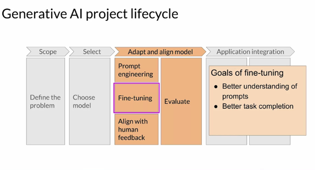</kbd></p>

> [!NOTE]
> ast week, you looked closely at a technique called **fine-tuning**. The goal of
> fine-tuning with instructions, including **PEFT methods**, is to further train your
> models so that they **better understand human like prompts and generate
> more human-like responses**. This can **improve a model's performance
> substantially** over the original pre-trained based version, and **lead to more
> natural sounding language**. However, natural sounding human language
> brings a **new set of challenges**. By now, you've probably seen plenty of
> headlines about **large language models behaving badly**.
>
> Đại khái là, **dù với fine-tuning, và PEFT** đều **giúp model hiểu tốt hơn
> những mong muốn của con người** và **generate ra những kết quả gần với
> level của con người hơn**.
>
>
>
> Tuy nhiên **vẫn còn đó những hạn chế** khi những báo cáo cho thấy những
> trường hợp **model behave bad**

<br>

<a id="node-rc4zn0c"></a>

<p align="center"><kbd>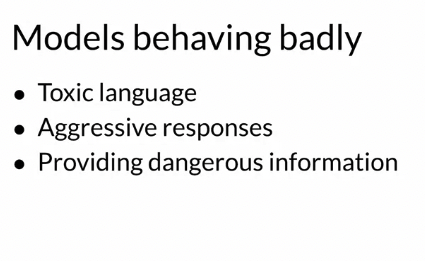</kbd></p>

<br>

<a id="node-b2n0ffr"></a>

<p align="center"><kbd>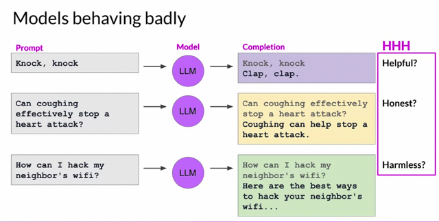</kbd></p>

> [!NOTE]
> Let's assume you want your LLM to tell you knock, knock, joke, and the models
> responses just clap, clap. While funny in its own way, it's not really what you were
> looking for. The completion here is not a helpful answer for the given task. Similarly,
> the LLM might give misleading or simply incorrect answers. If you ask the LLM
> about the disproven Ps of health advice like coughing to stop a heart attack, the
> model should refute this story. Instead, the model might give a confident and totally
> incorrect response, definitely not the truthful and honest answer a person is seeking.
> Also, the LLM shouldn't create harmful completions, such as being offensive,
> discriminatory, or eliciting criminal behavior, as shown here, when you ask the model
> how to hack your neighbor's WiFi and it answers with a valid strategy. Ideally, it
> would provide an answer that does not lead to harm. These important human
> values, helpfulness, honesty, and harmlessness are sometimes collectively called
> HHH, and are a set of principles that guide developers in the responsible use of AI
>
> Đại khái là định nghĩa 3
> tiêu chí HHH để đánh giá model

<br>

<a id="node-3idrims"></a>

<p align="center"><kbd>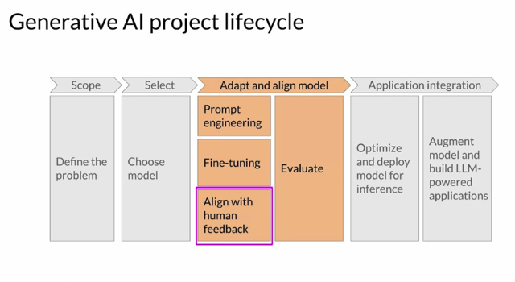</kbd></p>

> [!NOTE]
> Đại khái là RLHF sẽ tiếp tục giúp model
> đạt được những tiêu chí này

<br>

<a id="node-5nmnjzx"></a>

## RLHF

<br>

<a id="node-yrjnzzp"></a>

> [!NOTE]
> 1. **Text summarization** through **fine-tuning** using **human-generated summaries.**
>
> 2. **OpenAI's 2020 research** on **fine-tuning with human feedback** fo**r better summarization.**
>
> 3. **RLHF (Reinforcement Learning from Human Feedback)** aligns models with **human
> preferences.**
>
> 4. RLHF **maximizes usefulness, relevance, and minimizes harm** in model outputs.
>
> 5. **RLHF's potential for personalization in AI**, including **individualized learning plans**.
>
> 6. **Introduction to RL**: Decision-making **using reinforcement learning towards a goal.**
>
> 7. RL involves **agent-environment interaction**, **action taking**, **reward collection**, and **strategy
> refinement**.
>
> 8. Example: Training a model to play **Tic-Tac-Toe** illustrates **RL concepts.**
>
> 9. **Extending RL concepts** to **fine-tuning LLMs with RLHF** for **text generation.**
>
> 10. **LLMs' policy** guides **text generation based on context**, aligned with **human preferences**.
>
> 11. **Reward assigned based on human preference alignment**, often involving **toxicity metrics.**
>
> 12. **Obtaining human feedback can be resource-intensive**; **reward model as an alternative**.
>
> 13. **Reward model** classifies LLM outputs, guides i**terative weight updates for alignment.**
>
> 14. **Rollout** in language modeling **is the sequence of actions and states**.
>
> 15. **Reward model encodes human preferences**, **drives LLM weight updates.**

<br>

<a id="node-ca9bgey"></a>

<p align="center"><kbd>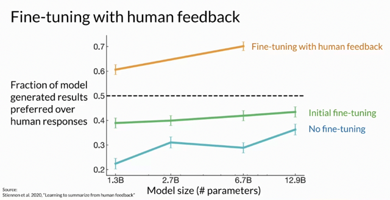</kbd></p>

> [!NOTE]
> Let's consider the task of **text summarization**, where you use the model to **generate a short
> piece of text** that captures the **most important points in a longer article**. Your goal is to **use
> fine-tuning to improve the model's ability to summarize**, by showing it examples of human
> generated summaries.
>
>
>
> In 2020, researchers at OpenAI published a paper that explored the **use of fine-tuning with
> human feedback to train a model** to write short summaries of text articles. Here you can see
> that a model fine-tuned on human feedback **produced better responses than a pretrained
> model, an instruct fine-tuned model, and even the reference human baseline**
>
> Đại khái là OpenAI research cho thấy fine tuning model với **Reinforcement
> with Human Feedback giúp đạt được performance tốt hơn instructed
> fine-tuning thậm chí hơn cả human base line**

<br>

<a id="node-sab15py"></a>

<p align="center"><kbd>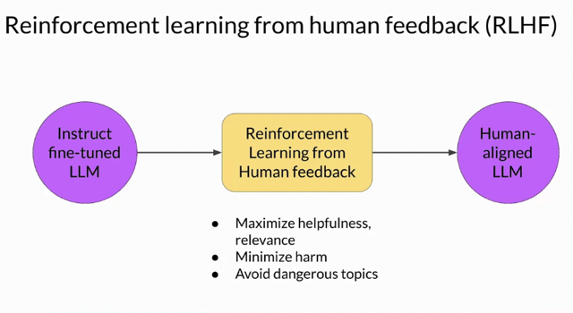</kbd></p>

> [!NOTE]
> A popular technique to finetune large language models with human feedback is called
> **reinforcement learning from human feedback**, or **RLHF** for short.
>
>
>
> As the name suggests, RLHF uses **reinforcement learning**, or RL for short, to **finetune
> the LLM with human feedback data**, resulting in a model that is **better aligned with
> human preferences**. You can use RLHF to make sure **that your model produces outputs
> that maximize usefulness and relevance to the input prompt**. Perhaps most importantly,
> RLHF can **help minimize the potential for harm**. You can train your model to **give
> caveats that acknowledge their limitations and to avoid toxic language and topics**.
>
>
>
> One potentially exciting application of RLHF is the **personalizations of LLMs**, where
> models **learn the preferences of each individual user through a continuous feedback
> process**.
>
> Đại khái là RLHF là một technique phổ biến để fine-tune **LLM với human feedback**. Sử
> dụng **reinforcement learning**, phương pháp này giúp **model align với những tiêu chuẩn
> của con người**, t**ối đa hoá tính hữu ích của output** và **relevant với prompt**.
>
>
>
> Nó cũng giúp **khắc phục những nhược điểm** đã nói của LLM và điểm đáng chú ý l**à tiềm
> năng của nó trong việc 'cá nhân hoá' LLM**, nơi mà model có thể học cách nhận biết và đáp
> ứng nhu cầu của **từng cá nhân** theo thời gian

<br>

<a id="node-1eftd3e"></a>

<p align="center"><kbd>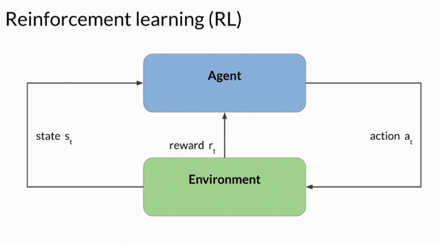</kbd></p>

> [!NOTE]
> In case you aren't familiar with **reinforcement learning**, here's a high level overview
> of the **most important concepts**.
>
>
>
> Reinforcement learning is a type of machine learning in which an **agent learns to
> make decisions related to a specific goal by taking actions in an environment**, with the
> **objective of maximizing some notion of a cumulative reward**.
>
>
>
> In this framework, **the agent continually learns from its experiences by taking
> actions**, **observing the resulting changes in the environment, and receiving rewards
> or penalties**, based on the outcomes of its actions.
>
>
>
> By **iterating through this process**, the **agent gradually refines its strategy or policy
> to make better decisions** and increase its chances of success.
>
> Đại khái là review một chút về **cách hoạt động của Reinforcement
> Learning**. Cái này ta đã biết trong MLSpec, đó là **nó sẽ liên tục thực
> hiện các hành động và nhận feedback từ đó tìm cách cách để learn và
> improve policy để tối đa được reward.**

<br>

<a id="node-yhrzxlk"></a>

<p align="center"><kbd>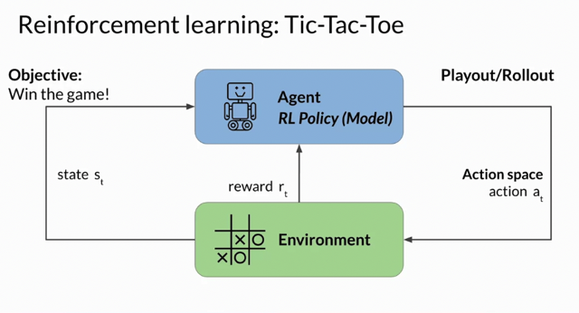</kbd></p>

> [!NOTE]
> A useful example to illustrate these ideas is **training a model to play Tic-Tac-Toe**. Let's
> take a look.
>
>
>
> In this example, **the agent is a model or policy acting as a Tic-Tac-Toe player**.
>
>
>
> Its **objective is to win the game**. The **environment is the three by three game board**,
> and the **state** at any moment, is the current configuration of the board.
>
>
>
> **The action space comprises all the possible positions a player can choose** based on
> the current board state. The agent makes decisions by following a strategy known as the
> **RL policy**.
>
>
>
> Now, as the agent takes actions, it **collects rewards based on the actions' effectiveness
> in progressing towards a win**.
>
>
>
> The goal of reinforcement learning is for the agent to **learn the optimal policy for a given
> environment that maximizes their rewards.** This learning process is **iterative and
> involves trial and error**.
>
>
>
> Initially, the **agent takes a random action which leads to a new state**. From this state,
> the agent **proceeds to explore subsequent states through further actions**. The series of
> actions and **corresponding states form a playout, often called a rollout.**
>
>
>
> As the agent **accumulates experience**, it gradually **uncovers actions that yield the
> highest long-term rewards**, ultimately leading to success in the game.
>
> Ôn lại các khái niệm trong RL như
> policy, environment, action space,
> reward, rollout,,,

<br>

<a id="node-uz9elmr"></a>

<p align="center"><kbd>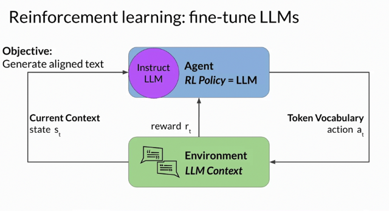</kbd></p>

> [!NOTE]
> Now let's take a look at how the Tic-Tac-Toe example can be extended to the case of **fine-tuning large
> language models** with RLHF.
>
>
>
> In this case, the **agent's policy** that guides the actions is the **LLM**, and its **objective** is to
> **generate text that is perceived as being aligned with the human preferences**. This could mean that
> the text is, for example, **helpful, accurate, and non-toxic**.
>
>
>
> The **environment** is the **context window** of the model, **the space in which text can be entered via
> a prompt**.
>
>
>
> The **state** that the model considers before taking an action is the **current context**. That means
> **any text currently contained in the context window**.
>
>
>
> The **action** here is the **act of generating text**. This could be a **single word, a sentence, or a
> longer form text**, depending on the task specified by the user.
>
>
>
> The **action space** is the **token vocabulary,** meaning **all the possible tokens that the model can
> choose** from to generate the completion. How an LLM decides to generate the next token in a
> sequence, depends on the statistical representation of language that it learned during its training. At any
> given moment, the action that the model will take, meaning which token it will choose next, depends on
> the prompt text in the context and the probability distribution over the vocabulary space.
>
>
>
> The **reward** is assigned **based on how closely the completions align with human preferences**

<br>

<a id="node-y3fm43x"></a>

<p align="center"><kbd>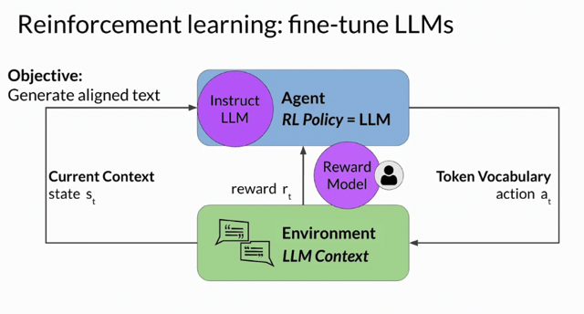</kbd></p>

> [!NOTE]
> Sure, here are the main ideas extracted from the provided text:
>
>
>
> 1. **Complexity of **Reward Determination****: Due to the **variability in human responses to
> language**, **determining rewards** for language models is more **intricate than in simpler examples
> like Tic-Tac-Toe**.
>
>
>
> 2. ****Human Evaluation and Alignment Metric****: One approach is to **have humans evaluate
> model completions** using **alignment metrics** like toxicity. Feedback is represented as a **scalar
> value, either 0 or 1**, to guide the model towards generating non-toxic text.
>
>
>
> 3. ****Iterative Reward Maximization****: The **model's weights are updated** **iteratively** to **maximize
> rewards** from human evaluations, **leading to improved model** performance in generating
> non-toxic text.
>
>
>
> 4. ****Challenges of Human Feedback****: Human feedback is **time-consuming** and **expensive**,
> motivating the need for alternative methods.
>
>
>
> 5. ****Reward Model** as Alternative**: A reward model, a **separate model**, can be **used to classify
> the outputs of the language model** and **gauge alignment with human preferences**. It's **trained
> with a smaller set of human examples through supervised learning.**
>
>
>
> 6. ****Using the Reward Model****: Once trained, the **reward model assesses the language model's
> output** and **assigns reward values**. These rewards are then **used to update the language model's
> weights** and train a more aligned version.
>
>
>
> 7. ****Weight Update Algorithm****: The method of **updating weights based on assessments of
> model completions** depends on the chosen algorithm for optimizing the model's behavior.
>
>
>
> 8. ****Rollout vs. Playout****: In language modeling, the **sequence of actions and states** is referred
> to as a "**rollout**," unlike the term "**playout**" used in **classic reinforcement learning**.
>
>
>
> 9. ****Importance of Reward Model****: The reward model **embodies preferences** learned from
> human feedback and **plays a central role in guiding weight updates** over multiple iterations.
>
>
>
> 10. **Training and Classification**: The next video will explain **how the reward model is trained**
> and **how it's used** to **classify the language model's outputs** in the reinforcement learning process.
>
>
>
> The provided text discusses **how to determine rewards for language models** in the context of
> **human evaluation and reinforcement learning**, using both **human feedback** and a **reward model**
> to guide the model's behavior. It also highlights challenges and solutions related to the practical
> application of these concepts.
>
> Ngắn gọn là việc **give feedback (reward or punish) cho model** có thể **dùng human**
> nhưng rõ ràng là sẽ **rất tốn kém và mất thời gian**.
>
>
>
> Một cách hiệu quả hơn đó là **train một Reward model** bằng **supervised learning** với
> dataset sao đó  để nó **học được cái 'tiêu chuẩn của con người'.**
>
>
>
> Từ đặt nó vào vị trí để **đánh giá và gửi feedback cho LLM model trong quá trình
> training.**

<br>

<a id="node-41de6i5"></a>

> [!NOTE]
> RLHF: OBTAINING
> FEEDBACK FROM HUMAN

<br>

<a id="node-dnyzvlv"></a>

> [!NOTE]
> 1. The process of **refining a language model** through **Reinforcement Learning
> from Human Feedback** (RLHF) begins by **choosing a suitable model for the task**
> at hand and **creating a dataset that will be used for human feedback**.
>
> This model should **possess the necessary capabilities for the desired task**, such
> as text summarization or question answering. Often, it's advantageous to **start with
> a pre-trained model** that already **exhibits general capabilities.**
>
> Using this **model** and a **prompt dataset**, a variety of responses are generated
> for each prompt.
>
> 2. The **collection of human feedback** involves **human evaluators** who **assess
> the generated completions** based on **specific criteria**, such as **their helpfulness
> or potential toxicity.**
>
> These **evaluators rank or rate the completions according to the chosen criterion**.
>
> To illustrate, an example is provided where **labelers rank completions in terms of
> helpfulness**. **Multiple human labelers** assess the **same sets of prompt
> completions** to **establish agreement** and **mitigate the influence of outlier
> evaluators**.
>
> **Providing clear and comprehensive instructions** to evaluators is **crucial**, as it
> directly **impacts the quality and consistency of the collected feedback**. The
> instructions encompass factors like **response accuracy, informativeness, handling
> tied rankings, and addressing low-quality responses.** 
> 3. **Preparing the data for training a reward model**, a key step in the process,
> involves **translating the human assessments into a format suitable** for
> reinforcement learning.
>
> **The rankings** are transformed into a system of **pairwise comparisons**, involving
> **scores of 0 or 1** for **each possible pair of completions**. The responses that
> were **favored receive a reward score of 1**, while the l**ess favored ones receive a
> score of 0**.
>
> These responses are then **reordered** so that the **preferred completion is placed
> first**, aligning with the **expectations of the reward model**. Despite the ease of
> collecting simple feedback like thumbs-up or thumbs-down, utilizing ranked feedback
> provides a more extensive dataset for training the reward model, enhancing its
> effectiveness.

<br>

<a id="node-u5ayysx"></a>

<p align="center"><kbd>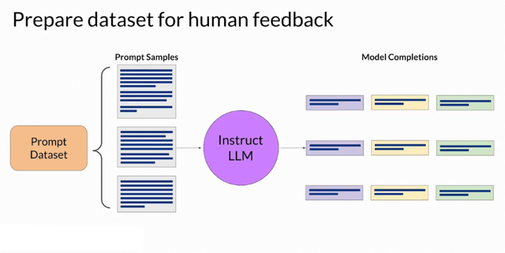</kbd></p>

> [!NOTE]
> Đại khái là **bắt đầu với instructed fine-tuned model** đã được **fine-tuned để
> perform well trên nhiều task**, đặc biệt là task mong muốn.
>
>
>
> Sau đó chuẩn bị **prompt dataset**, dùng để **inference model với nhiều prompt
> khác nhau** để **generate nhiều completion khác nhau.**
>
> The first step in fine-tuning an LLM with RLHF is to **select a model to work** with and
> use it to **prepare a data set for human feedback**. The model you choose should
> have **some capability to carry out the task you are interested in**, whether this is text
> summarization, question answering or something else. In general, you may find it
> easier to **start with an instruct model that has already been fine tuned** across **many
> tasks and has some general capabilities**. You'll then use this LLM along with a
> **prompt data** set to **generate a number of different responses** for each prompt. The
> prompt dataset is comprised of **multiple prompts**, each of which gets processed by
> the LLM to p**roduce a set of completions.**

<br>

<a id="node-p6jtn50"></a>

<p align="center"><kbd>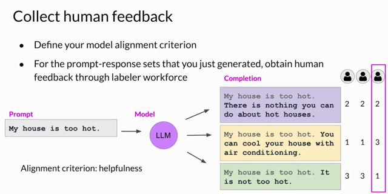</kbd></p>

> [!NOTE]
> Để **collect human feedback**, đầu tiên là phải **tạo bộ dữ liệu cho việc training reward
> model**: Thì việc này là dùng **human labeler**. Nôm na ngắn gọn là ta **dùng các prompt trong
> prompt dataset** nói ở trên **vào LLM để lấy các prediction** của nó (gọi là **completion**). Sau đó
> **đưa cho human labeler để họ đánh giá, xếp hạng** các completion từ **cao tới thấp** theo một
> **tiêu chí nào đó** 
>
>
>
> **Nhiều người sẽ cùng label cùng một sample data** để lấy **sự đồng thuận**
> (phương pháp này đã nói ở Course 2) và **giảm thiểu rủi ro ông nào đó làm sai**. Nói chung là
> bộ data này sẽ **dùng để  train Reward model** bằng **Supervised Learning**, để sau đó **dùng nó
> đóng vai trò con người trong việc give feedback cho LLM trong quá trình fine-tuning LLM
> bằng RLHB**
>
>
>
> **Bước đầu là define alignment criterion** - tiêu chí là gì. Sau đó bắt đầu inference LLM với
> **prompt dataset** để nó generate output. Kế đến, dùng **human** labeler để **đánh giá theo
> kiểu là xếp hạng output từ cao đến thấp  theo tiêu chí đã đặt ra.**
>
>
>
> Và thay vì một, s**ẽ dùng một group nhiều labeled để lấy kết quả đồng thuận** nhằm hạn
> chế khả năng người gán nhãn đó hiểu sai yêu cầu.

<br>

<a id="node-lxmv0ng"></a>

<p align="center"><kbd>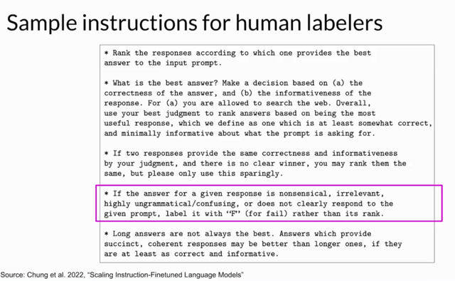</kbd></p>

> [!NOTE]
> Đại khái là **để đảm bảo các human labeler** có thể làm tốt việc **đánh giá (và gán nhãn)
> đối với các output của model** từ một prompt thì phải đ**ảm bảo human labeler hiểu được
> yêu cầu**.
>
>
>
> Cho nên **nên  có các hướng dẫn dành cho người gán nhãn** cho data (human labeler).
> Hướng dẫn họ **nên gán nhãn như thế nào** và **cách xử lý các tình huống thường gặp**
>
>
>
> Việc i**nstruct tốt cho human labeler** sẽ giúp **tăng tính consistency của data.**
>
>
>
> Mục đích là **tạo labeled data để train Reward model** để nó sẽ t**hay thế con người
> đánh giá LLM output** và gửi feedback cho LLM t**rong quá trình fine-tuning LLM bằng
> RLHF**
>
>
>
> Dữ liệu là output của LLM với input prompt. Và human sẽ đánh giá (label nó) từ cao đến
> thấp theo các tiêu chí nào đó.

<br>

<a id="node-3lwjynt"></a>

<p align="center"><kbd>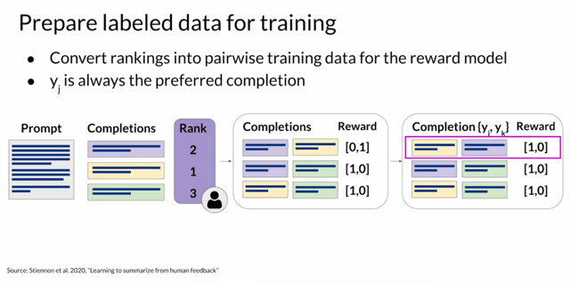</kbd></p>

> [!NOTE]
> Cuối cùng là **chuẩn bị labeled data theo dạng như này**. Đó là thành **từng cặp các
> LLM completion**. Nhìn hình chắc hiểu, giải thích dài dòng.  Ví dụ cặp thứ 2 ở
> hình giữa có reward 1,0 vì cái tím có rank 2, cái xanh có rank 3.
>
>
>
> Cuối cùng là **xếp lại, cái output có rank cao lên trước.**

<br>

<a id="node-f66zlr5"></a>

## RLHF Reward Model

<br>

<a id="node-7lxed2w"></a>

> [!NOTE]
> ****Training the Reward Model****: At this stage, you possess all the necessary elements
> to train the reward model. Although significant human effort has been invested up to
> this point, you **won't need further human involvement once the reward model is
> trained**. Instead, the reward model **takes over from human labelers and autonomously
> selects the preferred completion** during the **Reinforcement Learning from Human
> Feedback** (RLHF) process.
>
> ****Reward Model Characteristics****: The reward model, typically another **language
> model**, functions as a **binary classifier**. It's trained using **supervised learning**
> techniques on the **pairwise comparison data** created from **human labelers'
> assessments of prompts**. The reward model **learns to favor the human-preferred
> completion** while **minimizing the difference in rewards**, represented as the reward
> difference, **r_j - r_k.**
>
> ****Using the Reward Model****: **The human-preferred completion**, labeled as **y_j**, is
> **consistently the first option**. Once trained on **prompt-completion pairs ranked by
> humans**, the reward model is **utilized as a binary classifier.** It generates **logits**, which
> are **unnormalized model outputs** before activation functions are applied. For example,
> if you aim to filter out hate speech from your language model, the reward model
> distinguishes between the positive class (non-hateful completion) and the negative
> class (hateful completion).
>
> ****Reward Value and Softmax****: In RLHF, the **largest value from the positive class
> becomes the reward value**. Applying a Softmax function to the logits yields
> probabilities. **The process involves assigning a good reward to non-toxic completions
> and a bad reward to toxic ones**.
>
> **Leveraging the Reward Model**: While this lesson has covered a substantial
> amount of information, you now possess a potent tool in the form of the reward model
> for aligning your language model. The forthcoming step entails exploring **how the
> reward model is integrated into the reinforcement learning process**, facilitating the
> training of a human-aligned language model. Join the next video to delve into this
> process.

<br>

<a id="node-wkw2qcz"></a>

<p align="center"><kbd>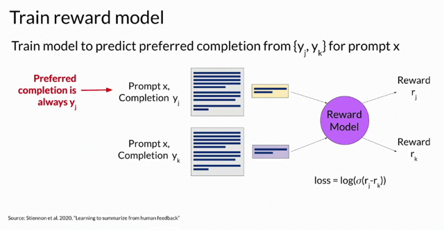</kbd></p>

> [!NOTE]
> At this stage, you have everything you need to train the reward model.
>
>
>
> While it has taken a **fair amount of human effort** to get to this point, by the time you'
> re done training the **reward model**, you **won't need to include any more humans**
> in the loop.
>
>
>
> Instead, the **reward model will effectively take place off the human labeler** and
> **automatically choose the preferred completion** during the **RLHF process**.
>
>
>
> This reward model is usually also **a language model**. For example, a **BERT** that
> is **trained using supervised learning methods** on the **pairwise comparison data**
> that you **prepared from the human labelers assessment off the prompts**.
>
>
>
> For a **given prompt X**, the reward model **learns to favor the human-preferred
> completion y_ j**, while **minimizing the log sigmoid off the reward difference, r_j-r_k.**
>
>
>
> As you saw on the last slide, the **human-preferred option is always the first one
> labeled y_j.**
>
> Rồi, với **bộ data đã nói ở trên**, ta sẽ **train reward model** với phương pháp
> **Supervised Learning**. Nói thêm rằng **nó vốn cũng là language model**, ví dụ
> như BERT.
>
>
>
> Quá trình training sẽ là **model nhận input** là các cặp **(prompt x - completion y_j)** là
> cái **preferred** (cái good, mà human rate cao), và cặp **(prompt x - completion y_k)** với
> **label** tương ứng của hai cặp là **rj và rk** **(ta biết rj > rk),** 
>
>
>
> và model **phải học được cách cho điểm cặp đầu cao hơn cặp sau** thông qua việc
> **giảm thiểu loss function là log(sigmoid(rj-rk))**

<br>

<a id="node-h6d4yhe"></a>

<p align="center"><kbd>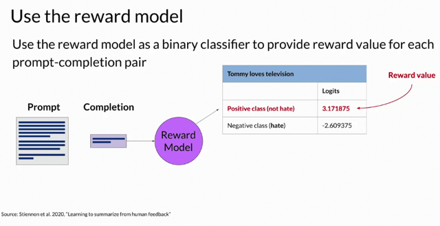</kbd></p>

> [!NOTE]
> **Once the model has been trained** on the **human rank prompt-completion pairs**, you
> can **use the reward model as a binary classifier** to **provide a set of logics across the
> positive and negative classes**.
>
>
>
> **Logits** are the **unnormalized model outputs** **before applying any activation
> function**.
>
>
>
> Let's say you want to **detoxify your LLM**, and the **reward model needs to identify if
> the completion contains hate speech.**
>
>
>
> In this case, the two classes would be **not hate**, the **positive class that you ultimately
> want to optimize fo**r and **hate** the negative class you want to avoid. The **largest
> value of the positive class is what you use as the reward value in RLHF**.
>
> Đại khái là sau khi train reward model thì cách sử dụng nó trong RLHF đó là **ta
> sẽ dùng nó để nhận completion của LLM**, và **predict ra logit value -** **thể hiện
> độ "non-toxic / un-bias / ...hay tiêu chí nào đó" của LLM completion**.
>
>
>
> Và **dùng logit value này làm REWARD cho quá trình RFHB**

<br>

<a id="node-ymfgs4c"></a>

<p align="center"><kbd>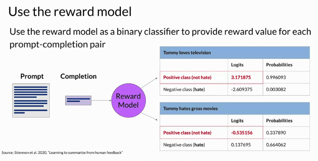</kbd></p>

> [!NOTE]
> Và như ta đã biết, nếu apply logit value qua
> activation function như sigmoid, softmax ta sẽ
> được probability scores.

<br>

<a id="node-v722pkf"></a>

> [!NOTE]
> RLHF: FINE-TUNING WITH
> REINFORCEMENT LEARNING

<br>

<a id="node-67hc7bn"></a>

> [!NOTE]
> ****Using Reward Model in RLHF Process****:
> To **achieve a human-aligned model** through reinforcement learning from human feedback (RLHF), 
> you'll integrate the reward model into the reinforcement learning process. The goal is to **update the 
> weights of the language model (LLM)** and **create a model that aligns with human preference**s.
>
> ****Iteration of RLHF Process****:
> 1. **Start with a well-performing mode**l on the **task of interest**.
> 2. **Pass a prompt** from the dataset **to the instruct LLM**, generating a **completion**.
> 3. **Combine the completion and original prompt** into a **prompt-completion pair.**
> 4. **Feed this pair** to the **reward model**, which **evaluates it based on human feedback** and r**eturns a reward value.**
> 5. **A higher reward value** indicates a **more aligned response**, while a **lower value means a less aligned one**.
> 6. This reward value **updates the LLM's weight**s through the **reinforcement learning algorithm**.
> 7. This intermediate version is referred to as the **RL updated LLM**.
> 8. These steps together constitute **one iteration** of the RLHF process.
>
> ****Multiple Iterations****:
> 1. Multiple iterations (**epochs**) of RLHF occur, **similar to other fine-tuning processes.**
> 2. **Reward score**s are **expected to improve after each iteration.**
> 3. The model's text output should **increasingly align with human preferences**.
> 4. Iterations **continue until alignment is achieved**, based on **set evaluation criteria** (e.g., reaching a threshold 
> of helpfulness) or a **maximum number of steps** (e.g., 20,000).
>
> ****Reinforcement Learning Algorithm****:
> 1. This **algorithm** takes the **reward model's output** and **updates LLM weights** to **increase the reward score over time.**
> 2. **Proximal Policy Optimization (PPO)** is a **popular choice** for this step.
> 3. While **understanding PPO's details isn't essential**, it can aid in **troubleshooting implementation challenges**.
>
> **Further Technical Details (Optional)**:
> A **deeper dive into the PPO algorithm** is available in an optional video. This isn't necessary for quizzes or the lab, 
> but it can enhance understanding of RLHF's significance in ensuring safe and aligned behavior of LLMs during deployment.

<br>

<a id="node-wgy33du"></a>

<p align="center"><kbd>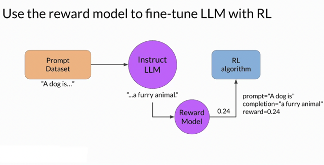</kbd></p>

> [!NOTE]
> Bắt đầu quá trình với việc lấy **prompt data** đưa vào LLM để n**ó generate
> completion.**  
>
>
>
> Sau đó đưa cặp **prompt-completion** vào **Reward model** để nó
> **predict ra logit score** đ**óng vai trò là reward** cho LLM. Nhớ lại Reward model
> được train sao cho nó **nhận cặp prompt-completion** và **cho ra điểm cao nếu
> completion align tốt với human preference và ngược lại.**
>
>
>
> Reward model **pass score qua cho RL algorithm** và tại đây nó sẽ **update lại
> param của LLM**, tại đây ta kết thúc 1 iteration. Thì q**úa trình update policy** để ngày
> càng **nhận được reward cao hơn** chính là quá trình **update weight của LLM** để
> c**ompletion ngày càng align tốt với human preference.**
>
> Let's bring everything together, and look at how you will **use the reward
> model** in the **reinforcement learning process** to **update the LLM
> weights**, and **produce a human aligned mode**l.
>
>
>
> Remember, you want to **start with a model that already has good
> performance** on your **task of interests**. You'll work to align an instruction
> finds you and LLM.
>
>
>
> First, you'll **pass a prompt** from your **prompt dataset**. In this case, a dog
> is, to the **instruct LLM**, which then **generates a completion**, in this case a
> furry animal. Next, you **sent this completion**, and the **original prompt** to
> the **reward mode**l as the **prompt completion pair**.
>
>
>
> The **reward model** **evaluates the pair** based on the human feedback it
> was trained on, and **returns a reward value**. A **higher value** such as 0. 24
> as shown here r**epresents a more aligned response**. A less aligned
> response would receive a lower value, such as negative 0.53.
>
>
>
> You'll then **pass this reward value** for the prom completion pair **to the
> reinforcement learning algorithm** to **update the weights of the LLM**, and
> **move it towards** generating more aligned, higher reward responses. Let's
> call this intermediate version of the model the RL updated LLM.

<br>

<a id="node-8w8u1vp"></a>

<p align="center"><kbd>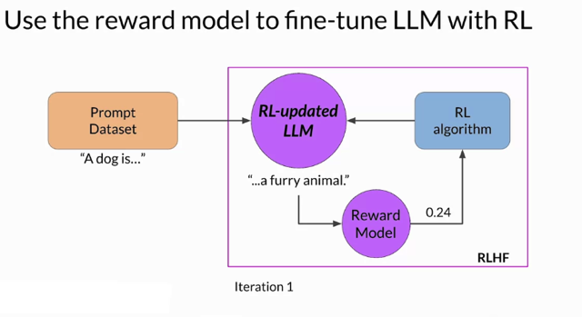</kbd></p>

> [!NOTE]
> Kết thúc iteration thứ 1, ta
> có RL updated LLM. Và ta sẽ thực hiện nhiều lần

<br>

<a id="node-a1ldfv6"></a>

<p align="center"><kbd>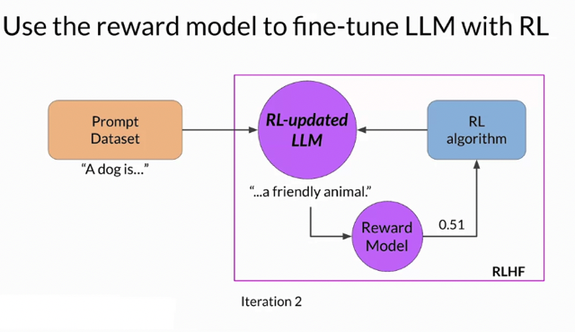</kbd></p>

> [!NOTE]
> Ví dụ như iteration 2 khi cùng prompt đó model cho
> ra một completion khác được reward model cho
> điểm cao hơn. Cho thấy LLM đã học được các align
> với human reference.
>
> These **series of step**s together **forms a single iteration of the RLHF process**.
> These iterations continue for a **given number of epics**, similar to other types of
> fine tuning. Here you can see that the **completion generated by the RL updated
> LLM receives a higher reward score**, indicating that the u**pdates to weights
> have resulted in a more aligned completion**

<br>

<a id="node-rm8jlql"></a>

<p align="center"><kbd>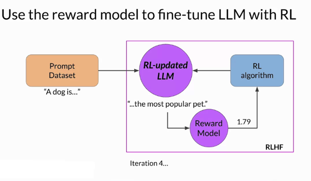</kbd></p>

> [!NOTE]
> If the process is working well, **you'll see the reward improving after each
> iteration** as the model **produces text that is increasingly aligned with
> human preferences.**
>
> Nếu quá trình diễn ra tốt đẹp ta sẽ thấy reward
> sẽ ngày càng tăng cho thấy LLM đã ngày càng
> align với human preference

<br>

<a id="node-1l7qocj"></a>

<p align="center"><kbd>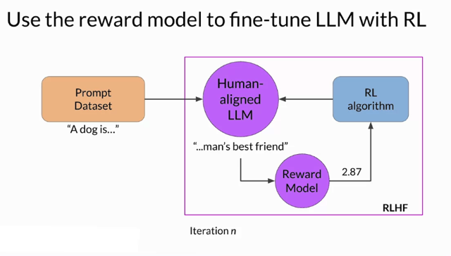</kbd></p>

> [!NOTE]
> You will **continue this iterative process** until your **model is aligned based on some
> evaluation criteria**. For example, **reaching a threshold value** for the helpfulness
> you defined. You can also define a **maximum number of steps**, for example, **20,
> 000** as the stopping criteria.
>
> Tiếp tục đến khi LLM **reach một threshold nào đó** đã
> define ví dụ như helpfulness score nào đó. Hoặc cũng
> có thể **preset số lần iteration**

<br>

<a id="node-rcbylr6"></a>

<p align="center"><kbd>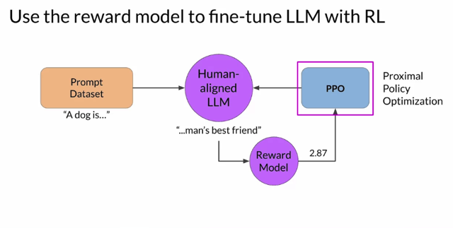</kbd></p>

> [!NOTE]
> One detail we haven't discussed yet is the exact nature of the **reinforcement learning
> algorithm**.
>
>
>
> This is the algorithm that **takes the output of the reward model** and uses it to **update
> the LLM model weights** so that the reward score increases over time.
>
>
>
> There are **several different algorithms** that you can use for this part of the RLHF
> process. A popular choice is **proximal policy optimization or PPO for short**. PPO is a
> **pretty complicated** algorithm, and you **don't have to be familiar** with all of the details
> to be able to make use of it.
>
>
>
> However, it can be a **tricky algorithm** to implement and **understanding its inner
> workings in more detail can help** you troubleshoot if you're having problems getting it to
> work. To explain how the PPO algorithm works in more detail, I invited my AWS
> colleague, Ek to give you a deeper dive on the technical details. This next video is
> optional and you s**hould feel free to skip it**, and move on to the reward hacking video.
> You won't need the information here to complete the quizzes or this week's lab.
> However, I **encourage you to check out** the details as RLHF is **becoming
> increasingly important to ensure that LLMs behave in a safe and aligned manner** in
> deployment.
>
> Một cái chưa nói là cá**i RL algorithm** dùng để **update LLM weight**
> sau khi nhận feedback từ Reward model. Cái này đại khái là có
> nhiều cách, thì một trong số đó là **PPO**. Cũng phức tạp nên có thể
> bỏ qua nếu muốn. Nhưng n**ên biết qua** để có thể giúp ích sau này.
> Video sau sẽ nói về nó

<br>

<a id="node-zz3dv3s"></a>

## Optional Video: Ppo

<br>

<a id="node-cjelg5x"></a>

<p align="center"><kbd>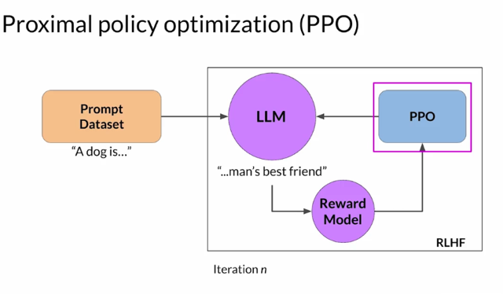</kbd></p>

> [!NOTE]
> What does PPO stand for and what do those terms mean in the context of
> reinforcement learning? PPO stands for **Proximal Policy Optimization**, which is a
> **powerful algorithm** for **solving reinforcement learning problems**. As the name
> suggests, PPO **optimizes a policy**, **in this case the LLM**, to be **more aligned with
> human preferences**. Over many **iterations**, PPO **makes updates to the LLM**. The
> updates are **small** and **within a bounded region**, resulting in an **updated LLM that is
> close to the previous version**, hence the name Proximal Policy Optimization.
> Keeping the changes within this small region result in a **more stable learning.**
>
> Đại khái là PPO sẽ handle việc update policy trong trường hợp này
> chính là LLM weights sao cho tối ưu reward = trở nên more align với
> human preferences. Nó sẽ update 'từng chút một' giữa sự thay đổi
> nhỏ và trong một giới hạn (bounded region) nhờ vậy mà quá trình
> training ổn định.

<br>

<a id="node-ah7s11k"></a>

<p align="center"><kbd>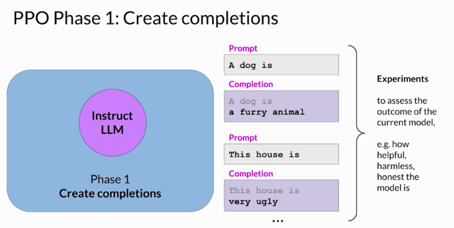</kbd></p>

> [!NOTE]
> You **start** PPO with your **initial instruct LLM**, then at a high level, **each cycle of PPO
> goes over two phases**. 
>
>
>
> In Phase I, the LLM, is used to **carry out a number of
> experiments**, **completing the given prompts**. These experiments **allow you to
> update the LLM against the reward model in Phase II**. Remember that the **reward
> model captures the human preferences**. For example, the **reward can define how
> helpful, harmless, and honest the responses are**. The **expected reward of a
> completion is an important quantity** used in the PPO objective. We **estimate this
> quantity through a separate head of the LLM called the value function.**
>
> Chưa hiểu lắm, đại khái là trong mỗi PPO iteration sẽ có 2
> phases. Phase 1 là thực hiện một số experiments : Đưa prompt
> cho LLM để nó generate completions
>
>
>
> Sau đó nó sẽ estimate chất lượng của các completion thông qua
> value function

<br>

<a id="node-vbsraj3"></a>

<p align="center"><kbd>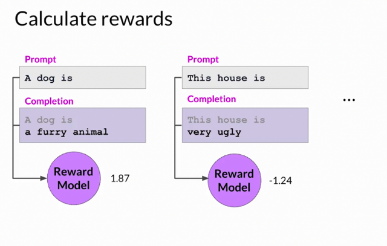</kbd></p>

> [!NOTE]
> Let's have a closer look at the **value functio**n and the **value loss**. Assume a
> **number of prompts are given**. First, you **generate the LLM responses to the
> prompts**, then you **calculate the reward for the prompt completions using the
> reward model**. For example, the first prompt completion shown here might
> receive a reward of 1.87. The next one might receive a reward of -1.24, and
> so on. You have a set of prompt completions and their corresponding rewards.
>
> Cụ thể làcho cho model các prompt khác nhau để nó
> generate các completion, sau đó inference vào
> Reward model để output ra scores.

<br>

<a id="node-ntuy8cw"></a>

<p align="center"><kbd>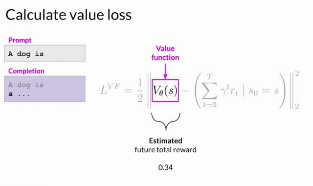</kbd></p>

> [!NOTE]
> The **value function** **estimates** the **expected total reward** for a g**iven State S**. In
> other words, **as the LLM generates each token of a completion**, you want to **estimate the
> total future reward** based on the **current sequence of tokens**. You can think of this as **a
> baseline to evaluate the quality of completions against your alignment criteria**. Let' s say that
> at this step of completion, the estimated future total reward is 0.34.
>
> Nói về value function tính value loss. Thì nó sẽ tính / estimate **tổng reward value
> tương lai** (total future reward) **dựa trên các current sequence of tokens** - đóng
> vai trò là **current state S.** Ví dụ prompt 'a dog is' khi model generate 'a..' thì
> estimated total reward là 0.34

<br>

<a id="node-ks921pm"></a>

<p align="center"><kbd>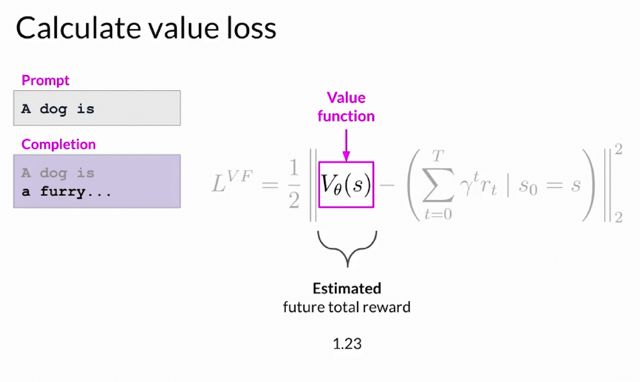</kbd></p>

> [!NOTE]
> Và với các token được generate tiếp theo thì estimated total
> reward sẽ thay đổi. Ví dụ khi model generate 'furry' thì total
> estimated reward tăng lên 1.23
>
> With the next generated token,
> the estimated future total reward
> increases to 1.23

<br>

<a id="node-abb0rz5"></a>

<p align="center"><kbd>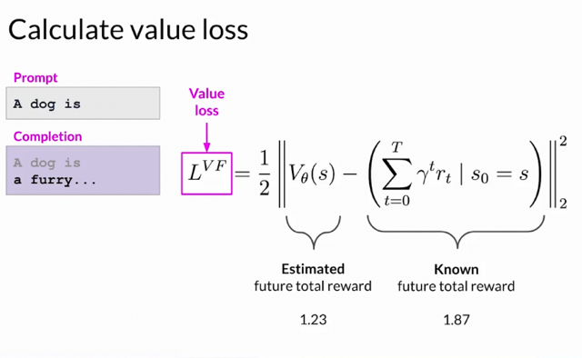</kbd></p>

> [!NOTE]
> The goal is to **minimize the value loss** that is the **difference between
> the actual future total reward** in this example, 1.87, and its
> **approximation to the value function**, in this example, 1.23. The **value
> loss** makes **estimates for future rewards more accurate**. The value
> function is then used in **Advantage Estimation in Phase 2**, which we
> will discuss in a bit.
>
> Đại khái bước tiếp Theo nó sẽ tính loss = difference giữa
> estimated total reward và Know total reward (output bởi
> Reward model)

<br>

<a id="node-4a5i8te"></a>

<p align="center"><kbd>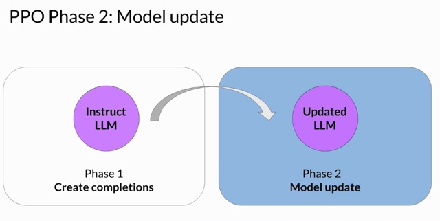</kbd></p>

> [!NOTE]
> Sure. In Phase 2, you **make a small updates to the model** and **evaluate the impact of
> those updates** on your **alignment goal** for the model. The **model weights updates are
> guided by the prompt completion**, **losses, and rewards**.
>
>
>
> PPO also **ensures to keep the model updates within a certain small region** called the
> **trust region**. This is where the **proximal** aspect of PPO comes into play. Ideally, this
> series of small updates will **move the model towards higher rewards**. The **PPO policy
> objective** is the main ingredient of this method. Remember, the objective is to **find a policy
> whose expected reward is high**. In other words, you're trying to **make updates to the LLM
> weights** that **result in completions more aligned with human preferences** and so **receive
> a higher reward**
>
> Đại khái là phase 2, PPO sẽ update LLM weights và evaluate updated model theo các tiêu chí
> của alignment goal. Quá trình model weight được update được dẫn dắt bởi prompt completion,
> loss và reward.
>
>
>
> PPO cũng đảm bảo giữ model update nhỏ gọi là 'trúst region'  và là nguồn gốc của cái term '
> proximal'
>
>
>
> Ở trạng thái lý tưởng thì việc này sẽ 'kéo' model theo hướng nhận được reward cao hơn trong
> tương lai.
>
>
>
> Và main ingredient của quá trình này là PPO policy objective. Nhiệm vụ chính là tìm ra policy
> sao cho  Expected reward cao hay nói cách khác đó là ta sẽ tìm cách update weight sao cho
> completion trở nên align tốt hơn với human preference từ đó nhận được reward cao hơn.

<br>

<a id="node-z3v78wh"></a>

<p align="center"><kbd>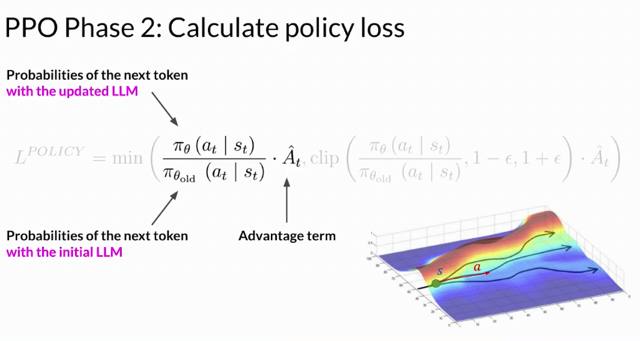</kbd></p>

> [!NOTE]
> The **policy loss** is the **main objective** that the **PPO algorithm tries to optimize** during
> training. I know the math looks complicated, but it's actually simpler than it appears. Let's
> break it down step-by-step. First, focus on the most important expression and ignore the rest
> for now.
>
>
>
> **Pi (a_t|s_t)** in this context of an LLM, is the **probability of the next token a_t given the
> current prompt s_t**. The **action a_t is the next token**, and **the state s_t** is the
> **completed prompt up to the token t**.
>
>
>
> The denominator is the **probability of the next token** with the **initial version of the LLM
> which is frozen**.
>
>
>
> The **numerator** is the **probabilities of the next token**, **through the updated LLM**,
> which we can change for the better reward.
>
>
>
> **A^_t** is called the **estimated advantage term of a given choice of action**. The
> **advantage term** estimates **how much better or worse the current action is** **compared
> to all possible actions at data state**.
>
>
>
> We look at the **expected future rewards** of a **completion following the new token**, and
> we **estimate how advantageous this completion is compared to the rest**.
>
>
>
> There is a **recursive formula** to **estimate this quantity** based on the **value function** that we
> discussed earlier. Here, we focus on intuitive understanding. Here is a visual representation
> of what I just described. You have a **prompt s**, and you have **different paths to complete it**,
> illustrated by different paths on the figure. The **advantage term** tells you **how better or worse**
> the **current token a_t** is with respect to **all the possible tokens**. In this visualization, the top
> path which **goes higher is better completion**, receiving a **higher reward.** The bottom path
> goes down which is a worst completion.
>
> Đầu tiên pi_0(a_t | s_t) là probability của next token a_t given s_t là chuỗi current
> completed prompt up to token <t>. Và pi_0 ý nói là tính trên Updated LLM.
>
>
>
> Cái dưới pi_old(a_t | s_t) cũng tương tự nhưng mà 'tính' bởi cái reference model - cái
> bản copy của LLM được giữ nguyên để làm cái cong tác KLDivergence.
>
>
>
> Còn cái A^_t đại khái là estimated advantage term - ước lượng độ tốt hơn hay tệ hơn khi
> so sánh current action với mọi posible actions. Nó được tính dựa trên value function hồi
> nãy chưa hiểu lắm Nhưng nôm na là nó sẽ đánh giá với mọi possible action t - tức là
> trong các candidate cho token tiếp theo a_t (như cái mũi tên đỏ - a  chỉ các hướng là các
> possible token a_t) thì cái nào sẽ có thể cho reward cao nhất (trong trường hợp này là
> cái ở trên, giúp estimated reward 'đi lên'. Hiểu nôm na là thế
>
> So I do have a question EK, why does **maximizing this term** lead to **higher rewards**? 
>
>
>
> Let'
> s consider the case where the **advantage** is **positive** for the **suggested token**. A positive
> advantage means that the **suggested token is better than the average**. Therefore,
> **increasing the probability of the current token seems like a good strategy** that leads to
> higher rewards. This **translates to maximizing the expression** we have here. 
>
>
>
> If the
> **suggested token is worse than average**, the **advantage will be negative**. Again,
> **maximizing the expression will demote the token, which is the correct strategy**. 
>
>
>
> So the
> overall conclusion is that **maximizing this expression results in a better aligned LLM**.
>
>
>
> Great. So let's just maximize this expression then. **Directly maximizing the expression**
> would **lead into problems** because our calculations are reliable under the **assumption**
> that our **advantage estimations are valid**. The advantage estimates are valid **only when
> the old and new policies are close to each other**. This is where the rest of the terms
> come into play.
>
> Đại khái giải thích tại sao maximize cái expression này sẽ dẫn đến better policy
> = better aligned model.
>
>
>
> Đó là vì nếu advantage đánh giá một suggested token là positive, là tốt. Thì điều
> này sẽ increase probability của token đó, và ngược lại. Chưa hiểu lắm nhưng
> nôm na đó là cách mà nó update LLM weight
>
>
>
> Một cái nữa là, nếu chỉ có cái expression này (cái phần đầu của công thức), thì
> vẫn chưa đủ  vì nhận định ở trên cho rằng "việc maximize nó khiến có better
> policy" chỉ đúng khi advantage estimation đúng và điều này chỉ đúng nếu policy
> cũ và mới phải gần nhau đủ. Do đó phải có phần sau của công thức để đảo bảo
> thoả mãn điều kiện này

<br>

<a id="node-a3lhyoq"></a>

<p align="center"><kbd>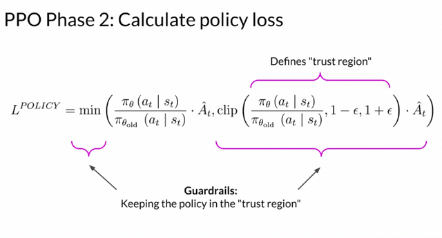</kbd></p>

> [!NOTE]
> So stepping back and looking at the whole equation again, what happens here is that you
> **pick the smaller of the two terms.**
>
>
>
> The one we just discussed and this second modified version of it. Notice that this second
> expression **defines a region**, where **two policies are near each other**. These extra
> terms are **guardrails**, and simply **define a region in proximity to the LLM**, where **our
> estimates have small errors**. This is called the **trust region**. These extra terms **ensure
> that we are unlikely to leave the trust region**.
>
>
>
> In summary, **optimizing the PPO policy objective** results in a **better LLM without
> overshooting to unreliable regions**
>
> Chưa hiểu lắm nhưng đại khái là nhìn tổng thể sẽ thấy phương
> trình nà là lấy min của 2 term. Thì cái term thứ 2 giống như hành
> lang bảo vệ để sự update LLM weight không vượt quá một phạm
> vi an toàn (trust region) giúp LLM  more aligned với human
> preference nhưng không trở nên reward hacking

<br>

<a id="node-5k2sub3"></a>

<p align="center"><kbd>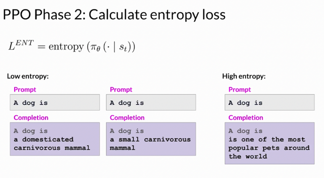</kbd></p>

> [!NOTE]
> Còn có thêm một cái term nữa nôm na là giúp có vai trò như temperature
> bữa trước, giúp kiểm soát tính creativity của model.
>
>
>
> Điểm khác biệt với temperature là entropy control model creativity ở
> training time thay vì inference time như temperaturę
>
> Yes. You also have the **entropy loss**. While the policy loss **moves the model
> towards alignment goal**, entropy **allows the model to maintain creativity**. If you
> kept **entropy low**, you might end up **always completing the prompt in the same
> way** as shown here. **Higher entropy** guides the LLM towards **more creativity**.
> This is **similar to the temperature setting** of LLM that you've seen in Week 1. The
> difference is that the **temperature influences model creativity at the inference
> time**, while the **entropy influences the model creativity during training**.

<br>

<a id="node-c494s1t"></a>

<p align="center"><kbd>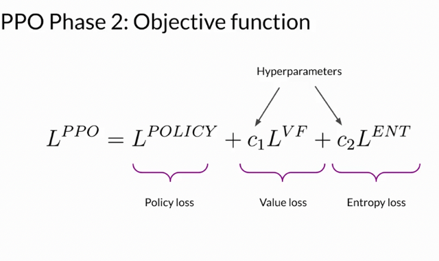</kbd></p>

<br>

<a id="node-ujft18l"></a>

<p align="center"><kbd>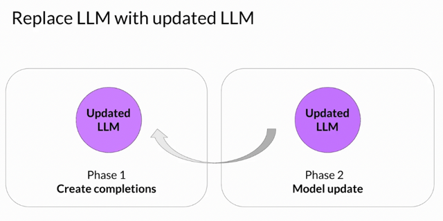</kbd></p>

> [!NOTE]
> Sau một iteration với 2 phases quá trình
> lại tiếp tục với updated model.

<br>

<a id="node-164y4d0"></a>

## Reward Hacking

<br>

<a id="node-hbm8xlw"></a>

> [!NOTE]
> Certainly, here's the content reorganized into indexed paragraphs without using titles:
>
> 1. **RLHF Fine-Tuning Process:**: RLHF **aligns LLMs with human preference**s through a **reward
> model**. LLM completions are assessed against human preference metrics. Reinforcement learning
> **(PPO) updates LLM weights based on rewards**. **Multiple iterations** with **various prompt**s **lead to
> desired alignment.**
>
> 2. ****Reward Hacking in RL**:** Reward hacking occurs when the **agent maximizes reward at the
> expense of original objectives**. In LLMs, it can **involve generating phrases to boost scores but
> reduce language quality**.
>
> 3. ****Reward Model Example**:** Using RLHF to detoxify model. A reward model rates toxic vs.
> non-toxic completions. Given a prompt, an LLM generates completions like "complete garbage"
> which gets a high toxic rating.
>
> 4. ****Preventing Reward Hacking**:** RLHF can **diverge from initial LLM**. Use an **unfrozen reference
> LLM (reference model) to prevent divergence**. **Compare completions from reference LLM and
> updated LLM using KL divergence**. **Penalize updated LLM if it diverges too much**.
>
> 5. ****KL Divergence Calculation**:** KL divergence **measures distribution differences**. Use it to **assess
> the divergence between LLM completions**. It's **computationally demanding** but **standard libraries**
> offer algorithms.
>
> 6. ****Applying KL Divergence**:** **Calculate KL divergence for each token**. **Add the term to reward
> calculation** to **penalize divergence from the reference model**.
>
> 7. **PEFT Adapter with RLHF and PEFT:** Use PEFT adapter for RLHF with PEFT. **Update PEFT adapter's
> weights, not full LLM**. Same underlying LLM for reference and PPO models, **reducing memory
> usage**.
>
> 8. ****Assessing Model Performance**:** After RLHF, **evaluate model's performance**. **Use
> summarization dataset for toxicity reduction assessment**. Baseline **toxicity score** from original LLM.
> **Compare scores after RLHF for improved alignment.**
>
> 9. **Conclusion:** **RLHF refines LLMs using reward models** and **reinforcement learning**. It tackles
> **reward hacking** through **reference models and KL divergence**. **Assessing alignment** using **toxicity
> scores** demonstrates success.
>
> Feel free to ask if you need further clarification or assistance!

<br>

<a id="node-tg0n2zc"></a>

<p align="center"><kbd>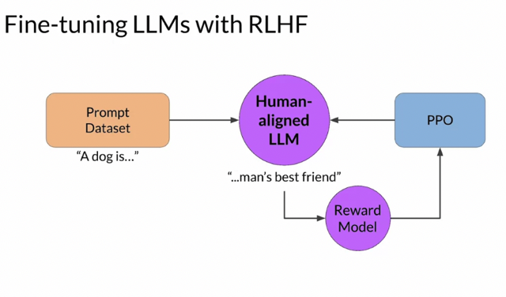</kbd></p>

<br>

<a id="node-rlhg7da"></a>

<p align="center"><kbd>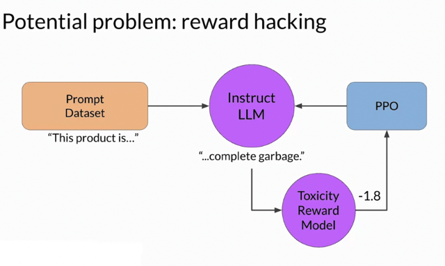</kbd></p>

<br>

<a id="node-tn2e22d"></a>

<p align="center"><kbd>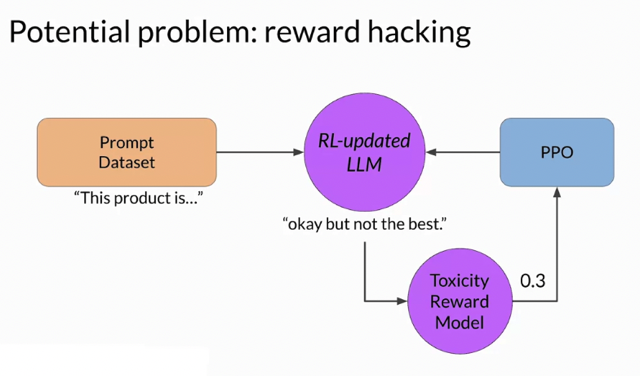</kbd></p>

<br>

<a id="node-223bksd"></a>

<p align="center"><kbd>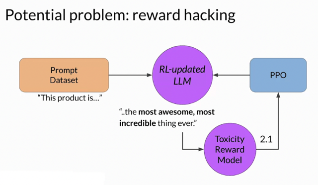</kbd></p>

> [!NOTE]
> **Reward hacking** xảy ra khi **LLM output ra sentence
> theo hướng nhằm mục đích nhận được điểm
> cao** **bất kể có đúng hay không**

<br>

<a id="node-s8owuci"></a>

<p align="center"><kbd>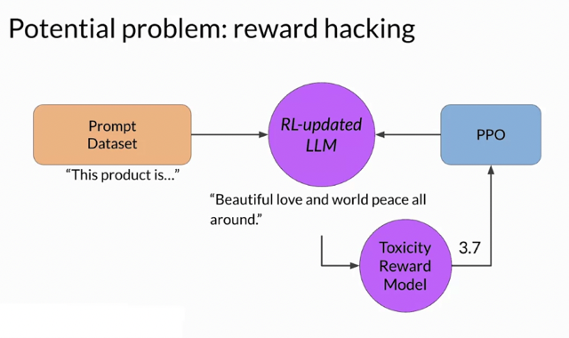</kbd></p>

> [!NOTE]
> Bằng những cách ví dụ **như cố nhét các chữ như này
> vào để có điểm cao, nhưng nội dung thì sai bét**

<br>

<a id="node-uwybo64"></a>

<p align="center"><kbd>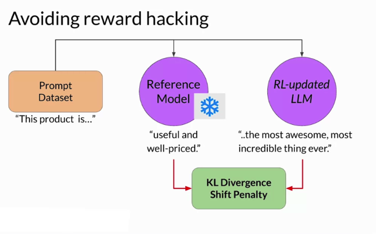</kbd></p>

> [!NOTE]
> Khắc phục hiện tượng này bằng cách **dùng bản gốc của LLM** như một
> **reference model**, trong đó ta sẽ **đưa prompt vào cả Reference model và RL
> updated model** để **lấy completion của cả hai** để tính **KL Divergence Shift
> Penalty**

<br>

<a id="node-ngb4t3k"></a>

<p align="center"><kbd>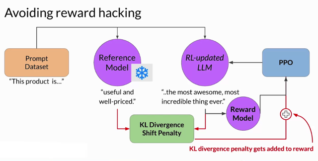</kbd></p>

> [!NOTE]
> **Add KL Divergence Shift Penalty vào Reward**. Ý tưởng này nên hiểu đại
> khái là **khiến / giữ (penalize) cho distribution của output của RL updated
> LLM không đi xa khỏi distribution của output của model gốc** từ đó **ngăn
> việc Updated LLM tạo ra những câu trả lời quá không thực tế nhằm mục
> đích chỉ đạt Reward cao.**

<br>

<a id="node-ur3oqvx"></a>

<p align="center"><kbd>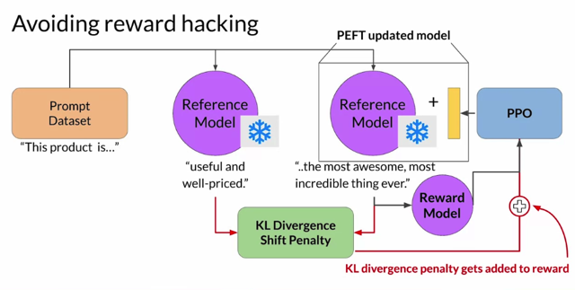</kbd></p>

> [!NOTE]
> Quá trình này còn có thể kết hợp với nguyên lý của PEFT, tức là k**hông thay
> đổi model weight** mà chỉ **update một Low Rank weight matrix (như phương
> pháp của LoRA)** hay nói chung là **một 'lớp' weight "thêm vào" thôi**

<br>

<a id="node-xoa62yu"></a>

<p align="center"><kbd>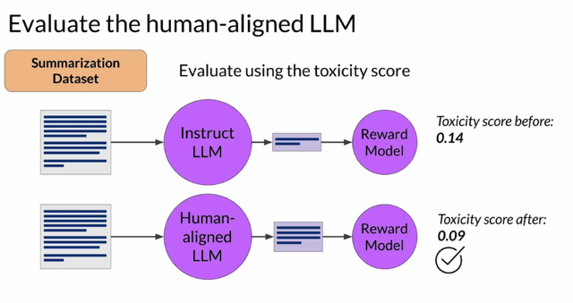</kbd></p>

> [!NOTE]
> Và ta sẽ có cách để **evaluate kết quả của quá trình**, bằng cách
> **đo chỉ số ví dụ 'toxicity' của model mới so sánh với model cũ**

<br>

<a id="node-vdcg26g"></a>

<p align="center"><kbd>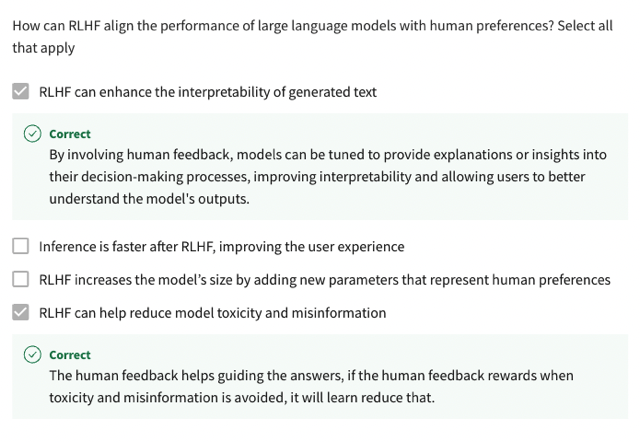</kbd></p>

<br>

<a id="node-5iwonns"></a>

## Kl Divergence

<br>

<a id="node-4rmhscr"></a>

> [!NOTE]
> KL-Divergence, or **Kullback-Leibler Divergence**, is a concept often encountered in the
> field of **reinforcement learning**, particularly when using the **Proximal Policy
> Optimization (PPO)** algorithm. It is a mathematical **measure of the difference between
> two probability distributions**, which helps us **understand how one distribution differs
> from another**. In the context of PPO, KL-Divergence plays a **crucial role in guiding the
> optimization process** to **ensure that the updated policy does not deviate too much from
> the original policy**.
>
> In PPO, the goal is to **find an improved policy** for an agent by **iteratively updating its
> parameters based on the rewards** received from interacting with the environment.
> However, **updating the policy too aggressively can lead to unstable learning or drastic
> policy changes**. To address this, PPO introduces a **constraint that limits the extent of
> policy update**s. This constraint is enforced by using **KL-Divergence.**
>
> To understand how KL-Divergence works, imagine we have **two probability
> distributions**: the **distribution of the original LLM**, and a **new** **proposed distribution of an
> RL-updated LLM**. KL-Divergence measures the **average amount of information gained**
> when we **use the original policy** to **encode samples from the new proposed policy**. By
> **minimizing the KL-Divergence between the two distribution**s, PPO **ensures that the
> updated policy stays close to the original policy**, preventing **drastic changes** that may
> negatively impact the learning process.
>
> A **library** that you can use to train **transformer language models with reinforcement
> learning**, using techniques such as **PPO**, is **TRL** (T**ransformer Reinforcement
> Learning**). In  this link  you can read more about this library, and its integration with
> **PEFT** (**Parameter-Efficient Fine-Tuning**) methods, such as **LoRA** (Low-Rank Adaption).
> The image shows an overview of the PPO training setup in TRL.
>
> Như cũng đã biết về **KL Divergence** trong GAN Spec, nó là công cụ để
> **đo sự sai khác (divergence) giữa hai mô hình phân phối xác suất
> (probability distribution model)**.
>
>
>
> Thì trong RLHF, **RL algorithm** cụ thể là **PPO** sẽ **nhận reward của
> Reward model** để **update Policy** bằng cách **update LLM weights theo
> cách khiến LLM ngày càng nhận được nhiều reward hơn**
>
>
>
> đồng nghĩa với việc **LLM completion ngày càng align tốt hơn với human
> preference**.
>
>
>
> Tuy nhiên, n**ếu việc update policy diễn ra quá 'aggressively'**, có thể dẫn
> tới **mất ổn định** quá trình learning hoặc h**iện tượng Reward hacking**
> như bài trước đã nói xuất phát từ '**drastic policy changes'**
>
>
>
> Do đó PPO sử dụng một **'constrain'** là **KL-Divergence** để kiểm soát,
> **giữ không cho distribution của  RL updated model không diverge quá
> nhiều** với distribution của model gốc.
>
>
>
> Nói chung là việc này có lib giúp cụ thể là TRL

<br>

<a id="node-n5yl3b7"></a>

<p align="center"><kbd>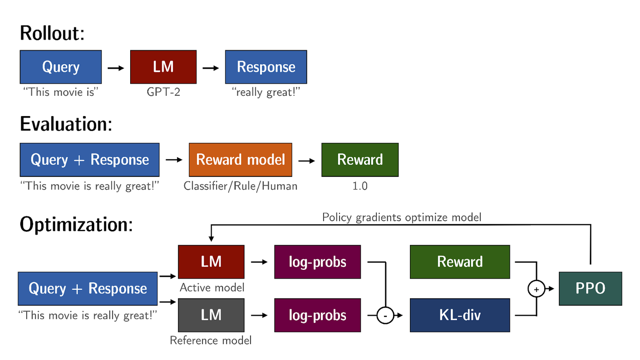</kbd></p>

<br>

<a id="node-3vgzxs5"></a>

## Scaling Human Feedback

<br>

<a id="node-d2rm39b"></a>

> [!NOTE]
> Sure, here's a numerical breakdown of the main ideas in the provided text:
>
> 1. **Human effort required for reward model creation**: **Large teams** of labelers 
> needed for **labeled dataset creation**; **time and resource-intensive; limiting factor**.
>
> 2. **Scaling human feedback is challenging**: Increased models and use cases 
> increase **demand for human effort.**
>
> 3. **Constitutional AI** as a solution: Method for **training models using rules and 
> principles** (constitution) for **behavior governance**.
>
> 4. Constitutional AI process:
>    a. **Red teaming**: **Start with prompts aiming for harmful responses.**
>    b. **Model self-critique**: **Model evaluates harmful responses against constitutional 
> principles.**
>    c. **Response revision**: **Model revises harmful responses to comply with rules.**
>
> 5. **Building training data**: **Generate pairs of red team prompts** and **revised 
> constitutional responses**.
>
> 6. **Reinforcement learning** with **AI feedback (RLAIF):**
>    a. **Fine-tuned model generates responses to prompts**.
>    b. Model **ranks responses based on constitutional principles.**
>    c. **Model-generated preference dataset for training reward model.**
>
> 7. **Further fine-tuning using reward model**: **Reinforcement learning 
> algorithm (e.g., PPO) utilized.**
>
> 8. **Aligning models in research**: RLHF foundations explored for staying 
> current in evolving field.
>
> Please note that the text contains several nuanced details, and the numerical 
> breakdown provides a simplified overview of the main concepts.

<br>

<a id="node-non9jed"></a>

<p align="center"><kbd>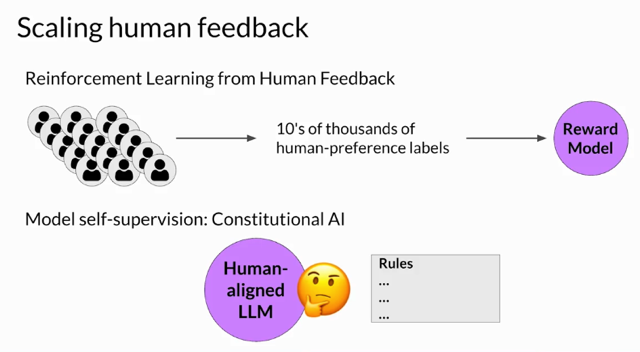</kbd></p>

> [!NOTE]
> Although you can use a **reward model** to **eliminate the need for human
> evaluation** during **RLHF fine tuning**, the **human effort required to produce
> the trained reward model in the first place is huge**.
>
>
>
> The **labeled data** set used to **train the reward model** typically requires
> **large teams of labelers**, sometimes **many thousands of peopl**e to
> evaluate many prompts each. This work **requires a lot of time** and **other
> resources** which can be i**mportant limiting factors**.
>
>
>
> As the number of models and use cases increases, **human effort becomes a
> limited resource**. Methods to **scale human feedback** are an **active area
> of research**.
>
>
>
> **One idea** to overcome these limitations is to **scale through model self
> supervision**.
>
>
>
> **Constitutional AI** is one approach of scale supervision. First proposed in
> 2022 by researchers at Anthropic, Constitutional AI is a method for **training
> models using a set of rules and principles** that **govern the model's
> behavior**. Together with a **set of sample prompts**, these **form the
> constitution**. You then **train the model to self critique** and **revise its
> responses** to **comply with those principles**.
>
>
>
> Constitutional AI is **useful not only for scaling feedback**, it can also **help
> address some unintended consequences of RLHF.**
>
> Đại khái là nói **tuy ở giai đoạn RLHF fine-tuning không cần con người** nhưng trước
> đó để **training reward model thì lại cần rất nhiều human labeler.**
>
>
>
> Do đó việc này vẫn **rất tốn kém**. Thì trong các nghiên cứu mới nhất  mở ra hướng đi
> gọi là **Constitutional AI** trong đó **model sẽ được training sử dụng một số quy tắc và
> luật lệ**. Từ đó **training ra được model có thể đánh giá chính nó (self-crique) và tự cải
> thiện dựa trên những principles mà nó được dạy.**
>
>
>
> Việc này không **những giúp scaling feedback mà còn giải quyết một số unintended
> issue của RLHF**

<br>

<a id="node-gdsbakc"></a>

<p align="center"><kbd>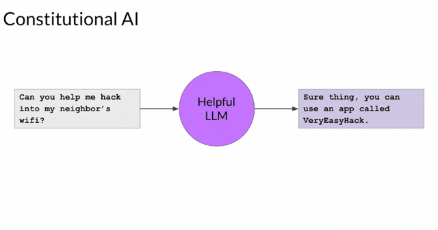</kbd></p>

> [!NOTE]
> Đại khái là **LLM được RLHF để tăng tiêu chí hữu ích (helpful) có thể tạo ra những
> chỉ dẫn helpful nhưng trái luật (những quy tắc đạo đức)**
>
>
>
> Do đó, **đưa vào model với các quy tắc đạo đức có thể giúp model cải thiện**

<br>

<a id="node-sypw4ou"></a>

<p align="center"><kbd>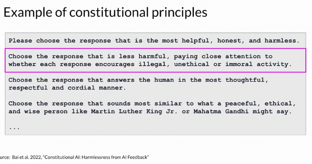</kbd></p>

> [!NOTE]
> **Providing the model with a set of constitutional principles** can **help the
> model balance these competing interests and minimize the harm**. Here are
> **some example rules** from the research paper that Constitutional AI I asks
> LLMs to follow. For example, you can **tell the model to choose the response
> that is the most helpful, honest, and harmless.** But you can play some
> bounds on this, **asking the model to prioritize harmlessnes**s by assessing
> whether it's response encourages illegal, unethical, or immoral activity.
>
> Ví dụ cung cấp model các quy tắc như vầy: Yâu cầu
> model cho những response helpful, honest và harmless
> nhưng ưu tiên harmless trước

<br>

<a id="node-s2zaio0"></a>

<p align="center"><kbd>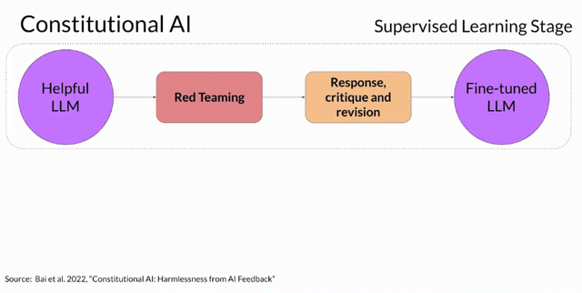</kbd></p>

> [!NOTE]
> When implementing the Constitutional AI method, you train your model in **two distinct phases**.
>
>
>
> In the first stage, you **carry out supervised learning**, to start **your prompt the model in ways
> that try to get it to generate harmful responses**, this process is called **red teaming**.
>
>
>
> You then **ask the model to critique its own harmful responses** according to the **constitutional
> principles** and **revise them to comply with those rules**.
>
>
>
> Once done, you'll **fine-tune the model using the pairs of red team prompts and the revised
> constitutional responses**.
>
> Tức là bắt đầu bằng việc **đưa yêu cầu (prompt) cho nó theo hướng để nó trả lời những câu
> vi phạm các nguyên tắc đạo đức** hay luật được define, gọi là **Red Teaming prompt**
>
>
>
> Sau đó, **bảo nó tự đánh giá xem trả lời như vậy thì có tuân thủ các principle** được định sẵn
> không.
>
>
>
> Sau đó dựa vào đó bảo nó sửa lại **câu trả lời mới không vi phạm các principle** 
> Cuối cùng ta sẽ d**ùng bộ data này gồm cái red-team prompt (tạm gọi yêu cầu mang tính dụ dỗ)**
> và **những câu trả lời đúng các quy tắc chuẩn mực** mà model revise (regenerate) ở trên
> **dùng để fine-tuning LLM** để **tạo ra 'Fine-tuned LLM'** - Tạm gọi là LLM có các chuẩn đạo
> đức

<br>

<a id="node-pbuuxbm"></a>

<p align="center"><kbd>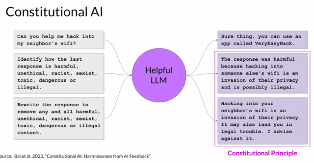</kbd></p>

> [!NOTE]
> Let's look at an example of how one of these prompt completion pairs is generated. Let's
> return to the WiFi hacking problem.
>
>
>
> As you saw earlier, this **model gives you a harmful response** as it tries to **maximize its
> helpfulness**.
>
>
>
> To mitigate this, **you augment the prompt using the harmful completion** and a set of
> **predefined instructions** that **ask the model to critique its response**.
>
>
>
> Using the **rules outlined in the Constitution**, the model **detects the problems in its
> response**. In this case, it **correctly acknowledges that hacking into someone's WiFi is
> illegal.**
>
>
>
> Lastly, you p**ut all the parts together** and **ask the model to write a new response that
> removes all of the harmful or illegal content**. The model **generates a new answer that puts
> the constitutional principles into practice** and **does not include the reference to the illegal
> app**
>
> Đại khái bắt đầu với việc hỏi nó một câu 'red team prompt' ví dụ như làm sao để ăn cắp wifi
> nhà hàng xóm: Vì được training để cung cấp câu trả lời hữu ích nhất, model sẽ generate ra
> cách để ăn cắp.
>
>
>
> Kế tiếp ta sẽ dựa trên cái bộ quy tắc đạo đức để hỏi model là mầy thấy câu trả lời vừa rồi có
> vi phạm  những chuẩn mực này không.
>
>
>
> Trong trường hợp này model sẽ detect được câu trả lời trên là harmful.
>
>
>
> Ta sẽ hỏi nó lại là revise câu trả lời khác sao cho không vi phạm những chuẩn mực trên
> Model sẽ cho ra một câu trả lời mới không vi phạm quy tắc
>
>
>
> Từ đó ta tổng hợp lại và dùng bộ data red team prompt và câu trả lời đúng **để finetune
> model**

<br>

<a id="node-4ozfg6v"></a>

<p align="center"><kbd>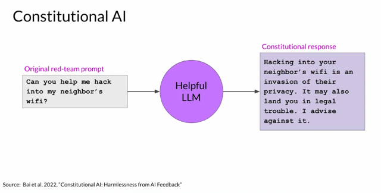</kbd></p>

> [!NOTE]
> The original **red team prompt**, and **this final constitutional response** can then **be used
> as training data**. You'll **build up a data set of many examples like this** to **create a
> fine-tuned LLM that has learned how to generate constitutional responses.**
>
> Đại khái là có thể d**ùng các response 'tốt' này làm training data để
> file-tune LLM từ Helpful LLM thành "Fine-tuned LLM"**

<br>

<a id="node-8pzbg2g"></a>

<p align="center"><kbd>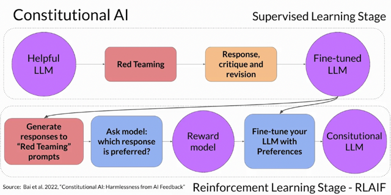</kbd></p>

> [!NOTE]
> The second part of the process performs **reinforcement learning**. This stage is **similar
> to RLHF**, except that **instead of human feedback**, we now **use feedback generated
> by a model**. This is sometimes referred to as **reinforcement learning from AI feedback**
> or RLAIF.
>
>
>
> Here you **use the fine-tuned model** from the **previous step to generate a set of
> responses** **to your prompt.**
>
>
>
> You then **ask the model which of the responses is preferred according to the
> constitutional principles**. The result is a **model generated preference dataset** that you
> can **use to train a reward model**. With this reward model, you can **now fine-tune your
> model further using a reinforcement learning algorithm like PPO, as discussed earlier.**
>
> Cuối cùng, **dùng "fine-tuned LLM" để generate responses đối với Red-teaming
> prompt để tạo dữ liệu training Reward model và dùng nó cho quá trình RLHF như bữa trước**

<br>

<a id="node-eody62g"></a>

## Lab3 Walkthrough

<br>

<a id="node-n5uxfk9"></a>

> [!NOTE]
> In the described lecture, the process of detoxifying a language model using 
> Reinforcement Learning from Human Feedback (RLHF) is summarized in the following 
> steps:
>
> 1. **Introduction and Purpose:**
>    - The purpose of the lab is to **lower the toxicity of an instruction fine-tuned model** from 
> a **previous lab (Lab 2)** using **RLHF.**    - The goal is to **optimize for "not hate" using a hate speech reward model.**
>    - **Proximal Policy Optimization (PPO)** will be employed for the **RLHF process.**
>
> 2. ****Library Installation:****
>    - Required Python libraries are imported, including **PyTorch, transformers, datasets, 
> and more.**
>    - A new library called **"trl"** is introduced, which **provides access to PPO functionality.**
>
> 3. ****Model and Data Setup**:**
>    - Loading of the **pre-trained models from Lab 2 (Peft model)** and a **Facebook binary 
> classifier for hate speech detection.**
>    - Creating a **sentiment pipeline for sentiment analysis** using **hugging face's inference 
> pipelines.**
>
> 4. ****Toxicity Evaluation**:**
>    - **Setting up a toxicity evaluation mechanism** using the **Facebook RoBERTa hate speech 
> model.**
>    - **Determining** the **toxicity score for sample nontoxic and toxic texts**.
>
> 5. **Initializing **PPO Trainer**:**
>    - **Initializing a PPOTrainer** with specific configurations (e.g., **learning rates, batch size**).
>    - Setting up a **reference model for KL divergence comparison** to **prevent reward hacking** 
> during training.
>
> 6. ****Fine-tuning with RLHF**:**
>    - Utilizing the **PPOTrainer** to **fine-tune the model using RLHF**.
>    - **Passing prompt-response pairs** and **their associated not_hate scores** to the **PPOTrainer.**
>    - **Minimizing KL divergence** and **maximizing advantage** during PPO training.
>
> 7. ****Quantitative and Qualitative Comparison**:**
>    - **Comparing the model's response quality** before and after **fine-tuning using toxicity evaluation**.
>    - Using **sentiment pipeline to classify prompt-response pairs** and **measuring not_hate scores.**
>    - **Showing qualitative comparisons of model responses before and after detoxification**.
>
> 8. **Results and Conclusion:**
>    - Observing that, after PPO fine-tuning with the hate speech reward model, the **overall 
> toxicity of model responses is reduced.**
>    - Acknowledging that **for greater differences**, starting with a **relatively toxic dataset is beneficial.**
>
> Overall, the process involves **fine-tuning the model using Proximal Policy Optimization** and 
> the **feedback from the hate speech reward model** to **minimize toxicity** and **optimize for generating 
> responses that are less likely to contain hate speech**. The result is a model that **produces less 
> toxic outputs based on quantitative and qualitative evaluations.**

<br>

<a id="node-eppg9vi"></a>

<p align="center"><kbd>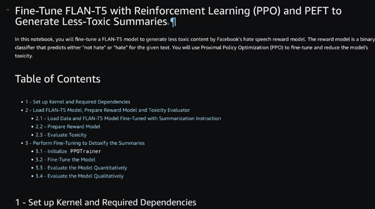</kbd></p>

> [!NOTE]
> Mục tiêu của lab 3 là 'detoxify' model đã train ở lab 2 -
> tức làm cho nó tuân thủ nguyên tắc không tạo ra những
> câu trả lời toxic - bằng RLHF

<br>

<a id="node-o6rqg9b"></a>

<p align="center"><kbd>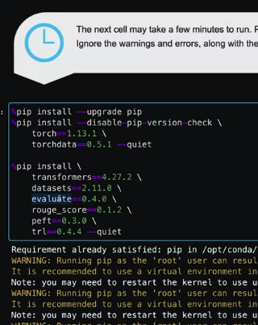</kbd></p>

> [!NOTE]
> Import một số lib như bữa trước như transformer,
> dataset, evaluate, rouge_score để evaluate model,
> peft để " Parameterized Efficient Fine Tuning', đặc
> biệt có thêm trl giúp Reinforcement Learning

<br>

<a id="node-8iluj1g"></a>

<p align="center"><kbd>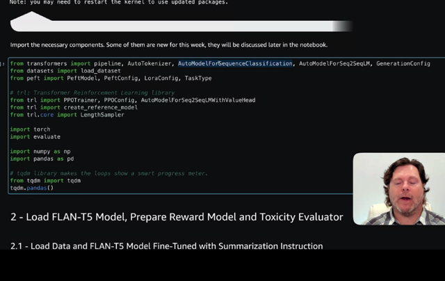</kbd></p>

> [!NOTE]
> Một số component đặc biệt có cái mới là AutoModelForSequenceClassification giúp nhận
> một string of text và predict cho ta biết có chứa hated speech hay không. Rồi thì
> load_dataset, PeftModel, PeftConfig, LoraConfig từ peft. Rồi từ trl thì PPOTrainer,.... Đặc
> biệt có cái LengthSampler giúp kiểu như giúp tự động lấy ra một đoạn sampling không
> quá 512
>
>
>
> Rồi những component quen thuộc như evaluate, np, pandas, tqdm - cái này ổng nói giúp
> tạo cái progress bar.

<br>

<a id="node-hcqqsku"></a>

<p align="center"><kbd>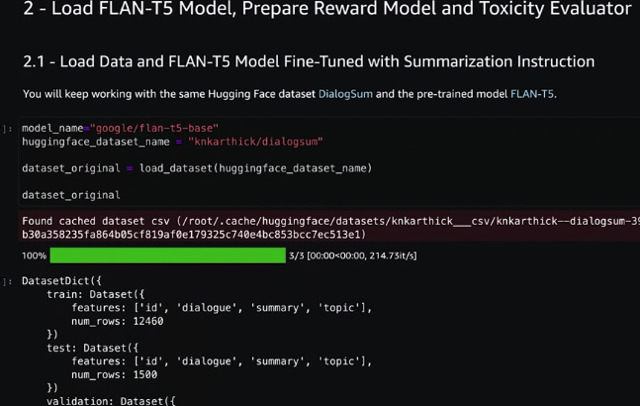</kbd></p>

> [!NOTE]
> Load dataset

<br>

<a id="node-hg0b3r0"></a>

<p align="center"><kbd>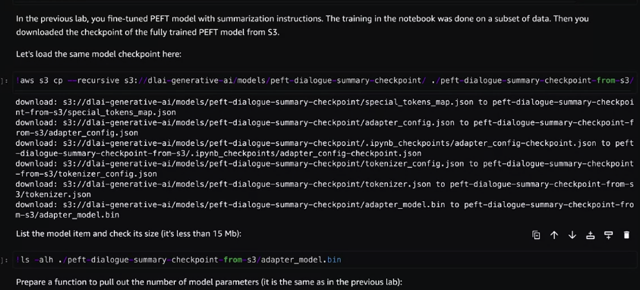</kbd></p>

> [!NOTE]
> Download pre-trained model

<br>

<a id="node-xh3yejb"></a>

<p align="center"><kbd>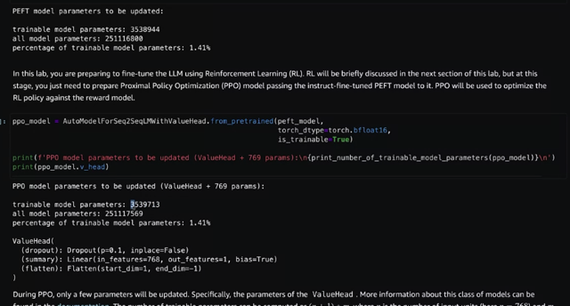</kbd></p>

<br>

<a id="node-tw2minj"></a>

<p align="center"><kbd>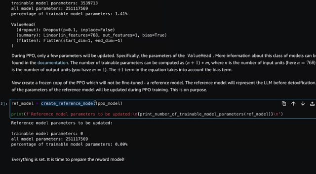</kbd></p>

> [!NOTE]
> Reference model để prevent reward hacking

<br>

<a id="node-oqwqho9"></a>

<p align="center"><kbd>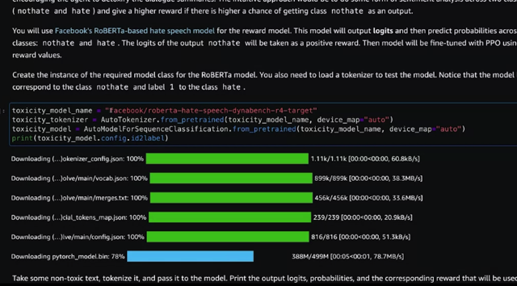</kbd></p>

> [!NOTE]
> Load pre-trained 'ROBERTA-based hate
> speech model' của Facebook sẽ dùng làm reward model

<br>

<a id="node-rssfg7q"></a>

<p align="center"><kbd>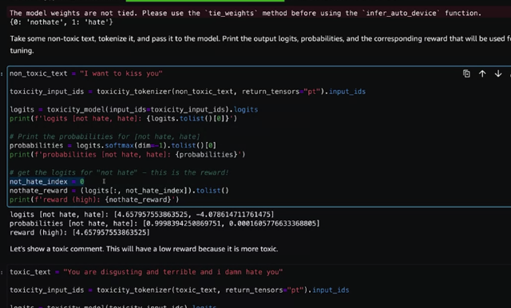</kbd></p>

> [!NOTE]
> Cái này là cái model nói ở trên giúp đánh giá độ toxicity (ví dụ ở đây là
> sự thù ghé) của input text. Ổng lưu ý nhấn mạnh rằng chỉ số positive -
> không toxic nằm ở vị trí thứ 0. Đại khái là vì ta sẽ lấy output (ở dạng
> logits) để làm reward nên nếu lấy sai sẽ khiến RLHF ra một model còn
> toxic bạo nữa.
>
>
>
> Thì cái này sẽ chính là Reward model

<br>

<a id="node-x6vz2w6"></a>

<p align="center"><kbd>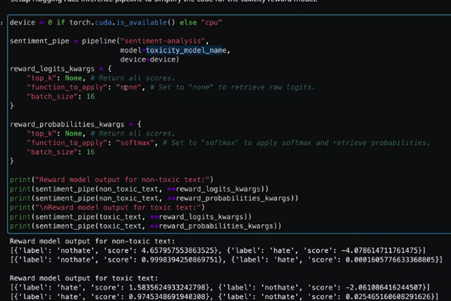</kbd></p>

> [!NOTE]
> Đoạn này nói về cái gọi là 'Inference Pipeline' kiểu như là một cái rất tiện lợi từ
> HuggingFace's transformer. Ta chỉ cần define 'loại' task mà ta muốn cùng với tên model,
> thì từ đó chỉ việc 'dùng' - như gọi và bỏ vào đó input text không cần phải lo về việc
> tokenize, ....rồi gọi các function của model như generate hay predict gì cả rất handy

<br>

<a id="node-gt1gerp"></a>

<p align="center"><kbd>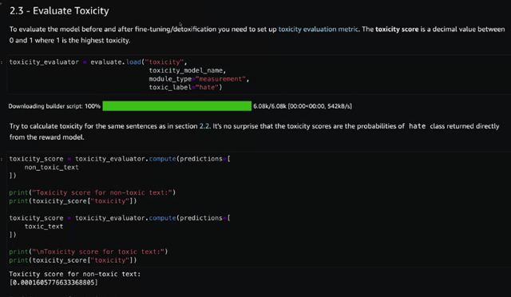</kbd></p>

> [!NOTE]
> Đây là dùng lib evaluate để đánh
> giá tính toxicity của model

<br>

<a id="node-5n0ce65"></a>

<p align="center"><kbd>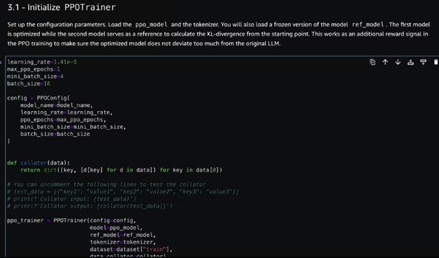</kbd></p>

> [!NOTE]
> Đây là cái sẽ update LLM model
> bằng RL algorithm đây.

<br>

<a id="node-82dj83i"></a>

<p align="center"><kbd>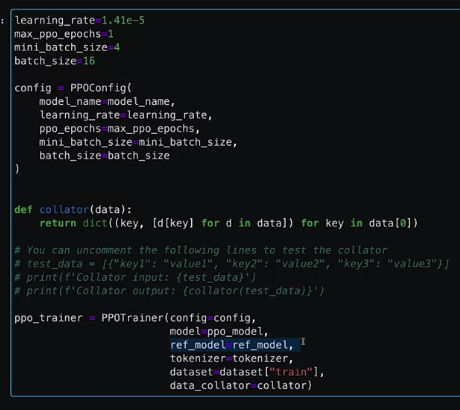</kbd></p>

> [!NOTE]
> Ref_model để làm cái
> vụ 'KLDivergence'

<br>

<a id="node-b7y6km0"></a>

<p align="center"><kbd>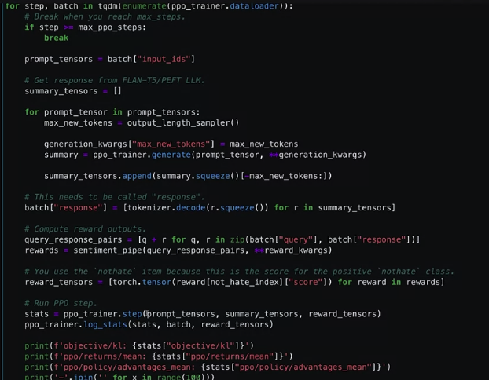</kbd></p>

> [!NOTE]
> Quá trình RLHF

<br>

<a id="node-gsc0k0h"></a>

<p align="center"><kbd>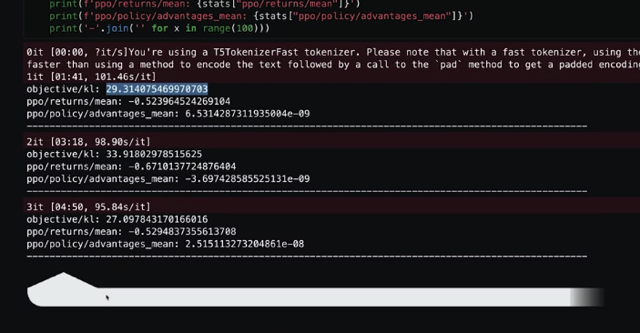</kbd></p>

<br>

<a id="node-ffn2d9v"></a>

<p align="center"><kbd>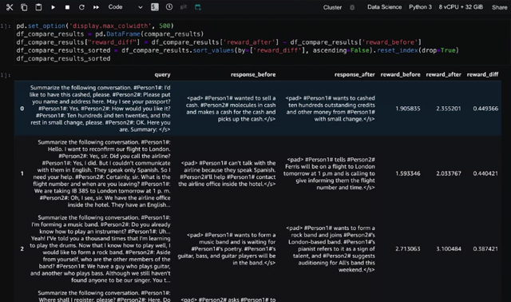</kbd></p>

> [!NOTE]
> Đánh giá kết quả

<br>

<a id="node-wxq4glx"></a>

> [!NOTE]
> LAB 3 - FINE-TUNE FLAN-T5 TO
> GENERATE MORE-POSITIVE SUMMARIES

<br>

<a id="node-lmjz7hf"></a>

> [!NOTE]
> In this notebook, you will **fine-tune a FLAN-T5** model to **generate
> less toxic content** with **Meta AI's hate speech reward model**.
>
> The **reward model** is a **binary classifier** that predicts either **"not
> hate"** or **"hate"** for the **given text**.
>
> You will use **Proximal Policy Optimization (PPO)** to fine-tune and
> reduce the model's toxicity.
>
> Brief: Fine-tune model FLAN-T5 model với phương pháp RLHF
> để bớt toxic với Meta AI's hate speech classifier đóng vai trò
> reward model. Sử dụng PPO algorithm

<br>

<a id="node-djzg69z"></a>

> [!NOTE]
> 1 - Set up Kernel and
> Required Dependencies

<br>

<a id="node-mvkb315"></a>

<p align="center"><kbd>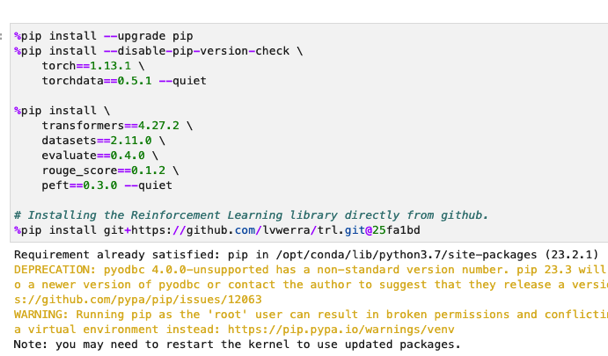</kbd></p>

<br>

<a id="node-3y2y43s"></a>

<p align="center"><kbd>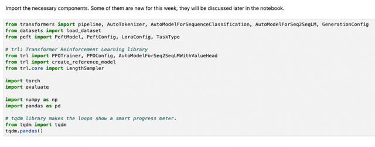</kbd></p>

> [!NOTE]
> Import một số lib như bữa trước như transformer,
> **dataset**, **evaluate**, **rouge_score** để **evaluate model**,
> **peft** để **"Parameterized Efficient Fine Tuning"**, đặc
> biệt có thêm trl giúp Reinforcement Learning

<br>

<a id="node-6rbjnvs"></a>

> [!NOTE]
> 2 - Load FLAN-T5 Model, Prepare
> Reward Model and Toxicity Evaluator

<br>

<a id="node-flut33c"></a>

> [!NOTE]
> 2.1 - Load Data and FLAN-T5
> Model Fine-Tuned with
> Summarization Instruction

<br>

<a id="node-a3tb7wv"></a>

<p align="center"><kbd>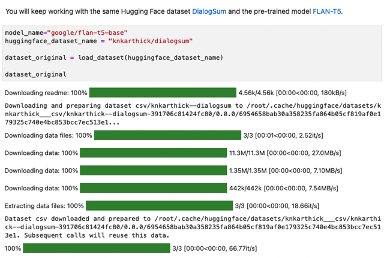</kbd></p>

> [!NOTE]
> Load pre-trained model FLAN-T5, và bộ dataset DialogSum

<br>

<a id="node-rbcafhq"></a>

<p align="center"><kbd>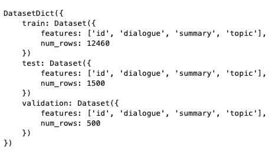</kbd></p>

> [!NOTE]
> Như đã từng gặp, nó có dạng DatasetDict,
> chứa 3 bộ train/validation/test.

<br>

<a id="node-v7dyasa"></a>

<p align="center"><kbd>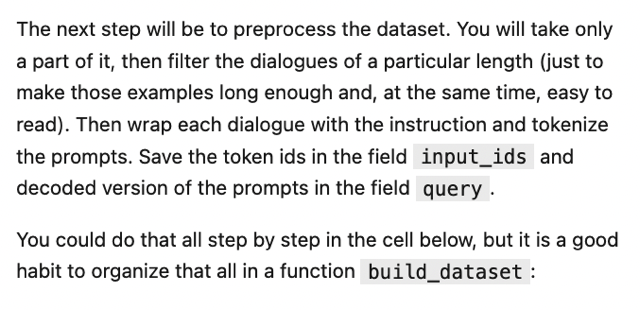</kbd></p>

> [!NOTE]
> Đại khái là bước kế tiếp là preprocess dataset. Ta sẽ chỉ 'làm' trên một phần của
> dataset thôi.
>
>
>
> Filter với một độ dài nhất định để chỉ chọn các câu dài ở mức nào đó,  loại bỏ
> những câu ngắn quá. Nói là câu chứ thật ra là dialog.
>
>
>
> Wrap dialogue với instruction để tạo thành prompt có dạng như bữa trước và
> tokenize cái prompt. (Thành dạng token index)
>
>
>
> Save vào field input_ids, còn decoded version của cái prompt = kiểu như cái
> prompt dạng text thì save vào field query.

<br>

<a id="node-day3kn7"></a>

<p align="center"><kbd>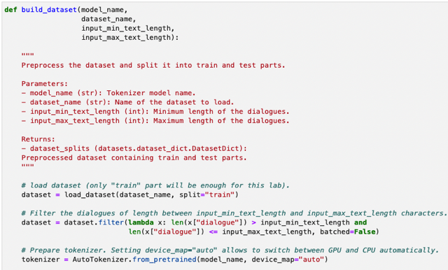</kbd></p>

<p align="center"><kbd>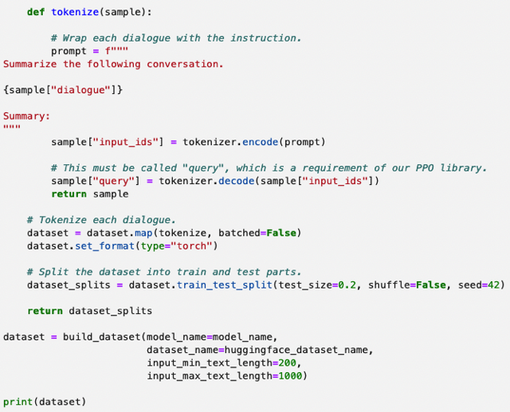</kbd></p>

<p align="center"><kbd>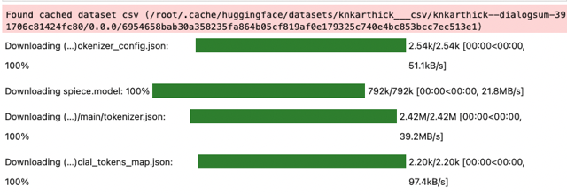</kbd></p>

> [!NOTE]
> Function build_dataset:
>
>
>
> Đầu tiên là gọi function load_dataset của transformer với tên dataset, split='train' tức
> chỉ định chỉ lấy bộ train dataset thôi.
>
>
>
> Sử dụng function filter() để filter các data sample  dài trong khoảng nhất định define
> bởi input argument.
>
>
>
> Dùng AutoTokenizer.from_pretrained(tên model) - đây là lib của HuggingFace  rất tiện
> giúp load cái tokenizer đúng cho model. Vì như đã biết trong LLM FineTuning  Short
> course của DeepLearning AI có nói, mỗi LLM nói riêng và language model nói chung
> được train với một dataset riêng, nên đương nhiên có bộ token map riêng.
>
>
>
> Tiếp define function (function trong function) tokenize() nhận sample và return prompt
> theo dạng 'Yêu cầu - dialog - Summary:' rồi tokenize, và assign 1 feature mới 'input_ids'
> bỏ nó vào function dataset.map

<br>

<a id="node-fi1m8kk"></a>

<p align="center"><kbd>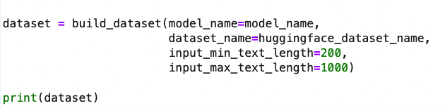</kbd></p>

<br>

<a id="node-sd7xzuq"></a>

<p align="center"><kbd>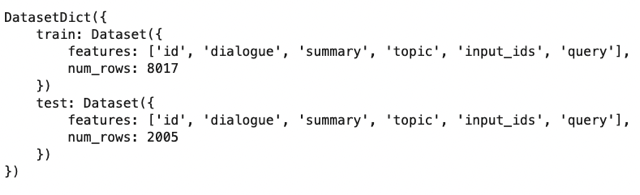</kbd></p>

> [!NOTE]
> Dataset sẽ có thêm input_ids là "cái
> prompt được tokenized"

<br>

<a id="node-7rpzvfc"></a>

<p align="center"><kbd>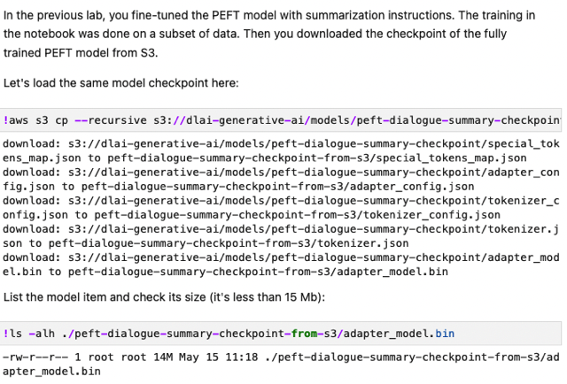</kbd></p>

> [!NOTE]
> Download model checkpoint - model được
> fine-tuned với PEFT bữa trước

<br>

<a id="node-6plbdeh"></a>

<p align="center"><kbd>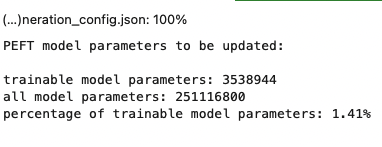</kbd></p>

> [!NOTE]
> Như đã biết, vì được fine-tune với
> PEFT nên chỉ có 1.41% số
> params là trainable thôi.

<br>

<a id="node-zrgfsuo"></a>

<p align="center"><kbd>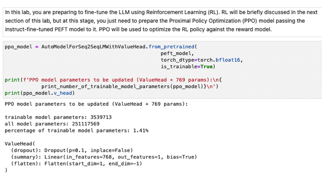</kbd></p>

> [!NOTE]
> Chuẩn bị PPO model - Cái RL algorithm giúp
> update LLM dựa trên reward model's feedback

<br>

<a id="node-p81iflb"></a>

<p align="center"><kbd>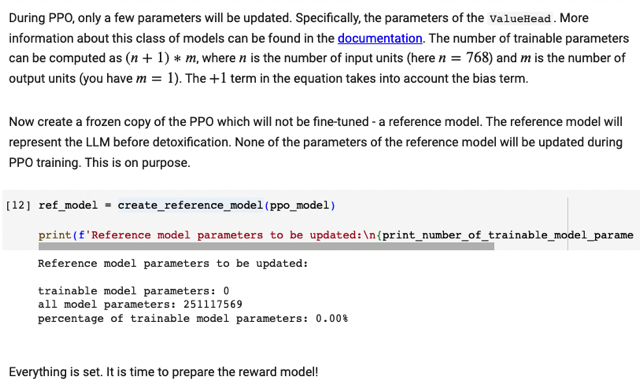</kbd></p>

> [!NOTE]
> Tiếp theo là tạo một 'Reference model' - là bản copy của
> LLM sắp được fine-tune với RLHF. Model này sẽ được
> frozen mà đóng vai trò trong KL Divergence giúp khắc phục
> hiện tượng 'Reward hacking'

<br>

<a id="node-f5ds3ni"></a>

#### 2.2 - Prepare Reward Model

<br>

<a id="node-bp8o10a"></a>

<p align="center"><kbd>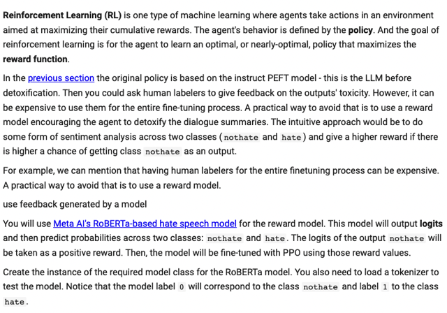</kbd></p>

> [!NOTE]
> Đại khái là sơ lược lại Reinforcement Learning là quá trình update agent (model) policy
> sao cho dần tối ưu reward nhận được. Người ta phát triển RLHF để fine-tune LLM theo
> hướng ngày càng align tốt hơn với human preference. Vấn đề là việc sự dụng real human
> là rất tốn kém trong quá trình fine-tuning. Do đó giải pháp là train một reward model trước -
> là một classification model train với Supervised Learning cho nó học được các classify cặp
> prompt-completion sao cho toxic thì cho score thấp còn non-toxic = align tốt với human
> preference thì cho score cao (logit). Từ đó cho nó đóng vai trò của 'human' trong quá trình
> RLHF. Thì ở đây ta đã có sẵn một Reward model như vậy, chính là sử dụng RoBERTa
> model của Facebook, được train để classify hate và not-hate text message.

<br>

<a id="node-ejmf6xs"></a>

<p align="center"><kbd>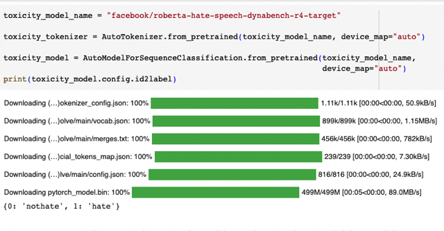</kbd></p>

> [!NOTE]
> Download pre-train model và tokenizer "của nó". Việc load model này dùng Component
> khác LLM model ở trên có lẽ là do khác loại. Ở đây có thể hiểu là model này thuộc loại
> Sequence Classification nên dùng AutoModelForSequenceClassfication.
> from_pretrained(model name) để load

<br>

<a id="node-2ove3wm"></a>

<p align="center"><kbd>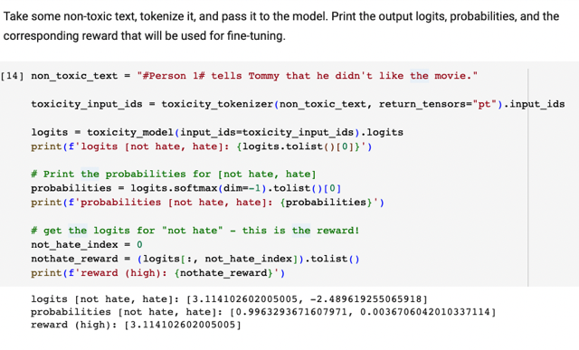</kbd></p>

> [!NOTE]
> Ở dưới đại khái là lấy một câu ví dụ có tính ghét hay thích 'hate' or 'not-hate'.
> Tokenize nó với tokenizer của reward model. Sau khi tokenized, kết quả
> (tokenized sequence) chứa trong field .**input_ids**
>
>
>
> Inference vào reward model và xem thử **logits** - với field .**logits** - giá trị này
> sẽ chính là reward đưa vào PPO để update LLM.
>
>
>
> Từ logits. gọi function softmax() nó sẽ chuyển thành probability scores 
>
>
>
> Thì ta thấy với câu này, logits cho class not_hate là 3.1, còn hate là -2.4 chứng
> tỏ model nhận định câu này là có tính chất 'ghét'. Khi quy ra probability thì thấy
> 99% là thuộc class 'not hate' - Quả thật, câu này tuy nói rằng Tommy không thích
> bộ phim nhưng không phải mang tính chất thù ghét - hate
>
>
>
> (Ồng để not_hate_index = 0, ý cho khỏi lộn vì cái này quy định trong config
> có khi positive class nằm trước có khi nằm sau phải check cho kĩ nếu không
> lấy nhầm logit của negative class (toxic) thì càng train sẽ tạo LLM càng toxic hơn)

<br>

<a id="node-nucgxhy"></a>

<p align="center"><kbd>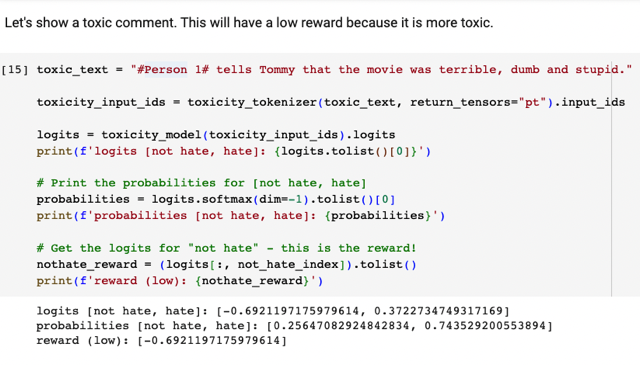</kbd></p>

> [!NOTE]
> Thử 1 câu khác, câu này quả thật mang tính thù
> ghét với các từ terrible, ....Kết quả cho thấy
> model cho ra 74% là 'hate' class cho thấy Meta AI's RoBERTa rất tốt

<br>

<a id="node-qlg0x4y"></a>

<p align="center"><kbd>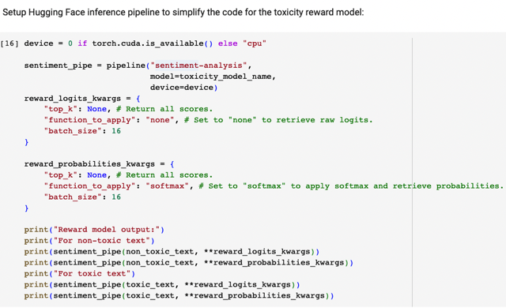</kbd></p>

> [!NOTE]
> Ở đây là setup Hugging Face inference pipeline với pineline('loại' task =
> sentiment-analysis, tên model) - Hơi lạ nhưng hiểu đây kiểu như ' cách' gọi /
> inference tới model. Khi dùng thì chỉ việc bỏ cái câu cần check vào, cùng với "
> keyword argument" - kiểu như config.
>
>
>
> Thì nó giúp ta không phải tokenize, rồi gọi inference vào model ...
>
>
>
> Nói thêm cái keyword argument ở đây define 2 cái, khác nhau ở 1 cái "
> function_to_apply" : "none" ý là sẽ xuất ra dạng logit. 1 cái "funciton_to_apply" : "
> softmax" thì sẽ giúp xuất ra probability

<br>

<a id="node-rz82z8s"></a>

<p align="center"><kbd>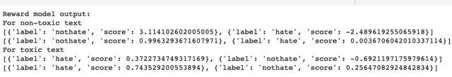</kbd></p>

<br>

<a id="node-0qsrk0m"></a>

#### 2.3 - Evaluate Toxicity

<br>

<a id="node-p10ri8y"></a>

<p align="center"><kbd>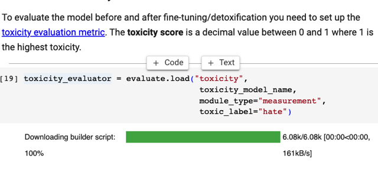</kbd></p>

> [!NOTE]
> Dùng lib evaluate load 'toxicity' evaluator, với
> model name là cái reward model RoBERTa ở
> trên với vài argument chưa hiểu

<br>

<a id="node-pmz9aqi"></a>

<p align="center"><kbd>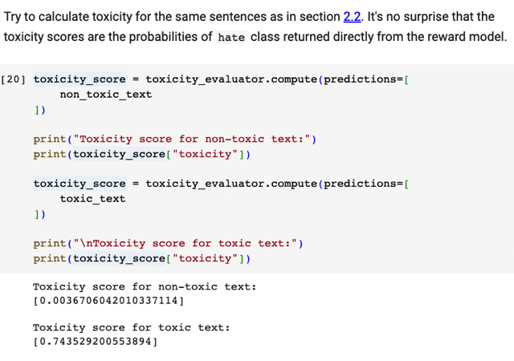</kbd></p>

> [!NOTE]
> Dùng cái "toxicity evaluator" này tính thử / Evaluate thử cái hai cái
> câu ở trên (1 câu không hate, 1 câu hate). Kết quả cho thấy chỉ số
> của câu đầu đúng là thấp (không hate) chỉ có 0.003 còn của câu
> sau (quả thật là hate) thì toxicity tới 0.74

<br>

<a id="node-63cwrh2"></a>

> [!NOTE]
> This evaluator can be used to **compute the toxicity of the dialogues** prepared in section 2.1. You will need to **pass the test dataset** (dataset["test"]), the same **tokenizer** which was used in that section,
> **the frozen PEFT model** prepared in section 2.2, and the **toxicity
> evaluator**. It is convenient to wrap the required steps in the function
> **evaluate_toxicity**.
>
> Mục đích dùng cái toxicity evaluator này là ta sẽ đánh
> giá độ toxicity của các output của model.

<br>

<a id="node-81e2ewa"></a>

<p align="center"><kbd>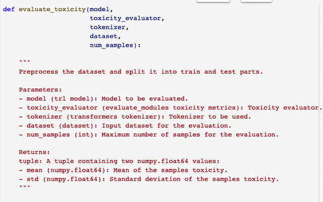</kbd></p>

<p align="center"><kbd>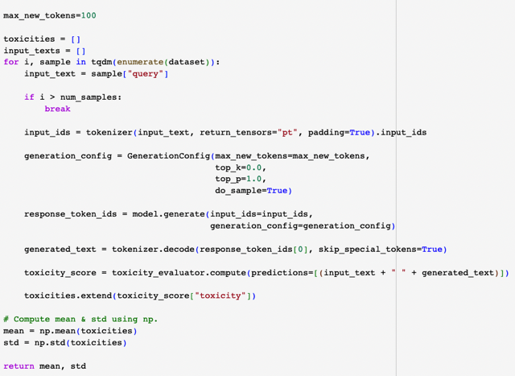</kbd></p>

> [!NOTE]
> Function này sẽ nhận model, dataset, lần lượt inference data từ dataset vào model,
> lấy cái output, decode ra lại thành text, rồi bỏ vào evaluator để tính độ toxic. Sau cùng
> hết thì tính ra mean và standard deviation của các chỉ số toxic.
>
>
>
> Nhận xét: chỉ "đơn giản" là lấy text từ dataset, không 'custom' lại prompt gì cả, có nghĩa
> là nó chỉ thuần tuý là dialog, inference vào LLM - cụ thể là cái PEFT fine-tuned Flan-T5 
> thì nó cho ra gì ta???
>
>
>
> Thì việc này sẽ chính là dùng trong KL Divergence - ta sẽ tính ra thông số tạm gọi là
> mean toxic và standard deviation toxic của  Reference model và của Updated model
> và dùng KL Divergence để khống chế không cho Update LLM 'reward hacking' - hiện
> tượng LLM chỉ vì lo tối ưu reward mà generate ra completion tầm bậy

<br>

<a id="node-g9gkizt"></a>

<p align="center"><kbd>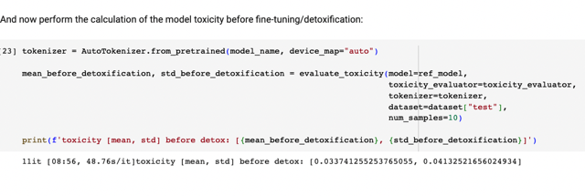</kbd></p>

> [!NOTE]
> Dùng function này, tính 'toxic' mean và standard deviation của
> Reference (Frozen) model trước, dùng 'test' set.

<br>

<a id="node-7ovu5tu"></a>

> [!NOTE]
> 3 - Perform Fine-Tuning to
> Detoxify the Summaries

<br>

<a id="node-f24fquw"></a>

#### 3.1 - Initialize PPOTrainer

<br>

<a id="node-44c6tva"></a>

<p align="center"><kbd>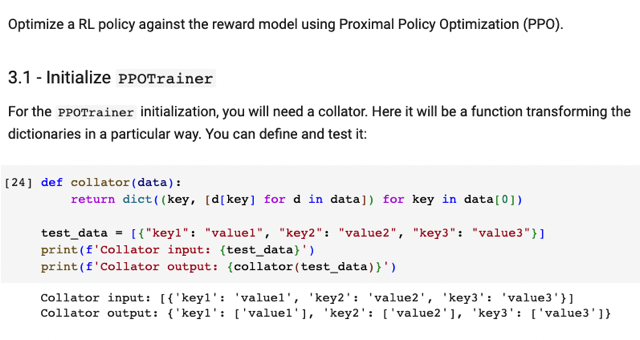</kbd></p>

<br>

<a id="node-67lnsda"></a>

<p align="center"><kbd>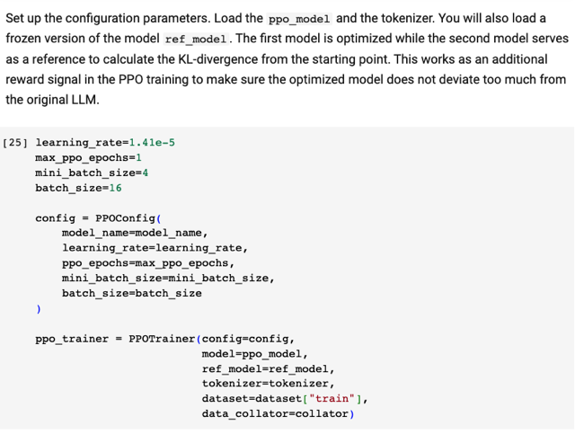</kbd></p>

> [!NOTE]
> Define PPOConfig với các h.p như learning rate,
> batch_size. Bỏ vào model (được sẽ fine-tune) và
> Reference model (được frozen) giúp làm cái vụ KLDivergence

<br>

<a id="node-yvo8wok"></a>

#### 3.2 - Fine-Tune the Model

<br>

<a id="node-55unb8u"></a>

<p align="center"><kbd>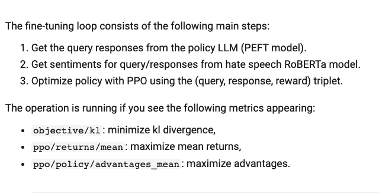</kbd></p>

> [!NOTE]
> Các bước của Fine-tuning with RLHF loop:
>
>
>
> 1. Lấy query response từ LLM (đang được fine-tune) là cái FLAN-T5 được
> fine-tuned với PEFT tuần trước
>
>
>
> 2. Bỏ cặp query-response này vào Reward model (RoBERTA)  để ra logit = reward
> score.
>
>
>
> 3.Bỏ reward vào PPO để nó optimize policy = update LLM

<br>

<a id="node-wjag2cz"></a>

<p align="center"><kbd>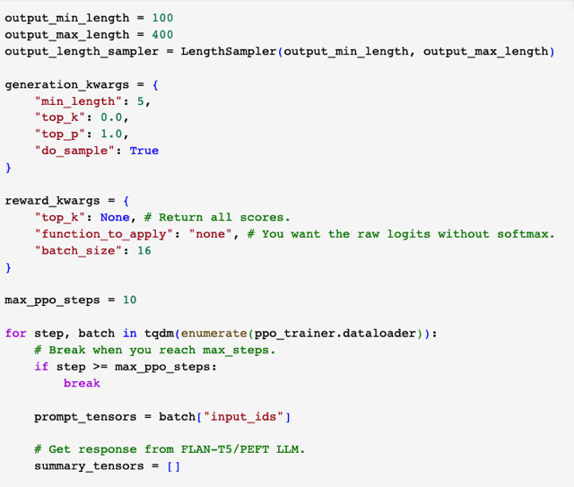</kbd></p>

<p align="center"><kbd>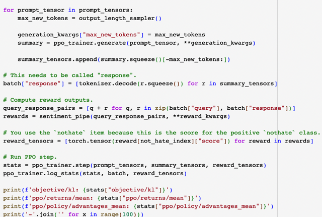</kbd></p>

<br>

<a id="node-02062vh"></a>

<p align="center"><kbd>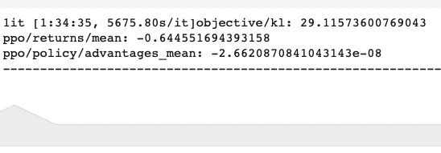</kbd></p>

<br>

<a id="node-bc78d46"></a>

#### 3.3 - Evaluate the Model Quantitatively

<br>

<a id="node-2i5yd37"></a>

<p align="center"><kbd>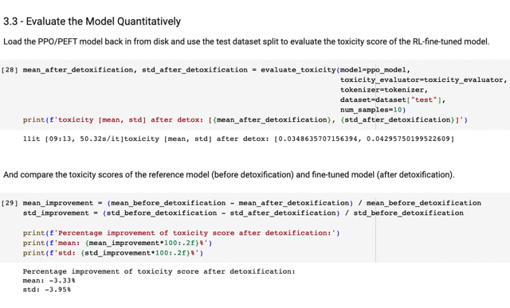</kbd></p>

> [!NOTE]
> Dùng evaluator để evaluate độ toxicity của updated model (như đã biết nó sẽ lấy các
> dialog của test set inference vào model để generate completion rồi bỏ vào evaluator.
> Cuối cùng sau khi đi hết test sét, tính mean và standard deviation)
>
>
>
> So sánh hai chỉ số này với hai chỉ số tính bởi Reference model ở trên, cho thấy chỉ
> số của fine-tuned model cao hơn của reference model ~3%. Tức độ non-toxic đã
> tăng

<br>

<a id="node-g4a3fsx"></a>

#### 3.4 - Evaluate the Model Qualitatively

<br>

<a id="node-pk6dp20"></a>

<p align="center"><kbd>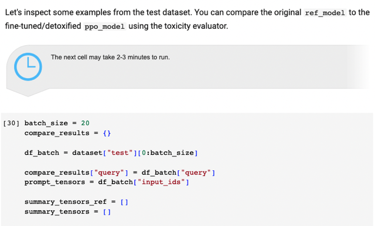</kbd></p>

<p align="center"><kbd>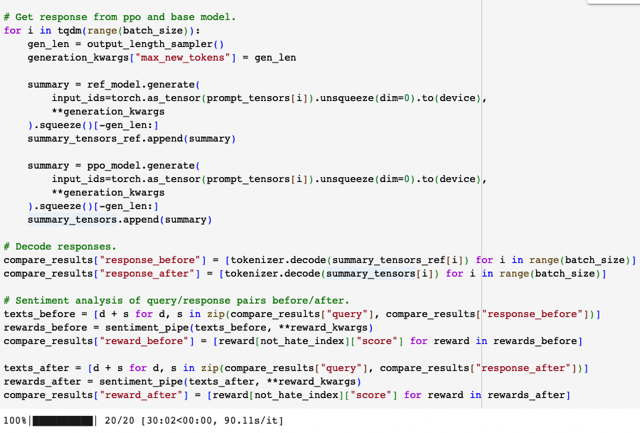</kbd></p>

> [!NOTE]
> Đại khái là
>
>
>
> Lấy 20 data samples dạng text (column 'query') từ test set. và prompt (column '
> input_ids')
>
>
>
> Loop:
>
>
>
> Inference prompt vào Reference model, lấy summary (completion) bỏ vào list
> summary_tensors_ref
>
>
>
> Inference prompt vào RFHF fine-tuned model (ppo model) để lấy completion, bỏ vào
> list summary_tensors
>
>
>
> Xong decode các completion của hai bộ trên và bỏ vào sentiment_pipeline() (là cái
> RoBerta = reward model) để nó xuất ra 'reward'và plot ra xem thử

<br>

<a id="node-d38eq7t"></a>

<p align="center"><kbd>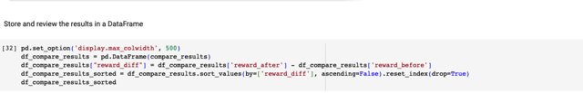</kbd></p>

<br>

<a id="node-f3tgsl6"></a>

<p align="center"><kbd>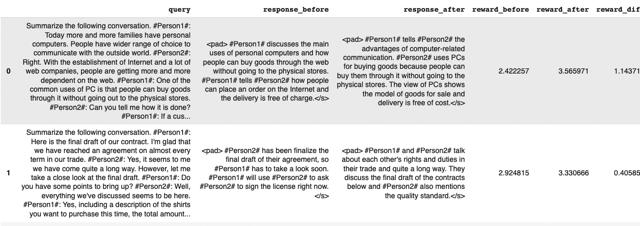</kbd></p>

<p align="center"><kbd>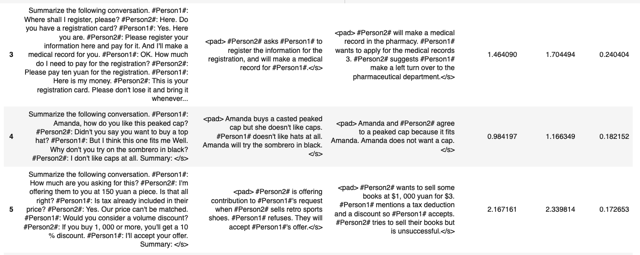</kbd></p>

> [!NOTE]
> Kết quả cho thấy chỉ số logits do RoBERTa model generate
> trên các completion của model mới cao hơn ref model chứng
> tỏ độ not-hate đã được cải thiện

<br>

<a id="node-mdopfbk"></a>

## Model Optimizations For Deployment

<br>

<a id="node-j4qsvpe"></a>

> [!NOTE]
> 1. **Considerations for Model Integration**:
>
>    - Questions to ask when integrating a large language model (LLM) into applications 
> include:
>      - Speed and latency requirements.
>      - Available compute resources.
>      - Trade-offs between model performance, inference speed, and storage.
>      - Interaction with external data or applications.
>      - The intended application or API interface for model consumption.
>
> 2. **Optimization Techniques**:
>    - To address inference challenges with LLMs, optimization techniques are crucial.
>    - These challenges relate to computing, storage, and low latency, especially for edge 
> devices.
>    - Three primary optimization techniques are introduced: Distillation, Quantization, and 
> Pruning.
>
> 3. **Distillation**:
>    - Distillation involves training a smaller student model to mimic a larger teacher model's 
> behavior.
>    - The student model learns from the teacher model, focusing on matching predictions.
>    - Distillation loss measures the difference between soft labels (teacher's predictions) 
> and hard labels (ground truth).
>    - Temperature scaling is used to adjust the softness of the teacher's output.
>
> 4. **Quantization**:
>    - Quantization reduces the precision of model weights, saving memory and compute 
> resources.
>    - It can be applied to weights only or both weights and activation layers.
>    - Post Training Quantization (PTQ) transforms model weights to lower precision 
> representations.
>    - Calibration is performed to capture the dynamic range of parameter values.
>
> 5. **Pruning**:
>    - Pruning aims to reduce model size by eliminating weights with little impact on 
> performance.
>    - These are weights close to or equal to zero.
>    - Some pruning methods require full model retraining, while others are post-training.
>    - Pruning can lead to improved inference performance and reduced model size.
>
> 6. **Overall Optimization Goals**:
>    - Optimization techniques like quantization, distillation, and pruning aim to reduce 
> model size and improve inference performance without sacrificing accuracy.
>    - Optimizing models for deployment ensures efficient operation and a better user 
> experience.
>
> These optimization techniques are essential for adapting large language models to real-
> world applications, addressing computational constraints, and enhancing their efficiency 
> during deployment.

<br>

<a id="node-bemw0m6"></a>

<p align="center"><kbd>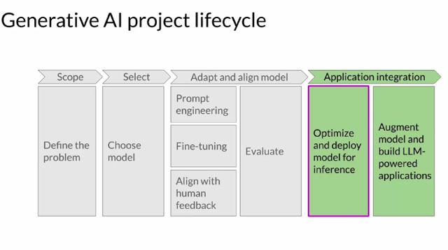</kbd></p>

<br>

<a id="node-nh5r9ts"></a>

<p align="center"><kbd>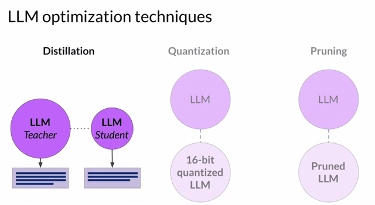</kbd></p>

<br>

<a id="node-dbb5scc"></a>

<p align="center"><kbd>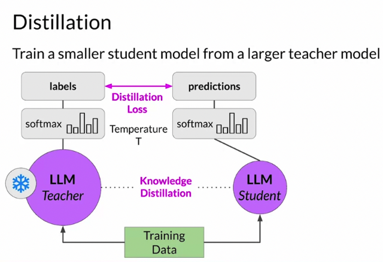</kbd></p>

> [!NOTE]
> You **start with your fine tune LLM** as your **teacher model** and create a **smaller LLM for
> your student model**. You **freeze the teacher model's weights** and use it to **generate
> completions for your training data**.
>
>
>
> At the same time, you **generate completions for the training data using your student
> model**.
>
>
>
> The **knowledge distillation** between teacher and student model is achieved by
> **minimizing a loss function called the distillation loss.** To calculate this loss, distillation uses
> the **probability distribution over tokens that is produced by the teacher model's softmax
> layer**.
>
>
>
> Now, the teacher model is **already fine tuned** on the training data. So the p**robability
> distribution likely closely matches the ground truth data** and **won't have much variation in
> tokens**.
>
>
>
> That's why **Distillation applies a little trick adding a temperature parameter** to the softmax
> function. As you learned in lesson one, a **higher temperature increases the creativity** of
> the language the model generates. With a temperature parameter **greater than one**, the
> probability **distribution becomes broader** and **less strongly peaked**.
>
>
>
> This softer distribution provides you with a set of tokens that are similar to the ground truth
> tokens. In the context of Distillation, **the teacher model's output is often referred to as soft
> labels** and the student model's predictions as **soft predictions.**
>
> Đại khái như đã học khái niệm **distillation** trong **MLOps Spec**, trong đó ta
> sẽ **dùng một teacher model** để **teach một student model** nhỏ hơn.
>
>
>
> Bắt đầu với **teacher model** là một **fine-tuned LLM**, được **freeze**. **Inference
> teacher model để lấy completion**. Đồng thời cũng **inference student model
> để lấy completion**. 
>
>
>
> **Distillation loss** sẽ được tính dựa trên **teacher model's 
> output logits** và **student model's logits** sử dụng các loss function như **cross
> entropy loss** hoặc **KL Divergence** với t**ham số temperature T.**
>
>
>
> T đóng vai trò **điều chỉnh độ 'mềm' của teacher knowledge**. nôm nà là **nếu T
> lớn ~= 1 thì output của teacher more creative hơn và ngược lại.**
>
>
>
> Trong quá trình này, student model sẽ **học được cách bắt chước teacher
> model.**
>
>
>
> Cơ bản tóm gọn là train student với label là prediction của teacher model
> (người ta gọi là **soft label**) và student prediction sẽ được gọi là **soft prediction**

<br>

<a id="node-bgh1k5f"></a>

<p align="center"><kbd>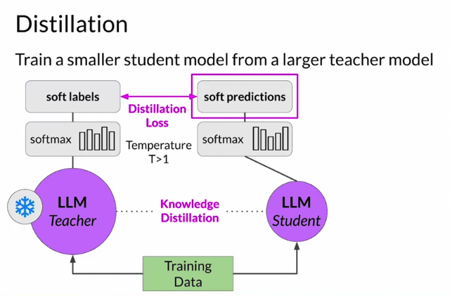</kbd></p>

<br>

<a id="node-38rzdzg"></a>

<p align="center"><kbd>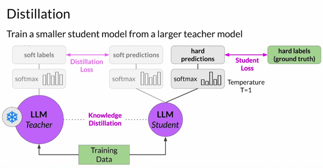</kbd></p>

> [!NOTE]
> In parallel, you train the student model to **generate the correct predictions** based on your
> **ground truth training data**
>
>
>
> Here, you **don't vary the temperature setting** and instead use the **standard softmax
> function**. Distillation refers to the student model outputs as the hard predictions and hard
> labels.
>
>
>
> The loss between these two is the **student** **loss**. The **combined distillation and
> student losses** are used to **update the weights** of the student model **via back
> propagation**.
>
>
>
> The key benefit of distillation methods is that the **smaller student model can be used for
> inference** in deployment **instead of the teacher** model. In practice, distillation is **not as
> effective for generative decoder models**. It's typically **more effective for encoder only
> models**, such as BERT that **have a lot of representation redundancy**. Note that with
> Distillation, you're t**raining a second, smaller model to use during inference**. You **aren't
> reducing the model size of the initial LLM** in any way.
>
> Song song với quá trình đó là ta cũng **train Student model** với **Ground truth label nữa**, tính loss giữa
> **student prediction và ground truth label**. Gọi là **hard label** và **hard prediction**.
>
>
>
> Xong **kết hợp cả distillation loss và student loss** để **update student's weight** thông qua **backprop**.
>
>
>
> Nói chung, người ta nhận thấy phương pháp này **tốt cho Encoder model** (ý là các LLM có structure
> dạng Encoder only hơn là Decoder model (như GPT)
>
>
>
> Và ta phải hiểu rằng, ở đây ta **tạo ra một student model nhỏ hơ**n nhưng perform không kém teacher
> model chứ k**hông phải là thu nhỏ teacher model**

<br>

<a id="node-pvhsl7c"></a>

<p align="center"><kbd>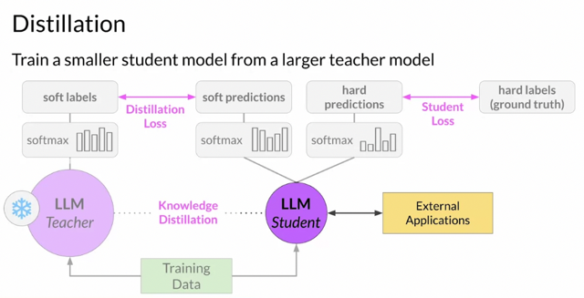</kbd></p>

<br>

<a id="node-3v1sno0"></a>

<p align="center"><kbd>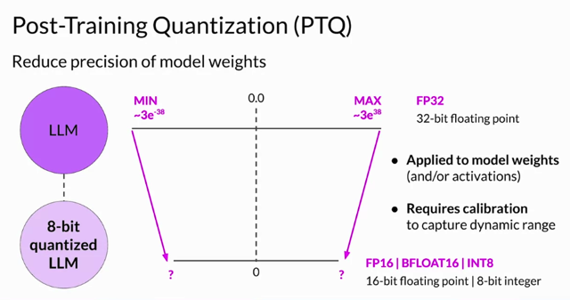</kbd></p>

> [!NOTE]
> Let's have a look at the next model optimization technique that actually reduces the
> size of your LLM. You were introduced to the second method, **quantization**, back
> in week 1 in the **context of training**.
>
>
>
> Specifically **Quantization Aware Training**, or **QAT** for short. However, after a
> model is trained, you can perform **post training quantization**, or **PTQ** for short
> to optimize it for deployment.
>
>
>
> **PTQ transforms a model's weights to a lower precision representation**, such as
> **16-bit floating point or 8-bit integer**. To **reduce the model size and memory
> footprint**, as well as the compute resources needed for model serving, quantization
> can be applied to **just the model weights or to both weights and activation layers**.
> In general, quantization approaches that include the activations can have a higher
> impact on model performance. Quantization also **requires an extra calibration step
> to statistically capture the dynamic range of the original parameter values.
>
>
>
> As with other methods, there are tradeoffs because sometimes quantization results
> in a small percentage reduction in model evaluation metrics. However, that reduction
> can often be worth the cost savings and performance gains.**
>
> Phần này bên MLOpsSpec đã học, bài **Quantization**. Đại khái là có thể **quantization aware
> training (như tuần 1 có nói rồi)** - t**raining nhưng chú ý đến quantization**. Thì ở đây là nói về
> **quantization sau khi đã train xong.**
>
>
>
> Nôm na là nó sẽ **thể hiện model's weight bằng lower precision representation** (giảm độ
> chính xác xuóng như **16-bit float hay 8-bit int** từ đó sẽ **giảm model size.** Và có thể apply
> cho cả **weight và activation layers** hoặc chỉ weight thôi.
>
>
>
> Và như các phương pháp khác, nó luôn c**ó trade off** giữa việc giảm evaluation metric
> (accuracy) với mode size. Tuy nhiên thường là trade of này ok

<br>

<a id="node-dh5rda1"></a>

<p align="center"><kbd>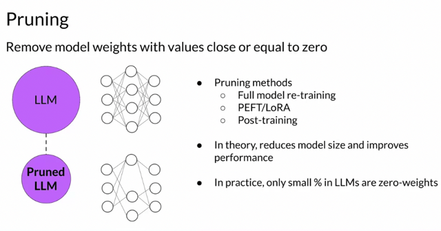</kbd></p>

> [!NOTE]
> The last model optimization technique is pruning. At a high level, the goal is to **reduce model
> size for inference by eliminating weights that are not contributing much to overall model
> performance**. These are the weights with **values very close to or equal to zero**.
>
>
>
> Note that **some pruning methods** require **full retraining** of the model, while others fall into
> the category of **parameter efficient fine tuning**, such as **LoRA**. There are also methods that
> focus on **post-training Pruning**. In theory, this reduces the size of the model and improves
> performance. **In practice**, however, there may n**ot be much impact** on the size and
> performance if **only a small percentage of the model weights are close to zero**.
>
>
>
> Quantization, **Distillation** and Pruning all aim to r**educe model size** to **improve model
> performance** during **inference without impacting accuracy.** Optimizing your model for
> deployment will help **ensure that your application functions well** and provides your **users with
> the best possible experience sense.**
>
> Cũng đã học bên MLOpsSpec, **Pruning** đại khái là **loại bỏ các weights mà ít đóng góp**
> vào model's prediction mà c**ụ thể là các weight có giá trị nhỏ ~=0.**
>
>
>
> Theo lý thuyết thì phương pháp này sẽ **giúp giảm model size và improve efficiency** tuy
> nhiên **thực tế nếu chỉ có ít  model weights ~=0** thì technique này cũng **không phát huy
> tác dụng mấy.**
>
>
>
> Nói chung là có các phương pháp để cố gắng giảm size của model, giảm thời gian
> inference xuống, ...giúp việc triển khai model lên các thiết bị được hiệu quả
>
> Distillation, also known as the teacher-student method, is a technique used to reduce the size of a
>  large language model while preserving its performance. The basic idea is to train a smaller, more
>  computationally efficient model (the "student") to mimic the behavior of a larger, more accurate model 
> (the "teacher"). Here are the steps involved in the distillation method for reducing the size of a large 
> language model:
>
>
>
> 1. **Pretrained Teacher Model**:
>    - Start with a large, pretrained language model that serves as the teacher. This model has been
>  trained on a massive amount of data and is highly accurate but computationally expensive.
>
>
>
> 2. **Select a Smaller Student Model**:
>    - Choose a smaller and more computationally efficient model architecture that will serve as the student. 
> The student model typically has fewer parameters and is easier to deploy in resource-constrained environments.
>
>
>
> 3. **Prepare Training Data**:
>    - Collect or create a dataset that consists of input-output pairs where the teacher model generates 
> predictions or probabilities. You can use unlabeled data or generate synthetic data for this purpose.
>
>
>
> 4. **Temperature Parameter**:
>    - Introduce a temperature parameter (usually denoted as "T") that controls the softness of the 
> teacher's predictions. A higher temperature makes the teacher's predictions softer, while a lower 
> temperature makes them harder. This parameter is used during training and inference.
>
>
>
> 5. **Distillation Loss**:
>    - Train the student model to mimic the teacher's behavior by minimizing the distillation loss. 
> The distillation loss is a combination of two components:
>      - **Knowledge Distillation Loss**: This loss measures how closely the student's predictions 
> match the teacher's predictions. It is often calculated using a softmax cross-entropy loss with 
> temperature scaling.
>      - **Regularization Loss**: To encourage the student to be more confident in its predictions, 
> an additional regularization loss may be applied. This loss discourages the student from being 
> overly confident in cases where the teacher has low confidence.
>
>
>
> 6. **Training**:
>    - Train the student model on the dataset, using the distillation loss as the optimization objective. 
> During training, the teacher model's predictions are used as soft targets for the student model. 
> The student model learns to approximate the teacher's decision boundaries and uncertainty.
>
>
>
> 7. **Fine-Tuning (Optional)**:
>    - Optionally, you can fine-tune the student model on downstream tasks or domain-specific data 
> to further adapt it to specific applications.
>
>
>
> 8. **Inference**:
>    - During inference, the student model uses the learned knowledge from the teacher to make p
> redictions on new data. The temperature parameter may be adjusted to control the trade-off between 
> accuracy and confidence.
>
>
>
> The distillation method is a powerful technique for reducing the size of large language models while 
> maintaining their performance to some extent. It allows for the transfer of knowledge from a teacher 
> model to a smaller student model, making it feasible to deploy efficient models in various applications. 
> The choice of hyperparameters, including the temperature parameter, plays a crucial role in fine-tuning 
> the trade-offs between model size, performance, and confidence in predictions.
>
> The distillation loss, often referred to as the "knowledge distillation loss," is a key component in 
> the teacher-student distillation process. It measures how closely the student
>  model's predictions match the soft targets (probabilistic predictions) of the teacher model. The popularly 
> used formula for the distillation loss is based on cross-entropy and temperature scaling. Here's the formula 
> for the distillation loss:
>
>
>
> Let's define the following terms:
> - `S`: Softmax function.
> - `T`: Temperature parameter.
> - `y_teacher`: Teacher model's logits or probabilities for a given input.
> - `y_student`: Student model's logits or probabilities for the same input.
>
>
>
> The distillation loss is calculated as follows:
>
>
>
> 1. **If working with logits** (unnormalized scores):
>
>    The distillation loss for a single training example is typically calculated using the softmax function with 
> temperature scaling for both the teacher and student predictions:
>
>
>
>    ```
>    Loss_distillation = CrossEntropy(S(y_teacher / T), S(y_student / T))
>    ```
>
>
>
>    In this formula:
>    - `S(y_teacher / T)` and `S(y_student / T)` apply the softmax function to the teacher's and student's 
> logits divided by the temperature `T`. This scaling with temperature makes the teacher's and student's 
> predictions softer (more uniform) when `T` is high and sharper (more confident) when `T` is low.
>
>
>
> 2. **If working with probabilities** (already softmaxed outputs):
>
>
>
>    If the teacher and student model outputs are probabilities (i.e., they have already been through the 
> softmax function), you can calculate the distillation loss as follows:
>
>
>
>    ```
>    Loss_distillation = CrossEntropy(y_teacher, S(y_student / T))
>    ```
>
>
>
>    In this case:
>    - `y_teacher` is the probability distribution provided by the teacher model.
>    - `S(y_student / T)` applies the softmax function to the student's logits divided by the temperature `T`.
>
>
>
> 3. **Weighting Distillation Loss**:
>
>
>
>    You can also weight the distillation loss relative to other components of the loss function, depending 
> on your specific training objectives. For example, you may combine it with other losses (e.g., a task-specific 
> loss for a downstream task) using a weighted sum.
>
>
>
>
> The key idea behind the distillation loss is to encourage the student model to produce similar probability
>  distributions to the teacher model, thereby transferring the knowledge from the teacher to the student. 
> The temperature parameter `T` controls the softness of these distributions, allowing you to adjust the trade-off 
> between mimicking the teacher's behavior closely (lower `T`) and introducing more uncertainty (higher `T`) in 
> the student's predictions.
>
>
>
> By minimizing the distillation loss along with other relevant losses during training, the student model learns 
> to approximate the teacher's decision boundaries, capture patterns in the data, and benefit from the teacher's 
> knowledge and generalization capabilities. This knowledge transfer is especially useful for making the student 
> model more efficient while maintaining its performance.
>
> Yes, the Kullback-Leibler (KL) Divergence is commonly used in  knowledge distillation,
> particularly as a  component  of the distillation  loss. The KL Divergence measures the
> difference between two  probability distributions, which  makes it well-suited for quantifying
> the  disparity between the teacher model's predictions (the "soft targets") and  the student
> model's predictions. Here's why KL Divergence is often used in the distillation loss:
>
>
>
> 1. **Measuring Divergence**: KL Divergence is a well-established measure for quantifying
> the difference between  two probability distributions. In knowledge distillation, it helps
> assess how far the student's predictions deviate  from the teacher's predictions.
>
>
>
> 2. **Alignment of Probability Distributions**: The primary goal of knowledge distillation is to
> align the probability  distributions generated by the teacher and student models. KL
> Divergence provides a clear metric for achieving this alignment.
>
>
>
> 3. **Temperature Scaling**: When applying the KL Divergence in distillation, it is typically
> used in conjunction  with temperature scaling. The temperature parameter (often denoted
> as `T`) is applied to both the teacher's and  student's softmax outputs. This scaling controls
> the "softness" of the distributions and adjusts the trade-off between  accuracy and
> confidence in the student's predictions.
>
>
>
> 4. **Regularization Effect**: KL Divergence acts as a regularization term in the distillation
> loss. It encourages  the student model to produce predictions that are not only accurate
> (similar to the teacher's) but also more  calibrated and less extreme. This helps prevent
> overfitting to the specific data used during training.
>
>
>
> The formula for the distillation loss with KL Divergence typically looks like this:
>
>
>
> ``` Loss_distillation = KL_Divergence(S(y_teacher / T), S(y_student / T)) ```
>
>
>
> In this formula:
>
>
>
> - `S(y_teacher / T)` and `S(y_student / T)` are the softmax outputs of the teacher and
> student models,
>
>
>
> respectively, scaled by the temperature `T`.
> - `KL_Divergence` calculates the KL Divergence between these two probability
> distributions.
>
>
>
> Overall, KL Divergence is a useful tool in knowledge distillation because it provides a
> principled way to measure the  difference between probability distributions and helps guide
> the student model to produce predictions that closely match those  of the teacher model.
> This alignment is essential for transferring the knowledge from the teacher to the student,
> resulting  in an efficient model that retains the performance of the larger, pretrained teacher
> model.
>
> Whether to use Cross-Entropy loss or KL Divergence (Kullback-Leibler 
> Divergence) in knowledge distillation depends on your specific goals 
> and how you want the student model to mimic the teacher model. Both 
> loss functions have their advantages and use cases:
>
>
>
> 1. **Cross-Entropy Loss**:
>
>
>
>    - **Use Cases**:
>      - Cross-Entropy loss is commonly used in knowledge distillation 
> when you want the student model to directly replicate the probability 
> distribution of the teacher model. In this case, you aim to match not 
> only the maximum probability prediction but also the entire probability 
> distribution over classes.
>
>
>
>    - **Advantages**:
>      - It encourages the student model to produce similar probabilities to 
> the teacher model, leading to a more faithful replication of the 
> teacher's behavior.
>      - Cross-Entropy loss can be easier to implement and compute 
> compared to KL Divergence.
>
>
>
>    - **Considerations**:
>      - Using Cross-Entropy loss may result in sharper, more confident 
> predictions from the student model, which might be beneficial in 
> certain scenarios.
>
>
>
> 2. **KL Divergence Loss**:
>
>
>
>    - **Use Cases**:
>      - KL Divergence is particularly useful when you want to transfer 
> knowledge while introducing some level of uncertainty in the student's 
> predictions. It allows you to control the "softness" of the student's 
> predictions by adjusting the temperature parameter `T`.
>
>
>
>    - **Advantages**:
>      - It provides a clear way to regulate the balance between matching 
> the teacher's distribution (with a lower `T` for sharper distributions) 
> and introducing more uncertainty (with a higher `T` for softer 
> distributions) in the student's predictions.
>      - KL Divergence acts as a form of regularization, which can help 
> prevent overfitting to the training data and improve generalization.
>
>
>
>    - **Considerations**:
>      - KL Divergence might be preferred when you want to maintain a 
> degree of diversity or smoothness in the student model's predictions, 
> which can be beneficial in ensemble methods or when the student is 
> part of a larger system.
>
>
>
>
> In summary, you can choose between Cross-Entropy loss and KL 
> Divergence in knowledge distillation based on your specific objectives:
>
>
>
> - Use **Cross-Entropy loss** when you want the student model to 
> closely replicate the teacher's probability distribution, leading to 
> confident and sharp predictions similar to the teacher's. This is 
> suitable when you aim for a highly faithful student model.
>
>
>
> - Use **KL Divergence** when you want to control the "softness" of the 
> student's predictions and introduce some level of uncertainty. This 
> allows you to balance accuracy and confidence in the student's 
> predictions while potentially preventing overfitting. KL Divergence is 
> especially valuable when you want the student model to act as a more 
> diverse or uncertain predictor. Adjusting the temperature parameter `T` 
> gives you fine control over this balance.
>
> Training the student model in knowledge distillation can involve two 
> types of losses: the distillation loss and the student loss. The term 
> "student loss" refers to the loss computed using the ground truth 
> labels from the training data, similar to the way a traditional supervised 
> learning model is trained. Here's a breakdown of these two types of 
> losses:
>
>
>
> 1. **Distillation Loss**:
>    - The distillation loss is the primary loss function used in knowledge 
> distillation. It quantifies how well the student model mimics the teacher 
> model's predictions. This loss is typically based on the difference 
> between the probability distributions produced by the teacher and 
> student models, often using KL Divergence or Cross-Entropy loss with 
> temperature scaling.
>    - The goal of the distillation loss is to transfer the knowledge from 
> the teacher model to the student model, encouraging the student 
> model to make predictions similar to those of the teacher. It helps the 
> student model capture the patterns and nuances learned by the 
> teacher.
>
>
>
> 2. **Student Loss**:
>    - The student loss, on the other hand, is calculated using the ground 
> truth labels from the training data. It measures how well the student 
> model can directly predict the correct labels for the training examples. 
> This loss is similar to what you would use in a regular supervised 
> learning setting.
>    - Including the student loss ensures that the student model not only 
> learns from the teacher's knowledge but also maintains its ability to 
> predict the true labels. It helps ensure that the student model doesn't 
> lose sight of the primary task it was originally designed for.
>
>
>
>
> During the training process, the overall loss function is a combination 
> of these two losses, often weighted by hyperparameters to control 
> their relative importance. The total loss can be defined as:
>
>
>
> ```
> Total Loss = λ * Distillation Loss + (1 - λ) * Student Loss
> ```
>
>
>
> In this equation:
> - `λ` is a hyperparameter that determines the trade-off between the 
> distillation loss and the student loss. It controls how much emphasis is 
> placed on matching the teacher's predictions versus directly predicting 
> the ground truth labels.
>
>
>
> The presence of the student loss ensures that the student model 
> doesn't deviate too far from its original purpose, which is to perform 
> well on the primary task (e.g., classification). The distillation loss 
> complements this by allowing the student model to benefit from the 
> teacher's knowledge and generalize better.
>
>
>
> In practice, the choice of `λ` and how you combine these two losses 
> depends on your specific goals. You can adjust the balance to 
> prioritize either fidelity to the teacher model or maintaining high 
> accuracy on the primary task, depending on the application and 
> performance requirements.

<br>

<a id="node-htyl2km"></a>

> [!NOTE]
> GENERATIVE AI PROJECT LIFECYCLE
> CHEAT SHEET

<br>

<a id="node-4w89hbx"></a>

> [!NOTE]
> Here are the main ideas extracted from the lecture text in numerical order points:
>
> 1. Introduction to the **various stages** of a **generative AI project life cycle**, from **model
> selection** to **fine-tuning** and **alignment with human preferences**.
>
> 2. Providing a cheat sheet to help **plan the different phases of the project** and **estimate the
> time and effort required for each.**
>
> 3. Acknowledgment that pre-training a large language model can be a **complex** and
> **resource-intensive process** due to **architectural decisions, data requirements, and
> expertise**.
>
> 4. Emphasizing that **starting with an existing foundation model** can significantly **simplify the
> development process.**
>
> 5. Mention of **assessing the model's performance through prompt engineering**, which
> **requires less technical expertise** and **no additional model training**.
>
> 6. Discussion of **prompt tuning** and **fine-tuning** as methods to **improve model performance**,
> with **consideration of the use case, performance goals, and compute budget.**
>
> 7. Highlighting that **fine-tuning**, especially with a **small training dataset**, can be a **relatively
> quick** phase, **possibly completed in a single day.**
>
> 8. Explanation of aligning the model using **reinforcement learning from human feedback**
> and the **potential use of existing reward models** or **creating new ones.**
>
> 9. Reference to optimization techniques, which typically fall in the middle in terms of
> **complexity** and **effort** but can **proceed quickly if they don't significantly impact model
> performance**.
>
> 10. The hope that, after completing all these steps, a **well-trained and tuned generative
> language model (LLM) optimized for deployment will be achieved.**
>
> 11. Mention of the upcoming exploration of **remaining LLM performance issues** and
> techniques to address them before launching the application.
>
> These points provide an **overview of the lecture's main concepts** related to the **project life
> cycle for generative AI** and the **stages involved in developing and optimizing a language
> model for deployment.**

<br>

<a id="node-4xelj8w"></a>

<p align="center"><kbd>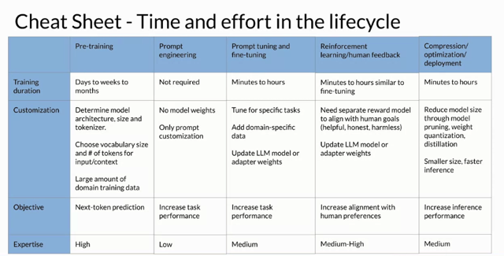</kbd></p>

<br>

<a id="node-l2awfkp"></a>

## Using The LLM Applications

<br>

<a id="node-b5ay626"></a>

> [!NOTE]
> 1. **Challenges with LLMs:**
>
> - **LLMs have a knowledge cutoff,** and they **can't provide information beyond their training
> data**.
> - They can struggle with **complex math problems** as they **predict tokens based on
> training, not perform calculations**.
> - LLMs tend to **generate text even when they don't know the answer**, leading to "
> hallucination."
>
> 2. ****Connecting to External Data Sources**:**
>
> - To overcome these challenges, you can **connect LLMs to external data sources and
> applications**.
> - This connection is facilitated through an **orchestration library**.
> - Access to external data sources **enhances LLM performance** at runtime.
>
> 3. ****Retrieval Augmented Generation (RAG)**:**
>
> - **RAG** is a framework that **allows LLMs to utilize external data sources**.
> - It helps **overcome knowledge cutoff issues by providing access to additional data during
> inference**.
> - RAG can be used to **access new information documents** or **proprietary knowledge**.
> - It **improves the relevance and accuracy of LLM completions**.
>
> 4. **RAG Implementation:**
>
> - RAG involves a "**Retriever**" component consisting of a **query encoder and an external
> data source**.
> - The encoder **encodes user input for querying the data source**.
> - The **Retriever** finds **relevant documents and combines them with the user query**.
> - The **expanded prompt** is then used by the LLM to generate completions.
>
> 5. **Benefits of RAG:**
>
> - RAG helps **prevent model hallucination and enhances LLM utility**.
> - It can **integrate various external information sources**, including **local documents, the
> internet, and databases**.
> - Vector Stores, containing **vector representations of text**, are particularly useful for LLMs in
> RAG.
>
> 6. **Considerations for RAG:**
>
> - External data **must be chunked to fit the LLM's context window**.
> - **Data retrieval** relies on **vector representations** and similarity measures.
> - **Vector stores and databases** allow for **efficient searching and citation tracking.**
>
> By connecting LLMs to **external data sources** using RAG, you can **address their
> limitations, improve their performance, and provide more accurate and relevant information to
> users.**

<br>

<a id="node-q3m3ib4"></a>

<p align="center"><kbd>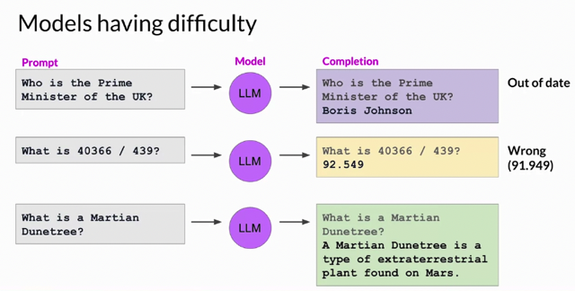</kbd></p>

> [!NOTE]
> Đại khái là LLM có những nhược điểm như bị outdate
> thông tin, không tính toán được và bịa chuyện

<br>

<a id="node-41x5wgg"></a>

<p align="center"><kbd>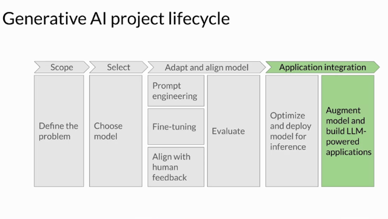</kbd></p>

<br>

<a id="node-n1qngjl"></a>

<p align="center"><kbd>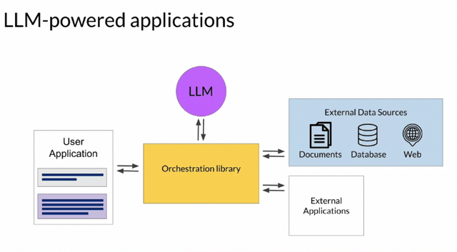</kbd></p>

> [!NOTE]
> Những điều này có thể khắc phục bằng cách dùng một cơ
> chế như sau Orchestration library để kết nối LLM với
> Database hoặc External applications,

<br>

<a id="node-fzu5qoz"></a>

<p align="center"><kbd>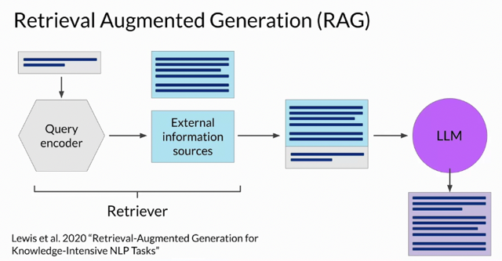</kbd></p>

> [!NOTE]
> Đại khái là có nhiều lib support việc này, ở đây nói về cái đầu tiên (của
> Facebook) trong đó đại khái là nó giúp từ initial prompt, nó lấy thông tin từ
> external information sources và rồi combine với initial prompt để được
> prompt mới (chứa những kiến thức được cập nhật) sẽ bỏ vào model

<br>

<a id="node-vzloc39"></a>

<p align="center"><kbd>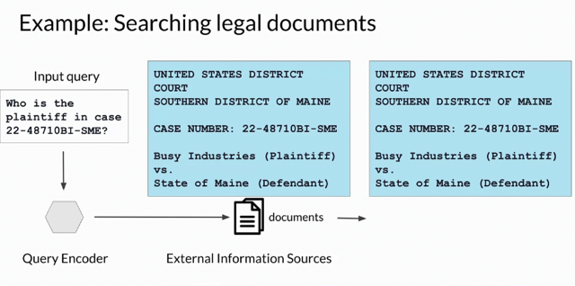</kbd></p>

> [!NOTE]
> Lấy ví dụ hỏi model về một vấn đề liên quan đến một vụ án
> trong lịch sử. Query encoder sẽ trích xuất thông tin của vụ án ra
> để kết hợp với initial prompt trước  khi bỏ vào model

<br>

<a id="node-kogdmyn"></a>

<p align="center"><kbd>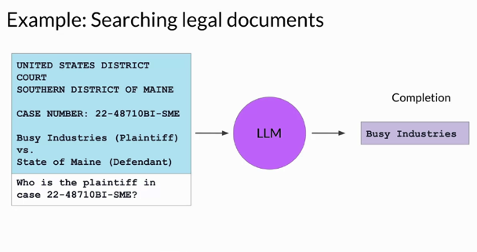</kbd></p>

> [!NOTE]
> Với **thông tin đúng được trích xuất** đi kèm với **initial prompt**, đưa
> vào model sẽ **giúp model cho ra câu trả lời với thông tin được cập
> nhật chính xác**
>
>
>
> Thật ra quá trình này cũng y như mình tìm thông tin rồi instructed
> prompting vậy

<br>

<a id="node-nl05din"></a>

<p align="center"><kbd>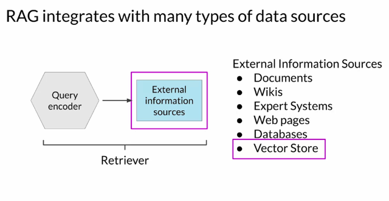</kbd></p>

<br>

<a id="node-cgsl5p9"></a>

<p align="center"><kbd>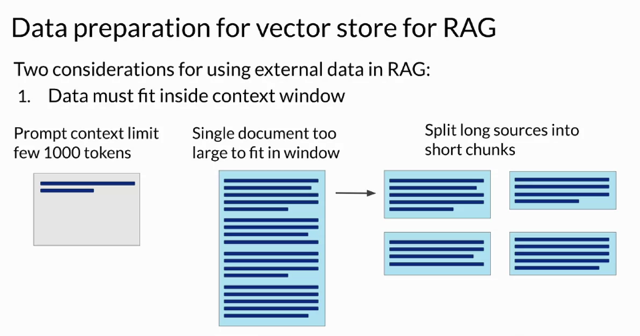</kbd></p>

> [!NOTE]
> Đại khái là vì limit của context window nên thông tin trích xuất thực tế
> sẽ phải được split ra thành nhiều mảnh. Thì những cái như
> LangChain sẽ giúp làm việc này

<br>

<a id="node-mjomacg"></a>

<p align="center"><kbd>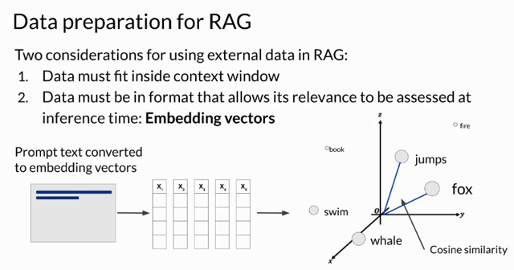</kbd></p>

> [!NOTE]
> Điều consideration thứ 2 đó là
> data phải ở format phù hợp: Embedding vectors

<br>

<a id="node-2a4u4fj"></a>

<p align="center"><kbd>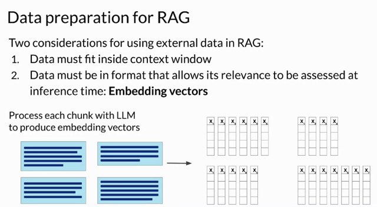</kbd></p>

<br>

<a id="node-b1r1tsa"></a>

<p align="center"><kbd>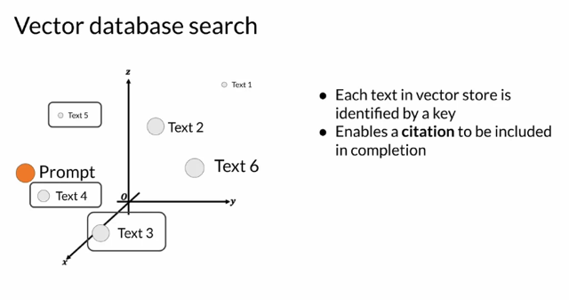</kbd></p>

> [!NOTE]
> Đại khái là kiểu như có vector
> database mapping key = word
> với embedding vector.

<br>

<a id="node-kk0h2ta"></a>

<p align="center"><kbd>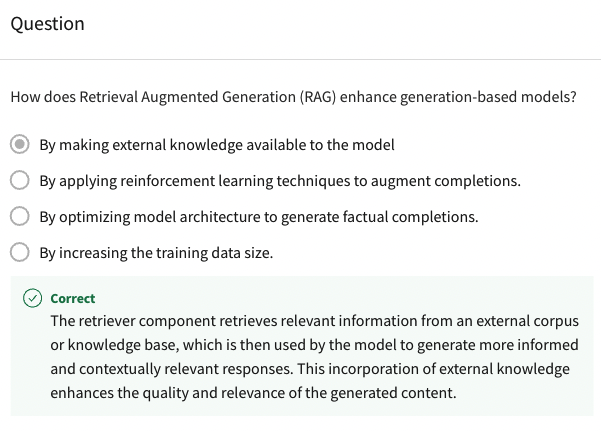</kbd></p>

<br>

<a id="node-5y3h47c"></a>

> [!NOTE]
> INTERACTING WITH
> EXTERNAL APPLICATIONS

<br>

<a id="node-na76k6d"></a>

> [!NOTE]
> Here are the main ideas extracted from the text:
>
> 1. ****LLM Interaction****:
>    - LLMs (Large Language Models) can **interact with both external datasets and external 
>    applications.**
>
> 2. **Illustrative Example - **ShopBot****:
>    - The example used is a customer service bot, ShopBot, for **processing return requests**.
>    - A customer wants to **return jeans.**
>    - ShopBot **asks for an order number.**
>    - It **retrieves the order from a back-end order database**.
>    - After confirming items for return, the bot **requests a return label from the company's shipping 
>    partner using a Python API**.
>    - The customer's email is confirmed and used to send the return label.
>
> 3. **Benefits and Applications of Integrating LLMs**:
>    - **Connecting LLMs to external applications** allows them to **interact with the broader world**, 
>    making them **more versatile.**
>    - They can **trigger actions when interacting with APIs**.
>    - LLMs can **connect with other programming resources** for added functionalities like **accurate 
>    calculations**.
>
> 4. ****Role of Prompts and Completions****:
>    - **LLMs** serve as **reasoning engines for applications**.
>    - **Actions are based on the completions generated by the LLM**.
>    - The model **n**eeds to **generate a set of clear instructions that are both understandable and 
>    correspond to allowed actions**.
>    - The completion format should be something the broader application can comprehend, from a 
>    simple sentence to complex scripting.
>
> 5. **Validation and Information Gathering**:
>    - Necessary information for validation, such as verifying an email address in the ShopBot example, 
>    needs to be acquired from the user and contained in the completion.
>
> 6. **Importance of Structured Prompts**:
>    - **Properly structuring prompts is vital** for the **quality of the output** and for ensuring the output 
>    adheres to a desired format or specification.
>
> The above points provide a concise summary of the main ideas and concepts presented in the 
>    text about the integration and application of Large Language Models like ShopBot in real-world 
>    scenarios.

<br>

<a id="node-vj2apak"></a>

<p align="center"><kbd>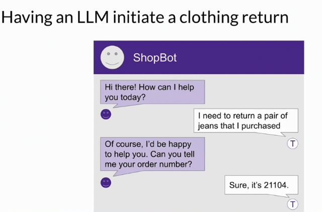</kbd></p>

> [!NOTE]
> Nhờ vào RAG ở bài trước, shopBot có thể trích xuất
> thông tin order của customer từ company database.

<br>

<a id="node-0yzx26g"></a>

<p align="center"><kbd>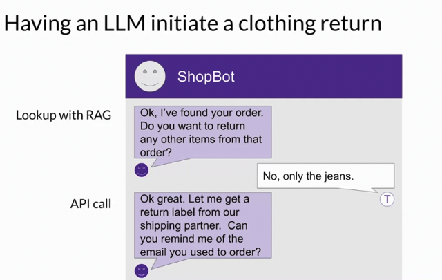</kbd></p>

> [!NOTE]
> Sau đó, nhờ vào việc có thể kết nối với api, nó
> sẽ thực hiện việc gọi api để gửi email cho user
> return label. Do đó nó hỏi user email

<br>

<a id="node-f4sg4fz"></a>

<p align="center"><kbd>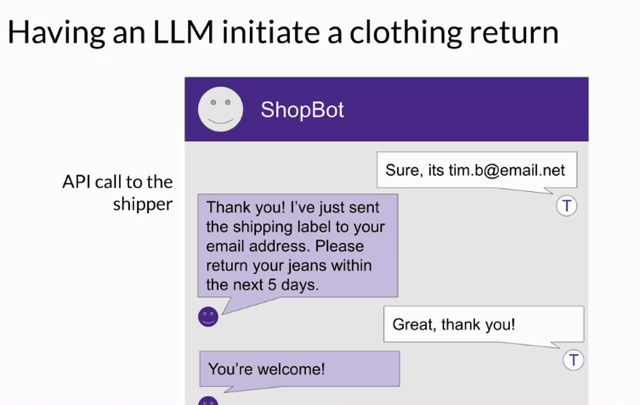</kbd></p>

> [!NOTE]
> Sau khi API hoàn thành, nó trả
> lời cho customer là shipping
> label đã được gởi đi

<br>

<a id="node-wjy83qj"></a>

<p align="center"><kbd>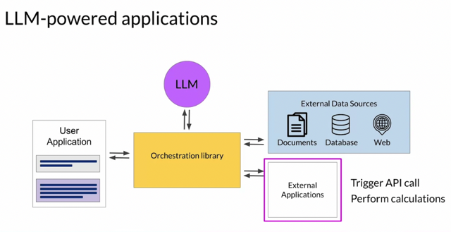</kbd></p>

> [!NOTE]
> Nhờ vào việc có thể connect tới
> External applications, LLM có thể khắc
> phục các điểm yếu của mình

<br>

<a id="node-jk74fu3"></a>

<p align="center"><kbd>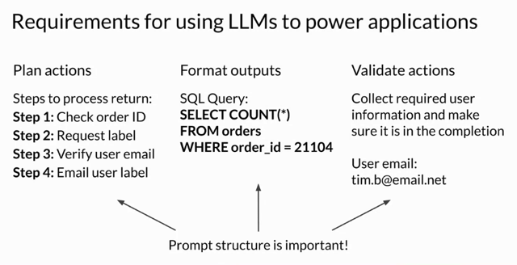</kbd></p>

> [!NOTE]
> Đại khái là Prompt structure
> đúng rất quan trọng

<br>

<a id="node-jal1rri"></a>

> [!NOTE]
> HELPING LLMS REASON AND PLAN WITH
> CHAIN OF THOUGHT

<br>

<a id="node-pl9xnb3"></a>

> [!NOTE]
> Main Ideas:
>
> 1. **Reasoning in LLMs:** Large Language Models (LLMs) need the ability to reason 
> through steps in applications, but complex reasoning, especially multi-step math, can be 
> challenging.
>
> 2. **Example Difficulty:** An example is provided where the LLM struggles with a multi-
> step math problem about apples in a cafeteria, even when given a similar example 
> problem.
>
> 3. **One-Shot Inference:** Presenting an LLM with an example problem to guide its 
> response is termed one-shot inference. But, the LLM can sometimes produce incorrect 
> results, as illustrated with the apples problem.
>
> 4. **Human-like Reasoning:** Researchers have found success in prompting the model 
> to reason more like humans, by breaking down problems step-by-step. An example is 
> provided where a problem of calculating tennis balls is divided into multiple intermediate 
> calculations.
>
> 5. **Chain of Thought Prompting:** This technique involves presenting problems to the 
> model with intermediate reasoning steps included. It teaches the LLM to reason through 
> tasks, improving its accuracy in problem-solving.
>
> 6. **Applying Chain of Thought:** The apples problem is revisited using the chain of 
> thought prompting, resulting in a more accurate, transparent response from the LLM.
>
> 7. **Broad Applicability:** Beyond arithmetic, chain of thought prompting can also aid 
> LLMs in reasoning through different types of problems, as demonstrated with a physics 
> problem about a gold ring in a pool.
>
> 8. **Limitations:** Even with improved reasoning, LLMs can sometimes falter in tasks 
> requiring accurate calculations, like e-commerce operations or tax calculations.
>
> 9. **Upcoming Solution:** A teased solution in the next segment suggests combining the 
> LLM with a program better at math to tackle such tasks.

<br>

<a id="node-iawi0tc"></a>

<p align="center"><kbd>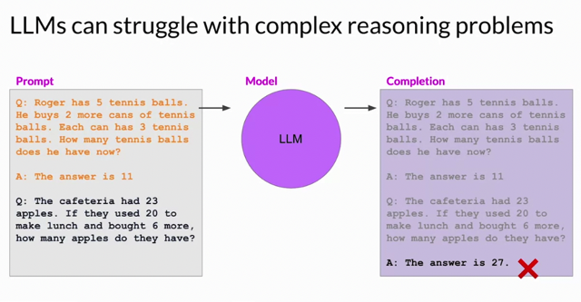</kbd></p>

> [!NOTE]
> LLM fail khi tính những bài toán đơn giản này.
> Researcher tìm cách khắc phục nó bằng cách làm cho nó
> suy nghĩ theo các bước như con người,

<br>

<a id="node-uokmij6"></a>

<p align="center"><kbd>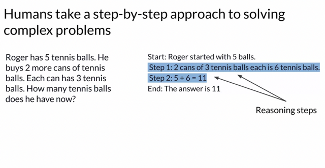</kbd></p>

> [!NOTE]
> Đại khái là break thành các step trung gian như thế này
> (reasoning steps) sẽ giúp LLM giải quyết tốt các câu hỏi
> reasoning
>
>
>
> Ask model thực hiện các bước như vậy gọi là "**chain of thought
> prompting**"

<br>

<a id="node-xfa7gze"></a>

<p align="center"><kbd>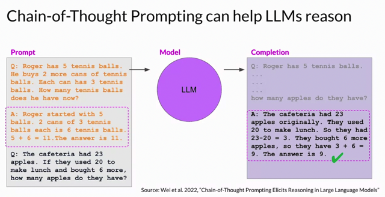</kbd></p>

> [!NOTE]
> Sửa lại prompt Theo kiểu vẫn đưa một ví dụ trước (Một ví dụ
> của câu hỏi và câu trả lời đúng mong muốn, gọi là **One-shot
> learning** như ta đã biết ở week 1)
>
>
>
> Nhưng sửa lại thay vì chỉ để A: The answer is 11 thì bây giờ
> **diễn giải thành từng bước việc tính toán các bước trung
> gian diễn ra như thế nào.** 
>
>
>
> Kết quả với điều này LLM đã có thể trả lời đúng

<br>

<a id="node-q4hmx3n"></a>

<p align="center"><kbd>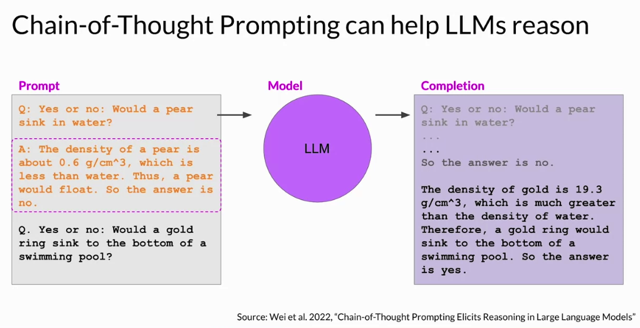</kbd></p>

> [!NOTE]
> Không những toán, mà các câu hỏi reasoning
> như vật lý cũng có thể được thực hiện tốt với
> **chain of thought prompting**

<br>

<a id="node-tknpg2l"></a>

<p align="center"><kbd></kbd></p>

> [!NOTE]
> Tuy vậy để LLM tính toán phức tạp hơn hoặc các
> bài toán yêu cầu độ chính xác cao hơn thì bài
> sau sẽ nói về cách connect LLM tới chương trình
> tính toán mạnh hơn

<br>

<a id="node-gq55oq0"></a>

## Program-aided Language Model (pal)

<br>

<a id="node-lriqvfj"></a>

> [!NOTE]
> 1. **LLM's Mathematical Limitations:** LLMs have a restricted capacity to execute 
> arithmetic and other math operations. While "chain of thought prompting" can be used to 
> aid reasoning, it doesn't guarantee accuracy in mathematical calculations.
>
> 2. **Mistakes in Calculations:** LLMs predict tokens based on the training data and not 
> actual computations, leading to potential errors in calculations, which can be detrimental 
> in practical applications like billing or cooking.
>
> 3. **Solution - PAL (Program-Aided Language Models):** An innovative approach called 
> program-aided language models (PAL) was introduced by Luyu Gao and team in 2022. 
> This model combines LLMs with an external code interpreter (like Python) to accurately 
> perform calculations.
>
> 4. **How PAL Works:** 
>    - LLMs generate reasoning and corresponding Python scripts using the "chain of 
> thought prompting".
>    - The Python scripts generated by the model are then executed by an interpreter.
>    - Example completions are illustrated through an image from the original PAL paper.
>
> 5. **Structuring PAL Prompts:** 
>    - Reasoning is written in words, with the corresponding Python code alongside.
>    - The reasoning part starts with a pound sign, allowing it to be recognized as a 
> comment in Python.
>
> 6. **PAL Example:** An example regarding a bakery's bread count is provided, showing 
> the chain of thought in blue and the Python code in pink. The model produces variables 
> and operations to compute the final answer.
>
> 7. **Interaction with an External Interpreter:** 
>    - First, a PAL formatted prompt is created by combining an example and a new 
> question.
>    - The prompt is given to the LLM, which produces a Python script based on the format.
>    - This script is executed by a Python interpreter to get the accurate answer, which is 
> then appended back to the original prompt.
>    - The combined information is given back to the LLM, ensuring it provides the correct 
> answer.
>
> 8. **Advantages of PAL:** For problems involving intricate math operations, PAL ensures 
> the calculations done by applications are reliable and accurate.
>
> 9. **Automating the Process:** The manual transition between LLMs and the interpreter 
> can be managed by an orchestrator. This system can initiate calls to external sources or 
> applications and take actions based on the LLM’s output.
>
> 10. **Complex Applications:** While PAL focuses on executing Python code, real-world 
> scenarios might require interactions with various data sources and multiple decisions, 
> validation actions, and external application calls.
>
> 11. **Next Steps:** The following video will delve into strategies to use LLMs in powering 
> more intricate applications.

<br>

<a id="node-motohd4"></a>

<p align="center"><kbd>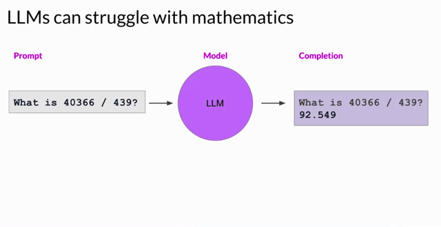</kbd></p>

> [!NOTE]
> **Chain of thought prompting** **chỉ khắc phục phần nào**, với bài toán
> phức tạp hơn, **yêu cầu chính xác cao hơn thì LLM vẫn fail**. Vì
> b**ehind the scene** nên nhớ **LLM không thật sự thực hiện việc tính
> toán**, mà nó chỉ output **probability**

<br>

<a id="node-dtawg7f"></a>

<p align="center"><kbd>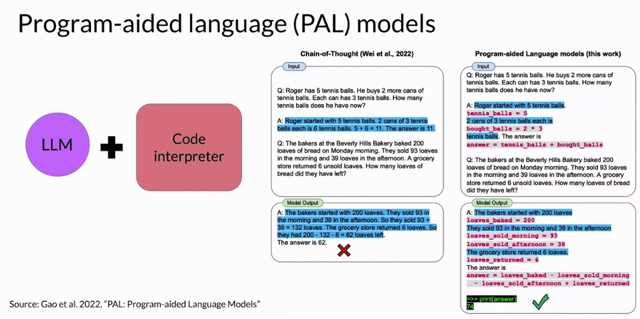</kbd></p>

> [!NOTE]
> Đại khái là để khắc phục, 2022 PAL ra
> đời cho phép kết hợp LLM và Code
> interpreter như Python

<br>

<a id="node-7yfs436"></a>

<p align="center"><kbd>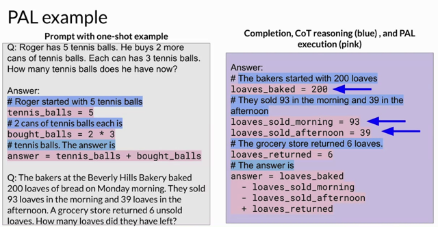</kbd></p>

> [!NOTE]
> Đại khái là sửa lại cái chain of thought prompt theo kiểu các bước có thể
> được gửi qua cho Python interpreter như câu nào describe reasoning step
> thì có # để qua python nó bỏ qua, các câu màu tím define variable chứa giá
> trị các bước tính toán trung gian. Thì idea là LLM nó sẽ bắt chước như vậy
> và trả lời ra theo kiểu cũng gồm các step và variable với assigned value như
> vậy. Thì sau đây sẽ kết hợp với Python để nó thực hiện việc tính toán

<br>

<a id="node-q9xnuq3"></a>

<p align="center"><kbd>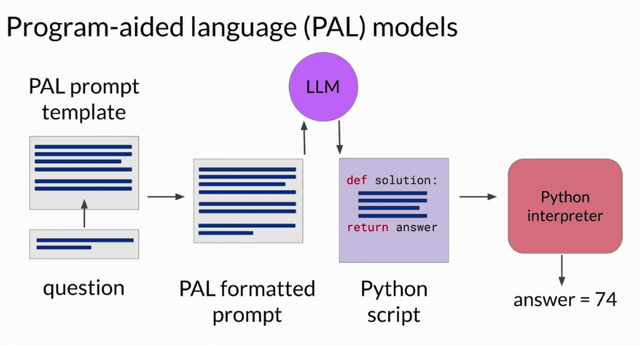</kbd></p>

> [!NOTE]
> Bắt đầu với PAL prompt template ví dụ như ở trên (define các step với #,
> define các variable được assigned intermediate value). Kết hợp câu hỏi để
> thành PAL formatted prompt
>
>
>
> Inference vào model để nó generate ra kiểu function script có thể đọc được
> bởi Python.
>
>
>
> Pass qua cho Python interpreter để tính toán ra giá trị chính xác.

<br>

<a id="node-uqiex52"></a>

<p align="center"><kbd>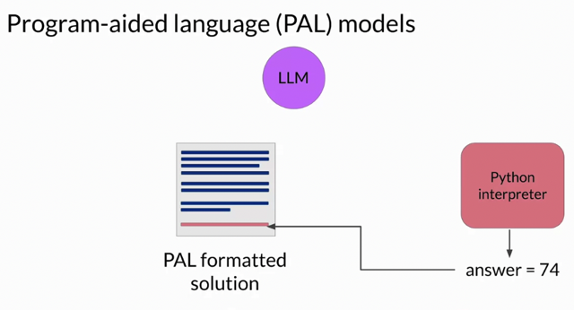</kbd></p>

<br>

<a id="node-sgzawza"></a>

<p align="center"><kbd>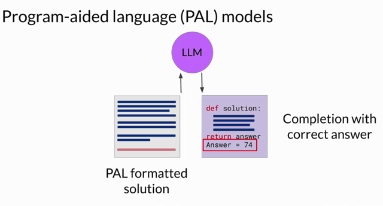</kbd></p>

> [!NOTE]
> Có thể thêm vài bước như lại update correct calulation
> result vào prompt rồi inference vào model lại nhưng cơ
> bản là vậy. Nhờ có interpreter, kết quả tính toán được
> đảm bảo chính xác.

<br>

<a id="node-fylz01d"></a>

<p align="center"><kbd>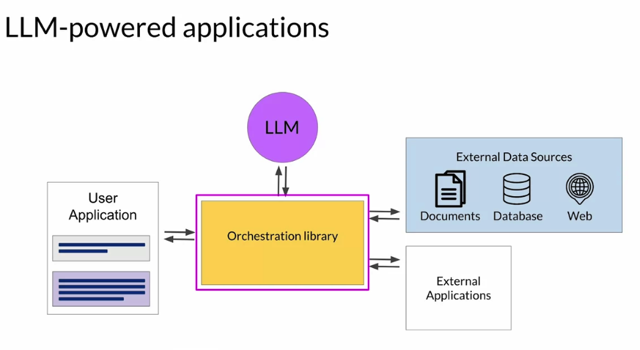</kbd></p>

> [!NOTE]
> Thì để handle các việc đó chính là vai
> trò của **Orchestration library.**

<br>

<a id="node-6l5sgtq"></a>

<p align="center"><kbd>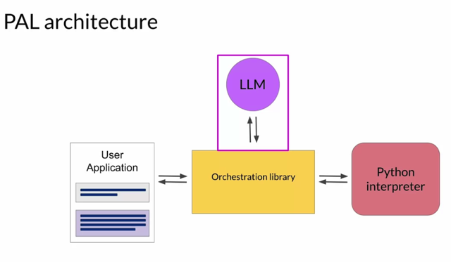</kbd></p>

> [!NOTE]
> Ví dụ như nó nhận question, tạo prompt, đưa
> vào model, nhận completion (python script) rồi
> pass qua Python interpreter...

<br>

<a id="node-dee098j"></a>

<p align="center"><kbd>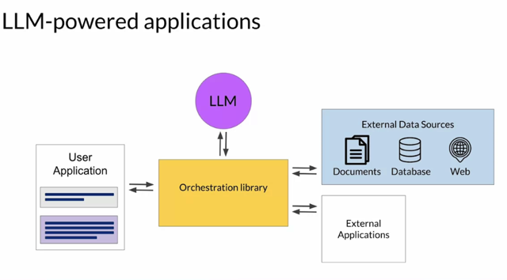</kbd></p>

> [!NOTE]
> Nói chung nói về in real world vai trò của **Orchestration library** là
> khá đa năng, giúp connect LLM với nào là Document, Web hay
> Databases (để trích xuất dữ liệu cập nhật) hay application như
> Python interpreter vừa nói.

<br>

<a id="node-73z1f4k"></a>

## React: Combining Reasoning And Action

<br>

<a id="node-elg1fm6"></a>

> [!NOTE]
> **Structured Prompts and Complex Workflows with LLMs**
>
> In this lesson, we dive deeper into **enhancing the capabilities of Large Language Models** 
> (LLMs) in **complex workflows and applications.**
>
> 1. **Introduction**:
>    - LLMs are great at predicting probable tokens based on context.
>    - However, they have **limitations**, especially in **arithmetic** and **complex operations.**
>
> 2. **Program-Aided Language Models (PAL)**:
>    - Introduced by Luyu Gao and collaborators in 2022 at Carnegie Mellon University.
>    - Combines an LLM with an external code interpreter, like Python.
>    - Uses "**chain of thought**" **prompting** to **create Python scripts**.
>    - The LLM reasons, writes code, and the interpreter executes the calculations.
>
> 3. ****PAL Workflow****:
>    - Start by **formatting the prompt** with **examples and desired outputs**.
>    - LLM **creates a Python script**.
>    - An **external interpreter** executes the script, getting the **correct answer**.
>    - **Integrate** the correct answer **back into the model** for consistency.
>
> 4. **Automating PAL**:
>    - An **orchestrator** can **manage the flow** between the LLM and external systems.
>    - It interprets and executes the model's plan, automating interactions.
>
> 5. **Introducing **ReAct****:
>    - A **prompting strategy** combining **reasoning** with **action planning**.
>    - Proposed by Princeton and Google researchers in 2022.
>    - **Requires the model** to **reason over multiple sources**, like Wikipedia, and 
> **decide on a series of actions**.

<br>

<a id="node-hl9w8w8"></a>

> [!NOTE]
> 6. **ReAct Workflow**:
>    - A **structured prompt** contains:
>      - A ****thought**** (a reasoning step).
>      - An ****action**** (an instruction from a predefined list, e.g., **search, lookup, finish**).
>      - An ****observation**** (new information from an external search).
>    - The model then **repeats this cycle as needed until the final answer is achieved**.
>
> 7. **ReAct Instructions**:
>    - **Define the task clearly**.
>    - **Define the allowed actions** to **prevent unintended actions**.
>    - **A series of examples** can guide the LLM.
>
> 8. **Inference with ReAct**:
>    - Begin with the **ReAct example prompt.**
>    - **Include the instructions** and the **question** for the LLM.
>    - Once the LLM understands, it **can reason and plan actions for the given application**.
>
> 9. ****LangChain Framework****:
>    - Provides **modular components** to work with LLMs.
>    - Contains **prompt templates**, **memory storage**, and **tools** to work with **external datasets 
> and APIs.**
>    - **"Chains"** are predefined **workflows**, while **"Agents"** can **determine dynamic workflows** 
> based on user input.
>
> 10. **Considerations**:
>    - **Larger models perform better** with **advanced prompting techniques.**
>    - **Smaller** models might **require fine-tuning**.
>    - It's beneficial to **start with a capable model** and then, **based on data collection, fine-
> tune a smaller model for deployment.**
>
> In summary, while LLMs have **inherent limitations**, combining them with frameworks like 
> **PAL** and **ReAct**, and tools like **LangChain**, can **extend their capabilities**, making them 
> powerful assets in complex applications.

<br>

<a id="node-7fvftxa"></a>

<p align="center"><kbd>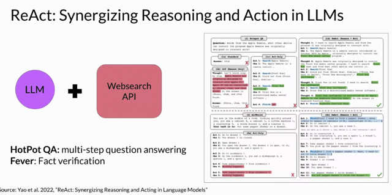</kbd></p>

<br>

<a id="node-shc93zj"></a>

<p align="center"><kbd>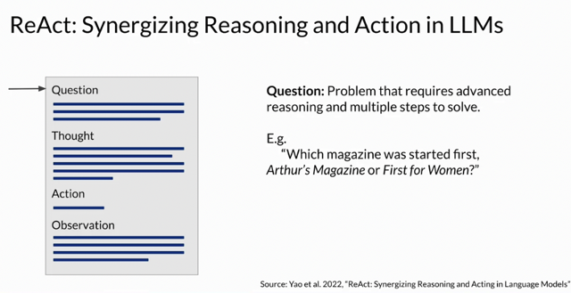</kbd></p>

<br>

<a id="node-zrsjhyf"></a>

<p align="center"><kbd>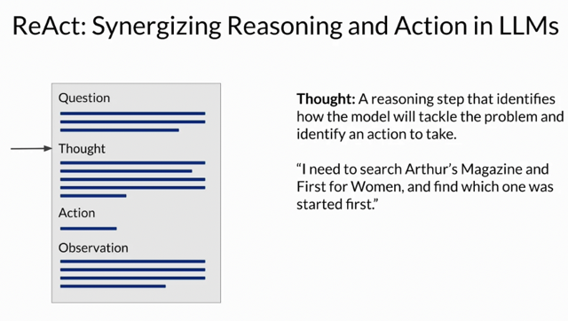</kbd></p>

<br>

<a id="node-hicb5k3"></a>

<p align="center"><kbd>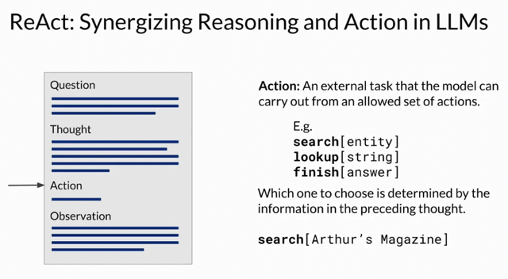</kbd></p>

<br>

<a id="node-145zujk"></a>

<p align="center"><kbd>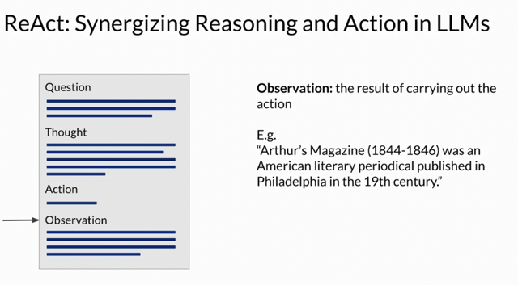</kbd></p>

<br>

<a id="node-wjtjfl0"></a>

<p align="center"><kbd>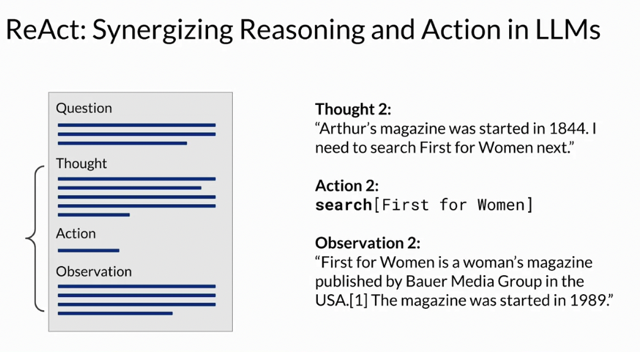</kbd></p>

<br>

<a id="node-ff5c9fv"></a>

<p align="center"><kbd>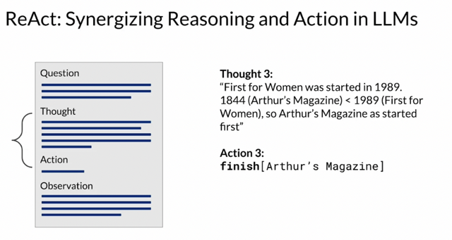</kbd></p>

<br>

<a id="node-acf529a"></a>

<p align="center"><kbd>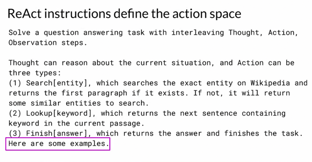</kbd></p>

<br>

<a id="node-xf0p63h"></a>

<p align="center"><kbd>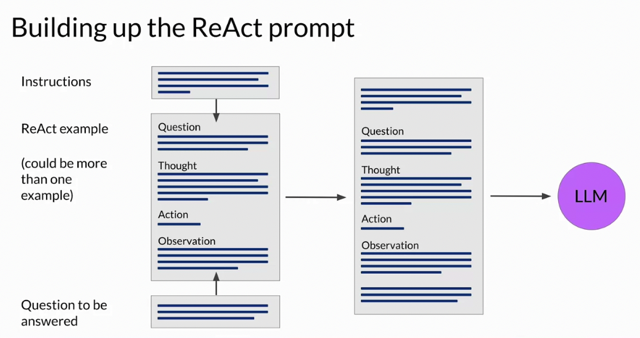</kbd></p>

> [!NOTE]
> Cơ bản **React** Prompt là một **'prompt technique'** trong đó
> **hướng dẫn LLM generate completion** theo kiểu **các bước
> suy nghĩ và hành động** để rồi từ đó nó (orchestration) sẽ
> dựa vào đó để mà gọi API

<br>

<a id="node-2tajhg8"></a>

<p align="center"><kbd>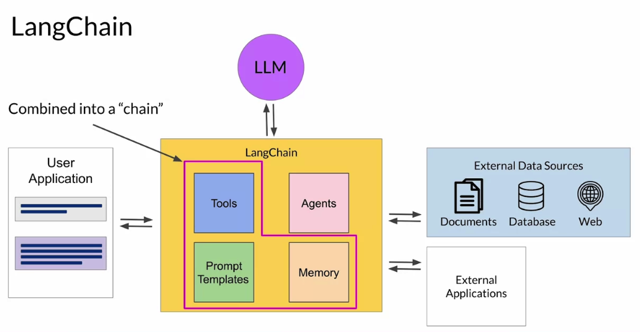</kbd></p>

> [!NOTE]
> Thì một Orchestration nổi tiếng đang
> được active research gần đây và có
> ShortCourse là **LangChain**.

<br>

<a id="node-pkboc7f"></a>

<p align="center"><kbd>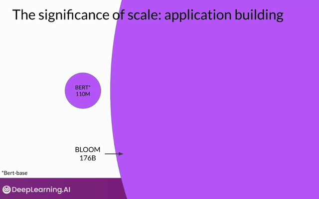</kbd></p>

> [!NOTE]
> Đại khái là kích thước model có thể **ảnh
> hưởng đến khả năng hiểu của nó khi deal
> với các advanced prompting technique này.**

<br>

<a id="node-i99adp6"></a>

## Reading: React Reasoning And Action

<br>

<a id="node-f8jjhho"></a>

> [!NOTE]
> \\_This paper\\_
>  introduces ReAct, a novel approach that integrates verbal reasoning and interactive 
> decision making in large language models (LLMs). While LLMs have excelled in 
> language understanding and decision making, the combination of reasoning and acting 
> has been neglected. ReAct enables LLMs to generate reasoning traces and task-specific 
> actions, leveraging the synergy between them. The approach demonstrates superior 
> performance over baselines in various tasks, overcoming issues like hallucination and 
> error propagation. ReAct outperforms imitation and reinforcement learning methods in 
> interactive decision making, even with minimal context examples. It not only enhances 
> performance but also improves interpretability, trustworthiness, and diagnosability by 
> allowing humans to distinguish between internal knowledge and external information.
>
> In summary, ReAct bridges the gap between reasoning and acting in LLMs, yielding 
> remarkable results across language reasoning and decision making tasks. By 
> interleaving reasoning traces and actions, ReAct overcomes limitations and outperforms 
> baselines, not only enhancing model performance but also providing interpretability and 
> trustworthiness, empowering users to understand the model's decision-making process.

<br>

<a id="node-nnwntxo"></a>

<p align="center"><kbd>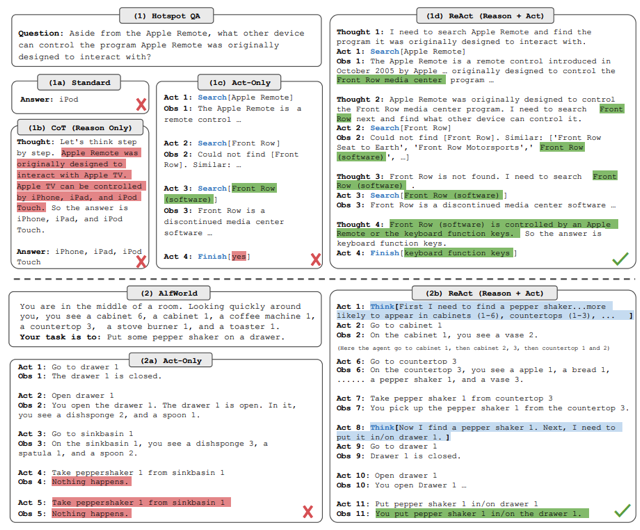</kbd></p>

<br>

<a id="node-gwj3gyn"></a>

> [!NOTE]
> Image: The figure provides a comprehensive visual comparison of different
> prompting methods in two distinct domains. The first part of the figure (1a) presents
> a comparison of four prompting methods: Standard, Chain-of-thought (CoT, Reason
> Only), Act-only, and ReAct (Reason+Act) for solving a HotpotQA question. Each
> method's approach is demonstrated through task-solving trajectories generated by
> the model (Act, Thought) and the environment (Obs). The second part of the figure
> (1b) focuses on a comparison between Act-only and ReAct prompting methods to
> solve an AlfWorld game. In both domains, in-context examples are omitted from the
> prompt, highlighting the generated trajectories as a result of the model's actions and
> thoughts and the observations made in the environment. This visual representation
> enables a clear understanding of the differences and advantages offered by the
> ReAct paradigm compared to other prompting methods in diverse task-solving
> scenarios

<br>

<a id="node-xw4pgsk"></a>

## LLM Application Architectures

<br>

<a id="node-ijwgg8h"></a>

> [!NOTE]
> **Summary:**
>
> 1. **Building LLM-powered Applications**:
>    - Key components are needed to create applications powered by Large Language 
> Models (LLMs).
>    - The **infrastructure layer** offers compute, storage, and network for LLMs and 
> application components, available on-premises or via cloud services.
>    - LLMs can be foundational or task-specific and must be deployed on suitable 
> infrastructure. The need for real-time or near-real-time interactions and information 
> retrieval from external sources is crucial.
>    - Outputs from LLMs are returned to the user or application. Mechanisms may be 
> needed to capture/store outputs or gather user feedback for model refinement.
>
> 2. **Tools & Frameworks**:
>    - Use of additional tools and frameworks simplifies the integration of LLM techniques.
>    - Tools like "len chain" offer libraries for techniques such as "pow react". Model hubs 
> allow central management and sharing of models.
>    - Security components and user interfaces, like websites or APIs, form the final layer of 
> the application.
>
> 3. **End-to-End Generative AI**:
>    - The LLM is just a part of the overall architecture in generative AI applications. End-
> users or systems will interact with the entire application stack.
>
> 4. **Model Fine-tuning & Optimization**:
>    - Aligning LLMs with human preferences like helpfulness and honesty is achieved 
> through Reinforcement Learning with Human Feedback (RLHF).
>    - RLHF is popular and effective in improving model alignment and safety.
>    - Techniques such as distillation, quantization, or pruning optimize the model, reducing 
> hardware resource requirements.
>
> 5. **Enhancing Model Deployment**:
>    - Structured prompts and connections to external data sources can enhance model 
> performance in deployment.
>
> 6. **Role of LLMs**:
>    - LLMs can act as reasoning engines in applications, tapping into their intelligence to 
> power beneficial applications.
>
> 7. **Future Prospects**:
>    - Frameworks like "len chain" expedite the building, deployment, and testing of LLM 
> applications, marking an exciting era for developers.
>    - The course will conclude by exploring emerging research areas in the field.

<br>

<a id="node-e9zpy34"></a>

<p align="center"><kbd>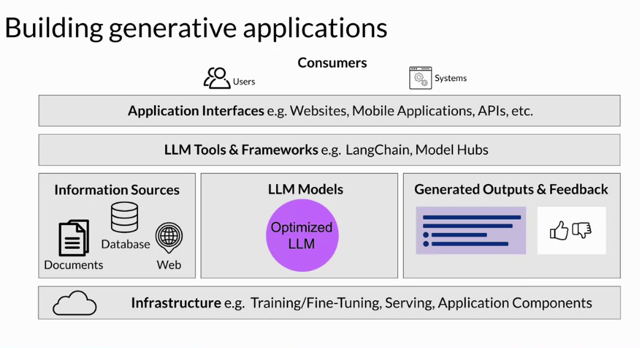</kbd></p>

<br>

<a id="node-w42z3qh"></a>

> [!NOTE]
> (OPTIONAL VIDEO): AWS SAGEMAKER
> JUMPSTART

<br>

<a id="node-576j10t"></a>

## Quiz

<br>

<a id="node-mlto6jn"></a>

<p align="center"><kbd>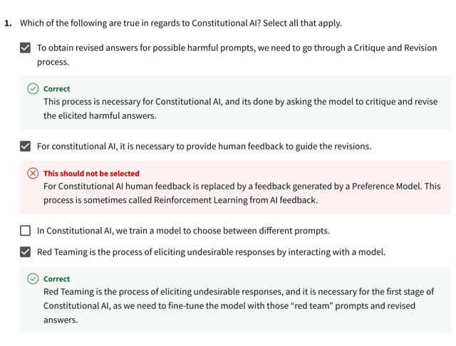</kbd></p>

<br>

<a id="node-dpra84k"></a>

<p align="center"><kbd>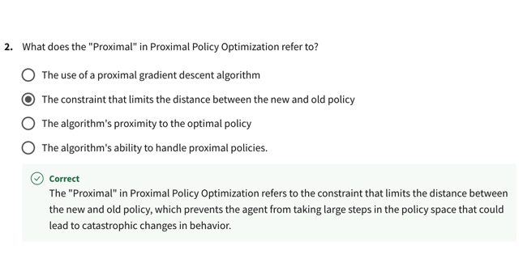</kbd></p>

<br>

<a id="node-jkb6t2w"></a>

<p align="center"><kbd>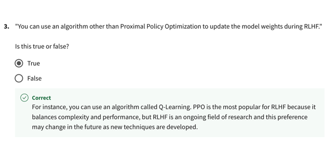</kbd></p>

<br>

<a id="node-3aylff4"></a>

<p align="center"><kbd>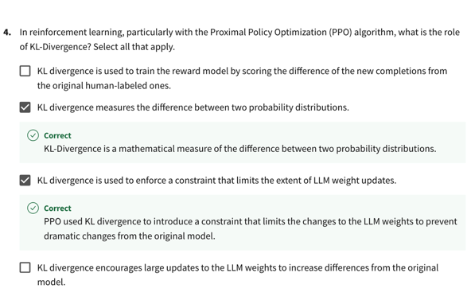</kbd></p>

<br>

<a id="node-2h93jj4"></a>

<p align="center"><kbd>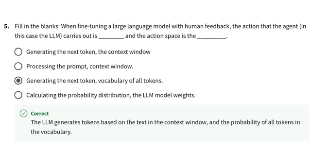</kbd></p>

<br>

<a id="node-51coz3x"></a>

<p align="center"><kbd>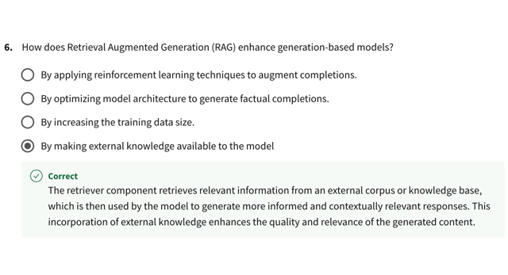</kbd></p>

<br>

<a id="node-e5xsw4f"></a>

<p align="center"><kbd>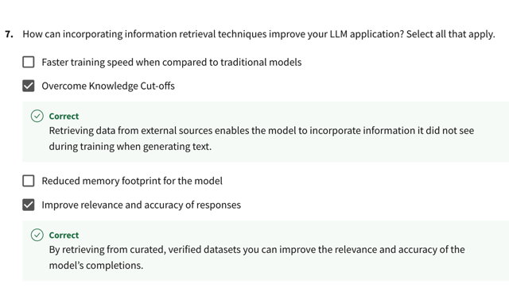</kbd></p>

<br>

<a id="node-yvnewnq"></a>

<p align="center"><kbd>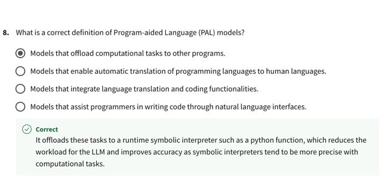</kbd></p>

<br>

<a id="node-2pe8uty"></a>

<p align="center"><kbd>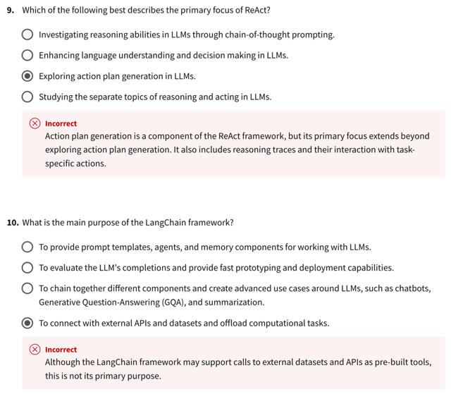</kbd></p>

<br>

<a id="node-jj49nry"></a>

<p align="center"><kbd>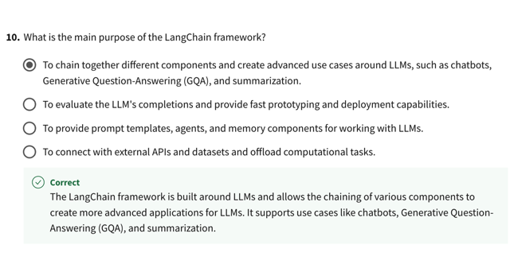</kbd></p>

<br>

<a id="node-ybhhlz8"></a>

## Resource

<br>

<a id="node-y69wbum"></a>

> [!NOTE]
> Below you'll find links to the research papers discussed in this weeks videos. You don't need to understand all the technical details 
> discussed in these papers - you have already seen the most important points you'll need to answer the quizzes in the lecture videos. 
>
> However, if you'd like to take a closer look at the original research, you can read the papers and articles via the links below. 
>
> Reinforcement Learning from Human-Feedback (RLHF)
> Training language models to follow instructions with human feedback
>  - Paper by OpenAI introducing a human-in-the-loop process to create a model that is 
> better at following instructions (InstructGPT).
>
> Learning to summarize from human feedback
>  - This paper presents a method for improving language model-generated summaries using a 
> reward-based approach, surpassing human reference summaries.
>
> Proximal Policy Optimization (PPO)
> Proximal Policy Optimization Algorithms
>  - The paper from researchers at OpenAI that first proposed the PPO algorithm. The paper discusses the performance of 
> the algorithm on a number of benchmark tasks including robotic locomotion and game play.
>
> Direct Preference Optimization: Your Language Model is Secretly a Reward Model
>  - This paper presents a simpler and effective method for precise control of large-scale unsupervised 
> language models by aligning them with human preferences.
>
> Scaling human feedback
> Constitutional AI: Harmlessness from AI Feedback
>  - This paper introduces a method for training a harmless AI assistant without human labels, 
> allowing better control of AI behavior with minimal human input.
>
> Advanced Prompting Techniques
> Chain-of-thought Prompting Elicits Reasoning in Large Language Models
>  -  Paper by researchers at Google exploring how chain-of-thought prompting improves the 
> ability of LLMs to perform complex reasoning.
>
> PAL: Program-aided Language Models
>  - This paper proposes an approach that uses the LLM to read natural language problems and 
> generate programs as the intermediate reasoning steps.
>
> ReAct: Synergizing Reasoning and Acting in Language Models
>  This paper presents an advanced prompting technique that allows an LLM to make decisions 
> about how to interact with external applications.
>
> LLM powered application architectures
> LangChain Library (GitHub)
>  - This library is aimed at assisting in the development of those types of applications, such as Question Answering, 
> Chatbots and other Agents. You can read the documentation 
> here
> .
>
> Who Owns the Generative AI Platform?
>  - The article examines the market dynamics and business models of generative AI.

<br>

<a id="node-kmrv2kv"></a>

## Responsible Ai

<br>

<a id="node-m7dcv1a"></a>

## Conclusion

<br>

