# Week 1_introduction To Llms And The Generative Ai Project Lifecycle

📊 **Progress:** `181` Notes | `179` Screenshots

---

## Week 1_introduction To Llms And The Generative Ai Project Lifecycle

 

> [!NOTE]
> COURSE
> INTRODUCTION

 

> [!NOTE]
> 1 Large language models (LLMs) have significant potential as a developer tool, enabling faster development of
> machine learning and AI applications.
>
> 2 This course aims to provide a **deep dive into LLM technology**, covering **technical details** such as **model
> training, instruction tuning**, and the **generative AI project life cycle.**
>
> 3 **LLMs are a general-purpose technology** with applications across various sectors of the economy.
>
> 4 There is still a need for **further research and exploration in the field of LLMs** to **identify use cases** and
> **build specific applications.**
>
> 5 **Demand for professionals with LLM expertise** is increasing, and this course can help individuals position
> themselves for related job opportunities.
>
> 6 The course is led by experienced instructors from the **AWS team**, who have **practical knowledge and
> hands-on experience** in **building applications using LLMs.**
>
> 7 The course content is developed in collaboration with **industry experts, applied scientists from companies like
> Amazon and Hugging Face, and top universities worldwide**.
>
> 8 The course assumes familiarity with Python programming and basic data science and machine learning
> concepts.
>
> 9 The course covers the **technical foundations of LLMs**, **training techniques, tuning models, and integrating
> them into application**s.
>
> 10 Each week of the course focuses on specific topics, including the **transformer architecture**, **in-context
> learning**, **fine-tuning models**, **aligning output with human values**, and **hands-on labs.**
>
> 11 The hands-on labs provide **practical exercises in an AWS environment,** allowing learners to experiment with
> **different techniques** and workflows.
>
> 12 The labs cover tasks such as **prompt engineerin**g, **fine-tuning models**, and **reinforcement learning**
> from human feedback.
>
> 13 The course aims to provide learners with a deep technical understanding and practical knowledge to **build
> their own generative AI projects** using LLMs.
>
> 14 The course emphasizes code examples that can be directly useful in real-world applications.
>
> 15 The ultimate goal is for learners to leverage LLMs to build exciting and innovative applications.

 

## Introduction

 

> [!NOTE]
> 1 The first topic in the course is a deep dive into **how transformer networks work**, focusing on concepts like
> **self-attention** and the **multi-headed self-attention mechanism**.
>
> 2 The transformer architecture has been around since 2017 and is still **state-of-the-art for many models**, but its
> workings can seem **complex and magical at first.**
>
> 3 Understanding terms like **multi-headed attention** and why the tr**ansformer architecture became popular** will be
> covered in the first week of the course.
>
> 4 **Attention mechanisms** in transformers allowed for **parallel processing**, making it **scalable on modern GPUs.**
>
> 5 The course aims to provide **practical use** and i**ntuition behind important parts of the transformer architecture**,
> rather than overwhelming learners with detailed mathematics.
>
> 6 **Transformers** have not **only revolutionized text-based models** but also provided a **foundation for vision
> transformers** and other **modalities in machine learning**.
>
> 7 The **Generative AI project Lifecycle** is another major topic covered in the course, helping learners plan and **build
> their own generative AI projects**.
>
> 8 Decisions within the Generative AI project Lifecycle include c**hoosing between using an off-the-shelf foundation
> model** or **pre-training and fine-tuning a customized model**.
>
> 9 **Evaluating and selecting the right model sizing is important,** considering use cases where a **comprehensive,
> large model** is needed versus cases where a **smaller, task-specific model** can provide good results.
>
> 10 It is possible to **achieve good results** with **smaller models for specific applications**, and the course will explore
> this surprising aspect.
>
> 11 The course covers **various use cases of large language model**s, showcasing their **capabilities and potential
> applications.**
>
> 12 The next video will delve into different use cases of large language models, starting with a deep dive led by Mike.

 

## Generative Ai & Llms

 

> [!NOTE]
> 1 Introduction to **large language model**s and their **use cases.**
>
> 2 **Generative AI** as a **subset of traditional machine learning.** 
>
> 3 **Training process** of large language models on **massive datasets**.
>
> 4 **Emergent properties** and **capabilities of large language models**.
>
> 5 Introduction to **foundation models** and **their parameters.**
>
> 6 The use of open source models like **flan-T5** for **language tasks.**
>
> 7 Focus on l**arge language models** for **natural language generation.**
>
> 8 I**nteracting with language models** through **prompts** and **context windows.**
>
> 9 **Prompt engineering** and f**ine-tuning models** for **specific use cases.**
>
> 10 **Deploying language models** for **business** and **social** tasks.
>
> 11 Contrasting the **interaction with language models** with **traditional programming paradigms**.
>
> 12 Understanding **prompts**, **completions**, and **inference** in language models.
>
> 13 Example of using a language model to answer a question about Ganymede's location in the solar system.

 

<kbd>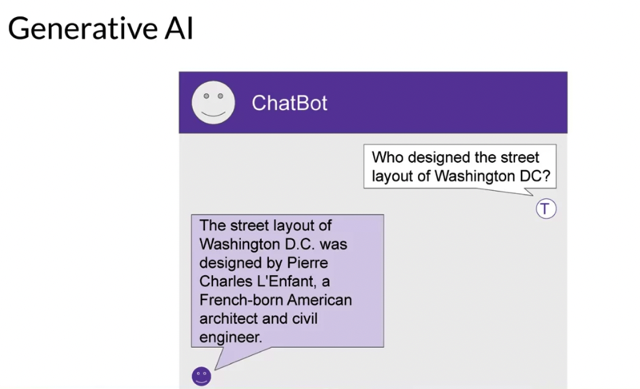</kbd>

 

<kbd>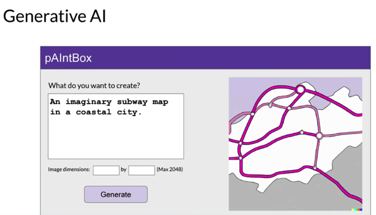</kbd>

 

<kbd>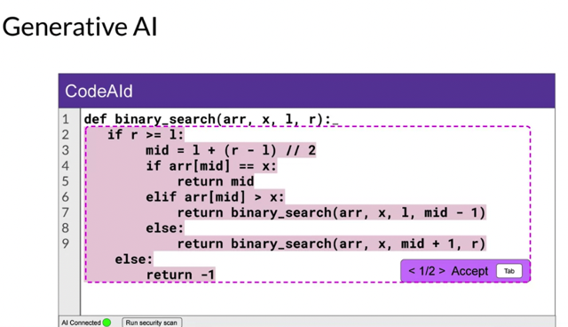</kbd>

> [!NOTE]
> Generative AI is a subset of traditional machine learning.
> And the machine learning models that underpin generative
> AI have **learned these abilities by finding statistical
> patterns in massive datasets of content** that **was originally
> generated by humans.**

 

<kbd>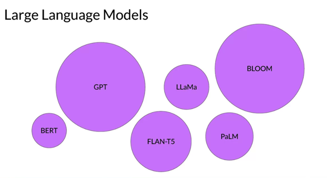</kbd>

> [!NOTE]
> Large language models have been trained on trillions of words over many weeks and months,
> and with large amounts of compute power
>
>
>
> These foundation models, as we call them, with **billions of parameters**, exhibit **emergent
> properties** beyond language alone, and researchers are **unlocking their ability to break down
> complex tasks, reason, and problem solve**. Here are a **collection of foundation models**,
> sometimes called **base models**, and their relative size in terms of **their parameters**. You'll
> cover these parameters in a little more detail later on, but for now, think of them as the **model's
> memory**. And the **more parameters** a model has, the **more memory,** and as it turns out,
> the **more sophisticated the tasks it can perform**
>
> So sách kích thước (số params)
> của các LLMs hiện nay,

 

<kbd>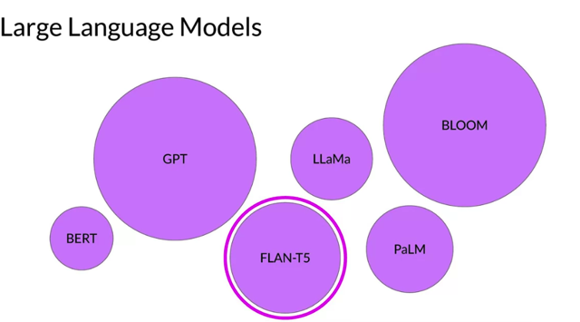</kbd>

> [!NOTE]
> Throughout this course, we'll represent LLMs with these purple circles, and in the labs, you'll
> make use of a **specific open source model, flan-T5**, to carry out **language tasks**. By
> either **using these models** as they are or by a**pplying fine tuning techniques** to adapt
> them to y**our specific use case,** you can r**apidly build customized solutions without the
> need to train a new model from scratch**
>
> Ta sẽ dùng FLAN-T5 và fine tuning
> nó cho specific use cases.

 

<kbd>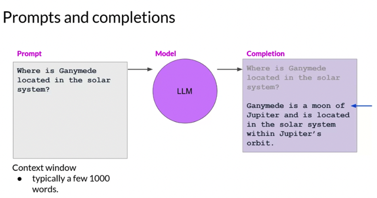</kbd>

> [!NOTE]
> while generative AI models are being created for multiple modalities, including i**mages,
> video, audio, and speech**, in this course you'll **focus on large language models** and their
> uses in **natural language generation**. You will see how they are **built** and **trained**,
> how you can **interact with them** via text known as **prompts**. And how to f**ine tune
> models** for your use case and data, and how you can **deploy them with applications** to
> **solve your business and social tasks**.

 

## LLM Use Cases And Tasks

 

> [!NOTE]
> 1 LLMs and generative AI are **not limited to chat tasks.**
>
> 2 **Next word prediction** is a **base concept** that can be used for **various text generation tasks.**
>
> 3 Examples of tasks include **essay writing, conversation summarization, translation, and code
> generation.**
>
> 4 LLMs can be used for **information retrieval tasks like named entity recognition.**
>
> 5 **Augmenting LLMs** by **connecting them to external data sources** or APIs is an **active area of
> development.** 
>
> 6 The **scale of foundation models** affects **their subjective understanding of language.**
>
> 7 **Smaller models** can be **fine-tuned for specific tasks.**
>
> 8 The **architecture powering LLMs** has contributed to thei**r rapid increase in capability.**
>
> 9 Further exploration of the architecture will be discussed in the next video.

 

<kbd>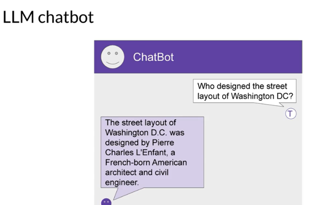</kbd>

> [!NOTE]
> Đại khái là tuy LLM nổi tiếng với chatbot nhưng concept đằng sau nó là predicting next
> words có thể được apply vào rất nhiều ứng dụng khác

 

<kbd></kbd>

> [!NOTE]
> Như viết một essays
> dựa vào a prompt

 

<kbd>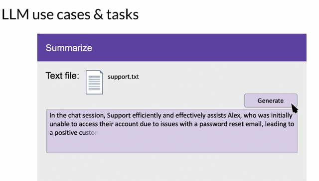</kbd>

> [!NOTE]
> ..summarize text

 

<kbd>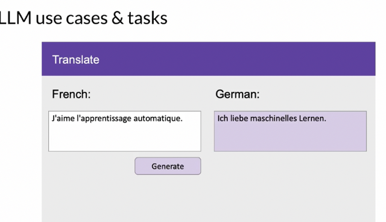</kbd>

> [!NOTE]
> translating human language to human language

 

<kbd>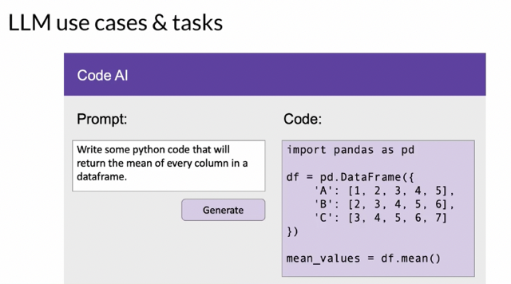</kbd>

> [!NOTE]
> Or to machine language

 

<kbd>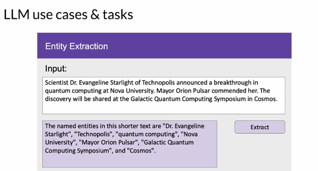</kbd>

> [!NOTE]
> Extracting information, name entity recognition

 

<kbd></kbd>

> [!NOTE]
> Cái này mới dữ nè đây là cái đang active development" là **"augmenting LLM"**
>  đại khái là tự gọi api để request thông tin mà nó không biết luôn - có nghĩa là
> nó sẽ **không chỉ trả lời những cái nó học được** mà **sẽ tự tìm hiểu để trả lời.
> Nói cách khác, nó sẽ chủ động interacting với thế giới**
>
> Finally, an area of **active development** is **augmenting LLM**s by **connecting
> them to external data sources** or **using them to invoke external API**s. You
> can use this ability to **provide the model with information it doesn't know
> from its pre-training** and to **enable your model to power interactions with
> the real-world.**

 

<kbd>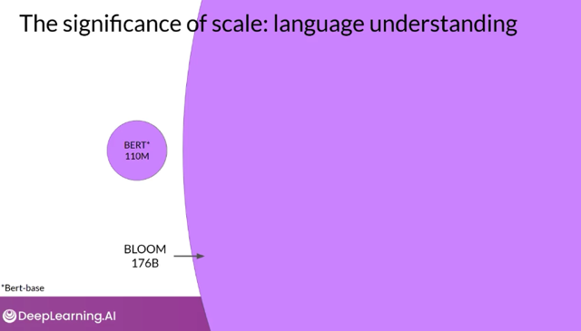</kbd>

> [!NOTE]
> Developers have **discovered that** as the **scale of foundation models grows** from
> **hundreds of millions** of parameters to **billions**, even **hundreds of billions**, the
> **subjective understanding of language** that a model possesses also **increases**.
> This language understanding stored within the parameters of the model is what
> **processes, reasons, and ultimately solves the tasks you give it**, but it's also true
> that **smaller models can be fine tuned to perform well on specific focused tasks.**

 

> [!NOTE]
> TEXT GENERATION
> BEFORE TRANSFORMERS

 

> [!NOTE]
> 1 **Generative algorithms** have been used in **language models**, with **previous generations**
> relying on **recurrent neural networks (RNNs).** 
>
> 2 **RNNs** had **limitations** due to **computational and memory requirements**, especially when
> **scaling to consider more preceding words** for **better predictions.**
>
> 3 **Language understanding** requires **considering the context of a sentence** or even the **entire
> document**, as words can have **multiple meanings** and **syntactic ambiguity.**
>
> 4 In 2017, the **transformer architecture**, introduced in the paper **"Attention is All You Need,"**
> r**evolutionized generative AI.**
>
> 5 The transformer architecture allows for **efficient scaling**, **parallel processing** of input data, and
> the **ability to learn to pay attention to word meanings.**
>
> 6 The **key concept** in the **transformer architecture** is **attention**, which **enables improved
> language understanding** and **generative capabilities**.

 

<kbd>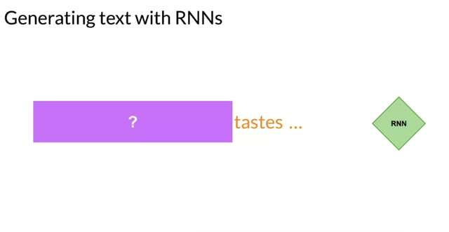</kbd>

<kbd>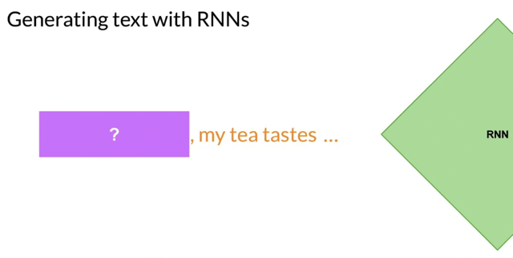</kbd>

<kbd>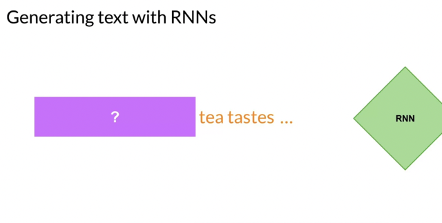</kbd>

 

<kbd>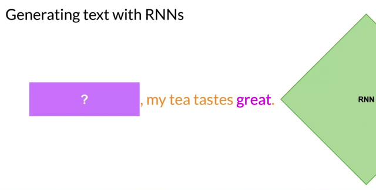</kbd>

> [!NOTE]
> Đại khái là nói về RNN **khi câu càng dài**, hay nói cách khác là cái **từ chứa thông tin liên quan để
> dự đoán từ tiếp theo càng xa** thì **RNN dễ bị quên đi thông đó** khiến **dự đoán không chính xác**.
>
>
>
> Ở muốn diễn đạt ý là **để predict một từ**, RNN sẽ **dựa trên trí nhớ của nó về các từ trước đó**, ví dụ
> chỉ có '**taste**' nó **chưa đủ để dự đoán**, nó **phải chứa được thêm thông tin ở xa hơn**
>
>
>
> Ví dụ có thêm **'tea taste'**, tuy nhiên v**ẫn chưa đủ**, **nó cần nhớ nhiều thông tin hơn nữa** (thể hiện
> bằng cái minh hoạ RNN model phình to ra)
>
>
>
> Đến khi có **'my tea taste'** thì nó dự đoán là '**great**'.
>
>
>
> Nhưng k**ết quả là sai** vì một thông tin quan trọng là chữ **bad** trong vế câu trước. Cho thấy là, **với
> những câu dài, để predict được chính xác, model có thể cần phải biết được toàn bộ câu hoặc
> thậm chí toàn bộ document.**

 

<kbd>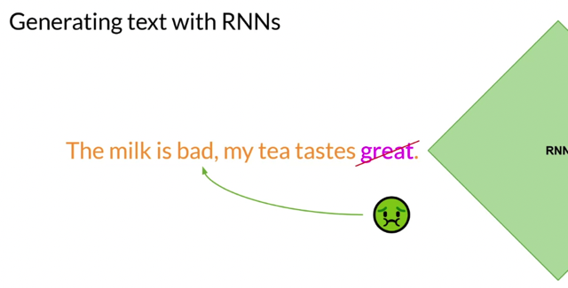</kbd>

> [!NOTE]
> RNNs while powerful for their time, were limited by the amount of compute and memory needed
> to perform well at generative tasks. Let's look at an example of an RNN carrying out a simple
> next-word prediction generative task. **With just one previous words seen by the model, the
> prediction can't be very good**. As you **scale the RNN implementation** to be able to **see more
> of the preceding words in the text**, you have to **significantly scale the resources that the model
> uses**. As for the prediction, well, the model **failed** here. **Even though you scale the model**,
> it **still hasn't seen enough of the input to make a good prediction.**
>
>
>
>  To successfully predict the next word, **models need to see more than  just the previous few
> words**. Models needs to **have an understanding  of the whole sentence** or even the **whole
> document**

 

<kbd>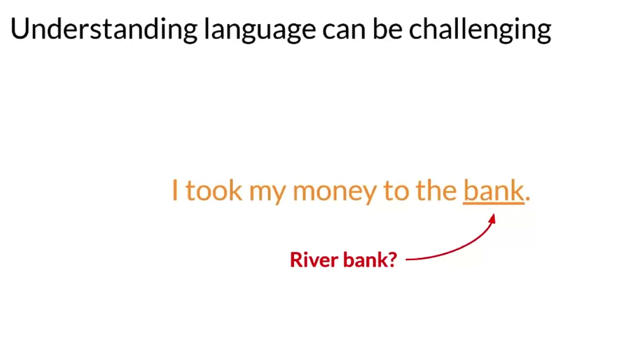</kbd>

> [!NOTE]
> The problem here is that **language is complex**. In many languages, **one word
> can have multiple meanings**. These are **homonyms**. In this case, **it's only
> with the context of the sentence that we can see what kind of bank is meant.**
> Words within a sentence structures can be **ambiguous** or have what we
> might call **syntactic ambiguity.** Take for example this sentence, "The teacher
> taught the students with the book." Did the teacher teach using the book or
> did the student have the book, or was it both? How can an algorithm make
> sense of human language if sometimes we can't?
>
> Một từ có thể **có nhiều nghĩa tuỳ vào
> hoàn cảnh cụ thể** trong từng câu.

 

<kbd>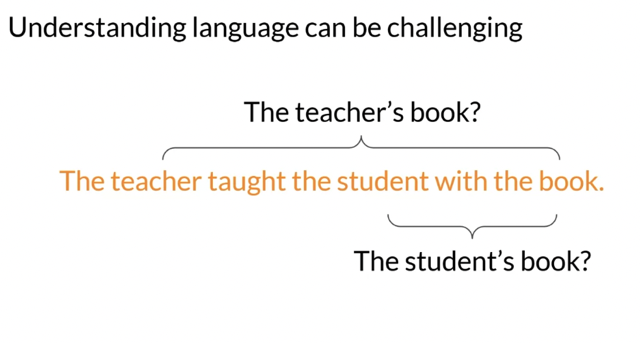</kbd>

> [!NOTE]
> Hoặc vấn đề **syntactic ambiguity** mà n**gay cả
> con người nhiều khi còn khó hiểu**

 

<kbd>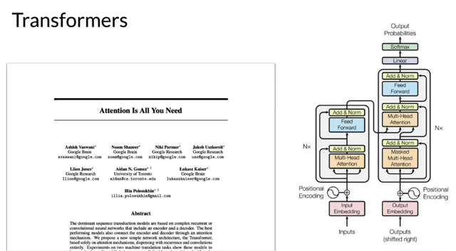</kbd>

> [!NOTE]
> Well in 2017, after the publication of this paper, **Attention is All You Need**, from
> **Google** and the **University of Toronto**, everything changed. The **transformer**
> **architecture** had arrived. This **novel approach** unlocked the progress in
> generative AI that we see today. It can be s**caled efficiently** to use multi-core
> GPUs, it can **parallel process input data,** making **use of much larger training
> datasets**, and crucially, it's able to **learn to pay attention to the meaning of the
> words it's processing**. And attention is all you need. It's in the title.
>
> Và **Attention** model cùng với **Transformer** đã mang tới một giải pháp rất
> tốt cho vấn đề này. Nó cho phép model **học được các embed từ tuỳ theo
> ngữ cảnh** của nó **thay vì extract từ một fixed embedding dictionary**. Nó
> **mang đến khả năng parallel process** đối với **sequence data** giống như
> cách mà **Convolutional Network làm đối với image data**.

 

<kbd>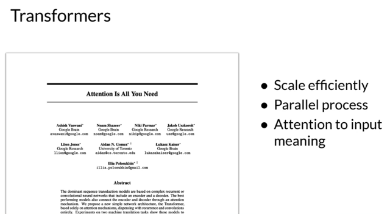</kbd>

 

## Transformer. Architecture

 

> [!NOTE]
> 1 The transformer architecture **greatly improved natural language processing tasks** and **generative
> capabilities** compared to earlier **RNN-based models.**
>
> 2 The power of the transformer lies in **its ability to learn the relevance and context of all words in a
> sentence,** **considering their relationships with each other.**
>
> 3 **Self-attention** is a k**ey attribute** of the transformer architecture, allowing the model to **assign
> attention weights to words based on their importance and relevance**.
>
> 4 The transformer architecture consists of **two main components:** the **encoder** and the **decoder**,
> which **work together and share similarities.**
>
> 5 **Tokenization** is necessary to **convert words into numerical representations** before passing them
> into the model.
>
> 6 The **embedding layer maps token IDs** to **high-dimensional vectors,** **encoding the meaning and
> context of individual tokens in the input sequence.**
>
> 7 **Positional encoding preserves** the **word order** by a**dding positional information** to the token
> vectors.
>
> 8 The **self-attention layer** **analyzes relationships between tokens**, allowing the model to **capture
> contextual dependencies and attend to different parts of the input sequence.**
>
> 9 **Multi-headed self-attention** involves **learning multiple sets of self-attention weights in parallel**, with
> **each head focusing on different aspects of language.**
>
> 10 The **outp**ut of the self-attention layer is **processed through a feed-forward network,** producing
> **logits** that **represent the probability scores for each token in the tokenizer dictionary.** 
>
> 11 **The logits are normalized using a softmax** layer to **obtain probability scores for each word**, with
> the **highest scoring token being the most likely prediction**.
>
> 12 **Various methods** can be used to **select the final predicted token** from the probability distribution.

 

<kbd>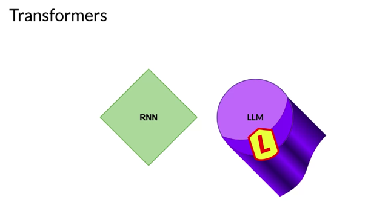</kbd>

 

<kbd></kbd>

 

<kbd></kbd>

> [!NOTE]
> The power of the transformer architecture lies in its **ability to learn the
> relevance and context of all of the words in a sentence.** Not just as you see
> here, to each word next to its neighbor, but to **every other word in a
> sentence**. To apply \_**attention weights**\_ to those relationships so that the **model
> learns the relevance of each word** to **each other words no matter where they
> are in the input.**
>
> Thay vì **chỉ học được các thông tin liên quan ngữ nghĩa của một từ** bằng **những từ
> hàng xóm** của nó **mà là tất cả các từ trong câu**. **Nói đúng ra thì** những **bản nâng
> cấp của RNN như GRU, LSTM với bi-directional cũng cố gắng làm việc** này tuy nhiên
> cách làm của nó ta nhớ lại là t**ìm những sự liên quan của một từ với các từ ở xa dựa
> trên fixed embedding của chúng**.
>
>
>
> Còn **Transformer với Self-Attention** model còn tiến xa hơn khi kiểu như **"tính lại một
> embedding vector" khác thật sự dựa trên những relevancy của từ đó** **với các từ trong
> câu** sẽ giúp **thông tin không bị "quên" khi câu dài** như ngay cả khi dùng LSTM. Đó là
> chưa nói đến khả năng xử lý đồng loạt.

 

<kbd>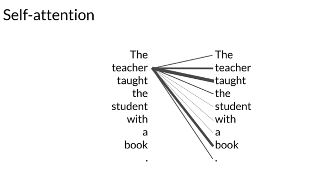</kbd>

<kbd>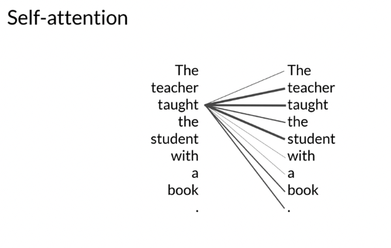</kbd>

<kbd>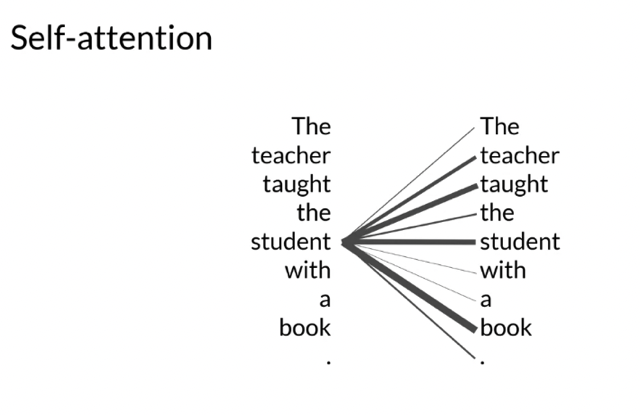</kbd>

> [!NOTE]
> Bằng cách tính ra các attention-weight kiểu như
> trọng số của một từ nên được chú ý vào/bởi
> những từ (tất cả các từ) trong câu cho dù ở xa hay gần

 

<kbd>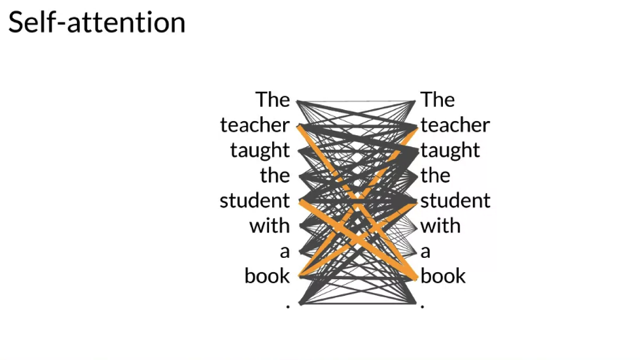</kbd>

> [!NOTE]
> To apply **attention weights** to those **relationships** so that the model learns the
> **relevance of each word to each other words** **no matter where they are** in the input.
> This gives the algorithm the ability to learn who has the book, who could have the
> book, and if it's even relevant to the wider context of the document. These **attention
> weights** are **learned during LLM training** and you'll learn more about this later this
> week. This diagram is called an **attention map** and can be useful to **illustrate the
> attention weights between each word and every other word.** Here in this stylized
> example, you can see that the word **book** is **strongly connected** with or **paying
> attention** to the word **teacher** and the word **student**. This is called **self-attention** and
> the ability to learn attention in this way across the whole input **significantly approves
> the model's ability to encode language**.
>
> Từ đó model cải thiện đáng kể khả năng
> embedding một từ đó nắm bắt được rất tốt ý
> nghĩa của nó trong hoàn cảnh cụ thể

 

<kbd>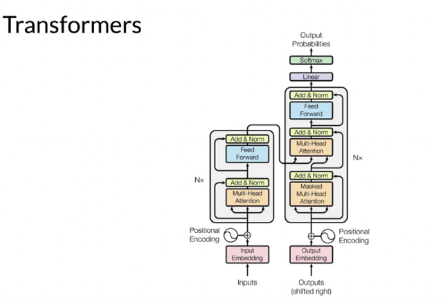</kbd>

 

<kbd>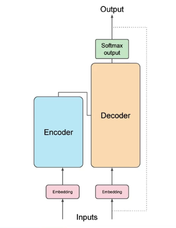</kbd>

> [!NOTE]
> Here's a simplified diagram of the **transformer architecture** so that you can
> focus at a **high level** on where these processes are taking place. The
> transformer architecture is split into **two distinct parts**, the **encoder** and the
> **decoder**. These components work in conjunction with each other and they
> **share a number of similarities**. Also, note here, the diagram you see is
> derived from the original attention is all you need paper. Notice how the
> **inputs to the model are at the bottom** and the **outputs are at the top**, where
> possible we'll try to remain faithful to this throughout the course

 

<kbd>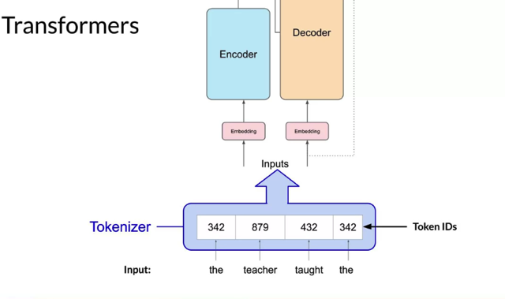</kbd>

> [!NOTE]
> Đầu tiên chắc đã hiểu là ta không thể khơi khơi đưa từ
> vựng vào. Mà phải tokenize nó. Bằng cách phương
> pháp quen thuộc như mỗi từ sẽ được token bằng index
> của nó trong vocab list.
>
> Now, **machine-learning models** are just **big statistical calculators** and they work
> with **numbers**, **not words**. So before passing texts into the model to process,
> you **must first tokenize the words**. Simply put, this **converts the words into
> numbers**, with e**ach number representing a position in a dictionary** of all the
> possible words that the model can work with. You can choose from **multiple
> tokenization methods**. For example, **token IDs matching two complete words**,
> or using **token IDs to represent parts of words**. As you can see here. What's
> important is that once you've **selected a tokenizer to train the model, you must
> use the same tokenizer when you generate text**

 

<kbd>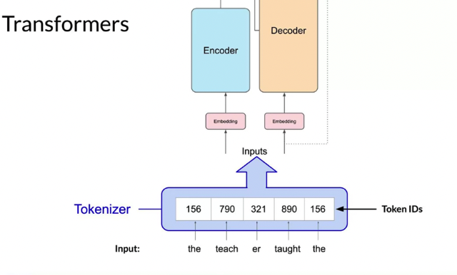</kbd>

> [!NOTE]
> Hoặc có cái này mới đó là mỗi phần của từ được tokenized luôn. Và
> dùng cách nào cho input thì dùng cách đó cho output

 

<kbd>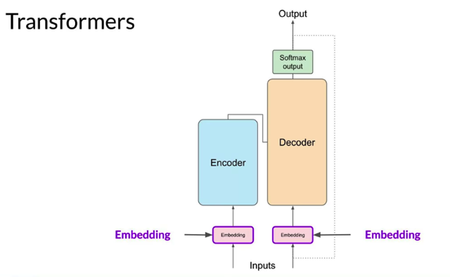</kbd>

> [!NOTE]
> Now that your **input is represented as numbers,** you can pass it to the
> **embedding layer**. This layer is a **trainable vector embedding space**, a
> **high-dimensional space** where each **token** is represented **as a vector** and
> **occupies a unique location within that space**. **Each token ID** in the vocabulary is
> **matched to a multi-dimensional vector**, and the intuition is that these vectors
> \_**learn to encode the meaning and context of individual tokens in the input
> sequence**\_. Embedding vector spaces have **been used** in natural language
> processing for some time, previous generation language algorithms like
> **Word2vec** use this concept. Don't worry if you're not familiar with this. You'll see
> examples of this throughout the course, and there are some links to additional
> resources in the reading exercises at the end of this week
>
> Bỏ **word index** qua **Embedding layer** để **map nó với
> high-dimensional vector** gọi là **Embedding vector**. Mục đích là **trong
> quá trình training**, **model sẽ learn** để **trong quá trình giải quyết bài
> toán chính** nó sẽ **học cách tạo ra** (v**à dùng** chúng để phục vụ bài
> toán chính) **những embedding vector** giúp **nắm bắt ý nghĩa của từ
> vựng.** Như cách mà **các language model trước** đã dùng như
> **Word2Vec** hay **CBOW**

 

<kbd>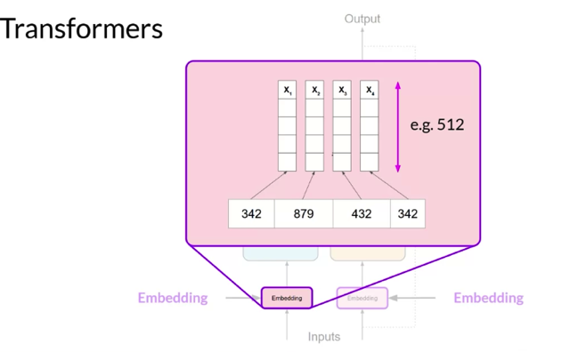</kbd>

> [!NOTE]
> Embedding sẽ **map một word index thành một word
> embedding vector,** Trong original paper tác giả dùng
> **word embedding có size là 512.**

 

<kbd>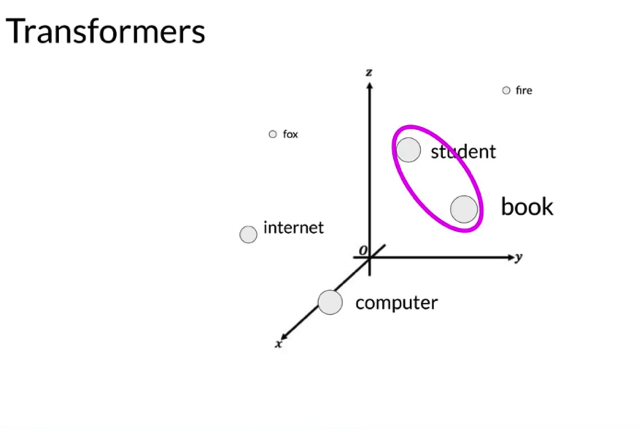</kbd>

<kbd>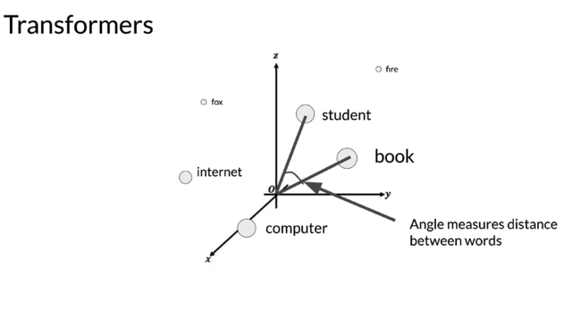</kbd>

> [!NOTE]
> Minh hoạ **embedding vector có độ dài 3** để **plot trong không gian 3D** minh họa việc
> các t**ừ như student và book** sau khi **model đã train xong** (và học và tạo ra các
> embedding vectors) **sẽ thật sự gần nhau trong không gian** thể hiện các **e.v đã chứa
> đựng nắm bắt được các quan hệ ngữ nghĩa của chúng**
>
>
>
> Và sự gần gũi của các từ đúng hơn là embedding vector sẽ được đo bằng góc giữa các
> vector - ý nói đến **Cosine Similarity**

 

<kbd>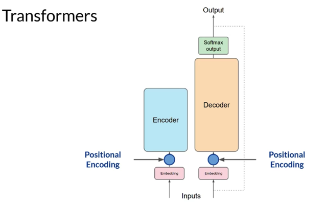</kbd>

> [!NOTE]
> Như mới review DLSpec C5W4 Transformer hôm qua có thể thấy không khó hiểu về "
> Positional Encoding" nữa. Đơn giản là vì trong **Transformer**, **các từ được xử lý đồng loạt,**
> song song nhau **nên thông tin mang ý nghĩa thứ tự của các từ trong câu bị mất đi**. Và **vì
> thứ tự chắc chắn là có ý nghĩa quan trọng** nên tác giả của Transformer **tìm cách đưa lại
> thông tin này vào word embedding** bằng cách **add vào Positional Encoding**. Sẵn review
> nói luôn, họ **dùng các function lượng giác** với mục đích không có gì ghê gớm chỉ là các
> h**àm lượng giác nó không bao giờ trùng nhau**, nên nếu dùng giá trị của chúng tại cùng
> một thời điểm thì **có thể tạo ra các positional encoding vector chứa đựng thông tin về thứ
> tự cho các từ.**

 

<kbd>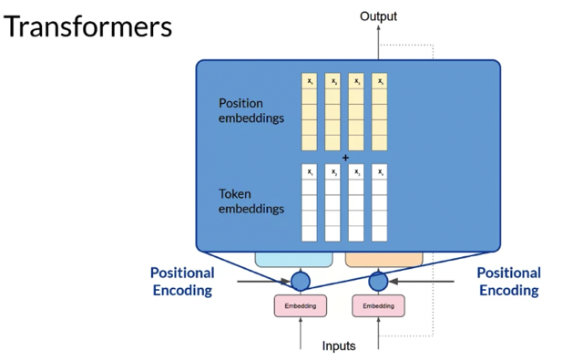</kbd>

> [!NOTE]
> Như đã nói, Positional Encoding sẽ được add vào Token embeddings để
> thêm thông tin về vị trí cho word embedding

 

<kbd>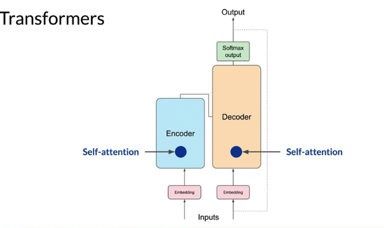</kbd>

<kbd>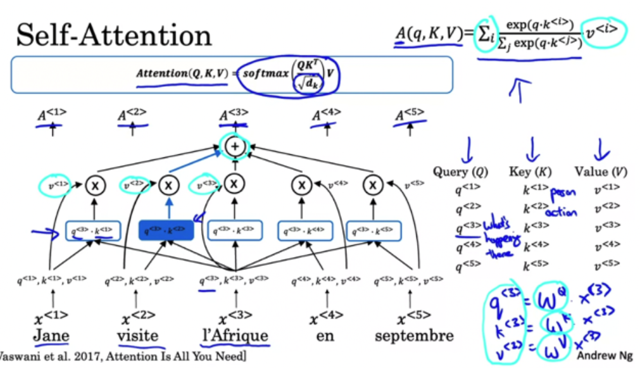</kbd>

> [!NOTE]
> Tới đây **cơ chế Self-Attention** sẽ ra tay để **tính toán xào nấu** sao đó để tạo ra một tạm
> gọi là "**một Self-attention embedding vector" cho mỗi từ**,  là một embedding vector mới
> **tính toán từ / chứa đựng / tạo nên từ** **đóng góp của tất cả các từ trong câu** với **trọng
> số nhiều ít khác nhau** dựa trên **mức độ liên quan của chúng**. Ôn lại ngắn gọn luôn. Đầu
> tiên là nó sẽ, **với mỗi từ dùng 3 weight matrix WQ, WK, WV** tính ra **cho mỗi từ (i)** **một bộ 3
> vector q<i>, k<i>, v<i>**. Rồi dùng các giá trị q và v của chúng để tính ra **các trọng số alpha
> giữa chúng** (chính là **attention weight)** thể hiện **mối tương đồng, liên quan về ý nghĩa
> giữa chúng**.
>
>
>
> Rồi từ **các trọng số alpha và các v<i>** tính ra **vector self-attention embedding** **cho mỗi
> từ** như đã nói ở trên sẽ c**hứa đựng thông tin liên quan của nó với tất cả các từ khác.**
>
> Once you've **summed the input tokens and the positional encodings**, you **pass**
> the resulting vectors **to** the **self-attention layer.** Here, the \_**model analyzes the
> relationships between the tokens**\_ in your input sequence. As you saw earlier, this
> allows the model to \_**attend to different parts of the input sequence to better
> capture the contextual dependencies between the words**\_. The **self-attention
> weights** that are **learned during training** and **stored in these layers** **reflect the
> importance of each word** in that input sequence to **all other words in the sequence**

 

<kbd>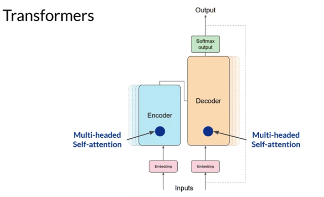</kbd>

> [!NOTE]
> But this **does not happen just once**, the transformer architecture actually has
> **multi-headed self-attention**. This means that **multiple sets of self-attention weights**
> or heads are **learned in parallel independently of each other.** The number of
> attention heads included in the attention layer varies from model to model, but
> numbers in the range of **12-100 are common**. The intuition here is that each
> self-attention head will **learn a different aspect of language**. For example, one head
> may see the **relationship between the people entities** in our sentence. Whilst
> another head may **focus on the activity of the sentence.** Whilst yet another head
> may focus on some **other properties such as if the words rhyme**. It's important to
> note that **you don't dictate ahead of time what aspects of language the attention
> heads will learn**. The **weights of each head are randomly initialized** and **given
> sufficient training data and tim**e, each will **learn different aspects of language.** While
> some attention maps are easy to interpret, like the examples discussed here, others
> may not be

 

<kbd>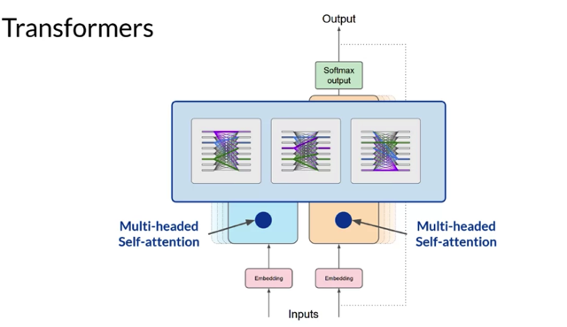</kbd>

> [!NOTE]
> Xong mới nói tiếp là ta sẽ làm nhiều lần tức là **có nhiều quá trình Self-Attention cùng lúc (với các
> matrix WQ, WK, WV) khác nhau** và đương nhiên sẽ **tạo ra nhiều Self-Attention vector cho mỗi từ.**
>
>
>
> Thường là **12-100 cái**. Ý nghĩa là **với mỗi bộ WQ, WK, WV** model sẽ **extract thông tin của một từ theo một
> câu hỏi lớn nào đó** ví dụ như Attention Head thứ nhất là "**Chuyện gì** xảy ra", các thứ hai là " **Ai** ..." cái
> thứ 3 là " **Khi nào.**.." cái thứ 4 là " **Bằng cách nào..** " và **nhiều "khía cạnh" như vậy** để **tạo nhiều
> Self-attention vector cho một từ** ở **nhiều khía cạnh khác nhau.**
>
>
>
> Và mình **đặt 100 khía cạnh (hay câu hỏi lớn)** và bố trí như vậy thôi còn **model nó sẽ tự học tự tìm ra
> 100 khía cạnh đó là gì** (không chỉ là when, where, how, who, mà là **nhiều khía cạnh khác nữa mà ta
> sẽ không biết nó tìm ra cái gì".**
>
>
>
> Ý nghĩa là với những khía cạnh khác nhau, câu hỏi lớn khác nhau thì **mỗi từ sẽ được embedding
> khác nhau với các trọng số thể hiện quan hệ của nó với các từ khác cũng khác nhau** cho từng câu
> hỏi lớn (attention head).
>
>
>
> Từ đó khi **stack tất cả các Self-attention vector của 1 từ này lại** để tạo thành **Multi-head attention của
> từ** đó thì **hầu như đã nắm bắt được một bộ thông tin đa chiều ở rất nhiều khía cạnh của từ đó rồi**

 

<kbd>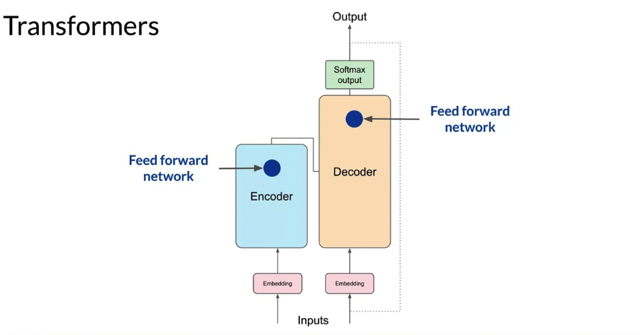</kbd>

> [!NOTE]
> Now that all of the attention weights have been applied to your input data, the
> output is **processed through a fully-connected feed-forward network**. The output of
> this layer is a **vector of logits** proportional to the **probability score** for **each and
> every token in the tokenizer dictionary**. You can then **pass these logits to a final
> softmax layer,** where they are **normalized into a probability score for each word**.
> This output includes a **probability for every single word in the vocabulary**, so there'
> s likely to be thousands of scores here. One single token will have a **score higher
> than the rest.** This is the **most likely predicted token**. But as you'll see later in the
> course, there are a number of methods that you can use to vary the final selection
> from this vector of probabilities.
>
> Xong bỏ bộ Multi-head attention qua **feed-forward network** để tính ra bộ
> **logit scored** và **softmax** để ra vector các **probability scroes** chứa **xác
> suất của tất cả các từ trong vocab** và **từ có P cao nhất là từ được chọn để
> đưa ra dự đoán.**

 

<kbd>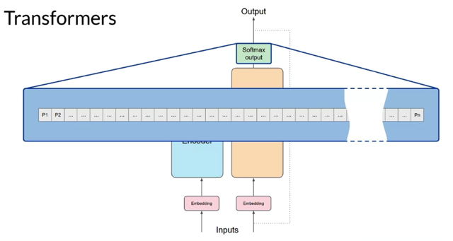</kbd>

 

> [!NOTE]
> GENERATING TEXT WITH
> TRANSFORMERS

 

> [!NOTE]
> 1 Transformer Architecture: The passage provides a high-level overview of the **major components** inside
> the **transformer architecture**.
>
> 2 Translation Task: The example focuses on a translation task, where a transformer model is used to
> translate a French phrase into English.
>
> 3 **Tokenization** and **Encoding**: The input words are **tokenized** using a **tokenizer**, **added to the
> encoder side of the network**, **passed through the embedding layer**, and then **fed into the multi-headed
> attention layers**.
>
> 4 **Encoder**: The **input sequence** **goes through the encoder**, which **generates a deep representation
> of the input sequence's structure and meaning**.
>
> 5 **Decoder**: The **deep representation from the encoder** is **inserted into the decoder** to influence its
> **self-attention mechanisms**. A **start of sequence token** is **added to the decoder's input**, and **it
> predicts the next token** based on the **contextual understanding from the encoder**.
>
> 6 **Looping and Generation**: The **output token** from the **decoder** is p**assed back as input to generate
> the next token**. This **loop** continues **until an end-of-sequence token is predicted**, generating the **final
> sequence of tokens.**
>
> 7 **Detokenization**: The **final sequence of tokens** can be **detokenized into words**, resulting in the
> **translated output.**  8 Types of **Transformer Models:**
>
> a. **Encoder-Only Models**: They work as **sequence-to-sequence models** and can be used for **classification tasks** with additional layers. **BERT** is an example.
>
> b. **Encoder-Decoder Model**s: They excel at **sequence-to-sequence** tasks like **translation**. They can
> also be trained for **general text generation task**s. Examples include **BART** and **T5**.
>
> c. **Decoder-Only Models**: Widely used models like **GPT**, **BLOOM**, **Jurassic**, **LLaMA**, etc., that
> can **generalize to most tasks.**
>
> 9 **Prompt Engineerin**g: Understanding the details of the underlying architecture is not necessary for
> interacting with transformer models through natural language. **Prompt engineering, using written words as
> prompts,** is the **key to working with transformer model**s.
>
> The passage emphasizes that the goal is to provide **enough background information** to understand the
> **differences between various transformer models** and read their documentation, without needing to
> remember all the details. The next part of the course will focus on prompt engineering.

 

<kbd>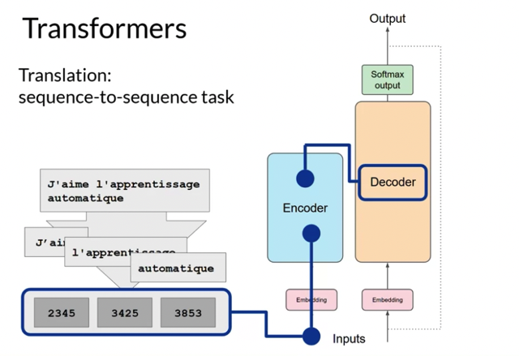</kbd>

> [!NOTE]
> Như đã nói ở bài trước, qua các bước **tokenization**, **embedding**,
> **multi-head attention**, **fully connected layers**, **output** của encoder sẽ được
> **insert** vào **khúc giữa của decoder** cung cấp các **thông tin về ngữ cảnh**
> cho **decoder** để nó **dùng khi generating text.**

 

<kbd>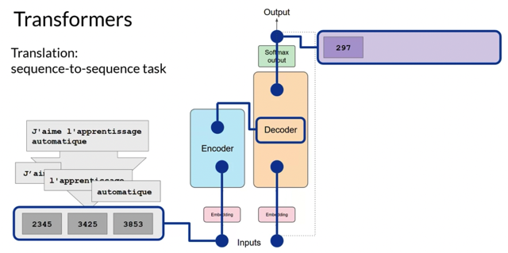</kbd>

> [!NOTE]
> Decoder cũng **nhận input bắt đầu từ start of sentence token**, cũng **tokenization**, **embedding**, và
> **multi-head attention**. Sau đó nó **kết hợp với output của encoder** và qua một số **FC layer**
> và **softmax** để p**redict ra từ tiếp theo**. Tiếp tục, **bỏ từ mới generate này** vào **input** của
> decoder để **tiếp tục vòng lặp cho đến khi generate EOS token**.

 

<kbd>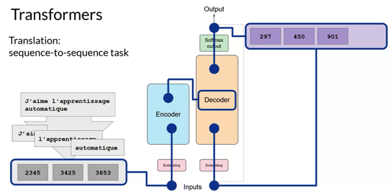</kbd>

 

<kbd>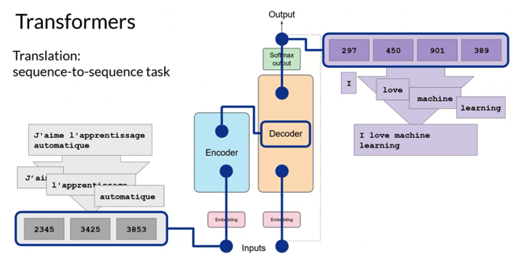</kbd>

> [!NOTE]
> Xong hết, các token được
> **detokenize** để **tạo ra câu tiếng Anh**

 

<kbd>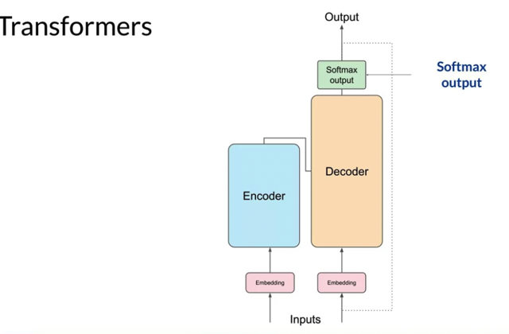</kbd>

 

<kbd>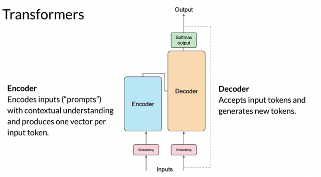</kbd>

> [!NOTE]
> Let's summarize what you've seen so far. The **complete transformer
> architecture** consists of an **encoder** and **decoder** components. The
> **encoder** encodes **input sequences** into a **deep representation** of the
> structure and meaning of the input. The **decoder**, working from **input
> token triggers**, uses the **encoder's contextual understanding** to **generate
> new tokens**. It does this in a **loop until some stop condition has been
> reached**

 

<kbd>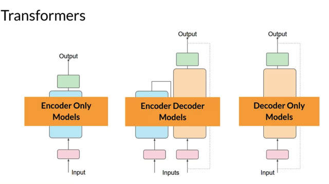</kbd>

> [!NOTE]
> **Encoder-only models** also work as **sequence-to-sequence models**, but **without
> further modification**, the input sequence and the output sequence or the **same
> length.** Their use is **less common these days**, but by **adding additional layers
> to the architecture**, you can **train encoder-only model**s to perform **classification
> tasks** such as **sentiment analysis**, **BERT** is an example of an encoder-only
> model
>
> Encoder-decoder models, as you've seen, perform well on
> **sequence-to-sequence tasks** such as **translation**, where the **input
> sequence** and the **output sequence** can be **different lengths**. You can
> also **scale and train this type of model to perform general text
> generation tasks**. Examples of encoder-decoder models include
> BART as opposed to **BERT** and **T5**, the model that you'll use in the
> labs in this course.
>
> Finally, **decoder-only models** are some of the **most commonly used**
> today. Again, as they have scaled, their capabilities have grown.
> These models can now generalize to most tasks. Popular
> decoder-only models include the **GPT** family of models, **BLOOM**,
> **Jurassic**, **LLaMA**, and many more

 

> [!NOTE]
> READING: TRANSFORMERS:
> ATTENTION IS ALL YOU NEED

 

> [!NOTE]
> **"Attention is All You Need"** is a research paper published in 2017 by Google researchers, which
> introduced the **Transformer** model, a novel architecture that **revolutionized the field of natural language
> processing (NLP)** and became the **basis for the LLMs** we  now know - such as **GPT, PaLM** and
> others. The paper proposes a neural network architecture that **replaces traditional recurrent neural
> networks (RNNs)** and **convolutional neural networks (CNNs)** with an entirely **attention-based
> mechanism**.
>
> The **Transformer** model uses **self-attention** to **compute representations of input sequences**, which
> allows it to **capture long-term dependencies** and **parallelize computation effectively**. The authors
> demonstrate that their model achieves **state-of-the-art performance** on s**everal machine translation
> tasks** and **outperform previous models that rely on RNNs or CNNs.**
>
> The **Transformer architecture** consists of an **encoder** and a **decoder**, each of which is composed of
> **several layers**. Each layer consists of two sub-layers: a **multi-head self-attention mechanism** and a
> **feed-forward neural network**. The multi-head self-attention mechanism allows the model to **attend to
> different parts of the input sequence**, while the **feed-forward network applies a point-wise fully connected
> layer to each position separately and identically**.
>
> The Transformer model also uses **residual connections** and **layer normalization** to facilitate training
> and **prevent overfitting**. In addition, the authors introduce a **positional encoding scheme** that encodes
> the **position of each token** in the input sequence, enabling the model to **capture the order of the
> sequence without the need for recurrent or convolutional operations.**

 

<kbd>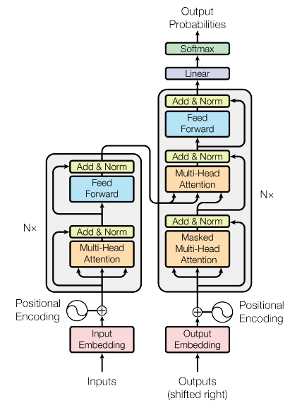</kbd>

 

> [!NOTE]
> PROMPTING AND
> PROMPT ENGINEERING

 

> [!NOTE]
> 1 Terminology: The passage introduces key terms related to working with **transformer models**, such as
> **prompt** (input text), **inference** (generating text), **completion** (output text), and **context window** (the
> available text for the prompt).
>
> 2 **Prompt Engineering**: **Prompt engineering** involves **refining the language and structure of prompts** to
> **get the desired model behavior**. **Including examples** of the task within the prompt is a **powerful strategy** to
> **improve model performance.**
>
> 3 **Zero-Shot Inference**: Zero-shot inference involves using prompts that enable the model to **perform a task it
> hasn't been explicitly trained on**. The model can l**everage i**ts **general language understanding** to provide
> accurate responses. **Larger** **models** perform well in zero-shot inference.
>
> 4 **One-Shot Inference**: One-shot inference involves **including a single example** within the prompt to **guide
> the model's behavior.** This **helps smaller models understand the task** and generate appropriate responses.
>
> 5 **Few-Shot Inference**: Few-shot inference **expands on one-shot inference** by **including multiple examples**
> in the prompt. Providing **examples** with **different output classes** helps the model **understand the desired
> behavior.**
>
> 6 **Context Window Limitations**: The context window places a **limit on the amount of in-context learning** that
> can be passed into the model. If including multiple examples doesn't yield good performance, **fine-tuning the
> model with new data may be necessary.**
>
> 7 **Model Scale and Task Performance**: The **scale of the model**, determined by the **number of parameters**,
> affects its ability to perform multiple tasks. **Larger models excel at zero-shot inference** and can successfully
> complete various tasks, while **smaller models are typically limited to tasks similar to their training.**
>
> 8 **Experimenting with Configuration**: O**nce a suitable model is found**, **different configuration settings** can
> be explored to i**nfluence the structure and style of the generated completions.**
>
> The passage provides insights into **prompt engineering, zero-shot inference, one-shot inference, context window
> limitations**, and the **relationship between model scale and task performance.**

 

<kbd>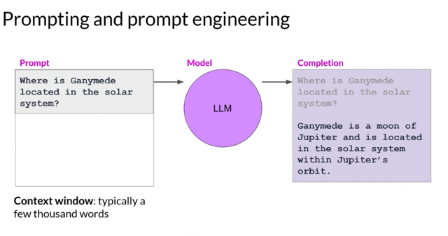</kbd>

> [!NOTE]
> kay, Just to remind you of some of the **terminology**. The **text that you feed into the
> model** is called the **prompt**, the **act of generating text** is known as **inference**, and
> the **output text** is known as the **completion**. The **full amount of text** or the memory
> that is available to use for the prompt is called the **context window**. Although the
> example here shows the model performing well, **you'll frequently encounter
> situations where the model doesn't produce the outcome that you want on the first
> try**. You may have to **revise** the language in your prompt or the way that it's written
> several times to get the model to behave in the way that you want. **This work to
> develop and improve the prompt is known as prompt engineering**. This is a big
> topic. But one **powerful strategy** to get the model to produce better outcomes is to
> **include examples** of the task that you want the model to carry out inside the
> prompt
>
> Đại khái là thường thì ta sẽ không có được câu trả lời mong muốn hay làm cho model
> trả lời theo cách mà mình mong muốn ngay từ đầu, mà phải **revise** (improve, thay đổi)
> **cái prompt dần dần** cho **đến khi model nó hiểu mình cần gì**. Quá trình đó gọi là **prompt
> engineering**. Và một strategy quan trọng là **đưa** **ví dụ vào trong prompt**.

 

<kbd>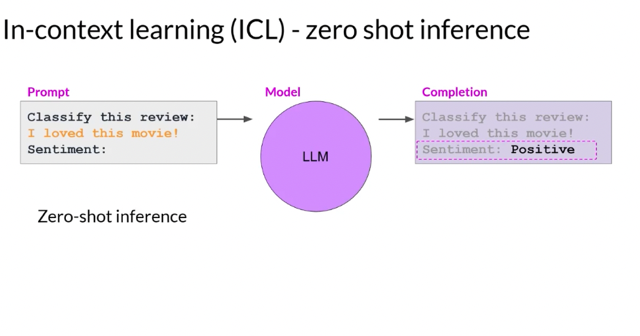</kbd>

> [!NOTE]
> Đưa ví dụ của dạng câu trả lời mà mình mong muốn vào prompt gọi là **In-context learning - ICL**. **Zero
> shot** (đọc thêm câu trả lời của GPT) **đại khái là khả năng "hỏi gì cũng biết"** - ý là **khả năng đưa ra
> những dự đoán cho những vấn đề mà nó chưa từng được huấn luyện**. Thì đại khái chỉ gần đây khi
> LLM với việc đã được **huấn luyện trên nhiều chủ đề, nhiều nguồn data rộng khắp** mới có thể cho
> phép nó **transfer kiến thức trên nhiều lĩnh vực khác nhau** mới có thể **cho khả năng zero-shot learning.**

 

> [!NOTE]
> **Zero-shot inference** refers to the **ability of a model to make predictions** or **perform
> inference on tasks** or **data points** it has n**ever been explicitly trained on.** In **traditional**
> machine learning, models are **typically trained on a specific task or dataset**, and they
> **struggle** to **generalize to new tasks** or data points **outside** their **training distribution**.
>
> However, with the **advancements in transformer models**, such as **GPT-3**, zero-shot
> inference has become possible. These models are **pre-trained on large** amounts of
> **diverse data** and **learn general language understanding**, allowing them to **transfer
> knowledge across tasks**. **Zero-shot inference** leverages this **transfer learning capability**,
> enabling the model to **perform reasonably well on unseen tasks** or data points **without
> any specific training or fine-tuning**.
>
> In **zero-shot inference**, the model is **given a prompt or a description of the task** it needs
> to perform, along with the **input data**, **without any explicit examples** of that particular task
> during training. The model **uses its understanding of language and the knowledge** it
> gained **during pre-training** to **generate predictions** or perform the desired inference on
> the given task.
>
> For example, a **language model pre-trained on a variety of topics**, such as news articles,
> books, and encyclopedias, can be u**sed for zero-shot inference on tasks** like
> **question-answering or text summarization**, even if it **hasn't been trained specifically on
> those tasks**. By providing a prompt or description of the task, the model can generate
> relevant responses or summaries based on its understanding of language and the
> context provided.
>
> Zero-shot inference offers a flexible and efficient way to utilize pre-trained models
> across a wide range of tasks without the need for extensive task-specific training. It
> demonstrates the generalization and transfer learning capabilities of large-scale
> language models like GPT-3.

 

<kbd>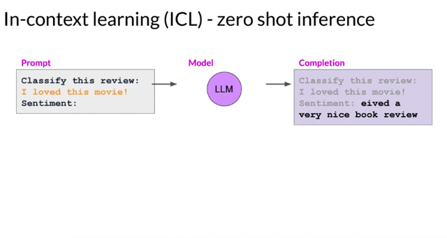</kbd>

> [!NOTE]
> Thực hiện **zero-shot inference** với
> các model nhỏ hơn, **specific hơn
> thì perform không tốt.**

 

<kbd>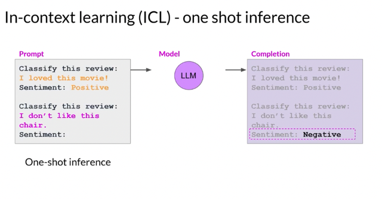</kbd>

> [!NOTE]
> Nhưng **đưa cho nó thêm ví dụ của một
> câu trả lời mong muốn** gọi là **one-shot
> inference** thì nó trả lời được.

 

<kbd>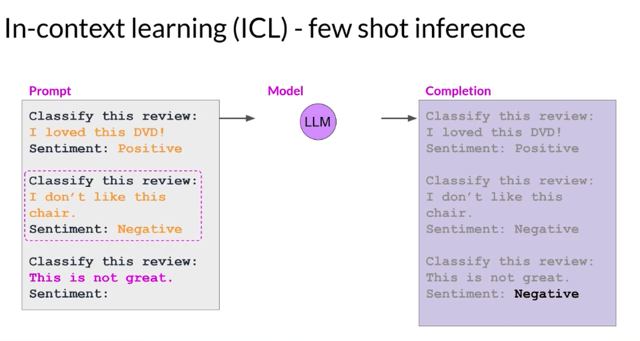</kbd>

 

<kbd>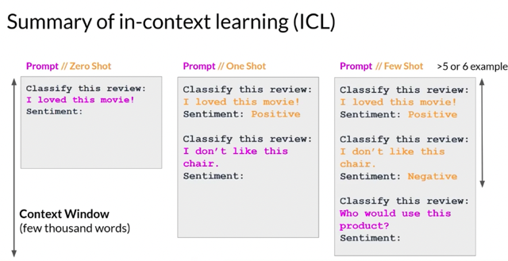</kbd>

> [!NOTE]
> Tóm lại đại khái là với **large model**, ta có thể **cứ hỏi nó thôi**, không cần phải
> cung cấp ví dụ hay thông tin gì thêm gọi là **zero-shot inference**, nhưng với
> s**maller model** ta có thể dùng **one-shot hay few-shot
> inference.** Tuy nhiên **giới hạn của context window** sẽ không cho phép ta cung
> cấp quá nhiều example hay thông tin context. Khi đó, ta sẽ phải **Fine tuning để
> tuning model với một bộ dữ liệu** nhằm giúp kiểu như **huấn luyện thêm cho
> model để nó có thể work trên một chủ đề hẹp** hoặc một **specific task** nào đó.

 

<kbd>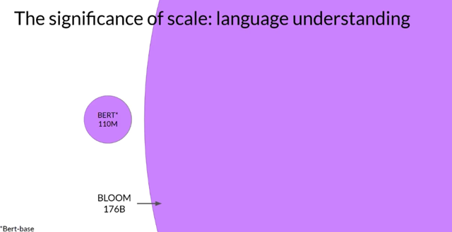</kbd>

> [!NOTE]
> Đại khái là **model càng lớn**, nó c**àng có thể "hỏi gì cũng biết, gì cũng làm được**" -
> **zeros shot inference**. Còn **model nhỏ hơn** chỉ có thể "trả lời" / "làm" những task mà
> gần gần với **những gì nó được huấn luyện thôi.** Và có thể mình phải **tìm kiếm một
> model phù hợp** với task mình cần sau đó là ta sẽ **fine-tuning thêm cho model**

 

<kbd>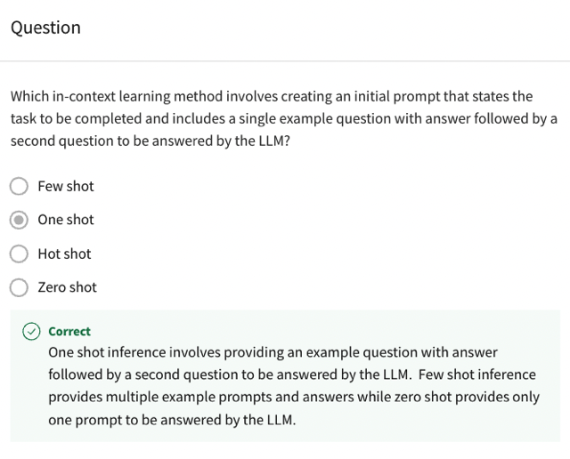</kbd>

 

> [!NOTE]
> GENERATIVE
> CONFIGURATION

 

> [!NOTE]
> 1 **Configuration parameters** for **influencing** **next-word generation**: The text introduces **various configuration
> parameters** that can be used to **control the behavior of language models** during the generation of text. These
> parameters are **different from the training parameters** and are invoked during **inference**. They provide **control over**
> **aspects** such as the **maximum** **number of tokens** in the generated output and the **level of creativity.**
>
> 2 **Methods** for controlling model behavior during inference:
>
> a. **Max new tokens**: This parameter **limits the number of tokens that the model will generate**, putting **a cap** on the
> **selection process**. It allows **users to control the length of the completion**.
>
> b. **Random sampling**: Instead of **always** choosing the word with the **highest probability**, random sampling s**elects
> an output word at random** \\_**based on the probability distribution.**\\_ This introduces **variability** and **reduces** the
> likelihood of word **repetition**, but can **sometimes** **produce output that is less sensible or coherent.**
>
> c. **Top k** sampling: By **specifying a value for k**, the model only **considers the k tokens with the highest probability** for
> selection. This **provides randomness** while **preventing the selection of highly improbable words**, resulting in **more
> reasonable and sensible text**.
>
> d. **Top p** sampling: This technique **limits the random samplin**g to predictions whose **combined probabilities do not
> exceed a certain threshold (p)**. The model chooses from these tokens using random probability weighting, ensuring a
> **balance between randomness and sensibility**.
>
> 3 **Temperature** parameter: The temperature parameter **influences the shape of the probability distribution** used by the
> model to select the next token. **Higher temperatures increase randomness** by **spreading the probability more** evenly
> across tokens, while **lower temperatures** **concentrate the probability on a smaller number of words**, resulting in **less
> random** and **more predictable output.**
>
> 4 **Prompt engineering** and **parameter experimentation**: The text highlights the **importance of prompt engineering** and **experimenting with different configuration parameters** t**o optimize the performance of language models**. By
> carefully **crafting prompts** and **adjusting parameters**, users can **achieve desired results** in generating text that is
> **natural, creative, and avoids repetition**.
>
> 5 Introduction to **LLMs and transformers**: The text mentions **LLMs (Large Language Models) and transformers**, which
> are the model architecture that powers these language models. LLMs have the **ability to perform a variety of tasks** and
> **transformers** are **instrumental** in enabling their **advanced capabilities.**
>
> 6 Tasks performed by LLMs and application development: The text briefly touches upon the tasks that LLMs can perform
> and mentions the next steps in the **application development process**, building upon the foundational knowledge
> discussed so far.

 

<kbd>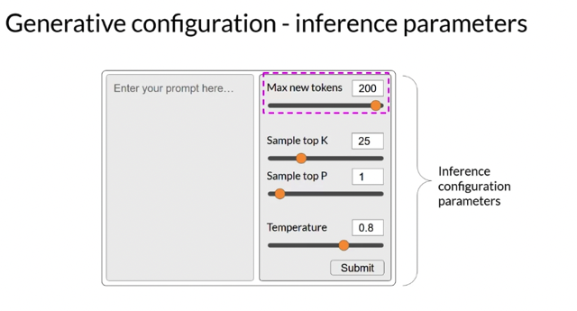</kbd>

> [!NOTE]
> In this video, you'll examine some of the **methods** and **associated configuration**
> **parameters** that you can use to **influence the way that the model makes the final
> decision** about **next-word generation**. If you've used LLMs in playgrounds such as
> on the **Hugging Face** website or an **AWS**, you might have been presented with
> **controls** like these to adjust how the LLM behaves. Each model exposes **a set of
> configuration parameters** that can i**nfluence the model's output during inferenc**e.
> Note that these are **different than the training parameters** which are learned during
> training time. Instead, these **configuration parameters** are **invoked at inference time**
> and give you **control over things like the maximum number of tokens** in the
> completion, and **how creative the output is**
>
> Đại khái là các **LLM** thường **cho phép config các
> inference params để thay đổi chút ít "cách" mà LLM
> model trả lời.** Nó k**hông liên quan đến các model
> params** vốn được **học lúc training.**

 

<kbd>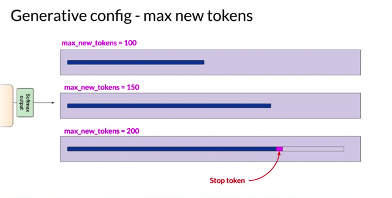</kbd>

> [!NOTE]
> Ví dụ **max_new_token** cho phép **giới hạn số token model generate**. Ở
> đây khi sét bằng 200, để ý nó không dài hơn câu trên với m.n.t = 150
> bao nhiêu vì có thể một config khác đã hạn chế hoặc nó đã gặp
> stop_token (end of sentence)

 

<kbd>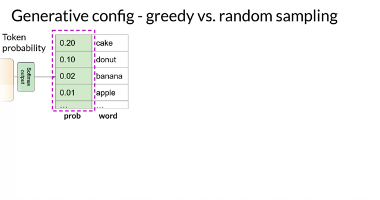</kbd>

> [!NOTE]
> Khi model output ra t**oken probability scores** của
> nó sẽ có **hai cách để decide** ra từ được chọn
> **Greedy** và **Random sampling**

 

<kbd>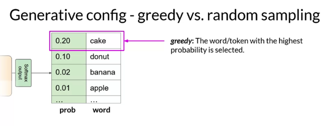</kbd>

> [!NOTE]
> **Greedy** đại khái là **luôn chọn từ giá trị
> probability score cao nhất**, dẫn đến **câu
> trả lời luôn giống nhau.**

 

<kbd>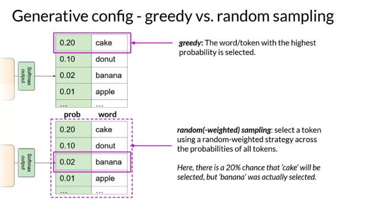</kbd>

> [!NOTE]
> Còn **random sampling** with **distribution** là **chọn ngẫu
> nhiên với distribution** **bởi model** output, giúp **mỗi lần
> câu trả lời sẽ mỗi khác và từ đó có tính sáng tạo và
> khác biệt cao hơn**

 

<kbd>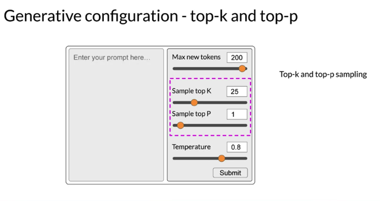</kbd>

> [!NOTE]
> Let's explore **top k** and **top p** **sampling techniques** to help **limit the
> random sampling** and **increase the chance that the output will be
> sensible**. Two Settings, top p and top k are **sampling techniques** that we
> can **use to help limit the random sampling** and **increase the chance that
> the output will be sensible**.

 

<kbd>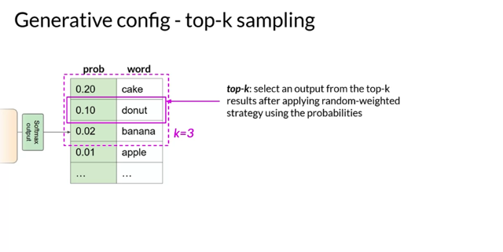</kbd>

> [!NOTE]
> To **limit the options** while **still allowing some variability**, you can **specify a top k
> value** which instructs the model to **choose from only the k tokens with the highest
> probability.** In this example here, **k is set to 3**, so you're restricting the model to
> **choose from these 3 options**. The model then selects from these options using
> the probability weighting and in this case, it chooses **donut** as the next word. This
> method can help the **model have some randomness** while **preventing the selection
> of highly improbable completion words**. This in turn **makes your text generation
> more likely to sound reasonable** and to **make sens**e.
>
> Top k đại khái là cho **model chọn random** nhưng **chỉ trong k từ có
> probability cao nhất thôi**. Dẫn đến nó **vẫn có chút variability và
> creative** nhưng **không quá lố**. khiến câu trả lời **vẫn có chút sự đa
> dạng và sáng tạo** nhưng **không trở nên quá vô lý**

 

<kbd>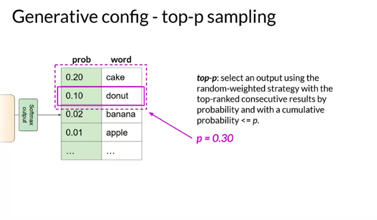</kbd>

> [!NOTE]
> Với top k ta cho nó chọn trong k từ có p cao nhất thì với
> top p ta cho nó **chọn trong những từ mà p cao hơn một
> mức nào đó**. Mục đích cũng như vậy

 

<kbd>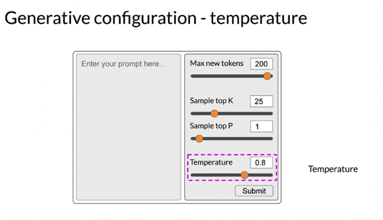</kbd>

> [!NOTE]
> One more parameter that you can use to **control the randomness
> of the model output** is known as **temperature**. This parameter
> influences the **shape of the probability distribution** that the model
> calculates for the next token

 

<kbd>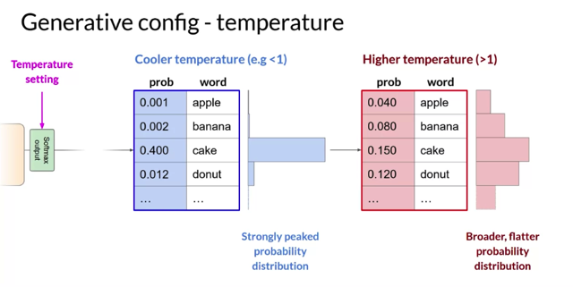</kbd>

> [!NOTE]
> Broadly speaking, the **higher** the **temperature**, the **higher the randomness**, and the **lower**
> the **temperature**, the **lower the randomness**. The temperature value is a **scaling factor**
> that's **applied within the final softmax layer** of the model that\_ **impacts the shape of the
> probability distribution of the next token**\_. In contrast to the top k and top p parameters,
> **changing the temperature actually alters the predictions that the model will make**. If you
> choose a **low value of temperature**, say less than one, **the resulting probability
> distribution from the softmax layer** is more **strongly peaked** with the probability being
> **concentrated in a smaller number of words**. You can see this here in the blue bars beside
> the table, which show a probability bar chart turned on its side. Most of the **probability
> here is concentrated on the word cake**. The model will **select from this distribution using
> random sampling** and the resulting text will be **less random** and will **more closely follow
> the most likely word sequences that the model learned during training**. If instead you set
> the temperature to a **higher value**, say, g**reater than one,** then the model will calculate a
> **broader flatter probability distribution** for the next token. Notice that in contrast to the blue
> bars, the probability is more **evenly spread across the tokens**. This leads the model to
> generate text with a **higher degree of randomness** and **more variability** in the output
> compared to a cool temperature setting. This can help you generate text that **sounds
> more creative**. If you **leave the temperature value equal to one**, this will leave the
> softmax function as default and the unaltered probability distribution will be used
>
> Đại khái là temperature sẽ **điều chỉnh mức độ ngẫu nhiên.** Nếu giá trị thấp **ví dụ nhỏ
> hơn 1, nó sẽ giảm mức ngẫu nhiên** của model's output probability distribution
> xuống, hệ quả kiểu như là **nó tăng mức độ tập trung lên, khiến những từ có p cao
> trở nên cao hơn, dễ được chọn hơn**. Hiểu nôm na là **nó phóng đại mức tập trung
> xác suất từ đó tăng xác suất chọn những từ có vùng xác suất cao**, dẫn đến **giảm đi
> sự đa dạng và tính ngẫu nhiên**. Ngược lại, **nếu giá trị temperature cao**, như lớn hơn
> 1, nó sẽ **giảm nhẹ độ tập trung xác suất xuống**, khiến mô hình **xác suất dàn trải hơn**
> kết quả là c**ác từ có khả năng được chọn đa dạng hơn**

 

<kbd>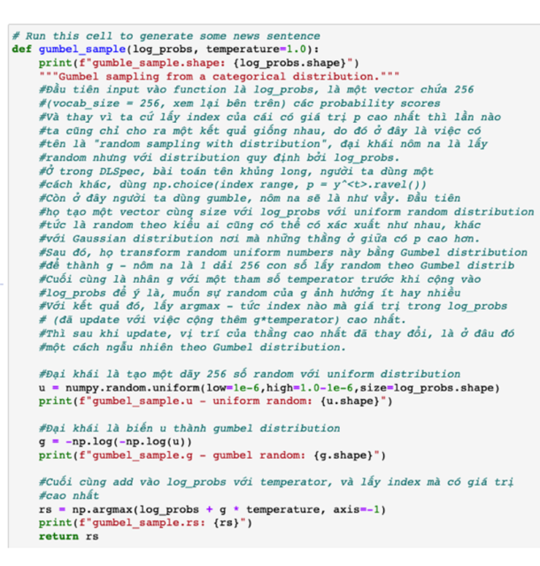</kbd>

> [!NOTE]
> Ở đây copy slice từ P.A của NLP C3W2 có dùng **gumbel distribution** để
> r**andom sampling**, trong đó ta t**hấy có tham số temperature** có lẽ cũng tương
> tự như **ý nghĩa của temperature config của LLM**. Trong function này, **nôm na
> là một "lớp" random noise tạo thành từ gumbel distribution** được **add vào
> phân phối xác suất do model tạo ra (log_probs)** với **mức độ được control bởi
> temperature**. từ đó thay đổi theo hướng **khuếch đại (tập trung lên)** hoặc **giảm
> nhẹ (phân tán bớt)** giá trị của phân phối xác suất do model tạo ra. Từ đây ta
> có thể hiểu hơn về định nghĩa của Gumbel distribution,

 

<kbd>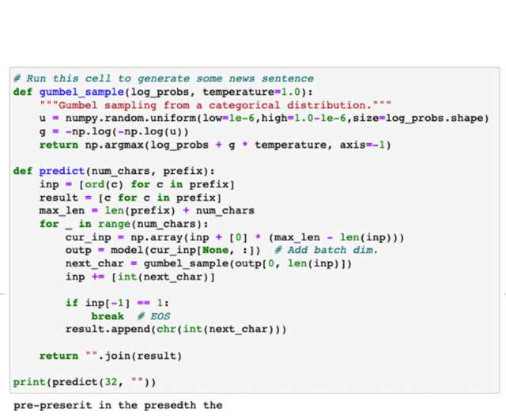</kbd>

 

<kbd>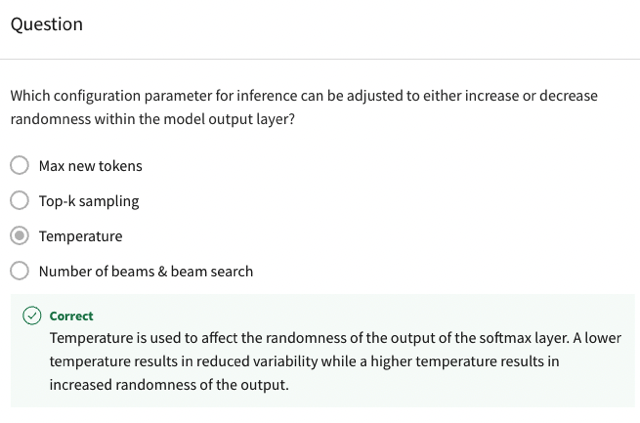</kbd>

 

> [!NOTE]
> In the context of language models, the "**temperature**" parameter is used to **control the randomness or
> variability** of the **generated text.** It **affects the shape of the probability distribution** that the model
> calculates for **selecting the next token.** 
> The **math** behind the temperature concept involves **applying a scaling factor** within the **final softmax
> layer** of the model. The **softmax function** takes a **vector of logits** (scores associated with each token
> in the vocabulary) and **converts them into a probability distribution**. The temperature parameter
> **modifies the logits** before applying the softmax function.
>
> Here's the math behind it:
>
> 1 Let's say we **have a vector of logits**, denoted as **z**, representing the **scores associated with each
> token** in the **vocabulary**.
>
> 2 The modified logits, denoted as **z',** are calculated by **dividing each logit by the temperature value
> (T)**: **z' = z / T** The temperature value is **typically greater than 0**, with **higher values** leading to **more**
> **randomness** in the output.
>
> 3 After obtaining the modified logits, we **apply the softmax function** to **convert them into probabilities**:
> **softmax(z') = exp(z') / sum(exp(z'))** The softmax function **normalizes the logits by exponentiating
> them and dividing by their sum**, resulting in a **probability distribution across all tokens.**
>
> 4 The **resulting probability distribution** is then **used for sampling the next token** during text
> generation. **Higher probabilities indicate a higher chance of selecting a particular token**, but the
> **temperature value influences the shape and spread of the distribution.**
>
> ◦ **Higher temperatur**e values (e.g., **above 1**) lead to a **more uniform distribution**, where **probabilities
> are more evenly spread across tokens**. This results in **higher randomness and variability in the
> generated text.**
>
> ◦ **Lower temperature** values (e.g., below 1) **sharpen the distribution**, making it **more peaked**. This
> **concentrates probabilities** on a **smaller set of tokens**, \\_**increasing the likelihood of generating text that
> aligns with the most probable word sequences learned during training.**\\_
>
> To summarize, the temperature parameter in language models allows users to control the trade-off
> between randomness and determinism in the generated text. Higher values introduce more
> randomness and variability, while lower values result in more focused and deterministic output.
>
> Bài giải thích quá
> hay của GPT

 

> [!NOTE]
> GENERATIVE AI
> PROJECT LIFECYCLE

 

> [!NOTE]
> 1 Generative AI **project life cycle**: The video introduces a **generative AI project life cycle framework** that guides
> you through the **process of developing and deploying an LLM-powered application**.
>
> 2 **Defining the scope**: The most important step in any project is to **define the scope accurately and narrowly**.
> Consider the **specific function the LLM will have in your application**, whether it needs to **perform various tasks**
> or **specialize in a specific task** like named entity recognition. **Being specific** saves time and computational
> resources.
>
> 3 **Training**: You can **choose to start with an existing base model** rather than **training from scratch**, although there
> **may be cases where training your own model is necessary**. Considerations and feasibility for this decision are
> covered later in the course.
>
> 4 **Assessing and improving model performance**: **Assess the model's performance** and **consider additional
> training** if needed. **Prompt engineering** and **in-context learning** can **help improve performance**. **Fine-tuning**,
> covered in Week 2, can **further enhance the model's capabilities**.
>
> 5 **Reinforcement learning with human feedback**: Week 3 introduces **reinforcement learning with human
> feedback** as an **additional fine-tuning technique** to **ensure the model behaves well** and **aligns with human
> preferences.** 
> 6 **Evaluation**: Evaluation is essential to **measure the model's performance** and **alignment with preferences.**
> **Metrics** and **benchmarks** will be explored in the upcoming week.
>
> 7 **Deployment and optimization**: Once you have a model that meets performance requirements and aligns well,
> it can be d**eployed and integrated into your application**. **Optimization** for deployment is **crucial** to **maximize
> compute resources and user experience**.
>
> 8 **Infrastructure** **considerations**: **Additional infrastructure** may be required for **optimal functioning of the
> LLM-powered application**. Some limitations of LLMs, such as **inventing information** or **limitations in complex
> reasoning** and **mathematics**, can be addressed using techniques covered later in the course.
>
> 9 **Iterative process**: The **adapt** and **align stage** of app development is **highly iterative**, involving steps like **prompt
> engineering, fine-tuning, and re-evaluation** to achieve **desired performance.**

 

<kbd>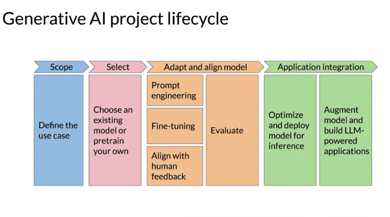</kbd>

> [!NOTE]
> 1 Developing and deploying LLM-powered applications: The course aims to provide
> you with the techniques and knowledge necessary to develop and deploy applications
> powered by Language Model (LLM).
>
>
>
> 2 **Generative AI project life cycle**: The video introduces a **generative AI project life cycle
> framework** that guides you through the **process** of taking your project **from conception**
> to **launch**.
>
>
>
> 3 **Mapping out the tasks**: The framework outlines the **tasks** required **at each stage** of
> the project life cycle, providing a **roadmap for developing and deploying LLM
> applications.**
>
>
>
> 4 **Defining the scope**: The **most important step** in any project is to **define the scope
> accurately and narrowly**. For LLMs, **their capabilities depend on the size and
> architecture of the model**. You need to **consider the specific function you want** the LLM
> to have in your application. Is it required to perform **multiple tasks** or just excel at a
> **specific task**, such as **named entity recognition?**
>
>
>
> 5 Importance of **specificity**: Being **specific** about the **required functionality** of your LLM
> can **save time and computational resources.** By **narrowing down** the **tasks** and
> **capabilities**, you can **optimize the model design and reduce compute costs**.
>
>
>
> 6 Course objectives: By the end of the course, you should gain **intuition** about the
> **decisions** you need to make, **anticipate potential challenges**, and **understand the
> infrastructure required** to **develop and deploy your LLM-powered application.**

 

<kbd>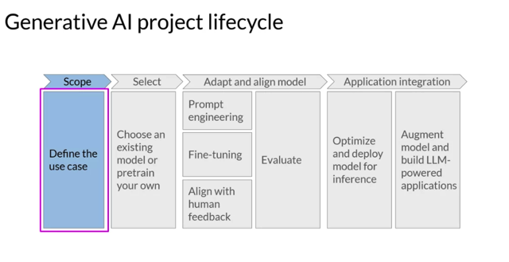</kbd>

> [!NOTE]
> Đại khái đầu tiên là phải **define thật rõ mục tiêu
> của model là gì**, **có những khả năng nào**, thực
> hiện việc gì. Hiểu rõ yêu cầu cho model sẽ giúp
> t**ối ưu model và tránh lãng phí nguồn lực**

 

<kbd>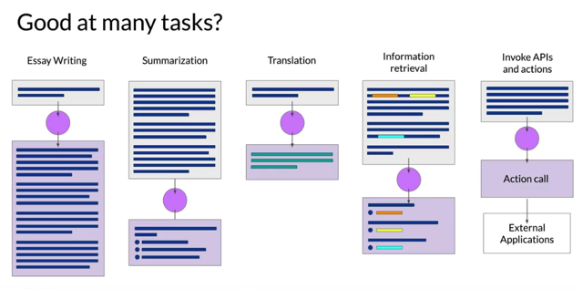</kbd>

> [!NOTE]
> Muốn model **làm được mọi thứ** hay là chỉ cần **thật
> tốt ở một loại task nào đó** thôi

 

<kbd>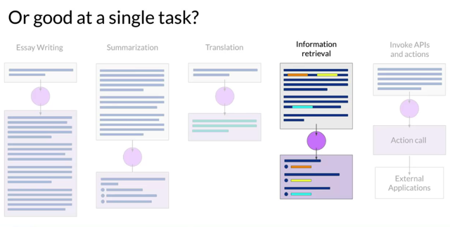</kbd>

 

<kbd>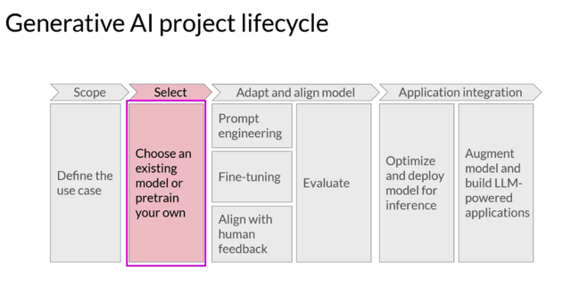</kbd>

> [!NOTE]
> Once you're happy, and **you've scoped your model requirements enough to begin
> development**. Your first decision will be **whether to train your own model from
> scratch** or **work with an existing base model**. In general, you'll **start with an
> existing model**, although there are some cases where you may find it **necessary
> to train a model from scratch**. You'll learn more about the considerations behind
> this decision later this week, as well as **some rules of thumb** to help you **estimate
> the feasibility of training** your own model
>
> Khi đã có **scope rõ ràng** cho model thì tiếp đến là **cân nhắc nên phát
> triển từ một base model hay là build một cái mới hoàn toàn.** Thường
> thì sẽ dùng base model nhưng đôi khi có thể phải build mới. Những
> bài sau sẽ dạy ta về cách **ước lượng tính chất** **feasibility** của **quá trình
> tự training model**

 

<kbd>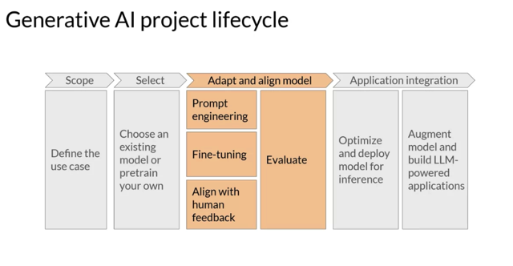</kbd>

> [!NOTE]
> 1 **Assessing model performance**: After obtaining your trained model, the next step is to
> **assess its performance** to ensure it **meets the requirements of your application.**
>
>
>
> 2 **In-context learning** and **prompt engineering**: **Prompt engineering** can be an **effective
> approach to improve model performance**. **In-context learning**, where examples suited to
> your task and use case are used, can help **fine-tune the model's behavior** and **improve
> performance.**
>
>
>
> 3 **Fine-tuning the model**: If the model **still does not perform adequately**, even with
> i**n-context learning**, **fine-tuning can be applied**. This **supervised learning** process,
> covered in **Week 2,** involves **further training the model on task-specific data** to enhance
> its performance.
>
>
>
> 4 **Reinforcement learning with human feedback**: Week 3 introduces **reinforcement
> learning with human feedback** as an additional **fine-tuning technique**. This approach
> helps **ensure that the model behaves in a way that aligns with human preferences and
> desired behavior**.
>
>
>
> 5 **Evaluation**: **Evaluation is crucial** in assessing model performance. In the upcoming
> week, you will explore **metrics** and **benchmarks** that can be used to m**easure the model'
> s performance and alignment with preferences**.
>
>
>
> 6 **Iterative process**: The development stage of the application can be **highly iterative**. It
> may **involve multiple iterations** of **prompt engineering**, **evaluation**, **fine-tuning**, and
> **re-evaluation** to achieve the **desired model performance**.
>
>
>
> The focus is on **continuously adapting and aligning the model to meet performance
> goals** and **ensure it behaves appropriately in deployment.** This stage involves a
> combination of techniques, evaluation measures, and iterative refinement to optimize
> the model's performance and alignment with human preferences.
>
> Nói chung là phần này ta sẽ **assess và improve model.** Đầu tiên là với
> **prompt engineering**, nếu ngay cả với **few-shot prompting** vẫn không đạt
> yêu cầu thì ta sẽ **Fine-tuning** model - vốn là một quá trình s**upervised
> training** model với **labeled data** để cải thiện khả năng của model trong vấn
> đề cụ thể mình đang cần. Và cách thứ 3 là dùng **Reinforcement learning
> with human feedback**. Các quá trình này mang **tính chất iterative**, có
> nghĩa là ta sẽ l**àm đi làm lại cho đến khi nào đạt** kết qủa mong muốn.

 

<kbd>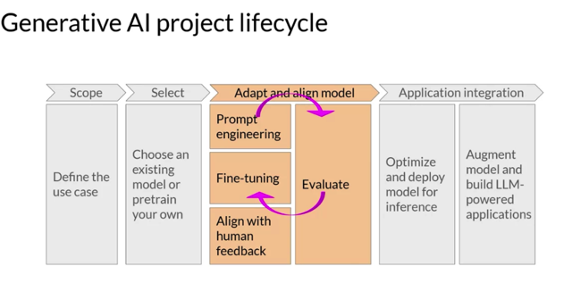</kbd>

 

<kbd>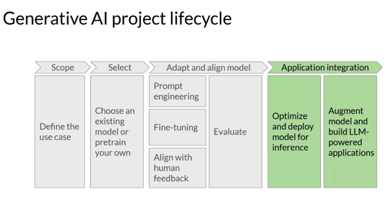</kbd>

> [!NOTE]
> Finally, when you've **got a model that is meeting your performance needs** and is
> **well aligned**, you can **deploy** it into your infrastructure and **integrate it with your
> application**. At this stage, an important step is to **optimize your model for
> deployment**. This can ensure that you're **making the best use of your compute
> resources** and providing the **best possible experience** for the users of your
> application. The last but very important step is to **consider any additional
> infrastructure that your application will require to work well**. There are some
> **fundamental limitations of LLMs** that can be **difficult to overcome through training
> alone** like their **tendency to invent information** when they don't know an answer,
> or their **limited ability to carry out complex reasoning and mathematics**. In the last
> part of this course, you'll learn some powerful techniques that you can use to
> overcome these limitations.
>
> Cuối cùng là **optimize model để deploy** và **handle một số bước cuối** cần thiết để **cải
> thiện một số điểm yếu** của model như **thiên hướng bịa ra câu trả lời** mà nó không
> biết hoặc **khả năng hạn chế** trong việc thực hiện những **phép logic và toán học**
> phức tạp vốn k**hông thể chỉ làm thông qua training.**

 

> [!NOTE]
> LAB 1 - GENERATIVE AI USE
> CASE: SUMMARIZE DIALOGUE

 

> [!NOTE]
> In this lab, you will do the **dialogue summarization task using generative AI**. You will 
> **explore how the input text affects the output of the model**, and **perform prompt 
> engineering** to **direct it towards the task you need**. By comparing **zero shot, one shot, and 
> few shot inferences**, you will t**ake the first step towards prompt engineering** and see how 
> it can enhance the generative output of Large Language Models.  
>  **The labs are accessible to learners who purchased the course. If you have not yet 
> purchased access, you can do so through the "Upgrade to Submit" button below.** 
>  **If you have already paid for the course, start the lab by first ticking the checkbox 
> below indicating you will adhere to the Coursera Honor Code, then click the 
> "Launch App"\\/ \\/button.**
>
> The lab is formally ungraded, but you will need to click on the **Submit** button to complete 
> the lab. This button is on the top right of the Vocareum page and **not** on the AWS 
> console.

 

> [!NOTE]
> 1 - Set up Kernel and
> Required Dependencies

 

<kbd>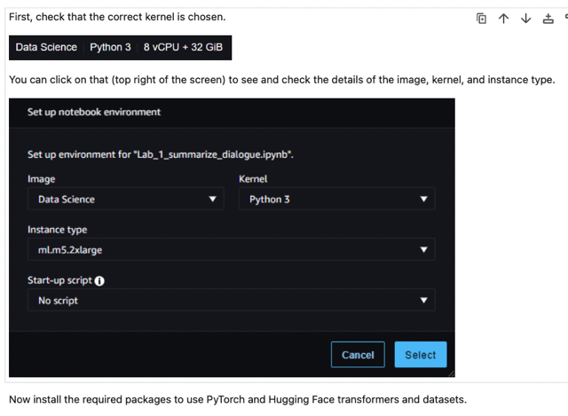</kbd>

> [!NOTE]
> Check Kernel

 

<kbd>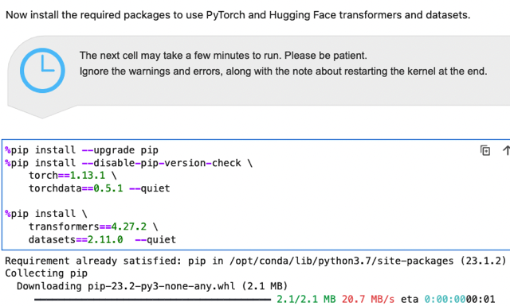</kbd>

> [!NOTE]
> Install transformer,
> dataset và pytorch

 

<kbd>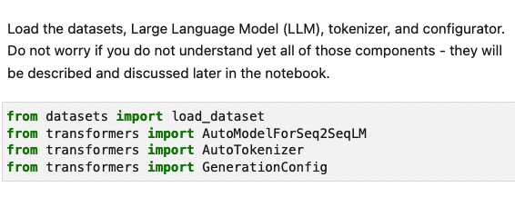</kbd>

> [!NOTE]
> Import load_dataset,
> Tokenizer, LLM model...

 

> [!NOTE]
> 2 - Summarize Dialogue
> without Prompt Engineering

 

<kbd>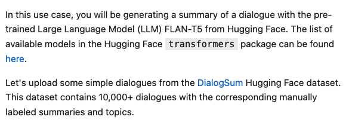</kbd>

> [!NOTE]
> https://huggingface.co/docs/transformers/index
>
> Ta sẽ dùng pre-trained LLM model của HuggingFace là FLAN-T5 để
> làm thử nhiệm vụ summary dialog. Trước hết ta sẽ load một dialog
> từ DialogSum dataset (cũng của HuggingFace). Mỗi dialog được
> label để có summary và topic.

 

<kbd>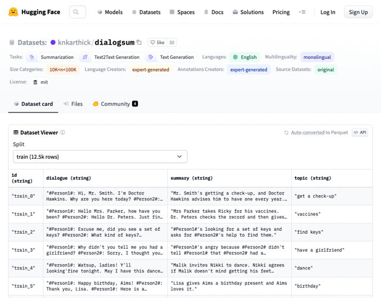</kbd>

<kbd>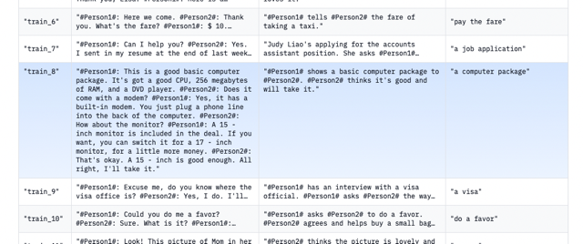</kbd>

> [!NOTE]
> Ta thấy nó ghi "
> expert-generated", size 10k -
> 100k

 

<kbd>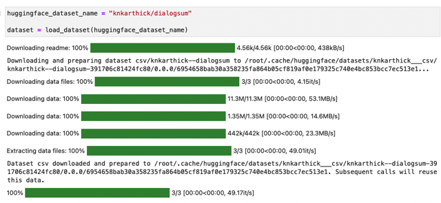</kbd>

> [!NOTE]
> Dùng function load_dataset với
> input là tên của dataset.

 

<kbd>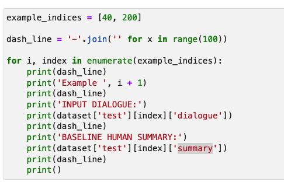</kbd>

> [!NOTE]
> Đại khái chỉ định 2 index để lấy 2 dialog trong test set của dataset. In ra
> dialogue và summary (label) để so sánh với summary của model (prediction)

 

<kbd>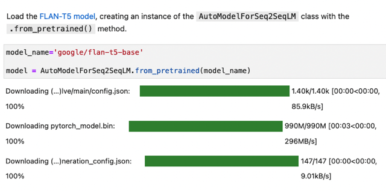</kbd>

> [!NOTE]
> Kế tiếp là load cái pretrained LLM model, define cái tên để bỏ vào
> AutoModelForSeq2SeqLM. from_pretrained()

 

<kbd>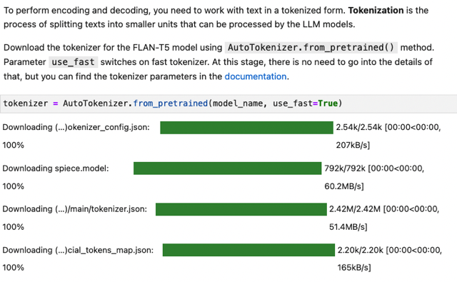</kbd>

> [!NOTE]
> Đại khái dùng cái tên model đó, để load cái tokenizer cho
> nó. Có thể hiểu là mỗi model có thể có cách tokenize khác
> nhau, nên phải load cái tokenizer phù hợp. Thì tương tự,
> AutoTokenizer.from_pretrained() giúp load cái tokenizer
> tương thích với model

 

<kbd>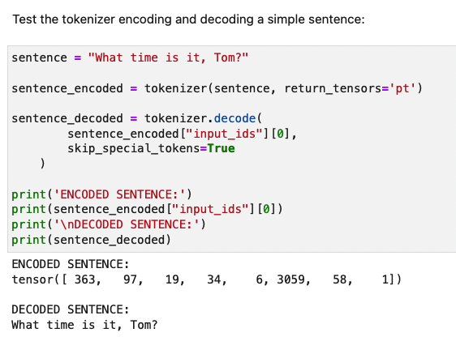</kbd>

> [!NOTE]
> Test thử cái tokenizer, cho một câu nào đó,
> tokenizer sẽ tokenize thành 1 tensor mỗi từ được
> đại diện bởi 1 index (trong vocab)

 

<kbd>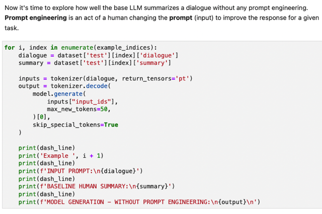</kbd>

> [!NOTE]
> Rồi, cho model predict thử - generate summary mà không có cái prompt
> nào hết. Loop lần lượt trong example_indices (chứa hai cái index của 2
> data sample), dùng index, lấy data sample từ test sét (dataset['test']), và tạo
> var chứa dialogue content và label (summary). Kế tối, bỏ dialog vào
> tokenizer để tokenize. Sau đó bỏ vào model.generate() để model predict,
> để ý không có prompt gì đi kèm, và max_new_tokens = 50 để giới hạn độ
> dài. Sau đó kết quả của nó được đưa vào tokenizer.decode để in ra.

 

<kbd>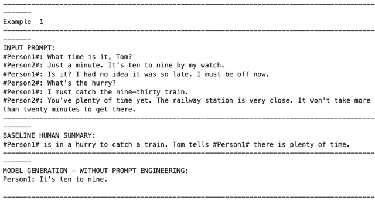</kbd>

 

<kbd>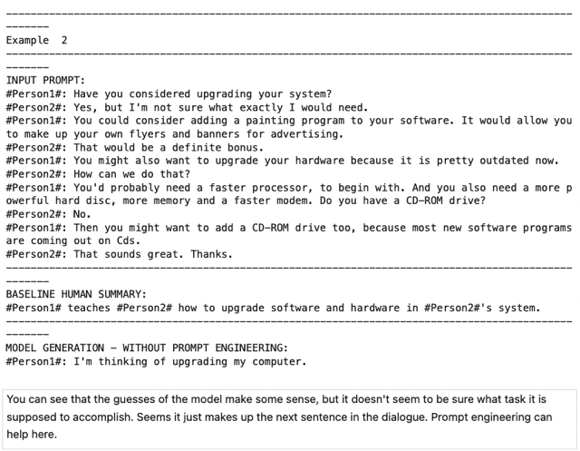</kbd>

> [!NOTE]
> Đại khái là model nó không biết
> mình muốn nó làm gì, thành ra
> câu trả lời rất ất ơ.

 

> [!NOTE]
> 3 - Summarize Dialogue with
> an Instruction Prompt

 

> [!NOTE]
> 3.1 - Zero Shot Inference with
> an Instruction Prompt

 

> [!NOTE]
> In order to instruct the model to perform a task - summarize a dialogue - you
> can take the  dialogue and convert it into an instruction prompt. This is often
> called **zero shot  inference**. You can check out this blog from AWS for a quick
> description of what zero  shot learning is and why it is an important concept to
> the LLM model.
>
> Wrap the dialogue in a descriptive instruction and see how the generated text
> will  change:

 

<kbd>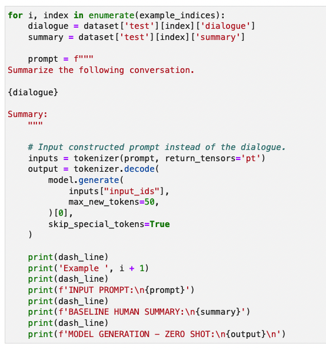</kbd>

> [!NOTE]
> Ok, đại khái là có thêm cái prompt, tức là không phải khơi khơi đưa dialogue vào
> model (sau khi tokenize) mà ghi thêm yêu cầu ("Summarize the ..."). Tất nhiên ta
> vẫn sẽ tokenize cái text - chứa cả promt và dialog content, trước khi đưa vào
> model

 

<kbd>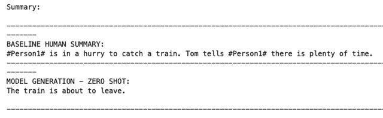</kbd>

> [!NOTE]
> Câu trả lời đã tốt hơn.

 

> [!NOTE]
> This is **much better**! But the model **still does not pick up on the nuance of the conversations** though.
>
>
> **Exercise:**
>
>  • **Experiment with the prompt text** and **see how the inferences will be changed.** 
> Will the inferences change if you end the prompt with just empty string vs. Summary: ?
>
>  • Try to **rephrase the beginning of the prompt text** from Summarize the following 
> conversation. to something different - and see how it will influence the generated output.

 

> [!NOTE]
> 3.2 - Zero Shot Inference with the
> Prompt Template from FLAN-T5

 

<kbd>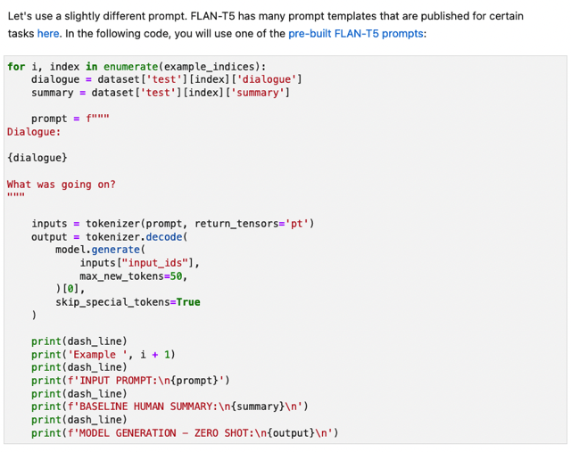</kbd>

> [!NOTE]
> https://github.com/google-research/FLAN/blob/main/flan/v2/templates.py

 

<kbd>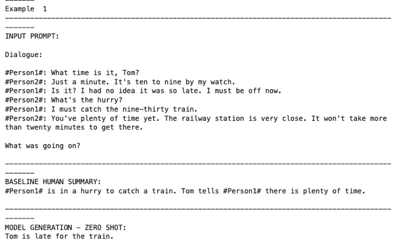</kbd>

 

> [!NOTE]
> Notice that this prompt from FLAN-T5 did
> **help a bit**, but still **struggles to pick up on
> the nuance** of the conversation. This is
> what you will try to solve with the few shot
> inferencing

 

> [!NOTE]
> 4 - Summarize Dialogue with One
> Shot and Few Shot Inference

 

> [!NOTE]
> One shot and few shot inference are the practices of **providing an LLM
> with either one or more full examples of prompt-response pairs** that match
> your task - **before your actual prompt** that you want completed. This is
> called "**in-context learning**" and **puts your model into a state that
> understands your specific task**. You can read more about it in this blog
> from HuggingFace.
>
> Đại khái là cung cấp thêm ví dụ về một prompt-response pairs - kiểu
> như yêu cầu và câu trả lời mong muốn. Trước khi đưa ra prompt thật
> sự được yêu cầu. Cái này gọi là In-context learning, nếu là 1 ví dụ thì
> gọi là one-shot, nhiều thì few-shot

 

#### 4.1 - One Shot Inference

 

<kbd>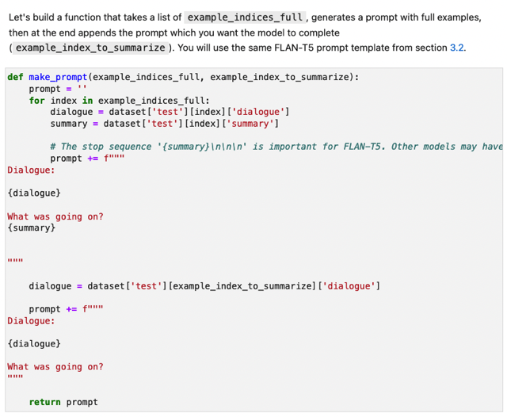</kbd>

> [!NOTE]
> Tạo function để 'tạo prompt, để chứa 1 hoặc vài
> example (lấy từ một dialog và label khác) trước khi
> add với dialog mình muốn nó làm

 

<kbd>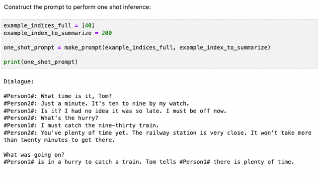</kbd>

> [!NOTE]
> Tạo prompt chứa 1 shot (lấy ví dụ là
> dialog và label index 40)

 

<kbd>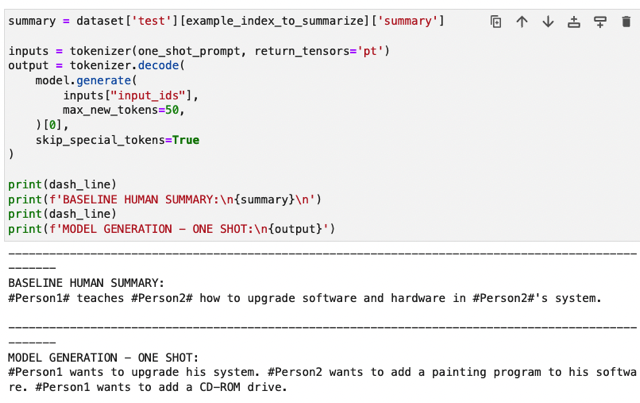</kbd>

 

#### 4.2 - Few Shot Inference

 

<kbd>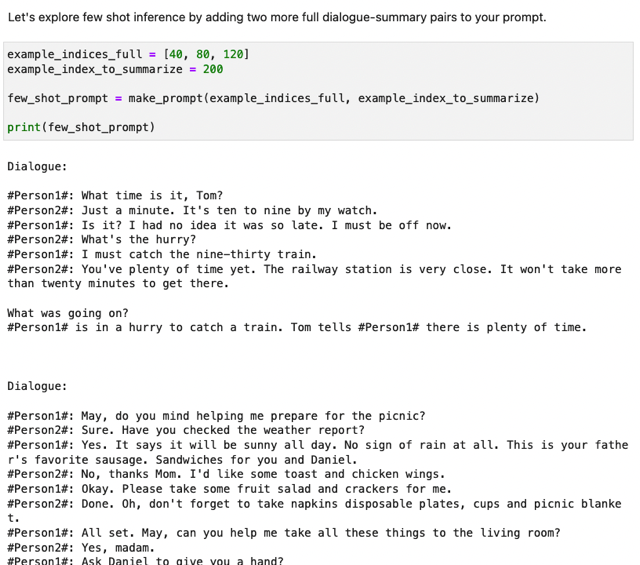</kbd>

> [!NOTE]
> Lần này tạo prompt
> chứa hẳn 3 shot.

 

<kbd>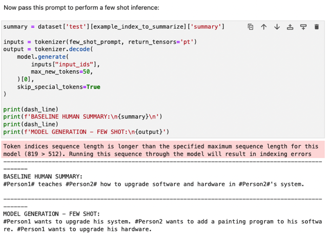</kbd>

 

> [!NOTE]
> In this case, **few shot** **did not provide much of an improvement** over one
> shot inference. And, **anything above 5 or 6 shot will typically not help much**,
> either. Also, you need to **make sure that you do not exceed the model's
> input-context length which**, in our case, if **512** tokens. Anything above the
> context length will be ignored.
>
> However, you can see that **feeding in at least one full example (one shot)
> provides the model with more information** and **qualitatively improves** the
> summary overall.
>
> Đại khái là cho thấy trong trường hợp này few
> shot có vẻ không giúp ích gì thêm, tuy nhiên rõ
> ràng là so với zero shot, one shot giúp model
> output tốt hơn thấy rõ.

 

> [!NOTE]
> 5 - Generative Configuration
> Parameters for Inference

 

> [!NOTE]
> You can **change the configuration parameters** of the generate() method to **see a different 
> output** from the LLM. So far the only parameter that you have been setting 
> was **max_new_tokens**=50, which **defines the maximum number of tokens** to generate. A 
> **full list of available parameters** can be found in the Hugging Face Generation 
> documentation. 
>
> (https://huggingface.co/docs/transformers/v4.29.1/en/main_classes/
> text_generation#**transformers.GenerationConfig**)
>
> A convenient way of organizing the configuration parameters is to 
> use **GenerationConfig class.**

 

> [!NOTE]
> Change the **configuration parameters** to investigate their influence on the output.
>
> Putting the parameter **do_sample** = **True**, you **activate various decoding strategies** which 
> **influence the next token** from the **probability distribution** over the **entire vocabulary**. You 
> can then a**djust the outputs changing temperature** and other parameters (such 
> as **top_k** and **top_p**).
>
> Uncomment the lines in the cell below and rerun the code. **Try to analyze the results**. You 
> can read some comments below.

 

> [!NOTE]
> Comments related to the choice of the parameters in the code cell
> above:
>
> Choosing max_new_tokens=10 will make the output text too short, so
> the dialogue summary will be cut.
>
> Putting do_sample = True and changing the temperature value you
> get more flexibility in the output.

 

<kbd>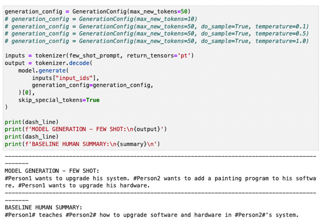</kbd>

 

<kbd>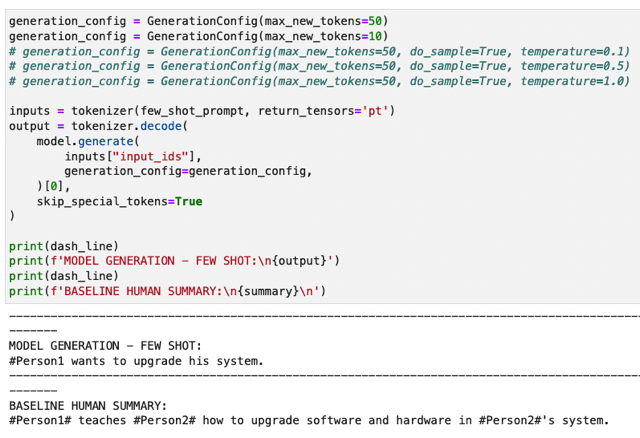</kbd>

> [!NOTE]
> max_neew_token = 10 khiến quá giới hạn, nội dụng sẽ bị cắt ngắn nhiều

 

<kbd>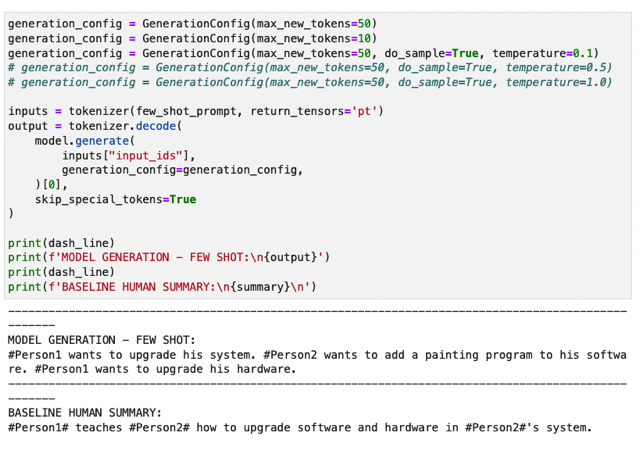</kbd>

> [!NOTE]
> với do_sample, và temperature tăng thì câu
> trả lời flexible hơn đa dạng hơn

 

<kbd>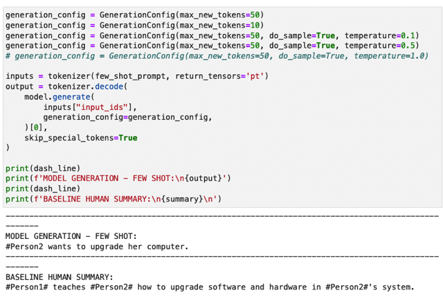</kbd>

 

<kbd>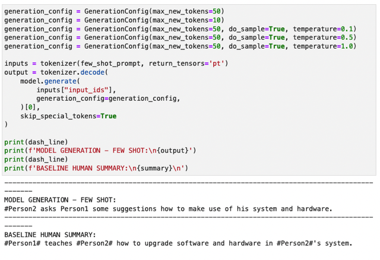</kbd>

 

#### Conclusion

 

> [!NOTE]
> As you can see, **prompt engineering** can take you a long way for this
> use case, but there are some **limitations**. Next, you will start to explore
> how you can use **fine-tuning** to help your LLM to understand a
> particular use case in better depth!
>
> Prompt engineering có những hạn chế, do
> đó cần phải fine-tuning model

 

> [!NOTE]
> PRE-TRAINING LARGE
> LANGUGUAGE MODELS

 

> [!NOTE]
> 1 Generative AI Project Life Cycle: The video introduces the **generative AI project life cycle,** which involves
> several steps before launching a generative AI app.
>
> 2 **Model Selection**: To **develop the application**, one needs to **choose a model to work with**, either **an
> existing one** or **train a new model from scratch.**
>
> 3 **Pre-Training Phase**: The **initial training process** for Large Language Models (**LLMs**) is referred to as
> **pre-training**, where the model **learns from vast amounts of unstructured textual data**.
>
> 4 **Autoencoding** Models: Autoencoding models (**encoder-only)** are **pre-trained** using **masked language
> modeling**, ideal for tasks that benefit from **bi-directional contexts.**
>
> 5 **Autoregressive** Models: Autoregressive models **(decoder-only**) are pre-trained using **causal language
> modeling**, used for **text generation** and show **strong zero-shot inference abilities.**
>
> 6 **Sequence-to-Sequence** Models: Sequence-to-sequence models use **both encoder and decoder parts of
> the transformer architecture** and are often **used for translation, summarization, and question-answering.**
>
> 7 **Larger Models**: Larger models tend to be **more capable without** **additional in-context learning** or **further training**. Researchers have been **developing larger models** driven by advances in architecture, data
> availability, and computing resources.
>
> 8 **Challenges** of Large Models: Training **enormous models** is **difficult and expensiv**e, making continuous
> training of larger models infeasible.
>
> Overall, the text discusses the **different model architectures**, thei**r pre-training objectives**, and **their applications**,
> as well as the **challenges associated with training large language models**.

 

<kbd>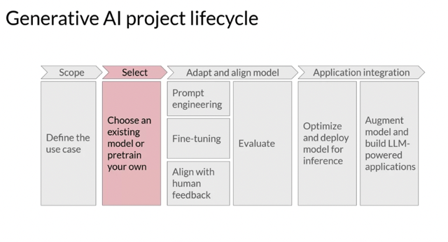</kbd>

 

<kbd>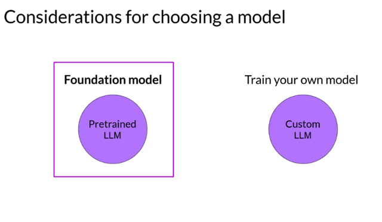</kbd>

> [!NOTE]
> Đại khái là phần này sẽ focus vào việc chọn
> based model để phát triển lên

 

<kbd>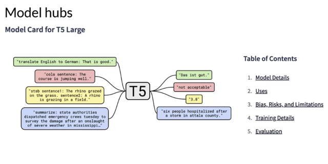</kbd>

> [!NOTE]
> In general, however, you'll begin the process of developing your application using
> an existing foundation model. Many open-source models are available for members
> of the AI community like you to use in your application. The developers of some of
> the major frameworks for building generative AI applications like **Hugging Face** and
> **PyTorch**, have curated h**ubs where you can browse these models**. A really useful
> feature of these hubs is the **inclusion of model cards**, that **describe important detail**s
> including the **best use cases** for each model, **how it was trained**, and **known
> limitation**s. You'll find some links to these model hubs in the reading at the end of
> the week. The exact model that you'd choose will depend on the details of the task
> you need to carry out. **Variance of the transformer model architecture** are suited to
> **different language tasks**, largely because of differences in how the models are
> trained.

 

<kbd>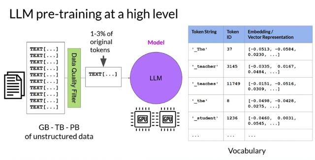</kbd>

> [!NOTE]
> To help you better understand these differences and to develop intuition about which
> model to use for a particular task, let's take a closer look at how large language models
> are trained. With this knowledge in hand, you'll find it easier to navigate the model hubs
> and find the best model for your use case. To begin, let's take a high-level look at the
> i**nitial training process** for LLMs. This phase is often referred to as **pre-training**. As you
> saw in Lesson 1, **LLMs encode a deep statistical representation of language**. This
> understanding is developed during the models pre-training phase when the model **learns
> from vast amounts of unstructured textual data**. This can be gigabytes, terabytes, and
> even petabytes of text. This data is pulled **from many sources**, including **scrapes off the
> Internet and corpora of texts** that have been **assembled specifically for training** language
> models. In this **self-supervised learning** step, the model **internalizes the patterns and
> structures present in the language**. These patterns then **enable the model to complete
> its training objective**, which d**epends on the architecture** of the model, as you'll see
> shortly. During pre-training, the **model weights get updated to minimize the loss of the
> training objective**. The **encoder generates an embedding or vector representation for
> each token.** Pre-training also **requires a large amount of compute and the use of GPUs**.
> Note, when you scrape training data from public sites such as the Internet, you often
> need to **process the data to increase quality**, address **bias**, and **remove other harmful
> content**. As a result of this data quality curation, often **only** **1-3% of tokens are used** for
> pre-training. You should **consider this when you estimate how much data you need** to
> collect if you decide to pre-train your own model.
>
> Đại khái là nó sẽ **phát triển hiểu biết chung về ngôn ngữ** trong giai đoạn
> **pre-training**, với **data được tập hợp (assemble) từ nhiều nguồn,** với l**earning
> objective cụ thể** thì **tuỳ** từng 'dạng' model như **Autoencoder (encoder only)**,
> **Autoregressive (Decoder only)** hoặc **Seq2Seq (cả Encoder và Decoder)**. Quá
> trình training là **self-supervise**, như ta đã biết khi **target label được lấy từ chính
> input data (che 1 từ đi bắt đoán)** sẽ giúp model **nắm bắt được những deep
> statistical representation of language** đồng thời tạo các **embedding vector của
> các token.**

 

<kbd>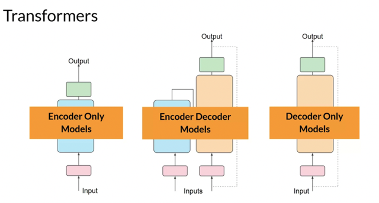</kbd>

 

<kbd>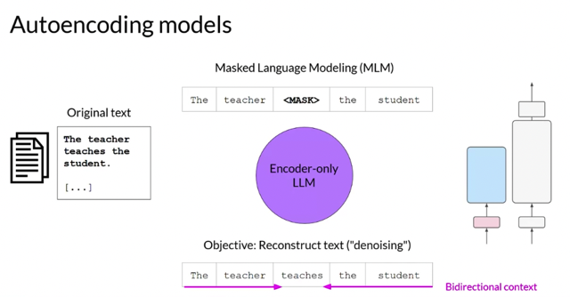</kbd>

> [!NOTE]
> **Encoder-only models** are also known as **Autoencoding models**, and they are **pre-trained**
> using **masked language modeling**. Here, **tokens in the input sequence are randomly masked,**
> and **the training objective is to predict the mask tokens** in order to **reconstruct the original
> sentence**. This is also called a **denoising objective**. Autoencoding models spilled
> **bi-directional representation**s of the input sequence, meaning that the model **has an
> understanding of the full context of a toke**n and not just of the words that come before
>
> Đại khái cái thể loại **Transformer structure** mà **chỉ có Encoder** không thôi có tên gọi là
> **AutoEncoder**. Nó sẽ được **pretrain bởi cơ chế gọi là Masked Language Modeling (MLM)**,
> khá giống bài toán **CBOW** trong đó các t**ừ input sẽ bị mask / che đi một cách ngẫu nhiên**
> để **training model dự đoán từ đó để reconstruct lại câu hoàn chỉnh**. Objective kiểu này gọi là
> **denoising** **objective**. Và nó sẽ sử dụng **bi-directional** để nắm bắt **full context** chứ không
> chỉ những từ trước đó.
>
>
>
> Tuy nhiên khác với CBOW ở chỗ mục đích của Encoder này là **learn general language
> representation** còn **CBOW** chỉ là **learn word embedding.** Và tất nhiên **structure của cái
> này như đã nói là Transformer**, cụ thể là Encoder.
>
>
>
> **BERT** chính là dùng cái này - **Bidirectional Encoder Representation From Transforme**r.

 

> [!NOTE]
> **Masked language modeling** and **CBOW** (Continuous Bag of Words) model are **both
> techniques used in natural language processing**, but they are **different approaches** to
> language modeling.
>
> 1 Masked Language Modeling: **Masked language modeling** is a task that involves
> **predicting missing words in a sentence**. In this approach, **certain words** in the input text
> are **randomly masked**, and the model' s goal is to **predict the masked words** based on the
> **context of the surrounding word**s. This technique is prominently used in **transformer-based
> language models** like **BERT** (**Bidirectional Encoder Representations from Transformers**).
> BERT learns **bidirectional context** by considering b**oth the left and right context** of a word.
> By **pre-training on a large corpus**, BERT \\_**learns general language representations**\\_ that can
> then be **fine-tuned** on specific downstream tasks like text **classification**, **named entity
> recognition**, **question answering**, etc.
>
> 2 **CBOW** (**Continuous Bag of Words**) Model: The CBOW model is a type of **word
> embedding model** used to r**epresent words in a continuous vector space**. It takes a **context
> of surrounding words** as input and **predicts the target word** in the middle. The context
> window can be either fixed or dynamically determined. The CBOW model **tries to
> maximize the probability of the target word given the context words**. This approach is
> useful for \\_**generating dense vector representations of words**\\_, which can be further used in
> various natural language processing tasks like l**anguage modeling, sentiment analysis,
> and word similarity calculations.**
>
> In summary, both masked language modeling and CBOW model **aim to capture contextual
> information from surrounding words**, but \\_**they differ in their goals and techniques**\\_. Masked
> language modeling is used for **pre-training large language models** like BERT, while the
> CBOW model is used for **generating word embeddings** in continuous vector spaces.
>
> Cách làm có vẻ giống nhau, nhưng **khác
> nhau về mục đích và technique**

 

<kbd>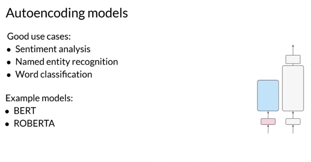</kbd>

> [!NOTE]
> **Encoder-only models** are **ideally suited** to task that benefit from this **bi-directional
> contexts**. You can use them to **carry out sentence classification tasks**, for example,
> **sentiment analysis** or **token-level tasks** like **named entity recognition** or **word
> classification**. Some well-known examples of an autoencoder model are **BERT** and
> **RoBERTa**
>
> Một số task mà Autoencoding
> model làm rất tốt và BERT là ví
> dụ của dạng này

 

<kbd>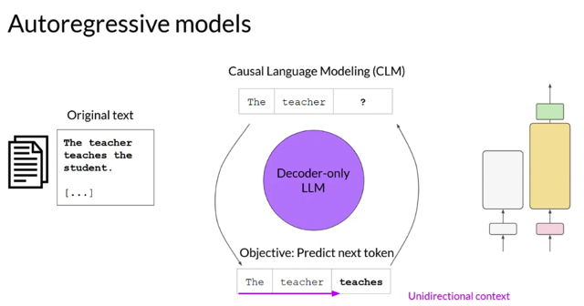</kbd>

> [!NOTE]
> Now, let's take a look at **decoder-only** or **autoregressive** **models**, which are
> **pre-trained** using **causal language modeling**. Here, the **training objective** is to
> **predict the next token** based on the **previous sequence of tokens**. Predicting the
> next token is sometimes called f**ull language modeling** by researchers.
> Decoder-based autoregressive models, **mask the input sequence** and **can only see
> the input tokens leading up to the token in question**. The model has **no knowledge
> of the end of the sentence**. The model then **iterates over the input sequence one by
> one to predict the following token**. In contrast to the encoder architecture, this
> means that the **context is unidirectional**. By learning to predict the next token from a
> vast number of examples, the model **builds up a statistical representation of
> language**. Models of this type make use of the decoder component off the original
> architecture without the encoder.
>
> Còn dạng transformer **chỉ sử dụng Decoder** thì gọi là **Autoregressive** model,
> nó được **train theo kiểu predict từ chỉ dựa trên những từ trước đó**, (khác với
> encoder khi nó có context của cả trước và sau từ cần đoán). Và nhiệm vụ
> kiểu này được gọi là **full-language model**. Chỉ có tính chất **uni-directional**. Từ
> được predict sẽ **tiếp tục được bỏ vào thành context cho từ cần đoán tiếp
> theo.** Dần model sẽ học được **statistical representation của language.**

 

<kbd>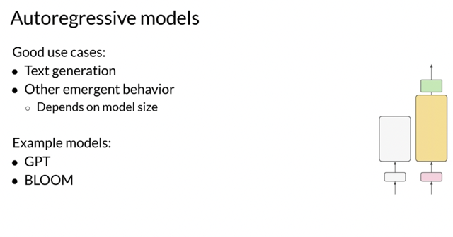</kbd>

> [!NOTE]
> **Decoder-only models** are often used for **text generation**,
> although **larger decoder-only models** show **strong zero-shot
> inference abilities**, and can often **perform a range of tasks well**.
> Well known examples of decoder-based autoregressive models
> are **GPT** and **BLOOM**.
>
> Những model kiểu này mạnh về **zero-shot inference**
> ability ví dụ **Summarization**, **generating text**. Điển hình
> dạng này là **GPT và BLOOM.**

 

<kbd>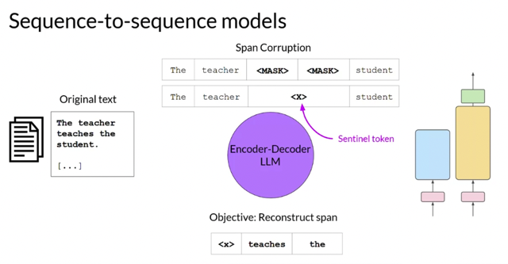</kbd>

> [!NOTE]
> The final variation of the transformer model is the **sequence-to-sequence model**
> that uses **both the encoder and decoder** parts off the original transformer
> architecture. The exact **details of the pre-training objective vary** from model to
> model. A popular sequence-to-sequence model **T5**, **pre-trains the encoder using
> span corruption**, which **masks random sequences of input tokens.** Those mass
> sequences are then **replaced with a unique Sentinel token**, shown here as x.
> Sentinel tokens are **special tokens** added to the vocabulary, but **do not
> correspond to any actual word** from the input text. The decoder is then tasked
> with **reconstructing the mask token sequences auto-regressively**
>
> Đại khái đối với những model dạng **Sequence2Sequence** có structure **cả encoder và decoder**.
> Và l**earning objective mỗi cái mỗi khác**, ở đây lấy ví dụ của **T5,** đó là nó sẽ **mask 1 chuỗi nhỏ
> trong sequence thay thế bằng một token đặc biệt gọi là Sentinel token**, và model được giao
> nhiệm vụ **reconstruct cái mask token sequence này.**
>
>
>
> Cái model kiểu này sẽ **tốt cho những bài toán mà ta đưa vào một body of text** và muốn **tạo ra
> một body of text**: Ví dụ điển hình cho bài toán dạng này là **translation, text summarization**

 

<kbd>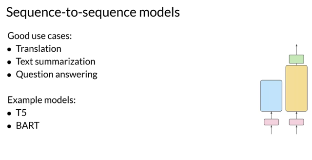</kbd>

> [!NOTE]
> You can use sequence-to-sequence models for translation,
> **summarization**, and question-answering. They are generally useful in
> cases where you have a **body of texts as both input and output.** Besides
> **T5**, which you'll use in the labs in this course, another well-known
> encoder-decoder model is **BART**, not bird.

 

<kbd>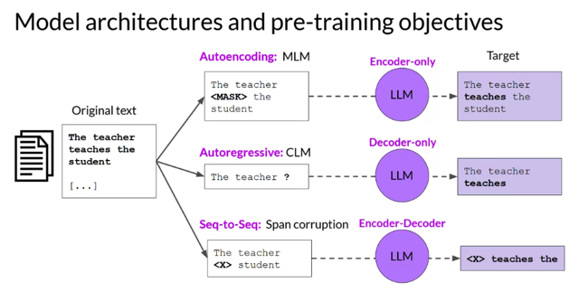</kbd>

> [!NOTE]
> To summarize, here's a **quick comparison** of the **different model architectures** and
> the **targets** off the **pre-training objectives**. **Autoencoding** models are pre-trained
> using **masked language modeling**. They correspond to the **encoder** part of the
> original transformer architecture, and are often used with **sentence classification
> or token classification**. **Autoregressive** models are pre-trained using **causal
> language modeling**. Models of this type make use of the **decoder** component of
> the original transformer architecture, and often used for **text generation.**
> **Sequence-to-sequence** models use **both the encoder and decoder** part off the
> original transformer architecture. The **exact details of the pre-training objective
> vary** from model to model. The **T5** model is pre-trained using **span corruption.**
> Sequence-to-sequence models are often used for **translation, summarization,
> and question-answering**
>
> Tóm tắt như sau về Cấu trúc
> model, objective và sở trường (loại
> nhiệm vụ mà nó làm tốt)

 

<kbd>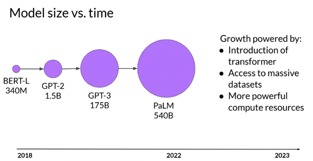</kbd>

> [!NOTE]
> One additional thing to keep in mind is that **larger models of any architecture are
> typically more capable** of carrying out their tasks well. Researchers have found that the
> **larger a model**, the **more likely it is to work as you needed** to **without additional
> in-context learning** or **further training**. This observed trend of increased model capability
> with size has driven the development of larger and larger models in recent years. This
> growth has been fueled by inflection points and research, such as the introduction of
> the highly scalable transformer architecture, access to massive amounts of data for
> training, and the development of more powerful compute resources.
>
> Model **càng lớn, nó càng có khả năng làm tốt** nhiệm vụ của mình
> mà k**hông cần in-context learning hoặc fine-tuning**. Điều này dẫn
> tới sự ra đời của **các model ngày càng lớn hơn**

 

<kbd>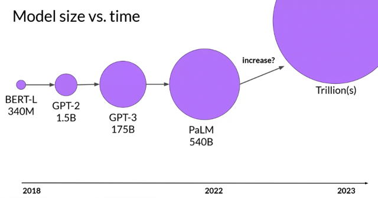</kbd>

> [!NOTE]
> This steady increase in model size actually led some researchers to hypothesize the
> existence of a new Moore's law for LLMs. Like them, you may be asking, can we just keep
> adding parameters to increase performance and make models smarter? Where could this
> model growth lead? While this may sound great, it **turns out that training these enormous
> models is difficult and very expensive**, so much so that **it may be infeasible to continuously
> train larger and larger models.** Let's take a closer look at some of the challenges
> associated with training large models in the next video.
>
> Đặt ra câu hỏi liệu xu hướng này có kéo dài. Thì bài
> sau sẽ nói đến những **thách thức và chi phí để train
> một cái model to như vậy**

 

> [!NOTE]
> COMPUTATIONAL
> CHALLENGES FOR TRAINING
> LLMS

 

> [!NOTE]
> . ****Memory Limitations** in Training Large Language Models (LLMs)**: The **main issue** faced when training
> large language models is **running out of memory on GPUs**, especially on consumer hardware. LLMs require a **significant amount of memory to store and train all their parameters**, making it challenging for data centers and
> even high-end hardware like **Nvidia A100 GPUs.**
>
> 2. ****Quantization** to **Reduce Memory Footprint****: One technique to **reduce memory requirements** is
> **quantization**. It involves **reducing the precision of model weights from 32-bit floating-point numbers (FP32)** to **lower precision formats like 16-bit floating-point numbers (FP16)** or **8-bit integers (INT8)**. This **reduces the
> memory needed to store the model weights, activations, and other parameters.**
>
> 3. ****Data Types and Precision****: The data types used in deep learning frameworks are **FP32 for full precision**,
> **FP16 or Bfloat16** for **half precision**, and **INT8 for eight-bit integers**. Quantization **statistically projects the
> original 32-bit floating-point numbers** into the **lower precision space** using **scaling factors calculated based on
> the range of the original numbers.**
>
> 4. ****BFLOAT16 (BF16)** as an Alternative to **FP16****: BFLOAT16 is a **hybrid format** between FP16 and FP32
> and has become popular in deep learning. It **captures the full dynamic range of FP32** but **uses only 16 bits**,
> i**ncreasing model performance and reducing memory footprint.**
>
> 5. ****Savings in Memory Consumption****: By applying **quantization**, memory consumption **can be significantly
> reduced**. Using 16-bit half precision, you can achieve a 50% saving in memory, and with eight-bit integers, it can
> be further reduced by 50%.
>
> 6. ****Scaling Challenges****: As model sizes grow beyond a **few billion parameters**, it becomes **impossible to
> train them on a single GPU**. Training such large models may **require distributed computing technique**s and
> **access to hundreds of GPUs**, making it e**xpensive and impractical.**
>
> 7. ****Fine-Tuning Process****: Fine-tuning, a training process that **comes after pre-training**, also r**equires
> storing all training parameters in memory**. While it may be challenging to pre-train very large models from scratch,
> fine-tuning can still be done on pre-trained models.
>
> 8. **Optional Video on **Training Across GPUs****: An optional video is available to learn more about the **technical
> aspects of training large models across multiple GPUs** and the options available for developers.
>
> Overall, the main ideas **focus on the memory limitations in training large language models**, the use of
> **quantization** to **reduce memory footprint,** the **benefits of BFLOAT16**, and the **challenges of scaling training
> to very large models**.

 

<kbd>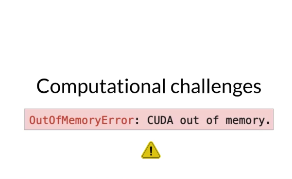</kbd>

 

<kbd>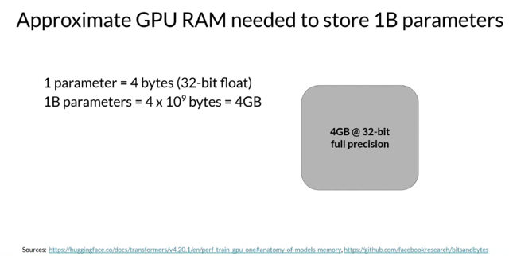</kbd>

> [!NOTE]
> Đại khái là **1 param** của model tốn **4 bytes** bộ nhớ. Vậy
> một **model có 1 tỷ params sẽ cần 4GB**

 

<kbd>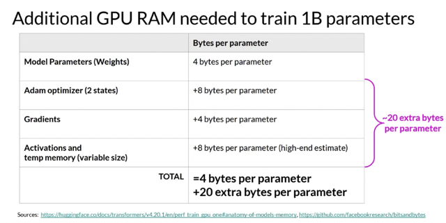</kbd>

> [!NOTE]
> Nhưng model đâu chỉ có params, còn nào là **optimizers** cần **8
> bytes mỗi params**, ngoài ra còn **gradient**, **activation**...dẫn tới dễ dàng cần
> tới hơn **20 bytes cho mỗi parameter của model**

 

<kbd>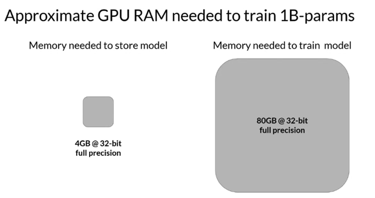</kbd>

> [!NOTE]
> Thành ra để training một **model 1 tỉ params** thì sương sương cần **80 GB
> memory** là bằng dung lượng nhớ của một cái **Nvidia A100 GPU**
>
> If you want to train the model, you'll have to plan for **additional components** that use
> GPU memory during training. These include two **Adam optimizer states**, **gradients**,
> **activations, and temporary variables** needed by your functions. This can easily lead to
> **20 extra bytes of memory per model parameter**. In fact, to account for all of these
> overhead during training, you'll actually **require approximately 20 times the amount of
> GPU RAM that the model weights alone take up**. To train a one billion parameter
> model at 32-bit full precision, you'll need **approximately 80 gigabyte of GPU RAM**. This
> is **definitely too large for consumer hardware**, and even challenging for hardware used
> in data centers, if you want to train with a single processor. **Eighty gigabyte** is the
> **memory capacity of a single Nvidia A100 GPU**, a common processor used for machine
> learning tasks in the Cloud

 

<kbd>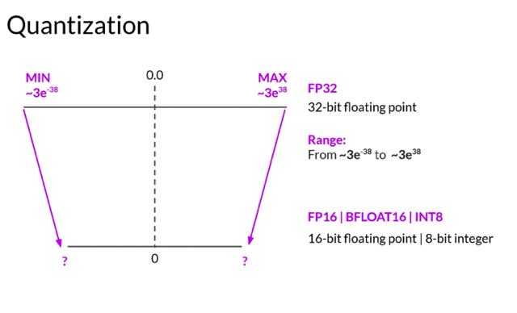</kbd>

> [!NOTE]
> What **options do you have** to **reduce the memory** required for training? One technique
> that you can use to reduce the memory is called **quantization**. The main idea here is
> that you **reduce the memory required to store the weights** of your model by **reducing
> their precision from 32-bit floating point numbers to 16-bit floating point numbers**, or
> eight-bit integer numbers. The corresponding data types used in deep learning
> frameworks and libraries are **FP32 for 32-bit full position**, **FP16, or Bfloat16 for 16-bit
> half precision**, and **int8 eight-bit integers**. The range of numbers you can represent
> with **FP32** goes from approximately **3*10^-38 to 3*10^38**. **By default**, model **weights**,
> **activations**, and other model parameters a**re stored in FP32**. Quantization\_ **statistically
> projects the original 32-bit floating point numbers into a lower precision space**\_, using
> s**caling factors** calculated based on the range of the original 32-bit floating point
> numbers.
>
> Đại khái là một solution để **giảm yêu cầu bộ nhớ xuống** đó là **Quantization**, như ta đã
> biết ở bên **MLOpsSpec**. Đại khái là giảm **precision xuống từ 32-bit floating points xuống
> còn 16-bit f.p hoặc 8-bit integer bằng cách nó tính toán cái khoảng giá trị của params để rồi
> project hay đóng khung lại**

 

<kbd>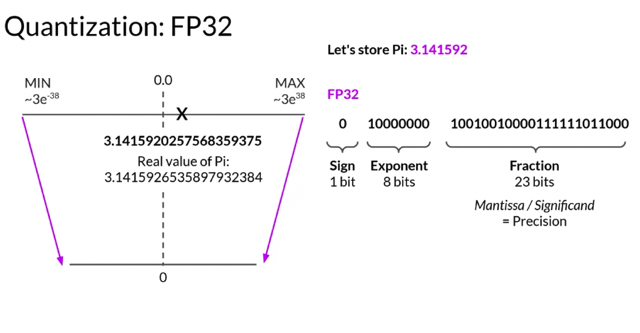</kbd>

> [!NOTE]
> Trong **32-bit floating point** - FP32, thì **1 bit dùng để chỉ "dấu" hay " sign"**, như
> đây là c**ủa số pi là 0 thể hiện nó là số dương**. **8 bit tiếp theo là chứa thông tin
> exponent** thể hiện **giá trị phần nguyên (3)**, và **23 bit còn lại là thể hiện phần lẻ
> (fraction)** gọi là **Mantissa** hay **Significand** là **Precision - Độ chính xác.**
>
> Let's look at an example. Suppose you want to store a PI to **six decimal places** in
> **different positions**. Floating point numbers are stored as **a series of bits zeros** and
> **ones**. The **32 bits to store numbers in full precision with FP32** consist of **one bit for
> the sign** where **zero indicates a positive number**, and **one a negative number**. Then
> **eight bits for the exponent of the number,** and **23 bits representing the fraction of
> the number.** The fraction is also referred to as the **mantissa**, or **significant**. It
> r**epresents the precision** bits off the number. If you **convert the 32-bit floating point
> value back to a decimal value**, you notice the slight loss in precision. For reference,
> here's the real value of Pi to 19 decimal places

 

<kbd>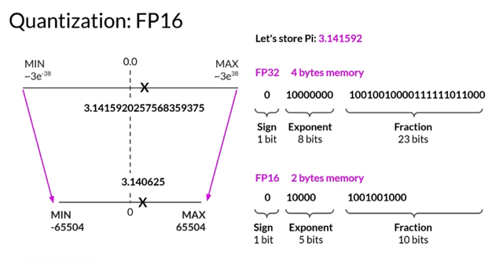</kbd>

> [!NOTE]
> Đại khái là nếu **giảm xuống dụng 16-bit floating point** gọi là **"còn chính xác một
> nửa - haft precision"** thì thay vì tốn **4 bytes memory chỉ còn có 2 bytes**. Và độ
> **chính xác cũng giảm xuống khi chỉ còn 6 số ở phần thập phân thay vì 19 số**.
> Tuy nhiên điều này có thể c**hấp nhận được khi ta đang cần giảm bộ nhớ**

 

<kbd>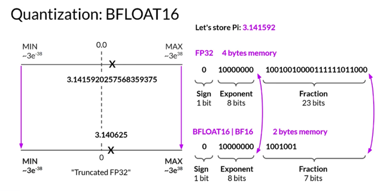</kbd>

> [!NOTE]
> One datatype in particular BFLOAT16, has recently become a **popular** alternative to
> FP16. **BFLOAT16**, short for **Brain Floating Point Format** developed at **Google Brain**
> has become a **popular choice** in deep learning. Many **LLMs, including FLAN-T5**, have
> been pre-trained with BFLOAT16. BFLOAT16 or BF16 is a **hybrid** between **half
> precision FP16 and full precision FP32**. BF16 **significantly helps with training stability**
> and is **supported by newer GPU's** such as NVIDIA's A100. BFLOAT16 is often
> described as a **truncated 32-bit float**, as it **captures the full dynamic range** of the full
> 32-bit float, that uses only 16-bits. BFLOAT16 **uses the full eight bits to represent the
> exponent,** but t**runcates the fraction to just seven bits**. This n**ot only saves memory,**
> but also **increases model performanc**e by speeding up calculations. The downside is
> that BF16 is not well suited for integer calculations, but these are relatively rare in
> deep learning
>
> Một kiểu **16-bit** mới phát triển do **Google Brain** được ưa chuộng hơn, kiểu như nó
> hybrid giữa 32 và 16 bit. Nó **vẫn giữ 8 bit cho Exponent** nhưng phần **Fraction thì gọt
> bớt (truncate) chỉ còn 7 thay vì 23**. Nên nó còn được gọi là **"Truncated FP32"**. Cái này
> thì có **ưu điểm là không chỉ giúp save memory mà còn tăng tốc và làm ổn định quá
> trình training**

 

<kbd>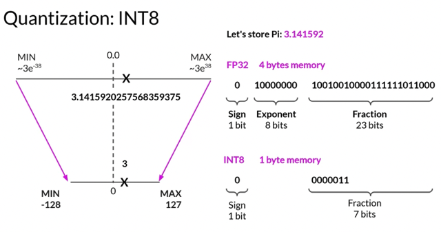</kbd>

> [!NOTE]
> Còn nếu dụng **Integer 8-bit** thì chỉ còn cần **1 byte memory** cho (1
> params) nhưng **rõ ràng là độ chính xác sẽ giảm đáng kể**

 

<kbd>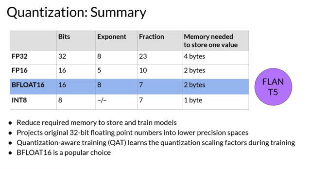</kbd>

> [!NOTE]
> Let's summarize what you've learned here and emphasize the **key points** you should
> take away from this discussion. Remember that the **goal of quantization is to reduce
> the memory required** to store and train models by **reducing the precision** of the model
> weights. Quantization **statistically projects the original 32-bit floating point numbers**
> into **lower precision spaces** using **scaling factors** calculated based on the range of the
> original 32-bit floats. Modern deep learning **frameworks** **and** **libraries** \_**support
> quantization-aware training**\_, which **learns the quantization scaling factors** during the
> training process. The details of this process are beyond the scope of this course. But
> you've seen the key point here, that **you can use quantization to reduce the memory**
> footprint of the model during training. **BFLOAT16** has become a **popular choice** of
> precision in deep learning as it **maintains the dynamic range of FP32**, but **reduces the
> memory footprint by half**. Many LLMs, including **FLAN-T5**, have been **pre-trained with
> BFOLAT16**. Lookout for a mention of BFLOAT16 in next week's lab.
>
> Đại khái là việc nhắc lại **quantization** giúp **giảm nhẹ model** bằng cách thay
> thế việc dùng **full-precision 32 bit floating point** bằng việc dùng
> **haft-precision 16 bit floating point** thông qua quá trình **quantization-aware
> training** mà ta đã học bên MMOpsSpec. Và hiện tại người ta ưa chuộng
> **BFloat 16** do nó v**ẫn giữ dynamic range của FP32** nhưng vẫn **reduce
> memory xuống còn 1 nửa.** Và nhiều LLM trong đó có **Flan T5** được training
> với cái này

 

<kbd>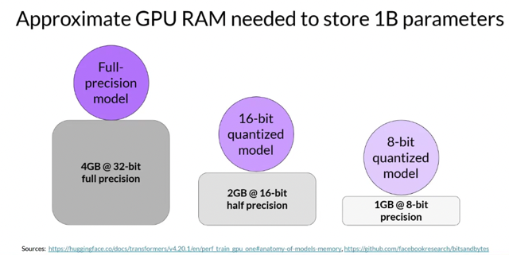</kbd>

> [!NOTE]
> Với cách này, ta vẫn có **1 Billion
> params model** nhưng **chỉ còn cần 1/2
> hoặc 1/4 memory yêu cầu**

 

<kbd>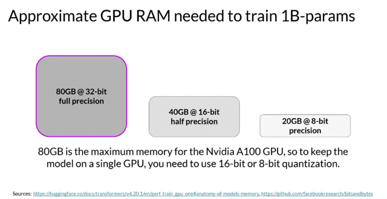</kbd>

> [!NOTE]
> và thay vì **80GB** thì chỉ cần **40 hoặc 20GB** để
> **train model** (ước lượng tổng số params khi
> training gấp 20 lần model params).

 

<kbd>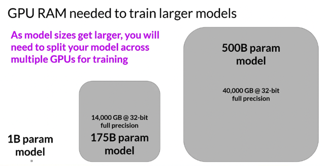</kbd>

> [!NOTE]
> Đại khái là **nếu model ở mức 1 tỉ params** thì với việc **quantization thì
> còn có thể train model trên 1 device duy nhất** vì nó **chứa đủ** (ví dụ xài
> cái Nvidia A100 80GB) nhưng model có thể lớn đến 176B hoặc 500B.
> Lúc này cần phải **distributed training** và **ước lượng đại khái là 500 cái
> mỗi cái 10000 usd, là sương sương tốn 5 triệu đô để mua GPU cho
> việc training**. Đó là lý do thường ta sẽ không train LLM model from scratch

 

> [!NOTE]
> OPTIONAL VIDEO: EFFICIENT
> MULTI-GPU COMPUTE STRATEGIES

 

> [!NOTE]
> 1. Training **large language models** can **lead to out-of-memory issues** on **GPUs** due to their **huge size and
> memory requirements**.
>
> 2. **Quantization** is a technique used to **reduce memory requirements** by **reducing the precision of model weights**,
> converting them from **32-bit floating-point numbers** (FP32) to **lower precision formats like 16-bit floating-point (FP16)**
> or **8-bit integers (INT8)**.
>
> 3. **Quantization** statistically **projects the original 32-bit floating-point numbers** into **lower precision spaces** using
> **scaling factors**.
>
> 4. **Modern deep learning frameworks** and libraries support **quantization-aware training**, where quantization **scaling
> factors** are learned during the **training process**.
>
> 5. **BFLOAT16 (BF16)**, a **hybrid** between **FP16 and FP32**, has become **popular in deep learning**, **maintaining
> the dynamic range of FP32** but **reducing memory footprint by half.**
>
> 6. **Quantization** can significantly **reduce the memory consumption** **required** to store and train models, making it
> **feasible** **to train large models on single GPUs** with 16-bit or 8-bit quantization.
>
> 7. As models scale beyond a **few billion parameters**, **training on a single GPU becomes impossible**, **necessitating
> the use of distributed computing techniques** across multiple GPUs.
>
> 8. **Fine-tuning** is an **additional training process** that **also requires significant memory capacity** and **may require
> access to hundreds of GPUs for large models**.

 

<kbd>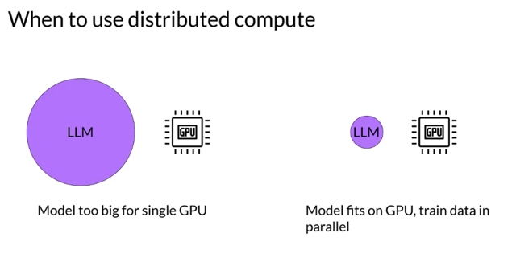</kbd>

> [!NOTE]
> Đại khái là ngay cả khi model có thể fit trên GPU thì vẫn có những lợi ích của
> distributed training

 

<kbd>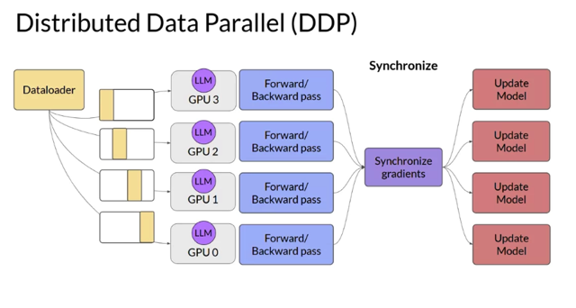</kbd>

> [!NOTE]
> You'll begin by considering **the case where your model is still fits on a single GPU**. The first
> step in scaling model training is to **distribute large data-sets across multiple GPUs** and
> **process these batches of data in parallel**. A popular implementation of this model replication
> technique is **Pytorches distributed data-parallel**, or **DDP** for short. DDP **copy your model
> onto each GPU** and **sends batches of data to each of the GPUs** in **parallel**. **Each
> data-set is processed in parallel** and then a **synchronization step combines the results of
> each GPU**, which **in turn updates the model on each GPU**, which is always identical across
> chips. This implementation allows **parallel computations** across all GPUs that results in
> **faster training**
>
> Như cũng đã biết bên MLOps Spec, kiểu đang nói là copy model trên nhiều GPU, rồi mỗi GPU
> train một phần data. Sau đó các params sẽ được Sync để update model. Nhưng tất nhiên kiểu
> này yêu cầu GPU phải chứa đủ model bao gồm model' s weights, hyper-params, gradients,
> optimizer states..

 

<kbd>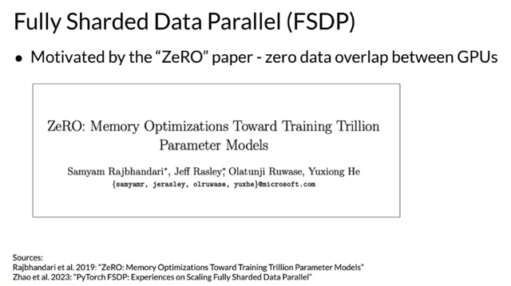</kbd>

> [!NOTE]
> If your model is **too big** for this, you should look into another technique called **modal
> sharding**. A popular implementation of modal sharding is **Fully Sharded Data Parallel,** or
> **FSDP** for short. FSDP is motivated by a paper published by researchers at Microsoft in 2019
> that proposed a technique called **ZeRO**. ZeRO stands for **zero redundancy optimizer** and
> the goal of ZeRO is to optimize memory by distributing or sharding model states across GPUs
> with ZeRO data overlap. This allows you to **scale model training across GPUs** when **your
> model doesn't fit in the memory** of a single chip. Let's take a quick look at how ZeRO works
> before coming back to FSDP.

 

<kbd>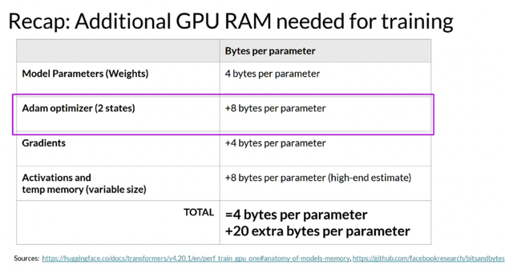</kbd>

> [!NOTE]
> Bài trước đã có nói weight của Adam optimizer là lớn nhất với 8
> bytes / params, gấp đôi các model's weights và gradients.
>
> Earlier this week, you looked at all of the **memory components** required for training
> LLMs, the **largest memory requirement was for the optimizer states**, which take up
> **twice as much space as the weights**, followed by **weights** themselves and the
> **gradients**. Let's represent the parameters as this blue box, the gradients and yellow
> and the optimizer states in green.

 

<kbd>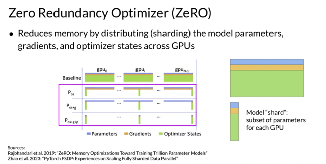</kbd>

> [!NOTE]
> One **limitation** off the **model replication strategy** that I showed before is that **you need
> to keep a full model copy on each GPU**, which **leads to redundant memory
> consumption**. You are **storing the same numbers** on every GPU. **ZeRO**, on the other
> hand, **eliminates this redundancy** by distributing also referred to as **sharding the model
> parameters, gradients, and optimizer** states across GPUs **instead of replicating them**. At
> the same time, the **communication overhead** for a sinking model states stays close to that
> of the previously discussed ADP.
>
> Đại khái là việc **mỗi GPU chứa một bản copy của model** rõ ràng
> là dẫn đến **redundancy trong việc lưu trữ**. Thì giải pháp **ZeRO**
> mang đến là thay vì copy cùng một model thì nó **'share' 1 subset các
> parameters cho mỗi GPU.**

 

<kbd>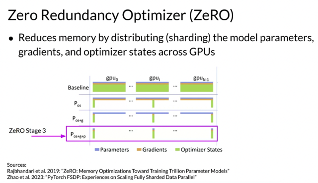</kbd>

> [!NOTE]
> ZeRO offers three optimization stages. **ZeRO Stage 1**, shots **only optimizer states** across
> GPUs, this can **reduce your memory footprint** by up to a factor of **four**. **ZeRO Stage 2** also
> shots the **gradients** across chips. When applied together with Stage 1, this can reduce your
> memory footprint by up to **8 times**. Finally, **ZeRO Stage 3** shots all components including
> the **model parameters** across GPUs. When applied together with Stages 1 and 2, memory
> reduction is linear with a number of GPUs. For example, sharding across 64 GPUs could
> reduce your memory by **a factor of 64**
>
> Đại khái là với **cấp độ 1**, nó sẽ **shard optimizer's states**, có thể giúp
> **giảm memory xuống 4 lần**. Ở **stage 2**, thêm **gradients** cùng với stage 1
> có thể giúp **giảm 8 lần** memory cần thiết. **Stages 3** thì shard luôn
> **model params**. và ở cấp này, factor sẽ là bằng số GPU - ví dụ có **64
> GPU thì giảm 64 lần.**

 

<kbd>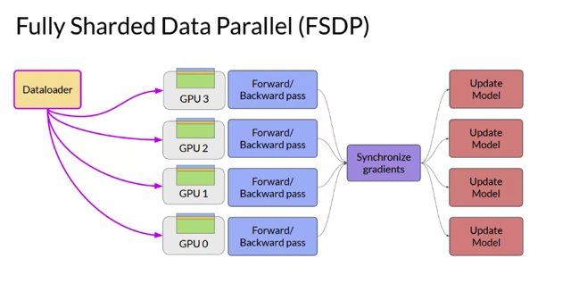</kbd>

 

<kbd>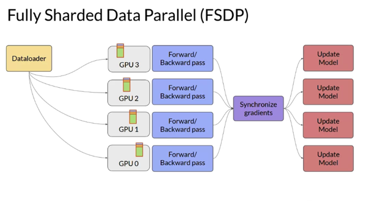</kbd>

> [!NOTE]
> When you use **FSDP**, you **distribute the data across multiple GPUs** as
> you saw happening in DDP. But with FSDP, you **also distributed or shard the
> model parameters, gradients, and optimize the states across the GPU nodes**
> using one of the **strategies** specified in the **ZeRO paper**. With this strategy, you
> **can now work with models that are too big to fit on a single chip**
>
> Đại khái là với **FSDP** ta **không những chia data cho các GPU** mà còn **chia
> model params, gradients, optimizer**. Do đó với cách này ta **có thể làm data
> distribution với model lớn hơn sức chứa của GPU**

 

<kbd>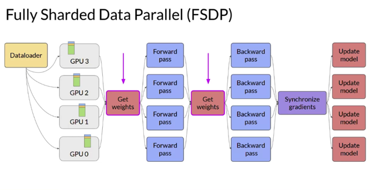</kbd>

> [!NOTE]
> In **contrast to DDP**, where each GPU has **all of the model states required for processing
> each batch of data available locally**, FSDP **requires you to collect this data from all of the
> GPUs before the forward and backward pass**. Each CPU requests data from the other GPUs
> on-demand to materialize the sharded data into uncharted data for the duration of the
> operation. After the operation, you release the uncharted non-local data back to the other
> GPUs as original sharded data You can also choose to keep it for future operations during
> backward pass for example. Note, this requires more GPU RAM again, this is a typical
> performance versus memory trade-off decision. In the final step after the backward pass,
> FSDP is synchronizes the gradients across the GPUs in the same way they were for DDP

 

<kbd>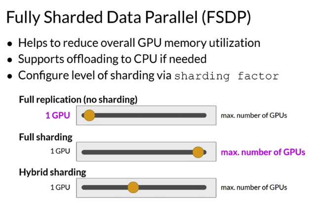</kbd>

 

<kbd>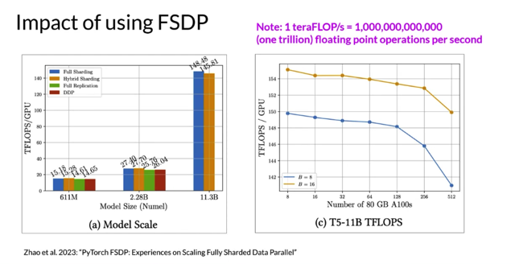</kbd>

> [!NOTE]
> The passage discusses Model Sharding S using FSDP (Fully Sharded Data
> Parallelism), a technique to reduce overall GPU memory utilization when training
> large language models. FSDP allows adjusting the sharding factor to manage
> the trade-off between performance and memory usage. A sharding factor of one
> replicates the full model like DDP (Distributed Data Parallelism), while the
> maximum number of available GPUs enables full sharding, offering significant
> memory savings but increased communication between GPUs.
>
>
>
> Tests comparing FSDP and DDP performance in teraflops per GPU show similar
> results for smaller models but demonstrate FSDP's advantage for larger models
> with 11.3 billion parameters, where DDP runs into out-of-memory errors. FSDP
> handles larger models effectively, achieving higher teraflops when lowering
> model precision to 16-bit. As the model size increases across more GPUs,
> communication between chips starts to impact performance, slowing down
> computation.
>
>
>
> In summary, FSDP is **suitable** for both **small and large models**, allowing
> **seamless scaling** of model training across multiple GPUs. Researchers explore
> compute optimal models to achieve better performance with smaller models due
> to the complexity and expense of training large models across GPUs.

 

> [!NOTE]
> SCALING LAWS AND
> COMPUTE-OPTIMAL MODELS

 

> [!NOTE]
> 1. ****Computational Challenges** of Training Large Language Models:** The passage begins by acknowledging
> the **challenges of training large language models**. To achieve **better performance**, t**wo options** are presented:
> **increasing the size of the training dataset** and **increasing the number of parameters** in the model.
>
> 2. ****Compute Budget Definitio**n:** The concept of a "**petaFLOP per second day**" is introduced as a **unit of
> compute** that **quantifies the required resources** for training large language models.
>
> 3. ****Scaling of Model Size**, **Training Data**, and **Compute Budget**:** Researchers have explored the **relationship
> between model size**, **training dataset size**, and **compute budget**. The goal is to **find the right balance to optimize
> model performance** while **considering available resources**.
>
> 4. ****Power-Law Relationships**:** Power-law relationships exist between **compute budget** and **model
> performance**, **training dataset siz**e and **model** **performance**, and **model size** and **model performance**.
>
> 5. **Compute **Optimal Model - Chinchilla Paper**:** The Chinchilla paper, published in **2022**, explores the
> **performance of language models** of various **sizes** and **quantities** of training data. Chinchilla is the resulting
> compute **optimal model**, showing that **many large models** like GPT-3 may be **overparameterized** and
> **undertrained**.
>
> 6. ****Optimal Training Dataset Size**:** The Chinchilla paper suggests that the **optimal training dataset size** for a
> given model is about **20 times larger** than the **number of parameters in the model**.
>
> 7. ****Benefits of Compute Optimal Models**:** **Compute optimal models** like Chinchilla **outperform non-optimal
> models (e.g., GPT-3)** on a range of **downstream evaluation tasks**.
>
> 8. ****Smaller Models** with **Similar Performance**:** As a result of the Chinchilla paper, teams are developing
> **smaller models that achieve similar or better results than larger non-optimal models.**
>
> 9. ****Bloomberg GPT**:** Bloomberg GPT is an example of a **model trained in a compute optimal way following
> the Chinchilla loss**, achieving **good performance with 50 billion parameters.**
>
> Overall, the passage highlights the **trade-offs and relationships between model size, training data, compute
> budget**, and **model performance**. It introduces the **Chinchilla paper** as an **important study** in understanding how
> to **optimize language models for better performance.**

 

<kbd>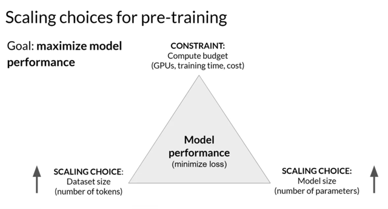</kbd>

> [!NOTE]
> In the last video, you explored some of the **computational challenges** of **training large
> language models**. Here you'll learn about research that has explored the **relationship
> between model size, training, configuration and performance** in an effort to **determine just
> how big models need to be**. Remember, the goal during pre-training is to **maximize the
> model's performance of its learning objective**, which is **minimizing the loss when predicting
> tokens**. Two options you have to achieve better performance are **increasing the size of the
> dataset** you train your model on and **increasing the number of parameters** in your model. In
> theory, you could **scale either of both of these quantities to improve performance**. However,
> **another issue to take into consideration is your compute budget** which includes factors like
> the **number of GPUs** you have access to and the **time you have available for training models**.
>
> Đại khái là có những nhiên cứu cho thấy **quan hệ giữa model size, training,
> configuration và performance**. Dù ta có thể tăng performance bằng cách **tăng kích
> thước model** cũng như là **số lượng data**, tuy nhiên **trong thực tế ta luôn bị giới
> hạn bởi compute budget** như **số lượng GPU, thời gian cho phép** trong việc training
> model.

 

<kbd>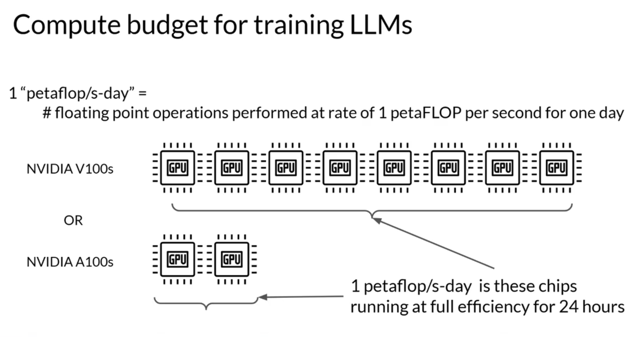</kbd>

> [!NOTE]
> To help you **understand some of the discussion ahead**, let's first **define a unit of
> compute** that **quantifies the required resources**. A **petaFLOP** **per second day** is a
> **measurement of the number of floating point operations** performed at a **rate of one
> petaFLOP per second**, running for an **entire day**. Note, one petaFLOP corresponds to
> **one quadrillion floating point operations per second**. When specifically thinking about
> training Transformers, **one petaFLOP / second day** is approximately equivalent to
> **8 NVIDIA V100 GPUs**, operating at **full efficiency for one full day.** If you have a
> more powerful processor that can carry out more operations at once, then a
> petaFLOP per second day requires fewer chips. For example, two NVIDIA A100 GPUs
> give equivalent compute to the eight V100 chips.
>
> Đại khái đơn vị tính 1 petaflop/s-day là **số lượng phép tính floating
> point** được thực hiện với **tốc độ 1 petaFlop mỗi giây** và **chạy
> liên tục trong 1 ngày**. Mỗi petaFlop tương ứng với **1 triệu tỉ phép
> tính floating point trong một giây**. 1 petaFlop/ s-day tương đương **8
> NVIDA V100** hoặc **2 NVIDIA A100** chạy liên tục với **full-efficiency
> trong 24 giờ.**

 

<kbd>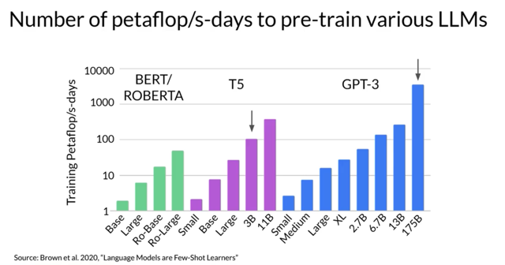</kbd>

> [!NOTE]
> To give you an idea off the scale of these compute budgets, this chart shows a
> **comparison off the petaFLOP per second days** required to pre-train **different variance
> of Bert and Roberta**, which areboth **encoder only models**. **T5** and **encoder-decoder
> model** and **GPT-3**, which is a **decoder only** model. The difference between the models
> in each family is the **number of parameters** that were trained, ranging from a few
> hundred million for Bert base to 175 billion for the largest GPT-3 variant. Note that the
> y-axis is **logarithmic**. E**ach increment vertically is a power of 10**. Here we see that T5
> XL with **3 billion parameters** required close to **100 petaFLOP per second days**.
> While the **larger GPT-3 175 billion parameter model** required approximately **3,700
> petaFLOP per second days**. This chart makes it clear that a **huge amount of computers
> required to train the largest models.**
>
> Biểu đồ cho thấy **số petaflop/s-days** cần thiết để train các **LLM từ nhỏ tới lớn**.
> Với **T5 3B** (**3 billions params**) cần 100 trong khi đó **GPT-3 175B** (**175 billions
> params**) cần tới **3700 petaflop/s-days**. Cho thấy y**êu cầu tính toán để train các
> LLM này là con số khổng lồ.**

 

<kbd>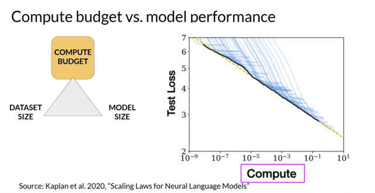</kbd>

> [!NOTE]
> It turns out that they are actually w**ell-defined relationships** between these **three scaling
> choices**. Researchers have explored the **trade-offs between training dataset size**,
> **model size** and **compute budget**. Here's a figure from a paper by researchers at OpenAI
> that explores the **impact of compute budget** on model performance. The y-axis is the **test
> loss,** which you can consider as **a proxy for model performance** where smaller values are
> better. The x-axis is the **compute budget** in **units of petaFLOP per second days**. As you
> just saw, larger numbers can be achieved by either **using more compute power** or
> **training for longer** or **both**. Each **thin blue line** here shows the **model loss over a
> single training run**. Looking at **where the loss starts to decline more slowly** for each run,
> reveals a **clear relationship between the compute budget and the model's performance**.
>
> Có một liên hệ trade off giữa t**raining dataset size, model size và compute budget**. Đồ thị
> cho thấy đại khái là **compute budget càng lớn** thì **test loss có thể xuống càng thấp**
> (các **đường chỉ màu xanh** thể hiện **test loss**, nó giảm xuống lúc đầu nhanh nhưng sau
> chậm dần dần) để rồi **thống kế lại các điểm đáy khi của test loss sẽ có xu hướng thấp
> dần** khi **compute budget càng lớn**. Cơmpute budget được tính bằng đơn vị **petaFlop
> per second day** và có thể được tăng bằng cách **train với model lớn hơn hoặc train lâu
> hơn (với nhiều data hơn)**

 

<kbd>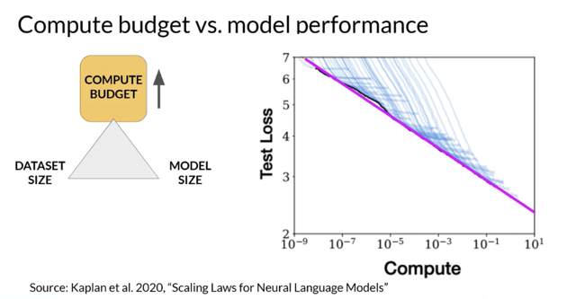</kbd>

> [!NOTE]
> This can be approximated by a **power-law relationship**, shown by this **pink line**. A
> power law is a **mathematical relationship between two variables**, where **one is
> proportional** **to the other** **raised to some power**. When plotted on a graph where
> both axes are logarithmic, power-law relationships appear as **straight lines**. The
> relationship here holds as long as model size and training dataset size don't inhibit the
> training process. Taken at face value, this would suggest that you can **just increase your
> compute budget to achieve better model performance**
>
> Đại khái là nếu **plot theo log của compute budget** và **log của test loss ra đường
> thằng** thì thực tế quan hệ của chúng là **law-power** tức là **biến này tăng theo cấp
> mũ của biến kia**. Và biểu đồ cũng cho thấy rằng ta **có thể tăng model performance
> bằng cách tăng compute budget.**

 

<kbd>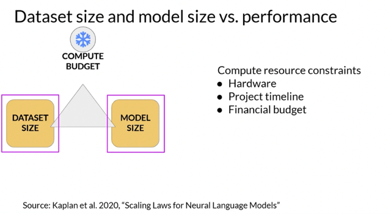</kbd>

> [!NOTE]
> Đại khái là trong thực tế **compute budget sẽ bị giới hạn** bởi các yếu tố như **hardware,
> project lifetime** hay **financial budget**. Nhưng nghiên cứu của OpenAI cũng cho thấy
> **nếu hai cái yếu tố còn lại** (trong 3 yếu tố là compute budget, dataset size và model
> size) **được giữ fixed**, thì t**ăng yếu tố nào cũng sẽ cải thiện test loss theo power-law.**
>
> In practice however, the **compute resources** you have available for training
> will generally **be a hard constraint** set by factors such as the **hardware** you
> have access to, the **time available for training** and the **financial budget** of the
> project. If you **hold your compute budget fixed**, the two levers you have to
> improve your model's performance are the **size of the training dataset** and
> the **number of parameters** in your model. The OpenAI researchers found that
> these two quantities also show a **power-law relationship** with a test loss **in the
> case where the other two variables are held fixed.**

 

<kbd>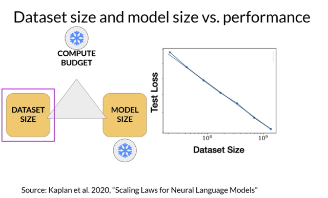</kbd>

> [!NOTE]
> Ví dụ như **giữ compute budge và
> model size fix** thì **càng nhiều data
> càng tăng performance theo power law**

 

<kbd>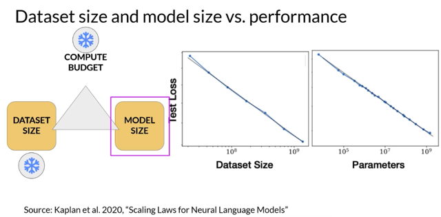</kbd>

> [!NOTE]
> Hoặc giữ **compute budget** và **dataset size fixed** thì
> càng **tăng model size** càng **tăng performance theo power-law**

 

<kbd>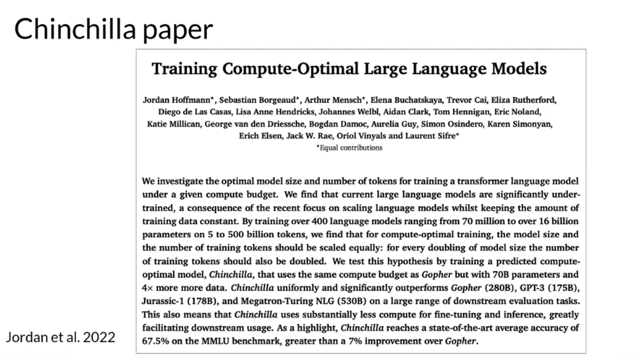</kbd>

> [!NOTE]
> Đại khái là người ta nghiên cứu kiểu như **làm sao để tối ưu LLM**, với **compute
> budget và model size cụ thể thì nên train với bao nhiêu data** hoặc **với chừng đó
> data và compute budget thì model size thế nào là tối ưu**...Nghiên cứu được công
> bố trong paper gọi là **Chinchilla paper**

 

<kbd>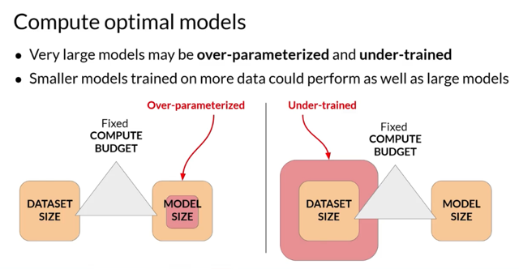</kbd>

> [!NOTE]
> Nó có thấy nhiều LLM model bị **over-parameterized** - Là **đáng lẽ không cần model to như
> vậy** với chừng đó data và compute budget ý nói có thể thu nhỏ nó lại mà vẫn giữ được thậm
> chí tăng performance. Hoặc **under-trained** khi model có thể **chưa tận dụng hết tiềm
> năng** và **nếu được train với nhiều data** hơn nó sẽ **còn có thể tốt hơn.**

 

<kbd>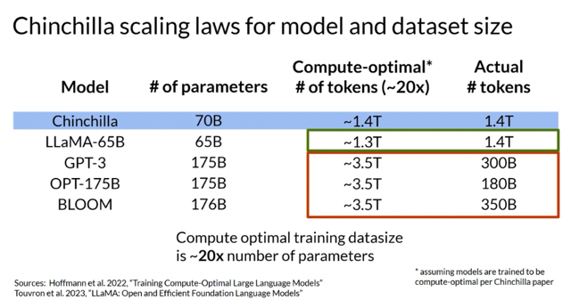</kbd>

> [!NOTE]
> Cho thấy các model như **LLaMA** đạt **tiệm cận mức tối ưu**
> (tức là **số lượng data point sẽ khoảng 20 lần số parameter**
> như Chinchilla model) và các **LLM khác như GPT-3, hay
> BLOOM** bị **dưới tiềm năng** khi **có thể được cải thiện hơn
> nữa với nhiều data hơn.**

 

<kbd>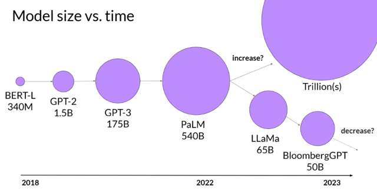</kbd>

> [!NOTE]
> Đại khái là với Chinchilla paper, người ta **dần dần thu
> gọn các model lại mà vẫn giữ được performance.**

 

> [!NOTE]
> PRE-TRAINING FOR
> DOMAIN ADAPTATION

 

> [!NOTE]
> The main ideas from this passage are as follows:
>
> 1. ****Pretraining Your Own Model**:** While working with **existing Language Model Models** (LLMs) **saves time and allows
> for faster prototyping**, there are **situations** where it **may be necessary to pretrain your own model from scratch**. This is
> **especially** **true** when dealing with **specialized domains** that use **specific vocabulary** and **language structures not
> commonly found in general language.**
>
> 2. ****Domain Adaptation for Specialized Domains**:** In certain domains like **law, medicine, finance**, etc., the language
> contains **unique and domain-specific terms** that are not **well-covered in the training data of existing LLMs**. This can lead
> to **difficulties** in **model understandin**g and **usage of these specialized terms.**
>
> 3. ****Benefits of Pretraining from Scratch:**** **Pretraining a model from scratch** allows for **better performance** in highly
> **specialized domains**. It enables the model to **learn the domain-specific vocabulary** and **language structures** that are
> crucial for achieving good results in such areas.
>
> 4. ****BloombergGPT** as a Pretrained Model for **Finance**:** BloombergGPT is an example of a **large language model that
> has been pretrained specifically for the finance domain**. It combines **both finance data** and **general-purpose text data** to
> achieve top results in **financial benchmarks** while maintaining **competitive performance in general LLM benchmarks**.
>
> 5. ****Challenges** in Pretraining for **Specific Domains**:** When pretraining a model for a specific domain, there are
> **challenges related to trade-offs between model size, training data size, and available compute budget**. Real-world
> constraints, such as **limited availability of domain-specific training data**, may necessitate making trade-offs in model
> development.
>
> 6. **Recap of Topics Covered:** The passage briefly recaps the topics covered throughout the week, which include
> **common use cases for LLMs**, the t**ransformer architecture**, **influencing model output at inference time**, g**enerative AI
> project lifecycle**, **pretraining process**, c**omputational challenges**, and **scaling laws for LLMs.**
>
> Overall, the passage emphasizes the **importance of domain-specific pretraining** for **achieving optimal performance in
> specialized areas** and highlights the example of **BloombergGPT** as a **model tailored for finance.**

 

<kbd>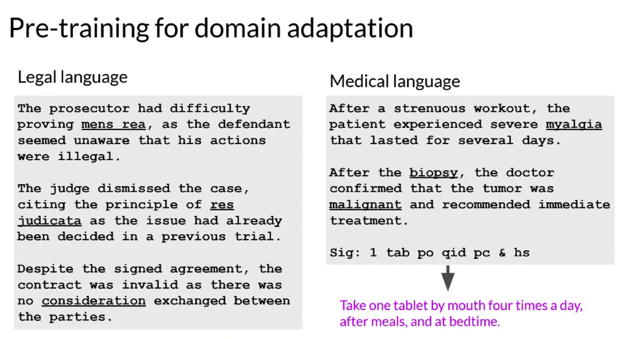</kbd>

> [!NOTE]
> Đại khái là **ngôn ngữ trong một số lĩnh vực cụ thể** (chuyên môn như luật, y
> khoa) **sử dụng những từ ngữ chuyên ngành** mà **LLM nếu không được huấn
> luyện qua sẽ không hiểu.** Do đó sẽ cần phải **pretrain LLM model trên những dữ
> liệu chuyên ngành.**

 

<kbd>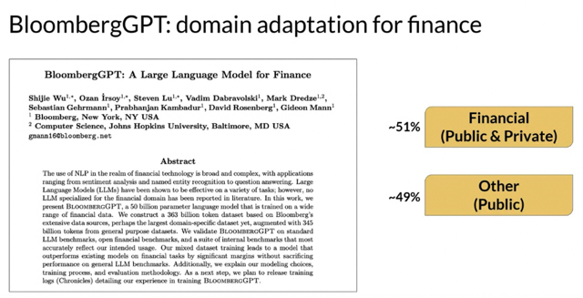</kbd>

> [!NOTE]
> Đại khái là ví dụ **BloombergGPT** được **pretrain với 51% dữ liệu tài
> chính** và **49% là những dữ liệu chung chung.**

 

<kbd>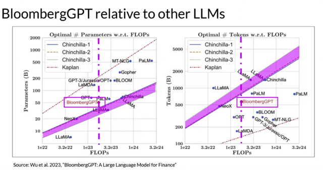</kbd>

> [!NOTE]
> Đại khái hai biểu đồ để thể hiện **quan hệ tối ưu theo Chinchilla paper** của **compute
> budget và model size (bên trái)** và c**ompute budget và số lượng data (token)**. Với **dải
> màu hồng là tối ưu theo chinchilla research**, và **đường dọc gạch gạch màu hồng là
> compute budget của công ty.** Cho thấy với khía cạnh **model size** thì Bloomberg GPT đã
> t**iệm cận được mức tối ưu**, nếu có thể giảm parameter hơn chút nữa để nó nằm trong
> dải màu hồng thì tốt. Còn với d**ataset thì phải tăng thêm data nữa**, nhưng có điều thể
> hiện rằng trong l**ĩnh vực chuyên môn cụ thể nào đó sẽ có một giới hạn khi không phải
> lúc nào cũng có quá nhiều dữ liệu để dùng.**

 

<kbd></kbd>

 

<kbd>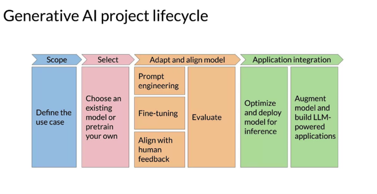</kbd>

 

<kbd>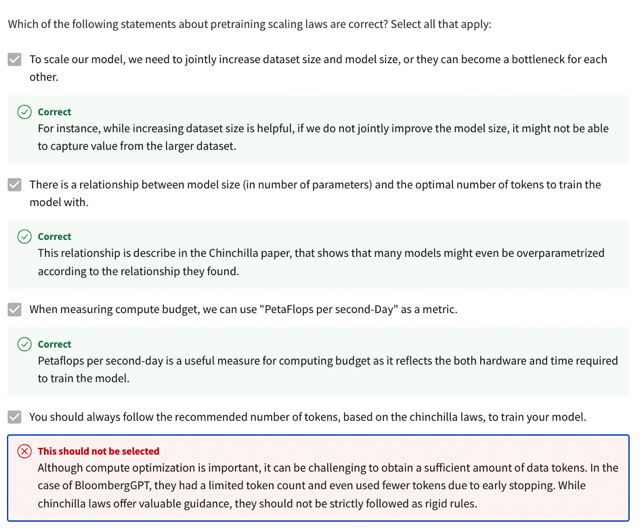</kbd>

> [!NOTE]
> Sai là đúng, không phải lúc nào cũng có đủ data để theo được
> "đường tối ưu" của Chinchilla paper. Model size thì có thể
> giảm bằng optimize được chứ data thì không phải lúc nào
> (lĩnh vực nào) cũng có nhiều

 

> [!NOTE]
> READING: DOMAIN-SPECIFIC
> TRAINING: BLOOMBERTGPT

 

<kbd>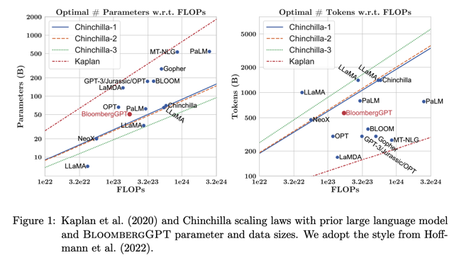</kbd>

> [!NOTE]
> Như đã biết **những đường chéo** là **đường tối ưu** của c**ompute budget - model size** và
> **compute budget - data size** theo các nghiên cứu của **Chinchilla** với **các version khác
> nhau**. Thì **Bloomberg** được **pretrained** **cố gắng theo sát nguyên tắc Chinchilla**, thể
> hiện trên biểu đồ. Tuy nhiên **ở khía cạnh data** thì **không đạt** vì thứ nhất là **không có
> data** (chỉ có 700B thay vì tối ưu là 1400B và **thứ hai là technique Early Stopping**
> (giúp regularization giảm overfit) k**hông cho phép training hết 700 điểm
> dữ liệu mà họ có.**
>
> BloombergGPT, developed by Bloomberg, is a large Decoder-only language model. It
> underwent pre-training using an extensive financial dataset comprising news articles, reports,
> and market data, to increase its understanding of finance and enabling it to generate
> finance-related natural language text. The datasets are shown in the image above.
>
>
>
> During the training of BloombergGPT, the authors used the Chinchilla Scaling Laws to guide
> the number of parameters in the model and the volume of training data, measured in tokens.
> The recommendations of Chinchilla are represented by the lines Chinchilla-1, Chinchilla-2
> and Chinchilla-3 in the image, and we can see that BloombergGPT is close to it.
>
>
>
> While the recommended configuration for the team’s available training compute budget was
> 50 billion parameters and 1.4 trillion tokens, acquiring 1.4 trillion tokens of training data in the
> finance domain proved challenging. Consequently, they constructed a dataset containing just
> 700 billion tokens, less than the compute-optimal value. Furthermore, due to early stopping,
> the training process terminated after processing 569 billion tokens.
>
>
>
> The BloombergGPT project is a good illustration of pre-training a model for increased
> domain-specificity, and the challenges that may force trade-offs against compute-optimal
> model and training configurations.

 

## Quiz

 

<kbd></kbd>

 

<kbd>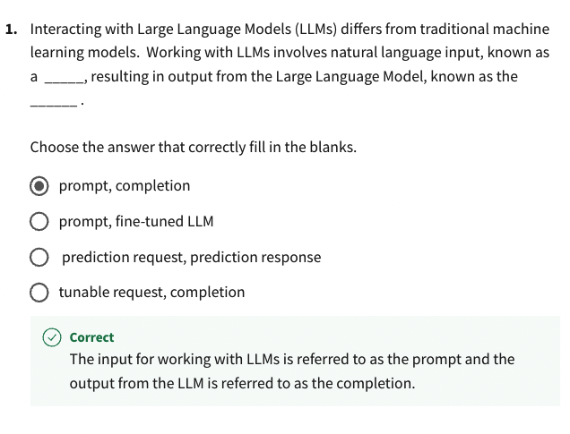</kbd>

 

<kbd>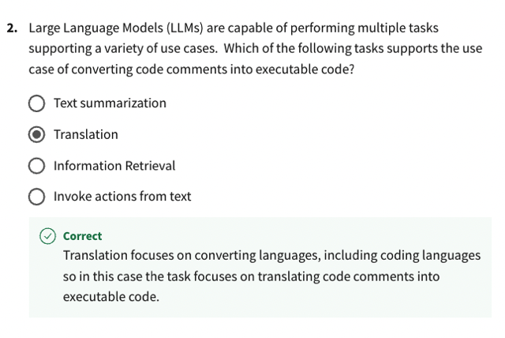</kbd>

 

<kbd>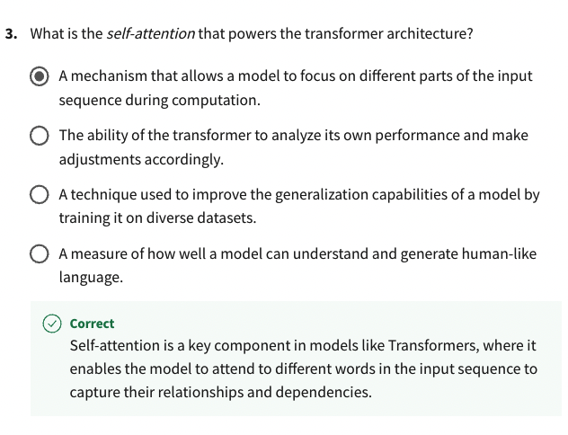</kbd>

 

<kbd>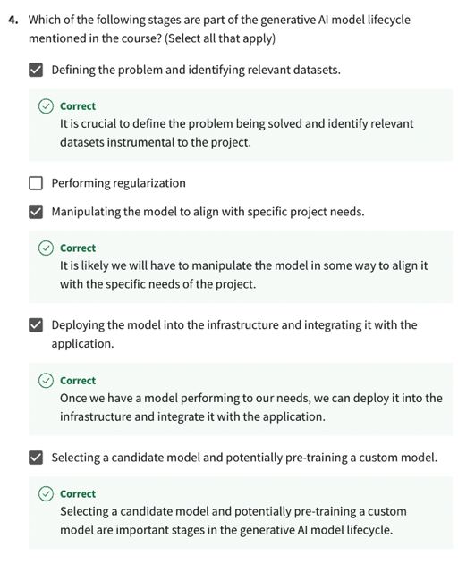</kbd>

 

<kbd>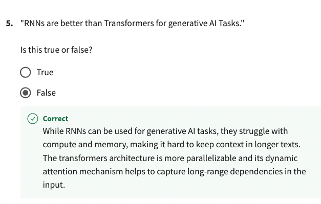</kbd>

 

<kbd>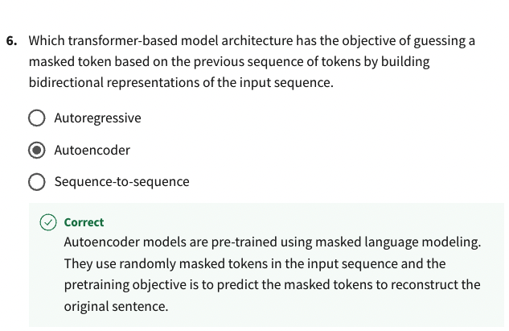</kbd>

 

<kbd>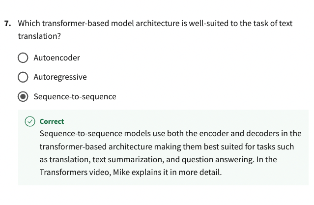</kbd>

 

<kbd>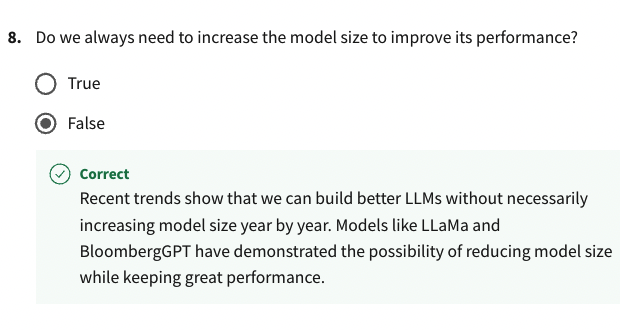</kbd>

 

<kbd>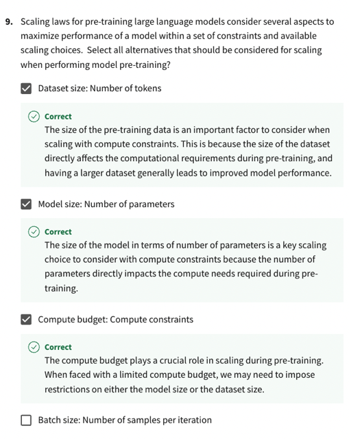</kbd>

 

<kbd>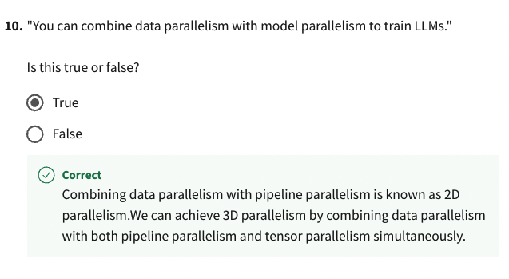</kbd>

 

## Week 1 Resources

 

> [!NOTE]
> Week 1 resources Below you'll find links to the research papers discussed in this weeks videos. You don't need to
> understand all the technical details discussed in these papers - you have already seen the most important points you'll
> need to answer the quizzes in the lecture videos.
>
> However, if you'd like to take a closer look at the original research, you can read the papers and articles via the links
> below.
>
> Transformer Architecture Attention is All You Need  - This paper introduced the Transformer architecture, with the core
> “self-attention” mechanism. This article was the foundation for LLMs.
>
> BLOOM: BigScience 176B Model   - BLOOM is a open-source LLM with 176B parameters (similar to GPT-4) trained in an
> open and transparent way. In this paper, the authors present a detailed discussion of the dataset and process used to train
> the model. You can also see a high-level overview of the model  here .
>
> Vector Space Models  - Series of lessons from DeepLearning.AI's Natural Language Processing specialization discussing
> the basics of vector space models and their use in language modeling.
>
> Pre-training and scaling laws Scaling Laws for Neural Language Models  - empirical study by researchers at OpenAI
> exploring the scaling laws for large language models.
>
> Model architectures and pre-training objectives What Language Model Architecture and Pretraining Objective Work Best
> for Zero-Shot Generalization?  - The paper examines modeling choices in large pre-trained language models and
> identifies the optimal approach for zero-shot generalization.
>
> HuggingFace Tasks  and  Model Hub  - Collection of resources to tackle varying machine learning tasks using the
> HuggingFace library.
>
> LLaMA: Open and Efficient Foundation Language Models  - Article from Meta AI proposing Efficient LLMs (their model with
> 13B parameters outperform GPT3 with 175B parameters on most benchmarks)
>
> Scaling laws and compute-optimal models Language Models are Few-Shot Learners  - This paper investigates the
> potential of few-shot learning in Large Language Models.
>
> Training Compute-Optimal Large Language Models  - Study from DeepMind to evaluate the optimal model size and
> number of tokens for training LLMs. Also known as “Chinchilla Paper”.
>
> BloombergGPT: A Large Language Model for Finance  - LLM trained specifically for the finance domain, a good example
> that tried to follow chinchilla laws.
>
> Quay lại sau

 

