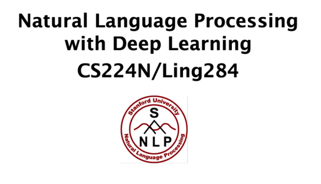

# A0_cs224n

<kbd></kbd>

This is a **must-take course for anyone interested in NLP.**
It’s been taught by a professor I have a lot of admiration
for: **Chris Manning**. The course is well organized and well
taught. I was so impressed when I took the course and **the
professor mentioned a paper that was published last week**.
In Vietnam, we’re only taught things that were published at
least a decade ago.

 

The assignments, while useful, can sometimes be
**frustrating** as training NLP models can take a long time.
The final project can be open-ended and fun.

 

I took the course before I took CS124: From **Languages to
Information** and it was a bad decision. I missed out on a lot
of details just because I didn’t know NLP basics. The course
doesn’t list CS231N as a prerequisite, but I think you’d do
much better in the course if you’ve taken CS231N.

https://web.stanford.edu/class/cs224n/
