# Assignment 2 - Word2vec

📊 **Progress:** `22` Notes | `56` Screenshots

---

## Assignment 2 - Word2vec

 

<kbd>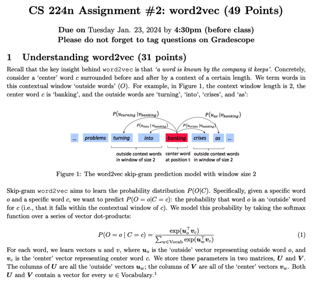</kbd>

> [!NOTE]
> Đại ý là ôn lại chút về word2vec: ý tưởng chủ đạo là "ý nghĩa của một từ sẽ
> được xác định bởi những từ vây quanh nó". Dựa vào luận điểm này, mô hình
> skip-gram word2vec cố gắng học ra một phân phối xác xuất P(O|C) sao cho
> (mục tiêu) là nếu một từ (outer word - O) mà hay xuất hiện cạnh một từ khác
> (center word - C) thì tụi nó sẽ "giống nhau" hơn những từ khác.
>
>
>
> Từ đó họ xây dựng công thức P (O = o | C = c) (mang ý nghĩa là, nếu cho trước
> một center word là c, thì xác suất của việc từ outer word là o xuất hiện trong
> context window của c là bao nhiêu).
>
>
>
> Và công thức sẽ là exp(uo@vc) / sum w thuộc Vocab (uw@vc):
>
>
>
> Trước đó nói thêm mỗi từ trong vocab sẽ được chuẩn bị 2 vector - là các cột
> của  matrix U và V. Đặng với một từ nào đó, ta sẽ dùng u của nó nếu đang xét
> nó là vai trò outer của từ khác, còn nếu đang xét nó là vai trò center word thì
> dùng v.
>
>
>
> Vậy quay lại giải nghĩa công thức trên:  Tử số sẽ là exp của dot product của
> vector của từ o và vector của từ c. Vì o đang là vai trò outer word nên dùng u_o,
> với c đang là center nên dùng v_c. Vậy tử số là e^(u_o.Tv_c)
>
>
>
> Còn mẫu số, sẽ là tổng các dot product của vector u của mọi từ trong vocab
> (trong đó đương nhiên có cả o và c) với vector center word v_c: Σ w in Vocab
> u_w.Tv_c.

 

<kbd>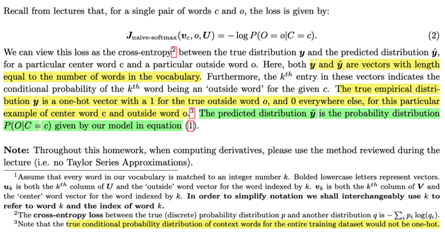</kbd>

<kbd>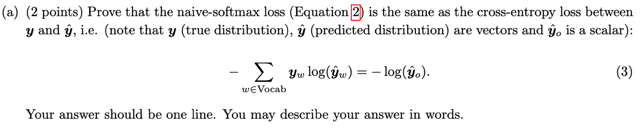</kbd>

> [!NOTE]
> rồi thế thì trong bài giảng ta đã biết loss tính trên một cặp từ outer word o
> và center word c sẽ là dùng cross entropy loss (hay log likelihodd loss) là
> J = - log P(O = o|C = c).
>
>
>
> Thì P(O = o | C = c) "dịch" là xác suất của việc "từ o, xuất hiện trong
> context window của từ c", nó chính là cái giá trị ứng với từ o trong list các
> "xác suất một từ xuất hiện trong context của từ c,  với mọi từ trong vocab"
>
>
>
> List các p(O = w | C = c) = exp(uw.Tvc) / Sum w' in Vocab exp(uw'.Tvc)
>
>
>
> Vậy ta hiểu cross entropy ở đây chính là cross entropy giữa hai phân
> phối xác suất: Một cái là predicted distribution bởi model chính là
>
>
>
> List các xác suất một từ w xuất hiện trong context với từ c tính toán bởi
> vector u của w và vector v của từ c:
>
>
>
> p(O = w | C = c) = exp(uw.Tvc) / Sum w' in Vocab exp(uw'.Tvc)
>
>
>
> và một cái là true probability bởi thực nghiệm quan sát được bởi training
> set y: Đó là sự thật thì từ o xuất hiện trong context với từ c, mà (cho rằng*)
> không có từ nào khác. Do đó, true probability distribution có dạng là :
>
>
>
> List các (Vocab size phần tử) toàn số 0, chỉ có số 1 nằm tại vị trí (trong
> Vocab) ứng với từ o.
>
> Vậy cross entropy của hai distribution này theo công thức sẽ là 
>
>
>
> - log {Tổng mọi i Predicted distrib_i * True distrib_i }
>
>
>
> Ở đây có thể đặt y^ là predicted distrib, y là true distrib 
>
>
>
> nên trở thành - log Sum y^*y 
>
>
>
> mà vì mọi vị trí khác trong y đều bằng 0, trừ vị trí tương ứng với từ o đều = 1
>
>
>
> nên trở thành - log y^_o = - log P(O=c|C=c)
>
>
>
> Đây cũng chính là câu trả lời cho câu a:

 

<kbd>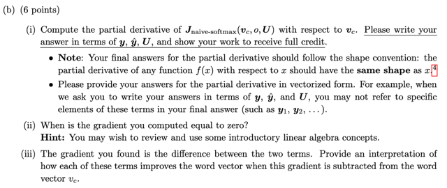</kbd>

> [!NOTE]
> (ii): Suy nghĩ thứ nhất, gradient dL(vc,o,U)/dvc sẽ bằng 0, khi  y^ = y.
> Tương đương exp(uo@vc) / sum w exp(uw@vc) = 1, và exp(uw@vc) /
> sum w' exp(uw'@vc) = 0 với mọi w
>
>
>
> Vậy để điều này xảy ra, uo@vc phải trở nên lớn vượt trội so với các
> uw@vc vì khi đó sum w exp(uw@vc) sẽ ~= exp(uo@vc)
>
>
>
> Trong dlyoshua có cho mình biết, với exp(), nếu a > b thì exp(a) >>
> exp(b) dẫn đến nếu a vượt xa b thì exp(a) + exp(b) sẽ có thể coi là xấp
> sỉ của exp(a).
>
>
>
> Thành ra, lúc này exp(uo@vc) / sum w exp(uw@vc) sẽ xấp xỉ
> exp(uo@vc) / exp(uo@vc) = 1
>
>
>
> Đồng thời exp(uw@vc) / sum w exp(uw@vc) sẽ xấp sỉ 0 do
> exp(uw@vc)  quá nhỏ so với exp(uo@vc)
>
>
>
> Mà như vậy thì đồng nghĩa là uo và vc sẽ trở nên 'giống nhau' hơn so
> với các uw và vc giúp train các embedding vector để chúng trở nên
> giống như nguyên lý "các từ giống nhau về nghĩa sẽ hay nằm gần
> nhau" - Đây cũng là trả lời cho ý (iii): việc update vc bằng gradient sẽ
> khiến nó giống uo hơn, lại gần uo trong embedding space hơn, và xa
> cách những từ khác hơn

 

<kbd>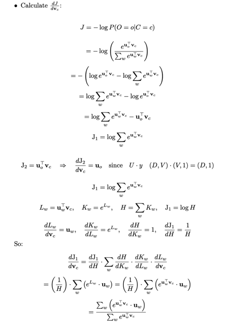</kbd>

<kbd>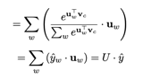</kbd>

<kbd>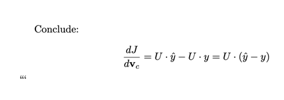</kbd>

> [!NOTE]
> Calculate dJ/dvc:
>
>
>
> J = - log P(O=o|C=c) 
>
>
>
> = - log [ e^(uo@vc) / Σ w e^(uw@vc) ]
>
>
>
> = - [ log e^(uo@vc) - log Σ w e^(uw@vc) ]
>
>
>
> = log Σ w e^(uw@vc) - log e^(uo@vc)
>
>
>
> = log Σ w e^(uw@vc) - uo@vc
>
>
>
> *J1 = log Σw e^(uw@vc)
>
>
>
> *J2 = uo@vc -> dJ2/dvc = uo = U@y (D,V) @ (V,1) = (D,1)
>
>
>
> ====
>
>
>
> J1 = log Σw e^(uw@vc)
>
>
>
> Lw =uw@vc , Kw = e^Lw, H = Σw Kw, J1 = log H
>
>
>
> dLw/dvc = uw, dKw/dLw = e^Lw, dH/dKw = Σw dKw 
> dJ1/dH = 1/H
>
>
>
> So: 
>
>
>
> dJ1/dvc = dJ1/dH * Σ dH/dKw * dKw/dLw * dLw/dvc
>
>
>
> = (1/H) * Σ [ e^Lw * uw ] = (1/H) * Σw [ e^(uw@vc) * uw ]
>
>
>
> = Σw [ e^(uw@vc) * uw ] / Σw e^(uw@vc)
>
>
>
> = Σw { [e^(uw@vc) / Σw e^(uw@vc)]*uw }
>
>
>
> = Σw { y^_w * uw } = U@y^
>
>
>
> Conclude: 
>
>
>
> dJ/dvc = U@y^ - U@y = **U@(y^-y)**  |   (D,1) - (D,1)
>
> Checked!
>
> vc = vc - (e^u1vc/S)*u1 - (e^u2vc/S)*u2 - ..[(e^ucvc - S)/S]*uc
>
>
>
> U(y^-y) = 0

 

<kbd>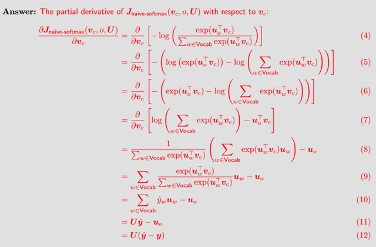</kbd>

> [!NOTE]
> Checked!

 

<kbd>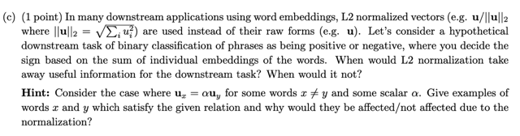</kbd>

> [!NOTE]
> đại khái là vầy, khi normalized tức là độ dài của mọi vector đều bằng 1.
> Vậy ví dụ như trường hợp này phrase embedding (tính bằng sum hay
> mean của word's embedding) sẽ giảm hiệu quả trong bài toán sentiment
> classification:
>
>
>
> Vậy giả sử có một từ w1 mang ý nghĩa rất tích cực, thể hiện bởi vector w
> nằm lệch hẳn ở hướng tích cực và một từ w2 mang ý nghĩa hơi tiêu cực
> nên nằm hơi thiên về phía tiêu cực. Ở case này nếu tính sum của hai
> vector, để có  phrase vector ta sẽ vẫn được một vector tích cực. (có thể
> chưa nghĩ ra một câu như vậy nhưng trường hợp này rất phổ biến)
>
>
>
> Tuy nhiên nếu normalize, ta chỉ còn hướng, không còn độ lớn để biểu đạt
> mức độ tích/tiêu cực nữa. Thì sum lại có thể ta sẽ được một vector 'trung
> tính' làm mất đi thông tin.
>
>
>
> Vậy: Nếu downstream task không yêu cầu (dùng thông tin biểu hiệu trong 
> mức độ / độ lớn của vector, ví dụ nhiều hay rất nhiều hay cực kì nhiều,
> mà chỉ là nhiều hay ít) thì có thể normalized vector không ảnh hưởng, còn
> ngược lại nó sẽ giảm hiệu quả

 

<kbd>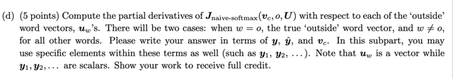</kbd>

<kbd>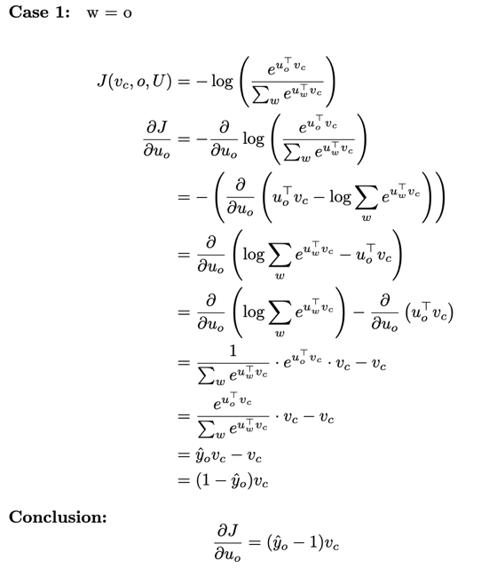</kbd>

<kbd>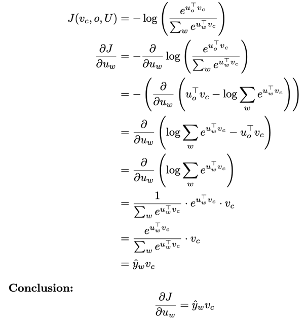</kbd>

<kbd>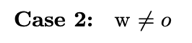</kbd>

> [!NOTE]
> J(vc, o, U) = - log [ exp(uo@vc) / Σw exp(uw@vc) ]
>
>
>
> dJ/duw (w==o):
>
>
>
> = - log P(O=o|C=c) 
>
>
>
> = - log [ e^(uo@vc) / Σ w e^(uw@vc) ]
>
>
>
> = - [ log e^(uo@vc) - log Σ w e^(uw@vc) ]
>
>
>
> = log Σ w e^(uw@vc) - log e^(uo@vc)
>
>
>
> = log Σ w e^(uw@vc) - uo@vc
>
>
>
> *J2 = uo@vc -> dJ2/duo = vc (D,V) @ (V,1) = (D,1)
>
>
>
> *J1 = log Σw e^(uw@vc) = log [ Σw'!=uo exp(uw'@vc) + exp(uo@vc) ]
>
>
>
> H = Σw'!=uo exp(uw'@vc) + exp(uo@vc),  J1 = log H
>
>
>
> G1 = Σw'!=uo exp(uw'@vc), G2 = exp(K), K = uo@vc
>
>
>
> dJ1/duo = dJ1/dH*dH/duo = dJ1/dH*d(G1+G2)/duo = dJ1/dH*dG2/duo
>
>
>
> = dJ1/dH*dG2/dK*dK/duo
>
>
>
> = (1/H)*exp(K)*vc 
>
>
>
> = exp(uo@vc)*vc / Σw exp(uw@vc) = 
>
>
>
> = [exp(uo@vc) / Σw exp(uw@vc)]*vc
>
>
>
> = y^_o*vc (scalar*(D,1))
>
>
>
> Conclusion: 
>
>
>
> dJ/duw (w==o) = **y^_o*vc - vc** = **(y^_o - 1)*vc**
>
> J(vc, o, U) = - log [ exp(uo@vc) / Σ w' exp(uw'@vc) ]
>
>
>
> dJ(vc, o, U) / duw (w!=o):
>
>
>
> J = - log P(O=o|C=c) 
>
>
>
> = - log [ e^(uo@vc) / Σ w e^(uw'@vc) ]
>
>
>
> = - [ log e^(uo@vc) - log Σ w' e^(uw'@vc) ]
>
>
>
> = log Σ w' e^(uw'@vc) - log e^(uo@vc)
>
>
>
> = log Σ w' e^(uw'@vc) - uo@vc
>
>
>
> *J2 = uo@vc -> dJ2/duw (w!=o )= 0
>
>
>
> *J1 = log Σw' e^(uw'@vc) 
>
>
>
> dJ1/duw = [1/Σw' e^(uw'@vc)] * d [Σw' e^(uw'@vc)] / duw
>
>
>
> = [1/Σw' e^(uw'@vc)]* d [ Σw'!=w e^(uw'@vc) + e^(uw@vc) ] / duw
>
>
>
> = { d [e^(uw@vc)] / duw } / Σw' e^(uw'@vc)
>
>
>
> = [ e^(uw@vc) * vc ] / Σw' e^(uw'@vc)
>
>
>
> = [ e^(uw@vc) / Σw' e^(uw'@vc) ] * vc
>
>
>
> Conclude:
>
>
>
> **dJ(vc, o, U) / duw (w!=o) = y^_w * vc**

 

<kbd>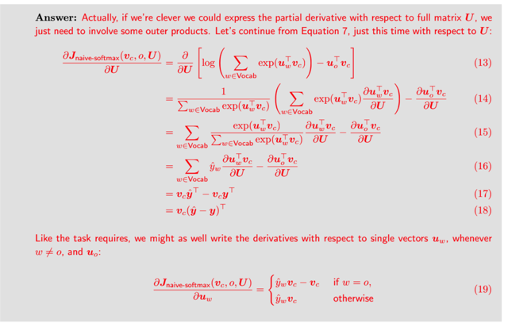</kbd>

> [!NOTE]
> Checked!

 

<kbd>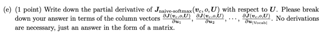</kbd>

<kbd>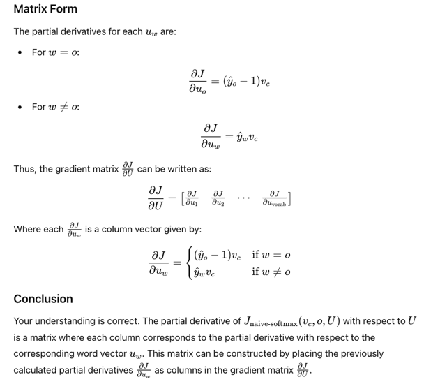</kbd>

<kbd>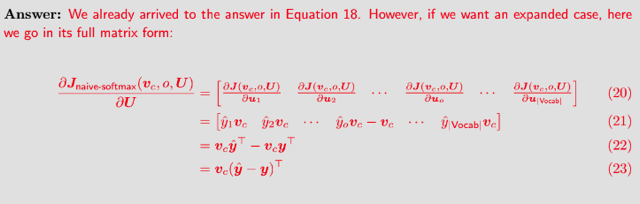</kbd>

> [!NOTE]
> dJ(vc, o, U) / duw (w!=o) = y^_w * vc 
>
>
>
> dJ(vc, o, U) / duw (w==o) = **(y^_o - 1)*vc
>
>
>
> dJ/dU chính là một matrix mà các cột sẽ là dJ/duw,**  nên câu trả lời
> cho câu này (theo sự gợi ý - thật ra nó chỉ confirm lại suy nghĩ của mình
> là đúng):
>
>
>
> Đó là dJ/dU sẽ là matrix:
>
>
>
> [dJ/du1 dJ/du2 ...dJ/du_vocab size]
>
>
>
> với dJ/du_i sẽ là
>
>
>
> y^_w * vc nếu từ thứ i trong vocab, w là khác với từ outer word o.
>
>
>
> còn ngược lại, nếu w là o, thì
>
>
>
> dJ/du_i sẽ là **(y^_i - 1) * vc
>
>
>
> =======**
>
>
>
> Và có thể ghi thành dạng kết hợp:
>
>
>
> dJ/dU = vc@y^.T     (D,1)(1,V)  (D,V)
>
> Checked!

 

<kbd>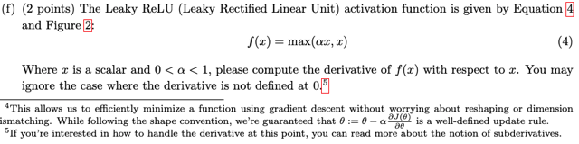</kbd>

<kbd>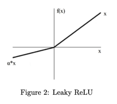</kbd>

<kbd>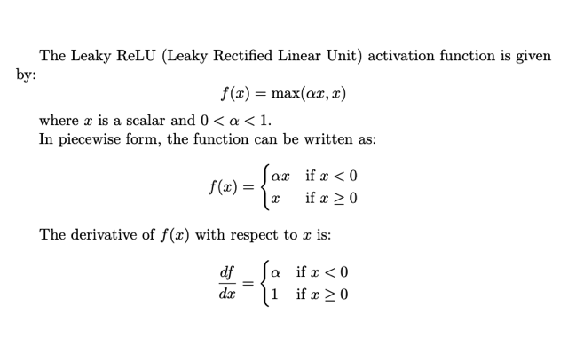</kbd>

> [!NOTE]
> f(x) = max(alpha*x, x)
>
>
>
> = nếu alpha*x > x thì f = alpha*x ngược lại thì bằng x
>
>
>
> vậy df/dx sẽ là:
>
>
>
> nếu alpha*x > x thì df/dx = alpha còn ngược lại thì bằng 1
>
>
>
> hoặc:
>
>
>
> nếu x > 0 thì df/dx = 1, nếu x < 0 thì df/dx= alpha
>
> đã được confirm bởi GPT, mà cái này cũng dễ search ra công thức thôi

 

<kbd>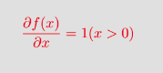</kbd>

> [!NOTE]
> trong bài mẫu câu hỏi là
> đạo hàm của hàm relu

 

<kbd>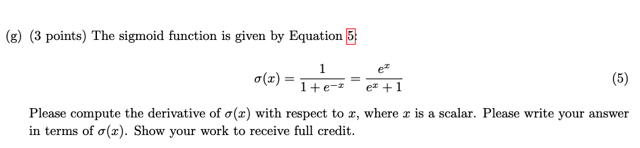</kbd>

> [!NOTE]
> f(x) = exp(x) / [exp(x) + 1]
>
>
>
> = exp(x) * [exp(x) + 1]^-1
>
>
>
> = G(x)*H(x)
>
>
>
> df/dx (1) = df/dG*dG/dx = H(x)*exp(x) = {[exp(x) + 1]^-1}*exp(x) =..
>
>
>
> = exp(x) / [exp(x) + 1] = f(x)
>
>
>
> df/dx (2) = df/dH*dH/dx = G(x)*[-1*[exp(x+1]^-2]*[exp(x)] 
>
>
>
> = - exp(x)*[exp(x)+1]^-2*exp(x)
>
>
>
> df/dx = df/dx (1) + df/dx(2) = f(x) - exp(x)*exp(x) / [exp(x)+1]^2
>
>
>
> = f(x) - exp(x)*exp(x) / [exp(x)+1]^2 = f(x) - {exp(x) / [exp(x) + 1]} *{exp(x) / [exp(x) + 1]}
>
>
>
> = f(x) - f(x)*{exp(x) / [exp(x) + 1]} = f(x)*{1 - exp(x)/[exp(x) + 1]} = **f(x)*[1 - f(x)]
>
>
>
> Conclusion:**
>
>
>
> dsigmoid(x) / dx = **sigmoid(x)*[1-sigmoid(x)]**

 

<kbd>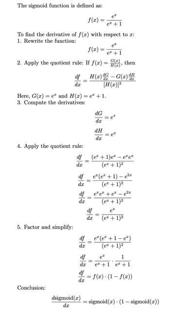</kbd>

 

<kbd>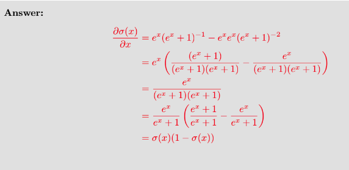</kbd>

> [!NOTE]
> Checked!

 

<kbd>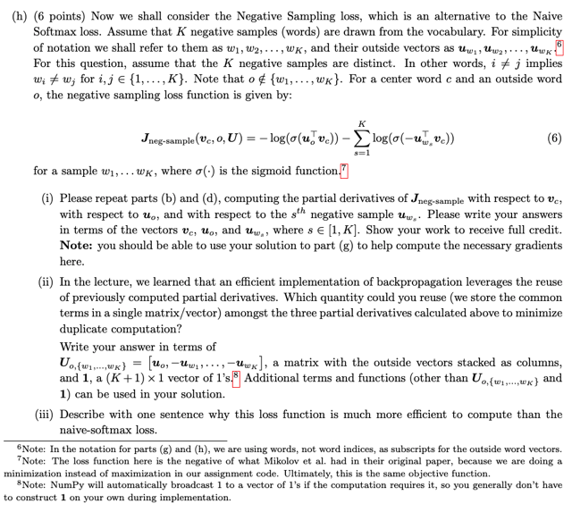</kbd>

<kbd>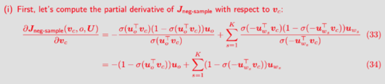</kbd>

<kbd>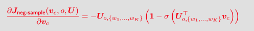</kbd>

<kbd>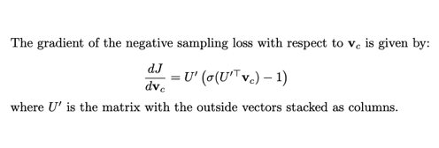</kbd>

<kbd>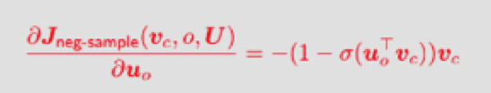</kbd>

<kbd>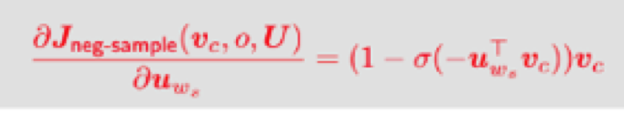</kbd>

<kbd>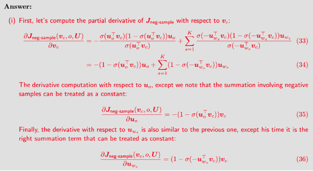</kbd>

<kbd>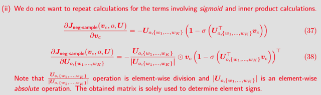</kbd>

<kbd>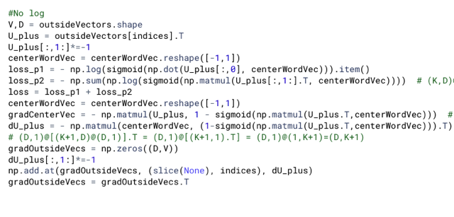</kbd>

<kbd>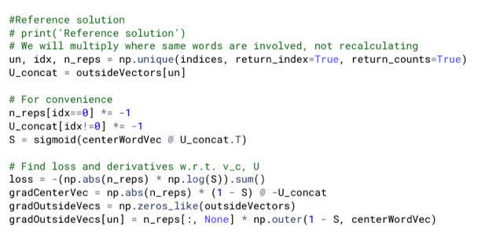</kbd>

> [!NOTE]
> Negative Sampling loss:
>
>
>
> J = - log(σ(uo@vc)) - Σ s log(σ(-uws@vc))
>
>
>
> dJ/dvc = - d[ log(σ(uo@vc)) ] / dvc - d {Σ s log(σ(-uws@vc)) } / dvc
>
>
>
> (1) - d[ log(σ(uo@vc)) ] / dvc:
>
>
>
> = - {d[log(σ(uo@vc))]/dσ(uo@vc)} * {dσ(uo@vc)/d(uo@vc)} * {d(uo@vc)/dvc}
>
>
>
> = - {1/σ(uo@vc)} * {σ(uo@vc)*[1-σ(uo@vc)]} * uo
>
>
>
> = **- [1-σ(uo@vc)]} * uo**
>
>
>
> (2) - d {Σ s log(σ(-uws@vc)) } / dvc
>
>
>
> = - Σ s d { log(σ(-uws@vc)) } / dvc 
>
>
>
> = - Σ s [d log(σ(-uws@vc)) / d σ(-uws@vc)] * [d σ(-uws@vc) /d -uws@vc] * [d -uws@vc / dvc ]
>
>
>
> = - Σ s [1 / σ(-uws@vc)] *{σ(-uws@vc)*[1 - σ(-uws@vc)]} * (-uws)
>
>
>
> = **- Σ s { [1 - σ(-uws@vc)] * (-uws) }**
>
>
>
> (1) (2):
>
>
>
> **dJ/dvc = - [1-σ(uo@vc)] * uo - Σ s { [1 - σ(-uws@vc)] * (-uws) }** 
>
>
>
> Xong ý dJ/dvc ý (i), đã giống khi so với bài mẫu
>
> ====
>
>
>
> Để trả lời ý (ii), ta sẽ cố gắng tính theo matrix U' luôn, 
>
>
>
> *U' là matrix các cột lần lượt là [uo, -uw1, -uw2...-uwK]
> với uw1,.. uwK là K vector cột được lấy ngẫu nhiên trong U và không trùng với uo
>
>
>
> dJ/dvc = - [1-σ(uo@vc)] * uo - Σ s { [1 - σ(-uws@vc)] * (-uws) } 
>
>
>
> Bỏ dấu trừ ra ngoài
>
>
>
> dJ/dvc = - { [1-σ(uo@vc)] * uo +  [1 - σ(-uw1@vc)] * (-uw1) + [1 - σ(-uw2@vc)] * (-uw2) +...[1 - σ(-uwK@vc)] * (-uwK) }
>
>
>
> **dJ/dvc = - { U'@(1 - σ[U'.T@vc])** **}**     (D,K+1)(K+1,D)(D,1) =  (D,1)
>
>
>
> Đã giống với bài mẫu
>
> dJ/dvc ý (i)
>
> dJ/dvc ý (ii) tính theo U'
>
> Negative Sampling loss**: dJ/duo**
>
>
>
> J = - log(σ(uo@vc)) - Σ s log(σ(-uws@vc))
>
>
>
> dJ/duo = - d[ log(σ(uo@vc)) ] / duo - d {Σ s log(σ(-uws@vc)) } / duo
>
>
>
> (1) - d[ log(σ(uo@vc)) ] / duo:
>
>
>
> = - {d log(σ(uo@vc)) / d σ(uo@vc)} * {d σ(uo@vc) / d uo@vc} * {d uo@vc / duo}
>
>
>
> = - {1/σ(uo@vc)} * {σ(uo@vc)*[1-σ(uo@vc)]} * vc
>
>
>
> =  - {1-σ(uo@vc)]} * vc 
>
>
>
> (2) - d {Σ s log(σ(-uws@vc)) } / duo  = 0 vì uws khác uo với mọi s
>
>
>
> Conclusion:
>
>
>
> dJ/duo = **- [1 - σ(uo@vc)]*vc**
>
> dJ/duo ý (i)
>
> Negative Sampling loss: **dJ/duw_i**
>
>
>
> J = - log(σ(uo@vc)) - Σ s log(σ(-uws@vc))
>
>
>
> Tính dJ/duw_i với i thuộc 1,2..K 
>
>
>
> dJ/duw_i = - d[ log(σ(uo@vc)) ] / duw_i - d {Σ s log(σ(-uws@vc)) } / duw_i
>
>
>
> (1) - d[ log(σ(uo@vc)) ] / duw_i = 0 với mọi ws vì uw_i đều khác uo
>
>
>
> (2) - d {Σ s log(σ(-uws@vc)) } / duw_i 
>
>
>
> = - Σ s d { log(σ(-uws@vc)) } / duw_i 
>
>
>
> = - Σ s [d log(σ(-uws@vc)) / d σ(-uws@vc)] * [d σ(-uws@vc) /d -uws@vc] * [d -uws@vc / duw_i ]
>
>
>
> = - Σ s [1 / σ(-uws@vc)] *{σ(-uws@vc)*[1 - σ(-uws@vc)]} * [d -uws@vc / duw_i ]
>
>
>
> = - Σ s [[1 - σ(-uws@vc)]} * [d -uws@vc / duw_i ]
>
>
>
> = - { {Σ s!=i [1 - σ(-uws@vc)] * [d -uws@vc / duws ]} + {[1 - σ(-uw_i@vc)] * [d -uw_i@vc / duw_i ]} }
>
>
>
> = - { 0 + [1 - σ(-uw_i@vc)]*(-vc) } 
>
>
>
> = - [1 - σ(-uw_i@vc)]*(-vc)
>
>
>
> = **[1- σ(-uw_i@vc) ]*vc**
>
> dJ/duwi ý (i)
>
> Trả lời cho ý (ii): Gom lại để thành dJ/dU': với U' là matrix các cột là [uo, -uw1, -uw2...-uwK]
>
>
>
> **dJ/duo = - [1 - σ(uo@vc) ]*vc
>
>
>
> dJ/duw_i =  [1 - σ(-uw_i@vc) ]*vc** 
>
>
>
> => dJ/d [-uw_i] = - dJ/duw_i = **- [1- σ(-uw_i@vc) ]*vc**
>
>
>
>
> Do đó dJ/dU' sẽ là matrix (D, K+1), mà các cột là:
>
>
>
> {- [1 - σ(uo@vc) ]*vc, - [1 - σ(-uw1@vc) ]*vc, - [1 - σ(-uw2@vc) ]*vc  .... , - [1 - σ(-uwK@vc) ]*vc}
>
>
>
> **dJ/dU' = - vc @ [1- σ(U'.T @ vc)].T**          
>
>
>
> shape: (D,1) [(K+1,D)@(D,1)].T =  (D,1)@(K+1,1).T = (D,1)@(1,K+1) = (D, K+1)
>
> dJ/duo & dJ/duw_i, ý (ii) tính theo U'
>
> Cách làm trong bài tham khảo này thì có vụ
> nhân U' /|U'| chưa biết để làm gì
>
> cách làm này khi chuyển thành code đã pass test case
> có ghi chú chi tiết trong phần dưới
>
> Cách làm trong bài tham khảo này quay lại tìm
> hiểu sau

 

<kbd>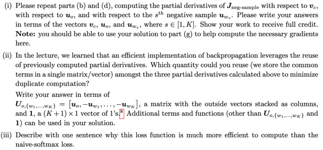</kbd>

<kbd>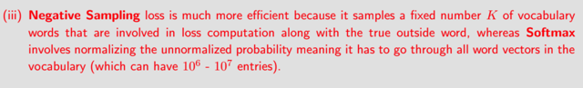</kbd>

> [!NOTE]
> Trả lời ý (iii): vì ta không phải tính vocab_size phép tính exp(uw@vc), vì
> vocab  size lớn thì số lượng tính toán sẽ lớn, thay vì vậy ở đây ta chỉ
> phải tính K phép tính với K nhỏ hơn vocab size nhiều.
>
> Checked!

 

<kbd>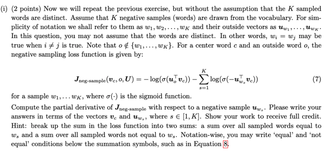</kbd>

<kbd>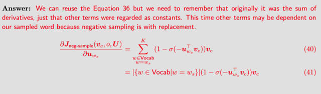</kbd>

<kbd>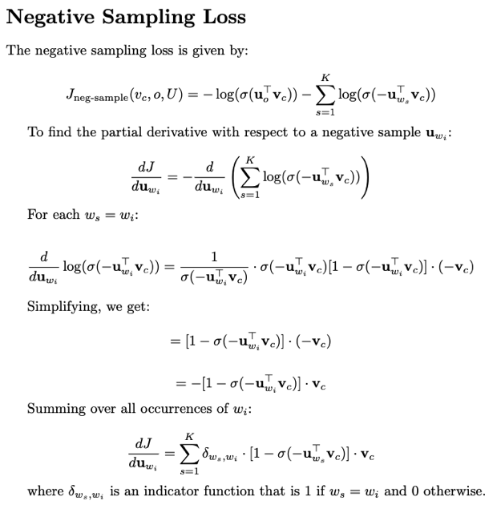</kbd>

> [!NOTE]
> Negative Sampling loss:
>
>
>
> J = - log(σ(uo@vc)) - Σ s log(σ(-uws@vc))
>
>
>
> - log(σ(uo@vc)) - Σ ws!=wi log(σ(-uws@vc)) - Σ ws=wi log(σ(-uws@vc))
>
>
>
> Let: 
>
>
>
> log(σ(uo@vc)) = A, Σ ws!=wi log(σ(-uws@vc)) = B,  Σ ws=wi log(σ(-uws@vc)) = C
>
>
>
> = - (A + B + C)
>
>
>
> dA/duwi = 0 vì o khác wi
>
>
>
> dB/duwi = 0 vì ws khác wi
>
>
>
> dJ/duwi = - dC/dwi 
>
>
>
> = - Σ ws=wi {d log(σ(-uws@vc)) / d σ(-uws@vc)} * {d σ(-uws@vc) / d (-uws@vc) }
> * {d (-uws@vc) / duwi}
>
>
>
> = - Σ ws=wi {1 / σ(-uws@vc)} * {σ(-uws@vc) * [1 - σ(-uws@vc)]} * {d (-uws@vc) / duwi}
>
>
>
> = - Σ ws=wi {[1 - σ(-uws@vc)]} * {d (-uws@vc) / duwi}
>
>
>
> = - Σ ws=wi {[1 - σ(-uws@vc)]} * {-vc}
>
>
>
> dJ/duwi = **Σ s in [1,K] and ws=wi {[1 - σ(-uws@vc)]} * vc**
>
> Correct!

 

<kbd>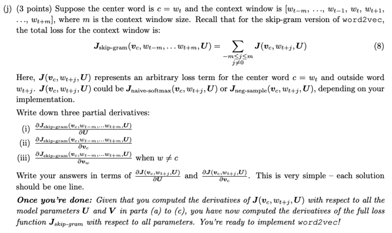</kbd>

> [!NOTE]
> J skip-gram = Σ j in [-m,m] and j!=0 J(vc, wt+j, U)
>
>
>
> (i) dJ/dvc = d {Σ j in [-m,m] and j!=0 J(vc, wt+j, U)} / dvc
>
>
>
> = Σ j in [-m,m] and j!=0 d J(vc, wt+j, U) / dvc
>
>
>
> = **Σ j in [-m,m] and j!=0 { d J(vc, wt+j, U) / dvc }**
>
>
>
> ======
>
>
>
> (ii) dJ/dU = d {Σ j in [-m,m] and j!=0 J(vc, wt+j, U)} / dU
>
>
>
> = Σ j in [-m,m] and j!=0 d J(vc, wt+j, U)} / dU
>
>
>
> = **Σ j in [-m,m] and j!=0 { d J(vc, wt+j, U) / dU }**
>
>
>
> ======
>
>
>
> **(iii) dJ/dvw = 0**
>
> chú ý là với j in [-m,m] và j != 0, các d J(vc, wt+j, U) / dvc 
> đều khác nhau. Nên chỉ được tổng chứ ko phải là 2m * (...)

 

<kbd>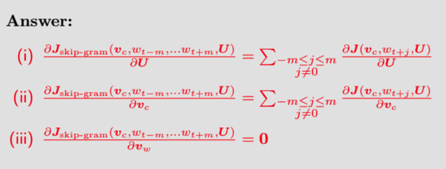</kbd>

 

## ....a

<kbd>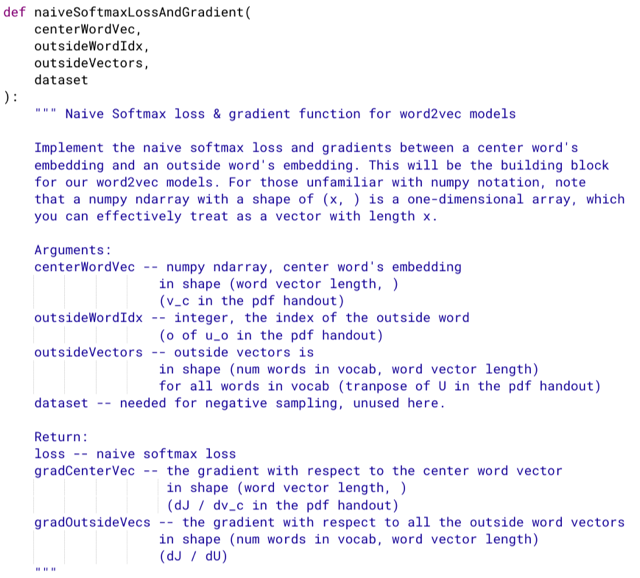</kbd>

 

<kbd>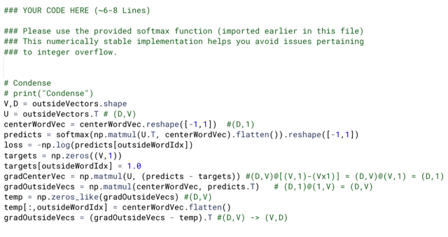</kbd>

> [!NOTE]
> Kinh nghiệm: chỉ đưa vector vào hàm softmax này (tức, là phải
> flatten thành 1d array). Có thể quay lại tìm hiểu tại sao. 
>
>
>
> Cách suy nghĩ (ý là lý thuyết, dựa trên phần câu hỏi trước) đã đúng,
> chỉ cần đảm bảo đúng shape là được

 

<kbd>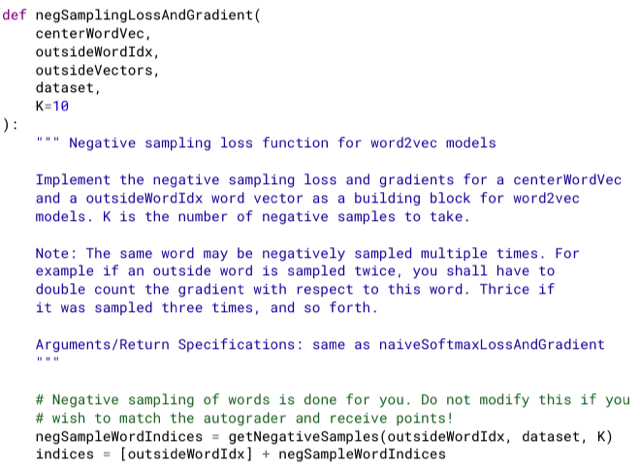</kbd>

 

<kbd>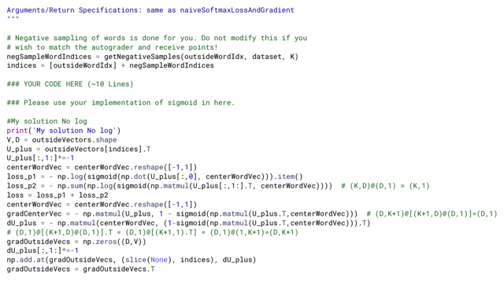</kbd>

<kbd>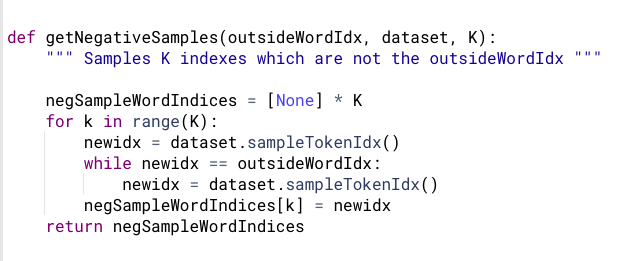</kbd>

> [!NOTE]
> chỉ cần hiểu rằng, ta xây dựng matrix U_plus (là matrix U' trong phần note trả lời lý thuyết,
> hay trong đề bài là U o,{w1,..wK}. Bằng cách "lấy ra" từ matrix U cho trước, nhờ các index
> mà id của uo đứng đầu, sau đó là K vector uw1, uw2....uwK. các index của các vector
> negative sampling sẽ được tạo bởi một sampling function nhằm đảm bảo các sampling
> word không trùng outer word (để các uw1,...uwK đều khác uo)
>
>
>
> Khi đó ta có matrix mà các cột là [uo, uw1, ..uwK], thế thì phải nhân - 1 cho các cột từ 2 trở
> đi vì U_plus là matrix [uo, -uw1, ..-uwK]
>
>
>
> Dựa theo công thức đã triển khai ở phần lý thuyết để tính dJ/dvc và dJ/dU_plus Thế thì với
> dJ/dU_plus sẽ có điểm lưu ý là, các cột của nó đương nhiên là  đạo hàm của loss đối với
> ÂM của các vector uw1, uw2...Và thứ hai là các w1,..wK có thể trùng nhau. Thành ra ta sẽ
> cần phải gộp chung lại, cho dễ hiểu thì ví dụ như sau:
>
>
>
> giả sử K = 5 và indices vector sẽ có K+1 phần tử, là [3,5,7,5,2,4]. Thì 3 chính là index của
> outer word, cột U[:,3] chính là vector uo. Các số từ 5 trở đi đương nhiên là index  của các
> sampling word. Thế thì số 5 lặp lại 2 lần, để ý cái này.
>
>
>
> Sau đó như đã nói ở trên ta sẽ tính ra dJ/dU_plus là matrix (D,K+1) = 3x6 (ví dụ D = 6) vậy,
> để có dJ/dU ta sẽ tạo matrix zeros có kích thước D,V sẵn.
>
>
>
> Sau đó, gán vector đầu tiên của dJ/dU_plus (như đã biết, nó sẽ chính là dJ/duo, uo- đang
> nói là cột có index = 3 của U) vào cột index = 3 (cột thứ 4) của dJ/dU.
>
>
>
> Rồi, cột thứ 2 và thứ 4 của dU_plus sẽ chính là ÂM của đạo hàm loss đối với cái cột có
> index = 5 matrix U. Tức là từ có index = 5 của vocab được sampling 2 lần, đồng nghĩa
> tham gia 2 lần vào quá trình tính toán, nên đạo hàm của loss đối với (ÂM CỦA) cột này của
> U sẽ  tổng hai cột thứ 2 và 4 của dU_plus (dU_plus[1] và dU_plus[3])
>
>
>
> ====
>
>
>
> Thành ra ta sẽ làm như sau đối với dJ/dU: 
>
>
>
> Sau khi khởi tạo zero matrix, ta sẽ iterate trong các index
>
>
>
> gradOutsideVecs = np.zeros((D,V)) 
>
>
>
> for i, id in enumerate(indices):
>   # Nếu id đầu tiên  tức là dJ/duo, thì gán CỘNG DỒN nó vào index tương ứng của U
>   # Nhưng từ các id tiếp theo, phải nhân cho -1 trước khi gán CỘNG DỒN  
>   gradOutsideVecs[:, id] += dU_plus[:, i] if i == 0 else -dU_plus[:,i]
>
>
>
> Để dùng vectorized, thì ta sẽ nhân -1 cho các cột dU_plus, từ cột thứ 2 trở đi 
> Sau đó dùng function  **np.add.at(gradOutsideVecs, (slice(None), indices), dU_plus)
> để có kết quả tương tự
>
>
>
> * Chú ý, cuối cùng phải transpose để dJ/dU về cũng shape với U là (V,D)**

 

<kbd>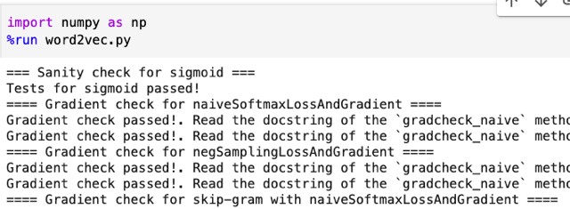</kbd>

> [!NOTE]
> đã pass test case

 

<kbd>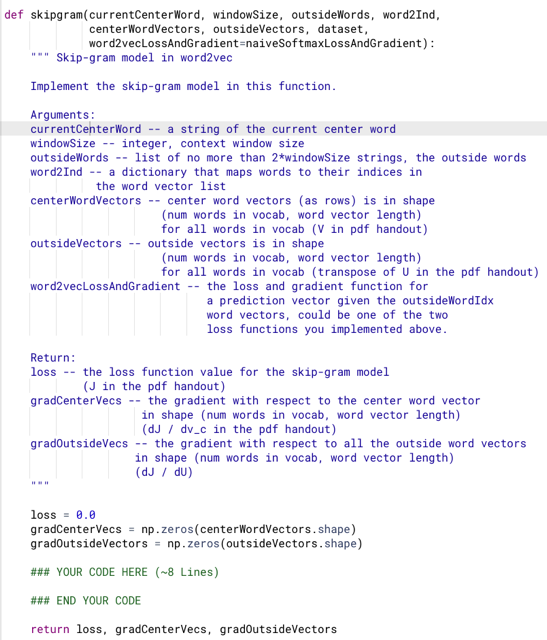</kbd>

 

<kbd>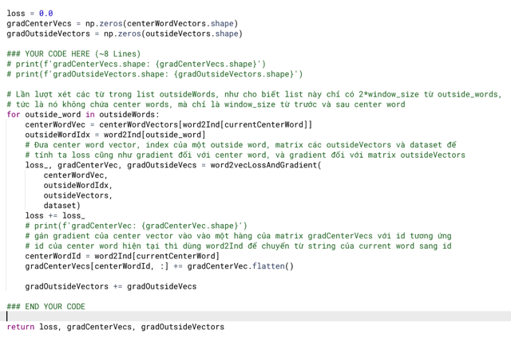</kbd>

 

<kbd>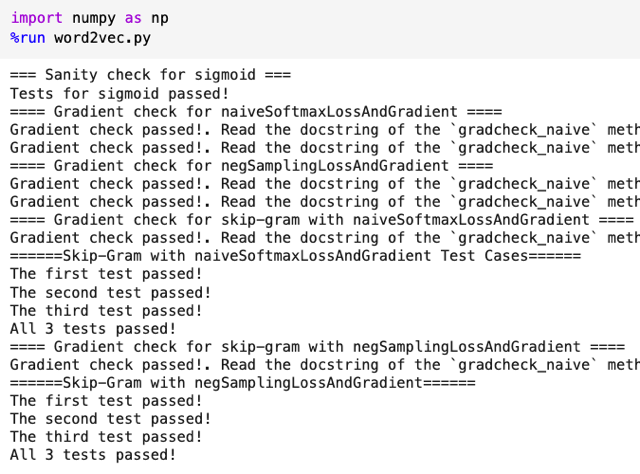</kbd>

 

<kbd></kbd>

 

<kbd></kbd>

> [!NOTE]
> Sgd đơn giản vậy thôi, take value của param bỏ vào f để tính ra loss
> và gradients, dùng gradient * lr để update cho params

 

<kbd></kbd>

<kbd></kbd>

 

<kbd></kbd>

<kbd></kbd>

> [!NOTE]
> Kết quả cho thấy các từ gần nghĩa nằm gần nhau trong không
> gian

 

