# Lecture 3: Backprop And Neural Networks

📊 **Progress:** `29` Notes | `54` Screenshots

---

## Lecture 3: Backprop And Neural Networks

 

<kbd>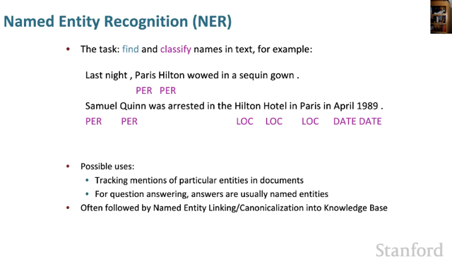</kbd>

> [!NOTE]
> Đại khái là nói về bài toán NER - phân biệt các từ trong
> đoạn văn là "loại gì" - tên riêng, location,....

 

<kbd>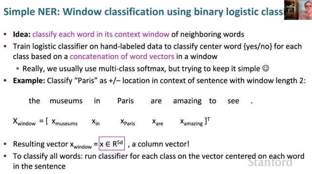</kbd>

> [!NOTE]
> Đại khái là để làm cái này, cách làm là người ta sẽ train nhiều cái "
> classifier" (mỗi cái xác định 1 loại - ví dụ cái thì xem có phải là location
> hay không, cái thì xem có phải là personal name không). Và các
> classifier này sẽ được train bằng Supervised learning với hand-labeled
> data.
>
>
>
> Quá trình training sẽ là lấy 1 window các từ, trong đó có từ cần Predict ở
> giữa và các từ context quanh nó, lấy tất cả các word Vector của từ đó,
> concatenate lại thành 1 vector (ví dụ window chứa 5 từ thì thành 5D
> vector)
>
>
>
> Đưa vào classifier - thường chỉ là logistic regression model. Và tính loss,
> update model weight bằng gradients như thông thường.
>
>
>
> Như vậy khi train được các classifier cho mỗi loại, khi inference, ta sẽ chỉ
> đơn giản là chạy classifier qua các window của document để predict.

 

<kbd>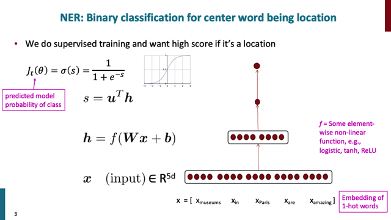</kbd>

> [!NOTE]
> Đại khái như đã nói, ở đây chỉ là một logistic regression model có dạng như
> một neural network đơn giản với 1 hidden layer  với parameters matrix W,
> b. Nó sẽ nhận vector của "window" có dạng token, hay one hot vector Sau
> đó chuyển thành word embedding (có thể là bằng cách lấy từ bộ
> pre-trained word  embedding vector và concate như đã nói
>
>
>
> Tiếp đó thực hiện  phép nhân matrix với W và b, sau đó cho qua  activation
> function, để rồi pass kết quả qua layer cuối có 1 unit, sigmoid để Predict ra
> probability từ (+context) đưa vào có phải là loại mà classifier này  đang đảm
> nhiệm phân biệt hay không

 

<kbd>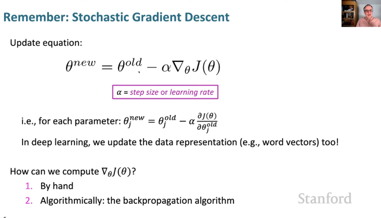</kbd>

> [!NOTE]
> Và như ta đã biết có thể trong qúa trình training,
> ta update luôn các word vector luôn chứ không
> chỉ là các model's params

 

<kbd>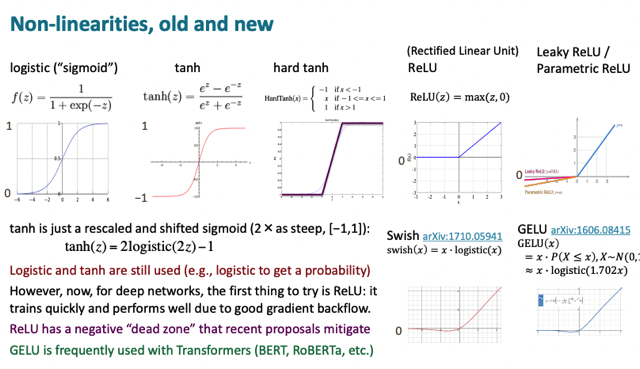</kbd>

> [!NOTE]
> Slide này không thấy có trong bài giảng, đại khái là
> giới thiệu, hoặc nhắc lại một số activation function
> như sigmoid, tanh, relu.....

 

<kbd>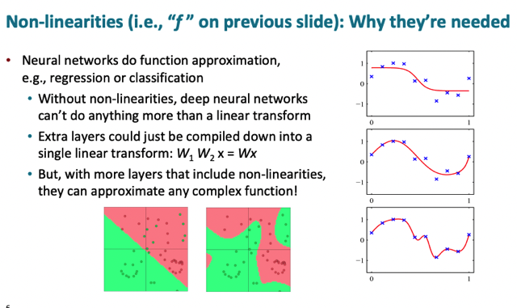</kbd>

> [!NOTE]
> Slide này cũng ko nói đến, đại khái là nói về tầm quan trọng
> của việc sử dụng non-linear activation function. Như mình đã
> biết nếu không có nó, thì cả hệ thống các layer chỉ như một
> linear model. Các layer với non-linear function giúp capture
> các complex pattern hay nói cách khác là giúp model có 
> độ flexible cao giúp nó có thể nắm bắt các pattern phức tạp

 

<kbd>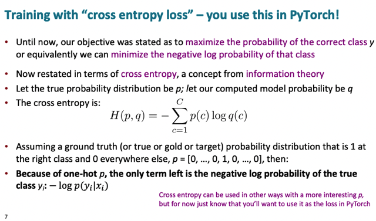</kbd>

> [!NOTE]
> Slide này giáo sư cũng không nói đến, đại khái là nhắc đến loss function,
> Trong bài toán classification, ta sẽ dùng cross entropy để xây dựng loss
> function mang ý nghĩa là cần phải giảm sự khác nhau giữa hai probability
> distribution p và q.

 

<kbd>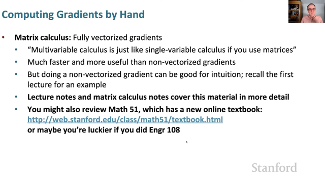</kbd>

 

<kbd>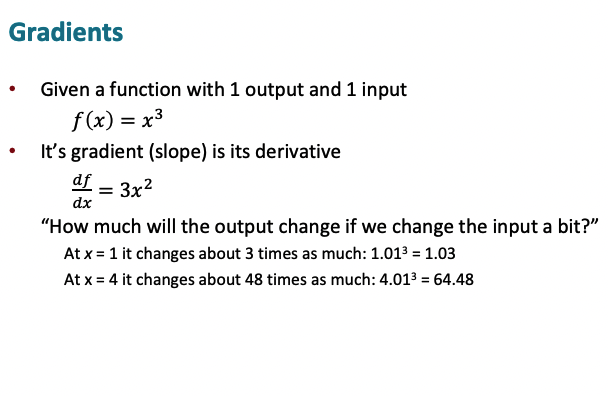</kbd>

> [!NOTE]
> Đại khái là ý nghĩa của đạo hàm (derivative) của
> hàm số tại một điểm là độ dóc của hàm số tại đó,
> mang ý nghĩa là tỉ lệ thay đổi của hàm số so với sự
> thay đổi của biến số

 

<kbd>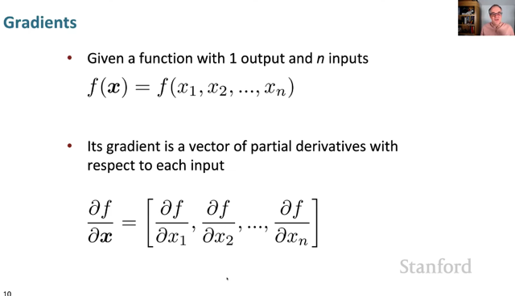</kbd>

> [!NOTE]
> Nếu f là function của vector x thì đạo hàm
> của f w.r.t x là vector các đạo hàm của f w.r.t
> các phần tử của vector x

 

<kbd>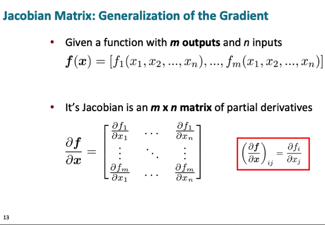</kbd>

> [!NOTE]
> Còn nếu output của function là vector thì derivative
> của f w.r.t x sẽ là matrix gọi là Jacobian matrix, trong
> đó mỗi hàng là vector đạo hàm của phần tử tương
> ứng của output với vector x

 

<kbd>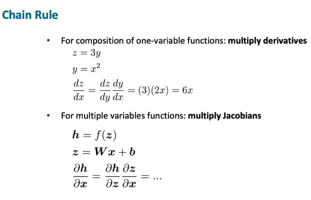</kbd>

 

<kbd>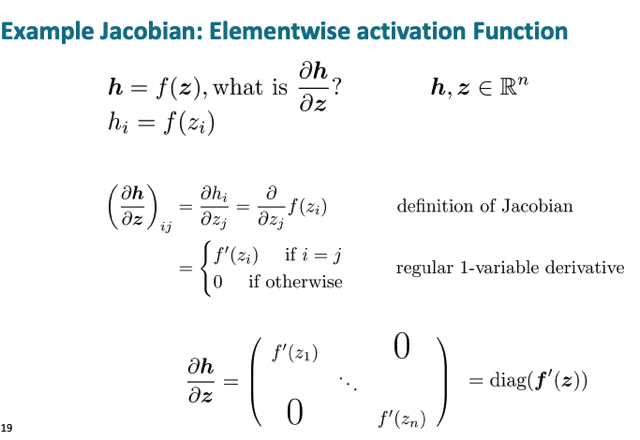</kbd>

> [!NOTE]
> Ví dụ z là vector Rn sau khi qua function f (ví dụ là sigmoid) tính
> ra h, vì phép tính là element-wise nên h cũng là vector Rn. Do đó
> derivative của f w.r.t z sẽ là jacobian matrix trong đó, mỗi hàng,
> là đạo hàm của phần tử tương ứng của h w.r.t vector z. Và vì ví
> dụ phần tử thứ 8 của h chỉ bị tác động bởi phần tử thứ 8 của z
> thành ra trong jacobian matrix, ở hàng thứ 8 chỉ có phần tử thứ 8
> là có gì đó, còn lại bằng 0. Như vậy ta có matrix vuông và chéo.

 

<kbd>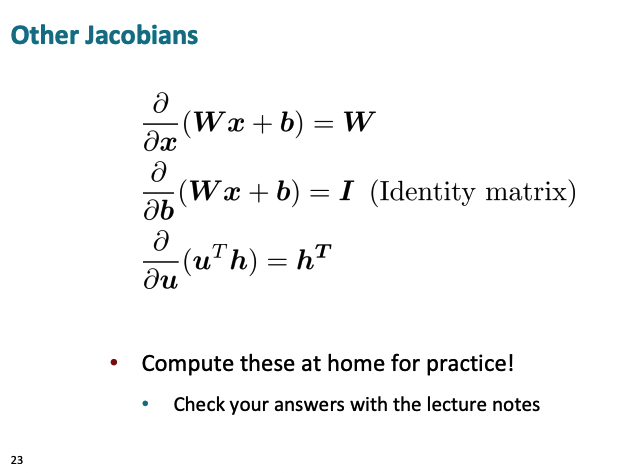</kbd>

> [!NOTE]
> Khuyến khích thử làm lại xem có
> ra được không.
>
> Nếu coi u là nằm ngang thì cái này cũng hợp
> lí, đạo hàm của s đối với h phải là
> vector ngang, nên phải là h.T

 

<kbd>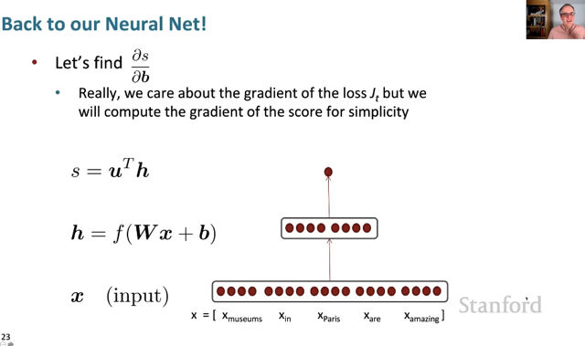</kbd>

> [!NOTE]
> Đại khái nhắc lại rằng ở đây param là W, b, u (u là weight của layer cuối
> vì chỉ có ra 1 unit, nên nó có dạng là 1 vector)
>
>
>
> Và giáo sư nói là có thể tính luôn word vector vì như đã nói ta có thể
> tuning nó thêm để giúp perform tốt hơn
>
>
>
> Và ở đây rõ ràng chỉ là đơn giản với derivative của score (tức là chưa bỏ
> qua sigmoid, và chưa tính loss) w.r.t params mang tính chất minh họa
> thôi. Chứ đúng ra là phải tính derivative của loss w.r.t params

 

<kbd>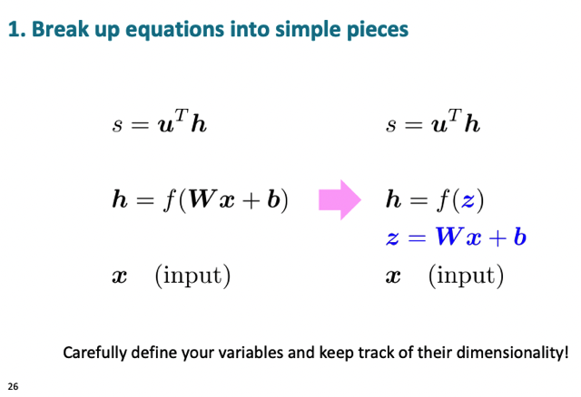</kbd>

> [!NOTE]
> nên track kĩ các shape

 

<kbd>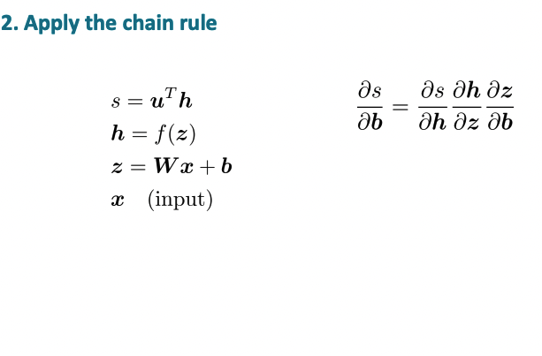</kbd>

 

<kbd>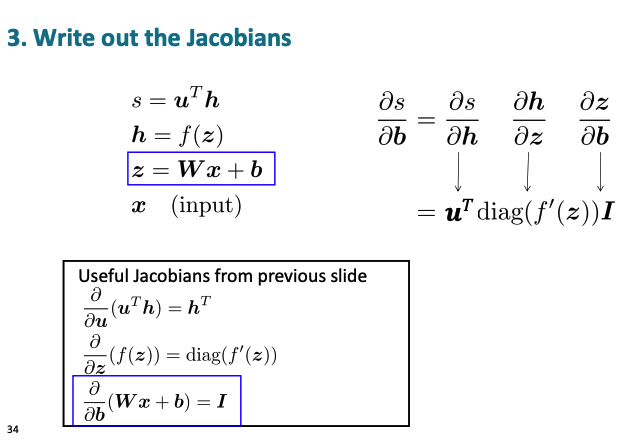</kbd>

 

<kbd>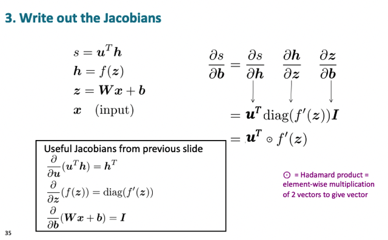</kbd>

> [!NOTE]
> Đại khái là áp dụng 3 cái "case" công thức ở trên: 
>
>
>
> 1. Đạo hàm của phép nhân vector uTh w.r.t vector u, 
>
>
>
> 2. Đạo hàm của element-wise non-linear activation function f(z) 
> w.r.t vector z và 
>
>
>
> 3.Đạo hàm của phép Wx+b w.r.t b.
>
>
>
> Và kí hiệu giữa uT và diag(f'(z)) chính là Hadamard product, 
> là nhân element wise vector u và vector đường chéo của matrix
> diag(f'(z))

 

<kbd>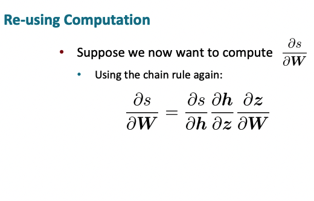</kbd>

> [!NOTE]
> Và tương tự ta sẽ tính
> derivative của s w.r.t W

 

<kbd>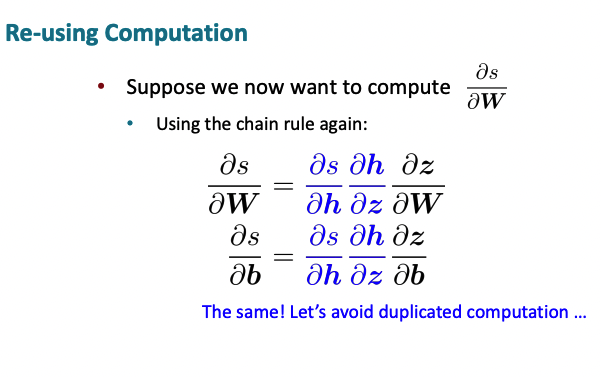</kbd>

> [!NOTE]
> Đại khái là quá trình này cũng tương tự và nó
> lặp lại bước tính ds/dh . dh/dz

 

<kbd>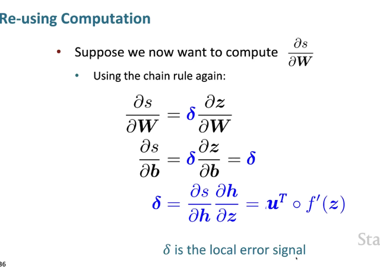</kbd>

> [!NOTE]
> Do đó người ta define "Delta" là. cái ds/dh .
> dh/dz và như đã tính ở slide trước, nó bằng u.T
> hardamard product với f'(z)
>
>
>
> Và vì dz/db là I = identity matrix (giống như 1) nên
> ds/db là Delta
>
>
>
> Và. để tính ds/dW ta còn phải tính dz/dW

 

<kbd>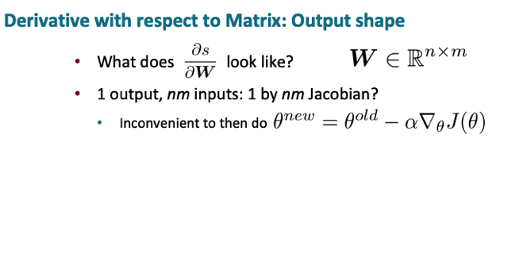</kbd>

> [!NOTE]
> Ở đây giáo sư nói là ds/dW với s là real number còn W là nm
> matrix thì đúng theo toán học ds/dW sẽ là một row vector có
> m*n phần tử
>
>
>
> Nhưng như vậy thì sẽ khó update W khi ta muốn dW cũng
> shape với W

 

<kbd>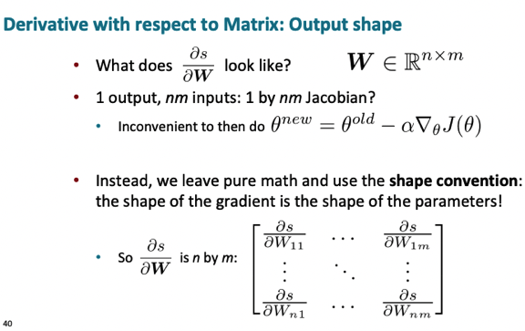</kbd>

> [!NOTE]
> Thành ra chỗ này mới gọi là "rời bỏ pure
> math" để dùng shape convention, cho
> dW cùng shape với W

 

<kbd>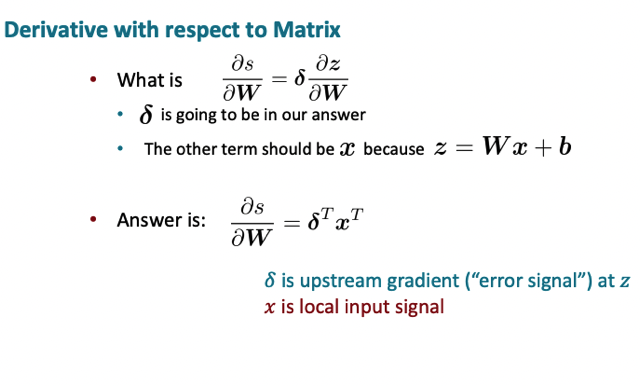</kbd>

 

<kbd>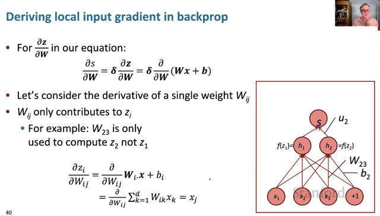</kbd>

> [!NOTE]
> zi (element thứ i của z) được tính bằng hàng thứ
> i của W (kí hiệu Wi) với vector x và cộng với
> phần tử thứ i của vector b (bi)
>
>
>
> Nên ghi dz_i/dW_ij là d(Wi.x + bi)/dWij
>
>
>
> Và đương nhiên là ví dụ Wi.x + bi = Wi1*x1 + Wi2*x2 + ...Wid*xd + bi 
> nên d (của cái cụm trên) w.r.t các phần tử Wi1, Wi2,...Wid sẽ lần lượt
> là x1, x2...xd

 

<kbd>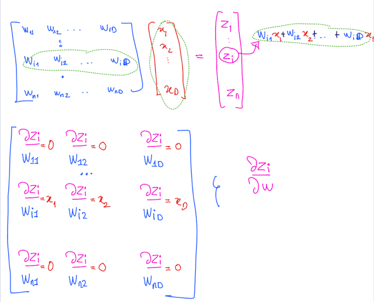</kbd>

 

<kbd>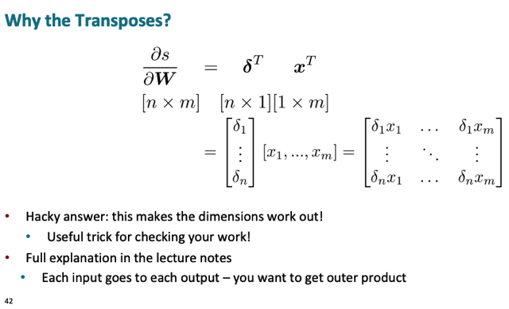</kbd>

 

<kbd>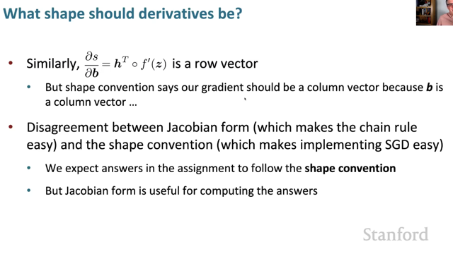</kbd>

 

<kbd>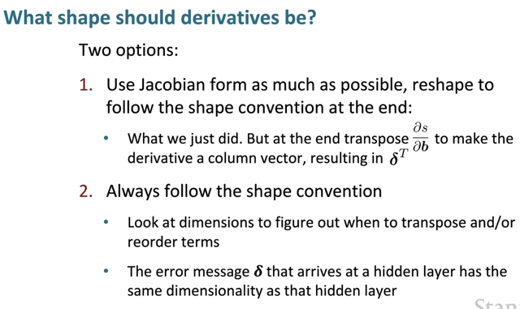</kbd>

> [!NOTE]
> đại khái là có thể theo cách bám sát jacobian form nhất có thể và
> reshape lại (theo shape convention) khi tính xong. Đây chính là
> cái mà họ đang làm, thành ra kết quả là delta transpose (để nó
> trở thành vector cột như b)

 

<kbd>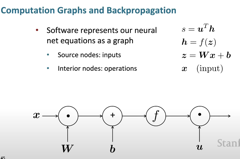</kbd>

 

<kbd>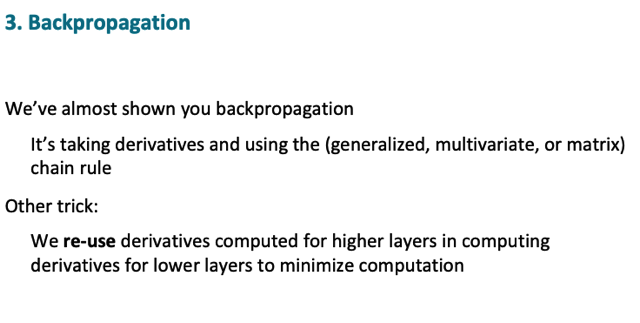</kbd>

> [!NOTE]
> đại khái là cơ bản nãy giờ (phần 1) là đã nói về backpropagation
> rồi. Chính là việc ta dùng chain rule, để tính đạo hàm của loss
> function đối với các vector, matrix params. Trong quá trình đó ta
> cần re-use các phần tính toán nào mà có thể xài chung được để
> hiệu quả hơn.

 

<kbd>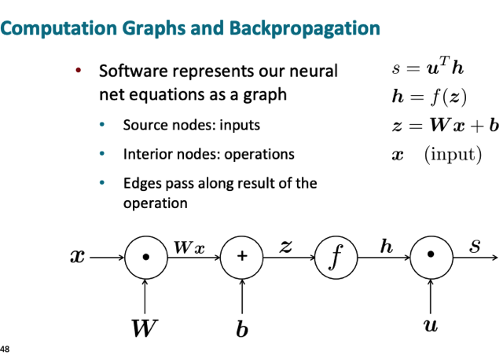</kbd>

 

<kbd>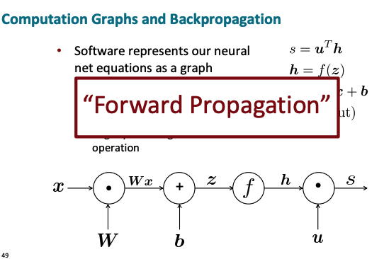</kbd>

 

<kbd>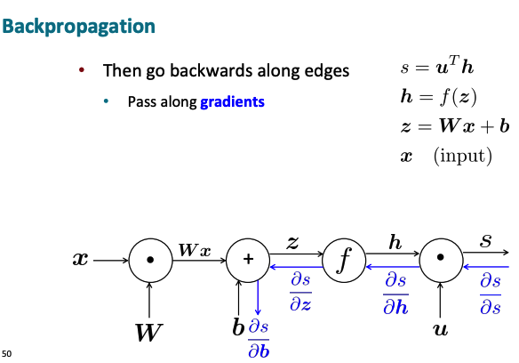</kbd>

 

<kbd>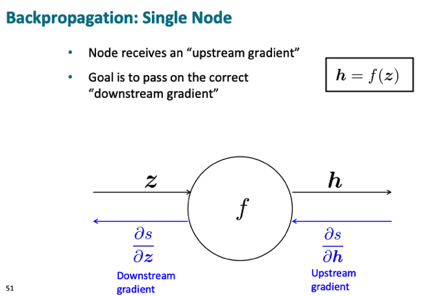</kbd>

 

<kbd>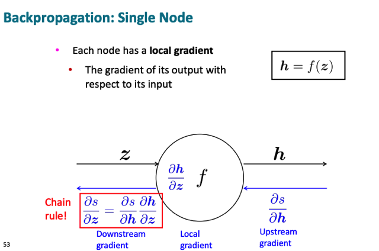</kbd>

 

<kbd>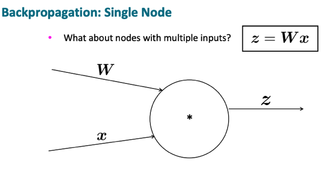</kbd>

 

<kbd>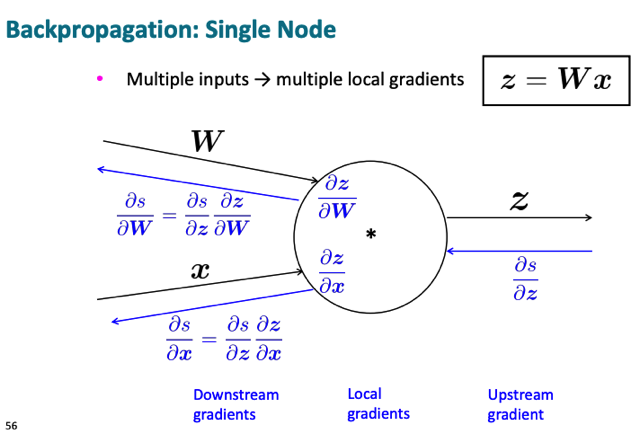</kbd>

 

<kbd>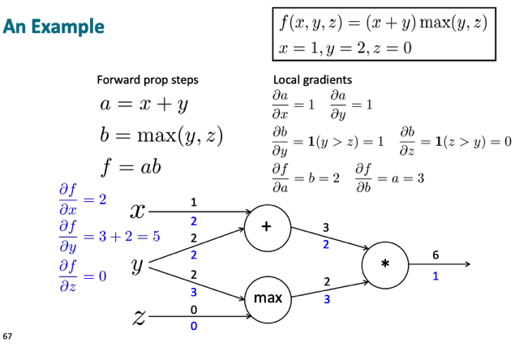</kbd>

> [!NOTE]
> tại đây giáo sư có cho một ví dụ để minh họa ý
> nghĩa của df/dy = 5 là như thế nào: Cho y wiggle một
> khoảng nhỏ e.g 0.01, tính tỉ lệ khoảng thay đổi của y
> so với 0.01 sẽ thấy ~ 5

 

<kbd>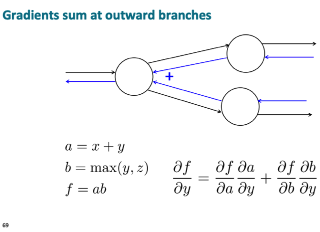</kbd>

> [!NOTE]
> với kiểu phân nhánh khi forward thì
> sum gradient lại khi backward

 

<kbd>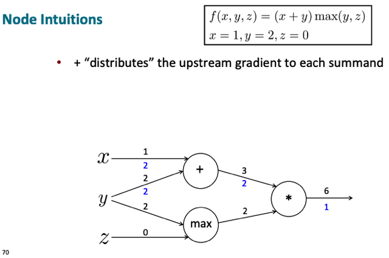</kbd>

 

<kbd>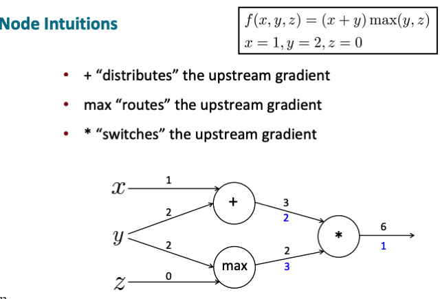</kbd>

> [!NOTE]
> Một số pattern

 

<kbd>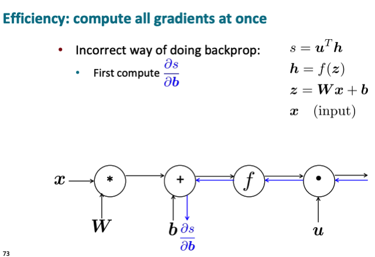</kbd>

 

<kbd>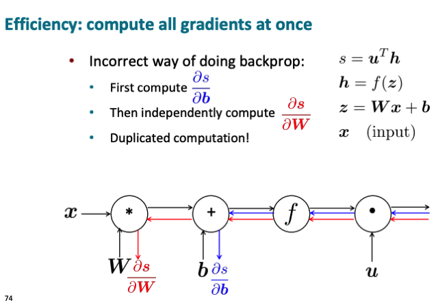</kbd>

> [!NOTE]
> đại ý là sẽ duplicate tính toán khi làm
> backprop kiểu này - từng cái

 

<kbd>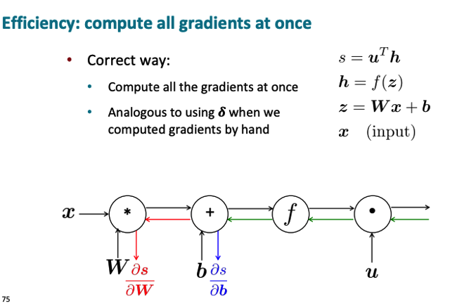</kbd>

> [!NOTE]
> mà cách hiệu quả là phải làm đồng loạt, để
> tận dụng việc dùng chung các bước trung gian

 

<kbd>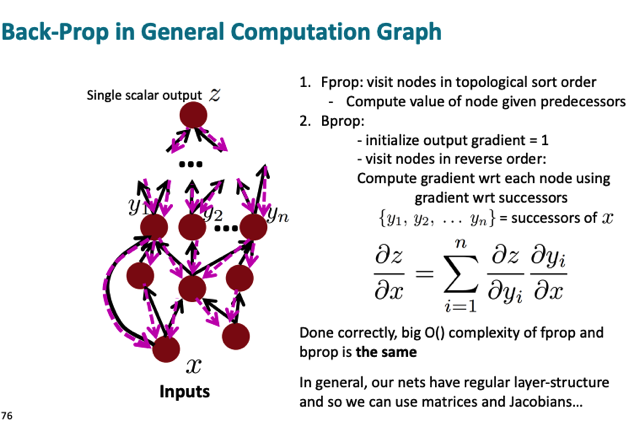</kbd>

 

<kbd>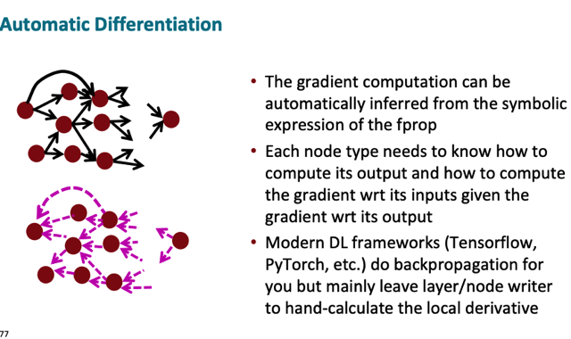</kbd>

 

<kbd>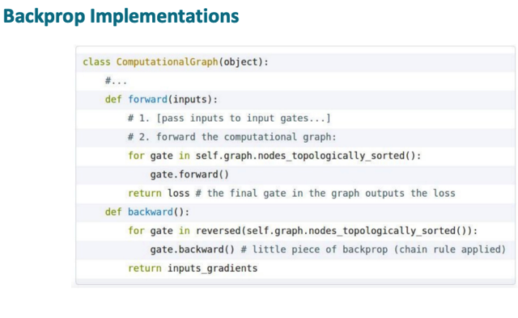</kbd>

 

<kbd>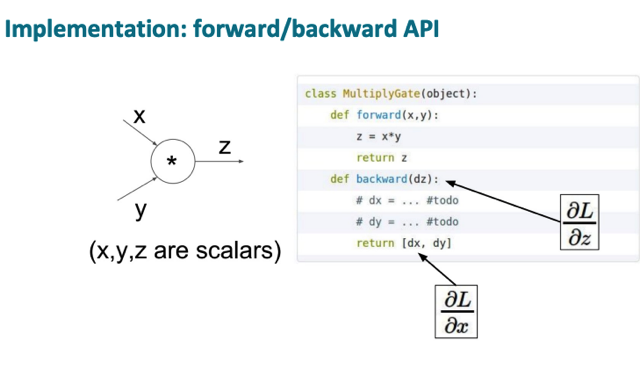</kbd>

 

<kbd>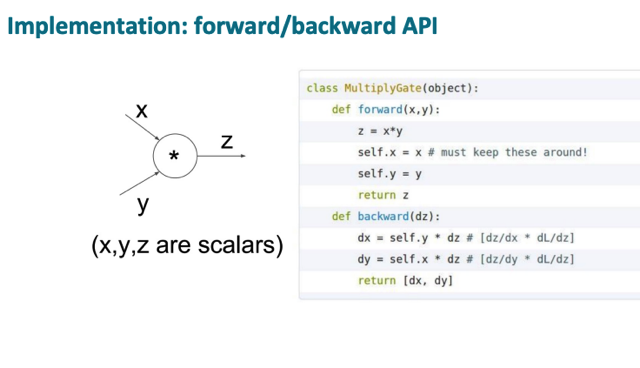</kbd>

 

<kbd>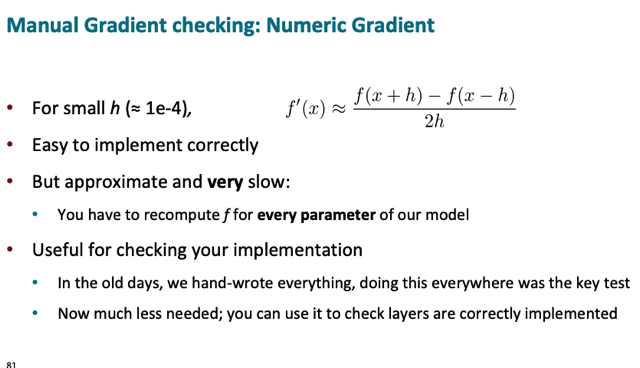</kbd>

> [!NOTE]
> nói về dùng numerical gradient để check analytic
> gradient. Tuy nhiên với việc dùng các framework
> ngày nay thì có thể bớt quan trọng

 

<kbd>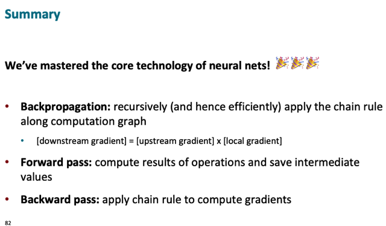</kbd>

 

<kbd>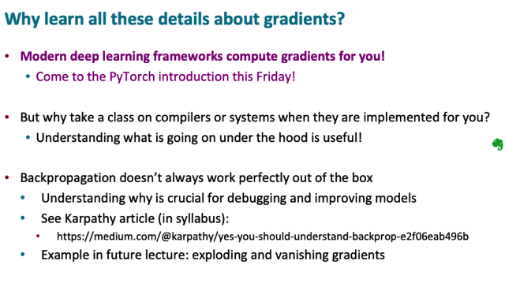</kbd>

 

