# Lecture 6: Simple And Lstm Rnns

📊 **Progress:** `39` Notes | `58` Screenshots

---

## Lecture 6: Simple And Lstm Rnns

 

<kbd>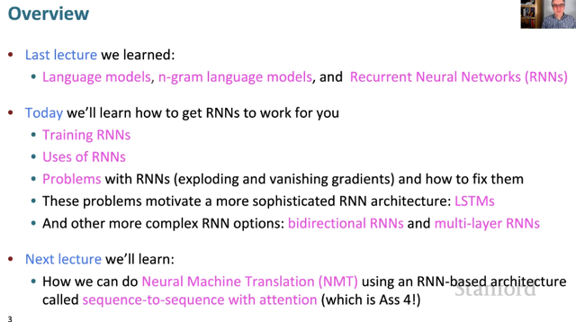</kbd>

 

<kbd>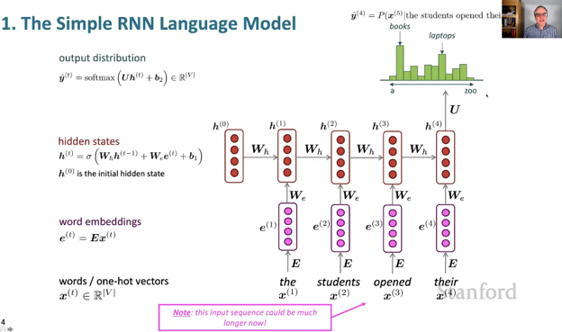</kbd>

> [!NOTE]
> nhắc lại lúc kết
> thúc tuần trước

 

<kbd>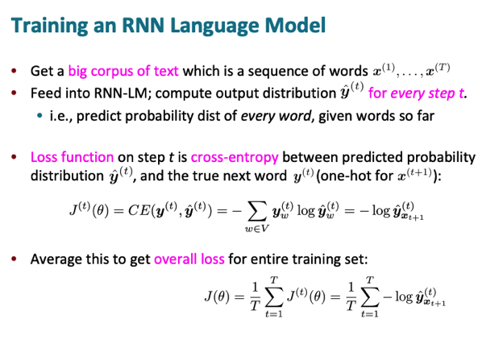</kbd>

> [!NOTE]
> quá trình training một RNN language model đại khái là cũng với một **big
> corpus of text,** coi như một **sequence các words**
>
>
>
> Input vào từng từ (tất nhiên là phải **preprocessed thành token embedding**)
> và tính ra **y^** mang hình hài là một **vector có |V| phần tử**, chứa probability
> scores **p_i xác suất từ tiếp theo là từ có id tương ứng trong vocab**.
>
>
>
> Từ đó tính **cross entropy loss giữa hai distribution** dự đoán y^<t>
> và distribution thật sự y<t> và chính là **one-hot encoding của từ kế tiếp
> x<t+1>**
>
>
>
> Và **average trên mọi time-step để có overall loss**

 

<kbd>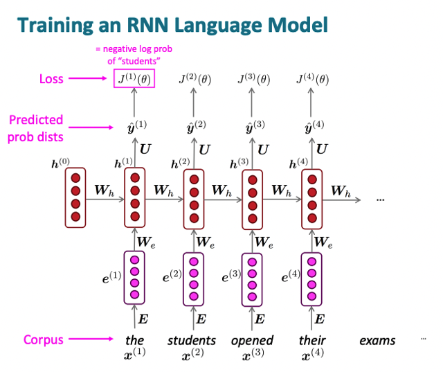</kbd>

<kbd>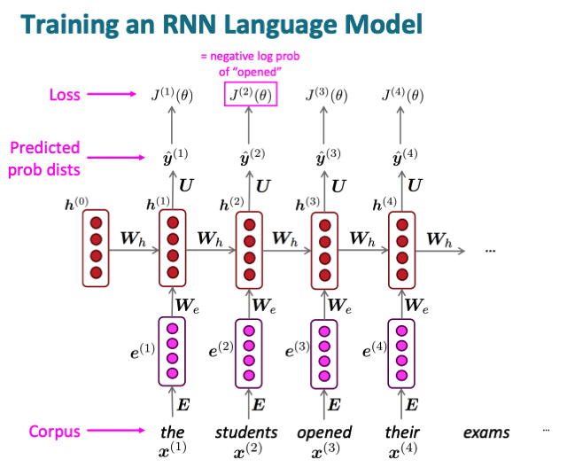</kbd>

> [!NOTE]
> đương nhiên (vì one-hot vector, chỉ có số 1 ở vị trí từ đúng = "
> student" , loss sẽ chỉ "tính" với positive class, tức là sẽ chỉ ghi
> nhận (và cộng thêm tại mỗi time-step một giá trị bằng
> -log(probability of "student")

 

<kbd>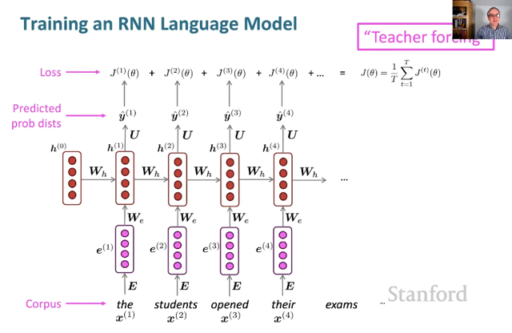</kbd>

> [!NOTE]
> Và **average trên mọi time-step để có overall loss**. Và cách thức này gọi là
> "**teacher forcing**" đơn giản đó là khi model predict (với xác suất cao nhất)
> cho từ gì thì cũng kệ, **chỉ ghi nhận loss là "kiểu như" sai khác giữa target vs
> predicted probability mass**. Còn lại thì **vẫn chuyển qua time-step kế tiếp
> với từ đúng, tức là coi như model nó đoán đúng từ (word) trước đó rồi**

 

<kbd>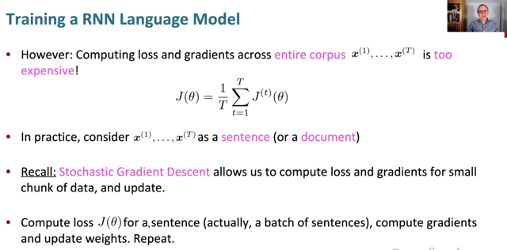</kbd>

> [!NOTE]
> Đại khái là như đã biết việc **tính gradient trên full batch of dataset rất
> expensive** do đó ta sẽ **chia bộ corpus ra thành những phần nhỏ** (có thể là
> 1 câu, 1 document..) và coi như là các training samples.
>
>
>
> Và ta sẽ tính **gradient trên một mini batch các samples (gọi là SGD)**

 

<kbd>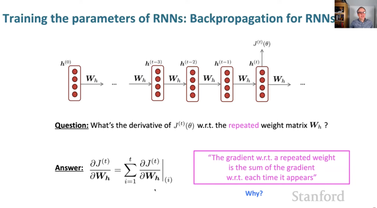</kbd>

> [!NOTE]
> đầu tiên đại khái là gs nhắc lại về quá trình backprop để tính **derivative
> của loss function with respect to parameters** để dùng nó **update
> parameters. Và làm như vậy đối với embedding luôn**
>
>
>
> Tuy nhiên với RNN có phần phức tạp hơn khi Wh là parameter matrix
> được dùng xuyên suốt (qua các time-step) để tính các hidden state.
>
>
>
> Câu trả lời đó là để tính derivative of loss function tại time-step t w.r.t
> Wh sẽ bằng **tổng các derivative of loss function tại time-step t_i, {i=1,2,..
> .t} w.r.t Wh.**
>
>
>
> Gs chú ý rằng cái tổng này **không đơn giản là bằng t lần dJ<t>/dWh**
> vì **mỗi khi mình "dùng" Wh (để tính hidden state) thì upstream gradient
> nó khác.**

 

<kbd>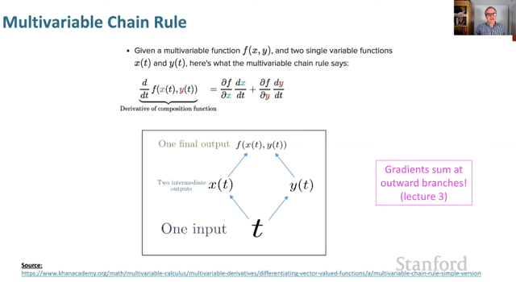</kbd>

> [!NOTE]
> Nhắc lại cái kiến thức về derivative liên quan cái này, đó là vẽ
> computational graph ra, từ t xuất ra hai nhánh tính toán x(t) và y(t) để
> rồi sau đó tính f(x,y) thì khi backprop tính df/dt sẽ là tổng hai nhánh

 

<kbd>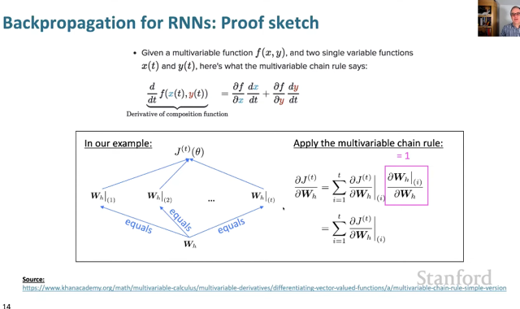</kbd>

> [!NOTE]
> Điều tương tự cũng vậy với RNN, Wh chỉ là qua các phép tính / qua các nhánh
> khác nhau (mỗi nhánh là 1 time-step) để tính hidden state nên derivative cũng
> tính tương tự. Chỉ có điều kiểu như khi Wh bắt đầu tính qua các nhánh **chỉ là "
> copy" chính nó, nên dWh (i) / dWh = 1**

 

<kbd>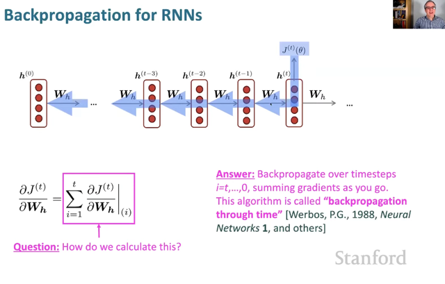</kbd>

> [!NOTE]
> đầu tiên ta sẽ tính **derivative of loss function w.r.t last hidden state** và **w.r.t
> Wh tại last time step** tại đây thì ta có (gradient để update) cho Wh tại last
> time-step.
>
>
>
> Tiếp tục "**backprop (through time)"** về các time-step trước để tính các
> gradient của Wh tại các time-step đó và ta sẽ **cộng dồn** vào để khi tới
> time-step đầu thì ta có **total update cho Wh**
>
>
>
> Gs có chú ý đó là, trong quá trình backprop, ta sum (cộng dồn) gradient của
> Wh cho đến khi **xong (tới time-step đầu) thì ta mới update Wh**, chứ không
> phải update Wh khi backprop vì đó là invalid vì trong **quá trình forward prop**
> thì ta **chỉ dùng một giá trị Wh để tính cho mọi step.**
>
>
>
> Cái trick thứ 2 đó là có thể **truncated** - cụ thể là ta sẽ chỉ sum up ví dụ 20 step
> Backward thôi, sau đó thì update Wh chứ không đợi đến khi tới từ đầu tiên (time
> step đầu tiên). Việc này có thể áp dụng khi câu quá dài.

 

<kbd>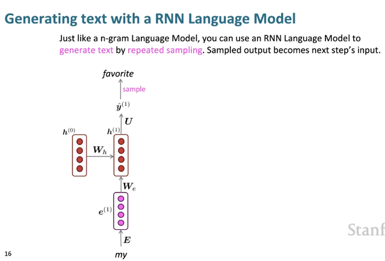</kbd>

> [!NOTE]
> cũng như n-gram model ta có thể dùng RNN language model để
> **generate text**.
>
>
>
> Ví dụ như ở đây, bắt đầu với **hidden state được initialized với zero**,
> nhận vào từ đầu tiên = input của time-step 1 là "my" hoặc có thể là một
> special token **<SOS> (start of sentence)** tất nhiên là phải "chuyển thành"
> **embedding vector** của nó, rồi mới "cho vào" model để tính toán cụ thể là
>
>
>
> h<1> = tanh(Wh.h<0>+We.e<1> + b1)
>
>
>
> y^<t> = softmax (Uh<1> = b2)
>
>
>
> để ra một probability distribution của từ tiếp theo

 

<kbd>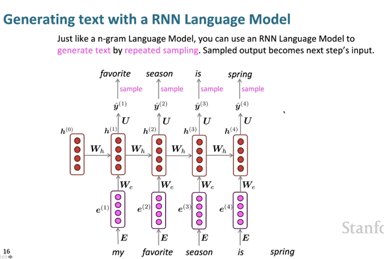</kbd>

> [!NOTE]
> Đưa từ được chọn, vào làm input của time-step tiếp theo 
> và tính toán tiếp tục cho đến khi generate ra được eos token

 

<kbd>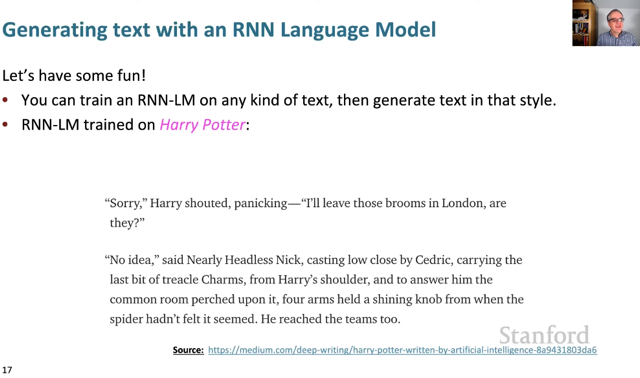</kbd>

> [!NOTE]
> ví dụ kết quả của một RNN model trained
> trên bộ HP

 

<kbd>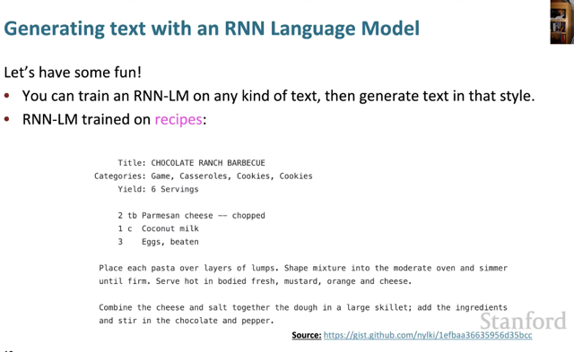</kbd>

> [!NOTE]
> với model train trên cook book thì ta có như vầy, nhận xét đó là dù cái recipe
> của nó có vẻ vô lý nhưng có thể thấy nó học được cấu trúc của một công thức
> nấu ăn rất tốt khi nó có title, phục vụ cho mấy người...
>
>
>
> Một điểm gs chú ý đó là n-gram model về cơ bản chỉ là đếm - **đếm số lượng
> tần suất xuất hiện của các n-gram**. Nên nó tính **rất nhanh** ngay cả với large
> corpus có thể chỉ vài phút. Trong khi đó với RNN thì việc training c**ó thể mất
> nhiều thời gian hơn nhiều**

 

<kbd>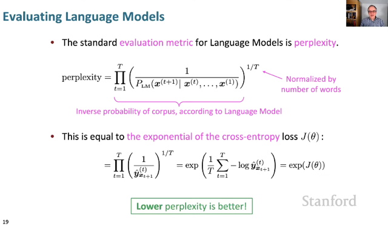</kbd>

> [!NOTE]
> Đại khái là để **đánh giá performance** của language model thì một
> metric đó là **perplexity** được tính toán theo công thức dưới, **với một
> chuỗi T piece of text**, trong đó ta tính **xác suất của một piece of text 
> (ví dụ một từ), given t từ trước đó**. Và tính **product** tất cả (T) các giá trị
> xác suất này. Sau đó **inverse (^-1)** và **lũy thừa (1/T).**
>
>
>
> Nhưng một cách dễ hiểu hơn perplexity đơn giản chỉ là exp(J) với J là
> cross entropy loss function.

 

<kbd>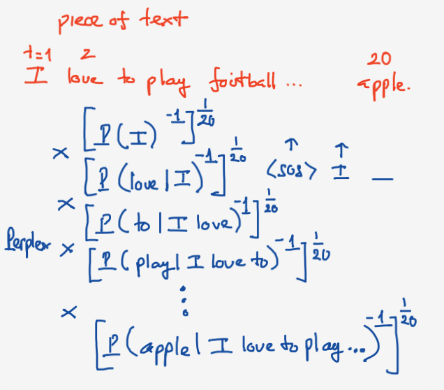</kbd>

 

<kbd>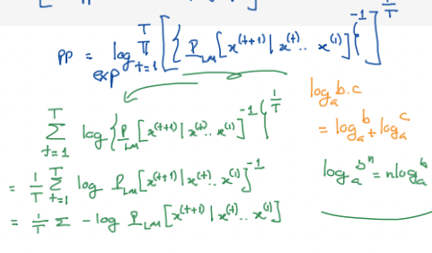</kbd>

 

<kbd>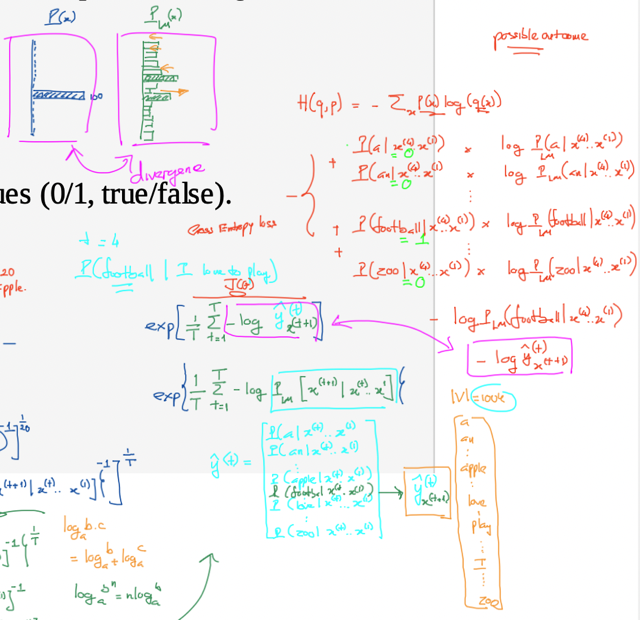</kbd>

> [!NOTE]
> tại sao lại là exp(cross entropy loss)

 

<kbd>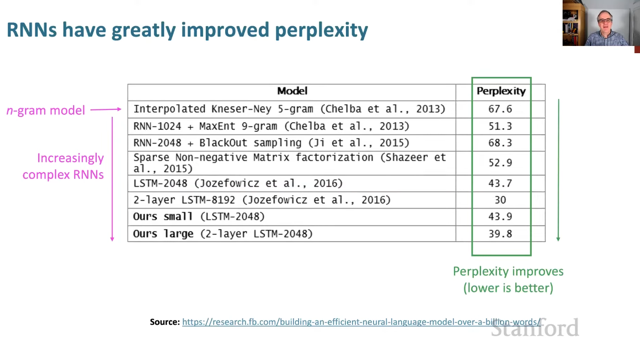</kbd>

> [!NOTE]
> với các mô hình ngày càng mạnh khắc phục các nhược điểm của
> "vanilla RNN" thì perplexity ngày càng thấp. Hiện tại các mô hình
> hiện đại nhất có thể đã đạt perplexity dưới 30

 

<kbd>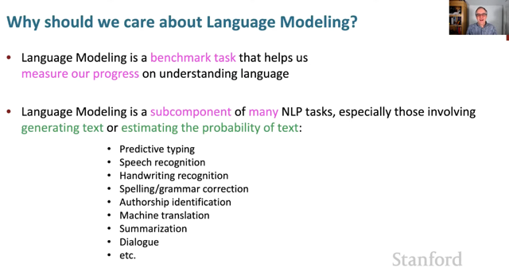</kbd>

 

<kbd>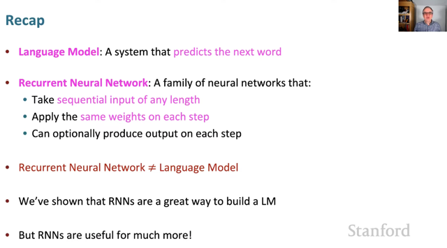</kbd>

 

<kbd>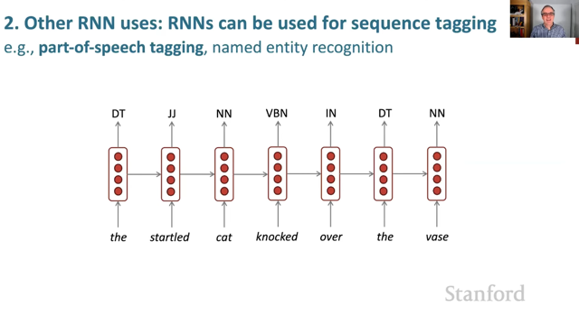</kbd>

<kbd>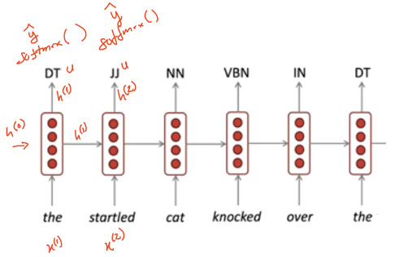</kbd>

> [!NOTE]
> có thể dùng RNN cho bài toán sequence tagging, bằng
> cách output RNN tại mỗi timestep để qua vài layer với
> softmax để predict ra một distribution trên các possible
> tagging

 

<kbd>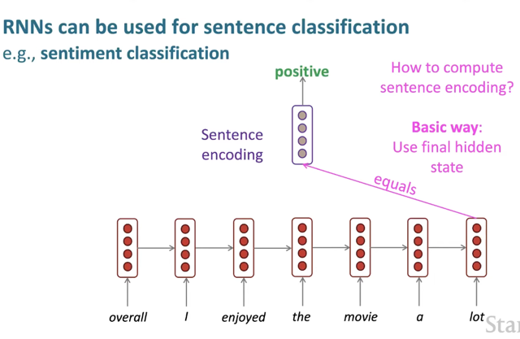</kbd>

<kbd>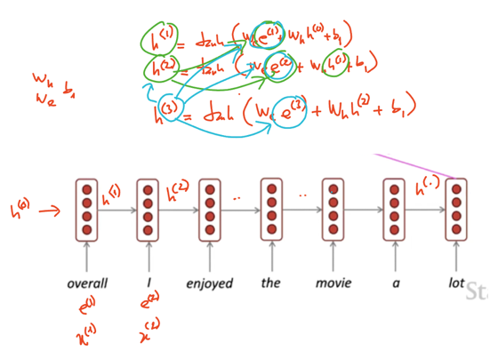</kbd>

> [!NOTE]
> rõ ràng **hidden state cuối** có thông tin của các word
> trong câu nên c**ó thể dùng nó làm sentence encoding**
> cho bài toán sentiment classification

 

<kbd>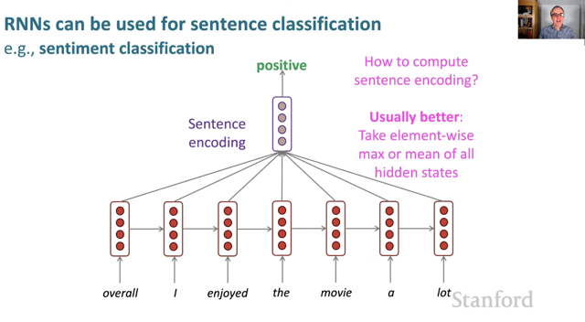</kbd>

> [!NOTE]
> đại ý là thường ta sẽ có **kết quả tốt hơn** nếu dùng **mọi hidden states**, có
> thể là **element-wise max hoặc mean**, tức là lấy max hoặc mean của các
> hidden states. Vì như vậy nó có **tính chất cân xứng (symmetric) tốt hơn** (ý
> nói, thông tin không bị lệch về phía cuối câu hơn là đầu câu.

 

<kbd>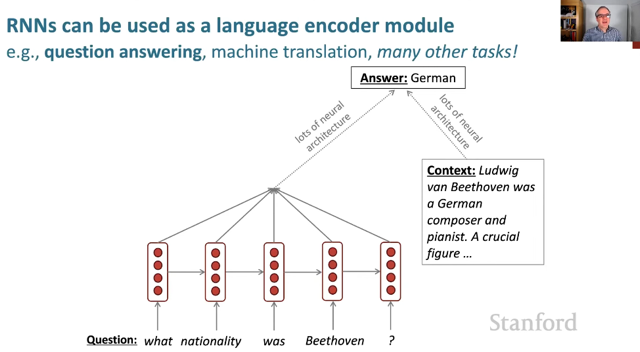</kbd>

> [!NOTE]
> nói về việc RNN có thể được dùng như một encoder module
> để giúp encode thông tin phục vụ cho các bài toán khác của
> NLP như QA, machine translation

 

<kbd>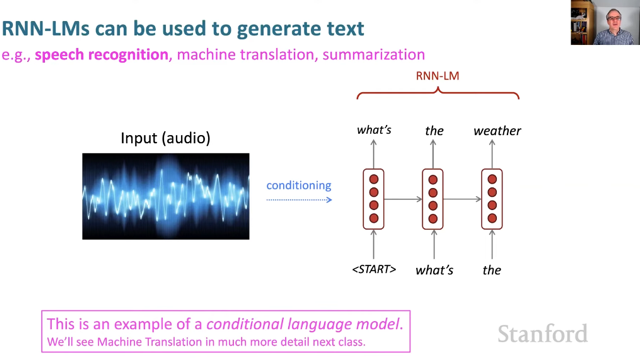</kbd>

> [!NOTE]
> Đại ý là ta cũng có thể dùng RNN như "decoder" (thay vì encoder, giúp
> encode information trong language để dùng cho mục đích khác) thì đây nó
> sẽ giúp giải mã (decode) thông tin từ các dạng khác để chuyển sang
> language như trong lĩnh vực Speech Recognition

 

<kbd>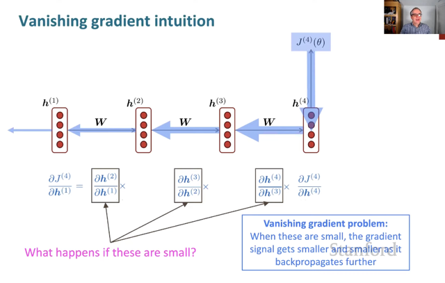</kbd>

> [!NOTE]
> Đại ý là khi ta thực hiện backprop (through-time) thì để tính dJ/dh(1) thì dựa
> theo chain rule, ta sẽ backprop qua một loạt các node: lấy upstream
> gradient * local gradient để có downstream gradient.
>
>
>
> Và với nhiều lần nhân local gradient, nếu mang giá trị nhỏ thì gradient sẽ
> nhỏ dần nhỏ dần, để cuối cùng trở thành = 0: vanish.
>
>
>
> Trạng thái này cũng y như vấn đề xảy ra khi training một mô hình deep
> learning với nhiều layer và W được initialize không tốt, hoặc dùng các
> function sigmoid, tanh....

 

<kbd>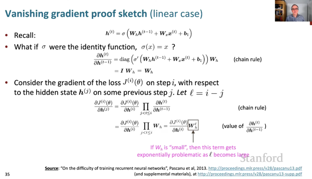</kbd>

 

<kbd>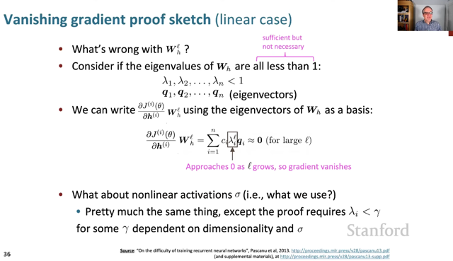</kbd>

 

<kbd>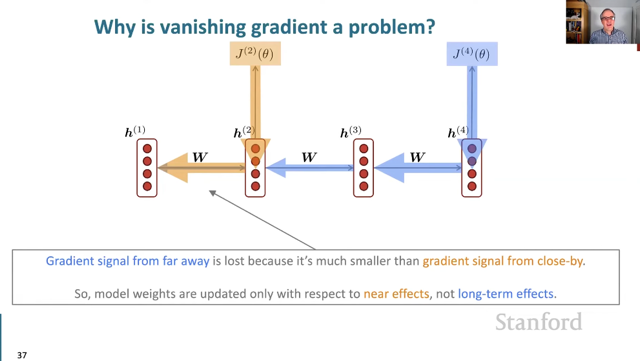</kbd>

> [!NOTE]
> đại khái dẫn đến hệ quả là, gradient signal từ các time-step xa (cuối
> câu) sẽ **nhỏ**, dẫn đến **ít ảnh hưởng** và thay đổi param theo hướng
> giúp **những từ ở đầu câu sẽ giúp giảm loss khi predict những từ ở
> cuối câu**.
>
>
>
> Nhưng việc này thì không như vậy với các time-step ở gần, dẫn đến
> param của model sẽ giúp **predict tốt các từ kế tiếp dựa trên các từ
> gần đó** chứ không dùng thông tin của các từ ở đầu mà dự đoán tốt
> các từ ở cuối.

 

<kbd>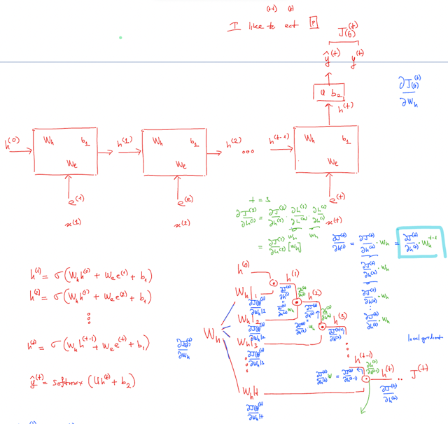</kbd>

 

<kbd>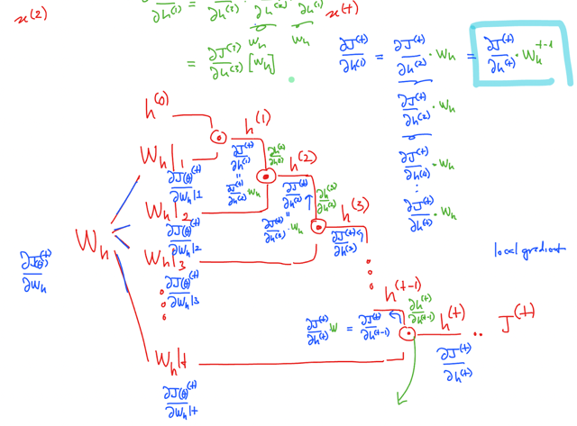</kbd>

 

<kbd>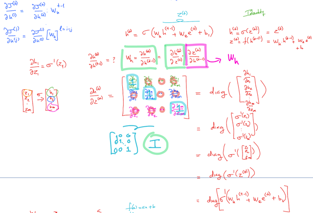</kbd>

 

<kbd>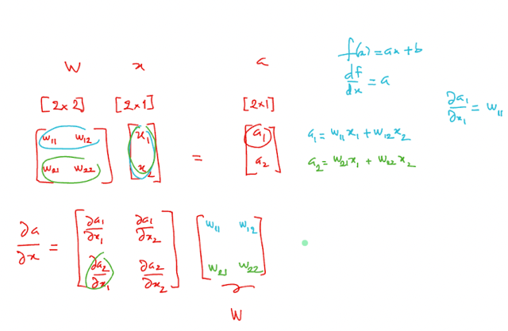</kbd>

 

<kbd>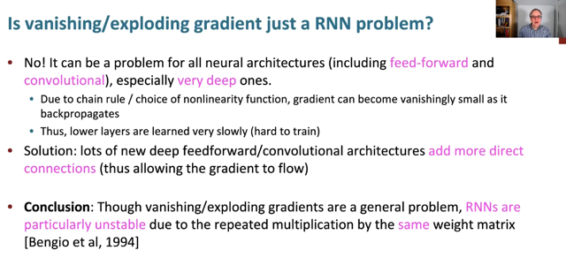</kbd>

> [!NOTE]
> Q.A: Có câu hỏi là khi nào thì nên dùng RNN hay LSTM.
> Gs trả lời là nên dùng **LSTM**, ngày nay ít khi người ta dùng
> RNN, vì những hạn chế của nó

 

<kbd>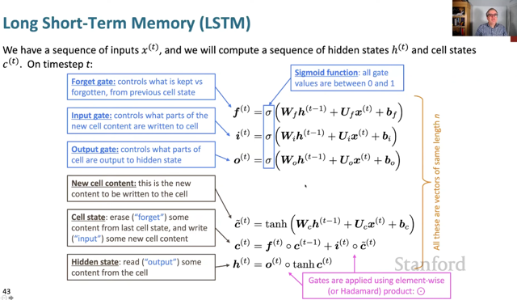</kbd>

> [!NOTE]
> Câu hỏi thứ hai là về (yêu cầu gs nói rõ thêm về) các **learnable
> gate**
>
>
>
> -> Mọi bộ params của các gate **đều được learn bằng backprop**.
> và từ đó model sẽ học được cách nhận biết **khi nào thì nên giữ
> thông tin dài hạn khi nào thì nên quên đi bớt** (forget gate Wf, bf)
>
>
>
> Khi nào thì hay **thông tin đưa vào nào thì quan trọng cần đưa vào
> memory", thông tin nào thì không** (input gate).

 

<kbd></kbd>

> [!NOTE]
> Đại ý câu hỏi là xin gs nói rõ hơn về gradient flow giúp LSTM giúp giữ
> được thông tin lâu dài
>
>
>
> đại ý đó là gs nhắc đến skip connection sẽ kiểu như c(t-1) được giữ lại
> nhưng LSTM thì dùng một cách khác trong đó c(t-1) sẽ được bỏ bớt
> thông tin khi qua forget gate và add thêm thông tin nhờ input  gate. Và
> không hề có việc c(t-1) được nhân với một weight matrix nào (để mà gây
> ra hiện tượng vanishing/exploding) gradient khiến model "mất trí nhớ"
>
>
>
> Dù trong sơ đồ tại forget gate là dấu nhân nhưng đó là hadamard
> product.

 

<kbd>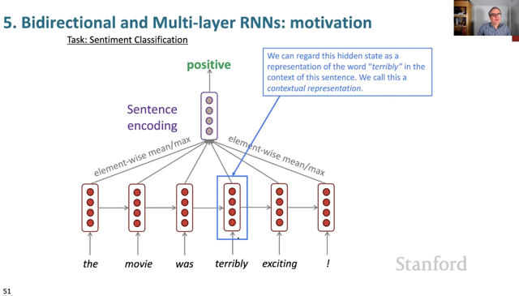</kbd>

> [!NOTE]
> đại ý là ví dụ như ta có thể **dùng hidden state tại mỗi time-step để
> represent cho từ input word** tại time-step đó theo ý nghĩa đó là nó thay
> vì c**hỉ chứa đựng ý nghĩa của từ một cách chung chung** như trong
> embedding vector thì nó **phản ánh thêm yếu tố ngữ cảnh của từ trong
> câu cụ thể.**

 

<kbd>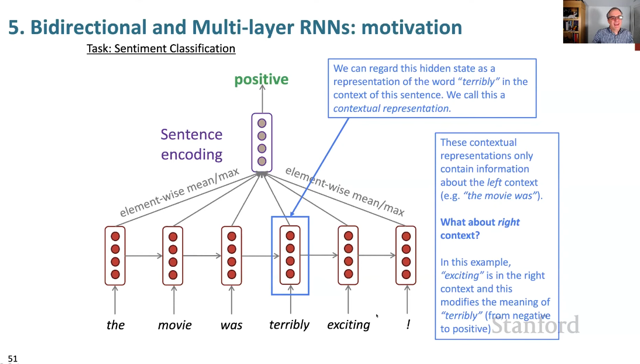</kbd>

> [!NOTE]
> có điều nếu dùng RNN hay LSTM truyền thống thì ta **chỉ có
> hidden state phản ánh bối cảnh trước đó của từ mà không có "
> sau đó".** Ví dụ trong câu này hidden state của từ terribly sẽ không
> được bổ nghĩa bởi từ exciting.

 

<kbd>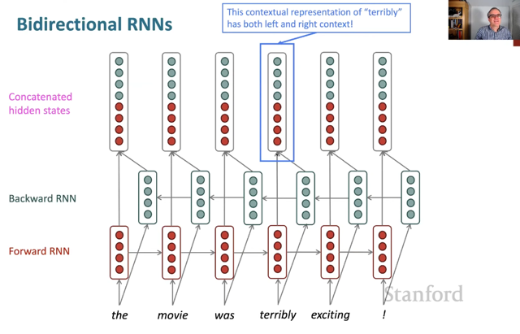</kbd>

> [!NOTE]
> giải pháp là bidirectional RNNs **cơ bản là ta có 2 RNN** chỉ là xử lí
> theo hai chiều ngược nhau. Để rồi ta sẽ **nối hidden state** của mỗi
> model lại để có contextual representation chứa đựng thông tin ngữ cảnh
> cả trước và sau

 

<kbd>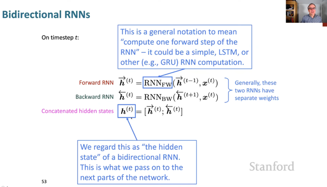</kbd>

 

<kbd>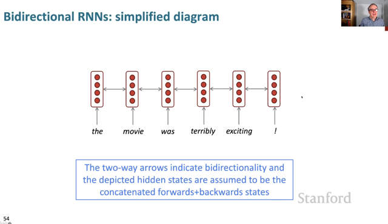</kbd>

 

<kbd>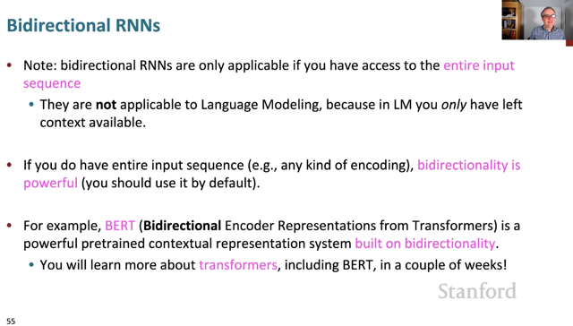</kbd>

 

<kbd>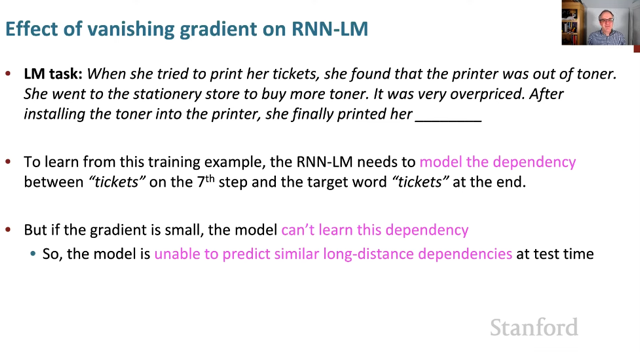</kbd>

> [!NOTE]
> Ví dụ cho thấy model không tốt trong khả năng dùng thông tin từ các từ ở
> đầu câu để predict cho những từ ở cuối câu với câu dài.

 

<kbd>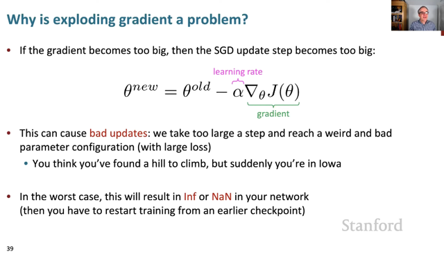</kbd>

> [!NOTE]
> nói đến vấn đề khác của RNN là **exploding gradient**. Khi gradient
> trở nên rất lớn, gây **mất ổn định** quá trình training, việc này cũng
> giống như khi l**earning rate quá lớn** khi training **không thể
> converge**. Giáo sư nói đến hình ảnh mình theo hướng có độ dốc
> cao nhất để maximum likelihood (cũng là để minimize loss) nhưng
> vì "bước quá lớn" mà thay vì lên đỉnh đồi thì ta lại qua phía bên kia
> đồi.
>
>
>
> Ngoài ra nó còn có thể gây vấn đề NaN khi số quá lớn gây lỗi

 

<kbd>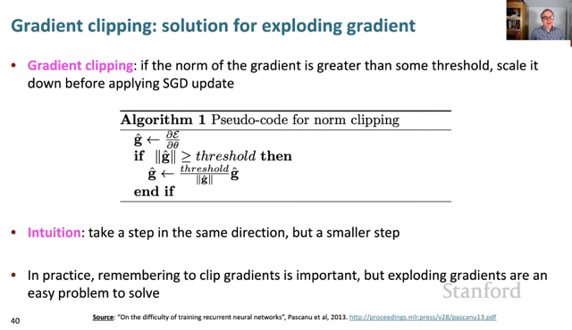</kbd>

> [!NOTE]
> giải pháp đơn giản hơn vấn đề vanishing đó là khi gradient trở nên lớn thì
> ta "cắt bớt nó" - clipping,  ở đây dùng cách thức hơi khác với DLSpec, đó
> là scale gradient xuống với factor = threshold / norm gradient thay vì "
> clipping" như trong DLSpec.

 

<kbd>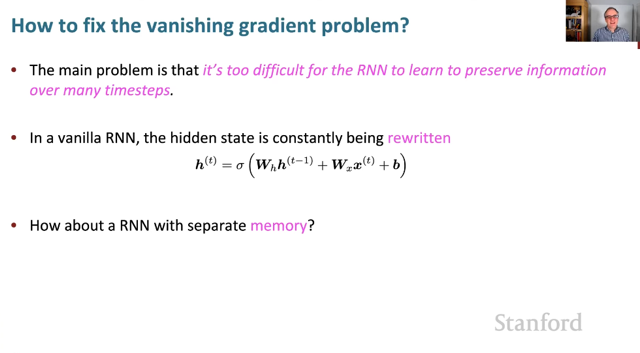</kbd>

> [!NOTE]
> còn vấn đề vanishing, đầu tiên có thể hiểu nguyên nhân là do
> hidden state bị thay thế sau mỗi time-step khi tính toán với Wh và apply
> non-linearity. Do đó người ta nghĩ đến việc tìm cách giữ lại nó (xuyên
> suốt qua các time-step như một kiểu "trí nhớ")

 

<kbd>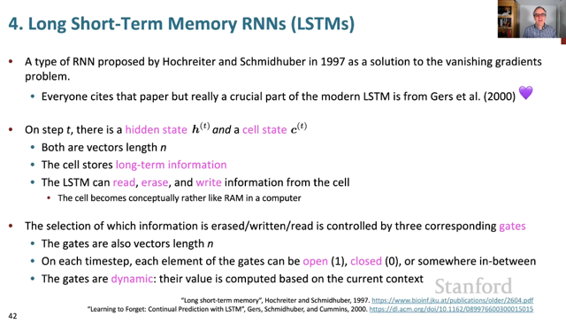</kbd>

> [!NOTE]
> Gs nói một chút về các tác gỉa của LSTM dù có đóng góp to lớn trong 
> việc phát triển ra cái này - vốn là một mô hình có sức ảnh hưởng rất
> lớn trong lịch sử của ai lại không nhận được sự công nhận tương xứng.
>
>
>
> Trong LSTM sẽ có thêm cell state c(t) đóng vai trò như long-term memory
> dù rằng giáo sư cho rằng đổi lại tên mới đúng. Cũng là vector dài n phần
> tử như hidden state
>
>
>
> LSTM muốn bắt chước hoạt động của memory khi có thể đọc, xóa và cập
> nhật lại thông tin cần "nhớ"
>
>
>
> Có thêm các gate, cũng là các vector, mang giá trị 0-1, thể hiện việc gate
> có thể đóng mở (để cho thông tin đi qua hay không)

 

<kbd>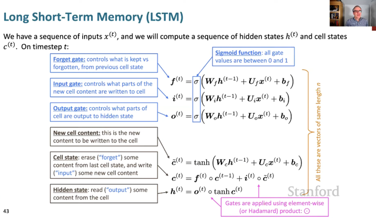</kbd>

> [!NOTE]
> Mỗi gate sẽ có một bộ parameter riêng, công thức có vẻ giống giống với RNN
> cell khi cũng tính toán với hidden state ở time-step trước và input x(t).
>
>
>
> Nhưng nonlinearity là sigmoid function để output value từ 0-1, để mang ý
> nghĩa là cửa đóng, mở một phần hoặc mở hoàn toàn.
>
>
>
> Forget gate kiểm soát thông tin được giữ lại hoặc quên đi.
>
>
>
> Input gate kiểm soát phần nào của cell content được "ghi" vào cell-state mang
> tính chất là long term memory
>
>
>
> Output gate kiểm soát phần nào của cell được cho đi tiếp vào hidden state
>
>
>
> c~(t) là candidate cho cell state tính toán từ hidden state trước và input hiện tại
>
>
>
> cell state c(t) sẽ được tính toán từ cell state trước c(t-1) với của forget sẽ kiểm
> soát phần nào từ cell state trước nên quên đi, phần nào giữ lại và candidate
> c~(t) với input gate để kiểm soát phần nào của candidate được đưa vào long
> term memory - cell state
>
>
>
> Hidden state mới sẽ được tính với cell state và output gate mang ý nghĩa là
> thông tin ngắn hạn từ time-step trước. Cái này khi tham gia tính toán candidate
> của cell state ở time-step sau và sau đó là c(t) với input gate sẽ mang ý nghĩa
> là có những trí nhớ ngắn hạn sẽ được chuyển thành dài hạn.
>
>
>
> Gs có chú ý kí hiệu Hadamard product, có thể gặp chỗ khác người ta kí hiệu
> Hình tròn to hơn có dấu chấm ở giữa. Đây là phép tính element-wise multiply
> vector (khác dot product

 

<kbd>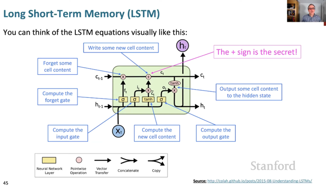</kbd>

> [!NOTE]
> Mấu chốt là cell state được đi xuyên suốt, với forget gate giúp quên đi bớt và
> input gate chỉ cộng thêm thông tin vào nhờ vậy mà khác với RNN, thông tin
> được giữ lại tốt hơn. (Nhớ lại RNN, h(t) = sigma(Wh.h(t)+...), hidden state 
> ở trước bị transform khi nhân với Wh, còn ở LSTM, c(t) chỉ được tính toán với
> phép cộng

 

<kbd>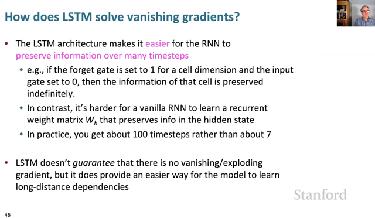</kbd>

> [!NOTE]
> đại ý là lstm giải quyết rất tốt vấn đề '**không capture được long-range
> dependency**' giúp tạo ra model có "trí nhớ" tốt hơn.
>
>
>
> Thường người ta sẽ set forget gate có **giá trị ban đầu = 1**, mang ý
> nghĩa là **"giữ hết" thông tin trong trí nhớ dài hạn**. Và quá trình
> training, model sẽ **học cách quên bớt đi.**
>
>
>
> lstm không thể learn dependency **"dài mãi"** mà nó chỉ tăng khả năng "
> nhớ" của model **lên nhiều hơn so với RNN** thôi.
>
>
>
> Lstm **không hoàn toàn khắc phục hiện tượng vanishing/exploding gradient** 
> nhưng chắc chắn là nó c**apture long term dependency tốt hơn RNN**

 

<kbd>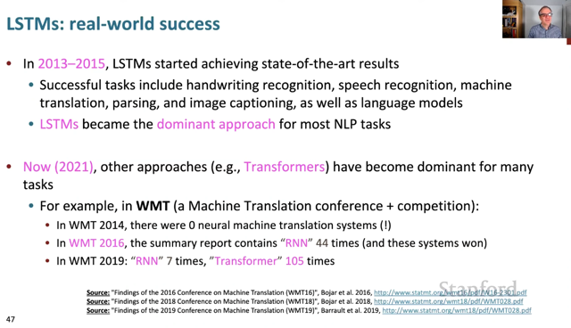</kbd>

 

<kbd>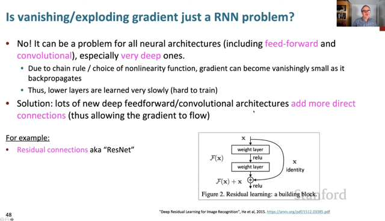</kbd>

> [!NOTE]
> đại ý là vanishing / exploding gradient không phải chỉ là vấn đề của riêng
> RNN. Mà như CS231n đã thấy với neural network **có nhiều layer việc tính
> toán qua nhiều layer đều gây hiện tượng này** với các solution như weight
> initialization, các activation function tốt hơn..
>
>
>
> Ngoài ra còn có nhiều kiến trúc model cố gắng khắc phục, ví dụ như
> **Residual connection** (còn gọi là **Skip-Connection**) trong đó giúp mặc định là
> "reserve information"

 

<kbd>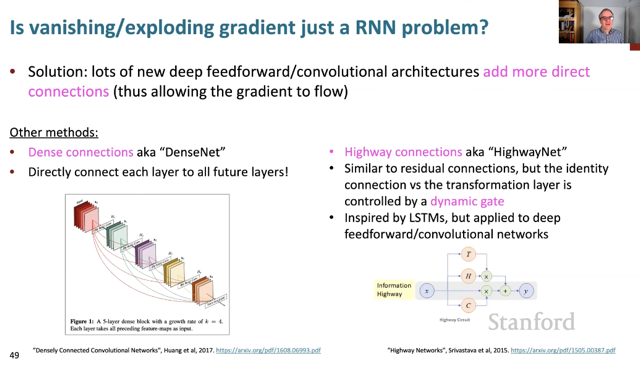</kbd>

 

<kbd>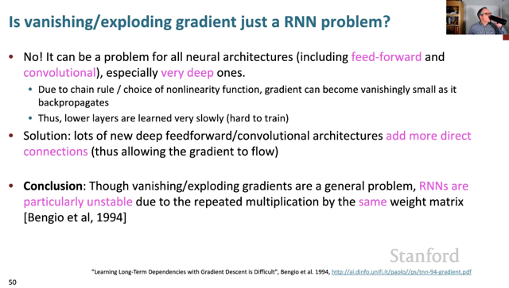</kbd>

> [!NOTE]
> Tuy là vanishing/exploding là vấn đề chung mỗi khi có sự tính toán
> qua nhiều layer nhưng với RNN thì nó **đặc biệt gây bất ổn định
> quá trình training hơn** do **bản chất phải nhân với cùng một bộ
> params qua nhiều time-step**

 

