# Lecture 7: Translation, Seq2seq, Attention

📊 **Progress:** `42` Notes | `48` Screenshots

---

## Lecture 7: Translation, Seq2seq, Attention

 

<kbd>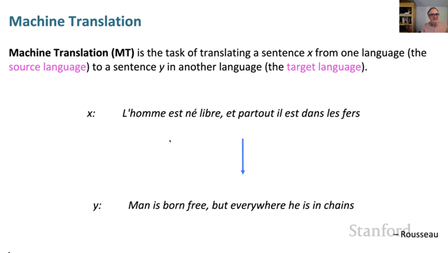</kbd>

> [!NOTE]
> Gs định nghĩa về **machine translation** là nhiệm vụ **dịch một văn
> bản từ một ngôn ngữ này sang ngôn ngữ khác** và giới thiệu các
> các tiếp cận trước khi có neural network

 

<kbd>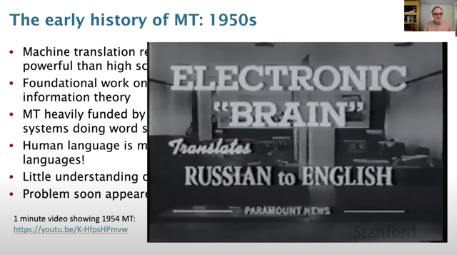</kbd>

> [!NOTE]
> Đại ý là (vấn đề machine translation) khởi nguồn từ mong muốn của
> người Mỹ trong việc n**ắm bắt được thông tin của người Nga trong giai
> đoạn chiến tranh lạnh.**
>
>
>
> Tuy nhiên với cách tiếp cận chủ yếu theo kiểu **dựa trên grammar
> structure** và **word look u**p đồng thời với các m**áy tính ở thời kì sơ
> kha**i với rất nhiều hạn chế đã cho thấy thử nghiệm hoàn toàn không
> thành công.

 

<kbd>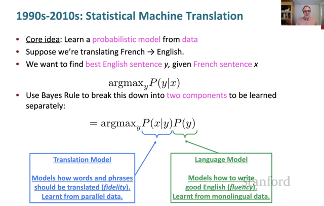</kbd>

> [!NOTE]
> đại ý là trong giai đoạn từ 1990s - 2010s, cách tiếp cận theo hướng
> **statistical machine translation.** Theo đó ta sẽ xây dựng **probabilistic
> model dự đoán từ tiếp theo (của câu dịch, ví dụ tiếng Anh) dựa trên câu gốc
> (câu cần dịch, ví dụ tiếng Pháp)** bằng cách **tính toán và chọn ra chuỗi có
> xác suất p(y|x) cao nhất.**
>
>
>
> Và dựa vào Bayes rule, ta có thể chuyển nhiệm vụ thành tính toán và chọn
> câu dịch sao cho **maximize P(x|y)P(y)**. Việc này có lợi ích là có thể tách
> thành hai phần với P(x|y) đại diện cho **translation model**, với mục tiêu là
> học được cách translate đúng giữa câu dịch và câu gốc để đạt tính chất "
> chân thực" - **fidelity**
>
>
>
> Và **P(y)** đại diện cho **language model** học cách làm sao viết được câu
> tiếng Anh một cách fluent - tức là cái này sẽ học các khía cạnh, đặc điểm của
> language để từ đó dùng từ cho chính xác, hợp lí để đạt tính chất tạm gọi là
> lưu loát, hợp lí (**fluency**).  Model sẽ học cái này từ bản thân các tính chất
> (thống kê) nội tại ngôn ngữ gốc

 

<kbd>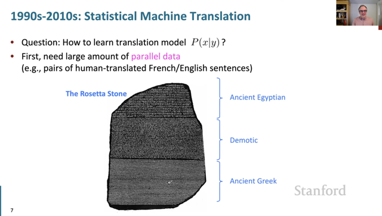</kbd>

> [!NOTE]
> đại ý là để huấn luyện "translation model" thì ta sẽ cần bộ dữ liệu lớn các
> "**parallel data**" - các văn bản **cùng một nội dung** nhưng thể hiện bằng **hai
> ngôn ngữ**.
>
>
>
> Ví dụ nổi tiếng là **phiến đá Rosetta** mà nhờ đó các nhà ngôn ngữ học giải
> mã được chữ tượng hình cổ của Ai Cập.
>
>
>
> Và may mắn là ta có một số **nguồn dồi dào** các data kiểu này do liên các
> tổ chức tạo ra như liên minh châu Âu, Canada...

 

<kbd>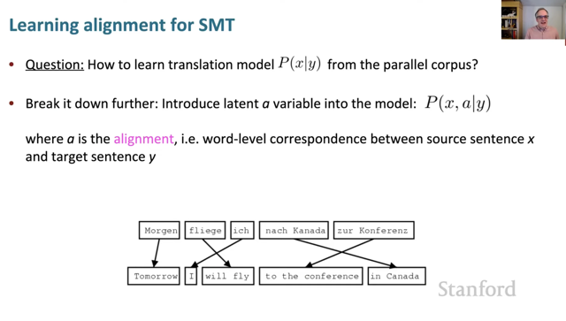</kbd>

> [!NOTE]
> đại ý là nói về một variable mang tính chất ẩn (**latent**), giúp thể hiện **sự
> tương ứng (alignment)** ví dụ theo cấp độ từ (word-level) giữa source
> sentence x và target sentence y.

 

<kbd>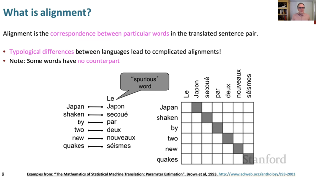</kbd>

> [!NOTE]
> có thể hiểu đại khái alignment là **sự tương ứng** giữa các phần
> (có thể là từ, nhiều từ) của câu gốc và câu dịch.
>
>
>
> Và vì tính chất khác nhau của ngôn ngữ gốc và target nên alignment
> có thể rất phức tạp. Có từ không có counterpart ví dụ từ 'Le' trong 
> 'Le Japon'.

 

<kbd>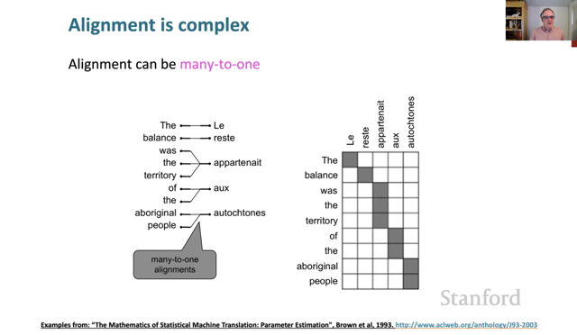</kbd>

> [!NOTE]
> có thể có tính chất nhiều từ câu gốc ứng với chỉ một từ trong câu
> dịch. Trong ví dụ này 'was the territory' chỉ ứng với 'apppartenait'

 

<kbd>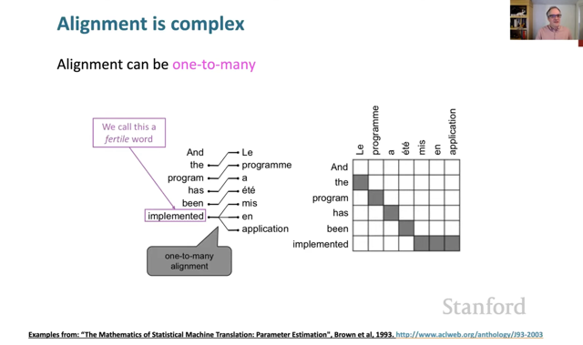</kbd>

> [!NOTE]
> Cũng có khi một từ trong câu gốc align với nhiều từ trong câu
> dịch như 'implemented' ứng với 'mis en application'

 

<kbd>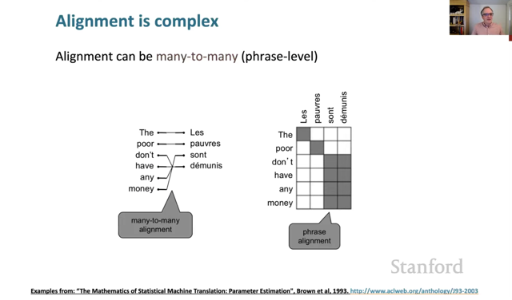</kbd>

> [!NOTE]
> và có thể quan hệ
> many - to - many.

 

<kbd>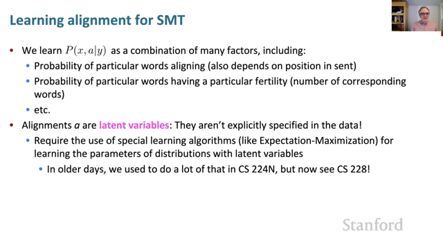</kbd>

> [!NOTE]
> Đại khái là ta sẽ tìm cách học yếu tố alignment này, thông qua statistical
> information trong parallel data như có những cặp từ/ cặp cụm từ hay
> xuất hiện cùng nhau và vị trí của chúng sẽ cho ta biết alignment.
>
>
>
> Tuy nhiên alignment là categorical latent variable nên phải dùng các
> thuật toán học tập đặc biệt để learn như expectation - maximization.
>
>
>
> Nói thêm các course CS224 trước đây sẽ đào sâu cái này nhưng giờ thì
> không, mà chuyển qua CS228.

 

<kbd>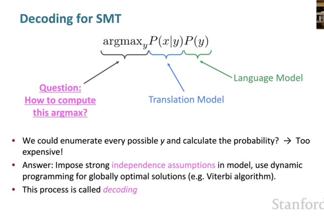</kbd>

> [!NOTE]
> Đại khái là câu hỏi đặt ra là khi đã có translation và language model rồi thì
> việc dùng chúng để tạo câu translation (tức là tìm y (câu dịch) sao cho
> maximum p(x|y)*p(y)).
>
>
>
> Gs mới nói một cách naive để làm việc này đó là tính toán chỉ số xác suất
> của mọi câu dịch khả dĩ để chọn câu có xác suất cao nhất. Tuy nhiên việc
> này là rất không hiệu quả vì số câu dịch (ứng cử viên) sẽ tăng lũy thừa
> theo số từ của câu gốc. Cho nên cách làm hợp lí đó là generate từng từ 1
> mỗi lần

 

<kbd>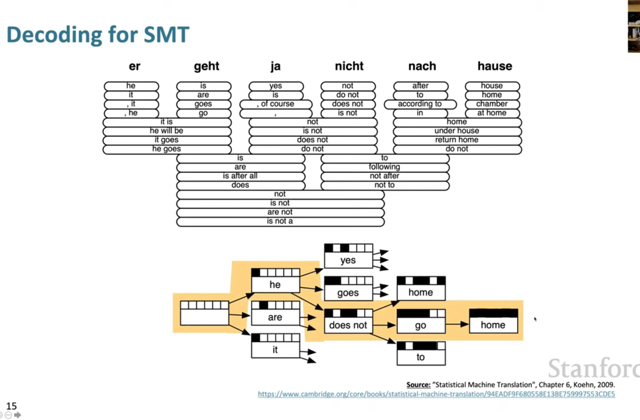</kbd>

> [!NOTE]
> Đại khái là, translation model sẽ chuẩn bị các từ, cụm từ để (là bản
> dịch) tương ứng với các từ, cụm từ trong câu gốc. Sau đó, việc cần
> làm là kiểu như dùng các từ, cụm từ này như các lego block để sắp
> xếp lại thành một câu dịch. Language model sẽ hướng dẫn việc này.
> Ví dụ nó sẽ biết rằng phải bắt đầu với "he" thay vì "are". Và cứ mỗi
> block được chọn ta sẽ theo dõi các từ nào trong câu gốc đã được
> dịch.

 

<kbd>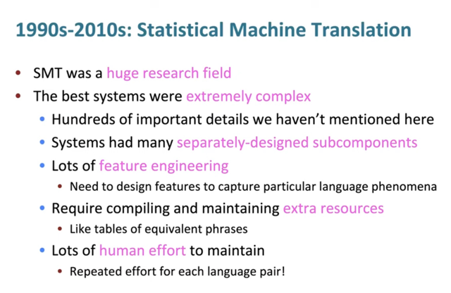</kbd>

> [!NOTE]
> Đại khái là giai đoạn SMT này còn rất nhiều vấn đề khác nữa chứ
> không chỉ đơn giản như vậy. Và nôm na là cách làm này này cần sự
> nỗ lực rất lớn trong việc feature engineering kết hợp với nhiều
> subcomponent khác, và duy trì cập nhật các phrase table. Tuy nhiên
> nó cũng gặt hái những thành công nhất định. Do đó Google Translate
> ra đời trong những năm 2010 cũng đã tạo dc hệ thống semi-decent
> machine translation

 

<kbd>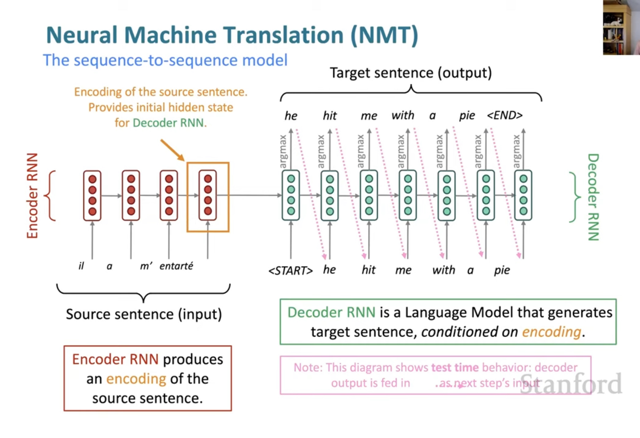</kbd>

> [!NOTE]
> Đại khái NML với mô hình seq2seq, có kiến trúc là 2 RNN. Một cái đóng
> vai trò encoder sẽ process source sentence, qua các timestep, để rồi
> hidden state ở timestep trước sẽ đóng vai trò là encoding của toàn bộ
> source sentence. Cái này sẽ trở thành initial hidden state h<0>của
> decoder RNN. Quá trình training cũng như bài trước đã học trong việc
> training RNN với teacher forcing.
>
>
>
> Tại mỗi timestep model sẽ cố gắng predict next token dựa trên (condition
> on) current hidden state và các từ đã generated trước đó.

 

<kbd>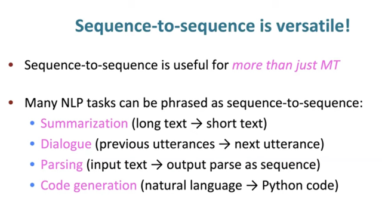</kbd>

> [!NOTE]
> Đại ý là seq2seq có thể được dùng cho
> những nhiệm vụ khác chứ không chỉ MT,
> như summarization, qa...

 

<kbd>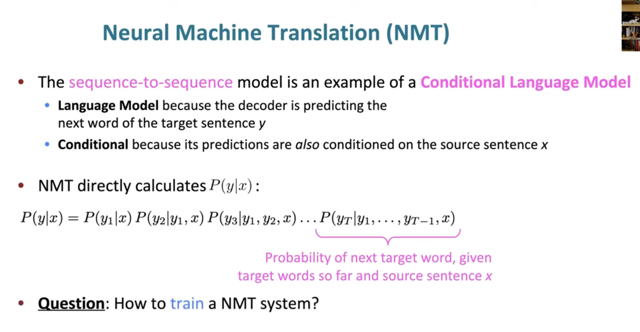</kbd>

> [!NOTE]
> Đại khái là  đây là một ví dụ của Conditional Language Model, vì khác
> với LM trong các bài trước, đó là nó chỉ start generating token dựa trên
> nothing, hidden state h0 initialize với zero vector, còn CLM thì condition
> trên source sentence encoding

 

<kbd>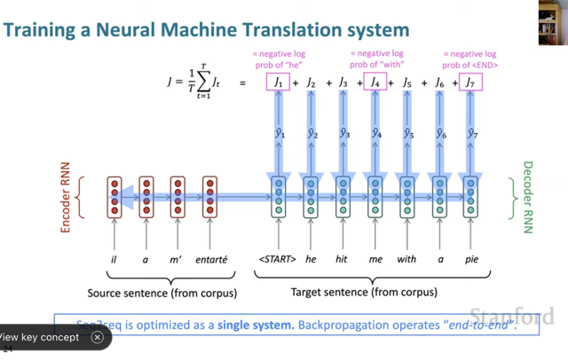</kbd>

> [!NOTE]
> Đại khái quá trình training sẽ bắt đầu với một large corpus of parallel data ví
> dụ như tập các câu tiếng Anh, Pháp. Quá trình training là đưa câu tiếng
> Pháp vào encoder để process, bỏ last hidden state vào decoder, để predict
> các từ của target sentence. Bắt đầu với SOS token. Tại mỗi timestep,
> predicted token sẽ cùng với correct token lấy từ target sentence để tính ra
> loss tại timestep đó (*) Quá trình backprop sẽ update toàn bộ params của
> decoder và encoder để tạo thành end to end training system.
>
>
>
> Ví dụ tại t=1, dựa trên SOS token, và current hidden state h0 là source
> sentence encoding, target là "he", tức là model phải predict ra từ tiếp theo
> là "he", do đó loss tại đây sẽ là -log prob (he) : -log của xác suất mà model
> tính toán cho từ "he". Loss của model trên trainign sample này sẽ là tổng lại
> tất cả loss trên mọi timestep để tình gradient trong quá trình backprop

 

<kbd>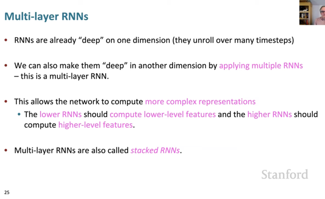</kbd>

> [!NOTE]
> Tới đây gs nói về multi layer RNN, trong đó ta có thể stack thêm nhiều RNN
> để trở nên deeper vertical dimension (RNN đã deep ở horizontal dimension
> với nhiều timestep).
>
>
>
> Gs cho biết rằng việc này tăng hiệu quả của model khi các RNN layer có thể
> học các low-high level of features khác nhau. Và dù cho số params không
> thay đổi nhiều khi dùng 4 layer RNN với 500D hidden state so với 1 layer
> RNN với 2000D hidden state thì multilayer RNN vẫn hiệu quả hơn
>
>
>
> Multiple layer RNN còn gọi là Stack RNN hay step RNN
>
> Có câu hỏi đó là low level high level feature là
> sao. Thì đại ý low level là những feature kiểu như
> là part of speech - kiểu như học dc rằng một từ có
> pos là gì...còn high level thì kiểu như là học được
> rằng nhiều từ kết hợp lại thành ra idiom hay các
> semantic meaning, những pattern về cấu trúc

 

<kbd>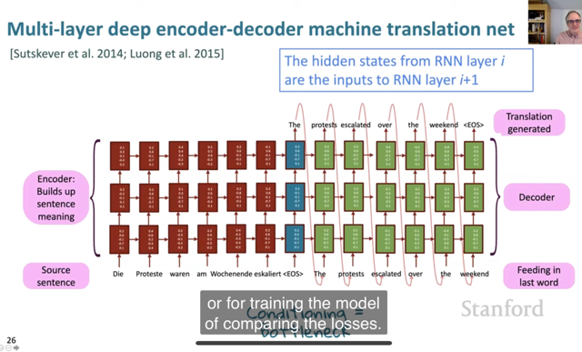</kbd>

 

<kbd>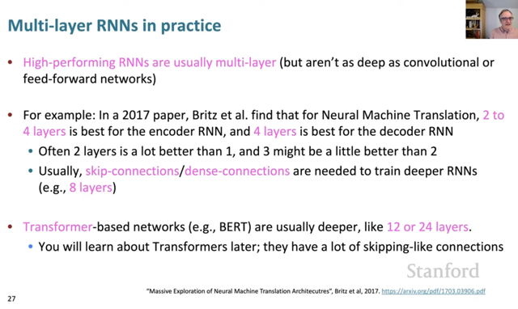</kbd>

> [!NOTE]
> Đại khái là ta chỉ có thể khẳng định 2 layer thì tốt hơn 1 layer.
> Nhưng nhiều hơn thì còn tùy (data, bài toán cụ thể). Và có thể
> nhiều nhất là 4 layer là đủ rồi và với 3,4 layer thì có thể phải có
> thêm skip connection thì mới hiệu quả. Nói sơ về Transformer sẽ
> học trong các bài tới

 

<kbd>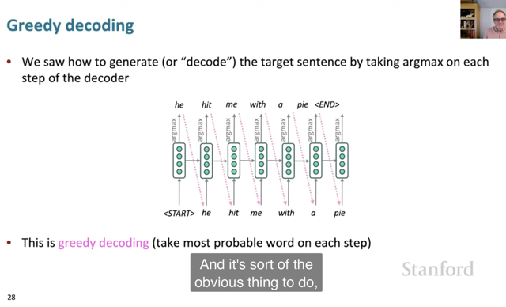</kbd>

> [!NOTE]
> Nói về sampling strategy greedy
> decoding, trong đó luôn lấy từ có
> probability lớn nhất ở mỗi step.

 

<kbd>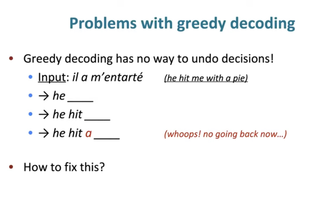</kbd>

> [!NOTE]
> Đại khái là với g.d thì kiểu như một khi đã (có/generate) từ hit thì luôn luôn theo sau là
> a vì p(a) luôn luôn cao nhất. Và từ đó, không thể "cho ra" câu dịch đúng nhất là ...hit me..

 

<kbd>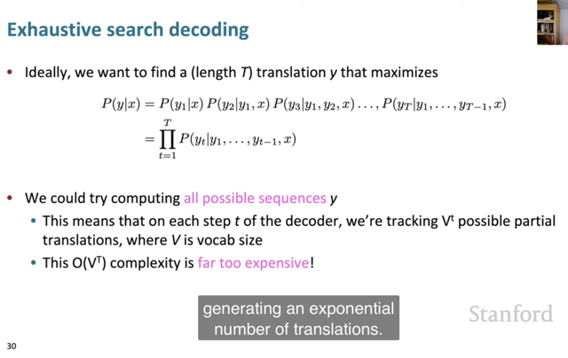</kbd>

> [!NOTE]
> Đại khái là một cách lí tưởng thì ta muốn tìm một chuỗi có probability
> lớn nhất với probability tính như công thức. Tuy nhiên việc tính hết
> các probability của tất cả các possible sequences là điều không khả thi

 

<kbd>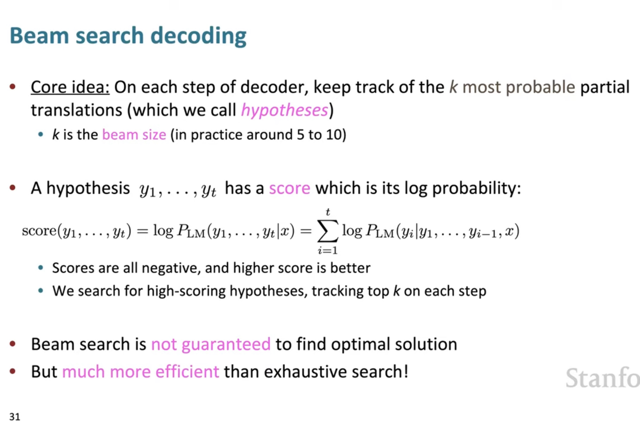</kbd>

> [!NOTE]
> Đại khái là thay vì chỉ quan tâm (và lấy) từ có probability
> cao nhất như greedy decoding. Trong beam search, ta sẽ
> theo dõi 5 (beam size) chuỗi hypothesis (kiểu như ứng cử
> viên) có score cao nhất.

 

<kbd>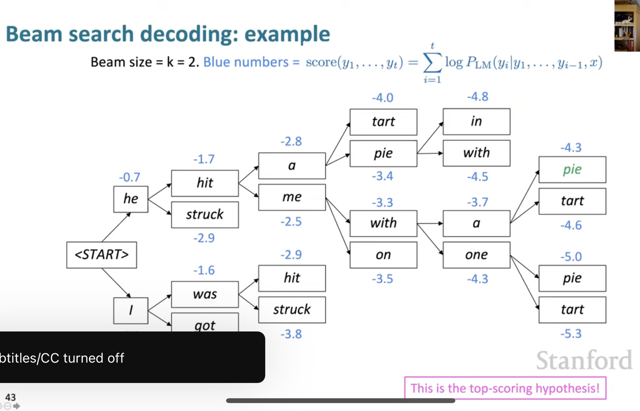</kbd>

> [!NOTE]
> Đại khái với beam search, tại mỗi timestep, sau khi generate ra (ví dụ
> beam size = 2) candidate cho mỗi nhánh thì ta sẽ loại bỏ bớt đi hai
> nhánh có score thấp nhất và tiếp tục với 2 nhánh còn lại. Đến khi nào ra
> sos token hoặc đạt stopping threshold thì dừng và lấy chuỗi có score
> cao nhất trong 2 nhánh

 

<kbd>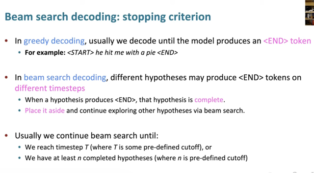</kbd>

> [!NOTE]
> Đại khái với Beam search, ta sẽ dừng khi có n chuỗi đạt điều kiện
> kết thúc (generate EOS token) hoặc đạt đến T timestep. Còn khi
> một nhánh đạt EOS thì finish nhánh đó nhưng vẫn tiếp tục nếu
> chưa đạt điều kiện kết thúc

 

<kbd>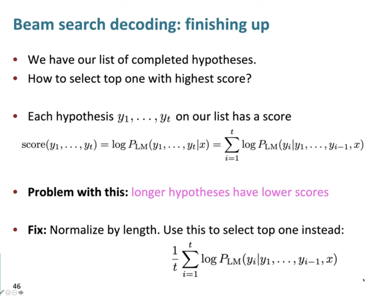</kbd>

> [!NOTE]
> Đại khái là sau khi đã kết thúc beam search ta sẽ lấy chuỗi có
> probability cao nhất, nhưng để khắc phục tình trạng chuỗi ngắn
> thường sẽ có probability cao hơn thì ta sẽ phải normalized score
> bằng cách chia cho số từ. Và dùng normalized score này để chọn chuỗi

 

<kbd>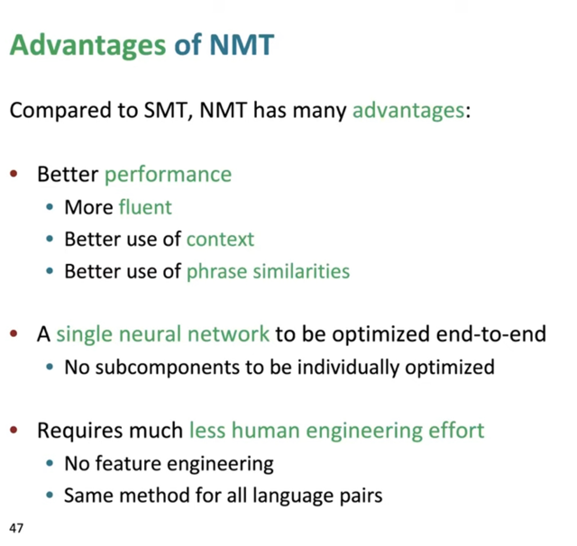</kbd>

> [!NOTE]
> Một số ưu điểm của NMT so với SMT đó là nó dịch chính xác hơn nhờ học
> được cách nắm bắt được các thông tin về bối cảnh tốt hơn. Ngoài ra nó cũng
> fluent hơn (tạm dịch là trôi chảy hơn, generate ra câu dịch nghe đúng hơn, tốt
> hơn).
>
>
>
> Một ưu điểm quan trọng là nó giảm yêu cầu phải feature engineering, khi cho
> phép ta chỉ việc xây dựng một big network và training một end to end piepline
> với big data thay vì phải có nhiều sub component, hay phải có những tùy chỉnh
> khác nhau cho các ngôn ngữ khác nhau

 

<kbd>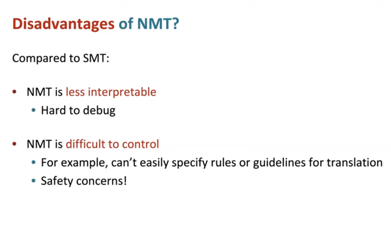</kbd>

> [!NOTE]
> Nhược điểm của NMT là **khó interpretation, khó control** khi không
> biết model sẽ generate kiểu gì, như thế nào vốn là đặc điểm chung
> của deep learning. Do đó đây là hạn chế khi cần kiểm soát chất lượng
> của generated text

 

<kbd>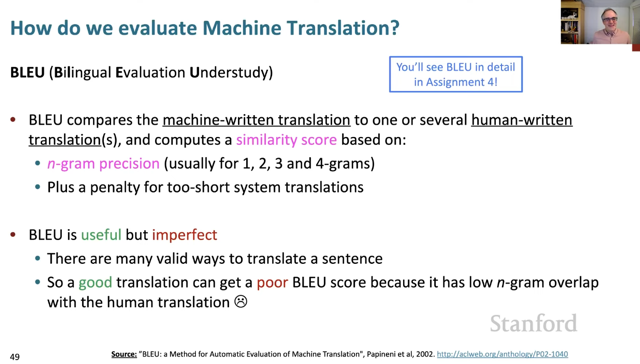</kbd>

> [!NOTE]
> kế tiếp gs nói về việc làm thế nào để đánh giá chất lượng của một Machine
> Translation model. Thế thì cách đầu tiên chính là **đưa bản dịch của MT model
> cho một chuyên gia** về dịch thuật để họ đánh giá. Tuy nhiên dễ thấy đây là
> một cách làm **tốn kém** khi không thể **nhanh chóng** và một cách **tự
> động** được.
>
>
>
> Do đó có rất nhiều nỗ lực trong việc xây dựng những cách đánh giá tự động,
> và một trong số đó là **BLEU score**. Cách làm đại khái là, so sánh giữa câu
> dịch chuẩn (do người dịch) và các câu dịch do MT dịch ở các điểm giống nhau
> cụ thể là tính toán một **similarity scores** dựa trên **việc hai bản dịch có nhiều
> hay ít các từ /cụm từ giống nhau (n-gram)** đồng thời có cách để **hạn chế
> câu ngắn.**
>
>
>
> BLEU tỏ ra **hữu íc**h nhưng k**hông thật sự hoàn hảo** do tính chất rắc rối
> của ngôn ngữ, vì **có thể có nhiều bản dịch khác nhau** cho một câu gốc.
>
>
>
> Và do đó có khi một **câu dịch hay nhưng chưa chắc đã có BLUE score cao**
> do **ít các cụm từ trùng khớp** với câu dịch mẫu (tạm gọi vậy).
>
>
>
> BLEU scores sẽ có thang 0-10. 10 nếu câu dịch trùng khớp với câu dịch mẫu
> và 0 nếu ko có n-gram nào trùng

 

<kbd>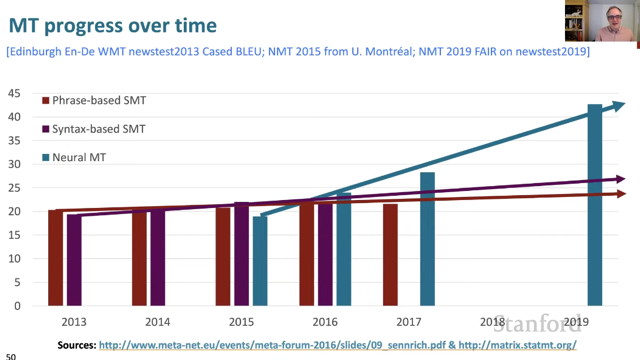</kbd>

> [!NOTE]
> tiếp theo gs cho thấy sự phát triển của MT qua các năm, SMT (cả
> phrase-based SMT và Syntax-based SMT) phát triển ở những năm 2010
> tốt dần qua các năm nhưng chậm và cơ bản chỉ là do model được train với
> ngày càng nhiều dữ liệu hơn.
>
>
>
> Chỉ khi có sự ra đời của Neural Machine Translation trong những năm 15,
> 16 mở ra một hướng đi tiềm năng hứa hẹn và trong các năm tiếp theo
> NMT đã  giúp đẩy lĩnh vực MT đạt những performance cao hơn.

 

<kbd>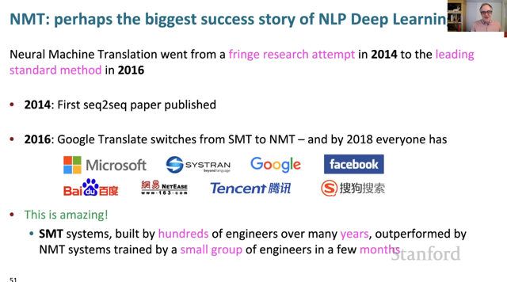</kbd>

> [!NOTE]
> đại khái là gs cho biết NMT là một thành công lớn khi chỉ vài năm sau khi ra 
> đời (seq2seq paper) đã nhanh chóng cho thấy sự hiệu quả vượt trội so với các
> mô hình SMT. Để rồi 2016 Google Translate cũng như các ông lớn trong lĩnh
> vực MT cũng đã chuyển từ SMT sang NMT.
>
>
>
> Và việc này càng đáng ngạc nhiên hơn nữa khi NMT chỉ cần một nhóm nhỏ 
> các kĩ sư phát triển, ít hơn rất nhiều so với các hệ thống SMT.

 

<kbd>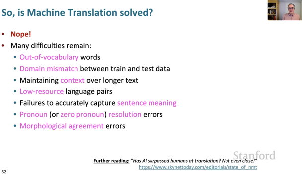</kbd>

> [!NOTE]
> đại ý là MT vẫn còn rất nhiều hạn chế. Ví dụ như vấn đề OOV, có thể
> hiểu là các mô hình NMT đều chỉ được training với một bộ hữu hạn nào
> đó các vocabulary. Đồng nghĩa sẽ có những từ hiếm nó không biết.
>
>
>
> Vấn đề domain mismatch là ví dụ như khi training thì dùng bộ dữ liệu (câu
> gốc, câu dịch) trong một lĩnh vực nào đó nhưng khi test thì trên một domain
> khác thì có thể khiến chất lượng bản dịch không cao.
>
>
>
> Vấn đề context dài, NMT vẫn bị giới hạn bởi một context nào đó chứ không
> "vô hạn" được dẫn đến là nếu bản dịch để dịch đúng cần nắm bắt đủ thông tin
> bối cảnh nhưng vượt quá khả năng của model thì bản dịch không tốt được.
>
>
>
> Vấn đề lơ-resource là nói đến việc training NMT model cần rất nhiều "parallel 
> data" (câu gốc - câu dịch), mà một số ngôn ngữ, loại dữ liệu này không dư dả
>
>
>
> Vấn đề "sentence meaning"

 

<kbd>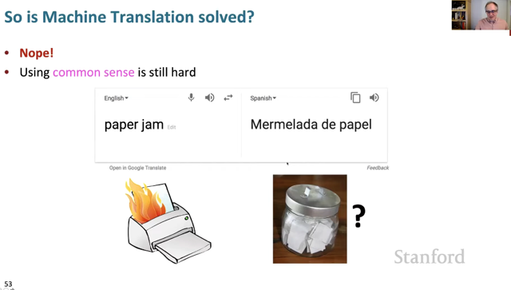</kbd>

 

<kbd>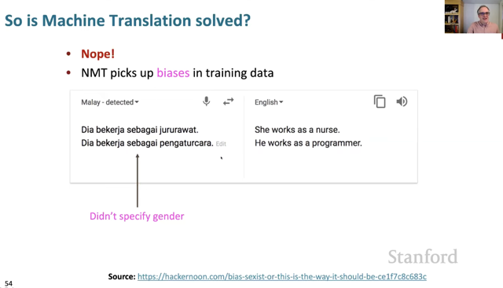</kbd>

 

<kbd>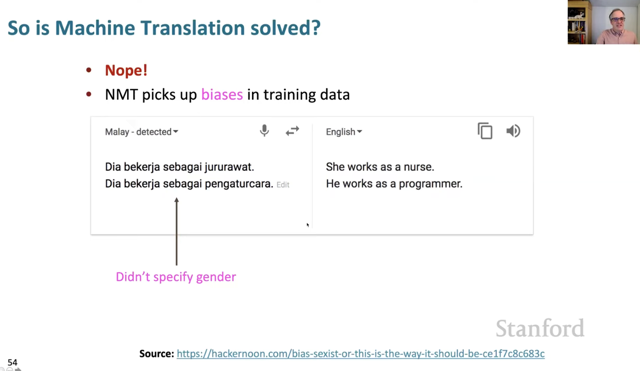</kbd>

> [!NOTE]
> này nói về vấn đề một số ngôn ngữ không phân định giới tính, ví dụ như trong
> hai câu gốc này trong tiếng Malay không chỉ định giới tính gì, nhưng Google
> Translate lại đưa thiên kiến của nó vào để rồi bản dịch lại gắn programmer với
> nam và y tá với nữ.
>
>
>
> Nếu muốn khắc phục điều này ta có thể luôn dùng chữ they (mang tính trung
> Tính về giới tính) thay vì he hay she và như vậy training text sẽ thay đổi
> distribution dẫn đến khi model được huấn luyện từ đó sẽ chuyển sang dùng
> they

 

<kbd>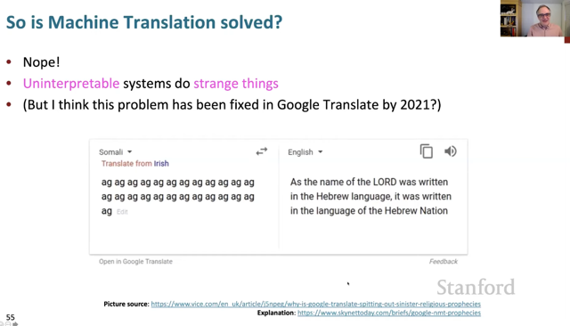</kbd>

> [!NOTE]
> một ví dụ nữa về những vấn đề còn tồn
> đọng, mặc dù có thể hiện tại Google
> Translate đã khắc phục được cái này

 

<kbd>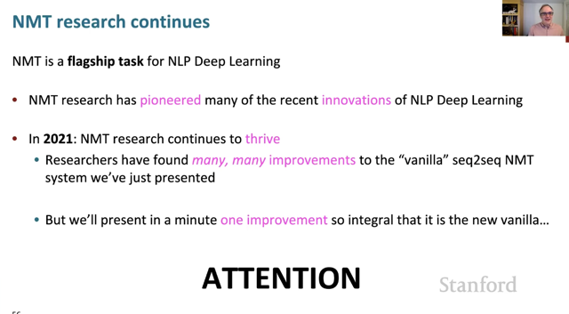</kbd>

> [!NOTE]
> NMT là một nhiệm vụ có tính chất tiêu biểu cho sự phát triển của NLP
> Deep Learning. Và trong những năm qua rất nhiều mô hình cải tiến
> cho "vanilla" seq2seq model đã ra đời và gs sẽ nói về Attention là một
> trong những bước tiến quan trọng

 

<kbd>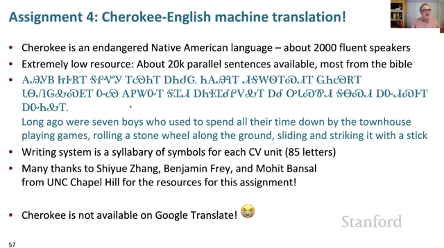</kbd>

 

<kbd>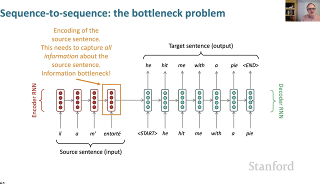</kbd>

> [!NOTE]
> đại ý là với mô hình seq2seq nguyên bản (vanilla), khi toàn bộ thông tin của
> source sentence được sử lý bởi RNN encoder, để rồi hidden state của
> timestep cuối cùng sẽ được pass qua cho decoder và trở thành initial hidden
> state h<0> của decoder.
>
>
>
> Thì ý tưởng đó là toàn bộ thông tin của source sentence được nén vào một
> vector hidden state thành ra đây là nút thắt cổ chai khi câu dài hay ngắn cũng 
> đều bị giới hạn trong hidden state vector này.
>
>
>
> Gs từng nói về một cách để giải quyết đó là dùng mean hay max nhưng cách
> này chỉ tốt cho những task như sentiment analysis khi mà ta không cần "giữ
> lại" thông tin về thứ tự của các từ trong câu, còn với machine translation, thông
> tin này quan trọng cho nên không dùng kiểu đó được.
>
>
>
> Khi nghĩ về cách con người thực hiện việc translation, đó là ta sẽ đọc lướt qua
> câu gốc rồi bắt đầu viết các từ đầu tiên, sau đó lại quay lại xem qua các từ
> liên quan đến từ cần dịch và viết tiếp. Cái chính đó là trong quá trình dịch, ta sẽ
> nhìn vào các từ liên quan, nhờ đó biết chọn từ (để dịch) sao cho phù hợp.

 

<kbd>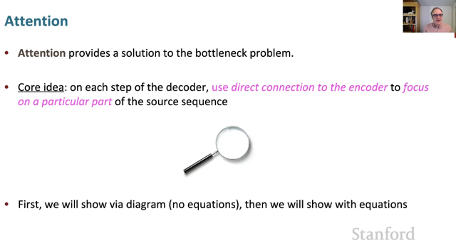</kbd>

> [!NOTE]
> ý tưởng chính đó là, tại mỗi step của decoder, ta sẽ có một cách để
> liên hệ trực tiếp với encoder để có thể chú ý vào các phần cụ thể khác
> nhau của câu gốc

 

<kbd>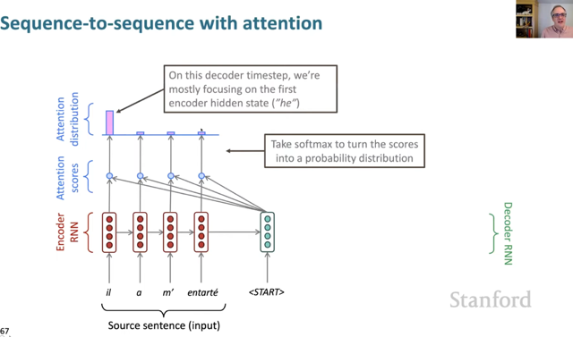</kbd>

> [!NOTE]
> ví dụ như sau khi xử lý câu gốc với encoder, thì tại decoder, ở timestep thứ nhất
> (đương nhiên vẫn nhận 2 input là hidden state h<0> là hidden state ở timestep
> cuối của encoder chuyển qua, và input start token) tính toán ra hidden state h<1>
>
>
>
> Tiếp theo, ta mới dùng tính các phép **dot product**, giữa **hidden state ở timestep
> h<1>** này với **hidden state của các time-step của encoder**, để tính ra **"attention
> scores"** từ đó, **bỏ các attention scores này qua hàm softmax để chuyển thành
> attention distribution** (mang giá trị %).
>
>
>
> Ví dụ như prob distrib này cho thấy để generate từ đầu tiên của câu dịch, ta cần
> chú ý nhiều nhất vào từ "He" của câu gốc.

 

<kbd>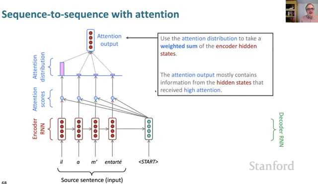</kbd>

> [!NOTE]
> Tiếp theo, tạo một attention output tính bởi **weighted sum của các encoder
> hidden state** weighted bởi probability distribution, và do đó nó sẽ chứa
> thông tin của cả câu gốc nhưng **"nhấn mạnh" vào các từ cần thiết, ở đây
> là từ "He"**

 

<kbd>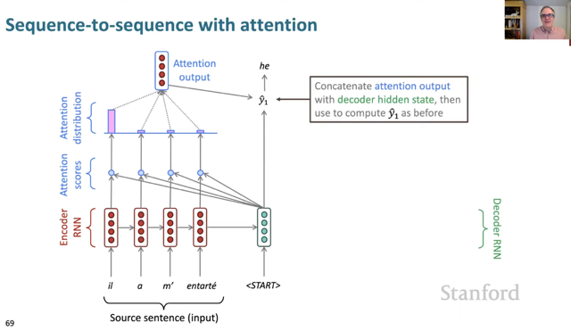</kbd>

> [!NOTE]
> Sau đó, **attention output sẽ được CONCATENATE với decoder hidden**
> state time-step 1 và **dùng nó trong cơ chế tính ra y^ ở time-step 1**
> (qua một linear transformation và softmax)

 

<kbd>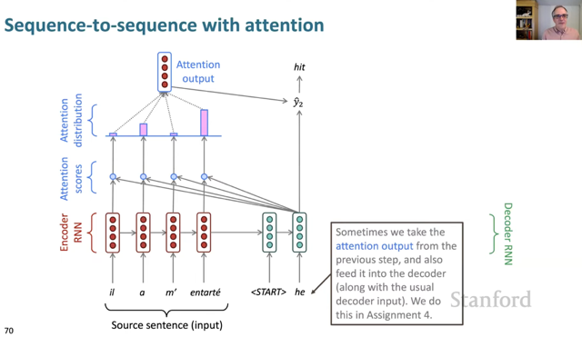</kbd>

> [!NOTE]
> đại khái là đôi khi (thỉnh thoảng có tác dụng) ta **có thể cho attention output
> vào bước tính toán time-step tiếp theo của decoder**  (assignment 4 ta sẽ
> làm cái này). Đây là "cách làm" nói đến trong cs231n lecture x (đúng ra là
> bài giảng của Justin của đại học Michigan)

 

<kbd>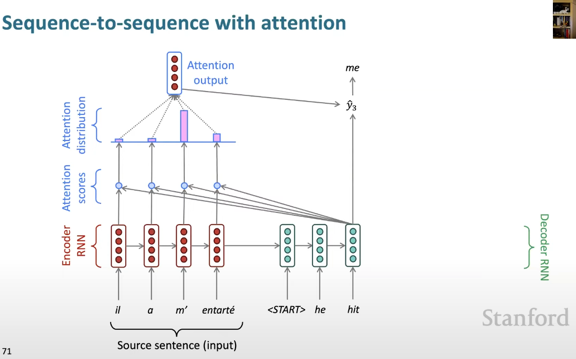</kbd>

<kbd>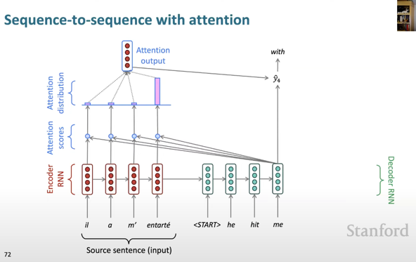</kbd>

 

<kbd>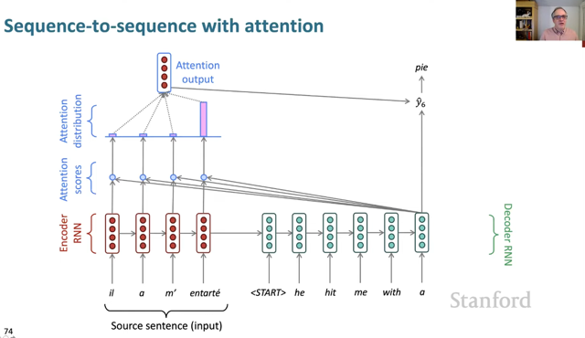</kbd>

> [!NOTE]
> và gs cho biết đây là một cách rất hiệu quả để lấy thêm được
> thông tin context, khắc phục được vấn đề bottleneck ở trên

 

