# Lecture Note - 03
backpropagation

📊 **Progress:** `7` Notes | `24` Screenshots

---

## Lecture Note - 03
backpropagation

 

<kbd>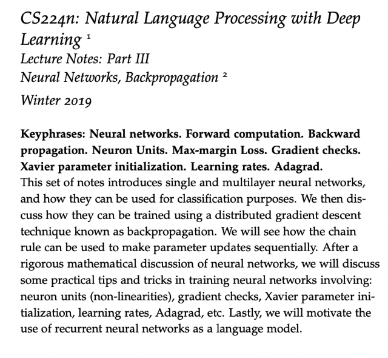</kbd>

> [!NOTE]
> một số điểm chính
> trong document này

 

<kbd>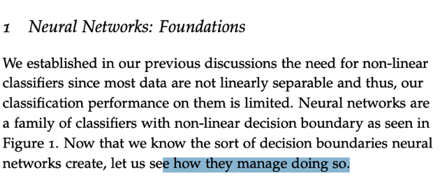</kbd>

> [!NOTE]
> đại khái nói về việc ta đã đồng ý rằng cần phải có
> những mô hình mạnh hơn, complex hơn mới deal
> được với các dataset phức tạp thì neural network là
> model có thể làm được vậy

 

<kbd>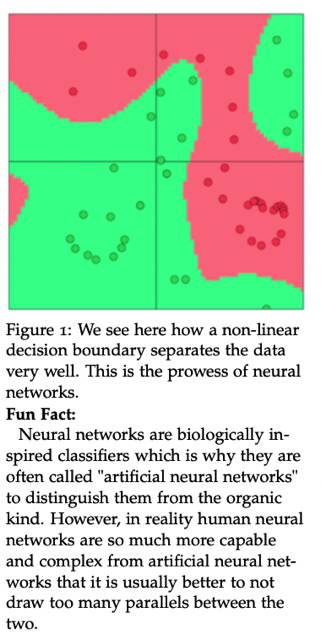</kbd>

> [!NOTE]
> bộ não người phức tạp hơn nhiều, nên sẽ rất khập
> khiễng nếu so sánh tuy nhiên neural network được
> inspired bới biological neural network. Hình ảnh dưới
> cho thấy khả năng tạo decision boundary flexible giúp
> separate được hai bên

 

<kbd>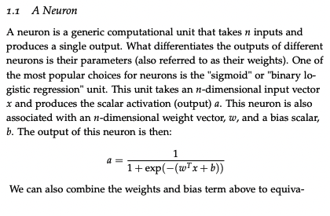</kbd>

<kbd>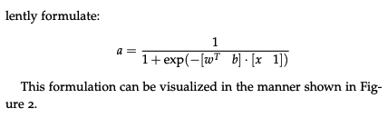</kbd>

 

<kbd>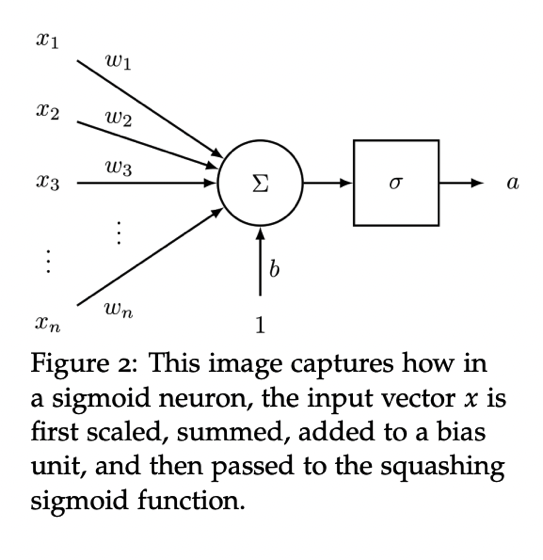</kbd>

 

<kbd>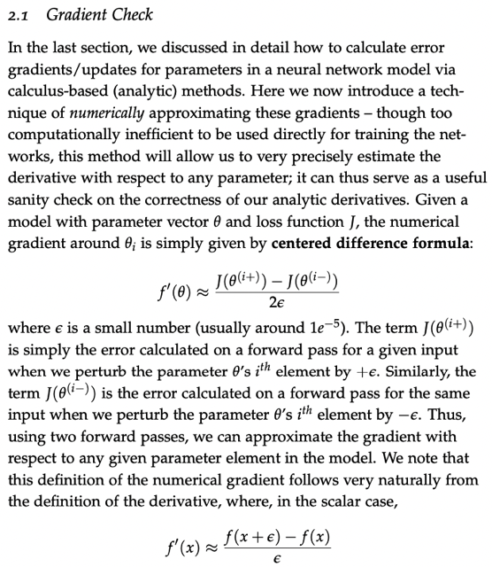</kbd>

> [!NOTE]
> đại khái là dựa trên ý nghĩa của đạo hàm của hàm số là độ dốc của
> hàm số tại điểm đó, ta có thể tính toán giá trị xấp xỉ của đạo hàm bằng
> cách cho x thay đổi 1 khoảng 2 epsilon (x-epsilon, x+epsilon) và tính
> khoảng thay đổi của hàm số f(x+eps) - f(x-eps) và tính ra tỉ lệ. Cái này
> không thể dùng trong training vì rất tốn kém nên chỉ dùng để gradient
> check.

 

<kbd>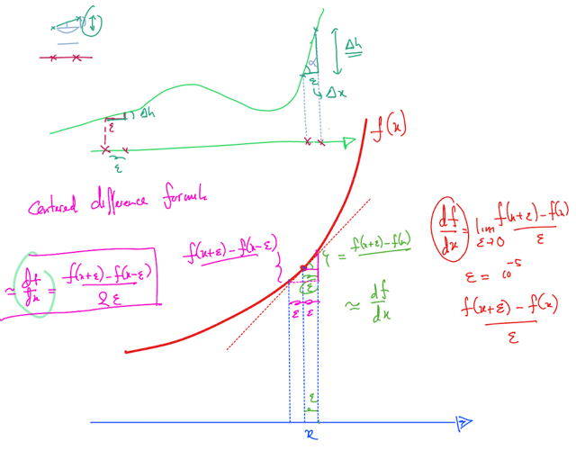</kbd>

 

<kbd>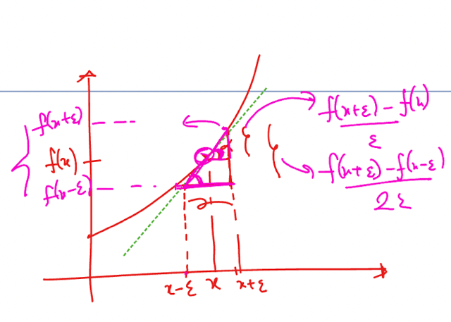</kbd>

 

<kbd>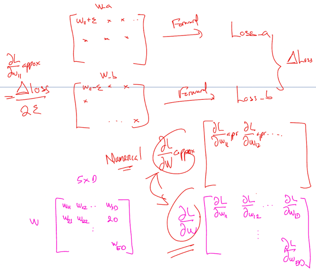</kbd>

 

<kbd>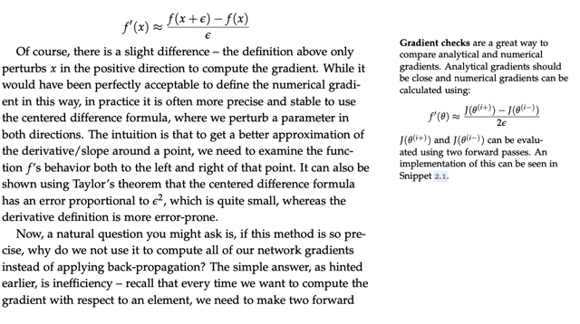</kbd>

 

<kbd>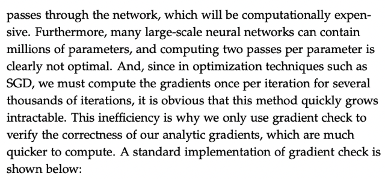</kbd>

 

<kbd>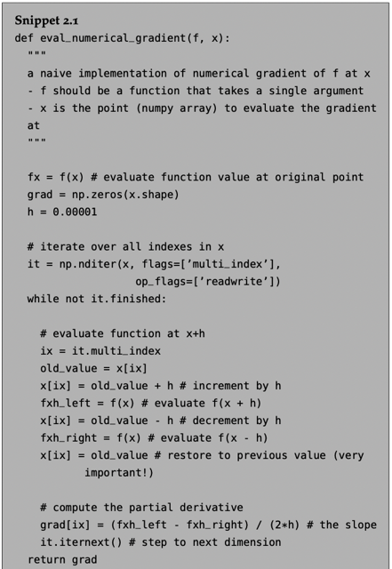</kbd>

 

<kbd>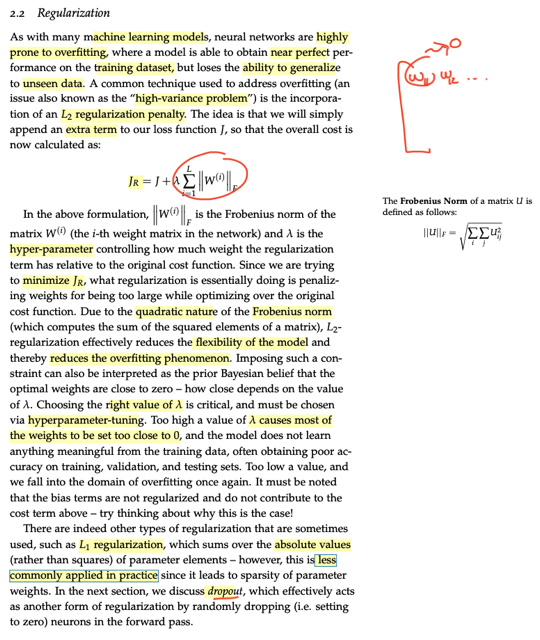</kbd>

> [!NOTE]
> Đại khái nói về l2 regularization - add thêm l2 loss term và
> cơ bản chỉ là tổng bình phương các params của weight
> matrix của mọi layer. Người ta không tính bias b vào hoặc 
> có cũng chẳng sao lí do như Andrew Ng có giải thích đó là
> có làm thì cũng không còn tác dụng.
>
>
>
> Theo Chat GPT thì bias nó chỉ là đảm bảo giúp y có giá trị
> khi feature weight = 0 hết, nó không ảnh hưởng đến việc 
> gây model overfit - cái mà chỉ là do các feature weight gây ra

 

<kbd>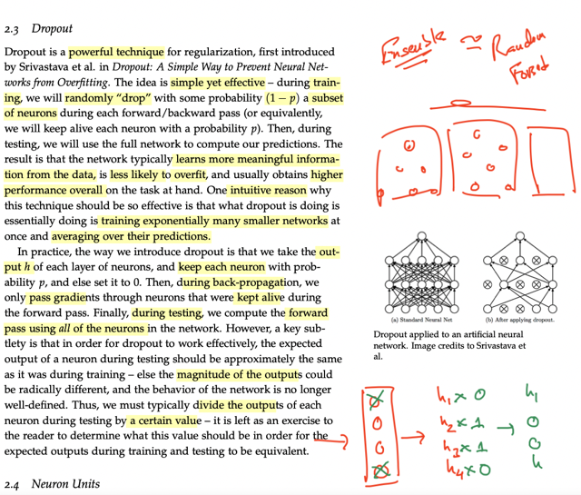</kbd>

> [!NOTE]
> đại khái là như đã biết dropout ở DLSpec, nhưng ở đây nhắc
> nhớ lại rằng nó giúp như ta train một bộ nhiều simple neural
> network để rồi khi dự đoán (test với dropout không áp dụng) thì
> như ta xài ensemble method - lấy số đông kết quả của một bộ
> nhiều cái neural net

 

<kbd>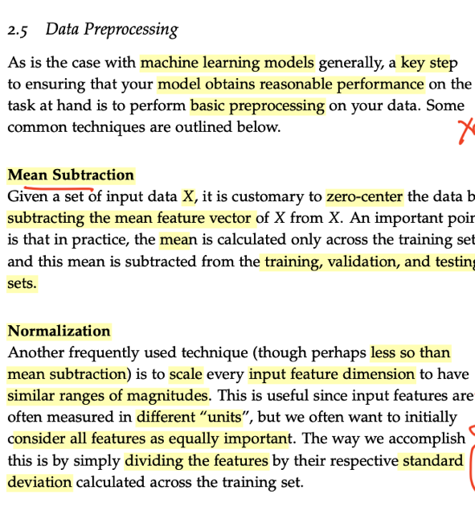</kbd>

 

<kbd>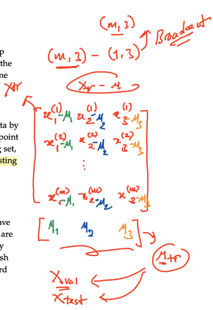</kbd>

 

<kbd>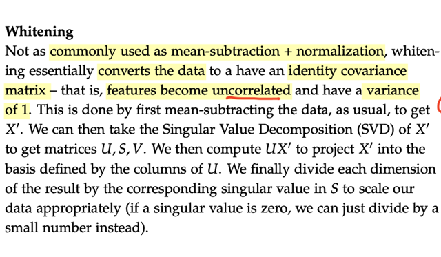</kbd>

> [!NOTE]
> đại khái là thông qua SVD, ta có U là matrix mà mỗi column là
> eigenvector của X'. Từ đó UX' thì ta có các feature mới (các cột
> của matrix UX') kiểu như là linear combination của các feature cũ
> nhưng có tính chất uncorrelated

 

<kbd>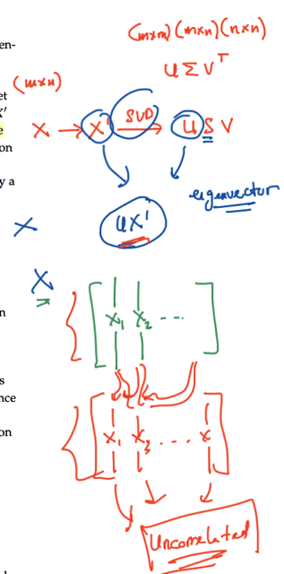</kbd>

 

<kbd>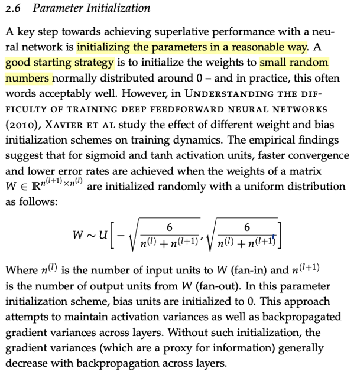</kbd>

 

<kbd>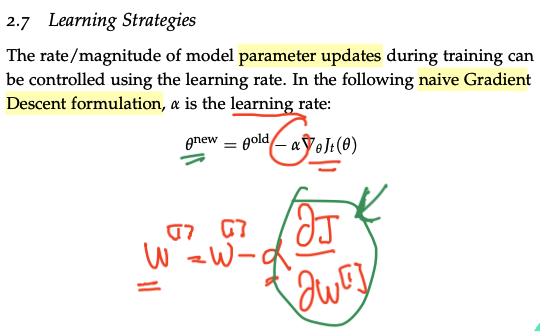</kbd>

 

<kbd>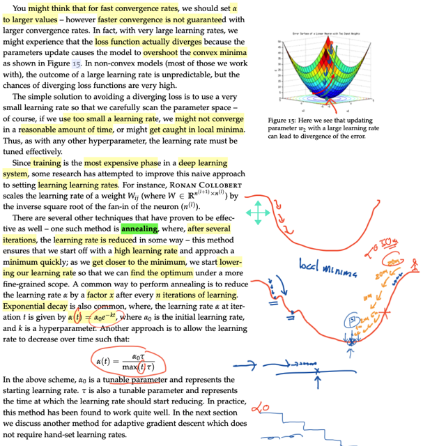</kbd>

 

<kbd>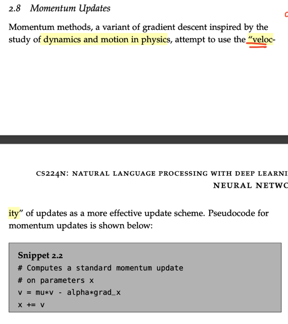</kbd>

 

<kbd>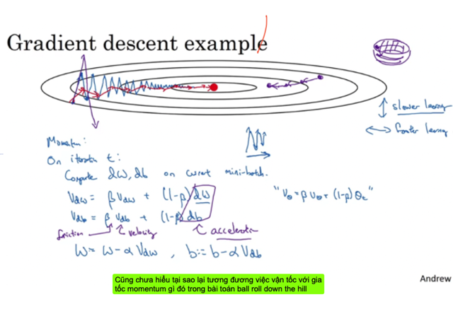</kbd>

 

