# Lecture Notes 05 Language
model, RNN, Lstm, Gru

📊 **Progress:** `38` Notes | `77` Screenshots

---

## Lecture Notes 05 Language
model, RNN, Lstm, Gru

 

<kbd>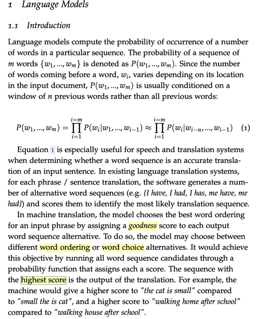</kbd>

> [!NOTE]
> đại khái là ở phần đầu này, ý chính đó là nói về định nghĩa (hay vai trò)
> của một **mô hình ngôn ngữ** (language model) đó là tính toán **xác
> suất xuất hiện của một chuỗi các từ** ví dụ w1, w2,...wm  kí hiệu là
> P(w1,w2,...wm).
>
>
>
> Và thường thường người ta tính xác suất này bằng **cách giới hạn
> trong một context window n từ trước đó thay vì phải tính với mọi từ
> (m)**.
>
>
>
> Điều này đại ý là đúng ra P(w1,w2,...wm) phải bằng ..
>
>
>
> PI i=1:m P(w_i|w_1,..w_i-1) =
>
>
>
> P(w_m|w1,w2...w_m-1) nhân với.. 
> P(w_m-1|w1,w2...w_m-2) nhân với..
> .. 
> P(w2|w1) nhân với  
> P(w1)
>
>
>
> Lí do có công thức này là bởi tính chất **context dependency**, tức là khả
> năng xuất hiện của một từ sẽ phải phụ thuộc vào **context (bối cảnh) -
> tức là các từ đã xuất hiện trước nó.**
>
> Tuy nhiên có thể **cho rằng / giả định rằng một từ chỉ phụ thuộc
> vào n từ trước đó** để từ đó cho phép:
>
>
>
> P(w_m|w1,w2...w_m-1) = P(w_m|w_m-n,...w_m-1)
> P(w_m-1|w1,w2...w_m-2) = P(w_m|w_m-n-1,...w_m-2) 
>
>
>
> ví dụ cho n = 1 (để ta có bigram) thì
> P(w_m|w1,w2...w_m-1) = P(w_m|w_m-1)
> P(w_m-1|w1,w2...w_m-2) = P(w_m-1|w_m-2)
> ..
> P(w4|w1,w2,w3) = P(w4|w3)
> P(w3|w1,w2) = P(w3|w2)
>
>
>
> thành ra P(w1,w2,...wm) có thể tính bằng 
>
>
>
> P(w_m|w_m-n,...w_m-1) nhân với 
> P(w_m|w_m-n-1,...w_m-2) nhân với 
> ..
> P(w4|w3) nhân với
> P(w3|w2) nhân với
> P(w2|w1) nhân với
> P(w1)
>
>
>
> Trong hệ thống machine translation thì đại khái là nó sẽ tính
> toán ra **xác suất của các chuỗi từ** **dựa trên (condition on) câu
> gốc**.
>
>
>
> Và nó sẽ **chọn chuỗi câu có xác suất cao nhất**, việc này bao
> gồm việc **chọn từ nào**, **thứ tự ra sao** để có **xác suất cao
> nhất**.

 

<kbd>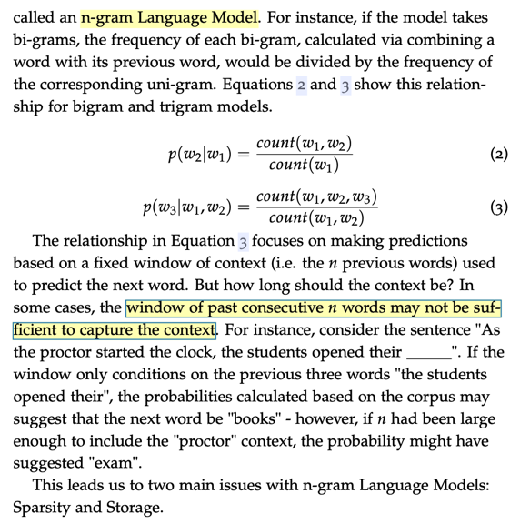</kbd>

<kbd>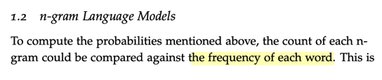</kbd>

> [!NOTE]
> đại khái là một cách để tính xác suất của chuỗi ở trên đó là **cho rằng
> (giả định Markov) một từ chỉ phụ thuộc vào n từ trước đó** để rồi cho
> phép   P(w1,w2) = P(w1)*P(w2|w1) nên từ đó P(w2|w1) = P(w1,
> w2)/P(w1) và có thể tính ước lượng bằng cách tính số lần chuỗi w1
> w2 xuất  hiện chia cho số lần chuỗi w1 xuất hiện:
>
>
>
> P(w2 | w1) = Count(w1 w2) / Count (w1).
>
>
>
> Quan hệ này tập trung vào việc **dự đoán từ tiếp theo
> xuất hiện dựa trên n-1 từ trước đó** (n-gram, e.g bigram dự đoán từ
> tiếp theo dựa vào 1 từ trước đó, hay 1st order Markov assumption là
> một từ chỉ phụ thuộc vào 1 từ trước đó, hay tri-gram - dự đoán từ tiếp
> theo chỉ dựa vào 2 từ trước đó, với 2nd order Markov assumption đó
> là một từ chỉ phụ thuộc vào 2 từ trước đó).
>
>
>
> Tuy nhiên rõ ràng không phải sự xuất hiện của một từ chỉ phụ thuộc
> vào vài từ trước đó mà có thể hơn nữa dẫn đến **hai hạn chế của
> N-gram model**

 

<kbd>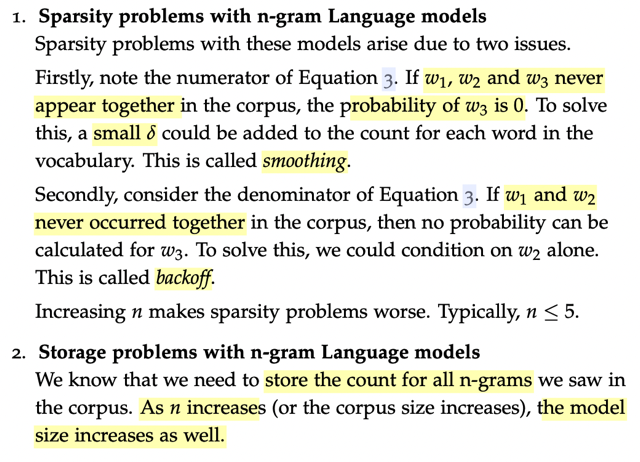</kbd>

> [!NOTE]
> Hai hạn chế đó là sparsity: đại khái là dựa trên công thức tính
> P(w2|w1w2) = Count(w1,w2,w3) / Count(w1,w2), lỡ trong corpus
> không có chuỗi w1w2w3 thì P sẽ bằng 0 mà rõ ràng là không đúng
> vì dù không tồn tại chuỗi w1w2w3 trong training sét cũng không có
> nghĩa là chuỗi này không bao giờ xuất hiện (một cách nói của
> P(w1w2w3) = 0) Thành ra lại phải dùng **smoothing**: thêm một
> small delta vào tử số.
>
>
>
> Tương tự nếu Count w1,w2 = 0 thì phép chia không xác định, phải
> **backoff** bằng cách thay thế, chia cho Count w1. n càng lớn thì
> vấn đề càng  nghiêm trọng nên thường chỉ xải n <= 5. Vấn đề có
> tên sparsity - trống trải là vì corpus không đủ lớn để cover hết tất cả
> các trường hợp
>
>
>
> Vấn đề storage thì dễ hiểu đó là việc tạo n-gram model yêu cầu phải
> đếm các n-gram để tính toán probability nên yêu cầu bộ nhớ để lưu giữ
> các số đếm này rất lớn

 

<kbd>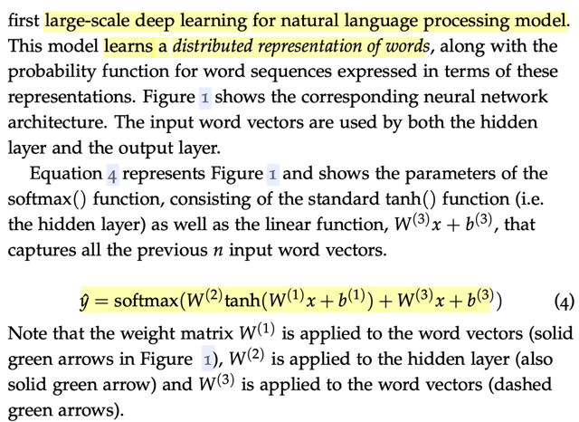</kbd>

<kbd>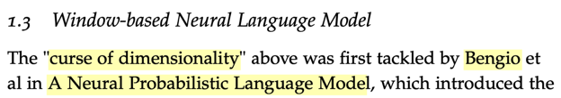</kbd>

> [!NOTE]
> đại ý là Y.Bengio trong paper Neural Language Model lần đầu tiên giới
> thiệu một mô hình deep learning apply trong NLP, trong đó Model sẽ học
> "**distributed representation of words**" tạm hiểu là học ra cách **represent
> word bởi word embedding sao cho capture được word meaning**. Đồng thời
> học được cách **tính toán ra xác suất của các từ trong vocab dựa trên 
> các từ context P(wt = i | context)**
>
>
>
> Thế thì trong bài chỉ nói về dạng rút gọn, có thể mô tả đại khái là các word 
> trong context sẽ được chuyển thành word embedding thông qua một look
> up table (embedding layer, nhận vào work token id, cho ra embedding word
> vector). Sau đó các embedding vectors concatenate lại thành "context vector"
> để qua một hidden layer (linear transformation W + tanh) trước khi output với
> linear transformation U + softmax để ra một phân phối xác suất.
>
>
>
> Phiên bản đầy đủ thì có thêm W(3)x + b(3) cùng với W(2)tanh(W(1)x + b(1)) 
> trong softmax.

 

<kbd>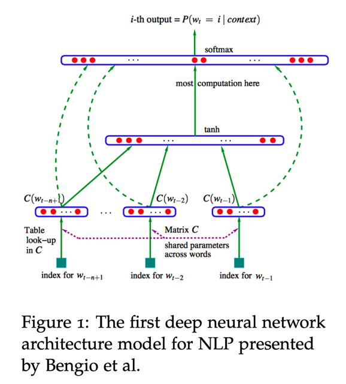</kbd>

 

<kbd>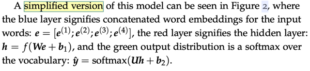</kbd>

<kbd>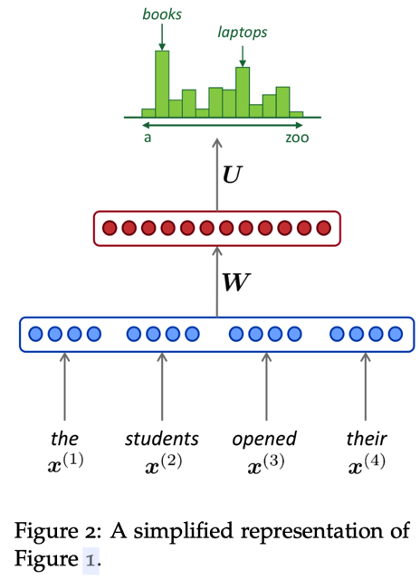</kbd>

 

<kbd>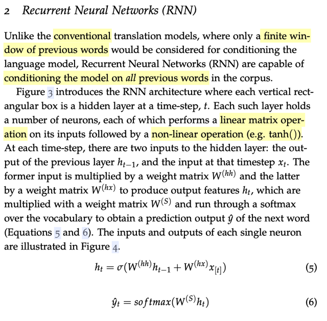</kbd>

<kbd>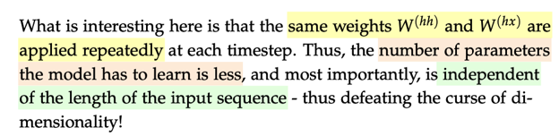</kbd>

> [!NOTE]
> Đại ý là RNN có thể thoát khỏi việc bị kìm hãm bởi một "**fixed context
> window**" của các mô hình ngôn ngữ trước đó như n-gram, neural
> language model bằng cách **xử lí tuần tự từ đầu đến cuối tất cả các từ
> trong chuỗi**. Tại mỗi time-step, nó sẽ tính toán với **hai inputs**: **Input
> tại timestep đó** và **hidden state của timestep trước** đó.
>
>
>
> Cụ thể là x(t) sẽ được linear transformation (matrix operation) với Whx,
> h(t-1) sẽ với Whh, kết quả cộng lại với nhau trước khi qua tanh(). để ra
> hidden state cho timestep hiện tại tiếp tục tính toán ở timestep tiếp theo
> như đã nói. Tại timestep cuối, để tính toán ra phân phối xác suất giúp dự
> đoán từ tiếp theo thì hidden state sẽ được linear transformation với W(s)
> trước khi qua softmax.
>
>
>
> Hai đặc điểm đáng chú ý đó là RNN c**hỉ có một bộ params tính toán cho
> mọi timestep** thành ra đỡ phải sử dụng nhiều params, và đồng nghĩa là
> cho dù  sequence có dài mấy thì cũng không phình to model ra.

 

<kbd>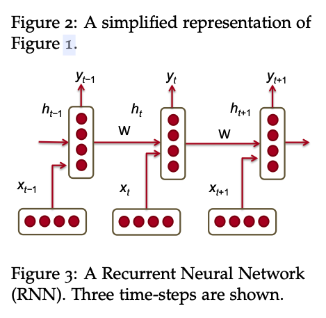</kbd>

 

<kbd>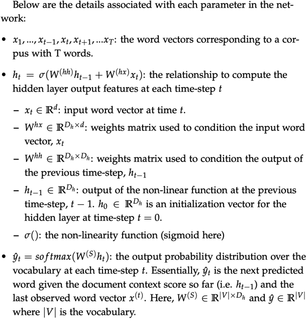</kbd>

> [!NOTE]
> các kích thước của
> vector và matrix

 

<kbd>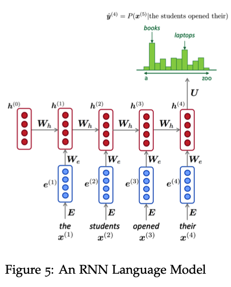</kbd>

<kbd>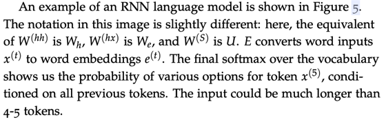</kbd>

 

<kbd>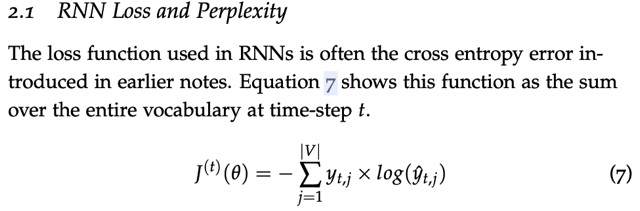</kbd>

<kbd>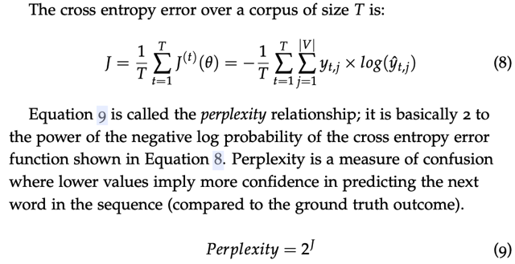</kbd>

> [!NOTE]
> giải thích như sau: model prediction y^<t> là probability distribution over
> entire vocabulary - có nghĩa là một vector có |V| các chỉ số xác suất mà
> model tính toán sẽ xuất hiện ở vị trí tiếp theo. Còn y là true probability
> distribution của vị trí đó.
>
>
>
> Vậy ta sẽ tính negative của tổng cách tích giữa true probability và predicted
> probability.
>
>
>
> Và loss trên toàn bộ timestep sẽ là trung bình tất cả các loss tại các timestep.
>
>
>
> TỪ đó tính chỉ số Perplexity = 2^J. J càng nhỏ thì P càng nhỏ thể hiện mức độ
> tự tin của model càng lớn trong việc predict từ tiếp theo dựa trên các từ trước 
> đó,

 

<kbd>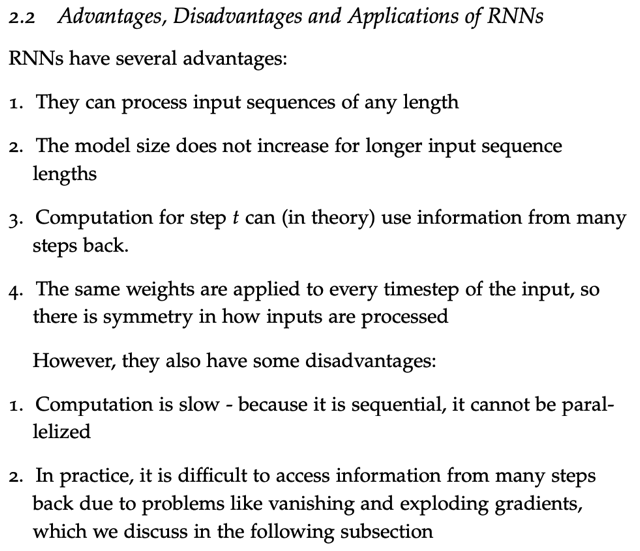</kbd>

> [!NOTE]
> Ưu điểm của RNN là nó có thể xử lí chuỗi dài ngắn bất kì, và không ảnh
> hưởng gì tới model size do chỉ dùng một bộ params để repeatably tính toán
> mọi timestep.
>
>
>
> Theo lí thuyết khi tính toán dự đoán cho timestep tiếp theo thì nó có dùng
> thông tin từ mọi timestep trước nhưng thực tế thì không được vậy vì các
> vấn đề vanishing gradient.
>
>
>
> Điểm số 4 ý nói việc tính toán với mọi timestep đều sử dụng cùng một bộ 
> params khiến đem lại tính chất đối xứng (cân bằng) khi mọi timetstep input
> đều được đối xử như nhau không thiên vị cái nào.
>
>
>
> *Nhược điểm thấy rõ là do tính chất tuần tự nên thời gian xử lí sẽ không bằng
> xử lí song song cùng lúc được.
>
>
>
> Và vấn đề vanishing gradient dẫn tới mất thông tin context ở xa

 

<kbd>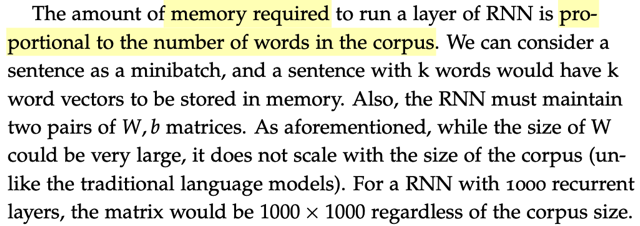</kbd>

> [!NOTE]
> Chưa hiểu chỗ này, tại sao "RNN với 1000 recurrent layers
> lại có matrix weight 1000x1000"
>
>
>
> Có thể hiểu đó là ý nói nếu RNN layer có 1000 neuron, tức
> là hidden state dimension là 1000. thì matrix Wh sẽ có size là
> 1000x1000. Và nó sẽ không phụ thuộc vào corpus lớn nhỏ
> thế nào, sequence dài ngắn thế nào.

 

<kbd>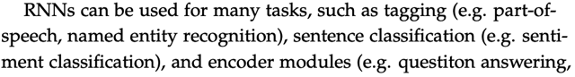</kbd>

<kbd>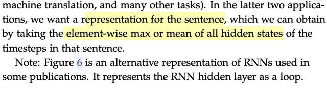</kbd>

> [!NOTE]
> ở đây nói đến ứng dụng của RNN. nếu dùng cho nhiệm vụ
> sentiment classification thì có thể dùng mean hoặc max (element
> wised) của các hidden states để làm "sentence vector" chứa đựng
> thông tin của cả câu và dùng làm input của layer cuối với hàm sigmoid
> để tính toán ra P(y=1|x)

 

<kbd>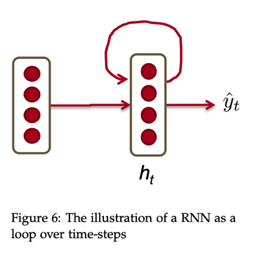</kbd>

 

<kbd>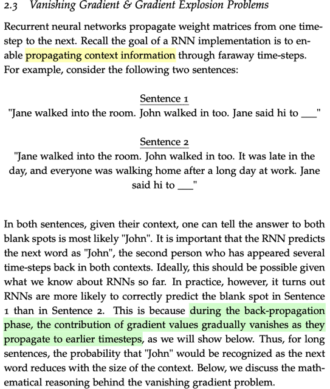</kbd>

> [!NOTE]
> Đại ý là trong hai câu này dù đều có từ John trong bối cảnh,
> nhưng vì hiện tượng vanishing gradient nên model ít khả năng
> học được cách nhận biết từ john trong câu 2 (khi mà câu dài, từ
> john ở xa vị trí cần dự đoán).
>
>
>
> Một cách nôm na là vì hiện tượng này mà quá trình training,
> gradient ở các timestep xa nhỏ đi dần dẫn đến đóng góp rất ít
> trong việc cải thiện (thay đổi params) theo hướng giúp nó dùng
> thông tin ở các timestep xa (trước đó)

 

<kbd>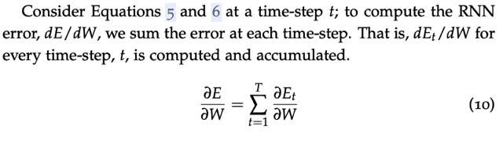</kbd>

> [!NOTE]
> Error ở đây là gradient error, ý nói đến **derivative of loss tổng w.r.t W.**
> Loss tổng (mọi time-step) được tính bằng **tổng** loss tại mọi time-step
> từ t=1 đến t=T chia cho hằng số T
>
>
>
> Đạo hàm của tổng bằng tổng đạo hàm, nên vấn đề là tìm đạo hàm của
> loss tại timestep t w.r.t W.

 

<kbd>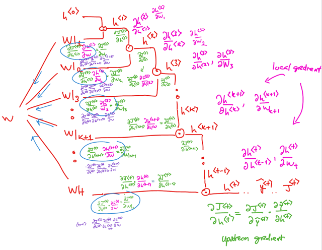</kbd>

<kbd>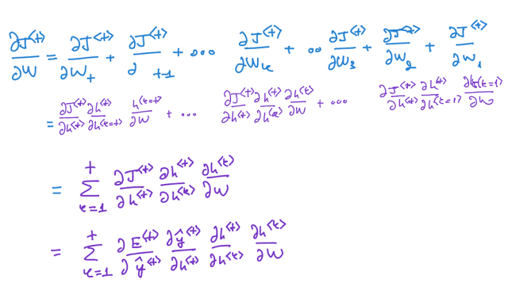</kbd>

> [!NOTE]
> Theo computational graph, như đã làm trong video
> lecture. dJ/dW sẽ được tính bằng tổng t nhánh:

 

<kbd>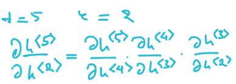</kbd>

> [!NOTE]
> Cũng theo c.g, dht/dhk sẽ là tích của (t-k) phép tính của dhj/dhj-1
>
>
>
> Nên dht/dhk khái quát hóa bằng tích(PI) j=k+1:t dhj/dhj-1

 

<kbd>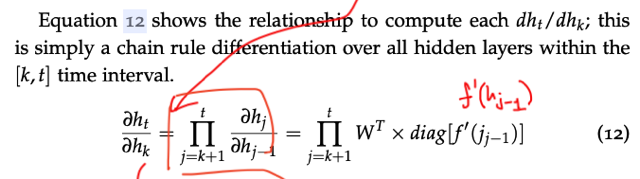</kbd>

> [!NOTE]
> tiếp theo giải thích tại sao dhj/dhj-1 có công thức như vậy

 

<kbd>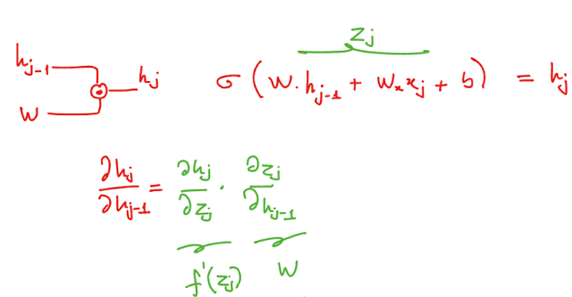</kbd>

> [!NOTE]
> Tính dh_j/dh_j-1 thì đầu tiên tính dh_j/dz_j
>
>
>
> Còn dzj/dh_j-1 = W

 

<kbd>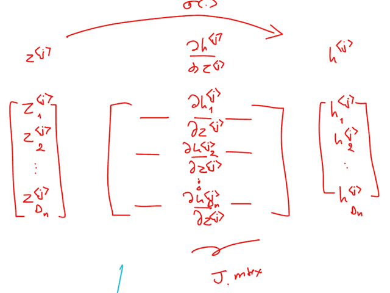</kbd>

<kbd>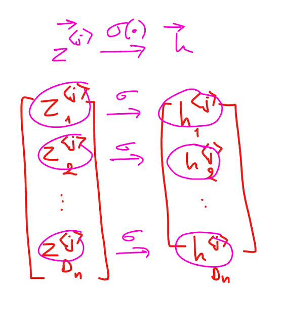</kbd>

> [!NOTE]
> vì h_j và z_j đều là Dn dimensional vector nên
> dh_j/dz_j là Jacobian matrix. Mỗi hàng là derivative
> của phần tử của h_j đối với vector z_j.

 

<kbd>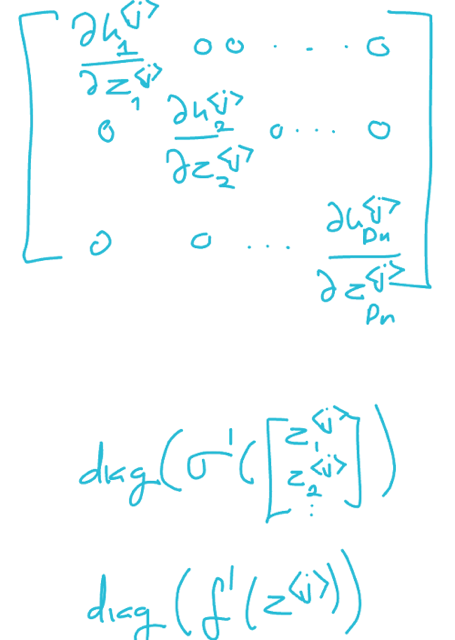</kbd>

> [!NOTE]
> Nhưng vì tính chất element wise nên h_j_1 chỉ được
> tính bởi z_j_1, h_j_2 chỉ được tính bởi z_j_2...
>
>
>
> Nên matrix dh_j/dz_j là matrix chéo (chỉ có đường
> chéo khác 0, còn lại = 0)
>
>
>
> Và vị trí đường chéo sẽ là sigma'(z_j) tức là đạo hàm
> của hàm activation function (cũng là 1 hàm số, kí hiệu
> là sigma', hay trong note kí hiệu là f' (ta biết trong
> RNN thường dùng hàm tanh)

 

<kbd>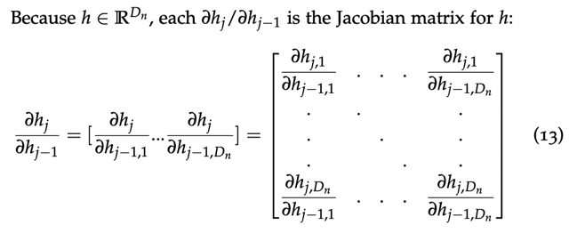</kbd>

> [!NOTE]
> h (hidden state) là vector có Dn dimension (unit). Nên derivative of
> h_j w.r.t h_j-1 là matrix (Jacobian) trong đó mỗi hàng của matrix là
> vector derivative của phần tử tương ứng h_j w.r.t vector h_j-1

 

<kbd>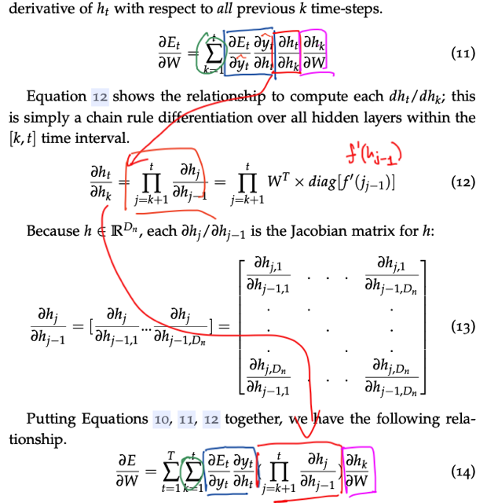</kbd>

 

<kbd>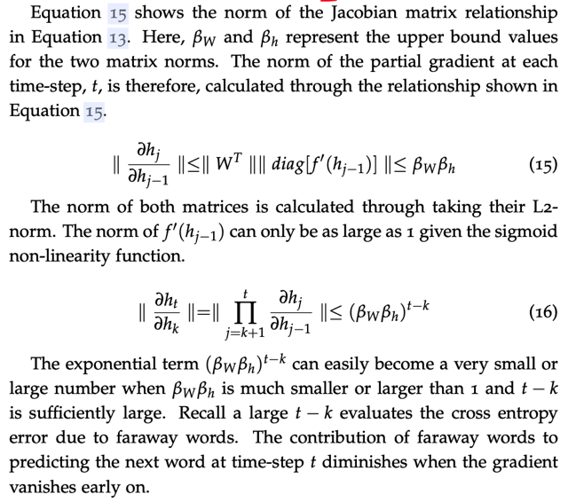</kbd>

> [!NOTE]
> Ok, đại khái là vầy, dh_j/dh_j-1 = W.T@diag[f'(hj-1)] thì norm của dh_j/dh_j-1
> (là một Jacobian matrix) sẽ <= tích của norm W  và norm của matrix chéo
> diag[f'(hj-1])
>
>
>
> Chưa rõ nhưng có thể chấp nhận vì kiểu kiểu như a = bc thì  norm a <=
> norm b*norm c
>
>
>
> Gọi beta_w là giới hạn trên của norm matrix W, và còn ma trận chéo diag[f'
> (hj-1)] vì các entry đường chéo là đạo hàm của hàm tanh (ko hiểu sao trong
> đây người ta lại nói hàm sigmoid nhưng cứ tạm hiểu là nó có giới hạn trên là
> beta_h
>
>
>
> Nên tóm lại norm của dh_j/dh_j-1 <= beta_w*beta_h và vì dh_t/dh_k = tích
> của t-k cái (j=k+1 đến t) dh_j/dh_j-1 nên norm của dh_t/dh_k <=
> (beta_w*beta_h)^(t-k)
>
>
>
> Và dựa trên điều này, người ta lập luận đại khái là nếu tích hai cái beta này
> lớn thì khi lũy thừa t-k mà t-k lớn (khi xử lí RNN qua nhiều timestep) thì
> norm của dh_t/dh_k sẽ trở nên rất lớn. Mà dh_t/dh_k lớn thì chính là
> gradient trở nên rất lớn khiến gây ra hiện tượng gradient exploding.
>
>
>
> Ngược lại nếu dh_t/dh_k nhỏ thì gradient trở nên rất nhỏ -> hiện tượng
> vanishing  gradient
>
>
>
> *Ta thấy người ta dùng norm của Jacobian matrix là vì norm của matrix là
> thước đo độ lớn của matrix cũng như norm của vector đo độ lớn của vector,
> cũng chính là đang nói độ lớn của các phần tử trong vector hay matrix.
>
>
>
> Và khi gradient vanish sẽ khiến model không học được khả năng dùng các từ ở
> xa trong việc dự đoán từ tiếp theo

 

<kbd>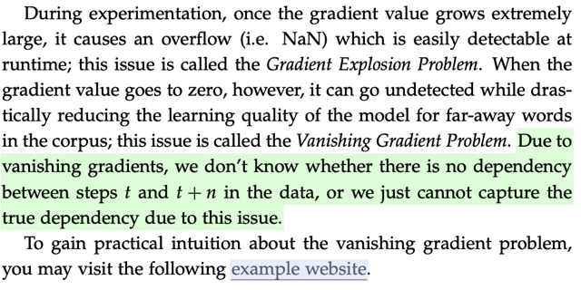</kbd>

> [!NOTE]
> Và một ý đáng chú ý là đại khái là ta không biết được là 1. Ko có quan
> hệ phụ thuộc nào giữa các từ ở xa đối với từ đang cần dự đoán hay là
> có mà model vì hiện tượng vanishing gradient mà nó ko học được

 

<kbd>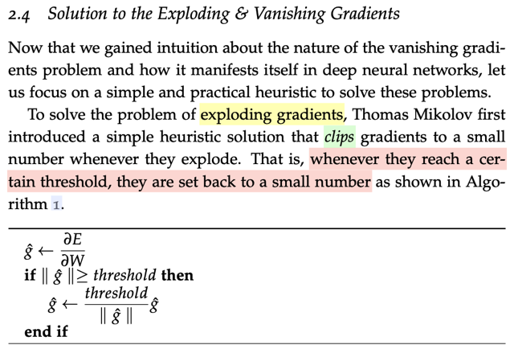</kbd>

> [!NOTE]
> giải pháp đơn giản cho vấn để exploding gradent đó là gradient clipping,
> khi check thấy giá trị vượt qúa một threshold nào đó thì reset nó

 

<kbd>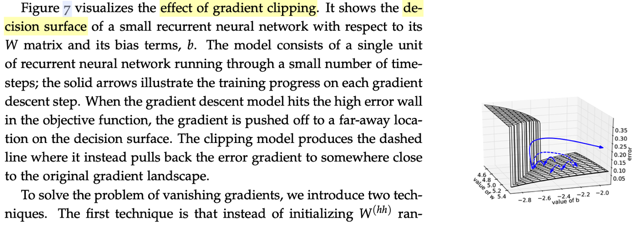</kbd>

<kbd>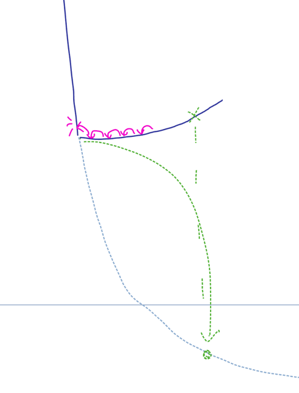</kbd>

> [!NOTE]
> đại khái hiểu nôm na là khi nó thấy gradient lớn vượt quá một threshold, thì
> tức chính là nó gặp một vùng có độ dốc lớn (vì gradient chính là độ dốc)
> Thì vì với vùng có độ dốc cực lớn thì dù có nhân với learning rate nhỏ thì
> bước nhảy vẫn rất lớn dẫn đến khi đi theo hướng đó sẽ bị diverge
>
>
>
> Thành ra khi gặp vùng có độ dốc lớn như vậy, hành động clipping chính là
> buộc dùng một gradient nhỏ hơn chính là hình ảnh bắt nó đi hướng khác
> nhờ vậy khắc phục vấn đề
>
> ở vùng có độ dốc nhỏ, bước dịch chuyển nhỏ (bước dịch
> chuyển theo hướng giảm độ cao - giảm loss) nhưng bỗng
> dưng nó đụng 1 vách đá thì nó phải thực hiện bước đi lớn vì
> độ dốc lớn và kết quả là vọt qua bên kia

 

- **The visualization you mentioned regarding gradient clipping helps to illustrate how this technique modifies
the gradient descent process in training a neural network, particularly a recurrent neural network (RNN).

Here's a breakdown to help you understand the concept and the visualization:

1. **Decision Surface**: The decision surface depicted in the figure represents how the error changes with
respect to changes in the network's weights (W matrix) and biases (b). This surface can have regions with
sharp gradients (steep areas) where small changes in weights or biases result in large changes in error.

2. **Gradient Descent Steps**: The solid arrows on the decision surface show the path of gradient
descent—a method used to minimize the error by adjusting weights and biases. Normally, gradient descent
follows the steepest path downhill on this error surface.

3. **High Error Wall and Gradient Explosion**: Sometimes, especially with deep or recurrent neural
networks, gradient descent can encounter regions of the decision surface with extremely steep slopes (high
error walls). In these areas, the gradients (i.e., the slopes of the surface) can become very large—this is
known as gradient explosion. When gradients explode, the steps taken by gradient descent can become too
large, leading the learning process to diverge or oscillate wildly instead of converging to a minimum.

4. **Effect of Gradient Clipping**: Gradient clipping is a technique used to address the problem of exploding
gradients. If the magnitude of the gradient exceeds a specified threshold, it is scaled down to keep it under
control. The visualization likely shows how, when using gradient clipping, the gradient descent does not
follow the extreme path suggested by the raw gradients. Instead, it follows a modified, less steep path
(indicated by dashed lines). This prevents the updates from becoming too large and helps ensure more
stable and reliable convergence during training.

5. **Practical Implication**: By clipping the gradients, the model avoids taking too large steps when the error
surface becomes very steep, which helps to maintain the stability of the learning process. This means the
model is less likely to diverge and more likely to find a useful minimum, even in the presence of challenging
regions on the decision surface.

Gradient clipping is particularly important in training RNNs, where the unrolled nature of the network through
time steps can lead to very large gradients due to the accumulation of gradient effects through
backpropagation from output to input. This technique helps manage these gradients, making the training
process more robust to the issues of gradient explosion.**

 

<kbd>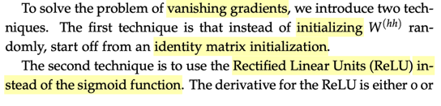</kbd>

<kbd>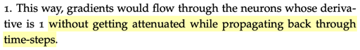</kbd>

> [!NOTE]
> để khắc phục vanishing gradient thì ở đây chỉ nói đến thay vì
> initialize random thì ta sẽ initialize với identity matrix, mà ko
> nhắc đến các technique khi Xavier initialization..
>
>
>
> Sử dụng Identity matrix thì đương nhiên chỉ dùng khi số input
> bằng output và cũng chưa thấy ở đâu nói về cách làm này cho
> đến giờ
>
>
>
> còn cách thứ 2 là dùng reLU thay cho sigmoid

 

<kbd>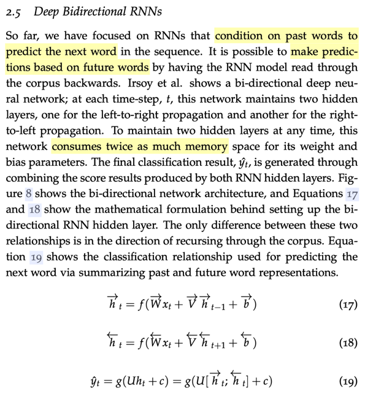</kbd>

<kbd>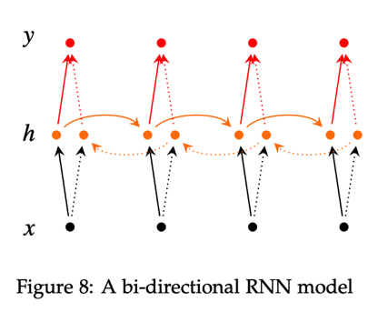</kbd>

> [!NOTE]
> đại khái là ta có thể thiết kế kiến trúc khác để thay vì chỉ predict từ
> kế tiếp dựa (condition ơn) trên các từ trước đó (trong quá khứ), 
> ta cũng có thể "cho nó" dựa trên các từ sau đó (hay tương lai)
>
>
>
> một cách ngắn gọn là ta sẽ có hai RNN, một cái thứ nhất như bình
> thường, để dự đoán từ tiếp theo tại time-step t (bằng cách tính toán
> một probability distribution trên tất cả các từ vựng), nó sẽ lần lượt
> tính toán các time-step từ đầu đến t như đã biết: 
>
>
>
> Bắt đầu với h<0>,
> tại time-step 1 tính h<1> = f(Wx@x<1>+Wh@h<0>+b), rồi time-step 2
> tính với h<1> và x<2>,..cứ thế đến h<t> = f(..tính với h<t-1>, x<t>)
> (Wx, Wh, b ở trên nên kí hiệu là Wx_left, Wh_left, b_left)
>
>
>
> một RNN thứ 2, cũng tính toán tương tự nhưng tiếp nhận chuỗi x theo
> chiều ngược lại, giả sử chuỗi có T từ, thì ta bắt đầu với h<T+1> = vector 
> zero
>
>
>
> tại time-step T (tương đương time-step 1 ở RNN đầu tiên) , 
> tính h<T-1> = f(Wx@x<T>+Wh@h<T+1>+b)
> Sau đó tính h<T-2> tương tự với x<T-1>, h<T>..
>
>
>
> để rồi đến h<t> = f(Wx@x<t+1>+Wh@h<t+2>+b)
> (Wx, Wh, b ở trên nên kí hiệu là Wx_right, Wh_right, b_right)
>
>
>
> ====
>
>
>
> Đến đây h<t> (RNN 1) sẽ được concatenate (có khi dùng sum) với 
> h<t> (RNN 2) để cùng nhau tính toán y^<t> = g(U@[h<t>_left, h<t>_right] + c)
>
>
>
> ====
>
>
>
> Bi-directional RNN sẽ dùng 2 RNN, nên ta có 2 Wx, 2Wh, 2 bias term b

 

<kbd>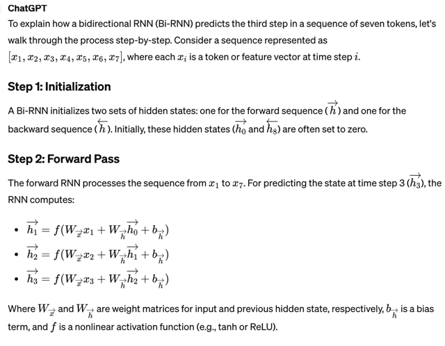</kbd>

<kbd>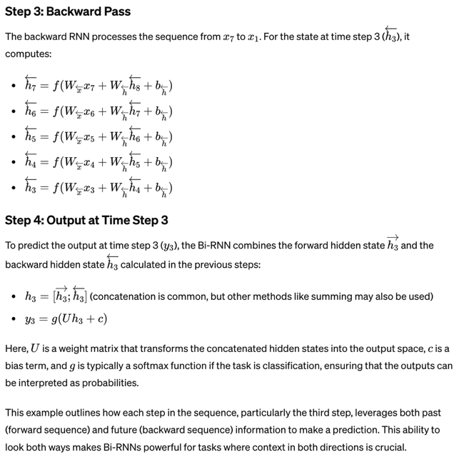</kbd>

 

<kbd>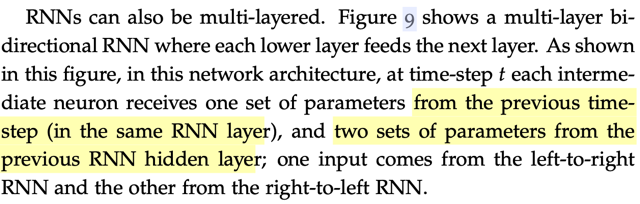</kbd>

<kbd>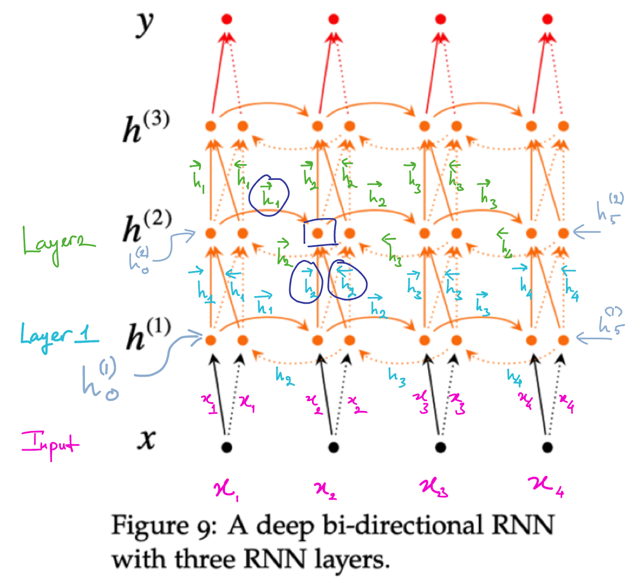</kbd>

<kbd>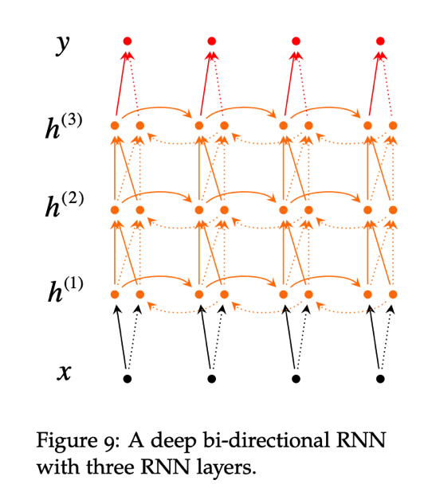</kbd>

> [!NOTE]
> nói về multi-layer RNN, trong đoạn này có thể hơi khó hiểu khi  người ta
> dùng 'sét of parameters'. Nhưng đại ý là với kiến trúc này, tại mỗi
> time-step, ví dụ tại time-step 2, của RNN layer thứ 2, nó sẽ tính toán với
> input bao gồm:
>
>
>
> Output từ time-step trước, tức là hidden state h<2>, nhưng thay vì như
> 1-layer RNN nhận input thứ 2 là x<2>, thì cái này nó sẽ nhận Input là
> hidden state của cái RNN layer thứ 1, tại hidden state 2, ở cả chiều đi và
> về.
>
>
>
> Chỗ này có thể khó hiểu, như đã nói về bi-directional ở trước, ví dụ tại
> time-step 3, nó sẽ tính ra 2 hidden state h<2> , một cái từ RNN chiều đi,
> một cái từ RNN chiều về. Để rồi concat lại để tính y^<2> Thì ở multi-layer
> RNN này thì hai cái đó sẽ input vào bước tính h<2> của RNN thứ 2.
>
> Tính toán ở time-step t=2 ở RNN layer 2 sẽ
> nhận input từ h<1> (RNN layer 2) và h<2> left
> và h<2> right (RNN layer 1)

 

<kbd>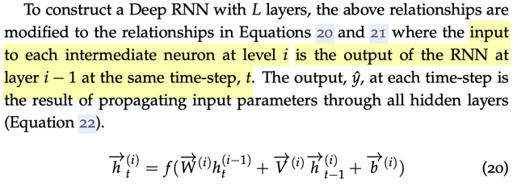</kbd>

<kbd>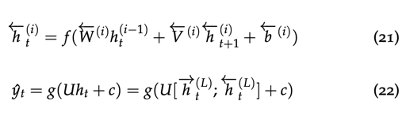</kbd>

> [!NOTE]
> khái quát hóa, để tính toán tại time-step t, RNN layer i,
> và dĩ nhiên đây cũng là bi-directional, nên cũng sẽ có RNN left,
> và RNN right, ở đây nói về RNN left, input sẽ là:
>
>
>
> 1. Hidden state trước đó của RNN layer i:
> h(i)<t-1>, sẽ nhân với V(i)_left (matrix Wh của RNN chiều đi,
> của layer i)
>
>
>
> 2. và 3.Hidden state của time-step t, RNN layer i-1, chiều đi 
> h(i-1)<t>_left , chiều về h(i-1)<t>_right. Gom lại là h(i-1)<t>
> cái này nhân với W(i)_left
>
>
>
> nên :
>
>
>
> h(i)<t>_left = f(W(i)_left@h(i)<t-1>+W(i)@h(i-1)<t>+b(i)_left)
>
>
>
> tương tự với h(i)<t>_right
>
>
>
> ===
>
>
>
> Ở layer cuối, khi tính toán ra y^<t>, nó sẽ nhận input từ hidden state left 
> của RNN cuối h(L)<t>_left và hidden state right của RNN cuối h(L)<t> để 
> tính y^ qua U, g (softmax hay sigmoid, tùy bài toán)

 

<kbd>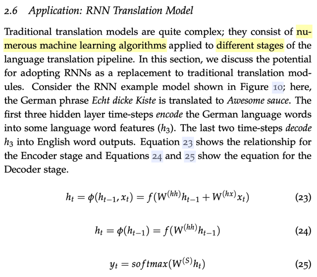</kbd>

> [!NOTE]
> đại khái là ứng dụng RNN vào machine translation. Nói sơ về machine
> translation trước đây có nhiều bước feature engineering,  đỏi hỏi nhiều
> component, công đoạn. Còn với RNN thì khỏe hơn, cho phép build một
> end-to-end pipeline mà ít đòi hỏi các bước f.e.
>
>
>
> Cách làm ở đây là một mô hình tạm gọi là naive, khi cơ bản chỉ dùng một
> RNN, xử lý tuần tự như bình thường đến khi hết các input x1,x2,x3, cho ra
> h<3>  thì bắt đầu tính y^ (y^1, y^2). Nhận xét:
>
>
>
> Ở đây có thể thấy chỉ dùng một RNN chứ không phải là chia thành encoder
> - giúp Process input (source sentence) rồi đưa last hidden state qua decoder
> để tính toán và generate translated sentence.
>
>
>
> Quá trình generate cũng là tính toán một probability over vocabulary list, và
> chọn từ có xác suất cao nhất, cho đến khi "ra" end of sentence token thì
> dừng.

 

<kbd>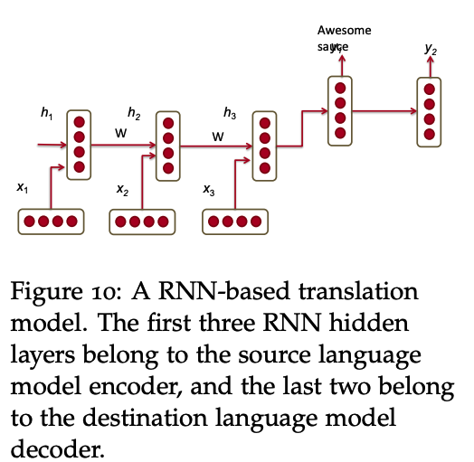</kbd>

 

<kbd>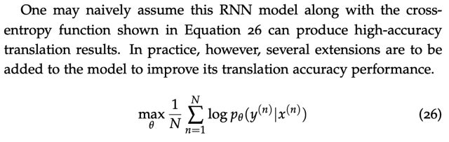</kbd>

> [!NOTE]
> thì ở đây người ta nói cách này không hiệu quả (không giúp đưa ra bản
> dịch chính xác được) nên có nhiều phiên bản cải tiến việc dùng RNN
> trong MT. Trước khi qua các bản cải tiến, thì việc train RNN MT trên
> dùng loss function là cross entropy loss như vầy:
>
>
>
> minimize cost function là loss trên mọi sample (N sample của training set)
>
>
>
> theta = argmin theta {- log likelihood pmodel(y(n)|x(n))}
>
>
>
> ở đây người ta ghi arg max tương đương argmin loss
>
>
>
> ====
>
>
>
> Nói về NNL & cross entropy thì đại khái là cơ bản là một, cụ thể như sau:
>
>
>
> theta = argmin theta {- log likelihood pmodel(y(n)|x(n))} diễn đạt mục tiêu là training model's 
> param (theta) sao cho: tối đa được khả năng "tạo ra"câu dịch y(n) dựa trên câu gốc x(n) 
> (và với mọi cặp x(n)-y(n) trong training dataset. thì đây chính là maximum likelihood estimation, 
> cách tiếp cận phổ biến của ML như đã biết.
>
>
>
> Còn giờ vì sao nó liên quan đến cross entropy:
>
>
>
> Cross entropy là đo mức độ divergence (tạm gọi là khác nhau) giữa
> hai phân phối xác suất. p true: phân phối xác suất thật sự hay kí hiệu là q(x), 
> và p model: phân phối xác suất tính toán bởi model p(x). Công thức
> của cross entropy là H(p,q) = - Sum q(x)*log p(x): diễn dịch ra là với x là random
> variable thì xác suất thật q(x) nhân với log của xác suất
> tính toán p(x), tổng với mọi x trên miền.
>
>
>
> Xét một sample x(n), y(n) thì để minimize cross entropy loss giữa predicted
> translation và true/target translation thì kiểu như model phải làm sao đó (điều
> chỉnh params theta) để tại mỗi (và mọi) time-step t (t=1:T), phải giảm thiểu cross 
> entropy với: 
>
>
>
> q(x) là phân phối xác suất thật thể hiện bằng one-hot vector của từ kế tiếp trong 
> câu y(n)
>
>
>
> p(x) là y^(t) là phân phối xác suất tính toán.
>
>
>
> Hay cross entropy tại time-step t: - Sum q(x)log p(x0 = - Sum k=1:V y(t)[k]*log y(t)^[k]
> mà như đã nói vì y(t) là one-hot vector nên vế trên cũng tiếp tục bằng - log y^(t)[k*] hay 
> - log p(true class of t) với k* là token id của của x<t> tức là vị trí mang giá trị = 1 của y(t) 
>
>
>
>
> Vậy để minimize cái này tức cũng là maximize log y^(t)[k*] thì với mọi time step sẽ 
> đồng nghĩa với minimize negative log likelhood ở trên: - log likelihood p theta (y(n)|x(n))

 

<kbd>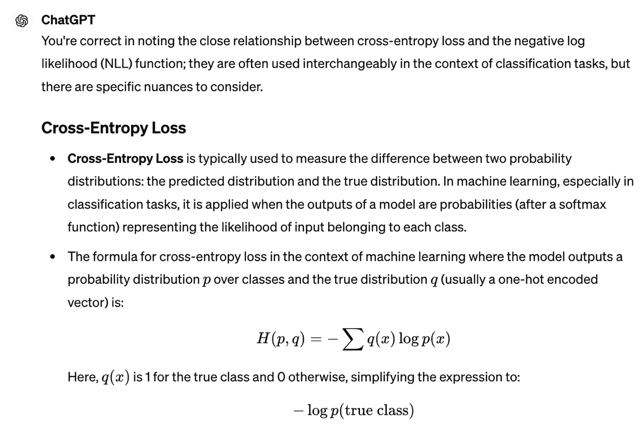</kbd>

<kbd>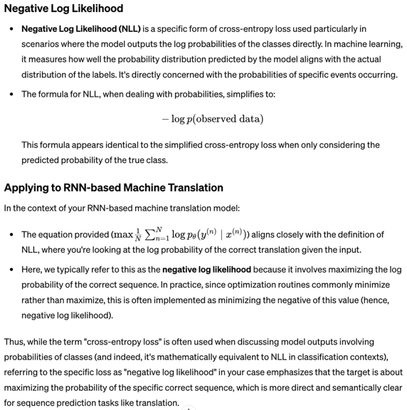</kbd>

 

<kbd>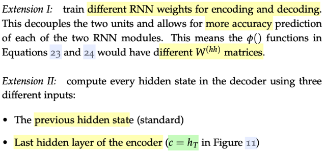</kbd>

<kbd>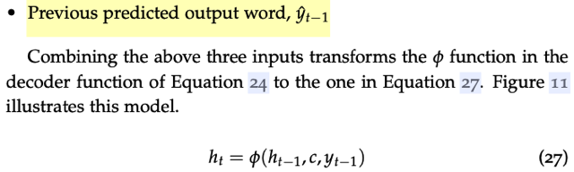</kbd>

> [!NOTE]
> Extension 1 đơn giản là tách phương án naive trên thành 2 RNN riêng,
> encoder và decoder. Để rồi last hidden state của encoder là h<0> của
> decoder

 

<kbd>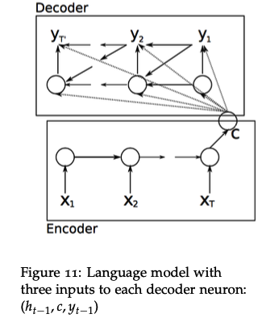</kbd>

> [!NOTE]
> Extension 2 đại ý là trong mỗi bước tính toán (của decoder) để ra y^<t>
> thì input ngoài previous hidden state h<t-1>, như của naive model ở
> trên, thì sẽ đưa cả y^<t-1> tức là prediction của time-step trước và last
> hidden  state của encoder vào, có nghĩa là trong cái này nó không chỉ
> tham gia vào Decoder ở dạng h<0> để tính h<t> mà tham gia ở mọi
> time-step)

 

<kbd>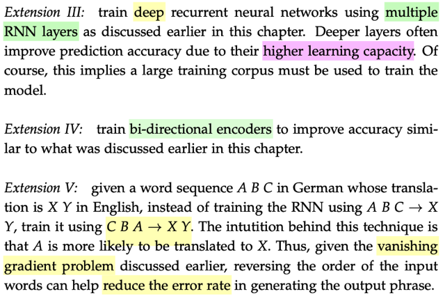</kbd>

> [!NOTE]
> Extension III và IV là dùng mô hình có capacity lớn hơn với nhiều
> RNN layer hơn, bi-directional encoder để nắm bắt thông tin context
> tốt hơn (của câu gốc)
>
>
>
> Extension V: là một ý tưởng hơi lạ, đó là dùng cách huấn luyện nó
> theo kiểu ngược  C B A -> X Y Z có tác dụng khắc phục phần nào
> hệ quả của vanishing gradient

 

<kbd>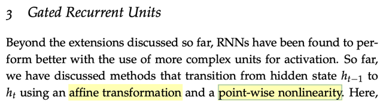</kbd>

> [!NOTE]
> đại khái là mở đầu cho việc nói về các " cấu tạo" cải tiến của RNN cell,
> phức tạp hơn. Hiện tại, bước tính toán ở mỗi time-step tương đối đơn giản:
>
>
>
> Previous hidden state h<t-1> được linear transform với Whh, x<t> với Whx,
> sau đó cộng với b thì bước này gọi là "**affine transformation".**
>
>
>
> Sau đó apply hàm non-linearity tanh() thì sở dĩ gọi là **point-wise** bởi vì
> nó sẽ apply tanh với từng phần tử của vector (người ta có thể gọi theo cách
> khác là element-wise)

 

<kbd>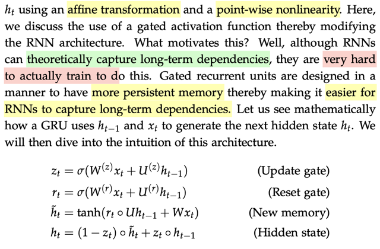</kbd>

> [!NOTE]
> đại khái là RNN trên lí thuyết thì vẫn có thể nắm bắt được long-term
> dependency Nhưng thực tế thì do hiện tượng vanishing gradient, nó
> không/khó làm được vậy.
>
>
>
> Người ta mới nghiên cứu ra GRU theo cách giúp RNN dễ hơn trong
> việc capturing long-term dependency.

 

<kbd>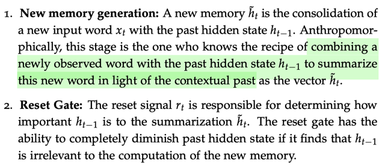</kbd>

<kbd>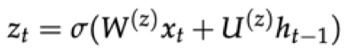</kbd>

<kbd>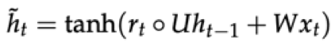</kbd>

> [!NOTE]
> đại khái là ta có thể ví von (nhân hóa) cái h~<t> như người
> giữ cửa có khả năng lấy current input x<t> để rồi kết hợp nó với
> last hidden state h<t-1> sao cho nó sẽ phản ánh được context vào
> để làm điều này, nó sẽ dùng **reset gate cái này sẽ được train để biết
> khi nào thì nên quên (reset) thông tin cũ đi**
>
>
>
> kết quả là h~<t> sẽ đóng vai trò như candidate thay cho h<t> hay ở ở đây
> và hidden state thì luôn mang ý nghĩa là memory rồi, vậy h~<t> sẽ mang
> ý nghĩa là new memory, ứng cử viên để thay thế, cập nhật lại memory mới

 

<kbd>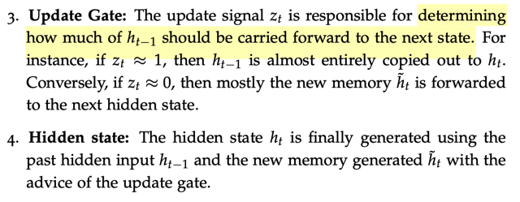</kbd>

<kbd>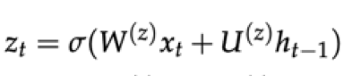</kbd>

<kbd>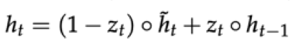</kbd>

> [!NOTE]
> Update gate đại khái là sẽ học cách quyết định xem nên giữ lại nhiều
> hay ít thông tin (trí nhớ cũ), để rồi từ đó cập nhật memory mới là phần
> lớn của new memory h~<t> hay phần lớn của memory cũ h<t-1> hay
> kết hợp theo tỉ lệ nào đó

 

<kbd>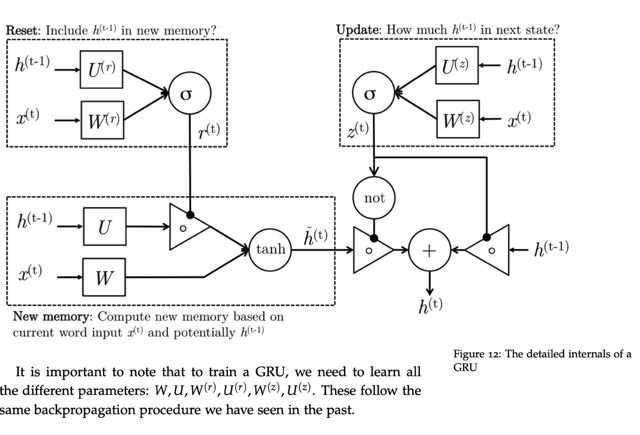</kbd>

> [!NOTE]
> Computational graph

 

<kbd>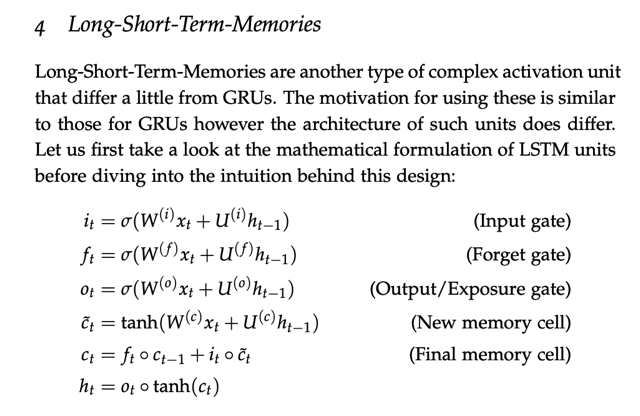</kbd>

 

<kbd>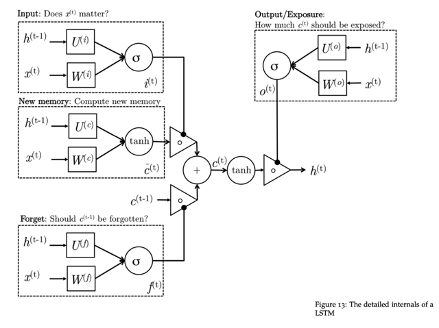</kbd>

 

<kbd>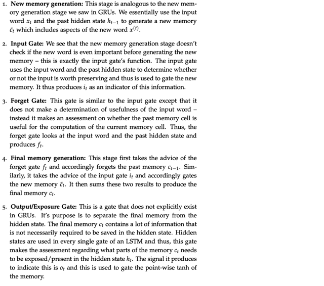</kbd>

<kbd>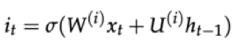</kbd>

<kbd>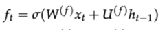</kbd>

<kbd>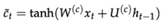</kbd>

<kbd>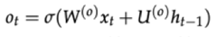</kbd>

<kbd>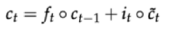</kbd>

<kbd>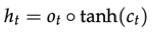</kbd>

> [!NOTE]
> Bước tính c~<t> tương đương bước tính h~<t> ở GRU, mang ý nghĩa
> tạo ra memory mới, hoặc đúng hơn là candidate để thay memory bằng
> cách kết hợp với x<t> với h<t-1>
>
>
>
> Đại khái là input gate sẽ chịu trách nhiệm quyết định xem phần nào 
> của new memory sẽ được dùng: Trong việc tính c<t>, i<t> element-wise 
> product với c~<t>. Model sẽ học được cách quyết định **xem từ mới đưa 
> vào x<t> có relevant/useful** không để mà ra **quyết định là sẽ xài ít hay 
> nhiều memory mới c~<t>,** cũng đồng nghĩa là có dùng cái thông tin 
> mới x<t> hay không.
>
>
>
> Còn forget gate thì học cách xác định memory cũ có useful không 
> để quyết định xem nên dùng ít hay nhiều memory cũ c<t-1>
>
>
>
> Và memory mới sẽ nhờ lời khuyên của forget gate để lấy ít nhiều memory
> cũ c<t-1>, nhờ lời khuyên của input gate để lấy ít nhiều memory mới c~<t>
> và kết hợp lại.
>
>
>
> Cuối cùng thì Output gate là cái mới so với GRU, mang ý nghĩa đại khái
> là tạo ra một phiên bản khác của bộ nhớ, có thể coi nó như short term memory
> (Còn coi c<t> như long-term memory). Nên kiểu như output gate sẽ học 
> Cách chọn lọc từ bộ nhớ dài hạn một số cái để đưa vào ngắn hạn

 

