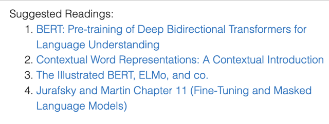
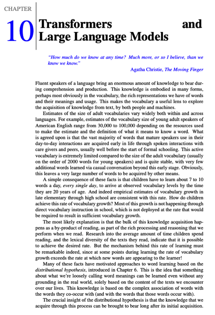
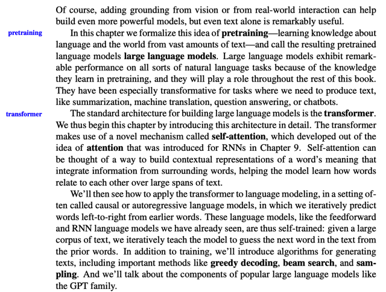
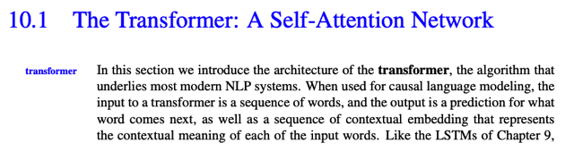
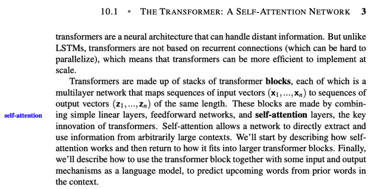
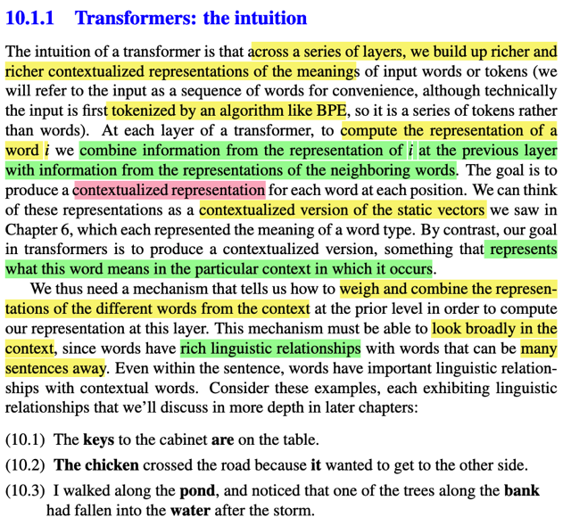

# Reading

📊 **Progress:** `4` Notes | `6` Screenshots

---

## Reading

 

<kbd></kbd>

> [!NOTE]
> Quay lại sau

 

<kbd></kbd>

<kbd></kbd>

> [!NOTE]
> đại ý là tác giả nói về việc một người từ nhỏ đến lớn thông
> qua giáo dục và tương tác ngôn ngữ đã liên tục tăng vốn
> từ vựng của mình. Trong đó đại ý là có khi chưa từng
> được học một từ một cách cụ thể nhưng thông qua ngữ
> cảnh vẫn hiểu được
>
> Chương này sẽ nói về quá trình pretraining một language model, để
> trở thành large language model, giúp có performance tốt trên nhiều
> loại nhiệm vụ trong nlp.
>
>
>
> Và ta sẽ xem xét kiến trúc Transformer trong đó có xử dựng
> self-attention mechanism Được cho / xem như là một cách thức giúp
> tạo ra **contextual representation** phản ánh thông tin context của
> một từ vào embedding của nó.
>
>
>
> Sau đó ta sẽ học về các technique như greedy decoding, beam
> search,.. sampling

 

<kbd></kbd>

<kbd></kbd>

> [!NOTE]
> đại ý là phần này sẽ nói về kiến trúc transformer, là giải thuật cấu thành
> nên hầu hết các hệ thống NLP hiện nay. Mà khi dùng nó trong "causal
> language model" thì input của transformer là embedding token của input
> sequence, và nó sẽ dự đoán từ tiếp theo cũng như là tạo ra contextual
> representation của các input token.
>
>
>
> Transformer sẽ được cấu thành bởi nhiều transformer blocks, mỗi block
> là một neural network có nhiều layer gồm linear layer Feedforward
> network và self attention layer.
>
>
>
> Self attention layer cho phép extract và dùng information một các trong
> một context lớn tùy ý (không bị giới hạn)

 

<kbd></kbd>

> [!NOTE]
> đại khái là ta có hiểu nôm na về ý tưởng của transformer như sau: qua
> từng  layer, các word vector (word ở đây quy ước với nhau là chỉ word
> hoặc subword hoặc character token) tức vector represent cho word sẽ
> **ngày càng được bồi đắp bởi thông tin ngữ cảnh của từ trong câu** bằng
> cách **lấy word vector từ layer trước và kết hợp với thông tin ngữ cảnh
> đến từ representation của các từ khác** trong câu.
>
>
>
> Có thể so sánh với word embedding mà word2vec, skipGram tạo ra chỉ là
> những word representation phản ánh ý nghĩa đơn lẻ của mỗi từ, thì ở đây,
> nó được gọi là **contextual representation** ám chỉ nó có thêm thông tin
> ngữ cảnh của từ trong câu nữa.
>
>
>
> Tác giả cho rằng muốn làm được như vậy mình phải có cơ chế giúp
> **đánh  giá và kết hợp các representation của các từ khác trong contex**t
> sao cho có thể "nhìn" đến những từ ở rất xa. Vì trong ngôn ngữ con
> người, **các từ có quan hệ ngữ nghĩa với nhau đôi khi không nằm gần
> nhau.**

 

