# Week 1: Intro & Word Vectors

📊 **Progress:** `57` Notes | `77` Screenshots

---

## Week 1: Intro & Word Vectors

 

## Lecture 1 - Intro & Word Vector

 

<kbd>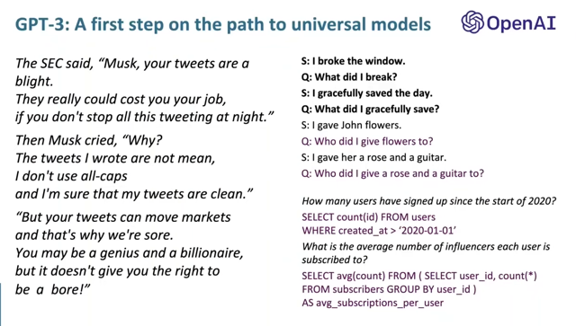</kbd>

 

#### Vận dụng nghĩa từ vựng

<kbd>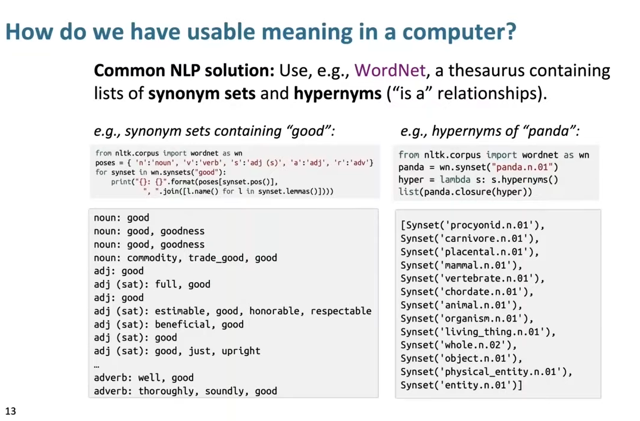</kbd>

> [!NOTE]
> Đầu tiên đại khái là làm sao để đưa vào
> dùng meaning của từ vựng

 

<kbd>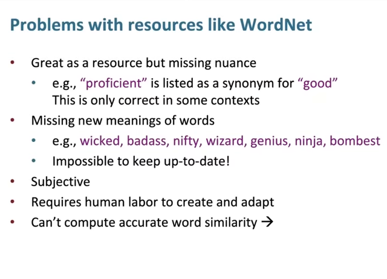</kbd>

 

- **Nhược điểm biểu diễn one-hot**

<kbd>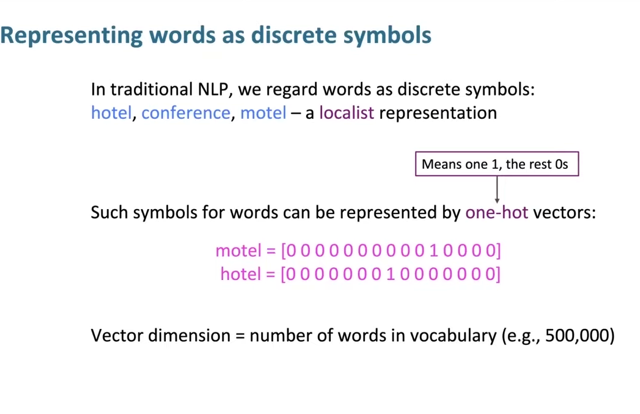</kbd>

> [!NOTE]
> Đại ý là nói qua một cách represent words theo **one-hot vector**
>
>
>
> **Nhược điểm của việc represent từng từ bởi one-hot vector**. Đó
> là **huge vector** ví dụ 250,000 từ trong vocab thì vector có 250.000
> unit

 

- **Hạn chế thông tin ngữ nghĩa**

<kbd>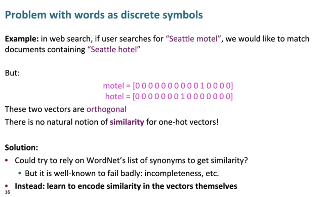</kbd>

> [!NOTE]
> Nhược điểm nữa là các từ **sẽ orthogonal nha**u gì là những từ gần nghĩa,
> nên **hầu như chẳng chứa đựng thông tin ngữ nghĩa gì** trong đó

 

- **Word Embedding từ ngữ cảnh**

<kbd>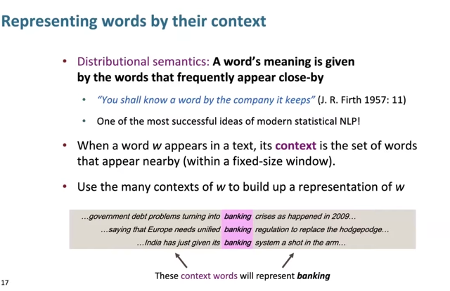</kbd>

> [!NOTE]
> Đại khái là về **ý tưởng quan trọng của NLP** là **ý nghĩa của
> một từ đến từ các từ hay đi kèm với nó** từ đó hình thành nên
> các phương pháp represent word meaning bằng word embedding
> như CBOW, Word2Vec

 

- **Khái niệm Word Embedding**

<kbd>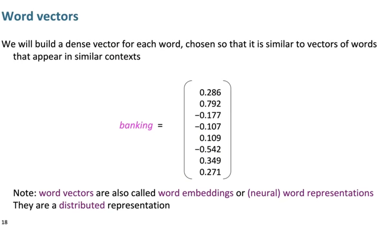</kbd>

> [!NOTE]
> Từ đó hình thành khái
> niệm word embedding

 

- **Không gian nhúng từ**

<kbd>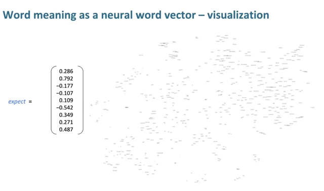</kbd>

> [!NOTE]
> Word embedding spaces

 

<kbd>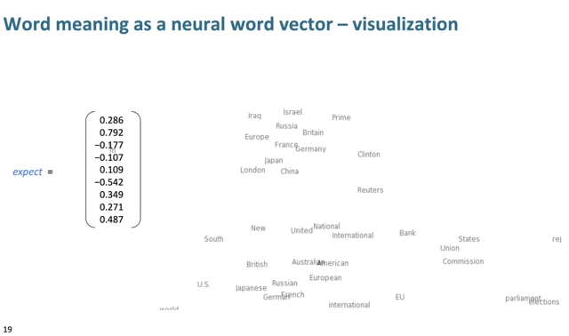</kbd>

 

- **Nguyên lý hoạt động Word2Vec**

<kbd>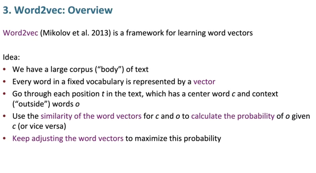</kbd>

> [!NOTE]
> Ideas là chuẩn bị một bộ **text corpus.**
>
>
>
> - Và mỗi từ được **initialize / represent bởi một vector**
>
>
>
> - Quét qua toàn bộ corpus theo từng ô (window), mỗi lần như vậy sẽ  có một từ làm
> center words, và các từ xung quanh là context. Thì từ đó mới **tính conditional probability
> P(o|c)** = xác suất xuất hiện từ context o1, o2 nếu từ center là c. Để rồi thực hiện
> **optimization là thay đổi các word embedding sao cho maximize cái xác suất này.**
>
>
>
> Thì thật ra **Word2Vec** có thể dùng 2 cách là..
>
>
>
> **CBOW** như đã học bên NLPSpec, đó là **đưa ra các context word** mà bảo model
> **đoán center word**. Có thể hiểu là model phải làm sao để P(c|o) (xác suất từ center word xuất
> hiện khi context word là như vậy) cao nhất.
>
>
>
> Hoặc **Skip-gram** mà trong DLSpec có nói là **đưa center word**, bảo model **đoán
> các context words** nhưng trong đó có thể skip, tức là không nhất thiết phải đoán hết
> các từ trong context / các từ xung quanh mà có thể skip qua vài bước.
>
>
>
> Thì cái ý ở slide này nói t**ương tự Skip-gram** có điều **không skip** mà **tính P(o|c) cho mọi
> từ trong window**. Thông qua việc phải đoán trúng các context words (để giảm loss) thì
> chính là model phải làm sao đó (thay đổi word embedding) sao cho P(o|c) cao nhất.
>
>
>
> Cả hai cách maximize P(o|c) hay P(c|o) **đều dẫn tới việc làm cho word embedding của
> các từ đứng gần nhau sẽ chứa những giá trị phản ánh quan hệ gần gũi giữa chúng**

 

<kbd>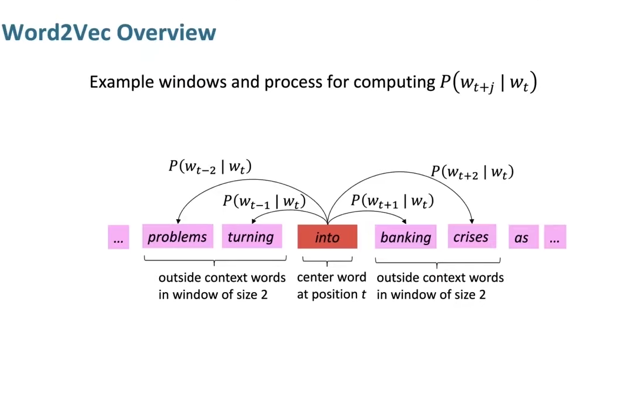</kbd>

 

<kbd>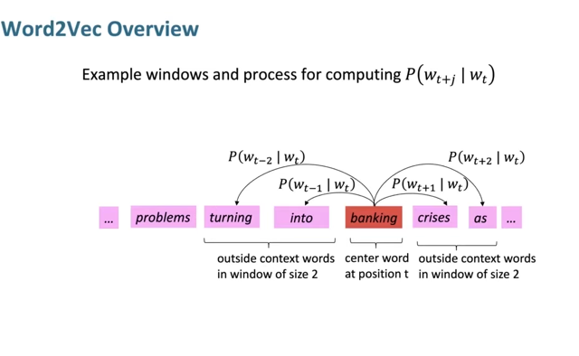</kbd>

 

- **Hàm Mục Tiêu Skip-gram**

<kbd>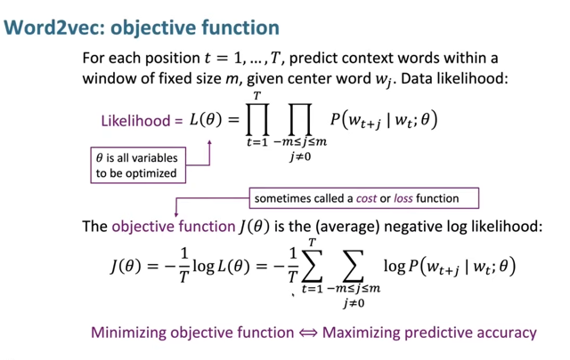</kbd>

> [!NOTE]
> Đại khái đây chỉ là cách thể hiện toán học của cái ý vừa rồi: **Làm sao để** 
> (nói "làm sao để là thể hiện ý đang mô tả **objective function** của model) 
> model có thể **thay đổi / tạo ra các word  embedding vectors** **sao cho** **tối đa 
> hóa xác suất của các context words cho trước một center word P(o|c)**.
>
>
>
> Thì nhiệm vụ đó thể hiện bằng việc **tối đa hóa Likelihood L(theta).** Theta
> ở đây nói chung là **toàn bộ các variable có thể được optimize**, bao gồm
> các **params** và **word embedding.**
>
>
>
> Công thức của L diễn giải như sau: Với **mỗi một vị trí của window** / cái
> khung chứa 2m+1 từ, **ta có một từ center w_t** và **2m từ context: w_t + j** 
>
>
>
> Với j trong [-m, m] thì ta có **P(w_t+j | wt, theta)** là **xác suất của việc từ w_t+j**
> **xuất hiện,** **nếu đã cho trước từ w_t**, tính toán bởi theta.
>
>
>
> Và để maximize xác suất "nói chung" ta sẽ **maximize tích của 2m các giá trị 
> P(w_t+j | wt, theta) này**.
>
>
>
> Từ đó có cái phần PI j in [-m,m] P(w_t+j | w_t, theta)
>
>
>
> Xong vì quét trong toàn bộ corpus nên ta có product của T vị trí window.
>
>
>
>  L = PI t in [1,T] { PI j in [-m,m] P(w_t+j | w_t, theta) }
>
>
>
> Và đ**ể maximize cái L này** thì ta sẽ **minimize cost J được** define là 
> **negative average log của likelihood** L = J = **-log L / m**
> nên mới hay nghe cost function là **log likelihood là vậy**

 

- **Biểu diễn từ bằng vector**

<kbd>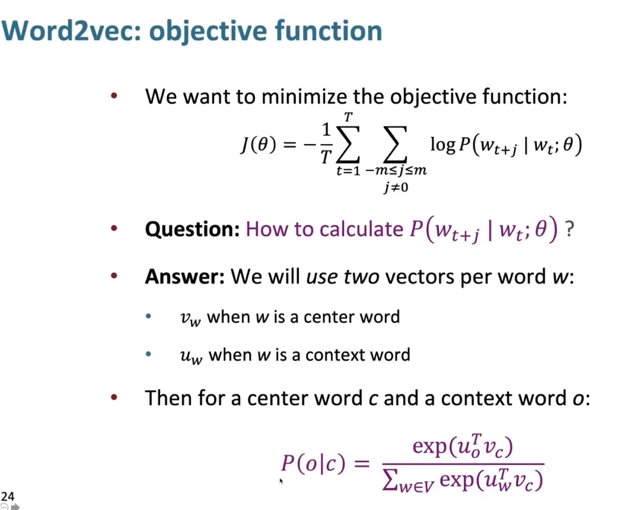</kbd>

> [!NOTE]
> Chỗ này ổng nói **để tính P(w_t+j | w_t)** thì người ta **dùng công thức này**
> trong đó phải chuẩn bị hai vector cho mỗi một từ w, khi nó là context thì
> vector là uw, nếu nó là center thì vector là vw.
>
>
>
> Và công thức tính P(o|c) sẽ như vầy ổng nói cứ **tạm thời biết vậy,** c**ó thể
> sẽ quay lại sau để giải thích.** 
>
>
>
> Có thể tạm hiểu ideas là **cho trước một từ c thì từ mà có xác suất xuất hiện
> cao nhất o sẽ là từ giống với c nhất.**

 

- **Cơ chế Dot Product và Softmax**

<kbd>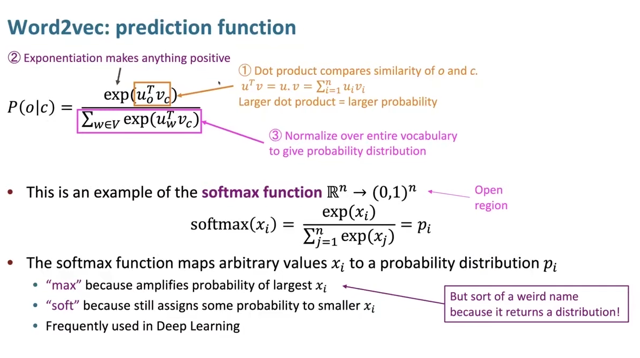</kbd>

<kbd>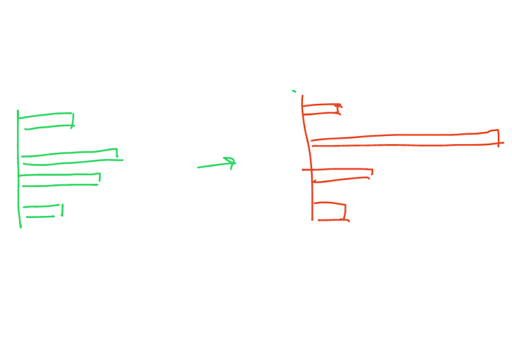</kbd>

> [!NOTE]
> Ở đây ổng giải thích để **có thể hiểu đại khái là ý nghĩa của từng phần
> trong công thức**
>
>
>
> Đầu tiên phép **dot product** chính là **tính ra chỉ số giống nhau giữa
> hai word vector.** Như ta cũng biết **hai vector càng giống nhau** thì
> **dot product càng lớn** vì phép toán sẽ **nhân các cặp cùng vị trí** rồi
> **cộng lại** hết,
>
>
>
> [u1 u2 u3] . [v1 v2 v3] = u1v1 + u2v2 + u3v3
>
>
>
> nên **nếu 1 cặp cùng âm hoặc cùng dương** thì sẽ **khiến tích chúng
> dương**, và **khiến tổng tăng lên**, ngược lại **1 cặp ngược dấu** sẽ
> khiến **tích của chúng âm** và khiến **tổng giảm xuống**.
>
>
>
> Sau đó **để cho kết quả không âm** thì ổng nói người ta dùng exp. lên.
>
>
>
> Và **để nó trở thành trong khoảng 0,1 - probability distribution** thì
> người ta **normalize** / chia cho tổng các exp của phép dot product củ
> từ center vc với mọi từ trong vocab uw
>
>
>
> ====
>
>
>
> Ý tiếp theo là đây cũng chính là công thức softmax và chữ **max** nôm
> na là vì nó **khuếch đại xác suất của cái có value cao nhất** và **soft**
> vì nó **vẫn chừa một chút xác suất cho mấy cái nhỏ hơn**.
>
>
>
> Hiểu nôm na là **đưa vào một đám mang các giá trị lớn nhỏ khác nhau
> (gọi là logit)**, và **thằng lớn nhất có thể không lớn hơn những thằng
> khác quá nhiều**. Nhưng softmax sẽ **khuếch đại thằng lớn nhất lên để
> nó thành vượt trội những thằng khác**. Nhưng không phải là những
> thằng khác thành 0 hết mà vẫn có chút gì đó.

 

- **Điều chỉnh tham số word embedding**

<kbd>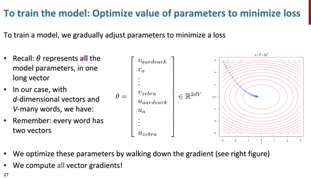</kbd>

> [!NOTE]
> Như đã nói, ta sẽ **train model** với objective như vậy để **tweak các
> param** trong đó có các word embedding. Thì đây theta kí hiệu cho
> toàn bộ word embedding, gồm có **V words**, **mỗi word có 2 vector** như
> mới nói, và **vector có d-dimensions (d unit**). Thành ra theta có **2dV
> params cần được tweak**

 

<kbd>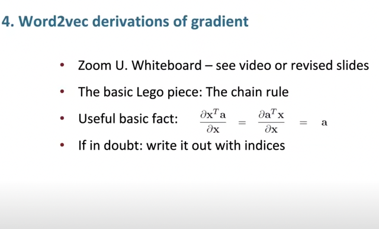</kbd>

 

<kbd>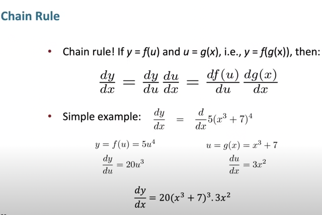</kbd>

> [!NOTE]
> Slide này ổng ko nói, nhưng chỉ là
> ôn lại khái niệm chain rule

 

<kbd>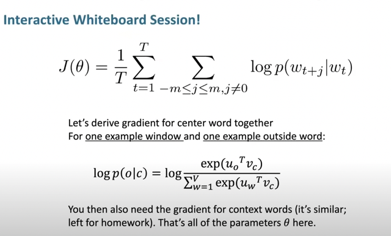</kbd>

 

<kbd>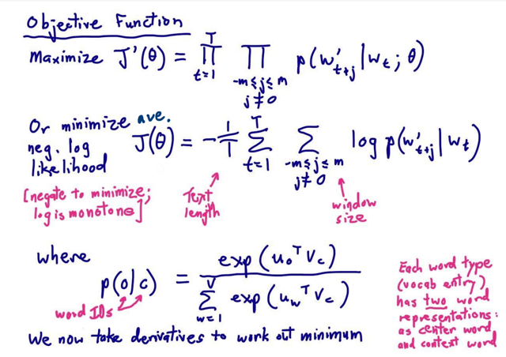</kbd>

> [!NOTE]
> Nhắc lại ở slide trước đã đi qua việc hình thành cost function:
>
>
>
> Ta có mục đích / mục tiêu (objective function) là train  model để **tối đa hóa cái
> p(o|c) nói chung** tức là **tối đa các xác suất mà khi cho trước center words**
> thì **xuất hiện các context word**. Gọi là **likelihood function**
>
>
>
> Và từ đó đặt ra **cost function** là **negative (average) log likelihood** như vầy
> để minimize nó thì sẽ maximize cái objective function. Ở đây có chú ý mà mình
> cũng đã biết là sở dĩ có thể làm được vậy ( thay vì minimize negative likelihood
> thôi thì có thể minimize log là vì log là hàm đơn điệu - monotonic nên nó chỉ)
> tăng khi x tăng chứ không phải lúc tăng lúc giảm)
>
>
>
> Và trong công thức, li**kelihood (hay probability) sẽ dùng công thức softmax**
> như vầy với hiểu nôm na như ở slide trước có nói là "từ nào mà giống
> nhau = có dot product cao thì sẽ có xác suất xuất hiện cùng nhau cao"Và slide trước cũng có nói là mỗi từ sẽ có 2 embedding vector
> ====
>
>
>
> Thì như đã biết, ta cần tính derivative of cost function J w.r.t các params

 

<kbd>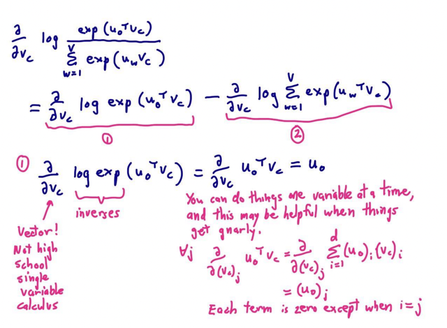</kbd>

> [!NOTE]
> Đầu tiên là tính partial derivative of J w.r.t vc = dJ/dvc.
>
>
>
> Thì đầu tiên vì log(a/b) = log(a) - log(b)
> nên dJ/dvc = d log(A/B)/dvc = d log(A)/dvc - d log(B)/dvc
> Với A là vế tử, B là vế mẫu.
>
> Xong d log A/dvc thì trở thành d u0_T.vc / dvc vì log exp đã
> triệt tiêu nhau (log base e (e^a ) = a)
>
>
>
> Và đến đây ổng nói chú ý rằng d u0_T.vc / dvc là multi variate
> derivative tức là vc là vector chứ không phải 1 số Nếu là 1 số
> thì là uni-varivate thì dễ rồi d (a*x) / dx = a thôi.
>
>
>
> Thì u0_T.vc chính là u01*vc1 + u02*vc2... là sum của các tích hai element
> của u0 và vc không có gì mới.
>
>
>
> Thì cách tính d u0_T.vc / dvc cũng rất dễ thôi, đó là **tính partial derivate của
> u0_T.vc với từng element trong vc. Xem hình là hiểu**
>
>
>
> Và ổng nói nhớ cái này để làm tương tự khi gặp những bài toán phức tạp

 

<kbd>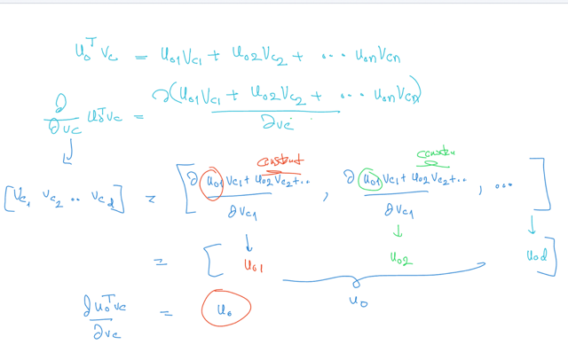</kbd>

> [!NOTE]
> Đạo hàm của A với vector vc sẽ là vector các đạo
> hàm của A với các phần tử của vector vc

 

<kbd>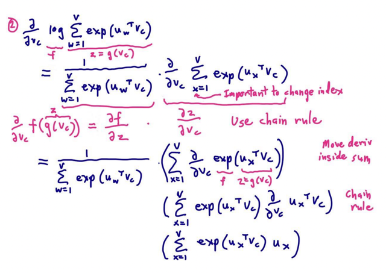</kbd>

 

<kbd>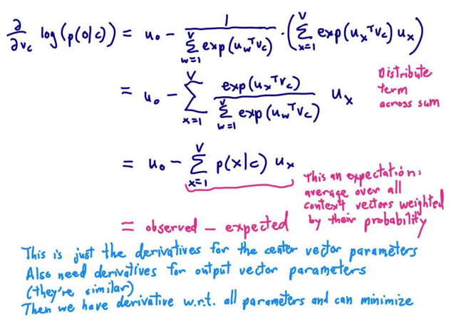</kbd>

<kbd>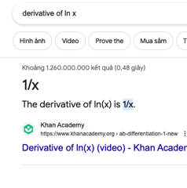</kbd>

<kbd></kbd>

> [!NOTE]
> Vế sau cũng không khó lắm, chỉ cần dùng chain rule với một số
> công thức đạo hàm của hàm cơ bản như:
>
>
>
> 1. d log e (x) /dx = 1/x, d e^x / dx = e^x,
>
>
>
> 2. Nếu f(x) = f1(x) +f2(x) thì df/dx = df1/dx + df2/dx, vì sao:
>
>
>
> Giải thích theo ý nghĩa bản chất của đạo hàm:
>
>
>
> Khi wiggle x một khoảng dx thì nó khiến f1(x) wiggle khoảng df1, và
> khiến f2(x) wiggle khoảng df2 và
>
>
>
> vì f = f1 + f2, nên nếu f1 wiggle df1 và f2 wiggle df2 thì sẽ khiến f
> wiggle khoảng df1 + df2
>
>
>
> Như vậy khi x wiggle dx khiến f wiggle df = df1 + df2
>
>
>
> Nên tỉ lệ df/dx = (df1 + df2)/dx = df1/dx + df2/dx

 

<kbd>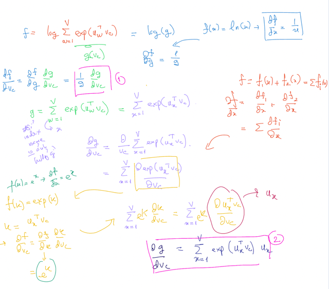</kbd>

<kbd>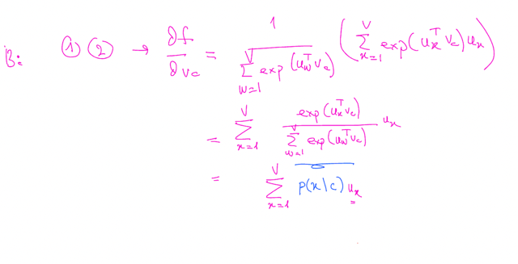</kbd>

 

<kbd>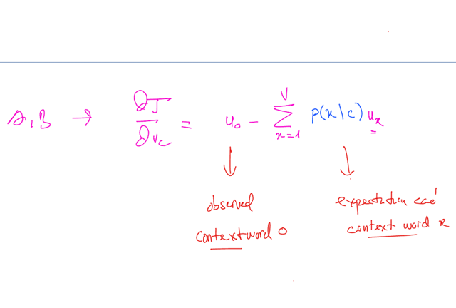</kbd>

<kbd>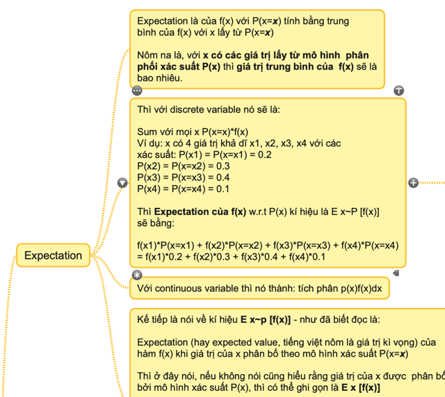</kbd>

> [!NOTE]
> Tại sao gọi là expectation, nhớ lại khái niệm expectation E f(x). Khi random variable x
> được phân bố theo probability distribution theo phân bố P(x) sẽ là tích các giá trị của
> f(x) nhân với xác xuất của x mang các giá  trị x1,x2...
>
>
>
> E x~Px() [f (x)] = f(x1)*P(x=x1) + f(x2)*P(x=x2) + .....( với P(x) là discrete - rời rạc
> function)
>
>
>
> Thì ở đây dù chưa hiểu lắm nhưng tạm hiểu cái cụm Sum x=1:V P(x|c)ux bên phải
> nôm na là **weighted sum các vector context word ux**, nhân với **weight là xác suất
> xuất hiện của nó nếu có center word c rồi**
>
>
>
> Còn u0 là observed context word - từ context đã quan sát thấy, đã thực sự xuất hiện
> bên cạnh từ center c trong corpus.
>
> Ôn lại khái niệm Expectation từ DL Yo
>
> Cuối cùng đây chỉ là derivative of cost function J wrt
> vc -embedding vector của center word
>
>
>
> Phải tính thêm derivative of cost function J wrt u0 - embedding
> vector của context words nữa.
>
>
>
> Sau đó dựa vào gradient descent, update các vc, uo để khi 
> J converge, ta sẽ có bộ embedding word vector như ý
>
>
>
> Chú ý là vc, uo chỉ là cách nói chung chung embedding vector 
> của từ center c, và các từ context o, khi window quét qua toàn bộ
> corpus thì nó sẽ là những từ cụ thể tại mỗi vị trí window

 

<kbd>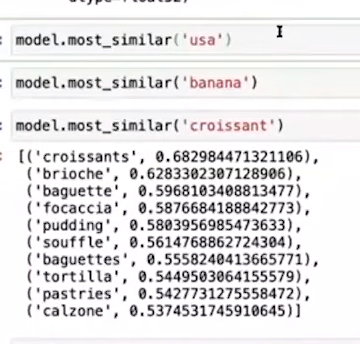</kbd>

> [!NOTE]
> Xem một số kết quả của
> word embedding.

 

<kbd>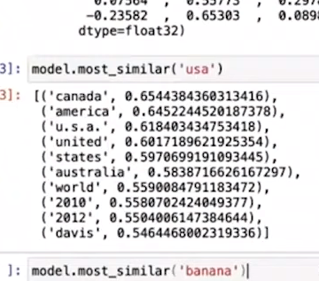</kbd>

 

<kbd>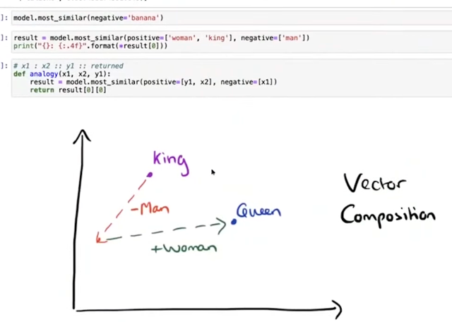</kbd>

> [!NOTE]
> Và nó thể hiện cả các
> analogy như man-woman king-queen

 

<kbd>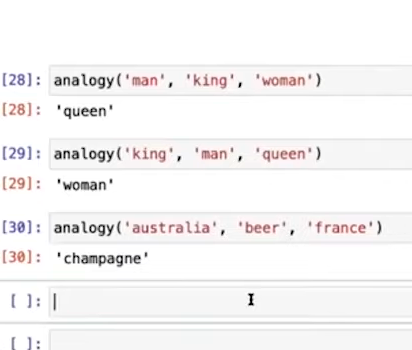</kbd>

 

<kbd>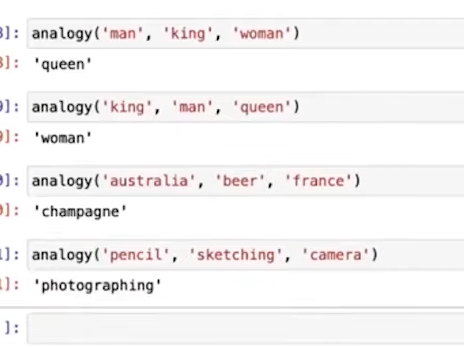</kbd>

 

<kbd>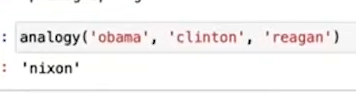</kbd>

 

<kbd>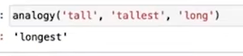</kbd>

 

<kbd></kbd>

> [!NOTE]
> Đại khái là dùng hai word vector cho mỗi từ (1 khi nó là context word, 
> 1 khi nó là center word) thì sẽ dễ training hơn (Tính toán derivative)
>
>
>
> Và dù sao thì khi training, với các window ở các vị trí khác
> nhau thì một từ sẽ có khi là center word cũng sẽ có khi trở thành
> context word nên ổng nói cuối cùng ta sẽ **end úp với hai word
> vector khá giống nhau.** 
>
>
>
> Và ta sẽ **lấy average** giữa chúng, nhưng cũng có người làm kiểu
> khác

 

<kbd></kbd>

> [!NOTE]
> Có người hỏi gì không rõ nhưng ổng trả lời là với
> những từ như "**so**", thì word vector của nó không tốt
> lắm vì những từ dạng này xuất hiện ở mọi context
> nên nó rất chung chung

 

<kbd></kbd>

> [!NOTE]
> Đại khái là Word2Vec chỉ là một framework để build word
> vector và có nhiều cách triển khai cụ thể khác nhau
>
>
>
> Trong đó thì như ở đây ổng giới thiệu nó gọi là **Naive Optimization**
> Nhưng thực tế thì cái này nó khá "expensive" (trong tính toán)
> Nên sẽ nói đến những cách khác như **Skip-gram** và **Negative 
> Sampling** (đã có nói đến trong DLSpec)

 

<kbd></kbd>

> [!NOTE]
> Start với random word vectors, và dùng **gradient descent** nhiều lần
> để giảm cost và tăng khả năng predict của model đối với các từ hay
> xuất hiện gần nhau. Dần dần ta sẽ có bộ word vectors phản ánh /
> chứa đựng những ngữ nghĩa của nó

 

<kbd>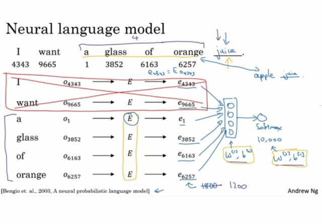</kbd>

<kbd>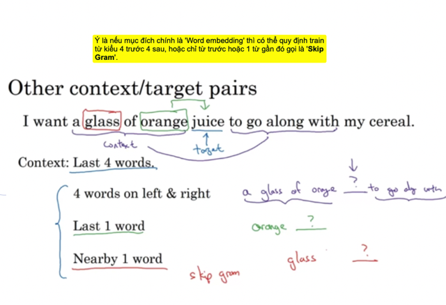</kbd>

> [!NOTE]
> DLSpec: Đại khái là nói về **một kiến trúc đơn giản trước ra đời trước (skip-gram,
> hay CBOW)  để train ra word embedding** mô tả trong paper từ 2003 của Yoshua
> Bengio A neural probabilistic language model)
>
>
>
> Trong đó input là **những từ trước đó** ("I", "want", "a", "glass", "of") của **từ  cần
> đoán target** ("juice"). Ví dụ **vocab_size là 10000**, **embedding dimension là
> 300**.
>
>
>
> Các từ sẽ được **one-hot encoded**, ví dụ (1x10000) sau đó thông qua linear
> transformation = **nhân với weight matrix E** gọi là **embedding matrix** có shape
> 10000x300 **để thành embedding vector 1x300**.
>
>
>
> Tiếp theo **sum hoặc average các embedding words** này lại để rồi **cho qua một
> Dense layer với softmax activation** để ra một vector y^ chứa **10000 probability
> scores**
>
>
>
> Tiếp theo với **loss function** là **negative log likelihood (log loss)** với **y^** và
> **target y**  - **là one-hot encoded của target word "juice",** model sẽ **tìm cách
> tweak các layer params và Embedding matrix E** sao cho **giảm loss** thì chính là
> **mang hiệu quả là với các từ context "I", "want", "a",..."of" , maximize xác suất
> xuất hiện của từ "juice"**
>
> Thì nếu các từ context là vài từ trước đó và sau đó thì ta có kiểu
> tương tụ CBOW (dù CBOW), hoặc bỏ qua vài từ thì ta có Skip-gram
> Việc cho center đoán context word hay cho context đoán center thì thật
> ra cũng mang hiệu quả như nhau thôi

 

<kbd>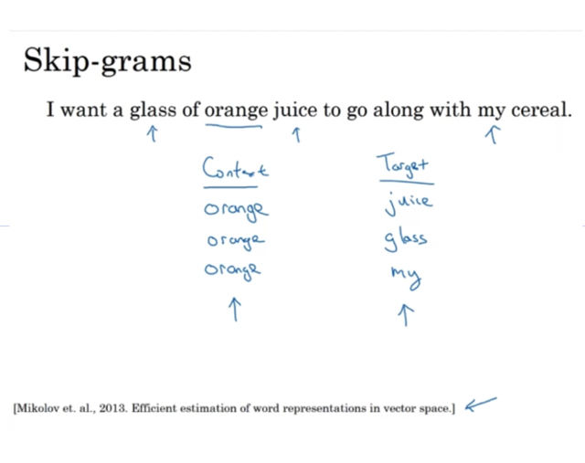</kbd>

> [!NOTE]
> DLSpec: Skip-grams, cho center word ví dụ orange, model phải đoán
> các từ trong context nhưng có skip, ví dụ orange - glass, my

 

## Lecture Note : Introductiont O Word2vec

 

### 1.2\\* Language and machines\\*

Human children, interacting with a rich multi-modality world and various
forms of feedback, acquire language with exceptional sample efficiency (not
observing that much language) and compute efficiency (brains are efficient
computing machines!) With all the (impressive!) advances in NLP in the last
decades, we are still nowhere close to developing learning machines that
have a fraction of acquisition ability of children. One fundamental (and still
quite open) problem in building language-learning machines is the question
of representation; how should we represent language in a computer such
that the computer can robustly process and/or generate it? This is where this
course focuses on the tools provided by deep learning, a highly effective
toolkit for representing both the wild variety of natural language and some of
the rules and structures it sometimes adheres to. Much of this course will be
dedicated to this question of representation, and the rest of this note will talk
about a basic subquestion: how do we represent words? Before that,
though, let’s briefly discuss some of the applications you can hope to build
after learning modern NLP techniques.

> [!NOTE]
> Đại khái là câu hỏi đâu tiên là làm sao để
> representation word (trong máy tính)

 

#### 1.3 A few uses of NLP
Natural language processing algorithms are increasingly useful
and deployed, but their failures and limitations are still largely
opaque and sometimes hard to detect. Here are a few of the major
applications; this list is intended to pique your interest, not to be
exhaustive:

\\*Machine translation\\*. Perhaps one of the earliest and most successful
applications and driving uses of natural language processing, MT
systems learn to translate between languages and are ubiquitous
in the digital world. Still, failures of these systems for most of the
world’s 7000 languages, difficulties in translating long text, and
ensuring contextual correctness of translations make this still a
fruitful field of research

\\*Question answering\\* and\\* information retrieval.\\* The concept of “question
answering” should seem overly broad—can’t we express any
problem as question answering?—but in NLP, question answering
has tended to be related to information-seeking questions (“Who is
the emir of Abu Dhabi?”, “What is the process by which I can get
an intern visa for the United Kingdom?”). Continually broadening
the scope of answerable questions, providing provenance for
answers, answering questions in an interactive dialogue—this is
one of the fastest-evolving research directions.

> [!NOTE]
> Một số ứng dụng tiềm
> năng của NLP

 

##### \\*Summarization and analysis of text\\*. There are myriad reasons to want
to understand (1) what people are talking about and (2) what they
think about those things. Companies want to do market research,
politicians want to know peoples’ opinions, individuals want
summaries of complex topics in digestible form. NLP tools can
be powerful for both the increase of access to information to the
public, as well as surveillance, corporate or governmental. Bear
this aspect of “dual use” in mind as you progress and decide what
you are building.

Note: speech(or sign)-to-text. The process of automatic transcription of
spoken or signed language (audio or video) to textual representations is a 
massive and useful application, but one we’ll largely avoid in this course. 
Partly, this is historical and methodological;
the raw signal processing methods and expertise are generally
covered in other courses (224s!) and other research communities,
though there has been some convergence of techniques of late.

 

- **In all aspects of NLP, most existing tools work for precious few
(usually one, maybe up to 100) of the world’s roughly 7000
languages, and fail disproportionately much on lesser-spoken
and/or marginalized dialects, accents, and more. Beyond this,
recent successes in building better systems have far
outstripped our ability to characterize and audit these systems.
Biases encoded in text, from race to gender to religion and
more, are reflected and often amplified by NLP systems. With
these challenges and considerations in mind, but with the
desire to do good science and build trustworthy systems that
improve peoples’ lives, let’s take a look at a fascinating first
problem in NLP.**

> [!NOTE]
> Đề cập đến những hạn chế hiện tại
> như chưa cover hết tất cả các human
> language, định kiến ...

 

- **\\*2 Representing words\\*

\\*2.1 Signifier and signified
\\*
Consider the sentence

Zuko makes the \\*tea\\* for his uncle.
Zuko like to makes the \\*tea\\* for his uncle.

The word Zuko is a sign, a symbol that represents an entity Zuko in
some (real of imagined) world. The word tea is also a symbol that
refers to a signified thing—perhaps a specific instance of tea. If one
were instead to say Zuko likes to make tea for his uncle, note that the
symbol Zuko still refers to Zuko, but now tea refers to a broader
class—tea in general, not a specific bit of hot delicious water. Consider
the two following sentences:

Zuko makes the coffee for his uncle.

Zuko makes the drink for his uncle.

Which is “more like” the sentence about tea? The drink may be tea
(or it may be quite different!) and coffee definitely isn’t tea, but is yet
similar, no? And is Zuko similar to uncle because they both describe
people? And is the similar to his because they both pick out specific
instances of a class?

Word meaning is endlessly complex, deriving from humans’ goals
of communicating with each other and achieving goals in the world.
People use continuous media—speech, signing—but produce signs
in a discrete, symbolic structure—language—to express complex
meanings. Expressing and processing the nuance and wildness of
language—while achieving the strong transfer of information that 
language is intended to achieve—makes r\\*epresenting words\\* an
\\*endlessly fascinating problem\\*. Let’s move to some methods.**

> [!NOTE]
> Đại khái là nói về **sự phức tạp của ngôn ngữ** và một ví dụ
> nhỏ là khi trong hai câu chữ tea có thể mang hai nghĩa
> khác nhau: Một là 1 tách trà cụ thể, 1 là nói về trà chung
> chung.
>
>
>
> Zuko đang pha trà cho chú
> Zuko thích pha trà cho chú
>
>
>
> Từ đó đặt vấn đề **word representation** - làm sao represent
> word mà phản ánh được các thông tin ngữ nghĩa khác
> nhau trong từng hoàn cảnh cụ thể như vậy

 

- **What is a word? I cannot define a word for you, but I can give some examples in English:
tea, coffee, abbreviate, gumption. The word antiradate I hereby define to mean the action
of looking wistfully at an inedible decoration, wishing it were as tasty as it looked. If I use
this sign to communicate with others my longing, that’s good enough to me to be a word.

Perhaps the simplest way to represent words is as independent, unrelated entities. You
might think of this as a set,

{. . . , tea, . . . , coffee, . . . , antiridate}.

Here let’s introduce a bit of terminology. We will refer to a word type as an element of a
finite vocabulary, independent of actually observing the word in context. So, we’ve just
written a set of types. A word token is an instance of the type, e.g., observed in some
context. A (word) type is an element of a vocabulary; a word in abstract. A (word) token is
an instance of a type in context.

Our word representations right now provides a single representation for each word type,
and we might use that same representation for any occurence of the word token in
context. We will often be working with vectors in this course; the conventional vector
representation of independent components is the set of 1-hot, or standard basis, vectors.
Thus, maybe**

<kbd>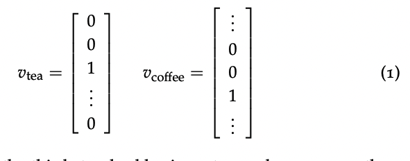</kbd>

<kbd>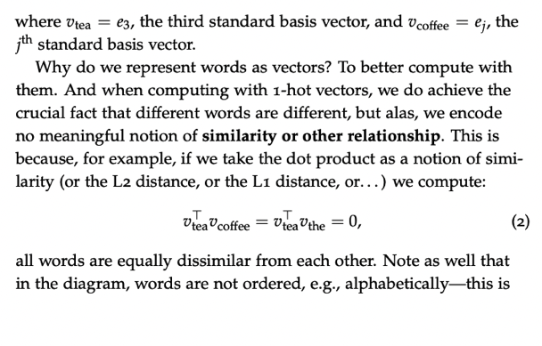</kbd>

<kbd>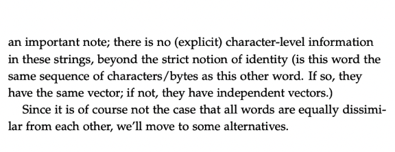</kbd>

> [!NOTE]
> Cách đầu tiên để represent là **one-hot vector**, tại sao, đơn giản
> là để đạt được: **mỗi từ mỗi khác nhau**, **mỗi từ được represent
> theo một cách (vector) riêng biệt**.
>
>
>
> Nhưng **hạn chế là nó chỉ làm được có vậy**, hoàn toàn **không
> chứa những ý nghĩa nào** như từ này thì gần nghĩa với từ  kia
> hơn, khác nghĩa với từ nọ hơn ,..vì nếu dùng các cách thông
> thường để tính **độ giống nhau của hai vector như dot product,
> l1, l2 distance thì từ nào cũng (có độ khác với những từ khác) y
> như nhau**

 

- **Should we represent word semantics not as one-hot vectors, but instead as a
collection of features and relationships to linguistic categories and other
words?

For any word, say runners, there is a wealth of information we can annotate
about that word. There is grammatical information, like plurality, there’s
derivational information, like how the runners is something like the verb to run
plus a notion of “doer”, or agent (think one who runs.) There’s also semantic
information, like how runners might be a hyponym of humans, or animals, or
entities. (A hyponym is a member of an is-a relationship; e.g., a runner is a
human.)

There are substantial existing resources in English and a few other languages
for various kinds of annotated information about words. WordNet [Miller, 1995]
annotates for synonyms, hyponyms, and other semantic relations; UniMorph
[Batsuren et al., 2022] annotates for morphology (subword structure)
information across many languages. With such resources, one could build
word vectors that look something like In 2023, word vectors resulting from
these methods are not the norm, and they won’t be the focus of this course.
One main failure is that human-annotated resources are always lacking in
vocabulary compared to methods that can draw a vocabulary from a naturally
occuring text source—updating these resources is costly and they’re always
incomplete. Another failure is a tradeoff between dimensionality and utility of
the embedding—it takes a very high-dimensional vector (think much larger
than the vocabulary size) to represent all of these categories, and modern
neural methods that tend to operate on dense vectors do not behave well with
such vectors. Finally, a continual theme we’ll see in this course is that human
ideas of what the right representations should be for text tend to underperform
methods that allow data to determine more aspects—at least when one has a
lot of data to learn from.**

<kbd>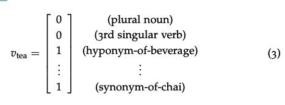</kbd>

> [!NOTE]
> Cách thứ hai đại khái nôm na là ta sẽ làm bằng
> tay, đánh dấu bằng tay các "thể loại" của một từ
>
>
>
> Như nó là từ số nhiều phải không -> đánh 1 ở vị trí 1
> nó là từ có ý nghĩa abc -> đánh 1 ở vị trí i....
>
>
>
> Nói chung là ta, human phải quyết định gán các ý nghĩa
> ngữ nghĩa cho một từ.
>
>
>
> Và cách này có những nhược điểm nên không được dùng
> rộng rãi:
>
>
>
> 1. Là rất tốn kém và chắc chắn không đầy đủ: Vì ngôn ngữ
> rất phức tạp, dù có cố gắng mấy thì cũng khó lòng mà liệt
> kê được đầy đủ những ngữ nghĩa, thể loại của từ vựng 
>
>
>
> 2. Là nếu mà làm cách này thì chiều dài một vector có thể
> dài hơn cả vocab size và các neural network không hoạt
> động tốt với các vector kiểu này.
>
>
>
> 3. Là để máy tính tự tìm ra các abstract meaning của từ 
> thì tốt hơn là con người.
>
>
>
> 4. Là với cách này thì không đủ nguồn lực để làm, không tận 
> dụng được các nguồn unlabeled data khổng lồ trên mạng

 

- **\\*3 Distributional semantics and Word2vec \\* A promise of deep learning is
to learn rich representations of complex objects from data. Increasingly
relevant in NLP is the idea that we can unsupervisedly learn rich
representations from data. Unsupervised (or lately, “self-supervised”)
learning takes data and attempts to learn learn properties of the elements of
that data, often by taking part of the data (maybe a word in a sentence) and
attempting to predict other parts of the data (other words) with it. In
language, this idea was captured well years ago by Firth [Firth, 1957], who
famously said \\*

You shall know a word by the company it keeps. \\*

At a high level, you can think of the distribution of words that show up
around the word tea as a way to define the meaning that word. \\*So, tea
shows up around drank, the, pot, kettle, bag, delicious, oolong, hot, steam,. .
. , It should become clear that words similar to tea (like coffee) will have
similar distributions of surrounding words\\*. While simple, this is one of the
most influential and successful ideas in all of modern NLP, and analogues of
it have taken hold in myriad learning-related fields. The distributional
hypothsis: the meaning of a word can be derived from the distribution of
contexts in which it appears.

That’s the high level. But as always, the details matter. What does it mean
for a word to be near another word? (Right next to it? Two away? In the
same document?) How does one represent this encoding, and learn it? Let’s
go through some options.**

> [!NOTE]
> Nói về **một nhận định quan trọng bậc nhất trong NLP** đó là
> **một từ sẽ có ý nghĩa được xác định bởi những từ vây quanh nó**
> gọi là **distribution hypothesis**
>
>
>
> Ví dụ như tea sẽ là "đun" "tách" "nóng", "ô long", "pha"....và từ đó
> sẽ thấy "Café" cũng sẽ có nghĩa gần với trà vì nó cũng thường
> được vậy quanh bởi các từ này

 

<kbd>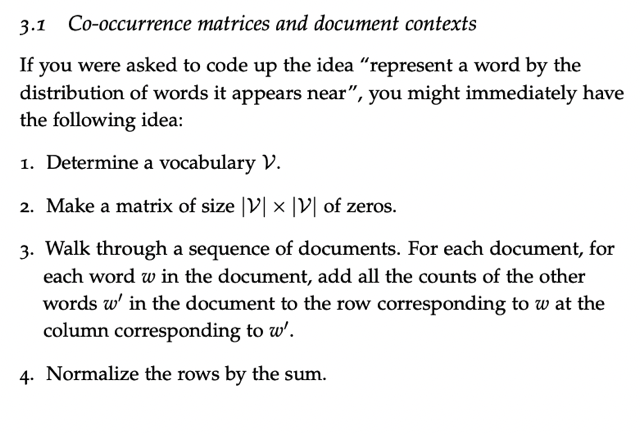</kbd>

> [!NOTE]
> Cách đầu tiên đại khái là giả sử có 10000 từ (vocab size). Ta mới tạo một
> matrix 10000x10000. Và mỗi hàng sẽ là vector của một từ, và 10000 Item của
> hàng đó, sẽ là số lần xuất hiện của 10000 từ trong vocab GẦN nó và gần ở
> đây có thể dùng phương án đơn giản là TRONG CÙNG document.
>
>
>
> Thế là ta sẽ lần lượt với mỗi từ, đến số lần những từ khác kể cả nó xuất hiện
> cùng document với nó. Và matrix đó gọi là **document-level co-occurrence
> matrix**
>
>
>
> Và ta sẽ được word embedding của các từ (là các row của matrix). Có thể
> normalize bằng cách chia đi cho tổng.
>
>
>
> Thì đại khái ta sẽ được một vector tốt hơn nhiều so với one-hot vector (cả hai
> đều 10000 unit R |V|)

 

<kbd>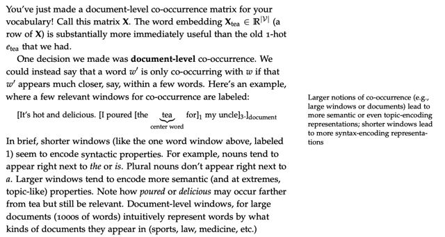</kbd>

> [!NOTE]
> Đại khái là **mức độ xa** (như trong cùng document) gần (cách hai ba
> thậm chí một từ) sẽ **phản ánh các ý nghĩa khác nhau**.
>
>
>
> Như gần thì là **quan hệ cú pháp (syntactic)**, như "the" thì theo sau là
> danh từ,
>
>
>
> xa hơn một chút thì sẽ có **quan hệ ngữ nghĩa (semantic)** như " pha"
> và "trà",
>
>
>
> và xa hơn nữa trong phạm vi document thì là **quan hệ topic-encoding**
> như trà là đồ uống, là ẩm thực. ...

 

- **Another design decision we made was to represent explicit counts of
words in |V|-sized vectors. This ends up being a \\*big mistake. \\*
We’ve already stated that\\* high-dimensional vectors tend to be
unwieldy\\* in today’s neural systems. But another issue is that raw
counts of words end up \\*over-emphasizing the importance of very
common words like "the"\\*. Taking the \\*log token frequency\\* ends up
being much more useful.

A very influential paper on word representation taught us much more
about what is wrong with the raw co-occurrence method by introducing
\\*GloVe\\* (Pennington et al., 2014) a \\*co-occurence-based word
representation algorithm\\* that works \\*as well as\\* \\*word2vec\\*, the method
we’ll introduce in the next section. However, many of the details of
word2vec will hold true in methods that we’ll proceed to further in the
course, so we’ll focus our time on that.**

> [!NOTE]
> Tuy nhiên cách này sẽ có hai nhược điểm là:  Thứ nhất lại
> là **quá lớn (high dimensions)** sẽ không hiểu quả trong nlp
>
>
>
> Thứ hai là nó **đánh giá quá cao những từ như "the".**
>
>
>
> Dẫn đến là việc dùng **log token frequency** tức là thay vì tính
> frequency (tần suất xuất hiện) thì tính log của nó sẽ hiệu
> quả hơn.
>
>
>
> Và **GloVe** ra đời khắc phục những nhược điểm này

 

<kbd>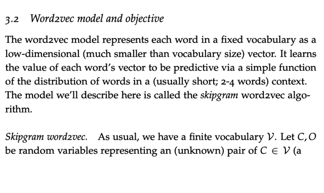</kbd>

<kbd>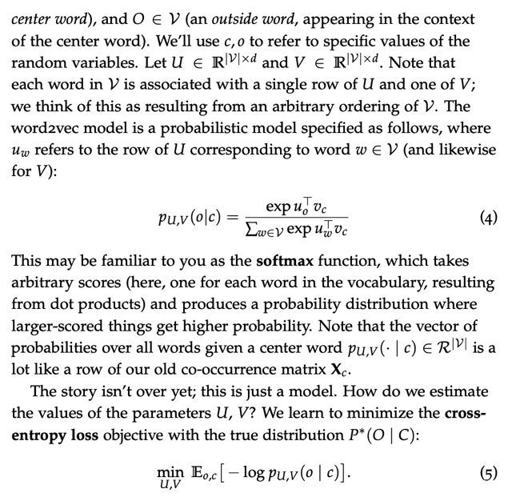</kbd>

<kbd>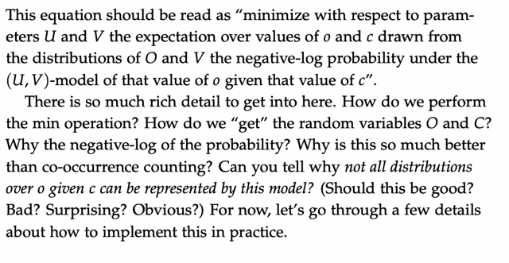</kbd>

> [!NOTE]
> Thì qua đây mới nói sơ sơ cách làm: Đó là chuẩn bị hai matrix U, V đều
> có shape là 10000 (V) x D trong đó d là chiều dài vector embedding.
>
>
>
> Mỗi row tương ứng vị trí của hai matrix này sẽ là embedding vector của
> một từ (trong 10000 từ) khi nó lần lượt đóng vai center word và outer
> (context) word.
>
>
>
> Để rồi xây dựng công thức p U,V (o|c) với o, c là một cặp từ cụ thể
> trong vocab sao cho o xuất hiện trong context của c. Công thức này ta
> sẽ P U,V (o|c) mang ý nghĩa toán học là với random variable o,v lấy
> trong bộ vocab từ đó các word vector u0 và vc cho hai từ này lấy từ U,V
> thì ta sẽ tính xác suất mà từ o xuất hiện khi đã có c là bao nhiêu.
>
>
>
> Và công thức sẽ là đầu tiên ta tính độ giống nhau giữa chúng bằng
> phép dot product u0_T.vc. Sau đó đưa vào softmax (với mẫu số là tính
> tổng độ giống nhau của c với tất cả các từ khác trong vocab cũng tính
> bằng dot product của vc với những từ đó uw w thuộc V, rồi cộng lại hết)
>
>
>
> Kết qủa ta sẽ có chỉ số xác suất từ o xuất hiện khi có v.
>
>
>
> Và ý nghĩa của việc dùng softmax đó là nếu từ o và c càng giống nhau,
> thì xác suất này càng cao.
>
>
>
> Và nếu tính p U,V (w|c) cho mọi w trong V để tạo thành một row dài
> 10000 thì ổng nói nó rất giống row vector ứng với c trong co-occurrence
> matrix X  hồi nãy (trong đó mỗi unit là tần suất xuất hiện của từ w trong
> cùng document với c)
>
>
>
> ====
>
>
>
> Tiếp theo để train ra U,V (từ đó có (2) embedding vector cho mỗi từ, và
> như hồi nãy nói có thể average để thành embedding vector của một từ)
> thì ta có thể đặt loss objective (function) là:
>
>
>
> **minimize w.r.t param U,V Expectation với o, c lấy từ distribution O, V,
> giá trị là negative log probability của việc o xuất hiện khi đã có c**
>
>
>
> Nói nôm na là bây giờ thay đổi giá trị của U, V sao đó, để cho với mọi từ
> c trong vocab và o là từ ở gần nó thì phải giảm thiểu - log p(o|c)

 

<kbd>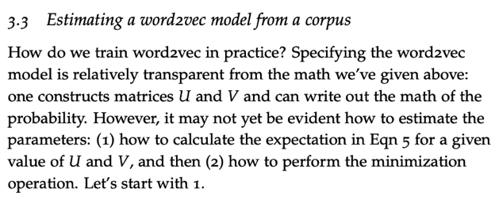</kbd>

<kbd>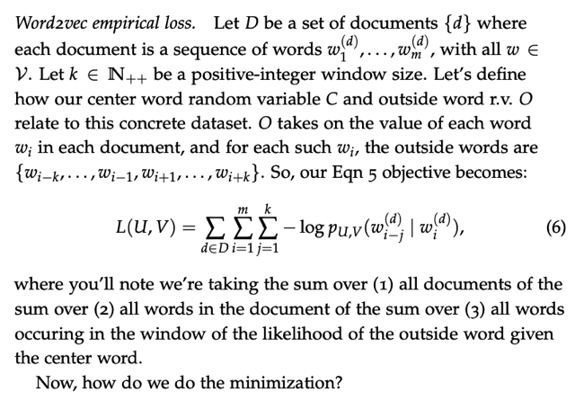</kbd>

> [!NOTE]
> Đây, triển khai ra cụ thể thì công thức trên là như sau:
>
>
>
> Với một từ, giả sử là **wi**, là **từ thứ i trong document**, thì ta sẽ 
> một từ **w i-j** nào đó **trong khoảng k từ gần đó**, ta sẽ tính
> **-log p(w i-j | w i)**. Và v**ới mọi từ context của w_j** ta tính p như vậy
> và **cộng lại.**
>
>
>
> Rồi **với mọi từ wi trong document** ta đều làm vậy và **cộng lại.**
>
>
>
> Rồi với **mọi document**, ta đều làm vậy và **cộng hết lại.**
>
>
>
> Thì ta được L(U,V) theo công thức này gọi là **empirical loss.**

 

<kbd>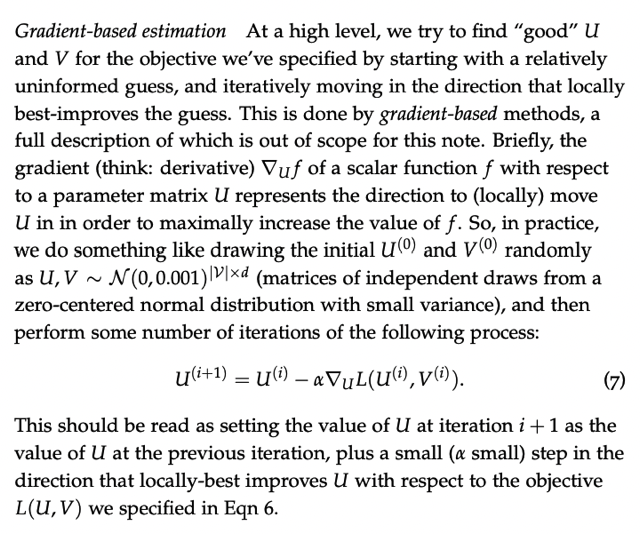</kbd>

> [!NOTE]
> Đại khái là nói là ta sẽ train /tìm U V bằng phương pháp dựa vào
> gradient. (**gradient-based method**) thì như mình cũng đã biết đó là ta
> sẽ **tính partial derivative of Loss function L(U,V)** **with respect to U**.
>
>
>
> Để rồi một cách **iteratively** (làm đi làm lại nhiều lần), ta **update U
> bằng cách trừ đi U với derivative nhân một hệ số gọi là learning rate.**
>
>
>
> Ở đây có nhắc lại khái niệm gradient cũng đáng nhắc đến đó là:
> **derivative của hàm f w.r.t matrix U** sẽ đại diện / represent cho **cái
> hướng (direction) để thay đổi U**  mà **nếu đi theo đó sẽ giúp dịch
> chuyển U theo cách tăng dần hàm f.** Đồng nghĩa nếu đi theo hướng
> ngược lại thì sẽ giảm dần hàm f.
>
>
>
> Tiếp họ nói U (V cũng tương tự) sẽ được **initialize randomly** với
> **Normal** **distribution với zero mean và standard deviation nhỏ** kí hiệu
> là
>
>
>
> **U ~ N (0,0.0001) |V|xd**

 

<kbd>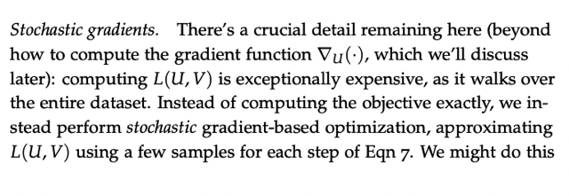</kbd>

<kbd>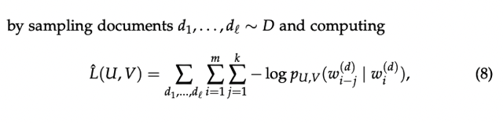</kbd>

> [!NOTE]
> Đại khái là để tính L như công thức mới nói vừa rồi yêu cầu phải
> tính cho toàn bộ document là rất lớn, rất expensive trong tính toán
>
>
>
> Do đó mới dùng (sampling) một phần của D thôi để tính "
> approximate" L(U,V) thôi. Gọi là stochastic gradient-based
> optimization.
>
>
>
> Cũng tương tự như stochastic gradient descent khi ta không Dùng
> toàn bộ m training sample mà chỉ dùng mỗi cái 1 lần vật

 

<kbd>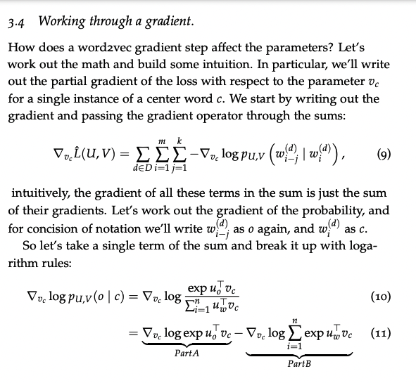</kbd>

 

<kbd>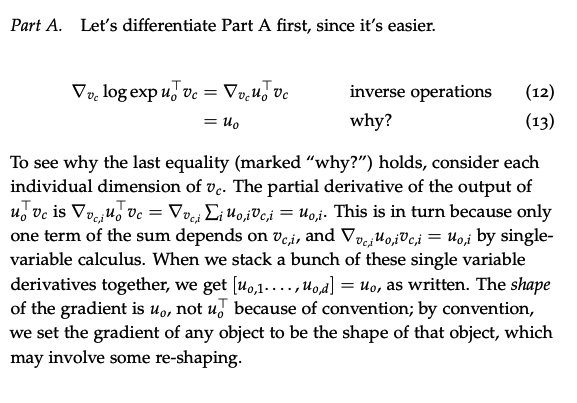</kbd>

> [!NOTE]
> Như trong bài giảng đã nói và note, để dùng gradient based method để
> update U,V  thì ta cần tính p**artial derivate of (mà kí hiệu là hình tam
> giác ngược) L(U,V) w.r.t U** (và V cũng tương tự)
>
>
>
> Thì như đã nói và giải thích trong note trong bài, việc **hàm f(x) = f_1(x)+f_2(x)** 
> = Sum i f_i(x) t**hì  df/dx cũng sẽ bằng df1/dx + df2/dx**. Nên trên cơ sở
> đó ta có thể **"đưa dấu đạo hàm vào trong" tức là thành "đạo hàm của tổng"
> bằng "tổng đạo hàm".**
>
>
>
> Còn lại thì như trong bài đã note, không cần nói lại dài dòng ở đây chỉ muốn
> nhắc lại là vì ta **đang tính đạo hàm w.r.t vector vc** **có d item vc1, vc2..vcd**
> nên **cách tính là tính đạo hàm với từng phần tử trong vc và nhóm lại thành
> vector.**
>
>
>
> Như ở **part A**, ta cần tính đạo hàm của f (= **u0_T.vc**) đối với vc thì **u0_T.vc thật ra
> triển khai ra sẽ là (u01*vc1 + u02*vc2 + ...u0d*vcd)**
> và ta sẽ **tính đạo hàm của hàm f này w.r.t vc1 (chính là ra u01)**
> rồi **đạo hàm của hàm f này w.r.t vc2 (chính là ra u02).**
> ....
> để rồi **kết quả đạo hàm của hàm f này w.r.t VECTOR vc** sẽ là **VECTOR 
> CỦA CÁC ĐẠO HÀM TỪNG PHẦN TRÊN**
> = **[u01, u02, ...uod]** mà đó thì chính là vector **u0.**
>
>
>
> ====
>
>
>
> Cuối cùng ở đây có nói một kiến thức có thể chưa gặp qua là **by convention** / theo
> thông lệ người ta **quy ước cho shape của gradient bằng với shape của object
> tức nếu vc là vector cột** thì dL/dvc cũng là vector cột bằng shape (chứ không
> phải tùy tiện) nên **có thể cần phải reshape nếu cần**

 

<kbd>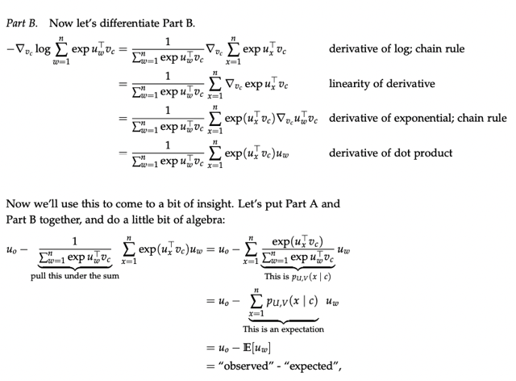</kbd>

> [!NOTE]
> Phần này xem lại note
> trong bài giảng

 

<kbd>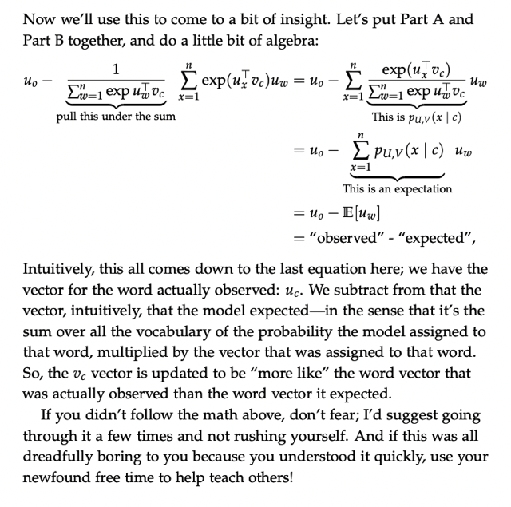</kbd>

 

<kbd>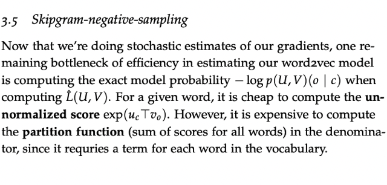</kbd>

<kbd>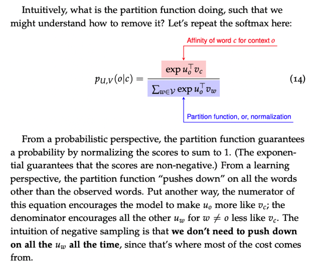</kbd>

> [!NOTE]
> Nôm na là vầy: Cái công thức (p(o|c) từ đó xây dựng objective và loss
> function)  được xây dựng như vậy là **để (trong quá trình training)** model
> nó sẽ **ép uo trở nên giống vc** (thì **dot product của chúng cao lên, thì p cao
> lên**) và **ép các từ khác trong toàn bộ vocab w khác mà không phải o phải
> có dot product với vc nhỏ lại**
>
>
>
> Thì đại khái là làm vậy thì ok, là chuẩn, **có điều việc tính toán cái mẫu số
> với toàn bộ vocab thì rất tốn kém** (compute expense). Thành ra người ta
> **sửa lại một chút, thiết kế lại function sao** cho vẫn giúp ép u0_T.vc lên
> nhưng chỉ ép một số lượng các từ ư lấy random trong vocab. Thì ý là mỗi
> lần training iteration thì **"nâng từ cần nâng" lên chút xíu** và **ép random
> vài từ cần giảm xuống**, thì qua nhiều lần vẫn đạt **hiệu quả tương
> đương** như khi "**ép toàn bộ các từ trong vocab mỗi lần**"

 

<kbd>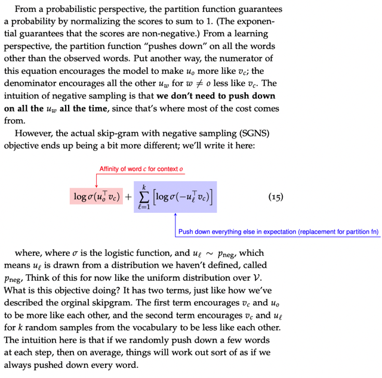</kbd>

> [!NOTE]
> Thì đây cũng là cái mà trong NLPSpec và DLSpec có nói
> đến về việc dùng hàm softmax sao cho giảm chi phí tính
> toán

 

## Reading: Efficient Estimation Of Word
representations In Vector Space (word2vec Paper)

 

### We propose two novel model architectures for computing \\*continuous vector
representations of words\\* from \\*very large data sets\\*.

The quality of these representations is measured in a \\*word similarity task\\*,
and the results are \\*compared to the previously best performing techniques\\*
based on different types of neural networks. We observe \\*large
improvements\\* in \\*accuracy\\* at much \\*lower computational cost\\*, i.e. it
takes less than a day to learn high quality word vectors from a \\*1.6 billion
words data set.\\*

Furthermore, we show that these vectors provide\\* state-of-the-art performance
on our test set\\* for \\*measuring syntactic and semantic word similarities.\\*

> [!NOTE]
> Đại khái là họ dùng một cách mới để **tạo ra bộ word
> embedding** có **hiệu suất hơn hẳn các technique trước
> đây** khi đánh giá trên nhiệm vụ **so sánh sự giống nhau
> của các từ vựng** nhưng đồng thời cũng **giảm chi phí tính
> toán hơn**. (Thời gian huấn luyện chỉ tốn 1 ngày)
>
>
>
> Và khi đánh giá trên test set về vấn đề sự tương đồng của từ
> vựng trên các khía cạnh về n**gữ pháp** và **ý nghĩa** thì
> phương pháp này gần như là **xịn xò nhất** (state of the art)

 

#### 1 Introduction

Many current NLP systems and techniques treat words as atomic units - there is \\*no notion
of similarity between words\\*, as these are represented as \\*indices\\* \\*in a vocabulary\\*. This
choice has \\*several good reasons\\* - \\*simplicity\\*, robustness and the \\*observation\\* that \\*simple
models trained on huge amounts of data\\* outperform \\*complex systems trained on less
data\\*. An example is the \\*popular N-gram model\\* used for statistical language modeling -
today, it is possible to train N-grams on virtually all available data (trillions of words [3]).

However, the simple techniques are at their \\*limits\\* in many tasks. For example, the
\\*amount of relevant in-domain data\\* for automatic speech recognition is \\*limited\\* - the
performance is usually \\*dominated by the size of high quality transcribed speech data\\*
(often just millions of words). In machine translation, the existing corpora for many
languages \\*contain only a few billions of words\\* or less. Thus, there are situations where
\\*simple scaling up of the basic techniques will not result in any significant progress\\*, and
we have to focus on more advanced techniques.

With \\*progress of machine learning techniques\\* in recent years, it has become \\*possible to
train more complex models on much larger data set\\*, and they \\*typically outperform the
simple models\\*. Probably the most successful concept is to use \\*distributed
representations of words\\* [10]. For example, neural network based language models
significantly outperform N-gram models [1, 27, 17].

> [!NOTE]
> Đại khái là nói về các model đơn giản hơn trước đây thường chỉ
> represent từ vựng ở dạng "**atomic unit**" (tạm hiểu là **riêng lẻ**) không
> hề chứa những ý nghĩa "gần xa" (về mặt ý nghĩa) với nhau như cách
> dùng **word index**, **one-hot vector**. Thì cách này cũng có những ưu
> điểm như **đơn giản**, và với việc thực tế đã chứng minh model **đơn
> giản mà train với data lớn** **vẫn có thể vượt trội** những model phức
> tạp mà train với ít data. Và nổi tiếng trong loại này là N-gram model.
>
>
>
> Tuy nhiên vẫn có những hạn chế của chúng ví dụ như về **mặt dữ liệu
> thì không phải lúc nào cũng có nhiều** **dữ liệu chất lượng cao** để huấn
> luyện mô hình, do đó có cần có những cách khác tốt hơn.
>
>
>
> Thì với **sự phát triển của Deep Learning** giúp có thể train model phức
> tạp trên bộ dataset lớn đã cho thấy có thể đạt performance vượt trội. Và
> trong đó những mô hình sử dụng "**distributed representation of words**"
> là một  bước tiến quan trọng.

 

##### 1.1 Goals of the Paper

The main goal of this paper is to introduce techniques that can be used for learning\\* high-quality
word vectors\\* from \\*huge data sets with billions of words\\*, and with millions of words in the
vocabulary. As far as we know, none of the previously proposed architectures has been
successfully trained on more than a few hundred of millions of words, with a modest
d\\*imensionality of the word vectors between 50 - 100\\*.

We use recently proposed techniques for measuring the quality of the resulting vector
representations, with the expectation that not only will \\*similar words tend to be close to each
other\\*, but that words can have \\*multiple degrees of similarity \\*[20]. This has been observed
earlier in the context of inflectional languages - for example, nouns can have multiple word
\\*endings\\*, and if we search for similar words in a subspace of the original vector space, it is
possible to find words that have similar endings [13, 14].

Somewhat surprisingly, it was found that similarity of word representations goes beyond simple
syntactic regularities. Using a word offset technique where simple algebraic operations are
performed on the word vectors, it was shown for example that \\*vector(”King”)\\* - \\*vector(”Man”)\\* +
\\*vector(”Woman”)\\* results in a vector that is \\*closest to the vector representation of the word
Queen [20]\\*. In this paper, we try to maximize accuracy of these vector operations by developing
new model architectures that preserve the linear regularities among words. We design a new
comprehensive test set for measuring both syntactic and semantic regularities1 , and show that
many such regularities can be learned with high accuracy. Moreover, we discuss how training
time and accuracy depends on the dimensionality of the word vectors and on the amount of the
training data.

> [!NOTE]
> Đại khái là nói về mục tiêu của paper là giới thiệu technique sử dụng
> để **tạo bộ word representation (word embedding)**. Trong đó không chỉ
> đạt được một tiêu chí là **các từ gần nghĩa sẽ nằm gần nhau** (trong không
> gian vector) mà nó còn có "**nhiều mức độ gần gũi".** Ví dụ cũng một từ
> có thể **có nhiều "ending" khác nhau**, sẽ được represent bởi các vector
> nằm gần nhau.
>
>
>
> Một điều quan trọng khác đó là nghiên cứu có thấy không chỉ nắm bắt
> được các **quan hệ cú pháp (syntactic meaning)** của các từ vựng mà còn
> là **quan hệ ngữ nghĩa của chúng** (**semantic meaning)** với ví dụ nổi tiếng
> là **v(man) - v(woman) = v(king) - v(queen) từ đó v(man) - v(king)** thể hiện
> chiều của véctơ biểu hiện khái niệm giới tính.
>
>
>
> Cuối cùng là nói về thời gian và độ chính xác của quá trình huấn luyện
> **tùy thuộc vào số chiều của word embedding vector**

 

- **1.2 Previous Work

Representation of words as continuous vectors has a long history [10, 26, 8]. A very
popular model architecture for estimating neural network language model (NNLM)
was proposed in [1], where a feedforward neural network with a linear projection layer
and a non-linear hidden layer was used to learn jointly the word vector representation
and a statistical language model. This work has been followed by many others.

Another interesting architecture of NNLM was presented in [13, 14], where the word
vectors are first learned using neural network with a single hidden layer. The word
vectors are then used to train the NNLM. Thus, the word vectors are learned even
without constructing the full NNLM. In this work, we directly extend this architecture,
and focus just on the first step where the word vectors are learned using a simple
model.

It was later shown that the word vectors can be used to significantly improve and
simplify many NLP applications [4, 5, 29]. Estimation of the word vectors itself was
performed using different model architectures and trained on various corpora [4, 29,
23, 19, 9], and some of the resulting word vectors were made available for future
research and comparison2 . However, as far as we know, these architectures were
significantly more computationally expensive for training than the one proposed in
[13], with the exception of certain version of log-bilinear model where diagonal weight
matrices are used [23].**

 

- **2. Model Architectures

Many \\*different types of models\\* were proposed for \\*estimating continuous
representations of words\\*, including the well-known \\*Latent Semantic
Analysis\\* (LSA) and \\*Latent Dirichlet Allocation (LDA)\\*. In this paper, we
focus on \\*distributed representations of words learned by neural networks\\*,

as it was previously shown that they \\*perform significantly better than LSA\\*
for \\*preserving linear regularities\\* among words [20, 31];

\\*LDA\\* moreover becomes \\*computationally very expensive\\* on large data
sets.

Similar to [18], to compare different model architectures we define first the
computational complexity of a model as the \\*number of parameters\\* that
need to be accessed to fully train the model. Next, we will try to \\*maximize the
accuracy\\*, while \\*minimizing the computational complexity

\\*For all the following models, the \\*training complexity\\* is \\*proportional to

O = E × T × Q, (1)  \\* where \\*E is number of the training epochs\\*, \\*T is the
number of the words\\* in the training set  and Q is defined further for each
model architecture. \\*Common choice\\* is E = 3 − 50 and T  up to \\*one
billion\\*. All models are trained using\\* stochastic gradient descent\\* and
\\*backpropagation\\*  [26].**

> [!NOTE]
> Đại khái là họ nói rằng trước đây các model như LSA, LDA
> cũng đã tìm cách "estimating continuous representation of
> words" - nôm na là tìm các học cách represent words sao
> cho giống như trong không gian các điểm liên tục nhau để
> tạo thành các quan hệ tuyến tính phản ánh mối liên hệ trong
> ý nghĩa của từ ngữ.
>
>
>
> Tuy nhiên ở đây người ta sử dụng neural network để learn 
> word vector và cho thấy nó perform tốt hơn LSA và "rẻ" hơn
> LDA. 
>
>
>
> Tiếp theo đại khái họ nói là họ dựa trên tiêu chí đánh giá 
> độ complexity của model

 

- **2.1 Feedforward Neural Net Language Model (NNLM)

The probabilistic feedforward neural network language model has been proposed in [1]. It consists
of \\*input\\*, \\*projection\\*, \\*hidden\\* and \\*output\\* layers. At the input layer, \\*N previous words\\* are encoded
using \\*1-of-V coding\\*, where V is size of the vocabulary. The input layer is then projected to a
\\*projection layer P\\* that has dimensionality \\*N × D\\*, using a shared projection matrix. As only N
inputs are active at any given time, composition of the projection layer is a relatively cheap operation.
The NNLM architecture becomes complex for computation between the projection and the hidden
layer, as values in the projection layer are dense. For a common choice of \\*N = 10\\*, the size of the
projection layer (P) might be \\*500 to 2000\\*, while the\\* hidden layer size H is typically 500 to 1000\\*
units. Moreover, the hidden layer is used to \\*compute probability distribution\\* over all the words in the
vocabulary, resulting in an\\* output layer with dimensionality\\* \\*V\\* . Thus, the computational complexity
per each training example is

Q = N × D + N × D × H + H × V, (2)

where the \\*dominating term is H × V\\* . However, several practical solutions were proposed for
avoiding it; either using \\*hierarchical versions of the softmax\\* [25, 23, 18], or \\*avoiding normalized
models\\* completely by using models that are not normalized during training [4, 9]. With binary tree
representations of the vocabulary, the number of output units that need to be evaluated can go down
to around log2(V ). Thus, \\*most of the complexity is caused by the term N × D × H.\\***

> [!NOTE]
> Thì đại khái ở đây người ta nói đến việc dùng Neural Network với mô tả
> như trong hình. Thế trong đó layer cuối dùng softmax để xuất ra vector
> các probabilities. Input là N từ "previous words" tức là những từ trước
> của từ cần được dự đoán. Mỗi từ được represent thành one-hot vector
> (1-of-V coding). Bắt đầu với Projection layer có shape (ý nói weight matrix)
> DxV trong đó D thường chọn 500-2000. Họ dùng từ projection có thể ý là 
> không có activation function. Tiếp theo là một hidden layer HxD trong đó H
> thường là 500-1000 và có activation function
>
>
>
> Và sau đó là qua output layer softmax để ra vector
> có V chỉ số probabilities.
>
>
>
> Thế thì họ cho rằng vì N không lớn (chỉ là vài từ) nên các phép tính toán
> matrix ở projection layer không lớn, và vì ở softmax tuy lớn nhưng người
> Ta có những cách khắc phục như dùng một "hierarchical version của softmax"
> hoặc tránh việc normalized (kiểu như tìm cách không chia cho mẫu số như 
> trong glove) nên cuói cùng bước tốn kém nhất chính là bước tính ở hidden layer
> VxH@HxN = VxN

 

<kbd>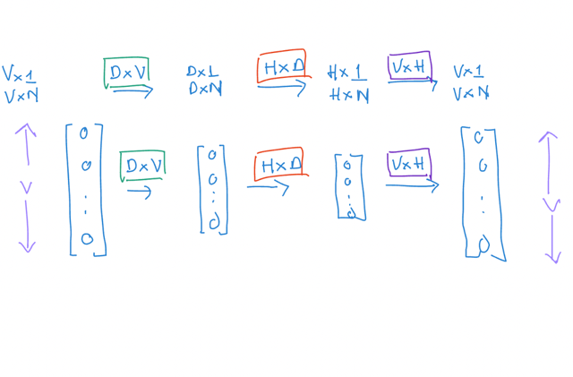</kbd>

 

- **In our models, we use hierarchical softmax where the vocabulary is represented as a Huffman binary
tree. This follows previous observations that the frequency of words works well for obtaining classes
in neural net language models [16]. Huffman trees assign short binary codes to frequent words, and
this further reduces the number of output units that need to be evaluated: while balanced binary tree
would require log2(V ) outputs to be evaluated, the Huffman tree based hierarchical softmax requires
only about log2(Unigram perplexity(V )). For example when the vocabulary size is one million
words, this results in about two times speedup in evaluation. While this is not crucial speedup for
neural network LMs as the computational bottleneck is in the N ×D×H term, we will later propose
architectures that do not have hidden layers and thus depend heavily on the efficiency of the softmax
normalization.**

> [!NOTE]
> Đại khái là họ dùng Huffman binary tree để dùng trong hierarchical
> softmax giúp giảm chi phí tính toán bớt (không nói rõ lắm, chỉ biết vậy
> thôi)

 

- **\\*2.2 Recurrent Neural Net Language Model (RNNLM) \\*

Recurrent neural network based language model has been proposed to
overcome certain limitations of the feedforward NNLM, such as the need to
specify the context length (the order of the model N), and because
theoretically RNNs can efficiently represent more complex patterns than the
shallow neural networks [15, 2]. The RNN model does not have a projection
layer; only input, hidden and output layer. What is special for this type of
model is the recurrent matrix that connects hidden layer to itself, using
time-delayed connections. This allows the recurrent model to form some kind
of short term memory, as information from the past can be represented by the
hidden layer state that gets updated based on the current input and the state
of the hidden layer in the previous time step. The complexity per training
example of the RNN model is

Q = H × H + H × V, (3)

where the word representations D have the same dimensionality as the
hidden layer H. Again, the term H × V can be efficiently reduced to H × log2(V
) by using hierarchical softmax. Most of the complexity then comes from H ×
H.**

> [!NOTE]
> Cũng chỉ nói vậy biết vậy rằng họ dùng RNN
> thay cho NN giúp tăng hiệu quả

 

- **\\*2.3 Parallel Training of Neural Networks\\*

To train models on huge data sets, we have implemented several
models on top of a large-scale distributed framework called
\\*DistBelief\\* [6], including the feedforward NNLM and the new
models proposed in this paper. The framework allows us to \\*run
multiple replicas of the same model in parallel\\*, and each \\*replica
synchronizes its gradient updates through a centralized server
that keeps all the parameters\\*. For this parallel training, we use
\\*mini-batch asynchronous gradient descent\\* with an\\* adaptive
learning rate\\* procedure called \\*Adagrad\\* [7]. Under this framework,
it is common to use one hundred or more model replicas, each
using many CPU cores at different machines in a data center.**

> [!NOTE]
> Đại khái là học nói về việc họ dùng distributed
> framework có tên là DistBelief để làm cái gọi là
> distributed training - training cùng lúc trên nhiều
> GPU/TPU.
>
>
>
> Và có một cái mình đã học bên MLOps Spec đó là
> họ dùng cách "update / sync weight value từ các
> replica (kiểu như máy con) với centralized server.
>
>
>
> Nhắc đến việc họ dùng Adagrad (adaptive gradient)
> như Adam, Nadam..

 

- **In this section, we propose two new model architectures for learning
distributed representations of words that try to minimize computational
complexity. The main observation from the previous section was that most
of the complexity is caused by the non-linear hidden layer in the model.
While this is what makes neural networks so attractive, we decided to
explore simpler models that might not be able to represent the data as
precisely as neural networks, but can possibly be trained on much more
data efficiently.

The new architectures directly follow those proposed in our earlier work
[13, 14], where it was found that neural network language model can be
successfully trained in two steps: first, continuous word vectors are learned
using simple model, and then the N-gram NNLM is trained on top of these
distributed representations of words. While there has been later substantial
amount of work that focuses on learning word vectors, we consider the
approach proposed in [13] to be the simplest one. Note that related models
have been proposed also much earlier [26, 8].**

> [!NOTE]
> Đại khái là giới thiệu hai model architecture "học" cách tạo
> word representation giúp giảm chi phí tính toán.
>
>
>
> Và họ nói như ở trên đã cho thấy bước tốn kém nhất lại
> chính là bước hidden layer với activation function. Và họ
> dùng cách khác hi sinh việc dùng complex non-linear neural
> network (với hidden layer có activation function) bằng việc
> dùng một model đơn giản kết hợp  với N-gram NNLM
> (Neural Network Language Model) cho thấy kết quả rất tốt
> nhưng giảm chi phí tính toán giúp train được bộ big data

 

- **The first proposed architecture is similar to the feedforward NNLM, where the
\\*non-linear hidden layer is removed\\* and the \\*projection layer is shared for all words\\*
(not just the projection matrix); thus, \\*all words get projected into the same position\\*
(their vectors are averaged). We call this architecture a bag-of-words model as the
\\*order of words in the history\\* \\*does not influence the projection.\\*

Furthermore, we a\\*lso use words from the future\\*; we have obtained the best
performance on the task introduced in the next section by building a \\*log-linear
classifier with four future and four history words\\* at the input, where the training
\\*criterion\\* is to c\\*orrectly classify the current (middle) word\\*.

Training complexity is then

Q = \\*N × D + D × log2(V )\\*. (4)

We denote this model further as \\*CBOW\\*, as unlike \\*standard bag-of-words model\\*, it
uses \\*continuous distributed representation of the context\\*. The model architecture
is shown at Figure 1. Note that the weight matrix between the input and the
projection layer is shared for all word positions in the same way as in the NNLM.**

 

<kbd>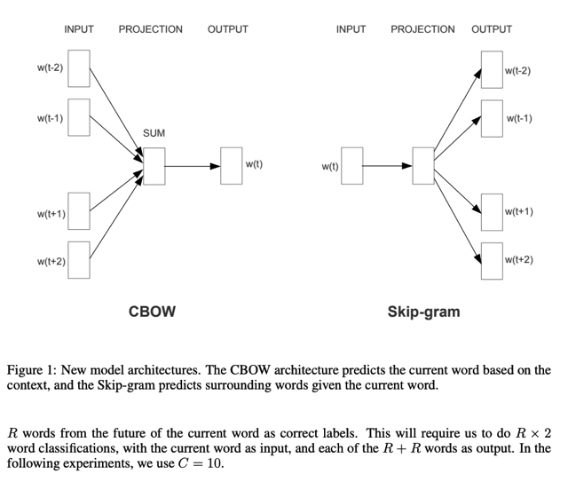</kbd>

 

- **3.2 Continuous Skip-gram Model

The second architecture is similar to CBOW, but instead of\\* predicting the current
word based on the context\\*, it tries to \\*maximize classification of a word based on
another word in the same sentence\\*. More precisely, we \\*use each current word as an
input \\*to a \\*log-linear classifier\\* with \\*continuous projection layer\\*, and \\*predict words
within a certain range before and after the current word\\*. We found that increasing the
range improves quality of the resulting word vectors, but it also increases the
computational complexity. Since the more distant words are usually less related to the
current word than those close to it, we give less weight to the distant words by
sampling less from those words in our training examples.

The training complexity of this architecture is proportional to

Q = C × (D + D × log2(V )), (5)

where C is the maximum distance of the words. Thus, if we choose C = 5, for each
training word we will select randomly a number R in range < 1; C >, and then use R
words from history an**

 

- **4 Results

To compare the quality of different versions of word vectors, previous papers typically use a table
showing example words and their most similar words, and understand them intuitively. Although
it is easy to show that word France is similar to Italy and perhaps some other countries, it is much
more challenging when subjecting those vectors in a more complex similarity task, as follows. We
follow previous observation that there can be many different types of similarities between words, for
example, word big is similar to bigger in the same sense that small is similar to smaller. Example
of another type of relationship can be word pairs big - biggest and small - smallest [20]. We further
denote two pairs of words with the same relationship as a question, as we can ask: ”What is the
word that is similar to small in the same sense as biggest is similar to big?”

Somewhat surprisingly, these questions can be answered by performing simple algebraic operations
with the vector representation of words. To find a word that is similar to small in the same sense as
biggest is similar to big, we can simply compute vector X = vector(”biggest”)−vector(”big”) +
vector(”small”). Then, we search in the vector space for the word closest to X measured by cosine
distance, and use it as the answer to the question (we discard the input question words during this
search). When the word vectors are well trained, it is possible to find the correct answer (word
smallest) using this method.

Finally, we found that when we train high dimensional word vectors on a large amount of data, the
resulting vectors can be used to answer very subtle semantic relationships between words, such as
a city and the country it belongs to, e.g. France is to Paris as Germany is to Berlin. Word vectors
with such semantic relationships could be used to improve many existing NLP applications, such
as machine translation, information retrieval and question answering systems, and may enable other
future applications yet to be invented.**

 

<kbd>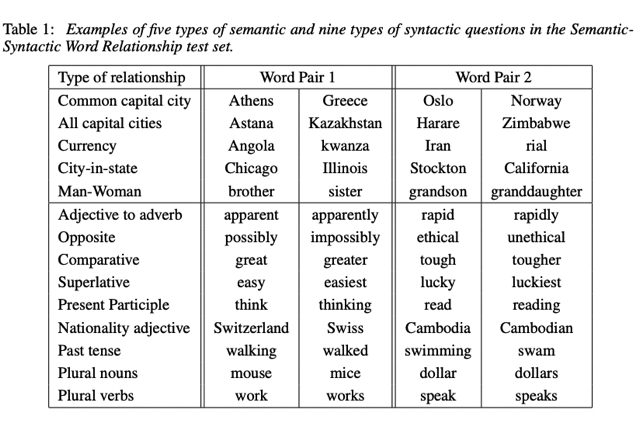</kbd>

 

- **4.1 Task Description

To measure quality of the word vectors, we define a comprehensive test set that
contains five types of semantic questions, and nine types of syntactic questions.
Two examples from each category are shown in Table 1. Overall, there are
8869 semantic and 10675 syntactic questions. The questions in each category
were created in two steps: first, a list of similar word pairs was created
manually. Then, a large list of questions is formed by connecting two word pairs.
For example, we made a list of 68 large American cities and the states they
belong to, and formed about 2.5K questions by picking two word pairs at
random. We have included in our test set only single token words, thus
multi-word entities are not present (such as New York).

We evaluate the overall accuracy for all question types, and for each question
type separately (semantic, syntactic).  Question is assumed to be correctly
answered only if the closest word to the vector computed using the above
method is exactly the same as the correct word in the question; synonyms are
thus counted as mistakes. This also means that reaching 100% accuracy is
likely to be impossible, as the current models do not have any input information
about word morphology. However, we believe that usefulness of the word
vectors for certain applications should be positively correlated with this accuracy
metric. Further progress can be achieved by incorporating information about
structure of words, especially for the syntactic questions.**

 

- **4.2 Maximization of Accuracy

We have used a Google News corpus for training the word vectors. This corpus contains
about 6B tokens. We have restricted the vocabulary size to 1 million most frequent words.
Clearly, we are facing time constrained optimization problem, as it can be expected that
both using more data and higher dimensional word vectors will improve the accuracy. To
estimate the best choice of model architecture for obtaining as good as possible results
quickly, we have first evaluated models trained on subsets of the training data, with
vocabulary restricted to the most frequent 30k words. The results using the CBOW
architecture with different choice of word vector dimensionality and increasing amount of
the training data are shown in Table 2.

It can be seen that after some point, adding more dimensions or adding more training
data provides diminishing improvements. So, we have to increase both vector
dimensionality and the amount of the training data together. While this observation might
seem trivial, it must be noted that it is currently popular to train word vectors on relatively
large amounts of data, but with insufficient size (such as 50 - 100). Given Equation 4,
increasing amount of training data twice results in about the same increase of
computational complexity as increasing vector size twice. For the experiments reported in
Tables 2 and 4, we used three training epochs with stochastic gradient descent and
backpropagation. We chose starting learning rate 0.025 and decreased it linearly, so that
it approaches zero at the end of the last training epoch.**

 

<kbd>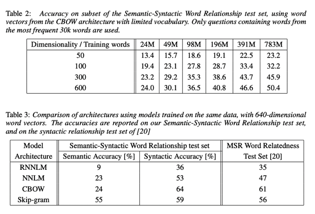</kbd>

 

- **4.3 Comparison of Model Architectures

First we compare different model architectures for deriving the word vectors using the same
training data and using the same dimensionality of 640 of the word vectors. In the further
experiments, we use full set of questions in the new Semantic-Syntactic Word Relationship
test set, i.e. unrestricted to the 30k vocabulary. We also include results on a test set
introduced in [20] that focuses on syntactic similarity between words3 . The training data
consists of several LDC corpora and is described in detail in [18] (320M words, 82K
vocabulary). We used these data to provide a comparison to a previously trained recurrent
neural network language model that took about 8 weeks to train on a single CPU. We
trained a feedforward NNLM with the same number of 640 hidden units using the DistBelief
parallel training [6], using a history of 8 previous words (thus, the NNLM has more
parameters than the RNNLM, as the projection layer has size 640 × 8). In Table 3, it can be
seen that the word vectors from the RNN (as used in [20]) perform well mostly on the
syntactic questions. The NNLM vectors perform significantly better than the RNN - this is not
surprising, as the word vectors in the RNNLM are directly connected to a non-linear hidden
layer. The CBOW architecture works better than the NNLM on the syntactic tasks, and about
the same on the semantic one. Finally, the Skip-gram architecture works slightly worse on
the syntactic task than the CBOW model (but still better than the NNLM), and much better
on the semantic part of the test than all the other models. Next, we evaluated our models
trained using one CPU only and compared the results against publicly available word
vectors. The comparison is given in Table 4. The CBOW model was trained on subset of the
Google News data in about a day, while training time for the Skip-gram model was about
three days.

For experiments reported further, we used just one training epoch (again, we decrease the
learning rate linearly so that it approaches zero at the end of training). Training a model on
twice as much data using one epoch gives comparable or better results than iterating over
the same data for three epochs, as is shown in Table 5, and provides additional small
speedup**

 

<kbd>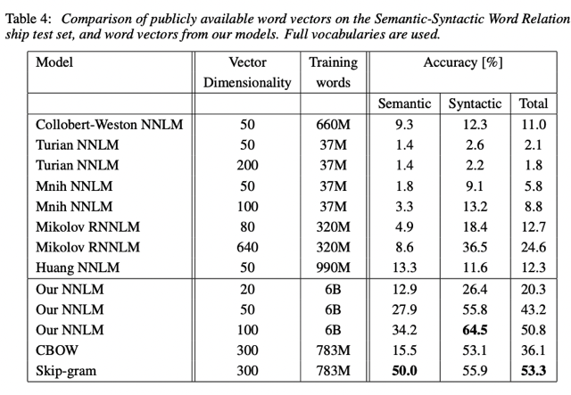</kbd>

 

<kbd>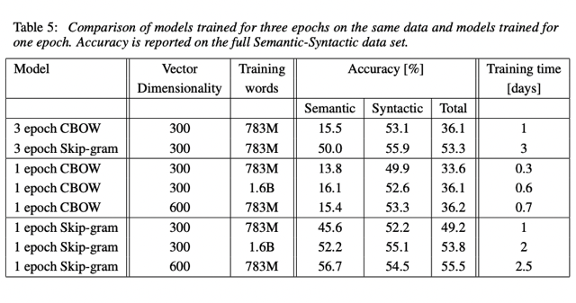</kbd>

 

- **4.4 Large Scale Parallel Training of Models

As mentioned earlier, we have implemented various models
in a distributed framework called DistBelief. Below we report
the results of several models trained on the Google News 6B
data set, with mini-batch asynchronous gradient descent and
the adaptive learning rate procedure called Adagrad [7]. We
used 50 to 100 model replicas during the training. The
number of CPU cores is an estimate since the data center
machines are shared with other production tasks, and the
usage can fluctuate quite a bit. Note that due to the
overhead of the distributed framework, the CPU usage of the
CBOW model and the Skip-gram model are much closer to
each other than their single-machine implementations. The
result are reported in Table 6.**

 

<kbd>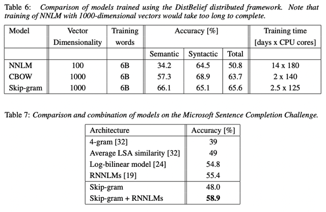</kbd>

 

- **4.5 Microsoft Research Sentence Completion Challenge

The Microsoft Sentence Completion Challenge has been recently introduced
as a task for advancing language modeling and other NLP techniques [32].
This task consists of 1040 sentences, where one word is missing in each
sentence and the goal is to select word that is the most coherent with the rest
of the sentence, given a list of five reasonable choices. Performance of several
techniques has been already reported on this set, including N-gram models,
LSA-based model [32], log-bilinear model [24] and a combination of recurrent
neural networks that currently holds the state of the art performance of 55.4%
accuracy on this benchmark [19].

We have explored the performance of Skip-gram architecture on this task.
First, we train the 640- dimensional model on 50M words provided in [32].
Then, we compute score of each sentence in the test set by using the unknown
word at the input, and predict all surrounding words in a sentence. The final
sentence score is then the sum of these individual predictions. Using the
sentence scores, we choose the most likely sentence.

A short summary of some previous results together with the new results is
presented in Table 7. While the Skip-gram model itself does not perform on this
task better than LSA similarity, the scores from this model are complementary
to scores obtained with RNNLMs, and a weighted combination leads to a new
state of the art result 58.9% accuracy (59.2% on the development part of the
set and 58.7% on the test part of the set).**

 

- **5 Examples of the Learned Relationships

Table 8 shows words that follow various relationships. We follow the
approach described above: the relationship is defined by subtracting two
word vectors, and the result is added to another word. Thus for example,
Paris - France + Italy = Rome. As it can be seen, accuracy is quite good,
although there is clearly a lot of room for further improvements (note that
using our accuracy metric that assumes exact match, the results in Table
8 would score only about 60%). We believe that word vectors trained on
even larger data sets with larger dimensionality will perform significantly
better, and will enable the development of new innovative applications.
Another way to improve accuracy is to provide more than one example of
the relationship. By using ten examples instead of one to form the
relationship vector (we average the individual vectors together), we have
observed improvement of accuracy of our best models by about 10%
absolutely on the semantic-syntactic test. It is also possible to apply the
vector operations to solve different tasks. For example, we have observed
good accuracy for selecting out-of-the-list words, by computing average
vector for a list of words, and finding the most distant word vector. This is
a popular type of problems in certain human intelligence tests. Clearly,
there is still a lot of discoveries to be made using these techniques.**

 

- **6 Conclusion

In this paper we studied the quality of vector representations of words derived by various
models on a collection of syntactic and semantic language tasks. We observed that it is
possible to train high quality word vectors using very simple model architectures, compared
to the popular neural network models (both feedforward and recurrent). Because of the much
lower computational complexity, it is possible to compute very accurate high dimensional
word vectors from a much larger data set. Using the DistBelief distributed framework, it
should be possible to train the CBOW and Skip-gram models even on corpora with one trillion
words, for basically unlimited size of the vocabulary. That is several orders of magnitude
larger than the best previously published results for similar models.

An interesting task where the word vectors have recently been shown to significantly
outperform the previous state of the art is the SemEval-2012 Task 2 [11]. The publicly
available RNN vectors were used together with other techniques to achieve over 50%
increase in Spearman’s rank correlation over the previous best result [31]. The neural
network based word vectors were previously applied to many other NLP tasks, for example
sentiment analysis [12] and paraphrase detection [28]. It can be expected that these
applications can benefit from the model architectures described in this paper.

Our ongoing work shows that the word vectors can be successfully applied to automatic
extension of facts in Knowledge Bases, and also for verification of correctness of existing
facts. Results from machine translation experiments also look very promising. In the future, it
would be also interesting to compare our techniques to Latent Relational Analysis [30] and
others. We believe that our comprehensive test set will help the research community to
improve the existing techniques for estimating the word vectors. We also expect that high
quality word vectors will become an important building block for future NLP applications.**

 

- **7 Follow-Up Work

After the initial version of this paper was written, we published
single-machine multi-threaded C++ code for computing the word
vectors, using both the continuous bag-of-words and skip-gram
architectures4 . The training speed is significantly higher than reported
earlier in this paper, i.e. it is in the order of billions of words per hour
for typical hyperparameter choices. We also published more than 1.4
million vectors that represent named entities, trained on more than
100 billion words. Some of our follow-up work will be published in an
upcoming NIPS 2013 paper [21].**

 

## Reading: Distributed Representations Of Words
and Phrases And Their Compositionality

 

### Abstract

The recently introduced \\*continuous Skip-gram model\\* is an \\*efficient method\\* for
learning high-quality distributed vector representations that capture a large number of
precise syntactic and semantic word relationships. In this paper we present several
extensions that improve both the quality of the vectors and the training speed. By
subsampling of the frequent words we obtain significant speedup and also learn
more regular word representations. We also describe a simple alternative to the
hierarchical softmax called negative sampling.

An inherent limitation of word representations is their indifference to word order and
their inability to represent idiomatic phrases. For example, the meanings of “Canada”
and “Air” cannot be easily combined to obtain “Air Canada”. Motivated by this
example, we present a simple method for finding phrases in text, and show that
learning good vector representations for millions of phrases is possible.

> [!NOTE]
> Đại khái là paper này mở rộng một số thứ để improve skipgram,
> trong đó dùng một biến thể của "hierachical softmax" - là cách
> làm để bớt chi phí khi tính softmax thông thường, gọi là negative
> sampling giúp tăng tốc quá trình training tốt hơn.
>
>
>
> Paper này họ cũng đề xuất phương pháp tìm kiếm phrases trong
> một văn bản.

 

#### 1 Introduction

\\*Distributed representations of words in a vector space\\* help learning algorithms to
achieve better performance in natural language processing tasks by grouping similar
words. One of the earliest use of word representations dates back to 1986 due to
Rumelhart, Hinton, and Williams [13]. This idea has since been applied to \\*statistical
language modeling\\* with \\*considerable success\\* [1]. The follow up work includes
\\*applications to automatic speech recognition\\* and \\*machine translation\\* [14, 7], and a
\\*wide range of NLP tasks\\* [2, 20, 15, 3, 18, 19, 9].

Recently, \\*Mikolov\\* et al. [8] introduced the \\*Skip-gram model\\*, an \\*efficient\\* method for
learning \\*high quality vector representations\\* of words from large amounts of
\\*unstructured text data\\*. Unlike most of the previously used neural network
architectures for learning word vectors, training of the Skipgram model (see Figure 1)
does \\*not involve dense matrix multiplications\\*. This makes the training extremely
\\*efficient\\*: an optimized single-machine implementation can train on \\*more than\\* \\*100
billion words in one day.\\*

The \\*word representations computed using neural networks\\* are very interesting
because the learned \\*vectors explicitly encode many linguistic regularities\\* and
patterns. Somewhat surprisingly, many of these patterns can be represented as \\*linear
translations\\*. For example, the result of a vector calculation vec(“Madrid”) -
vec(“Spain”) + vec(“France”) is closer to vec(“Paris”) than to any other word vector [9,
8].

> [!NOTE]
> Đại khái là ca ngợi việc tạo distributed representation của từ vựng giúp
> đạt những tiến bộ đáng ghi nhận trong NLP. thậm chí không phải gần
> đây mà từ những năm 1086 người ta đã sử dụng nó trong **statistical
> language modeling** và các ứng dụng sau đó trong speech recognition,
> machine  translation...
>
>
>
> Gần đây, với skip gram đã cho ra những kết quả rất tốt và cũng hiệu
> quả khi không có việc tính toán matrix multiplication với Dense layer.
>
>
>
> Và việc "**learn" được các word representation bằng NN tỏ ra rất  thú vị
> khi nó giúp "encode" được các ý nghĩa ngữ nghĩa**

 

<kbd>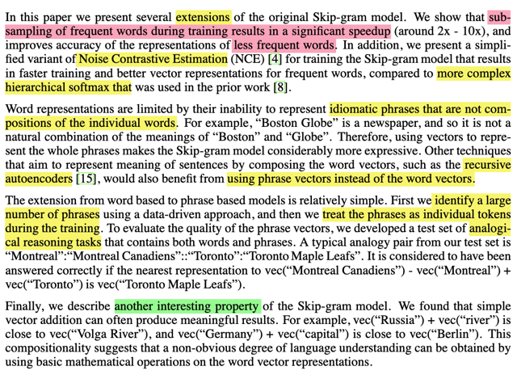</kbd>

> [!NOTE]
> đại ý:
>
>
>
> Giới thiệu cách thức dùng "subsampling of frequent words" tạm hiểu là "lấy
> mẫu, ngẫu nhiên các từ thông dụng"
>
>
>
> và một phiên bản đơn giản hơn của cái gọi là Noise Contrastive Estimation
> thay thế cho cách làm của original SkipGram paper dùng Hierarchical Softmax
> giúp tăng tốc quá trình lên rất đáng kể đồng thời tăng độ chính xác trong khả
> năng represent các từ ít thông dụng.
>
>
>
> Nói về sự hiệu quả hơn của "phrase-based representation" thay cho  "
> word-based representation" trong việc biểu diễn được các ý nghĩa liên quan
> đến nhiều từ (Idiomatic phrase)
>
>
>
> Và nói sơ về cách train ra các phrase-based vector này
>
>
>
> Cuối cùng, kiểu như cho thấy một đặc tính thú vị nữa của word embedding
> vector train bởi SkipGram để minh chứng cho việc: có những hiểu biết trong
> ngôn ngữ mang tính chất không rõ ràng, khó diễn đạt  (non-obvious degree of
> language understanding) có thể được biểu diễn bằng các phép toán học

 

<kbd>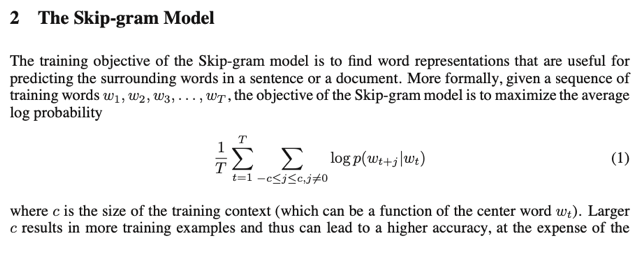</kbd>

<kbd>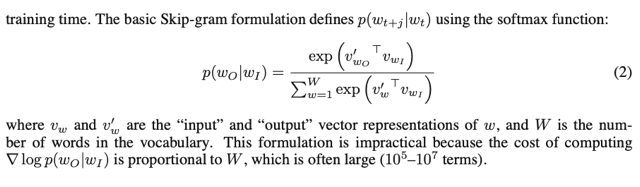</kbd>

> [!NOTE]
> Đại khái là nói về công thức objective function của SkipGram như ta đã biết
> đó là **maximize xác suất "xuất hiện"** của các **context word** trong phạm
> vi **c từ trước và sau một center word** dựa trên softmax. Với center word là
> mọi từ trong vocabulary
>
>
>
> Tuy nhiên việc sử dụng sẽ không thực tế khi quá tốn kém vì khi tính mẫu số
> sẽ phải "tính" cho toàn bộ các từ trong vocab W và W thường rất lớn họ nói
> ở đây có thể lên tới 10^5 - 10^7 tức là khoảng 10 triệu từ

 

<kbd>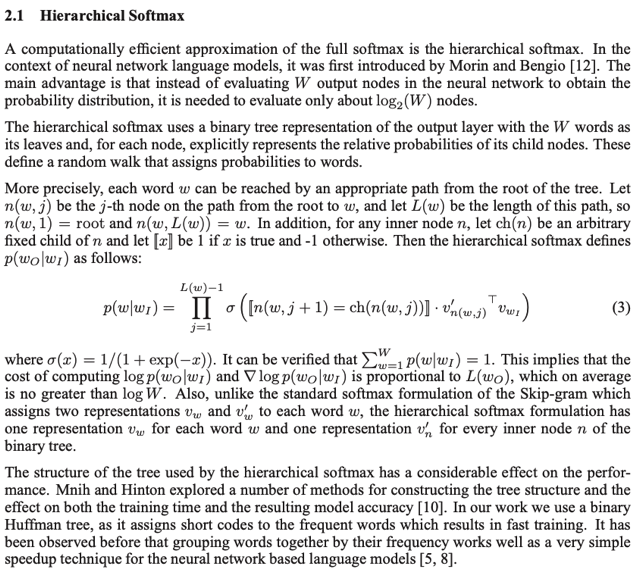</kbd>

> [!NOTE]
> Quay lại sau

 

