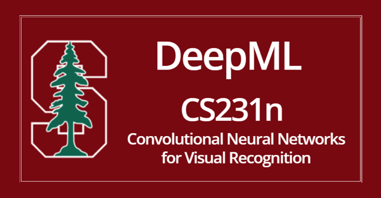

# A0_cs231n

<kbd></kbd>

Whether you’re into computer vision or not, CS231N will definitely help
you become a much better AI researcher/practitioner. CS231N is hands
down the **best deep learning course** I’ve come across. It balances
theories with practices. The lecture notes are well written with
visualizations and examples that explain well **difficult concepts such as
backpropagation, gradient descents, losses, regularizations, dropouts,
batchnorm**, etc. The assignments are fun and relevant. The instructors
are all **young and brilliant.**

 

Even though the course description includes CS229 as a prerequisite, I
think a student would benefit a lot more if they take CS231N BEFORE
taking CS229. You’ll also have a much better time in the class if you are
familiar with Python and NumPy as there’s a fair amount of coding
involved.

 

Huyen Chip

http://cs231n.github.io/

https://www.youtube.com/playlist?list=PLzUTmXVwsnXod6WNdg57Yc3zFx_f-RYsq
