# Assignment 2 -
convolutional Network

📊 **Progress:** `27` Notes | `64` Screenshots

---

## Assignment 2 -
convolutional Network

 

<kbd>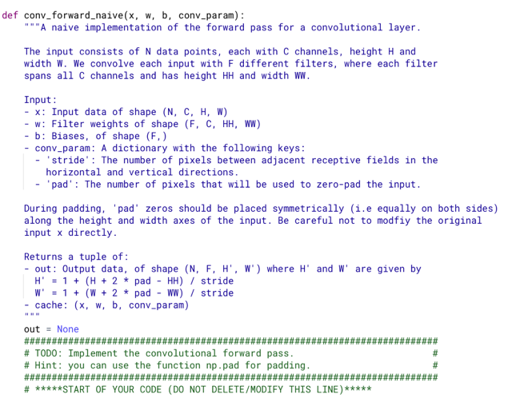</kbd>

 

<kbd>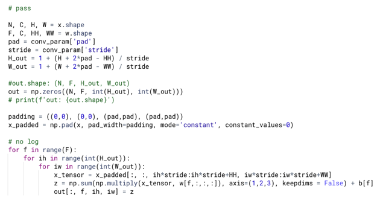</kbd>

<kbd>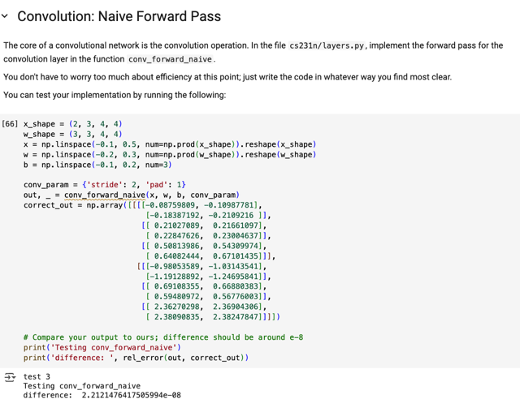</kbd>

> [!NOTE]
> với các hyperparams như stride, padding, và các dimension của input
> và filter. Ta sẽ khởi tạo zero tensor cho output.
>
>
>
> Từ đó, lần lượt tính để 'điền vào' output tensor. 
>
>
>
> Lần lượt tính cho từng activation map for f in range(F): 
>
>
>
> Để không rối về index của spatial dimension W,H thì giá trị của width 
> và height dimension của output chính là số lần 'slide':
>
>
>
> for ih in range(H_out): 
>     for iw in range(W_out): 
>
>
>
> Lấy filter tương ứng trong F filter 
>     wf = w[f,:,:,:] - là một 3d tensor, 
>
>
>
> lấy tensor tương ứng của input: 
> - batch dimension: lấy hết, 
> - depth dimension: cũng lấy hết, 
> - spatial dimension: lấy từ ih*stride:id*stride + filter height, 
> iw*stride:iw*stride+filter width, 
>
>
>
> *Chú ý: Nhớ nhân stride. ví dụ ih lần lượt là 0,1,2. Thì nếu stride = 1,
> Ta sẽ lấy index của H từ 0,1,2, nhưng nếu stride = 2 thì sẽ là 0,2,4 = 0*2,
> 1*2,2*2
>
>
>
> để có 4D tensor (N,C,HH,WW).
>
>
>
> Khi phép nhân element wise giữa x_tensor và w, python sẽ broadcast
> w (đang có shape C,HH,WW thành 1,C,HH,WW và trở thành N,C,HH,WW
> để nhân với x_tensor.
>
>
>
> Sau đó như đã biết ta sẽ sum, nhưng chỉ ở 3 dimension cuối: 1,2,3. Vì 
> dimension đầu tiên là batch dimension: Ta chỉ là đang làm cùng lúc cho 
> nhiều image. Đương nhiên sau đó là + bias tương ứng b[f]
>
>
>
> Để kết quả dạng vector mỗi phần tử là value của output tensor tương ứng
> với mỗi một sample.
>
> Compare your output to ours; difference should be around e-8

 

<kbd>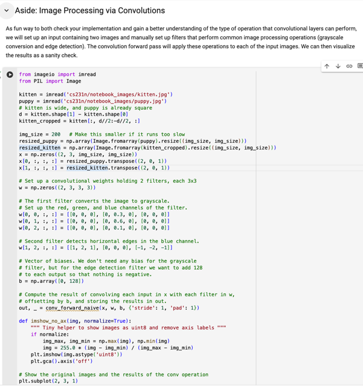</kbd>

> [!NOTE]
> đại khái là họ sẽ dùng hai cái hình, với hai bộ filter đã 'gọi là' được train
> rồi, nhằm detect grayscale và edge. Để rồi dùng nó thực hiện convolve
> để test function mình vừa làm cũng như để xem thử  kết quả có đúng
> như mong muốn đó là activation sẽ thể hiện filter có thể detect edge và
> chuyển image sang grayscale.

 

<kbd>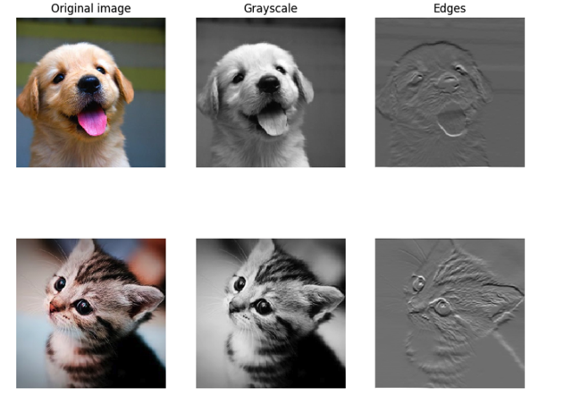</kbd>

 

<kbd>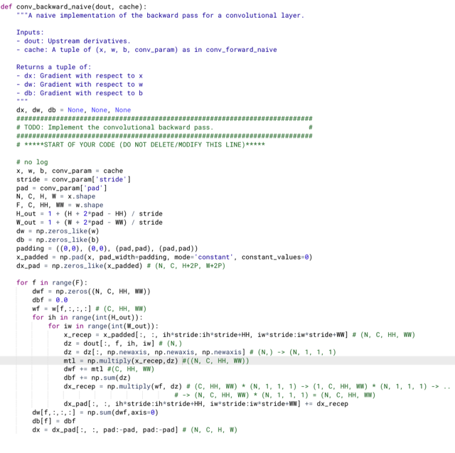</kbd>

<kbd>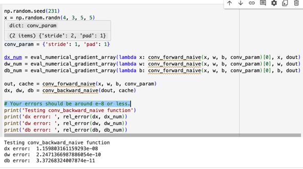</kbd>

> [!NOTE]
> "Làm" cho từng filter (for f in F:) đương nhiên khởi tạo dw là zero tensor
> cùng shape với w. db, dx cũng vậy
>
>
>
> (tạm gọi là lập luận thế này, nhìn vào computation graph có thể thấy), mỗi
> neuron (tức là mỗi output value trên output tensor là kết quả của một phép
> dot product giữa hai 3d tensor, một cái là x_recep, ám chỉ  cái vùng có
> spatial size = receptive field (HH, WW), depth = C, và cái kia đương nhiên
> là cái filter. Vậy, local gradient dz/dw = x_recep.
>
>
>
> Đương nhiên upstream gradient ở đó là dz tương ứng. Nên dw_f (f = 1,2...
> F) sẽ tổng dz * x_recept  với dz phải hiểu là một scalar vì nó là dL/dz mà z
> là scalar - kết quả của đợt product giữa w và x-recep
>
>
>
> Chú ý mọi cái dz, x_recept thì đều có nhiều cặp, tương ứng với mỗi trong
> nhiều vị trí khác nhau trong quá trình convol. Nên dw_k tham gia vào hết
> các phép tính dot product này nên dw sẽ sum.
>
>
>
> Có điều chú ý ở đây đó là ta cũng sẽ s**um dw trên batch dim luôn**, chứ
> không phải là lấy trung bình trên batch dim.
>
>
>
> ====
>
>
>
> db thì dễ rồi, có thể thấy nó chỉ là sum các dz và cũng sum trên batch dim
>
>
>
> ====
>
>
>
> với dx, thì nhớ rằng ta forward với x_pad, nên cái ta sẽ làm là dx_pad, Với
> dx thì đương nhiên ta sẽ tính dx_recep = dz*w, và cộng dồn vào vị trí tương
> thích trên dx_pad. Sau đó thì "gỡ đi" cái pad xung quanh để có dx.
>
> # Your errors should be around e-8 or less.

 

<kbd>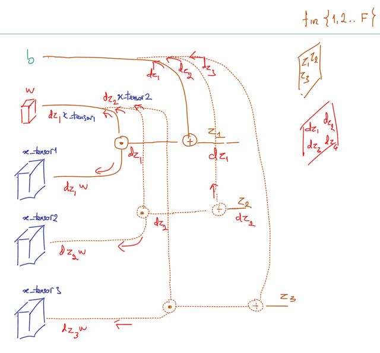</kbd>

<kbd>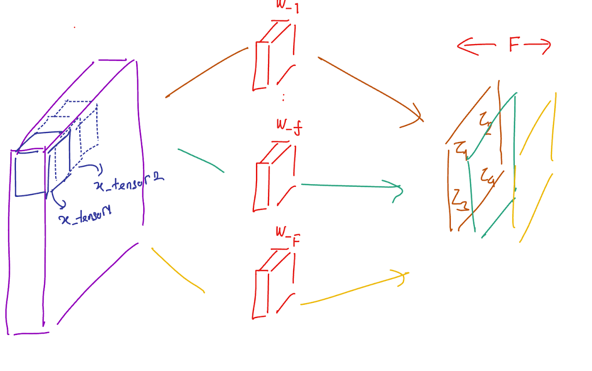</kbd>

 

<kbd>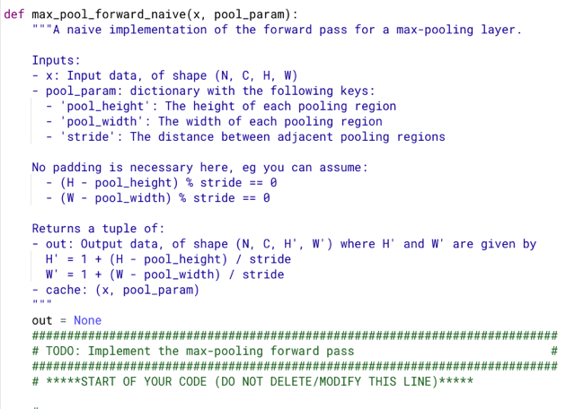</kbd>

 

<kbd>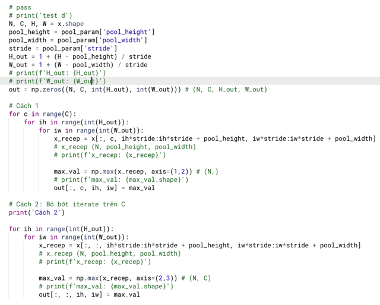</kbd>

> [!NOTE]
> Forward pooling tương đối đơn giản, chỉ cần chú ý khi max một
> tensor x_recep có shape là (N, poolH, poolW) thì dùng axis cho
> đúng = (1,2), đặng nó lấy max theo hai spatial dimension này - tức
> là lấy max của matrix.

 

<kbd>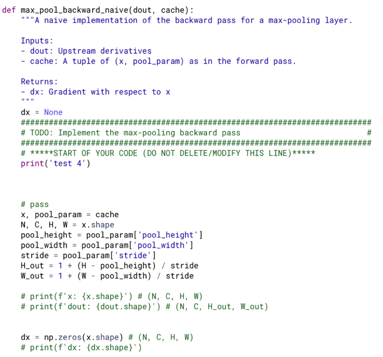</kbd>

 

<kbd>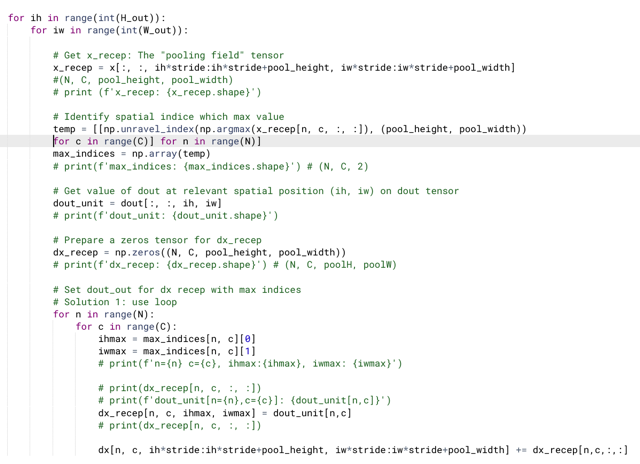</kbd>

<kbd>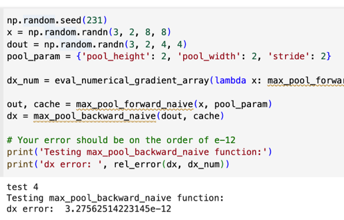</kbd>

> [!NOTE]
> ở cách làm hiện giờ, ta sẽ iterate từng vị trí thực hiện phép pooling.
> Tại mỗi vị trí, ta lấy ra x_recep (hay đúng hơn nên gọi là x_pooling)
> - là tensor (C, poolH, poolW), đương nhiên nếu xét cùng lúc cho N
> sample trong batch thì sẽ là (N, C, poolH, poolW).
>
>
>
> Tiếp theo tìm cách xác định tọa độ trong hai chiều spatial (width,
> height) có value lớn nhất. Để rồi, dx tương ứng với chỗ đó sẽ 
> nhận full gradient từ dout pass về, còn mấy chỗ khác thì bằng 0.
>
>
>
> Ý tưởng rất đơn giản vậy thôi.
>
> Your error should be on the order of e-12

 

<kbd>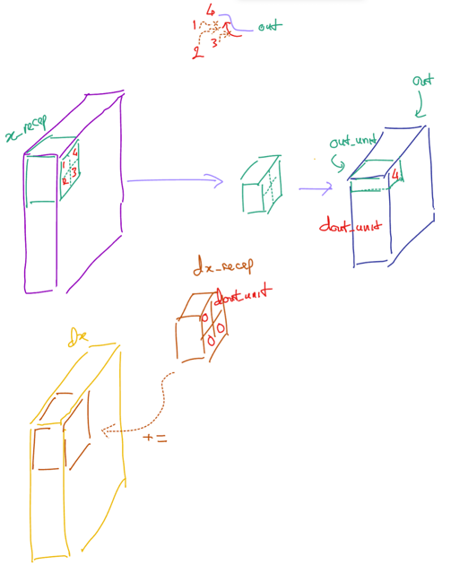</kbd>

 

<kbd>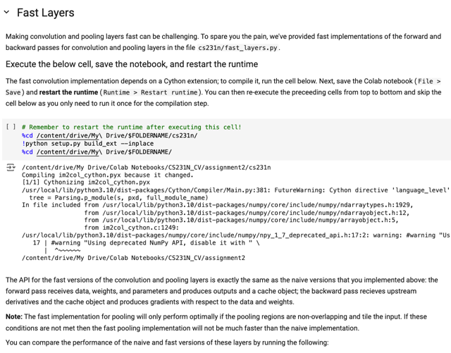</kbd>

> [!NOTE]
> kế tới đại khái là người ta không bắt làm phiên bản efficient của mấy
> cái trên conv / pooling forward/ backward vì tương đối khó, nên người
> ta cho sẵn. Ta sẽ chạy dòng code dưới để compile cython gì đó. 
>
>
>
> Tuy nhiên lúc compile thì báo lỗi ko assign int cho double, nguyên nhân
> là trong file imcol_cython.pyx, các function có vụ này : 
>
>
>
> int HH = (H + 2 * padding - field_height) / stride + 1 
>
>
>
> -> kết quả nó ra double, nên assign vào int báo lỗi (có thể do phiên bản
> python). Cơ bản là mình hiểu chỗ này đương nhiên là phép chia làm tròn
> Do đó ta có thể sửa lại thành / -> //
>
>
>
> int HH = (H + 2 * padding - field_height) // stride + 1 
>
>
>
> ===
>
>
>
> Ở dưới người ta nói đại khái các 'fast solution' này cũng cơ bản là như
> Naive version mà mình đã làm thôi nhưng sẽ nhanh hơn. Với pooling, thì
> nó chỉ phát huy tác dụng nếu các pooling region không overlap và 'tile the
> input' (cái này chưa hiểu lắm).

 

<kbd>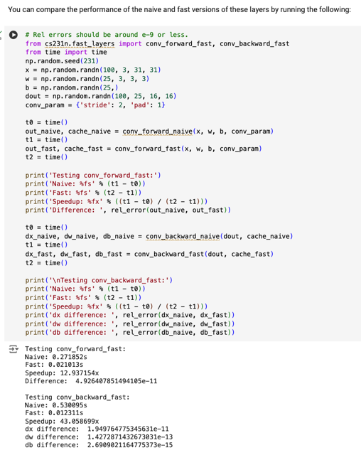</kbd>

> [!NOTE]
> kết quả cho thấy conv fast solution nhanh hơn
> cả mấy chục lần so với naive.

 

<kbd>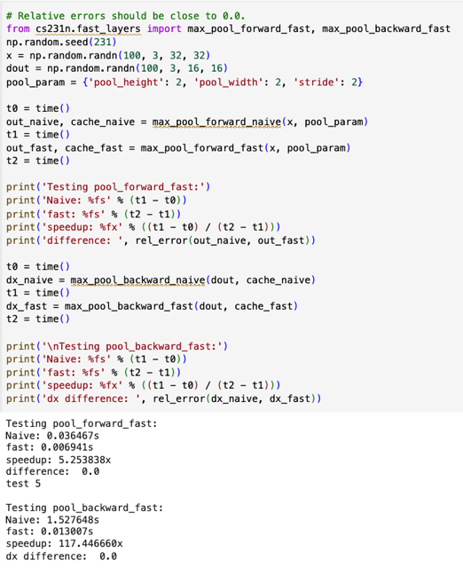</kbd>

> [!NOTE]
> với fast pooling backward nhanh hơn cả trăm lần,

 

<kbd>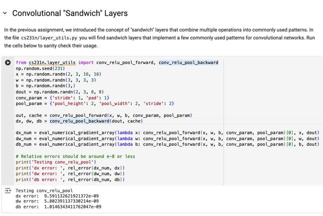</kbd>

<kbd>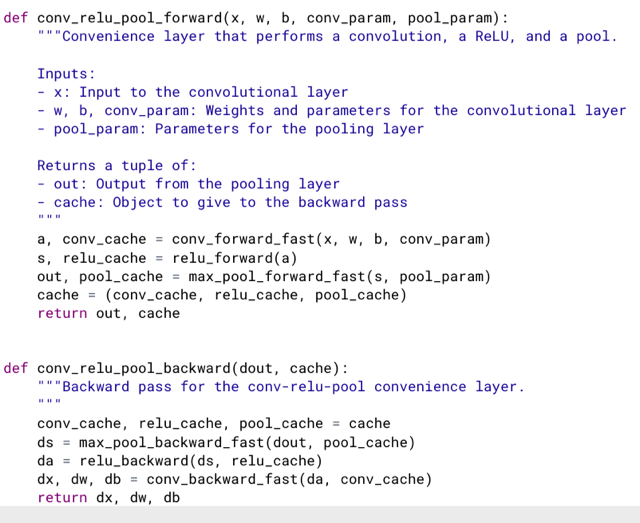</kbd>

> [!NOTE]
> cái này đại khái là người ta chuẩn bị sẵn vài ' pattern' layer hay dùng
> trong convnet như đã biết, ví dụ conv-relu-pool. Và trong đây đương 
> nhiên người ta dùng fast layer. Kêu mình chạy cái sanity check này 
> xem thử thôi ko có gì.

 

<kbd>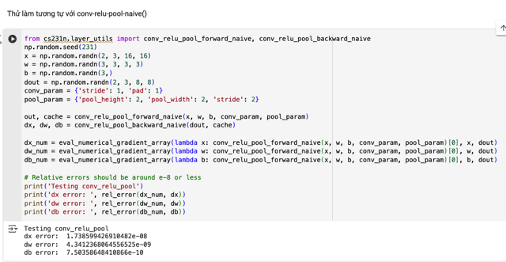</kbd>

<kbd>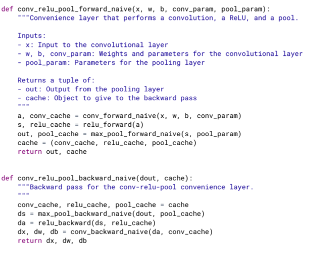</kbd>

> [!NOTE]
> Có thể tự thêm cái conv_relu_pool_naive xem sao.

 

<kbd>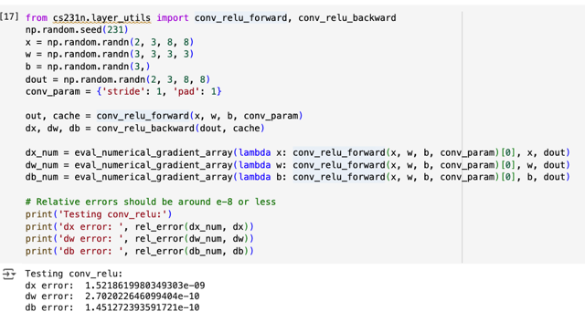</kbd>

<kbd>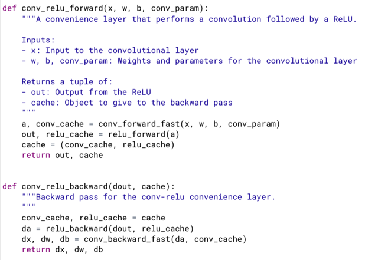</kbd>

> [!NOTE]
> conv_relu_forward fast

 

<kbd>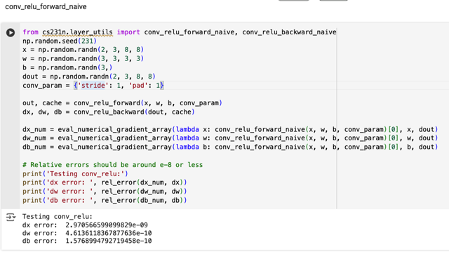</kbd>

<kbd>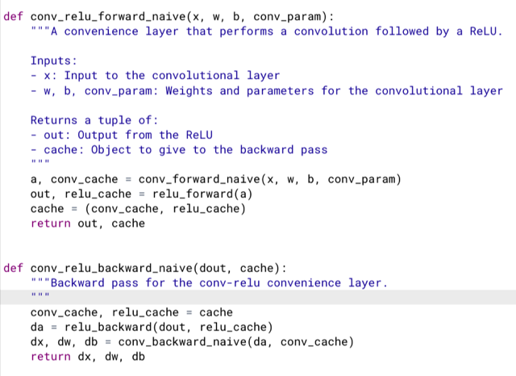</kbd>

> [!NOTE]
> tự thử với conv relu
> forward naive

 

<kbd>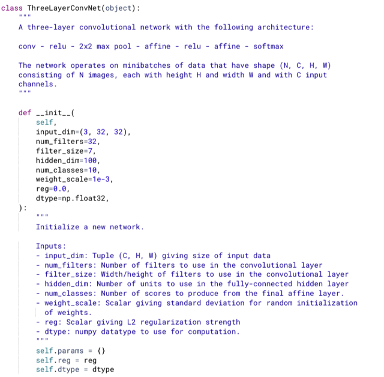</kbd>

<kbd>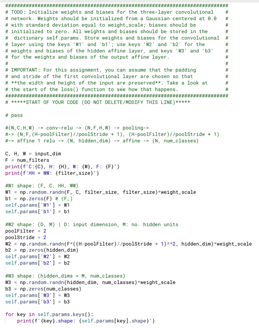</kbd>

 

<kbd>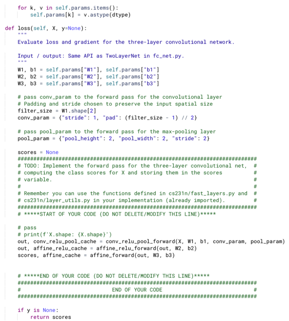</kbd>

 

<kbd>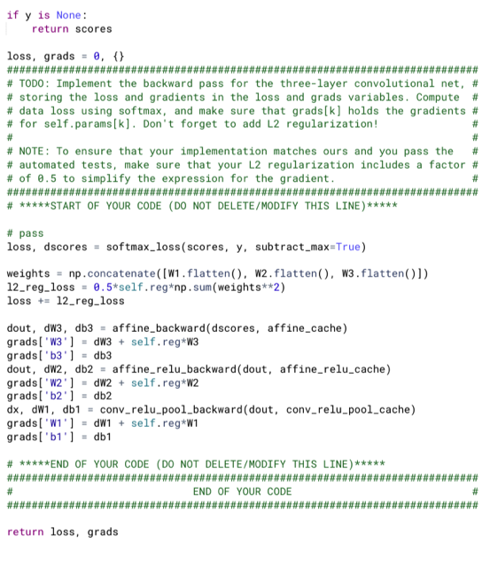</kbd>

 

<kbd>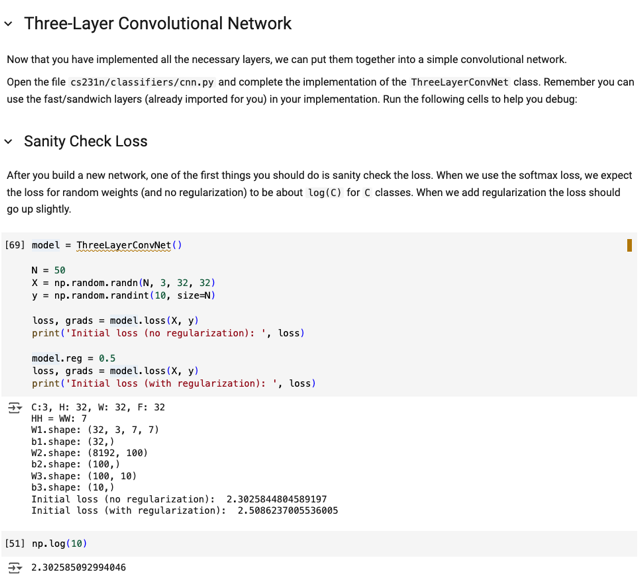</kbd>

> [!NOTE]
> kết qủa ini loss ra 2.3 ~= -log(num_classes = 10) là ok
> Khi có reg, loss tăng lên chút xíu như expect

 

<kbd>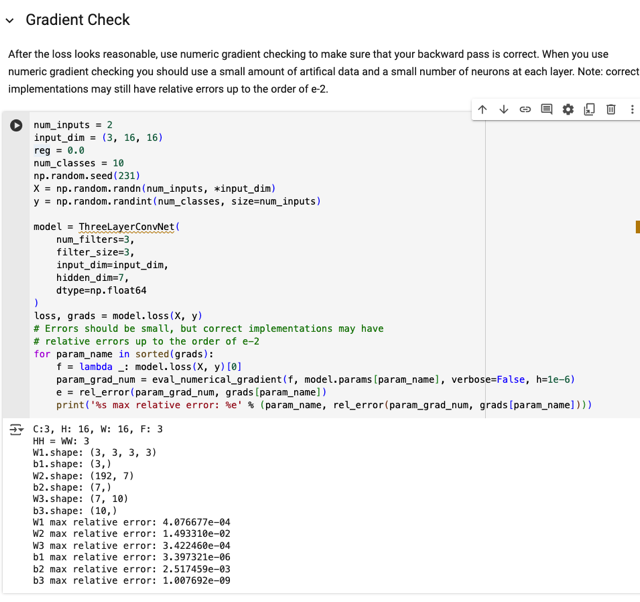</kbd>

<kbd>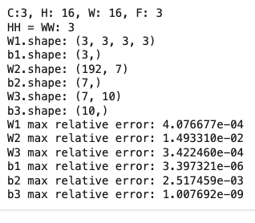</kbd>

> [!NOTE]
> relative errors up to the order of e-2: OK!

 

<kbd>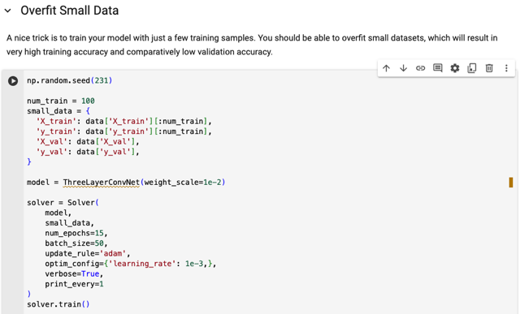</kbd>

<kbd>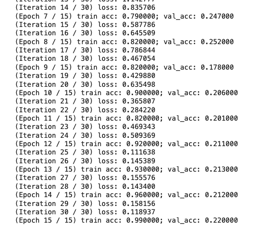</kbd>

> [!NOTE]
> một trick (để kiểm tra xem mình làm có đúng không là) train
> model với một vài sample xem nó có overfit không.
>
>
>
> Ở đây train model với 100 sample, 15 epoches, Adam
> kết quả có thể thấy overfit rõ khi train acc = 1, val acc có .22

 

<kbd>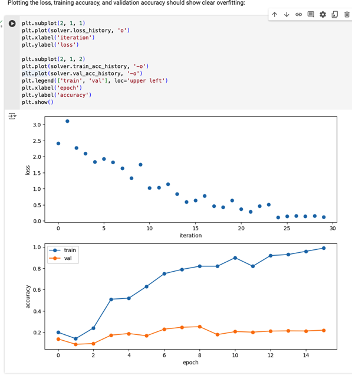</kbd>

> [!NOTE]
> Plot cũng cho thấy rõ điều đó

 

<kbd>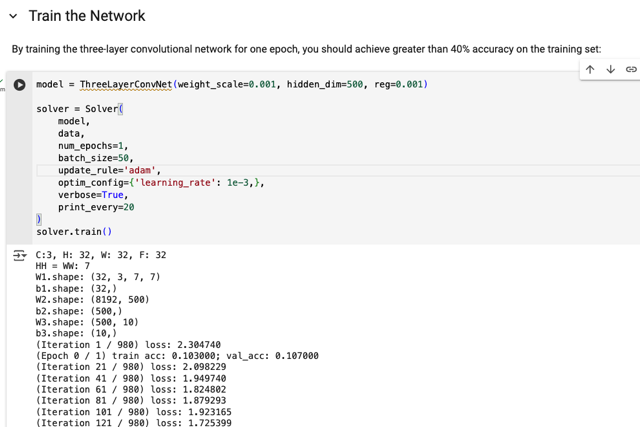</kbd>

<kbd>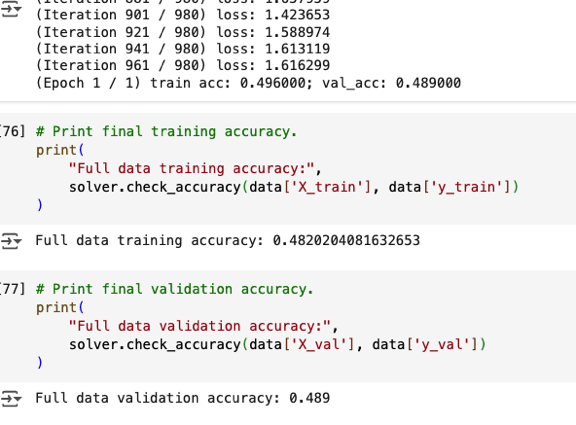</kbd>

> [!NOTE]
> you should achieve greater than 40% accuracy on the training set:
> checked!

 

<kbd>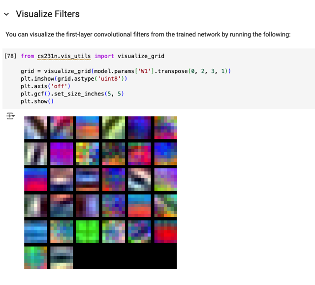</kbd>

 

<kbd>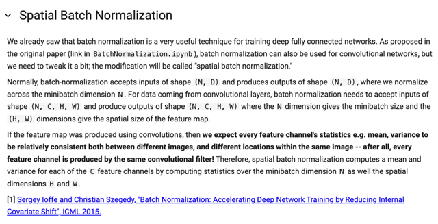</kbd>

 

<kbd>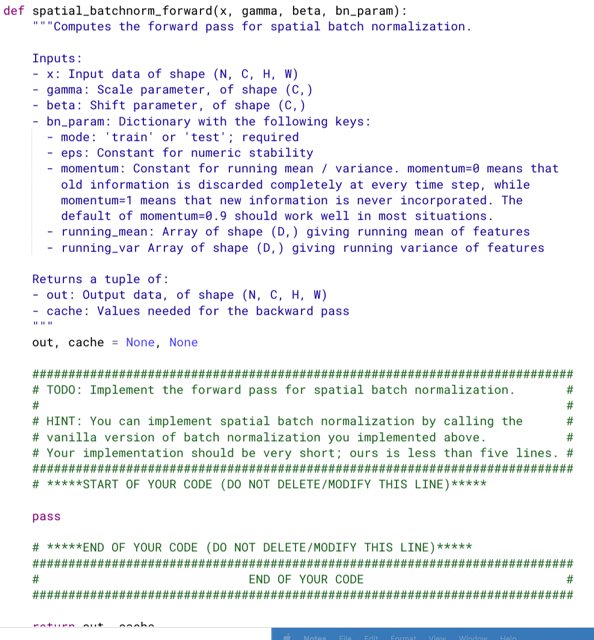</kbd>

> [!NOTE]
> làm batch norm cho conv layer. họ kêu mình có thể dùng lại / gọi lại
> (calling) cái batch norm của fc layer ở trên

 

<kbd>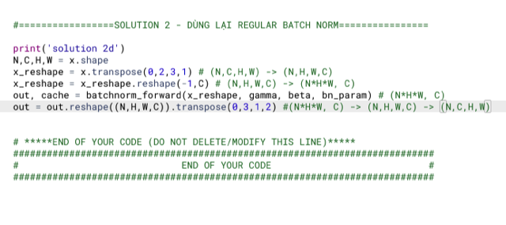</kbd>

 

<kbd>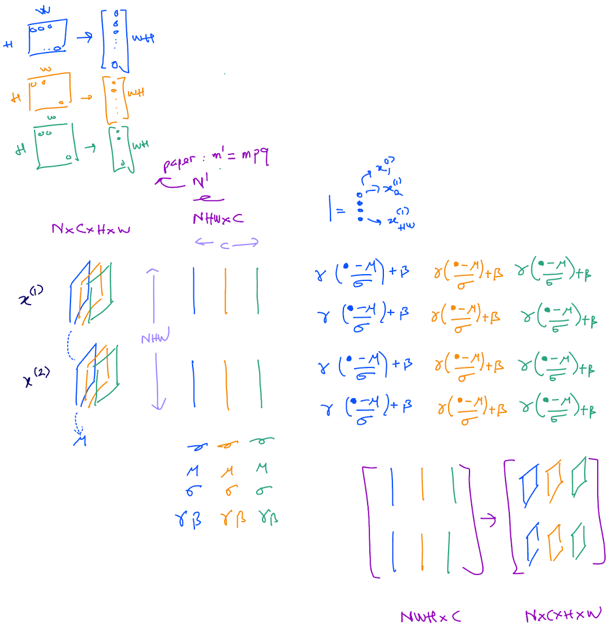</kbd>

<kbd>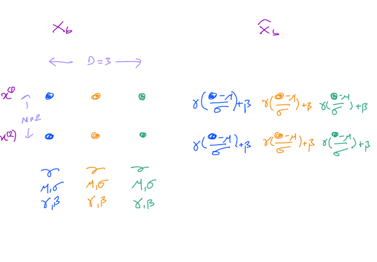</kbd>

> [!NOTE]
> cơ chế để có thể dùng lại cái batchnorm_forward() là vầy:
>
>
>
> Theo batchnorm_forward, input sẽ cần có dạng matrix N,D. Đặng ví dụ
> cột xanh dương là các feature xanh dương của mọi sample. TÍnh mean
> và variance cột này để normalize. 
>
>
>
> Còn với conv layer, ta cần mean và variance của mọi giá trị trong một miếng
> xanh dương, trên mọi sample. Vậy cách làm đó là:
>
>
>
> x đang có shape là (N,C,H,W) -> ta sẽ transpose thành (N,H,W, C)
> sau đó reshape thành (N*H*W, C) lúc này x_reshape sẽ thành matrix
> có 3 cột (ví dụ C=3), NHW hàng. Cột xanh dương sẽ chứa mọi value 
> trong miếng xanh dương của cả 2 sample. Nên lấy mean của cột này
> sẽ đương mean của mọi miếng xanh dương trong batch.
>
>
>
> Khi đó thì có thể dùng batchnorm_forward() để normalize. Sau đó ta sẽ
> reshape về lại (N,C,H,W) ( trước tiên phải là reshape từ (NHW,C) thành 
> (N,H,W,C) sau đó transpose để thành (N,C,H,W)

 

<kbd>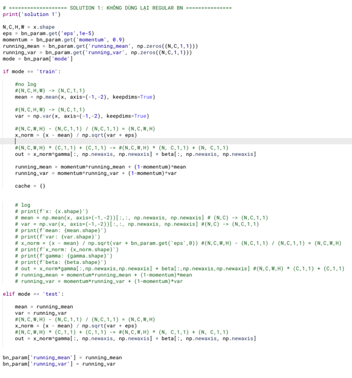</kbd>

> [!NOTE]
> còn đây là solution khi chưa nghĩ ra cách tái sử dụng
> batchnorm_forward(). Cơ bản cũng là tính mean và variance của
> "các miếng tương ứng trong batch" để dùng  cho việc normalize.
>
>
>
> Đương nhiên cái này ta phải handle cả việc cache, update
> running_mean (solution dùng lại batchnorm_forward thì khỏi)

 

<kbd>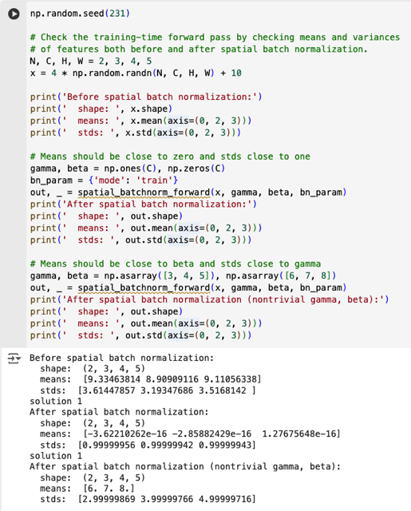</kbd>

<kbd>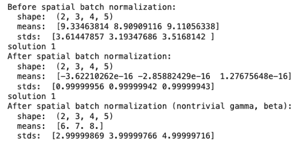</kbd>

<kbd>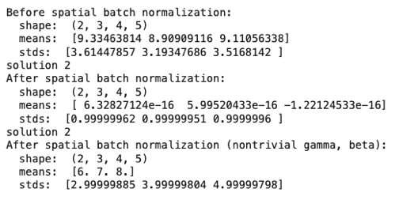</kbd>

 

<kbd>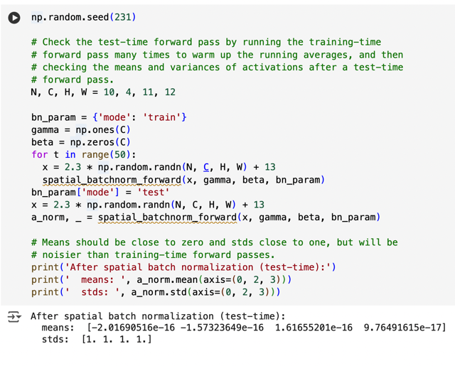</kbd>

<kbd>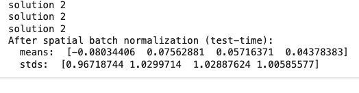</kbd>

<kbd>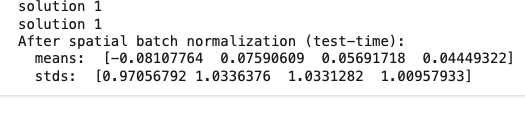</kbd>

 

<kbd>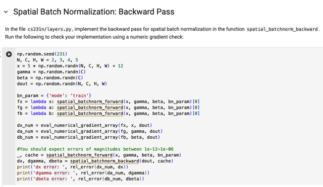</kbd>

 

<kbd>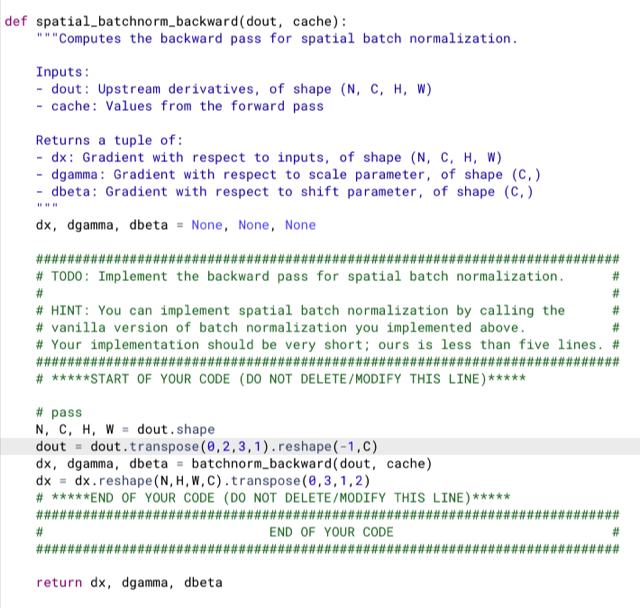</kbd>

<kbd>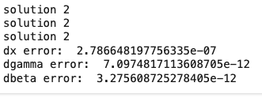</kbd>

> [!NOTE]
> với batchward, ta cũng sẽ chỉ cần reshape
> để reuse batchnorm_backward()
>
> #You should expect errors of magnitudes
> between 1e-12~1e-06

 

<kbd>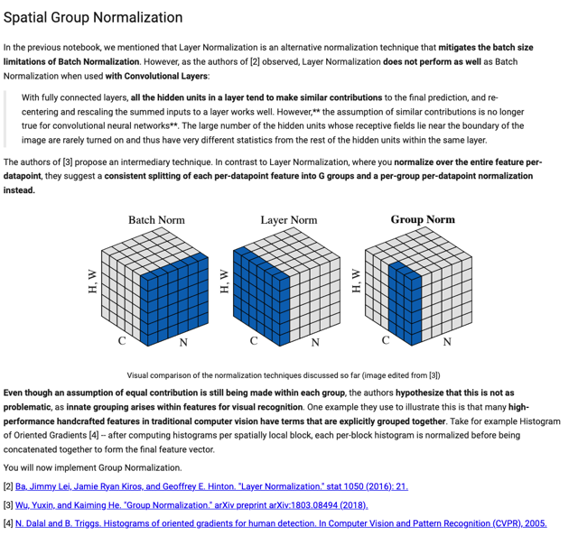</kbd>

> [!NOTE]
> đại ý là, khi áp dụng LayerNorm cho conv layer thì lại thấy nó không hiệu quả bằng
> batchnorm, trước đó nhặc lại về việc layernorm là cách ta normalize bằng statistic
> tính bởi mọi value trong sample ví dụ như ta tính mean (1) là mean của mọi feature
> value của x(1) và variance cũng vậy. Để dùng chúng cho việc normalize cho x(1) Với
> cái này, mục đích để để khỏi phụ thuộc vào batch statistic khi mỗi sample tự
> normalize bằng statistic của nó.
>
>
>
> Nếu mà làm cho conv layer, với mỗi sample, ta sẽ normalize mọi value của nó  với
> statistic tính bởi mọi value của sample đó. Có nghĩa là nếu cho mỗi sample là một
> block 3D CxHxW thì tính mean, std của cả cái cục đó và dựa vào đó để normalize.
>
>
>
> Thế thì đại khái là qua bên conv layer cái này không hiệu quả là bởi người ta cho
> rằng với fc layer, mọi feature (tức là mọi output của các neuron khác nhau trong fc
> layer) đều đóng góp như nhau vào việc dự đoán. Nhưng với conv layer thì  giả định
> này không đúng. Thành ra không thể normalize value của sample với statistic  tính
> bởi mọi value của sample như trong cách làm của LayerNorm được.
>
>
>
> Tuy nhiên, dựa vào giả định rằng, tuy các neuron (trong cùng spatial map của conv
> layer không contribute như nhau nhưng, khi chia thành từng group, tạm hiểu là từng
> vùng trong spatial map, thì chúng có đóng góp như nhau).
>
>
>
> Như vậy, LayerNorm trong conv layer sẽ làm như sau: Thay vì tính stats của nguyên
> một cục 3D có shape CxHxW của x(1) hay nếu flatten H,W -> H*W thì ta có một mảng
> 2D CxHW. Thì ta sẽ chia mảng này thành nhiều phần gọi là group để rồi tính mean,
> std của mỗi phần và normalize cho mỗi phần với statistic tương ứng

 

<kbd>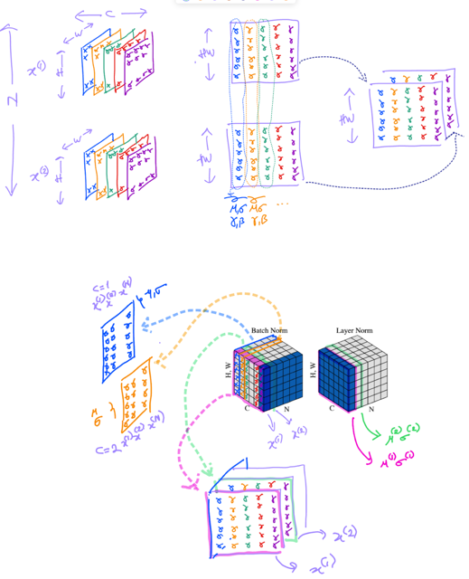</kbd>

> [!NOTE]
> ngắn gọn:
>
>
>
> *Batchnorm : 
> - fc: dùng statistic của mọi feature xanh dương
> để normalize cho value xanh dương
>
>
>
> - conv:  dùng statistic của (mọi) miếng
> xanh dương để normalize cho các value xanh dương
>
>
>
> *LayerNorm: 
> - fc: dùng statistic của mọi feature value của x(1) để
> normalize cho value của x(1)
>
>
>
> - conv: dùng statistic của mọi feature valủa của x(1) để
> normalize cho x(1)

 

<kbd>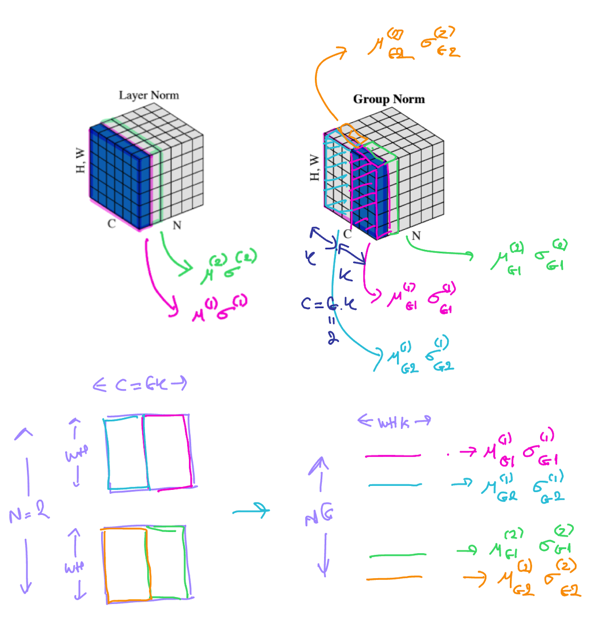</kbd>

> [!NOTE]
> Như vậy, LayerNorm trong conv layer sẽ làm như sau: Thay vì tính stats của
> nguyên một cục 3D có shape CxHxW của x(1) hay nếu flatten H,W -> H*W
> thì ta có một mảng 2D CxHW. Thì ta sẽ chia mảng này thành nhiều phần gọi
> là group để rồi tính mean, std của mỗi phần và normalize cho mỗi phần với
> statistic tương ứng

 

<kbd>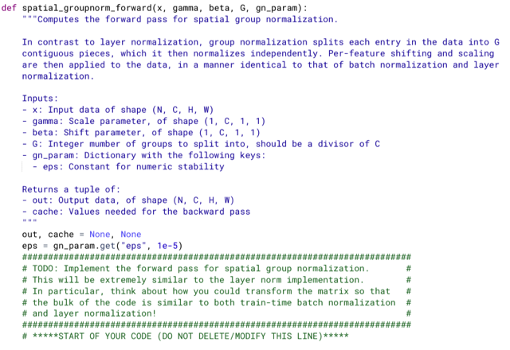</kbd>

<kbd>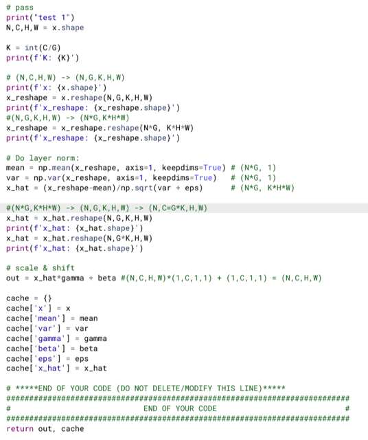</kbd>

 

<kbd>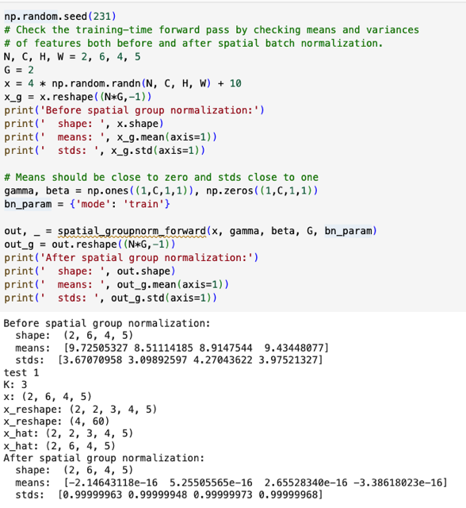</kbd>

> [!NOTE]
> Passed!

 

<kbd>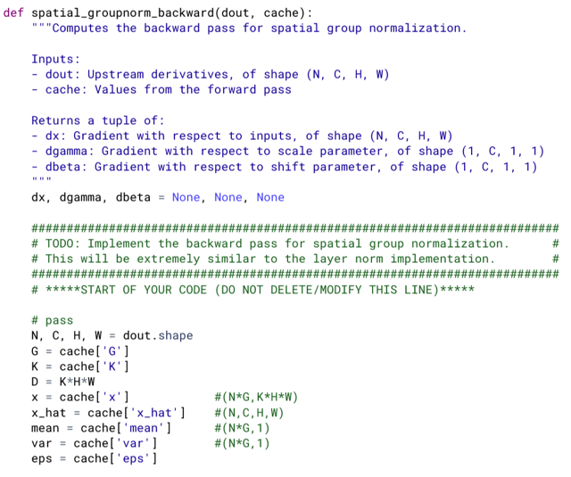</kbd>

<kbd>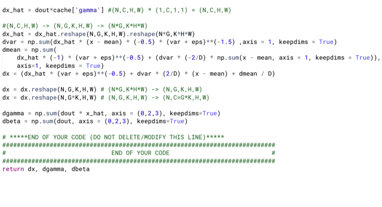</kbd>

> [!NOTE]
> vì forward làm giống như forward của layernorm nên backward cũng
> hoàn toàn tương tự, chỉ cần đảm bảo các shape phù hợp là sẽ đúng

 

<kbd>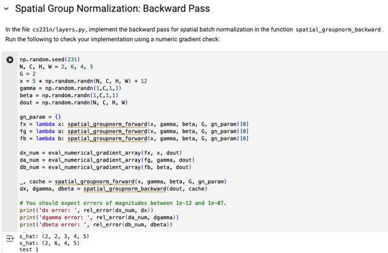</kbd>

<kbd>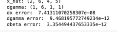</kbd>

> [!NOTE]
> Passed!

 

