# Lecture 10/16 - Recurrent Neural Network

📊 **Progress:** `67` Notes | `86` Screenshots

---

## Lecture 10/16 - Recurrent Neural Network

 

<kbd>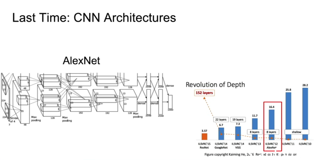</kbd>

 

<kbd>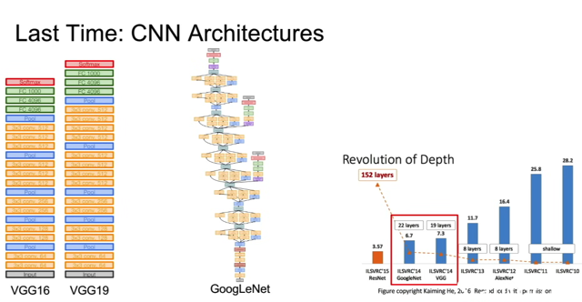</kbd>

> [!NOTE]
> Đại khái là nói thêm một chi tiết nhỏ đó là trước khi có BatchNorm,
> khi training VGG hay GoogleNet người ta cần một số thủ thuật thì
> mới giúp quá trình training được converge.
>
>
>
> Ví dụ như với VGG 16, người ta train model với 11 layer trước để
> model converge, sau đó mới thêm ít nhiều layer vào để train thêm
> thành vgg16 hay vgg19.
>
>
>
> Hay với GoogleNet ta thấy nó có cái mà người ta gọi là "auxiliary
> classifier" gắn vào các low layer. Cái này thật ra không có cần thiết
> cho nhiệm vụ classification mà chỉ đóng vai trò 'truyền thêm' gradient
> vào các layer ở thấp.
>
>
>
> Nhưng sau này có BatchNorm thì ko cần

 

<kbd>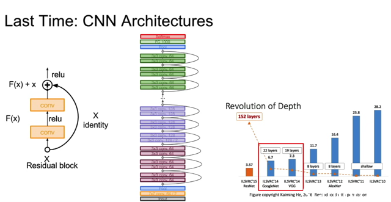</kbd>

> [!NOTE]
> Nói lại sơ về ResNet, với Residual connection. Justin nói thêm (hay nói lại)  về
> hai tác dụng của cái này. Đó là:
>
>
>
> - Một là, kiểu như là nó giúp model có thể "chọn lựa / quyết định" rằng không
> dùng hai cái conv layer trong block, bằng cách "learn" param của hai layer đó
> thành ra
> 0. Khi đó với residual connection, nó trở thành một identity mapping tức là
> không có làm gì hết, có sao để vậy, bỏ qua hai cái conv layer này.
>
>
>
> Liên hệ cái này với scale và shift của BatchNorm, khi nó cho phép model quyết
> định rằng không cần thực hiện normalization, mà giữa y nguyên, thì nó sẽ chỉnh
> Gamma và Beta sao cho đảo ngược quá trình normalization.
>
>
>
> - Hai là, nó có vai trò "giống giống" như L2 Regularization: Trong L2
> regularization, reg loss term giúp ép param của model nhỏ lại -> 0 thì trong conv
> layer, Justin nói điều này không có ý nghĩa lắm. Nhưng với res connection, nó
> giúp cho phép model ém param của hai conv layer -> 0 mang ý nghĩa như ý
> trên là nó cho phép model bỏ qua hai layer này.
>
>
>
> - Và một cái nữa, đó là với residual connection, ta đã biết gradient đi về sẽ chẻ
> ra (fork off, vì ở đây là phép cộng) theo hai nhánh. Nên có thể nhìn thấy kiến
> trúc resnet giống như là có những cái người ta gọi là super highway cho
> gradient flow khi backward, điều này giúp tăng tốc quá trình converge

 

<kbd>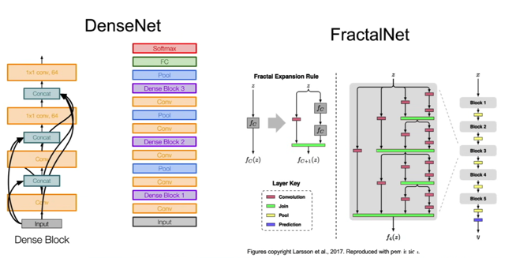</kbd>

> [!NOTE]
> đại khái là mấy cái kiến trúc nhìn kì khôi như DenseNet hay FractalNet,
> ta sẽ thấy hợp lý khi nhìn cách gradient flow backward. Đó là các kiến
> trúc này cung cấp thêm những con đường trực tiếp cho gradient, giúp
> nó flow về các layer low tốt hơn.

 

<kbd>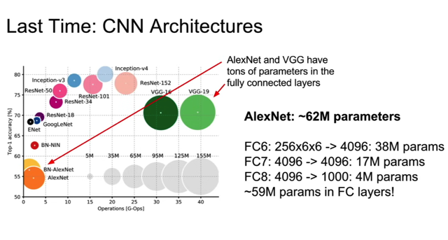</kbd>

> [!NOTE]
> Rồi, lướt lại cái biểu đồ so sánh các architecture này, ta có thể nhận
> xét rằng như AlexNet tốn rất nhiều memory là bởi vì nội trong các fc
> layer cuối ví dụ như fc6 nhận input là last pooling layer outpyt (cái này
> đã nói đến trong bài trước) có shape 256x6x6 để ra 4096 hidden
> activation thì layer này sẽ có 4096x(256x6x6) ~= 38 triệu params. Thế
> thì riêng mấy cái fc layer thì đã tốn phân nửa số params rồi.
>
>
>
> nên mấy cái model sau đã tìm cách giảm đi số params bằng cách thay
> thế fc layer này

 

<kbd>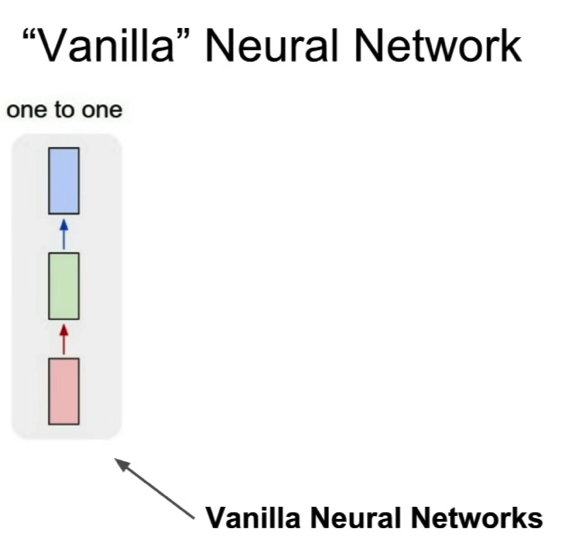</kbd>

> [!NOTE]
> Giờ ta sẽ chuyển qua Recurrent Neural Network, thế thì
> đầu tiên, có thể gọi bữa giờ ta làm việc với 'vanilla neural
> network', trong đó dữ liệu cứ đi qua từng layer để từ một 
> input vector trở thành hidden vector và ra "class scores"
> vector (cho bài toán classification)

 

<kbd>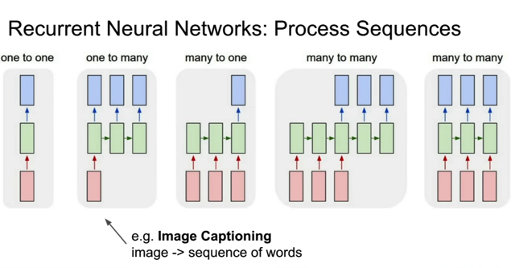</kbd>

> [!NOTE]
> đại khái là, ta cần xây dựng kiến trúc khác để giúp model các bài toán
> mà trong đó từ một input, qua model cho ra nhiều output, ví dụ như 
> bài toán image captioning: image là input đầu vào, nhưng đầu ra sẽ
> là một chuỗi các từ

 

<kbd>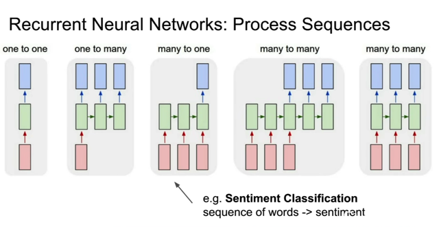</kbd>

> [!NOTE]
> Hay trong một bài toán khác mà nhiều input nhưng một output, như
> sentiment classification, ta cần dự đoán một câu, một đoạn văn bản là
> positive hay negative.

 

<kbd>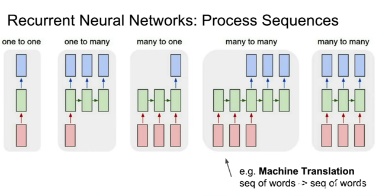</kbd>

> [!NOTE]
> Hay trong bài toán machine translation, ta cần
> model input có length khác output.

 

<kbd>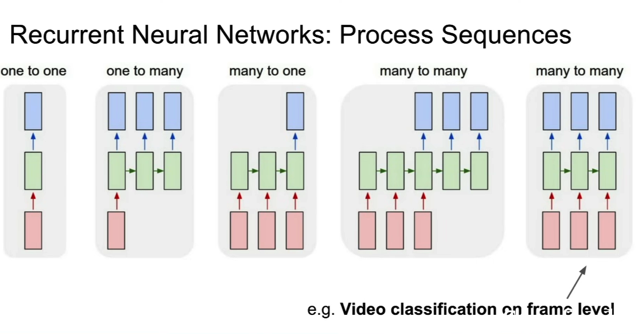</kbd>

> [!NOTE]
> hoặc many - to - many như video classification nơi ta cần
> classify từng khung hình

 

<kbd>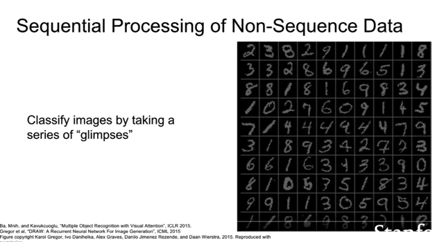</kbd>

<kbd>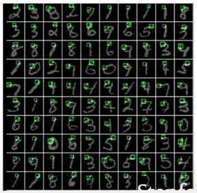</kbd>

<kbd>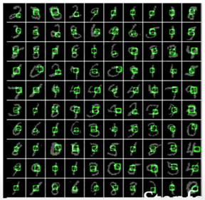</kbd>

> [!NOTE]
> Đại khái là ở đây nói rằng ngay cả khi với bài toán có fixed size
> input và fixed size output. Ví dụ như trong image classification,
> người ta có thể dùng RNN để kiểu như xử lý một chuỗi các
> glimpses (Trong slide là hình ảnh giống như ta quét một chuỗi các
> khung hình nhỏ,  bám theo nét vẽ vậy) trước khi đưa ra dự đoán

 

<kbd>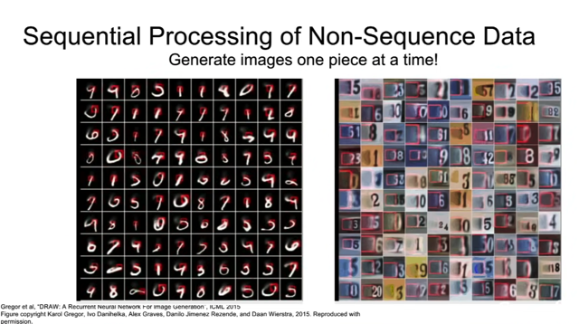</kbd>

<kbd>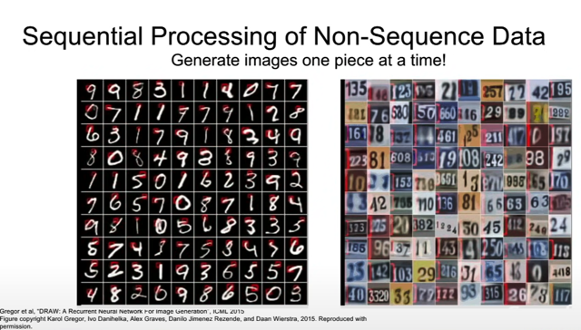</kbd>

> [!NOTE]
> đại khái là generative model trong đó nó sẽ "lần lượt" vẽ từng vùng của
> image, để thành một bức ảnh hoàn chỉnh. Rất cool, và đại ý là RNN có
> thể được dùng trong bài toán như vậy

 

<kbd>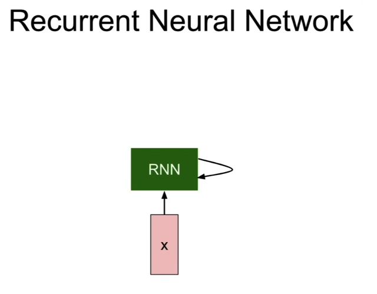</kbd>

> [!NOTE]
> về "cấu tạo" của RNN, thì một unit / block của nó sẽ kiểu như tính toán
> từ một input đưa vào để ra một hidden state vector. Và hidden state
> sẽ được quay lại đưa vào để tính toán cùng với input tiếp theo

 

<kbd>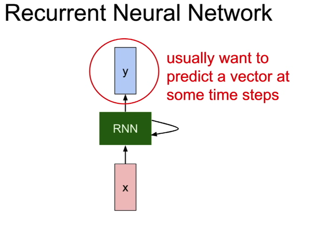</kbd>

> [!NOTE]
> và thường thì ta muốn predict một vector tại một số time-step
> như bài toán many to one, thì khi đó sự tính toán sẽ là nhận
> một input, update hidden state và tính toán ra một vector output

 

<kbd>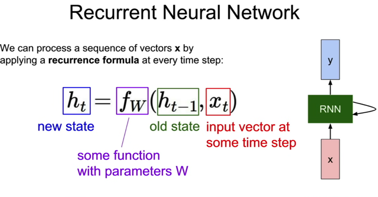</kbd>

> [!NOTE]
> cụ thể quá trình tính toán trong một time-step sẽ là: input tại
> time-step đó x<t>, sẽ cùng với hidden state tại time-step trước
> h<t-1> tham gia tính toán bởi hàm f (với model parameter W) để
> có được hidden state mới h<t>.
>
>
>
> Và nếu cần output vector y thì ta sẽ đưa hidden state h<t> này 
> qua một fc layer nữa để tính ra y^

 

<kbd>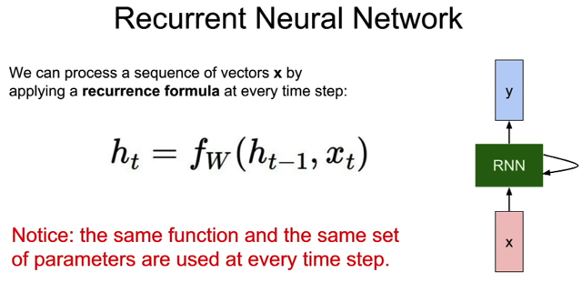</kbd>

> [!NOTE]
> một điểm chú ý là ta chỉ dùng cùng một function fW(),
> với cùng một bộ parameter W cho mọi time-step

 

<kbd>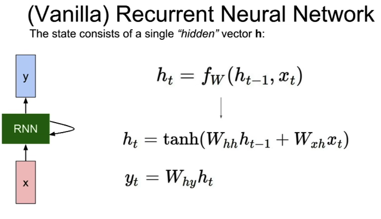</kbd>

> [!NOTE]
> và với "vanilla" RNN, fW() sẽ là  Whh@h<t-1> + Wxh@x<t> 
> (có thể cộng bias nữa)  rồi apply nonlinearity là tanh().
>
>
>
> Justin cho biết có bạn sẽ thắc mắc tại sao lại dùng tanh sau khi nói về
> rất nhiều nhược điểm của nó. Thì ta sẽ quay lại vấn đề này  khi nói
> qua LSTM
>
>
>
> Và h<t> sẽ được transform với Why để cho ra y<t> (nên hiểu là y^<t>)

 

<kbd>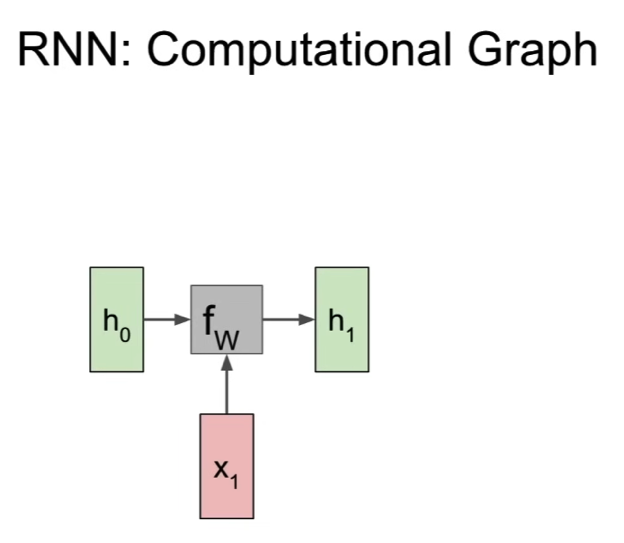</kbd>

<kbd>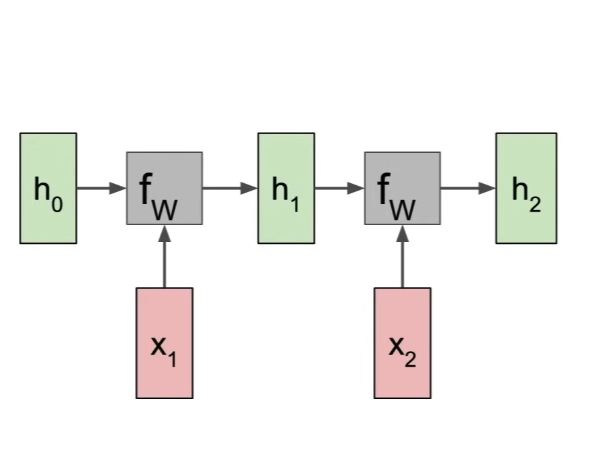</kbd>

> [!NOTE]
> Đại khái là người ta thường chọn cách thể hiện RNN theo kiểu
> trải các step ra như này, để từ h<0> tính toán với x<1> và W cho ra h<1>
>
> Rồi h<1> sẽ tham gia với x<2> và W để tính ra h<2>

 

<kbd>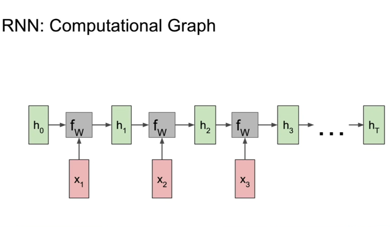</kbd>

> [!NOTE]
> Cứ như vậy tới h<T>

 

<kbd>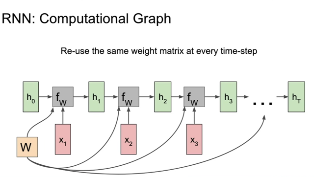</kbd>

> [!NOTE]
> thế thì có thể ghi thêm W vào trong computational graph, để thấy rằng W
> sẽ tham gia tính toán với mọi time-step (để ra các h<1>, h<2>...h<T>)
>
>
>
> Vậy khi gradient backward thì như ta đã biết, gradient về W (dL/dW) sẽ 
> được sum lại từ gradient của các nhánh trả về

 

<kbd>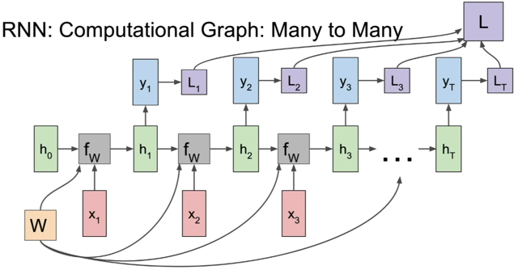</kbd>

> [!NOTE]
> Rồi, giả sử ta đang trong bài toán mà ta output (prediction) tại
> mọi time-step thì hình ảnh sẽ là như vầy. Tại mỗi time-step, 
> Prediction y^<t> sẽ cùng với ground-truth label y<t> để tính ra
> L<t> - loss tại time-step <t>. Để rồi tất các các loss này sum lại
> được total loss L (hay cost J)
>
>
>
> Vậy trong trường hợp này, khi backward ta sẽ tính gradient
> của L tổng đối với W thì nó sẽ là tổng của gradient của các
> L<t> đối với W.

 

<kbd>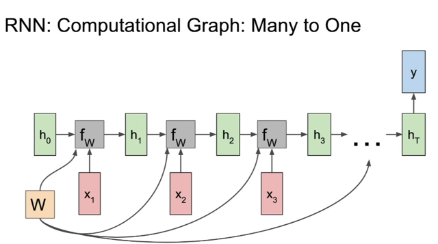</kbd>

> [!NOTE]
> với bài toán many to one, ví dụ như sentiment analysis thì
> Justin đề cập tới cái mà trong cs224n gs Cris Manning có nói
> đó là hidden state tại time-step cuối h<T> sẽ đóng vai trò là
> tổng hợp thông tin của cả câu.

 

<kbd>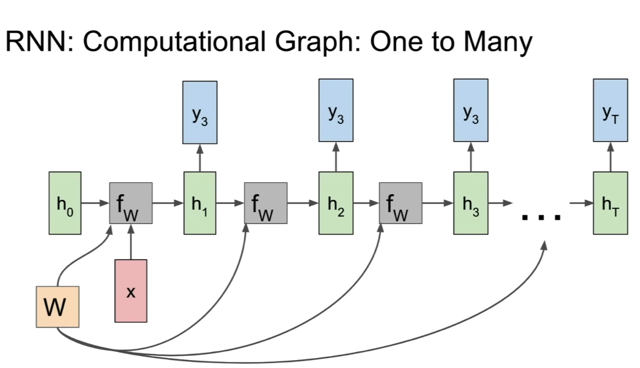</kbd>

> [!NOTE]
> Trong bài toán One to Many, input sẽ đóng vai trò như thông tin đầu
> vào giúp initialize value của hidden state, trước khi RNN sẽ  tiếp tục
> tính toán qua các time-step

 

<kbd>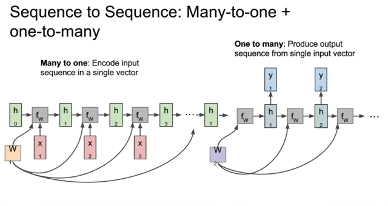</kbd>

> [!NOTE]
> kiến trúc này gọi là encoder-decoder, dùng cho vấn đề mà
> input và output khác length, encoder sẽ xử lý input để có
> được hidden state ở time-step cuối, mang thông tin của toàn
> bộ chuỗi input, cái này sẽ trở thành initial value của hidden
> state ở decoder

 

<kbd>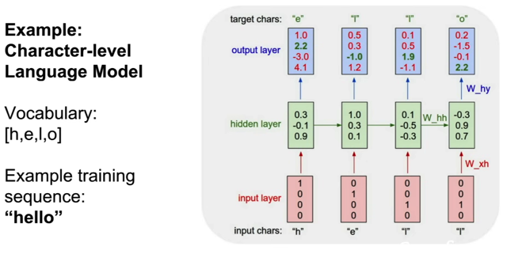</kbd>

> [!NOTE]
> ví dụ ứng dụng RNN để mô hình hóa ngôn ngữ (language model)
> trong đó ta sẽ dự đoán một từ hoặc kí tự dựa trên những từ/kí tự
> trước đó. Đầu tiên, trong ví dụ này, các kí tự sẽ được represent
> bởi one-hot encoding vector. 
>
>
>
> Bắt đầu từ kí tự đầu tiên, input vào model as x<1>, cùng với initial
> hidden h<0> để tính toán ra y^ - probability distribution, xác suất
> các từ trong vocab sẽ là từ tiếp theo. Dựa vào label / sự thật là từ
> nào là từ thật sự xuất hiện, tức x<2> là gì (y<1> là x<2>), ta mới
> tính loss tại time-step 1  - L<1>.
>
>
>
> Tiếp tục x<2> sẽ cùng với hidden state h<t> để tính ra prediction
> cho x<3> tức y<2>. Lại ghi nhận loss L<2>
>
>
>
> Cứ thế quá trình cứ lặp lại đến hết chuỗi (*) thì tính loss tổng và thực
> hiện backprop để update param.
>
>
>
> (*) Slide sau sẽ nói về vụ khi nào thì thực hiện backprop

 

<kbd>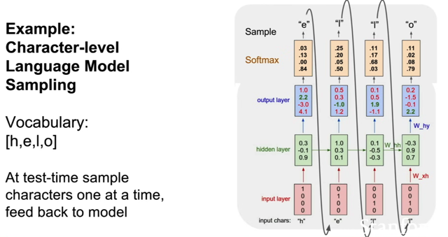</kbd>

> [!NOTE]
> Sau khi training, ta có thể sampling, bắt đầu với input x<1> là một từ nào đó,
> model với trained parameters cùng với hidden state được initialized sẽ 
> tính toán ra prediction cho kí tự tiếp theo x<2> (tức là y^<1>). Như đã nói
> nó là một phân phối xác suất qua tất cả các từ trong vocab. Ta sẽ dựa vào
> đây để chọn ra từ có xác suất cao nhất, hoặc ngẫu nhiên trong một số từ có
> xác suất cao nhất để đóng vai trò làm x<2>.
>
>
>
> Tiếp tục như vậy x<2> sẽ cùng với hidden state h<1> tính toán ở time-step
> trước tính ra prediction y^<2>, tiếp tục sampling để lấy từ x<3>
>
>
>
> Quá trình này tiếp tục ta sẽ có một chuỗi kí tự được 'generate' bởi trained
> RNN language model. Bắt đầu bằng kí tự ta cho trước, kết thúc khi kí tự được
> 'tạo/chọn' là chấm hết câu chẳng hạn.

 

<kbd>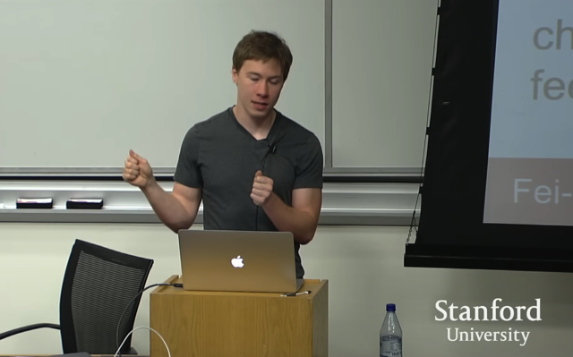</kbd>

> [!NOTE]
> câu hỏi là tại sao lại sample thay vì cứ lấy ra "cái" có probability cao nhất. 
> Câu trả lời là nó cho phép ta đa dạng hóa (diversify) được các generated
> sequence, nếu chỉ lấy cái có probability cao nhất thì mỗi lần generate với
> cùng một kí tự / từ nào đó thì sẽ luôn tạo ra cùng một chuỗi giống nhau.
> Cách này có ưu điểm là ổn định, nhưng không đa dạng. Cách kia đương
> nhiên là đa dạng nhưng sẽ những chuỗi tệ
>
>
>
> Nói chung người ta dùng cả hai cách

 

<kbd>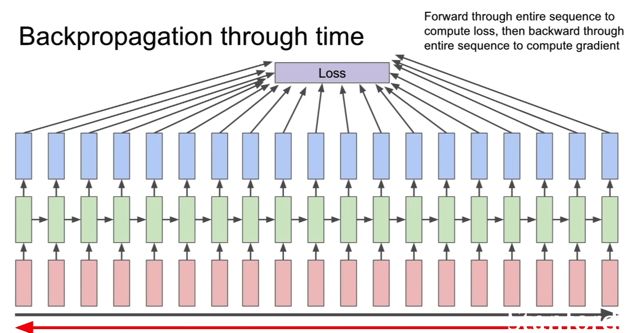</kbd>

> [!NOTE]
> Thế thì nói về việc backprop, như đã biết đó là khi ta đã "forward
> through time" hết input sequence. Với loss tại mỗi time-step ta sẽ bắt
> đầu backward through time.
>
>
>
> Tuy nhiên thực thế chuỗi sẽ rất dài ví dụ như toàn bộ content của
> wikipedia. Khi đó backward sẽ không khả thi

 

<kbd>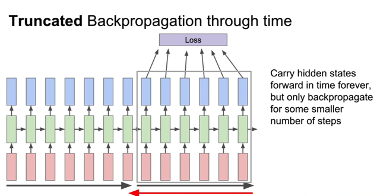</kbd>

<kbd>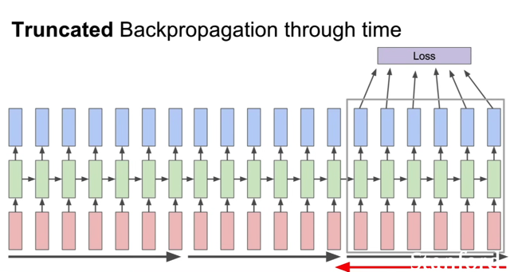</kbd>

<kbd>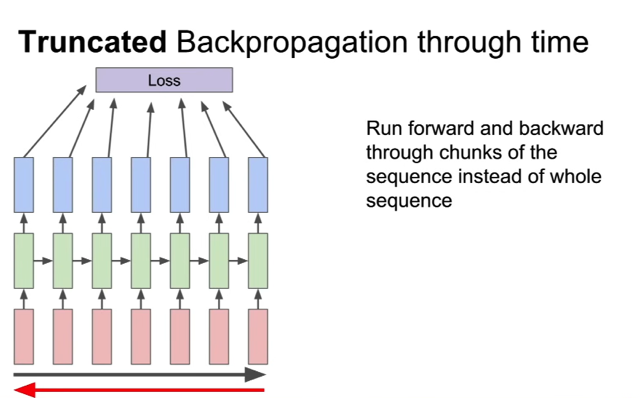</kbd>

> [!NOTE]
> Do đó, thực tế đại khái là ta cũng chia thành từng 'chunk', cắt chuỗi dài thành
> từng "đoạn" để rồi ví dụ khi forward through time ta sẽ chỉ "đi tới" step ví dụ
> 100 thôi, tại đó ta sẽ backward lại để update params.
>
>
>
> Sau đó tiếp tục với hidden state từ "chunk" trước, ta forward thêm 100 step
> nữa rồi backward trong second chunk để update params.
>
>
>
> Đại khái là ta có thể hiểu nó tương đồng với Stochastic Gradient Descent,
> nơi mà ta nhớ lại là vì việc tính gradient trên toàn bộ dataset sẽ không hiệu
> quả nên thay vì vậy ta tính loss trên từng batch và dùng (estimated)
> gradient trên batch đó để update parameters.

 

<kbd>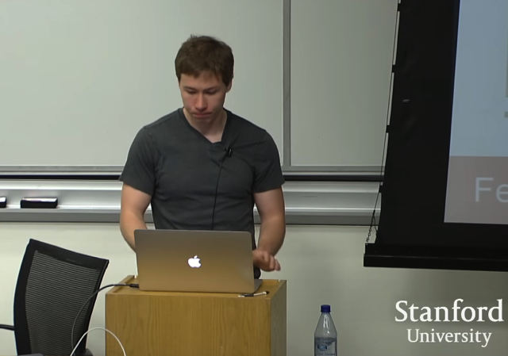</kbd>

> [!NOTE]
> có câu hỏi đó là, việc này có phải là / liên quan gì đến Markov assumption
> không.
>
>
>
> Markov assumption, nhớ lại đã học bên NLPSpec và cs224n bài về N-gram
> model,  đó là giả định rằng xác suất của một "từ" chỉ phụ thuộc N-1 từ trước
> đó.
>
>
>
> Vậy thì Justin trả lời là:
>
>
>
> Không, việc này (truncated backprop-throught-time) không phải là liên quan gì 
> đến Markov assumption, mà đây chỉ là cách ta approximate gradient vì tính 
> gradient trên toàn bộ chuỗi là không khả thi do computational expense.
>
>
>
> Tuy nhiên bản thân RNN thì nó đã dựa trên Markov assumption rồi khi nó
> thoạt động theo cách: tính toán, dự đoán từ tiếp theo dựa trên hidden state
> trước đó. Tuy nhiên, hidden state này luôn được cập nhật để bao hàm thông
> tin của mọi time-step từ đầu đến giờ.

 

<kbd>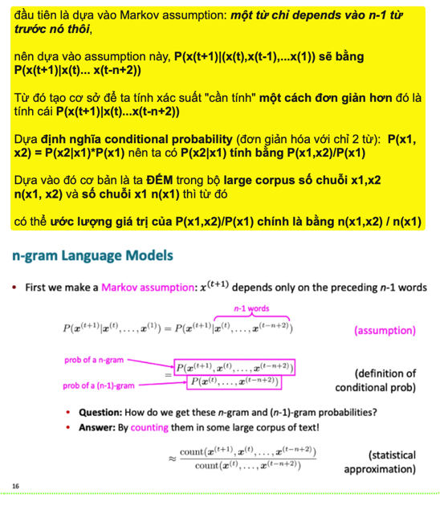</kbd>

 

<kbd>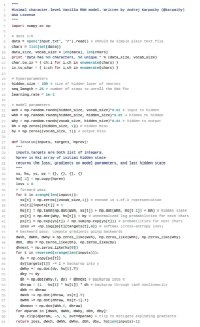</kbd>

> [!NOTE]
> # Minimal character-level vanilla RNN model. Written by Andrej Karpathy (@karpathy)
> # BSD License
>
>
>
> import numpy as np
>
>
>
> # data I/O
> data = open('input.txt', 'r').read() # should be simple plain text file
> chars = list(set(data))
> data_size, vocab_size = len(data), len(chars)
> print('data has %d characters, %d unique.' % (data_size, vocab_size))
> char_to_ix = { ch:i for i,ch in enumerate(chars) }
> ix_to_char = { i:ch for i,ch in enumerate(chars) }
>
>
>
> # hyperparameters
> hidden_size = 100 # size of hidden layer of neurons
> seq_length = 25 # number of steps to unroll the RNN for
> learning_rate = 1e-1
>
>
>
> # model parameters
> Wxh = np.random.randn(hidden_size, vocab_size)*0.01 # input to hidden
> Whh = np.random.randn(hidden_size, hidden_size)*0.01 # hidden to hidden
> Why = np.random.randn(vocab_size, hidden_size)*0.01 # hidden to output
> bh = np.zeros((hidden_size, 1)) # hidden bias
> by = np.zeros((vocab_size, 1)) # output bias
>
>
>
> def lossFun(inputs, targets, hprev):
>     """
>     inputs, targets are both list of integers.
>     hprev is Hx1 array of initial hidden state
>     returns the loss, gradients on model parameters, and last hidden state
>     """
>     XS, hs, ys, ps = {}, {}, {}, {}
>     hs[-1] = np.copy(hprev)
>     loss = 0
>     # forward pass
>     for t in range(len(inputs)):
>         XS[t] = np.zeros((vocab_size,1)) # encode in 1-of-k representation
>         XS[t][inputs[t]] = 1
>         hs[t] = np.tanh(np.dot(Wxh, XS[t]) + np.dot(Whh, hs[t-1]) + bh) # hidden state
>         ys[t] = np.dot(Why, hs[t]) + by # unnormalized log probabilities for next chars
>         ps[t] = np.exp(ys[t]) / np.sum(np.exp(ys[t])) # probabilities for next chars
>         loss += -np.log(ps[t][targets[t],0]) # softmax (cross-entropy loss)
>
>
>
>     # backward pass: compute gradients going backwards
>     dWxh, dWhh, dWhy = np.zeros_like(Wxh), np.zeros_like(Whh), np.zeros_like(Why)
>     dbh, dby = np.zeros_like(bh), np.zeros_like(by)
>     dhnext = np.zeros_like(hs[0])
>     for t in reversed(range(len(inputs))):
>         dy = np.copy(ps[t])
>         dy[targets[t]] -= 1 # backprop into y
>         dWhy += np.dot(dy, hs[t].T)
>         dby += dy
>         dh = np.dot(Why.T, dy) + dhnext # backprop into h
>         dhraw = (1 - hs[t] * hs[t]) * dh # backprop through tanh nonlinearity
>         dbh += dhraw
>         dWxh += np.dot(dhraw, XS[t].T)
>         dWhh += np.dot(dhraw, hs[t-1].T)
>         dhnext = np.dot(Whh.T, dhraw)
>     for dparam in [dWxh, dWhh, dWhy, dbh, dby]:
>         np.clip(dparam, -5, 5, out=dparam) # clip to mitigate exploding gradients
>     return loss, dWxh, dWhh, dWhy, dbh, dby, hs[len(inputs)-1]
>
> Đại ý là Justin recommend ta làm lại cái này của
> Karpathy để thấy dù có vẻ phức tạp nhưng thực
> chất BPTT không quá dài
>
> làm lại cái này
> trong COLAB

 

<kbd>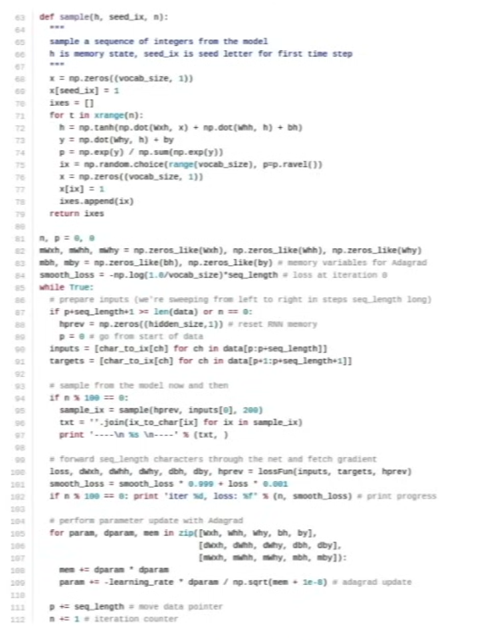</kbd>

> [!NOTE]
> def sample(h, seed_ix, n):
>     """
>     sample a sequence of integers from the model
>     h is memory state, seed_ix is seed letter for first time step
>     """
>     x = np.zeros((vocab_size, 1))
>     x[seed_ix] = 1
>     ixes = []
>     for t in xrange(n):
>         h = np.tanh(np.dot(Wxh, x) + np.dot(Whh, h) + bh)
>         y = np.dot(Why, h) + by
>         p = np.exp(y) / np.sum(np.exp(y))
>         ix = np.random.choice(range(vocab_size), p=p.ravel())
>         x = np.zeros((vocab_size, 1))
>         x[ix] = 1
>         ixes.append(ix)
>     return ixes
>
>
>
> n, p = 0, 0
> mWxh, mWhh, mWhy = np.zeros_like(Wxh), np.zeros_like(Whh), np.zeros_like(Why)
> mbh, mby = np.zeros_like(bh), np.zeros_like(by) # memory variables for Adagrad
> smooth_loss = -np.log(1.0/vocab_size)*seq_length # loss at iteration 0
>
>
>
> while True:
>     # prepare inputs (we're sweeping from left to right in steps seq_length long)
>     if p+seq_length+1 >= len(data) or n == 0: 
>         hprev = np.zeros((hidden_size,1)) # reset RNN memory
>         p = 0 # go from start of data
>
>
>
>     inputs = [char_to_ix[ch] for ch in data[p:p+seq_length]]
>     targets = [char_to_ix[ch] for ch in data[p+1:p+seq_length+1]]
>
>
>
>     # sample from the model now and then
>     if n % 100 == 0:
>         sample_ix = sample(hprev, inputs[0], 200)
>         txt = ''.join(ix_to_char[ix] for ix in sample_ix)
>         print('----\n %s \n----' % (txt, ))
>
>
>
>     # forward seq_length characters through the net and fetch gradient
>     loss, dWxh, dWhh, dWhy, dbh, dby, hprev = lossFun(inputs, targets, hprev)
>     smooth_loss = smooth_loss * 0.999 + loss * 0.001
>     if n % 100 == 0: print('iter %d, loss: %f' % (n, smooth_loss)) # print progress
>
>
>
>     # perform parameter update with Adagrad
>     for param, dparam, mem in zip([Wxh, Whh, Why, bh, by],
>                                   [dWxh, dWhh, dWhy, dbh, dby],
>                                   [mWxh, mWhh, mWhy, mbh, mby]):
>         mem += dparam * dparam
>         param += -learning_rate * dparam / np.sqrt(mem + 1e-8) # adagrad update
>
>
>
>     p += seq_length # move data pointer
>     n += 1 # iteration counter

 

<kbd>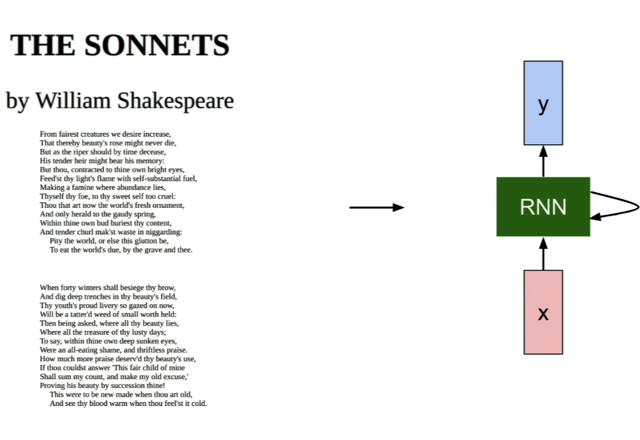</kbd>

> [!NOTE]
> Ta có thể train nó với
> một văn bản nào đó

 

<kbd>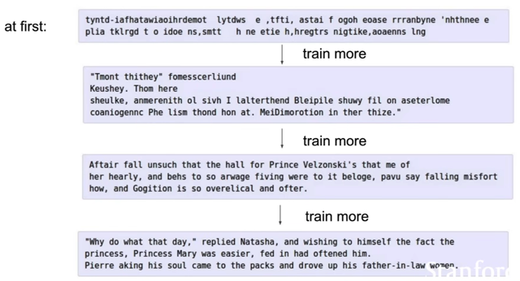</kbd>

<kbd>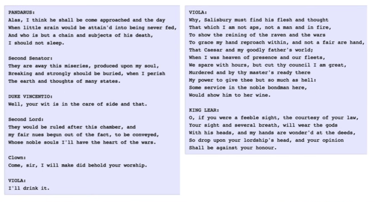</kbd>

> [!NOTE]
> để rồi dần dần nó có thể generate ra những nội dung có cấu trúc giống
> giống của train text. Mình đã xem qua quá trình Andrej làm cái project
> Shakepeare

 

<kbd>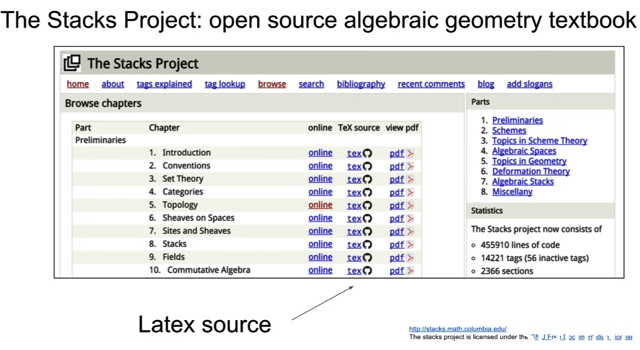</kbd>

> [!NOTE]
> Justin đề cập tới một ví dụ khác khi người ta train RNN với kiểu
> như math textbook, mà kết quả nó học được cách generate ra
> văn bản giống như là một cuốn sách toán, đương nhiên là nội
> dung của nó ko make sense
>
>
>
> Trong quá trình training, nhiệm vụ của nó là dự đoán từ/kí tự tiếp
> theo, nhưng bằng cách nào đó nó học được những cấu trúc tiềm
> ẩn (latent structure) trong văn bản

 

<kbd>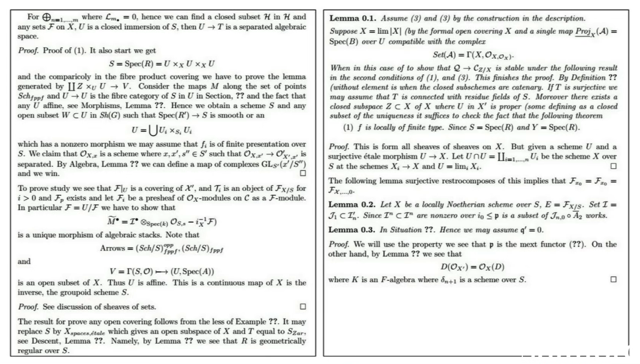</kbd>

<kbd>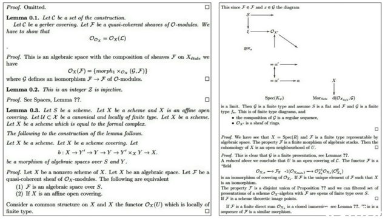</kbd>

 

<kbd>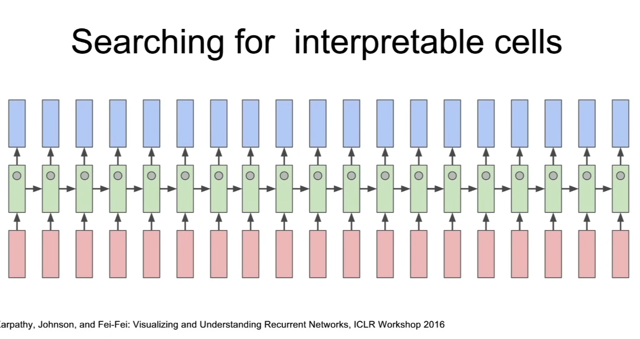</kbd>

> [!NOTE]
> đại khái là trong một nghiên cứu với Karpathy, hai ổng muốn tìm hiểu thử
> xem là RNN nó học gì trong quá trình training, nên thử lấy một element của
> hidden state vector và kiểu như theo dõi giá trị của nó, mục đích là xem thử
> nó có Giúp phát lộ một 'semantic meaning' nào đó không

 

<kbd>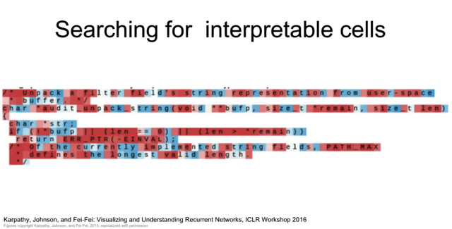</kbd>

> [!NOTE]
> vậy thì đại khái kết quả cho thấy phần lớn các
> hidden unit có một cái kiểu khó giải thích
> (interpretable) được, kiểu như nó làm gì đó trong
> nỗ lực dự đoán ra kí tự tiếp theo

 

<kbd>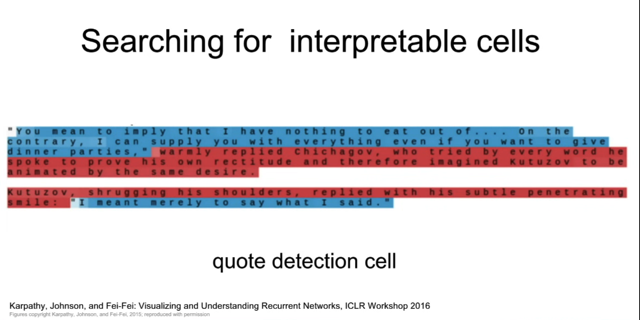</kbd>

> [!NOTE]
> Nhưng vẫn có những unit (có param là một vector, một bộ param w)
> có biểu hiện cho thấy là nó chịu trách nhiệm tìm kiếm "dấu ngoặc
> kép đánh dấu một trích dẫn". Có thể hiểu đại khái là quan sát thấy
> nó active khi bắt đầu một "quote" và kết thức sau khi phát hiện 
> dấu ngoặc kép kết thúc quote. Và chỉ active lại khi phát hiện một
> "quote character" tiếp theo.

 

<kbd>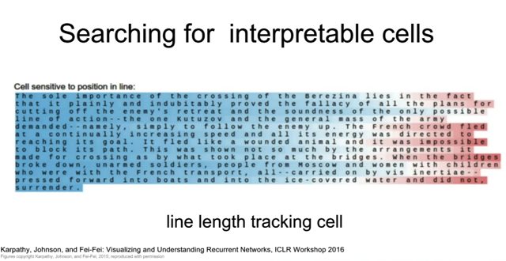</kbd>

> [!NOTE]
> một phát hiện nữa là có những unit "chịu trách nhiệm theo dõi chiều dài
> của line", để rồi nó sẽ nắm bắt quy luật liên quan đến chiều dài câu trong
> văn bản. Nhờ vậy khi generate nó cho ra văn bản có độ dài câu giống
> giống với văn bản huấn luyện

 

<kbd>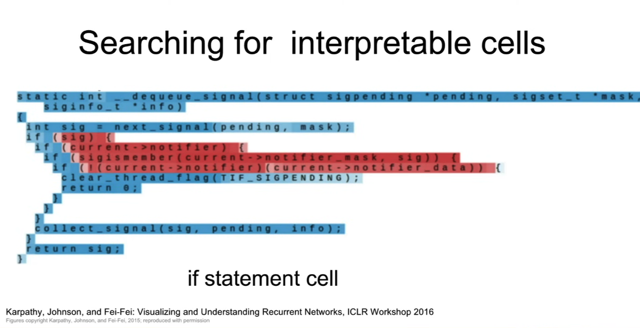</kbd>

> [!NOTE]
> tương tự, có những cell sẽ nắm bắt quy luật tạm gọi là "
> đang ở trong hay ở ngoài if statement" giúp khi generate
> code, nó tạo ra văn bản (code) tuân theo được luật lệ

 

<kbd>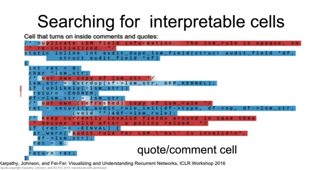</kbd>

> [!NOTE]
> học được đâu
> là comment

 

<kbd>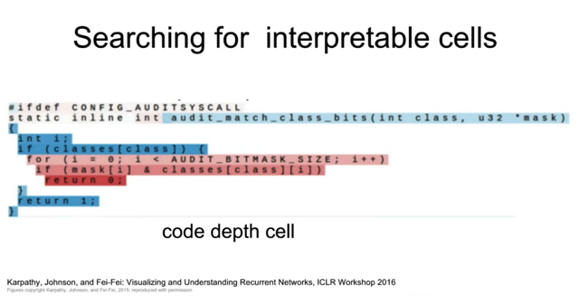</kbd>

> [!NOTE]
> Thế thì kết luận là dù ta chỉ giao cho nó nhiệm vụ dự đoán
> từ tiếp theo, nhưng quá trình huấn luyện nó sẽ học được rất
> nhiều pattern/cấu trúc của language trong training sét

 

<kbd>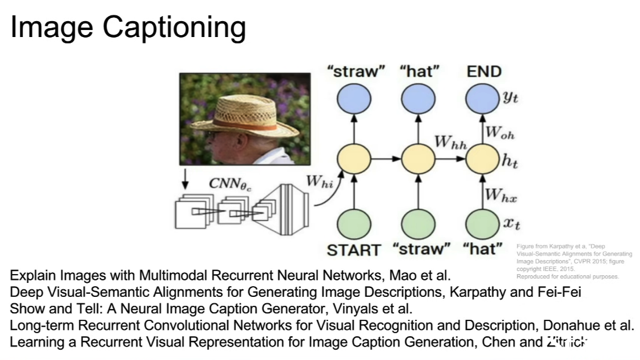</kbd>

> [!NOTE]
> nói qua bài toán Image Captioning, khi output có độ dài tùy ý,
> từ input fix (một image), thì đây là một điển hình có thể dùng
> RNN

 

<kbd>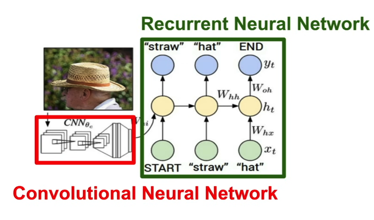</kbd>

> [!NOTE]
> nói sơ cách hoạt động thì image sẽ được "xử lý" qua một
> CNN, để output ra một single vector mang thông tin của
> image. Nó sẽ được feed in vào RNN,  Để rồi, RNN sẽ học
> cách generate ra chuỗi kí tự, từ mô tả bức hình.

 

<kbd>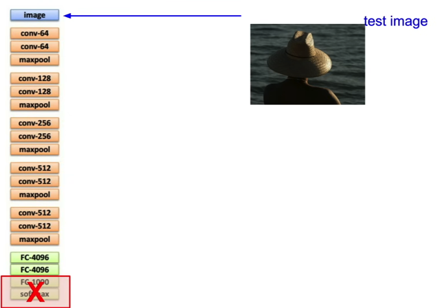</kbd>

<kbd>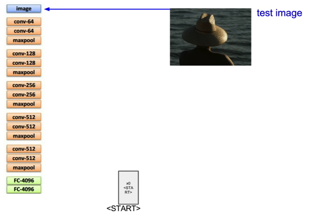</kbd>

> [!NOTE]
> vậy đó, image sẽ qua một CNN, đương nhiên là ta bỏ đi cái output
> softmax, mà chỉ lấy output từ last fc layer. Nhớ lại khái niệm Transfer
> learning, thì đây chính là ta nhờ CNN, extract high level feature từ raw
> input image.
>
>
>
> Với RNN, ta sẽ bắt đầu (x<0>) là một special token - token <START>

 

<kbd>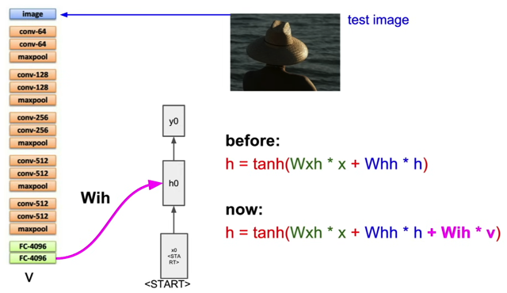</kbd>

> [!NOTE]
> thế thì image vector (tạm gọi là vậy) sẽ được dùng trong RNN theo nhiều
> cách, mà một cách đó là tính toán với một matrix riêng cho nó Wih. Với
> input x<1> và initial hidden state, nó sẽ tính toán ra y^<1> (ở đây dùng
> x0, y0)

 

<kbd>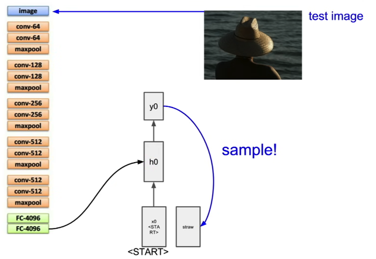</kbd>

<kbd>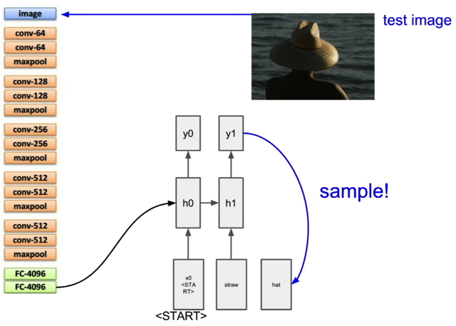</kbd>

> [!NOTE]
> với prediction y^<1>, ta sẽ sampling để đưa nó vào
> thành x<2> của RNN và tiếp tục như vậy cho đến khi
> generate được <END> token

 

<kbd>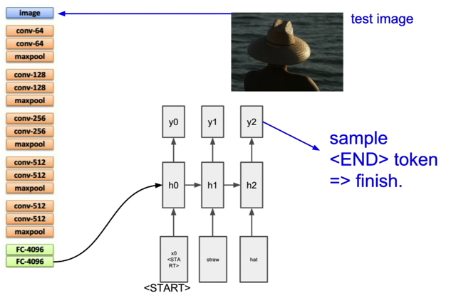</kbd>

> [!NOTE]
> đại khái là như vậy quá trình này hoàn toàn là supervised learning. Với bộ dữ liệu
> là các image có description.
>
>
>
> Quá trình backprop ngoài việc đương nhiên là train param của CNN, ta có thể thay
> đổi luôn (tuning thêm)  các parameter của các layer cuối của CNN.

 

<kbd>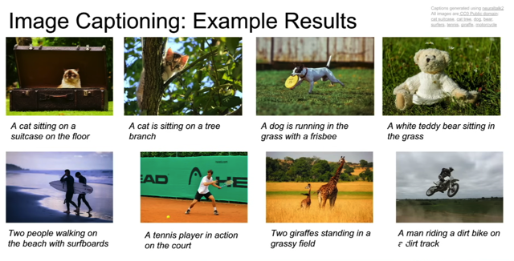</kbd>

> [!NOTE]
> một số kết quả tốt cho thấy model có thể rất powerful

 

<kbd></kbd>

> [!NOTE]
> Tuy nhiên nó cũng ko
> đảm bảo luôn tốt

 

<kbd>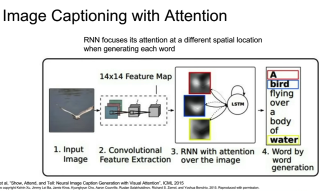</kbd>

> [!NOTE]
> Justin nói sơ về một kiến trúc áp dụng Attention
> mechanism: Image Captioning with Attention

 

<kbd>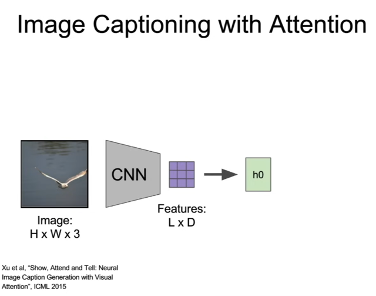</kbd>

> [!NOTE]
> đại khái là image sẽ qua CNN để thay vì "ra" một (embedding) D-d vector,
> thì nó sẽ "ra" nhiều (L) embedding vector, có thể coi mỗi vector là thông tin
> của một vùng / spatial area của image.

 

<kbd>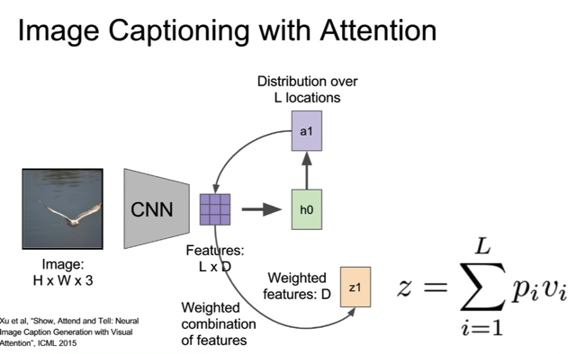</kbd>

> [!NOTE]
> rồi, đại khái là tại mỗi step ví dụ bắt đầu với h<0>, thì đầu tiên nó sẽ tính ra
> một distribution qua L location (đại khái là một vector các weight / probability
> score cho biết nên chú ý vào vùng nào trong L vùng, mà mỗi vùng ứng với
> một vector v1,..vL trong output của CNN như đã nói là bây giờ ra L vector
> chứ không phải một)
>
>
>
> Các làm Justin không nói đến như ta có thể hiểu liên hệ với Attention  bên
> NLP, đó là tính các chỉ số similarity score giữa output ở time-step hiện tại (ở
> đây ghi vector a) và các D-dimensional vector. Sau đó normalize (với
> softmax)  để trở thành phân phối xác suất p = [p1, p2...pL]
>
>
>
> Với các weight này, ta mới tính một weighted combination of features là tổng
> các vector d-D v1,..vL trọng số bởi attention weight tương ứng.
>
>
>
> Và nó sẽ là z<1>, nó sẽ cùng với y<1> (từ/token đầu tiên trong chuỗi) kết hợp 
> để trở thành input của time-step đầu tiên.

 

<kbd>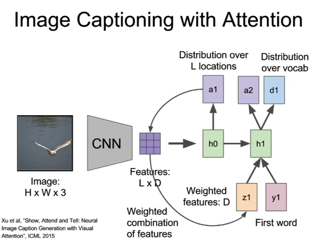</kbd>

<kbd>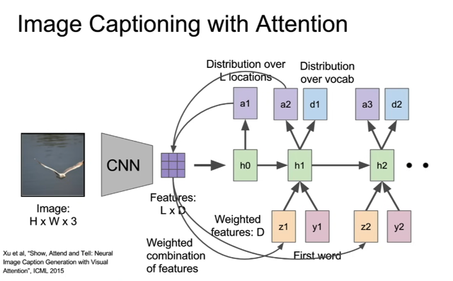</kbd>

> [!NOTE]
> z<1> mới cùng với y<1>, tính ra hidden state h<1>, và ra cũng như là
> d<1> là distribution over vocab y^<1>, tại đây mới so với y2 để tính
> loss L1 như đã biết
>
>
>
> Chỉ khác là ở đây ta sẽ còn tính ra thêm một distribution over số
> location, để tương tự bước 1, ta sẽ tính ra attention scores dùng để
> tính weighted features, tham gia với y2 để làm input ở step 2.
>
>
>
> Chú ý, đây là quá trình training, ko phải sampling, nên input vào
> đương nhiên là các từ (thật) trong chuỗi. Khi sampling mới lấy input
> là dự đoán của time-step trước.

 

<kbd>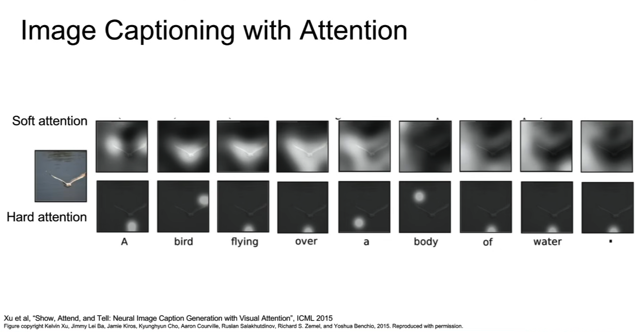</kbd>

> [!NOTE]
> Hình ảnh cho thấy với mỗi time-step, model attend tới những vùng khác
> nhau của image.
>
>
>
> Soft-attention là như vừa rồi, tính một weighted combination của các feature
> vector.
>
>
>
> Còn Hard attention thì chỉ dùng một vector có attention score lớn nhất thôi.
> Justin cho biết cái này là một operation có tính chất Non-differentiable nên
> cần có cách xử lý phù hợp thì mới backprop Được. Ta sẽ gặp lại trong bài
> Reinforcement Learning

 

<kbd>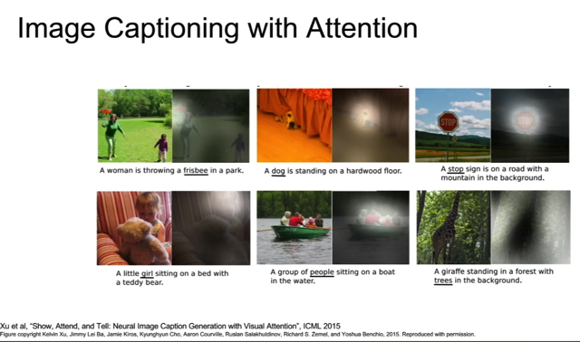</kbd>

> [!NOTE]
> Hình ảnh cho thấy model attend những vùng
> khác nhau khi generating text

 

<kbd>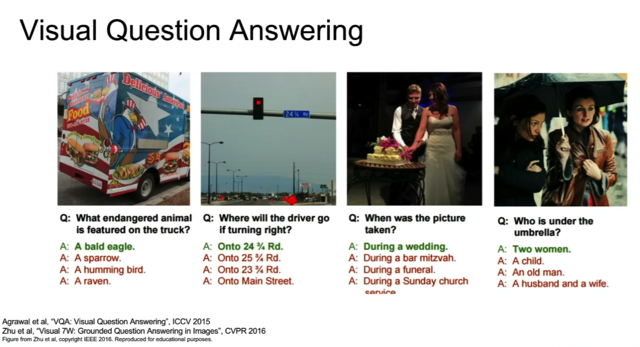</kbd>

> [!NOTE]
> Trong là Visual Question Answering, với một image và text sequence,
> yêu cầu dự đoán 1 trong 4 đáp án.
>
>
>
> Đại khái là RNN sẽ xử lý text sequence để có được một embedding
> (là cái hidden state cuối) "nén" thông tin của chuỗi. Còn image thì "qua"
> CNN để có embedding vector "nén" thông tin của image.
>
>
>
> Ta mới kết hợp hai vector này để tính toán một phân phối xác suất over
> 4 option a, b, c, d. Cách kết hợp thì Justin có giải thích là điều đầu tiên 
> có thể thử đơn giản chỉ là concatenate hai vector lại, ngoài ra có thể có
> những cách fancier hơn nhưng thường concatenate là đủ

 

<kbd>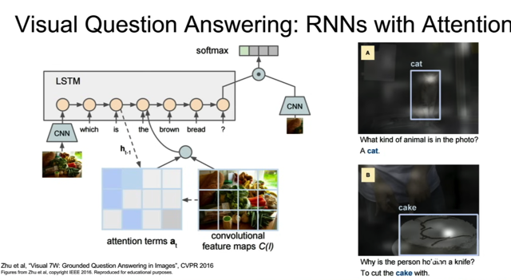</kbd>

> [!NOTE]
> Trong cái này, cũng như slide trước RNN xử lý text, CNN xử lý image
> để ra hai vector combine lại để tính một distribution over các option
>
>
>
> Chỉ là trong lúc RNN nó xử lý input text sequence, thì nó có attend tới
> các vùng khác nhau của image như mới nói ở trên

 

<kbd>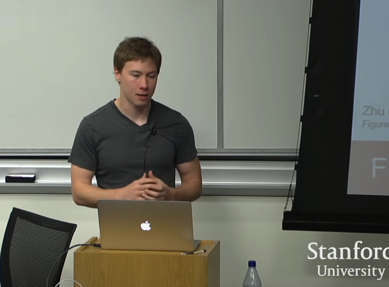</kbd>

> [!NOTE]
> Những cái này rõ ràng là rất powerful cho phép ta gắn kết các kiến trúc
> CNN, RNN để giải quyết các bài toán kết hợp cả computer vision và
> NLP

 

<kbd>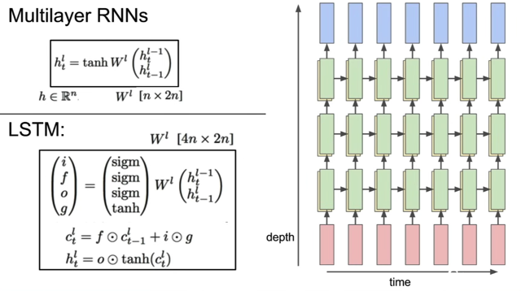</kbd>

> [!NOTE]
> đại khái là thường thường người ta làm multilayer RNNs, trong đó qua RNN
> đầu tiên, xử lý input sequence, để có hidden state tại mỗi time-step. Chuỗi
> hidden state này sẽ đóng vai trò input vào RNN thứ 2, tiếp tục vậy.
>
>
>
> Như DLSpec hay cs224n đã có nói, thường người ta không dùng quá deep
> RNN mà chỉ 2,3 là cùng.
>
>
>
> Trong công thức có thể hiểu là hl<t> = tanh Wl(hl-1<t> hl<t-1> tức là tại time
> step t của RNN layer thứ l, ta sẽ tính toán với input là hl-1<t> tức hidden
> state tại time-step <t> của cái RNN layer trước đó, và hl<t-1> tức là hidden
> state của time-step trước của layer l. Không có gì khó hiểu hết.
>
>
>
> Ở dưới cũng tương tự vậy nhưng là với LSTM

 

<kbd>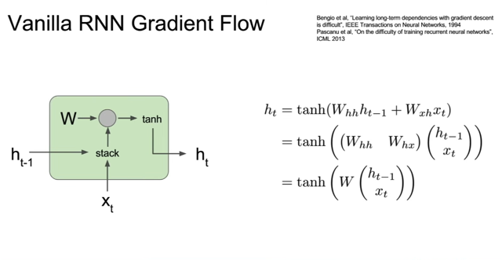</kbd>

 

<kbd>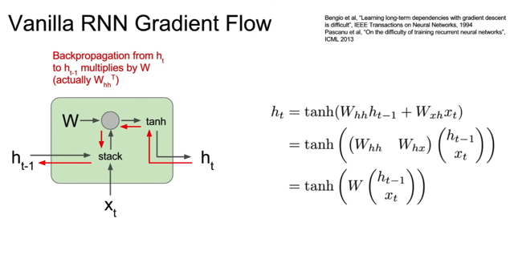</kbd>

> [!NOTE]
> đại khái là ổng muốn nhấn mạnh vào cái vụ khi backprop ta sẽ nhân
> đi nhân lại cái weight matrix W. Từ đó như bên cs224n đã thấy, nó gây
> hiện tượng vanishing gradient / exploding gradient.
>
>
>
> Cụ thể dễ hiểu khi backprop tại một time-step, ta có dL/dh<t>. Theo đường
> màu đó ta cần qua node tanh, node matrix multiplication W, để có dL/dh<t-1>
> (cái node stack với x thì không có tính toán gì, chỉ đơn giản là ghép hai vector
> lại thôi, thì backprop ta cũng chỉ là tách vector gradient ra)
>
>
>
> Thế thì như đã biết, ngoài việc đi qua tanh tiềm ẩn nguy cơ vanishing khi function
> hoạt động ở vùng giá trị lớn thì khi qua một matmul, local gradient sẽ là W.
>
>
>
> Tức là upstream gradient sẽ nhân với W để có downstream gradient.

 

<kbd>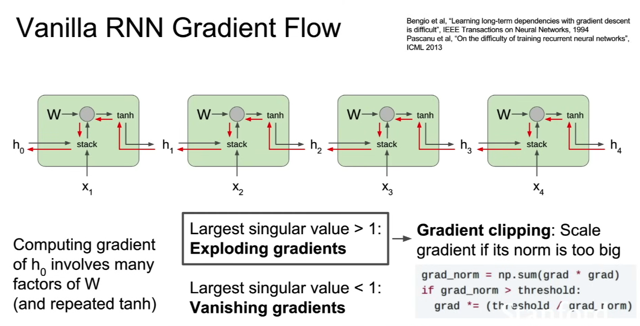</kbd>

<kbd>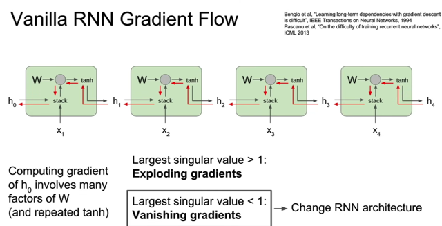</kbd>

> [!NOTE]
> và qua nhiều time-step để tính dL/dh<0> thì nó sẽ bao gồm việc nhân đi nhân
> lại upstream gradient với W. Justin mới nói hay nghĩ theo một scaler thôi thì nếu
> nhân đi nhân lại với một số thì một là nó sẽ explode khi số lớn hơn 1 hoặc nó
> sẽ nhỏ dần dần và vanish nếu số bé hơn 1. Và. cách duy nhất để nó ko xảy ra
> vấn đề là scalar = 1 vốn là rất hiếm khi xảy ra (ý nói đến W)
>
>
>
> Thì với W cũng vậy, nếu largest singular value của nó lớn hơn 1 thì sẽ dẫn đến
> gradient cứ lớn dần lớn dần và explode -> Exploding gradient. vấn đề này
> người ta khắc phục bằng Gradient clipping - cắt bớt hoặc thu nhỏ gradient khi
> nó  vượt quá giá trị nào đó.
>
>
>
> Còn nếu largest singular value nhỏ hơn 1 thì gradient sẽ nhỏ dần nhỏ dần  và
> =0 -> vanishing gradient. Với vấn đề này thì người ta chỉ có thể tìm cách cải
> thiện kiến trúc của RNN với LSTM, GRU

 

<kbd>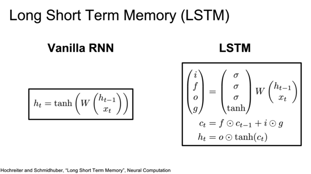</kbd>

> [!NOTE]
> LSTM đã học từ DLSpec và cs224n nên ko cần note thêm nhiều ở
> đây, chỉ note cái Justin nói mà ta chưa biết. Thì Justin nói rằng với
> LSTM, có thêm một cái cell state c<t> không exposed ra ngoài tức 
> là LSTM chỉ output ra hidden state, còn cell state giống như một
> internal extra state. Vai trò của nó như long/short term memory thì
> ta đã nói chán ở cs224n rồi

 

<kbd>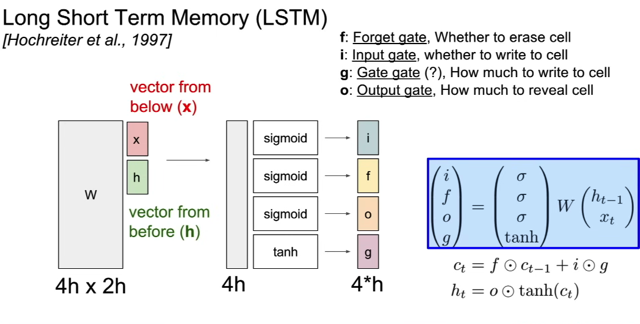</kbd>

> [!NOTE]
> Justin cho biết hãy hình dung các gate sẽ mang các giá trị extreme của các
> function sigmoid, tanh. Có nghĩa là i,f,o sẽ là các h-D vector chứa các giá trị
> ~= 0 hoặc ~= 1. Và g sẽ là h-D vector chứa các gía trị ~= -1 hoặc ~= 1.
>
>
>
> bàn về f element-wise multiply c<t-1>, kiểu như model sẽ quyết định giữ hay
> forget một giá trị nào của vector c<t-1> bằng cách cho phần tử tương ứng
> của vector f = 1 hay 0.
>
>
>
> bàn về i element-wise multiply với g, thì model sẽ quyết định có ghi / đưa vào
> / dùng một giá trị candidate của g(vốn chỉ mang giá trị ~=-1/!~1) bằng cách
> cho phần tử tại đó của i (input gate) = 0 hay 1.
>
>
>
> Vậy thì c<t>, Justin nói là hãy hình dung gía trị của nó trong quá trình tính
> toán sẽ có các phần tử được reset hoặc giữ nguyên (do f*c<t-1) , sau đó
> chúng được +1 hoặc -1 (do i*g)
>
>
>
> Cuối cùng, ở bước tính h<t>, o sẽ là model quyết định gía trị nào của  ct (như
> mới nói sẽ liên tục có các giá trị bị reset và tăng dần hoặc giảm dần  bởi 1)
> sau khi được squash bởi tanh để mang giá trị [-1,1] được đưa vào h<t>
>
>
>
> ===
>
>
>
> Còn các hình minh họa lúc đầu ý là vector x sẽ concat với h để có vector
> 2h-D tạm gọi là xh. Nó sẽ nhân với matrix W có shape 4hx2h có thể coi như
> là 4 cái matrix ghép lại, mỗi cái cho một trong bốn mục đích tính i,f,o,g (tách
> ra làm 4 matrix để tính riêng hay concatenate các matrix này để tính thì cũng
> như nhau) để ra một 4h-D vector, coi như concatenate của 4 vector (chưa
> apply nonlinearity).
>
>
>
> Sau đó apply các nonlinearity khác nhau để ra các gate vector.
>
>
>
> Nói chung chỉ là cách thể hiện gộp / gọn chứ ko có gì khác

 

<kbd>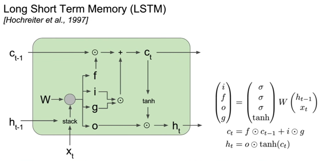</kbd>

 

<kbd>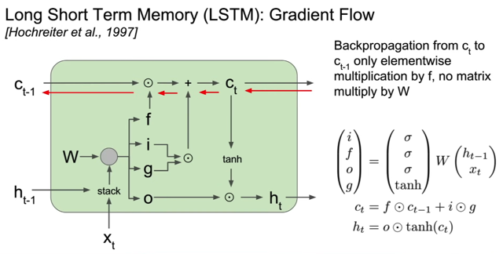</kbd>

> [!NOTE]
> Nói về backprop, từ dL/dc<t> để ra dL/dc<t-1>, có thể thấy nó chỉ qua một add
> node, nơi gradient giữ nguyên về mỗi nhánh, và "element-wise" multiply node.
>
>
>
> Do đó (upstream) gradient chỉ "bị" nhân element-wise với một forget gate
> vector có các phần tử mang giá trị [0,1] (do sigmoid).
>
>
>
> Thành ra, đó là ưu điểm thứ nhất mà Justin đề cập, là nhân element wise thì
> kiểu như đỡ vấn đề hơn là element-wise ("a little bit nicer than full matrix
> multiplication"
>
>
>
> Thứ hai, vì forget gate vector ở mỗi step nó mỗi khác, nên không bị hiện tượng
> gradient lớn dần lớn dần hay nhỏ dần nhỏ dần khi nhân cùng một matrix W
> như hồi nãy.
>
>
>
> Và thứ ba là, forget gate mang giá trị trong khoảng [0-1] mà thật sự thì như nãy
> nói nó chỉ một là ~=0 hay là ~=1, nên nó cũng giúp giá trị của gradient (khi
> nhân với nó) được khống chế ở mức ổn định. Có thể hiểu nếu nhân với 1 thì 
> ý là không bị  to lên hay nhỏ đi để rồi explode/vanish. Còn nhân với 0 thì chỉ đơn
> giản là do lúc forward phần tử đó của c<t-1> không tham gia, nên gradient = 0.

 

<kbd>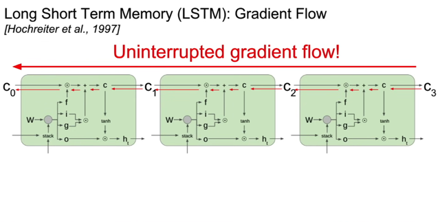</kbd>

<kbd>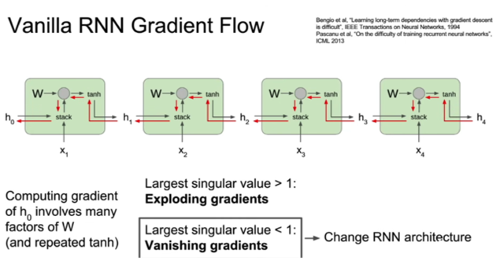</kbd>

> [!NOTE]
> Một chi tiết nữa, khi so với vanilla RNN ở dưới, ta thấy gradient khi đi từ h<T>
> đến h<0> sẽ còn phải đi qua **một loạt lặp đi lặp lại các tanh.** 
>
>
>
> Còn với LSTM từ gradient h<t> đi về c<0> sẽ chỉ đi qua 1 tanh duy nhất.
>
>
>
> Từ đó ta có thể hình dung giống như một superhighway giúp gradient đi xuyên
> suốt (ít qua các node / như các trạm thu phí gây mất đi / làm ảnh hưởng đến
> Gradient)
>
>
>
> Thế thì với dL/dW, ta vẫn sẽ có việc cộng gradient cho W qua từng time-step
> nhưng ý là với gradient của cell state được giữ tốt, sẽ giúp gradient của W
> cũng được giữ tốt (giữ tốt ý là qua nhiều / long time-step, gradient không bị
> vanish/explode)
>
>
>
> Có câu hỏi là các nonlinearity vẫn có thể gây vanishing gradient phải không.
> -> Đúng, nhưng nó đỡ hơn nhiều so với RNN

 

<kbd>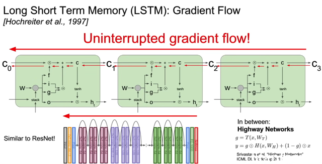</kbd>

> [!NOTE]
> Khi so sánh với ResNet ta thấy nó rất tương đồng ở việc nó tạo ra một
> đường cao tốc cho phép gradient flow xuyên suốt.
>
>
>
> Nói sơ qua về một cái gọi là Highway Network có nhắc đến trong cs224n.
> Nói chung là có nhiều sự tham khảo lẫn nhau Trong việc khắc phục những
> vấn đề khi train một deep CNN model và RNN model

 

<kbd>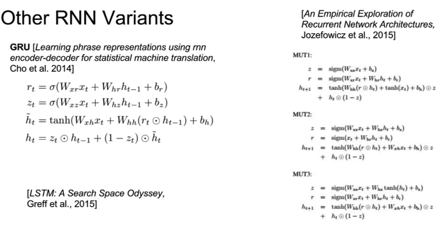</kbd>

> [!NOTE]
> đại khái là có nhiều biến thể của LSTM, như GRU nhưng Justin cho biết
> có cái tốt ở vấn đề này có cái mạnh ở vấn đề khác chứ không có cái nào
> vượt trội. Thành ra cứ dùng LSTM cho vấn đề của bạn

 

<kbd>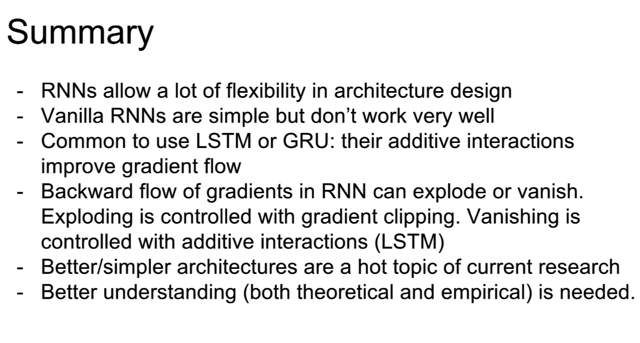</kbd>

 

