# Lecture 2/16 - Image Classification

📊 **Progress:** `41` Notes | `58` Screenshots

---

## Lecture 2/16 - Image Classification

 

<kbd></kbd>

> [!NOTE]
> http://cs231n.github.io/python-numpy-tutorial/

 

<kbd></kbd>

> [!NOTE]
> http://cs231n.github.io/gce-tutorial/

 

<kbd>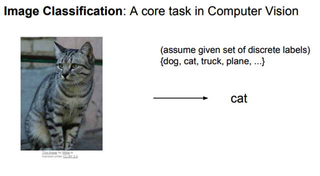</kbd>

 

<kbd>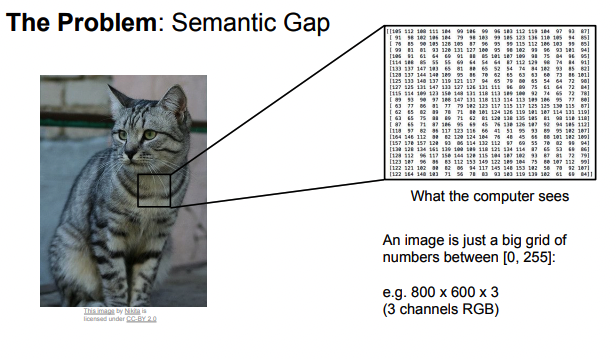</kbd>

> [!NOTE]
> Đại khái là với máy tính thì nó chỉ thấy một
> tensor các con số. Làm sao để có thể học dc
> những pattern của con mèo

 

<kbd>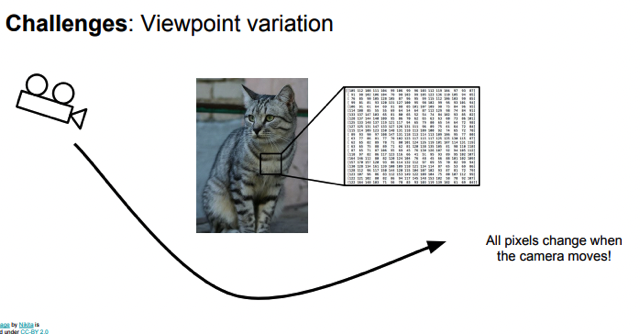</kbd>

> [!NOTE]
> Đại khái là khi shift cái camera qua chút xíu,
> con mèo vẫn y nguyên nhưng các valie của
> các pixel sẽ hoàn toàn khác. Và model phải
> Vẫn detect được là mèo

 

<kbd>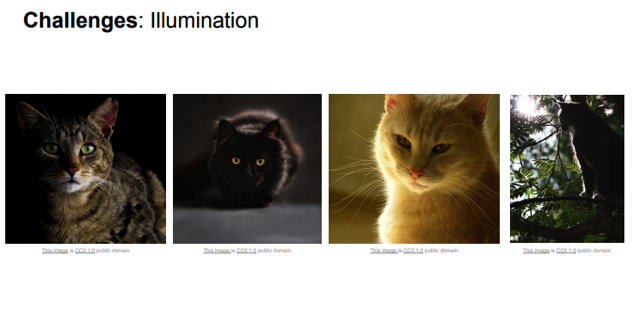</kbd>

 

<kbd>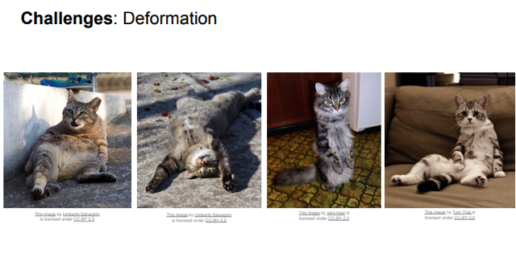</kbd>

 

<kbd>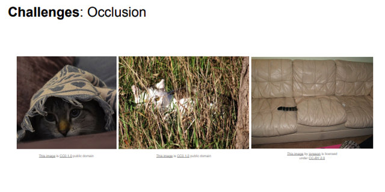</kbd>

 

<kbd>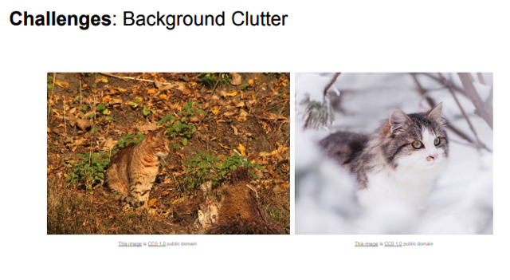</kbd>

 

<kbd>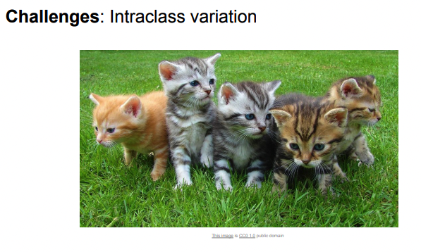</kbd>

 

<kbd>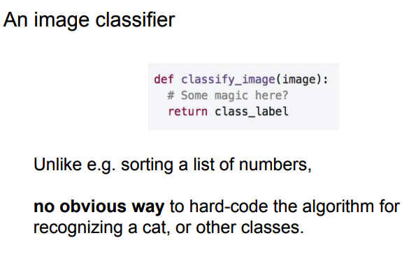</kbd>

 

<kbd>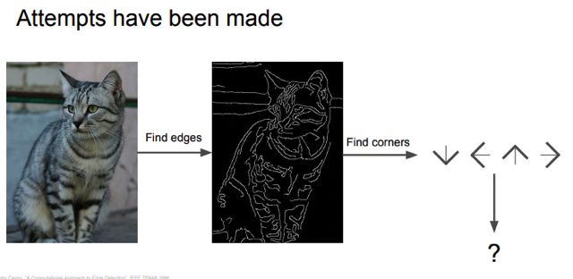</kbd>

> [!NOTE]
> Đại khái là có thể thử dùng các corner, viết một rule,
> combination các rule cho edge, corner sao sao đó thì là mèo.
> Nhưng kiểu này không ổn, không scalable vì với con chó phải
> làm lại. Mà cũng ko hiệu quả

 

<kbd>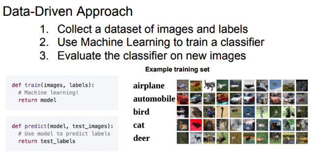</kbd>

 

<kbd>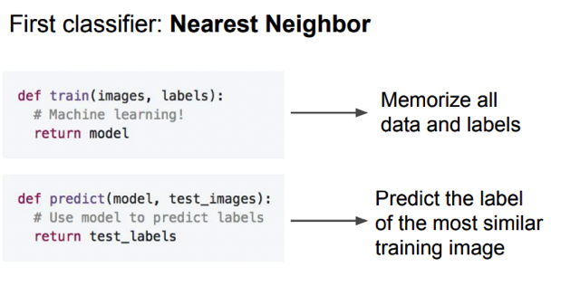</kbd>

> [!NOTE]
> Đại khái là dùng KNN có nghĩa bước 1 là nhớ tất cả các
> image. Bước 2 khi prediction thì lấy ra image gần với
> image cần predict nhất (dùng KKN). Từ đó cho ra
> prediction class của nó.

 

<kbd>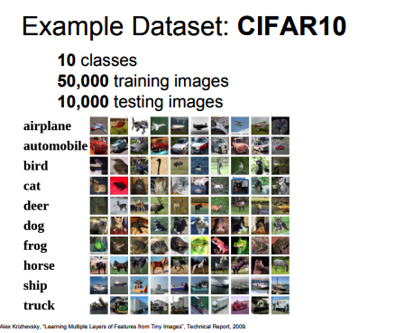</kbd>

> [!NOTE]
> Nói về bộ Cifar hay dùng cho việc thử
> nghiệm các ml model

 

<kbd>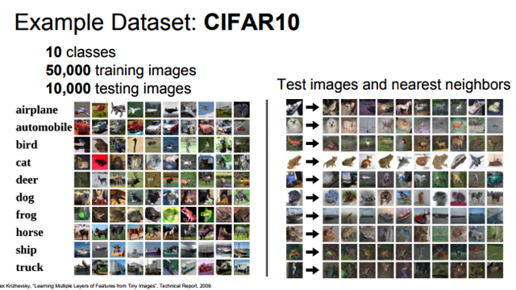</kbd>

> [!NOTE]
> Thì đại khái là tuy cách này có vẻ hơi stupid
> nhưng ít nhiều nó cũng có tính reasonable.

 

<kbd>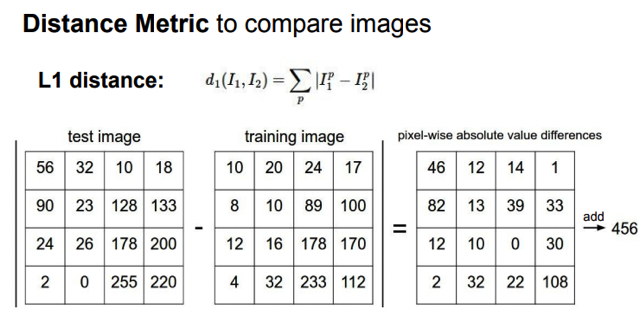</kbd>

> [!NOTE]
> Thì dẫn đến cách thức để so sánh/ tính distance giữa hai image để
> có thể dùng KNN. Thì đơn giản nhất là dùng **L1 distance** hay
> **Manhattan distance.** Cơ bản nó là **tổng pixel wise difference giữa
> hai image**. Tức là lấy hai tensor trừ nhau và sum lại

 

<kbd>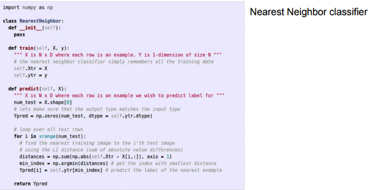</kbd>

 

<kbd>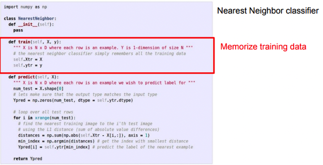</kbd>

> [!NOTE]
> Thì code cho KNN model rất đơn giản, đại khái là nó nhớ / giữ
> nguyên bộ training dataset. (self.Xtr = X,  self.ytr = y). Khi inference
> (make prediction) thì chỉ việc là nó tính difference giữa các image
> vector (là các row của Xtr) và image cần predict sau đó lấy cái
> class nào mà difference nhỏ nhất.
>
>
>
> Cụ thể là loop trong N = X.shape[0] image cần predict (tensor X)
> với mỗi image X[i,:] , tính difference của các image trong Xtr Xtr -
> X[i,:] sẽ ra được một matrix MxN trong đó mỗi row là vector chứa N
> item là hiệu của vector Xtr[i,:] và X[i,:]
>
>
>
> Xong mới tính abs thì cơ bản là lấy trị tuyệt đối mọi vị trí, và sum
> axis = 1 để sum theo từng row để thành ra 1 vector cột N item, mỗi
> vị trí là L1 distance giữa các image trong Xtr và X[i,:].
>
>
>
> Và cuối cùng lấy argmin để ra cái index mà có distance nhỏ nhất,
> đối chiếu với ground true ytr (là vector cột N item chứa label của
> các image row vector trong Xtr) để kết luận.
>
>
>
> Vậy tóm lại cách này là nó xem trong bộ training data, cái hình con
> gì có L1 distance nhỏ nhất với cái image cần classify thì cho nó là
> con  đó.

 

<kbd>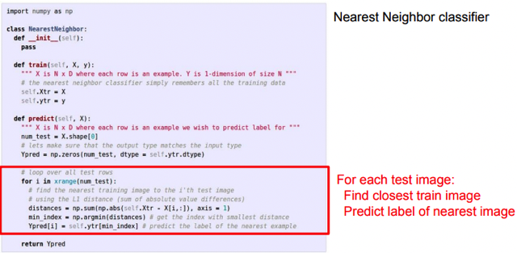</kbd>

 

<kbd>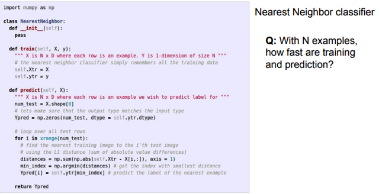</kbd>

 

<kbd>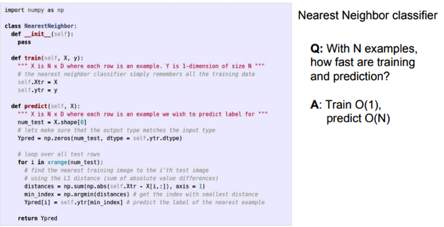</kbd>

> [!NOTE]
> Vậy câu hỏi là Training và Inference  Big O mấy.
>
>
>
> Thì rõ ràng training chả làm gì, O(1), có 1 triệu dataset
> cũng O(1) = 1 bước nhớ (save) Xtr, ytr.
>
>
>
> Nhưng inference thì với mỗi image cần prediction, ta phải
> tính N chỉ số distance của nó với các image trong Xtr.
> nên nó là O(N)
>
>
>
> ====
>
>
>
> Thì ổng nói đại khái điều này không ổn, vì ta muốn inference 
> phải nhanh nhưng training thì có thể chậm được.

 

<kbd>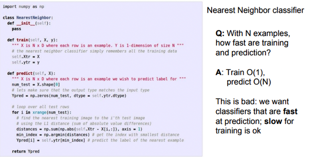</kbd>

 

<kbd>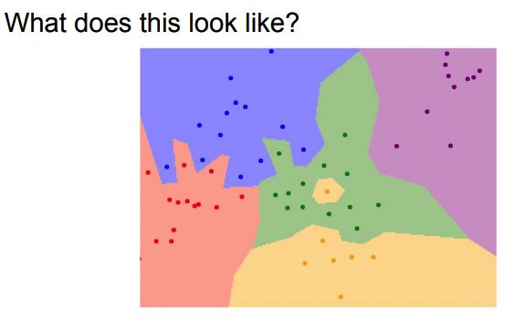</kbd>

> [!NOTE]
> Đại khái là plot ra kết quả nó như thế này, nhận xét có nhiều cái
> chưa ổn, như cái ốc đảo màu vàng trong đám màu xanh trong khi
> khả năng cao là nó thuộc class màu xanh luôn., và cái pattern
> kiểu ngón tay (finger shape)

 

<kbd>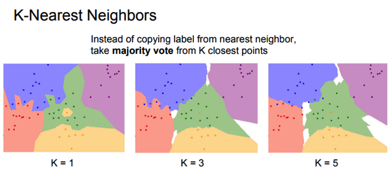</kbd>

> [!NOTE]
> Vì vậy thay vì dùng Nearest Neighbor tức chỉ "lấy thằng gần nhất" (để dùng
> class của nó để gán cho cái cần predict) thì ta có thể **dùng voting result
> của K thằng gần nhất**, ví dụ **10 cái, và xem trong 10 cái đó, class nào chiếm
> số đông** thì lấy gán cho các cần predict. Đó chính là KNN classifier.
>
>
>
> Kết qủa là với K lớn hơn thì các vấn đề ốc đảo và finger swap không còn
> decision boundary đã kiểu như smooth hơn

 

<kbd>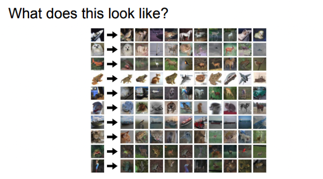</kbd>

> [!NOTE]
> Ở đây in thử ra prediction của
> các image,

 

<kbd>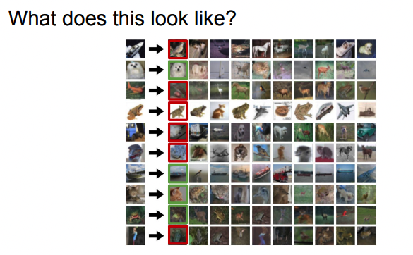</kbd>

> [!NOTE]
> Thì thấy nó dù là KNN thì
> performance cũng ko cao khi
> nhiều cái hình bị classify sai

 

<kbd>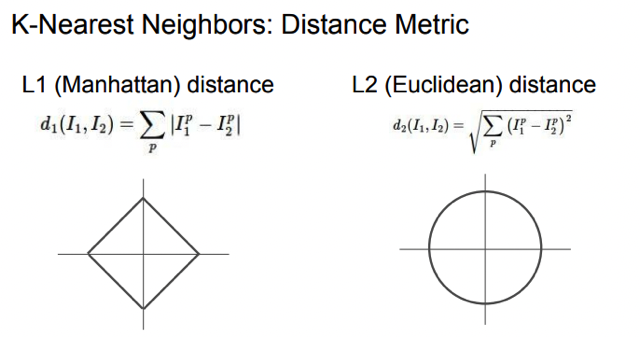</kbd>

> [!NOTE]
> Một vấn đề là nên dùng L1 distance hay L2 distance. Thì ổng nói là thật
> ra nên thử cả hai, nhưng nhưng intuitive đó là nếu các feature của vector
> có ý nghĩa cụ thể và ta quan trọng nó thì dùng L1, ví dụ vector feature của
> housing dataset, trong đó các item value có thể là diện tích, chiều dài, số
> phòng...tức là mỗi value có 1 ý nghĩa cụ thể
>
>
>
> còn nếu feature vector chỉ là các vector chung chung, trừu tượng trong
> không gian, nơi nà mỗi unit (dimension) không gắn với một ý nghĩa nào
> thì dùng L2. Trường hợp này thì giống như word embedding vector

 

<kbd>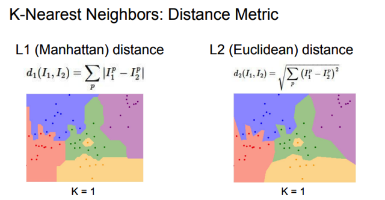</kbd>

> [!NOTE]
> Đây là plotting của việc thử
> hai loại distance metric

 

<kbd>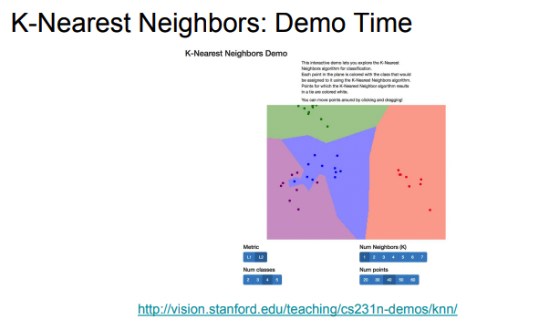</kbd>

> [!NOTE]
> Ổng nói có thể vọc vạch cái này - là cái page
> ổng làm để hiểu thêm KNN với các h.p khác
> nhau như L1 hay L2, số K sẽ ảnh hưởng đến
> kết quả như thế nào

 

<kbd>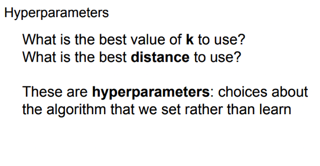</kbd>

> [!NOTE]
> Nói về hyperparams thì mình biết rồi, đại khái là
> nó không được train từ dataset mà là human chọn

 

<kbd>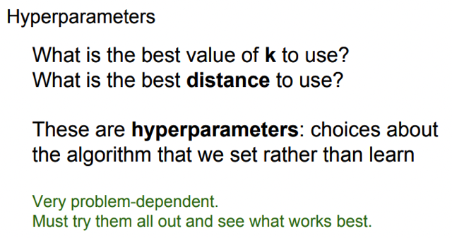</kbd>

> [!NOTE]
> Vậy câu hỏi là làm sao để chọn các
> hyperparams này: Hyperparam tuning.

 

<kbd>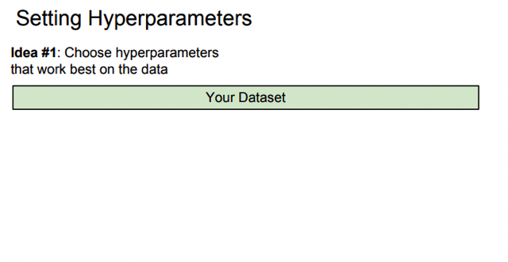</kbd>

> [!NOTE]
> Thì đại khái ideas 1 là chọn h.p sao cho training performance tốt
> nhất, thì ổng nói cách này là **bad ideas.** Vì mục đích tối thượng
> của ML là work trên new data không phải trên training set. Nếu
> dùng training set để h.p tuning thì sẽ **overfit**, nó work best trên
> trainning set nhưng chưa chắc trên new data

 

<kbd>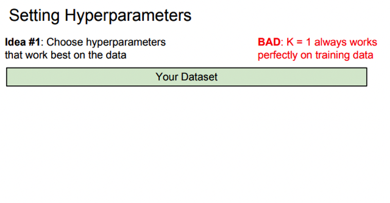</kbd>

 

<kbd>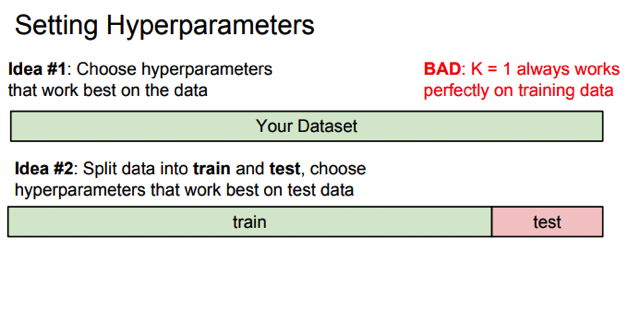</kbd>

> [!NOTE]
> Ideas hai là chia làm trainning/test set. **Cũng bad ideas**, vì
> như vậy ta sẽ overfit với test set. Có nghĩa nó chỉ là bộ h.p 
> khiến model work best trên test set, chứ chưa chắc là tốt trên 
> new dataset.

 

<kbd>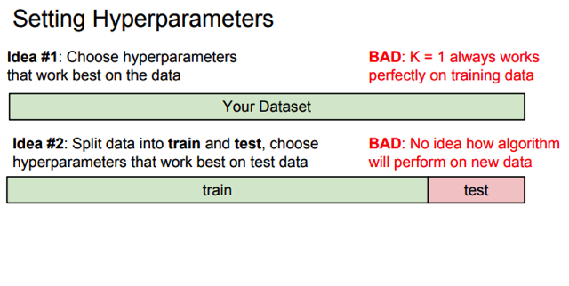</kbd>

 

<kbd>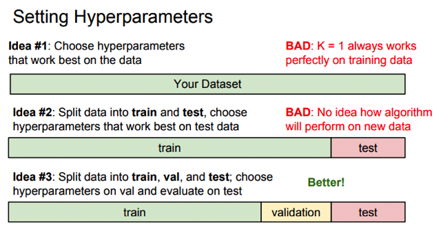</kbd>

> [!NOTE]
> Mà cách nên dùng là train/validation/test set. Train model trên
> training set, h.p trên validation set và chỉ **dùng test set để conclude
> model performance.**
>
>
>
> Nói chung nguyên tắc là **không đụng đến test set trong quá trình
> "làm"** mà chỉ dùng nó ở bước cuối để test model performance trước
> khi công bố

 

<kbd>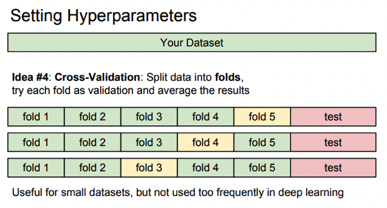</kbd>

> [!NOTE]
> Nói về một cái mà đã biết là **K-fold Cross-Validation**. K ở đây ví dụ 5 thì 
> Ta chỉ training data thành 4 phần, dùng 4 phần train model và 1 phần 
> còn lại để làm validation set cho việc h.p tuning.
>
>
>
> Thì họ nói cái này thường chỉ dùng cho small dataset, với deep learning thì
> không.

 

<kbd>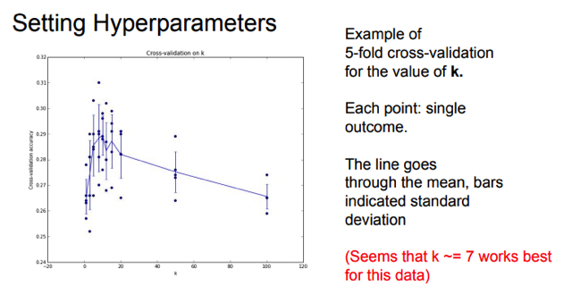</kbd>

> [!NOTE]
> Thì đại khái là quá trình h.p tuning ta plot Performance theo h.p, như hình là
> K, từ đó chọn ra K tốt nhất. Như ở đây khoảng K = 7 là nó ok, cao hơn thì
> performance (cross-validation accuracy giảm dần)

 

<kbd>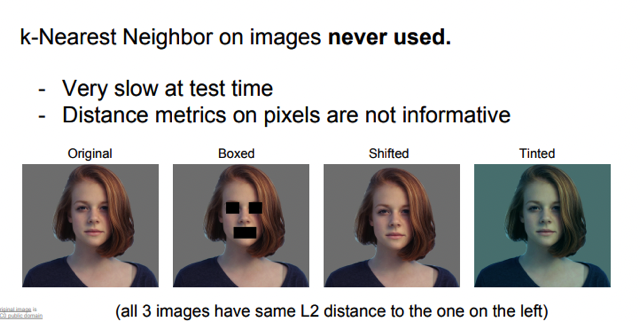</kbd>

> [!NOTE]
> Đại khái là thật ra ta sẽ không xài cái KNN này vì những hạn chế của
> nó như chậm (inference), và performance cũng ko tốt.
>
>
>
> Như trong slide ổng nói là tui change cái hình đủ kiểu nhưng some
> how L2 distance vẫn không đổi. Ý là **L2 distance không phải là biểu
> thị tốt cho việc hai cái hình giống hay khác nhau về mặt nội dung.**

 

<kbd>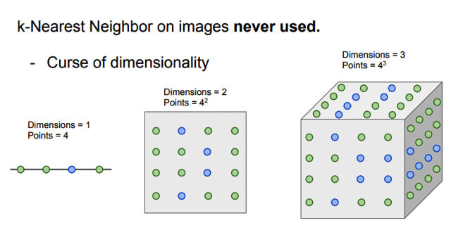</kbd>

> [!NOTE]
> Một vấn đề nữa cũng hay là T**he Curse Of Dimensionality.**
>
>
>
> Đại khái là cái KNN này work tốt thì không gian vector phải được lấp đầy data point
> Tuy nhiên, điều này rất khó.
>
>
>
> Vì ví dụ với 1D space thì chỉ 4 điểm là đủ để lấp đầy, qua 2D cần 4^2 = 16 điểm,
> qua 3D cần 4^3 = 64 điểm mới lấp đầy không gian.
>
>
>
> Vậy với image vector có hàng trăm, nghìn dimension (ví dụ hình 100x100 = 10000)
> thì để lấp đầy không gian thì phải có con số data point khổng lồ. Điều này là bất khả 
> thi, nôm na là không thể có nhiều data sample như vậy được.
>
>
>
> Thành ra trong image vector space, data nó phân bố rất trống trải (curse) nên KNN
> và vài dạng model khác không thể work tốt được

 

<kbd>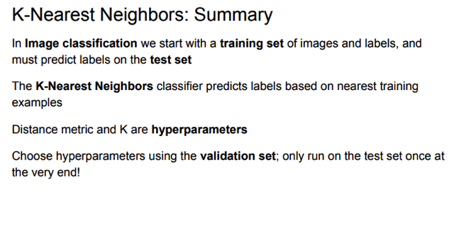</kbd>

> [!NOTE]
> Tóm lại KNN classification đơn giản là giữ / hold toàn bộ training dataset.
> Sau đó khi inference, thì chỉ là predict class của một new sample dựa trên 
> class của K thằng gần nhất với nó.
>
>
>
> K và loại distance metric dùng là hyperparams, dùng validation set hoặc
> Cross-validation để tuning.

 

<kbd>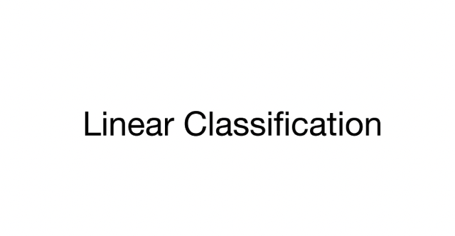</kbd>

 

### Mạng nơ-ron: Lắp ghép phân loại

<kbd>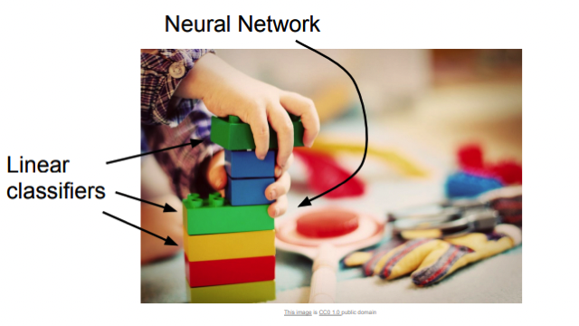</kbd>

> [!NOTE]
> Đại khái Neural network chỉ như là lắp
> ghép của nhiều Linear classifier

 

#### Ghép khối LEGO mô tả ảnh

<kbd>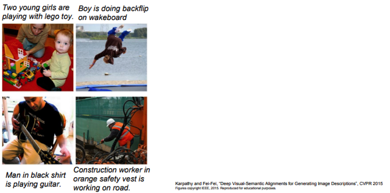</kbd>

> [!NOTE]
> Nói sơ về việc có thể ghép block các loại lego
> block khác nhau để làm cái image description
> model như này

 

##### Kết hợp CNN-RNN trong AI

<kbd>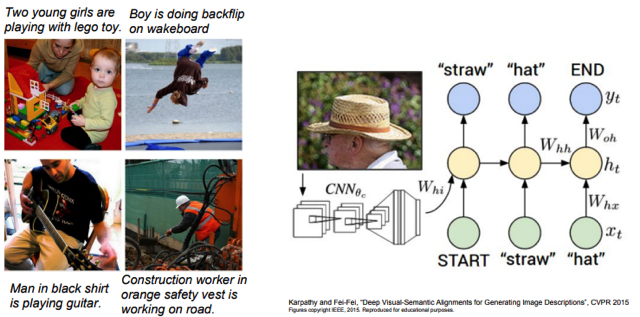</kbd>

> [!NOTE]
> Trong đó kết hợp CNN trong
> computer vision và RNN trong NLP

 

- **Nghiên cứu bộ CIFAR10**

<kbd>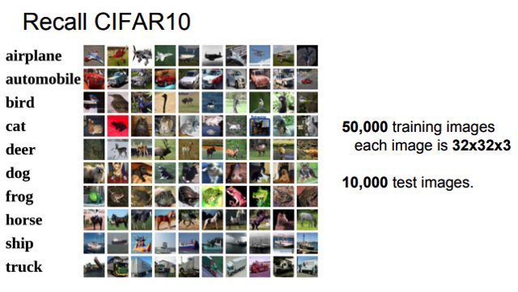</kbd>

> [!NOTE]
> QUay lại bộ CIFAR10.

 

- **Phân loại tuyến tính và KNN**

<kbd>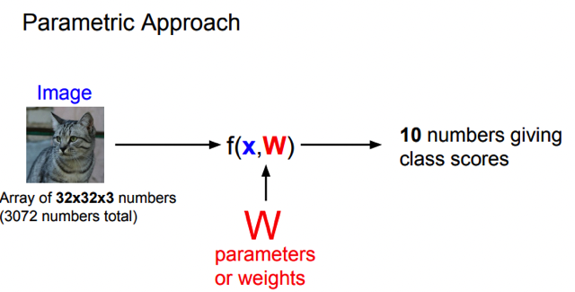</kbd>

> [!NOTE]
> Thì đại khái cái Linear Classification này là một cái **parametric model**, tức
> là có param.
>
>
>
> Khác với **KNN không có param**, chỉ là nhớ toàn bộ training set, còn ở đây
> kiểu như  dùng training để train ra param W, sau đó có thể vứt training set, và
> chỉ dùng những kiến thức thể hiện trong W để make prediction.

 

<kbd>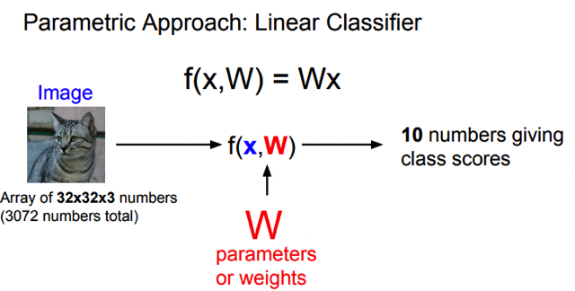</kbd>

> [!NOTE]
> Và ở cấp đơn giản nhất Linear Classifier chỉ đơn giản là train một cái
> matrix W, để khi make prediction thì chỉ dot product Image vector với
> W để ra vector có 10 (no. classes) chứa 10 số (ko phải probability
> nhé, vì chưa có activation function e.g softmax) tạm gọi là class scores.

 

<kbd>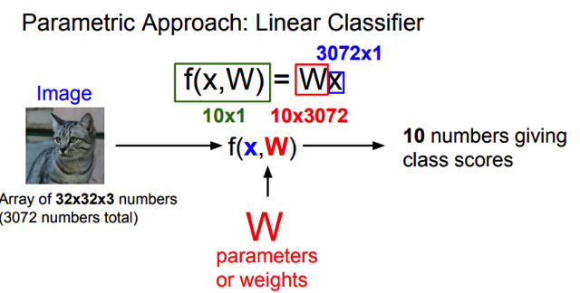</kbd>

> [!NOTE]
> Ví dụ image 32x32x3 (ảnh màu) thì flatten ra thành 3072D vector,
> Thì W sẽ có shape = 10x3072, để khi tính f = Wx sẽ được 10D vector.

 

<kbd>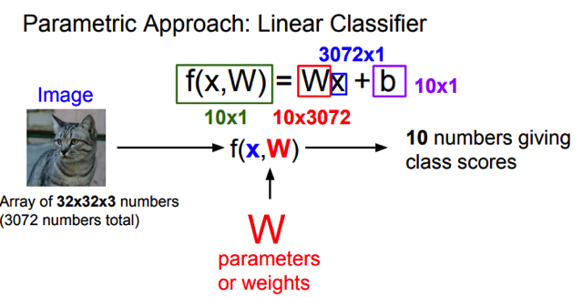</kbd>

> [!NOTE]
> Có thể cộng thêm bias b,
> cũng là vector 10 unit

 

<kbd>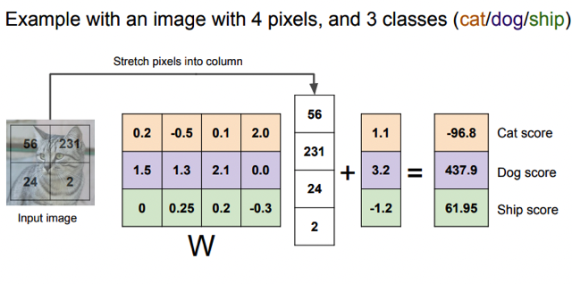</kbd>

> [!NOTE]
> Sau quá trình training thì kiểu như mỗi hàng của W sẽ biểu thị/là pattern
> indicator của một class,  Image feature vector khi nhân với từng hàng (Wx)
> sẽ ra các class score.

 

<kbd>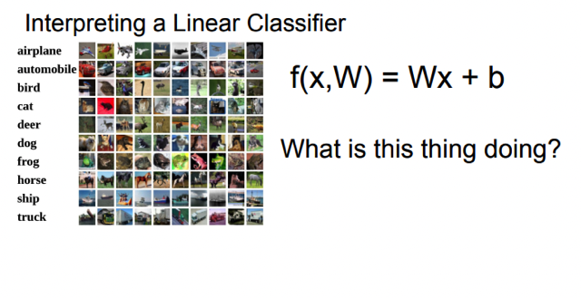</kbd>

 

- **Ý nghĩa hàng ma trận W**

<kbd>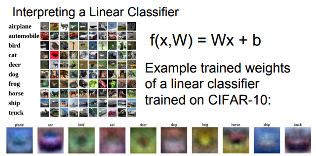</kbd>

> [!NOTE]
> Thì ổng nói là có thể in mỗi hàng của W ra, vốn bằng shape với image
> feature vector (3071) và reshape lại và in ra xem thử thì đại khái là
>
>
>
> Ta có thể thấy model nó tweak các row của W  sao đó khiến nó kiểu
> như ..khó diễn tả nhưng với linear model, ta nên nhớ rằng kết quả
> class score sẽ chỉ là phép dot product của feature vector và W's row
> vector. Nên model sẽ dần dần tweek các row vector này sao cho nó
> mang dáng dấp chung chung của cái class tương ứng
>
>
>
> Nói chung ở đây ổng chưa nói cách train, và cũng sẽ không dùng kiểu
> này vì linear classification không work tốt

 

<kbd>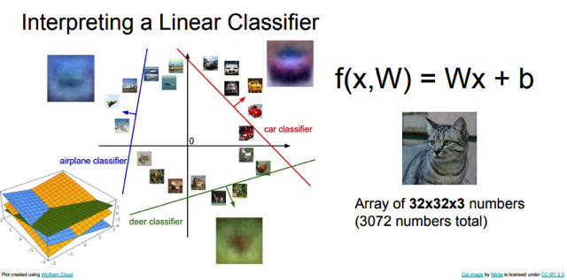</kbd>

> [!NOTE]
> Đại khái là dễ thấy linear classification không
> thể work tốt với bài toán image classification
> được vì nó quá đơn giản

 

<kbd>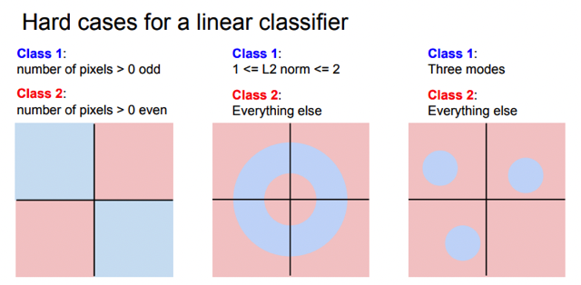</kbd>

> [!NOTE]
> Dễ dàng chế ra vài bộ dataset có thể khiến linear
> classification fail hoàn toàn

 

<kbd>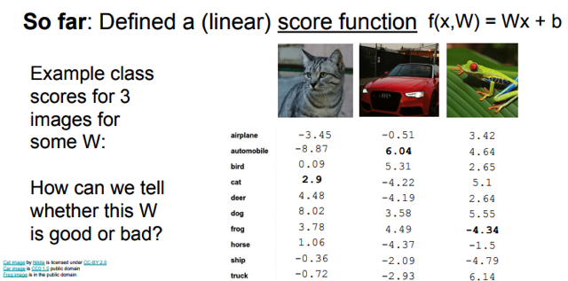</kbd>

 

<kbd>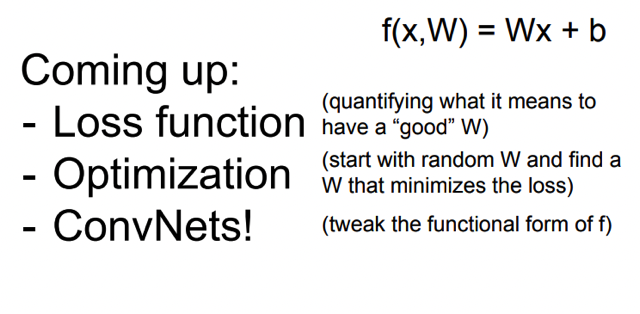</kbd>

> [!NOTE]
> Thì qua tuần sau sẽ nói về việc train linear
> classifier với loss function, optimization
> (gradient descent) và ConvNet

 

