# Lecture 3/16 - Loss Functions And Optimization

📊 **Progress:** `117` Notes | `154` Screenshots

---

## Lecture 3/16 - Loss Functions And Optimization

 

<kbd>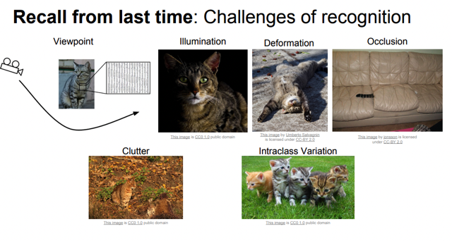</kbd>

 

<kbd>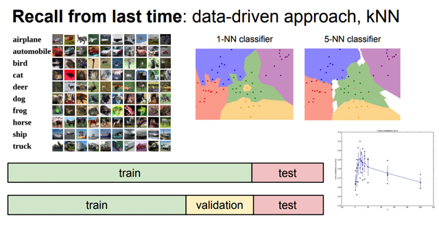</kbd>

 

<kbd>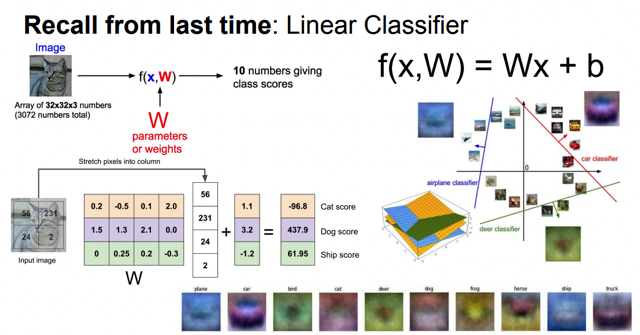</kbd>

> [!NOTE]
> Review lại một tí chỗ cái Linear Classifier để nói rõ thêm với cái này, W là
> matrix mà mỗi row đóng vai trò giống như cái form của một class. Để
> Input image sau khi flatten, và dot product với W thì mỗi hàng là cái form
> dot product với flatten image vector sẽ cho ra điểm của class đó đối với
> image đó.
>
>
>
> Và lấy cái hàng của W (cũng size với flatten input image) và reshape lại
> thành dài x rộng thì plot ra có thể thấy nó giống như / kiểu như cái filter
> vậy. Nôm na là giống như model sẽ tổng hợp và tạo ra cái form chung
> chung của một cái xe (ví dụ vậy) để nếu image input là cái xe thì kết quả
> đợt product (sẽ ra cao nhất)

 

<kbd>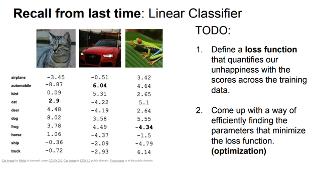</kbd>

> [!NOTE]
> Đại khái là tuần trước dừng lại ở chỗ chưa nói về cách nào để tìm ra W
> thì ta thấy kết quả của cái Linear Classification đó khá tệ, khi các score
> cho correct class của hình con mèo và con ếch không cao nhất.
>
>
>
> Nhưng đánh giá bằng mắt như này thì không được dẫn đến phải có
> **cách nào đó để evaluate kết quả của model**. Đó chính là dẫn dắt tới
> **loss function.**
>
>
>
> Và sau đó là **cách thức để tìm ra W sao cho giảm thiểu cái loss function**
> này đó chính là vấn đề của **optimization**

 

<kbd>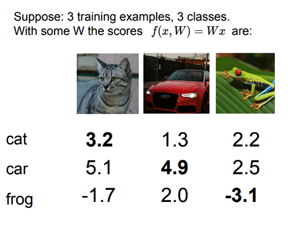</kbd>

 

<kbd>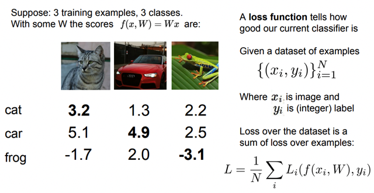</kbd>

> [!NOTE]
> Nói sơ về loss function là function tính sai lệch giữa
> model's prediction và target trên toàn dataset (average)

 

<kbd>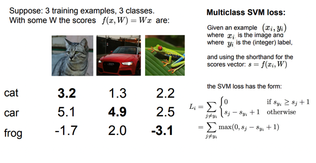</kbd>

> [!NOTE]
> Đại khái là nói về một lựa chọn cho loss function là dùng cái SVM loss, 
> mà ổng nói là đã học ở bên CS229 nhưng trong đó là với 2 class thay 
> vì nhiều class như ở đây.
>
>
>
> Nên ở đây xây dựng công thức cho bài toán multi-class.
>
>
>
> Cơ bản công thức nó là như sau: L(i) là loss function của model tại data 
> sample x(i).
>
>
>
> Trong mọi class (ví dụ 10 class), thì chỉ tính những score của class không
> phải y(i). Ví dụ y(i) là con mèo, thì chỉ làm việc với 9 score (model output
> ra vector 10 probability scores). Và nếu 9 scores đó gọi là incorrect score
> - score của class không phải class đúng sj, thì nếu sj bé hơn correct score
>  sy(i) một khoảng đáng kể (sy(i) > sj + 1) thì loss đó = 0, ngược lại thì loss
> bằng sj - syi + 1.
>
>
>
> Tính tổng lại hết ta được L(i).
>
>
>
> Có thể viết gộp thành công thức 1 dòng như ở dưới.

 

<kbd>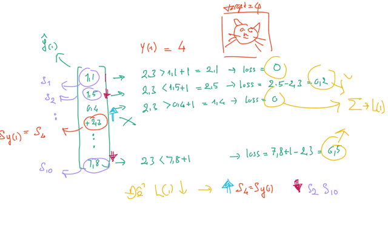</kbd>

> [!NOTE]
> Để giảm loss model sẽ phải push sy(i) lên và ém (incorrect) score
> nào mà lớn xuống như ở đây s2,s10 là score của hai incorrect
> class và đang lớn, nên nó  đóng góp vào loss khiến loss lớn,
> muốn giảm loss phải  ém hai score này xuống. Mấy cái incorrect
> score kia đã nhỏ hơn correct score s4 (sy(1)) một khoảng an toàn
> là  1 rồi (ví dụ s1 và s3 < s4 - 1,  nên không cần ém nữa)
>
>
>
> Đó là ý nghĩa "high margin classifier" của SVM

 

<kbd>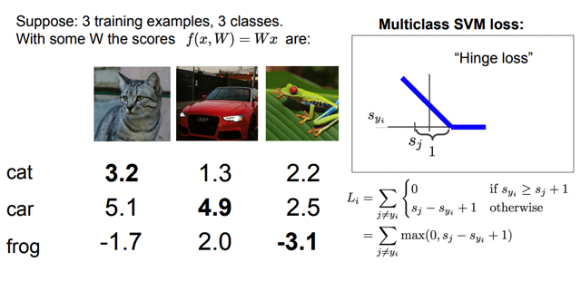</kbd>

> [!NOTE]
> Thì ổng nói cái này còn
> gọi là Hinge loss.

 

<kbd>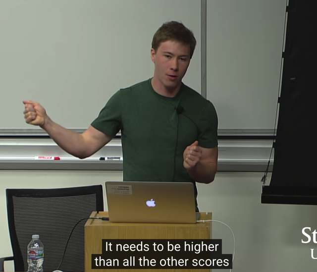</kbd>

> [!NOTE]
> Ổng nói là nôm na high loss sẽ kiểu vầy: Nếu mà true score (score của
> model spit out cho cái class correct mà cao hơn score của class
> incorrect  một khoảng nào đó (1) thì là Good, còn nếu không thì là bad
> và ta sẽ đưa nó vào loss để giảm

 

<kbd>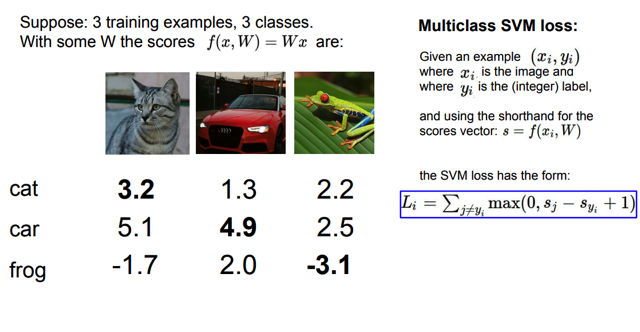</kbd>

 

<kbd>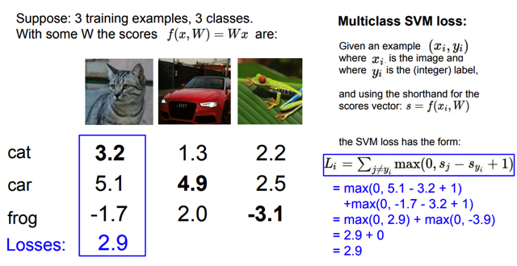</kbd>

> [!NOTE]
> Ví dụ tính loss cho 3 sample data này.  Ở đây ta thấy loss sẽ "
> được ghi nhận" vì score của class car (incorrect class) cao hơn
> correct score một khoảng safety margin. Còn class frog ok vì nó
> đã nhỏ hơn correct score khoảng safety margin

 

<kbd>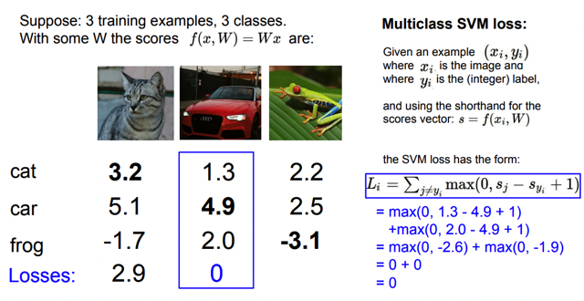</kbd>

> [!NOTE]
> Ở đây hai incorrect score (cat và frog) đều đã nhỏ hơn correct score một
> khoảng an toàn nên ok, loss = 0

 

<kbd>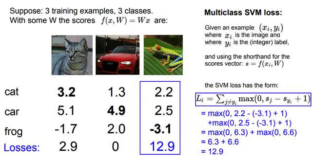</kbd>

> [!NOTE]
> Tương tự vậy

 

<kbd>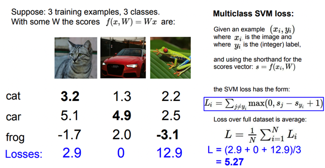</kbd>

> [!NOTE]
> Thì loss sẽ tính average
> cho mọi data sample.

 

<kbd>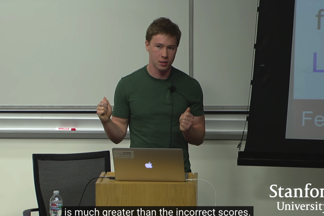</kbd>

> [!NOTE]
> Có người hỏi là sao chọn số 1 (safety margin) thì ổng nói cái này cũng
> không quan trọng lắm vì cái chính ta muốn là sự khác biệt tương đối
> của correct score với incorrect score và khi làm việc với  training ta sẽ
> thấy

 

<kbd>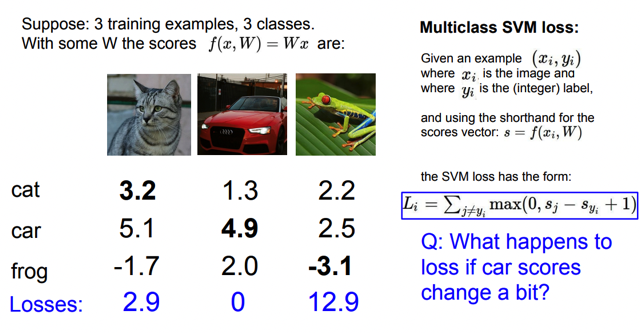</kbd>

> [!NOTE]
> Q: Là nếu đổi car score 1 chút thì loss sẽ ra sao?
>
>
>
> Câu trả lời là nếu nó chỉ thay đổi 1 chút thì loss chẳng  Thay đổi gì, vì
> car score đã lớn hơn những score khác  một khoảng margin rồi.
>
>
>
> Ý là nó không care chỉ số của car cao hay thấp, miễn là score đã lớn
> hơn mấy cái khác một margin.
>
>
>
> Từ đó có nhận xét là đây là nhược điểm của cái loss này Khi nó đánh
> đồng, ý là không làm được cái kiểu như: Đây chắc chắn là cái xe, kia
> thì hơi không chắc là cái xe

 

<kbd>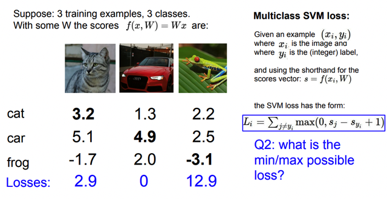</kbd>

> [!NOTE]
> Min = 0, max = + infi
>
>
>
> Correct!

 

<kbd>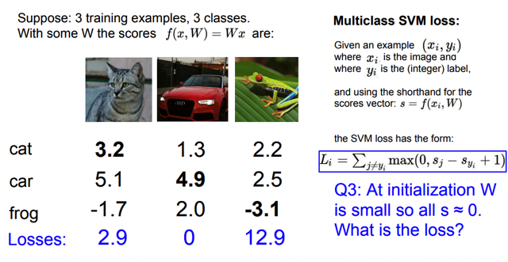</kbd>

> [!NOTE]
> Nếu tại initialization, mọi s ~- 0 thì loss sẽ là ~ NO. Classes - 1
>
>
>
> Vì mỗi incorrect class score đều = 0, và correct score cũng = 0 nên 
> loss trừ loss của mỗi sample là ~ Số class - 1 (vì không tính loss của 
> correct class). Mọi sample đều vậy nên trung bình trên
> toàn dataset là cũng = Số class - 1.
>
>
>
> Thì ổng nói cái này có một cái trick giúp debug khi ban đầu nếu initial
> loss không bằng Số class - 1 thì chứng tỏ ta đã sai ở đâu đó

 

<kbd>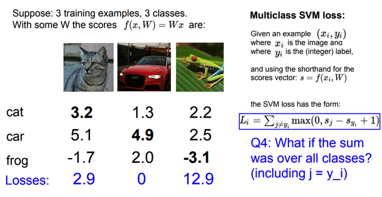</kbd>

<kbd>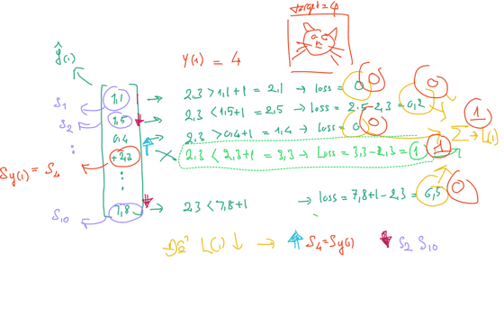</kbd>

> [!NOTE]
> Nếu tính loss mà tính luôn cả correct class thì sao?
>
>
>
> thì đương nhiên là luôn có loss = 1 tại correct score dẫn đến là ngay
> cả  khi mọi incorrect class đều có score nhỏ (nên loss = 0) thì vẫn có
> loss = 1 thành ra min loss sẽ = 1 thay vì 0 và như vậy không hay lắm
> khi người thường muốn min loss = 0 hơn (mặc dù để 1 cũng chả hại
> gì vì min loss Bao bao nhiêu không quan trọng, quan trọng là nó có
> đạt min không)

 

<kbd></kbd>

> [!NOTE]
> Nếu không dùng sum mà dùng mean thì sao?
>
>
>
> Không thay đổi, vì nó cũng như nhau thôi chỉ là nó
> sẽ scale cái loss xuống

 

<kbd>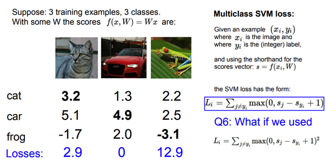</kbd>

> [!NOTE]
> Nếu mà thêm bình phương lên thì sao, tức là incorrect label 
> j với sj > syi + 1, loss sẽ là (sj - syi + 1)**2.
>
>
>
> Câu trả lời là nó sẽ thành khác đi. Và thực tế người ta ít dùng

 

<kbd>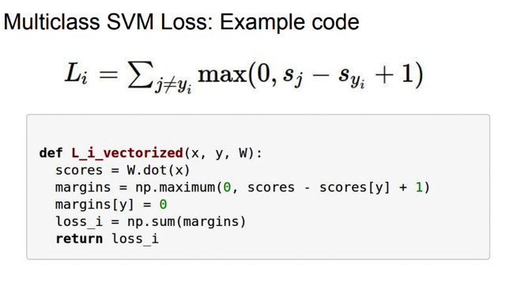</kbd>

 

<kbd></kbd>

> [!NOTE]
> Thì kiểu như **chọn (công thức) loss này hay loss kia** là  cách mà **ta cho
> model biết**  là **ta care đến cái kiểu error nào.**
>
>
>
> Kiểu như nếu dùng **square loss** (giống như MSE) thì, **nếu một sample  bị
> sai thì nó  sẽ khuếch đại cái sai.**
>
>
>
> Thì kiểu như ta muốn nói model: Ta **không muốn một class nào bị predict sai
> một cách quá rõ ràng, sai một cách thậm tệ**, nên ta sẽ **phạt nặng (khuếch
> đại) các error lớn** (ví dụ trong hình là cái s10 = 7.8, **loss sẽ là 6.5 thì bây giờ
> khuếch đại nó thành 6.5**2 ~= 40**, còn cái **s2 sai nhẹ, khi loss chỉ là 0.2 thì
> có square nó cũng chỉ là là 0.04 thậm chí còn giảm nhẹ cho nó.**
>
>
>
> Dẫn đến là giả sử so sánh hai case:
>
>
>
> - Một case model cho ra **9 incorrect score nhỏ với loss nhỏ như 0.2** ở trên thì
> loss chỉ là **0.04*9 = 0.36,**
>
>
>
> - Một case nó cho ra **8 incorrect với loss = 0 luôn**, nhưng **chỉ 1 incorrect score
> = 5** chẳng hạn, thì loss sẽ **thành ra 5**2 = 25 lớn hơn rất nhiều so với 0.36**
>
>
>
> Như vậy, square loss đã kiểu như khuyến khích mode**l "đừng phạm lỗi lớn dù ít"**
> , mà **"có thể tha thứ nếu phạm nhiều lỗi nhỏ".**
>
>
>
> Ngược lại **nếu không square loss**, thì nó sẽ **coi mọi error là như nhau, không có
> lỗi lớn nhỏ gì cả**.
>
>
>
> Do đó mới nói tùy vào việc ta muốn model nó tập trung vào cải thiện loại error
> gì (giảm đều các error hay tập trung vào đừng để error lớn), mà chọn loss

 

<kbd>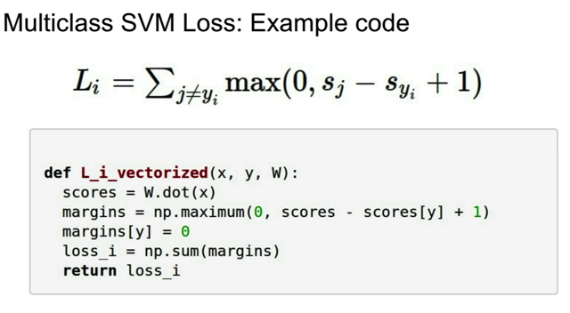</kbd>

<kbd>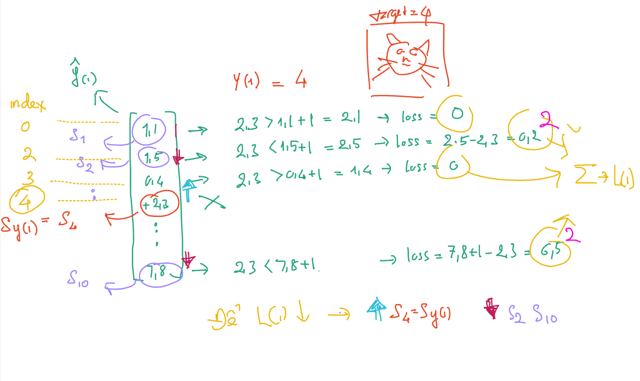</kbd>

> [!NOTE]
> Code để tính L(i) trong python: Ta thấy scores là kết quả của phép dot
> product của W và x, Sau đó dùng max để tính loss ở mọi class, rồi hủy
> đi loss của correct class bằng cách gán 0 tại index = y .
>
>
>
> Cuối cùng tính sum
>
> Value của y(i) = 4, nên index của correct class trong scores vector,
> và losses vector là 4

 

<kbd>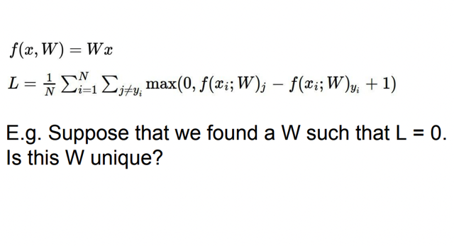</kbd>

> [!NOTE]
> Câu hỏi là liệu có thể có hai W khiến L đều bằng 0 không?
> -> Có, vì chỉ cần các incorrect score thấp hơn correct score
> một margin thì loss đều bằng 0, đồng nghĩa có nhiều W miễn
> đạt điều này thì loss đều bằng 0.

 

<kbd>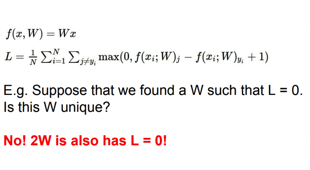</kbd>

> [!NOTE]
> Correct. Và sự thật là nhân W lên 2 cũng có kết quả y chang. Hiểu
> nôm na là, nếu mọi cách biệt giữa correct score và các incorrect score
> đều đã > 1, thì nhân W lên, hay bình phương W lên, sẽ khiến score
> nhân lên hay bình phường lên, mà số > 1 nhân lên hay bình phương
> lên cũng vẫn > 1 dẫn đến Loss không thay đổi vẫn = 0

 

<kbd>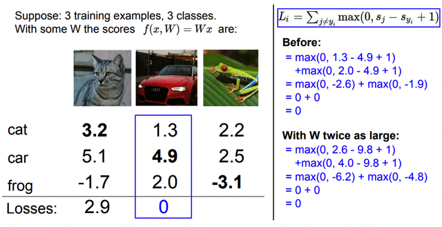</kbd>

 

<kbd>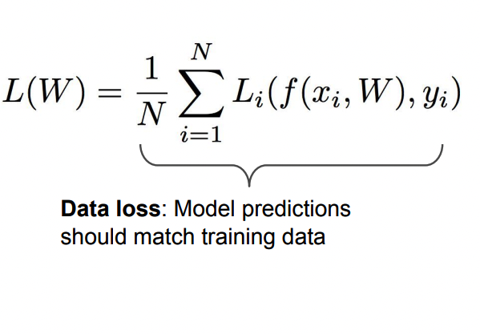</kbd>

 

<kbd>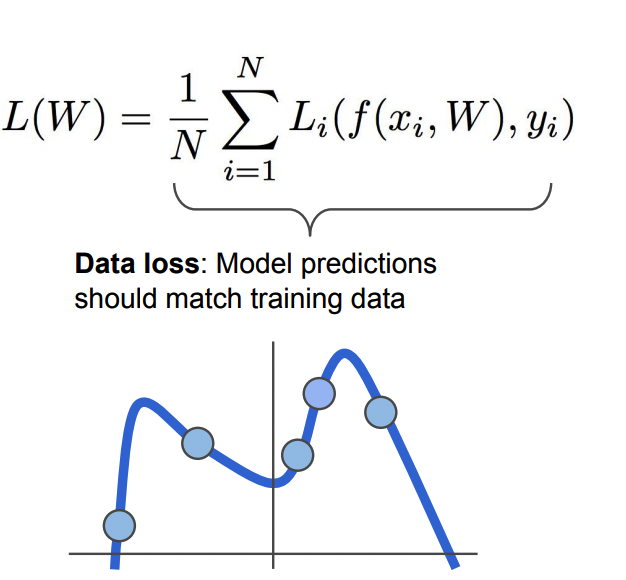</kbd>

> [!NOTE]
> Đại khái là thật ra ta không care performance
> của model trên training data mà là test data

 

<kbd>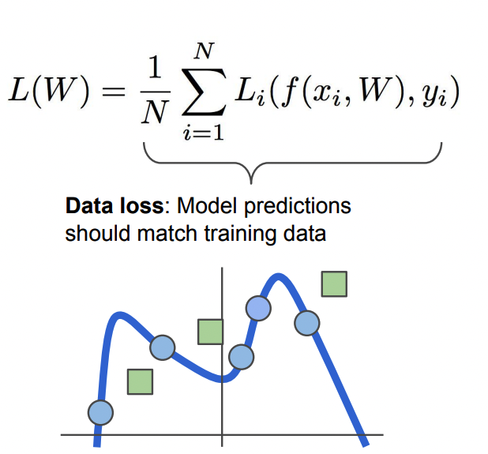</kbd>

> [!NOTE]
> Do đó ý là nếu model có làm tốt ở training data
> như việc tạo ra một bộ params giúp đi qua hết
> training sample thì thật ra là vô dụng vì không
> generalize tốt được

 

<kbd>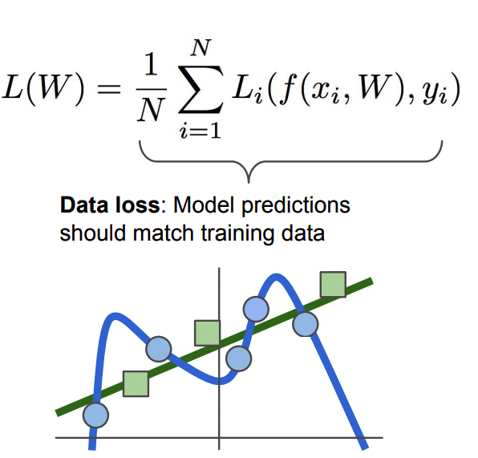</kbd>

> [!NOTE]
> mà trong hình này cái ta cần là một model đơn giản hơn, linear 
> thay vì wiggly như vậy

 

<kbd>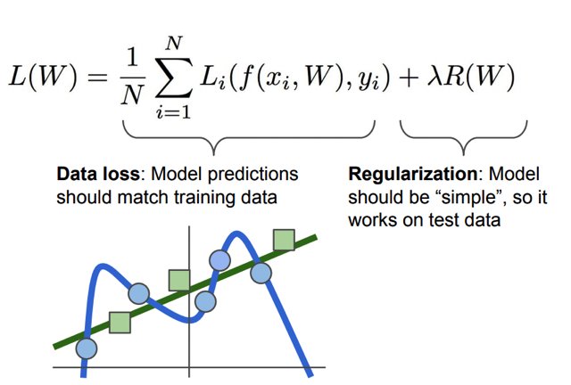</kbd>

> [!NOTE]
> Do đó như mình đã biết trong MLSpec, người ta dùng Regularization, cụ
> thể một cách là dùng một Regularization loss term
>
>
>
> Trong quá trình training, cái này sẽ ép không cho model xu hướng tạo một
> model quá phức tạp nhờ vậy giảm vấn đề overfit

 

<kbd>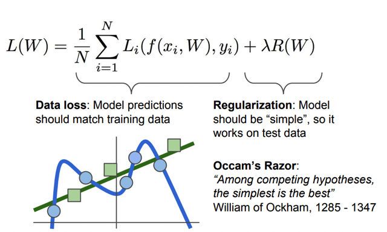</kbd>

> [!NOTE]
> Ở đây nhắc đến tuyên bố của Occam's Razor đó là trong các
> model khác nhau có thể mô tả hiện tượng thì cái nào càng đơn
> giản thì cái đó càng tốt

 

<kbd>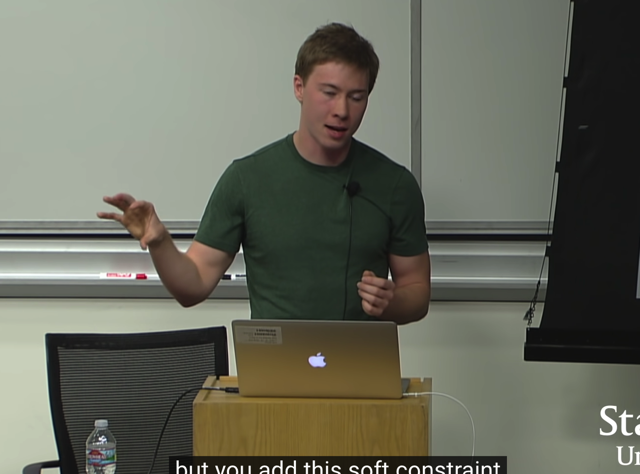</kbd>

<kbd>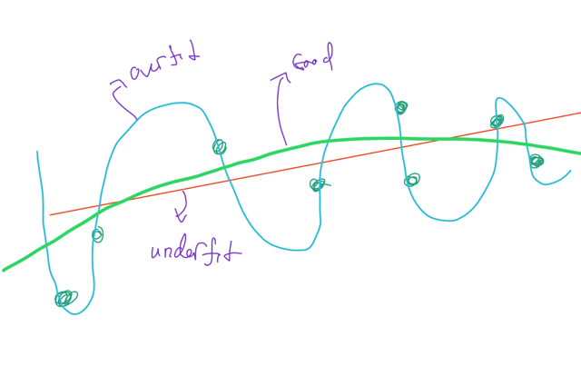</kbd>

> [!NOTE]
> Thầy nói về việc có thể hiểu như thay vì **cố tình bắt model đơn giản
> bằng việc kiến trúc nó theo kiểu đơn giản ngay từ đầu** (ví dụ chỉ quy
> định linear regression thôi)
>
>
>
> Thì với regularization kiểu như **cho phép nó có thể được phép phức tạp**
> (như **cho nó có độ polynomial degree cao**) nhưng  **constrain nó, giới
> hạn nó bằng cái soft penalty này** để rồi nó v**ẫn có thể flexible nhưng bị
> hạn chế không được trở nên quá flexible bằng cách kiểm soát các
> params / weight.**
>
>
>
> Để dễ hình dung thì ví dụ w1x + w2x^2 _ w3x^3 + w4x^4 thì nếu w2,w3 bị
> ngăn không cho trở nên quá lớn thì **ảnh hưởng của yếu tố polynomial (x^3,
> x^4) sẽ bị giảm xuống khiến model giảm bớt khả năng flexible**

 

<kbd>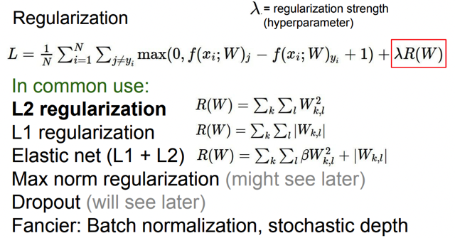</kbd>

> [!NOTE]
> Một số loại Regularization

 

<kbd>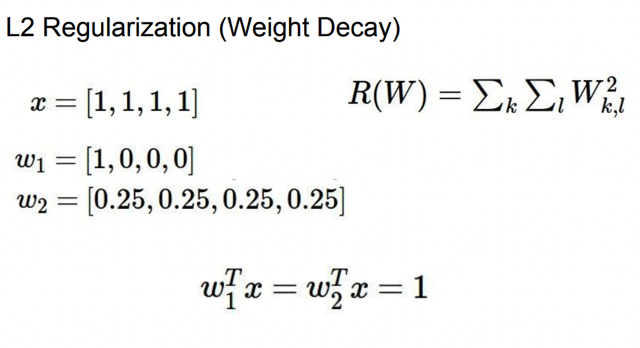</kbd>

> [!NOTE]
> Đại khái là đây là ví dụ của **cách thức làm thế nào mà L2 Regularization giúp
> giảm độ complexity của model.**
>
>
>
> Thì đại khái là giả sử có hai option cho w là **w1, và w2 và cả hai đều cho cùng
> một kết quả** (giả dụ đây là linear regression, cơ bản chỉ là tính dot product của w
> và x).
>
>
>
> Q: Bạn nghĩ thì R(W) sẽ chọn w nào?
>
>
>
> A: Thì nó **(nếu là L2 reg) sẽ chọn w2 đó là spread out ra đều 4 vị trí** (4 cái đều là
> 0.25) thay vì w1 là dồn cục lại cho vị trí đầu tiên (số 1, 3 số sau là 0). Lí do là vì
> Reg term được xây dựng là tổng bình phương các w, nên cụ thể ở đây nó sẽ là
> 1^2+0^2+0^2+0^2 = 1 nếu là w1 và 0.25^2 + 0.25^2 + 0.25^2 + 0.25^2 = 4/16 = 1/5
> = 0.25
>
>
>
> Thì đ**ể giảm loss thì phải giảm L2 Reg term loss nên nó sẽ chọn w2**.
>
>
>
> Và từ đó ta có thể hiểu sự khác biệt giữa [1,0,0,0] và [0.25, 0.25, 0.25, 0.25] đó là,
> lấy ví dụ bài toán giá nhà, thì **model sẽ chọn việc đánh trọng số đóng góp / tầm
> quan trọng của cả 4 feature khác nhau, thay vì chỉ coi trọng một  feature nào đó**
>
>
>
> Nhưng nếu là ta dùng **L1 regularization** thì, ngược lại nó lại **favor w1 hơn**  từ
> đây mới thật sự hiểu những nhận định trước đây đó là xài L1 reg thì sẽ khiến có
> nhiều params = 0 còn L2 reg thì khiến các params ~=0, (mang giá trị nhỏ)

 

<kbd>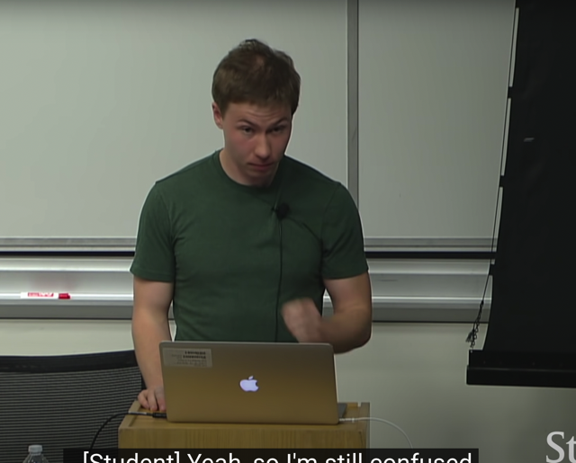</kbd>

> [!NOTE]
> Nói thêm một điểm đó là **L1 reg coi một model simple là model có
> ít params (khác không)** còn **L2 reg coi model simple là model có
> các params mang giá trị xem xem nhau**
>
>
>
> Thành ra xài L1 hay L2 là tùy vào dataset, tùy bài toán cụ thể

 

<kbd>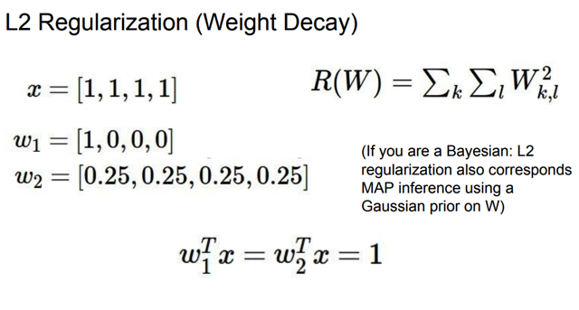</kbd>

 

<kbd>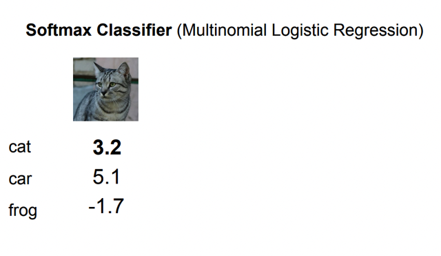</kbd>

 

<kbd>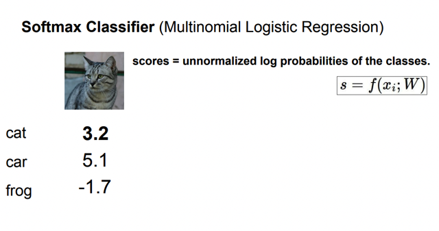</kbd>

 

<kbd>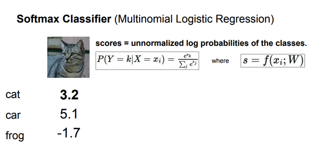</kbd>

 

<kbd>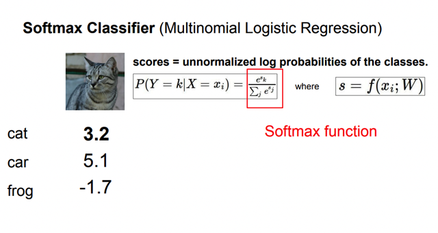</kbd>

 

<kbd>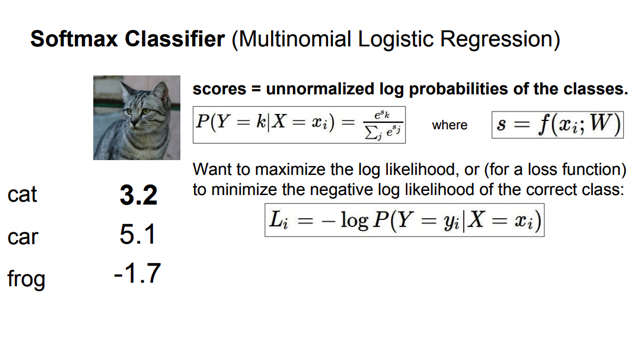</kbd>

 

<kbd>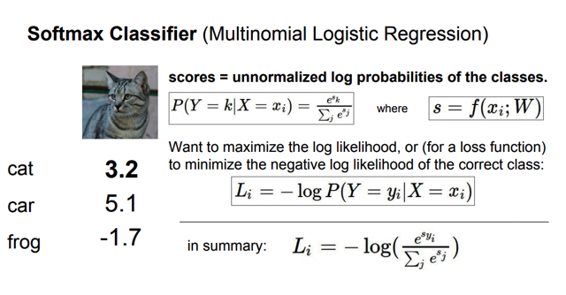</kbd>

> [!NOTE]
> Cũng không có gì mới và khó hiểu, đại khái là việc dùng **SVM loss function**
> như trên **không khiến các chỉ số output từ model mang nhiều ý nghĩa** khi nó
> chỉ cần **chỉ số của class đúng vượt lên trên** các incorrect score một khoảng
> an toàn là thôi nó **không care con số đó là bao nhiêu.**
>
>
>
> Nhưng với **Multinomial Logistic Regression** hay còn gọi là **Softmax** trong
> đó các l**ogit được exponential để trở nên không âm** và **normalize** bằng
> cách chia cho tổng exp các logit của mọi class **để trở thành probability
> distribution (nằm trong 0-1).**
>
>
>
> Từ đó kết quả là có thể "kiến giải" (**interpretation**) các chỉ số này là **xác
> suất có điều kiện label của input là một class nào đó P(Y = yi | X = xi).**
>
>
>
> Và theo cách kiến giải này, việc training là ta muốn model **giảm sự khác biệt
> giữa hai mô hình xác suất** giữa cái model dự đoán và của target. Ví dụ một
> **image là con mèo** thì x**ác suất (target) P(Y=cat | X = xi) = 1**, và **P những
> class khác là 0**. Và thể hiện cái **(target) distribution** chính là bằng **one-hot
> vector**. Thì từ đó trong quá trình training, **model sẽ tìm cách tăng probability
> scores "của" class "cat" lên, giảm mấy cái kia xuống**.
>
>
>
> Và thày có nói có thể dùng các function như **KL Divergence** hoặc
> **maximum likelihood để làm giảm khác biệt của hai probability distribution này.**
>
>
>
>
> Như trong công thức người ta dùng **negative log (nên gọi là negative log
> likelihood)** là vì để objective function là **tối đa hóa likelihood** thì **phải tối
> thiểu cost** nên phải dùng dấu âm. Và vì để minimize **log** thì dễ hơn và
> **hàm log là hàm đồng biến monotonic nên dùng log.**

 

<kbd>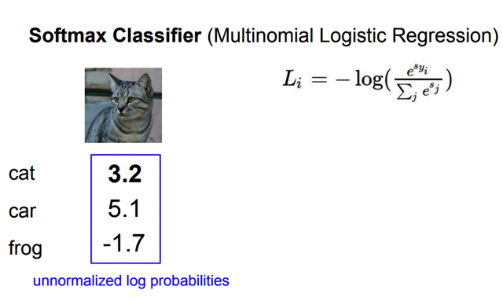</kbd>

 

<kbd>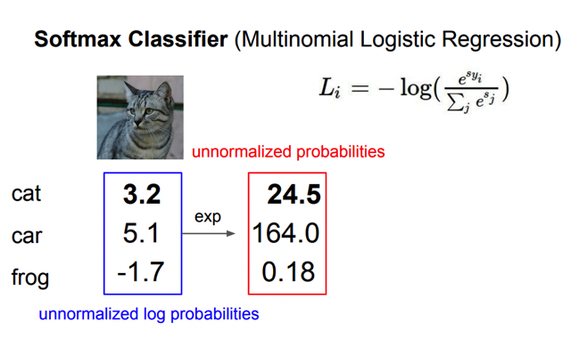</kbd>

 

<kbd>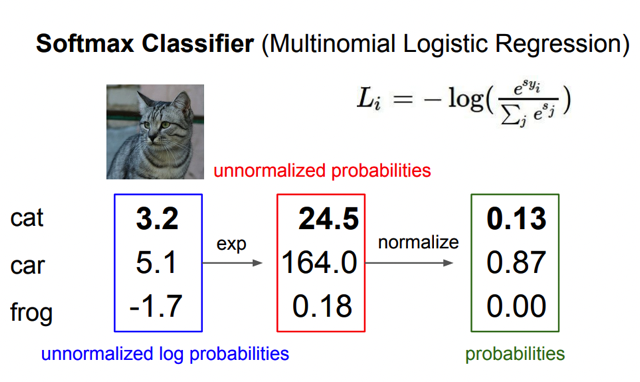</kbd>

 

<kbd>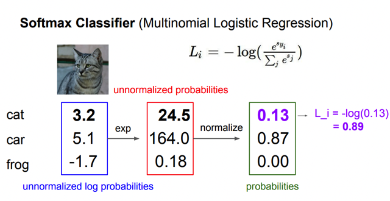</kbd>

> [!NOTE]
> Nói về cách "tính" đó là từ các con số output của model 
> ta sẽ exponential lên và normalize để trở thành probabilities

 

<kbd>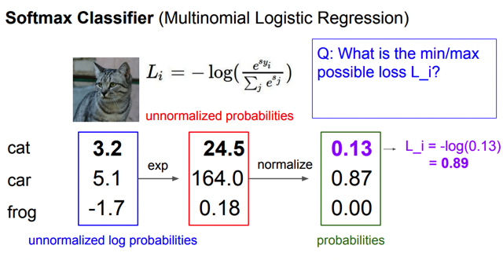</kbd>

> [!NOTE]
> **Min** của loss đương nhiên là khi p(Y = y correct|x) = 1, khi đó loss = -
> log(1) = **0**
>
>
>
> **Max** của loss là khi p(Y = y correct|x) = 0, loss =
> - log(0) = **+ infi**
>
>
>
> Q: Correct, Vậy khi đó logit sẽ trông như thế nào?
>
>
>
> Nếu muốn vậy thì logit của correct class phải  cao ~= +infi, các score
> khác phải thấp - infi
>
>
>
> Nhưng vì máy tính không thể thể hiện số infi nên thực tế loss sẽ
> không bao giờ đạt 0 được

 

<kbd>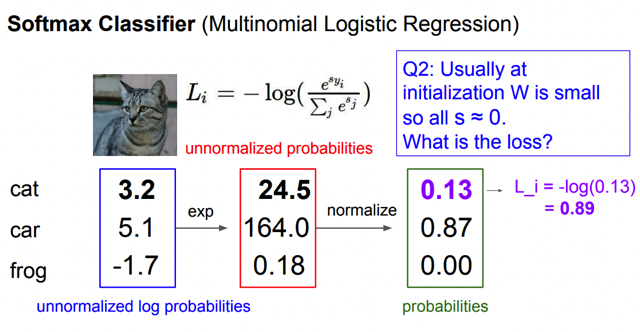</kbd>

> [!NOTE]
> Câu hỏi tương tự ở phần SVM loss là ban đầu w nhỏ nên
> mọi logit = 0 thì loss bằng bao nhiêu?
>
>
>
> -log(1/C) vì e^0 = 1. C = number of class
>
>
>
> -> Correct và tương đương log(C)
>
>
>
> Và đây cũng là một debug tip khi ban đầu nếu mình check
> thấy loss khác log(C) thì có thể đã sai ở đâu đó

 

<kbd>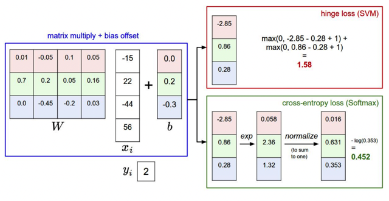</kbd>

> [!NOTE]
> Đại khái là nhắc lại rằng interpretation của mỗi loại loss.
> Thì với SVM kiểu như nó tập trung vào việc gia tăng khoảng
> cách giữa score của correct class và các scores của incorrect
> class.
>
>
>
> Còn với Softmax thì nó muốn tạo một probability distribution 
> sát với target distribution

 

<kbd>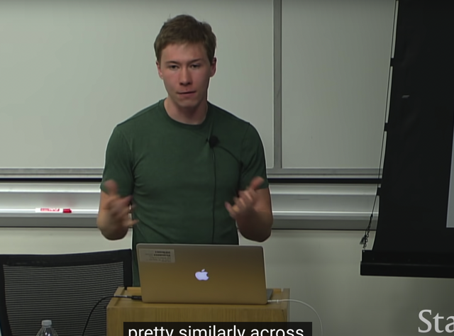</kbd>

> [!NOTE]
> Đại khái là SVM chỉ kiểu như gia tăng score của correct class lên đủ để 
> classify nó rồi stop. Trong khi đó softmax thì luôn muốn làm nữa làm nữa
> liên tục lấy probability score từ incorrect class dồn vào cho correct class
>
>
>
> Kết qủa thì thực tế hai thằng đều tạo hiệu quả như nhau nhưng nên hiểu
> bản chất của hai thằng

 

<kbd>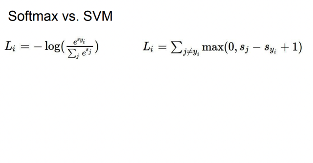</kbd>

 

<kbd>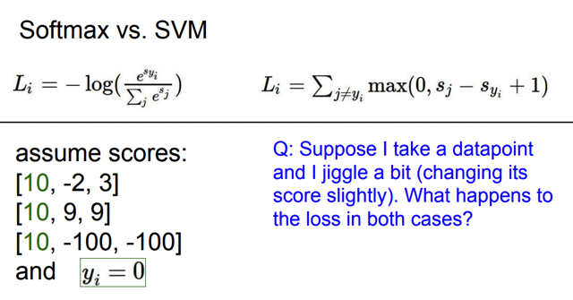</kbd>

 

<kbd>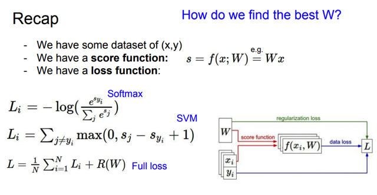</kbd>

> [!NOTE]
> Rồi vậy có loss rồi thì làm sao
> dùng nó để tìm ra W

 

<kbd></kbd>

 

<kbd>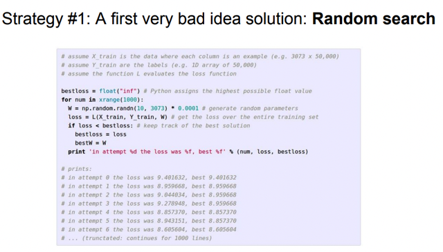</kbd>

> [!NOTE]
> thì đại khái là là nói giỡn chơi chút cho vui đó là có thể
> dùng cách random search - kiểu như thử các randomly W
> tính ra loss xem thử

 

<kbd>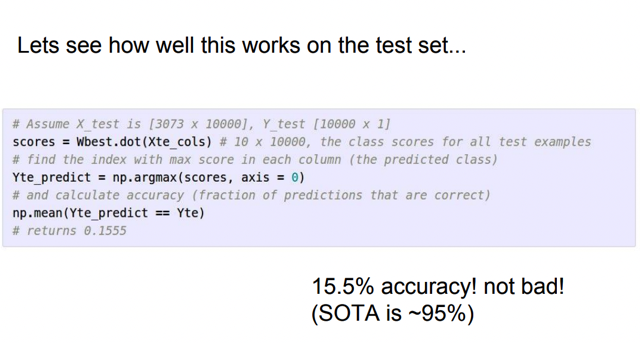</kbd>

> [!NOTE]
> Và một cách may mắn nào đó có
> thể đạt p15.5% accuracy.

 

<kbd>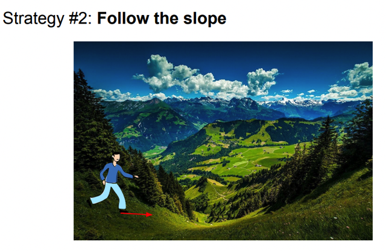</kbd>

> [!NOTE]
> thì cách mà ta đã biết là gradient descent, ta sẽ bước
> theo chỗ nào có độ dốc cao nhất. Thì ổng nói cách này có
> vẻ là một algorithm đơn giản nhưng lại rất hiệu qủa

 

<kbd>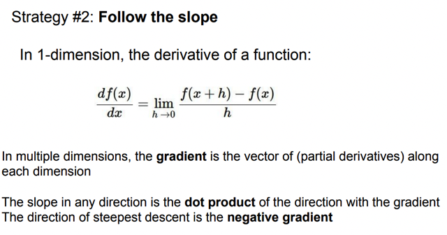</kbd>

> [!NOTE]
> nói về derivative of f w.r.t scalar x sẽ là độ dốc của function f tại x.
> Mới x là vector, thì ta sẽ dùng "gradient" là vector các partial derivative
> hàm f w.r.t các element của x
>
>
>
> Thì k**hi đó mỗi cái (ví dụ partial derivative of f w.r.t x_2) là độ dốc của 
> function f ở hướng của unit vector ứng với x_2.**

 

<kbd>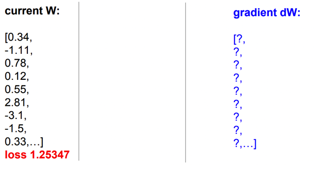</kbd>

 

<kbd>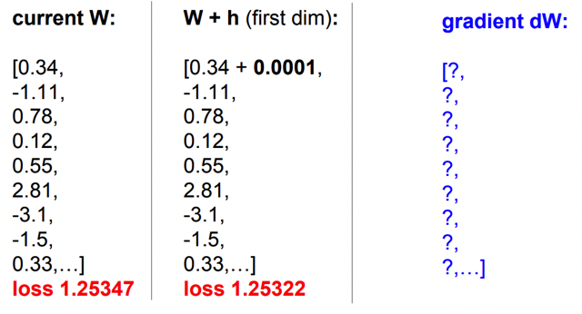</kbd>

 

<kbd>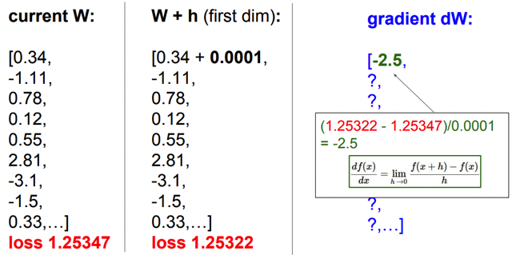</kbd>

> [!NOTE]
> Đại khái là nói về một cách tính gradient theo kiểu thủ công gọi là
> **numerical gradient** trong đó ta **lần lượt tăng từng params ví dụ w_1**
> (trong vector w) một khoảng dw1 rồi **tính lại loss, và từ đó tính ra khoảng
> thay đổi của loss (dL)**, **rồi chia cho khoảng thay đổi dw1 của w1 để ra
> dL/dw1**.

 

<kbd>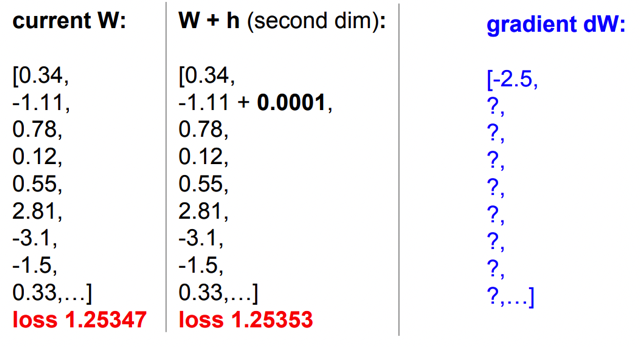</kbd>

> [!NOTE]
> Tiếp tục lặp lại như vậy cho các w_i khác để có dL/dW_i.

 

<kbd>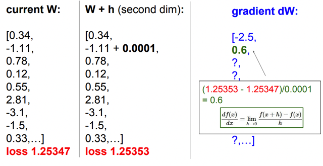</kbd>

 

<kbd>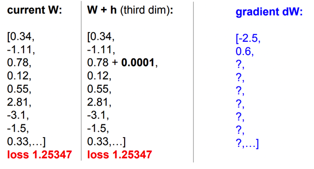</kbd>

 

<kbd>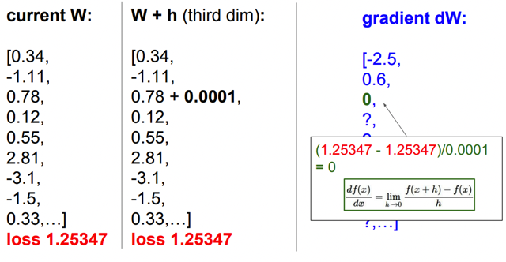</kbd>

> [!NOTE]
> Thì cách này ổng nói là terrible. Vì với hàng trăm triệu params, nó
> sẽ rất chậm trước khi có được một vector dL/dw

 

<kbd>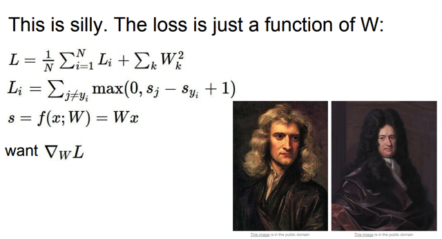</kbd>

> [!NOTE]
> Đại khái là nhờ các lý thuyết về tích
> phân của Newton và Lebnit cho phép
> tính ra dL/dw một lần luôn

 

<kbd>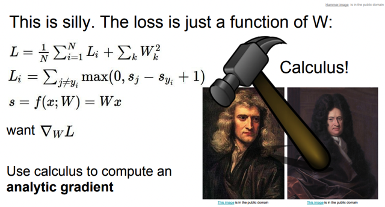</kbd>

 

<kbd>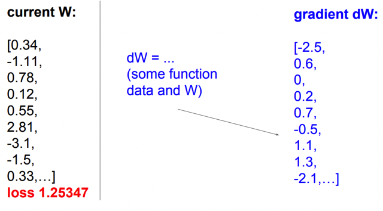</kbd>

> [!NOTE]
> Từ đó ta chỉ cần tính một phát ra ngay
> dL/dW và dùng nó để update W theo hướng giảm Loss

 

<kbd>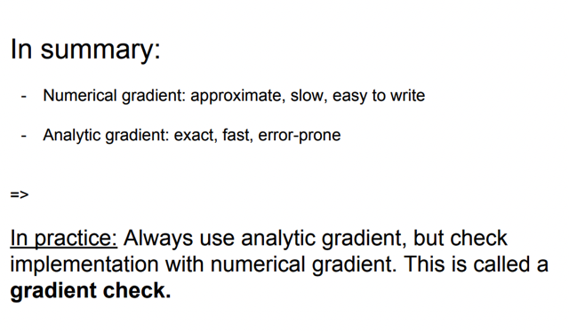</kbd>

> [!NOTE]
> Tóm lại là có hai cách để tính gradient, và tuy là khi dùng để training
> model thì ta tính với "analytic gradient" nhưng numerical gradient lại
> giúp ta debug xem mình tính gradient có đúng không gọi là gradient check
>
>
>
> Cái **gradient check** này mình đã được học bên DLSpec. Trong đó ta
> tính **dL/dw1** thủ công thì chính là dùng **numerical gradient**

 

<kbd>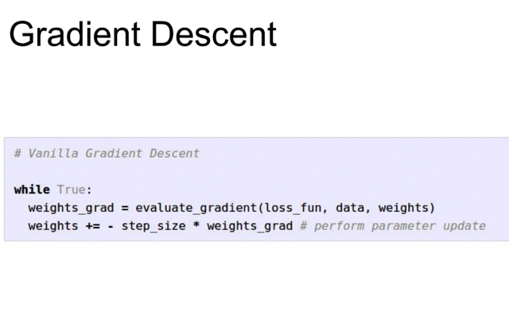</kbd>

> [!NOTE]
> Đại khái là tóm lại t**rái tim của mọi quá trình training model** chính là
> gom gọn trong hai dòng này của quá trình **gradient  Descent**: Tính
> gradient, là cái **hướng thay đổi của các tham số mà tăng nhiều nhất
> cost function**. Và khi ta **update các tham số W theo hướng ngược
> lại** thì ta sẽ **giảm cost function theo hướng nhiều nhất.**
>
>
>
> Và ta sẽ làm đi làm lại như vậy cho đến khi minimized cost function.
>
>
>
> Thì ổng nói s**tep_size hay learning rate thể hiện khoảng lớn nhỏ mà ta
> bước theo hướng đi đó**. Và chia sẻ thêm cá nhân thầy thì đây là **một
> trong nhưng hyperparam quan trọng nhất cần được tuned đầu tiên.**

 

<kbd>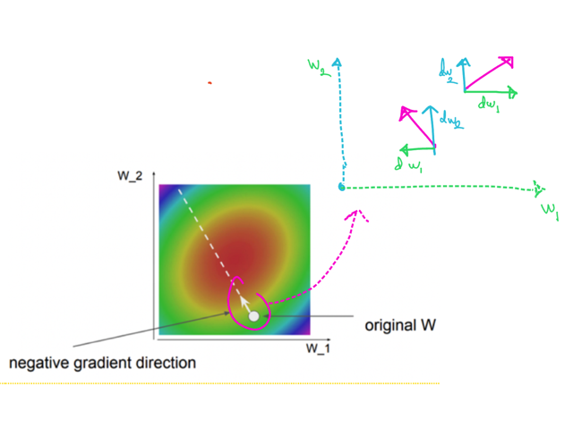</kbd>

> [!NOTE]
> Nhân đây hiểu ra một điều có thể thầm vướng mắc (chưa hiểu) bấy lây nay
> đó là **tại sao nói dL/dW** **lại thể hiện cái hướng** (để rồi mới nói thêm là cái
> hướng mà giúp Loss tăng lên nhiều nhất)
>
>
>
> À thì ví dụ nhìn hình ta thấy, để thể hiện một hướng đi trong không gian 2D
> này (ví dụ các vector màu hường) thì phải biểu diễn nó bởi hai vector của
> hai hướng w1,w2 với **giá trị âm hay dương sẽ thể hiện chiều của chúng**  và
> **độ lớn của mỗi thằng khi combine lại sẽ cho ra hướng của vector màu
> hường.**
>
>
>
> Nên làm rõ tại sao một vector hai con số lại thể hiện hướng.

 

<kbd>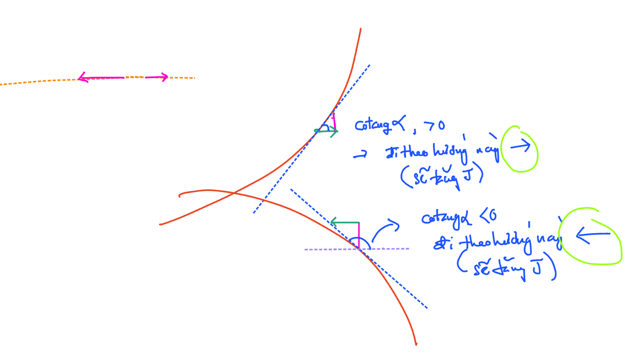</kbd>

> [!NOTE]
> Và nghiệm ra 1 điều là nếu dùng mô hình 1D tức là chỉ 1 feature (chỉ có 1 w) thì sẽ khó
> hiểu việc tại sao đi theo hướng tiếp tuyến lại giúp tăng cost nhanh nhất là vì thực ra
> trong **không gian 1 chiều**, **chỉ có 2 hướng** có thể đi thôi: **một là tăng**, **hai là
> giảm**.
>
>
>
> **Vậy thì trong hai phương sẽ chỉ là: phương âm hay phương dương thôi** thì nhờ theo
> phương tiếp tuyến có giá trị tính bằng hệ số góc sẽ cho ta biết phải đi theo phương nào
> để tăng của J và **giá trị âm dương của hệ số góc sẽ cho biết chọn âm hay dương**,
> hay nói cách khác là **chọn tăng hay giảm w**. Còn tăng hay giảm bao nhiêu nhiều hay
> ít thì lại do learning rate quyết định
>
>
>
> Nhưng qua **2D thì để xác định hướng không chỉ là tăng hay giảm w1,w2 nữa mà còn
> phải biết độ lớn bao nhiêu** vì **trong không gian 2D ta có vô số hướng** (quay 1 vòng
> 365 độ có vô số hướng để chọn)

 

<kbd>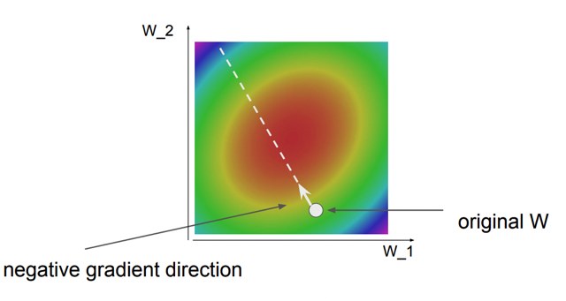</kbd>

> [!NOTE]
> Như vậy thì đã hiểu, nhờ việc tính dL/dW ta xác định được
> hướng mà nếu update W theo hướng đó sẽ giúp tăng
> cost nhanh nhất và **để giảm cost nhanh nhất thì ta update
> W theo hướng ngược lại**

 

<kbd>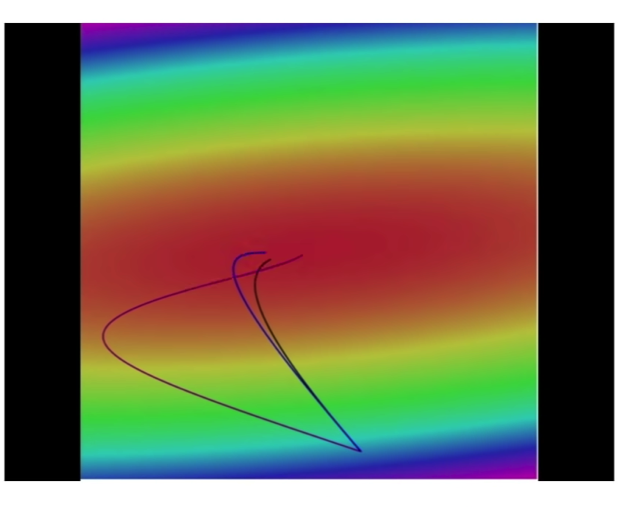</kbd>

> [!NOTE]
> Nói sơ qua một sự cải tiến của Vanilla GD giúp tăng
> tốc quá trình converge như GD with Momentum,
> Adam mà ta đã học bên DLSpec

 

<kbd>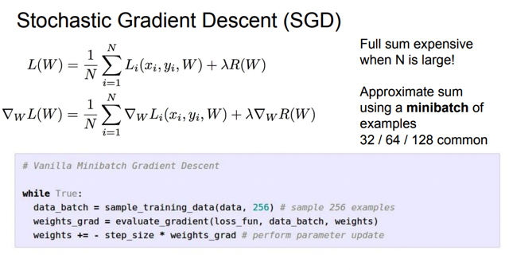</kbd>

> [!NOTE]
> Nói về Stochastic và Mini-batch G.D đã biết rồi khỏi nói lại, mục đích là để
> **giảm thời gian tính gradient trên toàn bộ training sét** (như trong batch
> vanilla gradient descent) **hi sinh một chút sự chính xác** (trong hướng đi
> đúng nhất nhanh nhất xuống thung lung) bằng cách **chỉ ước lượng hướng
> đi bằng việc tính toán trên 1 hoặc vài data sample thôi**. Nhưng bù lại **"
> quyết định đi hướng nào nhanh hơn"** và **kết quả là "xuống thung lũng"
> nhanh hơn**

 

<kbd>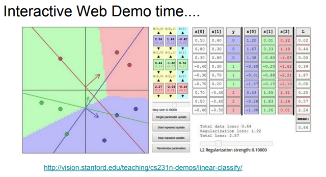</kbd>

> [!NOTE]
> http://vision.stanford.edu/teaching/cs231n-demos/linear-classify/

 

<kbd>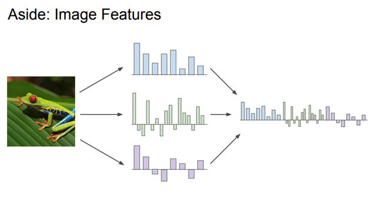</kbd>

> [!NOTE]
> Đại khái là việc dùng raw pixel làm feature sẽ không hiệu quả vì nhiều lí do
> như số chiều không gian (của feature vector) quá lớn ví dụ bức hình có
> size 1000x1000x3 thì feature vector sẽ là 3 triệu dimensional vector

 

<kbd>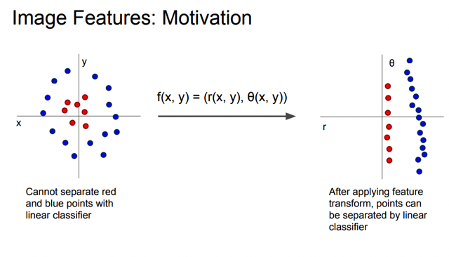</kbd>

> [!NOTE]
> Và nguyên nhân thứ 2 đại khái là khó vì ví dụ như trong vấn đề gốc
> các data point phân bố như hình bên trái thì sẽ không thể separate
> chúng bằng linear classifier được.
>
>
>
> Nhưng nếu có thể transform feature (nôm na là chuyển feature từ
> original feature space  là raw pixel value, sang feature khác ở feature
> space khác, mà vẫn đại diện được cho image ban đầu, thì có thể dễ
> separate hơn

 

<kbd>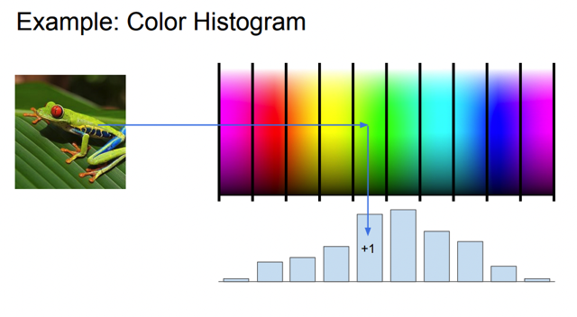</kbd>

> [!NOTE]
> Đại khái một cách (feature representation) đó là dùng color
> distribution histogram, nôm na là thống kê (histogram) trong image
> có những thang màu nào và mức độ của các màu nhiều ít ra sao.
>
>
>
> Ví dụ như cái hình con ếch này có màu xanh dominate sẽ được
> represent bởi feature vector trong đó thể hiện à, cái hình này phần
> lớn là màu xanh.

 

<kbd>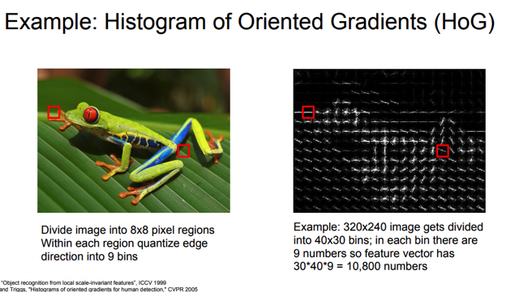</kbd>

> [!NOTE]
> Thì cách này tương tự, nắm bắt thông tin thống kê của image ở khía
> cạnh các edge
>
>
>
> Trong đó người ta chia bức hình ra thành nhiều vùng nhỏ (bin) và trong
> mỗi vùng ta xem thử là cái edge ở hướng nào là chủ đạo. Thì từ đó nôm
> na là represent cái hình con ếch ở dưới cho thấy nó  có nhiều hướng
> (edge) ở chiều đường chéo
>
>
>
> Nói chung đó là những cách thức mà người ta cố gắng để represent
> feature của image. Thay vì dùng raw pixel value

 

<kbd>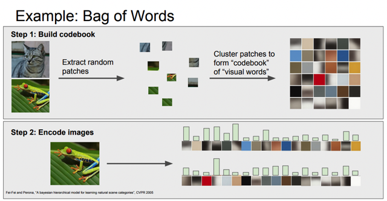</kbd>

> [!NOTE]
> Hiểu nôm na là cách này dùng ý tưởng của NLP, trong đó đại diện mỗi từ bởi
> một vector (có thể là embedding vector hoặc các representation vector kiểu
> khác rồi từ đó ta có thể đại diện một đoạn văn bản bằng combination của các
> word vector.
>
>
>
> Thì ở đây, đại khái người ta chia nhỏ các image thành các patches nhỏ chứa
> các tạm gọi là "basic pattern." Từ đó kiểu như ta có bộ vocabulary mà cấu
> thành lên mỗi một bức hình.
>
>
>
> Ví dụ như hình con ếch sẽ được đại diện bằng các sự nhiều ít của các basic
> pattern block này.

 

<kbd>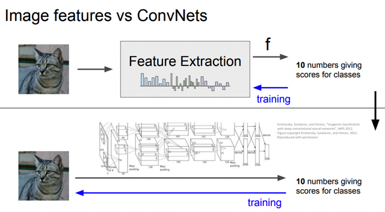</kbd>

> [!NOTE]
> Thì đại khái là t**rước đây**, ta sẽ sau khi **represent feature xong**, thì ta  build
> và **train classifier bằng các feature vector này**, khi đó ta **chỉ tweak model's
> weight thô, không đụng vào feature vector nữa.**
>
>
>
> Nhưng như ông Andrew Ng cũng từng nói, với DL, và big data, cơ bản là ta
> s**ẽ train cả hệ thống từ đầu đến cuối**, trong đó các layer của DNN sẽ đóng
> vai trò là **giúp model tự học, từ tìm cách làm cái việc xây dựng feature
> vector luôn**. Có nghĩa là nó **sẽ vừa train classifier và vừa tìm cách tạo
> feature vector cùng lúc.**

 

<kbd>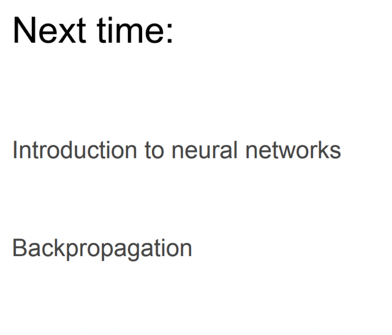</kbd>

 

## LECTURE NOTE: Linear classification: Support Vector Machine, Softmax

 

<kbd>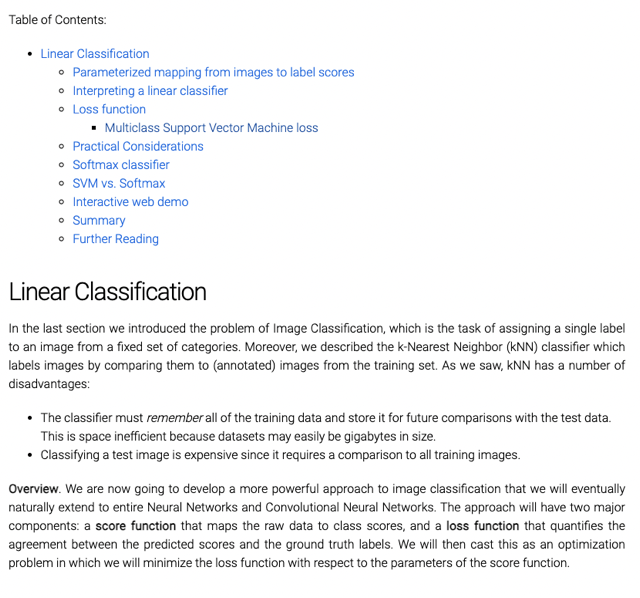</kbd>

> [!NOTE]
> Đại khái là ta đã biết bài toán Image classification, trong đó ta phải map
> một image với một category. Biết về KNN và nhược điểm của nó khi phải
> nhớ toàn bộ training sét. Đồng thời quá trình tính toán cũng tốn kém khi
> phải so sánh (distance) với mọi training sample
>
>
>
> Ở đây ta sẽ dùng một cái mạnh hơn dần dần mở rộng sang NN và CNN
> Trong đó ta define score function và loss function để rồi từ đó xây dựng
> objective function

 

<kbd>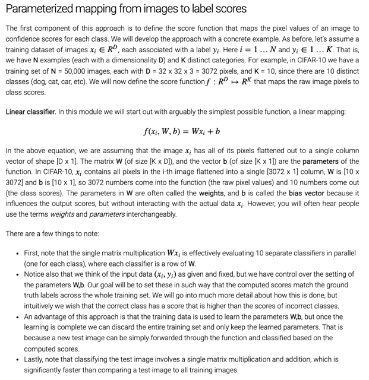</kbd>

> [!NOTE]
> Đại khái là mỗi bức hình sẽ được flatten thành x = 1D vector. Để rồi tính
> toán với phép tính matrix multiplication với weight matrix W (Dx10) và
> cộng với B (10,)
>
>
>
> Thì người ta nói cơ bản là ta đang dùng 10 cái linear classifier mỗi cái là
> một vector hàng của W. Khi tính W.x thì cơ bản là ta  Tính 10 phép d.p
> của x các row vector w (i,:) của W. Thì như ta biết kiểu như với cái này
> thì model training ra mỗi w(i,:) sẽ giống như là tìm ra một pattern chung
> nhất giữa tất cả các image của một loại. Để rồi nếu mà một image mới
> mà giống với cái pattern chung của loại (category) đó nhất (thể hiện qua
> việc có chỉ số score = d.p của x và w(i,:) lớn nhất thì ta sẽ kết luận
> category của image là loại đó (thứ i trong các class i=1...K)
>
>
>
> Nói chung cái này y như Linear Classification (logistic regression) chỉ
> có thiếu bước bỏ score qua sigmoid thôi.
>
>
>
> Có nói về bias có tên như vậy vì nó thể hiện giá trị của f^(x(i)) nếu không
> xài đến x(i) - tức là x(i) không ảnh hưởng gì, nên gọi là bias / là định kiến
>
>
>
> Tiếp một ý nữa là với cái này ta sẽ sau khi training xong thì vứt bộ training
> data đi, chỉ còn dùng W,b để making prediction thôi.
>
>
>
> Cuối cùng là nó sẽ tính nhanh hơn KNN nhiều khi không phải tính distance

 

<kbd>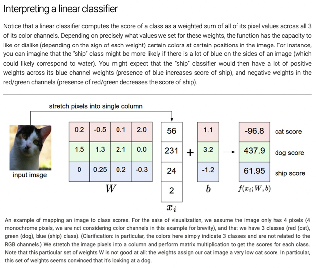</kbd>

> [!NOTE]
> Đại khái là như mới nói, nôm na trong model này, nó sẽ chỉnh (học) các 
> pattern chung nhất của mỗi loại từ training images, thể hiện thành một
> vector có D chiều, (ví dụ 3072). Để rồi nếu test image vector có độ giống
> cao nhất với vector row của loại A thì nó sẽ có score (d.p x(i)wA + bA cao nhất)
> Thì người ta ví dụ là vector w của loại "tàu biển" khả năng cao là có nhiều
> màu xanh, tức là dải value ở 1 phần 3 cuối của vector sẽ có giá trị cao. Khi đó
> nếu test image có nhiều màu xanh, thì 1 phần 3 cuối cũng có giá trị cao thì 
> d.p với w_"ship" sẽ ra giá trị cao.

 

<kbd>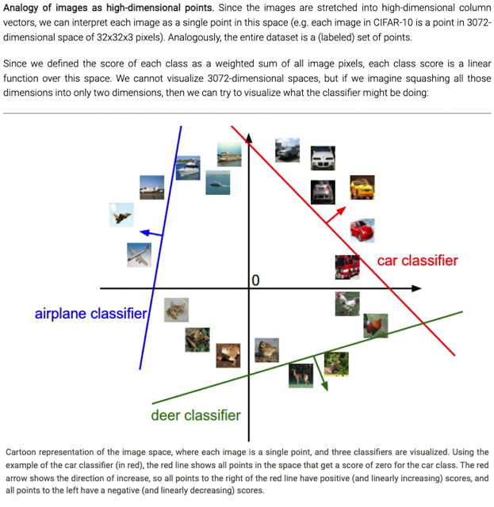</kbd>

> [!NOTE]
> Đại khái là thể hiện trong không gian 33072 chiều của các feature vector (các
> flatten vector của image). Thì Linear Classifier nó sẽ sử dụng các linear
> hyper-plane để chia tách các điểm đó. Hyper-plane cao chiều những vẫn là
> tuyến tính (plane).
>
>
>
> Vì dể hình dùng là nếu có 3D thôi, thì mỗi classifier (mỗi rơ của W) sẽ tạo các
> mặt phẳng chia tách. HOặc nếu 2D thôi , thì mỗi classifier sẽ tạo các line chia
> tách.
>
>
>
> Trong đ1o những điểm trên line sẽ là có score của class tương ứng đó = 0.
> những điểm ở bên có dấu mũi tên thì sẽ có score class dương, ngược lại là âm.
>
>
>
> Và cuối cùng là cái hình tượng khi ta thay đổi (khi train model) các giá trị của
> W thì sẽ quay các line này

 

<kbd>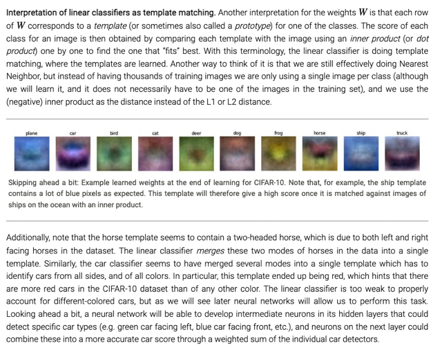</kbd>

> [!NOTE]
> Đại khái là như trên đã nói, trong cái này thì mỗi cái row vector w_i của W
> đóng vai giống như cái template. Được model learn sao cho chứa  đựng
> những cái chung nhất của một class i tương ứng. Để rồi khi image mà giống
> với cái template nào nhất đồng nghĩa với việc dot product của image vector
> với w_i đó sẽ cao nhất thì khả năng class của image đó sẽ là class i.
>
>
>
> Thì cái hay là họ nói cái này ta có thể coi như cũng vẫn là KNN, tuy nhiên thay
> vì khi inference, ta tính distance của query image với tất cả cả image trong
> training set rồi sort để lấy "cái" có distance nhỏ nhất. Thì đây ta tính distance
> của query image với cái "đại diện" của mỗi trong 10 class. Và dùng một chỉ số
> cũng thể hiện distance đó là dot product. để lấy ra cái có distance  nhỏ nhất
> (dot product cao nhất).
>
>
>
> Đại khái là linear classifier chỉ là một model yếu khi kiểu như nó chỉ represent
> các pattern theo kiểu "có nhiêu trộn hết lại" ví dụ như ở class horse nó tổng
> hợp là lại thành ra cái template trông như có hai con ngựa quay đầu về hai
> hướng, vài bữa khi qua NN, hay DNN thì nó có thể represent các pattern tốt
> hơn để rồi nó sẽ đánh giá chính xác hơn

 

<kbd>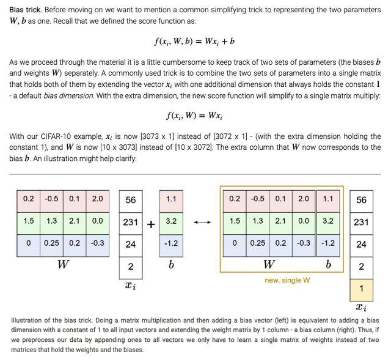</kbd>

> [!NOTE]
> Đại khái không có gì, chỉ là thay vì để riêng W và b, người ta có thể 
> gộp chung nó lại, muốn vậy thì feature x(i) sẽ có thể một "bias dimension"
> mang giá trị = 1. Cái này ở ML old course của Andrew ng mình đã thấy.

 

- **Image data preprocessing. As a quick note, in the examples above we
used the raw pixel values (which range from [0…255]). In Machine
Learning, it is a very common practice to always perform normalization of
your input features (in the case of images, every pixel is thought of as a
feature). In particular, it is important to center your data by subtracting the
mean from every feature. In the case of images, this corresponds to
computing a mean image across the training images and subtracting it
from every image to get images where the pixels range from
approximately [-127 … 127]. Further common preprocessing is to scale
each input feature so that its values range from [-1, 1]. Of these, zero
mean centering is arguably more important but we will have to wait for its
justification until we understand the dynamics of gradient descent**

> [!NOTE]
> Đại khái là thông thường ta phải thực hiện normalization trong đó ta trừ mỗi
> pixel (và cũng gọi là feature trong trường hợp khi xây dựng model với image
> như thế này) với mean của feature đó tính trên toàn bộ dataset. Có nghĩa là
> nếu X là matrix cho toàn training data sét với shape là m,n = D thì ta sẽ tính
> mean của các cột (trong D = 3072 cột, la 3072 feature)
>
>
>
> Như ta cũng đã hiểu ra nó cũng ra vector mean có 3072 unit để rồi ta sẽ trừ
> X với hai vector mean (để  mỗi pixel sẽ được trừ đi mean thì từ range 0-255
> trở thành range -127:127, và thường được scale tiếp để thì trở thành là
> range -1:1
>
>
>
> Thì đại khái là họ nói sẽ có tác dụng trong quá trình Gradient Descent

 

- **Loss function In the previous section we defined a function from the pixel
values to class scores, which was parameterized by a set of weights W .
Moreover, we saw that we don’t have control over the data (xi,yi)  (it is fixed
and given), but we do have control over these weights and we want to set
them so that the predicted class scores are consistent with the ground truth
labels in the training data.

For example, going back to the example image of a cat and its scores for the
classes “cat”, “dog” and “ship”, we saw that the particular set of weights in that
example was not very good at all: We fed in the pixels that depict a cat but the
cat score came out very low (-96.8) compared to the other classes (dog score
437.9 and ship score 61.95). We are going to measure our unhappiness with
outcomes such as this one with a loss function (or sometimes also referred to
as the cost function or the objective). Intuitively, the loss will be high if we’re
doing a poor job of classifying the training data, and it will be low if we’re doing
well.**

> [!NOTE]
> Đại khái là đầu tiên ta sẽ xây dựng những function cho phép đánh
> giá performance của model - Loss function hay objective function.
> Để rồi khi đó với một bộ giá trị của params ta mới biết được là
> model đang tốt hay tệ tới đâu

 

<kbd>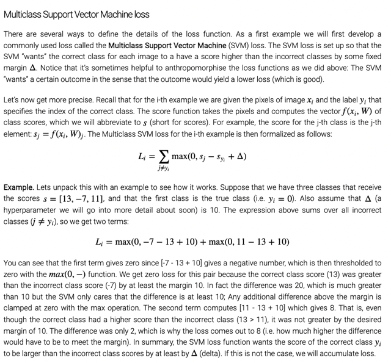</kbd>

> [!NOTE]
> Đại khái cách đầu tiên là dùng SVM loss. Cơ bản là trong cách xây
> dựng loss function này, model nó sẽ kiểu như sẽ happy nếu score của
> correct class lớn hơn score của incorrect class một khoảng Delta và sẽ
> không hài lòng nếu không đạt điều này.
>
>
>
> Thành ra function sẽ được xây dựng sao cho, một score của một incorrect
> class thỏa điều này thì loss trên class đó = 0, còn không thì sẽ bằng khoảng
> cách mà model cần phải nới rộng ra thêm để đạt điều này.
>
>
>
> Do đó cách xây dựng của function đó là nó sẽ check các incorrect score sj 
> không check correct score (j!=yi). Để rồi, nó tính loss (tại/đối với incorrect class) 
> đó là max(0, sj - syi + Delta) chính là để nếu đã thỏa thì sẽ là 0, còn không thỏa
> thì nó sẽ là phần cần phải giảm bớt thêm nữa để thỏa.
>
>
>
> Nói chung SVM loss sẽ tiếp tục tăng correct score lên đến khi correct score
> vượt trội các incorrect score một khoảng an toàn.

 

<kbd>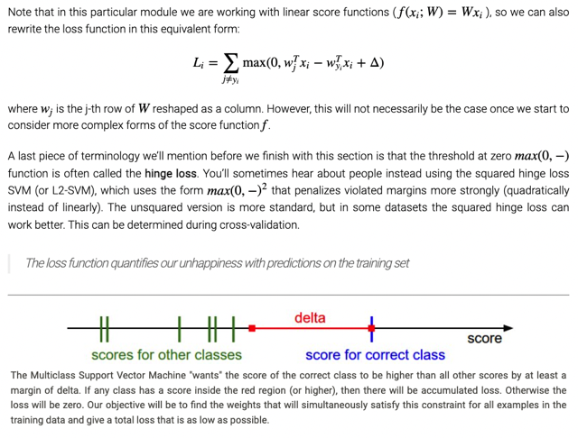</kbd>

> [!NOTE]
> Thì thay các score bằng dot product của wj và x(i) vào thì ta có công thức này.
>
>
>
> Thì người ta nói thêm cái này còn có tên là hinge loss và đôi khi giống như MSE, 
> để penalize mạnh hơn thì người ta dùng bình phương, gọi là L2-SVM

 

<kbd>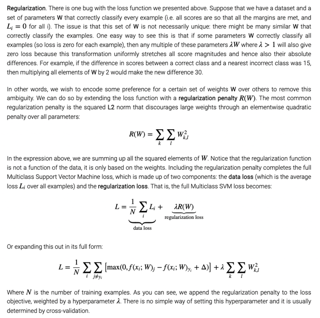</kbd>

> [!NOTE]
> Đại khái là người ta nói với cái SVM loss này rất dễ lập luận để chứng minh rằng
> giả sử có W khiến L = 0 với mọi data sample i rồi thì các matrix W khác = lambda.
> W với lambda dương sẽ vẫn khiến L = 0. Có nghĩa là có thể có vô số gía trị của W
> khiến đạt được L = 0.
>
>
>
> Thì người ta nói để mà hạn chế cái này, có thể đưa vào thêm Regularization loss
> term. Với công thức nếu xài L2 Reg thì cơ bản là tổng bình phương  tất cả các wij
> trong matrix, nhân thêm hyperparams lambda có thể tìm bằng quá trình
> hyperparam tuning với cross validation.
>
>
>
> Thì bias không có ảnh hưởng gì nếu muốn bỏ vào (loss term) hay không cũng đều
> được.

 

<kbd>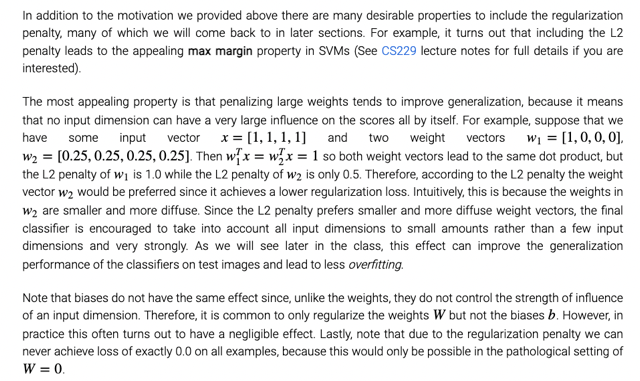</kbd>

> [!NOTE]
> Thì cuối cùng người ta nhắc lại ví dụ trong đó cho thấy tại sao L2 loss lại
> giúp tạo ra W "diffuse" hơn = phân tán hơn dàn trải ra nhiều feature hơn
> từ đó giúp giảm overfit (khi ta biết rằng overfit có nguyên nhân do trạng
> thái high variance, khi nó quá đánh giá cao một feature nào đó thì sẽ
> cũng giống như nó đánh gía quá cao một data sample nào đó để rồi khi
> bỏ cái data sample đó ra khỏi training set lập tức model  bị bối rối và
> thay đổi lớn - high variance)
>
>
>
> Tuy nhiên trong bài có nói, tùy vào bài toán cụ thể mà có thể dùng L2 L1
> reg term khác Nhau vì mỗi loại sẽ có một cách định nghĩa simple model
> là sao khác nhau. L1 thì  cho rằng simple model là các weight nào ít ảnh
> hưởng thì cho bằng 0 luôn còn L2 thì dàn trải ra.
>
>
>
> Tóm lại với reg term ta dễ dàng thấy không có chuyện có nhiều giá trị
> khiến L = 0 nữa

 

<kbd>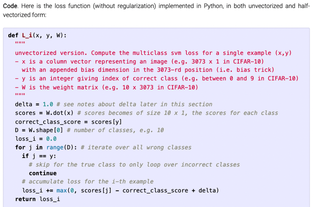</kbd>

> [!NOTE]
> Phiên bản tính L(i) có dùng loop, cũng dễ hiểu, trong đó, ta sẽ loop
> qua các score trong D scores, bỏ qua cái correct class score là cái ở
> index  = y.
>
>
>
> Rồi với mỗi cái incorrect class score, tính loss L và cộng dồn lại

 

<kbd>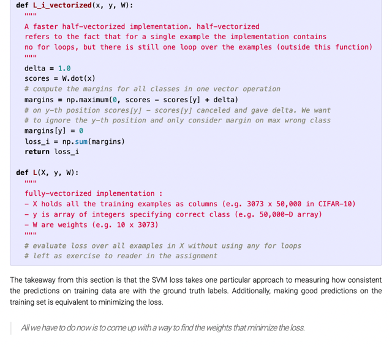</kbd>

> [!NOTE]
> Ở phiên bản half_vectorized thì đầu tiên là tính W.x để ra vector scores
> Dx1 lấy scores Dx1 này trừ đi scores[y] là chỉ số score của correct
> class thì  Python broadcasting sẽ biến chỉ số đó thành vector. Để thành
> ra hai vector trừ nhau. hoặc hiểu theo nghĩa vector trừ 1 số scalar thì
> bằng element-wise  Subtraction cũng được.
>
>
>
> Xong lấy max(0, với một vector) thì kiểu như ra vector các phép max(0,
> element) Nhưng do làm kiểu này vẫn có các việc "tính cho correct
> class" nên phải khử đi bằng cách cho margins[y] = 0. Cuồi cùng sum lại
> để ra loss
>
>
>
> ===
>
>
>
> Cái cuối để dành cho mình làm

 

<kbd>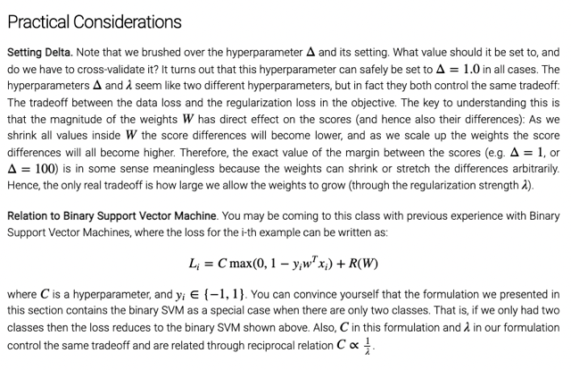</kbd>

> [!NOTE]
> Đại khái là người ta nói thực tế chỉ cần chọn Delta = 1 là được vì với Reg
> term, trong đó có lambda, nó sẽ không chế khiến co dãn cái W từ đó ảnh
> hưởng cái margin dẫn đến là có set nhiều các giá trị Delta cũng vô ích
>
>
>
> Cái nữa đó là nếu đã từng học về Binary SVM (mà mình đã học trong
> ML Old class) thì cái SVM chính là bản multi class của Binary SVM

 

<kbd>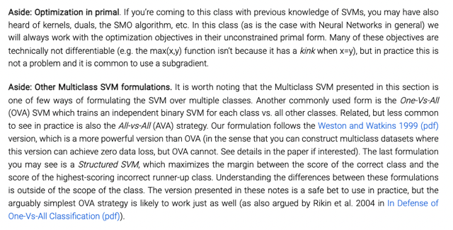</kbd>

> [!NOTE]
> Một số Ghi chú bên lề quay lại sau

 

<kbd>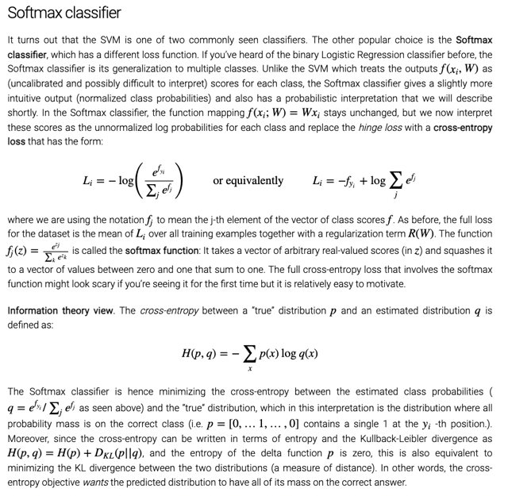</kbd>

> [!NOTE]
> Thì đại khái là nói về loss function phổ biến thứ 2 cho bài toán này là
> Softmax là bản generalized của logistic function (Sigmoid)
>
>
>
> Trong đó đại khái là sẽ chuyển cái scores vector từ real number thành ra
> vector có tổng = 1, trong khoảng [0:1]. Từ đó giống như một probability
> distribution.
>
>
>
> Để rồi loss function sẽ dùng cross-entropy có tác dụng giảm khác biệt giữa
> hai probability distribution, một cái là predicted là vector các scores đã qua
> softmax một cái là target probability distribution trong đó mọi xác suất đều
> dồn cho correct class - chính là thể hiện bởi one-hot vector y(i).
>
>
>
> Cuối cùng có nhắc đến KLDivergence cũng là "thước đo sự khác biệt / phân
> kì của hai probability distribution"

 

<kbd>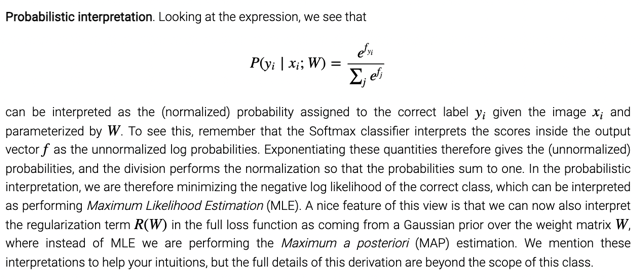</kbd>

> [!NOTE]
> Cái đoạn dưới nói về MAP Cụ thể là sao?
>
> Đại khái là hàm softmax coi input score tại yi scores[yi] như unnormalized
> log probabilities. nên việc nó làm là bỏ log (bằng cách exponential) và
> normalize (bằng chia cho tổng e^fj) để ra lại probability của correct class
> P(yi | xi, W)
>
>
>
> Thành ra việc dùng cross entropy loss function có thể hiểu là ta đang làm
> bài toán là Maximum Likelihood Estimation MLE

 

<kbd>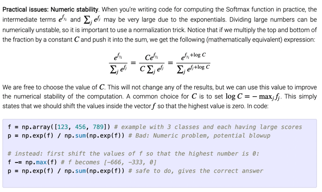</kbd>

> [!NOTE]
> Đại khái là khi tính softmax, nếu mẫu số lớn thì dễ bị numerical unstable
> issue. Thành ra người ta nói có thể dùng trick đó là nhân tử và mẫu cho 1 có
> C (thì kết quả vẫn không đổi). Thì có thể chọn C Bao nhiêu cũng được nhưng
> thường nên chọn = - giá trị lớn nhất frong f (score vector) tức là lấy bằng
> score lớn nhất.
>
>
>
> Thì người ta nói đại khái là nếu chọn như vậy thì cơ bản là mình dịch chuyển
> vector các scores lùi lại trên trục số để cái lớn nhất từ ví dụ 999 thành 0, cái
> nhỏ nhất ví dụ từ 0 thành -999

 

- **Possibly confusing naming conventions. To be precise, the SVM classifier
uses the \\*hinge loss\\*, or also sometimes called the \\*max-margin los\\*s. The
Softmax classifier uses the \\*cross-entropy loss\\*. The Softmax classifier gets
its name from the softmax function, which is used to squash the raw class
scores into normalized positive values that sum to one, so that the
cross-entropy loss can be applied. In particular, note that technically it
doesn’t make sense to talk about the “softmax loss”, since softmax is just the
squashing function, but it is a relatively commonly used shorthand.**

> [!NOTE]
> Đại khái là softmax chỉ là hàm biến vector logit thành
> probability distribution nên nói softmax loss là không đúng
> lắm (vì hàm loss thực sự có tên là cross entropy loss),
> nhưng thường hay gọi vậy cho tiện

 

<kbd>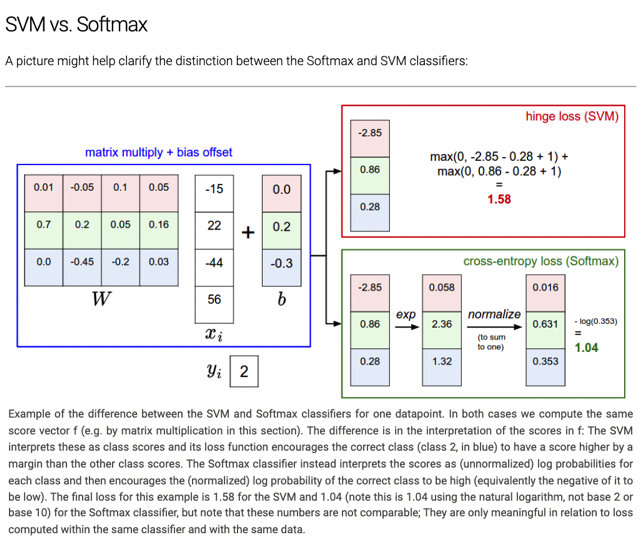</kbd>

 

<kbd>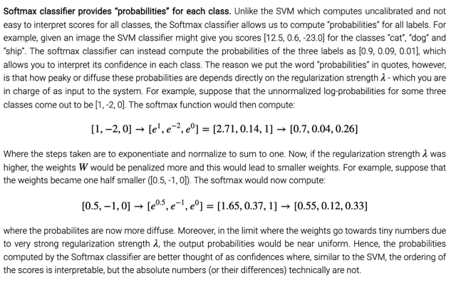</kbd>

> [!NOTE]
> Đại khái người ta nói rằng tuy softmax tạo ra cho ta probability nhưng
> nó không tuyệt đối theo nghĩa đó vì với các W khác nhau, cho ra các
> scores khác nhau thì probabilities cũng thay đổi. Thành ra nên hiểu nó
> như "độ tự tin" thì đúng hơn trong đó với correct class có p cao tức là
> model nó tự tin cao rằng input x là class đó hơn là các class khác.

 

<kbd>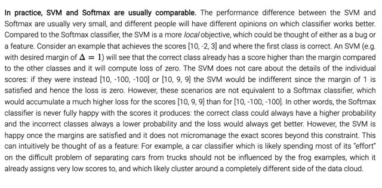</kbd>

> [!NOTE]
> Đại khái là nói về sự khác nhau của SVM khi chỉ quan tâm khoảng cách
> correct class score và mấy thằng incorrect class score có thể là bug nếu
> hiểu theo nghĩa là nó hời hợt quá cũng có thể coi như feature nếu hiểu
> theo nghĩa là nó không micromanage xét nét từng tí chỉ số tuyệt đối của
> score là bao nhiêu. Ngược lại với softmax.

 

<kbd>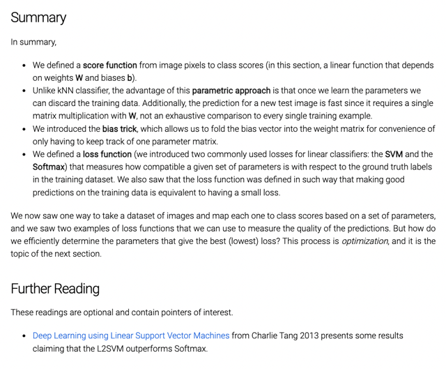</kbd>

> [!NOTE]
> Đại khái là tổng kết lại ta đã biết score function giúp tính ra chỉ số
> mà model "gán" một class cần predict cho một input image data
> Rồi việc sử dụng parametric approach như này giúp training tốn
> thời gian nhưng một khi train xong thì chỉ việc dùng bộ params W
> để predict thôi không còn cần training sét như KNN nữa.
>
>
>
> Biết về bias trick để kết hợp W và b lại thành một matrix.
>
>
>
> Biết về loss function SVM và Softmax giúp đánh giá độ chính xác
> trong khả năng fit - dự đoán khớp các input data và label của nó trong
> training set của model với một bộ W cụ thể.
>
>
>
> Tuy nhiên làm sao để tìm ra bộ params W giúp đạt loss tối thiểu thì ta 
> sẽ qua note 2.

 

## LECTURE NOTE: Optimization: Stochastic Gradient Descent

> [!NOTE]
> https://cs231n.github.io/optimization-1/

 

<kbd>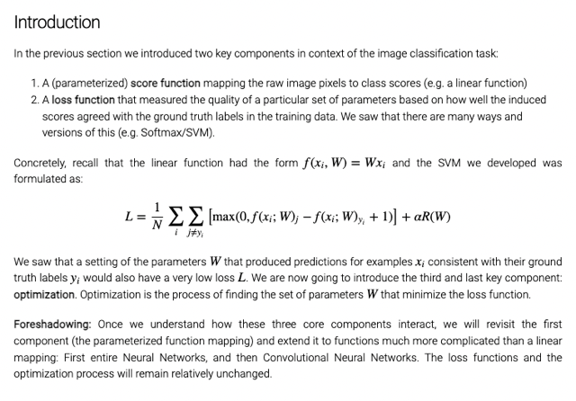</kbd>

> [!NOTE]
> Đại khái là ở note trước ta đã biết về score function và loss function giúp
> đánh giá khả năng của model trong việc mapping được đúng xi và yi. Mà hai
> function phổ biến là SVM và Softmax Ở đây ta sẽ làm bước cuối cùng,
> component cuối cùng của bức tranh đó là optimization để tìm các giá trị W
> giúp giảm thiểu loss.
>
>
>
> Từ đó qua NN và CNN ta sẽ vẫn dùng optimization này chỉ thay các kiến trúc
> model thôi

 

<kbd>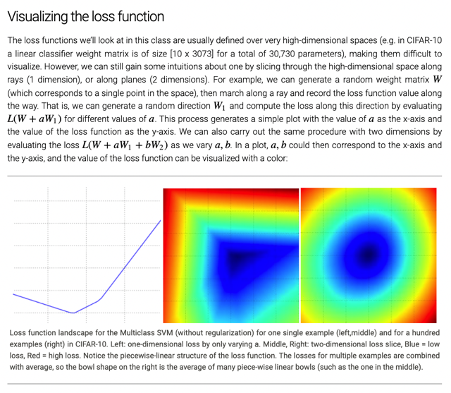</kbd>

> [!NOTE]
> Đại khái là ở đây nói về vấn đề khó khăn trong việc làm sao vẽ ra được đồ
> thị của loss function khi W thay đổi. Vì W là matrix có KxD = 10x3073. K =
> số class trong bài toán CIFAR-10 thì là 10, D là feature vector dimension =
> 32x32x3+1(bias) = 3073.
>
>
>
> Tức là với mỗi bộ W có thể coi như một vector có 30730 units, trong không
> gian 30730 dimensions.
>
>
>
> Thế thì một cách để visualize đó là người ta sẽ cho W thay đổi ở 1 hoặc 2
> trục trong  30730 dimension này, gọi là W1, W2 và vẽ J để rồi ta được một
> 1D hoặc 2D plot khi W1,W2 biến thiên.
>
>
>
> Nếu làm với 2 trục và với loss khi tính trên 1 data sample ta có hình giữa
> ta thấy gọi là **piecewise-linear structure** và nếu làm với **trung bình của
> nhiều data sample** thì ta có hình bên phải

 

<kbd>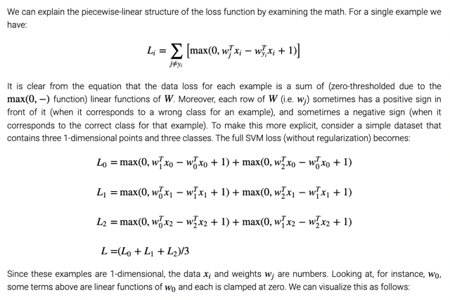</kbd>

> [!NOTE]
> Đại khái là người ta giải thích cho mình hiểu tại sao có dạng **piecewise-linear**
> như hình trên.
>
>
>
> Thì nôm na là để dễ hình dung người ta lấy bài toán với 1 feature thôi, tức
> x chỉ là một con số thực, không phải vector. Thì lấy ví dụ có 3 categories,
> có nghĩa là kết quả tính toán của model với một data sample sẽ là 3 class
> scores, từ đó tính ra loss tính trên mỗi data sample và tính loss nói chung
> sẽ là average của loss trên 3 data sample x(0), x(1), x(2)

 

<kbd>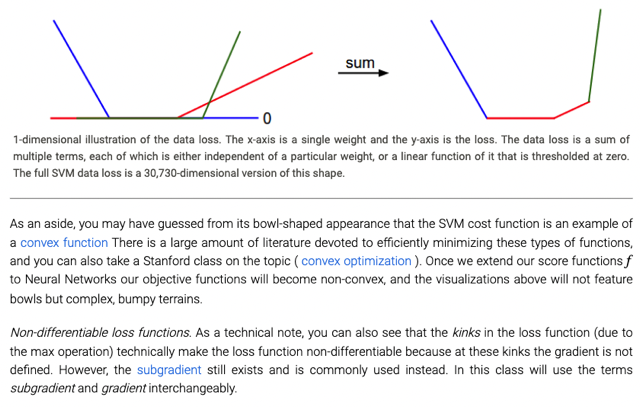</kbd>

> [!NOTE]
> QUay lại sau

 

<kbd>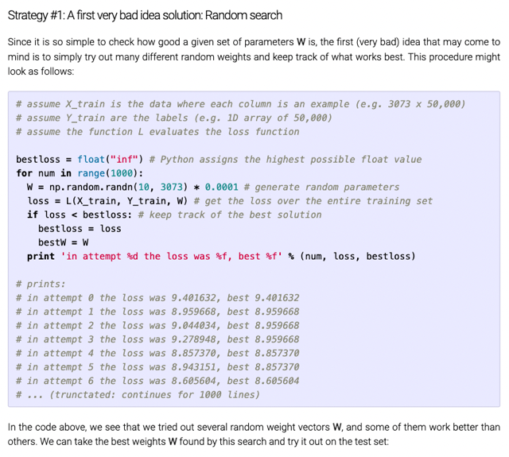</kbd>

> [!NOTE]
> Thì cách đầu tiên có thể nghĩ đến và cũng là cách tệ nhất đó là dùng
> random search - cứ lấy ngẫu nhiên các giá trị của W rồi tính loss
> xem thử cái nào tốt nhất

 

<kbd>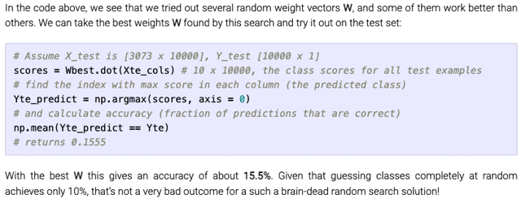</kbd>

> [!NOTE]
> Rồi với bộ W, tính thử
> tét sét cho ra 15%.

 

<kbd>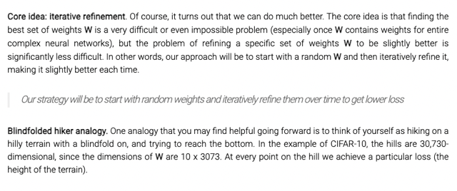</kbd>

> [!NOTE]
> Core idea là thay vì random chọn các bộ ngẫu nhiên W, ta có thể bắt đầu
> với ngẫu nhiên nhưng iteratively cải thiện chút từ từ để giảm dần loss
>
>
>
> Và analogy là như người đi leo núi muốn xuống núi thì ta sẽ đi mò mẫm
> từng  bước theo hướng có độ dốc lớn nhất. Nhưng có điều ở đây là trong
> không gian 30730 dimensions

 

<kbd>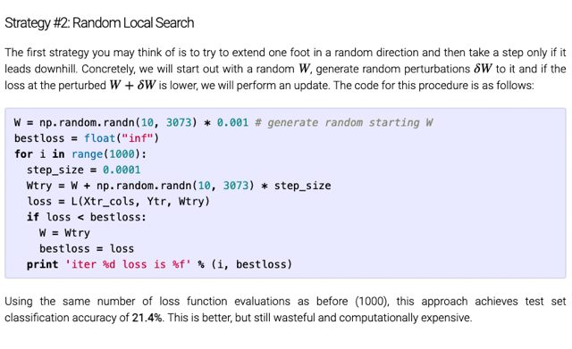</kbd>

> [!NOTE]
> Đại khái cách này là thử đi theo nhiều hướng khác nhau, xem thử hướng nào
> là giúp giảm loss nhiều nhất
>
>
>
> Ở đây họ thử 1000 lần. Mỗi lần ta sẽ thay đổi các giá trị của W ở một mức
> nhỏ xíu (Chính là thử update vị trí của current W point trong không gian
> 30730 chiều sang một vị trí gần đó ở khoảng cách rất nhỏ, nhưng hướng thì
> vẫn hoàn toàn  ngẫu nhiên) Để rồi tính loss xem thử trong 1000 hướng đó thì
> cái nào là giảm loss nhiều nhất.
>
>
>
> Thì cách này cho performance tốt hơn Random Search nhưng vẫn khá tệ khi
> cơ bản là vẫn phải mò mẫm xem hướng nào là tốt nhất,
>
>
>
> Ở analogy thì cách này chính là bước thử 1 bước về các hướng khác nhau
> 1000 lần xem thử kết quả hướng nào cho ta xuống đồi sâu nhát. Tất nhiên để làm
> Vậy thì phải bước lên bước về 1000 lần,

 

<kbd>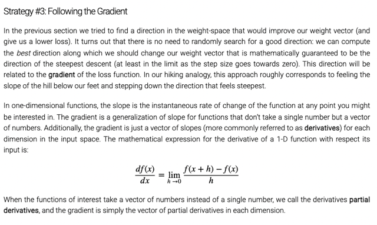</kbd>

> [!NOTE]
> Dùng G.D chính là thay vì thử và tìm các hướng ta chỉ việc đi theo hướng
> (ngược lại)  của gradient - là hướng mà theo tích phân sẽ khiến có độ dốc lớn
> nhất giúp function tăng nhanh nhất đồng nghĩa đi ngược laị hướng đó sẽ giảm
> loss nhanh nhất.
>
>
>
> HÌnh ảnh nôm na sẽ là ta xe thử dùng bàn chân để rờ xem hướng nào có dốc
> nhất thì đi hướng đó.
>
>
>
> Khi chỉ có 1 biến, hay không gian chỉ có 1 dimension thì nó gọi gradient hay
> derivative của f w.r.t x nhưng với không gian đa chiều khi x là vector thì
> gradient là vector tương ứng với số chiều của x chứ các phần từ là partial
> derivative của f w.r.t từng phần tử của x

 

<kbd>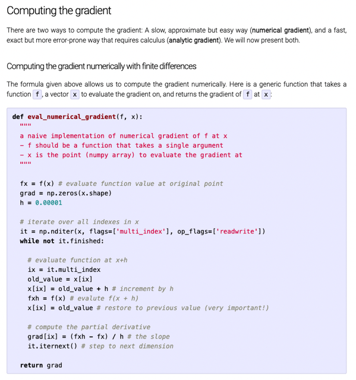</kbd>

<kbd>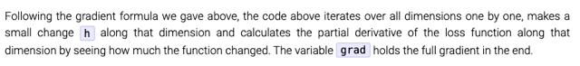</kbd>

> [!NOTE]
> Function này đại khái là nhận. 1 điểm (1 vector) ví dụ như w là [w1,
> w2...wn] Đầu tiên là nó tính f (hay loss function J) với bộ param này
> ư.
>
>
>
> Sau đó nó lần lượt thay đổi các phần tử của vector w ví dụ w_i một
> khoảng h rất nhỏ. và tính lại giá trị của function w + [0,..w_i + h,.  0]
> này và sau đó tính tỉ lệ f mới - f / h lưu vào vị trí i của gradient - là
> một vector cùng shape với w.
>
>
>
> Kết quả là ta sẽ có vector gradient - chứa các partial derivative của
> f w.r.t các phần tử của w
>
>
>
> Thì đây chính là cách tính đạo hàm theo numerical thường dùng để
> Gradient check

 

<kbd>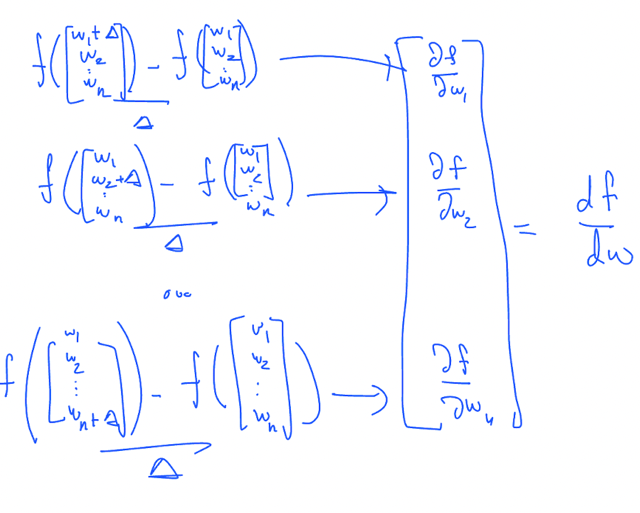</kbd>

 

<kbd>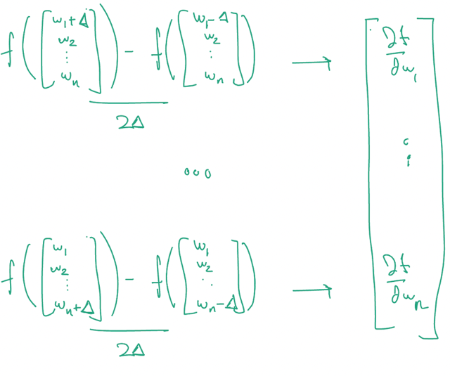</kbd>

> [!NOTE]
> Thì họ nói có thể dùng kiểu này
> cũng được sẽ chính xác hơn

 

<kbd>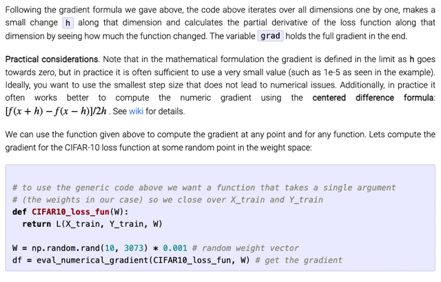</kbd>

 

<kbd>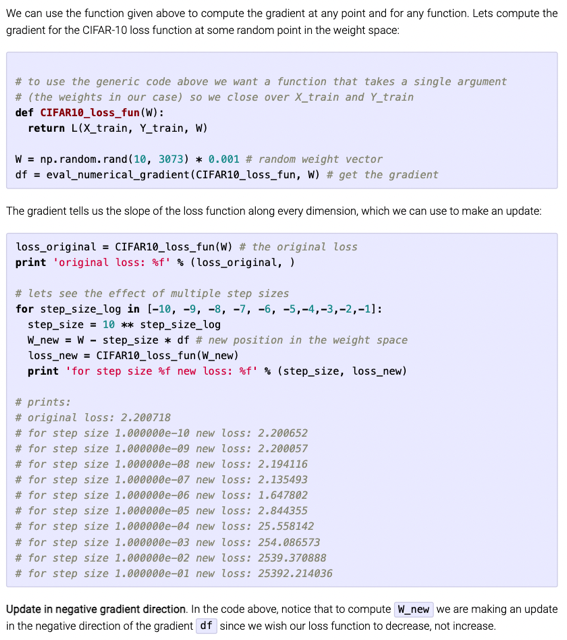</kbd>

> [!NOTE]
> Đại khái là ta ứng dụng cách tính gradient trên để iterate vài lần theo
> đó xem loss có giảm liên tục không. Khởi đầu là randomize W Sau đó
> tính gradient (bỏ vào loss function và W, nhìn hơi lạ nhưng đại khái là
> CIFAR10_loss_fun sẽ biết là dùng cái W để tính ra loss với W và
> Xtrain Ytrain.
>
>
>
> Sau đó, cho các giá trị tăng dần -10 -> -1 tức là để iterate nhiều lần
> với stepsize tăng dần lên. Mỗi lần như vậy nhân với gradient để
> update W. Sau đó tính loss với updated W.
>
>
>
> Kết quả ta thấy loss giảm dần ở vài step đầu đúng như expect, vì ta
> đang đi theo hướng ngược với gradient. Nhưng để ý thấy loss tăng
> mạnh ở cuối. Người ta đang muốn nói qua vấn đề learning rate nên cố
> ý cho (learning rate tăng lên dần)

 

<kbd>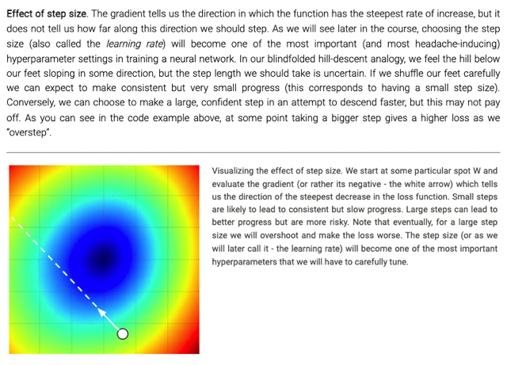</kbd>

> [!NOTE]
> Y như việc đi theo hướng độ dốc lớn nhất nhưng nếu bước quá lớn
> có thể khiến bị lố quá điểm cần đến. Do đó learning rate phải được
> chọn rất cẩn thận. Nếu nhỏ quá thì sẽ làm chậm không cần thiết
> nhưng lớn quá thì không được.
>
>
>
> Thành ra learning rate là một trong những hp quan trọng nhất cần
> được tune

 

- **A problem of efficiency. You may have noticed that evaluating the
numerical gradient has complexity linear in the number of parameters. In
our example we had 30730 parameters in total and therefore had to
perform 30,731 evaluations of the loss function to evaluate the gradient
and to perform only a single parameter update. This problem only gets
worse, since modern Neural Networks can easily have tens of millions of
parameters. Clearly, this strategy is not scalable and we need something
better.**

> [!NOTE]
> Rất dễ thấy với cách tính gradient bằng numerical
> gradient sẽ phải tính cho mỗi param 1 lần, vậy nếu có
> cả triệu param thì sẽ tốt rất nhiều phép tính

 

<kbd>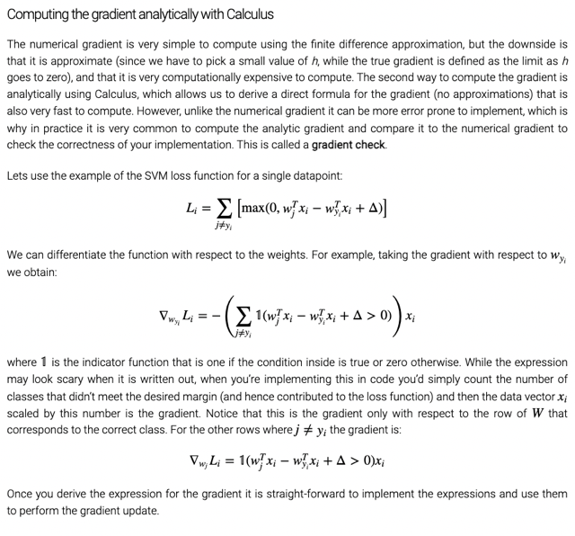</kbd>

> [!NOTE]
> Đại khái là cách tính thứ hai là dùng analytical, tức là dùng đạo hàm. Thì ở
> đây họ nói cách tính này tuy vậy chứ cũng rất dễ sai thành ra thường người
> ta tính với cách này xong dùng cách kia để  kiểm tra gọi là gradient check.
>
>
>
> Công thức tính derivative of loss w.r.t params của SVM loss có function 1(a)
> là kí hiệu của identity function, trong đó nó sẽ trả về 1 nếu a dương và 0
> nếu a âm. 
>
>
>
> Thành ra công thức tính trên, là derivative của Loss w.r.t vector (row) của W ứng
> với correct class có thể được diễn giải như sau: Trong
> các index của incorrect class (j!=yi), xem thử cái nào có score nhỏ hơn correct
> score chưa được một khoảng delta (wjTxi - wyiTxi + delta) thì tính 1, thành ra
> Khi tổng lại ta có một con số ví dụ 3,4,5 gì đó. Xong chỉ việc nhân với xi là xong.
> Tức là công thức nhìn vậy chứ dễ tính.
>
>
>
> Còn ở dưới là derivative của loss w.r.t các vector row của W ứng với incorrect
> class.

**🔗 See also:** [linked note](#node-iiiulp0)

 

<kbd>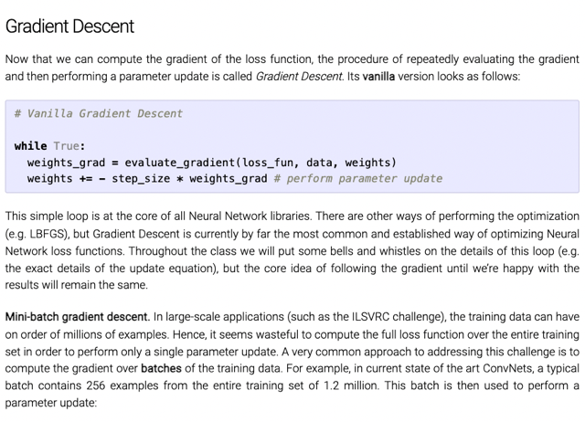</kbd>

> [!NOTE]
> Ở đây là đoạn code perform (vanilla gradient descent): Cơ bản là dùng một
> forever loop, trong đó ta dùng function với loss, data, weights để  tính
> gradient và dùng nó để update model weights.
>
>
>
> Thì người ta nói đây là core của mọi Neural Network library, và dù có thêm
> bớt hay improve chút xíu thì cơ bản đây vẫn là trái tim.
>
>
>
> Cuối cùng là nói về Mini-batch, cái này ta đã nói đi nói lại nhiều lần, đó là
> tính gradient theo cách loss trên toàn bộ data samples thì rất tốn kém.
> Thành ra mỗi lần "bước" update weights thì phải tính rất lâu, do đó người
> ta có thể dùng stochastic hoặc mini-batch gradient descent (cách này tận
> dụng được vectorization), giúp ước lượng hướng đi, tuy không đúng như
> cách chuẩn nhưng giúp tính toán nhanh giúp quá trình training diễn ra
> nhanh hơn,.
>
>
>
> Và trong Dl người ta dùng batch thường với 256 hay 512 data samples

 

<kbd>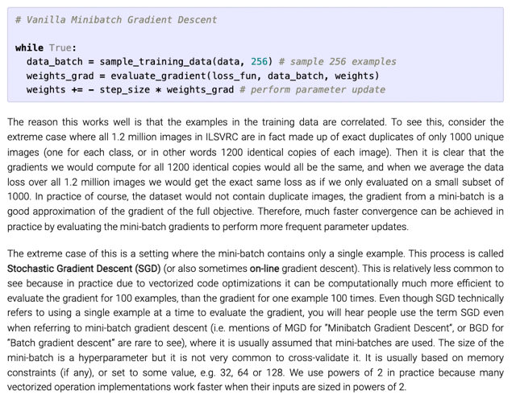</kbd>

> [!NOTE]
> Đoạn code cho thấy cách dùng mini-batch gradient descent, trong đó ta
> lấy từng batch 256 các data sample, và tính gradient, tất nhiên vì chỉ là
> loss trên một subset data nên đây chỉ là ước lượng. Tuy nhiên ở đây họ
> nói đến một ý mà mình có thể cũng đã nghe ở đâu đó đó là ngoài việc
> giúp quá trình training nhanh hơn thì không hẳn mini-batch gradient
> không ước lượng được đúng hướng (gradient) mà có khi vẫn đúng. Lí
> do là data samples trong training thường bị duplicate ví dụ như Trong
> bộ ILSVRC có 1 triệu 2 images nhưng thực ra chỉ là 1000 imgaes.
> Thành ra có tính trên toàn bộ cũng chẳng hơn tính trên một batch 1000
> images.
>
>
>
> Cuối cùng một điểm chú ý là SGD dù trên lí thuyết là nói về việc dùng
> cách tính gradient chỉ trên một single data sample tuy nhiên ngày nay 
> ít xài do cách này không apply được vectorization. Và dù người ta nói
> SGD nhưng thực chất khả năng cao là người ta nói đến mini batch GD
>
>
>
> Và số data sample trong batch thường dùng lũy thừa của 2, lí do là nó giúp
> hiệu quả hơn về mặt memory

 

<kbd>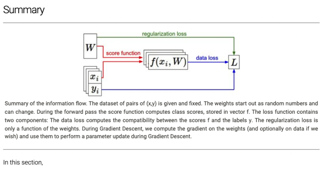</kbd>

 

<kbd>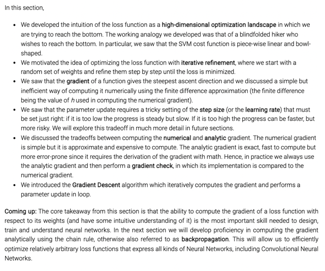</kbd>

> [!NOTE]
> Tóm lại, trong phần này ta đã biết về cái gọi là high dimensional optimization
> landscape trong đó ta tìm cách "đi xuống" điểm (W) có Loss thấp nhất. Và để
> làm điều đó ta dùng cái gọi là iterative optimizing trong đó ta sẽ cứ từ từ chỉnh
> các W sao cho dần dần loss sẽ giảm về cực tiểu, bắt đầu bằng cách mò mẫm
> với random search và thử các hướng nhưng sau đó ta thấy cùng gradient để
> dẫn lối sẽ hiệu quả hơn. Thế rồi ta biết cách tính gradient bằng numerical tuy
> chính xác nhưng chậm nên ta sẽ dùng analytical method và check với
> numerical. Rồi khi đã biết " hướng đi nào" thì ta cần chú sải bước nên không
> được dài quá khiến overshoot nhưng ngắn quá sẽ khiến đi rất lâu mới tới đích.
>
>
>
> Cuối cùng là ta đã biết thực tế người ta sẽ dùng minibatch gradient descent
> thay để đỡ tốn kém và nhanh hơn hiệu quả hơn

 

## Assignment 1
svm

 

<kbd></kbd>

> [!NOTE]
> Đại khái là ta sẽ làm phiên bản fully vectorized khi công thức tính
> loss function với SVM, cũng như là analytic gradient. Rồi check
> (gradient check) với numerical gradient. Tune learning rate và
> regularization. Optimize với SGD

 

<kbd>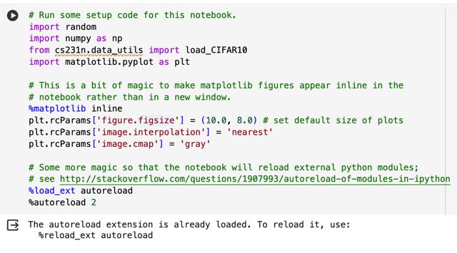</kbd>

> [!NOTE]
> Ta sẽ dụng utils function người ta chuẩn bị
> sẵn để load CIFAR10 dataset

 

<kbd>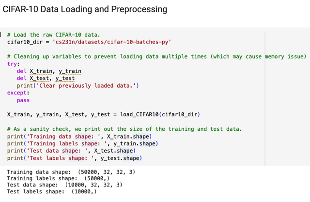</kbd>

> [!NOTE]
> Nhờ utils function load dataset CIFAR10 từ thư mục, nó đã có sẵn
> training + testing dataset. Trong function đó đã thực hiện động tác
> reshape để training tensor sẽ có shape là 50.000 x 32 x 32 x 3

 

<kbd>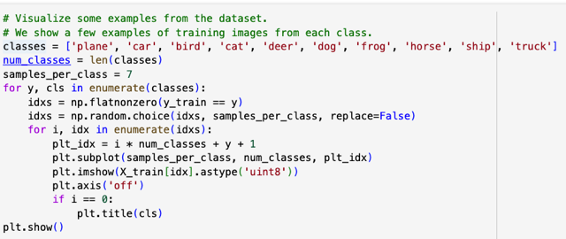</kbd>

 

<kbd>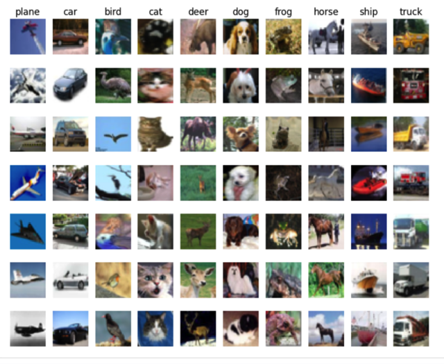</kbd>

> [!NOTE]
> In vài data sample ra xem thử

 

<kbd>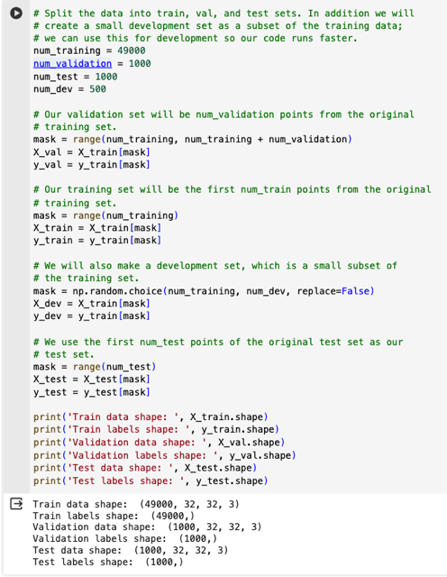</kbd>

> [!NOTE]
> Đại khái là với 50000 cái hình trong training, người ta
> dành 1000 cái cuói làm validatiaon sét. Rồi lại lấy trong
> 49000 cái của training sét, random 500 cái dùng làm dev
> sét.
>
>
>
> Rồi trong 10000 cái của tét sét gốc thì ta chỉ lấy 1000 cái
> đầu thôi

 

<kbd>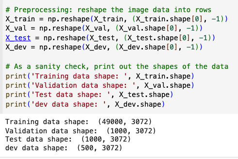</kbd>

> [!NOTE]
> Cơ bản là flatten các image đang là 32,32,3 thành
> vector có 32x32x3 dimensions

 

<kbd>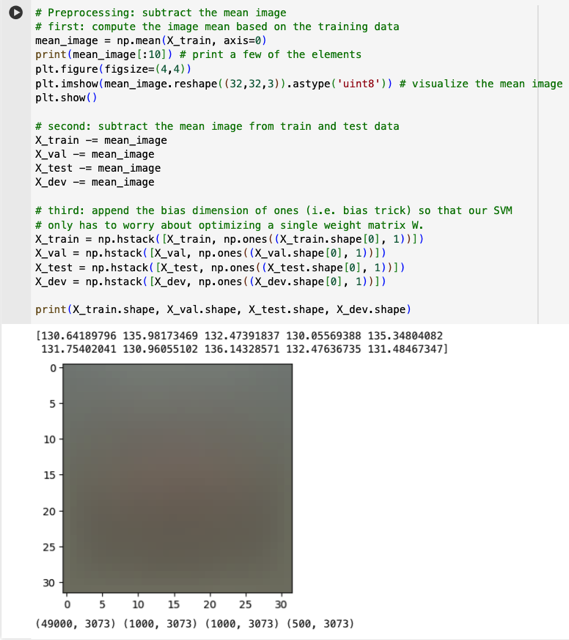</kbd>

> [!NOTE]
> Đại khái là lúc này X_train có shape là 49000,3072 để normalization,
> họ tính mean của từng feature, đương nhiên là theo từng cột của
> matrix, nên axis sẽ là 0. Sau đó trừ mọi giá trị của tensor X cho
> mean.
>
>
>
> Còn bước hai đó là bias trick, cơ bản là tạo vector cột toàn số 1 có
> shape là 49000x1 rồi dùng numpy's hstack. = horizontal stack để
> stack lại,

 

<kbd>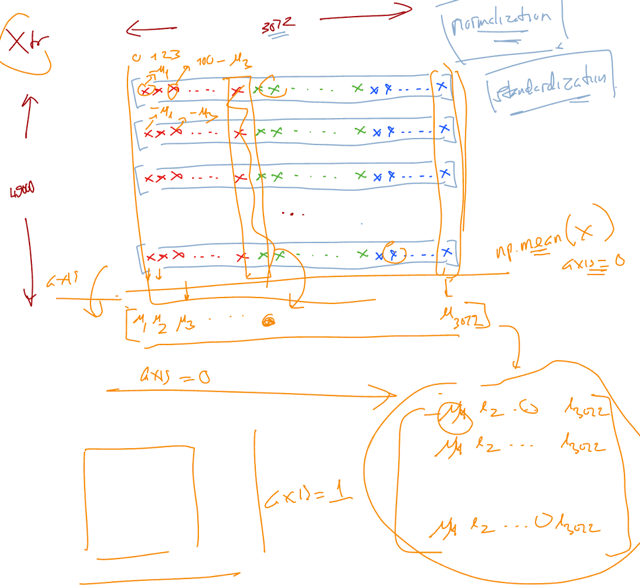</kbd>

 

<kbd>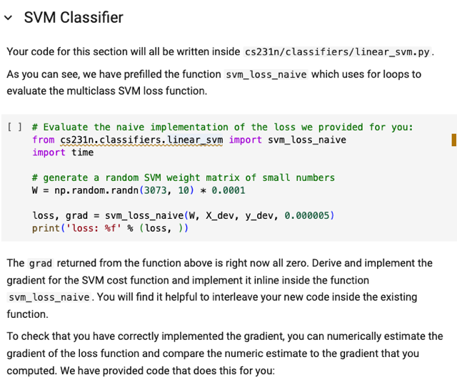</kbd>

> [!NOTE]
> Đại khái là hoàn thành
> function tính svm loss

 

<kbd>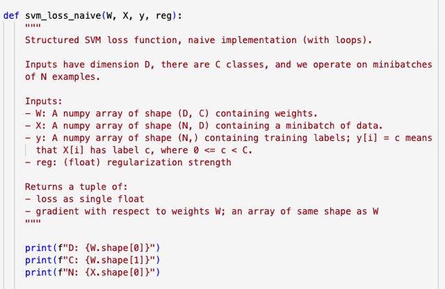</kbd>

 

<kbd>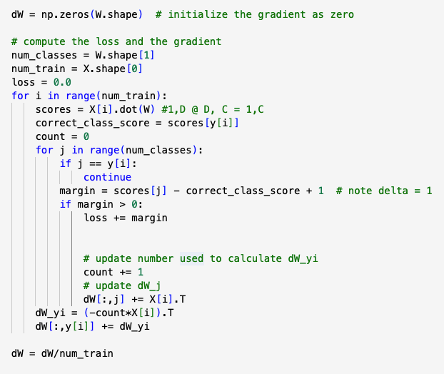</kbd>

<kbd>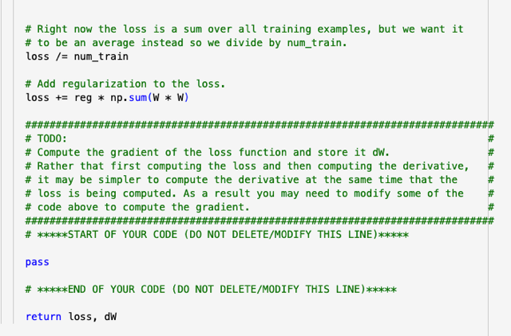</kbd>

**🔗 See also:** [linked note](#node-391ims3)

 

<kbd>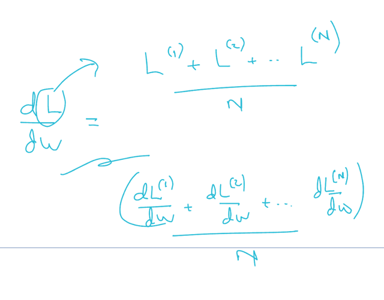</kbd>

> [!NOTE]
> Tại sao lại "cộng dồn" khi tính đạo hàm của L w.r.t W với
> loss là trên 1 batch các data sample lại là tổng (đúng hơn là
> trung bình) các đạo hàm của loss trên từng data sample w.
> r.t W. Vì đạo hàm của tổng là tổng đạo hàm vậy thôi

 

- **Inline Question 1

It is possible that once in a while a dimension in the gradcheck will not match exactly. What could
such a discrepancy be caused by? Is it a reason for concern? What is a simple example in one
dimension where a gradient check could fail? How would change the margin affect of the frequency
of this happening? Hint: the SVM loss function is not strictly speaking differentiable

Y𝑜𝑢𝑟𝐴𝑛𝑠𝑤𝑒𝑟:  fill this in.**

> [!NOTE]
> Quay lại sau

 

<kbd>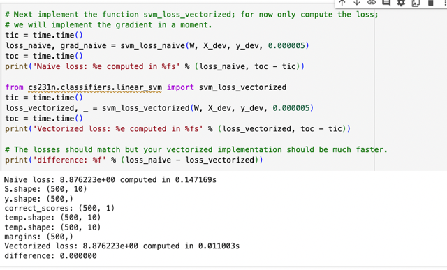</kbd>

 

<kbd>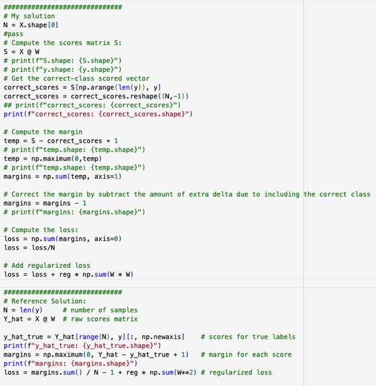</kbd>

> [!NOTE]
> Correct! Viết hàm tính loss SVM vectorized
>
>
>
> Chú ý phải có regularizer (ban đầu mình quên cộng), còn
> cơ bản cách làm là đúng khi so với cách làm của solution
> tham khảo.
>
>
>
> Nhìn hơi khác ở chỗ là trong cách làm tham khảo,  họ
> reshape vector y_hat_true (mà mình gọi là correct_scores)
> bằng cái syntax: [:, np.newaxis] còn mình reshape bằng
> function reshape: .reshape(N,-1)
>
>
>
> Sau đó thì cũng lấy S (họ đặt là Y_hat) trừ đi y_hat_true và
> cộng delta.
>
>
>
> Một chỗ khác nữa, đó là mình bỏ bớt delta thừa bằng cách
> trừ margins vector cho 1 còn họ thì dùng cách - 1 thật ra
> cũng y chang.

 

<kbd>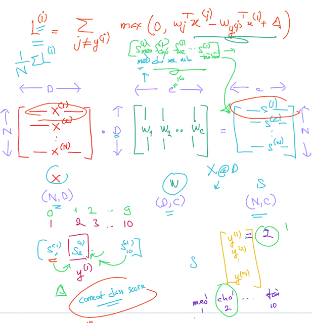</kbd>

 

<kbd>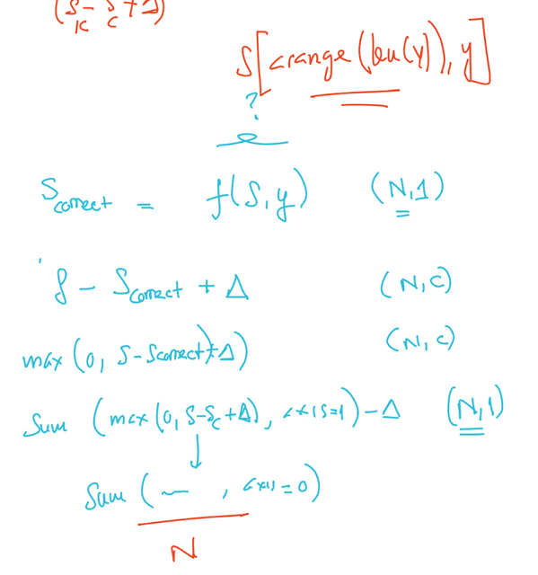</kbd>

 

<kbd>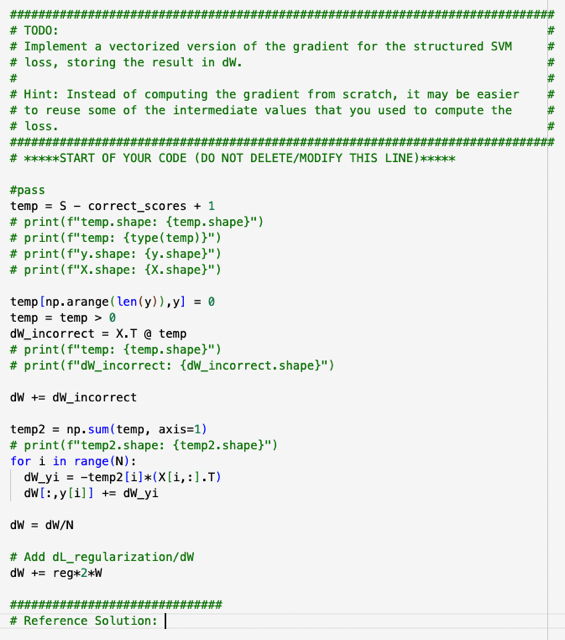</kbd>

<kbd>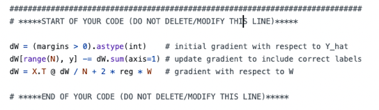</kbd>

> [!NOTE]
> Giảm xuống còn 1 vòng lặp nhưng chú ý là phải có
> dL_regularizer/dW nếu Loss có regularizer loss term

 

<kbd>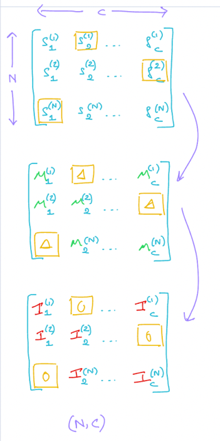</kbd>

> [!NOTE]
> Qua các bước tính ra margin, và khử đi vị
> trí tương ứng với correct class, tạm gọi là matrix I

 

<kbd>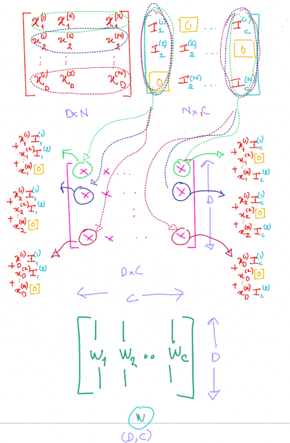</kbd>

> [!NOTE]
> đại khái là X (transposed) matmul với I thì
> kết qủa matrix (shape DxC) thì nó chính là
> tổng dW "đối với / tính trên các incorrect class

 

<kbd>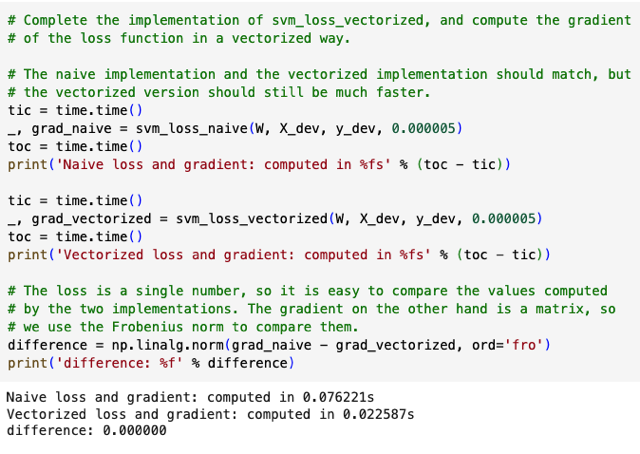</kbd>

 

## Assignment 1
softmax

 

