# Lecture 4/16 - Introduction To Neural Networks

📊 **Progress:** `23` Notes | `55` Screenshots

---

## Lecture 4/16 - Introduction To Neural Networks

 

<kbd>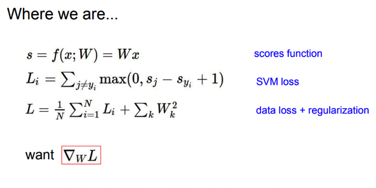</kbd>

 

<kbd>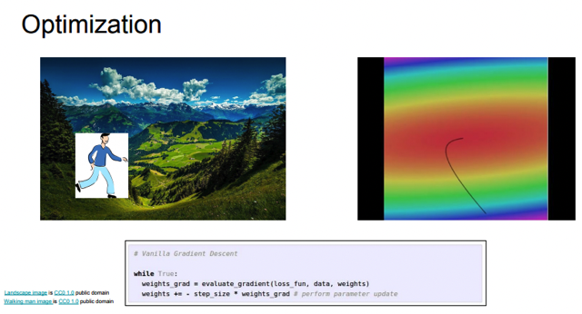</kbd>

 

<kbd>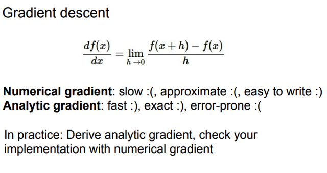</kbd>

 

<kbd>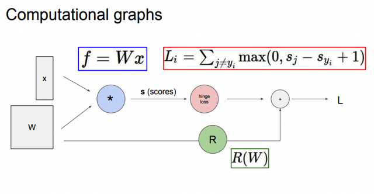</kbd>

 

<kbd>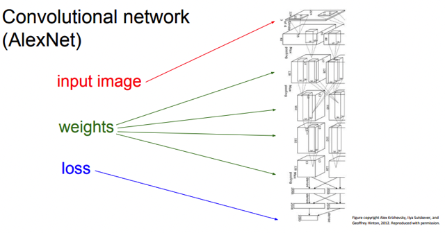</kbd>

 

<kbd>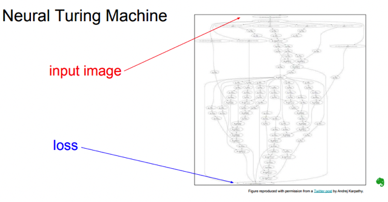</kbd>

 

<kbd>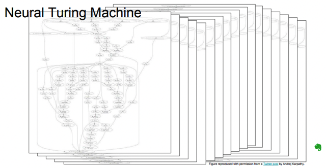</kbd>

 

<kbd>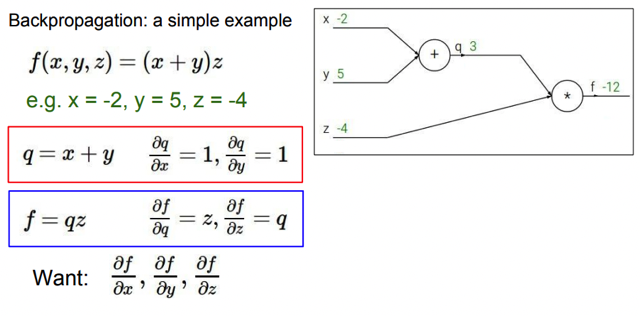</kbd>

 

<kbd>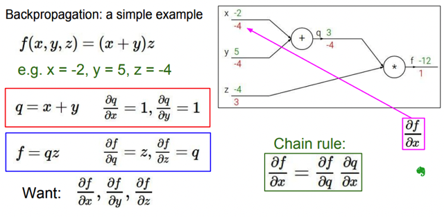</kbd>

 

<kbd>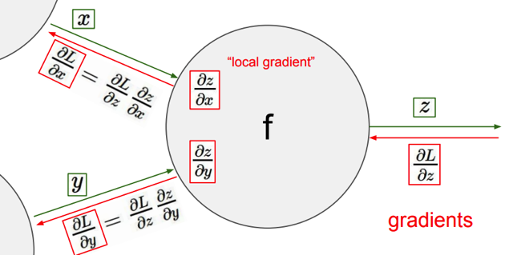</kbd>

> [!NOTE]
> Đại khái ý nói là tại một "node", ta chỉ nhận một dL/dz tính từ "ở
> trên" đầu nguồn, và cần tính dL/dx, dL/dy thì ta chỉ cần tính các
> local gradient df/dx, df/dy để từ đó nhân vào dL/dz để có
> dL/dx, dL/dy. Và rồi lại truyền dL/dx, dL/dy "xuống dưới"

 

<kbd>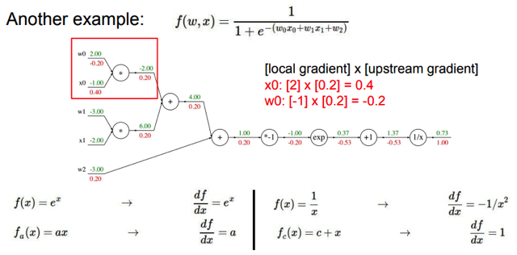</kbd>

 

<kbd>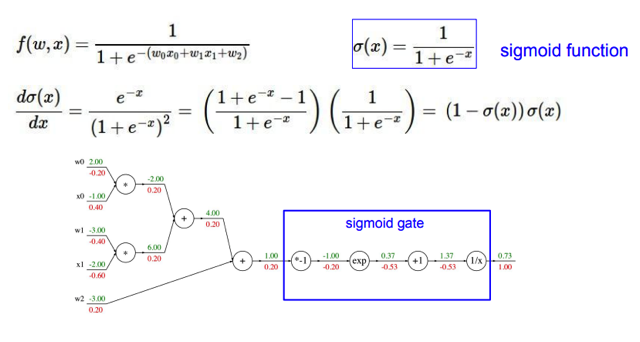</kbd>

 

<kbd>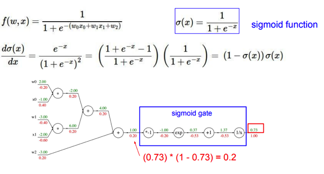</kbd>

> [!NOTE]
> Đại khái là ta có thể gom hoặc define một cái node
> complex miễn là ta có thể tính hoặc có công thức tính local
> gradient. Kiểu như nếu có công thức tính đạo hàm của
> hàm sigmoid rồi thì cứ xài không cần phải chia nhỏ ra thêm

 

<kbd>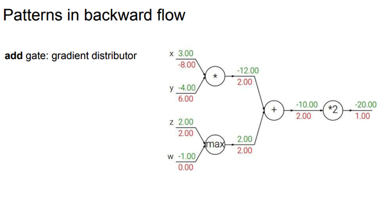</kbd>

> [!NOTE]
> Đại ý là vài pattern nhận thấy:
>
>
>
> Với phép cộng, gradient được distributed (chia đều)  cho các nhánh.
>
>
>
> Với phép max, gradient (từ trên đưa xuống) được  chia cho nhánh nào
> có giá trị dương
>
>
>
> Với phép nhân, gradient nhánh này được scale bằng value của nhánh
> kia

 

<kbd>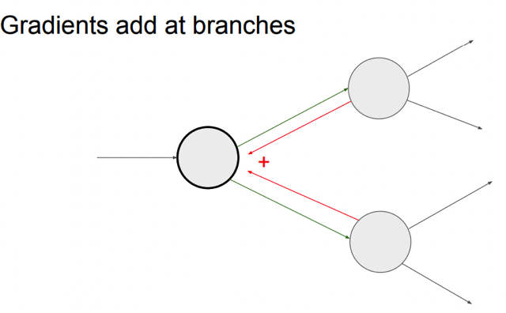</kbd>

> [!NOTE]
> Đại khái là với dạng này (khi forward-prop từ
> một nhánh phân ra nhiều nhánh) thì khi
> backprop, gradient sẽ cộng lại

 

<kbd></kbd>

> [!NOTE]
> Có câu hỏi là có phải ta sẽ dùng các
> đạo hàm này để update model param
> hay không. -> Đúng vậy

 

<kbd>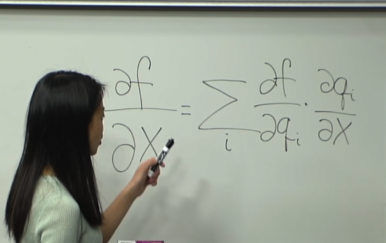</kbd>

<kbd>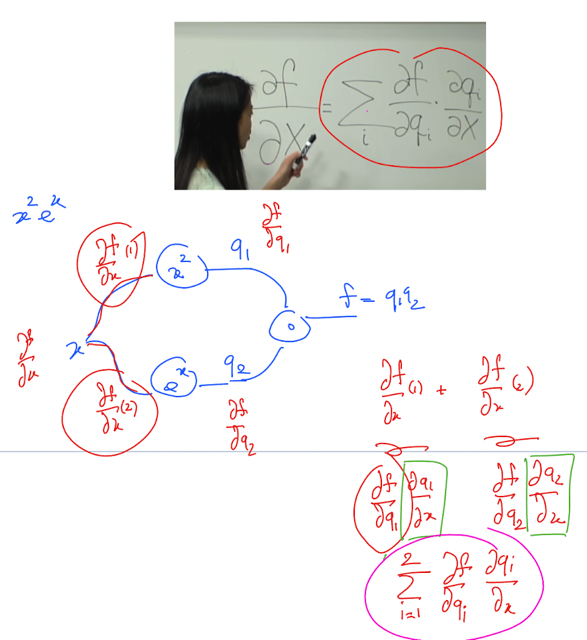</kbd>

 

<kbd>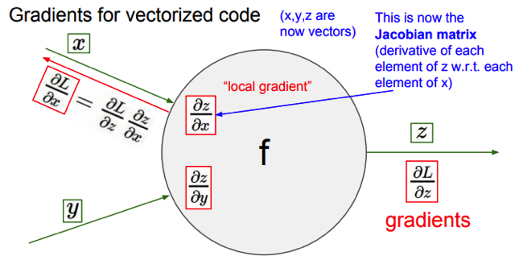</kbd>

> [!NOTE]
> Nếu x là matrix hay vector thì khi đó nếu z là scalar thì derivative of z w. r.t
> x là vector trong đó mỗi phần tử là đạo hàm của z w.r.t phần tử tương ứng
> của x.
>
>
>
> Còn nếu z cũng là vector thì derivative of z w.r.t x sẽ là matrix trong đó
> mỗi hàng là một vector đạo hàm của phần tử tương ứng của z w.r.t các
> phần tử của x
>
>
>
> Gọi đó là Jacobian matrix

 

<kbd>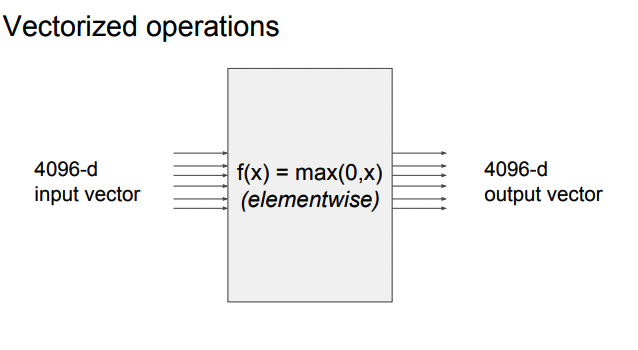</kbd>

> [!NOTE]
> Đại khái là nếu input vào function max(0,x) là vector thì
> đương nhiên output cũng là vector, trong đó mỗi phần tử
> của kết quả sẽ là kết quả của hàm max đối với phần tử
> tương ứng của vector đưa vào

 

<kbd>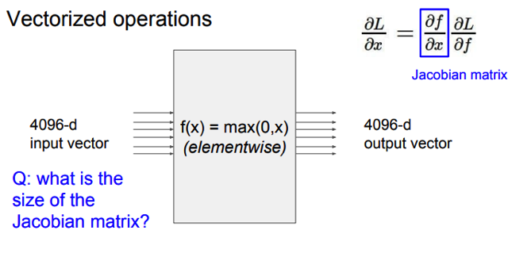</kbd>

> [!NOTE]
> Vậy thì derivative của output w.r.t input sẽ là
> matrix có shape là 4096x4096

 

<kbd>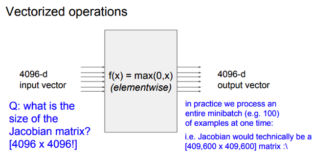</kbd>

> [!NOTE]
> Đại khái là trong thực tế khi ta mini-batch, ta xử lý ví dụ 100
> data sample cùng lúc nên cơ bản là ta có 100 cái jacobian
> matrix như vậy hay nôm na là kích thước của matrix sẽ là
> 409600x409600 và như vậy không khả thi trong thực tế

 

<kbd>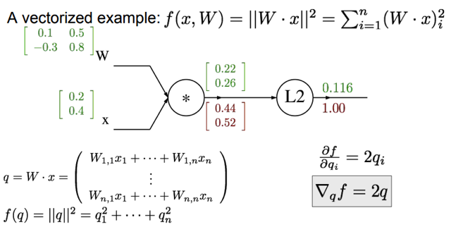</kbd>

> [!NOTE]
> Đại khái ở chiều forward-prop, tính một function f = bình phương L2
> norm của kết quả của phép tính W.x
>
>
>
> Với W là matrix 2x2, x là vector 2x1 thì Wx (gọi là q) cũng là vector
> 2x1 và tính ra là [q1 = 0.22, q2 = 0.26] 
>
>
>
> L2 norm của q [q1, q2] sẽ là sqrt(q1*q1 + q2*q2). Nên f sẽ là
> q1^2 + q2^2 = 0.22^2 + 0.26^2 = 0.116
>
>
>
> Bắt đầu backprop để tính đạo hàm của f w.r.t q đương nhiên cũng là
> vector cùng size với q trong đó mỗi phần tử là 
> các đạo hàm của f w.r.t các phần tử của q: q1, q2.
>
>
>
> nên df/dq = [df/dq1 df/dq2] = [2q1 2q2] = 2*[q1, q2] = 2q = [0.44, 0.52]

 

<kbd>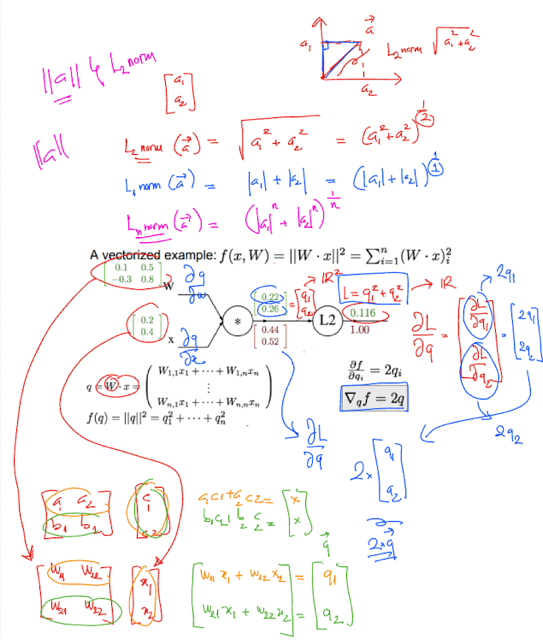</kbd>

 

<kbd>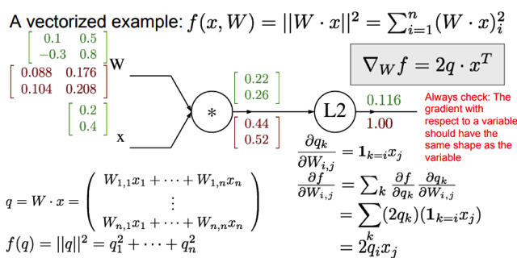</kbd>

 

<kbd>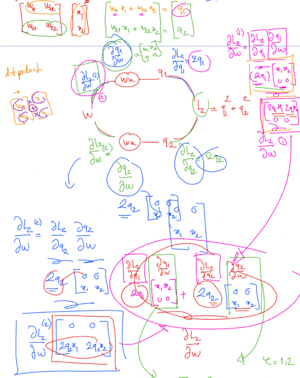</kbd>

<kbd>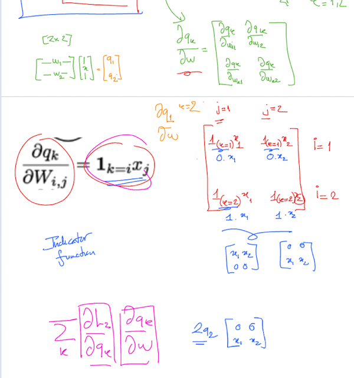</kbd>

<kbd>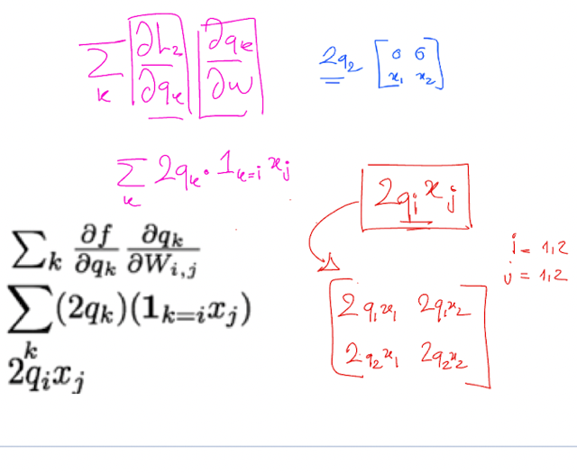</kbd>

<kbd>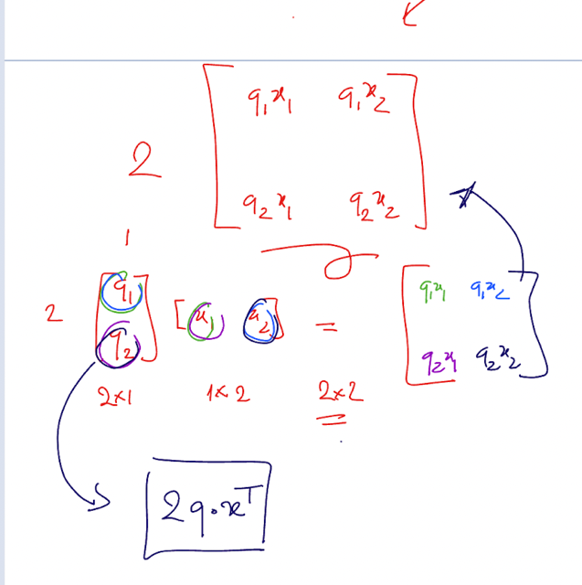</kbd>

 

<kbd>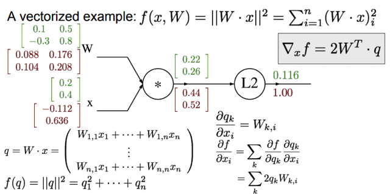</kbd>

 

<kbd>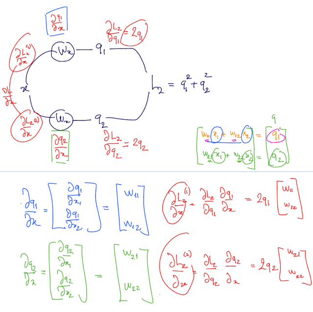</kbd>

<kbd>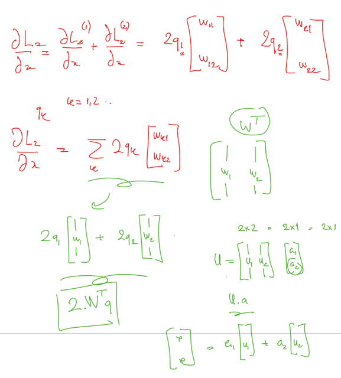</kbd>

 

<kbd>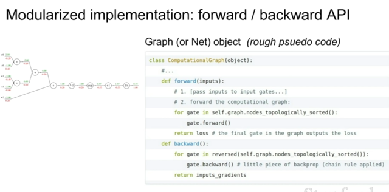</kbd>

> [!NOTE]
> Đại khái là với forward và backward API thì cơ bản cũng chỉ là đi tới
> (forward qua từng node - input của node này là output của node
> trước) cũng y như ta tính qua các layer các activation function value
> và bỏ vào layer sau để ở điểm cuối ta có loss function. Sau đó là quá
> trình backward (backpropagation) để quay ngược lại từng node để
> tính local gradient của mỗi node, và truyền xuống dưới tiếp tục như
> vậy

 

<kbd>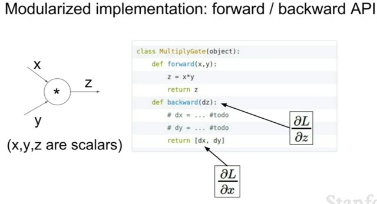</kbd>

 

<kbd>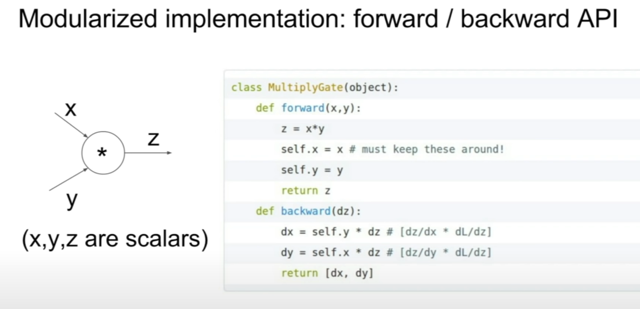</kbd>

> [!NOTE]
> Đại khái là bạn ấy nói là vì quá trình backprop mình sẽ
> cần giá trị của x và y để tính local gradient tại node đó
> nên ta phải cache giá trị này

 

<kbd>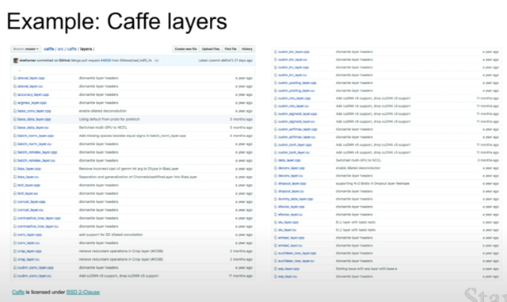</kbd>

> [!NOTE]
> Đại khái là nếu nhìn vào các framework như Caffe hay
> Pytorch, thì nó cũng modularize như vậy, và một neural
> network cũng chỉ là được cấu thành từ nhiều module như
> vậy mà mỗi module sẽ có forward() và backward() function.

 

<kbd>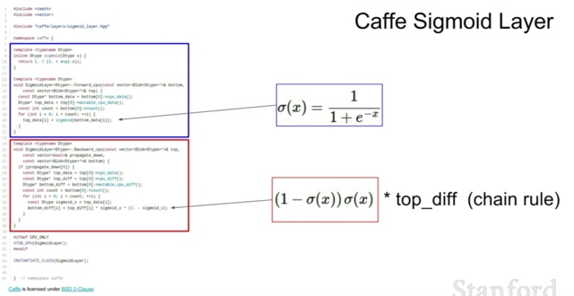</kbd>

 

<kbd>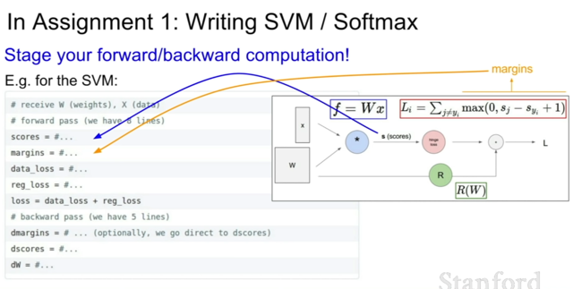</kbd>

> [!NOTE]
> Nói về Assignment 1 họ nói mình nên bắt đầu
> bằng việc lập ra computational graph để tính
> toán

 

<kbd>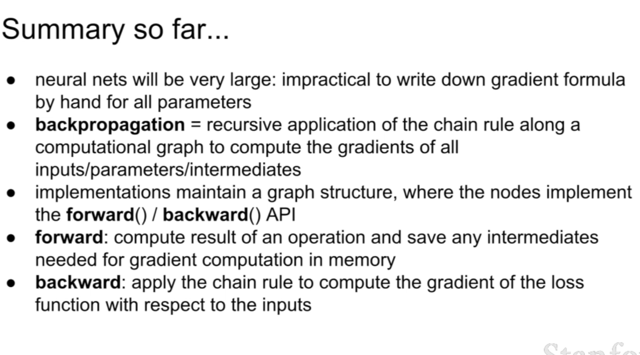</kbd>

 

<kbd>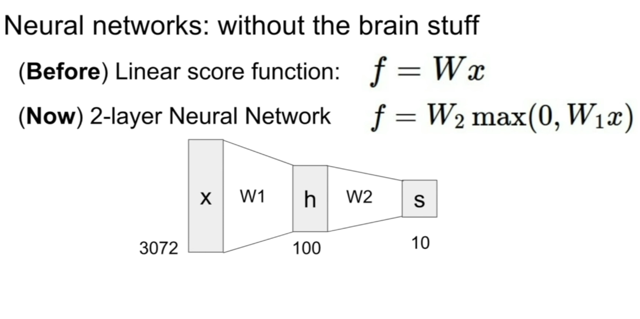</kbd>

> [!NOTE]
> Cơ bản là trước đây (ý nói với linear model đơn giản mà ta học ở lecture
> 1,2) thì việc tính toán ra scores (10 scores cho mỗi class, đang nói về
> Image classification với CIFAR-10)
>
>
>
> Thì bây giờ, cơ bản là ta sẽ apply thêm non-linear activation function
> (Trong slide là relu function = max(0,z) trước khi bỏ nó qua layer thứ hai 
> và trong layer này cũng thực hiện tính toán với weight matrix W2 của nó, 
> rồi mới ra scores. (Chưa / ko nói đến việc dùng score cho softmax hay sớm
> nhưng cũng tương tự thôi)

 

<kbd>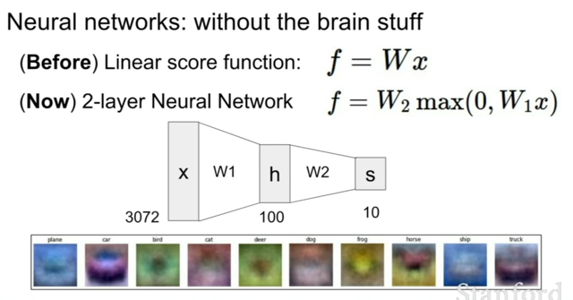</kbd>

> [!NOTE]
> Đại khái là họ nói lướt qua là cũng có thể coi như một cái template
> nhưng kiểu như nó có thể có thêm nhiều loại template khác nhau
> cho xe màu đỏ, cho xe màu xanh  thay vì chỉ có cái template chung
> cho cả xe đỏ và xe xanh. Và nhờ cái W2 để mà kết hợp lại theo 
> kiểu kiểu như weighted sum của mỗi template từ W1.
>
>
>
> Từ đó kiểu như dù là cái xe nào (màu gì, quay hướng nào) thì ta 
> cũng sẽ có cái score cao cho class xe từ đó model detect chính xác
> cái hình đó là xe hơn.

 

<kbd>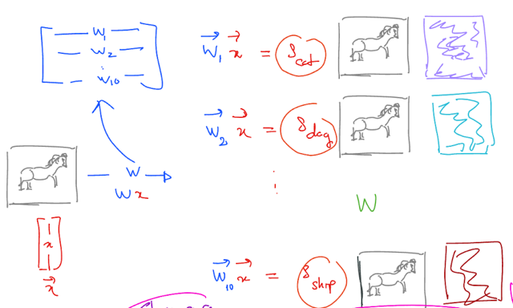</kbd>

> [!NOTE]
> Đại khái là với chỉ 1 template cho mỗi class, cái
> template nó rất chung chung từ đó khó mà
> (model) dùng nó để classify

 

<kbd>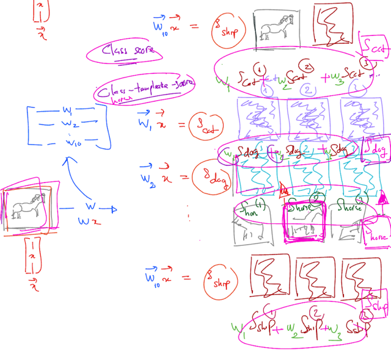</kbd>

> [!NOTE]
> Còn với nhiều template cho mỗi loại
> hơn thì model dễ thấy cái hình cần đoán
> giống template nào đó hơn

 

<kbd>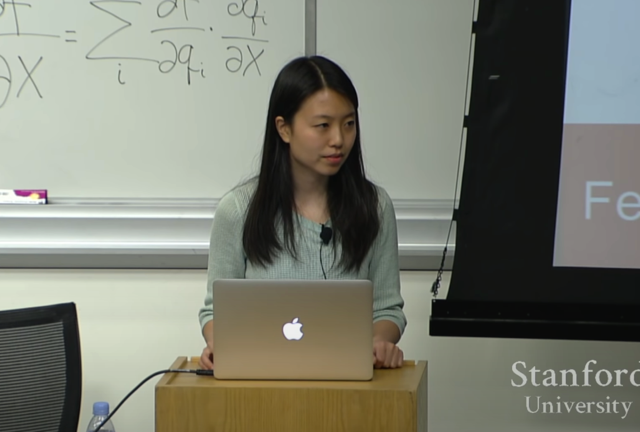</kbd>

> [!NOTE]
> Đại khái là h sẽ là giống như score mà model tính ra độ giống của bức hình
> cần dự đoán với từng template (ví dụ như bây giờ với neural net ta có 10 thay
> vì 1 template dành cho class horse thì h sẽ chứa trong đó 10 chỉ số score mà
> model đánh giá cái hình cần dự đoán tương ứng với 10 template của loại
> horse này. Từ đó qua W2, nó sẽ weighted sum để ra chỉ số score cuối cùng
> gắn với class horse

 

<kbd>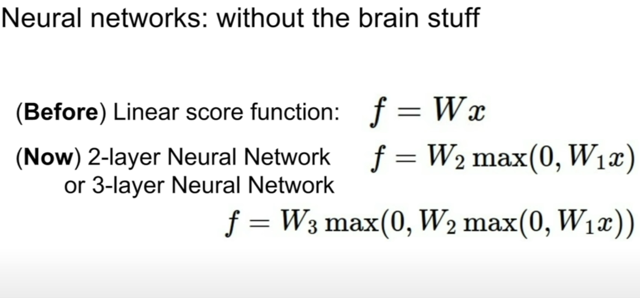</kbd>

> [!NOTE]
> Và đại khái là ta có thể tiếp tục stack thêm nhiều layer (với phép
> linear transformation W và non-linear activation function) từ đó
> có được Deep Neural Network

 

<kbd>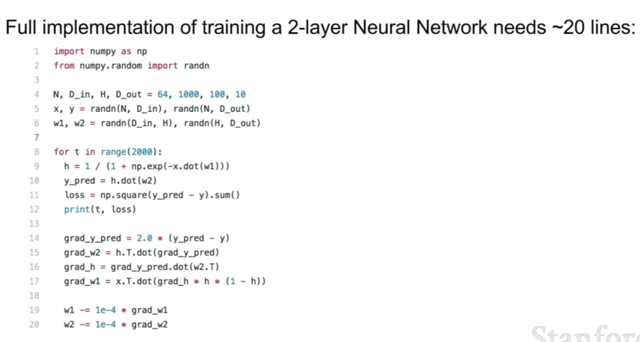</kbd>

> [!NOTE]
> Đại khái là việc thực hiện việc training một
> nn với 2 layer có dạng như sau

 

<kbd>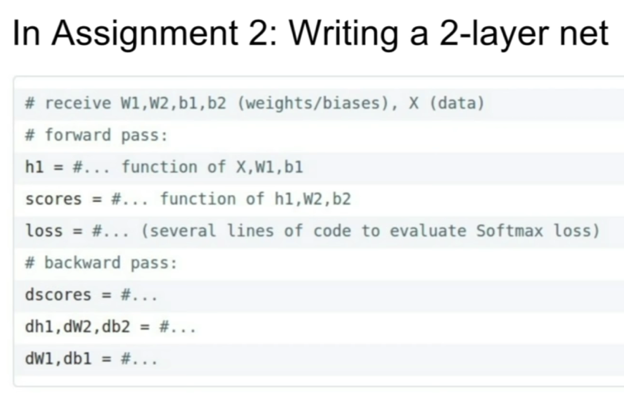</kbd>

 

<kbd>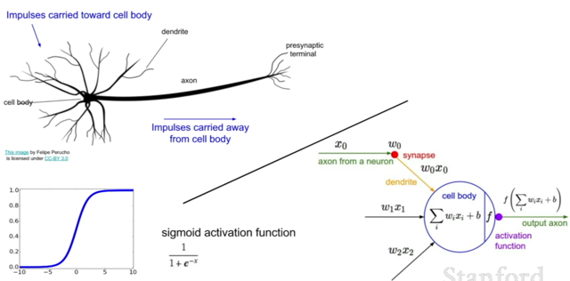</kbd>

<kbd>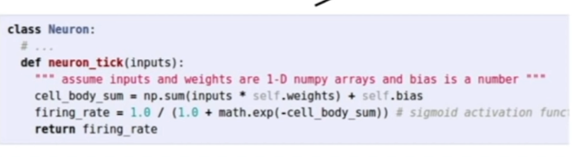</kbd>

> [!NOTE]
> Đại khái là một hình ảnh so sánh tương tự với neuron thần kinh của não bộ,
> trong đó việc các x0,x1,x2 được weighted sum với w0,w1,...để có một giá trị
> thì tương tự như các dendrite truyền tính hiệu chụm lại vào cell body.
>
>
>
> Trong cell body, thực hiện việc tính qua non-linearity function sẽ tương
> đương với việc tính toán ra "firing-rate" mà các neuroscientist cho rằng hàm
> relu là gần giống nhất với việc này.
>
>
>
> Và việc các layer connect với nhau qua các node, như computational graph
> giống như thông tin từ cell body truyền qua axon qua neuron khác
>
>
>
> Tuy nhiên phải cẩn thận với các phép so sánh này vì thực tế tế bào neuron
> thần kinh phức tạp hơn vầy hàng trăm lần

 

<kbd>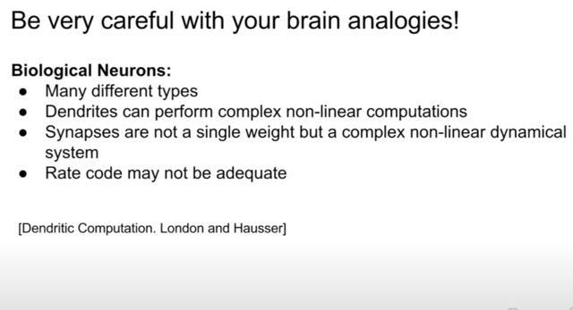</kbd>

 

<kbd>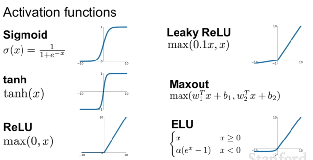</kbd>

> [!NOTE]
> Những bài sau sẽ nói rõ hơn các
> activation function này

 

<kbd>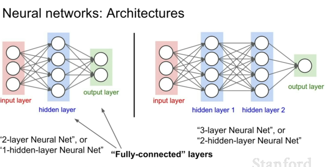</kbd>

 

<kbd>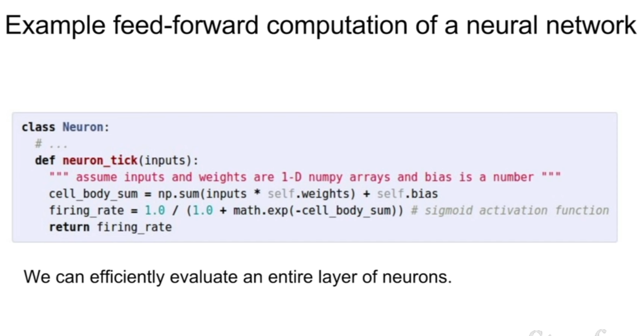</kbd>

 

<kbd>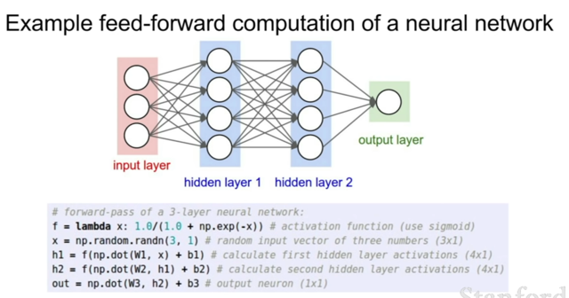</kbd>

 

<kbd>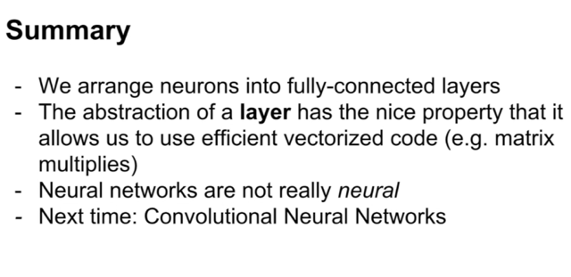</kbd>

 

