# Lecture 5/16 - Convolutional Neural Networks

📊 **Progress:** `52` Notes | `63` Screenshots

---

## Lecture 5/16 - Convolutional Neural Networks

 

<kbd>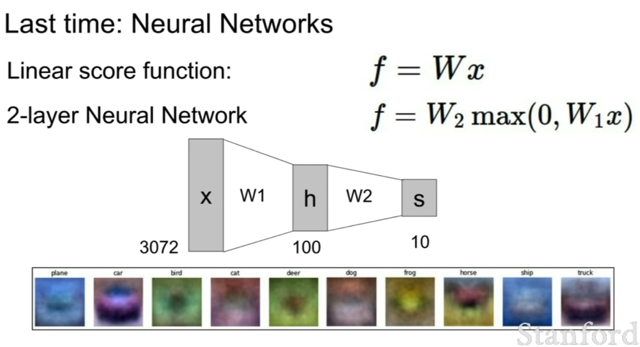</kbd>

> [!NOTE]
> Đầu tiên đại khái là tiếp nối tuần trước, ta đã hiểu hidden layer đóng vai trò
> giống như giúp học thêm / tạo thêm nhiều hơn các template từ đó giúp
> classify tốt hơn

 

<kbd>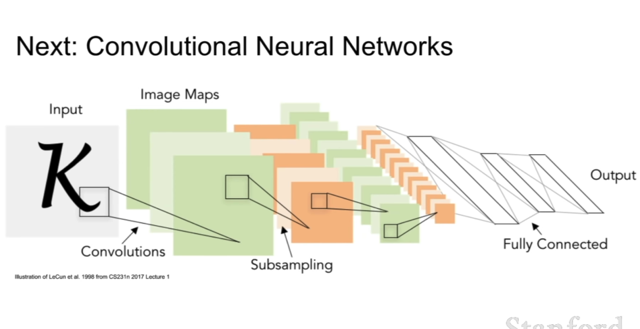</kbd>

> [!NOTE]
> Tuần này là
> Convolution NN

 

<kbd>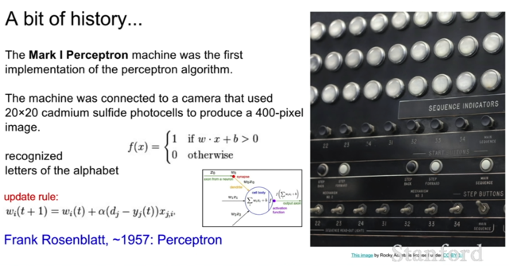</kbd>

> [!NOTE]
> đại ý nói về Mark I Perceptron, trong đó không có việc sử dùng
> backprop hay gradient descent để update weight mà chỉ là update
> weight theo một hướng nào đó giúp giảm sai sót.
>
>
>
> Mô hình này cũng dùng công thức weight sum,  các feature được nhân
> (scale) với weight w và sum lại. Nhưng không có activation function mà
> chỉ là so sánh kết quả đó với một threshold để từ đó quyết định output
> là 1 hoặc 0. Gọi là threshold function.

 

<kbd>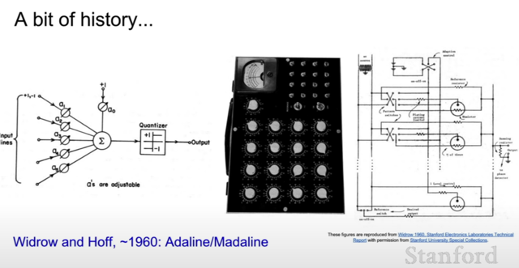</kbd>

> [!NOTE]
> Sau đó là Adaline trong đó, người ta stack các "layer" lại để bắt đầu
> hình thành cái giống như hidden layer nhưng vẫn chưa có backrprop
> có 1 cách thức / principle để train

 

<kbd>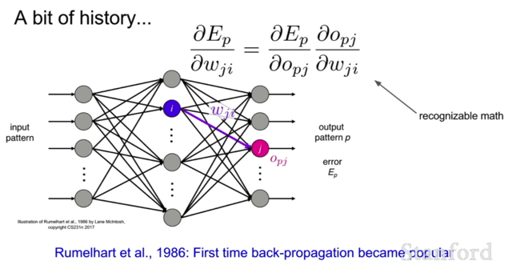</kbd>

> [!NOTE]
> phải đến khi Rumehard thì mới phổ
> biến backprop để có cách thức train
> ra các giá trị của weight

 

<kbd>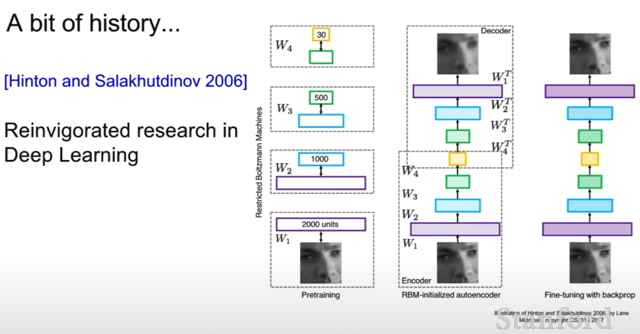</kbd>

> [!NOTE]
> Giai đoạn ~2006 nhóm nghiên cứu của gs Hinton thực
> hiện cách làm là pretrain và dùng giá trị đó initialize
> trước khi dùng backprop để finetune

 

<kbd>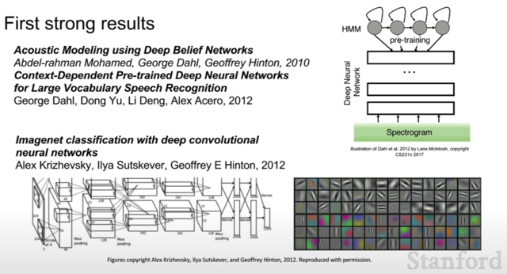</kbd>

> [!NOTE]
> đến 2012 với việc ra đời của AlexNet, đạt performance rất tốt
> trên ImageNet dataset để bắt đầu đánh dấu cột mốc của
> ConvNet và DeepLearning

 

<kbd>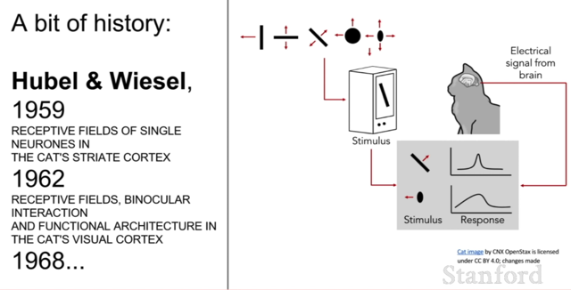</kbd>

> [!NOTE]
> Ngược về 1950, người ta làm thí nghiệm đại khái là cho con
> mèo nhìn các hình ảnh khác nhau như đường chéo hay dấu
> tròn để đo tín hiệu não của nó

 

<kbd>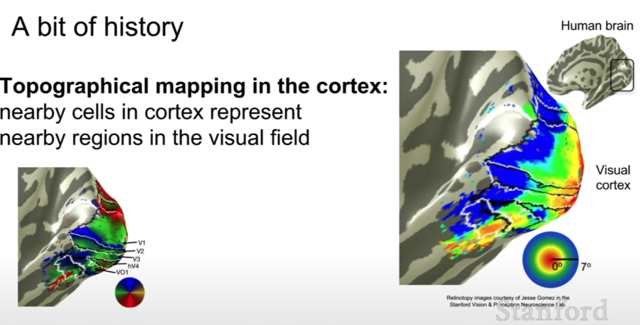</kbd>

> [!NOTE]
> Kết quả đại ý là cho thấy não bộ cũng sử dụng cấu
> trúc phân tầng (hierarchical) khi hoạt động

 

<kbd>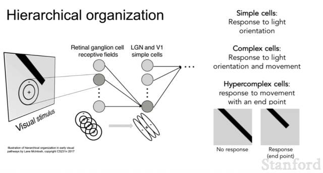</kbd>

> [!NOTE]
> cụ thể là các (neuron) cell đầu tiên / simple sẽ chịu trách nhiệm "
> nhận ra" các thay đổi về light orientation để sau đó các complex
> cell sẽ response về orientation và movement

 

<kbd>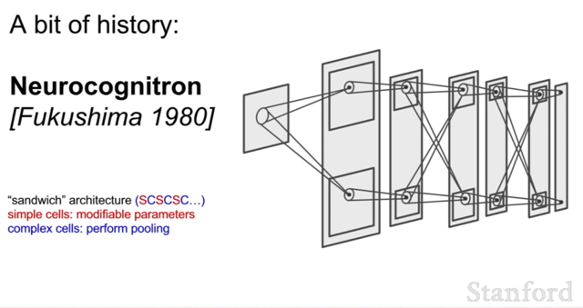</kbd>

> [!NOTE]
> đến 1980 cái này là lần đầu cho thấy kiểu kiểu của
> neural network với các layer simple và complex cell

 

<kbd>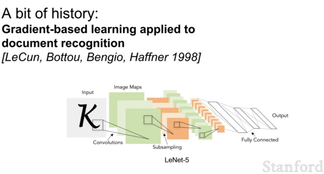</kbd>

> [!NOTE]
> đến 1998, Yan LeCun phát triển LeNet-5 dùng gradient based learning
> để học cách nhận diện được chữ số viết tay ứng dụng vào các hệ thống
> đọc mã bưu chính postal code nhưng nó vẫn gặp khó Khi muốn scale
> lên qua các nhiệm vụ khác khó hơn như nhận diện hình ảnh phức tạp
> hơn

 

<kbd>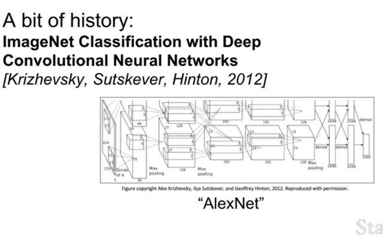</kbd>

> [!NOTE]
> So với Lenet thì AlexNet cũng không quá khác biệt nhưng
> thành công của nó, việc nó sâu hơn, nhiều layer được cho
> phép bởi sự dồi dào của data hơn (ImageNet) và
> computational resource nhiều hơn

 

<kbd>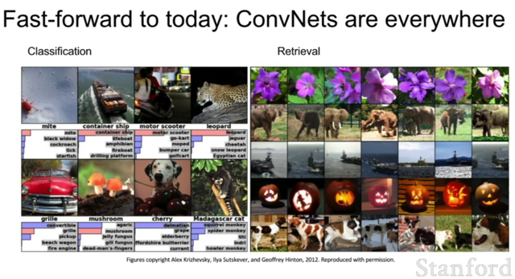</kbd>

> [!NOTE]
> Kề từ đó thì ConvNets đã đóng góp rất lớn vào các tiến
> bộ của Computer Vision như các task classification,
> retrieval, detection và segmentation

 

<kbd>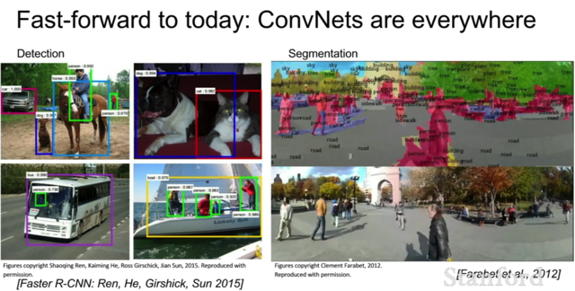</kbd>

 

<kbd>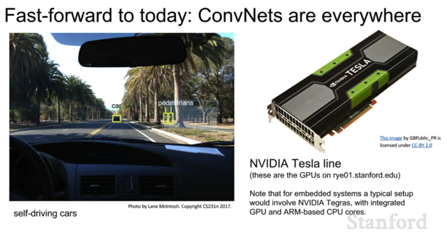</kbd>

 

<kbd>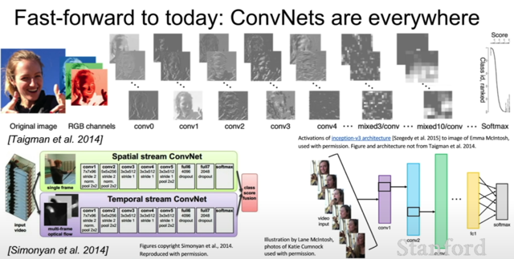</kbd>

 

<kbd>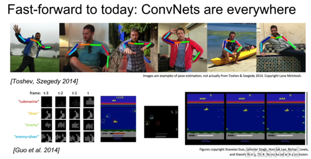</kbd>

<kbd>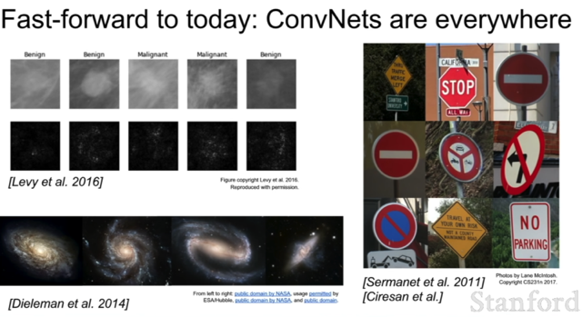</kbd>

 

<kbd>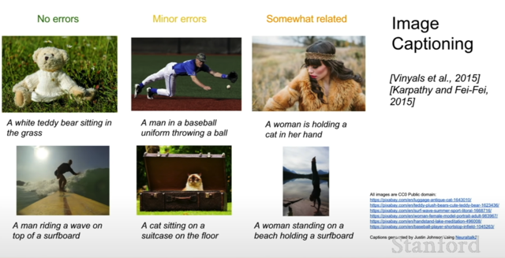</kbd>

 

<kbd>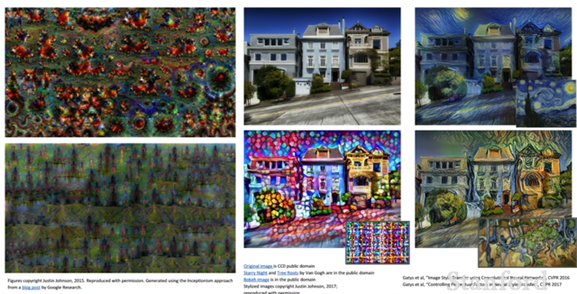</kbd>

 

<kbd>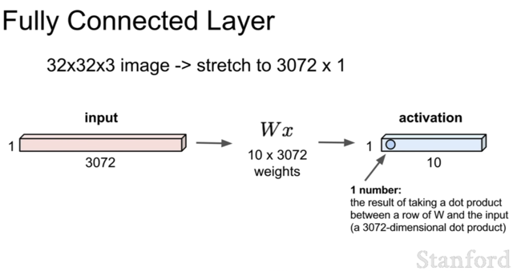</kbd>

> [!NOTE]
> Ôn lại về cách làm của fully connected layer, đó là nó thực hiện phép
> nhân vector input với mỗi hàng của matrix W để ra một activation,
> matrix có mấy hàng thì vector output có mấy phần tử
>
>
>
> Trước đó để có vector input thì image 32x32x3 đã được flatten  thành
> vector

 

<kbd>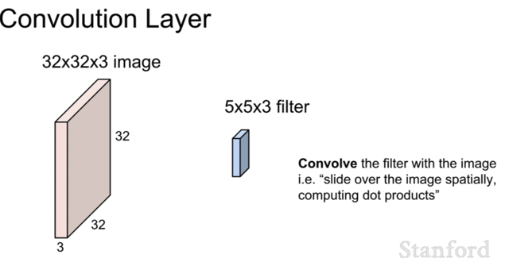</kbd>

> [!NOTE]
> Đại ý là với Conv layer, không **flatten imag**e nữa mà
> giữ nghiên **spatial shape**. Và weight của layer sẽ là
> một tensor (gọi là filter) như này

 

<kbd>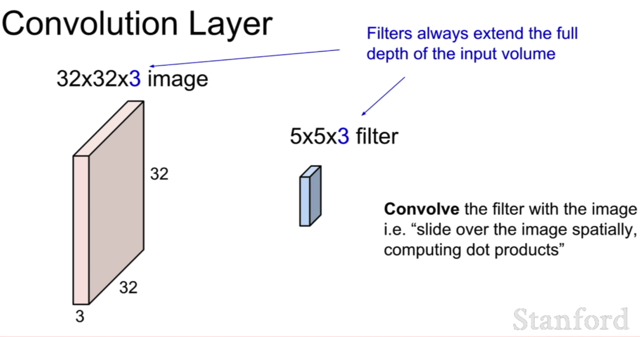</kbd>

> [!NOTE]
> và filter luôn cùng số channel với image (hoặc input
> tensor)

 

<kbd>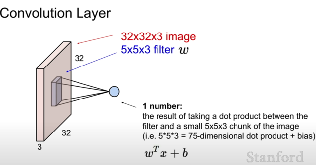</kbd>

> [!NOTE]
> Sau đó phép tính toán chính là việc tính dot product của filter và cái vùng
> cùng shape của cái image.
>
>
>
> Có người hỏi wTx là sao thì cơ bản đó chỉ là notation (cách kí hiệu) của
> phép tính dot product. để thể hiện phép tính phải có compatible shape 1xn.
> nx1
>
>
>
> Và có thể hiểu là lấy cái vùng cùng shape với filter của cái image ra, flatten
> (hay stretch out) và lấy cái filter cũng flatten ra, rồi dot product hai thằng đó.

 

<kbd>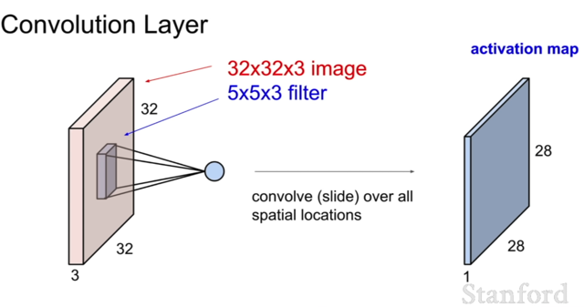</kbd>

> [!NOTE]
> Filter sẽ bắt đầu từ top left corner và slide trái sang phải trên
> xuống dưới, mỗi lần nó thực hiện phép tính để ra 1 số. Có thể
> có bước slide tùy vào stride. Và như đã biết ở DLSpec,
> spatial size kết quả có thể bằng hoặc nhỏ hơn cái hình cũ tùy
> vào cách padding

 

<kbd>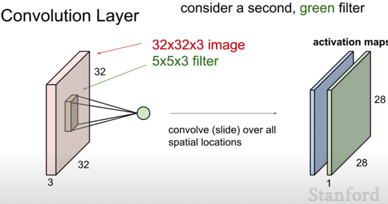</kbd>

> [!NOTE]
> và với filter khác thì lại ra một output
> thứ 2 (gọi là activation map)

 

<kbd>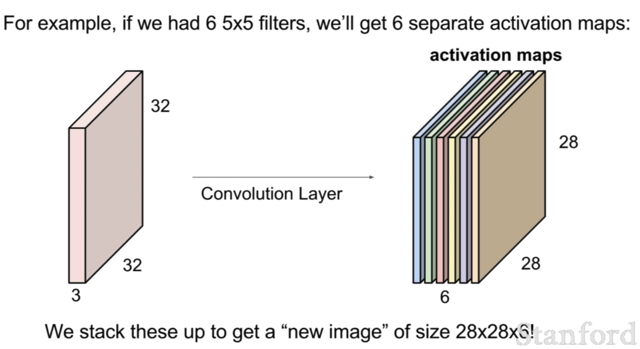</kbd>

> [!NOTE]
> với 6 cái filter thì ta có 6 cái activation maps. Stack
> lại với nhau thành ra 1 tensor 28x28x6 ("new image")

 

<kbd>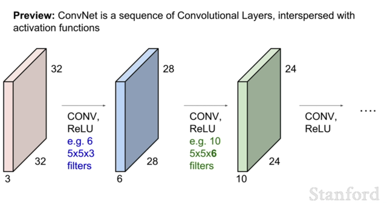</kbd>

> [!NOTE]
> Sau đó apply non-linear activation function với các output này
> trước khi tiếp tục với các layer sau. Cơ bản convNet là chuỗi
> các convolutional layers xen kẽ là các activation function
>
>
>
> Số lượng các filter mỗi layer, stride, padding là tùy vào cách
> Design (hyper-params)

 

<kbd>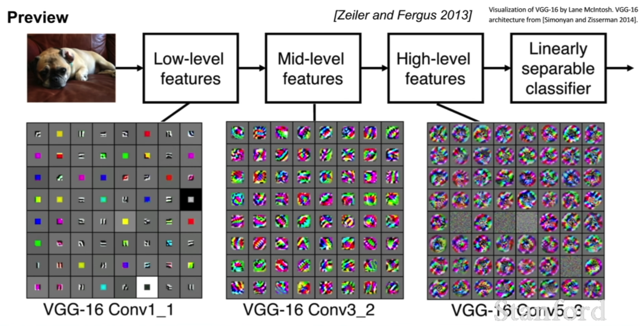</kbd>

> [!NOTE]
> và qúa trình huấn luyện model sẽ train các filter để một cách nôm na
> là chúng đảm nhiệm việc detect được các feature từ đơn giản đến
> phức tạp qua từng layer
>
>
>
> Và ta sẽ được học các xem các hình ảnh này ở các phần sau.
>
>
>
> Trong slide là visualization của các low & high level feature của
> VGG-16 từ các layer đầu đến các layer sau
>
>
>
> Và ở cuối cùng linearly separable classifier có thể dùng các high level
> feature này để classify

 

<kbd>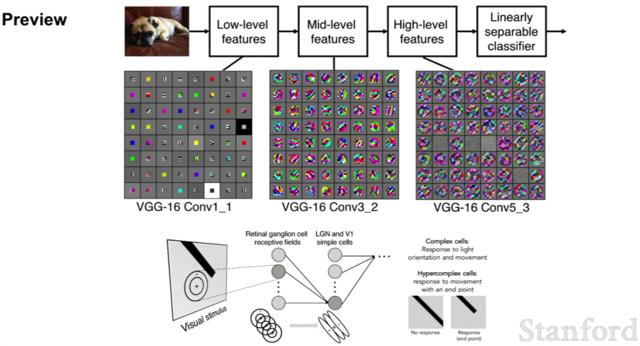</kbd>

> [!NOTE]
> Đại khái là nó tương đồng với nghiên cứu của Wisel đó là
> qúa trình ConvNet nó học chính là nó detect các feature
> từ đơn giản đến phức tạp

 

<kbd>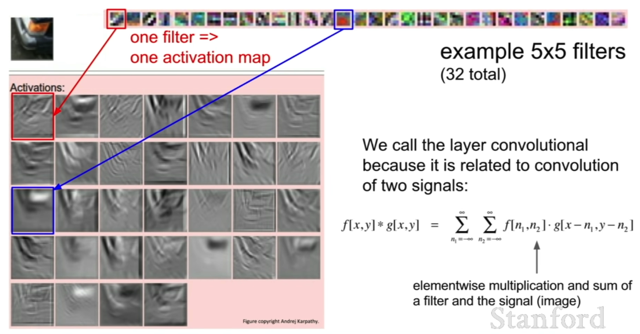</kbd>

> [!NOTE]
> đại ý là hình ảnh khác của
> các convolution filter

 

<kbd>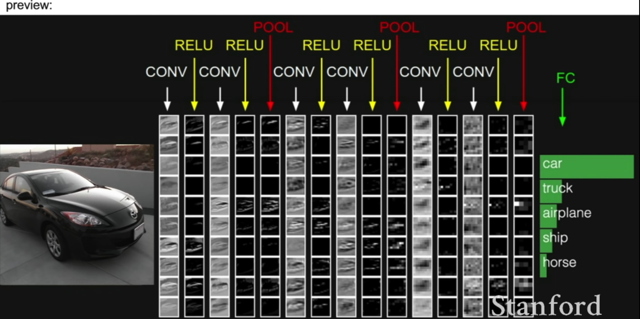</kbd>

> [!NOTE]
> đại ý là kiến trúc (hoặc kiểu kiểu của một convNet) sẽ
> có thêm các pooling layer trước khi qua Conv+(relu) tiếp
> theo. Cuối cùng sẽ là một fully connected layer để
> flatten out trước khi output

 

<kbd>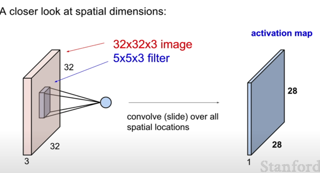</kbd>

 

<kbd>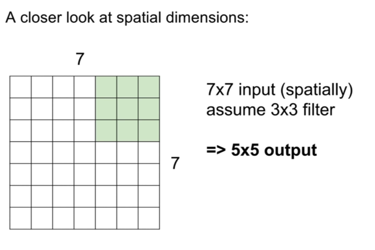</kbd>

> [!NOTE]
> với phép convol stride = 1 thì
> từ 7x7 output sẽ ra 5x5

 

<kbd>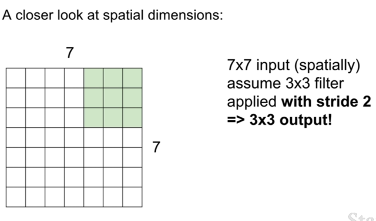</kbd>

> [!NOTE]
> với stride 2 thì
> output sẽ là 3x3

 

<kbd>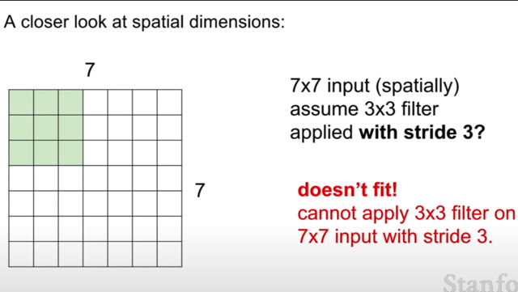</kbd>

> [!NOTE]
> với stride 3 thì vì nó không fit nên ko thể apply stride = 3

 

<kbd>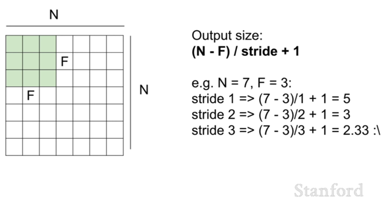</kbd>

> [!NOTE]
> khái quát với công thức
> tính output size

 

<kbd>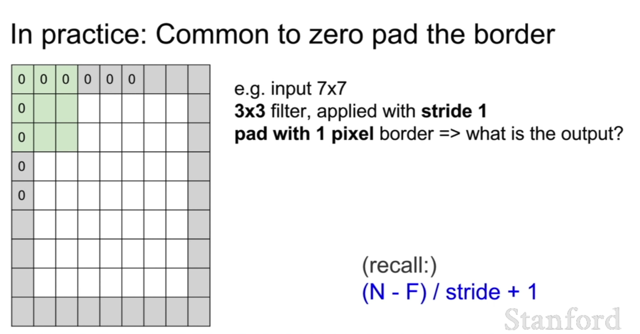</kbd>

> [!NOTE]
> với padding ta có thể khắc phục tình trạng
> không fit hoặc output nhỏ đi

 

<kbd>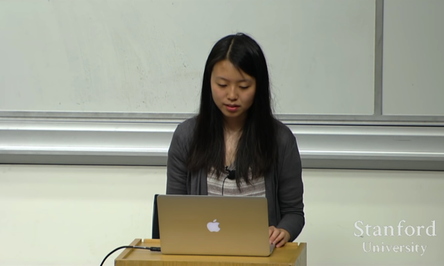</kbd>

> [!NOTE]
> Q1: Depth của output?
>
>
>
> -> A: Là số filter
>
>
>
> Q2: ..
>
>
>
> -> A: Đại khái là trong hình trước chỉ là để cho đơn giản thì chỉ thể hiện
> việc tính toán ở 1 "channel"/"slice" còn sự thật thì phải tính trên hết các "
> depth"
>
>
>
> Q3: Nếu dài và rộng khác nhau thì có thể dùng stride khác  nhau hay
> không.
>
>
>
> -> A: Đại khái là hoàn toàn có thể nhưng thường người ta chỉ làm việc với
> square input và dùng cùng một stride

 

<kbd>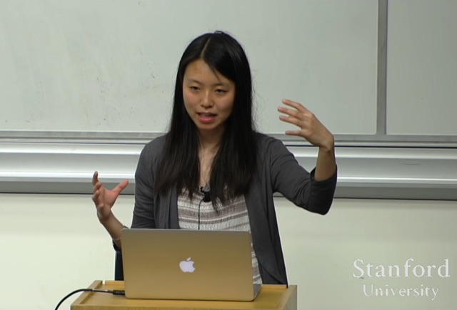</kbd>

> [!NOTE]
> Q: Why zero padding?
>
>
>
> A: Khi ta muốn output vẫn có cùng size với input
> hoặc muốn apply filter để detect info tại corner

 

<kbd>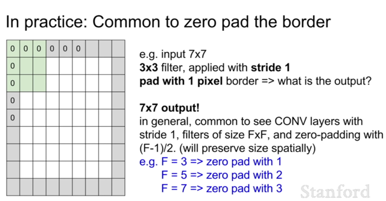</kbd>

> [!NOTE]
> phổ biến người ta dùng filter 3x3, 5x5,7x7 với các zero padding
> tương ứng 1,2,3 để keep size

 

<kbd>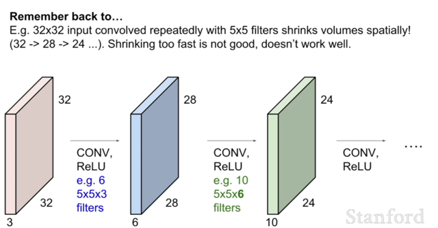</kbd>

> [!NOTE]
> đại khái là nếu không dùng padding, qua
> nhiều layer cái spatial size (width &
> height) sẽ giảm nhanh chóng

 

<kbd>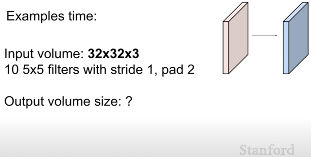</kbd>

 

<kbd>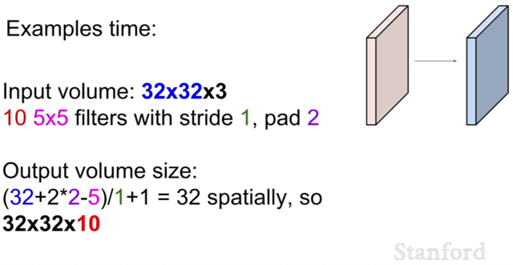</kbd>

> [!NOTE]
> Theo công thức là tính được size (w & h) và vì có 10 filter nên depth sẽ là 10.
>
>
>
> Câu hỏi là có bao nhiêu params?

 

<kbd>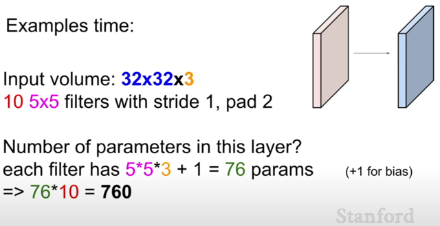</kbd>

> [!NOTE]
> Mỗi filter có 3 channel, nên có 5x5x3 số,
> mỗi cái nó có kèm 1 bias nữa là 5x5x3+1
> = 76. 10 cái filter là 760

 

<kbd>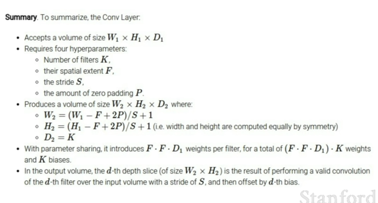</kbd>

> [!NOTE]
> một số kí hiệu

 

<kbd>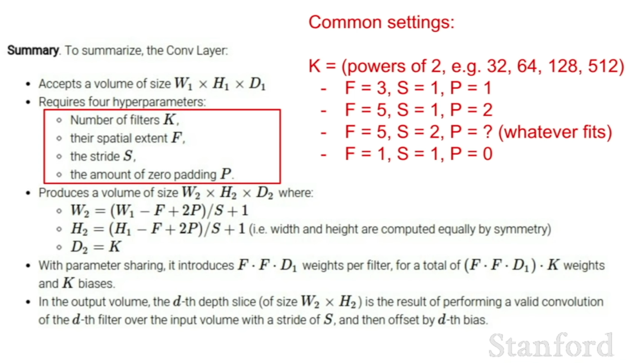</kbd>

> [!NOTE]
> và các setting phổ biến

 

<kbd>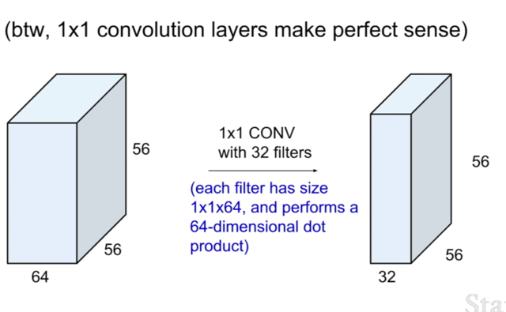</kbd>

> [!NOTE]
> 1x1 filters, mỗi cái tạo ra 1 miếng vẫn
> giữ shape của input. 32 cái filter tạo
> ra 32 miếng stack lại

 

<kbd>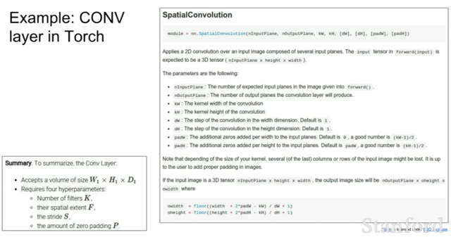</kbd>

> [!NOTE]
> ví dụ về Conv layer
> trong Torch và Café

 

<kbd>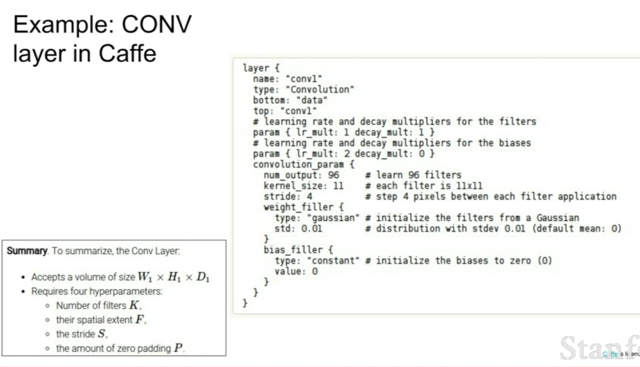</kbd>

 

<kbd>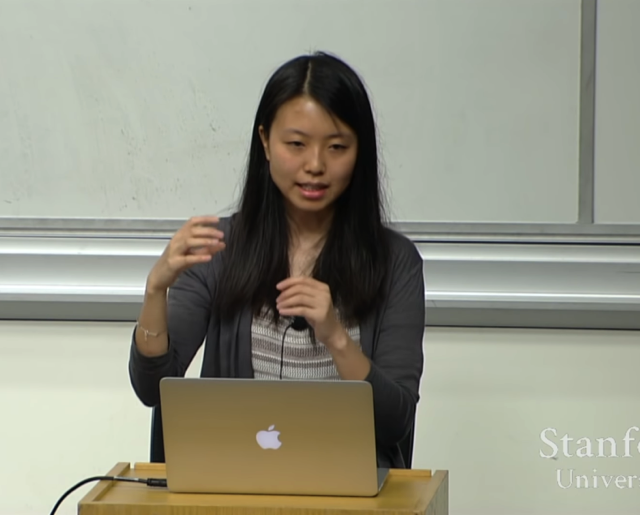</kbd>

> [!NOTE]
> Câu hỏi là dùng stride lớn để làm gì?-> Có tác dụng như pooling, giúp
> giảm spatial size và nhờ đó có thể giảm số params khi chuyển qua
> fully connected layer.
>
>
>
> Nói chung là stride một dạng hyperparams,
>  cân nhắc trade-off giữa model size, số params, overfit...

 

<kbd>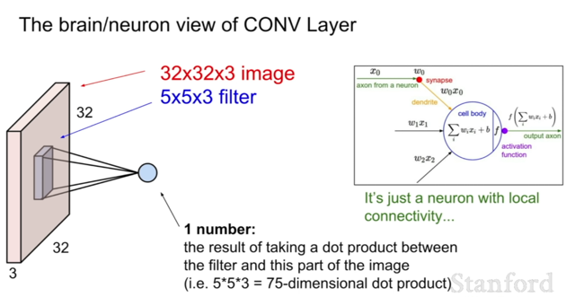</kbd>

> [!NOTE]
> ý nói vẫn là "cái kiểu giống giống" như neuron thần kinh nhưng
> khác ở chỗ nó (mỗi filter) chỉ look at a local region thay vì toàn bộ cái hình

 

<kbd>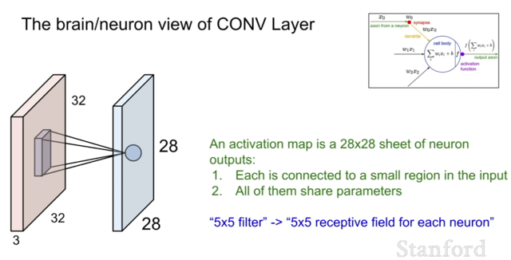</kbd>

> [!NOTE]
> Đại khái là một thuật ngữ hay dùng/gặp khác cho filter là **receptive field**
>
>
>
> Và chú ý rằng dù là filter sẽ slide và tính cho mọi  vùng của image
> nhưng nó xài chung một bộ params.
>
>
>
> Điều này giúp ta hiểu nếu có nghe về shared params

 

<kbd>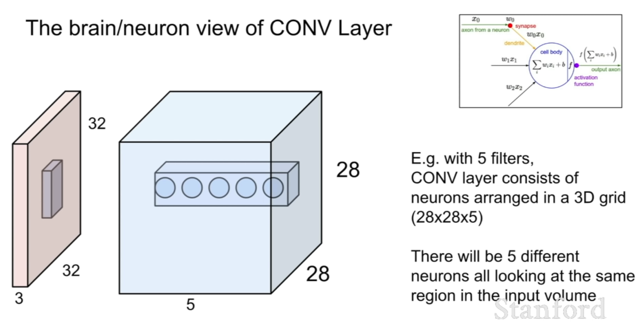</kbd>

> [!NOTE]
> một cách hiểu theo kiểu brain/neuron với Conv layer nữa đó là mỗi
> filter giống như một neuron quét qua khắp các input region để rồi 5
> neuron đều nhìn vào cùng 1 vùng và xem xét các pattern nào đó
> mà mỗi cái nó chịu trách nhiệm
>
>
>
> Và mỗi value của output chỉ connect với 1 vùng của input  chứ
> không như Fully Connected layer

 

<kbd>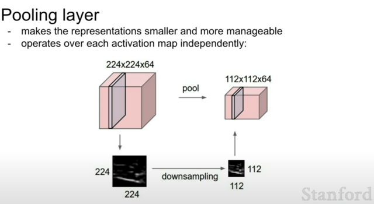</kbd>

> [!NOTE]
> Pooling chỉ giảm spatial size của activation map chứ giữ nguyên depth

 

<kbd>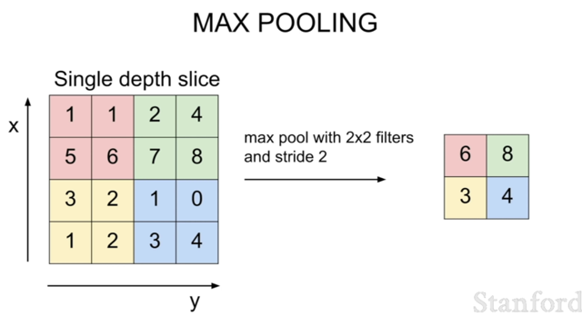</kbd>

> [!NOTE]
> có thể hiểu nôm na tác dụng của max pooling là nó khuếch
> đại / làm rõ các thông tin / signal mà filter detect được

 

<kbd>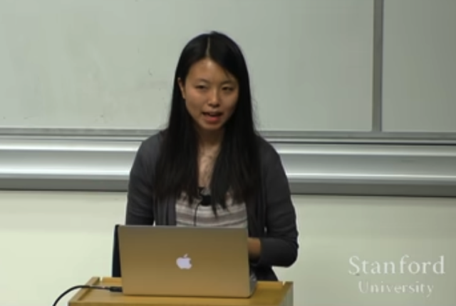</kbd>

> [!NOTE]
> đại khái câu hỏi là dùng stride có thể cũng giảm size vậy thì có thể
> dùng stride được ko?
>
>
>
> -> Được

 

<kbd>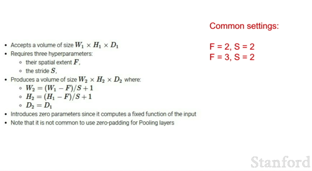</kbd>

 

<kbd>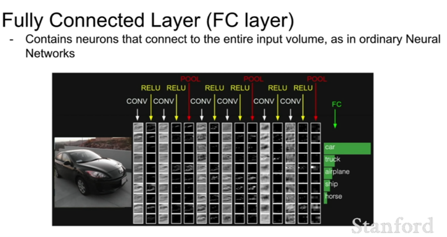</kbd>

> [!NOTE]
> đại khái là mấy cái hình nhỏ nhỏ ở dưới chính là activation map
> output, và, pooling layer chỉ giảm size xuống (down sampling)
> bằng cách lấy giá trị lớn nhất ở mỗi location. Để ý layer cuối sẽ rõ.
>
>
>
> Layer đầu sẽ detect "how much a edge pattern is fired", ý nói, nó sẽ
> tính ra giá trị lớn nếu nó detect được pattern như "edge"
> Để rồi layer tiếp theo nó sẽ detect "how much a corner is fired", giống
> như nó sẽ "filter" để tìm ra các pattern phức tạp hơn.
> Để rồi ở layer cuối nó sẽ kiểu như tính toán ra "how much a pattern
> phức tạp (high level feature) được detect.
> Và FC layer sẽ giống như tổng hợp lại hết để quyết định xem lấy cái nào
> mỗi cái bao nhiêu để đưa ra quyết định cuối cùng

 

<kbd>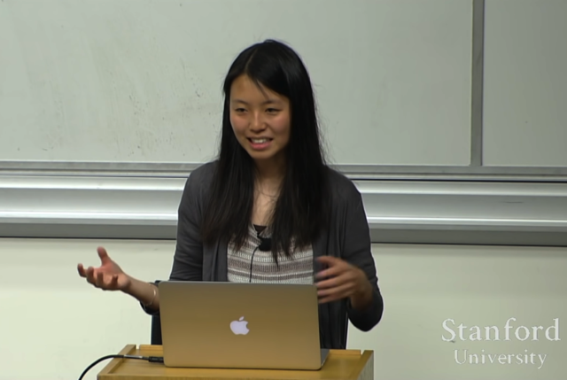</kbd>

> [!NOTE]
> Q: Chọn pooling như thế nào, ý là làm sao để biết nên dùng
> pooling đến đâu để giảm size xuống?
>
>
>
> A: Cái này là hyperparams, cũng như các yếu tố khác của kiến
> trúc model, phải thử sai thôi (Hyperparams tuning)

 

<kbd>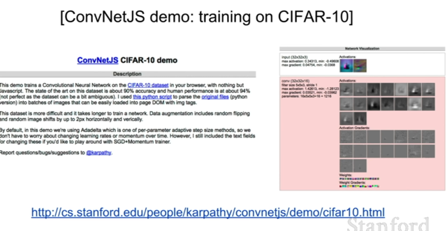</kbd>

> [!NOTE]
> Nói về cái demo của ConvNet train với CIFAR-10 của Andrey Karpathy. 
> Chú ý là khi nhìn vào các activation map in ra thì với những layer đầu
> có thể ta sẽ thấy hiểu hiểu hình ảnh đó là gì nhưng với những layer
> sau sâu hơn thì nếu thấy khó hiểu thì cũng đừng lo vì với các high level
> Feature, model nó học / detect các pattern gì thì chỉ nó mới biết

 

<kbd>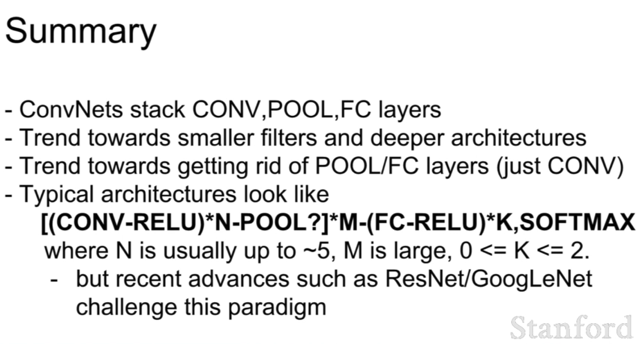</kbd>

> [!NOTE]
> tóm lại, convnet stack các conv, pool, fc layer lại. Khuynh hướng các filter
> nhỏ hơn ngày càng được sử dụng. Khuynh hướng bỏ pool/fc layer và kiến
> trúc điển hình của ConvNet là nhiều block Conv-Relu-...Conv-Relu-Pool,
> sau đó là vài block fc-relu trước khi out với softmax

 

