# Lecture 6/16 - Training Neural Network I

📊 **Progress:** `65` Notes | `105` Screenshots

---

## Lecture 6/16 - Training Neural Network I

 

<kbd>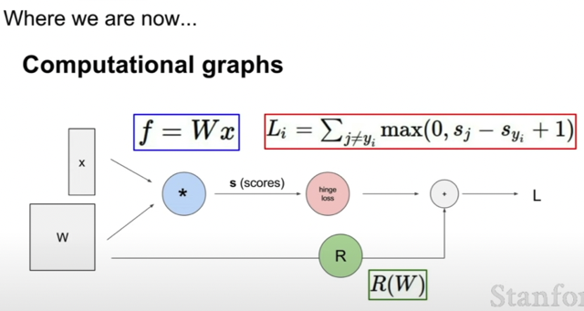</kbd>

> [!NOTE]
> Ta đã biết về **computational graphs**, giúp phân tách các bước tính
> toán phức tạp thành chuỗi các bước đơn giản

 

<kbd>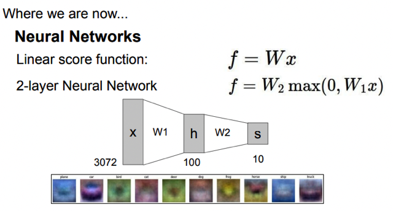</kbd>

> [!NOTE]
> đã biết về nn như chuỗi các **linear transformation**
> xen kẽ là các **non-linear activation function**

 

<kbd>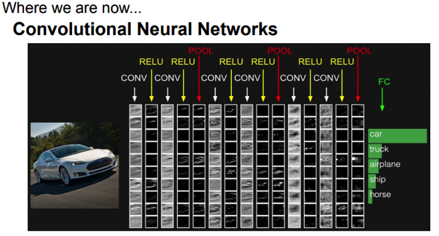</kbd>

 

<kbd>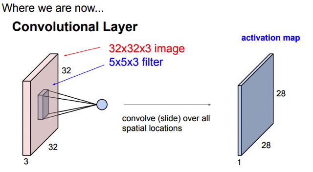</kbd>

> [!NOTE]
> đã biết về **convolutional layer**

 

<kbd>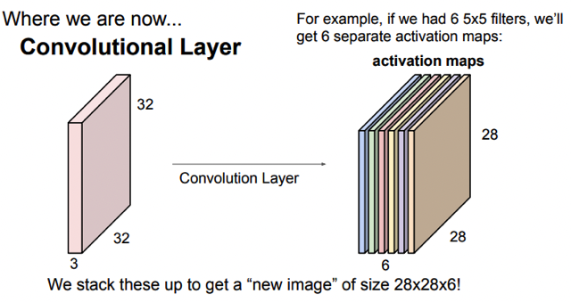</kbd>

 

<kbd>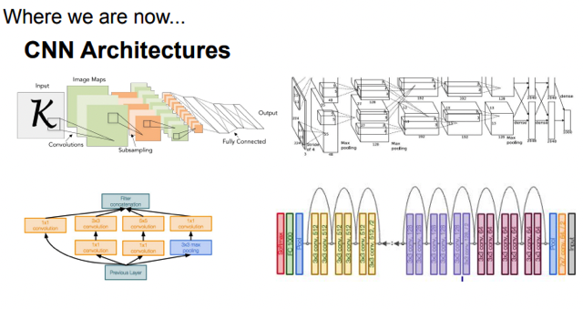</kbd>

 

<kbd>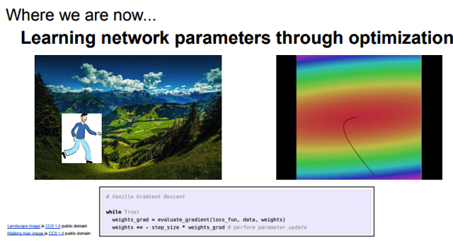</kbd>

 

<kbd>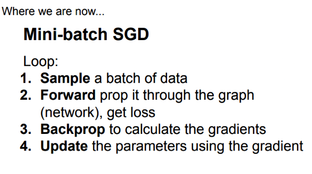</kbd>

 

<kbd>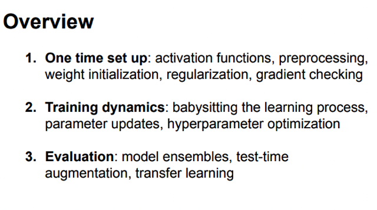</kbd>

 

<kbd>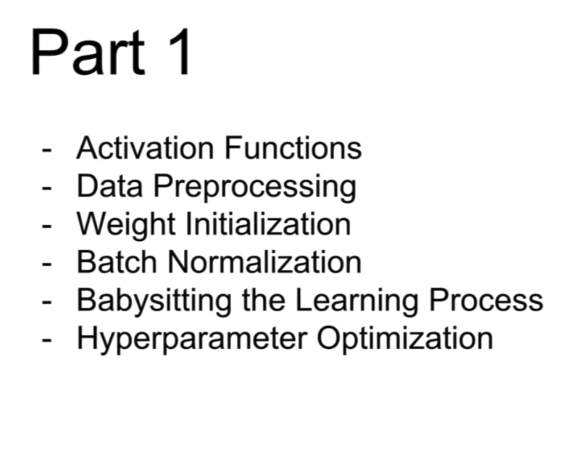</kbd>

 

<kbd>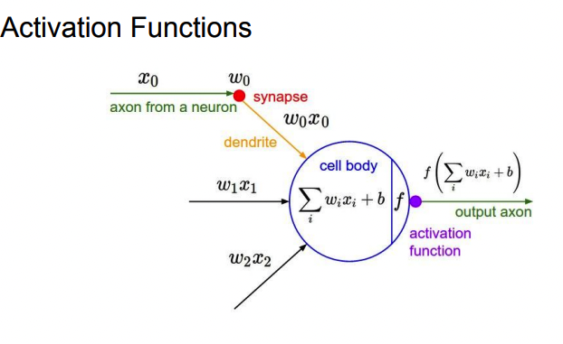</kbd>

 

<kbd>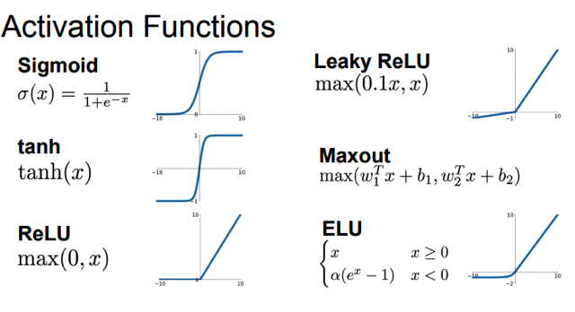</kbd>

 

<kbd>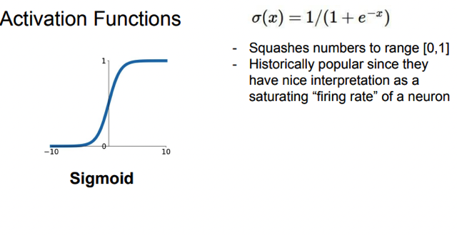</kbd>

> [!NOTE]
> nhận một (scalar) hoặc vector và (element-wise) squash các giá trị
> về 0-1. Có behavior rất giống linear function trong khoảng gần 0,
> nếu input rất lớn thì output sẽ ~= 1, âm rất lớn thì ~= 0

 

<kbd>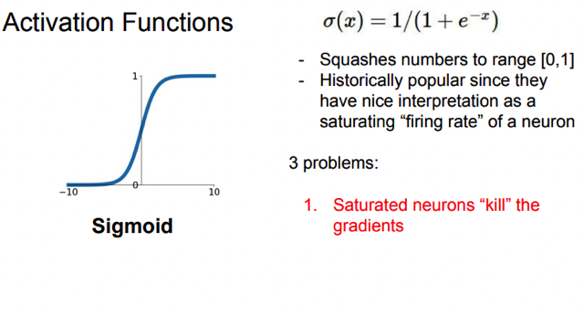</kbd>

> [!NOTE]
> Vấn đề của sigmoid là
> nó "kill gradient"

 

<kbd>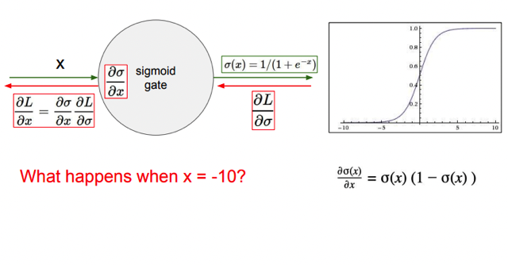</kbd>

 

<kbd>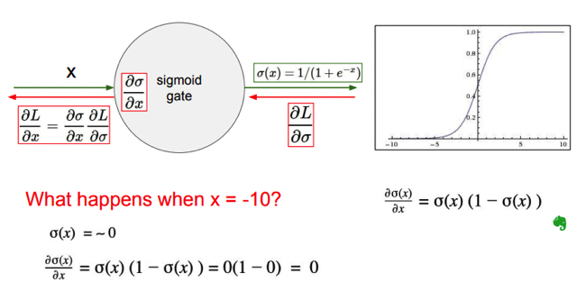</kbd>

 

<kbd>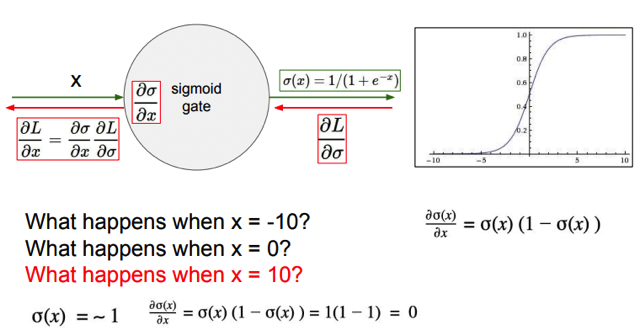</kbd>

 

<kbd>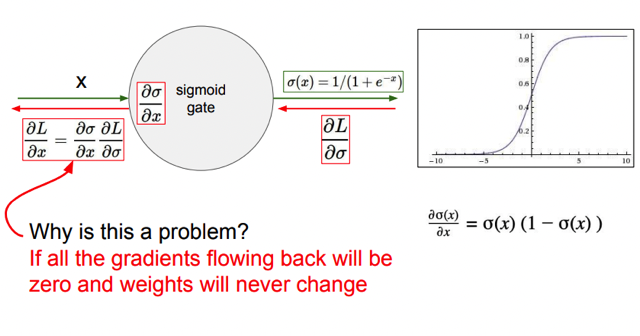</kbd>

> [!NOTE]
> Đơn giản là khi qua sigmoid node, local gradient của nó ~=
> 0 khi x lớn hoặc bé (âm) sẽ khiến downstream gradient = 0

 

<kbd>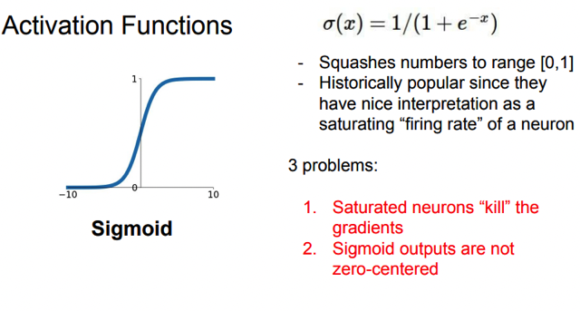</kbd>

> [!NOTE]
> vấn đề thứ hai là sigmoid
> output không zero centered

 

<kbd>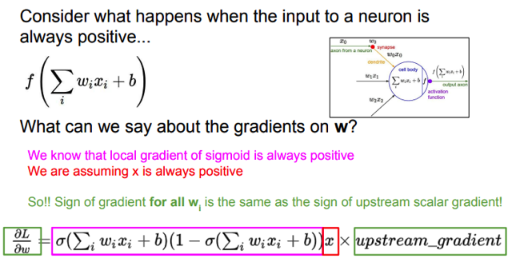</kbd>

 

<kbd>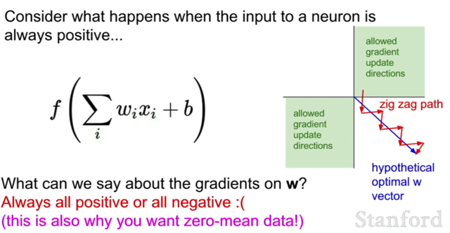</kbd>

> [!NOTE]
> hệ qủa là các element của véctơ x input vào neuron sau sigmoid sẽ
> không âm dẫn đến gradient của nó sẽ luôn cùng dấu (bằng dấu với
> upstream gradient), khiến "đường đi" chỉ zig-zac, không hiệu quả

 

<kbd>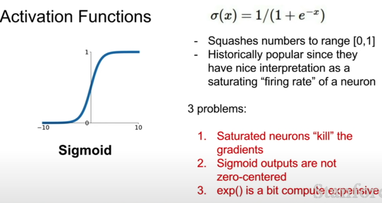</kbd>

> [!NOTE]
> một vấn đề nhỏ nữa đó là exp là phép tính "tốn kém"

 

<kbd>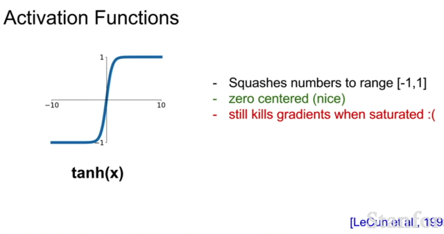</kbd>

> [!NOTE]
> Tanh khắc phục được vụ zero-centered

 

<kbd>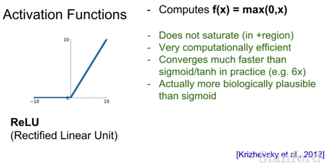</kbd>

> [!NOTE]
> **Relu** có **rất nhiều ưu điểm** như không saturate (bão hòa, ám **chỉ độ
> dốc luôn dương ở phía x > 0**), **tính toán simple** vì chỉ là hàm max(0,z)
> và **converge nhanh hơn** sigmoid/tanh trong thực tế do đó nó được **lựa
> chọn mặc định rất phổ biến** hiện nay

 

<kbd>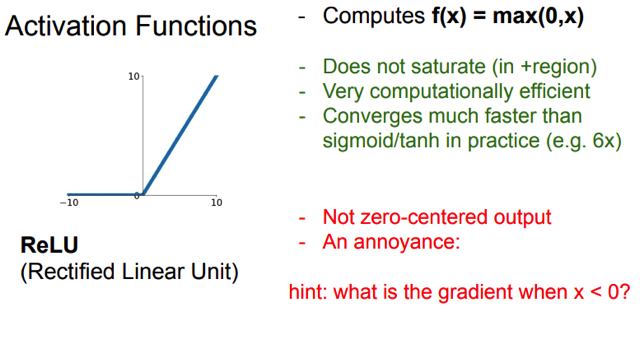</kbd>

> [!NOTE]
> Nhưng vẫn có hai nhược điểm là không **zero-centered** output và
> **gradient = 0 khi x < 0**

 

<kbd>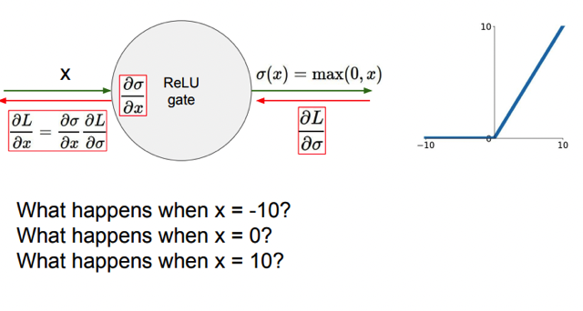</kbd>

> [!NOTE]
> Gradient sẽ bằng 0 (**killing the gradient**) khi x < 0, tại ko thì nó không
> xác định nhưng cũng có thể coi như là = 0

 

<kbd>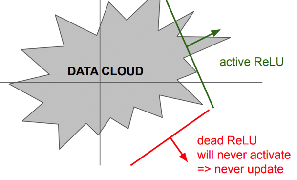</kbd>

> [!NOTE]
> Đại khái là nói đến một khả năng có thể xảy ra liên quan đến "**bad
> initialization**" trong đó đại khái là xui xui sao đó mà **các giá trị ban đầu
> của w khiến kết qủa weighted sum với input luôn <= 0**, từ đó khi **qua
> activation function reLu thì nó ra 0**, và **gradient (derivative of L w.r.t w)
> cũng sẽ bằng 0**, và các weight w sẽ không được update, không học hành gì cả
> kể cả các params trước đó vì theo như computation graph đã thấy (vấn đề
> tương tự cũng xảy ra khi sigmoid) khi local gradient = 0 khiến downstream
> gradient cũng = 0 nốt.
>
>
>
> Nguyên nhân thứ hai cũng có thể dẫn tới hiện tượng này là khi **learning
> rate lớn c**ũng có thể khiến weight được update theo cách sao đó khiến
> weighted sum input vào relu < 0
>
>
>
> Và nói thêm nếu ta freeze network trong lúc training thì ta sẽ thấy **10-20%
> là dead relu**. Do đó là **sự lãng phí** (như bên câu trả lời của GPT) và
> **khiến neural network không phát huy hết khả năng** của nó trong việc
> capture các complex non-linear pattern trong data.
>
> Hình ảnh này ý là ví dụ như trong 2D feature vector, input vào relu sẽ là
> weighted sum z = w1x1 + w2x2 + b
>
>
>
> Đại khái là **với các trường hợp weight được initialized khác nhau** thì
> **có khi ok** như hyperplane màu xanh tính toán với m**ọi data point ra
> kết quả dương** còn nếu bad initialized thì **tạo ra hyperplane màu đỏ
> khiến tính toán với mọi data point ra z luôn âm**

 

<kbd>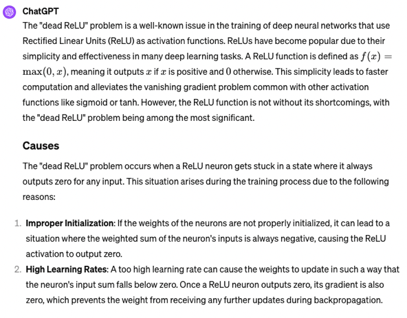</kbd>

 

<kbd>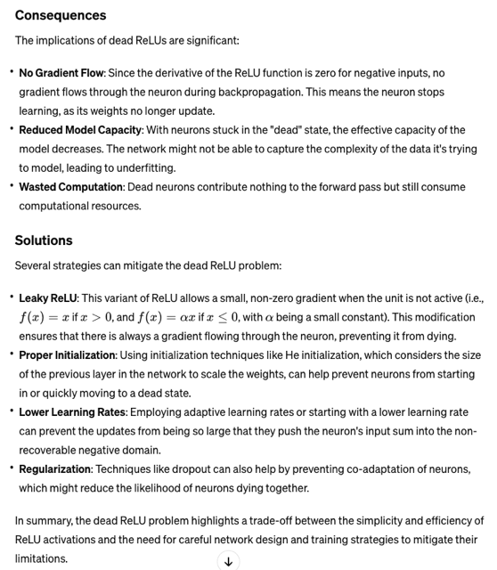</kbd>

 

<kbd>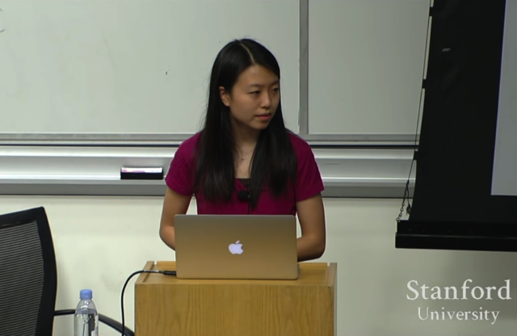</kbd>

> [!NOTE]
> Có câu hỏi là "Làm sao để biết có **dead relu hay không** theo như
> data cloud?"
>
>
>
> QUay lại cái hình hyper-plane, đại khái là có thể xảy ra  khả năng
> bad initialized khiến cái hyperplane (define bởi các giá trị w, tất nhiên
> là trong không gian high-dimension hình ảnh trên chỉ là vẽ minh họa
> trong không gian 2D) nó có vị trí như vậy khiến kết quả tính toán với
> mọi data trong data cloud đều ra (weighted sum) âm

 

<kbd>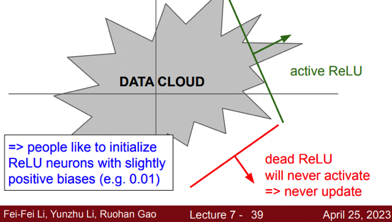</kbd>

> [!NOTE]
> Đại khái là ta sẽ dùng một giá trị **b dương nhỏ** ví dụ **0.01** để cho
> kiểu như w1x1+w2x2 có = 0 hay hơi nhỏ hơn 0 thì b sẽ kéo kết
> quả lên dương thì cái này có người nói hiệu quả có người 0

 

<kbd>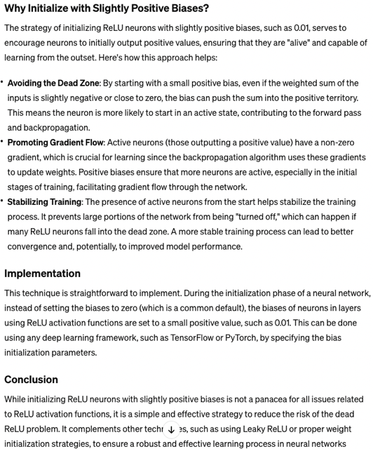</kbd>

 

<kbd>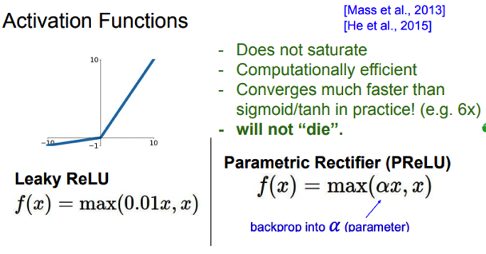</kbd>

> [!NOTE]
> đại khái là cả hai đều cố gắng khắc phục "dead relu" nhưng pRelu thì
> dùng một learnable alpha thay vì fixed alpha = 0.01 (cung cấp độ dốc ở
> đoạn x < 0 gây dead relu)
>
>
>
> Hiệu quả của learnable alpha đại khái là có ưu điểm và nhược điểm đó là
> nó cho phép sự **flexibility** giúp tạo ra khả năng  **adaptability** **với các
> dataset khác nhau bằng cách nó tìm ra độ dốc tốt nhất cho mỗi neuron**.
>
>
>
> Như bù lại nó lại tăng thêm số params k**hiến neural net cơ bản là more
> complex dẫn đến dễ (prone to) overfit** và **computational cost cũng tăng**
> Thành ra đánh giá hiệu quả của PRelu so với Leaky relu là phải cân
> nhắc cả hai

 

<kbd>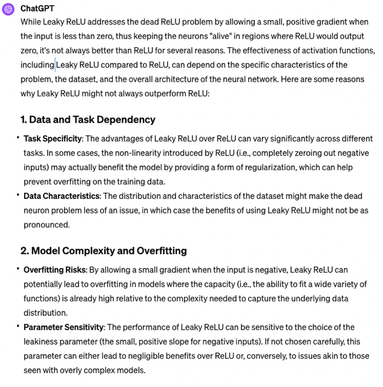</kbd>

<kbd>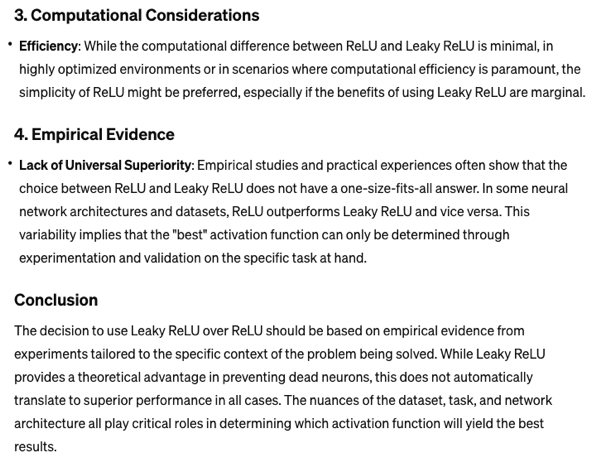</kbd>

> [!NOTE]
> Đại khái là **không phải dataset nào cũng bị vấn đề dead relu khi đó dùng
> leaky relu vô ích**, dùng leaky relu **tăng thêm khả năng capture non-linearity
> của model thành ra với neural net vốn đã có capacity cao rồi thì nó sẽ khiến
> dễ overfit.**
>
>
>
> Lí do đại khái là với leaky relu, **mọi neuron đều được activate, nên tăng khả
> năng của neural net**. Còn với Relu thì kiểu như **dead relu là một dạng
> regularization technique khiến giảm bớt capacity** của neural net
>
>
>
> Việc **chọn hệ số slope cũng phải cân nhắc vì nhỏ quá thì vô hiệu** hóa tác
> dụng của leaky relu mà l**ớn quá thì gây các vấn đề khác.**
>
>
>
> Và dù ít nhưng vẫn có **sự tăng thêm computational cost** nên nếu scale lên
> thì vẫn là một **nhược điểm.**
>
>
>
> Và cuối cùng là **chưa có bằng chứng rõ ràng là l.relu luôn tốt hơn relu**

 

<kbd>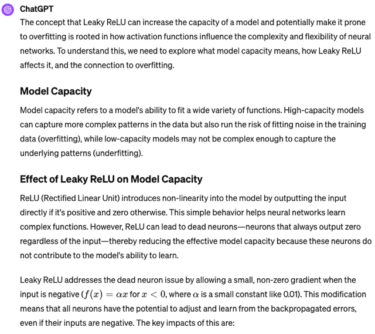</kbd>

<kbd>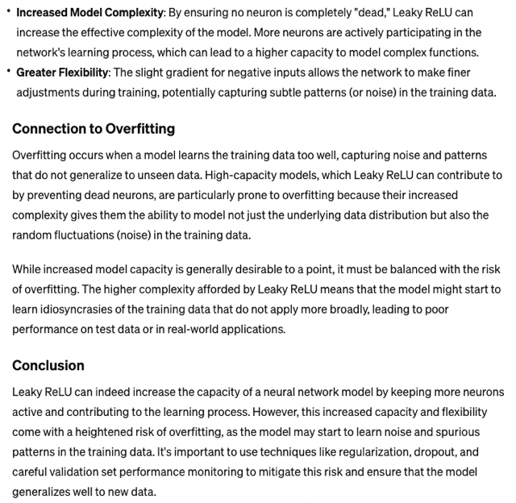</kbd>

 

<kbd>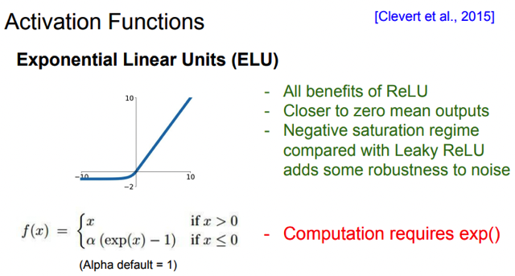</kbd>

> [!NOTE]
> Đại khái là cái này có tính chất khiến output có thể âm, thành ra "đẩy" **gần
> tới zero mean hơn**, mà cái này có giúp cải thiện một vấn đề tương tự như đã
> bàn ở sigmoid đó là giảm sự zigzac của đường đi gradient dẫn tới tăng tốc độ
> converge

 

<kbd>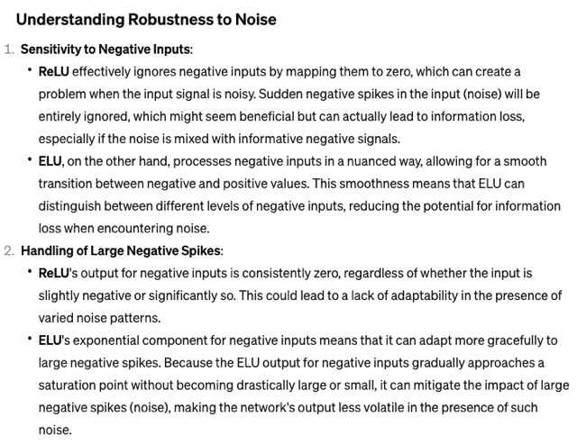</kbd>

> [!NOTE]
> Còn ưu điểm về việc **ELU giúp more robust hơn Relu** thì tạm hiểu là vì nó **có
> thể nhận input âm và xử lí nó theo cách tạm gọi là theo cách khác với ReLU**
> (**ReLU chỉ output ra giá trị 0 cho mọi negative input)** nên ý họ nói ReLU hành
> xử như vậy với input âm **có thể dẫn tới khả năng mất thông tin (information
> loss)** - hiểu nôm na là nhờ nó "cứ nhận giá trị âm là trả ra 0" nên nó giúp ngăn
> chặn các noise âm nhưng nếu input âm đó không phải là noise thì nó sẽ bị mất
> thông tin.
>
>
>
> Thành ra ELU hơn ở chỗ nó **chỉ chặn các noise âm lớn** (output ra 0) chứ
> không phải cứ âm là output ra 0.
>
>
>
> Ở đây chỉ bàn ở khía cạnh input âm vì **input dương thì hai thằng như nhau rồi**.
>
>
>
> Có thể ví von như reLU đối với input âm giống như một người **bỏ ngoài bất cứ ý
> kiến tiêu cực nào**, nhờ vậy họ **không bị lung lay trước các lời dèm pha** nhưng
> bù lại thì họ cũng **bị khả năng sẽ mất những ý kiến tiêu cực nhưng hữu ích**.
> Ngược lại ELU thì **vẫn tiếp nhận nhưng chỉ loại bỏ những ý kiến quá tiêu cực
> thôi**

 

<kbd></kbd>

> [!NOTE]
> đại khái là thực tế thì **tốt nhất là thử hết xem cái nào tốt trong vấn
> đề của mình** chứ không có bằng chứng nào cho thấy cái nào là tốt
> nhất cho mọi trường hợp cả

 

<kbd>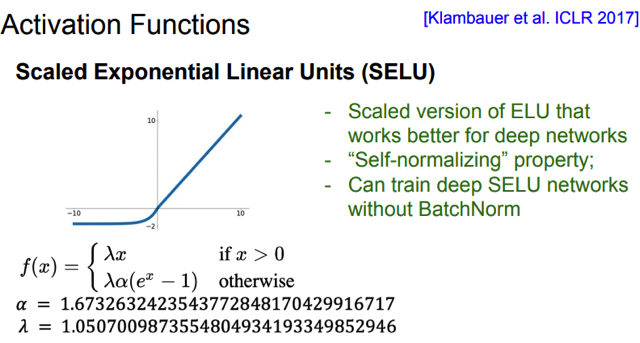</kbd>

 

- **### Advantages of SELU

1. **\\*Self-Normalization\\***: SELU's primary benefit is its ability to \\*maintain stable mean and variance across\\*
network layers during training, reducing\\* internal covariate shift\\*. This property diminishes the need for
additional normalization techniques like \\*batch normalization.\\*

2. **Enhanced \\*Learning Dynamics\\***: The self-normalizing characteristic of SELU can lead to \\*faster
convergence\\* and better overall performance in deep neural networks, as it helps in controlling the
\\*vanishing\\* and \\*exploding gradients\\* issue.

3. **\\*Reduced Initialization Sensitivity\\***: Due to its self-normalizing nature, SELU lessens the network's
sensitivity to the \\*initial weight settings\\*, making the initialization process less critical compared to other
activation functions.

4. **\\*Noise Robustness\\***: Like ELU, SELU provides a smooth transition for negative inputs towards a
saturation point, which might \\*make it more robust to input noise\\* compared to activation functions that do
not distinguish between different negative values, such as ReLU.

### Disadvantages of SELU

1. **\\*Architecture Constraints\\***: The \\*self-normalizing properties\\* of SELU are \\*most effective\\* under certain
conditions, such as in networks predominantly composed of\\* fully connected layers\\*. Its benefits might not
fully transfer to architectures that deviate significantly from this setup.

2. **Less Effective in Non-Feedforward Networks**: While SELU can be used in\\* convolutional neural
networks (CNNs)\\* and r\\*ecurrent neural networks (RNNs)\\*, its self-normalizing benefits are optimized for
feedforward architectures and might be less pronounced in these contexts.

3. **\\*Hyperparameter Sensitivity\\***: Despite \\*reducing the need for specific initialization techniques\\* and
\\*batch normalization\\*, the performance of SELU can still be \\*sensitive\\* to other \\*hyperparameters\\*, including
the \\*learning rate\\* and\\* network design\\*.

4. **\\*Computational Cost\\***: The exponential component in SELU introduces \\*additional computational\\*
overhead compared to \\*simpler activation functions like ReLU\\*, which might be a consideration for very
\\*large models or time-sensitive\\* applications.**

> [!NOTE]
> ngoài những ưu điểm như Elu thì  những ưu điểm liên quan đến khả năng **tự
> normalized** giúp **không cần phải batch normalization** và **ít nhạy cảm với
> initialization** nhưng lại **tăng gánh nặng tính toán** và c**hỉ phát huy tác dụng
> nhiều đối với Feed Forward architecture**

 

<kbd>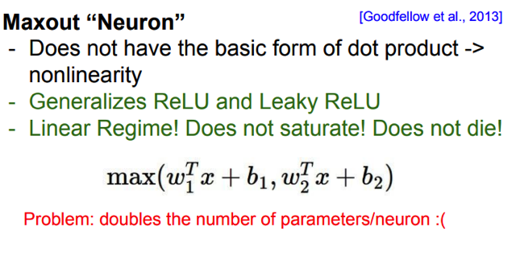</kbd>

<kbd>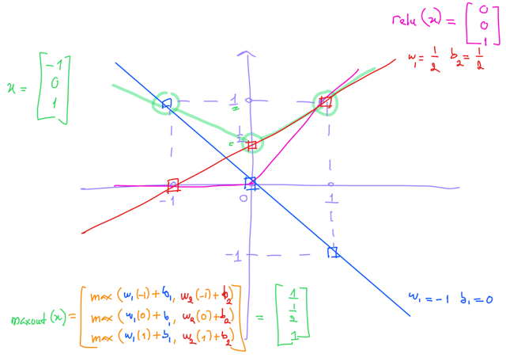</kbd>

> [!NOTE]
> có thể hiểu maxout, nó sẽ tạo một piece-wise linear, số
> đoạn sẽ quy định bởi k

 

<kbd>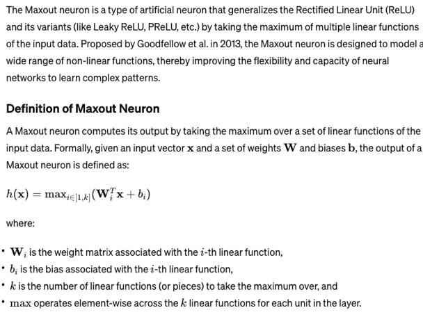</kbd>

 

- **\\*Advantages\\* of Maxout Neurons

\\*Universal Approximation Capability\\*: Maxout neurons can \\*approximate any convex function\\* given
enough units, making them \\*highly flexible and capable\\* of modeling \\*complex relationships in the
data.\\*

\\*Robustness\\* to \\*Vanishing Gradient\\*: By design, Maxout units do not suffer from the vanishing
gradient problem, as the \\*gradient can flow through at least one of the linear components\\*, similar to
ReLU units.

\\*Compatibility\\* with Dropout: Maxout networks are\\* particularly well-suited to work with dropout\\*, a
regularization technique to \\*prevent overfitting\\*. Goodfellow et al. demonstrated that Maxout units,
when combined with dropout, can \\*significantly improve model performance and generalization.\\*

\\*Learnable Activation Function\\*: Unlike predefined activation functions (e.g., sigmoid, ReLU), the
Maxout neuron essentially \\*learns the best activation function from the data during training\\*,
providing a form of \\*adaptability\\* that is not available with fixed activation functions.

\\*Disadvantages\\* of Maxout Neurons

\\*Increased Parameter Count\\*: Each Maxout unit requires k times more parameters than a traditional
neuron (for k linear pieces), which can lead to a\\* significant increase in the model's size\\* and
potentially in the \\*amount of computation required.\\*

\\*Risk of Overfitting\\*: With the increased capacity and flexibility comes a \\*higher risk of overfitting\\*,
\\*especially in cases where the amount of training data is limited\\* relative to the complexity of the
model.

\\*Implementation Complexity\\*: Implementing Maxout neurons can be \\*slightly more complex than
standard activation functions\\* due to the need to manage multiple sets of weights and biases and
compute the maximum across these linear transformations.

Conclusion The Maxout neuron offers a \\*powerful\\* and \\*flexible\\* way to \\*enhance the modeling
capacity of neural networks\\*, capable of \\*learning a wide range of non-linear relationships\\*. However,
the benefits of increased model capacity and flexibility must be balanced against the \\*potential
drawbacks\\* of \\*higher computational cost\\* and the\\* risk of overfitting\\*. In practice, the use of Maxout
neurons can be particularly beneficial in scenarios where the complexity of the task justifies the
\\*additional parameters\\* and where \\*sufficient data\\* and \\*regularization techniques (like dropout)\\* can
mitigate the risk of overfitting.**

> [!NOTE]
> tóm gọn là maxout giúp tăng đáng kể capacity và **giải quyết triệt để vấn đề
> gradient vanishing** nhưng vì nó tăng lên nhiều lần số params nên **rất dễ dẫn tới
> overfit** nên **cần phải kết hợp với các regularization technique như Dropout và
> cũng tăng độ phức tạp khi thực thi.**

 

<kbd>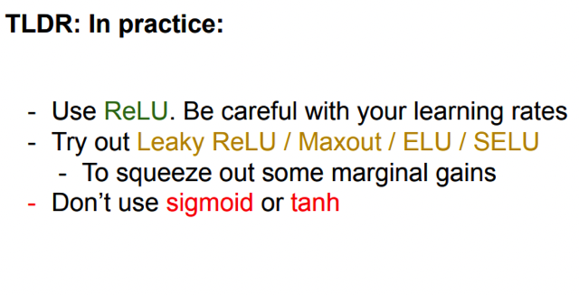</kbd>

 

<kbd>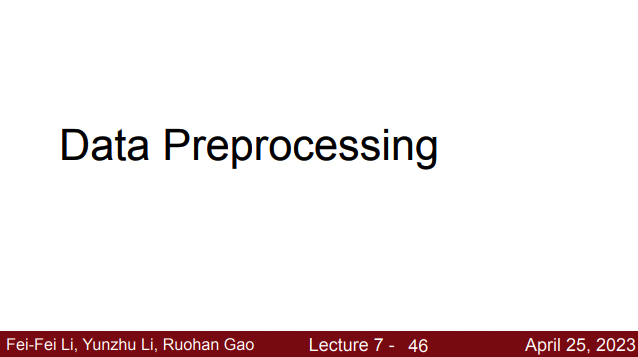</kbd>

 

<kbd>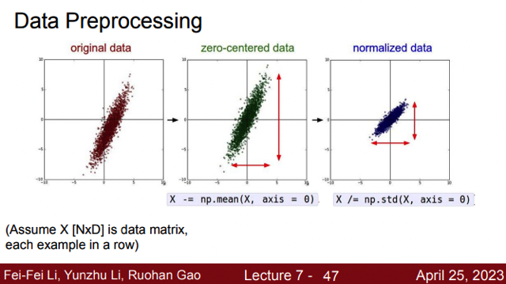</kbd>

> [!NOTE]
> Standardization, lí do phải zero-mean giải thích ở slide sau, còn
> normalization để các **feature có cùng một range xem xem nhau**. Mục
> đích là để các **feature gradient đóng góp đều nhau**. Cái này đã minh họa
> khá rõ trong MLSpec note.
>
>
>
> Còn ở đây ta deal với images, trong đó các feature là các pixel value đã cơ
> bản là **đã cùng range rồi (0-255) nên không cần**.

 

<kbd>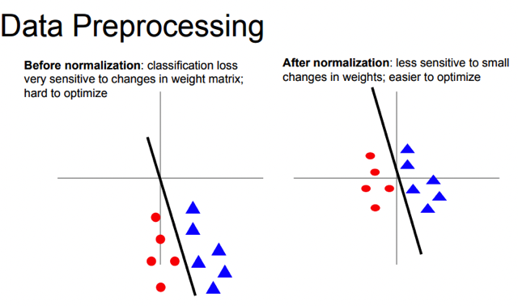</kbd>

 

<kbd>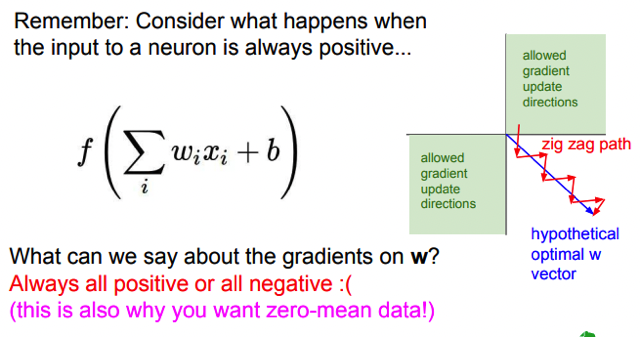</kbd>

> [!NOTE]
> về lí do phải zero-centered thì tương tự như khi bàn về vấn đề của
> sigmoid / hay relu. **Nó khiến gradient có đường đi zigzac (do các
> giá trị chỉ cùng dấu) giảm hiệu quả huấn luyện.** Nếu không
> zero-centered thì cũng sẽ bị tình trạng này

 

<kbd>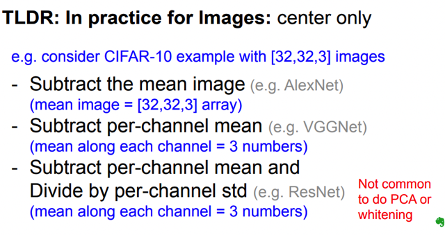</kbd>

> [!NOTE]
> Có chú ý là phải dùng **mean và std** khi processing **test set** và có điểm đáng chú
> ý là VGGNet hay ResNet người ta chỉ trừ "per channel" mean và standard
> deviation
>
>
>
> Và làm cái này trước khi training (có lẽ không cần nói vì cái này thuộc data
> preprocessing step)

 

<kbd>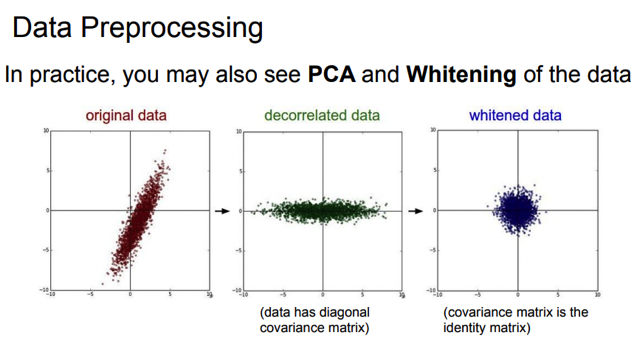</kbd>

> [!NOTE]
> Có những cách khác như PCA hay Whitening nhưng thường
> trong Image data thì không cần

 

<kbd></kbd>

 

<kbd>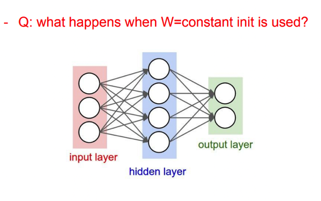</kbd>

 

- **Initializing weight values of a neural network layer with a \\*constant\\* can lead to several issues that
may \\*negatively affect\\* the training and performance of the network. Here's what typically happens:

1. **\\*Symmetry Breaking Failure\\***: If all the weights are initialized to the\\* same constant value\\*,
there is no way for the model to break symmetry during training. This means that for each layer, \\*all
neurons will learn the same features\\* during the training process since their weights are u\\*pdated
identically\\* based on the error gradient. This \\*severely limits the capacity of the neural network to
learn complex patterns\\* or features from the data.

2. **\\*Gradient Vanishing/Explodin\\*g**: Depending on the activation functions used and the
constant value for initialization, the network could \\*suffer from vanishing or exploding gradients\\*.
This issue is more pronounced in deep networks and makes it \\*difficult for the network to converge
\\*to a \\*good solution\\*. For instance, if weights are initialized with a\\* constant value that is too large or
too small,\\* the \\*gradients might become too small or too large\\*, respectively, making learning
either\\* very slow or leading to numerical instability\\*.

3. **\\*Lack of Diversification\\* in Learning**: \\*Effective\\* training of neural networks relies on the
\\*diversification\\* of neurons within each layer, where different neurons are able to learn different
aspects or features of the input data. By initializing all weights to the same constant, you\\* inhibit
this diversification,\\* leading to a model that is \\*less capable of capturing the complexity or variance
within the data.\\*

4. **\\*Poor Generalization\\***: A neural network with weights initialized to a constant value is likely to
\\*perform poorly on unseen data\\*. Since the network's ability to learn diverse features is
compromised, its generalization capability is also likely to be limited, resulting in lower accuracy or
higher error rates on the validation or test sets.

To mitigate these issues, it's generally recommended to \\*use more sophisticated weight initialization
strategies\\* that aim to maintain a certain variance in the weights as you move through the network.
Some common strategies include:

- **\\*Glorot/Xavier Initialization\\***:\\* Adjusts the scale of the initialization based on the number of input\\*
and output neurons to\\* keep the signal in a reasonable range of values\\* through many layers.

- **\\*He\\* Initialization**: Similar to Glorot but designed \\*for layers followed by ReLU activation\\* functions,
offering higher variance at the initialization to compensate for the ReLU nonlinearity.

- **Random Initialization**: Small random numbers, often drawn from a Gaussian or uniform
distribution, can be used, ensuring that the weights are not all the same and can start the symmetry
breaking process from the beginning of training.

These strategies help in starting the training process from a more advantageous position, promoting
faster convergence and improving the network's ability to learn complex patterns.**

> [!NOTE]
> Những vấn đề của **Symmetry Breaking failure** : Đại khái là nếu mọi neuron đều update như nhau thì
> network sẽ giống như người học võ **chỉ biết có mỗi một chiêu**, khiến giảm đáng kể **khả năng của nó
> trong việc nắm bắt những quy luật phức tạp trong dữ liệu**. Ngoài ra còn dễ dây vấn đề vanishing/
> exploding gradient và giảm generalization performance

 

<kbd>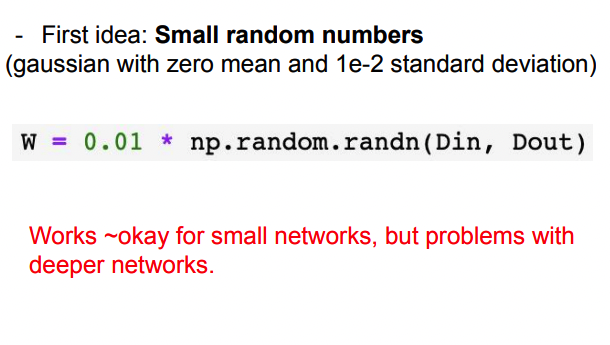</kbd>

> [!NOTE]
> Idea đầu tiên là randomize với Gaussian **zero mean**
> với **std nhỏ 0.01**

 

<kbd>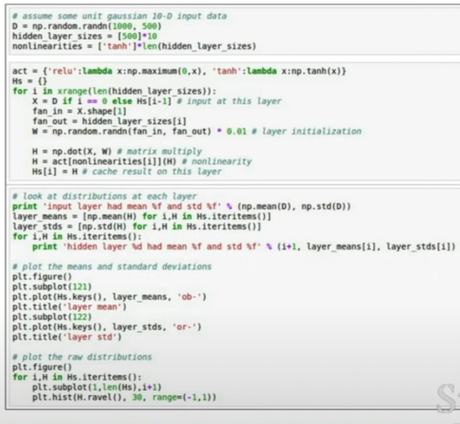</kbd>

> [!NOTE]
> đầu tiên khởi tạo matrix **D** shape **1000x500** randomly,
>
>
>
> **hidden_layer_sizes** là list chứa 10 con số 500 để dùng cho
> layer size của 10 hidden layer, và list chứa 10 cái tên 'tanh' để
> dùng làm activation function của 10 hidden layer "đó".
>
>
>
> Define act là dictionary map key là tên function và lambda
> function tương ứng.
>
>
>
> Iterate từ 1-10, tính fan_in, fan_out là số input và output, các
> layer đều có 500 unit, và input cũng 500 dimension nên mọi W
> đều có shape fan_in = 500 x fan_out = 500, khởi tạo randomly
>
>
>
> Tính ra activation value của hidden layer với dot product X, W
> và nonlinearity quy định trong nonlinearities (đều là tanh hết) để
> được H, là **matrix 1000x500**, M=100 là số training sample.
> Lưu H vào Hs
>
>
>
> Tạo list **layer_means** chứa mean của các H trong Hs. Vậy
> tính mean của H thì được mean của mọi value trong matrix H
> nên cơ bản layers_mean chứa 10 con số
>
>
>
> Tạo list **layer_stds** chứa std của các H trong Hs, tương tự
> như mean
>
>
>
> Dùng các giá trị trong hai list trên để plot, ra hai biểu đồ điểm,
> mỗi điểm là mean / std của mỗi hidden layer.
>
>
>
> Cuối cùng là plot 10 histogram dùng value của H (H.ravel() kiểu
> như flatten matrix thành vector và plot ra)

 

<kbd>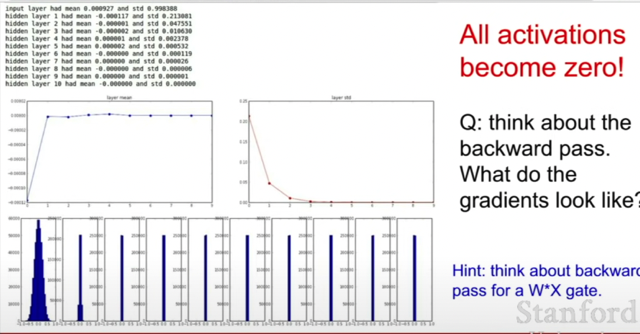</kbd>

> [!NOTE]
> Nhận xét, khi plot các giá trị **mean thì thấy nó = 0** thể hiện trong các mean
> in ra và đồ thị điểm trên bên trái) điều này là có thể hiểu vì các giá trị của H
> đều là kết quả của **tanh vốn là zero-mean**
>
>
>
> Còn std thì **giảm nhanh về 0.**
>
>
>
> Và dùng cái H để in ra histogram thì thấy rõ hơn khi các plot cho thấy  đều
> zero mean, nhưng các **"cột" này càng ốm** thể hiện cho **std dev  ngày
> càng về 0 như nói ở trên
>
>
>
> Điều này có nghĩa là các giá trị của activation đều nhanh chóng "trở thành/
> trở về 0" (thể hiện bởi standard deviation -> = 0)**

 

<kbd>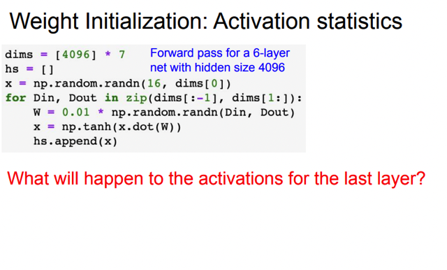</kbd>

> [!NOTE]
> đại khái là làm một thử nghiệm để minh họa một neural net có 6
> layer, mỗi layer có 4096 unit và input vào layer đầu cũng có
> shape 16x4096 nên W mỗi layer có shape 4096x4096 được initialize
> theo cách random. Dùng non-linearity là tanh.
>
>
>
> Câu hỏi là các activation các layer sẽ thay đổi như thế nào

 

<kbd>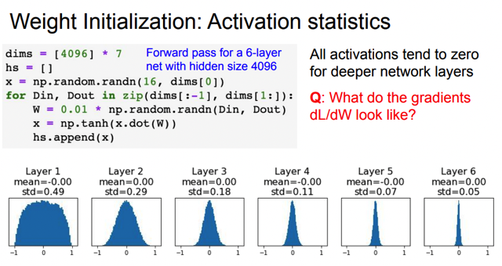</kbd>

> [!NOTE]
> Hình ảnh rõ hơn của các histogram, cho thấy mean = 0, std dev nhỏ dần về 0.
>
>
>
> Và hệ quả là **dL/dW sẽ = 0**, và do đó không có learning. Lí do nhớ lại **dL/dW
> = X** (hay input của layer, là output của layer trước, chính là activation value
> nói ở trên) mà c**húng lại ngày càng nhỏ, và về 0** thì **dL/dW sẽ nhỏ xíu ~=
> 0 -> không update gì cả, no learning và đây chính là gradient vanishing**
>
>
>
> Và khi tiếp tục backward, khi qua step, local gradient dL/dZ (Z ở đây là kết
> quả của input layer A[l-1] với W[l]) thì sẽ nhân với upstream gradient, mà local
> gradient dL/dZ là W. Mà W nhỏ thì lại gây r**a hiện tượng tương tự** như khi
> trong quá trình **forward, qua từng layer, value của các activation function nhỏ
> dần** thì ở đây **gradient sau khi nhân với W của từng layer cũng bị hiện tượng
> tương tự là bị nhỏ dần**, cũng trong câu chuyện **gradient vanishing**

 

<kbd>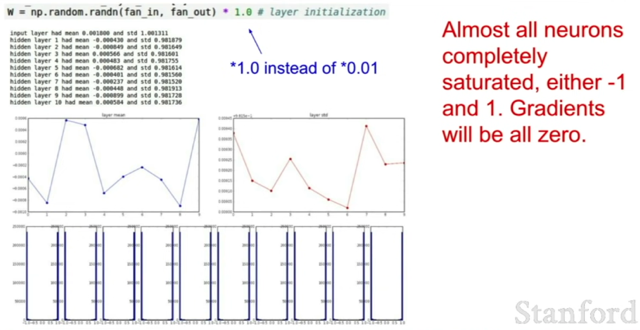</kbd>

 

<kbd>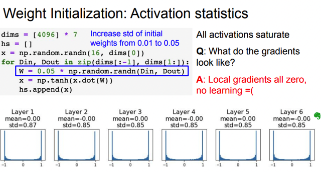</kbd>

> [!NOTE]
> Bây giờ **thử ini random với std lớn (tức là W có thể mang gía trị
> lớn)** thì thấy hiện tượng là **kết quả của activation đều tập trung
> ở 1 hoặc -1 đúng như tính cách của tanh khi input lớn sẽ cho
> output -1 hoặc 1.**
>
>
>
> Và gradient của nó sẽ hầu như bằng 0 (saturated) cũng sẽ dẫn
> đến việc learning bị dừng.
>
>
>
> Qua đó cho thấy **randomize weight khá là rắc rối khi nhỏ quá
> cũng ko được mà lớn cũng ko xong**

 

<kbd>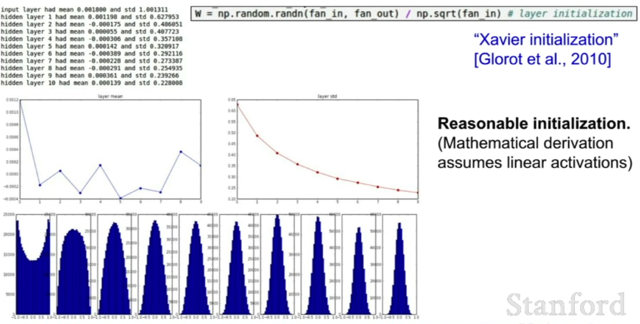</kbd>

<kbd>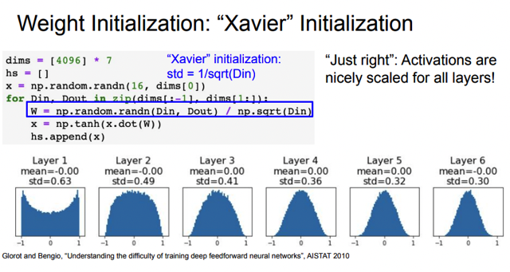</kbd>

> [!NOTE]
> hiểu một cái đại khái về cái cách này đó là, để ý cái việc họ chia cho sqrt của
> fan_in, tức là chia cho **số lượng các input, tức là số neuron của layer trước
> hoặc số dimension của input vector**. Thì ý nghĩa là nếu **số lượng** input của
> một layer ít, thì cho **giá trị ban đầu** **W lớn hơn** và nếu **số lượng** input
> của một layer **nhiều thì cho giá trị ban đầu của W nhỏ hơn.** 
>
>
>
> Mục đích là để c**ân bằng variance giữa input và output**

 

<kbd>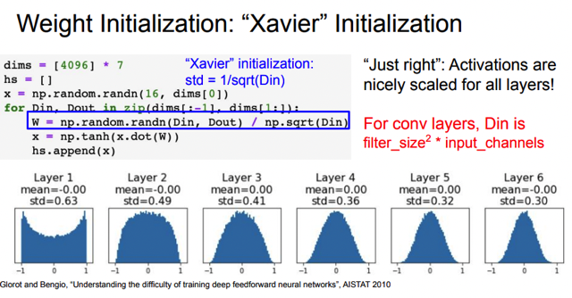</kbd>

> [!NOTE]
> đối với convolutional layer, Din (fan_in) là
> **filter_size^2*input_channels**

 

<kbd>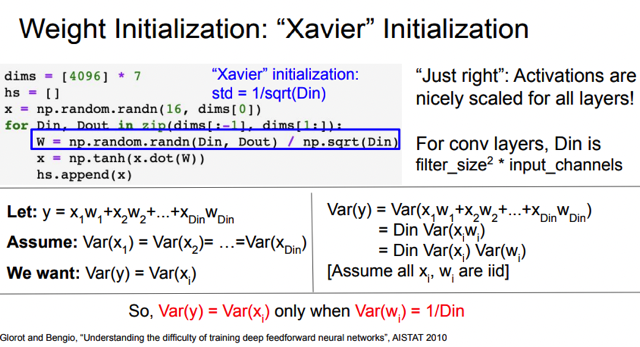</kbd>

> [!NOTE]
> Minh họa tại sao Xavier initialization giúp cân bằng variance
> của input và variance của output

 

<kbd>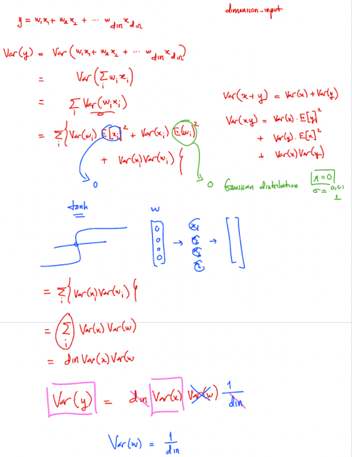</kbd>

 

<kbd>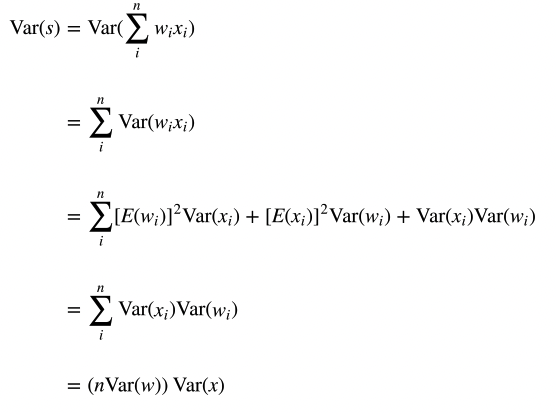</kbd>

> [!NOTE]
> E[wi] = E[xi] = 0 là vì ta assumed zero mean inputs do đang xài tanh() (cái này
> sẽ không đúng nữa khi xài ReLu) và zero mean weights (do ini với Gaussian
> zero mean)
>
>
>
> Và vì assume các các wi, xi đều i.i.d nên Sum i=1:n Var(xi)*Var(wi) = n*Var(w)Var(x)
> và từ đó để Var(s) = Var(x) thì Var(w) phải bằng 1/n hay w bằng 1/sqrt(n)

 

<kbd>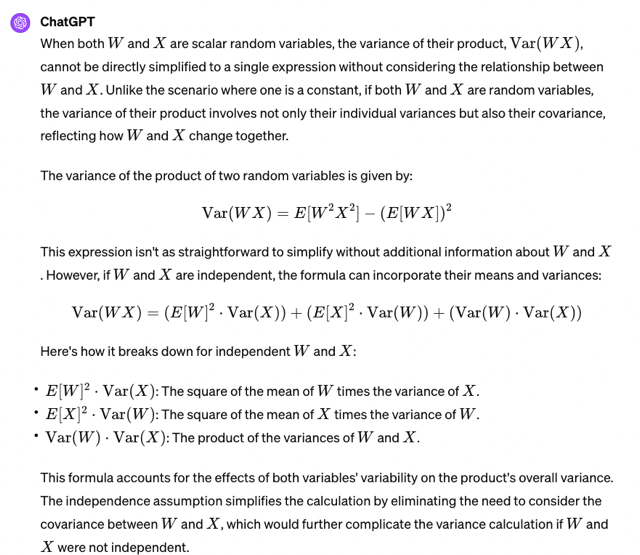</kbd>

 

<kbd>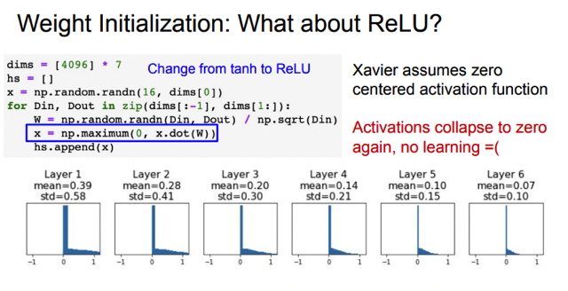</kbd>

<kbd>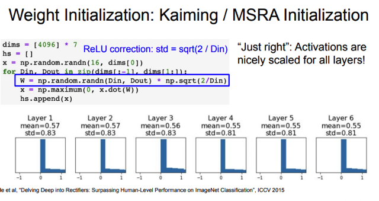</kbd>

> [!NOTE]
> nếu relu thì phải thay đổi chút

 

<kbd>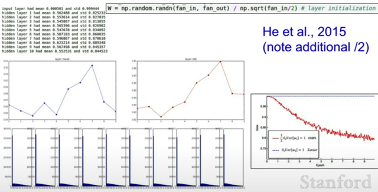</kbd>

> [!NOTE]
> Đó là / cho sqrt(fan_in/2) với ý nghĩa là số input (tức output của layer
> trước bằng relu đã giảm đi 2 lần do coi như 1 nửa số vì mang giá trị âm
> nên đã = 0 (get killed) khi qua relu, nên W phải to lên gấp đôi (chia cho
> fan_in*0.5)

 

<kbd>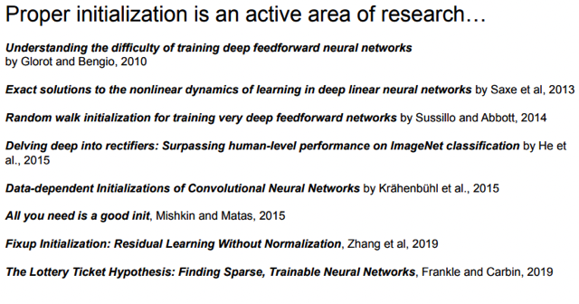</kbd>

 

<kbd>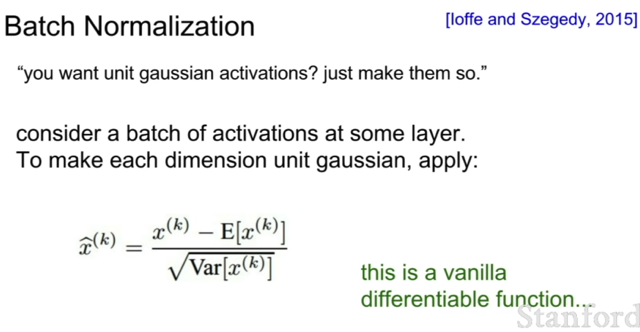</kbd>

> [!NOTE]
> đầu tiên mục đích là mình muốn activation nó có distribution dạng "unit"
> gaussian tức là có standard deviation = 1
>
>
>
> Đại khái là cũng giống như khi mình thực hiện normalization trong lúc data
> preprocessing, thì cơ bản là giống như mình muốn có trạng thái tốt trước
> khi bắt đầu training và hi vọng rằng nó sẽ  giữ tốt như vậy trong lúc training.
>
>
>
> Thế thì với batch normalization là mình chủ động làm việc đó trong lúc
> training. Bằng cách là tính ra mean và standard deviation (sqrt of variance)
> có điều là trong một batch thay vì toàn bộ training set.
>
>
>
> Và cũng như lúc standardization, cơ bản là ta tính mean và std của  từng "
> cột" - ứng với từng feature để rồi "trừ mean / chia sigma"
>
>
>
> Một ý đó là đây là function có tính chất differentiable - có thể tính derivative
> (để quá trình backpropagation còn có thể diễn ra)

 

<kbd>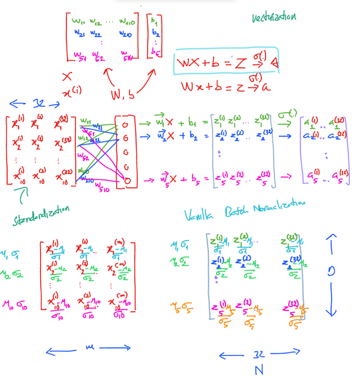</kbd>

 

<kbd>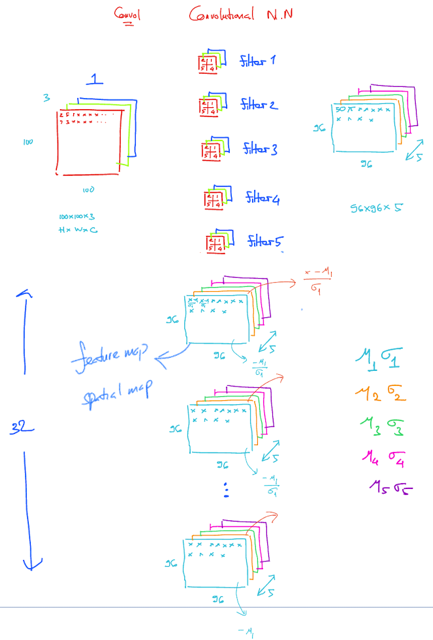</kbd>

 

<kbd>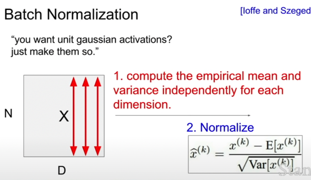</kbd>

> [!NOTE]
> như đã nói ta sẽ tính mean và variance, gọi là **empirical** ý nói
> đây là các thông số **statistic** tính từ **data** (sample mean, variance)
> không phải **population mean**) cho các "cột" - feature.

 

<kbd>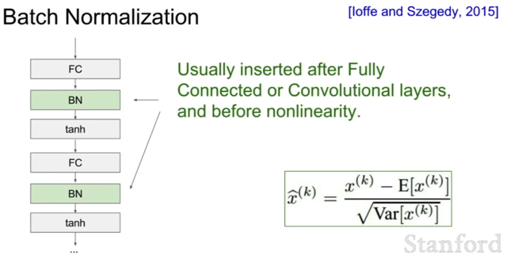</kbd>

> [!NOTE]
> đại khái là mình sẽ hay dùng sau **FC** hay **Convolutional layer** vì như đã
> biết ví dụ sau FC thì input được nhân với W nên việc này sẽ scale
> input lên thì **BachNorm sẽ giúp đảo ngược chuyện đó.**
>
>
>
> Nhưng chú ý là phải trước khi non-linearity.
>
>
>
> Đối với convolutional layer thì **tính mean, std trên mọi sample trong
> batch** (đương nhiên) nhưng **mỗi spatial map mỗi bộ**, ví dụ có 3 cái
> (kiểu như depth = 3) thì ta tính **3 cặp mean và sigma**. Ví dụ mean
> thứ nhất là tính cho spatial map thứ nhất của mọi sample, đương
> nhiên spatial map là một matrix có shape là width x height các con số,
> x3 thành ra w*h*3 các con số thì mean thứ 1 đó là tính mean của
> w*h*3 các con số này

 

<kbd></kbd>

> [!NOTE]
> lúc làm (assignment) nên đọc paper

 

<kbd>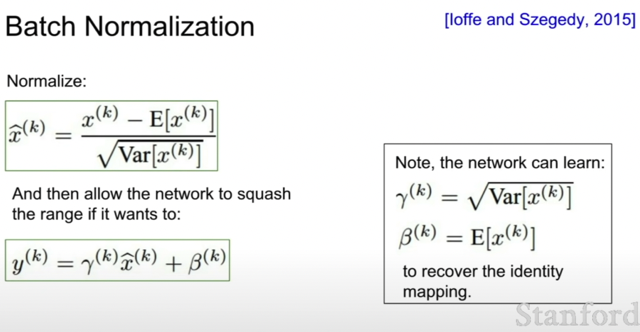</kbd>

> [!NOTE]
> Đại ý là đôi khi cần thiết phải giữ nguyên input, không thực hiện normalization
> - ý nói, trong quá trình training **có thể (sẽ có lúc) model  thấy rằng giữ
> nguyên input sẽ giúp giảm error** hơn thì khi đó nó cần "**Recover the identity
> mapping**:" - ý là có sao để vậy. Lúc này nó sẽ điều chỉnh hai **learnable**
> params là gamma và beta để đảo ngược quá trình normalization
>
>
>
> Và nói chung hơn thì sự **flexibility** đến từ hai learnable params này kiểu
> như chính  giúp model **có thể quyết định distribution nào của activation là tốt
> nhất** (trong đó có trường hợp trên **khi** **mà giữ nguyên là tốt nhất**)

 

<kbd>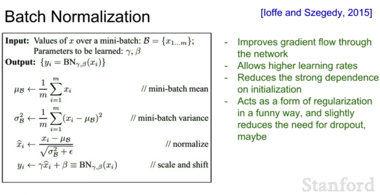</kbd>

> [!NOTE]
> lợi ích rõ nhất đại khái là tăng tính **robustness**: ít bị ảnh hưởng và nhạy cảm
> bởi việc việc chọn hyper-parameter (như learning rate nói ở đây) và quá trình
> initialization. Ngoài ra có một ý mà trong DLSpecialization không nói đến đó là
> **ít nhiều nó đóng vai trò như một regularization technique** khi nó kiểu như
> tính toán (các thông số để normalization) với các input trong batch thì nó bớt
> tính "deterministic" / hiểu nôm na kiểu như là nó phải tìm cách khái quát
> (generalization) tốt hơn từ đó giảm  overfit

 

- **Batch Normalization (BN) can also be viewed as a regularization technique, albeit its primary purpose was to stabilize and
speed up the training of deep neural networks by normalizing the inputs of each layer. The regularization effects of BN come
from the noise it introduces into the training process, which can help to reduce overfitting similarly to how other regularization
techniques, like dropout, work. Here' s how BN can act as a form of regularization:

### 1. **\\*Noise Introduction\\***

BN introduces noise into the training process in a couple of ways:

- **Mini-Batch Statistics Variability:** BN relies on the \\*mean\\* and \\*variance\\* computed from \\*mini-batches\\* during training. The
specific samples in a mini-batch can \\*vary significantly\\* from one batch to another, especially if the \\*mini-batch size is small.\\* This
variability introduces \\*noise\\* into the layer inputs since the normalization parameters (mean and variance) change with each
batch. This effect is \\*similar to adding noise \\*to the inputs of each layer, which can \\*prevent the model from overfitting\\* to the
noiseless training data.

- **Regularization through \\*Uncertainty\\*:** The noise introduced by using mini-batch statistics instead of the full dataset
statistics means that the network cannot precisely adapt to the training data. This uncertainty acts as a\\* form of regularization,\\*
\\*encouraging the model to find more generalizable solutions\\* that are not overly \\*reliant on the specific distribution\\* of a given
mini-batch.

### 2. **\\*Dependency Reduction*\\**

By normalizing the inputs to each layer, BN reduces the dependency of gradients on the scale of parameters or their initial
values. This reduction in dependency means that each layer of the network can learn more independently of the others, which
can prevent the network from learning overly complex, co-adapted features that do not generalize well to unseen data.

### 3. **I\\*mplicit Regularization Effects\\***

- **Stochasticity:** The stochastic nature of \\*estimating mean and variance\\* over \\*different mini-batches\\* introduces a
regularizing effect. This is somewhat \\*similar to dropout,\\* where \\*random neurons are zeroed out\\*, though the mechanisms are
different. In BN, the "\\*randomness\\*" comes from how the mean and variance of the inputs to a layer will vary depending on the
particular mini-batch being processed.

- **Smoothing Optimization Landscape:** BN also has the effect of smoothing the optimization landscape, making it easier for
the model to find lower-complexity solutions that generalize better. By making the loss surface smoother, BN helps the
optimizer to avoid sharp minima that might work well on the training data but poorly on the test data.

### Caveats and Considerations

While BN has these regularization-like effects, it's important to note that its \\*primary purpose\\* is not \\*regularization\\* but rather
i\\*mproving the stability and speed of training deep networks\\*. The regularization effect of BN is often considered a beneficial
\\*side effect\\* rather than its \\*main function\\*. Additionally, the extent to which BN acts as a regularizer can depend on factors like
the mini-batch size and the specific architecture of the neural network. In practice, BN is often used alongside other explicit
regularization techniques, such as dropout or weight decay, to achieve the best performance.

In summary, Batch Normalization can be seen as a regularization technique due to the noise it introduces into the training
process, its ability to reduce dependency between layers, and its smoothing effect on the optimization landscape. These
characteristics help prevent overfitting and improve the generalization of deep neural networks.**

 

<kbd>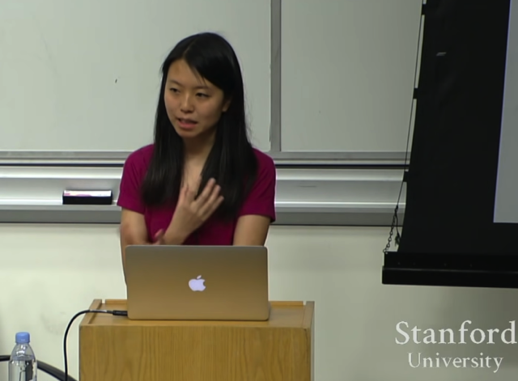</kbd>

> [!NOTE]
> có câu hỏi là tại sao phải learnable **gamma** và **beta**: Chính là như mới nói, nó
> cho phép model **tự chọn / học ra (cách transform)** nào để có distribution tốt
> nhất, chứ không nhất thiết là **force nó thành standard normal distribution** mà
> có thể là giữ nguyên hay distribution sao đó
>
>
>
> Câu hỏi khác đó là trong FC thì BN được thực hiện như thế nào? -> X (matrix
> input) sau khi tính toán qua FC layer sẽ được Z là matrix activation thì hoàn
> toàn tương tự như khi normalize X, ta tính mean và sigma từng cột của Z và
> dùng nó để normalize thì về cơ bản chính là ta Đang làm với mỗi neuron (mỗi
> cột của Z sẽ là output value của một neuron  với mọi training sample trong
> batch)

 

<kbd>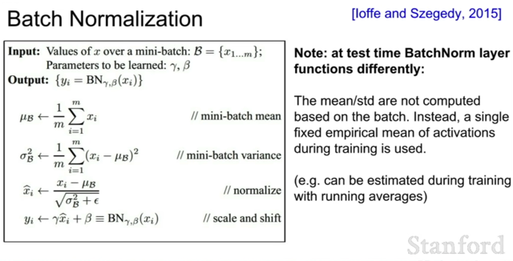</kbd>

> [!NOTE]
> một điểm nữa đó là khi testing, ta sẽ không tính **mean/std từ test
> batch data** mà lấy giá trị đã **tính trung bình (của các giá trị
> running/moving mean và standard dev) trong quá trình
> training**

 

<kbd></kbd>

 

<kbd>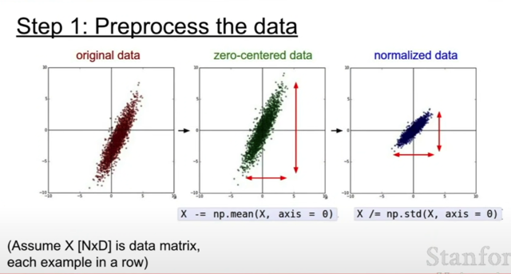</kbd>

> [!NOTE]
> đại ý là nói sơ các bước của quá trình training, đầu
> tiên là data preprocessing

 

<kbd>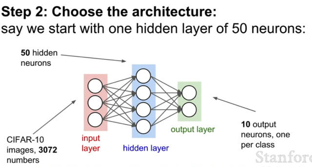</kbd>

> [!NOTE]
> Sau đó là chọn một architecture cho model, số layer, số neuron,
> activation function..

 

<kbd>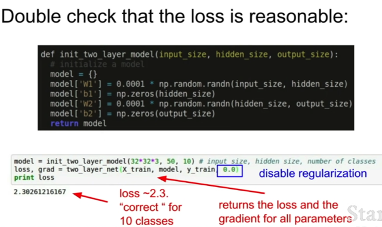</kbd>

> [!NOTE]
> đại khái là sau khi initialize, thử **forward pass** để tính loss,
> disable regularization. Và nếu có 10 class loss tính ra tầm
> ~2-3 thì là đúng. Lí do đơn giản là trước khi training, model
> nên predict xác suất mỗi sample thuộc một class là như
> nhau. Thành ra với công thức -(1/m) Sum y_i*[log(y^i)] ta có thể
> Expect kết quả ra - log(1/10) ~= -2.3

 

<kbd>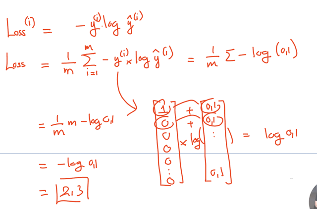</kbd>

 

<kbd>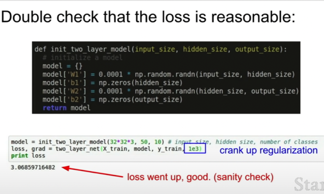</kbd>

> [!NOTE]
> Sau đó tăng **regularization** lên (lambda), thì ta expect loss sẽ
> tăng theo vì loss giờ có thêm regularization loss term nữa

 

<kbd>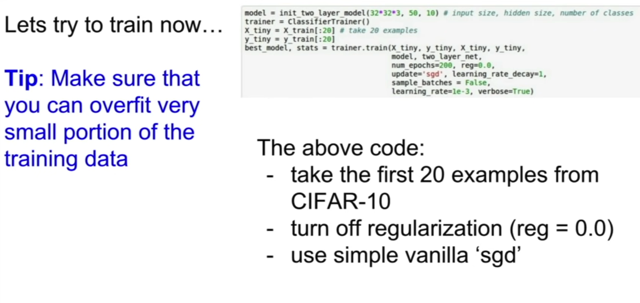</kbd>

> [!NOTE]
> tiếp theo ta sẽ train với **một ít data** và **tắt regularization
> đi**, và expect model sẽ bị overfit thể hiện loss (sau khi train
> xong) = 0

 

<kbd>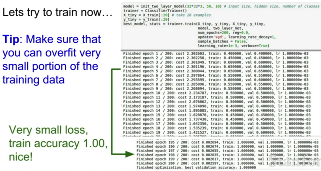</kbd>

 

<kbd>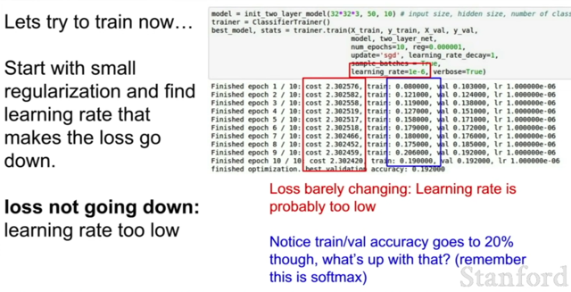</kbd>

> [!NOTE]
> Tiếp theo đại khái là ta sẽ tuning learning rate - là hyper-param quan trọng
> nhất.
>
>
>
> Ở đây thử với learning rate bằng 10^-6 (10e-6) thì loss hầu như không đổi, dễ
> hiểu là vì learning rate nhỏ quá thì giống như bước từng bước quá nhỏ (dẫn
> xuống thung lũng) nên loss thay đổi rất ít.
>
>
>
> Câu hỏi là tại sao train/val accuracy tăng lên khoảng 20% sau khi training (gợi ý
> là nên nhớ ta đang dùng Softmax loss function (chính xác hơn phải gọi là cross
> entropy loss) vậy tại sao loss không giảm mà accuracy tăng)
> -> Đại khái là vì sự **thay đổi của probability distribution không đủ lớn để thay đổi
> loss value** nhưng v**ẫn đủ để thông qua đó model kết luận ra predicted class** 
> (tất nhiên là theo hướng đúng hơn) nên giúp tăng tỉ lệ chính xác lên

 

- **When training a deep neural network with a softmax output layer, especially for classification tasks, it's possible to
encounter a situation where the loss does not significantly decrease while the accuracy increases, particularly when
using a small learning rate. This phenomenon can be attributed to several factors related to the learning dynamics of
neural networks, the nature of the loss function, and the specific characteristics of the softmax function in conjunction
with the chosen learning rate. Here's a detailed explanation:

### 1. Softmax Function and Cross-Entropy Loss

The softmax function is commonly used in the output layer of neural networks for multi-class classification tasks. It
converts the raw output scores (logits) from the network into probabilities by taking the exponential of each output
and then normalizing these values by dividing by the sum of all the exponentials. This results in a probability
distribution over the classes.

The cross-entropy loss function is typically used in conjunction with the softmax function. It measures the difference
between the predicted probability distribution (output of softmax) and the true distribution, where the true class has
probability 1 and all others have probability 0.

### 2. Learning Rate and Loss Landscape

- **Small Learning Rate:** A small learning rate means that the network weights are updated very slightly at each
iteration. This cautious approach can be beneficial for making fine-grained adjustments to the weights, especially as
the network begins to converge towards a minimum in the loss landscape. However, if the learning rate is too small,
the network may take a long time to converge, or it may get stuck in a local minimum or on a plateau where the loss
doesn't decrease significantly over iterations.

### 3. Accuracy vs. Loss

- **Accuracy Measurement:** Accuracy is a discrete measure that indicates the proportion of correctly classified
instances. It can improve even if the predicted probabilities don't change dramatically, as long as the class with the
highest probability is the correct class. For example, changing a prediction's probability for the correct class from 0.6
to 0.7 might not significantly reduce the cross-entropy loss but could still lead to a correct classification and thus
increase accuracy.

- **Loss Measurement:** The loss, particularly the cross-entropy loss used with softmax, is a continuous measure
that reflects the confidence of the predictions. Even small changes in the predicted probabilities for the correct
classes can significantly affect the loss value. When the learning rate is small, these probabilities might be adjusting
too slowly to produce a noticeable decrease in loss over short periods, even though the adjustments are gradually
improving classification accuracy.

### 4. Saturation of Softmax

The softmax function can exacerbate the effects of small learning rates because of its exponential nature. When the
logits are large, small changes in the logits can lead to minimal changes in the softmax probabilities due to
saturation—where the softmax function becomes less sensitive to changes in its input. This can lead to a scenario
where accuracy improves (because the correct class's probability is highest) but the loss decreases slowly because
the probability distribution does not change significantly enough to reduce the cross-entropy loss rapidly.

### Conclusion

In summary, when using a small learning rate during training, the network's weights are updated incrementally,
leading to slow changes in the predicted probabilities. This can result in slow decreases in loss, especially in the
saturated regions of the softmax function. However, accuracy can improve as long as these small adjustments lead to
correct classifications more frequently. This highlights the importance of selecting an appropriate learning rate and
considering different metrics (not just loss or accuracy) to fully understand a model's learning progress.**

 

<kbd>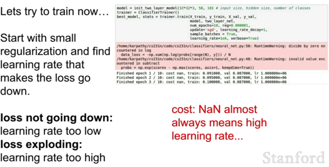</kbd>

> [!NOTE]
> Khi để lr thành 3e-3 thì loss mang giá trị NaN (Not a
> Number) - chứng tỏ lr qúa lớn

 

<kbd>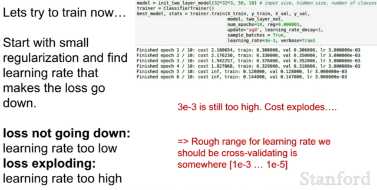</kbd>

> [!NOTE]
> Do đó cần phải tuning lr đâu
> đó giữa hai giá trị này

 

<kbd></kbd>

 

<kbd>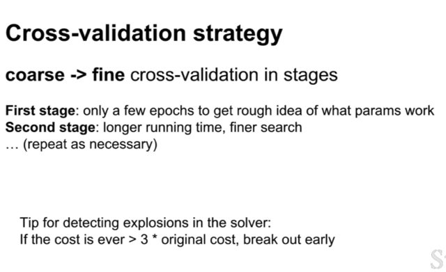</kbd>

> [!NOTE]
> đại khái là ta sẽ dùng **cross-validation strategy,** với cách tiếp cận từ **coarse
> -> fine** tức là stage 1 chỉ **train vài epoch** để có thể "nhận định" được là
> h-params value cỡ nào thì ok để từ đó **train lâu hơn ở các stage tiếp theo.**
>
>
>
> Tip để detect được vấn đề "**explosion"** đó là ta có thể check **nếu khi training
> cost tăng gấp 3 thì mình sẽ break out** vì khi đó là dấu hiệu quá trình training
> bị mất ổn định (destabilize)

 

<kbd>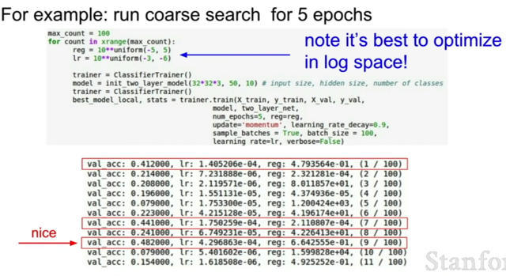</kbd>

 

<kbd>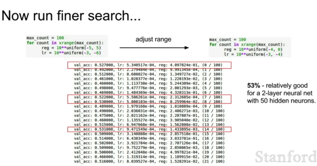</kbd>

> [!NOTE]
> Thấy giá trị lr tốt nhất đâu đó 1.4 ,1.7, 4.2 *10^-4, nên ta sẽ "tìm kĩ hơn"
> ở khoảng 1->10 * 10^-4 (tức từ 10^-4 đến 10^-3)
>
>
>
> còn lambda thấy tốt nhất đâu đó 4.7 * 10^-1 = 0.47, 2.1*10^-4, 6.6*10^-1 = 0.66
> nên ta sẽ tìm lại trong, 1*10^-4 và 1

 

<kbd>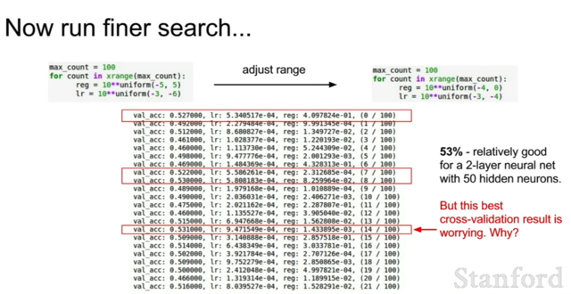</kbd>

> [!NOTE]
> đại khái là như mr Aron Geron có nói đó là khi nhận thấy các giá
> trị của hyperparameter tốt nhất lại là những cái ở rìa, ý nói những
> giá trị lớn nhất hay nhỏ nhất được define thì chứng tỏ có thể mình
> chưa explore được hết các giá trị tốt nhất

 

<kbd>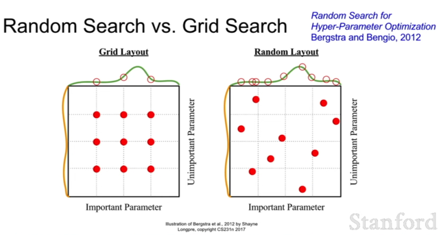</kbd>

> [!NOTE]
> đại ý là nói về lí do mà random search lại có thể có những ưu điểm.
> Ví dụ với grid search, chỉ có 3 giá trị của cái param quan trọng được
> thử, trong khi của random search là nhiều hơn nhiều (9)

 

<kbd>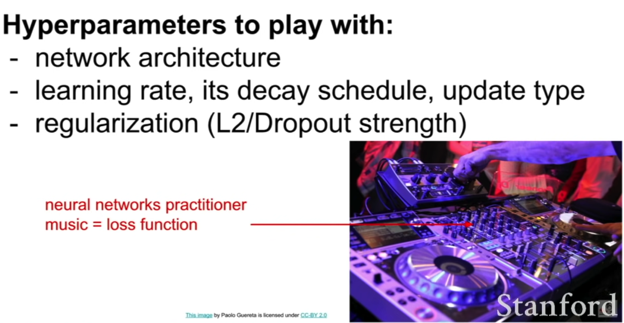</kbd>

> [!NOTE]
> việc h.p tuning giống art hơn là science

 

<kbd>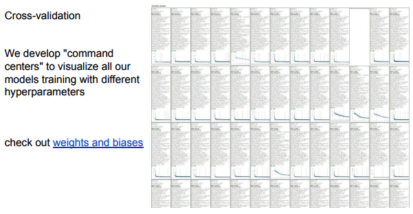</kbd>

 

<kbd>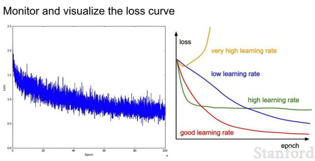</kbd>

 

<kbd>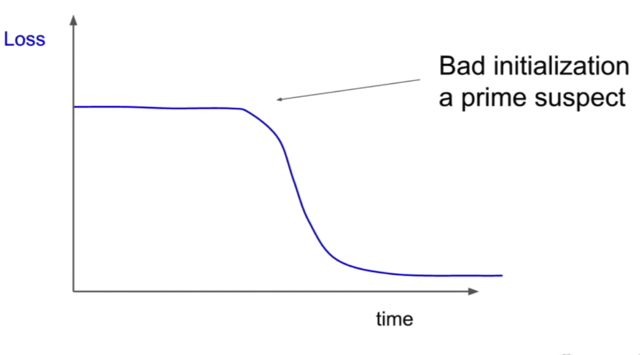</kbd>

> [!NOTE]
> đại khái là đôi khi có dạng này khi loss không giảm trong một
> thời gian thì có thể do initialization

 

<kbd>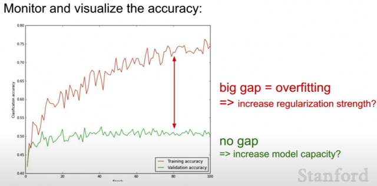</kbd>

> [!NOTE]
> nếu có big gap giữa test performance vs train performance thì dấu
> hiệu của overfit, cần giảm capacity (tăng regularization,..) ngược lại là
> underfit, cần tăng capacity

 

<kbd>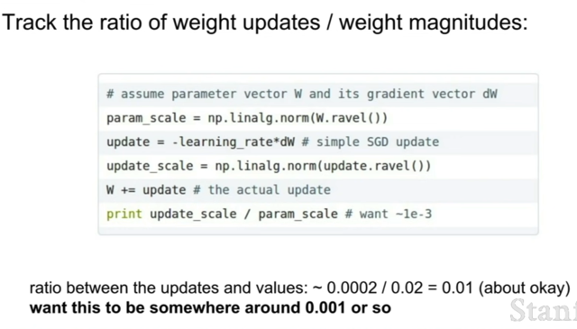</kbd>

> [!NOTE]
> đại khái ý tưởng là ta không muốn giá trị dùng để update cho
> parameters quá lớn hoặc quá nhỏ so với giá trị của parameters nên ta
> có thể track tỉ lệ này

 

<kbd>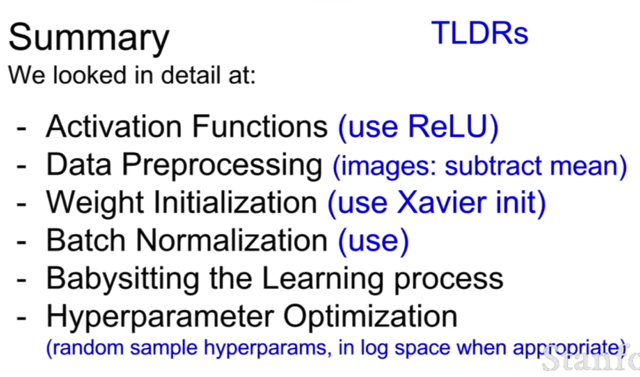</kbd>

 

