# Lecture 8/16 - Deep Learning Software

📊 **Progress:** `89` Notes | `107` Screenshots

---

## Lecture 8/16 - Deep Learning Software

 

<kbd>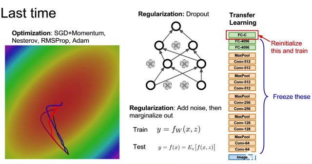</kbd>

> [!NOTE]
> Review một số điểm ở lecture trước

 

<kbd>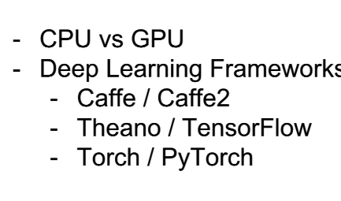</kbd>

 

<kbd>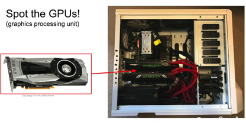</kbd>

<kbd>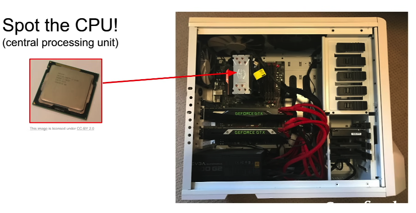</kbd>

 

<kbd></kbd>

> [!NOTE]
> đại khái là NVIDA được cho là tốt
> hơn AMD (so sánh GPU của hai
> hãng cho deep learning)

 

<kbd>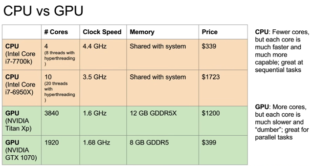</kbd>

> [!NOTE]
> Khi so sánh CPU và GPU, đại ý là CPU có ít core hơn GPU nhưng mỗi core
> của nó nhanh hơn, mạnh hơn phù hợp với khả năng xử lý tuần tự.
>
>
>
> Còn GPU có nhiều core hơn rất nhiều so với CPU nhưng mỗi core của nó 
> chậm hơn, phù hợp với tính toán song song.
>
>
>
> Về memory thì CPU có bộ nhớ nhỏ và phần lớn là nó phải dùng RAM còn
> GPU thì kiểu như tích hợp bộ nhớ sẵn.
>
>
>
> Tóm lại CPU tốt cho các nhiệm vụ chung chung, còn GPU được thiết kế cho
> việc tính toán song song

 

<kbd>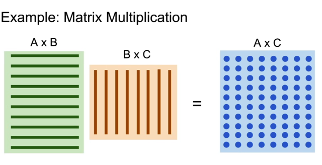</kbd>

> [!NOTE]
> một ví dụ điển hình cho việc tính toán song song mà GPU tỏ ra vượt trội so
> với CPU đó là nhân ma trận. Vì đại khái là trong phép nhân này, mỗi hàng
> của matrix 1 sẽ nhân (dot product) với mỗi cột của matrix 2 để ra một phần
> tử của matrix 3. Và các phép tính này hoàn toàn độc lập nhau nên việc
> GPU có nhiều core khiến nó có thể tính toán đồng loạt tất cả các phép tính
> này thay vì tuần tự từng cái như CPU (mặc dù CPU cũng có multi core
> nhưng khả năng nó hạn chế hơn GPU) sẽ khiến tốc độ rất nhanh.
>
>
>
> Một minh họa thứ hai là phép tính convolution trong CNN.

 

<kbd>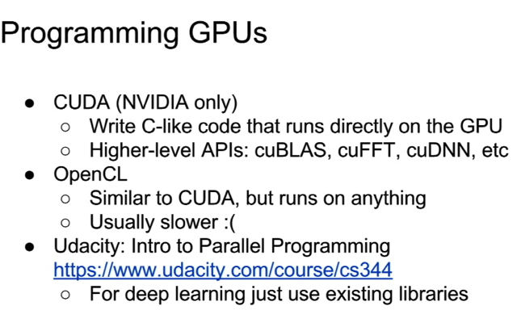</kbd>

> [!NOTE]
> đại ý là nếu muốn thì có thể tìm hiểu về cách programming trên GPU,
> Nhưng đại khái là nó khá phức tạp, nên thường chỉ cần dùng library
> viết bởi NVIDIA.

 

<kbd>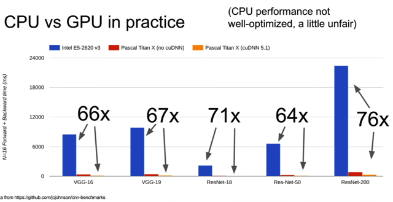</kbd>

> [!NOTE]
> So sánh hiệu suất của CPU với GPU cho thấy GPU nhanh hơn
> khoảng 65-75 lần. Mặc dù vậy có thêm ghi chú đó là khi thực hiện
> so sánh đại khái là ta hơi không fair với CPU không không làm
> những động tác để tối ưu hiệu năng của nó mà kiểu như chỉ run
> một model trên hai cái và so sánh kết quả.

 

<kbd>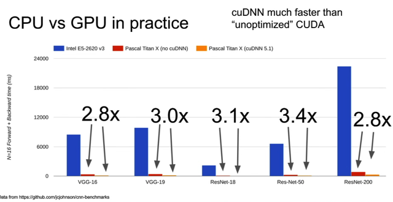</kbd>

> [!NOTE]
> So sánh giữa việc viết code trên GPU có sử dụng cuDNN (slide
> trước có nói, kiểu như thư viện do NVIDIA, đã tối ưu cho GPU) sẽ
> giúp tăng tốc lên thêm khoảng 3 lần nữa so với việc dùng GPU
> nhưng với unoptimized hand-written  CUDA

 

<kbd>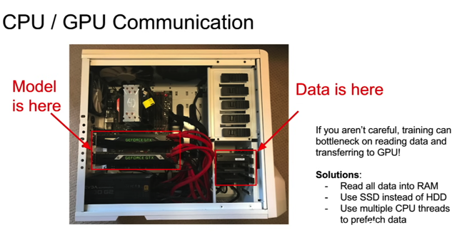</kbd>

> [!NOTE]
> đại khái là chú ý đừng để xảy ra tình trạng nút thắt cổ chai khi dữ liệu để trên ổ
> cứng phải được fetch data qua CPU/GPU (cpu/gpu xử lý xong nhưng phải đợi
> data từ ổ cứng) Nên có thể dùng SSD hoặc load data vào RAM sẵn hoặc dùng
> multiple-CPU thread để prefetch data

 

<kbd>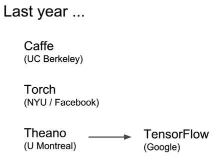</kbd>

<kbd>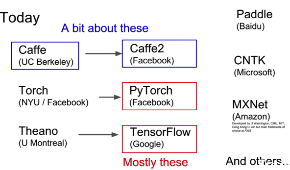</kbd>

> [!NOTE]
> Tại thời điểm của bài giảng thì TensorFlow và
> Pytorch được ưa chuộng nhất

 

<kbd>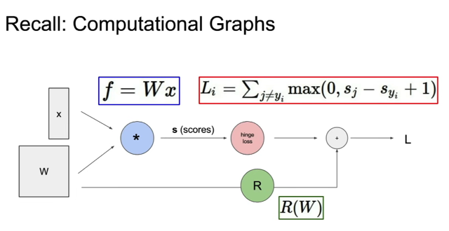</kbd>

<kbd>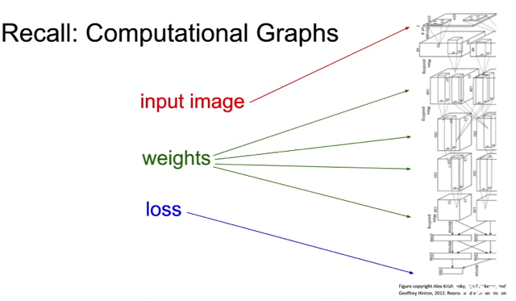</kbd>

<kbd>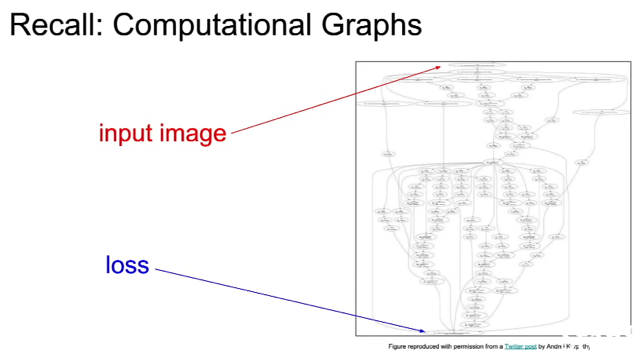</kbd>

> [!NOTE]
> đại ý là khi làm về deep learning thì ta luôn làm việc với computational graphs,
> để giúp ta forward prop, tính loss, backprop tính gradient của loss w.r.t params
>
>
>
> Thế thì trong deep learning khi các model trở nên lớn và sâu thì c.g trở nên
> rất dài và rắc rối. Do đó ta sẽ không muốn tự tính bằng tay. Đó là lí do cần phải
> sử dụng các deep learning framework

 

<kbd>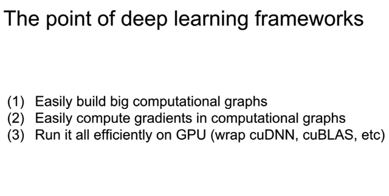</kbd>

> [!NOTE]
> Deep learning framework hỗ trợ xây dựng c.g cho những
> mô hình lớn, hỗ trợ việc tính gradient và quan trọng nữa là
> nó giúp tối ưu hiệu quả khi run trên GPU

 

<kbd>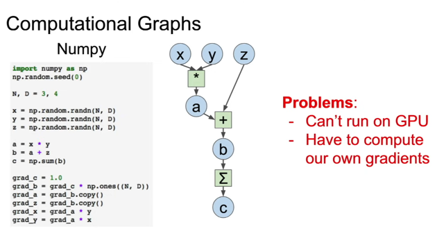</kbd>

> [!NOTE]
> đại khái là mặc dù ta có thể dùng numpy để viết code cho quá trình 
> forward prop và backprop theo một computational graph, nhưng khi c.g
> phức tạp, mọi việc sẽ trở nên rắc rối. 
>
>
>
> Một nhược điểm quan trọng là numpy không chạy trên GPU, nên ta sẽ
> không tận dụng được sức mạnh của GPU như đã nói.
>
>
>
> Do đó các deep learning framework sẽ giúp:
>
>
>
> 1.Cho phép ta viết code cho quá trình forward prop theo kiểu như numpy
>
>
>
> 2.Nhưng nó sẽ cho phép chạy trên GPU và hỗ trợ ta tính gradient

 

<kbd>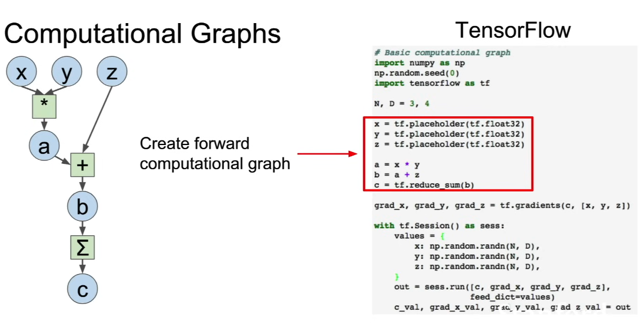</kbd>

> [!NOTE]
> ví dụ, tensorflow cho phép ta create forward
> c.g theo cách tương tự numpy

 

<kbd>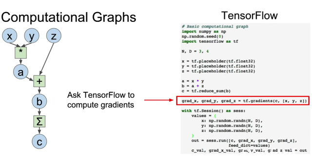</kbd>

> [!NOTE]
> Nhưng giờ ta không cần phải tự tính
> gradient nữa mà nó sẽ tính giùm

 

<kbd>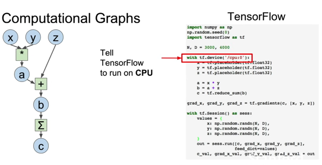</kbd>

<kbd></kbd>

> [!NOTE]
> và có thể dễ dàng yêu cầu
> tính trên cpu hay gpu

 

<kbd>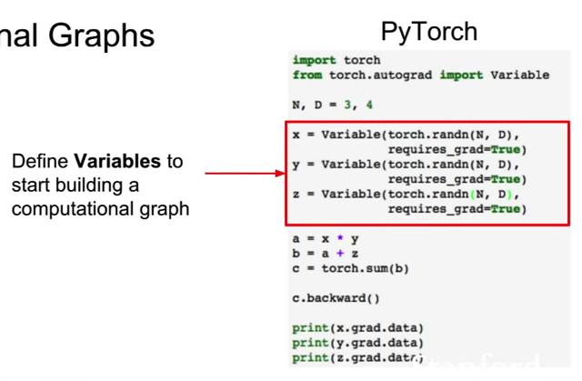</kbd>

<kbd>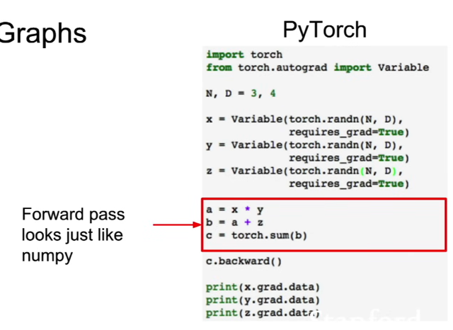</kbd>

<kbd>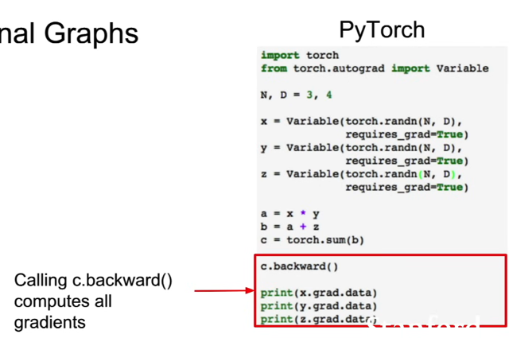</kbd>

<kbd>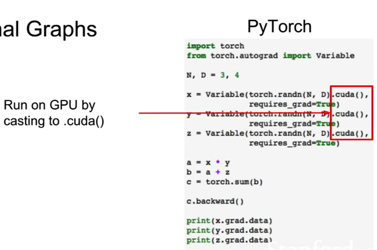</kbd>

> [!NOTE]
> Pytorch cũng tương tự

 

<kbd>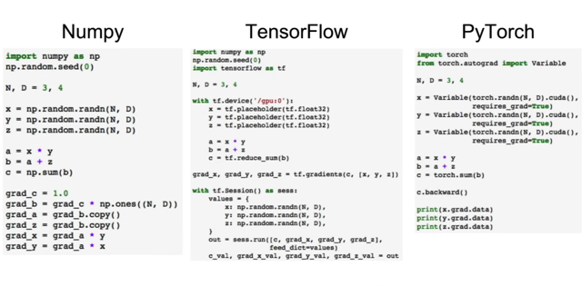</kbd>

 

<kbd>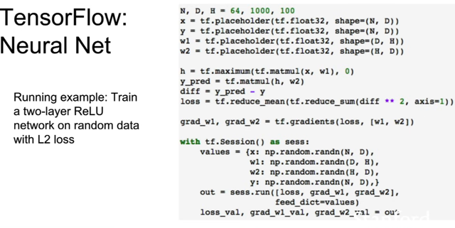</kbd>

> [!NOTE]
> đại ý là để nghiên cứu kĩ hơn về tensorflow, ta sẽ dùng
> ví dụ là một neural net với 2 layer, dùng loss là MSE

 

<kbd>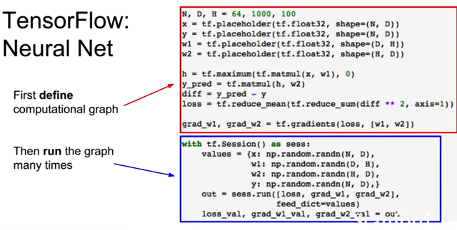</kbd>

> [!NOTE]
> thế thì đầu tiên đại ý là trong tensorflow, thường thì ta sẽ chia làm 2 phần
> 1. là define computational grahp và 2. là run the graph nhiều lần.

 

<kbd>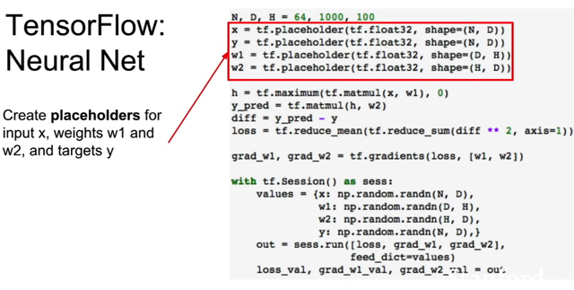</kbd>

> [!NOTE]
> đại ý là, chỗ này ta tạo các placeholder, nôm na là giữ chỗ cho các input slot. 
> (tại đây ta chưa allocating memory)

 

<kbd>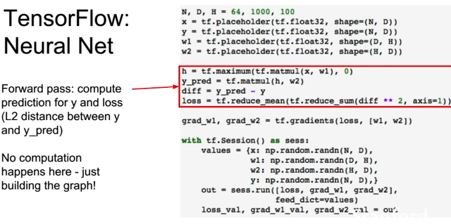</kbd>

> [!NOTE]
> tiếp theo, xây dựng các bước tính toán cho quá trình forward pass, như
> matmul để nhân matrix, maximum để làm hàm relu, reduce_sum và
> reduce_mean để tính loss.
>
>
>
> điểm đáng chú ý đó là, **chưa có bất cứ sự tính toán nào xảy ra cả**, mọi thứ
> chỉ đang kiểu như là một bản chỉ dẫn cho Tensorflow biết rằng khi nào ta đổ
> data thật vào thì nó sẽ tính toán như vậy

 

<kbd>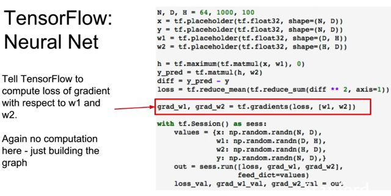</kbd>

> [!NOTE]
> tính gradient (derivative of
> loss w.r.t parameters)

 

<kbd>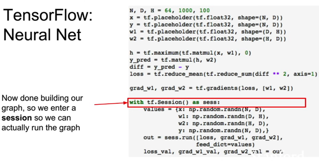</kbd>

> [!NOTE]
> tới đây mới là lúc ta thật sự run cái
> computational graph define ở trên

 

<kbd>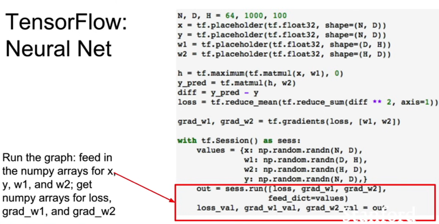</kbd>

> [!NOTE]
> khởi tạo dictionary với gía trị thật sự (ý nói giờ là lúc đưa data thật vào)
> của x, y, w1, w2 đưa vào feed_dict và **run session** với mục đích tính
> loss, grad_w1 và grad_w2.

 

<kbd>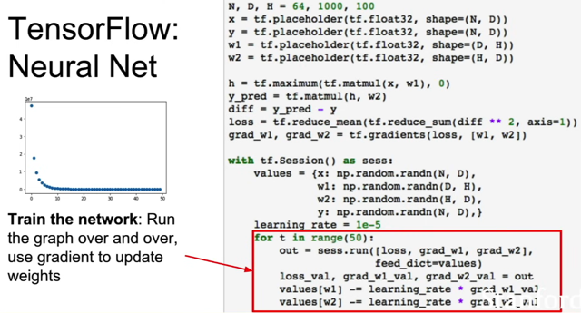</kbd>

> [!NOTE]
> Và với vòng lặp chạy này, minh họa quá trình **lặp đi lặp lại việc run
> session** để training
>
>
>
> Đại khái là có một vấn đề ở cách làm kiểu này đó là khi run session, ta
> feed in các x, w1, w2, y dưới dạng Numpy array, tức là nó được tính toán
> ở trên CPU.
>
>
>
> Rồi sau đó, quá trình tính toán gradient bằng tensorflow có thể xảy ra ở
> GPU. Nên đại khái là có bước copy dữ liệu từ numpy array (trên CPU) qua
> tensorflow (GPU) để rồi tính toán gradient xong, lại copy từ tensorflow
> (GPU) qua lại numpy array (CPU) để dùng gradient update cho weights
>
>
>
> Do đó tạo nên sự **không hiệu quả**, với large model thì sẽ rất chậm
>
> Trong cách làm này, hiểu đại khái là ta khởi tạo một dictionary với
> các matrix kể cả X, weight w1, w2 và y ngẫu nhiên.
>
>
>
> Xong rồi khi run session, nó sẽ theo computation graph define ở
> trên mà tính toán ra loss, grad_w1, grad_w2.
>
>
>
> dòng out = sess.run([**loss, grad_w1, grad_w2**], feed_dict=values)
> có nghĩa là **đưa vào cho nó cái dictionary chứa data và label X, y
> yêu cầu tensorflow tính loss, grad_w1, grad_w2**
>
>
>
> Để rồi hai dòng cuối là cập nhật giá trị của weight matrix w1, w2
> Nên ta hiểu rằng, hai weight matrix nằm ở trên cpu dưới dạng
> numpy array, nên hai dòng cuối là nó copy giá trị của gradient trên
> gpu vào cpu.

 

<kbd>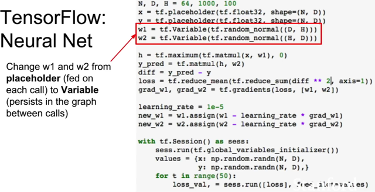</kbd>

> [!NOTE]
> Để giải quyết vấn đề này, đại khái là ta sẽ **khai báo w1, w2 là
> tf.Variable thay vì tf.placeholder**. Bằng cách này, w1, w2 **sẽ là
> một phần của computation graph** để rồi nó sẽ **nằm cố định** trong
> đó. Hiểu nôm na là khi tensorflow tính gradient, giá trị của w1, w2
> sẽ được cập nhật với hai dòng code new_w1 = w1.assign(...)
> bên dưới, nên **không có chuyện copy qua copy lại giữa cpu và gpu**

 

<kbd>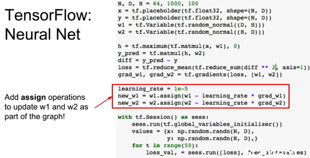</kbd>

> [!NOTE]
> Đại khái là vì bây giờ w1, w2 một phần của graph, để rồi bây giờ nó
> ở trên gpu. Thành ra trong graph, sau khi tính toán xong gradient, ta
> sẽ assign giá trị của w1, w2.

 

<kbd>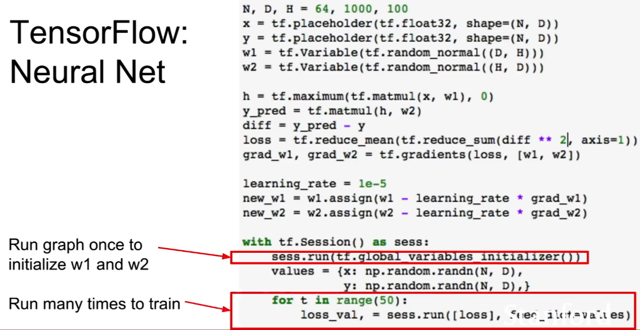</kbd>

> [!NOTE]
> Do đó, ta cần dòng code này để kiểu như **bảo tensorflow thực
> hiện việc khởi tạo các variable w1,w2** trong computation
> graph. Vì ở dòng define variable ta chỉ đăng khai báo w1, w2 sẽ
> là random normal variable chứ chưa có value. Nên bắt đầu phải
> sess.run(tf.global_...để nó khởi chạy và cho w1, w2 giá trị thật)
>
>
>
> Và chạy vòng lặp để run cái graph, feed vào  cái dict chứa
> data và label (chỗ bị che không rõ là **feed_dict = values).**
>
>
>
> Và vì nó đã tính và update weight trong graph rồi, nên ở đây ta thấy
> chỉ sess.run([**loss**], feed_dict = values), tức là c**hỉ yêu cầu nó tính
> loss thôi.** (Xem lại lúc nãy, trong đó bảo nó tính  gradient nữa)
>
> And then once we've done that initialization, now we can run the graph over
> and over again. And here, we're now only feeding in the data and labels X
> and Y and the weights are living inside the graph. And here we've asked the
> network to, we've asked TensorFlow to compute the loss for us. And then
> you might think that this would train the network, but there's actually a bug
> here.

 

<kbd>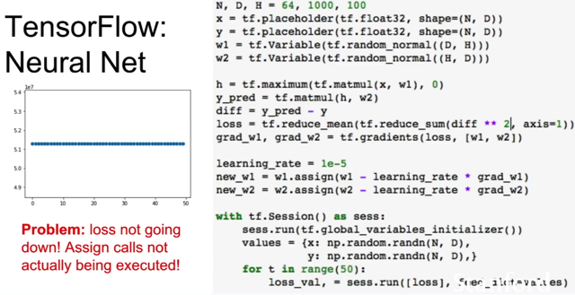</kbd>

> [!NOTE]
> Tuy nhiên họ nói ở đây có một cái bug, vì khi run dùng code này để
> train thì loss nó không giảm
>
>
>
> Q: Thử nghĩ xem sai ở đâu?
>
>
>
> -> Theo GPT thì đại khái là trong tensorflow, việc mình define dòng
> code assignment value (new_w1 = w1.assign(w1 - ...) sẽ không có
> nghĩa là tensorflow sẽ tự động tính cái này khi nó run cái graph.
>
>
>
> Do đó phải explicitly yêu cầu nó tính bằng cách
>
>
>
> loss_val, _, _ = sess.run([loss, new_w1, new_w2], ..) mặc dù không
> dùng kết quả gradient trả ra.
>
>
>
> Instructor: Chính xác là vậy, cụ thể là trong khi define graph, ta thấy để
> tính ra loss, thì sẽ không cần chạy hai dòng dưới để tính new_w1
> new_w2, nên nôm na là tf nó sẽ **đủ thông minh để chỉ chạy tới đó**
> nếu ta chỉ yêu cầu nó tính loss, muốn nó chạy hết mấy dòng dưới  để
> thực hiện việc tính và update weight thì phải yêu cầu cụ thể bảo nó
> tính new_w1, new_w2

 

<kbd>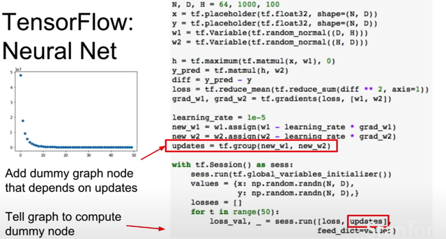</kbd>

> [!NOTE]
> Tuy nhiên nếu làm như vậy, tức là explicitly bảo nó tính loss, new_w1,
> new_w2 thì kiểu như nó **vẫn sẽ lại thực hiện bước copy value từ gpu sang
> cpu.**
>
>
>
> Nên solution đó là, khai báo một (người ta gọi là) dummy node, cho biết
> nó depend trên new_w1 và new_w2. Để rồi mình yêu cầu nó tính cái node
> này (sét.run([loss, updates],...) nhưng nó thật sự không trả ra cái gì (none) vì
> đây **chỉ là một dummy node hiểu đại khái là chỉ bảo tf nhóm (group) new_w1
> và new_w2 lại chứ chẳng tính toán gì**
>
>
>
> Nhưng **nhờ có cái dummy dependency** này mà **tf sẽ chạy dòng lệnh tính
> new_w1, new_w2**

 

<kbd>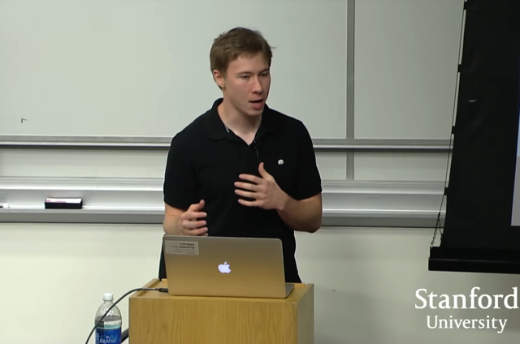</kbd>

> [!NOTE]
> Có câu hỏi là: tại sao ta không để X, Y ở trong grahp luôn (như đã làm đối
> với w1, w2)?
>
>
>
> Instructor: Lí do là vì X,Y **tuy ở đây ta dùng cùng X,Y mở mọi iteration**
> nhưng  thực tế chúng thường sẽ là các mini-batch of data. **Do đó nó sẽ
> thay đổi liên tục nên mình sẽ ko để nó trong graph**

 

<kbd>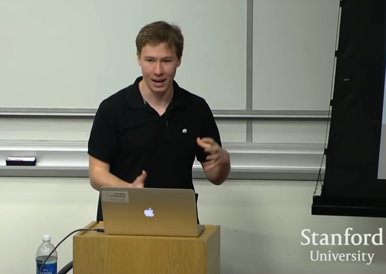</kbd>

> [!NOTE]
> Câu hỏi khác liên quan đến việc tại sao tf,group() giúp giải quyết vấn đề "
> CPU-GPU copying" ở trên.
>
>
>
> -> Đó là vì ta đã đặt w1,w2 bên trong graph, có nghĩa là khi tính toán nó
> nằm trong  memory của GPU.  Việc ta bảo nó tính dummy node vốn dựa
> trên new_w1, new_w2 sẽ khiến tf phải tính những giá trị này (và thực
> hiện update w1,w2)
>
>
>
> Tuy nhiên kiểu như dummy node này không trả ra cái gì cả, nên không có
> việc copy giá trị của new_w1, new_w2 từ GPU's memory sang CPU
>
>
>
> ===
>
>
>
> Với loss, là value mà ta **yêu cầu tf tính toán nên nó sẽ trả ra concrete value.**  
> Nhưng với updates, vì **updates là một dạng data đặc biệt tf.group(..) nên 
> tf nó sẽ trả ra none**

 

<kbd>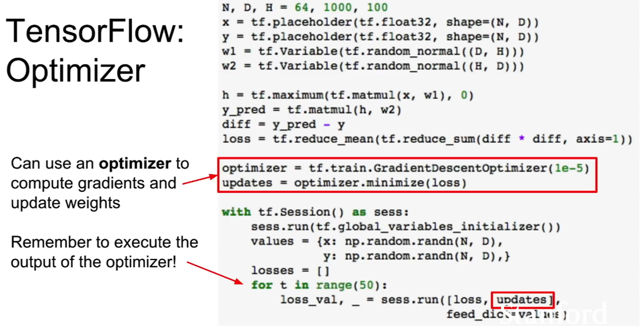</kbd>

> [!NOTE]
> vì những cái phiền phức như vừa rồi (phải dùng dummy node tf.group,..
> .) nên tf nó sinh ra cái này - **Optimizer**, mà ở đây là
> **GradientDescentOptimizer** là một trong nhiều loại (ta có thể hình
> dung **sẽ có các loại khác như RMSProp, Momentum, Adam**....).
>
>
>
> Vậy cái này đại khái là nó sẽ giúp ta làm những việc như nãy giờ,  như
> là **nó sẽ biết w1, w2 là learnable params**, để rồi **nó sẽ tính và dùng
> gradient để update các params này**.
>
>
>
> Ngoài ra nếu **ta nhìn vào bên trong** các optimizer này thì cũng sẽ
> thấy **trong đó họ dùng cái kiểu dummy node tf.group này như ta vừa
> làm**

 

<kbd>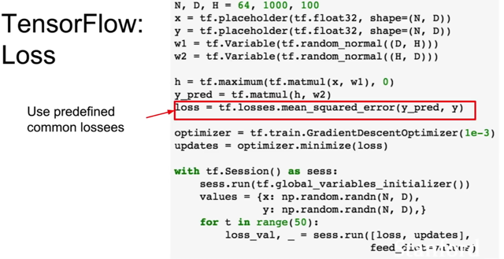</kbd>

> [!NOTE]
> tới đây họ nói rằng ta đã biết cơ bản việc run một neural nét trong tf như thế
> nào, còn lại chỉ là thêm thắt để cải thiện thêm
>
>
>
> Ví dụ thay vì dùng tf.reduce_mean để tự tính mse loss thì **có thể dùng các
> loss function mà tf nó support sẵn** luôn

 

<kbd>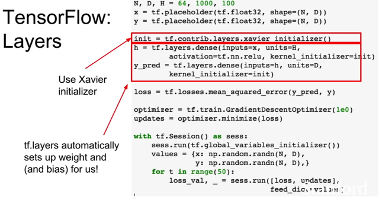</kbd>

> [!NOTE]
> Tiếp theo đại ý là ta có thể thấy nếu tự define computation graph với
> các bước như define matrix, nhân matrix nào với matrix nào, phải
> quan tâm đến shape của nó, rồi chưa kể bias b và với bias ta phải
> take care việc broadcasting..
>
>
>
> Do đó, tensorflow kiểu như nó sẽ giúp ta làm hết những bước này, ví
> dụ như ở đây bằng việc khai báo và dùng một cái dense layers, cho
> nó biết số units, input, activation function gì, và cách thức để initialized
> weight values. Thì chỉ cần như vậy, bên trong dòng code này tf sẽ giúp
> ta define các matrix W và bias b, initialize nó với Xavier initialization,
> thực hiện các bước nhân matrix, apply non-linear activation function.
>
>
>
> Để rồi nó split out cho mình kết quả là h.

 

<kbd>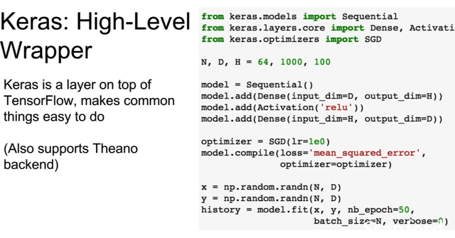</kbd>

> [!NOTE]
> đại ý là có computation graph cơ bản vẫn là low level,
> nên có những thư viện build trên nền của tensorflow
> giúp ta làm các bước ở higher level. Ví dụ keras.

 

<kbd>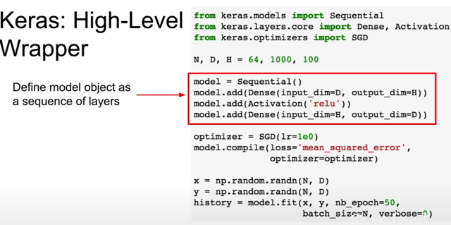</kbd>

> [!NOTE]
> như ở đây, ta khai báo một
> sequential model, với các Dense
> layer, reLu activation function

 

<kbd>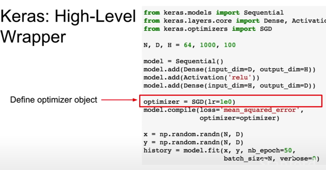</kbd>

> [!NOTE]
> Khai báo optimizer muốn dùng,
> ở đây là stochastic GD

 

<kbd>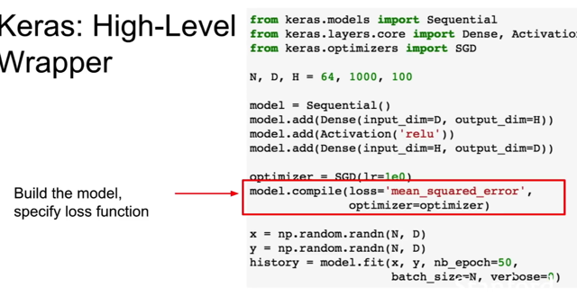</kbd>

> [!NOTE]
> Compile model
> với mse loss

 

<kbd>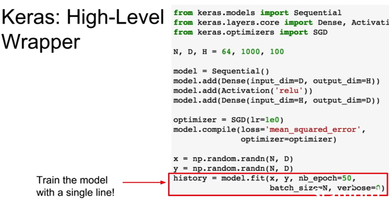</kbd>

> [!NOTE]
> Gọi fit với training set, các h.param như batch_size,
> số epoch là nó sẽ giúp mình train model
>
>
>
> Nói chung ý tưởng high level cơ bản là càng cao thì 
> Lib sẽ giúp mình làm hết các bước chi tiết ở dưới,
> mình chỉ tập trung vào việc muốn kiến trúc model ntn,
> Hyperparams gì

 

<kbd>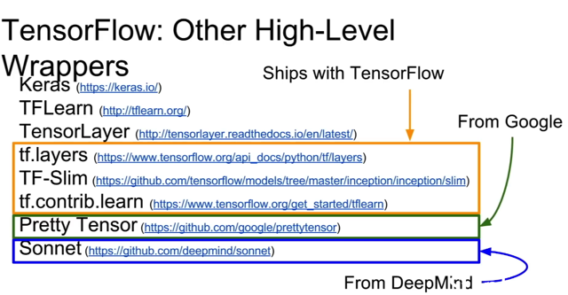</kbd>

> [!NOTE]
> ý chính là có nhiều
> option để chọn

 

<kbd>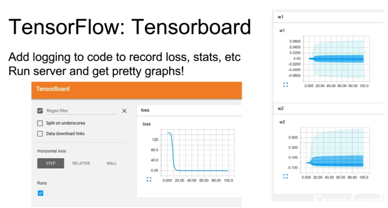</kbd>

> [!NOTE]
> chỉ lướt qua đại ý là tf có cái tensorboard cho phép
> theo dõi (logging) các value trong quá trình training

 

<kbd>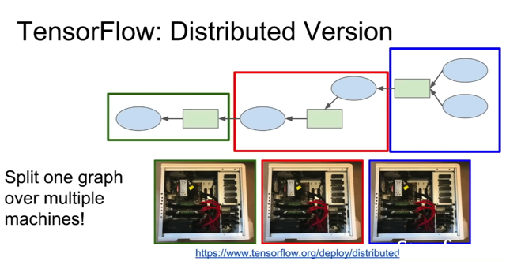</kbd>

> [!NOTE]
> lướt sơ về việc tf có support
> distributed version: split computation
> graph trên nhiều machine

 

<kbd>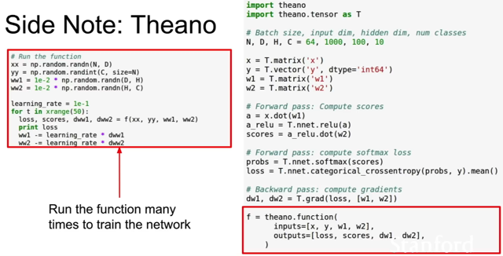</kbd>

> [!NOTE]
> đại ý là tensorflow có nhiều ý tưởng lấy từ Theano (một nền tảng trước
> đó). Như ở đây có thể thấy có sự tương đồng như mở đầu với việc
> define các tensor (matrix & vector)
>
>
>
> Tính toán forward pass (tính ra scores, tính prediction và loss)
>
>
>
> Backward pass tính gradient
>
>
>
> Define function f thực hiện các bước trên để rồi chạy vòng lặp
> thực hiện hàm f này và dùng gradient để update weights

 

<kbd>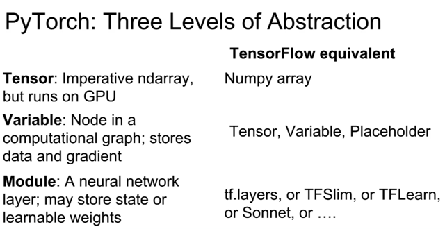</kbd>

> [!NOTE]
> Pytorch nó có 3 "khái niệm" (tạm gọi là
> vậy): Tensor, Variable và Module

 

<kbd>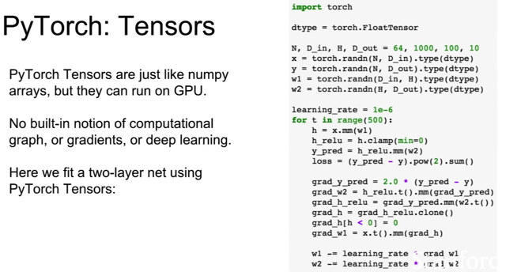</kbd>

> [!NOTE]
> Thế thì pytorch tensors nó giống như numpy array thôi, nhưng đặc biệt
> là nó có thể "được tính toán" trên GPU (numpy array chỉ dc "ở" trên
> CPU)
>
>
>
> Pytorch tensor cũng không có computation graph, nên Cũng không có
> vụ được tính gradient.

 

<kbd>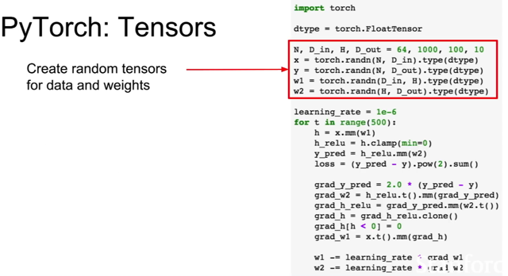</kbd>

> [!NOTE]
> Define các random tensor
> cho các weight và data

 

<kbd>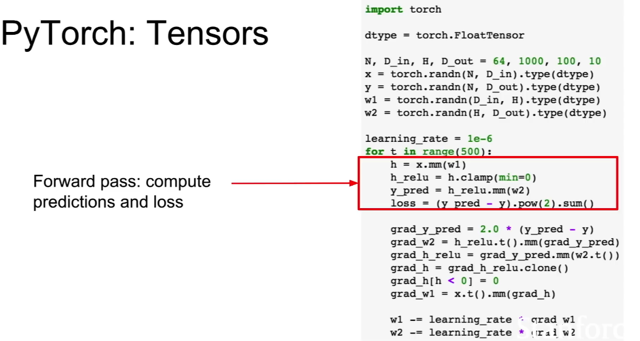</kbd>

> [!NOTE]
> chạy vòng lặp, trong đó tính toán forward
> pass để ra prediction và loss

 

<kbd>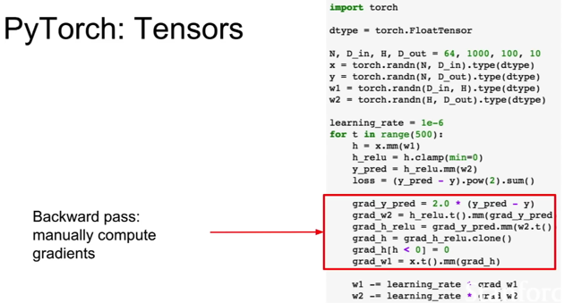</kbd>

> [!NOTE]
> Backward pass
> tính gradient

 

<kbd>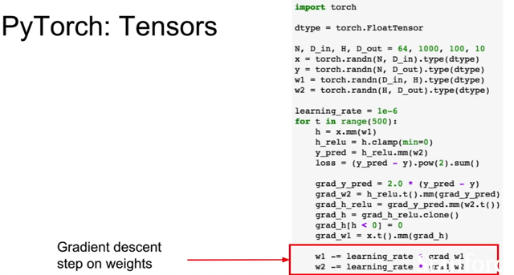</kbd>

> [!NOTE]
> Update params value bằng gradient

 

<kbd>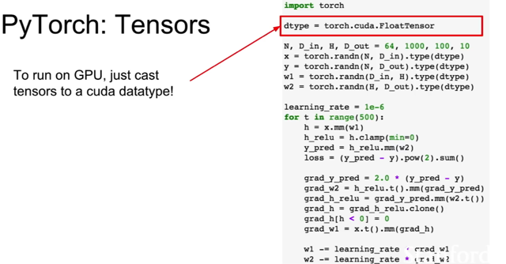</kbd>

> [!NOTE]
> chỉ bằng việc define data type là **torch.
> cuda.FloatTensor**, pytorch sẽ "đưa" cái
> này vào tính toán trên GPU

 

<kbd>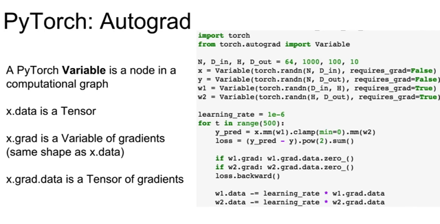</kbd>

> [!NOTE]
> đại khái là **Pytorch variable** là một node trong computation graph, ý là,
> nó sẽ được tính toán gradient (vì mục đích của computation graph,
> cuối cùng là để backward tính được gradient)
>
>
>
> Thế thì nếu x là pytorch variable thì x.data là Pytorch tensor chứa value
> của x nhưng x sẽ có x.grad là một variable dành cho gradient của x.
> Và x.grad.data sẽ là pytorch tensor chúa giá trị gradient này

 

<kbd>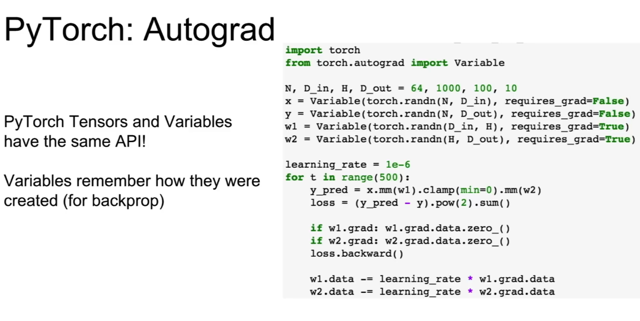</kbd>

> [!NOTE]
> Pytorch tensor và pytorch variable **đều có thể được tính toán
> như nhau**. **Chẳng qua là đối với variable thì pytorch nó sẽ "
> nhớ" quá trình tính toán** (trong computation graph) **để mà nếu
> cần thì nó tính gradient.**

 

<kbd>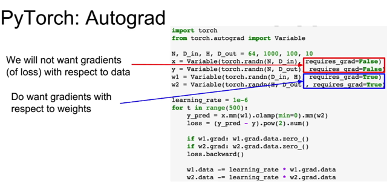</kbd>

> [!NOTE]
> Thành ra **nếu mình muốn nó khỏi cần "
> nhớ" / hay khỏi cần tính gradient thì bảo
> nó requires_grad = False**

 

<kbd>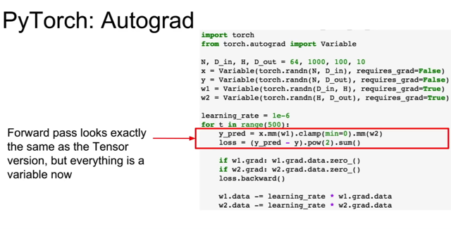</kbd>

> [!NOTE]
> quá trình tính forward pass cũng y như với pytorch tensor. Chỉ là
> pytorch đối với variable thì nó sẽ xây dựng computation graph

 

<kbd>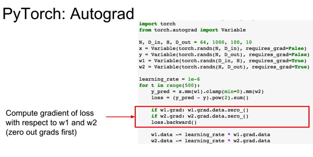</kbd>

<kbd>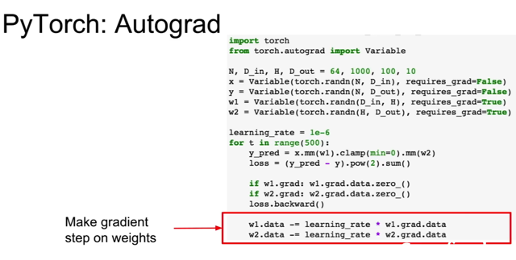</kbd>

> [!NOTE]
> để rồi ta có thể backward để tính gradient
>
> và dùng gradient update params

 

<kbd>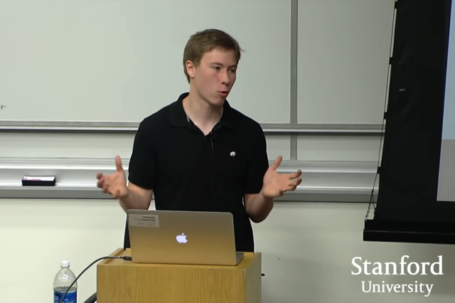</kbd>

> [!NOTE]
> Tensorflow sẽ build 1 cái graph và dùng đi
> dùng lại. còn pytorch sẽ mỗi lần forward nó sẽ
> build một cái nên kiểu như sẽ gọn hơn.
> mình sẽ nói kĩ hơn ở sau

 

<kbd>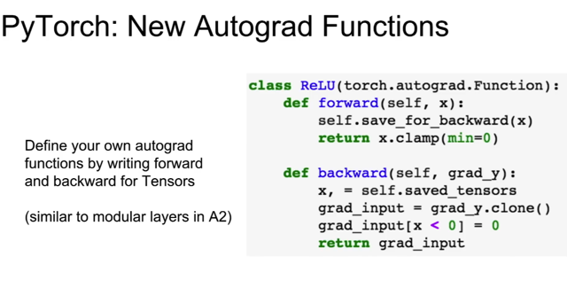</kbd>

<kbd>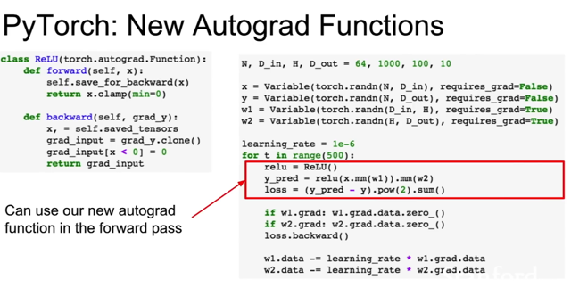</kbd>

> [!NOTE]
> đại ý là ta có thể tự define một autograd function bằng cách extend
> một autograd.Function với hai function forward và backward. Tuy
> nhiên họ nói phần lớn những gì ta cần hầu như đã được có sẵn rồi
> không phải tự làm (ví dụ như relu function này)

 

<kbd>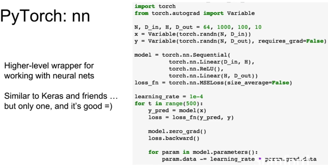</kbd>

> [!NOTE]
> Cũng như tensorflow có keras là higher level api, thì với pytorch
> là nn package. Nhưng pytorch chỉ có cái này, ko như tensorflow
> có nhiều cái nên cũng đỡ nhức đầu khi phải chọn lựa

 

<kbd>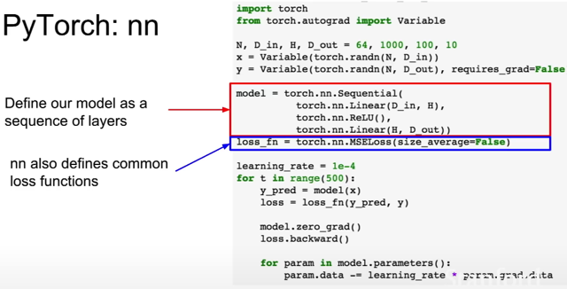</kbd>

> [!NOTE]
> tương tự keras, ở đây ta define một sequential structure với các
> linear transformation, xen kẽ bởi relu.
>
>
>
> nn cũng define sẵn các common loss function như MSE loss
> function

 

<kbd>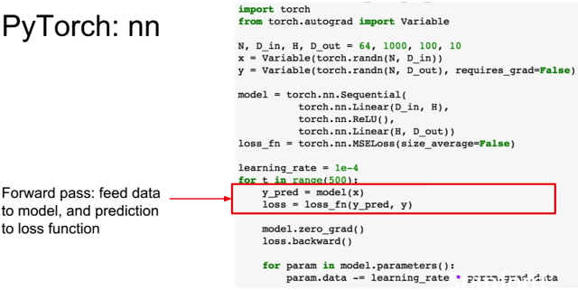</kbd>

<kbd>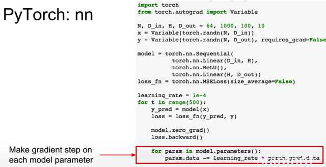</kbd>

> [!NOTE]
> Trong vòng lặp, đưa data vào model và tính loss
>
>
>
> Backward để tính gradient và dùng nó để update params
> (ở đây vẫn là tự update params theo lối vanilla gradient descent)

 

<kbd>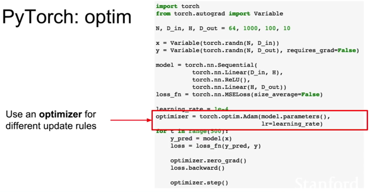</kbd>

<kbd>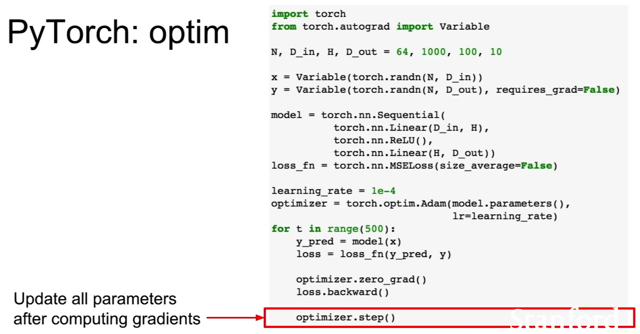</kbd>

> [!NOTE]
> Nhưng nn còn hỗ trợ các optimizer, ở đây define Adam đưa vào cho
> nó biết các learnable params và learning rate. Thì sau khi
> backward(), chỉ cần gọi optimizer.step() là nó sẽ giúp mình update
> params theo các optimizer technique mong muốn

 

<kbd>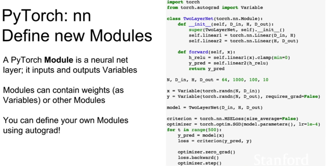</kbd>

> [!NOTE]
> đại khái là nn còn cho phép define modules, kiểu như
> giúp cho phép ta define một nn model có kiến trúc sẵn.
>
>
>
> để khi cần thì dùng thôi khỏi phải define lại

 

<kbd>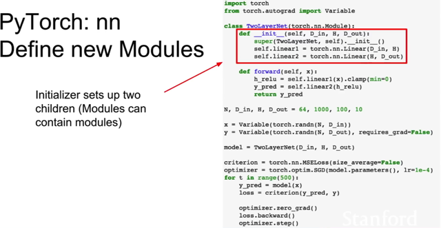</kbd>

> [!NOTE]
> ví dụ ở đây define nn model với 2 layer

 

<kbd>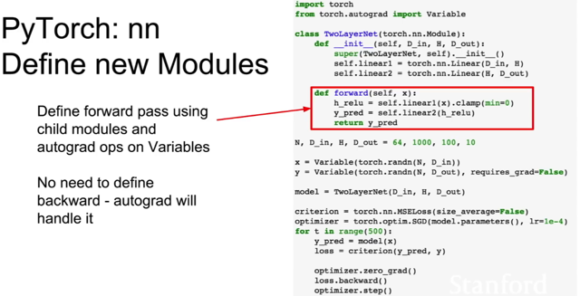</kbd>

> [!NOTE]
> Trong function forward đưa input vào linear layer đầu,
> output ra thì gọi function clamp() để kiểu như apply relu()
> trước khi bỏ vào linear layer thứ hai.

 

<kbd>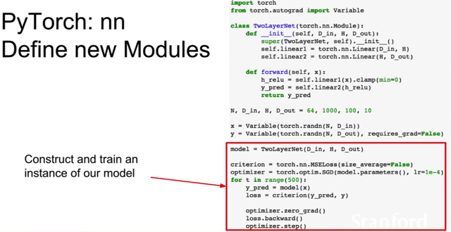</kbd>

> [!NOTE]
> Khi training thì construct và train như thường

 

<kbd>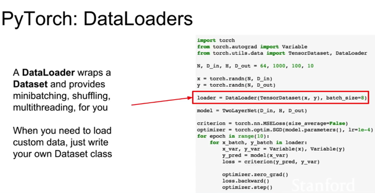</kbd>

> [!NOTE]
> một cái hay của pytorch là DataLoaders, đưa vào cho nó một cái Dataset
> object nó sẽ giúp làm công việc batching data thành từng mini-batch,
> đương nhiên là shuffling data trước, rồi multi-threading các kiểu.
>
>
>
> Khi cần load custom data, chỉ việc viết custom Dataset class

 

<kbd>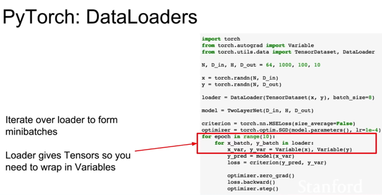</kbd>

> [!NOTE]
> (Khi training), chỉ việc iterate over data loader, nó sẽ trả cho mình
> từng mini-batch data, còn làm thêm các việc prefetch các kiểu như
> đã biết .
>
>
>
> Chú ý là nó sẽ đưa data cho mình ở dạng tensor, mình cần wrap
> trong variable

 

<kbd>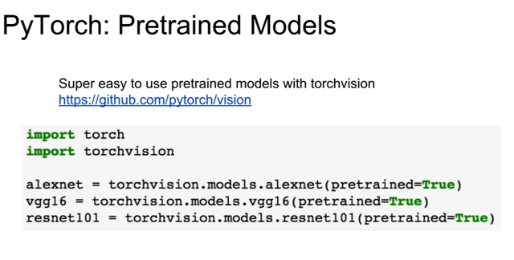</kbd>

> [!NOTE]
> Ngoài ra nó còn hỗ trợ
> pretrained model

 

<kbd>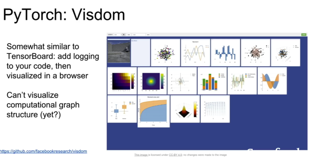</kbd>

> [!NOTE]
> và visdom kiểu kiểu
> như TensorBoard

 

<kbd>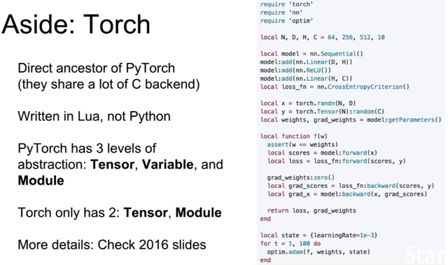</kbd>

> [!NOTE]
> nói sơ về pytorch
> xuất xứ từ torch

 

<kbd>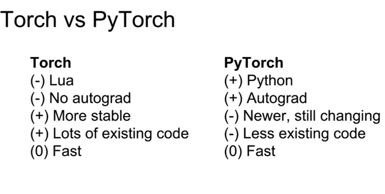</kbd>

 

<kbd>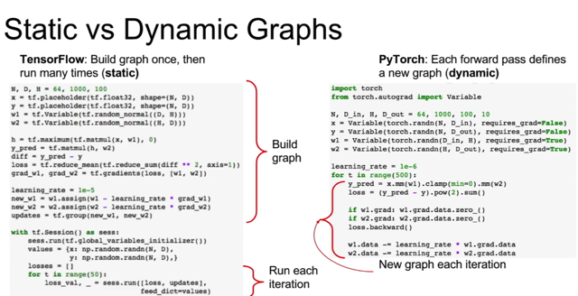</kbd>

> [!NOTE]
> Đại ý là tv' graph có tính chất static - nôm na là build một
> lần và xài đi xài lại, còn pt's graph có tính chất dynamic
> mỗi lần iteration là một new graph.

 

<kbd>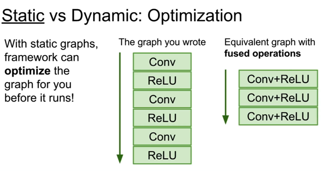</kbd>

> [!NOTE]
> đại ý là với static, có thể có lợi thế hơn ở khả năng
> optimization khi graph được define 'trước'

 

<kbd>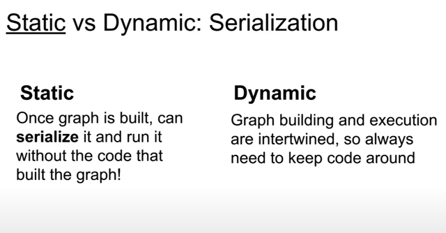</kbd>

> [!NOTE]
> với static graph một khi đã build, ta có thể chỉ cần
> serialize nó và chạy nó mà không cần code gốc build
> cái graph.
>
>
>
> còn với dynamic thì không làm được chuyện này

 

<kbd>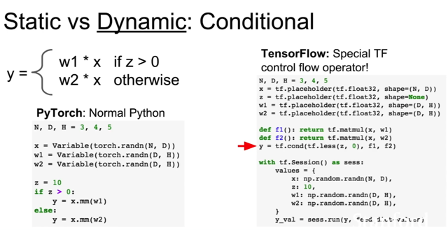</kbd>

> [!NOTE]
> một ưu điểm của tính chất dynamic của pytorch đó là nó mang lại sự **linh
> hoạt, thuận tiện**. Lấy ví dụ cho flow tính toán có sự tham gia của
> **condition** như này, cụ thể là **y sẽ được tính bởi các nhánh khác nhau
> tùy vào giá trị của z**. Với pytorch, **dễ dàng** triển khai tính toán như
> numpy code thông thường. **Mỗi lần forward**, tùy vào z mà đi theo nhánh
> nào thì computation graph sẽ được **build tương ứng để backward.**
>
>
>
> Còn với static tensorflow, k**hông được sự linh hoạt và dễ dàng** như vậy,
> vì phải define graph trước, nên với những flow tính toán như vầy, phải cần
> tới **các cơ chế đặc biệ**t như tf.cond như thế này để quy định flow.

 

<kbd>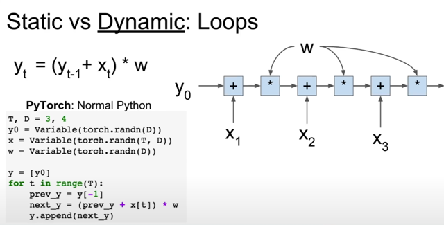</kbd>

> [!NOTE]
> một ví dụ nữa là loop, như khi xây dựng RNN. Với pytorch,
> có thể dễ dàng thực hiện như vầy với vòng lặp

 

<kbd>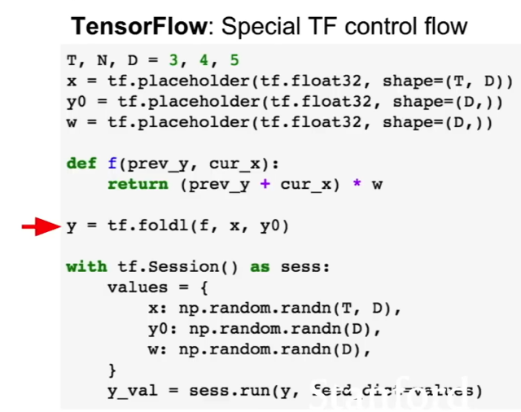</kbd>

> [!NOTE]
> còn với tf, để define bước tính toán với loop như vậy ta phải
> dùng cái này tf.foldl(...)
>
>
>
> Nên đại ý đó là với tf, để làm những '**operation control**' như vậy
> thì ta **phải làm quen với một bộ các công cụ mới của tf**, thay vì
> chỉ dùng những phương cách quen thuộc thông thường như  If
> else, loop

 

<kbd>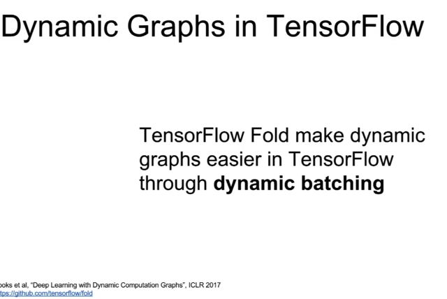</kbd>

> [!NOTE]
> Tf cho ra mắt cái này kiểu như là một cách để khắc phục nhược điểm
> này tuy nhiên vẫn không hoàn toàn

 

<kbd>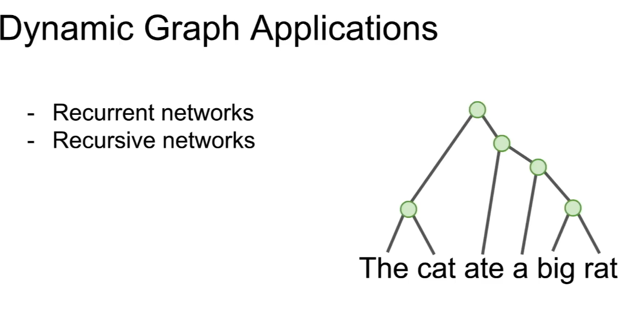</kbd>

> [!NOTE]
> Dynamic graph tỏ ra rất cần thiết cho những vấn đề
> như RNN hay recursive networks

 

<kbd>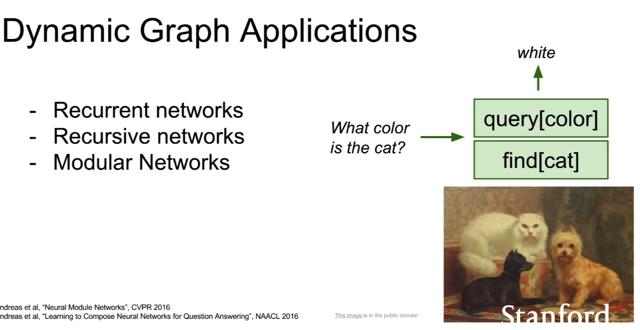</kbd>

<kbd>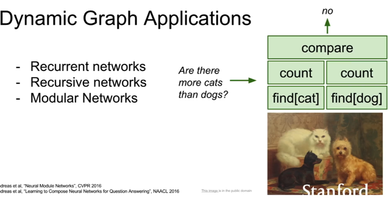</kbd>

> [!NOTE]
> cái này là nói về Modular Networks, là một technique đang
> được nghiên cứu, nói chung là ý muốn nói tính chất dynamic
> rất cần thiết cho những ví dụ này

 

<kbd>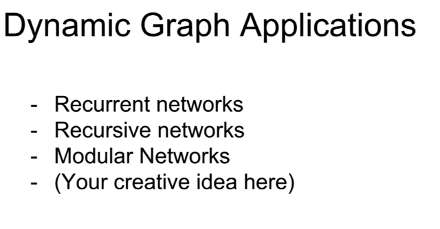</kbd>

> [!NOTE]
> nhưng ý tưởng lớn đó là dynamic graph sẽ mang lại khả năng
> linh hoạt **cho phép sáng tạo** giải quyết nhiều bài toán mới một cách dễ
> dàng hơn

 

<kbd>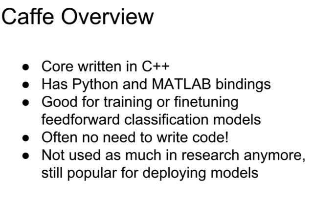</kbd>

> [!NOTE]
> nói lướt về Caffe với một số đặc điểm như **core viết bằng C++,**
> **tốt cho training/fine-tuning feedforward classification mode**l,
>
>
>
> Một đặc điểm đáng chú ý là thường **không cần phải viết code.**
>
>
>
> Và dần dần **ít được sử dụng trong research** nhưng vẫn **phổ
> biến cho việc deploying model**

 

<kbd>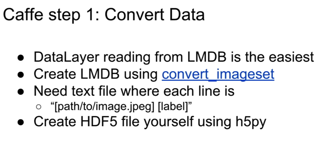</kbd>

> [!NOTE]
> Giảng viên chỉ lướt qua không nói rõ,
> có thể nghiên cứu thêm sau

 

<kbd>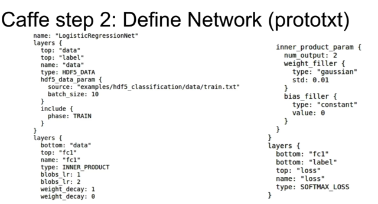</kbd>

> [!NOTE]
> bước 2 này có thể hiểu đại khái là với Caffe, ta chỉ cần
> **define một structure** của model dưới dạng một **prototxt**

 

<kbd>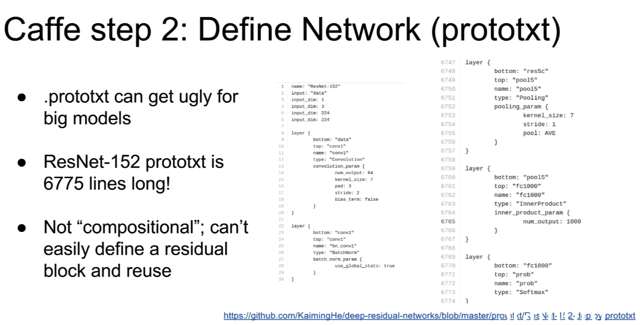</kbd>

> [!NOTE]
> nhược điểm là với **deep model, cái file này sẽ trở nên rất ugly** (ý
> nói dài, rắc rối).
>
>
>
> Bên cạnh đó nó **không có tính chất 'compositional'** - nôm na là
> **không tạo các module để mà tái sử dụng** được

 

<kbd>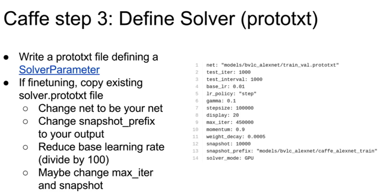</kbd>

> [!NOTE]
> Giảng viên chỉ lướt qua không nói rõ,
> có thể nghiên cứu thêm sau

 

<kbd>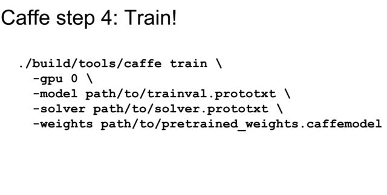</kbd>

 

<kbd>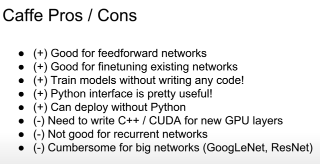</kbd>

> [!NOTE]
> một số ưu/nhược điểm

 

<kbd>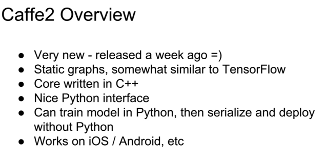</kbd>

> [!NOTE]
> lướt qua nhanh về caffe2 của
> Facebook, kế thừa caffe.

 

<kbd>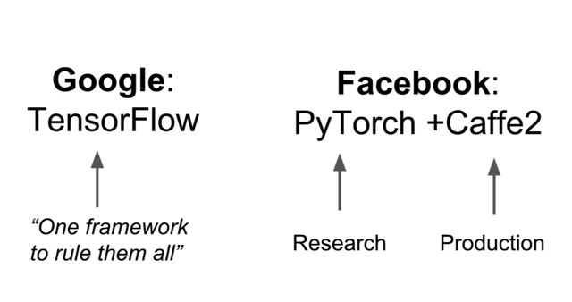</kbd>

> [!NOTE]
> Google dồn mọi nỗ lực vào tensorflow để nôm na là
> làm một cái framework duy nhất cho mọi nhu cầu (cả
> research, deployment, mobile...).
>
>
>
> Còn Facebook thì pytorch thiên về để research , còn 
> để deployment thiên về Caffe2

 

<kbd>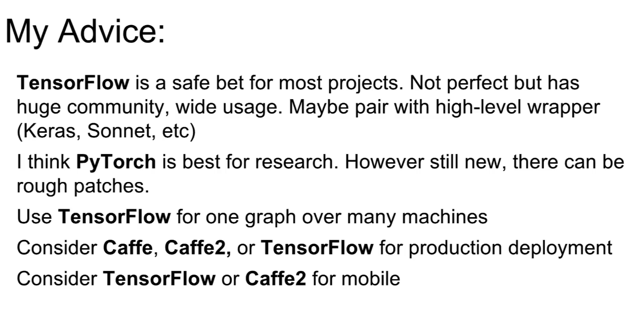</kbd>

> [!NOTE]
> tóm lại framework nào thì
> tùy vào mục đích

 

