# Lecture Note Nn P1

📊 **Progress:** `1` Notes | `14` Screenshots

---

## Lecture Note Nn P1

 

<kbd>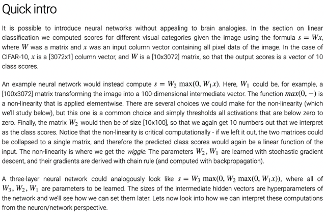</kbd>

 

<kbd>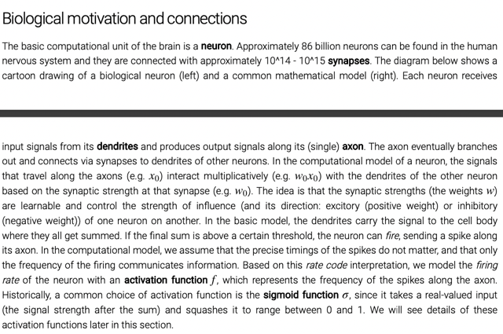</kbd>

 

<kbd>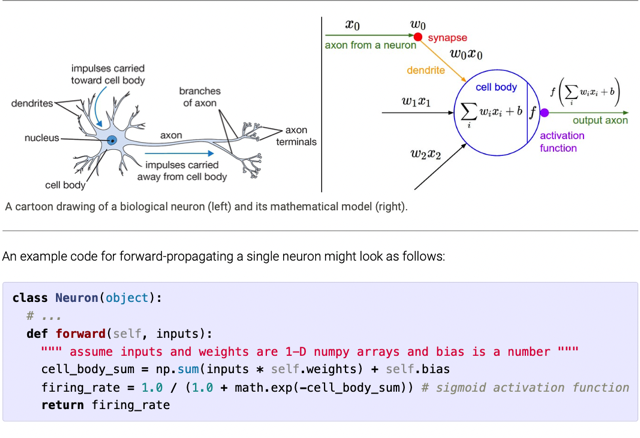</kbd>

 

<kbd>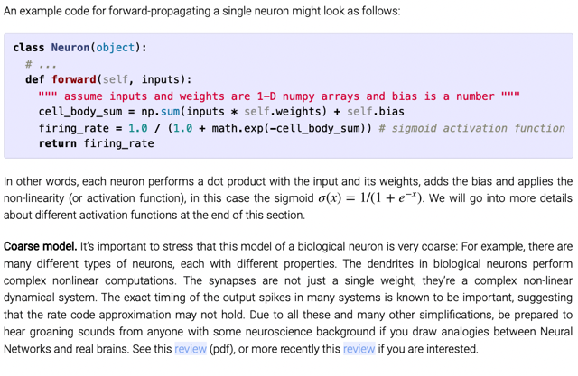</kbd>

 

<kbd>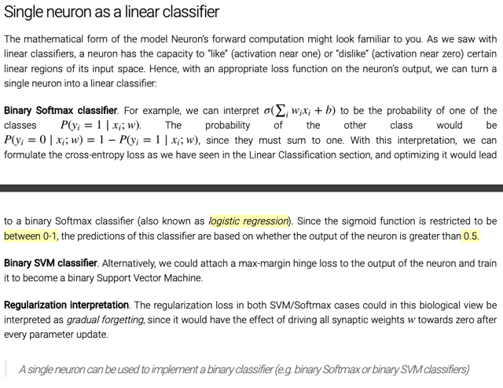</kbd>

 

<kbd>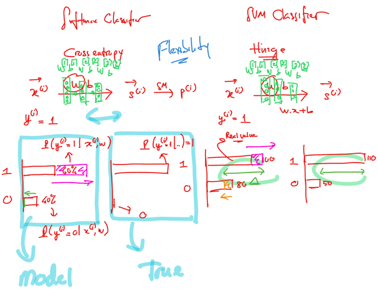</kbd>

 

<kbd>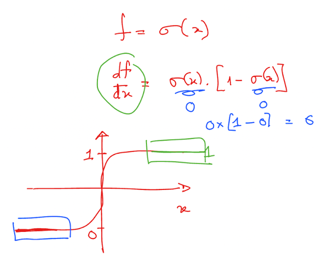</kbd>

 

<kbd>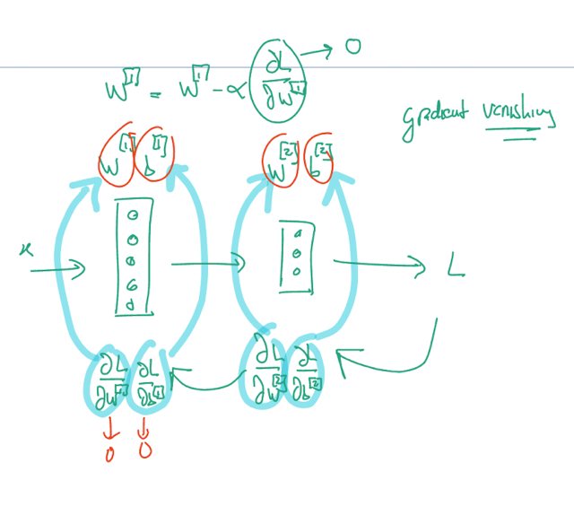</kbd>

 

<kbd>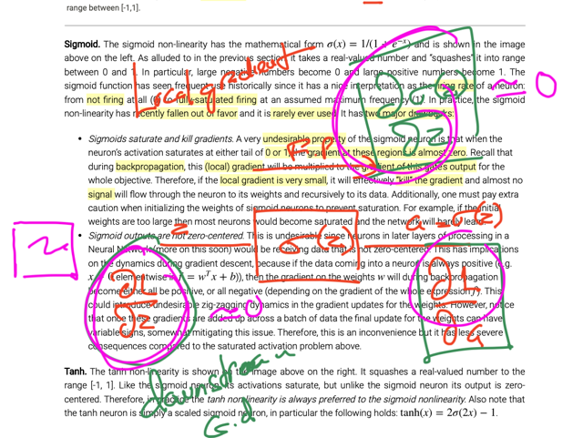</kbd>

 

<kbd>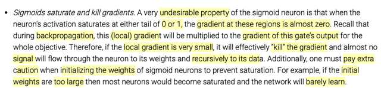</kbd>

> [!NOTE]
> Đạo hàm của hàm sigmoid bằng 0 tại x lớn hay bé, khiến
> local gradient = 0 khiến vanishing gradient

 

<kbd>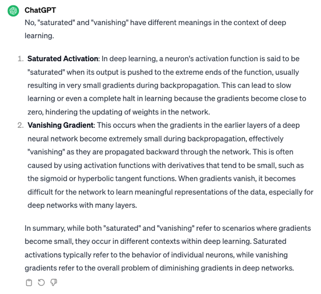</kbd>

 

<kbd>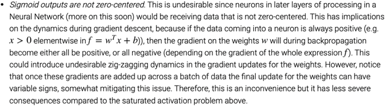</kbd>

 

<kbd>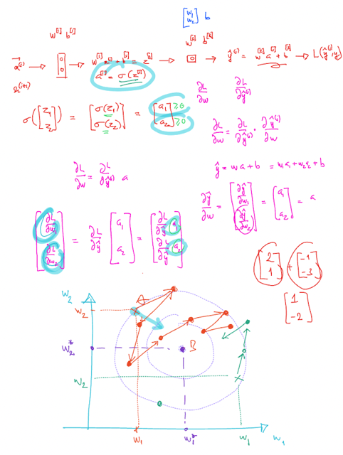</kbd>

 

<kbd>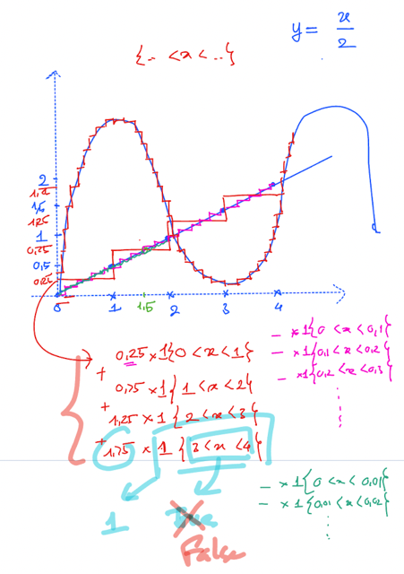</kbd>

 

