# Course 1 - Neural Networks & Deep Learning

📊 **Progress:** `73` Notes | `373` Screenshots

---

## Course 1 - Neural Networks & Deep Learning

 

## C1w1_introduction To N.n

 

### What's A Neural Network

 

#### The term "Deep Learning" refers to training Neural Networks, sometimes very
large Neural Networks.

A Neural Network is a function that can be used to predict outcomes based on
inputs, often implemented using neurons.

Neurons are individual units in a Neural Network that receive input and generate
output based on a set of weights and biases.

A simple example of a Neural Network is using linear regression to predict
housing prices based on house size.

In the example, the input (house size) goes through a single neuron that applies
a linear function and a ReLU function to generate the predicted price.

A larger Neural Network can be built by stacking multiple neurons together to
handle more complex inputs and outputs.

The process of training a Neural Network involves giving it input/output pairs and
adjusting the weights and biases of the neurons to minimize prediction error.

A more complex Neural Network can be used to predict housing prices based on
multiple features such as number of bedrooms, zip code, and walkability.

 

<kbd>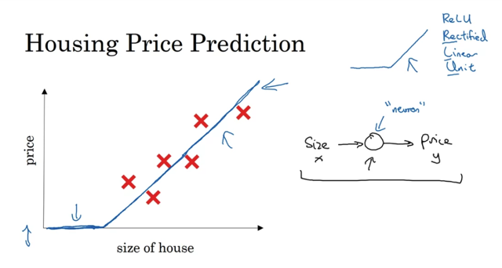</kbd>

 

<kbd></kbd>

 

<kbd>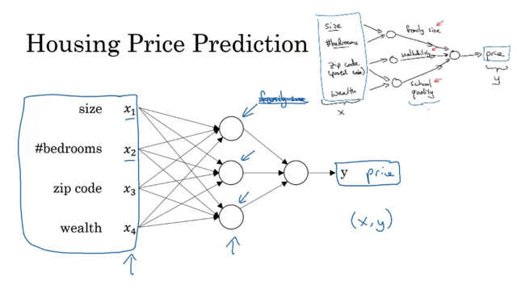</kbd>

 

### Supervised Learning With N.n

 

#### 1 The majority of economic value created by neural networks has been through
supervised learning.

2 Various applications of neural networks include online advertising, computer
vision, speech recognition, machine translation, and autonomous driving.

3 Different types of neural networks are useful for different applications, such as
convolutional neural networks (CNNs) for image applications and recurrent
neural networks (RNNs) for sequence data.

4 Standard CNN and RNN architectures are used for image and
one-dimensional sequence data, respectively.

5 Machine learning can be applied to structured data and unstructured data.

6 Structured data refers to databases of data, while unstructured data includes
audio, images, and text.

 

<kbd></kbd>

 

<kbd></kbd>

 

<kbd>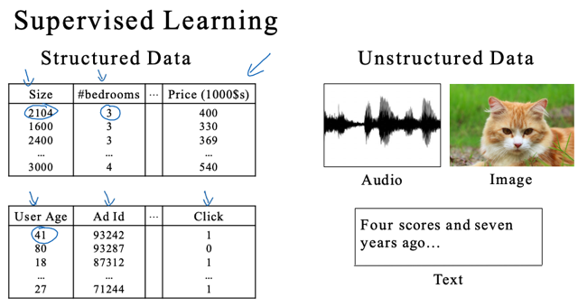</kbd>

 

### Why Is Deep Learning Taking Off?

 

#### Sure, here is a more detailed answer with indexed points:  1 The video discusses the reasons behind the
rise of deep learning, despite the fact that the basic technical ideas behind deep learning have been
around for decades.

2 The main driver behind the rise of deep learning is the amount of data that is now available for various
tasks, such as spam classification, ad click prediction, and self-driving cars.

3 Traditional learning algorithms like support vector machines or logistic regression show a plateau in
performance after a certain point, as the amount of data increases.

4 However, with deep learning, the performance can continue to improve as more data is added, and the
neural network size increases.

5 This is because deep learning algorithms can take advantage of the huge amounts of data that are now
available, and larger neural networks can be trained to process that data.

6 In fact, today, the most reliable way to improve the performance of a neural network is to either train a
larger network or to add more data.

7 The amount of labeled data is plotted on the x-axis in the video, where labeled data refers to the training
examples with both input X and label Y.

8 In the regime of smaller training sets, the relative ordering of the algorithms is not well defined, and
performance depends more on the skill of the engineer at hand-engineering features.

9 However, in the regime of very large training sets, very large M, neural networks are seen to dominate
the other approaches.

10 The rise of deep learning has been made possible by the scale of data and the scale of computation,
such as the ability to train large neural networks on CPUs or GPUs.

11 Additionally, there have been significant algorithmic innovations in deep learning that have made neural
networks faster, such as the switch from sigmoid to ReLU activation functions.

12 Overall, deep learning has taken off due to the combination of scale, both in terms of data and
computation, and significant algorithmic innovations.

 

<kbd></kbd>

> [!NOTE]
> Đại khái là:..
>
>
>
> Những algorithm 'cũ' như SVM khi có nhiều data nó sẽ tốt hơn nhưng
>  vẫn bị giới hạn, đại khái là sẽ không biết làm gì với quá nhiều data.
>
>
>
> Còn n.n phức tạp thì càng nhiều data nó càng tốt.
>
>
>
> Muốn n.n perform tốt thì phải 1-Nhiều data, 2-Phức tạp
>
>
>
> Do 'Big data' có được từ
> digitalization, sự phát triển của
> Camera, Mobile phone,...
>
>
>
> Nếu 'Small training set' thì performance sẽ tuỳ thuộc vào
> skill của con người như 'feature engineering' nên một model
> bằng SVM làm tốt có thể vượt trội n.n. Tuy nhiên nếu ở phân khúc
> 'Big data' thì Big n.n sẽ vượt trội những algorithm khác.

 

<kbd>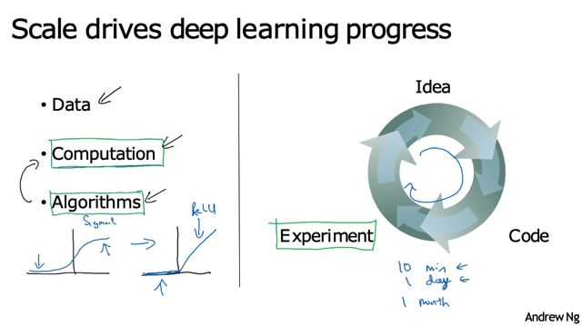</kbd>

> [!NOTE]
> Đại khái là:..
>
>
>
> Máy tính nhanh hơn giúp tăng tốc Quá trình Idea - Thử - Điều chỉnh
>
>
>
> Những algorithm mới cũng giúp quá trình 'Training' nhanh hơn
> ví dụ thay Sigmoid bằng Relu.

 

<kbd></kbd>

> [!NOTE]
> Data, sự phát triển của phần cứng sẽ giúp
> Deep learning còn phát triển nữa trong những năm tới.

 

<kbd></kbd>

 

### About This Course

 

#### The speaker gives an overview of the first course in a deep learning specialization,
which comprises five courses. The first course covers the most important
foundations of deep learning, including building and working with a deep neural
network. The course is four weeks long, with each week covering new material and
including 10 multiple-choice questions to check understanding. In week two, learners
will learn about the basics of neural network programming and practice implementing
the algorithms through a programming exercise. In week three, learners will code up
a single hidden layer neural network, and in week four, they will build a deep neural
network with many layers. The speaker encourages learners to take the
multiple-choice questions seriously and to use them to check their understanding of
the material.

 

<kbd>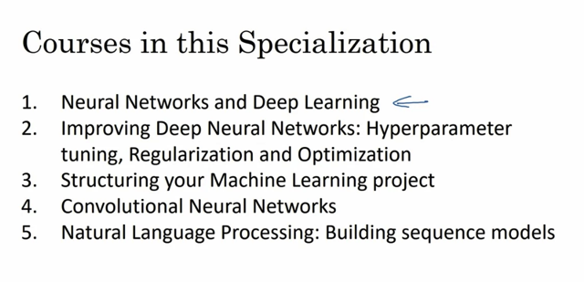</kbd>

 

<kbd>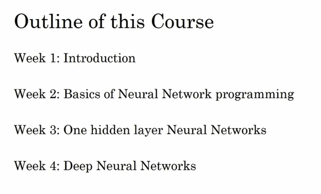</kbd>

 

### Quiz

 

<kbd></kbd>

 

<kbd></kbd>

 

<kbd></kbd>

 

<kbd>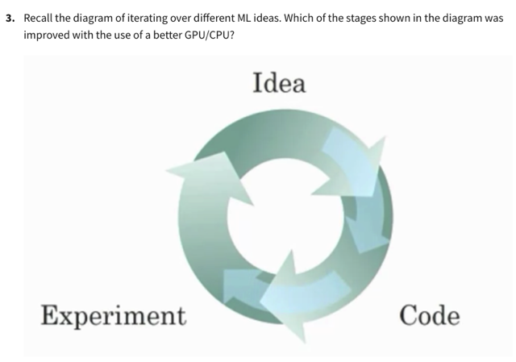</kbd>

 

<kbd></kbd>

 

<kbd></kbd>

 

<kbd>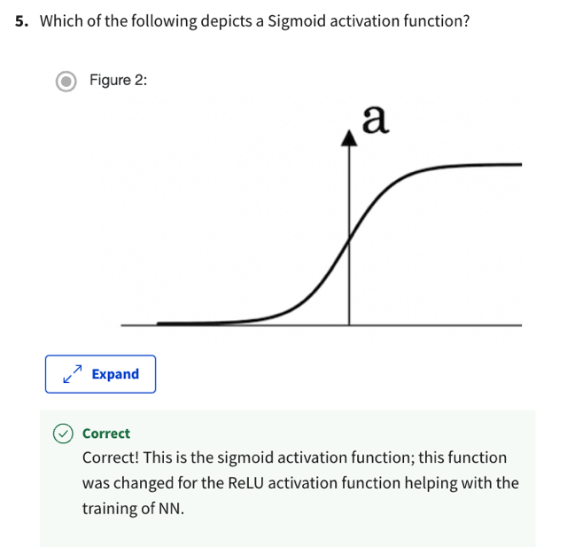</kbd>

 

<kbd></kbd>

 

<kbd></kbd>

 

<kbd></kbd>

 

<kbd></kbd>

 

<kbd>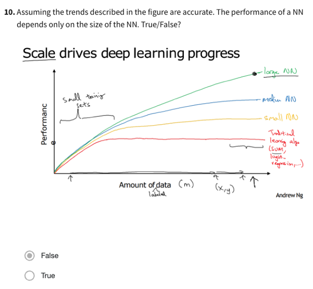</kbd>

 

## C1w2_n.n Basic

 

### Logistic Regression As A Neural Network

 

#### Binary Classification

 

##### 1 The basics of neural network programming include techniques that are
important to process the entire training set.

2 The computation of a neural network is organized in forward propagation and
backward propagation.

3 Logistic regression is an algorithm for binary classification that is going to be
used to convey the ideas.

4 To turn pixel intensity values into a feature vector, they are unrolled to get a
long feature vector that lists all the red, green and blue pixel intensity values of
the image.

5 Binary classification aims to learn a classifier that can input an image
represented by a feature vector x and predict whether the corresponding label y
is 1 or 0.

6 Notations used in the course include lowercase m to denote the number of
training samples, M_train, to emphasize that this is the number of training
examples, and m_subscript_test to denote the number of test examples.

7 A matrix X is defined by taking the training set inputs x1, x2, and so on, and
stacking them in columns.

 

<kbd>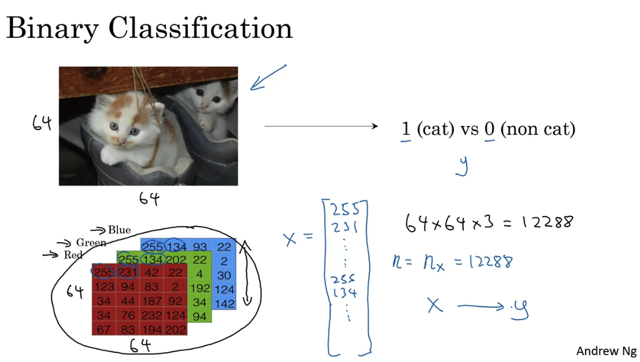</kbd>

 

<kbd>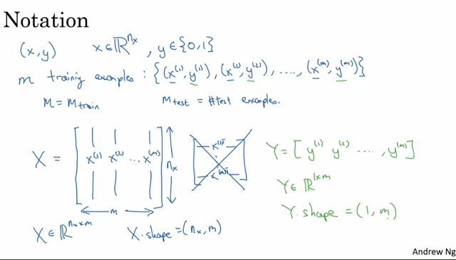</kbd>

> [!NOTE]
> Đại khái là:..
>
>
>
> Thường thì define X dạng mxn, nhưng đối với n.n thì define nm 
> sẽ dễ làm hơn. Y cũng vậy.

 

#### Logistic Regression

 

##### 1 Logistic regression is a learning algorithm used for binary classification problems
where the output labels Y are either zero or one.

2 Given an input feature vector X, the goal of logistic regression is to output a
prediction Y hat, which is the probability that Y is equal to one given X.

3 The parameters of logistic regression are W, which is an X-dimensional vector,
and b, which is a real number.

4 The initial idea of using Y hat as a linear function of the input X, Y hat = w
transpose X + b, is not effective for binary classification because it does not
guarantee that Y hat will be between zero and one.

5 Instead, logistic regression uses the sigmoid function to ensure that Y hat is
between zero and one.

6 The sigmoid function maps any real number Z to a value between zero and one,
with values close to one for large positive Z, and values close to zero for large
negative Z.

7 The formula for the sigmoid function is sigmoid of Z = 1 / (1 + e^(-Z)).

8 The parameters W and B of logistic regression are learned by defining a cost
function, which will be explained in the next video.

9 There is an alternative notation for logistic regression that uses an extra feature
called X0, but in this course, W and B are kept separate.

 

<kbd></kbd>

 

<kbd></kbd>

 

#### Logistic Regression Cost Function

 

##### 1 Logistic regression model to train parameters W and B for given training
examples.

2 Definition of the cost function to measure how well the algorithm is
performing on the training set.

3 Convention of superscript parentheses I to index different training
examples.

4 Use of a different loss function in logistic regression, which is negative y
log y hat plus 1 minus y log 1 minus y hat.

5 Justification of the loss function, where it tries to make y hat large if y is
equal to one and small if y is equal to zero.

 

<kbd></kbd>

> [!NOTE]
> Đại khái là:..
>
>
>
> Ở đây ổng dùng kí tự sigma - σ để biểu thị hàm Sigmoid.
> Mấy khoá khác ổng dùng chữ g.
>
>
>
> Define Loss function cho Logistic Regression (y^-y)^2/2 cũng được
> nhưng nó lại khiến G.D không work, do lúc này hàm J sẽ non-convex
> Do đó người ta define Loss function kiểu khác:
> ylog(y^) + (1 - y)log(1-y^)
>
>
>
> Và Cost function là trung bình cộng (mean value) tất cả Loss 
> của toàn bộ dataset m

 

<kbd></kbd>

 

#### Gradient Descent

 

##### 1 Recap of logistic regression and its loss and cost functions.

2 Discussion of the convexity of the cost function and why it's
important for logistic regression.

3 Explanation of gradient descent as an optimization algorithm to find
the best parameters for the cost function.

4 Description of how gradient descent updates the values of the
parameters to approach the minimum of the cost function.

5 Explanation of the role of the learning rate in controlling the size of
steps in the gradient descent algorithm.

 

<kbd>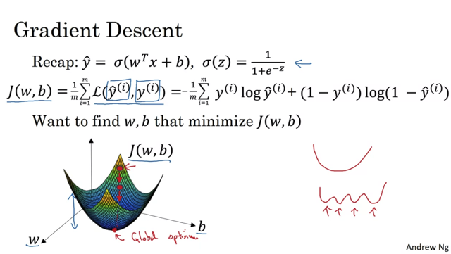</kbd>

> [!NOTE]
> Đại khái là:..
>
>
>
> "And /**for logistic regression**/, almost any initialization  method works.
> Usually you Initialize the values of 0, Random initialization also works, but
> people don't usually do that for  logistic regression./**But because this
> function is convex, no matter where you initialize, you should get to the
> same point or roughly the same point."**/
>
>
>
> Vì hàm J convex nên dù có Initialize (W, b) thế nào - Random hay cho
> bằng 0 thì nó sẽ đều converge về global optima

 

<kbd></kbd>

 

<kbd></kbd>

> [!NOTE]
> Một ghi chú nhỏ không quan trọng lắm:
> Trong calculus người ta dùng kí tự **'∂'**- gọi là
> kí tự '/**Partial derivative**/' khi hàm J depend on 2 params
> trở lên còn nếu chỉ 1 param thì dùng chữ **'d'**
>
>
>
> Ổng cho là làm vậy chỉ tổ phức tạp nên ở đây dùng chữ 'd' hết.
>
>
>
> Trong code sẽ là **dw, db (hay dj_dw, dj_db)**

 

<kbd></kbd>

 

#### Derivatives

 

##### 1 The video aims to help people gain an intuitive understanding of calculus and
derivatives.

2 Even if someone does not have a deep understanding of calculus, they can still
apply deep learning.

3 Forward and backward functions will encapsulate everything one needs to know
about calculus for deep learning.

4 Calculus is important for deep learning, but intuitive understanding is enough to
build and apply algorithms.

5 The video will explore the details of derivatives, but for experts in calculus, this
video may be skipped.

6 The video explains the concept of derivatives by plotting a straight line and
exploring how the slope changes.

7 The slope of a line represents the derivative, which is the rate of change of the
function.

8 The slope or derivative is defined as the height divided by the width of a small
triangle.

9 When the slope is equal to three, it means that if you nudge a variable a to the right,
f(a) goes up three times as much as you nudged the value of a.

 

<kbd>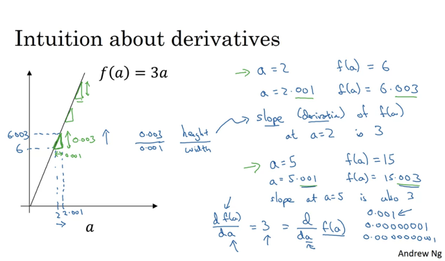</kbd>

> [!NOTE]
> Official definition thì 'small value' không phải là 0.01, hay 0.0001
> mà là một khoảng vô cùng nhỏ. Nhưng đại khái definition của
> Derivative là chỉ vậy:   
>
>
>
> **"Khi kéo a tăng lên một khoảng hàm f(a)
> /cũng tăng lên một khoảng gấp mấy lần/ thì đó chính là
> derivative của hàm f tại a"**  
>
>
>
> Và cũng là slop - Độ dốc của hàm f(a) tại a.
>
>
>
> Và đối với hàm linear thì thấy rõ là độ dốc ở đâu cũng bằng nhau.

 

<kbd>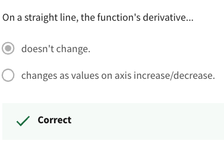</kbd>

 

#### More Derivative Examples

 

##### 1 The video demonstrates a slightly more complex example where the slope of the
function varies at different points in the function.

2 The function used as an example is f(a) = a².

3 The video shows that the slope of the function at a given point can be determined by
nudging a slightly to the right and observing the change in f(a).

4 The video explains that the ratio of the height of the triangle over the width of the
triangle is different at different points on the curve, which is why the derivative is
different at different points.

5 The video shows that if you pull up a calculus textbook, you'll find that the slope of
the function a² is equal to 2a.

6 The video demonstrates that the derivative of f(a) = a² is equal to 4 when a = 2 and
10 when a = 5.

7 The video explains that the derivative is defined using infinitesimally small nudges to
a, which is why the amount that f(a) goes up isn't exactly given by the formula but is
only approximately given by the derivative.

 

<kbd></kbd>

> [!NOTE]
> Đại khái là nếu trong sách Calculus ta thấy công thức tính 
> d_f(a)/d_a = **2a** với f = a^2 thì có nghĩa là : 
>
>
>
> Nếu kéo a lên một khoảng tiny ví dụ 0,001 thì 
> hàm f = a^2 sẽ tăng lên 1 khoảng /**gấp 2a lần**/ = 2a*0.001

 

<kbd>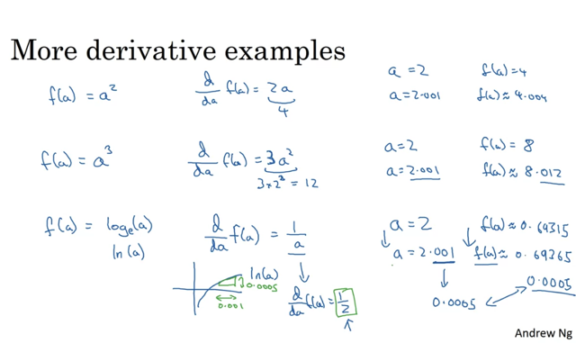</kbd>

 

<kbd></kbd>

> [!NOTE]
> Wrap up: 
> /**Derivative của một function (tại điểm nào đó) đơn giản chỉ là 
> độ dốc của function đó (tại điểm nào đó)**
> /
> 1. The derivative of the function just means **the slope** of a function 
> and the slope of a function can be different at different points on the 
> function
>
>
>
> 2. Muốn xem công thức của tính derivative cho các hàm khác nhau
> thì có thể mở sách Calculus ra xem.

 

#### Computation Graph

 

##### 1 Introduction: Explanation of forward pass and backward pass in neural networks
using computation graph.

2 Example problem: Computing a function J of three variables a, b, and c, which is J =
3(a + bc).

3 Steps to compute J:

4 a. Compute u = bc.  5 b. Compute V = a * u.  6 c. Compute J = 3V.

7 Computation graph: Visual representation of the three steps with a, b, and c as
inputs, and u, V, and J as the intermediate and final outputs, respectively.

8 Example calculation: Values of a, b, and c are given as 5, 3, and 2, respectively. The
values of u, V, and J are computed as 6, 30, and 33, respectively, using the
computation graph.

9 Importance of computation graph: Useful for optimizing a special output variable,
such as J, in neural networks.

10 Left-to-right computation: The computation graph enables a left-to-right pass for
computing the value of J.

11 Right-to-left computation: In order to compute derivatives, a right-to-left pass is
needed, which is explained in the next video.

 

<kbd>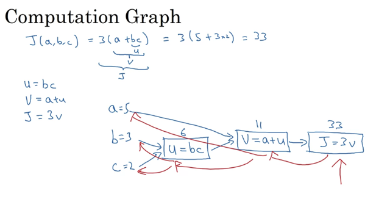</kbd>

> [!NOTE]
> Nền tảng đằng sau tên gọi khái niệm của 'Forward propagation' đại khái là
> để tính value (ví dụ của cost function J) thì tính từ trái qua phải. Còn tính
> derivative thì ngược lại (Back propagation)

 

#### Derivatives With A Computation Graph

 

##### 1 Introduction: The video discusses how to use a computation graph to figure out derivative
calculations for a function J by taking a cleaned-up version of the computation graph used in the
previous video.

2 Derivative of J with respect to v: The video demonstrates how to compute the derivative of J
with respect to v, which is equal to 3, by increasing the value of v by 0.001, using the analogy of
the previous video where f(a) = 3a and df/da = 3.

3 Derivative of J with respect to a: The video illustrates how to calculate dJ/da, which is also
equal to 3, by changing the value of a by 0.001 and breaking it down to the chain rule, where
dv/da = 1 and dJ/dv = 3, which when multiplied give dJ/da = 3.

4 Backward calculation: The video shows how computing dJ/dv can help in calculating dJ/da and
how it's a backward calculation to find the derivatives of the variables that come before J.

5 Notational Convention: The video introduces a new notational convention, which is to call the
final output variable, J in this case, as "dvar" while computing the derivative of the final output
variable with respect to intermediate variables.

 

<kbd>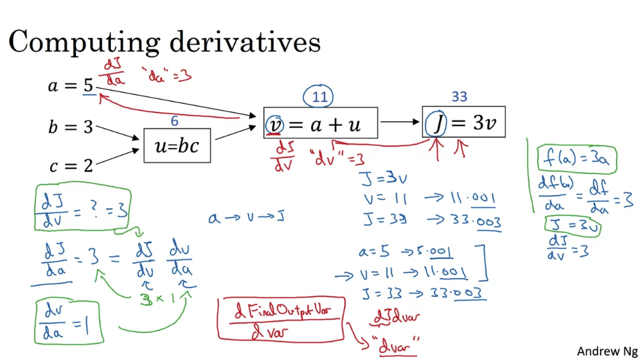</kbd>

> [!NOTE]
> 1.Đại khái là để tính derivative thì tính theo chiều ngược lại, ví dụ
> để tính dJ_da thì phải tính dJ_dv, dv_da và:
>
>
>
> dJ_da = dJ_dv . dv_da
>
>
>
> và nó gọi là 'Chain rule' trong calculus 
>
>
>
> 2.Đại khái là trong code sẽ viết gọn dFinalOutput/dVar thành dVar
> Ví dụ:
>  'dJ_da' thành 'da', 'dJ_dv' thành 'dv' thôi.

 

<kbd>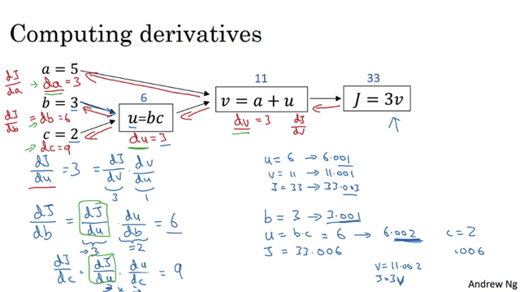</kbd>

> [!NOTE]
> So that was the computation graph and how does a forward or
> left to right calculation to compute the **cost function** such as J
> that you might want to optimize. And a backwards or a right to
> left calculation to compute **derivatives**
>
> So the key takeaway from this video, from this example, is that 
> when computing derivatives and computing all of these 
> derivatives, the most efficient way to do so is /**through a right 
> to left computation**/ following the direction of the red arrows

 

<kbd>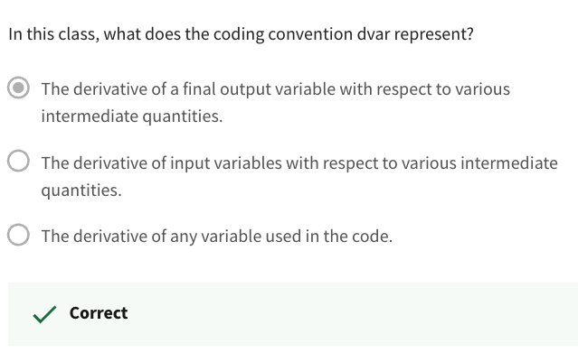</kbd>

 

#### Logistic Regression Gradient Descent

 

##### Main ideas:  1 Introduction to computing derivatives for implementing
gradient descent for logistic regression.

2 Explanation of the key equations necessary to implement gradient
descent for logistic regression using computation graphs.

3 Forward propagation steps of computing loss on a single training
example.

4 Backward propagation steps to compute the derivatives of the loss
with respect to each variable.

5 Explanation of the derivative of the loss with respect to A and how it is
computed.

6 Deriving the derivative of the loss with respect to Z using the chain
rule.

7 Computation of how much W and B need to be changed.

8 Explanation of how to update W1, W2, and B to perform one step of
gradient descent with respect to a single example.

 

<kbd>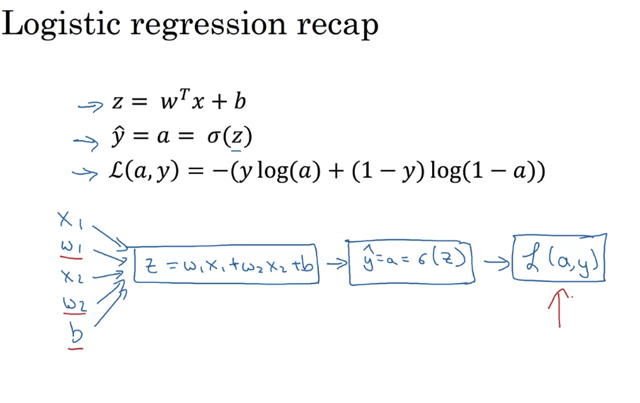</kbd>

 

<kbd>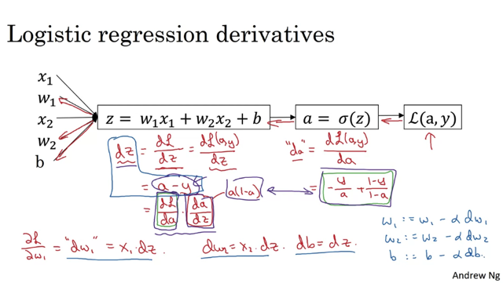</kbd>

> [!NOTE]
> Đại khái đây chính là đi ngược lại (Back Prop) để  ..
>
>
>
> ..tính ra '/**derivative of cost function J with respect to w, b** / 
> Hay viết gọn là dj_dw (or dw) và dj_db (or db)  
> Phục vụ cho việc /**dùng Gradient Descent update w, b sao 
> cho minimize J**/.
>
> Có thể xem lại sách Calculus để tự tính lại derivative (đạo hàm)
> của: 
> - hàm Loss function L = -( ylog(a) + (1-y)log(1-a) ) -> dL_da
> - hàm sigmoid a = sigmoid(z) -> da_dz
> - hàm z = w(transpose).x + b -> dz_dw, dz_db

 

<kbd></kbd>

> [!NOTE]
> D/**ùng Gradient Descent update w,
> b sao cho minimize J**/.

 

<kbd></kbd>

 

#### Gradient Descent On M Examples

 

##### 1 Reminder of the definition of the cost function J.

2 Explanation of how to compute derivatives for the cost function J with
respect to each parameter w and b for m training examples.

3 Derivatives with respect to each parameter are computed as the
average of derivatives with respect to each parameter for the individual
loss terms.

4 An algorithm is presented that computes the derivatives of the cost
function J with respect to each parameter w and b.

5 Details of the algorithm are presented, including initialization, for loop
over training set, calculations for the accumulator values, division by m to
compute the averages, and updating of parameter values.

6 Two weaknesses with the algorithm are noted: two for loops are
needed to implement logistic regression and it assumes that the number
of features is known.

 

<kbd>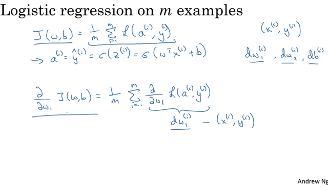</kbd>

> [!NOTE]
> Derivative of J w.r.t w, b trên toàn bộ m dataset X, y - dJ_dw, dJ_db
> Tính bằng cách lấy trung bình của tất cả
> Derivative of J w.r.t w, b trên từng dataset x(i), y(i) - dJ_dw(i), dJ_db(i)

 

<kbd>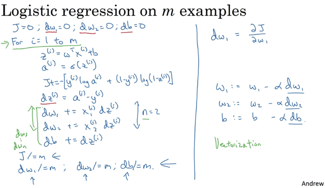</kbd>

> [!NOTE]
> Không khó hiểu gì nhưng nhắc cho để ý:
> 1. J, dw, db là 'accumulator' 
> -> Update bằng operator += trong loop nên không có superscrip (i) 
> còn dz là đv từng dataset nên có superscrip (i) - dz(i)
>
>
>
> 2. Toàn bộ ở đây chỉ là **1 iteration - để update dw, db một lần.**
>
> Dễ dàng thấy có 2 nhược điểm:
>
>
>
> Phải dùng 2 for loop, 1 cái loop over m training set, 1 cái
> loop tất cả  các feature để tính dw: Ở đây chỉ có dw1, dưa
> nhưng thực tế có n feature với n có khi cả ngàn.
>
>
>
> Solution : **Vectorization**

 

<kbd></kbd>

 

#### DERIVATION OF dL/dz

 

##### ...

 

<kbd>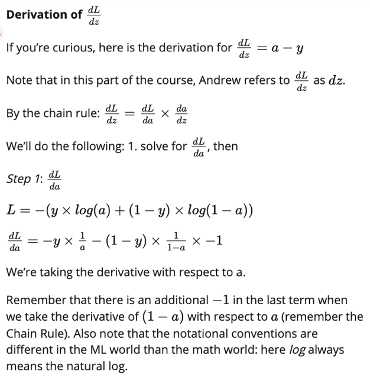</kbd>

 

<kbd></kbd>

 

<kbd>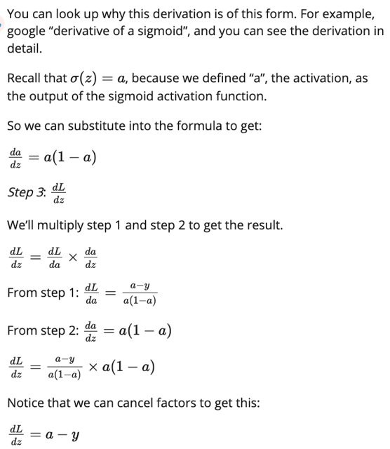</kbd>

 

<kbd>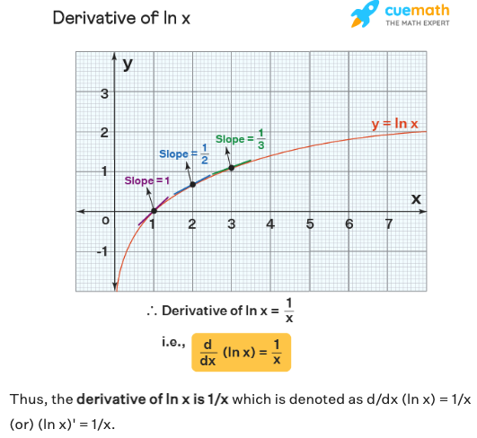</kbd>

 

<kbd>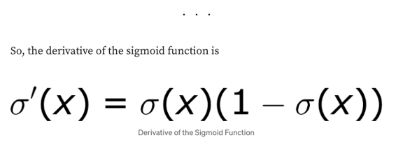</kbd>

 

### Python And Vectorization

 

#### Vectorization

 

##### 1 The course teaches strategies for structuring a machine learning
project to improve efficiency and quickly get systems working.

2 The example given is of improving a cat classification system with
90% accuracy.

3 There are many ideas to try to improve a deep learning system, but
choosing the wrong approach can waste time.

4 The course teaches strategies for analyzing a machine learning
problem to identify the most promising ideas to pursue.

5 The instructor will share lessons learned from building and
shipping deep learning products.

6 The strategies taught in the course are unique and not commonly
taught in university deep learning courses.

7 Machine learning strategy has changed with the emergence of
deep learning algorithms.

8 The course aims to make learners more effective at getting deep
learning systems to work.

 

<kbd>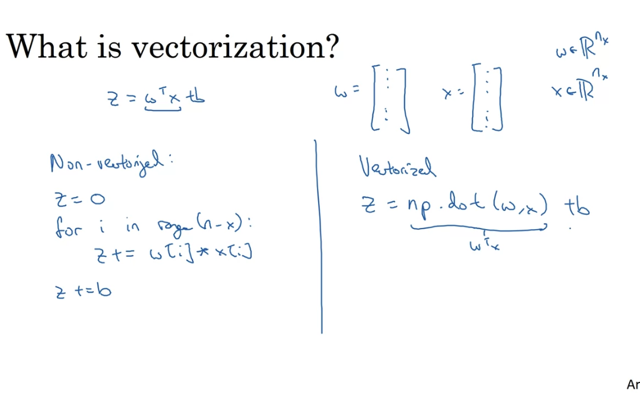</kbd>

 

<kbd>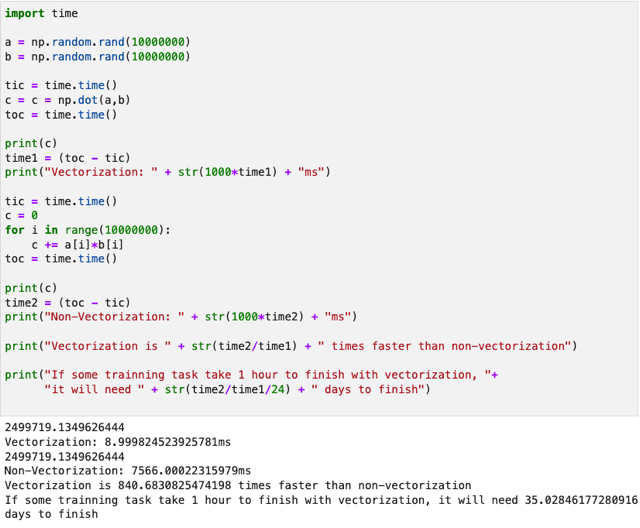</kbd>

> [!NOTE]
> 2499719.1349626444
> Vectorization: 8.999824523925781ms
> 2499719.1349626444
> Non-Vectorization: 7566.00022315979ms
> Vectorization is /**840**/.6830825474198 times faster than non-vectorization
> If some trainning task take **1 hour** to finish with vectorization, 
> it will need **35 days** to finish

 

<kbd></kbd>

> [!NOTE]
> And it turns out that both GPU and CPU have parallelization instructions. 
> They're sometimes called SIMD instructions. 
> This stands for a single instruction multiple data.
>
>
>
> But what this basically means is that, if you use built-in functions 
> such as this np. function or other functions that don't require 
> you explicitly implementing a for loop. 
> It enables Python numPy to take much better advantage of 
> parallelism to do your computations much faster.
>
>
>
> And this is true both computations on CPUs and computations on GPUs. 
> It's just that GPUs are remarkably good at these SIMD calculations but 
> CPU is actually also not too bad at that. 
> Maybe just not as good as GPUs.
>
> Rule of thumb is to avoid for - loop as much as possible

 

<kbd>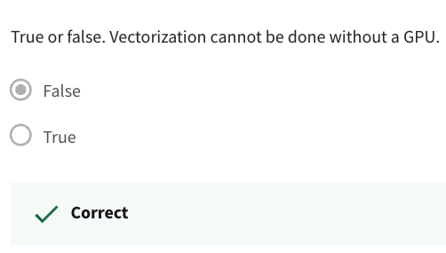</kbd>

 

#### Vectorization More Example

 

##### 1 Rule of thumb: avoid explicit for-loops whenever possible to speed up
code.

2 Example 1: Vector multiplication using matrix A and vector v -
non-vectorized implementation using two for-loops, vectorized
implementation using np dot (A,v).

3 Example 2: Exponential operation on every element of vector v -
non-vectorized implementation using a for-loop, vectorized
implementation using np.exp(v).

4 NumPy built-in functions for element-wise operations.

5 Applying vectorization to logistic regression gradient descent
implementation to eliminate one of the two for-loops.

6 Eliminating the need for a for-loop over training examples in logistic
regression with further vectorization.

7 Vectorization can significantly speed up code.

 

<kbd></kbd>

 

<kbd>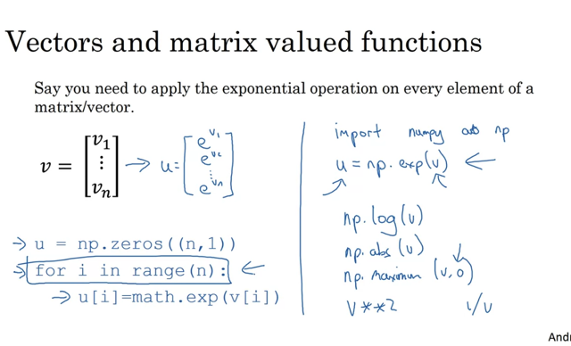</kbd>

 

<kbd>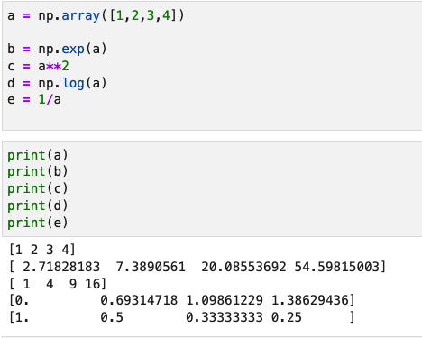</kbd>

 

#### Vectorizing Logstic Regression

 

##### Main ideas:  1 The video explains how to vectorize the implementation of
logistic regression and process the entire training set without using explicit for
loops.

2 The four propagation steps of logistic regression are explained with an
example of making a prediction on M training examples.

3 The matrix X is defined as the training inputs, stacked together in different
columns, and a matrix Z is defined to compute all the values of Z1, Z2,...,ZM in
one step.

4 The values A1, A2,...,AM are computed using a vectorized sigmoid function
that takes the matrix Z as input.

5 Stacking lowercase A results in a new variable, capital A.

6 The video concludes that instead of looping over M training examples to
compute Z and A, you can use the one-line code to compute all Z and A at the
same time.

 

<kbd>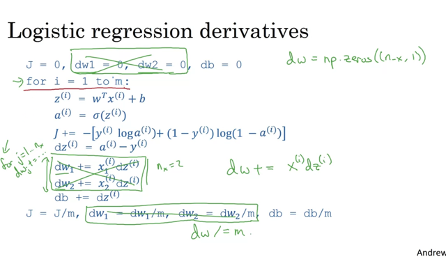</kbd>

 

<kbd></kbd>

> [!NOTE]
> X = n x m (ở khoá trước đây nó define dạng m x n)
>
>
>
> W = n x 1 -> W(T) = 1 x n 
>
>
>
> Z = W(T) . X = 1 x n . n x m = 1 x m
>
>
>
> W(T) . X + b thì b sẽ dc broadcast thành [b b ...b] = 1x m
>
>
>
> =>  W(T) . X + b = 1 x m + 1 x m = 1 x m
>
>
>
> Hàm sigmoid nhận vector được =>
> a(Z) = 1x m

 

<kbd>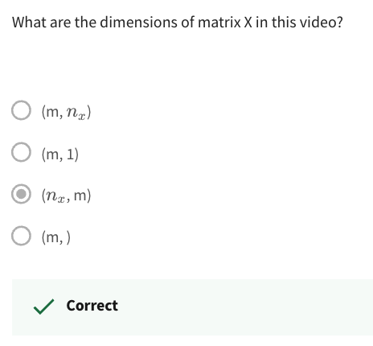</kbd>

 

#### Vectorizng Logistic Regression' S Gradient Computation

 

##### Main ideas:  1 The previous video demonstrated how vectorization could be used to compute the
predictions for an entire training set simultaneously.

2 This video shows how to use vectorization for gradient computation for all M training samples.

3 The new variable dZ is defined as dz1, dz2, ..., dzm, which is a 1 by m matrix or an m
dimensional row vector.

4 dz can be computed as A - Y where A and Y are defined as a1 through am and y1 through ym,
respectively.

5 Vectorization can be used to implement the derivative calculations efficiently.

6 The vectorized implementation of db is one over m times np.sum of dz, while the vectorized
implementation of dw is one over m times the matrix X times dz transpose.

7 The previous implementation of logistic regression was highly inefficient and required loops
over dw1, dw2, etc.

8 The new implementation uses vectorization to replace the loops, making it more efficient.

9 The updated code involves computing capital Z as w transpose X + B, then calculating a as
sigmoid of capital Z, dz as A - Y, dw as 1/m x dz transpose, and db as 1/m times np.sum of dz.

10 The vectorized implementation allows for the computation of updates to the parameters
without a for loop over the training set.

 

<kbd></kbd>

> [!NOTE]
> QUAN TRỌNG

 

<kbd></kbd>

> [!NOTE]
> Now, I know I said that we should get rid of explicit for loops whenever
> you can but if you want to implement multiple iterations as a gradient
>  descent then /**you still need a for loop over the number of
>  iterations**/. So, if you want to have a thousand iterations of gradient
> descent, you might still need a for loop over the iteration
> number. /**There is an outermost for loop like that then I don't think there
> is any way to get rid of that for loop**/
>
>
>
>
> Còn cái for loop iteration để update w, b thì không thể có cách nào
> bỏ được vì cơ chế của Gradient Descent phải vậy

 

<kbd></kbd>

 

#### Broadcasting In Python

 

##### 1 Broadcasting is a technique to make Python code run faster.

2 Broadcasting allows performing operations between arrays with different shapes.

3 In the video, broadcasting is explained using an example of calculating the
percentage of calories from carbs, proteins, and fats in 100 grams of four different
foods.

4 Broadcasting can be used to sum down columns of a matrix and divide each
column by their corresponding sum without using an explicit for-loop.

5 The video demonstrates how to sum vertically using axis 0, which sums down the
columns, and how to reshape a matrix.

6 The reshape command is a constant time operation and can be used to ensure
that matrices have the correct size.

7 The video explains how broadcasting works, and provides examples of adding a 4
by 1 vector to a number and multiplying a 4 by 3 matrix by a 1 by 3 matrix.

 

<kbd>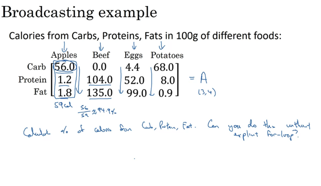</kbd>

 

<kbd></kbd>

> [!NOTE]
> A.sum(axis = 0) => Sum vertically

 

<kbd>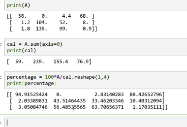</kbd>

 

<kbd></kbd>

> [!NOTE]
> 'Cal' vốn dĩ đã là 1x4 rồi nhưng ổng
> nói thêm lệnh reshape cho  chắc ăn
> không sao cả.

 

<kbd>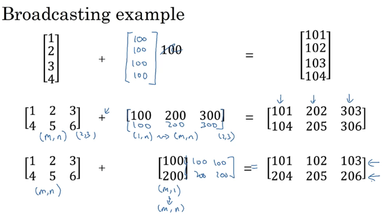</kbd>

 

<kbd></kbd>

> [!NOTE]
> Trong Octave/Matlab bsxfun làm việc tương tự

 

#### A Note On Python/ Numpy Vectors

 

##### 1 Python numpy's broadcasting operations and flexibility are both strengths
and weaknesses of the programming language.

2 Broadcasting and flexibility can cause subtle and strange bugs in the
code if not used correctly.

3 The rank 1 array in Python numpy is a funny data structure that behaves
inconsistently as either a row vector or a column vector, making it
nonintuitive.

4 It is recommended to use (n, 1) or (1, n) arrays to ensure consistent
behavior.

5 Assertion statements can be used to check the dimensions of arrays and
ensure consistent behavior.

6 Reshaping rank 1 arrays can also ensure consistent behavior.

 

<kbd>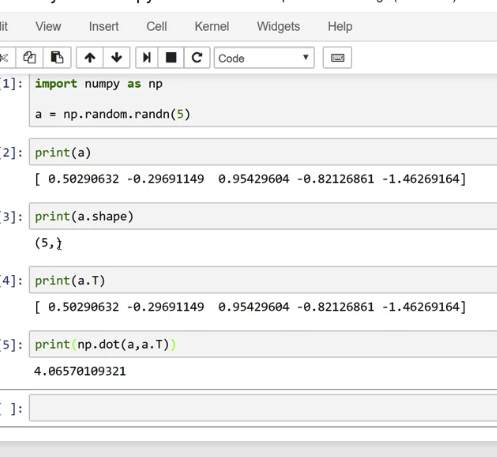</kbd>

> [!NOTE]
> Rank 1 array - 1-Dimensional array behave rất kì cục (ex.
> a.T cũng y nguyên), ko phải row vector cũng ko phải
> column vector.

 

<kbd></kbd>

> [!NOTE]
> Nên luôn luôn defin Rank 2 array

 

<kbd>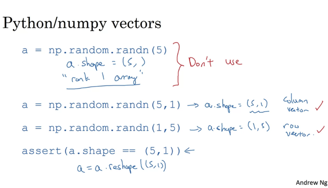</kbd>

> [!NOTE]
> 1. Đừng dùng Rank 1 array, dùng Rank 2
>
>
>
> 2.Đừng ngại reshape để chắc chắn mình đang có shape 
> mong muốn
>
>
>
> 3.Dùng Assert để báo lỗi khi shape ko đúng

 

<kbd></kbd>

 

#### Quick Tour Notebook

 

##### ...

 

<kbd></kbd>

> [!NOTE]
> Có issue gì thì Restart Kernel

 

#### Logistic Regression Cost Function

 

##### 1 In this optional video, the speaker justifies the use of the cost function for logistic
regression that was introduced in an earlier video.

2 In logistic regression, the prediction y hat is the sigmoid of w transpose x + b, where
sigmoid is a familiar function. The goal is to interpret y hat as the probability that y=1
given x.

3 The chance that y=1 given x is y hat, and the chance that y=0 given x is 1- y hat.

4 These two equations can be summarized into a single equation: (y hat ^ y )(1- y hat)^(1-y) for
y=0 or 1. This equation is a correct definition for p(y|x).

5 Because the log function is a strictly monotonically increasing function, maximizing
log p(y|x) gives a similar result as optimizing p(y|x).

6 The loss function for a single example is -[y log y hat + (1-y) log (1- y hat)].

7 The cost function for the entire training set is the negative sum of the loss function
over all m examples. This is derived using the principle of maximum likelihood
estimation, which means choosing the parameters that maximize the probability of the
observations in the training set.

 

<kbd>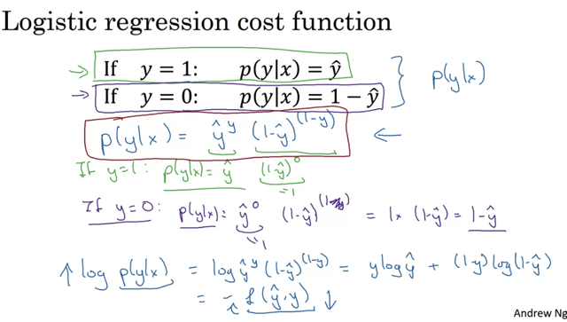</kbd>

> [!NOTE]
> Notation: IID = I**dentically Independently Distributed**
>
>
>
> IID là viết tắt của "Independent and Identically Distributed". Nó có 
> nghĩa là một tập hợp các biến ngẫu nhiên độc lập với nhau và có 
> phân bố (tức các xác suất xuất hiện của các giá trị của biến) giống 
> nhau. Điều này có nghĩa là mỗi biến ngẫu nhiên trong tập hợp này 
> không bị ảnh hưởng bởi biến khác và tất cả chúng có cùng một 
> phân bố xác suất.
>
> "Now, finally, because the log function is a strictly monotonically 
> increasing function, your maximizing log p(y|x) should give you 
> a similar result as optimizing p(y|x)."
>
>
>
> ChatGPT: The statement is referring to the use of logarithmic functions in 
> machine learning and how they can affect optimization. A log function
>  is a mathematical function that takes a positive real number as input 
> and returns its logarithm to the base of a specified number. In this 
> context, \_/**"strictly monotonically increasing"\_ means that as the input to
>  the log function increases, its output also increases and does so in a 
> consistent, one-to-one relationship.**/
>
>
>
> Therefore, maximizing the logarithm of the conditional probability 
> p(y|x) (the probability of observing a target variable y given a feature 
> x) should give similar results as optimizing p(y|x) directly. /**This is 
> because the log function preserves the ordering of the original values
>  and allows for optimization in log-space, which can often be 
> computationally easier and faster.**/

 

<kbd>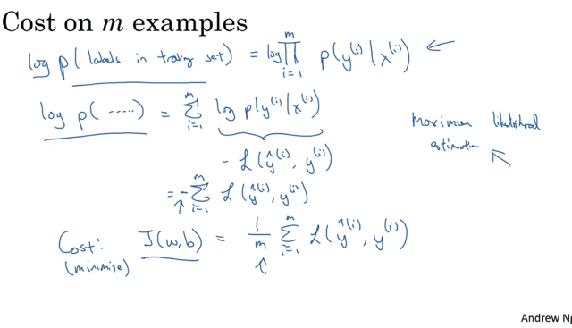</kbd>

> [!NOTE]
> **Maximum likelihood estimation** is like when you are trying to guess
>  what the best answer is to a question.
> Imagine you have a big jar of candy, and you have to guess how many
>  candies are inside.
> You might start by making a guess, like 50. Then, your friend would tell 
> you if your guess is too high or too low.
> You would keep adjusting your guess until you get as close as 
> possible to the correct answer.
> In the same way, maximum likelihood estimation is a way for a 
> computer to make its best guess about something, by using all the 
> information it has, and constantly adjusting its guess until it gets as 
> close as possible to the correct answer.

 

### Quiz: Neural Network Basic

 

<kbd></kbd>

 

<kbd></kbd>

 

<kbd>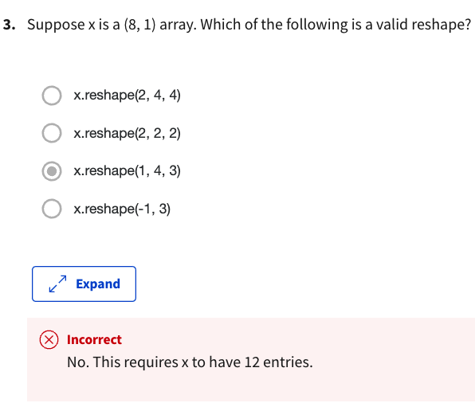</kbd>

 

<kbd>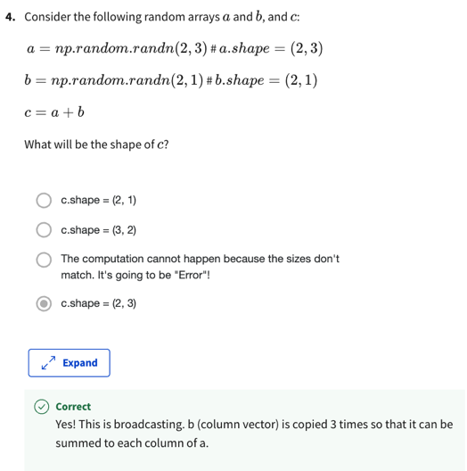</kbd>

 

<kbd>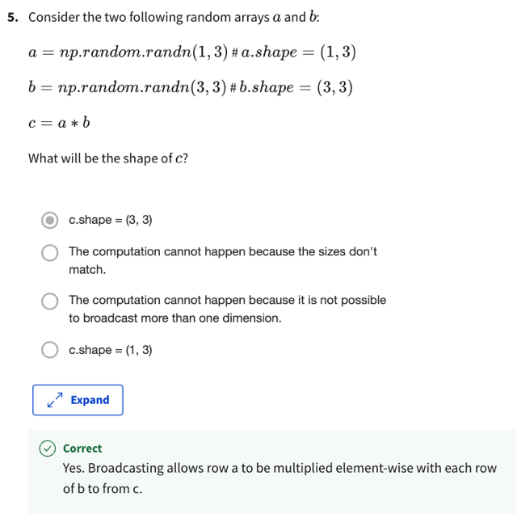</kbd>

 

<kbd></kbd>

 

<kbd>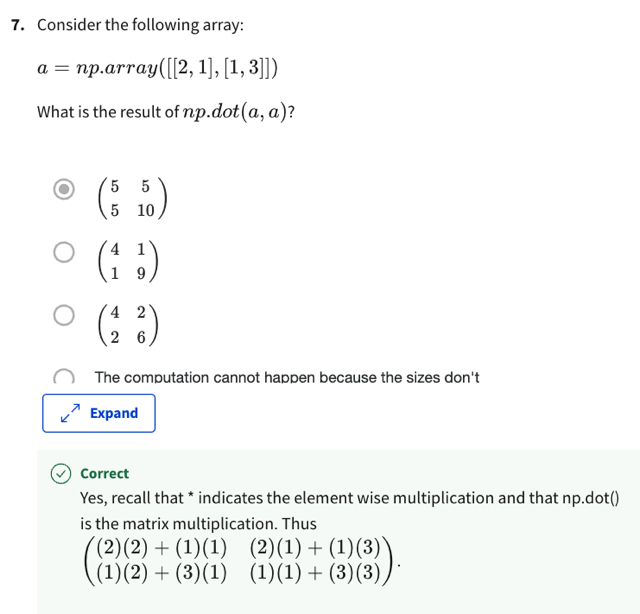</kbd>

 

<kbd>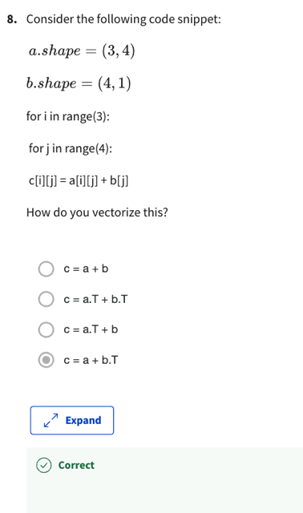</kbd>

 

<kbd></kbd>

 

<kbd></kbd>

 

### Programming Assignment

 

#### Some Notes

 

<kbd></kbd>

 

<kbd></kbd>

 

<kbd></kbd>

 

<kbd></kbd>

 

<kbd></kbd>

 

<kbd>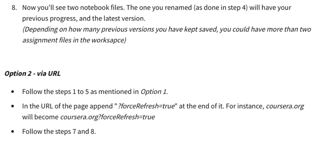</kbd>

 

#### Python Basic With Numpy

 

<kbd>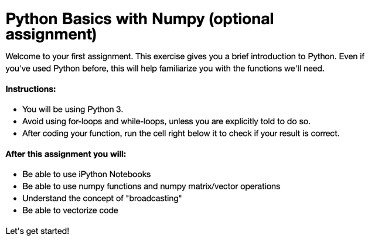</kbd>

 

<kbd>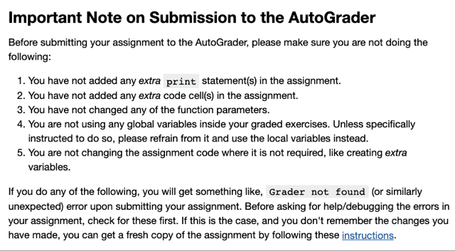</kbd>

 

<kbd></kbd>

 

<kbd>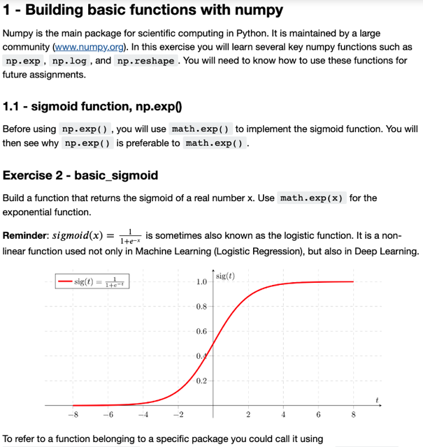</kbd>

 

<kbd></kbd>

 

<kbd></kbd>

 

<kbd></kbd>

 

<kbd></kbd>

 

<kbd></kbd>

<kbd></kbd>

 

<kbd></kbd>

 

<kbd></kbd>

 

<kbd></kbd>

 

<kbd></kbd>

 

<kbd></kbd>

> [!NOTE]
> "This is a 3 by 3 by 2 array, typically images will be (num_px_x, num_px_y,3)
> where 3 represents the RGB values"
>
>
>
> Đây là một ma trận 3 x 3 x 2, thông thường hình ảnh sẽ có dạng (num_px_x,
> num_px_y, 3) trong đó 3 biểu diễn cho các giá trị RGB.  RGB là một mô hình
> màu sắc mà sử dụng 3 giá trị rời rạc để biểu  diễn một màu sắc cụ thể.
> num_px_x và num_px_y là chiều rộng  và chiều cao của hình ảnh.

 

<kbd></kbd>

> [!NOTE]
> Cái này là 2 colors channels image

 

<kbd></kbd>

 

<kbd></kbd>

 

<kbd></kbd>

 

<kbd></kbd>

 

<kbd></kbd>

 

<kbd></kbd>

 

<kbd></kbd>

 

<kbd></kbd>

 

<kbd></kbd>

 

<kbd></kbd>

<kbd></kbd>

 

<kbd></kbd>

 

<kbd></kbd>

 

<kbd></kbd>

 

<kbd></kbd>

 

<kbd></kbd>

 

<kbd></kbd>

 

<kbd></kbd>

 

<kbd></kbd>

> [!NOTE]
> * or np.multiply() = . * in Matlab

 

<kbd></kbd>

 

<kbd></kbd>

> [!NOTE]
> Nếu để keepdims = True thì bị lỗi tại Loss expect a float.

 

<kbd></kbd>

 

<kbd></kbd>

 

<kbd></kbd>

 

<kbd></kbd>

> [!NOTE]
> So sánh function .dot() khi input là vector (1D array) và matrix (2D array)

 

##### Grade

 

<kbd></kbd>

 

#### Logistic Regression With A Neural Network Mindset

> [!NOTE]
> Build a logistic regression classifier to recognize cats.  This
> assignment will step you through how to do this with a
> Neural Network mindset, and will also hone your intuitions
> about deep learning.

 

<kbd></kbd>

 

<kbd></kbd>

 

<kbd></kbd>

 

<kbd></kbd>

 

- **mpl.imshow()**

 

<kbd></kbd>

 

<kbd></kbd>

 

<kbd></kbd>

 

<kbd></kbd>

 

<kbd></kbd>

> [!NOTE]
> Hàm reshape cứ nhớ là nếu cho cái dimension = -1 thì đại khái
> là bảo Python tự tính.

 

<kbd></kbd>

 

<kbd></kbd>

> [!NOTE]
> Trong ví dụ dưới u.shape là 2x3x2 nên khi 
> reshape(u.shape[0], -1) hay reshape(u.shape[2], -1) thì cũng 
> như nhau vì đều là reshape(2, -1). 
> Có nghĩa là ta bảo nó làm sao có 2 row, còn lại số column 
> bao nhiêu thì tự tính.
>
>
>
> Vả nếu nó tính ko ra được (đại khái là nó không chia element 
> đều ra được thì nó sẽ báo lỗi)
> Ví dụ có 12 unit (2x3x2) mà reshape(5,-1) thì nó sẽ lỗi vì 12 cái 
> mà muốn sắp thành 5 hàng thì ko chẵn.
> Nhưng reshape(6,-1) thì ok => 6x2

 

<kbd></kbd>

 

<kbd></kbd>

 

<kbd></kbd>

 

<kbd></kbd>

 

<kbd></kbd>

 

<kbd></kbd>

<kbd></kbd>

> [!NOTE]
> Vì hàm np.exp() accept vector or matrix -> dùng nó
> trong hàm sigmoid cũng sẽ accept vector . matrix

 

<kbd></kbd>

> [!NOTE]
> Nếu define b = 0 -> b sẽ là int

 

<kbd></kbd>

 

<kbd></kbd>

 

<kbd></kbd>

> [!NOTE]
> Chỉ có hơi rắc rối chưa quen dùng hàm **np.dot
>
>
>
> Và khác với Khoá ML cũ, X define dạng n x m 
> (chứ không phải m x n) nên lấy m = X.shape[1]**

 

<kbd></kbd>

 

<kbd></kbd>

 

<kbd></kbd>

 

<kbd></kbd>

 

- **hàm np.dot()**

 

<kbd></kbd>

> [!NOTE]
> np.dot()
>
>
>
> 2 Matrix thì tuân thủ quy tắc size matrix

 

<kbd></kbd>

> [!NOTE]
> (2x3) không thể .dot với (2x3)

 

<kbd></kbd>

> [!NOTE]
> np.dot()
>
>
>
> 2 1D array thì + lại.

 

<kbd></kbd>

> [!NOTE]
> np.dot()
>
>
>
> 1D array với Matrix cột thì được, coi matrix cột như 1D array

 

<kbd></kbd>

 

<kbd></kbd>

 

<kbd></kbd>

 

<kbd></kbd>

> [!NOTE]
> **CHÚ Ý BƯỚC NÀY** w = w.reshape(X.shape[0], 1) **LÀ ĐỂ CHẮC CHẮN
> W CÓ SHAPE MONG MUỐN
>
>
>
> Trong lecture ổng có nhấn mạnh đừng ngại reshape để đảm bảo shape
> đúng**

 

<kbd></kbd>

 

<kbd></kbd>

 

<kbd></kbd>

 

<kbd></kbd>

 

<kbd></kbd>

 

<kbd></kbd>

> [!NOTE]
> **optimize(...X_train, Y_train,...) mới đúng, chứ với X, Y là sai**

 

<kbd></kbd>

> [!NOTE]
> **Comment**: Training accuracy is close to 100%. 
> This is a **good** sanity check: your model is working and has high 
> enough capacity to fit the training data. 
> Test accuracy is **70%. It is actually not bad for this simple model,** 
> given the small dataset we used and that logistic regression is a 
> linear classifier. But no worries, you'll build an even better classifier 
> next week!
> Also, you see that the model is **clearly overfitting** the training data. 
> Later in this specialization you will learn how to reduce overfitting, 
> for example by using **regularization**.

 

<kbd></kbd>

 

<kbd></kbd>

 

<kbd></kbd>

> [!NOTE]
> **Thử với các learning rate khác nhau**

 

<kbd></kbd>

<kbd></kbd>

 

<kbd></kbd>

 

<kbd></kbd>

 

## C1w3_shalow Neural Networks

 

### Neural Networks Overview

 

#### 1 Overview of the week's topic: The speaker provides an introduction to the topic of
implementing a neural network.

2 Recap of logistic regression: The speaker briefly recaps the logistic regression model, which
involves computing a z-value based on input features x and parameters w and b, then using a
sigmoid function to calculate the output value a or y-hat, which is used to compute the loss
function L.

3 Neural network structure: The speaker introduces the structure of a neural network, which
involves stacking together many sigmoid units. Each node in the network involves two
calculations: a z-like calculation and an a-like calculation. The network is composed of layers,
with superscript square brackets used to refer to quantities associated with each layer.

4 Calculation of z and a: The speaker explains that the network starts by computing z1 based on
input features x, then computes a1 as the sigmoid of z1. The process is repeated to compute z2
and a2, which is the final output of the neural network and is also referred to as y-hat.

5 Backward calculation: The speaker notes that the network requires a backward calculation in
order to compute derivatives and make updates to the parameters w and b. This calculation
involves computing da2, dz2, dw2, and db2 in a right-to-left manner.

6 Key takeaway: The speaker emphasizes that a neural network is essentially an extension of
logistic regression, where the z and a calculations are repeated multiple times. The notation and
details can be complex, but they will be further explained in upcoming videos.

 

<kbd></kbd>

 

### Neural Network Representation

 

#### 1 Explanation of a two-layer neural network with multiple hidden units

2 The neural network computes the output in the same way as logistic
regression but repeatedly

3 Each node in the hidden layer of the neural network performs two
steps of computation

4 The first step is the computation of z = w transpose x + b

5 The second step is the computation of a = sigmoid(z)

6 The notation used in the computation of a and z

7 Explanation of the first and second hidden units in the neural
network

8 The process of vectorizing the computation for efficiency

9 The matrix of weight vectors and input features multiplied to get z

10 Adding the bias vector to z

11 The outcome of the computation corresponds to the values of z for
each hidden unit.

12 The vector is called the vector of activations.

 

<kbd></kbd>

 

### Computing A Neural Network's Output

 

#### 1 The video provides justification for the vectorized implementation for
propagation through a neural network by considering the forward propagation
calculation for a few examples.

2 The matrix X is formed by stacking together all of the training examples, and
when this matrix is multiplied by W, the resulting matrix contains the
corresponding outputs stacked up in columns.

3 The video recapitulates the steps for implementing forward propagation for
one training example at a time and then shows how to vectorize it across all
training examples at the same time.

4 The video also highlights the symmetry in the equations for the different
layers of the neural network and how deeper neural networks repeat the same
computation even more times.

5 Finally, the video notes that sigmoid functions are not always the best choice
for neural networks and hints at the topic of the next video, which will explore
using different activation functions.

 

<kbd></kbd>

 

<kbd></kbd>

 

<kbd></kbd>

 

### Vectorizing Across Multiple

 

#### 1 To compute the prediction on a neural network for multiple training
examples, you need to vectorize the computation process.

2 To do this, you need to repeat the process for each training example,
using the activation function notation a\\_2\\_.

3 To get rid of the repetition, you can stack the training examples in
columns to create a matrix X.

4 You can then compute the value of the different variables, Z[1], A[1],
Z[2], and A[2], using the matrix X, and the weights W and biases b.

5 By stacking the vectors in columns for Z[1], A[1], Z[2], and A[2], you
can create the matrices Z[1], A[1], Z[2], and A[2], respectively.

6 Vectorizing the computation process allows you to compute the
predictions of all your training examples at the same time.

 

<kbd></kbd>

 

<kbd></kbd>

 

### Explanation For Vectorized Implementation

 

#### Main ideas:  1 The previous video discussed the vectorized implementation of neural
network propagation through training examples horizontally stacked in the matrix x.

2 The justification for the correctness of the equations was explained by going
through part of the forward propagation calculation for a few examples.

3 The training set X is formed by vertically stacking the vectors x1, x2, etc. and
multiplying it by w gives the corresponding z values, which are also vertically stacked
in matrix capital Z1.

4 Python broadcasting allows adding the bias term b to the values while maintaining
the correct values.

5 Similar reasoning can be used to show that all four steps of the forward
propagation calculation work.

6 Recap of the four steps of forward propagation and how they can be vectorized
across multiple training examples using stacked matrices.

7 The symmetry between the equations for z1 and a1 and z2 and a2 shows that the
different layers of a neural network are doing the same computation.

8 Next, the video will discuss why the sigmoid function is not the best choice for
neural networks.

 

<kbd></kbd>

 

<kbd></kbd>

> [!NOTE]
> **ĐẠI KHÁI LÀ CHỈ CÓ VẬY THÔI, MORE DEEPLY N.N CŨNG CHỈ 
> LÀ LẶP LẠI NHIỀU LẦN NHỮNG PHÉP TÍNH KIỂU NÀY.**
>
>
>
> So this kind of shows that the different layers of a neural network
> are roughly doing the same thing or just doing the same
> computation  over and over. And here we have two-layer neural
> network where we  go to a much deeper neural network in next
> week's videos. You see  that /**even deeper neural networks are
> basically taking these two steps and just doing them even more
> times** /than you're seeing here

 

### Activation Functions

 

#### Main ideas:  1 Choice of activation function is an important decision when
building a neural network.

2 The sigmoid function is commonly used but there are other options that can
work better.

3 The hyperbolic tangent (tan h) function is often a better choice for hidden
layers.

4 The mean of activations using tan h is closer to zero, making learning easier.

5 The sigmoid function is useful for binary classification output layers.

6 The rectified linear unit (ReLU) and Leaky ReLU are popular choices for
hidden layers.

7 The ReLU and Leaky ReLU have advantages over sigmoid and tan h
functions.

8 Choosing an activation function depends on the specific task and the
individual preferences of the user.

 

<kbd></kbd>

> [!NOTE]
> - Hàm **tanh** tốt hơn sigmoid vì nó đại khái là 'center' hơn, kiểu 
> như quay quay 0 thay vì 0.5 như sigmoid giúp g.d chạy nhanh 
> hơn kiểu kiểu như tại sao ',mean normalization' giúp g.d chạy 
> nhanh hơn vậy.
>
>
>
> - Do đó hàm **sigmoid** ít dùng nữa trừ việc dùng cho output là a 
> binary classification vì tự nhiên sigmoid sẽ phù hợp hơn khi 
> xuất ra giá trị P trong khoảng (0,1)
>
>
>
> - Hidden layer: **Relu, Leaky Relu** or Tanh trong đó:
> **Cứ default Relu, còn thích cứ thử Leaky Relu** 
>
>
>
> - Tại sao Relu tốt hơn thì:
> Đại khái là hàm Relu hay Leaky Relu có **'derivative' ít bị bằng
> 0** hơn (Nhìn vào đồ thị hàm sigmoid và Tanh có 2 đầu đi 
> ngang - hoặc gần ngang 
> -> Đạo hàm bằng 0) 
> -> Làm chậm quá trình gradient descent

 

<kbd></kbd>

 

<kbd></kbd>

> [!NOTE]
> Đại khái là khi làm thực tế có nhiều lúc ko biết chọn bao
> nhiêu layer, bao nhiêu unit, dùng activation function, initializa
> như thế nào ...thì nếu thấy không  chắc biết dùng cái nào
> thay vì cái nào thì **cứ thử hết và dùng CV set để so sánh kết
> quả**. Khi đó mình sẽ có 1 cảm giác / cảm nhận về 'evolution'
> của algorithm thay vì cứ nhắm mắt nghe theo lời khuyên nên
> dùng hàm Relu hay gì gì vì có thể nó không đúng với trường
> hợp cụ thể của mình

 

### Why Do You Need Non-linear Activation Functions

 

#### 1 A neural network needs a non-linear activation function to compute interesting functions.

2 The linear activation function, which just outputs whatever was input, is not useful because
the neural network outputs a linear function of the input.

3 Even in deep neural networks with many layers, if linear activation functions are used, the
network is just computing a linear activation function and is therefore not computing more
interesting functions.

4 One place where a linear activation function might be used is in the output layer for
regression problems, where the output y-hat is a real number going anywhere from minus
infinity to plus infinity.

5 However, in this case, the hidden units should not use activation functions or should use
non-linear activation functions like ReLU or tanh.

6 Using a linear activation function in the hidden layer is extremely rare except for some
special circumstances relating to compression.

7 The non-linear activation function is a critical part of neural networks because it allows for
the computation of more interesting functions.

8 In the next video, the slope or the derivatives of individual activation functions will be
discussed to set up for the discussion on gradient descent.

 

<kbd></kbd>

> [!NOTE]
> 1. Linear apply to linear = linear, nên dùng cho hidden layer thì cũng 
> coi như không có hidden layer = không 'learn' thêm được
> Interesting feature nào.
>
>
>
> Trừ những trường hợp rất đặc biệt (rất hiếm) chứ ko dùng linear
> Function ở hidden layer
>
>
>
>  2. Trừ trường hợp output layer là regression (ví dụ predict
> House price) thì dùng linear function thôi.

 

### Derivatives Of Activation Functions

 

#### Main ideas:  1 Backpropagation in neural networks requires
computing the slope or derivative of the activation functions.

2 Sigmoid activation function has a derivative formula of g(z) * (1 -
g(z)).

3 The Tanh activation function has a derivative formula of 1 - a^2.

4 ReLU activation function has a derivative of 0 for z < 0 and 1 for z >
0.

5 Leaky ReLU activation function has a small positive slope for z < 0
and a slope of 1 for z > 0.

 

<kbd></kbd>

 

<kbd></kbd>

> [!NOTE]
> But you can think of it as that, **the chance of z being exactly 0.
> 000000 Is so small** that it almost doesn't matter where you  set
> the derivative to be equal to when z is equal to 0
>
> Finally, here's how you compute the derivatives for the ReLU and
> Leaky ReLU activation functions. For the value g of z is equal to
> max of (0,z), so the derivative is equal to, turns out to be 0 , if z is
> less than 0 and 1 if z is greater than 0. **It's actually undefined,
> technically undefined if z is equal to exactly 0.**

 

<kbd></kbd>

> [!NOTE]
> Giải thích tại sao derivative của relu lại undefine tại  z = 0

 

<kbd></kbd>

 

### Gradient Descent For Neural Networks

 

#### 1 Introduction to implementing gradient descent for neural network with
one hidden layer.

2 Explanation of the parameters and dimensions for a neural network
with a single hidden layer.

3 Cost function for binary classification and how to train the parameters
using gradient descent.

4 Initialization of parameters and the importance of random initialization.

5 Derivatives of the cost function with respect to the parameters W1,
B1, W2, and B2.

6 Forward propagation for computation of neural network outputs.

7 Back propagation for computing derivatives and updating the
parameters using gradient descent.

8 Explanation of Python NumPy commands used to compute the
derivatives.

 

<kbd></kbd>

 

<kbd></kbd>

 

### Backpropagation Intuition

 

#### 1 The video explains the intuition for deriving the equations for backpropagation
using a computation graph.

2 The forward pass in logistic regression involves computing z, A, and A loss,
while the backward pass involves computing da, dz, dw, and db.

3 The loss function for logistic regression is L(a, y) = -y log A - (1 - y) log(1 - A).

4 Da for logistic regression is equal to -y/A + (1 - y)/(1 - A).

5 Dz for logistic regression is equal to A - y, which is computed using the chain
rule of calculus.

6 Dw for logistic regression is equal to dz times x, while db is equal to dz.

7 In a two-layer neural network, backpropagation computes da2, dz2, dw2, and
db2, and then computes da1, dz1, dw1, and db1.

8 Da1 and dz1 are often collapsed into one step in practice.

9 Dz1 is computed as w2 transpose times dz2 times an element-wise product of
g1 prime of z1.

10 The computation for dz2 is the same as for logistic regression, dz2 = a2 - y.

11 Dw2 is equal to dz2 times a1 transpose, and db2 is equal to dz2.

12 There is an extra transpose in dw2 compared to dw for logistic regression
because a1 is a row vector while w2 is a column vector.

 

<kbd></kbd>

 

<kbd></kbd>

> [!NOTE]
> One tip when implementing backprop, if you just make sure that the
> dimensions of your matrices match up, if you think through, what are the
> dimensions of your various matrices including w^1, w^2, z^1, z^2, a^1, a^2,
> and so on, and **just make sure that the dimensions of these matrix
> operations may match up**, sometimes that will **already eliminate quite a lot
> of bugs** in backprop

 

<kbd></kbd>

 

<kbd></kbd>

> [!NOTE]
> Chỗ này nói trông giống của Logistic regression chỉ
> khác thêm cái  'transpose' là do W quan hệ với w theo
> kiểu W là matrix mà các  hàng là w.T .
>
> This step is quite similar for logistic regression, where we
> had that  dw was equal to dz times x, except that now, a^1
> plays the role of  x, and there's an extra transpose there.
> Because the relationship  between the capital matrix
> W and our individual parameters w  was, there's a
> transpose there, because w is equal to a row vector.In the
> case of logistic regression with the single output, dw^2 is
> like  that, whereas w here was a column vector. That's why
> there's an extra  transpose for a^1, whereas we didn't for x
> here for logistic regression.

 

<kbd></kbd>

 

### Random Initialization

 

#### 1 When changing the neural network, it is important to initialize the weights
randomly.

2 For logistic regression, initializing the weights to zero was okay, but it won't
work for neural networks.

3 Initializing w to all zeros and then applying gradient descent creates
symmetry between the hidden units.

4 Symmetry means that both hidden units are computing the same function
and will remain symmetric after every iteration.

5 The solution is to initialize the parameters randomly.

6 You can use np.random.randn to generate a Gaussian random variable for
w1, multiply it by a very small number, such as 0.01, and initialize b to zero.

7 The same applies to w2 and b2.

8 Initializing weights to very large values causes the activation function to be
saturated, which slows down learning.

9 Multiplying by a small number, such as 0.01, is reasonable to avoid the
saturation of the activation function.

10 Same goes for w2.

 

<kbd></kbd>

> [!NOTE]
> Đại khái là nếu initialize params  = 0 hết thì gradient descent thì cả network
> các hidden layer vô nghĩa

 

<kbd></kbd>

> [!NOTE]
> Giải pháp là small random number.
>
>
>
> Tại sao không phải large random number, vì khi đó đại khái là
> Ta sẽ bắt đầu ở đoạn cuối hay đầu của đồ thị hàm sigmoid, tanh
> nơi mà đường đồ thị nằm ngang - > Derivative = 0 => 
> dẫn đến là Gradient descent rất chậm.

 

<kbd></kbd>

 

### Quiz: Shallow Neural Network

 

<kbd></kbd>

 

<kbd></kbd>

 

<kbd></kbd>

 

<kbd></kbd>

 

<kbd></kbd>

 

<kbd></kbd>

 

<kbd></kbd>

 

<kbd></kbd>

 

<kbd></kbd>

 

<kbd></kbd>

 

<kbd></kbd>

 

<kbd></kbd>

 

### Programming Assignment: Planar Data
classification With One Hidden Layer

 

#### 1. + 2.

 

<kbd></kbd>

 

<kbd></kbd>

 

<kbd></kbd>

 

#### 3 - Simple Logistic Regression

 

<kbd></kbd>

 

<kbd></kbd>

 

#### 4.2 - Initialize the model's parameters

 

#### 4 - Neural Network model¶

 

<kbd></kbd>

 

<kbd></kbd>

 

#### 4.1 - Defining the neural network structure

 

<kbd></kbd>

 

<kbd></kbd>

 

#### 4.2 - Initialize the model's parameters

 

<kbd></kbd>

 

<kbd></kbd>

 

<kbd></kbd>

 

#### 4.3 - The loop

 

<kbd></kbd>

 

<kbd></kbd>

 

<kbd></kbd>

 

#### 4.4 - Compute the Cost

 

<kbd></kbd>

 

<kbd></kbd>

 

<kbd></kbd>

 

#### 4.5 - Implement Backpropagation

 

<kbd></kbd>

 

<kbd></kbd>

<kbd></kbd>

 

<kbd></kbd>

 

#### 4.6 - Update Parameters

 

<kbd></kbd>

 

<kbd></kbd>

<kbd></kbd>

 

<kbd></kbd>

 

#### 4.7 - Integration

 

<kbd></kbd>

 

<kbd></kbd>

 

<kbd></kbd>

 

#### 5 - Test the Model

 

##### 5.1 - Predict

 

<kbd></kbd>

 

<kbd></kbd>

 

##### 5.2 - Test the Model on the Planar Dataset

 

<kbd></kbd>

 

<kbd></kbd>

 

<kbd></kbd>

 

#### 6 - Tuning hidden layer size

 

<kbd></kbd>

<kbd></kbd>

 

#### 7- Performance on other datasets

 

<kbd></kbd>

 

#### Thực Hành F.p & B.p

 

##### L.g

 

<kbd></kbd>

 

<kbd></kbd>

 

##### S.n.n

 

<kbd></kbd>

 

<kbd></kbd>

 

##### N.n

 

- **Foward Prop**

 

<kbd></kbd>

 

<kbd></kbd>

 

<kbd></kbd>

 

<kbd></kbd>

 

<kbd></kbd>

 

- **Backward Prop**

 

<kbd></kbd>

 

<kbd></kbd>

 

<kbd></kbd>

 

<kbd></kbd>

 

<kbd></kbd>

 

### Ian Goodfellow

 

<kbd></kbd>

> [!NOTE]
> I think one thing that I got from your courses at Stanford is that linear
> algebra and probability are very important, that people get excited about
> the machine learning algorithms, but if you want to be a really excellent
> practitioner, you've got to master the basic math that underlies the whole
> approach in the first place.
>
> I think a lot of people that want to get into AI start thinking that they absolutely need
> to get a Ph.D. or some other kind of credential like that. I don't think that's actually a
> requirement anymore. One way that you could get a lot of attention is to write good
> code and put it on GitHub. If you have an interesting project that solves a problem
> that someone working at the top level wanted to solve, once they find your GitHub
> repository, they'll come find you and ask you to come work there. A lot of the people
> that I've hired or recruited at OpenAI last year or at Google this year, I first became
> interested in working with them because of something that I saw that they released
> in an open-source forum on the Internet
>
> So read your book, practice the materials and post on GitHub and
> maybe on Archive. I think if you learned by reading the book, it's
> really important to also work on a project at the same time, to either
> choose some way of applying machine learning to an area that you
> are already interested in
>
> ML Security
>
> Like if you're a field biologist and you want to get into deep learning,
> maybe you could use it to identify birds, or if you don't have an idea for
> how you'd like to use machine learning in your own life, you could pick
> something like making a Street View house numbers classifier, where all
> the data sets are set up to make it very straightforward for you. And that
> way, you get to exercise all of the basic skills while you read the book or
> while you watch Coursera videos that explain the concepts to you

 

## C1w4_deep Neural Network

 

### Deep L-layer Neural Network

 

#### 1 By the fourth week of the course, students have learned about forward propagation and
back propagation in the context of a neural network, as well as logistic regression,
vectorization, and the importance of random weight initialization.

2 With this foundational knowledge, the focus of the fourth week is on putting these ideas
together to implement a deep neural network.

3 A deep neural network is a neural network with multiple hidden layers, as opposed to a
shallow model like logistic regression, which is a one-layer neural network.  4 The number
of hidden layers in a neural network is a matter of degree and can vary depending on the
problem at hand. While there is no easy way to predict the ideal depth for a network, it is
common to try different values and evaluate their performance on a development set or
across validation data.

5 Notation is used to describe the architecture and activations of deep neural networks.
Specifically, L denotes the number of layers, and N superscript [l] denotes the number of
nodes in layer l. a[l] denotes the activations in layer l, and W[l] and b[l] are used to
compute the value of z[l] in layer l.

6 x represents the input features, as well as the activations of layer zero, while a[L]
represents the predicted output or y-hat of the neural network.

7 The course website provides a notation sheet or guide that students can refer to if they
forget what a particular symbol or term means.

8 In the next video, the course will go into more detail about what forward propagation
looks like in a deep neural network.

 

<kbd></kbd>

 

### Forward Propagation In Deep Network

 

#### 1 The video discusses the process of forward propagation in a deep L-layer neural
network using a single training example, followed by the vectorized version, where
forward propagation is carried out on the entire training set.

2 The activations for layer one are computed using the formula z1 = w1*x + b1 and a1
= g(z1), where w1 and b1 are the parameters affecting the activations in layer one and
g is the activation function for layer one.

3 The activations for subsequent layers are computed in a similar way, using the
activation values from the previous layer, until the activations for the final layer, layer L,
are computed, giving the estimated output y hat.

4 The forward propagation equation for a single training example is generalized as zl =
wl*a(l-1) + bl, where a0 = x and a(l-1) is the activation value from the previous layer.

5 The vectorized version of forward propagation involves stacking the vectors z and a
for all training examples and carrying out the same computations using matrix
multiplication.

6 The video recommends using a for loop to compute activations for all layers in a deep
neural network, as it is difficult to implement it without one.

7 Understanding matrix dimensions is crucial when implementing a deep neural
network to minimize bugs and ensure correct implementation.

 

<kbd></kbd>

> [!NOTE]
> Vẫn phải for loop cho các l = 1-L. Không có cách nào khác.

 

### Getting Your Matrix Dimension Rights

 

#### 1 One debugging tool to check the correctness of deep neural network implementation
is to work through the dimensions of the matrices involved.

2 The dimensions of the weight matrix, W, is determined by the number of hidden units
in the current and previous layer. The dimensions of the bias vector, B, is equal to the
number of hidden units in the current layer.

3 The activation vector, Z, for each layer is a vector of dimension equal to the number of
hidden units in that layer.

4 For input features, x, and activation vector, Z, to have the same dimension, the weight
matrix, W, must have dimensions equal to the number of hidden units in the current
layer by the number of features or hidden units in the previous layer.

5 In vectorized implementation, the dimensions of Z and X will change, but the
dimensions of W and B will remain the same.

6 The dimensions of dw and db, the gradients of the weight and bias, respectively,
should be the same as the dimensions of W and B.

 

<kbd></kbd>

 

<kbd></kbd>

 

### Why Deep Representations?

 

#### 1 Deep neural networks are effective for many problems and require a lot of
hidden layers.

2 The first layer of a neural network is typically a feature detector or edge
detector for images.

3 The neural network looks for simple things like edges and then composes
them in later layers to learn more complex functions.

4 This simple-to-complex hierarchical representation applies to other types of
data like speech recognition.

5 Deep neural networks can detect surprisingly complex things, like faces or
phrases, despite computing seemingly simple functions.

6 The circuit theory suggests that deep neural networks can compute more
functions than shallow networks.

7 Deep learning draws loose inspiration from the way the human brain detects
simple things and builds them up into more complex objects.

 

<kbd></kbd>

 

<kbd></kbd>

> [!NOTE]
> Có nghĩa là với 1 simple L-layer network thì shallower network
> phải có số hidden unit gấp nhiều lần theo cấp luỹ thừa thì mới
> sánh bằng

 

### Building Blocks Of Deep Neural Networks

 

#### 1 Deep neural networks can be built by putting together the building blocks of
forward propagation and backpropagation.

2 Each layer has parameters (weights and biases) that are used in the forward
propagation step to compute activations of that layer and in the backward
propagation step to compute derivatives with respect to the parameters and
activations of the previous layer.

3 Forward propagation involves feeding input features through the network
and computing activations for each layer using its parameters and activations
from the previous layer. These activations are cached for later use in the
backward propagation step.

4 Backward propagation involves computing derivatives with respect to the
parameters and activations of each layer, starting from the output layer and
going backwards to the input layer. These derivatives are used to update the
parameters of the network in order to minimize a cost function.

5 Each iteration of training through a neural network involves one forward
propagation step followed by one backward propagation step.

 

<kbd></kbd>

 

<kbd></kbd>

 

### Forward And Backward Propagation

 

#### 1 Recap of the basic building blocks of implementing a deep neural network:
forward propagation and backward propagation.

2 Forward propagation involves inputting a^l-1 and outputting a^l and the cache,
z^l. The activation function is applied to z^l, and if a vectorized implementation is
used, b is Python broadcasting and a^l is g applied element-wise to z.

3 The forward function is initialized with a^0, which is the input features for one
training example or the input features for the entire training set.

4 Backward propagation involves inputting da^l and outputting da^l-1, dw^l, and
db^l.

5 The equations for computing these derivatives are dz^l = da^l * g^l prime(z^l),
dw^l = dz^l * a^l-1, db^l = dz^l, and da^l-1 = w^l transpose * dz^l.

6 A vectorized implementation of the backward function involves dz^l = da^l * g^l
prime(z^l), dw^l = 1/m * dz^l * a^l-1 transpose, db^l = 1/m * np.sum(dz^l, axis=1,
keepdims=True), and da^l-1 = w^l transpose * dz^l.

7 The output y-hat is used to compute the loss, which allows for backward
iteration to compute the derivatives.

8 The backward recursion is initialized with da^l, which is equal to y/a + (1-y)/(1-a)
for binary classification.

9 To implement forward propagation and backward propagation for a three-layer
neural network, the input data x is initialized for the forward recursion and da^2
and da^1 are passed backwards for the backward recursion.

 

<kbd></kbd>

 

<kbd></kbd>

 

<kbd></kbd>

 

<kbd></kbd>

> [!NOTE]
> Although I have to say, even today when I implement
> a learning algorithm, sometimes even I'm surprised
> when my learning algorithm implementation works
> and it's because a lot of the complexity of machine
> learning comes from the data rather than from the
> lines of codes. Sometimes you feel like you
> implement a few lines of code, not quite sure what it
> did, but it almost magically works, and it's because a
> lot of magic is actually not in the piece of code you
> write which is often not too long

 

### Parameters Vs Hyperparams

 

#### 1 Developing deep Neural Nets requires organizing not only parameters, but
also hyper parameters.

2 Hyper parameters include the learning rate alpha, number of iterations,
number of hidden layers, number of hidden units, activation function,
momentum term, mini-batch size, and regularization parameters.

3 Hyper parameters control the ultimate parameters W and B.

4 Deep learning is an intricate process that involves trying out different hyper
parameter settings.

5 Applying deep learning is an empirical process that involves trying out many
different values and seeing what works.

6 There are systematic ways to try out a range of values for hyper parameters.

7 The best value for hyper parameters might change over time, even if working
on the same problem.

 

<kbd></kbd>

 

<kbd></kbd>

> [!NOTE]
> Empirical process: Đại khái là phải thử nhiều giá trị khác nhau của Hyper params
>
> Different problem different choices for hyper params: 
> Đại khái là khi apply qua 1 vấn đề mới thì nên lặp lại quá trình thử 
> sai để chọn hyper params vì mỗi vấn đề mỗi khác.
>
> Vài tháng check lại: 
> Và dù đã chọn được hyper params tốt rồi thì vài tháng nên check lại
> một lần vì sự thay đổi của CPU, GPU khiến mọi thứ thay đổi theo

 

### Deep Learning & Brain

 

#### The article discusses the loose analogy between deep learning and the
human brain. While the structure of a neural network may resemble a
biological neuron, the complexity of a single neuron is far greater than
what is currently understood. There is still much unknown about how the
brain learns and whether it uses similar algorithms to backpropagation
and gradient descent. The author notes that the analogy between deep
learning and the brain may have been useful in the past, but as the field
has progressed, it is breaking down. Finally, the author provides a
summary of the video, which covers how to implement forward and
backpropagation in deep neural networks.

 

<kbd></kbd>

> [!NOTE]
> Đại khái là nó giông giống neuron thôi chứ hiện giờ ngay cả
> neuroscientist cũng chưa hiểu Neuron nó hoạt động, học như thế
> nào

 

### Quiz: Key Concepts On Deep Neural Network

 

<kbd></kbd>

 

<kbd></kbd>

 

<kbd></kbd>

 

<kbd></kbd>

> [!NOTE]
> Đánh nhầm

 

<kbd></kbd>

 

<kbd></kbd>

 

<kbd></kbd>

 

<kbd></kbd>

 

<kbd></kbd>

 

<kbd></kbd>

 

<kbd></kbd>

 

### Programming Assignments: Build Your Deep Neural Network: Step By Step

 

#### 1 - Packages

 

<kbd></kbd>

 

<kbd></kbd>

 

#### 2 - Outline

 

<kbd></kbd>

 

<kbd></kbd>

 

<kbd></kbd>

 

#### 3 - Initialization

 

##### 3.1 - 2-layer Neural Network

 

<kbd></kbd>

 

<kbd></kbd>

 

<kbd></kbd>

 

##### 3.2 - L-layer Neural Network

 

<kbd></kbd>

 

<kbd></kbd>

 

<kbd></kbd>

 

<kbd></kbd>

 

#### 4 - Forward Propagation Module

 

##### 4.1 - Linear Forward

 

<kbd></kbd>

 

<kbd></kbd>

 

<kbd></kbd>

 

##### 4.2 - Linear-Activation Forward

 

<kbd></kbd>

 

<kbd></kbd>

 

<kbd></kbd>

 

<kbd></kbd>

 

##### 4.3 - L-Layer Model

 

<kbd></kbd>

 

<kbd></kbd>

<kbd></kbd>

> [!NOTE]
> for l in range(1, L) -> l = 1,2...L-1

 

<kbd></kbd>

 

#### 5 - Cost Function

 

<kbd></kbd>

 

<kbd></kbd>

 

<kbd></kbd>

 

#### 6 - Backward Propagation Module

 

<kbd></kbd>

 

<kbd></kbd>

> [!NOTE]
> keepdims = True sẽ ngăn không để Python nó biến kết quả đang matrix 2D
> thành array vector 1D

 

##### 6.1 - Linear Backward

 

<kbd></kbd>

 

<kbd></kbd>

 

<kbd></kbd>

 

##### 6.2 - Linear-Activation Backward

 

<kbd></kbd>

 

<kbd></kbd>

 

##### 6.3 - L-Model Backward

 

<kbd></kbd>

 

<kbd></kbd>

 

<kbd></kbd>

 

<kbd></kbd>

 

##### 6.4 - Update Parameters

 

<kbd></kbd>

<kbd></kbd>

 

<kbd></kbd>

 

<kbd></kbd>

 

#### Tóm Lược Quy
trình Cho Dễ Hiểu

 

<kbd></kbd>

 

<kbd></kbd>

 

<kbd></kbd>

 

### Programming Assignment: Deep Neural Network - Application

> [!NOTE]
> Build and train a deep L-layer neural network, and apply it to 
> the very important problem of classifying cat images from 
> non-cat images.  :)

 

#### 1 - Packages

 

<kbd></kbd>

 

#### 2 - Load and Process the Dataset

 

<kbd></kbd>

 

<kbd></kbd>

 

<kbd></kbd>

 

#### 3 - Model Architecture

 

##### 3.1 - 2-layer Neural Network

 

<kbd></kbd>

<kbd></kbd>

 

##### 3.2 - L-layer Deep Neural Network

 

<kbd></kbd>

 

##### 3.3 - General Methodology

 

<kbd></kbd>

 

#### 4 - Two-layer Neural Network

 

##### Exercise 1 - two_layer_model

 

<kbd></kbd>

 

<kbd></kbd>

 

<kbd></kbd>

 

<kbd></kbd>

 

<kbd></kbd>

 

##### 4.1 - Train the model

 

<kbd></kbd>

 

<kbd></kbd>

 

<kbd></kbd>

> [!NOTE]
> Note: You may notice that running the model on fewer iterations (say
> 1500) gives better accuracy on the test set. This is called **"early
> stopping"** and you'll hear more about it in the next course. Early stopping
> is a way to prevent overfitting.

 

#### 5 - L-layer Neural Network

 

##### Exercise 2 - L_layer_model

 

<kbd></kbd>

 

<kbd></kbd>

 

<kbd></kbd>

<kbd></kbd>

 

##### 5.1 - Train the model

 

<kbd></kbd>

 

<kbd></kbd>

> [!NOTE]
> In the next course on "Improving deep neural networks," you'll be 
> able to obtain even higher accuracy by systematically 
> **searching for better hyperparameters: learning_rate, 
> layers_dims, or num_iterations, for example.**

 

#### 6 - Results Analysis

 

<kbd></kbd>

 

#### 7 - Test with your own image (optional/ungraded exercise)

 

<kbd></kbd>

 

<kbd></kbd>

 

### References

> [!NOTE]
> **Week 2:
>  • GitHub**: \_Implementing a Neural Network from Scratch in Python – An Introduction\_ (Denny Britz, 2015)
>  • \_Why normalize images by subtracting dataset's image mean, instead of the current image mean in deep learning?\_ (Stack Exchange)
> **Week 3:**
>  • \_CS231n: Convolutional Neural Networks for Visual Recognition\_ (Stanford University)
> **Week 4:**
> \_Autoreload of modules in IPython\_ (Stack Overflow)

 

