# Course 3 - Structuring Machine Learning Projects

📊 **Progress:** `64` Notes | `87` Screenshots

---

## Course 3 - Structuring Machine Learning Projects

 

## C3w1_machine Learning Strategy 1

 

### Introduction To Ml Strategy

 

#### Why Ml Strategy

 

##### 1 The course teaches strategies for structuring a machine learning project to
improve efficiency and quickly get systems working.

2 The example given is of improving a cat classification system with 90% accuracy.

3 There are many ideas to try to improve a deep learning system, but choosing the
wrong approach can waste time.

4 The course teaches strategies for analyzing a machine learning problem to
identify the most promising ideas to pursue.

5 The instructor will share lessons learned from building and shipping deep
learning products.

6 The strategies taught in the course are unique and not commonly taught in
university deep learning courses.

7 Machine learning strategy has changed with the emergence of deep learning
algorithms.

8 The course aims to make learners more effective at getting deep learning
systems to work.

 

<kbd>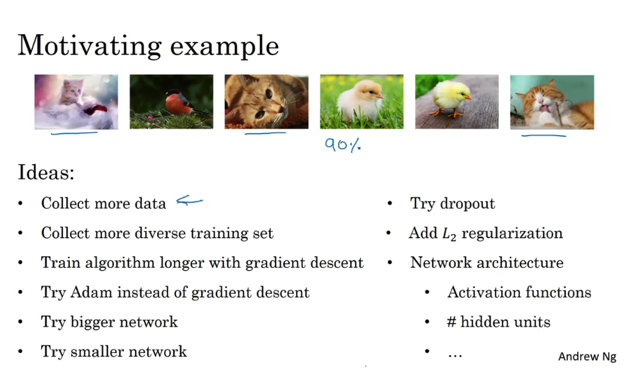</kbd>

> [!NOTE]
> Đâu là hướng đi khôn ngoan
> nhất để cải thiện model

 

#### Orthogonalization

 

##### In machine learning, "\\*orthogonalization\\*"
refers to the principle of \\*separating
concerns\\* so that changes in one aspect of
the system do not affect other aspects.

Specifically, it means breaking down the
machine learning process into modular
components, each of which has a specific
responsibility, and ensuring that 
\\*changes to one component do not have unintended
consequences for other components\\*. This
makes it easier to develop, debug, and
maintain complex machine learning systems.

 

<kbd></kbd>

> [!NOTE]
> Tách bạch mục tiêu ra để dễ kiểm soát

 

<kbd>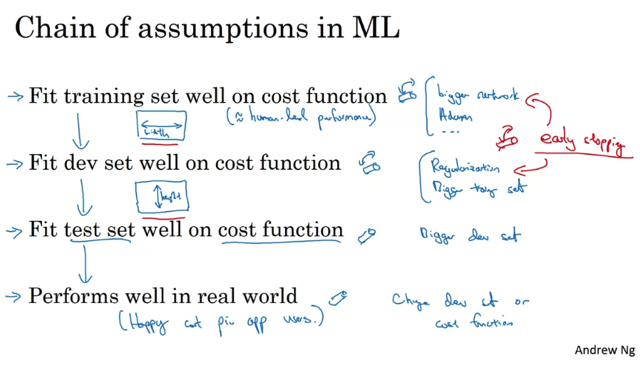</kbd>

> [!NOTE]
> In machine learning, "**orthogonalization**"
> refers to **the principle of separating
> concerns so that changes in one aspect of
> the system do not affect other aspects**.
>
>
>
> Specifically, it means **breaking down the
> machine learning process into modular
> components**, each of which has a **specific
> responsibility**, and ensuring that 
>
>
>
> **changes to one component do not have unintended
> consequences for other components**. This
> makes it easier to develop, debug, and
> maintain complex machine learning systems.

 

### Settng Up Your Goal

 

#### Single Number Evaluation Metric

 

##### 1 Using a \\*single evaluation metric\\* can help improve progress in a machine
learning project by quickly determining if the new idea is working better or
worse than the last one.

2 \\*Precision\\* and \\*recall\\* are reasonable ways to evaluate the performance of
classifiers in terms of recognizing images of cats.

3 Using precision and recall as evaluation metrics can present a \\*problem of
tradeoff\\*, making it difficult to determine which classifier is better if one classifier
does better on recall while the other does better on precision.

4 \\*Combining precision and recall into a single evaluation metric\\* can help
quickly select the better classifier. The standard way to combine precision and
recall is using an F1 score, which is the harmonic mean of precision and recall.

5 Having \\*a well-defined dev set and a single evaluation metric allows\\* for
quicker selection of the better classifier and speeds up the iterative process of
improving the machine learning algorithm.

6 In building a cat app for cat lovers in four major geographies, using a single
evaluation metric is necessary to compare the performance of two classifiers
that have different errors for different geographies.

 

<kbd>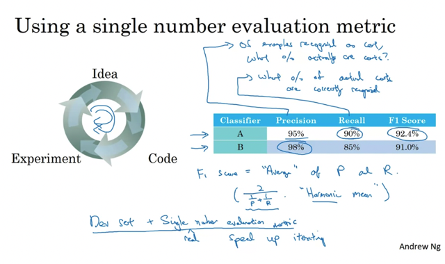</kbd>

> [!NOTE]
> Có một metric để đo lường thì sẽ nhanh hơn nhiều metric.

 

<kbd>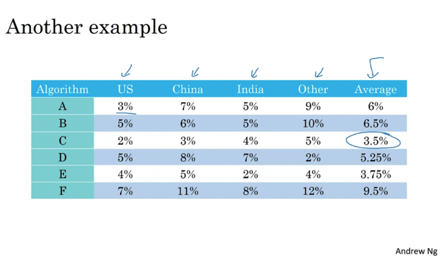</kbd>

 

#### Satisficing And Optimizing Metric

 

##### 1 Introduction: It is \\*not always
easy to combine\\* all the  things you care about into a single
evaluation metric.

2 Setting up \\*satisficing\\* and \\*optimizing\\* metrics: It is sometimes
useful to set up satisficing and optimizing metrics  to evaluate
multiple factors. Satisficing metrics are those that\\* just need to be
good enough\\*,  while optimizing metrics are those that you want to
\\*maximize\\*.

3 Example 1: Combining accuracy and running time to evaluate a
cat's classifier.

4 Example 2: Combining accuracy and false positives to evaluate
a trigger word detection system.

5 Summary: If there are multiple things you care about, you can
set up one as an optimizing metric and one or more as satisficing
metrics to quickly evaluate multiple options.   

6 Evaluation metrics
must be calculated on a\\* training set, development set, or test set.\\*

 

<kbd>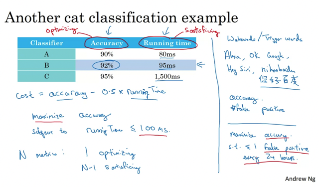</kbd>

> [!NOTE]
> Đại khái là Nên đánh giá theo cách như thế này: 
> Có 1 cái metric để Optimize/ Maximize và những cái
> còn lại để 'Satisfy'

 

#### Train / Dev / Test Distributions

 

##### 1 Setting up training, development and test sets properly is \\*crucial\\* for
maximizing team efficiency when building machine learning applications.

2 The \\*dev\\* set, also known as the development set, is \\*used to evaluate
different models\\* and pick one to improve for the final test set.

3 \\/\\*Dev and test sets need to come from the same distribution\\*\\/ to avoid
unexpected and unwanted results.

4 \\*Randomly shuffling all data into the dev and test sets\\* is the best way to
ensure that both sets have data from all regions and the same distribution.

5 Teams can waste a lot of time and effort by setting up \\*dev\\* and \\*test\\* sets from
different distributions or not taking into account all possible data sources they
may encounter.

6 \\*Choose a dev set and test set to reflect data expected to be encountered in
the future,\\* and consider important for the application's success.

 

<kbd></kbd>

> [!NOTE]
> So, having dev and test sets from different distributions is like 
> **setting a target**, having your team **spend months trying to 
> aim closer** and closer to bull's eye, only to realize after 
> months of work that, you'll say, "Oh wait, **to test it, I'm going 
> to move target over here**." And, the team might say, 
> "Well, why did you make us spend months optimizing for a 
> different bull's eye when suddenly, you can move the bull's eye to 
> a different location somewhere else?"

 

<kbd></kbd>

> [!NOTE]
> Đại khái là phân chia dev/test set sai (ko cùng 1 distribution) sẽ
> dẫn đến sau khi train ngon rồi thì test sai bét.
>
>
>
> Do đó đây nói đến việc **định hướng train/dev set ban đầu rất
> quan trọng.**

 

<kbd></kbd>

> [!NOTE]
> I recommend for setting up a **dev** set and **test** set is, choose
> a dev set and test set to **reflect data you expect to get in
> future** and consider important to do well on. And, in
> particular, the dev set and the test set here, should come
> from **the same distribution**. So, **whatever type of data you
> expect to get in the future, and want to do well o**n, **try to
> get data that looks like that**. /**And, whatever that data is, put
> it into both your dev set and your test set.**/
>
> **""And, whatever that data is, put
> it into both your dev set and your test set."**

 

#### Size Of The Dev Set And Test Sets

 

##### 1 Introduction  • Guidelines for setting up dev and test sets are changing in the era
of Deep Learning.  • The old rule of thumb of a \\*70/30 split no longer applies\\*.  • Best
practices are to \\*use more data for training and less for dev and tests\\*, especially
when dealing with larger data sets.

2 Dev Set  • \\*Dev sets should come from the same distribution as the test set.\\*  • The
size of the dev set should be big enough for its purpose, which helps evaluate
different ideas and pick up from AOP better.  • When working with larger data sets,
using a much smaller fraction of the data for the dev set is reasonable.

3 Test Set  • The purpose of the test set is to \\*evaluate the final system's
performance\\*.  • The guideline is to set the test set big enough to give high
confidence in the overall performance of the system.  • Having millions of examples
in the test set may not always be necessary.  • The test set size could be much less
than 30% of the data, depending on the application.

4 Train-Dev Set  • Some applications may not require a high level of confidence in
the overall performance of the final system.  • Using a train-dev set and
acknowledging the absence of a test set may be appropriate.  • It's not
recommended, but \\*having a large dev set may allow for the absence of a separate
test set.\\*

5 Changing Evaluation Metrics and Dev/Test Sets  • Sometimes, mid-way through a
machine learning problem, it \\*may be necessary to change the evaluation metric or
dev/test sets\\*.  • It's important to be aware of when to do this and how to properly set
up the new evaluation metric and dev/test sets.

 

<kbd>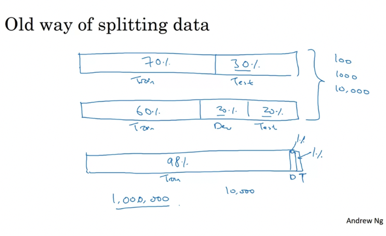</kbd>

 

<kbd></kbd>

> [!NOTE]
> Đại khái là NGÀY NAY BIG DATA thì chỉ cần 1%,2% cho Dev / Test set
> là đủ cho MỤC ĐÍCH của nó rồi.
>
>
>
> Thậm chí có thể không cần Test set mặc dù ổng vẫn recommend 
> Train / Dev (CV) / Test set với Test set để cho ra con số performance
> trước khi ship đi.
>
> 1 The guidelines for **setting up dev and test sets are changing in the Deep
> Learning era**, especially because of the larger data set sizes we are
> working with.
>
>
>
> 2 In earlier eras of machine learning, a **70/30 or 60/20/20** split for training,
> dev, and test sets was reasonable, but **with larger data sets, it is now
> reasonable to use a much smaller fraction of data for dev and test sets**.
>
>
>
> 3 The purpose of the test set is to evaluate the performance of the final
> system, and it should be set to a size that **gives high confidence in the
> overall performance of the system**. For some applications, a smaller test
> set size may be sufficient.
>
>
>
> 4 For some applications, **a train and dev set without a test set may be
> sufficient** if a high confidence in the overall performance of the final system
> is not needed.
>
>
>
> 5 It is important to be rigorous about **calling the dev set a dev set** if it is
> being used for tuning rather than evaluation.
>
>
>
> 6 In the era of big data, the old **rule of thumb** for setting up dev and test
> sets **no longer applies**, and the trend is to **use more data for training
> and less for dev and test sets.**
>
>
>
> 7 It may be necessary to change the evaluation metric or the dev and test
> sets partway through a machine learning problem, depending on the
> progress made and the goals of the project.

 

#### When To Change Dev / Test Sets And Metrics

 

##### 1 \\*Evaluation metrics are essential\\* in ML projects for setting targets and
enabling the team to achieve better results.

2 \\*Evaluation metrics should be changed when the original metric does not lead
to the desired results\\*. Pornographic images and non-pornographic images
should be treated differently in evaluation metrics.

3 \\*Orthogonalization\\* is a technique that can be used to break ML projects into
separate steps to achieve better results. One step involves defining a metric that
captures what one wants to do, while the other step involves placing the target
accurately.

4 To achieve better results in ML projects, one needs to\\* focus on different steps
and adjust the knobs\\* that correspond to these steps.

 

<kbd>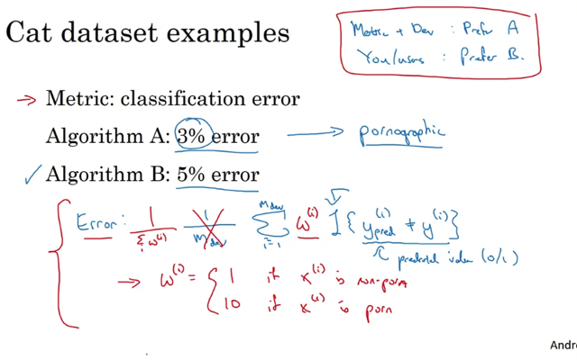</kbd>

> [!NOTE]
> Đại khái là kết quả ko như ý muốn thì ta cần thay đổi
>
>
>
> Model A ít sai hơn như khi sai lại nhận định có hình sex là mèo.
> Model B sai nhiều hơn nhưng ko có hình sex -> Phải sao cho nó ít
> nhận sai hình sex hơn
>
>
>
> Than đổi hàm J để nó nhấn mạnh sự quan trọng của việc Đánh giá
> sai đ/v Porn image bằng cách thêm tham số
>
>
>
> Đại ý là không cần stick với hàm cost thường dùng mà có thể điều
> chỉnh để thoả mãn nhu cầu
>
> For the purpose of this video, don't worry too much about the
> details of how we define a new error metric, the point is that
> **if you're not satisfied with your old error metric then don't
> keep coasting with an error metric you're unsatisfied with,
> instead try to define a new one that you think better
> captures your preferences in terms of what's actually a better
> algorithm.**
>
> So when this happens, when your evaluation metric is no longer
> correctly rank ordering preferences between algorithms, in this
> case is mispredicting that Algorithm A is a better algorithm, then
> that's a sign that you should change your evaluation metric or
> perhaps your development set or test set.

 

<kbd></kbd>

> [!NOTE]
> Đại khái là đây là ví dụ minh hoạ cho '**Orthogonalization**'
> principle: Mỗi thứ 1 núm vặn độc lập với nhau.
>
>
>
> Cụ thể hơn:
>
>
>
> Step 1 là ta **define metric cho chính xác.**
> Step 2 là ta **làm sao để cải thiện metric này**.
>
>
>
> Đó đại khái hai bước độc lập, phù hợp với nguyên tắc
> **Mỗi lúc một việc hay mỗi núm 1 chức năng độc lập**
>
> In machine learning, "orthogonalization"
> refers to **the principle of separating
> concerns so that changes in one aspect of
> the system do not affect other aspects**.
>
>
>
> Specifically, it means **breaking down the
> machine learning process into modular
> components**, each of which has a **specific
> responsibility**, and ensuring that 
>
>
>
> **changes to one component do not have unintended
> consequences for other components**. This
> makes it easier to develop, debug, and
> maintain complex machine learning systems.

 

<kbd>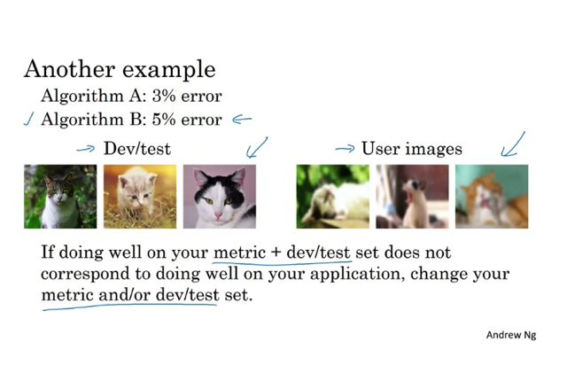</kbd>

> [!NOTE]
> But the overall guideline is **if your current metric and data
> you are evaluating on doesn't correspond to doing well on
> what you actually care about, then change your metric
> and/or your dev/test set** to better capture what you need
> your algorithm to actually do well on.
>
>
>
> Đại khái đây nói đến trường hợp train model để (detect
> mèo) ngon rồi nhưng thực tế user xài ảnh của họ tự chụp
> khiến model chạy hết ngon thì  sẽ nói vấn đề này sau nhưng
> ý nói ở đây là phải thay đổi metric  và target

 

<kbd></kbd>

> [!NOTE]
> Having an **evaluation metric and the dev set allows you to much
> more quickly make decisions** about is Algorithm A or Algorithm
> B better. It really speeds up how quickly you or your team can
> iterate. So my recommendation is, **even if you can't define the
> perfect evaluation metric and dev set, just set something up
> quickly and use that to drive the speed of your team iterating.**
>
> And if later down the line you find out that it wasn't a good one, you
> have better idea, change it at that time, it's perfectly okay. But what I
> recommend against for the most teams is to **run for too long without
> any evaluation metric and dev set** up because that can slow down
> the efficiency of what your team can iterate and improve your
> algorithm.

 

### Comparing To Human-level Performance

 

#### Why Human-level Performance

 

##### Main ideas of the lecture are as follows:

1 Machine learning teams are interested in comparing machine learning systems to
human-level performance because of the advances in deep learning, and because the
workflow is more efficient when the machine is trying to do something that humans can do.

2 Progress in accuracy for machine learning tasks tends to be relatively rapid as you
approach human-level performance, but then slows down once you surpass it.

3 \\*Bayes optimal error\\* is the best possible error for any function mapping from x to y, and it is
the theoretical limit that the machine learning algorithm \\*can approach but never surpass\\*.

4 Progress often slows down when you surpass human-level performance because the
performance is not far from Bayes' optimal error, and \\*certain tactics for improving
performance are harder to apply once the algorithm surpasses human-level performance\\*.

5 Comparing to human-level performance is helpful because machine learning algorithms
tend to be good at replicating tasks that people can do and catching up to human-level
performance.

6 How humans can help improve machine learning algorithms and why comparing algorithm
performance to human performance is helpful. When humans are better at a task than the
algorithm, labeled data can be obtained from humans to train the algorithm. Human error
analysis can also be used to gain insights into improving algorithm performance. However,
once the algorithm surpasses human performance, these tactics become harder to apply.
Additionally, knowing how well humans can perform on a task can help to better understand
how to balance reducing bias and reducing variance in the algorithm.

 

<kbd></kbd>

> [!NOTE]
> Tăng nhanh, khi vượt qua H.L.P thì chậm lại và ko
> qua được Bayes Optimal Error

 

<kbd></kbd>

> [!NOTE]
> Đại khái là, nguyên nhân dẫn đến việc 'chậm' lại sau khi
> surpass H.L.P là vì trước đó ML có thể nhờ con người làm
> những việc con người giỏi như label data giùm, từ đó ML
> có thể học dc nhiều, Nhưng sau khi vượt rồi thì không còn
> biết nhờ ai nữa sự tiến bộ sẽ chậm lại

 

#### Avoidable Bias

 

##### Trong bài giảng này, chúng ta tìm hiểu về khái niệm human-level
performance, là một chỉ số để đo độ chính xác của một mô hình học máy so
với con người. Với ví dụ phân loại hình ảnh mèo, nếu con người có độ chính
xác gần như hoàn hảo thì human-level error là 1%. Nếu mô hình của chúng
ta đạt được 8% lỗi trên tập huấn luyện và 10% lỗi trên tập phát triển, đó là
một dấu hiệu cho thấy mô hình của chúng ta không hoạt động tốt trên tập
huấn luyện. Trong trường hợp này, chúng ta cần tập trung vào giảm bias
bằng cách tăng kích thước của mạng neural hoặc tăng thời gian huấn luyện.

Tuy nhiên, nếu human-level error không phải là 1% mà thấp hơn do ảnh
trong tập dữ liệu quá mờ hoặc không rõ ràng, chúng ta có thể tập trung vào
giảm variance bằng cách sử dụng regularization hoặc tăng số lượng dữ liệu
huấn luyện.

Bên cạnh đó, ta còn có khái niệm \\*avoidable bias, là sự chênh lệch giữa lỗi
tập huấn luyện và lỗi Bayes\\*, tức là lỗi tối thiểu mà chúng ta có thể đạt được.
Nếu mô hình đang có avoidable bias, ta nên tập trung vào giảm bias bằng
cách tăng kích thước mạng neural hoặc thời gian huấn luyện. Ngược lại,
nếu mô hình đang có phần variance lớn hơn, ta nên tập trung vào giảm
variance bằng cách sử dụng regularization hoặc tăng số lượng dữ liệu
huấn luyện. (ChatGPT)

> [!NOTE]
> Đại khái là **HLP gần bằng với Bayes Optimal Error**
> Khoảng cách giữa HLP và Training error là **Avoidable Bias** - Có 
> thể giảm được (bằng More complex model....)
>
>
>
> Khoảng cách giữa Dev error và Training error là **Variance** - Có
> thể giảm bằng những phương cách giảm vấn đề High variance
> như (Regularization, more data,,,)
>
>
>
> **Tuỳ trường hợp cái nào lớn giữa Avoidable Bias và. Variance 
> mà ta sẽ focus vô improve cái bias hay variance.**

 

<kbd></kbd>

> [!NOTE]
> Tức là, tuỳ vào tính chất công việc (để đánh giá liệu H.L.P có tốt hay 
> không, có tiệm cận với Bayes error ko), tuỳ vào Khoảng cách giữa 
> training error với H.L.P và Dev error - training error.
>
>
>
> Ví dụ bên trái nếu Avoidable bias lớn hơn nhiều Variance,
> nên tập trung vào **giảm avoidable bias**
>
>
>
> Ví dụ ở bên phải:
> Nếu ta nghĩ rằng đ/v công việc này H.L.P đã rất tốt và do đó
> đã tiệm cận với Bayes error rồi thì ta nên cho rằng H.L.P ~=
> Bayes thì dù ta có improve để Training error từ 8 -> 7.5% 
> (giảm bias) cũng ko bằng tập trung vào improve 
> dev set từ 10 -> 8% (Giảm variance)
>
>
>
> Còn giả dụ với 7.5% error của H.L.P nhưng ta có cơ sở để tin rằng
> H.L.P chưa tiệm cận được Bayes error (giả định là 3% chẳng hạn) 
> thì ta nên tiếp tục improve Training error.

 

<kbd></kbd>

> [!NOTE]
> Vẫn có những vấn đề H.L.P bằng thậm chí vượt Bayes
> và ngược lại thua xa Bayes, nơi mà máy tính có thể vuợt qua
> Do con nguoì bị hạn chế ở một số khả năng mà máy tính có
> thế mạnh hơn con người.

 

#### Understanding Human-level Performance

 

##### • The phrase "human-level performance" can be used casually in research
articles, but it can be defined more precisely as an estimate of Bayes error.

• The definition of human-level error can vary depending on the context, such as
surpassing the performance of a typical doctor.

• Defining human-level performance is important for analyzing bias and variance
in machine learning projects.

• A measure of avoidable bias can be calculated as the difference between the
estimate of Bayes error and the training error.

• The focus of improvement should be on reducing the larger issue between bias
and variance in the learning algorithm.

 

<kbd>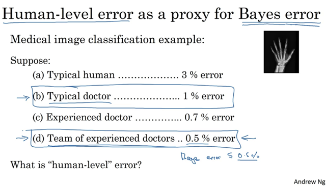</kbd>

> [!NOTE]
> ...

 

<kbd>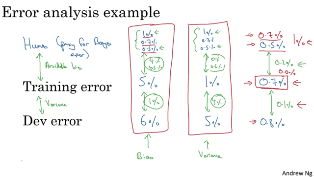</kbd>

 

<kbd>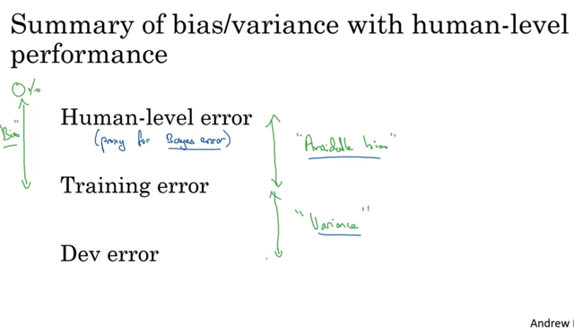</kbd>

 

#### Surpassing Human-level Performance

 

##### 1 Many teams aim to surpass human-level performance on specific tasks, which can be exciting.
However, as performance approaches or exceeds human-level, machine learning progress becomes
more challenging.

2 The example of a problem with a team of humans achieving a 0.5% error rate, a single human 1%
error rate, and an algorithm with 0.6% training error and 0.8% dev error illustrates the concept of
avoidable bias. In this case, the Bayes error is estimated to be 0.5%, making the avoidable bias at
least 0.1% with a variance of 0.2%.

3 In a more difficult example, where a team of humans and a single human have the same error
rates as before, but the algorithm has 0.3% training error and 0.4% dev error, it's unclear whether to
focus on reducing bias or variance, because the Bayes error is unknown.

4 Once a machine learning system surpasses human-level performance, it becomes harder to use
human intuition to improve performance further. While progress is still possible, the tools for pointing
in a clear direction may not be as effective.

5 Examples of problems where machine learning significantly surpasses human-level performance
include online advertising, product recommendations, logistics, and predicting loan repayment.
These are structured data problems where humans tend to be less skilled. However, surpassing
human-level performance on natural perception tasks like computer vision, speech recognition, and
natural language processing is more challenging.

6 Some medical tasks, such as reading ECGs, diagnosing skin cancer, and certain radiology tasks,
have seen machines surpass human-level performance, but it's harder for machines to perform well
on natural perception tasks due to the superior ability of humans in these areas.

7 Deep learning systems have surpassed human-level performance on some supervisory problems,
but this is challenging as performance approaches human-level and requires vast amounts of data.

 

<kbd>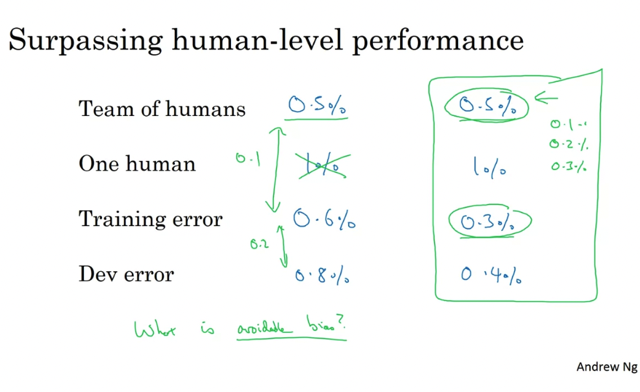</kbd>

> [!NOTE]
> Đại khái là một số trường hợp khó mà xác định được có thể improve được
> nữa hay không  (Xác định Avoidable bias là bao nhiêu). Ví dụ khi hiệu suất
> của model đã vượt nhóm con người

 

<kbd></kbd>

 

#### Improving Your Model Performance

 

##### Guidelines to improve the performance of your learning algorithm:

1 Address avoidable bias issues:  • Train a bigger model.  • Train longer.  • Use a
better optimization algorithm such as ADS momentum, RMSprop, or Adam.  • Find a
better neural network architecture or set of hyperparameters.

2 Address variance problems:  • Get more data to train on.  • Try regularization
techniques such as L2 regularization, dropout, or data augmentation.  • Try various
neural network architecture/hyperparameters search.

3 Use the difference between training error and proxy for Bayes error to estimate
avoidable bias, and the difference between dev error and training error to estimate
variance problems.

4 To reduce avoidable bias, increase the model size, train longer, or use a better
optimization algorithm.

5 To address variance problems, get more data, try regularization techniques, or
explore other neural network architecture/hyperparameters.

Applying these guidelines systematically can make your machine learning team
more efficient, systematic, and strategic in improving the performance of your
learning algorithm.

 

<kbd></kbd>

 

<kbd>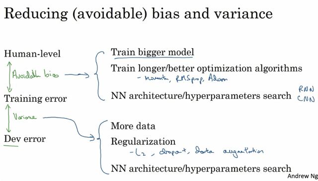</kbd>

 

<kbd></kbd>

> [!NOTE]
> I think that this notion of bias or avoidable bias and variance
> is one of those things that's **easily learnt but tough to
> master. And if you're able to systematically apply the
> concepts from this week's video, you actually will be much
> more efficient and much more systematic and much more
> strategic than a lot of machine learning teams in terms of
> how to systematically go about improving the performance
> of your machine learning system**

 

### Ml Flight Simulator

 

<kbd></kbd>

 

<kbd>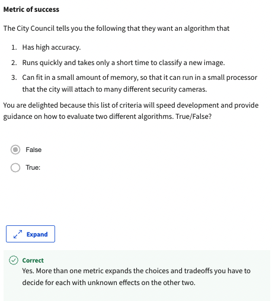</kbd>

 

<kbd></kbd>

 

<kbd>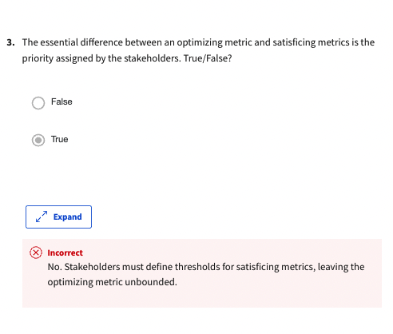</kbd>

> [!NOTE]
> Đại khái là stakeholder chỉ define threshold cho
> Satisficing metric thôi, không đụng đến Optimizing. Câu
> này phải hiểu nó hỏi là: Có phải khác biệt chủ yếu giữa
> optimizing metric và. Satisficing metric là mức độ Priority
> mà thằng Stakeholder chỉ định hay không.
>
>
>
> Thì câu trả lời phải là không, vì thằng stkaeholder nó chỉ
> chỉ định cái threshold cho Satisficing metric thôi, không
> phải là bảo rằng cái này quan trọng hơn cái kia để mà
> phải tập trung vào cái này hơn  cái kia (đại loại vậy)
>
>
>
> Câu này sai là do mình hiểu sai ý câu hỏi

 

<kbd></kbd>

> [!NOTE]
> ...

 

<kbd></kbd>

> [!NOTE]
> ...

 

<kbd>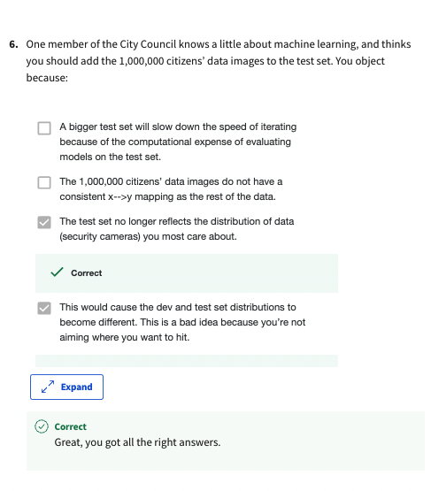</kbd>

> [!NOTE]
> ...

 

<kbd>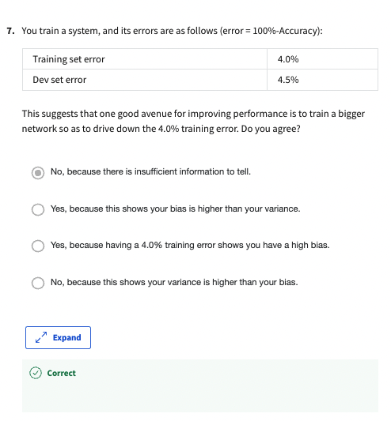</kbd>

> [!NOTE]
> ...

 

<kbd>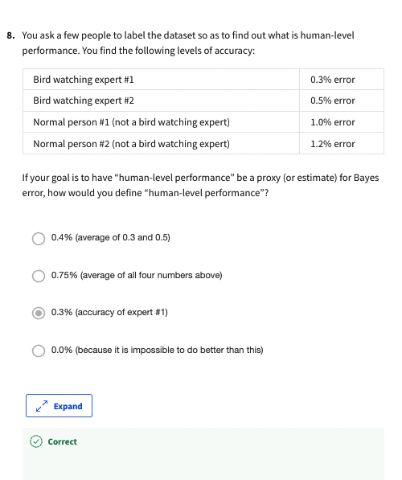</kbd>

 

<kbd>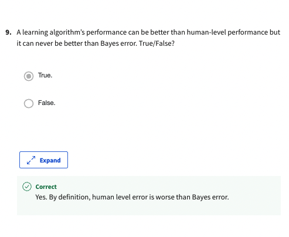</kbd>

 

<kbd></kbd>

 

<kbd>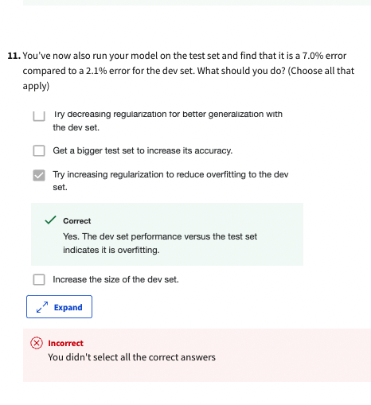</kbd>

<kbd>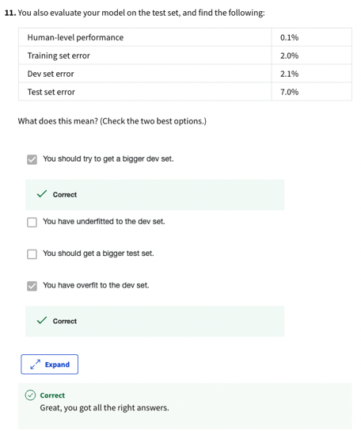</kbd>

> [!NOTE]
> Hiểu đại khái là tăng Dev set để nó phản ánh
> đúng hơn với thực tế thì nó sẽ cho kết quả gần
> với test set hơn -> giảm Variance với Test set

 

<kbd></kbd>

 

<kbd>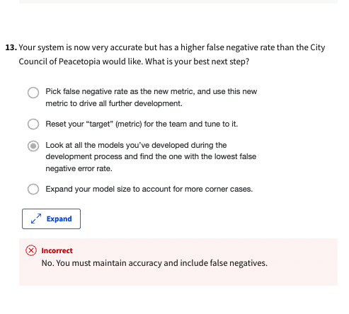</kbd>

> [!NOTE]
> Khả năng là phải chọn Expand...vì cả hai solution 'reset' new
> metric đều sẽ làm giảm Accuracy vì nó sẽ vi phạm nguyên tắc
> Orthogonalization

 

<kbd>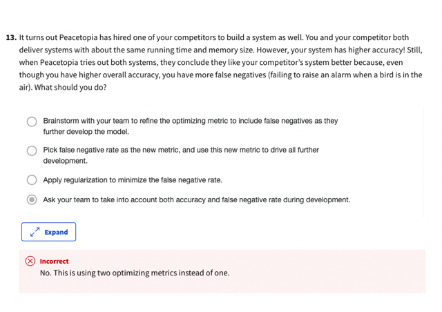</kbd>

> [!NOTE]
> ???

 

<kbd>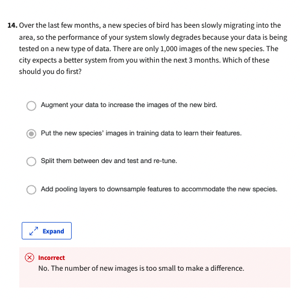</kbd>

> [!NOTE]
> ???

 

<kbd></kbd>

> [!NOTE]
> Cái Needing two week .... rõ ràng đúng, sao ko chọn ta

 

<kbd>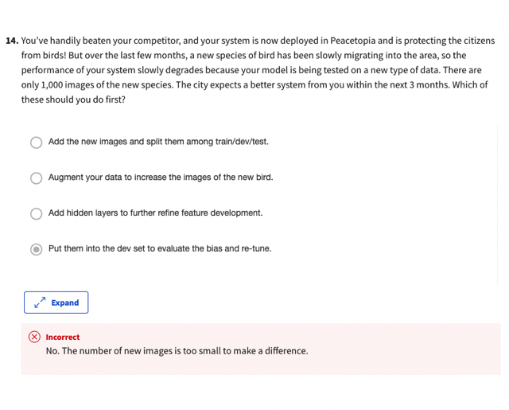</kbd>

 

<kbd>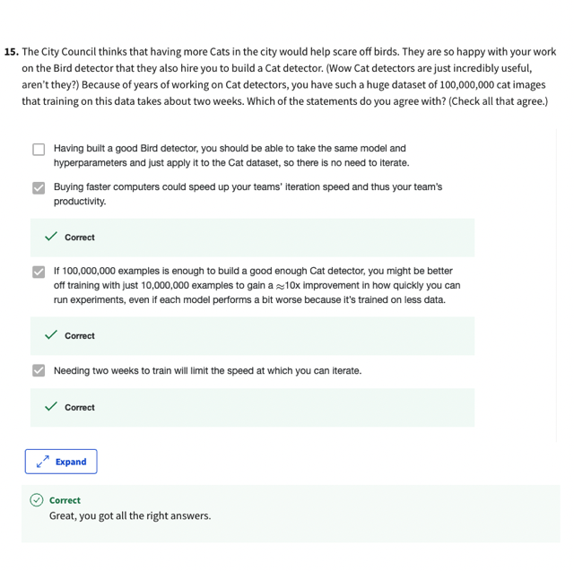</kbd>

 

### Interview

 

## C3w2_machine Learning Strategy 2

 

### Error Analysis

 

#### Carrying Out Error Analysis

 

##### 1 Introduction to error analysis in machine learning

2 The process of error analysis and its significance in identifying the
next steps for learning algorithms

3 Importance of examining mistakes that algorithms make to gain
insights

4 Example of using error analysis in a cat classifier

5 The error analysis procedure and its effectiveness in identifying the
worth of investing time and effort

6 Ceiling on performance in machine learning

7 Evaluating multiple ideas in parallel using error analysis

 

<kbd>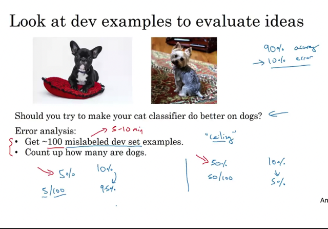</kbd>

> [!NOTE]
> Đại khái là làm sao biết hướng đi nào sẽ đáng công sức bỏ ra nhất
> trong số các option (ví dụ improve hình bị mờ, improve hình nhầm
> lẫn chó vs mèo)

 

<kbd>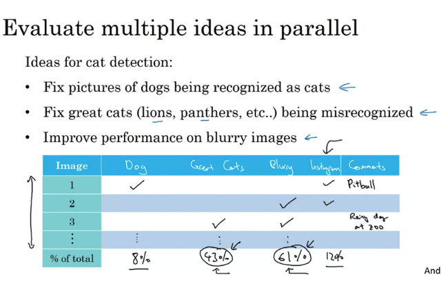</kbd>

> [!NOTE]
> Đại khái là ta sẽ xem trong 100 wrong label thử mỗi option sẽ improve dc
> bao nhiêu % từ đó chọn hướng đi nào lợi nhất

 

#### Cleaning Up Incorrectly Labeled Data

 

##### 1 The supervised learning problem consists of input X and output labels Y.

2 Sometimes data can be incorrectly labeled, which refers to when the label assigned by a
human to a piece of data is incorrect.

3 Deep learning algorithms are \\*robust to random errors in the training set, as long as the
errors are not too far from random\\*. In other words, if the errors are reasonably random, it's
probably okay to leave them as they are and not spend too much time fixing them.

4 Deep learning algorithms are \\*less robust to systematic errors\\*, which occur when the
labeler consistently labels certain things incorrectly.

5 If there are incorrectly labeled examples in the dev set or test set, it's recommended to
add an extra column to count up the number of examples where the label Y was incorrect
during error analysis.

6 If the incorrectly labeled examples in the dev set or test set make a \\*significant difference\\*
to your ability to evaluate algorithms, then it's \\*worthwhile to spend time fixing them\\*.
Otherwise, it might not be the best use of your time.

7 To decide whether it's worth reducing the number of mislabeled examples, you should
look at the overall dev set error, the percentage of errors due to incorrect labels, and the
percentage of errors due to all other causes.

 

<kbd></kbd>

> [!NOTE]
> Trong training set, nếu số lượng ít / không đáng kể 
> thì không ảnh hưởng gì.
>
>
>
> N.N không bị ảnh hưởng đ.v random error (Systematically error thì
> ảnh hưởng lớn hơn)

 

<kbd></kbd>

> [!NOTE]
> Trong dev set, thì ta đánh dấu nó trong 100 trường hợp 
> coi nó chiếm bao nhiêu % của error để đánh giá
> xem có nên ưu tiên xứ lý không.
>
>
>
> Ví dụ: 10% error, trong đó có 0.6% là do mislabeled -> 9.4% là do 
> mấy cái khác -> Nên focus mấy cái khác.
> Cũng 2% error, có 0.6% mislabeled thì lúc naỳ mislabeled chiếm
> tới 30% của error -> Nên fix mislabeled.
>
>
>
> Và đã fix thì fix cả Test set. Và again, không cần fix training set.

 

- **When errors due to incorrect labels are high on the dev set, it
becomes more worthwhile to fix them.

If the dev set is not reliable due to incorrect labels, selecting
between two classifiers becomes difficult.

It is important to apply the same process for both dev and test sets,
as they need to come from the same distribution.

When examining mislabeled examples, it is important to look at both
the ones the algorithm got right and the ones it got wrong.

Correcting labels on the training set is less important than on the
dev and test sets, but it's okay if they come from a slightly different
distribution.

Deep learning requires less human insight, but practical systems
often require more manual error analysis.

Researchers should not be reluctant to manually look at examples
to improve their systems.**

 

<kbd></kbd>

> [!NOTE]
> "Nó chán nhưng nó đáng"
>
>
>
> /"Maybe it's not the most interesting thing to do, to sit
> down and look at a 100 or a couple hundred examples to
> counter the number of errors. But this is something that I
> so do myself. When I'm leading a machine learning team
> and I want to understand what mistakes it is making, I
> would actually go in and look at the data myself and try to
> counter the fraction of errors. And I think that because
> these minutes or maybe a small number of hours of
> counting data can really help you prioritize where to go
> next. I find this a very good use of your time and I
> urge you to consider doing it if you've built a machine
> learning system and you're trying to decide what ideas or
> what directions to prioritize things"/

 

#### Build Your First System Quickly, Then Iterate

 

##### Build something quick and
iterate

 

<kbd></kbd>

> [!NOTE]
> Build something quick and iterate

 

### Mismatched Training & Dev/test Set

 

#### Training & Testing On Difference Distributions

 

##### 1 Deep learning algorithms need a lot of labeled data to be effective, but
many teams will use whatever data they can find, even if it is not from the
same distribution as their dev and test data.

2 When training on data from a \\*different distribution than dev and test data\\*,
there are best practices to follow.

3 An example is given of a mobile app that needs to recognize cats in images
uploaded by users. The app has access to two data sources: images from the
mobile app (the desired distribution) and images downloaded from the web (a
different distribution).

4 One option is to combine the two datasets and \\*randomly shuffle them into
train, dev, and test sets.\\* The disadvantage of this option is that the dev set
will be \\*biased\\* towards the web distribution of images, rather than the mobile
app distribution that the team actually cares about.

5 Another option is to use \\*all of the web images for the training set\\* and a
\\*small portion of the mobile app images\\*, while using \\*only mobile app images
for the dev and test sets\\*. This option ensures that the dev set is
representative of the mobile app distribution, which is what the team cares
about.

 

<kbd>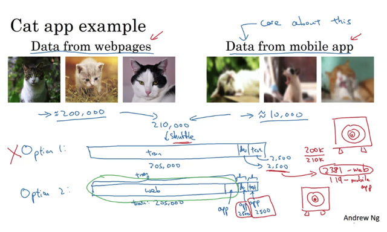</kbd>

> [!NOTE]
> Đại khái là option 1 trộn lại (web images + mobile images) rồi chia ra
> cho train - dev - test nhưng cái này thì do web images lớn nên
> thành ra web image sẽ chiếm số đông trong dev/test set -> Bias
>
>
>
> Cách hay hơn là dùng web + 1 phần mobile image cho train,
> Dev, test chỉ dùng mobile -> Đảm bảo Dev / Test chung một
>  distribution

 

<kbd>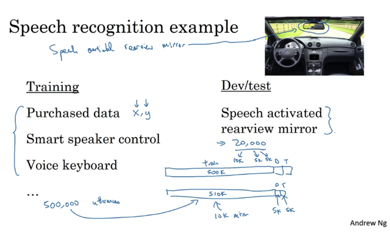</kbd>

 

#### Bias And Variance With Mismatched Data Distribution

 

<kbd></kbd>

> [!NOTE]
> Đại khái là để giải quyết người ta dùng 1 nhóm nữa gọi là **training-dev**
> bao gồm cả train và dev để check performance.
>
>
>
> Nếu nó cách xa thằng train chứng tỏ error là do sự khác nhau giữa 
> distribution của train và dev.test còn nếu nó ko xa mấy với train
> mà lại xa với dev performance thì chứng tỏ algorithm bị high variance.

 

<kbd></kbd>

> [!NOTE]
> Đại khái là đôi khi dev error nó lại thấp hơn cả Train-Dev và Train 
> là bởi vì lí do nào đó data của Dev, Test lại 'dễ' hơn. 
> Ví dụ trong trường hợp này hình của Dev, Test set lại rõ hơn chẳng
> hạn khiến algorithm work tốt trên nhóm data này hơn là nhóm data 
> của training set.
>
> Nói chung khoảng cách giữa các nhóm sẽ định nghĩa trạng 
> thái bias variance như sau
>
>
>
> HLP / Bayes - Training set error: Avoidable bias
> Training error - Training-Dev error: Variance: 
>
>
>
> Hiểu đại khái là model đã gặp/train trên data của training set 
> rồi nên nếu có sự khác nhau giữa training error và training-dev 
> error thì chỉ có thể là do model bị high variance giữa training - dev 
> set.
>
>
>
> Traning-dev error và Dev: Mismatch distribution giữa training set
> và dev set
>
>
>
> Dev error và Test error: ..

 

<kbd>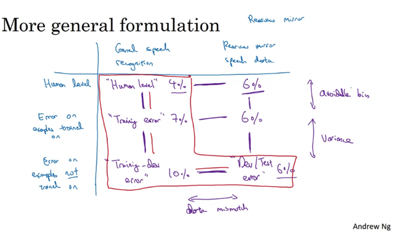</kbd>

 

#### Addressing Data Mismatch

 

##### 1 Data mismatch problem can occur when the training data comes from a
different distribution than the dev and test sets.

2 Manual error analysis can be carried out to \\*understand the differences
between the training set and dev/test sets\\*, which can help identify categories
of errors.

3 Insights gained from error analysis can be used to \\*make training data more
similar to dev/test sets\\* or \\*collect more data\\* similar to the dev/test sets.

4 \\*Artificial data synthesis\\* can be used to make training data more similar to the
dev/test sets by simulating data that wasn't originally present.

5 Caution should be exercised while using artificial data synthesis as it can
lead to overfitting if not done correctly.

 

<kbd></kbd>

> [!NOTE]
> Đại khái giải pháp là  
> - Error analysis và tìm hiểu tại sao khác nhau, khác chỗ nào rồi
> - Tạo / chế / xào nấu sao cho training data
> nó trở nên giống giống dev.test data

 

<kbd>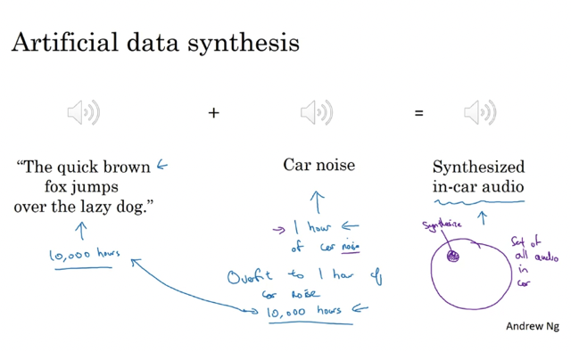</kbd>

> [!NOTE]
> Chỉ có cái là phải chú ý vụ này: Đại khái là giống như bắt chước nhưng ko hết

 

<kbd></kbd>

> [!NOTE]
> ..sẽ khiến overfit

 

### Learning From Multi Tasks

 

#### Transfer Learning

 

##### 1 Transfer learning is a powerful idea in deep learning that involves using
knowledge learned from one task to help solve a different task.

2 In transfer learning, the last output layer of the neural network is deleted, and
a new set of randomly initialized weights is created for the new task.

3 There are two ways to retrain the neural network with the new task data set:
retrain only the weights of the last layer or retrain all the layers of the neural
network.

4 Pre-training is the initial phase of training on image recognition data to
pre-initialize the weights of the neural network, while fine-tuning is updating all
the weights after training on the new data set.

5 Transfer learning makes sense when there is a lot of data for the problem
being transferred from but relatively less data for the problem being transferred
to.

6 Examples of using transfer learning include adapting an image recognition
neural network to a radiology diagnosis task or a speech recognition system to
a wake words detection system.

 

<kbd></kbd>

> [!NOTE]
> Đại khái là: Xài lại một cái model đã được train cho một vấn
> đề tương tự (v.d Image Recognition & Radiology diagnosis,
> speech recognition & wake up call)
>
> Nếu nhiều data thì train lại toàn bộ,
> còn không thì train lại 1, 2 layer cuối thôi.
>
>
>
> Những "/feature học được"/ từ task A giúp ích cho task B

 

<kbd></kbd>

> [!NOTE]
> KHI NÀO THÌ NÊN DÙNG 'TRANSFER LEARNING'?

 

#### Multi-task Learning

 

##### 1 Introduction to transfer learning and multi-task learning

2 Example of building a self-driving car with multi-task
learning

3 Multi-label classification with four labels: pedestrians,
cars, stop signs, and traffic lights

4 Training a neural network with a loss function to predict
values of y

5 Main difference compared to earlier binary classification
examples

6 Ability to assign multiple labels to a single image in
multi-task learning

7 Training one neural network to perform multiple tasks
results in better performance than training multiple
separate neural networks

8 Advantages of multi-task learning.

 

<kbd>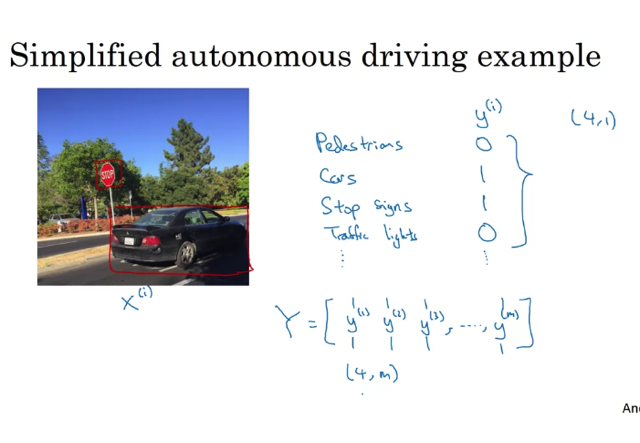</kbd>

 

<kbd>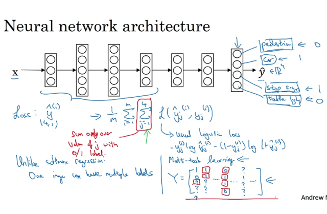</kbd>

> [!NOTE]
> Này khác Softmax: Softmax: **Môĩ dataset x(i) chỉ có 1 label** (trong số có C
> label) Multi-Label: **Mỗi dataset x(i) có thể có nhiều label**
>
>
>
> Loss function giống như hàm logistic chỉ có thêm caí loop qua các label
> thôi
>
>
>
> Chỉ tính những cái có label 1/0 còn ko có label thì bỏ qua. Đại khái muốn
> nói trường hợp một số không có label chẳng hạn y(3) = [1 0 ? ? 1] = Có
> pedestrian, không có car , stops ign và traffic light thì ko biết

 

<kbd></kbd>

> [!NOTE]
> Đại khái là nhiều vấn đề cần train nhưng mỗi vấn đề có ít data thôi ví dụ
> 1000 và **train cùng lúc nó sẽ lợi hơn** vì cùng chung những cái gọi là '
> Low level features' như góc cạnh, màu sắc....

 

<kbd></kbd>

> [!NOTE]
> Nhắc lại chút về khác biệt giữa
> Multi-class training và multi-label training
>
>
>
> Chú ý là multi task training có thể là multi-label training nhưng
> cũng có thể là trang nhiều thứ khác cùng lúc như xác định object +
> xác dinh vị trí của object đó trong 1 picture chẳng hạn.
>
> Multi-class: mỗi data set chỉ có 1 label, do đó tuy y cũng là vector
> có C (số class/label) item nhưng chỉ có 1 item = 1, còn lại bằng 0
>
>
>
> y^ ra là vector C item và dưới dạng probability sao cho tổng bằng
> 1. và cái cao nhất sẽ xác định label của nó (dataset đó)
>
>
>
> Còn multi-label: Mỗi dataset có thể có nhiều label, y là C-dimension
> Vector thì có thể có nhiều vị trí = 1.
>
>
>
> y^ ra là vector C chiều, chứa probability dataset đó cho từng label
> và Sum các probability này không cần phải bằng 1

 

### End-to-end Deep Learning

 

#### What's E2e Deep Learning

 

##### End-to-end deep learning is a \\*recent development\\* in deep
learning that replaces multi-stage data processing systems
with a single neural network. Traditional data processing
systems required multiple stages of processing, such as
feature extraction and machine learning algorithms.
End-to-end deep learning, on the other hand, \\*takes an input
and outputs a direct result, bypassing many intermediate
steps.\\* End-to-end deep learning\\* works best with large
data sets\\* and can be challenging for researchers who have
spent many years designing individual steps of the pipeline.
One example of end-to-end deep learning is speech
recognition, where a neural network can directly output a
transcript from an audio clip. However, end-to-end deep
learning is not always the best approach, as it may \\*require
a lot of data to work well.\\* For example, in face recognition
turnstiles, a multi-step approach of face detection, cropping,
and identity estimation works better than directly feeding the
raw image to a neural net.

 

<kbd></kbd>

> [!NOTE]
> Đại khái là nếu có nhiều thật nhiều data, thì có thể dùng e2e learning.

 

<kbd></kbd>

> [!NOTE]
> Lấy face recognition làm ví dụ, chia làm nhiều bước thì cần ít
> data (ở mỗi bước) hơn, còn e2e thì phải nhiều data mới dc

 

<kbd>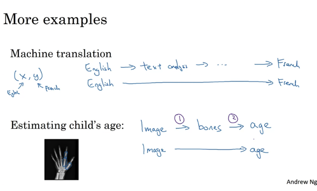</kbd>

 

#### Whether To Use End2end Deep Learning

 

##### 1 Benefits of End-to-End Deep Learning  • Lets the data speak
and captures the statistics in the data without reflecting \\*human
preconceptions\\*

• Simplifies the design workflow by reducing the need for hand
designing of components

2 Drawbacks of End-to-End Deep Learning  • \\*Requires a large
amount of data\\* to learn the direct mapping from input (X) to
output (Y)

• \\*Excludes potentially useful hand-designed components that
could inject manual knowledge into the algorithm\\*

3 Key question in deciding whether to use End-to-End Deep
Learning  • Do you have sufficient data to learn the function of
the complexity needed to map from X to Y?

4 Examples of applications and their complexity in learning the
function  • Image recognition and identifying the position of
bones seems relatively simple

• Autonomous driving is a much more complex problem that may
require more data and a combination of approaches.

 

<kbd></kbd>

> [!NOTE]
> Không bị preconception: Đại khái không bị giới hạn bởi những
> quy tắc hay nói đúng hơn là những cái con người đặt ra ví dụ
> nhận biết giọng nói, con người đặt ra các 'âm' (phonemes) Cat =
> cờ ah tờ nhưng máy tính nó có  thể ' nhìn' data theo kiểu của nó,
> do đó có thể hiệu quả hơn con người.
>
> Không tận dụng những 'kiến thức' do người truyền vào, đại khái 
> có thể hiểu là do nó bỏ qua bước 'Feature processing' nơi mà con
> người giúp xác định feature nào là quan trọng (ví dụ vậy)
>
> Chỉ ok nếu có rất rất nhiều data.

 

### Ml Flight Simulator

 

<kbd></kbd>

 

<kbd></kbd>

> [!NOTE]
> Ghi nhớ lời thầy tuân theo nguyên tắc: **Start quick & iterate**

 

<kbd></kbd>

> [!NOTE]
> Bài toán classification tất nhiên phải xài sigmoid, không phải là multiclass
> nên ko xài softmax

 

<kbd>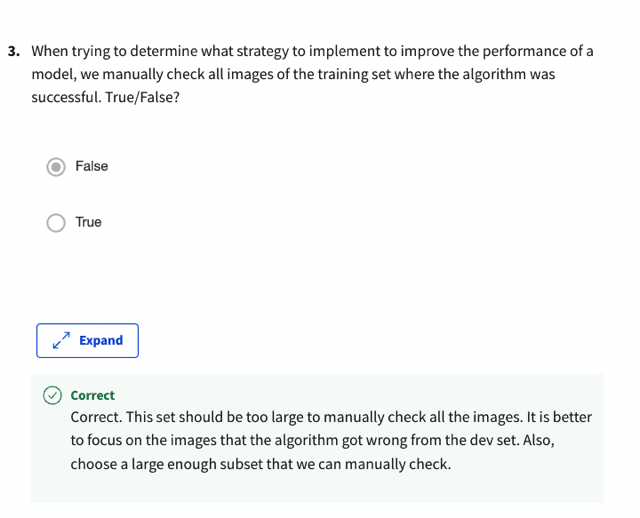</kbd>

> [!NOTE]
> Training dataset quá lớn 900.000 nên dù trong bài học có nói
> bên cạnh việc check wrong case thì nên check cả right case
> Nhưng do data lớn quá nên chỉ nên focus ơn wrong case thôi

 

<kbd></kbd>

> [!NOTE]
> Trong bài giảng có nói, loop qua các label và bỏ qua
> label nào ko biết

 

<kbd></kbd>

> [!NOTE]
> Thứ nhất là **dev,set nhất định phải cùng distribution** là nguyên tắc rồi.
>
>
>
> Thứ hai là dev,set phải **reflex data mà model phải dự đoán trong
> tương lai** (production data) mà ở đây là Front-face cam, nên 
> dev.set phải dùng F.f cam images.

 

<kbd></kbd>

> [!NOTE]
> H.L error: 0.5% mà Training là 12% -> Avoidable bias tới
> 11%. Các nhau quá lớn. So với 3% so với training-dev
> Không high bias thì là gì

 

<kbd>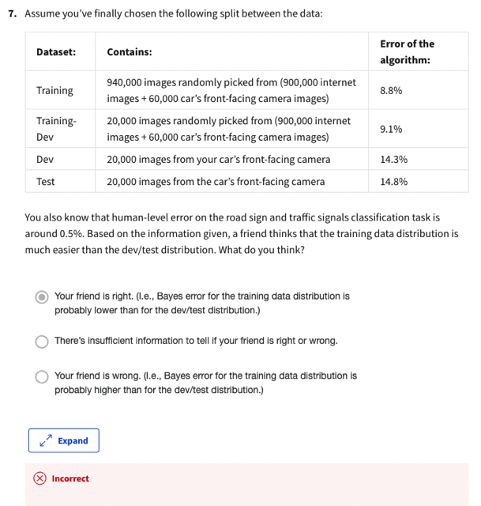</kbd>

> [!NOTE]
> Tại sao sai

 

<kbd></kbd>

> [!NOTE]
> Lập luận kiểu này không hữu ích. Các yếu tố nên
> cân nhắc nên là tradeoff giữa chi phí phải bỏ ra để thu
> thập thêm dữ liệu và khả năng cải thiện hiệu suất

 

<kbd></kbd>

 

<kbd></kbd>

> [!NOTE]
> Tại sao sai

 

<kbd></kbd>

> [!NOTE]
> Nguyên tắc dev.test cùng distribution. Và trong bài giảng có nói đã
> sửa phải sửa cả dev lẫn test

 

<kbd></kbd>

> [!NOTE]
> Xem lại khi nào thì nên dùng 'Transfer-learning'
> Hai task có same input X: Đều là hình chụp đường phố
> Task A có data lớn hơn task B nhiều: 900.000 
> Task A và task B đều có chung các low-level features: Đều học cách
> nhận diện những yếu tố trong các hình ảnh về đường phố

 

<kbd></kbd>

> [!NOTE]
> Classify nhiều các sam sam nhau, mỗi cái có 1 ít data, đều học từ những
> caí lơ-level features -> Rất phù hợp cho multi training

 

<kbd>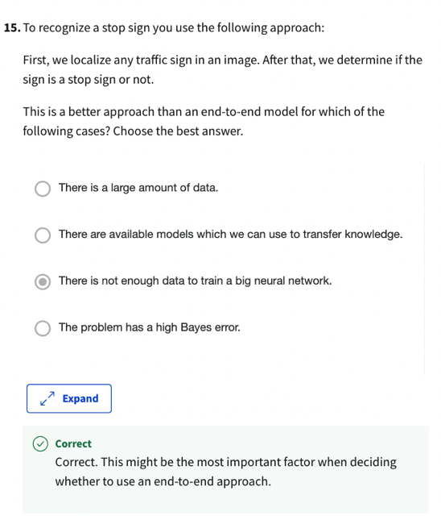</kbd>

> [!NOTE]
> Muốn dùng E2E quan trọng nhất phải có cực nhiều data

 

<kbd>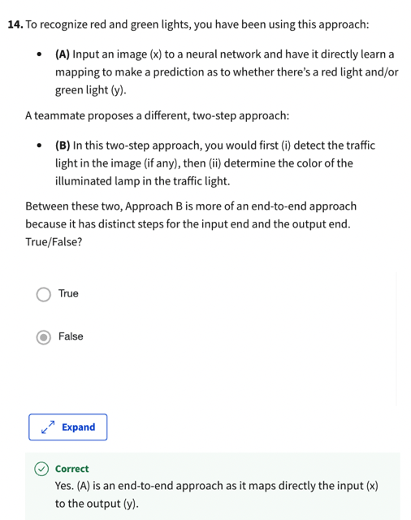</kbd>

 

