# Course 4 - Convolutional Neural Network

📊 **Progress:** `168` Notes | `478` Screenshots

---

## Course 4 - Convolutional Neural Network

 

## C4w1_foundations Of Convolutional Neural Network

 

### Computer Vision

 

#### 1 \\*Computer vision\\* is rapidly advancing thanks to deep learning,
enabling new applications that were impossible a few years ago.

2 The computer vision research community's creativity and
inventiveness in coming up with new neural network architectures
and algorithms can inspire cross-fertilization into other areas.

3 Computer vision problems include \\*image classification\\*, \\*object
detection\\*, and \\*neural style transfer\\*, among others.

4 One of the challenges of computer vision problems is that the
\\*inputs can get really big\\*, requiring better implementation of the
\\*convolution operatio\\*n, which is one of the fundamental building
blocks of convolutional neural networks.

 

<kbd></kbd>

 

<kbd>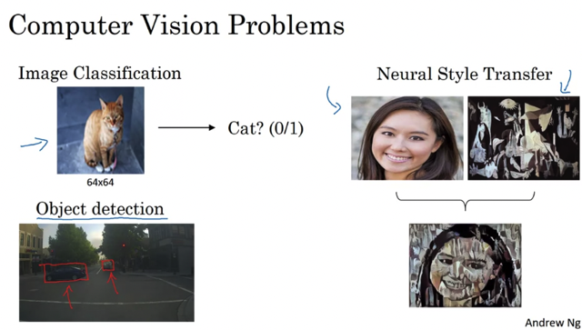</kbd>

> [!NOTE]
> ..

 

<kbd>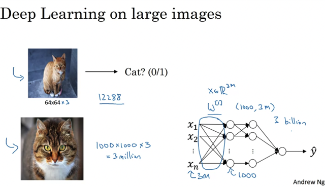</kbd>

> [!NOTE]
> Nếu X là image size 1000x1000x3 -> X sẽ là 3 Millions features -> W[1]
> sẽ là 1000x3M = 3 tỉ cái weights: Quá lớn nên phải dùng 1 cái mới :
> Convolutional N.N

 

### Edge Detection Example

 

#### • The \\*convolution operation\\* is a fundamental building block of
\\*convolutional neural networks\\*.

• \\*Edge detection\\* is one of the many applications of the convolution
operation.

• \\*Early\\* layers of a neural network \\*detect\\* \\*edges\\* while \\*later layers\\*
detect \\*complete objects\\*.

• Convolution involves a \\*filter\\* or \\*kernel\\* being passed over an input
image to produce an output image.

• The output of the convolution operation is determined by taking
\\*element-wise products\\* and \\*summing\\* up the resulting values.

• The \\*output\\* of the convolution operation is \\*smaller\\* in size than the
\\*input\\* image.

 

<kbd></kbd>

> [!NOTE]
> Để detect object - Thì đầu tiên là làm sao xác định (detect) được cái edge -
> đường viền, ranh giới của các object trước

 

<kbd></kbd>

<kbd></kbd>

<kbd></kbd>

<kbd>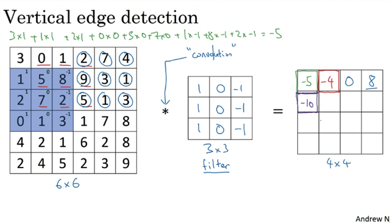</kbd>

<kbd></kbd>

> [!NOTE]
> Filter or Kernel
>
>
>
> Ví dụ hình 6x6x1 (gray scale nên x1)
>
>
>
> * Trong toán học * là phép toán 'Convolution', trong Python thì
> lại là multiply, element-wised multiply

 

<kbd></kbd>

> [!NOTE]
> Turn out to be a '**EDGE** detector' sẽ thấy sau.
>
>
>
> Python: conv-forward
> TensorFlow: tf.nn.con2d
> Keras: Conv2D

 

<kbd></kbd>

> [!NOTE]
> In case the dimensions here seem a little bit wrong that the
> detected edge seems really thick, that's only because we are
> working with very small images in this example. And if you are
> using, say a 1000 by 1000 image rather than a 6 by 6 image then
> you find that this does a pretty good job, really detecting the vertical
> edges in your image
>
>
>
> Đại khái là bằng cách 'convol' với cái filter, sẽ cho ra kết quả
> 'detect' được cái '**edge**'. Ta thấy cái hình bên phải chính là cái 
> edge - đường viền đó.

 

### More Edge Detection

 

#### 1 The video discusses \\*edge detection\\*, which is the process of
i\\*dentifying boundaries\\* in an image.

2 The video explains the \\*difference between positive and negative
edges\\* and how this is detected using edge detection filters.

3\\* Different edge detection filters\\* are discussed, including the three
by three filter for detecting vertical and horizontal edges, the \\*Sobel
filter\\*, and the \\*Scharr\\* filter.

4 The video highlights the possibility of using \\*machine learning\\* to
\\*learn the parameters of an edge detection filter\\*.

5 The \\*limitations of edge detection\\* in \\*small images\\* and the
\\*potential for deep learning to improve edge detection in complex
images\\* are also discussed.

 

<kbd>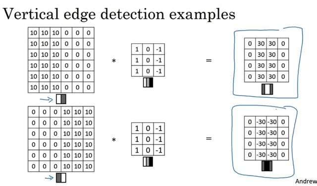</kbd>

> [!NOTE]
> 1 ví dụ cho thấy nếu ta 'flip' cái hình input thì cái edge sẽ màu dark thay vì
> light, và nếu ta không quan tâm màu thì ta có thể lấy giá trị tuyệt đối ||30|| =
> -||30|| = 30

 

<kbd></kbd>

> [!NOTE]
> So in summary, different filters allow you to
> find vertical and horizontal edges.

 

<kbd></kbd>

> [!NOTE]
> Đại khái là cái matrix filter để dùng cho viêc edge detection này
> như cái ở trên [1 1 1 0 0 0 ..] có thể có những kiểu khác với các
> tên khác nhau có người thích dùng cái. [1 2 1..] gọi là **Sobel** filter, a
> little bit better có nguời thấy [3 10 3..] tốt hơn gọi là **Scharr** filter.
>
>
>
> Nhưng cái chính là **với N.N, máy tính nó sẽ học để cho ra cái filter
> sao cho giúp detect cái edge tốt nhất**, **có thể ra cái Sobel, hoặc
> thậm chí ra cái tốt hơn cả mấy cái đó.**
>
> Và không chỉ detect edge dọc,
> ngang mà cả đường chéo, 45 độ
> 70 độ v.v

 

### Padding

 

#### 1 \\*Padding\\* is a \\*modification\\* to the \\*basic convolutional operation\\* that can
help build \\*deep neural networks\\*.

2 A convolutional operation\\* reduces the size of the image.\\*

3 \\*Shrinking\\* the image too much may lead to \\*loss of information. \\*  

4 \\*Padding\\* is a solution to this problem as it \\*preserves\\* the size of the
image.

5 By padding the image, the output dimension increases by \\*2p\\* in each
direction.  

6 \\*Valid convolution \\*is a type of convolution that \\*doesn't use
padding.\\*

7 \\*Same convolution\\* is a type of convolution where the \\*output size\\* is the
\\*same\\* as the\\* input size\\*.

8 The amount of \\*padding\\* \\*required\\* to achieve the \\*same\\* convolution is
\\*(f-1)/2\\*, where \\*f is the size of the filter\\*.

 

<kbd>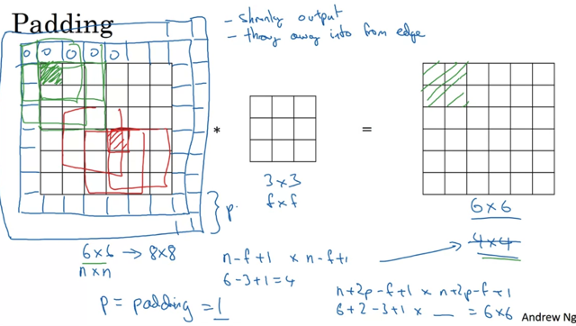</kbd>

> [!NOTE]
> Đại khái là để khắc phục 2 vấn đề là **'bị nhỏ dần' - shrinking output**
> và **'bỏ qua / ít dùng cái ở biên' sẽ khiến model bị bias đối với
> các info ở cạnh của input**  thì người ta dùng '**padding**'
>
>
>
> Có thể dùng padding p = 1, hoặc 2 ...

 

<kbd></kbd>

> [!NOTE]
> **Valid padding** là không dùng padding 
>
>
>
> **Same padding** là sao cho output dimension bằng với input **p = (f-1)/2**
>
>
>
> Conventionally **f thường là số lẻ 3x3, 5x5, 7x7 để padding không bị
> asymmetric**
>
> Nếu có bối rối ko nhớ đc thì chỉ cần nhớ
> nếu không có padding thì thì từ n giảm xuống còn n - f + 1 
>
>
>
> Vậy muốn giữ nguyên thì + thêm f -1 nữa nên p = (f-1) /  2, 
> tại 2 bên quá dể nhớ

 

### Strided Convolutions

 

#### 1 \\*Strided\\* convolutions are a basic building block of Convolutional Neural
Networks.

2 A \\*strided\\* convolution involves taking an element-wise product of an
image and a filter, but \\*instead of stepping the filter by one\\*, it is stepped
by a \\*stride s.\\*

3 The output dimensions of the strided convolution are governed by the
formula: (N + 2P - F)/S + 1, where N is the input size, P is the padding, F
is the filter size, and S is the stride.

4 If the output dimensions are \\*not an integer\\*, they are \\*rounded down.\\*

5 The \\*convention\\* for convolutions is that the \\*filter\\* must \\*lie entirely\\* within
the image or the image plus padding region.

6 The difference between \\*convolution\\* and \\*cross-correlation\\* is that
convolution involves a flip of the filter on both axes before taking the
element-wise product and summing, while cross-correlation does not
involve this flip. However, the \\*deep learning literature\\* often r\\*efers to both
operations as convolutions.\\*

 

<kbd>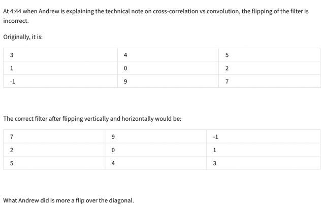</kbd>

 

<kbd></kbd>

 

<kbd>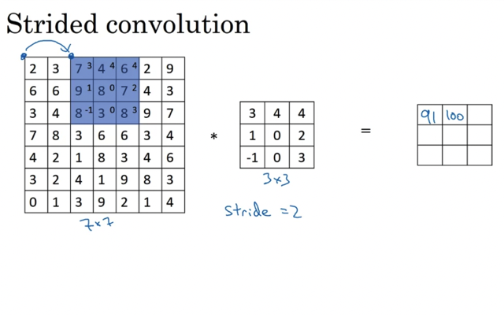</kbd>

 

<kbd>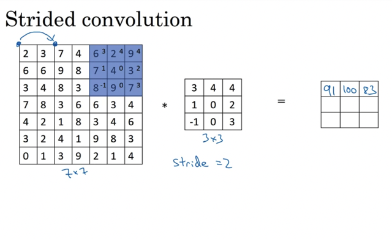</kbd>

 

<kbd>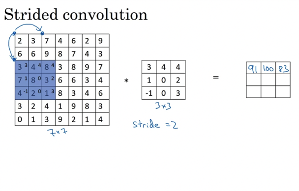</kbd>

 

<kbd>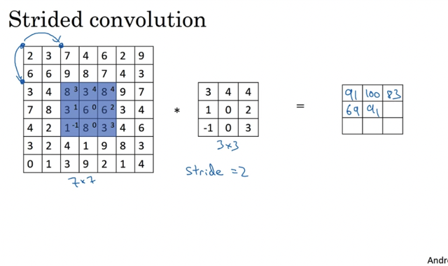</kbd>

 

<kbd>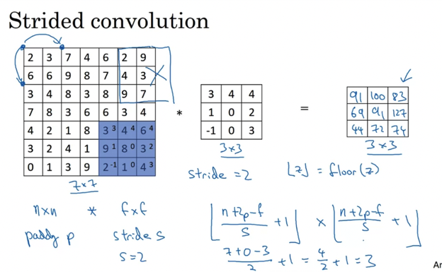</kbd>

> [!NOTE]
> Kí hiệu [z] (đúng hơn là chỉ có ngoặc ở dưới: Round down
> -> Nếu (n+2p-f)/s **không nguyên thì round down** - làm tròn xuống.
>
>
>
> Theo convention thì **filter phải nằm trọn trong image + padding** thì mới tính

 

<kbd></kbd>

> [!NOTE]
> Chọn s cho kết quả nguyên thì tốt không thì
> làm tròn cũng được

 

<kbd></kbd>

> [!NOTE]
> Đại khái là đúng ra phải gọi là '**Cross-correlation**' chứ không phải
> convolution vì **trong toán học** phép convolution yêu cầu phải **flip** cái matrix
> filter horizontally và vertically trước.
>
>
>
> Điều này sẽ giúp phép toán convolution có tính chất (A*B)*C = A*(B*C)
> gọi là **associativity** nhưng trong Deep learning thì cái này không giúp ích
> gì mấy nên người ta cứ gọi là Convolution mà không cần phải flip để cho
> đơn giản

 

### Convolutions Over Volume

 

#### • \\*3D convolution\\* can be used to \\*detect features\\* in
3D volumes.

• \\*Filters\\* are placed in the volume and multiplied with
corresponding values from the color channels to
produce an output volume.

• \\*Different parameters\\* can be used to create \\*different
feature detectors\\*.

• \\*Multiple filters\\* can be used at the same time to
detect \\*multiple types of features\\* (more complex features)

 

<kbd>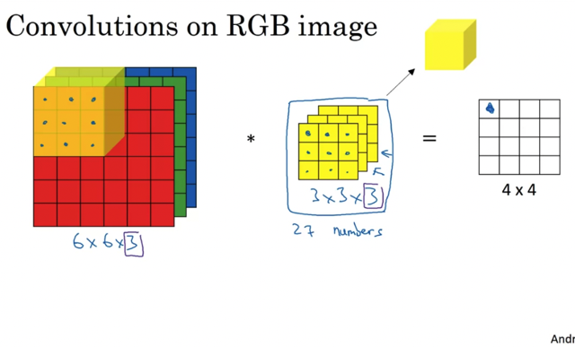</kbd>

> [!NOTE]
> Đại khái là cũng convol từng **'lớp' của filter
> với từng 'lớp'** của cái image Xong rồi
> **sum** **kết quả của cả 3 lớp lại**

 

<kbd></kbd>

 

<kbd>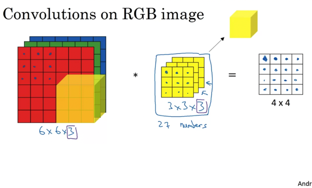</kbd>

 

<kbd></kbd>

> [!NOTE]
> Feature detector: Đại khái là các thay đổi giá trị của **params khác** (của
> filter) sẽ giúp **detect feature khác nhau** ví dụ sẽ quyết định được là "
> Chỉ detect edge with color RED", or "detect edge chung"
>
>
>
> Đại khái cũng chỉ nói lại việc thay đổi cái param - giá trị của cái  Filter sẽ
> giúp detect các pattern/feature khác nhau có điều filter bây h là 3D chứ
> ko chỉ 2D nên nó có thể detect nhiều pattern phức tạp hơn ví dụ như
> cũng đường viền nhưng mà đường viền màu này màu  kia nữa chứ
> không chỉ đường viền chung chung

 

<kbd>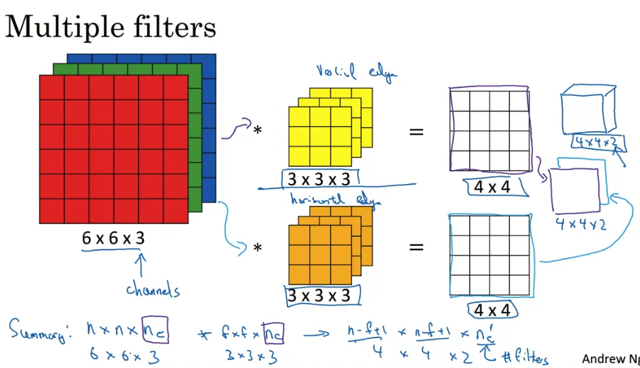</kbd>

> [!NOTE]
> **Multiple features detector**: Đại khái là kết hợp nhiều filter sẽ **detect
> dc nhiều features cùng lúc** -> More complex features detector
>
>
>
> Mỗi filter ra 1 output xong **stack mấy cái output lại**

 

### One Layer Of A Convolutional Network

 

#### 1 The video demonstrates how to build one layer of a convolutional neural
network using an example of \\*convolving a 3D volum\\*e with\\* two filters\\* to
produce different \\*4 by 4 outputs.\\*

2 The resulting outputs are passed through a \\*bias\\* and \\*non-linearity\\* to
produce a\\* 4 by 4 output\\* \\*for each filter,\\* which are then \\*stacked up\\* to form a
\\*4 by 4 by 2 output volume.\\*

3 The convolution operation is \\*similar to a linear operation\\* in a
non-convolutional neural network, where the \\*filters\\* play a \\*role similar to w1\\*
and the \\*output\\* of the convolution operation plays a role similar to \\*w1 times
a0.
\\*
4 One layer of a convolutional neural network can have \\*multiple filters,\\*
which can result in a \\*higher-dimensional output volume.\\*

5 To calculate the number of parameters in a layer with ten 3 by 3 by 3
filters, one needs to multiply the number of parameters per filter (28) by the
number of filters (10), resulting in 280 parameters.

 

<kbd>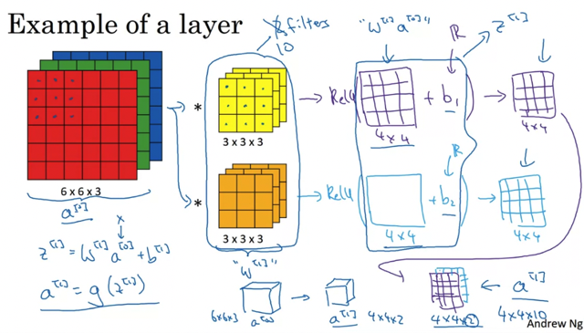</kbd>

> [!NOTE]
> Giống như a[1] = w.a[0] + b thì
> filter đóng vai trò như w

 

<kbd>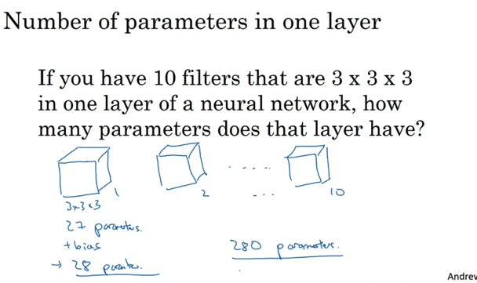</kbd>

> [!NOTE]
> 10 filter, mỗi cái 3x3x3 = 27
> params, thêm 1 cái bias là 28.
> Vậy tổng là 280 params

 

<kbd>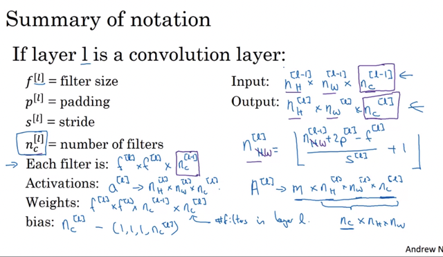</kbd>

> [!NOTE]
> Khái quát hoá nên có thể bối rối chỉ cần nhớ
>
>
>
> Muốn convol được thì **số lớp (bề dày, số channel) của filter phải bằng bề 
> dày của input** để convol xong nó gộp lại thành 1 channel
>
>
>
> Vậy input a[l-1] là nH [l-1] x nW [l-1] x **nC [l-1]** 
> thì filter cũng f [l] x f [l] x **nC [l-1]
>
>
>
> NHƯNG LAYER [l] CÓ NHIỀU FILTER = nC [l]
> nên mỗi kết quả từ mỗi filter stack lại thành ra nC [l] channel**
>
>
>
> nên output là a[l] sẽ (có shape) là nH [l] x nW [l] x nC [l]
>
>
>
> Và theo quan hệ của conv operation thì 
>
>
>
> nH [l] = [ n[H] [l-1] - f + 2*p [l] ] / s [l] + 1 (] là round-down)
> nW cũng vậy
>
>
>
> Tổng số weight layer [l] là: 
> (1 cái filter có f [l] x f [l] x nC [l-1] params) x nC [l] cái filter=f [l] x f [l] x nC [l-1]x nC [l] params

 

### Simple Convolutional Network Example

 

#### 1 Introduction to a deep convolutional neural network for
\\*image classification.\\*

2 Example of a \\*ConvNet\\* using small images.

3 Explanation of the \\*dimensions\\* and \\*number of filters\\* for
each convolutional layer.

4 \\*Flattening\\* the output of the \\*last convolutional layer\\* into a
vector for the final prediction.

5 The importance of \\*selecting\\* \\*hyperparameters\\* in designing
a convolutional neural network.

6 Upcoming guidelines and suggestions for \\*selecting
hyperparameters.\\*

 

<kbd>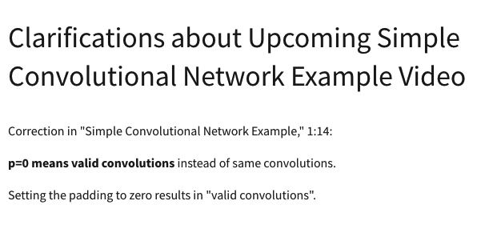</kbd>

 

<kbd>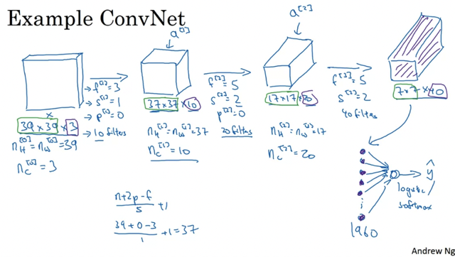</kbd>

> [!NOTE]
> Some note:
>
>
>
> Kết quả cuối (volume cuối) 7x7x40 sẽ được **flatten** thành 1 vector
> và bỏ vào **sigmoid** hay **softmax** để tính 
>
>
>
> Nhận thấy: **nC tăng dần** qua các layer 3-10-20-40, **nW, nH** **thì giảm dần**

 

<kbd></kbd>

> [!NOTE]
> Convolution thôi cũng được nhưng nó
> thường có thêm **pooling layer** và **FC** layer

 

### Pooling Layers

 

#### 1 ConvNets use \\*pooling layers\\* to \\*reduce representation size\\*, \\*increase speed\\*
and \\*make features more robust.\\*

2 \\*Max pooling\\* is a common type of pooling layer.

3 In max pooling, the input is divided into regions and the \\*output is the maximum
value of each region.\\*

4 The \\*hyperparameters\\* of max pooling are\\* filter size\\* and \\*stride\\*, which determine
the s\\*ize of the regions\\*.

5 Max pooling helps \\*preserve features detected anywhere in the filter\\*, while
\\*suppressing others that aren't detected\\*.

6 The intuition behind \\*why max pooling works well\\* is \\*not fully understood.\\*

7 Max pooling has \\*hyperparameters\\* but no parameters to learn, so it's a \\*fixed
computation.\\*

8 The formulas for figuring out the \\*output size\\* of convolutional layers also work
for max pooling.

9 Max pooling can be applied to \\*3D\\* \\*inputs and the output will have the same
dimension.\\*

 

<kbd></kbd>

> [!NOTE]
> /"Max pooling helps preserve features detected anywhere in
> the filter, while suppressing others that aren't detected." / Đại
> khái là max pooling giúp kiểu như giữ lại những gì (feature) nó
> phát hiện

 

<kbd></kbd>

> [!NOTE]
> Quan hệ tính size của input vào output cũng theo công thức 
> = round-down[ (n - f + 2p) / s ] + 1
>
>
>
> Và nếu là 3 channel thì output cũng có 3 channel
> (mỗi channel của filter sẽ 'tính'  với 1 channel của input)
> có điều khác với convol thường thì **pooling nó không gộp các
> channel kết quả lại** nên kết quả vẫn **giữ số channel** của input 
> (và của filter)

 

<kbd></kbd>

 

<kbd></kbd>

 

### CNN Example

 

<kbd></kbd>

> [!NOTE]
> - Ở đây, và từ đây ổng sẽ ko viết cụ thể số filter
> của từng layer nữa mà tự hiểu rằng số channel
> của output chính là số filter
>
>
>
> Ví dụ từ 32x32x3 -> 28x28x**6** **tự hiểu có 6 filter,** size filter bao nhiêu
>  thì tính theo công thức. Nhẩm được thì nhẩm 
> 28 = (32 - f + 2*0)/1 + 1 -> f = ...
>
>
>
> - Layer 1 gồm 1 Conv và 1 Pool
> - Layer 2 cũng 1 Conv và 1 Pool
> - Rồi flatten rồi qua mấy cái Dense (Fully Connected) layer
> nữa cuối cùng là Softmax
>
>
>
> CONV-POOL-CONV-POOL-FC-FC-FC-SOFTMAX
>
>
>
> Cái mô hình này chính là **LeNet-5**

 

<kbd>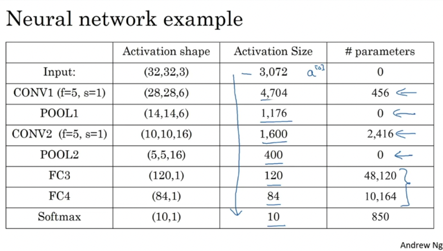</kbd>

 

### Why Convolutions?

 

#### 1 Convolutional layers have \\*two main advantages\\* over fully
connected layers: \\*parameter sharing\\* and \\*sparsity of
connections.\\*

2 Convolutional layers have a lot\\* fewer parameters\\*, which
allows for \\*smaller training sets and less overfitting\\*.

3 Convolutional neural networks \\*capture translation invariance\\*,
which helps them \\*recognize objects regardless of their location\\*
in an image.

4 \\*Training\\* a convolutional neural network involves using a
\\*labeled training\\* set to \\*adjust the weights of the filters\\* to
produce accurate outputs.

 

<kbd></kbd>

 

<kbd></kbd>

> [!NOTE]
> Thấy rõ đại khái là nếu là n.n thường thì số params sẽ rất lớn khi layer 1 có
> 3072 unit layer 2 có 4704 unit sẽ ra là **14 triệu params** trong khi ConvNet
> chỉ cần **156**

 

<kbd></kbd>

<kbd>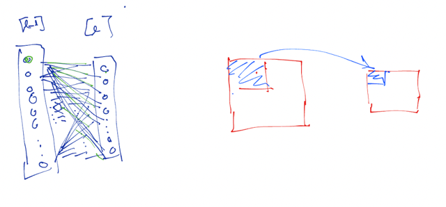</kbd>

> [!NOTE]
> **Params sharing**: Đại khái là **1 vài weight (trong filter)** có
> thể giúp **detect feature ở nhiều vị trí khác nhau** trong hình
> chứ **không nhất thiết phải là mỗi chỗ một cái** -> **Giảm bớt
> số weight** cần thiết
>
>
>
> **Sparsity of connections**: Đại khái là:..
>
>
>
> Fully-connected NN thì **mỗi unit của layer trước** sẽ **connect
> tới mọi unit của layer sau,** cũng như là **mỗi unit của layer sau
> sẽ connect với mọi unit của layer trước** 
>
>
>
> Conv NN thì **mỗi output chỉ connect với một vài input
> thôi -** nhớ lại lúc tính thì mỗi số của là kết quả của phép tính
> convolution của 1 vài ô trong các channel thôi chứ không phải
> tất cả

 

<kbd></kbd>

> [!NOTE]
> '**Translation invariance**' là tính chất của một mô hình hoặc một hệ thống
> có khả năng xử lý các đối tượng, hình ảnh, văn bản,... mà **không bị ảnh
> hưởng bởi vị trí tương đối giữa chúng** trong không gian hay thời gian.
>
>
>
> Nói cách khác, tính chất này cho phép mô hình hoặc hệ thống đó **nhận ra
> các đối tượng giống nhau dù chúng xuất hiện ở những vị trí khác nhau**
> trên màn hình hoặc thời gian.
>
>
>
> -> Đại khái là 1 hệ thống mà có tính chất 'translation invariance' như để
> detect hình con mèo trong một bức ảnh thì dù con mèo  xuất hiện ở đâu
> trong bức ảnh nó cũng detect được

 

- **7 Training a convolutional neural network

- Building a \\*labeled training\\* set for a specific task, such as identifying
images of cats and dogs.

- \\*Preprocessing\\* the \\*data\\* to \\*standardize\\* the \\*image size\\* and pixel values.

- \\*Defining the architecture\\* of the convolutional neural network, including the
\\*number\\* and\\* type of layer\\*s, \\*activation\\* functions, and \\*optimization\\* algorithm.

- \\*Initializing the weights \\*of the network and using \\*backpropagation\\* to \\*adjust
the weights\\* to \\*minimize the loss\\* between the \\*predicted\\* and actual labels.

- \\*Evaluating the performance\\* of the network on a \\*validation set\\* and
\\*adjusting the hyperparameters\\* as necessary.

- Finally, \\*testing the trained network\\* on a test set to \\*evaluate its
generalization performance.\\***

 

<kbd>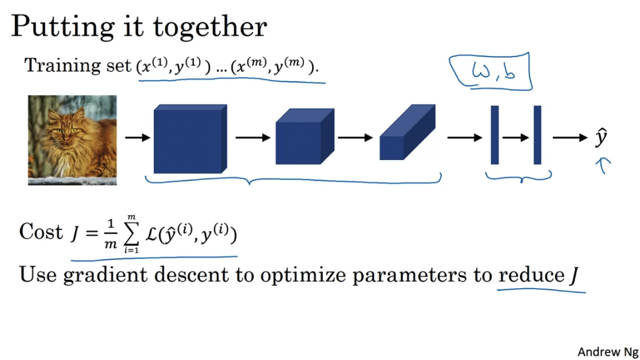</kbd>

 

### Quiz

 

<kbd></kbd>

 

<kbd>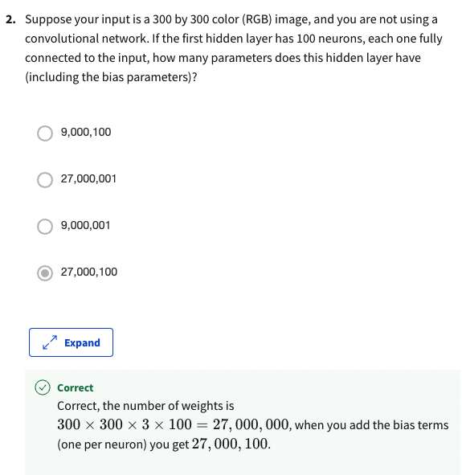</kbd>

 

<kbd>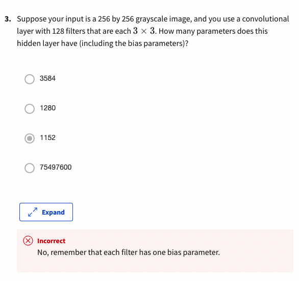</kbd>

> [!NOTE]
> 3x3 = 9 (weights) + 1 (bias) = 10 x 128 (no. filters) = 1280

 

<kbd>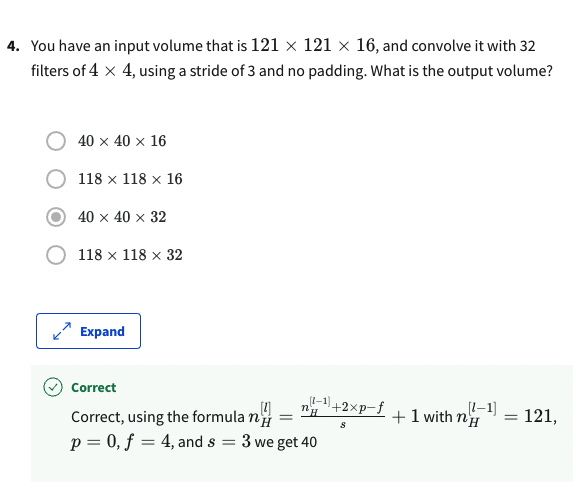</kbd>

 

<kbd>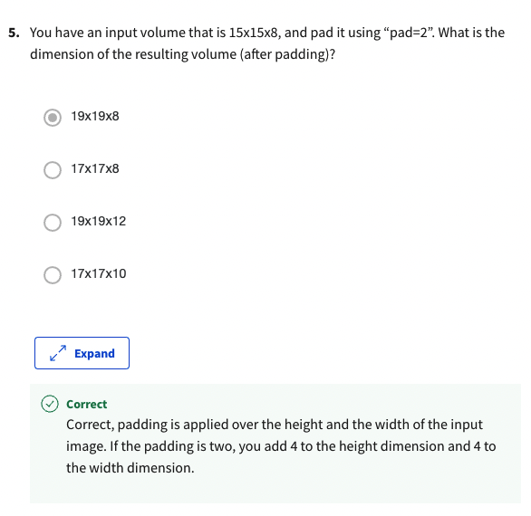</kbd>

 

<kbd>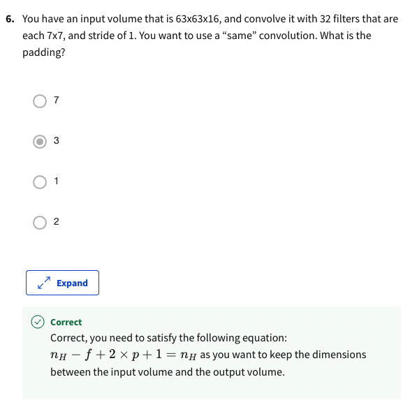</kbd>

> [!NOTE]
> Nhẩm rất nhanh (do s = 1 nên đỡ rối vụ chia s) là n sau
> khi cònv là 63 - 7+1 = 63 - 6 vậy padding phải bù lại để
> giữ nguyên 63 -> 2p = 6 => p = 3

 

<kbd>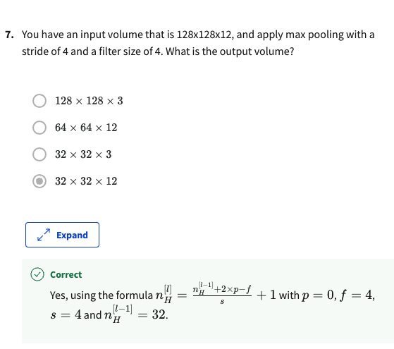</kbd>

> [!NOTE]
> Nhẩm: channel vẫn là 12. 128 - 4 (f) / 4(s) =
> 31. Xong + 1 là 32 -> 32x32x12

 

<kbd></kbd>

 

<kbd></kbd>

> [!NOTE]
> Cái ý đầu sai, vì hiển nhiên ta ko thể 'omit' - bỏ qua
> cái conv layer trong quá trình backprop
>
>
>
> Cái ý 3 transfer learning không chỉ có Conv mới có

 

<kbd>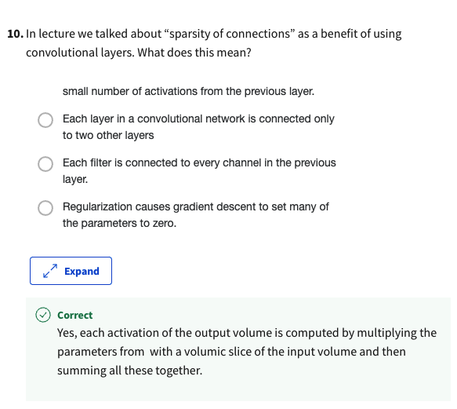</kbd>

 

### Programming Assignments: Convolutional Model

 

#### Be able to:  
• Explain the convolution operation

• Apply two different types of pooling operation

• Identify the components used in a convolutional
neural network (padding, stride, filter, ...) and their
purpose

• Build a convolutional neural network

> [!NOTE]
> Nói chung là làm những 'công việc' của
> convolution from scratch bằng numpy

 

##### 1 - Packages:
Matplotlib, numpy

 

<kbd></kbd>

 

##### 2 - Outline of the Assignment:
Đại khái là mô tả sơ những function sẽ làm cho 
Convolution n.n from scratch (bằng numpy)

Ổng nói dù những Framework như TS, PT bây giờ
giúp việc define ConvNet dể dàng nhưng việc hiểu nó
vẫn là quan trọng vì nó là một trong những khái niệm
khó của Deep Learning

 • \\*Convolution functions\\*, including:
 ▪ Zero Padding
 ▪ Convolve window
 ▪ Convolution forward
 ▪ Convolution backward (optional)
 • \\*Pooling functions\\*, including:
 ▪ Pooling forward
 ▪ Create mask
 ▪ Distribute value
 ▪ Pooling backward (optional)
Notebook sau sẽ dùng TensorFlow để làm những cái tương tự

 

<kbd></kbd>

> [!NOTE]
> Ổng nói dù những Framework như TS, PT bây giờ
> giúp việc define ConvNet dể dàng nhưng việc hiểu nó
> vẫn là quan trọng vì nó là một trong những khái niệm
> khó của Deep Learning

 

##### 3 - Convolutional
Neural Networks

 

- **3.0 - Convolutional
Neural Networks**

 

<kbd>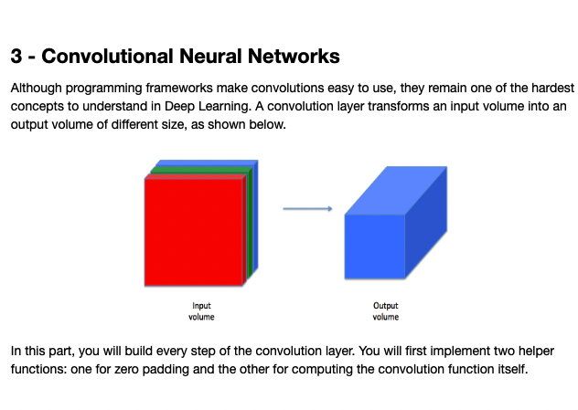</kbd>

 

- **3.1 - Zero-Padding:

Nhắc lại vai trò của padding trong việc giữ cho size
không bị giảm và  giúp thông tin tại edge của image
không bị ngó lơ / xem nhẹ**

 

<kbd></kbd>

 

- **Function zero_pad(X, pad) -> X_pad:

Code function zero_pad (X, pad) -> X_pad
dùng np.pad()
Mỗi data sample là 1 image -> dài x rộng x 3 (màu RGB) 
-> X = có m bộ - Do đó X có shape = m x n_h x n_w x n_c: n_c = 3
Trong python X.shape = (m, n_h, n_w, n_c)**

 

<kbd>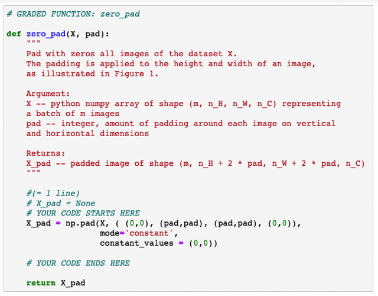</kbd>

> [!NOTE]
> Dùng function np.pad() của python bỏ
> vào X và chỉ định các dimension nào
> cần pad, pad bao nhiêu

 

<kbd></kbd>

 

<kbd>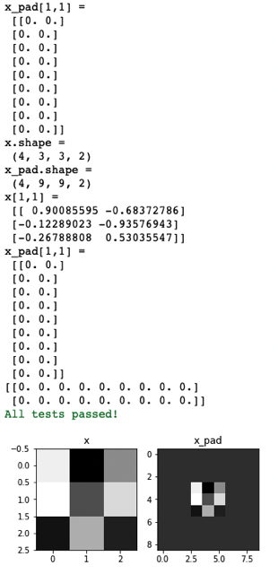</kbd>

 

- **3.2 - Single Step of Convolution

Đại khái là bỏ filter lên 1 vị trí của input và tính để cho
ra 1 số. Thì phép tính này sẽ là phép tính element-wise
multiplication giữa 2 matrix (đúng hơn là 2 volume)
cùng size rồi sum lại.

Quá trình convol thì sẽ (slide window) đi và tính hết các
chỗ khác thì đây là 1 bước trong đó.

Nên hiểu là có n_C_prev channel luôn, nên đây là
phép tính trên 2 volume có size là f, f, n_C_prev

f là bề dài, rộng, n_C_prev là số channel (bề sâu / dầy)
của filter**

 

<kbd>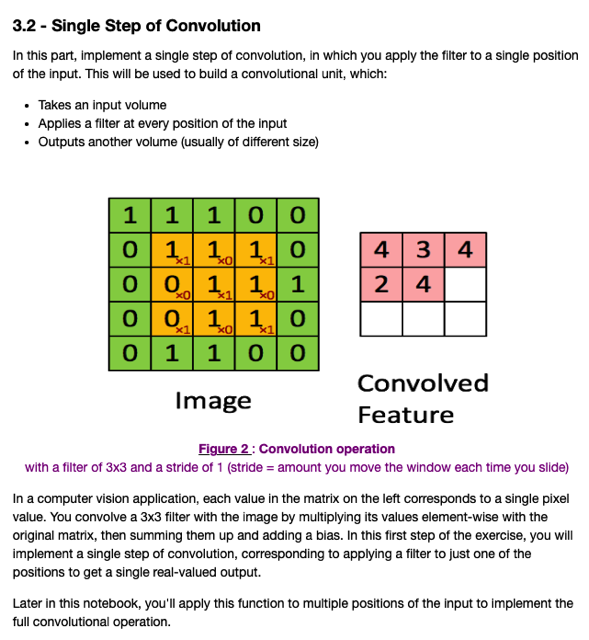</kbd>

> [!NOTE]
> Đại khái là bỏ filter lên 1 vị trí của input và tính để cho ra 1 số.
> Thì phép tính này sẽ là phép tính element-wise multiplication
> giữa 2 matrix (đúng hơn là 2 volume) cùng size rồi sum lại.
>
>
>
> Quá trình convol thì sẽ (slide window) đi và tính hết các chỗ khác
> thì đây là 1 bước trong đó.
>
>
>
> Nên hiểu là có n_C_prev channel luôn, nên đây là phép tính
> trên 2 volume có size là f, f, n_C_prev
>
>
>
> f là bề dài, rộng, n_C_prev là số channel (bề sâu / dầy) của filter

 

<kbd>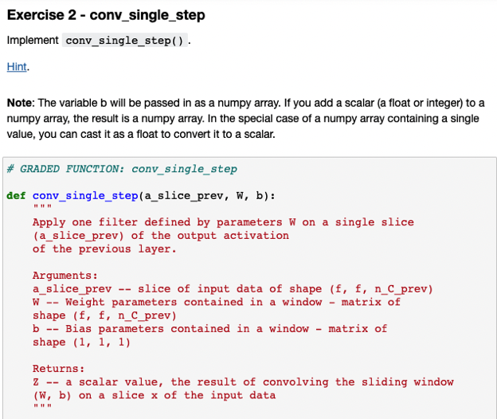</kbd>

<kbd>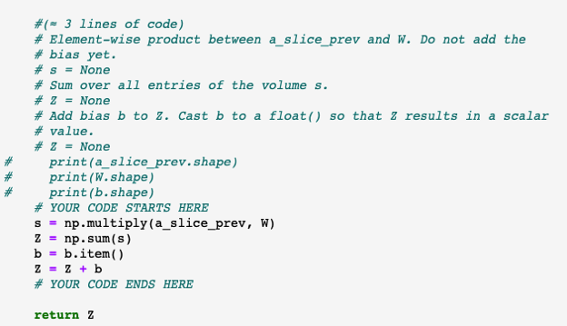</kbd>

 

- **Exercise 2 - conv_single_step(a_slice_prev,
W, b)

Đại khái là thực hiện 1 bước tính của phép
convol.

Dùng np.multiply để element-wised multiply

Chỉ có chú ý chỗ khi sum() nó trả về float luôn,
nhưng cộng với b (matrix (1,1,1) đang là
matrix thì nó thành matrix lại => Cast b thành
float trước bằng .item()**

 

<kbd>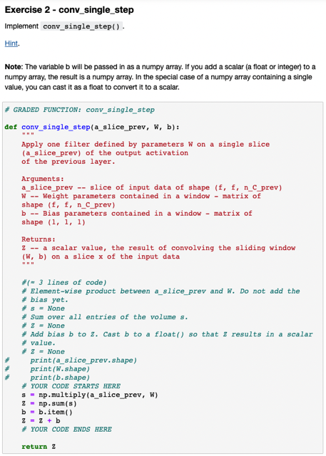</kbd>

 

<kbd></kbd>

 

- **3.3 - Convolutional Neural Networks - Forward Pass

Đại khái làm làm quá trình convol một input volume với
nhiều filter để Ra một output volume**

 

<kbd>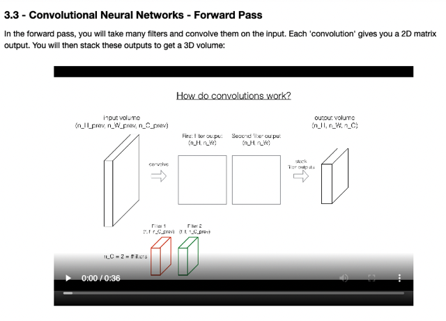</kbd>

 

- **Exercise 3 - conv_forward: (...)

Nói chung là đây là function sẽ thực hiện việc convol một input
volume, với n_c filter để cho ra output volume

Quá trình làm ở lần đầu chưa hiểu lắm nhưng ở lần review thứ 1
thì thấy rõ ràng. Cũng nhờ hình vẽ minh hoạ phân tích kĩ ở lần học.
Những chỗ khó là những chỗ sai lần đầu làm :

- Loop trong số lần convol: Chính là nH và nW mà lúc đầu thấy bối
rối vì  chưa để ý rằng với công thức nH = ..nH_prev thì ta đã biết
được size của output thì từ đó chính là số bước convol cần tính.

- Lấy 1 'window' để convol, với các thông số vertical_start / end -
horizontal_start / end thì cũng không có gì khó hiểu khi nhìn lại
v_start chính là bằng h trong range nH * stride. Và end thì dễ rồi bằng
start + filter size f thôi.**

> [!NOTE]
> Sai hai chỗ:

 

<kbd>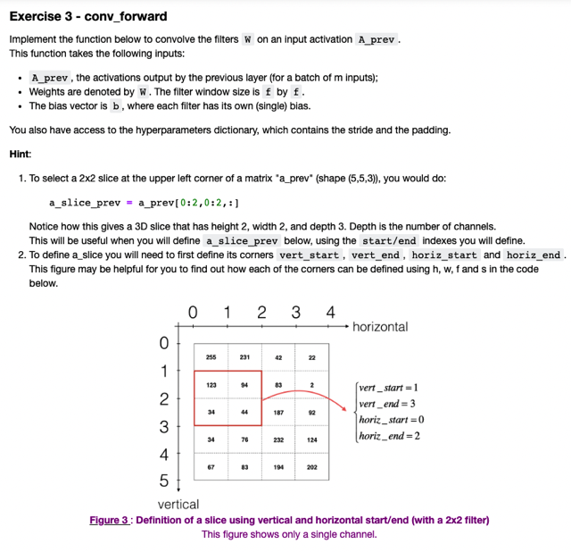</kbd>

 

<kbd>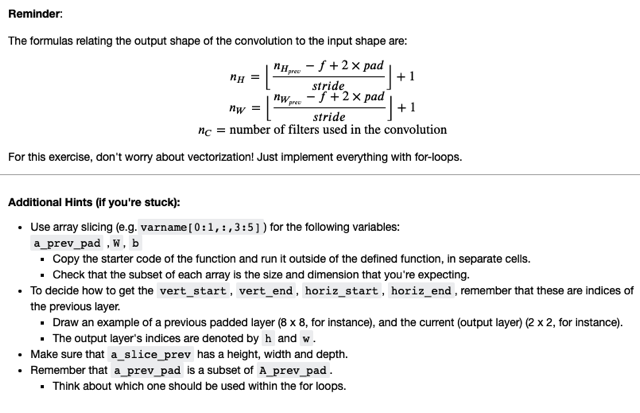</kbd>

 

<kbd>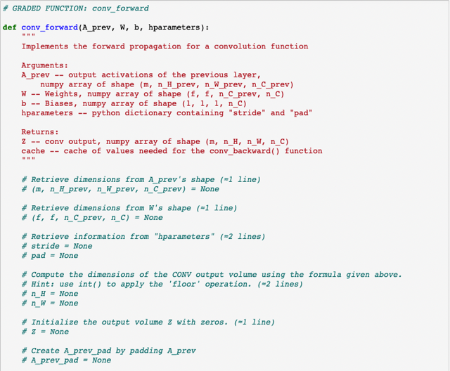</kbd>

<kbd>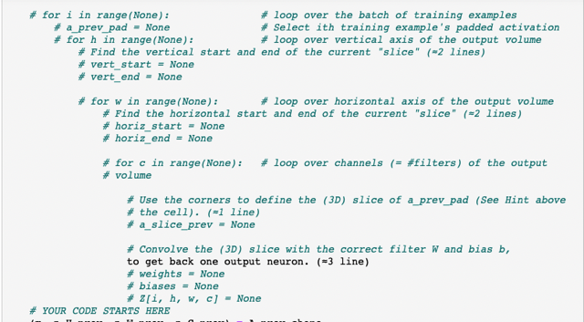</kbd>

<kbd>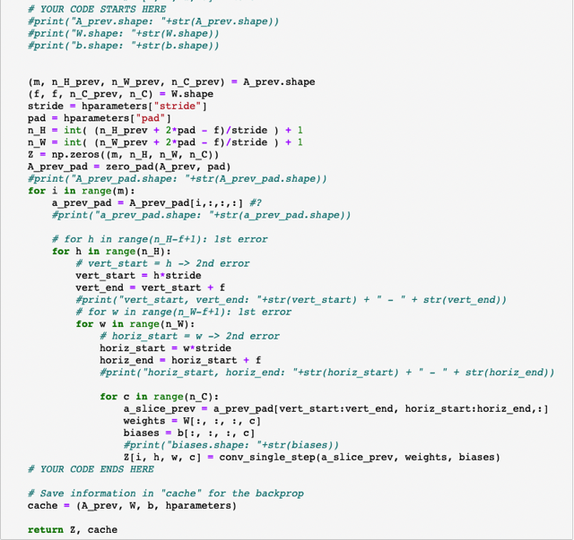</kbd>

 

<kbd></kbd>

<kbd></kbd>

<kbd></kbd>

<kbd></kbd>

<kbd></kbd>

<kbd></kbd>

<kbd>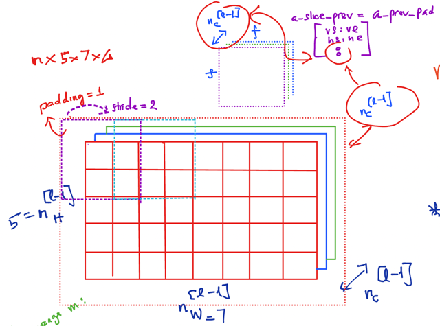</kbd>

 

##### 4 - Pooling Layer

 

- **4.1 - Forward Pooling

Làm conv_forward rồi thì cái này dễ hiểu thoi, chỉ
thay bằng bước convol bằng phép tính max,
mean**

> [!NOTE]
> Sai 1 chỗ

 

<kbd></kbd>

 

<kbd></kbd>

 

<kbd>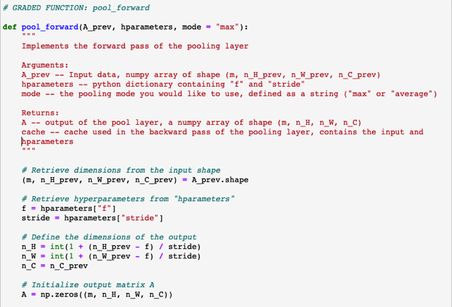</kbd>

<kbd></kbd>

<kbd></kbd>

 

<kbd></kbd>

 

##### What you should
remember:

 

<kbd>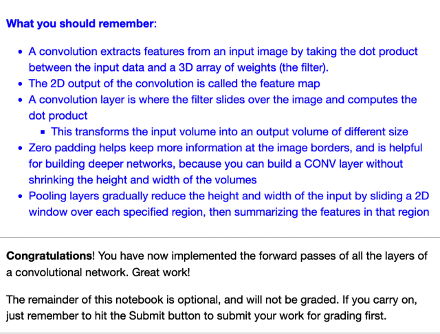</kbd>

 

##### 5 - Backpropagation in
Convolutional Neural Networks

> [!NOTE]
> Quay lại sau

 

- **5.1 - Convolutional Layer Backward Pass**

 

- **5.2 Pooling Layer - Backward Pass**

 

### Programming Assignments: Convolutional Model Application

 

#### Welcome to the second (required) programming exercise
of Course 4 of the Deep Learning Specialization.

In this notebook you will build ConvNets to create a
\\*mood classifier\\* and \\*identify sign language digits\\*,
while gaining familiarity with the \\*TF Keras Sequential\\*
and \\*Functional APIs\\* along the way.

 

##### 1 - Packages

 

<kbd>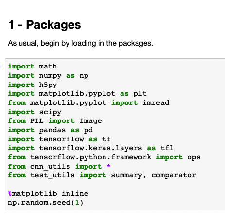</kbd>

 

##### 1.1 - Load the Data and Split the
Data into Train/Test Sets

 

<kbd></kbd>

 

<kbd>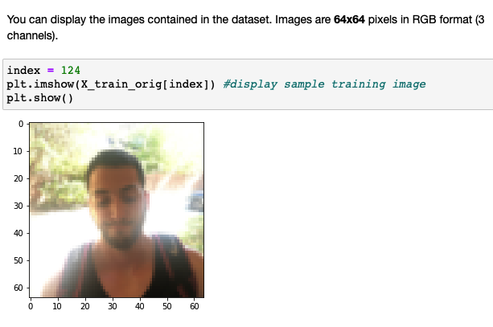</kbd>

 

##### 2 - Layers in TF Keras

 

<kbd></kbd>

 

##### 3 - The Sequential API: Đại khái
là thay vì tự làm như bài trước,
nay ta dùng Framework TS
Keras's Sequential

 

<kbd>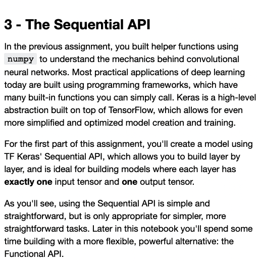</kbd>

> [!NOTE]
> Ở đây ổng có nói Sequential chỉ phù hợp cho
> simple và straightforward task còn muốn
> flexible hơn thì dùng Functional

 

##### 3.1 - Create the Sequential Model: Đại
khái nó như một list các layer và khi work
thì nó sẽ lần lượt 'chạy' từng layer

 

<kbd></kbd>

> [!NOTE]
> Đại ý là Sequential phù hợp cho những
> structure đơn giản  chạy 1 lèo, và 1 input 1
> output còn nếu muốn flexible hơn kiểu như
> skip connection, ...hoặc ra nhiều output thì
> dùng Functional
>
>
>
> Cái nữa là nó cần biết shape của input trước
> để kiểu như chuẩn bị nếu không nó phải đợi
> đến khi bỏ input vào

 

##### Exercise 1 - happyModel: Lần lượt define các
layer như gợi ý bỏ để define nên Sequential model

 

<kbd></kbd>

> [!NOTE]
> Ở lần review 1 đã hiểu thêm 1 số thứ:
>
>
>
> Dense nó có kernel_ini..là **glorot_uniform** là 1 kiểu ini
> randomly do ông **Glorot** phát minh nhằm mục đích giảm hiện
> tượng **Vanishing Gradient**. Công thức cụ thể thì xem trong
> sách nhưng đại khái là random. Có lẽ không cần define vì Keras
> dùng cái này làm default, có những cái khác là **he_uniform**,..
>
>
>
> BatchNorm nó có hyper param - axis thường dùng axis cuối nên
> ở đây hiểu được tại sao để 3 vì input có 4D - m, nH, nW, nC
> index 0,1,2,3

 

<kbd></kbd>

<kbd>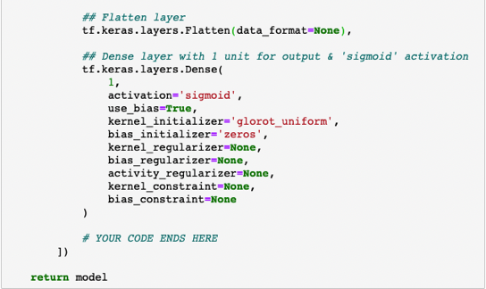</kbd>

 

<kbd>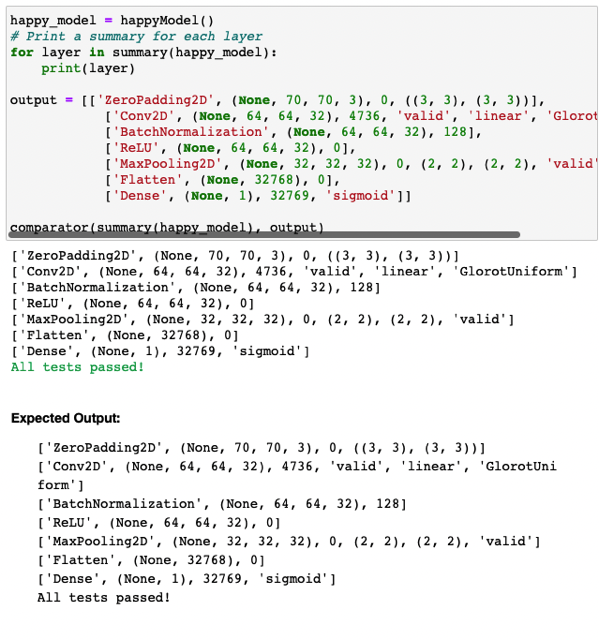</kbd>

 

<kbd></kbd>

> [!NOTE]
> Define model xong có thể compile với **Adam**
> optimizer, loss function là **binary_crossentropy** vì
> đây là bài toán binary classification (output từ
> sigmoid ra probability trong [0,1]**)** và metrics là **accuracy**

 

##### 3.2 - Train and

Dùng fit(X_train, Y_train) argument epochs,
batch_size

Evaluate the Model chỉ cần gọi evaluate(bỏ vào
test set) quá tiện

 

<kbd></kbd>

 

##### 4 - The Functional API: Nói sơ về Functional
API cho thấy nó flexible, mạnh mẽ hơn
Sequential API ví dụ có thể define 'Skip Connection'
 hứa hẹn sắp tới sẽ tìm hiểu
nhiều hơn

 

<kbd></kbd>

 

##### 4.1 - Load the SIGNS Dataset: Dataset
cho vấn đề nhận diện kí tự hình ảnh cho
người câm điếc đã dùng ở Course 2

 

<kbd></kbd>

 

##### 4.2 - Split the Data into Train/Test Sets Thực
hiện việc \\*normalization\\* và dùng custom
function \\*convert_to_one_hot\\*() để transform
Y_train, Y_test

 

<kbd></kbd>

 

##### 4.3 - Forward Propagation

Đại khái là từng bước từng bước define các layer trong '
computational graphs'

Bắt đầu bởi ts.keras.Input() rồi lần lượt Conv2D - ReLU
-MaxPool2D - Conv2D - ReLU - MaxPool2D - Flatten - FC -
Output:

Cách thức là: Bỏ output của thằng trước thành input của thằng
sau -  Đây chính là lý do của cái tên Functional, các layer work
như function với việc nhận input và cho ra oupput

Ngoài ra thì một số điểm đáng chú ý
Define a input node as a callable object.
Flatten batch_size, h, w, c -> batch_size, h*w*c
Define output using the last of the
function's composition - Dense

 

<kbd></kbd>

> [!NOTE]
> Define output using the last of the
> function's composition - Dense

 

<kbd></kbd>

 

##### Exercise 2 - convolutional_model: Chỉ chú ý là Conv2D's argument 
filters chỉ số lượng filters, kernel mới là filters's size

Z1 = tf.keras.layers.Conv2D(filters=8, kernel_size=(4,4), strides=(1, 1), padding='same' )(input_img)

A1 = tf.keras.layers.ReLU()(Z1)

P1 = tf.keras.layers.MaxPool2D(pool_size=(8, 8), strides=(8, 8), padding='same')(A1)

Z2 = tf.keras.layers.Conv2D(filters=16, kernel_size=(2,2) , strides=(1, 1), padding='same')(P1)

A2 = tf.keras.layers.ReLU()(Z2)

P2 = tf.keras.layers.MaxPool2D(pool_size=(4, 4), strides=(4, 4), padding='same')(A2)

F = tf.keras.layers.Flatten()(P2)

outputs = tf.keras.layers.Dense(units= 6 , activation='softmax')(F)

model = tf.keras.Model(inputs=input_img, outputs=outputs)

Xong cũng compile, Sequential và
Functional chỉ là phương pháp để tạo kiến trúc model khác
nhau chứ vẫn đều là tạo TF Keras model object

 

<kbd></kbd>

 

<kbd></kbd>

<kbd></kbd>

 

<kbd></kbd>

> [!NOTE]
> Xong cùng compile, Sequential và
> Functional chỉ là phương pháp để tạo kiến trúc model khác
> nhau chứ vẫn đều là tạo TF Keras model object

 

##### 4.4 - Train the Model: 
Tạo train / test dataset modal cho Conv_model với tf.Dataset.\\*from_tensor_slices\\*()
Gọi fucntion \\*fit()\\* trên conv_model created
ở trên, bỏ vào train_dataset và test_set, no. epochs

 

<kbd></kbd>

 

<kbd></kbd>

 

##### 5 - History Object: Dùng kết quả (history) của training
process để visualize

Có thể thấy bỏ history của Keras model.
history bỏ vào DataFrame của Pandas xong là
vẽ ra training history dễ dàng. TF và Keras quả thật rất tiện

 

<kbd></kbd>

 

<kbd></kbd>

> [!NOTE]
> Có thể thấy bỏ history của Keras model.
> history bỏ vào DataFrame của Pandas xong là
> vẽ ra training history dễ dàng. TF và Keras quả thật rất tiện

 

<kbd></kbd>

 

##### 6 - Bibliography: Nên đọc thêm

 

<kbd></kbd>

 

## C4w2_deep Convolutional Models: Case Studies

 

### Why look at case studies?

 

#### 1 Case studies of effective convolutional neural networks

2 Importance of looking at \\*case studies\\* to gain intuition and
confidence in building effective convnets

3 \\*Transferability of neural network architecture\\* across different
computer vision tasks

4 \\*Potential satisfaction in reading research papers\\* from the field
of computer vision

5 Outline of the next few videos: classic networks such as
\\*LeNet\\*-5, \\*AlexNet\\*, and \\*VGG\\*; \\*ResNet\\*, a deep 152-layer neural
network with interesting tricks; and the \\*Inception\\* neural network

6 Benefits of learning from these examples, even for those not
working in computer vision, as ideas are \\*cross-fertilizing\\* into
other disciplines.

 

<kbd></kbd>

 

### Classic Networks

 

#### Xem qua 1 số classic ConvNet
Nhận xét chung là nó thường có cấu trúc là 
\\*Conv - Pool - Conv - Pool ...Conv - Pool- FC - FC.. -FC - Sofmax 
Qua các layer thì nH, nW giảm, nC tăng\\*

 

<kbd></kbd>

> [!NOTE]
> Một số nhận xét:
> Qua các layer:
> nH, nW giảm, nC tăng
> Conv - Pool  - Conv - Pool
> **60k** params

 

<kbd></kbd>

> [!NOTE]
> Một số nhận xét:
> Giống như LeNet như bigger
> **~60 mils** params

 

<kbd></kbd>

> [!NOTE]
> Một số nhận xét:
> Giống như Alexnet nhưng bigger
> **~138 mils** params

 

### Resnet

 

#### Training \\*very deep\\* neural networks is difficult due to \\*vanishing\\* and \\*exploding\\*
gradient problems.

\\*Skip connections\\* are a solution to these problems as they \\*allow activations from
one layer to be fed to another layer much deeper\\* in the network, allowing the
building of \\*ResNets\\*.

\\*ResNets\\* are built from \\*residual blocks\\* which consist of a main path of layers and
a shortcut that allows information to flow directly to deeper layers.

Adding these residual blocks to a plain network turns it into a ResNet and allows
for the training of \\*much deeper neural networks without significant loss\\* in
performance.

ResNets \\*help with the vanishing and exploding gradient problems\\*, allowing the
training of \\*much deeper neural networks \\*without \\*compromising performance\\*.

 

<kbd></kbd>

> [!NOTE]
> Đại khái là Residual block nó có thêm cái 
> '**Shortcut /Skip Connection**' chuyển a[l] vào step tính a[l+2]
>
>
>
> a[l+2] = g(z[l+2] + a[l])
>
>
>
> Khi vì lí do nào đó, params khiến **z[l+1] = 0** có thể do hiện tượng
> gradient exploding / vanishing thì a[l+2] sẽ bằng g(a[l]) = max(0, a[l]) (reLU) = a[l]
> từ đó đại khái là **không bị mất thông tin**

 

<kbd></kbd>

> [!NOTE]
> Đại khái là RestNet giúp khắc phục vấn đề **nhiều layer thì
> performance giảm** do Gradient Vanishing / Exploding từ đó
> **cho phép train very deep network**

 

### Why Resnets Work

 

#### 1 \\*Residual Networks (ResNets)\\* work well in terms of training because they
can be made \\*deeper without decreasing performance\\* on the training set.

2 Making neural networks \\*deeper\\* can \\*hurt the ability to train them well\\* on
the training set, which is a prerequisite to doing well on the holdout, test
sets or during deployment.

3 ResNets include \\*residual blocks \\*with \\*shortcut connections\\*, making it
easy for these extra layers to \\*learn the identity function\\*.

4 \\*The identity function is easy to learn\\*, so the addition of extra layers in the
neural network \\*doesn't hurt\\* its ability to perform \\*as well as a simpler
network without these extra layers\\*.

5 \\*Same convolutions\\* are often used in ResNets to \\*ensure\\* that the
dimension of the \\*input \\*and\\* output \\*of the layers\\* are equal\\*, making it easier
to \\*carry out\\* the \\*shortcut connection\\* and the addition of two equal
dimension vectors.

 

<kbd></kbd>

> [!NOTE]
> Đại khái là nếu regularization (ví dụ vậy) bóp W, b (l+1) bằng 0 thì a[l+2] sẽ
> bằng g(a[l]) và = a[l] vì g là reLU 
>
>
>
> Có nghĩa là ..nếu gradient vanishing xảy ra, thì ..không bị làm sao cả,
>  a[l+2] chỉ đơn giản là a[l+2] quay lại bằng a[l] thay vì =0
> (ý ổng nói network rất dễ learn được identity function đại khái là 
> vậy)   
>
>
>
> Bằng 0 có nghĩa là không học được gì nữa (hiểu đại khái vậy, vì nếu
> a[l+2] = 0 thì mấy cái layer sau = 0 hết)
>
>
>
> Đo đó, với 'Skip connection' thì đầu tiên là **add thêm extra layer, hay
>  tạo very deep network sẽ không gây hại** đến model.
>
>
>
> Và từ ko gây haị thì chỉ có thể nâng lên thành improve hệ
> thống, ý nói nếu tệ nhất mà chỉ ko gây hại thì chắc chắn phải có thể
> improve rồi.
>
>
>
> Ngược lại, nếu không có Skip connection, thì việc add thêm layer rất dễ
> dẫn đến việc hệ thống bị stuck khi W bị = 0
>
> Đại khái là để a[l+2] bằng size với a[l], ta nhân thêm a[l] với 1 matrix **Ws**. Ws
> có thể **trainable** hoặc **fixed value**  Hoặc với ConvNet thì dùng **Same
> padding** để giữ size của input và output

 

<kbd></kbd>

> [!NOTE]
> Một ví dụ 
> Conv conv conv pool, conv conv .. conv pool
> ..
>
>
>
> Sau pool (size nó giảm) thì dùng Ws để khôi phục:
> Chưa rõ lắm nhưng đại khái là vậy

 

- **Sure, here's a more detailed answer with indexed main ideas:  

1 \\*ResNets\\* are deep neural networks that
work well because they can be made \\*deeper\\* without \\*significantly hurting performance\\* on the \\*training\\* \\*set\\*,
which is a \\*prerequisite\\* for good performance on the test set.

2 The reason \\*ResNets\\* can be made deeper without hurting performance is because of the use of \\*residual
blocks\\*, which include a \\*skip connection\\* that allows the network to \\*learn the identity function\\* more easily.

3 Let's look at an example to see how the skip connection works in a ResNet block. Suppose we have an
input X feeding into a neural network that outputs activation \\*a[l]\\*. We want to make the network deeper by
adding two extra layers to output \\*a[l+2]\\*. We add a \\*residual block\\* with a \\*skip connection\\* to achieve this. If we
assume all activations are greater than or equal to zero, then a[l+2] can be expressed as \\*g(w[l+2] * a[l+1] +
b[l+2] + a[l])\\*, where g is the activation function and w[l+2] and b[l+2] are the weights and biases for the
added layers.

4 If we use \\*L2 regularization to shrink the weights\\*, w[l+2], and assume b[l+2] = 0 for simplicity, then we can
see that if w[l+2] = 0, the \\*entire term w[l+2] * a[l+1] + b[l+2] disappears\\*, leaving just \\*a[l]\\* \\*as the input to the
activation function\\*. If g is the ReLU function, which outputs only non-negative numbers, then \\*g(a[l]) = a[l].\\*
This means that the \\*identity function\\* is \\*easy for the residual block to learn\\*, and it can easily make \\*a[l+2]
equal to a[l].\\*

5 Adding two extra layers with a residual block \\*does not significantly hurt performance\\* because the \\*residual
block can easily learn the identity function\\*. However, the goal is not just to avoid hurting performance but to
improve it. \\*If the added layers can learn something useful\\*, then the \\*network can do even better than simply
learning the identity function.\\*

6 In \\*very deep plain networks\\* without residual connections, it becomes \\*difficult to learn even the identity
function\\*, which is why \\*adding more layers can actually hurt performance\\*. \\*ResNets\\* \\*work because they make
it easy for the extra layers to learn the identity function\\*, and from there they \\*have a chance of learning
something useful.\\*

7 Another detail worth noting is that the \\*dimensions of z[l+2] and a[l] must be the same\\* for the skip
connection to work. This is why s\\*ame convolutions are often used in ResNets to preserve the dimensions of
the inputs and outputs of each layer\\*, making it \\*easier to carry out the skip connection\\* and the addition of the
two vectors. \\*If the dimensions are different, an extra matrix must be added to make the dimensions match.\\***

 

### Networks In Networks And
1x1 Convolutions

 

#### 1 Using a \\*one-by-one convolution\\* can help in designing content
architectures.

2 A one-by-one convolution can \\*multiply an image by a single number\\*
or \\*perform a more complex operation\\*.

3 A one-by-one convolution takes each position in an input volume and
applies a \\*fully connected neural network\\* to it.

4 A one-by-one convolution is sometimes called a "\\*network in network\\*"
and has been influential in other neural network architectures.

5 One way to use a one-by-one convolution is to \\*shrink the number of
channels\\* in an input volume.

6 A one-by-one convolution \\*adds nonlinearity\\* and \\*allows for learning a
more complex function in a network\\*.

 

<kbd></kbd>

<kbd></kbd>

> [!NOTE]
> Đại khái nó giống như apply 1 fully connected cho mỗi position của volumn (nhìn hình sẽ hiểu).

 

<kbd></kbd>

> [!NOTE]
> Đại khái là 1x1 Conv có thể có công dụng giúp giảm n_c, giống  cách
> như Pool giúp giảm n_h, n_w
>
>
>
> Ví dụ xài 32 cái filer 1x1x192 sẽ giúp tạo output 28x28x32
>
>
>
> Còn không (nếu không muốn giảm n_c - giữ nguyên 1x1x192) thì nó
> cũng giúp tăng hiệu quả học tập lên

 

### Inception Network Motivation

 

<kbd></kbd>

> [!NOTE]
> Đại khái là khỏi phải suy nghĩ giữa chọn filter size là 1x1, hay 3x3, hay
> 5x5 rồi dùng **conv** hay **pool**, thì cứ dùng hết:
>
>
>
> 64 cái filter 1x1 ra cục xanh lá 28x28x64
> 128 cái filter 3x3 same padding -> 28x28x128
> 32 cái filter 5x5 same padding -> 28x28x32
> 32 cái max pooling -> 28x28x32
>
>
>
> Xong stack lại và để cho máy tính nó **/tự quyết định sẽ dùng cái nào/**
>
> *Cái 1x1 ghi là 28x28x64 thì đương nhiên phải hiểu là
> **xài 64 cái filter có size 28x28x192.** Tương tự 128 cái
> filter 3x3x192 32 cái filter 5x5x192

 

<kbd></kbd>

<kbd></kbd>

<kbd></kbd>

> [!NOTE]
> Tại sao lại nhân 5x5x192 đã hiểu: Mỗi lần convol là nó tính 5x5 phép
> nhân rồi cộng lại - là cho 1 lớp, có nc lớp -> 5x5xnc phép nhân

 

<kbd></kbd>

> [!NOTE]
> Đại khái là bằng cách dùng 1x1 Convolution, số phép tính cần thiết giảm đi 1/10
>
>
>
> 28x28x192 - 32 cái filter 5x5 same padding -> **28x28x32: 120m params**
>
>
>
> thì nếu dùng 2 bước với 1x1 filter
>
>
>
> 28x28x192 - dùng 16 cái 1x1 -> 28x28x16 - dùng 32 cái 5x5 same padding -> **28x28x32: thì chỉ có 12m params**

 

### Inception Network

 

#### 1 The inception module takes the activation from a previous layer as input
and \\*outputs multiple feature maps of different sizes.\\*

2 The inception network is made up of a \\*series of inception blocks\\*, which
consist of \\*multiple inception modules\\* concatenated together.

3 The inception network \\*repeats these inception blocks\\* in different positions
in the network.

4 The inception network also includes \\*additional side branches\\*, which \\*use
hidden layers to make predictions\\* alongside the main output layer.

5 The side branches help to \\*ensure that the features computed are useful
for making predictions\\*.

 

<kbd></kbd>

> [!NOTE]
> Ứng dụng ý tưởng ở lecture trước, Inception module sử dụng đủ loại filter, chú ý là như đã nói, dùng 2 bước
> với 16 cái 1x1(x192) và 3x3(x16) gọi là bottle-neck layer thay vì 3x3(x192) same padding để giảm số params

 

<kbd></kbd>

> [!NOTE]
> Đại khái (Inception network) là nhiều Inception module
>
>
>
> Additional side branched: Dùng softmax tại các hidden layer, đại khái là
> cũng generate well predicting và giảm overfitting
>
>
>
> Term "Inception" đúng là đến từ phim Inception
>
>
>
> Cái trong hình dưới là GoogleNet

 

### Mobilenet

 

#### 1 Introduction to \\*MobileNets\\*, a \\*convolutional neural network architecture\\* used for
computer vision that can run on devices with \\*low computational power\\*.

2 Need for \\*MobileNets\\* as other neural networks are \\*computationally expensive.\\*

3 Explanation of the \\*normal convolution process\\* used in other neural networks.

4 \\*Computational cost\\* of normal convolution determined.

5 Introduction of \\*depthwise separable convolution\\* used in \\*MobileNets\\*.

6 Explanation of how the \\*depthwise convolution\\* works.

7 Calculation of the computational cost of depthwise convolution.

 

<kbd></kbd>

 

<kbd></kbd>

> [!NOTE]
> Đại khái là tính lại xem Convolution thông
> thường cần bao nhiêu phép tính
>
> Trong Normal Conv: Mỗi lần cái filter convol để tính ra 1 số cho 1
> dimension của output, nó tính cho từng dimension của input sau
> đó nó **cộng lại cho nên kết quả là chỉ còn 1 channel, nhưng có
> nc cái filter thì thành ra cục output có nc channel**
>
>
>
> 6x6x3 -  1 filter 3x3x3 -> 4x4x**1** 
> x **5 cái** filter thành ra **4x4x5**

 

<kbd></kbd>

> [!NOTE]
> Còn depthwise thì
> nó khác 1 chút

 

<kbd></kbd>

> [!NOTE]
> **DepthWise** đại khái là ở mỗi lần filter convol nó sẽ tính riêng từng
> dimension, và không cộng lại để 'ép' lại thành 1 channel.

 

<kbd></kbd>

<kbd></kbd>

<kbd></kbd>

 

<kbd></kbd>

> [!NOTE]
> Kết quả là sau khi convol với 1 filter nó
> vẫn giữ số channel của input (chứ không
> ép lại thành 1 channel)
>
>
>
> 6x6x**3** - 1 **(chỉ một)** filter 3x3x3 -> 4x4x**3**

 

<kbd></kbd>

> [!NOTE]
> Sau đó cái cục này được convol qua 5 cái
> 1x1x3 filter để thành ra **4x4x5** giống như
> output của normal convolution '

 

<kbd></kbd>

<kbd></kbd>

<kbd></kbd>

 

<kbd></kbd>

> [!NOTE]
> Đại khái là cho thấy cùng là từ input 6x6x3 -> output 4x4x5 nhưng
> dùng **Depth-wise Separable Convolution** giúp giảm **~10x**
> computational expensive so với **normal convolution**

 

<kbd></kbd>

> [!NOTE]
> Đại khái là ổng nói đúng ra là phải vẽ icon thành nhiều lớp hơn 3x3xnc
> nếu nc = 8 chẳng hạn phải vẽ thành 8 lớp nhưng quy ước cứ giữ icon
> như vậy cho gọn và mình tự hiểu là được

 

### Mobilenet Architecture

 

#### Main ideas:  1 \\*MobileNet\\* is a neural network that uses a \\*depthwise\\*
\\*separable\\* \\*convolutional operation\\* to \\*reduce computational cost.
\\*
2 The \\*MobileNet v1\\* architecture uses a block comprising a \\*depthwise
convolutional operation\\* and a \\*stack\\* of \\*13 layers\\* to make a
\\*classification\\* prediction.

3 \\*MobileNet v2\\* is an \\*improvement\\* over the basic MobileNet
architecture that \\*includes a residual connection\\* and an\\* expansion
layer \\*before the \\*depthwise\\* convolution and the \\*pointwise\\* convolution.

4 MobileNet v2 repeats the block \\*17 times\\* and uses \\*pooling\\*,
\\*fully-connected\\*, and \\*softmax layers\\* to make a classification prediction.

5 The MobileNet v2 \\*bottleneck block\\* \\*increases the size\\* of the
representation within the block and \\*projects it back down to a smaller
set of values\\*, \\*reducing the amount of memory\\* \\*needed\\* to store
activations from layer to layer.

 

<kbd></kbd>

 

<kbd></kbd>

> [!NOTE]
> Đại khái là nó expand ra để tính toán được nhiều feature hữu
> ích hơn, sau đó co lại để đáp ứng điều kiện dung lượng bộ nhớ
> hạn hẹp -> Tốt hơn MobileNet v1 mà vẫn đáp ứng bộ nhớ nhỏ
>
>
>
> Expand: nxnx3 - 18 cái filter 1x1x3 -> nxnx18
>
>
>
> Depth-wise: nxnx18 - 1 cái filter n_hxn_w x18 **depth-wise** -> nxn18
>
> (Khúc này có lẽ phải hiểu là dùng same padding để giữ size n
> và n_h, n_w ổng cũng không nói tới nhưng cũng không quan trọng)
>
>
>
> Projection: nxnx18 - 3 cái 1x1x18 -> nxn3
>
> Đại khái như vậy là đủ hiểu
> MobileNet v2 rồi, muốn xem
> kĩ hơn để biết chi tiết thì đọc
> Paper của Sandler
>
> Từ nxnx3 -> nxnx18 thì ta dùng 18 cái filter 1x1x3
>
>
>
> Còn từ nxnx18 về lại nxnx3 thì dùng 3 cái filter 1x1x18

 

### Efficientnet

 

#### 1 The benefits of using \\*computationally efficient neural networks\\* like
MobileNet V1 and V2.

2 The \\*challenge\\* of adapting neural networks to \\*different devices\\* with
varying \\*computational resources\\*.

3 The concept of \\*EfficientNet\\* and how it can be used to \\*scale up\\* \\*or
down\\* neural networks based on a \\*device's computational budget\\*.

4 The three factors that can be adjusted to scale up or down neural
networks:\\* image resolution\\*, network \\*depth\\*, and layer \\*width\\*.

5 The importance of \\*finding the right trade-off between image
resolution, network depth, and layer width\\* to optimize neural network
performance for a specific device.

6 The usefulness of \\*open source implementations of EfficientNet\\* for
adapting neural network architectures to specific devices.

 

<kbd></kbd>

> [!NOTE]
> Dùng higher resolution image

 

<kbd></kbd>

> [!NOTE]
> Dùng deeper network

 

<kbd></kbd>

> [!NOTE]
> Dùng wider network

 

<kbd></kbd>

> [!NOTE]
> Câu hỏi là: Với cụ thể 1 giới hạn về khả năng tính toán, làm
> sao để chọn được / quyết định được r, d, w? Hay nói cách
> khác là  scale cái nào lên và giữ nguyên cái nào hoặc scale
> cùng lúc cả 3 cái lên với tỉ lệ bao nhiêu? -> **Loot at
> OpenSource implementation of EfficientNet**

 

<kbd></kbd>

> [!NOTE]
> Build N.N for mobile devices, embedded devices

 

### Using Open-source
implementation

 

#### 1 \\*Practical advice\\* on using neural network and \\*ConvNet\\* \\*architectures\\*

2 Importance of \\*open-source implementations\\* for \\*replicating\\* neural
networks

3 \\*Difficulty\\* of replicating neural networks without \\*open-source
implementations\\*

4 Benefits of using \\*open-source implementations\\*, such as \\*faster
implementation and transfer learning\\*

5 Using \\*GitHub\\* to find open-source implementations

 

<kbd></kbd>

> [!NOTE]
> Đại khái là nên search (GitHub) và xài cái người ta làm

 

### Transfer Learning

 

#### 1 \\*Pre-training\\* and\\* transfer learning\\* can help build computer vision
applications faster.

2 Many \\*pre-trained models are available for download\\*, which have
already been \\*trained on large public datasets\\*.

3 Using transfer learning, \\*pre-trained weights can be used as a starting
point\\* for a new task.

4 \\*Frozen\\* \\*layers\\* in pre-trained models can be used to \\*extract features\\* that
can be used for a new classification problem.

5 \\*Pre-computing features from frozen layers\\* can help speed up training
with a small dataset.

6 \\*Fewer layers can be frozen\\* if there is a \\*larger labeled dataset\\* available.

7 If there is a \\*lot of data\\* available, \\*the whole pre-trained network can be
used for training.\\*

8 There are different ways to initialize the last few layers of the network
for the new classification problem.

9 The number of layers frozen and trained on top can be adjusted based
on the available dataset size.

 

<kbd></kbd>

> [!NOTE]
> Đại khái là:  Nếu có ít data, cứ giữ nguyên hidden layers, và train cái layer cuối
> thôi. **Precompute** đại khái là (từ feature x của mình **tính output của layer cuối
> trước với cái n.n của người ta - như 1 function**) để khi chạy G.D để training layer
> cuối của mình thì khỏi phải làm bước tính toán này (forward propagation)
>
>
>
> Nếu có nhiều data hơn thì freeze mấy layer đầu thôi, train mấy layer cuối thậm chi
> train lại hết, coi các weight đã train của họ như initialization

 

<kbd></kbd>

> [!NOTE]
> Đại khái là ổng nói Transfer learning hầu như là cái phải
> làm, trừ khi mình có rất rất nhiều data thì mới làm từ
> đầu

 

### Data Augmentation

 

#### 1 \\*Computer vision\\* task often \\*requires more data\\* to improve performance.

2 \\*Data augmentation\\* is a \\*commonly used technique\\* to improve the
performance of computer vision systems.

3 \\*Mirroring\\* and \\*random cropping\\* are frequently used data augmentation
techniques.

4 \\*Color shifting\\* is another commonly used data augmentation technique.

5 The motivation behind color shifting is to make the learning algorithm
more robust to changes in image color.

6 \\*PCA Color Augmentation\\* is a specific implementation of color shifting.

7 \\*Loading images from a hard disk using a CPU\\* thread is a common
implementation of data augmentation in practice.

 

<kbd></kbd>

 

<kbd></kbd>

 

<kbd></kbd>

 

### State Of Computer Vision

 

#### 1 Deep learning has been successfully applied to various problems, including
computer vision.

2 \\*Computer vision is a complex problem\\*, and \\*deep learning requires a large
amount of data to achieve good performance.\\*

3 There is often a \\*trade-off\\* between the \\*amount of data available\\* and \\*the need
for hand-engineering\\* in machine learning.

4 The computer vision literature has historically\\* relied more on
hand-engineering \\*due to \\*limited data availability\\*, but with the \\*increase in data\\*
sets, the \\*use of hand-engineering has decreased\\*.

5 \\*Object detection\\*, a subset of computer vision, has \\*smaller data sets\\* and
therefore requires more \\*complex algorithms\\* and \\*specialized components.
\\*
6 \\*Transfer learning\\* is a technique that can help in cases where there is \\*limited
data.
\\*
7 Researchers in computer vision are enthusiastic about \\*achieving high
performance on standardized benchmark\\* data sets and competitions.

 

<kbd></kbd>

 

<kbd></kbd>

 

<kbd></kbd>

 

### Quiz

 

<kbd></kbd>

 

<kbd></kbd>

 

<kbd></kbd>

 

<kbd></kbd>

> [!NOTE]
> a[l+2] = g(z[l+2] + a[l]) (a[l] bỏ trong activation
> function luôn)
>
>
>
> vì g hay dùng ReLU nên nếu z[l+2] = 0 thì a[l+2] =
> max(0, a[l]) = a[l]

 

<kbd></kbd>

 

<kbd></kbd>

 

<kbd></kbd>

 

<kbd></kbd>

 

<kbd></kbd>

 

<kbd></kbd>

<kbd></kbd>

 

### Programming Assignment: Residual Networks

 

#### • Implement the basic building blocks of ResNets in a deep
neural network using Keras

• Put together these building blocks to implement and train a
state-of-the-art neural network for image classification

• Implement a skip connection in your network

For this assignment, you'll use Keras.

 

##### Residual Networks

 

<kbd></kbd>

 

##### 1 - Packages

 

<kbd></kbd>

 

##### 2 - The Problem of Very
Deep Neural Networks:

Đại khái là vấn đề Gradient Vanishing - params về 0 rất nhanh 
khiến model stop learning Hoặc / Exploding - params trở nên rất lớn

 

<kbd></kbd>

 

##### 3 - Building a Residual Network:

Nhắc lại rằng RestNet không những giúp giải quyết vấn đề
Vanishing Gradient mà còn giúp tăng performance của
network

Có hai loại block trong ResNet là \\*Identity\\* block và
\\*Convolutional\\* block

 

<kbd></kbd>

 

##### 3.1 - The Identity Block:

Đại khái là các step để tạo nên ResNet's
identity block

Nói đến việc sẽ thêm 1 bước BatchNorm để
tăng tốc training, chỉ cần  một dòng code với
Keras.

Và trong bài này mình sẽ skip 2 layer chứ
không phải 1 như trong lecture

> [!NOTE]
> Có cái vụ
> BatchNormalization
> chưa hiểu lắm

 

<kbd></kbd>

 

<kbd></kbd>

 

##### Exercise 1 - identity_block: Đại khái là làm theo gợi ý lần lượt khai báo các
layer

Conv2D, BatchNorm, Activation (Relu),

Conv2D, BatchNorm, Activation (Relu)

Conv2D, BatchNorm, Add, Activation (Relu)

Với input thằng sau là ouput thằng trước từ đó X được update qua các layer.

Để ý thấy ở đây nó dùng keras.layer.Activation('relu') thay vì keras.layer.
RELU()  như ở P.A tuần trước

Và thao tác '\\*Skip Connection\\*' được thực hiện bằng cách save X_shortcut
và add  với X ở layer \\*Add\\*

 

<kbd></kbd>

 

<kbd></kbd>

<kbd></kbd>

 

<kbd></kbd>

 

##### 3.2 - The Convolutional Block:

Đại khái là cái này chỉ khác cái identity block ở chỗ nó có
thêm bước dùng Conv2D để resize X_shortcut nhằm để
X và X_shortcut cùng size cho bước Add, bước này đóng
vai trò như \\/\\*Ws\\*\\/ trong lecture nói tới.

Nói tới đại khái là không áp dụng Activation function vì
mục đích chỉ là resize thôi

Để ý thấy cho X và X_shortcut cùng size thì ở Conv2D
cho layer thứ 3 và cho shortcut phải cùng số lượng filter

> [!NOTE]
> Có cái vụ Glorot uniform
> seed là không hiểu

 

<kbd></kbd>

 

<kbd></kbd>

 

##### Exercise 2 - convolutional_block

Đại khái là làm theo gợi ý lần lượt khai báo các layer

Conv2D, BatchNorm, Activation (Relu),

Conv2D, BatchNorm, Activation (Relu)

Conv2D, BatchNorm, Add, Activation (Relu)

Với input thằng sau là ouput thằng trước từ đó X được
update qua các layer.

Chỉ có thêm cái Conv và Batch cho Shortcut với filter là
F3

 

<kbd></kbd>

 

<kbd></kbd>

<kbd></kbd>

 

<kbd></kbd>

 

##### 4 - Building Your First ResNet Model (50 layers)

Đại khái là dùng các function ở trên để tạo một
network  \\*so deep \\*có 50 layers (?!) có kiến trúc
như hình

 

<kbd></kbd>

 

##### Exercise 3 - ResNet50

Đại khái là cũng lần lượt define từng layer
theo kiến trúc của network define trong sơ
đồ.

Và cuối cùng tạo model: model =
Model(inputs = X_input, outputs = X)

 

<kbd></kbd>

 

<kbd></kbd>

<kbd></kbd>

 

<kbd></kbd>

 

##### Compile và Load Data 

Dùng \\*Adam\\* optimizers, 
\\*categorical_crossentropy\\* loss function, 
Metrics dùng \\*accuracy

\\*Data là bộ\\* hand-sign data\\* bữa trước

 

<kbd></kbd>

 

<kbd></kbd>

 

##### ..và train model dùng 10 epochs, batch size
= 32

 

<kbd></kbd>

 

<kbd></kbd>

 

<kbd></kbd>

 

##### Submit và load pretrain model: Đại khái là ổng kêu thích thì train lại
với nhiều  epoch hơn và load về cái model đã được train bằng GPU
để chạy thử xem accuracy bao nhiêu.

\\*What you should remember\\*:

• Very deep "plain" networks don't work in practice because vanishing
gradients make them hard to train.

• Skip connections help address the Vanishing Gradient problem.
They also make it easy for a ResNet block to learn an identity
function.

• There are two main types of blocks: The \\*identity block\\* and
the \\*convolutional block\\*.

• Very deep Residual Networks are built by stacking these blocks
together.

> [!NOTE]
> State of the art: HIện đại nhất. Ý là
> dùng cái này là hiện đại nhất rồi

 

<kbd></kbd>

 

<kbd></kbd>

 

##### 5 - Test on Your Own Image (Optional/Ungraded)

Dùng hình tự chụp để test thử thấy hình như không đúng.
Ổng có hỏi là h thử nghĩ xem tại sao ?

Có thể liên quan đến 'distribution' Hình dùng để train là trên
mạng, còn đây là hình tự  chụp dẫn đến training set và
production set bị khác distribution

Giải pháp là gì? Xem lại Course 3

> [!NOTE]
> Giải pháp là gì -> Xem lại course 3

 

<kbd></kbd>

 

<kbd></kbd>

 

##### 6 - Bibliography

This notebook presents the ResNet algorithm from He
et al. (2015).  The implementation here also took
significant inspiration and follows the structure given in
the GitHub repository of Francois Chollet:

• Kaiming He, Xiangyu Zhang, Shaoqing Ren, Jian
Sun - \\_Deep Residual Learning for Image Recognition
(2015) \\_

• Francois Chollet's GitHub repository: \\_https://github.
com/fchollet/deep-learning-models/blob/master/resnet50.
py\\_

 

### Programming Assignment: Transfer Learning With Mobilenet

 

#### Welcome to this week's assignment, where you'll be using transfer
learning on a pre-trained CNN to build an Alpaca/Not Alpaca
classifier! A pre-trained model is a network that's already been trained
on a large dataset and saved, which allows you to use it to customize
your own model cheaply and efficiently. The one you'll be using,
MobileNetV2, was designed to provide fast and computationally
efficient performance. It's been pre-trained on ImageNet, a dataset
containing over 14 million images and 1000 classes. By the end of
this assignment, you will be able to:

• \\/Create a dataset\\/ from a directory

• \\/Preprocess and augment data using the Sequential API\\/

• Adapt a \\/pretrained model to new data\\/ and train a classifier using
the Functional API and \\/MobileNet\\/

• Fine-tune a classifier's final layers to improve accuracy

<kbd></kbd>

 

##### 1 - Packages

 

<kbd></kbd>

 

##### 1.1 Create the Dataset and Split it into Training and
Validation Sets

Đại khái là dùng \\/\\*image_dataset_from_directory\\*()
của Keras để \\*load image từ  thư mục\\* \\/chỉ định,
return một \\*TensorFlow Dataset\\*, quy định sẵn batch
size, size để nó Resize image, tỉ lệ phân chia và tên
các gói để phân chia.

 

<kbd></kbd>

> [!NOTE]
> This code block is for loading image data from a directory and splitting it into training and
> validation datasets. It uses the **image_dataset_from_directory**() function **from the
> TensorFlow library**, which **creates a TensorFlow dataset** from image files located in a
> directory.
>
>
>
> The following are the explanations of the parameters used:
>
>
>
> • **BATCH_SIZE**: It defines the number of images to be processed in a single batch. Here,
> the batch size is set to 32, meaning that 32 images will be processed at a time.
>
>
>
> • **IMG_SIZE**: It is a tuple containing the height and width of the image. **The images will be**
> **resized to this size** before being used in the model. Here, the image size is set to (160,
> 160).
>
>
>
> • **directory**: It specifies the directory containing the image files.
>
>
>
> • **shuffle**: It determines whether the dataset should be shuffled before each epoch. Here, it is
> set to True, which means the dataset will be shuffled.
>
>
>
> • **validation_split**: It is the fraction of the data to be used for validation. Here, 20% of the data
> is used for validation and 80% for training.
>
>
>
> • **subset**: It specifies whether the dataset to be created is for training or validation. Here, the
> training subset is used for creating the training dataset, and the validation subset is used for
> creating the validation dataset.
>
>
>
> • **seed**: It is used to seed the random number generator. Here, it is set to 42 for
> reproducibility.
>
>
>
> The image_dataset_from_directory() function returns a TensorFlow dataset that can be
> used for training a machine learning model. In this code block, two datasets are created:
> train_dataset and validation_dataset, each containing images for training and validation
> respectively.

 

<kbd></kbd>

> [!NOTE]
> Có một số hình bị sai

 

##### 2 - Preprocess and Augment Training Data:

Đại khái là nói về \\/\\*prefetch()\\*\\/ data đã từng dùng ở
assignment  trước để kiểu như chuẩn bị để khi chạy
G.D luôn có sẵn data. Lợi hại hơn nữa là nó có thể tối
ưu số lượng data chuẩn bị sẵn giùm mình luôn bằng
cách để \\/buffer_size = AUTOTUNE.

Lợi hại hơn nữa là nó có thể làm cái vụ Data Augmentation nữa\\/

 

<kbd></kbd>

 

##### Exercise 1 - data_augmenter:

Đại khái đơn giản là khởi tạo 1 Sequential và bỏ vào 2 layer:
RandomFlip và RandomRotation

data_augmentation = tf.keras.Sequential()
data_augmentation.add(RandomFlip('horizontal'))
data_augmentation.add(RandomRotation(0.2))

Sau đó xài thử trên một image xem chơi

 

<kbd></kbd>

 

<kbd></kbd>

 

##### \\*What you should remember:\\*

• When calling \\/image_data_set_from_directory\\/(), specify
the train/val subsets and match the seeds to prevent
overlap

• Use \\/prefetch\\/() to prevent memory bottlenecks when
reading from disk

• Give your model more to learn from with simple data
\\/augmentations\\/ like rotation and flipping.

• When using a pretrained model, it's best to \\/reuse the
weights\\/ it was trained on.

 

<kbd></kbd>

> [!NOTE]
> Dùng lại preprocess_input???

 

##### 3 - Using MobileNetV2 for Transfer Learning

 

<kbd></kbd>

 

##### 3.1 - Inside a MobileNetV2 Convolutional Building Block

 

- **Đại khái là nói lại về
MobileNet v2 building block**

 

<kbd></kbd>

<kbd></kbd>

> [!NOTE]
> Đại khái là nói lại về MobileNet v2 building block

 

<kbd></kbd>

 

<kbd></kbd>

> [!NOTE]
> Đại khái là nó expand ra để tính toán được nhiều feature hữu
> ích hơn, sau đó co lại để đáp ứng điều kiện dung lượng bộ nhớ
> hạn hẹp -> Tốt hơn MobileNet v1 mà vẫn đáp ứng bộ nhớ nhỏ
>
> Đại khái như vậy là đủ hiểu
> MobileNet v2 rồi, muốn xem
> kĩ hơn để biết chi tiết thì đọc
> Paper của Sandler
>
> Từ nxnx3 -> nxnx18 thì ta dùng 18 cái filter 1x1x3
>
>
>
> Còn từ nxnx18 về lại nxnx3 thì dùng 3 cái filter 1x1x18

 

- **Đại khái là nó dùng lại cái MobileNet v2, \\/include_top\\/ =
True tức là giữ nguyên layer cuối (Softmax), và
weights đã được pretrained

Summary xem thì nhận thấy :

Đại khái là cấu trúc 1 Bottleneck layer thường sẽ như
vầy

-> Expand Conv - Expand BN - Expand Relu
Depthwise - Depthwise BN - Depthwise Relu Project
Conv - Project BN - Add (Skip connection) ->**

 

<kbd></kbd>

> [!NOTE]
> Đại khái là nó dùng lại cái MobileNet v2,
> include_top = True tức là giữ nguyên layer cuối
> (Softmax), và weights đã được pretrained
>
> Chưa hiểu IMAGE_SHAPE = IMG_SIZE + (3,) là sao

 

<kbd></kbd>

> [!NOTE]
> Đại khái là cấu trúc 1 Bottleneck layer thường sẽ như vầy
>
>
>
> -> Expand Conv - Expand BN - Expand Relu
> Depthwise - Depthwise BN - Depthwise Relu
> Project Conv - Project BN - Add (Skip connection) ->

 

##### What you should remember:

MobileNetV2's unique features are:

Depthwise separable convolutions that provide lightweight
feature filtering and creation Input and output bottlenecks
that preserve important information on either end of the
block

Depthwise separable convolutions deal with both spatial
and depth (number of channels) dimensions

 

##### Đại khái là Xem thử performance của cái pretrain
network rao sao trên 1 batch data

Kết quả không tốt do pretrain data không có
alpaca, nên việc tiếp theo là bỏ layer cuối (top
layer) mà train lại layer cuối

 

<kbd></kbd>

> [!NOTE]
> Đại khái là lấy 1 batch data (32 cái) ra và nói về cái format của kết
> quả, trả về 2 con số probability cao nhất ứng với khả năng của 1
> hình thuộc về 2 loại

 

<kbd></kbd>

 

<kbd></kbd>

> [!NOTE]
> Đại khái là kết quả không tốt do pretrain data không có alpaca, nên
> việc tiếp theo là bỏ layer cuối (top layer) mà train lại layer cuối

 

##### 3.2 - Layer Freezing with the Functional API

Đại khái ta sẽ bỏ layer cuối và đóng băng (freez)
cái pretrain network  đơn giản bằng cách set
params \\/include_top = false và , model.trainable =
false

Sau đó add 1 layer và train nó.\\/

 

<kbd></kbd>

 

##### Exercise 2 - alpaca_model:

Theo gợi ý lần lượt define model mới, dùng
lại Pretrain model  Add thêm layer cuối với
GlobalAveragePooling2D, Dropout, và
Dense với 1 unit

Chỉ chưa hiểu tại sao layer cuối dùng Linear
mà ko phải sigmoid

 

<kbd></kbd>

> [!NOTE]
> Tại sao lại Linear ở cuối mà ko phải Sigmoid

 

<kbd></kbd>

 

##### Compile & train model: Adam
optimizer, BinaryCrossentropy loss
function, accuracy

 

<kbd></kbd>

 

<kbd></kbd>

 

<kbd></kbd>

 

##### 3.3 - Fine-tuning the Model:

Đại khái là gỡ băng 1 số layer cuối (bao nhiêu thì tuỳ
nên phải thử) để nó train các 'high feature' với data
của con alpaca, giữ nguyên các  'low feature'

 

<kbd></kbd>

 

##### Exercise 3:

Đại khái là lấy base_model ra (model2.
layers[4]) sửa lại một chút như unfreez từ
layer số 120 trở đi

 

<kbd></kbd>

> [!NOTE]
> tại sao model2.layers[4] ???

 

<kbd></kbd>

> [!NOTE]
> Tốt hơn hẳn, validation_acc: 95%

 

<kbd></kbd>

 

<kbd></kbd>

 

##### \\*What you should remember\\*:

• To adapt the classifier to new data: Delete the top layer, add a new
classification layer, and train only on that layer

• When freezing layers, avoid keeping track of statistics (like in the batch
normalization layer)

• Fine-tune the final layers of your model to capture high-level details near
the end of the network and potentially improve accuracy

\\*Congratulations! \\*You've completed this assignment on transfer learning
and fine-tuning. Here's a quick recap of all you just accomplished:

• Created a dataset from a directory

• Augmented data with the Sequential API

• Adapted a pretrained model to new data with the Functional API and
MobileNetV2

• Fine-tuned the classifier's final layers and boosted the model's accuracy

 

## C4w3_object Detection

 

### Object Localization

 

#### Đại khái là bài toán bây giờ là không những chỉ phân loại -vd. có phải
xe hơi hay không (\\*classification)\\* mà còn vẽ cái box xung quanh cái
xe (\\*classification with localization)\\*. Và mở rộng hơn là detect nhiều
object khác loại trên cùng 1 image (\\*Object detection\\*)

Đại khái là muốn localize thì ta \\*sửa cái output layer\\*, v.d đang là 
Softmax ra 4 unit tương ứng 4 loại khả dĩ của cái hình, để
\\*thêm vào 4 chỉ số nữa là bx, by, bw, bh\\* = Vị trí của cái object.

Bằng cách \\*có thêm 4 thông số này trong training set,\\* đại khái
là ta có thể khiến cho network có thể học được cách xác định
được 4 chỉ số này trong các mẫu mới -> Localize được cái xe.

Đại khái là label (y) ngoài 4 unit (để chỉ ra 4 loại xe, người,
moto, nền, hoặc 4 thông số probability tương ứng) thì bây
giờ sẽ có thêm  Pc - 1 là object, 0 là nền (bx, by, bh, bw) -
vị trí cái object nếu có hoặc bỏ trống (?) nếu không, và C1
C1 C3 - class label hoặc Probability class

Cuối cùng là define Loss function có thể dùng \\*square của
từng cặp tương ưng giữa y^ và y \\*hoặc kĩ hơn thì dùng
từng hàm khác nhau  đ/v các chỉ số khác nhau như

- Binary Cross Entropy đ.v pC,
- Squared Error đ.v bx, by, bh, bw
- Log (Categorical Cross Entropy) đ.v C1, C2, C3

 

<kbd></kbd>

> [!NOTE]
> Đại khái là bài toán bây giờ là không những chỉ phân loại -vd. có phải
> xe hơi hay không (**classification)** mà còn vẽ cái box xung quanh cái
> xe (**classification with localization)**. Và mở rộng hơn là detect nhiều
> object khác loại trên cùng 1 image (**Object detection**)

 

<kbd></kbd>

> [!NOTE]
> Đại khái là muốn localize thì ta **sửa cái output layer**, v.d đang là 
> Softmax ra 4 unit tương ứng 4 loại khả dĩ của cái hình, để
> **thêm vào 4 chỉ số nữa là bx, by, bw, bh** = Vị trí của cái object.
>
>
>
> Bằng cách **có thêm 4 thông số này trong training set,** đại khái
> là ta có thể khiến cho network có thể học được cách xác định
> được 4 chỉ số này trong các mẫu mới -> Localize được cái xe.

 

<kbd></kbd>

> [!NOTE]
> Cuối cùng là define Loss function có thể dùng **square của
> từng cặp tương ưng giữa y^ và y** hoặc kĩ hơn thì dùng
> từng hàm khác nhau đ/v các chỉ số khác nhau như
>
>
>
> - Binary Cross Entropy đ.v pC,
> - Squared Error đ.v bx, by, bh, bw
> - Log (Categorical Cross Entropy) đ.v C1, C2, C3
>
> Đại khái là label (y) ngoài 4 unit (để chỉ ra 4 loại xe, người,
> moto, nền, hoặc 4 thông số probability tương ứng) thì bây
> giờ sẽ có thêm  Pc - 1 là object, 0 là nền (bx, by, bh, bw) -
> vị trí cái object nếu có hoặc bỏ trống (?) nếu không, và C1
> C1 C3 - class label hoặc Probability class

 

### Landmark Detection

 

#### Đại khái là ta có thể dạy cho máy tính cách xác định các key point
trên khuôn mặt bằng cách tạo unit của output layer cho 'toạ độ' của
các  điểm đó l1x, l1y, l2x, l2y....

Dĩ nhiên label (Y train) cũng phải có những landmark này và công
việc xác định các điểm này tốn nhiều công sức (\\*laborious\\*)

Ứng dụng của cái này lấy ví dụ như chuyển khuôn mặt cười thành
khóc, những hiệu ứng của Snapchat như đội nón đều dựa trên
việc xác định được các landmark của khuôn mặt. \\*Recognize emotion\\*

Một ví dụ khác là xác định bộ khung - tư thế người.

 

<kbd></kbd>

> [!NOTE]
> Đại khái là ta có thể dạy cho máy tính cách xác định các key point
> trên khuôn mặt bằng cách tạo unit của output layer cho 'toạ độ' của
> các điểm đó **l1x, l1y, l2x, l2y....**
>
>
>
> Dĩ nhiên label (Y train) cũng phải có những landmark này và công
> việc xác định các điểm này tốn nhiều công sức (laborious)
>
>
>
> Ứng dụng của cái này lấy ví dụ như chuyển khuôn mặt cười thành
> khóc, những hiệu ứng của Snapchat như đội nón đều dựa trên
> việc xác định được các landmark của khuôn mặt. **Recognize emotion**
>
>
>
> Một ví dụ khác là xác định bộ khung - tư thế người.

 

### Object Detection

 

#### Đại khái là chạy (sliding) check từng ô đó xem có phải là xe hay không
(bằng cách bỏ vào bài toán classification).

Nhưng nhược điểm là với Deep Learning thì cách làm kiểu Sliding
Window này rất\\* tốn computational resource\\*.

Cách này đã có từ lâu khi Machine Learning còn thô sơ và người ta dùng
với very simple algorithm như Linear regression và nó cũng tạm được.

Nhưng h n.n với ConvNet rất tốn kém nên cách này không dùng được

 

<kbd></kbd>

> [!NOTE]
> Đại khái là đầu tiên người ta train 1
> convNet để classify xe trước với các
> training set là hình xe crop sát với cái xe

 

<kbd></kbd>

> [!NOTE]
> Đại khái là /**chạy (sliding) check từng ô**/ đó xem có phải là xe hay không
> (bằng cách **bỏ vào bài toán car classification**).
>
>
>
> Nhưng nhược điểm là với Deep Learning thì cách làm kiểu Sliding
> Window này rất  **tốn computational resource.**
>
>
>
> Cách này đã có từ lâu khi Machine Learning **còn thô sơ** và người ta dùng
> với very simple algorithm như Linear regression và nó cũng tạm được.
>
>
>
> Nhưng h n.n với ConvNet rất tốn kém nên cách này không dùng được

 

### Convolutional Implementation
of Sliding Windows

 

#### Đại khái là có thể thay cái 400 unit FC layer bằng Conv layer
1x1x400 bằng cách dùng 400 filter 5x5x16. Về mặt toán học tính
toán thì như nhau.

Tương tự với layer softmax

Vi diệu

Đại khái là thay vì dùng \\*sliding window \\*để cắt ra từng ô rồi bỏ
vào convNet để forward ra 1 kết quả xem có phải cái xe hay
không, làm vậy phải slide và forward 4 lần

Thay vì vậy, \\*cứ bỏ cái hình bự vào luôn\\* dùng cái \\*convNet\\*
nó sẽ tính ra kết quả cuối cùng chính là \\*chứa đựng kết quả của
4 lần riêng lẻ.\\*

 

<kbd></kbd>

> [!NOTE]
> Đại khái là có thể thay cái 400 unit FC layer bằng
> Conv layer 1x1x400 bằng cách dùng 400 filter
> 5x5x16. Về mặt toán học tính toán thì như nhau.
>
>
>
> Tương tự với layer softmax

 

<kbd></kbd>

> [!NOTE]
> Vi diệu
>
>
>
> Đại khái là thay vì dùng **sliding window** để cắt ra từng ô rồi bỏ vào
> convNet để forward ra 1 kết quả xem có phải cái xe hay không, làm vậy
> phải slide và forward 4 lần
>
>
>
> Thay vì vậy, **cứ bỏ cái hình bự vào luôn** dùng cái **convNet** nó sẽ tính ra
> kết quả cuối cùng chính là **chứa đựng kết quả của 4 lần riêng lẻ.**

 

<kbd></kbd>

 

### Bounding Box Predictions

 

#### 1 Sliding windows have a \\*problem with accurate bounding box\\*
predictions \\*even with a convolutional implementation.\\*

2 The \\*YOLO\\* (You Only Look Once) algorithm offers a way to \\*output
more accurate bounding boxes\\* by \\*applying image classification and
localization algorithms\\* to a grid system.

3 The grid system divides the input image into cells, and for each
cell, a target label vector Y is defined, with the first output
representing whether there is an image in that grid cell.

4 \\*The target label vector Y includes PC, BX, BY, BH, BW\\* to specify
the bounding box and C1, C2, C3 to specify the object class.

5 The total volume of the target output is 3 by 3 by 8 because the
image is divided into a 3 by 3 grid system, and for each grid cell,
there is an eight-dimensional target vector Y.

6 To train the neural network, the input is the image, and the output
is the target label vector Y.

 

<kbd></kbd>

> [!NOTE]
> Đại khái là làm sao để detect chính xác **bounding box -** một
> problem của Sliding window dù cho có áp dụng **Convolutional
> implementation vẫn chưa khắc phục được**. Kiểu như có thể B.B đúng phải hình chữ nhật nhưng window chỉ
> có hình vuông nên ko thể chính xác được

 

<kbd></kbd>

> [!NOTE]
> "And the basic idea is you're going to take the image classification
> and localization algorithm that you saw in the first video of this
> week and apply that to each of the nine grid cells of this image."
>
>
>
> Đại khái là **áp dụng bài toán classification & localization cho mỗi
> ô trong 9 ô lưới**
>
>
>
> (3x3 để minh hoạ, thực tế có thể dùng **more fine grid - lưới dày
> hơn)**
>
>
>
> ???: YOLO nó assign cái object cho cái ô (grid cell)và ô giữa
> dù có dính một phần của cả hai object vẫn coi như không có
> object nào
>
>
>
> **Đại khái là ta define output là 1 volume 3x3x8 và dùng Back Prop
> để training (với y là cũng 3x3x8), xong ta predict với image mới ra
> một volume 3x3x8 để từ đó với mỗi ô ta xem nó có phải là object
> hay không bằng /pC/, nếu có thì là object gì bằng /C1, C2, C3/
> và 'toạ độ' bao nhiêu /bx, by, bw, bh**
>
>
>
> /Cách assign object to grid cell là ta tính được bx, by rồi thì tất
> nhiên ta xác định được nó nằm trong ô nào, nên dù cái object nó
> có trải dài qua nhiều ô thì cũng chỉ có 1 ô được assign
>
> Một vài nhận xét với phương pháp **YOLO**
>
>
>
> Không phải tính từng ô mà chỉ tính 1 phát một với ConvNet
>
>
>
> B.B không bị gom gọm trong kích thước Sliding Window
>
>
>
> Chạy nhanh

 

<kbd></kbd>

 

### Intersection Over Union

 

#### Đại khái là tính ra chỉ số \\*Itersection / Unit (giao hợp)\\* và quyết
định môt threshold để xem nó có correct hay không

1 Introduction to Intersection Over Union (IoU) function for
evaluating object detection algorithms.

2 IoU computes the overlap between the ground-truth bounding
box and the predicted bounding box.

3 Conventionally, an IoU of 0.5 or greater is considered correct,
but more stringent criteria can also be used.

4 IoU can be used to measure the overlap between any two
bounding boxes and is a way to measure similarity.

5 IoU is used in non-max suppression, which is a tool to improve
the performance of object detection algorithms.

6 IoU is not to be confused with the promissory note concept in
IoU.

 

<kbd></kbd>

> [!NOTE]
> Đại khái là tính ra chỉ số Itersection / Unit (giao hợp)
> và quyết định môt threshold để xem nó có correct hay 
> không
>
>
>
> Thường ta lấy 0.5 nhưng có thể tăng lên nếu muốn strict hơn

 

### Non-max Suppression

 

#### Main ideas:  1 Object detection algorithms may find multiple
detections of the same object.

2 Non-max suppression is a method to ensure that object
detection algorithms only detect each object once.

3 Non-max suppression works by \\*selecting the most confident
detection\\* and then \\*suppressing overlapping detections.\\*

4 The first step of non-max suppression is to \\*discard all boxes
with a probability less than or equal to some threshold.\\*

5 The next step is to repeatedly \\*pick the box with the highest
probability\\* and \\*output it as a prediction\\* and \\*suppress all box
that overlap it\\* until there are no more boxes left.

 

<kbd></kbd>

> [!NOTE]
> Đại khái là trong quá trình có thể nhiều cell cùng detect rằng nó
> chứa center của cái xe từ đó thành ra nó detect cái xe nhiều lần

 

<kbd></kbd>

> [!NOTE]
> Cái Non-max Suppresion sẽ làm là với mỗi object, nó xác định cái B.B
> có Pc lớn nhất và xác định các b.b khác mà overlap nhiều với cái đầu
>
>
>
> Cái tên thể hiện hết: Suppression - Bỏ đi, Non-max là không  phải cái lớn
> nhất (về Probability).

 

<kbd></kbd>

 

<kbd></kbd>

 

<kbd></kbd>

 

<kbd></kbd>

 

### Anchor Boxes

 

#### 1 Object detection with grid cells has a \\*limitation of detecting only
one object per cell\\*.

2 Anchor boxes are \\*pre-defined shapes used to associate multiple
predictions with different anchor boxes.\\*

3 Anchor boxes \\*allow for detecting objects with different shapes
and sizes in a single grid cell\\*.

4 The \\*target label\\* with anchor boxes consists of a \\*3 by 3 grid and
anchor box pair, with each pair containing 8 dimensions for object
detection.\\*

5 Anchor boxes are assigned to the same grid cell as before, but
with the highest Intersection over Union (IoU) with the object's
shape. -> ???

6 The output Y is 3 by 3 by 16 with two anchor boxes or 3 by 3 by
24 with three anchor boxes.

7 Anchor boxes allow for better object detection and localization
within a single grid cell.

 

<kbd></kbd>

 

<kbd></kbd>

> [!NOTE]
> Đại khái là thay đổi 1 chút, trước đây trong label y sẽ define 8 giá trị Pc,
> bx, by, bh, bw, C1, C2, C3 đồng nghĩa với việc: **object thì nó sẽ gán vào
> một cell** bởi các thông số đó. Hiểu đại khái là giả sử có 2 object thì
> trong các ô, chỉ có 2 ô sẽ có các giá trị bx, by, bh, bw thôi.
>
>
>
> Còn bây giờ, 2 object sẽ được 'đánh dấu' / gán vào thêm 2 cái  anchor
> box nữa

 

<kbd></kbd>

> [!NOTE]
> Chưa hiểu lắm, hiểu là anchor box nó define
> như vậy nhưng cụ thể làm gì thì chưa rõ

 

### Yolo Algorithm

 

#### 1 The YOLO object detection algorithm combines various components of
object detection.

2 To construct the training set, the appropriate \\*target vector y is formed
for each of the nine grid cells.\\*

3 The final output volume is 3 by 3 by 16, but in practice, it may be more
like 19 by 19 by 16 or 19 by 19 by 24 if more anchor boxes are used.

4 The neural network makes predictions by outputting a 3 by 3 by 2 by 8
volume, where for each of the nine grid cells, a vector is obtained.

5 Non-max suppression is run to get rid of low probability predictions, and
independently run non-max suppression for each of the three classes of
objects to detect pedestrians, cars, and motorcycles.

 

<kbd></kbd>

> [!NOTE]
> Đại khái là training label sẽ có dạng như vậy với 2 object là
> (3x3) x (số anchor) x (5 + số class) Thực tế có thể là 19x19

 

<kbd></kbd>

> [!NOTE]
> Rồi sau khi train, và predict new image thì: Chỉ số đầu pc
> của mỗi cell sẽ cho biết có object hay không, Nếu có thì
> các thông số sẽ là vị trí và class của nó

 

<kbd></kbd>

<kbd></kbd>

<kbd></kbd>

 

<kbd></kbd>

> [!NOTE]
> Xong tiếp theo là làm quy trình non-max
> đv mỗi class để xoá đi các bounding box

 

### Region Proposals

 

#### 1 Introduction to region proposals in object detection

2 Comparison between sliding windows and region
proposals

3 R-CNN algorithm and its implementation of region
proposals

4 Improvements to the R-CNN algorithm, including Fast
R-CNN and Faster R-CNN

5 The influence of region proposals in computer vision

6 The potential for a single-step approach in object
detection, similar to the You Only Look Once (YOLO)
algorithm.

 

<kbd></kbd>

> [!NOTE]
> Đại khái idea là thay vì chạy (Sliding window + classification) hoặc Sliding
> window with ConvNet, trong đó ta đều check những cell mà rõ ràng là
> không có khả năng có object, thì ta sẽ dùng một cái gọi là **Segmentation
> algorithm** để xác định các **vùng có khả năng có object nhất sau đó chỉ
> run trên những vùng này**

 

<kbd></kbd>

> [!NOTE]
> Đại khái cái R-CNN nó chậm do bước
> Region Proposal  nên có vài cách khác
> dùng Conv để tăng tốc việc này.

 

### Semantic Segmentation With U-net

 

#### 1. Semantic segmentation là gì?

Semantic segmentation là một kỹ thuật thị giác máy tính liên quan đến gán nhãn cho mỗi
pixel trong hình ảnh với một nhãn lớp tương ứng. Mục tiêu của semantic segmentation là
tạo ra một đường viền chi tiết của một đối tượng, để chúng ta biết chính xác những pixel
thuộc về đối tượng và những pixel nào không thuộc về đối tượng đó.

2. Ứng dụng của semantic segmentation:

Semantic segmentation có nhiều ứng dụng thương mại, bao gồm xe tự lái, hình ảnh y học
và lập kế hoạch phẫu thuật. Ví dụ, trong xe tự lái, semantic segmentation có thể được sử
dụng để xác định các bề mặt lái được, giúp cho xe dễ dàng di chuyển.

3.Làm thế nào semantic segmentation hoạt động?

Trong semantic segmentation, mục tiêu là gán nhãn lớp cho mỗi pixel trong hình ảnh. Để
làm được điều này, chúng ta cần sửa đổi kiến trúc của một mạng neural tích chập (CNN).
Các lớp cuối cùng của CNN được loại bỏ và mạng được sửa đổi để tăng dần kích thước
đầu ra, sao cho nó phù hợp với kích thước của hình ảnh đầu vào.

4.Làm thế nào để phân đoạn hình ảnh bằng semantic segmentation?

Để phân đoạn một hình ảnh bằng semantic segmentation, CNN tạo ra một ma trận nhãn
lớp cho mỗi pixel trong hình ảnh. Số hàng và cột trong ma trận tương ứng với chiều cao và
chiều rộng của hình ảnh đầu vào, trong khi số kênh tương ứng với số nhãn lớp. Ví dụ, nếu
chúng ta muốn phân đoạn một hình ảnh thành các ô tô và tòa nhà, chúng ta sẽ có hai kênh:
một cho ô tô và một cho tòa nhà.

5.Transpose convolution:

Để tăng kích thước ma trận đầu ra trong semantic segmentation, chúng ta sử dụng một
phép toán gọi là transpose convolution. Transpose convolution được sử dụng để "hoàn
ngược" quá trình giảm mẫu xuất hiện ở các lớp trước của CNN. Đầu ra của một transpose
convolution có cùng hình dạng với đầu vào, nhưng v

 

<kbd></kbd>

> [!NOTE]
> Đại khái là ta đã trải qua 2 bước, 1 là **object recognition** - bài toán
> classification để xác định xem nó là hình con mèo hay không
> 2 là **object detection** - nâng cấp hơn, không những xác định con mèo
> mà còn vẽ cái bounding box quanh con mèo.
>
>
>
> Bây giờ bài toán thứ 3 nâng cấp hơn nữa là không những vẽ b.b
> mà vẽ sát cái viền của con mèo - **segmentation**

 

<kbd></kbd>

> [!NOTE]
> Đại khái là một số ứng dụng của cái
> này, sẽ giúp ích rất nhiều

 

<kbd></kbd>

<kbd></kbd>

> [!NOTE]
> N.n phải output 1 matrix như này: mỗi pixel
> trong image đều được label

 

<kbd></kbd>

<kbd></kbd>

> [!NOTE]
> Đại khái là để làm segmentation phải thay mấy cái layer cuối theo kiểu
> tăng cái size lên như này để về lại size ban đầu của input image. Cái này
> cần tới **Transpose Operation**

 

### Transpose Convolutions

 

#### Trong bài giảng này, người giảng giải thích về khái niệm transpose
convolution, là một phần quan trọng trong kiến trúc đơn vị. Để làm
cho đầu vào kích thước 2x2 được phóng to lên kích thước 4x4, ta
có thể sử dụng transpose convolution. Khác với convolution thông
thường, transpose convolution sử dụng một bộ lọc (filter) để phóng
to dữ liệu đầu ra thay vì áp dụng bộ lọc lên đầu vào. Bài giảng cung
cấp một ví dụ chi tiết về cách sử dụng transpose convolution với
đầu vào 2x2, bộ lọc 3x3, padding 1 và stride 2 để phóng to đầu vào
thành đầu ra 4x4. Một vài bước tính toán được trình bày để minh
họa quá trình phóng to. Cuối cùng, transpose convolution được cho
là một cách hiệu quả để phóng to dữ liệu đầu vào nhỏ hơn lên kích
thước lớn hơn trong bối cảnh của thuật toán học sâu.

 

<kbd></kbd>

 

<kbd></kbd>

<kbd></kbd>

<kbd></kbd>

<kbd></kbd>

 

<kbd></kbd>

 

### U-net Architecture Intuition

 

#### - Đại khái là sử dụng \\*convolution thông thường phần
đầu\\* của mạng nơ-ron.

- Sử dụng \\*transpose convolution trong phần thứ hai
của mạng nơ-ron để khôi phục lại kích thước ảnh gốc.\\*

- Giới thiệu \\*skip connections\\* từ các lớp trước đến
các lớp sau để cải thiện hiệu suất bằng cách \\*cung cấp
thông tin bối cảnh cấp cao và thông tin kết cấu cấp
thấp\\* để cho phép mạng nơ-ron bắt được thông tin
không gian chi tiết, tinh vi.

 

<kbd></kbd>

> [!NOTE]
> Đại khái là dùng Transpose Conv ở những layer cuối và **Skip
> Connection** cho phép cung cấp **những low-level feature nhưng
> chi tiết** để cộng với những **high-level feature nhưng chung
> chung** để tạo nên kết quả cuối cùng

 

### U-net Architecture

 

#### 1. Qua 1 vài lớp Conv layer (Conv Relu) giữ nguyên kích thước  (với
same padding) nhưng tăng dimensions (tăng số filter lên)

2,3,4. Dùng (Max) Pooling, giảm kích thước xuống rồi lại qua vài lớp
Conv-reLu để tăng dimension

5. Dùng Transpose Conv để (chưa tăng kích thước) mà giảm
dimensions xuống rồi ghép với cái Skip Connection từ bước 4.

6,7,8. Dùng Transpose Conv để tăng kích thước + giảm dimensions
xuống rồi ghép với cái Skip Connection từ bước 3,2,1

9. Dùng Conv ReLU cho những layer cuối lúc này kích thước đã  phục hồi ban
đầu, layer cuối dùng Conv (1x1) để xuất ra kết quả cuối cùng.

 

<kbd></kbd>

> [!NOTE]
> Đây là một trong những cái kết trúc
> neural network nền tảng quan trọng
> nhất của Computer Vision

 

<kbd></kbd>

 

<kbd></kbd>

> [!NOTE]
> 1. Qua 1 vài lớp /**Conv layer (Conv Relu)**/ **giữ nguyên kích thước**  (với
> same padding) nhưng **tăng dimensions** (tăng số filter lên)
>
>
>
> 2,3,4. Dùng /**(Max) Pooling**/, giảm kích thước xuống rồi lại qua vài lớp
> Conv-reLu để tăng dimension
>
>
>
> 5. Dùng /**Transpose Conv/** để (chưa tăng kích thước) mà **giảm
> dimensions xuống** rồi ghép với cái Skip Connection từ bước 4.
>
>
>
> 6,7,8. Dùng /**Transpose Conv/** để **tăng kích thước** + **giảm dimensions
> xuống** rồi ghép với cái Skip Connection từ bước 3,2,1
>
>
>
> 9. Dùng Conv ReLU cho những layer cuối lúc này kích thước đã  phục hồi ban
> đầu, layer cuối dùng Conv (1x1) để xuất ra kết quả cuối cùng.

 

### Quiz

 

<kbd></kbd>

 

<kbd></kbd>

 

<kbd></kbd>

 

<kbd></kbd>

 

<kbd></kbd>

 

<kbd></kbd>

 

<kbd></kbd>

 

<kbd></kbd>

 

<kbd></kbd>

 

<kbd></kbd>

 

### Programming Assignment

 

#### By the end of this assignment, you'll be able to:

Detect objects in a car detection dataset
Implement non-max suppression to increase accuracy
Implement intersection over union
Handle bounding boxes, a type of image annotation popular in deep learning

<kbd></kbd>

 

##### \\*..\\*

 

- **Packages**

 

<kbd></kbd>

 

- **1 - Problem Statement**

 

<kbd></kbd>

<kbd></kbd>

> [!NOTE]
> Đại khái là đi vòng vòng chụp hình, về vẽ **Bounding
> Box**  quanh cái xe để tạo training set
>
>
>
> Đại khái ở đây chỉ có 1 object (xe), nếu có 80 class thì có
> thể dùng c1, c2,....c80 hoặc dùng 80 one-hot encoded
> vector

 

- **2 - Yolo**

 

- **YOLO: Đại khái là nó (algorithm) chỉ cần look qua cái
image 1 lầnm lúc forward  propagation để predict**

 

- **2.1 - Model Details**

 

<kbd></kbd>

 

<kbd></kbd>

<kbd></kbd>

> [!NOTE]
> Đại khái là nếu trong lecture chỉ có 2 anchor box, và 3 class nên 
> y = [Pc, bx, by, bh, bw, c1, c2, c3, ..
> ..Pc, bx, by, bh, bw, c1, c2, c3]
>
>
>
> Thì ở đây là có 5 anchorbox và 80 cái class !!!
>
>
>
> [Pc, bx, by, bh, bw, c1, c2, c3, ..c80 //Anchor box 1
> ..Pc, bx, by, bh, bw, c1, c2, c3..c80  //Anchor box 2
> ..Pc, bx, by, bh, bw, c1, c2, c3..c80  //Anchor box 3
> ..Pc, bx, by, bh, bw, c1, c2, c3..c80  //Anchor box 4
> ..Pc, bx, by, bh, bw, c1, c2, c3..c80  //Anchor box 5
> ]

 

<kbd></kbd>

> [!NOTE]
> Đại khái mỗi 1 cell sẽ có 5 box (như khi mình define anchor box),
> tính 5 con số pc của mỗi cell để biết khả năng (probability) cell đó có
> object hay không. 
> Rồi nhân với [c1, ...c80] để ra khả năng có object class nào
>
>
>
> **Đang nói cho 1 cell nha:**
>
>
>
> Box 1:
>
>
>
> pc*[c1,...c80] để ra [pc*c1, pc*c2,....pc*c80]
>
>
>
> Trong 80 con số này, **số lớn nhất** (v.d pcc3) sẽ thể hiện khả năng 
> cao (nhất) box 1 này chứa object class số 3 (ở đây class #3 là xe hơi)
> -> Assign blah blah có nghĩa đại khái là mình sẽ tuyên bố
> box 1 sẽ chứa xe hơi (class #3) và class score là 44%
>
>
>
> **Tính tương tự cho 4 box còn lại (của 1 cell)
>
>
>
>
> Vậy làm cùng lúc cho 19x19 (tổng số cell) x5 (5 box mỗi cell) thì sao**

 

<kbd></kbd>

<kbd></kbd>

 

- **2.2 - Filtering with a Threshold on Class Scores

Đại khái là thay vì để chung các thông số của 1 box trong 1 vector

[Pc, bx, by, bh, bw, c1, c2...c80]

thì ta chia ra thành 3 vector:

- Box confidence: Pc

- Boxes: bx, by, bh, bw

- Boxes class probability: c1, c2, ...c80

19x19x (số box) x (1 object probability + 4 thông số vị trí object

+ 80 thông số class prob)

tách thành

- Box confidence: 19x19x (số box) x (1 object probability)

- Boxes: bx, by, bh, bw: 19x19x (số box) x (4 thông số vị trí object)

- Boxes class probability: c1, c2, ...c80: 19x19x (số box) x (80 thông
số class prob)**

 

<kbd></kbd>

> [!NOTE]
> Đại khái là thay vì để chung các thông số của 1 box trong 1 vector
>
>
>
> [Pc, bx, by, bh, bw, c1, c2...c80]
>
>
>
> thì ta chia ra thành 3 vector:
>
>
>
> - Box confidence: Pc
>
>
>
> - Boxes: bx, by, bh, bw
>
>
>
> - Boxes class probability: c1, c2, ...c80
>
>
>
> 19x19x (số box) x (1 object probability + 4 thông số vị trí object + 80 thông số
> class prob)
>
>
>
> tách thành
>
>
>
> - Box confidence: 19x19x (số box) x (1 object probability)
>
>
>
> - Boxes: bx, by, bh, bw: 19x19x (số box) x (4 thông số vị trí object)
>
>
>
> - Boxes class probability: c1, c2, ...c80: 19x19x (số box) x (80 thông số class
> prob)

 

<kbd></kbd>

 

- **Exercise 1 - yolo_filter_boxes**

 

<kbd></kbd>

> [!NOTE]
> Đại khái là tính Pc trong của một box bằng cách nhân Pc
> object với  vector class probability [c1, c2, c3...c80]
>
>
>
> - Để ra 'probability of an object with class c_i'  
> [Pc*c1, Pc*c2, ... , Pc*c80]
>
>
>
> - Lấy ra giá trị lớn nhất cùng với index của nó trong 80 cái 
> Dùng **argmax** và **reduce_max
>
>
>
> -** Cuối cùng là dùng boolean_max để loại bỏ những cái dưới
> Threshold
>
>
>
> Do mình đang làm đv dimension cuối nên axis=-1 để nó lấy cái cuối

 

<kbd></kbd>

<kbd></kbd>

 

<kbd></kbd>

<kbd></kbd>

 

<kbd></kbd>

 

<kbd></kbd>

 

- **2.3 - Non-max Suppression**

 

<kbd></kbd>

 

- **Exercise 2 - iou**

 

<kbd></kbd>

 

<kbd></kbd>

> [!NOTE]
> Nếu hai box không overlap nhau, thì intersection phải bằng
> 0  -> inter_width  = max(0, inter_area's width) inter_height  =
> max(0, inter_area's height)

 

<kbd></kbd>

 

- **2.4 - YOLO Non-max Suppression**

 

<kbd></kbd>

 

- **Exercise 3 - yolo_non_max_suppression**

 

<kbd></kbd>

 

<kbd></kbd>

 

<kbd></kbd>

 

- **2.5 - Wrapping Up the Filtering**

 

<kbd></kbd>

 

- **Exercise 4 - yolo_eval**

 

<kbd></kbd>

<kbd></kbd>

 

<kbd></kbd>

 

- **3 - Test YOLO Pre-trained Model on Images: Đại khái là
dùng Pretrained YOLO model để detect**

 

- **3.1 - Defining Classes, Anchors and Image Shape**

 

<kbd></kbd>

 

- **3.2 - Loading a Pre-trained Model**

 

<kbd></kbd>

 

- **3.3 - Convert Output of the Model to Usable Bounding Box Tensors**

 

<kbd></kbd>

 

- **3.4 - Filtering Boxes**

 

<kbd></kbd>

 

- **3.5 - Run the YOLO on an Image**

 

<kbd></kbd>

 

<kbd></kbd>

 

<kbd></kbd>

 

<kbd></kbd>

 

<kbd></kbd>

 

- **4 - Summary for YOLO**

 

<kbd></kbd>

 

- **5 - References**

 

<kbd></kbd>

 

### PROGRAMMING ASSIGNMENT: \\*Image Segmentation with U-Net\\*

 

#### Welcome to the final assignment of Week 3 in Course 4 of the Deep Learning
Specialization! You'll be building your own U-Net, a type of CNN designed for
quick, precise image segmentation, and using it to predict a label for every
single pixel in an image - in this case, an image from a self-driving car dataset.

<kbd></kbd>

 

##### Image Segmentation with U-Net

 

<kbd></kbd>

 

##### 1 - Packages

 

<kbd></kbd>

 

##### 2 - Load and Split the Data

 

<kbd></kbd>

 

<kbd></kbd>

<kbd></kbd>

 

##### 2.1 - Split Your Dataset into
Unmasked and Masked Images

 

<kbd></kbd>

 

##### 2.2 - Preprocess Your Data

 

<kbd></kbd>

 

##### 3 - U-Net

 

<kbd></kbd>

 

##### 3.1 - Model Details

 

<kbd></kbd>

 

<kbd></kbd>

 

<kbd></kbd>

 

##### 3.2 - Encoder (Downsampling Block)

 

<kbd></kbd>

 

##### Exercise 1 - conv_block

 

<kbd></kbd>

<kbd></kbd>

 

<kbd></kbd>

<kbd></kbd>

 

<kbd></kbd>

 

##### 3.3 - Decoder (Upsampling Block)

 

<kbd></kbd>

 

##### Exercise 2 - upsampling_block

 

<kbd></kbd>

 

<kbd></kbd>

 

<kbd></kbd>

 

##### 3.4 - Build the Model

 

<kbd></kbd>

 

##### Exercise 3 - unet_model

 

<kbd></kbd>

<kbd></kbd>

<kbd></kbd>

 

<kbd></kbd>

 

##### 3.5 - Set Model Dimensions

 

<kbd></kbd>

 

<kbd></kbd>

 

<kbd></kbd>

 

##### 3.6 - Loss Function: SparseCategoricalCrossentropy

 

<kbd></kbd>

> [!NOTE]
> Đại khái là mỗi pixel là 1 vector 11 dimensions (do có 11 classes)
> và gía trị mỗi item trong vector là class probabilities của pixel đó.

 

<kbd></kbd>

> [!NOTE]
> Output 128x128x11

 

##### 3.7 - Dataset Handling: Display input
image và true-mask (đại khái là cái y) hình
có segmentation dùng để train và y^ muốn
đạt được

 

<kbd></kbd>

 

<kbd></kbd>

 

##### 4 - Train the Model

 

<kbd></kbd>

 

##### 4.1 - Create Predicted Masks

 

<kbd></kbd>

> [!NOTE]
> Đại khái là bước này nó sẽ xác định cái class
> của từng pixel thuộc về đây, dùng argument max

 

##### 4.2 - Plot Model Accuracy

 

<kbd></kbd>

 

##### 4.3 - Show Predictions

 

<kbd></kbd>

 

<kbd></kbd>

 

<kbd></kbd>

 

##### Conclusion You've come to the end of this assignment. Awesome work
creating a state-of-the art model for semantic image segmentation! This is a
very important task for self-driving cars to get right. Elon Musk will surely be
knocking down your door at any moment. ;)

What you should remember:

- Semantic image segmentation predicts a label for every single pixel in an
image
- U-Net uses an equal number of convolutional blocks and transposed
convolutions for downsampling and upsampling
- Skip connections are used to prevent border pixel information loss and
overfitting in U-Net

 

## C4w4_face Recognition & Neural Style Transfer

 

### Face Recognition

 

#### What's Face
recognition?

 

#### One Shot Learning

 

##### 1 Face recognition requires solving the one-shot learning problem

2 Deep learning algorithms historically struggle with one-shot learning

3 One approach to address one-shot learning is to input an image, feed it to a
ConvNet, and output a label using a softmax unit with multiple outputs

4 Learning a similarity function, denoted d, is a more effective approach to
one-shot learning for face recognition

5 The function d takes two images and outputs the degree of difference between
them

6 During recognition time, if the degree of difference is less than a threshold, the
two images are predicted to be the same person

7 Learning function d allows for adding new people to the database without
needing to retrain the neural network

8 Training a neural network to learn function d is discussed in the next video.

 

<kbd></kbd>

> [!NOTE]
> Đại khái là vấn đề One-shot learning, vì
> không có nhiều data để train

 

<kbd></kbd>

> [!NOTE]
> Đại khái là learn được function d() tính được độ 'difference'
> giữa các images. Cùng 1 người thì ra số nhỏ

 

#### Siamese Network

 

##### 1 The function d compares two faces and determines their similarity or
difference using a Siamese network.

2 A feature vector of 128 numbers is computed by a fully connected layer to
encode an input image, which represents a good representation of the image.

3 A Siamese neural network architecture runs two identical convolutional
neural networks on two different inputs and then compares them.

4 \\*The Siamese neural network is trained by learning parameters that result
in a function d, which tells when two pictures are of the same person.\\*

5 The objective function to make a neural network learn to determine
similarity or difference between two faces is defined using the triplet loss
function.

 

<kbd></kbd>

 

<kbd></kbd>

> [!NOTE]
> Đại khái là **learn params của 1 NN sao cho** đưa hai image (x1), x(2)
> vào cho ra đầu ra f(x1), f(x2) sao cho: nếu cùng 1 người thì norm của
> hai vector nhỏ khác nhau thì norm lớn - Đó gọi là Siamese Network

 

#### Triplet Loss

 

##### 1 Gradient descent can be used to learn the parameters of a neural network
to give a good encoding for pictures of faces.

2 The triplet loss function is used to compare pairs of images and ensure
that similar images have similar encodings.

3 The triplet loss function involves looking at three images at a time: an
anchor image, a positive image (of the same person as the anchor), and a
negative image (of a different person).

4 The goal of the triplet loss function is to have the encoding of the anchor
image and the positive image be closer together than the encoding of the
anchor image and the negative image, with a margin parameter to prevent
trivial solutions.

5 The triplet loss function is formalized as the max of the difference between
the squared norm of the anchor-positive encoding and the squared norm of
the anchor-negative encoding minus a margin parameter and zero.

 

<kbd></kbd>

> [!NOTE]
> Đại khái là ở đây ta định nghĩa một loss function để dùng trong
> công việc train siamese network. Bằng cách tạo ra một mệnh đề
> trong đó bắt buộc so sánh các cặp hình ảnh sao cho: **encoding
> của anchor image phải giống với encoding của positive image
> và khác với encoding của negative image.**
>
>
>
> Trong đó dùng một distance function tính bằng squared norm
> của cặp encoding của anchor - positive / anchor - negative.
>
>
>
> Và một tham số alpha để tránh máy tính nó cho kết quả zero.

 

<kbd></kbd>

> [!NOTE]
> Đại khái là dựa vào yêu cầu ta define một hàm loss như vầy,
> rồi cost function. Cách define vầy sẽ khiến muốn minimize loss
> thì hiệu số giữa encoding của A và encoding của P phải nhỏ
> hơn nhiều hiệu số giữa encoding của A và encoding của N
>
>
>
> Yêu cầu là training set phải có nhiều picture của 1 người để từ
> đó có các cặp A-P, A-N

 

<kbd></kbd>

> [!NOTE]
> Đại khái là phải choose triplets A,P,N sao cho làm
> cho việc training khó bởi vì nếu chọn ngẫu nhiên
> thì rất dễ để có cặp A-P khác xa A-N

 

<kbd></kbd>

> [!NOTE]
> Tóm lại đại khái là vầy:
>
>
>
> Chuẩn bị bộ data theo kiểu cặp 3 cái A-P-N Trong đó có
> A-P là của cùng 1 người,
>
>
>
> DÙng hàm Triplet Loss để Gradient Descent để train ra
> params sao cho decoding của hai người khác nhau sẽ
> lớn hơn nhiều decoding của 2 ảnh của cùng 1 người

 

<kbd></kbd>

> [!NOTE]
> Tóm lại đại khái là vầy:
>
>
>
> Đại khái là một số company có những bộ data rất lớn và khó mà
> tiếp cận được, nhưng một số publish model đã train đó mình có
> thể xài lại được (transfer learning)

 

#### Clarification About
upcoming Face Verification...

 

#### Face Verification And
binary Classification

 

##### 1 Introduction to Face Recognition: There are different ways to learn parameters for face
recognition systems, including the Triplet Loss and a straight binary classification approach.

2 Straight Binary Classification for Face Recognition: Face recognition can be posed as a
binary classification problem by using a Siamese Network to compute embeddings and
inputting them into a logistic regression unit to predict whether the two images are of the
same person or not.

3 Computing the Logistic Regression Unit: The logistic regression unit \\*takes the differences
between the encodings as features\\* and \\*trains appropriate weights on these features to
predict whether the two images are of the same person or not.\\*

4 Variations on Computing the Formula: There are different variations on computing the
formula for the logistic regression unit, including the \\*chi-square similarity formula\\*.

5 Training the Siamese Network: The Siamese Network is trained using pairs of similar and
dissimilar images to learn to predict whether the two images are of the same person or not.

6 Pre-Computing Encodings: Pre-computing encodings can save significant computation time
and works for both the binary classification approach and the Triplet Loss approach.

7 Creating a Training Set: To train a face verification or recognition system, a training set of
pairs of images with target labels of one for same persons and zero for different persons is
created.

8 Conclusion: With the knowledge of these techniques, one can train a face verification or
recognition system that can perform one-shot learning.

 

<kbd></kbd>

> [!NOTE]
> Đại khái là vầy: Thay vì dùng phương pháp Triplet loss, ta có
> thể dùng cách 'Binary Classification'.
>
>
>
> Đại loại ra ta lấy output của Siamese network bỏ vào logistic
> regression. L. G sẽ **đại khái là train input data mà feature là
> sự giống và khác nhau của encoding của 2 bức ảnh kết quả
> bởi Siamese network để rồi train được params sao cho cùng
> người thì ra y^ = 1, khác người thì y^ = 0.**
>
>
>
> Có một vài 'biến thể' trong cách define logistic regression như
> dùng  **Absolute** value hay **Squared** value. 
>
>
>
> Ký hiệu của term f(x(i)) - f(x(j)) gọi là χ - CHI

 

<kbd></kbd>

> [!NOTE]
> Các bộ training data sample là các cặp hình, cùng 1 người
> thì y = 1, khác người thì y = 0.

 

### Neural Style Transfer

 

#### What's Neural Style Transfer?

 

##### Đại khái là một ứng dụng hay ho của ConvNet là cái
này, apply style của 1 image cho 1 image khác.

Cần xem thử các feature learned bởi ConvNet tại các
layers khác nhau trông như thế nào

 

<kbd></kbd>

> [!NOTE]
> Đại khái là một ứng dụng hay ho của ConvNet là cái này, apply
> style của 1 image cho 1 image khác.
>
>
>
> Cần xem thử các feature learned bởi ConvNet tại các layers khác
> nhau trông như thế nào

 

#### What Are Deep Convnets Learning

 

##### 1 The video aims to explain what the deeper layers of a ConvNet are
really doing and provide visualizations that will help viewers understand
the neural network's functioning better.

2 To visualize what hidden units in different layers are computing, one
can find out the\\* images that maximize that unit's activation\\* by scanning
through the training sets.

3 Hidden units in layer 1 usually detect relatively \\*simple features such as
edges or shades of color.\\*

4 Hidden units in d\\*eeper layers\\* of the neural network see a \\*larger region
of the image\\* and \\*detect more complex shapes and patterns\\*.

5 The features that second and third layers detect are \\*getting more
complicated\\*.

6 The video cites a paper titled "\\*Visualizing and Understanding
Convolutional Networks" by Matthew Zeiler and Rob Fergus\\* that offers
more sophisticated ways of visualizing when the ConvNet is running.

 

<kbd></kbd>

> [!NOTE]
> Đại khái là trong layer 1
>
>
>
> Với mỗi hidden layer, tìm 9 cái hình mà có unit activation lớn nhất.
>
> Lần lượt vậy với các hidden layer khác.
>
>
>
> In ra để xem nó như thế nào thì thấy càng sâu thì nó học thêm các feature /
> pattern càng  phức tạp s

 

<kbd></kbd>

 

<kbd></kbd>

 

<kbd></kbd>

 

<kbd></kbd>

 

<kbd></kbd>

 

#### Cost Function

 

##### Đại khái ý tưởng là define một hàm cost function sao cho bao gồm
cost function:

đ/v Content -> Làm sao cho kết quả giống với hình gốc và

đ/v Style -> Làm sao cho kết quả giống với hình style

Và nếu minimize hàm cost function này thì kết quả sẽ vừa giống
hình gốc và vừa giống hình style

 

<kbd></kbd>

> [!NOTE]
> Đại khái ý tưởng là define một hàm cost function sao cho bao gồm cost
> function:
>
>
>
> đ/v Content -> Làm sao cho kết quả giống với hình gốc
>
>
>
> đ/v Style -> Làm sao cho kết quả giống với hình style
>
>
>
> Và nếu minimize hàm cost function này thì kết quả sẽ vừa giống hình
> gốc và vừa giống hình style

 

<kbd></kbd>

 

#### Content Cost Function

 

##### 1 The neural style transfer algorithm has a cost function with a content
cost component and a style cost component.

2 The content cost function measures the similarity of the hidden layer
activations between a content image and a generated image.

3 A layer is chosen somewhere in between shallow and deep layers to
compute the content cost.

4 A pre-trained ConvNet, such as a VGG network, can be used to
measure the similarity between the activations of the content image and
the generated image.

5 The content cost function is defined as the element-wise sum of
squares of differences between the activations in layer l, between the
images in C and G.

6 The content cost function incentivizes the algorithm to find an image G
that has hidden layer activations similar to those of the content image.

7 The style cost function will be discussed next.

 

<kbd></kbd>

> [!NOTE]
> /Use hidden layer l to compute content cost: / Đại khái là nếu L nhỏ, kiểu
> như bắt buộc cái hình mới phải giống y chang cái hình gốc, còn nếu L lớn
> thì chỉ cần giống giống một cách chung chung thôi.
>
>
>
> Vì L nhỏ thì nó ở cấp shallow feature, nên giống ở cấp này tức là phải
> giống ở những nét những feature sơ cấp -> Nên phải giống y mới được
> còn L lớn thì nó ở deep feature nên giống ở cấp này tức là giống ở mức
> pattern - Không cần y chang.
>
> *a[l](C) & a[l](G):
> Unrolled into vectors
>
> Use pre-trained ConvNet: Đại khái là
> nên dùng pre-trained ConvNet để dùng
> cho step này

 

#### Clarification ....

 

<kbd></kbd>

 

#### Style Cost Function

 

<kbd></kbd>

> [!NOTE]
> Đầu tiên phải định nghĩa 'style' là sự
> correlation giữa các channels

 

<kbd></kbd>

> [!NOTE]
> Đại khái là dùng độ correlated giữa các layer để đánh giá xem
> style của generated image có giống style của style input image
> không
>
>
>
> Và độ correlated giữa các channel đại khái là ví dụ như là "nếu
> sọc dọc xuất hiện thì nó sẽ có xu hướng màu cam",..đại khái
> kiểu kiểu vậy sẽ "làm nên" / "tạo nên" style của image.

 

<kbd></kbd>

<kbd></kbd>

<kbd></kbd>

> [!NOTE]
> Đại khái là define matrix 'Style' thể hiện style của 1 layer l còn gọi
> là Gram matrix.
>
>
>
> Và Từ đó define nên cost function đại khái à chêch lệch giữa style
> tại layer l của 2 bức hình - gốc và hình generated
>
>
>
> Có thể (/2nhnwnc) - normalization gì đó nhưng không quan trọng
> ổng nói vậy chưa hiểu lắm .

 

<kbd></kbd>

> [!NOTE]
> Đại khái mở rộng ra define cost function thể hiện chênh lệch giữa
> style của các layer l = 1 - L của hai bức hình style gốc và
> generated image;
>
>
>
> /**Thì nếu train dc bức hình generate sao cho minimize hàm J
> này thì bức hình đó sẽ có style gần giống với bức hình gốc nhất.
>
>
>
> /Và kết hợp với Jcontent nữa thì minimize J sẽ ra bức hình có
> content giống content của bức hình content còn style thì giống
> style của bức Styled image.**

 

#### 1d & 3d Generalizations

 

<kbd></kbd>

> [!NOTE]
> Chắc không có gì khó hiểu chỉ có ghi chú cho nhớ lại:
>
>
>
> Filter dimension không ghi thì cũng phải hiểu là có cùng số
> dimension với input 14x14x3 thì filter cũng 5x5x3 (3 dimension)
>
>
>
> và có 16 cái filter thì out sẽ là 10x10x16

 

<kbd></kbd>

 

<kbd></kbd>

 

#### Quiz

 

<kbd></kbd>

 

<kbd></kbd>

> [!NOTE]
> Correct. One-shot learning
> **refers to the amount of data we
> have** to solve a task.

 

<kbd></kbd>

> [!NOTE]
> Correct. Although it is **necessary to have several
> pictures of the same person**, it is **not absolutely
> necessary that all the pictures only come from
> current members of the team**.

 

<kbd></kbd>

 

<kbd></kbd>

 

<kbd></kbd>

 

<kbd></kbd>

 

<kbd></kbd>

 

<kbd></kbd>

 

<kbd></kbd>

 

#### Programming Assignment: Face Recognition

 

##### Welcome to the first (required) programming exercise of the final week
of Course 4 in the Deep Learning Specialization. In this notebook you
will build a face recognition system...one much better than the one
shown in the cartoon below! :)

By the end of this assignment, you'll be able to:
 • Differentiate between face recognition and face verification
 • Implement one-shot learning to solve a face recognition problem
 • Apply the triplet loss function to learn a network's parameters in the context of face recognition
 • Explain how to pose face recognition as a binary classification problem
 • Map face images into 128-dimensional encodings using a pretrained model
 • Perform face verification and face recognition with these encodings

<kbd></kbd>

> [!NOTE]
> Đại khái là ..

 

- **Face Recognition**

 

<kbd></kbd>

 

- **1 - Packages**

 

<kbd></kbd>

 

- **2 - Naive Face Verification:

Đại khái là có thể so sánh độ giống của 2 bức hình (để
xác định cùng 1 người theo kiểu pixel to pixel, nhưng rõ
ràng sẽ rất kém vì so sánh kiểu đó không ổn, pixel nó thay
đổi rất nhiều do độ sáng, góc chụp...) nên thay vì vậy phải
tạo ra một hàm để encode và so sánh 2 cái encoding này**

 

<kbd></kbd>

> [!NOTE]
> Đại khái là có thể so sánh độ giống của 2 bức hình (để
> xác định cùng 1 người theo kiểu pixel to pixel, nhưng rõ
> ràng sẽ rất kém vì so sánh kiểu đó không ổn, pixel nó thay đổi rất
> nhiều do độ sáng, góc chụp...) nên thay vì vậy
> phải tạo ra một hàm để encode và so sánh 2 cái encoding này

 

- **3 - Encoding Face Images into a
128-Dimensional Vector**

 

- **3.1 - Using a ConvNet to Compute Encodings

Đại khái là cái cần làm là Train một cái NN để encode input 
images sao cho:
- Cùng một người thì distance (giữa 2 encoding) thấp
- Hai người khác nhau thì distance cao.

Mà để train cái NN này thì cần nhiều data và tốn nhiều thời gian
cho nên theo lẽ thường của Deep Learning là ta sẽ tìm một cái
model đã pretrain để xài (train lại hoặc dùng như khởi đầu)

Và ổng đã tìm sẵn cho mình xài: \\*keras-facenet-h5/model. json\\*
và cái Network Implementation dùng để train ra cái model ở trên
là làm theo Inception model của ông Szegedy et al, xem trong
file\\* inception_blocks_v2.py

\\*Đại khái là xem thử model (pretrained) output, input sao
mình sẽ dùng nó để 'tính' / encode ra encoding, để rồi từ đó
tính ra distance của 2 encoding.

Nếu distance của encoding của 2 image cùng 1 người mà nhỏ
và 2 người khác nhau mà lớn thì model đó good

Đại khái là triplet loss sẽ giúp train model (phải train tiếp
dựa trên pretrain model) sao cho thoả mãn tính chất trên**

 

<kbd></kbd>

> [!NOTE]
> Đại khái là cái cần làm là Train một cái NN để encode input 
> images sao cho:
> - Cùng một người thì distance (giữa 2 encoding) thấp
> - Hai người khác nhau thì distance cao.
>
>
>
> Mà để train cái NN này thì cần nhiều data và tốn nhiều thời gian
> cho nên theo lẽ thường của Deep Learning là ta sẽ tìm một cái
> model đã pretrain để xài (train lại hoặc dùng như khởi đầu)
>
>
>
> Và ổng đã tìm sẵn cho mình xài: **keras-facenet-h5/model. json**
> và cái Network Implementation dùng để train ra cái model ở trên
> là làm theo Inception model của ông Szegedy et al, xem trong
> file **inception_blocks_v2.py**

 

<kbd></kbd>

> [!NOTE]
> Đại khái là xem thử model (pretrained) output, input sao
> mình sẽ dùng nó để 'tính' / encode ra encoding, để rồi từ đó
> tính ra distance của 2 encoding.
>
>
>
> Nếu distance của encoding của 2 image cùng 1 người mà nhỏ
> và 2 người khác nhau mà lớn thì model đó good

 

<kbd></kbd>

> [!NOTE]
> Đại khái là triplet loss sẽ giúp train model  sao cho thoả mãn tính chất trên

 

- **3.2 - The Triplet Loss

Đại khái là làm chơi cho biết chứ do dùng
Pretrained model nên thực tế không cần làm**

 

<kbd></kbd>

<kbd></kbd>

> [!NOTE]
> Đại khái là làm chơi cho biết chứ do dùng
> Pretrained model nên thực tế không cần làm

 

- **Exercise 1 - triplet_loss**

 

<kbd></kbd>

 

<kbd></kbd>

 

<kbd></kbd>

 

<kbd></kbd>

 

- **4 - Loading the Pre-trained Model

Đại khái là load cái model (pretrained)
ra xài thôi**

 

<kbd></kbd>

> [!NOTE]
> Đại khái là load cái model (pretrained) ra xài thôi

 

- **5 - Applying the Model**

 

<kbd></kbd>

 

- **5.1 - Face Verification**

 

<kbd></kbd>

> [!NOTE]
> Đại khái là dùng cái retrained model để tạo các 'encoding'
> của các nhân viên từ ảnh của họ. 
> Tên - encoding

 

<kbd></kbd>

 

- **Exercise 2 - verify

Đại khái là

Lấy cái hình (chụp từ camera) (từ image path) bỏ vào tính
Encoding.

Có cái tên (identity) -> Lấy cái encoding từ database ra

Tính distance giữa 2 cái encoding này bằng function distance of a
& b = \\*np.linalg.norm(a-b)\\*

So với threshold để decide**

 

<kbd></kbd>

 

<kbd></kbd>

> [!NOTE]
> Đại khái là
>
>
>
> Lấy cái hình (chụp từ camera) (từ image path) bỏ vào tính
> Encoding.
>
>
>
> Có cái tên (identity) -> Lấy cái encoding từ database ra
>
>
>
> Tính distance giữa 2 cái encoding này bằng function distance of a
> & b = **np.linalg.norm(a-b)**
>
>
>
> So với threshold để decide

 

<kbd></kbd>

 

<kbd></kbd>

 

- **5.2 - Face Recognition

Đại khái là thay vì dùng cái identity (tên) để lấy ra encoding
Trong database rồi so nó với encoding của bức hình chụp từ
camera thì giờ ta sẽ cứ check hết distance của cam image's encoding
với các encoding trong database. Cái nào nhỏ hơn threshold thì
Suy ra là người đó, không có thì suy ra là người lạ.**

 

<kbd></kbd>

> [!NOTE]
> Đại khái là thay vì dùng cái identity (tên) để lấy ra encoding
> Trong database rồi so nó với encoding của bức hình chụp từ
> camera thì giờ ta sẽ cứ check hết distance của cam image's encoding
> với các encoding trong database. Cái nào nhỏ hơn threshold thì
> Suy ra là người đó, không có thì suy ra là người lạ.

 

- **Exercise 3 - who_is_it**

 

<kbd></kbd>

 

<kbd></kbd>

<kbd></kbd>

 

<kbd></kbd>

 

- **\\*Congratulations\\*! You've completed this assignment, and your face recognition system is
working well! It not only lets in authorized persons, but now people don't need to carry an ID
card around anymore!

You've now seen how a state-of-the-art face recognition system works, and can describe the
difference between face recognition and face verification. Here's a quick recap of what you'
ve accomplished:

• Posed face recognition as a binary classification problem

• Implemented one-shot learning for a face recognition problem

• Applied the triplet loss function to learn a network's parameters in the context of face
recognition

• Mapped face images into 128-dimensional encodings using a pretrained model

• Performed face verification and face recognition with these encodings Great work!

\\*What you should remember\\*:

• Face verification solves an easier 1:1 matching problem; face recognition addresses a
harder 1:K matching problem.

• Triplet loss is an effective loss function for training a neural network to learn an encoding of
a face image.

• The same encoding can be used for verification and recognition. Measuring distances
between two images' encodings allows you to determine whether they are pictures of the
same person.**

 

- **Ways to improve your facial recognition model:

Although you won't implement these here, here are some ways to
further improve the algorithm:

Put more images of each person (under different lighting conditions,
taken on different days, etc.) into the database. Then, given a new
image, compare the new face to multiple pictures of the person. This
would increase accuracy.

Crop the images to contain just the face, and less of the "border"
region around the face. This preprocessing removes some of the
irrelevant pixels around the face, and also makes the algorithm more
robust.**

 

- **6 - References \\* \\*

1 Florian Schroff, Dmitry Kalenichenko, James Philbin (2015). \\_FaceNet: A Unified Embedding
for Face Recognition and Clustering

\\_  2 Yaniv Taigman, Ming Yang, Marc'Aurelio Ranzato, Lior Wolf (2014). \\_DeepFace: Closing the
gap to human-level performance in face verification\\_

3 This implementation also took a lot of inspiration from the official FaceNet github
repository: \\_https://github.com/davidsandberg/facenet\\_

4 Further inspiration was found here: \\_https://machinelearningmastery.
com/how-to-develop-a-face-recognition-system-using-facenet-in-keras-and-an-svm-classifier/\\_

5 And here: \\_https://github.com/nyoki-mtl/keras-facenet/blob/master/notebook/tf_to_keras.
ipynb\\_**

 

#### Programming Assignment: Art Generation with Neural Style Transfer

 

##### Welcome to the final (required) programming exercise, of the final  week of Course 4 in the
Deep Learning Specialization! In this notebook,  you'll use transfer learning to generate new
artistic images.

\\*Upon completion of this assignment, you will be able to:\\*

• Implement the neural style transfer algorithm

• Generate novel artistic images using your algorithm

• Define the style cost function for Neural Style Transfer

• Define the content cost function for Neural Style Transfer Most of the algorithms you've
studied optimize a cost function to get a set of parameter values. With Neural Style Transfer,
you'll get to optimize a cost function to get pixel values. Exciting!

<kbd></kbd>

 

- **1 - Packages**

 

<kbd></kbd>

 

- **2 - Problem Statement**

 

<kbd></kbd>

 

- **3 - Transfer Learning**

 

<kbd></kbd>

> [!NOTE]
> Đại khái là dùng một cái NN đã train với một kho data image khủng

 

- **4 - Neural Style Transfer (NST)

- First, you will build the content cost function  𝐽𝑐𝑜𝑛𝑡𝑒𝑛𝑡(𝐶,𝐺)
- Second, you will build the style cost function  𝐽𝑠𝑡𝑦𝑙𝑒(𝑆,𝐺)
- Finally, you'll put it all together to get 𝐽(𝐺) = 𝛼𝐽𝑐𝑜𝑛𝑡𝑒𝑛𝑡(𝐶,𝐺) + 𝛽𝐽𝑠𝑡𝑦𝑙𝑒(𝑆,𝐺)**

 

- **4.1 - Computing the
Content Cost**

 

- **4.1.1 - Make Generated Image G Match the Content of Image C

Đại khái là bước 1 là:

Làm sao để Generated image giống với Content.

Chọn l giữa giữa để 'nó' capture cả low level và high level 
features.

Ta dùng content image và generated image bỏ vào cái VGG network
để forward prop để lấy ra a(C) và a(G) - Ouput của
hidden layer thứ L**

 

<kbd></kbd>

> [!NOTE]
> Đại khái là bước 1 là:
>
>
>
> Làm sao để Generated image giống với Content.
>
>
>
> Chọn l giữa giữa để 'nó' capture cả low level và high level 
> features.
>
>
>
> Ta dùng content image và generated image bỏ vào cái VGG network
> để forward prop để lấy ra a(C) và a(G) - Ouput của
> hidden layer thứ L

 

<kbd></kbd>

 

- **4.1.2 - Content Cost Function 𝐽𝑐𝑜𝑛𝑡𝑒𝑛𝑡(𝐶,𝐺)**

 

<kbd></kbd>

> [!NOTE]
> Đại khái là sau khi forward prop
> để có a(C) và a(G) ta bỏ vào define một 
> Cost function J_content sao cho minimize 'khoảng cách'
> giữa hai volume: ||(a(C) - a(G))|| ^2 
>
>
>
> Trong bài có nói có thể có hoặc không việc 'normalization'

 

- **Exercise 1 - compute_content_cost

a_C = content_output[-1]
a_G = generated_output[-1]
    
_, n_H, n_W, n_C = a_G.get_shape().as_list()
    
a_C_unrolled = tf.reshape(a_C, shape=[_, n_H*n_W, n_C])
a_G_unrolled = tf.reshape(a_G, shape=[_, -1, n_C])
    
J_content = tf.reduce_sum(
        tf.square(
            tf.subtract(a_C_unrolled, a_G_unrolled)
        )
    , axis=None) 
J_content = J_content / (4*n_H*n_W*n_C)

\\*What you should remember:\\*

• The content cost takes a hidden layer activation of
the neural network, and measures how different  a(𝐶)
and 𝑎𝐺) are.

• When you minimize the content cost later, this will
help make sure 𝐺 has similar content as 𝐶.**

 

<kbd></kbd>

 

<kbd></kbd>

 

<kbd></kbd>

 

- **4.2 - Computing
the Style Cost**

 

- **4.2 - Computing the Style Cost**

 

<kbd></kbd>

 

- **4.2.1 - Style Matrix**

 

<kbd></kbd>

 

<kbd></kbd>

 

<kbd></kbd>

<kbd></kbd>

 

- **Exercise 2 - gram_matrix**

 

<kbd></kbd>

 

- **4.2.2 - Style Cost**

 

<kbd></kbd>

 

- **Exercise 3 - compute_layer_style_cost**

 

<kbd></kbd>

 

<kbd></kbd>

 

- **4.2.3 Style Weights

Đại khái là tính J_style với nhiều layer thay vì chỉ một layer nào
đó ở giữa giữa network architecture sẽ cho kết quả tốt hơn.

Hiểu đại khái là nếu mình "tính" J_style ảnh hưởng bởi nhiều
layer thậm chí tất cả layer thì Generated image sẽ càng giống
style với Styled image.

Cho mỗi layer một tham số để control ảnh hưởng nhiều hay ít.**

 

<kbd></kbd>

> [!NOTE]
> Đại khái là tính J_style với nhiều layer thay vì chỉ một layer nào
> đó ở giữa giữa network architecture sẽ cho kết quả tốt hơn.
>
>
>
> Hiểu đại khái là nếu mình "tính" J_style ảnh hưởng bởi nhiều
> layer thậm chí tất cả layer thì Generated image sẽ càng giống
> style với Styled image.
>
>
>
> Cho mỗi layer một tham số để control ảnh hưởng nhiều hay ít.

 

<kbd></kbd>

> [!NOTE]
> Ở đây đại khái là chọn mấy layer này (block1_conv1, block2_conv1..)
> mỗi cái đóng góp 20%.

 

- **Exercise 4 - compute_style_cost**

 

<kbd></kbd>

 

<kbd></kbd>

> [!NOTE]
> Đã hiểu vì sao bỏ thằng cuối, xem minh hoạ

 

- **How do you choose the coefficients for each layer? The deeper
layers capture higher-level concepts, and the features in the deeper
layers are less localized in the image relative to each other. So if
you want the generated image to softly follow the style image, try
choosing larger weights for deeper layers and smaller weights for
the first layers. In contrast, if you want the generated image to
strongly follow the style image, try choosing smaller weights for
deeper layers and larger weights for the first layers.

What you should remember:

The style of an image can be represented using the Gram matrix of
a hidden layer's activations.

You get even better results by combining this representation from
multiple different layers.

This is in contrast to the content representation, where usually using
just a single hidden layer is sufficient.

Minimizing the style cost will cause the image  𝐺   to follow the style
of the image  𝑆**

 

- **4.3 - Defining the Total Cost to Optimize**

 

- **Exercise 5 - total_cost

\\*What you should remember:\\*

• The total cost is a linear combination of the content cost
𝐽𝑐𝑜𝑛𝑡𝑒𝑛𝑡(𝐶,𝐺)  and the style cost 𝐽𝑠𝑡𝑦𝑙𝑒(𝑆,𝐺).

• 𝛼 and 𝛽 are hyperparameters that control the relative
weighting between content and style.**

 

<kbd></kbd>

 

- **5 - Solving the Optimization Problem**

 

- **5 - Solving the
Optimization Problem**

 

<kbd></kbd>

 

- **5.1 Load the Content Image**

 

<kbd></kbd>

 

- **5.2 Load the Style Image**

 

<kbd></kbd>

 

- **5.3 Randomly Initialize the Image to be Generated**

 

<kbd></kbd>

 

- **5.4 - Load Pre-trained VGG19 Model**

 

<kbd></kbd>

<kbd></kbd>

> [!NOTE]
> This is a Python function that takes a pre-trained VGG model (vgg) and a
> list of layer names (layer_names) as inputs and returns a new Keras model
> that outputs the intermediate activations of the specified layers.
>
>
>
> The function first creates a list of output tensors by using a list
> comprehension to iterate over layer_names and extract the output tensor
> for each layer from the vgg model. Specifically, for each layer in
> layer_names, it gets the output tensor of that layer from the vgg model
> using vgg.get_layer(layer[0]).output. The output tensor is then added to the
> outputs list.
>
>
>
> After collecting the output tensors for all the specified layers, the function
> creates a new Keras model that takes the vgg model's input tensor as input
> and outputs a list of the intermediate activation tensors corresponding to
> the specified layers. The Model function in Keras is used to create this new
> model, and the outputs list and vgg.input tensor are passed as arguments
> to it.
>
>
>
> Finally, the function returns the **newly created Keras model** that outputs the
> intermediate activations of the specified layers.

 

- **5.5 - Compute Total Cost**

 

- **5.5.1 - Compute Content Cost**

 

<kbd></kbd>

 

- **5.5.2 - Compute Style Cost**

 

<kbd></kbd>

 

<kbd></kbd>

 

- **Exercise 6 - train_step**

 

<kbd></kbd>

 

- **5.6 - Train the Model**

 

<kbd></kbd>

 

<kbd></kbd>

 

<kbd></kbd>

 

<kbd></kbd>

 

- **\\*Conclusion:

\\*Great job on completing this assignment! You are now able to use Neural Style
Transfer to generate artistic images. This is also your first time building a model
in which the optimization algorithm updates the pixel values rather than the
neural network's parameters. Deep learning has many different types of models
and this is only one of them!

\\*What you should remember:

\\* • Neural Style Transfer is an algorithm that given a content image C and a
style image S can generate an artistic image

• It uses representations (hidden layer activations) based on a pretrained
ConvNet.

• The content cost function is computed using one hidden layer's activations.

• The style cost function for one layer is computed using the Gram matrix of that
layer's activations. The overall style cost function is obtained using several
hidden layers.

• Optimizing the total cost function results in synthesizing new images.**

 

- **6 - Test With Your Own Image (Optional/Ungraded)**

> [!NOTE]
> SẼ QUAY LẠI
> LÀM SAU

 

- **Here are some ideas on how to tune your
hyperparameters:

To select different layers to represent the style,
redefine STYLE_LAYERS

To alter the number of iterations you want to run the
algorithm, try changing epochs given in Section 5.6.

To alter the relative weight of content versus style, try
altering alpha and beta values

Happy coding!**

 

- **7 - References

The Neural Style Transfer algorithm was due to Gatys et al. (2015). Harish
Narayanan and Github user "log0" also have highly readable write-ups this lab
was inspired by. The pre-trained network used in this implementation is a VGG
network, which is due to Simonyan and Zisserman (2015). Pre-trained weights
were from the work of the MathConvNet team.

• Leon A. Gatys, Alexander S. Ecker, Matthias Bethge, (2015). \\_A Neural
Algorithm of Artistic Style \\_

• Harish Narayanan, \\_Convolutional neural networks for artistic style transfer. \\_

• Log0, \\_TensorFlow Implementation of "A Neural Algorithm of Artistic Style". \\_

• Karen Simonyan and Andrew Zisserman (2015). \\_Very deep convolutional
networks for large-scale image recognition \\_

• \\_MatConvNet.\\_**

 

