# Course 5 - Sequence Models

📊 **Progress:** `226` Notes | `586` Screenshots

---

## Course 5 - Sequence Models

 

## C5w1_recurrent Neural Networks

 

### Why Sequence Models?

 

<kbd>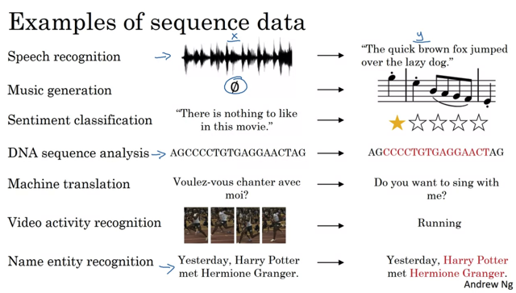</kbd>

 

### Notation

 

#### 1 Sequence models have a wide range of applications, such as \\*Named-entity
recognition\\*, which is used to find entities such as people's names, company
names, times, locations, countries, and currency names in different types of text.

2 A sequence model operates on an \\*input sequence of features\\* (words) and
produces an \\*output sequence of targets\\* (labels).

3 The input sequence can be represented as x with the \\*superscripts\\* <1> to <9> to index
the \\*different positions\\*. Similarly, the output sequence can be represented as y with
the superscripts 1 to 9.

4 \\*T(x)\\* is used to denote the \\*length of the input sequence\\*, and \\*T(y)\\* is used to
denote the \\*length of the output sequence\\*.

5 The individual words in the sentence can be \\*represented\\* by a dictionary of
words. A vocabulary is created by making a list of the words to be used in the
representation.

6 \\*Dictionary sizes can vary depending on the application\\*. For example, 30,000
to 50,000 is common for commercial applications, and some large internet
companies use dictionary sizes of a million words or more.

7 One way to create a dictionary is to\\* find the top occurring words in the training
set and some online dictionaries\\*.

 

<kbd></kbd>

> [!NOTE]
> Đại khái là "bây giờ" : 
> - Bài toán **named-entity recognition** kiểu như cho 1 câu, chỉ ra từ nào
> là tên riêng thì label = 1, từ nào không phải thì label là 0
>
>
>
> - Mỗi data sample x (i) sẽ là **1** **chuỗi (sequence) features** kí hiệu thứ tự dùng <> 
>
>
>
> - Output cũng sẽ là **1 chuỗi labels Ty(i)**
>
>
>
> - Mỗi data sample x (i) sẽ có chiều dài chuỗi là **Tx (i)**

 

<kbd>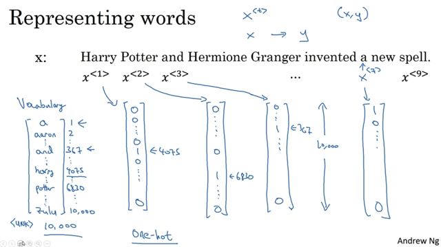</kbd>

> [!NOTE]
> Đại khái là dựa vào 1 bộ dictionary, mỗi "element" của chuỗi x (i) sẽ
> được biến thành 1 **one-hot encoder vector** trong đó:
>
>
>
> Vị trí số 1 sẽ là vị trí của "từ" / element trong dictionary, còn lại số 0 hết

 

### Recurrent Neural Network Model

 

#### 1 In the previous video, sequence learning problems were defined using
a specific notation.

2 Using a \\*standard neural network\\* for learning the mapping from x to
y does not work well due to \\*different input and output lengths\\* and
\\*the inability to share learned features across\\* \\*different positions\\* of
texts.

3 \\*Recurrent Neural Networks (RNNs)\\* are a solution that address the
disadvantages of a standard neural network by \\*passing on information
from previous time steps\\* and \\*sharing parameters across all time
steps.\\*

4 A diagram of a simple RNN was presented, which shows how the
network scans through the data from left to right, with the same set of
parameters being used at each time step.

5 The parameters of the RNN, which include \\*Wax\\*, \\*Waa\\*, and \\*Wya\\*, were
discussed.

 

<kbd></kbd>

> [!NOTE]
> Đại khái là nếu dùng N.N thông thường thì gặp những nhược điểm:
>
>
>
> - Chiều dài mỗi câu mỗi khác 
>
>
>
> - Không 'học' / nắm bắt được sự liên quan giữa các từ ở các
> vị trí khác nhau

 

<kbd>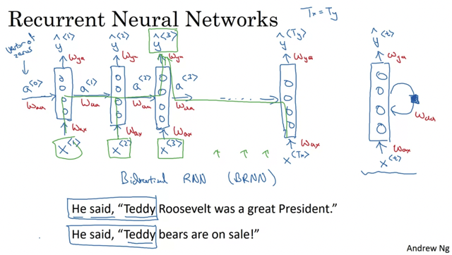</kbd>

> [!NOTE]
> Đại khái là như sau:
>
>
>
> Mỗi một "từ" x<i> sẽ được 'learn' bởi network layer để map với y^<i>
> Bài cuối sẽ nói đến Deep RNN - ta có nhiều layer hơn.
>
>
>
> Nhưng đồng thời cũng pass output a<i> cho từ kế tiếp: Đại khái là
> bằng cách này **một 'từ' sẽ được 'học' bởi cả những từ trước đó
> nữa**.
>
>
>
> Và sẽ có **Bidirectional Recurrent NN** trong đó một từ sẽ được học
> cả những từ sau nó.
>
>
>
> Các layer của từng từ sẽ **share chung params Wax, và Waa**
>
>
>
> Một số paper hay sách mô tả RNN theo kiểu rút gọn
>
>
>
> Đây là đ/v Tx = Ty, có thể Tx != Ty thì sẽ nói sau

 

<kbd>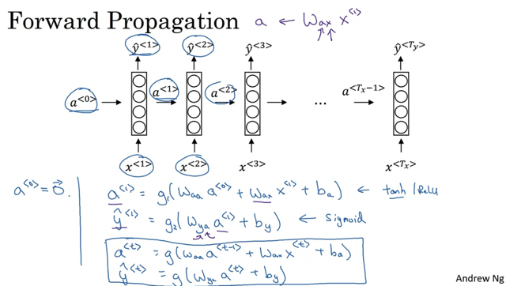</kbd>

> [!NOTE]
> Đại khái là
>
>
>
> Tính a từ x thì là Wax, tính a từ y thì là Way, tính y từ a thì Wya
>
>
>
> TÍnh a thì thường dùng reLU hay TanH
>
>
>
> Tính y thì tuỳ vào yêu cầu có thể là sigmoid

 

<kbd></kbd>

> [!NOTE]
> Đại khái là gom Waa và Wax (stack together) lại cho gọn thành Wa
> và [a<t-1> | x<t>] (cũng là stack hai cái đó lại)
>
>
>
> thì 2 phép tính là như nhau

 

### Backprop Through Time

 

#### 1 \\*Backpropagation\\* in a recurrent neural network (RNN) is
essential for updating the network's parameters using gradient
descent.

2 The backpropagation algorithm in RNN is carried out in the
opposite direction of the forward propagation calculations.

3 The loss function is essential for computing the loss for a
particular word in the sequence, which is necessary to compute
the overall loss for the entire sequence.

4 \\*Backpropagation through time\\* is the name given to the
recursive calculation that goes from right to left in the RNN
architecture.

5 RNN architecture can be used for a wide range of applications
beyond the motivating example where the length of the input
sequence was equal to the length of the output sequence.

 

<kbd></kbd>

 

<kbd></kbd>

> [!NOTE]
> Đại khái tính loss cho 1 sample x(i) là tổng loss của các item
> trong sequence x(i)<1>, x(i)<2>...,x(i)<Tx>
>
> Ở đây đại khái phải hiểu là vì ta đang solve bài toán gọi
> là Name Entity gì đó trong đó mục tiêu là xác định các
> từ trong câu có phải là tên riêng hay không (yes or no)
> -> Nên y<i> chỉ hai gía trị binary 1 | 0 nên bài toán này
> giống như **binary classification**. Nói vậy để hiểu tại
> sao dùng hàm loss function y như của Logistic
> Regression  (có tên là **Log Loss**)
>
>
>
> Nếu y có thể mang nhiều giá trị hơn (thay vì 1 | 0) thì
> loss function sẽ là **Softmax**

 

### Difference Types Of Rnns

 

#### 1 Introduction to RNN architectures with different input and
output lengths

2 Many-to-many architecture with equal input and output
sequence lengths

3 Many-to-one architecture with variable-length input sequence
and single output value

4 One-to-many architecture for music generation

5 One-to-one architecture for standard neural network

6 Many-to-many architecture for variable-length input and
output sequences, like machine translation.

 

<kbd></kbd>

 

<kbd>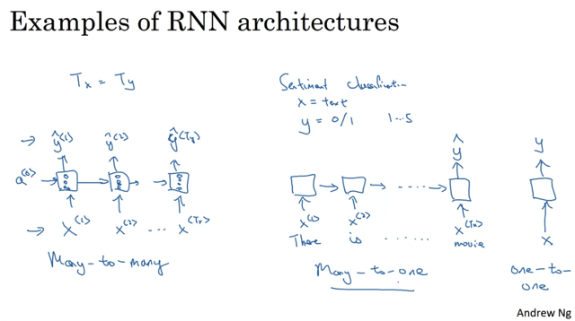</kbd>

 

<kbd>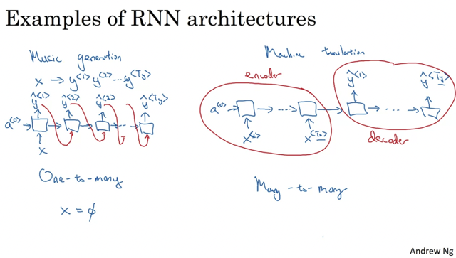</kbd>

 

<kbd></kbd>

 

### Language Model And Sequence Generation

 

#### 1\\* Language modeling\\* is a crucial task in natural language processing that
involves \\*predicting the probability of a particular sequence of words\\*.

2 A language model is used in \\*speech recognition systems\\* to identify the
\\*probability of a particular sentence\\*, and it is also used in \\*machine
translation\\* systems to output \\*only likely sentences.\\*

3 To build a language model using an RNN, you need \\*a training set of a
large corpus of text\\*, which you \\*tokenize\\* and \\*map to one-hot vectors\\* or
indices in a vocabulary.

4 An e\\*nd-of-sentence token\\* can be appended to every sentence in the
training set to capture the end of a sentence.

5 The RNN model estimates the \\*probability of different sequences\\* by setting
the inputs x^t to be equal to y of t minus 1.

 

<kbd>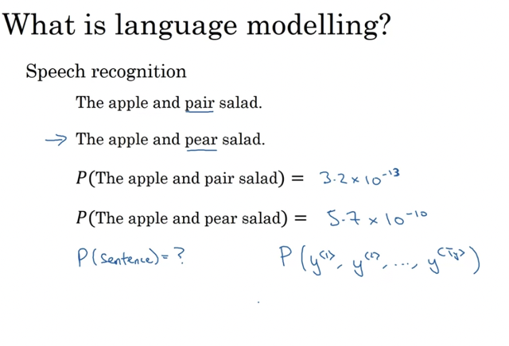</kbd>

> [!NOTE]
> Này là bài toán khác, hồi nãy là N**ame Entity Recognition** -
> Xác định từ trong câu là name hay không phải name. Còn cái
> này là xác định **từ trong câu là từ gì**.
>
>
>
> Ví dụ như input là một đoạn thu âm: Thì mục tiêu của bài
> toán này kiểu như nó tính ra:
> - Khả năng audio này này là câu "The apple ...pair salad" là
> bao nhiêu.
> - Khả năng audio này này là câu "The apple ...pear salad" là
> bao nhiêu.
>
>
>
> Từ đó quyết định kết quả là câu có P cao hơn.

 

<kbd></kbd>

> [!NOTE]
> Training set cho cái này là 1 **corpus**: 1 set rất lớn câu tiếng Anh
> chẳng hạn
>
>
>
> Tokenize: Biến mỗi từ thành 1 one-hot vector (sử dụng một bộ dictionary)
> ví dụ 'cat' -> [0 0 ...0 1 0 ...0] số 1 tại vị trí tương ứng với chữ 'cat'
> trong dictionary
>
>
>
> Thường thường ta thay add 1 extra token <EOS> = End of sentence
> vào cuối câu để biểu thị kết thúc câu
>
>
>
> Có thể bỏ dấu . / ? vào từ điển nếu muốn tokenize dấu chấm câu.
>
>
>
> Từ không có trong từ điển thì tokenize bằng <UKN>

 

<kbd>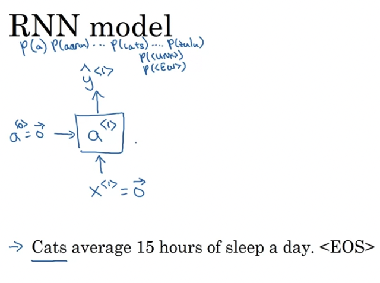</kbd>

> [!NOTE]
> Đại khái là bắt đầu với từ đầu tiên trong sequence - x<i>
> Nó sẽ dùng Softmax với 10000 unit (hay 10002 nếu có thêm UKN và EOS 
> Token) để tính các **probability** từ từ này (x<1>) là
> lần lượt là các từ trong dictionary là bao nhiêu,
>
>
>
> Ví dụ cho dễ hiểu hơn:
>
>
>
> Probability từ x<1> là từ 'a' - P(a) là bao nhiêu?
> Probability từ x<1> là từ 'aaron' - P(aaron) là bao nhiêu?
> ...
> Probability từ x<1> là từ 'cat' - P(cat) là bao nhiêu?
> ...
> Probability từ x<1> là từ 'zulu' - P(zulu) là bao nhiêu?
>
>
>
> -> y^<1> là vector: [P(a) P(aaron) ...P(cat) ...P(zulu)]
>
> X<1> = vector 0 là sao chưa hiểu lắm - Có thể là
> initialization -> Đúng là vậy, initialize nó bằng np.
> zeros() chứ không có gì khó hiểu hết. a_0 cũng vậy

 

<kbd></kbd>

> [!NOTE]
> Tiếp theo để tính toán đ/v từ thứ 2 ta...
>
>
>
> - Bỏ vào x<2> chính là y<1> - Đại khái cho nó biết là đáp án đúng của 
> từ trước nó là từ gì (Ở đây là 'cat')
>
>
>
> - Bỏ vào a<1>
>
>
>
> để tương tự với tính [P(a) P(aaron) ...P(average)...P(zulu)]

 

<kbd></kbd>

> [!NOTE]
> Làm tương tự với từ thứ <t>....đến hết.
> Xong define **L đối với mỗi time step** (đại khái là mỗi lần train 1 từ trong
> sequence) là tổng Loss trên các training data tại time step đó.
>
>
>
> Và vì y có thể có nhiều giá trị chứ không chỉ 1 | 0 nên hàm loss
> là hàm **Cross Entropy**
>
>
>
> Và Cost hay Loss tổng là **tổng Loss trên mọi time step**

 

<kbd>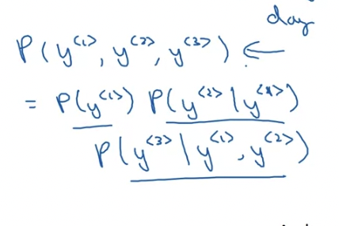</kbd>

> [!NOTE]
> Ở đây đại khái là cho một new sentence y<1> y<2> y<3> ta
> sẽ tính ra **khả năng mà chuỗi này gì ("**/you can figure
> out what is the chance of this entire sentence would be")
>
>
>
> /bằng cách nhân 3 cái probabiitiy sau lại
> "what's the chance of y_1," 
> "what's the chance of y_2, given y_1,"
> "what's the chance of y_3, given y_1, y_2,"

 

### Sampling Novel Sequences

 

#### 1 Sampling novel sequences is a way \\*to informally get a sense
of what is learned\\* in a sequence model.

2 To sample novel sequences, you first sample the first word,
then use the softmax distribution to \\*randomly sample the next
word\\* and so on until the end of the sentence or a
predetermined number of words is reached.

3 If the sequence model is built on a word-level vocabulary,
each y1, y2, y3,... represents a word, but if it is built on a
character-level vocabulary, each y1, y2, y3,... represents a
\\*character\\*.

4 Building a character-level language model has pros and cons,
such as being able to assign a probability to any sequence of
characters, but having longer sequences and being more
computationally expensive to train.

 

<kbd></kbd>

> [!NOTE]
> Đại khái là vầy: 
>
>
>
> Mục đích của cái này là **XEM THỬ sequence model nó học được gì**
>
>
>
> Ví dụ từ thứ nhất, nó tính ra vector này  (tạm gọi là
> probability vector của từ thứ nhất): [P(a), P(Aaron),....P(Zulu)] đại khái như
> đã hiểu là nó chứa các thông số thể hiện "Probability mà từ đầu tiên trong
> sequence này LÀ lần lượt các từ trong dictionary list)
>
>
>
> Bỏ vector này np.random.choice() -> y^<1>: Đại khái mình hiểu là nó sẽ **lấy
> randomly nhưng theo xác xuất quy định bởi probability vector**
>
>
>
> Sau khi huấn luyện một mô hình chuỗi, một trong các cách bạn có thể làm
> quen với những gì đã học là bằng cách tạo ra các chuỗi mới. Đầu tiên, bạn
> cần chọn từ đầu tiên để mô hình tạo ra. Bạn sẽ sử dụng hàm softmax để
> chọn từ tiếp theo **dựa trên xác suất**. Sau đó, bạn **sử dụng từ vừa chọn
> để tạo ra từ tiếp theo bằng cách truyền nó vào mô hình**. Tiếp tục lặp lại quá
> trình này cho tới khi đủ số lượng từ hoặc tạo ra từ kết thúc câu nếu trong từ
> điển của bạn có từ kết thúc câu. Nếu mô hình của bạn tạo ra một từ không
> xác định, bạn có thể lựa chọn tạo lại từ khác hoặc giữ nguyên từ đó trong
> đầu ra.
>
>
>
> Training thì input của từ này là label của từ trước đó x<i> = y<i-1> còn
> sampling  thì input là random sampling with distribution của từ trước đó,

 

<kbd>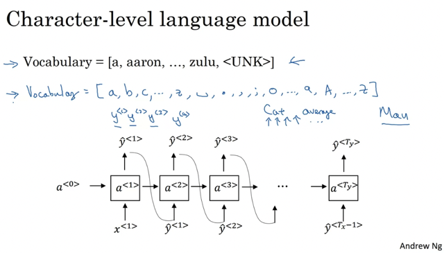</kbd>

> [!NOTE]
> Đại khái là có thể thay 'Word model" bằng "Character model"
> trong đó đại khái là nó ở cấp 'character' thay vì 'word'
>
>
>
> Pros là nó không bị trường hợp <Unknown> word Cons là nó
> tạo ra sequence dài hơn rất nhiều bới 1 từ có vài kí tự dẫn đến
> 'computational expensive' hơn và cần nhiều data hơn
>
>
>
> Ở cấp ký tự thì **không 'nắm bắt' được sự liên hệ** như giữa
> các từ trong 1 câu

 

<kbd>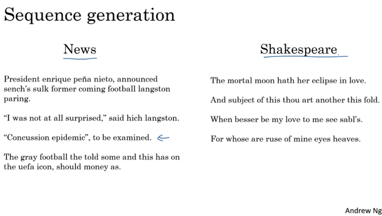</kbd>

> [!NOTE]
> Ví dụ của cái này, đại khái là nó tạo ta những
> content có phong cách giống giống

 

### Vanishing Gradients With Rnns

 

#### 1 Introduction to RNNs and their applications to\\* language modeling\\*
and \\*name entity recognition\\*.

2 The problem of \\*vanishing gradient\\* in the basic RNN algorithm.

3 Explanation of the \\*vanishing gradien\\*t problem and its impact on the
RNN's \\*ability to capture long-term dependencies\\*.

4 Comparison between the local and global influence of the RNN
model's output and input on the computation.

5 \\*Difficulty\\* of getting the neural network to \\*memorize\\* and use the
\\*relevant information from earlier in the sequence.\\*

6 Discussion of the solution to the vanishing gradient problem with
\\*GRUs\\*, which will allow the neural network to \\*capture longer-range
dependencies.\\*

7 \\*Exploding gradient problem\\* and the solution of\\* gradient clipping.\\*

8 The significance of the vanishing gradient problem in training RNNs
over a \\*large number of time steps\\*, which can be \\*equivalent\\* to training
a v\\*ery deep neural network\\*.

 

<kbd>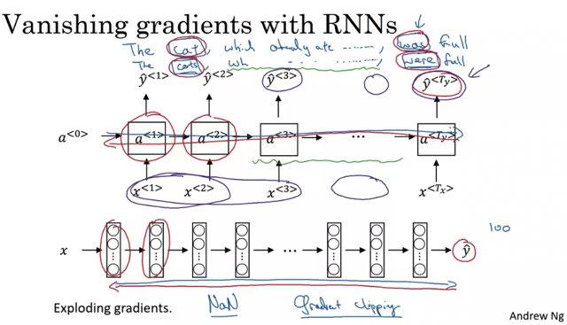</kbd>

> [!NOTE]
> Nói chung đại khái là nói về những thách thức của basic
> RNN:
> **-** **Gradient Vanishing**: Qua nhiều time-step, gradient bị vanish
> giống giống như train một N.N rất deep - nhiều layer.
>
>
>
> **- Vấn đề không 'nhớ' được** rằng lúc đầu là they - số nhiều để
> sau phải dùng were.
>
>
>
> **- Gradient exploding** thì ít gặp hơn và có cách xử bằng 
> **Gradient Clipping** còn G.V thì khó nhận biết và xử lý hơn.

 

### Clarifications

 

<kbd></kbd>

 

<kbd></kbd>

 

### Gated Recurrent Unit (gru)

 

#### 1 Gated Recurrent Units (GRUs) are modifications to the basic RNN hidden
layer that allow for \\*better capturing of long-range connections\\* and \\*addressing
vanishing gradient\\* problems.

3 The GRU unit involves a\\* memory cell (C) that provides memory for previous
inputs\\*, allowing the network to \\*remember relevant information for long-range
connections\\*.

4 At each time step, \\*a candidate value (C~t)\\* is computed for \\*potentially
overwriting the memory cell value (C_t)\\* using an activation function (tanh)
applied to the previous memory cell value, current input, and weight and bias
parameters.

5 The update gate (\\*Gamma_u\\*) \\*determines whether the candidate value is used to
update the memory cell value\\*. It is a\\* value between 0 and 1\\*, often computed using
a \\*sigmoid\\* function.

6 The gate allows the network to \\*decide when to update the memory cell value\\*,
\\*based on the relevance of the current input to long-range connections\\*.

7 \\*The key equation for the GRU involves combining the candidate value and
previous memory cell value with the gate value to determine the updated memory
cell value.\\* 

8 The gate is an important component of the GRU and can be thought of as a way
to decide whether to update the memory cell value based on the relevance of the
current input.

9 The GRU was developed by Junyoung Chung, Caglar Gulcehre, KyungHyun
Cho, and Yoshua Bengio, who published two papers on the topic. [1]

10 The GRU unit is designed to \\*allow the network to remember important
information from previous inputs and use it to better capture long-range
connections\\* in sequences of data. [1]

 

<kbd>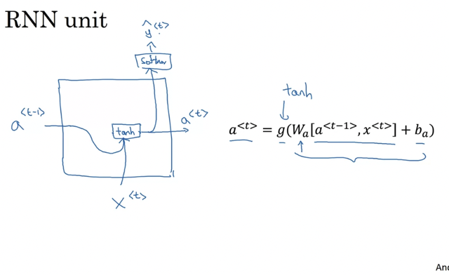</kbd>

> [!NOTE]
> Minh hoạ 1 RNN unit: Đại khái là lấy activation của previous time-step
> và current input để tính ra activation của unit.
>
>
>
> The formula for computing the activations of an RNN unit involves the
> **activation function applied to the previous activation** and the **current
> input**, passed through some **weights** and a **bias**. This can be
> represented visually as a box with inputs for a previous time step and
> current input, and output activation.

 

<kbd>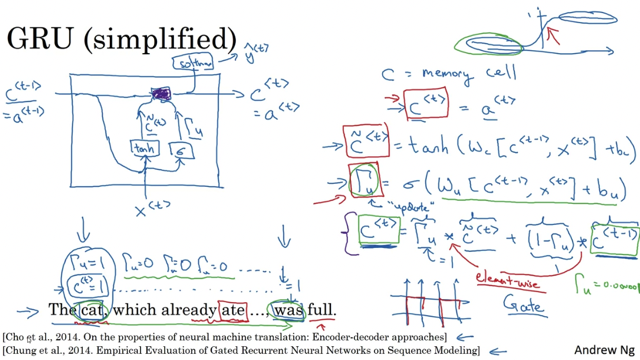</kbd>

> [!NOTE]
> Tạm thời chưa hiểu (nó work như thế nào) nhưng quan trọng phải
> nhớ những notation này:
>
>
>
> Đại khái có khái niệm C là **memory cell**: Sẽ giúp network **nhớ
> được thông tin cần thiết / liên quan cho những mối liên hệ xa
> (giữa các unit)**
>
>
>
> Đại khái C<t> = a<t>
>
>
>
> Đại khái C~<t> là candidate để thay cho C<t>
>
>
>
> Đại khái gamma u có vai trò để quyết định có update value của C
> hay là không dựa trên: (/**t\_he relevance of the current
> input**/\_???)
>
>
>
> Gamma u tính bằng Sigmoid nên đại khái là most of the time nó
> sẽ có value ~= 1 hoặc ~=0.
>
> Chưa hiểu:
> Nó work như thế nào.
> Taị sao nó lại giúp khắc phục vấn đề Gradient Vanishing
>
> Mục đích của GRU là khắc phục vấn đề Gradient Vanishing và nắm
> bắt được mối quan hệ long-range của các unit trong sequence
>
> 1 **Gated Recurrent Units (GRUs)** are **modifications to the basic RNN**
> hidden layer that allow for **better capturing of long-range connections** and
> **addressing vanishing gradient** problems.
>
>
>
> 3 The GRU unit involves a **memory cell (C)** that **provides memory for
> previous inputs**, **allowing the network to remember relevant information for
> long-range connections.**
>
>
>
> 4 At each time step, **a candidate value (C~t)** is computed for **potentially
> overwriting the memory cell value (C_t)** using an activation function (tanh)
> applied to the previous memory cell value, current input, and weight and bias
> parameters. [1]
>
>
>
> 5 The **update gate (Gamma_u)** **determines whether the candidate value is
> used to update the memory cell value**. It is a value between 0 and 1, often
> computed using a sigmoid function. [1]
>
>
>
> 6 /**The gate allows the network to decide when to update the memory cell
> value, based on t\_he relevance of the current input\_ to long-range
> connections**./
>
>
>
> 7 The key equation for the GRU involves combining the **candidate value** and
> **previous memory cell value** with the **gate value** to **determine the updated
> memory cell value**.
>
>
>
> 8 The gate is an important component of the GRU and can be thought of as **a
> way to decide whether to update the memory cell** value **based on the
> relevance of the current input.**
>
>
>
> 9 The GRU was developed by Junyoung Chung, Caglar Gulcehre, KyungHyun
> Cho, and Yoshua Bengio, who published two papers on the topic. [1]
>
>
>
> 10 The GRU unit is designed to **allow the network to remember important
> information from previous inputs** and use it to better **capture long-range
> connections in sequences of data**. [1]
>
> **"the relevance of the current input"**: Hiểu đại khái là nếu input x
> tại một unit nào đó có ảnh hưởng đến các unit ở xa hơn (long
> range connection) thì nó sẽ được giữ lại và tính toán sau này (ví dụ
> như They và were vậy

 

<kbd></kbd>

> [!NOTE]
> Full version có thêm Gammar r trong công thức tính c~

 

### Clarification

 

<kbd>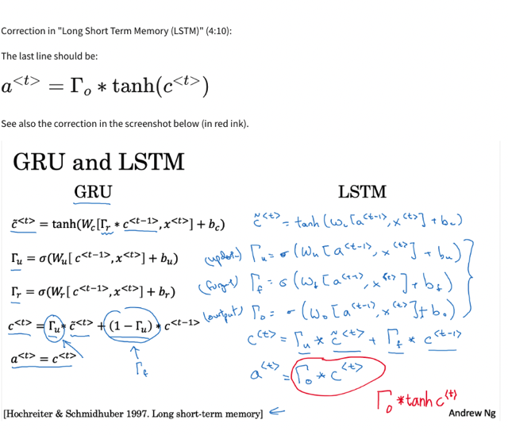</kbd>

 

### Long Short Term Memory

 

#### 1 GRU (Gated Recurrent Unit) and LSTM (Long Short-Term Memory) units are used
to learn long-range connections in a sequence.

2 LSTM is \\*more powerful\\* than GRU.

3 LSTM has three gates: \\*forget gate\\*, \\*update gate\\*, and \\*output gate\\*.

4 The equations governing the behavior of LSTM include a candidate value for
updating the memory cell and the memory cell itself.

5 The forget gate in LSTM allows the memory cell to \\*keep or discard the old value\\*.

6 The update gate in LSTM \\*adds the new value to the memory cell\\*.

7 The output gate in LSTM \\*controls the information flow from the memory cell\\*.

8 LSTMs can be \\*hooked up in parallel\\* to pass information for a long time.

9 LSTMs and GRUs are \\*good at memorizing certain values for a long time\\*.

 

<kbd></kbd>

> [!NOTE]
> - Không còn cho c<t-1> bằng a<t-1> nên dùng a<t-1> trong tính c~<t>
> và Gamma u
>
>
>
> - Có thêm Gamma f - Forget và thay cho 1-Gamma u trong công thức tính c<t>
>
>
>
> - Có thêm Gamma o - Output để tính a<t> (không còn cho rằng a<t>
> luôn bằng c<t>)

 

<kbd>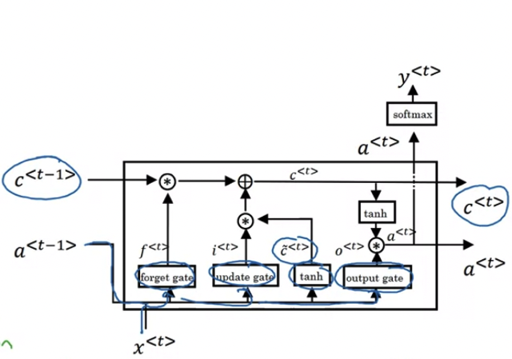</kbd>

 

<kbd></kbd>

> [!NOTE]
> One interesting property of the LSTM is that it is very good at
> memorizing certain values for a long time. This is because, as shown
> in the video, multiple LSTMs can be connected in parallel and
> passed through time, allowing values to be passed from one LSTM
> to another.
>
>
>
> **Đại khái là các unit nối lại bằng thêm một đường màu đỏ cho phép
> thông tin được giữ lại và pass đi xuyên suốt.**
>
>
>
> Overall, the LSTM is a powerful type of RNN that is able to learn
> l**ong-term dependencies** in sequences. Its equations are **more
> complex** than those of the GRU, but its multiple gates give it more
> **flexibility** and **control** over which information to remember and which
> to forget.
>
>
>
> **Nói chung LSTM phức tạp nhưng linh hoạt hơn còn GRN đơn giản
> nhưng cho phép scale up tốt hơn**
>
> Có thể có một phiên bản
> khác (variation) **Peephole Connection** ...

 

### Bidirectional RNN

 

#### 1 Introduction of two more ideas to build more powerful models in
RNN.

2 Bidirectional RNN addresses the \\*problem of not having enough
information from past and future\\* to predict a label for a word.

3 The forward and backward recurrent components in bidirectional
RNN work cyclically to compute network activations.

4 \\*Bidirectional\\* RNN with LSTM blocks is commonly used in NLP
problems to label things in a sentence.

 

<kbd>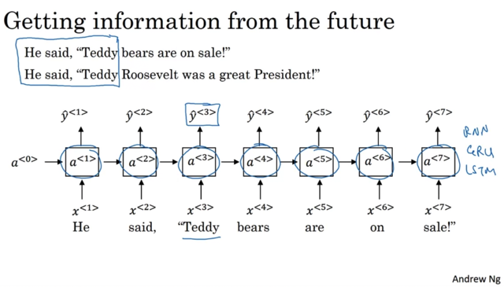</kbd>

 

<kbd>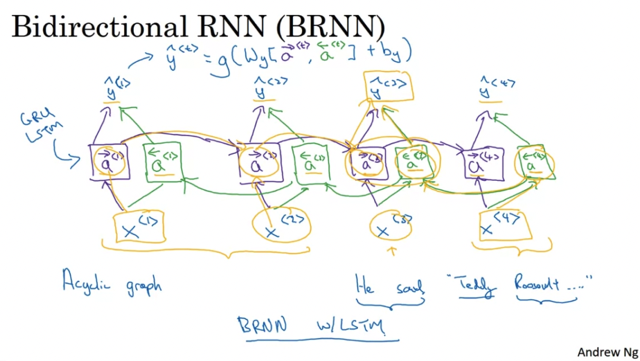</kbd>

> [!NOTE]
> - Đại khái là có thêm 1 chiều Backward nữa (nhưng không phải là Back
> Prop mà vẫn là Forward Prop)
>
>
>
> - Đại khái nó giúp lấy thông tin từ những unit sau cho việc Predict
> những cái ở đầu giúp giải quyết vấn đề là có những thứ phải cần thêm
> thông tin ở sau mới biết được ví dụ như câu He said Teddy Roosevelt,.
> .. Trong đó chữ Teddy cần thêm ngữ cảnh phía sau để xác định là tên
> ông Tổng thống chứ không phải gấu Teddy
>
> - Lúc sau ổng có nói là cái này bắt buộc phải thu hết toàn bộ
> Vd như nói xong hết thì mới xử lý, nên cái nào có thể thoả mãn
> yêu cầu này thì BRNN rất hiệu quả còn cần real-time thì phải có 
> n.n kiểu khác.

 

### Deep Rnns

 

#### 1 \\*Stacking\\* multiple layers of RNNs together can create even deeper and
more complex models for learning very complex functions.

2 A deep RNN is created by \\*unrolling a standard RNN in time and stacking
the layers on top of each other.\\*

3 The notation used for deep RNNs is \\*a[l]\\* to denote the activation associated
with layer l and <t> to denote the time associated with the activation.

4 A deep RNN can have \\*multiple recurrent layers that are connected in time\\*,
f\\*ollowed by a deep network that predicts the output\\*.

5 Deep RNNs can also use different recurrent units such as \\*GRU\\* and \\*LSTM\\*
blocks.

6 Deep RNNs can be \\*computationally expensive\\* to train, and because of the
temporal dimension, having just a \\*few layers\\* can already create a large
network.

7 With the basic RNN, GRU, LSTM, bidirectional RNN, and deep versions of
these models, one can \\*construct powerful models\\* for learning sequence
models.

 

<kbd></kbd>

> [!NOTE]
> - Đại khái là có thêm nhiều layer hơn, cũng dễ hiểu.
>
>
>
> Người ta thường không quá 3 layer vì cái này nó rất lớn, không như
> Standard N.N.
>
>
>
> Và có thể từ layer 3 trở đi nó đi thêm vài bước nữa những  nó không có
> kết nối ngang
>
>
>
> (/A deep RNN can have multiple recurrent layers that are connected in
> time, followed by a deep network that predicts the output/.)

 

### Quiz

 

<kbd></kbd>

 

<kbd>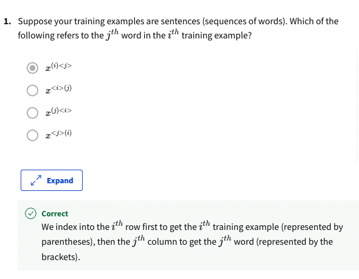</kbd>

 

<kbd>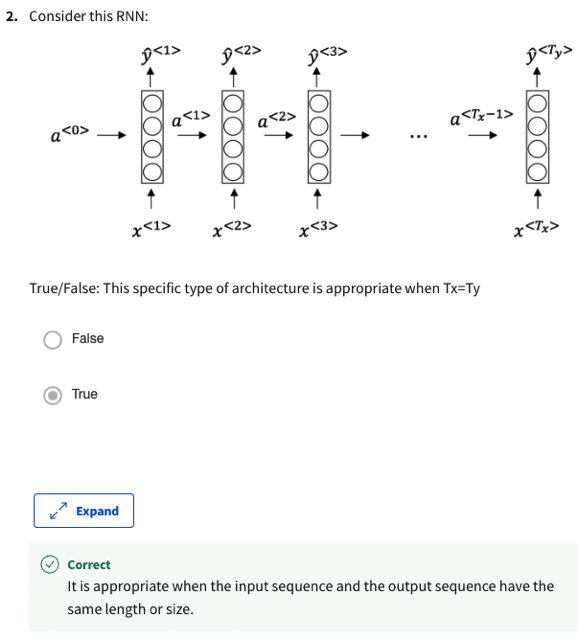</kbd>

 

<kbd></kbd>

 

<kbd></kbd>

 

<kbd></kbd>

> [!NOTE]
> Này đáng lý không nên sai, phải là dùng probability nhưng phải là chọn
> random (randomly sample) chứ không phải là lấy thằng có prob cao nhất.

 

<kbd>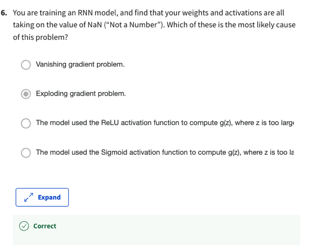</kbd>

 

<kbd></kbd>

> [!NOTE]
> Đoán bừa hên là trúng.

 

<kbd>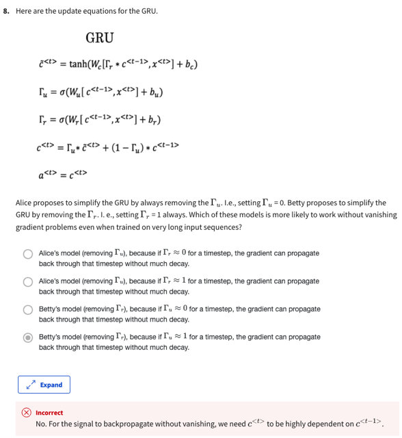</kbd>

<kbd></kbd>

> [!NOTE]
> Chua hiểu: muốn C<t> luôn bằng C<t-1> thì Alice đúng chứ

 

<kbd>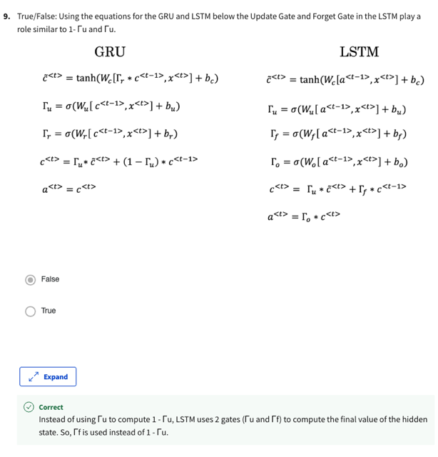</kbd>

 

<kbd></kbd>

 

### Programming Assignments 1

 

#### Welcome to the first (required) programming exercise of Course 5 of the
Deep Learning Specialization! In this notebook you will build a recurrent
neural network (RNN) and an LSTM from scratch, using Numpy.

By the end of this assignment, you'll be able to:  • Define notation for
building sequence models  • Describe the architecture of a basic RNN  •
Identify the main components of an LSTM  • Implement backpropagation
through time for a basic RNN and an LSTM  • Give examples of several
types of RNN

Recurrent Neural Networks (RNN) are very effective for Natural Language
Processing and other sequence tasks because they have "memory." They
can read inputs  𝑥 ⟨𝑡⟩ (such as words) one at a time, and remember some
contextual information through the hidden layer activations that get
passed from one time step to the next. This allows a unidirectional
(one-way) RNN to take information from the past to process later inputs. A
bidirectional (two-way) RNN can take context from both the past and the
future, much like Marty McFly.

 

##### Packages

 

<kbd></kbd>

 

##### 1 - Forward Propagation for the Basic
Recurrent Neural Network

 

- **1 - Forward Propagation for the Basic
Recurrent Neural Network:  Xem lại sơ đồ
của Basic RNN với Tx = Ty**

 

<kbd>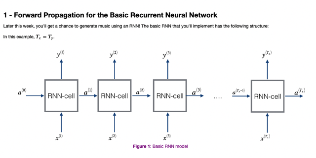</kbd>

 

<kbd></kbd>

> [!NOTE]
> a và y^ cũng vậy,

 

- **Dimensions: Kích thước các thứ

x(i) sẽ là (n_x, m, Tx)   x(i)<t> = xt là
(n_x,m) a: (n_a, m) Y: (n_y, m, Ty)**

 

<kbd></kbd>

> [!NOTE]
> Mỗi một **x(i)<t>** (ví dụ một word) trong sequence (ví dụ câu) sẽ
> được ' encoded' thành một encoding vector có thể là **one-hot
> encoded vector** trong đó số 1 tại vị trí của từ vocab list hoặc là
> một **dense embedded vector** - vector chứa đựng nhiều thông tin
> hữu ích về đặc tính của từ và quan hệ của nó đ.v các từ khác hơn
> là one-hot encoded vector được training từ một Word Embedded
> Model (đây là những cái học trong week 2, 3).
>
>
>
> Nên **nx** ở đây là chỉ độ dài của encoded/embedded vector này
>
>
>
> Do đó thì 1 data instance / sample x(i) sẽ có shape (Tx, nx) (Hay
> nx, Tx - thứ tự không quan trọng)
>
>
>
> Tx sẽ là **độ dài của câu (sequence) dài nhất**, các câu ngăn hơn
> sẽ được  **padding** (học trong w2,3)
>
>
>
> Và toàn bộ (m) X sẽ là **(nx, m, Tx)** gọi là **3D Tensor**
>
>
>
> Hoặc một batch_size sẽ là **(nx, batch_size, Tx)** 
>
>
>
> Ở đây ổng cho m = batch_size luôn
>
>
>
> Hiểu được như vậy thì input của mỗi time step sẽ là:  (**nx**,
> **batch_size** **= m**)
>
>
>
> *(Ghi chú từ lần review thứ 1)

 

<kbd></kbd>

 

- **1.1 - RNN Cell: Đại khái là nói về mô hình của
1 RNN cell chia ra làm phần ruột tính ra a<t>
và vần mở rộng (forward) dùng softmax để tính
thêm y^<t> nhận input từ a<t-1> và x<t>**

 

<kbd>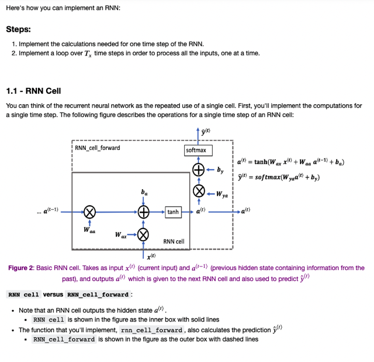</kbd>

 

- **Exercise 1 - rnn_cell_forward

Nhận a_prev (a<t-1>) và xt , dùng tanh và
param Waa, Wax, ba tính ra a (a<t) Dùng
Softmax và Wya, by tính y^. Tạo cach chứa xt,
a_prev, a, params**

 

<kbd></kbd>

 

<kbd></kbd>

 

<kbd>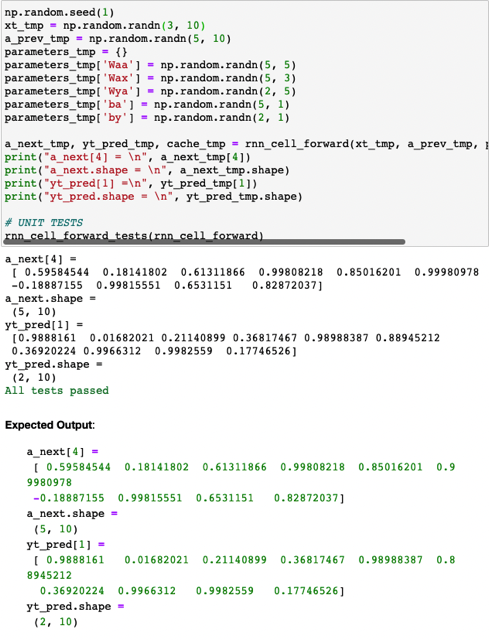</kbd>

 

- **1.2 - RNN Forward Pass: Đại khái xem trực
quan mô hình  của forward pass RNN như thế
nào.**

 

<kbd></kbd>

 

- **Exercise 2 - rnn_forward(x, a0, params)

Ini a = zeros(na,m,Tx) y_pred = zeros(ny,m,Tx)
Loop: For t in range T_x
- Lấy ra xt = x[:,:,t]
- Nếu là t = 0 thì aprev = a0, không thì aprev lấy từ a ra
- Dùng function rnn_cell_forward(xt, aprev, params) để tính ra a_next, y_pred
- Update a_next vào a, yt_pred vào y_pred, add cach và caches**

 

<kbd>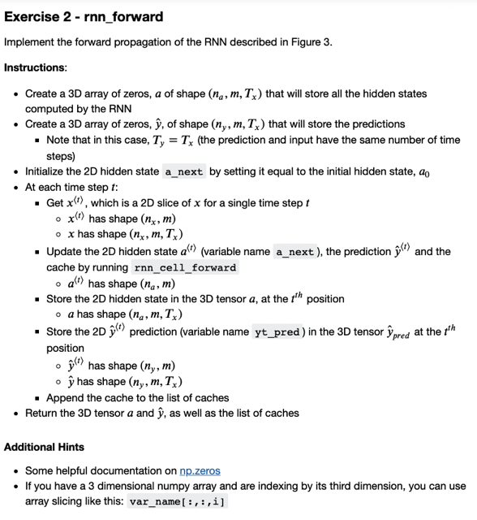</kbd>

 

<kbd></kbd>

<kbd></kbd>

<kbd></kbd>

 

<kbd>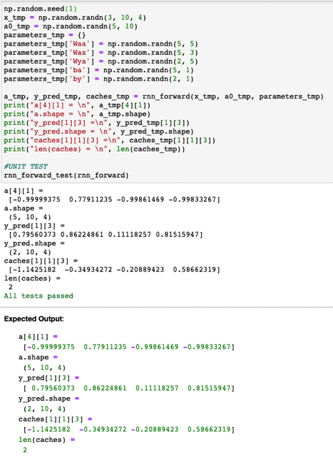</kbd>

 

- **Tóm lại một số điều cần nhớ:

Đại khái là RNN cơ bản là lặp lại 1 single cell nhiều lần  Một Basic RNN
đọc input one at a time và ghi nhớ thông tin xuyên suốt qua các hidden
layer. Mỗi cell nhận input là hidden state từ cell trước (a_prev) và current
time data (xt) và trả ra hidden state (a<t>) và y_predict <t>

*Nhưng Basic RNN có nhược điểm là bị Vanishing Gradient và chỉ làm
việc tốt nếu có local context đại khái là thông tin nó hỗ trợ nằm gần nhau
chứ không qúa xa. x<t'> hỗ trợ y<t> với t' gần t**

 

<kbd>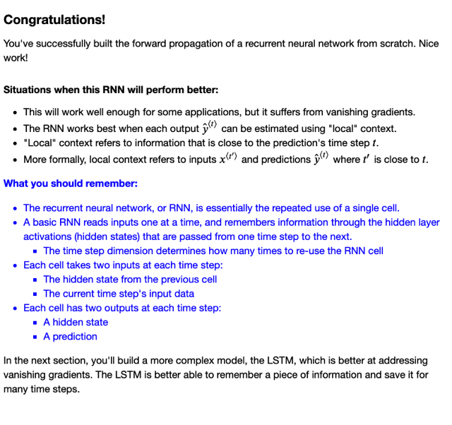</kbd>

 

##### 2 - Long Short-Term
Memory (LSTM) Network

 

- **2 - Long Short-Term Memory (LSTM) Network

Đại khái là Trình bày lại 'mô hình' của LSTM network
cùng với notation.**

 

<kbd>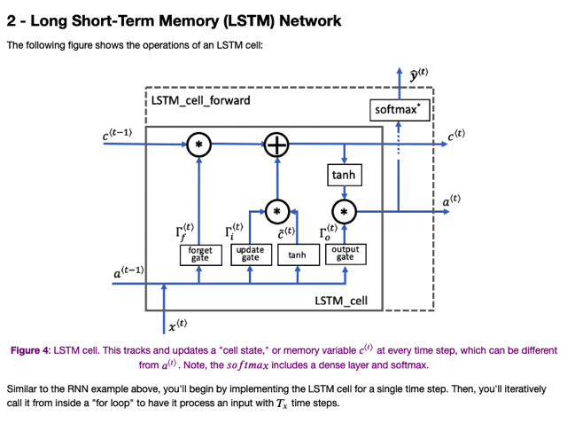</kbd>

 

<kbd></kbd>

> [!NOTE]
> Đại khái là Forget gate này np1 dùng sigmoid để mang 1 trong 2 giá trị 0 hay 1.
>
>
>
> Nó sẽ quyết định thông tin từ c_prev có được giữ lại và dùng cho  step kế tiếp hay
> không.

 

<kbd>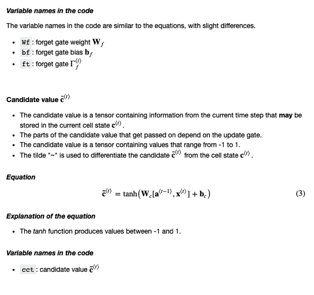</kbd>

 

<kbd>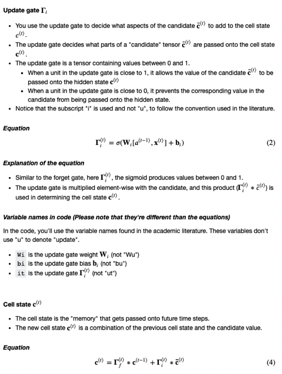</kbd>

 

<kbd></kbd>

 

<kbd>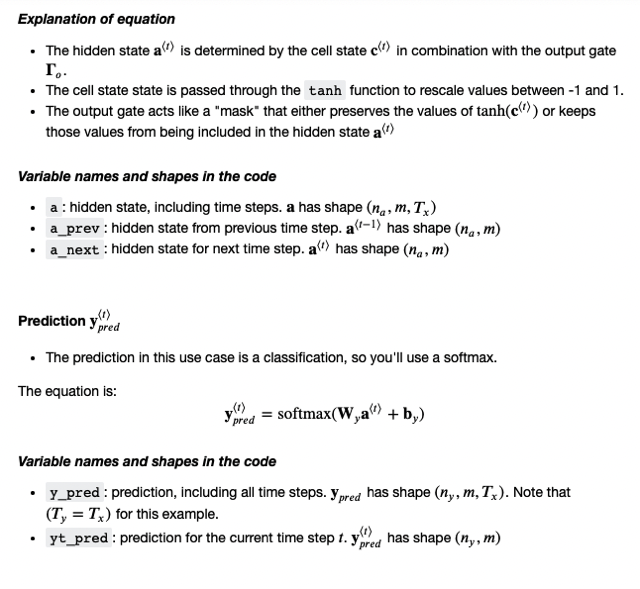</kbd>

 

- **2.1 - LSTM Cell**

 

<kbd>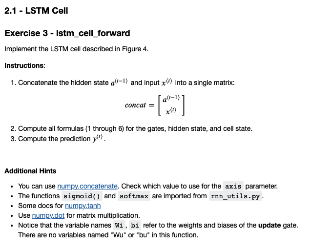</kbd>

 

- **Exercise 3 - lstm_cell_forward

Nhận xt, a_prev, c_prev tính giá trị của các 'gate', c~, a_next, yt_pred
theo công thức**

 

<kbd></kbd>

<kbd>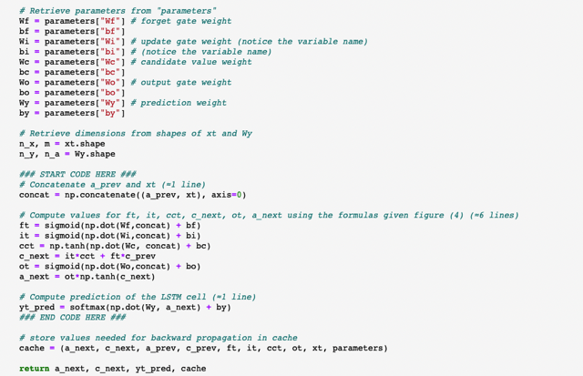</kbd>

 

- **2.2 - Forward Pass for LSTM**

 

<kbd>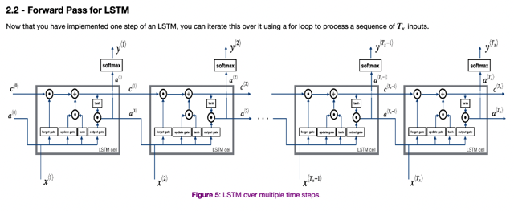</kbd>

 

- **Exercise 4 - lstm_forward

Ini a, c = zeros(na,m,Tx) y_pred = zeros(ny,m,Tx)
Loop: For t in range T_x
- Lấy ra xt = x[:,:,t]
- Nếu là t = 0 thì aprev = a0, không thì aprev lấy từ a ra
- Dùng function lstm_cell_forward(xt, aprev, cprev params) để tính ra a_next, y_pred
- Update a_next vào a, yt_pred vào y_pred, add cach và caches**

 

<kbd>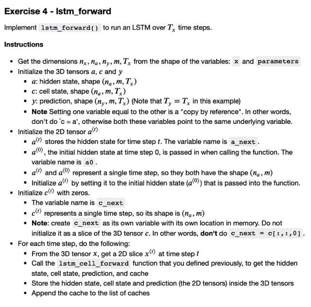</kbd>

 

<kbd>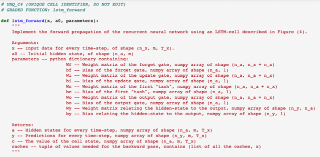</kbd>

<kbd>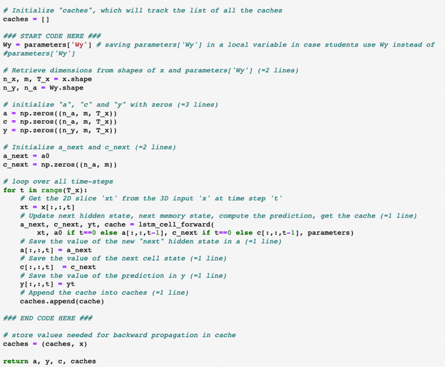</kbd>

 

- **\\*Congratulations! \\*You have now implemented the forward passes for both the basic RNN and the LSTM.
When using a deep learning framework, implementing the forward pass is sufficient to build systems that
achieve great performance. The framework will take care of the rest. \\* 

What you should remember\\*:

• An LSTM is similar to an RNN in that they both use hidden states to pass along information, but an LSTM
\\*also uses a cell state\\*, which is like a long-term memory, to help deal with the issue of vanishing gradients

• An LSTM cell consists of a \\_\\*cell state, or long-term memory\\*\\_, \\_\\*a hidden state, or short-term memory\\*\\_, along
with 3 gates that constantly update the relevancy of its inputs:

▪ A \\*forget\\* gate, which \\_\\*decides which input units should be remembered and passed along\\*\\_. It's a tensor
with values between 0 and 1.

◦ If a unit has a value close to 0, the LSTM will "forget" the stored state in the previous cell state.

◦ If it has a value close to 1, the LSTM will mostly remember the corresponding value.

▪ An \\*update\\* gate, again a tensor containing values between 0 and 1. It decides on \\_\\*what information to
throw away, and what new information to add\\*\\_.

◦ When a unit in the update gate is close to 1, the value of its candidate is passed on to the hidden state.

◦ When a unit in the update gate is close to 0, it's prevented from being passed onto the hidden state.

▪ And an \\*output\\* gate, which decides \\_\\*what gets sent as the output of the time step\\*\\_

Let's recap all you've accomplished so far. You have:

• Used notation for building sequence models

• Become familiar with the architecture of a basic RNN and an LSTM, and can describe their components

The rest of this notebook is optional, and will not be graded, but as always, you are encouraged to push your
own understanding! Good luck and have fun.**

 

##### 3 - Backpropagation in
Recurrent Neural Networks
(OPTIONAL / UNGRADED)

 

- **3.1 - Basic RNN Backward Pass**

 

<kbd>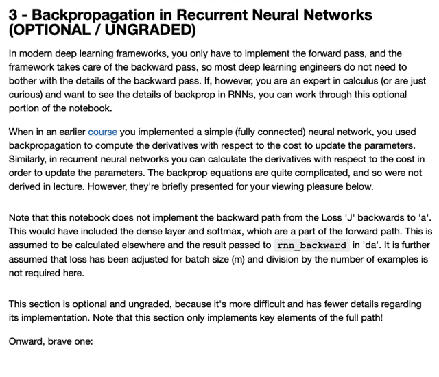</kbd>

 

<kbd>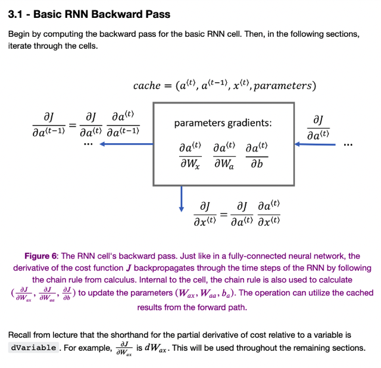</kbd>

 

<kbd></kbd>

 

<kbd></kbd>

 

<kbd></kbd>

 

- **Exercise 5 - rnn_cell_backward**

 

<kbd></kbd>

 

<kbd>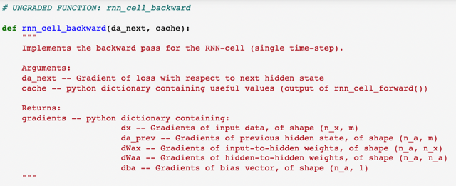</kbd>

<kbd></kbd>

 

<kbd></kbd>

 

- **Exercise 6 - rnn_backward**

 

<kbd>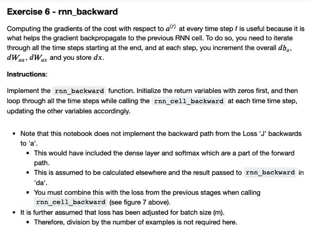</kbd>

 

<kbd></kbd>

<kbd></kbd>

 

<kbd>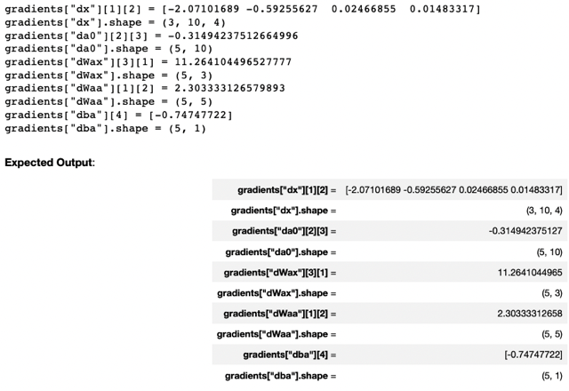</kbd>

 

- **3.2 - LSTM Backward Pass**

 

<kbd></kbd>

 

<kbd>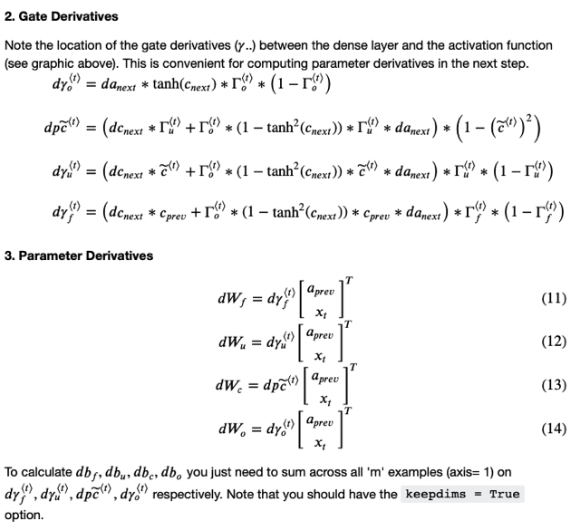</kbd>

> [!NOTE]
> Cái chỗ 'choose wisely da_next xem chú giải trong hình (note) trong
> nhánh trước (bản note tự làm  - xây dựng công thức)

 

<kbd>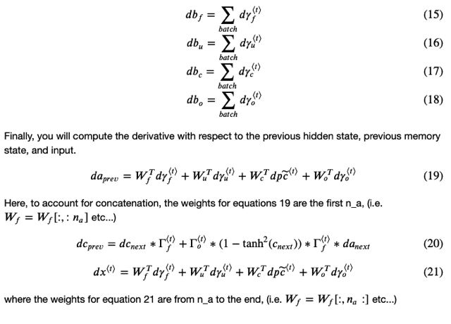</kbd>

 

<kbd>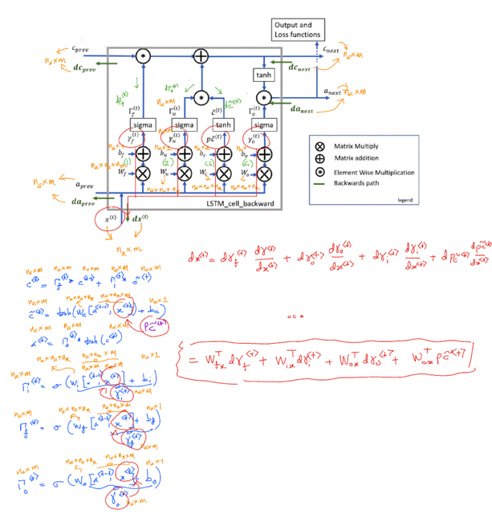</kbd>

 

<kbd></kbd>

 

<kbd>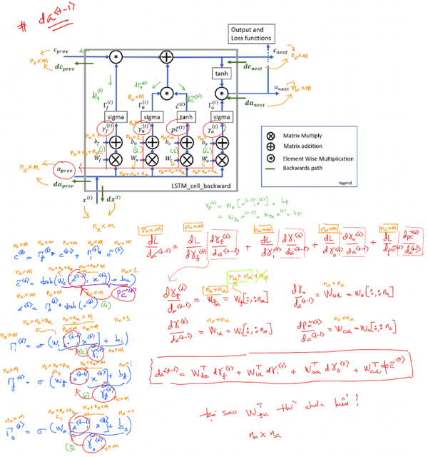</kbd>

 

<kbd>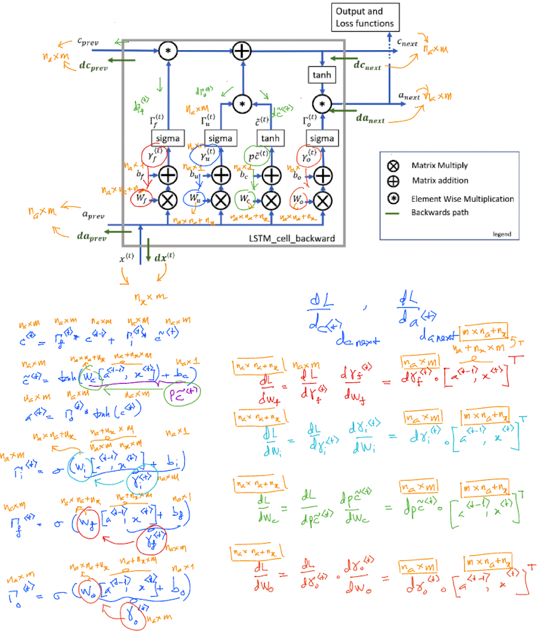</kbd>

 

<kbd>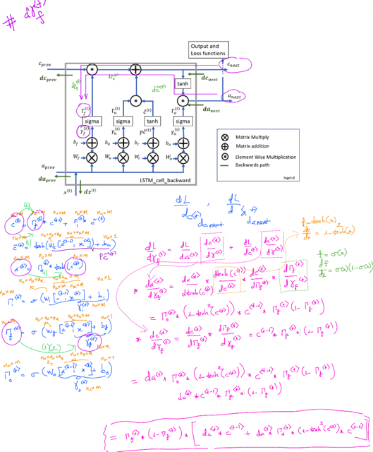</kbd>

 

<kbd></kbd>

 

<kbd>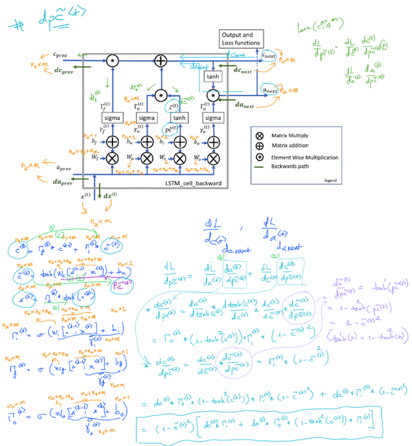</kbd>

 

<kbd>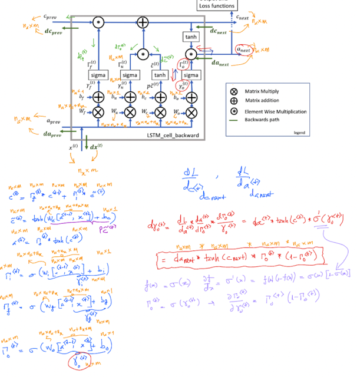</kbd>

 

- **Exercise 7 - lstm_cell_backward**

 

<kbd></kbd>

 

<kbd>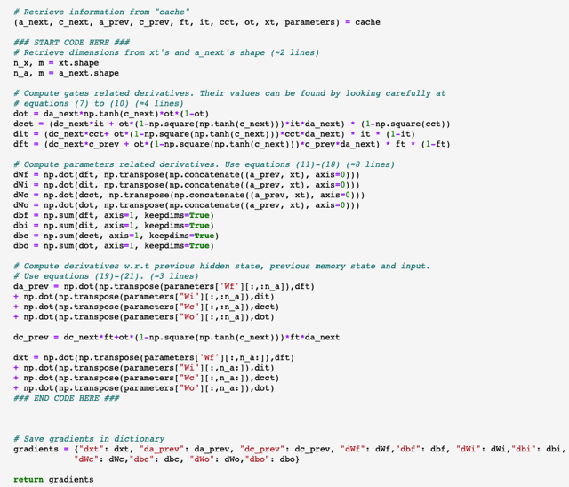</kbd>

 

<kbd></kbd>

 

- **3.3 Backward Pass through the LSTM RNN**

 

<kbd></kbd>

 

- **Exercise 8 - lstm_backward**

 

<kbd></kbd>

 

<kbd></kbd>

 

- **Congratulations on completing this assignment! You now understand how
recurrent neural networks work! In the next exercise, you'll use an RNN to
build a character-level language model. See you there!**

 

### Programming Assignments 2

 

#### Character level language model - Dinosaurus Island Welcome to Dinosaurus Island! 65
million years ago, dinosaurs existed, and in this assignment, they have returned.

You are in charge of a special task: Leading biology researchers are creating new
breeds of dinosaurs and bringing them to life on earth, and your job is to give names to
these dinosaurs. If a dinosaur does not like its name, it might go berserk, so choose
wisely!

Luckily you're equipped with some deep learning now, and you will use it to save the
day! Your assistant has collected a list of all the dinosaur names they could find, and
compiled them into this \\_dataset\\_. (Feel free to take a look by clicking the previous
link.)

To create new dinosaur names, you will\\_\\/\\* build a character-level language model\\*\\/\\_ to
generate new names. Your algorithm will \\_\\/learn the different name patterns\\/\\_, and
\\_\\/randomly generate new names\\/\\_. Hopefully this algorithm will keep you and your team
safe from the dinosaurs' wrath!

By the time you complete this assignment, you'll be able to:

• \\_\\/Store text data for processing using an RNN\\/\\_

• \\_\\/Build a character-level text generation model using an RNN\\/\\_

• \\_\\/Sample novel sequences in an RNN\\/\\_

• \\_\\/Explain the vanishing/exploding gradient problem in RNNs\\/\\_

• \\_\\/Apply gradient clipping as a solution for exploding gradients\\/\\_

<kbd></kbd>

> [!NOTE]
> Chú ý: Đại khái là tạo môt 'language-model' - 'mô hình ngôn ngữ cấp kí tự' để
> tạo ra tên mới cho 1 loài khủng long dựa trên pattern của các loài hiện có.

 

##### Packages

 

<kbd>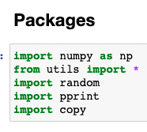</kbd>

 

##### 1 - Problem Statement

 

- **1.1 - Dataset and Preprocessing

Đại khái là cho một danh sách tên khủng long.
Và tìm ở trỏng có cả thảy bao nhiêu 'kí tự' gọi nó là 
vocabulary list (đây là bài toán ở cấp) 
'kí tự' chứ không phải 'từ'
Chuẩn bị sẵn function chuyển / get từ index sang kí tự và ngược lại.**

 

<kbd></kbd>

> [!NOTE]
> Đại khái là cho một danh sách tên khủng long.
> Và tìm ở trỏng có cả thảy bao nhiêu 'kí tự' gọi nó là 
> vocabulary list (đây là bài toán ở cấp) 
> 'kí tự' chứ không phải 'từ'
> Chuẩn bị sẵn function chuyển / get từ index sang kí tự và ngược lại.

 

- **1.2 - Overview of the Model
a.Nói về các bước (để xây dựng model)
Ini params
Run FP tính loss function
Run BP tính gradient
Clip the gradient để tránh Gradient Exploding
Update gradient

b.Mô hình của RNN 
Đại khái là tại mỗi lần <t>, dự đoán từ tiếp theo
nên y<1> chính là x<2>, ..y<t> = x<t+1>**

 

<kbd></kbd>

 

##### 2 - Building Blocks of the Model

In this part, you will build two important blocks of the overall model:
 1 Gradient clipping: to avoid exploding gradients
 2 Sampling: a technique used to generate characters
You will then apply these two functions to build the model.

 

- **2.1 - Clipping the Gradients in the Optimization Loop:

- Nói về hiện tượng gradient trở nên quá lớn - exploding gradient sẽ
khiến G.D nó work không tốt, do đó phải làm động tác 'Gradient Clipping'
thưc hiện trước khi update params để fix hiện tượng này.

- Nói về phương pháp Gradient Clipping - Simple Element-wise clipping
trong đó đơn giản là cho 1 giới hạn, thằng nào quá giới hạn sẽ bị set.

- Dùng np.clip() cho vào 1 vector, và min, max và arg outer - thể hiện đầu
ra.**

 

<kbd>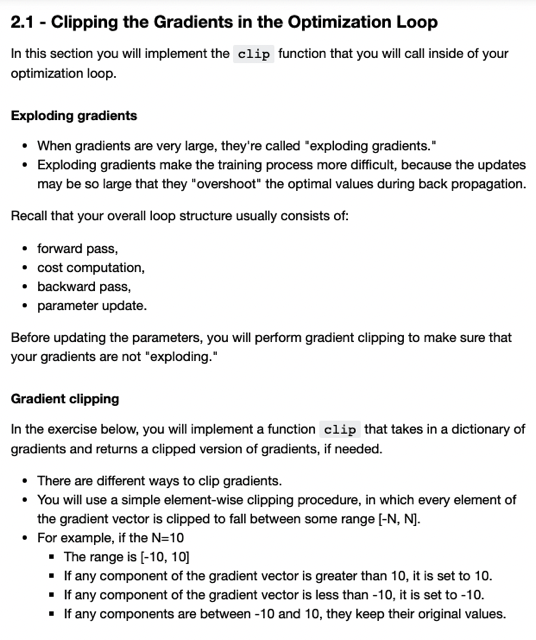</kbd>

<kbd></kbd>

 

- **Exercise 1 - clip

Dùng function np.clip. Clip cũng chỉ đơn giản là cho nó max, min, nó
sẽ xem item nào Trong array lớn hơn max hay bé hơn min thì nó
set về max, min. Vậy thôi, Để argument out = input để nó update
luôn vào cái vả đưa giá trị vào. (Chứ khỏi lưu thành 1 var khác, kiểu
vậy)

*Chú ý: Trong 'for gradient in gradients:...' thì gradient chỉ là string -
tên các params, phải lấy ra = gradients[gradient]

\\/for gradient in gradients:
        np.clip(gradients[gradient], -maxValue, maxValue, out=gradients[gradient])\\/**

 

<kbd></kbd>

> [!NOTE]
> Chú ý: Trong 'for gradient in gradients:...' thì
> gradient chỉ là string - tên các params, phải
> lấy ra = gradients[gradient]

 

- **2.2 - Sampling

Đầu tiên phải hiểu sampling là giả sử \\*ĐÃ TRAIN\\* model rồi, ta muốn xem
thử nó generate một sequence mới như thế nào.

Đại khái là từ a<t-1>, x<t> input (ini bằng zeros vector), tính ra y^<1> 
có dạng 1 vector có vocab'size element trong đó mỗi element là chỉ số thể 
hiện 'probability (khả năng) của từ tiếp theo là chữ thứ 0,1,2...trong vocab list.

Dùng np.choice([0,1,..vocab's size], p = y^<t>.ravel()) để chọn ra ngẫu
nhiên 1 idx trong  [0,1,..vocab's size] index rồi dùng idx tạo 1 one-hot
vector x<t+1> có value bằng 1 tại idx này. Tiếp tục như vậy,,,

Nói thêm rằng nếu cứ dùng 'cái có max probability' thì nó luôn cho ra 
cùng một kết quả nên làm kiểu 'random sampling' này để kiểu như thấy
nhiều kết quả hơn 

Function ravel() nhận n-D vector và biến thành 1D vector chỉ vậy thôi**

 

<kbd></kbd>

 

<kbd>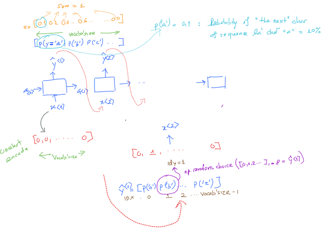</kbd>

 

- **Exercise 2 - sample**

 

<kbd></kbd>

 

<kbd>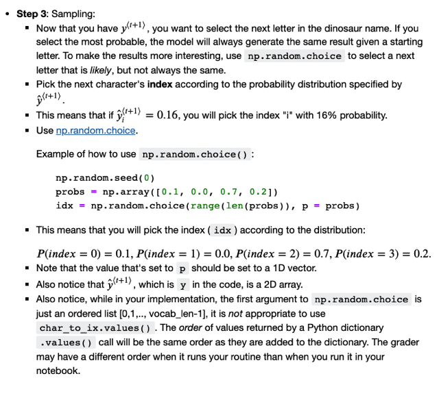</kbd>

 

- **Đây, ở đây note lại ý này quan trọng, nếu ta select the
most probable, thì model luôn tạo cùng một result - 1
sample tên khủng long everytime, nên mới dùng
random choice để ' pick next character's index
according to the probability distribution specified by
y^<timestep trước>

Cái step thể hiện việc lấy predict thằng (time-step) trước
làm input thằng sau là Step 4: Overwrite the input x ....

Nó tạo 1 vector zero độ dài bằng vocab size rồi sét số 1
vào index  mà được \\*chọn random.choice với
probability  \\*(random. choice(rang, p=y.ravel())

Rồi gán cho x để lần loop kế tiếp dùng làm input**

 

<kbd></kbd>

 

<kbd></kbd>

<kbd>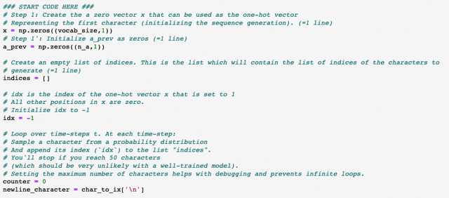</kbd>

<kbd></kbd>

 

- **\\*What you should remember\\*:

• Very large, or "exploding" gradients updates can be so large that they
"overshoot" the optimal values during back prop -- making training
difficult

▪ Clip gradients before updating the parameters to avoid exploding
gradients

• Sampling is a technique you can use to pick the index of the next
character according to a probability distribution.

▪ To begin character-level sampling:

◦ Input a "dummy" vector of zeros as a default input

◦ Run one step of forward propagation to get 𝑎⟨1⟩ (your first character)
and 𝑦̂ ⟨1⟩ (probability distribution for the following character)

◦ When sampling, avoid generating the same result each time given the
starting letter (and make your names more interesting!) by using \\_\\*np.
random.choice\\*\\_**

 

##### 3 - Building the
Language Model

 

- **3.1 - Gradient Descent

In this section you will implement a function performing one
step of stochastic gradient descent (with clipped gradients).
You'll go through the training examples one at a time, so
the optimization algorithm will be stochastic gradient
descent.

As a reminder, here are the steps of a common
optimization loop for an RNN:

• Forward propagate through the RNN to compute the loss

• Backward propagate through time to compute the
gradients of the loss with respect to the parameters

• Clip the gradients

• Update the parameters using gradient descent**

 

- **Exercise 3 - optimize

Đaị khái là người ta làm sẵn cho function optimize trong đó 
họ update ra gradient cho 1 lần iteration của stochastic G.D
Bao gồm: 

 • Forward propagate through the RNN to compute the loss
 • Backward propagate through time to compute the gradients of 
the loss with respect to the parameters
 • Clip the gradients
 • Update the parameters using gradient descent

Có nói thêm 1 tính chất của Python là khi bỏ 1 dictionary hay list 
vào 1 function thì khi ta thay đổi gì thì ta thay đổi chính các object 
đó chứ ko phải bản copy nên nó gọi là '\\*pass by reference\\*'**

 

<kbd></kbd>

 

<kbd></kbd>

 

<kbd>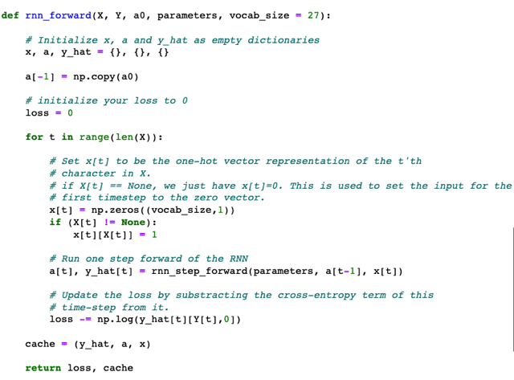</kbd>

<kbd>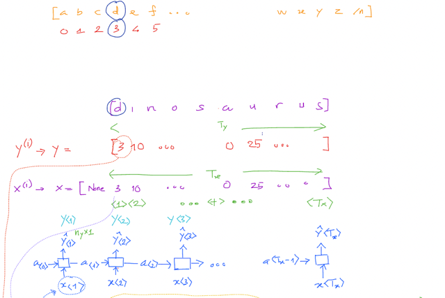</kbd>

<kbd></kbd>

> [!NOTE]
> Loop trong range Tx = len(X)
> Tương ứng mỗi t trong range ..xem hình vẽ cho dể hiểu
>
> Giải thích cái khúc tính loss:
>
>
>
> Tại sao lại là **y^[1][Y[1]]**
>
>
>
> Đại khái là "Đối với dự đoán cho kí tự thứ 1, đáp án đúng phải là
> chữ 'd' - kí tự thứ 3 (Y[1] = 3) trong vocab list. **Nhắc lại, Y là
> vector chứa index của các kí tự đúng trong vocab list**.
>
>
>
> Vậy ta hãy xem thử dự đoán của model cho kí tự thứ 1 (y^[1])
> rằng khả năng đáp án đúng chính là kí tự thứ 'd' là bao nhiêu %
> (cao hay thấp).
>
>
>
> **y^[1] là vector chứa khả năng (Probability) của các kí tự trong 
> vocab list là đáp án đúng [P('a'), P('b'), ...P('z')]**
> và index của chúng trong vocab list tất nhiên lần lượt là 0,1,2,3,..
>
>
>
> Vậy để lấy "P('d')" - ta lấy 
> Probability vector y^[1][index của nó trong vocab list]
>
>
>
> index của nó trong vocab list chính là Y[1]
>
>
>
> -> **y^[1][Y[1]]** Và nó chính là Loss của timestep <t> = <1>
>
>
>
>
> Nếu p('d' - idx = '3') có giá trị cao thì np.log(p('d' - idx = '3')) cao
> -> loss - np.log(..) sẽ khiến loss giảm nhiều.
>
> Tại sao lại x[t][X[t]]
>
>
>
> Vì X là vector chứa INDEX của các kí tự trong vocab
> nên kí tự thứ <t> / hay tại time step <t>
> thì kí tự đó có index là X[t] trong vocab lít
>
>
>
> Mà ta cần construct một one-hot vector represent cho kí tự
> đó với một list dài vocab size, số 1 nằm ở index của kí tự đó
> trong vocab list, còn lại là số 0
>
>
>
> Nên x[t] ini là zeros((vocabsize, 1))
> rồi gán số 1 vào index của kí tự đó chính là X[t]
> Nên mới thành ra x[t][X[t]] = 1 là vậy

 

<kbd></kbd>

 

<kbd>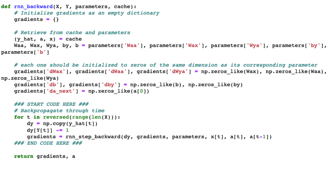</kbd>

 

<kbd>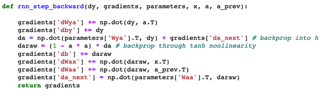</kbd>

> [!NOTE]
> Step này thì Assignment trước đã làm

 

<kbd>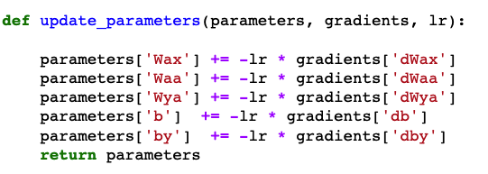</kbd>

 

- **3.2 - Training the Model

Cách..: 
- Lấy một data sample x(i) ra và ...**

 

<kbd>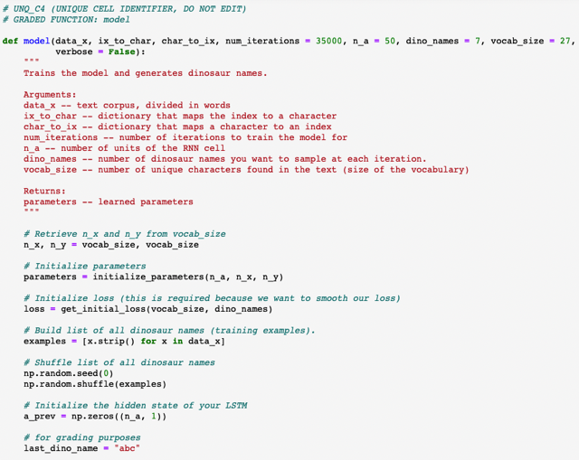</kbd>

<kbd></kbd>

<kbd></kbd>

<kbd></kbd>

<kbd></kbd>

<kbd></kbd>

> [!NOTE]
> idx=j%len(example)
>
>
>
> Đại khái là khi nó chạy Stochastic G.D mỗi iteration
> (epoch) nó sẽ learn trên một bộ data sample mà ở đây
> là 1 từ/ 1 tên trong danh sách tên khủng long.
>
>
>
> Ý nói ở đây là khi loop 1 -> max iterations thì nó lần lượt
> lấy training set ra từ list, và khi hết list thì quay lại từ
> đầu. Vậy phải set idx như thế nào.
>
> single_example_chars = [c for c in single_example]
>
>
>
> single_example_ix = [char_to_ix[c] for c in single_example]
>
>
>
> Nói chung đây là một cái khá hay của Python. Làm qua mới biết.
>
> ix_newline = char_to_ix['\n']
>
>
>
> Y = X[1:] + [ix_newline]
>
>
>
> Đại khái là 
> 1. Vì Y[0] = X[1] , Y[1] = X[2] ...
> nên define Y = X[1:] (lấy từ item 1 trở đi)
>
>
>
> 2. Rồi append ix_newline ở cuối, mà muốn vậy phài dùng append
> hoặc cộng array [a] + [b], nên phải bỏ ix_newline vào [] để tạo array

 

<kbd>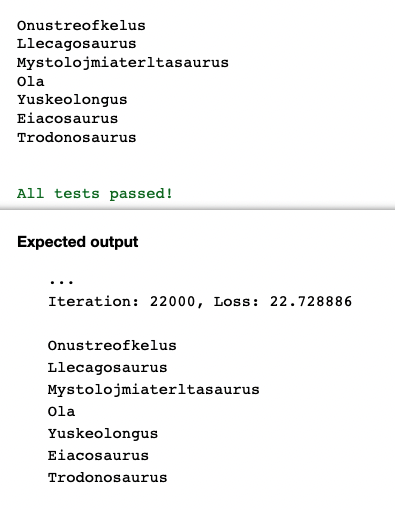</kbd>

 

- **\\*Conclusion \\*You can see that your algorithm has started to generate plausible dinosaur
names towards the end of training. At first, it was generating random characters, but
towards the end you could begin to see dinosaur names with cool endings. Feel free to run
the algorithm even longer and play with hyperparameters to see if you can get even better
results! Our implementation generated some really cool names like maconucon,
marloralus and macingsersaurus. Your model hopefully also learned that dinosaur names
tend to end in saurus, don, aura, tor, etc.

If your model generates some non-cool names, don't blame the model entirely -- not all
actual dinosaur names sound cool. (For example, dromaeosauroides is an actual dinosaur
name and is in the training set.) But this model should give you a set of candidates from
which you can pick the coolest!

This assignment used a relatively small dataset, so that you're able to train an RNN quickly
on a CPU. Training a model of the English language requires a much bigger dataset, and
usually much more computation, and could run for many hours on GPUs. We ran our
dinosaur name for quite some time, and so far our favorite name is the great, the fierce, the
undefeated: \\*Mangosaurus\\*!**

<kbd></kbd>

 

- **Exercise 4 - model**

 

##### 4 - Writing like Shakespeare
(OPTIONAL/UNGRADED)

 

##### 5 - References

 • This exercise took inspiration from Andrej Karpathy's implementation: 
\\_https://gist.github.com/karpathy/d4dee566867f8291f086\\_. 
To learn more about text generation, also check out Karpathy's \\_blog post\\_.

 

### Programming Assignments 3

 

#### Improvise a Jazz Solo with an LSTM Network Welcome to your final
programming assignment of this week! In this notebook, you will implement a
model that uses an LSTM to generate music. At the end, you'll even be able to
listen to your own music!

\\*By the end of this assignment, you'll be able to:\\*
 • Apply an LSTM to a music generation task
 • Generate your own jazz music with deep learning
 • Use the flexible Functional API to create complex models

<kbd></kbd>

> [!NOTE]
> Đại khái là :
>
>
>
> Build model **bằng Keras**, thay vì **numpy** (define function, run
> Gradient Descent...nói chung là tự làm từ đầu đến cuối)
>
>
>
> Ví dụ như làm bằng numpy và Keras thì khác nhau ra sao:
>
>
>
> \_***Bằng numpy:** 
> \_
> Giống như assignment trước (trong def **model()**, dùng function **optimize**()),
> phải viết các function để làm các step như:
> Loop trong iteration:..
> 1/ Xử lý input (tạm gọi vậy)
>
>
>
> 2/ (Trong /**optimize**/():)
> - Forward loop để tính loss:
>   For loop trong Tx
>   Tính a<t>, c<t> bằng cách tạo function forward_prop 
>   để tính các giá trị của các gate, c~ này kia dùng 
>   np.tanh(..), np.sigmoid(..)
>   Sau đó tính y^ bằng softmax
> - Backward loop để tính gradient (nhiều function nhỏ khác)
> - Gradient clipping 
> - Update gradient
>
> \_***Bằng Keras:**
> \_  tạo model với **LSTM** (để nó sẽ handle việc tính mấy
> cái như a, c), **Dense** (handle việc tính a bằng softmax) 
> - Có model rồi chỉ cần gọi 
> .**compile**('optimizer', 'cost function') 
> .**fit**() là xong, nó sẽ làm cái việc training cho mình.

 

##### Packages

 

<kbd></kbd>

 

##### 1 - Problem Statement

You would like to create a jazz music piece specially for a
friend's birthday. However, you don't know how to play
any instruments, or how to compose music. Fortunately,
you know deep learning and will solve this problem using
an LSTM network! You will train a network to generate
novel jazz solos in a style representative of a body of
performed work.

 

- **1.1 - Dataset

Nói sơ lược về data và các size**

 

<kbd></kbd>

 

<kbd>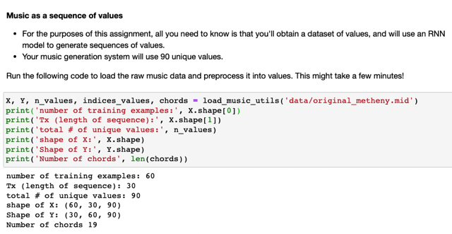</kbd>

 

<kbd>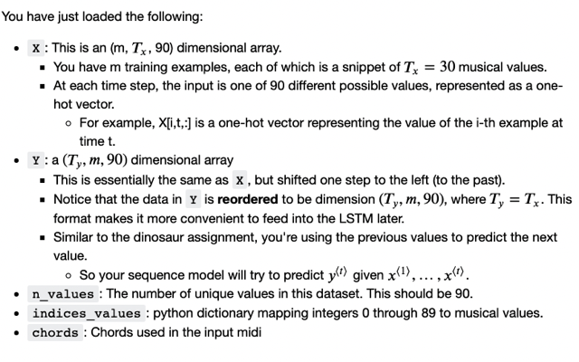</kbd>

> [!NOTE]
> Ý quan trọng cần hiểu là input là tương tự như assignment trước, nơi mà
> mỗi 1 từ hay kí tự trong sequence sẽ là 1 vector (one-hot vector có size
> bằng vocab list) thì ở đây nó là one-hot vector có size 90 kiểu như có 90
> music value khác nhau.

 

- **1.2 - Model Overview**

 

<kbd>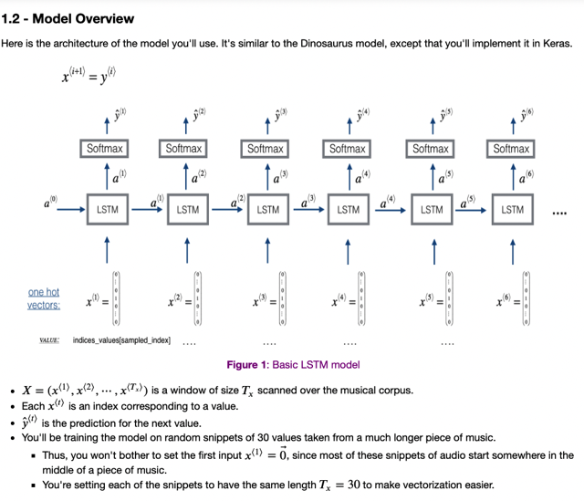</kbd>

> [!NOTE]
> Mấy cái dòng dưới chưa hiểu lắm
>
>
>
> Window of size Tx scanned over the musical
> corpus là sao?
>
>
>
> Each x<t> is an index corresponding to a
> value?

 

##### 2 - Building the Model

 

<kbd>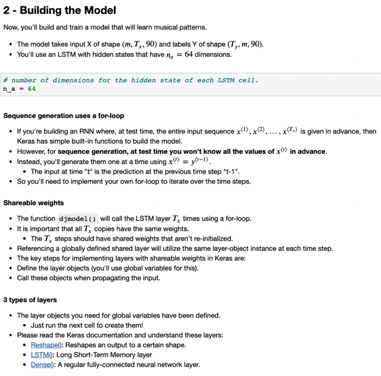</kbd>

<kbd>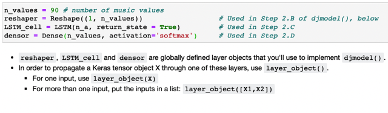</kbd>

 

##### Exercise 1 - djmodel

Đại khái là :

Build model \\*bằng Keras\\*, thay vì \\*numpy\\* (define function, run
Gradient Descent...nói chung là tự làm từ đầu đến cuối)

Ví dụ như làm bằng numpy và Keras thì khác nhau ra sao:

\\_\\**Bằng numpy: 
\\*\\_
Giống như assignment trước (trong def \\*model()\\*, dùng function \\*optimize\\*()),
phải viết các function để làm các step như:
Loop trong iteration:..
1/ Xử lý input (tạm gọi vậy)

2/ (Trong \\/\\*optimize\\*\\/():)
- Forward loop để tính loss:
  For loop trong Tx
  Tính a<t>, c<t> bằng cách tạo function forward_prop 
  để tính các giá trị của các gate, c~ này kia dùng 
  np.tanh(..), np.sigmoid(..)
  Sau đó tính y^ bằng softmax
- Backward loop để tính gradient (nhiều function nhỏ khác)
- Gradient clipping 
- Update gradient
 
\\_\\**Bằng Keras:
\\*\\_  tạo model với \\*LSTM\\* (để nó sẽ handle việc tính mấy
cái như a, c), \\*Dense\\* (handle việc tính a bằng softmax) 
- Có model rồi chỉ cần gọi 
.\\*compile\\*('optimizer', 'cost function') 
.\\*fit\\*() là xong, nó sẽ làm cái việc training cho mình.

 

<kbd></kbd>

> [!NOTE]
> Đại khái là khi define Input shape thì khỏi nhắc đến m, nó tự biết size là m,..,..

 

<kbd>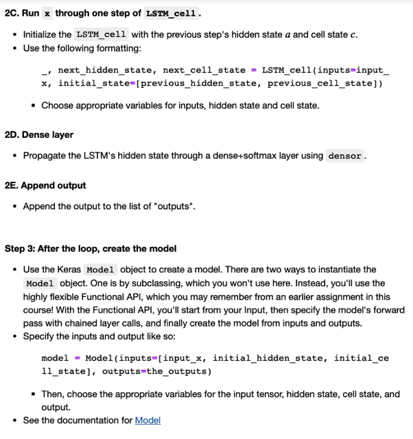</kbd>

 

<kbd>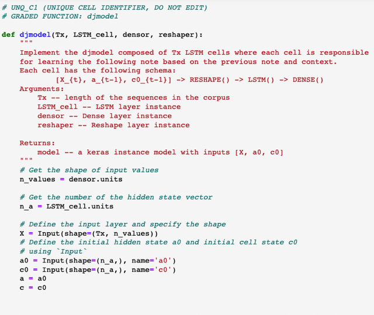</kbd>

<kbd></kbd>

> [!NOTE]
> Đại khái là :
>
>
>
> Build model **bằng Keras**, thay vì **numpy** (define function, run
> Gradient Descent...nói chung là tự làm từ đầu đến cuối)
>
>
>
> Ví dụ như làm bằng numpy và Keras thì khác nhau ra sao:
>
>
>
> \_***Bằng numpy:** 
> \_
> Giống như assignment trước (trong def **model()**, dùng function **optimize**()),
> phải viết các function để làm các step như:
> Loop trong iteration:..
> 1/ Xử lý input (tạm gọi vậy)
>
>
>
> 2/ (Trong /**optimize**/():)
> - Forward loop để tính loss:
>   For loop trong Tx
>   Tính a<t>, c<t> bằng cách tạo function forward_prop 
>   để tính các giá trị của các gate, c~ này kia dùng 
>   np.tanh(..), np.sigmoid(..)
>   Sau đó tính y^ bằng softmax
> - Backward loop để tính gradient (nhiều function nhỏ khác)
> - Gradient clipping 
> - Update gradient
>
> \_***Bằng Keras:**
> \_  tạo model với **LSTM** (để nó sẽ handle việc tính mấy
> cái như a, c), **Dense** (handle việc tính a bằng softmax) 
> - Có model rồi chỉ cần gọi 
> .**compile**('optimizer', 'cost function') 
> .**fit**() là xong, nó sẽ làm cái việc training cho mình.

 

<kbd></kbd>

<kbd>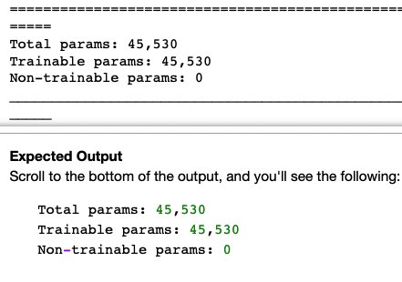</kbd>

 

<kbd>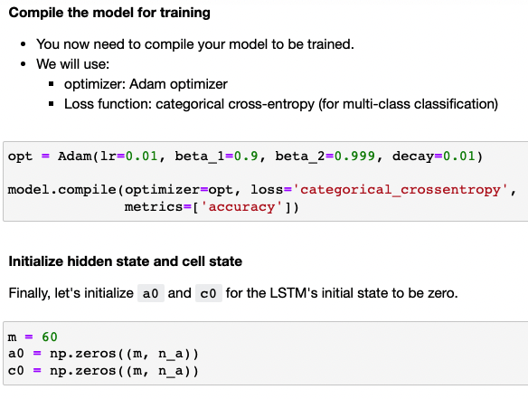</kbd>

 

<kbd></kbd>

 

##### 3 - Generating Music

 

- **3.1 - Predicting & Sampling:

Đại khái là làm công tác 'Sampling' - nhớ lại
sampling là lấy y^ thằng trước bỏ vào thằng sau để
run.

Đại khái là sample này nó giúp 'coi thử' (trong quá trình train) thì 
kết quả sẽ kiểu như thế nào.

Ở assignment trước đã làm với numpy (function
sample()) thì giờ làm với Keras

Và hơn nữa là sẽ dùng nó để tạo thử 1 đoạn nhạc.**

 

<kbd>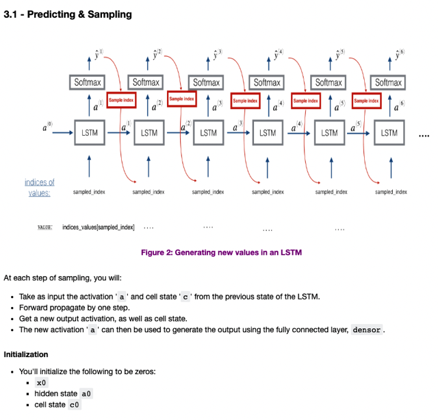</kbd>

> [!NOTE]
> Đại khái là làm công tác 'Sampling' - nhớ lại
> sampling là lấy y^ thằng trước bỏ vào thằng sau để
> run.
>
>
>
> Đại khái là sample này nó giúp 'coi thử' (trong quá trình train, 
> đúng hơn là model đã trained work như thế nào) thì 
> kết quả sẽ kiểu như thế nào.
>
>
>
> Ở assignment trước đã làm với numpy (function
> sample()) thì giờ làm với Keras
>
>
>
> Và hơn nữa là sẽ dùng nó để tạo thử 1 đoạn nhạc.

 

- **Exercise 2 - music_inference_model

Cũng define model bằng keras.LSTM, keras.Dense để tính lấy ra out bỏ vào
outpus.

Chỉ thêm bước "\\/l\\*ấy prediction thằng trước bỏ vào làm thành x thằng sau\\/"
\\* (x<t+1> = y^<t>)

Giải thích cái đoạn  x = tf.math.argmax(out, axis=1) x = tf. one_hot(indices=x,
depth=n_values)

Out ở đây chính là y^<t>, vậy nó là vector chứa các giá trị p thì ở bài này
thay vì dựa vào vector này để lấy random.choice thì ở đây lấy luôn thằng
nào có P có giá trị max. Cụ thể x = tf.math.argmax(out, axis=1) nó lấy vị trí
(index) của cái thằng có P cao nhất trong vector dòng sau là nó tạo one-hot
vector một cách rất gọn nhờ function của tensorFlow. Rồi gán cho x, nên lần
loop tiếp nó x chính là y_pred của lần loop trước.
\\*(Để ý ổng gợi ý dùng 'x', not 'x0' là vì vậy) 
\\*Còn model bình thường x nó lấy từ '\\*Input\\*' layer**

 

<kbd>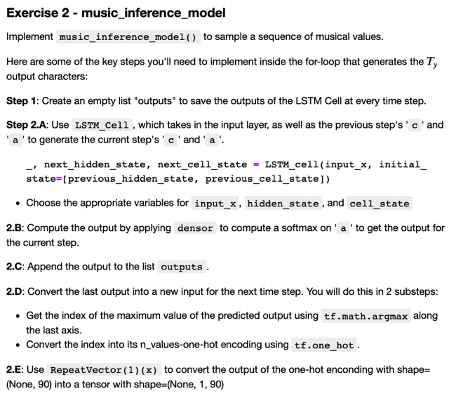</kbd>

<kbd>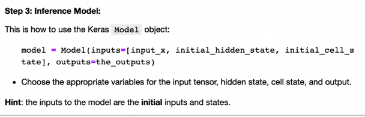</kbd>

 

<kbd>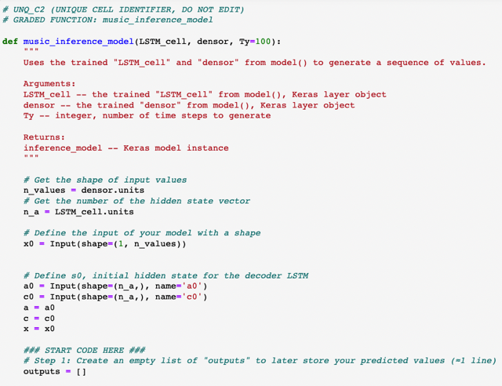</kbd>

<kbd>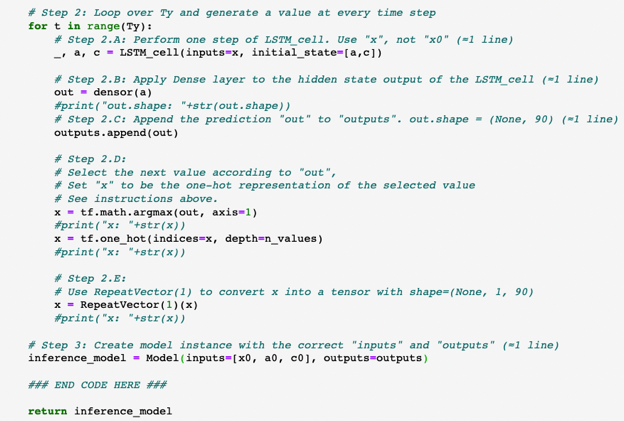</kbd>

> [!NOTE]
> Chú ý ổng nhấn mạnh LSTM_cell và Desne là trained - đã được train.
> Tức là sampling là làm đv 1 model đã train để 'coi' nó ..làm / work)..,
> như thế nào

 

- **Cũng define model bằng keras.LSTM, keras.Dense để tính lấy ra out bỏ vào
outpus.

Chỉ thêm bước "\\/\\*lấy prediction thằng trước bỏ vào làm thành x thằng sau"\\*\\/
 (x<t+1> = y^<t>)

Thể hiện ở chỗ trong loop Ty, bỏ input của LSTM_cell là x, rồi tính 
output gán vào cho x:
_, a, c = LSTM_cell(input=x,....)
..
x = tf.one_hot(....)

Giải thích cái đoạn  
x = tf.math.argmax(out, axis=1) 
x = tf.one_hot(indices=x, depth=n_values)

Out ở đây chính là y^<t>, vậy nó là vector chứa các giá trị p thì ở bài này
\\*thay vì dựa vào vector này để lấy random.choice là
thì ở đây lấy luôn thằng
nào có P có giá trị max. \\*

Cụ thể x = tf.math.argmax(out, axis=1) nó lấy \\*vị trí (index) của cái thằng có P 
cao nhất trong vector\\* 
Sau đó là nó \\*tạo one-hot vector một cách rất gọn\\* nhờ function tf.\\*one_hot\\*() của
 tensorFlow.**

 

- **Cuối cùng gán cho x để rồi lần loop tiếp nó input x của LSTM_cell
chính là y_pred của lần loop trước.

Đây chính là điểm thể hiện dòng kẻ màu đỏ lấy cái predict cái trước
bỏ vào làm input cái tiếp theo trong mô hình. Chỉ nhớ là lần này
không lấy random dựa trên probability distribution như assignment
Dinarsour mà lấy luôn thằng cao nhất. Nhớ lại việc lấy random ở
bài trước là do muốn ra mỗi lần mỗi khác, còn lần này làm như kiểu
này thì nó chỉ ra lần nào cũng giống nhau.

(Để ý ổng gợi ý dùng 'x', not 'x0' là vì vậy) 
Còn model bình thường x nó lấy từ 'Input' layer**

 

<kbd></kbd>

 

- **Exercise 3 - predict_and_sample**

 

<kbd></kbd>

 

<kbd>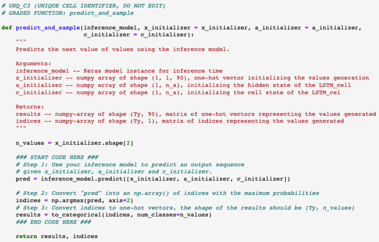</kbd>

 

<kbd></kbd>

> [!NOTE]
> kết qủa của inference_model.predict(..) là
> ouputs chứa Ty probability vectors p<t>
>
>
>
> [p<1> , p<2> , ...p<Ty>].
>
>
>
> Nên argmax là ra index của giá trị cao nhất của từng vector.

 

- **Không note vài bữa để lâu quay lại có khi không hiểu chỗ này:
Tại sao trong music_inference_model()..x=tf.math.argmax(out, axis=1) 
mà trong predict_and_sample()..indices = tf.math.argmax(pred, axis=2)

Vì \\*out\\* ở lúc tính x là \\*probability vector\\* \\*có size là vocab size (1, vocabsize)\\*
và ta cần lấy ra cái \\*index\\* của cái thằng lớn nhất. Đọc lại cái instruct chổ step 2D
nên hiểu được phải lấy axis cuối ở đây là 1 do shape của nó là 2D nên index các
axis là 0,1.
\\*Tóm lại shape của out là (1, vocabsize) 
hoặc nếu chạy 1 batch thì là (batch_szie, vocabsize) -> 2 axis 0,1 
Lấy argmax trên trục của vocabsize là lấy axis = 1
\\*
Còn cái pred, thì là kết quả của cả quá trình sample, nó chứa Ty cái vector \\*out
ở trên \\*(chạy trong loop Ty, tính LSTM_cell ra a, c -> qua densor(a) ra out
append out vào outputs, ..rồi chuyển xuốn cho x = tf.math.argmax(out)...\\*)

Vậy nên pred là 1 (hoặc batch_size m) cái x Ty x vocabsize -> 3 axis 0,1,2 
Lấy argmax trên trục của vocabsize là lấy axis = 2
\\***

 

- **Chỗ này không chắc lắm nhưng chắc là đúng thôi:

Lúc tính x nó tạo từng one-hot vector nên nó tạo bằng \\*tf. one-hot, \\*chỉ định chỗ
nào số 1 bởi \\*một\\* giá trị index

còn ở lúc tính y, nó là 1 matrix nên nó dùng \\*to_categorical, cũng tạo one-hot
vector nhưng nhiều cái cùng lúc, nên bỏ vào indices là array các index\\***

 

- **Như vậy cuối cùng tạo ra là 1 bộ one-hot vector mỗi cái đại diện cho 1 music value
được lấy từ thằng (probability cao nhất output sau mỗi timestep)

Rồi nó mới lấy cái này, bỏ vào bước post-processing để tạo ra đoạn nhạc**

 

<kbd>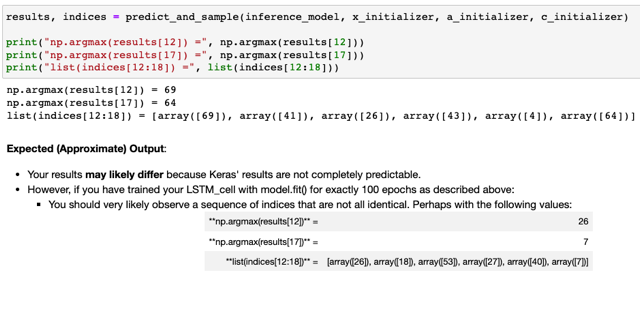</kbd>

 

- **3.2 - Generate Music**

 

<kbd>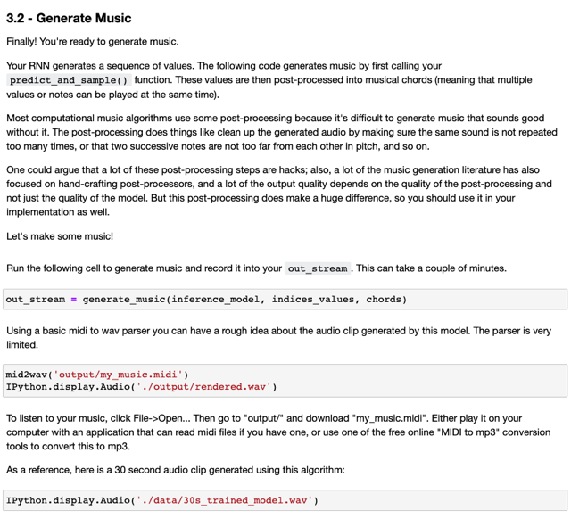</kbd>

 

- **\\*Congratulations!

\\*You've completed this assignment, and generated your own jazz solo! The
Coltranes would be proud.

By now, you've:

• \\*Applied an LSTM\\* to a music generation task

• Generated your own jazz music with deep learning

• Used the \\*flexible Functional API\\* to create a more complex model This was a
lengthy task. You should be proud of your hard work, and hopefully you have some
good music to show for it. Cheers and see you next time!

\\*What you should remember:\\*

• A \\*sequence model\\* can be used to generate musical values, which are then
post-processed into midi music.

• You can use a fairly similar model for tasks ranging from generating dinosaur
names to generating original music, with the only major difference being the input
fed to the model.

• In Keras, \\*sequence generation involves defining layers with shared weights, which
are then repeated for the different time steps\\***

 

##### 4 - References

The ideas presented in this notebook came primarily from three
computational music papers cited below. The implementation here also
took significant inspiration and used many components from Ji-Sung Kim'
s GitHub repository.

• Ji-Sung Kim, 2016, \\_deepjazz\\_

• Jon Gillick, Kevin Tang and Robert Keller, 2009. \\_Learning Jazz
Grammars\\_

• Robert Keller and David Morrison, 2007, \\_A Grammatical Approach to
Automatic Improvisation\\_

• François Pachet, 1999, \\_Surprising Harmonies\\_ Finally, a shoutout to
François Germain for valuable feedback.

 

## C5w2_natural Language Processing & Word Embeddings

 

### Introduction To Word Embeddings

 

#### Word Representation

 

##### 1 Last week's topics: RNNs, GRUs, and LSTMs.

2 NLP is being revolutionized by deep learning.

3 Word embeddings are a way of representing words.

4 The weakness of one-hot representation is that it treats each word as a
separate entity and doesn't allow for generalization across words.

5 Featurized representations could allow for better generalization and
recognition of relationships between words.

6 Features can include gender, royalty, age, whether it is food, size, cost,
etc.

7 A 300-dimensional vector can represent a word in a featurized
representation.

8 Apple and orange would have similar representations in a featurized
representation.

 

<kbd>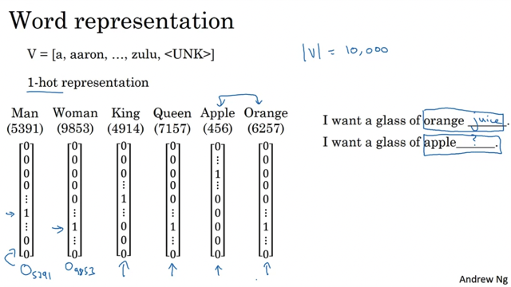</kbd>

> [!NOTE]
> Đại khái là cách define one-hot vector **(one-hot representation)** cho
> các từ không giúp nắm bắt được thực tế có những từ liên quan gần
> nhau như  'Apple' và "Orange', 'King' và ' Queen'
>
>
>
> Kiểu như dot(a,b) nào cũng = 0
>
>
>
> Nên ngay cả khi thuật toán học được câu trả lời là 'I want a glass of
> orange juice' thì khi làm câu tương tự với 'apple' nó cũng phải  học lại từ
> đầu.

 

<kbd></kbd>

> [!NOTE]
> Đại khái là nếu ta có thể tạo feature vector kiểu như này cho các  từ
> thì ta có thể nắm bắt được từ nào là gần nhau, từ nào là food, từ nào
> là đàn ông, đàn bà ....Tức là khai thác được nhiều hơn  đặc tính của
> từng từ. Gọi là (**featurized representation**)
>
>
>
> Thực tế thì word vector được define phức tạp hơn như đại khái là vậy,

 

<kbd></kbd>

> [!NOTE]
> Khái niệm 'Embedded' - Đại khái là việc xây dựng các vector cho 
> các word như slide trước đã nói, từ đó hình dung trong không
> cian 300 chiều (giả sử vector có 300 features), các từ sẽ group
> lại thành nhóm do tương quan giống nhau giữa chúng.
>
>
>
> Và t-SNE là phương pháp để plot cái đó thành 2D để xem được

 

#### Using Word Embeddings

 

##### Tiếp đại khái ý nói là cái word embedding này có thể được \\*'làm' bởi
large dataset\\* với hàng tỷ từ trên internet (tự làm hay download
pretrained word embedding) chỉ cần \\*dùng lại\\* nó trong vấn đề của
mình (như name entity recognition vốn \\*có ít data  hơn\\* nhiều) -
Chính là \\*'transfer learning'

\\*Cuối cùng đại khái là khái niệm embedding nó rất gần với  khái niệm
encoding trong face encoding.\\*

\\*Đúng hơn là ta \\*train ra 1 cái network để làm công tác encoding\\*: là cho
1 cái hình vào thì encoding ra được 1 vector sao cho cùng 1 người thì 2
vector gần nhau, khác người thì xa nhau. Và làm được vậy mới bất kì
khuôn mặt mới nào.

Còn word embedding là ta sẽ tạo cho \\*mỗi từ một fixed value vector
mang đặc tính của từ đó\\*, và chỉ cần làm với 1 giới hạn từ vì từ lạ cứ
cho là Unknown thôi Nói chung là hai khái niệm này rất gần nhau chỉ
khác nhau do cách làm.

 

<kbd>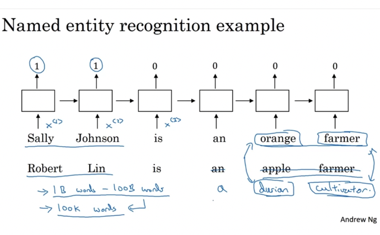</kbd>

> [!NOTE]
> Đại khái là quay lại nói về 'name entity recognition' task, mà ta  đã xác
> định Sally Johnson là tên người, thì với việc bây giờ ta  có 'featurized
> representation' thì sẽ rất dễ cho thuật toán biết được Robert Lin cũng
> là tên người do apple farmer rất gần với orange  farmer.
>
>
>
> Tiếp đại khái ý nói là cái word embedding này có thể được **'làm' bởi
> large dataset** với hàng tỷ từ trên internet (tự làm hay download
> pretrained word embedding) chỉ cần **dùng lại** nó trong vấn đề của
> mình (như name entity recognition vốn **có ít data  hơn** nhiều) -
> Chính là **'transfer learning'**

 

<kbd></kbd>

> [!NOTE]
> Tóm lại đại khái rất đơn giản là 
> 1. Learn hoặc download pretrained cái word embedding 
> bằng large dataset trên internet
>
>
>
> 2. Dùng cái word embedding đó trong bài toán cụ thể cuả mình 
> mà có ít data hơn nhiều
>
> Thay vì dùng 10000 dimension one-hot vector
> thì giờ chỉ cần dùng 300 'dense' vector
>
>
>
> 3. Có thể tiếp tục fine-tune cái word embedding đó với data mới
> (chỉ khi dataset của mình cũng không nhỏ thì làm)
>
> Tiếp đại khái nói là Transfer Learning chỉ useful khi data A lớn
> hơn nhiều data B, nên đ/v một số task của NLP như "
> **named entity recognition**, "**text summarization",** "
> **co-reference resolution**" thì nó ok, còn đ/v "**translation
> modeling**" nơi mà ta có 1 large dataset cho nó thì không

 

<kbd></kbd>

> [!NOTE]
> Cuối cùng đại khái là khái niệm embedding nó rất gần với  khái niệm
> encoding trong face encoding.
>
>
>
> Face encoding là nó được train bởi neural network (Siamese network
> architecture) để tạo ra **128 dimensional representation of different faces**
> rồi so sánh để xác định có phải cùng 1 người ko.
>
>
>
> Đúng hơn là ta **train ra 1 cái network để làm công tác encoding**: là cho
> 1 cái hình vào thì encoding ra được 1 vector sao cho cùng 1 người thì 2
> vector gần nhau, khác người thì xa nhau. Và làm được vậy mới bất kì
> khuôn mặt mới nào.
>
>
>
> Còn word embedding là ta sẽ tạo cho **mỗi từ một fixed value vector
> mang đặc tính của từ đó**, và chỉ cần làm với 1 giới hạn từ vì từ lạ cứ
> cho là Unknown thôi Nói chung là hai khái niệm này rất gần nhau chỉ
> khác nhau do cách làm.

 

#### Properties Of Word Embeddings

 

##### 1 Word embeddings can help in building NLP applications.

2 Word embeddings can also help with analogy reasoning.

3 A four-dimensional vector can be used to represent words in this example.

4 The gender is the main difference between man and woman and also
between king and queen, as represented by these vectors.

5 An algorithm can compute the difference between vectors to find a word
that completes an analogy.

6 The algorithm can find a word w that maximizes the similarity e w
compared to e king minus e man plus e woman.

7 Research papers report 30-75% accuracy on analogy using tasks like
these.

 

<kbd></kbd>

> [!NOTE]
> Đại khái là nhờ Word Embedding, ta có thể giải bài toán
> 'Man to woman like King to ...' bằng cách tìm từ nào mà
> khiến eMan - eWoman gằn bằng eKing - e??? vì như thế 
> ta sẽ tìm đc queen vì chính xác 2 cặp này là về Gender

 

<kbd>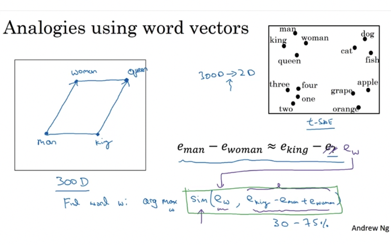</kbd>

> [!NOTE]
> Ổng nói research paper cho biết
> phương pháp này cho độ chính
> xác khá ok từ 30-75%

 

<kbd>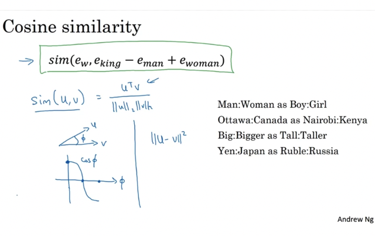</kbd>

> [!NOTE]
> Tên là hàm cosine vì nó chính là cosine giữa 2 vector 
>
>
>
> Có thể dùng ||u-v||**2 vốn là hàm tính sự khác nhau giữa 2
> vector, nên phải lấy '-' để chỉ sự giống nhau. Nhưng người
> ta thường dùng hàm cosine hơn.
>
>
>
> Nói chung là nếu train dc Word Embedding với large word cortex
> thì sẽ rất dễ dàng tìm được các cặp từ kiểu vậy

 

#### Embedding Matrix

 

##### • Formalizing the problem of learning a good word embedding

• Learning an embedding matrix when implementing a word embedding
algorithm

• The embedding matrix is a 300-dimensional by 10,000-dimensional
matrix for a 10,000-word vocabulary

• The columns of the matrix represent embeddings for the words in the
vocabulary

• A one-hot vector is used to represent each word in the vocabulary

• The product of the embedding matrix and a one-hot vector selects the
corresponding embedding for the word

• The notation "E 6257" represents the embedding vector for the word "
Orange"

 

<kbd>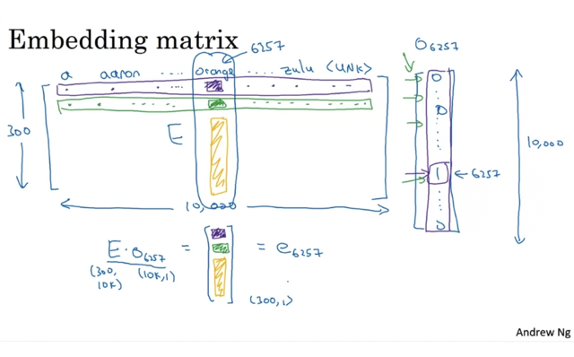</kbd>

> [!NOTE]
> Đại khái là tính (lấy ra) vector e6257 (embedding của từ)
> bằng cách mấy matrix E (Embedding matrix) nhân với
> one-hot vector o6256
>
>
>
> Sao không lấy ra bằng E[6257] ta -> Computational Expensive

 

### Learning Word Embeddings: Word2vec & Glove

 

#### Learning Word Embeddings

 

##### 1 In this video, you'll learn some concrete algorithms for learning word embeddings,
which are used in natural language processing.

2 Historically, researchers used relatively complex algorithms to learn word
embeddings. However, over time, they discovered that simpler algorithms could also
provide good results, especially for large datasets.

3 Some of the most popular algorithms today are so simple that they might seem
almost magical. Therefore, the video will start by introducing slightly more complex
algorithms, which can help develop intuition about why they work.

4 \\*One way to learn a set of embeddings\\* is by \\*building a neural language
model\\*, which \\*predicts the next word in a sequence given the previous words\\*.

5 To build a neural network for this task, you can start by taking a list of words and
constructing a one-hot vector for each word.

6 Next, you can multiply each one-hot vector by a matrix of parameters E to obtain
an embedding vector for each word. This step means that each embedding vector is
obtained by taking the dot product of the corresponding one-hot vector and the
matrix E.

7 Once you have the embedding vectors for all the words, you can fill them into a
neural network layer. This layer feeds into a softmax, which classifies among the 10,
000 possible outputs in the vocabulary for the final word we're trying to predict.

8 The neural network layer and softmax each have their own parameters, which are
optimized during training using gradient descent.

9 To handle long sentences, you can use a fixed historical window, such as the
previous four words, as input to the neural network.

10 The parameters of the model include the matrix E and the weights of the neural
network layer and softmax. The same matrix E is used for all the words.

11 By repeatedly predicting the next word given a historical window, the algorithm
learns to produce good word embeddings. Specifically, the algorithm learns to
produce similar embeddings for words that appear in similar contexts, which allows
it to better fit the training set.

12 Overall, this algorithm provides a decent way to learn word embeddings, even
though it might seem simplistic compared to other algorithms.

 

<kbd>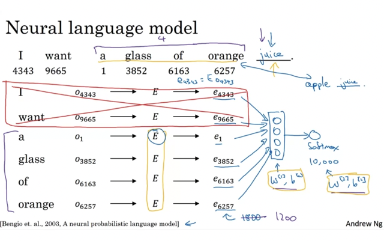</kbd>

> [!NOTE]
> Build a language model (đại khái là ví dụ cho câu I want a glass
> of orange ... _ -> Predict 'juice') **cũng là một cách để làm 'Word
> embedding'**
>
>
>
> Mỗi từ, như đã biết, sẽ được biến thành một one-hot vector (ví
> dụ "I" -> o4343, "want" -> o9665)
>
>
>
> Dùng Embedding Matrix E để nhân với o4343 -> e4343
> (embedding vector) embedding vector size = 300
>
>
>
> Bỏ vào N.N với đầu ra là softmax 10.000 unit **để thuật toán cố
> gắng học / huấn luyện các params sao cho output map  với
> target là từ ' juice'.**
>
>
>
> Output đại khái là vector of probability khả năng từ còn thiếu là
> từng từ trong word list nên có size 10000
>
>
>
> Params sẽ là matrix E và W[1], b[1], W[2], b[2]
>
>
>
> Có thể chỉ 'lấy 4 từ trước đó' để train thôi (input sẽ chỉ có 
> [e1 e3852..e6257] gọi là dùng **'Fixed history" -** Đây là cách để 
> handle với long-short sentences

 

<kbd></kbd>

> [!NOTE]
> Ý là nếu mục đích chính là 'Word embedding' thì có thể quy định train
> từ kiểu 4 trước 4 sau, hoặc chỉ từ trước hoặc 1 từ gần đó gọi là '**Skip
> Gram**'.

 

#### Word2vec

 

##### Skip Gram model: Skip là vì nó bỏ qua một số từ để tìm cách map hai từ
xa nhau nào đó.

Như mô hình trước, từ 'context' sẽ được one-hot encoded (o_c) rồi thông
qua matrix E để biến thành embedding vector e_c tương tự bài trước
define một network đầu ra là softmax để tính ra y^ = probability vector

Với y cũng one-hot vector. tính loss function bằng hàm cross entropy

Và dùng Gradient Descent để train params của model gồm Matrix E và
Theta (params của softmax)

 

<kbd></kbd>

 

<kbd>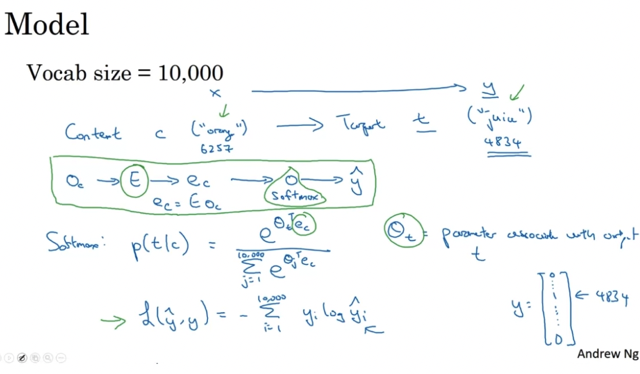</kbd>

> [!NOTE]
> Skip Gram model: Skip là vì nó bỏ qua một số từ để tìm cách map hai từ
> xa nhau nào đó.
>
>
>
> Như mô hình trước, từ 'context' sẽ được one-hot encoded (o_c) rồi thông
> qua matrix E để biến thành embedding vector e_c tương tự bài trước
> define một network đầu ra là softmax để tính ra y^ = probability vector
>
>
>
> Với y cũng one-hot vector. tính loss function bằng hàm cross entropy
>
>
>
> Và dùng Gradient Descent để train params của model gồm Matrix E và
> Theta (params của softmax)

 

<kbd>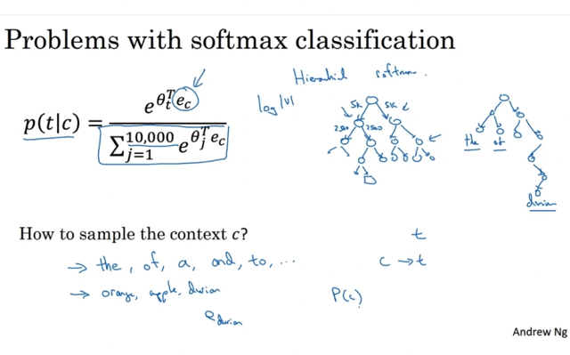</kbd>

> [!NOTE]
> Đại khái là Softmax nó có cái step phải tính tổng hết toàn bộ data
> training nên khi scale lên sẽ rất chậm.
>
>
>
> Còn cái nữa là nếu lấy context c một cách random thì  những từ như
> the, of, a...sẽ xuất hiện nhiều do đó người ta có một số cách để giải
> quyết chuyện này.

 

#### Negative Sampling

 

##### Đại khái là biến nó thành 10.000 bài toán 
binary classification với logistic regression
bằng cách 'tạo' target y đại khái nói là cặp
Orange-juice thì đúng (=1), các cặp khác (orange-king,...)
thì sai (=0) - \\*số từ sai quy định bởi 'k'\\*

Dựa vào cách define y như vậy, ta train 10.000 bài toán binary
thì đại khái sẽ nhanh hơn là train bài toán softmax.

 

<kbd>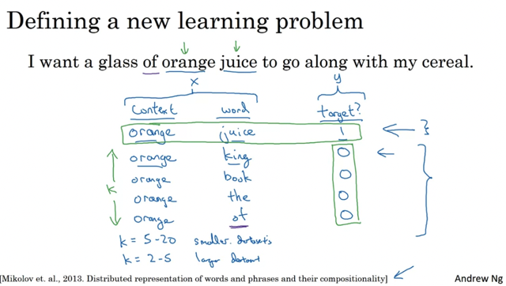</kbd>

 

<kbd></kbd>

> [!NOTE]
> Skip-Gram with Softmax
>
>
>
> Đại khái là y (target) sẽ là one-hot vector có size = 10.000 số 1 ở
> index của cái từ đúng (ví dụ ở đây là từ  cần tìm ...orange __ ->
> orange juice) trong vocab list. y^ đương nhiên cũng là vector có
> size 10000 nhưng các giá trị của nó lần lượt là 'probability của các
> từ trong vocab là từ đúng.
>
>
>
> Như vậy trong quá trình training bằng G. D, tại mỗi iteration, như
> đã biết ta lần lượt forward prop đê tính y^, rồi từ y^,y -> tính loss
> bằng hàm cross entropy, rồi với loss -> back prop để tính gradient
> và update params để xong một lần iteration. Và chạy ví dụ 1000
> lần Iterations (no.epochs = 1000)
>
>
>
> Vấn để là ở chỗ tính y^, vì dùng softmax nên trong công thức nó
> phải có bước tính tổng hết 10.000 unit của softmax layer nên rất
> '**computational expensive**'
>
> Sample Negative
>
>
>
> Đại khái là biến nó thành 10.000 bài toán 
> binary classification với logistic regression
> bằng cách 'tạo' target y đại khái nói là cặp
> Orange-juice thì đúng (=1), các cặp khác (orange-king,...)
> thì sai (=0) - **số từ sai quy định bởi 'k'**
>
>
>
> Dựa vào cách define y như vậy, ta train 10.000 bài toán binary
> thì đại khái sẽ nhanh hơn là train bài toán softmax.
>
>
>
> Chưa hiểu cụ thể nó train như thế nào nhưng tạm thời biết vậy.

 

<kbd></kbd>

> [!NOTE]
> Cuối cùng là đại khái cách để chọn mấy từ sai (ngẫu nhiên kia) -
> thì đại khái là nếu chọn ngẫu nhiên thật thì lại một lần nữa ta sẽ
> gặp nhiều  từ 'the' 'a' ...nên ông gì đó đề ra cách chọn có công
> thức như vầy đại khái là sao cho hợp lý.
>
> /"Somewhere in-between Extreme of taking uniform
> distribution vs Extreme of taking whatever was the observed
> distribution" -> Chưa hiểu lắm. / Câu trên đề cập đến khái
> niệm chọn phân phối xác suất để mô tả một tập dữ liệu hoặc
> sự kiện.
>
>
>
> Ở hai đầu cực, bạn có thể giả định một phân phối đồng đều,
> trong đó tất cả các kết quả có cùng xác suất xảy ra. Ví dụ, nếu
> bạn tung một xúc xắc sáu mặt công bằng, mỗi số có xác suất
> 1/6 được tung ra.
>
>
>
> Ở cực khác, bạn có thể sử dụng phân phối quan sát được của
> dữ liệu, đại diện cho tần suất mà mỗi kết quả xảy ra. Ví dụ, nếu
> bạn có một bộ điểm kiểm tra, bạn có thể sử dụng phân phối
> quan sát của các điểm số để tính xác suất để đạt được một
> điểm số nhất định.
>
>
>
> Tuy nhiên, trong nhiều trường hợp, cả phân phối đồng đều và
> phân phối quan sát đều không phù hợp. Thay vào đó, bạn cần
> tìm một phân phối nằm ở giữa hai đầu cực này mà phù hợp
> nhất với dữ liệu. Phân phối này nên bao gồm các đặc điểm
> chính của dữ liệu, chẳng hạn như trung bình, phương sai và
> hình dạng. Quá trình này thường được thực hiện thông qua
> các phương pháp thống kê và suy luận.

 

<kbd>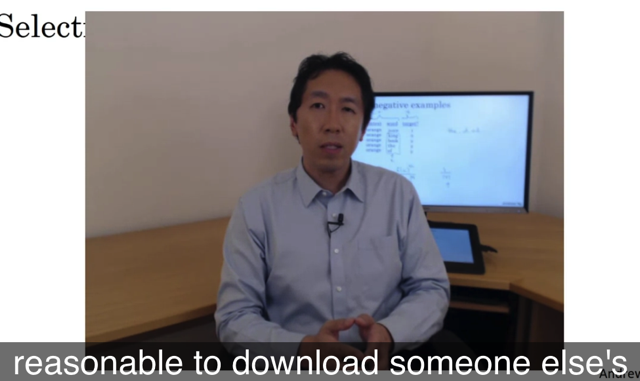</kbd>

> [!NOTE]
> Transfer learning: Đại khái ổng nói cũng như các vấn
> để deep learning khác ta có thể download các
> **pre-trained word-vectors** để dùng.

 

#### Clarifications About ...

 

<kbd>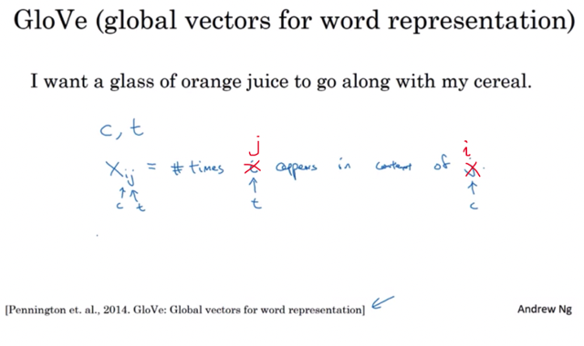</kbd>

 

<kbd>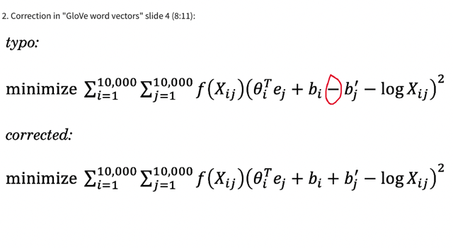</kbd>

 

#### Glove Word Vectors

 

##### 1 Introduction to the GloVe algorithm for computing word
embeddings

2 Explanation of the X_ij count and its relation to word
occurrences in the corpus

3 Optimization objective of the GloVe algorithm

4 Weighting factor to account for frequent and infrequent
words

5 Symmetry of the roles of theta and e in the GloVe
algorithm

6 Training procedure for the GloVe algorithm

 

<kbd></kbd>

> [!NOTE]
> Đại khái là define Xij mang ý nghĩa 'how often từ i và từ j xuất hiện cùng
> nhau' - tính bằng cách đếm số lần từ i xuất hiện khi có j xuất hiện
>
>
>
> Xij sẽ = Xji nếu ta quy định theo kiệu 'có xuất hiện gần nhau' còn nếu quy
> định theo kiểu từ này xuất hiện ngay sau từ kia  thì có thể Xij khác Xji.

 

<kbd>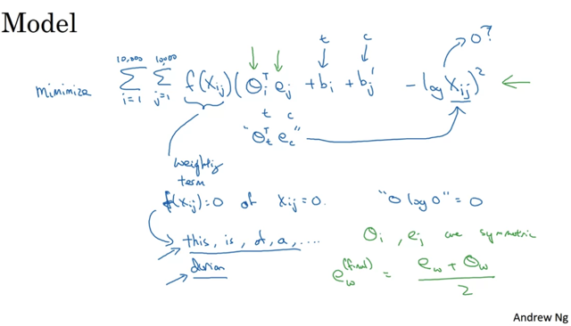</kbd>

> [!NOTE]
> Đại khái là xây dựng optimization objective như vậy - minimize
> Tuy đơn giản những thật sự sẽ giúp làm được Word Embedding
> rất tốt
>
>
>
> Hàm f là để kiểm soát không xảy ra 0log0 - nếu Xij = 0 thì bỏ qua, đại
> khái vậy Đồng thời để tăng giảm 'tần xuất / trọng số / mức độ' của các
> từ the/a/an sao cho nó không quá cao và những từ hiếm như 'durian'
> sao cho nó không quá thấp.
>
> Chữ màu xanh chưa hiểu lắm nhưng đại khái
> ổng nói một điều funny là Theta_i và e_j có vai
> trò symmetric -  (như nhau??) nên Ew (final) có
> thể tính bằng trung bình của e_w và theta_w

 

<kbd></kbd>

> [!NOTE]
> Cũng chưa hiểu lắm

 

### Applications Using Word Embeddings

 

#### Sentiment Classification

 

<kbd>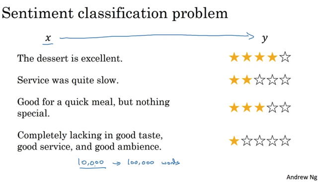</kbd>

 

<kbd>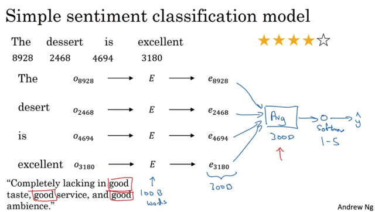</kbd>

> [!NOTE]
> Đại khái là một cách đơn giản có thể tạo model như vầy, mỗi từ trong
> comment biến thành one-hot vector, rồi embedding vector nhờ
> Embedding Matrix (download pre-trained E matrix), tính average thành 1
> vector lại rồi bỏ vào một layer softmax với 5 unit (thể hiện rating từ 1 - 5)
> -> y^ và train network simple này
>
>
>
> Nhưng solution đơn giản này thì bị cái là nó sẽ không xử lý tốt  data kiểu
> như " Completely lacking in **good** taste, **good** service, and **good**
> ambience" vì câu này sẽ có vẻ good hơn là bad

 

<kbd></kbd>

> [!NOTE]
> Đại khái là đây là một cách hiệu quả hơn phương án trước, ở đây ta train
> model bằng RNN theo structure many-to-one như trong hình.
>
>
>
> Với cách làm này ổng nói nó sẽ work rất tốt, và ngay cả khi ví dụ
> như thay 'lacking' bằng 'absent' - một từ không có trong training
> set nhưng miễn là nó xuất hiện khi training cái Embedding Matrix E
> mà cái này chắc chắn phải có rồi vì E được train với cả tỷ từ lận - thì
> model vẫn sẽ work tốt với các từ mới này

 

#### Debiasing Word Embeddings

 

##### 1 Machine learning and AI algorithms are increasingly trusted to make
important decisions, and it is important to eliminate bias in their
decisions.

2 Word embeddings, which can learn analogies, may reflect gender,
ethnicity, age, sexual orientation, and other biases of the text used to
train the model.

3 Bias relating to socioeconomic status is also a concern, as machine
learning algorithms are used in important decisions ranging from
college admissions to the criminal justice system.

4 To reduce or eliminate bias in word embeddings, one can \\*identify
the direction corresponding to a particular bias\\* and \\*perform
neutralization to get rid of bias in words that are not definitional\\*.

5 \\*The bias direction can be found using a singular value
decomposition algorithm\\*, and the neutralization step can make
words gender-neutral.

 

<kbd></kbd>

> [!NOTE]
> Đại khái là làm sao để ML không tạo ra những kết quả có định kiến /
> thiên kiến (bias)

 

<kbd>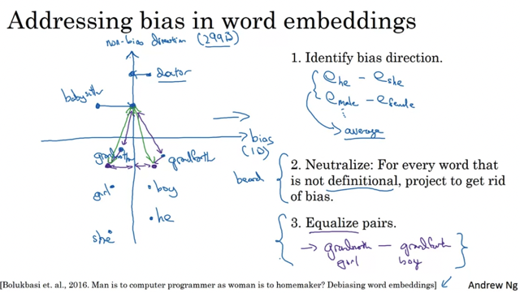</kbd>

> [!NOTE]
> Đại khái là làm 3 bước:
>
>
>
> 1. Xác định bias direction: Đại khái là bằng cách tính average hiệu
> của một số vector như e_he - e_she, e_male - e_female .. ta sẽ
> xác định được đâu là '**Bias direction**'. 
>
>
>
> 2. Tiếp những từ **'non-definitional'** thì **project** để loại bỏ bias - khái
> niệm '**project**' tương tư như của **Principal Component Analysis.**
>
>
>
> 3. Đại khái là **manually** chọn ra các cặp từ cần phải được '**equalize**'
> - để đảm bảo loại bỏ hoàn toàn bias.
>
>
>
> Nói chung đại khái là vậy nhưng cụ thể thế nào thì phải qua
> Programming Assigment mới rõ dc
>
> Đại khái là
>
>
>
> Bước 1: Cái từ nào nên 'trung tính' thì 'quán chiếu' nó về trục trung
> tính - để chi, để nó trung tính với các từ phân giới tính. đó là bước
> 1.
>
>
>
> Bước 2: Đại khái là 'biến' các từ (chính xác hơn là vector của từ)
> phân giới tính thành hoàn toàn đối xứng với trục trung tính.
>
>
>
> Với 2 bước này, từ cần trung tính hoàn toàn nằm trên trục trung tính
> (kết quả của bước 1) sẽ cách đều các từ phân tính từ đó đảm bảo
> các từ như computer, babysitter không hề nghiêng về phía nữ hay
> nam
>
>
>
> Các bước làm này đều là những phép toán biến đổi vector, trong đó
> bước một dùng PCA để quán chiếu biến các vector từ trung tính mà
> giảm thiểu thay đổi giá trị nó (đại khái vậy)

 

### Quiz

 

<kbd></kbd>

 

<kbd>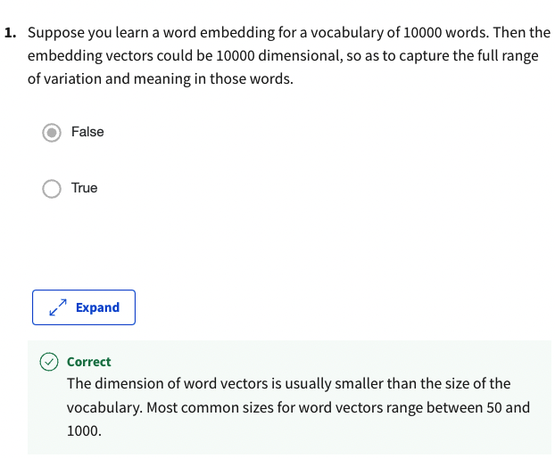</kbd>

 

<kbd></kbd>

 

<kbd></kbd>

 

<kbd></kbd>

 

<kbd>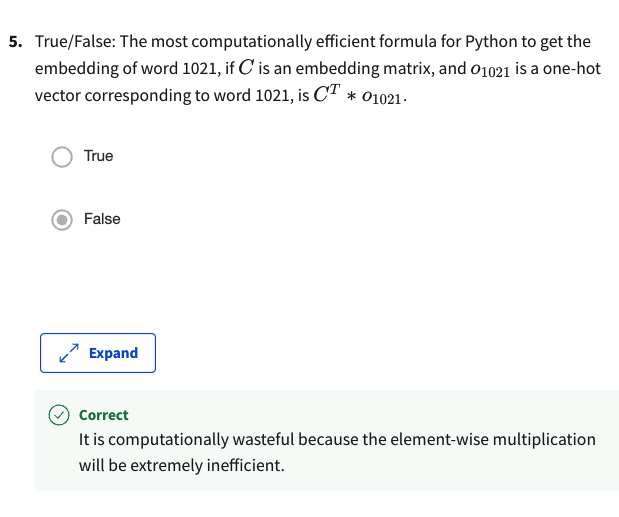</kbd>

 

<kbd></kbd>

 

<kbd></kbd>

 

<kbd></kbd>

 

<kbd>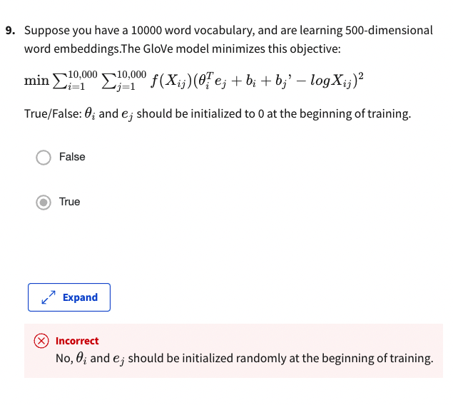</kbd>

 

<kbd>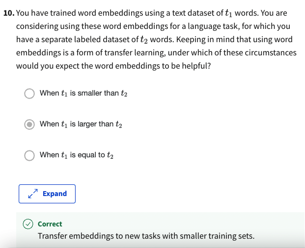</kbd>

 

### Programming Assignments 1

 

#### Welcome to your first assignment of Week 2, Course 5 of the Deep Learning Specialization!

Because word embeddings are very computationally expensive to train, most ML practitioners
will load a pre-trained set of embeddings. In this notebook you'll try your hand at \\_\\*loading\\*\\_,
\\_\\*measuring similarity between\\*\\_, and \\_\\*modifying pre-trained embeddings\\*\\_.

\\*After this assignment you'll be able to\\*:
 • Explain how word embeddings capture relationships between words
 • Load pre-trained word vectors
 • Measure similarity between word vectors using cosine similarity
 • Use word embeddings to solve word analogy problems such as Man is to Woman as King is to \\*__\\*.

At the end of this notebook you'll have a chance to try an optional exercise, where you'll modify
word embeddings to \\_\\*reduce their gender bias\\*\\_. Reducing bias is an important
consideration in ML and NLP, so you're encouraged to take this chall

<kbd></kbd>

 

##### Packages

 

##### 1 - Load the Word Vectors

 

<kbd>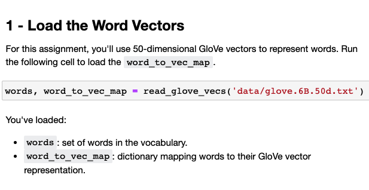</kbd>

 

##### 2 - Embedding Vectors
Versus One-Hot Vectors

 

<kbd>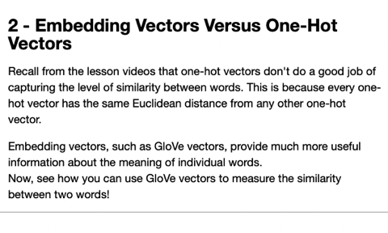</kbd>

 

##### 3 - Cosine Similarity

 

<kbd></kbd>

 

##### Exercise 1 - cosine_similarity

Theo công thức, dễ chỉ có chú yý arg dùng 1D
vector khá nguy hiểm

 

<kbd></kbd>

<kbd>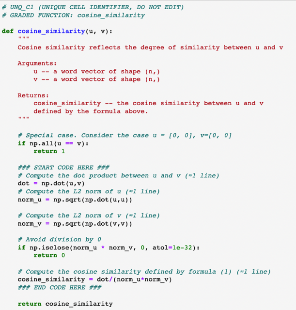</kbd>

 

<kbd></kbd>

 

<kbd></kbd>

 

##### 4 - Word Analogy Task

 

- **Exercise 2 -
complete_analogy**

 

<kbd>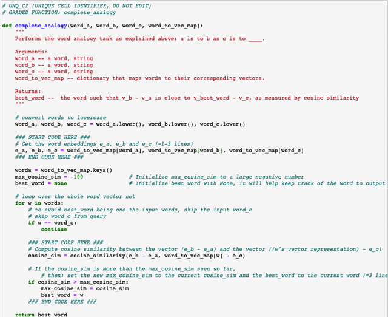</kbd>

 

##### \\*Congratulations! \\*You've come to the end of the graded portion of the
assignment. By now, you've:

• Loaded some pre-trained word vectors

• Measured the similarity between word vectors using cosine similarity

• Used word embeddings to solve word analogy problems such as Man is to
Woman as King is to __.

Cosine similarity is a relatively simple and intuitive, yet powerful, method you
can use to capture nuanced relationships between words. These exercises
should be helpful to you in explaining how it works, and applying it to your
own projects!

\\*What you should remember\\*:  • Cosine similarity is a good way to
compare the similarity between pairs of word vectors.

▪ Note that L2 (Euclidean) distance also works.

• For NLP applications, using a pre-trained set of word vectors is often a
great way to get started.

 

##### 5 - Debiasing Word Vectors
(OPTIONAL/UNGRADED)

> [!NOTE]
> Đại khái là
>
>
>
> Bước 1: Cái từ nào nên 'trung tính' thì 'quán chiếu' nó về trục trung
> tính - để chi, để nó trung tính với các từ phân giới tính. đó là bước
> 1.
>
>
>
> Bước 2: Đại khái là 'biến' các từ (chính xác hơn là vector của từ)
> phân giới tính thành hoàn toàn đối xứng với trục trung tính.
>
>
>
> Với 2 bước này, từ cần trung tính hoàn toàn nằm trên trục trung tính
> (kết quả của bước 1) sẽ cách đều các từ phân tính từ đó đảm bảo
> các từ như computer, babysitter không hề nghiêng về phía nữ hay
> nam
>
>
>
> Các bước làm này đều là những phép toán biến đổi vector, trong đó
> bước một dùng PCA để quán chiếu biến các vector từ trung tính mà
> giảm thiểu thay đổi giá trị nó (đại khái vậy)

 

- **5.1 - Neutralize Bias for
Non-Gender Specific Words

Đại khái là thực hiện việc biến một vector từ cần trung tính để
nó 'trung tính' với vector bias - vector định kiến tức là làm sao
để cho nó vuông góc với bias vector -> cosin similarity = 0 -> Ko
liên quan đến nhau**

 

<kbd></kbd>

> [!NOTE]
> Đại khái là thực hiện việc biến một vector từ cần trung tính để
> nó 'trung tính' với vector bias - vector định kiến tức là làm sao
> để cho nó vuông góc với bias vector -> cosin similarity = 0 -> Ko
> liên quan đến nhau

 

- **Exercise 3 - neutralize

Làm theo công thức thôi**

 

<kbd>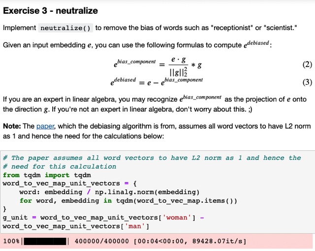</kbd>

 

<kbd></kbd>

 

<kbd>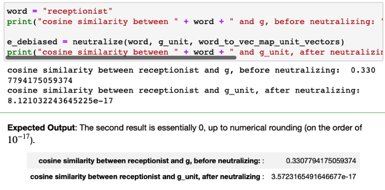</kbd>

 

- **5.2 - Equalization Algorithm for
Gender-Specific Words**

 

<kbd></kbd>

> [!NOTE]
> Đại khái là biến đổi các vector từ phân tính thành ra cách đều
> trục trung tính giúp loại bỏ hoàn toàn bias

 

<kbd>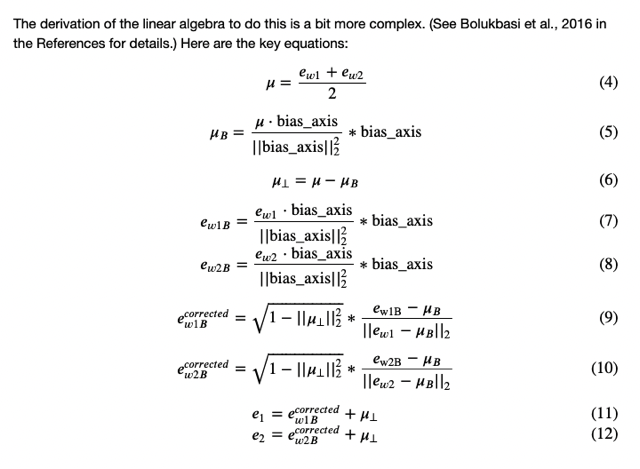</kbd>

 

- **Exercise 4 - equalize**

 

<kbd></kbd>

 

<kbd></kbd>

> [!NOTE]
> Đại khái là giờ nó gần
> như bằng nhau rồi

 

<kbd></kbd>

 

- **\\*Congratulations!

\\*You have come to the end of both graded and
ungraded portions of this notebook, and have seen
several of the ways that word vectors can be applied
and modified. Great work pushing your knowledge in
the areas of neutralizing and equalizing word vectors!
See you next time.**

 

##### 6 - References

 

### Programming Assignments 2

 

#### \\*What you'll build:

\\* 1 In this exercise, you'll start with a baseline model (Emojifier-V1)
using word embeddings.

2 Then you will build a more sophisticated model (Emojifier-V2) that
further incorporates an LSTM. By the end of this notebook, you'll be
able to:

• Create an embedding layer in Keras with pre-trained word vectors

• Explain the advantages and disadvantages of the GloVe algorithm

• Describe how negative sampling learns word vectors more efficiently
than other methods

• Build a sentiment classifier using word embeddings

• Build and train a more sophisticated classifier using an LSTM

 

##### Packages

 

<kbd></kbd>

 

##### 1 - Baseline Model: Emojifier-V1

 

- **1.1 - Dataset EMOJISET**

 

<kbd>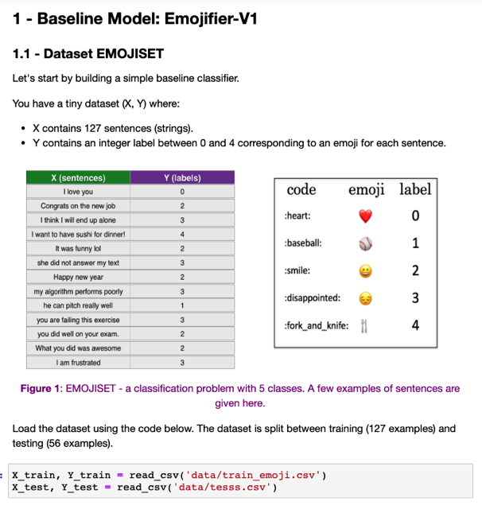</kbd>

 

<kbd>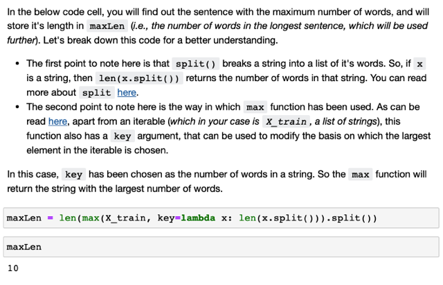</kbd>

 

<kbd>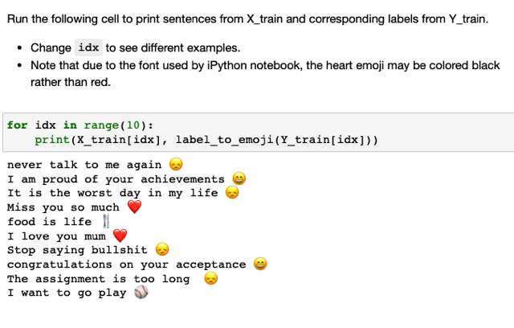</kbd>

 

- **1.2 - Overview of the Emojifier-V1**

 

<kbd>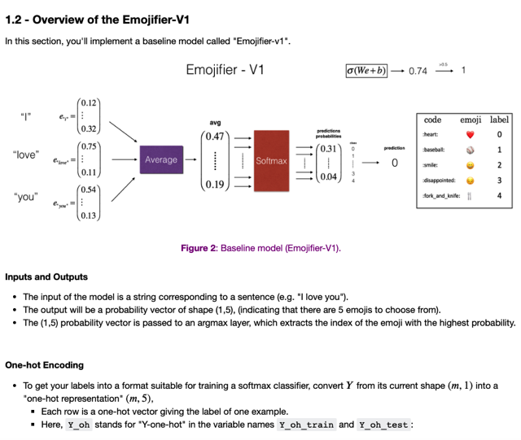</kbd>

 

<kbd></kbd>

 

- **1.3 - Implementing Emojifier-V1**

 

<kbd>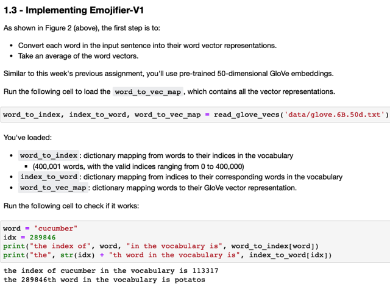</kbd>

 

- **Exercise 1 - sentence_to_avg

Đại khái là tách 1 câu thành list các từ, biến mỗi từ thành
embedding vector nhờ Embedding Matrix (ở đây chỉ là 1
dictionary, word -> vector), rồi tính 1 vector average của
các e vector đó. Sẽ là vector "đại diện" cho sentence**

 

<kbd>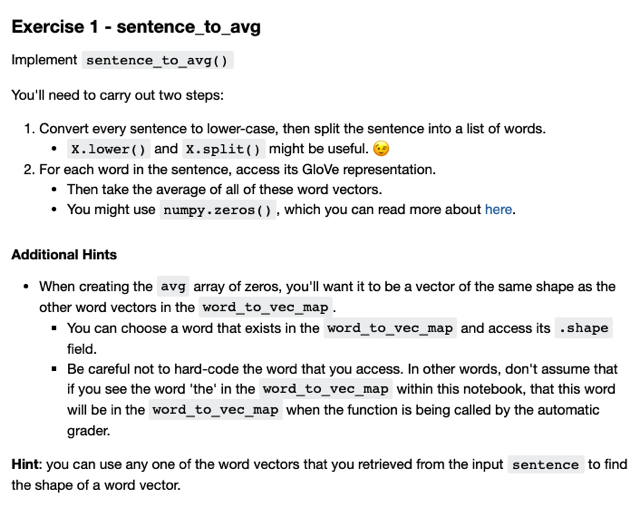</kbd>

 

<kbd></kbd>

 

<kbd></kbd>

 

- **1.4 - Implement the Model**

 

<kbd></kbd>

 

- **Exercise 2 - model

Đại khái là:
Forward prop tính cost function
Loop trong iteration, 
Loop trong m
Với mỗi data sample (là 1 sentence), biến thành embedding vector (của 
Sentence đó) bằng function đã làm.
Dùng công thức tính z(i), a(i) hay y^(i), loss(i), cộng dồn loss vào cost
Dùng công thức (cũng đơn giản nên tự biết, ở đây ổng ko nói mà làm sẵn)
để backward prop tính gradient dW, db
Update W, b**

 

<kbd></kbd>

<kbd></kbd>

 

<kbd></kbd>

 

<kbd>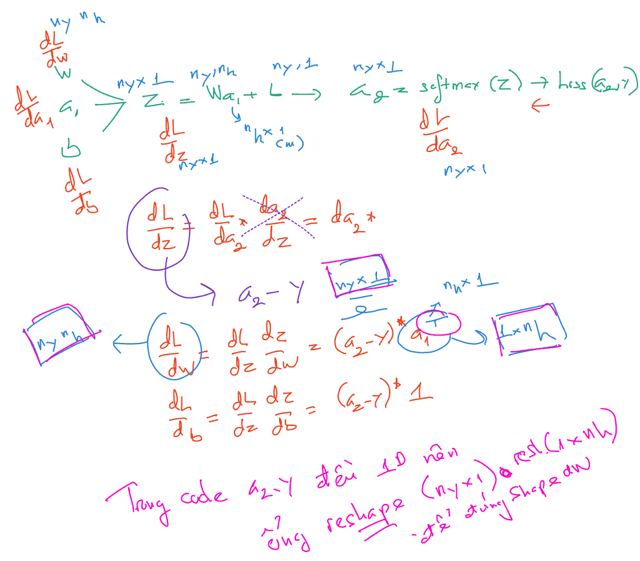</kbd>

 

<kbd></kbd>

 

<kbd></kbd>

 

- **Training**

 

<kbd></kbd>

 

- **1.5 - Examining Test Set Performance**

 

<kbd></kbd>

 

<kbd></kbd>

 

<kbd></kbd>

 

- **What you should remember:

Even with a mere 127 training examples, you can get a reasonably good
model for Emojifying.

This is due to the generalization power word vectors gives you.

Emojify-V1 will perform poorly on sentences such as *"This movie is not
good and not enjoyable"*

It doesn't understand combinations of words.

It just averages all the words' embedding vectors together, without
considering the ordering of words.**

 

##### 2 - Emojifier-V2: Using LSTMs in Keras

 

- **2.1 - Model Overview**

 

<kbd></kbd>

 

<kbd></kbd>

 

- **2.2 Keras and Mini-batching**

 

<kbd>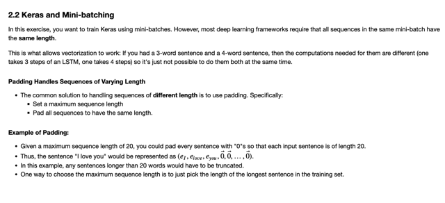</kbd>

 

- **2.3 - The Embedding Layer**

 

<kbd>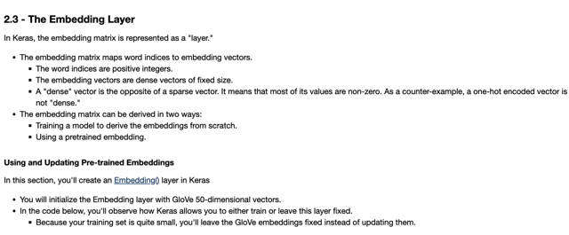</kbd>

 

- **Nói rất rõ, đại khái là ta có thể train Embedding layer hoặc dùng
pre-trained weight.

Mục đích cuối cùng của Embedding layer là biến một từ thành
một embedding vector sao cho nó đại diện được tốt nhất của từ
đó ở các khía cạnh, giúp quá trình học / huấn luyện đạt được
hiệu quả (ví dụ giúp train ra một model có thể translate một câu
tiếng Pháp sang câu tiếng Anh chuẩn nhất)

Do đó nếu chỉ định Embedding layer là trainable (có dùng
pre-trained weights hay không cũng dc) thì khi train (phải hiểu là
train cả 1 Network thì nó sẽ tìm cách cải thiện cái việc
Embedding này sao cho đạt được mục đích ở trên - bằng cách
tìm ra weight tốt nhất**

 

<kbd></kbd>

<kbd></kbd>

 

- **Exercise 3 - sentences_to_indices
Ini X_index = zeros (m, max_len)
Loop trong m, lấy từng câu (data sample) ra
Split câu ra
Loop trong các từ, biến mỗi từ thành index nhờ word_to_index (dictionary)
Gán vào X_index tại vị trí i,j

Như vậy các vector (chính là các hàng của X_index) đếu bằng size nhau (max_length)
mà cái nào ngắn sẽ được fill bằng 0.**

 

<kbd></kbd>

 

<kbd>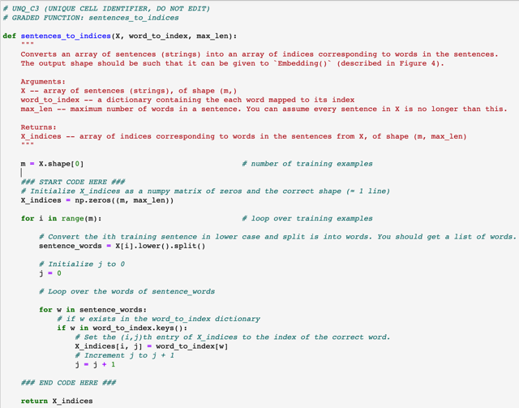</kbd>

 

<kbd>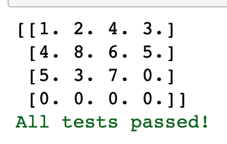</kbd>

 

<kbd>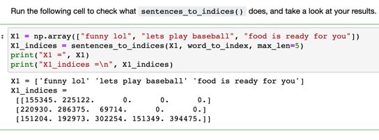</kbd>

 

- **Exercise 4 - pretrained_embedding_layer**

 

<kbd></kbd>

 

- **Ở đây nói rất rõ là ta sẽ tự define Embedding layer BẰNG cách
\\*'set the embedding weights to be equal to the embedding
matrix'\\*

Bằng cách nào đó, tải trên mạng blah blah ta có một \\*dictionary\\*
Trong đó \\*mỗi từ sẽ với tương ứng một embedded vector\\* mà
vector này đại diện cho nó, có tính chất như thế nào thì xem  lại
theo link (mà đại khái là embedded vector dc tạo ra nhằm mục
đích chứa trong mình những thông tin hữu ích về các khía cạnh
của từ đó như giới tính, ngành nghề ....)

Như vậy, Embedding layer sẽ đại khái là \\*nhận một từ thì biến thành
một embedded vector\\*, nhận \\*một list\\* các từ (1 câu/1 sequence /
vector) thì biến thành một \\*matrix\\*. Nói chúng là bỏ vào 1 volume
(hay còn gọi là Tensor) có \\*mấy dimension\\* thì nó \\*tạo ra thêm một
dimension\\* nữa, vì cứ 1 từ (sẽ biểu thị bởi 1 con số - index) thì nó
tạo một vector**

 

<kbd></kbd>

> [!NOTE]
> Dù có thắc mắc là **tại sao input_dim** lại bằng **vocab_size**
> nhưng có thể hiểu là Embedding nó có nhiệm vụ là:.. 
>
>
>
> Embedding một **index input** thành một **embedding vector**, 
> nên nó như một dictionary

 

<kbd></kbd>

 

- **2.4 - Building the Emojifier-V2**

 

<kbd>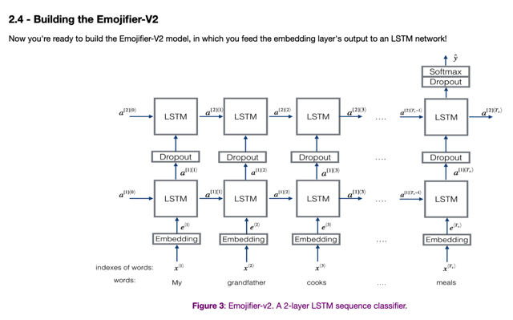</kbd>

 

- **Exercise 5 - Emojify_V2**

 

<kbd>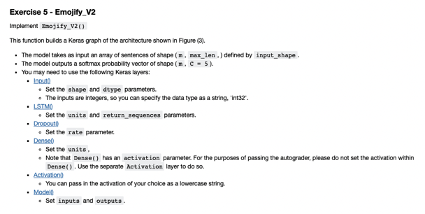</kbd>

 

<kbd>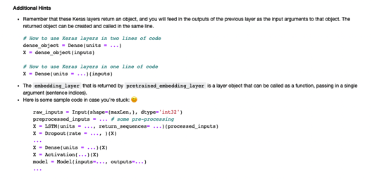</kbd>

 

<kbd>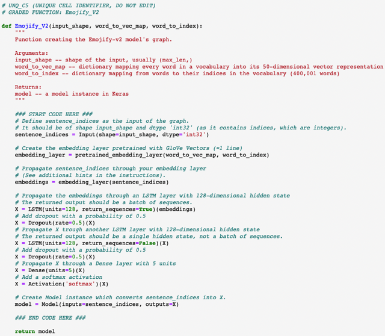</kbd>

<kbd></kbd>

> [!NOTE]
> Chưa hiểu Embedding layer lắm (input, output shape) -> Cứ hiểu tạm là nó
> được define để bỏ vào index thì cho ra embedding vector, nên đầu vào là input
> volume shape bao nhiêu ko biết cứ qua nó là thành ra tăng thêm 1 chiều nữa
> (vì idx number
> - 1D thành vector - 2D) -> Hiểu vậy là đúng rồi đó, đọc cái giải thích ChatGPT

 

- **In Keras, an embedding layer is a type of layer that maps \\*input values\\* (such
as words or categorical variables) to \\*fixed-size vectors of real numbers\\*, also
known as embeddings. These embeddings can be used as a more compact
and dense representation of the original input, making it easier to work with
and analyze.

The embedding layer takes as input a matrix of integers, where each row
represents a sequence of input values. Each value in the matrix represents a
categorical variable, such as a word or an item in a list of categories. The layer
then looks up the corresponding \\*embedding vector\\* for each \\*input value\\* in a
\\*lookup table\\*, which is \\*learned during training\\*.

The size of the embedding vectors is a hyperparameter that needs to be
specified when defining the layer. The dimensionality of the embedding space
should be chosen such that it is large enough to capture the relevant
information in the input data, but not so large as to introduce overfitting.

The output of the embedding layer is a matrix of the same shape as the input
matrix, but with \\*each integer value replaced by its corresponding embedding
vector\\*. This matrix can then be passed on to further layers for processing.

Overall, the embedding layer in Keras is a powerful tool for transforming
categorical inputs into dense, continuous representations that can be more
easily processed by neural networks. It is commonly used in natural language
processing (NLP) applications, where it is used to represent words or
sequences of words as embeddings.**

<kbd></kbd>

 

- **Đại khái là mỗi input value sẽ được replace bởi 1 embedded
vector (mà item value của vector đó là real number)

Bằng cách nó look up value từ 1 lookup table được \\*learned
during trainning.\\*

Kểu như mình có thể:  Pre-train rồi gán trainable = false
để không train lại cái embedding layer này

Pre-train rồi gán trainable = true để tiếp tục train embedding
layer này

Hoặc Train từ đầu (không có pre-train gì cả)

Thì trong assigment này chính là xài cái \\*pre-train và không
train lại\\***

 

<kbd></kbd>

> [!NOTE]
> Params cua Embedding layer không trainable

 

- **2.5 - Train the Model**

 

<kbd></kbd>

 

<kbd></kbd>

 

<kbd>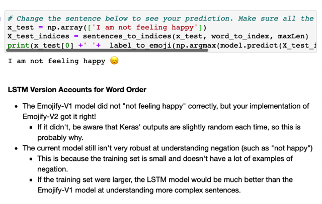</kbd>

 

##### \\*Congratulations! \\*You've completed this notebook, and
harnessed the power of LSTMs to make your words more
emotive! ❤️❤️❤️

By now, you've:

• Created an embedding matrix

• Observed how negative sampling learns word vectors more
efficiently than other methods

• Experienced the advantages and disadvantages of the GloVe
algorithm

• And built a sentiment classifier using word embeddings!

Cool! (or Emojified: 😎😎😎 )

 

<kbd></kbd>

 

##### 3 - Acknowledgments

 

## C5w3_sequence Models & Attention Mechanism

 

### Various Sequence To Sequence Architectures

 

#### Basic Models

 

##### 1 \\*Sequence to sequence models\\* are useful for a variety of
applications, including \\*machine translation\\* and \\*speech recognition\\*.

2 The \\*basic model\\* for sequence to sequence involves using an
\\*encoder network\\* (e.g., a RNN) to encode the input sequence and a
\\*decoder network\\* to decode the output sequence one word at a time.

3 For example, to translate a French sentence to English, the encoder
network would encode the French sentence and the decoder network
would output the English translation.

4 A similar model can be used for\\* image captioning\\*, where a
\\*pre-trained convolutional neural network\\* is used \\*as the encoder\\*
\\*network\\* to encode an image and an \\*RNN is used as the decoder\\*
\\*network\\* to generate the caption.

5 One key difference between generating translations or captions
using a sequence to sequence model and synthesizing novel text
using a language model is that in the former, the goal is to \\*generate
the most likely translation\\* or caption \\*rather than a random one\\*.

 

<kbd>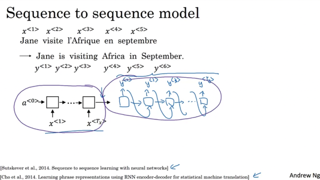</kbd>

> [!NOTE]
> Ổng nói đại khái để làm bài toán translate thì build một cái model
> như vầy trên thực tế đã chứng minh là work khá hiệu quả, chỉ cần
> chuẩn bị dataset French sentences -> English sentences

 

<kbd></kbd>

> [!NOTE]
> Đại khái là có thể làm vấn đề như image captioning, train a picture thông
> qua 1 ConvNet và dùng cái vector cuối như một cái image representation
> và feed vào cái Sequence to sequence model
>
>
>
> Kiểu như là với sentence thì ta tạo representation vector bởi Embedding
> còn Image thì là vector cuối của ConvNet (gọi là encoding vector?)

 

#### Picking The Most Likely Sentence

 

##### 1 Sequence to sequence machine translation model is s\\*imilar to
language models\\*, but there are some significant differences.

2 Machine translation can be thought of as building a \\*conditional
language model\\* that estimates the probability of an output sentence
based on input.

3 The model starts off the \\*decoded network\\* with the representation of
the input sentence, unlike the \\*language model\\*, which starts with a
\\*vector of all zeros.\\*

4 The goal of the machine translation model is to \\*find the English
sentence that maximizes the conditional probability\\* given a French
input sentence.

5 The most common algorithm for finding the English sentence that
maximizes the conditional probability is \\*beam search\\*.

6 \\*Greedy search\\* algorithm doesn't work because it may not pick the
best words that maximize the \\*joint probability\\* of the whole sentence.

 

<kbd></kbd>

> [!NOTE]
> Khác biệt giữa Language Model (nói ở week 1) và Machine Translation
>
>
>
> Đều có cái phần 'language model' (màu tím) giống nhau.
>
>
>
> Nhưng M.T **"encode"** cái input trước khi bỏ vào cái phần ' language
> model'.
>
>
>
> L.M output "Probability of a sentence" - p(y<1>,y<2>,...y<Ty>)
>
>
>
> còn M.T output **"Probability of a proper sentence / translation sentence**,
> given the French (original) sentence" - kiểu như một đièu kiện "Ê, ko
> phải là 'probability' của 1 câu nào đó mà phải là 'probability' của 1 câu
> phù hợp - câu dịch đúng. Nên nó dc gọi là **'Conditional language model'**
>
>
>
> Tạm hiểu đại khái vậy.

 

<kbd>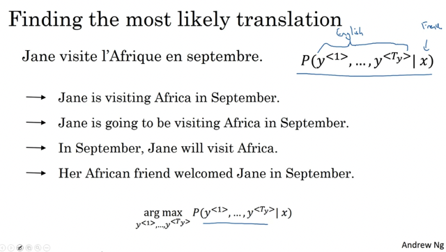</kbd>

> [!NOTE]
> Đại khái là ta không chỉ muốn 'một kết quả' mà phải là 'kết quả tốt nhất,
> phù hợp nhất' Giống như bản dịch chính xác nhất, và ta làm điều này nhờ
> **Beam Search**

 

<kbd></kbd>

> [!NOTE]
> **Greedy search** đại khái là search từ tốt nhất one-by-one,
> nhưng thường lại không phải là cách tạo ra câu tốt nhất

 

#### Beam Search

 

##### Với mỗi từ ứng viên, tìm tiếp 3 từ có khả năng cao nhất theo sau nó

Ví dụ 3 ứng viên cao nhất cho vị trí thứ 1 của câu là 'in', 'Jane', 'Semtember' thì ở step
2, lần lượt tìm :

- các khả năng của từ thứ 2 nếu từ thứ nhất là 'in' -> ra vector 10000 probability: [P('a',
x, 'in'), P('aaron', x, 'in'),....10000 từ...P('zulu', x, 'in')]

- các khả năng của từ thứ 2 nếu từ thứ nhất là 'Jane' -> ra vector 10000 probability
[P('a', x, 'Jane'), P('aaron', x, 'Jane'),....10000 từ...P('zulu', x, 'Jane')]

- các khả năng của từ thứ 2 nếu từ thứ nhất là 'September' -> ra vector 10000
probability  [P('a', x, 'September'), P('aaron', x, 'September'),....10000 từ...P('zulu', x, '
September')]

Xong tính Probability của 1 cặp P(y<1>, y<2> | X) theo công thức: \\*P(y<1>, y<2> | X)
= P(y<1>|x).P(y<2>|x, y<1>) \\* để có:

[   P('in', 'a' | x), P('in', 'aaron' | x), ...10000 cái...P('in', 'zulu' | x),..   P('jane', 'a' | x), P('
jane', 'aaron' | x), .....P('jane', 'zulu' | x),..   P('september', 'a' | x), P('september', 'aaron'
| x),...P('september', 'zulu' | x) ]

Cuối cùng tìm 3 cặp có P(y<1>, y<2> | x) cao nhất.

Giả sử kết quả là {in September}, {jane í}, {jane visiting} thì đồng nghĩa \\*September
không còn là ứng viên của từ thứ nhất\\*

 

<kbd>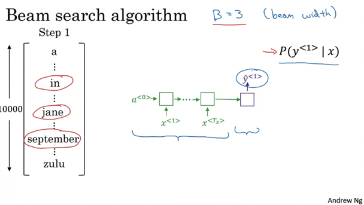</kbd>

> [!NOTE]
> Đại khái là nó không chỉ tính 1 mà là 3 cái probability cao nhất cho từ đầu
> tiên, (B là hyper params '**beam width**', đang set = 3). Kiểu như 3 khả
> năng cao nhất của từ này là gì, chứ không phải chỉ có 1 như trước đây.

 

<kbd>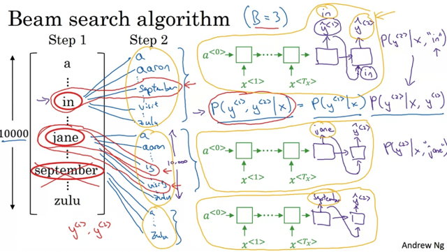</kbd>

> [!NOTE]
> Với mỗi từ ứng viên (của từ đầu tiên), tìm tiếp 3 từ có khả năng cao nhất theo sau nó
>
>
>
> Ví dụ 3 ứng viên cao nhất cho vị trí thứ 1 của câu là 'in', 'Jane', 'September' thì ở step 2, lần lượt tìm :
>
>
>
> - Các khả năng của từ thứ 2 nếu từ thứ nhất là 'in' -> ra vector 10000 probability:
> [P('a', x, 'in'), P('aaron', x, 'in'),....10000 từ...P('zulu', x, 'in')]
>
>
>
> - Các khả năng của từ thứ 2 nếu từ thứ nhất là 'Jane' -> ra vector 10000 probability 
> [P('a', x, 'Jane'), P('aaron', x, 'Jane'),....10000 từ...P('zulu', x, 'Jane')]
>
>
>
> - Các khả năng của từ thứ 2 nếu từ thứ nhất là 'September' -> ra vector 10000 probability 
> [P('a', x, 'September'), P('aaron', x, 'September'),....10000 từ...P('zulu', x, 'September')]
>
>
>
> Xong tính Probability của 1 cặp P(y<1>, y<2> | X) theo công thức:
> **P(y<1>, y<2> | X) = P(y<1>|x).P(y<2>|x, y<1>)**
>
>
>
> để có: 
>
>
>
> [
>   P('in', 'a' | x), P('in', 'aaron' | x), ...10000 cái...P('in', 'zulu' | x),..
>   P('jane', 'a' | x), P('jane', 'aaron' | x), .....P('jane', 'zulu' | x),..
>   P('september', 'a' | x), P('september', 'aaron' | x),...P('september', 'zulu' | x)
> ]
>
>
>
> Cuối cùng tìm 3 cặp có P(y<1>, y<2> | x) cao nhất.
>
>
>
> Giả sử kết quả là {in September}, {jane is}, {jane visiting} thì
> đồng nghĩa **September không còn là ứng viên của từ thứ nhất**

 

<kbd></kbd>

> [!NOTE]
> Tiếp tục như vậy ta sẽ có kết quả là bộ y<1>,y<2>...sao cho
> P(y<1>,y<2>...) cao nhất.
>
>
>
> Khi B = 1 thì chính là Greedy Search

 

#### Refinements To Beam Search

 

##### 1 \\*Length normalization\\* can improve the performance of the basic
search algorithm.

2 Using \\*logs\\* instead of multiplying probabilities can make the
algorithm more \\*numerically stable\\*.

3 The algorithm can be further improved by normalizing the log
probability by the number of words in the translation, using a
parameter called Alpha.

4 Beam search involves evaluating a large number of possible
translations and s\\*electing the highest scoring\\* one.

5 The beam width determines how many possibilities are
considered during beam search.

6 A larger beam width can lead to better results but requires
more time and memory.

 

<kbd>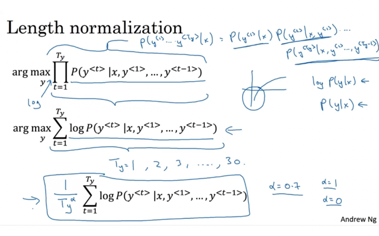</kbd>

> [!NOTE]
> Đại khái là các P nhỏ hơn 1 nên nhân cả đám lại nó ra số rất nhỏ có thể
> gây lỗi liên quan đến numerical value nên thay bằng **log**, vì maximize p
> hay log p thì đều cho cùng kết quả như nhau
>
>
>
> Thứ hai để tránh tình trạng nó chọn câu ngắn (vì câu ngắn thường
> Cho p cao hơn do nhân ít hơn) thì làm bước **normalization**
> với hệ số **alpha control mức độ normalization**, alpha = 0 -> 1/ty^0 = 1
> (không normalize) alpha = 1 ) -> 1/ty (full normalize)

 

<kbd></kbd>

 

#### Error Analysis In Beam Search

 

##### Main ideas:  1 \\*Error analysis\\* and \\*beam search\\* are two important
concepts in machine translation.

2 Beam search is an approximate search algorithm that\\* doesn't always
output the most likely sentence\\*.

3 It's important to figure out whether it is the \\*beam search algorithm\\* or
the \\*RNN model\\* that is causing translation errors.

4 Computing \\*P(y* given x)\\* and \\*P(y-hat given x)\\* using the RNN model
can help to determine which component is more to blame for translation
errors.

5 If P(y* given x) is greater than P(y-hat given x), then beam search is at
fault.

6 If P(y* given x) is less than or equal to P(y-hat given x), then the RNN
model is more to blame for translation errors.

 

<kbd></kbd>

> [!NOTE]
> Chưa hiểu tính P(y*|x) và P(y^|x) là sao
> như thế nào chỉ tạm thời hiểu:
> **P(y*|x)** là **true** probability distribution
> còn **P(y^|x)** là '**predicted**' probability distribution

 

<kbd></kbd>

> [!NOTE]
> Nói chung là so sánh hai cái đó từ đó kết luận phải
> focus improve cái RNN hay Beam search

 

<kbd>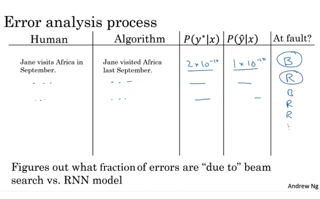</kbd>

> [!NOTE]
> Đại khái là xem tỉ lệ
> thằng nào nhiều

 

#### Bleu Score - Bilingual Evaluation

 

##### 1 Machine translation faces a challenge where there can be multiple
equally good translations of the same sentence.

2 \\*BLEU score\\* is used to \\*evaluate the quality of machine translations\\* by
\\*comparing them with human-generated translations\\*.

3 BLEU score is an \\*understudy for human evaluators\\* and measures
how good the machine translation is by looking at the types of words it
generates.

4 \\*Precision\\* \\*measures\\* are used in BLEU score, where words are given
credit only up to the maximum number of times they appear in the
reference sentences.

5 The \\*modified precision measure\\* in BLEU score gives a score by
clipping the count of the number of times a word appears in reference
sentences.

6 The BLEU score takes into account unigrams, bigrams, and longer
sequences of words to define the score.

 

<kbd></kbd>

> [!NOTE]
> Vấn đề là làm sao để **measure accuracy** đối với nhiều answer đều good như
> nhau
>
>
>
> Có nói đến khái niệm **understudy** đại khái là một trợ thủ có thể học theo vai
> trò của một senior để khi cần có thể thay thế senior đó. Thì BLEU score có
> thể như understudy của 1 người ngồi check độ chính xác của kết quả dịch từ
> Machine Translation so với câu reference
>
>
>
> Có nói đến câu references được provide trong **dev set** hay **test set**

 

<kbd>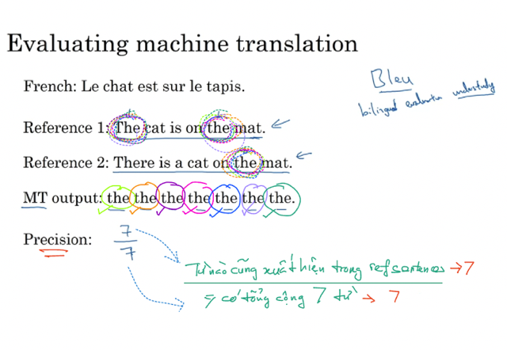</kbd>

> [!NOTE]
> Đại khái là đầu tiên dùng chỉ số ' Precision' đại khái là đếm xem tỉ
> lệ những từ trong câu prediction có xuất hiện trong câu chuẩn
>
>
>
> Ví dụ như prediction ra có 7 từ, thì 7 từ đều xuất hiện trong câu
> chuẩn -> tỉ lệ precision là 6/7 
>
>
>
> Đại khái là tính kiểu này không ổn, vì nếu nó ra 1 câu tào lao như 
> 'the the ....' thì chỉ số nó vẫn rất cao 7/7.
>
>
>
> Nên phải có 1 cách tính khác gọi là chỉ số **modified** **precision**

 

<kbd></kbd>

> [!NOTE]
> Trong chỉ số Modified precision thì chỉ tính tử số là max
> lần xuất hiện của 1 từ trong câu chuẩn, mẫu số là số lần
> xuất hiện trong câu prediction
>
> Chú ý chỉ lấy chỉ số max lần xuất hiện của từ trong
> reference, ví dụ chữ có 2 chữ dog trong câu ref 1 và 3
> chữ dog trong câu ref 2 thì sẽ tính là 3

 

<kbd>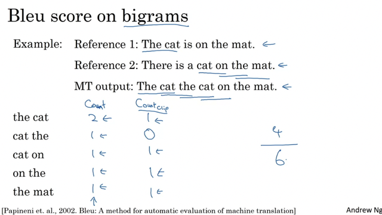</kbd>

> [!NOTE]
> "This allows you to **measure the degree** to which the machine
> translation output is **similar** or maybe **overlaps** with the references."

 

<kbd></kbd>

> [!NOTE]
> Khái quát hoá: Đại khái là tỉ lệ tổng xuất hiện (của từ / cụm từ - uni/n-gram)
> trong references (chỉ tính max) đối với trong prediction
>
>
>
> Khi prediction giống y references thì p sẽ = 1

 

<kbd></kbd>

> [!NOTE]
> Đại khái ta chỉ cần tính Pn (để có 1 chỉ số duy nhất cho việc evaluation, chứ không
> phải so đo nhiều chỉ số P1, P2...), và chỉ số này bằng e luỹ thừa của trung bình
> cộng của tất cả chỉ số P1,P2...nhân với 1 tham số BP
>
>
>
> **BP** - **Brevity Penalty** - chỉ cần hiểu đại khái là nó sẽ ngăn việc hệ thống thiên vị cho
> câu ngắn

 

<kbd>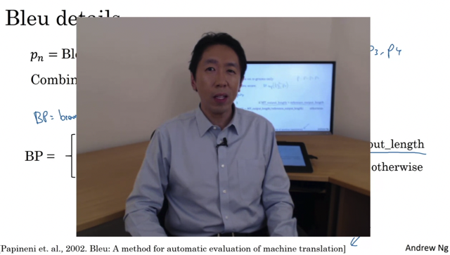</kbd>

> [!NOTE]
> Đại khái là BLEU score này cho một **single evaluation number** để mà
> check việc translation tốt cho vấn đề translation hay image captioning nơi
> mà có thể có nhiều answer chấp nhận được
>
>
>
> Có nói thêm là đối với speech recognition thì không vì kết quả phải đúng
> từng từ một)

 

#### Attention Model Intuition

 

##### Đại khái là:
One of the \\*most influential ideas\\* in Deep Learning

Đại khái là \\*thay vì nhớ cả 1 câu dài rồi mới làm\\* (khiến hiểu quả giảm xuống
\\*bleu score sẽ thấp dần khi câu càng dài\\*) thì nó sẽ \\*dịch từng phần\\* (giúp bleu
score vẫn cao)

Có thêm \\*'tham số' alpha đánh giá mức độ cần tham gia của các từ lân
cận / xung quanh trong việc dự đoán từ tiếp theo\\* s<3>

Tham số này sẽ phụ thuộc \\*hidden output\\* \\*a<t>\\* (ở đây là 2 chiều
bi-directional network và k\\*ết quả của từ trước đó s<2>\\* )

 

<kbd></kbd>

> [!NOTE]
> One of the most influential ideas in Deep Learning
>
>
>
> Đại khái là thay vì nhớ cả 1 câu dài rồi mới làm (khiến hiểu quả giảm xuống
> bleu score sẽ thấp dần khi câu càng dài) thì nó sẽ dịch từng phần (giúp bleu
> score vẫn cao)

 

<kbd></kbd>

> [!NOTE]
> Đại khái là:
>
>
>
> Có thêm **'tham số' alpha đánh giá mức độ cần tham gia của các từ lân
> cận / xung quanh trong việc dự đoán từ tiếp theo** s<3>
>
>
>
> Tham số này sẽ phụ thuộc **hidden output** **a<t>** (ở đây là 2 chiều
> bi-directional network và **kết quả của từ trước đó s<2>** )

 

#### Clarifications

 

##### At time 5:32, Andrew says "This network up
here looks like a pretty standard RNN
sequence with the context vectors as output".
The correct wording should say that the
context vectors are "inputs" to the
post-attention RNN.

 

#### Attention Model

 

##### 1 Encoder-Decoder architecture is used for machine translation,
where one RNN reads in a sentence and another one outputs a
sentence.

2 The Attention Model is a \\*modification of the Encoder-Decoder
\\*architecture that \\*works better for long sentences\\*.

3 The Attention Model works by \\*looking at parts of the input
sentence at a time\\* instead of \\*memorizing the whole sentence\\*.

4 The performance of machine translation systems with the
Attention Model is \\*better\\* than that of the Encoder-Decoder
architecture for \\*long sentences\\*.

5 The Attention Model was proposed by Dimitri, Bahdanau,
Camcrun Cho, and Y\\*oshua Bengio\\*, and it has been influential in
many areas of deep learning.

6 The Attention Model uses \\*attention weights\\* to compute the
\\*context\\* that the RNN unit should be paying attention to while
generating the output sentence.

 

<kbd>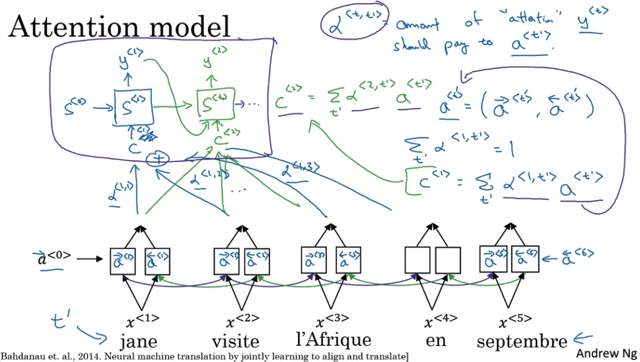</kbd>

> [!NOTE]
> t' chỉ là notation, coi nó như t thôi chẳng qua là dành cho input x
>
>
>
> Đặt a<t> là combine a<t> theo 2 chiều
>
>
>
> Tính vector "context" c<1>, c<2>.. thể hiện **cần "quan tâm" / "tính tới" nhiều
> hay ít các activation a<t> của các vị trí khác nhau**
>
>
>
> Tổng các alpha<1,t'> (t' = 1,2..T'x) bằng 1, ý nói chỉ số alpha là phần trăm, thể
> hiện cần quan tâm nhiều hay ít, rất dễ hiểu

 

<kbd>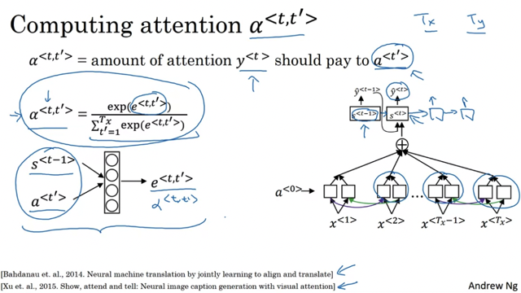</kbd>

> [!NOTE]
> Ta biết nó hệ số alpha - sẽ phụ thuộc vào hidden
> output của từ trước s<t-1> và a<t'> nhưng không biết chính xác quan hệ
> như thế nào nên ta dùng 1 N.N để Gradient Descent nó tự tìm.
>
>
>
> Nó sẽ actually work: Cái n,n bằng G.D tìm ra được e hợp lý để thể hiện
> mức độ ảnh hưởng cần thiết của s<t-1> và a<t'> đ.v việc dự đoán từ tiếp
> theo
>
>
>
> Còn hàm softmax tính alpha bằng e sẽ đảm bảo tổng alpha = 1

 

<kbd></kbd>

> [!NOTE]
> Đại khái là trong Programming assignment sẽ làm cái này: Chuyển date
>
>
>
> Và 1 cái hay ho là plot để xem cái weight - đại khái như Xem thử model
> nó đánh giá mức độ ảnh hưởng của các từ lân cận lên 1 từ được dự
> đoán ra sao

 

### Speech Recognition - Audio Data

 

#### Speech Recognition

 

##### 1 Sequence-to-sequence models have led to significant improvements in
speech recognition accuracy.

2 Speech recognition involves finding a text transcript from an audio clip.

3 \\*Spectrograms\\*, which represent the \\*intensity of different frequencies\\* at
different times, are commonly used to preprocess audio data.

4 End-to-end deep learning has made \\*phoneme\\* representations
unnecessary for speech recognition.

5 Larger datasets, transcribed audio datasets, and deep learning
algorithms have driven progress in speech recognition.

6 The attention model and \\*CTC cost\\* are two methods used for speech
recognition.

7 The\\* CTC cost\\* function allows the RNN to generate an output that
\\*matches\\* the number of input time steps, even if the output has fewer
characters.

 

<kbd></kbd>

> [!NOTE]
> Đại khái là hồi trước người ta thường kiểu như feature engineer: phiên âm
> ròi mới training để map từ raw data - phonemes, cũng hữu ích nhưng với
> data nhiều như bây giờ, người ta có thể train để map thẳng từ raw data
> sang transcript luôn.

 

<kbd>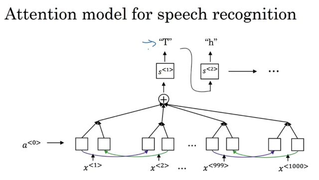</kbd>

> [!NOTE]
> 1 option để làm là Attention model

 

<kbd>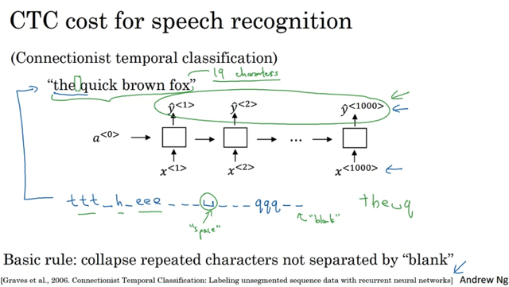</kbd>

> [!NOTE]
> Input thường lớn hơn nhiều output ví dụ 10 second, mỗi
> second có 100 hertz
>
>
>
> Vậy để 'làm' với một network như hình (Tx = Ty) thì CTC cho phép cho
> ra output kiểu như với nhiều kí tự lặp lại và 'blank' characters '
> _' như "ttt_h_eee_ _ _..."
>
>
>
> Và sau đó nó basic rule là : 'c**ollapse repeated characters not
> separated by "blank**".
>
>
>
> Ideas này được dùng để build effective Speech recognition
> system

 

#### Trigger Word Detection

 

##### Đại khái là đây là 1 cách làm ...có input x như vầy, feed into một RNN như
vầy, giờ là \\*làm sao có target label\\*, thì đại khái là chỗ nào người ta vừa nói
xong trigger word thì set label là 1, còn lại trước đó là 0. Đang nói đến việc
build model và tạo training data.

Và có thể hack 1 chút để dễ training hơn bằng việc thêm nhiều số 1 (a fixed
few number of 1) chứ không phải chỉ 1 số ngay tại lúc vừa nói xong trigger
word

 

<kbd>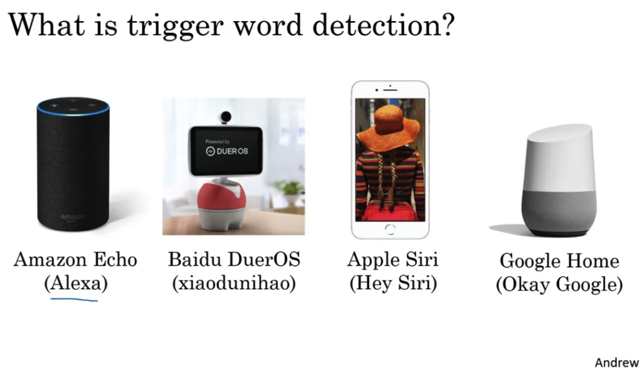</kbd>

> [!NOTE]
> Đại khái là có bạn ổng làm 1 trigger system để bật tắt đèn như 1 fun project

 

<kbd></kbd>

> [!NOTE]
> Đại khái là đây là 1 cách làm ...có input x như vầy, feed into một RNN như
> vầy, giờ là **làm sao có target label**, thì đại khái là chỗ nào người ta vừa nói
> xong trigger word thì set label là 1, còn lại trước đó là 0. Đang nói đến việc
> build model và tạo training data.
>
>
>
> Và có thể hack 1 chút để dễ training hơn bằng việc **thêm nhiều số 1** (a fixed
> few number of 1) chứ không phải chỉ 1 số ngay tại lúc vừa nói xong trigger
> word
>
> /"But I think you should feel quite proud of
> yourself that you've learned enough about
> deep learning that it just takes one picture
> and one slide to describe something as
> complicated as trigger word detection."/

 

### Quiz

 

<kbd></kbd>

 

<kbd></kbd>

> [!NOTE]
> Đáng lý phải là in the sentence that ouput must be good
> enough given the input x, not just a random sentence. ý
> là phải cho ra câu thích hợp với input, chứ không phải 1
> câu ngẫu nhiên nào đó

 

<kbd>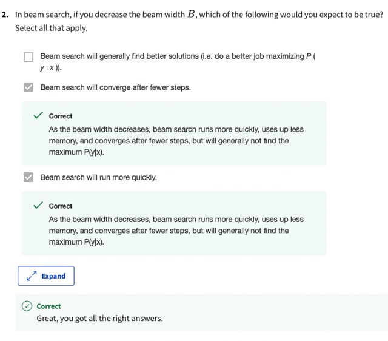</kbd>

 

<kbd>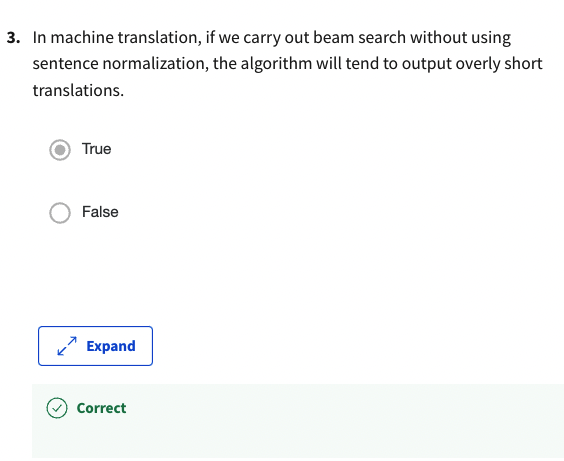</kbd>

 

<kbd></kbd>

 

<kbd>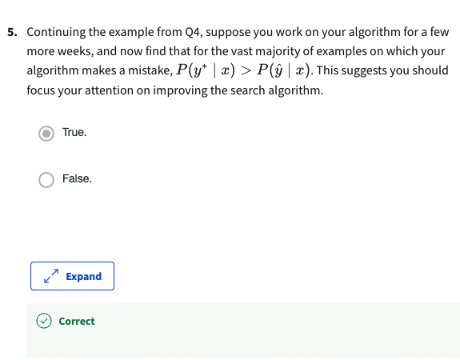</kbd>

 

<kbd>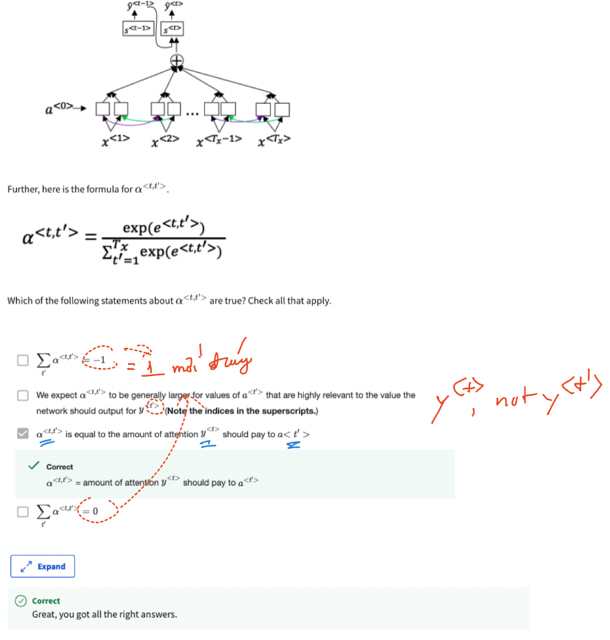</kbd>

 

<kbd></kbd>

 

<kbd></kbd>

 

<kbd>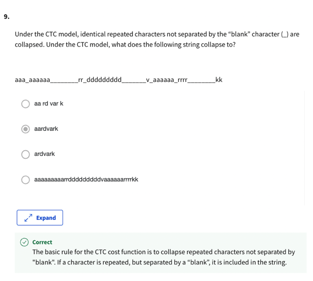</kbd>

 

<kbd>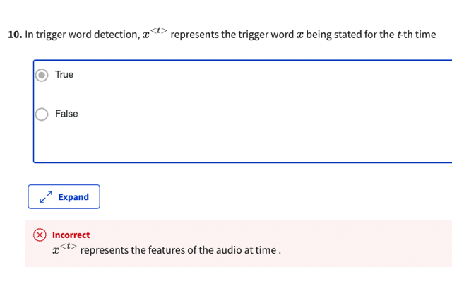</kbd>

> [!NOTE]
> Chưa hiểu chỗ này
>
> In trigger word detection, x<t> typically represents the audio
> waveform or spectrogram of the audio signal in a specific
> time window or segment, rather than the trigger word being
> stated for the t-th time. The objective is to detect the
> presence of the trigger word or phrase in real-time audio
> streams, which can be achieved by training machine learning
> models to recognize the acoustic patterns associated with
> the trigger word.
>
>
>
> Trong việc phát hiện từ kích hoạt (trigger word detection), ký
> hiệu x<t> thường đại diện cho dải âm thanh hoặc phổ âm
> của tín hiệu âm thanh **trong một khung thời gian cụ thể**,
> thay vì từ kích hoạt được **nói ra lần thứ t**. Mục tiêu là phát
> hiện sự hiện diện của từ kích hoạt trong luồng âm thanh thời
> gian thực, đó là việc huấn luyện các mô hình máy học để
> nhận dạng các mẫu âm học liên quan đến từ kích hoạt.

 

### Programming Assignments

 

#### Neural Machine Translation

Welcome to your first programming assignment for this week!  •
You will build a Neural Machine Translation (NMT) model to
translate human-readable dates ("25th of June, 2009") into
machine-readable dates ("2009-06-25").

• You will do this using an attention model, one of the most
sophisticated sequence-to-sequence models.

This notebook was produced together with NVIDIA's Deep
Learning Institute.

 

##### Packages

 

<kbd>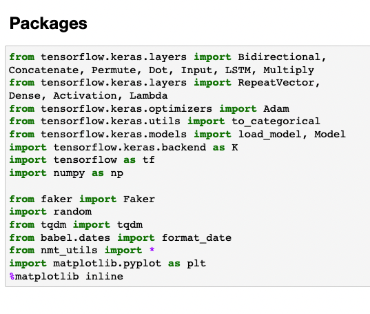</kbd>

 

##### 1 - Translating Human Readable Dates
Into Machine Readable Dates

 

<kbd>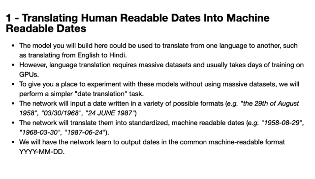</kbd>

 

##### 1.1 - Dataset

 

<kbd></kbd>

 

<kbd>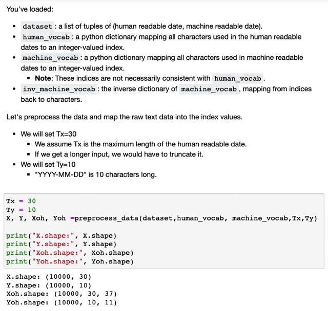</kbd>

 

<kbd>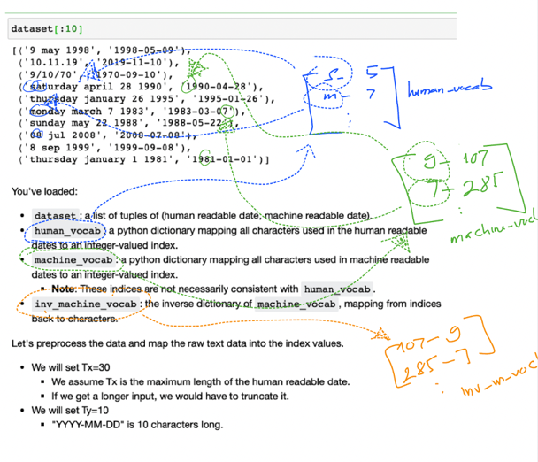</kbd>

 

<kbd>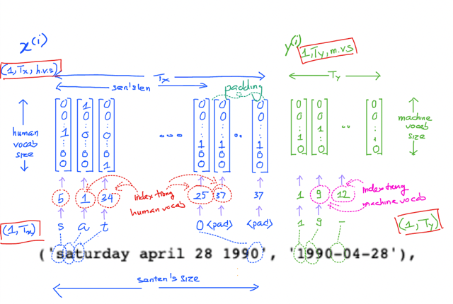</kbd>

 

<kbd></kbd>

 

##### 2 - Neural Machine Translation with Attention

 

- **• If you had to translate a book's paragraph from French to
English, you would not read the whole paragraph, then close the
book and translate.

• Even during the translation process, you would read/re-read and
focus on the parts of the French paragraph corresponding to the
parts of the English you are writing down.

• The attention mechanism tells a Neural Machine Translation
model where it should pay attention to at any step.**

 

##### 2.1 - Attention Mechanism

 

<kbd></kbd>

 

<kbd></kbd>

 

<kbd></kbd>

 

<kbd></kbd>

 

<kbd>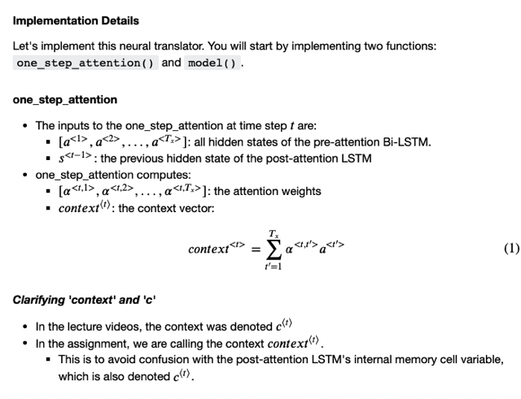</kbd>

 

##### Exercise 1 - one_step_attention

 

<kbd></kbd>

 

<kbd>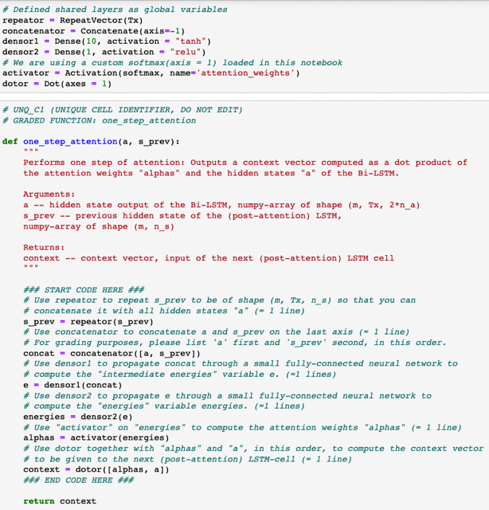</kbd>

> [!NOTE]
> s_prev (m,n_s) sau khi dc RepeatVector(Tx)(s_prev) sẽ có output là (m,Tx,n_s)

 

<kbd>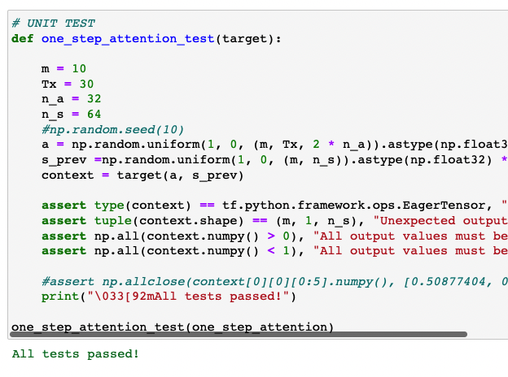</kbd>

 

##### Exercise 2 - modelf

 

<kbd>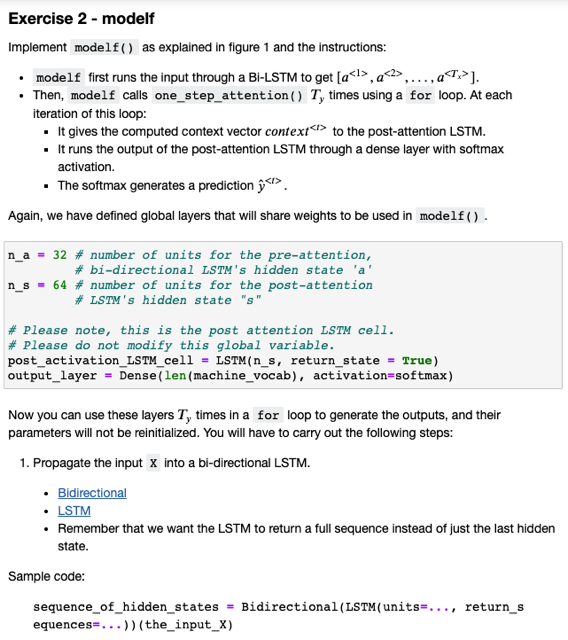</kbd>

 

<kbd></kbd>

 

<kbd>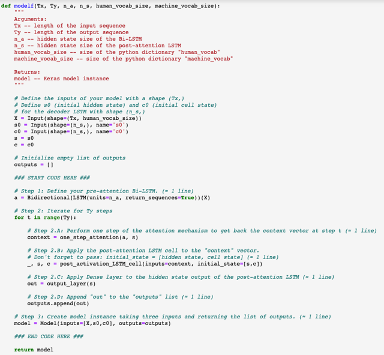</kbd>

 

<kbd></kbd>

<kbd></kbd>

 

<kbd>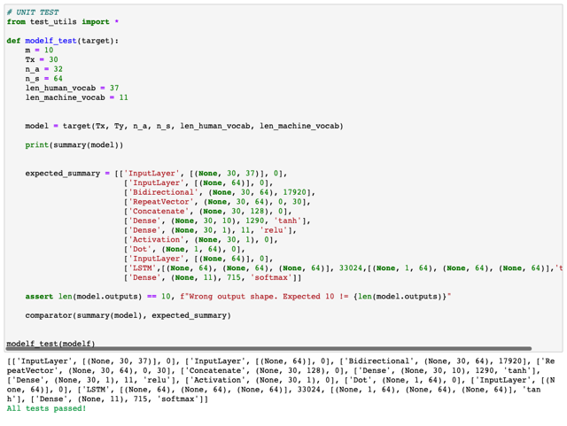</kbd>

 

<kbd></kbd>

 

##### Exercise 3 - Compile the Model

 

<kbd>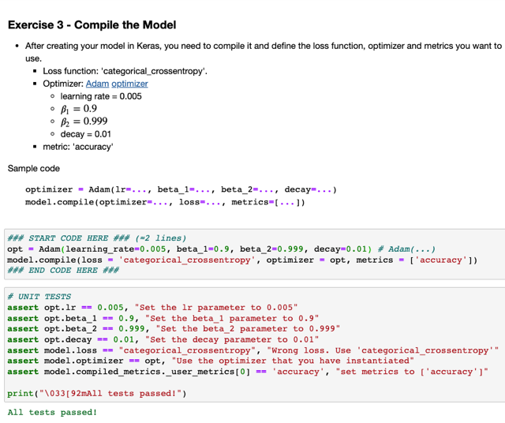</kbd>

 

<kbd></kbd>

 

<kbd></kbd>

 

<kbd>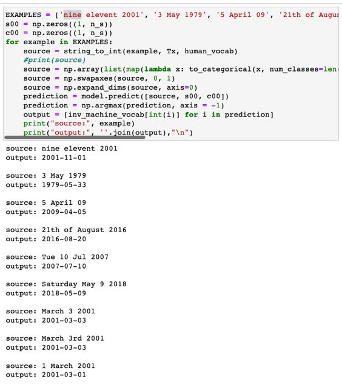</kbd>

 

##### 3 - Visualizing Attention (Optional / Ungraded)

 

<kbd>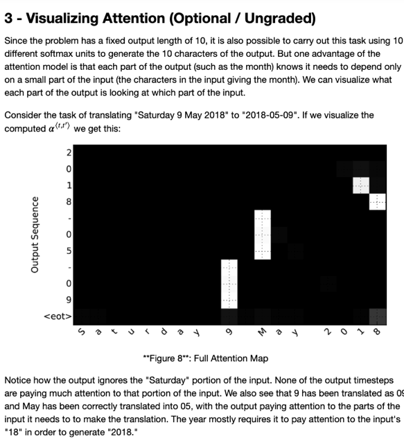</kbd>

 

##### 3.1 - Getting the Attention
Weights From the Network

 

<kbd>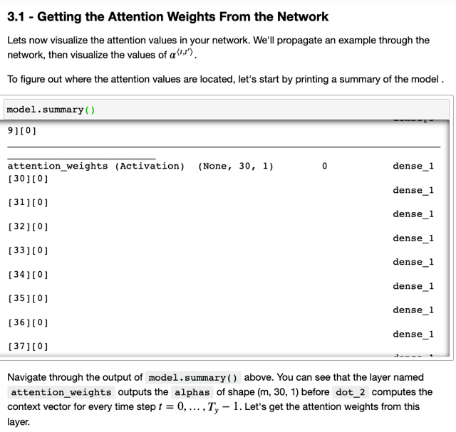</kbd>

 

<kbd>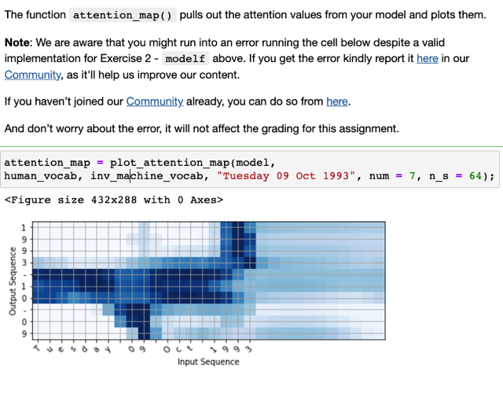</kbd>

 

##### \\*Congratulations! \\*You have come to the end of this assignment  \\*Here's
what you should remember \\*

• Machine translation models can be used to map from one sequence to
another. They are useful not just for translating human languages (like
French->English) but also for tasks like date format translation.

• An attention mechanism allows a network to focus on the most relevant
parts of the input when producing a specific part of the output.

• A network using an attention mechanism can translate from inputs of
length 𝑇𝑥  to outputs of length 𝑇𝑦, where 𝑇𝑥 and 𝑇𝑦 can be different.

• You can visualize attention weights 𝛼⟨𝑡,𝑡′⟩ to see what the network is
paying attention to while generating each output.

Congratulations on finishing this assignment! You are now able to
implement an attention model and use it to learn complex mappings from
one sequence to another.

 

### Programming Assignment

 

#### Welcome to the second and last programming assignment of Week 3!

In this week's videos, you learned about applying deep learning to speech
recognition. In this assignment, you will construct a speech dataset and
implement an algorithm for trigger word detection (sometimes also called
keyword detection, or wake word detection).

Trigger word detection is the technology that allows devices like Amazon
Alexa, Google Home, Apple Siri, and Baidu DuerOS to wake up upon
hearing a certain word. For this exercise, our trigger word will be "activate".
Every time it hears you say "activate", it will make a "chiming" sound. By
the end of this assignment, you will be able to record a clip of yourself
talking, and have the algorithm trigger a chime when it detects you saying "
activate". After completing this assignment, perhaps you can also extend it
to run on your laptop so that every time you say "activate" it starts up your
favorite app, or turns on a network connected lamp in your house, or
triggers some other event?

In this assignment you will learn to:
 • Structure a speech recognition project
 • Synthesize and process audio recordings to create train/dev datasets
 • Train a trigger word detection model and make predictions

<kbd></kbd>

 

##### Packages

 

<kbd></kbd>

 

##### 1 - Data synthesis: Creating a Speech Dataset

 

- **Let's start by building a dataset for your trigger word
detection algorithm.

• A speech dataset should ideally be as close as possible
to the application you will want to run it on.

• In this case, you'd like to detect the word "activate" in
working environments (library, home, offices, open-spaces
...).

• Therefore, you need to create recordings with a mix of
positive words ("activate") and negative words (random
words other than activate) on different background sounds.
Let's see how you can create such a dataset.**

 

##### 1.1 - Listening to the Data

 

- **• One of your friends is helping you out on this project, and they've gone to libraries,
cafes, restaurants, homes and offices all around the region to record background
noises, as well as snippets of audio of people saying positive/negative words. This
dataset includes people speaking in a variety of accents.

• In the raw_data directory, you can find a subset of the raw audio files of the
positive words, negative words, and background noise. You will use these audio files
to synthesize a dataset to train the model.

▪ The "activate" directory contains positive examples of people saying the word "
activate".

▪ The "negatives" directory contains negative examples of people saying random
words other than "activate".

▪ There is one word per audio recording.

▪ The "backgrounds" directory contains 10 second clips of background noise in
different environments.

Run the cells below to listen to some examples.**

 

<kbd>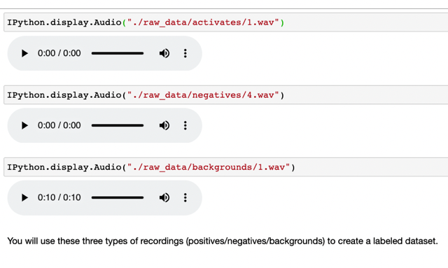</kbd>

 

##### 1.2 - From Audio Recordings to Spectrograms

 

<kbd></kbd>

> [!NOTE]
> Đại khái là data từ microphone sẽ cho ta 1 dãy các con số, 1 giây có 44.
> 000 số thể hiện sự thay đổi trong air pressure
>
>
>
> Đại khái là để dễ hơn cho training, ta tính ra 'spectrogram' của audio đại
> khái là nó cho biết những tần số khác nhau hiện diện trong audio gì đó
> dùng phép biến đổi Fourier với sliding window thầy bà gì nhà nó

 

<kbd></kbd>

> [!NOTE]
> Đại khái là xem thử 1 audio biến thành spectrogram như thế nào, ta
> hiểu đại khái là giúp nhìn được âm thanh, to nhỏ, cao thấp ra sao

 

<kbd>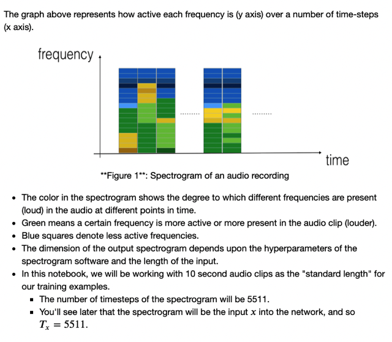</kbd>

> [!NOTE]
> Đại khái là màu xanh lá thể hiện tần số active cao hoặc xuất hiện nhiều (to),
> xanh dương là active thấp, cái cột cao hay thấp do hyperparams của software
> và chiều dài của input
>
>
>
> Số timestep là 5511 không biết sao nó lấy số này, nhưng tạm thời biết vậy Tx
> = 5511
>
>
>
> và thời gian tiêu chuẩn (không biết tiêu chuẩn cho cái gì) 
> sẽ là 10 giây

 

<kbd>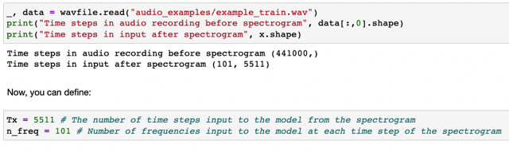</kbd>

 

<kbd></kbd>

> [!NOTE]
> Đại khái hiểu các con số này được chọn như hyper.params trừ
> 441000. Tx = 5511, Ty = 1375
>
>
>
> Nói đến dùng python module pydub gì đó để synthesize data

 

##### 1.3 - Generating a Single Training Example

Đại khái là tạo training data bằng cách 'ghép' đoạn
audio background noise, tiếng 'activate' và những
negative (từ không phải 'activate') và ghi lại kiểu như
thời điểm tiếng activate được chèn để tạo label y (y sẽ
là vector 1 chuỗi số 0, và 50 số 1 ở thời điểm kết thúc
chữ activate)

Trước hết là chuẩn bị các helper function

 

<kbd>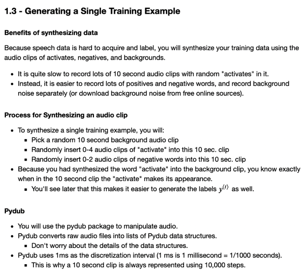</kbd>

> [!NOTE]
> Đại khái là tổng hợp (**synthesizing**) các âm thanh riêng lẻ ghi âm tiếng
> ' trigger word' = activate, negative word và background noise bằng
> **pydub**, mục đích là để dễ dàng hơn trong việc tạo label y - kiểu như
> nếu tự record 1 audio mà có noise, có trigger word ,,, thì **khó mà đánh
> dấu được trigger word nó ở vị trí nào**
>
>
>
> Đại khái là do pydub nó work theo kiểu từng 1 milliseconds nên dẫn đến
> mấy con số liên quan 10 second = 10.000 steps

 

<kbd></kbd>

 

<kbd></kbd>

 

<kbd>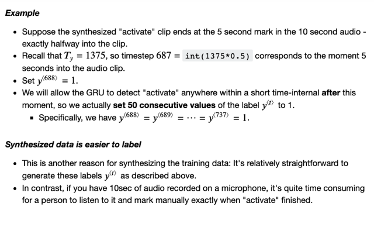</kbd>

 

<kbd>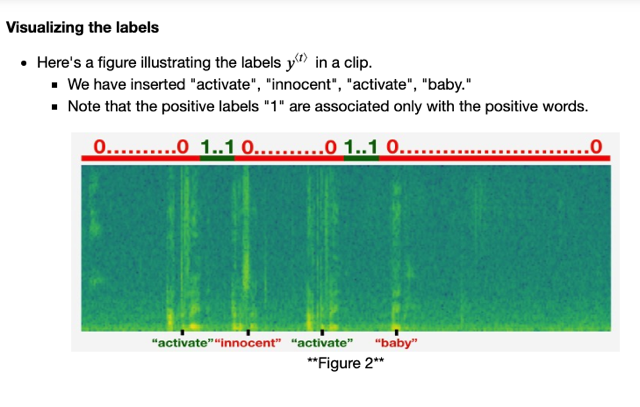</kbd>

 

<kbd></kbd>

 

<kbd>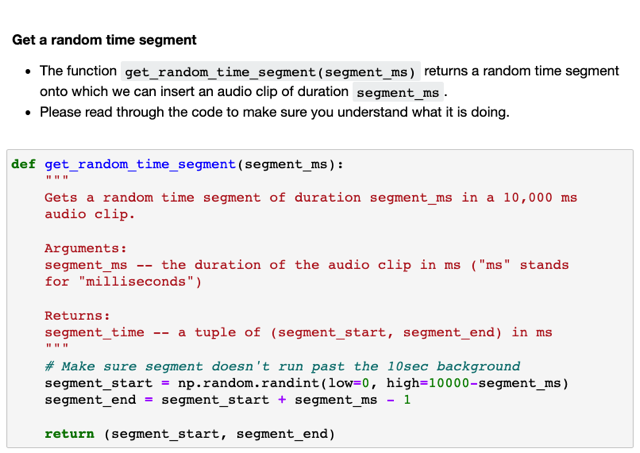</kbd>

> [!NOTE]
> Đại khái là nó tạo 1 cặp đầu đuôi nằm trong khoảng 0 - 10000 có độ dài
> bằng cái segment_ms đưa vào, ví dụ 500-550, 670-720 với segment_ms =
> 50 kiểu vậy

 

##### Exercise 1 - is_overlapping

Đại khái là check xem đoạn này có chèn tiếng nào
chưa (kiểu như tránh chèn chồng lấn các âm thanh '
activate' và các âm thanh không phải 'activate' khác

 

<kbd>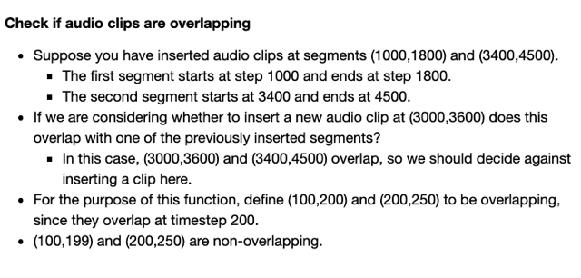</kbd>

 

<kbd>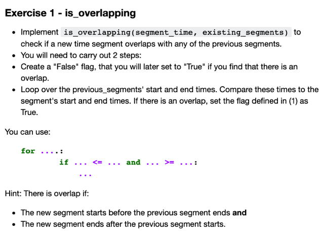</kbd>

 

<kbd>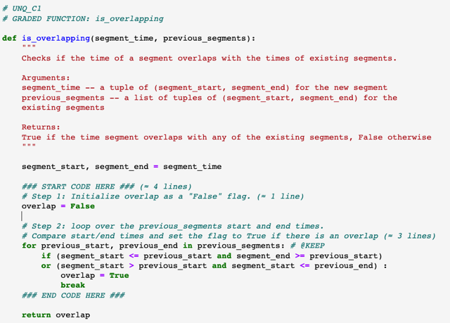</kbd>

 

<kbd></kbd>

 

##### Exercise 2 - insert_audio_clip

Đại khái là viết function nhận 1 background audio và 1
audio cần chèn để:

Chèn 1 âm thanh (có thể là ' activate' và không phải '
activate' chưa biết) vào audio background. Cách làm là
lấy ngẫu nhiên 1 thời điểm trong độ dài của background
sao cho nó chèn được âm thanh vừa (tính độ dài của
cái cần chèn trước, rồi mới lấy điểm đầu cuối một cách
ngẫu nhiên) dùng \\/\\*get_random_time_segment\\*\\/()

Phải check không chồng lấp với cái có sẵn (nếu có) bằng 
function \\/\\*is_overlapping\\*\\/() và
keep track những cái đã chèn bằng 1 list 

Cuối cùng là dùng pydub để thực hiện việc chèn (tạo ra
audio)

 

<kbd>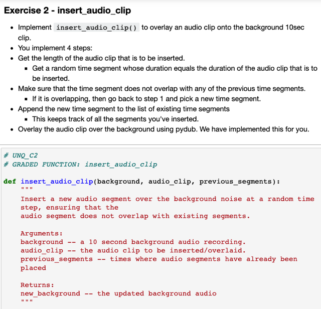</kbd>

 

<kbd>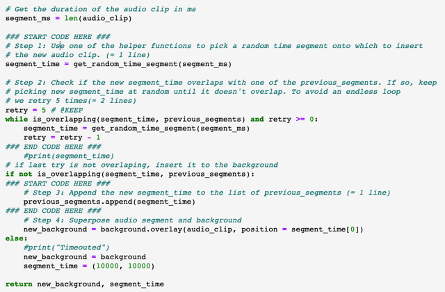</kbd>

> [!NOTE]
> Đại khái là viết function nhận 1 background audio và 1 audio cần
> chèn để:
>
>
>
> Chèn 1 âm thanh (có thể là ' activate' và không phải ' activate'
> chưa biết) vào audio background. Cách làm là lấy ngẫu nhiên 1
> thời điểm trong độ dài của background sao cho nó chèn được
> âm thanh vừa (tính độ dài của cái cần chèn trước, rồi mới lấy
> điểm đầu cuối một cách ngẫu nhiên) dùng
> **get_random_time_segment**()
>
>
>
> Phải check không chồng lấp với cái có sẵn (nếu có) bằng
> function **is_overlapping**() và keep track những cái đã chèn bằng
> 1 list
>
>
>
> Cuối cùng là dùng pydub để thực hiện việc chèn (tạo ra audio)

 

##### Exercise 3 - insert_ones

Đại khái là 'đánh số' 1 cho vị trí y<t+1> trở đi với 50 step tiếp
theo nếu âm thanh 'activate' kết thúc ở y<t>

Chú ý ở chỗ function nhận segment_end_ms đại khái là vị trí
trong 10000 milliseconds mà âm thanh kết thúc, nó phải
tương ứng với 1 vị trí (time step) \\*<t>\\* trong Ty = 1375 để rồi
mới set  y<t+1> -> y<t+50> = 1

Nên tìm t như chuyển đổi đơn vị vậy:

segment_end_y = int(segment_end_ms * Ty / 10000.0)

 

<kbd>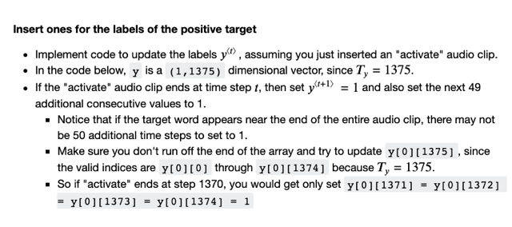</kbd>

 

<kbd>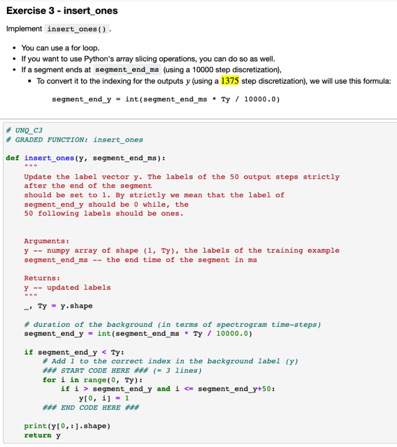</kbd>

 

<kbd>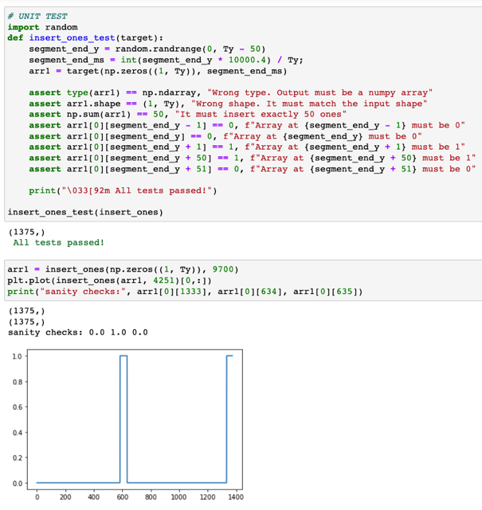</kbd>

 

<kbd>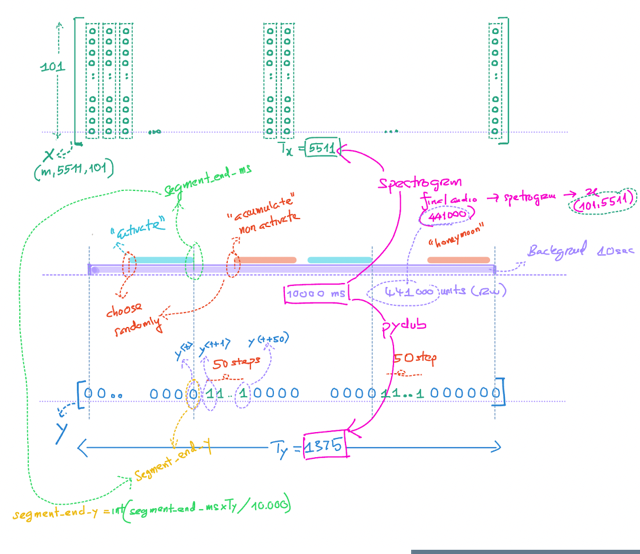</kbd>

 

##### Exercise 4 - create_training_example

Đại khái là function kết hợp những function trước lại để chọn
(ngẫu nhiên) vị trí và chèn activate và non-activate audio vào
background để là tạo training x và update label để tạo y.

x sẽ là spectrogram của cái clip hoàn chỉnh sau khi chèn Tx
= (5511,101) tạo bằng Spectrogram

(Spectrogram biến raw audio 10 giây 441000 unit thành matrix x (5511x101))

y sẽ là vector Ty = 1375

 

<kbd></kbd>

<kbd>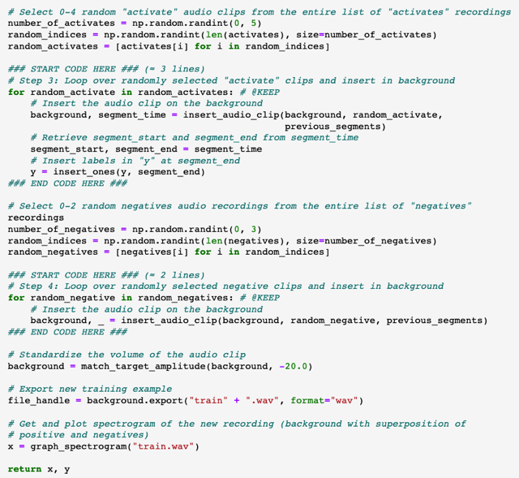</kbd>

 

<kbd></kbd>

 

##### 1.4 - Full Training Set

Chạy code để tạo bộ dataset 32 cái

 

<kbd>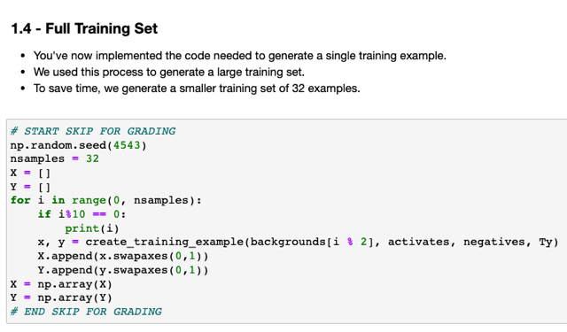</kbd>

 

<kbd></kbd>

> [!NOTE]
> Đại khái ổng để sẵn code nếu sau này
> muốn save dataset into a file

 

##### 1.5 - Development Set

Cái này đáng chú ý, đại khái là vì nguyên tắc 'cv set và test
set phải cùng 1 distribution' - tức là cv và test set càng giống
nhau càng tốt do đó vì test sẽ là audio thật (nơi mà ta sẽ nói '
activate' để ra lệnh cho wake up trigger  trong môi trường có
âm thanh nhiễu thật. Nên cv set cũng phải thu trực tiếp từ âm
thanh  real-life chứ không phải tạo bằng phương pháp như
tạo training set. 

Ở đây ổng record  25 cái clip như vậy

 

<kbd></kbd>

 

##### 2 - The Model

 

<kbd></kbd>

 

##### 2.1 - Build the Model

 

- **Our goal is to build a network that will
ingest a spectrogram and output a
signal when it detects the trigger word.
This network will use 4 layers:

* A convolutional layer
* Two GRU layers
* A dense layer.**

 

<kbd>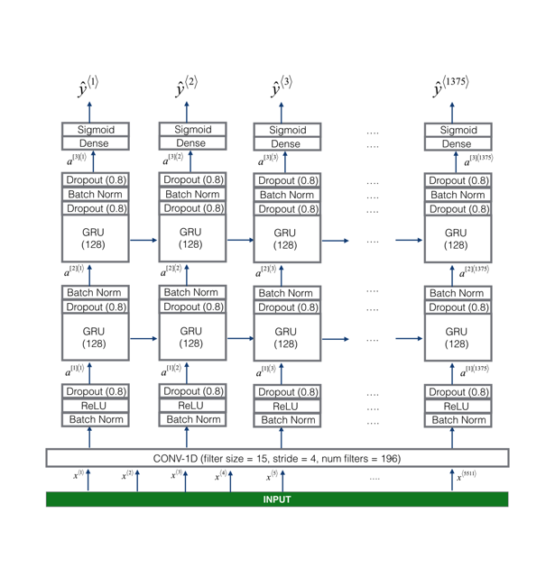</kbd>

 

<kbd></kbd>

 

<kbd></kbd>

 

<kbd>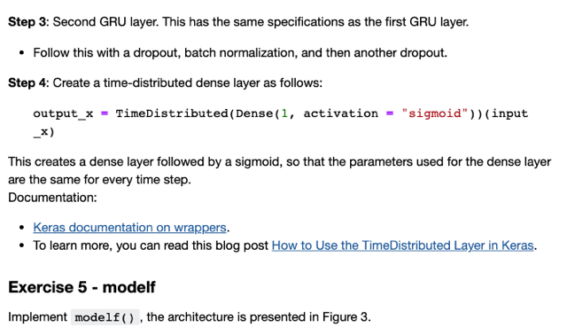</kbd>

 

##### Exercise 5 - modelf

Lần lượt define các layer như model structure

Cũng như các assignment dùng keras trước cảm thấy sao nó simple như vậy
nhưng cứ theo hướng dẫn mà define từng layer với out cái sau là input cái trước
thôi

Chỉ có cái mới là TimeDistributed() mà ổng nói mục đích là để  "parameters used
for the dense layer are the same for every time step" Chưa hiểu lắm đọc thêm
article này

https://machinelearningmastery.
com/timedistributed-layer-for-long-short-term-memory-networks-in-python/

 

<kbd>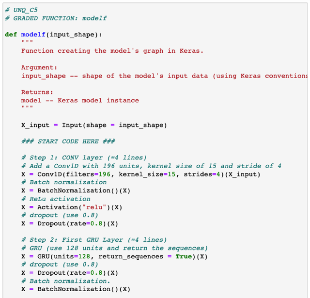</kbd>

<kbd></kbd>

 

<kbd></kbd>

 

##### 2.2 - Fit the Model

Đại khái là train cái model này mất khoảng mấy tiếng, nên ổng train
rồi mình load lại thôi.

Nhận xét ổng để model trong file json ta ơi

Tiếp nữa ổng nói nếu không muốn nó fine-tune tiếp cái pretrained model thì phải
Block các BatchNorm layer bằng cách 
set layer.trainable bằng False.

Cuối cùng define Optimizer là Adam với beta 1, beta 2, lossFunction là 'cross_entropy' vì
đây là predict ra 1 hay 0 (binary), metrics dùng 'accuracy'

 

<kbd>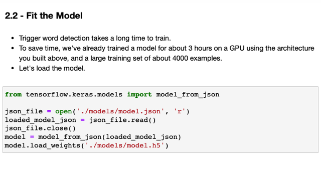</kbd>

 

<kbd></kbd>

 

##### 2.3 - Test the Model

Đại khái là dùng đây là Skewed problem nên đáng lý phải
dùng  metric khác như Precision/Recall hơn là 'accuracy'
nhưng thôi tạm thời vậy

 

<kbd>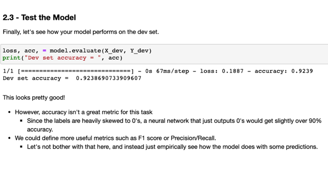</kbd>

 

##### 3 - Making Predictions

Đại khái là function này nó nhận file name rồi dùng Spectrogram code để biến
thành sample data x rồi bỏ vào model.predict ra predictions
đồng thời plot ra prediction

 

<kbd>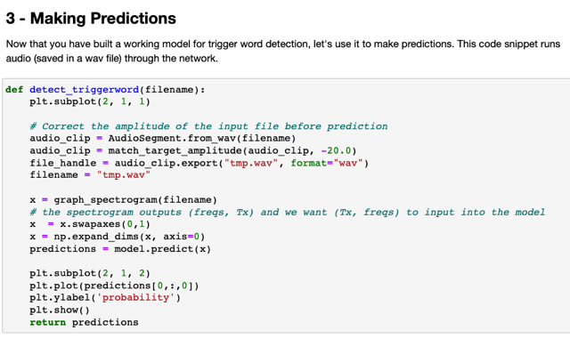</kbd>

 

<kbd>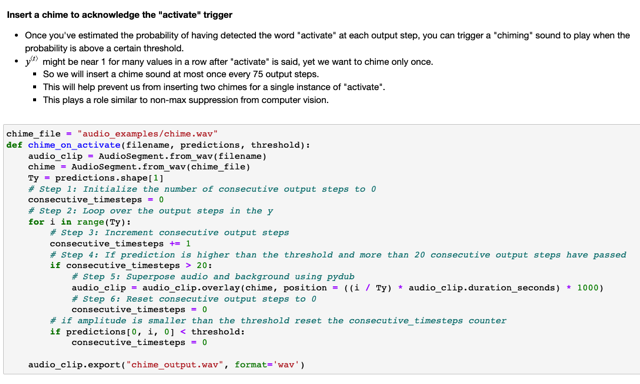</kbd>

 

##### 3.1 - Test on Dev Examples

 

<kbd>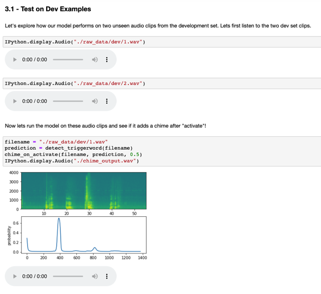</kbd>

 

<kbd></kbd>

 

##### \\*Congratulations \\*You've come to the end of this assignment!

\\*Here's what you should remember: \\*

• Data synthesis is an effective way to create a large training set for
speech problems, specifically trigger word detection.

• Using a spectrogram and optionally a 1D conv layer is a common
pre-processing step prior to passing audio data to an RNN, GRU or
LSTM.

• An end-to-end deep learning approach can be used to build a very
effective trigger word detection system. \\/

Congratulations\\/ on finishing this assignment!

 

##### 4 - Try Your Own Example! (OPTIONAL/UNGRADED)

 

## C5w4_transformer Network

 

### Transformers Network

 

#### Transformer Network Intuition

 

##### Main idea:

The transformer architecture is a complex neural network architecture that
has \\*revolutionized the field of NLP\\*. It allows for \\*parallel processing of
sequences\\*, unlike traditional sequential models such as RNNs, GRUs, and
LSTMs.

The major innovation of the transformer architecture is \\*combining\\* the use of
\\*attention-based representations\\* and a \\*CNN-style of processing\\*.

\\*Self-attention\\* and \\*multi-headed attention\\* are the two key ideas that go into
\\*computing rich representations\\* for \\*all the words in a sentence in parallel.\\*
These representations can be used for machine translation or other NLP
tasks to create effectiveness.

The transformer architecture was introduced in a seminal paper and has
been widely used in the field.

The next few videos will dive into the transformer architecture piece by piece
so that viewers can understand how it works and apply it with ease.

 

<kbd>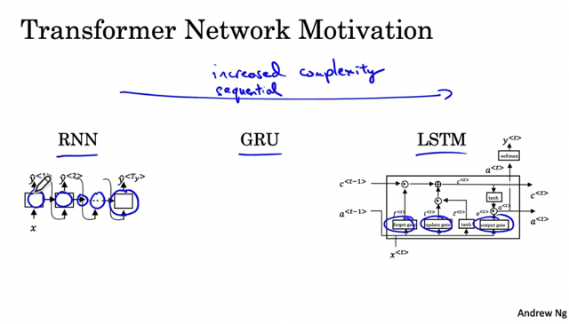</kbd>

> [!NOTE]
> Đại khái là ổng nói  RNN thì bị vanishing gradient khiến mất thông tin
> khi phải truyền đường dài và GRU và LSTM giúp khắc phục chuyện đó
> trong việc nắm bắt "long range dependencies and sequences"
>
>
>
> Bất lợi là structure ngày càng phức tạp, và mỗi unit như 1 bottleneck
> khiến thông tin bị chậm đi khi phải di chuyển qua nhiều 'node' (ví dụ
> trong sequence model) nên Transformer nó sẽ giúp thông tin đi song
> song cùng lúc với nhau

 

<kbd></kbd>

> [!NOTE]
> Đại khái là
>
>
>
> Transformer network kết hợp tính chất 'parallel' của CNN, và Attention
> based representation
>
>
>
> 2 key ideas là **Self-attention**: Đại khái ví dụ ta có một chuỗi 5 từ thì
> ta sẽ tính ra representation của 5 từ đó.
>
>
>
> **Multi-head attention** thì dùng for loop để tìm những version khác
> nhau của những representation này.
>
>
>
> Và turn out là những **representation này rất giàu thông tin**, có thể dùng
> cho Machine Translation hay những NLP task khác

 

#### Self-attention

 

##### 1 Self-attention mechanism of transformers is \\*the most
important core idea\\* behind what makes transformer networks
work.

2 To \\/\\*use attention with a style more like CNNs\\*\\/, you need to
\\*calculate self-attention\\*, where you create \\*attention-based
representations for each of the words in your input sentence\\*.

3 For every word, you have three values called the \\*query\\*, \\*key\\*,
and \\*value\\*, which are the key inputs to \\*computing the attention
value for each word\\*.

4 The query, key, and value vectors are supposed to \\*pull up
the most information\\* that's needed to help compute the most
useful representation.

5 The goal of the operation is to \\*create attention-based
representations\\* for each word that \\_\\*look at the surrounding
words to figure out what's actually going on in how we're
talking about the word in the sentence.\\*\\_

 

<kbd>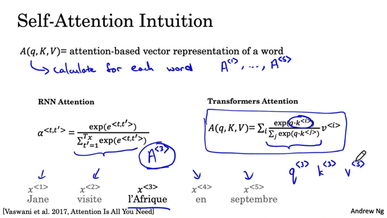</kbd>

<kbd></kbd>

> [!NOTE]
> Đại khái là ta cũng **embedding 1 từ thành 1 embedded vector**
>
>
>
> Nhưng thay vì chỉ đơn giản là look up embbeded vector từ
> Embedded matrix thì bây giờ..
>
>
>
> **Dựa vào hoàn cảnh**, sẽ chọn / **tính các embedded vector khác nhau
> kiểu như tuỳ tình huống phù hợp với từ này trong câu**.
>
>
>
> Kiểu như Africa là 1 châu lục? Africa là 1 di tích lịch sử? Africa là một địa
> điểm du lịch?
>
>
>
> Đó là **representation** vector A gọi là '**attention-based vector
> representation of a word**' = **vector đại diện của 1 từ được tính toán
> dựa trên hoàn cảnh xung quanh của từ đó**.
>
>
>
> Và khi tính toán thì thực ra nó cũn không khác mấy các cơ chế attention
> trong RNN bữa trước chỉ khác cái là nó làm /. tính **CÙNG LÚC** cho 5 từ
> trong câu chứ không phải 1.
>
> Nhìn trong công thức thấy sự tương đồng khi dùng softmax

 

<kbd></kbd>

<kbd>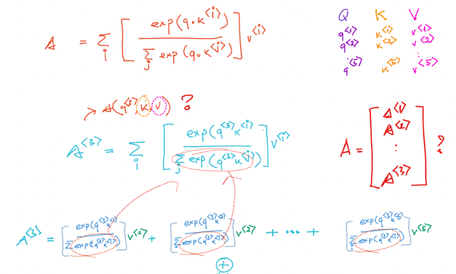</kbd>

<kbd></kbd>

> [!NOTE]
> Câu hỏi: Ở Africa có gì xảy ra?
>
>
>
> Thì q<3>.k<1> sẽ đánh giá là nếu trả lời là 'Jane' thì tốt như thế nào.
> tương tự,
> Thì q<3>.k<2> sẽ đánh giá là nếu trả lời là 'visit' thì tốt như thế nào.
> Và tương tự vậy cho các từ khác.
>
>
>
> Tất cả nhằm mục đích:
> Gom tất cả thông tin cần thiết để tìm ra đại diện tốt nhất / hữu ích nhất
> = representation A<3> cho từ thứ 3 - l'Afrique.
>
>
>
> Rồi giả sử đại khái kết quả thấy q<3>.k<2> cho ra số lớn thì đại khái
> cho biết trạng thái phù hợp nhất để  Africa là một điạ điểm để visit.
>
>
>
> Rất khó giải thích nhưng hiểu hiểu đại khái là tìm ra cách để **embbed 
> tốt nhất đại diện cho 1 từ.**
>
> "The key advantage of this representation is the word of l'Afrique
> **isn't some fixed word embedding**. Instead, it lets the
> **self-attention mechanism realize that l'Afrique is the destination
> of a visite**, of a visit, and thus **compute a richer, more useful
> representation** for this word"
>
>
>
> Hiểu đại khái là A<3> không chỉ là một **fixed** word embedding -
> mà là một embedding **mang trong mình nhiều thông tin hữu ích
> hơn về hoàn cảnh của nó,** cụ thể trong tình huống này nó là một
> destination để mà visit
>
> Công thức tổng quát là vầy
>
>
>
> Denominator có dấu sqrt chỉ là để **scale cái dot-product attention**
>
>
>
> "The term in the denominator is just to scale the dot-product, so it
> **doesn't explode**. You don' t really need to worry about it. But another
> name for this type of attention is the **scaled dot-product attention**."
>
> q<3> = W(Q).x<3>
> k<3> = W(K).x<3>
> v<3> = W(V).x<3>

 

<kbd></kbd>

> [!NOTE]
> To recap, associated with each of the five words you end up with a
> **query**, a **key**, and a **value**.
>
>
>
> The **query** lets you ask a question about that word, such as what's
> happening in Africa.
>
>
>
> The **key** looks at all of the other words, and **by the similarity to the
> query**, helps you figure out which **words gives the most relevant answer
> to that question**. In this case, visite is what's happening in Africa,
> someone's visiting Africa.
>
>
>
> Then finally, the **value** allows the representation to plug in **how 'visite'
> should be represented within A^3**, within the representation of Africa.
>
>
>
> This allows you to come up with **a representation for the word Africa
> that says this is Africa and someone is visiting Africa**. This is a **much
> more nuanced, much richer representation** for the word than if you just
> had to pull up the same fixed word embedding for every single word
> **without being able to adapt it based on what words are to the left and
> to the right of that word**. We've all got to **take into account and in the
> context**. Now, you have learned about the self-attention mechanism
>
> Đại khái là thông qua query, key và value mà ta tính
> toán được 1 vector representation của 1 từ mang
> trong mình thông tin hữu ích về hoàn cảnh của từ đó
> chứ không chỉ là 1 embedding vector luôn giống nhau

 

<kbd></kbd>

<kbd></kbd>

 

- **Có mấy cái mà mr Andrew hoàn toàn không nói tới hoặc mình không tự
hiểu được đó là  Ba cái matrix Q, K, V được tạo ra như thế nào

Thì đây, đaị khái là một cái Attention (không phải Self-attention nha) sẽ
cần 3 cái \\*INPUT PARAMS có tên là Query, Key và Value

\\*và ba cái này sẽ dùng để tính ra Q, K, V.

Và (cái này thì ông Andrew có hint) là để làm Self-attention thì ba cái
Query, Key và  Value sẽ \\*giống nhau\\*

Đại khái là ta sẽ bỏ cái embedding-encoding block vào và cho nó \\*ĐỒNG
THỜI LÀ Query, Key, và Value

Rồi nó tính Q, K, V như thế nào?\\*

Đại khái là thông qua \\*linear layer\\* của Attention với các weights matrix \\*W_Q\\*, \\*W_K\\*,
\\*W_V\\* - Đều có size là (\\*emb_dim\\*, \\*emb_dim\\*). Qua các linear layer này Query, Key,
Value input params (mà ta sẽ gán vào cho tụi nó bằng cái embedded sequence bao gồm
word embedding và positional embedding) sẽ \\*" tạo ra"\\* ba matrix \\*Q\\*, \\*K\\*, \\*V\\*
- đều có shape là \\*sequence_len\\* x \\*emb_dim\\*.

Rồi từ Q,K,V nó sẽ tính ra \\*attention score\\* và nói ngắn gọn cộng với những cái mà Andrew
cũng đã nói và giải thích rõ trong article 4 của loạt bài đó là: Trong quá trình training, tất cả
các \\*word embedding vectors\\* và \\*weights\\* của Attention linear layers \\*W_Q\\*, \\*W_K\\*,\\*W_V\\* sẽ được
\\*train\\* sao cho cách sắp xếp/kiến trúc của attention giúp minimize loss qua đó tìm ra được
các weight và embedding sao cho word embedded vector phản ánh tốt nhất thông tin của 1
từ.Khúc cuối này khá khó diễn đạt, nhưng đại khái là cách kiến trúc của Attention sẽ giúp khi
training nó sẽ cải thiện dần dần embedding vector đồng nghĩa giảm dần cost.**

 

#### Multi-head Attention

 

##### 1 Multi-head attention mechanism is a modification of self-attention
mechanism that involves \\*computing multiple self-attentions\\* for a given
sequence.

2 The input vectors Q, K, and V are multiplied by matrices WQ, WK, and
WV to obtain query, key, and value vectors for each input term.

3 The same set of query, key, and value vectors are used to compute
multiple self-attentions.

4 Each self-attention calculation for a sequence is called a \\*head\\*, and the
number of heads is denoted by \\*'h'\\*.

5 \\*Each head represents a different feature\\*, and the final output is the
\\*concatenation of all the heads\\*.

6 The different heads' values can \\*be computed in parallel\\* because no
head's value depends on the value of any other head.

7 In practice, the computation of different heads' values is not done in a big
for-loop.

 

<kbd>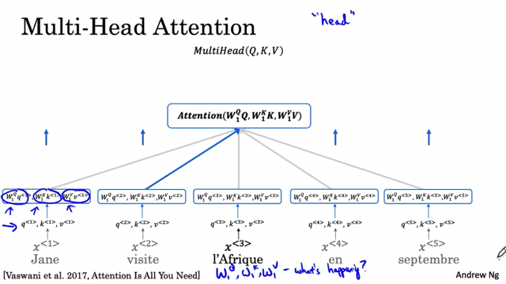</kbd>

> [!NOTE]
> 1 "head" kiểu như 1 bộ các vector
> representation, multi-head có nghĩa là tính
> ra nhiều bộ chứ không chỉ có 1.
>
>
>
> Trong đó, để tính ra một bộ thì ta làm gì?
>
>
>
> Đ.v mỗi từ tính, ví dụ từ thứ nhất ta ra q<1>, k<1>, v<1> 
> Tính inner dot W1_Q.q<1>, W1_K.k<1>, W1_V.v<1>
>
>
>
> Làm vậy với các từ khác
>
>
>
> Cuối cùng là dùng các kết quả đó để tính ra "representation" của các
> từ, tạo thành một bộ các representation đầu tiên, đó là một 'head'
>
>
>
> Với 'head' đầu tiên này, biểu thị bởi số 1 trong W1_Q, W1_K, W1_V
> các matrix này kiểu được encoded để đặt câu hỏi: Điều gì đã xảy ra ở l'Afrique.
>
>
>
> Và trong quá trình tính toán (học. huấn luyện) nó cho thấy "visit" 
> đóng vai trò quan trọng để trả lời câu hỏi này, biểu thị bằng giá trị
> của W1_Q.q<2>, W1_K.k<2>, W1_V.v<2> "lớn nhất" (lớn nhất 
> như thế nào thì để hiểu hơn sau)

 

<kbd>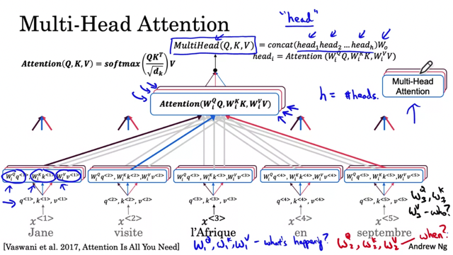</kbd>

> [!NOTE]
> Xong head 1, tính head 2 thì  **W2_Q,K,V**...đại khái biểu thị câu hỏi khác,
> **khi nào** ở l'Afrique (**When**?) và cũng tính tương tự  để tính ra 1 bộ
> representation vector của các từ gọi là head #2
>
>
>
> Thì head 2 mang trong mình những thông tin hữu ích để trả lời câu hỏi "When"
> đ/v các từ - Chú ý là đ/v các từ nha, vì mỗi representation vector cho mỗi từ.
>
>
>
> Làm tương tự như vậy với **h** lần ví dụ 3 lần (h = 3) hay 8 lần (h=8). Ta có 8
> heads.
>
>
>
> Bây giờ **stack các head (concatenate)** lại và nhân cho một cái W_0 để tạo
> thành một ...**multi-head**
>
>
>
> Thì cái multi-head này chứa rất nhiều thông tin hữu ích của các  từ trong câu
> này.
>
>
>
> Và dù ổng nói cứ hình dung là ta lần lượt tính các head này nhưng  Thực tế thì
> ta **tính nó cùng lúc (parallel)** vì các head này độc lập với nhau

 

#### Transformer Network

 

##### 1 The transformer architecture \\*combines self-attention\\* and \\*multi-headed
attention\\* mechanisms to perform sequence to sequence translation
tasks.

2 The encoder block takes the \\*word embeddings\\* as input and uses
\\*multi-headed attention to compute Q, K, and V matrices\\* which are then
passed through a \\*feed-forward neural network\\*.

3 The \\*decoder\\* block generates the English translation \\*by using
multi-headed attention to compute Q, K, and V matrices from the
previous output\\* and the \\*French sentence embeddings\\*, and passing
them through a \\*feed-forward neural network\\* to \\*generate the next word in
the sequence\\*.

4 The transformer architecture uses \\*positional encoding\\* to account for
the position of each word in the input sequence.

5 The transformer architecture is \\*repeated N times\\*, typically \\*six\\*, to
\\*improve the accuracy\\* of the translation task.

6 The transformer architecture has additional features such as \\*residual
connections\\*, \\*layer normalization\\*, and \\*masked multi-headed attention\\* to
improve its performance.

 

<kbd></kbd>

> [!NOTE]
> *Tất cả đều chỉ là hiểu đại khái như sau:
>
>
>
> Có vẻ như (trong bài trước mình chưa hiểu rõ lắm) đó là
> kết quả của bước multi-head attention tính ra representation
> của các từ gì đó chính là Q, K, V??? Cái này khi làm assignment
> sẽ quay lại xác nhận sau
>
>
>
> Trong thực tế người ta hay có thêm SOS (start of
> sentence)  token nữa sẽ hữu ích
>
>
>
> N times: Tính ra rồi lấy kết qủa quay ngược lại tính lại
>
>
>
> Mask: Che đi 1 phần, rồi xem thử n.n nó predict còn
> lại ra sao
>
>
>
> Add & Norm: Giống như batch norm giúp tăng tốc
>
>
>
> Positional encoding: công thức sin, cos là để mỗi
> vector p<> của mỗi từ đều khác nhau, và việc tính PE
> là để giúp lưu giữ thông tin vị trí của từng từ trong câu
> giúp ích cho sự translation

 

<kbd></kbd>

> [!NOTE]
> Giải thích đại khái cái block thứ 2 Decoder:
>
>
>
> Ban đầu câu translation chưa có gì chỉ có SOS
>
>
>
> bỏ vào Multi-Head attention tính ra Q,
>
>
>
> Xong mới lấy K, V từ Encoder để vào M.H.A và
> FFNN và quay lại N lần để tính ra chữ thứ 2 là
> gì, hy vọng là nó ra 'Jane'.
>
>
>
> Có nghĩa là nó pull thông tin từ Encoder kết
> hợp những từ đã predict (Ban đầu chỉ có SOS -
> Bất đầu câu, sau đó là <SOS> Jane, <SOS>
> Jane visit..) để predict ra từ tiếp theo.

 

<kbd></kbd>

> [!NOTE]
> Giả sử **word embedding vector** của các từ là có 4 dimension,
> đồng nghĩa x<1>, x<2>,...đều là vector 4 dimensions
>
>
>
> Ta sẽ tạo tương ứng các **positional embedding vector** cũng có
> dimension = 4 p<1>, p<2>...
>
>
>
> Thì trong công thức tính PE, **pos** là 'numerical position' của từ, đối
> với "Jane" thì pos = 1
>
>
>
> '**i**' là vị trí trong encoding vector = 0,1,2,3
>
>
>
> Thì **sin, cos** đại khái là để tạo 1 **unique** (positional encoding)
> vector cho mỗi từ
>
>
>
> Ổng vẽ mấy cái plot của các i khác nhau là để giải thích 
> rằng sin, cos sẽ giúp p<1> (màu xanh) khác p<3> (màu tím)
>
>
>
> Và p<1> sẽ add directly vào x<1>
>
> Ngoài ra còn nói về **'Residual network**' giống như ở ResNet
>
>
>
> Nhớ lại Residual ở C4 mục đích đại khái là để giữ thông tin lỡ may
> bị gradient vanishing
>
>
>
> "And their purpose in this case is to **pass along positional
> information** **through the entire architecture**."
>
> Đại khái là với RNN thì do mình feed info vào từng từ một nên cơ bản nó có
> thông tin vị trí của các từ trong câu, còn với cái này (Transformer network) tất
> cả các từ xử lý cùng lúc nên không biết thứ tự của từ trong câu, positional
> encoding là để cung cấp thông tin này

 

<kbd></kbd>

> [!NOTE]
> "When training you have access to the entire correct
> English translation, the correct output and they're
> correct input.
>
>
>
> And because you have the full correct output you don't
> actually have to generate the words one at a time
> during training.
>
>
>
> Instead, what masking does is it blocks out the last part
> of the sentence to mimic what the network will need to
> do at test time or during prediction.
>
>
>
> In other words, all that mask multi- head attention does
> is repeatedly pretends that the network had perfectly
> translated.
>
>
>
> Say the first few words and hides the remaining words
> to see if given a perfect first part of the translation,
> whether the neural network can predict the next word in
> the sequence accurately."

 

#### Loạt Bài Về Transfomrer Của Ketan Doshi

 

##### Part 1 - Overview

 

- **What's a Tramfromer**

 

<kbd></kbd>

 

<kbd>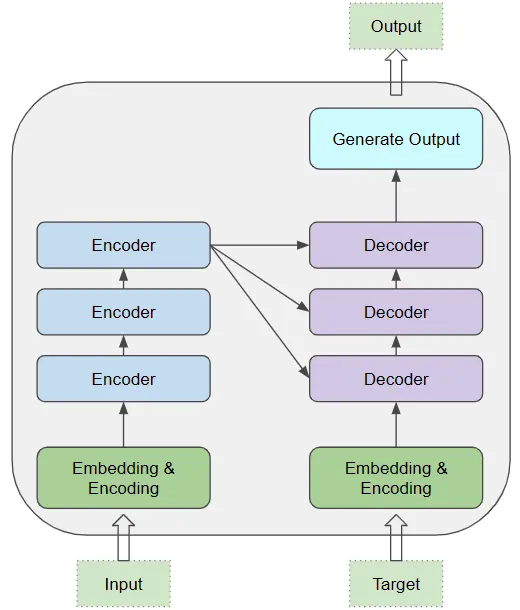</kbd>

> [!NOTE]
> Đại khái là kiến trúc như hình:
> Tất cả các Encoder đều giống nhau hết, Decoder cũng
> vậy

 

<kbd>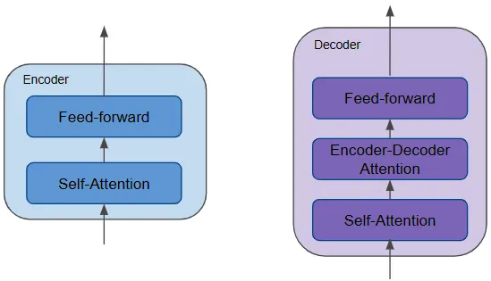</kbd>

> [!NOTE]
> The Encoder contains the all-important Self-attention layer that
> computes the relationship between different words in the sequence, as
> well as a Feed-forward layer.
>
>
>
> The Decoder contains the Self-attention layer and the Feed-forward
> layer, as well as a second Encoder-Decoder attention layer.
>
>
>
> Each Encoder and Decoder has its own set of weights.

 

<kbd>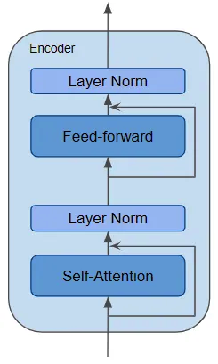</kbd>

> [!NOTE]
> Nhìn kĩ vào trong 1 Encoder, có Self-Attention
> layer, Feed-forward layer với Residual-skip
> connection và LayerNorms

 

- **What Attention do?**

 

<kbd>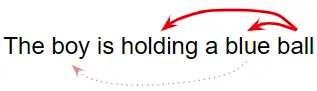</kbd>

> [!NOTE]
> Đại khái là nó giúp nắm bắt được từ nào thì quan hệ
> gần gũi / xa cách với từ nào
>
>
>
> "While processing a word, Attention enables the
> model to **focus** on other words in the input that
> are **closely related** to that word."
>
>
>
> Ví dụ trong câu này thì ball gần gũi với holding và
> blue hơn là boy. Kiểu như khi cần trả lời câu hỏi  "
> Làm gì với ball?" ->  Holding "Ball như thế nào?" ->
> Blue

 

- **eg. Consider two sentences:

The \\*cat\\* drank the milk because \\*it\\* was hungry.
The cat drank the \\*milk\\* because \\*it\\* was sweet.**

> [!NOTE]
> Ví dụ trong 2 câu này thì từ 'it' "chỉ" tới 2 cái khác nhau

 

<kbd></kbd>

> [!NOTE]
> Đại khái là quan hệ của 'it' với các từ 'cat','milk' trong 2 câu sẽ hoàn toàn khác nhau.
> Câu đầu nó gắn mạnh với từ 'cat' hơn câu sau nó gắn mạnh với 'milk' hơn.

 

<kbd></kbd>

> [!NOTE]
> Đại khái là Transformer sẽ include nhiều
> attention scores cho mỗi từ

 

- **Training the Transformer**

 

<kbd></kbd>

 

- **1.The input sequence is \\*converted\\* into \\*Embeddings\\* (with \\*Position Encoding\\*)
and \\*fed to the Encoder.\\*

2.The stack of Encoders processes this and produces an \\*encoded
representation of the input sequence\\*.

3.The \\*target sequence\\* is \\*prepended\\* with a \\*start-of-sentence token\\*, converted
into \\*Embeddings\\* (with Position Encoding), and fed to the Decoder.

4.The stack of Decoders processes this \\*along with the Encoder stack’s
encoded representation\\* to produce an \\*encoded representation of the target
sequence\\*.

5.The Output layer \\*converts\\* it into \\*word probabilities\\* and the \\*final output
sequence\\*.

6.The Transformer’s \\*Loss function\\* \\*compares\\* this output sequence with the
target sequence from the training data. This loss is used to generate gradients
to train the Transformer during \\*back-propagation\\*.**

 

- **Inference**

 

<kbd></kbd>

> [!NOTE]
> Đại khái là Inference khác Training là (tất nhiên) không có
> một target nào để 'bỏ vào' Decoder' mà thay vào đó là các '
> kết quả' từ previous step giống như Seq2Seq
>
>
>
> Nhưng thay vì chỉ bỏ 1 từ 'previous' step output gần nhất thì
> bỏ tất cả sequence dc tạo ra .

 

- **1.The input sequence is \\*converted\\* into \\*Embeddings\\* (with \\*Position Encoding\\*) and \\*fed
to the Encoder.\\*

2.The stack of Encoders \\*processes\\* this and produces\\* an encoded representation\\* of
the input sequence.

3.Instead of the target sequence, we use an \\*empty sequence\\* with only a
\\*start-of-sentence token\\*. This is converted into \\*Embeddings\\* (with \\*Position Encoding\\*)
and \\*fed to the Decoder.\\*

4.The stack of Decoders \\*processes\\* this along \\*with the Encoder stack’s encoded
representation\\* to produce an \\*encoded representation of the target sequence.\\*

5.The Output layer \\*converts\\* it into \\*word probabilities\\* and produces an \\*output
sequence\\*.

6.We \\*take the last word of the output sequence\\* as the \\*predicted word\\*. That word is
now filled into the second position of our Decoder input sequence, which now contains
a start-of-sentence token and the first word.

7.Go back to step #3. As before, feed the new Decoder sequence into the model. Then
\\*take the second word of the output and append it to the Decoder sequence\\*. Repeat
this \\*until it predicts an end-of-sentence token\\*. Note that since the Encoder sequence
does not change for each iteration, we do not have to repeat steps #1 and #2 each
time (\\/Thanks to Michal Kučírka for pointing this out\\/).**

 

- **Teacher Forcing**

 

- **Đại khái là, cái việc ta bỏ và để model nó học từ Target sentence
vào Decoder giống như là ta đưa đáp án cho nó để giả sử nó có
predict một từ sai, thì từ tiếp theo sẽ vẫn được dựa trên giả định là
những từ trước đều đúng (nhờ target sentence) giúp không bị sai
càng sai, kiểu vậy.

Và để ý cái target không chỉ đóng vai trò như thông thường nơi mà
chỉ dùng target (hay label) trong việc tính loss function

Ngoài ra còn giúp cho việc ouptut tất cả các từ cùng lúc nữa giúp
tăng tốc quá trình rất nhiều**

 

- **What are Transformers used for?**

 

- **Rất nhiều trong những NLP task như language model
và text classification. Machine Translation, Text
Summarization, Question-Answering, Named Entity
Recognition..**

 

- **Transformer Classification architecture**

 

<kbd></kbd>

 

- **Transformer Language Model architecture**

 

<kbd></kbd>

 

- **How are they
better than RNNs?**

 

<kbd>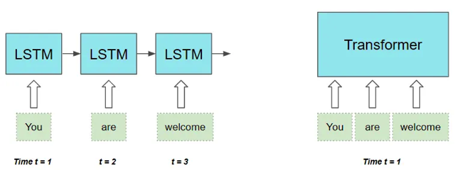</kbd>

> [!NOTE]
> Đại khái là như mr Andrew đã có nói đến, cái Transformer sẽ kết
> hợp ưu điểm của CNN trong việc sử lý cùng lúc giúp tăng tốc
> quá trình training và inference và cái Attention-based learning
> giúp nắm bắt thông tin ngữ cảnh (đại loại vậy). Khắc phục hạn
> chế của RNN (ko xử lý cùng lúc dc, CNN không xử lý thông tin
> chuỗi được)

 

##### Part 2 - How It Work

 

- **Architecture Overview**

 

<kbd>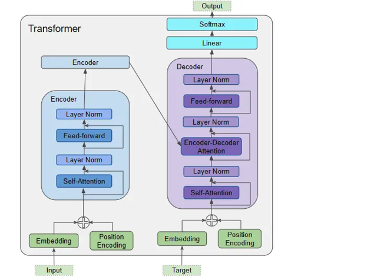</kbd>

 

- **Data inputs for both the Encoder and Decoder, which
contains:   
Embedding layer   
Position Encoding layer

The Encoder stack contains a number of Encoders. Each
Encoder contains:   
Multi-Head Attention layer   
Feed-forward layer

The Decoder stack contains a number of Decoders. Each
Decoder contains:   
Two Multi-Head Attention layers
Feed-forward layer

Output (top right) — generates the final output, and contains:
Linear layer   Softmax layer.**

 

- **Embedding and Position Encoding**

 

- **Embedding**

 

<kbd></kbd>

> [!NOTE]
> Input sequence thì bỏ vào Input Embedding, target
> sequence thì bỏ vào Output Embedding (có tên vậy vì
> khi inference, thì ko có target sequence mà thay bằng
> chính output sequence)

 

<kbd>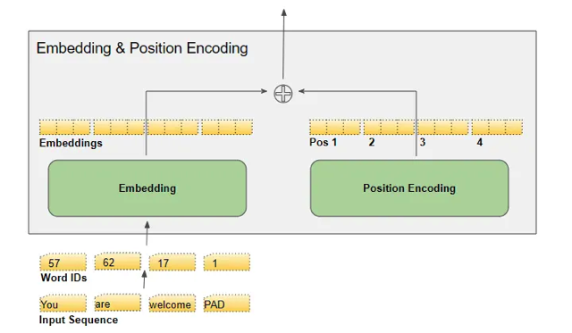</kbd>

> [!NOTE]
> Đại khái như đã biết, mỗi từ sẽ được. map với một
> numeric id dùng một vocabulary, rồi embedding layer sẽ
> map mỗi từ với một embedding vector

 

- **Position Encoding**

 

- **Ở đây giải thích tại sao phải có position encoding,
đại khái là vì với cách làm không còn 'handle' từng từ
một bỏ vào model mà sẽ 'làm' cùng lúc, dẫn đến
không còn có thông tin về vị trí của từ trong câu nữa
nên phải dùng cách này để bổ sung**

 

<kbd>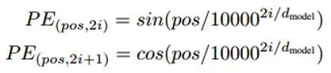</kbd>

> [!NOTE]
> Các vị trí của pe vector sẽ tính theo công thức như
> sau: Số chẵn 0,2,4... thì sin, số lẻ thì cos. /
> - **pos**/ is the position of the word in the sequence /
>
>
>
> - **d_model**/ is the length of the encoding vector (same
> as the embedding vector) and /
>
>
>
> - **i**/ is the index value into this vector.

 

<kbd>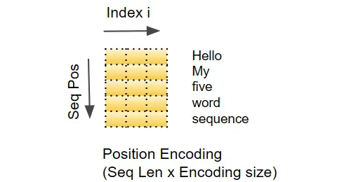</kbd>

> [!NOTE]
> PE vector sẽ có cùng độ dài với word
> embedding vector là **d-model** = **encoding_size**
> **embedding_dim** = d = ...

 

<kbd>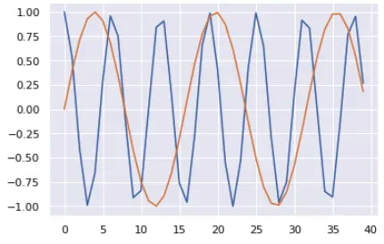</kbd>

 

- **Matrix Dimensions**

 

<kbd>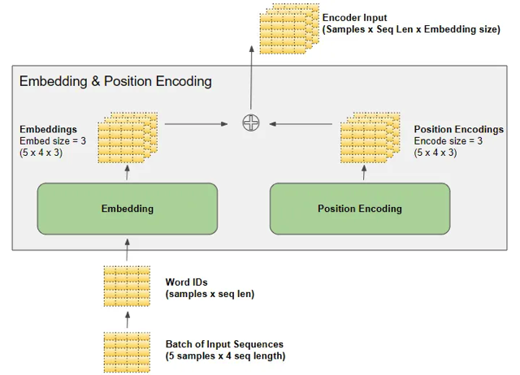</kbd>

> [!NOTE]
> Đại khái như đã nói ở trước, PE vector sẽ có độ
> dài bằng với Word Embedding vector:
> embedding_dim, và do đó mỗi một sequence được
> input vào model sẽ 'trở thành / embedded & encoded thành': 
>
>
>
> matrix word embedding và position encoding matrix có shape:
> **sequence_len** x **embedding_dim**
>
>
>
> Mở rộng hơn do nó sẽ 'handle' không phải một mà là một **batch_size**
> cái sequence nên input sẽ là: 
> Block word embedding và block position encoding đều có shape là
> **batch_size**, **sequence_len**, **embedding_dim**
>
>
>
> Block hay còn gọi là volume, tensor

 

- **The (\\*samples, sequence length, embedding size\\*) shape
produced by the Embedding and Position Encoding layers is
preserved all through the Transformer, as the data flows
through the Encoder and Decoder Stacks until it is reshaped
by the final Output layers.**

> [!NOTE]
> Và cái shape như vậy sẽ được giữ xuyên
> suốt cho đến khi Output layer

 

<kbd>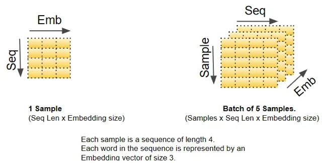</kbd>

> [!NOTE]
> Đại khái là để cho đơn giản, ta bỏ đi cái dimension
> batch_size (hay số sample) mà chỉ dùng hình vẽ như của
> 1 single sample nhưng phải hiểu là thực tế nó sẽ 'xử' một
> batch_size sample cùng lúc

 

- **Encoder**

 

<kbd>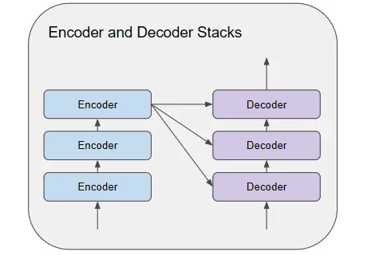</kbd>

 

- **The Encoder and Decoder Stacks consists of several
(\\*usually six\\*) Encoders and Decoders respectively,
connected sequentially.

The first Encoder in the stack receives its input from the
Embedding and Position Encoding. The other Encoders in
the stack receive their input from the previous Encoder.

Both the Self-attention and Feed-forward sub-layers, have
a residual skip-connection around them, followed by a
Layer-Normalization.

The output of the last Encoder is fed into each Decoder in
the Decoder Stack as explained below.**

 

<kbd></kbd>

 

- **Decoder**

 

<kbd>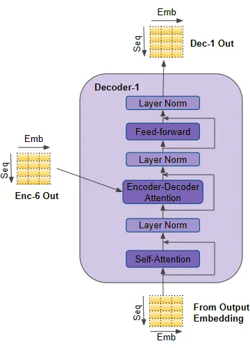</kbd>

 

- **The Decoder’s structure is very similar to the Encoder’s but with a
couple of differences.

Like the Encoder, the first Decoder in the stack receives its input from
the Output Embedding and Position Encoding. The other Decoders in
the stack receive their input from the previous Decoder.

The Decoder passes its input into a Multi-head Self-attention layer.
This operates in a slightly different way than the one in the Encoder. It
is only allowed to attend to earlier positions in the sequence. This is
done by masking future positions, which we’ll talk about shortly.

Unlike the Encoder, the Decoder has a second Multi-head attention
layer, known as the Encoder-Decoder attention layer. The
Encoder-Decoder attention layer works like Self-attention, except that
it combines two sources of inputs — the Self-attention layer below it
as well as the output of the Encoder stack.

The Self-attention output is passed into a Feed-forward layer, which
then sends its output upwards to the next Decoder.

Each of these sub-layers, Self-attention, Encoder-Decoder attention,
and Feed-forward, have a residual skip-connection around them,
followed by a Layer-Normalization.**

 

- **Attention**

 

- **In the Transformer, Attention is used in three places:

- Self-attention in the Encoder — the input sequence pays
attention to itself

- Self-attention in the Decoder — the target sequence pays
attention to itself

- Encoder-Decoder-attention in the Decoder — the target
sequence pays attention to the input sequence

*\\*The Attention layer takes its input in the form of three
parameters, known as the Query, Key, and Value.\\*

I\\*n the Encoder’s Self-attention, the Encoder’s input is
passed to all three parameters, Query, Key, and Value.\\***

> [!NOTE]
> Có nghĩa đại khái là 1 Attention layer nó quy định
> sẽ nhận input ở dạng 3 params là Query, Key,
> Value hiểu đại khái như **3 cái cổng để nhận
> thông tin vậy**. Và đối vối Self-Attention của
> Encoder, ta sẽ đưa cái Encoder's input (là cái
> sequence embedding/encoding block từ layer
> Embedding và Position Encoding) **vào cả ba cửa
> này** của Attention layer
>
>
>
> *Gọi Attention layer là layer con (sublayer) của
> Encoding layer

 

<kbd></kbd>

 

<kbd></kbd>

> [!NOTE]
> Ở Decoder cũng tương tự như vậy đối
> với cái Attention đầu tiên của nó, còn cái
> thứ 2 thì khác một chút:
>
>
>
> Cổng Value và Key sẽ nhận cái block out từ cái Encoder cuối cùng
> (có 6 cái encoder)
>
>
>
> Cổng Query thì nhận cái block out từ cái Self-Attention đầu tiên (sau 
> khi qua thêm cái layer norm)

 

- **Multi-head Attention**

 

<kbd></kbd>

 

- **The Transformer calls each Attention processor an
Attention Head and \\*repeats it several times in
parallel\\*. This is known as Multi-head attention. It
gives its Attention \\*greater power of discrimination\\*, by
\\*combining several similar Attention calculations\\*.

The Query, Key, and Value are each passed through
separate \\*Linear layers\\*, each with their \\*own weights\\*,
producing three results called \\*Q\\*, \\*K\\*, and \\*V\\*
respectively. These are then combined together using
the \\*Attention formula\\* as shown below, to produce the
\\*Attention Score\\*.**

 

<kbd>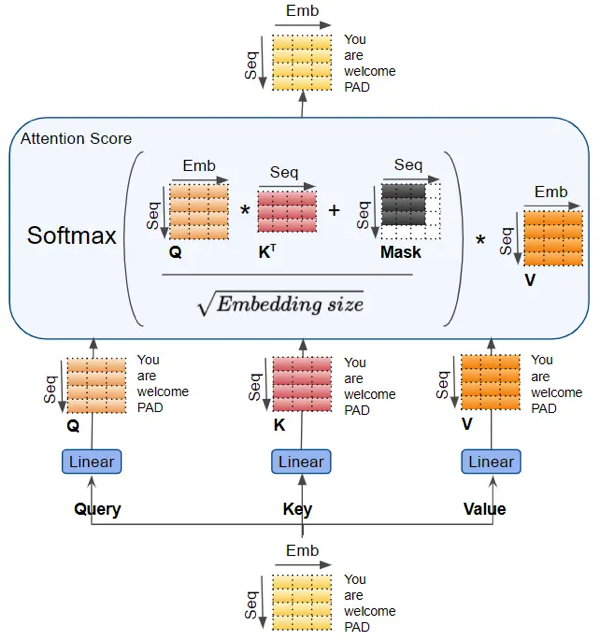</kbd>

> [!NOTE]
> Đây là cái đoạn mà mr Andrew lướt qua đây
>
>
>
> Có nghĩa là sau khi thông tin từ sequence Embedding/Encoding được cống
> nạp vào Attention qua ba cổng Query, Key, Value thì nó sẽ được xử lý qua ba
> sublayer của Attention (cũng như Attention  là sublayer của Encoding) để tạo
> ra Q,K,V.
>
>
>
> **Và điều quan trọng cần hiểu rằng các Linear layer này có các weight
> (param) là W_Q, W_K, W_V - sẽ được train cùng với / cũng như các
> sequence Embedding cũng được train trong quá trình training**
>
>
>
> Còn train như thế nào / mục đích gì thì nó sẽ liên quan đến 
> vai trò của Q,K,V. Đại khái là Q,K,V sẽ giúp mục đích cuối cùng là 
> "CỦNG CỐ / BỒI ĐẮP" thêm cho cái sequence embedding block
> sao cho nó mang thêm thông tin ngữ cảnh (bên cạnh thông tin nội 
> dung và vị trí)
>
>
>
> Hãy để ý, cái output của Encoder **vẫn là một embedding block có shape
> y hệt như lúc vào** (**batch_size**, **sequence_len**, **embedding_dim**)

 

- **The important thing to realize here is that the Q, K, and V values \\*carry
an encoded representation of each word in the sequence\\*. The
Attention calculations then combine each word with every other word
in the sequence, so that the Attention Score encodes a score for each
word in the sequence.**

> [!NOTE]
> Cụ thể Q,K,V làm gì để trong quá trình training nó
> bồi đắp thông  tin ngữ cảnh cho embedding vector
> thì sẽ giải thích sau
>
>
>
> Nhưng để ý là nó có shape y như input embedding
> block, chẳng qua nó mang trong mình những cái gì
> đó giúp trong quá trình huấn luyện nó sẽ giúp đánh
> giá ngữ cảnh của các từ để tìm ra quan hệ giữa
> các từ trong câu. Hiểu đại khái vậy

 

- **Attention Masks**

 

<kbd>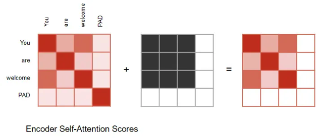</kbd>

> [!NOTE]
> Đại khái Mask sẽ giúp trong lúc tính
> nó sẽ bỏ qua cái padding

 

<kbd>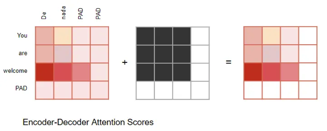</kbd>

 

- **In the Decoder Self-attention: masking serves to \\*prevent the
decoder from ‘peeking’ ahead at the rest of the target sentence
when predicting the next word.

\\*The Decoder processes words in the source sequence and
uses them to predict the words in the destination sequence.
During training, this is done via Teacher Forcing, where the
complete target sequence is fed as Decoder inputs. Therefore,
while predicting a word at a certain position, the Decoder has
available to it the target words preceding that word as well as
the target words following that word. This allows the Decoder to
‘cheat’ by using target words from future ‘time steps’. For
instance, when predicting ‘\\/Word 3’\\/, the Decoder should refer
only to the first 3 input words from the target but not the fourth
word ‘\\/Ketan’\\/.**

 

<kbd></kbd>

> [!NOTE]
> Đại khái là cái Mask này thì khác nó sẽ che đi cái phần
> mà chưa cần tới ví dụ đang predict từ số 3 thì không
> nên cho nó biết từ số 4,5 là gì tránh việc nó cheating
> bằng việc học thông tin từ cả những future timesteps

 

<kbd>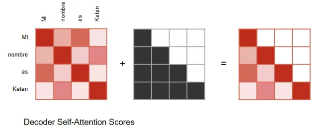</kbd>

 

- **When calculating the Attention Score (refer to the picture
earlier showing the calculations) masking is applied to
the numerator just before the Softmax. The masked out
elements (white squares) are set to \\*negative infinity\\*,
so that \\*Softmax turns those values to zero\\*.**

> [!NOTE]
> Cái này có thể bổ trợ cho việc hiểu thêm về
> khúc này của Programming assignment vốn
> chưa hiểu lắm

 

- **Generate Output**

 

<kbd>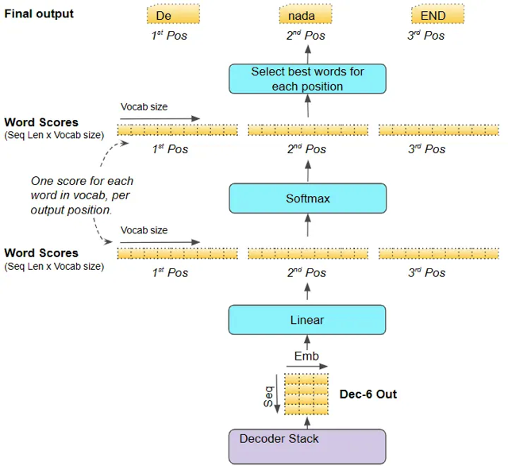</kbd>

 

- **The last Decoder in the stack passes its output to the Output
component which converts it into the final output sentence.

The Linear layer projects the Decoder vector into \\*Word Scores\\*,
with a score value for each unique word in the target vocabulary,
at each position in the sentence. For instance, if our final output
sentence has 7 words and the target Spanish vocabulary has
10000 unique words, we generate \\*10000 score values\\* for each of
those 7 words. The score values indicate the likelihood of
occurrence for each word in the vocabulary in that position of the
sentence.

The \\*Softmax\\* layer then \\*turns those scores into probabilities\\* (which
add up to 1.0). In each position, we find the index for the word with
the \\*highest probability\\*, and then map that index to the
corresponding word in the vocabulary. Those words then form the
output sequence of the Transformer.**

> [!NOTE]
> Giải thích quá dể hiểu rồi, đại khái là nó sẽ output ra
> (tương ứng với mỗi từ) 1 vector có 10000 số, rồi
> softmax biến thành 10000 probability number (tổng lại
> bằng 1) từ đó ông nào có probability cao nhất sẽ là từ
> được chọn để dịch cho vị trí đó

 

- **Training and
Loss Function**

 

- **During training, we use a loss function such as \\*cross-entropy loss\\* to
\\*compare\\* the \\_\\*generated output probability distribution\\*\\_ to the \\*target
sequence\\*. The probability distribution gives the probability of each word
occurring in that position.

Let’s assume our target vocabulary contains just four words. Our goal is to
produce a probability distribution that matches our expected target sequence
“De nada END”. This means that the probability distribution for the first
word-position should have a probability of 1 for “De” with probabilities for all
other words in the vocabulary being 0. Similarly, “nada” and “END” should
have a probability of 1 for the second and third word-positions respectively.

As usual, the loss is used to compute gradients to train the Transformer via
\\*backpropagation\\*.**

 

<kbd></kbd>

> [!NOTE]
> Đại khái là vầy, giả sử từ điển chỉ có 4 từ, thì probability vector của từ thứ
> 1 (vốn dĩ đúng phải là 'De') sẽ là như bên dưới với chỉ số probability dành
> cho 'De' cao, dù cho 'Bueno', 'Nada' cũng có nhưng thấp hơn), trong khi
> kết quả đúng phải là như bên trên với 100% dành cho 'De'.
>
>
>
> Dựa vào đó, model sẽ dùng hàm cross-entropy để tính ra loss function
> value từ đó dùng Back-Propagation để tính gradietns

 

##### Part 3 - Multi-head Attentions

 

- **How Attention is used in
the Transformer**

 

<kbd></kbd>

 

- **Encoder Self-Attention

The input sequence is fed to the Input Embedding and
Position Encoding, which produces an encoded
representation for each word in the input sequence that
captures the meaning and position of each word. This is
fed to all three parameters, Query, Key, and Value in the
Self-Attention in the first Encoder which then also
produces an encoded representation for each word in
the input sequence, that now incorporates the attention
scores for each word as well. As this passes through all
the Encoders in the stack, each Self-Attention module
also adds its own attention scores into each word’s
representation.**

 

<kbd>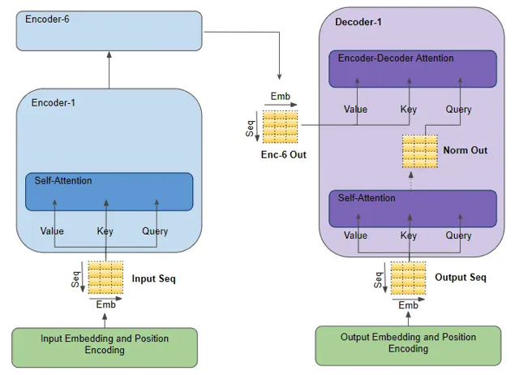</kbd>

 

- **Decoder Self-Attention

Coming to the Decoder stack, the target sequence is fed to the
Output Embedding and Position Encoding, which produces an
encoded representation for each word in the target sequence
that captures the meaning and position of each word. This is fed
to all three parameters, Query, Key, and Value in the
Self-Attention in the first Decoder which then also produces an
encoded representation for each word in the target sequence,
which now incorporates the attention scores for each word as
well. After passing through the Layer Norm, this is fed to the
Query parameter in the Encoder-Decoder Attention in the first
Decoder**

 

- **Encoder-Decoder Attention

Along with that, the output of the final Encoder in the stack is passed
to the Value and Key parameters in the Encoder-Decoder Attention.
The Encoder-Decoder Attention is therefore getting a representation
of both the target sequence (from the Decoder Self-Attention) and a
representation of the input sequence (from the Encoder stack). It,
therefore, produces a representation with the attention scores for
each target sequence word that captures the influence of the
attention scores from the input sequence as well. As this passes
through all the Decoders in the stack, each Self-Attention and each
Encoder-Decoder Attention also add their own attention scores into
each word’s representation.**

 

- **Multiple Attention Heads**

 

<kbd></kbd>

 

- **n the Transformer, the Attention module repeats its
computations multiple times in parallel. Each of these is called
an Attention Head. The Attention module \\*splits its Query, Key,
and Value parameters N-ways\\* and \\*passes each split
independently through a separate Head\\*. All of these similar
Attention calculations are then \\*combined together\\* to produce a
\\*final Attention score\\*. This is called Multi-head attention and
gives the Transformer greater power to encode multiple
relationships and nuances for each word.**

> [!NOTE]
> Đại khái là nó sẽ split ba cái Query, Key, Value
> làm 8 phần (giả sử h hay N = 8 heads)
>
>
>
> Rồi mỗi phần nó sẽ xử lý bằng một head, tính
> toán đã đời, nhiều lần, cuối cùng nó gom lại làm
> kết quả cuối cùng - **final Attention score**

 

- **Attention
Hyperparameters**

 

- **- \\*Embedding Size\\* — width of the embedding vector (we use
a width of 6 in our example). This dimension is carried
forward throughout the Transformer model and hence is
sometimes referred to by other names like ‘model size’ etc.

- \\*Query Size\\* (equal to Key and Value size)— the size of the
weights used by three Linear layers to produce the Query,
Key, and Value matrices respectively (we use a Query size of
3 in our example)

- \\*Number of Attention heads\\* (we use 2 heads in our example)
In addition, we also have the Batch size, giving us one
dimension for the number of samples.**

 

- **Input Layers**

 

<kbd></kbd>

 

- **The Input Embedding and Position Encoding layers
produce a matrix of shape (Number of Samples,
Sequence Length, Embedding Size) which is fed to
the Query, Key, and Value of the first Encoder in the
stack.

To make it simple to visualize, we will drop the Batch
dimension in our pictures and focus on the
remaining dimensions.**

 

<kbd>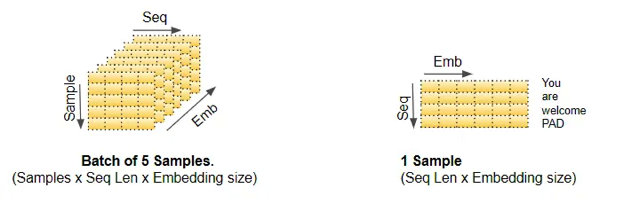</kbd>

 

- **Linear Layers**

 

<kbd></kbd>

 

- **There are three separate Linear layers for the Query, Key,
and Value. Each Linear layer has its own weights. The
input is passed through these Linear layers to produce
the Q, K, and V matrices.**

 

- **Splitting data across
Attention heads**

 

- **However, the important thing to understand is that this is a
\\*logical split only\\*.

The Query, Key, and Value are \\*not physically split into
separate matrices\\*, one for each Attention head. A single data
matrix is used for the Query, Key, and Value, respectively, with
\\*logically separate sections\\* of the matrix for each Attention
head.

Similarly, there are \\*not separate Linear layers\\*, one for each
Attention head. All the Attention heads share the same Linear
layer but simply operate on their ‘own’ \\*logical section\\* of the
data matrix.**

> [!NOTE]
> Đại khái là chỉ split về logic thôi chứ vẫn chỉ có 1
> bộ Query, Key, Value tương ứng với 3 Linear thôi.
> Nó sẽ kiểu như partition (phân vùng) ra để handle
> cho mỗi Head 1 vùng

 

<kbd></kbd>

> [!NOTE]
> This logical split is done by partitioning the input data as well as the
> Linear layer weights uniformly across the Attention heads. We can
> achieve this by choosing the Query Size as below:
>
>
>
> Query Size = Embedding Size / Number of heads

 

<kbd></kbd>

> [!NOTE]
> In our example, that is why the Query Size = 6/2 = 3. Even though
> the layer weight (and input data) is a single matrix we can think of
> it as ‘**stacking together**’ the separate layer weights for each head.

 

- **The computations for all Heads can be therefore be
achieved via a \\*single matrix operation\\* rather than requiring
N separate operations. This makes the computations more
\\*efficient\\* and keeps the model \\*simple\\* because fewer Linear
layers are required, while still achieving the \\*power of the
independent\\* Attention heads.**

 

- **Reshaping the Q, K,
and V matrices**

 

- **The Q, K, and V matrices output by the Linear layers are
reshaped to include an explicit Head dimension. Now each ‘slice’
corresponds to a matrix per head.

This matrix is reshaped again by swapping the Head and
Sequence dimensions. Although the Batch dimension is not
drawn, the dimensions of Q are now (Batch, Head, Sequence,
Query size).**

 

<kbd>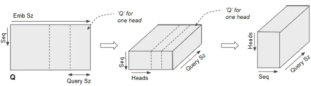</kbd>

 

<kbd>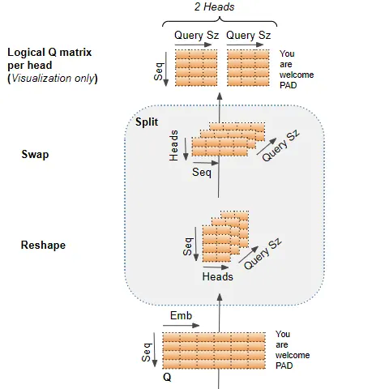</kbd>

> [!NOTE]
> In the picture below, we can see the complete process of splitting our
> example Q matrix, after coming out of the Linear layer.
>
>
>
> The final stage is for visualization only — although the Q matrix is a
> single matrix, we can think of it as a logically separate Q matrix per
> head.

 

- **Compute the Attention
Score for each head**

 

<kbd></kbd>

> [!NOTE]
> We now have the 3 matrices, Q, K, and V, split across the heads.
> These are used to compute the Attention Score.
>
>
>
> We will show the computations for a single head using just the last two
> dimensions (Sequence and Query size) and skip the first two
> dimensions (Batch and Head). Essentially, we can imagine that the
> computations we’re looking at are getting ‘repeated’ for each head and
> for each sample in the batch (although, obviously, they are happening
> as a single matrix operation, and not as a loop).
>
>
>
> The first step is to do a matrix multiplication between Q and K.

 

<kbd>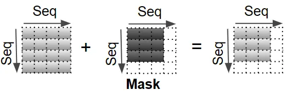</kbd>

> [!NOTE]
> A Mask value is now added to the result. In the Encoder Self-attention, the
> mask is used to mask out the Padding values so that they don’t participate
> in the Attention Score.
>
>
>
> Different masks are applied in the Decoder Self-attention and in the
> Decoder Encoder-Attention which we’ll come to a little later in the flow.

 

<kbd></kbd>

> [!NOTE]
> The result is now scaled by dividing by the square root of the
> Query size, and then a Softmax is applied to it.

 

<kbd></kbd>

> [!NOTE]
> Another matrix multiplication is performed between the output of the Softmax and the V matrix.

 

<kbd>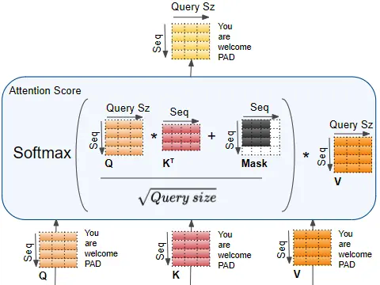</kbd>

> [!NOTE]
> The complete Attention Score calculation in the Encoder
> Self-attention is as below:

 

- **Merge each Head’s
Attention Scores together**

 

- **We now have separate Attention Scores for each head, which need to
be combined together into a single score. This Merge operation is
essentially the reverse of the Split operation.

It is done by simply reshaping the result matrix to eliminate the Head
dimension. The steps are:

Reshape the Attention Score matrix by swapping the Head and
Sequence dimensions. In other words, the matrix shape goes from
(Batch, Head, Sequence, Query size) to (Batch, Sequence, Head,
Query size). Collapse the Head dimension by reshaping to (Batch,
Sequence, Head * Query size). This effectively concatenates the
Attention Score vectors for each head into a single merged Attention
Score. Since Embedding size =Head
* Query size, the merged Score is (Batch, Sequence, Embedding
size). In the picture below, we can see the complete process of
merging for the example Score matrix.**

 

<kbd>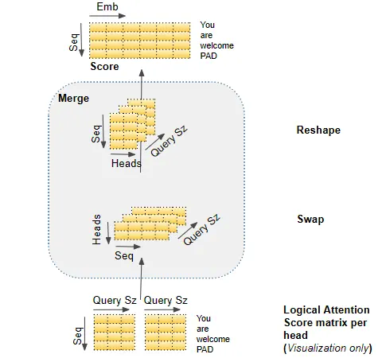</kbd>

 

- **End-to-end Multi-head Attention**

 

<kbd></kbd>

> [!NOTE]
> Putting it all together, this is the end-to-end
> flow of the Multi-head Attention.

 

- **Multi-head split captures
richer interpretations**

 

- **An Embedding vector captures the meaning of a word. In the case of
Multi-head Attention, as we have seen, the Embedding vectors for the
input (and target) sequence gets logically split across multiple heads.
What is the significance of this?

This means that separate sections of the Embedding can learn different
aspects of the meanings of each word, as it relates to other words in the
sequence. This allows the Transformer to capture richer interpretations
of the sequence.

This may not be a realistic example, but it might help to build intuition.
For instance, one section might capture the ‘gender-ness’ (male, female,
neuter) of a noun while another might capture the ‘cardinality’ (singular
vs plural) of a noun. This might be important during translation because,
in many languages, the verb that needs to be used depends on these
factors.**

 

<kbd>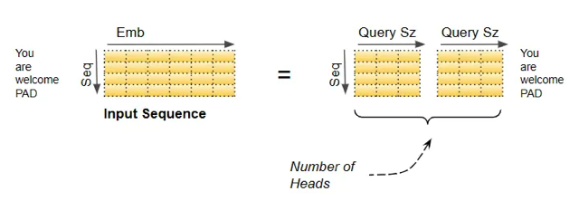</kbd>

 

- **Decoder Self-Attention
and Masking**

 

- **The Decoder Self-Attention works just like the Encoder
Self-Attention, except that it operates on each word of the target
sequence.**

 

<kbd>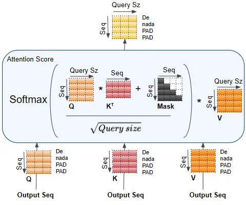</kbd>

 

- **Decoder Encoder-Decoder
Attention and Masking**

 

- **The Encoder-Decoder Attention takes its input from two sources.
Therefore, unlike the Encoder Self-Attention, which computes the
interaction between each input word with other input words, and Decoder
Self-Attention which computes the interaction between each target word
with other target words, the Encoder-Decoder Attention computes the
interaction between each target word with each input word.

Therefore each cell in the resulting Attention Score corresponds to the
interaction between one Q (ie. target sequence word) with all other K (ie.
input sequence) words and all V (ie. input sequence) words.

Similarly, the Masking masks out the later words in the target output, as
was explained in detail in the \\_second article\\_ of the series.**

 

<kbd>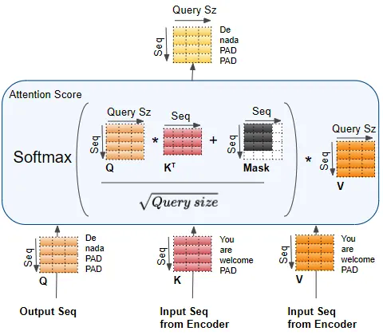</kbd>

 

##### Why They Work So Well

 

- **How does the input sequence
reach the Attention module**

 

<kbd>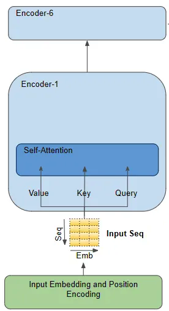</kbd>

 

- **As an example, let’s say that we’re working on an
English-to-Spanish translation problem, where one sample
source sequence is “The ball is blue”. The target sequence
is “La bola es azul”.

The source sequence is first passed through the
Embedding and Position Encoding layer, which generates
embedding vectors for each word in the sequence. The
embedding is passed to the Encoder where it first reaches
the Attention module.

Within Attention, the embedded sequence is passed
through three Linear layers which produce three separate
matrices — known as the Q, K, and K. These
are the three matrices that are used to compute the
Attention Score.

The important thing to keep in mind is that each ‘row’ of
these matrices corresponds to one word in the source
sequence.**

 

<kbd></kbd>

 

- **Each input row is a word
from the sequence**

 

- **The way we will understand what is going on with Attention, is by starting
with the individual words in the source sequence, and then following
their path as they make their way through the Transformer. In particular,
we want to focus on what goes on inside the Attention Module.

That will help us clearly see how each word in the source and target
sequences interacts with other words in the source and target
sequences.

So as we go through this explanation, concentrate on what operations
are being performed on each word, and how each vector maps to the
original input word. We do not need to worry about many of the other
details such as matrix shapes, specifics of the arithmetic calculations,
multiple attention heads, and so on if they are not directly relevant to
where each word is going.

So to simplify the explanation and the visualization, let’s ignore the
embedding dimension and track just the rows for each word.**

 

<kbd></kbd>

> [!NOTE]
> Để đơn giản, tạm thời quên đi mỗi một
> Q1, Q2, K1, K2,..là 1 embedding
> vector, cứ coi như 1 cục đi

 

- **Each word goes through a series of
learnable transformations**

 

- **Each such row has been generated from its corresponding
source word by a series of transformations — embedding,
position encoding, and linear layer.

\\*All of those transformations are trainable operations. This
means that the weights used in those operations are not
pre-decided but are learned by the model in such a way that they
produce the desired output predictions.

\\*The key question is, how does the Transformer figure out what
set of weights will give it the best results? Keep this point in the
back of your mind as we will come back to it a little later.**

 

<kbd></kbd>

 

- **Attention Score — Dot Product
between Query and Key words**

 

<kbd></kbd>

<kbd></kbd>

 

<kbd>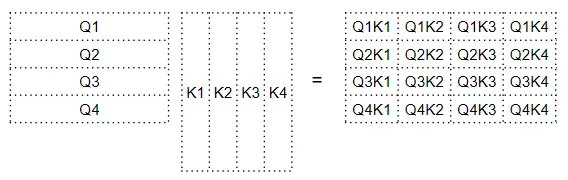</kbd>

> [!NOTE]
> As we can see from the formula, the first step within Attention is to do a matrix multiply
> (ie. dot product) between the Query (Q) matrix and a transpose of the Key (K) matrix.
> Watch what happens to each word.
>
>
>
> We produce an intermediate matrix (let’s call it a ‘factor’ matrix) where each cell is a
> matrix multiplication between two words.

 

<kbd></kbd>

> [!NOTE]
> For instance, each column in the fourth row corresponds to a dot product
> between the fourth Query word with every Key word.

 

- **Attention Score — Dot Product between
Query-Key and Value word**

 

<kbd>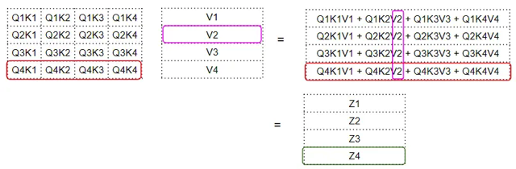</kbd>

> [!NOTE]
> The next step is a matrix multiply between this intermediate ‘factor’ matrix and the
> Value (V) matrix, to produce the attention score that is output by the attention
> module. Here we can see that the fourth row corresponds to the fourth Query word
> matrix multiplied with all other Key and Value words.

 

<kbd>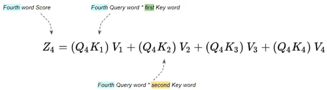</kbd>

> [!NOTE]
> This produces the Attention Score vector (Z) that is output by the Attention Module.
>
>
>
> The way to think about the output score is that, for each word, it is the encoded value of
> every word from the “Value” matrix, weighted by the “factor” matrix. The factor matrix is the
> dot product of the Query value for that specific word with the Key value of all words.

 

- **What is the role of the Query,
Key, and Value words?**

 

<kbd>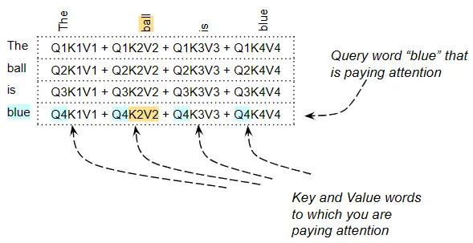</kbd>

> [!NOTE]
> The Query word can be interpreted as the word for which we are
> calculating Attention. The Key and Value word is the word to which we are
> paying attention ie. how relevant is that word to the Query word.

 

- **For example, for the sentence, “The ball is blue”, the row for
the word “blue” will contain the attention scores for “blue”
with every other word. Here, “blue” is the Query word, and
the other words are the “Key/Value”.

There are other operations being performed such as a
division and a softmax, but we can ignore them in this
article. They just change the numeric values in the matrices
but don’t affect the position of each word row in the matrix.
Nor do they involve any inter-word interactions.**

 

- **Dot Product tells us the
similarity between words**

 

- **So we have seen that the Attention Score is capturing some
interaction between a particular word, and every other word in the
sentence, by doing a dot product, and then adding them up. But
how does the matrix multiply help the Transformer determine the
relevance between two words?

To understand this, remember that the Query, Key, and Value
rows are actually vectors with an Embedding dimension. Let’s
zoom in on how the matrix multiplication between those vectors is
calculated.**

 

<kbd></kbd>

 

- **When we do a dot product between two vectors, we multiply
pairs of numbers and then sum them up.

If the two paired numbers (eg. ‘a’ and ‘d’ above) are both
positive or both negative, then the product will be positive.
The product will increase the final summation.

If one number is positive and the other negative, then the
product will be negative. The product will reduce the final
summation.

If the product is positive, the larger the two numbers, the
more they contribute to the final summation.

This means that if the signs of the corresponding numbers in
the two vectors are aligned, the final sum will be larger.**

 

- **How does the Transformer learn the
relevance between words?**

 

- **This notion of the Dot Product applies to the attention score as well. If the vectors for two words are more
aligned, the attention score will be higher.

So what is the behavior we want for the Transformer?

We want the attention score to be high for two words that are relevant to each other in the sentence. And we
want the score to be low for two words that are unrelated to one another.

For example, for the sentence, “The black cat drank the milk”, the word “milk” is very relevant to “drank”,
perhaps slightly less relevant to “cat”, and irrelevant to “black”. We want “milk” and “drank” to produce a high
attention score, for “milk” and “cat” to produce a slightly lower score, and for “milk” and “black”, to produce a
negligible score.

This is the output we want the model to learn to produce.

For this to happen, the word vectors for “milk” and “drank” must be aligned. The vectors for “milk” and “cat”
will diverge somewhat. And they will be quite different for “milk” and “black”.

Let’s go back to the point we had kept at the back of our minds — how does the Transformer figure out what
set of weights will give it the best results?

The word vectors are generated based on the word embeddings and the weights of the Linear layers.
Therefore the Transformer can learn those embeddings, Linear weights, and so on to produce the word
vectors as required above.

In other words, it will learn those embeddings and weights in such a way that if two words in a sentence are
relevant to each other, then their word vectors will be aligned. And hence produce a higher attention score.
For words that are not relevant to each other, the word vectors will not be aligned and will produce a lower
attention score.

Therefore the embeddings for “milk” and “drank” will be very aligned and produce a high attention score.
They will diverge somewhat for “milk” and “cat” to produce a slightly lower score and will be quite different for
“milk” and “black”, to produce a low score.

This then is the principle behind the Attention module.**

 

- **Summarizing — What makes
the Transformer tick?**

 

- **The dot product between the Query and Key computes the relevance
between each pair of words. This relevance is then used as a “factor” to
compute a weighted sum of all the Value words. That weighted sum is output
as the Attention Score.

The Transformer learns embeddings etc, in such a way that words that are
relevant to one another are more aligned.

This is one reason for introducing the three Linear layers and making three
versions of the input sequence, for the Query, Key, and Value. That gives the
Attention module some more parameters that it is able to learn to tune the
creation of the word vectors.**

 

- **Encoder Self-Attention in
the Transformer**

 

<kbd></kbd>

 

- **Attention is used in the Transformer in three places:

- Self-attention in the Encoder — the source sequence pays attention to itself

- Self-attention in the Decoder — the target sequence pays attention to itself

- Encoder-Decoder-attention in the Decoder — the target sequence pays
attention to the source sequence

In the Encoder Self Attention, we compute the relevance of each word in the
source sentence to each other word in the source sentence. This happens in
all the Encoders in the stack.**

 

- **Decoder Self-Attention in the Transformer**

 

<kbd>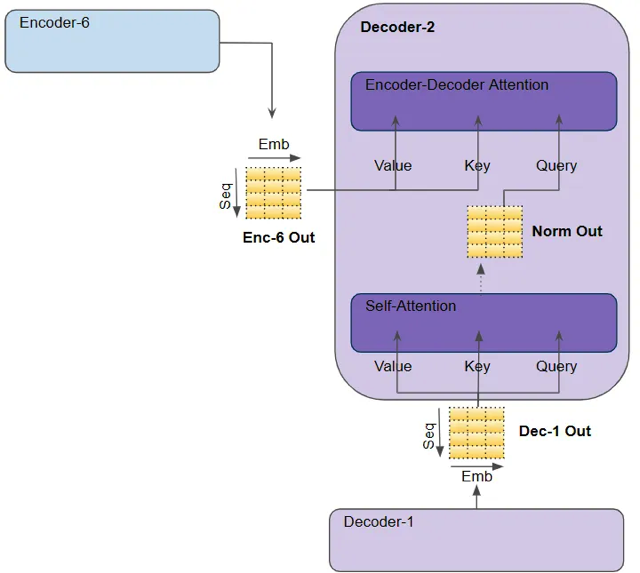</kbd>

> [!NOTE]
> Most of what we’ve just seen in the Encoder Self Attention applies to Attention in
> the Decoder as well, with a few small but significant differences.

 

<kbd>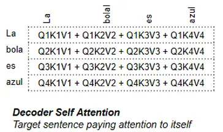</kbd>

> [!NOTE]
> In the Decoder Self Attention, we compute the
> relevance of each word in the target sentence to each
> other word in the target sentence.

 

- **Encoder-Decoder Attention
in the Transformer**

 

<kbd>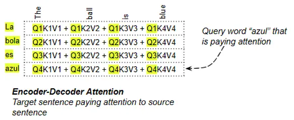</kbd>

> [!NOTE]
> In the Encoder-Decoder Attention, the Query is obtained from the target sentence
> and the Key/Value from the source sentence. Thus it computes the relevance of
> each word in the target sentence to each word in the source sentence.

 

#### Quiz

 

<kbd></kbd>

 

<kbd></kbd>

 

<kbd>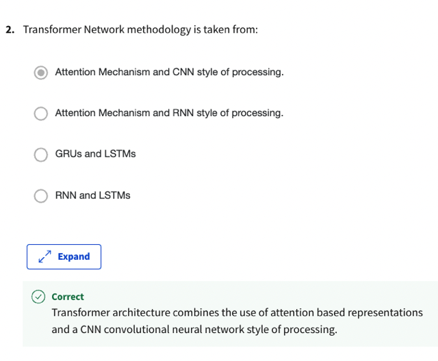</kbd>

 

<kbd>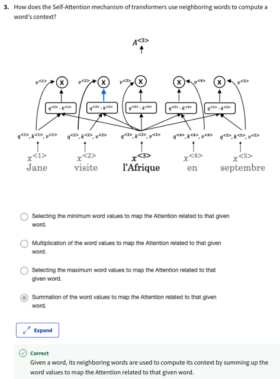</kbd>

 

<kbd>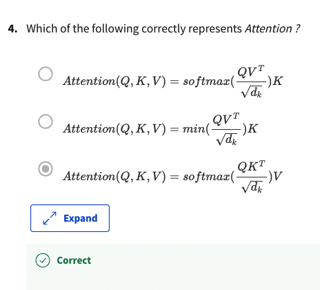</kbd>

 

<kbd></kbd>

> [!NOTE]
> Đại khái là Q đặt ra câu hỏi, K xác định câu trả
> lời nào (từ nào) có ý nghĩa nhất / thích hợp
> nhất / V là đại diện của từ đó

 

<kbd></kbd>

 

<kbd>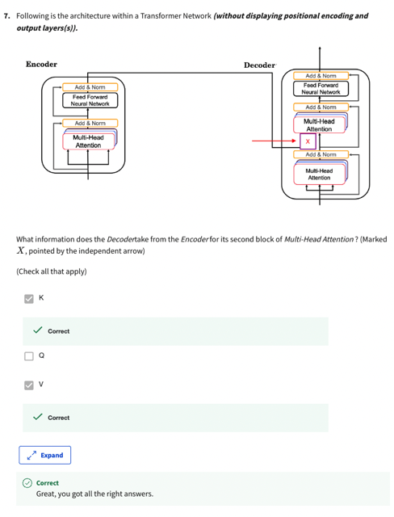</kbd>

 

<kbd></kbd>

 

<kbd></kbd>

 

<kbd>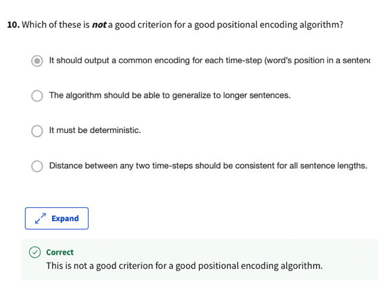</kbd>

> [!NOTE]
> "Unique", not "common" Đại khái là positional encoding phải
> unique ở mỗi từ, không phải chung cho mỗi từ

 

#### Programming Assignment

 

##### Welcome to Week 4's assignment, the last assignment of Course 5
of the Deep Learning Specialization! And congratulations on making
it to the last assignment of the entire Deep Learning Specialization -
you're almost done!

Earlier in the course, you've implemented sequential neural
networks such as RNNs, GRUs, and LSTMs. In this notebook you'll
explore the Transformer architecture, a neural network that takes
advantage of parallel processing and allows you to substantially
speed up the training process.

\\*After this assignment you'll be able to\\*:

• Create \\/\\*positional encodings\\*\\/ to capture \\*sequential
relationships\\* in data

• Calculate \\/\\*scaled dot-product self-attention\\*\\/ with word
embeddings

• Implement \\/\\*masked multi-head attention\\*\\/

• Build and train a\\/ Transformer model\\/

 

- **Packgages**

 

<kbd></kbd>

 

- **1 - Positional Encoding**

 

<kbd>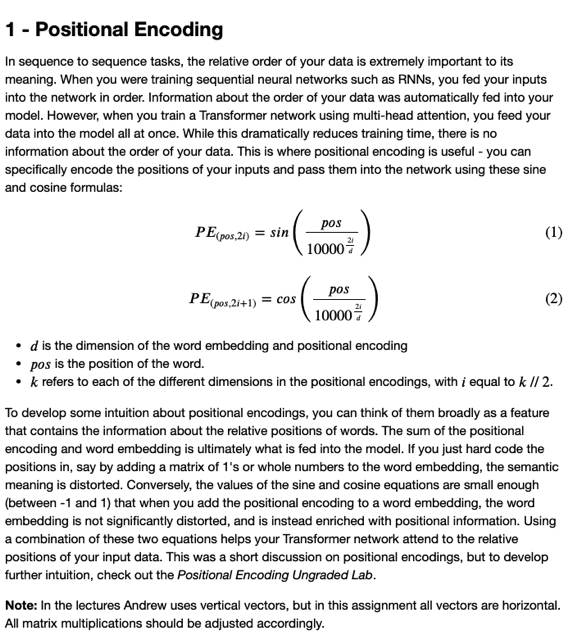</kbd>

> [!NOTE]
> Đại khái là với RNN thì do mình feed info vào từng từ một nên cơ bản
> nó có thông tin vị trí của các từ trong câu, còn với cái này
> (Transformer network) tất cả các từ xử lý cùng lúc nên không biết thứ
> tự của từ trong câu, positional encoding là để cung cấp thông tin này
>
> Đại khái là bằng cách dùng sin() và cos() thông tin vị trí trong positional
> encoding khiến giá trị bị khống chế trong -1 1 = nhỏ nên word
> embedding không bị distort. Đại khái vậy còn sẽ hiểu rõ hơn ở
> Ungraded Lab

 

<kbd>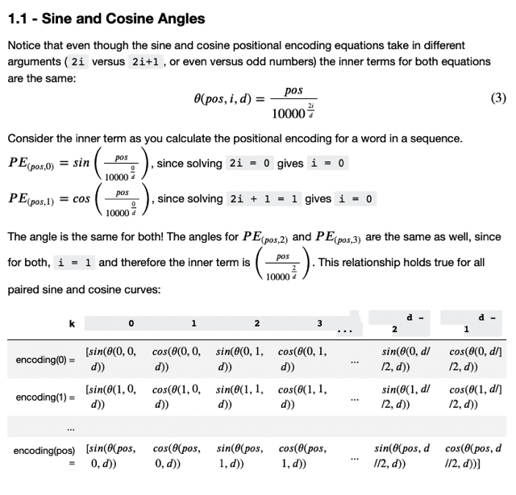</kbd>

<kbd></kbd>

> [!NOTE]
> 'd' = **embedding_dimension**

 

- **1.1 - Sine and Cosine Angles**

 

- **Exercise 1 - get_angles**

 

<kbd></kbd>

 

<kbd></kbd>

> [!NOTE]
> d_model = encoding size = đại
> khái là độ dài của encoding /
> embedding vector = **embedding_dimension**

 

- **1.2 - Sine and Cosine
Positional Encodings**

 

- **Exercise 2 - positional_encoding**

 

<kbd>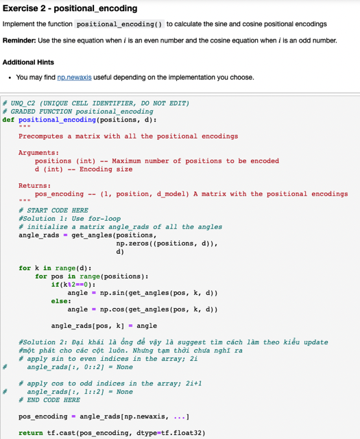</kbd>

> [!NOTE]
> Tạm thời làm bằng for loop (vẫn đúng) cho qua dc phần này
> cho rồi nhưng nên quay lại làm theo kiểu được suggest để
> hiểu

 

<kbd>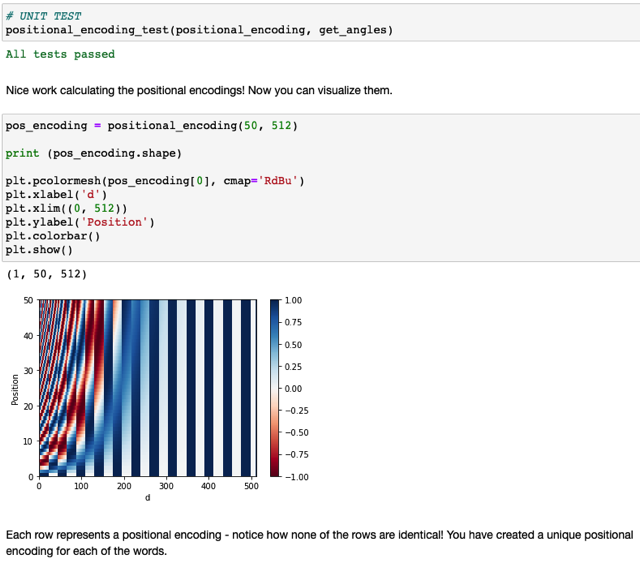</kbd>

 

<kbd>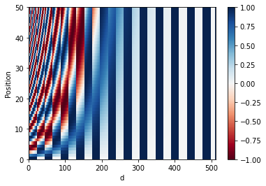</kbd>

 

<kbd></kbd>

<kbd>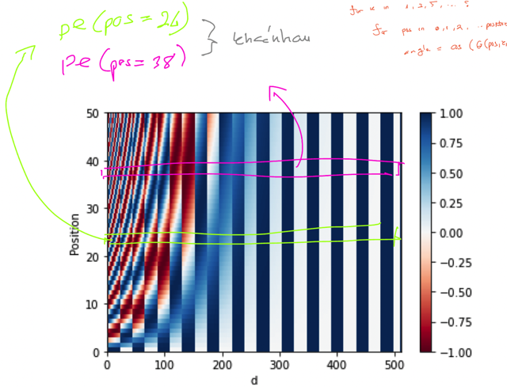</kbd>

 

- **2 - Masking

There are two types of masks that are useful when building
your Transformer network: the \\/padding mask\\/ and
the \\/look-ahead mask\\/. Both help the softmax computation
give the appropriate weights to the words in your input
sentence.**

 

- **2.1 - Padding Mask**

 

<kbd>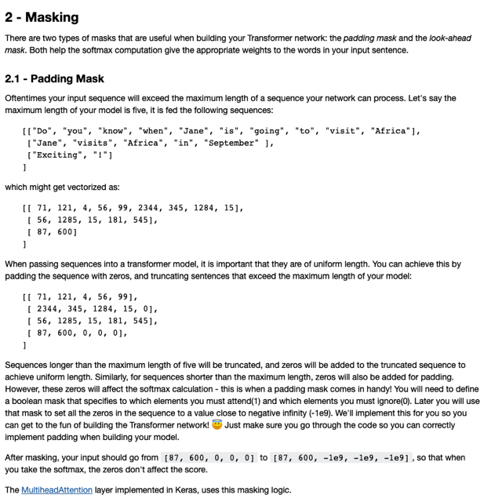</kbd>

> [!NOTE]
> Đại khái là khi bỏ input sequence vào (vào Transformer model) thì cần các
> sequence có cùng độ dài. Kiểu như các câu phải có cùng độ dài
>
>
>
> Để làm vậy thì câu dài quá Max-len sẽ bị truncated, câu ngắn hơn thì thêm
> zeros vào (padding)
>
>
>
> Mà làm vậy thì các zeros number sẽ ảnh hưởng đến kết quả tính toán của
> hàm softmax, nên cần dùng cái gọi là  Masking.
>
>
>
> Đại khái là nó sẽ hướng dẫn là số nào thì "tính", số nào thì "bỏ qua"
>
>
>
> Ổng làm giùm mình, chỉ cần đảm bảo hiểu làm được

 

<kbd></kbd>

<kbd>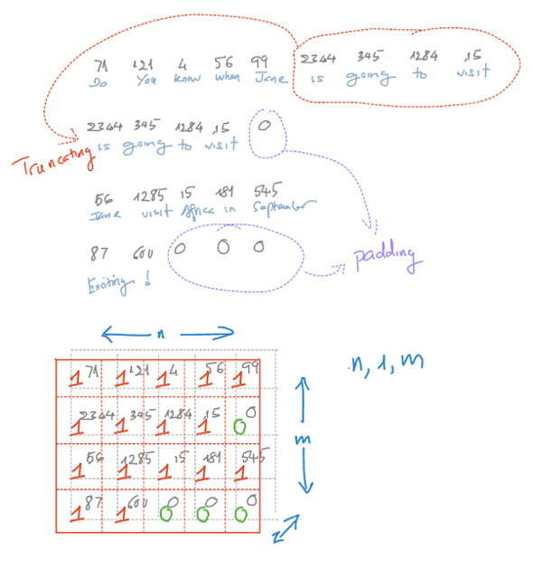</kbd>

 

<kbd></kbd>

 

<kbd>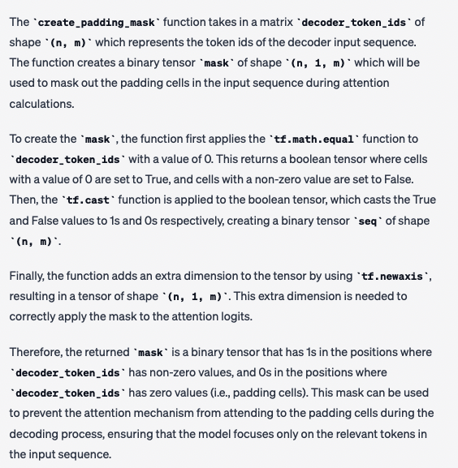</kbd>

> [!NOTE]
> Đại khái là nó dùng tf.math.equal với arg = 0 và
> decoder_token_ids) để tạo matrix và chỗ nào
> khác 0 thì True, = 0 thì False
>
>
>
> Sau đó nó biến True thành 1 , False thành 0 bằng tf.cast
>
>
>
> Rồi Add cái matrix đó vào để từ 2D (năm) thành 1 cái volume
> 3D (m,1,m) dùng function tf.newaxis
>
>
>
> Kiểu như dài nhiêu rộng nhiêu, giờ có thêm sâu bao nhiêu nữa

 

<kbd>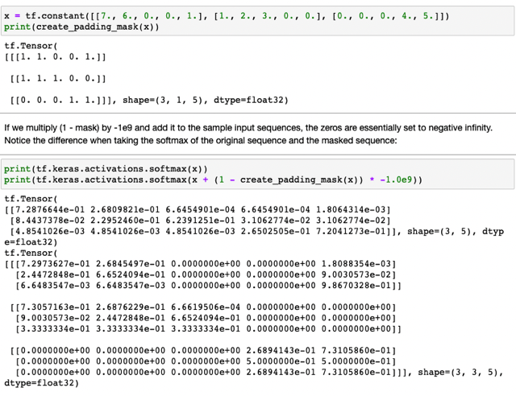</kbd>

 

<kbd>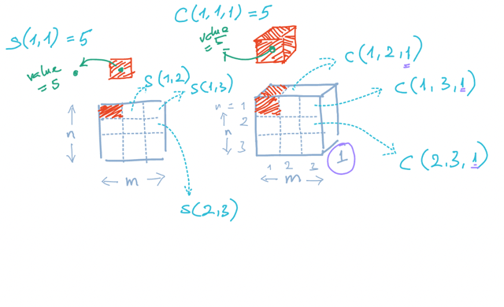</kbd>

> [!NOTE]
> Giải thích cái khái niệm add
> thêm 1 dimension là sao

 

- **2.2 - Look-ahead Mask**

 

<kbd>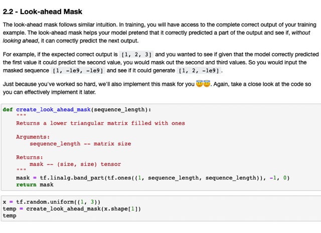</kbd>

> [!NOTE]
> Chưa hiểu lắm cách làm

 

<kbd></kbd>

 

- **3 - Self-Attention**

 

- **Exercise 3 - scaled_dot_product_attention**

 

<kbd>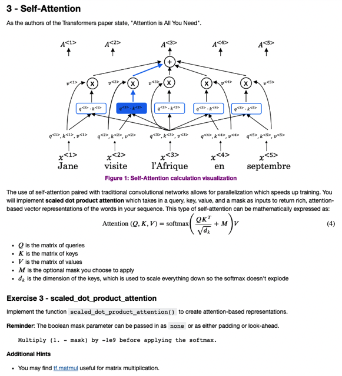</kbd>

 

<kbd>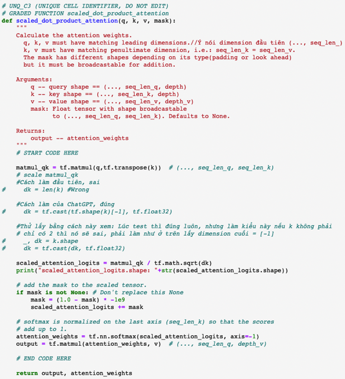</kbd>

<kbd></kbd>

> [!NOTE]
> 1. Tính Q@K.T: Dùng hàm tf.matmul và tf.transpose thôi, đơn giản
>
>
>
> (..., seq_len_q, depth) @ (..., seq_len_k, depth).T  = (..., seq_len_q,
> seq_len_k)
>
>
>
> 2. tính sqrt(dk): Cái này dk chỉ nói là dimension của matrix k, trong bài
> giảng cũng không nói rõ làm stuck chỗ này cho tới khi hỏi ChatGPT. Thì
> ra đại khái là tính như lấy shape rồi lấy cái size của dimension cuối rồi
> cát thành float. Nói tóm lại, trong hướng dẫn nó nói dimension của k tức
> là size của dimension cuối vậy tức là depth? - Đúng là depth
> Nhưng phải làm theo kiểu của ChatGPT vì đảm bao luôn đúng
> bởi access dimension cuối bằng [-1]
>
>
>
> 3. Tính cái M - mask cũng không được hướng dẫn rõ ràng
> chỉ nói: "Multiply (1. - mask) by -1e9 before applying the softmax."
> hoá ra phải tính mask = (1 - mask)* -1e9 
> Chưa hiểu tại sao.
>
>
>
> 4. Tính cái cục [QK.t/sqrt(dk)] - M rồi bỏ vào softmax: Không đến nổi
> không hiểu
>
>
>
> 5. Nhân với V: Matlmul thôi.
>
>
>
> Tóm lại stuck ở cái chỗ chưa biết dk là cái gì và mask
>
> Tìm hiểu lại Mask: Tại sao
> mask = (1 - mask) * -1e9
>
> Các matrix q,k,v có shape như vậy là sao chưa hiểu luôn
>
>
>
> ***depth** sẽ chính là **embedding_dim**

 

<kbd>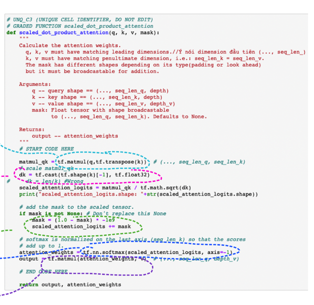</kbd>

 

<kbd></kbd>

 

- **4 - Encoder**

 

- **4.1 Encoder Layer**

 

<kbd></kbd>

 

<kbd></kbd>

> [!NOTE]
> Tại sao: 
> (batch_size, seq_len, **dff***(là gì))
> (batch_size, seq_len,**d_model**
>
>
>
> -> **dff** chính là 'fully connected dimension' - size của Fully Connected layer
>
>
>
> và **d_model** chính là embedding_dimension**: Size của embedded vector.**

 

- **Đại khái hiểu một điểm quan trọng là

Sau khi qua MHA, kết quả nó không ra liền cái embedding vector
(hiểu đại khái là mấy cái vector A<1>,A<2>..trong hình vẽ của bài
giảng) ..

..Nói đúng hơn là "chưa vội" lấy kết quả của M.H.A làm word
embedding vector..

..mà những vector output sẽ bỏ vào 2 Dense layer nữa mới để nó
học tiếp rồi mới lấy cái output từ đó làm embedding vector.**

 

- **Exercise 4 - EncoderLayer**

 

<kbd></kbd>

 

<kbd></kbd>

> [!NOTE]
> Trong cái ini này thì **embedding_dim** chính là chiều dài của word
> embedded vector A<1>,A<2>.. Đọc trong doc cũng thấy args (không phải
> call argument) thì constructor của Multi-head Attention bỏ vào:
> **num_heads** = Số attention head, trong bài giảng có nói là **"h"**
> **key_dim** = **Size của each attention head for query and key**
>
>
>
> Tạm hiểu **"size of each attention head"** đại khái là **chiều dài của
> word embedding vector**

 

<kbd></kbd>

 

<kbd>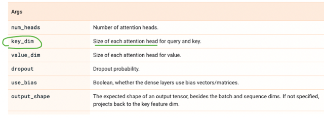</kbd>

 

<kbd>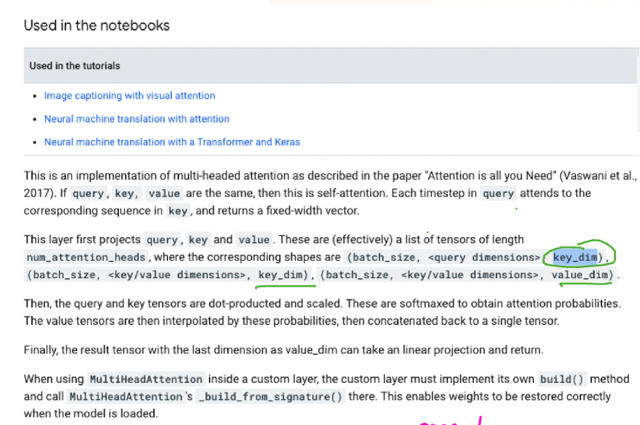</kbd>

 

<kbd>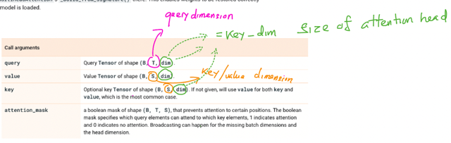</kbd>

 

<kbd>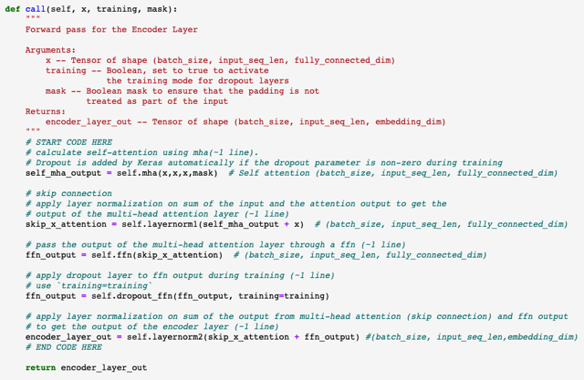</kbd>

<kbd></kbd>

> [!NOTE]
> Dù chưa hiểu như đại khái hiểu như vầyđể làm cái đoạn
> **self.mha_output = self.mha(x,x,x,mask) :** 
>
>
>
> Xem document của MultiHeadAttention thấy '**call argument**' của nó là 
> query, value, key, attention_mask,,,
>
>
>
> Trong đó query, value và key là **Tensor** với các shape:
>
>
>
> - Query: B = batch size, T , dim 
> (trong assignment hint có nói thêm T là **target sequence shape**)
>
>
>
> - Value: B, S, dim
> (trong assignment hint có nói thêm S là **ouput shape**)
>
>
>
> - Key: B, S, dim
>
>
>
> Mà x nó đã ghi sẵn là tensor of shape: 
> B - batch size, input_seq_len, fully_connected_dim
>
>
>
> **Đã nói rõ trong hint là sẽ bỏ Q, K, V vào (cùng với mask) vào 
> cái multihead attention layer mà nếu là đang compute self-attention
> thì Q, K, V bằng nhau. Vậy thì là bỏ x,x,x chứ gì nữa.**
>
> Rồi x tại sao cái dimension thứ 3 của
> x là **fully_connected_dim**?
>
>
>
> Khả năng là do để output từ mha khớp với layer tiếp sau đó
> là Fully-Connected layer
>
> Còn khúc dưới thì không đến nỗi khó quá ko làm được dù chưa thật rõ
> nhưng cứ làm theo hint

 

<kbd>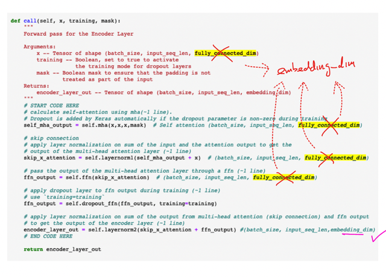</kbd>

<kbd>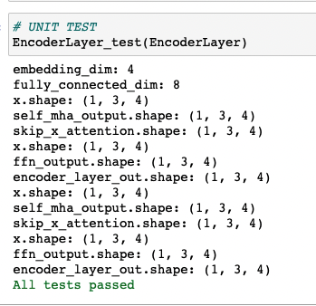</kbd>

> [!NOTE]
> Chỗ này mr Andrew
> hình như đã ghi sai shape

 

- **4.2 - Full Encoder**

 

<kbd></kbd>

 

- **Exercise 5 - Encoder**

 

<kbd></kbd>

 

<kbd>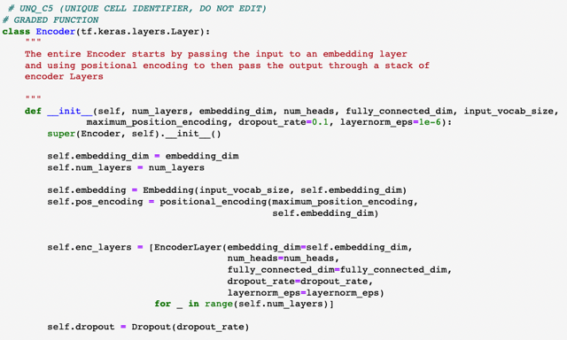</kbd>

 

- **Giải thích dòng: \\*self.embedding = Embedding(input_vocab_size, self.embedding_dim) \\*

mà lúc call nó biến x từ:

x  -- Tensor of shape (batch_size, input_seq_len)

để thành ra:

x = self.embedding(x)  # (batch_size, input_seq_len, \\*embedding_dim\\*)

--> Đại khái là bước này define một Embedding layer, bài trước ta đã
làm (Embedding), nhưng ở đó mình dùng một pre-trained word
embedding matrix để define ra Embedding layer và set cho nó trainable
= False.

Còn bây giờ, đại khái là ta chỉ define nó trong 'hệ thống' và khi 'train' nó
sẽ train luôn cái Embedding layer's weights = Đồng nghĩa nó sẽ tìm
weights sao cho Embedding layer sẽ có thể tạo ra các word embedding
vector đại diện tốt cho từ (nắm bắt được các tính chất của từ đó)

- Có thể confuse một chút là cái Self-Attention cũng tìm cách tạo các
vector A<> đại diện cho từ sao cho nó nắm bắt ngữ cảnh của từ trong
câu thì kệ nó cứ hiểu đại khái là cái (step) nào cũng có tác dụng của nó
-> Không có gì confuse sâu khi đọc 4 articles của \\*Ketan Doshi,\\* ta hiểu rằng
Self Attention layer sẽ 'add' thêm vào các embedding vector này các thông
tin 'ngữ cảnh', tức \\*dimension của vector embedded vẫn vậy\\*, chỉ là được kiểu
như là bồi đắp thêm/củng cố thêm thôi.**

 

- **Embedding layer trong document arg  \\/\\*input_dim\\*\\/: "Integer. Size of the
vocabulary",  \\*output_dim\\*: Integer. Dimension of the dense embedding

và

Input shape 2D tensor with shape: (batch_size, \\*input_length\\*).

Output shape 3D tensor with shape: (batch_size, \\*input_length\\*,
\\*output_dim\\*).

Hiểu đại khái là đưa \\*input dim\\* là max của số lượng các từ cần embedded
vậy không "liên quan" đến \\*input_length !???\\*

Nên khi define ở bài trước thì Embedding(vocab_size, embedding_dim) bài
này thì Embedding (input_vacab_size, embedding_dim) Còn khi 'chạy' ta đưa
vào một câu dài 10 thì input_length =10
- Input là tensor (batch_size, 10) thì nó cho ra
- output là batch_size, 10, 50)**

<kbd>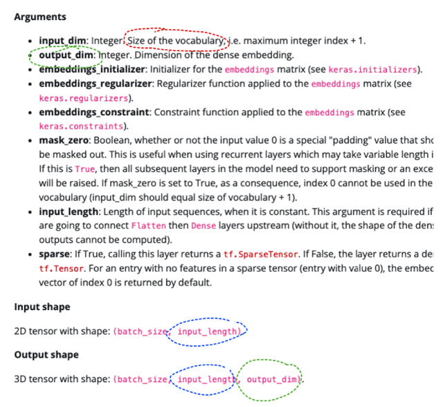</kbd>

> [!NOTE]
> Hiểu đại khái là đưa input dim là max của số
> lượng các từ cần embedded vậy không "liên
> quan" đến input_length Không biết hiểu vậy có
> đúng không!??? Quay lại sau

 

<kbd></kbd>

 

- **Giải thích dòng self.pos_encoding = positional_encoding(max..., \\*embedding_dim\\*)

Thì đại khái là sau loạt bài của \\*Ketan\\*, ta hiểu (rõ hơn) rằng một data instance 
(một sequence - hay một câu đi cho rõ) hoặc nhiều (một số lượng batch_size)
các sequence sẽ được trải qua quá trình xử lý như sau:

a. Đuợc embedded (trong Keras như bài asigment này thì chính là bước Embedding
layer ở trên) -> Tức là quá trình mỗi một từ trong sequence (câu) sẽ được biến
thành một embedding vector có độ dài là \\*embedding_dim. \\*Cái này đã nói ở trên 

b. Cùng lúc đó, một cách ngắn gọn giải thích lại câu chuyện là tại vì không như RNN
mà ở đó ta đưa vào từng từ để learn nên có sẵn thông tin \\*vị trí\\*, bây giờ với Transformer
cách làm kết hợp lợi điểm của CNN là xử lý \\*CÙNG LÚC \\*và\\* \\*tuyệt chiêu \\*attention-based 
t\\*hì lại \\*không còn thông tin vị trí \\*nên phải dùng\\* kĩ thuật Positional Encoding \\*để bổ
sung thông tin này, tạm giải thích gọn vậy thôi.

Vậy thì thông tin của positional encoding này sẽ có cùng shape với embedding vector
tức là cũng batch_size, sequence_length, embedding_size.
Mà điều có thể gây confuse là mr Andrew hình như không nói rõ trong bài giảng và trong
các function như positional_encoding thì dùng chữ \\*d / d_model \\*(trong test_function)
rằng cái positional encoding vector và word embedding vector đều có dimension là
\\*embedding_dim.
\\*
*Sẵn tiện trong loạt bài của Ketan cũng cho biết \\*embedding_dim\\* là constant dùng 
xuyên suốt nên còn được gọi là \\*d_model\\* giống như dimension của model vậy.
Cái này cũng giải thích bối rối \\*d-model\\* ở define \\*FullyConnected\\* (theo link mà xem)

Để kết lại phải nói thêm là cái \\*positional_encoding\\* block sẽ được \\*CỘNG \\*với \\*word
embedding\\* block vì cùng size mà (batch, seq_len, emb_dim) trước khi bỏ vào Encoder
Câu này giải thích luôn cho dòng \\*x += self.pos_encoding \\*của call()
Còn cụ thể tại sao gọi (:,:sequence_len,:) thì chưa hiểu lắm**

 

- **Giải thích dòng:
self.enc_layers = [EncoderLayer(embedding_dim=self.embedding_dim,
                                        num_heads=num_heads,
                                        fully_connected_dim=fully_connected_dim,
                                        dropout_rate=dropout_rate,
                                        layernorm_eps=layernorm_eps) 
                           \\*for _ in range(self.num_layers)]\\*

Đại khái là nó tạo 1 list có \\*num_layers cái \\*EncoderLayer object 
Các argument như thế này là define theo required của function\\* __ini__() \\*
trong \\*EncoderLayer\\* class

Sau khi đọc loạt bài của Ketan, ta hiểu rằng người ta cho thông tin 'chạy qua'
một vài Encode, mà trong loạt bài của Ketan là 6 cái. Đừng lầm lẫn với 
Multi-head gì ở đây vốn là mỗi một Encoder chứa 1 cái Multi-head Attention
Và như vậy cứ \\*out của thằng (Encoder) trước là input của thằng sau\\* thôi.
Nên trong function call() mr Andrew làm vậy trong for-loop num_layers  

Cái input của Encoder sẽ là cái volume các embedding vector có shape như sau
(\\*batch_size\\*, \\*seq_len\\*, \\*emb_dim\\*)

Kiểu như: 
- Có B - \\*batch_size\\* sample (sample là 1 câu đó), 
- Mỗi sample /câu có \\*sequence_len\\* từ
- Mỗi từ là một embedding vector có size là \\*embedding_dim\\***

 

<kbd></kbd>

 

- **5 - Decoder**

 

- **5.1 - Decoder Layer**

 

<kbd></kbd>

 

<kbd>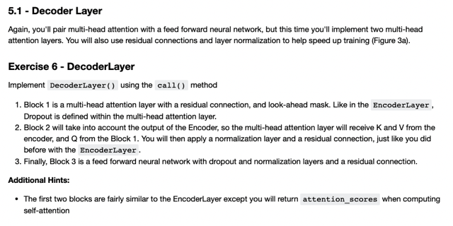</kbd>

 

- **Exercise 6 - DecoderLayer**

 

<kbd></kbd>

 

<kbd>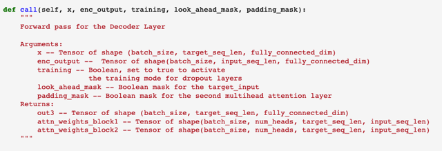</kbd>

<kbd></kbd>

<kbd></kbd>

 

- **Chỗ này mr Andrew hình như đã nhầm khi mà ghi rằng:  \\*x\\* là tensor và
\\*enc_output\\* là shape: (batch_size, target_seq_len, \\*full_connected_dim là
đâu đúng? phải là embedding_dim chứ)

\\*Mà ở Encoder ổng cũng ghi là output là batch_size, sequence_len, \\*embedding_dim\\* \\*
\\*Và output sau mha1 cũng là batch_size, sequence_len, \\*d_model\\* =  \\*embedding_dim
Nói chung có thể chỗ nào là fully_connected_dim đều phải sửa là embedding_dim

\\*Vì Theo loạt bài của Ketan thì sequence embedding sẽ giữ nguyên shape là
\\*batch_size\\*, \\*sequence_len\\*, \\*embedding_dim\\* xuyên suốt**

 

<kbd></kbd>

> [!NOTE]
> Chỗ này mr Andrew
> hình như đã ghi sai shape

 

<kbd></kbd>

 

- **5.2 - Full Decoder**

 

<kbd></kbd>

 

- **Exercise 7 - Decoder**

 

<kbd>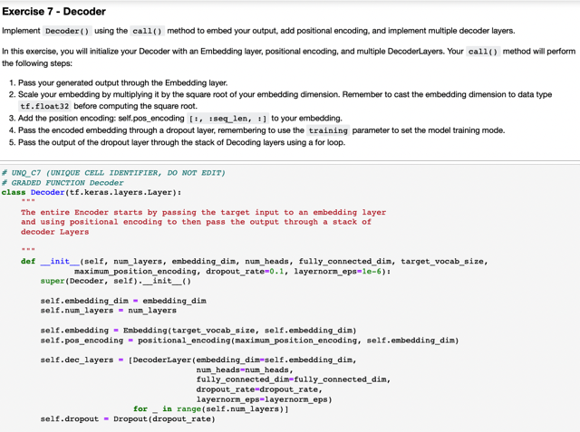</kbd>

 

<kbd></kbd>

<kbd>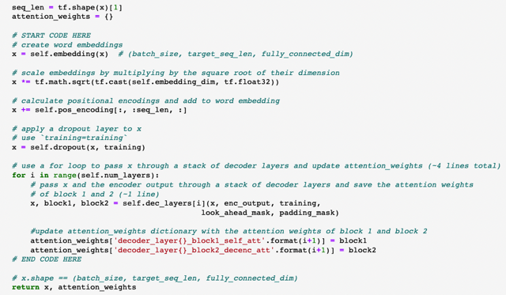</kbd>

<kbd></kbd>

 

<kbd></kbd>

> [!NOTE]
> Chỗ này mr Andrew
> hình như đã ghi sai shape

 

- **6 - Transformer**

 

- **Exercise 8 - Transformer**

 

<kbd>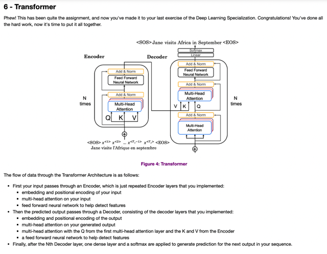</kbd>

 

<kbd></kbd>

 

<kbd></kbd>

 

<kbd></kbd>

 

<kbd>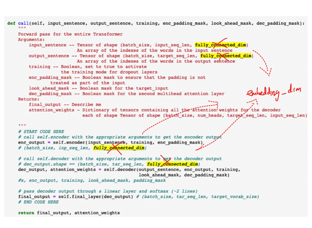</kbd>

> [!NOTE]
> Chỗ này mr Andrew
> hình như đã ghi sai shape

 

- **\\*Conclusion
\\*You've come to the end of the graded portion of the assignment. By now, you've:
 • Created positional encodings to capture sequential relationships in data
 • Calculated scaled dot-product self-attention with word embeddings
 • Implemented masked multi-head attention
 • Built and trained a Transformer model

\\*What you should remember\\*:
 • The combination of self-attention and convolutional network layers allows of parallelization of training and \\/faster training\\/.
 • Self-attention is calculated using the generated query Q, key K, and value V matrices.
 • Adding positional encoding to word embeddings is an effective way to include sequence information in self-attention calculations.
 • Multi-head attention can help detect multiple features in your sentence.
 • Masking stops the model from 'looking ahead' during training, or weighting zeroes too mu**

 

- **7 - References**

 

<kbd></kbd>

 

### Transformer Applications - Ungraded Labs

 

#### Tranformer Pre-processing

 

##### Welcome to Week 4's first ungraded lab. In this notebook you
will delve into the pre-processing methods you apply to raw text
to before passing it to the encoder and decoder blocks of the
transformer architecture.

 

- **Packages**

 

- **import tensorflow as tf
import numpy as np
import matplotlib.pyplot as plt
import os

from tensorflow.keras.layers import \\*Embedding\\*
from tensorflow.keras.preprocessing.text import \\*Tokenizer\\*
from tensorflow.keras.preprocessing.sequence import \\*pad_sequences\\***

 

- **1 - Positional Encoding**

 

<kbd>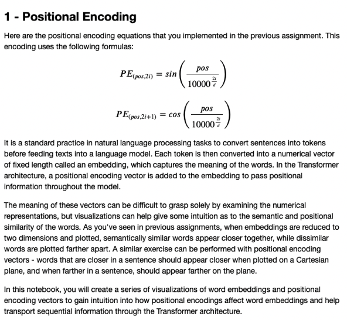</kbd>

> [!NOTE]
> Đại khái là cái sequence embedding output tổng hợp bởi word embedding
> và position encoding chỉ là những con số, khó lòng hình dung được ý
> nghĩa của nó nhưng bằng cách plot nó trên Cartesian plane thì có thể giúp
> nhận thấy rằng từ mà gần nhau trong câu thì sẽ gần nhau trên plot

 

- **1.1 - Positional encoding visualizations**

 

<kbd></kbd>

 

<kbd>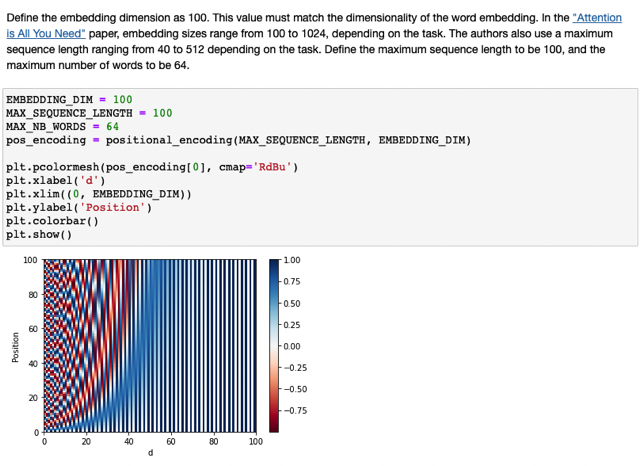</kbd>

 

<kbd>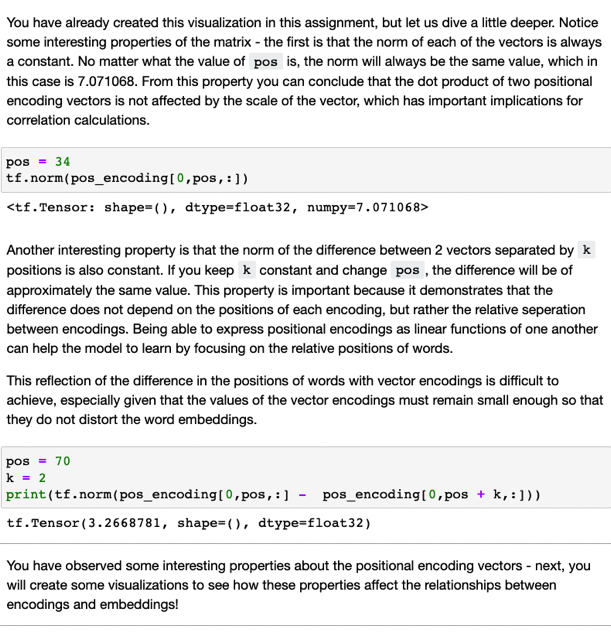</kbd>

> [!NOTE]
> Đại khái là có 2 tính chất quan trọng đó là:
>
>
>
> 1. Tất cả các position encoding vector đều có norm bằng nhau dẫn
> đến một kết luận là dot product của 2 vector nay **sẽ không bị ảnh
> hưởng bởi the scale của vector** và do đó đây sẽ là một đặc điểm
> quan trọng trong việc tính toán sự liên quan của các  từ với nhau
>
>
>
> 2. **Sự khác biệt** của 2 vector bất kì miễn là pos c**ùng cách nhau k thì
> đều giống nhau** dù pos có thay đổi ra sao.

 

- **1.2 - Comparing positional encodings

Nói chung là dùng visualization để
check positional encodinga**

 

- **1.2.1 Correlation**

 

<kbd></kbd>

> [!NOTE]
> Đại khái là, việc các pe vector khác biệt nhau chưa nói lên điều gì, plot
> matrix các chỉ số correlation của mỗi vector với từng vector ở vị trí khác
> sẽ thấy nếu encoding tốt thì nó phải có dạng đối xứng qua đường chéo
> với đường chéo cao nhất (bản thân mỗi thằng giống chính nó nhất) càng
> xa đường chéo càng giảm

 

- **1.2.2 Euclidean distance**

 

<kbd></kbd>

> [!NOTE]
> Ngược lại thay vì dùng 'độ giống' (correlation) thì dùng ' độ khác' -
> Euclidean distance thì cũng sẽ thấy dạng đối xứng, càng xa đường chéo
> càng tăng - càng xa nhau càng khác nhau nhiều

 

- **2 - Semantic embedding**

 

- **You have gained insight into the \\*relationship
positional encoding vectors have with other vectors\\*
at different positions by creating correlation and
distance matrices. Similarly, you can gain a stronger
intuition as to \\*how positional encodings affect word
embeddings\\* by visualizing the sum of these vectors.**

 

- **2.1 - Load pretrained embedding**

 

<kbd>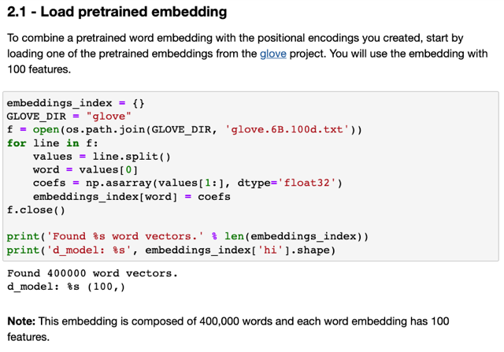</kbd>

> [!NOTE]
> Đại khái là load pre-trained embedding vector from Glove project,
> mỗi vector có 100 features tức embedding_dim = 100

 

<kbd>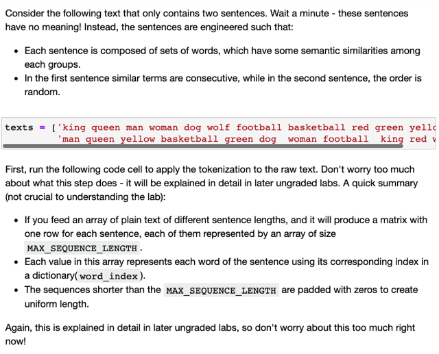</kbd>

> [!NOTE]
> Ổng tạo 2 câu với các cặp từ 'gần nhau' - gần nhau vì ngữ nghĩa, tính
> chất gần nhau thể hiện bởi embedding vector và 1 câu thì để cặp từ
> gần nhau thì sát nhau, 1 câu để lộn xộn

 

<kbd>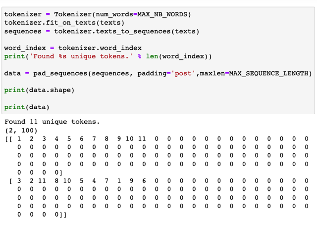</kbd>

> [!NOTE]
> Khúc này ổng nói đại khái là tạm thời có thể lướt qua vì sẽ giải thích kĩ hơn
> sau, nhưng đại khái là cách 1 text có nhiều câu với độ dài ngắn khác nhau
> được tokenize và padding như thế nào trước khi bỏ vào Embedding layer để
> tạo embedding vectors
>
>
>
> Cụ thể là cứ **mỗi câu sẽ trở thành một array**, **độ dài fixed** bởi một  const
> MAX_SEQUENCE_LEN, nên câu **ngắn quá thì dc padding** bởi 0, **dài quá
> thì bị truncated**.
>
>
>
> Rồi trong array thì **mỗi số là index của từ** trong một **dictionary**, vậy thôi

 

<kbd></kbd>

> [!NOTE]
> Phần này đại khái là ổng dùng cái pre-trained embedding vectors từ Glove
> project để tạo một cái Embedding layer nhưng để đơn giản thỉ bỏ hết chỉ giữ
> nhưng vector của các từ có trong câu và không phải từ nào trong câu cũng
> chắc chắn có trong cái pre-trained nên sẽ fill bằng 0
>
>
>
> Khúc cuối, sau khi embedding, thì xem shape thấy 2,100 (2 câu, mỗi câu 100
> token), đã trở thành 2,100,100 (2 câu, mỗi câu 100 vector, mỗi vector 100 số)

 

- **2.2 - Visualization on a Cartesian plane**

 

<kbd></kbd>

> [!NOTE]
> Này đại khái là plot các embedding vector lên Cartesian plane (sau khi
> đã PCA từ 100D còn 2D) thì thể hiện rõ các từ gần nhau sẽ ..gần
> nhau.

 

<kbd></kbd>

 

<kbd></kbd>

 

- **3 - Semantic and positional embedding

Đại khái là với sự kết hợp với Positional Encoding (với trọng số
nào đó) thì yếu tố 'vị trí trong câu' của các từ bắt đầu tạo ảnh
hưởng (đến embedding vector - nói ở đây chỉ tổng của cả word
embedding hay còn gọi là semantic embedding và positional
encoding). Cụ thể là từ gần nhau trong câu bắt đầu xích lại gần
nhau trên Cartesian plane hơn, như red, wolf - đứng sát nhau
trong câu, dù semantic nó xa nhau

Nếu thay đổi trọng số, thì ảnh hưởng của pe vào embedding
tổng cũng giảm dần**

 

<kbd></kbd>

 

<kbd></kbd>

> [!NOTE]
> Đại khái là với sự kết hợp với Positional Encoding (với trọng số nào
> đó) thì yếu tố 'vị trí trong câu' của các từ bắt đầu tạo ảnh hưởng (đến
> embedding vector - nói ở đây chỉ tổng của cả word embedding hay
> còn gọi là semantic embedding và positional encoding). Cụ thể là từ
> gần nhau trong câu bắt đầu xích lại gần nhau trên Cartesian plane
> hơn, như red, wolf - đứng sát nhau trong câu, dù semantic nó xa nhau

 

<kbd></kbd>

 

<kbd>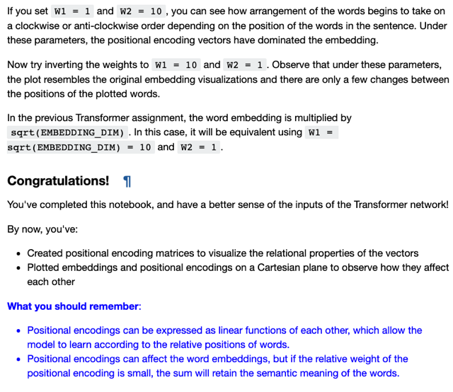</kbd>

> [!NOTE]
> Nếu thay đổi trọng số, thì ảnh hưởng của pe vào embedding tổng cũng giảm
> dần

 

- **\\*What you should remember\\*:

• Positional encodings can be expressed as linear
functions of each other, which allow the model to
learn according to the relative positions of words.

• Positional encodings can affect the word
embeddings, but if the relative weight of the
positional encoding is small, the sum will retain the
semantic meaning of the words.**

 

#### Transformer Network Application:
named-entity Reconition

 

##### 1. Use tokenizers and pre-trained models from the
HuggingFace Library.

2. Fine-tune a pre-trained transformer model for
Named-Entity Recognition

 

- **Packages**

 

<kbd></kbd>

 

- **1 - Named-Entity Recogniton
to Process Resumes**

 

- **When faced with a large amount of unstructured text data, named-entity
recognition (NER) can help you detect and classify important information
in your dataset. For instance, in the running example "Jane vists Africa in
September", NER would help you detect "Jane", "Africa", and "September"
as named-entities and classify them as person, location, and time.

- You will use a variation of the Transformer model you built in the last
assignment to \\*process a large dataset of resumes\\*.

- You will find and \\*classify relevant information\\* such as the companies the
applicant worked at, skills, type of degree, etc.**

> [!NOTE]
> Đại khái là (ứng dụng NER) xử lý một tập resumes data lớn
> để lấy những thông tin quan trọng từ các candidates

 

- **1.1 - Data Cleaning**

 

- **Cái này ổng làm một loạt xem qua các function

Khúc đầu đại khái là chuẩn bị một số function để giúp lấy dữ liệu
\\*get_entities\\*()... Mấy cái này nhờ CHatGPT sẽ có thể hiểu sau

- \\*convert_dataturks_to_spacy\\*: Hiểu đại khái là convert gì đó

- \\*trim_entity_spans\\*: Removes leading and trailing white spaces
from entity spans -> Hiểu đại khái là trim**

> [!NOTE]
> Chưa hiểu cụ thể

 

- **1.2 - Padding and Generating Tags**

 

<kbd>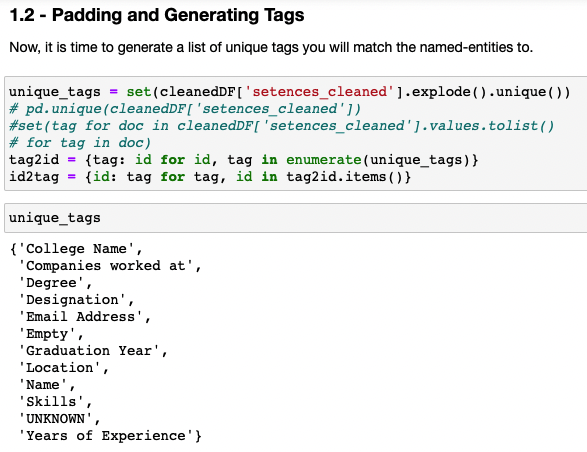</kbd>

> [!NOTE]
> Chưa hiểu nó làm gì nhưng đại khái là lấy ra xem có những tag gì
>
> Chưa hiểu cụ thể

 

<kbd>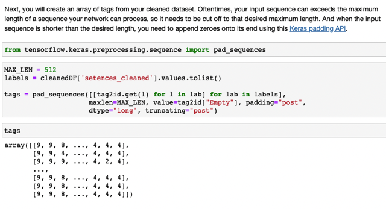</kbd>

> [!NOTE]
> Chưa hiểu cụ thể

 

- **1.3 - Tokenize and Align Labels with 🤗 Library**

 

<kbd>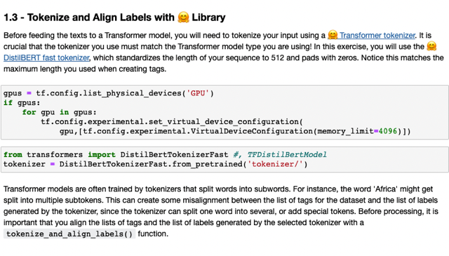</kbd>

> [!NOTE]
> Chưa hiểu cụ thể
>
> Đại khái là kiểu như phải tokenize cái input trước khi bỏ vào Transformer model,
> và thường dùng 1 cái Transformer tokenizer (kiểu như thư viện) nên phải đảm
> bảo cái thằng tokenizer với Transformer model phải 'hợp' nhau. (Type phải match
> nhau)

 

- **Exercise 1 - tokenize_and_align_labels**

 

<kbd>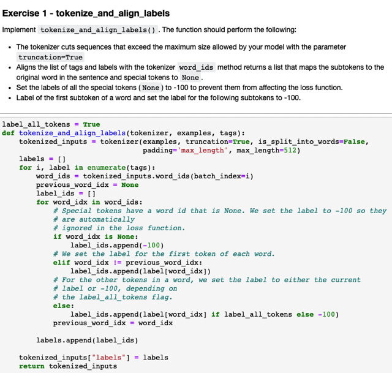</kbd>

> [!NOTE]
> Ok thì đại khái là cái kiểu của thằng Distill..tokenizer này là nó làm cái kiểu bẻ 1
> từ ra thành nhiều subword để tokenize, nên để không bị kiểu như 'lệch'
> (misalignment) với các tags ban đầu thì gán như vầy: Bẻ ra thì cái đầu gán
> bằng (index) cái cũ, còn mấy cái sau thì gán =-100. Cái special token cũng gán
> -100 luôn.

 

<kbd></kbd>

> [!NOTE]
> Sau khi tokenize xong giờ mới tạo train/test set đây

 

- **1.4 - Optimization**

 

<kbd></kbd>

> [!NOTE]
> Đại khái là dùng cái Transformer model tên là
> **TFDistilBertForTokenClassification**
>
>
>
> Và nó cũng là **pre-trained model** luôn (thể hiện bởi **from_pretrained**) -
> đại khái giống như họ (**HuggingFace library)** có sẵn những pre-trained
> model để sẵn vậy) ta sẽ load về và **fine-tune** thêm nên mới gọi phần này là
> optimization

 

<kbd>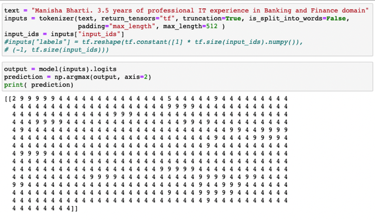</kbd>

> [!NOTE]
> Đại khái là thử 1 text mới, tokenize nó, rồi bỏ vào model predict thử ở đây cái
> **model(inputs).logits hình như chỉ số probability** rồi lấy **argmax để lấy ra
> prediction**
>
> Cần confirm lại: logits

 

<kbd>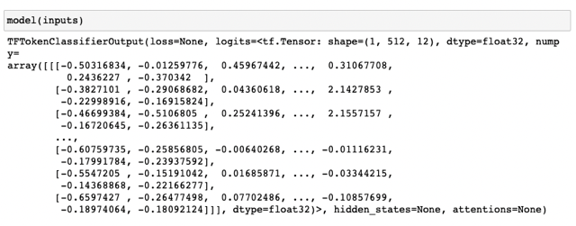</kbd>

> [!NOTE]
> Xem model(input)

 

<kbd></kbd>

> [!NOTE]
> Đoạn này cài thêm cái **Sequeval** chưa hiểu để tác dụng gì
> Nhưng có thể để đọc **value** của **sequence** chăng

 

<kbd></kbd>

> [!NOTE]
> Đoạn này đại khái là predict lại toàn bộ train set

 

<kbd>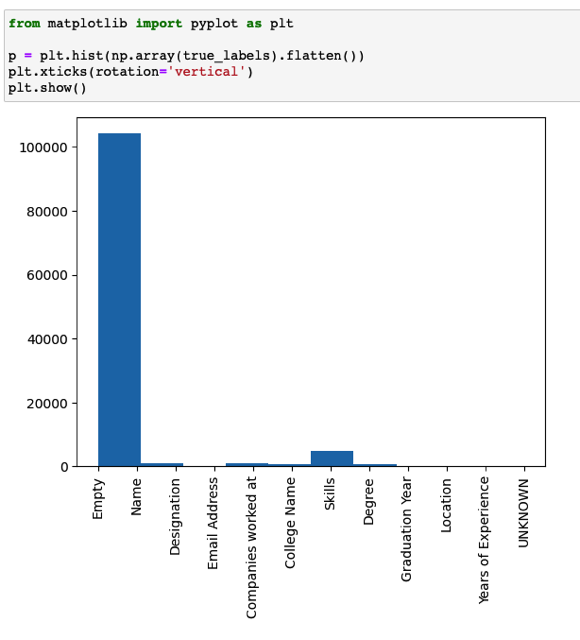</kbd>

<kbd>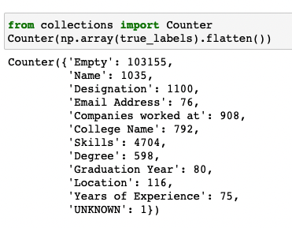</kbd>

> [!NOTE]
> Vẽ thử ra xem và chi tiết thì thấy **TRUE LABEL** 1035 cái name, location 116, ,,,,

 

<kbd></kbd>

> [!NOTE]
> So với Prediction

 

<kbd>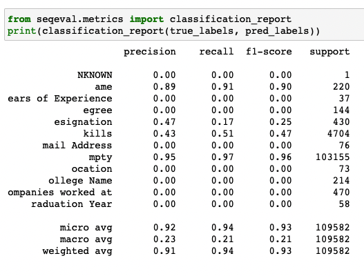</kbd>

> [!NOTE]
> Cuối cùng là xem các thông số để
> evaluate: precision, recall, f1-score

 

- **Congratulations!

Here's what you should remember:

- Named-entity recognition (NER) detects and classifies
named-entities, and can help process resumes, customer reviews,
browsing histories, etc.
- You must preprocess text data with the corresponding tokenizer to
the pretrained model before feeding your input into your Transformer
model.**

 

#### Transformer Network
application: Question Answering

 

##### Welcome to Week 4's third, and the last lab of the course!
Congratulations on making it this far. In this notebook you'll
explore another application of the transformer architecture that
you built.

After this assignment you'll be able to:

- Perform extractive Question Answering

- Fine-tune a pre-trained transformer model to a custom dataset

- Implement a QA model in TensorFlow and PyTorch

 

- **1 - Extractive Question Answering**

 

- **Question answering (QA) is a task of natural language processing
that aims to automatically answer questions. The goal
of \\/extractive\\/ QA is to identify the portion of the text that contains
the answer to a question. For example, when tasked with answering
the question 'When will Jane go to Africa?' given the text data 'Jane
visits Africa in September', the question answering model will
highlight ' September'.

• You will use a variation of the Transformer model you built in the
last assignment to answer questions about stories.

• You will implement extractive QA model in TensorFlow and in
PyTorch. \\* Recommendation:\\*

• If you are interested, check out the \\_Course 4: Natural Language
Processing with Attention Models\\_ of our \\_Natural Language
Processing Specialization\\_ where you can learn how to build
Transformers and perform QA using the \\_Trax\\_ library.**

> [!NOTE]
> extractive QA có mục đích là dùng train AI
> model sao cho đại khái là cho một story rồi hỏi
> lại những chi tiết của story đó

 

- **1.1 - Data Cleaning**

 

<kbd>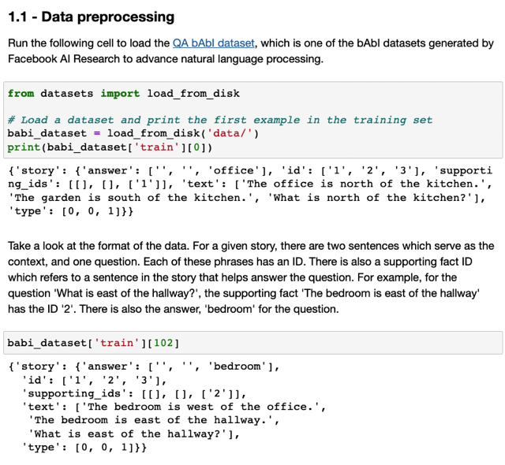</kbd>

> [!NOTE]
> Đại khái là mỗi câu hỏi entry nó có 3 text hai câu đầu là context, câu
> cuối là câu hỏi.Và cái supporting ids là ids của câu giúp trả lời câu hỏi

 

<kbd>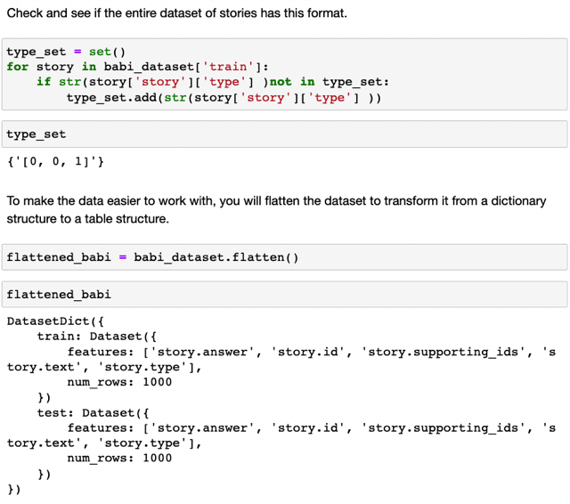</kbd>

> [!NOTE]
> Đại khái là nó loop qua hết và bỏ type_set vào set, check thử chỉ
> có 1 loại là [0,0,1] có nghĩa là mọi dataset đều có format như vậy

 

<kbd></kbd>

 

<kbd></kbd>

 

<kbd>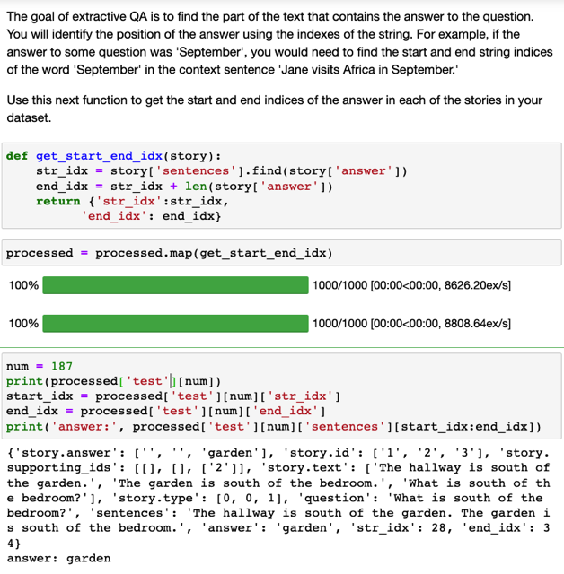</kbd>

> [!NOTE]
> Đại khái là thêm start / end index của cái answer trong câu
>
>
>
> Vd story.answer là 'garden' thì tìm trong story.sentences vị trí của Start
> và end của garden là 28 - 34

 

- **1.2 - Tokenize and Align Labels with 🤗 Library**

 

- **\\*1.2 - Tokenize and Align with \\*🤗\\* Library \\*

Now you have all the data you need to train a Transformer model to perform Question
Answering! You are ready for a task you may have already encountered in the
Named-Entity Recognition lab - tokenizing and aligning your input. To feed text data to a
Transformer model, you will need to tokenize your input using a \\_🤗 Transformer
tokenizer\\_. It is crucial that the tokenizer you use must match the Transformer model
type you are using! In this exercise, you will use the 🤗 \\_DistilBERT fast tokenizer\\_,
which standardizes the length of your sequence to 512 and pads with zeros.

Transformer models are often trained by tokenizers that split words into subwords. For
instance, the word 'Africa' might get split into multiple subtokens. This can create some
misalignment between the list of tags for the dataset and the list of labels generated by
the tokenizer, since the tokenizer can split one word into several, or add special tokens.
Before processing, it is important that you align the start and end indices with the tokens
associated with the target answer word with a tokenize_and_align() function. In this case,
since you are interested in the start and end indices of the answer, you will want to align
the index of the sentence to match the index of the token for a word.**

> [!NOTE]
> Lại nữa dùng tokenizer DistillBERT để tokenize trước khi bỏ vào
> Transformer model, nhắc lại tầm quan trọng của việc hai thằng đó
> phải 'HỢP' nhau
>
>
>
> Thằng DistillBERT này làm việc theo kiểu tokenize ra độ dài 512 và
> pad với 0
>
>
>
> Y như Ungraded Lab trước, ta cũng cần phải align lại vì tokenizer
> sẽ split 1 từ ra thành nhiều subword dẫn đến bị lệch..

 

<kbd>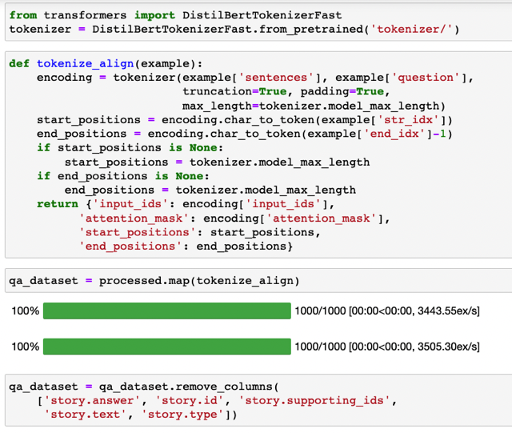</kbd>

> [!NOTE]
> Đại khái là viết function để làm cái việc 'align'

 

- **This is a Python function called tokenize_align that takes in an
example argument. The purpose of the function is to tokenize and
align text data for use in a question-answering model.

The function uses a tokenizer, which is not defined in the code
snippet, but is likely an object that performs text tokenization. The
tokenizer is used to encode the example's sentences and question,
with truncation and padding enabled to ensure that all inputs have
the same length. The max_length parameter sets the maximum
allowed length of the resulting tokenized sequences.

The char_to_token method of the encoding object is used to align the
answer span to the corresponding positions in the tokenized input.
The start_positions variable stores the token index of the first
character in the answer span, and end_positions stores the token
index of the last character in the answer span.

If the answer span's starting or ending character is outside the range
of the tokenized input, then char_to_token returns None. In this case,
the corresponding start_positions or end_positions variable is set to
the maximum token index.

Finally, the function returns a dictionary with the tokenized input IDs,
attention mask, start position, and end position. These values can be
used as input to a question-answering model.**

 

- **qa_dataset['train'][200]

->

{'question': 'What is north of the bathroom?',
 'sentences': 'The garden is north of the bathroom. The hallway is south of the bathroom.',
 'answer': 'garden',
 'str_idx': 4,
 'end_idx': 10,
 'input_ids': [101,
  1996,
  3871,
  2003,
  2167,
  1997,
  1996,
  5723,
  1012,
  1996,
  6797,
  2003,
  2148,
  1997,
  1996,
  5723,
  1012,
  102,
  2054,
  2003,
  2167,
  1997,
  1996,
  5723,
  1029,
  102],
 'attention_mask': [1,
  1,
  1,
  1,
  1,
  1,
  1,
  1,
  1,
  1,
  1,
  1,
  1,
  1,
  1,
  1,
  1,
  1,
  1,
  1,
  1,
  1,
  1,
  1,
  1,
  1],
 'start_positions': 2,
 'end_positions': 2}**

 

- **2 - Training**

 

- **2.1 TensorFlow implementation**

 

<kbd>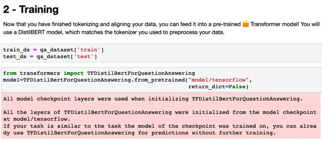</kbd>

> [!NOTE]
> Hiểu tới đâu hay tới đó, ở đây là ổng..
>
>
>
> Load train & test set từ qa_dataset
>
>
>
> Load pre-trained model

 

<kbd>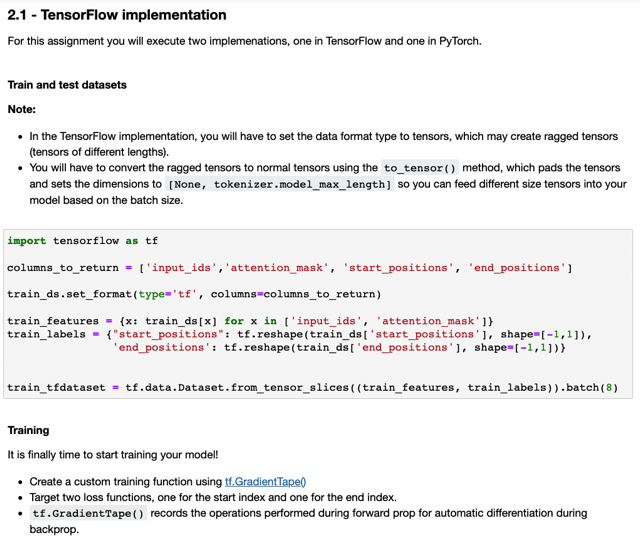</kbd>

> [!NOTE]
> Hiểu tới đâu hay tới đó
>
>
>
> Đại khái là nếu implement bằng TensorFlow thì phải set data format sang
> Tensor có thể khiến tạo ra các Tensor dài ngắn khác nhau gọi là ragged tensor
> nên mình phải dùng function **to_tensor**(), function này giúp kiểu như 'sửa
> lại' đễ tạo thành các tensor đều có size [None, tokenizer. model_max_length],
> vậy thôi

 

<kbd>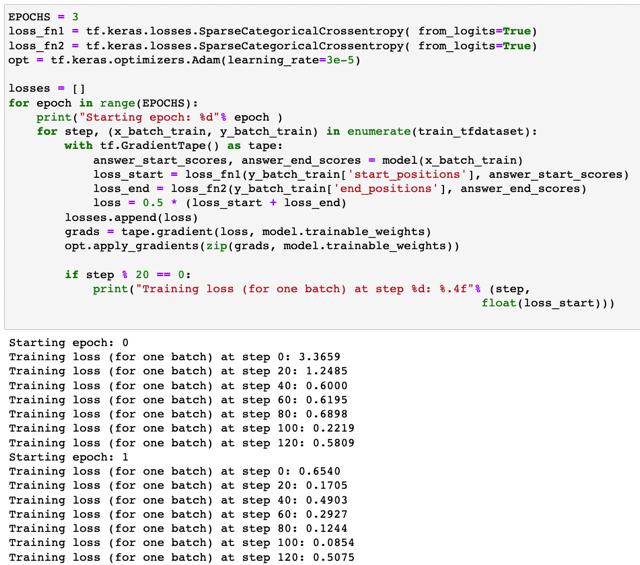</kbd>

> [!NOTE]
> Tại sao lại dùng SparseCategoricalCrossentropy

 

<kbd></kbd>

 

<kbd></kbd>

 

- **2.2 PyTorch implementation**

 

- **What you should remember:**

 

- **• Transformer models are often trained by tokenizers that split
words into subwords.

▪ Before processing, it is important that you align the start and
end indices with the tokens associated with the target answer
word.

• PyTorch is a relatively light and easy to implement framework
that can make rapid prototyping easier, while TensorFlow has
advantages in scaling and is more widely used in production

▪ tf.GradientTape allows you to build custom training loops in
TensorFlow

▪ The Trainer API in PyTorch gives you a basic training loop
that is compatible with 🤗 models and datasets**

 

#### Transformer Using Trax Librabry

 

