# C1w2_n.n Basic

📊 **Progress:** `64` Notes | `163` Screenshots

---

## C1w2_n.n Basic

 

## Logistic Regression As A Neural Network

 

### Binary Classification

 

> [!NOTE]
> 1 The basics of neural network programming include techniques that are
> important to process the entire training set.
>
> 2 The computation of a neural network is organized in forward propagation and
> backward propagation.
>
> 3 Logistic regression is an algorithm for binary classification that is going to be
> used to convey the ideas.
>
> 4 To turn pixel intensity values into a feature vector, they are unrolled to get a
> long feature vector that lists all the red, green and blue pixel intensity values of
> the image.
>
> 5 Binary classification aims to learn a classifier that can input an image
> represented by a feature vector x and predict whether the corresponding label y
> is 1 or 0.
>
> 6 Notations used in the course include lowercase m to denote the number of
> training samples, M_train, to emphasize that this is the number of training
> examples, and m_subscript_test to denote the number of test examples.
>
> 7 A matrix X is defined by taking the training set inputs x1, x2, and so on, and
> stacking them in columns.

 

<kbd></kbd>

 

<kbd></kbd>

> [!NOTE]
> Đại khái là:..
>
>
>
> Thường thì define X dạng mxn, nhưng đối với n.n thì define nm 
> sẽ dễ làm hơn. Y cũng vậy.

 

### Logistic Regression

 

> [!NOTE]
> 1 Logistic regression is a learning algorithm used for binary classification problems
> where the output labels Y are either zero or one.
>
> 2 Given an input feature vector X, the goal of logistic regression is to output a
> prediction Y hat, which is the probability that Y is equal to one given X.
>
> 3 The parameters of logistic regression are W, which is an X-dimensional vector,
> and b, which is a real number.
>
> 4 The initial idea of using Y hat as a linear function of the input X, Y hat = w
> transpose X + b, is not effective for binary classification because it does not
> guarantee that Y hat will be between zero and one.
>
> 5 Instead, logistic regression uses the sigmoid function to ensure that Y hat is
> between zero and one.
>
> 6 The sigmoid function maps any real number Z to a value between zero and one,
> with values close to one for large positive Z, and values close to zero for large
> negative Z.
>
> 7 The formula for the sigmoid function is sigmoid of Z = 1 / (1 + e^(-Z)).
>
> 8 The parameters W and B of logistic regression are learned by defining a cost
> function, which will be explained in the next video.
>
> 9 There is an alternative notation for logistic regression that uses an extra feature
> called X0, but in this course, W and B are kept separate.

 

<kbd>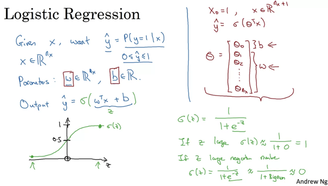</kbd>

 

<kbd>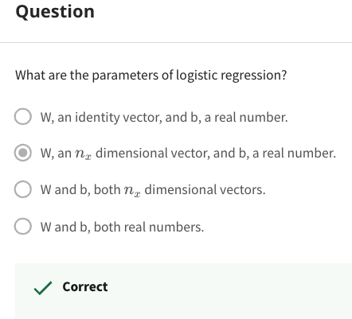</kbd>

 

### Logistic Regression Cost Function

 

> [!NOTE]
> 1 Logistic regression model to train parameters W and B for given training
> examples.
>
> 2 Definition of the cost function to measure how well the algorithm is
> performing on the training set.
>
> 3 Convention of superscript parentheses I to index different training
> examples.
>
> 4 Use of a different loss function in logistic regression, which is negative y
> log y hat plus 1 minus y log 1 minus y hat.
>
> 5 Justification of the loss function, where it tries to make y hat large if y is
> equal to one and small if y is equal to zero.

 

<kbd>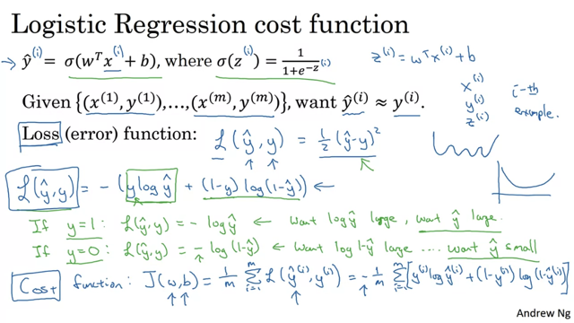</kbd>

> [!NOTE]
> Đại khái là:..
>
>
>
> Ở đây ổng dùng kí tự sigma - σ để biểu thị hàm Sigmoid.
> Mấy khoá khác ổng dùng chữ g.
>
>
>
> Define Loss function cho Logistic Regression (y^-y)^2/2 cũng được
> nhưng nó lại khiến G.D không work, do lúc này hàm J sẽ non-convex
> Do đó người ta define Loss function kiểu khác:
> ylog(y^) + (1 - y)log(1-y^)
>
>
>
> Và Cost function là trung bình cộng (mean value) tất cả Loss 
> của toàn bộ dataset m

 

<kbd>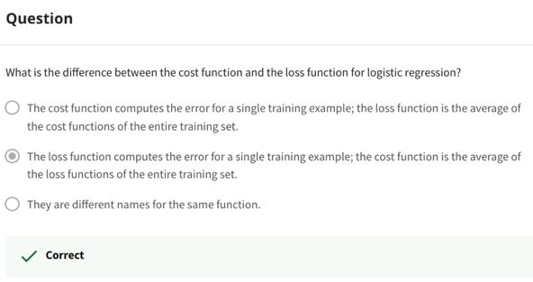</kbd>

 

### Gradient Descent

 

> [!NOTE]
> 1 Recap of logistic regression and its loss and cost functions.
>
> 2 Discussion of the convexity of the cost function and why it's
> important for logistic regression.
>
> 3 Explanation of gradient descent as an optimization algorithm to find
> the best parameters for the cost function.
>
> 4 Description of how gradient descent updates the values of the
> parameters to approach the minimum of the cost function.
>
> 5 Explanation of the role of the learning rate in controlling the size of
> steps in the gradient descent algorithm.

 

<kbd></kbd>

> [!NOTE]
> Đại khái là:..
>
>
>
> "And /**for logistic regression**/, almost any initialization  method works.
> Usually you Initialize the values of 0, Random initialization also works, but
> people don't usually do that for  logistic regression./**But because this
> function is convex, no matter where you initialize, you should get to the
> same point or roughly the same point."**/
>
>
>
> Vì hàm J convex nên dù có Initialize (W, b) thế nào - Random hay cho
> bằng 0 thì nó sẽ đều converge về global optima

 

<kbd>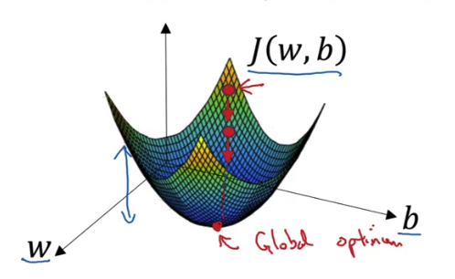</kbd>

 

<kbd>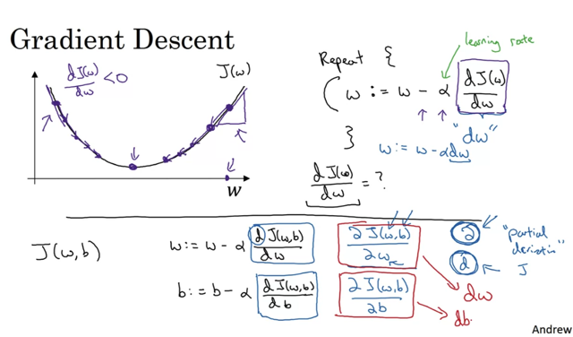</kbd>

> [!NOTE]
> Một ghi chú nhỏ không quan trọng lắm:
> Trong calculus người ta dùng kí tự **'∂'**- gọi là
> kí tự '/**Partial derivative**/' khi hàm J depend on 2 params
> trở lên còn nếu chỉ 1 param thì dùng chữ **'d'**
>
>
>
> Ổng cho là làm vậy chỉ tổ phức tạp nên ở đây dùng chữ 'd' hết.
>
>
>
> Trong code sẽ là **dw, db (hay dj_dw, dj_db)**

 

<kbd>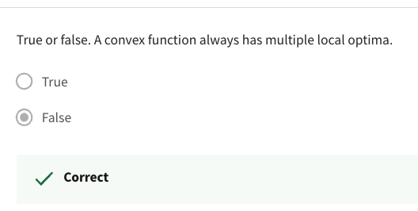</kbd>

 

### Derivatives

 

> [!NOTE]
> 1 The video aims to help people gain an intuitive understanding of calculus and
> derivatives.
>
> 2 Even if someone does not have a deep understanding of calculus, they can still
> apply deep learning.
>
> 3 Forward and backward functions will encapsulate everything one needs to know
> about calculus for deep learning.
>
> 4 Calculus is important for deep learning, but intuitive understanding is enough to
> build and apply algorithms.
>
> 5 The video will explore the details of derivatives, but for experts in calculus, this
> video may be skipped.
>
> 6 The video explains the concept of derivatives by plotting a straight line and
> exploring how the slope changes.
>
> 7 The slope of a line represents the derivative, which is the rate of change of the
> function.
>
> 8 The slope or derivative is defined as the height divided by the width of a small
> triangle.
>
> 9 When the slope is equal to three, it means that if you nudge a variable a to the right,
> f(a) goes up three times as much as you nudged the value of a.

 

<kbd></kbd>

> [!NOTE]
> Official definition thì 'small value' không phải là 0.01, hay 0.0001
> mà là một khoảng vô cùng nhỏ. Nhưng đại khái definition của
> Derivative là chỉ vậy:   
>
>
>
> **"Khi kéo a tăng lên một khoảng hàm f(a)
> /cũng tăng lên một khoảng gấp mấy lần/ thì đó chính là
> derivative của hàm f tại a"**  
>
>
>
> Và cũng là slop - Độ dốc của hàm f(a) tại a.
>
>
>
> Và đối với hàm linear thì thấy rõ là độ dốc ở đâu cũng bằng nhau.

 

<kbd></kbd>

 

### More Derivative Examples

 

> [!NOTE]
> 1 The video demonstrates a slightly more complex example where the slope of the
> function varies at different points in the function.
>
> 2 The function used as an example is f(a) = a².
>
> 3 The video shows that the slope of the function at a given point can be determined by
> nudging a slightly to the right and observing the change in f(a).
>
> 4 The video explains that the ratio of the height of the triangle over the width of the
> triangle is different at different points on the curve, which is why the derivative is
> different at different points.
>
> 5 The video shows that if you pull up a calculus textbook, you'll find that the slope of
> the function a² is equal to 2a.
>
> 6 The video demonstrates that the derivative of f(a) = a² is equal to 4 when a = 2 and
> 10 when a = 5.
>
> 7 The video explains that the derivative is defined using infinitesimally small nudges to
> a, which is why the amount that f(a) goes up isn't exactly given by the formula but is
> only approximately given by the derivative.

 

<kbd>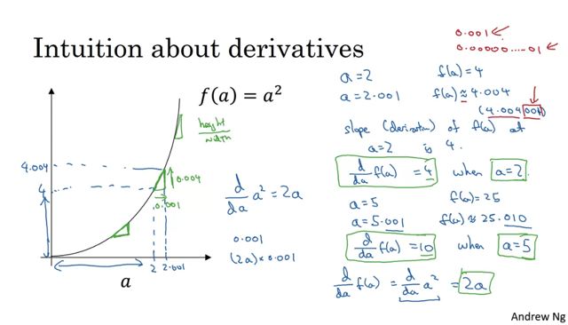</kbd>

> [!NOTE]
> Đại khái là nếu trong sách Calculus ta thấy công thức tính 
> d_f(a)/d_a = **2a** với f = a^2 thì có nghĩa là : 
>
>
>
> Nếu kéo a lên một khoảng tiny ví dụ 0,001 thì 
> hàm f = a^2 sẽ tăng lên 1 khoảng /**gấp 2a lần**/ = 2a*0.001

 

<kbd></kbd>

 

<kbd>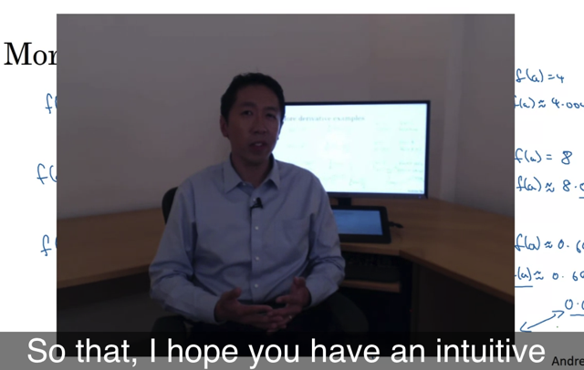</kbd>

> [!NOTE]
> Wrap up: 
> /**Derivative của một function (tại điểm nào đó) đơn giản chỉ là 
> độ dốc của function đó (tại điểm nào đó)**
> /
> 1. The derivative of the function just means **the slope** of a function 
> and the slope of a function can be different at different points on the 
> function
>
>
>
> 2. Muốn xem công thức của tính derivative cho các hàm khác nhau
> thì có thể mở sách Calculus ra xem.

 

### Computation Graph

 

> [!NOTE]
> 1 Introduction: Explanation of forward pass and backward pass in neural networks
> using computation graph.
>
> 2 Example problem: Computing a function J of three variables a, b, and c, which is J =
> 3(a + bc).
>
> 3 Steps to compute J:
>
> 4 a. Compute u = bc.  5 b. Compute V = a * u.  6 c. Compute J = 3V.
>
> 7 Computation graph: Visual representation of the three steps with a, b, and c as
> inputs, and u, V, and J as the intermediate and final outputs, respectively.
>
> 8 Example calculation: Values of a, b, and c are given as 5, 3, and 2, respectively. The
> values of u, V, and J are computed as 6, 30, and 33, respectively, using the
> computation graph.
>
> 9 Importance of computation graph: Useful for optimizing a special output variable,
> such as J, in neural networks.
>
> 10 Left-to-right computation: The computation graph enables a left-to-right pass for
> computing the value of J.
>
> 11 Right-to-left computation: In order to compute derivatives, a right-to-left pass is
> needed, which is explained in the next video.

 

<kbd></kbd>

> [!NOTE]
> Nền tảng đằng sau tên gọi khái niệm của 'Forward propagation' đại khái là
> để tính value (ví dụ của cost function J) thì tính từ trái qua phải. Còn tính
> derivative thì ngược lại (Back propagation)

 

### Derivatives With A Computation Graph

 

> [!NOTE]
> 1 Introduction: The video discusses how to use a computation graph to figure out derivative
> calculations for a function J by taking a cleaned-up version of the computation graph used in the
> previous video.
>
> 2 Derivative of J with respect to v: The video demonstrates how to compute the derivative of J
> with respect to v, which is equal to 3, by increasing the value of v by 0.001, using the analogy of
> the previous video where f(a) = 3a and df/da = 3.
>
> 3 Derivative of J with respect to a: The video illustrates how to calculate dJ/da, which is also
> equal to 3, by changing the value of a by 0.001 and breaking it down to the chain rule, where
> dv/da = 1 and dJ/dv = 3, which when multiplied give dJ/da = 3.
>
> 4 Backward calculation: The video shows how computing dJ/dv can help in calculating dJ/da and
> how it's a backward calculation to find the derivatives of the variables that come before J.
>
> 5 Notational Convention: The video introduces a new notational convention, which is to call the
> final output variable, J in this case, as "dvar" while computing the derivative of the final output
> variable with respect to intermediate variables.

 

<kbd></kbd>

> [!NOTE]
> 1.Đại khái là để tính derivative thì tính theo chiều ngược lại, ví dụ
> để tính dJ_da thì phải tính dJ_dv, dv_da và:
>
>
>
> dJ_da = dJ_dv . dv_da
>
>
>
> và nó gọi là 'Chain rule' trong calculus 
>
>
>
> 2.Đại khái là trong code sẽ viết gọn dFinalOutput/dVar thành dVar
> Ví dụ:
>  'dJ_da' thành 'da', 'dJ_dv' thành 'dv' thôi.

 

<kbd></kbd>

> [!NOTE]
> So that was the computation graph and how does a forward or
> left to right calculation to compute the **cost function** such as J
> that you might want to optimize. And a backwards or a right to
> left calculation to compute **derivatives**
>
> So the key takeaway from this video, from this example, is that 
> when computing derivatives and computing all of these 
> derivatives, the most efficient way to do so is /**through a right 
> to left computation**/ following the direction of the red arrows

 

<kbd></kbd>

 

### Logistic Regression Gradient Descent

 

> [!NOTE]
> Main ideas:  1 Introduction to computing derivatives for implementing
> gradient descent for logistic regression.
>
> 2 Explanation of the key equations necessary to implement gradient
> descent for logistic regression using computation graphs.
>
> 3 Forward propagation steps of computing loss on a single training
> example.
>
> 4 Backward propagation steps to compute the derivatives of the loss
> with respect to each variable.
>
> 5 Explanation of the derivative of the loss with respect to A and how it is
> computed.
>
> 6 Deriving the derivative of the loss with respect to Z using the chain
> rule.
>
> 7 Computation of how much W and B need to be changed.
>
> 8 Explanation of how to update W1, W2, and B to perform one step of
> gradient descent with respect to a single example.

 

<kbd></kbd>

 

<kbd></kbd>

> [!NOTE]
> Đại khái đây chính là đi ngược lại (Back Prop) để  ..
>
>
>
> ..tính ra '/**derivative of cost function J with respect to w, b** / 
> Hay viết gọn là dj_dw (or dw) và dj_db (or db)  
> Phục vụ cho việc /**dùng Gradient Descent update w, b sao 
> cho minimize J**/.
>
> Có thể xem lại sách Calculus để tự tính lại derivative (đạo hàm)
> của: 
> - hàm Loss function L = -( ylog(a) + (1-y)log(1-a) ) -> dL_da
> - hàm sigmoid a = sigmoid(z) -> da_dz
> - hàm z = w(transpose).x + b -> dz_dw, dz_db

 

<kbd>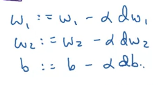</kbd>

> [!NOTE]
> D/**ùng Gradient Descent update w,
> b sao cho minimize J**/.

 

<kbd>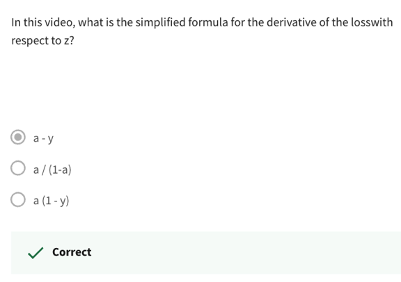</kbd>

 

### Gradient Descent On M Examples

 

> [!NOTE]
> 1 Reminder of the definition of the cost function J.
>
> 2 Explanation of how to compute derivatives for the cost function J with
> respect to each parameter w and b for m training examples.
>
> 3 Derivatives with respect to each parameter are computed as the
> average of derivatives with respect to each parameter for the individual
> loss terms.
>
> 4 An algorithm is presented that computes the derivatives of the cost
> function J with respect to each parameter w and b.
>
> 5 Details of the algorithm are presented, including initialization, for loop
> over training set, calculations for the accumulator values, division by m to
> compute the averages, and updating of parameter values.
>
> 6 Two weaknesses with the algorithm are noted: two for loops are
> needed to implement logistic regression and it assumes that the number
> of features is known.

 

<kbd></kbd>

> [!NOTE]
> Derivative of J w.r.t w, b trên toàn bộ m dataset X, y - dJ_dw, dJ_db
> Tính bằng cách lấy trung bình của tất cả
> Derivative of J w.r.t w, b trên từng dataset x(i), y(i) - dJ_dw(i), dJ_db(i)

 

<kbd></kbd>

> [!NOTE]
> Không khó hiểu gì nhưng nhắc cho để ý:
> 1. J, dw, db là 'accumulator' 
> -> Update bằng operator += trong loop nên không có superscrip (i) 
> còn dz là đv từng dataset nên có superscrip (i) - dz(i)
>
>
>
> 2. Toàn bộ ở đây chỉ là **1 iteration - để update dw, db một lần.**
>
> Dễ dàng thấy có 2 nhược điểm:
>
>
>
> Phải dùng 2 for loop, 1 cái loop over m training set, 1 cái
> loop tất cả  các feature để tính dw: Ở đây chỉ có dw1, dưa
> nhưng thực tế có n feature với n có khi cả ngàn.
>
>
>
> Solution : **Vectorization**

 

<kbd>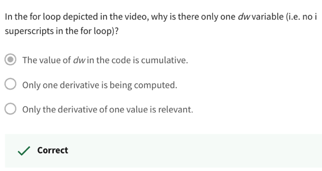</kbd>

 

### DERIVATION OF dL/dz

 

#### ...

 

<kbd></kbd>

 

<kbd>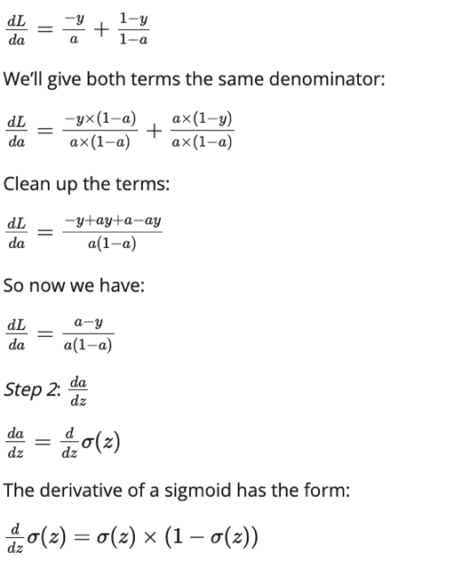</kbd>

 

<kbd></kbd>

 

<kbd></kbd>

 

<kbd></kbd>

 

## Python And Vectorization

 

### Vectorization

 

> [!NOTE]
> 1 The course teaches strategies for structuring a machine learning
> project to improve efficiency and quickly get systems working.
>
> 2 The example given is of improving a cat classification system with
> 90% accuracy.
>
> 3 There are many ideas to try to improve a deep learning system, but
> choosing the wrong approach can waste time.
>
> 4 The course teaches strategies for analyzing a machine learning
> problem to identify the most promising ideas to pursue.
>
> 5 The instructor will share lessons learned from building and
> shipping deep learning products.
>
> 6 The strategies taught in the course are unique and not commonly
> taught in university deep learning courses.
>
> 7 Machine learning strategy has changed with the emergence of
> deep learning algorithms.
>
> 8 The course aims to make learners more effective at getting deep
> learning systems to work.

 

<kbd></kbd>

 

<kbd></kbd>

> [!NOTE]
> 2499719.1349626444
> Vectorization: 8.999824523925781ms
> 2499719.1349626444
> Non-Vectorization: 7566.00022315979ms
> Vectorization is /**840**/.6830825474198 times faster than non-vectorization
> If some trainning task take **1 hour** to finish with vectorization, 
> it will need **35 days** to finish

 

<kbd>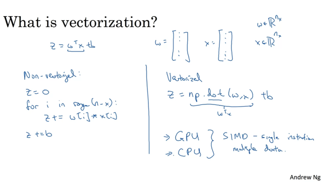</kbd>

> [!NOTE]
> And it turns out that both GPU and CPU have parallelization instructions. 
> They're sometimes called SIMD instructions. 
> This stands for a single instruction multiple data.
>
>
>
> But what this basically means is that, if you use built-in functions 
> such as this np. function or other functions that don't require 
> you explicitly implementing a for loop. 
> It enables Python numPy to take much better advantage of 
> parallelism to do your computations much faster.
>
>
>
> And this is true both computations on CPUs and computations on GPUs. 
> It's just that GPUs are remarkably good at these SIMD calculations but 
> CPU is actually also not too bad at that. 
> Maybe just not as good as GPUs.
>
> Rule of thumb is to avoid for - loop as much as possible

 

<kbd></kbd>

 

### Vectorization More Example

 

> [!NOTE]
> 1 Rule of thumb: avoid explicit for-loops whenever possible to speed up
> code.
>
> 2 Example 1: Vector multiplication using matrix A and vector v -
> non-vectorized implementation using two for-loops, vectorized
> implementation using np dot (A,v).
>
> 3 Example 2: Exponential operation on every element of vector v -
> non-vectorized implementation using a for-loop, vectorized
> implementation using np.exp(v).
>
> 4 NumPy built-in functions for element-wise operations.
>
> 5 Applying vectorization to logistic regression gradient descent
> implementation to eliminate one of the two for-loops.
>
> 6 Eliminating the need for a for-loop over training examples in logistic
> regression with further vectorization.
>
> 7 Vectorization can significantly speed up code.

 

<kbd>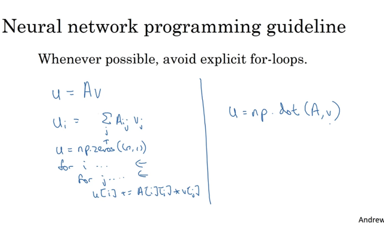</kbd>

 

<kbd></kbd>

 

<kbd></kbd>

 

### Vectorizing Logstic Regression

 

> [!NOTE]
> Main ideas:  1 The video explains how to vectorize the implementation of
> logistic regression and process the entire training set without using explicit for
> loops.
>
> 2 The four propagation steps of logistic regression are explained with an
> example of making a prediction on M training examples.
>
> 3 The matrix X is defined as the training inputs, stacked together in different
> columns, and a matrix Z is defined to compute all the values of Z1, Z2,...,ZM in
> one step.
>
> 4 The values A1, A2,...,AM are computed using a vectorized sigmoid function
> that takes the matrix Z as input.
>
> 5 Stacking lowercase A results in a new variable, capital A.
>
> 6 The video concludes that instead of looping over M training examples to
> compute Z and A, you can use the one-line code to compute all Z and A at the
> same time.

 

<kbd></kbd>

 

<kbd>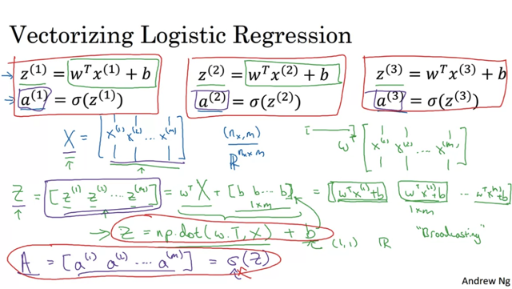</kbd>

> [!NOTE]
> X = n x m (ở khoá trước đây nó define dạng m x n)
>
>
>
> W = n x 1 -> W(T) = 1 x n 
>
>
>
> Z = W(T) . X = 1 x n . n x m = 1 x m
>
>
>
> W(T) . X + b thì b sẽ dc broadcast thành [b b ...b] = 1x m
>
>
>
> =>  W(T) . X + b = 1 x m + 1 x m = 1 x m
>
>
>
> Hàm sigmoid nhận vector được =>
> a(Z) = 1x m

 

<kbd></kbd>

 

### Vectorizng Logistic Regression' S Gradient Computation

 

> [!NOTE]
> Main ideas:  1 The previous video demonstrated how vectorization could be used to compute the
> predictions for an entire training set simultaneously.
>
> 2 This video shows how to use vectorization for gradient computation for all M training samples.
>
> 3 The new variable dZ is defined as dz1, dz2, ..., dzm, which is a 1 by m matrix or an m
> dimensional row vector.
>
> 4 dz can be computed as A - Y where A and Y are defined as a1 through am and y1 through ym,
> respectively.
>
> 5 Vectorization can be used to implement the derivative calculations efficiently.
>
> 6 The vectorized implementation of db is one over m times np.sum of dz, while the vectorized
> implementation of dw is one over m times the matrix X times dz transpose.
>
> 7 The previous implementation of logistic regression was highly inefficient and required loops
> over dw1, dw2, etc.
>
> 8 The new implementation uses vectorization to replace the loops, making it more efficient.
>
> 9 The updated code involves computing capital Z as w transpose X + B, then calculating a as
> sigmoid of capital Z, dz as A - Y, dw as 1/m x dz transpose, and db as 1/m times np.sum of dz.
>
> 10 The vectorized implementation allows for the computation of updates to the parameters
> without a for loop over the training set.

 

<kbd>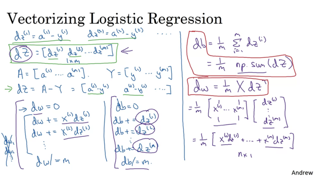</kbd>

> [!NOTE]
> QUAN TRỌNG

 

<kbd>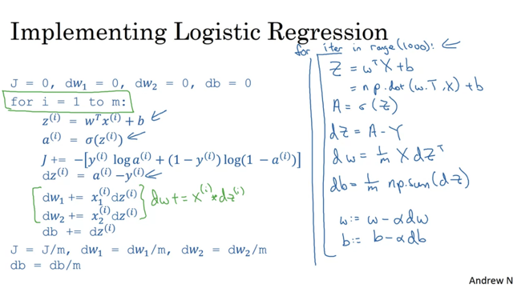</kbd>

> [!NOTE]
> Now, I know I said that we should get rid of explicit for loops whenever
> you can but if you want to implement multiple iterations as a gradient
>  descent then /**you still need a for loop over the number of
>  iterations**/. So, if you want to have a thousand iterations of gradient
> descent, you might still need a for loop over the iteration
> number. /**There is an outermost for loop like that then I don't think there
> is any way to get rid of that for loop**/
>
>
>
>
> Còn cái for loop iteration để update w, b thì không thể có cách nào
> bỏ được vì cơ chế của Gradient Descent phải vậy

 

<kbd>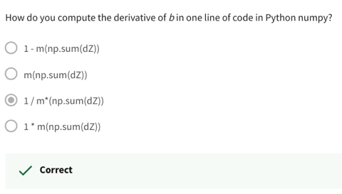</kbd>

 

### Broadcasting In Python

 

> [!NOTE]
> 1 Broadcasting is a technique to make Python code run faster.
>
> 2 Broadcasting allows performing operations between arrays with different shapes.
>
> 3 In the video, broadcasting is explained using an example of calculating the
> percentage of calories from carbs, proteins, and fats in 100 grams of four different
> foods.
>
> 4 Broadcasting can be used to sum down columns of a matrix and divide each
> column by their corresponding sum without using an explicit for-loop.
>
> 5 The video demonstrates how to sum vertically using axis 0, which sums down the
> columns, and how to reshape a matrix.
>
> 6 The reshape command is a constant time operation and can be used to ensure
> that matrices have the correct size.
>
> 7 The video explains how broadcasting works, and provides examples of adding a 4
> by 1 vector to a number and multiplying a 4 by 3 matrix by a 1 by 3 matrix.

 

<kbd></kbd>

 

<kbd>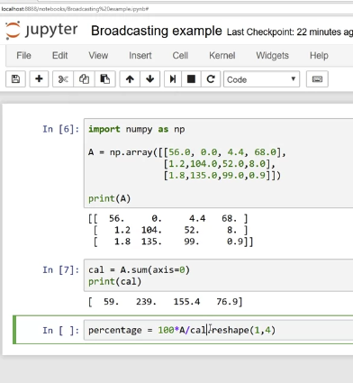</kbd>

> [!NOTE]
> A.sum(axis = 0) => Sum vertically

 

<kbd></kbd>

 

<kbd>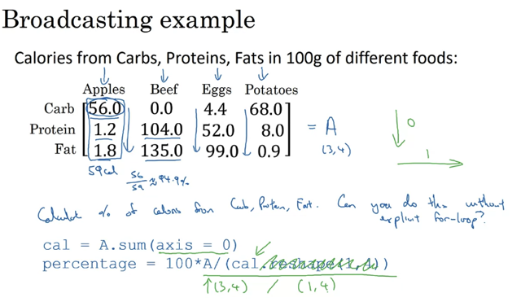</kbd>

> [!NOTE]
> 'Cal' vốn dĩ đã là 1x4 rồi nhưng ổng
> nói thêm lệnh reshape cho  chắc ăn
> không sao cả.

 

<kbd></kbd>

 

<kbd>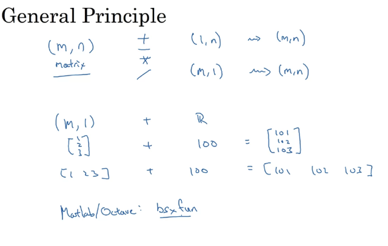</kbd>

> [!NOTE]
> Trong Octave/Matlab bsxfun làm việc tương tự

 

### A Note On Python/ Numpy Vectors

 

> [!NOTE]
> 1 Python numpy's broadcasting operations and flexibility are both strengths
> and weaknesses of the programming language.
>
> 2 Broadcasting and flexibility can cause subtle and strange bugs in the
> code if not used correctly.
>
> 3 The rank 1 array in Python numpy is a funny data structure that behaves
> inconsistently as either a row vector or a column vector, making it
> nonintuitive.
>
> 4 It is recommended to use (n, 1) or (1, n) arrays to ensure consistent
> behavior.
>
> 5 Assertion statements can be used to check the dimensions of arrays and
> ensure consistent behavior.
>
> 6 Reshaping rank 1 arrays can also ensure consistent behavior.

 

<kbd></kbd>

> [!NOTE]
> Rank 1 array - 1-Dimensional array behave rất kì cục (ex.
> a.T cũng y nguyên), ko phải row vector cũng ko phải
> column vector.

 

<kbd>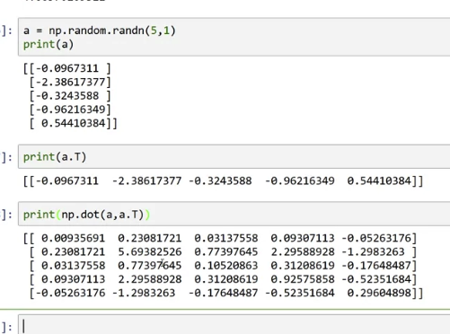</kbd>

> [!NOTE]
> Nên luôn luôn defin Rank 2 array

 

<kbd></kbd>

> [!NOTE]
> 1. Đừng dùng Rank 1 array, dùng Rank 2
>
>
>
> 2.Đừng ngại reshape để chắc chắn mình đang có shape 
> mong muốn
>
>
>
> 3.Dùng Assert để báo lỗi khi shape ko đúng

 

<kbd>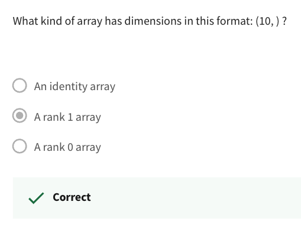</kbd>

 

### Quick Tour Notebook

 

#### ...

 

<kbd>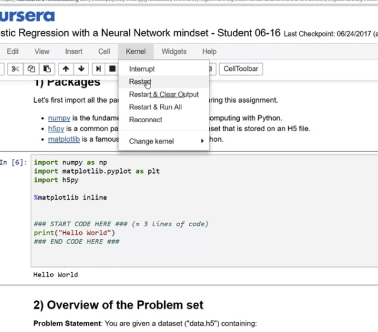</kbd>

> [!NOTE]
> Có issue gì thì Restart Kernel

 

### Logistic Regression Cost Function

 

> [!NOTE]
> 1 In this optional video, the speaker justifies the use of the cost function for logistic
> regression that was introduced in an earlier video.
>
> 2 In logistic regression, the prediction y hat is the sigmoid of w transpose x + b, where
> sigmoid is a familiar function. The goal is to interpret y hat as the probability that y=1
> given x.
>
> 3 The chance that y=1 given x is y hat, and the chance that y=0 given x is 1- y hat.
>
> 4 These two equations can be summarized into a single equation: (y hat ^ y )(1- y hat)^(1-y) for
> y=0 or 1. This equation is a correct definition for p(y|x).
>
> 5 Because the log function is a strictly monotonically increasing function, maximizing
> log p(y|x) gives a similar result as optimizing p(y|x).
>
> 6 The loss function for a single example is -[y log y hat + (1-y) log (1- y hat)].
>
> 7 The cost function for the entire training set is the negative sum of the loss function
> over all m examples. This is derived using the principle of maximum likelihood
> estimation, which means choosing the parameters that maximize the probability of the
> observations in the training set.

 

<kbd></kbd>

> [!NOTE]
> Notation: IID = I**dentically Independently Distributed**
>
>
>
> IID là viết tắt của "Independent and Identically Distributed". Nó có 
> nghĩa là một tập hợp các biến ngẫu nhiên độc lập với nhau và có 
> phân bố (tức các xác suất xuất hiện của các giá trị của biến) giống 
> nhau. Điều này có nghĩa là mỗi biến ngẫu nhiên trong tập hợp này 
> không bị ảnh hưởng bởi biến khác và tất cả chúng có cùng một 
> phân bố xác suất.
>
> "Now, finally, because the log function is a strictly monotonically 
> increasing function, your maximizing log p(y|x) should give you 
> a similar result as optimizing p(y|x)."
>
>
>
> ChatGPT: The statement is referring to the use of logarithmic functions in 
> machine learning and how they can affect optimization. A log function
>  is a mathematical function that takes a positive real number as input 
> and returns its logarithm to the base of a specified number. In this 
> context, \_/**"strictly monotonically increasing"\_ means that as the input to
>  the log function increases, its output also increases and does so in a 
> consistent, one-to-one relationship.**/
>
>
>
> Therefore, maximizing the logarithm of the conditional probability 
> p(y|x) (the probability of observing a target variable y given a feature 
> x) should give similar results as optimizing p(y|x) directly. /**This is 
> because the log function preserves the ordering of the original values
>  and allows for optimization in log-space, which can often be 
> computationally easier and faster.**/

 

<kbd></kbd>

> [!NOTE]
> **Maximum likelihood estimation** is like when you are trying to guess
>  what the best answer is to a question.
> Imagine you have a big jar of candy, and you have to guess how many
>  candies are inside.
> You might start by making a guess, like 50. Then, your friend would tell 
> you if your guess is too high or too low.
> You would keep adjusting your guess until you get as close as 
> possible to the correct answer.
> In the same way, maximum likelihood estimation is a way for a 
> computer to make its best guess about something, by using all the 
> information it has, and constantly adjusting its guess until it gets as 
> close as possible to the correct answer.

 

## Quiz: Neural Network Basic

 

<kbd>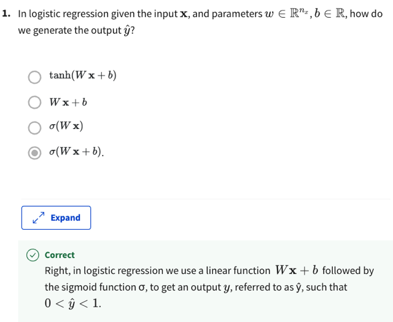</kbd>

 

<kbd>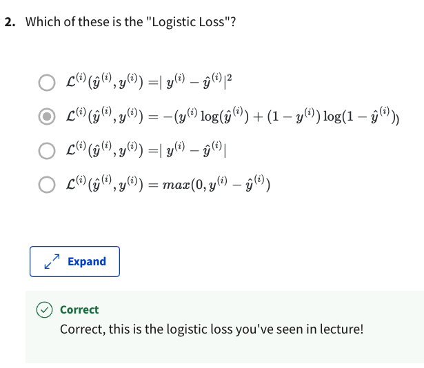</kbd>

 

<kbd></kbd>

 

<kbd></kbd>

 

<kbd></kbd>

 

<kbd>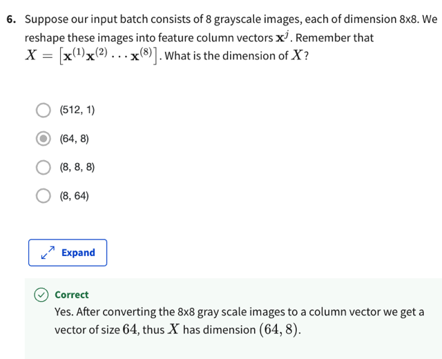</kbd>

 

<kbd></kbd>

 

<kbd></kbd>

 

<kbd>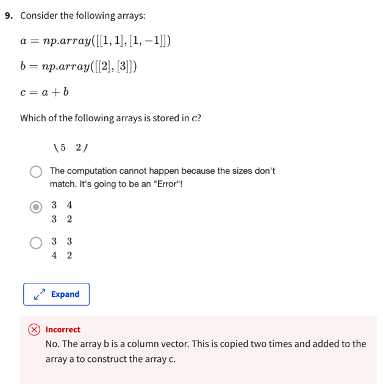</kbd>

 

<kbd>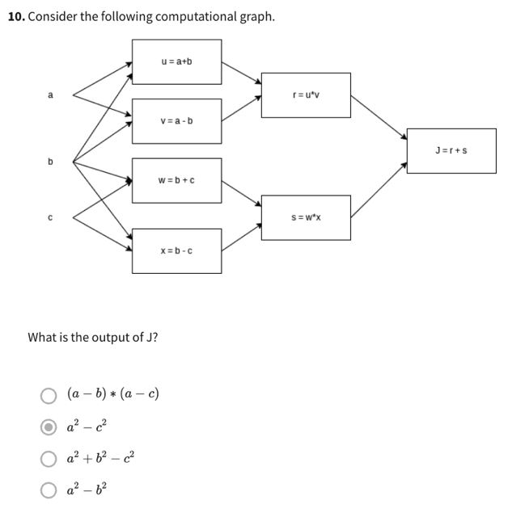</kbd>

 

## Programming Assignment

 

### Some Notes

 

<kbd></kbd>

 

<kbd></kbd>

 

<kbd></kbd>

 

<kbd></kbd>

 

<kbd></kbd>

 

<kbd></kbd>

 

### Python Basic With Numpy

 

<kbd></kbd>

 

<kbd></kbd>

 

<kbd>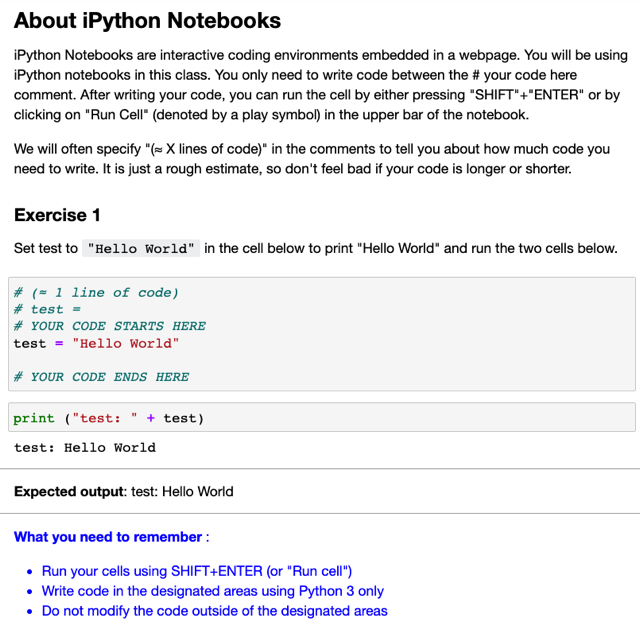</kbd>

 

<kbd></kbd>

 

<kbd></kbd>

 

<kbd>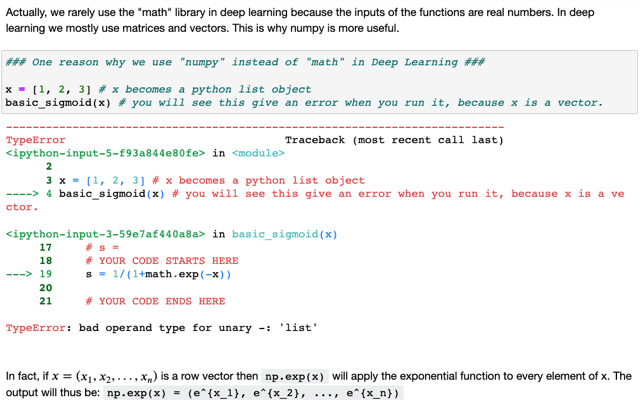</kbd>

 

<kbd></kbd>

 

<kbd>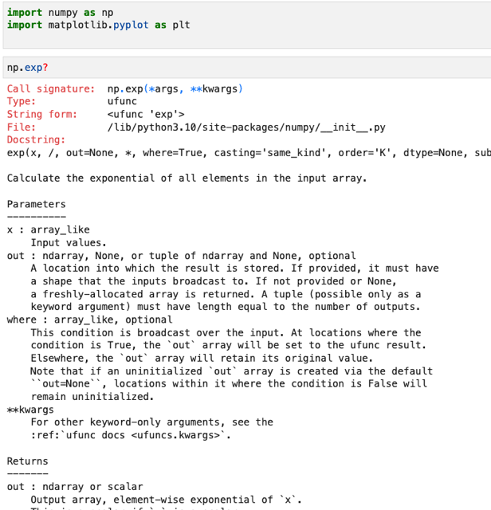</kbd>

 

<kbd>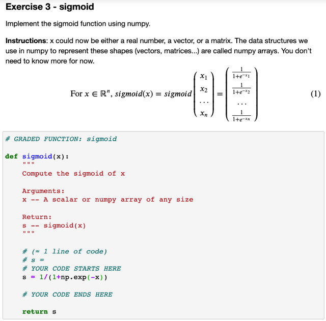</kbd>

<kbd>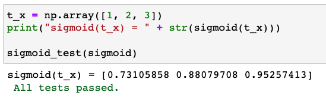</kbd>

 

<kbd>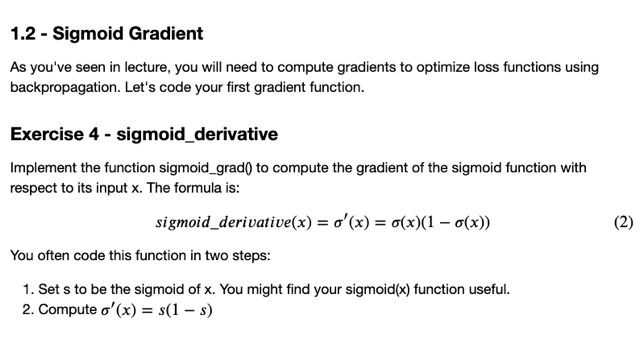</kbd>

 

<kbd>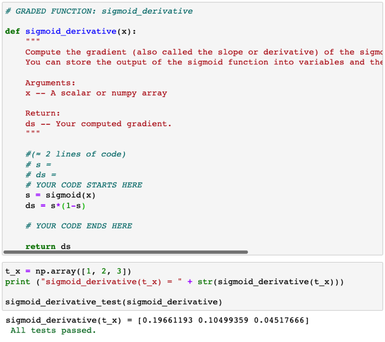</kbd>

 

<kbd>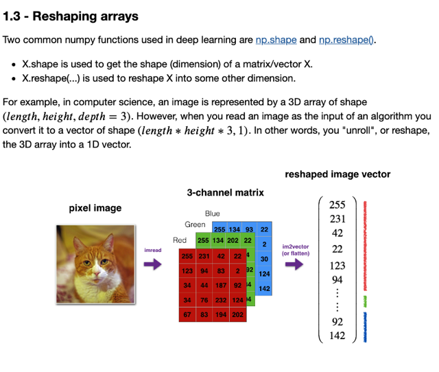</kbd>

 

<kbd></kbd>

 

<kbd></kbd>

> [!NOTE]
> "This is a 3 by 3 by 2 array, typically images will be (num_px_x, num_px_y,3)
> where 3 represents the RGB values"
>
>
>
> Đây là một ma trận 3 x 3 x 2, thông thường hình ảnh sẽ có dạng (num_px_x,
> num_px_y, 3) trong đó 3 biểu diễn cho các giá trị RGB.  RGB là một mô hình
> màu sắc mà sử dụng 3 giá trị rời rạc để biểu  diễn một màu sắc cụ thể.
> num_px_x và num_px_y là chiều rộng  và chiều cao của hình ảnh.

 

<kbd>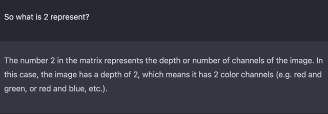</kbd>

> [!NOTE]
> Cái này là 2 colors channels image

 

<kbd>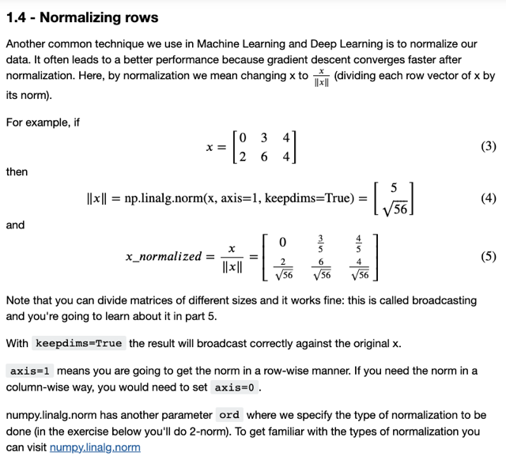</kbd>

 

<kbd>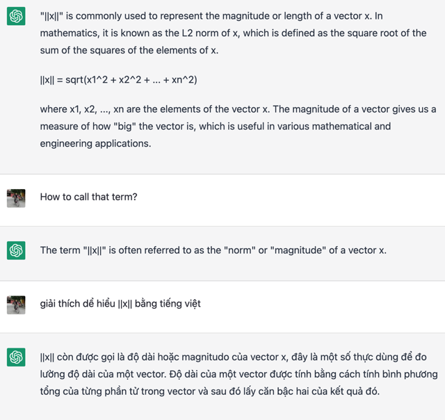</kbd>

 

<kbd>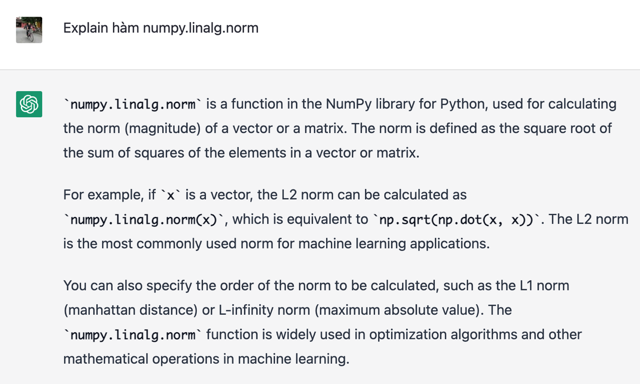</kbd>

 

<kbd>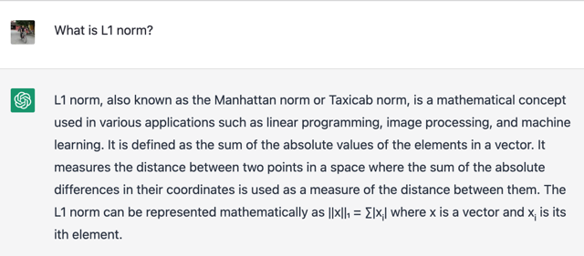</kbd>

 

<kbd>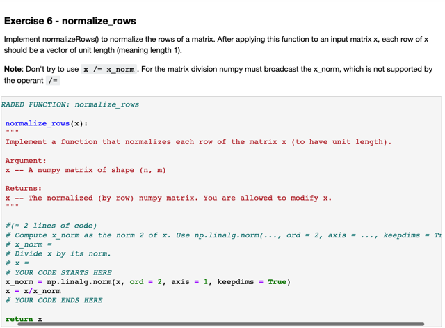</kbd>

 

<kbd>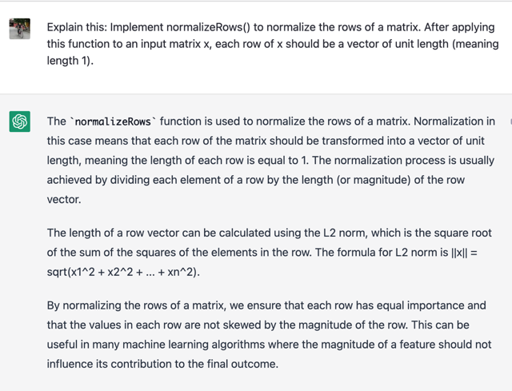</kbd>

 

<kbd>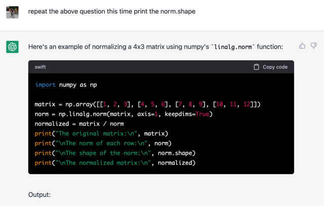</kbd>

 

<kbd>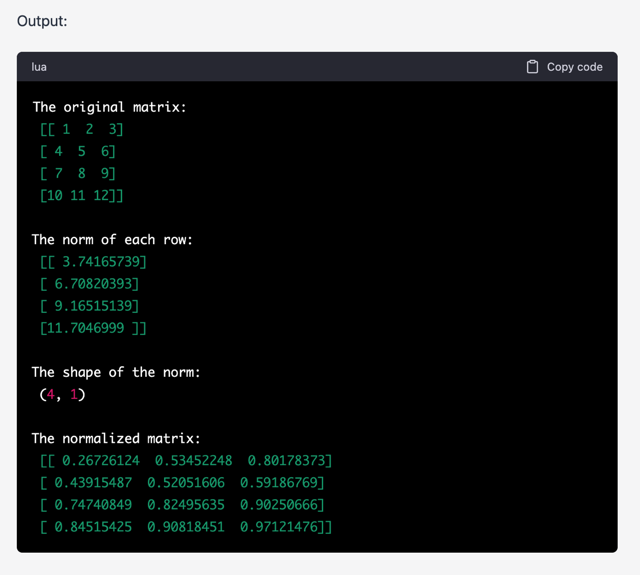</kbd>

 

<kbd></kbd>

 

<kbd></kbd>

<kbd>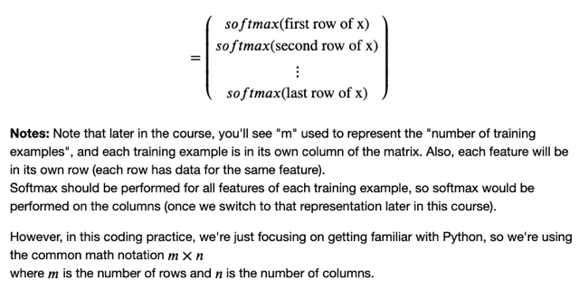</kbd>

 

<kbd>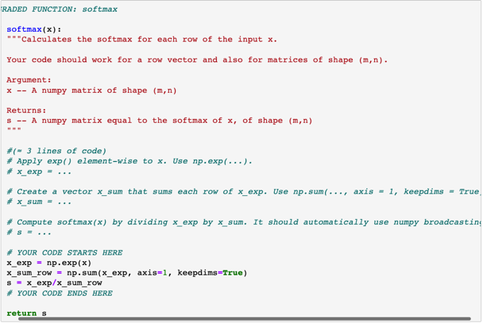</kbd>

 

<kbd>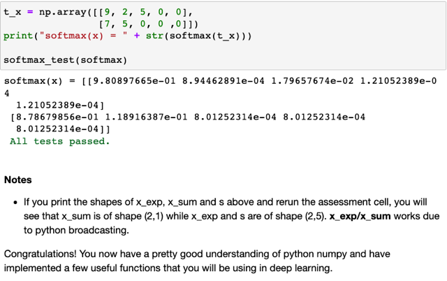</kbd>

 

<kbd></kbd>

 

<kbd></kbd>

 

<kbd></kbd>

 

<kbd></kbd>

 

<kbd></kbd>

 

<kbd></kbd>

> [!NOTE]
> * or np.multiply() = . * in Matlab

 

<kbd></kbd>

 

<kbd></kbd>

> [!NOTE]
> Nếu để keepdims = True thì bị lỗi tại Loss expect a float.

 

<kbd></kbd>

 

<kbd></kbd>

 

<kbd></kbd>

 

<kbd></kbd>

> [!NOTE]
> So sánh function .dot() khi input là vector (1D array) và matrix (2D array)

 

#### Grade

 

<kbd></kbd>

 

### Logistic Regression With A Neural Network Mindset

> [!NOTE]
> Build a logistic regression classifier to recognize cats.  This
> assignment will step you through how to do this with a
> Neural Network mindset, and will also hone your intuitions
> about deep learning.

 

<kbd></kbd>

 

<kbd></kbd>

 

<kbd></kbd>

 

<kbd></kbd>

 

- **mpl.imshow()**

 

<kbd></kbd>

 

<kbd></kbd>

 

<kbd></kbd>

 

<kbd></kbd>

 

<kbd></kbd>

> [!NOTE]
> Hàm reshape cứ nhớ là nếu cho cái dimension = -1 thì đại khái
> là bảo Python tự tính.

 

<kbd></kbd>

 

<kbd></kbd>

> [!NOTE]
> Trong ví dụ dưới u.shape là 2x3x2 nên khi 
> reshape(u.shape[0], -1) hay reshape(u.shape[2], -1) thì cũng 
> như nhau vì đều là reshape(2, -1). 
> Có nghĩa là ta bảo nó làm sao có 2 row, còn lại số column 
> bao nhiêu thì tự tính.
>
>
>
> Vả nếu nó tính ko ra được (đại khái là nó không chia element 
> đều ra được thì nó sẽ báo lỗi)
> Ví dụ có 12 unit (2x3x2) mà reshape(5,-1) thì nó sẽ lỗi vì 12 cái 
> mà muốn sắp thành 5 hàng thì ko chẵn.
> Nhưng reshape(6,-1) thì ok => 6x2

 

<kbd></kbd>

 

<kbd></kbd>

 

<kbd></kbd>

 

<kbd></kbd>

 

<kbd></kbd>

 

<kbd></kbd>

<kbd></kbd>

> [!NOTE]
> Vì hàm np.exp() accept vector or matrix -> dùng nó
> trong hàm sigmoid cũng sẽ accept vector . matrix

 

<kbd></kbd>

> [!NOTE]
> Nếu define b = 0 -> b sẽ là int

 

<kbd></kbd>

 

<kbd></kbd>

 

<kbd></kbd>

> [!NOTE]
> Chỉ có hơi rắc rối chưa quen dùng hàm **np.dot
>
>
>
> Và khác với Khoá ML cũ, X define dạng n x m 
> (chứ không phải m x n) nên lấy m = X.shape[1]**

 

<kbd></kbd>

 

<kbd></kbd>

 

<kbd></kbd>

 

<kbd></kbd>

 

- **hàm np.dot()**

 

<kbd></kbd>

> [!NOTE]
> np.dot()
>
>
>
> 2 Matrix thì tuân thủ quy tắc size matrix

 

<kbd></kbd>

> [!NOTE]
> (2x3) không thể .dot với (2x3)

 

<kbd></kbd>

> [!NOTE]
> np.dot()
>
>
>
> 2 1D array thì + lại.

 

<kbd></kbd>

> [!NOTE]
> np.dot()
>
>
>
> 1D array với Matrix cột thì được, coi matrix cột như 1D array

 

<kbd></kbd>

 

<kbd></kbd>

 

<kbd></kbd>

 

<kbd></kbd>

> [!NOTE]
> **CHÚ Ý BƯỚC NÀY** w = w.reshape(X.shape[0], 1) **LÀ ĐỂ CHẮC CHẮN
> W CÓ SHAPE MONG MUỐN
>
>
>
> Trong lecture ổng có nhấn mạnh đừng ngại reshape để đảm bảo shape
> đúng**

 

<kbd></kbd>

 

<kbd></kbd>

 

<kbd></kbd>

 

<kbd></kbd>

 

<kbd></kbd>

 

<kbd></kbd>

> [!NOTE]
> **optimize(...X_train, Y_train,...) mới đúng, chứ với X, Y là sai**

 

<kbd></kbd>

> [!NOTE]
> **Comment**: Training accuracy is close to 100%. 
> This is a **good** sanity check: your model is working and has high 
> enough capacity to fit the training data. 
> Test accuracy is **70%. It is actually not bad for this simple model,** 
> given the small dataset we used and that logistic regression is a 
> linear classifier. But no worries, you'll build an even better classifier 
> next week!
> Also, you see that the model is **clearly overfitting** the training data. 
> Later in this specialization you will learn how to reduce overfitting, 
> for example by using **regularization**.

 

<kbd></kbd>

 

<kbd></kbd>

 

<kbd></kbd>

> [!NOTE]
> **Thử với các learning rate khác nhau**

 

<kbd></kbd>

<kbd></kbd>

 

<kbd></kbd>

 

<kbd></kbd>

 

