# C1w3_shalow Neural Networks

📊 **Progress:** `23` Notes | `91` Screenshots

---

## C1w3_shalow Neural Networks

 

## Neural Networks Overview

 

> [!NOTE]
> 1 Overview of the week's topic: The speaker provides an introduction to the topic of
> implementing a neural network.
>
> 2 Recap of logistic regression: The speaker briefly recaps the logistic regression model, which
> involves computing a z-value based on input features x and parameters w and b, then using a
> sigmoid function to calculate the output value a or y-hat, which is used to compute the loss
> function L.
>
> 3 Neural network structure: The speaker introduces the structure of a neural network, which
> involves stacking together many sigmoid units. Each node in the network involves two
> calculations: a z-like calculation and an a-like calculation. The network is composed of layers,
> with superscript square brackets used to refer to quantities associated with each layer.
>
> 4 Calculation of z and a: The speaker explains that the network starts by computing z1 based on
> input features x, then computes a1 as the sigmoid of z1. The process is repeated to compute z2
> and a2, which is the final output of the neural network and is also referred to as y-hat.
>
> 5 Backward calculation: The speaker notes that the network requires a backward calculation in
> order to compute derivatives and make updates to the parameters w and b. This calculation
> involves computing da2, dz2, dw2, and db2 in a right-to-left manner.
>
> 6 Key takeaway: The speaker emphasizes that a neural network is essentially an extension of
> logistic regression, where the z and a calculations are repeated multiple times. The notation and
> details can be complex, but they will be further explained in upcoming videos.

 

<kbd></kbd>

 

## Neural Network Representation

 

> [!NOTE]
> 1 Explanation of a two-layer neural network with multiple hidden units
>
> 2 The neural network computes the output in the same way as logistic
> regression but repeatedly
>
> 3 Each node in the hidden layer of the neural network performs two
> steps of computation
>
> 4 The first step is the computation of z = w transpose x + b
>
> 5 The second step is the computation of a = sigmoid(z)
>
> 6 The notation used in the computation of a and z
>
> 7 Explanation of the first and second hidden units in the neural
> network
>
> 8 The process of vectorizing the computation for efficiency
>
> 9 The matrix of weight vectors and input features multiplied to get z
>
> 10 Adding the bias vector to z
>
> 11 The outcome of the computation corresponds to the values of z for
> each hidden unit.
>
> 12 The vector is called the vector of activations.

 

<kbd></kbd>

 

## Computing A Neural Network's Output

 

> [!NOTE]
> 1 The video provides justification for the vectorized implementation for
> propagation through a neural network by considering the forward propagation
> calculation for a few examples.
>
> 2 The matrix X is formed by stacking together all of the training examples, and
> when this matrix is multiplied by W, the resulting matrix contains the
> corresponding outputs stacked up in columns.
>
> 3 The video recapitulates the steps for implementing forward propagation for
> one training example at a time and then shows how to vectorize it across all
> training examples at the same time.
>
> 4 The video also highlights the symmetry in the equations for the different
> layers of the neural network and how deeper neural networks repeat the same
> computation even more times.
>
> 5 Finally, the video notes that sigmoid functions are not always the best choice
> for neural networks and hints at the topic of the next video, which will explore
> using different activation functions.

 

<kbd>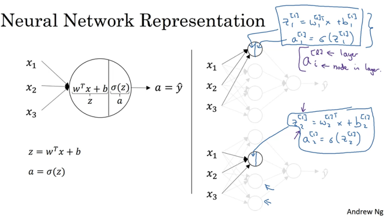</kbd>

 

<kbd></kbd>

 

<kbd>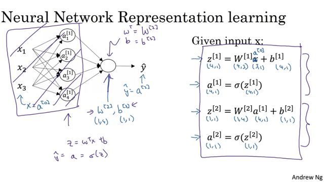</kbd>

 

## Vectorizing Across Multiple

 

> [!NOTE]
> 1 To compute the prediction on a neural network for multiple training
> examples, you need to vectorize the computation process.
>
> 2 To do this, you need to repeat the process for each training example,
> using the activation function notation a\\_2\\_.
>
> 3 To get rid of the repetition, you can stack the training examples in
> columns to create a matrix X.
>
> 4 You can then compute the value of the different variables, Z[1], A[1],
> Z[2], and A[2], using the matrix X, and the weights W and biases b.
>
> 5 By stacking the vectors in columns for Z[1], A[1], Z[2], and A[2], you
> can create the matrices Z[1], A[1], Z[2], and A[2], respectively.
>
> 6 Vectorizing the computation process allows you to compute the
> predictions of all your training examples at the same time.

 

<kbd></kbd>

 

<kbd></kbd>

 

## Explanation For Vectorized Implementation

 

> [!NOTE]
> Main ideas:  1 The previous video discussed the vectorized implementation of neural
> network propagation through training examples horizontally stacked in the matrix x.
>
> 2 The justification for the correctness of the equations was explained by going
> through part of the forward propagation calculation for a few examples.
>
> 3 The training set X is formed by vertically stacking the vectors x1, x2, etc. and
> multiplying it by w gives the corresponding z values, which are also vertically stacked
> in matrix capital Z1.
>
> 4 Python broadcasting allows adding the bias term b to the values while maintaining
> the correct values.
>
> 5 Similar reasoning can be used to show that all four steps of the forward
> propagation calculation work.
>
> 6 Recap of the four steps of forward propagation and how they can be vectorized
> across multiple training examples using stacked matrices.
>
> 7 The symmetry between the equations for z1 and a1 and z2 and a2 shows that the
> different layers of a neural network are doing the same computation.
>
> 8 Next, the video will discuss why the sigmoid function is not the best choice for
> neural networks.

 

<kbd></kbd>

 

<kbd></kbd>

> [!NOTE]
> **ĐẠI KHÁI LÀ CHỈ CÓ VẬY THÔI, MORE DEEPLY N.N CŨNG CHỈ 
> LÀ LẶP LẠI NHIỀU LẦN NHỮNG PHÉP TÍNH KIỂU NÀY.**
>
>
>
> So this kind of shows that the different layers of a neural network
> are roughly doing the same thing or just doing the same
> computation  over and over. And here we have two-layer neural
> network where we  go to a much deeper neural network in next
> week's videos. You see  that /**even deeper neural networks are
> basically taking these two steps and just doing them even more
> times** /than you're seeing here

 

## Activation Functions

 

> [!NOTE]
> Main ideas:  1 Choice of activation function is an important decision when
> building a neural network.
>
> 2 The sigmoid function is commonly used but there are other options that can
> work better.
>
> 3 The hyperbolic tangent (tan h) function is often a better choice for hidden
> layers.
>
> 4 The mean of activations using tan h is closer to zero, making learning easier.
>
> 5 The sigmoid function is useful for binary classification output layers.
>
> 6 The rectified linear unit (ReLU) and Leaky ReLU are popular choices for
> hidden layers.
>
> 7 The ReLU and Leaky ReLU have advantages over sigmoid and tan h
> functions.
>
> 8 Choosing an activation function depends on the specific task and the
> individual preferences of the user.

 

<kbd>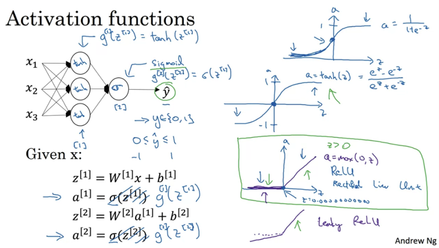</kbd>

> [!NOTE]
> - Hàm **tanh** tốt hơn sigmoid vì nó đại khái là 'center' hơn, kiểu 
> như quay quay 0 thay vì 0.5 như sigmoid giúp g.d chạy nhanh 
> hơn kiểu kiểu như tại sao ',mean normalization' giúp g.d chạy 
> nhanh hơn vậy.
>
>
>
> - Do đó hàm **sigmoid** ít dùng nữa trừ việc dùng cho output là a 
> binary classification vì tự nhiên sigmoid sẽ phù hợp hơn khi 
> xuất ra giá trị P trong khoảng (0,1)
>
>
>
> - Hidden layer: **Relu, Leaky Relu** or Tanh trong đó:
> **Cứ default Relu, còn thích cứ thử Leaky Relu** 
>
>
>
> - Tại sao Relu tốt hơn thì:
> Đại khái là hàm Relu hay Leaky Relu có **'derivative' ít bị bằng
> 0** hơn (Nhìn vào đồ thị hàm sigmoid và Tanh có 2 đầu đi 
> ngang - hoặc gần ngang 
> -> Đạo hàm bằng 0) 
> -> Làm chậm quá trình gradient descent

 

<kbd></kbd>

 

<kbd></kbd>

> [!NOTE]
> Đại khái là khi làm thực tế có nhiều lúc ko biết chọn bao
> nhiêu layer, bao nhiêu unit, dùng activation function, initializa
> như thế nào ...thì nếu thấy không  chắc biết dùng cái nào
> thay vì cái nào thì **cứ thử hết và dùng CV set để so sánh kết
> quả**. Khi đó mình sẽ có 1 cảm giác / cảm nhận về 'evolution'
> của algorithm thay vì cứ nhắm mắt nghe theo lời khuyên nên
> dùng hàm Relu hay gì gì vì có thể nó không đúng với trường
> hợp cụ thể của mình

 

## Why Do You Need Non-linear Activation Functions

 

> [!NOTE]
> 1 A neural network needs a non-linear activation function to compute interesting functions.
>
> 2 The linear activation function, which just outputs whatever was input, is not useful because
> the neural network outputs a linear function of the input.
>
> 3 Even in deep neural networks with many layers, if linear activation functions are used, the
> network is just computing a linear activation function and is therefore not computing more
> interesting functions.
>
> 4 One place where a linear activation function might be used is in the output layer for
> regression problems, where the output y-hat is a real number going anywhere from minus
> infinity to plus infinity.
>
> 5 However, in this case, the hidden units should not use activation functions or should use
> non-linear activation functions like ReLU or tanh.
>
> 6 Using a linear activation function in the hidden layer is extremely rare except for some
> special circumstances relating to compression.
>
> 7 The non-linear activation function is a critical part of neural networks because it allows for
> the computation of more interesting functions.
>
> 8 In the next video, the slope or the derivatives of individual activation functions will be
> discussed to set up for the discussion on gradient descent.

 

<kbd></kbd>

> [!NOTE]
> 1. Linear apply to linear = linear, nên dùng cho hidden layer thì cũng 
> coi như không có hidden layer = không 'learn' thêm được
> Interesting feature nào.
>
>
>
> Trừ những trường hợp rất đặc biệt (rất hiếm) chứ ko dùng linear
> Function ở hidden layer
>
>
>
>  2. Trừ trường hợp output layer là regression (ví dụ predict
> House price) thì dùng linear function thôi.

 

## Derivatives Of Activation Functions

 

> [!NOTE]
> Main ideas:  1 Backpropagation in neural networks requires
> computing the slope or derivative of the activation functions.
>
> 2 Sigmoid activation function has a derivative formula of g(z) * (1 -
> g(z)).
>
> 3 The Tanh activation function has a derivative formula of 1 - a^2.
>
> 4 ReLU activation function has a derivative of 0 for z < 0 and 1 for z >
> 0.
>
> 5 Leaky ReLU activation function has a small positive slope for z < 0
> and a slope of 1 for z > 0.

 

<kbd>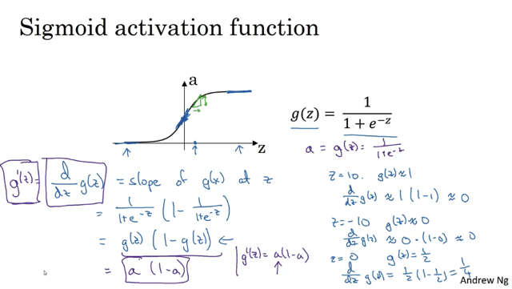</kbd>

 

<kbd>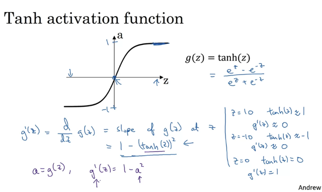</kbd>

> [!NOTE]
> But you can think of it as that, **the chance of z being exactly 0.
> 000000 Is so small** that it almost doesn't matter where you  set
> the derivative to be equal to when z is equal to 0
>
> Finally, here's how you compute the derivatives for the ReLU and
> Leaky ReLU activation functions. For the value g of z is equal to
> max of (0,z), so the derivative is equal to, turns out to be 0 , if z is
> less than 0 and 1 if z is greater than 0. **It's actually undefined,
> technically undefined if z is equal to exactly 0.**

 

<kbd></kbd>

> [!NOTE]
> Giải thích tại sao derivative của relu lại undefine tại  z = 0

 

<kbd>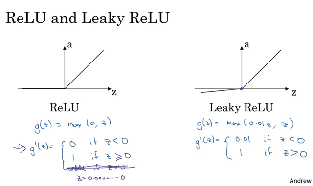</kbd>

 

## Gradient Descent For Neural Networks

 

> [!NOTE]
> 1 Introduction to implementing gradient descent for neural network with
> one hidden layer.
>
> 2 Explanation of the parameters and dimensions for a neural network
> with a single hidden layer.
>
> 3 Cost function for binary classification and how to train the parameters
> using gradient descent.
>
> 4 Initialization of parameters and the importance of random initialization.
>
> 5 Derivatives of the cost function with respect to the parameters W1,
> B1, W2, and B2.
>
> 6 Forward propagation for computation of neural network outputs.
>
> 7 Back propagation for computing derivatives and updating the
> parameters using gradient descent.
>
> 8 Explanation of Python NumPy commands used to compute the
> derivatives.

 

<kbd></kbd>

 

<kbd>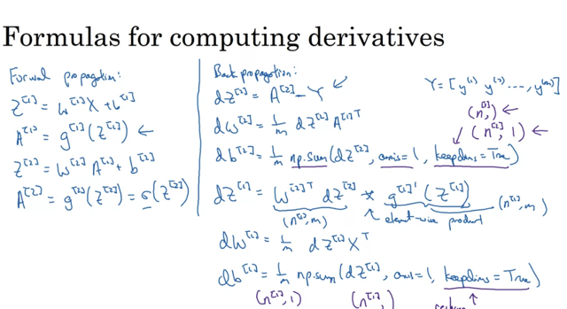</kbd>

 

## Backpropagation Intuition

 

> [!NOTE]
> 1 The video explains the intuition for deriving the equations for backpropagation
> using a computation graph.
>
> 2 The forward pass in logistic regression involves computing z, A, and A loss,
> while the backward pass involves computing da, dz, dw, and db.
>
> 3 The loss function for logistic regression is L(a, y) = -y log A - (1 - y) log(1 - A).
>
> 4 Da for logistic regression is equal to -y/A + (1 - y)/(1 - A).
>
> 5 Dz for logistic regression is equal to A - y, which is computed using the chain
> rule of calculus.
>
> 6 Dw for logistic regression is equal to dz times x, while db is equal to dz.
>
> 7 In a two-layer neural network, backpropagation computes da2, dz2, dw2, and
> db2, and then computes da1, dz1, dw1, and db1.
>
> 8 Da1 and dz1 are often collapsed into one step in practice.
>
> 9 Dz1 is computed as w2 transpose times dz2 times an element-wise product of
> g1 prime of z1.
>
> 10 The computation for dz2 is the same as for logistic regression, dz2 = a2 - y.
>
> 11 Dw2 is equal to dz2 times a1 transpose, and db2 is equal to dz2.
>
> 12 There is an extra transpose in dw2 compared to dw for logistic regression
> because a1 is a row vector while w2 is a column vector.

 

<kbd>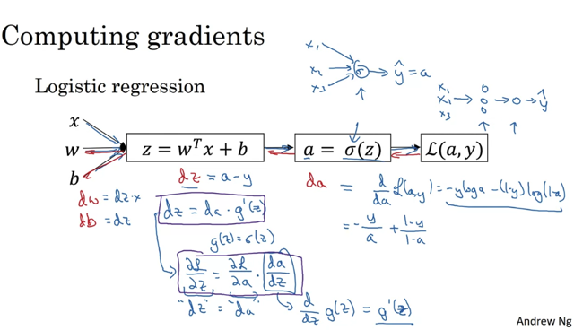</kbd>

 

<kbd></kbd>

> [!NOTE]
> One tip when implementing backprop, if you just make sure that the
> dimensions of your matrices match up, if you think through, what are the
> dimensions of your various matrices including w^1, w^2, z^1, z^2, a^1, a^2,
> and so on, and **just make sure that the dimensions of these matrix
> operations may match up**, sometimes that will **already eliminate quite a lot
> of bugs** in backprop

 

<kbd>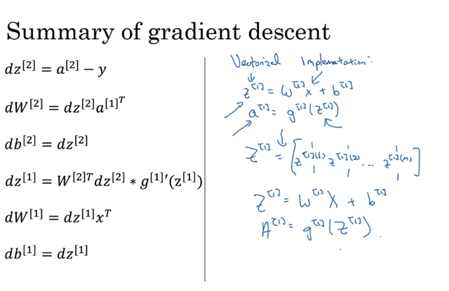</kbd>

 

<kbd>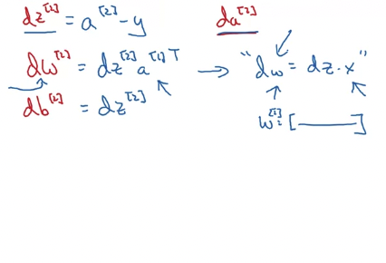</kbd>

> [!NOTE]
> Chỗ này nói trông giống của Logistic regression chỉ
> khác thêm cái  'transpose' là do W quan hệ với w theo
> kiểu W là matrix mà các  hàng là w.T .
>
> This step is quite similar for logistic regression, where we
> had that  dw was equal to dz times x, except that now, a^1
> plays the role of  x, and there's an extra transpose there.
> Because the relationship  between the capital matrix
> W and our individual parameters w  was, there's a
> transpose there, because w is equal to a row vector.In the
> case of logistic regression with the single output, dw^2 is
> like  that, whereas w here was a column vector. That's why
> there's an extra  transpose for a^1, whereas we didn't for x
> here for logistic regression.

 

<kbd>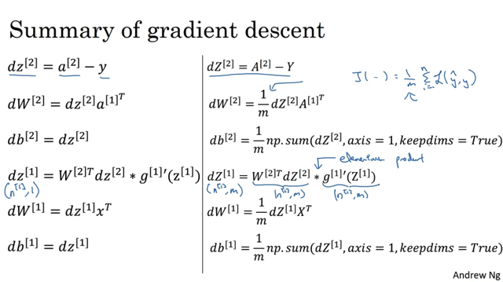</kbd>

 

## Random Initialization

 

> [!NOTE]
> 1 When changing the neural network, it is important to initialize the weights
> randomly.
>
> 2 For logistic regression, initializing the weights to zero was okay, but it won't
> work for neural networks.
>
> 3 Initializing w to all zeros and then applying gradient descent creates
> symmetry between the hidden units.
>
> 4 Symmetry means that both hidden units are computing the same function
> and will remain symmetric after every iteration.
>
> 5 The solution is to initialize the parameters randomly.
>
> 6 You can use np.random.randn to generate a Gaussian random variable for
> w1, multiply it by a very small number, such as 0.01, and initialize b to zero.
>
> 7 The same applies to w2 and b2.
>
> 8 Initializing weights to very large values causes the activation function to be
> saturated, which slows down learning.
>
> 9 Multiplying by a small number, such as 0.01, is reasonable to avoid the
> saturation of the activation function.
>
> 10 Same goes for w2.

 

<kbd></kbd>

> [!NOTE]
> Đại khái là nếu initialize params  = 0 hết thì gradient descent thì cả network
> các hidden layer vô nghĩa

 

<kbd></kbd>

> [!NOTE]
> Giải pháp là small random number.
>
>
>
> Tại sao không phải large random number, vì khi đó đại khái là
> Ta sẽ bắt đầu ở đoạn cuối hay đầu của đồ thị hàm sigmoid, tanh
> nơi mà đường đồ thị nằm ngang - > Derivative = 0 => 
> dẫn đến là Gradient descent rất chậm.

 

<kbd>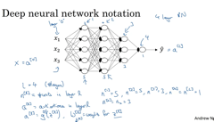</kbd>

 

## Quiz: Shallow Neural Network

 

<kbd></kbd>

 

<kbd></kbd>

 

<kbd></kbd>

 

<kbd>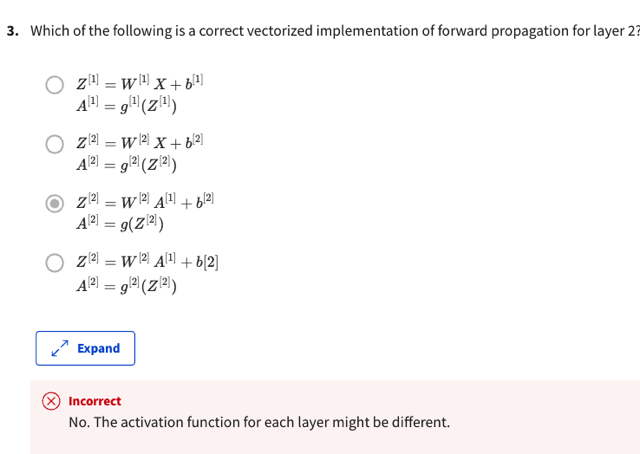</kbd>

 

<kbd>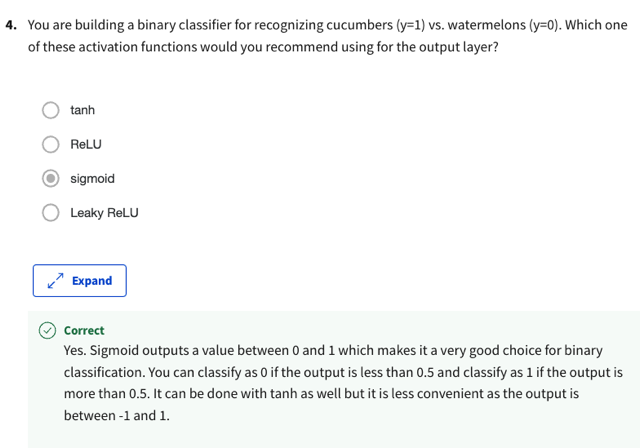</kbd>

 

<kbd>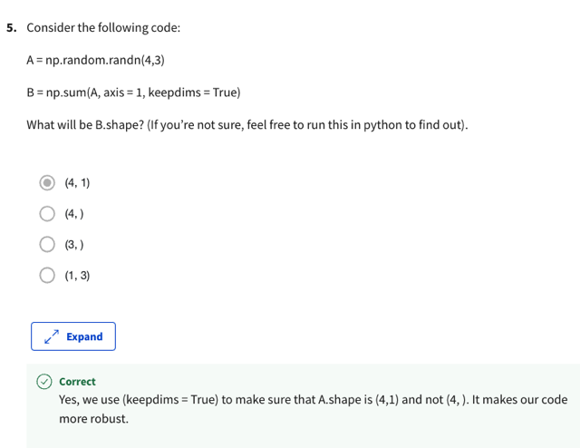</kbd>

 

<kbd></kbd>

 

<kbd></kbd>

 

<kbd>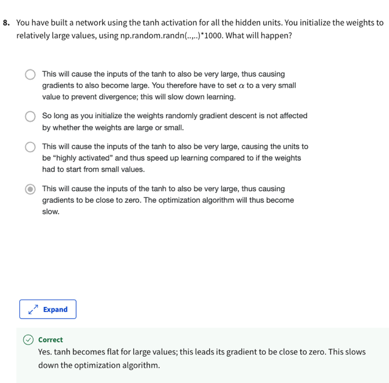</kbd>

 

<kbd></kbd>

 

<kbd>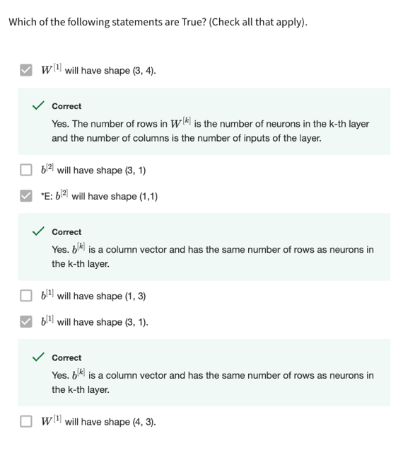</kbd>

 

<kbd>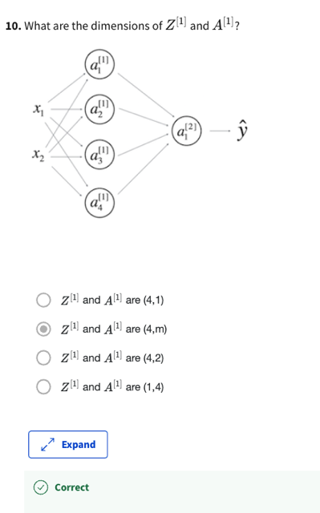</kbd>

 

> [!NOTE]
> PROGRAMMING ASSIGNMENT: PLANAR DATA
> CLASSIFICATION WITH ONE HIDDEN LAYER

 

### 1. + 2.

 

<kbd>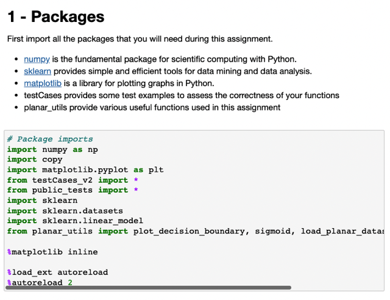</kbd>

 

<kbd></kbd>

 

<kbd></kbd>

 

### 3 - Simple Logistic Regression

 

<kbd></kbd>

 

<kbd></kbd>

 

### 4.2 - Initialize the model's parameters

 

### 4 - Neural Network model¶

 

<kbd>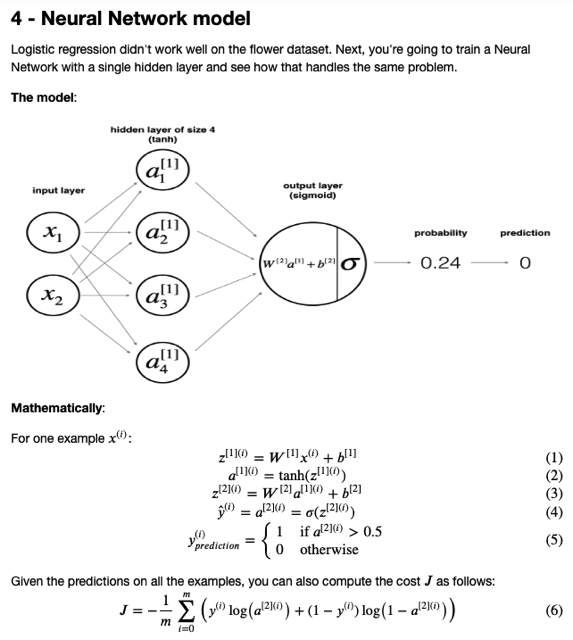</kbd>

 

<kbd>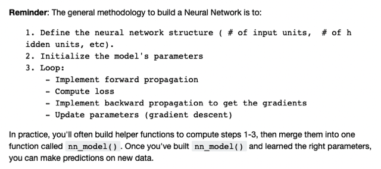</kbd>

 

### 4.1 - Defining the neural network structure

 

<kbd>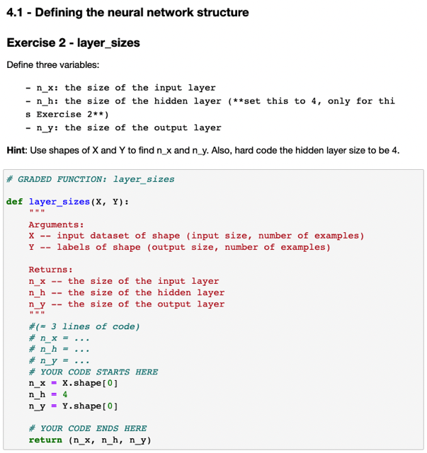</kbd>

 

<kbd>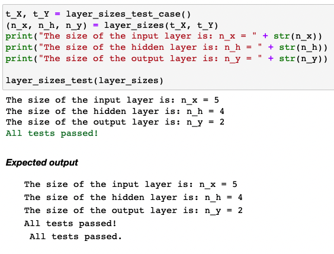</kbd>

 

### 4.2 - Initialize the model's parameters

 

<kbd></kbd>

 

<kbd></kbd>

 

<kbd>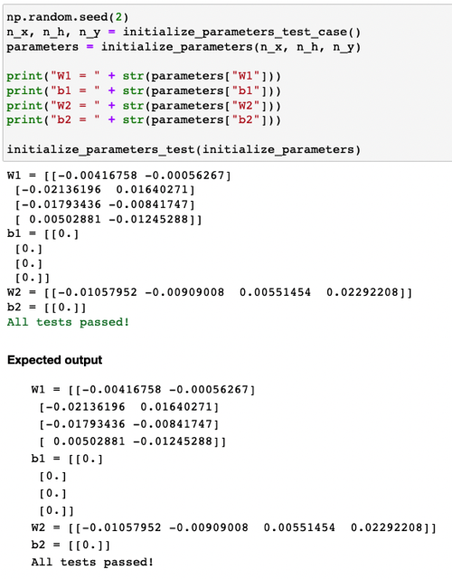</kbd>

 

### 4.3 - The loop

 

<kbd></kbd>

 

<kbd>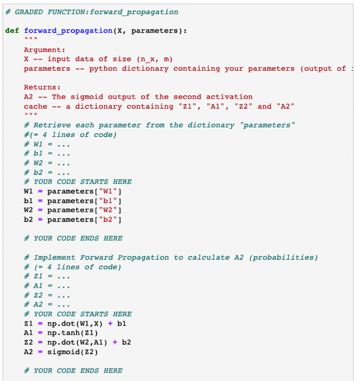</kbd>

 

<kbd></kbd>

 

### 4.4 - Compute the Cost

 

<kbd></kbd>

 

<kbd></kbd>

 

<kbd>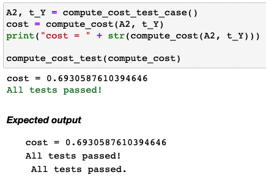</kbd>

 

### 4.5 - Implement Backpropagation

 

<kbd></kbd>

 

<kbd></kbd>

<kbd></kbd>

 

<kbd>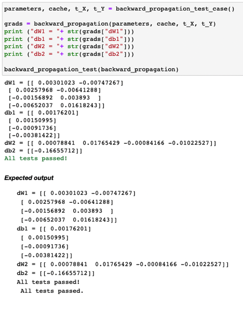</kbd>

 

### 4.6 - Update Parameters

 

<kbd>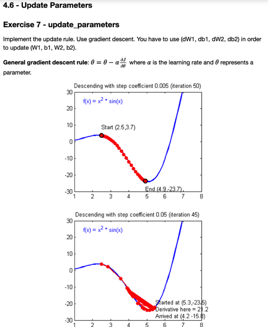</kbd>

 

<kbd>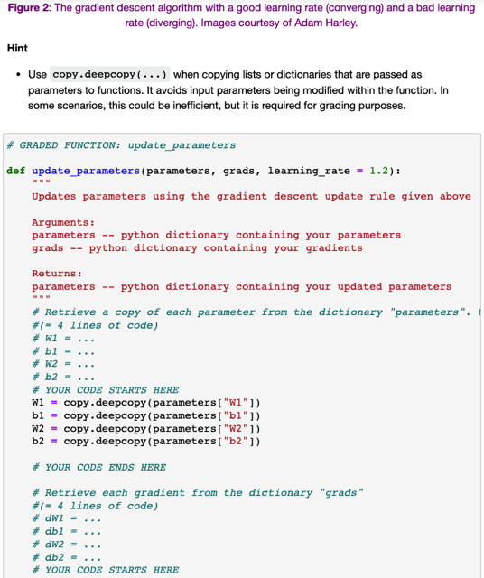</kbd>

<kbd></kbd>

 

<kbd>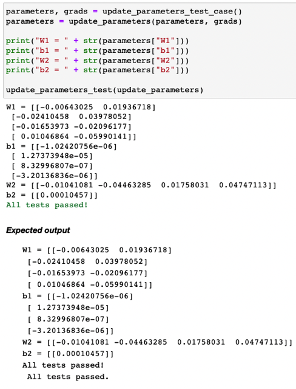</kbd>

 

### 4.7 - Integration

 

<kbd>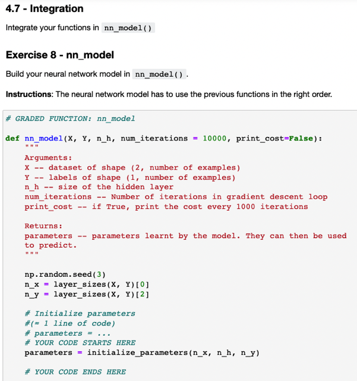</kbd>

 

<kbd>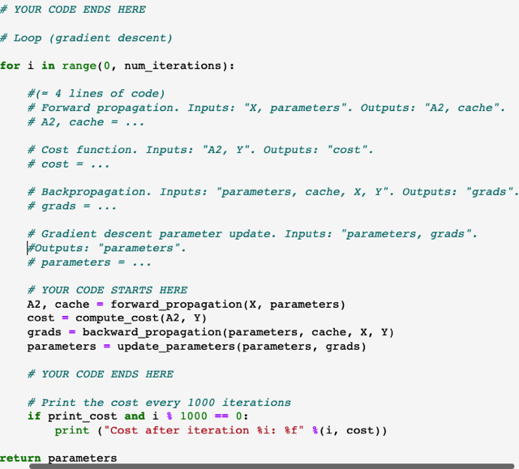</kbd>

 

<kbd></kbd>

 

### 5 - Test the Model

 

#### 5.1 - Predict

 

<kbd></kbd>

 

<kbd></kbd>

 

#### 5.2 - Test the Model on the Planar Dataset

 

<kbd></kbd>

 

<kbd>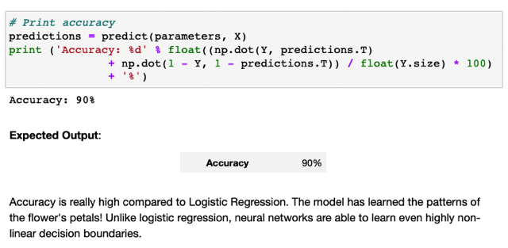</kbd>

 

<kbd></kbd>

 

### 6 - Tuning hidden layer size

 

<kbd></kbd>

<kbd>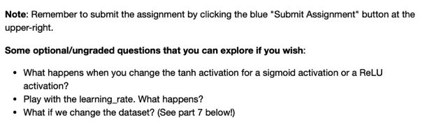</kbd>

 

### 7- Performance on other datasets

 

<kbd></kbd>

 

### Thực Hành F.p & B.p

 

#### L.g

 

<kbd></kbd>

 

<kbd>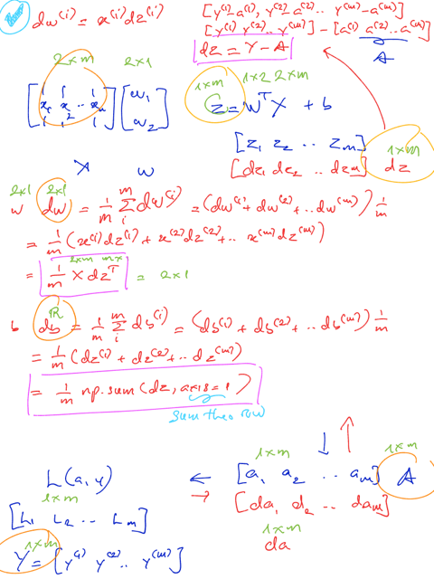</kbd>

 

#### S.n.n

 

<kbd></kbd>

 

<kbd></kbd>

 

#### N.n

 

##### Foward Prop

 

<kbd></kbd>

 

<kbd></kbd>

 

<kbd></kbd>

 

<kbd></kbd>

 

<kbd>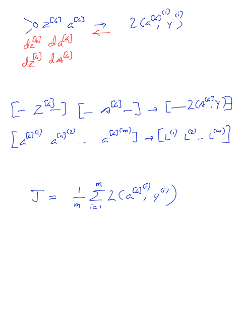</kbd>

 

##### Backward Prop

 

<kbd>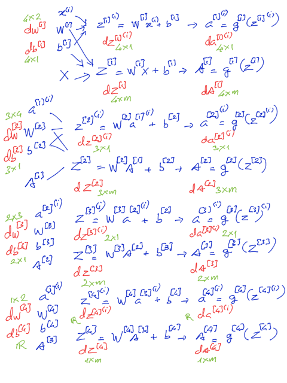</kbd>

 

<kbd></kbd>

 

<kbd>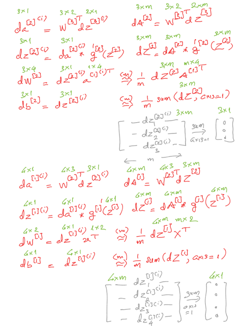</kbd>

 

<kbd>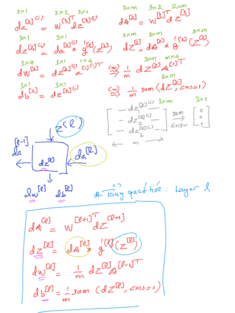</kbd>

 

<kbd>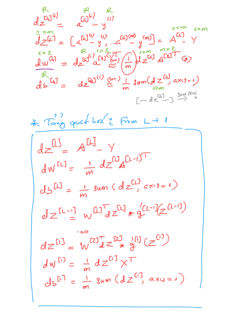</kbd>

 

## Ian Goodfellow

 

<kbd>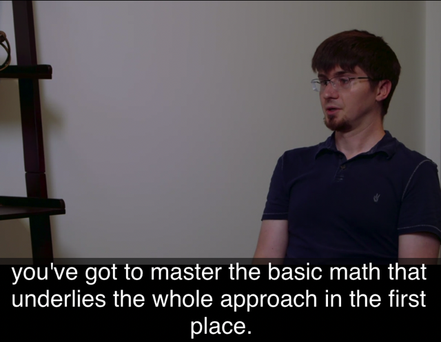</kbd>

> [!NOTE]
> I think one thing that I got from your courses at Stanford is that linear
> algebra and probability are very important, that people get excited about
> the machine learning algorithms, but if you want to be a really excellent
> practitioner, you've got to master the basic math that underlies the whole
> approach in the first place.
>
> I think a lot of people that want to get into AI start thinking that they absolutely need
> to get a Ph.D. or some other kind of credential like that. I don't think that's actually a
> requirement anymore. One way that you could get a lot of attention is to write good
> code and put it on GitHub. If you have an interesting project that solves a problem
> that someone working at the top level wanted to solve, once they find your GitHub
> repository, they'll come find you and ask you to come work there. A lot of the people
> that I've hired or recruited at OpenAI last year or at Google this year, I first became
> interested in working with them because of something that I saw that they released
> in an open-source forum on the Internet
>
> So read your book, practice the materials and post on GitHub and
> maybe on Archive. I think if you learned by reading the book, it's
> really important to also work on a project at the same time, to either
> choose some way of applying machine learning to an area that you
> are already interested in
>
> ML Security
>
> Like if you're a field biologist and you want to get into deep learning,
> maybe you could use it to identify birds, or if you don't have an idea for
> how you'd like to use machine learning in your own life, you could pick
> something like making a Street View house numbers classifier, where all
> the data sets are set up to make it very straightforward for you. And that
> way, you get to exercise all of the basic skills while you read the book or
> while you watch Coursera videos that explain the concepts to you

 

