# C2w3_hyperparamter Tuning, Batch Normalization & Programming Frameworks

📊 **Progress:** `58` Notes | `85` Screenshots

---

## C2w3_hyperparamter Tuning, Batch Normalization & Programming Frameworks

 

## Hyperparams Tuning

> [!NOTE]
> 1ST REVIEWED

 

### Tuning Process

 

> [!NOTE]
> 1 There are a lot of hyperparameters that need to be set when training deep
> neural networks, such as \\*learning rate\\*, \\*momentum term\\*,\\* number of layers,\\*
> number of hidden units, mini-batch size, and learning rate decay.
>
> 2 Some of these hyperparameters are \\*more important than others\\*. \\*Learning
> rate\\* is the\\* most important,\\* followed by \\*momentum term\\*, \\*mini-batch size\\*,
> and number of \\*hidden units.\\*
>
> 3 It's difficult to know in advance which hyperparameters will be the most
> important, so it's important to\\* try out a wide range of values\\*.
>
> 4 \\*Sampling at random\\* is a \\*better approach\\* than systematically exploring
> values in a \\*grid\\* because it allows for a \\*more rich exploration\\* of the
> hyperparameter space.
>
> 5\\* Coarse to fine sampling\\* is a \\*common practice\\* that involves \\*zooming\\* \\*in\\* on
> \\*promising areas\\* of the \\*hyperparameter space\\* and exploring more densely
> within that area.

 

<kbd>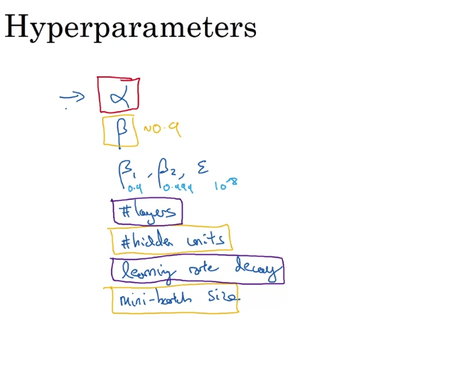</kbd>

 

<kbd>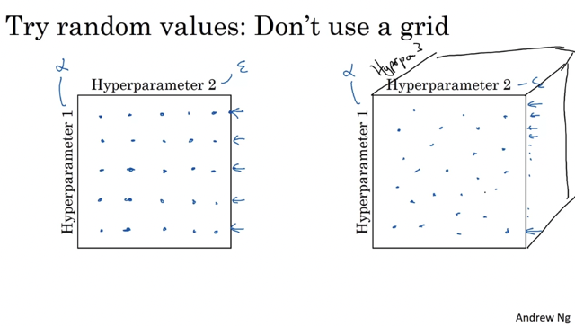</kbd>

> [!NOTE]
> Khó biết được hyperparam nào là quan trọng (khiến Model tốt)
>
>
>
> Nên thay vì làm theo kiểu Grid như hồi đầu của ML, bây giờ
> nên chọn **Random** .

 

<kbd></kbd>

> [!NOTE]
> Khi thấy 'vị trí' nào cho kết qua tốt -> Zoom vào khu
> vực đó **(Coarse to fine)**

 

> [!NOTE]
> 1 Hyperparameters in neural networks: Neural networks involve setting a lot of different
> hyperparameters, ranging from the learning rate alpha to the momentum term beta, the
> hyperparameters for the Adam Optimization Algorithm (beta one, beta two, and epsilon), the
> number of layers, the number of hidden units for the different layers, and the mini-batch size.
>
> 2 Importance of hyperparameters: Some of these hyperparameters are more important than
> others. The most important hyperparameter to tune is usually the learning rate alpha. Other
> hyperparameters that should be considered next include the momentum term (0.9 is a good
> default), the \\*mini-batch size\\* (to ensure the optimization algorithm is running efficiently), and the
> hidden units.
>
> 3 \\*Tuning\\* \\*hyperparameters\\*: How do you go about finding a good setting for these
> hyperparameters? It's important to \\*systematically organize your hyperparameter\\* tuning process
> to make it more efficient for you to converge on a good setting of the hyperparameters.
>
> 4 \\*Sampling\\* hyperparameters: In earlier generations of machine learning algorithms, if you had
> two hyperparameters, it was common practice to sample the points in a grid and systematically
> explore these values. However, in deep learning, it's better to choose the\\* points at random\\* to try
> \\*out on a randomly chosen set of points\\*. This is because it's difficult to know in advance which
> hyperparameters are going to be the most important for your problem.
>
> 5 Importance of sampling at random: Some hyperparameters are \\*much more important than
> other\\*s. If you sample in a grid, you might find that you' ve only tried out a few values of the most
> important hyperparameter, while having tried out many different values of a less important
> hyperparameter. Sampling at random helps to explore a \\*more diverse set of possible values for
> the most important hyperparameters\\*, whatever they turn out to be.
>
> 6 \\*Coarse to fine sampling\\* scheme: Another common practice when sampling hyperparameters is
> to use a \\*coarse to fine sampling scheme\\*. This involves \\*starting with a larger set of
> hyperparameters\\* and then \\*zooming in to a smaller region\\* of the hyperparameters to sample
> m\\*ore densely within this space.\\* This can help to\\* focus more resources on searching within the
> most promising regions\\* of hyperparameters.

 

### Using An Appropriate Scale To Pick Hyperparameters

 

> [!NOTE]
> 1\\* Random sampling\\* over hyperparameters allows \\*efficient search\\* over their
> space.
>
> 2 It is \\*important\\* to pick the \\*appropriate scale\\* on which to explore the
> hyperparameters.
>
> 3 \\*Sampling uniformly at random \\*over the range of hyperparameters might be
> \\*reasonable for certain hyperparameters,\\* such as the \\*number of hidden units\\*
> and \\*layers\\* in a neural network.
>
> 4 It is\\* not reasonable\\* to sample uniformly at random over the range of all
> hyperparameters.
>
> 5 Searching for hyperparameters on a\\* log scale\\* is \\*more reasonable\\*, especially
> for hyperparameters such as the \\*learning rate.\\*
>
> 6 To sample on a log scale, you need to take the \\*low\\* and \\*high values\\*, take
> \\*logs\\* to figure out what \\*a\\* and\\* b\\* are, sample \\*r\\* \\*uniformly between a and b\\*, and
> set the \\*hyperparameter to be 10 to the power of r.\\*
>
> 7 Sampling for the hyperparameter \\*beta\\* used for computing exponentially
> weighted averages is \\*tricky\\* and \\*should not be\\* \\*sampled on a linear scale.
> \\*
> 8 To explore the r\\*ange of values for beta\\*, it is important to \\*consider the range
> of values for the corresponding exponentially weighted average\\*s.

 

<kbd>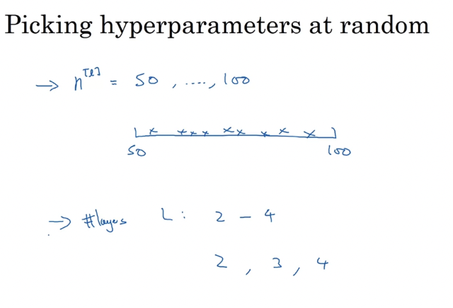</kbd>

> [!NOTE]
> Ví dụ như ta đang chọn random số hidden unit cho layer mà
> Ta nhắm chừng trong khoảng 50 - 100, thế là lẽ dĩ nhiên ta
> lấy random vài giá trị trong khoảng này.
>
>
>
> Hoặc số layer nhắm chừng trong khoảng 2,3,4, ta cứ thử từng 
> cái 2,3,4..
> Thì đại khái là cái hyperparam kiểu này ta làm vâỵ được, nhưng đối 
> với cái khác thì không....

 

<kbd></kbd>

> [!NOTE]
> Ví dụ như alpha nhắm trong khoảng từ 0.001 tới 1
> Nếu ta cũng làm như cách làm ở thằng hidden unit
> thì đại khái là ta sẽ 90% là chọn alpha từ 0.1-1. chỉ còn 10%
> từ 0.001-0.1
> 90 hay 10 là đại ý nói do cái **scale nó ko bằng nhau** nên 
> không làm vậy được.
>
>
>
> Thay vào đó phải làm theo kiểu lấy **log**.
>
>
>
> Ví dụ muốn lấy từ 0.0001 - 1. Thừ xem **0.0001** là log(a) **a bao nhiêu**.
> **1** là log(b) -> **b bao nhiêu.**
> -> Dẫn tới bài toán chọn **r random trong đoạn [a,b]** -> **alpha = 10^r**

 

<kbd>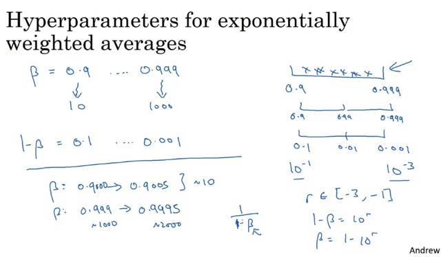</kbd>

> [!NOTE]
> Tương tự như vậy với beta.
>
>
>
> Nhớ lại (1-epsilon)^(1/epsilon)
>
>
>
> 0.9000 -> 0.9005: Tăng 0.0005
> Beta = 0.9 -> epsilon = 0.1 -> 1/epsilon = 10 thì hiểu đại khái là nó lấy 
> Trung bình của 10 ngày trước đó.
> Beta = 0.9005 -> Epsilon = 0.095 -> 1/epsilon cũng cỡ 10 (10,05)
>
>
>
> 0.9990 -> 0.9995: Cũng tăng 0.0005
> Beta = 0.9990 -> epsilon = 0.001 -> 1/epsilon = 1000
> Beta = 0.9995 -> epsilon = 0.0005 -> 1/epsilon = 2000
>
>
>
> Có nghĩa là trong đoạn cùng là 0.0005 mà mức ảnh hưởng của nó
> hoàn toàn khác nhau

 

<kbd>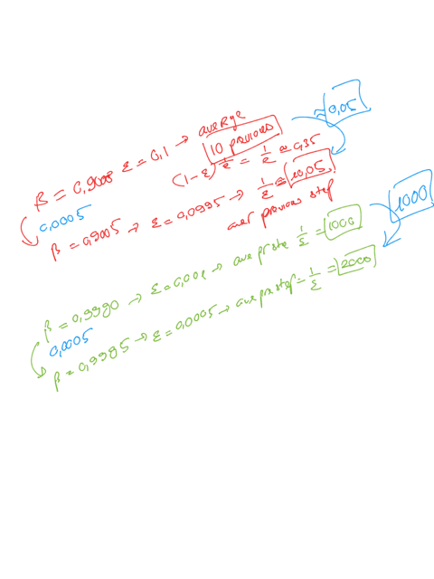</kbd>

 

> [!NOTE]
> 1 Sampling hyperparameters at random can be an efficient way to search over their
> space, but it's important to pick the appropriate scale to explore them.
>
> 2 Uniformly sampling hyperparameters may not be appropriate for all ranges of values.
> For example, when searching for the learning rate alpha, using a linear scale from 0.0001
> to 1 would result in sampling mostly from the range of 0.1 to
> 1. Instead, it's better to use a logarithmic scale where values are spaced equally on the
> log scale.
>
> 3 To sample on a logarithmic scale in Python, you can use the following code:  • Let r = -4
> * np.random.rand()  • A randomly chosen value of alpha would then be alpha = 10 to the
> power of r  • This results in alpha being sampled between 10 to the -4 and 10 to the 0
>
> 4 In a more general case, if you want to sample between 10 to the a and 10 to the b on a
> log scale, you can use the following steps:  • Take the log base 10 of the low value to find
> a  • Take the log base 10 of the high value to find b  • Sample r uniformly at random
> between a and b  • Set the hyperparameter to be 10 to the r
>
> 5 Another tricky case is sampling the hyperparameter beta used for computing
> exponentially weighted averages. In this case, it's important to understand the effect of
> changing the value of beta on the average. Using a linear scale to sample beta between
> 0.9 and 0.999 may not be effective since the values are spaced closely together near 0.
> 999. Instead, a good way to sample beta is to use the formula beta = 1 - 10 to the power
> of -x, where x is sampled uniformly at random between 1 and 4.
>
> 6 Overall, it's important to understand the range of values that each hyperparameter can
> take and to choose an appropriate scale for sampling in order to efficiently explore their
> space.

 

### Hyperparams Tuning In Practice: Pandas Vs. Caviar

 

> [!NOTE]
> 1 Intuitions about hyperparameter settings from one application
> area may or may not transfer to a different one, but
> \\*cross-fertilization among different domains\\* is \\*increasingly
> common\\*.
>
> 2 \\*Hyperparameter settings\\* can get \\*stale\\* due to \\*changes\\* in \\*data\\*
> or \\*computational resources,\\* so it's recommended to \\*retest\\* or
> \\*reevaluate hyperparameters\\* at least once \\*every several months.\\*
>
> 3 Two \\*major ways\\* of searching for hyperparameters are the
> \\*panda approac\\*h, where \\*one model\\* is \\*gradually tweaked\\*, and the
> \\*caviar approach\\*, where \\*many mode\\*ls are trained \\*in parallel \\*and
> the b\\*est one is chosen.\\*
>
> 4 The choice between the two approaches \\*depends on the
> amount of computational resources\\* available.

 

<kbd>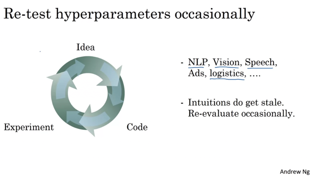</kbd>

> [!NOTE]
> Đại khái là nên **retest hyperparams vài tháng một lần** vì
> những **sự thay đổ**i có thể khiến cái mình đã tune ngon 
> hết ngon
> Ví dụ: Data thay đổi, server khác, 
>
>
>
> Còn chuyển từ domain này qua domain khác thì đại ý là 
> Deep learning nó có ưu điểm là kế thừa được những cái từ
> domain khác, nhưng hyperparam thì không, phải tune lại.

 

<kbd></kbd>

> [!NOTE]
> Đại khái là máy mạnh thì **chạy nhiều model cùng lúc** rồi **xem
> cái nào ngon nhất**.-> Như cá hồi đẻ trứng
>
>
>
> Còn không thì c**hăm như chăm con**, từng ngày từng ngày 
> theo dõi và điều chỉnh. Ví dụ ngày thứ 2 thử giảm alpha xuống 
> Qua thứ 3 thấy ok, thử cái khác qua thứ 4 thấy nó không ổn,
> liền quay lại setting của ngày thứ 3, thử setting khác -> Chăm 
> như chăm con

 

> [!NOTE]
> 1 Importance of \\*cross-fertilization\\* in deep learning:  2 Deep learning is applied in various application
> areas, and\\* intuitions about hyperparameter settings\\* from one area \\*may or may not transfer\\* to a
> different one. However, there is a lot of \\*cross-fertilization among different application domains\\*, with
> researchers reading increasingly from other domains to look for inspiration for cross-fertilization. For
> example, ideas developed in \\*computer vision\\*, such as \\*ConVnets\\* or \\*ResNets\\*, have been successfully
> applied to \\*speech\\*, and vice versa.
>
> 3 The risk of \\*stale hyperparameter settings:\\*  4 Intuitions about the \\*best hyperparameter settings can get
> stale over time,\\* even when working on the same problem. For instance, a good setting that was once
> found may \\*no longer work\\* due to c\\*hanges in data or hardware\\*. Therefore, it is recommended to \\*retest\\*
> or \\*reevaluate\\* \\*hyperparameters\\* \\*periodically\\*, maybe at least\\* once every several months\\*, to ensure that
> the current hyperparameter values are\\* still suitable.\\*
>
> 5 Two major \\*schools of thought \\*in \\*hyperparameter search\\*:  6 There are two major ways in which people
> go about searching for hyperparameters: \\*babysitting\\* one model and \\*training\\* many models in \\*parallel\\*.
>
> 7 \\*Babysitting\\* one model:  8 If c\\*omputational resources are limited\\*, then one approach is to \\*babysit\\* one
> model by \\*gradually nudging up\\* and \\*down the parameters\\*. For example, one might initialize the
> parameters randomly and start training, then gradually watch the learning curve, maybe the cost
> function or dataset error, gradually decrease over the first day. At the end of the day, one might try
> increasing the learning rate a little bit and see how it performs, and then adjust the parameters again
> the following day, and so on. The approach is called the p\\*anda approach\\*, as it is similar to how pandas
> have few children and \\*put a lot of effort into ensuring their survival\\*.
>
> 9 Training\\* many models in parallel:\\*  10 If there are \\*enough computational resources\\*, then one can train
> \\*many models\\* in \\*parallel\\* with \\*different hyperparameters\\*. Each model generates its \\*own learning curve\\*,
> and the \\*best hyperparameter setting\\* is selected based on\\* which model performs the best\\*. This
> approach is called the \\*caviar strategy\\*, as it is similar to how fish reproduce by laying many eggs and not
> paying too much attention to any one of them.
>
> 11 Choosing between the two approaches:  12 The choice between the two approaches is mainly a
> function of how \\*much computational resources are available\\*. If there are enough resources, then the
> caviar strategy can be used to try a lot of different hyperparameter settings and select the best one
> \\*quickly\\*. However, if \\*resources are limited\\*, then the panda approach can be used to gradually adjust the
> hyperparameters of one model over time.

 

## Batch Normalization

> [!NOTE]
> 1ST REVIEWED

 

> [!NOTE]
> CLARIFICATION ABOUT UPCOMING
> NORMALIZATION ACTIVATIONS IN A NETWORK

 

#### ...

 

<kbd>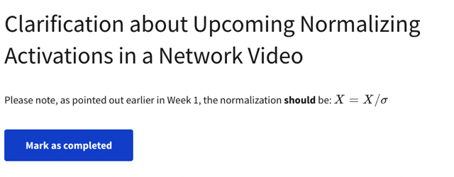</kbd>

 

### Normalization Activations In A Network

 

> [!NOTE]
> 1 Batch normalization is a deep learning algorithm that was created by
> Sergey Ioffe and Christian Szegedy.
>
> 2 Batch normalization can make the hyperparameter search problem much
> easier, make neural networks more robust, and enable easy training of very
> deep networks.
>
> 3 Normalizing input feature values can speed up learning in models such as
> logistic regression.
>
> 4 Batch normalization can be used to normalize the mean and variance of
> activations in hidden layers.
>
> 5 Batch normalization normalizes the values of z before the activation
> function is applied, and this is done much more often in practice.
>
> 6 To implement batch norm, you compute the mean and variance of
> intermediate values, normalize the values using mean and variance, and
> use learnable parameters gamma and beta to set the mean and variance of
> the normalized values to desired values.
>
> 7 Gamma and beta parameters can be updated using gradient descent or
> other algorithms, just like the weights of a neural network.

 

<kbd></kbd>

> [!NOTE]
> Đại khái là cũng như normalization đ.v X giúp ích cho việc training
> thì normalize các hidden unit output cũng vậy.

 

<kbd>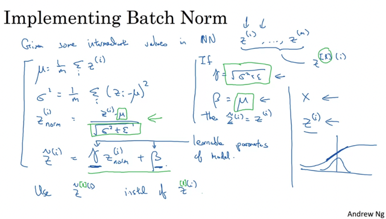</kbd>

<kbd>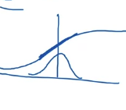</kbd>

> [!NOTE]
> Ở đây nó cũng normalize Theo kiểu tương tự 
> feature scaling (-mu) + mean normalization (/sigma)
>
>
>
> Nhưng có cái là 'không muốn cho mean = 0 để tận dụng khả
> năng của hàm sigmoid gì gì đó nên thay vì dùng
> z_norm, dùng z~ (Đọc là z tilde) = Gamma*z_norm + beta và Train
> Gamma và Beta như W, b.
>
>
>
> Chưa hiểu thì từ từ sẽ hiểu
>
> Đại khái là nếu data chỉ loanh quanh quanh
> mốc z = 0 thì sigmoid(z) chỉ loanh quanh mốc 0.
> 5 và đoạn này nó khá tuyến tính nên nó sẽ
> không tận dụng được khả năng phi tuyến tính
> của hàm sigmoid

**🔗 See also:** [linked note](#node-ln9g4bs)

 

### Fitting Batch Norm Into A Neural Network

 

> [!NOTE]
> 1 Introduction to deep neural networks as a series of computations with
> multiple layers, each layer computing two things: Z and A.
>
> 2 Traditional process of computing Z and A without Batch Normalization.
>
> 3 Batch Normalization explained as a new layer that normalizes the Z
> values using Beta and Gamma parameters, computed for each layer.
>
> 4 The intuition behind using normalized values instead of un-normalized
> ones in computing the activations.
>
> 5 The new parameters added to the network for each layer where Batch
> Normalization is applied.
>
> 6 Optimization methods such as gradient descent, RMSprop, and Adam
> used for updating Beta and Gamma parameters.
>
> 7 Implementation of Batch Normalization in deep learning frameworks.
>
> 8 Mini-batch processing used in applying Batch Normalization during
> training.

 

<kbd>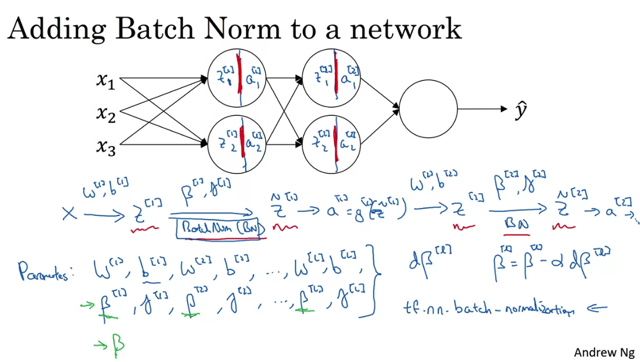</kbd>

> [!NOTE]
> Thêm bước tính từ z -> z ~ (z tilde) nữa
>
>
>
> Và training thêm d_beta và d_gamma nữa
> (update beta, gamma như W, b bằng G.D vậy
>
>
>
> Nếu dùng Framework như TensorFlow thì không
> cần làm chỉ cần khai báo nó tự làm. Nói chung là
> chỉ cần hiểu nó làm gì là được.

 

<kbd>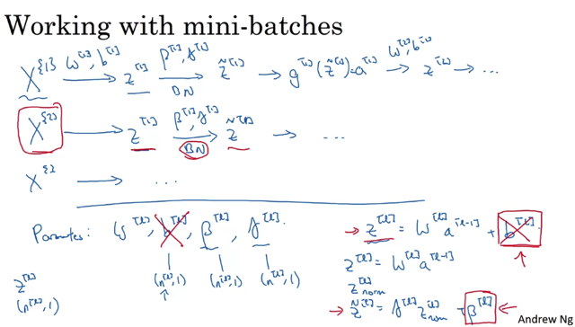</kbd>

> [!NOTE]
> 1. Thường là làm việc với Mini-batch, thì nó sẽ như vầy, như vầy..
> Các step normalize (Batch norm) sẽ chỉ đ.v từng mini. batch 
>
>
>
> 2. Với Batch-norm thì param b trở nên vô nghĩa, nên có thể bỏ.
>
>
>
> 3.Beta[l] Gamma[l] sẽ cùng size / shape (n[l], 1) với b[l]

 

<kbd></kbd>

> [!NOTE]
> Put them together

 

### Why Does Batch Norm Work

 

> [!NOTE]
> 1 Batch normalization speeds up learning by normalizing all input features to take
> on a similar range of values.
>
> 2 Batch normalization makes weights deeper in a network more robust to changes
> to weights in earlier layers by addressing the problem of covariate shift.
>
> 3 Covariate shift occurs when the distribution of X changes, and it becomes
> necessary to retrain a learning algorithm even if the ground truth function mapping
> from X to Y remains unchanged.
>
> 4 From the perspective of a certain layer in a deep network, it gets some values
> from the earlier layers and has to map them to Y-hat, but these values change as
> the parameters in earlier layers change, causing the problem of covariate shift.
>
> 5 Batch normalization reduces the amount that the distribution of hidden unit
> values shifts around, ensuring that their mean and variance remain the same,
> making the network more robust to the problem of covariate shift.

 

<kbd>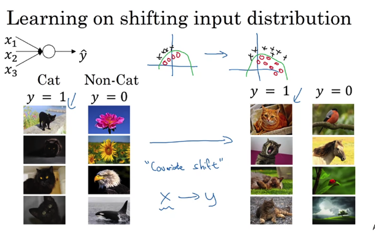</kbd>

> [!NOTE]
> **Covariate shift.** 
> And the idea is that, if you've learned some X to Y mapping, 
> if the distribution of X changes, then you might need to retrain 
> your learning algorithm.

 

<kbd>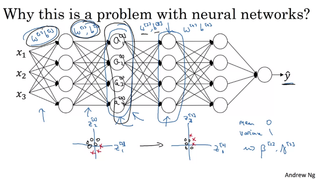</kbd>

<kbd></kbd>

> [!NOTE]
> "So from the perspective of the third hidden layer, these hidden unit
> values are changing all the time, and so it's suffering from  the problem
> of covariate shift" 
> Đại khái là params được update liên tục dẫn đến cái **"DISTRIBUTION
> CỦA INPUT CỦA HIDDEN LAYER"** thay đổi liên tục nên gây khó khăn
> cho quá trình training. -> Batch Norm giúp fix vấn đề này

 

<kbd>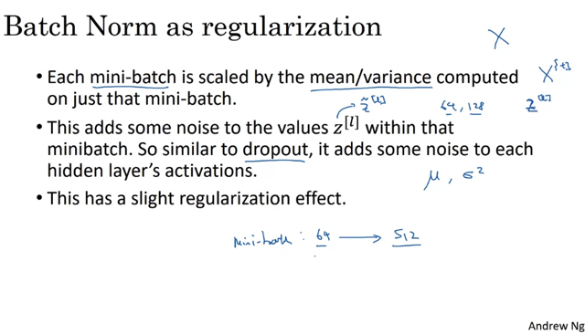</kbd>

 

<kbd>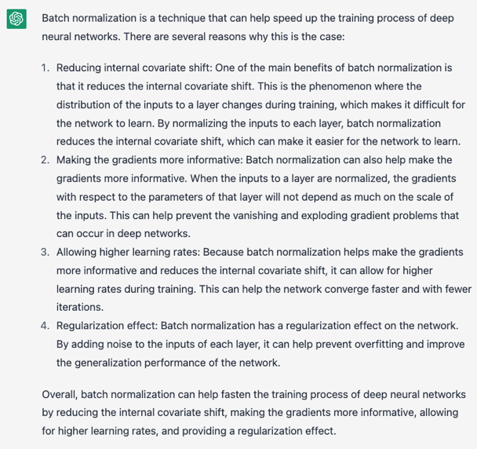</kbd>

> [!NOTE]
> **Covariate shift:** This is the phenomenon where the
> **distribution of the inputs to a layer changes during training**,
> which makes it difficult for the network to learn. By normalizing the
> inputs to each layer, batch normalization reduces the internal
> covariate shift, which can make it easier for the network to learn.

 

### Batch Norm At Test Time

 

> [!NOTE]
> 1 Batch normalization processes data in mini batches during
> training.
>
> 2 During training, mean and variance are computed on the
> entire mini batch.
>
> 3 During test time, processing a single example at a time, you
> need to estimate mean and variance from training data.
>
> 4 Exponentially weighted averages are used to estimate mean
> and variance from training data.
>
> 5 At test time, use the estimated mean and variance to scale
> the test example.
>
> 6 Deep learning frameworks usually have default ways to
> estimate mean and variance.
>
> 7 Using batch normalization can help train deeper networks
> and improve learning algorithm efficiency.

 

<kbd>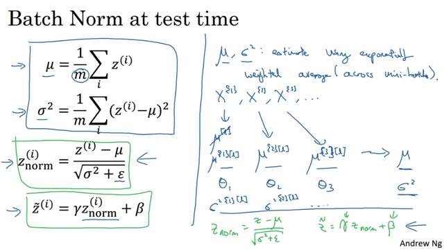</kbd>

> [!NOTE]
> But that test time, you might need to process a single example at
> a time. So, the way to do that is to estimate mu and sigma
> squared from your training set and there are many ways to do
> that. You could **in theory run your whole training set through
> your final  network to get mu and sigma squared**. But in
> practice, what people  usually do is implement and exponentially
> weighted average where  you **just keep track of the mu and
> sigma squared values you're  seeing during training** and use
> and exponentially the weighted  average, also sometimes called
> the running average, to just get a  rough estimate of mu and
> sigma squared and then you use those  values of mu and sigma
> squared that test time to do the scale and  you need the head
> and unit values Z

 

## Multiclass Classification

 

### Clarification About Upcoming Softmax

 

#### ...

 

<kbd></kbd>

 

### Softmax Regression

 

> [!NOTE]
> 1 \\*Binary\\* \\*classification\\* involves two possible labels, \\*0\\* or \\*1\\*.
>
> 2 \\*Softmax\\* \\*regression\\* is a \\*generalization\\* of \\*logistic regression\\* used
> for recognizing \\*multiple classes\\*.
>
> 3 Softmax regression uses a \\*Softmax\\* \\*layer\\* to generate the
> \\*probabilities\\* for \\*each of the classes\\*.
>
> 4 The number of \\*units\\* in the \\*Softmax\\* layer is \\*equal to the number
> of classes\\*.
>
> 5 The \\*Softmax\\* \\*activation\\* \\*function\\* computes a temporary variable, t,
> which is e to the power of the output of the final layer.
>
> 6 The output of the Softmax activation function, aL, is the vector t
> normalized to sum to 1.
>
> 7 The i-th element of the output vector aL represents the p\\*robability
> of the input belonging to the i-th class\\*.
>
> 8 The \\*probabilities\\* generated by the Softmax layer should \\*sum to 1.\\*

 

<kbd></kbd>

 

<kbd></kbd>

 

<kbd>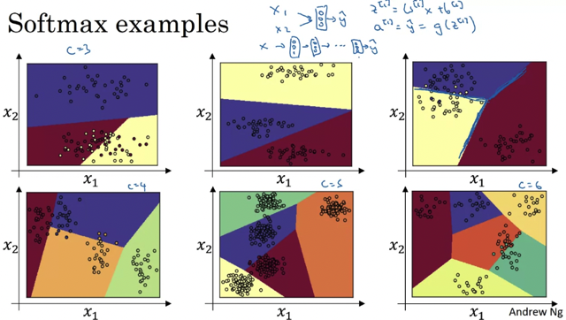</kbd>

 

> [!NOTE]
> 1 Softmax regression is a generalization of logistic regression for multiple classes. Instead of just
> recognizing two classes, Softmax regression allows you to recognize \\*one of C possible classes,\\*
> where C is the number of classes you're trying to categorize your inputs into.
>
> 2 To use Softmax regression, you need to build a new neural network where the upper layer has
> C units. The goal is for each unit to output the probability of its corresponding class, given the
> input x.
>
> 3 The output labels y hat in Softmax regression are a C by 1 dimensional vector, where each
> element represents the \\*probability of its corresponding class.\\*
>
> 4 Because \\*probabilities should sum to one\\*, the \\*elements in y hat should also sum to one.\\*
>
> 5 The standard model for Softmax regression uses a \\*Softmax layer\\* in the output layer to generate
> these probabilities. The Softmax activation function is used to compute the output of the final
> layer.
>
> 6 The \\*Softmax\\* activation function takes the\\* linear part\\* of the layer (\\*zL\\*) and computes a temporary
> variable (t), which is e to the zL (element-wise). Then, the output aL is computed by normalizing t
> to sum to one. This ensures that the elements in aL \\*represent probabilities that sum to one.\\*
>
> 7 In the Softmax layer, the output aL is a C by 1 dimensional vector, where each element
> represents the probability of its corresponding class. The i-th element of aL is computed as ti
> divided by the sum of all the ti's, where ti is the i-th element of the vector t.
>
> 8 An example is given to illustrate how the Softmax activation function works. In the example, zL
> is a four-dimensional vector: 5, 2, -1, 3. Using the Softmax activation function, we compute t,
> which is e to the 5, e to the 2, e to the -1, e to the 3. We then normalize t to sum to one, which
> gives us the output aL, where each element represents the probability of its corresponding class.

 

### Training A Softmax Classifier

 

> [!NOTE]
> 1 Softmax activation function was introduced in the previous video and
> in this video, we will deepen our understanding of softmax classification
> and learn about the training model that uses a softmax layer.
>
> 2 Softmax classification generalizes the logistic activation function to C
> classes and if C=2, then softmax with C=2 essentially reduces to logistic
> regression.
>
> 3 The loss function used in softmax classification is the negative sum of
> j=1 through C of yj log yhat j, where yj is the true label and yhat j is the
> predicted probability of the class j.
>
> 4 The loss function tries to make the corresponding probability of the
> true class as high as possible, which is a form of \\*maximum likelihood
> estimation.\\*
>
> 5 To reduce the loss on the training set, the neural network adjusts the
> predicted probability of the true class.

 

<kbd></kbd>

 

<kbd>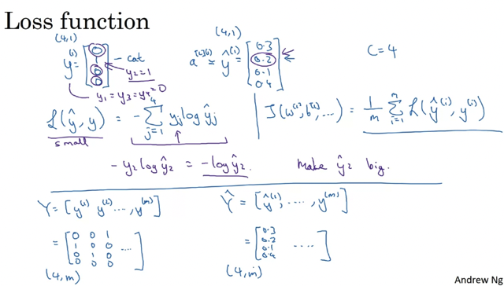</kbd>

> [!NOTE]
> Hiểu đại khái Machine nó sẽ muốn làm gì:
> Muốn min L thì phải min Sum y_iLog(y^_i), mà y_1, y_3, y_4 = 0 
> -> Phải min y_2log(y^_2) mà y_2 = 1 
> -> Phải min log(y^_2)
> -> Phải max y^_2
>
>
>
> Softmax thật ra là mở rộng khái quát hoá của Logistic Regression

 

<kbd>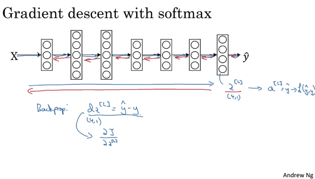</kbd>

> [!NOTE]
> Programming assignment này sẽ bắt đầu dùng Framework 
> (TensorFlow) nên chỉ cần ForProp, BackProp nó sẽ làm giùm
> mình nhưng đại khái cũng giống cách tính BackProp bữa trước
> làm thôi, chỉ có cái là h y nó có C hàng chứ 1 ko phải 1 hàng

 

## Introduction To Programming Frameworks

 

### Deep Learning Frameworks

 

> [!NOTE]
> 1 Deep learning algorithms can be implemented from scratch using Python and
> NumPY, but more complex models may require the use of deep learning software
> frameworks.
>
> 2 Implementing everything yourself from scratch becomes increasingly impractical as
> models get larger and more complex.
>
> 3 There are now many good deep learning software frameworks available to help
> implement complex models, such as convolutional neural networks and recurring
> neural networks.
>
> 4 Choosing a framework depends on several factors, including ease of programming,
> running speeds, and whether or not the framework is truly open.  5 Some popular
> deep learning frameworks include TensorFlow, PyTorch, Keras, and Caffe.
>
> 6 Each of these frameworks has a dedicated user and developer community, and
> each is a credible choice for some subset of applications.
>
> 7 The criteria recommended for choosing a framework include ease of programming,
> running speeds, and whether or not the framework is truly open.
>
> 8 Truly open frameworks are those that are not only open source but also have good
> governance and are not under the control of a single company.
>
> 9 Multiple frameworks could be a good choice depending on the user's preferences
> and the application they are working on.
>
> 10 Using a deep learning software framework can make development of machine
> learning applications more efficient by providing a higher level of abstraction than just
> a numerical linear algebra library.

 

<kbd></kbd>

> [!NOTE]
> Đại khái là khi làm các bài toán lớn thì sử dụng các lib sẽ giúp 
> ta tiện hơn

 

<kbd>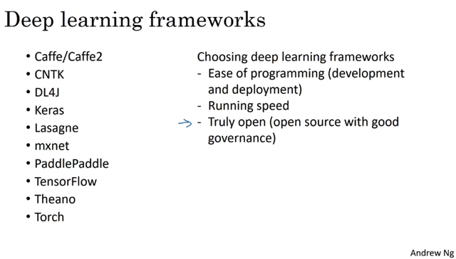</kbd>

> [!NOTE]
> Các Framework này improve liên tục và đây là 1 số tiêu chí để chọn F.W

 

### Tensorflow

 

<kbd>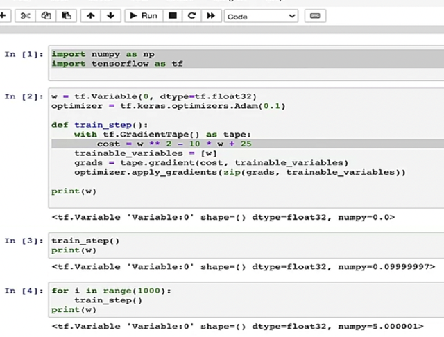</kbd>

 

<kbd>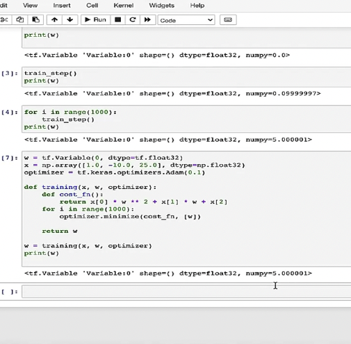</kbd>

 

<kbd></kbd>

> [!NOTE]
> Đại khái là T.S nó sẽ tự tính BackProp

 

### Learn About Gradient Tape And More

 

<kbd></kbd>

 

## Quiz

 

<kbd></kbd>

 

<kbd></kbd>

> [!NOTE]
> Không 'equally' vì rõ ràng Alpha quan trọng hơn Epsilon nhiều

 

<kbd>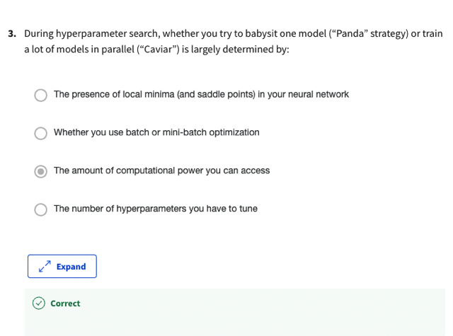</kbd>

> [!NOTE]
> Này quá rõ, nếu máy mạnh thì chạy nhiều cái cùng lúc

 

<kbd>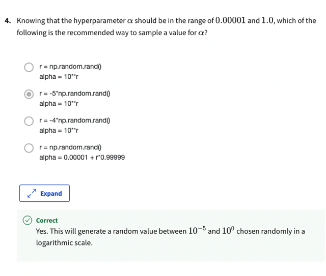</kbd>

 

<kbd></kbd>

 

<kbd></kbd>

 

<kbd>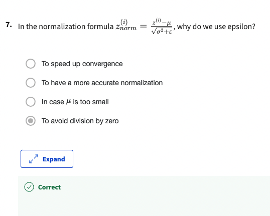</kbd>

 

<kbd></kbd>

> [!NOTE]
> Beta gammar được train như Web bằng G.D ...nên câu
> đầu sai, câu 2 đúng.
>
>
>
> Beta[l], gammae[l] cũng như, b[l] là. vector mỗi unit 1 cái
> nên không phải là 1 R cho cả layer -> Câu 3 sai
>
>
>
> Câu 4 sai vì ko phải là Optimal value, mà đó là value khiến
> cho  Gamma và Beta vô nghĩa (Khiến Z~ bằng Z)
>
>
>
> Câu 5 đúng

**🔗 See also:** [linked note](#node-1zt2817)

 

<kbd></kbd>

> [!NOTE]
> Sai vì vẫn có tính Batch Norm

 

<kbd></kbd>

 

## Programming Assignment

 

### Introduction to TensorFlow

 

#### .

 

<kbd>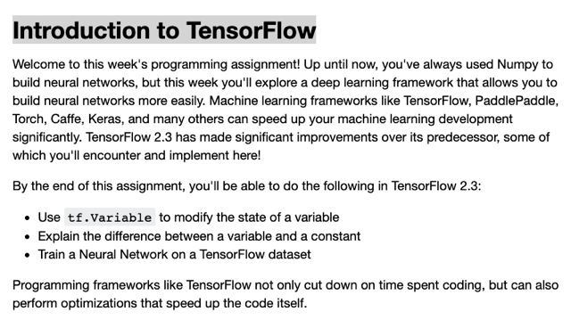</kbd>

 

<kbd></kbd>

 

#### Checking TensorFlow Version

 

### 2 - Basic Optimization with GradientTape

 

### Basic Optimization with GradientTape

 

<kbd>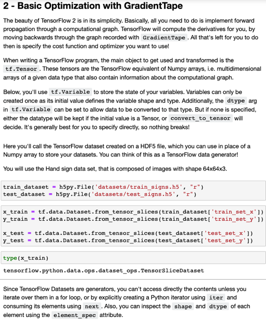</kbd>

<kbd>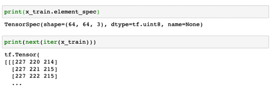</kbd>

 

<kbd></kbd>

 

<kbd>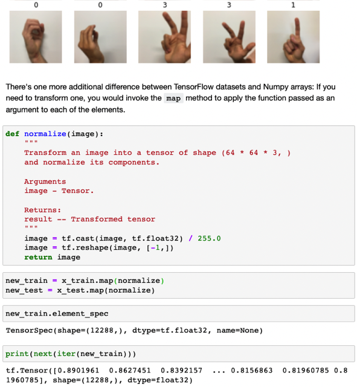</kbd>

 

### 2.1 - Linear Function

> [!NOTE]
> Làm quen với TF Khai báo
> Constant với tf.constant() .
> tf.matmul(), tf.add() Tính
> thử Y = WX + b bằng T.F

 

<kbd></kbd>

 

#### Exercise 1 - linear_function

 

<kbd></kbd>

 

<kbd>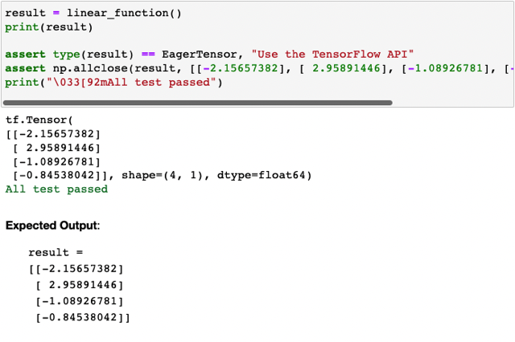</kbd>

 

### 2.2 - Computing the Sigmoid

> [!NOTE]
> Làm quen với TF
> tf.keras.activation.sigmoid()
> tf.cast(.., tf.float32)

 

<kbd>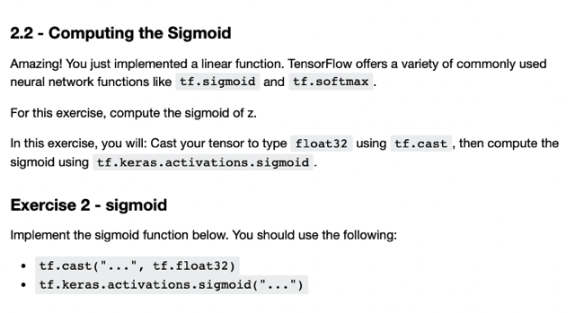</kbd>

 

#### Exercise 2 - sigmoid

 

<kbd>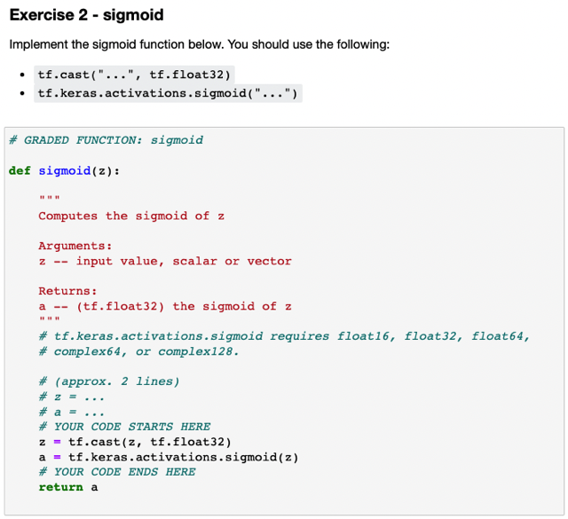</kbd>

 

<kbd>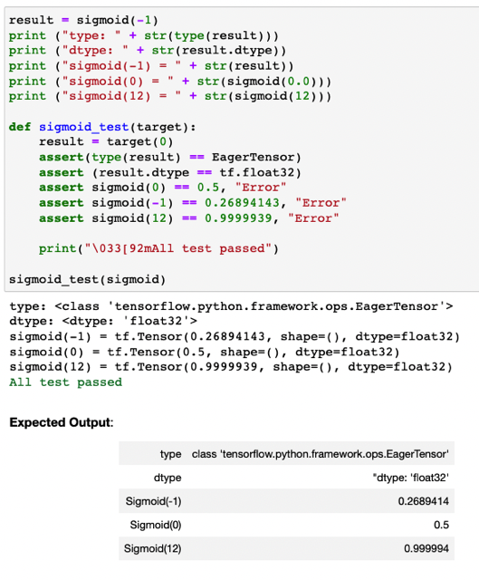</kbd>

 

### 2.3 - Using One Hot Encodings

> [!NOTE]
> One hot encoding with TF
> Dùng tf.one_hot(labels, depth)
> và tf.reshape(.., [-1, ]) để

 

<kbd>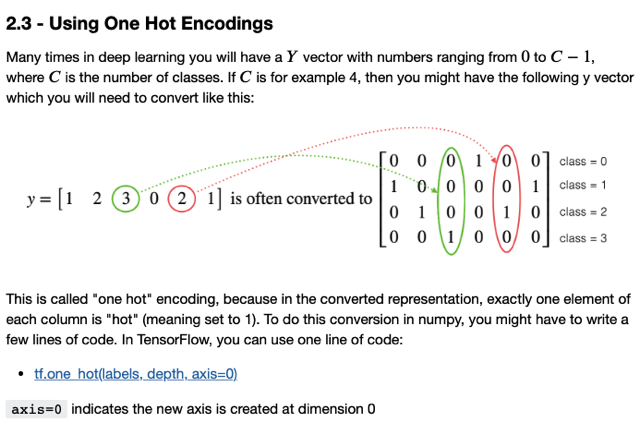</kbd>

 

#### Exercise 3 - one_hot_matrix

 

<kbd>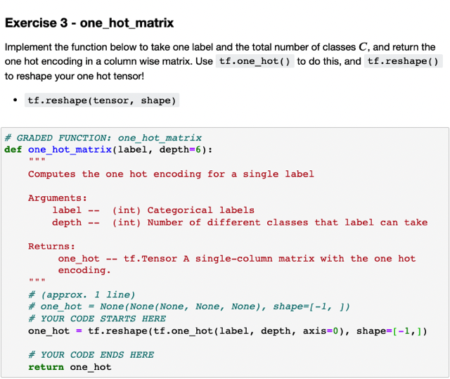</kbd>

 

<kbd>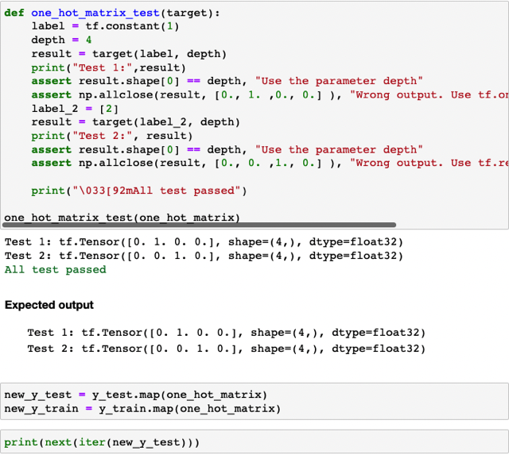</kbd>

 

<kbd>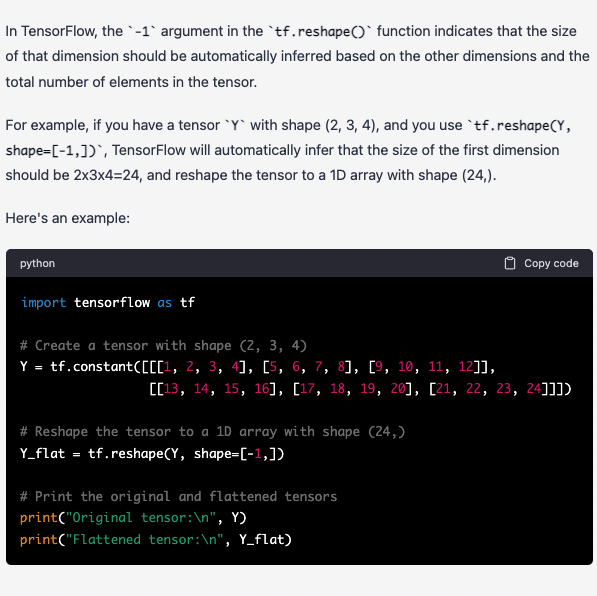</kbd>

<kbd>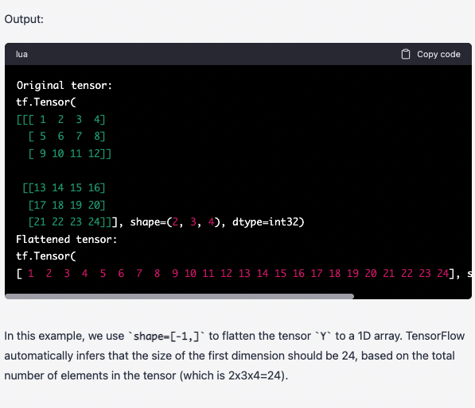</kbd>

> [!NOTE]
> Argument -1 có nghĩa là để nó tự chuyển thành 1D vector size bằng
> mấy cái kia nhân lại (dồn lại hết thành 1 row)

 

### 2.4 - Initialize the Parameters

> [!NOTE]
> Initialize bằng GlorotNormal.

 

<kbd>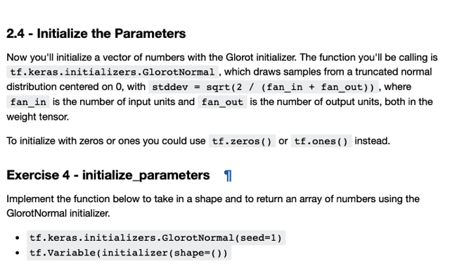</kbd>

 

#### Exercise 4 - initialize_parameters

 

<kbd></kbd>

 

<kbd></kbd>

 

### 3 - Building Your First Neural Network in TensorFlow

 

### 3.2 Compute the Total Loss

> [!NOTE]
> Viết hàm tính loss function dùng TF's 
> categorical_crossentropy(logits, labels)
>
>
>
> Cứ tưởng kẹt ở Excersie này, người ta đã gợi ý là phải đảm
> bảo argument's shape đúng mà. Có điều không có nói vụ 
> **from_logits** khiến mò mãi mới đúng
>
>
>
> 1. Chú ý thứ tự argument, **(labels, logits)**
>
>
>
> 2. Vì yêu cầu shape = (no. examples - m, no. features - n) nên
> phải **transpose**. Với TF, dùng **tf.transpose()**
>
>
>
> 3.Phải thêm **from_logits = True** mới đúng
>
> **from_logits = True** có nghĩa là Y^ (output của last layer
> trong n.n) vẫn ở dạng 'raw output', không phải dạng '
> Probability'.
>
>
>
> Layer cuối cùng nó để Linear (tức là tính tính Z3 = Z[L] =
> W[L]. A[L-1] + b[L] và không tính A[L] hay nói cách khác g[L] =
> L (không áp dụng hàm rêu hay sigmoid gì cả)  Để rồi mới bỏ
> Z[L] đó vào Softmax để tính ra Probability
>
>
>
> Thì đây cũng vậy, cái mà mình bỏ vào cùng với y là Z, là **raw
> output** chứ không phải là **Probability** nên phải ghi rõ
> **from_logit = True**
>
>
>
> Nếu không ghi, hoặc để = false, hàm categorical_crossentropy
> sẽ apply **Softmax** (tính ra Probability) rồi mới tính Loss

 

<kbd></kbd>

 

#### Exercise 6 - compute_total_loss

 

<kbd>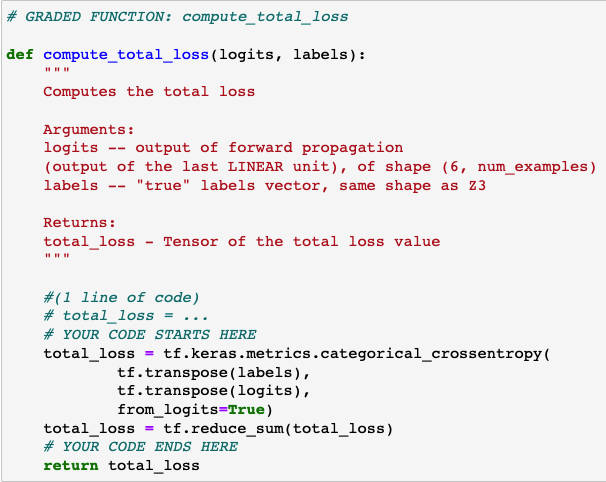</kbd>

 

<kbd>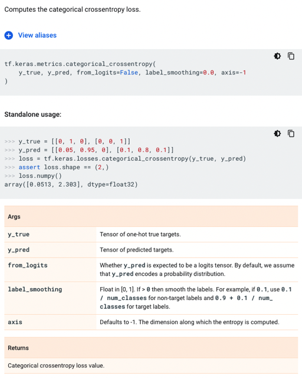</kbd>

 

<kbd></kbd>

> [!NOTE]
> **from_logits = True** có nghĩa là Y^ (output của last layer
> trong n.n) vẫn ở dạng 'raw output', không phải dạng '
> Probability'.
>
>
>
> Nhớ lại, layer cuối cùng nó để Linear (tức là tính tính Z[L] =
> W[L]. A[L-1] + b[L] và không tính A[L] hay nói cách khác g[L] =
> L (không áp dụng hàm rêu hay sigmoid gì cả)  Để rồi mới bỏ
> Z[L] đó vào Softmax để tính ra Probability
>
>
>
> Thì đây cũng vậy, cái mà mình bỏ vào cùng với y là Z, là **raw
> output** chứ không phải là **Probability** nên phải ghi rõ
> **from_logit = True**
>
>
>
> Nếu không ghi, hoặc để = false, hàm categorical_crossentropy
> sẽ apply **Softmax** (tính ra Probability) rồi mới tính Loss

 

<kbd>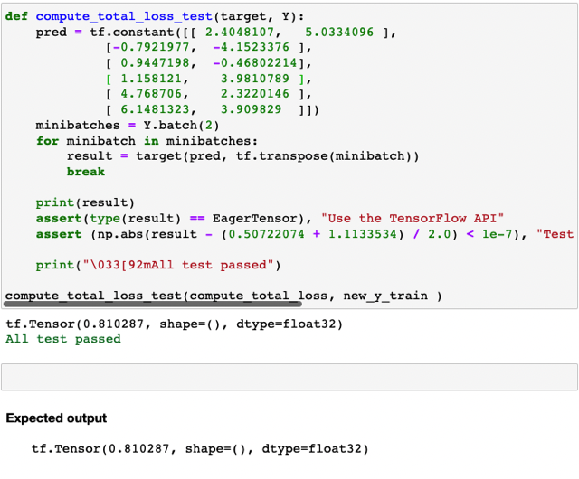</kbd>

 

### 3.1 - Implement Forward Propagation

> [!NOTE]
> Forward Prop với tf
> Thay vì dùng np.dot(), relu() thì dùng 
> tf.matmul(), tf.add() và 
> tf.keras.activations.relu()

 

<kbd>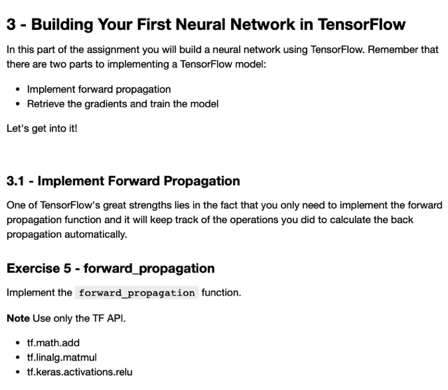</kbd>

 

#### Exercise 5 - forward_propagation

 

<kbd></kbd>

 

<kbd>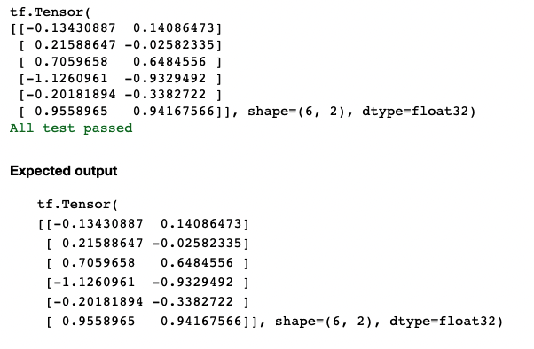</kbd>

 

### 3.3 - Train the Model

> [!NOTE]
> Build modal để train dùng TF

 

<kbd>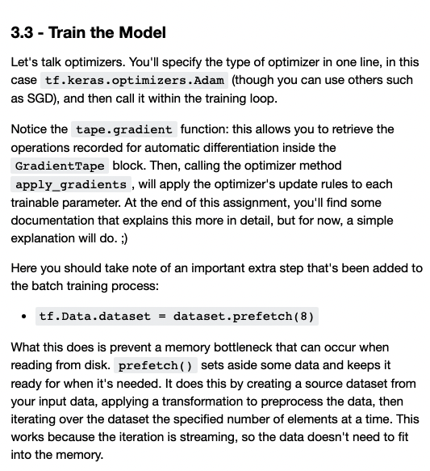</kbd>

 

<kbd></kbd>

 

<kbd></kbd>

 

<kbd>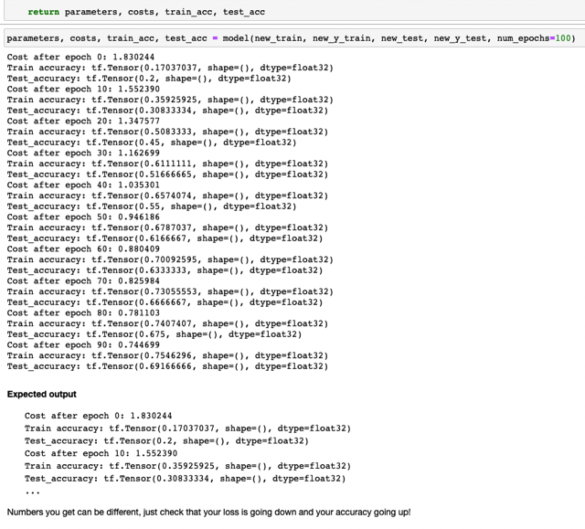</kbd>

 

<kbd>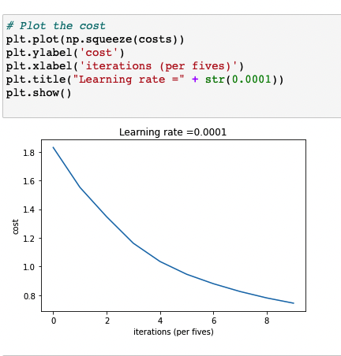</kbd>

 

<kbd></kbd>

 

- **optimizer = tf.keras.optimizers. Adam(learning_rate)**

> [!NOTE]
> Dùng optimizer Adam

 

- **dataset = tf.data.Dataset. zip((X_train, Y_train))**

> [!NOTE]
> Đại khái là nó giúp tạo 1 Dataset modal
> để dùng cho  training bằng TF

 

<kbd></kbd>

 

- **grads = tape. gradient(minibatch_total_loss, trainable_variables)**

> [!NOTE]
> Notice the tape.gradient function: this allows you to
> retrieve the operations recorded for **automatic
> differentiation** inside the GradientTape block.
>
>
>
> Đây chính là bước T.F giúp mình tính Gradient dW1, db1, dW2, db2..

 

<kbd>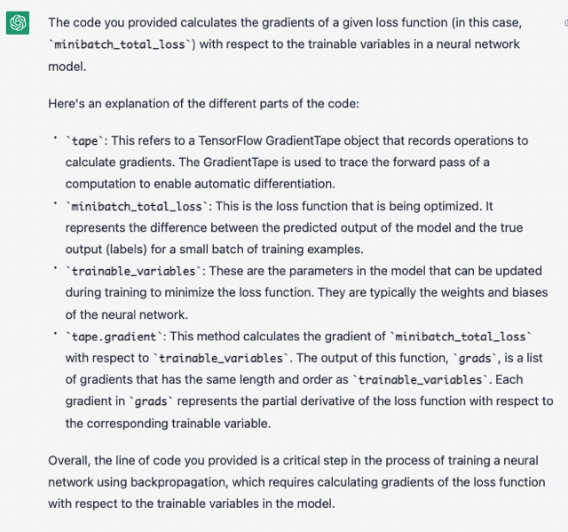</kbd>

 

- **optimizer. apply_gradients(zip(grads, trainable_variables))**

> [!NOTE]
> Then, calling the optimizer method
> **apply_gradients**, will apply the optimizer's
> update rules to each trainable parameter.
>
>
>
> Đây chính là bước mà T.F nó update W1, b1,
> W2, b2... với dW1, db1, dW2, db2...
>
>
>
> Và với optimizer là Adam thì nó sẽ update theo 
> kiểu Adam: Momentum + RMSProp

 

<kbd>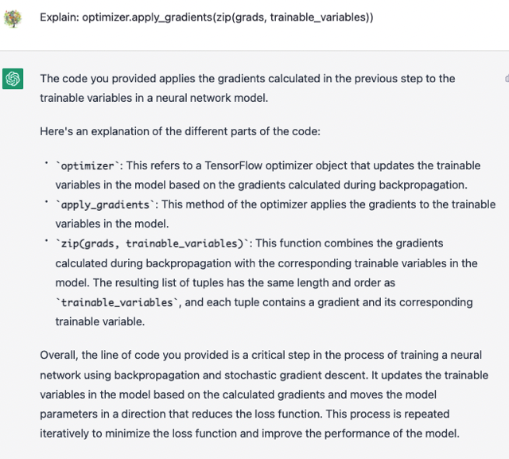</kbd>

 

- **minibatches = dataset. batch(minibatch_size).prefetch(8)**

> [!NOTE]
> Đại khái là bước này giúp chuẩn bị mini-batch 
> - **Chia data thành từng Mini-batch**, và **load trước 
> 8 cái (prefetch(8))** để khi chạy cái này thì luôn có 
> sẵn 8 cái giúp nhanh hơn

 

<kbd>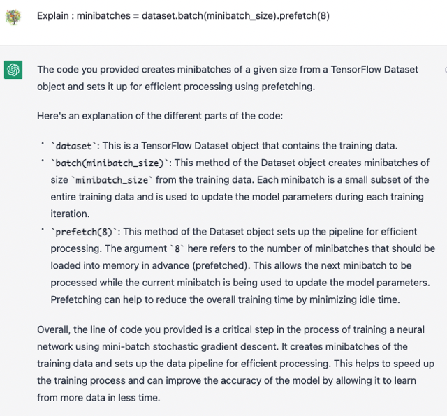</kbd>

 

> [!NOTE]
> #We need to reset object to start measuring from 0 the accuracy each epoch
> train_accuracy.reset_states()
>
> # We accumulate the accuracy of all the batches
> train_accuracy.update_state(minibatch_Y, tf.transpose(Z3))
>
> CategoricalAccuracy của TF này giúp tính độ ' accuracy'
> của Z3 và Y. Mỗi iteration/epoch reset lại để train xong thì
> update

 

<kbd>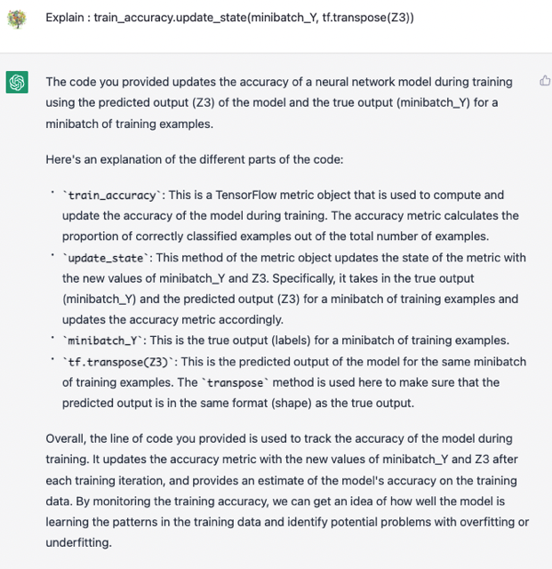</kbd>

 

> [!NOTE]
> costs.append(epoch_total_loss)
>             train_acc.append(train_accuracy.result())
>             test_acc.append(test_accuracy.result())
>
> Sau mỗi lần train-update params (mỗi
> iteration). cứ 100 lần thì ghi lại cót,
> accuracy để tí nữa plot ra

 

### 4 - Bibliography

 

## References

 

<kbd></kbd>

 

