# C3w2_machine Learning Strategy 2

📊 **Progress:** `43` Notes | `40` Screenshots

---

## C3w2_machine Learning Strategy 2

 

## Error Analysis

 

### Carrying Out Error Analysis

 

> [!NOTE]
> 1 Introduction to error analysis in machine learning
>
> 2 The process of error analysis and its significance in identifying the
> next steps for learning algorithms
>
> 3 Importance of examining mistakes that algorithms make to gain
> insights
>
> 4 Example of using error analysis in a cat classifier
>
> 5 The error analysis procedure and its effectiveness in identifying the
> worth of investing time and effort
>
> 6 Ceiling on performance in machine learning
>
> 7 Evaluating multiple ideas in parallel using error analysis

 

<kbd></kbd>

> [!NOTE]
> Đại khái là làm sao biết hướng đi nào sẽ đáng công sức bỏ ra nhất
> trong số các option (ví dụ improve hình bị mờ, improve hình nhầm
> lẫn chó vs mèo)

 

<kbd></kbd>

> [!NOTE]
> Đại khái là ta sẽ xem trong 100 wrong label thử mỗi option sẽ improve dc
> bao nhiêu % từ đó chọn hướng đi nào lợi nhất

 

### Cleaning Up Incorrectly Labeled Data

 

> [!NOTE]
> 1 The supervised learning problem consists of input X and output labels Y.
>
> 2 Sometimes data can be incorrectly labeled, which refers to when the label assigned by a
> human to a piece of data is incorrect.
>
> 3 Deep learning algorithms are \\*robust to random errors in the training set, as long as the
> errors are not too far from random\\*. In other words, if the errors are reasonably random, it's
> probably okay to leave them as they are and not spend too much time fixing them.
>
> 4 Deep learning algorithms are \\*less robust to systematic errors\\*, which occur when the
> labeler consistently labels certain things incorrectly.
>
> 5 If there are incorrectly labeled examples in the dev set or test set, it's recommended to
> add an extra column to count up the number of examples where the label Y was incorrect
> during error analysis.
>
> 6 If the incorrectly labeled examples in the dev set or test set make a \\*significant difference\\*
> to your ability to evaluate algorithms, then it's \\*worthwhile to spend time fixing them\\*.
> Otherwise, it might not be the best use of your time.
>
> 7 To decide whether it's worth reducing the number of mislabeled examples, you should
> look at the overall dev set error, the percentage of errors due to incorrect labels, and the
> percentage of errors due to all other causes.

 

<kbd>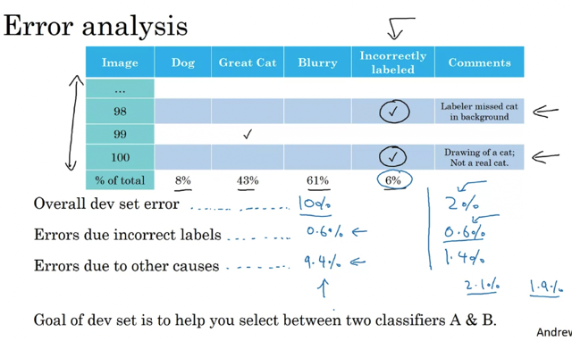</kbd>

> [!NOTE]
> Trong training set, nếu số lượng ít / không đáng kể 
> thì không ảnh hưởng gì.
>
>
>
> N.N không bị ảnh hưởng đ.v random error (Systematically error thì
> ảnh hưởng lớn hơn)

 

<kbd>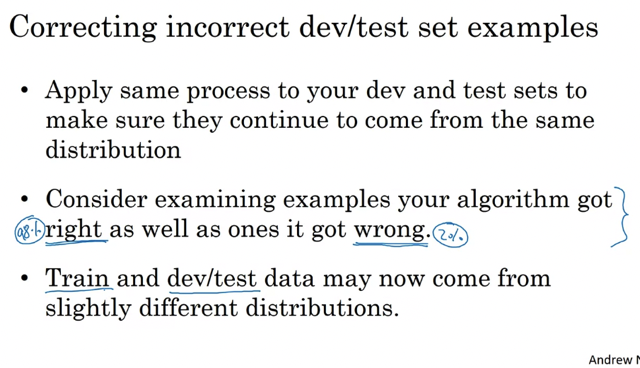</kbd>

> [!NOTE]
> Trong dev set, thì ta đánh dấu nó trong 100 trường hợp 
> coi nó chiếm bao nhiêu % của error để đánh giá
> xem có nên ưu tiên xứ lý không.
>
>
>
> Ví dụ: 10% error, trong đó có 0.6% là do mislabeled -> 9.4% là do 
> mấy cái khác -> Nên focus mấy cái khác.
> Cũng 2% error, có 0.6% mislabeled thì lúc naỳ mislabeled chiếm
> tới 30% của error -> Nên fix mislabeled.
>
>
>
> Và đã fix thì fix cả Test set. Và again, không cần fix training set.

 

> [!NOTE]
> When errors due to incorrect labels are high on the dev set, it
> becomes more worthwhile to fix them.
>
> If the dev set is not reliable due to incorrect labels, selecting
> between two classifiers becomes difficult.
>
> It is important to apply the same process for both dev and test sets,
> as they need to come from the same distribution.
>
> When examining mislabeled examples, it is important to look at both
> the ones the algorithm got right and the ones it got wrong.
>
> Correcting labels on the training set is less important than on the
> dev and test sets, but it's okay if they come from a slightly different
> distribution.
>
> Deep learning requires less human insight, but practical systems
> often require more manual error analysis.
>
> Researchers should not be reluctant to manually look at examples
> to improve their systems.

 

<kbd></kbd>

> [!NOTE]
> "Nó chán nhưng nó đáng"
>
>
>
> /"Maybe it's not the most interesting thing to do, to sit
> down and look at a 100 or a couple hundred examples to
> counter the number of errors. But this is something that I
> so do myself. When I'm leading a machine learning team
> and I want to understand what mistakes it is making, I
> would actually go in and look at the data myself and try to
> counter the fraction of errors. And I think that because
> these minutes or maybe a small number of hours of
> counting data can really help you prioritize where to go
> next. I find this a very good use of your time and I
> urge you to consider doing it if you've built a machine
> learning system and you're trying to decide what ideas or
> what directions to prioritize things"/

 

### Build Your First System Quickly, Then Iterate

 

> [!NOTE]
> Build something quick and
> iterate

 

<kbd>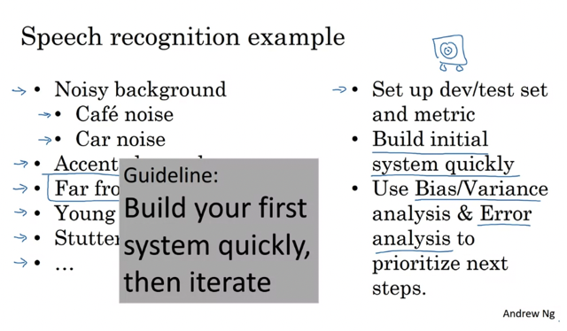</kbd>

> [!NOTE]
> Build something quick and iterate

 

## Mismatched Training & Dev/test Set

 

### Training & Testing On Difference Distributions

 

> [!NOTE]
> 1 Deep learning algorithms need a lot of labeled data to be effective, but
> many teams will use whatever data they can find, even if it is not from the
> same distribution as their dev and test data.
>
> 2 When training on data from a \\*different distribution than dev and test data\\*,
> there are best practices to follow.
>
> 3 An example is given of a mobile app that needs to recognize cats in images
> uploaded by users. The app has access to two data sources: images from the
> mobile app (the desired distribution) and images downloaded from the web (a
> different distribution).
>
> 4 One option is to combine the two datasets and \\*randomly shuffle them into
> train, dev, and test sets.\\* The disadvantage of this option is that the dev set
> will be \\*biased\\* towards the web distribution of images, rather than the mobile
> app distribution that the team actually cares about.
>
> 5 Another option is to use \\*all of the web images for the training set\\* and a
> \\*small portion of the mobile app images\\*, while using \\*only mobile app images
> for the dev and test sets\\*. This option ensures that the dev set is
> representative of the mobile app distribution, which is what the team cares
> about.

 

<kbd></kbd>

> [!NOTE]
> Đại khái là option 1 trộn lại (web images + mobile images) rồi chia ra
> cho train - dev - test nhưng cái này thì do web images lớn nên
> thành ra web image sẽ chiếm số đông trong dev/test set -> Bias
>
>
>
> Cách hay hơn là dùng web + 1 phần mobile image cho train,
> Dev, test chỉ dùng mobile -> Đảm bảo Dev / Test chung một
>  distribution

 

<kbd></kbd>

 

### Bias And Variance With Mismatched Data Distribution

 

<kbd>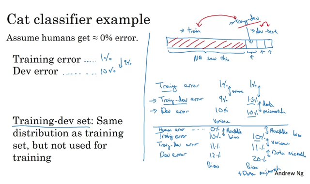</kbd>

> [!NOTE]
> Đại khái là để giải quyết người ta dùng 1 nhóm nữa gọi là **training-dev**
> bao gồm cả train và dev để check performance.
>
>
>
> Nếu nó cách xa thằng train chứng tỏ error là do sự khác nhau giữa 
> distribution của train và dev.test còn nếu nó ko xa mấy với train
> mà lại xa với dev performance thì chứng tỏ algorithm bị high variance.

 

<kbd>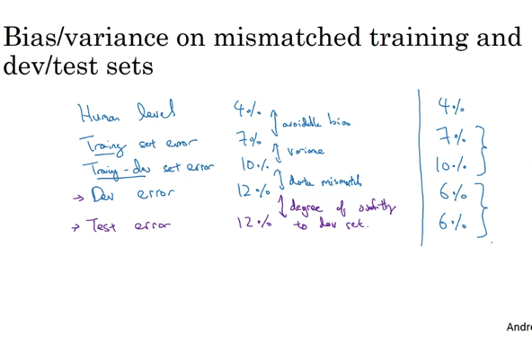</kbd>

> [!NOTE]
> Đại khái là đôi khi dev error nó lại thấp hơn cả Train-Dev và Train 
> là bởi vì lí do nào đó data của Dev, Test lại 'dễ' hơn. 
> Ví dụ trong trường hợp này hình của Dev, Test set lại rõ hơn chẳng
> hạn khiến algorithm work tốt trên nhóm data này hơn là nhóm data 
> của training set.
>
> Nói chung khoảng cách giữa các nhóm sẽ định nghĩa trạng 
> thái bias variance như sau
>
>
>
> HLP / Bayes - Training set error: Avoidable bias
> Training error - Training-Dev error: Variance: 
>
>
>
> Hiểu đại khái là model đã gặp/train trên data của training set 
> rồi nên nếu có sự khác nhau giữa training error và training-dev 
> error thì chỉ có thể là do model bị high variance giữa training - dev 
> set.
>
>
>
> Traning-dev error và Dev: Mismatch distribution giữa training set
> và dev set
>
>
>
> Dev error và Test error: ..

 

<kbd></kbd>

 

### Addressing Data Mismatch

 

> [!NOTE]
> 1 Data mismatch problem can occur when the training data comes from a
> different distribution than the dev and test sets.
>
> 2 Manual error analysis can be carried out to \\*understand the differences
> between the training set and dev/test sets\\*, which can help identify categories
> of errors.
>
> 3 Insights gained from error analysis can be used to \\*make training data more
> similar to dev/test sets\\* or \\*collect more data\\* similar to the dev/test sets.
>
> 4 \\*Artificial data synthesis\\* can be used to make training data more similar to the
> dev/test sets by simulating data that wasn't originally present.
>
> 5 Caution should be exercised while using artificial data synthesis as it can
> lead to overfitting if not done correctly.

 

<kbd>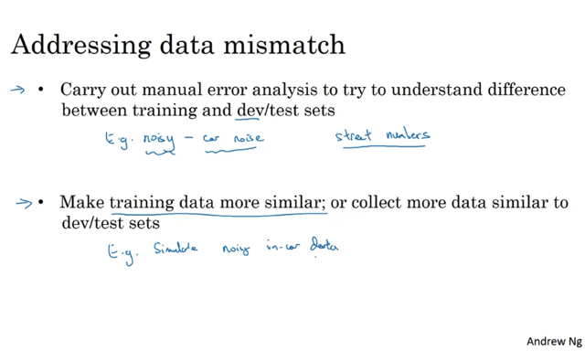</kbd>

> [!NOTE]
> Đại khái giải pháp là  
> - Error analysis và tìm hiểu tại sao khác nhau, khác chỗ nào rồi
> - Tạo / chế / xào nấu sao cho training data
> nó trở nên giống giống dev.test data

 

<kbd></kbd>

> [!NOTE]
> Chỉ có cái là phải chú ý vụ này: Đại khái là giống như bắt chước nhưng ko hết

 

<kbd>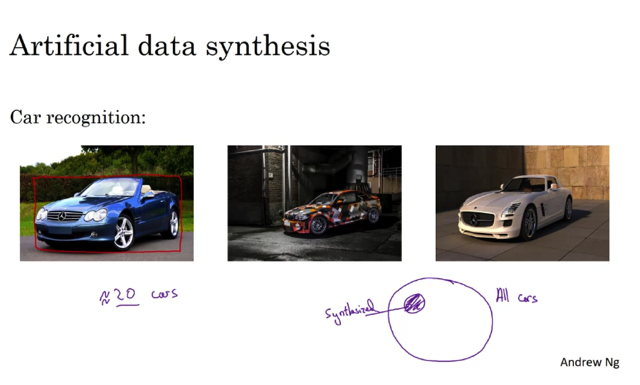</kbd>

> [!NOTE]
> ..sẽ khiến overfit

 

## Learning From Multi Tasks

 

### Transfer Learning

 

> [!NOTE]
> 1 Transfer learning is a powerful idea in deep learning that involves using
> knowledge learned from one task to help solve a different task.
>
> 2 In transfer learning, the last output layer of the neural network is deleted, and
> a new set of randomly initialized weights is created for the new task.
>
> 3 There are two ways to retrain the neural network with the new task data set:
> retrain only the weights of the last layer or retrain all the layers of the neural
> network.
>
> 4 Pre-training is the initial phase of training on image recognition data to
> pre-initialize the weights of the neural network, while fine-tuning is updating all
> the weights after training on the new data set.
>
> 5 Transfer learning makes sense when there is a lot of data for the problem
> being transferred from but relatively less data for the problem being transferred
> to.
>
> 6 Examples of using transfer learning include adapting an image recognition
> neural network to a radiology diagnosis task or a speech recognition system to
> a wake words detection system.

 

<kbd>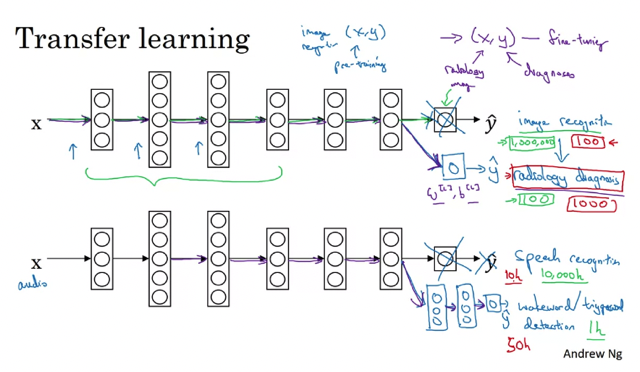</kbd>

> [!NOTE]
> Đại khái là: Xài lại một cái model đã được train cho một vấn
> đề tương tự (v.d Image Recognition & Radiology diagnosis,
> speech recognition & wake up call)
>
> Nếu nhiều data thì train lại toàn bộ,
> còn không thì train lại 1, 2 layer cuối thôi.
>
>
>
> Những "/feature học được"/ từ task A giúp ích cho task B

 

<kbd>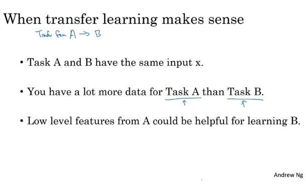</kbd>

> [!NOTE]
> KHI NÀO THÌ NÊN DÙNG 'TRANSFER LEARNING'?

 

### Multi-task Learning

 

> [!NOTE]
> 1 Introduction to transfer learning and multi-task learning
>
> 2 Example of building a self-driving car with multi-task
> learning
>
> 3 Multi-label classification with four labels: pedestrians,
> cars, stop signs, and traffic lights
>
> 4 Training a neural network with a loss function to predict
> values of y
>
> 5 Main difference compared to earlier binary classification
> examples
>
> 6 Ability to assign multiple labels to a single image in
> multi-task learning
>
> 7 Training one neural network to perform multiple tasks
> results in better performance than training multiple
> separate neural networks
>
> 8 Advantages of multi-task learning.

 

<kbd></kbd>

 

<kbd></kbd>

> [!NOTE]
> Này khác Softmax: Softmax: **Môĩ dataset x(i) chỉ có 1 label** (trong số có C
> label) Multi-Label: **Mỗi dataset x(i) có thể có nhiều label**
>
>
>
> Loss function giống như hàm logistic chỉ có thêm caí loop qua các label
> thôi
>
>
>
> Chỉ tính những cái có label 1/0 còn ko có label thì bỏ qua. Đại khái muốn
> nói trường hợp một số không có label chẳng hạn y(3) = [1 0 ? ? 1] = Có
> pedestrian, không có car , stops ign và traffic light thì ko biết

 

<kbd>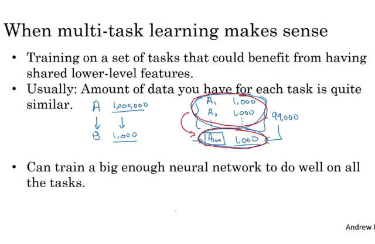</kbd>

> [!NOTE]
> Đại khái là nhiều vấn đề cần train nhưng mỗi vấn đề có ít data thôi ví dụ
> 1000 và **train cùng lúc nó sẽ lợi hơn** vì cùng chung những cái gọi là '
> Low level features' như góc cạnh, màu sắc....

 

<kbd>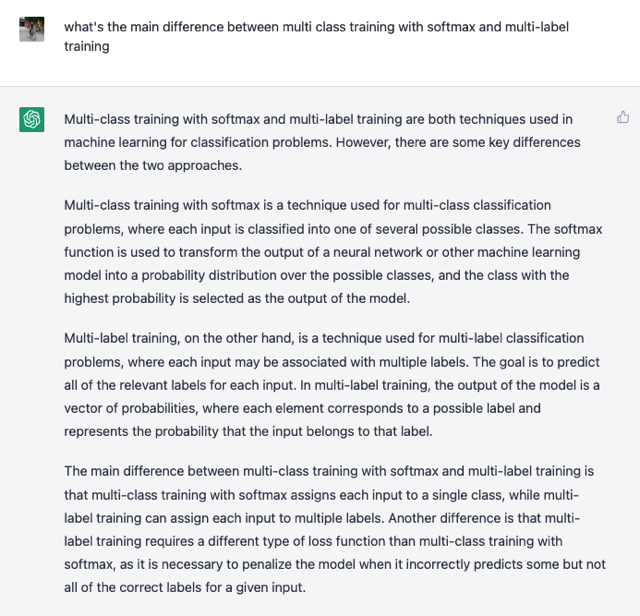</kbd>

> [!NOTE]
> Nhắc lại chút về khác biệt giữa
> Multi-class training và multi-label training
>
>
>
> Chú ý là multi task training có thể là multi-label training nhưng
> cũng có thể là trang nhiều thứ khác cùng lúc như xác định object +
> xác dinh vị trí của object đó trong 1 picture chẳng hạn.
>
> Multi-class: mỗi data set chỉ có 1 label, do đó tuy y cũng là vector
> có C (số class/label) item nhưng chỉ có 1 item = 1, còn lại bằng 0
>
>
>
> y^ ra là vector C item và dưới dạng probability sao cho tổng bằng
> 1. và cái cao nhất sẽ xác định label của nó (dataset đó)
>
>
>
> Còn multi-label: Mỗi dataset có thể có nhiều label, y là C-dimension
> Vector thì có thể có nhiều vị trí = 1.
>
>
>
> y^ ra là vector C chiều, chứa probability dataset đó cho từng label
> và Sum các probability này không cần phải bằng 1

 

## End-to-end Deep Learning

 

### What's E2e Deep Learning

 

> [!NOTE]
> End-to-end deep learning is a \\*recent development\\* in deep
> learning that replaces multi-stage data processing systems
> with a single neural network. Traditional data processing
> systems required multiple stages of processing, such as
> feature extraction and machine learning algorithms.
> End-to-end deep learning, on the other hand, \\*takes an input
> and outputs a direct result, bypassing many intermediate
> steps.\\* End-to-end deep learning\\* works best with large
> data sets\\* and can be challenging for researchers who have
> spent many years designing individual steps of the pipeline.
> One example of end-to-end deep learning is speech
> recognition, where a neural network can directly output a
> transcript from an audio clip. However, end-to-end deep
> learning is not always the best approach, as it may \\*require
> a lot of data to work well.\\* For example, in face recognition
> turnstiles, a multi-step approach of face detection, cropping,
> and identity estimation works better than directly feeding the
> raw image to a neural net.

 

<kbd>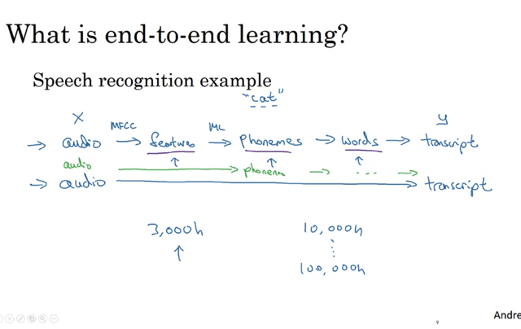</kbd>

> [!NOTE]
> Đại khái là nếu có nhiều thật nhiều data, thì có thể dùng e2e learning.

 

<kbd>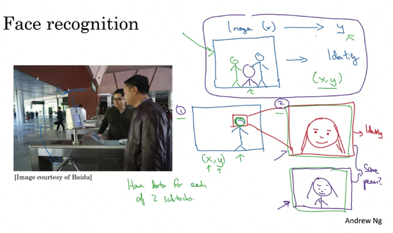</kbd>

> [!NOTE]
> Lấy face recognition làm ví dụ, chia làm nhiều bước thì cần ít
> data (ở mỗi bước) hơn, còn e2e thì phải nhiều data mới dc

 

<kbd></kbd>

 

### Whether To Use End2end Deep Learning

 

> [!NOTE]
> 1 Benefits of End-to-End Deep Learning  • Lets the data speak
> and captures the statistics in the data without reflecting \\*human
> preconceptions\\*
>
> • Simplifies the design workflow by reducing the need for hand
> designing of components
>
> 2 Drawbacks of End-to-End Deep Learning  • \\*Requires a large
> amount of data\\* to learn the direct mapping from input (X) to
> output (Y)
>
> • \\*Excludes potentially useful hand-designed components that
> could inject manual knowledge into the algorithm\\*
>
> 3 Key question in deciding whether to use End-to-End Deep
> Learning  • Do you have sufficient data to learn the function of
> the complexity needed to map from X to Y?
>
> 4 Examples of applications and their complexity in learning the
> function  • Image recognition and identifying the position of
> bones seems relatively simple
>
> • Autonomous driving is a much more complex problem that may
> require more data and a combination of approaches.

 

<kbd>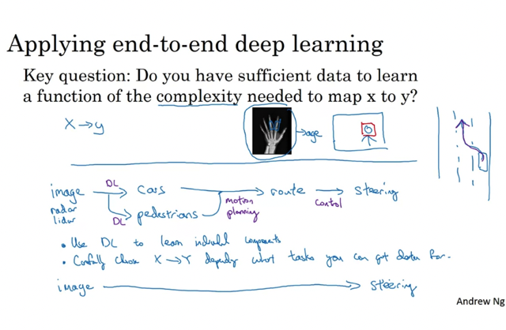</kbd>

> [!NOTE]
> Không bị preconception: Đại khái không bị giới hạn bởi những
> quy tắc hay nói đúng hơn là những cái con người đặt ra ví dụ
> nhận biết giọng nói, con người đặt ra các 'âm' (phonemes) Cat =
> cờ ah tờ nhưng máy tính nó có  thể ' nhìn' data theo kiểu của nó,
> do đó có thể hiệu quả hơn con người.
>
> Không tận dụng những 'kiến thức' do người truyền vào, đại khái 
> có thể hiểu là do nó bỏ qua bước 'Feature processing' nơi mà con
> người giúp xác định feature nào là quan trọng (ví dụ vậy)
>
> Chỉ ok nếu có rất rất nhiều data.

 

## Ml Flight Simulator

 

<kbd>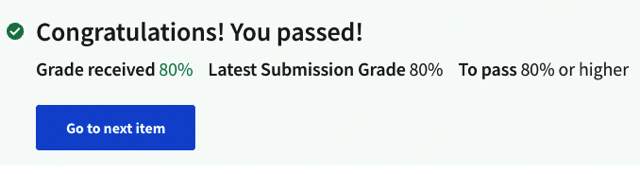</kbd>

 

<kbd></kbd>

> [!NOTE]
> Ghi nhớ lời thầy tuân theo nguyên tắc: **Start quick & iterate**

 

<kbd>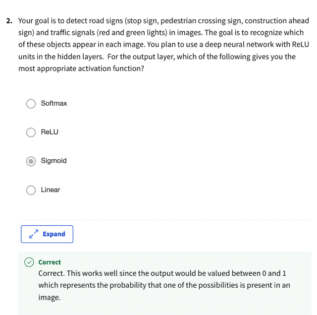</kbd>

> [!NOTE]
> Bài toán classification tất nhiên phải xài sigmoid, không phải là multiclass
> nên ko xài softmax

 

<kbd></kbd>

> [!NOTE]
> Training dataset quá lớn 900.000 nên dù trong bài học có nói
> bên cạnh việc check wrong case thì nên check cả right case
> Nhưng do data lớn quá nên chỉ nên focus ơn wrong case thôi

 

<kbd>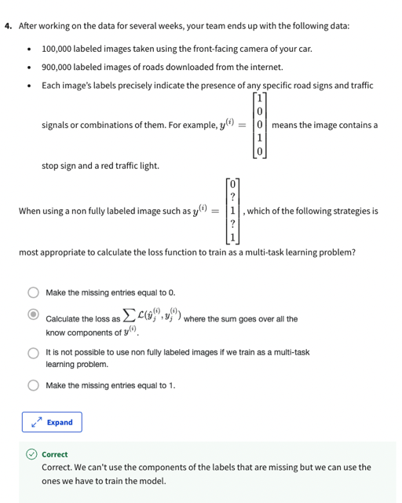</kbd>

> [!NOTE]
> Trong bài giảng có nói, loop qua các label và bỏ qua
> label nào ko biết

 

<kbd>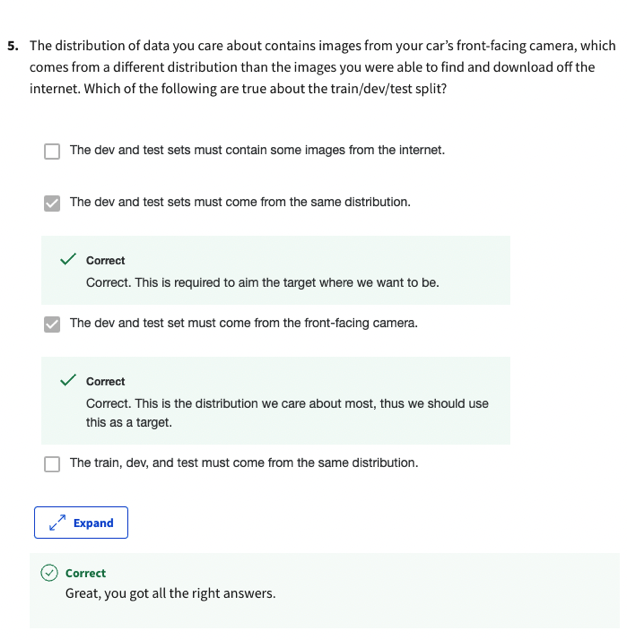</kbd>

> [!NOTE]
> Thứ nhất là **dev,set nhất định phải cùng distribution** là nguyên tắc rồi.
>
>
>
> Thứ hai là dev,set phải **reflex data mà model phải dự đoán trong
> tương lai** (production data) mà ở đây là Front-face cam, nên 
> dev.set phải dùng F.f cam images.

 

<kbd>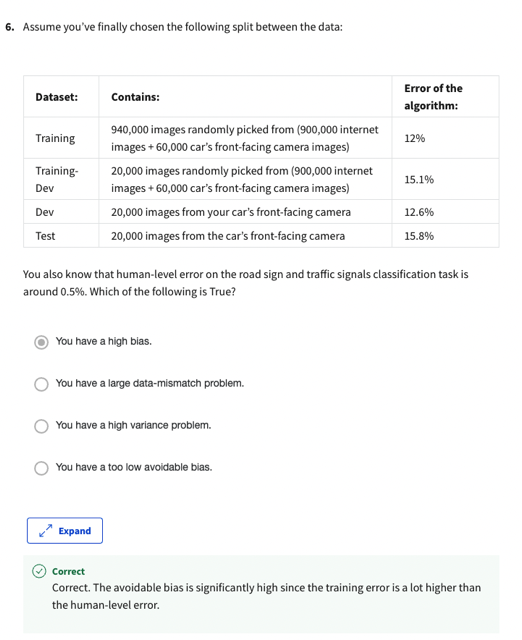</kbd>

> [!NOTE]
> H.L error: 0.5% mà Training là 12% -> Avoidable bias tới
> 11%. Các nhau quá lớn. So với 3% so với training-dev
> Không high bias thì là gì

 

<kbd></kbd>

> [!NOTE]
> Tại sao sai

 

<kbd>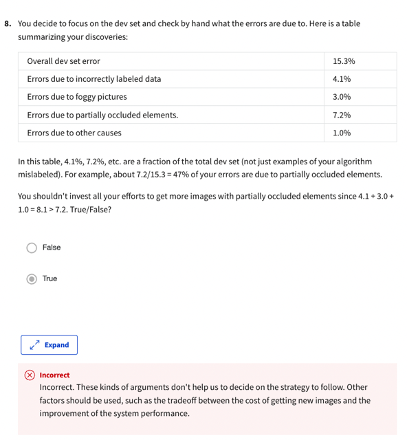</kbd>

> [!NOTE]
> Lập luận kiểu này không hữu ích. Các yếu tố nên
> cân nhắc nên là tradeoff giữa chi phí phải bỏ ra để thu
> thập thêm dữ liệu và khả năng cải thiện hiệu suất

 

<kbd>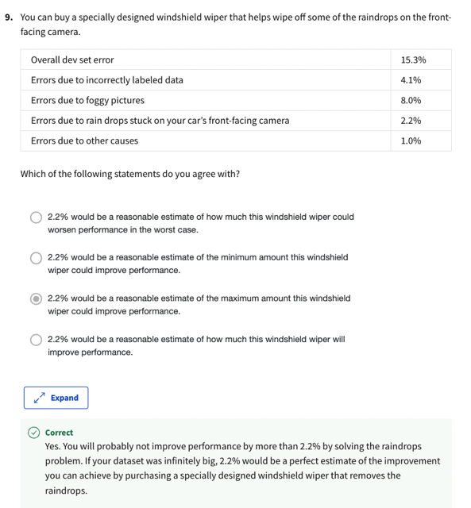</kbd>

 

<kbd></kbd>

> [!NOTE]
> Tại sao sai

 

<kbd>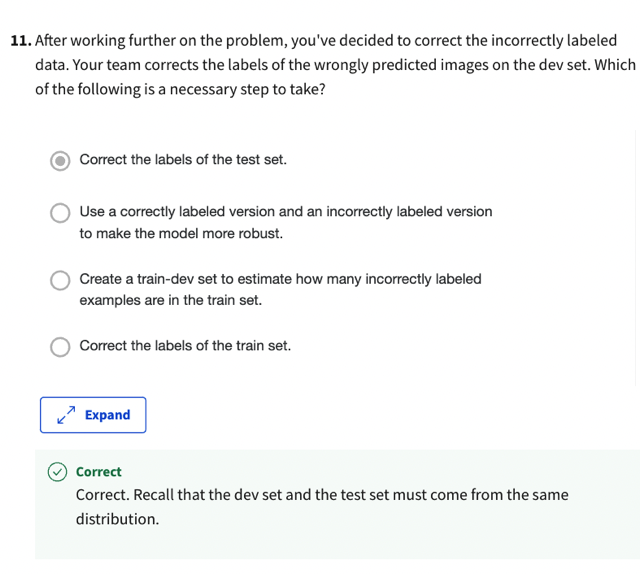</kbd>

> [!NOTE]
> Nguyên tắc dev.test cùng distribution. Và trong bài giảng có nói đã
> sửa phải sửa cả dev lẫn test

 

<kbd>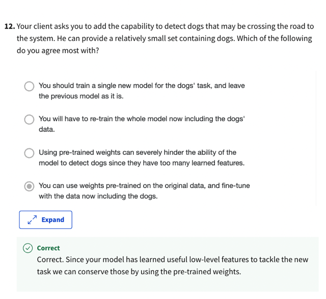</kbd>

> [!NOTE]
> Xem lại khi nào thì nên dùng 'Transfer-learning'
> Hai task có same input X: Đều là hình chụp đường phố
> Task A có data lớn hơn task B nhiều: 900.000 
> Task A và task B đều có chung các low-level features: Đều học cách
> nhận diện những yếu tố trong các hình ảnh về đường phố

 

<kbd>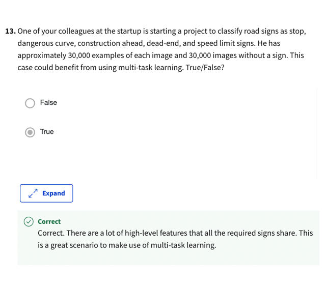</kbd>

> [!NOTE]
> Classify nhiều các sam sam nhau, mỗi cái có 1 ít data, đều học từ những
> caí lơ-level features -> Rất phù hợp cho multi training

 

<kbd></kbd>

> [!NOTE]
> Muốn dùng E2E quan trọng nhất phải có cực nhiều data

 

<kbd></kbd>

 

