# C4w1_foundations Of Convolutional Neural Network

📊 **Progress:** `80` Notes | `117` Screenshots

---

## C4w1_foundations Of Convolutional Neural Network

 

## Computer Vision

 

> [!NOTE]
> 1 **Computer vision** is rapidly advancing thanks to deep learning,
> enabling new applications that were impossible a few years ago.
>
> 2 The computer vision research community's creativity and
> inventiveness in coming up with new neural network architectures
> and algorithms can inspire cross-fertilization into other areas.
>
> 3 Computer vision problems include **image classification**, **object
> detection**, and **neural style transfer**, among others.
>
> 4 One of the challenges of computer vision problems is that the
> **inputs can get really big**, requiring better implementation of the
> **convolution operatio**n, which is one of the fundamental building
> blocks of convolutional neural networks.

 

<kbd></kbd>

 

<kbd></kbd>

> [!NOTE]
> ..

 

<kbd></kbd>

> [!NOTE]
> Nếu X là image size 1000x1000x3 -> X sẽ là 3 Millions features -> W[1]
> sẽ là 1000x3M = 3 tỉ cái weights: Quá lớn nên phải dùng 1 cái mới :
> Convolutional N.N

 

## Edge Detection Example

 

> [!NOTE]
> • The **convolution operation** is a fundamental building block of
> **convolutional neural networks**.
>
> • **Edge detection** is one of the many applications of the convolution
> operation.
>
> • **Early** layers of a neural network **detect** **edges** while **later layers**
> detect **complete objects**.
>
> • Convolution involves a **filter** or **kernel** being passed over an input
> image to produce an output image.
>
> • The output of the convolution operation is determined by taking
> **element-wise products** and **summing** up the resulting values.
>
> • The **output** of the convolution operation is **smaller** in size than the
> **input** image.

 

<kbd>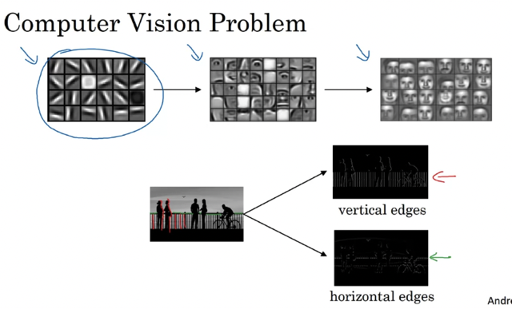</kbd>

> [!NOTE]
> Để detect object - Thì đầu tiên là làm sao xác định (detect) được cái edge -
> đường viền, ranh giới của các object trước

 

<kbd>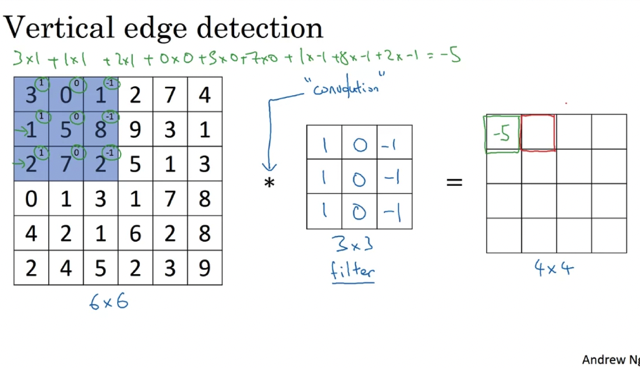</kbd>

<kbd>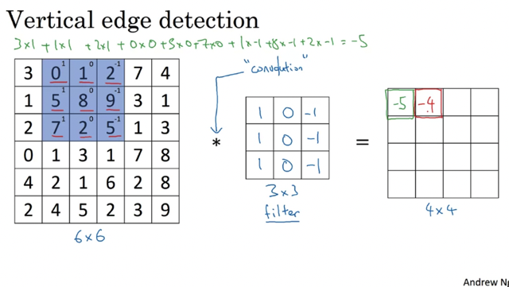</kbd>

<kbd>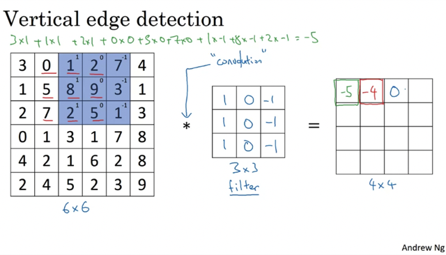</kbd>

<kbd></kbd>

<kbd>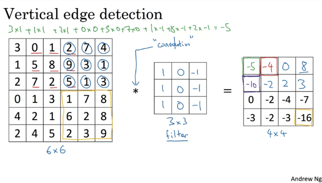</kbd>

> [!NOTE]
> Filter or Kernel
>
>
>
> Ví dụ hình 6x6x1 (gray scale nên x1)
>
>
>
> * Trong toán học * là phép toán 'Convolution', trong Python thì
> lại là multiply, element-wised multiply

 

<kbd>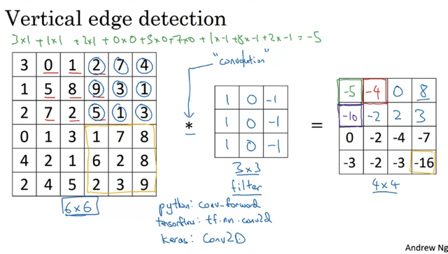</kbd>

> [!NOTE]
> Turn out to be a '**EDGE** detector' sẽ thấy sau.
>
>
>
> Python: conv-forward
> TensorFlow: tf.nn.con2d
> Keras: Conv2D

 

<kbd>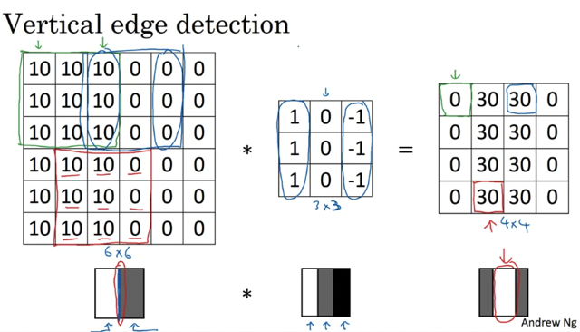</kbd>

> [!NOTE]
> In case the dimensions here seem a little bit wrong that the
> detected edge seems really thick, that's only because we are
> working with very small images in this example. And if you are
> using, say a 1000 by 1000 image rather than a 6 by 6 image then
> you find that this does a pretty good job, really detecting the vertical
> edges in your image
>
>
>
> Đại khái là bằng cách 'convol' với cái filter, sẽ cho ra kết quả
> 'detect' được cái '**edge**'. Ta thấy cái hình bên phải chính là cái 
> edge - đường viền đó.

 

## More Edge Detection

 

> [!NOTE]
> 1 The video discusses **edge detection**, which is the process of
> i**dentifying boundaries** in an image.
>
> 2 The video explains the **difference between positive and negative
> edges** and how this is detected using edge detection filters.
>
> 3 **Different edge detection filters** are discussed, including the three
> by three filter for detecting vertical and horizontal edges, the **Sobel
> filter**, and the **Scharr** filter.
>
> 4 The video highlights the possibility of using **machine learning** to
> **learn the parameters of an edge detection filter**.
>
> 5 The **limitations of edge detection** in **small images** and the
> **potential for deep learning to improve edge detection in complex
> images** are also discussed.

 

<kbd></kbd>

> [!NOTE]
> 1 ví dụ cho thấy nếu ta 'flip' cái hình input thì cái edge sẽ màu dark thay vì
> light, và nếu ta không quan tâm màu thì ta có thể lấy giá trị tuyệt đối ||30|| =
> -||30|| = 30

 

<kbd>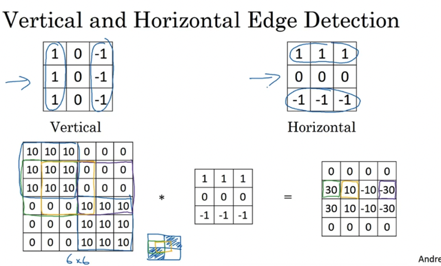</kbd>

> [!NOTE]
> So in summary, different filters allow you to
> find vertical and horizontal edges.

 

<kbd>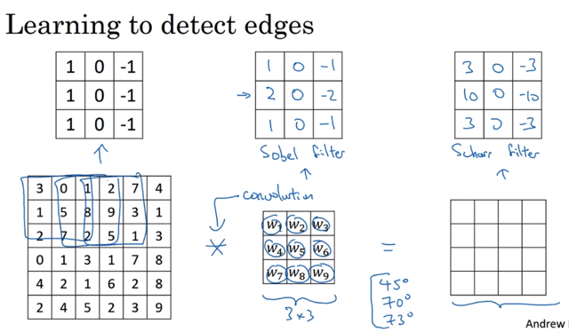</kbd>

> [!NOTE]
> Đại khái là cái matrix filter để dùng cho viêc edge detection này
> như cái ở trên [1 1 1 0 0 0 ..] có thể có những kiểu khác với các
> tên khác nhau có người thích dùng cái. [1 2 1..] gọi là **Sobel** filter, a
> little bit better có nguời thấy [3 10 3..] tốt hơn gọi là **Scharr** filter.
>
>
>
> Nhưng cái chính là **với N.N, máy tính nó sẽ học để cho ra cái filter
> sao cho giúp detect cái edge tốt nhất**, **có thể ra cái Sobel, hoặc
> thậm chí ra cái tốt hơn cả mấy cái đó.**
>
> Và không chỉ detect edge dọc,
> ngang mà cả đường chéo, 45 độ
> 70 độ v.v

 

## Padding

 

> [!NOTE]
> 1 **Padding** is a **modification** to the **basic convolutional operation** that can
> help build **deep neural networks**.
>
> 2 A convolutional operation **reduces the size of the image.**
>
> 3 **Shrinking** the image too much may lead to **loss of information.**   
>
> 4 **Padding** is a solution to this problem as it **preserves** the size of the
> image.
>
> 5 By padding the image, the output dimension increases by **2p** in each
> direction.  
>
> 6 **Valid convolution** is a type of convolution that **doesn't use
> padding.**
>
> 7 **Same convolution** is a type of convolution where the **output size** is the
> **same** as the **input size**.
>
> 8 The amount of **padding** **required** to achieve the **same** convolution is
> **(f-1)/2**, where **f is the size of the filter**.

 

<kbd></kbd>

> [!NOTE]
> Đại khái là để khắc phục 2 vấn đề là **'bị nhỏ dần' - shrinking output**
> và **'bỏ qua / ít dùng cái ở biên' sẽ khiến model bị bias đối với
> các info ở cạnh của input**  thì người ta dùng '**padding**'
>
>
>
> Có thể dùng padding p = 1, hoặc 2 ...

 

<kbd>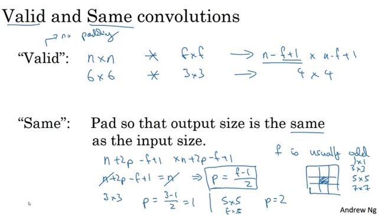</kbd>

> [!NOTE]
> **Valid padding** là không dùng padding 
>
>
>
> **Same padding** là sao cho output dimension bằng với input **p = (f-1)/2**
>
>
>
> Conventionally **f thường là số lẻ 3x3, 5x5, 7x7 để padding không bị
> asymmetric**
>
> Nếu có bối rối ko nhớ đc thì chỉ cần nhớ
> nếu không có padding thì thì từ n giảm xuống còn n - f + 1 
>
>
>
> Vậy muốn giữ nguyên thì + thêm f -1 nữa nên p = (f-1) /  2, 
> tại 2 bên quá dể nhớ

 

## Strided Convolutions

 

> [!NOTE]
> 1 **Strided** convolutions are a basic building block of Convolutional Neural
> Networks.
>
> 2 A **strided** convolution involves taking an element-wise product of an
> image and a filter, but **instead of stepping the filter by one**, it is stepped
> by a **stride s.**
>
> 3 The output dimensions of the strided convolution are governed by the
> formula: (N + 2P - F)/S + 1, where N is the input size, P is the padding, F
> is the filter size, and S is the stride.
>
> 4 If the output dimensions are **not an integer**, they are **rounded down.**
>
> 5 The **convention** for convolutions is that the **filter** must **lie entirely** within
> the image or the image plus padding region.
>
> 6 The difference between **convolution** and **cross-correlation** is that
> convolution involves a flip of the filter on both axes before taking the
> element-wise product and summing, while cross-correlation does not
> involve this flip. However, the **deep learning literature** often r**efers to both
> operations as convolutions.**

 

<kbd></kbd>

 

<kbd>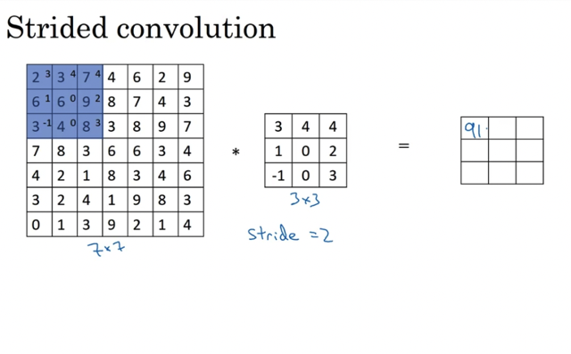</kbd>

 

<kbd></kbd>

 

<kbd></kbd>

 

<kbd></kbd>

 

<kbd></kbd>

 

<kbd></kbd>

> [!NOTE]
> Kí hiệu [z] (đúng hơn là chỉ có ngoặc ở dưới: Round down
> -> Nếu (n+2p-f)/s **không nguyên thì round down** - làm tròn xuống.
>
>
>
> Theo convention thì **filter phải nằm trọn trong image + padding** thì mới tính

 

<kbd>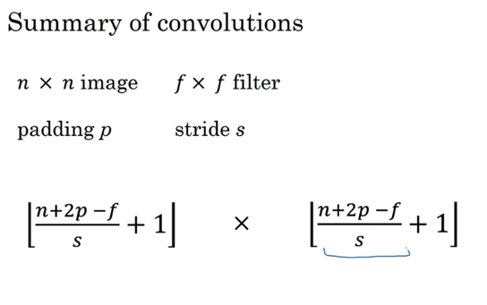</kbd>

> [!NOTE]
> Chọn s cho kết quả nguyên thì tốt không thì
> làm tròn cũng được

 

<kbd>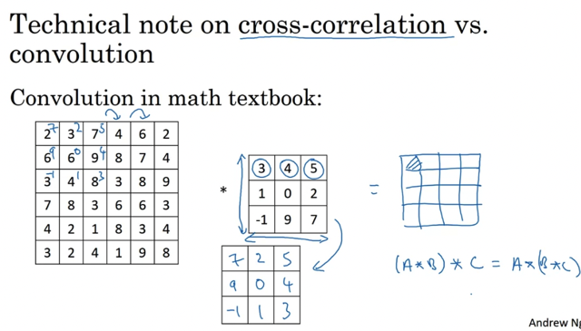</kbd>

> [!NOTE]
> Đại khái là đúng ra phải gọi là '**Cross-correlation**' chứ không phải
> convolution vì **trong toán học** phép convolution yêu cầu phải **flip** cái matrix
> filter horizontally và vertically trước.
>
>
>
> Điều này sẽ giúp phép toán convolution có tính chất (A*B)*C = A*(B*C)
> gọi là **associativity** nhưng trong Deep learning thì cái này không giúp ích
> gì mấy nên người ta cứ gọi là Convolution mà không cần phải flip để cho
> đơn giản

 

## Convolutions Over Volume

 

> [!NOTE]
> • **3D convolution** can be used to **detect features** in
> 3D volumes.
>
> • **Filters** are placed in the volume and multiplied with
> corresponding values from the color channels to
> produce an output volume.
>
> • **Different parameters** can be used to create **different
> feature detectors**.
>
> • **Multiple filters** can be used at the same time to
> detect **multiple types of features** (more complex features)

 

<kbd></kbd>

> [!NOTE]
> Đại khái là cũng convol từng **'lớp' của filter
> với từng 'lớp'** của cái image Xong rồi
> **sum** **kết quả của cả 3 lớp lại**

 

<kbd>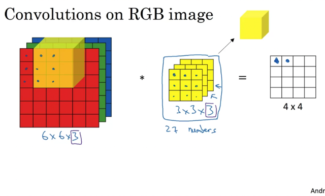</kbd>

 

<kbd></kbd>

 

<kbd>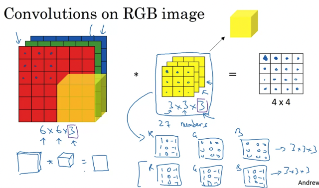</kbd>

> [!NOTE]
> Feature detector: Đại khái là các thay đổi giá trị của **params khác** (của
> filter) sẽ giúp **detect feature khác nhau** ví dụ sẽ quyết định được là "
> Chỉ detect edge with color RED", or "detect edge chung"
>
>
>
> Đại khái cũng chỉ nói lại việc thay đổi cái param - giá trị của cái  Filter sẽ
> giúp detect các pattern/feature khác nhau có điều filter bây h là 3D chứ
> ko chỉ 2D nên nó có thể detect nhiều pattern phức tạp hơn ví dụ như
> cũng đường viền nhưng mà đường viền màu này màu  kia nữa chứ
> không chỉ đường viền chung chung

 

<kbd></kbd>

> [!NOTE]
> **Multiple features detector**: Đại khái là kết hợp nhiều filter sẽ **detect
> dc nhiều features cùng lúc** -> More complex features detector
>
>
>
> Mỗi filter ra 1 output xong **stack mấy cái output lại**

 

## One Layer Of A Convolutional Network

 

> [!NOTE]
> 1 The video demonstrates how to build one layer of a convolutional neural
> network using an example of **convolving a 3D volum**e with **two filters** to
> produce different **4 by 4 outputs.**
>
> 2 The resulting outputs are passed through a **bias** and **non-linearity** to
> produce a **4 by 4 output** **for each filter,** which are then **stacked up** to form a
> **4 by 4 by 2 output volume.**
>
> 3 The convolution operation is **similar to a linear operation** in a
> non-convolutional neural network, where the **filters** play a **role similar to w1**
> and the **output** of the convolution operation plays a role similar to **w1 times
> a0.** 
> 4 One layer of a convolutional neural network can have **multiple filters,**
> which can result in a **higher-dimensional output volume.**
>
> 5 To calculate the number of parameters in a layer with ten 3 by 3 by 3
> filters, one needs to multiply the number of parameters per filter (28) by the
> number of filters (10), resulting in 280 parameters.

 

<kbd></kbd>

> [!NOTE]
> Giống như a[1] = w.a[0] + b thì
> filter đóng vai trò như w

 

<kbd></kbd>

> [!NOTE]
> 10 filter, mỗi cái 3x3x3 = 27
> params, thêm 1 cái bias là 28.
> Vậy tổng là 280 params

 

<kbd></kbd>

> [!NOTE]
> Khái quát hoá nên có thể bối rối chỉ cần nhớ
>
>
>
> Muốn convol được thì **số lớp (bề dày, số channel) của filter phải bằng bề 
> dày của input** để convol xong nó gộp lại thành 1 channel
>
>
>
> Vậy input a[l-1] là nH [l-1] x nW [l-1] x **nC [l-1]** 
> thì filter cũng f [l] x f [l] x **nC [l-1]
>
>
>
> NHƯNG LAYER [l] CÓ NHIỀU FILTER = nC [l]
> nên mỗi kết quả từ mỗi filter stack lại thành ra nC [l] channel**
>
>
>
> nên output là a[l] sẽ (có shape) là nH [l] x nW [l] x nC [l]
>
>
>
> Và theo quan hệ của conv operation thì 
>
>
>
> nH [l] = [ n[H] [l-1] - f + 2*p [l] ] / s [l] + 1 (] là round-down)
> nW cũng vậy
>
>
>
> Tổng số weight layer [l] là: 
> (1 cái filter có f [l] x f [l] x nC [l-1] params) x nC [l] cái filter=f [l] x f [l] x nC [l-1]x nC [l] params

 

## Simple Convolutional Network Example

 

> [!NOTE]
> 1 Introduction to a deep convolutional neural network for
> **image classification.**
>
> 2 Example of a **ConvNet** using small images.
>
> 3 Explanation of the **dimensions** and **number of filters** for
> each convolutional layer.
>
> 4 **Flattening** the output of the **last convolutional layer** into a
> vector for the final prediction.
>
> 5 The importance of **selecting** **hyperparameters** in designing
> a convolutional neural network.
>
> 6 Upcoming guidelines and suggestions for **selecting
> hyperparameters.**

 

<kbd></kbd>

 

<kbd></kbd>

> [!NOTE]
> Some note:
>
>
>
> Kết quả cuối (volume cuối) 7x7x40 sẽ được **flatten** thành 1 vector
> và bỏ vào **sigmoid** hay **softmax** để tính 
>
>
>
> Nhận thấy: **nC tăng dần** qua các layer 3-10-20-40, **nW, nH** **thì giảm dần**

 

<kbd>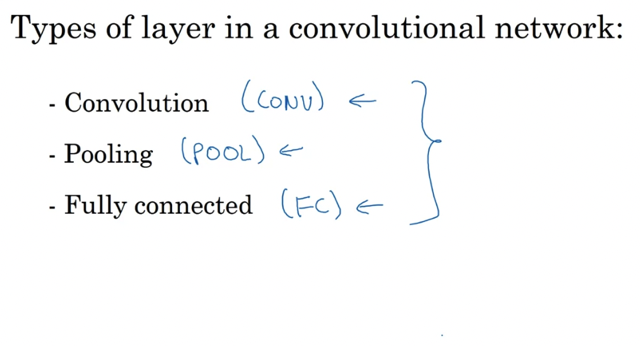</kbd>

> [!NOTE]
> Convolution thôi cũng được nhưng nó
> thường có thêm **pooling layer** và **FC** layer

 

## Pooling Layers

 

> [!NOTE]
> 1 ConvNets use **pooling layers** to **reduce representation size**, **increase speed**
> and **make features more robust.**
>
> 2 **Max pooling** is a common type of pooling layer.
>
> 3 In max pooling, the input is divided into regions and the **output is the maximum
> value of each region.**
>
> 4 The **hyperparameters** of max pooling are **filter size** and **stride**, which determine
> the s**ize of the regions**.
>
> 5 Max pooling helps **preserve features detected anywhere in the filter**, while
> **suppressing others that aren't detected**.
>
> 6 The intuition behind **why max pooling works well** is **not fully understood.**
>
> 7 Max pooling has **hyperparameters** but no parameters to learn, so it's a **fixed
> computation.**
>
> 8 The formulas for figuring out the **output size** of convolutional layers also work
> for max pooling.
>
> 9 Max pooling can be applied to **3D** **inputs and the output will have the same
> dimension.**

 

<kbd>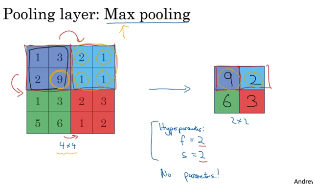</kbd>

> [!NOTE]
> /"Max pooling helps preserve features detected anywhere in
> the filter, while suppressing others that aren't detected." / Đại
> khái là max pooling giúp kiểu như giữ lại những gì (feature) nó
> phát hiện

 

<kbd>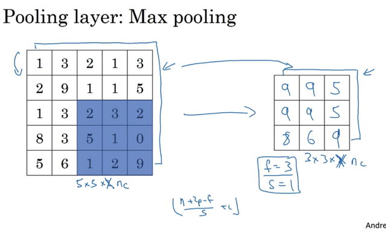</kbd>

> [!NOTE]
> Quan hệ tính size của input vào output cũng theo công thức 
> = round-down[ (n - f + 2p) / s ] + 1
>
>
>
> Và nếu là 3 channel thì output cũng có 3 channel
> (mỗi channel của filter sẽ 'tính'  với 1 channel của input)
> có điều khác với convol thường thì **pooling nó không gộp các
> channel kết quả lại** nên kết quả vẫn **giữ số channel** của input 
> (và của filter)

 

<kbd>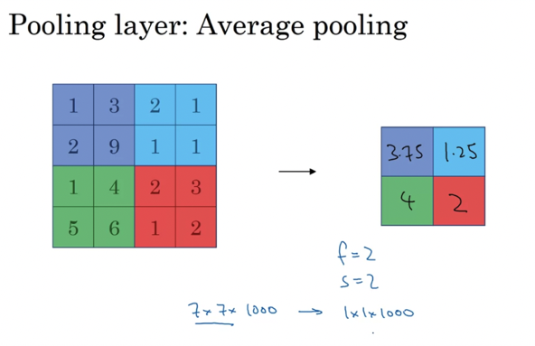</kbd>

 

<kbd>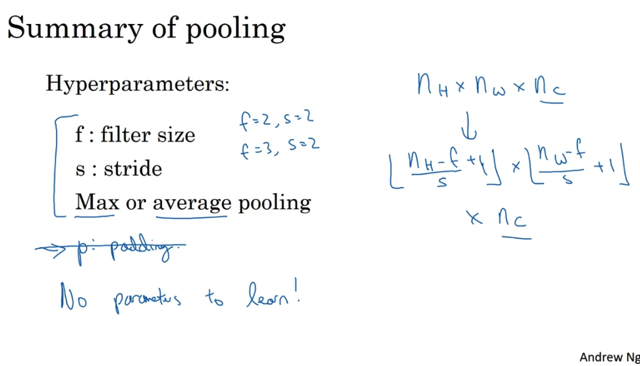</kbd>

 

## CNN Example

 

<kbd>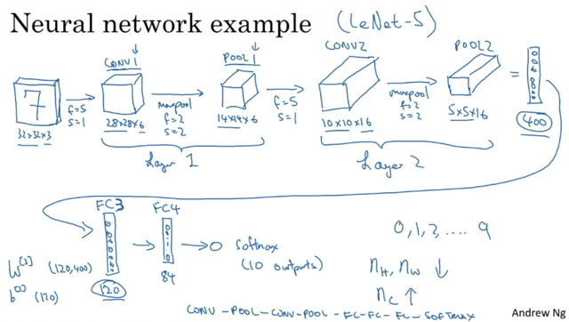</kbd>

> [!NOTE]
> - Ở đây, và từ đây ổng sẽ ko viết cụ thể số filter
> của từng layer nữa mà tự hiểu rằng số channel
> của output chính là số filter
>
>
>
> Ví dụ từ 32x32x3 -> 28x28x**6** **tự hiểu có 6 filter,** size filter bao nhiêu
>  thì tính theo công thức. Nhẩm được thì nhẩm 
> 28 = (32 - f + 2*0)/1 + 1 -> f = ...
>
>
>
> - Layer 1 gồm 1 Conv và 1 Pool
> - Layer 2 cũng 1 Conv và 1 Pool
> - Rồi flatten rồi qua mấy cái Dense (Fully Connected) layer
> nữa cuối cùng là Softmax
>
>
>
> CONV-POOL-CONV-POOL-FC-FC-FC-SOFTMAX
>
>
>
> Cái mô hình này chính là **LeNet-5**

 

<kbd></kbd>

 

## Why Convolutions?

 

> [!NOTE]
> 1 Convolutional layers have **two main advantages** over fully
> connected layers: **parameter sharing** and **sparsity of
> connections.**
>
> 2 Convolutional layers have a lot **fewer parameters**, which
> allows for **smaller training sets and less overfitting**.
>
> 3 Convolutional neural networks **capture translation invariance**,
> which helps them **recognize objects regardless of their location**
> in an image.
>
> 4 **Training** a convolutional neural network involves using a
> **labeled training** set to **adjust the weights of the filters** to
> produce accurate outputs.

 

<kbd>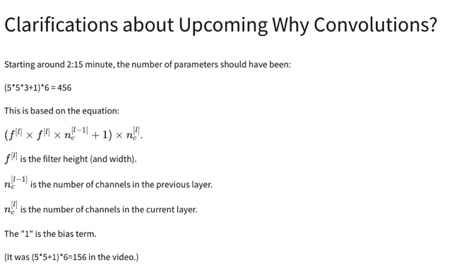</kbd>

 

<kbd>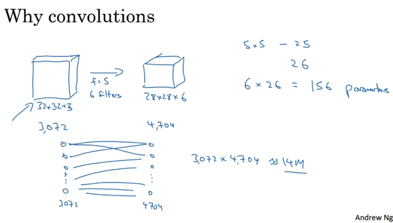</kbd>

> [!NOTE]
> Thấy rõ đại khái là nếu là n.n thường thì số params sẽ rất lớn khi layer 1 có
> 3072 unit layer 2 có 4704 unit sẽ ra là **14 triệu params** trong khi ConvNet
> chỉ cần **156**

 

<kbd>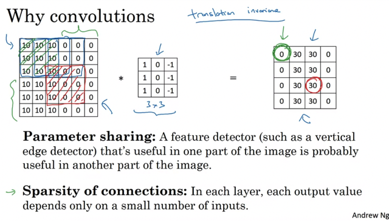</kbd>

<kbd></kbd>

> [!NOTE]
> **Params sharing**: Đại khái là **1 vài weight (trong filter)** có
> thể giúp **detect feature ở nhiều vị trí khác nhau** trong hình
> chứ **không nhất thiết phải là mỗi chỗ một cái** -> **Giảm bớt
> số weight** cần thiết
>
>
>
> **Sparsity of connections**: Đại khái là:..
>
>
>
> Fully-connected NN thì **mỗi unit của layer trước** sẽ **connect
> tới mọi unit của layer sau,** cũng như là **mỗi unit của layer sau
> sẽ connect với mọi unit của layer trước** 
>
>
>
> Conv NN thì **mỗi output chỉ connect với một vài input
> thôi -** nhớ lại lúc tính thì mỗi số của là kết quả của phép tính
> convolution của 1 vài ô trong các channel thôi chứ không phải
> tất cả

 

<kbd>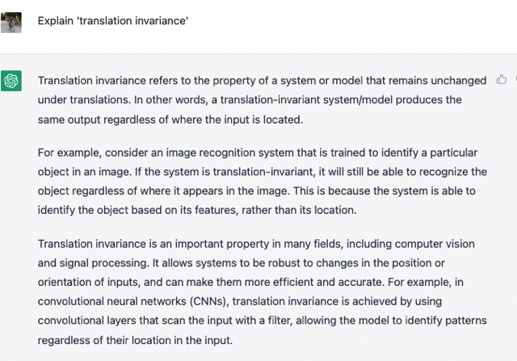</kbd>

> [!NOTE]
> '**Translation invariance**' là tính chất của một mô hình hoặc một hệ thống
> có khả năng xử lý các đối tượng, hình ảnh, văn bản,... mà **không bị ảnh
> hưởng bởi vị trí tương đối giữa chúng** trong không gian hay thời gian.
>
>
>
> Nói cách khác, tính chất này cho phép mô hình hoặc hệ thống đó **nhận ra
> các đối tượng giống nhau dù chúng xuất hiện ở những vị trí khác nhau**
> trên màn hình hoặc thời gian.
>
>
>
> -> Đại khái là 1 hệ thống mà có tính chất 'translation invariance' như để
> detect hình con mèo trong một bức ảnh thì dù con mèo  xuất hiện ở đâu
> trong bức ảnh nó cũng detect được

 

> [!NOTE]
> 7 Training a convolutional neural network
>
> - Building a **labeled training** set for a specific task, such as identifying
> images of cats and dogs.
>
> - **Preprocessing** the **data** to **standardize** the **image size** and pixel values.
>
> - **Defining the architecture** of the convolutional neural network, including the
> **number** and **type of layer**s, **activation** functions, and **optimization** algorithm.
>
> - **Initializing the weights** of the network and using **backpropagation** to **adjust
> the weights** to **minimize the loss** between the **predicted** and actual labels.
>
> - **Evaluating the performance** of the network on a **validation set** and
> **adjusting the hyperparameters** as necessary.
>
> - Finally, **testing the trained network** on a test set to **evaluate its
> generalization performance.**

 

<kbd></kbd>

 

## Quiz

 

<kbd></kbd>

 

<kbd></kbd>

 

<kbd></kbd>

> [!NOTE]
> 3x3 = 9 (weights) + 1 (bias) = 10 x 128 (no. filters) = 1280

 

<kbd></kbd>

 

<kbd></kbd>

 

<kbd></kbd>

> [!NOTE]
> Nhẩm rất nhanh (do s = 1 nên đỡ rối vụ chia s) là n sau
> khi cònv là 63 - 7+1 = 63 - 6 vậy padding phải bù lại để
> giữ nguyên 63 -> 2p = 6 => p = 3

 

<kbd></kbd>

> [!NOTE]
> Nhẩm: channel vẫn là 12. 128 - 4 (f) / 4(s) =
> 31. Xong + 1 là 32 -> 32x32x12

 

<kbd>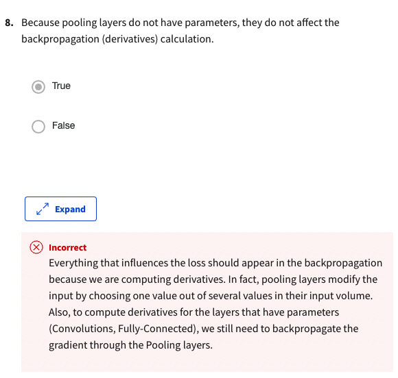</kbd>

 

<kbd>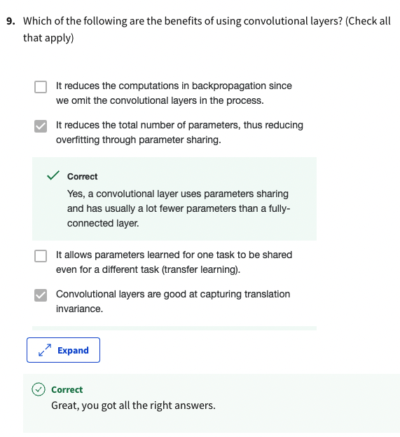</kbd>

> [!NOTE]
> Cái ý đầu sai, vì hiển nhiên ta ko thể 'omit' - bỏ qua
> cái conv layer trong quá trình backprop
>
>
>
> Cái ý 3 transfer learning không chỉ có Conv mới có

 

<kbd></kbd>

 

## Programming Assignments: Convolutional Model

 

> [!NOTE]
> Be able to:  
> • Explain the convolution operation
>
> • Apply two different types of pooling operation
>
> • Identify the components used in a convolutional
> neural network (padding, stride, filter, ...) and their
> purpose
>
> • Build a convolutional neural network
>
> Nói chung là làm những 'công việc' của
> convolution from scratch bằng numpy

 

> [!NOTE]
> 1 - Packages:
> Matplotlib, numpy

 

<kbd>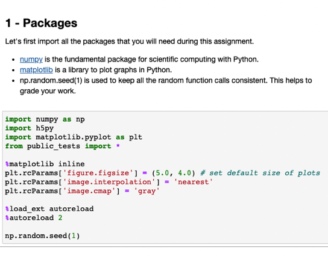</kbd>

 

> [!NOTE]
> 2 - Outline of the Assignment:
> Đại khái là mô tả sơ những function sẽ làm cho 
> Convolution n.n from scratch (bằng numpy)
>
> Ổng nói dù những Framework như TS, PT bây giờ
> giúp việc define ConvNet dể dàng nhưng việc hiểu nó
> vẫn là quan trọng vì nó là một trong những khái niệm
> khó của Deep Learning
>
>  • **Convolution functions**, including:
>  ▪ Zero Padding
>  ▪ Convolve window
>  ▪ Convolution forward
>  ▪ Convolution backward (optional)
>  • **Pooling functions**, including:
>  ▪ Pooling forward
>  ▪ Create mask
>  ▪ Distribute value
>  ▪ Pooling backward (optional)
> Notebook sau sẽ dùng TensorFlow để làm những cái tương tự

 

<kbd>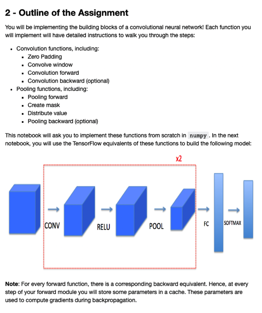</kbd>

> [!NOTE]
> Ổng nói dù những Framework như TS, PT bây giờ
> giúp việc define ConvNet dể dàng nhưng việc hiểu nó
> vẫn là quan trọng vì nó là một trong những khái niệm
> khó của Deep Learning

 

> [!NOTE]
> 3 - Convolutional
> Neural Networks

 

> [!NOTE]
> 3.0 - Convolutional
> Neural Networks

 

<kbd></kbd>

 

> [!NOTE]
> 3.1 - Zero-Padding:
>
> Nhắc lại vai trò của padding trong việc giữ cho size
> không bị giảm và  giúp thông tin tại edge của image
> không bị ngó lơ / xem nhẹ

 

<kbd>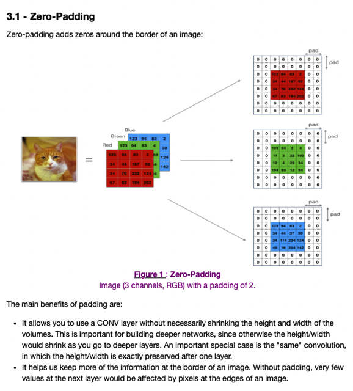</kbd>

 

> [!NOTE]
> Function zero_pad(X, pad) -> X_pad:
>
> Code function zero_pad (X, pad) -> X_pad
> dùng np.pad()
> Mỗi data sample là 1 image -> dài x rộng x 3 (màu RGB) 
> -> X = có m bộ - Do đó X có shape = m x n_h x n_w x n_c: n_c = 3
> Trong python X.shape = (m, n_h, n_w, n_c)

 

<kbd></kbd>

> [!NOTE]
> Dùng function np.pad() của python bỏ
> vào X và chỉ định các dimension nào
> cần pad, pad bao nhiêu

 

<kbd>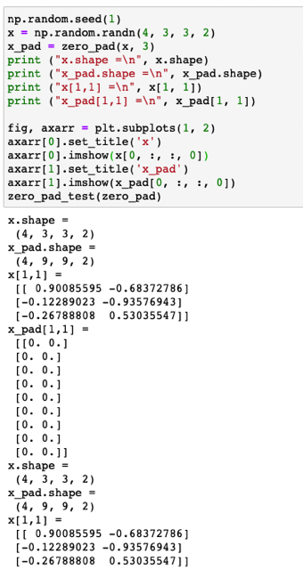</kbd>

 

<kbd></kbd>

 

> [!NOTE]
> 3.2 - Single Step of Convolution
>
> Đại khái là bỏ filter lên 1 vị trí của input và tính để cho
> ra 1 số. Thì phép tính này sẽ là phép tính element-wise
> multiplication giữa 2 matrix (đúng hơn là 2 volume)
> cùng size rồi sum lại.
>
> Quá trình convol thì sẽ (slide window) đi và tính hết các
> chỗ khác thì đây là 1 bước trong đó.
>
> Nên hiểu là có n_C_prev channel luôn, nên đây là
> phép tính trên 2 volume có size là f, f, n_C_prev
>
> f là bề dài, rộng, n_C_prev là số channel (bề sâu / dầy)
> của filter

 

<kbd></kbd>

> [!NOTE]
> Đại khái là bỏ filter lên 1 vị trí của input và tính để cho ra 1 số.
> Thì phép tính này sẽ là phép tính element-wise multiplication
> giữa 2 matrix (đúng hơn là 2 volume) cùng size rồi sum lại.
>
>
>
> Quá trình convol thì sẽ (slide window) đi và tính hết các chỗ khác
> thì đây là 1 bước trong đó.
>
>
>
> Nên hiểu là có n_C_prev channel luôn, nên đây là phép tính
> trên 2 volume có size là f, f, n_C_prev
>
>
>
> f là bề dài, rộng, n_C_prev là số channel (bề sâu / dầy) của filter

 

<kbd></kbd>

<kbd></kbd>

 

> [!NOTE]
> Exercise 2 - conv_single_step(a_slice_prev,
> W, b)
>
> Đại khái là thực hiện 1 bước tính của phép
> convol.
>
> Dùng np.multiply để element-wised multiply
>
> Chỉ có chú ý chỗ khi sum() nó trả về float luôn,
> nhưng cộng với b (matrix (1,1,1) đang là
> matrix thì nó thành matrix lại => Cast b thành
> float trước bằng .item()

 

<kbd></kbd>

 

<kbd>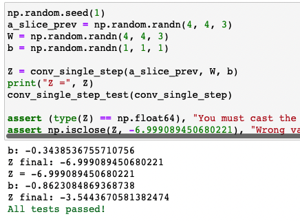</kbd>

 

> [!NOTE]
> 3.3 - Convolutional Neural Networks - Forward Pass
>
> Đại khái làm làm quá trình convol một input volume với
> nhiều filter để Ra một output volume

 

<kbd></kbd>

 

> [!NOTE]
> Exercise 3 - conv_forward: (...)
>
> Nói chung là đây là function sẽ thực hiện việc convol một input
> volume, với n_c filter để cho ra output volume
>
> Quá trình làm ở lần đầu chưa hiểu lắm nhưng ở lần review thứ 1
> thì thấy rõ ràng. Cũng nhờ hình vẽ minh hoạ phân tích kĩ ở lần học.
> Những chỗ khó là những chỗ sai lần đầu làm :
>
> - Loop trong số lần convol: Chính là nH và nW mà lúc đầu thấy bối
> rối vì  chưa để ý rằng với công thức nH = ..nH_prev thì ta đã biết
> được size của output thì từ đó chính là số bước convol cần tính.
>
> - Lấy 1 'window' để convol, với các thông số vertical_start / end -
> horizontal_start / end thì cũng không có gì khó hiểu khi nhìn lại
> v_start chính là bằng h trong range nH * stride. Và end thì dễ rồi bằng
> start + filter size f thôi.
>
> Sai hai chỗ:

 

<kbd></kbd>

 

<kbd></kbd>

 

<kbd></kbd>

<kbd></kbd>

<kbd></kbd>

 

<kbd>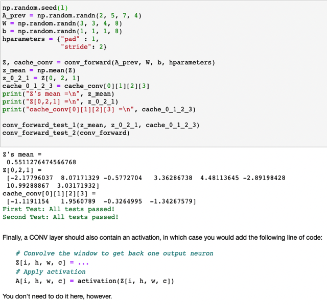</kbd>

<kbd>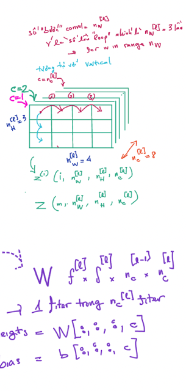</kbd>

<kbd>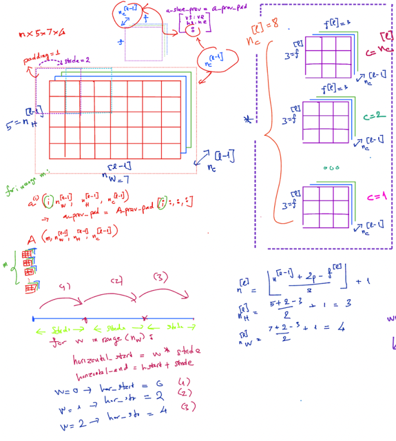</kbd>

<kbd>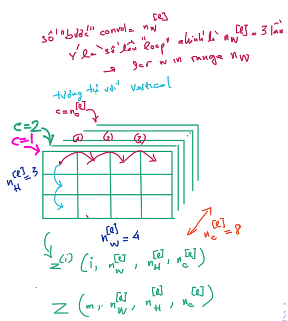</kbd>

<kbd>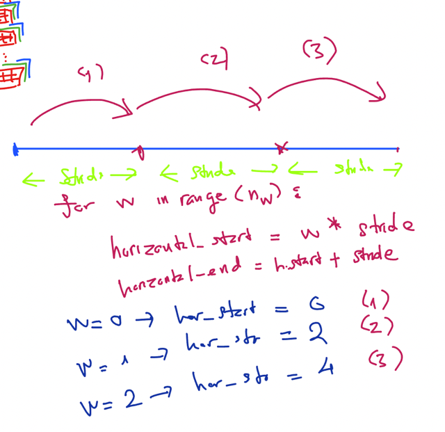</kbd>

<kbd>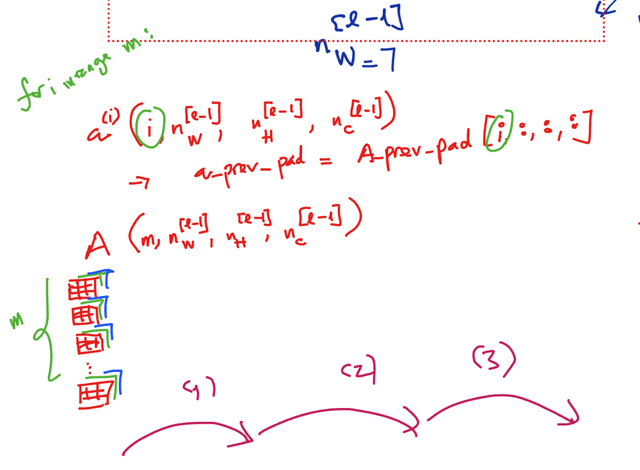</kbd>

<kbd></kbd>

 

#### 4 - Pooling Layer

 

> [!NOTE]
> 4.1 - Forward Pooling
>
> Làm conv_forward rồi thì cái này dễ hiểu thoi, chỉ
> thay bằng bước convol bằng phép tính max,
> mean
>
> Sai 1 chỗ

 

<kbd>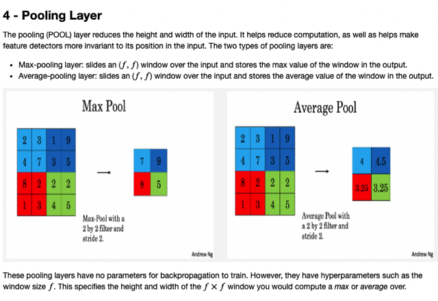</kbd>

 

<kbd>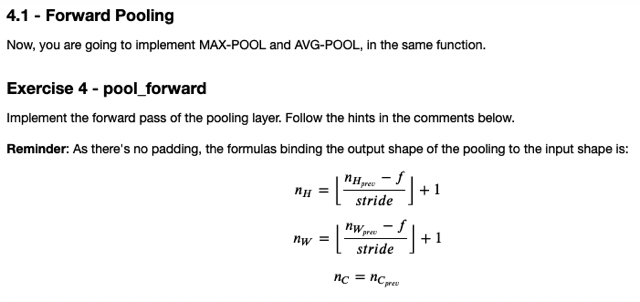</kbd>

 

<kbd></kbd>

<kbd>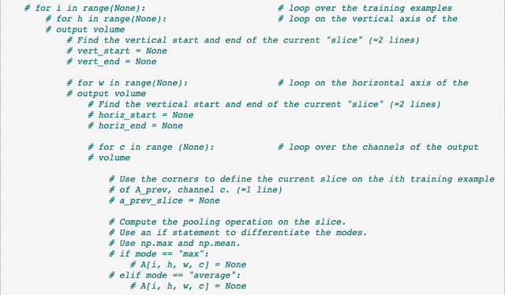</kbd>

<kbd>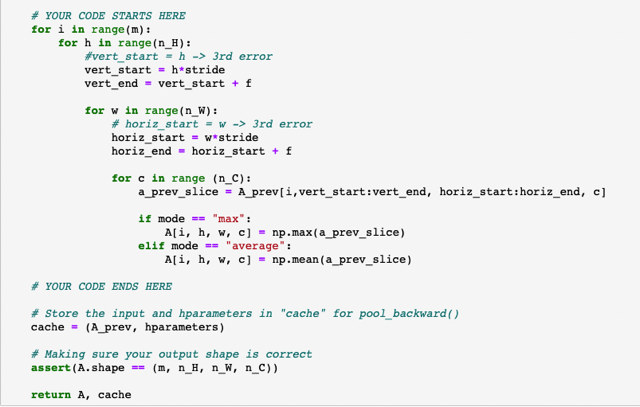</kbd>

 

<kbd>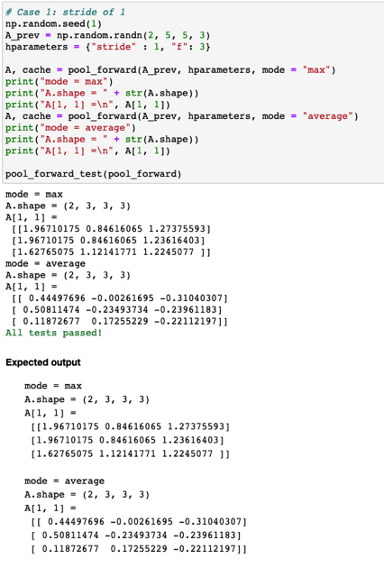</kbd>

 

> [!NOTE]
> What you should
> remember:

 

<kbd></kbd>

 

> [!NOTE]
> 5 - Backpropagation in
> Convolutional Neural Networks
>
> Quay lại sau

 

##### 5.1 - Convolutional Layer Backward Pass

 

##### 5.2 Pooling Layer - Backward Pass

 

## Programming Assignments: Convolutional Model Application

 

> [!NOTE]
> Welcome to the second (required) programming exercise
> of Course 4 of the Deep Learning Specialization.
>
> In this notebook you will build ConvNets to create a
> **mood classifier** and **identify sign language digits**,
> while gaining familiarity with the **TF Keras Sequential**
> and **Functional APIs** along the way.

 

#### 1 - Packages

 

<kbd></kbd>

 

> [!NOTE]
> 1.1 - Load the Data and Split the
> Data into Train/Test Sets

 

<kbd>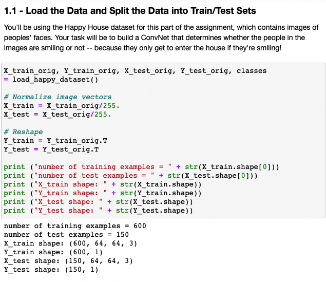</kbd>

 

<kbd></kbd>

 

#### 2 - Layers in TF Keras

 

<kbd>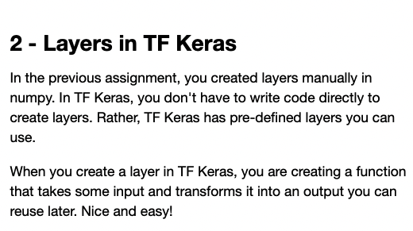</kbd>

 

> [!NOTE]
> 3 - The Sequential API: Đại khái
> là thay vì tự làm như bài trước,
> nay ta dùng Framework TS
> Keras's Sequential

 

<kbd></kbd>

> [!NOTE]
> Ở đây ổng có nói Sequential chỉ phù hợp cho
> simple và straightforward task còn muốn
> flexible hơn thì dùng Functional

 

> [!NOTE]
> 3.1 - Create the Sequential Model: Đại
> khái nó như một list các layer và khi work
> thì nó sẽ lần lượt 'chạy' từng layer

 

<kbd>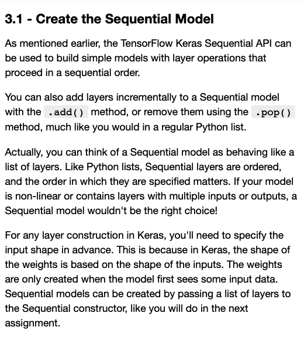</kbd>

> [!NOTE]
> Đại ý là Sequential phù hợp cho những
> structure đơn giản  chạy 1 lèo, và 1 input 1
> output còn nếu muốn flexible hơn kiểu như
> skip connection, ...hoặc ra nhiều output thì
> dùng Functional
>
>
>
> Cái nữa là nó cần biết shape của input trước
> để kiểu như chuẩn bị nếu không nó phải đợi
> đến khi bỏ input vào

 

> [!NOTE]
> Exercise 1 - happyModel: Lần lượt define các
> layer như gợi ý bỏ để define nên Sequential model

 

<kbd>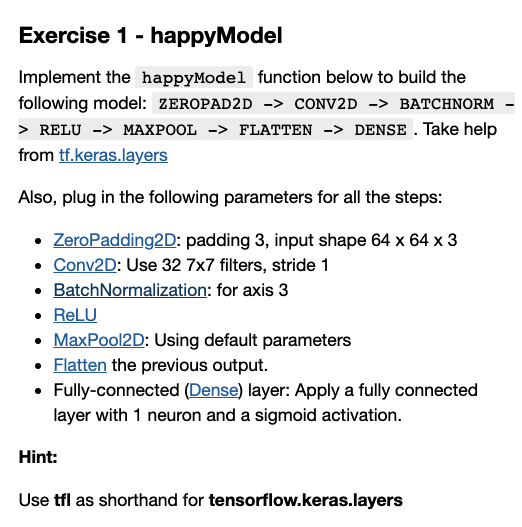</kbd>

> [!NOTE]
> Ở lần review 1 đã hiểu thêm 1 số thứ:
>
>
>
> Dense nó có kernel_ini..là **glorot_uniform** là 1 kiểu ini
> randomly do ông **Glorot** phát minh nhằm mục đích giảm hiện
> tượng **Vanishing Gradient**. Công thức cụ thể thì xem trong
> sách nhưng đại khái là random. Có lẽ không cần define vì Keras
> dùng cái này làm default, có những cái khác là **he_uniform**,..
>
>
>
> BatchNorm nó có hyper param - axis thường dùng axis cuối nên
> ở đây hiểu được tại sao để 3 vì input có 4D - m, nH, nW, nC
> index 0,1,2,3

 

<kbd>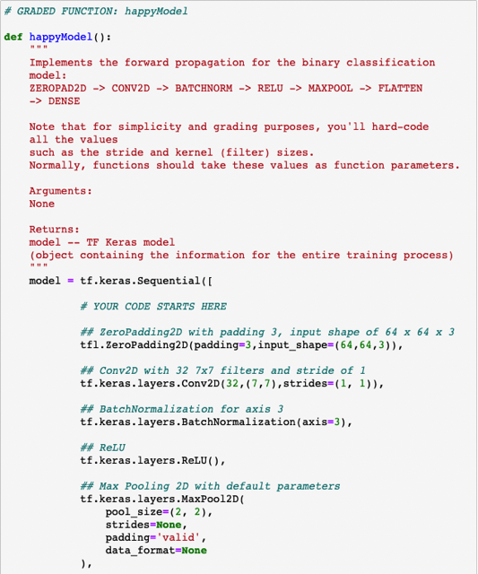</kbd>

<kbd></kbd>

 

<kbd></kbd>

 

<kbd></kbd>

> [!NOTE]
> Define model xong có thể compile với **Adam**
> optimizer, loss function là **binary_crossentropy** vì
> đây là bài toán binary classification (output từ
> sigmoid ra probability trong [0,1]**)** và metrics là **accuracy**

 

> [!NOTE]
> 3.2 - Train and
>
> Dùng fit(X_train, Y_train) argument epochs,
> batch_size
>
> Evaluate the Model chỉ cần gọi evaluate(bỏ vào
> test set) quá tiện

 

<kbd></kbd>

 

> [!NOTE]
> 4 - The Functional API: Nói sơ về Functional
> API cho thấy nó flexible, mạnh mẽ hơn
> Sequential API ví dụ có thể define 'Skip Connection'
>  hứa hẹn sắp tới sẽ tìm hiểu
> nhiều hơn

 

<kbd>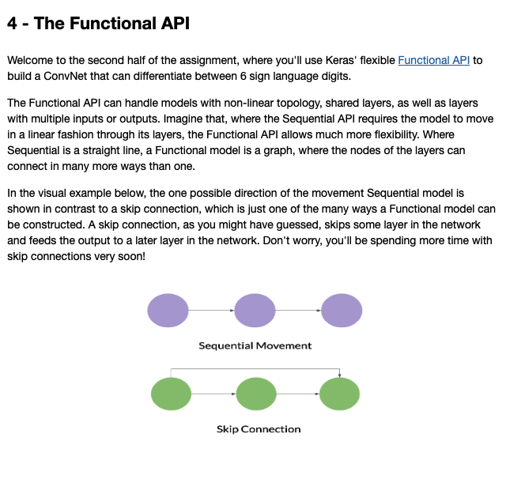</kbd>

 

> [!NOTE]
> 4.1 - Load the SIGNS Dataset: Dataset
> cho vấn đề nhận diện kí tự hình ảnh cho
> người câm điếc đã dùng ở Course 2

 

<kbd>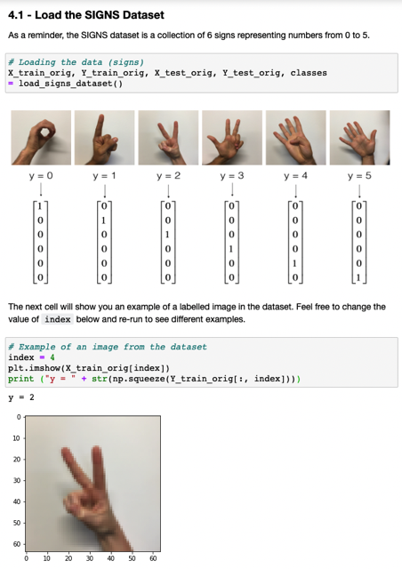</kbd>

 

> [!NOTE]
> 4.2 - Split the Data into Train/Test Sets Thực
> hiện việc **normalization** và dùng custom
> function **convert_to_one_hot**() để transform
> Y_train, Y_test

 

<kbd></kbd>

 

> [!NOTE]
> 4.3 - Forward Propagation
>
> Đại khái là từng bước từng bước define các layer trong '
> computational graphs'
>
> Bắt đầu bởi ts.keras.Input() rồi lần lượt Conv2D - ReLU
> -MaxPool2D - Conv2D - ReLU - MaxPool2D - Flatten - FC -
> Output:
>
> Cách thức là: Bỏ output của thằng trước thành input của thằng
> sau -  Đây chính là lý do của cái tên Functional, các layer work
> như function với việc nhận input và cho ra oupput
>
> Ngoài ra thì một số điểm đáng chú ý
> Define a input node as a callable object.
> Flatten batch_size, h, w, c -> batch_size, h*w*c
> Define output using the last of the
> function's composition - Dense

 

<kbd>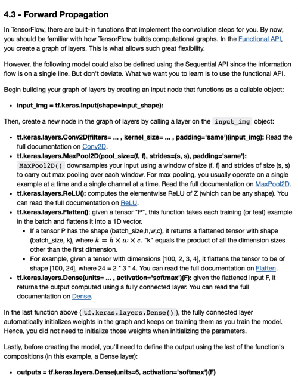</kbd>

> [!NOTE]
> Define output using the last of the
> function's composition - Dense

 

<kbd>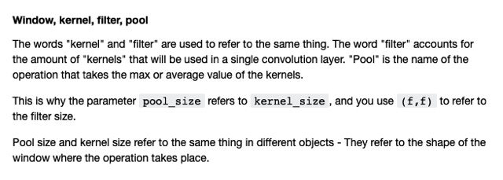</kbd>

 

> [!NOTE]
> Exercise 2 - convolutional_model: Chỉ chú ý là Conv2D's argument 
> filters chỉ số lượng filters, kernel mới là filters's size
>
> Z1 = tf.keras.layers.Conv2D(filters=8, kernel_size=(4,4), strides=(1, 1), padding='same' )(input_img)
>
> A1 = tf.keras.layers.ReLU()(Z1)
>
> P1 = tf.keras.layers.MaxPool2D(pool_size=(8, 8), strides=(8, 8), padding='same')(A1)
>
> Z2 = tf.keras.layers.Conv2D(filters=16, kernel_size=(2,2) , strides=(1, 1), padding='same')(P1)
>
> A2 = tf.keras.layers.ReLU()(Z2)
>
> P2 = tf.keras.layers.MaxPool2D(pool_size=(4, 4), strides=(4, 4), padding='same')(A2)
>
> F = tf.keras.layers.Flatten()(P2)
>
> outputs = tf.keras.layers.Dense(units= 6 , activation='softmax')(F)
>
> model = tf.keras.Model(inputs=input_img, outputs=outputs)
>
>
> Xong cũng compile, Sequential và
> Functional chỉ là phương pháp để tạo kiến trúc model khác
> nhau chứ vẫn đều là tạo TF Keras model object

 

<kbd></kbd>

 

<kbd></kbd>

<kbd>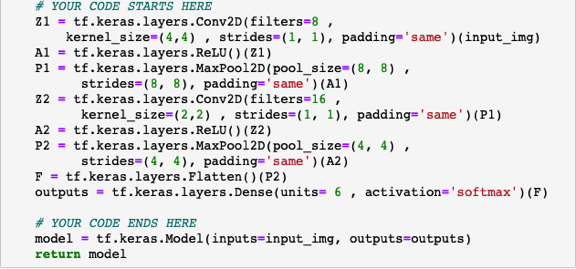</kbd>

 

<kbd>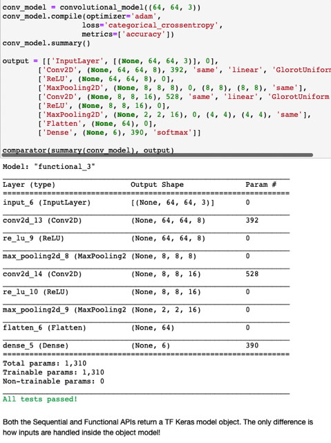</kbd>

> [!NOTE]
> Xong cùng compile, Sequential và
> Functional chỉ là phương pháp để tạo kiến trúc model khác
> nhau chứ vẫn đều là tạo TF Keras model object

 

> [!NOTE]
> 4.4 - Train the Model: 
> Tạo train / test dataset modal cho Conv_model với tf.Dataset.**from_tensor_slices**()
> Gọi fucntion **fit()** trên conv_model created
> ở trên, bỏ vào train_dataset và test_set, no. epochs

 

<kbd>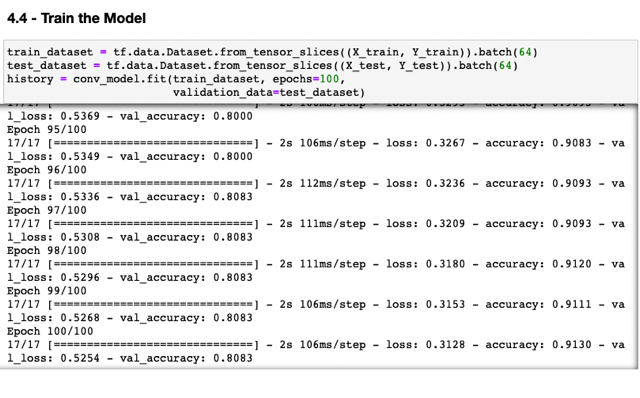</kbd>

 

<kbd></kbd>

 

> [!NOTE]
> 5 - History Object: Dùng kết quả (history) của training
> process để visualize
>
> Có thể thấy bỏ history của Keras model.
> history bỏ vào DataFrame của Pandas xong là
> vẽ ra training history dễ dàng. TF và Keras quả thật rất tiện

 

<kbd></kbd>

 

<kbd></kbd>

> [!NOTE]
> Có thể thấy bỏ history của Keras model.
> history bỏ vào DataFrame của Pandas xong là
> vẽ ra training history dễ dàng. TF và Keras quả thật rất tiện

 

<kbd></kbd>

 

#### 6 - Bibliography: Nên đọc thêm

 

<kbd></kbd>

 

