# C4w3_object Detection

📊 **Progress:** `59` Notes | `138` Screenshots

---

## C4w3_object Detection

 

## Object Localization

 

> [!NOTE]
> Đại khái là bài toán bây giờ là không những chỉ phân loại -vd. có phải
> xe hơi hay không (**classification)** mà còn vẽ cái box xung quanh cái
> xe (**classification with localization)**. Và mở rộng hơn là detect nhiều
> object khác loại trên cùng 1 image (**Object detection**)
>
> Đại khái là muốn localize thì ta **sửa cái output layer**, v.d đang là 
> Softmax ra 4 unit tương ứng 4 loại khả dĩ của cái hình, để
> **thêm vào 4 chỉ số nữa là bx, by, bw, bh** = Vị trí của cái object.
>
> Bằng cách **có thêm 4 thông số này trong training set,** đại khái
> là ta có thể khiến cho network có thể học được cách xác định
> được 4 chỉ số này trong các mẫu mới -> Localize được cái xe.
>
> Đại khái là label (y) ngoài 4 unit (để chỉ ra 4 loại xe, người,
> moto, nền, hoặc 4 thông số probability tương ứng) thì bây
> giờ sẽ có thêm  Pc - 1 là object, 0 là nền (bx, by, bh, bw) -
> vị trí cái object nếu có hoặc bỏ trống (?) nếu không, và C1
> C1 C3 - class label hoặc Probability class
>
> Cuối cùng là define Loss function có thể dùng **square của
> từng cặp tương ưng giữa y^ và y** hoặc kĩ hơn thì dùng
> từng hàm khác nhau  đ/v các chỉ số khác nhau như
>
> - Binary Cross Entropy đ.v pC,
> - Squared Error đ.v bx, by, bh, bw
> - Log (Categorical Cross Entropy) đ.v C1, C2, C3

 

<kbd></kbd>

> [!NOTE]
> Đại khái là bài toán bây giờ là không những chỉ phân loại -vd. có phải
> xe hơi hay không (**classification)** mà còn vẽ cái box xung quanh cái
> xe (**classification with localization)**. Và mở rộng hơn là detect nhiều
> object khác loại trên cùng 1 image (**Object detection**)

 

<kbd>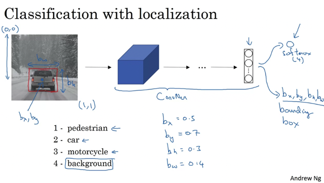</kbd>

> [!NOTE]
> Đại khái là muốn localize thì ta **sửa cái output layer**, v.d đang là 
> Softmax ra 4 unit tương ứng 4 loại khả dĩ của cái hình, để
> **thêm vào 4 chỉ số nữa là bx, by, bw, bh** = Vị trí của cái object.
>
>
>
> Bằng cách **có thêm 4 thông số này trong training set,** đại khái
> là ta có thể khiến cho network có thể học được cách xác định
> được 4 chỉ số này trong các mẫu mới -> Localize được cái xe.

 

<kbd></kbd>

> [!NOTE]
> Cuối cùng là define Loss function có thể dùng **square của
> từng cặp tương ưng giữa y^ và y** hoặc kĩ hơn thì dùng
> từng hàm khác nhau đ/v các chỉ số khác nhau như
>
>
>
> - Binary Cross Entropy đ.v pC,
> - Squared Error đ.v bx, by, bh, bw
> - Log (Categorical Cross Entropy) đ.v C1, C2, C3
>
> Đại khái là label (y) ngoài 4 unit (để chỉ ra 4 loại xe, người,
> moto, nền, hoặc 4 thông số probability tương ứng) thì bây
> giờ sẽ có thêm  Pc - 1 là object, 0 là nền (bx, by, bh, bw) -
> vị trí cái object nếu có hoặc bỏ trống (?) nếu không, và C1
> C1 C3 - class label hoặc Probability class

 

## Landmark Detection

 

> [!NOTE]
> Đại khái là ta có thể dạy cho máy tính cách xác định các key point
> trên khuôn mặt bằng cách tạo unit của output layer cho 'toạ độ' của
> các  điểm đó l1x, l1y, l2x, l2y....
>
> Dĩ nhiên label (Y train) cũng phải có những landmark này và công
> việc xác định các điểm này tốn nhiều công sức (**laborious**)
>
> Ứng dụng của cái này lấy ví dụ như chuyển khuôn mặt cười thành
> khóc, những hiệu ứng của Snapchat như đội nón đều dựa trên
> việc xác định được các landmark của khuôn mặt. **Recognize emotion**
>
> Một ví dụ khác là xác định bộ khung - tư thế người.

 

<kbd>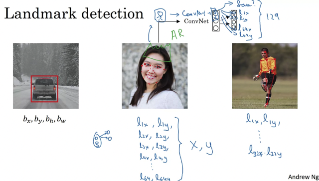</kbd>

> [!NOTE]
> Đại khái là ta có thể dạy cho máy tính cách xác định các key point
> trên khuôn mặt bằng cách tạo unit của output layer cho 'toạ độ' của
> các điểm đó **l1x, l1y, l2x, l2y....**
>
>
>
> Dĩ nhiên label (Y train) cũng phải có những landmark này và công
> việc xác định các điểm này tốn nhiều công sức (laborious)
>
>
>
> Ứng dụng của cái này lấy ví dụ như chuyển khuôn mặt cười thành
> khóc, những hiệu ứng của Snapchat như đội nón đều dựa trên
> việc xác định được các landmark của khuôn mặt. **Recognize emotion**
>
>
>
> Một ví dụ khác là xác định bộ khung - tư thế người.

 

## Object Detection

 

> [!NOTE]
> Đại khái là chạy (sliding) check từng ô đó xem có phải là xe hay không
> (bằng cách bỏ vào bài toán classification).
>
> Nhưng nhược điểm là với Deep Learning thì cách làm kiểu Sliding
> Window này rất **tốn computational resource**.
>
> Cách này đã có từ lâu khi Machine Learning còn thô sơ và người ta dùng
> với very simple algorithm như Linear regression và nó cũng tạm được.
>
> Nhưng h n.n với ConvNet rất tốn kém nên cách này không dùng được

 

<kbd></kbd>

> [!NOTE]
> Đại khái là đầu tiên người ta train 1
> convNet để classify xe trước với các
> training set là hình xe crop sát với cái xe

 

<kbd></kbd>

> [!NOTE]
> Đại khái là /**chạy (sliding) check từng ô**/ đó xem có phải là xe hay không
> (bằng cách **bỏ vào bài toán car classification**).
>
>
>
> Nhưng nhược điểm là với Deep Learning thì cách làm kiểu Sliding
> Window này rất  **tốn computational resource.**
>
>
>
> Cách này đã có từ lâu khi Machine Learning **còn thô sơ** và người ta dùng
> với very simple algorithm như Linear regression và nó cũng tạm được.
>
>
>
> Nhưng h n.n với ConvNet rất tốn kém nên cách này không dùng được

 

> [!NOTE]
> CONVOLUTIONAL IMPLEMENTATION
> OF SLIDING WINDOWS

 

> [!NOTE]
> Đại khái là có thể thay cái 400 unit FC layer bằng Conv layer
> 1x1x400 bằng cách dùng 400 filter 5x5x16. Về mặt toán học tính
> toán thì như nhau.
>
> Tương tự với layer softmax
>
> Vi diệu
>
> Đại khái là thay vì dùng **sliding window** để cắt ra từng ô rồi bỏ
> vào convNet để forward ra 1 kết quả xem có phải cái xe hay
> không, làm vậy phải slide và forward 4 lần
>
> Thay vì vậy, **cứ bỏ cái hình bự vào luôn** dùng cái **convNet**
> nó sẽ tính ra kết quả cuối cùng chính là **chứa đựng kết quả của
> 4 lần riêng lẻ.**

 

<kbd></kbd>

> [!NOTE]
> Đại khái là có thể thay cái 400 unit FC layer bằng
> Conv layer 1x1x400 bằng cách dùng 400 filter
> 5x5x16. Về mặt toán học tính toán thì như nhau.
>
>
>
> Tương tự với layer softmax

 

<kbd></kbd>

> [!NOTE]
> Vi diệu
>
>
>
> Đại khái là thay vì dùng **sliding window** để cắt ra từng ô rồi bỏ vào
> convNet để forward ra 1 kết quả xem có phải cái xe hay không, làm vậy
> phải slide và forward 4 lần
>
>
>
> Thay vì vậy, **cứ bỏ cái hình bự vào luôn** dùng cái **convNet** nó sẽ tính ra
> kết quả cuối cùng chính là **chứa đựng kết quả của 4 lần riêng lẻ.**

 

<kbd>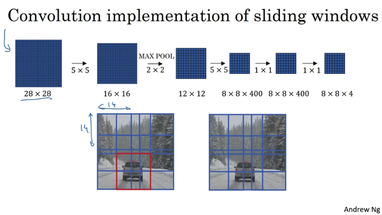</kbd>

 

## Bounding Box Predictions

 

> [!NOTE]
> 1 Sliding windows have a **problem with accurate bounding box**
> predictions **even with a convolutional implementation.**
>
> 2 The **YOLO** (You Only Look Once) algorithm offers a way to **output
> more accurate bounding boxes** by **applying image classification and
> localization algorithms** to a grid system.
>
> 3 The grid system divides the input image into cells, and for each
> cell, a target label vector Y is defined, with the first output
> representing whether there is an image in that grid cell.
>
> 4 **The target label vector Y includes PC, BX, BY, BH, BW** to specify
> the bounding box and C1, C2, C3 to specify the object class.
>
> 5 The total volume of the target output is 3 by 3 by 8 because the
> image is divided into a 3 by 3 grid system, and for each grid cell,
> there is an eight-dimensional target vector Y.
>
> 6 To train the neural network, the input is the image, and the output
> is the target label vector Y.

 

<kbd>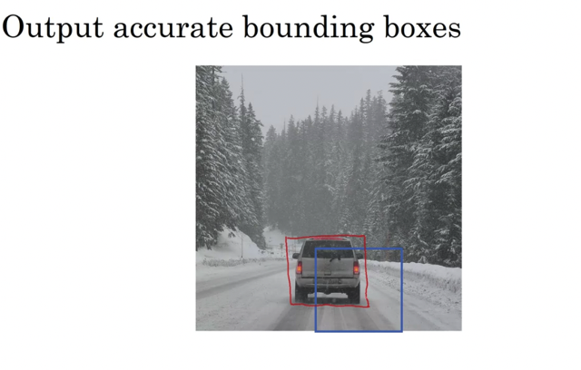</kbd>

> [!NOTE]
> Đại khái là làm sao để detect chính xác **bounding box -** một
> problem của Sliding window dù cho có áp dụng **Convolutional
> implementation vẫn chưa khắc phục được**. Kiểu như có thể B.B đúng phải hình chữ nhật nhưng window chỉ
> có hình vuông nên ko thể chính xác được

 

<kbd></kbd>

> [!NOTE]
> "And the basic idea is you're going to take the image classification
> and localization algorithm that you saw in the first video of this
> week and apply that to each of the nine grid cells of this image."
>
>
>
> Đại khái là **áp dụng bài toán classification & localization cho mỗi
> ô trong 9 ô lưới**
>
>
>
> (3x3 để minh hoạ, thực tế có thể dùng **more fine grid - lưới dày
> hơn)**
>
>
>
> ???: YOLO nó assign cái object cho cái ô (grid cell)và ô giữa
> dù có dính một phần của cả hai object vẫn coi như không có
> object nào
>
>
>
> **Đại khái là ta define output là 1 volume 3x3x8 và dùng Back Prop
> để training (với y là cũng 3x3x8), xong ta predict với image mới ra
> một volume 3x3x8 để từ đó với mỗi ô ta xem nó có phải là object
> hay không bằng /pC/, nếu có thì là object gì bằng /C1, C2, C3/
> và 'toạ độ' bao nhiêu /bx, by, bw, bh**
>
>
>
> /Cách assign object to grid cell là ta tính được bx, by rồi thì tất
> nhiên ta xác định được nó nằm trong ô nào, nên dù cái object nó
> có trải dài qua nhiều ô thì cũng chỉ có 1 ô được assign
>
> Một vài nhận xét với phương pháp **YOLO**
>
>
>
> Không phải tính từng ô mà chỉ tính 1 phát một với ConvNet
>
>
>
> B.B không bị gom gọm trong kích thước Sliding Window
>
>
>
> Chạy nhanh

 

<kbd>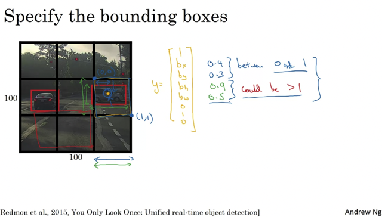</kbd>

 

## Intersection Over Union

 

> [!NOTE]
> Đại khái là tính ra chỉ số **Itersection / Unit (giao hợp)** và quyết
> định môt threshold để xem nó có correct hay không
>
> 1 Introduction to Intersection Over Union (IoU) function for
> evaluating object detection algorithms.
>
> 2 IoU computes the overlap between the ground-truth bounding
> box and the predicted bounding box.
>
> 3 Conventionally, an IoU of 0.5 or greater is considered correct,
> but more stringent criteria can also be used.
>
> 4 IoU can be used to measure the overlap between any two
> bounding boxes and is a way to measure similarity.
>
> 5 IoU is used in non-max suppression, which is a tool to improve
> the performance of object detection algorithms.
>
> 6 IoU is not to be confused with the promissory note concept in
> IoU.

 

<kbd></kbd>

> [!NOTE]
> Đại khái là tính ra chỉ số Itersection / Unit (giao hợp)
> và quyết định môt threshold để xem nó có correct hay 
> không
>
>
>
> Thường ta lấy 0.5 nhưng có thể tăng lên nếu muốn strict hơn

 

## Non-max Suppression

 

> [!NOTE]
> Main ideas:  1 Object detection algorithms may find multiple
> detections of the same object.
>
> 2 Non-max suppression is a method to ensure that object
> detection algorithms only detect each object once.
>
> 3 Non-max suppression works by **selecting the most confident
> detection** and then **suppressing overlapping detections.**
>
> 4 The first step of non-max suppression is to **discard all boxes
> with a probability less than or equal to some threshold.**
>
> 5 The next step is to repeatedly **pick the box with the highest
> probability** and **output it as a prediction** and **suppress all box
> that overlap it** until there are no more boxes left.

 

<kbd>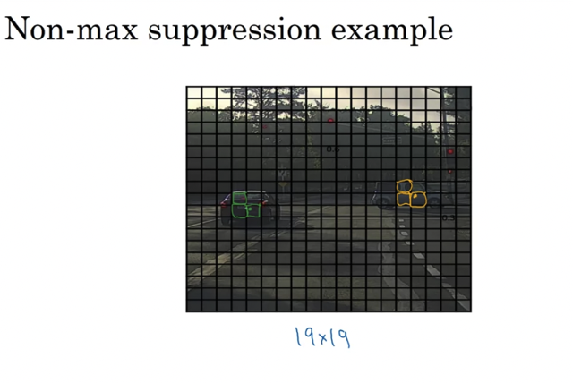</kbd>

> [!NOTE]
> Đại khái là trong quá trình có thể nhiều cell cùng detect rằng nó
> chứa center của cái xe từ đó thành ra nó detect cái xe nhiều lần

 

<kbd>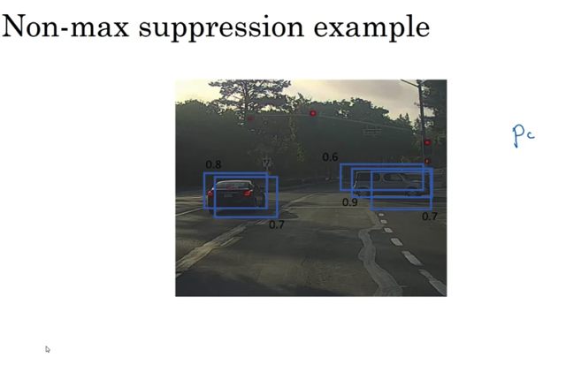</kbd>

> [!NOTE]
> Cái Non-max Suppresion sẽ làm là với mỗi object, nó xác định cái B.B
> có Pc lớn nhất và xác định các b.b khác mà overlap nhiều với cái đầu
>
>
>
> Cái tên thể hiện hết: Suppression - Bỏ đi, Non-max là không  phải cái lớn
> nhất (về Probability).

 

<kbd></kbd>

 

<kbd>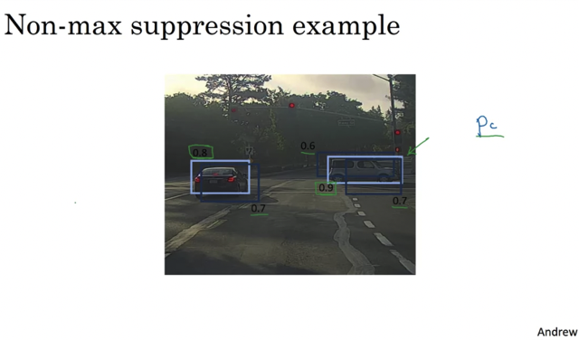</kbd>

 

<kbd>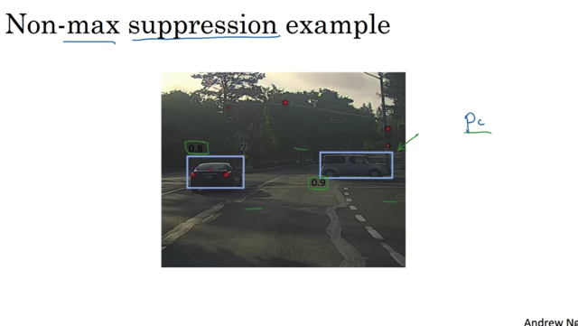</kbd>

 

<kbd></kbd>

 

## Anchor Boxes

 

> [!NOTE]
> 1 Object detection with grid cells has a **limitation of detecting only
> one object per cell**.
>
> 2 Anchor boxes are **pre-defined shapes used to associate multiple
> predictions with different anchor boxes.**
>
> 3 Anchor boxes **allow for detecting objects with different shapes
> and sizes in a single grid cell**.
>
> 4 The **target label** with anchor boxes consists of a **3 by 3 grid and
> anchor box pair, with each pair containing 8 dimensions for object
> detection.**
>
> 5 Anchor boxes are assigned to the same grid cell as before, but
> with the highest Intersection over Union (IoU) with the object's
> shape. -> ???
>
> 6 The output Y is 3 by 3 by 16 with two anchor boxes or 3 by 3 by
> 24 with three anchor boxes.
>
> 7 Anchor boxes allow for better object detection and localization
> within a single grid cell.

 

<kbd>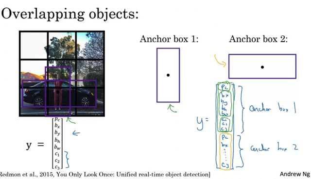</kbd>

 

<kbd></kbd>

> [!NOTE]
> Đại khái là thay đổi 1 chút, trước đây trong label y sẽ define 8 giá trị Pc,
> bx, by, bh, bw, C1, C2, C3 đồng nghĩa với việc: **object thì nó sẽ gán vào
> một cell** bởi các thông số đó. Hiểu đại khái là giả sử có 2 object thì
> trong các ô, chỉ có 2 ô sẽ có các giá trị bx, by, bh, bw thôi.
>
>
>
> Còn bây giờ, 2 object sẽ được 'đánh dấu' / gán vào thêm 2 cái  anchor
> box nữa

 

<kbd></kbd>

> [!NOTE]
> Chưa hiểu lắm, hiểu là anchor box nó define
> như vậy nhưng cụ thể làm gì thì chưa rõ

 

## Yolo Algorithm

 

> [!NOTE]
> 1 The YOLO object detection algorithm combines various components of
> object detection.
>
> 2 To construct the training set, the appropriate **target vector y is formed
> for each of the nine grid cells.**
>
> 3 The final output volume is 3 by 3 by 16, but in practice, it may be more
> like 19 by 19 by 16 or 19 by 19 by 24 if more anchor boxes are used.
>
> 4 The neural network makes predictions by outputting a 3 by 3 by 2 by 8
> volume, where for each of the nine grid cells, a vector is obtained.
>
> 5 Non-max suppression is run to get rid of low probability predictions, and
> independently run non-max suppression for each of the three classes of
> objects to detect pedestrians, cars, and motorcycles.

 

<kbd>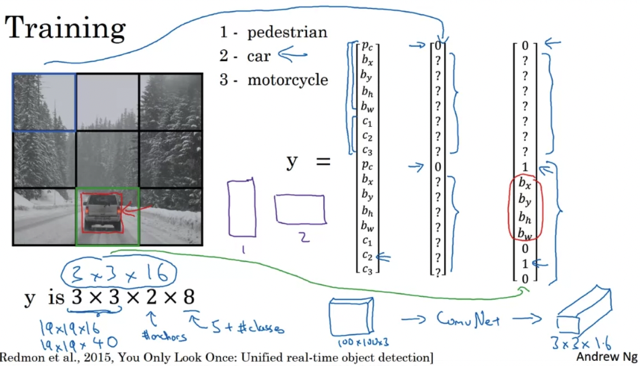</kbd>

> [!NOTE]
> Đại khái là training label sẽ có dạng như vậy với 2 object là
> (3x3) x (số anchor) x (5 + số class) Thực tế có thể là 19x19

 

<kbd></kbd>

> [!NOTE]
> Rồi sau khi train, và predict new image thì: Chỉ số đầu pc
> của mỗi cell sẽ cho biết có object hay không, Nếu có thì
> các thông số sẽ là vị trí và class của nó

 

<kbd></kbd>

<kbd>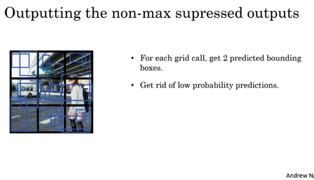</kbd>

<kbd></kbd>

 

<kbd>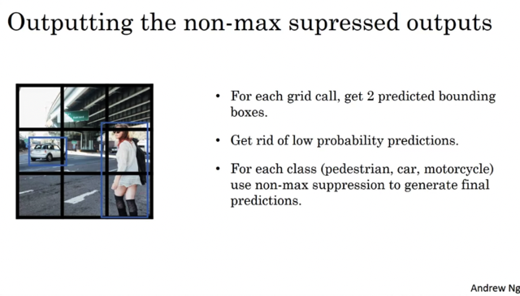</kbd>

> [!NOTE]
> Xong tiếp theo là làm quy trình non-max
> đv mỗi class để xoá đi các bounding box

 

## Region Proposals

 

> [!NOTE]
> 1 Introduction to region proposals in object detection
>
> 2 Comparison between sliding windows and region
> proposals
>
> 3 R-CNN algorithm and its implementation of region
> proposals
>
> 4 Improvements to the R-CNN algorithm, including Fast
> R-CNN and Faster R-CNN
>
> 5 The influence of region proposals in computer vision
>
> 6 The potential for a single-step approach in object
> detection, similar to the You Only Look Once (YOLO)
> algorithm.

 

<kbd></kbd>

> [!NOTE]
> Đại khái idea là thay vì chạy (Sliding window + classification) hoặc Sliding
> window with ConvNet, trong đó ta đều check những cell mà rõ ràng là
> không có khả năng có object, thì ta sẽ dùng một cái gọi là **Segmentation
> algorithm** để xác định các **vùng có khả năng có object nhất sau đó chỉ
> run trên những vùng này**

 

<kbd>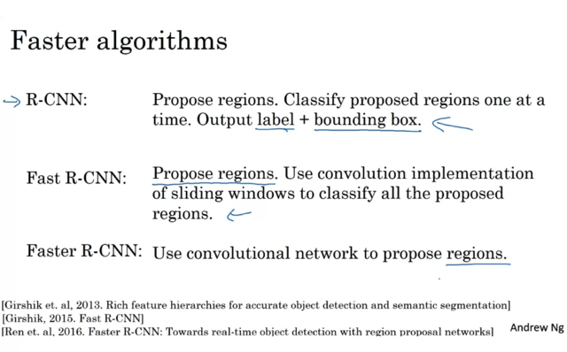</kbd>

> [!NOTE]
> Đại khái cái R-CNN nó chậm do bước
> Region Proposal  nên có vài cách khác
> dùng Conv để tăng tốc việc này.

 

## Semantic Segmentation With U-net

 

> [!NOTE]
> 1. Semantic segmentation là gì?
>
> Semantic segmentation là một kỹ thuật thị giác máy tính liên quan đến gán nhãn cho mỗi
> pixel trong hình ảnh với một nhãn lớp tương ứng. Mục tiêu của semantic segmentation là
> tạo ra một đường viền chi tiết của một đối tượng, để chúng ta biết chính xác những pixel
> thuộc về đối tượng và những pixel nào không thuộc về đối tượng đó.
>
> 2. Ứng dụng của semantic segmentation:
>
> Semantic segmentation có nhiều ứng dụng thương mại, bao gồm xe tự lái, hình ảnh y học
> và lập kế hoạch phẫu thuật. Ví dụ, trong xe tự lái, semantic segmentation có thể được sử
> dụng để xác định các bề mặt lái được, giúp cho xe dễ dàng di chuyển.
>
> 3.Làm thế nào semantic segmentation hoạt động?
>
> Trong semantic segmentation, mục tiêu là gán nhãn lớp cho mỗi pixel trong hình ảnh. Để
> làm được điều này, chúng ta cần sửa đổi kiến trúc của một mạng neural tích chập (CNN).
> Các lớp cuối cùng của CNN được loại bỏ và mạng được sửa đổi để tăng dần kích thước
> đầu ra, sao cho nó phù hợp với kích thước của hình ảnh đầu vào.
>
> 4.Làm thế nào để phân đoạn hình ảnh bằng semantic segmentation?
>
> Để phân đoạn một hình ảnh bằng semantic segmentation, CNN tạo ra một ma trận nhãn
> lớp cho mỗi pixel trong hình ảnh. Số hàng và cột trong ma trận tương ứng với chiều cao và
> chiều rộng của hình ảnh đầu vào, trong khi số kênh tương ứng với số nhãn lớp. Ví dụ, nếu
> chúng ta muốn phân đoạn một hình ảnh thành các ô tô và tòa nhà, chúng ta sẽ có hai kênh:
> một cho ô tô và một cho tòa nhà.
>
> 5.Transpose convolution:
>
> Để tăng kích thước ma trận đầu ra trong semantic segmentation, chúng ta sử dụng một
> phép toán gọi là transpose convolution. Transpose convolution được sử dụng để "hoàn
> ngược" quá trình giảm mẫu xuất hiện ở các lớp trước của CNN. Đầu ra của một transpose
> convolution có cùng hình dạng với đầu vào, nhưng v

 

<kbd>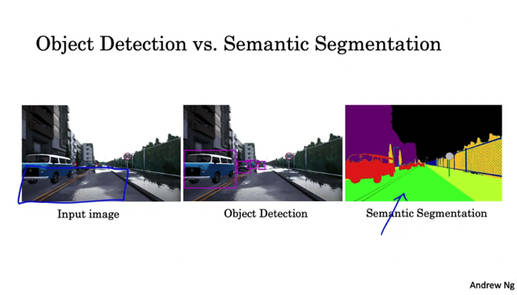</kbd>

> [!NOTE]
> Đại khái là ta đã trải qua 2 bước, 1 là **object recognition** - bài toán
> classification để xác định xem nó là hình con mèo hay không
> 2 là **object detection** - nâng cấp hơn, không những xác định con mèo
> mà còn vẽ cái bounding box quanh con mèo.
>
>
>
> Bây giờ bài toán thứ 3 nâng cấp hơn nữa là không những vẽ b.b
> mà vẽ sát cái viền của con mèo - **segmentation**

 

<kbd>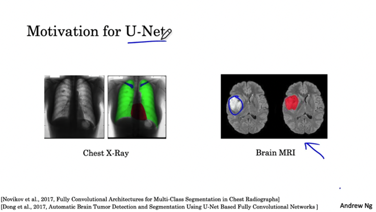</kbd>

> [!NOTE]
> Đại khái là một số ứng dụng của cái
> này, sẽ giúp ích rất nhiều

 

<kbd>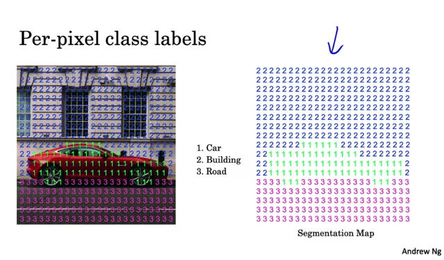</kbd>

<kbd></kbd>

> [!NOTE]
> N.n phải output 1 matrix như này: mỗi pixel
> trong image đều được label

 

<kbd></kbd>

<kbd>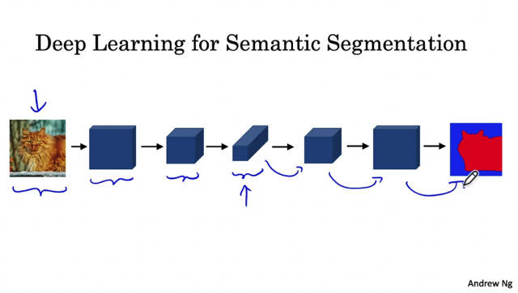</kbd>

> [!NOTE]
> Đại khái là để làm segmentation phải thay mấy cái layer cuối theo kiểu
> tăng cái size lên như này để về lại size ban đầu của input image. Cái này
> cần tới **Transpose Operation**

 

## Transpose Convolutions

 

> [!NOTE]
> Trong bài giảng này, người giảng giải thích về khái niệm transpose
> convolution, là một phần quan trọng trong kiến trúc đơn vị. Để làm
> cho đầu vào kích thước 2x2 được phóng to lên kích thước 4x4, ta
> có thể sử dụng transpose convolution. Khác với convolution thông
> thường, transpose convolution sử dụng một bộ lọc (filter) để phóng
> to dữ liệu đầu ra thay vì áp dụng bộ lọc lên đầu vào. Bài giảng cung
> cấp một ví dụ chi tiết về cách sử dụng transpose convolution với
> đầu vào 2x2, bộ lọc 3x3, padding 1 và stride 2 để phóng to đầu vào
> thành đầu ra 4x4. Một vài bước tính toán được trình bày để minh
> họa quá trình phóng to. Cuối cùng, transpose convolution được cho
> là một cách hiệu quả để phóng to dữ liệu đầu vào nhỏ hơn lên kích
> thước lớn hơn trong bối cảnh của thuật toán học sâu.

 

<kbd>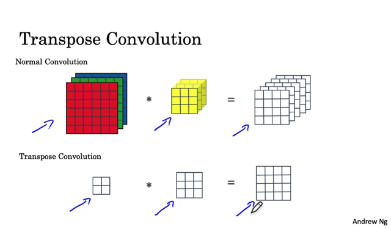</kbd>

 

<kbd></kbd>

<kbd></kbd>

<kbd>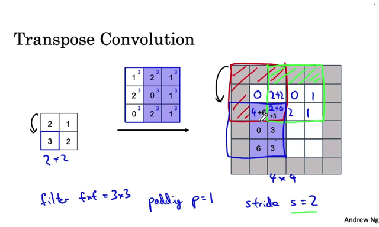</kbd>

<kbd>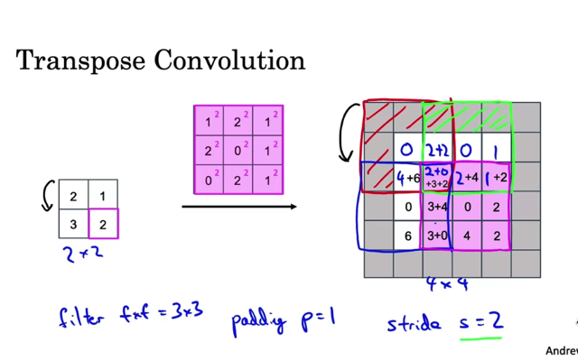</kbd>

 

<kbd></kbd>

 

## U-net Architecture Intuition

 

> [!NOTE]
> - Đại khái là sử dụng **convolution thông thường phần
> đầu** của mạng nơ-ron.
>
> - Sử dụng **transpose convolution trong phần thứ hai
> của mạng nơ-ron để khôi phục lại kích thước ảnh gốc.**
>
> - Giới thiệu **skip connections** từ các lớp trước đến
> các lớp sau để cải thiện hiệu suất bằng cách **cung cấp
> thông tin bối cảnh cấp cao và thông tin kết cấu cấp
> thấp** để cho phép mạng nơ-ron bắt được thông tin
> không gian chi tiết, tinh vi.

 

<kbd></kbd>

> [!NOTE]
> Đại khái là dùng Transpose Conv ở những layer cuối và **Skip
> Connection** cho phép cung cấp **những low-level feature nhưng
> chi tiết** để cộng với những **high-level feature nhưng chung
> chung** để tạo nên kết quả cuối cùng

 

## U-net Architecture

 

> [!NOTE]
> 1. Qua 1 vài lớp Conv layer (Conv Relu) giữ nguyên kích thước  (với
> same padding) nhưng tăng dimensions (tăng số filter lên)
>
> 2,3,4. Dùng (Max) Pooling, giảm kích thước xuống rồi lại qua vài lớp
> Conv-reLu để tăng dimension
>
> 5. Dùng Transpose Conv để (chưa tăng kích thước) mà giảm
> dimensions xuống rồi ghép với cái Skip Connection từ bước 4.
>
> 6,7,8. Dùng Transpose Conv để tăng kích thước + giảm dimensions
> xuống rồi ghép với cái Skip Connection từ bước 3,2,1
>
> 9. Dùng Conv ReLU cho những layer cuối lúc này kích thước đã  phục hồi ban
> đầu, layer cuối dùng Conv (1x1) để xuất ra kết quả cuối cùng.

 

<kbd></kbd>

> [!NOTE]
> Đây là một trong những cái kết trúc
> neural network nền tảng quan trọng
> nhất của Computer Vision

 

<kbd></kbd>

 

<kbd>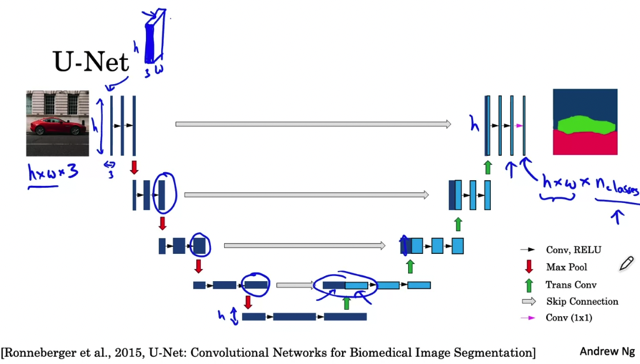</kbd>

> [!NOTE]
> 1. Qua 1 vài lớp /**Conv layer (Conv Relu)**/ **giữ nguyên kích thước**  (với
> same padding) nhưng **tăng dimensions** (tăng số filter lên)
>
>
>
> 2,3,4. Dùng /**(Max) Pooling**/, giảm kích thước xuống rồi lại qua vài lớp
> Conv-reLu để tăng dimension
>
>
>
> 5. Dùng /**Transpose Conv/** để (chưa tăng kích thước) mà **giảm
> dimensions xuống** rồi ghép với cái Skip Connection từ bước 4.
>
>
>
> 6,7,8. Dùng /**Transpose Conv/** để **tăng kích thước** + **giảm dimensions
> xuống** rồi ghép với cái Skip Connection từ bước 3,2,1
>
>
>
> 9. Dùng Conv ReLU cho những layer cuối lúc này kích thước đã  phục hồi ban
> đầu, layer cuối dùng Conv (1x1) để xuất ra kết quả cuối cùng.

 

## Quiz

 

<kbd></kbd>

 

<kbd>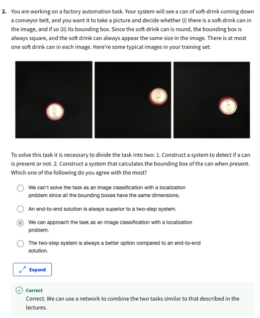</kbd>

 

<kbd>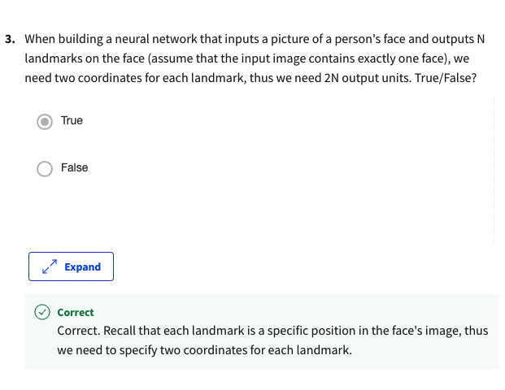</kbd>

 

<kbd></kbd>

 

<kbd></kbd>

 

<kbd>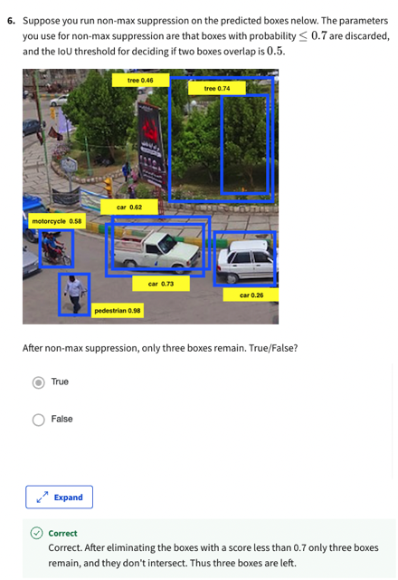</kbd>

 

<kbd>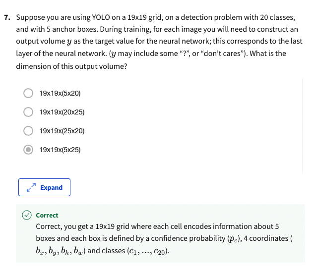</kbd>

 

<kbd>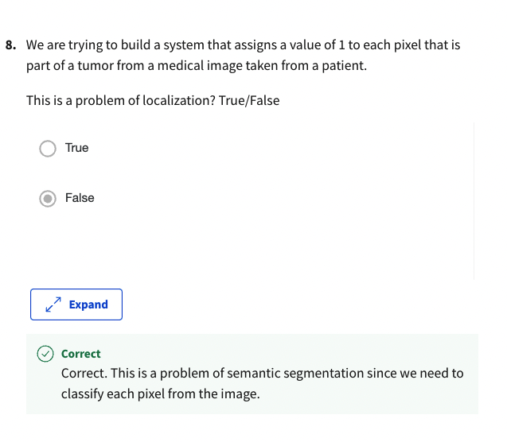</kbd>

 

<kbd>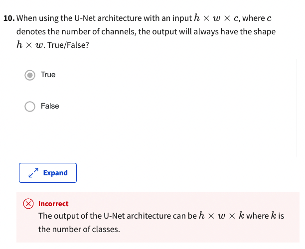</kbd>

 

<kbd></kbd>

 

## Programming Assignment

 

<kbd>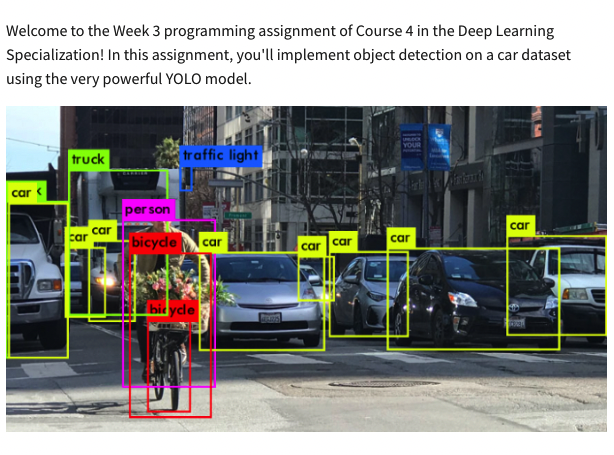</kbd>

> [!NOTE]
> By the end of this assignment, you'll be able to:
>
> Detect objects in a car detection dataset
> Implement non-max suppression to increase accuracy
> Implement intersection over union
> Handle bounding boxes, a type of image annotation popular in deep learning

 

#### \\*..\\*

 

##### Packages

 

<kbd></kbd>

 

##### 1 - Problem Statement

 

<kbd></kbd>

<kbd>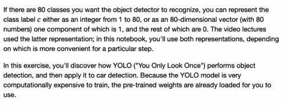</kbd>

> [!NOTE]
> Đại khái là đi vòng vòng chụp hình, về vẽ **Bounding
> Box**  quanh cái xe để tạo training set
>
>
>
> Đại khái ở đây chỉ có 1 object (xe), nếu có 80 class thì có
> thể dùng c1, c2,....c80 hoặc dùng 80 one-hot encoded
> vector

 

##### 2 - Yolo

 

> [!NOTE]
> YOLO: Đại khái là nó (algorithm) chỉ cần look qua cái
> image 1 lầnm lúc forward  propagation để predict

 

- **2.1 - Model Details**

 

<kbd></kbd>

 

<kbd>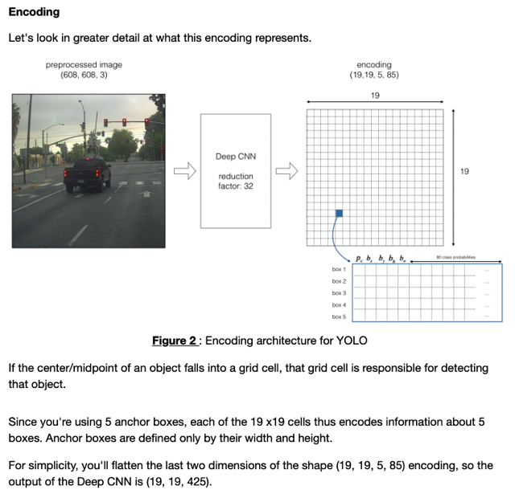</kbd>

<kbd>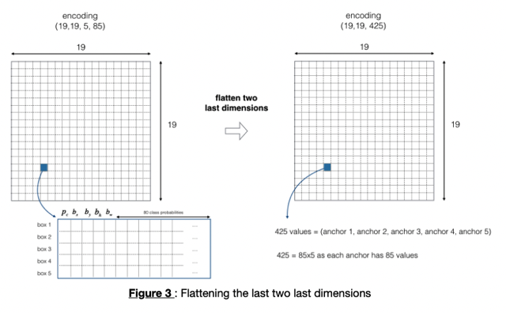</kbd>

> [!NOTE]
> Đại khái là nếu trong lecture chỉ có 2 anchor box, và 3 class nên 
> y = [Pc, bx, by, bh, bw, c1, c2, c3, ..
> ..Pc, bx, by, bh, bw, c1, c2, c3]
>
>
>
> Thì ở đây là có 5 anchorbox và 80 cái class !!!
>
>
>
> [Pc, bx, by, bh, bw, c1, c2, c3, ..c80 //Anchor box 1
> ..Pc, bx, by, bh, bw, c1, c2, c3..c80  //Anchor box 2
> ..Pc, bx, by, bh, bw, c1, c2, c3..c80  //Anchor box 3
> ..Pc, bx, by, bh, bw, c1, c2, c3..c80  //Anchor box 4
> ..Pc, bx, by, bh, bw, c1, c2, c3..c80  //Anchor box 5
> ]

 

<kbd>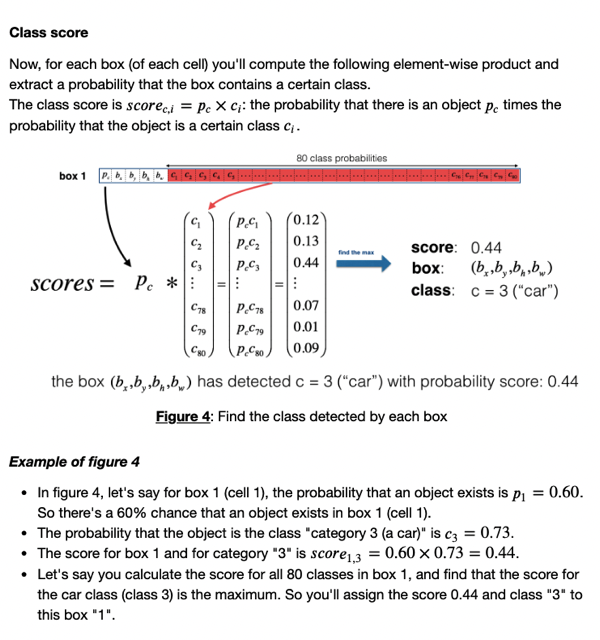</kbd>

> [!NOTE]
> Đại khái mỗi 1 cell sẽ có 5 box (như khi mình define anchor box),
> tính 5 con số pc của mỗi cell để biết khả năng (probability) cell đó có
> object hay không. 
> Rồi nhân với [c1, ...c80] để ra khả năng có object class nào
>
>
>
> **Đang nói cho 1 cell nha:**
>
>
>
> Box 1:
>
>
>
> pc*[c1,...c80] để ra [pc*c1, pc*c2,....pc*c80]
>
>
>
> Trong 80 con số này, **số lớn nhất** (v.d pcc3) sẽ thể hiện khả năng 
> cao (nhất) box 1 này chứa object class số 3 (ở đây class #3 là xe hơi)
> -> Assign blah blah có nghĩa đại khái là mình sẽ tuyên bố
> box 1 sẽ chứa xe hơi (class #3) và class score là 44%
>
>
>
> **Tính tương tự cho 4 box còn lại (của 1 cell)
>
>
>
>
> Vậy làm cùng lúc cho 19x19 (tổng số cell) x5 (5 box mỗi cell) thì sao**

 

<kbd></kbd>

<kbd></kbd>

 

> [!NOTE]
> 2.2 - Filtering with a Threshold on Class Scores
>
> Đại khái là thay vì để chung các thông số của 1 box trong 1 vector
>
> [Pc, bx, by, bh, bw, c1, c2...c80]
>
> thì ta chia ra thành 3 vector:
>
> - Box confidence: Pc
>
> - Boxes: bx, by, bh, bw
>
> - Boxes class probability: c1, c2, ...c80
>
> 19x19x (số box) x (1 object probability + 4 thông số vị trí object
>
> + 80 thông số class prob)
>
> tách thành
>
> - Box confidence: 19x19x (số box) x (1 object probability)
>
> - Boxes: bx, by, bh, bw: 19x19x (số box) x (4 thông số vị trí object)
>
> - Boxes class probability: c1, c2, ...c80: 19x19x (số box) x (80 thông
> số class prob)

 

<kbd></kbd>

> [!NOTE]
> Đại khái là thay vì để chung các thông số của 1 box trong 1 vector
>
>
>
> [Pc, bx, by, bh, bw, c1, c2...c80]
>
>
>
> thì ta chia ra thành 3 vector:
>
>
>
> - Box confidence: Pc
>
>
>
> - Boxes: bx, by, bh, bw
>
>
>
> - Boxes class probability: c1, c2, ...c80
>
>
>
> 19x19x (số box) x (1 object probability + 4 thông số vị trí object + 80 thông số
> class prob)
>
>
>
> tách thành
>
>
>
> - Box confidence: 19x19x (số box) x (1 object probability)
>
>
>
> - Boxes: bx, by, bh, bw: 19x19x (số box) x (4 thông số vị trí object)
>
>
>
> - Boxes class probability: c1, c2, ...c80: 19x19x (số box) x (80 thông số class
> prob)

 

<kbd>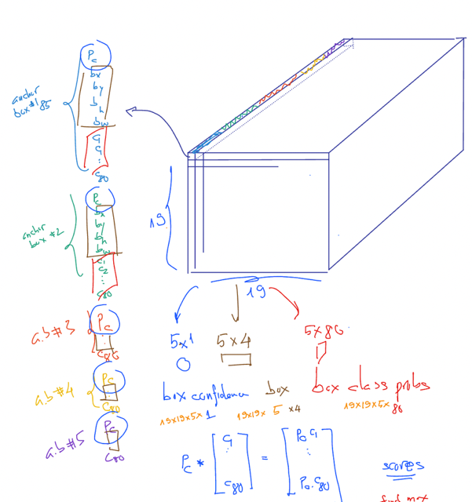</kbd>

 

- **Exercise 1 - yolo_filter_boxes**

 

<kbd>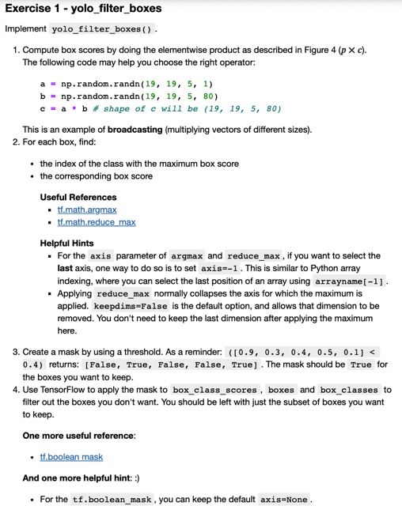</kbd>

> [!NOTE]
> Đại khái là tính Pc trong của một box bằng cách nhân Pc
> object với  vector class probability [c1, c2, c3...c80]
>
>
>
> - Để ra 'probability of an object with class c_i'  
> [Pc*c1, Pc*c2, ... , Pc*c80]
>
>
>
> - Lấy ra giá trị lớn nhất cùng với index của nó trong 80 cái 
> Dùng **argmax** và **reduce_max
>
>
>
> -** Cuối cùng là dùng boolean_max để loại bỏ những cái dưới
> Threshold
>
>
>
> Do mình đang làm đv dimension cuối nên axis=-1 để nó lấy cái cuối

 

<kbd></kbd>

<kbd></kbd>

 

<kbd></kbd>

<kbd></kbd>

 

<kbd>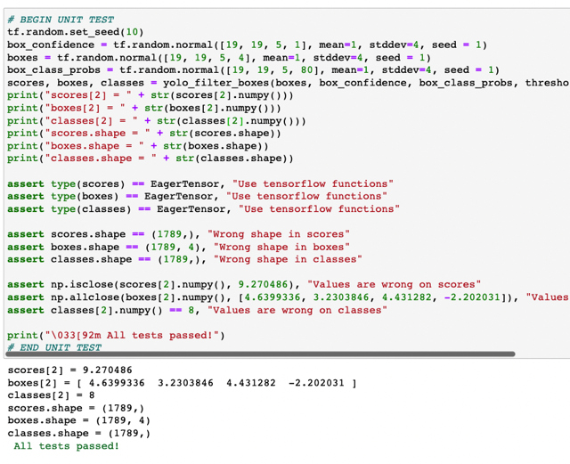</kbd>

 

<kbd>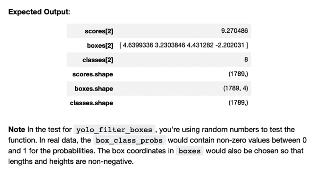</kbd>

 

- **2.3 - Non-max Suppression**

 

<kbd></kbd>

 

- **Exercise 2 - iou**

 

<kbd></kbd>

 

<kbd>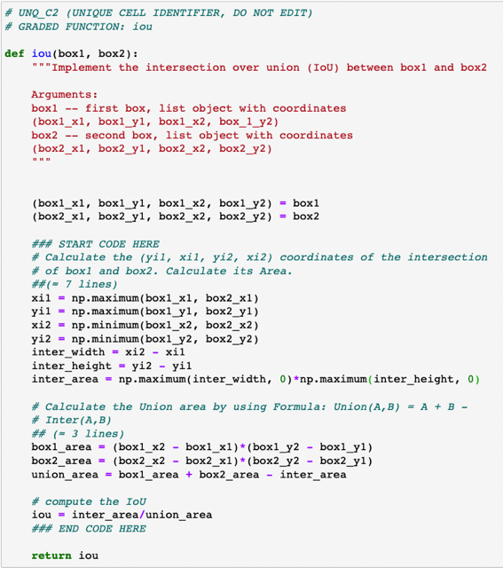</kbd>

> [!NOTE]
> Nếu hai box không overlap nhau, thì intersection phải bằng
> 0  -> inter_width  = max(0, inter_area's width) inter_height  =
> max(0, inter_area's height)

 

<kbd></kbd>

 

- **2.4 - YOLO Non-max Suppression**

 

<kbd></kbd>

 

- **Exercise 3 - yolo_non_max_suppression**

 

<kbd></kbd>

 

<kbd></kbd>

 

<kbd></kbd>

 

- **2.5 - Wrapping Up the Filtering**

 

<kbd></kbd>

 

- **Exercise 4 - yolo_eval**

 

<kbd></kbd>

<kbd></kbd>

 

<kbd></kbd>

 

> [!NOTE]
> 3 - Test YOLO Pre-trained Model on Images: Đại khái là
> dùng Pretrained YOLO model để detect

 

- **3.1 - Defining Classes, Anchors and Image Shape**

 

<kbd>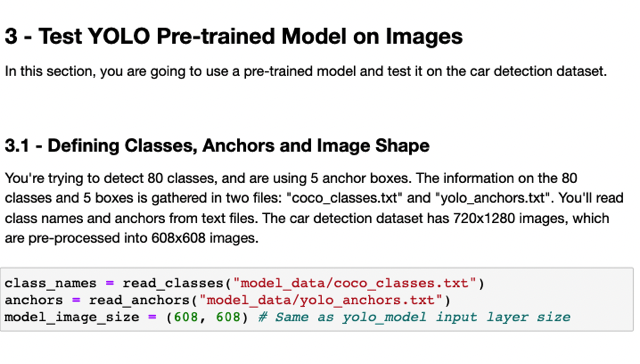</kbd>

 

- **3.2 - Loading a Pre-trained Model**

 

<kbd>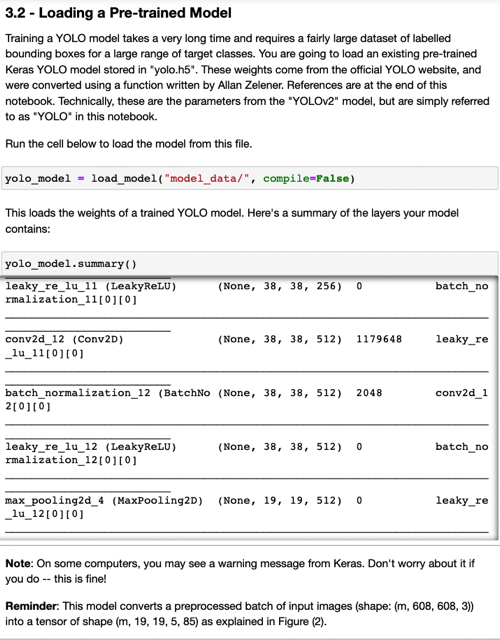</kbd>

 

- **3.3 - Convert Output of the Model to Usable Bounding Box Tensors**

 

<kbd></kbd>

 

- **3.4 - Filtering Boxes**

 

<kbd></kbd>

 

- **3.5 - Run the YOLO on an Image**

 

<kbd></kbd>

 

<kbd>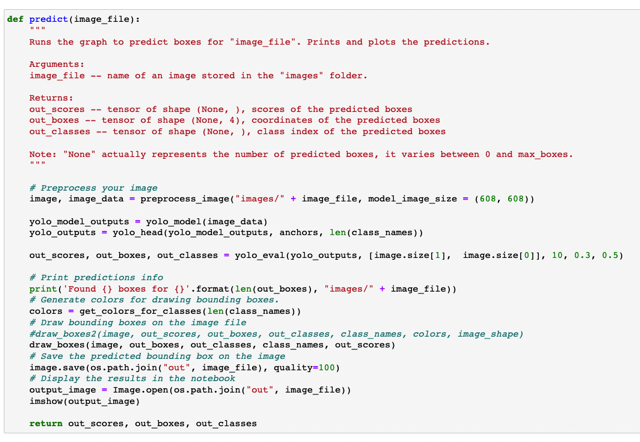</kbd>

 

<kbd></kbd>

 

<kbd></kbd>

 

<kbd></kbd>

 

- **4 - Summary for YOLO**

 

<kbd></kbd>

 

- **5 - References**

 

<kbd></kbd>

 

## PROGRAMMING ASSIGNMENT: \\*Image Segmentation with U-Net\\*

 

<kbd>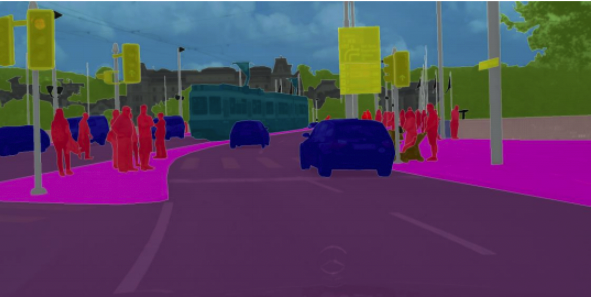</kbd>

> [!NOTE]
> Welcome to the final assignment of Week 3 in Course 4 of the Deep Learning
> Specialization! You'll be building your own U-Net, a type of CNN designed for
> quick, precise image segmentation, and using it to predict a label for every
> single pixel in an image - in this case, an image from a self-driving car dataset.

 

#### Image Segmentation with U-Net

 

<kbd>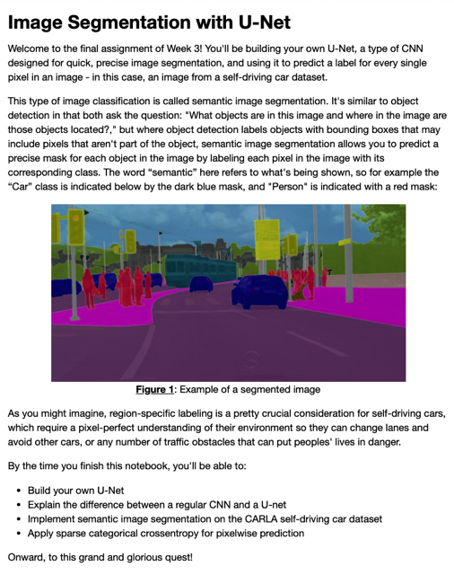</kbd>

 

#### 1 - Packages

 

<kbd>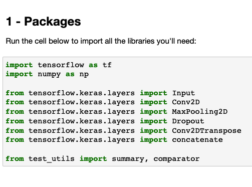</kbd>

 

#### 2 - Load and Split the Data

 

<kbd></kbd>

 

<kbd></kbd>

<kbd></kbd>

 

> [!NOTE]
> 2.1 - Split Your Dataset into
> Unmasked and Masked Images

 

<kbd></kbd>

 

#### 2.2 - Preprocess Your Data

 

<kbd>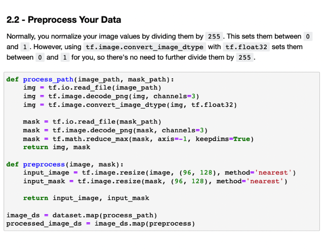</kbd>

 

#### 3 - U-Net

 

<kbd>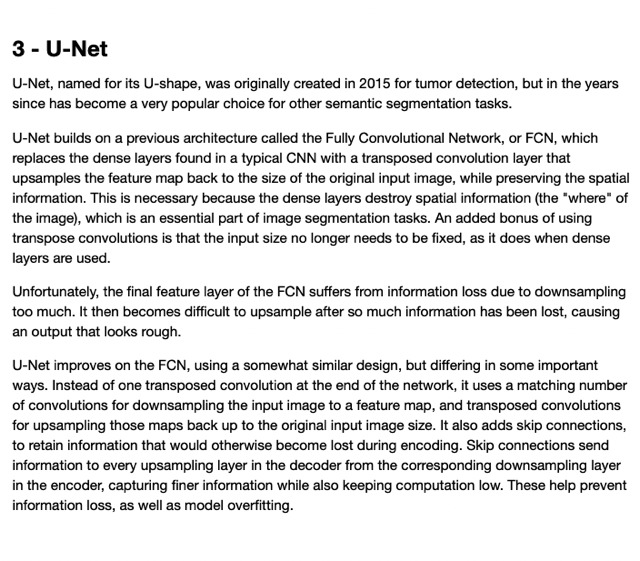</kbd>

 

#### 3.1 - Model Details

 

<kbd>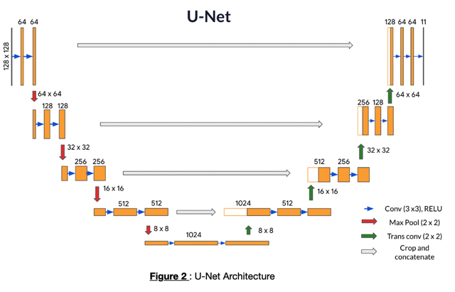</kbd>

 

<kbd>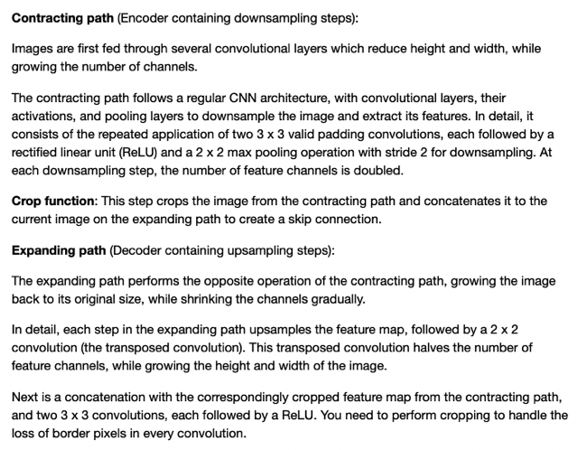</kbd>

 

<kbd>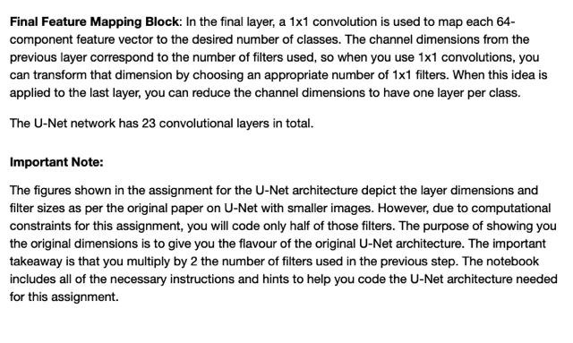</kbd>

 

#### 3.2 - Encoder (Downsampling Block)

 

<kbd>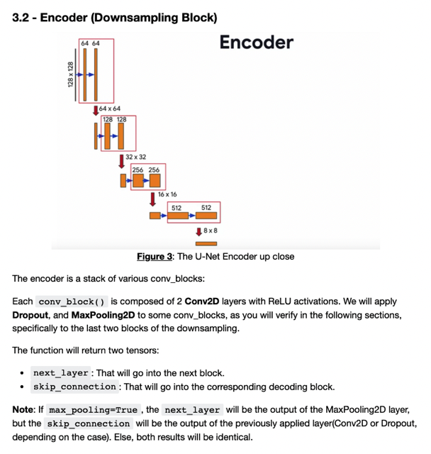</kbd>

 

#### Exercise 1 - conv_block

 

<kbd></kbd>

<kbd></kbd>

 

<kbd></kbd>

<kbd></kbd>

 

<kbd>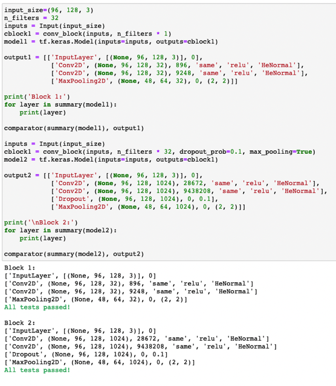</kbd>

 

#### 3.3 - Decoder (Upsampling Block)

 

<kbd></kbd>

 

#### Exercise 2 - upsampling_block

 

<kbd></kbd>

 

<kbd>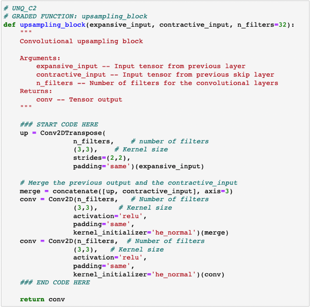</kbd>

 

<kbd>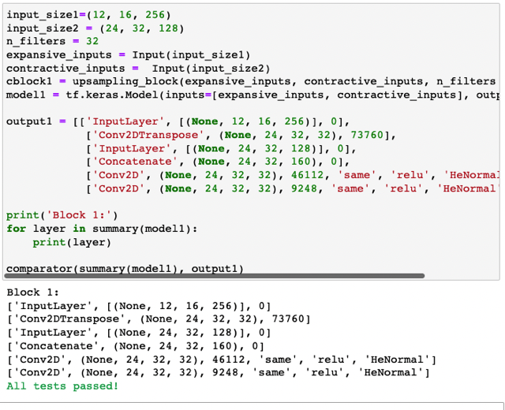</kbd>

 

#### 3.4 - Build the Model

 

<kbd>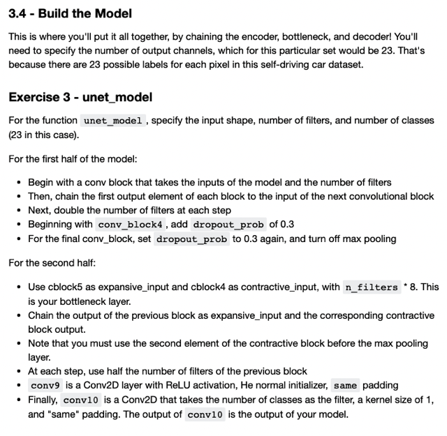</kbd>

 

#### Exercise 3 - unet_model

 

<kbd></kbd>

<kbd>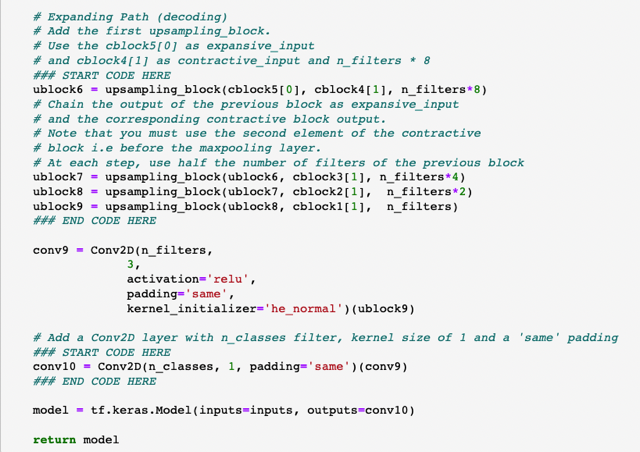</kbd>

<kbd>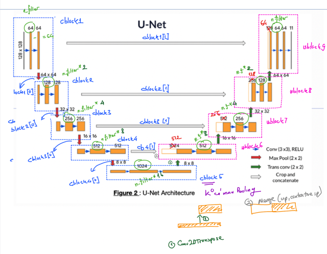</kbd>

 

<kbd></kbd>

 

#### 3.5 - Set Model Dimensions

 

<kbd>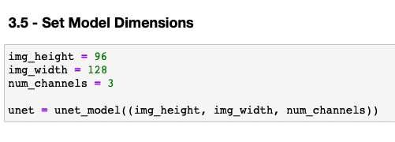</kbd>

 

<kbd></kbd>

 

<kbd>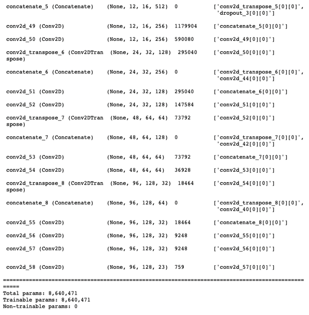</kbd>

 

#### 3.6 - Loss Function: SparseCategoricalCrossentropy

 

<kbd></kbd>

> [!NOTE]
> Đại khái là mỗi pixel là 1 vector 11 dimensions (do có 11 classes)
> và gía trị mỗi item trong vector là class probabilities của pixel đó.

 

<kbd>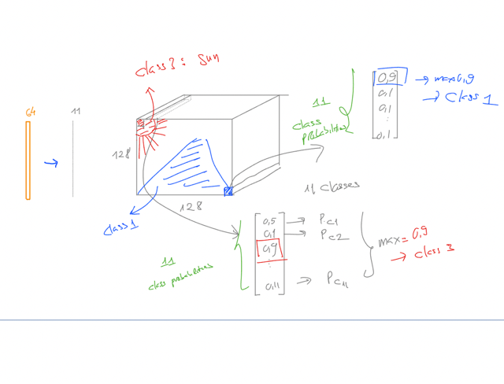</kbd>

> [!NOTE]
> Output 128x128x11

 

> [!NOTE]
> 3.7 - Dataset Handling: Display input
> image và true-mask (đại khái là cái y) hình
> có segmentation dùng để train và y^ muốn
> đạt được

 

<kbd></kbd>

 

<kbd>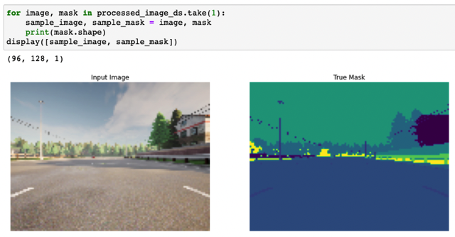</kbd>

 

#### 4 - Train the Model

 

<kbd></kbd>

 

#### 4.1 - Create Predicted Masks

 

<kbd>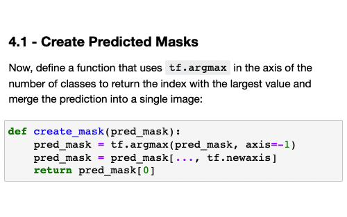</kbd>

> [!NOTE]
> Đại khái là bước này nó sẽ xác định cái class
> của từng pixel thuộc về đây, dùng argument max

 

#### 4.2 - Plot Model Accuracy

 

<kbd>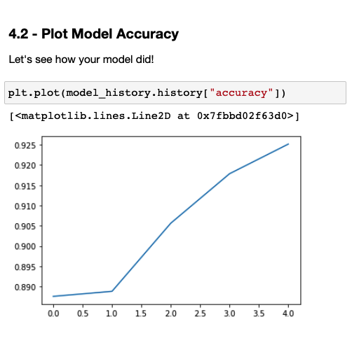</kbd>

 

#### 4.3 - Show Predictions

 

<kbd></kbd>

 

<kbd></kbd>

 

<kbd>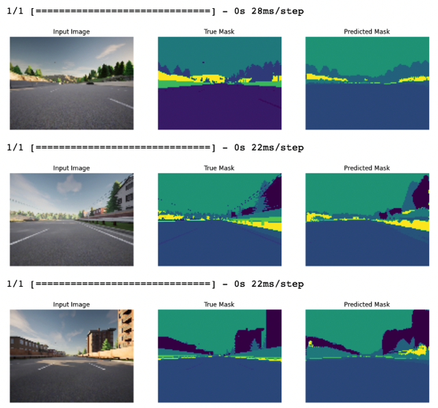</kbd>

 

> [!NOTE]
> Conclusion You've come to the end of this assignment. Awesome work
> creating a state-of-the art model for semantic image segmentation! This is a
> very important task for self-driving cars to get right. Elon Musk will surely be
> knocking down your door at any moment. ;)
>
> What you should remember:
>
> - Semantic image segmentation predicts a label for every single pixel in an
> image
> - U-Net uses an equal number of convolutional blocks and transposed
> convolutions for downsampling and upsampling
> - Skip connections are used to prevent border pixel information loss and
> overfitting in U-Net

 

