# C5w1_recurrent Neural Networks

📊 **Progress:** `99` Notes | `165` Screenshots

---

## C5w1_recurrent Neural Networks

 

## Why Sequence Models?

 

<kbd></kbd>

 

## Notation

 

> [!NOTE]
> 1 Sequence models have a wide range of applications, such as **Named-entity
> recognition**, which is used to find entities such as people's names, company
> names, times, locations, countries, and currency names in different types of text.
>
> 2 A sequence model operates on an **input sequence of features** (words) and
> produces an **output sequence of targets** (labels).
>
> 3 The input sequence can be represented as x with the **superscripts** <1> to <9> to index
> the **different positions**. Similarly, the output sequence can be represented as y with
> the superscripts 1 to 9.
>
> 4 **T(x)** is used to denote the **length of the input sequence**, and **T(y)** is used to
> denote the **length of the output sequence**.
>
> 5 The individual words in the sentence can be **represented** by a dictionary of
> words. A vocabulary is created by making a list of the words to be used in the
> representation.
>
> 6 **Dictionary sizes can vary depending on the application**. For example, 30,000
> to 50,000 is common for commercial applications, and some large internet
> companies use dictionary sizes of a million words or more.
>
> 7 One way to create a dictionary is to **find the top occurring words in the training
> set and some online dictionaries**.

 

<kbd>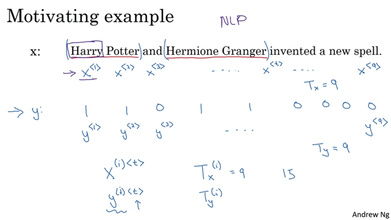</kbd>

> [!NOTE]
> Đại khái là "bây giờ" : 
> - Bài toán **named-entity recognition** kiểu như cho 1 câu, chỉ ra từ nào
> là tên riêng thì label = 1, từ nào không phải thì label là 0
>
>
>
> - Mỗi data sample x (i) sẽ là **1** **chuỗi (sequence) features** kí hiệu thứ tự dùng <> 
>
>
>
> - Output cũng sẽ là **1 chuỗi labels Ty(i)**
>
>
>
> - Mỗi data sample x (i) sẽ có chiều dài chuỗi là **Tx (i)**

 

<kbd></kbd>

> [!NOTE]
> Đại khái là dựa vào 1 bộ dictionary, mỗi "element" của chuỗi x (i) sẽ
> được biến thành 1 **one-hot encoder vector** trong đó:
>
>
>
> Vị trí số 1 sẽ là vị trí của "từ" / element trong dictionary, còn lại số 0 hết

 

## Recurrent Neural Network Model

 

> [!NOTE]
> 1 In the previous video, sequence learning problems were defined using
> a specific notation.
>
> 2 Using a **standard neural network** for learning the mapping from x to
> y does not work well due to **different input and output lengths** and
> **the inability to share learned features across** **different positions** of
> texts.
>
> 3 **Recurrent Neural Networks (RNNs)** are a solution that address the
> disadvantages of a standard neural network by **passing on information
> from previous time steps** and **sharing parameters across all time
> steps.**
>
> 4 A diagram of a simple RNN was presented, which shows how the
> network scans through the data from left to right, with the same set of
> parameters being used at each time step.
>
> 5 The parameters of the RNN, which include **Wax**, **Waa**, and **Wya**, were
> discussed.

 

<kbd>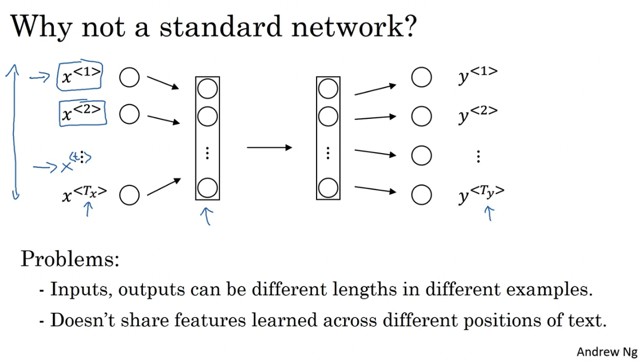</kbd>

> [!NOTE]
> Đại khái là nếu dùng N.N thông thường thì gặp những nhược điểm:
>
>
>
> - Chiều dài mỗi câu mỗi khác 
>
>
>
> - Không 'học' / nắm bắt được sự liên quan giữa các từ ở các
> vị trí khác nhau

 

<kbd></kbd>

> [!NOTE]
> Đại khái là như sau:
>
>
>
> Mỗi một "từ" x<i> sẽ được 'learn' bởi network layer để map với y^<i>
> Bài cuối sẽ nói đến Deep RNN - ta có nhiều layer hơn.
>
>
>
> Nhưng đồng thời cũng pass output a<i> cho từ kế tiếp: Đại khái là
> bằng cách này **một 'từ' sẽ được 'học' bởi cả những từ trước đó
> nữa**.
>
>
>
> Và sẽ có **Bidirectional Recurrent NN** trong đó một từ sẽ được học
> cả những từ sau nó.
>
>
>
> Các layer của từng từ sẽ **share chung params Wax, và Waa**
>
>
>
> Một số paper hay sách mô tả RNN theo kiểu rút gọn
>
>
>
> Đây là đ/v Tx = Ty, có thể Tx != Ty thì sẽ nói sau

 

<kbd></kbd>

> [!NOTE]
> Đại khái là
>
>
>
> Tính a từ x thì là Wax, tính a từ y thì là Way, tính y từ a thì Wya
>
>
>
> TÍnh a thì thường dùng reLU hay TanH
>
>
>
> Tính y thì tuỳ vào yêu cầu có thể là sigmoid

 

<kbd>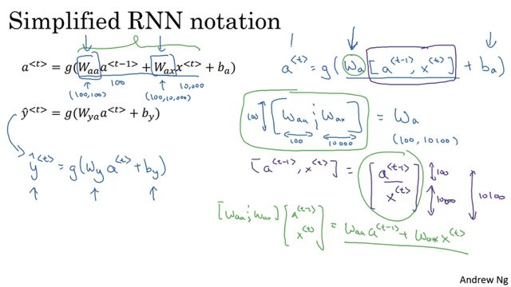</kbd>

> [!NOTE]
> Đại khái là gom Waa và Wax (stack together) lại cho gọn thành Wa
> và [a<t-1> | x<t>] (cũng là stack hai cái đó lại)
>
>
>
> thì 2 phép tính là như nhau

 

## Backprop Through Time

 

> [!NOTE]
> 1 **Backpropagation** in a recurrent neural network (RNN) is
> essential for updating the network's parameters using gradient
> descent.
>
> 2 The backpropagation algorithm in RNN is carried out in the
> opposite direction of the forward propagation calculations.
>
> 3 The loss function is essential for computing the loss for a
> particular word in the sequence, which is necessary to compute
> the overall loss for the entire sequence.
>
> 4 **Backpropagation through time** is the name given to the
> recursive calculation that goes from right to left in the RNN
> architecture.
>
> 5 RNN architecture can be used for a wide range of applications
> beyond the motivating example where the length of the input
> sequence was equal to the length of the output sequence.

 

<kbd>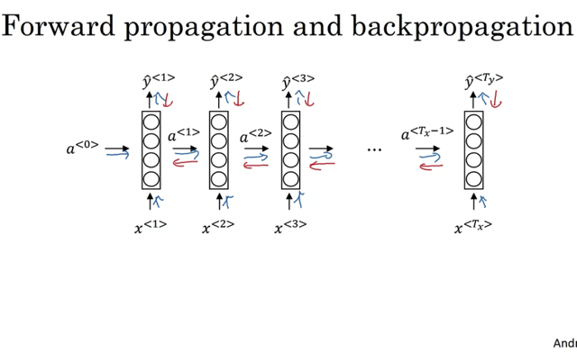</kbd>

 

<kbd>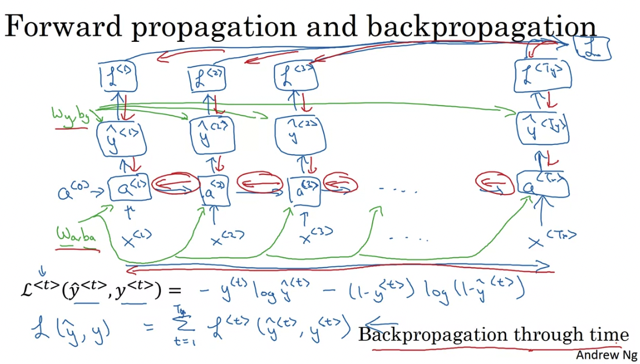</kbd>

> [!NOTE]
> Đại khái tính loss cho 1 sample x(i) là tổng loss của các item
> trong sequence x(i)<1>, x(i)<2>...,x(i)<Tx>
>
> Ở đây đại khái phải hiểu là vì ta đang solve bài toán gọi
> là Name Entity gì đó trong đó mục tiêu là xác định các
> từ trong câu có phải là tên riêng hay không (yes or no)
> -> Nên y<i> chỉ hai gía trị binary 1 | 0 nên bài toán này
> giống như **binary classification**. Nói vậy để hiểu tại
> sao dùng hàm loss function y như của Logistic
> Regression  (có tên là **Log Loss**)
>
>
>
> Nếu y có thể mang nhiều giá trị hơn (thay vì 1 | 0) thì
> loss function sẽ là **Softmax**

 

## Difference Types Of Rnns

 

> [!NOTE]
> 1 Introduction to RNN architectures with different input and
> output lengths
>
> 2 Many-to-many architecture with equal input and output
> sequence lengths
>
> 3 Many-to-one architecture with variable-length input sequence
> and single output value
>
> 4 One-to-many architecture for music generation
>
> 5 One-to-one architecture for standard neural network
>
> 6 Many-to-many architecture for variable-length input and
> output sequences, like machine translation.

 

<kbd>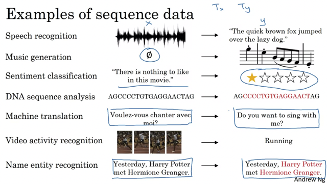</kbd>

 

<kbd></kbd>

 

<kbd></kbd>

 

<kbd>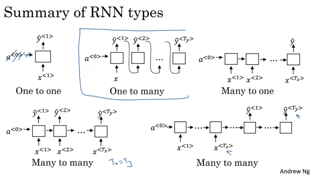</kbd>

 

## Language Model And Sequence Generation

 

> [!NOTE]
> 1 **Language modeling** is a crucial task in natural language processing that
> involves **predicting the probability of a particular sequence of words**.
>
> 2 A language model is used in **speech recognition systems** to identify the
> **probability of a particular sentence**, and it is also used in **machine
> translation** systems to output **only likely sentences.**
>
> 3 To build a language model using an RNN, you need **a training set of a
> large corpus of text**, which you **tokenize** and **map to one-hot vectors** or
> indices in a vocabulary.
>
> 4 An e**nd-of-sentence token** can be appended to every sentence in the
> training set to capture the end of a sentence.
>
> 5 The RNN model estimates the **probability of different sequences** by setting
> the inputs x^t to be equal to y of t minus 1.

 

<kbd></kbd>

> [!NOTE]
> Này là bài toán khác, hồi nãy là N**ame Entity Recognition** -
> Xác định từ trong câu là name hay không phải name. Còn cái
> này là xác định **từ trong câu là từ gì**.
>
>
>
> Ví dụ như input là một đoạn thu âm: Thì mục tiêu của bài
> toán này kiểu như nó tính ra:
> - Khả năng audio này này là câu "The apple ...pair salad" là
> bao nhiêu.
> - Khả năng audio này này là câu "The apple ...pear salad" là
> bao nhiêu.
>
>
>
> Từ đó quyết định kết quả là câu có P cao hơn.

 

<kbd>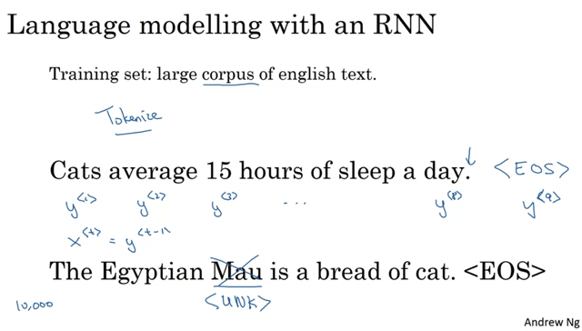</kbd>

> [!NOTE]
> Training set cho cái này là 1 **corpus**: 1 set rất lớn câu tiếng Anh
> chẳng hạn
>
>
>
> Tokenize: Biến mỗi từ thành 1 one-hot vector (sử dụng một bộ dictionary)
> ví dụ 'cat' -> [0 0 ...0 1 0 ...0] số 1 tại vị trí tương ứng với chữ 'cat'
> trong dictionary
>
>
>
> Thường thường ta thay add 1 extra token <EOS> = End of sentence
> vào cuối câu để biểu thị kết thúc câu
>
>
>
> Có thể bỏ dấu . / ? vào từ điển nếu muốn tokenize dấu chấm câu.
>
>
>
> Từ không có trong từ điển thì tokenize bằng <UKN>

 

<kbd></kbd>

> [!NOTE]
> Đại khái là bắt đầu với từ đầu tiên trong sequence - x<i>
> Nó sẽ dùng Softmax với 10000 unit (hay 10002 nếu có thêm UKN và EOS 
> Token) để tính các **probability** từ từ này (x<1>) là
> lần lượt là các từ trong dictionary là bao nhiêu,
>
>
>
> Ví dụ cho dễ hiểu hơn:
>
>
>
> Probability từ x<1> là từ 'a' - P(a) là bao nhiêu?
> Probability từ x<1> là từ 'aaron' - P(aaron) là bao nhiêu?
> ...
> Probability từ x<1> là từ 'cat' - P(cat) là bao nhiêu?
> ...
> Probability từ x<1> là từ 'zulu' - P(zulu) là bao nhiêu?
>
>
>
> -> y^<1> là vector: [P(a) P(aaron) ...P(cat) ...P(zulu)]
>
> X<1> = vector 0 là sao chưa hiểu lắm - Có thể là
> initialization -> Đúng là vậy, initialize nó bằng np.
> zeros() chứ không có gì khó hiểu hết. a_0 cũng vậy

 

<kbd>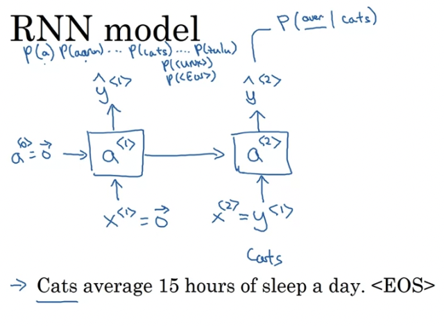</kbd>

> [!NOTE]
> Tiếp theo để tính toán đ/v từ thứ 2 ta...
>
>
>
> - Bỏ vào x<2> chính là y<1> - Đại khái cho nó biết là đáp án đúng của 
> từ trước nó là từ gì (Ở đây là 'cat')
>
>
>
> - Bỏ vào a<1>
>
>
>
> để tương tự với tính [P(a) P(aaron) ...P(average)...P(zulu)]

 

<kbd>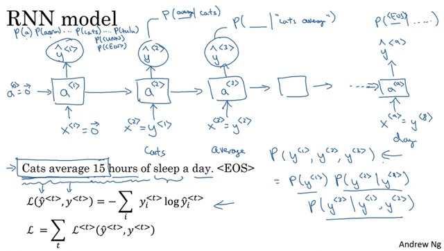</kbd>

> [!NOTE]
> Làm tương tự với từ thứ <t>....đến hết.
> Xong define **L đối với mỗi time step** (đại khái là mỗi lần train 1 từ trong
> sequence) là tổng Loss trên các training data tại time step đó.
>
>
>
> Và vì y có thể có nhiều giá trị chứ không chỉ 1 | 0 nên hàm loss
> là hàm **Cross Entropy**
>
>
>
> Và Cost hay Loss tổng là **tổng Loss trên mọi time step**

 

<kbd></kbd>

> [!NOTE]
> Ở đây đại khái là cho một new sentence y<1> y<2> y<3> ta
> sẽ tính ra **khả năng mà chuỗi này gì ("**/you can figure
> out what is the chance of this entire sentence would be")
>
>
>
> /bằng cách nhân 3 cái probabiitiy sau lại
> "what's the chance of y_1," 
> "what's the chance of y_2, given y_1,"
> "what's the chance of y_3, given y_1, y_2,"

 

## Sampling Novel Sequences

 

> [!NOTE]
> 1 Sampling novel sequences is a way **to informally get a sense
> of what is learned** in a sequence model.
>
> 2 To sample novel sequences, you first sample the first word,
> then use the softmax distribution to **randomly sample the next
> word** and so on until the end of the sentence or a
> predetermined number of words is reached.
>
> 3 If the sequence model is built on a word-level vocabulary,
> each y1, y2, y3,... represents a word, but if it is built on a
> character-level vocabulary, each y1, y2, y3,... represents a
> **character**.
>
> 4 Building a character-level language model has pros and cons,
> such as being able to assign a probability to any sequence of
> characters, but having longer sequences and being more
> computationally expensive to train.

 

<kbd>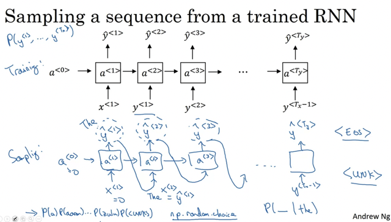</kbd>

> [!NOTE]
> Đại khái là vầy: 
>
>
>
> Mục đích của cái này là **XEM THỬ sequence model nó học được gì**
>
>
>
> Ví dụ từ thứ nhất, nó tính ra vector này  (tạm gọi là
> probability vector của từ thứ nhất): [P(a), P(Aaron),....P(Zulu)] đại khái như
> đã hiểu là nó chứa các thông số thể hiện "Probability mà từ đầu tiên trong
> sequence này LÀ lần lượt các từ trong dictionary list)
>
>
>
> Bỏ vector này np.random.choice() -> y^<1>: Đại khái mình hiểu là nó sẽ **lấy
> randomly nhưng theo xác xuất quy định bởi probability vector**
>
>
>
> Sau khi huấn luyện một mô hình chuỗi, một trong các cách bạn có thể làm
> quen với những gì đã học là bằng cách tạo ra các chuỗi mới. Đầu tiên, bạn
> cần chọn từ đầu tiên để mô hình tạo ra. Bạn sẽ sử dụng hàm softmax để
> chọn từ tiếp theo **dựa trên xác suất**. Sau đó, bạn **sử dụng từ vừa chọn
> để tạo ra từ tiếp theo bằng cách truyền nó vào mô hình**. Tiếp tục lặp lại quá
> trình này cho tới khi đủ số lượng từ hoặc tạo ra từ kết thúc câu nếu trong từ
> điển của bạn có từ kết thúc câu. Nếu mô hình của bạn tạo ra một từ không
> xác định, bạn có thể lựa chọn tạo lại từ khác hoặc giữ nguyên từ đó trong
> đầu ra.
>
>
>
> Training thì input của từ này là label của từ trước đó x<i> = y<i-1> còn
> sampling  thì input là random sampling with distribution của từ trước đó,

 

<kbd></kbd>

> [!NOTE]
> Đại khái là có thể thay 'Word model" bằng "Character model"
> trong đó đại khái là nó ở cấp 'character' thay vì 'word'
>
>
>
> Pros là nó không bị trường hợp <Unknown> word Cons là nó
> tạo ra sequence dài hơn rất nhiều bới 1 từ có vài kí tự dẫn đến
> 'computational expensive' hơn và cần nhiều data hơn
>
>
>
> Ở cấp ký tự thì **không 'nắm bắt' được sự liên hệ** như giữa
> các từ trong 1 câu

 

<kbd></kbd>

> [!NOTE]
> Ví dụ của cái này, đại khái là nó tạo ta những
> content có phong cách giống giống

 

## Vanishing Gradients With Rnns

 

> [!NOTE]
> 1 Introduction to RNNs and their applications to **language modeling**
> and **name entity recognition**.
>
> 2 The problem of **vanishing gradient** in the basic RNN algorithm.
>
> 3 Explanation of the **vanishing gradien**t problem and its impact on the
> RNN's **ability to capture long-term dependencies**.
>
> 4 Comparison between the local and global influence of the RNN
> model's output and input on the computation.
>
> 5 **Difficulty** of getting the neural network to **memorize** and use the
> **relevant information from earlier in the sequence.**
>
> 6 Discussion of the solution to the vanishing gradient problem with
> **GRUs**, which will allow the neural network to **capture longer-range
> dependencies.**
>
> 7 **Exploding gradient problem** and the solution of **gradient clipping.**
>
> 8 The significance of the vanishing gradient problem in training RNNs
> over a **large number of time steps**, which can be **equivalent** to training
> a v**ery deep neural network**.

 

<kbd></kbd>

> [!NOTE]
> Nói chung đại khái là nói về những thách thức của basic
> RNN:
> **-** **Gradient Vanishing**: Qua nhiều time-step, gradient bị vanish
> giống giống như train một N.N rất deep - nhiều layer.
>
>
>
> **- Vấn đề không 'nhớ' được** rằng lúc đầu là they - số nhiều để
> sau phải dùng were.
>
>
>
> **- Gradient exploding** thì ít gặp hơn và có cách xử bằng 
> **Gradient Clipping** còn G.V thì khó nhận biết và xử lý hơn.

 

## Clarifications

 

<kbd>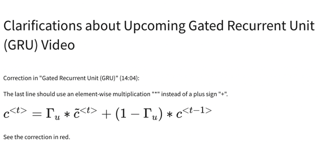</kbd>

 

<kbd>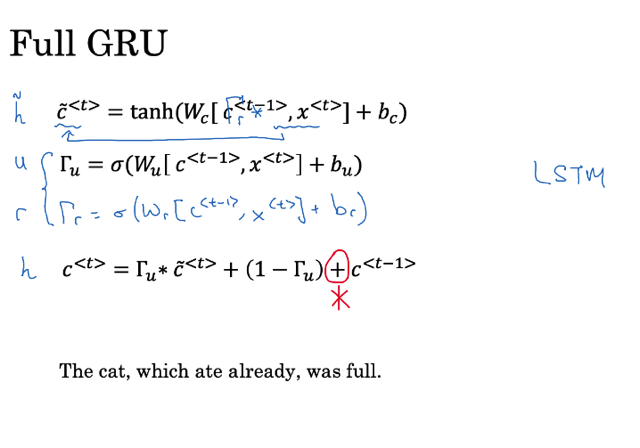</kbd>

 

## Gated Recurrent Unit (gru)

 

> [!NOTE]
> 1 Gated Recurrent Units (GRUs) are modifications to the basic RNN hidden
> layer that allow for **better capturing of long-range connections** and **addressing
> vanishing gradient** problems.
>
> 3 The GRU unit involves a **memory cell (C) that provides memory for previous
> inputs**, allowing the network to **remember relevant information for long-range
> connections**.
>
> 4 At each time step, **a candidate value (C~t)** is computed for **potentially
> overwriting the memory cell value (C_t)** using an activation function (tanh)
> applied to the previous memory cell value, current input, and weight and bias
> parameters.
>
> 5 The update gate (**Gamma_u**) **determines whether the candidate value is used to
> update the memory cell value**. It is a **value between 0 and 1**, often computed using
> a **sigmoid** function.
>
> 6 The gate allows the network to **decide when to update the memory cell value**,
> **based on the relevance of the current input to long-range connections**.
>
> 7 **The key equation for the GRU involves combining the candidate value and
> previous memory cell value with the gate value to determine the updated memory
> cell value.** 
>
> 8 The gate is an important component of the GRU and can be thought of as a way
> to decide whether to update the memory cell value based on the relevance of the
> current input.
>
> 9 The GRU was developed by Junyoung Chung, Caglar Gulcehre, KyungHyun
> Cho, and Yoshua Bengio, who published two papers on the topic. [1]
>
> 10 The GRU unit is designed to **allow the network to remember important
> information from previous inputs and use it to better capture long-range
> connections** in sequences of data. [1]

 

<kbd></kbd>

> [!NOTE]
> Minh hoạ 1 RNN unit: Đại khái là lấy activation của previous time-step
> và current input để tính ra activation của unit.
>
>
>
> The formula for computing the activations of an RNN unit involves the
> **activation function applied to the previous activation** and the **current
> input**, passed through some **weights** and a **bias**. This can be
> represented visually as a box with inputs for a previous time step and
> current input, and output activation.

 

<kbd></kbd>

> [!NOTE]
> Tạm thời chưa hiểu (nó work như thế nào) nhưng quan trọng phải
> nhớ những notation này:
>
>
>
> Đại khái có khái niệm C là **memory cell**: Sẽ giúp network **nhớ
> được thông tin cần thiết / liên quan cho những mối liên hệ xa
> (giữa các unit)**
>
>
>
> Đại khái C<t> = a<t>
>
>
>
> Đại khái C~<t> là candidate để thay cho C<t>
>
>
>
> Đại khái gamma u có vai trò để quyết định có update value của C
> hay là không dựa trên: (/**t\_he relevance of the current
> input**/\_???)
>
>
>
> Gamma u tính bằng Sigmoid nên đại khái là most of the time nó
> sẽ có value ~= 1 hoặc ~=0.
>
> Chưa hiểu:
> Nó work như thế nào.
> Taị sao nó lại giúp khắc phục vấn đề Gradient Vanishing
>
> Mục đích của GRU là khắc phục vấn đề Gradient Vanishing và nắm
> bắt được mối quan hệ long-range của các unit trong sequence
>
> 1 **Gated Recurrent Units (GRUs)** are **modifications to the basic RNN**
> hidden layer that allow for **better capturing of long-range connections** and
> **addressing vanishing gradient** problems.
>
>
>
> 3 The GRU unit involves a **memory cell (C)** that **provides memory for
> previous inputs**, **allowing the network to remember relevant information for
> long-range connections.**
>
>
>
> 4 At each time step, **a candidate value (C~t)** is computed for **potentially
> overwriting the memory cell value (C_t)** using an activation function (tanh)
> applied to the previous memory cell value, current input, and weight and bias
> parameters. [1]
>
>
>
> 5 The **update gate (Gamma_u)** **determines whether the candidate value is
> used to update the memory cell value**. It is a value between 0 and 1, often
> computed using a sigmoid function. [1]
>
>
>
> 6 /**The gate allows the network to decide when to update the memory cell
> value, based on t\_he relevance of the current input\_ to long-range
> connections**./
>
>
>
> 7 The key equation for the GRU involves combining the **candidate value** and
> **previous memory cell value** with the **gate value** to **determine the updated
> memory cell value**.
>
>
>
> 8 The gate is an important component of the GRU and can be thought of as **a
> way to decide whether to update the memory cell** value **based on the
> relevance of the current input.**
>
>
>
> 9 The GRU was developed by Junyoung Chung, Caglar Gulcehre, KyungHyun
> Cho, and Yoshua Bengio, who published two papers on the topic. [1]
>
>
>
> 10 The GRU unit is designed to **allow the network to remember important
> information from previous inputs** and use it to better **capture long-range
> connections in sequences of data**. [1]
>
> **"the relevance of the current input"**: Hiểu đại khái là nếu input x
> tại một unit nào đó có ảnh hưởng đến các unit ở xa hơn (long
> range connection) thì nó sẽ được giữ lại và tính toán sau này (ví dụ
> như They và were vậy

 

<kbd>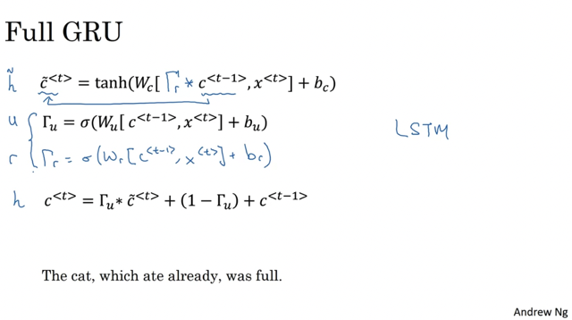</kbd>

> [!NOTE]
> Full version có thêm Gammar r trong công thức tính c~

 

## Clarification

 

<kbd></kbd>

 

## Long Short Term Memory

 

> [!NOTE]
> 1 GRU (Gated Recurrent Unit) and LSTM (Long Short-Term Memory) units are used
> to learn long-range connections in a sequence.
>
> 2 LSTM is **more powerful** than GRU.
>
> 3 LSTM has three gates: **forget gate**, **update gate**, and **output gate**.
>
> 4 The equations governing the behavior of LSTM include a candidate value for
> updating the memory cell and the memory cell itself.
>
> 5 The forget gate in LSTM allows the memory cell to **keep or discard the old value**.
>
> 6 The update gate in LSTM **adds the new value to the memory cell**.
>
> 7 The output gate in LSTM **controls the information flow from the memory cell**.
>
> 8 LSTMs can be **hooked up in parallel** to pass information for a long time.
>
> 9 LSTMs and GRUs are **good at memorizing certain values for a long time**.

 

<kbd>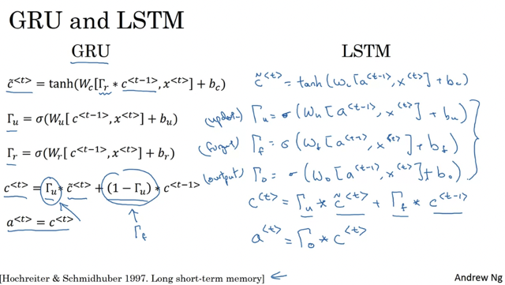</kbd>

> [!NOTE]
> - Không còn cho c<t-1> bằng a<t-1> nên dùng a<t-1> trong tính c~<t>
> và Gamma u
>
>
>
> - Có thêm Gamma f - Forget và thay cho 1-Gamma u trong công thức tính c<t>
>
>
>
> - Có thêm Gamma o - Output để tính a<t> (không còn cho rằng a<t>
> luôn bằng c<t>)

 

<kbd></kbd>

 

<kbd>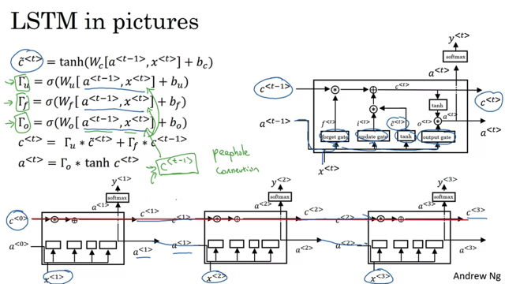</kbd>

> [!NOTE]
> One interesting property of the LSTM is that it is very good at
> memorizing certain values for a long time. This is because, as shown
> in the video, multiple LSTMs can be connected in parallel and
> passed through time, allowing values to be passed from one LSTM
> to another.
>
>
>
> **Đại khái là các unit nối lại bằng thêm một đường màu đỏ cho phép
> thông tin được giữ lại và pass đi xuyên suốt.**
>
>
>
> Overall, the LSTM is a powerful type of RNN that is able to learn
> l**ong-term dependencies** in sequences. Its equations are **more
> complex** than those of the GRU, but its multiple gates give it more
> **flexibility** and **control** over which information to remember and which
> to forget.
>
>
>
> **Nói chung LSTM phức tạp nhưng linh hoạt hơn còn GRN đơn giản
> nhưng cho phép scale up tốt hơn**
>
> Có thể có một phiên bản
> khác (variation) **Peephole Connection** ...

 

## Bidirectional RNN

 

> [!NOTE]
> 1 Introduction of two more ideas to build more powerful models in
> RNN.
>
> 2 Bidirectional RNN addresses the **problem of not having enough
> information from past and future** to predict a label for a word.
>
> 3 The forward and backward recurrent components in bidirectional
> RNN work cyclically to compute network activations.
>
> 4 **Bidirectional** RNN with LSTM blocks is commonly used in NLP
> problems to label things in a sentence.

 

<kbd></kbd>

 

<kbd></kbd>

> [!NOTE]
> - Đại khái là có thêm 1 chiều Backward nữa (nhưng không phải là Back
> Prop mà vẫn là Forward Prop)
>
>
>
> - Đại khái nó giúp lấy thông tin từ những unit sau cho việc Predict
> những cái ở đầu giúp giải quyết vấn đề là có những thứ phải cần thêm
> thông tin ở sau mới biết được ví dụ như câu He said Teddy Roosevelt,.
> .. Trong đó chữ Teddy cần thêm ngữ cảnh phía sau để xác định là tên
> ông Tổng thống chứ không phải gấu Teddy
>
> - Lúc sau ổng có nói là cái này bắt buộc phải thu hết toàn bộ
> Vd như nói xong hết thì mới xử lý, nên cái nào có thể thoả mãn
> yêu cầu này thì BRNN rất hiệu quả còn cần real-time thì phải có 
> n.n kiểu khác.

 

## Deep Rnns

 

> [!NOTE]
> 1 **Stacking** multiple layers of RNNs together can create even deeper and
> more complex models for learning very complex functions.
>
> 2 A deep RNN is created by **unrolling a standard RNN in time and stacking
> the layers on top of each other.**
>
> 3 The notation used for deep RNNs is **a[l]** to denote the activation associated
> with layer l and <t> to denote the time associated with the activation.
>
> 4 A deep RNN can have **multiple recurrent layers that are connected in time**,
> f**ollowed by a deep network that predicts the output**.
>
> 5 Deep RNNs can also use different recurrent units such as **GRU** and **LSTM**
> blocks.
>
> 6 Deep RNNs can be **computationally expensive** to train, and because of the
> temporal dimension, having just a **few layers** can already create a large
> network.
>
> 7 With the basic RNN, GRU, LSTM, bidirectional RNN, and deep versions of
> these models, one can **construct powerful models** for learning sequence
> models.

 

<kbd>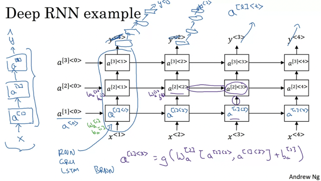</kbd>

> [!NOTE]
> - Đại khái là có thêm nhiều layer hơn, cũng dễ hiểu.
>
>
>
> Người ta thường không quá 3 layer vì cái này nó rất lớn, không như
> Standard N.N.
>
>
>
> Và có thể từ layer 3 trở đi nó đi thêm vài bước nữa những  nó không có
> kết nối ngang
>
>
>
> (/A deep RNN can have multiple recurrent layers that are connected in
> time, followed by a deep network that predicts the output/.)

 

## Quiz

 

<kbd></kbd>

 

<kbd></kbd>

 

<kbd></kbd>

 

<kbd>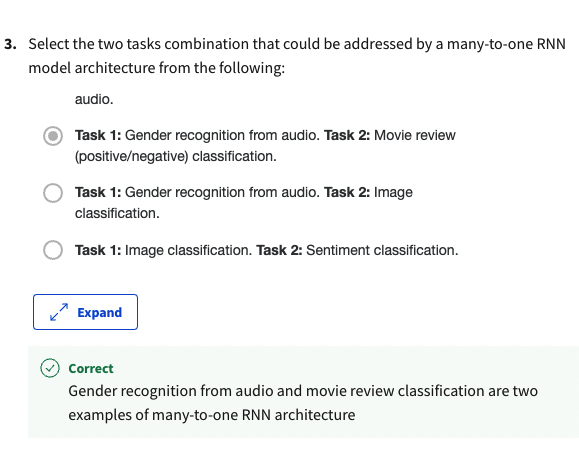</kbd>

 

<kbd>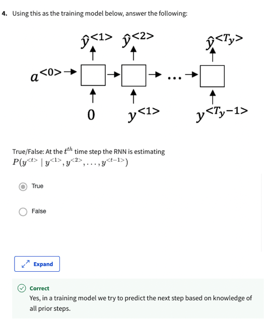</kbd>

 

<kbd>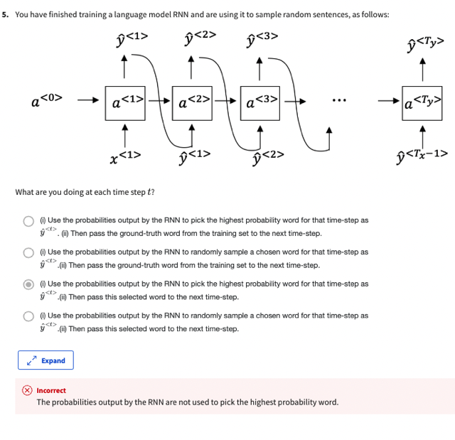</kbd>

> [!NOTE]
> Này đáng lý không nên sai, phải là dùng probability nhưng phải là chọn
> random (randomly sample) chứ không phải là lấy thằng có prob cao nhất.

 

<kbd></kbd>

 

<kbd>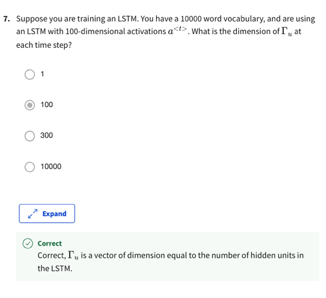</kbd>

> [!NOTE]
> Đoán bừa hên là trúng.

 

<kbd></kbd>

<kbd>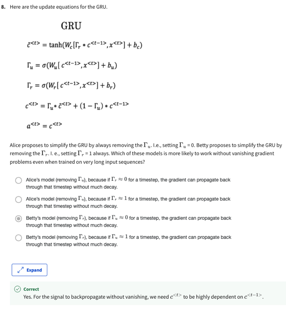</kbd>

> [!NOTE]
> Chua hiểu: muốn C<t> luôn bằng C<t-1> thì Alice đúng chứ

 

<kbd></kbd>

 

<kbd>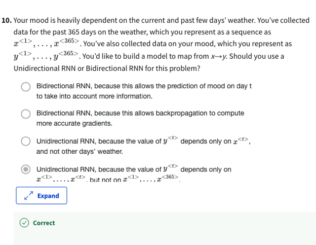</kbd>

 

## Programming Assignments 1

 

> [!NOTE]
> Welcome to the first (required) programming exercise of Course 5 of the
> Deep Learning Specialization! In this notebook you will build a recurrent
> neural network (RNN) and an LSTM from scratch, using Numpy.
>
> By the end of this assignment, you'll be able to:  • Define notation for
> building sequence models  • Describe the architecture of a basic RNN  •
> Identify the main components of an LSTM  • Implement backpropagation
> through time for a basic RNN and an LSTM  • Give examples of several
> types of RNN
>
> Recurrent Neural Networks (RNN) are very effective for Natural Language
> Processing and other sequence tasks because they have "memory." They
> can read inputs  𝑥 ⟨𝑡⟩ (such as words) one at a time, and remember some
> contextual information through the hidden layer activations that get
> passed from one time step to the next. This allows a unidirectional
> (one-way) RNN to take information from the past to process later inputs. A
> bidirectional (two-way) RNN can take context from both the past and the
> future, much like Marty McFly.

 

#### Packages

 

<kbd>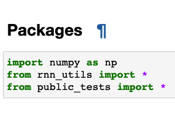</kbd>

 

> [!NOTE]
> 1 - Forward Propagation for the Basic
> Recurrent Neural Network

 

> [!NOTE]
> 1 - Forward Propagation for the Basic
> Recurrent Neural Network:  Xem lại sơ đồ
> của Basic RNN với Tx = Ty

 

<kbd></kbd>

 

<kbd>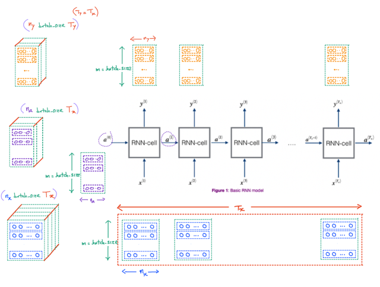</kbd>

> [!NOTE]
> a và y^ cũng vậy,

 

> [!NOTE]
> Dimensions: Kích thước các thứ
>
> x(i) sẽ là (n_x, m, Tx)   x(i)<t> = xt là
> (n_x,m) a: (n_a, m) Y: (n_y, m, Ty)

 

<kbd>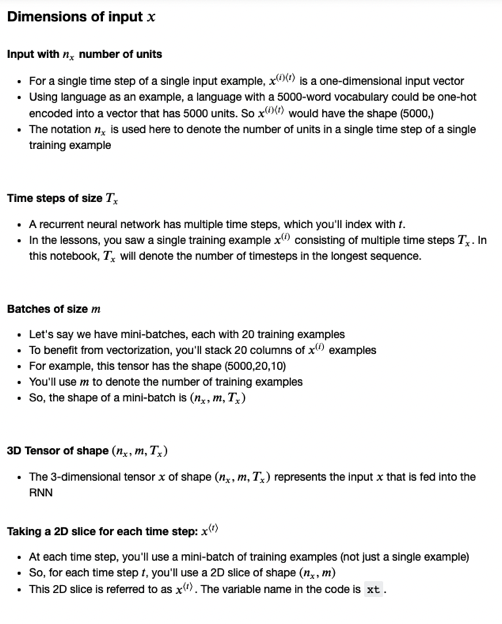</kbd>

> [!NOTE]
> Mỗi một **x(i)<t>** (ví dụ một word) trong sequence (ví dụ câu) sẽ
> được ' encoded' thành một encoding vector có thể là **one-hot
> encoded vector** trong đó số 1 tại vị trí của từ vocab list hoặc là
> một **dense embedded vector** - vector chứa đựng nhiều thông tin
> hữu ích về đặc tính của từ và quan hệ của nó đ.v các từ khác hơn
> là one-hot encoded vector được training từ một Word Embedded
> Model (đây là những cái học trong week 2, 3).
>
>
>
> Nên **nx** ở đây là chỉ độ dài của encoded/embedded vector này
>
>
>
> Do đó thì 1 data instance / sample x(i) sẽ có shape (Tx, nx) (Hay
> nx, Tx - thứ tự không quan trọng)
>
>
>
> Tx sẽ là **độ dài của câu (sequence) dài nhất**, các câu ngăn hơn
> sẽ được  **padding** (học trong w2,3)
>
>
>
> Và toàn bộ (m) X sẽ là **(nx, m, Tx)** gọi là **3D Tensor**
>
>
>
> Hoặc một batch_size sẽ là **(nx, batch_size, Tx)** 
>
>
>
> Ở đây ổng cho m = batch_size luôn
>
>
>
> Hiểu được như vậy thì input của mỗi time step sẽ là:  (**nx**,
> **batch_size** **= m**)
>
>
>
> *(Ghi chú từ lần review thứ 1)

 

<kbd>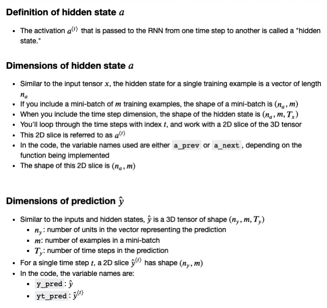</kbd>

 

> [!NOTE]
> 1.1 - RNN Cell: Đại khái là nói về mô hình của
> 1 RNN cell chia ra làm phần ruột tính ra a<t>
> và vần mở rộng (forward) dùng softmax để tính
> thêm y^<t> nhận input từ a<t-1> và x<t>

 

<kbd></kbd>

 

> [!NOTE]
> Exercise 1 - rnn_cell_forward
>
> Nhận a_prev (a<t-1>) và xt , dùng tanh và
> param Waa, Wax, ba tính ra a (a<t) Dùng
> Softmax và Wya, by tính y^. Tạo cach chứa xt,
> a_prev, a, params

 

<kbd>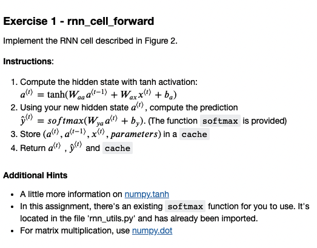</kbd>

 

<kbd>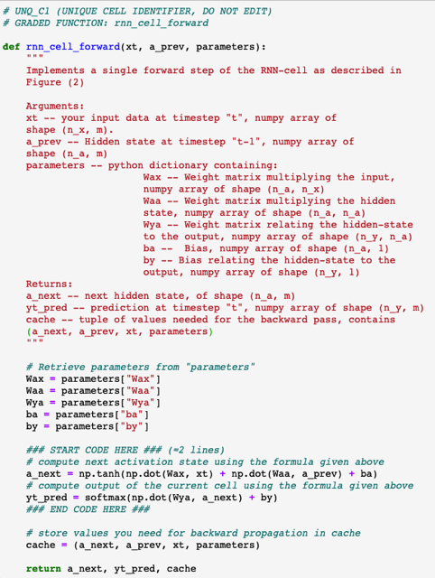</kbd>

 

<kbd></kbd>

 

> [!NOTE]
> 1.2 - RNN Forward Pass: Đại khái xem trực
> quan mô hình  của forward pass RNN như thế
> nào.

 

<kbd>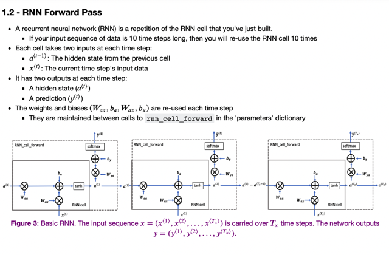</kbd>

 

> [!NOTE]
> Exercise 2 - rnn_forward(x, a0, params)
>
> Ini a = zeros(na,m,Tx) y_pred = zeros(ny,m,Tx)
> Loop: For t in range T_x
> - Lấy ra xt = x[:,:,t]
> - Nếu là t = 0 thì aprev = a0, không thì aprev lấy từ a ra
> - Dùng function rnn_cell_forward(xt, aprev, params) để tính ra a_next, y_pred
> - Update a_next vào a, yt_pred vào y_pred, add cach và caches

 

<kbd></kbd>

 

<kbd>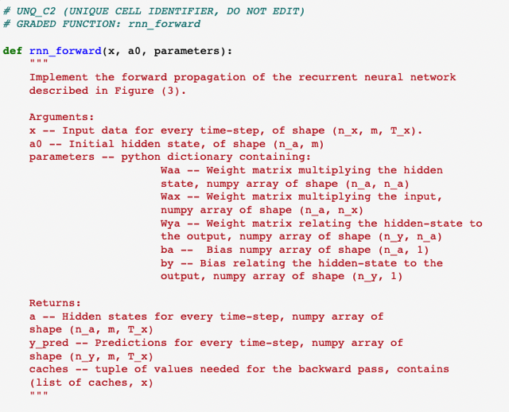</kbd>

<kbd>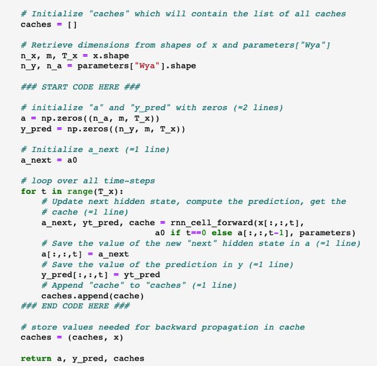</kbd>

<kbd>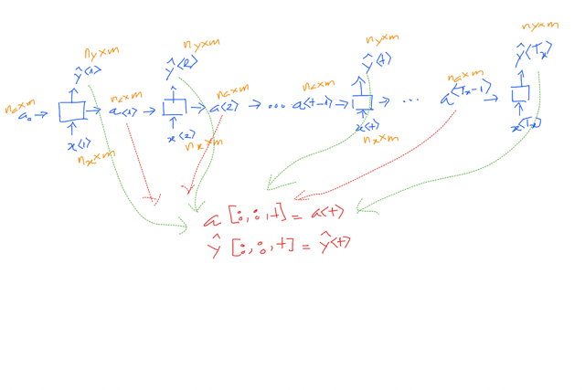</kbd>

 

<kbd></kbd>

 

> [!NOTE]
> Tóm lại một số điều cần nhớ:
>
> Đại khái là RNN cơ bản là lặp lại 1 single cell nhiều lần  Một Basic RNN
> đọc input one at a time và ghi nhớ thông tin xuyên suốt qua các hidden
> layer. Mỗi cell nhận input là hidden state từ cell trước (a_prev) và current
> time data (xt) và trả ra hidden state (a<t>) và y_predict <t>
>
> *Nhưng Basic RNN có nhược điểm là bị Vanishing Gradient và chỉ làm
> việc tốt nếu có local context đại khái là thông tin nó hỗ trợ nằm gần nhau
> chứ không qúa xa. x<t'> hỗ trợ y<t> với t' gần t

 

<kbd></kbd>

 

> [!NOTE]
> 2 - Long Short-Term
> Memory (LSTM) Network

 

> [!NOTE]
> 2 - Long Short-Term Memory (LSTM) Network
>
> Đại khái là Trình bày lại 'mô hình' của LSTM network
> cùng với notation.

 

<kbd></kbd>

 

<kbd>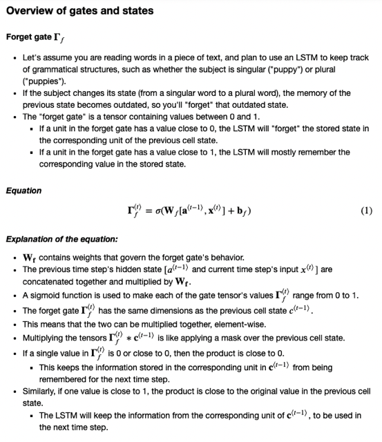</kbd>

> [!NOTE]
> Đại khái là Forget gate này np1 dùng sigmoid để mang 1 trong 2 giá trị 0 hay 1.
>
>
>
> Nó sẽ quyết định thông tin từ c_prev có được giữ lại và dùng cho  step kế tiếp hay
> không.

 

<kbd></kbd>

 

<kbd></kbd>

 

<kbd>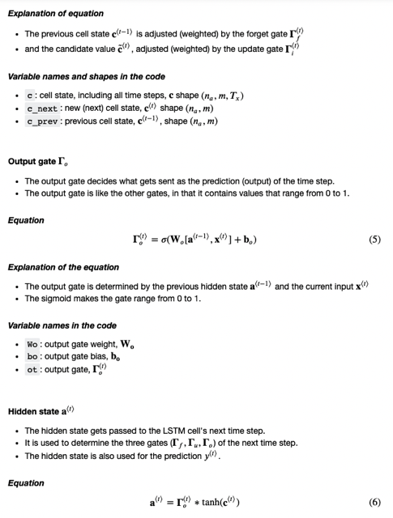</kbd>

 

<kbd></kbd>

 

##### 2.1 - LSTM Cell

 

<kbd></kbd>

 

> [!NOTE]
> Exercise 3 - lstm_cell_forward
>
> Nhận xt, a_prev, c_prev tính giá trị của các 'gate', c~, a_next, yt_pred
> theo công thức

 

<kbd>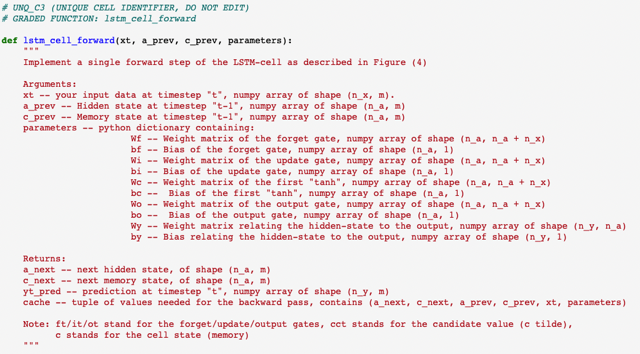</kbd>

<kbd></kbd>

 

##### 2.2 - Forward Pass for LSTM

 

<kbd></kbd>

 

> [!NOTE]
> Exercise 4 - lstm_forward
>
> Ini a, c = zeros(na,m,Tx) y_pred = zeros(ny,m,Tx)
> Loop: For t in range T_x
> - Lấy ra xt = x[:,:,t]
> - Nếu là t = 0 thì aprev = a0, không thì aprev lấy từ a ra
> - Dùng function lstm_cell_forward(xt, aprev, cprev params) để tính ra a_next, y_pred
> - Update a_next vào a, yt_pred vào y_pred, add cach và caches

 

<kbd></kbd>

 

<kbd></kbd>

<kbd></kbd>

 

> [!NOTE]
> **Congratulations!** You have now implemented the forward passes for both the basic RNN and the LSTM.
> When using a deep learning framework, implementing the forward pass is sufficient to build systems that
> achieve great performance. The framework will take care of the rest.  **What you should remember**:
>
> • An LSTM is similar to an RNN in that they both use hidden states to pass along information, but an LSTM
> **also uses a cell state**, which is like a long-term memory, to help deal with the issue of vanishing gradients
>
> • An LSTM cell consists of a \\_**cell state, or long-term memory**\\_, \\_**a hidden state, or short-term memory**\\_, along
> with 3 gates that constantly update the relevancy of its inputs:
>
> ▪ A **forget** gate, which \\_**decides which input units should be remembered and passed along**\\_. It's a tensor
> with values between 0 and 1.
>
> ◦ If a unit has a value close to 0, the LSTM will "forget" the stored state in the previous cell state.
>
> ◦ If it has a value close to 1, the LSTM will mostly remember the corresponding value.
>
> ▪ An **update** gate, again a tensor containing values between 0 and 1. It decides on \\_**what information to
> throw away, and what new information to add**\\_.
>
> ◦ When a unit in the update gate is close to 1, the value of its candidate is passed on to the hidden state.
>
> ◦ When a unit in the update gate is close to 0, it's prevented from being passed onto the hidden state.
>
> ▪ And an **output** gate, which decides \\_**what gets sent as the output of the time step**\\_
>
> Let's recap all you've accomplished so far. You have:
>
> • Used notation for building sequence models
>
> • Become familiar with the architecture of a basic RNN and an LSTM, and can describe their components
>
> The rest of this notebook is optional, and will not be graded, but as always, you are encouraged to push your
> own understanding! Good luck and have fun.

 

> [!NOTE]
> 3 - Backpropagation in
> Recurrent Neural Networks
> (OPTIONAL / UNGRADED)

 

##### 3.1 - Basic RNN Backward Pass

 

<kbd></kbd>

 

<kbd></kbd>

 

<kbd>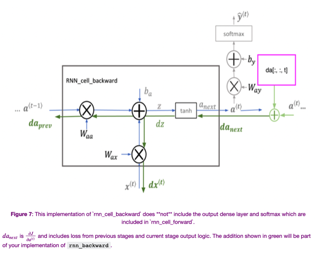</kbd>

 

<kbd>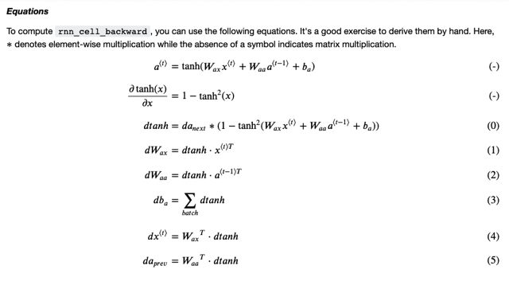</kbd>

 

<kbd>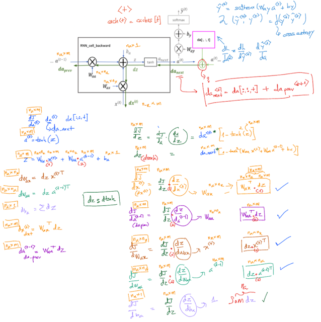</kbd>

 

##### Exercise 5 - rnn_cell_backward

 

<kbd>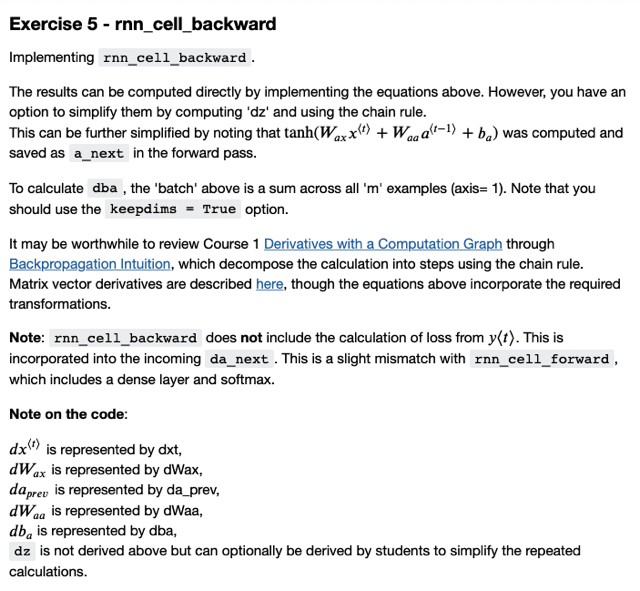</kbd>

 

<kbd></kbd>

<kbd>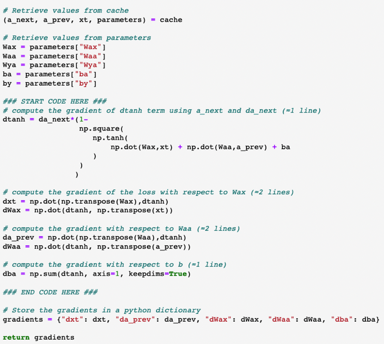</kbd>

 

<kbd>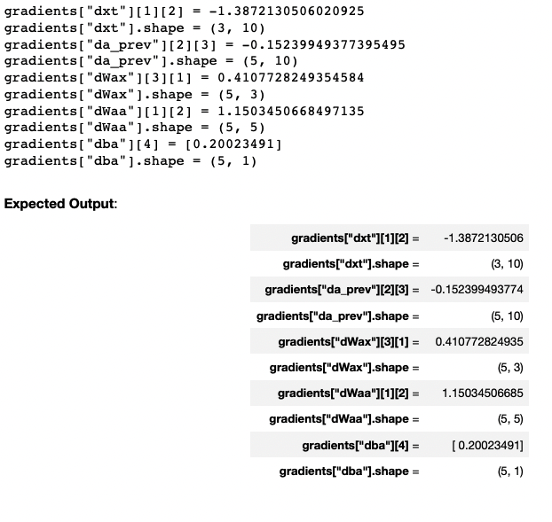</kbd>

 

##### Exercise 6 - rnn_backward

 

<kbd></kbd>

 

<kbd>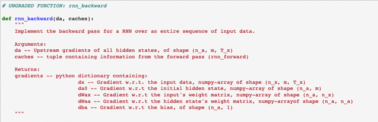</kbd>

<kbd>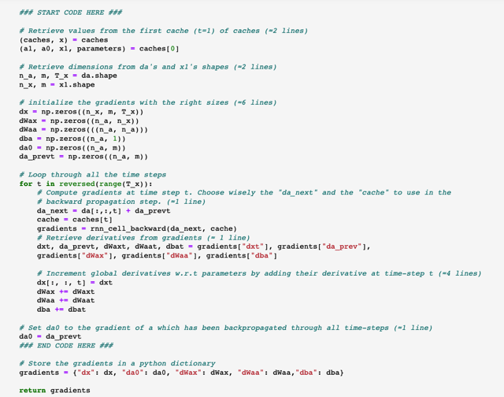</kbd>

 

<kbd></kbd>

 

##### 3.2 - LSTM Backward Pass

 

<kbd>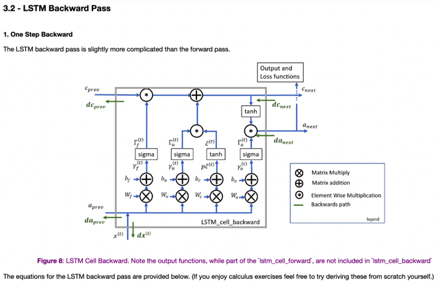</kbd>

 

<kbd></kbd>

> [!NOTE]
> Cái chỗ 'choose wisely da_next xem chú giải trong hình (note) trong
> nhánh trước (bản note tự làm  - xây dựng công thức)

 

<kbd></kbd>

 

<kbd></kbd>

 

<kbd>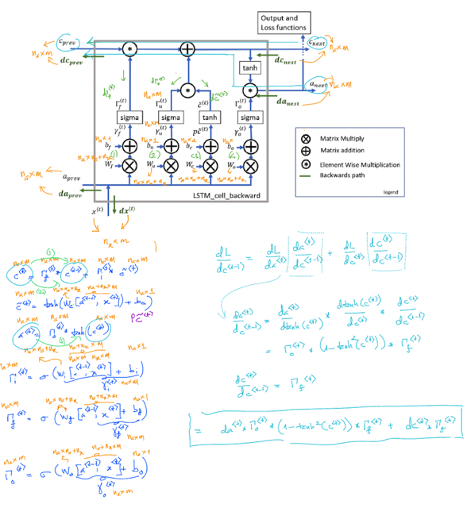</kbd>

 

<kbd></kbd>

 

<kbd></kbd>

 

<kbd></kbd>

 

<kbd>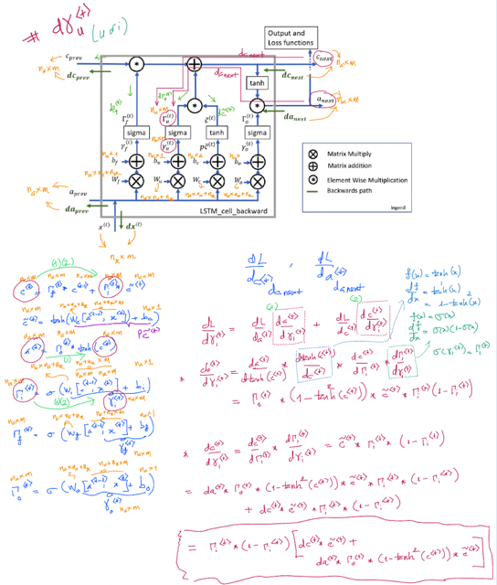</kbd>

 

<kbd></kbd>

 

<kbd></kbd>

 

##### Exercise 7 - lstm_cell_backward

 

<kbd>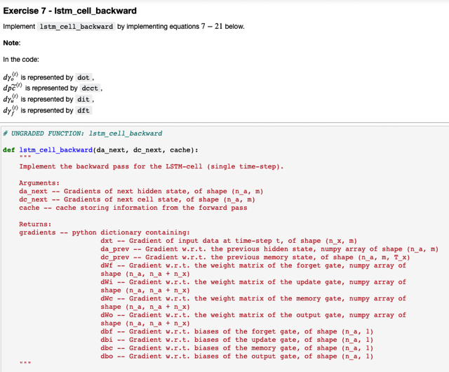</kbd>

 

<kbd></kbd>

 

<kbd>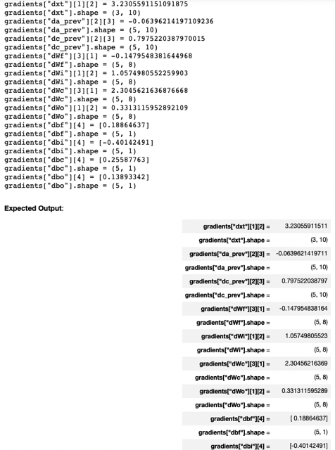</kbd>

 

##### 3.3 Backward Pass through the LSTM RNN

 

<kbd>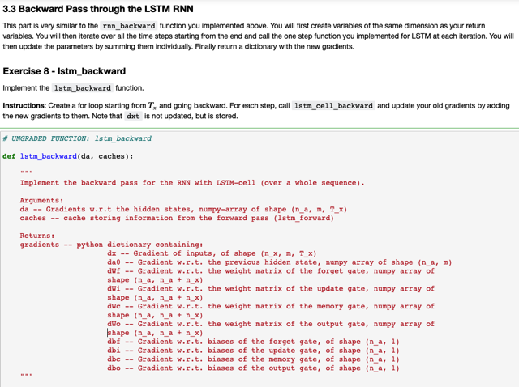</kbd>

 

##### Exercise 8 - lstm_backward

 

<kbd>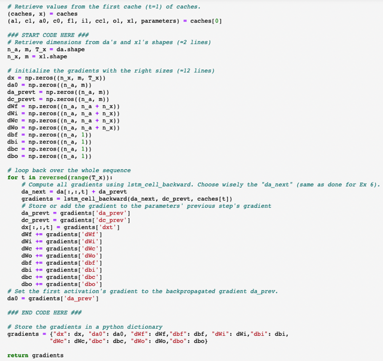</kbd>

 

<kbd>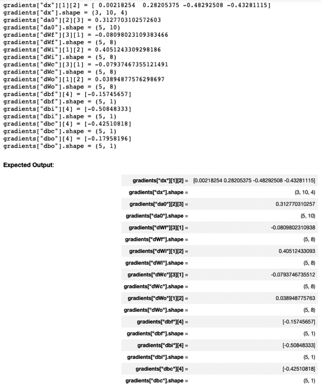</kbd>

 

> [!NOTE]
> Congratulations on completing this assignment! You now understand how
> recurrent neural networks work! In the next exercise, you'll use an RNN to
> build a character-level language model. See you there!

 

## Programming Assignments 2

 

<kbd></kbd>

> [!NOTE]
> Character level language model - Dinosaurus Island Welcome to Dinosaurus Island! 65
> million years ago, dinosaurs existed, and in this assignment, they have returned.
>
> You are in charge of a special task: Leading biology researchers are creating new
> breeds of dinosaurs and bringing them to life on earth, and your job is to give names to
> these dinosaurs. If a dinosaur does not like its name, it might go berserk, so choose
> wisely!
>
> Luckily you're equipped with some deep learning now, and you will use it to save the
> day! Your assistant has collected a list of all the dinosaur names they could find, and
> compiled them into this \\_dataset\\_. (Feel free to take a look by clicking the previous
> link.)
>
> To create new dinosaur names, you will\\_\\/ **build a character-level language model**\\/\\_ to
> generate new names. Your algorithm will \\_\\/learn the different name patterns\\/\\_, and
> \\_\\/randomly generate new names\\/\\_. Hopefully this algorithm will keep you and your team
> safe from the dinosaurs' wrath!
>
> By the time you complete this assignment, you'll be able to:
>
> • \\_\\/Store text data for processing using an RNN\\/\\_
>
> • \\_\\/Build a character-level text generation model using an RNN\\/\\_
>
> • \\_\\/Sample novel sequences in an RNN\\/\\_
>
> • \\_\\/Explain the vanishing/exploding gradient problem in RNNs\\/\\_
>
> • \\_\\/Apply gradient clipping as a solution for exploding gradients\\/\\_
>
> Chú ý: Đại khái là tạo môt 'language-model' - 'mô hình ngôn ngữ cấp kí tự' để
> tạo ra tên mới cho 1 loài khủng long dựa trên pattern của các loài hiện có.

 

#### Packages

 

<kbd></kbd>

 

#### 1 - Problem Statement

 

> [!NOTE]
> 1.1 - Dataset and Preprocessing
>
> Đại khái là cho một danh sách tên khủng long.
> Và tìm ở trỏng có cả thảy bao nhiêu 'kí tự' gọi nó là 
> vocabulary list (đây là bài toán ở cấp) 
> 'kí tự' chứ không phải 'từ'
> Chuẩn bị sẵn function chuyển / get từ index sang kí tự và ngược lại.

 

<kbd>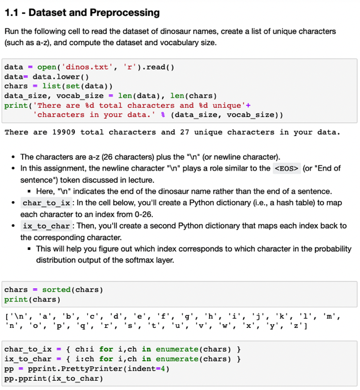</kbd>

> [!NOTE]
> Đại khái là cho một danh sách tên khủng long.
> Và tìm ở trỏng có cả thảy bao nhiêu 'kí tự' gọi nó là 
> vocabulary list (đây là bài toán ở cấp) 
> 'kí tự' chứ không phải 'từ'
> Chuẩn bị sẵn function chuyển / get từ index sang kí tự và ngược lại.

 

> [!NOTE]
> 1.2 - Overview of the Model
> a.Nói về các bước (để xây dựng model)
> Ini params
> Run FP tính loss function
> Run BP tính gradient
> Clip the gradient để tránh Gradient Exploding
> Update gradient
>
> b.Mô hình của RNN 
> Đại khái là tại mỗi lần <t>, dự đoán từ tiếp theo
> nên y<1> chính là x<2>, ..y<t> = x<t+1>

 

<kbd>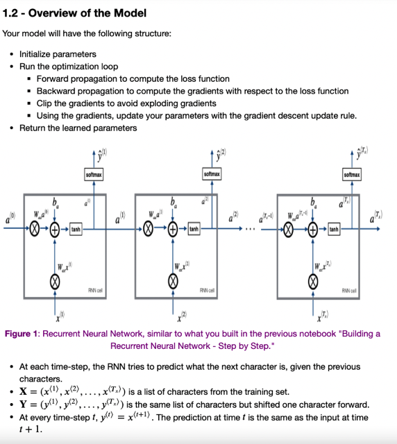</kbd>

 

> [!NOTE]
> 2 - Building Blocks of the Model
>
> In this part, you will build two important blocks of the overall model:
>  1 Gradient clipping: to avoid exploding gradients
>  2 Sampling: a technique used to generate characters
> You will then apply these two functions to build the model.

 

> [!NOTE]
> 2.1 - Clipping the Gradients in the Optimization Loop:
>
> - Nói về hiện tượng gradient trở nên quá lớn - exploding gradient sẽ
> khiến G.D nó work không tốt, do đó phải làm động tác 'Gradient Clipping'
> thưc hiện trước khi update params để fix hiện tượng này.
>
> - Nói về phương pháp Gradient Clipping - Simple Element-wise clipping
> trong đó đơn giản là cho 1 giới hạn, thằng nào quá giới hạn sẽ bị set.
>
> - Dùng np.clip() cho vào 1 vector, và min, max và arg outer - thể hiện đầu
> ra.

 

<kbd></kbd>

<kbd>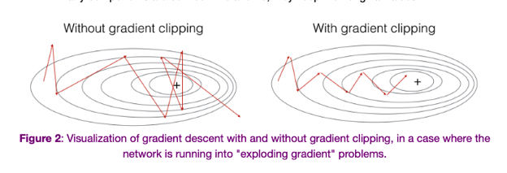</kbd>

 

> [!NOTE]
> Exercise 1 - clip
>
> Dùng function np.clip. Clip cũng chỉ đơn giản là cho nó max, min, nó
> sẽ xem item nào Trong array lớn hơn max hay bé hơn min thì nó
> set về max, min. Vậy thôi, Để argument out = input để nó update
> luôn vào cái vả đưa giá trị vào. (Chứ khỏi lưu thành 1 var khác, kiểu
> vậy)
>
> *Chú ý: Trong 'for gradient in gradients:...' thì gradient chỉ là string -
> tên các params, phải lấy ra = gradients[gradient]
>
> \\/for gradient in gradients:
>         np.clip(gradients[gradient], -maxValue, maxValue, out=gradients[gradient])\\/

 

<kbd>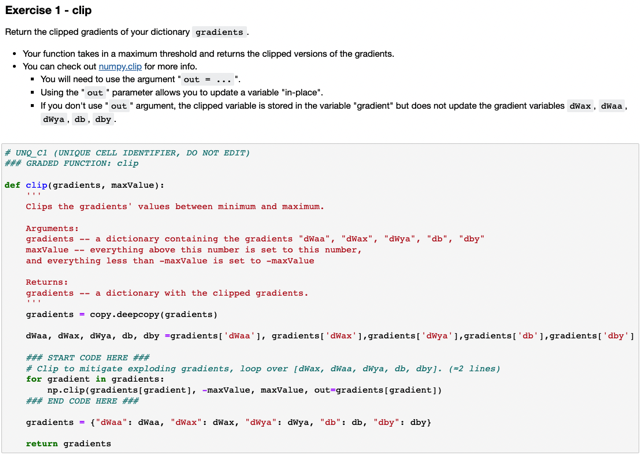</kbd>

> [!NOTE]
> Chú ý: Trong 'for gradient in gradients:...' thì
> gradient chỉ là string - tên các params, phải
> lấy ra = gradients[gradient]

 

> [!NOTE]
> 2.2 - Sampling
>
> Đầu tiên phải hiểu sampling là giả sử **ĐÃ TRAIN** model rồi, ta muốn xem
> thử nó generate một sequence mới như thế nào.
>
> Đại khái là từ a<t-1>, x<t> input (ini bằng zeros vector), tính ra y^<1> 
> có dạng 1 vector có vocab'size element trong đó mỗi element là chỉ số thể 
> hiện 'probability (khả năng) của từ tiếp theo là chữ thứ 0,1,2...trong vocab list.
>
> Dùng np.choice([0,1,..vocab's size], p = y^<t>.ravel()) để chọn ra ngẫu
> nhiên 1 idx trong  [0,1,..vocab's size] index rồi dùng idx tạo 1 one-hot
> vector x<t+1> có value bằng 1 tại idx này. Tiếp tục như vậy,,,
>
> Nói thêm rằng nếu cứ dùng 'cái có max probability' thì nó luôn cho ra 
> cùng một kết quả nên làm kiểu 'random sampling' này để kiểu như thấy
> nhiều kết quả hơn 
>
> Function ravel() nhận n-D vector và biến thành 1D vector chỉ vậy thôi

 

<kbd>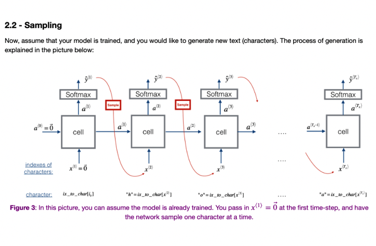</kbd>

 

<kbd></kbd>

 

##### Exercise 2 - sample

 

<kbd>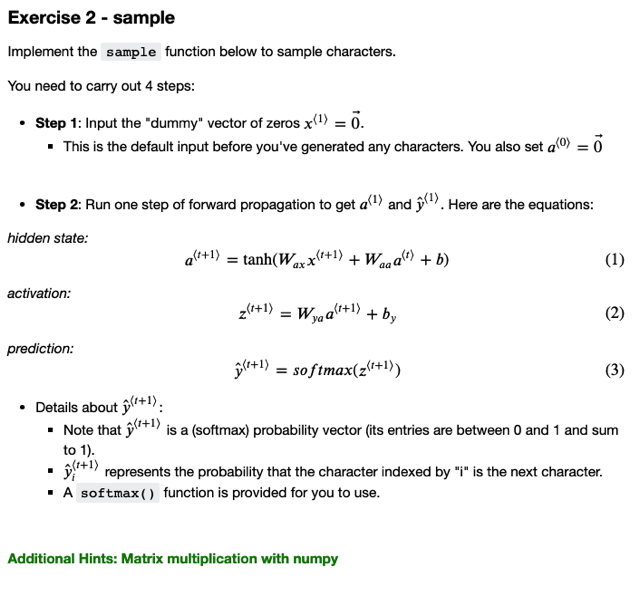</kbd>

 

<kbd></kbd>

 

> [!NOTE]
> Đây, ở đây note lại ý này quan trọng, nếu ta select the
> most probable, thì model luôn tạo cùng một result - 1
> sample tên khủng long everytime, nên mới dùng
> random choice để ' pick next character's index
> according to the probability distribution specified by
> y^<timestep trước>
>
> Cái step thể hiện việc lấy predict thằng (time-step) trước
> làm input thằng sau là Step 4: Overwrite the input x ....
>
> Nó tạo 1 vector zero độ dài bằng vocab size rồi sét số 1
> vào index  mà được **chọn random.choice với
> probability** (random. choice(rang, p=y.ravel())
>
> Rồi gán cho x để lần loop kế tiếp dùng làm input

 

<kbd>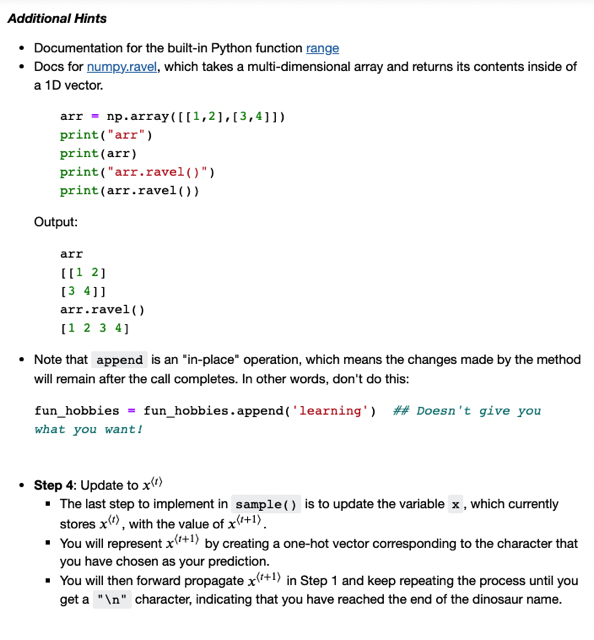</kbd>

 

<kbd>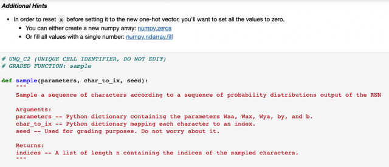</kbd>

<kbd></kbd>

<kbd>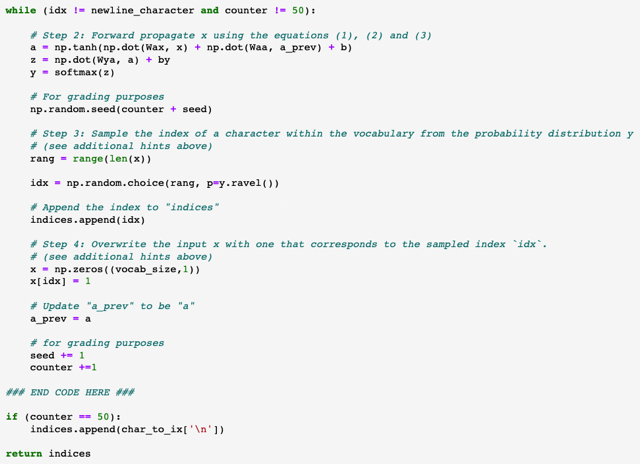</kbd>

 

> [!NOTE]
> **What you should remember**:
>
> • Very large, or "exploding" gradients updates can be so large that they
> "overshoot" the optimal values during back prop -- making training
> difficult
>
> ▪ Clip gradients before updating the parameters to avoid exploding
> gradients
>
> • Sampling is a technique you can use to pick the index of the next
> character according to a probability distribution.
>
> ▪ To begin character-level sampling:
>
> ◦ Input a "dummy" vector of zeros as a default input
>
> ◦ Run one step of forward propagation to get 𝑎⟨1⟩ (your first character)
> and 𝑦̂ ⟨1⟩ (probability distribution for the following character)
>
> ◦ When sampling, avoid generating the same result each time given the
> starting letter (and make your names more interesting!) by using \\_**np.
> random.choice**\\_

 

> [!NOTE]
> 3 - Building the
> Language Model

 

> [!NOTE]
> 3.1 - Gradient Descent
>
> In this section you will implement a function performing one
> step of stochastic gradient descent (with clipped gradients).
> You'll go through the training examples one at a time, so
> the optimization algorithm will be stochastic gradient
> descent.
>
> As a reminder, here are the steps of a common
> optimization loop for an RNN:
>
> • Forward propagate through the RNN to compute the loss
>
> • Backward propagate through time to compute the
> gradients of the loss with respect to the parameters
>
> • Clip the gradients
>
> • Update the parameters using gradient descent

 

> [!NOTE]
> Exercise 3 - optimize
>
> Đaị khái là người ta làm sẵn cho function optimize trong đó 
> họ update ra gradient cho 1 lần iteration của stochastic G.D
> Bao gồm: 
>
>  • Forward propagate through the RNN to compute the loss
>  • Backward propagate through time to compute the gradients of 
> the loss with respect to the parameters
>  • Clip the gradients
>  • Update the parameters using gradient descent
>
> Có nói thêm 1 tính chất của Python là khi bỏ 1 dictionary hay list 
> vào 1 function thì khi ta thay đổi gì thì ta thay đổi chính các object 
> đó chứ ko phải bản copy nên nó gọi là '**pass by reference**'

 

<kbd>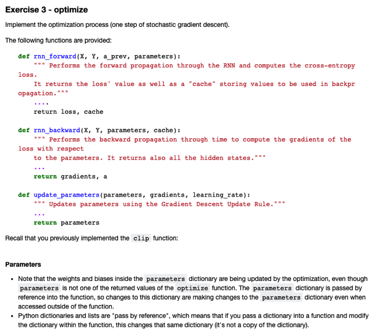</kbd>

 

<kbd>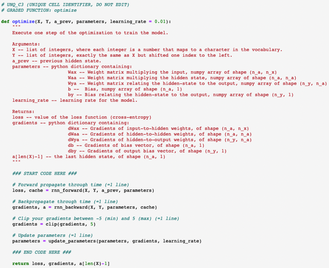</kbd>

 

<kbd></kbd>

<kbd></kbd>

<kbd>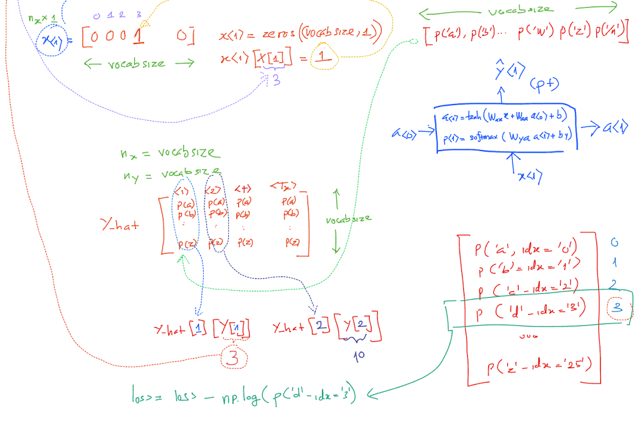</kbd>

> [!NOTE]
> Loop trong range Tx = len(X)
> Tương ứng mỗi t trong range ..xem hình vẽ cho dể hiểu
>
> Giải thích cái khúc tính loss:
>
>
>
> Tại sao lại là **y^[1][Y[1]]**
>
>
>
> Đại khái là "Đối với dự đoán cho kí tự thứ 1, đáp án đúng phải là
> chữ 'd' - kí tự thứ 3 (Y[1] = 3) trong vocab list. **Nhắc lại, Y là
> vector chứa index của các kí tự đúng trong vocab list**.
>
>
>
> Vậy ta hãy xem thử dự đoán của model cho kí tự thứ 1 (y^[1])
> rằng khả năng đáp án đúng chính là kí tự thứ 'd' là bao nhiêu %
> (cao hay thấp).
>
>
>
> **y^[1] là vector chứa khả năng (Probability) của các kí tự trong 
> vocab list là đáp án đúng [P('a'), P('b'), ...P('z')]**
> và index của chúng trong vocab list tất nhiên lần lượt là 0,1,2,3,..
>
>
>
> Vậy để lấy "P('d')" - ta lấy 
> Probability vector y^[1][index của nó trong vocab list]
>
>
>
> index của nó trong vocab list chính là Y[1]
>
>
>
> -> **y^[1][Y[1]]** Và nó chính là Loss của timestep <t> = <1>
>
>
>
>
> Nếu p('d' - idx = '3') có giá trị cao thì np.log(p('d' - idx = '3')) cao
> -> loss - np.log(..) sẽ khiến loss giảm nhiều.
>
> Tại sao lại x[t][X[t]]
>
>
>
> Vì X là vector chứa INDEX của các kí tự trong vocab
> nên kí tự thứ <t> / hay tại time step <t>
> thì kí tự đó có index là X[t] trong vocab lít
>
>
>
> Mà ta cần construct một one-hot vector represent cho kí tự
> đó với một list dài vocab size, số 1 nằm ở index của kí tự đó
> trong vocab list, còn lại là số 0
>
>
>
> Nên x[t] ini là zeros((vocabsize, 1))
> rồi gán số 1 vào index của kí tự đó chính là X[t]
> Nên mới thành ra x[t][X[t]] = 1 là vậy

 

<kbd>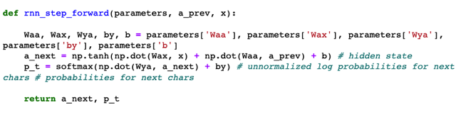</kbd>

 

<kbd></kbd>

 

<kbd></kbd>

> [!NOTE]
> Step này thì Assignment trước đã làm

 

<kbd></kbd>

 

> [!NOTE]
> 3.2 - Training the Model
>
> Cách..: 
> - Lấy một data sample x(i) ra và ...

 

<kbd></kbd>

<kbd>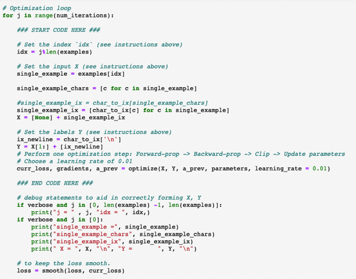</kbd>

<kbd>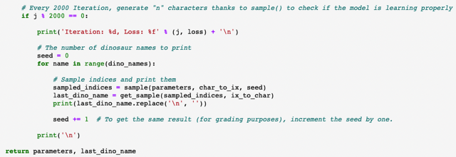</kbd>

<kbd>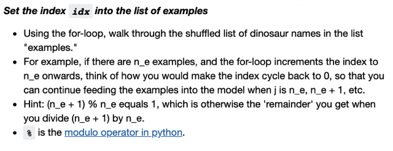</kbd>

<kbd>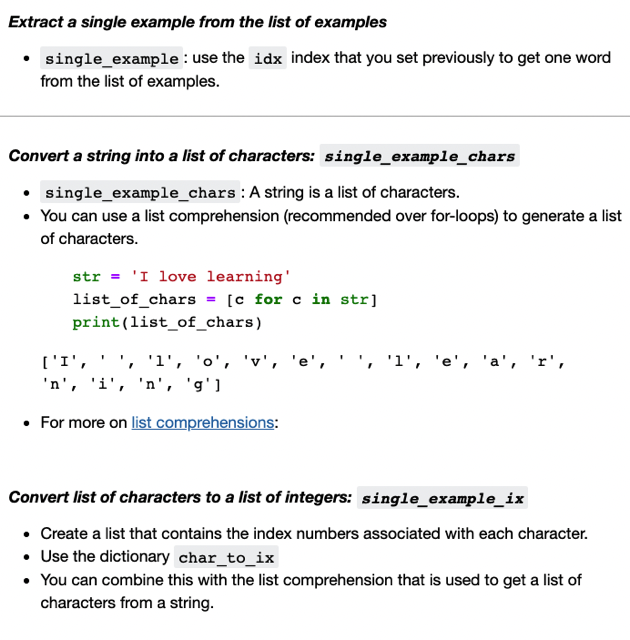</kbd>

<kbd>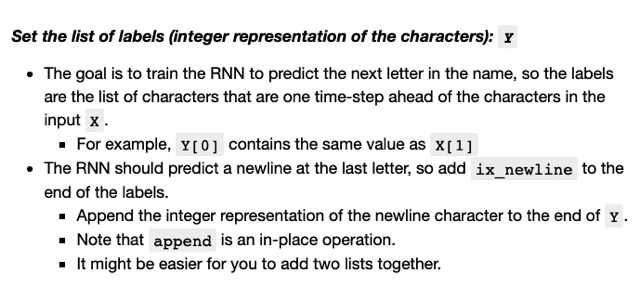</kbd>

> [!NOTE]
> idx=j%len(example)
>
>
>
> Đại khái là khi nó chạy Stochastic G.D mỗi iteration
> (epoch) nó sẽ learn trên một bộ data sample mà ở đây
> là 1 từ/ 1 tên trong danh sách tên khủng long.
>
>
>
> Ý nói ở đây là khi loop 1 -> max iterations thì nó lần lượt
> lấy training set ra từ list, và khi hết list thì quay lại từ
> đầu. Vậy phải set idx như thế nào.
>
> single_example_chars = [c for c in single_example]
>
>
>
> single_example_ix = [char_to_ix[c] for c in single_example]
>
>
>
> Nói chung đây là một cái khá hay của Python. Làm qua mới biết.
>
> ix_newline = char_to_ix['\n']
>
>
>
> Y = X[1:] + [ix_newline]
>
>
>
> Đại khái là 
> 1. Vì Y[0] = X[1] , Y[1] = X[2] ...
> nên define Y = X[1:] (lấy từ item 1 trở đi)
>
>
>
> 2. Rồi append ix_newline ở cuối, mà muốn vậy phài dùng append
> hoặc cộng array [a] + [b], nên phải bỏ ix_newline vào [] để tạo array

 

<kbd></kbd>

 

<kbd></kbd>

> [!NOTE]
> **Conclusion** You can see that your algorithm has started to generate plausible dinosaur
> names towards the end of training. At first, it was generating random characters, but
> towards the end you could begin to see dinosaur names with cool endings. Feel free to run
> the algorithm even longer and play with hyperparameters to see if you can get even better
> results! Our implementation generated some really cool names like maconucon,
> marloralus and macingsersaurus. Your model hopefully also learned that dinosaur names
> tend to end in saurus, don, aura, tor, etc.
>
> If your model generates some non-cool names, don't blame the model entirely -- not all
> actual dinosaur names sound cool. (For example, dromaeosauroides is an actual dinosaur
> name and is in the training set.) But this model should give you a set of candidates from
> which you can pick the coolest!
>
> This assignment used a relatively small dataset, so that you're able to train an RNN quickly
> on a CPU. Training a model of the English language requires a much bigger dataset, and
> usually much more computation, and could run for many hours on GPUs. We ran our
> dinosaur name for quite some time, and so far our favorite name is the great, the fierce, the
> undefeated: **Mangosaurus**!

 

##### Exercise 4 - model

 

> [!NOTE]
> 4 - Writing like Shakespeare
> (OPTIONAL/UNGRADED)

 

> [!NOTE]
> 5 - References
>
>  • This exercise took inspiration from Andrej Karpathy's implementation: 
> \\_https://gist.github.com/karpathy/d4dee566867f8291f086\\_. 
> To learn more about text generation, also check out Karpathy's \\_blog post\\_.

 

## Programming Assignments 3

 

<kbd></kbd>

> [!NOTE]
> Improvise a Jazz Solo with an LSTM Network Welcome to your final
> programming assignment of this week! In this notebook, you will implement a
> model that uses an LSTM to generate music. At the end, you'll even be able to
> listen to your own music!
>
> **By the end of this assignment, you'll be able to:**
>  • Apply an LSTM to a music generation task
>  • Generate your own jazz music with deep learning
>  • Use the flexible Functional API to create complex models
>
>
> Đại khái là :
>
>
>
> Build model **bằng Keras**, thay vì **numpy** (define function, run
> Gradient Descent...nói chung là tự làm từ đầu đến cuối)
>
>
>
> Ví dụ như làm bằng numpy và Keras thì khác nhau ra sao:
>
>
>
> \_***Bằng numpy:** 
> \_
> Giống như assignment trước (trong def **model()**, dùng function **optimize**()),
> phải viết các function để làm các step như:
> Loop trong iteration:..
> 1/ Xử lý input (tạm gọi vậy)
>
>
>
> 2/ (Trong /**optimize**/():)
> - Forward loop để tính loss:
>   For loop trong Tx
>   Tính a<t>, c<t> bằng cách tạo function forward_prop 
>   để tính các giá trị của các gate, c~ này kia dùng 
>   np.tanh(..), np.sigmoid(..)
>   Sau đó tính y^ bằng softmax
> - Backward loop để tính gradient (nhiều function nhỏ khác)
> - Gradient clipping 
> - Update gradient
>
> \_***Bằng Keras:**
> \_  tạo model với **LSTM** (để nó sẽ handle việc tính mấy
> cái như a, c), **Dense** (handle việc tính a bằng softmax) 
> - Có model rồi chỉ cần gọi 
> .**compile**('optimizer', 'cost function') 
> .**fit**() là xong, nó sẽ làm cái việc training cho mình.

 

#### Packages

 

<kbd>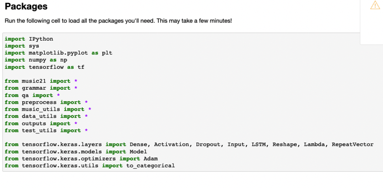</kbd>

 

> [!NOTE]
> 1 - Problem Statement
>
> You would like to create a jazz music piece specially for a
> friend's birthday. However, you don't know how to play
> any instruments, or how to compose music. Fortunately,
> you know deep learning and will solve this problem using
> an LSTM network! You will train a network to generate
> novel jazz solos in a style representative of a body of
> performed work.

 

> [!NOTE]
> 1.1 - Dataset
>
> Nói sơ lược về data và các size

 

<kbd>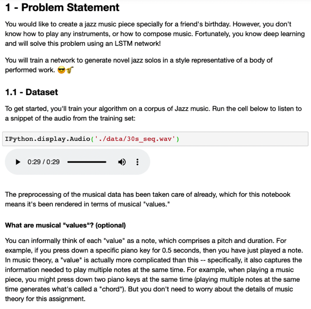</kbd>

 

<kbd></kbd>

 

<kbd></kbd>

> [!NOTE]
> Ý quan trọng cần hiểu là input là tương tự như assignment trước, nơi mà
> mỗi 1 từ hay kí tự trong sequence sẽ là 1 vector (one-hot vector có size
> bằng vocab list) thì ở đây nó là one-hot vector có size 90 kiểu như có 90
> music value khác nhau.

 

##### 1.2 - Model Overview

 

<kbd></kbd>

> [!NOTE]
> Mấy cái dòng dưới chưa hiểu lắm
>
>
>
> Window of size Tx scanned over the musical
> corpus là sao?
>
>
>
> Each x<t> is an index corresponding to a
> value?

 

#### 2 - Building the Model

 

<kbd></kbd>

<kbd></kbd>

 

> [!NOTE]
> Exercise 1 - djmodel
>
> Đại khái là :
>
> Build model **bằng Keras**, thay vì **numpy** (define function, run
> Gradient Descent...nói chung là tự làm từ đầu đến cuối)
>
> Ví dụ như làm bằng numpy và Keras thì khác nhau ra sao:
>
> \\_***Bằng numpy:** \\_
> Giống như assignment trước (trong def **model()**, dùng function **optimize**()),
> phải viết các function để làm các step như:
> Loop trong iteration:..
> 1/ Xử lý input (tạm gọi vậy)
>
> 2/ (Trong \\/**optimize**\\/():)
> - Forward loop để tính loss:
>   For loop trong Tx
>   Tính a<t>, c<t> bằng cách tạo function forward_prop 
>   để tính các giá trị của các gate, c~ này kia dùng 
>   np.tanh(..), np.sigmoid(..)
>   Sau đó tính y^ bằng softmax
> - Backward loop để tính gradient (nhiều function nhỏ khác)
> - Gradient clipping 
> - Update gradient
>
> \\_***Bằng Keras:** \\_  tạo model với **LSTM** (để nó sẽ handle việc tính mấy
> cái như a, c), **Dense** (handle việc tính a bằng softmax) 
> - Có model rồi chỉ cần gọi 
> .**compile**('optimizer', 'cost function') 
> .**fit**() là xong, nó sẽ làm cái việc training cho mình.

 

<kbd>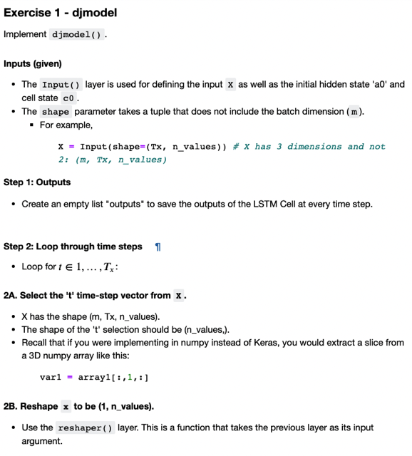</kbd>

> [!NOTE]
> Đại khái là khi define Input shape thì khỏi nhắc đến m, nó tự biết size là m,..,..

 

<kbd></kbd>

 

<kbd></kbd>

<kbd>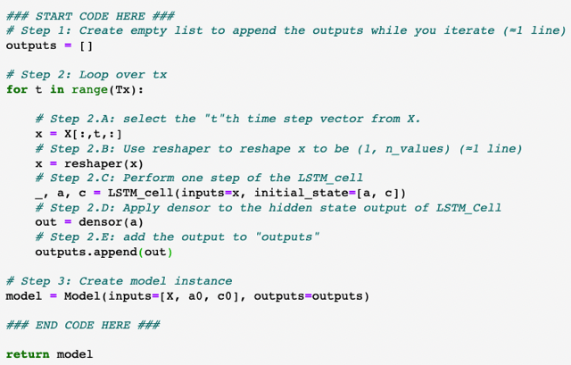</kbd>

> [!NOTE]
> Đại khái là :
>
>
>
> Build model **bằng Keras**, thay vì **numpy** (define function, run
> Gradient Descent...nói chung là tự làm từ đầu đến cuối)
>
>
>
> Ví dụ như làm bằng numpy và Keras thì khác nhau ra sao:
>
>
>
> \_***Bằng numpy:** 
> \_
> Giống như assignment trước (trong def **model()**, dùng function **optimize**()),
> phải viết các function để làm các step như:
> Loop trong iteration:..
> 1/ Xử lý input (tạm gọi vậy)
>
>
>
> 2/ (Trong /**optimize**/():)
> - Forward loop để tính loss:
>   For loop trong Tx
>   Tính a<t>, c<t> bằng cách tạo function forward_prop 
>   để tính các giá trị của các gate, c~ này kia dùng 
>   np.tanh(..), np.sigmoid(..)
>   Sau đó tính y^ bằng softmax
> - Backward loop để tính gradient (nhiều function nhỏ khác)
> - Gradient clipping 
> - Update gradient
>
> \_***Bằng Keras:**
> \_  tạo model với **LSTM** (để nó sẽ handle việc tính mấy
> cái như a, c), **Dense** (handle việc tính a bằng softmax) 
> - Có model rồi chỉ cần gọi 
> .**compile**('optimizer', 'cost function') 
> .**fit**() là xong, nó sẽ làm cái việc training cho mình.

 

<kbd>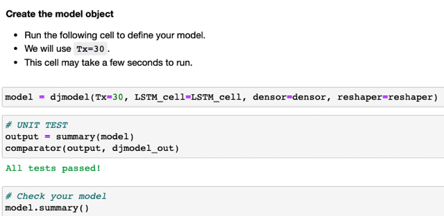</kbd>

<kbd></kbd>

 

<kbd></kbd>

 

<kbd>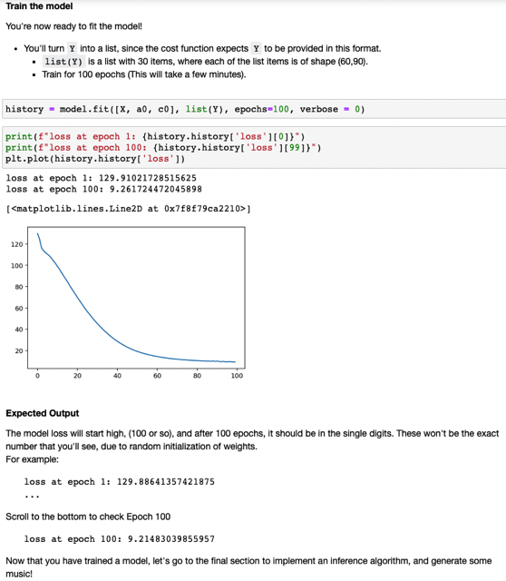</kbd>

 

#### 3 - Generating Music

 

> [!NOTE]
> 3.1 - Predicting & Sampling:
>
> Đại khái là làm công tác 'Sampling' - nhớ lại
> sampling là lấy y^ thằng trước bỏ vào thằng sau để
> run.
>
> Đại khái là sample này nó giúp 'coi thử' (trong quá trình train) thì 
> kết quả sẽ kiểu như thế nào.
>
> Ở assignment trước đã làm với numpy (function
> sample()) thì giờ làm với Keras
>
> Và hơn nữa là sẽ dùng nó để tạo thử 1 đoạn nhạc.

 

<kbd></kbd>

> [!NOTE]
> Đại khái là làm công tác 'Sampling' - nhớ lại
> sampling là lấy y^ thằng trước bỏ vào thằng sau để
> run.
>
>
>
> Đại khái là sample này nó giúp 'coi thử' (trong quá trình train, 
> đúng hơn là model đã trained work như thế nào) thì 
> kết quả sẽ kiểu như thế nào.
>
>
>
> Ở assignment trước đã làm với numpy (function
> sample()) thì giờ làm với Keras
>
>
>
> Và hơn nữa là sẽ dùng nó để tạo thử 1 đoạn nhạc.

 

> [!NOTE]
> Exercise 2 - music_inference_model
>
> Cũng define model bằng keras.LSTM, keras.Dense để tính lấy ra out bỏ vào
> outpus.
>
> Chỉ thêm bước "\\/l**ấy prediction thằng trước bỏ vào làm thành x thằng sau\\/"**  (x<t+1> = y^<t>)
>
> Giải thích cái đoạn  x = tf.math.argmax(out, axis=1) x = tf. one_hot(indices=x,
> depth=n_values)
>
> Out ở đây chính là y^<t>, vậy nó là vector chứa các giá trị p thì ở bài này
> thay vì dựa vào vector này để lấy random.choice thì ở đây lấy luôn thằng
> nào có P có giá trị max. Cụ thể x = tf.math.argmax(out, axis=1) nó lấy vị trí
> (index) của cái thằng có P cao nhất trong vector dòng sau là nó tạo one-hot
> vector một cách rất gọn nhờ function của tensorFlow. Rồi gán cho x, nên lần
> loop tiếp nó x chính là y_pred của lần loop trước.
> **(Để ý ổng gợi ý dùng 'x', not 'x0' là vì vậy)** Còn model bình thường x nó lấy từ '**Input**' layer

 

<kbd></kbd>

<kbd></kbd>

 

<kbd></kbd>

<kbd></kbd>

> [!NOTE]
> Chú ý ổng nhấn mạnh LSTM_cell và Desne là trained - đã được train.
> Tức là sampling là làm đv 1 model đã train để 'coi' nó ..làm / work)..,
> như thế nào

 

> [!NOTE]
> Cũng define model bằng keras.LSTM, keras.Dense để tính lấy ra out bỏ vào
> outpus.
>
> Chỉ thêm bước "\\/**lấy prediction thằng trước bỏ vào làm thành x thằng sau"**\\/
>  (x<t+1> = y^<t>)
>
> Thể hiện ở chỗ trong loop Ty, bỏ input của LSTM_cell là x, rồi tính 
> output gán vào cho x:
> _, a, c = LSTM_cell(input=x,....)
> ..
> x = tf.one_hot(....)
>
> Giải thích cái đoạn  
> x = tf.math.argmax(out, axis=1) 
> x = tf.one_hot(indices=x, depth=n_values)
>
> Out ở đây chính là y^<t>, vậy nó là vector chứa các giá trị p thì ở bài này
> **thay vì dựa vào vector này để lấy random.choice là
> thì ở đây lấy luôn thằng
> nào có P có giá trị max.** 
>
> Cụ thể x = tf.math.argmax(out, axis=1) nó lấy **vị trí (index) của cái thằng có P 
> cao nhất trong vector** 
> Sau đó là nó **tạo one-hot vector một cách rất gọn** nhờ function tf.**one_hot**() của
>  tensorFlow.

 

> [!NOTE]
> Cuối cùng gán cho x để rồi lần loop tiếp nó input x của LSTM_cell
> chính là y_pred của lần loop trước.
>
> Đây chính là điểm thể hiện dòng kẻ màu đỏ lấy cái predict cái trước
> bỏ vào làm input cái tiếp theo trong mô hình. Chỉ nhớ là lần này
> không lấy random dựa trên probability distribution như assignment
> Dinarsour mà lấy luôn thằng cao nhất. Nhớ lại việc lấy random ở
> bài trước là do muốn ra mỗi lần mỗi khác, còn lần này làm như kiểu
> này thì nó chỉ ra lần nào cũng giống nhau.
>
> (Để ý ổng gợi ý dùng 'x', not 'x0' là vì vậy) 
> Còn model bình thường x nó lấy từ 'Input' layer

 

<kbd>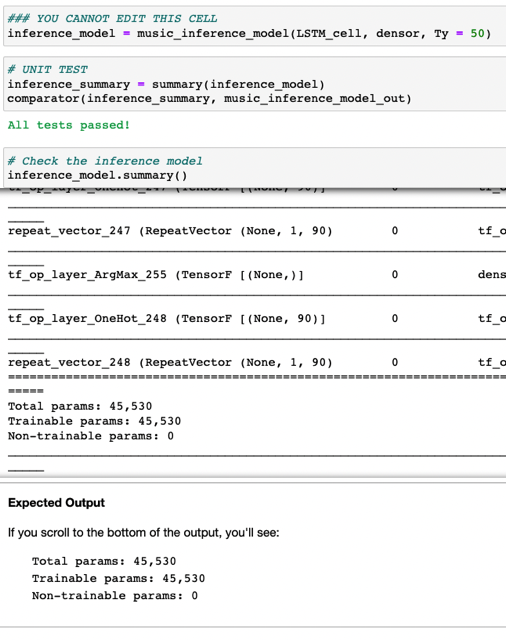</kbd>

 

##### Exercise 3 - predict_and_sample

 

<kbd>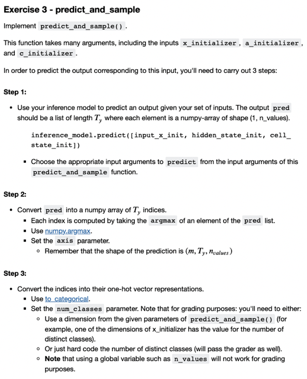</kbd>

 

<kbd></kbd>

 

<kbd>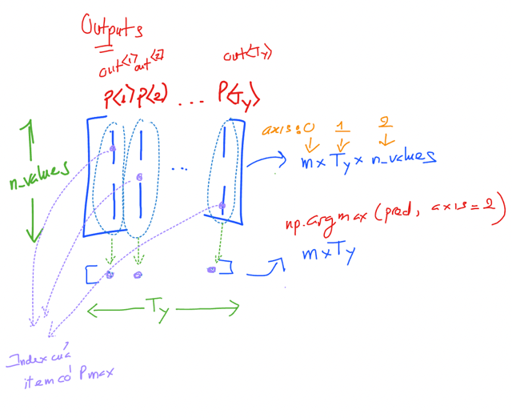</kbd>

> [!NOTE]
> kết qủa của inference_model.predict(..) là
> ouputs chứa Ty probability vectors p<t>
>
>
>
> [p<1> , p<2> , ...p<Ty>].
>
>
>
> Nên argmax là ra index của giá trị cao nhất của từng vector.

 

> [!NOTE]
> Không note vài bữa để lâu quay lại có khi không hiểu chỗ này:
> Tại sao trong music_inference_model()..x=tf.math.argmax(out, axis=1) 
> mà trong predict_and_sample()..indices = tf.math.argmax(pred, axis=2)
>
> Vì **out** ở lúc tính x là **probability vector** **có size là vocab size (1, vocabsize)**
> và ta cần lấy ra cái **index** của cái thằng lớn nhất. Đọc lại cái instruct chổ step 2D
> nên hiểu được phải lấy axis cuối ở đây là 1 do shape của nó là 2D nên index các
> axis là 0,1.
> **Tóm lại shape của out là (1, vocabsize) 
> hoặc nếu chạy 1 batch thì là (batch_szie, vocabsize) -> 2 axis 0,1 
> Lấy argmax trên trục của vocabsize là lấy axis = 1** 
> Còn cái pred, thì là kết quả của cả quá trình sample, nó chứa Ty cái vector **out
> ở trên** (chạy trong loop Ty, tính LSTM_cell ra a, c -> qua densor(a) ra out
> append out vào outputs, ..rồi chuyển xuốn cho x = tf.math.argmax(out)...**)
>
> Vậy nên pred là 1 (hoặc batch_size m) cái x Ty x vocabsize -> 3 axis 0,1,2 
> Lấy argmax trên trục của vocabsize là lấy axis = 2** 

 

> [!NOTE]
> Chỗ này không chắc lắm nhưng chắc là đúng thôi:
>
> Lúc tính x nó tạo từng one-hot vector nên nó tạo bằng **tf. one-hot,** chỉ định chỗ
> nào số 1 bởi **một** giá trị index
>
> còn ở lúc tính y, nó là 1 matrix nên nó dùng **to_categorical, cũng tạo one-hot
> vector nhưng nhiều cái cùng lúc, nên bỏ vào indices là array các index**

 

> [!NOTE]
> Như vậy cuối cùng tạo ra là 1 bộ one-hot vector mỗi cái đại diện cho 1 music value
> được lấy từ thằng (probability cao nhất output sau mỗi timestep)
>
> Rồi nó mới lấy cái này, bỏ vào bước post-processing để tạo ra đoạn nhạc

 

<kbd></kbd>

 

##### 3.2 - Generate Music

 

<kbd></kbd>

 

> [!NOTE]
> **Congratulations!** You've completed this assignment, and generated your own jazz solo! The
> Coltranes would be proud.
>
> By now, you've:
>
> • **Applied an LSTM** to a music generation task
>
> • Generated your own jazz music with deep learning
>
> • Used the **flexible Functional API** to create a more complex model This was a
> lengthy task. You should be proud of your hard work, and hopefully you have some
> good music to show for it. Cheers and see you next time!
>
> **What you should remember:**
>
> • A **sequence model** can be used to generate musical values, which are then
> post-processed into midi music.
>
> • You can use a fairly similar model for tasks ranging from generating dinosaur
> names to generating original music, with the only major difference being the input
> fed to the model.
>
> • In Keras, **sequence generation involves defining layers with shared weights, which
> are then repeated for the different time steps**

 

> [!NOTE]
> 4 - References
>
> The ideas presented in this notebook came primarily from three
> computational music papers cited below. The implementation here also
> took significant inspiration and used many components from Ji-Sung Kim'
> s GitHub repository.
>
> • Ji-Sung Kim, 2016, \\_deepjazz\\_
>
> • Jon Gillick, Kevin Tang and Robert Keller, 2009. \\_Learning Jazz
> Grammars\\_
>
> • Robert Keller and David Morrison, 2007, \\_A Grammatical Approach to
> Automatic Improvisation\\_
>
> • François Pachet, 1999, \\_Surprising Harmonies\\_ Finally, a shoutout to
> François Germain for valuable feedback.

 

