# Appendix A

📊 **Progress:** `5` Notes | `15` Screenshots

---

## Appendix A

<kbd>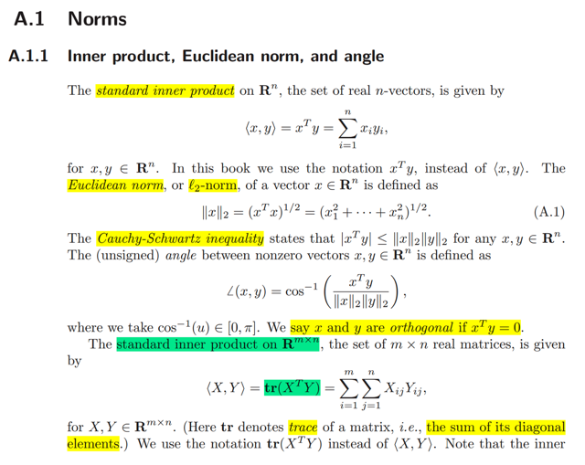</kbd>

<kbd>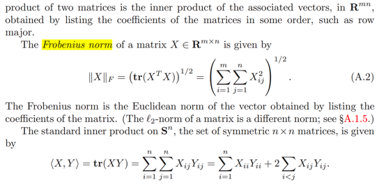</kbd>

 

<kbd>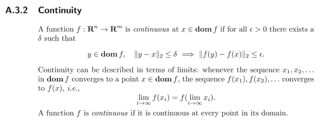</kbd>

 

<kbd>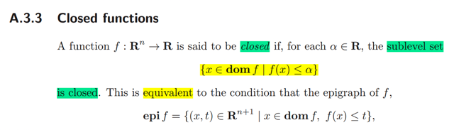</kbd>

<kbd>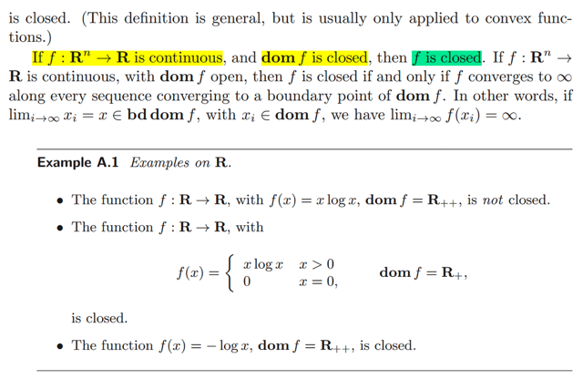</kbd>

**🔗 See also:** [linked note](./chap_91_94.md#node-eyy8adw)

 

<kbd>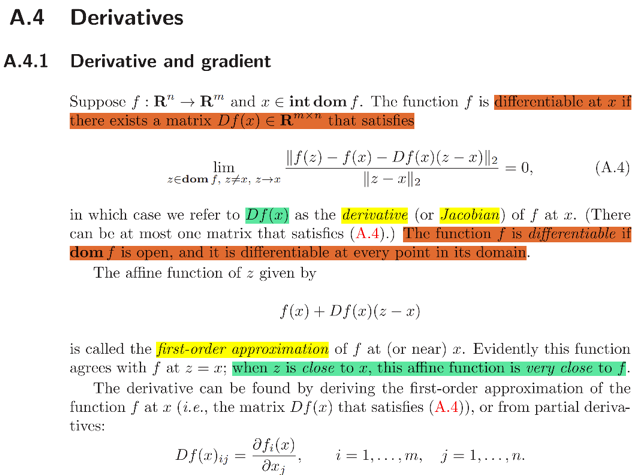</kbd>

> [!NOTE]
> Đại khái là định nghĩa về tính khả vi (differentiable của một 
> hàm vector đa biến R^n -> R^m) Cái này mình chưa được học
> ở cả MIT 18.02 hay MIT 18s096 tạm biết vậy.
>
> Df(x) gọi là Jacobian của f tại x và affine function theo z:
>
> f(x) + Df(x)(z - x) là linear approximation của f(z) khi z gần x.
>
> Và họ nói ta có thể tìm Df(x) theo định nghiã hoặc từ partial
> derivative: Df(x)ij = ∂fi(x)/∂xj
>
> Thế thì suy nghĩ một chút, mình biết về Jacobian khi học MIT
> 18.02 hay MIT 18s096, đó là khi ta có một vector-vector function.
> Thì khi đó, matrix đạo hàm từng phần của f_i wrt x_j là Jacobian
>
> Trong 18s096, ta biết rằng df = f(x + dx) - f(x) = f'(x)[dx]
> là một linear operator act on dx. Thì vì f là vector nên df cũng là
> vector. x là vector, nên dx cũng là vector. Vậy thì linear operator
> act on vector dx để cho ra vector df chỉ có thể là một matrix nhân
> vector dx, matrix đó chính là Jacobian: df = J dx

 

<kbd>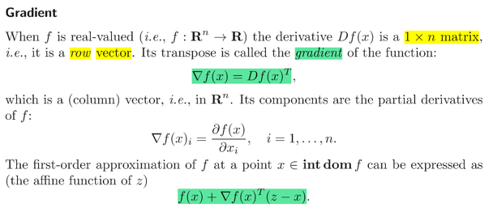</kbd>

> [!NOTE]
> Vậy thì khi f trở thành scalar function R^n -> R thì Jacobian
> bây giờ chỉ là matrix có 1 row, hay row vector. Và nếu transpose
> nó thì ta có định nghĩa của Gradient vector ∇f(x): ∇f(x) + Df(x)T
>
> Khi đó linear approx. của f(x): f(z) ≈ f(x) + ∇f(x)(z - x)
>
> Và ta cũng có lập luạn tương tự: df = f'(x)dx. mà df là scalar, dx
> là vector ⇨ linear approx. act on vector dx cho ra scalar df chỉ
> có thể là phép dot product của dx với một vector khác, đó là ∇f(x)
>
> ⇨ df = ∇f(x)Tdx ⇨ f'(x) (hay Df(x)) = ∇f(x)T

 

<kbd>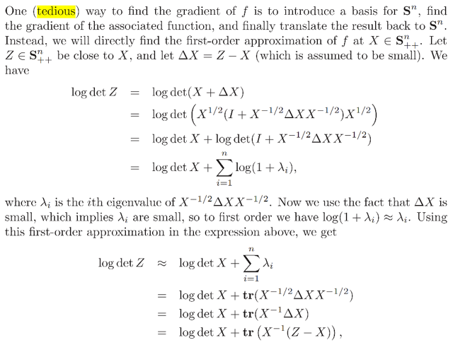</kbd>

<kbd>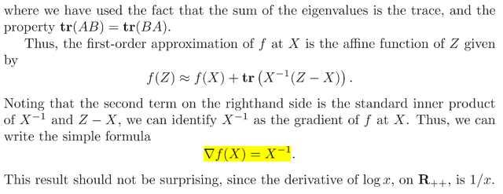</kbd>

> [!NOTE]
> Rồi thử làm lại xem derivative của log det (X) có ra kết quả giống
> ông Boye ko (mình đã làm việc nay trong MIT 18s096 rồi)
>
> Thay vì làm với log det X ta tìm derivative của det X trước:
>
> f(X) = det X. df = det(X + dX) - det(X).
>
> Trong MIT 18s096 gs Allan đề nghị xét bản det(αI + X) trước.
>
> Và lập luận đó là, dựa vào một điều dễ chứng minh là αI + X sẽ
> là matrix có eigenvalues là α + λi , với λi là eigenvalues của X.
> Mà determinant thì ta biết là tích các eigenvalues. Nên det(αI + X)
> = Πi (α + λi)
>
> Khai triển cái tích của n thừa số này ra ta sẽ được một cái tổng
> của các hạng tử mà mỗi hạng tử là tích của n thừa số thuộc một
> trong hai loại: là α hoặc là λi. Sau đó ta gom lại theo bậc của 
> α ta sẽ thấy hệ số của các hạng tử gắn với các bậc của α như sau:
>
> α^n: = 1, vì chỉ có một cách để ra α^n là mọi thừa số đều là α.
>
> α^n-1, nó sẽ là tổng những hạng tử có dạng tích của n-1 α và một cái λi
> vậy hệ số gắn với cái này sẽ là (Σ λi) α^n-1 = tr(X) α^n-1
>
> α^n-1, nó sẽ là tổng của các hạng tử có dạng tích của n-2 α và 2 cái λi
> ⇨ hệ số sẽ là Σ(i ≠ j)λiλj
>
> tương tự.
>
> α^0, nó sẽ là tổng những hạng tử có dạng tích của 0 α và n λi. Và chỉ có
> một cái như vậy, ⇨ hệ số sẽ là Πi=1:n λi, đây chính là detX
>
> Do đó có thể thấy det(αI + X) = α^n + tr(X) α^n-1 + ...det(X)
>
> Rồi áp dụng cái này cho α = 1, X = dX ta có:
>
> det(I + dX) = 1^n + tr(dX) 1^n-1 + ... det(dX) 
>
> Nhận xét thấy nếu dX là matrix các thay đổi vô cùng nhỏ của X thì 
> các eigenvalue của nó cũng vô cùng nhỏ ⇨ det(X) cũng như các term
> mà có tích các λi đều thuộc bậc cao của số vô cùng nhỏ nên có thể bỏ đi
>
> ⇨ det(I + dX) = 1 + tr(dX)
>
> Từ đó d[det(X)] = det(X + dX) - det(X)
>
> = det(X + XXinvdX) - detX = det(X(I + XinvdX) - detX
>
> = detXdet(I + XinvdX) - det(X) | dùng det(AB) = det(A)det(B)
>
> = detX(1 + tr(XinvdX)) - detX = detX tr(XinvdX) 
>
> = detX tr(XinvTTdX) = detX XinvT . dX
>
> Vậy d(det(X)) = detX XinvT . dX = (detX Xinv)T . dX
>
> Cái này có dạng vector (detX XinvT) inner product với vector dX
>
> ⇨ ∇det(X) = detX XinvT
>
> Và d log det X thì dễ rồi: đặt u = det X ⇨ d log det X = d log(u)
>
> = 1/u du = (1/det X) d(det X) = 1/detX detX XinvY dX = XinvT dX
>
> Vậy derivative của log det(X) = XinvT
>
> Kết quả trong sách gs ra ∇f = Xinv vì ổng xét f là S^n -> R tức X là 
> symmetric ⇨ Xinv cũng = XinvT
>
> Thử làm lại theo cách gs Boyle:
>
> df = log det (X + dX) - log det X
>
> Xét log det (X + dX) 
>
> = log det (X^0.5X^0.5 + X^0.5X^-0.5 dX X^-0.5X^0.5)
>
> = log det (X^0.5[X^0.5 + X^-0.5 dX X^-0.5 X^0.5])
>
> = log det (X^0.5[I + X^-0.5 dX X^-0.5 ]X^0.5)
>
> = log  det(X^0.5) det[I + X^-0.5 dX X^-0.5 ] det(X^0.5) 
>
> = log  det(X^0.5) + log det[I + X^-0.5 dX X^-0.5 ] + log det(X^0.5)  
>
> = log  det(X^0.5) + log det(X^0.5)  + log det[I + X^-0.5 dX X^-0.5 ]
>
> = log  det(X^0.5)det(X^0.5)  + log det[I + X^-0.5 dX X^-0.5 ]
>
> = log det(X) + log det[I + X^-0.5 dX X^-0.5 ]
>
> log det[I + X^-0.5 dX X^-0.5 ] thì = log Π (1 + λi) với 
>
> λi là eigenvalue của X^-0.5 dX X^-0.5
>
> = Σi log (1 + λi)
>
> ⇨ .. = log det X + Σi log (1 + λi)
>
> Giờ mới xét các log (1 + λi), chỉ là log của 1 + scalar. λi, mà matrix 
> X^-0.5 dX X^-0.5 là matrix rất nhỏ nên λi rất nhỏ. Dùng linear 
> approx của hàm log ta có log(1 + λi) ≈ λi
>
> ⇨ ... = log det X + Σi λi 
>
> = log det X + tr(X^-0.5 dX X^-0.5)  | tổng eigenvalues là trace
>
> Xét tr(X^-0.5 dX X^-0.5) = tr(X^-0.5 X^-0.5 dX) (tr(AB) = tr(BA)
>
> = tr(Xinv dX)  |  X^-0.5 X^-0.5 = X^-1 = Xinv
>
> = tr(XinvTT dX) = XinvT . dX   | tr(ATB) = A . B)
>
> Vậy  log det (X + dX)  = log det X + XinvT . dX
>
> ⇨ df =  log det (X + dX)  - log det X 
>
> = log det X + XinvT . dX - log det X = XinvT . dX
>
> ⇨ ∇f = XinvT

 

<kbd>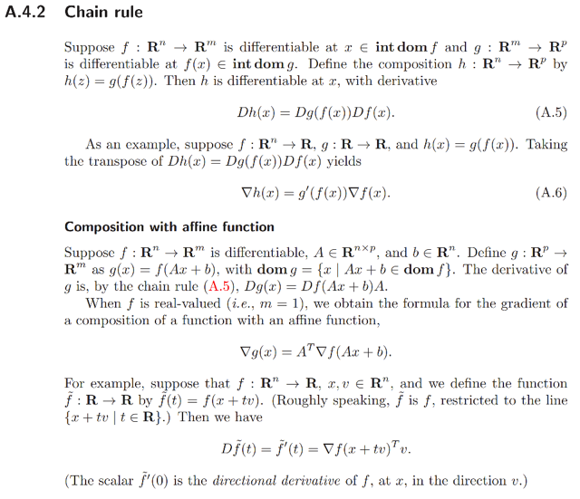</kbd>

 

<kbd>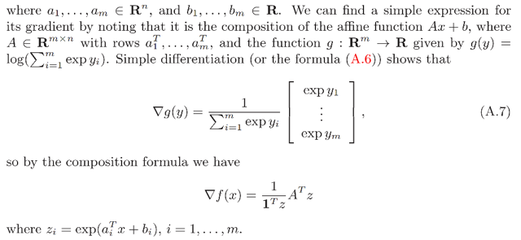</kbd>

<kbd>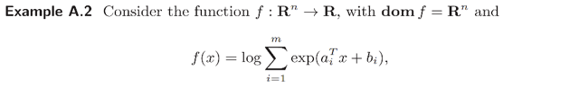</kbd>

> [!NOTE]
> Thử tìm derivative cái này dùng chain rule:
>
> f(x) = log Σ exp (aiTx + bi)
>
> ui = aiTx+bi ⇨ dui = aiTdx
>
> vi = exp ui ⇨ dvi = exp(ui) dui
>
> g = Σ vi ⇨ dg = Σ dvi
>
> f = log g ⇨ df = 1/g dg
>
> = 1/g Σ dvi = 1/g Σ dvi = 1/g Σ [exp(ui) dui]
>
> = 1/g Σ [exp(ui) aiTdx]
>
> = (1/Σ exp(aiTx+bi)) Σ [exp (aiTx+bi) aiTdx ]
>
> Xét Σ exp(aiTx+bi), chính là 1Texp(Ax + b)
>
> Σ [exp (aiTx+bi)] aiTdx chính là:
>
> Σi [ exp(Ax + b)_i * (Adx)_i ]
>
> = exp(Ax + b)T(Adx)
>
> Vậy...df = [1/1Texp(Ax + b)] exp(Ax + b)T(Adx)
>
> Đặt z = exp(Ax + b) ⇨ 
>
> df = (1/1Tz) zTAdx
>
> = [(1/1Tz) ATz)Tdx
>
> ⇨ ∇f = (1/1Tz) ATz

 

<kbd>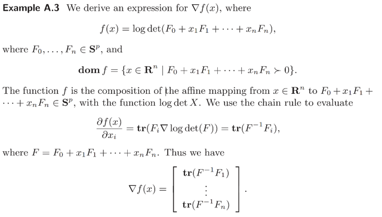</kbd>

> [!NOTE]
> Thử cái này: f(x) log det (F0 + Σi xiFi)
>
> Dùng kết quả ∇(log det A) = AinvT ⇨ d log det A = AinvT . dA
>
> = tr(AinvdA) 
>
> Đặt F = F0 + Σi xiFi ⇨ dF = Σi Fidxi
>
> ⇨ d log det F = tr(FinvdF) = tr[Finv Σi (Fidxi)] 
>
> = tr(Σi FinvFidxi) 
>
> = Σi tr(FinvFidxi) | trace của Σ = Σ của trace
>
> = Σi tr(FinvFi)dxi | vì dxi là scalar, tr(Aα) = tr(A)α 
>
> = DTdx với D = [tr(FinvF1), tr(FinvF2),...tr(FinvFn)]T
>
>  tới đây đã có dạng inner product giữa vector với vector dx
>
> ⇨ ∇f = D = [tr(FinvF1), tr(FinvF2),...tr(FinvFn)]T

 

<kbd>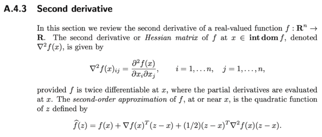</kbd>

<kbd>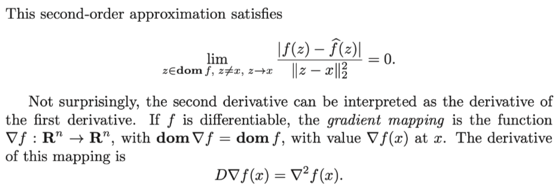</kbd>

 

