# Appendix C

📊 **Progress:** `43` Notes | `63` Screenshots

---

## Appendix C

 

## C.2 Giải hệ ma trận đơn giản

<kbd>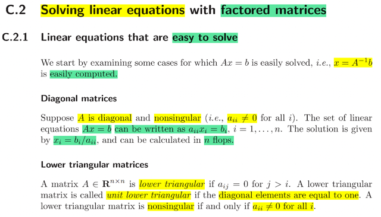</kbd>

<kbd>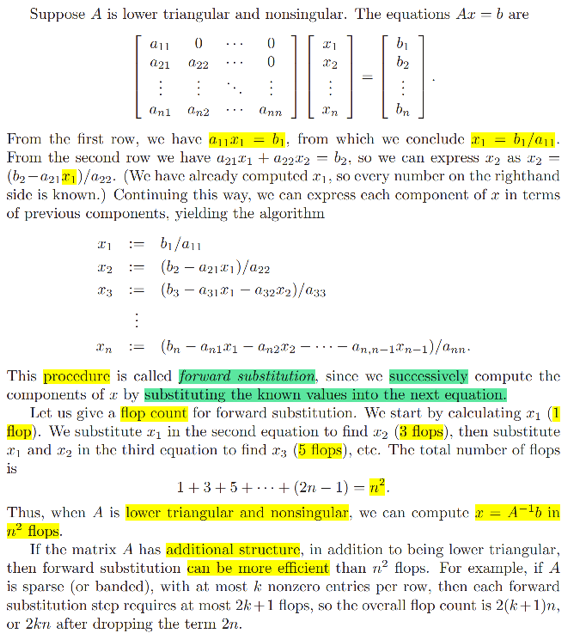</kbd>

> [!NOTE]
> Đầu tiên là nói về việc giải các hệ Ax = b mà việc tìm x = Ainv.b đơn giản.
>
> Case đơn giản nhất là khi A diagonal / non-singular (dễ hiểu muốn vậy yêu
> cầu là mọi diagonal entries phải khác 0 vì như vậy det sẽ khác 0, hoặc mọi
> eigenvalues đều khác 0).
>
> Thế thì Ax khi đó như đã biết có thể coi như element-wise multiplication giữa
> "vector đường chéo" và vector x. Nên Ax = b có thể chỉ là hệ aii*xi = bi
>
> Và ta chỉ cần n phép chia xi = bi / aii để có x ⇨ tốn n flops.
>
> ====
>
> Case thứ hai cũng dễ tính là khi A là lower triangular matrix. Khi đó Ax = b nó
> có dạng:
>
> a11x1 = b1
>
> a21x1 + a22x2 = b2
>
> a21x1 + a22x2 + a23x3 = b3
>
> ...
>
> Thành ra từ equation 1 ta giải ra x1 = b1/a11 tốn 1 flops
>
> x2 = (b2 - a21x1) / a22 tốn 3 flops (1 nhân, 1 trừ, 1 chia)
>
> x3 = (b3 - a32x2 - a33x3) / a33 tốn 5 flops (2 nhân, 2 trừ, 1 chia)
>
> tương tự vậy thì qúa trình này gọi là FORWARD SUBSTITUTION
>
> ...
>
> xn = (bn - an2x2 - an3x3 ...annxn) / ann tốn 2n - 1 flops (n-1 nhân, n-1 trừ,
> 1 chia)
>
> và tổng cộng tốn 1 + 3 + 5 + ...(2n - 1) 
>
> = [(2n - 1 + 1) / 4]*2n = n^2 flops
>
> Cuối cùng, ý nói nếu A ngoài việc là lower triangular mà còn có cấu trúc đặc
> biệt nào khác nữa thì còn có thể khai thác để tính còn ít flop hơn nữa
>
> Ví dụ nếu A sparse trong đó mỗi hàng có nhiều nhất k entries khác 0 thì sao:
> thì khi đó chỉ có nhiều nhất là k phép nhân giữa aij và xj. vậy thì việc tính:
>
> xn = (bn - an2x2 - an3x3 ...annxn) / ann sẽ chỉ tốn nhiều nhất k nhân, k trừ, 1
> chia
>
> = 2k + 1
>
> Và mỗi hàng thì chỉ nhiều nhất là nhiêu đó ⇨ tổng cộng nhiều nhất chỉ tốn
> n(2k + 1) = 2kn + n. Coi như 2kn

 

<kbd>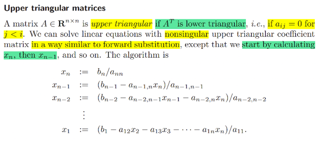</kbd>

<kbd>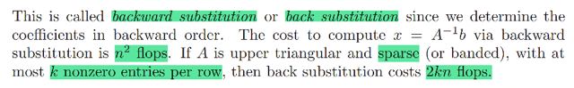</kbd>

> [!NOTE]
> Cái này - khi A là upper triangular matrix thì hoàn toàn tương tự, chỉ 
> khác là khi đó việc giải Ax = b sẽ giải tìm xn trước, rồi đến xn-1, ....x2, x1
>
> Đây gọi là BACK-SUBSTITUTION mà MIT 18.06 đã học. Đó là khi ta 
> giải Ax=b bằng cách Gauss elimination A|b để đưa nó về U|b' với U là
> row-echelon form của A, là một upper triangular matrix. 
>
> Thì chi phí cho cái này cũng như khi forward substitution: n^2. Hoặc 
> nếu A có thêm tính chất sparse với nhiều nhất k non-zero entries mỗi 
> hàng thì cost sẽ chỉ là 2kn

 

<kbd>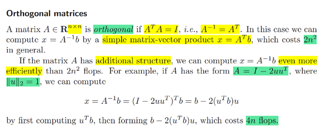</kbd>

> [!NOTE]
> rồi nói qua case khi A là orthogonal matrix. Như đã biết matrix chỉ 
> được gọi là orthogonal nếu nó vuông và các cột orthonormal.
> Khi đó AAT = ATA = I (do tính chất orthonormal của các cột) 
> ⇨ Ainv = AT
>
> Vầy thì dễ hiểu là có thể tính x = Ainv b bởi ATb và cái này tốn
> 2n^2 flops, lập luận nhanh: 
>
> n lần nhân ATj*bj, mỗi lần tốn n flops
>
> + n lần cộng cột (ATj * bj) với nhau, mỗi lần n flops
>
> = n^2 + n^2 = 2n^2
>
> ====
>
> Nếu orthogonal matrix A có dạng I - 2uuT thì ATx 
>
> = (I - 2uuT)Tx = ITx - 2uuTx
>
> uTx tốn 2n (n phép nhân scalar-scalar, n cộng scalar-scalar)
>
> uuTx tốn n (n phép nhân scalar ui - scalar uTx)
>
> 2uuTx tốn n (n phép nhân scalar (2) - scalar (uuTx)i)
>
> ITx: không tốn
>
> ITx - 2uuTx không tốn
>
> Tổng cộng 2n + n + n = 4n

 

<kbd>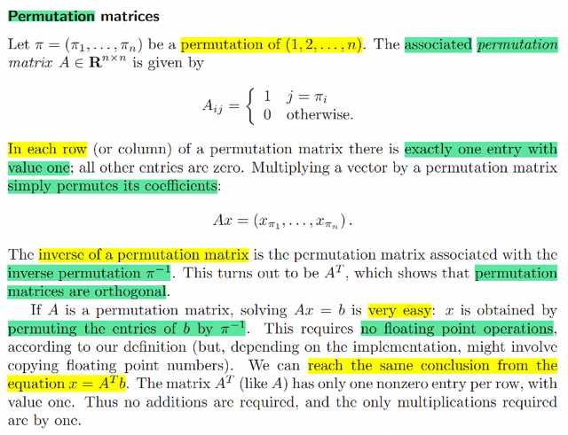</kbd>

> [!NOTE]
> đại khái là với A là permutation matrix thì nó là orthogonal matrix nên 
> Ainv = AT. ⇨ x = ATb. Mà vì các entries của A có tính chất là chỉ có
> 1 non-entry ở mỗi row. Nên theo kết quả hồi nãy, nhiều nhất chỉ cần
> 2kn = 2n flops. Tuy nhiên vì mỗi non-zero entries đều là số 1 nên
> thật ra không tốn flops nào

 

<kbd>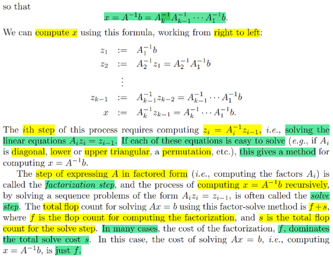</kbd>

<kbd>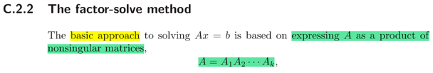</kbd>

> [!NOTE]
> Ta qua phương pháp gọi là factor-solve (nãy giờ C2.1 là các
> case mà có thể tính x = Ainv b một cách đơn giản,  làm tiền đề
> cho phần này, khi ta xét A không thể tính x = Ainv b đơn giản
> được)
>
> Thế thì đại khái là phương pháp này ý tưởng chính là phân tách
> (factor) A thành tích các matrix A1A2.....Ak
>
> Thì khi đó dựa vào tính chất của inverse: (UV)inv = VinvUinv nên
> x = Ainvb = AkinvAk-1inv...A2invA1inv b
>
> Thế là từ đó, nếu việc phân tách A khiến cho ra các A1, A2.... là
> các matrix đơn giản thuộc những loại như vừa rồi mới nói như
> diagonal / orthogonal...thì việc tính A1inv b (vốn dĩ là bài toán
> giải A1y = b), rồi A2inv(A1invb), vốn dĩ là bài toán A2z = A1invb...
> sẽ đều làm được
>
> Từ đó việc tính x = Ainv b sẽ có thể tính bằng cách tính một
> chuỗi A1invb, A2invA1invb,....
>
> Thế thì, có thể thấy phuong pháp này gồm 2 bước:
>
> Bước 1 là factorizing A thành A1A2....Ak. Gọi chi phí của nó là f
>
> Bước 2 là tính cái chuỗi trên, gọi chi phí tổng cộng là s.
>
> ⇨ tổng chi phí là f + s
>
> Thì ở đây nói thường thì f >> s thì ta có thể coi cost tổng là f

 

<kbd>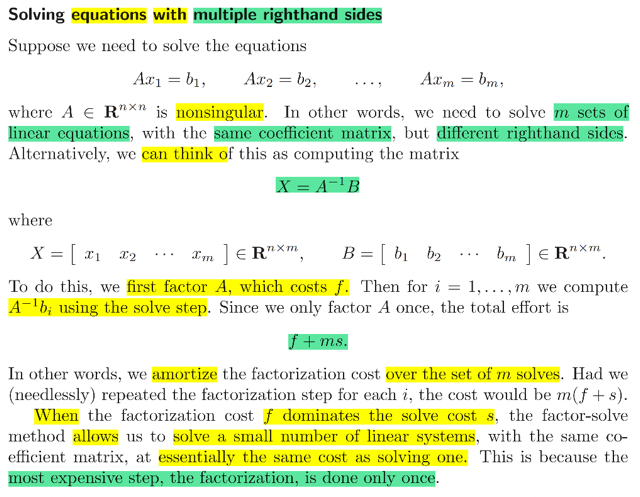</kbd>

<kbd>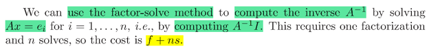</kbd>

> [!NOTE]
> Rồi phần này cũng đơn giản thôi, đại khái là có khi ta muốn giải không
> phải một mà là m hệ phương trình, cùng một A, nhưng khác b:
>
> Ax1 = b1, Ax2 = b2, ....Axm = bm
>
> Thế thì đại khái là, đương nhiên ta chỉ cần factoring A một lần (tốn f flops)
> A = A1A2....Ak. Sau đó dùng nó để tính x1 = Akinv....A1invb1, x2 = ...
> mỗi lần tốn s, tổng cộng m lần thì tốn ms ⇨ tổng cộng tốn f + ms
>
> Và người ta dùng từ khấu hao (amortize) để ý là thay vì mỗi lần giải Axj = bj
> mỗi lần factorize A thì ta factorize môt lần và xài cho nhiều hệ (giống như 
> mua tài sản một lần rồi xài cho nhiều năm thì chia chi phí mua tài sản cho
> số năm thì nó không lớn ý là vậy)
>
> Nói thêm việc giải m hệ Ax1 = b1, ...Axm = bm thì cũng giống như giải 
> AX = B với X là matrix các cộtv là x1, x2....B là matrix các cột b1, b2....
>
> Cuối cùng một điểm quan trọng chính là việc ta có thể dùng cách này để
> tìm Ainv.
>
> Vì khi ta cho B là I, thì bài toán sẽ là giải AX = I, và giải ra X thì chính là 
> tìm ra Ainv
>
> Again, quá trình cũng là đầu tiên factorize A = A1A2...Ak
>
> Sau đó lần lượt giải tìm x1 = Akinv...A2invA1inv [cột 1 của I, là e1]
>
> rồi x2 = Akin...A2invA1inv [cột 2 của I, là e2]
>
> ....
>
> Xong hết ráp lại X = [x1, x2....] (các cột là x1, x2...) thì đó chính là Ainv

 

## C.3 LU, Cholesky and LDLT factorization

<kbd>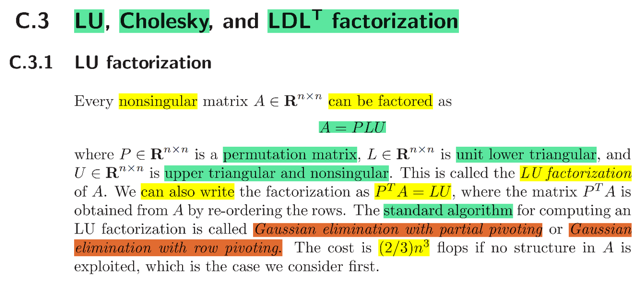</kbd>

> [!NOTE]
> Ví dụ A = [a11 a12; a21 a22]
>
> Để đưa A về U:
>
> Dùng E21 để khử a21:
>
> Hàng 1 giữ nguyên ⇨ E21_row1 = [1 0]
>
> Khử a21: E21A_row2 = A_row2 - A_row1*a21/a11
>
> = A_row1*(-a21/a11) + A_row2
>
> ⇨ E21_row2 = [-a21/a11, 1]
>
> ⇨ E21 = [1, 0; -a21/a11, 1]
>
> Thế thì ví dụ đơn giản này cũng có thể cho thấy rằng vì sao trong
> sách nói vậy:
>
> Ta thấy với A là matrix 2x2 như trên thì chỉ sau bước eliminate a21 thì
> ta đã có dạng row echelon U. Và quá trình trên được represent bởi:'
>
> E21A = U với E21 =  [1, 0; -a21/a11, 1] là lower-triangular matrix,
> chính xác hơn nó cũng chính là unit lower triangular matrix vì mọi
> component trên đường chéo = 1
>
> Và nó cũng invertible ⇨ A = E21inv U Và E21inv cũng là unit lower
> triangular matrix luôn, vì sao, vì với E21là triangular matrix thì
> eigenavalues của nó chính là trên đường chéo = 1, 1 Và do đó, với
> E21inv thì eigenvalues sẽ là 1/1, 1/1 (vì ta đã biết nếu λ là
> eigenvalues của A thì eigenvalue của Ainv sẽ là 1/λ. Chứng minh
> nhanh: Ax =λx ⇔ AinvAx = Ainv λx (nhân hai vế cho Ainv) ⇨ Ainv λx
> = x ⇨ Ainv x = x 1/λ, và cái này chứng tỏ 1/λlà eigenvalue của Ainv)
>
> Vậy thì có thể hiểu vì sao nói A = LU thì L là lower triangular unit
> matrix, nó chính là E21_inv ở case trên.
>
> ====
>
> Còn cái vụ có sự xuất hiện của P thì như 18.06 cũng đã nói, ta có
> thể cần permute row của A trước (như lúc Gaussian elimination ta
> eliminate bởi matrix E, nhưng đôi khi ta cần switch row) Thành ta
> tổng hợp lại ta eliminate bởi matrix E = ví dụ ....E31E21 và  permute
> row của A bởi P. PA = EinvU = LU
>
> Thì ta cũng có thể ghi là A = PLU đơn giản chỉ là permute A trước hay
> eliminate rồi permute sau
>
> Xem tại sao cost lại là (2/3)n^3:
>
> QUAY LẠI SAU

 

<kbd>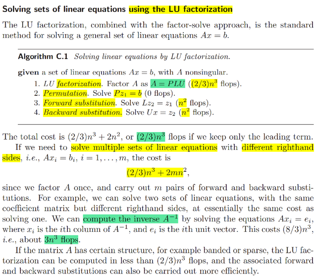</kbd>

> [!NOTE]
> rồi, với LU factorization ta có thể dùng nó để giải hệ Ax = b bằng
> phương pháp factor-solve:
>
> Bước 1: Factorizing A: A = PLU
>
> (chỗ này nên hiểu rằng trong 18.06 ta có PA = LU, thì A = PinvLU thì
> Pinv cũng là permutation matrix, nên có thể gọi là A = PLU cũng
> được (với P là Pinv của cái PA = LU)
>
> Sau đó thì Ax = b ⇔ PLUx= b và ta sẽ lần lượt giải cái bài toán:
>
> Pz1 = b ⇨ z1 = Pinvb, tốn 0 flops vì đây là Permutation matrix như
> đã nói, không tốn flops vì chỉ toàn là non-zeros entries có giá trị
> bằng 1
>
> Lz2 = z1 ⇨ z2 = Linv z1, với L là lower triangular matrix thì việc giải
> cái này chính là forward substitution như đã nói, tốn n^2
>
> Ux = z2, với U là upper triangular, đây là back-substitution, tốn n^2
>
> TỔng cộng tốn (2/3)n^3 + 2n^2 coi như 2/3n^3
>
> ====
>
> Và như đã nói, ta cũng có thể tìm Ainv

 

<kbd>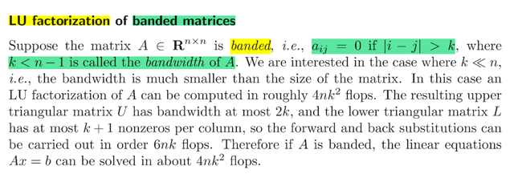</kbd>

<kbd>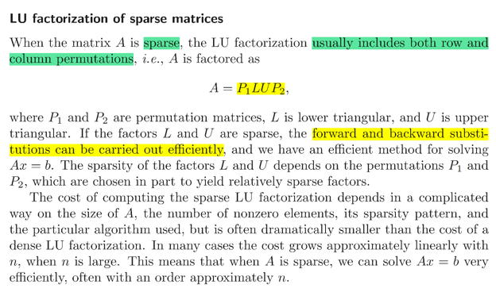</kbd>

> [!NOTE]
> đại khái là ta biết thêm một loại matrix đã gặp trong MIT 18.06
> ví dụ như tridiagonal matrix đại khái là matrix này chỉ có một
> dải (band) rộng bằng k tại đường chéo là có giá trị khác 0 thôi.
> còn lại bằng 0 hết (k gọi là bandwidth)
>
> Khi đó LU factorization của matrix dạng này sẽ chỉ tốn ≈ 4nk^2
>
> Và matrix U sẽ có bandwidth nhiều nhất là 2k. Matrix L có nhiều
> nhất là k + 1 non-zeros mỗi cột.
>
> Giúp bước solve sẽ chỉ tốn 6kn flops
>
> Thành ra việc giải Ax = b với banded matrix sẽ chỉ tốn 4nk^2 + 6kn 
> coi như 4nk^2 flops
>
> Những con số trên tạm chấp nhận, quay lại chứng minh sau
>
> ====
>
> Phần dưới QUAY LẠI SAU

**🔗 See also:** [linked note](#node-n8ryfyq)

 

<kbd>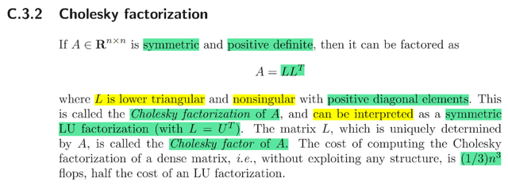</kbd>

<kbd>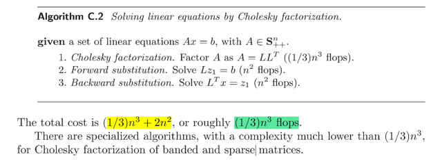</kbd>

<kbd>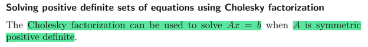</kbd>

> [!NOTE]
> rồi qua cái này Cholesky factorization có thể hiểu đại khái là khi ta
> apply LU factorization đối với không phải với non-singular matrix mà
> là positive definite matrix (dĩ nhiên PD matrix cũng non-singular) thì
> khi đó U nó thành ra cũng đặc biệt ở chỗ nó chính là LT.
>
> Từ đó ta có cái gọi là Cholesky factorization:
>
> A = LLT.
>
> Và chi phí của nó chỉ bằng 1/2 chi phí của LU factorization
>
> Nói chung là cách làm cũng vậy thôi. Factorizing A = LLT rồi  giải
> từng hệ Lz1 = b, LTx = z1
>
> Nói chung là nhờ positive definite có thể được factorized chỉ tốn
> 1/3n^3 nên việc giải hệ khi A ≻ 0 cũng ít tốn flop hơn

 

<kbd>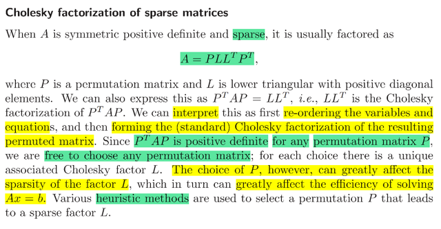</kbd>

> [!NOTE]
> cũng tương tự khi A = PLU, mà nếu A sparse thì thường việc
> factoring A sẽ kèm theo permute cả row nữa: A = PLUPT.
>
> Dể thấy PLU thì tức là ta permute row của LU, còn (PLU)PT
> chính là ta permute columns của PLU
>
> Thì ở đây cũng vậy A = PLLTPT
>
> Và cũng lại có thể hiểu khi họ nói thay vì nói A = PLLTPT ta
> có thể nói PTAP = LLT (cũng tương tự như thay vì nói A = PLU
> thì có thể nói PA = LU)
>
> Và PTAP nới A là ≻ 0 thì PTAP cũng ≻ 0 với mọi P. Nên ý chính
> là việc permute như thế nào không ảnh hưởng đến Cholesky
> factorization, tức là luôn giữ được yêu cầu matrix là positive definite
>
> Nhưng điểm quan trọng là P lại ảnh hưởng đến tính sparsity của
> LLT.
>
> Thành ra việc chọn P sẽ có thể giúp giảm cost của việc giải Ax = b
> vì chọn P có thể khiến LLT sparse hơn

**🔗 See also:** [linked note](./chap_95.md#node-j847q9w)

 

<kbd>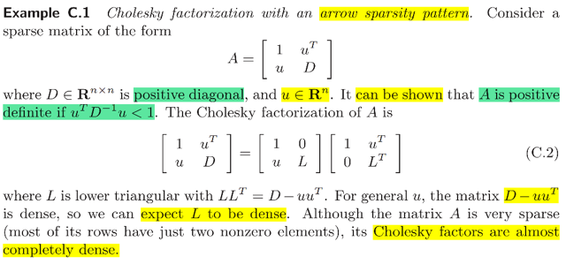</kbd>

<kbd>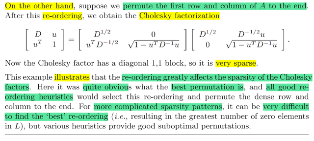</kbd>

> [!NOTE]
> xTAx = [t yT]A[t yT]T
>
> = [t yT][1 uT; u D][t yT]T
>
> = [t yT][1*t + uTy; ut + Dy]
>
> = t(1*t + uTy) + yT(ut + Dy)
>
> = t^2 + uTyt + yTut + yTDy
>
> = t^2 + 2uTyt + yTDy
>
> Completing the square:
>
> = t^2 + 2uTyt + (uTy)^2 - (uTy)^2 + yTDy
>
> = (t + 2uTy)^2 - yTuuTy + yTDy
>
> = (t + 2uTy)^2 + yT(- uuTy + Dy)
>
> = (t + 2uTy)^2 + yT(- uuT + D)y
>
> = (t + 2uTy)^2 + yT(D - uuT)y
>
> Với việc (t + 2uTy)^2 ≥ 0 (chỉ bằng 0 khi t = 0, y = 0)
>
> thì nếu yT(D - uuT)y > 0 ∀ y khác 0, thì xTAx sẽ luôn > 0 ∀ x khác 0 và 
> chỉ bằng 0 khi x = 0 (t = 0, y = 0). Khi đó A sẽ ≻ 0
>
> Vậy yêu cầu đó tương đương D - uuT ≻ 0
>
> Và bước cuối ta sẽ chứng minh khi uTDinvu < 1 thì ta sẽ điều này.
>
> Đặt z = D^1/2 y; w = D^-1/2 u
>
> ⇨ yT(D - uuT)y = yTDy - yTuuTy
>
> = (D^1/2y)T(D^1/2y) - (uTy)^2
>
> = ||D^1/2y||^2 - (uTy)^2
>
> = ||z||^2 - (uTy)^2
>
> uTy = uT(I)y = uT(D^-1/2 D^1/2)y 
>
> = (D^-1/2Tu)T(D^1/2y)
>
> = (D^-1/2u)T(D^1/2y)  |  D^-1/2 là diagonal matrix ⇨ D^-1/2 = (D^-1/2)T
>
> = wTz
>
> Vậy yT(D - uuT)y = ||z||^2 - (wTz)^2
>
> Tới đây ta dùng inequality: -||w||.||z|| ≤ wTz = ||w||.||z||.cos(θ) ≤ ||w||.||z||
>
> ⇨ (wTz)^2 ≥ ||w||^2*||z||^2
>
> Vậy yT(D - uuT)y = ||z||^2 - (wTz)^2 ≥ ||z||^2 - ||w||^2*||z||^2 
>
> = ||z||^2[1 - ||w||^2] = ||z||^2[1 - (D^-1/2u)T(D^-1/2u)]
>
> = ||z||^2[1 - uTD^-1/2D^-1/2u]
>
> = ||z||^2(1 - uTD^-1u)
>
> Như vậy, khi uTDinvu < 1 ⇨ 1 - uTDinvu > 0
>
> ⇨ ||z||^2(1 - uTDinvu) > 0 giúp kết luận yT(D - uuT)y positive definite
>
> Và từ đó dẫn tới A positive definite
>
> QUAY LẠI SAU.
>
> Nhưng đại ý là khi ta giữ A ở dạng gốc, Cholesky factorization sẽ tạo
> ra kết quả khá dense.
>
> Trong khi đó, khi swap column đầu và row đầu về cuối thì kêt quả của
> factorization sẽ sparse hơn. Khiến nếu áp dụng kết quả này để giải
> hệ phương trình theo phương pháp: factor-solver thì ta sẽ tốn ít chi phí
> hơn nhiều.

 

<kbd>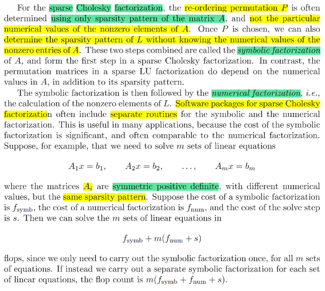</kbd>

> [!NOTE]
> đại ý là vầy, thường thì sẽ có hai bước trong việc sparse Cholesky
> factorization.
>
> Trong đó bước một chỉ cần phụ thuộc vào sparsity pattern của A
> và nó gọi là symbolic factorization.
>
> Và bước hai sẽ là numerical factorization.
>
> Nói chung là, do đó khi giải nhiều hệ Ax = bi. Thì việc đầu tiên
> là symbolic factorization, tốn f_symb
>
> Sau đó với mỗi hệ Ax = bi cụ thể, thì ta sẽ numerical factorization
> tốn f_num , và giải x (bước solver) tốn cost là s
>
> Tổng cộng chi phí sẽ là f_symb + m(fnum + s)

 

<kbd>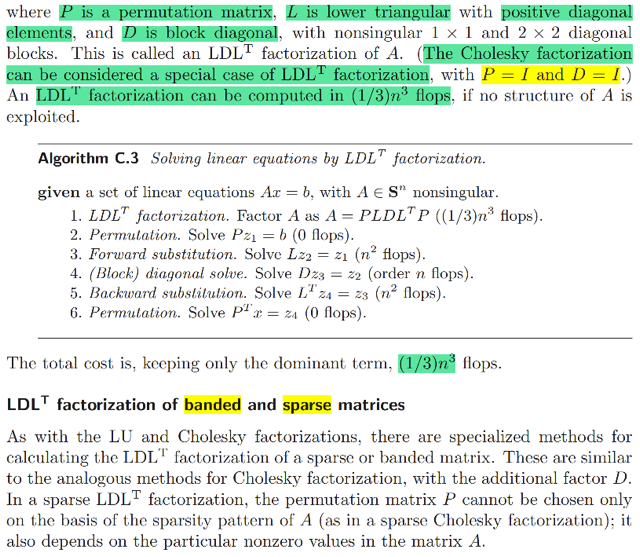</kbd>

<kbd>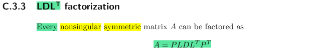</kbd>

> [!NOTE]
> Vừa rồi ta nói khi non-singular matrix A mà là symmetric positive  definite
> thì ta có Cholesky factorization A = LLT mà ta có thể coi như nó là dạng
> đặc biệt của LU factorization khi A symmetric.
>
> Thế thì này, không cần A positive definite, mà chỉ cần nó symmetric thì A
> có thể được factorized thành dạng A = PLDLTPT
>
> để rồi có thể coi Cholesky factorization là case đặc biệt của LDLT
> factorization với P = I, D = I
>
> Thế thì việc giải hệ Ax = b với A = PLDLTPT cũng theo như các bước của
> factor-solver method
>
> Bước 1 là factor A = PLDLTPT, cái này người ta nói tốn n^3/3 flops
>
> Bước 2 là solve: P(LDLTPTx) = b ,  tức giải Pz1 = b, đây là solve hệ với
> với Permutation matrix: không tốn flops nào
>
> Bước 3: L(DLTPTx) = z1, tức Lz2 = z1 hệ này dính đế L là lower triangular
> nên nó chính là Forward-substitution, tốn n^2
>
> Bước 4: D(LTPTx) = z2, tức Dz3 = z2 hệ này là dính đến diagonal matrix,
> nên chỉ tốn n flops
>
> Bước 5: LT(PTx) = z3, LTz4 = z3 hệ này dính đến LT, là upper triangular
> matrix nên nó chính là Back-substitution, tốn n^2
>
> Bước 6: PTx = z4, với PT là permutation thì giải cái này không tốn flops.
>
> Tổng cộng là n^3/3 + 2n^2 + n, coi như n^3/3

**🔗 See also:** [linked note](./chap_10.md#node-yf53tj8)

 

## C.4 Block elimination

<kbd>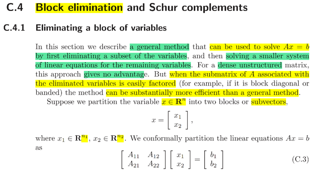</kbd>

<kbd>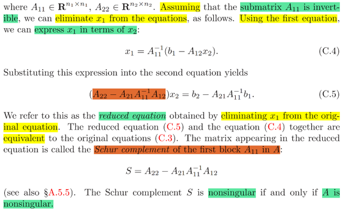</kbd>

> [!NOTE]
> Đại khái là phần này nói về một phương pháp giải Ax = b với ý
> tưởng là ta sẽ loại bỏ bớt variable của A, từ đó giải một hệ nhỏ
> hơn với các variable còn lại.
>
> Thế thì nếu như matrix A dense và không có cấu trúc nào đặc biệt
> thì phương pháp này vô nghĩa (không có lợi ích gì hơn cả)
>
> Nhưng nếu sau khi loại bỏ variable, matrix có dạng mà trong đó có
> một submatrix có một cấu trúc nào đó giúp ta có thể tận dụng (như
> các case đã biết) thì khi đó phương pháp này sẽ có ích.
>
> ====
>
> Thế thì đầu tiên ta sẽ thể hiện Ax = b theo dạng
>
> [A11 A12; A21 A22] [x1; x2] = [b1; b2]
>
> Trong đó:
>
> A11 là R^(n1, n1); A22 là matrix R^(m1, m1)
>
> và cái này tương đương:
>
> A11x1 + A12x2 = b1 (1)
>
> và A21x1 + A22x2 = b2 (2)
>
> Từ (1) ⇨ A11x1 = b1 - A12x2 ⇨ x1 = A11inv(b1 - A12x2)
>
> Thế x1 vào (2):
>
> A21A11inv(b1 - A12x2) + A22x2 = b2
>
> ⇔ A21A11invb1 - A21A11invA12x2 + A22x2 = b2
>
> ⇔ A21A11invb1 + (- A21A11invA12 + A22)x2 = b2
>
> ⇔ (A22 - A21A11invA12)x2 = b2 - A21A11invb1
>
> Và S là A22 - A21A11invA12 gọi là Schur complement của 
> block A11
>
> Và cái hệ (A22 - A21A11invA12)x2 = b2 - A21A11invb1
>
> gọi là REDUCED system, nó có ít variable hơn (chỉ có x2,
> thay vì x1 và x2), gắn với matrix S thay vì A.
>
> Và tất nhiên giải ra x2 sẽ giúp giải ra x1 = A11inv(b1 - A12x2)

**🔗 See also:** [linked note](./chap_10.md#node-pjjarce)

 

<kbd>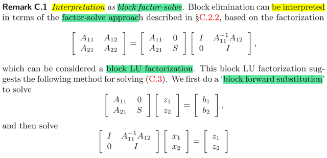</kbd>

<kbd>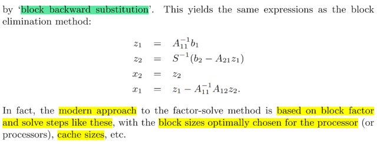</kbd>

<kbd>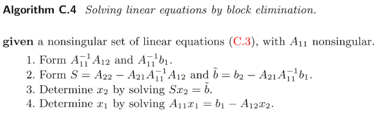</kbd>

> [!NOTE]
> Và thuật toán này có thể được hiểu theo cách của cách tiếp cận
> factor - solver.
>
> Cụ thể là block matrix [A11 A12; A21 A22] có thể được thể  hiện bởi
> [A11 0; A21 S] nhân với [I A11invA12; 0 I] như môt dạng LU
> factorization.
>
> Để rồi theo factor-solver method, bước 1 sẽ là giải:
>
> [A11 0; A21 S][z1; z2] = [b1; b2]
>
> Đây có thể coi như việc giải hệ Lz = b với L à lower triangular matrix
> thì như đã biết chính là forward backsubstitution:
>
> [A11 0; A21 S][z1; z2] = [b1; b2]
>
> ⇔ A11z1 = b1 (1) & A21z1 + Sz2 = b2 (2)
>
> Từ (1) ⇨ z1 = A11invb1 và thế vào (forward substitute) (2):
>
> (cái này tương ứng với step 1 của hình bên)
>
> A21A11invb1 + Sz2 = b2 ⇨ z2 = Sinv(b2 - A21A11invb1)
>
> (cái này tương ứng với step 2 (tính b~ = b2 - A21A11invb1) và 
> step 3 giải Sx2 = b~ của algorithm bên)
>
> sau đó là giải
>
> [I A11invA12; 0 I][x1; x2] = [z1, z2] thì đây có thể coi như hệ với
> upper triangular matrix, nên giải nó chính là back-subtitution:
>
> [I, A11invA12; 0 I][x1; x2] = [z1, z2] 
>
> ⇔ x1 + A11invA12x2 = z1 (3) và x2 = z2 (4)
>
> Từ (4) ta đã có x2, back-substitution vào (3) ta có x1 = z1 - A11invA12x2
>
> Đại khái là từ đó, ta có algorithm giúp solve Ax = b theo phương
> pháp Block-elimination method:
>
> 1) HÌnh thành A11invA12, và A11invb1 (bước này nhằm phục vụ
> việc hình thành Schur complement matrix S)
>
> 2) HÌnh thành matrix S = A22 - A21A11invA12 và b~ = b2 - A21A11invb1
>
> 3) Xác định x2 bởi việc giải Sx2 = b~
>
> 4) Thế vào tính x1 bằng A11x1 = b1 - A12x2

 

<kbd>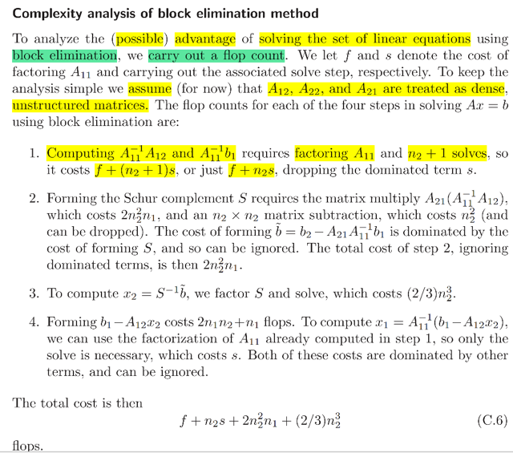</kbd>

> [!NOTE]
> Ta sẽ đếm số flop cần thiết của thuật toán vừa rồi.
>
> Đầu tiên như thường lệ gọi f là chi phí cần để factorizing A11 và s là
> chi phí để thực hiện bước solve step. (tức tính giải A11x = b)
>
> 1) TÍnh A11invA12 và A11invb1
>
> Tính A11invA12 thì chính là solve A11X = A12. Nên theo factor-
> solver method thì ta cần factor A11 trước, tốn f flops.
>
> Sau đó bước solve, dĩ nhiên với mỗi equation A11xj = A12[:,j] thì ta
> sẽ tốn s flops để giải ra xj, là một column của A11invA12 và A12 có
> tổng cộng n2 cột ⇨ Tổng cộng tốn f + s*n2
>
> Tương tự việc tính A11invb cũng tốn thêm s flops nữa.
>
> ⇨ Tổng cộng là f + (n2+1)s flops hoặc coi như f + n2s
>
> 2) Form Schur complement S: S = A22 - A21A11invA12
>
> A21(A11invA12): (n2, n1) (n1, n2): nhắc lại cho nhớ, cost của việc
> nhân hai matrix UV (coi như U là A21m V là A11invA112) sẽ là như 
> sau: [cost của U [cột của V]]*số cột của V
>
> U . [cột của V] = linear combination các cột của U với coefficients là
> components của cột của V ⇨ nhân coefficient * cột của V: n2 flops.
> U có n1 cột, vậy là n2*n1 flops. Cộng các kết qủa lại: mỗi lần cộng tốn
> n2 flops (phép cộng hai vector), và có n1 - 1 lần cộng.⇨ n2(n1-1)
>
> Tổng cộng là n2*n1 + n2(n1 - 1)  = 2n2n1 - n2 coi như 2n1n2 
>
> Và đó là U [cột của V] để ra một cột của UV, tổng cộng V có n2 cột
>
> ⇨ Nhân A21(A11invA12) ta sẽ tốn 2n1n2*n2 = 2n2^2n1
>
> Tính b~ = b2 - A21A11invb1. 
>
> thì  A21A11invb1 là nhân matrix U= A21 với vector v = A11invb1 như
> trên vừa tính ⇨ tốn 2n1n2. Cộng thêm một phép trừ vector (b2 - ..)
> tốn n2 flops nữa là thành ra 2n1n2 + n2 coi như 2n1n2
>
> Vậy bước hai thực hiện việc hình thành matrix Schur complement
> S = A22 - A21A11invA12 và tính b~ = b2 - A21A11invb1 sẽ tốn:
>
> 2n2^2n1 + 2n1n2 coi như 2n2^2n1
>
>
> 3) Tính x2 = Sinvb~. ta cần factor S và thực hiện solve step. Với S
> là symmetric matrix, ta cầ tốn 2/3 n2^3 như đã biết
>
> 4) Tính b1 - A12x2: 
>
> A12x2: 
>
> [scalar component của x2 * cột của A12: A12[:,j]x2[j], tốn n1 flops] *
> [số component của x2 = n2] = n1n2. 
>
> cộng các kết quả A12[:,j]x2[j] lại: cộng hai vector: n1 flops, và có (n2 - 1) 
> phép cộng: n1(n2-1)
>
> ⇨ n1n2 + n1(n2-1) coi như 2n1n2
>
> Thêm phép trừ b1 - ... tốn thêm n1 flops nữa là 2n1n2 + n1 = 2n1n2 + n1
>
> ⇨ cost 2n1n2 + n1 
>
> Tính x1 = A11inv(b1 - A12x2): 
>
> Tính cái này thì như đã nói ở trước, cost của Ainvb là cost của việc giải
> Ax = b, và nó bao gồm bước factor A thành A1A2...Ak, và buốc solve: 
> tính một chuỗi: A1z1 = b, A2z2 = z1, ...Akx = z(k-1). Thì đề bài đã cho
> bước factor A11 tốn f flops. Bước solve liên quan đến A11 tốn s flops
>
> Thành ra việc tính  x1 = A11inv(b1 - A12x2) gồm 3 việc trong đó đã có sẵn
> 2 việc: Factor A11, tính b1 - A12x2. Vậy thì chi phí chỉ là của bước solve
> = s flops 
>
> ⇨ Cost bước 4: 2n1n2 + n1 + s
>
> ====
>
> Tóm lại tốn (f + n2s) + 2n2^2n1 + (2/3)n2^3 + 2n1n2 + n1 + s
>
> coi như (f + n2s) + 2n2^2n1 + (2/3)n2^3

 

<kbd>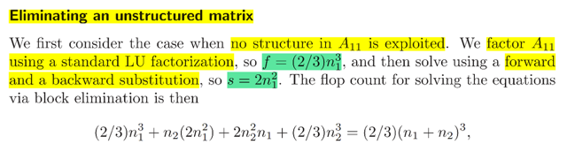</kbd>

<kbd>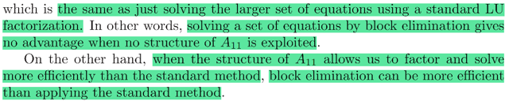</kbd>

> [!NOTE]
> Rồi, ở trên là công thức tính flops của Block elimination nhưng
> chưa  biết f, s (chi phí factoring A11 và solve A11 là gì)
>
> Thế thì đầu tiên cho rằng A11 không có cấu trúc gì đặc biệt để mà
> khai thác, ta sẽ chỉ factor nó thành theo dạng LU tiêu chuẩn, có chi
> phí theo công thức là (2/3)n1^3 (phần chứng minh công thức này
> ở phần trước mình sẽ quay lại sau)
>
> Và bước solve LUx = b sẽ gồm solve Lz = b là việc gỉai hệ với
> lower triangular matrix, như đã biết, chính là forward substitution,
> tốn n1^2
>
> Và sau đó là giải Ux = z, với U là upper triangular, nó chính là qúa
> trình  back substitution, tốn n1^2 flops
>
> Vậy s = n1^2 + n1^2 = 2n1^2
>
> Vậy chi phí hồi nãy với f, s ở đây sẽ là:
>
> (2/3)n1^3 + n2(2n1^2) + 2n2^2n1 + (2/3)n2^3 = (2/3) (n1 + n2)^3
>
> Thế thì tính như vậy để thấy rằng, nếu như ta không khai thác
> được gì từ cấu trúc của A11 để mà giảm chi phí xuống, thì việc giải
> hệ Ax = b theo block elimination, cũng chỉ y như giải Ax = b bằng
> LU factorization thông thường.
>
> Thật vậy, nếu factor - solver, với LU factorizing A = LU thì sẽ tốn f
> = 2/3 n^3
>
> Bước solve: 2n^2
>
> Tổng cộng là 2/3 n^3 + 2n^2 coi như 2/3 n^3 = (2/3)(n1 + n2)^3
>
> Do đó, cái hay của block elimination là khi A11 là matrix mà ta có
> thể khai thác cấu trúc của nó khi đó chi phí giải Ax = b với phương
> pháp này sẽ nhỏ hơn là giải với các làm tiêu chuẩn (với matrix A)

 

<kbd>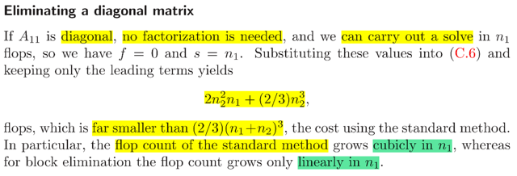</kbd>

> [!NOTE]
> Thì cụ thể là xét case đầu tiên là khi A11 nó là DIAGONAL matrix Dễ
> thấy khi đó không cần factor A11 gì ráo (vì với A diagonal rồi, thì giải
> Ax = b chỉ là giải m hệ aii xi = bi (A shape m,n) và như vậy chỉ tốn m
> phép chia xi = bi/aii)
>
> Vậy nên khi A11 đã là diagonal matrix thì chi phí factorizing f = 0 chi
> phí solving s = n1 (A11 shape n1,n1)
>
> Thế f, s vào công thức chi phí của việc giải Ax = b theo method  block
> - elimination:
>
> (f + n2s) + 2n2^2n1 + (2/3)n2^3
>
> = (0 + n2n1) + 2n2^2n1 + (2/3)n2^3
>
> = n2n1 + 2n2^2n1 + (2/3)n2^3
>
> coi như = 2n2^2n1 + (2/3)n2^3
>
> và cái này NHỎ HƠN NHIỀU so với cost của LU factor-solver với
> matrix A: = (2/3)(n1 + n2)^3  Cụ thể hơn là (2/3)(n1 + n2)^3 tăng
> theo bậc 3 của n1 (size của A11) trong khi  2n2^2n1 + (2/3)n2^3 chỉ
> tăng tuyến tính với n1

 

<kbd>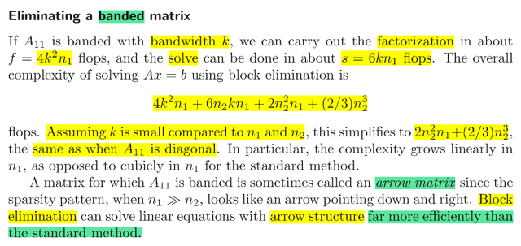</kbd>

> [!NOTE]
> Rồi, đại khái là phần trước ta đã viết về banded matrix có bandwidth k
> (là matrix mà các giá trị khác 0 chỉ tập trung ở một dải có bề rộng k ở
> đường chéo) sẽ có cost cho LU factorization chỉ là 4(k^2)n cũng như
> bước solve ít tốn kém hơn với 6kn.
>
> Nên nếu A11 mà như vậy thì factor sẽ chỉ tốn 4(k^2)n1 + 6kn1 flops
>
> Khi đó thế vào cost của block elimination:
>
> 4(k^2)n + n2*6kn1 + 2n2^2n1 + (2/3)n2^3
>
> Nếu giả định k nhỏ hơn n1, n2 nhiều. Thì kết quả trên có thể coi như:
>
> 2n2^2n1 + (2/3)n2^3
>
> Và kết qủa này giống như khi A11 là diagonal matrix
>
> Nói thêm rằng khi A11 là banded matrix thì đôi khi A được gọi là
> ARROW MATRIX nếu n2 >> n1 và việc giải Ax = b với phương pháp
> Block elimination hiệu quả hơn nhiều so với standard method

**🔗 See also:** [linked note](#node-dyoq50t)

 

<kbd>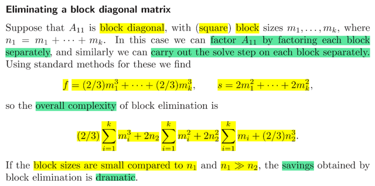</kbd>

<kbd>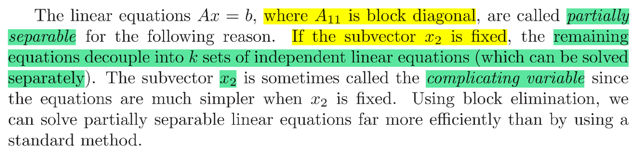</kbd>

> [!NOTE]
> CHƯA HIỂU,
> QUAY LẠI SAU

 

<kbd>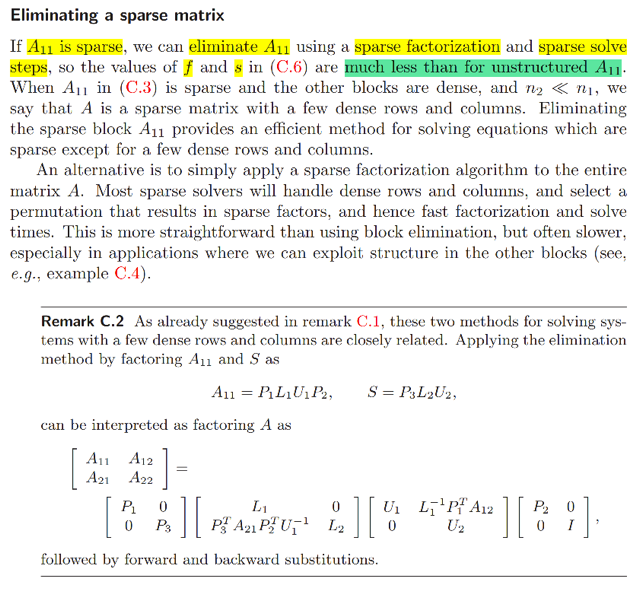</kbd>

> [!NOTE]
> QUAY LẠI SAU

 

<kbd>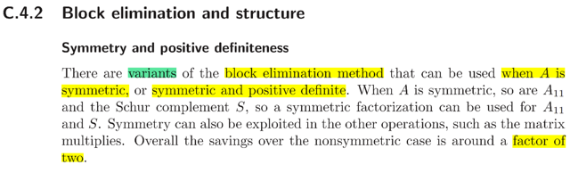</kbd>

<kbd>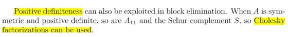</kbd>

> [!NOTE]
> Đại khái là khi A symmetric thì A11 và S (Schur complement của
> A11)  cũng vậy giúp chi phí của các bước liên quan cũng giảm đi.
>
> Và nhìn chung là giảm chi phí của việc giải Ax = b theo block
> elimination method đi một nửa
>
> Và khi A không những symmetric mà còn ≻ 0, thì như đã biết ta
> có thể dùng Cholesky factorization, giúp tốn chi phí ít hơn nữa
> so với LU factorization

 

<kbd>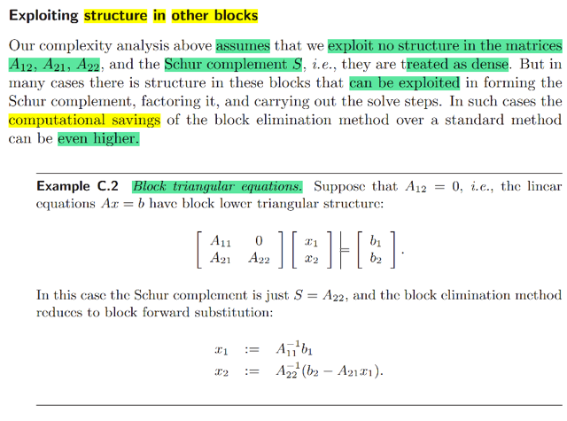</kbd>

> [!NOTE]
> rồi đại khái là nãy giờ mới chỉ nói về việc khai thác cấu trúc đặc 
> biệt của A11 không à, chứ chưa nói đến các matrix A12, A21, A22
> cũng như Schur complement S.
>
> Nếu có thì dĩ nhiên có thể giảm cost hơn nữa.
>
> Một ví dụ là khi A12 nó bằng 0. Khi đó S trở thành chỉ có A22. 
> Và việc giải x1, x2 có thể thấy sẽ là như vậy (ý nói đơn giản hơn
> trước)

 

<kbd>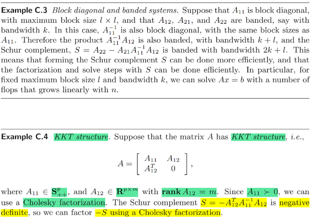</kbd>

> [!NOTE]
> Rồi, ví dụ C.3 QUAY LẠI SAU
>
> Ví dụ C.4 là một cái mà liên quan đến chap 10 khi ta cần giải
> Newton's  step trong bài toán equality constrained optimization
> problem.
>
> Nhớ lại một chút, thì đại khái là bối cảnh là ta đang xét bài toán
> equality constraint optimization problem: minimize f(x) với constrain:
> Ax = b
>
> Thế thì nếu xét cách tiếp cận là dùng Newton's method. Thì (để tính
> Newton step Δx_nt để từ x, thực hiện việc update) về cơ bản là ta sẽ
> "coi hàm f" như  quadratic approximation của nó tại x f(x + v) ≈ f(x) +
> ∇f(x)Tv = f^(x + v)
>
> Và khi đó, ta sẽ giải bài toán minimize g(v) = f^(x + v) với constraint
> A(x + v) = b ⇔ Av = 0
>
> Thế là đây là bài toán equality constraint quadratic optimization
> problem
>
> Và dùng KKT condition hoặc optimality condition ta sẽ dẫn tới việc
> giải hệ thể hiện bởi: Aw = 0 và ∇^2f(x) Δx_nt + ∇f(x) + ATw = 0
>
> và có thể gom lại để về cơ bản là ta giải hệ: K [Δx_nt; w] = [-∇f(x); 0]
> với K là KKT matrix = [∇^2f(x) A; AT 0]
>
> và đây chính là khi ta áp dụng cái nói ở đây, KKT matrix chính là matrix
> A có KKT structure, A11 ≽ 0. A12 là full column rank (hệ Ax = b của constraint)
>
> Thế thì khi A11 ≻ 0 (ví dụ như khi trong bài toán Newton's method, ta có
> strong convexity giúp ta có ∇^2f(x) ≻ 0) thì như đã biết ta có thể áp dụng
> Cholesky factorization giúp "nhẹ hơn" LU factorization. Và Schur complement
> = -A12T A11invA12 sẽ ≺ 0 cũng giúp có thể factor -S với Cholesky factorization
> nốt.
>
> (vì sao S ≺ 0: S = -A12T A11invA12 Xét quadratic form uTSu 
>
> = -uTA12T A11invA12u = -(A12u)TA11inv(A12u) = -qTA11invq với q = A12u
>
> Ta cần chứng minh qTA11invq > 0 ∀ q ≠ 0 và chỉ bằng 0 ⇔ q = 0.
>
> Đầu tiên xét A12u, A12 là full column rank matrix (shape p,m tức p hàng, m cột
> mà có rank = m, thì là full column rank) thì có thể nhớ rằng nullspace của full
> column rank matrix chỉ là {0}, đồng nghĩa q = A12u = 0 khi và chỉ khi u = 0
>
> Rồi, với A11inv thì dĩ nhiên eigenvalue của nó là nghịch đảo eigenvalue của A11
> và A11 positive definite thì mói eigevalue đều dương ⇨ nghịch đảo cũng dương
> ⇨ A11inv cũng positve definite. Và như vậy ∀ q khác 0 thì qTA11invq luôn > 0.
> Mà q khác 0 cũng ⇔ u khác 0. Vậy là ta đã có uTA12T A11invA12u luôn > 0
> và chỉ bằng 0 khi u = 0. ⇨  - uTA12T A11invA12u luôn < 0, chỉ bằng 0 khi u = 0
> ⇨ S = - A12T A11invA12 là negative definite.
>
> Nói chung ý chính là muốn nói ở bài toán này, ta có A11 có special structure
> (symmetric ≻ 0), và S cũng vậy (≺ 0) thành ra có thể khai thác
> (dùng Cholesky factorization "nhẹ chi phí" hơn LU factorization) giúp giải hệ
> Ax = b nhẹ hơn

 

<kbd>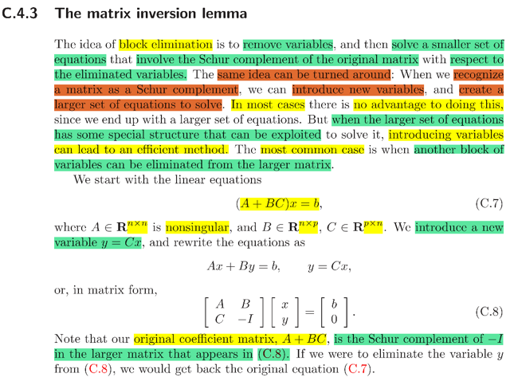</kbd>

> [!NOTE]
> đại khái là vầy, cái pp block elimination để giải Ax = b bằng cách
> thể hiện A = [A11, A12; A21 A22][x1; x2] = [b1; b2] về cơ bản là
> ta "tìm x1 theo x2" để thay vào có một hệ mới theo x2: Sx2 = b~
> Và giải cái hệ này, là một hệ nhỏ hơn.
>
> Thì ý tưởng là, có khi ta cũng có thể làm ngược lại, đó là nhận
> định A là schur-complement của một matrix lớn hơn. Để rồi bằng
> cách tạo thêm variable mới, ta dẫn đến việc giải một hệ lớn hơn
> nhưng dĩ nhiên là chỉ có ích khi việc gỉải hệ lớn hơn này có đặc 
> điểm nào đó lợi hơn giải hệ cũ, ví dụ như cái hệ lớn hơn này cho
> phép eliminate nhiều biến hơn 
>
> Một ví dụ là khi ta có hệ (A + BC)x = b
>
> thì bằng cách đặt (them variable) y = Cx, hệ trở thành Ax + By = b
> ⇔ [A, B; C -I][x; y] = [b; 0]
>
> Và A + BC chính là Schur complement của -I 
>
> (Với A = [A11, A12; A21, A22] thì Schur complement của A11 là 
> A22 - A12A11invA21.
>
> Vậy thì Schur complement của -I chính là A - B(-Iinv)C = A + BC

 

<kbd>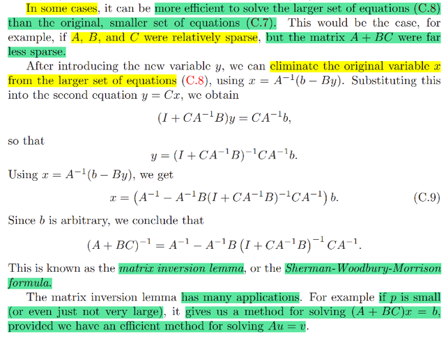</kbd>

> [!NOTE]
> Rồi, thế thì như đã nói, một số trường hợp ta sẽ có lợi khi giải một
> hệ lớn hơn (sau khi tạo thêm variable). Và lấy ví dụ như trong trường
> hợp này (với hệ lớn hơn [A, B; C, -I][x; y] = [b; 0] ta có đặc điểm là
> nó còn sparse hơn cả các sparse matrix (ví dụ vậy) A, B, C
>
> Lúc này ta có thể lại eliminate x:
>
> [A, B; C, -I][x; y] = [b; 0]
>
> ⇔ Ax + By = b (1) và Cx - y = 0 (2)
>
> Từ (1) ⇨ x = Ainv(b - By) (3) . Thế vào (2):
>
> CAinv(b - By) - y = 0 ⇔ CAinvb - CAinvBy - y = 0
>
> ⇔ CAinvb = (CAinvB + I)y ⇔ y = [CAinvB + I]invCAinvb
>
> ⇨ (thế vào (3) lại tìm x) x = Ainv(b - B[CAinvB + I]invCAinvb)
>
> = (Ainvb - AinvB[CAinvB + I]invCAinvb)
>
> ⇔ x = (Ainv - AinvB[I + CAinvB]invCAinv)b
>
> Thế thì từ đó dĩ nhiên ở đây x là solution của hệ gốc (A + BC)x = b ⇔ 
>
> x = (A + BC)invb
>
> Nên có thể suy ra (A + BC)inv =  (Ainv - AinvB[I + CAinvB]invCAinv)b
>
> và đây chính là BỔ ĐỂ MATRIX INVERSION.
>
> nó có nhiều ứng dụng, ví dụ như khi p nhỏ thì giải (A + BC)x = b
> sẽ có lợi hơn giải Au = v (ý này chưa hiểu lắm nhưng tạm biết vậy)

 

<kbd>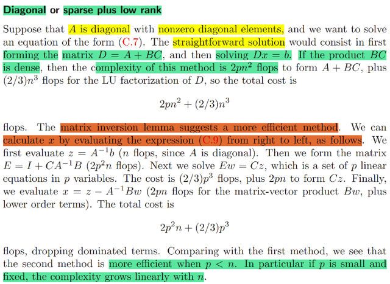</kbd>

> [!NOTE]
> rồi, xét ví dụ cho rằng A là diagonal matrix với đường chéo khác 0. Và ta
> muốn giải hệ (A
> + BC)x = b.
>
> Cách tiếp cận trực tiếp thông thường là hình thành D = A + BC, rồi  giải Dx =
> b.
>
> Và cho rằng BC là dense thì tính D sẽ tốn 2pn^2 flops: tại sao
>
> Shape A nxn; B nxp; C pxn
>
> BC sẽ tốn 2np (lập luận nhanh: mỗi component ij của BC sẽ là dot product
> của row i của B và column j của C, tốn p phép nhân scalar, p - 1 phép cộng
> là p + p - 1 coi như 2p. Và BC có n^2 component, ⇨ n^22p = 2pn^2 flops
>
> A + BC, là cộng matrix - matrix, tốn n^2 phép cộng
>
> ⇨ tốn n^2 + 2pn^2 coi như 2pn^2.
>
> Rồi, để gỉai Dx = b như đã biết gồm 2 bước factor D = LU sẽ tốn 2/3 n^3
>
> Do đó tính cho đến khi factor D thì ta tốn 2/3 n^3 + 2pn^2
>
> ====
>
> Rồi, thế thì họ mới nói rằng trong trường hợp này cái bổ đề trên cho phép ta
> có phương pháp nhẹ hơn:
>
> Đầu tiên ta xem việc tính cái này tốn mấy flops
>
> x = (Ainv - AinvB[I + CAinvB]invCAinv)b
>
> = Ainvb - AinvB[I + CAinvB]invCAinvb
>
> *Tính z = Ainvb, với A invertible diagonal thì Ainv cũng diagonal, và Ainvb dĩ
> nhiên chỉ tốn có n phép chia (bi / Ainv_ii) ⇨ n flops
>
> *Hình thành matrix E = I + CAinvB:
>
> AinvB: lập như trước, mỗi component của AinvB là inner product của row i
> của Ainv và column j của B. vốn dĩ sẽ tốn n + n - 1 = 2n - 1 flops. coi như 2n
> flops. và AinvB có np entries ⇨ 2n * np = 2(n^2)p flops Nhưng vì Ainv
> diagonal, nên mỗi hàng của nó chỉ có 1 con số khác 0. Thành ra mỗi phép
> dot product chỉ tốn 1 flops. Và AinvB chỉ tốn np flops
>
> CAinvB với C = (p, n); AinvB = (n, p) ⇨ tốn 2pnp (như AB (m, n)(n, p) tốn
> 2mnp) = 2(p^2)n. I + CAinvB tốn thêm không bao nhiêu (n phép cộng nữa)
>
> Vậy cost là 2(p^2)n flops
>
> *Tiếp theo tính [I + CAinvB]invCAinvb:
>
> Chính là giải Ew = CAinvb ⇔ Ew = Cz (vì cái này ⇔ w = EinvCz =  [I +
> CAinvB]invCAinvb
>
> Mà giải Ew = Cz thì đầu tiên phải form Cz: với C = (p, n), z = AinvB (R^n
> vector) đây là nhân matrix và vector (lập luận nhanh: ta sẽ tính n lần [scalar
> * cột của C, tốn p flops) là np flops. Và n - 1 [phép cộng cột-cột, tốn p flops]
> = np - p flops ⇨ Tổng cộng 2np - 1 coi như 2np flops.
>
> Tiếp theo là factorizing E = LU, tốn (2/3)p^3 flops
>
> Và solve step: Ew = Cz có lẽ là không bao nhiêu so với factor step nên
> trong sách nói rằng cost của việc tính ra w = EinvCz chỉ có 2np + (2/3)p^3
>
> Cưới cùng là t sẽ tính AinvBw
>
> Với Bw tốn 2np flops (nhân matrix n,p với R^p vector) và AinvBw chỉ tốn
> n flops) nên coi như 2np
>
> Và tính x = Ainvb - AinvB[I + CAinvB]invCAinvb = z - AinvBw tốn thêm mấy phép
> trừ nữa không bao nhiêu.
>
> Vậy tổng cộng là tốn: 2(p^2)n + (2/3)p^3
>
> Thế thì so với cost của cách giải thông thường (2pn^2 + (2/3)n^3)
> thì ta sẽ thấy khi p << n thì cách dùng matrix inversion lợi hơn. Vì nó
> chỉ tăng tuyến tính với n thay vì cubic với n như cái kia

 

<kbd>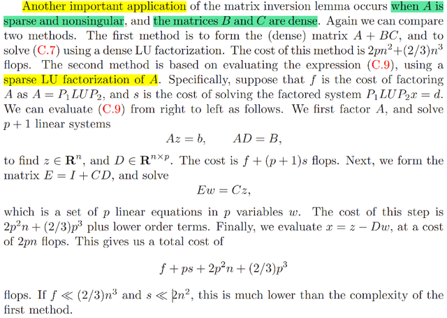</kbd>

> [!NOTE]
> Tương tự, nếu như A sparse và non-singular thì viêc giải theo
> matrix inversion lemma cũng sẽ hiệu quả hơn.
>
> Các phân tích cũng không quá khó hiểu:
>
> Đại khái là từ x = (Ainv - AinvB[I + CAinvB]invCAinv)b
>
> = Ainvb - AinvB[I + CAinvB]invCAinvb
>
> Thì nhờ A sparse và nonsingular nên bước factor A = LU sẽ
> có thể áp dụng cái vụ sparse LU factorizing, với chi phí là f
> nó sẽ có thể nhỏ hơn nhiều so với LU factorizing A "bình thường"
> (tốn 2/3 n^3)
>
> Thì từ đó nó giúp giảm cost của việc tính Ainvb (vốn là việc giải
> Az = b) cũng như tính AinvB (vốn là giải Ay = B)
>
> và dĩ nhiên là khiến cost tổng nhỏ hơn cost khi giải bằng cách
> thông thường

 

<kbd>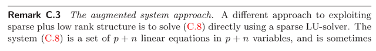</kbd>

<kbd>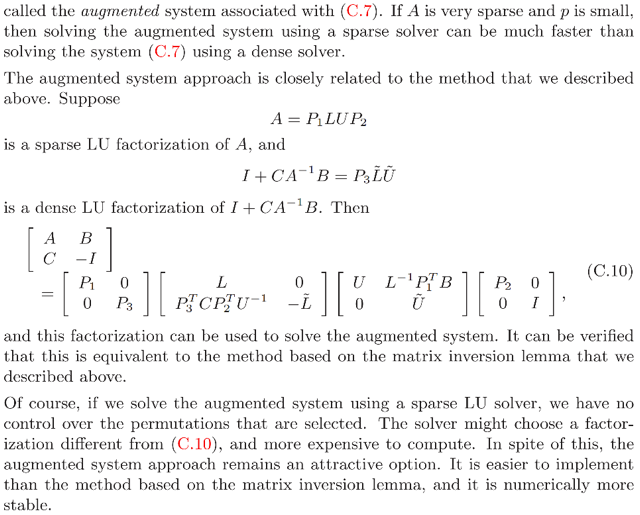</kbd>

> [!NOTE]
> QUAY LẠI SAU

 

<kbd>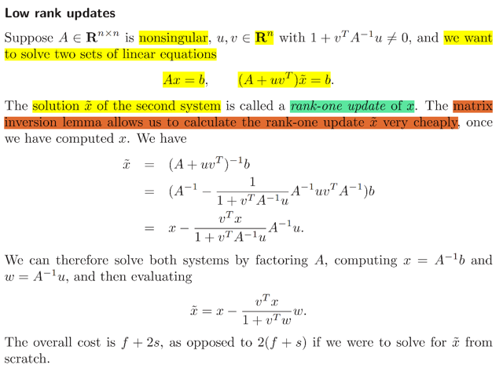</kbd>

> [!NOTE]
> QUAY LẠI SAU

 

## C.5 Solving under determined linear equation

<kbd>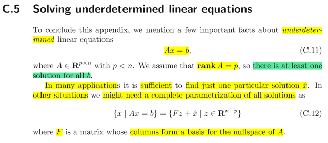</kbd>

> [!NOTE]
> Nói về một số điểm đáng chú ý khi giải một hệ underdetermined: Ax
> = b  với A là matrix lùn mập (nhiều cột hơn hàng) (p,n) với p < n.
>
> Và giả định là A full row rank, tức p hàng đều độc lập (nên dĩ nhiên
> có p cột độc lập, theo MIT 1806 ta đã biết, b sẽ chắc chắn nằm
> trong C(A) nên Ax = b chắc chắn có nghiệm, mà chính xác hơn thì
> nó chắc chắn có vô số nghiệm dạng x_particular + α x_null, vì có
> cột tự do nên sẽ có non-trivial vector trong nullspace)
>
> Thế thì ở đây nói có khi ta chỉ cần một nghiệm, nhưng cũng có khi
> ta cần thể hiện toàn bộ nghiệm, đó chính là x_particular + α x_null
> ở trên, nhưng ta sẽ thể hiện là x^ + Fz với F là matrix các cột là
> basis của N(A) và z là  vector bất kì, đóng vai trò là hệ số để tạo
> linear combination các N(A) basis để tạo ra nullspace vector.

 

<kbd>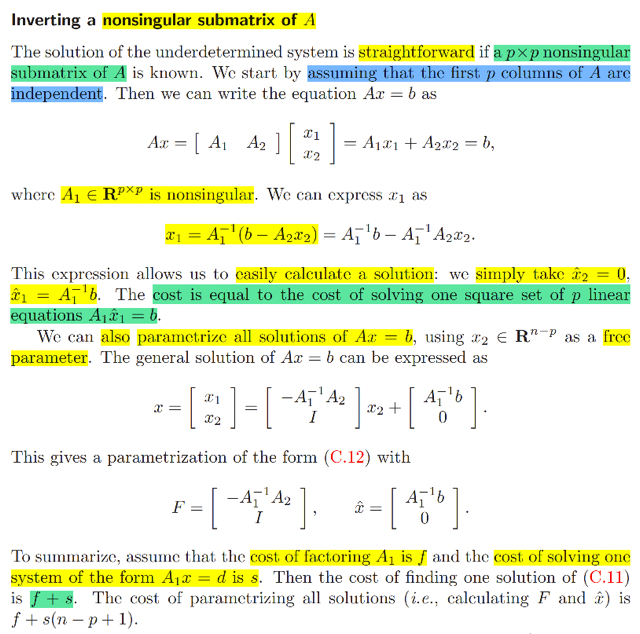</kbd>

> [!NOTE]
> Thế thì, xét trường hợp mà matrix A mập lùn có p cột đầu tiên cũng độc lập, điều
> này có nghĩa là p cột đầu tiên của nó sẽ tạo một sub matrix (p, p) non-singular / full
> rank (gọi là A1) và (n - p) cột còn lại là dependent columns (tạo matrix A2, singular)
>
> Khi đó Ax = b có thể hiểu / thể hiện theo dạng [A1, A2] [x1, x2]T = b với x1 là R^p
> vector, x2 là R^(n-p) vector. Để rồi b = A1x1 + A2x2 mang ý nghĩa là p phần tử của
> x1 là hệ số của linear combination p cột đầu tiên của A, và x2 là hệ số combine
> linearly n - p cột sau của A, và cộng lại ra b (bản chất Ax là linear combination các
> cột của A)
>
> Thế thì từ A1x1 + A2x2 = b ⇔ A1x1 = b - A2x2
>
> vì A1 non-singular nên có thể nhân hai vế cho A1inv:
>
> x1 = A1invb - A1invA2x2
>
> Từ đây bằng cách chọn x2 = 0 (tương đương chọn n - p component cuối của x = 0)
> thì ta có thể giải tìm x1 = A1invb để có x = [x1, 0] =  [A1invb, 0] là một solution của
> Ax = b (*)
>
> Và việc giải x1 = A1inv b dĩ nhiên với việc ta đang giải bài toán A1x1 = b với A là
> matrix (p, p) nên chi phí tính toán sẽ là chi phí của bài toán này.
>
> ====
>
> Và tổng quát với x1 = A1invb - A1invA2x2, ta có x như vầy:
>
> x = [x1, x2]T = [A1invb - A1invA2x2, x2]T
>
> = [A1invb, I]T + [- A1invA2x2, x2]T
>
> = [- A1invA2x2, x2]T + [A1invb, I]T
>
> = [- A1invA2, I]T x2 + [A1invb, I]T
>
> Và đây chính là gì, chính là dạng tổng quát (complete solution)
>
> x = F z + x^
>
> với x^ là một particular solution = [A1invb, I]T như đã nói ở (*)
>
> và F chính là [- A1invA2, I]T, z chính là x2. Để với các x2 (z) bất kì ta sẽ có Fz là
> nullspace vector của A
>
> Khúc cuối nói rằng nếu ta chi phí factoring A1 LÀ f , GIẢI HỆ A1x = d là s thì tổng
> chi phí sẽ là f + s
>
> Và để parameterizing mọi solution thì cần f + s(n - p + 1)
>
> Là thế này:
>
> Nói chung ta cần làm những việc gì: Đó là tìm F và tìm x^.
>
> Tìm F với F = [-A1invA2, I] thì cơ bản là ta cần tìm -A1invA2
>
> đặt Y = -A1invA2, thì việc tìm Y tương đương với việc giải A1Y = -A2 có nghĩa là ta
> sẽ không tìm A1inv và nhân A1inv với A2 mà sẽ giải A1Y = - A2 để tìm Y.
>
> Và A1Y = -A2 nên hiểu thế nào. theo một trong những góc nhìn matrix x matrix thì
> có thể nhìn theo cách: cột j của -A2 chính là linear combination của các cột của A1
> với coefficient là cột j của Y. Do đó, tìm cột j của Y chính là giải hệ:
>
> A1yj = -[cột j của A2]
>
> Đây là một hệ phương trình tuyến tính, mà để giải nó cần chi phí đã cho biết là s
> (sách ban đầu đã nói chi phí giải hệ A1x = d là s, từ những phần trước C1->C4 mình
> hiểu rằng giải Ax = b theo phương pháp factor - solver, thì bước một là factorize A
> thành LU, hay nếu A có cấu trúc đặc biệt hơn thì ta có thể có các dạng factorizing
> khác tốt hơn, bước này như đã nói sẽ tốn chi phí là f. Bước hai là solver step: khi 
> ta sẽ giải Ax = b ⇔ LUx = b, thì đầu tiên giải Lz = b, với L là lower triangular thì
> đây chính là quá trình forward substitution và sau đó là giải Uz = z, chíng là quá trình
> back-substitution. Và người ta gọi cost của bước solver, tổng hai bước này là s)
>
> Vậy để tìm một cột của Y ta cần tốn s chi phí. Và Y có mấy cột? (n - p) cột ⇨ cần
> (n - p)s chi phí.
>
> Trước đó, việc giải A1x + d sẽ cần một chi phí để factor A1 là d. factor A1 tức là LU
> factorization (MIT 1806 đã học, chính là đưa A về dạng row echelon form U, từ đó
> giúp chuyển Ax = b thành Ux = b', và chỉ việc back-substitution để giải ra x (mà
> bước này chính là bước tốn s chi phí)
>
> Vậy nên ta hiểu rằng một khi đã factorizing A1 (tốn f chi phí) thì sau đó mỗi lần giải
> Ax = d đều chỉ tốn s chi phí.
>
> Vậy nãy h ta tốn f (factorizing A1) + (n - p)s (giải tìm các cột của Y = -A1invA2, cũng
> chính là các cột của F (F = [-A1invA2, I]).
>
> Còn lại một cái phải làm nữa là tìm x^, = [A1invb, 0]. Cũng chính là tìm A1invb, đặt
> y = A1invb thì giải tìm y chính là giải hệ A1y = b. lại tốn thêm một s chi phí (vì A1 đã
> factor một lần)
>
> Vậy tổng cộng tốn f + (n - p)s + s = f + (n - p + 1)s chi phí tính toán

 

<kbd>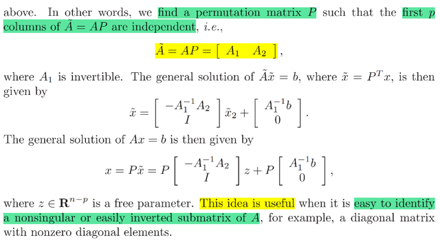</kbd>

<kbd>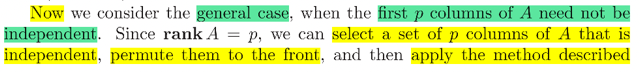</kbd>

> [!NOTE]
> Trường hợp thứ hai, khi A không có vụ có p cột độc lập đứng trước
> thì khi đó, ta sẽ chỉ đơn giản là tìm thêm matrix P (permutation
> matrix) để làm công tác sắp xếp lại các cột của A để đưa các cột
> độc lập lên đầu. Sau đó làm như vừa rồi.
>
> Như vậy dễ hiểu rằng ta sẽ có A~ = AP (sau khi permute column) =
> [A1, A2] (là dạng matrix có p cột độc lập đứng đầu)
>
> Thế thì dĩ nhiên áp dụng các bước vừa rồi, sẽ giúp ta có general
> solution của A~x~ = b là:
>
> x~ = [-A1invA2, I] x2~ + [A1invb, 0]
>
> Thế thì đây là solution của A~x~ = b, tức APx~ = b, và x = Px~
>
> Vậy x = P[-A1invA2, I] x2~ + P[A1invb, 0]
>
> Do đó vấn đề chỉ là tìm P, nên mới nói nếu A có tính chất mà  ta dễ
> dàng nhận ra các cột nào là independent thì ta sẽ dễ dàng xây dựng
> matrix P, và dùng nó để đảo các cột là xong. Cũng có nghĩa là nếu
> không dễ xác định cột nào độc lập thì ta ko biết P là gì để mà dùng

 

<kbd>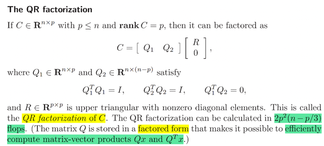</kbd>

> [!NOTE]
> Về con số chi phí thì:
>
> Nếu theo Gram-Schmidt thì chi phí sẽ là như sau:
>
> Step 1: q1 = a1, q1 = q1/||q1||:
>
> n (*) + n (+) + 1 (√) + n (/) = 3n + 1 ≈ 3n
>
> Step 2: q2 = c2 - (c2Tq1)q1, q2 := q2/||q2||
>
> c2Tq1: n (*) + n (+) = 2n
>
> (c2Tq1)q1: n (*)
>
> c2 - (c2Tq1)q1: n (-)
>
> ⇨ Tổng cộng: 4n 
>
> Và một bước normalizing: 3n 
>
> ⇨ Tổng cộng step 2: 4n + 3n 
>
> Step 3: Project c3 onto q1, q2 và vì q1 vuông góc q2
> thì cơ bản là ta sẽ project lần lượt lên q1, và q2:
>
> nói cách khác q3 = c3 - c3Tq1q1 - c3Tq2q2: tốn 2*4n
>
> Normalizing q3: 3n ⇨ 2*4n + 3n
>
> Tương tự Step 4 sẽ tốn 3*4n + 3n
>
> ...
>
> Step p: sẽ là (p-1)*4n + 3n
>
> Cộng lại hết: 0*4n + 3n + 1*4n + 3n + 2*4n + 3n + ...(p-1)*4n + 3n
>
> = Σi=1:p [(i-1)*4n + 3n] = 4n Σi=1:p (i-1) + Σi=1:p 3n
>
> = 4n p(p-1)/2 + 3np = 2np(p-1) + 3np = 2npp - 2np + 3np 
>
> = 2np^2 + np
>
> ====
>
> Thế thì trong sách nói chi phí là 2np^3 - 2/3 p^3 theo GPT là vì
> người ta dùng cái gọi là Householder reflection để xóa các phần
> tử dưới đường chéo, giúp giảm chi phí tính toán xuống
>
> Rồi đại khái là nếu ta có C là matrix full column rank cao ốm [n, p] thì nó
> có thể được factor bởi QR factorization thành dạng QR (mà một trong
> những phương pháp là Gram-Schmidt mà mình đã học)
>
> Cơ bản về Gram-Schmidt thì như đã biết quy trình sẽ là:
>
> 1) lấy cột 1 của C giữ nguyên, normalize nó để làm cột 1 (q1) của Q.
>
> q1 = c1/||c1||
>
> 2) Project cột 2 (c2) của C lên spanq1 và lấy phần dư, normalize, thành
> cột q2: q2 = c2 - c2Tq1q1, q2 = q2/||q2||
>
> ⇔
>
> 3) Project cột 3 (c3) của C lên spanq1, q2, lấy phần dư, normalize, gán
> thành q3 (vì q1, q2 orthogonal nên phép chiếu chỉ đơn giản là chiếu lần
> lượt lên q1, và q2 rồi lấy phần dư:
>
> q3 = c3 - c3Tq1q1 - c3Tq2q2 ; q3 = q3/||q3||
>
> ...tương tự như vậy đến qp
>
> Khi đó ta sẽ có Q là matrix có các cột orthonormal nhưng không vuông
> nên không phải orthogonal matrix.
>
> Và Gram-Schmidt procedure ở trên chính là:
>
> q1 = c1/||c1||
>
> ⇨ c1 = ||c1|| q1 = ||c1|| q1 + 0*q2 + ...0*qp = Q [||c1||, 0,..0]T
>
> = Q [R11, 0, ...0]T
>
> q2 = c2 - c2Tq1q1, q2 = q2/||q2||
>
> ⇨ c2 = (q1Tc2)q1+q2 = (q1Ta2)q1 + q2||q2||
>
> = R12q1 + R22q2 = R12q1 + R22q2 + 0*q3 + ...0*qp
>
> = Q [R12, R22, 0, ...0]T
>
> Tiếp tục như vậy để thấy tại sao C = QR với R là upper triangular matrix
>
> Thế thì chú ý ở đây, rằng với C là n,p matrix thì Q cũng là n,p matrix
> nhưng cái mà đang nói trong sách là expanded version. Hiểu nôm na là
> sau khi làm xong p columns của C, chính là chuyển từ p basis của
> column space C(C) thành một bộ basis ngon hơn (orthogonal / unit norm)
> của C(C). Thì ta sẽ làm tiếp với n - p basis của left nullspace N(CT) để có
> một bộ orthogonal basis của toàn bộ R^n
>
> Nên ta thấy C = [Q1 Q2][R 0]T = Q1R + Q20 chính là vậy.
>
> Q1TQ1 = I: vì như đã nói các cột của Q1 là orthogonal basis của C(C)
>
> Q2TQ2 = I cũng vậy, các cột của Q2 là orthogonal basis của left null
> space N(CT)
>
> Và Q1TQ2 = 0 thể hiện column space C(C) và left nullspace N(CT)  là hai
> subspace orthogonal complement.

 

<kbd>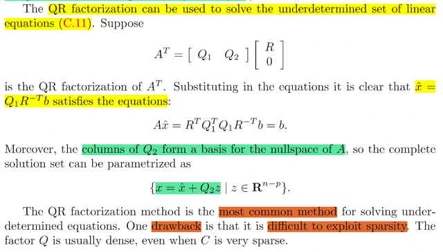</kbd>

> [!NOTE]
> Thế thì quay lại vấn đề đang muốn giải hệ under-determined Ax = b 
> (A mập lùn full row rank) thì ý chính là nói QR factorization cũng có
> thể giúp giải hệ này.
>
> Như đã nói để QR factorization, ta cần full column rank. Vậy A full
> row rank nên AT full column rank. Nên giả sử dùng QR factorization
> ta có AT = [Q1 Q2] [R; 0] = Q1R + Q20
>
> Thì khi đó Ax = b ⇔ (Q1R + Q20)Tx = b 
>
> ⇔ (Q1R)Tx = b ⇔ RTQ1Tx = b 
>
> Khi đó x^ = Q1(Rinv)Tb chính là solution, vì nó thỏa:
>
> Vế trái với x = x^: RTQ1Tx^ = RTQ1TQ1(Rinv)Tb
>
> = RTQ1TQ1(Rinv)Tb = RT(Rinv)Tb = b = vế phải
>
> Từ đó ta có particular solution x^
>
> Ngoài ra, như đã hiểu, khi C = [Q1 Q2] [R; 0]
> thì Q2 chính là (orthogonal) basis của left nullspace của C
>
> Nên ở đây nó chính là basis của left nullspace của AT,
> và dĩ nhiên chính là basis của NULLSPACE CỦA A. Và do đó
> nó chính là matrix F mà ta cần
>
> Vậy complete solution chính là x = x^ + Q2z
>
> Và họ cho biết QR factorization chính là phương pháp phổ biến
> nhất để giải hệ under. Chỉ có vài nhược điểm chưa hiểu lắm

 

<kbd>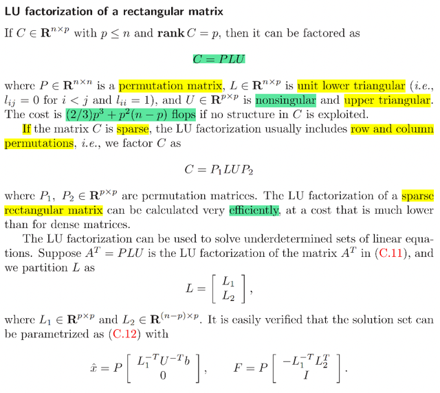</kbd>

> [!NOTE]
> Cuối cùng là nói về LU factorization cũng có thể giúp giải
> hệ under. QUAY LẠI SAU

 

## C.1 Matrix structure & algo complexity

<kbd>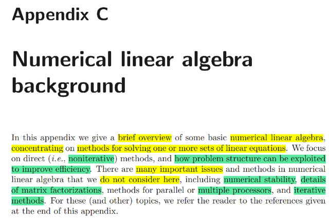</kbd>

 

<kbd>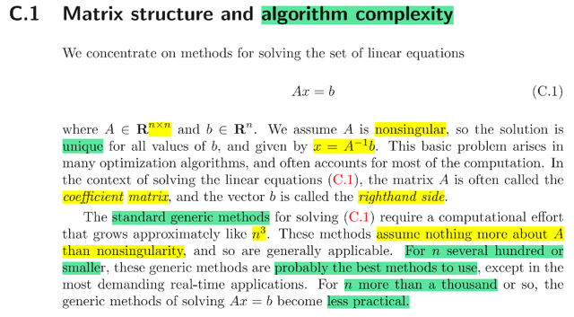</kbd>

> [!NOTE]
> đại khái là đầu tiên ta tập trung vào các method giải hệ Ax = b, với 
> A non-singular. Thì đại ý là hệ này có nghiệm duy nhất x = Ainvb
> Và việc giải nghiệm này có thể dùng phương pháp gọi là standard
> generic method.
>
> Thế thì phương pháp gì thì sẽ biết, nhưng ý chính là phương pháp
> này sẽ hiệu quả khi n nhỏ từ vài trăm đổ xuống (vì nó có chi phí
> tính toán O(n^3)) còn khi n lớn vài ngàn đổ lên thì dùng cái này
> không khả thi

 

<kbd>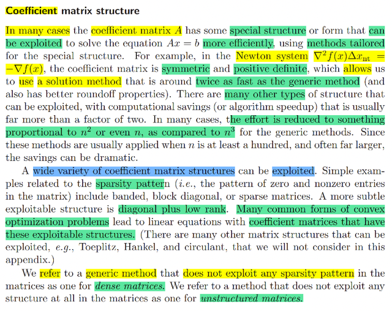</kbd>

> [!NOTE]
> đại khái là (nãy quên nói Ax = b thì A gọi là matrix hệ số) việc giải Ax
> = b, ngoài phương pháp gọi là standard generic thì khi A có một vài
> đặc điểm về cấu trúc mà ta có thể lợi dụng / khai thác  thì có thể ta
> sẽ có những phương pháp dành riêng cho bài toán cụ thể (với A như
> vậy) giúp tăng tốc / giảm chi phí tính toán so với standard generic
> method.
>
> Một ví dụ của cái gọi là khi matrix A có cấu trúc đặc biệt đó là  trong
> Newton's method (ta nhớ là khi đó ta cần giải tìm Newton's step
> Δx_nt là nghiệm của ∇^2f(x) Δx_nt = - ∇f(x). Thì ở đây A  là Hessian
> matrix có điểm đặc biệt đó là nó symmetric positive semi definite.
>
> Vậy thì special pattern có thể là sparsity pattern hoặc có thể là "
> diagonal + low rank" (biết vậy thôi chưa hiểu lắm)
>
> Nói chung ý chính là vậy, khi dùng các phương pháp đo ni đóng giày
> này thì thay vì chi phí tăng theo n^3 như generic method thì có thể
> chỉ cần n^2 hay thậm chí là n

 

##### Đơn vị độ phức tạp FLOPs

<kbd>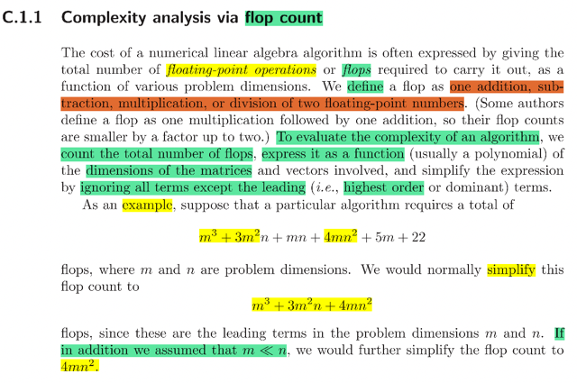</kbd>

<kbd>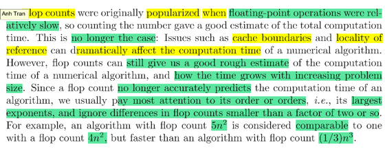</kbd>

> [!NOTE]
> Rồi đại khái là nói về đơn vị để phân tích độ phức tạp tính toán
> của thuật toán.
>
> Đơn vị đó là flops: Được định nghĩa là một "lần" ; Cộng / trừ /
> nhân  / chia giữa hai con số floating.
>
> Vậy việc tính complexity của một operation sẽ là:
>
> 1) Đếm số flops
>
> 2) Thể hiện nó ở dạng function theo n (dimension của matrix /
> vector)
>
> 3) Bỏ đi những term bậc thấp (ví dụ n^3 + 3n thì bỏ đi 3n)
>
> Hoặc nếu có m^3 + mn mà n nhỏ quá so với m thì cũng bỏ mn
> luôn
>
> Cái này trong CS50 đã học sơ qua rồi (BIG O)
>
> ====
>
> Cuối cùng ý nói cái việc tính flop count này sở dĩ là vì việc thực
> hiện các operation giữa các float number rất tốn thời gian. Do đó
> đếm flop có thể estimate chi phí tính toán. Tuy nhiên ngày nay có
> nhiều tác nhân khác ảnh hưởng nữa khiến flopts estimate không
> còn phản ánh chính xác. Thành ra ta vẫn dùng nó, nhưng phiên
> phiến thôi / ước lượng thôi. Nên bỏ qua các term bậc nhỏ là vậy.

 

- **Chi phí phép toán vector/matrix**

<kbd>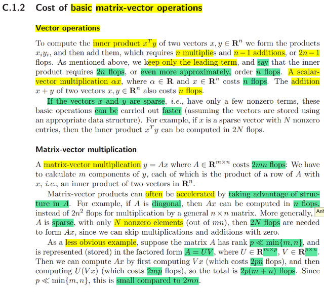</kbd>

> [!NOTE]
> Chi phí của basis vector / matrix operation. Quá dễ ko có gì.
>
> Với x, y là R^n thì xTy thì dĩ nhiên có n (*) và (n - 1) (+), tổng cộng
> 2n - 1 coi như 2n (flops). 
>
> Thậm chí có thể coi như xem xem với n (theo nguyên tắc "chỉ tính 
> phiên phiến" thôi)
>
> αx thì dĩ nhiên là n flops. x +/- y cũng vậy
>
> Matrix nhân vector Ax với A là R^m,n thì dễ hiểu là vì Ax là linear
> combination của A's columns với hệ số bởi x. Nên ta có n phép 
> nhân scalar * vector (tốn m flops vì cột có m phần tử), và sau đó là
> cộng lại hết: có n - 1 lần cộng vector với vector mỗi lần tốn m flops
> Tóm lại là nm + (n-1)m. Coi như nm + nm = 2nm
>
> Rồi. nói thêm nếu A mà có cấu trúc đặc biệt thì tính nhanh hơn nữa
> ví dụ là diagonal matrix n,n thì Ax chỉ là giống như nhân hai vector
> elemenwise (cái đường chéo với vector x) ⇨ chỉ có n phép nhân
>
> Cuối cùng là cái mà ta đã gặp trong LORA (trong LLM specialization)
> đại khái là khi A có thể factor thành phép nhân giữa hai matrix hạng
> thấp (low rank) ví dụ A (m, n) = UV với U là (m,p) và V (p,n)
>
> Thì khi đó, Ax = UVx. 
>
> Thì Vx như trên đã nói sẽ chỉ tốn 2pn
>
> Sau đ1o U(Vx) tốn 2pm. 
>
> Tổng cộng lại là 2p(n + m) flops
>
> Thế thì khi p nhỏ hơn m và n rất nhiều thì 2p(n + m) nhỏ hơn đáng
> kể so với 2mn

 

<kbd>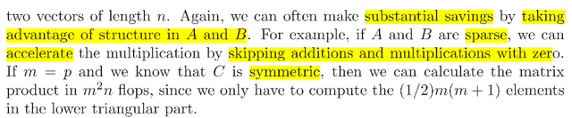</kbd>

<kbd>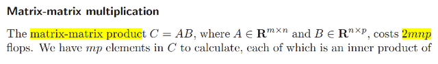</kbd>

> [!NOTE]
> Nhân AB = C.
>
> Chi phí có thể "đếm" theo nhiều cách, theo những góc nhìn khác
> nhau của việc nhân matrix x matrix:
>
> *Nhân AB theo Matrix x Nhiều Column:
>
> Tính A[cột j của B] trước:
>
> Cột j của C C[:, j] là linear combination các cột của A bởi hệ số là 
> components của cột j của B B[:, j]:
>
> C[:, j] = Σk=1:n A[:, k] B[k, j]
>
> Mỗi component thứ k của cột Bj B[k, j] * cột k của A A[:, k]: Tốn m 
> scalar * scalar = m flops.
>
> Và có n lần như vậy k=1:n A[:, k] B[k, j]: n*m flops  
>
> Cộng các kết quả lại: 
>
> Σk A[:, k] B[k, j] tốn n-1 lần cộng vector, mỗi lần tốn m flops
>
> Tổng cộng cost của AB[:,j]: mn + m(n-1) coi như 2mn
>
> Và B có p cột ⇨ 2mnp flops
>
> ====
>
> Theo góc nhìn Nhiều row x Matrix cũng tương tự:
> ....
>
>
> Theo góc nhìn Nhiều Row dot product với nhiều Column:
>
> Cij là [row i của A] dot product [column j của B]
>
> mỗi phép dot product là giữa hai R^n vector có cost: n phép nhân
> + n - 1 phép cộng: coi như 2n flops
>
> Và C có tổng cộng m*p phần tử ⇨ Cost tổng là mp2n = 2mnp flops
>
> Theo góc nhìn Tổng các rank 1 matrix:
>
> AB shape m,n x n,p  có thể coi như / nhìn nhận như TỔNG của n 
> RANK 1 matrix tạo bởi cột k của A x hàng k của B:
>
> C = Σk=1:n A[:,k] B[k, :]
>
> Cost của việc tính mỗi rank 1 matrix: A[:,k] B[k, :]
>
> A[:, k] B[k, :] = m phép nhân [scalar A[i,k] với B[k,:], có cost là p phép
> nhân scalar x scalar] = mp flops
>
> Và có tổng cộng n matrix rank 1 như vậy: nmp flops
>
> Chi phí cộng lại: Cộng hai rank 1 matrix shape m,p m,p: Tốn m*p phép
> cộng scalar - scalar. Và tổng cộng có n matrix ⇨ n - 1 phép cộng:
>
> ⇨ có (n - 1)mp coi như mnp flops
>
> Vậy tổng cộng cost của AB theo góc nhìn này là 2mnp flops
>
> Vừa rồi là cost của C = AB, thế thì không khó hiểu khi họ nói rằng
> nếu  biết A, B sparse, thì cost này có thể giảm bớt vì giảm bớt các
> phép tính với 0
>
> Hoặc khi m = p (cost 2mnp = 2(m^2)n) và ta biết C symmetric, thì dĩ
> nhiên chỉ cần tính (theo cách tiếp cận Cij = dot product của row i
> của A và column j của B) đường chéo (có m entries) và (m^2 - m)/2
> phần tử trên đường chéo, tổng cộng là m + (m^2-m)/2 = m + m^2/2
> - m/2 =  m^2/2 + m/2 = m(m+1)/2
>
> ⇨ chỉ tốn m(m+1)/2 * 2n (2n là cost của một phép dot product)  =
> m(m+1)n = (m^2)n + mn coi như (m^2)n

 

<kbd>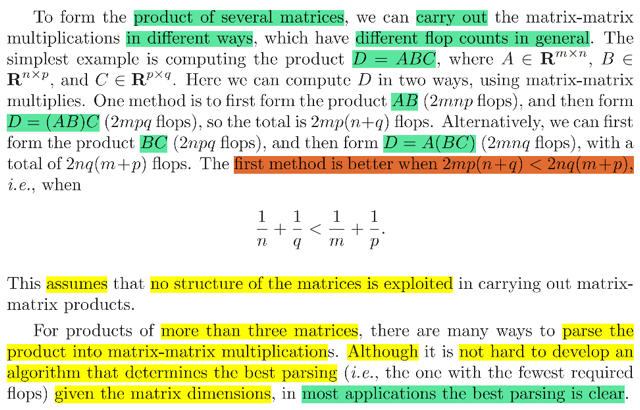</kbd>

> [!NOTE]
> Đây là một chi tiết quan trọng, mà có liên quan đến nội dung đã
> từng nhắc đến trong Deep Learning Josua Bengio cũng như 
> MIT 18s096:
>
> Đó là chi phí của việc tính D = ABC sẽ khác nhau nếu ta tính theo
> chiều xuôi D = (AB)C hoặc chiều ngược lại D = A(BC)
>
> Và từ đó, tùy hoàn cảnh mà tính theo chiều nào sẽ tốt hơn (ít tốn)
>
> D = (AB)C: với A (m, n); B (n, p); C (p, q)
>
> AB, như đã biết nó sẽ tốn 2mnp flops.
>
> (AB)C với AB shape (m, p), C shape (p, q) sẽ tốn 2mpq
>
> Tổng cộng tốn 2mnp + 2mpq = 2mp(n + q) flops
>
> D = A(BC):
>
> BC tốn 2npq, có shape n,q
>
> A(BC) tốn 2mnq
>
> Tổng cộng tốn: 2npq + 2mnq = 2nq(m + p)
>
> Vậy thì dĩ nhiên cách 1 sẽ tốt hơn nếu: 
>
> 2mp(n + q) < 2nq(m + p)
>
> ⇔ (n + q)/nq < (m + p)/mp 
>
> ⇔ n/nq + q/nq < m/mp + p/mp 
>
> ⇔ 1/n + 1/q < 1/p + 1/m

 

