# Chap 10

📊 **Progress:** `60` Notes | `99` Screenshots

---

## Chap 10

 

<kbd>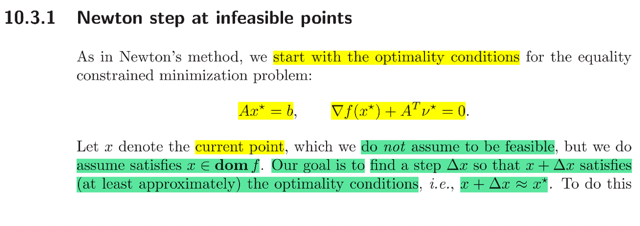</kbd>

<kbd>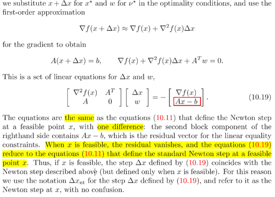</kbd>

<kbd>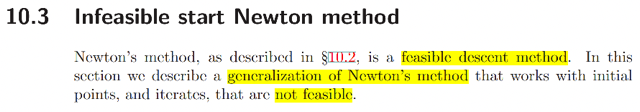</kbd>

> [!NOTE]
> đại khái là ta sẽ nói về Newton's step nhưng bắt đầu tại điểm (initial
> point)  không feasible.
>
> Thế thì trước tiên sẵn ôn lại về Newton's step với feasible initial point. Bản
> chất, là ta từ initial point x, nếu ta approximate objective function f(x)
> bởi  second order Taylor approx, nói cách khác chính là coi objective
> function như quadratic function, kí hiệu là f^ với, parameterized bởi Δx:
>
> f^(x+Δx) ≈ f(x) + ∇f(x)TΔx + 0.5 ΔxT∇^2f(x)Δx.
>
> Và rồi ta giải bài toán tìm Δx sao cho (x+Δx) minimize f^ và x + Δx vẫn
> primal feasible, tức là thỏa constrained: A(x+Δx) = b. Thì Δx đó chính là
> Newton's step  (trong bối cảnh bài toán equality constrained)
>
> Và để giải tìm Δx_nt, thì đây chính là bài toán equality constrained
> convex quadratic optimization problem:
>
> minimize f0(x) = 1/2 xTPx + qTx + r constraint: Ax = b
>
> Và QUAN TRỌNG LÀ, với bài toán này thì CÓ THỂ GIẢI RA SOLUTION
> ANALYTICALLY, NÓI CÁCH KHÁC OPTIMALITY CONDITION CÓ THỂ
> GIẢI RA ĐƯỢC 
>
> Giải optimality condition bấy giờ là giải hệ này:
>
> Px* + q + ATv* = 0 và Ax* = b để tìm primal và dual optimal x*,
> v*.
>
> Và gom chung chúng lại thành [P AT; A 0] [x*, v*] = [-q, b]. Và yêu cầu để
> giải ra x* đó là matrix [P AT; A 0], gọi là KKT matrix phải non-singular
> (khi đó x* sẽ là unique optimal), từ đó ta có một số phân tích về những
> điều kiện của P mà nếu thõa thì ta sẽ có trạng thái non-singularity của
> KKT matrix
>
> Vậy thì áp dụng vào đây, ta sẽ giải hệ các phương trình thể hiện bởi:
>
> A(x+Δx_nt) = b (cùng với Ax = b, nó trở thành A Δx_nt = 0, tức Δx
> ∈ N(A))
>
> ∇f^(x+Δx_nt) + ATw = 0
>
> ⇔ ∇^2f(x) Δx_nt + ∇f(x) + ATw = 0
>
> Và KKT matrix là [∇^2f(x) AT; A 0], cũng như hệ phương trình thể hiẹn bởi:
>
> [∇^2f(x) AT; A 0] [Δx_nt, b]T = [-∇f(x) 0]
>
> (chú ý trong bài toán để giải ta Δx  thì equality constrain là A Δx = 0, nên b
> ở đây = 0)
>
> một chú ý khác là w có thể hiểu có vai trò là v*, tức dual optimal.
>
> ====
>
> Đó là cách nhìn thứ nhất về Newton method, và trong bài học về Newton
> method có giới thiệu các cách nhìn (interpretation) khác: Thay vì giải
> ∇L(x*, v*) = 0 (tức là optimality condition của bài toán gốc - equality
> constraint optimization) thì ta sẽ tuyến tính hóa (linearization) ∇L(x*, v*),
> để có ∇L^(x*, v*) để giải hệ tuyến tính  ∇L^(x*, v*):
>
> đó là ta sẽ vẫn xuất phát từ objective function gốc: f(x) với constraint Ax =
> b. Và optimality condition sẽ giúp ta giải optimal của nó:
>
> Ax* = b; ∇f(x*) + ATv* = 0.
>
> Thế thì, thay vì ta thay f(x) bởi quadratic approx của f tại initial point x. Để
> rồi lập luận như trên, thì giờ ta thay x* = x + Δx_nt và thay ∇f(x) bởi linear
> approx. của nó tại x để có: ∇f(x + Δx) ≈ ∇f^(Δx) = ∇f(x) + ∇^2f(x)T Δx và
> từ đó ta có hệ:
>
> A(x + Δx_nt) = b; ∇f(x) + ∇^2f(x)T Δx_nt + ATv = 0
>
> Kết qủa cũng là hệ trên
>
> Thế thì đó là Newton's step nếu xuất phát từ feasible point x.
>
> Bây giờ, người ta khái quát hơn, cho rằng x chưa chắc đã feasible.
>
> Thì nên hiểu rằng x chưa feasible thì ta không có Ax = b, chỉ vậy thôi. Còn
> lại thì nhiệm vụ vẫn y chang: ta cần thay f(x) bởi quadratic approx của f(x)
> tại x: f(x+Δx) ≈  f(x) + ∇f(x)T Δx + 1/2 ΔxT ∇^2f(x) Δx = f^(x + Δx)
>
> Và giải bài toán: tìm Δx sao cho minimize f^(x + Δx) với constraint là  x +
> Δx sẽ feasible: Tức A(x + Δx) = b
>
> Và rồi việc giải tìm optimal dựa vào optimality condition chính là giải hệ
> các phương trình thể hiện bởi:
>
> A(x + Δx_nt) = b và ∇^f(x) Δx_nt + ∇f(x) + ATw = 0
>
> Và gom lại ta có dạng thể hiện bởi KKT matrix:
>
> [∇^2f(x) AT; A 0][Δx_nt, w]T = [-∇f(x), -(Ax-b)] = - [∇f(x), (Ax - b)]
>
> Và giải cái này sẽ cho ta Δx_nt và dual optimal w.
>
> Thế thì điểm khác biệt so với feasible Newton's step chỉ là cái Ax - b ở vế
> phải. (với feasible Newton's step thì nó là 0, do Ax = b, còn với unfeasible
> starting point x thì ta ko có Ax = b, nên vế phải ta có -(Ax - b) mang ý
> nghĩa là residual

 

<kbd>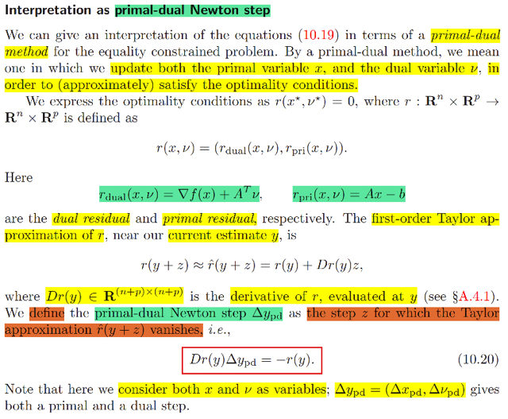</kbd>

<kbd>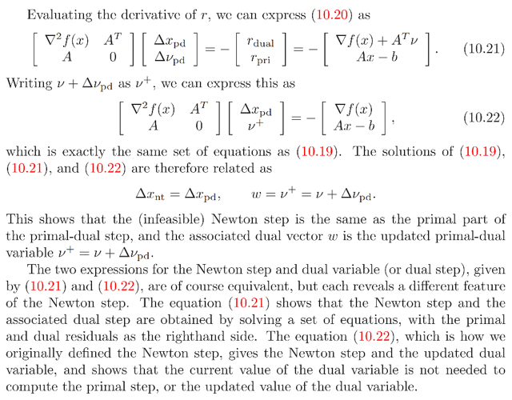</kbd>

> [!NOTE]
> đại khái là nói về một cách hiểu khác (interpretation) của cái hệ các  equations
> [∇^2f(x) AT; A 0][Δx_nt, w]T = - [∇f(x), Ax - b]
>
> Và cách hiểu đó là ta coi như / định nghĩa ra một function khác, mà  function
> đó nhận một cặp vector (R^n, R^p) và trả ra một cặp vector  (R^n, R^p).
> Nhưng ta sẽ có thể coi như nó nhận input là một vector  có (n + p) component
> R^(n + p) và output cũng là R^(n+p) vector
>
> Và cụ thể function đó là r(x, v) = [r_dual(x, v), r_pri(x, v)]
>
> với r_dual(x, v) = ∇f(x) + ATv và r_pri(x, v) = Ax - b
>
> r(x, v) = [r_dual_1, ..r_dual_n, r_pri_1,...,r_pri_p]
>
> Hiểu ý nghĩa của function này như vầy: Như ta đã biết rằng, nếu tại  optimal
> thì ta optimality condition sẽ cho ta biết:
>
> Ax* = b và ∇f(x*) + ATv* = 0
>
> Xét cái Ax* = b ⇔ Ax* - b = 0 thì nếu ta coi Ax - b là primal residual  thì nó
> có nghĩa là tại optimal, primal residual bằng 0.
>
> Tương tự, ta cũng có thể xem ∇f(x) + ATv là dual residual để rồi  điều kiện
> ∇f(x) + ATv = 0 có nghĩa là dual residual = 0  Từ đó, nếu ta define function r
> là function tính ra primal residual và dual residual. Thì việc ta muốn làm là
> minimize function này.
>
> Và khi đó, bài toán sẽ là bài toán unconstrained minimize function r
> (lúc này như đã nói, coi như R^(n+p) vector -> R^(n+p) vector  function.
>
> Và từ đây, ta dùng linear approximation function r tại y  (y là R^(n+p) vector,
> coi như là gom hai variable vector x và v lại, thành một vector vậy):
>
> r(y + z) ≈ r(y) + Dr(y)z (z giống như Δy vậy)
>
> Dr(y) là derivative của hàm vector → vector. Nên như đã biết nó sẽ là
> Jacobian matrix (n+p) x (n+p).
>
> và ta đặt r^(y + z) = r(y) + Dr(y)z
>
> Và từ đó ta định nghĩa cái gọi là PRIMAL-DUAL NEWTON STEP Δy_pd là z
> mà khiến r^(y + z) = 0
>
> ⇔ Dr(y)Δy_pd = -r(y)
>
> ⇔ Dr(y)[Δx_pd, Δv_pd]T = -r(y)
>
> (cái này có lẽ không nên thắc mắc gì, vì đơn giản nó là định nghĩa)
>
> Và Δy_pd = [Δx_pd, Δv_pd] sẽ mang ý nghĩa là bước đi giúp giảm tối đa cả
> primal residual và dual residual.
>
> ====
>
> Dr(y), tức derivative của r() wrt to y evaluate tại y:
>
> Dr(y)_11 sẽ là ∂r1/∂y1. nếu coi y = [x, v] thì ∂r1/∂y1 = ∂r/x1 ... Dr(y)_1n sẽ là
> ∂r1/∂yn = ∂r1/xn
>
> ⇨ n phần tử đầu tiên của hàng 1 chính là vector ∂r1/∂x
>
> Dr(y)_1(n+1) sẽ là ∂r1/∂y(n+1) = ∂r1/∂v1 ... Dr(y)_1(n+p) sẽ là ∂r1/∂vp
>
> ⇨ p phần tử sau của hàng 1 chính là vector ∂r1/∂v
>
> Tương tự:
>
> n phần tử đầu của hàng 2 chính là vector ∂r2/∂x ... n phần từ đầu của hàng n
> chính là vector ∂rn/∂x
>
> ⇨ nxn component đầu tiên của matrix Dr chính là dr_dual/dx (vì n phần tử đầu
> tiên của r là r_dual)
>
> Với r_dual(x,v) = ∇f(x) + ATv thì dr_dual/dx, chính là ∇^2f(x)
>
> Nên block nxn top left của Dr chính là ∇^2f(x).
>
> ====
>
> Tương tự:
>
> p phần tử sau của hàng 2 chính là vector ∂r2/∂v ... p phần tử sau của hàng n
> chính là vector ∂rn/∂v
>
> ⇨ block nxp top right của Dr chính là dr_dual/dv (vì n phần tử đầu tiên  của r
> là r_dual)
>
> Và với r_dual(x,v) = ∇f(x) + ATv thì dr_dual/dv = AT
>
> Nên block nxp top right của Dr chính là AT.
>
> Hoàn toàn tương tự ta có thể thấy cấu trúc của Dr chính là:
>
> Dr = [∇^2f(x) AT; A 0]
>
> Do đó, đại khái là nếu ta thay Dr(y) vào thì Dr(y)Δy_pd = -r(y) sẽ tương
> đương:
>
> [∇^2f(x) AT; A 0][Δx_pd, Δv_pd]T = -[∇f(x) + ATv, Ax - b]
>
> Thế thì nó khá giống, hoặc rất giống với một hệ mà ta dùng để giải tìm
> infeasible Newton's step Δx_nt
>
> [∇^2f(x), AT; A, 0][Δx_nt, w]T = -[∇f(x), Ax - b]
>
> Trong đó thì Δx_nt chính là optimal value v để x + v sẽ là optimal point của f^
> (quadratic approx. của f tại x) với constraint Ax = b. Và w là optimal dual
> variable.
>
> Và do đó, Δx_pd chính là Δx_nt: Ý nghĩa là, cái phần primal (Δx_pd) trong
> primal-dual step (Δy_pd = (Δx_pd, Δv_pd) chính là infeasible start Newton
> step Δx_nt
>
> Và tương tự, v* = v + Δv_pd chính là w.
>
> Nói chung đại ý của cái này là như sau:
>
> Nếu là feasible start Newton method: thì ta có (Newton step là nghiệm của) hệ này:
>
> [∇^2f(x) AT; A 0] [Δx_nt, w] = - [∇f(x), 0] (I), nó là hai phương trình: 1) là AΔx_nt = 0 bắt
> nguồn bởi việc ta có feasible start, tức điểm đang đứng để mà thực hiện bước Newton
> thỏa Ax = b, dẫn tới cộng với yêu cầu newton step cũng phải là feasible step ta mới có
> A(x + Δx_nt) = b từ đó suy ra A Δx_nt = 0
>
> Và 2) là ∇^2f(x)Δx_nt + ATw = - ∇f(x) Cái này bắt nguồn từ ∇^2f(x)Δx_nt + ∇f(x) + ATw = 0, 
> và đây là optimality condition của bài toán thay thế bài toán gốc, trong đó ta thay, ta coi 
> hàm objective gốc f(x) là hàm bậc hai:
>
> Gọi điểm đang đứng là x thì linear approximation của f(x):
>
> f(x + Δx) ≈ f(x) + ∇f(x)TΔx + 0.5 ΔxT∇^2f(x)Δx  và ta sẽ dùng cái bên phải (là hàm xấp xỉ 
> tuyến tính của f gốc, nó dĩ nhiên là hàm tuyến tính theo Δx vì f(x) và ∇f(x) là giá trị fix, là 
> giá trị của hàm và gradient tại điểm đang xét) để thay cho cái bên trái (là hàm f gốc)
>
> Khi đó ta có xét bài toán xấp xỉ. minimize f^(Δx) = f(x) + ∇f(x)TΔx 0.5 ΔxT∇^2f(x)Δx subject 
> to AΔx = 0 và phương trình 2) ở trên chính là optimality condition của nó
>
> ====
>
> Phải nhấn mạnh là, để thực hiện bước đi Newton,  thì lẽ dĩ nhiên ta phải đứng ở đâu
> đó, và bước đi Newton như thế nào sẽ  phụ thuộc vào cái điểm đang đứng ở đó, vì tại
> mỗi điểm khác nhau, thì cái sự xấp xỉ bậc hai của hàm gốc cũng sẽ khác nhau, ở xa nó
> khác mà ở gần nó khác, và ta sẽ/đã thấy càng ở gần truly optimal point của hàm gốc thì
> sự xấp xỉ bậc hai càng chính xác)
>
> Vậy thì nếu như cái điểm đang đứng (x), tức là cái điểm mà ta tính toán để thực hiện
> bước Newton KHÔNG FEASIBLE, tức không thỏa Ax = b, thì khi đó dù vẫn phải có điều
> kiện Newton step dẫn ta đến feasible A(x
> + Δx_nt) = b thì khác biệt này khiến vế vế phải của 1) ko còn là 0 nữa, mà là - (Ax - b)
>
> Nên cái hệ (I) trở thành [∇^2f(x) AT; A 0] [Δx_nt, w] = - [∇f(x), Ax - b] (II) vậy thôi.
>
> Cho nên có thể coi cái hệ (II) khái quát hơn hệ (I), để khi Ax = b thì nó thành hệ (I)
>
> ====
>
> Vậy thì từ đây mới liên hệ với primal-dual method. Rất đơn giản, đầu tiên ta nhấn mạnh
> rằng, việc GIẢI CÁI HỆ (I)(II) sẽ cho ta Newton step Δx_nt, và optimal dual variable w =
> v*
>
> Thế thì, bây giờ ta nhìn khác đi một chút, coi cái optimality condition của bài toán gốc:
> ∇f(x) + ATv = 0 là r_residual(x, v) = 0 và Ax = b ⇔ Ax - b = 0 là r_primal(x, v) = 0 Có
> nghĩa là bây giờ optimality condition sẽ thể hiện bởi việc ta muốn tìm x, v sao cho
> r_residual = 0 và r_primal = 0
>
> Khi đó yêu cầu giải optimality condition trở thành yêu cầu giải ra nghiệm của phương
> trình r(x, v) = [r_residual(x, v), r_primal(x, v)] = 0.
>
> Và để giải một phương trình, ta có thể dùng Newton method: Y chang như khi ta giải
> phương trình ∇f(x) + ATv = 0 thì nay giống như ta gom chung với Ax - b để thành r =
> [r_residual, r_primal] = 0.
>
> CÓ NGHĨA LÀ, THAY VÌ TA CHỈ XÉT RIÊNG / CHỈ GIẢI ∇f(x) + ATv = 0 BẰNG
> NEWTON METHOD, mà trong đó ta tính ra Δx_nt để cập nhật x dần dần tiến về x* là
> nghiệm thật sự của ∇f(x) + ATv = 0.
>
> Thì với primal - dual, ta DÙNG NEWTON METHOD để tính Δy_pd = (Δx_pd, Δv_pd) để
> cập nhật x, v dần dần tiến về x*, v* là nghiệm thực sự của r(x, v) = 0
>
> Và nói y chang là bởi: Khi dùng Newton method để giải ∇f(x) + ATv = 0 hay ghi vầy
> ∇f(x*) + ATv* = 0 cũng được (nhớ rằng, nó là của optimality condition của bài toán gốc,
> gọi là dual feasible condition bên canh Ax* = b,  là primal feasible condition. Sẵn tiện ôn
> lại, sở dĩ nó gọi là dual feasible condition là vì nếu cái này có nghiệm, tức là ∇L(x*, v*) =
> 0, điều đó đồng nghĩa với việc x* = inf L(x, v*) và do đó g(v*) = L(x*, v*) sẽ finite dẫn
> đến kết luận v* dual feasible)
>
> Khi đó như trên đã nhắc lại, về hai cách giải thích về Newton method khi giải phương
> trình này: Một là focus vào khía cạnh ta đang giải bài toán tối ưu rằng buộc tuyến tính
> với hàm f phức tạp khiến việc giải ra optimal từ optimal condition rất khó khăn. Thì để
> dễ hơn ta mới XEM f NHƯ HÀM QUADRATIC, và chuyển bài toán thành bài toán xấp xỉ
> mà objective trở thành hàm quadratic từ đó cái optimality condition là phương trình bậc
> nhất ∇^2f(x)Δx_nt + ∇f(x) + ATw = 0 và từ đó giải ra được Δx_nt, giúp x + Δx_nt là
> optimal của bài toán xấp xỉ, tiến gần tới optimal của bài toán gốc hơn so với x
>
> Thì góc nhìn thứ hai chỉ khác chút là ta tập trung  vào cái optimality của bài toán góc
> muốn giải ∇L(x, v) = ∇f(x*) + ATv* = 0 và việc giải bằng Newton method đơn giản là ta
> COI CÁI PHƯƠNG TRÌNH NÀY NHƯ PHƯƠNG TRÌNH TUYẾN TÍNH, để rồi giải ra
> nghiệm của nó thì ta có nghiệm xấp xỉ, làm nhiều lần thì dần  dần sẽ đúng.
>
> DĨ NHIÊN VỀ BẢN CHẤT HAI CÁCH NHÌN LÀ NHƯ NHAU: VÌ COI HÀM f GỐC LÀ
> HÀM BẬC  HAI THÌ  CŨNG CHÍNH LÀ COI CÁI GRADIENT CỦA NÓ LÀM HÀM BẬC
> MỘT.
>
> QUAY LẠI ĐÂY CŨNG VẬY:
>
> Bản chất là ta muốn giải r(x, v) = 0, y như muốn giải f(x, v) = ∇L(x, v) = 0  thì ta theo góc
> nhìn thứ hai cũng sẽ giải bằng cách tuyến tính hóa r(x, v). Dĩ nhiên khi đã coi r(x, v) là
> hàm tuyến tính thì tìm ra nghiệm của nó chỉ là  gần đúng, nhưng làm lại nhiều lần sẽ
> ngày càng đúng.
>
> Vậy thì với việc ∇L(x, v) = ∇f(x) + ATv, tuyến tính hóa nó có nghĩa là ta dùng xấp xỉ bậc
> một của nó (
>
> ∇L(x + δx, v) ≈ ∇L(x, v) + ∂L/∂x δx
>
> =∇f(x) + ATv + ∇^2f(x)δx
>
> Từ đó thay vì giải ∇f(x) + ATv = 0, ta giải ∇f(x) + ATv + ∇^2f(x)δx = 0 đây cũng là cái (II)
> ở trên
>
> (∇^2f(x)Δx_nt + ATw = - ∇f(x))
>
> Vậy thì khác biêt ở đây là ta tuyến tính hóa r(x, v) là hàm theo cả x và v. Còn ở trên ta
> chỉ tuyến tính hóa ∇L(x, v) theo x, coi v fix.
>
> CHỖ NÀY CẦN NHẤN MẠNH: KHI TA THAY OBJECTIVE FUNCTION f(x) BẰNG XẤP
> XỈ BẬC HAI CỦA NÓ, THÌ CHÍNH LÀ TA ĐÃ TUYẾN TÍNH HÓA GRADIENT CỦA L
> THEO PHƯƠNG x, CÒN THEO PHƯƠNG v THÌ GIỮ NGUYÊN.
>
> CÒN Ở ĐÂY, TA TUYẾN TÍNH HÓA r(x, v) THÌ LÀM CHO CẢ x, v.
>
> Theo vi phân toàn phần:
>
> dr(x, v) = ∂r/∂x dx + ∂r/∂v dv
>
> ⇨ r(x + δx, v + δv) ≈ r(x, v) + ∂r/∂x δx + ∂r/∂v δv = r(x, v) + D_r(x, v)(δr, δv)T
>
> D_r như thế nào thì phân tích ở note trươc rồi.
>
> TÓM LẠI, CÓ THỂ GOM GỌN SỰ KHÁC BIỆT CỦA PRIMAL DUAL METHOD LÀ Ở
> CHỖ NÓ TÍNH VÀO CẢ DUAL VARIABLE v TRONG QUÁ TRÌNH TUYẾN TÍNH HÓA
> ĐỂ RỒI VIỆC UPDATE SẼ UPDATE CHO CẢ x LẦN v TỪ ĐÓ DẦN DẦN x, v TIẾN VỀ
> x*, v*.
>
> TRONG KHI ĐÓ, TRƯỚC ĐÓ TA CHỈ TẬP TRUNG VÀO VIỆC TÌM x, TÍNH NEWTON
> STEP ĐỂ CẬP NHẬT x.
>
> Đây cũng chính là khác biệt giữa primal dual method và barrier method khi tiếp cận bài
> toán inequality constraint optimization.
>
> Barrier method, một cách ngắn gọn, là ta cũng chỉ quan tâm newton step  để update x
>
> Còn primal dual method thì ta update cả x, λ, v
>
> Trong Barrier method, mình biết rằng đại khái là ta sẽ liên tiếp giải bài toán centering,
> mà mỗi bài có bản chất là bài toán xấp xỉ của bài toán tương đương với bài toán gốc
> trong đó ta đã bỏ inequality constraint bằng  cách tích hợp nó vào objective bằng cách
> dùng indicator function, và again, lại thay nó bằng một hàm xấp xỉ của indicator function
> nhằm giúp mang lại tính khả vi. Rồi với bài toán centering ta cũng giải bằng Newton
> method, để khi có x*(t) (mỗi t khác nhau ứng với mỗi centering problem khác nhau) thì
> nó sẽ hội tụ dần về x* thậtv sự của bài toán gốc.
>
> Và rồi ta cũng đã thấy có một phần mà gs cho thấy rằng việc giải bài toán centering thật
> ra cũng chính là ta đang giải cái KKT condition của bài toán  gốc nhưng có chỉnh sửa
> (modified) chút xíu.
>
> (Phần 11.3.4 có câu In this section we show how these Newton steps for the
> centering problem can be interpreted as Newton steps for directly solving the
> modified KKT equations)
>
> Để rồi từ đó chứng minh rằng về bản chất, barrier method chỉ là việc ta cố gắng giải cái
> hệ KKT condition vốn dĩ rất khó để giải ra ngay solution (gọi là giải ra solution
> analytically) thì ta sẽ làm cách khác:
>
> Chính sửa nó chút xíu (sửa thế nào: Thay vì -λifi(x) = thì thay bằng -λifi(x) = 1/t)
>
> Và giải hệ bằng Newton step (again, quá trình này cũng là giải centering problem bằng
> Newton step):
>
> Rút λ ra thay vào các equation khác trong hệ modified KKT.
>
> Giải hệ bằng Newton method: Như đã biết, ta sẽ tuyến tính hóa theo x, coi v như fixed,
> từ đó thay hệ Φ tuyến bằng hệ tuyến tính, rồi tính ra Newton step Rồi dùng Newton
> step để update, lặp đi lặp lại như vậy cho đến khi giải xong.
>
> (Xem trang 578: To solve the modified KKT equations, which is set of ....variables x, v,
> λ, we first eliminate the variable λi = -1/[tfi(x)]. This yields ...(11.16) which is a set of n +
> p equations with n + p variables x and v
>
> Then, to find the Newton step to solve 11.16,...we form the Taylor approximation for the
> non-linear term occurring in the first equation... (đây chính là cái bước tuyến tính hóa
> theo x nói trên)..
>
> Để rồi hệ trở thành hệ tuyến tính của x, v: Hδx + ATv = -g; Av = 0 (trong sách dùng kí tự
> v để chỉ δx, nhưng mình dùng δx vì v với "ν" = "nu", là cái dính với ATv giống nhau.)
>
> Khi có nghiệm, như đã nói, chính là central point x*(t), ta lại dùng nó là starting point,
> cho bài toán centering / việc giải hệ modified KKT tiép theo.
>
> Tăng t lên (bởi μ) hành động này tạo ra bài toán centering tiếp theo, cũng như là tạo ra
> cái KKT chỉnh sửa tiếp theo.
>
> Dùng Newton method gỉai bài toán centering / cũng là gỉai hệ KKT chỉnh sửa
>
> Ra nghiệm x*(t)
>
> Tiếp tục lặp lại, (tăng t, ....
>
> Cuối cùng dần dần x*(t) sẽ converge về x* thật sự của bài toán gốc
>
> ====
>
> Vậy thì khi giải bài toán centering, NHƯ ĐÃ NÓI, CŨNG CHÍNH LÀ GIẢI hệ KKT có
> chỉnh sửa (modified KKT system), và để thấy điều này (tức là để thấy tại sao việc giải
> bài toán centering với Newton method chính là giải hệ kkt chỉnh sửa bằng Newton
> method) thì ta chỉ cần rút λ ra, thay vào các chỗ khác, thì  sẽ thấy.
>
> Có nghĩa là, bản chất của barrier method là TA GIẢI KKT theo NEWTON METHOD,
> BẰNG CÁCH BỎ BỚT λ, để rồi tuyến tính hóa theo x, từ đó chỉ tập trung vào việc tìm
> Δx để update x thôi.
>
> GIống như giải hệ ax + by = c, dx + ey = f thì ta rút y = f/e - dx/e rồi thay vào phương
> trình 1 để giải x, từ đó tập trung vào x
>
> CÒN PRIMAL - DUAL LÀ NÓ KHÔNG RÚT, MÀ COI NHƯ TA CÓ HÀM CỦA CẢ x, λ, v
> RỒI TUYẾN TÍNH HÓA r THEO CẢ x, λ, v và TÍNH RA NEWTON STEP ĐỂ UPDATE
> CẢ x, λ , v
>
> (Xem 11.7.1 trang 609: Họ thể hiện modified KKT system ở dạng rt(x, λ, v) = 0.
> Rồi trang tiếp theo, họ nói: "Now consider the Newton step for solving the non-linear
> equations rt(x, λ, v) = 0 for fixed t (như đã nói, mỗi t tương ứng với một centering problem
> cũng như một modified KKT system) at a point (x, λ, t) thỏa f(x) ≺ 0, λ ≻ 0. We will denote
> the current point and Newton step as y = (x, λ, t) , Δy = (Δx, Δλ, Δv) (ở đây có thế thấy rõ
> sẽ update cả λ, v bằng Newton step "của cả λ , v", khác với việc chỉ update x bằng Newton 
> step "của x") The Newton step is characterized by the linear equations:
>
> rt(y + Δy) ≈ rt(y) + Drt(y) Δy
>
> (Đây chính là hành động tuyến tính hóa theo cả, x, λ, v mà ta nói)
>
> Và từ đó giải ra Δy, giúp update cả x, λ, t, gọi là primal-dual search direction

**🔗 See also:** [linked note](#node-59l9hj1)

 

<kbd>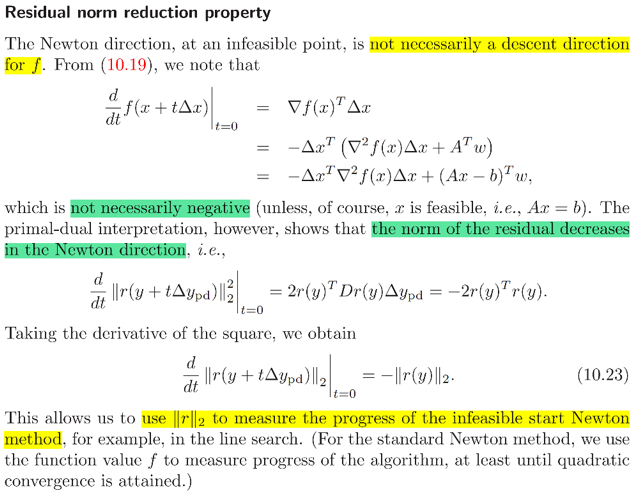</kbd>

> [!NOTE]
> Từ 10.19:
>
> [∇^2f(x) AT; A 0][Δx, w]T = -[∇f(x), (Ax-b)]
>
> Đại khái là nó chính là:
>
> ∇^2f(x) Δx + ATw = -∇f(x) và AΔx = -(Ax - b) 
>
> ⇨ ∇f(x) = -[∇^2f(x) Δx + ATw]
>
> Từ đó ta xét directional derivative theo hướng Δx: (như đã biết công
> thức sẽ là ∇f(x)TΔx = ΔxT∇f(x)):
>
> ΔxT∇f(x) = -ΔxT[∇^2f(x) Δx + ATw]
>
> = -ΔxT∇^2f(x) Δx - ΔxTATw
>
> = -ΔxT∇^2f(x) Δx - (AΔx)Tw
>
> = -ΔxT∇^2f(x) Δx + (Ax - b)Tw | thay AΔx = -(Ax - b)
>
> = - ΔxT ∇^2f(x) Δx + (Ax - b)Tw
>
> Và cái này ý chính muốn nhấn mạnh rằng, chưa chắc đã < 0 do đó
> infeasible Newton'step chưa chắc đã là DESCENT DIRECTION (giúp
> giảm f)
>
> ====
>
> Tuy nhiên, dùng cách interpretation primal-dual: (để coi Newton's step
> Δx_nt là cái phần của Δy_pd dành cho (việc giảm) primal residual thì:
>
> khi ta xét norm của residual: (again, nhớ rằng ta coi r là hàm nhận vector
> R^(n+p) (vector x concat với vector v) để trả ra residual vector (primal
> residual Ax - b concat dual residual ∇f(x) + ATv)
>
> sẽ là ||r(y)||.
>
> Và (squared) norm tại điểm sau khi update theo hướng primal-dual step 
> theo step size t: ||r(y + tΔy_pd)||^2
>
> Đạo hàm theo t của function này: d/dt ||r(y + tΔy_pd)||^2  và evaluate tại t = 0
> để xem nếu đi (thay đổi một khoảng vô cùng nhỏ theo hướng Δy_pd thì 
> hàm norm tăng hay giảm)
>
> Có thể đặt h(r) = ||r||^2 
>
> d/dt ||r(y + tΔy_pd)||^2  = d/dt h(r).
>
> và đặt z(t) = y + tΔy_pd ⇨ dr(z)/dt = dr(z)/dz dz/dt
>
> Theo chain rule = dh(r)/dr . dr(z)/d(z) . dz(t)/dt
>
> Đạo hàm hàm squared norm ta có thể dễ dàng tìm ra công thức nhở MIT 18s096
>
> f(u) = ||u||^2 = uTu thì df = (u + du)T(u + du) - uTu 
>
> = (uTu + duTu + uTdu + duTdu) - uTu
>
> = (uTu + 2uTdu) - uTu = 2uTdu ⇨ df/du = 2uT (∇f = 2u)
>
> ⇨ d/dr h(r) = 2rT, cũng là 2r(z)T
>
> Còn d/dz r(z) = Dr(z)
>
> và dz/dt = Δy_pd
>
> ⇨ d/dt ||r(y + t Δy_pd)||^2 = 2r(z)T Dr(z) Δy_pd 
>
> = 2r(y + tΔy_pd)T Dr( y + tΔy_pd) Δy_pd
>
> Giờ ta evaluate tại t = 0
>
> = 2r(y)T Dr(y) Δy_pd 
>
> Và với Dr(y) Δy_pd = - r(y) (xem link)
>
> Ta có: 
>
> d/dt ||r(y + tΔy_pd)||^2 = -2r(y)Tr(y) = -2||r(y)||^2 (1)
>
> Đặt k = ||r(y + tΔy_pd)||
>
> vế trái = d/dt ||r(y + tΔy_pd)||^2 = dk^2/dt
>
> theo chain rule:
>
> = dk^2/dk dk/dt = 2k dk/dt = 2 ||r(y + tΔy_pd)|| [d/dt||r(y + tΔy_pd)||]
>
> Đang evaluate t  = 0
>
> ⇨ vế trái = 2 ||r(y + 0Δy_pd)|| [d/dt||r(y + tΔy_pd)||]
>
> = 2 ||r(y + 0Δy_pd)|| [d/dt||r(y + tΔy_pd)||]
>
> ⇨ 2 ||r(y)|| [d/dt||r(y + tΔy_pd)||] 
>
> Ta có (1) ⇔ 2||r(y)|| [d/dt||r(y + tΔy_pd)||] = -2||r(y)||^2
>
> ⇔ d/dt||r(y + tΔy_pd)|| = -||r(y)|| ≤ 0
>
> kết quả này cho thấy theo hướng infeasible Newton's step, LÀM GIẢM
> GIÁ TRỊ CỦA RESIDUAL NORM r()
>
> DO ĐÓ Ý NGHĨA CỦA NÓ LÀ, DÙ KHÔNG GIẢM OBJECTIVE. VỐN DĨ
> DẪN ĐẾN TA SẼ KHÔNG THỂ DÙNG CÁI NÀY ĐỂ ĐÁNH GIÁ SỰ TIẾN
> TRIỂN - CỤ THỂ LÀ TÍNH RA STEP SIZE
>
>  NHƯNG MAY MẮN LÀ NÓ GIẢM NORM RESIDUAL. NÊN TA CÓ
> THỂ DÙNG NÓ ĐỂ ĐÁNH GIÁ.
>
> Đại ý là, một một sự thật là với infeasible Newton, tức là Newton
> step tính toán tại một điểm infeasible, thì nó lại chưa chắc là
> descent direction (tức là hướng giúp giảm objective f0)
>
> Mà cái này thì ảnh hưởng gì? Ảnh hưởng sẽ là, ta ko thể thực hiện
> line search.Là sao?
>
> Là vì ta nhớ rằng dù là gradient descent hay Newton method thì
> bản chất ta vẫn chỉ có "hướng đi", còn thực ra ta vẫn phải xác định
> xem đi theo hướng đó bao xa, và đó gọi là line search.
>
> Thế thì với exact line search, như đã biết đại khái là ta lại giải một
> bài toán tối ưu ở mỗi lần tính xong "direction", để tìm ra step size
> tốt nhất, giúp đưa f0 xuống nhiều nhất (giống như đứng trên sườn
> đồi đi về một hướng giúp đi xuống thì nếu nhảy một bước quá xa ta
> sẽ có khi lại vọt qua sườn bên kia, cao hơn bên này, nhưng sẽ có
> step size tối ưu)
>
> Còn với backtracking line search, việc tìm step size mang tính chất
> ước lượng, ta bắt đầu với t = 1 (tức là độ lớn của Newton step
> vector Δx_nt, hay steepest gradient vector Δx_st), sau đó thực hiện
> như sau:
>
> Tại x, coi như ta có hàm tuyến tính với độ dốc điều chỉnh giảm bớt,
> với step size t = 1, mà hàm tuyến tính này đưa ta xuống độ cao
> KHÔNG BẰNG hàm f, thì dĩ nhiên ok, take full step (t = 1), vì đây là
> case  mà việc bước đi sẽ giảm hàm f một khoảng ít nhất là bằng độ
> giảm dự đoán bởi hàm tuyến tính
>
> Ngược lại, ta sẽ scale t xuống.
>
> Nói chung là nó đảm bảo rằng mỗi bước đi sẽ đều giảm f ít nhất là
> một độ lớn bằng - t α ∇f(x)TΔx (có dấu trừ vì ∇f(x)TΔx mang dấu
> âm)
>
> (stopping condition của backtracking line search:
>
> f(x + t Δx) ≤ f(x) + αt ∇f(x)TΔx
>
> ⇨ f(x) - f(x + t Δx) ≥ - αt ∇f(x)TΔx
>
> TÓM LẠI, thì cả hai trường hợp ta đều phải EVALUATE GIÁ TRỊ
> HÀM f OBJECTIVE FUNCTION TẠI ĐIỂM MÀ TA BƯỚC TỚI
> THEO HƯỚNG ΔX.
>
> THẾ MÀ Ở ĐÂY ĐÃ NÓI LÀ Δx CHƯA CHẮC DESCENT
> DIRECTION, NÊN CHƯA CHẮC f(x + t Δx) đã < f(x), NÊN LÀM
> SAO LINE SEARCH  ĐỂ QUYẾT ĐỊNH STEP SIZE ĐƯỢC
>
> THẾ THÌ MAY MẮN LÀ TA CÓ THỂ DƯẠ VÀO NORM CỦA RESIDUAL

 

<kbd>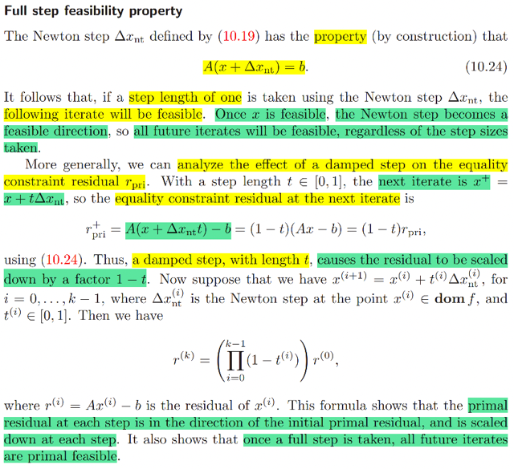</kbd>

> [!NOTE]
> Đại khái là ta còn nhớ rằng yêu cầu / condition để giải ra Δx_nt
> trong công  thức 10.19: A(x + Δx_nt) = b
>
> Hay nói cách khác, Newton's step sẽ phải thỏa: từ x dù có
> infeasible thì x + Δx_nt phải feasible.
>
> Và phát biểu trên đồng nghĩa rằng từ feasible point x, nếu ta
> update / take a step theo hướng Δx_nt với step size = 1 (full step
> size) thì ta sẽ có feasible point x+
>
> Và sau đó, với x+ đã feasible, tức Ax+ = b thì từ đó, với Newton's
> step vẫn phải thỏa A(x+ + Δx_nt) = b ⇨ A Δx_nt = 0. Và điều này
> dẫn đến:
>
> A(x+ + t Δx_nt) = b BẤT CHẤP t BẰNG BAO NHIÊU (vì A(x+ + t
> Δx_nt) luôn bằng Ax+ + At Δx_nt = b + 0 = b)
>
> Do đó trong sách mới nói rằng một khi x đã feasible thì the
> Newton's step trở thành feasible direction BẤT CHẤP STEP SIZE
> t.
>
> (còn ban đầu, Δx_nt dù chỉ hướng có thể dẫn đến feasible, nhưng
> phải care step size nữa.
>
> ====
>
> Rồi người ta mới nói ta có thể phân tích hiệu quả của một
> damped step (còn nhớ, tức là khi chưa qua giai đoạn full
> Newton step, mà còn phải tìm / cân nhắc step size t) đối với độ
> lớn của primal residual
>
> Còn nhớ primal residual chính là Ax - b.
>
> Vậy thì tại initial point primal residual là Ax - b thì sau khi iterate,
> nó là:
>
> r+_pri = A(x + Δx_nt * t) - b = Ax + A Δx_nt * t - b
>
> Tới đây dùng: cái ta có A(x + Δx_nt) = b ⇨ Ax + A Δx_nt = b
>
> ⇨ Ax - b = - A Δx_nt
>
> Thay vào:
>
> ⇔ - (Ax - b) = A Δx_nt
>
> = Ax - b - (Ax - b) * t
>
> = (1 - t)(Ax - b)
>
> = (1 - t)r_pri
>
> Như vậy có thể thấy sau một iteration, primal residual bị scale
> bởi factor 1 - t
>
> Và sau iteration kế tiếp nó bị scale tiếp bởi 1 - step_size t tại
> iteration đó nữa,
>
> Nên khái quát từ r(0), đến r(k) nó sẽ bị scale bởi (1- t(0))(1 - t(1))..
> .(1 - t(k))
>
> ⇨ r(k) = Π(1 - t(i)) r(0)
>
> Và một khi đã chuyển qua giai đoạn full step, tức t = 1. Thì có thể
> thấy  primal residual sẽ thành 0 vì khi đó scaled factor trở thành -
> 1 - 1 = 0  Và điều đó có nghĩa là x đã trở thành feasible (vì primal
> residual = Ax - b)

 

<kbd>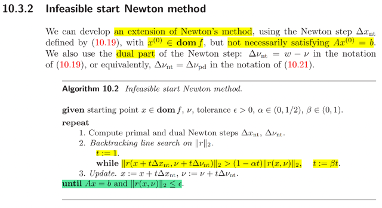</kbd>

> [!NOTE]
> Nói về Newton method algorithm với infeasible start.
>
> Bắt đầu với x(0) thuộc dom f nhưng chưa chắc đã thỏa constraint Ax
> = b.
>
> Bước 1 là tính (primal) Newton's step Δx_nt và dual Newton's step
> Δv_nt.
>
> Bước 2: Backtracking line search:
>
> Bất đầu với t = 1 và giảm dần bởi β cho đến khi thỏa exit condition,
> trong đó exit condition nó dùng l2 norm của r(x,v) thay vì dùng
> objective function.
>
> So sánh với original backtracking line search:
>
> Original exit condition: f(x+t Δx) ≤ f(x) + αt∇f(x)TΔx
>
> mang ý nghĩa là khi nếu theo hướng Δx với step size t hàm f xuống
> nhiều hơn linear approx của f tại x với độ dốc đã scale bởi α thì dừng
> line search và dùng t đó để update. Hay nói cách khác ngược lại
> rằng khi mà dự đoán bởi linear approx với độ dốc đã điều chỉnh mà
> còn hàm f lại xuống ít hơn phải tiếp tục scale step size t xuống vì khi
> đó là step size quá lố rồi
>
> exit condition của infeasible start Newton method:
>
> ||r(x + t Δx_pd, v + t Δv_pd)|| ≤ ||r(x, v)|| - αt||r(x, v)||
>
> ⇔ ||r(x, v)|| - ||r(x + t Δx_pd, v + t Δv_pd)|| ≥ αt||r(x, v)||
>
> ⇔  Δ||r|| (mức giảm của residual norm) ≥ αt||r(x, v)||
>
> mang ý nghĩa đại khái là nếu step t đã khiến norm của r tại điểm
> update  (vế phải)  giảm nhiều hơn là sự giảm của norm được scale
> tuyến tính bởi factor αt, thì khi đó có thể dùng step size t này
>
> Nói chung ý chính là trong infeasible Newton algorithm, ta dùng l2
> norm của r (residual) để dẫn dắt.
>
> Và thuật toán dừng lại khi điểm đã feasible (Ax = b) cũng như là l2
> norm của r đã nhỏ hơn một threshold nào đó,

 

<kbd>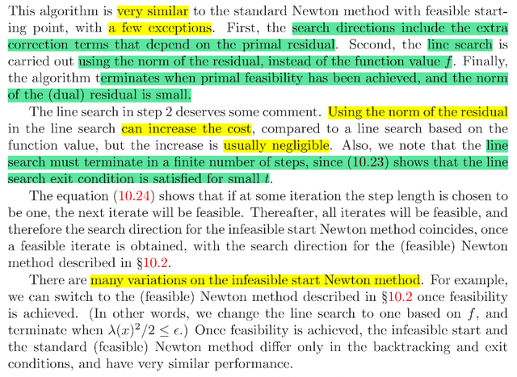</kbd>

> [!NOTE]
> Đại khái là thuật toán infeasible Newton rất giống feasible Newton.
> Chỉ có vài ngoại lệ.
>
> Đó là việc dùng l2 norm trong line search gây tăng chi phí tính toán
> so với dùng f value nhưng không đáng kể.
>
> Và dựa vào 10.23 (d/dt||r(y + tΔy_pd)|| = -||r(y)|| ≤ 0: nói rằng đi
> theo hướng Δy_pd thì sẽ giảm l2 norm của r:) thì ta hiểu đại khái
> rằng exit condition với vế trái giảm dần  sau mỗi iteration của line
> search loop thì nhất định sẽ đến lúc nào đó vế trái nó nhỏ hơn vế
> phải để exit backtracking line search, chứ không thể chạy mãi mãi
> (infinitely) được.
>
> Ngoài ra, một kết quả ta đã có ở phần trước nay nói lại đó là: 
>
> Từ kết quả 10.24: A(x + Δx_nt) = b)
> nói rằng một khi mà tại iteration nào đó (của thuật toán), t được chọn 
> giá trị 1 (gọi là full step size), ví dụ x(k) = x(k-1) + 1*Δx_nt:
>
> thì A(x + 1*Δx_nt) = b sẽ cho thành Ax(k) = b, và cái này cho ta biết: 
> x(k) đã trở thành feasible point. 
>
> Và từ đó trở đi với A(x + Δx_nt) = b ⇔ Ax + A Δx_nt =  b ⇔ A Δx_nt = 0
> Và cái này mang ý nghĩa là Δx_nt đã trở thành FEASIBLE STEP bất
> kể step size. Và thuật toán lúc này y như feasible Newton 
>
> Cuối cùng là có nhiều biến thể của infeasible start Newton method.
>
> Một cách làm là khi đạt feasible point thì ta sẽ chuyển qua dùng feasible
> start Newton

 

<kbd>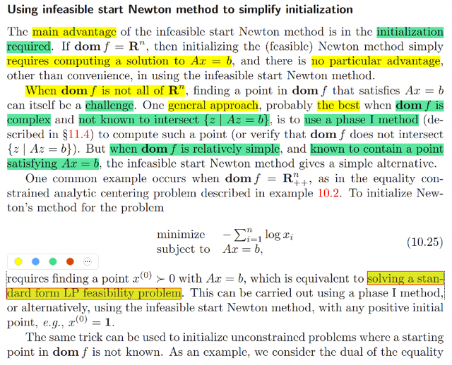</kbd>

<kbd>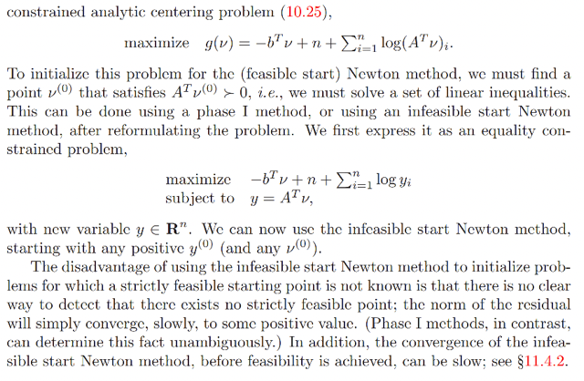</kbd>

> [!NOTE]
> QUAY LẠI SAU

 

<kbd>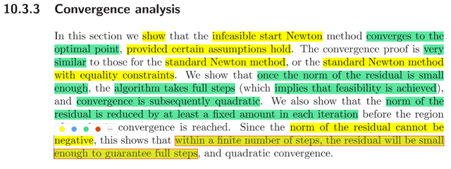</kbd>

> [!NOTE]
> đại khái là phần này ta sẽ phân tích sự hội tụ (convergence 
> analysis) đối với thuật toán infeasible start Newton's method.
>
> Nhìn chung thì nó cũng giống standard Newton's method, hoặc
> feasible start Newton's method.
>
> Nói trước một chút một số đặc điểm, thì đại khái là ta sẽ thấy 
> rằng quá trình xảy ra sẽ là, một khi mà norm của residual ||r(x,v)||)
> mà nhỏ hơn một threshold nào đó, thì khi đó thuật toán sẽ take
> full step (tức t = 1), điều này sẽ thể hiện rằng đã đạt trạng thái
> feasible, tức x đã feasible.
>
> Và từ sau đó sẽ xảy ra quá trình quadratic convergence.
>
> Ta cũng sẽ chứng minh cho thấy rằng norm của residual sẽ giảm
> theo một factor cố định trước khi xảy ra quadratic convergence.

 

<kbd>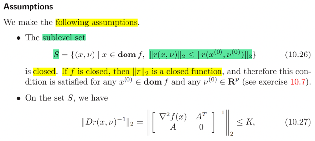</kbd>

<kbd>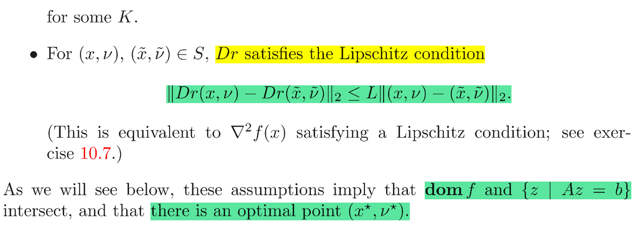</kbd>

> [!NOTE]
> Một số assumption cần thiết để bài toán có thể có có kết quả
> convergence  analysis sắp làm.
>
> Đầu tiên là sublevel set S phải đóng (hiểu đại khái là nó không mở rộng
> vô hạn). Đáng chú ý, S không giống S của các phần trước khi ở đó nó
> được định nghĩa bởi f: S = {x ∈ dom f: f(x) ≤ f(x0)} (x0 là initial point). Mà
> ở đây S được định nghĩa bởi l2 norm: S = { (x, v) ∈ dom f: ||r(x, v}|| ≤
> ||r(x0,v0)|| }
>
> Nếu f là hàm đóng (theo định nghĩa, tức là nó có tính chất với mọi α thì
> α-sublevel set đều closed) thì ||r|| cũng đóng. Đây là bài tập 10.7 ta phải
> chứng minh. Ở đây tạm biết ||r|| là hàm closed. Nên sublevel set S cũng
> closed.
>
> Assumption thứ 2 đó là trong sublevel set S thì Dr(x,v)inv, tức là inverse
> của matrix derivative r (Jacobian) bị chặn bởi K (chính xác thì l2 norm
> của nó bị chặn bởi K). Cái này thì bữa trước đã hiểu rồi, l2 norm của
> matrix chính là spectral norm, = maximum singular value. Mà Dr là
> symmetric, nên max singular value cũng là max eigenvalue.
>
> Ôn lại tí về đại số tuyến tính: Với matrix A, thì ATA sẽ symmetric, luôn có 
> đủ independent eigenvector, và chúng orthogonal nên ATA = QΛQT.
>
> Full SVD of A: A = UΣVinv = UΣ(VT)
>
> Thay vào Gram matrixATA = (UΣVT)T(UΣVT) = VΣTUTUΣVT = V(ΣTΣ)VT 
>
> Và vì ATA symmetric nên eigen-decomposition = QΛQT 
>
> ⇨ ΣTΣ = Λ ⇨ eigenvalues của ATA là bình phương singular value của A:
>
> λ = σ^2
>
> Nếu A cũng symmetric thì SVD của A: A = U Σ VT cũng bằng Q Λ QT
>
> ⇨ U = Q = V: Eigenvectors cũng là basis của columns space và rowspace
>
> Σ = Λ ⇨ singular value của A = |eigenvalue| của A
>
> Vậy thì quay lại đây, khi mà λmax của Dr_inv ≤ K thì tức là λmin của Dr ≥ 1/K
> mà cái này cũng tương tự như assumption khi convergence analysis cho 
> trường hợp equality constrained quadratic nơi mà ta có cái KKT matrix 
> KKT = [∇^2f(x), AT; A, 0]  để rồi cũng có vụ |KKTinv| ≤ K. Và khi không có 
> constraint luôn thì nó trở thành ∇^2f(x) inv ≤ K, và chọn K = m thì nó trở thành
> assumption ∇^2f(x) ≥ mI của unconstrained case.
>
> ====
>
> Assumption thứ 3 là Dr thỏa Lipschitz condition. Và cái này equivalent với
> ∇^2f(x) thỏa Lipschitz condition (chứng minh cái này là nội dung của bài tập)

 

<kbd>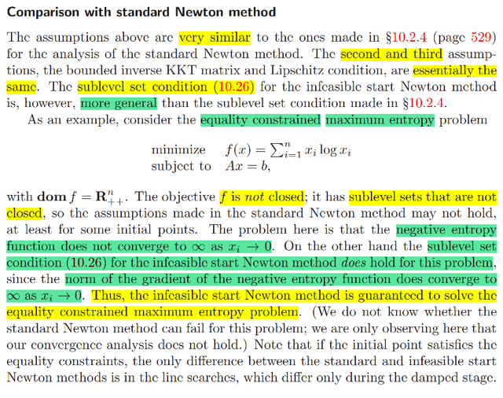</kbd>

> [!NOTE]
> Đại ý là các assumptions này rất giống các assumption khi ta
> convergence analysis cho standard Newton method.
>
> Trong đó cái số 2, và 3 trong đó nói về trạng thái bị chặn của inverse
> KKT matrix (ở đây là invser của Dr) và Lipschitz condition là gần như
> giống nhau.
>
> Còn cái số 1 thì ở đây khái quát hơn. Để minh họa thì họ cho function
> này (entropy) và đại ý là trong trường hợp này thì ta có f không
> closed vì sublevel set của nó không close (nhắc lại định nghĩa của
> closed  function là mọi sublevel set của nó đều closed)
>
> Thì vì f khong closed nên không thỏa assumption của convergence
> analysis trong phương pháp standard Newton. Do đó nếu ta dùng
> standard Newton thì không chắc rằng có thể converge (tìm ra
> optimal) hay không.
>
> Tuy nhiên với assumption của infeasible start Newton thì lại thỏa.
>
> THẬT RA CHƯA HIỂU LẮM chỉ hiểu ý chính muốn cho thấy một ví
> dụ mà assumption của standard Newton method thì không thỏa còn
> assumption của infeasible Newton method lại thỏa. Nên dùng standard
> feasible Newton method thì chưa chắc converge nhưng dùng infeasible
> standard method thì có.
>
>  QUAY LẠI SAU

 

<kbd>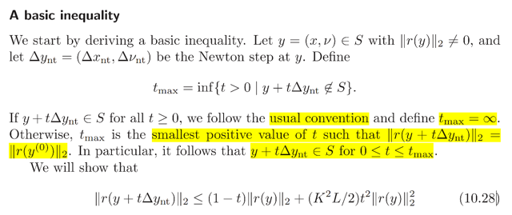</kbd>

> [!NOTE]
> để hiểu cái này cần phải hết sức lưu ý về định nghĩa của S. S là  một
> SUBLEVEL SET, định nghĩa bởi (bằng lời) là "mọi điểm trong domain mà
> độ lớn của residual (norm của r(y)) đều nhỏ hơn residual (của điểm ban
> đầu - starting point y(0))
>
> Thể hiện toán học: S =  y = (x, v) ∈ dom f: ||r(y) ≤ ||r(y0)|| 
>
> Thế thì hình dung thế này, ta "đang đứng tại" y (không nhất thiết y(0)
> vì cái mà ta đang định nghĩa là t_max tại vị trí đó, nó sẽ khác nhau
> tùy vào y khác nhau. 
>
> (mang giá trị residual r(y)). 
>
> Ta mới hướng theo một cái hướng define bởi Δy_nt. Thì với những
> step size khác nhau ta sẽ đi đến những điểm khác nhau y + t Δy_nt, và
> tại đó ta có các giá trị khác nhau của residual r.
>
> Thế thì, vì S là một set có hạn, nên đến một lúc nào đó, theo hướng
> Δy_nt, với bước đi có độ lớn t nào đó, thì ta sẽ RA NGOÀI set S. Và theo
> định nghĩa của set S, thì tại cái điểm ranh giới đó, thì giá trị của residual
> sẽ VƯỢT QUA ||r(y0)||.
>
> Và người ta định nghĩa cái t đó chính là t_max. Thì có thể hiểu theo nghĩa t
> là cái bước đi lớn nhất từ y, theo hướng Δy_nt mà ta vẫn còn trong S
> hoặc nói ngược lại t_max là cái nhỏ nhất mà ta bắt đầu ở ngoaì S.
>
> Thế thì dĩ nhiên tới đây đã hiểu tại sao t chính là nơi mà ||r(y + t Δy_nt|| =
> ||r(y0)||
>
> vì đơn giản là vì NGAY TRƯỚC KHI NÓ LỚN HƠN R(Y0) THÌ NÓ PHẢI
> BẰNG TRƯỚC ĐÃ.
>
> Tóm lại để hiểu chỗ này hãy nhớ rằng S là set những điểm có ||r|| ≤ ||r(y0)||
> nên khi bước từ y, đi ngang qua ranh giới để bắt đầu ra ngoài, và r bất đầu
> lớn hơn ||r(y0)|| thì ngay tại ranh giơi, thì ||r(y + t Δy_nt|| sẽ bằng ||r(y0)||
> và cái t đó gọi là t_max tại y đó.
>
> Và từ đó dĩ nhiên cũng dể hiểu rằng khi t còn nhỏ hơn tmax thì ta 
> còn trong S: y + t Δy_nt belong S

 

<kbd>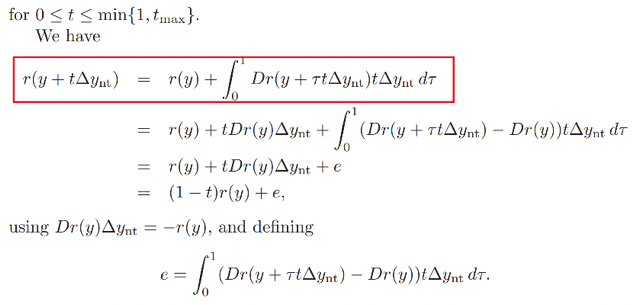</kbd>

<kbd>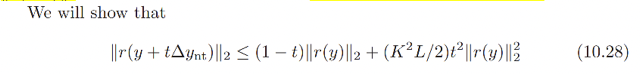</kbd>

> [!NOTE]
> Theo MIT 18.02 ta đã học về line integral với vector field F,  mà trong trường
> hợp đặc biệt khi vector field là gradient field F = ∇f, (f là function nào đó, gọi là
> potential). Thì khi đó ta có FTC đối với line integral
>
> ∫c ∇f . dr = f(P1) - f(P0) (P0, P1 là điều đầu điểm cuối của quỹ đạo)
>
> Vậy thì, nay ta áp dụng vào đây với hàm f = r, điểm đầu là y, điểm cuối là y + t
> Δy_nt, gradient ∇f = ∇r chính là Dr.
>
> Hiện tại Dr là hàm theo y (cũng như ∇f là hàm theo x, y: ∇f(x, y) vì f là  hàm theo
> x, y: f(x, y)
>
> r là hàm theo y.
>
> Ta sẽ parameterize y theo z (để sau đó có thể có hàm r theo z):
>
> Để làm vậy thì ta sẽ nhìn nhận theo cách đó là di chuyển điểm từ y0  (initial
> point) theo hướng vector Δy_nt  là
>
> y = y0 + t Δy_nt z (trong sách là τ)
>
> z chạy từ 0 đến 1. Khi z = 0, y = y0, khi z = 1, y = y0 + t Δy_nt
>
> ⇨ r(z) = r(y(z)) = r(y0 + t Δy_nt z)
>
> ⇨ dr/dz = dr/dy dy/dz
>
> = Dr(y) t Δy_nt
>
> = Dr(y0 + t Δy_nt z) t Δy_nt
>
> Vậy thì áp dụng kiến thức trên:
>
> ∫0:1 dr/dz dz = r(z) |1:0
>
> ⇔ ∫0:1 Dr(y0 + t Δy_nt z) t Δy_nt dz= r(1) - r(0)
>
> ⇔ ∫0:1 Dr(y0 + t Δy_nt z) t Δy_nt dz= r(y(1)) - r(y(0))
>
> ⇔ ∫0:1 Dr(y0 + t Δy_nt z) t Δy_nt dz= r(y0 + tΔy_nt *1) - r(y0 + tΔy_nt *0)
>
> ⇔ ∫0:1 Dr(y0 + t Δy_nt z) t Δy_nt dz= r(y0 + tΔy_nt) - r(y0)
>
> ⇔ r(y0) + ∫0:1 Dr(y0 + t Δy_nt z) t Δy_nt dz = r(y0 + tΔy_nt)
>
> Đây là giải thích từ đâu ra có kết qủa đóng khung đỏ
>
> ====
>
> r(y0 + tΔy_nt) = r(y0) + ∫0:1 Dr(y0 + t Δy_nt z) t Δy_nt dz
>
> = r(y0) + ∫0:1 [Dr(y0 + t Δy_nt z) - Dr(y0) + Dr(y0)] t Δy_nt dz   |  Cộng trừ cho
> Dr(y0)
>
> = r(y0) + ∫0:1 [Dr(y0 + t Δy_nt z) - Dr(y0)] t Δy_nt dz  + ∫0:1 Dr(y0) t Δy_nt dz
>
> = r(y0) + ∫0:1 [Dr(y0 + t Δy_nt z) - Dr(y0)] t Δy_nt dz  + Dr(y0) Δy_nt t
>
> = r(y0) + Dr(y0) Δy_nt t + ∫0:1 [Dr(y0 + t Δy_nt z) - Dr(y0)] t Δy_nt dz
>
> Dùng Dr(y0)Δy_nt = - r(y0)
>
> = r(y0) + [- r(y0)] t + ∫0:1 [Dr(y0 + t Δy_nt z) - Dr(y0)] t Δy_nt dz
>
> = r(y0) - r(y0) t + ∫0:1 [Dr(y0 + t Δy_nt z) - Dr(y0)] t Δy_nt dz
>
> = (1 - t) r(y0) + ∫0:1 [Dr(y0 + t Δy_nt z) - Dr(y0)] t Δy_nt dz
>
> Đặt e = ∫0:1 [Dr(y0 + t Δy_nt z) - Dr(y0)] t Δy_nt dz
>
> = (1 - t) r(y0) + e
>
> Vậy dừng ở đây ta có: 
>
> r(y0 + tΔy_nt) = (1 - t) r(y0) + e (I)

 

<kbd>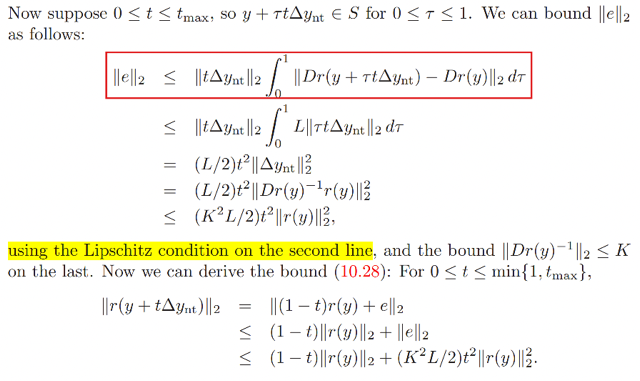</kbd>

> [!NOTE]
> tiếp theo, cho rằng 0 ≤ t ≤ tmax thì y0 + ztΔy_nt sẽ nằm trong range [y0, y0 + z
> tmax Δy_nt]
>
> và với 0 ≤ z ≤ 1 thì y0 + z tmax Δy_nt ≤ y0 + tmax Δy_nt.
>
> Và vì tmax được định nghĩa là t lớn nhất khiến ta (y0 + t Δy_nt) vẫn ở trong set S
> nên dĩ nhiên với y0 + z t Δy_nt với 0 ≤ z ≤ 1 cũng vẫn còn đang trong set S.
>
> Thế thì, ta sẽ xây dựng một upper bound của ||e||:
>
> ||e|| = ||∫0:1 [Dr(y0 + t Δy_nt z) - Dr(y0)] t Δy_nt dz||
>
> Đây là vector, đại khái là tổng của matrix D x vector (tΔy_nt) với D là hiệu  của hai
> matrix Dr tại y và Dr tại y0. Dấu tích phân về bản chất là tổng.
>
> Ta có thể bỏ t Δy_nt không phụ thuộc z ra ngoài tích phân:
>
> = || ∫0:1 [Dr(y0 + t Δy_nt z) - Dr(y0)] dz  . (t Δy_nt) ||
>
> Thì bản chất ∫0:1 [Dr(y0 + t Δy_nt z) - Dr(y0)] dz  là tổng các matrix D, vẫn ra một
> matrix, nhân với vector (tt Δy_nt), cho ra vector, rồi lấy norm.
>
> Thành ra ta đang có dạng ||Au|| và do đó cho phép ta dùng inequality:
>
> ||Au|| ≤ ||A||.||u||
>
> Do đó
>
> ||e|| = || ∫0:1 [Dr(y0 + t Δy_nt z) - Dr(y0)] dz  . (t Δy_nt) ||
>
> sẽ ≤ || ∫0:1 [Dr(y0 + t Δy_nt z) - Dr(y0)] dz || * || t Δy_nt ||
>
> Xét || ∫0:1 [Dr(y0 + t Δy_nt z) - Dr(y0)] dz ||, như đã nói, đây cơ bản là norm của
> tổng nhiều matrix.
>
> Nên ta dùng tiếp triangular inequality ||A1 + A2 + ..|| ≤ ||A1|| + ||A2|| + ...||Ai||
>
> ⇨ || ∫0:1 [Dr(y0 + t Δy_nt z) - Dr(y0)] dz || ≤ ∫0:1 || [Dr(y0 + t Δy_nt z) - Dr(y0)] || dz
>
> Từ đó:
>
> || ∫0:1 [Dr(y0 + t Δy_nt z) - Dr(y0)] dz || * || t Δy_nt ||
>
> ≤  ∫0:1 ||Dr(y0 + t Δy_nt z) - Dr(y0)|| dz  * || t Δy_nt ||
>
> Và như vậy:
>
> ||e|| ≤  ∫0:1 ||Dr(y0 + t Δy_nt z) - Dr(y0)|| dz  * || t Δy_nt ||
>
> = || t Δy_nt || *  ∫0:1 ||Dr(y0 + t Δy_nt z) - Dr(y0)|| dz  
>
> Đây chính là kết quả đóng khung.
>
> Tiếp, ta mới dùng assumption liên quan đến Lipschitz condition của Dr:
>
> Tồn tại L để ||Dr(x, v) - Dr(x~, v~)||2 ≤ L||(x,v) - (x~,v~)||2
>
> Nên với L nào đó thì ||Dr(y0 + t Δy_nt z) - Dr(y0)|| ≤ L||(y0 + t Δy_nt z) - y0||
>
> ⇔ ||Dr(y0 + t Δy_nt z) - Dr(y0)|| ≤ L||t Δy_nt z||
>
> Vậy kết quả (1) tiếp tục ≤ ...:
>
> ≤ || t Δy_nt || *  ∫0:1 L||t Δy_nt z|| dz 
>
> Tới đây thì dùng ||t Δy_nt z|| = |t| ||Δy_nt|| z = t ||Δy_nt || z (vì t ≥ 0, nên |t| = t)
>
> Vậy:
>
> ≤ || t Δy_nt || *  ∫0:1 L||t Δy_nt z|| dz   = || t Δy_nt || * ∫0:1 Lt || Δy_nt || z dz
>
> = || t Δy_nt || * (Lt || Δy_nt ||) ∫0:1 z dz
>
> = || t Δy_nt || * (Lt || Δy_nt ||) z^2/2|0:1
>
> = || t Δy_nt || * (Lt || Δy_nt ||) (1/2)
>
> = (1/2) L t^2 || Δy_nt || * || Δy_nt ||
>
> = (1/2) L t^2 || Δy_nt ||^2
>
> Dùng tiếp Dr(y) Δy_pd = -r(y) (Δy_pd cũng là Δy_nt) (theo link)
>
> ⇔ Δy_nt = Dr(y)inv r(y)
>
> ...= (1/2) L t^2 || Dr(y)inv r(y0) ||^2 
>
> ≤ (1/2) L t^2 || Dr(y)inv ||^2 . || r(y0) ||^2
>
> Và dùng ||Dr(y)inv|| ≤ K
>
> ⇨ ..≤  (1/2) L t^2 K^2 . || r(y) ||^2
>
> = (LK^2/2) t^2 || r(y0) ||^2
>
> Vậy ta có ||e|| ≤ (LK^2/2) t^2 || r(y0) ||^2 (II)
>
> ====
>
> Từ (I) ta có:
>
> r(y0 + tΔy_nt) = (1 - t) r(y0) + e 
>
> ⇨ ||r(y0 + tΔy_nt)|| = ||(1 - t) r(y0) + e||
>
> ≤ ||(1 - t) r(y0)|| + ||e|| (triangular inequality)
>
> = (1 - t) ||r(y0)|| + ||e||
>
> và dùng (II): ||e|| ≤ (LK^2/2) t^2 || r(y0) ||^2 (II)
>
> ⇨ ||r(y0 + tΔy_nt)|| ≤ (1 - t) ||r(y0)|| + (LK^2/2) t^2 || r(y0) ||^2
>
> ĐÂY LÀ INEQUALITY 10.28 MÀ TA MUỐN CHỨNG MINH
>
> Và chú y y0 ở đây không hẳn là initial point y(0). Mà chỉ là mình gọi như
> vậy khi chuyển y thành y(z) = y0 + t*Δy_nt*z mà thôi.
>
> nên inequality là:
>
> ||r(y + tΔy_nt)|| ≤ (1 - t) ||r(y)|| + (LK^2/2) t^2 ||r(y)||^2

**🔗 See also:** [linked note](#node-rxkrzze)

 

<kbd>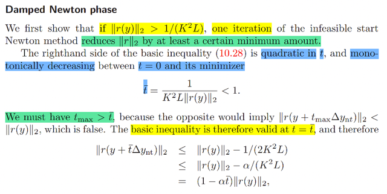</kbd>

> [!NOTE]
> Đại khái là tiếp theo (sau khi đã có basis inequality 10.28 vừa rồi)  ta sẽ
> tìm cách chứng minh rằng khi ||r(y)||2 > 1/(K^2L) thì một lần iteration sẽ
> giảm ||r||2 ít nhất một gía trị tối thiểu nào đó.
>
> Đầu tiên từ basis inequality:
>
> ||r(y + tΔy_nt)|| ≤ (1 - t) ||r(y)|| + (LK^2/2) t^2 ||r(y)||^2
>
> Ta quan sát thấy vế phải (1 - t) ||r(y)|| + (LK^2/2) t^2 || r(y) ||^2
>
> dễ thấy chính là quadratic function theo t, đặt là g(t) đi
>
> Viết lại cho rõ:
>
> = (LK^2/2) ||r(y)||^2 t^2 - ||r(y)|| t + ||r(y)||
>
> Thế thì với quadratic function, ax^2 + bx + c, thì minimizer của  nó là
> solution của 2ax + b = 0 ⇔ x = -b/2a
>
> ⇨ minimizer của hàm quadratic trên:
>
> t* = -(-||r(y)||) / 2 (LK^2/2) ||r(y)||^2
>
> = 1/[(LK^2) ||r(y)||] (đây là kết quả trong sách)
>
> Và với điều kiện ta đang đặt ra là ||r(y)|| > 1/K^2L ⇔ 1 > 1/||r(y)||K^2L 
> thì có thể thấy 1 > t^
>
> Ngoài ra t_max cũng phải > t*. Vì nếu t_max ≤  t* thì sẽ dẫn tới:
>
> 0 ≤ t_max ≤ t* mà hàm g(t) như đã nói monotonic decreasing từ 0 tới t*
> nên g(t_max) ≤ g(t*)
>
> tức là:
>
> (LK^2/2) ||r(y)||^2 t_max^2 - ||r(y)|| t_max + ||r(y)|| 
>
> ≤ (LK^2/2) ||r(y)||^2 t*^2 - ||r(y)|| t* + ||r(y)||
>
> Áp dụng tiếp basic inequality 10.28 cho t_max thì ta có:
>
> ||r(y + t_max Δy_nt)|| < (1 - t_max) ||r(y)|| + (LK^2/2) t_max^2 ||r(y)||^2
>
> (vế trái chính là g(t_max))
>
> Vậy ||r(y + t_max Δy_nt)|| < g(t_max) ≤ g(t*) = (1 - t) ||r(y)|| + (LK^2/2) t^2 ||r(y)||^2
>
> = (1 - 1/[(LK^2) ||r(y)||]) ||r(y)|| + (LK^2/2) 1/[(LK^2) ||r(y)||]^2 ||r(y)||^2
>
> = (||r(y)|| - ||r(y)||/[(LK^2) ||r(y)||])  + (LK^2/2) ||r(y)||^2/[(LK^2) ||r(y)||]^2 
>
> = ||r(y)|| - 1/2LK^2
>
> Vậy ta có: ||r(y + t_max Δy_nt)|| < g(t*) = ||r(y)|| - 1/2LK^2
>
> Điều này cho thấy ||r(y + t_max Δy_nt)|| < ||r(y)|| vì vế phải còn nhỏ hơn ||r(y)||
>
> Nhưng đây là kết quả sai, bởi lẽ ||r(y)|| phải ≤ ||r(y0)|| do y = (x, v) thuộc S (xem
> mở đầu của phần "A basic inequality", mà định nghĩa của t_max tại y là t thỏa:
>
> ||r(y + t_max Δy_nt)|| = ||r(y0)|| 
>
> nên nếu ||r(y + t_max Δy_nt)|| < ||r(y)|| thì tức là 
>
> ||r(y0)|| < ||r(y)|| mà điều này là không đúng.
>
> Vậy kết luận t* < t_max
>
> Vậy thì ý chính khi nói ta có thể khẳng định t* < t_max là để cho phép
> dùng basic inequality với t*:
>
> ||r(y + t*Δy_nt)|| ≤ (1 - t*) ||r(y)|| + (LK^2/2) t*^2 ||r(y)||^2
>
> Và thay t* = 1/K^2L||r(y)||, ta có:
>
> ||r(y + t*Δy_nt)|| ≤ (1 - 1/K^2L||r(y)||) ||r(y)|| + (LK^2/2) 1/K^4L^2||r(y)||^2 ||r(y)||^2
>
> = (||r(y)|| - 1/K^2L)  + 1/2K^2L
>
> = ||r(y)|| - 1/2K^2L
>
> Tức là ||r(y + t*Δy_nt)|| ≤ ||r(y)|| - 1/2K^2L
>
> ≤ ||r(y + t*Δy_nt)|| ≤ ||r(y)|| - α/K^2L  (do α > 1/2)
>
> Thay 1/K^2L = t*||r(y)||
>
> ...= ||r(y)|| - αt*||r(y)||
>
> = (1 - α t*) ||r(y)||
>
> Tức là ta có: ||r(y + t*Δy_nt)|| ≤ (1 - α t*) ||r(y)||
>
> Và đây chính là exit condition của infeasible start Newton method backtracking
> line search

 

<kbd>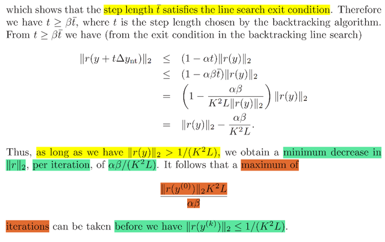</kbd>

> [!NOTE]
> Từ đó vì t* là giá trị mà backtracking line search sẽ "dùng", nên ta
> đã từng lập luận để hiểu rằng t luôn ≥ βt*: vì t ≥ t*, và β < 1 nên 
>
> t ≥ t* ≥ βt*  
>
> Thế thì exit condition là:
>
> ||r(y + t*Δy_nt)|| ≤ (1 - α t) ||r(y)|| 
>
> từ t ≥ βt* ⇔ -t ≤ -βt*
>
> ⇨ ||r(y + t*Δy_nt)|| ≤ (1 - α t) ||r(y)|| ≤ (1 - α β t*) ||r(y)||  
>
> Thay t* = 1/K^2L||r(y)||
>
> = (1 - α β 1/K^2L||r(y)||) ||r(y)||
>
> = ||r(y)|| - α β/K^2L
>
> Vậy ||r(y + t Δy_nt)|| ≤ ||r(y)|| - αβ/K^2L 
>
> Vậy là ta đã triển khai để cho thấy ||r(y + t Δy_nt)|| = ||r(y)|| - một 
> số dương (= αβ/K^2L)
>
> chứng tỏ mỗi iteration l2 norm của residual giảm ít nhất là nhiêu đó.
>
> Và từ đó ta có thể có số iteration tối đa để đạt một trạng thái nào đó
> của ||r||:
>
> Để ||r(yk)|| ≥ 1/K^2L thì từ r(y(0)) cần giảm nhiều nhất là:
>
> Mỗi lần giảm αβ/K^2L, k lần giảm kαβ/K^2L
>
> Vậy để tính k là số lớn nhất trước khi ||r(yk)|| < 1/K^2L thì ta sẽ
>
> Giải ||r(yk)|| ≥ 1/K^2L ⇔ ||r(y(0))|| - kαβ/K^2L ≥ 1/K^2L
>
> ⇔ ||r(y(0))||K^2L - kαβ/K^2LK^2L ≥ 1
>
> ⇔ ||r(y(0))||K^2L - 1 ≥ kαβ/K^2LK^2L
>
> ⇔ ||r(y(0))||K^2L/αβ - 1/αβ ≥ k
>
> ||r(y(0))||K^2L/αβ ≥ k

 

<kbd>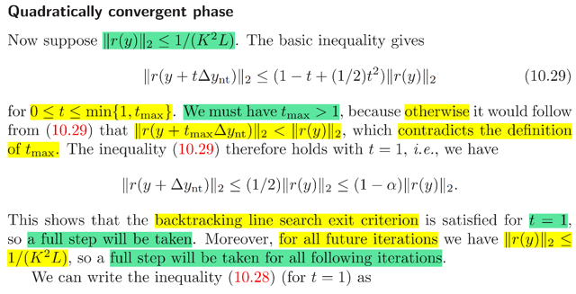</kbd>

> [!NOTE]
> Tiếp, xét giai đoạn mà ||r(y)|| ≤ 1/K^2L (hồi nãy là damped Newton stage,
> nơi ||r(y)|| > 1/K^2L)
>
> Khi 0 ≤ t ≤ min(1, t_max) thì ta có basic inequality:
>
> ||r(y + tΔy_nt)|| ≤ (1 - t) ||r(y)|| + (LK^2/2) t^2 ||r(y)||^2
>
> áp dụng ||r(y)|| ≤ 1/K^2L ta có vế phải ≤ ...
>
> ≤ (1 - t) ||r(y)|| + (LK^2/2) t^2 1/(K^2L) ||r(y)|| (chỉ thay "một cái ||r(y)|| ở term
> thứ 2 thôi)
>
> = (1 - t) ||r(y)|| + t^2/2||r(y)||
>
> = (1 - t + t^2/2)||r(y)||
>
> Vậy ||r(y + tΔy_nt)|| ≤ (1 - t + t^2/2)||r(y)|| (*)
>
> Thế thì điều này cho thấy t_max phải > 1.
>
> Vì nếu t_max ≤ 1 thì bất đẳng thức (*) trên khi áp dụng với t_max 
>
> (khi đó t_max ≤ min(1, t_max) nên có quyền áp dụng basic inequality) sẽ thành:
>
> ||r(y + t_max Δy_nt)|| ≤ (1 - t_max + t_max^2/2)||r(y)||  
>
> ≤ (1 - 1 + 1^2/2)||r(y)|| = 1/2 ||r(y)|| và lại càng < ||r(y)||
>
> Và ||r(y + t_max Δy_nt)|| < ||r(y)|| là vi phạm định nghĩa của t_max như lúc nãy
> đã giải thích (ôn lại: ||r(y + t_max Δy_nt)|| phải = ||r(y(0)||, mà ||r(y(0)|| phải ≥ ||r(y)||
> vì y phải ∈ S)
>
> ====
>
> Vậy thì ta khẳng định 1 < t_max, thì tương tự, 1 thỏa 0 < 1 ≤ min(1, t_max) nên
> áp dụng bất đẳng thức trên với t = 1: 
>
> ||r(y + tΔy_nt)|| ≤ (1 - 1+ 1^2/2)||r(y)|| = 1/2||r(y)||
>
> và vì 0≤ α ≤ 1/2 ⇔ 1 - α ≥ 1/2
>
> ⇨ ...≤ (1 - α)||r(y)||
>
> Và kết quả này: ||r(y + tΔy_nt)|| ≤ (1 - α)||r(y)|| chính là exit condition với t = 1
>
> Hay có nghĩa là (khi ||r(y)|| ≤ 1/K^2L) với t = 1 thì nó đã thỏa exit condition.
> Nên gọi là thuật toán sẽ "full step" (chứ không giảm /scale t xuống)
>
> Và hơn nữa mọi iteration sau đều vậy thỏa  ||r(y)|| ≤ 1/K^2L) bởi lẽ ta đã
> chứng minh rằng ||r|| sẽ giảm đi ít nhất một khoảng nào đó (chứ không có)
> chuyện đứng im sau mỗi iteration, Nên có thể khẳng định một khi đã full step
> thì sau đó cũng vậy

 

<kbd>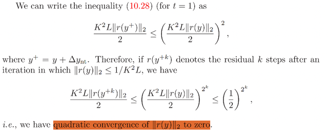</kbd>

> [!NOTE]
> Thế thì với t = 1 thì basis inequality là:
>
> ||r(y + Δy_nt)|| ≤ (1 - 1) ||r(y)|| + (LK^2/2) 1^2 ||r(y)||^2
>
> = (LK^2/2) ||r(y)||^2
>
> ⇔ ||r(y + Δy_nt)|| ≤ (LK^2/2) ||r(y)||^2
>
> Gọi y + Δy_nt là y+:
>
> ||r(y+)|| ≤ (LK^2/2) ||r(y)||^2
>
> ⇔ (LK^2/2)||r(y+)|| ≤ [(LK^2/2) ||r(y)||]^2
>
> Kết quả này nghĩa là
>
> (LK^2/2)||r(y(1))|| ≤ [(LK^2/2) ||r(y(0))||]^2
>
> (LK^2/2)||r(y(2))|| ≤ [(LK^2/2) ||r(y(1))||]^2 ≤ [(LK^2/2) ||r(y(0))||]^(2^2)
>
> ...sau k iteration:
>
> (LK^2/2)||r(y(k))|| ≤ [(LK^2/2) ||r(y(0))||]^(2^k)
>
> Nên gọi y+k là sau khi iterat k step từ y thì ta có:
>
> (LK^2/2)||r(y(+k))|| ≤ [(LK^2/2) ||r(y)||]^(2^k)
>
> và do ||r(y)|| ≤ 1/(LK^2) nên (LK^2)/2||r(y)|| ≤ 1/2 
>
> ⇨ vế phải ≤ (1/2)^(2^k)
>
> Vậy (LK^2/2)||r(y(k))|| ≤ [(LK^2/2) ||r(y(0))||]^(2^k) ≤ (1/2)^(2^k)
>
> Và kết quả này chính là (tương tự đã biết ở standard Newton) là
> residual norm giảm theo tốc độ quadratic.
>
> Đây chính là QUADRATIC CONVERGENCE

 

<kbd></kbd>

<kbd>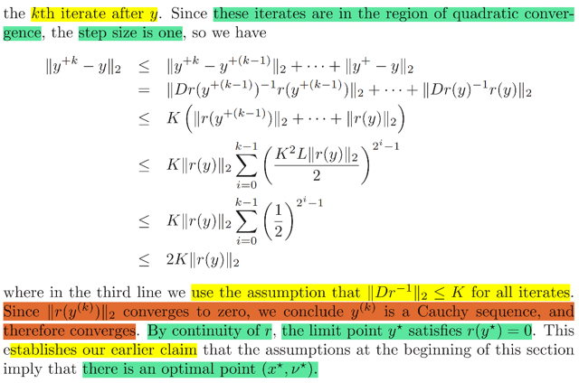</kbd>

> [!NOTE]
> Phần cuối đại khái là người ta chứng minh rằng chuỗi y(k) là CAUCHY
> SEQUENCE
>
> Do đó nó SẼ CONVERGE về y* với r(y*) = 0
>
> TÌM HIỂU CAUCHY SEQUENCE VÀ QUAY LẠI SAU
>
> QUAY LẠI SAU

 

<kbd>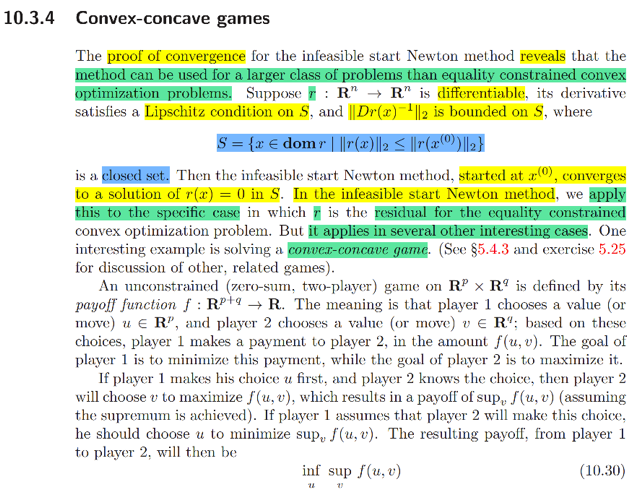</kbd>

<kbd>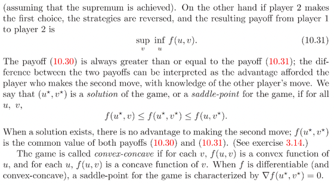</kbd>

<kbd>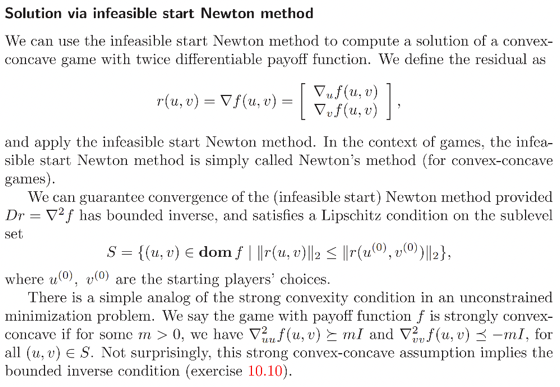</kbd>

> [!NOTE]
> QUAY LẠI SAU

 

<kbd>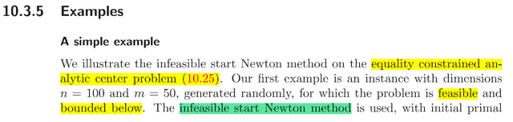</kbd>

<kbd>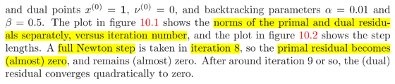</kbd>

<kbd>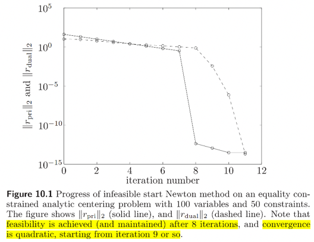</kbd>

<kbd>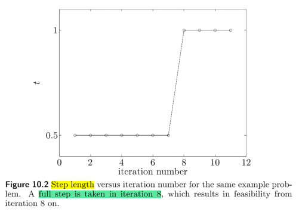</kbd>

> [!NOTE]
> áp dụng infeasible start Newton method. Đồ thị cho thấy tại
> iteration 8 thì primal residual (đo Ax - b) đã về ≈ 0. Từ đây trở
> đi, ta đã đạt trạng thái feasible. Và cũng từ iteration 9, dual
> residual giảm rất  nhanh - chính là giai đoạn quadratic
> convergence.
>
> Và đồ thị dưới cho thấy step size từ iteration 8 trở đi cũng đã
> full-step (tức t = 1)

 

<kbd>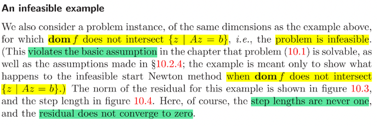</kbd>

<kbd>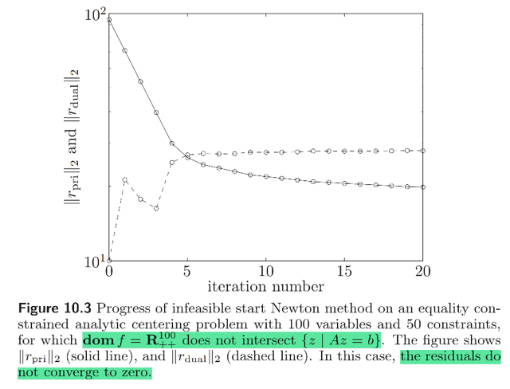</kbd>

<kbd>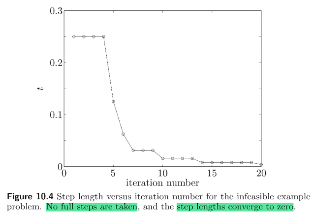</kbd>

> [!NOTE]
> ở đây cho một ví dụ mà infeasible Newton method áp dụng cho một
> bài toán mà dom f không intersect với {z: Az = b}. Điều này có nghĩa
> là bài toán không feasible, feasible set là tập rỗng (vì feasible set 
> phải là những điểm trong dom f mà thỏa constraint). Và đó đây cũng
> là case mà ta không thỏa assumption cần thiết để dùng Newton's
> method - đó là assumption rằng problem có optimal point.
>
> Do đó có thể thấy kết quả là residual (norm) không converge về 0
> cũng như là step size không bao giờ đạt trạng thái full step mà
> ngược lại nó converge về 0

 

<kbd>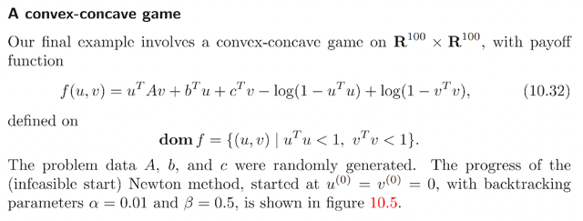</kbd>

<kbd>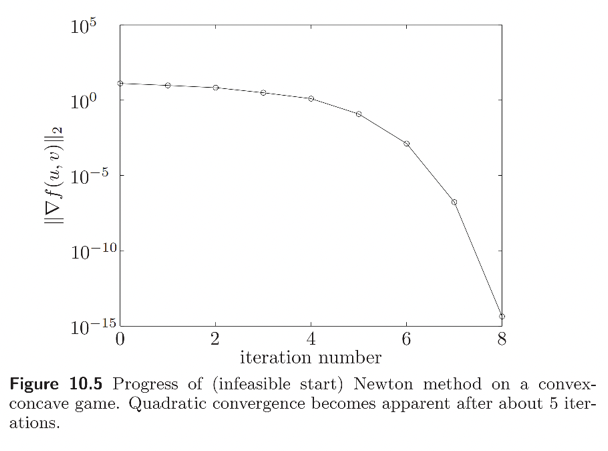</kbd>

> [!NOTE]
> QUAY LẠI SAU

 

<kbd>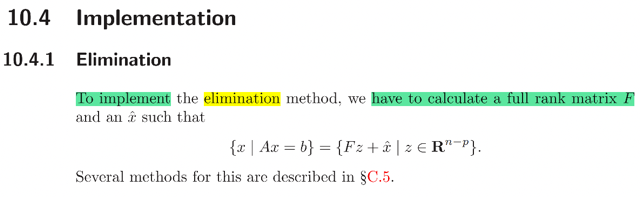</kbd>

> [!NOTE]
> nói qua việc thực hiện thuật toán.
>
> Đầu tiên, với phương pháp eliminate equality constraint. (còn nhớ,
> đó là ta sẽ chuyển bài toán minimize f0(x) với equality constraint Ax
> = b thành bài toán equivalent: minimize f0(Fz + x^) với F là matrix có
> các cột là basis của null-space của A, x^ là một solution của Ax = b.
> Thì như vậy ta sẽ chuyển về bài toán unconstrained.
>
> Thế thì vấn đề phải làm chính là tìm matrix F. Và phụ lục C.5 cho biết
> một số cách.

 

<kbd>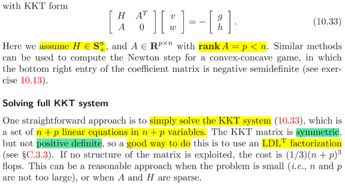</kbd>

<kbd>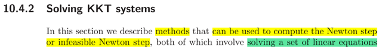</kbd>

> [!NOTE]
> phần này ta sẽ bàn về (những method để) giải hệ để tính Newton's step
> (như đã biết, dù là feasible Newton's step hay infeasible Newton's step
> thì việc tính Δx_nt đều là giải hệ K [Δx_nt; w] = [-∇f(x); r] với K là KKT
> matrix [∇^2f(x), AT; A 0] và r sẽ là 0 với feasible Newton's step, và Ax - b
> nếu là infeasible Newton's step.
>
> Nên nói chung là ta cần giải hệ [H, AT; A, 0][v; w] = -[g; h]
>
> với assumption là H positive semi definite ≽ 0 và A full row rank
>
> Thế thì cách đầu tiên là giải trực tiếp hệ này, nó là hệ có n+p equations
> với n + p variables. Như đã biết, cách làm sẽ gồm 2 bước (factor - solver
> method) là factorizing K và solve step.
>
> Và vì K là symmetric nên ta có thể dùng LDLT factorization (nếu K positive
> definite thì có thể có Cholesky factorization K = LLT)
>
> Và theo link của Appendix ta biết với matrix nxn thì LDLT factorization sẽ
> tốn n^3/3 flops
>
> Vậy factor K sẽ tốn (n + p)^3/3 flops
>
> Dĩ nhiên sau đó là solve step: LD(LT)x = vế phải (gọi là u đi) thì 
> ta sẽ lần lượt giải Lz = u (đây là giải hệ với lower triangular matrix, chính
> là forward substitution) tốn (n+p)^2 flops, rồi Dz2 = z, đây là hệ với diagonal
> matrix, tón (n + p) flops. Và cuối cùng là LTx = z2, là hệ với upper triangular
> matrix, chính là back substitution, tốn (n + p)^2 flops.

**🔗 See also:** [linked note](./appendix_c.md#node-kw2xw79)

 

<kbd>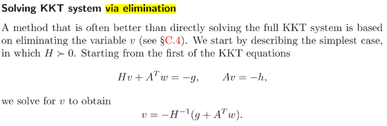</kbd>

<kbd>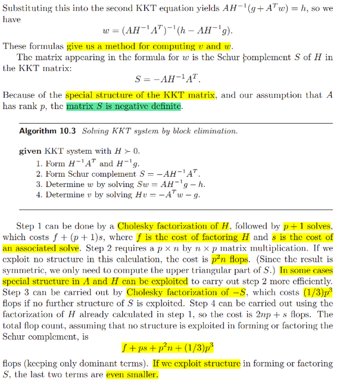</kbd>

> [!NOTE]
> Rồi, một phương pháp khác là dùng cái gọi là block elimination
>
> Review chút xíu về pp tổng quát (giải Ax = b): đó là khi ta có thể
> thể hiện Ax = b theo dạng [A11, A12; A21, A22][x1; x2] = [b1; b2]
>
> ⇔ A11x1 + A12x2 = b1 (1) A21x1 + A22x2 = b2 (2)
>
> Thì từ (1) ta ⇨ x1 = A11inv(b1 - A12x2) (assume A11 non-singular)
>
> khi đó, thay vào (2) ta có: A21A11inv(b1 - A12x2) + A22x2 = b2
>
> ⇔ A21A11invb1 - A21A11invA12x2 + A22x2 = b2
>
> ⇔ A21A11invb1 + (A22 - A21A11invA12x2)x2 = b2
>
> ⇔ (A22 - A21A11invA12x2)x2 = b2 - A21A11invb1
>
> Và đây là một hệ "nhỏ hơn" Sx2 = b~ với variable ít hơn (chỉ có x2)
>
> Và S = A22 - A21A11invA12x2 gọi là Schur complement của A11
>
> Thế thì, ở đây, ta có hệ K[v; w] = -[g, h] với K = [H, AT; A, 0]
>
> Áp dụng block elimination method: 
>
> từ (1) Hv +  ATw = -g ⇨ v = -Hinv(g + ATw)
>
> Thế vào (2) Av + 0 = -h ta có -AHinv(g + ATw) = -h
>
> ⇨ AHinvg + AHinvATw = h 
>
> ⇔ AHinvATw = h - AHinvg
>
> Với - AHinvAT là Schur complement của H
>
> ⇔ w = (AHinvAT)inv(h - AHinvg)
>
> Từ đó ta có một method giải KKT system:
>
> 1) Form HinvAT và Hinvg
>
> 2) Hình thành S = - AHinvAT
>
> 3) Tính w bằng cách giải Sw = AHinvg - h
>
> 4) Tính v bằng cách giải Hv = -ATw - g
>
> Thế thì bước 1: Form HinvAT, và Hinvg
>
> vì H là ≻ 0 nên có thể factor H bởi Cholesky factorization với cost = f.
>
> Sau đó là solve step. Tốn cost là s.
>
> Chỗ này nói lại cho nhớ, bản chất việc tính HinvAT là giải hệ HX = AT như đã
> biết về cơ bản, ta đang giải p (số cột của AT, A là matrix pxn ⇨ AT là matrix
> nxp) hệ Hxj = AT[:, j] (cột j của AT, có thể ghi là AT_j)
>
> Thế thì để giải theo factor-solver thì bước một là factor H, ở đây dùng
> Cholesky thì H = L(LT)
>
> Sau đó là bước solve step: tức giải Hxi = AT_j ⇔ LLTxi = AT_j bao gồm giải
> một chuỗi: Lz = AT_j, là forward substitution và sau đó là  gỉai LTx = z, là
> back-substitution.
>
> Cost của cả hai bước này gọi chung là s.
>
> Vậy với p hệ Hxj = AT_j ta sẽ có cost là ps
>
> Đó là giải xong HinvAT, tốn f + ps. Sau đó là giải Hinvg hoàn toàn tương tự,
> chính là giải Hy = g, vì H đã factored rồi, nên chỉ việc solve tốn thêm s nữa.
> Vậy step 1 tốn f + ps + s = f + (p + 1)s là vậy
>
> ====
>
> Step 2 là form Schur complement S = - AHinvAT thì khi đã có HinvAT thì đây
> chỉ là matrix x matrix, với A = (p x n) , HinvAT là matrix (n, p) lập luận nhanh:
> mỗi entries của S là inner product của A's row và  HinvAT's column là các
> vector có n components ⇨ tốn 2n - 1 ≈ 2n flops
>
> Có tổng cộng p^2 entries: p^2 *2n ≈ 2(p^2)n. Nhưng vì S symmetric nên thật
> ra ta chỉ cần tính một nửa con số này: (p^2)n
>
> (có nói thêm nếu có thể khai thác structure nào đó của A và H thì có thể còn it
> flops hơn)
>
> ====
>
> Step 3 là: Giải Sw = AHinvg - h, với -S ≻ 0 thì ta cũng Cholesky factor tốn
> (1/3)p^3 (xem lại công thức cost của Cholesky factorization)
>
> Step 4: giải Hv = -ATw - g thì chỉ việc solve step, vì H đã factor ở step 1 Cost
> gồm: form -ATw - g: ATw là nhân matrix (n, p) với vector w, tốn p + p - 1 ≈ 2p
> flops cho việc dot product giữa AT_row và w, và có n row nên cost tổng cộng
> là 2np, thêm p flops cho phép + (g) là 2np + p ≈ 2np
>
> Và solve step Hv = -ATw - g tốn s flop nữa là tổng cộng 2np + s
>
> Tóm lại tốn: f + (p + 1)s + (p^2)n + 2np + s 
>
> coi như f + ps + (p^2)n + (1/3)p^3

**🔗 See also:** [C.4 Block elimination](./appendix_c.md#node-xcllrby)

 

<kbd>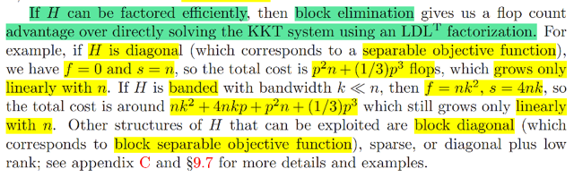</kbd>

> [!NOTE]
> đại khái là khi H có cấu trúc đặc biệt giúp việc factorizing có thể ít
> tốn hơn nữa thì dĩ nhiên sẽ giảm cost toàn bộ xuống.
>
> Ví dụ như khi H là diagonal matrix, như đã biết, khi đó về cơ bản
> chả cần factor gì nữa (f = 0), và việc solve với diagonal matrix 
> cũng chỉ tốn n phép chia (n flops)
>
> Tương tự khi H là banded matrix thì cũng giúp factorizing cost f
> nhỏ đi

 

<kbd>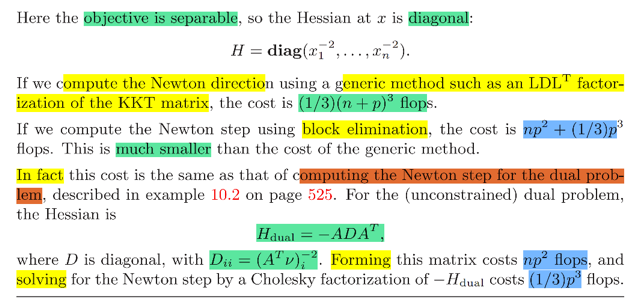</kbd>

<kbd>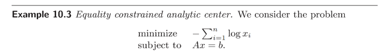</kbd>

> [!NOTE]
> f(x) = - Σi=1:n log xi = -1Tlog(x)
>
> df = f(x + dx) - f(x)
>
> = -1Tlog(x + dx) + 1Tlog(x)
>
> = -1Tlog[x(1 + dx/x)] +1Tlog(x)
>
> = -1T[log(x) + log(1 + dx/x)] + 1Tlog(x)
>
> = -1Tlog(x) + 1Tlog(1 + dx/x) + 1Tlog(x)
>
> = -1Tlog(1 + dx/x)
>
> ≈ -1T(dx/x) = - (1/x)Tdx
>
> ⇨ ∇f(x) = -1/x
>
> Hessian ∇^2f(x): dĩ nhiên là ma trận đạo hàm bậc hai của f(x) nhưng cũng là
> Jacobian của hàm f'(x) = -1/x
>
> Ta có thể theo MIT 18s096 để derive dạng bi-linear form hoặc tìm first
> derivative của f'(x) đều được.
>
> *Theo bi-linear form:
>
> Lập luận là: Khi x thay đổi một khoảng nhỏ dx, thì f sẽ thay đổi khoảng nhỏ df
> = f(x + dx) - f(x). Và sự thay đổi nhỏ df này sẽ là một hàm tuyến tính của dx,
> gọi là linear operator act on dx, thể hiện theo toán học là df = f(x + dx) - f(x) =
> f'(x)[dx]
>
> Thế thì, khi x thay đổi một khoảng nhỏ dx', cũng sẽ khiến f'(x) thay đổi: df' = f'
> (x + dx') - f'(x), và again, nó cũng là một hàm tuyến tính của dx', hay linear
> operator act on dx':
>
> df' = f''(x)[dx']
>
> ⇨ f'(x + dx') - f'(x) = f''(x)[dx']
>
> Thế thì, nói về vế trái, thì đó là tổng của hai linear operator:
>
> f'(x + dx') là một linear operator, và f'(x) cũng vậy. Và khi apply tổng (-) của
> chúng lên dx ta sẽ có [f'(x + dx') - f'(x)][dx], sẽ bằng apply từng cái lên dx và
> cộng lại (Đây là tính chất của linear operation)
>
> [f'(x + dx') - f'(x)][dx] = f'(x + dx')[dx] - f'(x)[dx]
>
> Và dĩ nhiên vế phải, cũng là linear operator, act on dx ta sẽ có:
>
> f''(x)[dx'][dx]
>
> Từ đó ta có:
>
> f'(x + dx')[dx] - f'(x)[dx] = f''(x)[dx'][dx]
>
> Và f''(x)[dx'][dx] chính là bilinear form, có thể ghi là f''(x)[dx' dx]
>
> ====
>
> Áp dụng vào đây, ta cần triển khai để cho ra dạng bilinear form:
>
> Ta đã có f'(x)[dx] = -(1/x)Tdx
>
> d(f'(x)[dx]) = [f'(x + dx') - f'(x)]dx
>
> = f'(x + dx')[dx] - f'(x)[dx]
>
> = -[1/(x + dx')]Tdx - [-(1/x)Tdx]
>
> = -[1/(x + dx')]Tdx + (1/x)Tdx
>
> = [-1/(x + dx') + 1/x]Tdx
>
> = [(-x + x + dx')/x(x + dx')]Tdx
>
> = [dx'/x(x + dx')]Tdx
>
> = [dx'/(x^2 + xdx')]Tdx
>
> ≈ [dx'/(x^2)]Tdx
>
> = dx'T diag(1/x^2) dx
>
> Đây là bilinear form ⇨ Hessian chính là diag(1/x^2)
>
> Cách 2: Tiếp cận theo hướng Hessian của f(x) chính là Jacobian của gradient
> ∇f(x):
>
> Từ kết quả trên ta có ∇f(x) = -1/x
>
> Ta sẽ xét hàm g(x) = ∇f(x) = -1/x.
>
> dg = g(x + dx) - g(x) = - 1/(x + dx) + 1/x
>
> = [- x + (x + dx)] / x(x + dx)
>
> = dx / (x^2 + xdx)
>
> ≈ dx / x^2
>
> = (1 / x^2) dx
>
> Vậy dg = (1 / x^2) dx
>
> Mà g là vector, nên dg cũng vậy. x là vector nên dx cũng vậy
>
> Do đó việc df = (1/x^2) dx, như đã biết, là linear operator act on du (f'(x)[dx]),
> thì nó chỉ có thể là một matrix nhân vector dx.
>
> Vậy matrix J nhân dx mà khiến cho ra kết quả là vector:
>
> [ du1/x1^2, dx2/x2^2, ...., dxn / xn^2 ] tức là vector có component thứ i là - dxi
> / xi^2, cũng là dui * (1/xi^2)  | dui là component thứ i của vector dx.
>
> Thì J chỉ có thể là diagonal matrix với đường chéo là [1/x1^2, ..1/xn^2]
>
> Vậy từ đây có thể kết luận Jacobian của ∇f(x) là diag([1/x1^2, ..1/xn^2]) và
> đây cũng là Hessian của f(x)
>
> Xét ví dụ này, với objective f(x) = - Σi log xi.
>
> Thế thì chủ yếu ý chính là nói rằng đây là case mà Hessian ∇^2f(x) là
> một matrix có cấu trúc đặc biệt có thể exploit, cụ thể nó chỉ là một
> diagonal matrix. (dùng kiến thức Matrix calculus ta có thể hiểu tại sao
> ở note bên)
>
> Thành ra trong trường hợp này, nếu ta tính Newton step theo cách giải
> trực tiếp thì tốn 1/3 (n+p)^3
>
> (ý là, việc giải Newton's step, như đã biết, là giải hệ KKT system:
>
> K[Δx_nt, w] = [-∇f(x), Ax - b], với K = [∇^2f(x), A; AT, 0]
>
> thì với  cách trực tiếp thì ý là ta sẽ factor matrix K, mà K thì có tính
> symmetric nhưng chưa chắc là symmetrix ≻ 0, nên ta dùng LD(LT)
> factorization. Và cái này thì sẽ tốn 1/3 (size của K)^3 flops (công thức
> này đã học từ Appendix 4, tuy nhiên ta sẽ quay lại sau để xem tại sao
> lại là 1/3 (n^3)
>
> thì nếu ta dùng block elimination như vừa học, thì cost của nó (với
> công thức tính cost hồi nãy là f + ps + (p^2)n + (1/3)p^3) với f = 0 (vì
> Hessian đã là diagonal rồi), s thì chỉ bằng size của K, tức n + p, thì
> cost trở thành:
>
> p(n + p) + (p^2)n + (1/3)p^3) = np^2 + p^3/3 + p^2 + pn
>
> = (n+1)p^2 + p^3/3 + pn COI NHƯ np^2 + p^3/3
>
> (vì np^2, với p^3 là bậc 3 nên có thể bỏ đi pn là bậc 2, và (n+1)p^2 coi
> như np^2)
>
> Và cái này thật ra là có cùng cost với việc giải bài toán này thông qua
> dual problem (sẽ nói rõ hơn ở note sau, nhưng đại khái là trong đó
> ta giải bài toán dual maximize v g(v) để tìm v*, sau đó ta thế vào lại
> KKT condition để tìm x*, cũng là giải minimize L(x, v*) (sở dĩ có thể
> làm theo cách này vì ở đây strong duality hold, cho phép d* = p*
> khiến x minimize L(x, v*) cũng chính là x* của primal problem.
>
> Và ta cũng dùn Newton's method để tìm v*, thế thì ý chính muốn nói,
> cost để tính newton step Δv_nt (dùng để update v) cũng có cùng cost
> với tính Δx_nt theo pp block elimination ở đây.
>
> Mình sẽ nói thêm về việc tìm Δv_nt ở note tiếp theo

**🔗 See also:** [linked note](#node-b4cbc9q)

 

<kbd>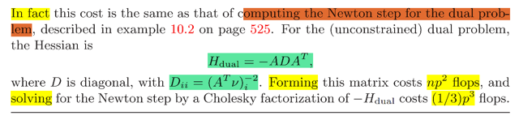</kbd>

> [!NOTE]
> Thế thì dual problem: maximize v g(v) = -bTv + n + Σi log(ATv)i
>
> tương đương minimize v f(v) = -g(v) = bTv - n - Σi log(ATv)i
>
> (f chỉ là thay tên cho tiện, ko liên quan gì objective f(x))
>
> Newton's step của dual problem: Δv_nt:
>
> Như đã biết, nguyên lý của Newton's method là ta thay thế / dùng xấp xỉ
> bậc hai của f(v)
>
> f(v + δv) ≈ f(v) + ∇f(v)Tδv + (1/2) δvT ∇^2f(v)δv = f^(v + δv)
>
> Để rồi với hàm f^(v + δv) ta sẽ tìm δv mà minimize f^(v + δv), vốn dĩ là một
> quadratic function của δv. Và optimal δv* chính là Newton step Δv_nt giúp
> minimize f^(v + δv)
>
> Và với việc bài toán này có objective quadratic nên ta có công thức (cũng
> đơn giản là xuất phát từ việc giải optimality condition ∇f^(v + δv) = 0 mà thôi)
>
> δv* (= Δv_nt) = -∇^2f(v)inv ∇f(v)
>
> Thế thì với f(v) =  bTv - n - Σi log(ATv)i thì Δv_nt = - ∇^f(v)inv ∇f(v) là ntn:
>
> Viết lại f(v) = bTv - n - 1Tlog(ATv)
>
> Thử tìm gradient ∇f(v) và Hessian ∇^2f(v)
>
> *Gradient:
>
> Đặt k(v) = 1Tlog(ATv), đặt u(v) = ATv ⇨ du = ATdv
>
> Đặt w = log(u) ⇨ dw = diag(1/u) du
>
> k = 1Tw ⇨ dk = 1T(w + dw) - 1Tw = 1Tdw
>
> = 1T[diag(1/u)du]
>
> = 1T[diag(1/u)ATdv]
>
> = 1T[diag(1/ATv)ATdv]
>
> = (1/ATv)TATdv
>
> df = f(v + dv) - f(v) = bTdv - dk = bTdv - (1/ATv)TATdv
>
> = [bT - (1/ATv)TAT]dv = [b - A(1/ATv)]Tdv
>
> ⇨ ∇f =  b - A(1/ATv)
>
> *Hessian:
>
> Xét hàm ∇f(v): đặt u = ATv, w = 1/u, z = Aw
>
> du = ATdv (Cái này rất dễ thấy)
>
> dw = 1/(u + du) - 1/u = (u - u - du)/(u^2 + udu) ≈ -du/u^2
>
> dz = Adw
>
> ∇f = b - z
>
> ⇨ d∇f = -dz = -Adw = -A(-1/u^2)du = -A(-1/u^2)ATdv
>
> = A(1/u^2)ATdv
>
> = A diag(1/u^2)ATdv
>
> ⇨ Jacobian của ∇f = A diag(1/u^2)AT
>
> = A diag(1/(ATv)^2)AT
>
> và cũng là Hessian của f (∇^2f(v)
>
> Vậy thì để tính Newton's step, Δv_nt, = -∇^2f(x)inv ∇f(v) cơ bản chính là
> giải hệ: 
>
> -∇^2f(v) Δv_nt = ∇f(v)
>
> ⇔ - A diag(1/(ATv)^2)AT Δv_nt = b - A(1/ATv)
>
> ⇔ A diag(1/(ATv)^2)AT Δv_nt = - b + A(1/ATv)
>
> ====
>
> đặt H_dual = -∇^2f(v) = - A D AT, với D = diag(1/(ATv)^2)
>
> Thế thì việc giải H_dual Δx_nt = ∇f(v) , như đã biết từ phụ lục C sẽ theo lối
> factor-solver. 
>
> Vậy thì đầu tiên ta phải nhân ADAT để có H_dual trước. Việc này tốn:
>
> DAT là nhân diagonal matrix (n, n) với matrix AT (n, p) sẽ tốn: 
>
> (p, vì AT có p cột) x [cost của D(AT_col1) = n*[D_rowi T AT_col1 = 1 flops do D_row 
> chỉ có 1 số khác 0]
>
> = p*[n*(1 flops)] = pn flops
>
> ADAT: là nhân matrix A (p, n) với DAT (n, p) ⇨ tốn 2pnp = 2np^2 flops
>
> ⇨ cost 2np^2 + pn coi như np^2 
>
> Sau đó ta sẽ factor H_dual, là matrix pxp nên theo LULT nó sẽ tốn 1/3p^3
>
> (kể cả solve step nữa) thì thành ra cost cũng là cõ np^2 + 1/3p^3 giống của block
> elimination
>
> TÓM LẠI CHÍNH MUỐN NÓI CÁCH GIẢI THEO BLOCK ELIMINATION
> VỪA NÓI, CÓ CÙNG COMPLEXITY VỚI CÁCH NÀY (DUAL)

**🔗 See also:** [linked note](#node-yvk3urk)

 

<kbd>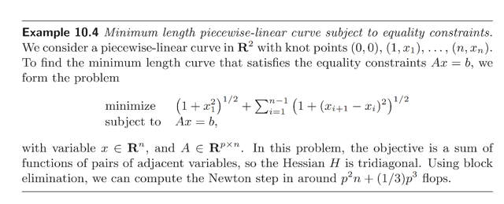</kbd>

> [!NOTE]
> QUAY LẠI SAU

 

<kbd>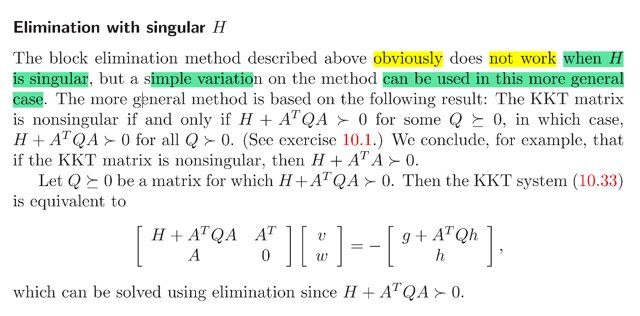</kbd>

> [!NOTE]
> QUAY LẠI SAU

 

<kbd>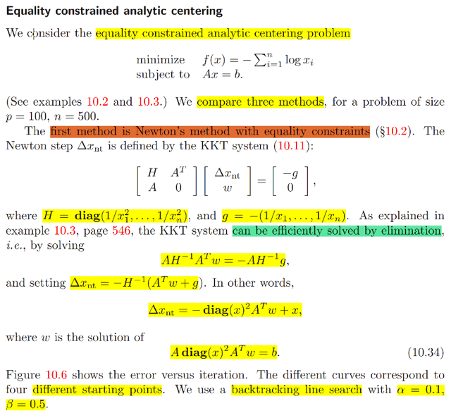</kbd>

<kbd>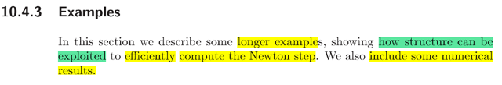</kbd>

> [!NOTE]
> Rồi, đại khái là phần này ta sẽ gặp lại bài toán này nơi mà ta có objective function là
> f0(x) = - Σ log(xi) constraint Ax = b với A là matrix full row rank (p, n) và  ta sẽ so sánh
> 3 phương pháp.
>
> 1) Newton's method với equality constraints, 2) Newton's method applied to the dual
> và 3) Infeasible start Newton method
>
> (nói chung là cơ hội để ôn lại hết, nên đây sẽ là note khá dài)
>
> Thế thì đầu tiên, theo link, phần trước ta đã chứng minh gradient và Hessian của f rồi.
> H (hay ∇^2f(x)) = diag(1/x^2) và ∇f(x) = -1/x
>
> Thì với method 1, Newton's step, Δx_nt được hình thành dựa trên lập luận sau: Đầu
> tiên cần nhắc lại Newton's step là gì, nó là direction mà ta sẽ đi để từ một điểm x(k), đi
> đến điểm tiếp theo x(k+1) theo công thức: x(k+1) = x(k) + t Δx_nt Và đây là một phần
> trong algorithm để qua các bước update đưa dần dần đến gần optimal point x* theo
> cách tiếp cận iteration (để đối nghịch với analytical solution, tức có công thức tính ra
> ngay x*)
>
> Thế thì, để tính Δx_nt, xuất phát tại x, ta sẽ coi như / xấp xỉ / thay thế hàm f(x) bởi
> quadratic approximation của nó. Xấp xỉ bậc 2 của f(x) theo Taylor expansion sẽ là như
> sau:
>
> f(x + δx) ≈ f(x) + ∇f(x)Tδx + (1/2) δxT ∇^2f(x) δx
>
> Vậy thì theo ý trên, ta sẽ thay f(x), bằng hàm f^(x + δx) = f(x) + ∇f(x)Tδx + (1/2) δxT
> ∇^2f(x) δx và đây là hàm theo δx, cụ thể hơn, nó chính là quadratic function theo δx có
> dạng (1/2) δxTPδx + qTδx + r (P = ∇^2f(x), hay H ở trên, q là ∇f(x))
>
> Và bước tiếp theo ta sẽ làm đó là tìm δx để f^(x + δx) nhỏ nhất nhưng với rằng buộc là
> x + δx* vẫn phải nằm trong feasible set, nói cách khác, chính là ta sẽ giải một bài toán
> equality constraint convex quadratic optimization problem sau:
>
> minimize f^(x + δx) subject to A(x + δx) = b
>
> (Lưu ý từ đây x chỉ coi như x0, như fixed value, chứ optimization variable là δx)
>
> Thế thì, để giải bài toán này, ta sẽ cũng dựa vào optimality condition, hay KKT
> condition:
>
> Có công thức khái quát là (với objective function f0(x), equality constraint functions
> hi(x), inequality constraint functions fi(x) i = 1,2....):
>
> ∇f0(x) + Σ λi * ∇fi(x) + Σ vi * ∇hi(x) = 0
>
> Và với bài toán này thì nó là: ∇f^(δx) + wTA = 0
>
> mà ∇f^x(δx) với f^(δx) (f^(x + δx) coi như f^(δx), giống như f(10 + x) cũng là f(x))
>
> = f(x) + ∇f(x)Tδx + (1/2) δxT ∇^2f(x) δx thì ∇f^(δx) = ∇^2f(x)Tδx + ∇f(x) 
>
> (Vì sao: Xét f(u) = 1/2 uTPu + qTu + r thì df 
>
> = 1/2 (u+du)TP(u + du) + qT(u + du) + r - 1/2 uTPu - qTu - r
>
> = 1/2 (uTPu + duTPu + uTPdu + duTPdu) + qTdu - 1/2 uTPu 
>
> = 1/2 (uTPu + 2uTPdu) + qTdu - 1/2 uTPu 
>
> = uTPdu + qTdu = (PTu + q)Tdu ⇨ ∇f = PTu + q = Pu + q với P symmetric
>
> Điều đó cho ta equations thứ nhất để giải tìm δx*:
>
> ∇^2f(x)δx + ∇f(x) + wTA = 0 (1)
>
> Và cái này gọi là dual feasible equations (mà cái tên này tại sao gọi như vậy có lẽ
> nên bàn sau)
>
> (Và cũng dễ thấy rằng nếu mà không có equality constraint thì ta sẽ có ngay công
> thức của Newton's step trong unconstraint Newton's method: - ∇^2f(x)_inv ∇f(x)
>
> Bên cạnh đó, điều kiện A(x + δx) = b, với việc x (coi điểm bắt đầu) đã feasible, tức ta
> có Ax = b khiến ta có A δx = 0 (2). Và A(x + δx) = b gọi là primal feasible equation
>
> Từ (1) và (2) tương đương:
>
> ∇^2f(x)δx + ATw = - ∇f(x) và A δx = 0
>
> Gom lại thành [∇^2f(x), AT; A, 0] [δx, w] = [-∇f(x), 0]. Đây gọi là KKT system
>
> Và việc giải nó sẽ cho ra δx*, chính là Newton's step:  Δx_nt và optimal dual variable:
>
> nên ta có thể ghi lại:
>
> [∇^2f(x), AT; A, 0] [Δx_nt, w] = [-∇f(x), 0]
>
> [∇^2f(x), AT; A, 0] [Δx_nt, w] = [-∇f(x), 0]
>
> Ghi theo sách với ∇^2f(x) = H, và ∇f(x) = g:
>
> [H, AT; A, 0] [Δx_nt, w] = [-g, 0]
>
> Thế thì phần trước ta đã biết rằng, để mà giải hệ này, nếu coi như
> giải một hệ lớn bình thường K a = b với K = [H, AT; A, 0], a = [Δx_nt,
> w], b = [-g, 0] thì việc giải theo lối factor - solver, thì factor K với LU rồi
> solve step thì sẽ không bằng việc giải với phương pháp block
> elimination vì ở đây ta có thể khai thác exploit cấu trúc của sub-matrix
> của K đó là H, là một symmetric positive semi definite matrix, và một
> block khác là 0.
>
> Phương pháp block elimination cũng đơn giản:
>
> Từ H Δx_nt + ATw = -g ⇨ Δx_nt = - Hinv(g + ATw)
>
> Thế vào A Δx_nt = 0: - A Hinv(g + ATw) = 0
>
> ⇔ - A Hinvg - A Hinv ATw = 0
>
> ⇔  A Hinv ATw = - A Hinvg (3)
>
> Giải cái này ra w, thế vào Δx_nt = - Hinv(g + ATw) sẽ cho ta  Δx_nt
>
> Thế thì với H = diag(1/x^2) = diag(1/x1^2, 1/x2^2...)
>
> ⇨ Hinv chính là diag(x^2) = diag(x1^2, x2^2, ...) và cũng là diag(x)^2
>
> với g (tức ∇f(x) = [1/x1, 1/x2...]
>
> ⇨ - Hinvg = -diag(x1^2, x2^2, ...) [-1/x1, -1/x2...]T sẽ thành [x1, x2..]
> và đó chính là x  
>
> Nên Δx_nt = - Hinv(g + ATw) = - Hinvg - HinvATw = - diag(x)^2ATw + x
>
> Với w như đã nói là solution của (3): và với Hinv là diag(x)^2, - Hinvg là x
> thì (3) là A diag(x)^2 ATw = Ax = b (Ax là b còn gì nữa)

**🔗 See also:** [linked note](#node-bjz5p2c)

 

<kbd>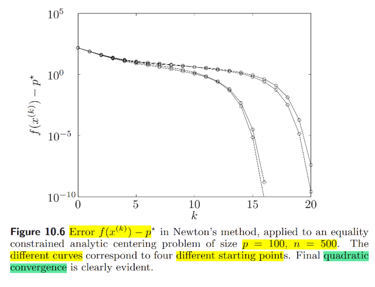</kbd>

> [!NOTE]
> Đây là hình ảnh, của method này, với các initial start khác
> nhau thì có các đường cong khác nhau.
>
> Giai đoạn mà các đường cong là error f(x(k) - p* cắm đầu
> là biểu hiện của stage quadratic convergence

 

<kbd>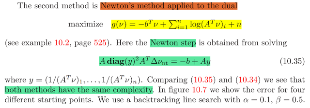</kbd>

> [!NOTE]
> Phương pháp thứ hai là áp dụng Newton's method vào dual:
>
> Chỗ này nói rõ một chút: Từ phần trước (link cam) ta đã biết rằng có
> thể giải bài toán này thông qua dual problem. Cụ thể là vì trong ví dụ
> này, ta có strong duality (hàm objective f0(x) = - Σ log(xi) là convex,
> với affine / linear equality constraint thì đây là convex optimization
> problem, không có inequality thì coi như thỏa Slater's condition ⇨ Có
> strong duality.
>
> Như vậy thay vì giải bài toán constraint problem gốc, ta có thể giải
> hai bài toán unconstraint problem:
>
> Giải dual problem tìm v*: maximize dual function g(v)
>
> Sau đó giải bài toán minimize x L(x, v*) tìm x*, cái cái này tương
> đương với việc thế v* vào KKT conditions: ∇f0(x) + vTA = 0 để giải ra
> x*.
>
> Do đó, cái chính là giải tìm v*, và nó, cũng là một optimization
> problem, bằng cách chuyển về dạng minimize - g(v), ta có thể cũng
> dùng iterative approach, cụ thể hơn là Newton's method  để dần dần
> tìm v*
>
> Và từ đó lập luận để hình thành Newton's step Δv_nt thì mình đã nói
> ở note trước rồi (link cam)...
>
> (cơ bản cũng làm sau khi đã chuyển từ bài toán maximize thành
> minimize, ta cũng có objective function, gọi là f(v), là hàm theo v để
> cần được minimize. Thế thì ta cũng sẽ approx nó bởi quadratic
> approx, để có f^(δv) và việc giải solution của bài toán minimize δv
> của f^(δv) sẽ cho ta Δv_nt)
>
> mà trong đó mình cũng đã tự triển khai để thấy Δv_nt là solution của:
>
> A diag(1/(ATv)^2)AT Δv_nt = - b + A(1/ATv)
>
> hay A diag(y^2)AT Δv_nt = - b + A(y) với y = 1/ATv, 
>
> tức = [1/(ATv)_1, 1/(ATv)_2,...]
>
> (Nên nhớ đây là bài toán unconstraint, nên có ngay công thức
> Δv_nt = - ∇^f(v)_inv ∇f(v)
>
> Do đó ta hiểu thêm rằng, khác với method 1, nơi mà ta apply Newton
> method để tìm x, tức ta tính Δx_nt. Thì ở đây, ta apply Newton
> method để tính Δv_nt, để áp dụng algorithm tìm ra v*. Sau đó thế vào
> tính ra x*
>
> Và ta đã chứng minh (ở những phần trước) là hai cách 1, và 2 này
> thật ra có cùng complexity

**🔗 See also:** [linked note](#node-5nxrces)

 

<kbd>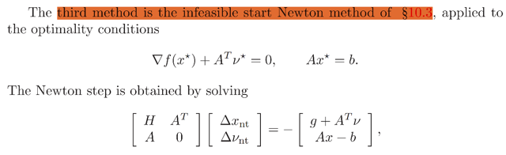</kbd>

<kbd>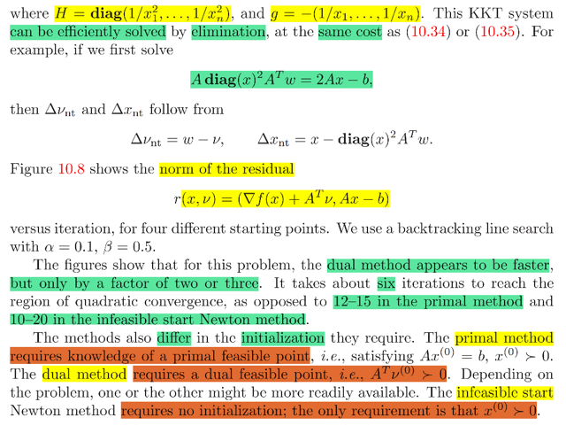</kbd>

> [!NOTE]
> Cuối cùng là áp dụng infeasible start Newton's method.
>
> Ý chính là so sánh các biểu đồ thì cho thấy cách 2 converge
> nhanh hơn (nhanh đến giai đoạn quadratic convergence hơn)
> một chút.
>
> Nhưng mỗi cách cần một điều kiện ban đầu khác nhau (mà trong
> thực tế có thể sẽ phụ hợp với từng bài toán cụ thể)

 

<kbd>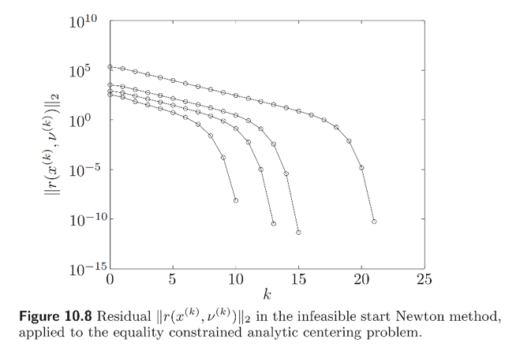</kbd>

<kbd>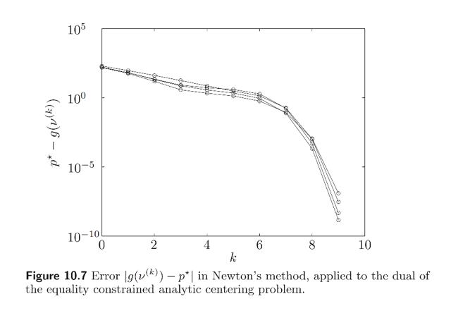</kbd>

 

<kbd>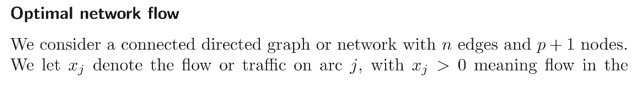</kbd>

<kbd>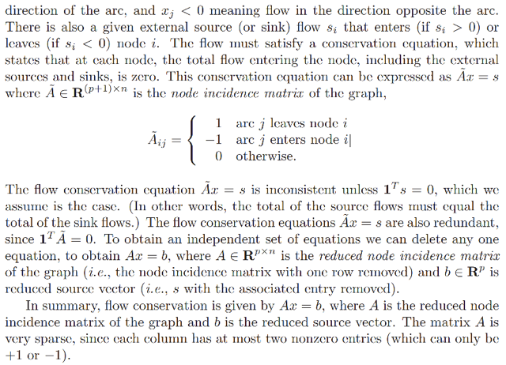</kbd>

<kbd>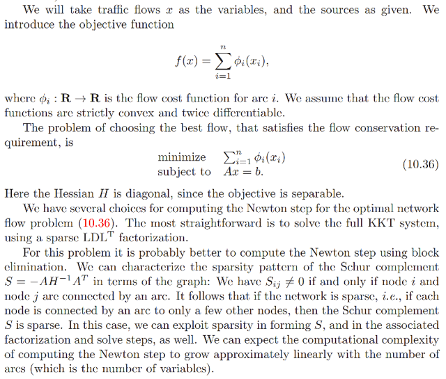</kbd>

> [!NOTE]
> QUAY LẠI SAU

 

<kbd>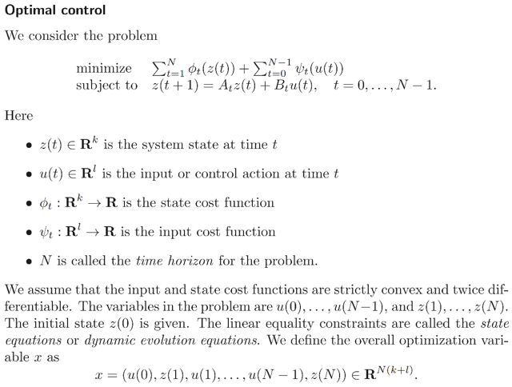</kbd>

<kbd>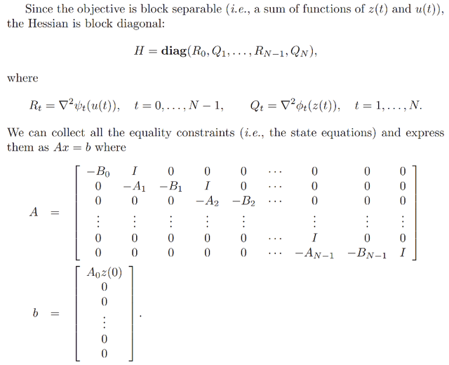</kbd>

> [!NOTE]
> QUAY LẠI SAU

 

<kbd>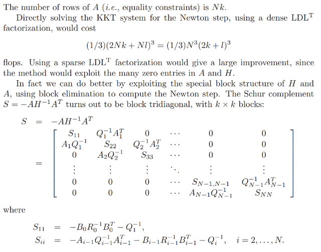</kbd>

<kbd>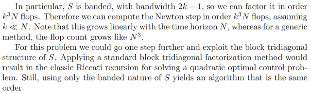</kbd>

> [!NOTE]
> QUAY LẠI SAU

 

<kbd>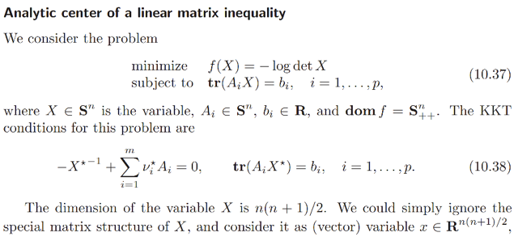</kbd>

<kbd>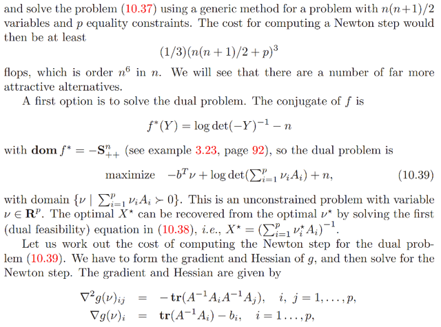</kbd>

<kbd>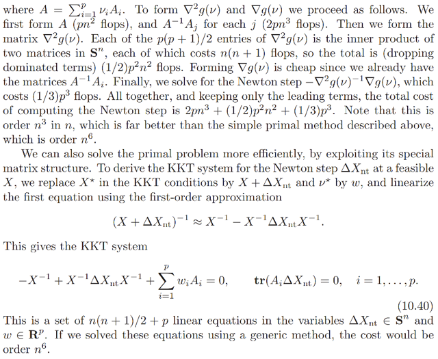</kbd>

> [!NOTE]
> QUAY LẠI SAU

 

<kbd>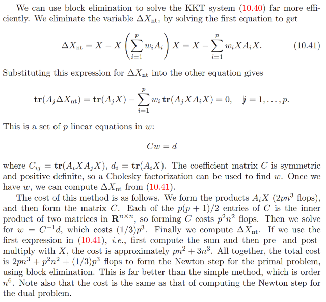</kbd>

> [!NOTE]
> QUAY LẠI SAU

 

<kbd>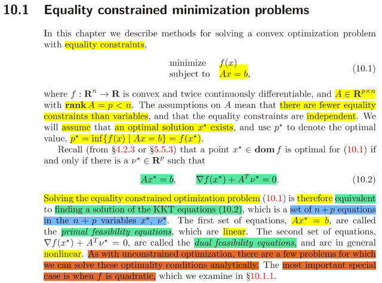</kbd>

<kbd>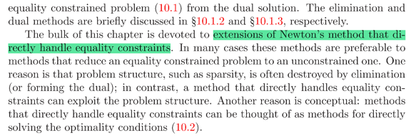</kbd>

<kbd>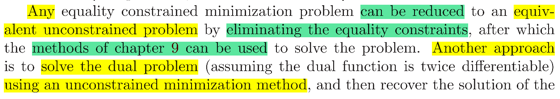</kbd>

> [!NOTE]
> Rồi, ta gặp lại bài toán convex constraint optimization, cụ thể là chỉ có equality
> constraints. Thế thì như đã biết, đang xét bài toán convex optimization, nên
> inequality constraint chỉ là các linear equation. Do đó mới thể hiện các
> constraints này bằng dạng ma trận: Ax = b
>
> Ở đây cho A là matrix p,n với rank = p > n. Có nghĩa là đây là matrix mập lùn,
> có nhiều cột hơn hàng, và các hàng đều độc lập. Nói cách khác, đây chính là
> full row rank matrix. Và việc các hàng độc lập thể hiện không có hàng nào /
> equation nào là redundant cả.
>
> Ôn lại một tí kiến thức 18.06 ta đã biết khi A như vậy thì Ax = b chắc chắn có
> nghiệm. Bởi vì rank A = p, nên chắc chắn có p cột độc lập  tuyến tính, đủ span
> toàn bộ R^p, do đó b, là một vector trong R^p luôn nằm trong columns space
> của A, từ đó luôn tồn tại linear combination các cột của A để tạo ra b, do đó mới
> nói Ax = b luôn có nghiệm. Và hơn nữa, vì luôn có ít nhất một cột phụ thuộc,
> hay cột tự do nên nullspace của A khác rỗng, từ đó ta sẽ chắc chắn hệ có vô số
> nghiệm có dạng x0 + Fz với x0 là nghiệm particular của Ax = b và F là matrix
> các cột là nullspace basis, Fz là non zero nullspace vector.
>
> Quay lại đây ta nhớ lại rằng trong bài toán constrained optimization, thì nhiệm
> vụ là tìm ra optimal x* là điểm khiến minimize f0(x) (objective) function TRONG
> SỐ các feasible point x: X = x: Ax = b Nên về ý nghĩa thì nó chính là việc tìm
> trong số nghiệm của Ax = b, nghiệm nào khiến f0(x) nhỏ nhất.
>
> Thế thì trong những phần trước chương 4 và 5 ta đều đã nói về việc giải bài
> toán này:
>
> Chapter 4 lập luận như sau: Dựa vào nhận định rằng optimal x* là điểm mà giá
> trị objective f0 của nó nhỏ hơn mọi f0 của các điểm khác trong feasible set, ở
> đây là tập nghiệm của Ax = b, là một affine / convex set
>
> f0(x*) ≤ f(x) ∀ x ∈ X
>
> Từ đó dẫn đến hình thành cái gọi là OPTIMALITY CONDITION:
>
> Điểm optimal x*, nằm trên feasible set (là một convex set) sẽ phải nằm trên rìa
> (boundary) của feasible set và tiếp tuyến / tangent plane của feasible set tại đó
> phải phân không gian làm hai half-plane / half-space sao cho toàn bộ feasible
> set nằm một bên và gradient ∇f(x*), vốn là normal vector của tangent
> hyperplane sẽ hướng ra ngoài.
>
> Lập luận đại khái là, khi đó, khi di chuyển trong feasible set từ x* thì ta  luôn di
> chuyển theo hướng hợp với ∇f(x*) một góc tù, dẫn đến dựa vào first order
> Taylor approximation:
>
> f(x) = f(x*+δx) = f(x*) + ∇f(x*)Tδx thì với ∇f(x*)Tδx = ||∇f(x)||*||δx||*cos(θ) thì vì
> θ tù (acute) nên ∇f(x*)Tδx ≤ 0. Dẫn đến f(x) ≥ f(x*) với mọi x ∈ feasible set.
>
> Vậy từ đó ta có optimality condition:
>
> ∇f(x*)T(x - x*) ≥ 0 ∀ x ∈ feasible set
>
> Thế thì quay lại đây, với x ∈ feasible set, tức là x là nghiệm của Ax = b ⇨ x = x0
> + v, và x* cũng thuộc feasible set nên x* = x0 + v' (v và v' là null-space vector)
>
> ⇨ ∇f(x*)T(x - x*) ≥ 0 ⇔ ∇f(x*)Tv ≥ 0 
>
> (v - v', hiệu hai nullspace vector cũng nói chung là một nullspace vector)
>
> Và vì đây là linear function đối với v nên điều này xảy ra ⇔ ∇f0(x*)Tv = 0
>
> Và dẫn đến kết luận là ∇f0(x*) vuông góc với nullspace. 
>
> Trong khi đó ta biết rowspace vuông góc (orthogonal complement) với 
> nullspace vậy điều vừa nói đồng nghĩa ∇f(x*) ∈ rowspace C(AT)
>
> Và như vậy phải tồn tại một vector v sao cho linear combination của các
> rows của A cho ra ∇f(x*), hoặc - ∇f(x*) cũng được vì nó cũng phải thuộc
> rowspace.
>
> Từ đó ta có condition: - ∇f0(x*) = ATv ⇔ ∇f0(x*) + ATv = 0
>
> Và từ đó việc giải bài toán optimization chính là giải hệ phương trình:
>
> Ax = b, ∇f0(x*) + ATv = 0
>
> ====
>
> Còn trong chương 5 thì ta học về KKT conditions, giúp giải bài toán này:
>
> KKT conditions: ∇f0(x*) + + Σ λ* fi(x) + Σ v* ∇hi(x) = 0
>
> Và áp dụng ở đây thì nó chính là ∇f0(x*) + ATv* = 0
>
> Vậy thì ta biết thế Ax* = b gọi là primal feasiblity equations và
> ∇f(x*) + ATv* = 0 gọi là dual feasibility equations
>
> Gs cho biết chỉ có vài trường hợp là ta có thể giải nó một cách
> analytically. CHỖ NÀY COI VẬY MÀ CÓ THỂ KHÔNG ĐỂ Ý:
> CÓ NGHĨA LÀ DÙ BÀI TOÁN CÓ LÀ CONVEX OPT PROBLEM
> VÀ TA THIẾT LẬP OPTIMALITY CONDITION NHƯ TRÊN, THÌ
> KHÔNG PHẢI LÚC NÀO, THẬM CHÍ PHẦN LỚN TRƯỜNG HỢP
> LÀ KHÔNG GIẢI ĐƯỢC HOẶC RẤT PHỨC TẠP ĐỂ GIẢI (Ý
> LÀ GIẢI RA SOLUTION THEO CÁCH DÙNG CÔNG THỨC)
>
> Mà chỉ có một số là có thể, trong đó quan trọng nhất là khi f là
> quadratic function. Sở dĩ nó quan trọng là vì, dựa vào điều này
> xây dựng nên phương pháp Newton giúp giải bài toán trên theo
> lối iterative
>
> Ta cũng có thể giải theo cách bỏ đi constraint, chuyển nó thành
> equivalent problem unconstraint và giải theo các cách của chap 9

 

<kbd>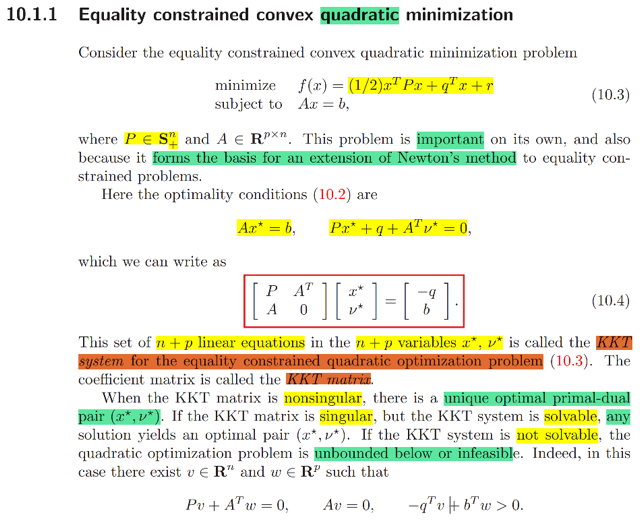</kbd>

<kbd>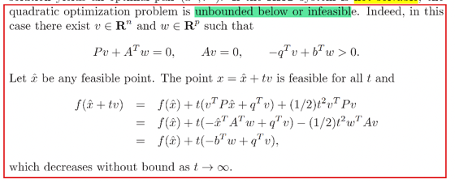</kbd>

> [!NOTE]
> rồi, case quan trọng nhất là khi f0 là quadratic, một phần vì nó sẽ
> tạo cơ sở cho việc mở rộng phương pháp Newton từ bài toán
> unconstraint ở chap 9.
>
> Thế thì cái optimality condition trở thành Ax* = b và Px* + q +  ATv*
> = 0
>
> (Với MIT 18s096 bây giờ không khó để biết ∇f0(x*) = Px* + q)
>
> Từ đó ta có thể thể hiện hệ trên bởi equation đóng khung. Và nó gọi
> là KKT SYSTEMS cho equality constrained quadratic optimization
> problem. với matrix này gọi là KKT matrix.
>
> Chú ý rằng, dĩ nhiên đây là hệ có n + p equation (Ax* = b là có p
> equations (p rows) và n variables, còn Px* + q + ATv* = 0 có n
> equations (AT có n rows) và p variables)  và p + n variables.
>
> Nên matrix KKT là square matrix.
>
> Và khi nó nonsingular / invertible thì dĩ nhiên ta biết hệ có unique
> solution
>
> Còn khi nó singular, thì có hai case, nếu solvable (tức [-q b] nằm
> trong columns space của KKT matrix thì ta có thể giải ra vo số
> nghiệm, khi đó nghiệm nào cũng là optimal
>
> Còn ngược lại thì ta không thể có nghiệm. Và điều này chính là bài
> toán gốc unfeasible hoặc unbounded below. (mà gs có chứng minh
> rằng f quả thật là unbounded below ở phần đúng khung. quay lại sau)

 

<kbd>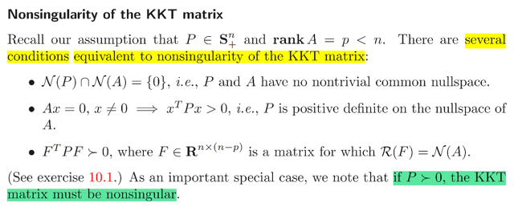</kbd>

> [!NOTE]
> Một số điều kiện sẽ tương đương với việc KKT matrix non-singular.
>
> 1) N(P) và N(A) change có điểm chung nào khác ngoài zero
>
> CHỨNG MINH:
>
> Ta chứng minh điều kiện cần KKT matrix non-singular ⇨ N(P) ∩ N(A) = 0
>
> Ta chứng minh bằng phản đảo: Chứng minh N(P) ∩ N(A) ≠ 0 thì K singular.  
>
> Kế hoạch là ta gỉa sử tồn tại u khác 0 trong của N(P) và N(A) ta cần chứng
> minh [K singular] mà K singular thể hiện bởi việc tồn tại vector α khác không
> khiến Kα = 0. 
>
> Giả sử tồn tại u khác 0 trong cả N(P) và N(A): Ta có Au = 0 và Pu = 0
>
> như vậy chỉ cần chọn w = 0 là ta có vector α = [u, w] khác 0 (vì u khác 0)
> khiến Kα = 0:
>
> K α  = [Pu + ATw, Au] = [0 + AT0, 0] (do Au, Pu, w = 0)
>
> = [0, 0]
>
> Chứng minh xong N(P) ∩ N(A) ≠ 0 thì K singular
>
> thì cho phép suy ra:
>
> N(P) ∩ N(A) ≠ 0 ⇨ KKT matrix singular 
>
> Thì điều này suy ra:
>
> Nếu KKT matrix non-singular ⇨ N(P) ∩ N(A) = 0 
>
> Có nghĩa là ta đã chứng minh xong điều kiện cần của:
>
> KKT matrix non-singular ⇔ N(P) ∩ N(A) = 0
>
> Giờ cần chứng minh điều kiện đủ:
>
> Nếu N(P) ∩ N(A) = 0 ⇨ KKT matrix non-singular
>
> Ý tưởng là, ta cần chứng minh rằng dựa vào điều kiện N(P) ∩ N(A) = 0  
> thì vector h = [h1, h2] duy nhất khiến Kh = 0 là h phải bằng 0 (đó chính là
> thể hiện K non-singular)
>
> Vậy thì, điều này có nghĩa là ta ta cần chứng minh rằng giả sử Kh = 0
> thì nếu có hiện trạng N(P) ∩ N(A) thì h phải bằng 0, đồng nghĩa h1 = 0, 
> h2 = 0 
>
> Kế hoạch là vậy. Tiến hành như vừa nói ta giải sử Kh = 0, cái này
> tương đương: 
>
> 1) Ph1 + ATh2 = 0 và 2) Ah1 = 0.
>
> Rồi, điều cần làm là chứng minh, từ hai cái trên, kết hợp N(P) ∩ N(A)
> thì phải suy ra h1 = h2 = 0.
>
> Từ 2) suy ra h1 thuộc N(A). Dùng sự thật N(P) ∩ N(A) = 0 ta suy ra h1 = 0
>
> Rồi, vì h1 = 0 nên từ 1) suy ra ATh2 = 0. 
>
> Mà vì A full row rank nên AT full column rank, thành ra ATh2 = 0 suy ra h2 = 0.
>
> Vậy theo kế hoạch ở trên thì ta đã chứng minh xong.
>
> Vậy: K non-singular ⇔ N(P) ∩ N(A) = 0
>
> 2) xTPx > 0 với x là nullspace vector của A 
>
> Vậy cần chứng minh xTPx > 0 ∀ x ∈ N(A), x ≠ 0 ⇔ K non-singular
>
> Chứng minh chiều đi:
>
> Given xTPx > 0 for x ∈ N(A) ⇨ K non-singular
>
> K non-singular ⇔ Kz = 0 ⇨ z = 0,  N(K) = {0}
>
> Plan là giả sử Kz = 0, thì nếu kết hơp với P ≻ 0 on N(A) thì ta kết luận 
> z = 0
>
> z  = [z1, z2]
>
> Kz = 0 ⇔ Pz1 + ATz2 = 0 and Az1 = 0
>
> Az1 = 0 ⇨ z1 ∈ N(A) ⇨ z1TPz1 > 0
>
> Tới đây: Giả sử z1 ≠ 0 ⇨ Pz1 ≠ 0. Và Pz1 + ATz2 = 0 ⇨ ATz2 = -Pz1
>
> ATz2 nằm trong rowspace của A do đó cái này ( ATz2 = -Pz1) đồng
> nghĩa Pz1 nằm trong rowspace của A C(AT)
>
> Và rowspace orthogonal complement với nullspace
>
> Dẫn đến nếu Pz1 ∈ rowspace, và z1 lại thuộc nullspace (vì Az1 = 0)
> thì z1T(Pz1) phải bằng 0. Điều này mâu thuẫn với sự thật rằng P
> positive definite on N(A): z1TPz1 > 0.
>
> Như vậy điều ta giả sử ở trên (z1 ≠ 0) dẫn đến mâu thuẫn. 
>
> Vậy z1 phải bằng 0.
>
> Mà z1 = 0 thì Pz1 + ATz2 = 0 ⇔ ATz2 = 0
>
> Và với việc A full row rank, thì AT full column rank ⇨ ATz2 = 0 ⇔ z2 = 0
>
> Vậy ta đã chứng minh xong theo plan trên.
>
> Chứng minh chiều về:
>
> K non-singular ⇨ xTPx > 0 for x ∈ N(A)
>
> Chứng minh phản đảo: Giả sử P không p.d on N(A) thì K singular
>
> P không p.d on N(A) tức tồn tại u thuộc N(A) khiến uTPu không > 0.
>
> Gọi u là cái thuộc N(A) khác 0 khiến uTPu = 0.
>
> ta cần chứng minh rằng tồn tại z khác 0 khiến Kz = 0.
>
> Vậy Kz = (Pz1 + ATz2, Az1) 
>
> Vậy nếu chọn z1 = u, z2 = 0 thì z khác 0 và Kz = (Pu + AT0, Au)
> = (0, 0) vì Pu = 0, Au = 0 (do u thuộc N(A))
>
> Vậy là ta đã chứng minh rằng giả sử P không p.d on N(A) thì K singular.
>
> Từ đó ta đã chứng minh xong điều kiện đủ:
>
> K non-singular ⇨ xTPx > 0 for x ∈ N(A)
>
> 3) FTPF ≻ 0 với F là matrix C(F) = N(A)
>
> Chứng minh chiều đi (điều kiện cần):
>
> FTPF ≻ 0 với F là matrix C(F) = N(A) ⇨ K non-singular
>
> Ta sẽ chứng minh phản đảo:
>
> Giả sử K singular thì FTPF không thể ≻ 0
>
> K singular mean tồn tại z khác 0 khiến Kz = 0.
>
> Kz = 0 tức là Pz1 + ATz2 = 0 và Az1 = 0
>
> Thế thì dùng Az1 = 0 ⇨ z1 ∈ N(A) cũng là C(F). Vậy có thể  thể hiện
> z1 = Fy với y khác 0 nào đó.
>
> Thay z1 = Fy vào Pz1 + ATz2 = 0 ta có PFy + ATz2 = 0
>
> Nhân hai vế cho FT:
>
> FTPFy + FTATz2  = 0
>
> ⇔ FTPFy + (AF)Tz2  = 0
>
> Và vì C(F) = N(A) có nghĩa là columns của F sẽ nằm trong nullspace
> của A. Mà nullspace vector của A thì vuông góc với rowspace vector
> của A. Do đó AF sẽ = 0 vì AF sẽ có kết quả là component i của vector
> AF sẽ là dot product của [hàng i của A] và [cột i của F], và như đã nói
> mọi cột của F đều nằm trong N(A), đều vuông góc với rowspace, nên
> đều vuông góc với mọi row của A.
>
> Vậy FTPFy = 0 ⇨ điều này khiến yTFTPFy = 0 với y khác 0 Như vậy
> FTPF không ≻ 0
>
> Ta đã chứng minh xong.
>
> ====
>
> Chứng minh chiều về (điều kiện đủ):
>
> K non-singular ⇨ FTPF ≻ 0 với F là matrix C(F) = N(A)
>
> Ta cũng chứng minh phản đảo đó là giả sử FTPF không ≻ 0 thì
> K singular, tức tồn tại z khác 0 khiến Kz = 0
>
> FTPF không ≻ 0, tức là tồn tại u khác 0 khiến uTFTPFu = 0
>
> Fu thuộc C(F), tức là N(A). Vậy AFu = 0.
>
> Vậy thì ta cần chứng minh tồn tại z khác 0 khiến Kz = 0
>
> Kz = (Pz1 + ATz2, Az1)
>
> Chọn z1 = Fu ⇨  Az1 = 0
>
> Và uTFTPFu = 0 ⇔ z1TPz1 = 0 ⇨ Pz1 = 0. Chỗ này là mấu chốt.
>
> Lí do là vì P ≽ 0. Với P positive semi definite thì đầu tiên nó phải
> symmetric. Mà 18.06: symmetric matrix luôn có đủ eigenvector độc
> lập và vuông góc. Nên có thể diagonalization: P = QΛQT 
>
> ⇨ z1TPz1 = z1TQΛQTz1. Đặt y = QTz1 ta có yTΛy = Σi yi^2 λi 
>
> Thế thì, vì P ≽ 0 nên mọi eigenvalues λi đều không âm
>
> Vậy để cái Σi yi^2 λi = 0 thì chỉ có một cách là mọi yi đều bằng 0. Và 
> như vậy suy ra y = Pz1 = 0.
>
> Như vậy, Pz1 = 0. Từ đó ta có thể chọn z2 = 0.
>
> Và Kz = (0 + 0, 0) = 0 ⇨ K singular
>
> Và condition quan trọng là khi P ≻ 0.
>
> thì dĩ nhiên nó sẽ ≻ on nullspace of A. Từ đó theo điều 2 thì KKT
> matrix non-singular

 

<kbd>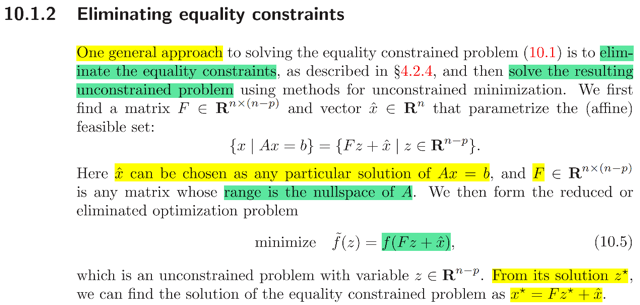</kbd>

> [!NOTE]
> cách tiếp cận đầu tiên là dùng một trong những technique để
> xây dựng equivalent problem: eliminating equality constraint.
>
> Bởi x phải là solution của Ax = b, nên x phải có dạng x^ + x_null
> với x^ là nghiệm bất kì của Ax = b (ko nhất thiết phải là
> x_particular, mà có thể là có thể là x_particular + x_null nào đó)
> và x_null dĩ nhiên là nullspace vector.
>
> Và x_null có thể represent bởi Fz, với F là matrix các nullspace
> vector của.
>
> Từ đó x = x^ + Fz ta mới thay vào để có unconstraint problem:
>
> minimize f(x^ + Fz), bấy giờ là hàm theo z, đặt là f~(z)
>
> Và giải bài toán này theo các cách đã biết, khi tìm được z* thì 
> x* của bài toán gốc là x^ + Fz*

 

<kbd>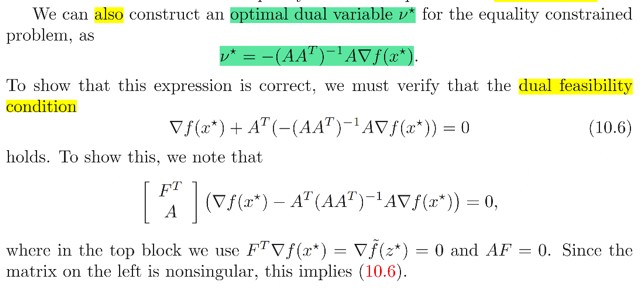</kbd>

> [!NOTE]
> x = Fz + x^
>
> ⇨ ∇f~(z) =  df~/dz = df(Fz + x^)/dz
>
> = df(x)/dx dx/dz = FT∇f(x)
>
> Với z* là optimal thì ∇f~(z*) = 0 ⇔ FT ∇f(x*) = 0
>
> AF = 0 là vì F's columns là nullspace basis của A, mà columns của AF
> sẽ là linear combination các A's columns với coefficient là cột của F.
> Với việc cột của F là nullspace vector của A thì dĩ nhiên linear
> combination các cột của A bởi cột của F sẽ là 0.
>
> Với hai điều trên thì đại khái là nói về cách tiếp cận thứ hai đó là ta
> dùng công thức sau đây để giải dual feasibility condition trước:
>
> v* = -(AAT)invA ∇f(x*)
>
> (nhớ không, bài toán này vốn cơ bản là giải hai hệ: primal feasibility
> equation Ax* = b và duall feasibility equation ∇f(x*) + ATv* = 0 thì cách
> sau là ta gỉai tìm v* trước rồi tìm x* sau)
>
> Và đại khái là ta có thể thử thế v* vào  ∇f(x*) + ATv* = 0 xem nó có
> thỏa không:
>
> tức là xem ∇f(x*) + AT(-(AAT)invA ∇f(x*)) có bằng 0 không.
>
> Và quả thật nó đúng là bằng 0.
>
> Mà cách để xem nó  (đặt là u đi) có phải bằng 0 không lại thông qua
> việc xem Wu có bằng 0 hay không với W = [FT; A].
>
> Thế thì thế vô dùng hai kết quả ở trên đâù ta thấy đúng là Wu = 0.
>
> Tới đây mới dùng lập luận là vì W non-singular, mà khi non-singular thì
> Wu = 0 chỉ khi u = 0. Từ đó cho thấy  ∇f(x*) + AT(-(AAT)invA ∇f(x*)) = 0
> suy ra v* thỏa dual feasibility equation.
>
> Tóm lại cách 1 là bỏ (eliminate) inequaltity constraint, và cách 2 này là
> dùng  công thức v* để có v* trước, và sau đó giải x*

 

<kbd>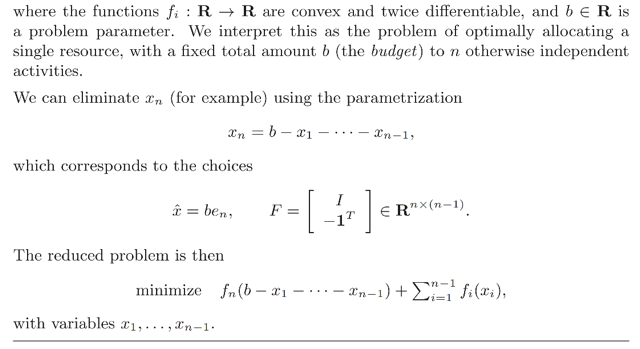</kbd>

<kbd>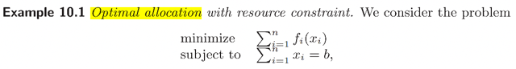</kbd>

> [!NOTE]
> QUAY LẠI SAU

 

<kbd>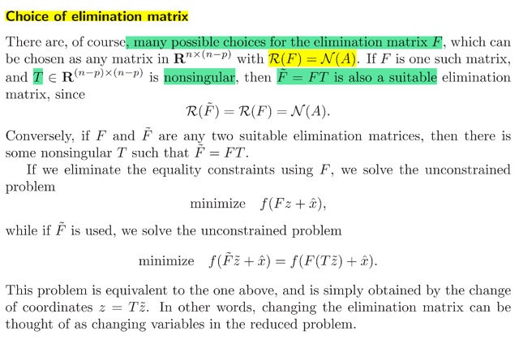</kbd>

> [!NOTE]
> Chứng minh nếu AFz = 0 với mọi z thì AFTz cũng bằng 0 với mọi z
>
> đơn giản với mọi z, FTz vẫn sẽ là vector nằm trong column space của
> F, tức vẫn là nullspace vector của A nên AFTz  cũng là = 0 và do đó F
> = FT cũng là matrix có C(FT) = N(A). Vậy thì đại khái là nếu có matrix
> T non singular thì ta có thể đổi sang dùng FT thay vì F vẫn được.
>
> Vì sao T cần non-singular?
>
> Vậy ý nói rằng: Giả sử ta đổi biến với việc đặt z = Tz~
>
> Thì bài toán minimize f(Fz + x^) sẽ tương đương minimize f(FTz~ +
> x^) = f(F~ z~ + z^) và như đã nói F~ vẫn là matrix hợp lệ vì columns
> space của nó vẫn là nullspace của A.
>
> Do đó mới nói, việc thay đổi matrix elimination từ F thành F~ thông
> qua T có thể được xem là việc đổi biến trong bài toán reduce
> (minimize f(Fz + x^)

 

<kbd>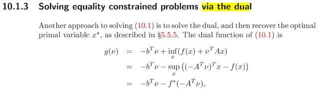</kbd>

<kbd>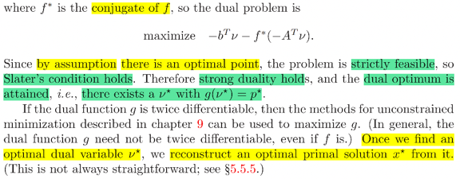</kbd>

> [!NOTE]
> cách tiếp cận khác để giải bài toán này đó là thông qua một kiến thức đã
> học từ phần trước đó là, nếu strong duality hold, tức p* = d*. Thì
> nếu như ta ĐÃ CÓ dual optimal rồi (λ*, v*) thì khi đó ta có thể giải bài
> toán tìm x minimize L(x, v*, λ*) thì nó chính là primal optimal
>
> (có nghĩa là thay vì giải constrained optimization problem ban đầu
> thì ta sẽ giải bài toán tìm dual optimal trước (là một bài toán
> unconstrained problem):
>
> maximize λ, v g(λ, v)
>
> Sau đó tìm x bằng unconstrained problem: minimize x L(x, λ*,
> v*)
>
> (có nghĩa là ta giải hai bài toán unconstrained problem)
>
> Vậy thì ở đây Lagrangian là f(x) + vT(Ax - b)
>
> = f(x) + vTAx - vTb
>
> ⇨ dual funcion: g(v) = inf x [f(x) + vTAx - vTb]
>
> = inf x [f(x) + vTAx] - vTb
>
> = - bTv + inf x [f(x) + vTAx]
>
> = - bTv - sup x [- f(x) - vTAx]
>
> = - bTv - sup x [- vTAx - f(x)]
>
> = - bTv - sup x [ (-ATv)Tx - f(x)]
>
> Tới đây dùng lại khái niệm conjugate của function f(x):
>
> f*(y) = sup x yTx - f(x)
>
> nên sup x [(-ATv)x - f(x)] chính là f*(-ATv)
>
> Vậy g(v) = - bTv - f*(-ATv)
>
> Từ đó dual problem (tức là problem mà ta giải để tìm dual optimal):
>
> maximize v  - bTv - f*(-ATv) 
>
> Giải ra v* ta sẽ thế vào để giải bài toán minimize x  f(x) + v*TAx - v*Tb
>
> solution của nó chính là primal solution của bài toán constrained
> optimization problem
>
> ====
>
> Vậy thì nếu g khả vi hai lần thì ta có thể dùng các method của chap
> 9 để giải bài toán unconstrained optimization problem này

 

<kbd>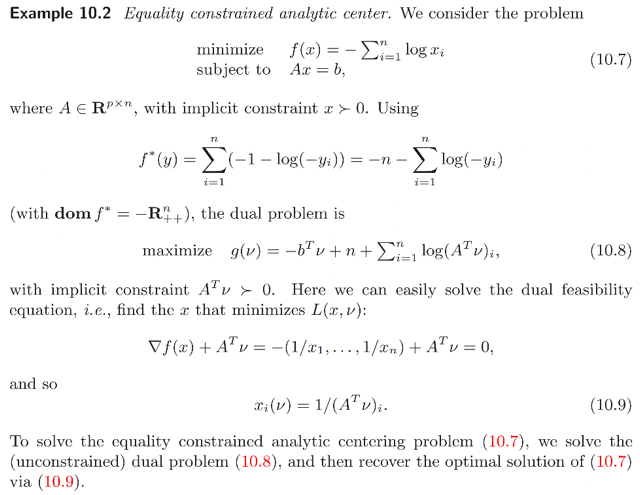</kbd>

> [!NOTE]
> Xét ví dụ cụ thể này, bài toán equality constrained optimization problem với
> f0(x) = - Σi log(xi)
>
> Implicit constraint x ≻ 0, đồng nghĩa mọi component xi đều > 0, và như đã nói
> ở những lần trước khi cũng nói về ví dụ này, thì trong bài toán này, ta đã có
> thể khẳng định là có Strong Duality.
>
> Lí do là vì:
>
> Thứ nhất, đây là bài toán convex optimization problem, bởi f0(x) là convex:
> log(xi) là concave ⇨ - log(xi) là convex, Σ của chúng cũng convex. Và affine
> equality dĩ nhiên cũng convex.
>
> Thứ hai, nói về cái gọi là constraint qualification, đại khái là nói về một số
> điều kiện bổ sung mà nếu thỏa, ta sẽ có Strong Duality. Và một loại phổ biến
> là Slater's condition. Thế thì cái này đó là tồn tại những điểm gọi là strictly
> feasible: Tức là với feasible condition fi(x) ≤ 0, thì strictly feasible có nghĩa là
> tồn tại điểm trong feasible set mà fi(x) < 0.
>
> Tuy nhiên, cũng có cái gọi là Weak Slater's condition, đại ý là khi inequality
> constraint là linear / affine, thì khỏi cần. Nên đại khái là, ở bài toán này không
> có inequality constraint, thì cũng coi như thỏa Slater condition, bài toán chắc
> chắn có strong duality.
>
> Như vậy với việc đã chắc chắn có strong duality, thì ta có thể giải bài toán gốc
> này (constraint problem) thông qua việc giải hai bài toán unconstrained
> problem khác:
>
> Dual problem, maximize v g(v) ⇨ v*
>
> Sau đó, minimize x L(x, v*) ⇨ x* chính là solution của constraint problem gốc.
>
> Thế thì dual function dĩ nhiên là inf x L(x, v) và nó sẽ dính đến conjugate
> function của f. g(v) = - bTv - f*(-ATv).  Nên ở đây, người ta cho biết f*(y) = -n -
> Σi log(-yi) (chứng minh cái này cũng không khó, bên dưới) rồi thì  g(v) = -bTv -
> (-n - Σlog(ATv)) = -bTv + n + Σ log(ATv)
>
> Chứng minh với f(x) = - Σi log(xi) thì f*(y) = -n - Σi log(-yi)  (Làm sau, note kế )
>
> Thế thì, dừng ở đây một chút, để ôn lại cái gọi là dual feasibility equation và
> primal feasibility equation. Cơ bản đó chính là khi ta đối diện bài toán equality
> constraint optimization problem, thì KKT condition / optimality  condition cho
> ta:
>
> ∇f(x) + ATv* = 0 (1) và Ax* = b (2). Thì (2) chính là primal feasibility equation
> và (1) chính là dual feasibility condition.
>
> Và thông qua hai cái này (đúng hơn là (1) ta có thể giải tìm x khi đã có v*.
>
> Do đó, ở đây ý nói là cái dual feasible equation cũng dễ giải ra x là hàm theo v:
>
> xi = 1/(ATv)i
>
> Nên nếu sau khi giải dual problem xong, tìm được v*, thì ta sẽ có thể có ngay
> x* (mà nó cũng chính là việc ta có v*, ta giải bài toán minimize x L(x, v*) vì với
> v* fix thì L là hàm theo x, để tìm minimal của nó thì ta cũng xác lập optimality
> conditions
>
> Objective function f(x) = - Σi log(xi) = -1Tlog(x)
>
> Equality constraint h(x) = Ax - b
>
> L(x, v) = f(x) + vTh(x) = -1Tlog(x) + vT(Ax - b)
>
> Optimality condition:
>
> ∇f(x) + ATv = 0 (1)
>
> ∇f(x): Tìm theo MIT 18s096:
>
> df(x) = f(x + dx) - f(x) = -1Tlog(x + dx) + 1Tlog(x)
>
> = 1T(log(x) - log(x + dx)) = 1T[log(x) - log(x(1 + dx/x))]
>
> = 1T[log(x) -  log(x) - log(1 + dx/x)]
>
> = 1T[-log(1 + dx/x)] ≈ 1T(dx/x) = (-1/x)Tdx
>
> ⇨ ∇f(x) = -1/x
>
> ⇨ (1) ⇔ -1/x + ATv = 0 ⇔ 1/x = ATv
>
> Thế thì vế trái là vector [1/x1, 1/x2,...]
>
> Vế phải là vector [1/(ATv)1, 1/(ATv)2,...]
>
> (1/ATv là vector, có các component là nghịch đảo  của các
> component của ATv)
>
> Nên ta có xi = 1/(ATv)i
>
> Chứng minh với f(x) = - Σi log(xi) thì f*(y) = -n - Σi log(-yi)  (Làm sau)
>
> Theo định nghĩa của conjugate function của f(x): f*(y) = sup yTx - f(x)
>
> ⇨ f*(y) = sup x yTx - [- Σi log(xi)] 
>
> = sup x  yTx + Σi log(xi)  = sup x  yTx + 1Tlog(x) 
>
> = - inf x  - yTx - 1Tlog(x) 
>
> Xét g(x) = - yTx - 1Tlog(x)
>
> Và giải bài toán minimize g(x):
>
> Tìm gradient: dg = g(x + dx) - g(x)
>
> = - yT(x + dx) - 1Tlog(x + dx) - [- yTx - 1Tlog(x)]
>
> = - yTx - yTdx - 1Tlog(x + dx) + yTx + 1Tlog(x)
>
> = - yTdx - 1Tlog(x + dx) + 1Tlog(x)
>
> = - yTdx - 1T[log(x + dx) - log(x)]
>
> = - yTdx - Σi [log(xi + dxi) - log(xi)]
>
> = - yTdx - Σi [log(xi(1 + dxi/xi)) - log(xi)]
>
> = - yTdx - Σi [log(xi(1 + dxi/xi)/xi)]
>
> = - yTdx - Σi [log(1 + dxi/xi)]
>
> ≈ - yTdx - Σi [dxi/xi]  | dùng log(1 + ε) ≈ ε ⇨ log(1 + dx) = dx
>
> = - yTdx - (1/x)Tdx = (- y - 1/x)Tdx
>
> ⇨ ∇g = - y - 1/x
>
> Optimality condition: ∇g = 0 ⇔ - y - 1/x = 0 ⇔ -y = 1/x ⇔ x = -1/y
>
> Tức là x* sẽ là vector có các phần tử lần lượt là [-1/y1, -1/y2,....]
>
> Thế vào ta có:
>
> - inf x  - yTx - 1Tlog(x)  = -  - yTx* - 1Tlog(x*)  
>
> = yTx* + 1Tlog(x*) = yT(-1/y) + 1Tlog(-1/y) 
>
> = Σi (-yi/yi) + Σi log(-yi^-1)
>
> = -n + Σi [- log(-yi)]
>
> = -n - Σi log(-yi)
>
> Vậy f*(y) = -n - Σi log(-yi)

 

<kbd>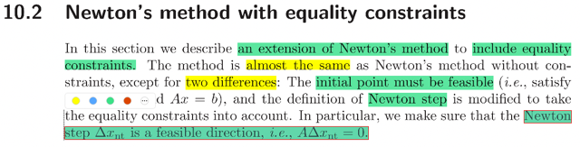</kbd>

<kbd>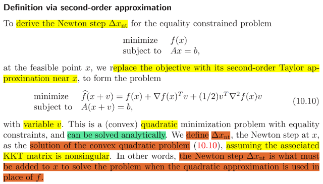</kbd>

<kbd>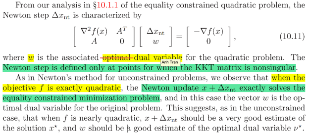</kbd>

> [!NOTE]
> Phần này ta sẽ mở rộng Newton's method để có thể dùng cho  bài toán constrained
> optimization problem. Cơ bản là vẫn giống, chỉ khác ở chỗ initial point phải feasible và
> Newton's step phải là feasible direction: A Δx_nt = 0
>
> (có thể hiểu thế này, sau khi update, ta cần x_k+1 cũng feasible do đó A(x + t*Δx_nt) =
> b Nên Ax + A t Δx_nt = b ⇔ A Δx_nt = 0
>
> ====
>
> Thế thì đầu tiên như đã nói, ta cần ĐỊNH NGHĨA MỚI CỦA NEWTON STEP Δx_nt
> TRONG BỐI CẢNH BÀI TOÁN CONSTRAINED.
>
> Thì đầu tiên ta nói về định nghĩa gốc (trong bài toán unconstrained)  của Newton's
> step trước: Đó là ta COI / XẤP XỈ HÀM f BỞI QUADRATIC (SECOND ORDER
> TAYLOR APPROX. TẠI X). Khi đó, objective trở thành quadratic function và bài toán
> optimization trở thành bài toán CONVEX QUADRATIC OPTIMIZATION và lúc này NÓ
> CÓ ANALYTIC SOLUTION (Tức là có thể tìm ra công thức của x* một cách toán học)
> từ đó ta có công thức của Newton's step (Δx_nt = x* - x) mang ý nghĩa là: Nếu tại x ta
> xấp xỉ hàm f bởi quadratic function dùng second order Taylor approx của f tại x, thì
> Newton's step Δx_nt là thứ cần cộng với x để ra x*
>
> Quay lại đây ta cũng làm y chang. Ta có bài toán equality constrained optimization. Thì
> tại x ta cũng second order Taylor approx. hàm f và dùng nó để thay cho objective f.
> KHi đó ta có một bài toán khác, với objective  là convex quadratic và equality
> constrained. Thì bài toán này cũng có thể có optimal theo cách analytically. Và từ đó
> x* - x là định nghĩa của Newton's step trong bài toán constrained.
>
> Cụ thể là từ f(x), second order Taylor approx. và thể hiện thành hàm theo v (hay δx)
>
> f(x + v) ≈ f(x) + ∇f(x)Tv + (1/2) vT∇^2f(x)v
>
> Từ đó như đã nói, ta giải bài toán này: minimize  f(x) + ∇f(x)Tv + (1/2) vT∇^2f(x)v
> constrained A(x + v) = b.
>
> Và v* chính là Δx_nt
>
> ====
>
> Thì đại khái là như những phần trước ta đã biết, việc giải bài toán constrained convex
> quadratic optimization (để tìm Newton's step) vẫn theo những gì đã nói vì nó cũng là
> bài toán constrained problem với equality constrained thôi.
>
> Tức là nó cũng sẽ dựa vào optimality condition Ax* = b và ∇f(x) + ATw* = 0 (ở đây
> dùng w là dual variable / Lagrange multiplier) từ đó ta có hệ n+p equation với n+p
> variable represented bởi KKT matrix.
>
> Để rồi khi KKT matrix non-singular và ta có thể có unique solution thì ta sẽ tìm được v*
> = Δx_nt.
>
> Thế thì chú ý rằng: Bài toán gốc f(x) chưa chắc đã là quadratic function. Và trong bài
> toán equality constrained optimization problem thì variable là x, và v ("nu", tức dual
> variable)
>
> Trong bài toán sau khi ta thay f bằng f^ là xấp xỉ bậc hai của f tại x. Ta vẫn có bài toán
> equality constrained problem. Với primal variable là v (mang ý nghĩa giống như δx,) và
> dual variable là w.
>
> Ta giải ra v* là Δx_nt. Thì một ý quan trọng đã gặp trước đây đó là: Nếu hàm f gốc mà
> cũng là / rất gần với quadratic, thì đương nhiên x + Δx_nt sẽ rất sát với optimal x* thực
> sự của bài toán gốc. Và optimal dual w cũng sẽ rất sát với dual optimal v* ("ν") của bài toán
> gốc

 

<kbd>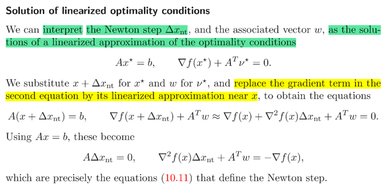</kbd>

> [!NOTE]
> đại khái là khi ta đã approx f(x) tại gần x bởi quadratic function, thì tức
> là ta cũng đã approx. gradient ∇f(x) tại gần x bởi một linear function.
>
> Thành ra trong bài toán gốc, optimality condition là: 
>
> Ax* = b, ∇f(x*) + ATv* = 0
>
> Thì việc ta thay f(x) bởi quadratic function (dùng second order Taylor approx.)
> tại x thì cũng sẽ tương đương ta thay ∇f(x) bởi linear approx. của nó tại x:
>
> ∇f(x + Δx_nt) ≈ ∇f(x) + ∇^f(x)TΔx_nt   
>
> Để rồi việc giải optimality condition trở thành A(x + Δx_nt) = b 
>
> và dùng  Ax = b ⇨ A(x + Δx_nt) = b 
>
> ⇔ AΔx_nt = 0 và 
>
> ∇f(x) + ∇^2f(x)TΔx_nt = 0
>
> Và đây cũng là hệ equation với KKT matrix ở trên
>
> Nói chung là ở đây cho ta thêm một cách hiểu khác (interpretation) 
> của Δx_nt

 

<kbd>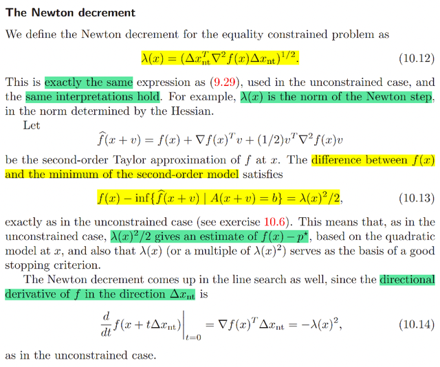</kbd>

> [!NOTE]
> Rồi, cũng tương tự như unconstrained case, ta có cái gọi là Newton's 
> decrement. Có công thức là λ(x) = (Δx_ntT ∇^2f(x) Δx_nt)^1/2
>
> Thế thì hoàn toàn y như trước, có vài ý nghĩa của cái này, ví dụ như:
>
> Tại x nếu approx hàm f bởi quadratic thì khi đi theo Δx_nt thì sẽ giúp
> giảm f xuống bao nhiêu: f(x) - inf v f^(x + v) | A(x + v) = b. Thì cái
> này chính là λ^2(x)/2
>
> inf v f^(x + v) | A(x + v) = b:
>
> = f^(x + Δx_nt) | vì như đã nói Δx_nt được định nghĩa là cái mà khiến 
> v* = x + Δx_nt minimize cái này
>
> = f(x) + ∇f(x)TΔx_nt + 1/2 (Δx_nt)T ∇^2f(x) Δx_nt
>
> ⇨ f(x) - inf ... =  -∇f(x)TΔx_nt -1/2 (Δx_nt)T ∇^2f(x) Δx_nt
>
> Ta phải chứng minh:
>
> -∇f(x)TΔx_nt -1/2 (Δx_nt)T ∇^2f(x) Δx_nt = 1/2 λ(x)^2
>
> Dùng công thức Δx_nt: Mà Δx_nt như đã nói, là solution của bài toán:
>
> minimize f^(x + v) = f(x) + ∇f(x)Tv + 1/2 vT ∇^2f(x) v subject to A(x + v) = b
>
> từ đó nó là solution của [KKT matrix] [Δx_nt, w] = [-∇f(x), 0]
>
> với KKT matrix = [∇^2f(x), AT; A, 0]
>
> Cũng là solution của A Δx_nt = 0 và ∇^2f(x) Δx_nt + ATw = - ∇f(x)
>
> ⇔ ∇^2f(x) Δx_nt = - ∇f(x) - ATw
>
>
> Vế trái = -∇f(x)TΔx_nt -1/2 (Δx_nt)T ∇^2f(x) Δx_nt
>
> = -∇f(x)TΔx_nt - 1/2 (Δx_nt)T (-∇f(x) - ATw)
>
> = -∇f(x)TΔx_nt + 1/2 (Δx_nt)T ∇f(x) + 1/2 (Δx_nt)T ATw
>
> = -1/2 ∇f(x)TΔx_nt + 1/2 (Δx_nt)T ATw
>
> = -1/2 [∇f(x)TΔx_nt - [A Δx_nt]Tw]
>
> = -1/2 [∇f(x)TΔx_nt - [0]Tw]
>
> = -1/2 [∇f(x)TΔx_nt] 
>
> Vế phải = 1/2 λ(x)^2 = 1/2[(Δx_nt)T ∇^2f(x) Δx_nt]^1/2^2
>
> = 1/2 [(Δx_nt)T ∇^2f(x) Δx_nt]
>
> = 1/2 [(Δx_nt)T (-∇f(x) - ATw)]
>
> = [-(Δx_nt)T∇f(x) - (Δx_nt)TATw)]
>
> = [-(Δx_nt)T∇f(x) - (AΔx_nt)Tw)]
>
> = [-(Δx_nt)T∇f(x) - (0)Tw)]
>
> = -1/2 [(Δx_nt)T∇f(x)] 
>
> Vậy đúng là vế trái = vế phải. Chứng minh xong.
>
>
> ====
>
> Hoặc là nó (λ(x)) chính là quadratic norm của Newton's step Δx_nt
> với P là Hessian tại x: ∇^2f(x) (quadratic norm ||.||P phải được define 
> gắn với một matrix).
>
> Cái này theo định nghĩa ||.||P thôi: ||u||P = [uTPu]^1/2 
>
> ⇨ ||Δx_nt||_∇^2f(x) = [(Δx_nt)T ∇^2f(x) Δx_nt]^1/2 và đó chính là λ(x)
>
> Và cuối cùng là Newton decrement chính là directional derivative của
> hàm f theo hướng vector Newton's step Δx_nt.
>
> Chứng minh cho những cái này thì đã làm ở trước rồi (theo link)

**🔗 See also:** [linked note](./chap_95.md#node-3vdq21w)

 

<kbd>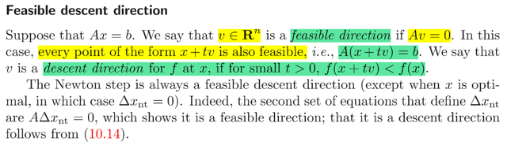</kbd>

> [!NOTE]
> Phần này đơn thuần là định nghĩa về cái gọi là FEASIBLE
> DESCENT DIRECTION
>
> Trước tiên feasible direction nôm na là cái hướng mà khi từ một
> feasible point x, đi theo hướng đó, ta luôn có một feasible point
> khác: x feasible thì x + tv cũng feasible (v là feasible direction)
>
> Vậy với feasible định nghĩa bởi thỏa Ax = b thì v là feasible direction
> khi A(x + tv) = b ⇔ Av = 0
>
> Và nếu đi theo hướng đó mà f giảm nữa thì gọi là feasible descent
> direction.
>
> Thì hồi nãy có nói Newton step trong bài toán constrained sẽ phải
> thỏa A Δx_nt = 0 nên nó chính là feasible direction. Đồng thơi đi theo
> hướng đó f giảm nữa nên nó là feasible descent direction

 

<kbd>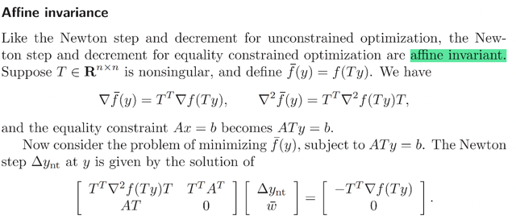</kbd>

<kbd>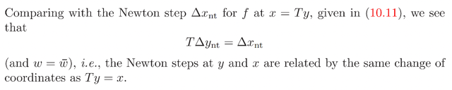</kbd>

 

<kbd>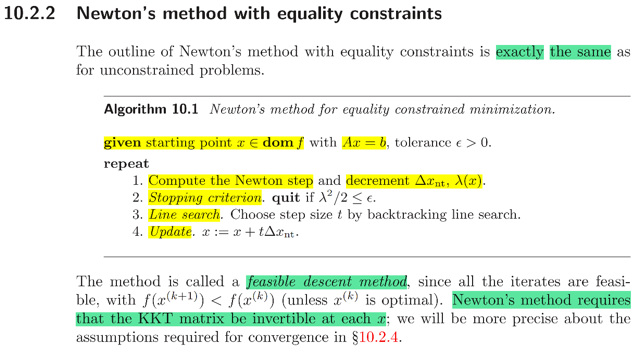</kbd>

> [!NOTE]
> Thuật toán Newton's method cho bài
> toán constraints cũng y chang.
>
> Bắt đầu bởi một starting point (phải feasible) 
>
> Lặp lại quá trình:
>
> 1) Tính Newton's step và decrement
>
> 2) Kiểm tra stopping condition khi λ^2/2 đã nhỏ hơn ε hay chưa
>
> 3) Nếu chưa thì line search để chọn step size: dùng backtracking
>
> 4) Update

 

<kbd>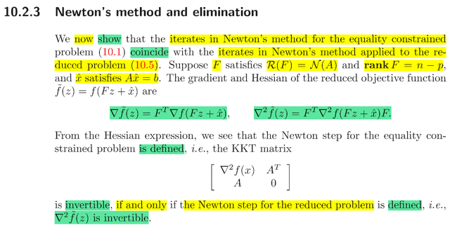</kbd>

> [!NOTE]
> đại khái là phần này muốn chứng minh cho thấy rằng các bước iterates của
> Newton's method trong problem gốc (minimize f(x) constrained Ax = b nó sẽ y
> như trong bài toán reduced (bài toán equivalent bằng cách bỏ equality
> constrained đi: minimize f(Fz + x^) (với F là matrix sao cho C(F) = N(A) và x^
> là solution: Ax^ = b
>
> Derive lại gradient và Hessian của reduced objective function:
>
> f~(z) = f(Fz + x^). Dĩ nhiên f~(z) vẫn là vector -> scalar function
>
> Nên df~(z) = f~'(z)[dz], là một linear operator act on dz cũng sẽ là  inner
> product của một vector (gradient vector ∇f~(z)) với vector dz vì như MIT 18.
> s096 đã học, linear operator act on một vector (dz) để cho ra scalar df~ thì chỉ
> có thể là phép dot product giữa hai vector
>
> Thế thì ta cứ áp dụng chain rule: df~(z) / dz = df(x(z))/dz = df(x)/dx dx(z)/dz
>
> = ∇f(x) F Mà gradient ∇f~(z)  như đã nói, phải là một vector nên nó phải là
>
> FT∇f(x) mới ra column vector
>
> ⇨ ∇f~(z) = FT∇f(x) = FT∇f(Fz + x^)
>
> Rồi, để có Hessian ∇^2f~(z). tiếp tục lấy gradient của ∇f~(z)
>
> Kết quả sẽ là FT∇^2f(Fz + x^)F
>
> ====
>
> Thế thì phải hiểu như sau: Nói về Newton's method thì định nghĩa của
> Newton's step đó là, "khi xấp xỉ function gốc f(x) bởi "phiên bản xấp xỉ bậc hai
> (khai triển Taylor bậc hai của nó tại x" f^ thì ta có thể tìm ra "bước + hướng" để
> khi update từ x ra giảm được nhiều nhất, xuống được thấp nhất giá trị hàm f^.
>
> Cụ thể là: Second order Taylor approx. của f tại x:
>
> f(x + δx) ≈ f(x) + ∇f(x)Tδx + 1/2 δxT ∇^2f(x) δx,
>
> Và ta dùng vế phải để thay cho f: f^(v) = f(x) + ∇f(x)Tv + 1/2 vT ∇^2f(x) v
>
> Và từ đó Δx_nt chính là solution của bài toán: minimize f^(v)
>
> với constraint sẽ trở thành A(x + v) = b ⇔ A v = 0
>
> Và đây là bài toán equality constrained convex quadratic problem
>
> Thế thì khi giải bài toán equality constrained convex quadratic problem này thì
> như đã nói nó sẽ "trở thành" việc giải hai hệ:
>
> primal feasible equations:
>
> A(x + Δx_nt) = b ⇔ A Δx_nt = 0 và
>
> dual feasible equations:
>
> ∇f^(v) + ATw = 0 ⇔ ∇^2f(x)Δx_nt + ∇f(x) + ATw = 0
>
> ⇔ ∇^2f(x)Δx_nt + ATw = -∇f(x)
>
> Từ đó, ta "gom lại" thành dạng [KKT matrix] [Δx_nt, w] = [-∇f(x), 0]
>
> Thì khi xét KKT matrix = [∇^2f(x), A; AT, 0] thì ta thấy rằng nó sẽ non-singular khi 
> và chỉ khi Newton's step của reduced problem được defined.
>
> Cụ thể là Hessian ∇^2f~(z) non-singular / invertible
>
> Ý này có nghĩa là vầy: Reduced problem là bài toán unconstrained. Nên với
> bài toán unconstrained thì Newton's step có công thức là -∇^2f~(z)inv ∇f~(z)
>
> Do đó, để CÓ Newton's step thì ∇^2f~(z) phải invertible. 
>
> Mà bài toán reduced thì equivalent với bài tóán gốc, nên để bài toán gốc có Newton's
> step thì bài toán reduced phải có Newton's step, và như vậy ∇^2f~(z) invertible thì
> bài toán gốc có thể tìm ra / tính ra Newton's step, đồng nghĩa KKT matrix invertible
>
> Lí do của cái này là ở trong phần trước, (thuộc về bài tập) ta phải chứng minh là
> nếu P ≻ 0 thì KKT matrix sẽ invertible. Mà P ở đây là ∇^2f~(z), vốn là square symmetric
> nên nếu nó invertible

 

<kbd>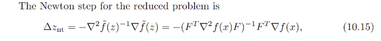</kbd>

<kbd>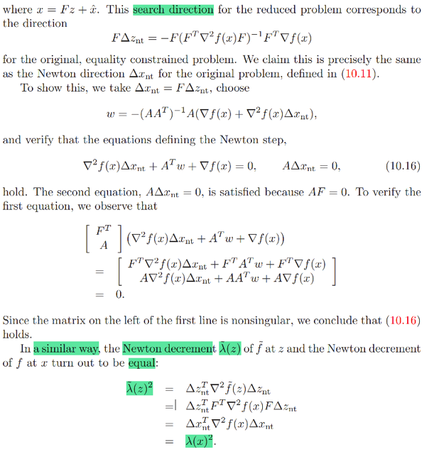</kbd>

> [!NOTE]
> Rồi, Newton's step của reduced problem, như đã nói ở trên, 
> reduced problem là unconstrained problem (vì đã reduce / eliminate
> constraint rồi) thì công thức của Newton's step là -∇^2f(x)inv ∇f(x)
>
> Thì đó là công thức chung, còn ở đây thì nó là - ∇^2f~(z)inv ∇f~(z)
>
> Thay ∇f~(z) = FT∇f(x) = FT∇f(Fz + x^)
>
> Và ∇^2f~(z) = FT∇^2f(Fz + x^)F
>
> Ta có Newton's step: Δz_nt = - [FT∇^2f(x)F]inv FT∇f(x)
>
> ====
>
> QUAY LẠI SAU.
>
> NÓI CHUNG LÀ MUỐN CHỨNG MINH CHO THẤY ÁP DỤNG NEWTON
> METHOD CHO BÀI TOÁN GỐC VÀ BÀI TOÁN REDUCED (ELIMINATE
> CONSTRAINT) THÌ ĐỀU GIỐNG NHAU

 

<kbd>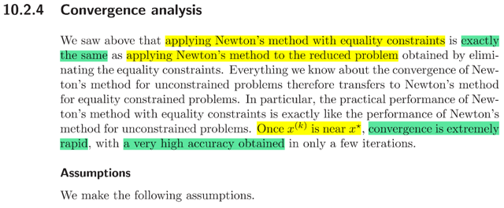</kbd>

> [!NOTE]
> Đại khái là dựa vào việc vừa rồi ta đã cho thấy việc apply Newton's
> method vào bài toán constrained optimization gốc cũng the same với
> việc apply Newton's method với bài toán reduced (unconstrained)
> problem.
>
> Do đó mọi thứ ta biết về tính chất của sự hội tụ trong phương pháp
> Newton của bài toán unconstrained mà chap 9 đã phân tích thì ở đây
> đều áp dụng.
>
> Và ta nhớ có một đặc điểm nổi bật đó là khi x(k) gần x* thì convergence
> sẽ ngày càng chính xác và sự hội tụ sẽ rất nhanh (giai đoạn gọi là
> quadratic convergence / pure Newton phase)

 

<kbd>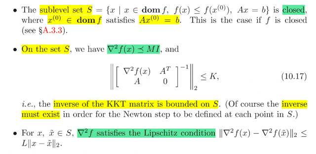</kbd>

> [!NOTE]
> Một số assumption mà phần trước đã gặp như sub-level set S là
> tập đóng và x(0) feasible (thỏa Ax(0) = b).
>
> Trên set S, thì ta có ∇^2f(x) ⪯ MI (nhắc lại cái này xuất phát từ
> việc sublevel set S bị chặn)
>
> Và KKT matrix is invertible. (đây là điều kiện để ta có thể có
> (define) Newton's step tại mọi điểm trên S) như đã nói ở trước
> đây
>
> và KKT inverse cũng bị chặn theo cách: ||.||l2 norm của nó ≤ K
>
> (chưa hiểu ý nghĩa của cái này lắm)
>
> Và assumption nữa là ∇^2f thỏa Lipschitz condition:
>
> ||∇^2f(x) - ∇^2f(x~)|| ≤ L||x - x~||

 

<kbd>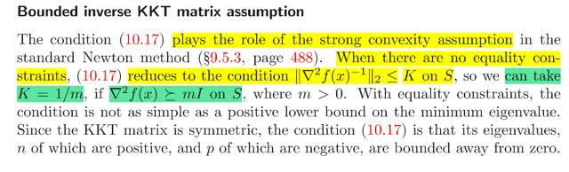</kbd>

> [!NOTE]
> Đại khái là cái điều kiện có vẻ lạ là inverse của KKT matrix có l2 norm
> ≤ K chính là đóng vai trò của cái điều kiện strong convexity (thể hiện
> bởi ∇^2f(x) ≥ mI).
>
> Lí do là vì khi với bài toán unconstrained, thì cái KKT matrix này:
> [∇^2f(x) A; AT 0] khi không còn A (của constrained Ax = b) nữa thì chỉ
> còn ∇^2f(x) và điều kiện ||∇^2f(x)inv|| ≤ K hoàn toàn tương đương với
> strong convexity: vì chỉ việc chọn K = 1/m thì nó chính là  ∇^2f(x) ≽ mI
>
> Tại sao? ||∇^2f(x)inv|| ≤ 1/m
>
> là vì ||∇^2f(x)inv|| là spectral norm của ∇^2f(x)inv và nó là singular
> values lớn nhất của ∇^2f(x)inv. Và vì ∇^2f(x)inv là symmetric matrix,
> nên thật ra eigenvalue và singular values là như nhau. Từ đó dẫn tới
> mọi eigenvalues của ∇^2f(x)inv ≤ 1/m ⇨ mọi eigenvalues của ∇^2f(x)
> ≥ m
>
> |λ_max(Ainv)| ≤ 1/m
>
> ⇨ |λ_min(A)| ≥ m
>
> (vì eigenvalues của A = 1 / eigenvalue của Ainv)
>
> Và đó chính là ∇^2f(x) ≽ m
>
> ====
>
> Thế thì với constrained case, điều kiện này có nghĩa là ta muốn  các
> eigenvalues của KKT matrix (vốn sẽ khác 0, để nó non-singular)
> TRÁNH XA 0. Tức là giá trị tuyệt đối của chúng > 0 càng nhiều càng
> tốt. Vì sao? Là vì khi eigenvalues mà càng gần 0 thì nghịch đảo của nó
> (tức eigenvalues của KKT inverse) sẽ rất lớn. Và từ đó dẫn đến các
> vấn đề (numerical issues) cũng như trạng thái poor condition

 

<kbd>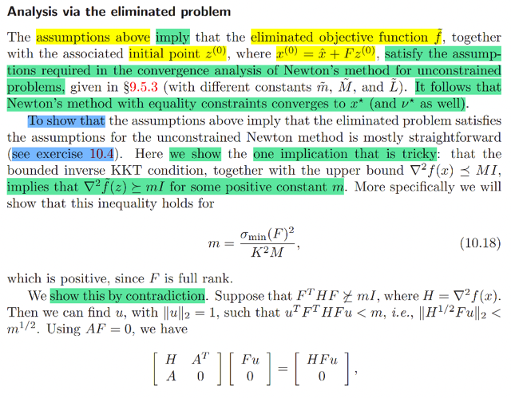</kbd>

<kbd>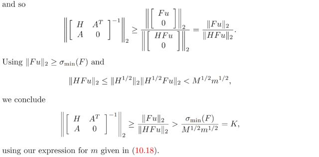</kbd>

> [!NOTE]
> đại khái là những assumption vừa rồi (được đặt ra để phục vụ cho
> việc convergence analysis của bài toán constrained) THẬT RA ĐÃ
> IMPLY (cũng dẫn đến) những assumption nếu ta giải bài toán
> unconstrained tương đương thông qua phương pháp eliminate
> equality constrained.
>
> Nói cách khác, trong chương trước khi học về các phương pháp
> tiếp cận bài toán unconstrained problem, thì ta có vài giải định ví dụ
> như (cũng là S bị chặn, tồn tại m, M sao cho mI ⪯ ∇^2f(x) ⪯ MI)
> cũng như là Lipschitzt continuous. Thì đây với những assumption
> đó cho bài toán constrained thì nó cũng giúp thỏa các assumption
> cần thiết của bài toán unconstrained tương đuong (mà ta gọi là bài
> toán reduced)
>
> Thế thì gs mới nói việc chứng minh điều trên cũng không khó gì và
> nó là phần của mình (bài  tập) còn ở đây thì người ta sẽ chứng
> minh một ý trong đó. Đó là kết nối giữa điều kiện của KKT matrix
> với điều kiện này: mI ⪯ ∇^2f(x) ⪯ MI của bài tóan unconstrained
> Nói cách khác ta sẽ chứng minh nếu thỏa điều kiện ||KKT_inverse|| ≤ K
> thì sẽ chính là thỏa mI ⪯ ∇^2f(x) ⪯ MI với m nào đó
>
> Một ý nữa cũng khá quan trọng đó là. vì như trên đã nói, khi thỏa các
> assumtion của bài toán constrained, thì đồng nghĩa thỏa assumption
> của bài toán reduced unconstrained. Mà khi đó, như đã biết với bài toán
> unconstrained, nếu thỏa các assumtopn, thì các thuật toán sẽ có
> thể converge / tìm ra optimal. Do đó những điều kiện vừa rồi của bài
> toán constrained cũng sẽ đủ để đảm bảo sự convergence
>
> PHẦN CHỨNG MINH NÀY TA SẼ QUAY LẠI SAU
>
> QUAY LẠI SAU

 

<kbd>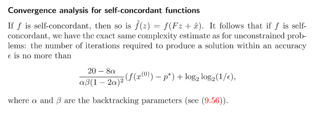</kbd>

> [!NOTE]
> QUAY LẠI SAU

 

