# Chap 11:1,2,3,4,5

📊 **Progress:** `53` Notes | `95` Screenshots

---

## Chap 11:1,2,3,4,5

 

<kbd>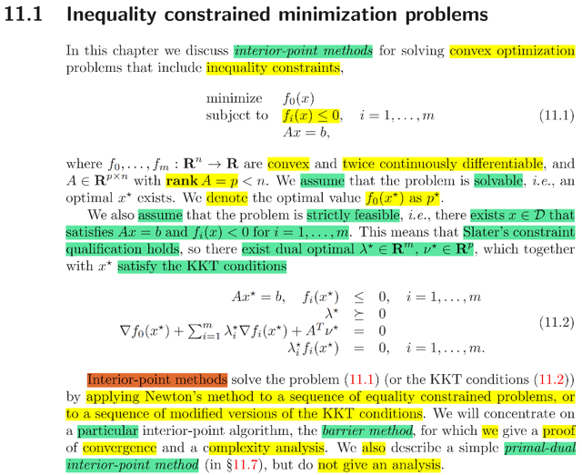</kbd>

> [!NOTE]
> đại khái chương cuối ta sẽ nói về bài toán convex inequality constraint
> optimization problem. Và học về method gọi là interior-point methods giúp có
> thể giải problem này.
>
> Đầu tiên, còn nhớ để bài toán là convex problem, thì objective f0(x) các
> inequality constraint function fi(x) i = 1,2... cũng convex. Và equality affine hi(x)
> = 0 i = 1,2... thể hiện dạng Ax = b.
>
> Thế thì ở đây ta có các assumption, một là bài toán solvable, dĩ nhiên có
> nghĩa là tồn tại optimal x* và optimal value f(x*).
>
> Assumption thứ hai là bài toán strictly feasible, đây chính là Slater's condition:
> rằng tồn tại những điểm nằm trong interior của feasible set thể hiện theo toán
> học là: tồn tại x: hi(x) = 0, fi(x) < 0. Và ta còn nhớ, Slater's condition là cái
> thuộc dạng qualification constraint, mà khi thỏa thì ta sẽ có Strong duality: Tồn
> tại dual optimal λ*, v* sao cho d* = g(λ*, v*) = p* = f(x*).
>
> Rồi, và từ đó ta có những conditions của KKT condition:
>
> λ*  ≽ 0, cái này gọi là dual feasible
>
> Ax* = b, fi(x*) ≤ 0. cái này gọi là primal feasible
>
> ∇f0(x*) + Σ λi ∇fi(x) + Σ vi ∇hi(x) = 0, cái này là việc gradient của Lagrangian
> tại optimal x*, λ*, v* vanish.
>
> λ*i fi(x*) = 0, i = 1,2...Cái này gọi là complementary slackness
>
> ====
>
> Có thể ôn một chút về lập luận đứng đằng sau các KKT conditions trên:
>
> ..Thì đại khái là ta sẽ xem xét một phương pháp thuộc loại này gọi là BARRIER
> METHOD và PRIMAL DUAL INTERIOR - POINT METHOD
>
> Có thể ôn một chút về lập luận đứng đằng sau các KKT conditions trên:
>
> Đại khái là, ta có Lagrangian là function mà ta gom objective và  các constraint
> vào làm một: L(x, λ, v) = f0(x) + Σ λi fi(x) + Σ vi hi(x)
>
> Sau đó, Dual function là khi ta minimize over mọi x, của L: g(λ, v) = inf x L(x, λ,
> v). Từ đó ta có g(λ, v) ≤ L(x, λ, v) ∀ x, trong đó có x*:
>
> g(λ, v) ≤ L(x*, λ, v) = f0(x*) + Σ λi fi(x*) + Σ vi hi(x*)
>
> mà x* phải feasible, nên fi(x*) ≤  0, hi(x*) = 0, và cùng với điều kiện dual
> feasible λ*i ≥ 0 nên ta suy ra g(λ, v) ≤ f0(x*) + Σ λi fi(x*) ≤ f0(x*)
>
> Và đây, g(λ, v) ≤ p* = f0(x*) ⇨ cho ta thấy dual function sẽ đóng vai trò là
> lower bound của primal optimal p*.
>
> Và dĩ nhiên khi giải dual problem: maximize g(λ, v) để có λ*, v* thì d* = g(λ*,
> v*) tức dual optimal value cũng sẽ ≤ p*. Đây chính là Weak duality.
>
> Thế thì, như đã nói nếu có thêm những conditions gọi là qualification
> conditions như Slater's condition, thì ta sẽ có strong duality: d* = p*,  khi đó,
> chuỗi bất đẳng thức sau đây:
>
> g(λ, v) ≤ g(λ*, v*) = d* ≤ f0(x*) + Σ λ*i fi(x) + Σ v*i hi(x)
>
> = f0(x*) + Σ λ*i fi(x*)  ≤ f0(x*)
>
> Sẽ trở thành dấu bằng:
>
> g(λ, v) ≤ g(λ*, v*) vì λ*, v* là solution của dual problem
>
> g(λ*, v*) ≤ f0(x) + Σ λ*i fi(x) + Σ v*i hi(x) vì g(λ, v) ≤ L(x, λ, v) ∀ λ, v do
>
> g(λ, v) ≤ inf x L(x, λ, v), và cũng vì vậy mà nó cũng đúng với mọi x:
>
> ⇨ g(λ*, v*) ≤ f0(x*) + Σ λ*i fi(x) + Σ v*i hi(x*)
>
> Và vế trái như đã nói vì x* trước khi "làm" primal optimal thì nó phải feasible
> đã ⇨ Σ λ*i fi(x) ≥ 0, hi(x*) = 0
>
> ⇨ g(λ*, v*) ≤ f0(x*) Và dấu bằng d* = p* xảy ra giúp ta có:
>
> g(λ, v) ≤ g(λ*, v*) = d* ≤ f0(x*) + Σ λ*i fi(x) + Σ v*i hi(x)
>
> = f0(x*) + Σ λ*i fi(x*)  = f0(x*)
>
> Và hai hệ quả quan trọng rút ra là:
>
> 1) f0(x*) + Σ λ*i fi(x*)  = f0(x*) ⇨ Σ λ*i fi(x*) = 0 ⇨ đây là complementary
> slackness, nói nôm na rằng, khi λ*i > 0 thì hi(x*) phải = 0 và ngược lại.
>
> 2) f0(x*) = g(λ*, v*) mà g(λ*, v*) = inf x f0(x) + Σi λ*i fi(x*) + Σi v*i hi(x*)  ⇨
> f0(x*) = inf x f0(x) + Σi λ*i fi(x*) + Σi v*i hi(x*), hay L(x, λ*, v*)
>
> Như vậy cho thấy x* cũng là minimizer / minimum của L(x, λ*, v*) ⇨  gradient
> của L(x, λ*, v*) wrt x tại x*, phải vanish: từ đó ta có ∇L(x*, λ*, v*) = 0
>
> Và đây là hai KKT conditions thứ 3, 4 . Hai cái đầu là primal feasible Ax* = b,
> fi(x*) ≤ 0 và dual feasible λ* ≽ 0

 

<kbd>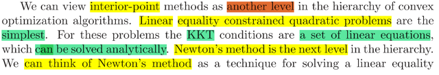</kbd>

<kbd>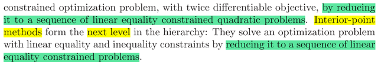</kbd>

> [!NOTE]
> Đại khái gs nói rằng ta có thể coi interior point method là một cấp độ cao
> hơn của các thuật toán giải convex optimization problem
>
> Cấp độ thấp nhất là khi ta chỉ có equality constraint QUADRATIC problem
> (tức là f0 quadratic), khi đó việc giải KKT conditions về cơ bản chỉ là giải hệ
> các phương trình tuyến tính, do đó có thể có analytically solution. Điều này
> có thể hiểu được, vì khi đó KKT condition chỉ là ∇L(x*, v*) = 0, Ax* = b và vì
> f0 quadratic nên ∇L(x*, v*) = 0 ⇔ ∇f0(x*) + ATv = 0 cũng sẽ là tuyến tính vì
> ∇f0(x) sẽ tuyến tính. Thành ra cơ bản là ta có hệ tuyến tính. Và có thể giải
> ngay ra (analytic solution) optimal x*
>
> Rồi, ở cấp độ cao hơn là khi ta có bài toán equality constraint (không chắc
> quadratic). Khi đó dĩ nhiên ∇f0(x*) không còn linear nữa. Nên hệ ∇f0(x*) +
> ATv* = 0, Ax* = b không phải hệ tuyến tính.
>
> Tuy nhiên, Newton's method, như còn nhớ, sẽ dựa trên việc xấp xỉ f0(x)
> bởi quadratic approximation của nó tại điểm đang đứng ví dụ x(k), để từ đó
> giải ra newton's  step giúp đưa x(k) đến x(k+1). Rồi lại lặp lại, xấp xỉ f0(x)
> bởi quadratic approx. của f0 tại k+1, và lặp lại. Nên mỗi lần như vậy là ta
> đang giải một bài toán equality constraint QUADRATIC optimization
> problem. Mà việc giải ra Newton's step như chương trước đã thấy, chính là
> ta dùng analytic solution (ví dụ như Δx_nt = - ∇^2f(x)_inv ∇f(x))
>
> Để đưa từ initial point x(0) dần dần về x*
>
> Vậy thì nay, ở cấp độ cao hơn nữa, là khi ta đối mặt với INEQUALITY
> constraint optimization problem. Và nó sẽ đại khái là reduce bài toán về
> MỘT CHUỖI CÁC BÀI TOÁN LINEAR EQUALITY CONSTRAINED
> PROBLEM
>
> Tóm tắt:
>
> Cấp 1: Linear constraint quadratic problem ⇨ solve analytically
>
> Cấp 2: Linear equality constraint (non-quadratic) problem ⇨ Newton's
> method reduce nó thành chuỗi các bài toán cấp 1
>
> Cấp 3: Inequality constraint problem ⇨ Interior-point method reduce nó
> thành chuỗi các bài toán cấp 2

 

<kbd>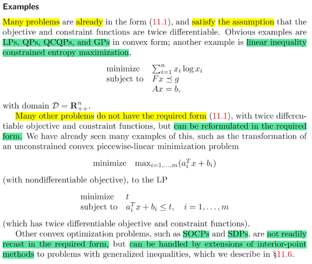</kbd>

> [!NOTE]
> đại khái là nhiều bài toán như LPs. QPs, QCQPs, GPs đã có dạng
> phù hợp với method này. Một số khác thì có thể reformulated để
> thành dạng phù hợp. Và số ít nữa thì có thể dùng phiên bản mở
> rộng của pp interior-point method để giải.

 

<kbd>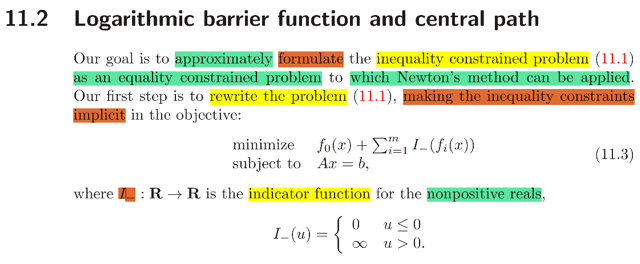</kbd>

<kbd>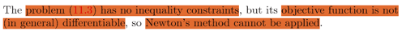</kbd>

> [!NOTE]
> 11. INTERIOR-POINT METHOD
>
> 11.2 LOGARITHMIC BARRER FUNCTION 
> & CENTRAL PATH
>
> đại khái là nói về mục tiêu của ta trước, đó là ta muốn "chuyển"
> inequality constraint THÀNH DẠNG ẨN (IMPLICIT) nằm bên
> trong objective. Để từ đó ta sẽ có bài toán equality constraint
> mà có thể giải bởi Newton's method
>
> Và ta làm vậy thông qua việc dùng một indicator function I_(u)
>
> có giá trị +infinity khi u > 0 và = 0 khi u < 0.
>
> Có nghĩa là ta sẽ có bài toán:
>
> minimize f0(x) + Σ I_(fi(x)) constraint Ax = b
>
> dĩ nhiên minimize cái này sẽ giữ fi(x) < 0
>
> Vấn đề là lúc này objective mới, không còn là function khả vi kép 
> (có thể không tồn tại ∇f0(x) tại mọi điểm) do đó không áp dụng 
> Newton's method được (vì ta đã biết Newton's method sẽ đòi
> hỏi luôn tính được gradient ∇f(x), và Hessian ∇^2f(x)

 

<kbd>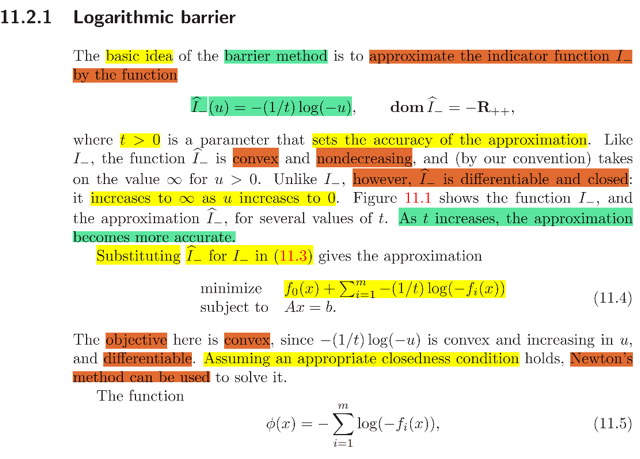</kbd>

<kbd>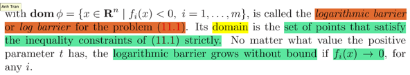</kbd>

> [!NOTE]
> Rồi, thế thì để giải quyết vấn đề không khả vi, người ta mới DÙNG
> MỘT PHIÊN BẢN XẤP XỈ CỦA I_(u), SAO CHO NÓ CÓ TÍNH KHẢ
> VI.
>
> Và đó là I^_(u) = - (1/t) log(-u). Cái này đại khái chỉ cần hiểu là nó
> xấp xỉ cho I_(u) ở trên, và mức độ gần đúng sẽ do t điều khiển, t càng
> lớn thì càng gần đúng.
>
> Và nhìn hình 11.1 có thể thấy hàm I_(u) không differentiable (không có
> đạo hàm tại x = 0) nhưng I^_(u) thì có. Còn lại nó vẫn đảm bảo yêu cầu
> là khi u < 0 thì L_(u) nhỏ, còn khi u ≥ 0 thì I^_(u) sẽ  rất lớn
>
> Và nhờ đó objective mới khả vi nên có thể áp dụng Newton's method
> vào bài toán:
>
> minimize f0(x) + Σi[ - (1/t) log(-fi(x)) ] constraint Ax = b.
>
> Và Σi -(1/t) log(-fi(x)) đặt là Φ(x) gọi là Log barrier của bài toán gốc

**🔗 See also:** [linked note](./chap_116.md#node-vrk4okw)

 

<kbd>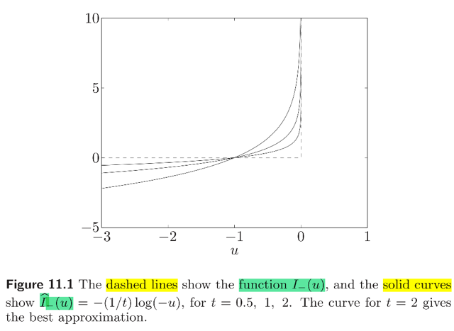</kbd>

 

- **Gradient và Hessian Hàm Rào Chắn**

<kbd>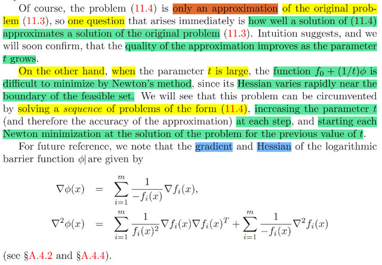</kbd>

> [!NOTE]
> đại khái là dĩ nhiên vì ta approx I_() bởi I^_() nên solution của bài toán
> sau chỉ là approx. của solution bài toán trước (dùng I_ để bỏ đi
> inequality constraint) vốn giúp ta giải tìm solution của bài toán gốc
> (inequality constraint  problem)
>
> Do đó câu hỏi đặt ra là làm vậy thì solution tìm ra có chính xác không, ta
> sẽ dễ đoán rằng nó sẽ phụ thuộc vào t và ta sẽ đi chứng minh rằng khi t
> lớn thì nó sẽ approx càng chính xác nhưng bù lại nó sẽ khiến Newton's
> method khó làm việc do nó ảnh hưởng đến Hessian.
>
> Để chuẩn bị thì ta tính gradient và Hessian của Φ(x) trước sau này sẽ
> cần
>
> Thử tự triển khai gradient và Hessian của log barrier function:
>
> Gradient:
>
> Làm theo "lối" MIT 18.s096 (cũng chain rule nhưng theo cách thức
> của 18s096)
>
> Φ(x) = - Σ log(-fi(x)). Đặt ui(fi) = log(-fi) ⇨ Φ(ui) = -Σi ui
>
> dui = log(-fi + dfi) - log(-fi) = log(-fi(1 - dfi/fi)) - log(-fi)
>
> = log(-fi) + log(1 - dfi/fi) - log(-fi) = log(1 - dfi/fi) ≈ -dfi/fi
>
> dΦ = -Σi dui = -Σi dfi/fi (thay kết quả trên: dui = -dfi/fi)
>
> = -Σi [dfi(x)/dx] dx/fi(x) (nhân và chia dx, để thể hiện dΦ theo dx, mục
>
> đích là thể hiện dΦ = linear operator act on dx) 
>
> = -Σi ∇fi(x)T / fi(x) dx  | dfi(x)/dx, là derivative của fi(x) wrt x, như đã biết,
>
> là transpose của gradient ∇fi(x)
>
> = -Σi [∇fi(x) / fi(x)]T dx   | fi(x) là scalar, nên ∇fi(x)T / fi(x) = [∇fi(x) / fi(x)]T
>
> Và cơ bản đây là tổng ∇f1(x) / f1(x)]T dx + ∇f2(x) / f2(x)]T dx + ...
>
> nên đưa dx ra ngoài: ∇f1(x) / f1(x)]T + ∇f2(x) / f2(x)]T + ...dx
>
> = ∇f1(x) / f1(x)] + ∇f2(x) / f2(x)] + ...Tdx
>
> = -Σi [∇fi(x) / fi(x)] T dx
>
> ⇨ ∇Φ(x) = -Σi [∇fi(x) / fi(x)]  Có cùng kết quả như cách 1
>
> Hessian:
>
> Đầu tiên coi ∇Φ là function theo ui = ∇fi/fi:
>
> d∇Φ(u) = ∇Φ(ui + dui) - ∇Φ(ui)
>
> = -Σi (ui + dui) - Σi ui = -Σi dui
>
> ui = ∇fi * (fi^-1)
>
> Đặt vi = ∇fi (là vector), si = fi^-1 (là scalar) ⇨ ui = vi * si
>
> vi = ∇fi ⇨ dvi = d∇fi
>
> si = 1/fi ⇨ dsi = 1/(fi+dfi) - 1/fi = [fi-(fi + dfi)]/(fi^2 + fidfi)
>
> = -dfi / (fi^2 + fidfi) ≈ -dfi / fi^2 = (-1/fi^2)dfi
>
> Total differential: dui = ∂ui/∂vi dvi + ∂ui/∂si dsi
>
> = (si^-1) dvi + vi dsi
>
> = (fi^-1) d∇fi + ∇fi (-1/fi^2) dfi
>
> = (1/fi) d∇fi - (∇fi/fi^2) dfi
>
> = [ (1/fi) d∇fi/dx - (∇fi/fi^2) dfi/dx ] dx
>
> = [ (1/fi) ∇^2fi - (∇fi/fi^2) ∇fiT ] dx
>
> = (1/fi^2) [ fi ∇^2fi - ∇fi∇fiT ] dx
>
> ⇨ d∇Φ(u) = -Σi dui = -Σi  (1/fi^2) [ fi ∇^2fi - ∇fi∇fiT ] dx 
>
> = -Σi  (1/fi^2) [ fi ∇^2fi - ∇fi∇fiT ]  dx 
>
> Hessian ∇^2 Φ(x) = -Σi  (1/fi^2) [ fi ∇^2fi - ∇fi∇fiT ] 
>
> = -Σi  [ (1/fi^2) fi ∇^2fi - (1/fi^2) ∇fi∇fiT ] 
>
> = Σi [ (1/-fi) ∇^2fi ] + Σi [ (1/fi^2) ∇fi∇fiT ] 
>
> = Σi [ (1/fi^2) ∇fi∇fiT ] + Σi [ (1/-fi) ∇^2fi ] kết quả trong sách

 

<kbd>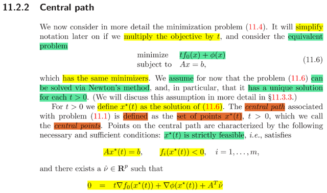</kbd>

<kbd>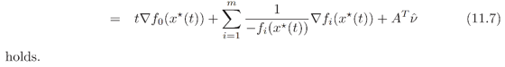</kbd>

> [!NOTE]
> đại khái là xét minimization problem 11.4:
>
> minimize f0(x) - Σi (1/t) log(-fi(x)) constraint Ax = b.
>
> là cái mà ta bỏ "cái inequality constraint vào trong objective, bằng
> cách dùng một hàm I^_"
>
> (review một chút cho nhớ, ý tưởng là người ta muốn bỏ inequality
> constraint bằng cách đưa nó vào trong objective, sử dụng một hàm
> indicator function I_(fi(x)) sao cho giá trị sẽ rất lớn (+infinity) khi fi(x) ≥
> 0
>
> Tuy nhiên làm vậy thì hàm I_ lại không khả vi, nên khiến objective "
> mới" = f0 + Σ I_(fi) cũng không khả vi, mà vậy thì ko dùng Newton's
> method được
>
> Nên ta mới dùng một hàm xấp xỉ của I_, gọi là I^_, có tính khả vi, cụ
> thể là I^_(u) = -(1/t) log(-u) và ta có bài toán 11.4
>
> minimize f0(x) - Σi (1/t) log(-fi(x)) constraint Ax = b.
>
> Đặt Φ(x) = - Σi log(-fi(x)), gọi là log barrier
>
> thì objective của bài toán này là f0(x) + Φ(x)/t
>
> Thế thì nay, đại khái là ta có thể "tương đương" lần nữa, bằng cách
> scale objective bởi t: để có equivalent problem minimize tf0(x) + Φ(x) 
> constraint Ax = b (không làm thay đổi solution)
>
> Và ý chính quan trọng đó là: 
>
> Dễ hiểu rằng với các gía trị t > 0 khác nhau thì ta có một optimal x*(t)
> của bài toán trên (objective của nó phụ thuộc t)
>
> Vậy thì đại khái là người ta nói có một theorem nói rằng điều kiện
> cần và đủ để x(t) là optimal của bài toán trên đó là:
>
> x(t) strictly feasible, có nghĩa là Ax*(t) = b và fi(x*(t)) < 0
>
> Và t*∇f0(x*(t)) + ∇ Φ(x*(t)) + ATv^ = 0 
>
> (Có thể thấy cái này chính là optimality condition của bài toán
> trên: Lagrangian L = t*f0(x) + Φ(x) + v^T(Ax - b). Thì KKT condition
> ∇L = 0 chính là t*∇f0(x*(t)) + ∇ Φ(x*(t)) + ATv^ = 0)
>
> ∇Φ(x) ta đã có rồi.
>
> Và x*(t) này gọi là CENTRAL POINTS, TẬP HỢP CÁC X*(t) GỌI
> LÀ CENTRAL PATH

 

<kbd>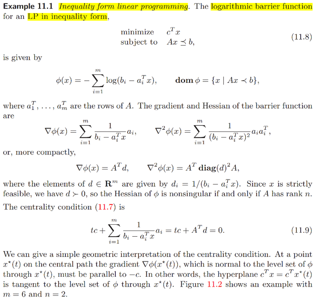</kbd>

> [!NOTE]
> Rồi, xét ví dụ này: bài toán inequality constraint với objective là linear 
> function f0(x) = cTx với constraint Ax ⪯ b (bài toán này gọi là inequality 
> linear programming)
>
> Thử xem log barrier Φ(x) là gì:
>
> Thế thì inequality constraint fi(x) chính là: Ax ⪯ b ⇔ Ax - b ⪯ 0 đây là
> cách thể hiện compact của hệ bất phương trình tuyến tính aiTx - bi ≤ 0; 
> i = 1,2... với ai là column vector có component là row thứ i của A 
>
> (chú ý nó là column vector bình thường nên dot product với x là aiTx) 
>
> fi(x) = aiTx - bi
>
> Theo định nghĩa Φ(x) = - Σi log(-fi(x)) = -Σi log[-(aiTx-bi)] 
>
> = -Σi log[(bi-aiTx)]
>
> Gradient:
>
> ∇Φ(x) = Σi 1/-fi(x) ∇fi(x) 
>
> = Σi [1/(bi - aiTx)] ai (dễ thấy ∇fi(x) = ai)
>
> Thể hiện compact hơn sẽ là:
>
> = Σi [1/(b-Ax)i] ai
>
> = AT (1/b-Ax) = ATd
>
> Đặt d là vector có di = 1/(bi-aiTx), d = 1/(b-Ax)
>
> Hessian:
>
> ∇^2Φ(x) = Σi [ (1/fi^2) ∇fi∇fiT ] + Σi [ (1/-fi) ∇^2fi ] 
>
> = Σi [ (1/(bi-aiTx)^2) aiaiT  + 0 ] (do ∇^2fi = 0)
>
> = Σi [ (1/(bi-aiTx)^2) aiaiT 
>
> Thể hiện compact hơn:
>
> = Σi di^2 aiaiT  | vì (1/(bi-aiTx)^2) chỉ là scalar, là bình phương 
>
> của phần tử thứ i của d: di,
>
> = Σi [ai (di^2)] aiT  | vì di^2 là scalar nên "di chuyển tự do"
>
> Nhìn vầy nè: khi đó ai di^2 với ai là một column vector (giá trị của chúng
> là giá trị các component của row i của A, nhưng nó là column vector nhé)
>
> Vậy thì ai di^2 chỉ là scalar α = di^2 * vector x = ai = column vector αx
>
> Đặt ui = ai * di^2
>
> Và ta có Σ ui aiT 
>
> Thế thì nếu gọi U là matrix có các column là ui thì, Σ ui aiT là gì: Nó chính là
>
> UA, vì UA theo góc nhìn thứ 4 thầy Strang đã dạy nó sẽ là tổng của các rank
> 1 matrix [cột i của U] [row i của A] 
>
> Vậy ta có UA
>
> Giờ quay lại xem xét U, như đã nói, các column của nó là các vector ai được
> scale bởi αi = di^2. Vậy về cơ bản nó bắt đầu matrix có các column là ai (chính
> là AT), và  để có kết quả mỗi cột được scale bởi di^2 thì ta nhân AT với diagonal
> matrix có các entries đường chéo là d1^2, d2^2...Chính là diag(d^2) hay diag(d)^2
> cũng được
>
> ⇨ U = AT diag(d)^2 
>
> Vậy kết quả là AT diag(d)^2 A

 

<kbd>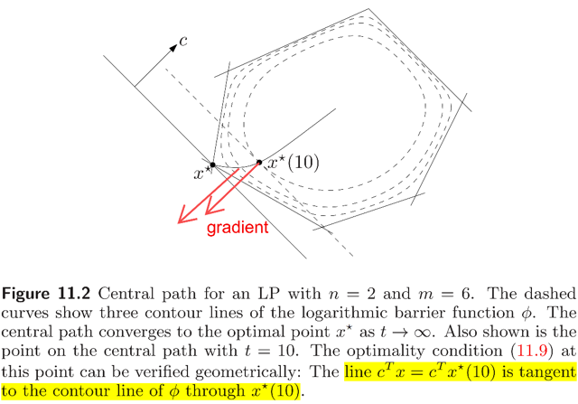</kbd>

<kbd>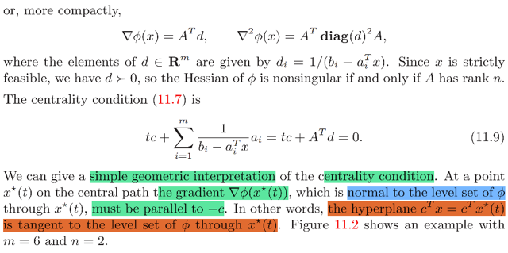</kbd>

> [!NOTE]
> Rồi, khi đó apply centrality condition (điều kiện để x(t) trở thành / là central point,
> hay solution của minimization problem tren) theo lí thuyết hồi nãy:
>
> t*∇f0(x*(t)) + ∇ Φ(x*(t)) + ATv^ = 0
>
> Và ở đây ta ko có equality constraint Ax = b (coi chừng lộn, công thức khái quát ở
> trên là đối với case khái quát có cả inequality constraint fi(x) và equality constraint
> Ax = b, còn ở đây không có equality, mà Ax ⪯ b vốn là inequality constraint) Nên ta
> có:
>
> t*∇f0(x*(t)) + ∇ Φ(x*(t)) = 0
>
> Thay ∇f0 dễ thấy = c và ∇ Φ(x) vừa tính vào:
>
> ct + ∇Φ(x*(t)) = 0 (1)
>
> ⇔ ct + ATd = 0
>
> Kết quả (1) này nói lên rằng:
>
> ∇Φ(x*(t)) = -tc ⇨ gradient vector của Φ(x) tại central point x* sẽ song song với
> vector c (ngược hướng).
>
> Vai trò của vector c là gì, trong bài toán linear programming, với các constraint là x
> phải ∈ x: aiTx ≤ bi, i = 1,2.. thì ta nhớ feasible set chính là intersection của các
> halfspace (x: aiTx ≤ bi là một halfspace / hay halfplane
>
> và với objective cTx cần minimize thì optimality condition thì ý nghĩa sẽ là ta cần tìm
> x* sao cho cTx* ≤ cTx với  mọi x thuộc feasible set, điều này đồng    nghĩa rằng
> cTx* sẽ phân chia không gian làm hai và một trong đó chứa toàn bộ feasible set.
> Do đó hình ảnh sẽ là ta trượt đường thằng / hyperplane cTx (với x khác nhau) song
> song theo phương vuông góc với vector c, cho đến khi đạt được yêu cầu nói trên.
> Đó là vai trò của c
>
> Rồi, thế thì bàn về gradient ∇Φ(x), ta biết rằng nó sẽ luôn vuông góc với level set /
> level curve của Φ(x) tại x. (cái này chứng minh rất dễ, chỉ cần linear approx hàm
> Φ(x) theo hướng của level set tại x: ta có Φ(x + δx) ≈ Φ(x) + ∇Φ(x)Tδx  Thì vì ta
> đang di chuyển trên level set nên Φ(x + δx) phải bằng Φ(x) ⇨ ∇Φ(x)Tδx phải = 0 ⇨
> ∇Φ(x) phải vuông góc với δx ⇨ vuông góc level set tại x
>
> Vậy từ hai ý trên: ∇Φ(x*(t)) song song c, và vuông góc level set tại x*(t) ⇨ c cũng
> vuông góc với level set (của Φ(x) tại x*) và đồng nghĩa hyperplane cTx = cTx* (cái
> mà ta trượt lên trượt xuống nói trên) sẽ luôn tiếp xúc / tangent với level set của
> Φ(x) tại x* (đây là ý mình highlight đỏ)
>
> ====
>
> Và bàn thêm một quan sát nữa: Như đã biết vai trò của t, là tham số điều khiển tính
> chính xác khi ta dùng hàm I^_(u) để thay cho I_(u) nhằm có được tính khả vi
> (differentiable). Và trong sách có nói, t càng lớn thì I^_ càng approx tốt với I_, dĩ
> nhiên sẽ khiến solution của bài toán mà ta dùng I^ sẽ càng gần với solution của bài
> toán mà ta dùng I_, và đến lượt nó, nó là equivalent problem của bài toán gốc là bài
> toán mà ta có inequality constraint. Thành ra khi t càng lớn thì x*(t) sẽ càng gần với
> solution của bài toán gốc.
>
> Và khi t lớn dần thì tụi nó tạo thành một đường di chuyển ngày càng gần true
> solution x*. Và cái đường đó chính là central path

 

<kbd>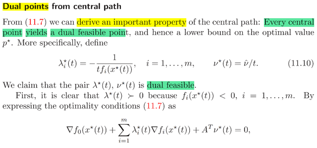</kbd>

<kbd>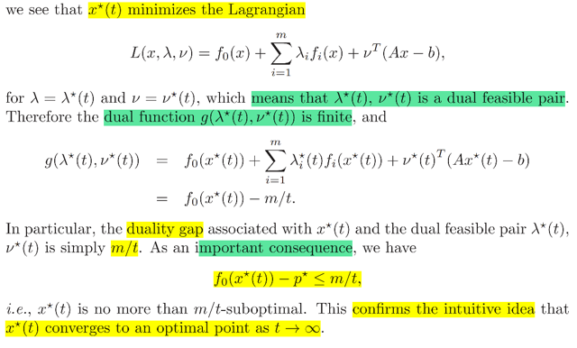</kbd>

> [!NOTE]
> đại khái là equation 11.7 (nhớ lại, nó là cái optimal condition mà người ta nói rằng nếu mà
> x*(t) thỏa, thì nó sẽ chính là central point, là tên gọi của solution của bài toán minimize tf0(x)
> + Φ(x) constraint Ax = b.
>
> Thế thì ở đây nói rằng mỗi một central point x*(t) (vì nó phụ thuộc t, nên t khác nhau cho
> ra x*(t) khác nhau) sẽ giúp ta tìm ra một dual feasible point, và từ đó tìm ra một lower
> bound của optimal value p*. Là sao:
>
> Thế thì nó là vầy, nhắc lại equation 11.7:
>
> t*∇f0(x*(t)) + ∇Φ(x*(t)) + ATv^ = 0
>
> Với ∇Φ(x*(t)) = Σi 1/-fi(x*(t)) ∇fi(x*(t)) ta có:
>
> t*∇f0(x*(t)) + Σi 1/-fi(x*(t)) ∇fi(x*(t)) + ATv^ = 0
>
> (Nên nhớ rằng, x(t) thỏa cái này sẽ là điều kiện cần và đủ để nó là optimal của bài toán
> minimize tf0(x) + Φ(x) constraint Ax = b, gọi là central point)
>
> Vậy thì BẰNG CÁCH CHỌN λ*(t) = -1/t fi(x*(t)) ⇨ tλ*(t) = -1/fi(x*(t)) và v*(t) = v^/t  ta sẽ có cái
> trên tương đương với:
>
> t*∇f0(x*(t)) + Σi tλ*(t)i ∇fi(x) + ATtv*(t) = 0
>
> ⇔ ∇f0(x*(t)) + Σi λ*(t)i ∇fi(x) + ATv*(t) = 0
>
> VÀ ĐÂY LÀ MỘT KẾT QUẢ QUAN TRỌNG CHO TA THẤY MỘT ĐIỀU:
>
> Cái trên chính là gì? CHÍNH LÀ OPTIMALITY CONDITION CỦA BÀI TOÁN GỐC
>
> Là sao, bài toán gốc mà ta đang nói đến là minimize f0(x) constraint fi(x) ≤ 0 (i = 1,2...) và Ax
> = b
>
> Thế thì, có phải Lagrangian của nó sẽ là: L(x, λ, v) = f0(x) + Σ λi fi(x) + vT(Ax - b)
>
> Và L(x, λ*(t), v*(t)) = f0(x) + Σ λ*(t)i fi(x) + v*(t)T(Ax - b)
>
> Và nếu mà x*(t) là minimizer của L(x, λ*(t), v(t)) thì nó sẽ thỏa:
>
> ∇f0(x*(t)) + Σ λ*(t)i fi(x*(t)) + v*(t)TA = 0 ĐÂY CHÍNH LÀ CÁI MÀ TA CÓ Ở TRÊN
>
> Do đó mới nói, cái mà ta có ở trên (từ 11.7 cộng với việc ta chọn λ*(t) và v*(t) như vậy) sẽ
> giúp ta kết luận rằng x*(t), tức central point LÀ MINIMIZER CỦA L
>
> VÀ ĐIỀU NÀY GIÚP CHỨNG TỎ RẰNG, KHI TA MINIMIZE L(x, λ*(t), v*(t)) THÌ  KẾT QUẢ
> (TỨC OPTIMAL VALUE, HAY MINIMUM VALUE) KHÔNG INFINITE, MÀ LÀ CÓ FINITE
> VALUE. (ĐƠN GIẢN LÀ NẾU MÀ inf x L(x, λ*, v*) MÀ = -INFINITY THÌ SẼ KHÔNG TÌM RA
> x*.
>
> Vậy, inf x L(x, λ*(t), v*(t)) KHÔNG INFINITE, MÀ ĐÂY CHÍNH LÀ DUAL FUNCTION ⇨
> g(λ*(t), v*(t)) CÓ GIÁ TRỊ FINITE. VÀ ĐIỀU NÀY GIÚP KẾT LUẬN λ*(t) và v*(t) LÀ
> DUAL FEASIBLE (theo định nghĩa dual feasible là giá trị của dual variable khiến dual
> function không infinite, và λ ≽ 0, mà cái này thì dễ thấy λ*(t) thỏa rồi).
>
> Tóm lại nhắc lại ĐẠI Ý THỨ NHẤT của phần này là:
>
> VỚI MỖI MỘT CENTRAL POINT x*(t) SẼ CÓ TƯƠNG ỨNG MỘT DUAL FEASIBLE
> POINT λ*(t), v*(t) (bằng cách chọn λ*(t) = -1/t*fi(x*(t)) ⇨ tλ*(t) = -1/fi(x*(t)) và v*(t) = v^/t_
>
> ====
>
> Rồi, thế giá trị của λ*(t) và v*(t) vào L(x*, λ*, v*) 
>
> (nên nhớ, đây chính là g(λ*, v*) vì g(λ*, v*) = inf x L(x, λ*, v*) = L(x*, λ*, v*)) 
>
> ta được:
>
> g(λ*(t), v*(t)) = f0(x*(t)) + Σ λ*(t)i fi(x*(t)) + v*(t)T(Ax*(t) - b)
>
> = f0(x*(t)) + Σ [1/tfi(x*(t))] fi(x*(t)) + v*(t)T(Ax*(t) - b)
>
> = f0(x*(t)) + Σ [1/t] + v*(t)T(0)
>
> = f0(x*(t)) - m/t  
>
>
> Tới đây ta nhớ lại khái niệm DUALITY GAP, đó là KHOẢNG CÁCH GIỮA PRIMAL OBJECTIVE
> FUNCTION f0(x) VÀ DUAL FUNCTION g(λ, v) 
>
> (trước đây hiểu sai p* (tức f0(x*) 
>
> khi cả hai đều là optimal thì ta có OPTIMAL DUALITY GAP. p* - d* = f0(x*) - g(λ*, v*)
>
> Ở đây đã kết luận ở trên λ*(t) và v*(t) là DUAL FEASIBLE, và x*(t) dĩ nhiên cũng primal
> feasible nên f0(x*(t) - g(λ*(t), v*(t)) = m/t sẽ là một DUALITY GAP.
>
> Dựa vào weak duality ta luôn có g(λ, v) ≤ p*
>
> Do đó ta có g(λ*(t), v*(t)) ≤ p*
>
> ⇔ f0(x*(t)) - m/t ≤ p* 
>
> ⇔  f0(x*(t)) - p* ≤ m/t
>
> Và kết quả này CHO THẤY ĐẠI Ý THỨ 2:
>
> CHÍNH LÀ NÓI RẰNG CÁC CENTRAL POINT x*(t) THỰC CHẤT SẼ LÀ NẰM TRONG
> VÙNG MÀ GIÁ TRỊ F0 TẠI ĐÓ CHỈ CÁCH OPTIMAL MỘT KHOẢNG NHỎ HƠN m/t. GỌI 
> LÀ m/t-SUBOPTIMAL SET
>
> Và nó cũng chứng minh cho ta thấy khi t (nhớ lại, nó là tham số kiểm soát tính chính xác khi
> ta dùng I^_ thay cho I_) LỚN DẦN thì x*(t), tức central point, cũng là solution của bài toán
> mà ta approx. (vì dùng I^_ thay cho I_) sẽ NGÀY CÀNG CHÍNH XÁC (tức là f0(x*(t)) NGÀY 
> CÀNG GẦN p*:
>
> Vì m/t đóng vai upper bound giữa khác biệt giữa f0(x*(t)) và p*:
>
> Nên t → inf thì m/t → 0, có nghĩa là cái upper bound ngày càng nhỏ lại cũng chứng tỏ là 
> khác biệt giữa f0(x*(t)) và p* cũng ngày càng nhỏ lại, điều này đồng nghĩa f0(x*(t)) → p*
>
> Và khi t → inf thì m/t → 0 thì cũng là khác biệt giữa f0(x*(t)) và g(λ*(t), v*(t)), tức duality
> gap giữa f0(x*(t)) (là primal optimal value của bài toán centering) và g(λ*(t), v*(t)) là giá trị
> của dual function tại điểm λ*(t), v*(t)) cũng sẽ nhỏ dần về 0

**🔗 See also:** [linked note](#node-j8e5x7u) · [linked note](./chap_116.md#node-va9filj)

 

<kbd>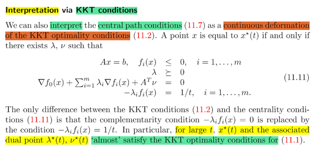</kbd>

> [!NOTE]
> rồi, cái này đại khái nói là thật ra ta có thể coi cái central path
> condition 11.7..
>
> (again, là cái equation nói rằng nếu x(t) thỏa thì nó sẽ đủ điều kiện để
> cho thấy nó chính là central point / solution của bài toán minimize
> f0(x) + Σi I^(fi(x)) hay cũng ⇔ minimize tf0(t) + Φ(x), constraint Ax = b,
> để rồi ta đã chứng minh rằng t mà càng lớn thì x*(t)  càng gần sát với
> optimal x* của bài toán gốc (là bài toán minimize f0(x) constraint fi(x) ≤
> 0, Ax = b hay bài toàn equivalent trong đó ta chuyển inequality
> constraint vào objective:  minimize f0(x)
> + Σi I_(fi(x))
>
> ...chính là một "phiên bản" rất giống với KKT conditions.
>
> Vì sao: Là bởi 11.7 nói rằng "ta cần":
>
> t*∇f0(x*(t)) + ∇Φ(x*(t)) + ATv^ = 0
>
> Với ∇Φ(x*(t)) = Σi 1/-fi(x*(t)) ∇fi(x*(t)) nó là:
>
> t*∇f0(x*(t)) + Σi 1/-fi(x*(t)) ∇fi(x*(t)) + ATv^ = 0  Vậy thì cái này, nếu
> ta đặt λi = -1/tfi(x) ⇔ -λi fi(x) = 1/t (1)
>
> và v = v^/t ⇔ v^ = vt
>
> Thì nó sẽ trở thành:
>
> t∇f0(x*(t)) + Σi tλi ∇fi(x*(t)) + ATtv = 0
>
> ⇔ ∇f0(x*(t)) + Σi λi ∇fi(x*(t)) + ATv = 0 (2)
>
> Vậy thì vì ta muốn fi(x) ≤ 0 ⇨ λi ≥ 0 (3)
>
> Từ (1) (2) (3) viết lại, khỏi ghi x(t) mà chỉ ghi là x cũng được ta có: 
> +) fi(x) ≤ 0, Ax = b (cái này thì tự nhiên phải có)
>
> +) λi ≥ 0 cũng là λ ≽ 0 (từ (3))
>
> +) ∇f0(x) + Σi λi ∇fi(x) + ATv = 0 (từ (2)
>
> +) -λi fi(x) = 1/t (từ (1))
>
> Thì 4 ý trên hầu như y chang KKT condition CỦA PROBLEM GỐC
> (bài toán minimize f0(x) constraint fi(x) ≤ 0, Ax = b, cũng form
> Lagrangian và ghi KKT conditions ra ta sẽ thấy giống vậy)
>
> Nhưng chỉ khác ở cái số 4: complementary slackess: λi fi(x) = 0
>
> DO ĐÓ, TA THẤY MỘT ĐIỀU RẰNG KHI t CÀNG LỚN THÌ HAI CÁI
> NÀY HẦU NHƯ LÀ MỘT. ĐỂ TỪ ĐÓ GIÚP TA HIỂU THÊM RẰNG VÌ
> SAO KHI T CÀNG LỚN THÌ CENTRAL POITN X*(T) LẠI CÀNG GẦN
> VỚI  TRUE OPTIMAL X*

 

<kbd>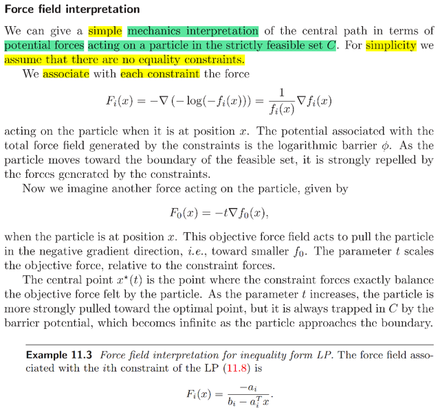</kbd>

<kbd>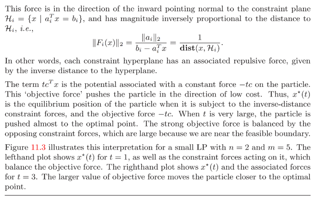</kbd>

> [!NOTE]
> QUAY LẠI SAU

 

<kbd>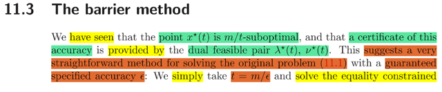</kbd>

<kbd>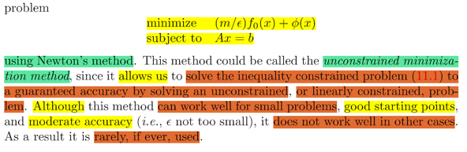</kbd>

> [!NOTE]
> rồi, rất dễ hiểu. Đại khái là những phân tích trong phần trước đã giúp
> ta thấy rằng: bằng cách:
>
> 1) chuyển bài toán inequality (+ equality) constraint problem gốc thành
> bài toán equivalent trong đó ta implicit tích hợp inequality constraint
> vào objective (f0 + Σi I_(fi(x)) constraint Ax = b
>
> 2) Dùng approx. function của I_(u) = -(1/t) log(-u) giúp mang lại tính
> khả vi: minimize f0(x) + ΣI^_(fi(x)) = f0(x) + Σi -(1/t) log(-fi(x))
>
> và scale objective bởi t ta có bài toán tương đương: mininize tf0(x) +
> Φ(x)
>
> Φ(x) = Σi -(1/t) log(-fi(x))
>
> Thì đại khái là ta đã chứng minh rằng việc giải bài toán này tìm ra x*(t)
> sẽ đảm bảo nó là m/t-suboptimal, tức f0(x*(t)) chỉ cách f0(x*) một
> khoảng nhỏ hơn m/t
>
> Và bài toán 2 có thể giải bằng Newton's step.
>
> Từ đó nếu ta muốn x*(t) thuộc ε-suboptimal thì chỉ việc chọn t = m/ε  và
> dùng Newton's step giải bài toán minimize tf0(x) + Φ(x) constraint Ax +
> b khi đó ta sẽ coi như là đang giải bài toán gốc thông qua giải một bài
> toán linear equality constraint problem (nếu bài toán gốc mà ko có
> equality constraint luôn thì coi như ta giải bài toán unconstrained
> problem).
>
> Do đó nó gọi là UNCONSTRAINED MINIMIZATION METHOD
>
> TUY NHIÊN HỌ NÓI PP NÀY CHỈ HIỆU QUẢ KHI PROBLEM NHỎ,
> CÓ STARTING POINT TỐT VÀ YÊU CẦU ĐỘ CHÍNH XÁC ε KO QUÁ
> CAO.

 

<kbd>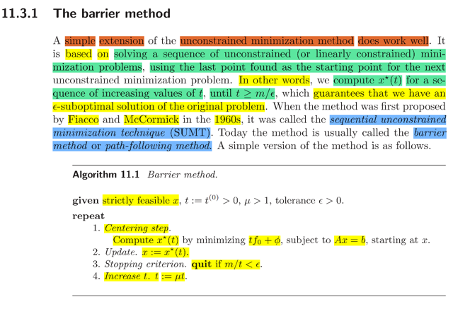</kbd>

<kbd>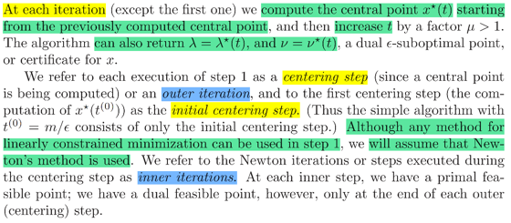</kbd>

> [!NOTE]
> Thì đại khái là, vừa mới nói việc set ngay t = m / ε rồi giải bài toán
> theo phương pháp unconstrained nói trên không hiểu qủa cho phần
> lớn trường hợp.
>
> Nhưng sửa lại chút xíu thì nó lại ok. Và cái việc sửa lại chút xíu đó
> là: Thay vì ngay lập tức giải bài toán unconstraint với t = m / ε luôn
> mà như đã nói cái này yêu cầu phải có good starting point thì ta sẽ
> bắt đầu với t = t(0) nhỏ. Rồi cũng theo method trên giải tìm x*(t) Sau
> đó lại dùng x*(t) làm starting point, tăng t lên chút xíu rồi giải tìm x*(t)
> mới. Cứ thế cho đến khi t > m / ε. Có thể thấy nó chỉ khác  chút xíu.
>
> Thế thì, như vậy có thể thấy cách làm này yêu cầu ta sẽ tạo một
> vòng lặp với bước 1 là tính x*(t), gọi là Centering step. Sau đó,
> update x trong bước Update. Kiểm tra xem t đã > m / ε chưa ở step
> 3. Và tăng t lên
>
> Thế thì vòng lặp này gọi là outer iteration, sở dĩ như vậy vì trong
> step centering, nơi ta giải tìm x*(t) thì ta cũng dùng iterative method
> (như gradient descent, Newton's method) để tìm.,do đó nó là inner
> iteration

 

<kbd>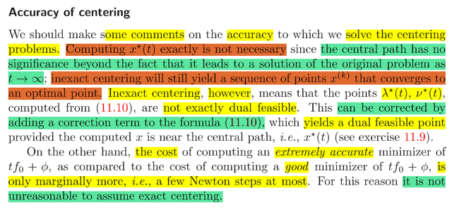</kbd>

> [!NOTE]
> đại khái là có một thực tế là ta sẽ tăng dần t lên, để có "chuỗi" x*(t)
> (center path) dần tiến về x*. Thì THẬT RA, VIỆC TÌM x*(t) (BẰNG
> INNER ITERATION)  Ở MỖI  OUTER ITERATION KHÔNG CẦN
> QUÁ CHÍNH XÁC. Nói cách khác, dù x*(t) không quá chính xác thì
> chuỗi x*(t) vẫn sẽ converge về x*
>
> Thành ra ..thật ra ta ko đặt ra yêu cầu cần giải x*(t) chính xác.
>
> Tuy nhiên, chi phí để có x*(t) good và x*(t) excellent cũng không 
> chênh nhau mấy (đại khái vậy) nên thành ra có assume giải x*(t)
> chính xác cũng chả sao
>
> Có nói thêm, nếu ta ko đặt yêu cầu quá cao với giải x*(t) thì tuy
> như đã nói kết quả vẫn ok, Nhưng nó sẽ khiến λ*(t) và v*(t) tính
> theo 11.10 không chính các là dual feasible. Và việc việc có thể
> khắc phục bằng cách add thêm correction term (đây là nội dung
> bài tập phải làm)

 

<kbd>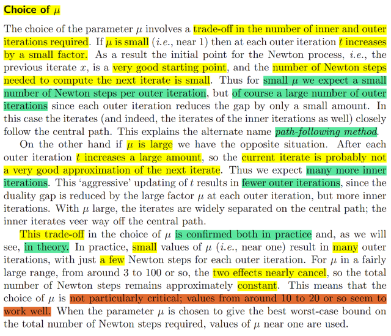</kbd>

> [!NOTE]
> đại khái là μ (là scale factor giúp tăng t ở mỗi (outer) iteration.
>
> Thế thì lựa chọn giá trị của nó là cân nhắc đánh đổi giữa hai thứ:
>
> nếu nó nhỏ, thì có nghĩa là sau mỗi iteration t chỉ tăng chút đỉnh.
> Mà t tăng chút đỉnh có nghĩa là bài toán minimization ở step trước
> minimize tf0(x) + Φ(x) constraint...với bài toán ở step sau (t tăng chút
> đỉnh) f0(x) + Φ(x) ....KHÔNG KHÁC NHAU MẤY.
>
> Do đó x*(t) solve được ở step trước cơ bản là khá gần với optimal
> point của bài toán sau. do đó bằng cách dùng nó làm initial point
> cho bài toán sau thì rõ ràng là rất tốt. Giúp cho việc giải bài toán
> sau sẽ rất thuận lợi (kiểu như bắt đầu giải bằng Newton's method 
> mà x(0) ngay sát nách x* thì chỉ cần vài lần Newton's step là converge)
> Do đó μ nhỏ thì SỐ STEP TRONG INNER ITERATION SẼ NHỎ.
>
> Nhưng ngược lại, vì t tăng nhỏ nên cái x*(t) mới tuy giải ra nhanh
> hơn như vừa nói, sẽ CŨNG CHỈ THU HẸP CHÚT ĐỈNH KHOẢNG
> CÁCH TỚI p*. Nên, thành ra ta lại sẽ CẦN NHIỀU OUTER ITERATION 
> HƠN.
>
> Nếu μ lớn thì ngược lại
>
> Khúc cuối có nói về việc thực tế cũng như theo lý thuyết ta sẽ chứng
> minh điều này và giá trị phù hợp có thể chọn trong thực tế

 

<kbd>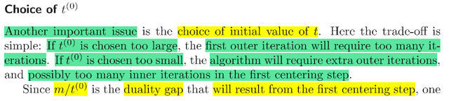</kbd>

<kbd>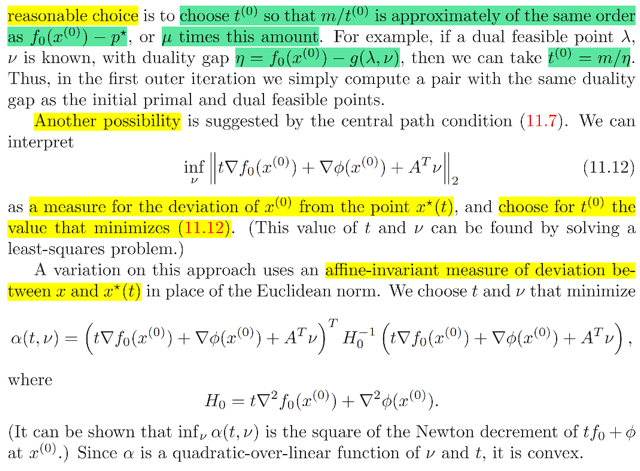</kbd>

> [!NOTE]
> QUAY LẠI SAU

 

<kbd>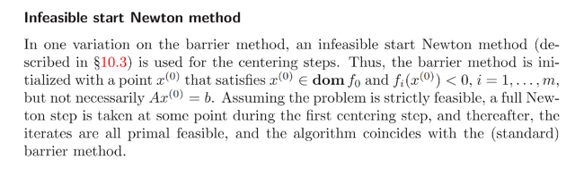</kbd>

 

<kbd>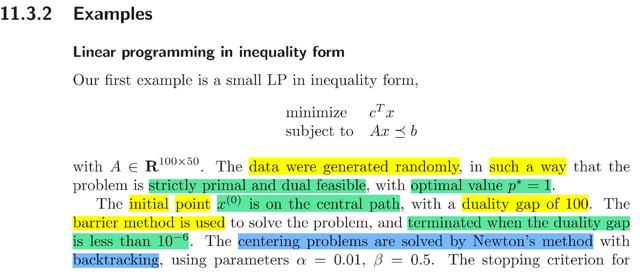</kbd>

<kbd>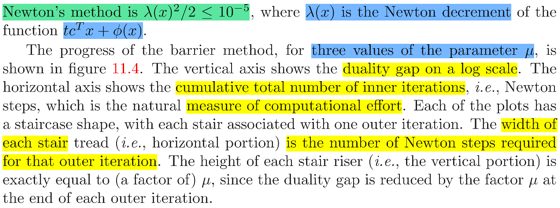</kbd>

<kbd>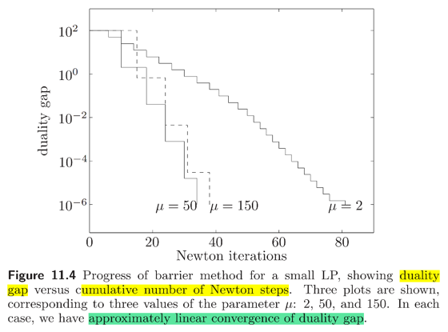</kbd>

<kbd>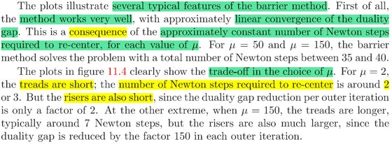</kbd>

> [!NOTE]
> rồi, họ cho xem một ví dụ, bài toán inequality constraint LP được set
> up sao cho strictly primal và dual feasible.
>
> Cho initial point x(0) nằm trên central path. Và barrier method và
> dùng Newton's  method để giải ở mỗi centering step (bước tính
> x*(t)).
>
> Như đã biết, Newton's method cũng là một iteration, nên ta sẽ cũng
> có một stopping condition để dừng, kiểu như cũng có một yêu cầu
> về độ chính xác của x*(t) tại mỗi iteration mà nếu đạt sẽ exit, được
> define theo Newton decrement mang ý nghĩa đại  khái là nếu mức
> giảm của objective function (của bài toán minimize tcTx + Φ(x) nhỏ
> hơn 10^-5) thì stop.
>
> Hình ảnh là 3 kết quả với 3 giá trị khác nhau của μ (scale factor của
> t) mà trục tung là duality gap (khác biệt giữa f0(x*(t)) và p* và số
> Newton's step
>
> Mỗi cái đều có dạng bậc thang, mỗi bậc là một outer iteration, trong
> đó nó chạy inner iteration - giải bài toán tìm x*(t) bằng Newton's
> step. Sau mỗi outer iteration (thì ta có x*(t) mới tốt hơn ⇨ duality
> gap giảm xuống.
>
> Đại khái là 3 đường đồ thị với 3 μ khác nhau cũng phản ánh nhận
> định mà ta đã có: Khi μ nhỏ (tức sau mỗi outer iteration, scale t xuống
> ít thôi) thì như đã nói, x*(t) giải ra ở iteration trước sẽ là good starting
> point cho iteration sau ⇨ Newton's method giải nhanh, ví dụ như ở
> đây nó chỉ tốn có 2,3 iteration. Nhưng bù lại, duality gap giảm xuống
> cũng không bao nhiêu (note trươc đã nói rồi).
>
> Ngược lại khi μ lớn, thì mỗi outer iteration cần nhiều Newton's step
> để giải hơn, nhưng giải xong thì duality gap cũng thu hẹp lại nhiều
> hơn.
>
> Và nhận định nữa là dù μ bao nhiêu thì sự converge đều có tính
> tuyến tính

 

<kbd>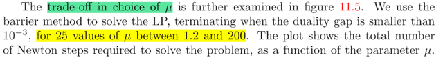</kbd>

<kbd>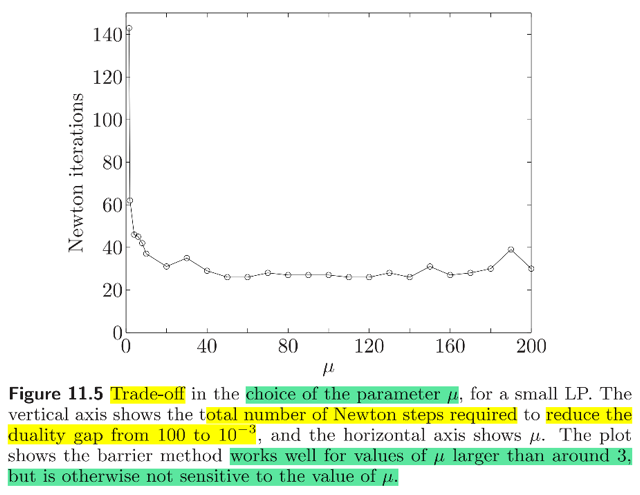</kbd>

<kbd>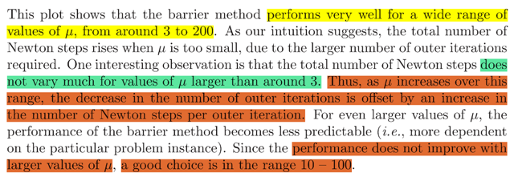</kbd>

> [!NOTE]
> đại khái là một thử nghiệm khác với nhiều μ khác nhau và trong mỗi thử
> nghiệm ta sẽ dừng khi duality gap đạt mức nào đó và xem thử tổng số
> Newton step là bao nhiêu.
>
> Kết quả cho thấy trừ khi μ quá nhỏ thì số Newton step sẽ tăng cao  còn 
> lại thì tăng μ không giúp ích giảm Newton steps mấy.
>
> Điều này giải thích là vì tăng μ tuy sẽ tăng mức duality gap (bậc thang
> sẽ có bề cao cao hơn) giúp giảm số outer iteration nhưng bù lại thì lại
> khiến bề rộng bậc cũng cao hơn (vì tăng số Newton step / inner iteration)
>
> Còn tăng lên qúa cao thì dẫn đến kết quả sẽ khó đoán, mà phụ thuộc
> với từng bài toán cụ thể. Do đó μ nên chọn từ 10 - 100 là được.

 

<kbd>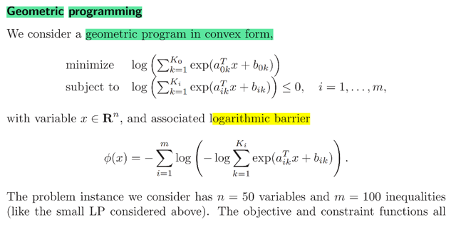</kbd>

<kbd>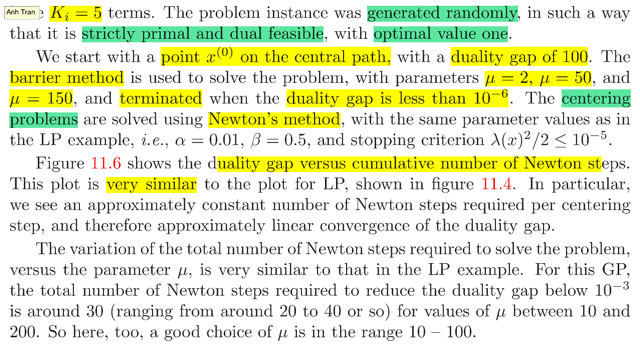</kbd>

<kbd>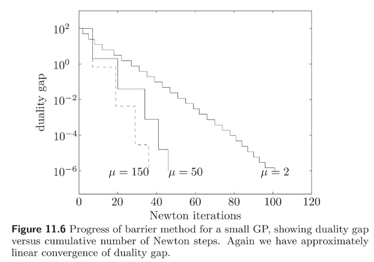</kbd>

> [!NOTE]
> Qua ví dụ này, bài toán geometric program in convex form.
>
> (ôn lại về geometric program sau)
>
> Thử xem tại sao log barrier của nó là như vậy.
>
> Theo định nghĩa Φ(x) = - Σi log(-fi(x))
>
> Với bài toán này equality constraint fi(x) = log [Σk=1:Ki exp(aikTx + bik)] 
>
> ⇨ Φ(x) = - Σi log[-log [Σk=1:Ki exp(aikTx + bik)]].
>
> Nói chung là cũng hoàn toàn tương tự, đồ thị cho ta kết quả của việc
> giải bài toán này dùng barrier method với Newton's step. Nói chung
> không có gì mới so với ví dụ của bài táon LP, chỉ là cho ta thấy ví dụ
> của kết quả của barrier method giúp giải bài toán Geometric programming

 

<kbd>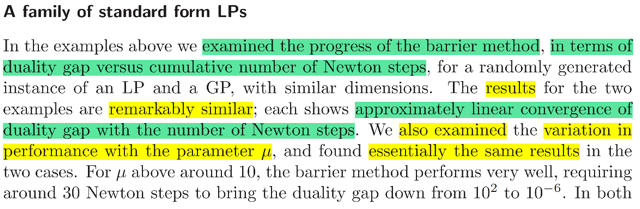</kbd>

<kbd>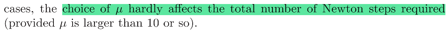</kbd>

> [!NOTE]
> rồi, ko có gì quan trọng, chỉ là nhận định rằng hai ví dụ trên khi ta
> đánh giá hiệu quả của barrier method dựa trên duality gap vs số
> Newton's step cần thiết.
>
> Kết qủa cho thấy kết qủa áp dụng barrier method vào giải hai bài
> toán này cho ra những nhận định tương tự nhau

 

<kbd>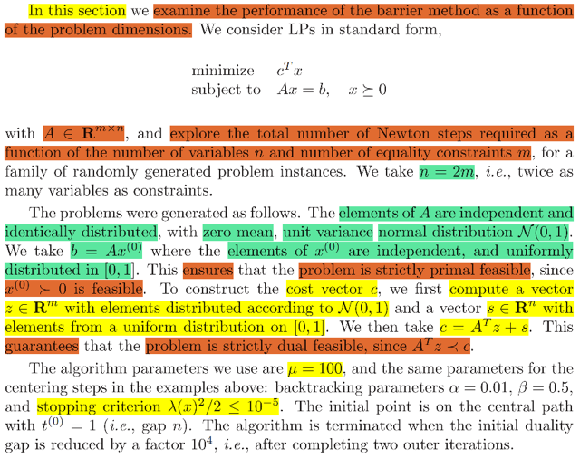</kbd>

<kbd>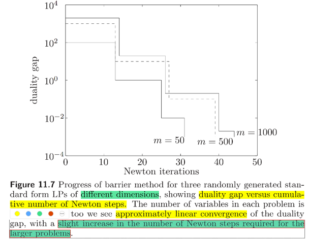</kbd>

<kbd>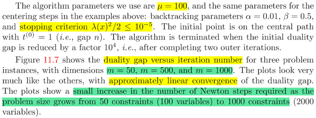</kbd>

> [!NOTE]
> Thật ra ko có gì phức tạp, chỉ là họ set up thử nhiệm giải bài toán LP
> với các dimension khác nhau (dimension của A) với cùng tham số
> μ. và mục đích là xem với kích thước bài toán tăng lên thì ảnh hưởng
> ra sao đến số Newton's step tổng cộng (cần thiết để đạt cùng một
> yêu cầu là độ giảm của duality gap nhỏ hơn mức nào đó)
>
> Kết qủa là khi dimension tăng thì số Newton's step cần cũng hơi tăng

 

<kbd>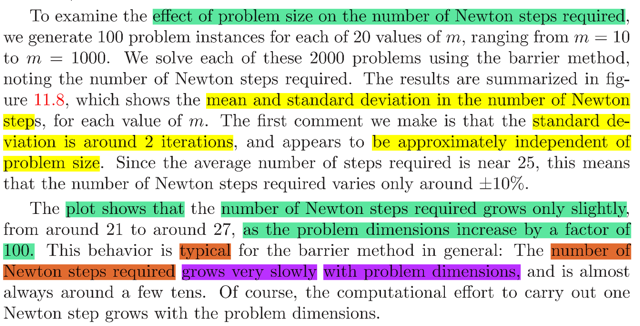</kbd>

<kbd>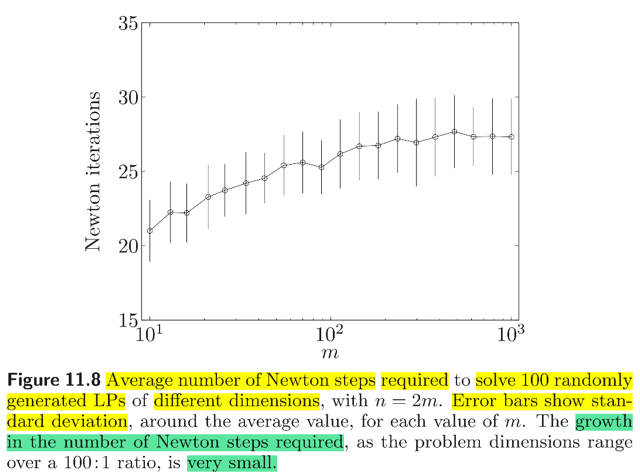</kbd>

> [!NOTE]
> CÓ THỂ QUAY LẠI ĐỌC KĨ SAU. NHƯNG KẾT LUẬN NÓI CHUNG
> LÀ BARRIER METHOD CÓ TÍNH CHẤT LÀ KHI TĂNG KÍCH THƯỚC
> CỦA PROBLEM LÊN THÌ SỐ NEWTON STEP CẦN THIẾT TĂNG 
> KHÔNG ĐÁNG KỂ / TĂNG CHẬM HƠN / ÍT HƠN SỰ TĂNG CỦA 
> PROBLEM

 

<kbd>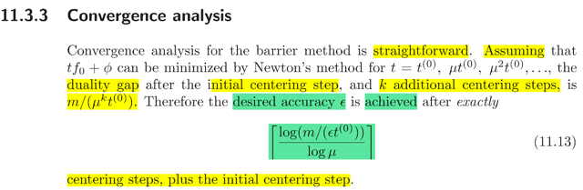</kbd>

> [!NOTE]
> Đại khái bữa trước ta đã đi đến kết luận là
>
> Sau step 0 (initial step) ta có x*(t) thì  duality gap là m/t (tức f0(x*(t) - p* =
> m/t
>
> Rồi, sau step 1, t(1) = μt, thì duality gap sẽ là m/t(1) = m/μt
>
> sau step 2 với t(2) = μt(1) = μ^2 t, thì duality gap là m/t(2) = m/μ^2t
>
> tương tự sau step k thì dualitu gap sẽ là m / (μ^k)t
>
> Vậy để gap < ε ⇔ m / (μ^k)t < ε ⇔ m/tε < μ^k ⇔ log(m/tε) < k log μ
>
> ⇔ k ≥ log(m/tε) / log μ
>
> Nên để đạt duality gap = ε thì ta cần log(m/tε) / log μ iteration (t ở đây
> chính là t(0)

 

<kbd>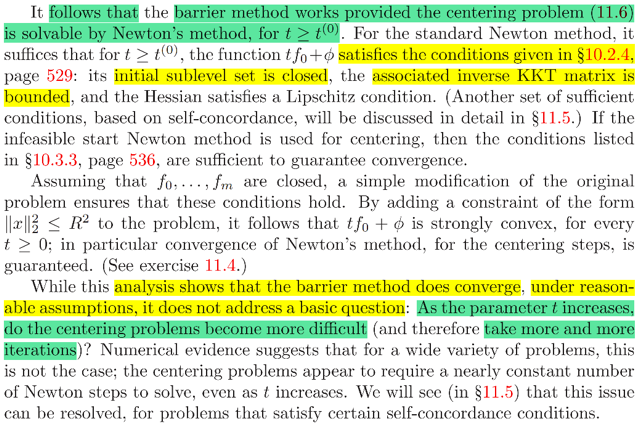</kbd>

> [!NOTE]
> QUAY LẠI ĐỌC KĨ SAU
>
> ĐẠI Ý LÀ NÓI RẰNG Ở ĐÂY TA CÓ THỂ ĐẢM BẢO THỎA CÁC
> ĐIỀU KIỆN CỦA BƯỚC CONVERGENCE ANALYSIS (đại ý là để
> chắc chắn rằng kết quả convergence thực tế đúng với kết quả ta
> phân tích bằng lý thuyết thì bài toán cần đảm bảo thỏa các giải định
> này)

 

<kbd>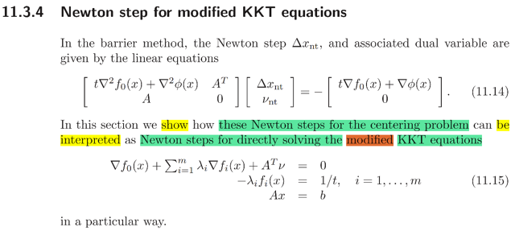</kbd>

> [!NOTE]
> để hiểu cái này thì cần ôn lại chút xíu.
>
> Câu chuyện bắt đầu là ta muốn giải bài toán inequality constraint
> linear equality constraint problem: minimize f0(x) constraint fi(x) ≤ 0, 
> Ax = b.
>
> Thế thì, ta chuyển thành equivalent problem đã eliminate inequality
> constraint: minimize f0(x) + Σi I_(fi(x)) constraint Ax = b với I_(u) = infi
> nếu u > 0 và = 0 nếu u ≤ 0. Nôm na là khi thỏa constraint thì I_u sẽ
> nhỏ, ngược lại I_sẽ rất lớn
>
> Vấn đề là I_ không khả vi. Nên sẽ không thể dùng Newton's method
> để giải bài toán này được.
>
> Giải pháp là ta dùng I^_ approx. cho I_ nhưng khả vi. Và mức độ
> chính xác của việc approx. sẽ do tham số t:
>
> I^_(u) = -(1/t) log(-u) 
>
> Khi đó, objective f0(x) + Σi (-1/t) log(-fi(x)) = f0(x) + (1/t) Φ(x) 
> khả vi và ta có thể dùng Newton's method.
>
> Và cơ bản là ta sẽ làm như vầy, ta sẽ giải bài toán equivalent nữa:
>
> minimize tf0(x) + Φ(x), dùng Newton's method, để giải ra x*(t).
>
> Dĩ nhiên nó chỉ là approx. solution cho bài toán minimize f0(x) + Σ I_(fi(x))
> và đồng nghĩa nó cũng chỉ là approx. solution của bài toán gốc.
>
> Nhưng t càng lớn thì I^_ càng approx tốt cho I_, nên ta sẽ kiểu như
> có thể giải tìm x*(t) với t lớn để có approx. tốt cho x*
>
> Và từ đó ta có cái gọi là central path là tập các x*(t) (với t khác nhau, mỗi
> cái là solution của bài toán minimize tf0(x) + Φ(x) và được giải bằng
> Newton's method. Và khi t tăng dần thì x*(t) nó converge về x*
>
> Từ đó mới cho ta một cách để giải bài toán này: Là ta có thể cho t bằng
> bao nhiêu đó (mà phân tích cho thấy nếu dùng nó thì sẽ cho ra x*(t) thuộc
> ε-optimal) và giải tìm x*(t). Tuy nhiên cách làm tốt hơn đó là ta tăng t dần
> dần, mỗi lần một chút bởi một factor μ. Và ở mỗi lần, ta sẽ giải bài toán 
> tìm x*(t) với initial point là x*(t) của iteration trước.
>
> Thế thì vừa trên là tóm tắt. Nay ta sẽ nói về việc tính Newton's step (để 
> thực hiện inner iteration, giải tìm x*(t))
>
> Thế thì như đã nói trên, cơ bản là ta đang xét bài toán minimize t*f0(x) + Φ(x)
> constraint Ax = b
>
> Thế thì phải hiểu rằng ta ko thể giải bài toán này theo cách analytically vì objective
> tf0(x) + Φ(x) phức tạp.
>
> Thay vào đó, ta sẽ giải bằng iterative method, ví dụ như Newton's method hay
> gradient descent. Và ở đây ta sẽ dùng Newton's method
>
> Vậy thì cách làm đó ta, tại initial point x, ta sẽ approximate objective function  bởi
> quadratic approximation cuả nó.
>
> Có nghĩa là với f(x) = tf0(x) + Φ(x) thì quadratic approximation của nó, cũng là
> second order Taylor approximation của nó tại x sẽ là:
>
> f^(x + δx) = f(x) + ∇f(x)Tδx + (1/2) δxT ∇^2f(x) δx
>
> = tf0(x) + Φ(x) + [t∇f0(x) + ∇Φ(x)]Tδx  + (1/2) δxT [t∇^2f0(x) + ∇^2 Φ(x)] δx
>
> Và ta sẽ giải bài toán minimize δx f^(x + δx) constraint A(x + δx) = b
>
> và đây là bài toán linear equality constraint quadratic convex optimization  problem,
> ta ta có thể có analytic solution, giải nó ra sẽ cho ta δx*, chính là Newton's step
> Δx_nt và optimal dual variable v_nt
>
> Optimality conditions cho ta hệ phương trình giúp giải ra Δx_nt và v_nt:
>
> ∇f^(x + Δx_nt) + ATw = 0; A(x + Δx_nt) = b (1)
>
> Tính ∇f^(x + Δx_nt)
>
> Nhớ rằng f^ chỉ là hàm quadratic theo δx = 1/2 δxT P δx + qTδx + r với:
>
> P = t∇^2f0(x) + ∇^2 Φ(x), q = t∇f0(x) + ∇Φ(x), r = tf0(x) + Φ(x)
>
> và gradient của quadratic function ko khó để chứng minh = PTx + q với P symmetric
> thì cũng là Px + q:
>
> ⇨ ∇f^(x + Δx_nt) =  [t∇^2f0(x) + ∇^2 Φ(x)]TΔx_nt + [t∇f0(x) + ∇Φ(x)]
>
> (1) ⇔ [t∇^2f0(x) + ∇^2 Φ(x)]TΔx_nt + [t∇f0(x) + ∇Φ(x)] + ATv_nt = 0
>
> ⇔ [t∇^2f0(x) + ∇^2 Φ(x)]TΔx_nt + ATv_nt = - [t∇f0(x) + ∇Φ(x)]
>
> và AΔx_nt = 0
>
> Gom lại thành KKT system: K [Δx_nt, w]T = [- [t∇f0(x) + ∇Φ(x)], 0]T
>
> = - [t∇f0(x) + ∇Φ(x), 0]T
>
> Với K = [t∇^2f0(x) + ∇^2Φ(x), AT; A, 0]
>
> Tới đây có thể hiểu 11.14 trong sách ở đâu ra
>
> ====  
>
> Thế thì, phần trước người ta đã có nhắc đến một chi tiết đó là việc giải tìm
> x*(t)  của bài toán approximation: minimize tf0(x) + Φ(x) constraint Ax = b thật ra
> CHÍNH LÀ GIẢI MỘT HỆ KKT ĐÃ SỬA ĐỔI TRONG ĐÓ CHỈ KHÁC HỆ KKT CỦA
> BÀI TOÁN GỐC (ý là bài toán minimize f0(x) constraint  fi(x) ≤ 0, Ax = b) CHÚT XÍU:
>
> Đó là ở cái KKT condition complementary slackness, thay vì là:
>
> - λ*i fi(x*) = 0 i = 1,2...
>
> thì nay nó là - λi fi(x) = 1/t
>
> (Còn các KKT conditions khác vẫn là:
>
> ∇f0(x) + Σ λi ∇fi(x) + ATv = 0 và λ ≥ 0 (dual feasible), Ax = b, fi(x) ≤ 0 (primal feasible)
>
> Ta đánh dấu nó là hệ 11.15
>
> Để rồi ở đây ta sẽ cố gắng thấy rằng việc giải ra Newton's step của bài toán
> centering problem (tìm solution của minimize tf0(x) + Φ(x) constraint Ax = b) CŨNG
> CHÍNH LÀ TA TÌM NEWTON'S STEP ĐỂ GIẢI CÁI HỆ MODIFIED KKT CONDITION
> 11.15

**🔗 See also:** [linked note](./chap_116.md#node-hsbcb37)

 

<kbd>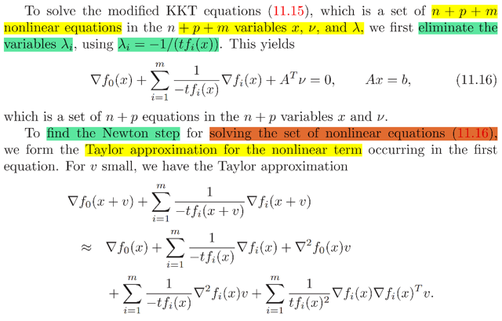</kbd>

<kbd></kbd>

<kbd></kbd>

> [!NOTE]
> Thế thì ở đây thật ra ta có thể viện dẫn và kết nối hai thứ:
>
> Một cái đã học ở MIT 18.01, đó là khi ta học về việc Newton's method giúp giải một
> hệ phương trình phi tuyến (thật ra lúc đó ta học cách dùng Newton' s method để
> giải nghiệm của một phương trình phi tuyến f(x) = 0) Và cách làm đại khái là ta xuất
> phát từ một initial guess x. Ta mới thiết lập phương trình tiếp tuyến của f(x) tại đó:
> f(x0) + f' (x0)(x - x0) và cho nó = 0 để tìm giao điểm của nó với trục x. Giải ra ta sẽ
> có "second guess". Rồi tiếp tục như vậy thì ta sẽ có chuỗi x dần tiến về x* là
> solution của f(x) = 0.
>
> Thế thì khái quát hơn với f(x) là R^n-R^n function, thì cơ bản giải f(x) = 0 là giải hệ
> phương trình phi tuyến. Ta cũng có thể giải bằng Newton's method. Cũng từ một
> initial guess x0, ta sẽ tìm tangent plane của f(x) tại x0:
>
> f(x0) + J(x0)(x - x0) và giải f(x0) + J(x0)(x - x0) = 0 để có second guess.
>
> Tiếp tục vậy
>
> Vậy thì ta hiểu rằng, bản chất của việc tìm phương trình của tiếp tuyến hay mặt
> phẳng tiếp tuyến tại x0 và tìm giao điểm của nó với hyperplane f(x) = 0 để có
> second guess đó là vầy: Đó là ta coi như việc muốn giải f(x) = 0 ban đầu là đang
> giải bài toán tìm minimum của F(x) với f(x) là đạo hàm của hàm F(x):
>
> f = ∇F
>
> Và vì F(x) là hàm phi tuyến bậc cao nên giải f(x) = 0 cũng là giải hệ phi tuyến bậc
> cao.
>
> Do đó, ta mới giải bằng cách đó là xấp xỉ F(x) bởi quadratic approx. của nó tại x0:
>
> F^(x0 + δx) = F(x0) + ∇F(x0)T δx + (1/2) δxT ∇^2F(x0) δx
>
> Để rồi giải ∇F^(x0 + δx) = 0 (1) thay cho ∇F(x) = 0 (chính là f(x) = 0))
>
> (1)⇔ ∇^2F(x0) δx + ∇F(x0) = 0
>
> Chính là J_f(x0)T(x - x0) + f(x0) = 0 và nó chính là tương ứng với việc tìm giao điểm
> của tiếp tuyến / tangent plane của hàm f(x) tại x0 với hyperplane f(x) = 0 (trong bối
> cảnh đơn biến thì là trục y = 0) Và vì đây là một phương trình tuyến tính nên có thể
> giải tìm x dễ dàng.
>
> Và nó giúp ta hiểu rằng cái việc ta giải tìm giao điểm của tiếp tuyến tai x0 với trục x
> để tìm next guess thật ra chính là ta đang tìm minimum của hàm quadratic mà ta
> dùng để xấp xỉ hàm F. 
>
> Và dĩ nhiên vì nó chỉ là xấp xỉ cho hàm F nên solution ta ta
> có chỉ xấp xỉ cho minimum thật sự của hàm F và do đó nên nó ko chính xác.
> Nhưng tiếp tục làm như vậy thì vì tại x1 ta sẽ có một sự  xấp xỉ bậc hai tốt hơn cho
> hàm F(x) , nên kết quả giải ra x2 sẽ tiến gần x*  (solution của f(x) = 0). Tiếp tục vậy
> thì x(k) sẽ → x*.
>
> Nói tóm lại, việc nhìn nhận về phương pháp Newton giúp giải tìm minimum của
> function mà derivative của nó là f(x) sẽ giúp ta dễ hiểu hơn là tại sao phương pháp
> này lại hiệu quả. Thay vì chỉ hiểu một cách máy móc như trong 18.01 dạy về
> Newton method
>
> Rồi, thế thì đại khái là xét cái hệ KKT equations 11.15, bằng cách rút  λi = -1/[tfi(x)] và thế vào các
> equation khác, ta sẽ có:
>
> ∇f0(x) + Σ λi ∇fi(x) + ATv = 0
>
> ⇔ ∇f0(x) + Σ 1/[-tfi(x)] ∇fi(x) + ATv = 0
>
> Rồi, để giải hệ này, theo 1801 khi giải f(x) = 0 (scalar case) ta sẽ thiết  lập tiếp tuyến tại x (initial
> guess) và tìm giao điểm với y = 0. Thì đó cũng chính là việc ta linearize f(x) tại x0, và tìm giao điểm
> với y = 0.
>
> Vậy thì ở đây, với f(x) = ∇f0(x) + Σ 1/[-tfi(x)] ∇fi(x) + ATv là vector function (để rồi cái này là đang
> giải hệ phi tuyến) thì ta cũng linearize nó dùng first order Taylor approx. tại x0, và giải tìm giao điẻm
> với hyperplane f(x) = 0
>
> f(x0 + δx) ≈ f(x0) + ∇f(x0)Tδx
>
> Tức là ta sẽ giải f^(x + δx) = 0 thay cho f(x) = 0
>
> với f^(x + δx) = f(x0) + ∇f(x0)Tδx
>
> = ∇f0(x0) + Σ 1/[-tfi(x0)] ∇fi(x0) + ATv | (A) cái phần này là f(x0)
>
> + d/dδx [∇f0(x0) + Σ 1/[-tfi(x0)] ∇fi(x0)] T δx | (B) cái phần này là ∇f(x0)Tδx
>
> Xét d/dδx [∇f0(x0) + Σ 1/[-tfi(x0)] ∇fi(x0)]
>
> = d/dδx [∇f0(x0)] + d/dδx [Σ 1/[-tfi(x0)] ∇fi(x0)]
>
> (*) d/dδx [∇f0(x0)] = ∇^2f0(x0)
>
> (*) d/dδx [Σ 1/[-tfi(x0)] ∇fi(x0)]
>
> = Σ d/dδx [1/[-tfi(x0)] ∇fi(x0)]
>
> = Σ d/dδx [[-tfi(x0)]^-1 . ∇fi(x0)]
>
> = Σ  [d/dδx [-tfi(x0)]^-1] . ∇fi(x0) + [-tfi(x0)]^-1] d/dδx ∇fi(x0)
>
> = Σ  [-[-tfi(x0)]^-2 t∇fi(x0)] . ∇fi(x0) + [-tfi(x0)]^-1] ∇^2fi(x0)
>
> = Σ  [∇fi(x0) / t[fi(x0)]^2] . ∇fi(x0) + [1/-tfi(x0)] ∇^2fi(x0)
>
> ⇨ "cái phần (B)" = (∇^2f0(x0) + Σ  [∇fi(x0) / t[fi(x0)]^2] . ∇fi(x0) + [1/-tfi(x0)] ∇^2fi(x0) )T δx
>
> = [ ∇^2f0(x0) + Σ  [∇fi(x0) / t[fi(x0)]^2] . ∇fi(x0)  + Σ  [1/-tfi(x0)] ∇^2fi(x0)  ]T δx
>
> = [ ∇^2f0(x0) δx] + Σ  [∇fi(x0) / t[fi(x0)]^2] . ∇fi(x0)  ]T δx + [Σ  [1/-tfi(x0)] ∇^2fi(x0)  ]T δx
>
> Term thứ 1: ∇^2f0(x0) δx
>
> Term thứ 3: [Σ  [1/-tfi(x0)] ∇^2fi(x0)  ]T δx
>
> = [Σ  [1/-tfi(x0)] ∇^2fi(x0)  ] δx vì fi là scalar function, và ∇^2fi(x0) là Hessian, là symmetric matrix
> nên có thể bỏ dấu tranpose. Và đưa δx vào tổng ta sẽ có:
>
> = Σ[1/-tfi(x0)] ∇^2fi(x0)δx 
>
> Term thứ 2: [ Σ  [∇fi(x0) / t[fi(x0)]^2] . ∇fi(x0)  ]T δx
>
> = Σ  [∇fi(x0) / t[fi(x0)]^2] . ∇fi(x0)T   δx
>
> = Σ  [1 / t[fi(x0)]^2] ∇fi(x0)∇fi(x0)T  δx   | 11 / t[fi(x0)]^2 là scalar, di chuyển "lên trước"
>
> = Σ [1 / t[fi(x0)]^2] ∇fi(x0)∇fi(x0)Tδx
>
> Tóm lại ta có:
>
> ∇f0(x0) + Σ 1/[-tfi(x0)] ∇fi(x0) + ATv + ∇^2f0(x0)δx +
>
> Σ[1/-tfi(x0)] ∇^2fi(x0)δx + Σ [1 / t[fi(x0)]^2] ∇fi(x0)∇fi(x0)Tδx
>
> Đặt H = ∇^2f0(x0) + Σ[1/-tfi(x0)] ∇^2fi(x0) Σ [1 / t[fi(x0)]^2] ∇fi(x0)∇fi(x0)T
>
> và g = ∇f0(x0) + Σ 1/[-tfi(x0)] ∇fi(x0)
>
> thì ta có: hệ mới f^(x + δx) = 0, Av = 0 như sau
>
> Hv + ATv = -g, Av = 0
>
> ====
>
> Ta mới quan sát H: nó chính là ∇^2f0(x) + (1/t) ∇^2Φ(x) và g chính là ∇f0(x) + (1/t) ∇Φ(x)
>
> Trong khi đó xem lại cái hệ KKT system giúp giải Newton's step của bài toán centering hồi nãy
> nói:
>
> K [Δx_nt, w]T = - [t∇f0(x) + ∇Φ(x), 0]T
>
> Với K = [t∇^2f0(x) + ∇^2Φ(x), AT; A, 0]
>
> nó tương đương 2 equations:
>
> (1) [t∇^2f0(x) + ∇^2Φ(x)] Δx_nt + ATv_nt = - [t∇f0(x) + ∇Φ(x)]  Cái này chính là tH Δx_nt + ATv_nt =
> -tg ⇔ HΔx_nt + AT(v_nt/t) = -g
>
> (2) ATΔx_nt = 0
>
> Vậy ta có gì:
>
> Cái hệ modified KKT system hóa ra là Hv + ATv = -g, Av = 0
>
> Còn KKT system giải Newton's step hóa ra là: HΔx_nt + AT(v_nt/t) = -g, ATΔx_nt = 0
>
> Từ đó ta có v = Δx_nt, và v chính là v_nt/t
>
> VÀ DO VẬY CÓ THỂ GIẢI NGHĨA NEWTON'S STEP TRONG BÀI TOÁN CENTERING
> PROBLEM  CHÍNH LÀ  VIỆC TA NEWTON'S STEP NẾU TA DÙNG NEWTON METHOD ĐỂ GIẢI
> HỆ MODIFIED KKT EQUATION
>
> còn khúc cuối QUAY LẠI SAU
>
> QUAY LẠI SAU

 

<kbd></kbd>

> [!NOTE]
> đại khái là barrier method nói trên cần một điều kiện là starting
> point x(0) strictly feasible.
>
> Do đó nếu ta ko có thì ta phải tính. Và đó gọi là phase I. Để qua
> phase II sẽ dùng nó làm starting point.
>
> Phần này ta sẽ bàn về một số phương pháp để giải bài toán phase
> I này

 

<kbd></kbd>

> [!NOTE]
> đại khái là, ta sẽ giải bài toán sau đây để tìm strictly feasible point:
> của inequalities fi(x) ≤ 0, Ax =b:
>
> minimize s subject to fi(x) ≤ s, i = 1,2...m; Ax = b
>
> Cái này hơi khó hiểu nhưng cứ hiểu đại khái coi s như cái bound trên
> của MỨC ĐỘ INFEASIBLE. Đại khái là ta biết fi(x) mà dương thì nó
> sẽ vi phạm / infeasible, nên bản thân fi(x) nếu mang giá trị dương thì
> có thể coi như mức độ vi phạm constraint. Nên s với fi(x) ≤ s sẽ đóng
> vai cái upper bound của mức độ vi phạm.
>
> Rồi hiểu vậy là đủ rồi, khi đó đặt ra bài toán này là ta muốn ÉM CÁI
> BOUND NÀY XUỐNG - đồng nghĩa với việc ém (minimizing) những
> cái vi phạm lớn nhất (maximum infeasibility) xuống. Do đó  đây là
> MINIMIZING MAXIMUM INFEASIBILITY.

 

<kbd></kbd>

<kbd></kbd>

> [!NOTE]
> Hiểu vậy cho gọn khỏi suy nghĩ nhiều. Giải bài toán này mà tìm ra
>
> Dưới đây khi nói f(x) thì hãy hiểu là fi(x) với nhiều i. (Để đơn giản)
>
> Case 1: s* (hay p*) < 0.
>
> Có nghĩa là tại x*, s* ta có f(x*) = s*, và s* < 0 ⇨ f(x*) < 0 ⇨ tìm ra x*
> khiến f(x) < 0 rồi, nên nó chính là strictly feasible.
>
> Case 2: Nếu s* > 0, thì có nghĩa là khi ta đi tìm cái s nhỏ nhất khiến
> tồn tại f(x) ≤ s (tức là giải bài toán này) mà ra kết quả vẫn dương, vậy
> chả có s nào âm hay bằng 0 mà tồn tại f(x) ≤ nó cả.
>
> Nói cách khác, ta muốn xem trọng mọi x thỏa Ax = b thì nếu xét cái
> chặn trên của mỗi fi(x): fi(x) ≤ s thì, thấp nhất là bao nhiêu. Ví dụ chỉ có
> 3 thằng x1, x2, x3 thỏa Ax = b. với các giá trị objective tương ứng là
> 5, 3, 2
>
> Vậy lower bound của s có thể là 5 vì có thằng x1 khiến f(x1) = 5
> lower bound của s cũng có thể là 3, vì có thằng x2 khiến f(x2) = 3.
> lower bound của s cũng có thể là 2 vì có thằng x3 với f(x3) = 2
> nhưng lower bound của s không thể là 1 vì không có x nào khiến 
> f(x) = 1. Và đó có thể thấy cái lower bound nhỏ nhất của s chính là 2.
>
> Vậy thì vì 2 dương nên ta suy ra ngay ko có thằng x nào mà f(x) ≤ 0 hết
>
> Case 3: Nếu ra s* = 0, tức là tại x*, f(x*) ≤ 0. Vậy hệ cũng feasible.
> Nhưng không có thằng x nào mà f(x) < 0 cả, vì nếu có thì s* nó đã là
> số âm nào đó rồi bởi lẽ nếu tồn tại x mà f(x) < 0 thì chắc chắn phải có
> số ε < 0 nào đó mà f(x) ≤ ε  khi đó s* (hay p*) chính là ε. Tuy nhiên
> nếu p* = 0 nhưng non attained thì inequalities cũng vẫn là infeasible
>
> ====
>
> Rồi hiểu như vậy thì đại khái là vầy, khi giải bài toán tối ưu (minimize
> s) thì một khi mà thấy s < 0 thì ta có thể dừng, vì lúc đó đã đủ để lấy
> thằng x nào feasible (đối với bài toán này) (f(x) ≤ s) ra làm strictly
> feasible point mà ta cần tìm (nhớ ko, giải phase 1 problem là để tìm
> cái này)
>
> Còn ở case 2 cũng vậy, đại khái là trong quá trình "gỉai" (mà ta nên
> hiểu là thông qua iteration method) thì ta có thể kiểm tra xem rằng có
> bằng chứng chứng minh s* > 0 hay chưa. Nếu có thì dừng luôn vì có
> giải nữa thì cũng vô ích. Và ta có thể dựa vào giá trị của dual function.
> Như ta biết weak duality cho ta d* = g(λ*, v*) ≤ p*, nên d* đóng vai trò
> như lower bound của p*. Dẫn tới là khi ta có thể check  được rằng d*
> dương thì chưa cần giải ra p* cũng đủ kết luận nó dương. Và đã biết
> nó dương thì kết luận luôn là hệ fi(x) ≤ 0, Ax = b infeasible.
>
> Còn ở case 3 thì là khi s* hay p* ra bằng 0, thì có nghĩa là x* khiến
> f(x*) ≤ 0 ⇨  x* là feasible point nhưng không có x nào khiến f(x) < 0 (vì
> nếu có thì s* đã < 0 rồi). Nên hệ feasible nhưng không strictly feasible.
>
> Nếu s* = 0 mà không attainable thì cũng không có x nào khiến f(x) ≤
> 0, thì bài toán tối ưu có optimal value = 0 nhưng không attainable sẽ
> đồng nghĩa hệ cũng không feasible
>
> Trên thực tế thì họ cũng cho biết là thuật toán sẽ không dừng ở chính
> xác p* = 0. Chưa hiểu lắm
>
> Ở đây cũng có thể liên hệ với kiến thức trong chương 5- 5.8 Theorem of
> alternative
>
> Đại khái là nói về quan hệ giữa hai bài toán
>
> Một cái là là primal feasibility problem: hệ fi(x) ≤ 0, hi(x) = 0 có feasible hay không
> (1)
>
> Và một cái là dual feasibility problem: hệ g(λ, v) ≥ 0, λ ≽ 0 có feasible  hay không
> (2)
>
> Trước tiên nhớ lại, trong bài toán optimization: minimize f0(x) subject to fi(x) ≤ 0 i
> = 1, 2... hi(x) = 0 i = 1, 2.....
>
> Thì khi feasible set, mà rỗng, tức không có x nào thỏa fi(x) ≤ 0, hi(x) = 0 thì ta gọi
> bài toán là (primal) infeasible. Khi đó optimal value p* = inf x {∅}  và cái này theo
> quy ước là bằng +infinity.
>
> Rồi, đó là primal problem ôn tiếp một cái nữa là về dual problem. Ta sẽ form
> Lagrangian L(x, λ, v) = f0(x) + Σ λi fi(x) + Σ vi hi(x). Và dual function: g(λ, v) = inf x
> L(x, λ, v). Và từ đó ta có dual problem:
>
> maximize λ, v g(λ, v) constraint λ ≽ 0
>
> Với bài toán dual problem thì, ta cũng có điều kiện feasible: Đó là λ, v phải làm
> sao đó để g > -infinity và λ thì tất nhiên phải ≽ 0 rồi 
>
> Nếu g = -infinity thì ta gọi bài toán dual problem là (dual) infeasible.
>
> Thế thì với feasibility problem thì ta không minimize f0 gì cả, mà chỉ là tìm
> feasible point nên nó có dạng: minimize x {0} subject fi(x) ≤ 0, hi(x) = 0 (tức 
> objective function là constant f0(x) = 0}
>
> Nên L = Σ λi fi(x) + Σ vi hi(x) ⇨ g(λ, v) = inf x {Σ λi fi(x) + Σ vi hi(x)}
>
> Rồi, vậy thì nói qua liên hệ giữa chúng. Dựa trên một quan hệ:
>
> g(λ, v) ≤ L(x, λ, v) vì định nghĩa của g(λ, v) = inf x L(x, λ, v)
>
> Từ đó suy ra quan hệ thứ I):
>
> Nếu dual feasibility problem (2) feasible thì suy ra hệ primal feasiblity problem (1)
> infeasible: Vì sao?
>
> Nếu (2) feasible tức là tồn tại λ, v sao cho g(λ, v) > 0 và λ ≽ 0. Lúc này ta có thể
> tiếp tục scale λ, v lên bởi factor α khiến g tiếp tục tăng lên đến +infinity: Đây là vì
> g = inf x L(x, λ, v) = inf x f0(x) + Σ λi fi(x) + Σ vi hi(x).
>
> ⇨ g(α λ, α v) = inf x Σ αλi fi(x) + Σ αvi hi(x).
>
> = inf x α [ Σ λi fi(x) + Σ vi hi(x) ] = α inf x [Σ λi fi(x) + Σ vi hi(x)] = α g(λ, v)
>
> Như vậy với α dương, scale α lớn lên có thể khiến g → +infinity, và đó đó d* =
> +infinity. Thế thì với quan hệ g(λ, v) ≤ p* thì đương nhiên d* ≤ p* ⇨ p* = +infinity
> đồng nghĩa (1) infeasible
>
> ⇨ Do đó nếu (2) feasible, tức tồn tại λ, v dual feasible mà g(λ , v) > 0 thì nó là
> bằng chứng (certificate) cho thấy (1) infeasible
>
> Ngược lại, nếu (1) feasible, thì (2) sẽ infeasible:
>
> Vì (1) feasible tức là tồn tai x thỏa fi(x) ≤ 0, hi(x) = 0 
>
> Vậy ở đây chính là áp dụng cái này, khi ta có thể tìm thấy dual feasible point λ, v
> mà g(λ, v) > 0 thì nó sẽ là bằng chứng để kết luận primal feasibility problem là
> infeasible

**🔗 See also:** [linked note](#node-kenu0hi)

 

<kbd></kbd>

> [!NOTE]
> Rồi, ở đây là nói đến một dạng khác (variation) của cách giải bài toán
> phase I. Như vừa rồi, khi mình minimize s với fi(x) ≤ s, mình đã hiểu nôm
> na s giống như cái upper bound của mức độ vi phạm, hay có thể gọi là
> mức độ không khả thi infeasibility. Mà đã nói upper bound thì dĩ nhiên nó
> ám chỉ những cái (vi phạm) "to nhất" - maximum infeasibility Và do đó bài
> toán minimize cái s này có thể hiểu là minimize cái maximum infeasibility /
> dịch nôm na là tìm cách gỉam thiểu cái vi phạm lớn nhất xuống.
>
> Còn ở đây khi minimize 1Ts với constraint fi(x) ≤ si, Ax = b, si ≥ 0 thì ta  sẽ
> thấy thế này, vì si phải ≥ fi(x), và ≥ 0 nên với giá trị x nào đó thì si sẽ là ≥
> max(fi(x), 0). Và vì ta cũng đang tìm cách làm giảm s cũng là giảm si nên
> với si ≥ max(fi(x),0) thì dĩ nhiên giá trị tối ưu là lấy max (fi(x),0).
>
> Và như đã biết, nếu fi(x) mà hơn 0, thì nó coi như độ vi phạm (< 0 thì thôi)
> nên ta thấy 1Ts (dĩ nhiên là Σsi) và nó là "tổng những độ vi phạm nếu có".
>
> Do đó mới nói bài toán này thay vì giải bằng cách giảm thiểu ĐỘ VI
> PHẠM LỚN NHẤT, thì nó giảm thiêu TỔNG MỨC ĐỘ VI PHẠM.
>
> Từ đó dễ hiểu rằng nếu mà tổng độ vi phạm 1Ts giảm xuống = 0 thì chính
> là (tồn tại x) Σi max(fi(x), 0) đều bằng 0, VÀ CÁI NÀY CHÍNH là mọi fi(x)
> đều ≤ 0  hệ feasible

 

<kbd></kbd>

> [!NOTE]
> Đại khái là nói về việc ta so sánh hai method ém cái violation /
> infeasibility bự nhất xuống so với em cái tổng infeasibility xuống
> thì ta thấy rằng khi mà cái hệ fi(x) ≤ 0, Ax = b (11.18) mà infeasible
> (tức ko tồn tai x nào thỏa cả) thì dĩ nhiên là giải bài toán minimize
> max violation hay tổng violation đều sẽ ko tìm ra x nào thỏa được 
> hết (có nghĩa là bài toán minimize s sẽ cho ra s*, hay p* > 0, và
> bài toán minimize 1Ts sẽ cho ra p* dương luôn, bởi lẽ độ feasibility
> đều không thể giảm về 0 được, vì nếu giảm được tức là đã có thằng
> x nào đó feasible rồi)
>
> Nhưng điểm đặc biệt là tuy vậy như cái kết quả của method 2 tuy
> không hoàn toàn feasible, tức thỏa hết các constraint fi(x) ≤ 0
> NHƯNG NÓ SẼ CÓ ÍT NHỮNG CÁI CHƯA THỎA HƠN LÀ METHOD
> KIA.
>
> Người ta ví dụ, một bài toán cụ thể thì kết quả cho thấy trong 100
> inequality constraint fi(x) ≤ 0 (ở đây là linear inequalities nên có thể
> thể hiện ở dạng Ax ⪯ b tương đương fi(x) = aiTx - bi ≤ 0 i = 1,2,...m)
> thì method "sum" cho ra kết quả là nó thỏa tới 79/100 trong khi cái
> method "max" chỉ thỏa có 39 cái.
>
> Thành ra trong đây mới nói, thông qua việc dùng method "sum" thì ta
> kiểu như sẽ tìm ra được một bộ lớn các inequalities constraint mà 
> có thể thỏa ("we have identified a large subset of inequalities that is 
> feasible")
>
> Thành ra cái này nó liên hệ gần với l1 regularization. Nôm na là, trong l1
> regularization, ta muốn tìm vector (các parameters) sao cho vẫn thỏa 
> constraint nhưng mỗi component có giá trị nhỏ. Thế thì kết quả cho ra
> là tuy nó không thể ra kết quả là mọi cái đều thỏa = mọi giá trị đều bằng
> 0, nhưng nó sẽ tìm ra một bộ lớn các cái có thể thỏa ⇨ kết quả ra một
> vector mà phần lớn là 0. CÁI NÀY HIỂU NÔM NA VẬY THÔI CÒN LẠI
> PHẢI XEM LẠI THÊM

 

<kbd></kbd>

<kbd></kbd>

> [!NOTE]
> Đây, như đã nói bài toán này là linear inequality constraint Ax ⪯ b vốn là dạng
> compact của hệ các bất đẳng thức tuyến tính fi(x)  = aiTx - bi ≤ 0 i = 1,2...m
>
> Thế thì, như đã biết, bài toán "max" là minimize s constraint fi(x) ≤ s thì ở đây
> chính là minimize s constraint aiTx - bi ≤ s (để ý là chỉ có một scalar variable s
> thôi, nên nếu thể hiện compact thì phải biến nó thành vector: 1s rồi mới thành
> Ax ⪯ b + 1s). Còn bài toán "sum" thì minimize 1Ts constraint fi(x) ≤ si thì ở
> đây sẽ là minimize 1Ts constraint aiTx - bi ≤ si, tức là ta có s1,s2....sm là
> component của  vector s. Nên thể hiện dạng compact sẽ là Ax ≤ b + s
>
> Thế thì như đã nói, ta sẽ giải hai bài toán này để ém s (scalar với bài toán max
> và vector s với bài toán sum) xuống. Thì hiểu thế này: nếu mà có thể giảm s
> thành 0 (tức tìm ra p* = 0) thì rõ ràng có nghĩa là tìm ra x* khiến Ax ⪯ b + 0 = b
> rồi. Nhưng bài toán đã cho trước hệ Ax ⪯ b infeasible nên cả hai bài toán sẽ
> không thể đạt p* ≤  0.
>
> TUy nhiên, cái x* của bài toán "sum" như đã nói, lại thỏa nhiều constraint hơn là
> bài toán max. Có nghĩa là sao?
>
> Có nghĩa là trong các hệ aiTx* ≤ bi i = 1,2...m thì x* của sum method giúp thỏa
> nhiều hơn x* của max method.
>
> Và ta hiểu thế này, nếu như trong max method, thuật toán muốn ém cái s (như
> đã nói, mang ý nghĩa là cái upper bound của độ vi phạm / infeasibility, mà upper
> bound thì cũng coi như cái độ vi phạm to nhất) thì hình ảnh nôm na là thuật toán
> tìm cách ém thằng to nhất trong những "độ violation" (mà ta đã nói là fi(x) nếu
> fi(x) dương, ở đây fi = aiTx - bi, nếu fi dương tức aiTx > bi thì độ vi phạm sẽ là
> aiTx - bi) xuống và khi nó làm hết sức có thể rồi (và fail trong việc đưa thằng to
> nhất thành 0) thì kết quả là một số aiTx - bi CŨNG ĐÃ THÀNH 0 ⇨ aiTx = bi và
> đó là những cái inequality constraint trong m cái mà x* thỏa.
>
> Tương tự thật toán sum cũng vậy nhưng có thể hình dung vì cách làm của nó
> không chỉ là ém thằng to nhất xuống mà ém tổng mọi độ vi phạm xuống nên kết
> quả là nó khiến nhiều cái vi phạm thành 0 hơn. Kết quả là nhiều cái aiTx - bi
> thành 0 hơn.
>
> Do đó, khi vẽ biểu đồ distribution của độ vi phạm aiTx - bi (thay bi - aiTx cũng
> được chỉ là vấn đề dấu) sau khi giải xong thì ta thấy:
>
> Ở max method: có một cột cao cỡ 50 ở vị trí ~ âm 0.2 Có nghĩa là sao: Có nghĩa
> là có khoảng 50 cái bi - aiTx* mang giá trị âm, ⇔ aiTx* - bi mang giá trị dương
> khoảng 0.2, và vài cột tương tự ở bên trái số 0 cũng thể hiện đây là những vi
> phạm không thể bị ém thành 0 (tương đương với constraint aiTx ≤ bi không thỏa
> được). Số lượng của chúng như đã nói có thể tính áng  chừng = tổng chiều cao
> của 3 cái cột màu đỏ ~50 + ~2 + ~7 = ~60.  Đồng nghĩa mấy cái cột bên phải
> màu xanh (vốn thể hiện là số ca mà bi - aiTx đã dương ⇔ aiTx - bi đã âm ⇔
> aiTx đã < bi ⇔ đã thỏa constraint) là khoảng 40 (phù hợp với trong sách nói
> xmax tthỏa 39/100 inequalities)
>
> Trong khi đó bên sum method thì sao? Ta thấy tổng chiều cao mấy cột đỏ chỉ
> đâu đó 20 phù hợp với sách nói có 79/100 inequalities được thỏa.
>
> Tuy nhiên còn một hiện tượng nữa rất hay bên trong việc hai cái cộtc cao ngồng
> của hai hình.
>
> Cột cao ngồng bên max method KHÔNG NẰM Ở 0, MÀ NẰM Ở MỘT GIÁ TRỊ
> ÂM NHỎ CỠ -0.2 THỂ HIỆN LÀ CÓ NHIỀU VIOLATION ĐƯỢC GIẢM VỀ
> KẾT QUẢ CUỐI CÙNG NHỎ, NHƯNG VẪN DƯƠNG. Từ khóa ở đây là CÓ
> NHIỀU, nó tạo nên cái cột cao như vậy. Đây gợi cho mình về một cái ở cs231
> đã học: l2 regularization khiến cho ép NHIỀU θ MANG GIÁ TRỊ NHỎ NHƯNG
> VẪN KHÁC 0.
>
> Trong khi đó, cột cao của sum method NẰM NGAY SỐ 0, có nghĩa là NHIỀU
> VIOLATION ĐƯỢC GIẢM VỀ 0. Và cái này như đã nói, có liên hệ gần với l1
> reguarlization, khi nó tạo các param vector rất SPARSE

 

<kbd></kbd>

<kbd></kbd>

> [!NOTE]
> QUAY LẠI SAU
>
> Nhưng đại ý là nói rằng nếu chỉnh sửa bài toán phase I chút xíu thì
> đại khái là ta có thể giải ra solution, mà như đã biết, vốn dĩ giải
> bài toán phase 1 là để tìm strictly feasible point giúp đóng vai 
> initial start cho phase 2. Thì nay không những nó là strictly feasible
> point mà nó còn là một CENTRAL POINT x*(t) nữa
>
> Nói sơ: bài toán phase 2 như đã biết sẽ tìm ra một central path
> tập các điểm x*(t) sẽ dần converge về x*. thì nay ý nói gỉai bài toán
> phase 1 (cũng bằng barrier method), thì ở dạng variation này ta
> sẽ có central path của nó giao với central path của bài toán phase 2

 

<kbd></kbd>

> [!NOTE]
> QUAY LẠI SAU

 

<kbd></kbd>

<kbd></kbd>

> [!NOTE]
> rồi, thế thì ta qua một ví dụ. Xét một họ gia đình các linear feasibility problem
> Ax ⪯ b(γ) với b(γ) = b + γΔb. Thì đại ý có nghĩa là đây là một hệ các bất
> phương trình tuyến tính, nhưng hệ này phụ thuộc γ. Để rồi với γ khác nhau
> thì tính feasibility của hệ có thể thay đổi. Cụ thể là khi γ dương thì hệ strictly
> feasible (tức là có thể tìm được x thỏa Ax ≺ b). Còn γ âm thì hệ infeasible.
> Còn γ = 0 thì hệ chỉ feasible  chứ không strictly feasible, tức là chỉ tìm được x
> thỏa Ax ⪯ b chứ  không có Ax ≺ b.
>
> Thế thì ta mới dùng basic phase I method, cụ thể là với mỗi γ ta  xây dựng
> bài toán LP: minimize s subject to Ax ⪯ b(γ) + s1.
>
> Có lẽ ôn lại một chút: Từ đầu đến giờ là ta nói về cách giải bài toán
> inequality constraint optimization problem. Và đã nói về phương pháp barrier
> method. Tuy nhiên, method này đòi hỏi ta phải có một strictly feasible starting
> point x(0), tức là một điểm sao cho Ax(0) = b, fi(x(0)) < 0
>
> Vậy nên đôi khi ta cần phải giải một bài toán tìm điểm này trước, gọi là phase
> I để có starting point giải bài toán gốc gọi là phase II. Thế thì, việc tìm một
> điểm thỏa một hệ equality / inequality, hay nói cách khác, tìm điểm thỏa mãn
> yêu cầu nó nằm trong feasible set như đã biết, gọi là bài toán feasibility. Ví dụ
> như minimize c constraint Ax < b với c constant về cơ bản chỉ là bài toán tìm
> được x thỏa Ax < b chứ ta chẳng minimize cái gì cả.
>
> Vậy thì ở đây bài toán phase I chính là như vậy, nhiệm vụ ko phải là minimize
> cái gì cả mà chỉ là tìm x thỏa fi(x) < 0, Ax = b
>
> Thế thì, để tìm x, ta mới đặt ra bài toán: minimize s constraint Ax = b, fi(x) ≤ s
> mang ý nghĩa là ta sẽ minimize cái max violation / độ infeasibility hoặc đặt bài
> toán minimize 1Ts constraint Ax = b, fi(x) ≤ si, si ≥ 0, mang ý nghĩa là minimize
> sum violation / infeasibility. Mà nói chung là nếu hệ fi(x) ≤  0, Ax = b mà feasible
> hay strictly feasible hay infeasible, thì hai bài toán trên sẽ có thể sẽ cho biết.
>
> Và cái chính là hai bài toán này, bản thân cũng lại là bài toán inequality
> constraint problem, do cũng có thể chắc chắn có strictly feasible
> point (của nó) nên có thể lại áp dụng barrier method (cái thứ mà ta dùng 
> để giải phase II) để giải.
>
> Tóm lại là có thể tóm tắt thế này: 
>
> Muốn: Giải bài toàn inequality constraint minimize f0(x) fi(x) ≤ 0, Ax = b
>
> ⇨ Dùng barrier method. Yêu cầu: có strictly feasible starting point.
>
> ⇨ Tìm strictly feasible start bằng cách đặt bài toán minimize s constraint
> fi(x) ≤ s, Ax = b. Và bài toán này lại giải cũng bằng barrier method vì chắc
> chắn có strictly feasible point.
>
> Tới đây đã hiểu vì sao nói rằng ta sẽ form và giải bài toán minimize s subject
> Ax ⪯ b(γ) + s1 (s1 là sao, thì fi(x) ở đây là aiTx - b(γ)i, nên constraint fi(x) ≤ s
> tức là aiTx - b(γ)i ≤ s. Thể hiện cả cái hệ (với i khác nhau) thì nó sẽ là Ax - b ≤ 
> vector mà mỗi component đều là s, chính là s1 = s * [1, 1 ...,1] (chú ý nó
> khác với 1Ts trong bài toán "sum" nhé vì trong đ1o s là vector [s1,s2...] và 1Ts
> là Σi si
>
> Rồi thế thì như vừa ôn lại, ta cũng giải bài toán này bằng barrier method, tức là
> ta cũng chuyển nó thành bài toán tương đương trong đó ta bỏ đi inequality
> constraint, chuyển nó vô objective, dùng log barrier function,....Và rồi ta cũng có
> cái vụ cho t nhỏ và tăng t lên từ từ, để có central path ...Thì μ ở đây chính là
> scalar factor để tăng t lên từ từ. Có nhắc đến starting point x = 0, s = -min i bi (γ)
> + 1 có thể thấy nó strictly feasible (đối với bài toán minimize s Ax ⪯ b(γ) + s1) vì
> Với x = 0 thì Ax = 0 và s = -min i bi(γ) thì b(γ) + s1 là vector có mọi component
> ≥ 0 ⇨ Ax ≺ b(γ) + s1)
>
> ====
>
> Và như case 1 (link hồng) đã nói, nếu ta tìm thấy s âm là đủ để chứng tỏ hệ
> gốc feasible và có thể dừng.
>
> Một trường hợp nữa cũng dừng, và kết luận hệ gốc infeasible là dùng dual problem
>
> Rồi, trong bài toán minimize s subject to Ax ⪯ b(γ) + s1
>
> Để có dual problem, đầu tiên cần xây dựng Lagrangian:
>
> L(s, x, z) = f0(s) + Σi zifi(x) = s + zT(Ax - b(γ) - s1)
>
> Dual function: g(z) = inf x, s L = inf x, s s + zT(Ax - b(γ) - s1)
>
> = inf x [inf s s + zT(Ax - b(γ) - s1)]
>
> Xét s + zT(Ax - b(γ) - s1) = s + Σ zi*[aiTx - b(γ)i - s]
>
> = s + Σ zi*[aiTx - b(γ)i] - Σ (zi*s)
>
> = s - Σ (zi*s) + Σ zi*[aiTx - b(γ)i]
>
> = s - s Σ zi + Σ zi*[aiTx - b(γ)i]
>
> = s*(1 - Σ zi) + Σ zi*[aiTx - b(γ)i]
>
> Cho thấy đây là affine function của s. Nên để dual > -infinity, ta cần thêm
> constraint 1 - Σ zi = 0 ⇔ 1Tz = 1
>
> g = inf x  Σ zi*[aiTx - b(γ)i]  với zT1 = 1
>
> = inf x  Σ zi*[aiTx] - Σ zi*b(γ)i]  với zT1 = 1
>
> = inf x  Σ zi*[aiTx] - Σ zi*b(γ)i]  với zT1 = 1
>
> Xét Σ zi*[aiTx] - Σ zi*b(γ)i] cũng là affine function theo x,
>
> = zT(Ax) - zTb(γ)
>
> = (zTA)x - zTb(γ)
>
> nên để g > -infinity phải thêm constraint zTA = 0 ⇔ ATz = 0
>
> ⇨ g(z) = -zTb(γ) = -b(γ)Tz constraint 1Tz = 1, ATz = 0
>
> Và từ đó ta có dual problem:
>
> maximize z g(z) = -b(γ)Tz subject to ATz = 0, 1Tz = 1, z ≽ 0
>
> Và như đã nói, g(z) sẽ đóng vai là lower bound của p* tức s*.
>
> g(λ, v) = inf x L(x, λ, v) ⇨ g(λ, v) ≤ L(x, λ, v) trong đó có x*
>
> ⇨ g(λ, v) ≤ L(x*, λ, v) = f0(x*) + Σ λifi(x*) + Σ vihi(x*)
>
> và vế trái lại ≤ f0(x*) dp λifi(x*) phải âm (do λi phải ≥ 0 và fi(x*) ≤ 0)  và
> vihi(x*) phải = 0 do hi(x*) = 0
>
> Từ đó suy ra g(λ, v) ≤ f0(x*) = p*
>
> Mà điều này nói lên rằng, một khi mà ta ta tìm thấy một cặp λ, v feasible sao
> cho g(λ, v) DƯƠNG, thì ngay lập tức suy ra p*  DƯƠNG.
>
> Do đó áp dụng vào đây, khi ta tìm thấy z feasible mà g(z) = -b(γ)Tz DƯƠNG
> THÌ ĐỦ ĐỂ KẾT LUẬN s* DƯƠNG VÀ TỪ ĐÓ STOP VỚI KẾT LUẬN LÀ HỆ
> GỐC fi(x) ≤ 0, Ax = 0 LÀ INFEASIBLE (cái này đã lập luận rồi xem lại case 2,
> link hồng, nhưng nôm na là ngay cả khi đã cố gắng ém cái violation /
> feasibility lớn nhất xuống hết cỡ mà nó vẫn dương thì có nghĩa là hết cách,
> không thể có x khiến fi(x) ≤ 0 ∀ i Ax = b)

**🔗 See also:** [linked note](#node-2879602)

 

<kbd></kbd>

<kbd></kbd>

<kbd></kbd>

> [!NOTE]
> Thế thì đại ý kết quả cho thấy, khi ta thay đổi tính feasibility của
> hệ gốc (thông qua điều khiển γ) và tính số Newton's step cần
> thiết để giải bài toán phase I ra kết luận: tìm được feasible point
> hay kết luận infeasible. Thì thấy rằng, nếu mà hệ gốc RÕ RẰNG
> LÀ FEASIBLE HOẶC INFEASIBLE (bằng cách cho γ dương hoặc
> âm với khoảng cách lớn tới 0), thì số Newton's step phải tốn là
> fix, là ko đáng kể.
>
> Nhưng khi mà hệ gốc nhập nhằng, giữa feasible và infeasible
> (bằng cách cho γ ≈ 0) thì cost sẽ tăng lên và càng gần 0 thì 
> tăng lên đến +infinity

 

<kbd></kbd>

<kbd></kbd>

<kbd></kbd>

> [!NOTE]
> Có thể quay lại sau nhưng đại ý cho thấy kết quả việc giải bài toán
> phase I bằng Infeasible start Newton method. Kết quả cho thấy pp
> này tốt hơn phase I method nếu hệ gốc feasible rõ (γ dương với
> margin lớn).
>
> Ngược lại, khi hệ gốc infeasible hay nhập nhằng thì pp này fail

 

<kbd></kbd>

<kbd></kbd>

> [!NOTE]
> đại khái là ta sẽ có một vài assumption rằng function t f0 + Φ closed
> và self-concordant với mọi t ≥ t(0) và sublevel set của 11.1 (là bài
> toán gốc) cũng bounded
>
> Và assumption này cũng suy ra rằng centering problem cũng có
> sublevel set bị chặn, do đó nó solvable.
>
> Làm rõ ý này một chút, centering problem là gì? Nó là bài toán mà
> dùng để giải bài toán gốc thông qua cách thức ước lượng: Tóm tắt lại
> một chút: Đại khái là ta có bài toán gốc (inequality+equality constraint
> optimization problem), ta mới "đưa cái inequality constraint vào trong
> objective, dùng indicator function I_(u) có giá trị vô cực lớn khi u > 0
> và bằng 0 nếu ngược lại, từ đó ta có bài toán equivalent nhưng chỉ
> còn equality constraint. Sau đó để giải quyết vấn để I_() không twice
> differentiable, ta mới thay nó bằng I^_, giúp ta có bài toán xấp xỉ
> nhưng khả vi nên có thể giải bằng Newton method (và các pp khác
> như gradient descent).
>
> THế thì I^ đó sẽ được control bởi tham số t giúp tăng giảm độ chính
> xác khi approx. hàm I_, và từ đó ta có bài toán minimize tf0(x) + Φ với
> Φ  là barrier function = Σi 1 / -log[fi(x)]
>
> Và bài toán này gọi là centering problem. Lí do gọi vậy là vì, với các t
> khác nhau, thì khi giải bài toán này ta sẽ có x*(t) mà hợp lại chúng tạo
> thành một "con đường" dẫn đến x* thật sự. Như đã nói vì I^ chỉ
> approx. cho I nên tùy vào mức độ ước lượng có chính xác cỡ nào mà
> solution của nó gần với true x* cỡ nào. Và khi ta tăng t lên thì càng
> ước lượng chính xác hơn nên x*(t) sẽ tiến dần về x*, gọi là center
> path
>
> Vậy quay lại đây, họ nói rằng assumption bài toán gốc có sublevel set
> bị chặn thì cũng chứng minh được rằng bài toán centering cũng vậy
> và nhờ vậyv mà nó solvable
>
> Và bên cạnh đó ta cũng có thể chứng minh được là Hessian của 
> centering objective t f0(x) + Φ sẽ ≻ 0 ở mọi điểm (đây là nội dung 
> bài tập)
>
> QUAY LẠI SAU (Chứng minh)
>
> Thế thì một điểm cần nhấn mạnh rằng ở đây họ dùng assumption 
> rằng function là self-concordant để thực hiện convergence analysis
> cho barrier method tuy nhiên barrier method vẫn hoạt động tốt ngay
> cả khi function không phải self-concordant.
>
> Và trong các loại thì bài toán LP, QP. QCQP là self concordant nên
> kết quả convergence analysis ở đây sẽ áp dụng được cho chúng
>
> Ngoài ra một số bài toán cũng có thể reformulate để nó thỏa giả
> định self-concordant

 

<kbd></kbd>

<kbd></kbd>

> [!NOTE]
> Hai ví dụ về bài toán không thỏa self-concordant nhưng có thể biến đổi
> thành bài toán tương đương có self concordant
>
> QUAY LẠI SAU

 

<kbd></kbd>

> [!NOTE]
> QUAY LẠI SAU

 

<kbd></kbd>

<kbd></kbd>

> [!NOTE]
> Đầu tiên nhắc lại kết quả ta đã có ở chapter 9 - giới hạn trên của số
> iteration cần thiết của thuật toán để đạt độ sub-optimality f(x) - p* ≤ ε. Đó
> là  f(x0) - p*) / γ + c với γ chỉ phụ thuộc backtracking params và c chỉ
> thuộc ε
>
> (Chú ý, ở dưới có nói rõ, x trong f(x) - p*] / γ + c là starting point.
>
> Có nghĩa là nếu gọi x là starting point, thì quá trìng dùng Newton method
> để tìm ra x(k) sao cho f(x(k)) - p* ≤ ε sẽ không vượt quá [f(x) - p*] / γ + c
>
> (Kết quả này chapter 9 mình đã hiểu rồi)
>
> Ở phần này ta chỉ quan tâm đến việc cho ra / chứng minh rằng khi
> problem size tăng lên thì complexity bound sẽ ntn

 

<kbd></kbd>

<kbd></kbd>

<kbd></kbd>

> [!NOTE]
> đại khái là ở đây đầu tiên người ta áp dụng kết quả rằng số Newton
> iteration cần thiết để giúp giải bài toán từ starting point x = x*(t) ra x+ =
> x*(μt) (chỗ này phải nhớ rằng thuật toán mà ta giải bài toán gốc dùng
> barrier method với Newton method là vầy:
>
> lặp lại nhiều lần:
>
> - Dùng solution của bước trước x*(t) làm starting point giải tìm x*(μt)
> bằng Newton method. Đây gọi là một bước outer iteration, dĩ nhiên
> trong bước này có nhiều inner iteration là các bước của Newton step.
>
> Thế thì quay lại đây ta có upper bound của số Newton step cần thiết
> trong mỗi outer iteration
>
> [f(x) - f(x+)] / γ + c =  [μtf0(x) + Φ(x)] - [μtf0(x+) + Φ(x+)]  / γ + c
>
> Thế thì họ mới nói rằng ta không biết cái x+.
>
> Do đó cái bound trên không xài được.
>
> Nên nhớ cái bound của số Newton iteration cần thiết giúp đạt f(x) - p* <
> ε mà các phân tích như ở chương 9 ta có: [f(x(0)) - p*] / γ + c.
>
> Thế thì ta cũng không biết p* là gì, NHƯNG CÔNG THỨC NÀY CHO
> BIẾT RẰNG, NẾU TA BẮT ĐẦU CÀNG GẦN OPTIMAL POINT THÌ SỐ
> ITERATION CẦN THIẾT SẼ CÀNG ÍT, đồng nghĩa nó cho biết sự quan
> trọng của việc có staring point tốt
>
> Còn ở đây, tuy trong phạm vi giải bài toán centering thì x+ đóng vai x*,
> và ta cũng ko biết f(x+) là gì, nhưng nó khác với việc ta ko biết p* ở
> chỗ: với x* , và p* ta ko biết nó băng bao nhiêu nhưng ta biết nó là
> optimal point, nằm đâu đó cố định.
>
> Còn x+ thì lại là kết quả mà sau khi dừng một outer iteration thì ta mới
> có, nó tùy thuộc chứ không cố định. Do đó cái bound này không gíup
> ích gì.
>
> So sánh nôm na là:
>
> Một cái là ta nói về một cái mốc ở đâu đó nhưng ta biết nó nằm đó
> chẳng qua không biết chính xác vị trí, và ta nói rằng "để đi từ đây đến
> đó" chắc chắn không tốn quá f(x0) - p* / γ + c bước.
>
> Một cái khác, là trên đường ta đi đến cái mốc p*, ta chia nó thành các
> mốc nhỏ hơn, các mốc này thì RẤT TÙY TIỆN, nó không cố định như
> cái mốc chính. Nên ta ko thể nói rằng để đi từ đây đến cái  mốc nhỏ đó
> chắc chắn ko tốn quá ... được, vì bản thân cái mốc nhỏ đó cũng rất tùy
> tiện. Nó là hệ quả của việc chạy thuật toán Newton với xuất phát là cái
> mốc trước đó và dừng khi đạt yêu cầu nào đó. Có nghĩa là chạy xong
> thì mới biết x+ nó ở đâu.
>
> Thành ra người ta mới nói nó vô dụng. Và từ đó mới cố gắng xây dựng
> cái chặn trên của một cái  chặn trên vô dụng này, để có một cái chặn
> trên hữu dụng.
>
> Và thông qua vài bước (trong note kế bên) thì ta có cái mốc hữu dụng
> hơn là m( μ - 1 - log μ)
>
> và nó phù hợp với trực giác rằng μ ≈ 1 (⇨ m(μ - 1 - log μ) ≈ 0 thì số
> Newton step cần trong mỗi outer iteration sẽ nhỏ (do μ nhỏ tức là
> problem của outer iteration sau sẽ sát với problem trước nên khi dùng
> solution của problem trước là starting point thì nó sẽ rất tốt.
>
> (Problem ở đây là central problem mà ta giải bằng Newton method ở
> mỗi outer iteration)
>
> [f(x) - f(x+)] / γ + c =  [μtf0(x) + Φ(x)] - [μtf0(x+) + Φ(x+)]  / γ + c
>
> [f(x) - f(x+)] / γ + c =  [μtf0(x) + Φ(x)] - [μtf0(x+) + Φ(x+)]  / γ + c
>
> Φ(x) = - Σi log(-fi(x)),
>
> =  [μtf0(x) - μtf0(x+)] + [ Φ(x) - Φ(x+)]  / γ + c
>
> =  [μtf0(x) - μtf0(x+)] + [ - Σi log(-fi(x)) + Σi log(-fi(x+)) ]  / γ + c
>
> =  [μtf0(x) - μtf0(x+)] + Σi [ log(-fi(x+)) - log(-fi(x)) ]  / γ + c
>
> =  [μtf0(x) - μtf0(x+)] + Σi log[(-fi(x+))/(-fi(x)) ]  / γ + c
>
> =  [μtf0(x) - μtf0(x+)] + Σi log[ fi(x+) / fi(x) ]  / γ + c
>
> =  [μtf0(x) - μtf0(x+)] + Σi log[ fi(x+) / fi(x) ]  / γ + c
>
> Dùng λi = -1/tfi(x) = (-1/t)(1/fi(x)) ⇨ 1/fi(x) = - tλi
>
> =  [μtf0(x) - μtf0(x+)] + Σi log[ fi(x+) (- tλi) ]  / γ + c
>
> =  [μtf0(x) - μtf0(x+)] + Σi log[ -tλifi(x+) ]  / γ + c
>
> =  [μtf0(x) - μtf0(x+)] + Σi log[ -tλifi(x+) + μ - μ ]  / γ + c
>
> =  [μtf0(x) - μtf0(x+)] + Σi log[ -tλifi(x+)μ/μ ]  / γ + c
>
> =  [μtf0(x) - μtf0(x+)] + Σi [ log[ -μtλifi(x+) ] - log(μ) ]  / γ + c
>
> =  [μtf0(x) - μtf0(x+)] + Σi log[ -μtλifi(x+) ] - Σi log(μ)  / γ + c
>
> =  [μtf0(x) - μtf0(x+)] + Σi log[ -μtλifi(x+) ] - mlog(μ)  / γ + c 
>
> (đây là dòng thứ 2)
>
> dùng equality log a ≤ a - 1 ⇨ log[ -μtλifi(x+) ] ≤ -μtλifi(x+) - 1
>
> ⇨ ... ≤  [μtf0(x) - μtf0(x+) + Σi [ -μtλifi(x+) - 1] - mlog(μ)  / γ + c
>
> =  μtf0(x) - μtf0(x+) + Σi [ -μtλifi(x+) ] - Σi 1 - mlog(μ)  / γ + c
>
> =  μtf0(x) - μtf0(x+) + Σi [ -μtλifi(x+) ] - m - mlog(μ)  / γ + c
>
> (đây là dòng thứ 3)
>
> Dùng sự thật rằng Ax+ = b, vì x+ thì dĩ nhiên là nghiệm của việc
> giải bài toán centralizing (minimize tf(x) + Φ(x) constraint Ax = b)
> Do đó (Ax+ - b) = 0 ⇔ vT(Ax+ - b) = 0
>
> ...=  μtf0(x) - μtf0(x+) + Σi [ -μtλifi(x+) ] - μtvT(Ax+ - b) - m - mlog(μ)  / γ + c
>
> =  μtf0(x) - μt f0(x+) + Σi [ λifi(x+) ] + vT(Ax+ - b) - m - mlog(μ)  / γ + c
>
> (đây là dòng thứ 4)
>
> Và f0(x+) + Σi [ λifi(x+) ] + vT(Ax+ - b) theo định nghĩa của dual function:
>
> g(λ, v) = inf x  f0(x+) + Σi [ λifi(x+) ] + vT(Ax+ - b) 
>
> ⇨ g(λ, v) ≤ f0(x+) + Σi [ λifi(x+) ] + vT(Ax+ - b)
>
> ⇨ - g(λ, v) ≥ -  f0(x+) + Σi [ λifi(x+) ] + vT(Ax+ - b) 
>
> ⇨ ...≤  μtf0(x) - μtg(λ, v) - m - mlog(μ)  / γ + c 
>
> (đây là dòng thứ 5, dấu ≤ thứ 2)
>
> g(λ, v) = f0(x) - m/t
>
> ⇨ ... =  μtf0(x) - μt[f0(x) - m/t] - m - mlog(μ)  / γ + c  
>
> =  μtf0(x) - μtf0(x) + μtm/t - m - mlog(μ)  / γ + c  
>
> =  μm - m - mlog(μ)  / γ + c  
>
> = m[ μ - 1 - log(μ) ] / γ + c

 

<kbd></kbd>

> [!NOTE]
> Và cái mốc hữu dụng này hữu dụng ở chỗ nó cho ta biết số 
> Newton step trong mỗi outer iteration sẽ phụ thuộc chủ yéu là μ 
> là cái hệ số dụng để scale t xuống ở mỗi outer step, cũng phụ thuộc
> m là số inequality constraint. Cũng phụ thuộc nhẹ vào tham số 
> của backtracking. Và phụ thuộc sơ sơ vào ε.
>
> Như vậy nó ko phụ thuộc t chút nào.

 

<kbd></kbd>

> [!NOTE]
> Vừa rồi là số upper bound của số Newton step trong mỗi outer
> iteration thì nhân nó với upper bound của số outer iteration sẽ cho ta
> upper bound của tổng số Newton step của barrier method.
>
> Để rồi kết quả cho thấy đại khái là: nó phụ thuộc m, log của tỉ lệ m /
> t(0) và ε.
>
> m / t(0) và ε chính là initial / final duality gap vì sao?: (Theo link
> xanh)
>
> Theo link xanh ta có thể hiểu m/t(0) là initial gap tạm hiểu là cái 
> khoảng cách ban đầu càng lớn thì ta cần càng nhiều Newton steps
> Đồng thời ε là cái threshold mà ta đã thỏa mãn thuật toán, thì ε càng
> lớn tức là ta giảm yêu cầu xuống thì số Newton steps cũng giảm theo.
> Và nói chung là quan hệ giữa chúng với số Newton step yêu cầu là
> tuyến tính.
>
> Nhưng đại khái nó cho thấy barrier method sẽ converge ít nhất là
> tuyến tính. Tỉ lệ thuận với log m/t0 / ε. Tỉ lệ tuyến tính với m, và nếu
> chọn μ phù hợp thì có thể tỉ lệ tuyến tính chỉ với √m.
>
> Và cũng cho thấy nó không phụ thuộc p, hay n cũng như functions cụ
> thể f0

**🔗 See also:** [linked note](#node-8tkmlf8)

 

<kbd></kbd>

<kbd></kbd>

> [!NOTE]
> đồ thị quan hệ giữa N (bound của số Newton step cần thiết) và μ cho
> thấy khi μ gần 1 thì N tăng rất nhanh, còn khi μ lớn dần từ đó thì nó
> giảm và tăng trở lại khi μ rất lớn
>
> Nó khớp với trực giác rằng khi μ -> 1 thì đại khái là số Newton step
> ở mỗi outer iteration sẽ nhỏ nhưng số outer iteration sẽ rất lớn lí do
> là t mà ≈ 1 thì mỗi bài toán centering kế tiếp sẽ khác nhau rất ít,
> khiến x+ chỉ khác chút xíu so với x ⇨ hình ảnh như một người bước
> rất nhỏ ⇨ cần rất nhiều bước.
>
> Khi μ lớn hơn xa khỏi 1 N bắt đầu giảm vì kiểu như nó dần tìm được
> giá trị tối ưu,
>
> Còn khi μ tăng và trở nên rất lớn, thì số Newton step trong mỗi outer
> iteration sẽ tăng ⇨ khiến N cũng sẽ tăng trở lại. Lí do vì khi μ rất lớn
> thì mỗi bài toán centering kế nhau sẽ khác nhau nhiều khiến x*(t)
> không còn là good starting point cho bài toán kế nũa ⇨ tăng số
> Newton step cần để giải tìm x*(t+1)
>
> Và lúc này sự tăng của nó hành xử gần giống hàm μ / log μ , nên có
> thể thấy trong minh họa nó nó khá giống hàm tuyến tính
>
> Cái hình dưới minh họa điều này

 

<kbd></kbd>

<kbd></kbd>

<kbd></kbd>

> [!NOTE]
> Đại khái là ở trên ta đã có upper bound của N là số Newton step
> cần thiết để đạt ε nào đó, trong đó ta thấy cái upper bound này sẽ
> tăng tuyến tính theo m
>
> Thì  ở mục này ý chính là nói rằng BẰNG CÁCH CHỌN μ = 1 +
> 1/√m thì ta có thể hạ thấp cái upper bound đó hơn nữa để nó chỉ
> tăng theo √m thôi.
>
> Nói chung là thay μ = 1 + 1/√m vào cái công thức và dùng thêm
> vài bất đẳng thức nữa để cho kết quả là c1 + c2√m
>
> Nhưng thực tế thì người ta sẽ ko làm như vậy vì μ = 1 + 1/√m này
> quá nhỏ.

 

<kbd></kbd>

> [!NOTE]
> QUAY LẠI SAU

 

<kbd></kbd>

> [!NOTE]
> QUAY LẠI SAU

 

<kbd></kbd>

> [!NOTE]
> QUAY LẠI SAU

 

<kbd></kbd>

> [!NOTE]
> QUAY LẠI SAU

 

<kbd></kbd>

> [!NOTE]
> QUAY LẠI SAU

 

<kbd></kbd>

<kbd></kbd>

> [!NOTE]
> QUAY LẠI SAU

 

