# Chap 11.6

📊 **Progress:** `32` Notes | `60` Screenshots

---

## Chap 11.6

 

<kbd>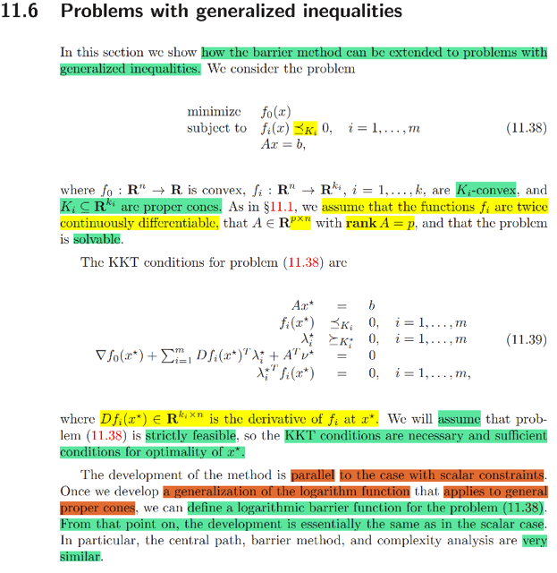</kbd>

> [!NOTE]
> Đại khái là mở rộng qua bài toán "generalized inequalities" có nghĩa là
> ở đây các ràng buộc bất đẳng thức inequality constraint fi(x) ≤ 0 không
> còn là scalar function nữa. Thay  vào đó, nó là vector function. Với
> vector như ta đã biết, việc so sánh giữa hai vector phải dựa trên định
> nghĩa của một proper cone K.
>
> Định nghĩa của proper cone xem lại bài trước nhưng đại khái là nó cho
> phép ta có một cái kiểu xếp thứ tự hay so sánh vector với nhau (gọi là
> partial ordering) và có những tính chất tương tự như khi so sánh số
> thực với nhau (gọi là standard ordering) được định nghĩa  như sau: y
> ≽K x ⇔ y- x ∈ K.
>
> Một ví dụ đặc biệt là khi K là non-negative orthant R^n+. Khi đó, y
> ≽R^n+ x ⇔  y - x ∈ R^n+ và điều này đồng nghĩa mọi component của
> vector y - x đều không âm, hay (y - x)i ≥ 0 ∀i ⇔ yi ≥ xi ∀i.
>
> Quay lại đây, các inequality constraint sẽ có dạng như vậy fi(x) ⪯Ki 0
>
> Thế thì với bài toán optimization với generalized inequalities constraint
> ta cũng có Lagrangian:
>
> L = f0(x) + Σi λiTfi(x) + Σi vi(aiTx - bi)
>
> Chỗ này có một điểm khác với Lagrangian của bài toán inequality bình
> thường khi fi(x) là scalar function. Đó là: với scalar case, mỗi fi(x) sẽ
> có một Lagrange multiplier (hay dual variable) λi cũng là scalar: λifi(x)
>
> Còn bây giờ khi fi(x) là vector, nó sẽ tương ứng với một vector λi, và
> ta cần dùng inner product để chuyển thành scalar: λiTfi(x). Với equality
> constraint Ax = b thì về bản chất vẫn chỉ là hệ các đẳng thức tuyến tính
> hi(x) = 0 ⇔ aiTx - bi = 0, với hi(x) = aiTx - bi là scalar, đi kèm mỗi cái là
> một dual variable scalar vi: vi(aiTx - bi) và tổng Σi vi(aiTx - bi) có thể
> thể hiện ở dạng compact: vT(Ax - b).
>
> Nên trong bài toán này L = f0(x) + Σi λiTfi(x) + vT(Ax - b)
>
> Và trong chap 5 mình cũng đã tự giải thích rất kĩ phần xây dựng KKT
> conditions cũng như các vấn đề khác nên khỏi ghi lại ở đây.
>
> ====
>
> Thế thì ý chính là để áp dụng log barrier method cho bài toán generalized
> inequality constraint này thì ta đầu tiên ta phải ĐỊNH NGHĨA MỘT LOG
> BARRIER FUNCTION ĐỂ DÙNG. Sau đó thì mọi chuyện hoàn toàn tương
> tự

 

<kbd>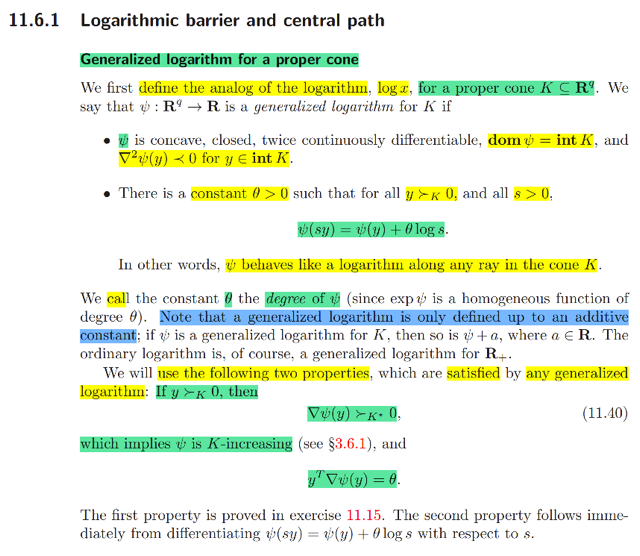</kbd>

> [!NOTE]
> Đại khái là nếu ta define hàm ψ: 
>
> Sao cho với mọi y ≻K 0, và s > 0 ta đều có:
>
> Tồn tại θ dương sao cho ψ(sy) = ψ(y) + θlog(s)
>
> Thì ψ sẽ gọi là generalized log đối với proper cone K
>
> Khi đó nó sẽ có 2 tính chất:
>
> 1) Nếu y ≻K 0 thì ∇ ψ(y) ≻ K* 0
>
> 2) yT ∇ψ(y) = 0
>
> d/ds ψ(sy) = d/ds [ψ(y) + θlog(s)]
>
> Vế trái:
>
> d/ds ψ(sy) = d/d(sy) ψ(sy) . d/ds (sy)
>
> = ∇ψ(sy) T y
>
> Vế phải:
>
> = 0 + θ d/ds log(s) = θ/s
>
> ⇨ ∇ψ(sy)Tys = θ
>
> ⇨ ∇ψ(u)Tu = θ| u = sy

 

<kbd>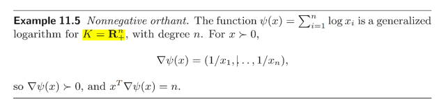</kbd>

<kbd>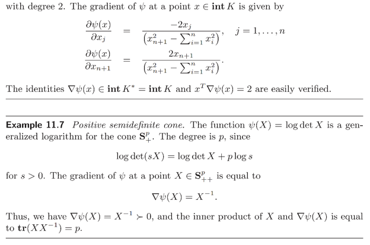</kbd>

> [!NOTE]
> Đại khái là cho ví dụ về hàm Ψ: Ψ(x) = Σ log(xi) sẽ là generalized
> log của cone K = R^n+. Ta sẽ xem thử nó có đúng là có tính chất
> trên ko:
>
> 1) ψ(sy) = ψ(y) + θ log s
>
> ψ(sy) = Σi log (s yi) = Σi (log s + log yi) = Σi log s + Σi log yi
>
> = Σi log yi + n log s
>
> và đây đúng là ψ(y) + θ log s với θ = n
>
> 2) Nếu y ≻K 0 thì ∇ψ(y) ≻K* 0: thì với non-negative orthan thì K* = K
> nên  ∇ψ(y) ≻K* 0 = ∇ψ(y) ≻K 0 và cũng là ∇ψ(y) ≻ 0
>
> Lấy x ≻ 0, thì ∇ψ(x) = (1/x1, 1/x2, ....1/xn), tại sao? 
>
> Trong case này làm theo kiểu cơ bản ∇ψ(x) = [∂/∂x1 ψ(x),..∂/∂xn ψ(x)]
>
> sẽ thấy ngay = [∂/∂x1 Σ log(xi),..∂/∂xn Σ log(xi)]
>
> = [d/dx1 log(x1),..,d/dxn log(xn)]
>
> = [1/x1, ...1/xn]
>
> Nhưng cứ thử làm theo kiểu MIT 18s096: 
>
> ψ(x) = Σi log xi có thể viết theo dạng 1Tlog(x)
>
> d ψ = ψ(x + dx) - ψ(x) = Σi log(xi + dxi) - Σi log(xi)
>
> = Σi [ log(xi + dxi) - log(xi) ]
>
> = Σi log[(xi + dxi)/xi] = Σi log(1 + dxi/xi)
>
> ≈ Σi dxi/xi | dùng log(1 + ε) ≈ ε 
>
> = (1/x)Tdx ⇨ ∇ψ(x) = 1/x = [1/x1, 1/x2, ...1/xn]
>
> Thế thì vì x ≻ 0 tức là mọi xi đều > 0 ⇨ 1/xi > 0 ⇨ ∇ψ(x) ≻ 0
>
> 3) Và xT ∇ψ(x) dễ thấy chính là Σi xi/xi = n
>
> Nên đúng là ψ(x) = Σ log (xi) nó đều thỏa cả hai tính chất.

 

<kbd>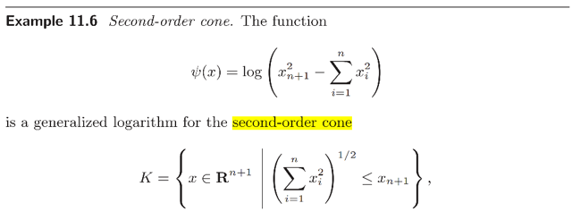</kbd>

<kbd>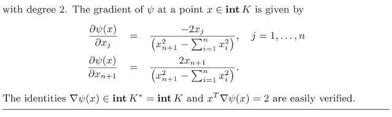</kbd>

> [!NOTE]
> Với K là second order cone thì hàm ψ là hàm này.
>
> ψ(x) = log [x_n+1^2 - Σi=1:n xi^2]
>
> Đầu tiên gặp gỡ cái gọi là second order cone 
>
> K = x ∈ R^n+1 | (Σi=1:n xi^2)^1/2 ≤ x_n+1
>
> Thử tính gradient của ψ tại x ∈ int K:
>
> Làm theo cách elemen-wise trước:
>
> ∂/∂xi ψ(x) = ∂/∂xi log [x_n+1^2 - Σi=1:n xi^2]
>
> Đặt u = [x_n+1^2 - Σi=1:n xi^2] 
>
> ∂/∂xi ψ(x) = d/du log(u) . ∂/∂xi u
>
> = (1/u) ∂/∂xi u
>
> = (1/u) [∂/∂xi x_n+1^2 - ∂/∂xi Σi=1:n xi^2]
>
> Xét i = 1,2...n:
>
> = (1/u) [0 - 2xi] = - 2xi/u 
>
> = - 2xi / [x_n+1^2 - Σi=1:n xi^2]
>
> Xét i = n+1:
>
> = (1/u) [2x_n+1 - 0]
>
> = 2x_n+1/u
>
> = 2x_n+1 / [x_n+1^2 - Σi=1:n xi^2]
>
> Case này mà làm theo 18s096 có vẻ ko hợp lí
>
> ====
>
> QUAY LẠI SAU

 

<kbd>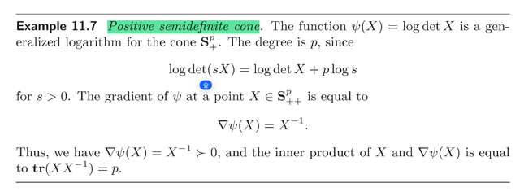</kbd>

> [!NOTE]
> Với K là positive semi definite cone thì ψ(X) = log det X. 
>
> Dễ thấy ψ(sX) = log det (sX) 
>
> Trong 18.06 mình đã học một tính chất của determinant:
>
> Khi nhân một hàng của matrix X với một scalar, giữ nguyên các hàng
> khác để thành Y thì det Y = α det X
>
> Vậy sX chính là làm như vậy với mỗi hàng của X, nên mỗi lần nhân
> s vào một hàng của X, ta có matrix mới với det = s det cũ.
>
> Vậy X trong Sp++, tức có p hàng, nên det sX = s^p det X
>
> ⇨ log det sX = log s^p det X = log s^p + log det X = log det X + p log s 
>
> = ψ(X) + θ log s.
>
> ====
>
> Bài trước mình cũng đã biết ∇f(x) với f(x) = log det X là Xinv
>
> Thử làm lại: QUAY LẠI SAU

 

<kbd>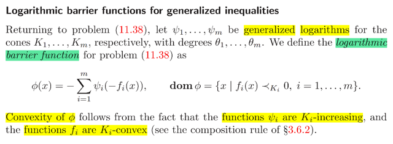</kbd>

> [!NOTE]
> Thế thì sau khi đã định nghĩa hàm log tổng quát (generalized logarithm) ψi
> cho mỗi phép generalized inequality đối với cone  Ki thì ta đã sẵn sàng xây
> dựng định nghĩa của hàm log barrier.
>
> Có vài chỗ có thể cần nói:
>
> Đầu tiên là ôn lại về phương pháp log barrier và câu chuyện của nó: Đó là nó
> xuất phát từ việc ta muốn giải inequality constraint optimization problem:
> minimize f0(x) subject to fi(x) ≤ 0, Ax = b
>
> Thì bước đi tiếp theo là ta dùng thủ thuật tạm gọi là tạo bài toán tương
> đương bằng cách loại bỏ constraint: Cụ thể là đưa inequality constraint vào
> trong objective function, bằng cách dùng một hàm Indicator function I_(u) sao
> cho mang giá trị +inf khi u > 0 và 0 khi u ≤ 0, nó sẽ mang ý nghĩa là "phạt
> nặng nếu u vi phạm inequality constraint" để khi mininize f0(x) + Σ I_(fi(x)) với
> constraint Ax = b thì thuật toán sẽ khuyến khích u thỏa constraint.
>
> Vấn đề là, indicator function I như vậy không khả vi khiến ta không thể dùng
> các gradient method như gradient descent, Newton's method
>
> Do đó, bước đi tiếp theo để khắc phục là dùng một function ước lượng của
> I_(), nhưng có tính khả vi: I^_().
>
> Và đó chính là function log barrier: I^_(u) = - (1/t) log(-u) trong đó có tham số
> t để kiểm soát mức độ chính xác của việc xấp sỉ hàm I_. t càng lớn thì càng
> chính xác.
>
> Cách nhớ đó là, hàm log có tính chất là khi x → 0+ (x phải dương)  thì log x
> → -inf.
>
> Nên nếu u → 0- (tức mang giá trị âm càng gần 0) thì -u → 0+
>
> ⇨ log(-u) → -inf ⇨ - log(-u) → +inf
>
> Ngược lạị u → -inf (tức thỏa sâu constraint tốt) thì -u → +inf
>
> ⇨ log(-u) → +inf ⇨ - log(-u) → -inf
>
> Do đó ta có bài toán xấp xỉ của bài toán mà ta dùng I_:
>
> minimize f0(x) + Σi (1/t) [-log(-fi(x))] subject to Ax = b.
>
> Thế thì để thuận tiện tiếp theo ta lại chuyển thành bài toán equivalent  lần
> nữa:
>
> minimize tf0(x) + tΣi (1/t) [-log(-fi(x))] = tf0(x) + Σi [-log(-fi(x))]
>
> Và hàm Φ(x) = Σi [-log(-fi(x))] gọi là log barrier function
>
> và ta có objective: tf0(x) + Φ(x).
>
> ====
>
> Và ta có thể giải nó bằng Newton's method. Và điểm mấu chốt là vầy:
>
> Với các giá trị của t, thì khi dùng Newton's method để giải tìm solution là
> minimizer của tf0(x) + Φ(x) subject to Ax = b. Thì ta có x*(t). gọi là central
> point.
>
> Và với t khác nhau, các central point này sẽ converge về, dẫn về x* là true
> optimal point của bài toán gốc (minimize f0(x) + ΣI_(fi(x) constraint Ax = b và
> cũng là minimize f0(x) subject to fi(x) ≤ 0, Ax = b)
>
> Có điều cách làm tốt nhất sẽ là, ta bắt đầu với t nhỏ, giải tìm x*(t) bằng
> Newton's method và tăng t dần dần lên bởi μ, để rồi lấy x*(t) ở bước trước đó
> làm starting point của iteration sau.
>
> ====
>
> Thế thì qua bài toán có inequality ở dạng generalized: fi(x) ⪯Ki 0 thì fi(x) lúc
> này không phải scalar mà là vector, và việcv so sánh vector sẽ cần đến khái
> niệm partial ordering, và phép so sánh đó sẽ gắn với một cone Ki Những cái
> này thì ta biết rồi.
>
> Ý chính muốn nói, là mỗi generalized inequality sẽ có mộtv cone Ki. Do đó ta
> cần định nghĩa ra cho mỗi cái một hàm gọi là log tổng quát ψi có tính cách
> giống như hàm log trong scalar case, nhưng mà là đối với cone Ki tương
> ứng.
>
> Khi đã xong bước này thì ta đã sẵn sàng định nghĩa hàm log barrier:
>
> Với scalar case, nó là Σi - log(-u), hay Φ(x) = Σi - log(-fi(x)) = - Σi log(-fi(x))
>
> Thì nay, ta sẽ có Φ(x) = - Σi  ψi(-fi(x))
>
> Không khó để thấy Φ  vẫn là hàm convex

**🔗 See also:** [linked note](./chap_1112345.md#node-6jdej9v)

 

<kbd>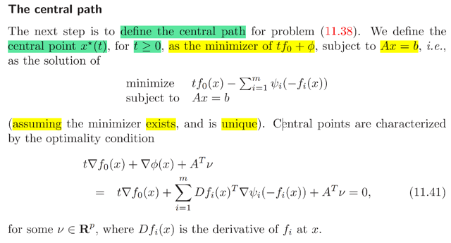</kbd>

> [!NOTE]
> Rồi, như vừa mới ôn lại về câu chuyện (dẫn đến) phương pháp log barrier.
> Thì với generalized cũng vậy. Ta cũng sẽ có central path, tạo bởi các central
> point x*(t). Chính là optimal của bài toán:
>
> minimize tf0(x) + Φ(x) constraint Ax = b. Đây là bài toán equality constraint
> convex optimization (f0 convex, Φ convex), như đã biết ta sẽ dựa vào
> optimality condition để giải tìm x*(t):
>
> Lập luận của optimality condition:
>
> Theo Lagrangian thì nó dựa trên việc với strong duality thì ta có:
>
> x* là minimizer của L(x, λ*, v*). Nên: ∇xL(x, λ*, v*) = 0
>
> ⇨ ∇f0(x*) + ATv* = 0
>
> Nhưng có một cách lập luận khác:
>
> Giải thích theo toán học rất ngắn gọn:
>
> Directional derivative của f theo hướng d bất kì:
>
> f0'(x*, d) = ∇f0(x*)Td phải không âm ở mọi d là hướng di chuyển trong
> feasible set , vì nếu không thì đi theo hướng đó sẽ giảm thêm f0 mà điều này
> không thể do đã  nói x* là optimal
>
> Và ∇f0(x*)Td ≥ 0 với mọi d thì có nghĩa nó ∇f0(x*)T(d) ≥ 0 và ∇f0(x*)T(-d) ≥ 0
>
> Từ đó suy ra ∇f0(x*)Td = 0
>
> Xét d là hướng di chuyển trong feasible set nên x* + d cũng thuộc feasible
> set, ⇨ A(x* + d) = b ⇨ Ad = 0. Điều này cho thấy d thuộc nullspace của A :
> N(A)
>
> Kết luận a) Nếu d là feasible direction thì nó thuộc N(A)
>
> Lấy vector bất kì trong nullspace của A: d ∈ N(A) thì Az = 0 ⇨ A(x* + d) = b +
> 0 = b  ⇨ x* + d ∈ feasible set ⇨ kết luận b) D là feasible direction
>
> Vậy từ (a) và (b) kết luận tập các feasible direction chính là nullspace N(A)
>
> Và như ta đã có ở trên: ∀d ∈ feasible direction thì ∇f0(x*)Td = 0
>
> Kết hợp với việc tập mọi feasible direction chính là nullspace giúp ta có kết
> luận quan trọng: ∇f0(x*) vuông góc với nullspace N(A)
>
> Tiếp theo là dùng một định lý nổi tiếng: Nullspace orthogonal complement 
> với rowspace C(AT): Do đó gradient vector NẰM TRONG ROWSPACE
>
> Và vì vậy nó phải là linear combination của các row của A, dẫn tới ta có thể
> thể hiện nó dưới dạng:
>
> ∇f0(x*) = ATv
>
> Hoặc chọn v = -v ta có ∇f0(x*) + ATv = 0, Đây chính là optimality condition
>
> ===
>
> Còn không thích dùng directional derivative thì vầy, chỉ sửa lại chút:
>
> Dùng first order Taylor approx:
>
> f0(x) = f0(x*) + ∇f0(x*)(x - x*) ⇨ f0(x) - f0(x*) = ∇f0(x*)(x - x*)
>
> Vì x* là optimal nên di chuyển x* đến x bất kì trong feasible set thì f0 phải không
> giảm: tức f0(x) ≥ f0(x*) 
>
> ⇨ ∇f0(x*)(x - x*) ≥ 0
>
> Rồi, xét z bất kì thuộc N(A): Az = 0 ⇨ A(x* + z)  = b ⇨ x = x* + z ∈ feasible set
>
> Xét x ∈ feasible set thì Ax = b ⇨ A(x - x*) = b - b = 0 ⇨ x - x* ∈ nullspace N(A)
>
> Như vậy, xét z bất kì thuộc N(A) thì x = x* + z cũng thuộc feasible set
> mà ngược lại một điểm x thuộc feasible set bất kì thì x - x* cũng thuộc
> N(A). 
>
> DO ĐÓ N(A) = x - x*, x ∈ feasible set
>
> Mà ta có ∇f0(x*)(x - x*) ≥ 0 thì có nghĩa là ∇f0(x*)z ≥ 0 với mọi z ∈ N(A)
>
> Và vì nó đúng với mọi z thuộc N(A) mà N(A) là một vector space, nên
> z ∈ N(A) thì -z cũng thuộc N(A): Lí do: Az = 0 ⇔ A(-z) = 0
>
> Do đó ta có  ∇f0(x*)(z) ≥ 0 và  ∇f0(x*)(-z) ≥ 0 <=> ∇f0(x*)(z) ≤ 0
>
> Vậy suy ra ∇f0(x*)(z) = 0 ∀ z ∈ N(A)
>
> ⇨ ∇f0(x*) vuông góc N(A) => ∇f0(x*)(z) ∈ C(AT) 
>
> ⇨ ∇f0(x*)(z) = AT(-v) ⇨ ∇f0(x*)(z) + ATv = 0
>
> Rồi thế thì với f0(x) ở đây thực ra là tf0(x) - Σ ψi(-fi(x))
>
> (đặt nó là F(x) đi)
>
> ∇[tf0(x) - Σ ψi(-fi(x))]
>
> = t∇f0(x) - Σ ∇ψi(-fi(x))
>
> Tính ∇ ψi(-fi(x):
>
> ψi(-fi(x) là vector → scalar function, nên d/dx ψi(x) sẽ là
> gradient vector.
>
> Dùng chain rule:
>
> d/dx ψi(-fi(x)) = d/d (-fi(x)) ψi(-fi(x)) . d/dx [-fi(x)]
>
> *) d/d (-fi(x)) ψi(-fi(x)) là gradient của ψi() evaluate tại -fi(x)
>
> **) d/dx [-fi(x)], với fi(x) là vector → vector function, nó là
> Jacobian matrix : -J_fi(x), hay Dfi(x) như sách
>
> = ∇ψ(-fi(x)) . [- J_fi(x)]
>
> = - ∇ψ(-fi(x))TJ_fi(x) 
>
> Vì sao có dấu tranpose:
>
> vì giả sự gọi h(x) = ψi(-fi(x)), thì h là scalar function, 
>
> ⇨ dh = h'(x)dx thì với dx là vector, f'(x)[dx] phải là một linear
> operator sao đó act on vector dx cho ra scalar thì nó chỉ có
> thể là dot product của một vector với dx, đó là gradient vector
>
> vậy h'(x) là row vector ⇨ ∇ψ(-fi(x)) . [- J_fi(x)] phải có dạng
> là row vector x Jacobian matrix: ∇ψ(-fi(x))T [- J_fi(x)]
>
> Và dĩ nhiên khi đó, gradient ∇h phải là ∇ψ(-fi(x))T [- J_fi(x)] T
>
> = [- J_fi(x)]T∇ψ(-fi(x))
>
> Ghi theo sách Jacobian của fi(x) là Dfi(x)
>
> = [-Dfi(x)]T∇ψ(-fi(x))
>
> Vậy ta có: ∇F(x) =  t∇f0(x) - Σ [ [-Dfi(x)]T∇ψ(-fi(x))]
>
> = t∇f0(x) + Σ Dfi(x)T∇ψ(-fi(x))
>
> Và optimality condition là:
>
> t∇f0(x) + Σ Dfi(x)T∇ψ(-fi(x))+ ATv = 0

 

<kbd>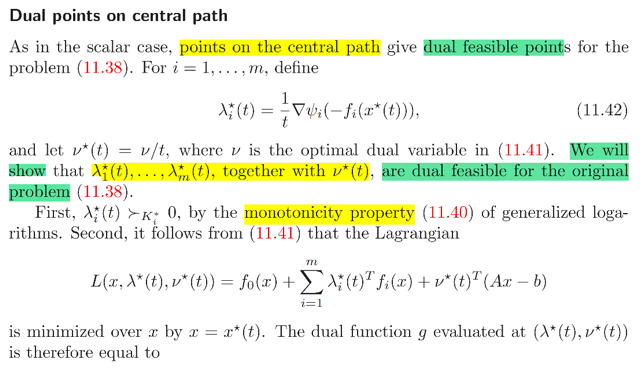</kbd>

> [!NOTE]
> Đại khái là tương tự như scalar case (khi fi(x) là scalar function) ta đã từng bàn
> về việc, mỗi điểm trên central path, tức central point, x*(t) sẽ cho ta dual
> feasible points của bài toán gốc. Thì đây cũng có hiện tương tương tự.
>
> Đầu tiên nhớ lại khái niệm dual feasible: Một điểm λ, v gọi là  dual feasible khi
> g(λ, v) > -inf và λ ≻ 0. Với định nghĩa dual function g(λ, v) = inf x L(x, λ, v) thì,
> điều kiện thứ nhất tương đương:
>
> Khi giải bài toán inf x L(x, λ, v) thì optimal point x* phải attainable và L(x*, λ, v)
> > -inf
>
> Thế thì, với generalized case. thì điều kiện dual feasible cũng tương tự: λi ≽Ki
> 0 với mọi i và g(λ, v) cũng phải > -inf. Nên nhớ λ ở đây là nhiều vector λi
>
> Thế thì tương tự như việc ta đã chứng minh trong scalar case: Ý tưởng là,
> bằng cách chọn λ = λ*  và v = v* mang giá trị cụ thể (sẽ nói tiếp theo) thì ta thấy
> rằng, central point x*(t) chính là minimizer của L(x, λ*, v*). Và điều này cho thấy
> đã thỏa điều kiện một, tức là g(λ*, v*) > -inf. Và điều kiện sau thì  cũng dễ. Đây
> là phác thảo ý tưởng chính.
>
> Cụ thể là như sau:
>
> Chọn λ*i(t) = (1/t) ∇ψi[-fi(x*(t)))] và v* = v/t với v là dual optimal point của 11.41
> (tức là v thỏa optimality condition của bài toán minimize tf0(x) - Σ ψi(-fi(x)):
>
> t∇f0(x) + Σ Dfi(x)T∇ψ(-fi(x)) + ATv = 0
>
> Khi đó, từ việc nói x*(t), central point là minimizer của bài toán trên và nó là 
> solution của optimality condition:
>
> t∇f0(x*) + Σ Dfi(x*)T∇ψ(-fi(x*)) + ATv = 0 (1) |  Hiểu x* là x*(t), viết x* cho gọn
>
> Dùng λ*i = (1/t) ∇ψi[-fi(x*))] ⇔ tλ*i = ∇ψi[-fi(x*))]  | tương tự hiểu λ* là λ*(t)
>
> (1) ⇔ t∇f0(x*) + Σ Dfi(x*)Ttλ*i + ATv = 0
>
> ⇔ ∇f0(x*) + Σ Dfi(x*)Tλ*i + AT(v/t) = 0
>
> ⇔ ∇f0(x*) + Σ Dfi(x*)Tλ*i + ATv* = 0
>
> Và đây chính là optimality condition của problem gốc:
>
>  minimize f0(x) constraint fi(x) ⪯Ki 0, Ax = b
>
> Và như đã nói ở trên, điều này chứng tỏ λ*, v* là DUAL FEASIBLE (chú ý, không 
> phải là dual optimal nhé)
>
> Còn đièu kiện thứ hai: λ*i ≽Ki 0 là vì xuất phát từ định nghĩa của hàm generalized
> log ψ(y) nó có tính chất: Nếu y ≻K 0 thì ∇ψ(y) ≻K* 0
>
> Do đó, ở đây ta đặt λ*i = (1/t) ∇ψi[-fi(x*(t))], thì vì fi(x*) ⪯K*i 0 nên -fi(x*) ≽K*i 0
> ⇨ ∇ψ(-fi(x*)) ≽K*i 0 ⇨ λ*i = (1/t) ∇ψi[-fi(x*(t))] ≽Ki* 0
>
> Rồi, vì định nghĩa g(λ, v) (của bài toán gốc) 
> = inf x L(x, λ, v)
>
> = inf x {f0(x) + Σi λiTfi(x) + vT(Ax - b)}
>
> Mà: x*(t) là minimizer của L(x, λ*(t), v*(t))
>
> Đồng nghĩa L(x*(t), λ*(t), v*(t)) = inf x  L(x, λ*(t), v*(t))
>
> mà vế phải chính là g(λ*(t), v*(t))
>
> Nên g(λ*(t), v*(t)) = f0(x*(t)) + Σi λ*iTfi(x) + v*T(Ax - b)
>
> (chỗ này tuy đơn giản có thể gây ngáo: Cần tập trung
> ở việc định nghĩa 
>
> g(λ, v) = inf x L(x, λ, v) 
>
> ⇨ g(λ*, v*) = inf x L(x, λ*. v*) (điều này là đương nhiên)
>
> Và sự thật mà ta có ở đây là NẾU NHƯ CHỌN λ là λ*, 
> v = v* thì x*(t) là cái mà thỏa optimality condition của 
> bài toán gốc. Mà với optimality condition của bài toán
> gốc loại hóa ra chính là gradient của L(x, λ*, v*) = 0
>
> Từ đó suy ra x* cũng là minimizer của L(x, λ*, v*)
>
> mà như vậy thì có nghĩa là L(x*, λ*, v*) = inf x L(x, λ*, v*)
>
> và cái này lại chính là g(λ*, v*).
>
> Vậy g(λ*, v*) = L(x*, λ*, v*) 
>
> (với x* là central point) và  λ* là cái theo công thức đã chọn

 

<kbd>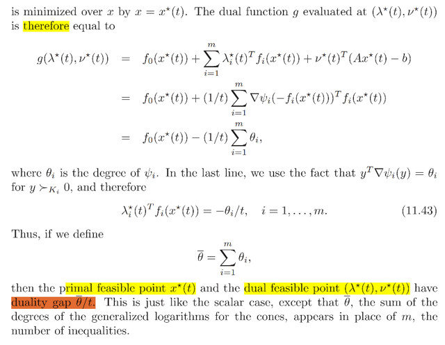</kbd>

> [!NOTE]
> Tiếp tục:
>
> g(λ*(t), v*(t)) = f0(x*(t)) + Σi λ*i(t)Tfi(x) + v*(t)T(Ax*(t) - b)
>
> Thay λ*i, v*i
>
> g(λ*(t), v*(t)) = f0(x*(t)) + Σi (1/t) ∇ψi[-fi(x*(t))] T fi(x) + v*T(0) 
>
> | vì x* thỏa  constraint
>
> = f0(x*(t)) + (1/t) Σi ∇ψi[-fi(x*(t))] T fi(x)
>
> Tới đây ta dùng một trong hai tính chất của hàm ψ(y): yT∇ψ(y) = 0
>
> ⇨ Σi ∇ψi[-fi(x*(t))] T fi(x) = - Σi ∇ψi[-fi(x*(t))] T [-fi(x)]
>
> = - Σi θi
>
> ⇨ f0(x*(t)) + (1/t) Σi ∇ψi[-fi(x*(t))] T fi(x) 
>
> = f0(x*(t)) - (1/t) Σi θi
>
> Vậy g(λ*(t), v*(t)) = f0(x*(t)) - (1/t) Σi θi
>
> Vậy primal feasible point  và dual feasible point λ*(t), v*(t) 
> có duality gap  = (1/t) Σi θi

 

<kbd>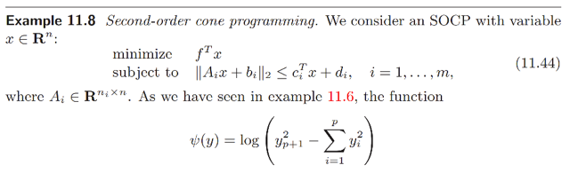</kbd>

<kbd>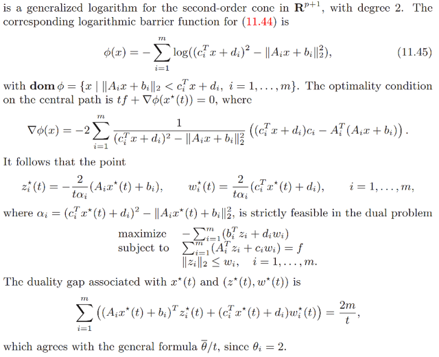</kbd>

> [!NOTE]
> Thử làm ví dụ này bài toán SOCP với x ∈ R^n
>
> minimize fTx subject to ||Aix + bi|| ≤ ciTx + di
>
> Ở ví dụ 11.6 mình đã có function ψ(y) = log [y^2_p+1 - Σi yi^2]
> là generalized logarithm function cho second order cone in R^p+1
>
> log barrier function tương ứng sẽ là:
>
> QUAY LẠI SAU

 

<kbd>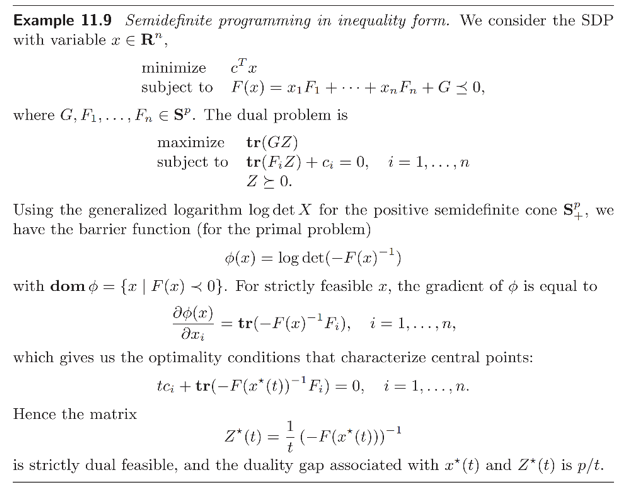</kbd>

> [!NOTE]
> Với bài toán semi definite programming in equality form, ta có 
> barrier function: Φ(x) = log det (-F(x)inv)
>
> Thử tính gradient của Φ:
>
> QUAY LẠI SAU

 

<kbd>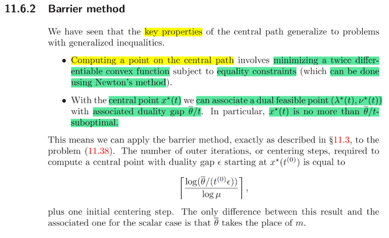</kbd>

> [!NOTE]
> đại khái là, ta đã biết barrier method, đại ý là ta sẽ bắt đầu với t
> nhỏ. Và ta sẽ giải bài toán tìm center point x*(t). Chính là giải 
> bài toán equality constraint convex minimize tf0(x) + Φ(x) dùng
> newton method. Trong bước này, dĩ nhiên là cũng gồm nhiều
> iteration gọi là inner iteration - thực hiện các bước update bởi
> phương pháp Newton
>
> Khi tìm ra x*(t), thì chuyển qua iteration tiếp theo nơi ta scale
> t lên chút xíu, lấy x*(t) trước đó để làm starting point. Và lại giải
> bài toán tìm x*(t) với Newton method
>
> Cứ thế, các x*(t) sẽ dần converge về x* của bài toán gốc.
>
> Và như đã thấy, mỗi x*(t) sẽ thuộc θ^/t suboptimal

 

<kbd>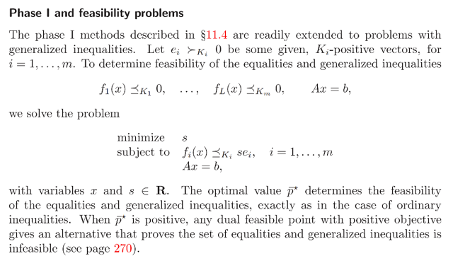</kbd>

 

<kbd>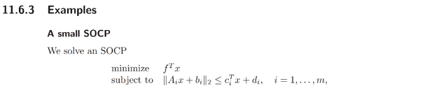</kbd>

<kbd>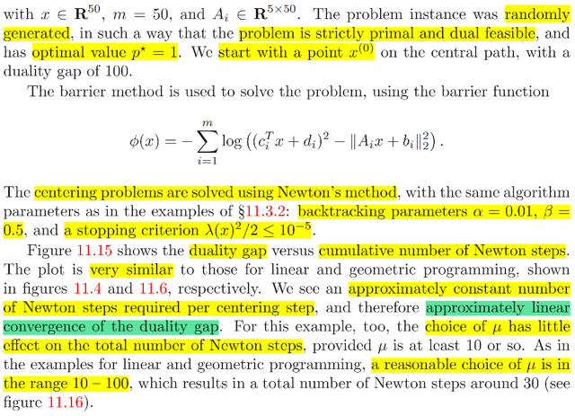</kbd>

<kbd>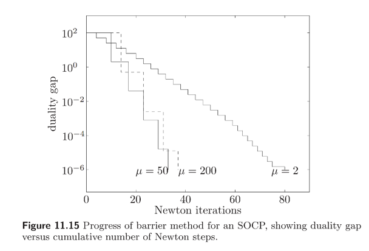</kbd>

> [!NOTE]
> ví dụ bài toán SOCP quy mô nhỏ, data được randomly generated sao
> cho nó strictly primal feasible và dual feasible
>
> Nói chung kết quả cho thấy duality gap giảm tuyến tính với số Newton
> step cần thiết.
>
> Có thể cần ôn lại cái vụ duality gap
>
> Định nghĩa nên nhớ nó là khác biệt giữa f0(x) và g(λ, v) (chứ không phải
> p* và g(λ, v))
>
> Và đại khái là ta theo link bữa trước đã chứng minh cho thấy rằng trong
> mỗi centering problem nơi mà ta giải bài toán minimize tf0(x) + Φ(x)
> constraint Ax = b để có x*(t) là central point. Thì khi giải xong x*(t), bằng
> cách chọn một giá trị cụ thể cho  λ*(t), v*(t) (*) thì bằng cách thế vào
> optimality condition của bài toán centering  (**) ta sẽ cho thấy rằng x*(t),
> λ*(t), v*(t) thỏa điều kiện rằng Lagrangian của bài toán gốc evaluate tại
> x*(t), λ*(t), v*(t) bằng 0, vanish. Từ đó suy ra x*(t) là minimizer của L(x,
> λ*(t), v*(t)), và suy ra khi minimize L(x, λ*(t), v*(t)) kết quả không ra
> -infinity, và điều này cũng là g, dual function của bài toán gốc evaluate tại
> λ*(t), v*(t) không bị bằng -infinity ⇨ λ*(t), v*(t) là dual feasible  points
>
> (*) λ*(t) = -1/t*fi(x*(t)) ⇨ tλ*(t) = -1/fi(x*(t)) và v*(t) = v^/t
>
> (**) t*∇f0(x*(t)) + ∇Φ(x*(t)) + ATv^ = 0
>
> Mà khi nó là dual feasible point thì khác biệt giữa dual function của bài
> toán gốc g(λ*(t), v*(t)) và objective function tại một feasible point nào đó,
> ở đây là x*(t) (nhớ rằng nó chỉ là optimal của centering, còn với bài toán
> gốc nó chỉ là một feasible point, sẽ là dual gap
>
> (again, ta chỉ nói về dual function, Lagrangian của bài toán gốc, ko phải
> nói về bài toán centering)
>
> nên f0(x*(t)) - g(λ*(t), v*(t)) là duality gap và ta còn có kết quả là cái này
> bằng m/t:
>
> f0(x*(t)) - g(λ*(t), v*(t)) = m/t
>
> Và điều này cho thấy khi t → inf, thì duality gap sẽ nhỏ lại
>
> Rồi, với việc gọi p* là optimal value, tức f0(x*) với x* thật sự là optimal
> của bài toán gốc, là điểm cuối của centering path thì ta có bất đẳng thức
> thể hiện weak dualitty:
>
> g(λ*(t), v*(t)) ≤ p*, từ đó suy ra f0(x*(t)) - m/t ≤ p* và cái này cho ta thấy
> rằng khi t càng lớn → m/t → 0 thì lower bound của p* sẽ ngày càng nâng
> nên và càng gần f0(x*(t)). Hoặc thể hiện theo kiểu này f0(x*(t)) - p* ≤ m/t
> thì cho thấy khi t → lớn thì upper bound giữa f0(x*) và p* càng nhỏ cũng
> nói lên rằng f0(x*(t)) tiến về p*
>
> Túm lại việc giảm duality gap, chính là khi t tăng thì f0(x*(t)) - g(λ*(t),
> v*(t)) = m/t  giảm sẽ thể hiện việc x*(t) ngày càng tiến gần tới p*
>
> Và trong ví dụ này người ta thấy rằng việc giảm của duality gap , m/t, sẽ
> giảm tuyến tính với số Newton step
>
>
> ====
>
> Bên cạnh đó cũng thấy μ đừng có nhỏ quá thì sẽ ảnh hưởng đến số
> iteration cần thiết, còn lại thì nó ko khác biệt mấy (ví dụ hình 11.15, giữa
> μ = 50 với 200 số Newton's iteration ko khác biệt mấy) nhưng nếu μ nhỏ
> (=2) thì số Newton iteration sẽ tăng lên đáng kể'

**🔗 See also:** [linked note](./chap_1112345.md#node-8tkmlf8)

 

<kbd>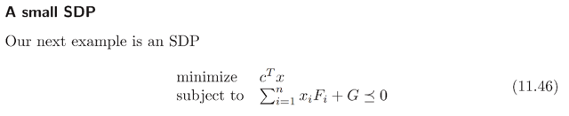</kbd>

<kbd>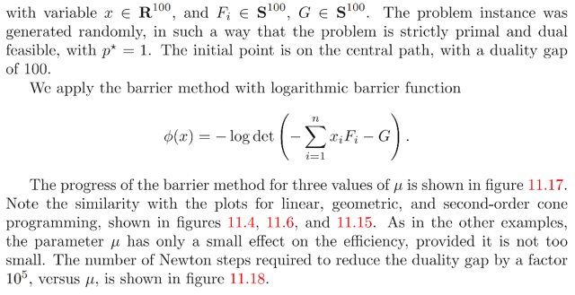</kbd>

<kbd>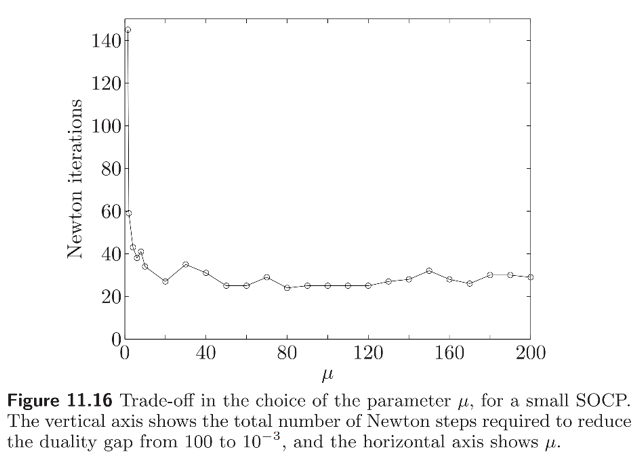</kbd>

> [!NOTE]
> Với bài toán SDP thìk ết
> quả  cũng tương tự.

 

<kbd>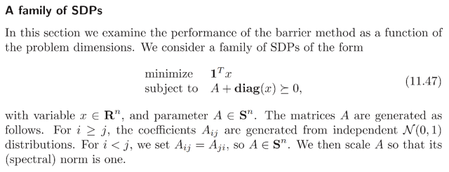</kbd>

<kbd>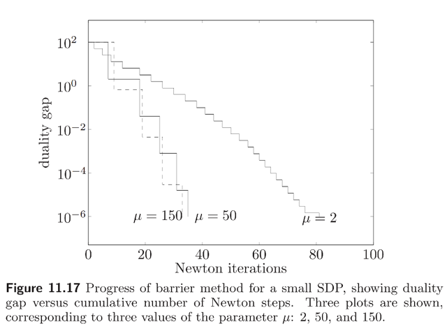</kbd>

<kbd>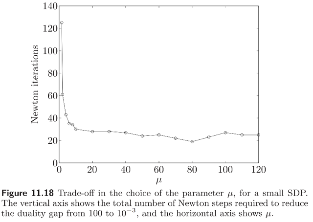</kbd>

 

<kbd>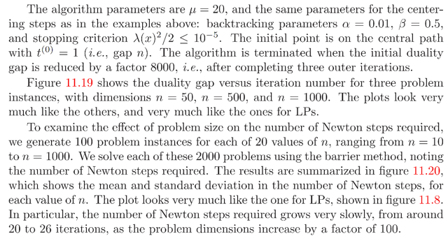</kbd>

<kbd>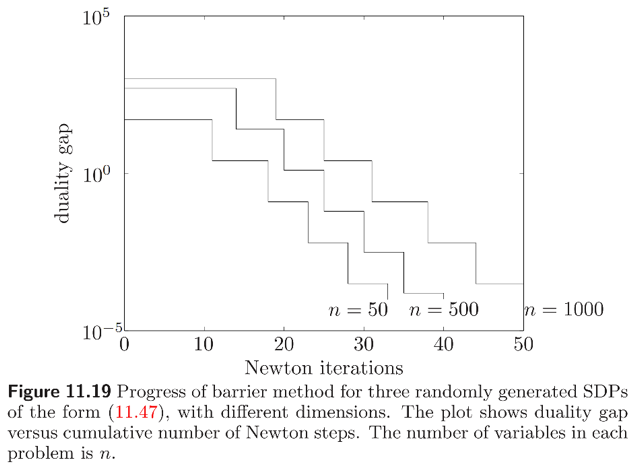</kbd>

<kbd>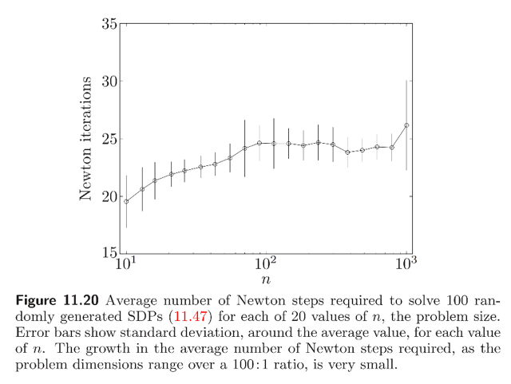</kbd>

> [!NOTE]
> đại ý quan trọng là để kiểm tra ảnh hưởng của problem size lên số 
> newton step cần thiết khi dùng log barrier method thì người ta 
> cho 20 giá trị của n từ 10 đến 1000, với mỗi giá trị của n người ta 
> cho 100 bài toán, và giải bằng log barrier.
>
> Kết quả, in ra số newton step cần thiết trung bình cần ứng với một
> giá trị của n. có thể thấy khi n tăng lên thì số newton step cũng tăng
> nhưng ko đáng kể, 
>
> Ý là trong khi n tăng lên theo cấptừ 10 lên 1000 tức là gấp 100 lần
> thì số Newton iteration chỉ tăng từ 20 lên 26

 

<kbd>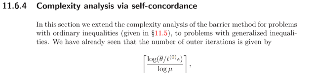</kbd>

<kbd>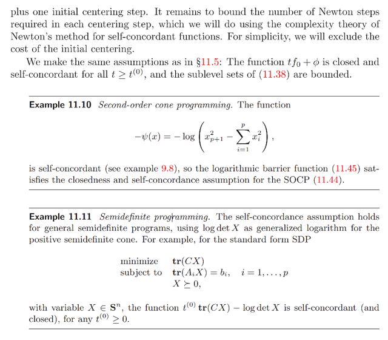</kbd>

> [!NOTE]
> QUAY LẠI SAU

 

<kbd>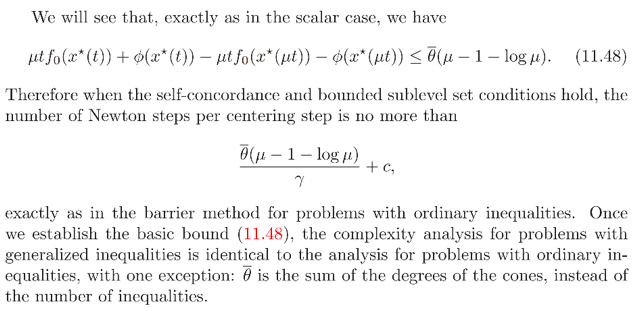</kbd>

<kbd>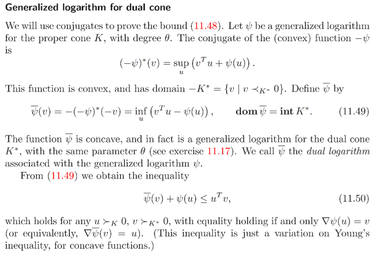</kbd>

> [!NOTE]
> QUAY LẠI SAU

 

<kbd>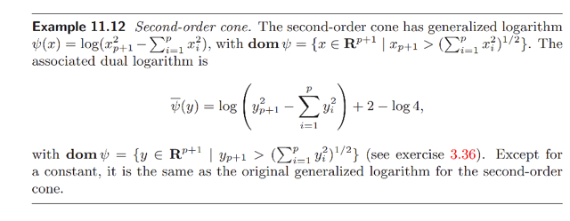</kbd>

<kbd>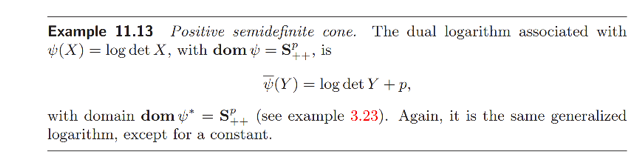</kbd>

> [!NOTE]
> QUAY LẠI SAU

 

<kbd>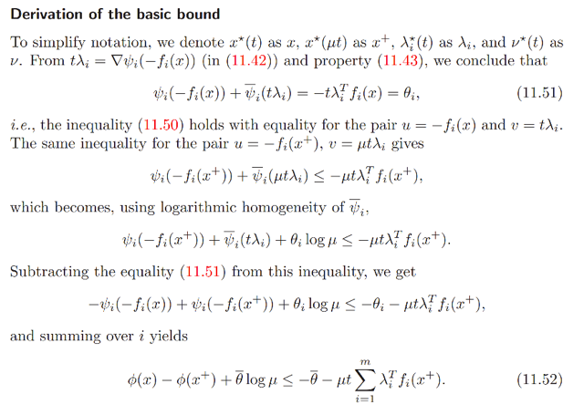</kbd>

<kbd>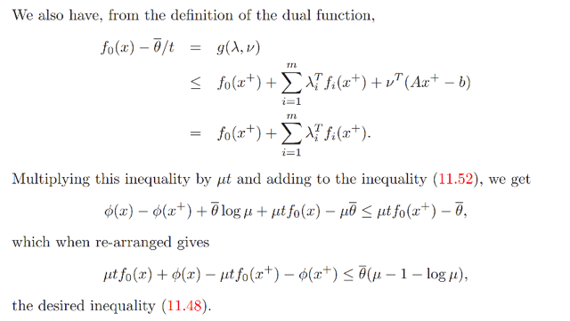</kbd>

> [!NOTE]
> QUAY LẠI SAU

 

<kbd>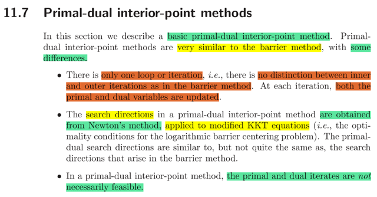</kbd>

<kbd>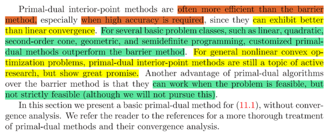</kbd>

> [!NOTE]
> Chưa rõ lắm, những phần sau sau khi rõ hơn sẽ quay lại nhưng đại
> khái là pp này tương tự barrier nhưng tốt hơn.
>
> Nó hiệu quả hơn nhất là khi yêu cầu độ chính xác cao.
>
> Trong những problem cơ bản như linear / quadratic / second order
> cone geometric , semidefinite programming ... thì nó vượt trội
> barrier method.
>
> còn trong các bài toán nonlinear convex nói chung thì đang được
> nghiên cứu rất actively nhưng rất nhiều tiềm năng
>
> Một ưu điểm quan trọng nữa của cái này là nó ko cần strictly
> feasible mà chỉ cần feasible

 

<kbd>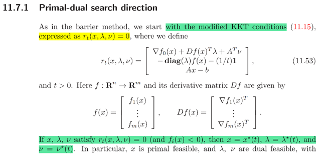</kbd>

<kbd>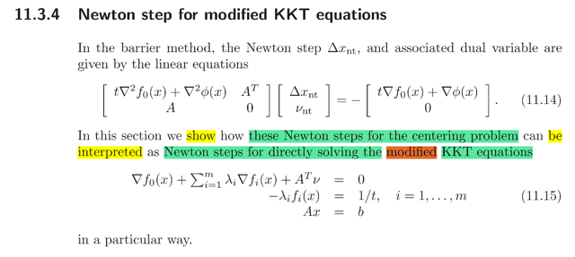</kbd>

<kbd>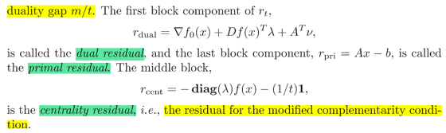</kbd>

> [!NOTE]
> Đại khái là trong 11.3.4 mình đã hiểu vì sao có công thức 11.14 Ôn nhanh: Bối
> cảnh là ta muốn giải bài toán cho bài toán centering, là bài toán equality
> constraint optimization problem: minimize tf0(x) + Φ(x) subject to Ax = b.
>
> Trong đó, ta giải nó bằng Newton method có lập luận đại ý là ta sẽ liên tiếp
> xấp xỉ / coi như hàm objective là một hàm quadratic Để từ điểm đang đứng,
> giúp tính toán ra điểm optimal, nơi mà hàm quadratic này đạt giá trị nhỏ nhất,
> và ta sẽ nhảy đến điểm này Tại đó lặp lại quá trình này. Cứ như vậy, khi càng
> gần tới optimal point thật sự thì việc xấp xỉ bậc hai sẽ ngày càng chính xác, và
> đến một lúc nào đó ta sẽ đến rất gần optimal point.
>
> Vậy thì bước quan trọng trong quá trình này là tính ra Newton step, mà bản
> chất chính là giải bài toán equality constraint quadratic optimization:
>
> Đây nhé, bài toán centering problem là bài toán này: minimize tf0(x)
> + Φ(x) subject to Ax = b.
>
> Tuy nhiên, optimal của bài toán này không dễ để tìm, vì nó có thể là hàm phi
> tuyến bậc cao, dù cho nó là convex function thì PHẦN LỚN TRƯỜNG HỢP
> LÀ KHÔNG THỂ DỄ DÀNG GIẢI RA OPTIMAL BẰNG CÁC ANALYTICALLY
> (NHƯ GIẢI OPTIMALITY CONDITION)
>
> Thay vào đó ta sẽ dùng iteration method (như gradient descent hay Newton's
> step) để thực hiện các bước đi / update, mỗi lúc đến gần  hơn với optimal.
>
> Thế thì cách làm như sau:
>
> Giả sử tại ban đầu ta đang ở điểm x0, như trên đã nói, ta sẽ coi hàm objective
> như quadratic. Làm vậy bằng cách dùng khai triển Taylor bậc hai đối với hàm
> objective tại x0: Chú ý hàm objective là tf0(x) + Φ(x) và ta gọi nó là f(x):
>
> f(x0 + δx) = f(x0) + ∇f(x0)Tδx + (1/2) δxT∇^2f(x0)δx, đặt nó là g(δx)
>
> đặt P = ∇^2f(x0), q = ∇f(x0), r = f(x0) thì ta có f(x0 + δx) (chú ý nó là hàm  theo
> δx, x0 chỉ là fixed value) sẽ có dạng (1/2) δxTPδx + qTδx + r. Đây là  hàm bậc
> hai theo δx,
>
> Và vì nó là hàm quadratic, nên có thể tìm ra minimum theo công thức, hay nói
> chính xác hơn, là vì objective là quadratic nên ta có thể giải cái optimality
> condition (trong khi với objective gốc thì optimality condition thường là ko giải
> được)
>
> Optimality condition, khi δx thỏa cái này thì nó chính là δx tối ưu giúp x0 + δx
> đạt optimal point của bài toán, cũng chính là g(δx*) = f(x0 + δx*) nhỏ nhất. Và
> khi đó δx chính là Newton step Δx_nt
>
> Thế thì một điểm lưu ý là dù ta có xấp xỉ f(x) bởi quadratic thì ta vẫn phải  có
> constraint Ax = b. Nên bài toán phải giải vẫn là equality constraint quadratic
> convex optimization problem.
>
> minimize g(δx) = f(x0 + δx) = f(x0) + ∇f(x0)Tδx + (1/2) δxT∇^2f(x0)δx 
>
> subject to A(x0 + δx) = b
>
> Ý nghĩa là ko chỉ ta cần δx để đưa g xuống thấp nhất mà còn cần x0 + δx vẫn
> nằm trong primal feasible set
>
> Optimality condition của bài toán này ta có thể nhớ có là:
>
> ∇g(Δx_nt) + ATv* = 0, đây gọi là dual feasibility condition,
>
> và A(x0 + Δx_nt) = b ⇔ A Δx_nt = 0, đây là primal feasibility condition
>
> Vậy thì xét cái này: ∇g(Δx_nt) + ATv* = 0
>
> với hàm quadratic f(x) = (1/2)xTPx + qTx + r, thì ∇f(x) = PTx + q
>
> Với P = ∇^2f(x0), q = ∇f(x0), r = f(x0) thì:
>
> ⇨ ∇g(Δx_nt) = ∇^2f(x0)TΔx_nt + ∇f(x0)
>
> Nên (1) ⇔ ∇^2f(x0)TΔx_nt + ∇f(x0) + ATv* = 0
>
> và (2) A Δx_nt = 0
>
> Bây giờ mới dùng đến f(x) = tf0(x) + Φ(x)
>
> ⇨ ∇f(x0) = t ∇f0(x0) + ∇Φ(x0), vì sao?
>
> Vì để tìm ∇f(x0), tức là ta tìm derivative của f đối với x, evaluate tại x0:
>
> d/dx f(x) = d/dx [tf0(x) + Φ(x)] = d/dx tf0(x) + d/dx Φ(x)
>
> = t d/dx f0(x) + d/dx Φ(x) = t ∇f0(x) + ∇Φ(x)
>
> Để tìm ∇^2f(x0), ta tiếp tục tính đạo hàm bậc hai theo x của f:
>
> d/dx (d/dx f(x)) = d/dx [t ∇f0(x) + ∇Φ(x)]
>
> = d/dx [t ∇f0(x)] + d/dx ∇Φ(x)
>
> = t ∇^2f0(x) + ∇^2Φ(x)
>
> Vậy tới đây điều kiện (1) trở thành:
>
>  [t∇^2f0(x0) + ∇^2Φ(x0)]TΔx_nt + t∇f0(x) + ∇Φ(x) + ATv* = 0
>
> ⇔ [t∇^2f0(x0) + ∇^2Φ(x0)]TΔx_nt + ATv* = - [ t∇f0(x) + ∇Φ(x) ]
>
> Ghi lại (2) A Δx_nt = 0
>
> Để rồi kết hợp hai cái lại thành dạng:
>
> [t∇^2f0(x0) + ∇^2Φ(x0), AT; A; 0] [Δx_nt; v*]T = [- [ t∇f0(x) + ∇Φ(x) ]; 0]
>
> tức là matrix KKT = [t∇^2f0(x0) + ∇^2Φ(x0), AT; A, 0] nhân vector [Δx_nt; v*]
> bằng vector - [ t∇f0(x) + ∇Φ(x) ; 0]
>
> Đó chính là kết quả. 11.14
>
> Rồi sau đó, trong bài trước ta cũng đã thấy (và hiểu) người ta chứng
> minh rằng việc giải cái hệ 11.14 CŨNG CHÍNH LÀ GIẢI HỆ KKT CỦA
> BÀI TOÁN GỐC VỚI CHÚT THAY ĐỔI
>
> Trong đó bài toán gốc là ko phải đang nói tới bài toán centering, mà là
> bài toán minimize f0(x) subject to fi(x) ≤ 0, Ax = b,
>
> và KKT condition của bài toán đó, theo lí thuyết như đã biết là:
>
> (1) ∇f0(x) + Σ λi∇fi(x) + ATv = 0 (đây là điều kiện mà gradient tại
> optimal của Lagrangian sẽ vanish, xuất phát từ việc ta có strong
> duality, vì đây là convex problem)
>
> (2) - λifi(x) = 0, i = 1,2...m  (đây là điều kiện complementary slackness,
> cũng xuất phát từ lập luận trên)
>
> (3) Ax = b Đây là primal feasibility condition
>
> (4) λi ≥ 0 Đây là dual feasibility condition,
>
> Vậy điểm khác chút xíu nói trên là - λifi(x) = 1/t
>
> ====
>
> Có nghĩa là, muốn nói rằng việc ta giải tìm newton step, THÌ CŨNG
> CHÍNH LÀ GIẢI TÌM NEWTON STEP NẾU MUỐN GIẢI CÁI HỆ NÀY
>
> (Tức là việc giải cái hệ kkt modified trên, thật ra cũng là một bài toán
> tối ưu, mà trong đó ta ko có objective, và cũng có thể dùng Newton
> method để giải)
>
> ====
>
> Vậy thì, như đã biết, nếu mà thỏa cái hệ kkt này thì dĩ nhiên x*, λ*, v*
> sẽ là primal và dual optimal. Điều này ko cần bàn cãi, bởi nó xuất phát
> từ lí thuyết.
>
> Chỉ có điều là ko phải dễ để giải cái hệ này nên mới phải dùng các
> cách tiếp cận như log barrier mà trong đó ta dùng Newton method
>
> Thế thì xét cái hệ này, bằng cách chuyển qua một bên, và đặt vế trái
> là rt(x, λm v) thì 3 phần của r sẽ được gọi là:
>
> - dual residual, xuất phát từ (1) ∇f0(x) + Σ λi ∇fi(x) + ATv = 0 
>
> đặt f(x) = [f1(x), ...fm(x)] thì ⇨ Df(x) = [∇f1(x)T; ∇f2(x)T; ....]
>
> ⇨ Σ λi ∇fi(x) = Df(x)Tλ (dễ thấy vì Df(x)T sẽ có các cột là ∇f1(x), ∇f2(x)..
>
> Nên Df(x)Tλ sẽ là linear combination các ∇f1(x), ∇f2(x)...với coefficient
> λ1, λ2...: Tức là Σ λi ∇fi(x)
>
> ⇨ Vậy (1) ⇔  ∇f0(x) + Df(x)Tλ + ATv = 0
>
> - primal residual: Xuất phát từ primal feasibility: Ax = b ⇔ Ax - b = 0
>
> - centrality residual: Xuất phát từ complementary slackess: - λi fi(x) = -1/t; i = 1,2..
>
> Mà -λ1 f1(x) = -1/t, -λ2 f2(x) = 1/t, ...⇔  -diag(λ1, λ2,...)f(x) = (1/t)1
>
> ⇔ -diag(λ1, λ2,...)f(x) - (1/t)1= 0

 

<kbd>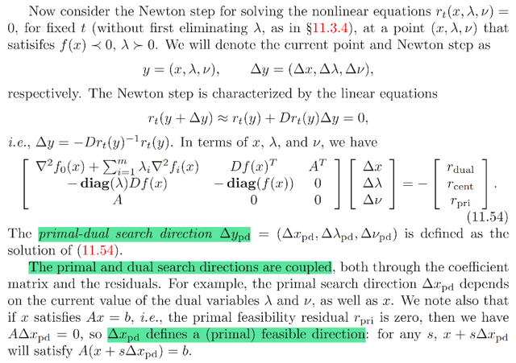</kbd>

> [!NOTE]
> Đại khái là, để giải cái hệ modified KKT condition này, thì nếu ta tính Newton step để giải nó, với cách thứ ra sao
> thì tí ta sẽ ôn lại thì sẽ thấy chính là newton step dùng  để giải centering problem theo phương pháp log barrier
> method.
>
> Vậy thì để giải hệ modified KKT condition, tức là giải bài toán tối ưu chỉ có equality constraint là cái hệ này thôi,
> và còn nhớ nó gọi là feasibility problem. Thì ta sẽ tiến hành bằng cách rút λi ra:
>
> - λi fi(x) = -1/t ⇨ λi  = -1/tfi(x) và thế vào những chỗ khác có λi, cụ thể là trong điều kiện vanishing của gradient
> của Lagrangian để coi như eliminate λi đi:
>
> ∇f0(x) + Σ λi ∇fi(x) + ATv = 0
>
> ⇔ ∇f0(x) + Σ [-1/tfi(x)] ∇fi(x) + ATv = 0
>
> Khi đó hệ sẽ chỉ còn biến x và v:
>
> ∇f0(x) + Σ [-1/tfi(x)] ∇fi(x) + ATv = 0 và Ax = b
>
> Rồi, thế thì như trên nói rằng đại khái là ta có thể giải cái hệ này bằng Newton method, mà khi đó thì ta sẽ thấy
> rằng cái Newton's step hóa ra y như / chính là cái Newton's step mà ta dùng để giải bài toán centering với log
> barrier method (bài toán minimize t f0(x) + Φ(x) subject Ax = b).
>
> Vậy câu hỏi là, giải một cái hệ phương trình bằng Newton method là sao?
>
> Để hiểu cái này ta liên hệ với 1801, trong đó có bài giảng dạy về Newton method giúp giải một phương trình f(x)
> = 0. Trong đó hàm f(x) phi tuyến bậc cao. Thì đầu tiên đại khái là ta có một initial guess x0, ta sẽ thiết lập hàm
> tiếp tuyến của f(x) tại x0. Mà công thức của nó đơn giản là xuất phát từ xấp xỉ Taylor bậc 1 của f(x) tại x0, còn
> gọi là linear approximation:
>
> f(x) ≈ f(x0) + f'(x0)(x - x0) , mà ý nghĩa của cái equation này nói rằng, nếu mà x ≈ x0, thì sự thay đổi của f(x) sẽ
> có thể coi như bằng sự thay đổi của hàm tuyến tính f^(x) = f(x0) + f'(x0)(x - x0)
>
> Chú ý chỗ này, tại sao nói hàm này là tuyến tính, trong khi f có thể làm hàm phi tuyến bậc cao, thì f' chưa chắc
> là hàm bậc nhất. Câu trả lời là vì, cho dù f'(x) không phải là hàm bậc nhất, nhưng chú ý vế phải f(x0) + f'(x0)(x -
> x0) là hàm theo x, có nghĩa là, f'(x0) là giá trị của f'(x) tại x0, và dù cho nó là hàm bậc cao thì f'(x0) cũng chỉ là
> hằng số, nên vế phải thật ra chỉ là có dạng ax
> + b với a = hằng số, = f'(x0), và b = f(x0) - f'(x0)x0. Do đó nó chỉ là hàm tuyến tính.
>
> Rồi, quay lại đây, khi đã có hàm tiếp tuyến của f(x) tại x0, ta sẽ đi tìm giao điểm của nó với trục x, dĩ nhiên bằng
> cách cho nó bằng 0:
>
> f(x0) + f'(x0)(x - x0) = 0 giải ra x:
>
> ⇔ f(x0) + f'(x0)x - f'(x0)x0 = 0 ⇔ f'(x0)x = f'(x0)x0 - f(x0)
>
> ⇔ x = [f'(x0)x0 - f(x0)] / f'(x0) = x0 - f(x0)/f'(x0)
>
> và ta sẽ gán giá trị này cho x1.
>
> Tiếp tục như vậy, (tức là lại thiết lập phương trình tiếp tuyến của f(x) tại x1, và tìm giao điểm của nó với trục x,
> ta sẽ tìm được x2 = x1 - f(x1)/f'(x1)
>
> để rồi ta sẽ có các điểm x1, x2,...xk dần converge về x* là nghiệm thật sự của f(x) = 0
>
> Thế thì hãy để ý cái yếu tố -f(x0)/f'(x0) dùng để đi từ x0 đến x1, đây chính là Newton step tại x0. Tí nữa mình sẽ
> bàn về cái này thêm.
>
> Còn bây giờ ta sẽ nâng cấp lên để nói về việc giải một phương trình f(x) = 0 nhưng f(x) không phải là scalar
> function nữa mà là một vector function. Điều này giống như ta sẽ giải hệ phương trình f(x)_1 = 0; f(x)_2 = 0,....
> f(x)_n = 0 vậy.
>
> Vậy thì hoàn toàn tương tự, chỉ khác thay vì ta có hàm f(x) là scalar function, và ta vẽ đồ thị của nó (là đường
> cong nào đó) trong không gian 1 + 1 chiều thì nay với hàm f(x) là vector n chiều thì ta sẽ vẽ nó trong không gian
> n + 1 chiều Ví dụ như f(x) là 2D vector, và sẽ vẽ nó trong 3D space
>
> Cũng bắt đầu với initial point x0, là một vector [x01, x02], ta cũng sẽ thiết lập  hàm tiếp tuyến (tangent) với f(x).
> Lúc này, nó sẽ là một mặt phẳng thay vì đường thẳng. Việc thiết lập cũng dùng 1st order Taylor approximation
> của f(x) tại x0:
>
> f(x) ≈ f(x0) + f'(x0)(x - x0)
>
> Có điều f'(x) bây giờ là gì, nó là đạo hàm của hàm f(x) vốn là vector đối với vector x nên nó sẽ là Jacobian
> matrix J_f(x). Viết lại đúng hơn sẽ là:
>
> f(x) ≈ f(x0) + J_f(x0)(x - x0), nhìn lại sẽ thấy J_f(x0) là matrix, nhân với vector x-x0 để ra vector, thì mới cộng với
> vector f(x0), nói chung hai vế đều là vector.
>
> Thế thì again, vế phải là hàm tuyến tính đối với vector x, vì sao, vì J_f(x0) sẽ chỉ là vector hằng số, nên f(x0) +
> J_f(x0)(x - x0) về cơ bản chỉ là hàm tuyến tính đối với x
>
> Và nó sẽ là một hyperplane, và ta sẽ tìm giao điểm của nó với hyperplane f = 0
>
> (thật ra rất khó hình dung về mặt hình học, cho dù ta chỉ xét f(x) là 2D vector) vì nó là R^2 → R^2 function,
> không thể vẽ được, nếu mà là R^2 → R function thì ta có thể vẽ trong 3D space, còn đây thì ko. Nhưng dù
> không vẽ được thì vẫn có thể chắc chắn rằng hyperplane f(x0) + J_f(x0)(x - x0) sẽ cắt hyperplane f = 0 tại một
> điểm, và đó là x2, là next guess.
>
> Tại sao f^(x) = f(x0) + J_f(x0)(x - x0) là hyperplane?
>
> Theo định nghĩa, hyperplane sẽ có dạng aTz = b, là tập hợp các điểm trong không gian sao cho có cùng inner
> product với vector a, là normal vector, hay nếu chọn z0 là một điểm trên hyperplane thì ta có aT(z - z0) = 0 giúp
> diễn dịch ý nghĩa của hyperplane theo cách khác là tập hợp những điểm mà z - z0 vuông góc với a vuông góc
> với a
>
> Thế thì xét y = f^(x) = f(x0) + J_f(x0)(x - x0)
>
> Nếu trong 2D, đường thẳng y = ax + b thật ra là ax - y = -b ⇔ <a, -1><x, y> = -b là tập hợp mọi điểm (x, y) có
> dot product với <a, -1> ra -b
>
> Vậy thì y = f^(x) = f(x0) + J_f(x0)(x - x0), cũng vậy, nó ⇔
>
> J_f(x0)x - J_f(x0)x0 + f(x0) = y ⇔ J_f(x0)x - 1 . y = J_f(x0)x0 - f(x0)
>
> ⇔ <J_f(x0), -1> <x, y> = J_f(x0)x0 - f(x0)
>
> Đây vẫn là tập hợp những điểm <x, y> trong không gian (giả sử x là R^m vector, y = f(x)  cũng là R^m vector, thì
> <x, y> đây là không gian R^2m) sao cho có inner product với normal vector <J_f(x0), -1> = constant J_f(x0)x0 -
> f(x0)
>
> Và còn hyperplane f = 0? Nó tương tự như hyperplane y = 0 trong 2D: y = 0 ⇔ y . 1 + x . 0 = 0 ⇔ <x, y><0, 1> =
> 0 là tập hợp các điểm có inner product với <0, 1> ra 0, và có thể thấy nó làm nên trục x, là vì mọi vector trên đó
> đều vuông góc với <0, 1>
>
> =====
>
> Quay lại đây, để giải 0 = f(x0) + J_f(x0)(x - x0):
>
> ⇔ 0 = f(x0) + J_f(x0)x - J_f(x0)x0
>
> ⇔  J_f(x0)x = J_f(x0)x0 - f(x0)
>
> ⇔  x = J_f(x0)_inv[J_f(x0)x0 - f(x0)]
>
> ⇔  x = J_f(x0)_inv J_f(x0)x0 - J_f(x0)_inv f(x0)
>
> ⇔  x = x0 - J_f(x0)_inv f(x0) (***)
>
> Và - J_f(x0)_inv f(x0) chính là Newton step tại x0.
>
> Và gán x cho x1, lặp lại quy trình thì dần ta sẽ tìm được x* là true solution của f(x) = 0
>
> =====
>
> Thế thì bây giờ ta sẽ nói về ý nghĩa đằng sau của việc tại sao Newton method lại hiệu quả, giúp  tạo ra iterative
> method giúp dần dần ta tìm được solution của f(x) = 0
>
> Là bởi vì thật ra ta đang giải một bài toán tối ưu bằng Newton method.
>
> Tối ưu cái gì? Câu trả lời là, tìm minimizer của hàm F(x) mà f(x) chính là gradient của F(x): ∇F(x) = f(x)
>
> Thế thì khi giải bài toán tối ưu, một điều đầu tiên cần làm là tìm điểm critical point, nơi gradient vanish, do đó
> giải phương trình f(x) bằng không có thể coi như là bước tìm cực trị của hàm F(x) mà gradient của nó là f(x), và
> ∇F(x) = f(x) = 0 là optimality condition.
>
> Tuy nhiên, từ kiến thức ở đây đã hiểu, không phải lúc nào cũng có thể dễ để giải được nghiệm của  optimality
> condition. Do đó một cách tiếp cận iterative trong đó ta sẽ tìm cách dần dần đi đến ngày càng gần điểm cực trị
> này qua nhiều bước update, được dẫn dắt bởi một search direction.
>
> Và ý tưởng rất đơn giản để làm nền tảng cho steepest gradient descent và Newton method:  hàm F phức tạp
> được xấp xỉ bằng tuyến tính hoặc hàm bậc hai. Cụ thể hơn là
>
> Từ một điểm x0 ban đầu, ta sẽ xấp xỉ, coi như hàm F là hàm tuyến tính:
>
> F(x) ≈ F^(x0 + δx) = F(x0) + ∇F(x0)T(x - x0), khi đó, bằng cách chọn di chuyển theo hướng ngược với gradient
> tức - ∇f(x0), và đi một bước có độ dài ε ta sẽ có: F^(x0 - ε∇F(x0)) = F(x0) - ε∇F(x0)T∇F(x0)
>
> = F(x0) - ε||∇F(x0)||^2 và vì ε||∇F(x0)||^2 là số không âm nên F^(x0 - ε∇F(x0)) sẽ giảm so với F^(x0 + 0) = F(x0)
>
> Và dĩ nhiên là vì linear approx sẽ chỉ đúng khi δx nhỏ nên bước đi (step size) ε∇F(x0) phải nhỏ thôi.
>
> Để rồi sinh ra những cách làm khác nhau trong việc quyết định độ lớn của bước đi này (gọi là bài toán line
> search). Trong đó exact line search sẽ giải một bài toán tối ưu để tìm ra ε chính xác khiến minimize F^(x0 -
> ε∇F(x0)) trong khi đó back tracking line search sẽ dựa vào việc bắt đầu với ε = 1 và giảm dần cho đến khi nó
> thỏa  một điều kiện nào đó thì dùng ε đó.
>
> Và bước cập nhật x = x0 - ε ∇F(x0) sẽ đưa ta "đi xuống" tức đến gần x* hơn
>
> Cứ thế thì dần dần chuỗi xi sẽ converge về x* là cực tiểu thật sự của F
>
> ====
>
> Còn ý tưởng của Newton method lại là từ x0, ta sẽ xấp xỉ / coi hàm F như hàm bậc hai (quadratic function)
>
> F(x) ≈ F(x0) + ∇F(x0)δx + (1/2) δxT∇^2F(x0)δx, và ta có hàm F^(δx) là hàm bậc hai.
>
> Và với hàm bậc hai, ta có thể tìm cực tiểu (minimum) của nó dựa vào optimality condition:
>
> ∇F^(δx) = 0, nghiệm của phương trình này chính là Newton step Δx_nt:
>
> Không khó để thấy ∇F^(δx) = ∇^2F(x0)TΔx_nt + ∇F(x0) | và Hessian thì đối xứng nên ∇^2F(x0)T = ∇^2F(x0)
>
> ⇨ ta có equation ∇^2F(x0)Δx_nt + ∇F(x0) = 0
>
> ⇔ Δx_nt = -[∇^2F(x0)]inv∇F(x0)
>
> Và từ x0, Newton step sẽ đưa ta đến cực tiểu (optimal) của hàm quadratic F^ mà ta dùng để xấp xỉ hàm F tại
> x0:
>
> x1 = x0 - [∇^2F(x0)]inv∇F(x0)  Và đó là điểm x1, tiếp tục làm tương tự, để lại từ x1, coi hàm F như quadratic
> function, để tính ra Newton's step và cực tiểu x2.
>
> Cứ thế thì dần dần chuỗi xi sẽ converge về x* là cực tiểu thật sự của F. Và trong EE364A người ta đã chứng
> minh (convergence analysis) để thấy rằng khi qua các bước update thì đại khái là vì khi càng đến gần x* thì
> càng ngày hàm F càng có thể được xấp xỉ tốt bởi hàm bậc hai, nên việc xấp xỉ ngày càng chính xác hơn, để rồi
> các điểm mà Newton step dẫn tới sẽ nhanh chóng hội tụ về x* trong giai đoạn gọi là quadratic convergence.
>
> Vậy thì tới đây, hãy nhìn công thức dùng Newton step tại x0 để bước từ x0 đến x1:
>
> x1 = x0 - [∇^2F(x0)]inv∇F(x0) và so sánh với công thức (***) x = x0 - J_f(x0)_inv f(x0)
>
> Có thể thấy nó chính là một: Khi f(x) là gradient của F: f(x) = ∇F(x), thì Jacobian của f(x) chính là Hessian của F:
>
> J_f(x) = ∇^2F(x)
>
> Do đó ta hiểu bản chất của việc dùng Newton method để giải một hệ phương trình là dùng Newton method để
> giải một bài toán tối ưu
>
> khi đã hiểu như vậy thì ở đây hoàn toàn hiểu được rằng ở đây ta có  phương trình cần giải là rt(x, λ,
> v) và để tính Newton step, ta sẽ coi nó là giải optimality condition của bài toán tìm cực tiểu của hàm R
> với ∇R = r, để rồi từ một điểm y = (x, λ, v) ta sẽ approx R bởi quadratic function, từ đó thiết lập
> phương trình optimality condition của cái hàm xấp xỉ này để tìm bước đi Δy dẫn tới cực tiểu của hàm
> xấp xỉ. Thì như đã thấy, đây cũng chính là việc ta xấp xỉ tuyến tính hàm r và cho nó  bằng 0.
>
> Xấp xỉ tuyến tính (first order Taylor approx) của r tại y:
>
> r(y + Δy) ≈ r(y) + J_r(y)Δy (J_r hay Dr là Jacobian của r)
>
> Ta có  r(y) + J_r(y)Δy = 0 ⇔ Δy = - J_r(y)_inv r(y)
>
> (Chú ý trong sách ghi rt ý là, t giữ fixed, hàm r parameter bởi t, chứ t không phải biến)
>
> Vây bây giờ ta xem thử J_r(y) là cái gì?
>
> Với rt = [r_dual; r_centrality; r_primal]
>
> r_dual = ∇f0(x) + Df(x)Tλ + ATv
>
> r_centrality = - diag(λ) f(x) - (1/t)1
>
> r_primal = Ax - b
>
> dr_dual = ∂r_dual/∂x dx + ∂r_dual/∂λ dλ + ∂r_dual/∂v dv (total differential)
>
> dr_cen = ∂r_cen/∂x dx + ∂r_cen/∂λ dλ + ∂r_cen/∂v dv
>
> dr_pri = ∂r_pri/∂x dx + ∂r_pri/∂λ dλ + ∂r_pri/∂v dv
>
> dr = [dr_dual; dr_cen; dr_primal]
>
> = [
>
> ∂r_cen/∂x dx + ∂r_cen/∂λ dλ + ∂r_cen/∂v dv;
>
> ∂r_pri/∂x dx + ∂r_pri/∂λ dλ + ∂r_pri/∂v dv;
>
> ∂r_pri/∂x dx + ∂r_pri/∂λ dλ + ∂r_pri/∂v dv
>
> ]
>
> mà cái này chính là:
>
> U [dx, dλ, dv]T, hay U dy
>
> với U = [
>
> [∂r_dual/∂x]T, [∂r_dual/∂λ]T , [∂r_dual/∂v]T;
>
> [∂r_cen/∂x]T, [∂r_cen/∂λ]T, [∂r_cen/∂v]T;
>
> [∂r_pri/∂x]T, [∂r_pri/∂λ]T, [∂r_pri/∂v]T
>
> ]
>
> = [
>
> ∇^2f0(x) + Σ λi ∇^2fi(x), Df(x)T, AT
>
> -diag(λ)Df(x), -diag(f(x)), 0
>
> A, 0, 0
>
> ]
>
> Giải thích rõ hơn vì sao
>
> ∂r_dual/∂x = ∇^2f0(x) + Σ λi ∇^2fi(x)
>
> vì r_dual = ∇f0(x) + Df(x)Tλ + ATv, , đối với x thì nó là vector → vector function:
>
> ⇨ derivative của r_dual wrt x là Jacobian matrix.
>
> Dĩ nhiên sẽ là Jacobian của ∇f0(x) + Jacobian của Df(x)Tλ + 0 (vì ATv ko phụ thuộc x)
>
> J_∇f0(x) chính là Hessian của f0: ∇^2f0(x)
>
> d/dx Df(x)Tλ = d/dx Σ λi Df(x)i = d/dx Σ [λi ∇fi(x)] = Σ λi d/dx ∇fi(x) = Σλi ∇^2fi(x)
>
> ===
>
> ∂r_dual/∂λ:  r_dual = ∇f0(x) + Df(x)Tλ + ATv
>
> ⇨ dr_dual giữ x, v fixed = Df(x)T dλ ⇨ ∂r_dual/∂λ = Df(x)
>
> Tương tự ∂r_dual/∂v = A thì dễ rồi.
>
> ====
>
> ∂r_central/∂x: r_central = - diag(λ) f(x) - (1/t)1
>
> thì giữ λ fix, dr_central = - diag(λ) f(x + dx) - [- diag(λ) f(x)]
>
> = -diag(λ) df(x) = -diag(λ) Df(x) dx ⇨ ∂r_central/∂x = -diag(λ) Df(x)
>
> ∂r_central/∂λ:
>
> Giữ x fix, dr_central -= - diag(λ + dλ) f(x) - [- diag(λ) f(x)]
>
> = - [diag(λ + dλ) - diag(λ)] f(x)
>
> = - diag(dλ) f(x)
>
> và cái này chính là vector - [dλ1 f1(x); dλ2 f2(x); ....]
>
> và hoàn toàn có thể thể hiện bằng
>
> - diag[f(x)] dλ
>
> Từ đó ⇨  ∂r_central/∂λ = - diag[f(x)]T = - diag[f(x)]
>
> ====
>
> và r cũng là hàm theo y dr = Dr(y)dy
>
> nên Dr = U như trên
>
> Do đó thể hiện Drt Δy = -rt(y)
>
> ====
>
> Một nhận xét từ hệ này là các search direction primal, dual bị couple nhau, tức là bị phụ  thuộc nhau
>
> Nhận xét thứ hai là Δxpd cũng là primal feasible direction: Lí do vì trong hệ trên cho thấy A Δxpd = 0
> ⇨ với s bất kì thì A(x + s Δxpd) = b ⇨ x + s Δxpd ∈ feasible set

**🔗 See also:** [linked note](./chap_1112345.md#node-k9jd0h2)

 

<kbd>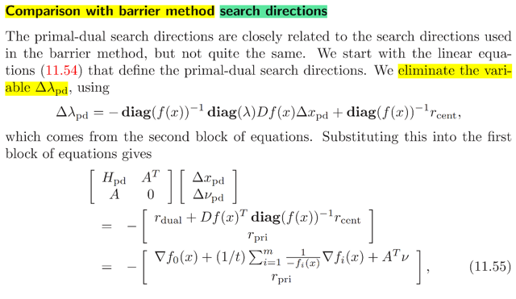</kbd>

<kbd>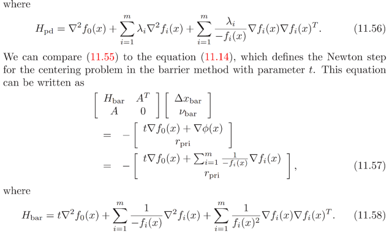</kbd>

<kbd>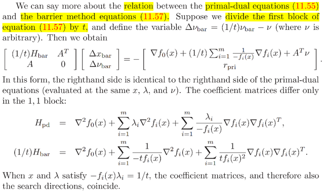</kbd>

> [!NOTE]
> -diag(λ) Df(x) Δxpd - diag(f(x)) Δλpd = - r_cent 
>
> ⇔ -diag(λ) Df(x) Δxpd + r_cent = diag(f(x)) Δλpd
>
> ⇔ diag(f(x))_inv [ -diag(λ) Df(x) Δxpd + r_cent ] = Δλpd
>
> ⇔ - diag(f(x))_inv diag(λ) Df(x) Δxpd + diag(f(x))_inv r_cent  = Δλpd
>
> Thế vào block đầu tiên, ý là thế vào phương trình đầu tiên:
>
> [ ∇^2f0(x) + Σ λi ∇^2 fi(x) ] Δxpd + Df(x)T Δλpd + AT Δvpd = - r_dual
>
> ⇔ [ ∇^2f0(x) + Σ λi ∇^2 fi(x) ] Δxpd + Df(x)T [- diag(f(x))_inv diag(λ) Df(x) Δxpd + diag(f(x))_inv r_cent ] + AT Δv = - r_dual
>
> ⇔ [ ∇^2f0(x) + Σ λi ∇^2 fi(x) ] Δxpd - Df(x)T diag(f(x))_inv diag(λ) Df(x) Δxpd + Df(x)T diag(f(x))_inv r_cent  + AT Δv = - r_dual
>
> ⇔ [ ∇^2f0(x) + Σ λi ∇^2 fi(x)  - Df(x)T diag(f(x))_inv diag(λ) Df(x) ] Δxpd + AT Δvpd = - r_dual - Df(x)T diag(f(x))_inv r_cent
>
> ⇔ [ ∇^2f0(x) + Σ λi ∇^2 fi(x)  - Df(x)T diag(f(x))_inv diag(λ) Df(x) ] Δxpd + AT Δvpd = - [ r_dual + Df(x)T diag(f(x))_inv r_cent ]
>
> ====
>
>  - [ r_dual + Df(x)T diag(f(x))_inv r_cent ]
>
> Thay r_dual = ∇f0(x) + Df(x)Tλ + ATv , r_cent = - diag(λ) f(x) - (1/t)1
>
> vế phải sẽ bằng  
>
> - [ ∇f0(x) + Df(x)Tλ + ATv + Df(x)T diag(f(x))_inv [- diag(λ) f(x) - (1/t)1] ]
>
> = - ∇f0(x) - Df(x)Tλ - ATv - Df(x)T diag(f(x))_inv [- diag(λ) f(x) - (1/t)1] 
>
> = - ∇f0(x) - Df(x)Tλ - ATv + Df(x)T diag(f(x))_inv diag(λ) f(x) + Df(x)T diag(f(x))_inv(1/t)1  (**)
>
> *Xét - Df(x)Tλ = - Σi λi ∇fi(x) 
>
> *Xét Df(x)T diag(f(x))_inv diag(λ) f(x) 
>
> Đặt U = Df(x)T diag(f(x))_inv diag(λ), nó = Df(x)T diag[λ1 / f1(x), λ2 / f2(x), ... ]
>
> Cột i của U sẽ là [λi / fi(x)] ∇fi(x) 
>
> ⇨ U f(x) = Σi [λi / fi(x)] ∇fi(x) fi(x) = Σi λi ∇fi(x) 
>
> *Xét Df(x)T diag(f(x))_inv (1/t)1
>
> = U (1/t)1 = Σi [λi / fi(x)] ∇fi(x) (1/t)1
>
> = (1/t) Σi [λi / fi(x)] ∇fi(x) 
>
> Vậy (**) = - ∇f0(x) - Σi λi ∇fi(x) - ATv + Σi λi ∇fi(x) + (1/t) Σi [λi / fi(x)] ∇fi(x) 
>
> = - ∇f0(x) - ATv + (1/t) Σi [λi / fi(x)] ∇fi(x) 
>
> = - ∇f0(x) - ATv - (1/t) Σi [λi / - fi(x)] ∇fi(x)
>
> = - [∇f0(x) + ATv + (1/t) Σi [λi / - fi(x)] ∇fi(x)] 
>
> ====
>
> Equation 3rd giữ nguyên: A Δxpd + 0 Δvpd = r_pri
>
> Thì khi đó ta có, với việc đặt 
>
> Hpd = [ ∇^2f0(x) + Σ λi ∇^2 fi(x) - Df(x)T diag(f(x))_inv diag(λ) Df(x) ], 
>
> Tìm cách thu gọn Df(x)T diag(f(x))_inv diag(λ) Df(x) (*)
>
> Xét diag(f(x))_inv diag(λ) = diag[λ1/f1(x),...λn/fn(x)]: vì sao:
>
> a) Inverse của diag(f1(x), f2(x),...) = diag(1/f1(x), 1/f2(x), ...)
>
> b) Cột 1 của matrix kết quả sẽ là linear combination của các cột của diag(f(x)) với coefficients là cột một của diag(λ) và nó 
> chỉ là λ1 ⇨ cột 1 của matrix kết quả là [λ1f1(x), 0, ...0]. Tương tự cột 2 của matrix kết quả là [0, λ2f2(x), 0 ...0 ] 
>
> = [ ∇^2f0(x) + Σ λi ∇^2 fi(x)  - Df(x)T diag(λ1/f1(x),...λn/fn(x)) Df(x) ], 
>
> Xét Df(x)T diag(λ1/f1(x),...λn/fn(x)) gọi là matrix U, cột 1 của matrix U, là linear combination của các cột của Df(x)T
> mà chúng là ∇f1(x), ∇f2(x), ....với coefficient là cột 1 của diag(λ1/f1(x),...λn/fn(x)), tức [λ1/f1(x), 0, ...0]
> nên nó sẽ ra [λ1/f1(x)]∇f1(x). Tương tự cột 2 của matrix U sẽ là [λ2/f2(x)]∇f2(x)...
>
> Rồi matrix U này nhân tiếp với Df(x), cho ra V thì ta sẽ nhìn theo góc nhìn khác; đó là tổng của các rank 1 matrix:
>
> Σi [cột ith của U x hàng ith của Df(x)]
>
> = Σi [λi/fi(x)] ∇fi(x) ∇fi(x)T
>
> Vậy [ ∇^2f0(x) + Σ λi ∇^2 fi(x)  - Df(x)T diag(λ1/f1(x),...λn/fn(x)) Df(x) ]
>
> Hpd) = ∇^2f0(x) + Σ λi ∇^2 fi(x) + Σi [λi / -fi(x)] ∇fi(x) ∇fi(x)T  ĐÂY LÀ KẾT QUẢ 11.56
>
> Từ đó ta có hệ:
>
> [Hpd, At; A, 0] [Δxpd,  Δvpd]T = - [ ∇f0(x) + ATv + (1/t) Σi [λi / - fi(x)] ∇fi(x), r_pri] (11.55)
>
> ====
>
> Thế thì, đại khái là việc tìm Newton step trong bài toán  centering problem với t sẽ được thể hiện bởi hệ: 11.14
>
> [t∇^2f0(x) + ∇^2Φ(x),  AT; A, 0] [Δxn vnt] = - [t ∇f0(x) + ∇Φ(x), r_pri] 
>
> thể hiện bởi:
>
> [Hbar, AT; A, 0] [Δxn, vnt]T = - [t ∇f0(x) + ∇Φ(x), r_pri] 
>
> [Hbar, AT; A, 0] [Δxn, vnt]T = - [t ∇f0(x) + Σi [1/fi(x)] ∇fi(x)T, r_pri] (11.57)
>
> Hbar = t∇^2f0(x) + Σi [1/-fi(x)] ∇^2fi(x) + Σi [1/fi(x)^2] ∇fi(x) ∇fi(x)T
>
> (một lưu ý nhỏ là r_pri là để thể hiện cả bài toán feasible Newton step (khi r_pri = 0) hoặc infeasible Newton step khi r_pri ≠ 0)
>
> Vậy thì có thể thấy (11.55), (11.57) khá giống nhau với Hpd và Hbar đều là positive linear combination của các matrix
>
> ∇^2f0(x), các ∇fi(x) ∇fi(x)T, các ∇^2fi(x)
>
> KHÚC SAU ĐẠI KHÁI LÀ NÓI THÊM VỀ QUAN HỆ  / SỰ TƯƠNG ĐỒNG GIỮA HAI PHƯƠNG PHÁP 
>
> CÓ THỂ QUAY LẠI SAU
>
> QUAY LẠI SAU

 

<kbd>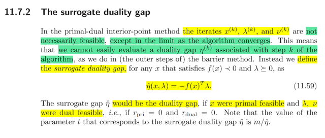</kbd>

> [!NOTE]
> đại khái là trong barrier method có một phần mà mình đã thấy
> rằng khi ta có central point x*(t), tức có nghĩa là solution của bài
> toán centering minimize tf0(x0 + Φ(x) subject to Ax = b (là bài toán
> mà mình dùng  hàm log barrier function để approx cho Indicator I_
> function), thì có một thực tế là nếu mà mình chọn giá trị của λ*(t),
> và v*(t):
>
> λ*(t) = -1/t fi(x*(t)) ⇨ tλ*(t) = -1/fi(x*(t)) và v*(t) = v^/t)\
>
> thì hóa ra ta sẽ thấy rằng việc x*(t) thỏa optimality condition của
> bài toán centering thì với giá trị được chọn như trên của λ*(t) và
> v*(t) thì nó cũng thỏa optimality condition của bài toán gốc.
>
> Dẫn tới kết luận là với giá trị đó của λ*(t) và v*(t) thì x*(t) là
> minimizer của  L(x, λ*(t), v*(t) và do đó chứng tỏ g(λ*(t), v*(t))
> không infinite ⇨ λ*(t) và v*(t) là DUAL FEASIBLE.
>
> Để rồi từ đó ta có thể có được f0(x*(t)) - g(λ*(t), v*(t)) = ... VÀ ĐÂY
> CHÍNH LÀ DIFFERENCE GIỮA f0(primal feasible point) và g(dual
> feasible point) VÀ GỌI LÀ DUALITY GAP
>
> Thế thì, từ đó có thể hiểu ở đây nói rằng vì trong quá trình chạy
> thuật toán giải bài toán với phương pháp primal dual interior point
> thì không phải lúc nào x(k), λ(k) v(k) cũng feasible giống như x*(t),
> λ*(t), v*(t) thành ra ta ko thể tính / ko thể có duality gap
>
> Do đó người ta mới đặt ra cái gọi là diality gap THAY THẾ
> (SURROGATE)
>
> rằng với x thỏa fi(x) < 0, λ thỏa λ ≽ 0 thì surrogate duality gap
> được tính  bởi  η^(x, λ ) = - f(x)Tλ
>
> Vẫn còn câu hỏi chưa hiểu: Tại sao lại là - f(x)Tλ và tại sao khi 
> giá trị của t ứng với surrogate duality gap η^ lại là m / η^

 

<kbd>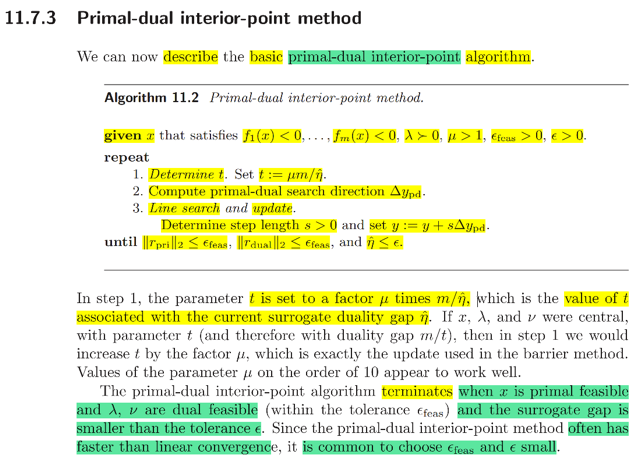</kbd>

> [!NOTE]
> Thuật toán của primal-dual interior point method:
>
> Đại khái là lặp lại quy trình sau:
>
> 1) Xác định t: t = μ m / η^
>
> 2) Tính toán primal - dual search direction Δy_pd
>
> 3) Linea search: tính step size s & update y = y + s Δy_pd
>
> Dừng khi x(k), λ(k), v(k) đều là feasible và residual r_pri
> r_dual đều có norm 2 nhỏ hơn mức nào đó cũng như là surrogate
> duality gap η^ cũng nhỏ hơn mức nào đó

 

<kbd>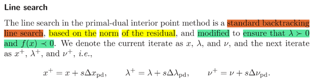</kbd>

<kbd>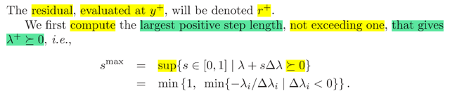</kbd>

<kbd>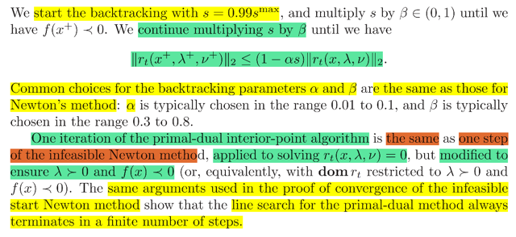</kbd>

> [!NOTE]
> Nói về line search
>
> line search là sao, có thể ôn lại : Đại khái là khi ta đã có hướng
> (gradient, hoặc ở đây là newton step Δy_pd, gồm 3 thành phần
> Δx_pd, Δ λ_pd và Δv_pd, thì ta cần xác định s: Để update: x+ = x + s
> Δx_pd, λ+ = λ + s Δλ_pd,..
>
> Thế thì trong exact line search, ta sẽ tìm s sao cho hàm f0 xuống thấp
> nhất còn trong back tracking thì bắt đầu với s = 1 và scale xuống dần
> cho đến khi thỏa điều kiện.
>
> Tuy nhiên cả hai đều phải thỏa là x+, và λ+ đều feasible.
>
> Do đó:
>
> Đầu tiên ta ta muốn tìm s lớn nhất mà λ vẫn dual feasible: λ ≽ 0:
>
> Điều này đồng nghĩa mọi λi+ = λi + s Δλi đều ≥ 0.
>
> Thế thì, nếu Δλi > 0 rồi, thì vì λi luôn > 0 sẵn rồi nên s sao cũng được
> (vì s đã luôn ∈ (0,1). Ngược lại nếu Δλi < 0 thì ta cần điều kiện s phải
> sao cho:
>
> λi + s Δλi > 0 ⇔ s < -λi / Δλi ∀ i
>
> Có nghĩa là s phải nhỏ hơn thằng nhỏ nhất của -λi / Δλi với Δλi < 0
>
> Bên cạnh đó, s cũng phải ≤ 1, thành ra điều kiện trở thành s ≤ min 1,
> min (-λi / Δλi) với Δλi < 0.
>
> Khi đã tìm ra thằng s_max là s lớn nhất mà khiến λ thỏa dual feasible
> thì ta sẽ scale nó dần xuống để tìm thằng lớn nhất mà vẫn khiến x 
> thỏa primal feasible: f(x+) ≺ 0
>
> TẠI SAO LẠI TIẾP TỤC MULTIPLY S VỚI β CHO ĐẾN KHI THỎA
> ||rt(x+, λ+, v+)|| ≤ (1 - αs) ||rt(x, λ, v||
>
> Đơn giản là vì đây là điều kiện stop của backtracking line search.
>
> Nó đảm bảo rằng độ giảm của norm residual khi step (thực hiện
> bước cập nhật theo direction) nhiều hơn độ giảm của residual 
> norm khi được scale xuống tuyến tính bởi factor α
>
> Vì sao, stopping condition cho thấy:
>
> ||rt(x+, λ+, v+)|| ≤ (1 - αs) ||rt(x, λ, v||
>
> ⇔ ||rt(x+, λ+, v+)|| ≤ ||rt(x, λ, v|| - αs||rt(x, λ, v|| 
>
> ⇔ ||rt(x, λ, v|| - ||rt(x+, λ+, v+)|| ≥ αs||rt(x, λ, v|| 
>
> Vế phải chính là Δ||rt||, độ gỉam của residual norm, còn vế trái
> chính là mức giảm của residual norm kh được scale tuyến tính
> bởi α (scale tuyến tính là sao, ví dụ là hàm f(x) = 0.5t.m với α = 0.5
> m là khối lượng ban đầu, thì với giá trị của t thì m được scale xuống
> tuyến tính theo t bởi factor 0.5, nên t càng lớn thì scale xuống càng
> nhiều nhưng sẽ là tuyến tính)

 

<kbd>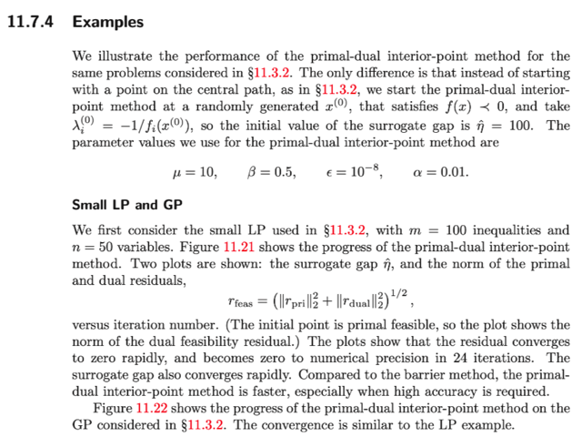</kbd>

> [!NOTE]
> QUAY LẠI SAU

 

<kbd>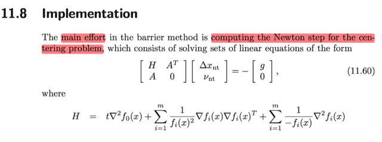</kbd>

<kbd>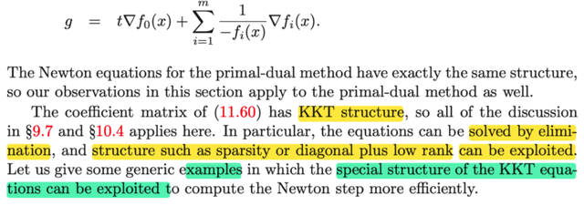</kbd>

> [!NOTE]
> Đại khái là, cái bước tốn công nhất của barrier method là tính cái
> Newton step, và như đã biết nó chính là việc giải hệ KKT system:
>
> [H AT; A 0] [Δx_nt, vnt] = -[g, 0] với H, g như sách (mình đã hiểu ở đâu
> ra có công thức này rồi khỏi nó lại, lập luận là từ việc ta bậc hai hóa
> hàm objective tf0(x) + Φ(x) khiến optimality condition trở thành hệ tuyến
> tính, hay cũng có thể nói theo kiểu là ta lấy cái optimality condition và
> tuyến tính hóa theo x để trở thành hệ tuyến tính)
>
> Thế thì như phần implementation ở các chap 9,10 đã biết, ta có thể
> dựa vào đặc điểm của từng bài toán khác nhau từ đó có thể khai kiến
> trúc đặc thù  của matrix

 

<kbd>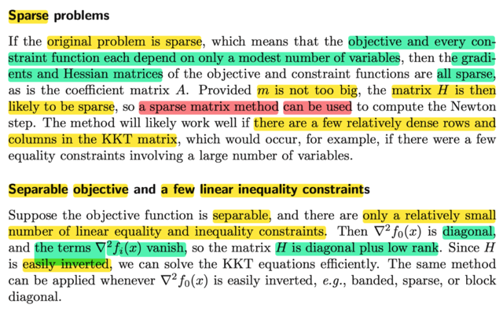</kbd>

> [!NOTE]
> CHƯA HIỂU LẮM

 

<kbd>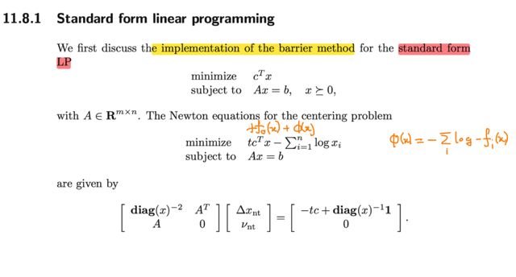</kbd>

<kbd>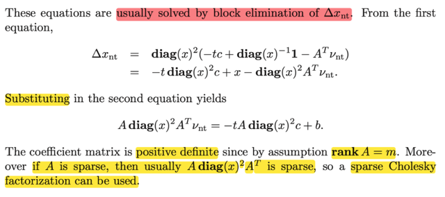</kbd>

> [!NOTE]
> Rồi, gặp lại bài toán standard form LP: minimize f0(x) = cTx subject
> to  Ax = b, x ≽ 0. Với A m, n và full rank
>
> Như đã biết, theo log barrier method, ta sẽ xây dựng centering
> problem với các lập luận đại khái như sau:
>
> Dùng indicator function đưa inequality constraint vào objective:
>
> f(x) = f0(x) + Σi I_(fi(x))
>
> Sau đó , để mang lại tính khả vi ta dùng xấp xỉ của indicator function:
>
> f(x) = f0(x) + Σi I^_(fi(x)) và cụ thể là dùng hàm log barrier:
>
> = f0(x) - Σi (1/t) log (-fi(x))
>
> = f0(x) - (1/t) Σi log (-fi(x))
>
> từ đó ta có bài toán equivalent lần nữa: minimize tf0(x) - Σi log(-fi(x))
> và đây là tf0(x) + Φ(x), dĩ nhiên còn constraint Ax = b, đây chính là
> centering problem
>
> Để nhớ về hiệu quả của Φ(x) ta nhớ rằng mục đích chính của
> indicator function là để khi fi(x) < 0, tức thỏa constraint thì nó sẽ bằng
> 0, ngược lại nếu vi phạm constraint thì Φ(x) sẽ rất lớn.
>
> Nhớ lại đồ thị của hàm log(x) và e^x sẽ đối xứng nhau qua đường
> thẳng y = x (cái vụ này là sao? là vì y = f(x) = e^x  ⇔ log y = finv(y) =
> x Nên bằng cách đổi vai trò của x và y cho nhau thì từ đồ thị của e^x
> ta sẽ có đồ thị của log x, đại khái là vậy) Nên chỉ cần nhớ đồ thị hàm
> e^x có dạng khi x → -inf thì e^x → 0 và x → +inf thì e^x → inf. Hoặc
> nhớ đường cong lãi suất kép khi ban đầu tăng chậm đến lúc nào đó
> thì vọt lên. Thì đối xứng với y = x sẽ là hàm y = log x, nên x → 0 →
> log x → -inf và x → inf ⇨ log x → inf.
>
> Vậy fi(x) → 0- thì - fi(x) → 0+ ⇨ - log -fi(x) → inf
>
> fi(x) → -inf thì -fi(x) → +inf ⇨ - log -fi(x) → -inf
>
> Vừa rồi đại khái là ôn nhanh các bước lập luận để xây dựng
> centering problem: Vậy với bài toán LP fi(x) = -x (constraint là x ≽ 0 ⇔
> -x ⪯ 0 ⇔ -xi ≤ 0 ∀i )
>
> f(x) = tcTx - Σi log(-(-xi)) = tcTx - Σi log(xi) constraint Ax = b.
>
> Rồi, xem thử KKT system để giải Newton step:
>
> Mình sẽ lập luận theo cách interpretation thứ 2 của Newton method:
> linearization của gradient.
>
> Optimality condition:
>
> ∇f(x) + ATv = 0. Tính ∇f(x):
>
> df(x) = f(x + dx) - f(x) = tcT(x + dx) - Σi log(xi + dxi) - [tcTx - Σi log(xi)]
>
> = tcTx + cTdx - tcTx - Σi log(xi + dxi) + Σi log(xi)
>
> = tcTdx - Σi [ log(xi + dxi) - log(xi) ]
>
> = tcTdx - Σi log[ (xi + dxi)/xi ]
>
> = tcTdx - Σi log(1 + dxi/xi)
>
> = tcTdx - Σi (dxi/xi)    | log(1 + ε) ≈ ε 
>
> = tcTdx - (1/x)Tdx
>
> = tcTdx - (diag(x)inv1)Tdx | (1/x) = diag(x)inv1
>
> = (tc - diag(x)inv)Tdx ⇨ ∇f(x) = tc - diag(x)inv1
>
> Vậy ∇f(x) + ATv = tc - diag(x)inv1 + ATv
>
> Để có Newton step ta sẽ linearization theo x của g(x) = ∇f(x) + ATv:
>
> g(x + Δx) = ∇f(x + Δx) + ATv ≈ ∇f(x) + ATv + ∇g(x)TΔx 
>
> = ∇f(x) + ATv + ∇^2f(x)TΔx 
>
> Từ đó ta sẽ có equation để giải Newton step:
>
> ∇f(x) + ATv + ∇^2f(x)TΔx = 0
>
> ⇔ ∇^2f(x)TΔx + ATv = -∇f(x) (1)
>
> Cùng với primal feasible: Ax = b và feasible step A(x + Δx) = b
>
> ⇨ A Δx = 0 (2)
>
> (1)(2) trở thành [∇^2f(x)T AT; A, 0] [Δx, v] = - [∇f(x), 0]
>
> ∇^2f(x): Có hai cách làm: Tìm bilinear form của f hoặc gradient
> của gradient ∇f(x)
>
> d ∇f(x) = tc - diag(x+dx)inv1 + ATv - tc + diag(x)inv1 - ATv
>
> = - diag(x+dx)inv1 + diag(x)inv1 
>
> = [- diag(x+dx)inv + diag(x)inv]1 
>
> = [- diag(x+dx)inv + diag(x)inv]1
>
> = diag[-1/(x1+dx1) + 1/x1,... -1/(xn+dxn) + 1/xn]1 
>
> = diag[(-x1+x1+dx1)/x1(x1+dx1) + ..]1 
>
> = diag[dx1/x1(x1+dx1) + ..]1 
>
> = diag[dx/x1(x1+dx1) + ..]1
>
> = diag[dx/(x1x1+x1dx1) + ..]1
>
> ≈ diag[dx/(x1x1) + ..]1
>
> = diag[1/x1^2 + ..]dx
>
> = diag(x)^2_inv dx ⇨ Jacobian của gradient là diag(x)^2_inv
>
> và cũng là Hessian của f
>
> Vậy với ∇f(x) = tc - diag(x)inv1,  ∇^2f(x) = diag(x)^2_inv
>
> (1) ⇔ diag(x)^2_invTΔx + ATv = - tc + diag(x)inv1
>
> (2) ⇔ A Δx = 0
>
> Kết hợp thành hệ:
>
> [diag(x)^2_inv,  AT; A, 0] [Δx_nt, vnt] = [- tc + diag(x)inv1, 0]
>
> Để giải hệ này thì từ (1) rút ra Δx = diag(x)^2[- tc + diag(x)inv1 - ATv]
>
> = - diag(x)^2tc + diag(x)^2diag(x)inv1 - diag(x)^2ATv
>
> = - tdiag(x)^2c + diag(x)1 - diag(x)^2ATv
>
> = - tdiag(x)^2c + x - diag(x)^2ATv
>
> Thế vào (2):
>
> A[- tdiag(x)^2c + x - diag(x)^2ATv] = 0
>
> ⇔ - Atdiag(x)^2c + Ax - Adiag(x)^2ATv = 0
>
> ⇔ - Atdiag(x)^2c + Ax = Adiag(x)^2ATv
>
> ⇔ - Atdiag(x)^2c + Ax = Adiag(x)^2ATv
>
> ⇔ Adiag(x)^2ATv = - Atdiag(x)^2c + Ax
>
> ⇔ Adiag(x)^2ATv = - Atdiag(x)^2c + Ax
>
> Tới đây giải ra v, thì cơ bản đây là giải hệ Ax = b, với A, coefficient
> matrix là Adiag(x)^2AT ≽ 0 do A là matrix (m, n) có rank m ⇨ full row rank
> Vì sao?
>
> Để xét tính positive semi definite, theo mit 1806 ta xét quadratic form, 
> hoặc dấu của eigenvalues, các det của leading principal...
>
> Xét quadratic form uTAMATu với M = diag(x)^2
>
> Đặt y = ATu ⇨ ta có yTMy = Σ yi^2xi^2 luôn ≥ 0 ⇨ uTAMATu là positive
> semi definite matrix.
>
> Rồi cộng thêm A full row rank ⇔ AT full column rank, khi đó ATu = 0 chỉ
> xảy ra khi u = 0, vì AT full column rank, nên mọi column đều độc lập,
> không có free column ⇨ không có column nào là linear combination các
> column còn lại ⇨ cách duy nhất để linear combine các column thành 0
> là mọi coefficient đều bằng 0. Hoặc giải thích cách khác, vì AT full column
> rank có rank = m ⇨ dim column space và row space = m, xét rowspace
> của AT (tức là column space của A), với A là matrix m,n thì AT là matrix 
> (n, m) nên row-space là subspace của R^m, mà rank m có nghĩa là 
> rowspace là toàn bộ R^m, nên theo Rank - Nullity theorem, dim nullspace
> + dim rowspace = m ⇨ dim nullspace = 0 ⇨ chỉ có zero vector trong 
> nullspace
>
> Vậy với việc y = ATu chỉ bằng 0 khi u = 0, mà yTMy chỉ bằng 0 khi y = 0
> suy ra uTAMATu chỉ bằng 0 khi u = 0, còn u khác 0 thì uTAMATu luôn
> dương. Từ đó suy ra positive definite
>
> Vậy thì ta nhớ trong Appendix nói rằng để giải hệ Ax = b, ta sẽ factor
> A thành tích các matrix có cấu trúc khiến cho việc giải hệ "nhẹ" hơn, gọi
> là factor-solver. Kiểu như factor A thành BCDE từ đó giải BCDEx = b
> thì đầu tiên giải Bt = b, sau đó giải Cu = t, rồi giải Dv = u, rồi giải Ex = v
>
> Thế thì nhờ tính positive definite của matrix coefficient ta có thể dùng
> Cholesky factorization cho bước factoring. Chưa kể matrix này sẽ còn 
> có tính chất sparse do đó ta sẽ thực hiện sparse Cholesky factorization

 

<kbd>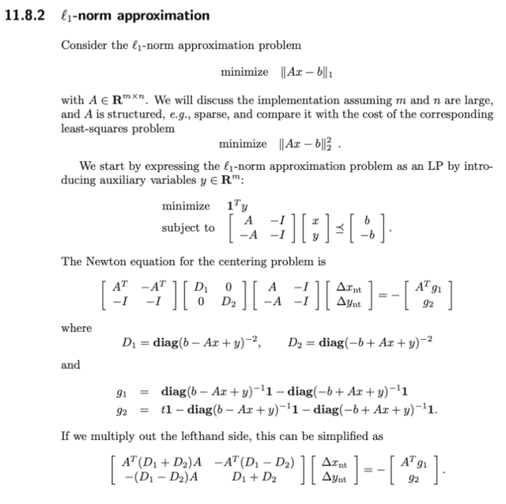</kbd>

<kbd>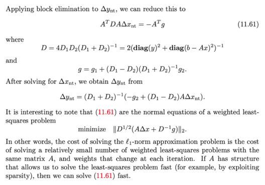</kbd>

> [!NOTE]
> SÁCH (XEM SAU)

 

<kbd>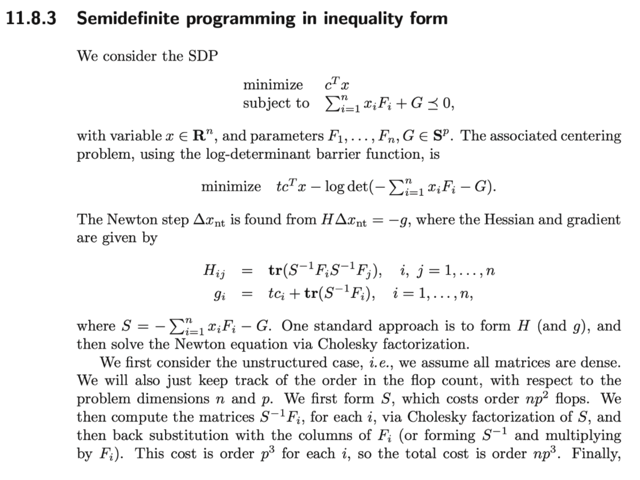</kbd>

<kbd>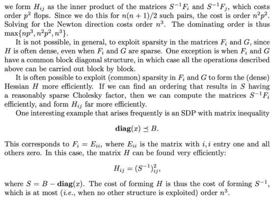</kbd>

> [!NOTE]
> SÁCH (XEM SAU)

 

