# Chap 9.1 - 9.4

📊 **Progress:** `34` Notes | `68` Screenshots

---

## Chap 9.1 - 9.4

 

<kbd>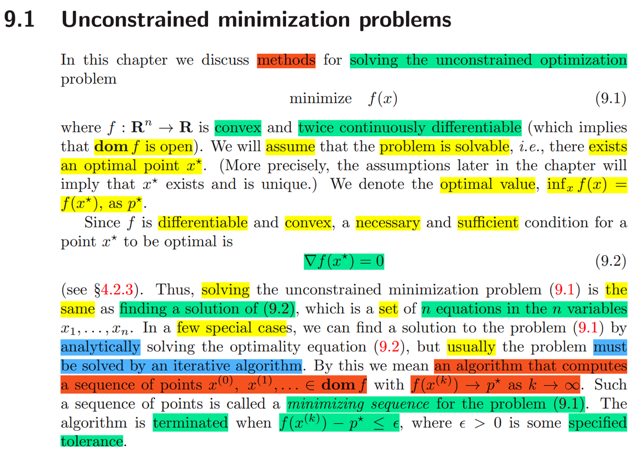</kbd>

> [!NOTE]
> Qua phần 3 - Algorithms TA MỚI CHÍNH THỨC ĐƯỢC HỌC CÁC
> GIẢI CÁC BÀI TOÁN OPTIMIZATION.
>
> Đầu tiên là bài toán UNCONSTRAINED optimization. Như đã biết, là
> khi ta có bài toán chỉ có objective f0(x). Với f0 convex và khả vi hai lần
> (twice differentiable) đồng nghĩa nó tồn tại Hessian ở mọi điểm trong
> domain. Do đó ta có bài toán convex optimization.
>
> Thế thì, trong phần OPTIMALITY CONDITION, ta đã học, nếu là có
> constraint, thì optimality condition là khi ta có điểm mà tại đó ta có
> support hyperplane của O (attainable optimal value  set) mà gradient
> vector tại điểm tiếp xúc x* sẽ là (outer) normal vector  để đại khái là từ
> x* khi di chuyển theo hướng nào trong O cũng  làm tăng f0
>
> Lập luận vầy: phương trình hyperplane: aTx = b. Đi qua x* ⇨ b = aTx*
> ⇨ phương trình hyperplane đi qua x*: aTx = aTx*
>
> ⇨ phương trình half-space bởi hyperplane: aTx ≥ aTx*
>
> ⇨ Nếu mọi điểm x trong feasible set đều nằm bên một trong
> half-space define bởi hyperplane: ∇f(x*)x ≥ ∇f(x*)Tx*
>
> ⇔ ∇f(x*)(x - x*) ≥ 0
>
> Thì với unconstraint problem thì điều kiện trở thành: Gradient vanish:
>
> ∇f(x*) = 0   Thì đại khái là trong một số trường hợp ta có thể giải
> phương trình ∇f(x) = 0 để ra analytic solution của bài toán tối ưu
>
> Nhưng phần lớn ta phải giải bằng thuật toán iterative, tìm x1,x2.. sao
> cho khi k -> infinity thì f(xk) -> f(x*) = p*
>
> Và sẽ đến lúc ta dừng dựa trên một tiêu chuẩn nào đó, ví dụ như f(xk)
> chỉ còn cách f(x*) một khoảng ε nhỏ nào đó. CŨng chính là xk gọi là
> ε-suboptimal
>
> 9. UNCONSTRAINED PROBLEM
>
> 9.1 UNCONSTRANTED MINIMIZATION PROBLEM

 

<kbd>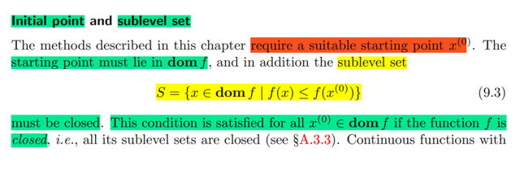</kbd>

<kbd>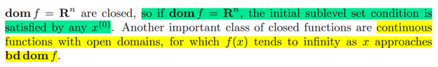</kbd>

> [!NOTE]
> Đại khái nói về điều kiện để các phương pháp nói ở chương này khả
> thi đó là:
>
> 1) starting point x(0) phải nằm trong dom f
>
> 2) sublevel set sau đây: x ∈ dom f: f(x) ≤ f(x0) phải là set đóng
> (closed)
>
> Vậy thì đại khái là phần A.3.3 có nói về định nghĩa hàm f khi nào gọi
> là closed: Đó là khi với mọi α thì α-sublevel set đều là set đóng.
>
> Và nếu xét hàm liên tục R^n -> R, thì có 2 trường hợp mà f là hàm
> đóng: một dạng là khi domain của nó đóng. Và hai là khi domain
> mở nhưng khi x tiến tới biên của domain thì f(x) tiến tới infinity
> (đại khái là vậy)
>
> Vậy thì ở đây, nếu xét hàm liên tục có domain là toàn bộ R^n, thì  vì
> R^n là set đóng (cái này tạm hiểu giống như vì R^n chứa mọi điểm
> nên nó được coi như closed) nên nó thỏa điều kiện nói trên.
>
> Và do đó nó là hàm đóng, và theo định nghĩa ta có kết luận rằng mọi
> sub-level set của f đều là set đóng. Và do đó sub-level set S ( = x ∈
> dom f: f(x) ≤ f(x0) ) cũng đều là set đóng.
>
> Nói tóm lại ý nói nếu ta đang xét hàm R^n -> R liên tục có domain
> đóng (hoặc domain mở nhưng khi lim x-> boundary dom f f(x) =
> infinity)  thì là ta đã thỏa điều kiện trên của starting point x0 rồi.

**🔗 See also:** [linked note](./appendix_a.md#node-tgwja7h)

 

<kbd>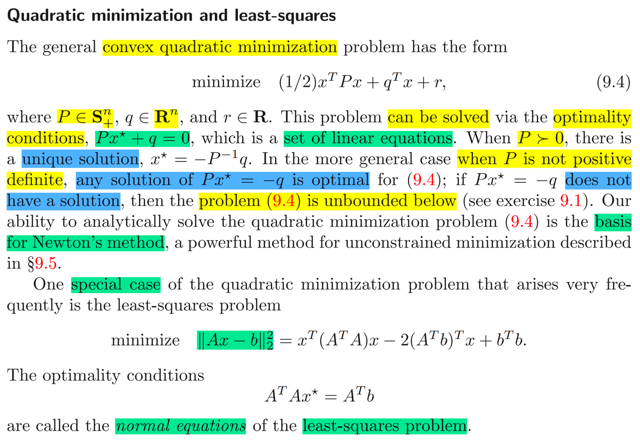</kbd>

> [!NOTE]
> Một ví dụ của bài toán unconstrained mà đã nói đi nói lại nhiều lần 
> là quadratic minimization f0(x) = (1/2)xTPx + qTx + r
>
> Thì bài toán này, đại ý là, khi xét optimality condition ∇f(x*) = 0
> thì ta sẽ có Px* + q = 0 (nhờ MIT 18s096 không khó gì để tìm ∇f
> ở đây nữa)
>
> Thì như vậy optimal của bài toán này là nghiệm của hệ phương trình
> tuyến tính Px* = -q
>
> Khi đó nhờ kiến thức MIT 18.06 ta không lạ gì nữa.
>
> 1) Nếu q (cũng là -q) ∈ C(P) (hay R(P)) thì hệ có nghiệm. Trong đó.
>
> 1a) Nếu N(P) ≠ 0, tức có non-zero nullspace basis thì: solution sẽ
> có dạng: x = x0 + Fz (với F là matrix tạo bởi các cột là nullspace của
> P basis). 
>
> 1b) Nếu N(P) = 0, khi đó chính là P full rank (vì P vốn dĩ đã ≽ 0),
> và cũng chính là P ≻ 0. Khi đó hệ có nghiệm duy nhất x0 = Pinv(-q)
>
> 2) Nếu q nằm ngoài C(P) thì hệ vô nghiệm. Và đây ứng với việc
> bài toán optimization unbounded below.
>
> Thế thì gs có nhắc đến việc cách giải này đối với bài toán Quadratic
> convex optimization là cơ sở của Newton's method mà mình sẽ học
> sắp tới.
>
> Một ví dụ (cụ thể) của bài toán này là minimize ||Ax - b||^2
>
> Đây dĩ nhiên là quadratic function: (Ax - b)T(Ax - b) 
>
> = (xTAT - bT)(Ax - b) = xTATAx - bTAx - xTATb + bTb
>
> = xTATAx - 2bTAx + bTb, ATA đóng vai P, là ≽ 0 matrix (dễ chứng
> minh bằng cách xét quadratic form).
>
> Và một ý quan trọng ở đây đó là:
>
> VIỆC ÁP DỤNG OPTIMALITY CONDITION ĐỂ GIẢI BÀI TOÁN NÀY
> SẼ DẪN ĐẾN KẾT QUẢ NỔI TIẾNG ĐÓ LÀ: NORMAL EQUATION
> MÀ TA ĐÃ GẶP NHIỀU LẦN TRONG CÁC LỚP 1806 VÀ STASTISTIC
>
> (ATA)x* = ATb
>
> Và ta có thể giải thích nó theo góc nhìn hình học là chiếu b lên C(A)

 

<kbd>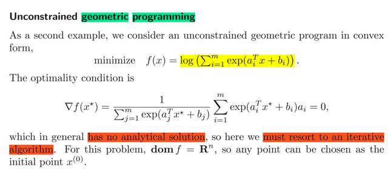</kbd>

> [!NOTE]
> Còn ví dụ này, bài toán unconstrained geometric programming
> (cũng đã từng gặp và triển khai ∇f)
>
> Thì đại khái là ta KHÔNG THỂ CÓ ANALYTIC SOLUTION.
>
> Mà phải giải THÔNG QUA ITERATIVE ALGORITHM.

 

<kbd>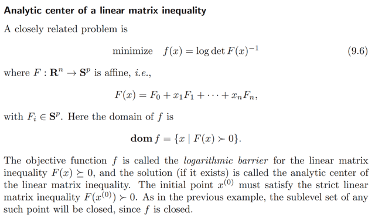</kbd>

<kbd>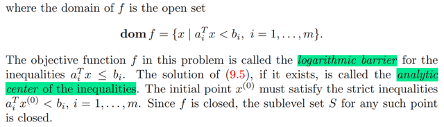</kbd>

<kbd>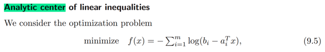</kbd>

> [!NOTE]
> Vài ví dụ khác. QUAY LẠI SAU

 

<kbd>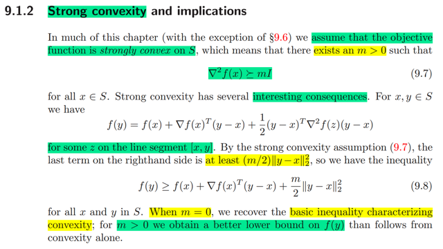</kbd>

> [!NOTE]
> đại khái là phần này ta sẽ xét trường hợp mà objective function
> không chỉ convex mà còn STRONGLY CONVEX. Lúc này nó sẽ
> có một số tính chất khá thú vị và hữu ích,
>
> Đầu tiên, theo định nghĩa của STRONGLY convex có nghĩa là tồn
> tại một số m dương sao cho mọi eigenvalue đều lớn hơn hoặc
> bằng m. Nó khác STRICTLY convex ở chỗ, strictly convex chỉ yêu
> cầu eigenvalue dương, mà điều này cho phép khả năng rằng tuy 
> dương nhưng vô cùng nhỏ. Giống như: Strong và strict convex đều
> yêu cầu mọi điểm đều có độ cong dương nhưng strong yêu cầu
> độ cong phải có giới hạn dưới nào đó, nôm na phải là có giá trị
> dương m nào đó trở lên, trong khi strict thì tuy dương nhưng có thể
> là số vô cùng nhỏ gần 0 cũng được. Nên strong thì sẽ strict nhưng
> ngược lại chưa chắc.
>
>
> Và cái này tương đương tồn tại m dương sao cho ∇^2f ≽ m*I 
>
> Sau đó ta viện dùng một kiến thức:
>
> f(y) =  f(x) + ∇f(x)T(y - x) + (1/2)(y - x)∇^2f(z)(y - x) với z là một 
> mixture nào đó của x, y: 
>
> CHỨNG MINH SAU
>
> Vậy thì đại khái là nhờ vào việc strictly function có: ∇^2f ≽ m*I
> ta có ∇^2f(z) ≥ m*I 
>
> ⇨ f(y) = f(x) + ∇f(x)T(y - x) + (1/2)(y - x)T∇^2f(z)(y - x) 
>
> ≥ f(x) + ∇f(x)T(y - x) + (1/2)(y - x)Tm(y - x)  
>
> = f(x) + ∇f(x)T(y - x) + (m/2)(y - x)T(y - x)   
>
> = f(x) + ∇f(x)T(y - x) + (m/2)||y - x||^2
>
> Vậy f(y) ≥ f(x) + ∇f(x)T(y - x) + (m/2)||y - x||^2
>
> Và ý chính là thế này:
>
> Với hàm convex, ta có first condition nói rằng:
>
> f(y) ≥  f(x) + ∇f(x)T(y - x) 
>
> MANG Ý NGHĨA LÀ TÍNH CONVEX CHO TA MỘT LOWER BOUND
> CỦA f(y)
>
> Nay với strict convex ta có:
>
> f(y) ≥ f(x) + ∇f(x)T(y - x) + (m/2)||y - x||^2  
>
> Và như vậy có nghĩa là TA CÓ MỘT LOWER BOUND TỐT HƠN
>
> f(y) =  f(x) + ∇f(x)T(y - x) + (1/2)(y - x)∇^2f(z)(y - x) với z là một 
> mixture nào đó của x, y: 
>
> CHỨNG MINH:
>
> Đặt Φ(t) = f(x + t(y-x)) = f(x + td) 
>
> Khai triển Taylor bậc 2 của Φ(x) tại t0 = 0:
>
> Φ(t) ≈ Φ(t0) + Φ'(t0)(t-t0) + (1/2) Φ''(t0)(t-t0)^2
>
> = Φ(0) + Φ'(0)t + (1/2) Φ''(0)t^2
>
> ⇨ Φ(1) ≈ Φ(0) + Φ'(0) + (1/2) Φ''(0)
>
> Φ(0) = f(x + 0d) = f(x)
>
> Φ(t) = f(x + td) ⇨ Φ'(t) = d/dt Φ(t) = d/dt f(x + td) 
>
> = d/d(x + td) f(x + td) . d/dt (x + td)
>
> = f'(x + td) . d ⇨ Φ'(0) = f'(x + 0d) . d = f'(x)(y-x)
>
> Φ''(t) = d/dt f'(x + td) . d = d d/dt f'(x + td)
>
> = d . d/d(x + td) f'(x + td) . d/dt (x + td)
>
> d . f''(x + td) . d = d^2 f''(x + td) ⇨ Φ''(0) = d^2 f''(x + td)
>
> = (y - x)^2 f''(x + td)
>
> ⇨  Φ(1) ≈ Φ(0) + Φ'(0) + (1/2) Φ''(0)
>
> ⇔ f(x + t(y - x)) ≈ f(x) + f'(x)(y - x) + (y - x)^2 f''(x + td)
>
> ⇔ f(y) ≈ f(x) + f'(x)(y - x) + (y - x)^2 f''(z) 
>
> với z = x + t(y-x) = mixture giữa x, y

 

<kbd>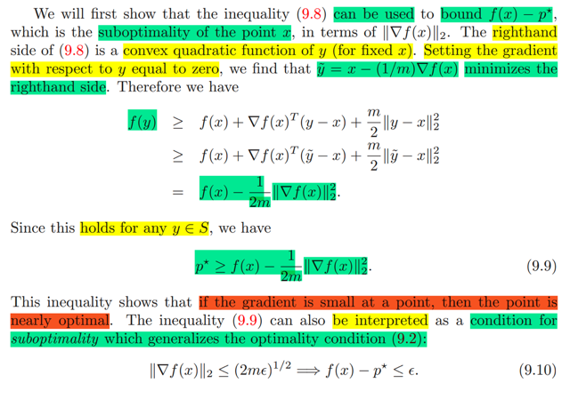</kbd>

<kbd>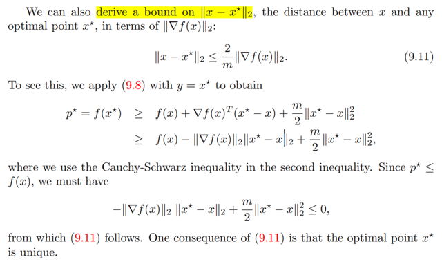</kbd>

> [!NOTE]
> đại khái là, inequality vừa rồi f(y) ≥ f(x) + ∇f(x)T(y - x) + (m/2)||y - x||^2 có thể giúp
> ta triển khai ra một công thức của chặn dưới của f(x) - p*.
>
> Mà f(x) - p* có ý nghĩa là đại khái là "mức độ gần với optimal của x" (sub-optimality
> of x). Cụ thể là vầy:
>
> Vế phải f(x) + ∇f(x)T(y - x) + (m/2)||y - x||^2, với x fixed thì nó là quadratic function
> của y. Ta sẽ tìm minimum của vế phải (tức là minimize over y, nói cách khác, là giải
> bài toán
>
> minimize y  f(x) + ∇f(x)T(y - x) + (m/2)||y - x||^2 
>
> Tất nhiên đây chỉ là bài toán unconstrained convex optimization nên optimality
> condition của nó chỉ việc tìm gradient (đối với y) và cho nó bằng 0:
>
> Và chắc cũng ko khó gì để tìm ra y~ = x - (1/m)∇f(x)
>
> Khi đó, vế phải đạt minimum value = f(x) - 1/2m ||∇f(x)||^2. 
>
> Do đó f(y) ≥ f(x) - 1/2m ||∇f(x)||^2
>
> Từ đó, vì bất đằng thức này đúng với mọi y, nên nó đúng với optimal x*, tức là: 
>
> p* ≥ f(x) - 1/2m || ∇f(x) ||^2
>
> ⇔ f(x) - p* ≤ 1/2m || ∇f(x) ||^2
>
> Và 1/2m || ∇f(x) ||^2 chính là upper bound của f(x) - p* 
>
> Đồng thời kết luận đầu tiên đó là, khi gradient ∇f(x) càng nhỏ thì upper bound của
> f(x) - p* càng nhỏ chứng tỏ x càng gần optimal
>
> Và f(x) - p* ≤ 1/2m || ∇f(x) ||^2 suy ra nếu muốn f(x) gần với p* một khoảng nhỏ hơn ε
> (gọi là x là ε-suboptimal) tức f(x) - p* ≤ ε
>
> Thì ta cần 1/2m || ∇f(x) ||^2 ≤ ε 
>
> ⇔ ||∇f(x)|| ≤ √2mε . Có nghĩa là ||∇f(x)|| ≤ √2mε có thể là "chỉ dấu" / điều kiện thể hiện
> ở gradient giúp cho x là ε-suboptimal
>
> ====
>
> Ngòài ra còn có thể xây dựng bound cho ||x - x*||.
>
> Là thế này, bắt đầu từ inequality đã triển khai:
>
> f(y) ≥ f(x) + ∇f(x)T(y - x) + (m/2)||y - x||^2
>
> Ta mới áp dụng uTv = ||u||||v||cos(u,v). 
>
> Và vì -1 ≤ cos(u,v) ≤ 1 ⇨ -||u||||v|| ≤ uTv ≤ ||u||||v||
>
> Áp dụng điều trên coi ∇f(x) là u, (y - x) là v, ta có uTv = ∇f(x)T(y - x) ≥ - ||∇f(x)|| ||y - x||
>
> ⇨ f(y) ≥ f(x) + ∇f(x)T(y - x) + (m/2)||y - x||^2 ≥ f(x) - ||∇f(x)|| ||y - x|| + (m/2) ||y - x||^2
>
> Vì cái này đúng với mọi y, nên trong đó có cả x*:
>
> ⇨ p* = f(x*) ≥ f(x) - ||∇f(x)|| ||x* - x|| + (m/2) ||x* - x||^2
>
> Thế mà f(x*) thì phải luôn ≤ f(x). Do đó, - ||∇f(x)|| ||x* - x|| + (m/2) ||x* - x||^2 phải < 0
>
> ⇔ (m/2) ||x* - x||^2 ≤ ||∇f(x)|| ||x* - x||
>
> ⇔ ||x* - x|| ≤ 2/m ||∇f(x)|| chính là (9.10)
>
> Và cho thấy ta có upper bound của ||x* - x||
>
> Và kết qủa này cũng cho thấy x* unique là vì:
>
> Giả sử ta có 2 optimal point x*1 và x*2, thì vì inequality này thỏa với mọi x và x* nên
> ta phải có ||x*2 - x*1|| ≤ 2/m ||∇f(x*1)|| (dùng x*2 cho vai trò của x*, và dùng x*1 cho vai
> trò của x, và nó phải vẫn thỏa)
>
> Mà trong ||x*2 - x*1|| ≤ 2/m ||∇f(x*1)|| thì vì x*1 là optimal point nên ∇f(x*1) phải bằng 0:
>
> ⇨ ||x*2 - x*1|| ≤ 0 mà ||x*2 - x*1|| ≥ 0 (vì là norm)
>
> Từ đó suy ra x*2 - x*1 = 0 ⇨ hai cái phải là một ⇨ optimal point phải UNIQUE

**🔗 See also:** [linked note](#node-5hpsrsb)

 

<kbd>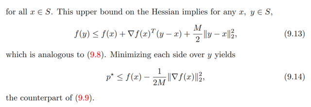</kbd>

<kbd>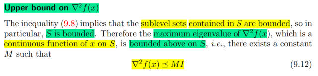</kbd>

> [!NOTE]
> Đầu tiên đại khái là vầy, bắt đầu từ inequality ta đã có:
>
> f(y) ≥ f(x) + ∇f(x)T(y - x) + (m/2)||y - x||^2 với mọi x, y thuộc S
>
> (S là sub-level set: x ∈ dom f: f(x) ≤ f(x0))
>
> nó nói rằng, khi ta "di chuyển y ra xa khỏi x", thì f(y) tăng lên với
> tốc độ ít nhất là (thể hiện bởi ≥) bằng một hàm quadratic (với x
> fixed thì  vế phải là hàm quadratic theo y)
>
> Thế thì nói về sub-level-set. Theo định nghĩa, ví dụ α-sublevel set
> của f là set chứa các điểm x sao cho f(x) ≤ α: x ∈ dom f: f(x) ≤ α
>
> Vậy thì hình dung trong không gian 3D, với cái tô (minh họa cho việc ta
> có function mà độ cong lên ít nhất là bằng độ cong của một hàm
> quadratic), thì khi ta đi ra xa khỏi optimal là chính giữa đáy tô thì
> nhanh chóng độ cao sẽ vút lên 
>
> Thế thì α-sublevel set là khi ta cắt ngang cái tô bằng một mặt phẳng ở 
> "độ cao", dĩ nhiên ta sẽ có một đường tròn. Ta sẽ chiếu nó xuống mặt 
> xy, thì hình tròn đó chính là α-sub level set. (nếu được thì vẽ cái hình
> minh họa)
>
> Thế thì dễ thấy rằng, dù có là cắt cái tô ở độ cao nào (đồng nghĩa xét
> sub-level set nào / α bằng bao nhiêu) thì nó cũng không thể "mở rộng 
> toàn mặt phẳng được" mà luôn là một hình tròn có bán kính hữu hạn.
>
> Mấu chốt là bởi hình dạng cái tô, khiến f(y) vọt lên cao rất nhanh so với
> việc y ra xa khỏi x.
>
> Và đó chính là nói "sub-level set bị chặn (bound)"
>
> Và vì bất đẳng thức trên là đang xét với các điểm x, y thuộc S (cũng là
> một cái sub-level set), nên kiểu như là ta đang nói đến các sub-level set 
> "nằm trong S". Và như vậy với việc mọi sub-level set trong S bị bound thì 
> dĩ nhiên S cũng bị bound.
>
> Và vì S bị chặn, nên xét hàm ∇^2f(x) với x ∈ S, thì đại khái là, ta có tuy
> là vô số Hessian matrix, nhưng có thể nôm na hiểu rằng, nếu lấy
> eigenvalue lớn nhất của các Hessian matrix này thì do đang chỉ xét x
> thuộc tập S mà S bị chặn, nên dẫn đến giá trị eigenvalue lớn nhất của
> các Hessian matrix này cũng bị chặn luôn.
>
> Do đó, ta có thể kết luận tồn tại constant M sao cho eigenvalue lớn nhất
> trên mọi Hessian matrix đều nhỏ hơn M:
>
> λ_max[∇^2f(x)] ≤ M ∀ x ∈ S
>
> Mà điều đó có nghĩa là với mọi x thì khi lấy Hessian matrix tại đó,
> ∇^2f(x) thì mọi eigenvalue λ_i của nó đều ≤ M:
>
> Điều này đồng nghĩa tiếp, mọi giá trị M - eigenvalue λ_i  đều ≥ 0.
>
> mà ta đã biết, nếu λ1, λ2,...là các eigenvalues của A thì α - λ1, α - λ2, ...
> là các eigenvalues của α*I - A
>
> (Chứng minh: λi là eigenvalue với eigenvector xi của A ⇨ Axi = λixi ⇔
> Axi - αxi = λixi - αxi ⇔ (A - αI)xi = λixi và điều này cho thấy λi - α  là
> eigenvalues của A - αI)
>
> Vậy, M - eigenvalue λ_i, là các eigenvalues của M*I - ∇^2f(x), đều
> không âm, nên đó là positive semi definite matrix: M*I - ∇^2f(x) ≽ 0
>
> Cũng chính là M*I ≽ ∇^2f(x) (còn nhớ, ≽ thực chất là ≽R^n)
>
> Vậy thì ta mới dùng kết quả này trong cái mà lúc trước đã nói:
>
> f(y) =  f(x) + ∇f(x)T(y - x) + (1/2)(y - x)∇^2f(z)(y - x) với z là một  mixture
> nào đó của x, y
>
> Và ta có ∇^2f(z) ≤ MI
>
> ⇨ f(y) =  f(x) + ∇f(x)T(y - x) + (1/2)(y - x)T∇^2f(z)(y - x) ≤ f(x) +
> ∇f(x)T(y - x) + (1/2)(y - x)TM(y - x)
>
> ⇔ f(y) ≤ f(x) + ∇f(x)T(y - x) + (M/2)||y - x||^2
>
> Và minimize vế phải theo y (để ta có cái lower bound nhỏ nhất trong
> các y) ta có:
>
> f(y) ≤ f(x) - 1/2M ||∇f(x)||^2
>
> Và vì inequality này đúng với mọi y ∈ S nên nó đúng với cả x*
>
> ⇨ f(x*) = p* ≤ f(x) - 1/2M ||∇f(x)||^2
>
> Kết quả này là "đối tác" với cái hồi nãy:
>
> p* ≥ f(x) - 1/2m || ∇f(x) ||^2

**🔗 See also:** [linked note](#node-db6vwz5) · [linked note](./chap_95.md#node-p2rfem2)

 

<kbd>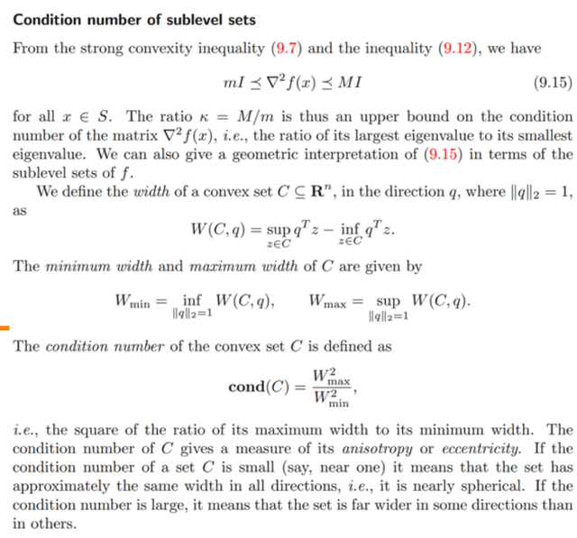</kbd>

> [!NOTE]
> Từ hai kết quả hồi nãy: mI ⪯ ∇^2f(x) ⪯ MI ra sẽ có như sau:
>
> ∇^2f(x) ⪯  MI ⇨ λ_max[∇^2f(x)] ≤ M
>
> mI ⪯ ∇^2f(x) ⇨ λ_min[∇^2f(x)] ≥ m
>
> ⇨ λ_max[∇^2f(x)] / λ_min[∇^2f(x)] ≤ M/m
>
> Và do đó condition number của matrix ∇^2f(x) có upper bound là 
> M/m
>
> Thế thì, ở đây cho rằng ta có thể có một giải thích hình học cho
>  kết qủa này mI ⪯ ∇^2f(x) ⪯ MI theo sub-level set của f.
>
> Đầu tiên là ta sẽ định nghĩa của BỀ RỘNG của set C theo phương
> vector q có unit length. W(C, q) = sup qTz - inf qTz : z ∈ C
>
> Từ đó, ta có minimum width và maximum width, dễ hiểu sẽ là 
>
> Wmin = inf ||q|| = 1 W(C, q) và Wmax = sup ||q|| = 1 W(C, q)
>
> Condition number của convex set C được định nghĩa là:
>
> cond(C) = W^2max / W^2min
>
> Và đại khái là nếu condition number của set C mà gần 1 thì tức là
> nó gần "tròn" hơn, ko có phương nào bị kéo dài hơn các phương khác
> gọi là (spherical, nếu là 1 set trong 3D space thì sẽ gần thành quả cầu)

**🔗 See also:** [linked note](#node-aw81333)

 

<kbd>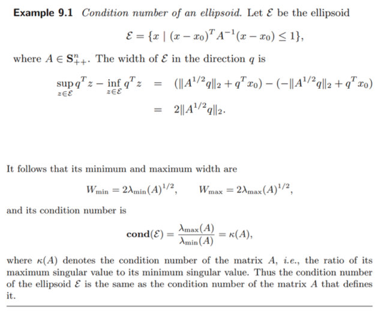</kbd>

> [!NOTE]
> Ví dụ này minh họa cho ta hiểu hơn về condition number của set.
>
> Trong đó đây là một set cụ thể là một ellipsoid, được định nghĩa bởi
> matrix A ε = x: (x - x0)TAinv(x - x0) ≤ 1
>
> Dùng đinh nghĩa của condition number của set, đầu tien ta sẽ tính 
> ra minimum width và maximum width: 
>
> Width theo phương q: W(C, q) = sup qTz - inf qTz với z ∈ ε 
>
> inf qTz với z ∈ ε tức là ta giải bài toán optimization:
>
> minimize x qTx constraint (x - x0)TAinv(x - x0) ≤ 1
>
> Đặt u = A^(-1/2)(x - x0) ⇨ uTu = (x - x0)TA^(-1/2)A^(1/2)(x - x0)
>
> = (x - x0)TA^-1(x - x0)
>
> Nên constraint trở thành uTu ≤ 1
>
> u = A^(-1/2)(x - x0) ⇔ u = A^(-1/2)x - A^(-1/2)x0
>
> ⇔ A^(-1/2)x0 + u = A^(-1/2)x
>
> ⇔ [A^(-1/2)]^-1 A^(-1/2)x0 + [A^(-1/2)]^-1 u = x
>
> ⇔ [A^(1/2)] A^(-1/2)x0 + [A^(-1/2)]^-1 u = x
>
> ⇔ [A^0 x0 + [A^(1/2)] u = x
>
> ⇔ x0 + (A^1/2)u = x ⇨ qTx = qT[x0 + (A^1/2)u] = qTx0 + qT[(A^1/2)u]
>
> = qTx0 + [qT(A^1/2)]u
>
> = qTx0 + [(A^1/2)q]Tu
>
> Thế thì: bài toán trở thành minimize u qTx0 + [(A^1/2)q]Tu constraint ||u|| ≤ 1
>
> Áp dụng Cauchy inequality: aTb = ||a||.||b||.cos(a, b)
>
> 1 ≥ cos(a, b) ≥ -1 ⇨ 1 ≥ aTb / ||a||.||b|| ≥ -1 ⇨ ||a||.||b|| ≥ aTb ≥ -||a||.||b||
>
> Nên ta có aTb ≥ -||a||.||b|| 
>
> [(A^1/2)q]Tu ≥ -||(A^1/2)q||.||u|| = -||(A^1/2)q||.1 = -||(A^1/2)q||
>
> Và dấu bằng xảy ra khi a = b: (A^1/2)q = u
>
> Vậy qTx0 + [(A^1/2)q]Tu ≥ qTx0 - ||(A^1/2)q||
>
> và do đó optimal value là qTx0 - ||(A^1/2)q||
>
> ⇨ inf ||u|| ≤ 1 qTx0 + [(A^1/2)q]Tu = qTx0 - ||(A^1/2)q||
>
> ⇨ inf z ∈ ε qTz = qTx0 - ||(A^1/2)q||
>
> Tương tự ta sẽ có sup z ∈ ε qTz = qTx0 + ||(A^1/2)q||
>
> ⇨ W(C, q) = sup qTz - inf qTz = qTx0 + ||(A^1/2)q|| - [qTx0 - ||(A^1/2)q||]
>
> = 2||(A^1/2)q||
>
> ====
>
> Rồi từ đó minimum width inf ||q|| = 1 W(C, q) = inf ||q|| = 1 2||(A^1/2)q||
>
> và chính là bằng 2λ_min(A)^1/2. Vì sao:
>
> A như đề cho là positive semi definite matrix (dĩ nhiên là symmetric) A ≽ 0
>
> Áp dụng eigen-decomposition với symmetric matrix ta sẽ có dạng:
>
> A = QΛQT (MIT 18.06: với symmetric matrix ta luôn có đủ n independent 
> eigenvectors và chúng orthogonal, hoặc có thể chọn orthogonal)
>
> Dĩ nhiên Λ là diagonal matrix diag[λ1(A),... λn(A)]
>
> Thế thì với A^(1/2), nó sẽ = Q Λ^1/2 QT: CÁI NÀY CHỨNG MINH SAU.
>
> Như vậy ||A^(1/2)q|| = ||Q Λ^1/2 QT q|| 
>
> Đặt v = QTq
>
> = ||Q Λ^1/2 v|| | do v = QTq
>
> = ||Q (Λ^1/2 v)|| = ||(Λ^1/2 v)||  | do Q nhân với vector Λ^1/2 v ko làm thay đổi
> norm của nó.
>
> Vậy ||A^(1/2)q|| = ||Λ^(1/2)v|| với v = QTq
>
> Mà ||A^(1/2)v||^2 = [Λ^(1/2)v]T[Λ^(1/2)v] = vTΛ^(1/2)Λ^(1/2)v = vTΛv
>
> = Σ λivi^2 
>
> Và đến đây thì lập luận như sau:
>
> Σ λivi^2 ≥ Σ λmin vi^2 vì λi ≥ λmin.
>
> ⇨  Σ λivi^2 ≥ λmin Σ vi^2 = λmin * 1 = λmin
>
> Vậy ||A^(1/2)v||^2 ≥ λmin ⇨ ||A^(1/2)v|| ≥ √λmin -> Chứng minh xong
>
> Wmin = inf ||q|| = 1 W(C, q) = inf ||q|| = 1 2||(A^1/2)q|| = 2λ_min(A)^1/2
>
> ====
>
> Hoàn toàn tương tự sup ||q|| = 1  Wmax = 2λ_max(A)^1/2 
>
> Dẫn đến condition number của set (Ellipsoid) theo định nghĩa = Wmax^2 / Wmin^2
> = λ_max(A) / λ_min(A) mà đây cũng chính là condition number của matrix A
>
> Và do đó trong trường hợp này condition number của Ellipsoid bằng condition
> number của matrix A define ra nó

 

<kbd>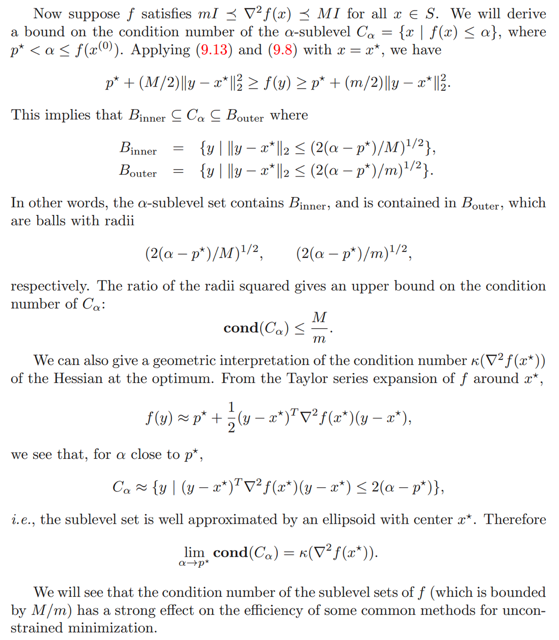</kbd>

> [!NOTE]
> Tiếp ta giả sử f thỏa mI ⪯ ∇^2f(x) ⪯ MI với mọi x ∈ S. Ta sẽ tìm cách xây dựng một chặn
> của condition number của set C-α (tức α-sub-level set)
>
> Thế thì 9.13, và 9.8 ta có:
>
> f(y) ≤ f(x) + ∇f(x)T(y - x) + (M/2)||y - x||^2
>
> f(y) ≥ f(x) + ∇f(x)T(y - x) + (m/2)||y - x||^2
>
> Áp dụng nó với x = x*:
>
> f(y) ≤ f(x*) + ∇f(x*)T(y - x*) + (M/2)||y - x*||^2
>
> ⇔ f(y) ≤ p* + 0 + (M/2)||y - x*||^2
>
> f(y) ≥ f(x*) + ∇f(x*)T(y - x*) + (m/2)||y - x*||^2
>
> ⇔ f(y) ≥ p* + 0 + (m/2)||y - x*||^2
>
> ⇨ p* + (M/2)||y - x*||^2 ≥ f(y) ≥ p* + (m/2)||y - x*||^2
>
> Thế thì:
>
> C-α = y: f(y) ≤ α
>
> Từ bất đẳng thức trên ta có:
>
> α ≥ f(y) ≥ p* + (m/2)||y - x*||^2
>
> ⇔ α - p* ≥ (m/2)||y - x*||^2
>
> ⇔ 2(α - p*)/m ≥ ||y - x*||^2
>
> ⇔ [2(α - p*)/m]^1/2 ≥ ||y - x*||
>
> Cho thấy rằng nếu y ∈ C-α (f(y) ≤ α) thì y cũng nằm trong set [2(α - p*)/m]^1/2 ≥ ||y
> - x*|| và đây là một Ball có tâm tại x* và bán kính là [2(α - p*)/m]^1/2
>
> Nói cách khác, điều này đồng nghĩa nói ràng, C-α chứa trong Ball y: [2(α - p*)/m]^1/2
> ≥ ||y - x*|| , gọi nó là B-outer
>
> C-α ⊆ B-outer
>
> ====
>
> Còn về inner Ball ta sẽ chứng minh nếu y ∈ B-inner thì nó cũng thuộc C-α:
>
> y ∈ B-inner với B-inner = y: p* + 0 + (M/2)||y - x*||^2
>
> ⇨ [2(α - p*)/M]^1/2 ≥ ||y - x*||
>
> Thế thì upper bound ở trên ta có:
>
> f(y) ≤ p* + (M/2)||y - x*||^2
>
> và vì ||y - x*|| ≤ [2(α - p*)/M]^1/2 như vừa nói do y ∈ B-inner nên:
>
> f(y) ≤ p* + (M/2)[[2(α - p*)/M]^1/2]^2 = α
>
> Vậy nếu y ∈ B-inner thì f(y) ≤ α nên y ∈ C-α
>
> Do đó B-inner ⊆ C-α
>
> =====
>
> Từ đó, dùng định nghĩa của condition number của set  = Wmax^2 / Wmin^2 đã nói hồi
> nãy.
>
> Thì việc đã chứng minh C-α bị lồng trong 2 quả cầu B-outer B-inner tức là bề rộng lớn
> nhất của nó phải ≤ là bán kính của quả cầu ngoài, và bề rộng nhỏ nhất của nó phải ≥ là
> bán kính quả cầu trong.
>
> Thành ra cond(C-α) ≤ 2(α - p*)/m]^1/2 / 2(α - p*)/M]^1/2
>
> ⇔ cond(C-α) ≤ M/m.
>
> Cond(C-α) ≤ M/m
>
> (chú ý là C-α bị lồng trong hai quả ball này không chắc là nó tiếp xúc, nên bề rộng lớn
> nhất chỉ biết sẽ ≤ (chứ ko =) bán kính quả cầu ngoài. Thành ra ta có dấu ≤ trong
> Cond(C-α) ≤ M/m (chứ ko phải dấu =)  Và đây cho ta upper bound của condition
> number của α-sublevel set
>
> ====
>
> Cuối cùng.
>
> Đại khái là dùng Taylor approximation tại optimal ta có:
>
> f(y) ≈ f(x*) + ∇f(x*)T(y - x*) + 1/2 (y - x*)T ∇^2f(x*) (y - x)
>
> x* là optimal nên ∇f(x*) = 0
>
> ⇨ f(y) ≈ f(x*) + 1/2 (y - x*)T ∇^2f(x*) (y - x)
>
> Xét α rất gần với p*, thì C-α:
>
> = y: f(y) ≤ α  ≈ y: f(x*) + 1/2 (y - x*)T ∇^2f(x*) (y - x)  ≤ α 
>
> =  y: (y - x*)T ∇^2f(x*) (y - x)  ≤ 2[α - f(x*)] 
>
> =  y: (y - x*)T ∇^2f(x*) (y - x)  ≤ 2(α - p*)
>
> ⇨ C-α ≈ y: (y - x*)T ∇^2f(x*) (y - x)  ≤ 2(α - p*)
>
> Và điều này có nghĩa là: khi α gần với p* thì α sub-level set gần giống một ellipsoid (vế
> phải là một ellipsoid) có tâm tại x*
>
> Do đó, như ví dụ trên đã thấy, với set là ellipsoid, thì condition number của set cũng
> bằng condition number của matrix define ra nó.
>
> Nên ta có ở đây cond(C-α) sẽ bằng condition number của ∇^2f(x*) (kí hiệu là
> k[∇^2f(x*)])
>
> Và thể hiện toán học là:
>
> lim α -> p* cond(C-α) = k[∇^2f(x*)]

**🔗 See also:** [linked note](#node-aw81333)

 

<kbd>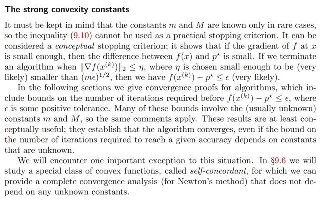</kbd>

> [!NOTE]
> QUAY LẠI SAU

 

<kbd>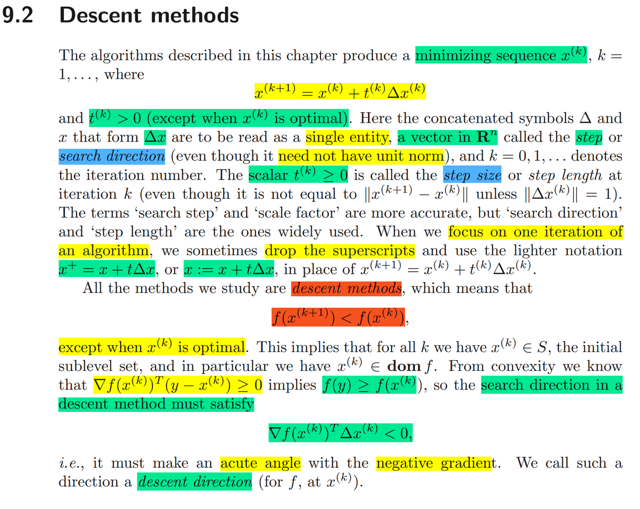</kbd>

> [!NOTE]
> Rồi, đại khái là thuật toán mô tả ở phần này sẽ minimizing một
> chuỗi x(k): Lấy k = 5 cho gọn, 
>
> x5 = x4 + t4 Δx4 
>
> Trong đó t4 là STEP SIZE tại step k = 4, là scalar ≥ 0
>
> Δx4 là SEARCH DIRECTION, là một R^n vector. 
>
> Xét một step (một iteration) ta sẽ viết là x = x + t*Δx 
>
> Thế thì gọi là DESCENT METHOD, là vì sau mỗi step: (từ x4 -> x5)
> thì f(x5) ≤ f(x4), tức là sau mỗi step thì f giảm xuống.
>
> Vậy thì vì hàm f convex nên ta có first condition:
>
> f(y) ≥ f(x) + ∇f(x)T(y - x) ⇔ f(y) - f(x) ≥ ∇f(x)T(y - x)
>
> Nên nếu ∇f(x)T(y - x) ≥ 0 ⇨ f(y) ≥ f(x) 
>
> Vậy, nên để f(y) ≤ f(x) thì ∇f(x)(y - x) phải < 0
>
> Nên để f(x5) ≤ f(x4) thì ∇f(x4)T(x5 - x4) < 0
>
> ⇔ ∇f(x4)T Δx4 < 0
>
> Điều này có nghĩa là góc giữa ∇f(x4) và Δx(4) phải là góc tù 
> (acute) để cos(.) âm. 
>
> Và gọi là descent direction = nôm na là "hướng giảm"
>
> 9. UNCONSTRAINED PROBLEM
>
> 9.2 DESCENT METHOD

 

<kbd>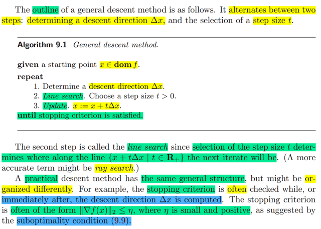</kbd>

> [!NOTE]
> Phác thảo của thuật toán sẽ như vầy (cái này đã gặp nhiều trong
> các lớp machine learning)
>
> 1) Xác định hướng (descent direction), Δx
>
> 2) Chọn step size t. Gọi là Line search vì có hướng rồi, nhưng chọn
> t để quyết định đi tới đâu theo hướng line đó.
>
> 3) Update x: x = x + t*Δx
>
> Và lặp đi lặp lại cho đến khi một điều kiện nào đó được thỏa để dừng
>
> Gọi là Stopping condition, và thường là sẽ dựa trên giá trị gradient ∇f 
> nhỏ hơn mức nào đó.
>
> Vì ta biết điều kiện ε-suboptimal (tức x gần x* một mức nhỏ hơn ε)
>
> f(x) - p* ≤ ε 
>
> là ||∇f(x)|| ≤ √2mε (link hồng)

**🔗 See also:** [linked note](#node-f2dujl0)

 

<kbd>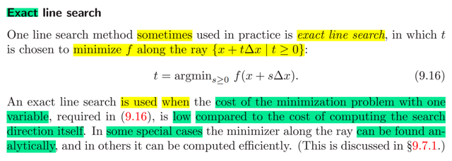</kbd>

> [!NOTE]
> đại khái là ta thấy bước 1: "chọn hướng" (tức tính Δx) và sau đó là tính
> step size t. Vậy thì hiểu đại khái là, chọn hướng đã phải mệt rồi (phải
> tính toán nhiều), thì sau đó phải chọn t cho tối ưu nữa thì lại mệt hơn
>
> Nên ta sẽ chỉ dùng phương pháp này nếu việc tính t tối ưu không
> mất công lắm 
>
> Và việc tối ưu t cơ bản là xem trong hướng Δx thì t bao nhiêu thì
> f nhỏ nhất: 
>
> minimize s f(x + s*Δx) subject s ≥ 0 hay t = argmin s ≥ 0 f(x + s Δx)
>
> ví dụ như khi có vài trường hợp đặc biệt mà việc mà bài toán tối ưu
> này có thể có analytic solution hoặc tính dễ (không tốn kém lắm)

 

<kbd>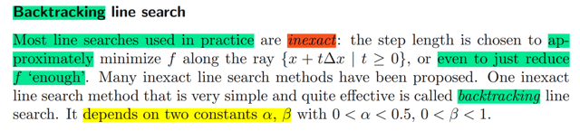</kbd>

<kbd>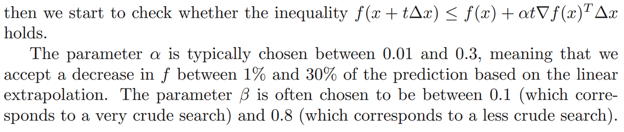</kbd>

<kbd>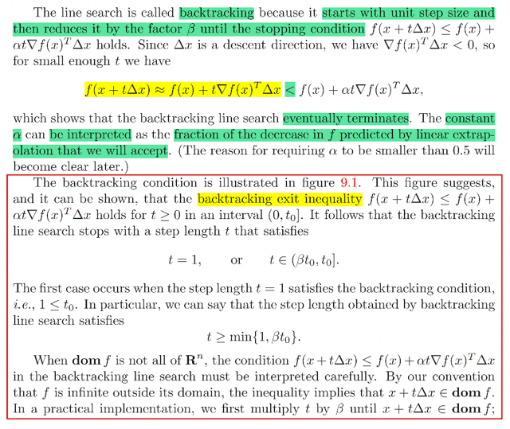</kbd>

> [!NOTE]
> Đại khái là, ta vừa nhắc đến exact line search trong đó ta muốn tối ưu cả
> step size t, sau khi đã tính được hướng (Δx).
>
> Nhưng thực tế, thường thường người ta không cần như vậy, chỉ cần set step 
> size sao cho f giảm một khoảng nào đó đủ tốt là được.
>
> Thế thì với cái backtracking line search này, đại khái là ta sẽ bắt đầu với step
> size = 1 (t = 1) và giảm dần step size cho đến khi thỏa một điều kiện nào đó 
> thì dừng.
>
> Điều kiện để tiếp tục:
>
> f(x + t Δx) > f(x) + α t ∇f(x)TΔx
>
> Ý nghĩa vế trái: gía trị hàm f mới nếu đi theo hướng Δx một step size t, lúc này
> coi như hàm theo t: g(t)
>
> Ý nghĩa vế phải: giá trị hàm f dự đoán bởi linear approx. nhưng với độ dốc
> lấy = 30% thôi:
>
> Linear approx.: f(x + tΔx) ≈ f(x) + ∇f(x)T(tΔx) =  f(x) + t∇f(x)TΔx
>
> Linear approx. với 30% gradient: f(x + tΔx)_predicted = f(x) + αt∇f(x)TΔx
>
> Và nó cũng chỉ là hàm theo t, có thể đặt là g^(t)
>
> Vậy ý nghĩa của stopping condition của back-tracking line search là:
>
> Nếu dùng t, mà condition này không thỏa, điều đó có nghĩa nôm na là: NẾU
> BƯỚC THEO HƯỚNG Δx VỚI KHOẢNG CÁCH LỚN NHƯ VẬY THÌ TA SẼ QUA
> BÊN SƯỜN BÊN KIA THỂ HIỆN BỞI GIÁ TRỊ CỦA f(x + tΔx) LỚN HƠN, CAO
> HƠN f(x) + αt∇f(x)TΔx: Hiểu thế này,ta đứng ở vị trí ban đầu, tại đó dựa vào độ
> dốc ∇f(x) theo hướng Δx là ∇f(x)TΔx (gọi là directional derivative) cho mình biết
> rằng nếu đi theo hướng này với bước đi dài bằng Δx thì có lẽ sẽ "xuống" độ cao 
> f(x) + ∇f(x)Δx, và mình cũng đã tỏ ra khôn ngoan một chút khi hiểu rằng mặt đất 
> là cong lên, nên không
> thể nào chính xác khi ta dự vào độ dốc đang đứng để mà "áng chừng", vì sự cong
> lên ấy sẽ đưa ta đến thực tế là cao hơn so với ước lượng vừa nói. Do đó theo 
> kinh nghiệm ta sẽ giảm bớt độ dốc, bởi ví dụ 30%. khi đó việc ước lượng sẽ bớt
> đi, tức là ta đoán rằng khi đi theo hướng Δx với tỉ lệ t % (nhớ là t là một factor, nên
> t = 1 ý nghĩa là ta bước theo hướng Δx với full độ lớn của Δx, còn t  = 0.9 bớt tức
> là ta chỉ lấy 90% đồ dài của Δx thôi). Vậy mà với sự ước lượng đó lại thấy thực
> tế hàm f cao hơn: Điều này giúp kết luận là bước đi của mình quá dài, khiến có
> vẻ như đã lố qua điểm thấp nhất rồi 
>
> Hết sức chú ý điểm thấp nhất ở đây KHÔNG PHẢI LÀ OPTIMAL, mà nó chỉ là
> điểm thấp nhất của f XÉT THEO PHƯƠNG Δx, GỌI LÀ RESTRICT TO A LINE
> , tức là xét theo phương đó thì hàm số tăng giảm ra sao, hoặc, ta cắt đồ hàm số
> bởi mặt phải đi qua line đó.
>
> Vậy thì từ đó ta sẽ giảm t lại, và cứ thế cho đến khi nó thỏa thì thôi. Giá trị t này
> mang ý nghĩa là nếu đi theo hướng Δx với độ lớn step size này thì hàm f sẽ giảm
> từ f(x) xuống f(x) + t ∇f(x)Δx, tức là gỉam bớt một khoảng t ∇f(x)Δx, mà nếu đi xa
> hơn step size này thì hàm f lại không giảm bằng vì nó đã vọt lên.
>
> VẬY NHẬN RA RẰNG, CHƯA CHẮC t TÍNH THEO KIỂU NÀY ĐÃ TỐT NHẤT,
> RÕ RÀNG LÀ VẬY, VÌ CÓ THỂ VỚI t NHỎ HƠN THÌ F XUỐNG NHIỀU HƠN,
> NHƯNG NÓ ĐẢM BẢO TA KO BƯỚC QUÁ DÀI ĐỂ VỌT QUA BÊN KIA, MÀ MỖI
> BƯỚC ĐI SẼ ĐỀU "XUỐNG" MỘT KHOẢNG t∇f(x)Δx.
>
> TẤT NHIÊN CÓ KHI t = 1 THÌ ĐÃ THỎA RỒI, VÀ TRƯỜNG HỢP NÀY CÓ THỂ
> LÀ CÓ KHI SCALE t lên 1.2, 1.3 THÌ SẼ GIÚP F XUỐNG NHIỀU HƠN NỮA.
>
> NHƯNG NHƯ ĐÃ NÓI, BACKTRACKING LINE SEARCH CHỈ ĐẶT RA MỤC TIÊU
> LÀ TÌM RA STEP LENGTH TẠM ĐƯỢC, GIÚP GỈAM F ĐỦ XÀI, DO ĐÓ CÓ KHI
> NÓ NHỎ HƠN OPTIMAL STEP SIZE (CÁI MÀ TA CÓ NẾU DÙNG EXACT LINE
> SEARCH) NHƯNG CŨNG CÓ KHI LỚN HƠN
>
> Vậy có thể thấy, có khi thì thuật toán sẽ lấy full step size và có khi nó sẽ scale step
> size
>
> Và cả hai trường hợp thì đều không chắc độ lớn step size là tối ưu
>
>
> Param β thì chọn từ 0.1 thể hiện "crude search" và 0.8 thể hiện less crude
> search". Là sao? 
>
> Β là tỉ lệ ta scale t nhỏ lại mỗi lần. Nên β nhỏ tức là ta khá thoải mái, giảm t 
> rất nhanh, cũng là bỏ qua rất nhiều step. Còn 0.8 thể hiện ta scale t từ từ từ 
> từ, giống như tìm cho kĩ
>
> Phần đóng khung đại khái là vầy:
>
> Trong backtracking method, thì như đã nói, exit condition sẽ là khi
> giá trị của t (vốn dĩ ban đầu được assign bằng 1) giúp thỏa: 
>
> f(x + t Δx) ≤ f(x) + αt ∇f(x)TΔx (1)
>
> Và trong hình ta đã thấy rằng, t0 là mốc lớn nhất mà t nếu nằm trong 
> khoảng đó thì điều kiện trên sẽ thỏa
>
> Thế thì t0 ta chưa biết bằng bao nhiêu, nhưng ta biết chắc thế này:
> Trong phương pháp này ta sẽ bắt đầu với initial t = 1.Và giảm dần
> bởi scale factor β cho đến khi thỏa (1)
>
> Vậy thì:
>
> 1) Nếu ngay từ đầu t = 1 đã nằm trong [0, t0] (đồng nghĩa 1 ≤ t0) thì
> thuật toán dừng luôn sau khi chạy bước đầu tiên với t = 1.
>
> 2) Ngược lại, có nghĩa là t0 < 1, thì t = 1 nằm ngoài [0, t0], nên thuật
> toán sau khi chạy bước 1, sẽ scale t xuống: t := βt. Và thử lại.
>
> Thế thì hình dung thế này, có thể sau khi scale, nó vẫn chưa khiến
> t nằm trong đoạn [0, t0], thì ta sẽ tiếp tục scale t tiếp...cho đến khi
> t (giá trị mới sau khi đã scale nhiều lần) nằm trong đoạn [0,1]. 
>
> Ta sẽ giả sử điều này xảy ra (tức t bắt đầu nằm trong đoạn [0,1]) ở 
> bước thứ k. 
>
> Khi đó, dễ hiểu rằng TRƯỚC ĐÓ MÔT BƯỚC, THÌ t CHƯA NẰM 
> TRONG ĐOẠN [0, t0], Ta tạm vẽ giá trị của nó như vầy:
>
> 0 < t0 < t(k-1)
>
> Nhưng sau đó, scale t(k-1) bởi β thì nó đã lọt vào [0, t0]:
>
> 0 < β*t(k-1) < t0 
>
> Vậy thì MẤU CHỐT LÀ: t0 < t(k-1), nên nhân hai vế với β ta sẽ có:
>
> βt0 < β*t(k-1) ⇔ βt0 < t(k) 
>
> Và dĩ nhiên t(k) ≤ t0
>
> Và đây chính là lí do mà ta kết luận rằng giá trị của t sau khi scale
> bởi factor β MÀ TẠI ĐÓ NÓ BẮT ĐẦU NẰM TRONG ĐOẠN [0, t0]
> CHẮC CHẮN PHẢI LỚN HƠN βt0:
>
> Do đó trong sách họ nói, một là khi 1 ≤ t0, thì t (hiểu là t_dừng thuật
> toán, t khi thỏa exit condition) sẽ bằng 1. Và hai là, nếu t0 < 1 thì
> t_dừng sẽ nằm đâu đó trong (βt0, t0] (dấu khoảng, vì chắc chắn > βt0
> như phân tích ở trên)
>
> t = 1 or t ∈ (βt0, t0]
>
> Và gộp hai cái này lại thì ta có thể nói t ≥ min [1, βt0]
>
> (vì nếu 1 < βt0 thì cũng suy ra 1 < t0, như nói ở trên, case này t sẽ = 1. 
>
> Và lúc này min[1, βt0] = 1. Do đó nói t ≥ min [1, βt0] cũng đúng (1 ≥ 1 là
> đúng)
>
> Nếu βt0 < t0 < 1 thì t sẽ > βt0 như nói ở trên. Thì t ≥ min [1, βt0] 
> cũng đúng (min[1, βt0] = βt0)
>
> Nếu βt0 < 1 < t0 thì t = 1, và min[1, βt0] = βt0. Thì vì ta có βt0 < 1
> nên t > min[1, βt0] cũng đúng luôn
>
> ====
>
> Một ý nữa cũng ko khó hiểu lắm, đó là khi domain của f không phải là R^n,
> thì có khi x + α Δx nằm ngoài domain f. Khi đó dĩ nhiên ta ko thể tính 
> f(x + α Δx). Nên người ta nói khi làm thực tế ta sẽ update cho đến khi
> x + α Δx đã nằm trong domain của f thì mới evaluate f(x + α Δx) (và evaluate
> exit condition)

 

<kbd>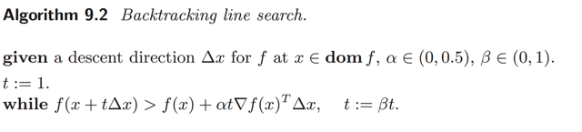</kbd>

 

<kbd>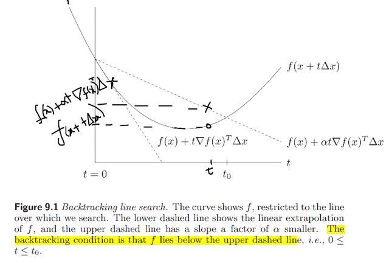</kbd>

> [!NOTE]
> Hình minh họa này ý là ta có hai đường dash-line: Đường ở
> dưới là linear interpolation (approximation) f(x) + t ∇f(x)TΔx và ở
> trên là linear interpolation với độ dốc được điều chỉnh (scaled)
> bởi factor α: f(x) + αt ∇f(x)TΔx
>
> Thế thì như đã nói điều kiện exit của backtracking line search là
> khi giá trị của t khiến giá trị của hàm f giảm xuống (f(x + t Δx))
> đã thấp hơn mức dự đoán của adjusted linear interpolation:
>
> f(x + t Δx) ≤ f(x) + αt∇f(x)TΔx
>
> Vậy thì trong hình, có thể hiểu rằng, chỉ khi t có giá trị từ 0 đến
> t0 thì f(x + t Δx) mới nhỏ hơn f(x) + αt∇f(x)TΔx. Còn nếu t < 0
> hoặc t > t0 thì giá trị f(x + t Δx) sẽ lớn hơn f(x) + αt∇f(x)TΔx
>
> (Ví dụ với t vẽ trong hình, thì điểm hình tròn nằm dưới điểm
> chéo)

 

<kbd>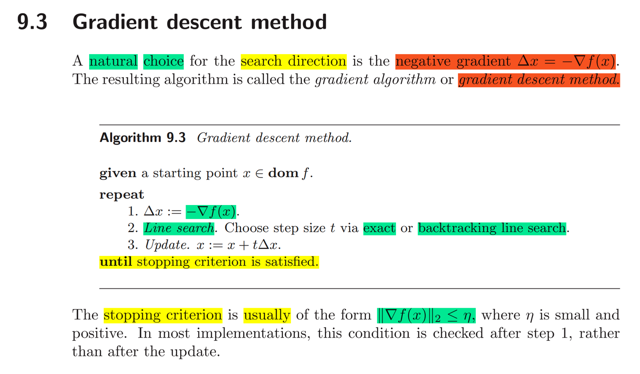</kbd>

> [!NOTE]
> Rồi, khi mà search direction (Δx) được chọn dựa trên - gradient
> ∇f(x) mà rõ ràng đây là cách lựa chọn rất tự nhiên vì đây sẽ tối
> đa mức giảm của hàm f khi đi hướng này.
>
> thì khi đó ta có GRADIENT DESCENT METHOD.
>
> (9.2 Nói về Descent method không phải là một method khác với
> gradient descent. Mà ý là nó là phương pháp mà ta sẽ update
> dần dần để f giảm dần, mà trong phần 9.2 mình bàn về bước 2)
> line search.
>
> Còn nay là nói về bước 1 khi ta tính hướng đi. Và bằng cách
> dùng chính (negative) của gradient thì ta có gradient descent
> method.
>
> Nói thêm stopping condition thường dùng là check độ lớn của
> gradient nhỏ hơn mức nào đó ||∇f(x)|| ≤ eta
>
> 9. UNCONSTRAINED PROBLEM
>
> 9.3 GRADIENT DESCENT METHOD

 

<kbd>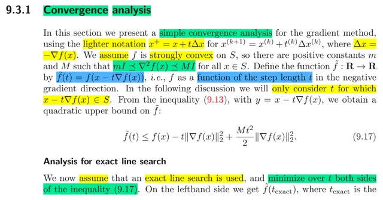</kbd>

<kbd>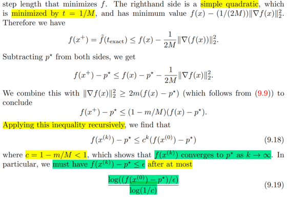</kbd>

<kbd>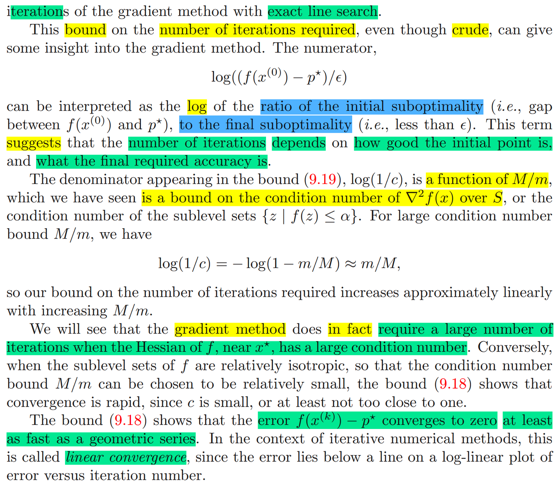</kbd>

> [!NOTE]
> Đại khái là đặt hàm f~(t) = f(x - t ∇f(x))
>
> Dùng một kết qủa ở phần trước:
>
> f(y) ≤ f(x) + ∇f(x)T(y - x) + (M/2)||y - x||^2  
>
> y = x - t ∇f(x) 
>
> ⇔ f(x - t ∇f(x)) ≤ f(x) + ∇f(x)T(x - t ∇f(x) - x) + (M/2)||x - t ∇f(x) - x||^2  
>
> ⇔ f(x - t ∇f(x)) ≤ f(x) - ∇f(x)T(t ∇f(x)) + (M/2)||t ∇f(x)||^2  
>
> ⇔ f~(t) ≤ f(x) - t ||∇f(x)||^2 + (Mt^2/2)||∇f(x)||^2  
>
> Kết quả này cho ta upper bound của f~(t) là một hàm quadratic theo t
>
> Thế thì ta sẽ minimize hai vế theo t:
>
> Vế trái minimize theo t sẽ cho ra f~(t_exact), là giá trị nhỏ nhất của
> f~(t) (= f(x - t ∇f(x)), tức hiểu đại khái đây là giá trị tốt nhất có được
> khi chọn step tối ưu theo hướng Δx. 
>
> Còn vế trái khi tối ưu theo t sẽ cho ta cái upper bound tốt nhất (nhỏ
> nhất) của f(t) và vế phải dĩ nhiên là quadratic function theo t. Nên
> optimal là t = 1/M
>
> Khi đó ta có:
>
> f(x+) = f~(t_exact) ≤ f(x) - 1/2M ||∇f(x)||^2
>
> f(x+) - p* ≤ f(x) - 1/2M ||∇f(x)||^2
>
> ====
> Áp dụng inequality này lặp lại với chuỗi x0 -> xk (recursively):
>
> f(x+) = f~(t_exact) ≤ f(x) - 1/2M ||∇f(x)||^2
>
> Áp dụng với x0,x1: f(x1) - p* ≤ (1 - m/M) [f(x0) - p*] (1)
>
> Áp dụng với x1, x2: f(x2) - p* ≤ (1 - m/M) [f(x1) - p*]
>
> ⇔ [f(x2) - p*] 1/(1 - m/M) ≤ [f(x1) - p*]
>
> (1) ⇨ [f(x2) - p*] 1/(1 - m/M) ≤ (1 - m/M) [f(x0) - p*]
>
> ⇔ [f(x2) - p*] ≤ (1 - m/M)^2 [f(x0) - p*]
>
> Tương tự: [f(xk) - p*] ≤ (1 - m/M)^k [f(x0) - p*]
>
> ⇔ [f(xk) - p*] ≤ c^k [f(x0) - p*]
>
> Với c = 1 - m/M < 1 ⇨ c^k -> 0 ⇨ f(xk) -> p* 
>
> f(xk) - p* ≤ ε khi c^k [f(x0) - p*] ≤ ε ⇔  c^k [f(x0) - p*] / ε ≤ 1
>
> Lấy log hai vế: log c^k + log  [f(x0) - p*] / ε   ≤ 0
>
> ⇔ k log c + log  [f(x0) - p*] / ε  ≤ 0 
>
> ⇔ log  [f(x0) - p*] / ε  ≤ - k log c 
>
> ⇔ log  [f(x0) - p*] / ε  / - log c >=  k 
>
> ⇔ log  [f(x0) - p*] / ε  / log [1/c] ≥  k  | - log c = log c^-1 = log 1/c
>
> Vậy k ≤ log  [f(x0) - p*] / ε  / log (1/c) nên nhiều nhất là bằng vế phải 
>
> hay nói cách khác ta có chặn trên đối với số iteration cần thiết để  f(xk) - p* < ε 
> tức đạt ε-suboptimal
>
> Thế thì tử số [f(x0) - p*] / ε chính là tỉ lệ giữa "khoảng cách từ giá trị ban đầu
> f(x0) tới optimal value p*" và khoảng cách mà ta mong muốn ε (f(x) - p* ≤ ε)
> Thì điều này mang ý nghĩa là số lần iteration (chính xác hơn là chặn trên của
> nó) sẽ tỉ lệ thuận với "Vị trí ban đầu cách xa optimal cỡ nào". Điều này dễ hiểu
>
> Và xét tử số log [ [f(x0) - p*] / ε ] (cái này càng lớn thì k, tức số
> iteration cần thiết để đạt ε-suboptimal càng lớn.
>
> Thì rõ ràng nó sẽ tỉ lệ thuận với f(x0) - p*, chính là khoảng cách
> giữa điểm x ban đầu (initial) với optimal.
>
> Và nó cũng tỉ lệ nghịch với ε, tức là nếu muốn ε nhỏ, đồng nghĩa
> độ chính xác / độ gần với optimal cao, thì sẽ tốn nhiều iteration
> hơn.

**🔗 See also:** [linked note](#node-bzz7rni) · [linked note](#node-fmxdifn) · [linked note](#node-vrndply) · [linked note](#node-afiixrv)

 

<kbd>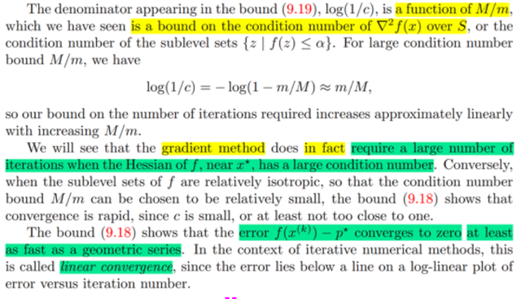</kbd>

> [!NOTE]
> Còn mẫu số log(1/c) thì là function của M/m và theo link hồng ta đã
> biết nó là bound của condition number của ∇^f(x) cũng như của
> condition number của α-sub level set.
>
> Thế thì, khi M/m lớn (thì m/M nhỏ) thì log(1/c) = -log(1-m/M) sẽ ≈
> -(-m/M) = m/M 
>
> (kiến thức linear approximation với hàm log: log(1 + ε) ≈ ε
>
> Và log(1/c) ≈ m/M ⇔ 1/log(1/c) ≈ M/m. Do đó bound của số iteration
> (= tử số * 1/log(1/c)) sẽ ≈ tử số * M/m. Và như vậy, rõ ràng có thể
> thấy nếu M/m lớn thì iteration bound sẽ tỉ lệ tuyến tính với M/m (cũng
> là condition number)
>
> Nói vắn tắt, khi condition number lớn thì iteration bound tỉ lệ tuyến tính
> với condition number, mà điều này cũng có nghĩa là số iteration cũng
> tăng tuyến tính với độ lớn của condition number
>
> Và ở đây nói rằng ta sẽ thấy ở những phần sau rằng phương pháp
> gradient thật sự sẽ cần nhiều iteration khi condition number của
> Hessian ∇f(x) (với  x gần x*) lớn và ngược lại.
>
> Và hiểu nôm na là, nếu sub level set tròn trịa, (isotropic) thì converge
> nhanh (ít iteration), còn nếu nó bị dẹt (tức có phương bị kéo dài hơn
> so các phương khác) thì sẽ converge lâu (cần nhiều iteration)

**🔗 See also:** [linked note](#node-83stge5)

 

<kbd>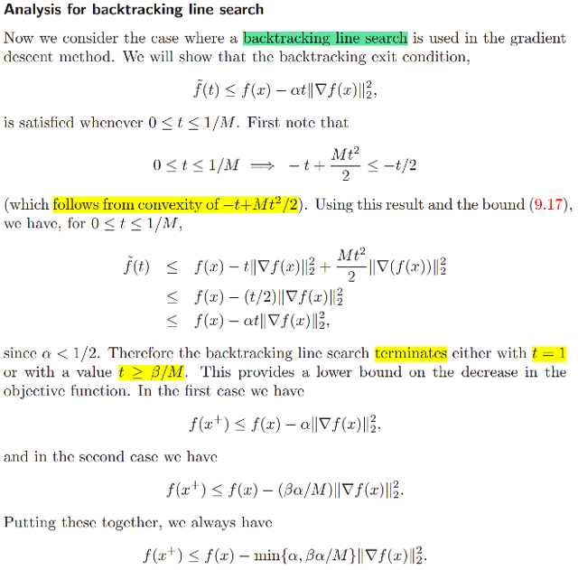</kbd>

<kbd>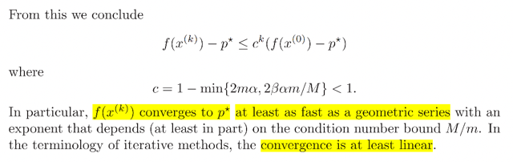</kbd>

> [!NOTE]
> Phần này ta sẽ phân tích sự hội tụ của trường hợp dùng backtracking  line search.
>
> Exit condition là f~(t) ≤ f(x) + αt ∇f(x)TΔx với ý nghĩa là ta sẽ  dừng khi f~(t) đã lớn
> hơn dự đoán bởi linear approximation với độ  dốc được điều chỉnh (bởi factor α)
>
> Với việc đang xét gradient descent method, thì Δx chính là - ∇f(x) nên exit
> condition trở thành f~(t) ≤ f(x) - α ∇f(x)T∇f(x) = f(x) - α ||∇f(x)||^2
>
> THẾ THÌ Ý CHÍNH LÀ TA MUỐN CHỨNG MINH RẰNG KHI DÙNG
> BACKTRACKING LINE SEARCH THÌ KHI t NẰM TRONG KHOẢNG [0, 1/M] THÌ
> EXIT CONDITION Ở TRÊN SẼ THỎA
>
> Thế thì 0 ≤ t ≤ 1/M ⇨ -t + Mt^2/2 ≤ -t/2
>
> 0 ≤ t ≤ 1/M ⇔ Mt ≤ 1 ⇔ Mt^2 ≤ t ⇔ Mt^2/2 ≤ t/2
>
> ⇔ -t + Mt^2/2 ≤ t/2 - t = -t/2
>
> ⇔ -t + Mt^2/2 ≤ -t/2
>
> Hoặc như sách mở ngoặc, ta cũng có thể có kết qủa này bằng cách dựa vào tính
> convexity của function f(t) = -t + Mt^2/2. Nó là quadratic of t  ⇨ convex. Và do đó
> có: "f of mixture" ≤ "mixture of f"
>
> Ở đây t ∈ [0, 1/M] là mixture của 0 và 1/M: t = α*0 + (1 - α)*1/M = (1 - α) / M
>
> ⇨ α = 1 - Mt
>
> t = 0 ⇨ f(t) = 0
>
> t = 1/M ⇨ f(t) = -1/M + M(1/M^2)/2 = -1/M + 1/2M = -1/2M
>
> f(α0 + (1-α)1/M) ≤ αf(0) + (1-α)f(1/M) = α*0 + (1-1+Mt)(-1/2M)
>
> = - Mt / 2M = -t/2
>
> Vậy ta có: f(t) ≤ -t/2, hay -t + Mt^2/2 ≤ -t/2
>
> ====
>
> Tiếp, ta dùng một kết quả đã có ở phần trước (theo link)
>
> f~(t) ≤ f(x) - t ||∇f(x)||^2 + (Mt^2/2)||∇f(x)||^2
>
> Vế trái = f(x) + (-t + Mt^2/2) ||∇f(x)||^2 ≤ f(x) + (-t/2) ||∇f(x)||^2
>
> Dùng tiếp dữ kiện α ≤ 1/2 (trong phần backtracking line search, đã nói  factor α sẽ
> 0 ≤ α ≤ 0.5) ⇨ -1/2 ≤ - α
>
> ⇨ f(x) + (-t/2) ||∇f(x)||^2 ≤ f(x) + (-αt) ||∇f(x)||^2
>
> Vậy f~(t) ≤ f(x) - αt||∇f(x)||^2 và ta ĐÃ CHỨNG MINH RẰNG KHI t nằm trong [0,
> 1/M] thì EXIT CONDITION ĐÃ THỎA.
>
> THÌ TỪ ĐÓ, nhớ lại rằng, trong phần học về backtracking line search ta đã gọi
> khoảng [0, t0] là khoảng mà t phải nằm trong đó thì exit condition mới thỏa. Để rồi
> nếu initial t = 1 đã nằm trong khoảng này thì  thuât toán dừng luôn với t = 1, ngược
> lại ta đã phân tích thuật toán sẽ dừng  với t > βt0 (đã phân tích điều này ở phần
> trước)
>
> Nên ở đây t0 = 1/M. Thì hai trường hợp trên sẽ là:
>
> 1) Nếu 1 < 1/M thì thuật toán terminate với t = 1, tức giá trị của f sau khi update với
> t = 1 (rồi dừng) sẽ:
>
> f(x+) ≤ f(x) - αt||∇f(x)||^2   |   Đơn giản là dùng f~(t) ≤ f(x) - αt||∇f(x)||^2 với t = 1
>
> 2) Nếu 1/M < 1 thì thuật toán sẽ terminate với t > βt0 = β(1/M) = β/M.
>
> f(x+) ≤ f(x) - (αβ/M)||∇f(x)||^2  | Đơn giản là dùng f~(t) ≤ f(x) - αt||∇f(x)||^2 với t =
> β/M
>
> Gom lại ta có: f(x+) ≤ f(x) - minα, αβ/M * ||∇f(x)||^2.
>
> Và làm thêm vài bước nữa (MỤC ĐÍCH LÀ CHO RA MỘT CÁI LOWER BOUND
> CỦA "MỨC ĐỘ GIẢM CỦA HÀM F"):
>
> f(x+) - p* ≤ f(x) - p* - minα, αβ/M * ||∇f(x)||^2   | trừ hai vế cho p*
>
> Dùng kết quả ở phần trước ||∇f(x)||^2 ≥ 2m[f(x) - p* ] ⇔ -||∇f(x)||^2 ≤ -2m[f(x) - p*]
>
> f(x+) - p* ≤ f(x) - p* + minα, αβ/M * [- ||∇f(x)||^2]
>
> ≤ f(x) - p* + minα, αβ/M * [ -2m[f(x) - p* ]
>
> = f(x) - p* + minα, αβ/M * [ (-2m) f(x) - (-2m) p* ]
>
> = f(x) - p* + -2m * minα, αβ/M * f(x) + minα, αβ/M 2m p*
>
> = f(x) [1 - 2m * minα, αβ/M] - p* [ 1 - 2m minα, αβ/M ]
>
> = [1 - 2m * minα, αβ/M] [f(x) - p*]
>
> = [1 - min2mα, 2mαβ/M] [f(x) - p*]
>
> Vậy f(x+) - p* ≤ [1 - min2mα, 2mαβ/M] [f(x) - p*]   
>
> Đặt c = [1 - min2mα, 2mαβ/M]
>
> ta có f(x+) - p* ≤ c [f(x) - p*]   
>
> Và áp dụng cái này với step 1: x(1) và x(0), ta có:
>
> f(x(1)) - p* ≤ c [f(x(0)) - p*]
>
> Áp dụng với x(2) và x(2) ta có:
>
> f(x(2)) - p* ≤ c [f(x(1)) - p*] ≤ c c [f(x(0)) - p*] = c^2 [f(x(0)) - p*]
>
> ....lặp lại với x(2),...x(k)
>
> f(x(k)) - p* ≤ c^k [f(x(0)) - p*]
>
> ĐÂY CHÍNH LÀ CHO TA MỘT CÁI GIỚI HẠN (CHẶN DƯỚI) CỦA MỨC ĐỘ
> GIẢM CỦA OBJECTIVE FUNCTION
>
> và từ đó ta thấy f(x(k)) sẽ converge về p* VỚI TỐC ĐỘ ÍT NHẤT LÀ  BẰNG TỐC
> ĐỘ HỘI TỤ CỦA GEOMETRIC SERIES có exponent  phụ thuộc vào M/m
>
> Nói theo ngôn ngữ của iterative methods thì sự hội tụ là ít nhất tuyến tính
>
> CHƯA HIỂU LẮM

**🔗 See also:** [linked note](#node-aw81333)

 

<kbd>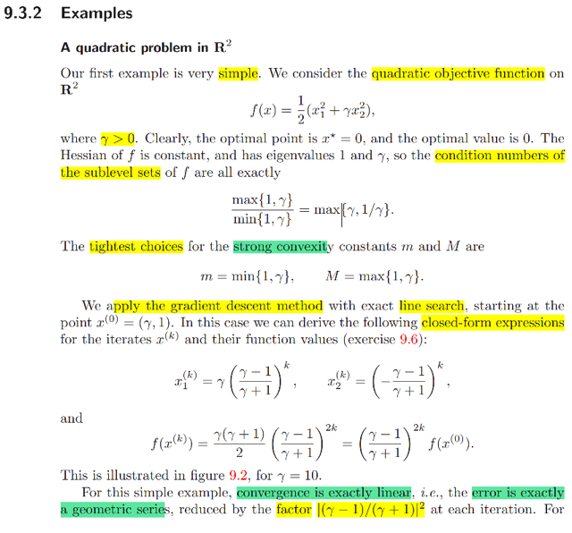</kbd>

<kbd>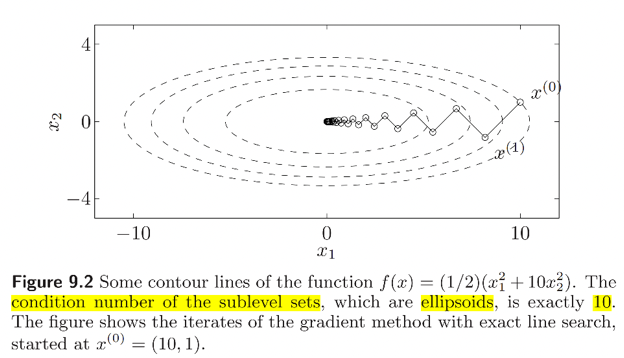</kbd>

> [!NOTE]
> Rồi, một ví dụ đầu tiên, với hàm objective là f(x) = 0.5(x1^2 + γx2^2) dĩ nhiên là
> hàm quadratic (có thể thể hiện ở dạng f(x) = 0.5xTHx với H = [1 0; 0 γ]) =
> diag([1, γ]). Trong đó cho biết γ > 0
>
> Thế thì, nói ngoài lề một chút, có thể nhớ lại để thấy cái này có thể là dạng
> scalarization của một bài toán vector optimization, hoặc cụ thể hơn là bài toán
> multi-criterion problem nơi mà ta có nhiều hơn một scalar objective. Thì một
> cách tiếp cận bài toán này đó là ta sẽ chuyển thành scalar objective bằng nhiều
> cách trong đó đơn giản nhất là linearly combine các vector component (hoặc
> bình phương component)
>
> Thế thì, đây là bài toán unconstrained optimization, KKT conditions giúp tìm
> optimal chỉ đơn giản là giải ∇f(x) = 0. Với f(x) này thì dễ thấy ∇f(x) = [x1, γx2]
> hay xTdiag([1, γ])
>
> f(x) = 0.5xTHx ⇨ df = f(x + dx) - f(x) = 0.5(x+dx)TH(x+dx) - 0.5xTHx
>
> = xTHdx ⇨ ∇f(x) = (xTH)T = HTx = [x1; γx2]
>
> Nên giải ∇f(x) = 0 ⇔ HTx = 0 ⇔ x = 0 và optimal value = f(0) = 0
>
> Thế thì, cũng hoàn toàn dễ hiểu khi sách nói Hessian là constant,  nó chính là
> diagonal matrix [1 0; 0 γ], và với γ ≥ 0 thì H ≽ 0 (hai eigen values của nó, như đã
> học từ MIT 1806, với diagonal matrix, thì egienvalues nó nằm trên đường chéo,
> và đều ko âm thì đó mà ma trix positive semi definite). Từ đó, condition number
> của matrix H (theo định nghĩa = λ_max(H) / λ_min(H) = max {1, γ} / min {1, γ} dĩ
> nhiên cũng ko khó hiểu có thể ghi là max của {γ, 1/γ}
>
> THế thì lưu ý, cái ta đang nói là CONDITION NUMBER CỦA MATRIX H. Thế thì
> ta cũng đã biết CŨNG CÓ CONDITION NUMBER CỦA MỘT SET, được định
> nghĩa là tỉ lệ giữa W_max^2 / W_min^2 (bề rộng lớn nhất của set / bề rộng nhỏ
> nhất, với bề rộng theo phương vector q  được tính bởi W(C, q) =  {sup u ∈ C
> qTu - inf u ∈ C qTu}
>
> Thế thì, trong một ví dụ trước đây ta đã có kết quả rằng, khi set là một
> ELLIPSOID, định nghĩa bởi một positive semi definite matrix P thì condition
> number của nó cũng chính là condition number của P.
>
> Do đó ta mới hiểu ở đây họ nói condition number của sub-level set là max {γ,
> 1/γ}, là condition number của H. Vì sublevel set là gì, C-α  theo định nghĩa sẽ là
> {x: f(x) ≤ α} ⇔ {x: xTHx ≤ α} và đây chính là công thức của ellipsoid (đúng hơn là
> trong R^2, nó là Ellipse có tâm tại 0 và các phương được định nghĩa bởi matrix
> H mà hai phương chính của ellipse chính là eigenvector ứng với eigenvalues 1
> và γ) (trong hình có thể thấy rõ các đường dashed line / là các level-set - là những
> điểm có cùng giá trị f, dĩ nhiên xét cả cái phần bên trong, thì nó chính là sub level-set
> (những điểm có giá trị f ≤ gì đó)
>
> ====
>
> Rồi, thế thì tiếp theo họ nói "lựa chọn chặt nhất (tightest) cho  strong convexity
> constant m, và M sẽ là lấy m là min{1, γ} và M = max{1, γ} Để hiểu cái này cần
> nhớ lại về strong convexity constant. Đại khái là phần trước ta đã học rằng
> strong convex tức là hàm có tính chất là mọi eigenvalue đều ko những dương
> (là điều kiện để strict covex) mà còn phải có gía trị ít nhất (lower bound) là một
> giá trị m dương nào đó.
>
> Do đó với strictly convex thì yêu cầu là ∀ x ∇^2f(x) ≻ 0 (là positive definite, mọi
> eigenvalues đều dương), nhưng với strong convex thì yêu cầu là ∀x  thì phải tồn
> tại m dương sao cho ∇^2f(x) ≽ m*I (mọi eigenvalues phải ≥ m)
>
> Tương tự, ta cũng sẽ có một inequality khác của strongly convex function:  tồn
> tại M sao cho ∇^2f(x) ⪯ MI
>
> Và sở dĩ nói về strongly convex là vì trong phần này người ta đã nói rằng các
> objective function ở đây đều được ASSUME RẰNG LÀ STRONGLY CONVEX
> ON S.
>
> Do đó,TỒN TẠI m, VÀ M ĐỂ mI ⪯ ∇^2f(x) ⪯ MI. Và vì ta cũng có hai con số thỏa
> điều này đó là λ_min(H)*I ⪯ ∇^2f(x) ⪯ λ_max(H) (vì mọi eigenvalues của H dĩ
> nhiên là ≥ λ_min và ≤ λ_max) nên mọi nói TA CÓ QUYỀN CHỌN HAI CÁI ĐÓ
> VÀ NÓ LÀ HAI (m, M) SÁT NHẤT.
>
> Tiếp, ta sẽ áp dụng EXACT LINE SEARCH. Với starting point x(0) = (γ, 1)
>
> Ôn lại một chút, với exact line search, chiến lược sẽ là sau khi ta có "
> direction" tức là descent direction Δx, thì ta sẽ tìm t tối ưu, tức tìm t > 0
> sao cho minimize f(x + t Δx)
>
> Và do đó, chính là giải một bài toán optimization. Ví dụ như ở bước 1,
> với initial point x = (γ, 1). Bài toán là:
>
> minimize t f(x + t Δx) = 0.5(x+t Δx)TH(x+tΔx) subject t ≥ 0
>
> Thế thì đây là đang dùng GRADIENT DESCENT, nên Δx = - ∇f(x), và
> như đã nói ∇f(x) = HTx vậy objective function là
>
> 0.5(x - t∇f(x))TH(x - t∇f(x)) = 0.5(x - tHTx)TH(x - tHTx)
>
> constraint t ≥ 0
>
> Lagrangian: L(t, x) = f0(x) + λt = 0.5(x - tHTx)TH(x - tHTx) + λt 
>
> = 0.5(xTHx - txTHHx - xTHtHTx + txTHHtHTx) + λt
>
> = 0.5xTHx - 0.5txTHHx - 0.5txTHHTx + 0.5t^2xTHHHTx + λt
>
> = 0.5xTHx - 0.5txTHHx - 0.5txTHHx + 0.5t^2xTHHHx + λt  | H symmetric
>
> = 0.5xTHx - t(0.5xTHHx + 0.5xTHHx + λ) + 0.5t^2xTHHHx 
>
> = 0.5xTHx + (λ - xTHHx)t + 0.5t^2xTHHHx 
>
> = C + Bt + At^2 với C = 0.5xTHx, B = λ - xTHHx, A = 0.5xTHHHx
>
> KKT Conditions: λ ≥ 0, ∇_t L = 0
>
> ∇t L = 0 ⇔ ∇_t f0(t) + ∇_t f1(t) = 0 
>
> ∇_t f0(t): 
>
> df = f(t+dt) - f(t) = B(t+dt) + A(t+dt)^2 - Bt + At^2
>
> = Bt + Bdt + A(t^2+2tdt + dt^2) - Bt + At^2
>
> = Bdt + At^2 + A2tdt + Adt^2 - At^2
>
> = Bdt + A2tdt = (B+A2t)dt
>
> ⇨ f'(t) = B+A2t = λ - xTHHx + 0.5xTHHHx2t = λ - xTHHx + xTHHHxt 
>
> f'(t) = 0 ⇨ B+A2t = 0 ⇔ λ - xTHHx + xTHHHxt  = 0
>
> ⇔ λ - xTHHx + xTHHHxt = 0 ⇔ xTHHx - λ = xTHHHxt
>
> ⇔ (xTHHx - λ)/xTHHHx = t
>
> Hx = [x1, γx2], HHx = [x1, γ^2 x2], xTHHx = x1^2 + γ^2 x2^2   
>
> HHHx = [x1, γ^3 x2], xTHHHx = x1^2 + γ^3 x2^2 
>
> Với x1 = γ, x2 = 1 thì xTHHx = γ^2 + γ^2 = 2γ^2
>
> xTHHHx = γ^2 + γ^3 = γ^2(1 + γ)  
>
> ⇔ t = (2γ^2 - λ)/γ^2(1 + γ)
>
> *λ phải bằng 0: 
>
> Dùng điều kiện complementary slackness: λt = 0. Dẫn đến nếu t > 0 thì
> λ = 0. Và nếu t = 0 thì λ > 0. Tuy nhiên t phải > 0 vì nếu t = 0 thì ta ko di
> chuyển khỏi vị trí ban đầu.
>
> Vậy t = 2γ^2/γ^2(1 + γ) = 2/(1 + γ)
>
> Do đó x(1) = x(0) - tHTx(0) = [γ, 1] - 2/(1 + γ) [γ, γ]      |     HTx(0) = [γ, γ]
>
> ⇨ x1(1) = γ - [2/(1 + γ)] γ = γ - 2γ/(1 + γ) 
>
> = (γ + γ^2 - 2γ)/(1 + γ) = γ(γ - 1)/(1 + γ)
>
> Và x2(1) = 1 - [2/(1 + γ)] γ = 1 - 2γ/(1 + γ) 
>
> = (1 + γ - 2γ)/(1 + γ) = (1 - γ)/(1 + γ) = -(γ - 1)/(1 + γ)
>
> ====
>
> Ở bước tiếp theo, ta cũng giải bài toán này để có cùng optimal step t = 2/(1 + γ)
>
> x(2) = x(1) - tHTx(1):
>
> = [γ(γ - 1)/(1 + γ), (1 - γ)/(1 + γ)] - 2/(1 + γ) diag([1, γ]) [γ(γ - 1)/(1 + γ); (1 - γ)/(1 + γ)] 
>
> x1(2) = γ(γ - 1)/(1 + γ) - 2/(1 + γ) γ(γ - 1)/(1 + γ)
>
> = γ(γ - 1)/(1 + γ) [1 - 2/(1 + γ)] = γ(γ - 1)/(1 + γ)(1 + γ - 2)/(1 + γ)
>
> = γ(γ - 1)/(1 + γ)(γ - 1)/(1 + γ) = γ[(γ - 1)/(1 + γ)]^2
>
> x2(2) = (1 - γ)/(1 + γ) - 2/(1 + γ)(1 - γ)/(1 + γ)
>
> = (1 - γ)/(1 + γ)[1 - 2/(1 + γ)] = (1 - γ)/(1 + γ)(1 + γ - 2)/(1 + γ)
>
> = (1 - γ)/(1 + γ)(γ - 1)/(1 + γ) = [-(γ - 1)/(1 + γ)]^2
>
> Từ đó, theo cách tương tự ta có tại step k:
>
> x1(k) = γ[(γ - 1)/(1 + γ)]^k
>
> x2(k) = [-(γ - 1)/(1 + γ)]^k
>
> Và f(x(k)) = 1/2 [x1(k)^2 + γ x2(k)^2] 
>
> = 1/2  γ^2 [(γ - 1)/(1 + γ)]^2k + γ [-(γ - 1)/(γ + 1)]^2k
>
> = 1/2 (γ^2  + γ)[(γ - 1)/(1 + γ)]^2k
>
> = 1/2 γ(γ + 1) [(γ - 1)/(1 + γ)]^2k 
>
> Với f(x(0)) = 1/2 [γ^2 + γ*1] = 1/2 γ(γ + 1)
>
> Thì ta thấy f(x(k)) = [(γ - 1)/(γ + 1)]^2k f(x(0))
>
> Thế thì có thể thấy rất rõ rằng sau mỗi step, giá trị của objective function giảm đi
> bởi một (shrinking) factor = [(γ - 1)/(γ + 1)]^2.
>
> Và do đó các giá trị của f(x) sẽ tạo thành một GEOMETRIC SERIES. 
>
> Bên cạnh đó, vì trong bài toán này, p* tức optimal value như đã nói trên, là
> bằng 0. Nên e(k) = f(x(k)) - p* = f(x(k))
>
> Thành ra các giá trị của error cũng giảm theo GEOMETRIC SERIES (bởi nó 
> cũng là giá trị của objective function) như sách nói

 

<kbd>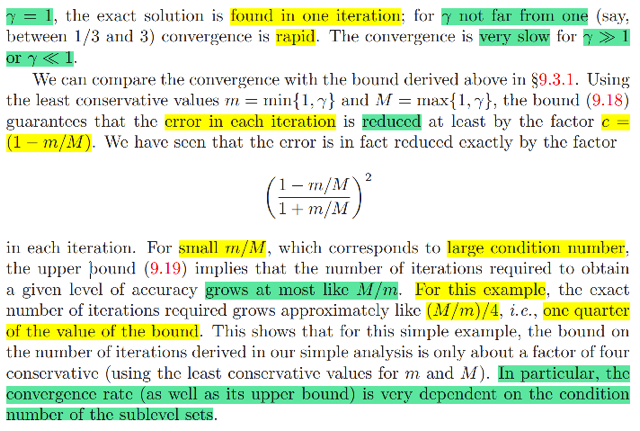</kbd>

<kbd>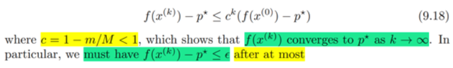</kbd>

> [!NOTE]
> Rồi, thế thì nếu γ = 1 thì dễ thấy f(x) sẽ bằng 0 ngay sau một bước
> (hay x sẽ bằng ngay x* = (0,0) ngay sau một iteration)
>
> Nếu γ không xa 1 quá thì converge cũng nhanh.
>
> Nhưng nếu γ >> 1 hay << 1 thì convergence sẽ lâu (tốn nhiều iteration)
>
> Thế thì, trong bài toán này, như đã nói, error giảm đi sau mỗi iteration
> bởi factor [(γ - 1)/(1 + γ)]^2. Nếu ta dùng giá trị m = min(1, γ) và M =
> max (1, γ) như nói hồi nãy. Thì factor này quả thật chính là [(1 - m/M)/(1
> + m/M)]^2
>
> Chứng minh ko khó. Xét 2 trường hợp:
>
> 1) γ > 1 ⇨ m = 1, M = γ. Khi đó [(γ - 1)/(γ + 1)]^2 = [(M - m)/(M + m)]^2
>
> = [(M(1 - m/M)/M(1 + m/M)]^2 = [(1 - m/M)/(1 + m/M)]^2
>
> 2) γ < 1 ⇨ m = γ, M = 1. Khi đó [(γ - 1)/(γ + 1)]^2  = [(m - M)/(m +
> M)]^2
>
> = [M(m/M - 1)/M(m/M + 1)]^2 = [(m/M - 1)/(m/M + 1)]^2
>
> cũng = [(1 - m/M)/(1 + m/M)]^2
>
> Thế thì trong phần trước, ở kết quả (9.18) có screenshot lại bên dưới,
> đó là f(x(k)) - p* ≤ c^k[f(x(0)) - p*] với c = 1 - m/M. Thì kết quả này có
> thể ghi lại theo cách khác dùng error như vầy:
>
> error(k) ≤ c^k error(0). (vì f(x(k)) - p* chính là error(k) tức error ở step
> k)
>
> Như vậy hiểu kết quả này đó là error sau mỗi step SẼ GIẢM VỚI
> FACTOR  ÍT NHẤT LÀ c (DẤU ≤ CHO THẤY CÓ THỂ SẼ GIẢM
> NHANH HƠN NỮA NHƯNG DẤU = CHO THẤY NÓ ÍT NHẤT LÀ GIẢM
> THEO FACTOR NÀY)
>
> Vậy nên sách mới nói "error in each iteration is reduced at least by
> factor c, = 1 - m/M.
>
> Thế thì đó là lí thuyết, và bài toán thực tế ta đang xét ta đã nói error
> giảm với factor là [(1 - m/M)/(1 + m/M)]^2 thì có thể hiểu là nó cũng sẽ
> ≥ 1 - m/M.
>
> ====
>
> Rồi, một điểm kiến thức nữa đã học là khi trong phần trước đã nhận
> định rằng khi condition number M/m mà lớn, thì bound của số iteration
> cần thiết sẽ tỉ lệ tuyến tính với condition number.
>
> (xem lại theo link hồng)
>
> Và đối chiếu với kết quả của bài toán cụ thể này, ta thấy số iteration (không
> phải bound của iteration, nhưng cũng có thể xem là tương đương, vì bound
> nó tăng thì cũng coi như số iteration cần thiết sẽ tăng) sẽ tăng theo (M/m)/4
> (kết quả này chưa biết ở đâu ra nhưng ý chính là cho thấy đúng là nó
> như trong lí thuyết nói, rằng số iteration sẽ tăng tuyến tính với độ lớn
> của condition number)
>
> Để rồi tóm lại rằng, tỉ lệ / tốc độ hội tụ (về optimal value) sẽ phụ thuộc
> nhiều vào độ lớn của condition number của sublevel set
>
> (nhắc lại hồi đầu đã nói ta đang có quadratic function, nên sublevel
> set thật ra là ellipsoid, nên condition number của sublevel set chính
> là condition number của Hessian

**🔗 See also:** [linked note](#node-5ng64a3)

 

<kbd>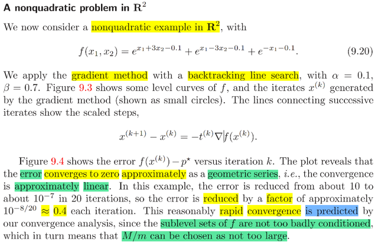</kbd>

<kbd>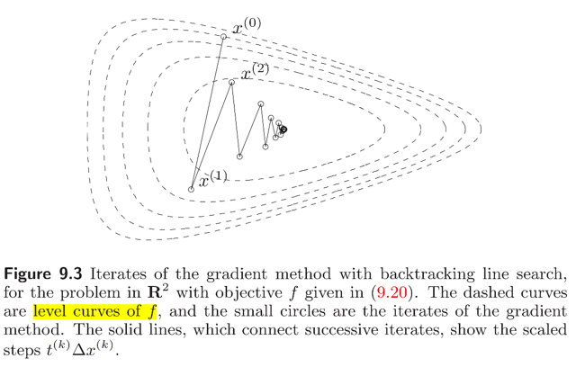</kbd>

<kbd>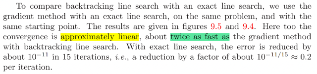</kbd>

> [!NOTE]
> Chuyển qua ví dụ một non-quadratic problem trong R^2. Thì lúc này
> level curve ko còn là đường ellipse, cũng như sub-level set C-α ko còn
> là hình ellipse nữa.
>
> Hình 9.4 đại khái là plot độ lớn của error (f(x(k)) - p*) tại các iteration
> theo hai phương pháp backtracking và exact line search. Nhận xét
> thấy error giảm gần như tuyến tính với scale factor là ≈ 0.2
> (backtracking) và ≈ 0.4 (exact).
>
> Thì một ý quan trọng nói là, kết quả này (việc convergence tương đối
> nhanh) phù hợp với dự đoán của ta nếu ta dùng những kiến thức của
> phần convergence analysis, nói rằng giới hạn / chặn (bound) của số
> iteration  cần thiết sẽ phụ thuộc (tỉ lệ nghịch) với vào log(1/c) = - log(1 -
> m/M).
>
> Có nghĩa là nếu condition number (M/m) càng lớn ⇨ m/M càng nhỏ ⇨
> -m/M càng lớn ⇨ 1 - m/M càng lớn ⇨ - log(1 - m/M) càng lớn ⇨ số
> iteration cần thiết càng lớn. Ngược lại condition number nhỏ (gọi là
> KHÔNG BAD CONDITION) thì số iteration cần thiết sẽ nhỏ.
>
> Và về mặt hình học, condition number của sublevel set như đã biết,
> được định nghĩa bởi (bề rộng lớn nhất)^2 / (bề rộng nhỏ nhất)^2. Vậy
> thì ta thấy trong hình, các sub-level set có khác biệt giữa bề rộng lớn
> nhất và và nhỏ nhất không quá NHIỀU (nếu nhiều, thì hình ảnh sẽ là
> những hình rất dẹt, kéo rất dài ở một phương và rất ốm ở phương
> khác). Do đó đây chính là biểu hiện cho thấy dù chưa biết condition
> number của sub-level set là bao nhiêu nhưng về hình học cho ta biết
> nó ko quá lớn, từ đó có thể dự đoán số iteration sẽ ko quá nhiều
> (convergence sẽ ko quá lâu)
>
> Và để so sánh giữa back-tracking và exact line search thì hình ảnh 9.5
> cho thấy nhận xét sau:
>
> (Cùng một ví trí ban đầu x(0), thì với backtracking, vì như đã biết ta sẽ
> chỉ chọn đại, cụ thể là bắt đầu với step size t = 1, để rồi cũng đi theo
> hướng - ∇f(x(0)), để tới x(1), sau đó, giảm step size xuống, và đi theo
> hướng - ∇f(x(1)) để tới x(2) (dĩ nhiên ∇f(x(0)) khác ∇f(x(1))) Thế thì
> chính vì chọn đại step size, ko tối ưu, nên mới có cái kiểu đi vòng lên
> rồi lại vòng về lại, cứ thế tạo nên hình zig zac.
>
> Trong khi đó với exact line search, từ x(0) ta đã tìm ra step size TỐI
> ƯU mà theo đó f(x(1)) = f(x(0) - t ∇f(x(0))) là nhỏ nhất. Do đó trong hình
> 9.5 có thể thấy vị trí x(1) phản ánh điều này. (Nếu có thể cắt đồ thị  với
> mặt phải vuông góc mặt xy và chứ vector ∇f(x(0)) thì ta sẽ thấy nó  tạo
> thành một đường cong mà đáy nằm ngay vị trí của x(1))
>
> Từ x(1), exact line search tìm ra bước đi tối ưu, và trong hình có thể
> hiểu, - ∇f(x) tại x(1) sẽ chỉ về hướng của x*. Và exact line search sẽ tìm
> ra ngay chính xác bước đi cần thiết để từ x(1) trở thành x(2) bằng
> đúng x*
>
> Nên chú ý thang error của hình 9.4 cho thấy sau step 1,2 thì error của
> exact line seaerch đã rất nhỏ rồi (≈10^-2, 10^-3)

 

<kbd>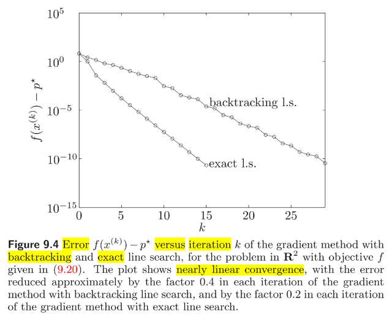</kbd>

<kbd>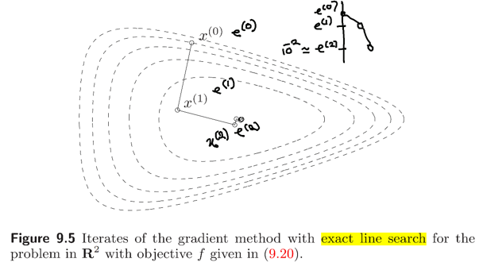</kbd>

 

<kbd>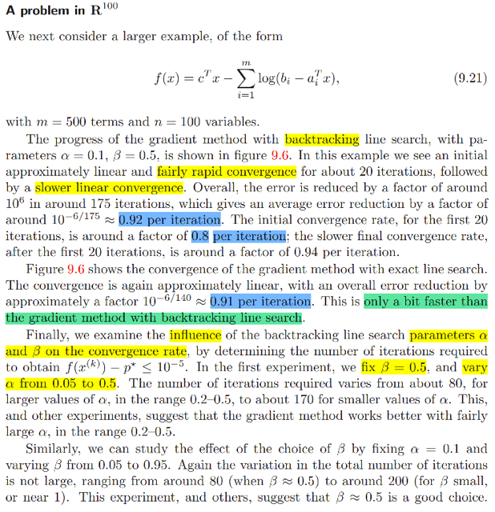</kbd>

<kbd>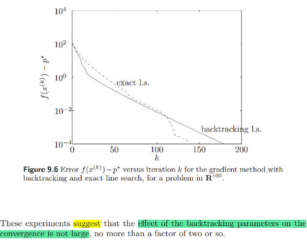</kbd>

<kbd>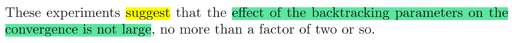</kbd>

> [!NOTE]
> một ví dụ khác, chưa xem kĩ nhưng nói chung là cho thấy tốc độ
> converge của hai case  back-tracking và exact không quá khác
> nhau.
>
> Và khúc cuối là phân tích ảnh hưởng của parameter α và β trong
> backtracking method với tốc độ convergence thì thấy không ảnh
> hưởng mấy.

 

<kbd>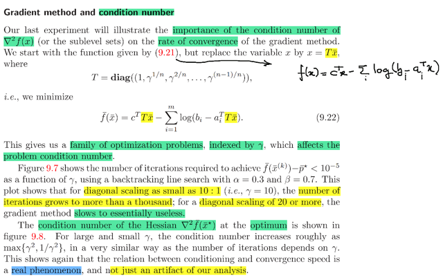</kbd>

<kbd>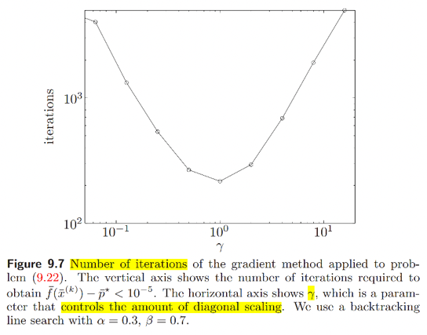</kbd>

<kbd>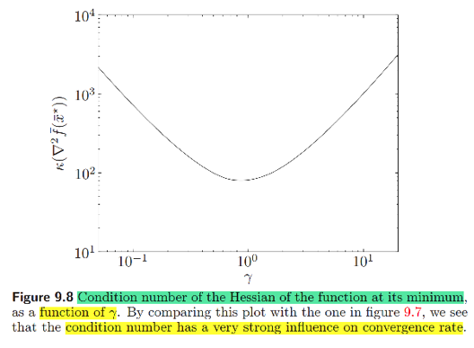</kbd>

> [!NOTE]
> đại khái là phần này ta sẽ phân tích ảnh hưởng của condition number của
> Hessian matrix ∇^2f(x) lên convergence của gradient method với ví  dụ cụ
> thể dùng objective function f(x) = cTx - Σ log(bi
> - aiTx)
>
> Đầu tiên họ thay x = Tx_bar. Với T là diag[(1, γ^1/n, γ^2/n...)]
>
> Có thể hiểu cái này như vầy: x = Tx_bar ⇔ Tinv x = x_bar với Tinv là
> matrix cũng là diagonal matrix, với các diagonal entries là nghịch đảo của
> diagonal entries của T: Tinv = diag[(1, 1/(γ^1/n), 1/(γ^2/n),... )]
>
> Như vậy có thể thấy các component của x_bar sẽ là các component
> tương ứng của x nhưng được scale bởi (chia xuống cho) factor tương
> ứng là các entries của T:
>
> x_bar = [x1/1, x2/(γ^1/n), x3/(γ^2/n), ...]
>
> Mục đích đó là thông qua việc thay đổi γ, thì ta sẽ thay đổi tỉ lệ kéo giãn
> theo các phương khác nhau. Để từ đó thay đổi tỉ lệ giữa [bề rộng lớn
> nhất] / [bề rộng nhỏ nhất] của sub-level set
>
> Và từ đó nó cũng chính là ta cho condition number của problem (chính là
> condition number của sublevel set của objective function) phụ thuộc vào
> γ. Để từ đó quan sát ảnh hưởng của condition number lên tốc độ
> convergence.
>
> Thế thì hình 9.7 cho thấy kết quả như vậy, khi γ tăng từ 0.1 lên 1 rồi lên
> 10 tương ứng với ý nghĩa là condition number của sub-level set (= tỉ lệ
> giữa  bình phương bề rộng lớn nhất / bình phương bề rộng nhỏ nhất) sẽ
> thay đổi từ lớn đến nhỏ (khi bằng 1) và lớn lên trở lại. Thì tốc độ
> convergence cũng tăng lên và đạt đỉnh khi condition number = 1 và sau
> đó thì giảm trở lại.
>
> Đây phù hợp với kết quả mà ta đã có ở phần trước (lý thuyết) (theo link -
> phần convergence analysis) nói rằng khi sublevel set có condition number
> ≈ 1, nơi mà ta có tính chất isotropic (hiểu nôm na là mức độ stretch của
> các phương đều nhau, tròn trịa) thì convergence sẽ nhanh nhất. Ngược
> lại khi condition number lớn, thể hiện một phương nào đó bị kéo giãn
> vượt trội so với phương nhỏ nhất, hình ảnh như cái bánh mì bị kéo dài và
> ốm. Thì convergence sẽ chậm
>
> Khúc cuối, cũng như là hình 9.8 là plot condition number của Hessian
> tại optimal (dĩ nhiên cũng là function theo γ). Cái này cũng cho ta thấy
> cùng nhận định rằng γ mà ≈ 1 thì condition number của Hessian tại optimal
> sẽ nhỏ nhất. Và phần trước ta đã biết khi gần optimal thì sub level set sẽ 
> ngày càng gần giống (hoặc nói cách khác là có thể được xấp xỉ bởi) một
> ellipsoid (3D trở lên) hay ellipse (2D). Mà khi đó condition number của nó
> (của sub level set / ellipsoid) sẽ cũng chính là condition number của positive
> semi definite define ra nó (chính là Hessian ∇^2f(x*)).
>
> Tom lại đều củng cố nhận định là, condition number mà càng nhỏ để khiến
> sublevel set "càng tròn trịa" / "ít bị méo" / "bề rộng các phương đều xem xem"
> thì sẽ khiến convergence nhanh (số iteration nhỏ) và ngược lại.
>
> Và đọan cuối họ có ý nói rằng qua ví dụ này ta thấy thật sự điều này đúng
> chứ ko chỉ đúng về lý thuyết

**🔗 See also:** [linked note](#node-aw81333)

 

<kbd>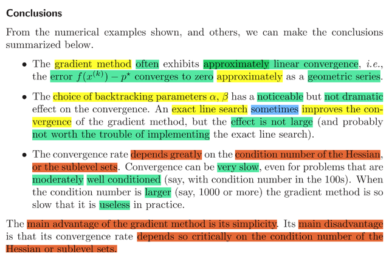</kbd>

> [!NOTE]
> Kết luận đại khái là:
>
> 1) Gradient descent method thường cho ta kết quả là sự hội tụ về
> optimal thường là tuyến tính, thể hiện bởi mức độ giảm của error sẽ
> có thể coi như một chuỗi geometric
>
> 2) Tham số của backtrack line search ko ảnh hưởng nhiều lắm đến
> tốc độ hội tụ
>
> 2b) So với backtrack line search thì exact line search cũng không tỏ
> ra khiến cải thiện vượt trội tốc độ hội tụ, nên thường là không đáng
> phải làm trừ khi là việc làm theo exact là tương đối đơn giản nếu
> không thì không bỏ công
>
> 3) Cuối cùng là, cái thứ ảnh hưởng mạnh nhất đến tốc độ
> convergece chính là CONDITION NUMBER CỦA HESSIAN / HAY
> CỦA SUBLEVEL SET
>
> Do đó ưu điểm của gradient descent method là nó đơn giản nhưng
> nhược  điểm là phụ thuộc quá nhiều vào condition numbers

 

<kbd>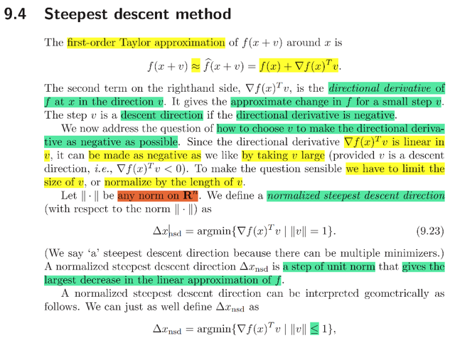</kbd>

<kbd>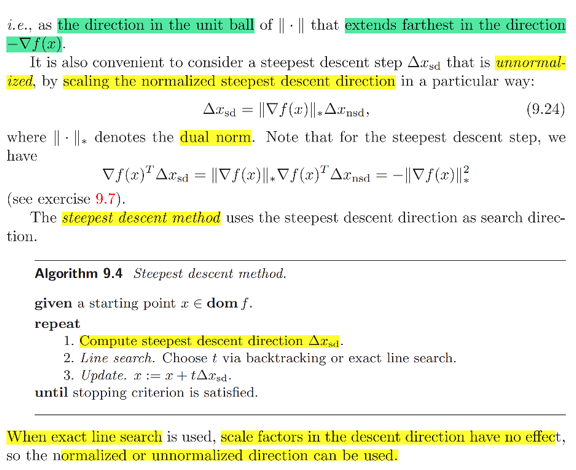</kbd>

> [!NOTE]
> đại khái là, nhớ lại một chút, phần 9.2 ta nói về descent method, trong đó, chủ yếu
> ta nói về các bước thực hiện nói chung, bao gồm 1) chọn descent direction Δx là
> hướng nào đó mà f(x + t Δx) nhỏ hơn f(x) và 2) là nói về việc tìm t, tức step size,
> để rồi trong đó có hai cách là exact line search (giúp tìm t tốt nhất) hoặc
> backtracking line search (cho t đại bằng 1 và giảm từ từ cho đến khi thỏa exit
> condition) và 3) update Thế thì phần này chủ yếu phân tích hai cái line search
> strategy của step 2.
>
> Sau đó qua 9.3 là khi ta nói về step 1, thay vì chọn đại descent direction, ta dùng
> luôn một cái tiện nhất: - ∇f(x). Và chủ yếu là đi phân tích convergence analysis,
> những yếu tố nào tác động đến tốc độ convergence (số iteration cần thiết để đến
> được p*)
>
> Và tới đây, thì vấn đề đặt ra là quay lại nói về việc chọn descent direction. Thay vì
> chọn bừa, thay vì chọn một option tiện lợi là
> - ∇f(x) thì ta đặt câu hỏi là chọn hướng nào tối ưu, tức giúp giảm f nhanh nhất.
> (mặc dù tí nữa ta cũng sẽ thấy rằng hóa ra -∇f(x) cũng chính là tối ưu)
>
> Thế thì, để lập luận một cách khái quát, ta mới dùng linear approx. tại x (ví dụ như
> initial point x(0)):
>
> Với hàm 1 biến thì ta có: f(x + δx) ≈ f(x) + f'(x) δx
>
> Hay khái quát với đa biến thì gọi là Fisrt order Taylor expansion:
>
> f(x + δx) ≈ f(x) + ∇f(x)Tδx
>
> Hay gọi δx là vector v như trong sách ta có:
>
> f(x + v) ≈ f(x) + ∇f(x)Tv
>
> Thế thì, dĩ nhiên từ đây, ta có thể lập luận như sau:
>
> kết qủa trên tương đương f(x) - f(x + v) ≈ - ∇f(x)Tv, do đó, mức sụt giảm của f(x) có
> thể được tối đa hóa sao cho: v phải khiến ∇f(x)Tv ÂM (ĐỂ - ∇f(x)Tv DƯƠNG) và
> sao cho ĐỘ LỚN CỦA ∇f(x)Tv LỚN NHẤT CÓ THỂ.
>
> Thế thì điều đầu tiên cho thấy v phải hợp với gradient ∇f(x) một góc TÙ (acute)
> như đã từng nói trước đây (vì ∇f(x)Tv = ||∇f(x)||.||v||.cos(α))
>
> Vậy thì vấn đề bây giờ là tìm v sao cho độ lớn của ∇f(x)Tv lớn nhất.
>
> Thế thì, vì ý định là tìm HƯỚNG VETOR, nên dĩ nhiên ta đương nhiên cần không
> care độ lớn của vector v, chính là NORMALIZE NÓ, để có  v với unit norm ||v|| = 1.
>
> VÀ CHÚ Ý, NORM Ở ĐÂY LÀ NORM CHUNG CHUNG, CÓ THỂ LÀ L1, L2, ...Ln, L-infinity
> norm
>
> Khi đó bài toán tìm v ở trên sẽ thể hiện bởi bài toán optimization sau:
>
> minimize ∇f(x)Tv subject to ||v|| = 1
>
> hay: Δx_nsd (Δx là vì đây là descent direction, và nsd viết tắt của normalized
> steepest descent:
>
> Δx_nsd = argmin ∇f(x)Tv | ||v|| = 1 
>
> Và về mặt hình học thì ta có thể hiểu rằng, giống như xét mọi vector trong một
> quả cầu (nôm na là xét mọi hướng) thì hướng nào khiến ∇f(x)Tv là lớn nhất, 
>
> Δx_nsd = argmin ∇f(x)Tv | ||v|| ≤ 1   |  ý là với constraint thay bằng ≤ (||v|| ≤ 1) thì
> ta đang nói rằng tìm trong mọi vector thuộc quả cầu (ball) : v: ||v|| ≤ 1, thay vì nói
> tìm trong mọi vector có unit norm.(ý là nói theo quả cầu dễ hình dung là ta đang
> quan tâm đến việc tìm trong các hướng khác nhau 360 độ)
>
> Tất nhiên khi đó kết qủa cũng sẽ ra v có norm = 1 
>
> ====
>
> Cũng có khi sẽ có ích khi ta không normalize v, gọi là UNNORMALIZED STEEPEST 
> DESCENT method. Bằng cách scale normalized steepest descent lên lại với scalar
> ||∇f(x)||*:
>
> Δx_sd = ||∇f(x)||* Δx_nsd 
>
> Sử dụng identity mà mình đã chứng minh trong note kế bên (màu cam):
>
> ∇f(x)TΔx_nsd = - ||∇f(x)||*
>
> Ta sẽ có ∇f(x)T Δx_sd =  ∇f(x)T  ||∇f(x)||* Δx_nsd = ∇f(x)TΔx_nsd ||∇f(x)||*
>
> = (||∇f(x)||*)^2
>
> Nhưng ý chính đơn giản chỉ là vậy, tìm hướng khiến f giảm nhiều nhất / hướng dốc
> nhất / hướng khiến ∇f(x)Tv (âm) và có giá trị lớn nhất.
>
> THÌ ĐÓ GỌI LÀ STEEPEST DESCENT METHOD
>
> Nói thêm một ý là nếu dùng exact line search thì vì đàng nào ta cũng tìm step tối
> ưu, nên chỉ quan tâm hướng thôi, khi đó normalize hay không cũng như nhau
>
> Ta cần chứng minh identity này ∇f(x)TΔx_nsd = - ||∇f(x)||* (nội 
> dung của bài tập 9.7):
>
> Nhớ lại định nghĩa của dual norm: ||v||* = sup ||u|| ≤ 1 uTv 
> tức tìm uTv với vector u nào maximize uTv
>
> Vậy thì, ||∇f(x)||* = sup ||u|| ≤ 1 ∇f(x)Tu mang ý nghĩa là tìm
> trong các vector của unit ball, vector nào tối đa hóa ∇f(x)Tu
> Thế thì, vì ∇f(x)Tu = ||∇f(x)||||u|| cosθ nên cái này sẽ đạt max
> khi θ = 0 và ||u|| = 1. Có nghĩa là u trùng hướng ∇f(x), và có
> norm bằng 1: do đó u = ∇f(x) / ||∇f(x)||. 
>
> Từ đó sup ||u|| ≤ 1 ∇f(x)Tu = ∇f(x)T ∇f(x) / ||∇f(x)||
>
> = ||∇f(x)||^2 / ||∇f(x)|| = ||∇f(x)|| (1)
>
> còn Δx_nsd = argmin ∇f(x)Tv | ||v|| ≤ 1 cũng là solution của
> bài toán inf ||v|| ≤ 1 ∇f(x)Tv sẽ đạt min khi v ngược hướng 
> ∇f(x) và có norm = 1. 
>
> ⇨ Δx_nsd = -∇f(x)/||∇f(x)||
>
> nên ∇f(x)T Δx_nsd = ∇f(x)T -∇f(x) / ||∇f(x)|| 
>
> = - ||∇f(x)||^2 / ||∇f(x)|| = - ||∇f(x)|| (2)
>
> Từ (1) và (2) kết luận ∇f(x)TΔx_nsd = - ||∇f(x)||*
>
> 9. UNCONSTRAINED PROBLEM
>
> 9.4 STEEPEST DESCENT METHOD

 

<kbd>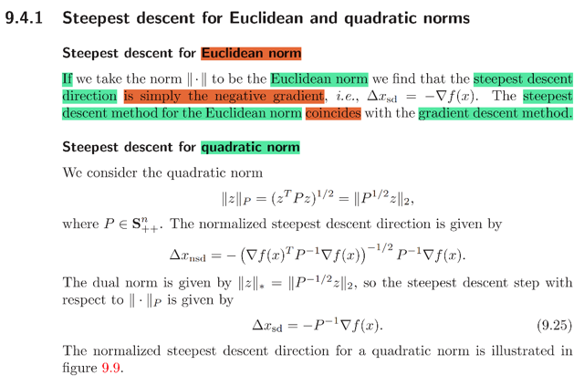</kbd>

> [!NOTE]
> rồi thế thì NẾU XÉT NORM LÀ L2 NORM (EUCLIDEAN NORM) THÌ
> STEEPEST DESCENT CHÍNH LÀ GRADIENT DESCENT: Tức là
> negative gradient
>
> Δx_sd = - ∇f(x)  
>
> Ta phải chứng minh nếu dùng l2 norm thì:
>
> argmax  -∇f(x)Tv : ||v|| = 1 = - ∇f(x)
>
> (cũng là phải chứng minh argmin ∇f(x)Tv : ||v|| = 1 = - ∇f(x))
>
> Đơn giản thôi, xét bài toán optimization:
>
> minimize v ∇f(x)Tv constraint ||v|| = 1 
>
> Thế thì ∇f(x)Tv = ||∇f(x)||.||v||.cos(∇f(x), v) dĩ nhiên norm trong công thức
> này là l2 norm. Do đó sử dụng constraint là l2 norm ||v|| = 1, ta có:
>
> ∇f(x)Tv = ||∇f(x)||.1.cos(∇f(x),v) và vì cos(..) ∈ [-1,1] và ||∇f(x)|| ≥ 0 nên
> cái này đạt min khi: 
>
> cos(∇f(x),v) = -1 ⇔ ∇f(x)Tv / ||∇f(x)||.||v|| = -1
>
> Tức v ngược hương với ∇f(x), và để có unit norm thì v sẽ được
> normalize:
>
>  v = - ∇f(x) / ||∇f(x)||
>
> =====
>
> Thế thì tiếp theo, nếu xét QUADRATIC NORM: ||.||P có công thức là:
>
> Ta có matrix positive definite P, thì quadratic norm của z định nghĩa bởi P
> sẽ có công thức là: ||z||P = (zTPz)^1/2
>
> Thế thì theo định nghĩa ta sẽ cần giải bài toán:
>
> minimize ∇f(x)Tv constraint ||v||P = 1 ⇔ (vTPv)^1/2 = 1
>
> ⇔ (vTP^1/2 P^1/2v)^1/2 = 1 ⇔ [(P^1/2Tv)T(P^1/2Tv)]^1/2 = 1
>
> ⇔ [||P^1/2Tv||^2]^1/2 = 1 ⇔ ||P^1/2Tv|| = 1 (đương nhiên norm đây là l2 norm)
>
> bài toán sẽ là minimize ∇f(x)Tv constraint ||P^1/2Tv|| = 1
>
> Lagrangian: L = ∇fTv + ε(||P^1/2Tv|| - 1)  |  dùng ε là Lagrange multiplier gắn 
> với equality constraint 
>
> KKT condition:
>
> ∇_v L(v, ε) = 0 ⇔ ∇_vf0(v) + ε ∇_vh(v) = 0
>
> ∇f0(v) = ∇f
>
> ∇h(v):  h(v) = ||P^1/2Tv|| - 1 = √[(P^1/2Tv)T(P^1/2Tv)] - 1
>
> = √(vTP^1/2P^1/2Tv) - 1 = √(vTPv) - 1 = (vTPv)^1/2 - 1
>
> dh/dv = dh/d(vTPv) d(vTPv)/dv 
>
> + dh/d(vTPv) = (1/2) (vTPv)^-1/2 
>
> + d(vTPv)/dv không khó để ra 2PTv (dùng cách làm của MIT 18s096)
>
> ⇨ dh/dv = (1/2) (vTPv)^-1/2 2PTv = PTv / (vTPv)^1/2 = PTv / ||P^1/2Tv|| 
>
> = Pv / ||P^1/2v||  | vì P symmetric
>
> ⇨ ∇_v L = ∇f + Pv / ||P^1/2v||
>
> KKT conditions: ∇_v L = 0 ⇔ ∇f + ε Pv / ||P^1/2v|| = 0
>
> ⇔ Pv = -∇f ||P^1/2v|| / ε
>
> Đặt α = ||P^1/2v|| / ε ta có 
>
> Pv = -α ∇f 
>
> ⇔ v = Pinv (- α ∇f) = - α Pinv ∇f 
>
> Thế vào ||P^1/2v|| = ||P^1/2 (- α Pinv ∇f )|| = α ||P^1/2 Pinv ∇f|| = α ||P^1/2 P^-1 ∇f||
>
> = α ||P^-1/2 ∇f||
>
> Sử dụng constraint ||P^1/2v|| = 1 ta có α ||P^-1/2 ∇f|| = 1 ⇨ α = 1 / ||P^-1/2 ∇f||
>
> = 1 / [(P^-1/2 ∇f)T(P^-1/2 ∇f)]^1/2 = 1 / (∇fTP^-1/2P^-1/2 ∇f)^1/2
>
> = 1 / (∇fTPinv∇f)^1/2 = (∇fTPinv∇f)^-1/2
>
> Vậy α = (∇fTPinv∇f)^-1/2
>
> Vậy v = - α Pinv ∇f  = - (∇fTPinv∇f)^-1/2 Pinv ∇f  đây là kết qủa như trong sách
>
> Δx_nsd = - (∇fTPinv∇f)^-1/2 Pinv ∇f
>
> Rồi, đó là normalized, còn unnormalized thì ta nhân với ||∇f(x)||*:
>
> Δx_sd = ||∇f(x)||* Δx_nsd = - ||∇f(x)||* (∇fTPinv∇f)^-1/2 Pinv ∇f (2)
>
> Thế thì, với quadratic norm thì dual norm sẽ là:
>
> Theo định nghĩa dual norm nói chung ||v||* = sup ||u|| ≤ 1 uTv vậy thì ta giải bài toán:
>
> maximize uTv subject to ||u|| ≤ 1. Và khi ở đây là nói về dual norm của quadratic norm ||.||P
> thì bài toán sẽ là:
>
> maximize uTv subject to ||u||P ≤ 1 ⇔ uTPu ≤ 1
>
> equivalent minimize -uTv subject to uTPu ≤ 1:
>
> Đổi biến đặt w = P^1/2u ⇨ wTw (=||w||^2) = uTP^1/2P^1/2t = uTPu. 
>
> Và w = P^1/2u ⇨ u = P^-1/2w
>
> Từ đó bài toán equivalent: maximize (P^-1/2w)Tv = wT(P^-1/2)v constraint ||w||^2 ≤ 1
>
> Thế thì sup ||w|| ≤ 1 wTa = aTa, nói cách khác, vector có norm ≤ 1 (của unit ball) khiến
> maximize wTa khi và chỉ khi w trùng hướng a và độ lớn đạt max cho phép, tức = 1.
>
> Vậy sup ||w||^2 ≤ 1 wTP^-1/2v = (P^-1/2v)T(P^-1/2v) = ||P^-1/2v||
>
> Do đó trong sách nói dual norm sẽ là ||z||* = ||P^-1/2z||
>
> Như vậy ||∇f(x)||* = ||P^-1/2 ∇f(x)|| 
>
> và dẫn đến kết quả (2) trở thành:
>
> Δx_sd = ||∇f(x)||* Δx_nsd = -  ||P^-1/2 ∇f(x)|| (∇fTPinv∇f)^-1/2 Pinv ∇f
>
> = - [∇f(x)TP^-1/2P^-1/2 ∇f(x)]^1/2 (∇fTPinv∇f)^-1/2 Pinv ∇f
>
> = - (∇fTPinv∇f)^1/2 (∇fTPinv∇f)^-1/2 Pinv ∇f
>
> = - Pinv ∇f như sách

 

<kbd>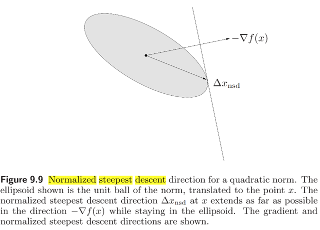</kbd>

 

<kbd>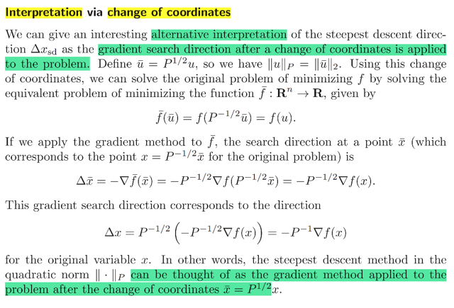</kbd>

> [!NOTE]
> Đại khái là phần này nói rằng ta có thể coi (interpretation) cái hướng
> steepest descent direction chính là negative gradient sau khi đã chuyển
> đổi hệ trục.
>
> Gọi u~ (trong sách là u_bar) = P^1/2 u ⇔ P^-1/2 u~ = u.
>
> Khi đó ||u||P = (uTPu)^1/2 = [(P^-1/2 u~)TP(P^-1/2 u~)]^1/2
>
> = [u~TP^-1/2PP^-1/2 u~]^1/2
>
> = [u~TP^-1/2P^2/2P^-1/2 u~]^1/2 = [u~Tu~]^1/2 = ||u~||
>
> Kết qủa này nói là đặt u~ = P^1/2 u thì ||u||P = ||u~|| (quadratic norm
> của u chính là L2 norm của u~)
>
> Vậy thì từ bài toán gốc minimize f(u) với constraint ||u||P ≤ 1 ta có thể
> giải  bài toán equivalent là minimize f(P^-1/2 u~) = f~(u~) (là hàm theo
> u~) với constraint ||u~|| ≤ 1 (l2 norm, thay vì quadratic norm)
>
> u~ = P^1/2 u ⇔ u = P^-1/2 u~
>
> ⇨ f(u) = f(P^-1/2 u~) = f~(u~)
>
> Giờ ta cần tìm đạo hàm của f~(u~): nó là f(P^-1/2 u~) tức là hàm f mà
> thay u = P^-1/2 u~ rồi, nên nó trở thành hàm theo u~, kí hiệu f~(u~).
>
> Nên tìm đạo hàm của f~(u~) chính là tìm đạo hàm của f(u) theo u~
>
> có thể ghi là f(u(u~))
>
> Dùng chain rule:
>
> df~/du~ = df/du~ = df/du du/du~ = df/du P^-1/2
>
> ∇f~(u~) = ∇f(u) P^-1/2 = ∇f(P^-1/2 u~) P^-1/2
>
> = P^-1/2 ∇f(P^-1/2 u~)
>
> Rồi, với bài toán equivalent này, ta nếu DÙNG GRADIENT METHOD,
> tức chọn Δx~ = - ∇f~(x~)
>
> ∇f~(x~) như trên, = P^-1/2 ∇f(P^-1/2 x~)
>
> Vậy đã hiểu vì sao sách ghi Δx~ = - P^-1/2 ∇f(P^-1/2 x~)  = - P^-1/2
> ∇f(x)
>
> Rồi, khi u = P^-1/2 u~ thì Δu ĐƯƠNG NHIEN CŨNG BẰNG P^-1/2 Δu~
>
> (vì Δu = u1 - u2 = P^-1/2u1~ - P^-1/2u2~ = P^-1/2(u1~-u2~) = P^-1/2
> Δu~)
>
> Vậy nên Δx = P^-1/2 Δx~, thay Δx~ = - P^-1/2 ∇f(x) ở trên vào:
>
> ⇨ Δx = P^-1/2 (- P^-1/2 ∇f(x))
>
> ⇔Δx = - P^-1 ∇f(x)
>
> VÀ Ý CHÍNH LÀ KẾT QUẢ NÀY , NHƯ VỪA MỚI LÀM , CHÍNH LÀ
> Δx_sd
>
> NÊN Ý NÓI RẰNG, THÌ BẰNG CÁCH ĐỔI HỆ TRỤC, THÔNG QUA
> MATRIX P: x~ = P^1/2 x. THÌ TA SẼ CÓ BÀI TOÁN MỚI MÀ TRONG ĐÓ
> TA ÁP DỤNG GRADIENT METHOD SẼ CHÍNH LÀ KHI TA ÁP DỤNG
> STEEPEST DESCENT DÙNG QUADRATIC NORM VỚI BÀI TOÁN
> GÓC

 

<kbd>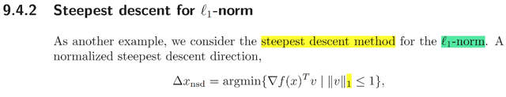</kbd>

<kbd>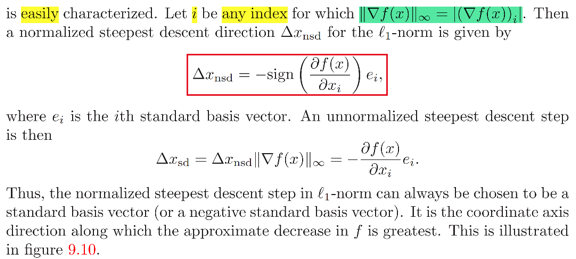</kbd>

<kbd>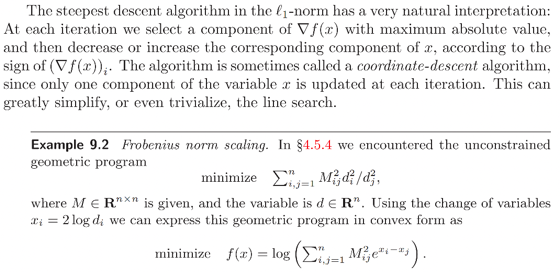</kbd>

<kbd>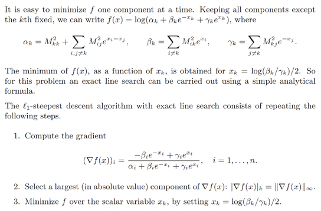</kbd>

> [!NOTE]
> Tiếp, sau khi ở phần trước là ta xét steepest descent method với l2 
> norm và quadratic norm. Thì bây giờ là l1 norm.
>
> Vẫn từ định nghĩa: Δx_nsd = argmin { ∇f(x)Tv  |  ||v|| ≤ 1 }. Và trong
> trường hợp này, ||v|| là l1 norm. Do đó phải ghi rõ  ||v||1 (nếu ko ghi 
> thì tự hiểu là l2 norm)
>
> Vậy thì ta sẽ có bài toán optimization như sau:
>
> minimize ∇f(x)Tv constraint Σi |vi| ≤ 1 (||v||1 = Σi |vi|)
>
> L = ∇f(x)Tv + λ(||v||1 - 1)
>
> KKT: ∇L(v) = 0 
>
> 1) d[∇f(x)Tv]/dv:
>
> d[∇f(x)Tv] = ∇f(x)T(v + dv) - ∇f(x)Tv = ∇f(x)Tdv
>
> ⇨ d[∇f(x)Tv] / dv = ∇f(x)
>
> 2) d[λ(||v||1 - 1)]/dv: = d[λ(||v||1)]/dv = λ d(||v||1]/dv
>
> Và ta cần tính derivative của f(x) = ||x||1. Nếu mà là l2 norm, thì
> ∇f(x) sẽ bằng x / ||x||.
>
> Còn đây là ||x||1, vì phải làm sao. Ta sẽ vẫn dùng lập luận đã học
> từ MIT 18s096 nói rằng, bất cứ khi nào ta có vector -> scalar function
> f(x). Thì df = f'(x)[dx] nhất định là INNER PRODUCT GIỮA ∇f VỚI dx.
>
> Nên vấn đề là tìm ra / triển khai ra df có dạng [some thing] . dx, và 
> đây là column vector nên inner product chỉ là dot product thông thương.
> Nên nói chung là ta cần làm sao làm cho ra df = [something]Tdx  
>
> Thì [something] đó chính là ∇f.
>
> Vậy thì df = ||x+dx|| - ||x|| = Σ |xi + dxi| - Σ |xi|
>
> |xi + dxi| ≈ |xi| + sign(xi) . dxi 
>
> ⇨ Σ |xi + dxi| - Σ |xi| ≈ Σ [|xi| + sign(xi) . dxi] - Σ |xi|
>
> = Σ [sign(xi) . dxi]  = sign(x) . dx (hay sign(x)T dx
>
> Vậy ∇f(x) = sign(x) (f(x) = ||x||)
>
> ⇨ λ d(||v||1]/dv = λ sign(v)
>
> Và ∇L = ∇f(x) + λ sign(v).
>
> ∇L = 0 ⇔ ∇f(x) + λ sign(v) = 0  ⇔ sign(v) = - ∇f(x) / λ
>
> ....KHÓ QUÁ QUAY LẠI SAU
>
> QUAY LẠI SAU

 

<kbd>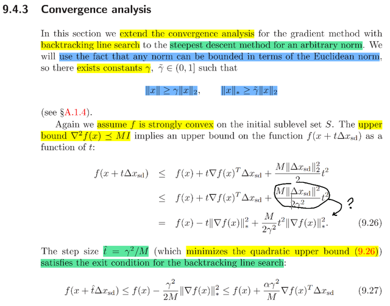</kbd>

<kbd>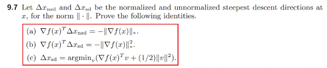</kbd>

<kbd>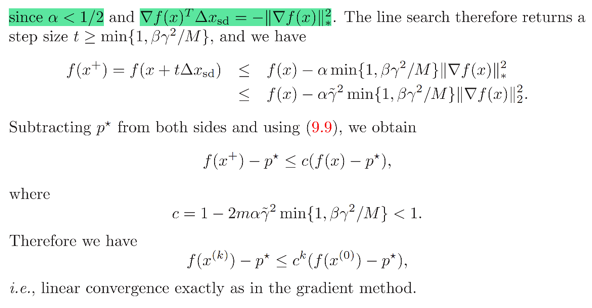</kbd>

> [!NOTE]
> Phần này gs mở rộng thảo luận về convergence analysis  cho steepest
> descent method với norm bất kì.
>
> Đầu tiên tạm chấp nhận kiến thức là tồn tại γ: ||x|| ≥ γ||x||2  (ý nghĩa là
> độ lớn của norm bất kì có một chặn dưới thể hiện bởi l2 norm)
>
> Thế thì, ta assume f strongly convex trên sublevel set S
>
> (nhớ đại khái có nghĩa là với mọi x belong S thì Hessian độ cong theo
> mọi hướng đều có giá trị ít nhất là m với m là số dương nào đó nhỏ lớn
> bất kì: Thể hiên theo toán học là tồn tại m > 0 sao cho ∇^2f(x) - m*I ≽ 0)
>
> Ta cũng có cái upper bound ∇^2f(x) ≤ MI  (nói ở phần trước - theo link)
> thế thì cái chặn này cho phép ta có một cái chặn trên của f(x + t Δx_sd)
> theo t:
>
> f(x + t Δx_sd) ≈ f(x) + ∇f(x)T tΔx_sd + 0.5(t Δx_sd)T ∇^2f(x)(t Δx_sd)
>
> (second order Taylor expansion)
>
> ≤ f(x) + ∇f(x)T tΔx_sd + 0.5(t Δx_sd)T MI (t Δx_sd)   | dùng ∇^2f(x) ≤ MI
>
> = f(x) + ∇f(x)T tΔx_sd + 0.5 M t^2 (Δx_sd)T(t Δx_sd)
>
> = f(x) + ∇f(x)T tΔx_sd + 0.5 M ||Δx_sd||l2^2 t^2   (chú ý đây là l2
> norm)
>
> ≤ f(x) + ∇f(x)T tΔx_sd + 0.5 M (||Δx_sd||)^2 t^2 / γ^2
>
> | chuyển thành norm chung chung dùng ||x||2 ≤ ||x||/γ
>
> = f(x) - t (||∇f(x)||*)^2 + 0.5 M (||Δx_sd||)^2 t^2 / γ^2   
>
> (dùng identity tạm chấp nhận (bài tập 9.7): ∇f(x)TΔx_sd = - ||∇f(x)||*^2
>
> = f(x) - t (||∇f(x)||*)^2 + 0.5 M / γ^2 t^2 (||∇f(x)||*)^2
>
> | Cái dưới chưa hiểu lắm nhưng có thể là QUAY LẠI SAU VẬY
>
> ===
>
> Rồi vậy f(x + t Δx_sd) ≤  f(x) + ∇f(x)T tΔx_sd + 0.5 M (||Δx_sd||)^2 t^2 / γ^2
>
> tức là ta có chặn trên của nó theo là quadratic function theo t.
>
> thì t^ = γ^2 / M là cái minimize cái chặn trên này. (để chứng minh chỉ cần
> giải bài toán minimize quadratic function theo t này, cũng khong khó)
>
> Thì quan trọng là t^ này ĐÃ THỎA EXIT CONDITION CỦA BACKTRACKING
> LINE SEARCH.
>
> Là sao, nhớ lại exit condition của backtracking line search đó là:
>
> f(x + t Δx) ≤ f(x) + t α ∇f(x)T Δx  mang ý nghĩa là hàm f đã giảm thấp hơn
> dự đoán của linear approximation với độ dốc đã được adjusted bởi α.
>
> Vậy thì nói t^ thỏa tức là ta phải có:
>
> f(x + t^ Δx_xd) ≤ f(x) + t^ α ∇f(x)T Δx_sd (I)
>
> Thật vậy:
>
> từ f(x + t^ Δx_xd) ≤ f(x) - ||∇f(x)||* + 0.5 M / γ^2 t^2 (||∇f(x)||*)^2
>
> thay t = γ^2 / M: 
>
> vế phải = f(x) - γ^2 / M (||∇f(x)||*)^2 + 0.5 (M / γ^2) (γ^4 / M^2) (||∇f(x)||*)^2
>
> = f(x) - 1/2 γ^2 / M ||∇f(x)||*^2 
>
> = f(x) + 1/2 γ^2 / M ∇f(x)TΔx_sd    |  Thay ∇f(x)TΔx_sd = - ||∇f(x)||*^2
>
> = f(x) + 1/2 t^ ∇f(x)TΔx_sd 
>
> ĐẾN ĐÂY, vì 0 ≤ α < 0.5
>
> nên f(x) + 1/2 t^ ∇f(x)TΔx_sd  ≤  f(x) + α t^ ∇f(x)TΔx_sd 
>
> đã chứng minh xong t^ thỏa exit condition
>
> ====
>
>
> NÓI CHUNG LÀ KHÚC DƯỚI CUỐI CÙNG CHO THẤY STEEPEST
> DESCENT CŨNG CONVERGE LINEARLY Y CHANG NHƯ GRADIENT
> METHOD

**🔗 See also:** [linked note](#node-1u71cgz)

 

<kbd>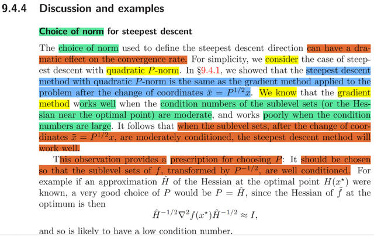</kbd>

> [!NOTE]
> Đại khái là phần này thảo luận về việc CHỌN NORM GÌ, trong
> steepest decent method.
>
> Thế thì phần trước, 9.4.1 mình đã làm qua để thấy rằng khi ta đổi hệ
> trục, đặt x~ = P^1/2 x, thì việc apply GRADIENT METHOD (trong đó ta
> chọn Δx = - ∇f(x)) CHÍNH LÀ TA ĐANG DÙNG STEEPEST DESCENT
> VỚI QUADRATIC NORM cho bài toán gốc.
>
> Mà mấy bài trước ta cũng đã phân tích để thấy với Gradient method thì
> NÓ SẼ WORK TỐT (CONVERGE NHANH) khi CONDITION  NUMBER
> của sub-level set LÀ NHỎ.
>
> Do đó, điều này GỢI Ý RẰNG, khi ta chọn P để x~ =  P^1/2 x, (để rồi
> áp dụng gradient method sẽ tương đương áp dụng steepest descent
> method cho hệ gốc) thì P nên có tính chất sao cho sau khi chuyện hệ
> trục thì sublevel set của hàm f CÓ WELL CONDITION (condition
> numebr của sublevel set nhỏ)
>
> Lấy ví dụ nếu ta biết H^ là ước lượng cuả Hessian tại x* thì ta sẽ dùng P = H^ để
> khiến cho trong hệ trục mới Hessian tại optimal của nó LÀ IDENTITY MATRIX (LÀ
> CÁI CÓ CONDITION ĐẸP NHẤT, TRÒN TRỊA NHẤT)
>
> Đầu tiên để hiểu cái này thì ta phải hiểu là khi đổi hệ trục bởi P: u~ = P^1/2 u
>
> Thì bài trước ta đã tìm gradient của f~ wrt u~: ∇f~(u~)
>
> df/du~ = df/du P^-1/2
>
> ∇f~(u~) = ∇f(u) P^-1/2 = ∇f(u) P^-1/2  
>
> Vậy thì ta sẽ tìm tiếp Hessian, tức ∇^2f~(u~)
>
> Vậy thì đơn giản là ta đạo hàm của ∇f~(u~) theo u~:
>
> ∇f~^2(u~) = d[∇f(u) P^-1/2] / du~
>
> = (d[∇f(u)] / du~). P^-1/2
>
> = (d[∇f(u)] / du . du/du~) . P^-1/2   | Chain rule
>
> = ∇^2f(u) P^-1/2 P^-1/2
>
> = P^-1/2 ∇^2f(u) P^-1/2  | theo ChatGPT thì đơn giản là ta được phép
>
> Khi P = H^ là ước lượng của Hessian tại x* thì cái trên = (H^)^-1/2 ∇^2f(u)
> (H^)^-1/2
>
> và tại x*: (H^)^-1/2 ∇^2f(x*) (H^)^-1/2
>
> Và vì noí H^ là ước lượng của Hessian tại x* nên ∇^2f(x*) = H^
>
> Vậy = (H^)^-1/2 H^ (H^)^-1/2 = I
>
> Nhớ ko, khi mà sublevel set của f có condition number nhỏ, thì converge sẽ nhanh.
> Có kiến thức bữa trước đã biết, khi rất gần optimal thì sublevel set coi như (approx
> tốt bởi) ellipsoid / ellipse. Vậy thì nếu well condition thì nó sẽ là hình tròn.: Ellipse :
> x: (x - x*)H(x - x*) ≤ b. Khi H = I thì nó thành (x-x*)^2 ≤ b LÀ BALL / CIRCLE

**🔗 See also:** [linked note](./chap_95.md#node-6y66c2y)

 

<kbd>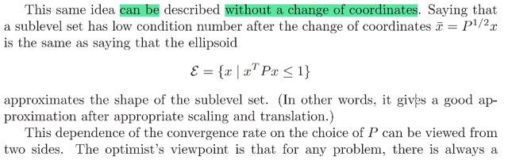</kbd>

<kbd>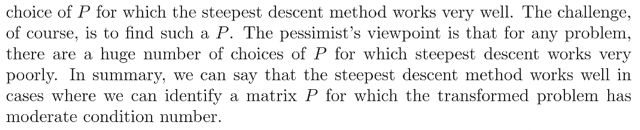</kbd>

 

<kbd>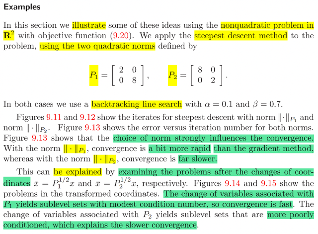</kbd>

<kbd>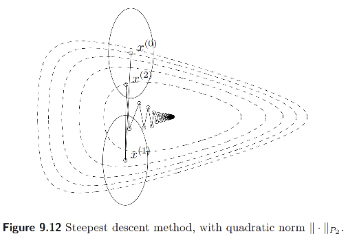</kbd>

<kbd>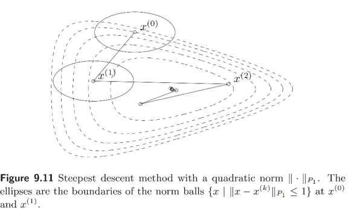</kbd>

<kbd>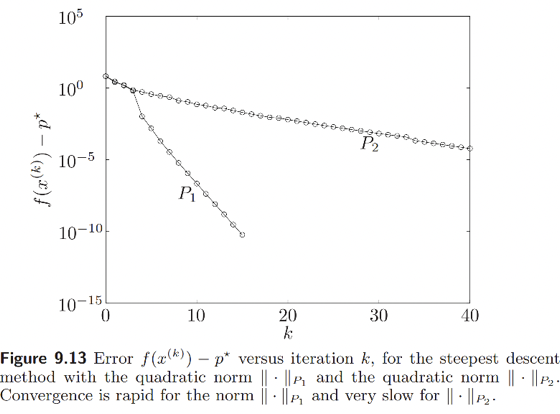</kbd>

> [!NOTE]
> Đại ý là áp dụng steepest descent method vào với quadratic norm 
> defined bởi P1, và P2 vào bài toán non-quadratic ở phần trước.
>
> Thì kết quả cho thấy khi dùng ||.||P1 thì nó nhanh hơn là gradient
> descent tí xíu trong khi với ||.||P2 thì rất chậm. Điều này minh họa cho
> việc việc lựa chọn norm gì để làm có ảnh hưởng lớn tới hiệu quả.
>
> Và như đã nói ở phần trước, sử dụng steepest descent với quadratic
> norm tương đương với việc ta đổi hệ trục tọa độ bởi matrix P: x~ = P^1/2 x
> và sau đó áp dụng gradient descent. Mà gradient descent thì sẽ hoat
> động tốt khi sublevel set có condition number nhỏ. Thành ra, câu chuyện
> sẽ là matrix P nào khiến sau khi đổi hệ trục thì function có sublevel set có
> condition nhỏ thì nó sẽ là cái khiến steepest descent nhanh.
>
> Và thật vậy, hai hình cuối cho thấy sau khi biến đổi hệ trục bởi P1, thì
> các sublevel set trở nên "TRÒN HƠN" (hiểu là, đều hơn, bớt dẹt hơn)
> còn với P2 thì nó trở nên rất dẹt. Đó chính là biểu hiện rằng sau khi biến
> đổi thì P1 cho ra bài toán có condition number nhỏ hơn, nên gradient 
> descent hoạt động tốt.

 

<kbd>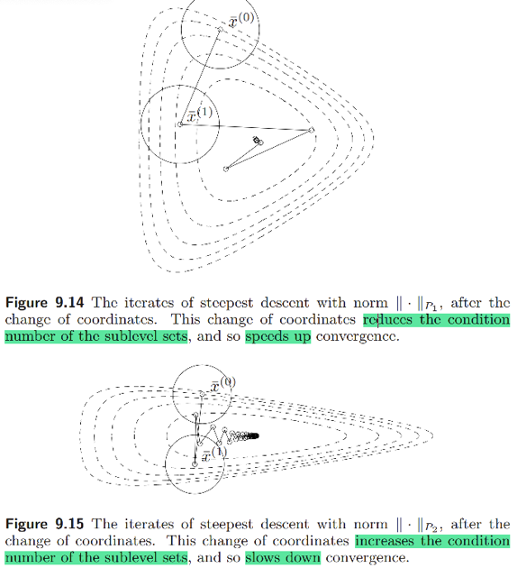</kbd>

 

