# Chap 9.5

📊 **Progress:** `44` Notes | `81` Screenshots

---

## Chap 9.5

 

<kbd>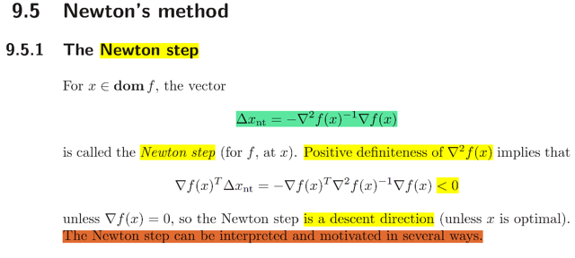</kbd>

> [!NOTE]
> Rồi, đầu tiên là định nghĩa Newton's step: Δx_nt (kí hiệu "nt" = "newton")  sẽ là:
> - ∇^2f(x)_inv ∇f(x)
>
> Thì mới nói nhờ tính chất positive definite của Hessian ∇^2f(x) mà ta sẽ có
> ∇f(x)TΔx_nt = - ∇f(x)T∇^2f(x)_inv ∇f(x) < 0. Là sao?
>
> Đó là vì khi Hessian ∇^2f(x) ≻ 0 thì mọi eigenvalues của nó cũng dương,
> nên ∇^2f(x)_inv với eigenvalues bằng nghịch đảo của eigenvalues của
> Hessian cũng sẽ dương nên nó cũng positive definite. Mà với positive
> definite matrix, quadratic form: uTPu sẽ luôn dương hoặc bằng 0 khi u bằng 0,
> nên -uTPu sẽ luôn âm với u khác 0.
>
> Thành ra mới nói quadratic form - ∇f(x)T∇^2f(x)_inv ∇f(x) luôn âm khi trừ khi
> ∇f(x) = 0, mà ∇f(x) = 0 thì là optimal đó.
>
> Tóm lại cho thấy Newton step Δx_nt LÀ MỘT DESCENT DIRECTION, ý  là
> nó chỉ về hướng giúp giảm function.
>
> VÀ MỘT DÒNG TA NÊN ĐỂ Ý ĐÓ LÀ CÓ NHIỀU CÁCH HIỂU /
> INTERPRETATION VỀ NEWTON STEP
>
> 9. UNCONSTRAINED PROBLEM
>
> 9.5 NEWTONS'S METHOD

 

<kbd>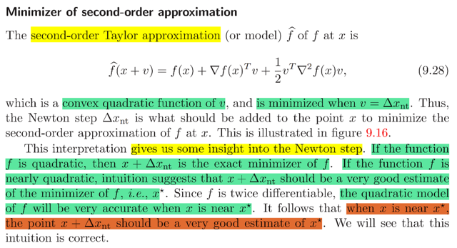</kbd>

> [!NOTE]
> đại khái ngắn gọn là vầy:
>
> Khi ta second order Taylor expansion của f(x) ta sẽ có:
>
> (đi ra khỏi x khoảng nhỏ v, giống như hay dùng δx vậy):
>
> f(x + v) ≈ f(x) + ∇f(x)Tv + 1/2 vT∇^2f(x)v
>
> Thế thì vế phải, là một quadratic function theo v:
>
> g(v) = f(x) + ∇f(x)T(v - x) + 0.5(v - x)T∇^2f(x)(v - x)
>
> Xét function quadratic này g(x) = r + 0.5xTPx + qTx
>
> dg = r + 0.5(x + dx)TP(x + dx)+ qT(x + dx) - (r + 0.5xTPx + qTx)
>
> = r + 0.5xTPx + 0.5dxTPx + 0.5xTPdx + 0.5dxTPdx + qTx + qTdx
>
> -r - 0.5xTPx - qTx
>
> = xTPdx + qTdx
>
> = (PTx + q)Tdx
>
> ∇g = PTx + q = 0 ⇔ x = -PTinvq
>
> Vậy áp dụng vào g(v)
>
> g(x + v) = f(x) + ∇f(x)Tv + 0.5vT∇^2f(x)v
>
> v giúp minimize g là: v = -PTinvq = -∇^2f(x)inv∇f(x)
>
> Và đó chính là công thức của Newton's step:
>
> Δnt = -∇^2f(x)inv∇f(x)
>
> Thành ra ta có nhận định rằng: Newton's step LÀ KHI TA COI /
> ƯỚC LƯỢNG HÀM f(x) LÀ MỘT HÀM BẬC 2, ĐỂ RỒI VỚI HÀM
> BÂC 2 THÌ TA CÓ THỂ GIẢI RA OPTIMAL CỦA NÓ BẰNG CÔNG
> THỨC (MÀ HÀM KHÁC THÌ CHƯA CHẮC) THÌ NEWTON STEP
> CHÍNH LÀ CÁI KHIẾN x + Δx_nt CHO RA OPTIMAL CỦA HÀM BẬC
> HAI NÀY
>
> Do đó nếu function f chính xác là một quadratic function, thì dĩ
> nhiên từ x, newton step sẽ giúp cho  ra ngay optimal: f(x + Δx_nt)
> = f(x)*
>
> Còn nếu f không chính xác  nhưng rất gần giống quadratic
> function thì x + Δx_nt cũng giúp tìm ra điểm rất gần optimal.
>
> Và đây là lí do mà khi càng gần x*, newton step càng giúp đi đến x*
> nhanh vì càng gần x* thì hàm f càng có thể được xấp xỉ tốt bởi
> quadratic function điều này là vì xấp xỉ bậc 2 của f nói rằng khi x gần
> x* thì f(x) ≈ f(x*) + ∇f(x*)T(x - x*) + (1/2)(x - x*)T ∇^2f(x*)(x - x*), tức
> là trong phạm vi càn gần x* thì sự xấp xỉ bậc hai này sẽ càng đúng
>
> CÁCH HIỂU ĐẦU TIÊN VỀ NEWTON STEP: ĐÓ LÀ TẠI ĐIỂM
> ĐANG ĐÚNG COI HÀM f NHƯ HÀM BẬC HAI, TỪ ĐÓ TÌM RA
> HƯỚNG ĐI
> + BƯỚC ĐI ĐỂ ĐẾN MINIMUM CỦA HÀM BẬC HAI NÀY THÌ ĐÓ
> CHÍNH LÀ NEWTON STEP

 

<kbd>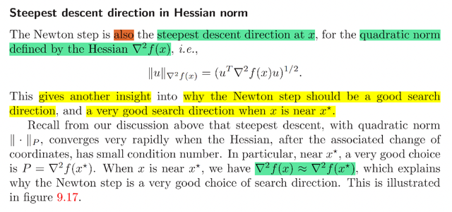</kbd>

<kbd>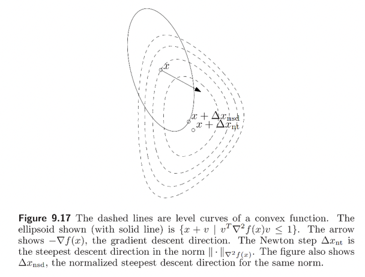</kbd>

> [!NOTE]
> đại khái là họ nói rằng, nếu mà ta "làm" theo phương pháp steepest
> descent với quadratic norm define bởi P là Hessian matrix ∇^2f(x).
>
> Thì khi đó Δx_sd theo bài trước ta đã biết sẽ là:
>
> Δx_sd = - Pinv ∇f(x). Với P = ∇^2f(x) ⇨ Pinv = ∇^2f(x)inv
>
> ⇨ Δx_sd = - ∇^2f(x)inv ∇f(x) và nó chính là Newton's step Δx_nt
>
> Thành ra giúp ta hiểu vì sao Newton step cũng tốt (bởi bản chất
> nó cũng là steepest descent direction)
>
> Rồi, đại khái là ta đã nói nhiều lần rằng, khi dùng steepest descent
> với quadratic norm define bởi matrix P thì thực chất nó tương
> đương với việc ta đổi hệ trục bởi P: Đặt x~ = P^1/2 x. Khi đó trong
> hệ trục  mới ta làm theo Gradient descent. Và bởi vì Gradient
> descent sẽ nhanh khi condition number của problem (tức của
> sublevel set) nhỏ nên cơ bản là dẫn đến nhận định rằng nếu P
> khiến việc biến đổi coordinate tạo ra problem có condition number
> nhỏ thì nó sẽ là cái khiến steepest descent nhanh.
>
> Và trong phần trước (theo link) ta cũng đã có nói rằng, nếu mà ta
> chọn P là H^, là approximated của Hessian tại optimal x*. Thì khi
> đó, sau khi biến đổi bởi H^, Hessian tại x* sẽ chính là ra Identity
> matrix, thể hiện rằng sau biến đổi, sublevel set có dạng của hình
> tròn, và có condition number rất nhỏ ≈ 1 (well condition) và do đó
> giúp converge rất nhanh.
>
> Vậy thì, ở đây, khi ta chọn P là Hessian ∇^2f(x) thì chính là khớp
> với điều ở trên. Là bởi vì, khi x gần x*, thì Hessian ∇^2f(x) trở nên
> gần với Hessian của optimal. Nên theo như trên nói thì sau khi biến
> đổi coordinate bởi P = ∇^2f(x) thì sublevel set trong vùng gần x* sẽ
> có condition number nhỏ -> converge nhanh

**🔗 See also:** [linked note](./chap_91_94.md#node-lhz1ztj)

 

<kbd>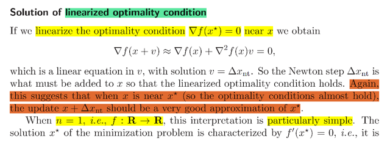</kbd>

<kbd>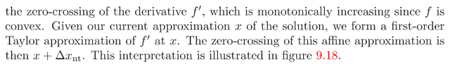</kbd>

<kbd>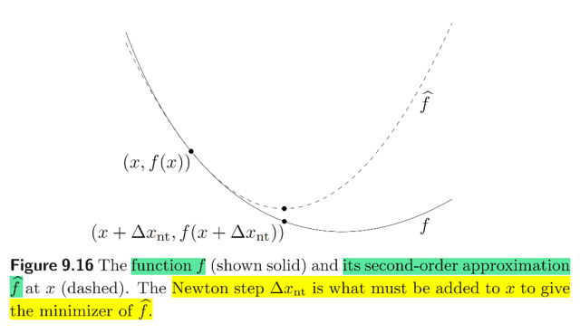</kbd>

<kbd>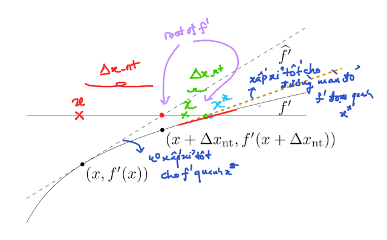</kbd>

> [!NOTE]
> đại khái là, ta biết cái vụ optimality condition, nó là nhận định rằng
> gradient tại optimal sẽ vanish ∇f(x*) = 0. Và từ đó giúp ta giải ra tìm
> optimal.
>
> Thế thì, bản chất việc giải ∇f(x) = 0 là việc tìm giao điểm của một hàm số
> định nghĩa bởi g(x) = ∇f(x) với trục x (y = 0). Và, dĩ nhiên hàm số g(x)
> này có thể là hàm phi tuyến.
>
> Thế thì để giải tìm solution của g(x) = 0. Trong 18.01 ta đã học về
> Newton's method: Bắt đầu bởi một initial guess: x0, Ta mới xây dựng
> tangent line của hàm g tại x0: Dùng linear approximation tại x0: g(x - x0)
> = g(x0) + g'(x0)(x - x0) và vế phải chính là phương trình của tangent line
> tại x0: h(x) = g(x0) + g'(x0)(x - x0)
>
> Từ đó ta mới giải h(x) = 0 để ra "next guess" x1 và nó sẽ gần với true
> solution x* của g(x) = 0 hơn initial guess x0. Tiếp tục lặp lại ta sẽ có x2,
> x3....dần dần converge về x*
>
> Thế thì: h(x) = 0 ⇔ g(x0) + g'(x0)(x - x0) = 0
>
> ⇔  g(x0) + g'(x0)x - g'(x0)x0 = 0
>
> ⇔  g'(x0)x = g'(x0)x0 - g(x0)
>
> Thay g(x) = ∇f(x) ta có:
>
> ∇^2f(x) x = ∇^2f(x)x0 - ∇f(x0)
>
> ⇔ x = ∇^2f(x)inv [∇^2f(x)x0 - ∇f(x0)]
>
> ⇔ x = x0 - ∇^2f(x)inv ∇f(x0) Và đó là x1
>
> Thế thì ta thấy rằng x1 - x0 =  - ∇^2f(x)inv ∇f(x0)
>
> VÀ ĐÓ CHÍNH LÀ CÔNG THỨC CỦA NEWTON STEP.
>
> Như vậy đại khái là muốn nói ràng, công thức của Newton step không
> phải có gì xa lạ, mà nó chính là áp dụng kiến thức đã học là NEWTON
> METHOD trong việc giải OPTIMALITY CONDITION ∇f(x) = 0
>
> Và nhờ đó giúp ta hiểu tại sao khi x gần x* thì newton step giúp  x +
> Δx_nt rất gần với x*: Bởi lẽ trong newton method các x1, x2... sẽ ngày
> càng converge về x*. Nên nếu nó đã càng gần thì việc update sẽ càng
> đưa nó tới gần hơn nữa.
>
> MÀ BẢN CHẤT LÍ DO CỦA HIỆN TƯỢNG NÀY LÀ VÌ: 
>
> KHI CÀNG GẦN X*, THÌ CÁI HÀM TUYẾN TÍNH DÙNG ĐỂ XẤP XỈ HÀM 
> ∇f (gọi là ∇f^) SẼ NGÀY CÀNG XẤP XỈ TỐT CHO HÀM ∇f  TRONG VÙNG 
> Ở GẦN x*, dẫn tới là nghiệm của ∇f^(x) = 0 sẽ ngày càng xấp xỉ tốt cho 
> nghiệm của ∇f(x) = 0.
>
> Mà vì sao lại như vậy, là bởi ta biết linear approx:
>
> f(x) = f(x0) + ∇f(x0)T(x-x0) CHỈ ĐÚNG KHI x ≈ x0, do nên mình đang
> muốn tìm nghiệm của f(x) = 0, tức là xem f(x) cắt trục x tại điểm x* là gì
> nào, thì dĩ nhiên là chỉ khi x0 gần x* thì việc thay vì giải f(x) = 0 ta gỉai
> f(x0) + ∇f(x0)T(x-x0) = 0 mới giúp tìm ra x* được
>
> Trong hình dưới chính là apply Newton method trong việc giải optimality
> condition: f'(x) = 0 (với hàm đơn biến thì ∇f(x) thay bằng f'(x))
>
> Thì bước 1 như nói trên là tìm tangent tại initial guess: f'^ chính là cái
> này (và như trên đã hiểu rồi, nó dĩ nhiên là linear approximation  của f').
> Rồi bước 2 là tìm giao điểm của nó với trục x. Để có next guess Thì
> khoảng cách giữa x0 và x1 chính là newton step
>
> NÓI CHUNG TÓM LẠI LÀ, GIỐNG NHƯ PHẦN NÀY GIẢI THÍCH CÔNG
> THỨC CỦA NEWTON STEP LÀ TỪ ĐÂU RA, VÌ MỞ ĐẦU TA CHỈ BIẾT
> KHƠI KHƠI CÔNG THỨC NÓ VẬY. THÌ NAY TA BIẾT NÓ CHÍNH LÀ
> TỪ VIỆC DÙNG NEWTON METHOD ĐỂ GIẢI EQUATION ∇F(X) = 0
> CỦA OPTIMALITY CONDITION
>
> Ta muốn tìm f'(x*) = 0, tức là giải nghiệm của optimality condition
>
> Vậy thì nếu dùng linear approx của f'(x) tại x0:
>
> f'(x) ≈ f'(x0) + f''(x0)(x - x0).
>
> Và đặt vế phải là hàm f'^(x), khi đó vì sự xấp xỉ trên chỉ đúng khi x0 ≈ x
> nên nếu ta dùng hàm f'^(x) với x0 là điểm gần với x* thì khi đó hàm f'
> (x0) + f''(x0)(x - x0) có thể xấp xỉ tốt cho f'(x) nên nghiệm của f'(x0) + f''
> (x0)(x - x0) = 0 sẽ có thể xấp xỉ tốt cho nghiệm của f'(x) = 0
>
> Nói cách khác f'(x0) + f''(x0)(x - x0) = 0 ⇔ f'(x0) + f''(x0)x - f''(x0)x0 = 0
>
> ⇔ x = [ f''(x0)x0 - f'(x0) ] / f''(x0) sẽ ≈ x*  Điều này minh họa bởi x0
> xanh lá, khi đó nghiệm (root) của f'^ = 0 nó là điểm xanh lá tròn rất gần
> với x* vì hàm f'^ khi đó xấp xỉ tốt cho hàm f' quanh x*
>
> Ngược lại, nếu x0 ở xa x*, thì solution của f'(x0) + f''(x0)(x - x0) = 0 sẽ
> không approx tốt cho f'(x) = 0, bởi lẽ hàm f'^(x) không thể approx tốt cho
> f'(x) quanh x* (đoạn màu đỏ)
>
> Dẫn đến trong hình, root của f^(x) = 0 khi f^ là approx của f tại x đỏ,  là
> điểm tròn đỏ còn rất xa x* trong khi đó như đã nói, điểm tròn  xanh là
> root của f^(x) = 0 khi f^ là approx của f tại x xanh lá thì gần y như x*
>
> CÁCH HIỂU THỨ HAI VỀ NEWTON STEP: ĐÓ LÀ VIỆC TA TUYẾN
> TÍNH HÓA HÀM GRADIENT CỦA FUNCTION GỐC (TỨC LÀ COI
> GRADIENT CỦA HÀM GỐC LÀ HÀM BẬC 1, MÀ CÁI NÀY CŨNG
> CHÍNH LÀ COI HÀM GỐC NHƯ HÀM BẬC 2) ĐỂ TỪ ĐÓ THAY VÌ
> GIẢI OPTIMALITY CONDITION LÀ PHƯƠNG TRÌNH BẬC CAO THÌ
> NAY TA GIẢI MỘT OPTIMALITY CONDITION XẤP XỈ, LÀ MỘT
> PHƯƠNG TRÌNH BẬC 1
>
> TRONG 18.01 ĐÃ HỌC VỀ NEWTON METHOD DÙNG ĐỂ GIẢI
> NGHIỆM CỦA MỘT PHƯƠNG TRÌNH PHI TUYẾN BẰNG CÁCH
> LẶP ĐI LẶP LẠI VIỆC XÂY DỰNG TIẾP TUYẾN CỦA TẠI MỘT ĐIỂM
> ĐANG XET RỒI TÌM GIAO ĐIỂM CỦA TIẾP TUYẾN  CỦA NÓ VỚI
> TRUC HOÀNH (CHÍNH LÀ TÌM ROOT CỦA NÓ) VÀ GÁN ĐIỂM
> ĐANG XÉT CHO ĐIỂM ĐÓ, THÌ DẦN DẦN CÁC ĐIỂM SẼ
> CONVERGE VỀ TRUE SOLUTION
>
> THÌ CHÍNH LÀ CÁI NÀY, CÁI ĐANG NÓI Ở ĐÂY - TUYẾN TÍNH HÓA
> GRADIENT

 

<kbd>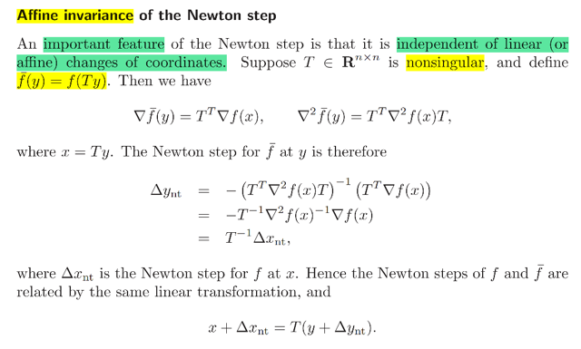</kbd>

> [!NOTE]
> Đại khái là ta đang có hàm f(x) với newton step Δx_nt
>
> Ta mới đặt x = Ty, để rồi ta có function f^(y) = f(Ty)
>
> thì thử tìm newton step Δy_nt.
>
> Theo công thức, nó bằng -∇^2f^(y)inv ∇f^(y)
>
> Xét gradient ∇f^(y):
>
> x = Ty ⇨ dx = T(y + dy) - Ty = Tdy ⇨ d/dx x(y) = T
>
> Cần tính d/dy f^(y).
>
> = d/dy f^(y) = d/dy f(Ty) = d/dy f(x(y)) = d/dx f(x) . d/dy x(y)
>
> = ∇f(x) . T 
>
> Với việc f^(y) là vector -> scalar function nên Df^(y) = row vector
>
> ⇨ d/dy f^(y) = (∇f(x)T)T  ⇨ ∇f^(y) = (T)T ∇f(x) = (T)T ∇f(g(y))
>
> ⇨ ∇f^(y) =  TT∇f(x) (TT ý là T tranposed) (đây là kết quả trong sách)
>
> Xét Hessian ∇^2_y f^(y):
>
> ∇^2 f^(y) = d/dy ∇f^(y) = d/dy TT∇f(x)
>
> = TT d/dy ∇f(x) = TT d/dx ∇f(x) . d/dy x(y)
>
> = TT ∇^2f(x) T
>
> Như vậy: Δy_nt = -∇^2f^(y)inv ∇f^(y) 
>
> = - [TT ∇^2f(x) T]inv TT∇f(x)
>
> Dùng (AB)inv = BinvAinv
>
> = - Tinv [TT ∇^2f(x)]inv  TT ∇f(x)
>
> = - Tinv ∇^2f(x)invTTinv TT ∇f(x)
>
> = - Tinv ∇^2f(x)inv ∇f(x)
>
> = Tinv Δx_nt
>
> Vậy Δy_nt = Tinv Δx_nt ⇔ Δx_nt = T Δy_nt
>
> Có nghĩa là, với x = Ty ta có Δx_nt = T Δy_nt
>
> ⇔ x + Δx_nt = T(y + Δy_nt)
>
> Điều này cho thấy Newton step độc lập bởi phép biến đổi
> hệ trục

 

<kbd>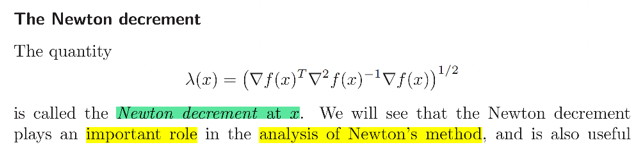</kbd>

<kbd>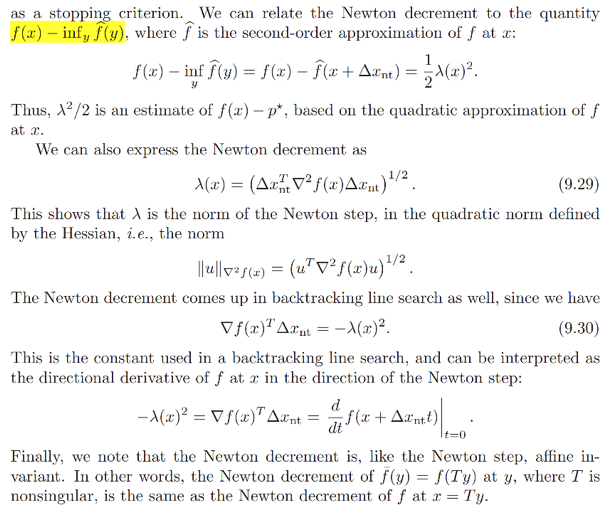</kbd>

> [!NOTE]
> tiếp theo nói về khái niệm Newton decrement, tính bằng công thức 
>
> λ(x) = [∇f(x)T∇^2f(x)inv ∇f(x)]^1/2, gọi là Newton decrement tại x.
>
> Thì ta có thể có một số cách hiểu về cái này, đầu tiên là nếu ta xét f(x) - inf y
> f^(y) với f^(y) là second-order approximation của f tại x:
>
> f^(y) = f(x) + ∇f(x)T(y - x) + 0.5(y - x)T∇^2f(x)(y - x)
>
> Thì dĩ nhiên f^ là quadratic function theo y, và y = x + Δx_nt là optimal
>
> f*^(y) = f^(y*) = f^(x + Δx_nt) = f^(x - ∇^2f(x)inv∇f(x))
>
> = f(x) + ∇f(x)T(x - ∇^2f(x)inv∇f(x) - x)
>
> + 0.5(x - ∇^2f(x)inv ∇f(x) - x)T ∇^2f(x) (x - ∇^2f(x)inv ∇f(x) - x)
>
> = f(x) - ∇f(x)T∇^2f(x)inv ∇f(x) + 0.5 [- ∇^2f(x)inv ∇f(x)]T ∇^2f(x) [- ∇^2f(x)inv] ∇f(x)
>
> = f(x) - ∇f(x)T∇^2f(x)inv ∇f(x) + 0.5 ∇f(x)T ∇^2f(x)invT ∇^2f(x) ∇^2f(x)inv ∇f(x)
>
> = f(x) - ∇f(x)T∇^2f(x)inv ∇f(x) + 0.5 ∇f(x)T ∇^2f(x)inv ∇f(x)
>
> = f(x) - 0.5 ∇f(x)T∇^2f(x)inv ∇f(x) 
>
> tức f(x) - inf y f^(y) = f(x) - f*^(y) =  f(x) - f(x + Δx_nt)
>
> = f(x) - [f(x) - 0.5 ∇f(x)T∇^2f(x)inv ∇f(x)]
>
> = 1/2 ∇f(x)T∇^2f(x)inv ∇f(x)
>
> Thì với λ(x) = [∇f(x)T∇^2f(x)inv ∇f(x)]^1/2
>
> Thì kết quả trên tức f(x) - inf y f^(y) chính là 1/2 λ(x)^2. Với f(x) - inf y f^(y)
> mang ý nghĩa là "nếu coi / xấp xỉ f(x) là một quadratic function, thì từ x, "đi
> xuống" nhiều nhất là bao nhiêu". Nên 1/2 λ(x)^2 là function cho ta giá trị này 
>
> ====
>
> λ(x) = [∇f(x)T∇^2f(x)inv ∇f(x)]^1/2, ta có thể thể hiện nó theo Newton's step Δx_nt: 
>
> Từ Δx_nt = -∇^2f(x)inv∇f(x) ⇨ ∇^2f(x) Δx_nt = - ∇f(x), thay vào:    
>
> λ(x) = [-[∇^2f(x) Δx_nt]T∇^2f(x)inv [-∇^2f(x) Δx_nt]]^1/2
>
> = [(Δx_nt)T ∇^2f(x)T ∇^2f(x)inv ∇^2f(x) Δx_nt ]^1/2
>
> = [(Δx_nt)T ∇^2f(x) ∇^2f(x)inv ∇^2f(x) Δx_nt ]^1/2
>
> = [(Δx_nt)T ∇^2f(x) Δx_nt ]^1/2
>
> ====
>
> Tiếp, λ(x) = [∇f(x)T∇^2f(x)inv ∇f(x)]^1/2 thì chiếu theo định nghĩa của quadratic
> norm ||u||P = (uTPu)^1/2 thì λ(x) CHÍNH LÀ quadratic norm của ∇f(x) với P =
> ∇^2f(x):
>
> λ(x) = ||∇f(x)||_∇^2f(x)
>
> ====  
>
> Rồi, một cách hiểu khác nữa của Newton decrement là liên hệ với backtracking 
> line search.
>
> Nhớ lại trong backtracking line search, ta bắt đầu với step size t = 1 và giảm
> dần t bởi factor β cho đến khi exit condition thỏa:
>
> f(x + t Δx) ≤ f(x) + t α ∇f(x)TΔx
>
> Vậy thì với Δx = Δx_nt = -∇^2f(x)inv ∇f(x) thì 
>
> ∇f(x)TΔx_nt = -∇f(x)T ∇^2f(x)inv ∇f(x)
>
> và cái này chính là -λ(x)^2.
>
> Và ∇f(x)TΔx_nt dĩ nhiên như đã biết có ý nghĩa / có thể coi là DIRECTIONAL
> DERIVATIVE của f theo hướng Δx_nt (1802 đã học, directional derivative của
> f(x) theo hướng vector u là ∇f(x)Tu)
>
> Vậy nên -λ(x)^2 chính là directional derivative của f theo hướng của Δx_nt
>
> Ý cuói cùng là liên quan đến khái niệm affine invariance, quay lại sau

**🔗 See also:** [linked note](./chap_10.md#node-rk6orjq)

 

<kbd>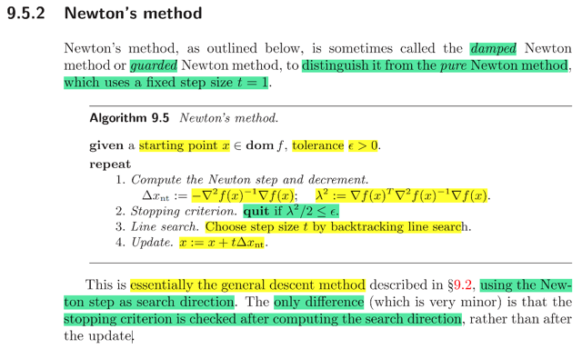</kbd>

> [!NOTE]
> Nói về thuật toán của Newton's method, nói chung cơ bản vẫn là
> thuật toán descent method đã học: 1) xác định descent direction Δx
> 2) xác định step: t, gọi là line search (tìm độ lớn bước đi theo
> hướng descent direction Δx) 3) update x := x + t Δx_nt
>
> Chỉ là: Δx dùng Newton's step: Δx_nt = -∇^2f(x)inv ∇f(x)
>
> và dĩ nhiên ta cũng sẽ check stopping condition. Mấy phương pháp
> trước như backtracking line search thì ta check sau khi update. 
>
> Còn ở đây ta check trước khi update, với condition là:
>
> λ(x)^2/2 ≤ ε. eps gọi là TOLERANCE
>
> ý nghĩa của stopping condition ta sẽ nói sau

 

<kbd>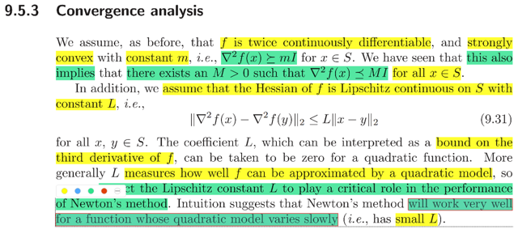</kbd>

> [!NOTE]
> đại khái là, trước khi phân tích sự hội tụ của phương pháp Newton's ta cũng
> có một số assumption, cụ thể là f khả vi hai lần (twice differentiable) tức tồn
> tại Hessian tại mọi điểm trong domain. Cũng như là function f  có tính
> Strongly convex (nhắc lại cho nhớ, strongly convex mạnh strictly convex:
> một cách ngắn gọn, strictly convex là curvature dương nhưng có thể tiệm
> cận 0 (≈ 0)
>
> Còn strongly convex là limit nhỏ nhất cũng bằng một một giá trị
> dương nào đó. Thể hiện của strictly convex là ∇^2f(x) ≻ 0, còn của strongly
> convex là tồn tại m > 0 sao cho ∇^2f(x) ≽ m*I.
>
> Ngoài ra, ta cũng đã biết, dựa vào một assumption khác đó là sub-level
> set S bị chặn, mà hình ảnh đại khái là khi x ra khỏi x* thì f(x) TĂNG LÊN
> NHANH HƠN ÍT NHẤT VỚI TỐC ĐỘ CỦA QUADRATIC , dẫn đến
> sub-level set KHÔNG THỂ MỞ RỘNG RA VÔ CÙNG mà phải bị chặn
> trong một phạm vi nào đó (gọi là COMPACT, bị chặn và đóng).
>
> Từ đó, ta mới có một upper bound cho maximum eigenvalue của
> Hessian đó là xét trong S (nhắc lại S là sub-level set x: f(x) ≤ f(x0)),
> vì S bị chặn nên Hessian eigenvalues của ∇^f(x) cũng sẽ bị chặn bởi giá
> trị M nào đó: ∇^2f(x) ⪯ M*I
>
> ====
>
> Thế thì mình được giới thiệu một khái niệm mà ta sẽ gặp nhiều trong những
> phần sau (cả trong các sách về deep learning, machine learning) đó là
> LIPCHITZ CONTINUOUS on S, thể hiện bởi
>
> ||∇^2f(x) - ∇^2f(y)||2 ≤ L||x - y||2  Fới ý nghĩa là, (vế trái) "khác biệt / sự
> thay đổi" của "độ cong" curvature sẽ không thể quá nhanh / quá đột
> ngột mà nó phải bị chặn, bị giới hạn bởi một mức độ nào đó tỉ lệ với
> theo sự thay đổi của x theo một factor L hữu hạn. Nôm na là, khi di
> chuyển từ x -> y thì curvature không thể thay đổi quá lớn, mà phải
> thay đổi từ từ
>
> Thế thì nếu xét hàm quadratic, vốn dĩ ta biết nó sẽ có constant Hessian
> (curvature mọi nơi đều bằng nhau) thì ∇^2f(x) - ∇^2f(y) = 0. Nên mới nói
> Lipschitz condition constant L = 0 khi f là quadratic.
>
> Và khi sự thay đổi curvature (khi di chuyển từ điểm này sang điểm kia)
> mà càng nhỏ, thì tức là function sẽ càng gần với constant curvature,
> tức là càng gần với quadratic function. Nên mới nói constant L này sẽ
> measure MỨC ĐỘ GIỐNG VỚI QUADRATIC FUNCTION của function:
> càng nhỏ thì càng gần.
>
> Và hồi nãy ta đã học rằng Newton's method hoạt động tốt nhất khi
> function là quadratic, hoặc rất gần quadratic. Do đó, có thể nhận định
> Lipschitz constant L này chính là cái sẽ ảnh hưởng đến hiệu qỉa của
> Newton's method

**🔗 See also:** [linked note](./chap_91_94.md#node-1u71cgz)

 

<kbd>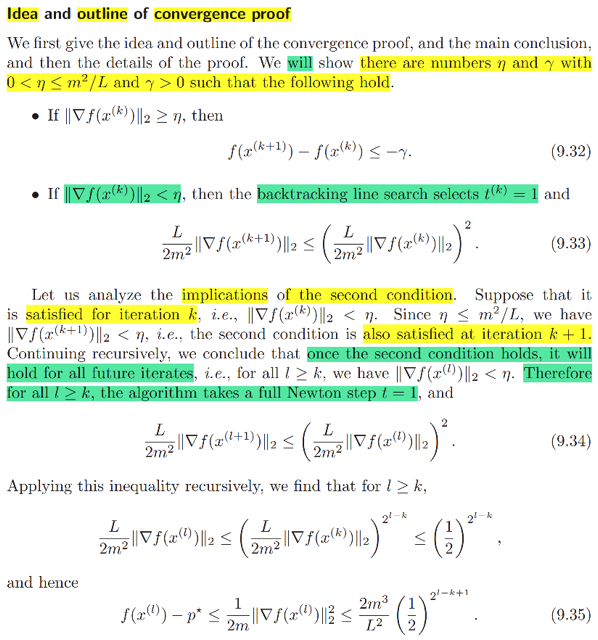</kbd>

<kbd>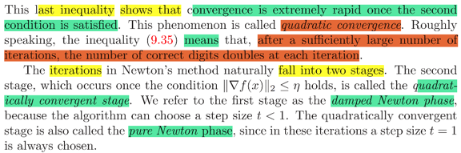</kbd>

> [!NOTE]
> Đại khái là sau này họ sẽ chứng minh, nhưng bây giờ ta chấp nhận sự thật sau, đó là tồn tại con số
> η và γ  sao cho thỏa hai điều kiện này:
>
> 1) Nếu gradient còn lớn hơn mức (η) nào đó thì hàm f sẽ giảm một mức độ lớn hơn γ:
>
> ∇f(xk) ≥ η thì f(x_k) - f(x_k+1) ≥ γ ⇔ f(x_k+1) - f(x_k) ≤ -γ.
>
> 2) Nếu gradient đã nhỏ (||∇f(xk)|| < η) đồng nghĩa x đã gần x* thì kiểu như với backtracking  line
> search thì với initial t = 1 thì nó đã thỏa exit  condition f(x + t Δx_nt) < f(x) + t α ∇f(x)TΔx_nt rồi. Và ta
> có:
>
> L/2m^2||∇f(x_k+1)|| ≤ [L/2m^2||∇f(x_k)||]^2
>
> Thế thì ta phân tích condition (2) trước để thấy rằng giả sử gradient bắt đầu nhỏ hơn η tại iteration
> k: ||∇f(x_k)|| < η
>
> Thì vì 0 < η ≤ m^2/L nên ta cũng sẽ cho thấy ||∇f(x_k+1)|| < η:
>
> (*) Chứng minh giả sử gradient bắt đầu nhỏ hơn η tại iteration k: ||∇f(x_k)|| < η và ta có 
>
> L/2m^2||∇f(x_k+1)|| ≤ [L/2m^2||∇f(x_k)||]^2
>
> thì gradient sau đó cũng  vậy ||∇f(x_k+1)|| < η:
>
> Chứng minh như sau:
>
> Bắt đầu từ: L/2m^2||∇f(x_k+1)|| ≤ [L/2m^2||∇f(x_k)||]^2
>
> ⇔ L/2m^2 ||∇f(x_k+1)|| ≤ [L/2m^2 ||∇f(x_k)||]^2 ≤ [L/2m^2 η]^2  (do |∇f(x_k)|| ≤ η) 
>
> ⇔ L/2m^2||∇f(x_k+1)|| ≤ (L/2m^2)^2 η^2
>
> ⇔ L/2m^2||∇f(x_k+1)|| ≤ (L/2m^2)^2 η η ≤ (L/2m^2)^2 η m^2/L (do η ≤ m^2/L)
>
> ⇔ L/2m^2||∇f(x_k+1)|| ≤ (L/2m^2) η
>
> ⇔ ||∇f(x_k+1)|| ≤ η CHỨNG MINH XONG
>
> Và đại khái là điều này có nghĩa là một khi tại iteration k gradient đã nhỏ hơn η thì NHỮNG
> ITERATION SAU ĐÓ SẼ ĐỀU NHỎ HƠN < η: ||∇f(x_k+1)|| < η
>
> Và như vậy KỂ TỪ ĐÓ về sau thuật toán sẽ LUÔN CHỌN t = 1 cũng như ta luôn có cái condition 2:
> Với l ≥ k, L/2m^2||∇f(x_l)|| ≤ [L/2m^2||∇f(x_k)||]^2
>
> Chỗ này phải chú ý một chỗ đã hiểu sai về exit condition của backtracking line search. Nó chỉ là exit
> condition của việc chọn t, có nghĩa là ban đầu của MỖI ITERATION, TA ĐỀU CHO t = 1, NHƯNG
> RỒI TA CHECK EXIT CONDITION để xem nếu thỏa, thì ta DÙNG t = 1 ĐỂ UPDATE x = x + tΔx
> trong bươc 3. Còn không thỏa thì ta SCALE XUỐNG t = t β, VÀ CHECK LẠI, CŨNG NHƯ LÀM LẠI
> CHO ĐẾN KHI THỎA, khi đó ta dùng t đó để update x = x + t Δx. Và ở iteration sau vẫn start với t =
> 1. CÓ NGHĨA LÀ, EXIT CONDITION ĐÓ LÀ CỦA VIỆC BACKTRACKING LINE SEARCH ở mọi
> iteration. NÓ KHÔNG PHẢI LÀ STOPPING CONDITION CỦA CẢ ALGORITHM (vốn dĩ sẽ thường
> dùng là điều kiện nào đó của  gradient)
>
> Như vậy sẽ hiểu sai nếu hiểu rằng tại iteration 1: Nếu thỏa exit condition thì thì dùng t1 = 1 và
> update xong thì dừng luôn. Còn nếu không thỏa thì scale t xuống và update  x = x + t Δx. Hiểu như
> vậy thì đang cho rằng với exit condition là stopping condition. Và sẽ thấy khó hiểu khi đọc tới việc
> t(k) = 1.
>
> Còn hiểu đúng như đoạn trên thì dĩ nhiên hoàn toàn hiểu rằng nói t(k) = 1 khi ∇f(x) đã nhỏ hơn η
> nào đó và kể từ đó về sau các t(k+1) đều bằng 1
>
> Và ý nghĩa của nó là: Khi gradient tại iteration k đã nhỏ hơn η, thì có nghĩa là tại đó (x) NÓ ĐÃ GẦN
> VỚI X* RỒI, dẫn tới ta có thể dùng một kiến thức đã biết đó là: KHI x gần x* thì ĐẠI KHÁI LÀ CÓ
> THỂ XẤP XỈ / COI OPTIMIZATION LANDSCAPE BẰNG MỘT QUADRATIC FUNCTION (thể hiện
> bởi HESSIAN CỦA SUB-LEVEL SET SẼ GẦN VỚI ELLIPSOID) (hình dung một hàm có landscape
> có thể không quadratic nhưng nếu chỉ xét phạm vi rất gần cái đáy của nó thì độ cong của nó trong
> đó sẽ giống như parabol)
>
> Và KHI ĐÓ, dĩ nhiên như ta nói ở trên, khi hàm số gần với quadratic thì Newton step sẽ rất hiệu
> quả, giúp update ngay ra x optimal
>
> VÀ ĐÓ CŨNG CHÍNH LÀ KẾT QUẢ NÀY: Khi ta apply cái này lặp đi lặp lại
>
> L/2m^2||∇f(x_l)|| ≤ [L/2m^2||∇f(x_k)||]^2 với l > k
>
> Thì ta sẽ có: (ý là áp dụng với k+1 và k, rồi k+2 và k+1
>
> L/2m^2||∇f(x_k+1)|| ≤ [L/2m^2||∇f(x_k)||]^2:
>
> L/2m^2||∇f(x_k+2)|| ≤ [L/2m^2||∇f(x_k+1)||]^2 ≤ L/2m^2*[L/2m^2||∇f(x_k)||]^2
>
> = (L/2m^2)^2* ||∇f(x_k)||^2
>
> ⇨ (L/2m^2) ||∇f(x_l)|| ≤ (L/2m^2)^2 * ||∇f(x_k)||^2 (9.33)
>
> ...tiếp tục vậy
>
> L/2m^2||∇f(x_k+2)|| ≤ [(L/2m^2) * ||∇f(x_k)||]^[2^(l-k)]
>
> Và dùng ||∇f(x_k)||^2 < η < m^2/L ta có:
>
> L/2m^2||∇f(x_k+2)|| ≤ (L/2m^2 * m^2/L)^[2^(l-k)]
>
> ⇔ L/2m^2||∇f(x_k+2)|| ≤ (1/2)^[2^(l-k)]    
>
> ⇔ ||∇f(x_k+2)|| ≤ (1/2)^[2^(l-k)] 2m^2 / L
>
> Và dùng một cái đã biết bữa trước f(x(l)) - p* ≤ 1/2m ||∇f(x(l))||^2 
>
> ⇨ f(x(l)) - p* ≤ 1/2m ||∇f(x(l))||^2 ≤ 1/2m (1/2)^[2^(l-k)] 2m^2 / L^2
>
> ⇔ f(x(l)) - p* ≤ 1/2m (1/2)^[2^(l-k)]^2 4m^4 / L^2
>
> ⇔ f(x(l)) - p* ≤ 2m^3/L^2 (1/2)^[2^(l-k)]^2
>
> ⇔ f(x(l)) - p* ≤ 2m^3/L^2 (1/2)^[2^(l-k+1)]     |    0.5^[2^(l-k)] ^2 = 0.5^[2^(l-k)*2]  = 0.5^[2^(l-k+1)]
>
> Và KẾT QUẢ NÀY CHÍNH LÀ NÓI VỀ Ý TRÊN, ĐÓ LÀ TỪ ITERATION K TRỞ ĐI, VIỆC UPDATE
> VỚI NEWTON STEP, SẼ GỌI LÀ FULL NEWTON STEP, BỞI CÓ Δx_nt BAO NHIÊU, THÌ XÀI BẤY
> NHIÊU (VÌ t = 1 ⇨ t * Δx_nt = Δx_nt) SẼ KHIẾN SỰ CHÍNH XÁC NGÀY CÀNG LỚN THEO CẤP
> SỐ LŨY THỪA RẤT NHANH. Hình dung thế này tại k (khi gradient đã < eta) và ta có condition 2
> ở trên, thì: 
>
> x(k) ĐÃ GẦN x*, KHIẾN SUB-LEVEL SET x: f(x) < x(k) ĐÃ GẦN (CÓ THỂ XẤP XỈ TỐT BỞI) ELLIPSE
> / ELLIPSOID, hay OPTIMIZATION LANDSCAPE ĐÃ GẦN QUADRATIC FUNCTION ⇨ NEWTON 
> METHOD PHÁT HUY TÁC DỤNG RẤT TỐT, giúp khi x(k+1) = x(k) + Δx_nt THÌ LẠI CÀNG ĐƯA x VỀ
> GẦN x* hơn nữa. Và khi đó, MỌI ĐIỀU Ở TRÊN (SUBLEVEL SET,...) CÀNG TỐT HƠN NỮA KHIẾN
> NEWTON METHOD CÀNG HIỂU QỦA GẤP BỘI.
>
> Do đó error SẼ GIẢM VÔ CÙNG NHANH. VÀ GIAI ĐOẠN NÀY GỌI LÀ QUADRATIC CONVERGENCE
>
> ====
>
> Như vậy hoàn toàn hiểu được rằng, khi mà ||∇f(x)|| còn lớn hơn η, thì backtracking line search có thể
> chọn step t nhỏ hơn 1. Còn khi nó đã nhỏ hơn η, thì t luôn bằng 1 (và ta có cái gọi là full Newton's step
> như nói ở trên). 
>
> Như vậy QUÁ TRÌNH SẼ CHIA LÀM 2 GIAI ĐOẠN:
>
> 1) KHI GRADIENT CÒN LỚN: t có thể được chọn < 1. Đây gọi là DAMPED NEWTON PHASE
>
> 2) KHI GRADIENT NHỎ HƠN eta: backtracking line search luôn thỏa với t = 1, và như đã nói, ở trên
> sự HỘI TỤ SẼ DIỄN RA RẤT RẤT NHANH. ĐÂY LÀ PURE NEWTON PHASE (vì sự update dùng full
> newton step

 

<kbd>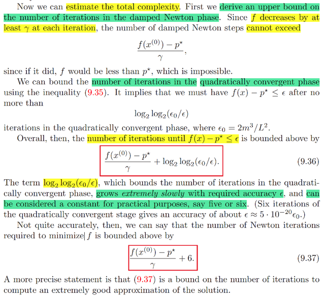</kbd>

> [!NOTE]
> rồi, ta sẽ sang việc ước lượng mức độ complexity (tức là số iteration
> cần thiết để converge về điểm ε-sub optimal x*.
>
> Đầu tiên nói về số iteration ở phase 1 - damped Newton: Là thế này
> ta dựa vào cái condition 1 nói rằng khi gradient còn lớn (||∇f(x)|| > η)
> thì "độ sụt của f" ở mỗi iteration ít nhất là bằng gamma:
>
> f(x(k+1)) - f(x(k)) ≤ - γ ⇔ f(x(k)) - f(x(k+1)) ≥ γ. Do đó hiểu thế này:
>
> Gọi k là số iteration để từ f(0) trở thành f(k) = p*. Như vậy là từ f(k)
> đến p* có k iteration, mà mỗi iteration giảm nhiều ít nhất là γ.
>
> Nên số iteration nhiều nhất là chỉ cần [f(x(0)) - p*] / γ
>
> ====
>
> CÒN LẠI QUAY LẠI SAU.

 

<kbd>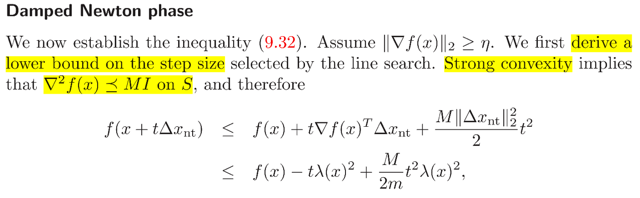</kbd>

<kbd>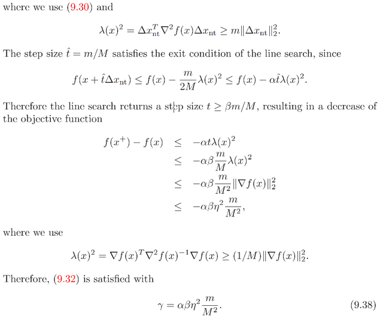</kbd>

> [!NOTE]
> Chứng minh condition 1: Khi ∇f(x) > η thì f(x(k+1)) - f(x(k)) ≤ γ (γ ý là  một con số nào đó)
>
> Đầu tiên, như đã biết strong convexity cho ta: ∇^2f(x) ⪯ MI on S.
>
> f(x + t Δx_nt) ≈ f(x) + ∇f(x)T(tΔx_nt) + 1/2 (tΔx_nt)T∇^2f(x)(t Δx_nt)
>
> Vế trái f(x) + ∇f(x)T(tΔx_nt) + 1/2 t^2 (Δx_nt)T∇^2f(x)(Δx_nt)
>
> ≤ f(x) + ∇f(x)T(tΔx_nt) + 1/2 t^2 (Δx_nt)TMI(Δx_nt)
>
> (dùng inequality ∇^2f(x) ⪯ MI)
>
> = f(x) + ∇f(x)T(tΔx_nt) + M/2 t^2 (Δx_nt)T(Δx_nt)
>
> = f(x) + t∇f(x)T(Δx_nt) + M/2 t^2 ||Δx_nt||^2
>
> Dùng kết quả ∇f(x)T(Δx_nt) = -λ(x)^2
>
> ..= f(x) + t(-λ(x)^2) + M/2 t^2 ||Δx_nt||^2  |
>
> Dùng tiếp: ∇^2f(x) ≽ mI ⇨ ∇f(x)T∇^2f(x)inv ∇f(x) ≥ ∇f(x)T ∇^2f(x)inv ∇f(x)
>
> và λ(x) thể hiện theo Δx_nt λ(x) = [(Δx_nt)T ∇^2f(x) Δx_nt ]^1/2
>
> Ta có: λ(x)^2 = (Δx_nt)T ∇^2f(x) Δx_nt  và vì ∇^2f(x) ≽ mI nên
>
> λ(x)^2 ≥ (Δx_nt)T mI Δx_nt = m (Δx_nt)TΔx_nt = m ||Δx_nt||^2
>
> Vậy f(x) + t(-λ(x)^2) + M/2 t^2 ||Δx_nt||^2 ≤ f(x) + t(-λ(x)^2) + M/2 t^2 (1/m) λ(x)^2
>
> ⇔ f(x + t Δx_nt) ≤ f(x) + t(-λ(x)^2) + M/2 t^2 (1/m) λ(x)^2
>
> ⇔ f(x + t Δx_nt) ≤ f(x) - t λ(x)^2 + M/2m t^2 λ(x)^2
>
> Đây là kết quả đóng khung trong sách
>
> Rồi,  t^ = m/M thỏa mãn exit condition của backtracking line search, vì sao:
>
> Như đã biết, exit condition của backtracking line search là:
>
> f(x + t Δx) < f(x) + t α ∇f(x)TΔx
>
> Vậy thì với t = m/M, áp dụng inequality ở trên:
>
> f(x + t Δx_nt) ≤ f(x) - m/M λ(x)^2 + M/2m (m/M)^2 λ(x)^2
>
> ⇔ f(x + t Δx_nt) ≤ f(x) - m/M λ(x)^2 + m/2M λ(x)^2
>
> ⇔ f(x + t Δx_nt) ≤ f(x) - m/2M λ(x)^2
>
> và vế phải = f(x) - m/2M (-∇f(x)TΔx_nt) = f(x) + m/2M (∇f(x)TΔx_nt)  = f(x) + 1/2 t
> (∇f(x)TΔx_nt) ≤  f(x) + α t (∇f(x)TΔx_nt)  | vì α > 1/2
>
> Vậy f(x + t Δx_nt) ≤ f(x) + α t (∇f(x)TΔx_nt) và đây chính là exit condition
>
> ==== 
>
> Thế thì như đã biết, với backtracking line search, thì đại khái khi chưa thỏa exit
> condition, thì nó sẽ tiếp tục scale t xuống từ initial value = 1. bởi factor β:  t := t β cho đến
> khi thỏa, mà hình dung tại m/M đã thỏa, để rồi tại đó chắc chắn nó phải dừng tìm kiếm. Nên
> suy ra nếu có thoát (trả ra t) thì t ít nhất là phải bằng m/M chứ không thể nhỏ hơn m/M được
> (vì khi giảm dần từ 1 thì đến trước khi nó nhỏ hơn  thì nó phải bằng m/M cái đã, mà khi
> bằng thì đã thỏa và exit rồi). Vậy t ≥ m/M
>
> Và do đó cũng ≥ β m/M vì β ≤ 1
>
> Vậy t ≥ βm/M
>
> Từ đó bước giảm của f sẽ:
>
> f(x + t Δx_nt) ≤ f(x) + α t (∇f(x)TΔx_nt)
>
> ⇔ f(x + t Δx_nt) - f(x) ≤ α t (∇f(x)TΔx_nt)
>
> ⇔ f(x + t Δx_nt) - f(x) ≤ - α t λ(x) ≤ - α βm/M λ(x)^2
>
> ⇔ f(x + t Δx_nt) - f(x) ≤ - α βm/M λ(x)^2
>
> Dùng cái này:
>
> ∇^2f(x) ⪯ MI : mọi eigenvalues λ_i của ∇^2f(x) ≤ M:
>
> λ_i ≤ M ⇨ 1/M ≤ 1/λ_i ⇨ mọi eigenvalues của ∇^2f(x)_inv (=1/ λ_i) sẽ ≥ 1/M
>
> ⇨ ∇^2f(x)_inv ≽ (1/M)*I
>
> ⇔ -∇^2f(x)_inv ⪯ -(1/M)*I
>
> ⇨ -λ(x)^2 = -∇f(x)T∇^2f(x)inv ∇f(x) ≤ -∇f(x)T (1/M)*I ∇f(x)
>
> ⇔ -λ(x)^2 = 1/M ∇f(x)T ∇f(x) ≤ -1/M ||∇f(x)||^2
>
> ⇔ -λ(x)^2 ≤ -1/M ||∇f(x)||^2
>
> ⇨ - α βm/M λ(x)^2 ≤ - α βm/M 1/M ||∇f(x)||^2
>
> ... ⇔ f(x + t Δx_nt) - f(x) ≤ - α βm/M^2 ||∇f(x)||^2
>
> ||∇f(x)|| ≥ η ⇨ - ||∇f(x)||^2 ≤  - η^2 
>
> ⇨ - α βm/M^2 ||∇f(x)||^2 ≤ - α βm/M^2 η^2
>
> Tóm lại là ta đã chứng minh xong rằng khi ||∇f(x)|| ≥ η thì tồn tại γ sao cho f(x+) - f(x) ≤ - γ
> và ở trên γ chính là  α βm/M^2 η^2

 

<kbd>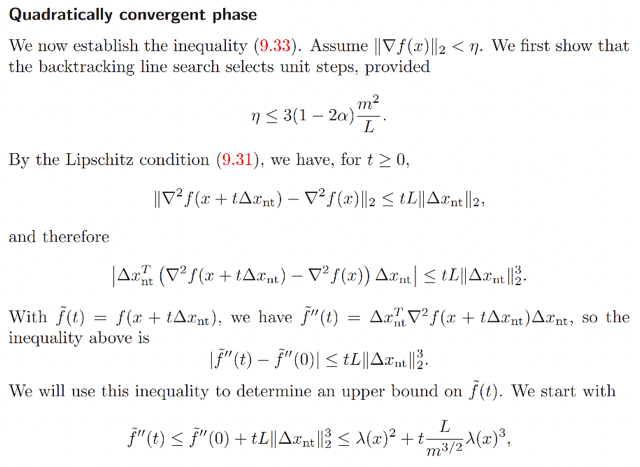</kbd>

<kbd>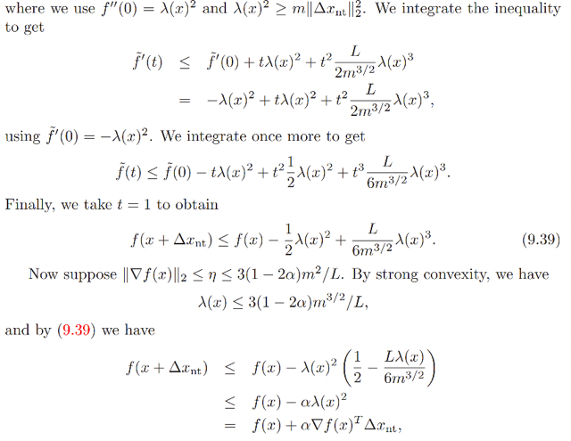</kbd>

<kbd>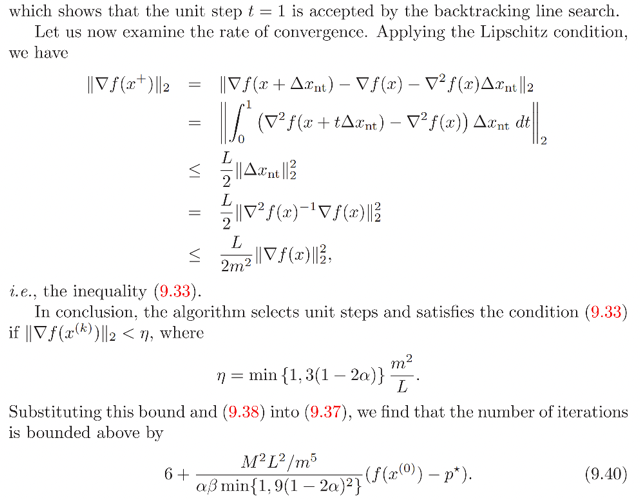</kbd>

> [!NOTE]
> CHỨNG MINH CONDITION 2, KHI GRADIENT ∇f(x) > η
>
> QUAY LẠI SAU

 

<kbd>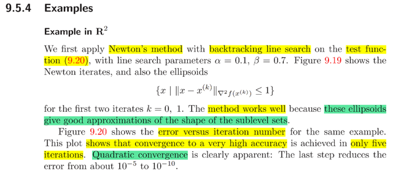</kbd>

> [!NOTE]
> Một ví dụ, đại khái trong những phần trước ta đã nói rằng,  khi mà
> hàm f gần với / xấp xỉ tốt với hàm quadratic thì Newton's method sẽ
> hiệu quả.
>
> Vậy thì điều này có nghĩa là sao:
>
> Second order Taylor approx.:
>
> f(x) ≈ f(x0) + ∇f(x)T(x-x0) + 1/2(x-x0)T ∇^2f(x0) (x-x0)
>
> vế trái chính là quadratic function 
>
> g(x) = 1/2(x-x0)TP(x-x0) + qT(x-x0) + r
>
> Thì nhận định ở trên có nghĩa là sub-level set {x: f(x) ≤ α} nó gần với /
> giống với {x: g(x) ≤ α} = {x: 1/2(x-x0)TP(x-x0) + qT(x-x0) + r ≤ α}
>
> Và đây là phương trình của một ellipsoid.
>
> ý chính là cho thấy trong ví dụ này,
>
> ellipsoid {x: (x - x(k))T ∇^2f(x(k)) (x - x(k)) ≤ 1 } 
>
> cũng chính là {x: ||x - x(k)||_∇^2f(x(k)) ≤ 1} là cái hình ellipse tâm
> các điểm x(0), x(1)
>
> có thể gần gần với sub-level set của original function. Và ngày càng 
> gần hơn khi x gần với x* hơn (minh họa là ellipse màu xanh lá, gần
> với hình chấm chấm màu tím (sub-level set)
>
> Do đó, trong case này, Newton's method hiệu quả. Và hình 9.20 cho
> thấy chỉ sau vài iteration error đã giảm rất mạnh, vài trong iteration 4,
> 5 cho thấy giai đoạn QUADRATIC CONVERGENCE khi error giảm
> từ 10^-5 ⇨ 10^-10 chính là giảm theo bậc 2 mà ta đã phân tích ở
> trên

 

<kbd>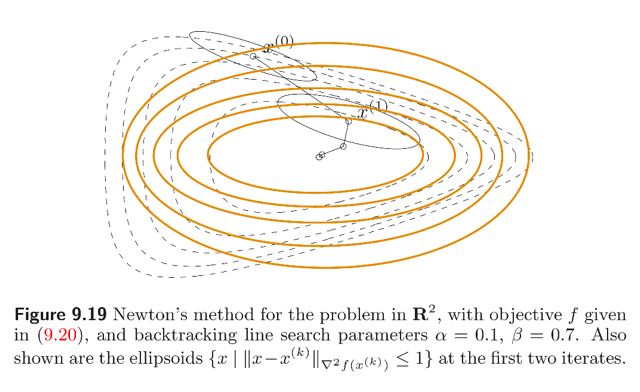</kbd>

<kbd>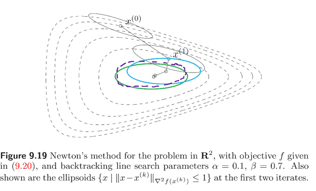</kbd>

> [!NOTE]
> đại khái là mấy ellipse màu cam là {x: f(x*) + ∇f(x)T(x-x*) + 1/2(x-x*)T
> ∇^2f(x*) (x-x*) ≤ α }
>
> là khi ta xấp xỉ hàm f bới g(x) là quadratic function g(x) = f(x0) +
> ∇f(x)T(x-x0) + 1/2(x-x0)T ∇^2f(x0) (x-x0)
>
> Thì nếu mà có thể xấp xỉ tốt, thì mấy đuồng màu cam sẽ không qúa
> khác các đường chấm chấm
>
> Khi đó mấy ellipse cục bộ {x: (x-x(k)∇^2f(x(k))(x-x(k)) ≤ 1} sẽ ngày
> càng giống / gần với các đường chấm chấm cũng như ellipse màu
> cam  khi x gần x*. Và do đó Newton's step ngày càng hiệu quả để ở
> những iteration sau xuất hiện trạng thái quadratic convergence

 

<kbd>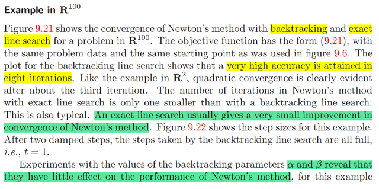</kbd>

<kbd>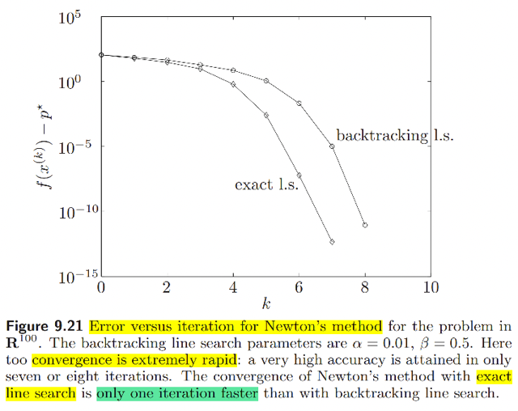</kbd>

<kbd>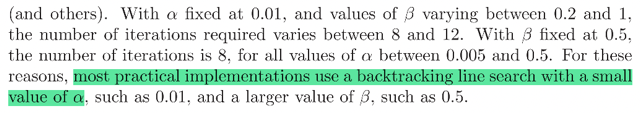</kbd>

> [!NOTE]
> ví dụ này cho thấy exact line search chỉ nhanh hơn backtracking
> một chút.
>
> cả hai đều nhanh chóng bước vào giai đoạn quadratic convergence
>
> Cũng cho thấy trong backtracking thì α β ảnh hưởng không nhiều
> đối với Newton's method

 

<kbd>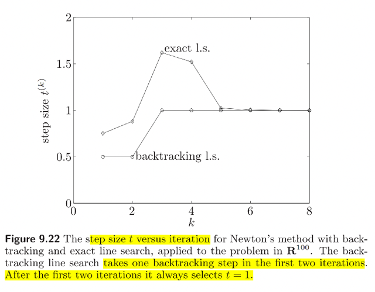</kbd>

> [!NOTE]
> Cho thấy hai iteration đầu thì backtracking còn
> thực hiện bước "backtrack" tức gỉam t để có t < 1
> nhưng sau đó, là nó dùng full newton step

 

<kbd>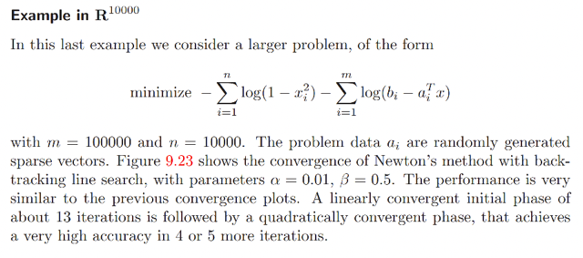</kbd>

<kbd>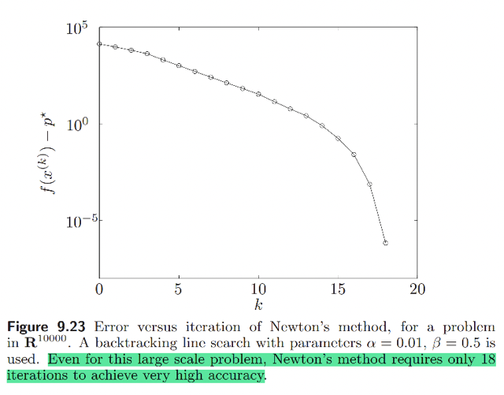</kbd>

 

<kbd>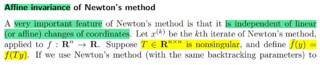</kbd>

<kbd>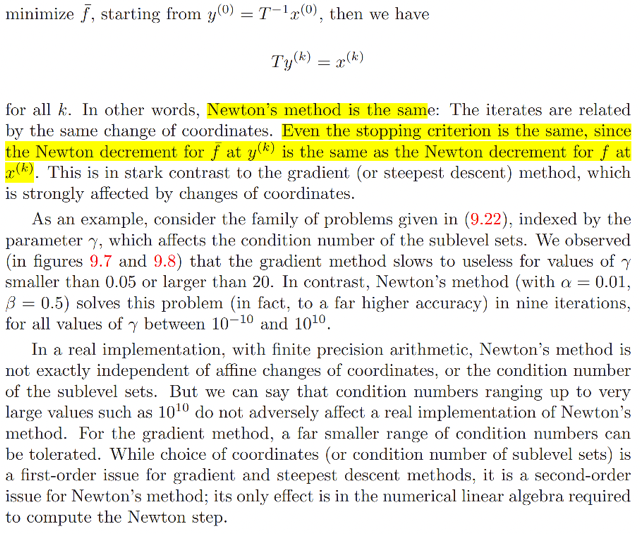</kbd>

> [!NOTE]
> đại ý là khác với gradient descent method nơi mà nó bị phụ thuộc vào
> hệ trục (cũng chính là ko ảnh hưởng bởi condition number của sub
> level set ), để rồi khi qua phép biến đổi coordinates, nếu condition
> number của problem trở nên tốt (nhỏ) thì gradient descent sẽ hoạt
> động tốt  và ngược lại.
>
> Còn với Newton's method thì nó không bị ảnh hưởng gì.
>
> Người ta nói về một ví dụ trước khi ta thử một ví dụ trong đó
> condition của problem phụ thuộc vào γ để rồi thấy rằng khi γ quá nhỏ
> hay quá lớn thì gradient descent bị rất chậm. Trong khi đó, với
> Newton method thì nó đều converge nhanh trong 9 iteration cả.
>
> Cuối cùng đại ý là trong thực tế thì thật ra cũng không hẳn là Newton
> method không bị ảnh hưởng bởi phép đổi trục (cũng chính là ko ảnh
> hưởng bởi condition number của sub level set ) nhưng đại khái là nó
> sẽ có một khoảng rộng hơn nhiều của condition number mà trong đó
> nó ko bị ảnh hưởng. Ngược lại với gradient descent thì chỉ có thể
> ko bị ảnh hưởng nếu condition number thay đổi trong khoảng hẹp thôi
>
> Thành ra, với gradient descent chính thì việc đổi hệ trục để cải thiện
> condition number là việc sống còn. Còn với newton method thì không,
> mà chỉ ảnh hưởng đến việc tính toán Newton's step mà thôi

 

<kbd>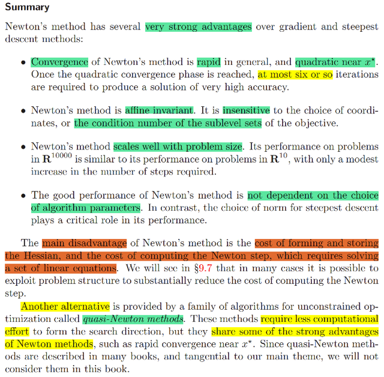</kbd>

> [!NOTE]
> tóm lại Newton's method có nhiều ưu điểm như converge nhanh cho
> cả low hay high dimension. Không phụ thuộc vào coordinate (cũng là
> condition number của sub level set).
>
> Nhưng nhược điểm chính của nó chính là cần nhiều tính toán ra
> Hessian (newton step Δx_nt = - ∇^2f(x)inv ∇f(x))
>
> Có những cách để khắc phục, trong đó có một phương pháp gọi là
> quasi-Newton giúp giảm số tính toán

 

<kbd>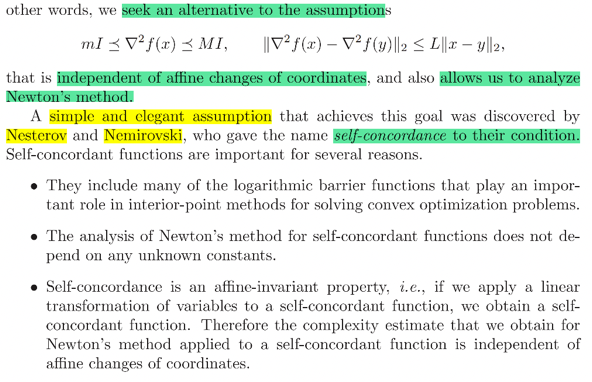</kbd>

<kbd>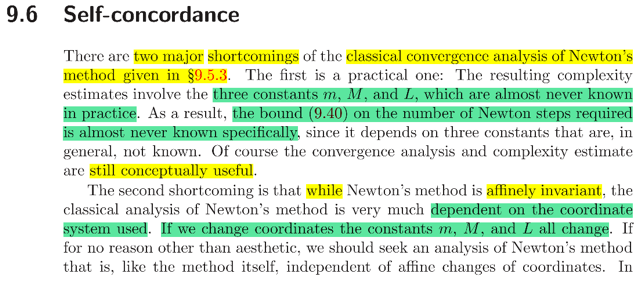</kbd>

> [!NOTE]
> Đại khái là trong phần convergence analysis của Newton method
> có hai thiếu xót quan trọng.
>
> 1) là khi ta tính / triển khai để có giới hạn trên của số iteration
> cần thiết thì nó phụ thuộc vào các hằng số như m, M, L mà thực
> ra ta không biết giá trị của chúng.
>
> 2) và dù newton's method ko bị ảnh hưởng bởi coordinate hay
> condition number sub-level set nhưng m, M thì có bị.
>
> Do đó đại khái là ta muốn tìm một cách để khiến việc phân tích
> convergence của pp Newton cũng sẽ ko bị phụ thuộc vào
> coordinate
>
> Và hai nhà toán học đã tìm ra một điều kiện gọi là
> SELF-CONCORDANT sẽ giúp cho ta đạt được mục tiêu này
>
> 9. UNCONSTRAINED PROBLEM
>
> 9.6 SELF-CONCORDANCE

 

<kbd>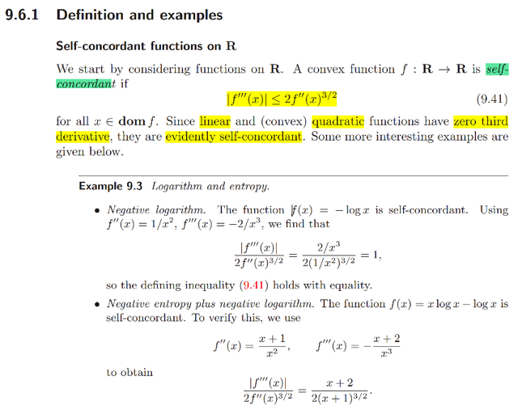</kbd>

<kbd>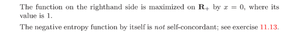</kbd>

> [!NOTE]
> Định nghĩa của tính chất self-concordant: là function có (trị tuyệt đối)
> của đạo hàm bậc 3 nhỏ hơn hoặc bằng 2 lần đạo hàm bậc 2 mũ 3/2
>
> Thì hàm tuyến tính và bậc 2 có đạo hàm bậc 3 = 0 nên nó tự
> nhiên thỏa / có tính self-concordance
>
> Hai ví dụ cho thấy f(x) = -log x thỏa điều kiện nên là self-concordance
> còn f(x) = xlogx - logx thì không

 

<kbd>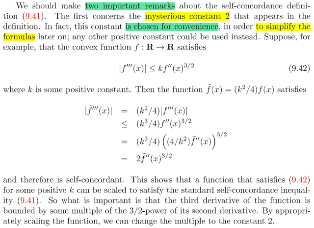</kbd>

> [!NOTE]
> đại khái là số 2 trong "công thức" thật ra là chỉ chọn cho dễ (giúp 
> đơn giản hóa) thôi. Chứ thật ra miễn là f(x) thỏa |f'''(x)| ≤ kf''(x)^3/2
> thì đều self-concordance. Tức là yêu cầu chỉ là giá trị của đạo hàm
> cấp 3 bị chặn trên bởi lũy thừa 3/2 của đạo hàm cấp 2, nhân với số
> dương nào đó.

 

<kbd>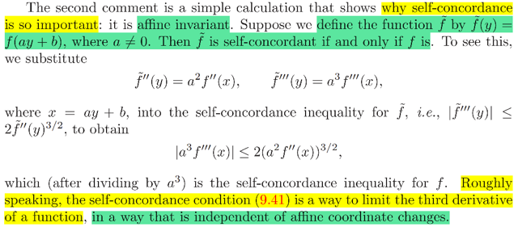</kbd>

> [!NOTE]
> Điểm chú ý thứ hai quan trọng, đó là tính self-concordance có
> tính affine invariant.
>
> Tức là nếu f self-concordance thì f~(ay + b) = f(x) x = ay + b, 
>  cũng vậy.
>
> Chứng minh: Vì f~ self-concordance nên f~ thỏa điều kiện:
>
> |f~'''(y)| ≤ 2[f~''(y)^3/2]
>
> Thế thì f~(y) = f(ay + b) ⇨ d/dy f~(y) 
>
> = d/d(ay +b) f(ay + b) . d/dy (ay + b)
>
> = df(x)/dx . d/dy (ay + b) 
>
> = f'(x) a = a f'(x) ⇨ f~'(y) = a f'(x) = a f'(ay + b)
>
> d/dy f~'(y) = d/dy [a f'(x)] = a d/dy f'(ay + b)
>
> = a d/d(ay + b) f'(ay + b) . d/dy (ay + b)
>
> = a d/dx f'(x) . a = a^2 f''(x)
>
> ⇨ f~''(y) = a^2 f''(x) 
>
> d/dy f~''(y) = d/dy a^2 f''(ay + b) 
>
> = a^2 d/d(ay + b) f''(ay + b) . d/dy (ay + b)
>
> = a^2 d/dx f''(x) a
>
> = a^3 f'''(x)
>
> ⇨ f~'''(y) = a^3 f'''(x)
>
> Vậy ta có |f~'''(y)| ≤ 2[f~''(y)^3/2]
>
> ⇔ |a^3 f'''(x)| ≤ 2[a^2 f''(x)]^3/2
>
> ⇔ |a^3 f'''(x)| ≤ 2 a^3 [f''(x)]^3/2
>
> ⇔ |f'''(x)| ≤ 2 [f''(x)]^3/2 ⇨ f(x) cũng self concordance

 

<kbd>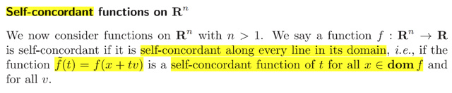</kbd>

 

<kbd>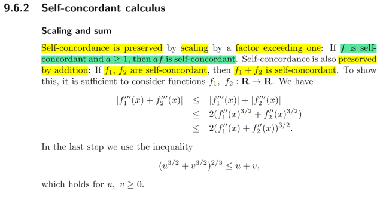</kbd>

> [!NOTE]
> đại khái là, khi scale một self-concordance function với factor > 1
> hoặc cộng hai concordance function, thì kết quả vẫn là
> self-concordance function

 

<kbd>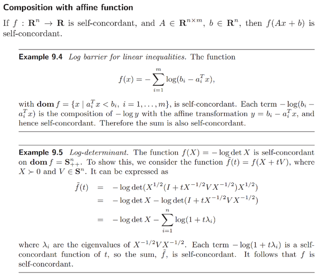</kbd>

<kbd>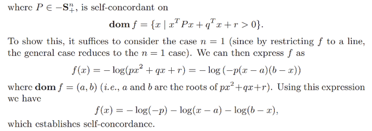</kbd>

<kbd></kbd>

> [!NOTE]
> Rồi nếu Rn -> R function f là self-concordance thì f(Ax + b) cũng vậy
>
> Vài ví dụ:
>
> 1) f(x) = - Σ log(bi - aiTx). Thì - log(y) là self-concordance, nên combine
> với affine -log(bi - aiTx) cũng vậy, và sum các self-concordance
> function  cũng self-concordance
>
> ...

 

<kbd>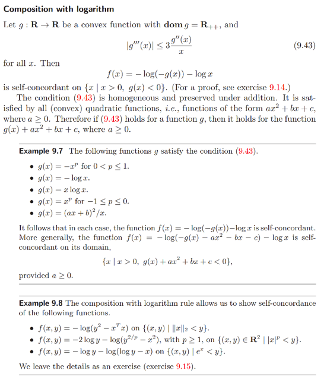</kbd>

> [!NOTE]
> QUAY LẠI SAU

 

<kbd>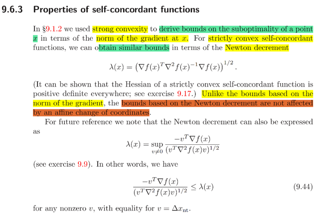</kbd>

<kbd>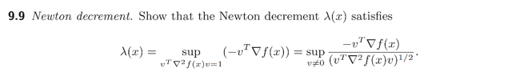</kbd>

> [!NOTE]
> đại khái là, trong phần 9.1.2 ta đã dùng tính chất strong convexity để suy ra giới hạn trên
> và dưới của sub-optimality (f(x) - p*) theo norm của gradient tại x: ||∇f(x)||. (cũng ko khó
> hiểu, theo link xem lại)
>
> Thế thì ở đây nói rằng nếu như ta có strictly convex self-concordance function thì ta cũng
> có thể chứng minh được những giới hạn tương  tự nhưng thể hiện theo Newton
> decrement.
>
> Và cái chính là, nếu kết qủa như cách làm trước sẽ bị phụ thuộc affine change of
> coordinate thì cách làm sau thì không.
>
> Thế thì để thuận tiện ta thể hiện Newton decrement ở dạng:
>
> λ(x) = sup v ≠ 0 - vT∇f(x) / [vT∇^2f(x)v]^1/2
>
> Là sao:
>
> Ôn lại về Newton decrement λ, một trong các cách hiểu về  nó là liên hệ nó với độ giảm của 
> hàm f khi thực hiện bước Newton: f(x) - f(x + Δx_nt), và cái này = 1/2 λ^2 (theo định nghĩa
> của Newton decrement là vậy)
>
> Và Newton's step Δx_nt là gì? Ý tưởng là, tại điểm đang đứng, tạm gọi x0 (hoặc xk) ta sẽ
> thay hàm f bằng xấp xỉ bậc hai của nó:
>
> Xấp xỉ bậc hai của hàm f(x) tại x0:
>
> f(x0 + δx) ≈ f(x0) + ∇f(x0)Tδx + (1/2) δxT ∇^2f(x0) δx
>
> Ta sẽ dùng function f^(δx) = f(x0) + ∇f(x0)Tδx + (1/2) δxT ∇^2f(x0) δx, là quadratic function,
> và giải bài toán tìm δx sao cho minimize f^(δx) (trong bối cảnh đây là trong chương 9, bài
> toán đang giải là unconstraint, nên bài toán này cũng chỉ là bài toán unconstrained
> quadratic optimization.
>
> Và vì f^ có dạng quadratic: 1/2 δxT P δx + qTδx + r nên dễ dàng tìm ra minimum của nó
> theo optimality condition:
>
> ∇f^ = 0 ⇔ P δx + q = 0 ⇔ x = -Pinvq
>
> = - ∇^2f(x0)inv ∇f(x0). Đây chính là công thức Newton step tại x0.
>
> Nên công thức Newton step tại x sẽ là Δx_nt = - ∇^2f(x)inv ∇f(x)
>
> Thế thì độ giảm Newton's decrement cũng có thể được tính bởi
>
> 1/2λ^2 = f^(0) - f^(Δx_nt)
>
> f^(0) = f(x0) là vị trí ban đầu khi chưa bước theo Newton step
>
> f^(Δx_nt) là vị trí sau khi bước,
>
> = f(x0) + ∇f(x0)TΔx_nt + (1/2) (Δx_nt)T ∇^2f(x0) Δx_nt
>
> ⇨ λ = - ∇f(x0)TΔx_nt - (1/2) (Δx_nt)T ∇^2f(x0) Δx_nt
>
> = - ∇f(x0)T[-∇^2f(x0)inv ∇f(x0)] - (1/2) (-∇^2f(x0)inv ∇f(x0))T ∇^2f(x0) [- ∇^2f(x0)inv ∇f(x0)]
>
> = ∇f(x0)T ∇^2f(x0)inv ∇f(x0) - (1/2) [∇^2f(x0)inv ∇f(x0)]T ∇^2f(x0) [ ∇^2f(x0)inv ∇f(x0)]
>
> = ∇f(x0)T ∇^2f(x0)inv ∇f(x0) - (1/2) [∇f(x0)]T ∇^2f(x0)inv ∇^2f(x0) [ ∇^2f(x0)inv ∇f(x0)]
>
> = ∇f(x0)T ∇^2f(x0)inv ∇f(x0) - (1/2) [∇f(x0)]T [ ∇^2f(x0)inv ∇f(x0)]
>
> = ∇f(x0)T ∇^2f(x0)inv ∇f(x0) - (1/2) [∇f(x0)]T ∇^2f(x0)inv ∇f(x0)
>
> = (1/2) ∇f(x0)T ∇^2f(x0)inv ∇f(x0)
>
> Vậy cái này = 1/2 λ^2 ⇨ 1/2 λ^2 = ∇f(x0)T ∇^2f(x0)inv ∇f(x0)
>
> ⇔ λ = [∇f(x0)T ∇^2f(x0)inv ∇f(x0)]^1/2 Đây là công thức của Newton decrement
>
> Thế thì ta sẽ chứng minh tại sao nó cũng là sup v ≠ 0 - vT∇f(x) / [vT∇^2f(x)v]^1/2:
>
> λ(x) = [∇f(x0)T ∇^2f(x0)inv ∇f(x0)]^1/2
>
> Chứng minh λ(x) cũng = sup v ≠ 0 -vT∇f(x) / [vT∇^2f(x)v]^1/2
>
> Đặt H = ∇^2f(x), g = ∇f(x)
>
> Vế phải = sup v ≠ 0 - vTg / (vTHv)^1/2
>
> Đặt w = (H^1/2)Tv ⇨ v = (H^1/2)Tinvw 
>
> a) vTHv = vTH^1/2 H^1/2v = (H^1/2Tv)T (H^1/2)Tv = wTw = ||w||^2 
>
> ⇨ (vTHv)^1/2 = (||w||^2)^1/2 = ||w||
>
> b) -vTg = - [(H^1/2)Tinvw]Tg = - wT(H^1/2)invg
>
> ⇨ bài toán sup v ≠ 0 - vT∇f(x) / [vT∇^2f(x)v]^1/2 
>
> trở thành:
>
> sup w ≠ 0 - wT(H^1/2)invg / ||w||
>
> = sup ||w|| = 1 - w(H^1/2)invg
>
> = sup θ, ||w|| = 1 - ||w||.||(H^1/2)invg||.cos θ
>
> Θ là góc giữa H^1/2)invg và w
>
> = -1.||(H^1/2)invg||. (-1)
>
> = ||(H^1/2)invg||
>
> = [(H^1/2)invg]T[(H^1/2)invg]^1/2
>
> = gT[(H^1/2)inv][(H^1/2)invg]^1/2
>
> = (gTHinvg)^1/2
>
> Thay g, H vào:
>
> = [∇f(x)T ∇^2f(x)_inv ∇f(x)]^1/2 Chứng minh xong
>
> và optimal là w* có norm = 1 và có hướng là -H^1/2invg
>
> Hay nói cách khác w* 
>
> v = (H^1/2)Tinvw = v = (H^1/2)Tinv -H^1/2invg 
>
> = -Hinvg = -∇^2f(x)inv ∇f(x) chính là Δx_nt
>
> ====
>
> Như vậy λ(x) = sup v ≠ 0 -vT∇f(x) / [vT∇^2f(x)v]^1/2
>
> thì dĩ nhiên λ(x) ≥ - vT∇f(x) / [vT∇^2f(x)v]^1/2 ∀ v khác 0 và trong đó
> cũng đúng với v = Δx_nt

 

<kbd>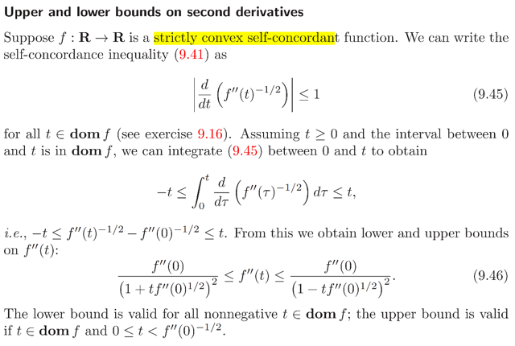</kbd>

> [!NOTE]
> Rồi đại khái là họ nói ta có thể thể hiện cái bất đẳng thức vốn dùng
> để thể hiện tính chất self-concordant: |f'''(x)| ≤ (1/2) f''(x)^3/2
>
> Bởi một inequality tương đương: |d/dt(f''(t)^-1/2)| ≤ 1
>
> Cái này chứng minh (ở note kế bên)
>
> Thế thì từ đó họ mới nói rằng khi ta tích phân từ 0 đến t của 
> d/dt f''(t)^-1/2 thì kết quả sẽ nằm trong [-t, t] Là sao?
>
> MIT 18.01 đã học FTC 1: rằng nếu ta có f(x) = F'(x) thì ∫a:b f(t)dt
> sẽ bằng F(b) - F(a)
>
> Do đó ở đây, ta có d/dt f''(t)^-1/2, có thể đặt là hàm g(t) thì áp dụng
> FTC1 ở trên ta có:
>
> ∫a:b g(t) = f''(b)^-1/2 - f''(a)^-1/2. 
>
> Với a = 0, b = t thì ∫0:t g(t) = f''(t)^-1/2 - f''(0)^-1/2
>
> Thế thì |d/dt(f''(t)^-1/2)| ≤ 1 ⇔ -1 ≤ d/dt(f''(t)^-1/2) ≤ 1
>
> Tích phân hai vế trên 0:t
>
> ∫0:t (-1)dt ≤ ∫0:t d/dt(f''(t)^-1/2) dt ≤ ∫0:t 1.dt
>
> ⇔ -t|0:t ≤ f''(t)^-1/2 - f''(0)^-1/2 ≤ t|0:t
>
> ⇔ -t ≤ f''(t)^-1/2 - f''(0)^-1/2 ≤ t
>
> Từ đó ta có giới hạn trên và dưới của f''(t):
>
> -t ≤ f''(t)^-1/2 - f''(0)^-1/2 ≤ t
>
> ⇔ f''(0)^-1/2 - t ≤ f''(t)^-1/2 ≤ f''(0)^-1/2 + t
>
> Đặt a = f''(0)^1/2
>
> ta có :
>
> f''(0)^-1/2 - t ≤ f''(t)^-1/2 ⇔ 1/f''(0)^1/2 - t ≤ 1/ f''(t)^1/2
>
> ⇔ 1/a - t ≤ 1/ f''(t)^1/2 ⇔ (1 - ta)/a ≤ 1/ f''(t)^1/2 
>
> ⇔ a/(1 - ta) ≥ f''(t)^1/2 
>
> ⇔ (a/(1 - ta))^2 ≥ f''(t) 
>
> ⇔ (f''(0)^1/2/(1 - tf''(0)^1/2))^2 ≥ f''(t) 
>
> ⇔ f''(0) / (1 - tf''(0)^1/2)^2 ≥ f''(t)
>
> Tương tự: Ta sẽ có:
>
> f''(0) / (1 + tf''(0)^1/2)^2 ≤ f''(t) ≤ f''(0) / (1 - tf''(0)^1/2)^2 (đây là 9.46)
>
> ====
>
> Tóm lại ý chính cần hiểu chỗ này là NẾU NHƯ FUNCTION LÀ 
> CONCORDANT FUNCTION, thì từ tính chất |f'''(t)| ≤ k f''(T)^3/2 
> ta có thể CHO THẤY MỘT GIỚI HẠN TRÊN VÀ DƯỚI CỦA ĐẠO 
> HÀM CẤP 2 f''(t)
>
> cái bất đẳng thức vốn dùng để thể hiện tính chất self-concordant: |f''
> '(x)| ≤ (1/2) f''(x)^3/2
>
> Bởi một inequality tương đương: |d/dt(f''(t)^-1/2)| ≤ 1
>
> Cái này chứng minh sau
>
> Đặt h(t) = f''(t)^-1/2
>
> h'(t) = d/dt h(t) = d/dt f''(t)^-1/2 = [ d/d(f''(t)) f''(t)^-1/2 ] . d/dt f''(t)
>
> = (-1/2) [f''(t)]^-3/2 . f'''(t)
>
> ⇨ |h'(t)| = |(-1/2) [f''(t)]^-3/2 . f'''(t)| = (1/2) |f'''(t)| / |[f''(t)]^3/2|
>
> Từ đó |h'(t)| ≤ 1 ⇔ (1/2) |f'''(t)| / |[f''(t)]^3/2| ≤ 1
>
> ⇔ |f'''(t)| ≤ 2 |[f''(t)]^3/2|
>
> ⇔ -2 [f''(t)]^3/2 ≤ |f'''(t)| ≤ 2 [f''(t)]^3/2
>
> Và như vậy, ta đã có "third derivative của function bị chặn bởi một
> multiple của second derivative mũ 3/2, và theo đó, ta có thể scale
> function f bởi số k dương nào đó f~(x) = k f(x) để nó ra dạng tiêu
> chuẩn: |f~'''(x)| ≤ 2 f~''(x)^3/2  của self-condordant condition

 

<kbd>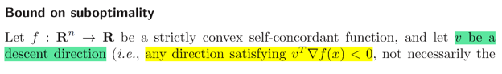</kbd>

<kbd>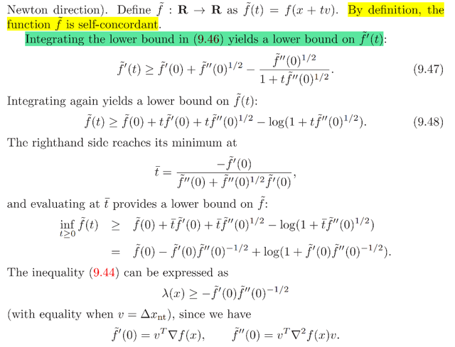</kbd>

<kbd>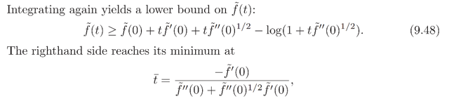</kbd>

<kbd>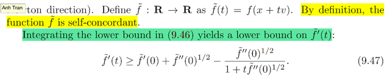</kbd>

<kbd>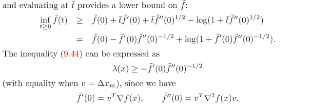</kbd>

> [!NOTE]
> Đại khái là Đặt f~(t) = f(x + tv) áp dụng kết qủa 9.46:
>
> f''(0) / (1 + tf''(0)^1/2)^2 ≤ f''(t) ≤ f''(0) / (1 - tf''(0)^1/2)^2
>
> Ta sẽ có:
>
> f~''(0) / (1 + tf~''(0)^1/2)^2 ≤ f~''(t) ≤ f~''(0) / (1 - tf~''(0)^1/2)^2
>
> Integrate cái lower-bound của f~''(t) này:
>
>  f~''(t) ≥ f~''(0) / (1 + tf~''(0)^1/2)^2
>
> ⇨ ∫0:t f~''(z) dz  ≥ ∫0:t f~''(0) / (1 + zf~''(0)^1/2)^2 dz
>
> ⇔ f~'(z)|0:t ≥ ...
>
> ⇔ f~'(t) - f~'(0) ≥ ...
>
> Vế phải: ∫0:t f~''(0) / (1 + zf~''(0)^1/2)^2 dz
>
> Đặt a = f~''(0)^1/2
>
> ∫0:t a^2 / (1 + za)^2 dz
>
> a^2 ∫0:t 1 / (1 + za)^2 dz
>
> Đặt u = 1 + za ⇨ du = adz ⇨ dz = du/a 
>
> z ∈ [0, t] ⇨ u ∈ [1: 1+ta]
>
> a^2 ∫1:(1+ta) 1/u^2 du/a = a ∫1:(1+ta) 1/u^2 du
>
> = a (-1/u) |1:(1+ta) = - a [1/(1+ta) -1/1] = -a [1-(1+ta)] / (1+ta)
>
> = -a (-ta) / (1+ta) = ta^2/(1+ta) 
>
> = (ta^2+a-a)/(1+ta) = [a(ta +1)-a]/(1+ta)
>
> = a(ta +1)/(1+ta) -a/(1+ta) 
>
> = a - a/(1+ta) 
>
> Thay a = f~''(0)^1/2
>
> Vậy f~'(t) - f~'(0) ≥ a - a/(1+ta) = f~''(0)^1/2 - f~''(0)^1/2/(1+tf~''(0)^1/2)
>
> f~'(t) - f~'(0) ≥ f~''(0)^1/2 - f~''(0)^1/2/(1+tf~''(0)^1/2)
>
> ⇔ f~'(t) ≥ f~'(0) + f~''(0)^1/2 - f~''(0)^1/2/[1+tf~''(0)^1/2] Đây là 9.47
>
> Xong, tích phân từ 0 đến t lần nữa:
>
> ⇔ f~'(t) ≥ f~'(0) + f~''(0)^1/2 - f~''(0)^1/2/[1+tf~''(0)^1/2] (9.47)
>
> ⇔ ∫0:t f~'(z)dz ≥ ∫0:z f~'(0) + f~''(0)^1/2 - f~''(0)^1/2/[1+zf~''(0)^1/2] dz
>
> ⇔ f~(z)|0:t ≥ ∫0:z f~'(0) + f~''(0)^1/2 - f~''(0)^1/2/[1+zf''(0)^1/2] dz
>
> Xét vế trái: f~(z)|0:t = f(t) - f(0)
>
> Xét vế phải ∫0:t f~'(0) + f~''(0)^1/2 - f~''(0)^1/2/[1+zf~''(0)^1/2] dz:
>
> Đặt a = f~''(0)^1/2, b = f~'(0)
>
> ∫0:t [b + a - a/(1+az)] dz = (b+a)t |0:t - log(1 + az) |0:t
>
> (b+a)z là antiderivative của b+a: d/dz (b+a)z = b+a
>
> log(1+az) là anti derivative của a/(1+az): d/dz log(1+az) = 1/(1+az) . a
>
> = (b + a)t - log(1 + at) = tf~'(0) + tf~''(0)^1/2 - log(1 + tf~''(0)^1/2)
>
> Ta có: f~(t) - f~(0) ≥ tf~'(0) + tf~''(0)^1/2 - log(1 + tf~''(0)^1/2)
>
> ⇔ f~(t) ≥ f~(0) + tf~'(0) + tf~''(0)^1/2 - log(1 + tf~''(0)^1/2) đây là (9.48)
>
> ====
>
> Tiếp họ nói vế phải đạt minimum tại t^ = -f~'(0) / [f~''(0) + f~''(0)^1/2 f~'(0)]
> là sao: Là vì bên phải, nếu đặt c1 = f~(0), c2 = f~'(0), c3 = f~''(0)^1/2, ta
> có g(t) = c1 + tc2 + tc3 - log(1 + tc3). 
>
> Đây là convex function: vì nó là tổng của affine (là convex) và -log(affine) là 
> -concave = convex. Nên tìm minimum của nó bằng optimality condition ∇g = 0:
>
> Đặt u = 1 + tc3 ⇨ du = c3 dt
>
> dg = g(t+dt) - g(t) = c1 + (t+dt)(c2 + c3) - log(u+du) - c1 - tc2 - tc3 + log(u) 
>
> = dt(c2 + c3) - [log(u + du) - log(u)]
>
> = dt(c2 + c3) - log[(u + du)/u]
>
> = dt(c2 + c3) - log(1 + du/u) = dt(c2 + c3) - du/u 
>
> = dt(c2 + c3) - c3dt/(1+tc3) = [c2 + c3 - c3/(1 + tc3)]dt
>
> ⇨ g' = c2 + c3 - c3/(1 + tc3)
>
> Tính bằng cách khác:
>
> dg/dt = d/dt (c1 + tc2 + tc3 - log(1 + tc3)) = c2 + c3 - d/dt log(1 + tc3)
>
> = c2 + c3 - d/d(1 + tc3) log(1 + tc3) . d/dt (1 + tc3) = c2 + c3 - [1/(1 + tc3)] c3 
>
> = c2 + c3 - c3/(1 + tc3)  
>
> ⇨ g' = 0 ⇔ c2 + c3 - c3/(1 + tc3) = 0 ⇔ c2 + c3 = c3/(1 + tc3) 
>
> ⇔ (1 + tc3)  = c3/(c2 + c3) ⇔ tc3 = c3/(c2 + c3) - 1 = c3 - c2 - c3 / (c2 + c3) 
> = - c2/(c2 + c3)
>
> ⇔ t = -c2/[c3(c2 + c3)]
>
> c1 = f~(0), c2 = f~'(0), c3 = f~''(0)^1/2
>
> t = -f~'(0)/[f~''(0)^1/2(f~'(0) +f~''(0)^1/2)]
>
> ⇔ t = -f~'(0) / [f~''(0)^1/2 ( f~'(0) + f~''(0)^1/2 )]
>
> ⇔ t = -f~'(0) / [f~''(0)^1/2 f~'(0) + f~''(0)^1/2f~''(0)^1/2 ]
>
> ⇔ t = -f~'(0) / [f~''(0)^1/2 f~'(0) + f~''(0) ]
>
> ⇔ t = -f~'(0) / [f~''(0) + f~''(0)^1/2 f~'(0) ] Đây là t^bar trong sách
>
> Và dĩ nhiên vì f~(t) sẽ đạt min tại t^ (t bar) nên inf t ≥ 0 f~(t) cũng ≥ f~(t^)
>
> t^ = -f~'(0) / [f~''(0) + f~''(0)^1/2 f~'(0) ] Đây là t^bar trong sách
>
> f~(t) ≥ f~(0) + tf~'(0) + tf~''(0)^1/2 - log(1 + tf~''(0)^1/2) đây là (9.48)
>
> ⇨ inf t ≥ 0 f~(t) ≥ f~(0) + t^f~'(0) + t^f~''(0)^1/2 - log(1 + t^f~''(0)^1/2)
>
> Thế t^ vô thu gọn (cái này hơi rắc rối nhưng chỉ là toán đại số) lại vế phải là:
>
> int t ≥ 0 f~(t) ≥ f~(0) - f~'(0)f~''(0)^-1/2 + log[1 + f~'(0)f~''(0)^-1/2]
>
> ===
>
> Rồi, với việc ta đã đặt f~(t) = f(x + tv)
>
> ⇨ df~(t)/dt = d/dt f(x + tv)
>
> = d/d(x + tv) f(x + tv) . d/dt (x + tv)
>
> = df(u)/du . d/dt (x + tv)
>
> = ∇f(u) T v = ∇f(x + tv)Tv 
>
> *vì u là vector f(u) là vector - scalar function nên df/du là gradient ∇f. Dẫn đến
> dấu product của df/du và v (cũng là vector) phải là dot product để cho ra df
> là scalar.
>
> ⇨ f~'(t) = ∇f(x + tv)Tv ⇨ vT∇f(x) = f~'(0) 
>
> df~'(t)/dt = d/dt [∇f(x + tv)Tv]
>
> = [d/dt ∇f(x + tv)]Tv
>
> = [d/d(x + tv) ∇f(x + tv) . d/dt (x + tv)]Tv
>
> = [∇^2f(x + tv)Tv]Tv = vT∇^2f(x + tv)Tv
>
> ⇨ f~''(t) =  vT∇^2f(x + tv)Tv ⇨ vT∇^2f(x)Tv = f~''(0)
>
> Ta có: 9.44 rằng λ(x) ≥ -vT∇f(x) / [vT ∇^2f(x)v]^1/2 sẽ 
>
> ⇔ λ(x) ≥ -f~'(0) / f~''(0)^1/2 
>
> ⇔ λ(x) ≥  -f~'(0) f~''(0)^-1/2
>
> Và nói dấu bằng xảy ra khi v = newton step Δx_nt là sao?
>
> Là vì trong phần trước mình đã chứng minh λ(x) cũng = sup v ≠ 0 -vT∇f(x) / [vT∇^2f(x)v]^1/2
>
> Nên di nhiên λ(x) luôn ≥ -vT∇f(x) / [vT∇^2f(x)v]^1/2 = -f~'(0) f~''(0)^-1/2
>
> Và khi giải bài toám maximize v -vT∇f(x) / [vT∇^2f(x)v]^1/2 thì v* = Δx_nt
>
> Ý TƯỞNG CHÍNH là: Từ cái giới hạn dưới (và trên) của đạo hàm
> cấp hai f''(t) MÀ TA CÓ ĐƯỢC NHỜ TÍNH SELF-CONCORDANT
> thì ta sẽ dưa vào đó để chứng minh, TÌM ĐƯỢC GIỚI HÀN CỦA 
> sup-optimality f(x) - p*, để cho thấy nó sẽ luôn ≤ λ(x).
>
> Để rồi TỪ ĐÓ TA CÓ THỂ DÙNG λ(x) ĐÓNG VAI TRÒ STOPPING
> CONDITION, ví dụ như ta muốn f(x) - p* ≤ ε thì ta sẽ dừng khi λ(x) ≤ ε

 

<kbd>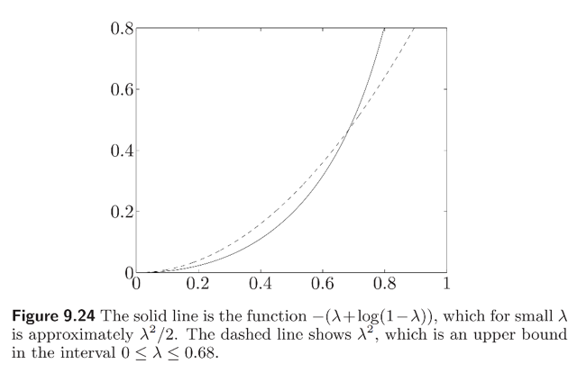</kbd>

<kbd>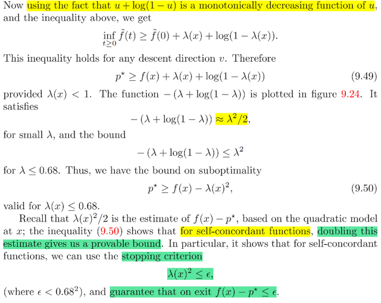</kbd>

> [!NOTE]
> Tiếp, dụng sự thật rằng f(u) = u + log(1 - u) là hàm đơn điệu giảm đối với u
>
> nên nếu u1 ≥ u2 thì f(u1) ≤ f(u2)
>
> Áp dụng u1 = λ(x), u2 = -f~'(0)f~''(o)^-1/2
>
> Thì ta có: f(λ(x)) ≤ f(-f~'(0)f~''(o)^-1/2)
>
> ⇔ λ(x) + log[1 - λ(x)] ≤ -f~'(0)f~''(o)^-1/2 + log1 -[-f~'(0)f~''(o)^-1/2]
>
> ⇔ λ(x) + log[1 - λ(x)] ≤ -f~'(0)f~''(o)^-1/2 + log1 + f~'(0)f~''(o)^-1/2
>
> ⇔ f~(0) + λ(x) + log[1 - λ(x)] ≤ f~(0) - f~'(0)f~''(o)^-1/2 + log1 + f~'(0)f~''(o)^-1/2
>
> Và vế phải thì đang ≤ inf t≥0 f~(t) nên ta có
>
> inf t≥0 f~(t) ≥ f~(0) + λ(x) + log[1 - λ(x)]
>
> Và vì f~(t) = f(x + tv) nên ta có:
>
> inf t≥0 f~(x + tv) ≥ f~(0) + λ(x) + log[1 - λ(x)]
>
> Và cái này đương nhiên đúng với mọi v, đơn giản vì nó chả nói gì đến v, nên nó phải
> đúng với mọi v Và v như nói ban đầu là ANY DESCENT DIRECTION, tức là miễn là
> hướng khiến giảm giá trị f, cộng với t là ≥ 0 do đó inf t≥0 f(x+tv) sẽ mang ý nghĩa là "
> (giá trị f tại) mọi điểm có thể đến được khi xuất phát từ f theo hướng descent). Và dĩ
> nhiên trong đó sẽ có CHỨA OPTIMAL p*
>
> Vậy p* ≥ f~(0) + λ(x) + log[1 - λ(x)]
>
> Rồi thế thì họ mới xét hàm k(λ) = -[λ + log(1 - λ)]
>
> thì đại khái là đồ thị 9.24 cho thấy khi λ nhỏ thì nó xấp xỉ hàm λ^2/2. Và đặc điểm thứ
> hai là khi λ ≤ 0.68 thì nó luôn nằm dưới đồ thị hàm λ^2. Do đó ta có thể dùng đặc
> điểm này để nói rằng:
>
> khi λ(x) ≤ 0.68 thì -[λ(x) + log[1 - λ(x)] ≤ λ(x)^2
>
> ⇔ λ(x) + log(1 - λ(x) ≥ -λ(x)^2
>
> ⇨ f~(0) + λ(x) + log[1 - λ(x) ≥  f~(0) - λ(x)^2
>
> ⇨ p* ≥  f~(0) - λ(x)^2
>
> ⇔ p* >=  f(x) - λ(x)^2 | f~(0) = f(x + 0v) = f(x)
>
> ⇔ Và đây là lower bound của sub-optimality khi λ(x) ≤ 0.68
>
> (f(x) - p* ≤ λ(x)^2)
>
> Và do đó nếu như với self-concordant function (để ta có kết quả trên) thì ta có thể
> dùng điều kiện λ(x)^2 ≤ ε để dừng thuật toán, vì khi đó ta đã có f(x) - p* ≤ ε

 

<kbd>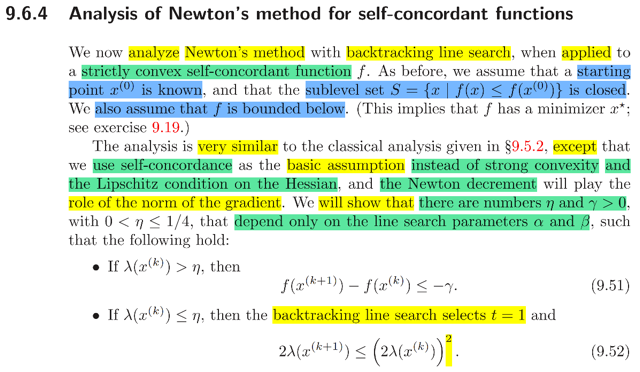</kbd>

<kbd>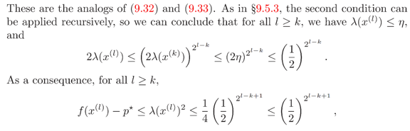</kbd>

<kbd>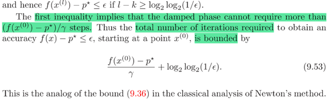</kbd>

> [!NOTE]
> 9. UNCONSTRAINED PROBLEM
>
> 9.6 SELF CONCORDANCE
>
> 9.6.4
>
> Đại khái là ta sẽ làm lại cái phần convergence analysis nhưng
> là đối với concordant function, để rồi ta cũng sẽ chứng minh rằng
> việc giải bài toán dùng Newton's method cũng sẽ đưa đến hai 
> giai đoạn
>
> Đây là nói trước những những kết quả ta sẽ chứng minh, và 
> nó tuong đương với những phân tích của phần trước

 

<kbd>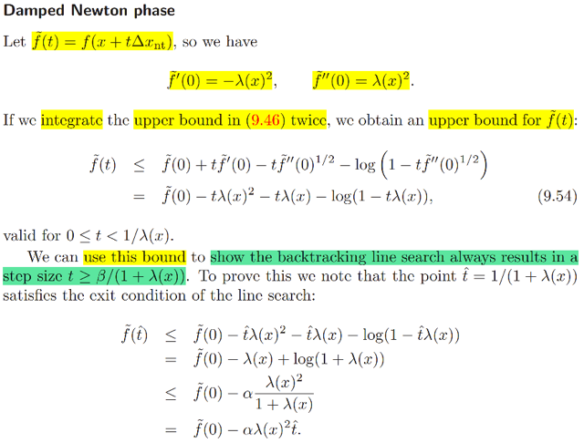</kbd>

<kbd>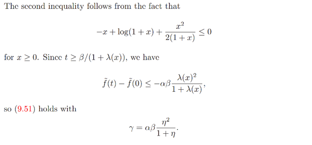</kbd>

> [!NOTE]
> Đầu tiên đặt f~(t) = f(x + t Δx_nt)
>
> f~'(t) = d/dt f(x + t Δx_nt) = d/d(x + t Δx_nt) f(x + t Δx_nt) . d/dt (x + t Δx_nt)
>
> = ∇f(x + t Δx_nt)T Δx_nt 
>
> ⇨ f~'(0) = ∇f(x)TΔx_nt = ∇f(x)TΔx_nt
>
> Với Δx_nt = -∇^2f(x)inv ∇f(x) thì 
>
> ∇f(x)TΔx_nt = -∇f(x)T ∇^2f(x)inv ∇f(x)
>
> và cái này chính là -λ(x)^2. ⇨ f~'(0) = -λ(x)^2
>
> f~''(t) = d/dt f~'(t) = d/dt ∇f(x + t Δx_nt)TΔx_nt  
>
> = [d/d(x + t Δx_nt) ∇f(x + t Δx_nt) . d/dt (x + t Δx_nt) ]TΔx_nt  
>
> = [∇^2f(x + t Δx_nt) . Δx_nt]TΔx_nt  
>
> = Δx_ntT[∇^2f(x + t Δx_nt)]TΔx_nt  
>
> f~''(0) = Δx_ntT[∇^2f(x)]TΔx_nt = (∇^2f(x)inv ∇f(x))T[∇^2f(x)]T(∇^2f(x)inv ∇f(x))
>
> = ∇f(x)∇^2f(x)invT [∇^2f(x)]T∇^2f(x)inv ∇f(x)
>
> = ∇f(x)∇^2f(x)inv ∇f(x) chính là λ(x)^2
>
> ⇨ f~''(0) = λ(x)^2
>
> ====
>
> Từ 9.46:
>
> f''(0) / (1 + tf''(0)^1/2)^2 ≤ f''(t) ≤ f''(0) / (1 - tf''(0)^1/2)^2 (đây là 9.46)
>
> Ta sẽ tích phân từ 0 : t cái upper bound:
>
> QUAY LẠI LÀM SAU (TƯƠNG TỰ NHƯ KHI TA LÀM RA CÁI 9.48)
>
> f~(t) ≤ f~(0) + tf~'(0) - tf~''(0)^1/2 - log[1 - tf~''(0)^1/2]
>
> = f~(0) - t λ(x)^2 - t λ(x) - log[1 - t λ(x)]
>
> Và kết quả đáng chú ý đầu tiên là ta sẽ chứng minh rằng với cái này thì
> backtracking line search luôn chọn step size t ≥ β/[1+λ(x)]
>
> Để chứng minh ta sẽ để ý rằng t^ = 1/[1 + λ(x)] thỏa exit condition của
> line search. Là sao?
>
> Exit condition của backtracking line search: 
>
> Nói bằng lời là vị trí sau khi step f(x + t Δx) đã nhỏ hơn vị trí dự đoán bởi
> linear interpolation với độ dốc điều chỉnh: f(x) + αt∇f(x)T Δx:
>
> f(x + t Δx) < f(x) + αt∇f(x)T Δx . Nếu chưa thỏa thì ta sẽ scale down t bởi factor
> β: t = βt và check lại cho đến khi thỏa. 
>
> Thế thì đại khái là họ đã chứng minh với t^ = 1/[1 + λ(x)] thì:
>
> f~(t^) ≤ f~(0) - α λ(x)^2 t (1)
>
> Ở trên đã biết -λ(x)^2 = -∇f(x)∇^2f(x)inv ∇f(x) = ∇f(x)[-∇^2f(x)inv ∇f(x)] 
>
> = ∇f(x)Δx_nt nên (1) ⇔ f~(t^) ≤ f~(0) + α ∇f(x)Δx_nt t . Và đây chính là exit
> condition.
>
> Và như vậy với t = 1/[1+λ(x)] thì nó đã thỏa exit condition nên dĩ nhiên t không
> thể bé hơn mức này, 
>
> và vì vậy càng không thể bé hơn β/[1+λ(x)] (vì bản chất của backtracking line 
> search là scalar t xuống cho đến khi nó thỏa exit condition thì dừng và dùng t đó) 
>
> Do đó có thể kết luận t luôn ≥ β/[1+λ(x)].
>
> Và từ đó dẫn tới với t^ = 1/[1 + λ(x)] thì f~(t^) - f~(0) ≤ - α λ(x)^2 t^
>
> ⇔ f~(t^) - f~(0) ≤ - γ đây là 9.51 với γ = α λ(x)^2 t^
>
> Để hiểu cái ý khi họ nói ta sẽ chứng minh rằng tồn tại η để khi λ(x) ≥ η
> thì ta có 9.51 và khi λ < η  thì ta có 9.52  này 
>
> ta tóm tắt lại quá trình chứng minh như sau:
>
> Đầu tiên dựa vào cái giới hạn trên và dười của đạo hàm cấp hai
> f''(t) mà ta có được từ tính chất của hàm self-concordant.
>
> (Để rồi phần trước, nhờ dùng cái chặn dưới, ta tìm ra, chứng minh
> được f(x) - p* ≤ λ(x))
>
> Thì nay dùng cái chặn trên ta chứng minh được rằng tại t luôn ≥ 
> β / (1 + λ(x)), là vì ta đã chứng minh tại t (vốn ban đầu mỗi vòng
> backtracking line search đều bằng 1, sau đó được scale xuống 
> dần bởi factor β) thì khi đạt t^ = 1/[1 + λ(x)], thì nó đã thỏa exit
> condition của thuật toán line search. Và từ đó dẫn tới kết quả là
>
> f~(t) - f~(0) ≤ -α β λ(x)^2 / [1 + λ(x)]
>
> ⇔ f(x + tΔx_nt) - f(x) ≤ -α β λ(x)^2 / [1 + λ(x)]
>
> Cũng chính là chứng minh 
>
> f(x(k+1)) - f(x(k)) ≤ γ = -α β λ(x)^2 / [1 + λ(x)].
>
> ⇔ α β λ(x)^2 / [1 + λ(x)] ≤ f(x(k)) - f(x(k+1))
>
> Ý NGHĨA CỦA NÓ LÀ: ALL THE TIME, TA LUÔN CÓ THỂ CHẮC CHẮN
> RẰNG MỨC GIẢM CỦA f SAU MỖI ITERATION LUÔN ÍT NHẤT LÀ BẰNG
> γ = α β λ(x)^2.
>
> Vậy thì ý nói là, nhờ vào tính self concordant mà ta LUÔN CÓ CÁI NÀY (9.51)
>
> VÀ NẾU MÀ  λ(x) mà nhỏ hơn η nào đó nữa thì ta còn CÓ MỘT CÁI CÒN
> MẠNH HƠN đó là 9.52: λ(x(k+1)) ≤ (2 λx(k))^2.
>
> Có nghĩa là, kể cả khi λ(x(k)) > η hay ≤ η thì vẫn có f(x(k+1)) - f(x(k)) ≤ η
> nhưng nếu nó ≤ η ta sẽ có cái khác là 9.52.
>
> Và cái η để từ đó ta có thêm cái 9.52 là (1 - 2α)/4

 

<kbd>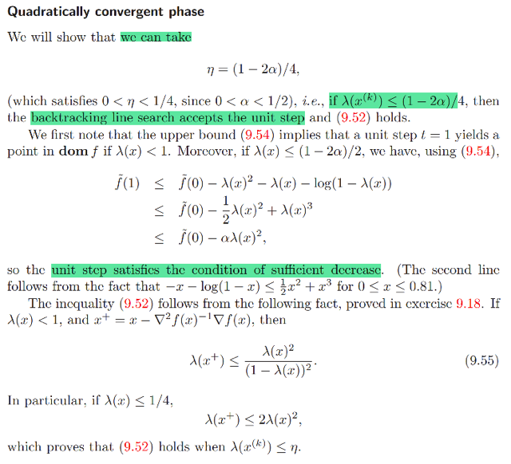</kbd>

> [!NOTE]
> Nói chung là chứng minh nếu λ(x) ≤ η thì λ(x+) ≤ 2 λ(x)^2
>
> Đại khái là vầy, trong đây họ muốn chứng minh là nếu mà λ(x(k)) đạt mức nhỏ
> hơn η = (1-2α)/4 thì khi đó backtracking line search sẽ thỏa với t = 1, tức là,
> ngay tại khi bắt đầu backtracking line search (cho t = 1, và scale dần xuống bởi
> factor β) thì exit condition đã thỏa rồi. Ta biết exit condition là f(x + t Δx) ≤ f(x) +
> αt ∇f(x)TΔx với Δx là Newton step Δx_nt = -∇^2f(x)inv ∇f(x) thì exit condition trở
> thành
>
> f(x + t Δx_nt) ≤ f(x) + α t ∇f(x)T ∇^2f(x)inv ∇f(x)
>
> ⇔ f(x + t Δx_nt) ≤ f(x) - α t λ(x)^2 ⇔ f~(t) ≤ f~(0) - tαλ(x)^2
>
> Do đó chứng minh với t = 1 đã thỏa tức là chứng minh f~(1) ≤ f~(0) - αλ(x)^2
>
> Thì chứng minh dễ thôi:
>
> Từ kết quả ta đã có 9.54:
>
> f~(t) ≤ f~(0) - t λ(x)^2 - t λ(x) - log[1 - t λ(x)]
>
> Dùng thêm the fact -x - log(1 - x) ≤ 1/2 x^2 + x^3 nếu 0 ≤ x ≤ 0.81 (CÁI NÀY 
> KHÔNG BIẾT Ở ĐÂU RA, CHỨNG MINH SAU)
>
> vế trái ≤ f~(0) - 1/2 λ(x)^2 + λ(x)^3 
>
> Dùng tiếp λ(x) ≤ (1-2α)/4 ta có: vế trái = f~(1) ≤ f~(0) - α λ(x)^2
>
> Đó là chứng minh xong. Và như vậy khi λ(x) ≤ η có giá trị trên thì thuật toán 
> luôn TAKE FULL STEP, TỨC LÀ ΔX_NT BẰNG NHIÊU LÀ LẤY BẤY NHIÊU
>
> Đây là giai đoạn gọi là Pure Newton phase (khác với Damped Newton phase
>
> ====
>
> Và tới đây ta mới dụng thêm cái fact nữa có thể CHỨNG MINH SAU
>
> Nếu λ(x) < 1 và x+ = x - ∇^2f(x)inv ∇f(x) thì λ(x+) ≤ λ(x)^2 / [1 - λ(x)]^2
>
> Và cụ thể hơn nếu λ(x) ≤ 1/4 thì 
>
> λ(x+) ≤ λ(x)^2 / [1 - λ(x)]^2 ≤ λ(x+) ≤ λ(x)^2 / [1 - 1/4]^2 
>
> = λ(x)^2 / (3/4)^2 = (4^2/3^2) λ(x)^2 = 16/9 λ(x)^2 ≤ 16/8 λ(x)^2 = 2 λ(x)^2
>
> λ(x+) ≤ 2 λ(x)^2
>
> Từ đó đã chứng minh xong 9.52

 

<kbd>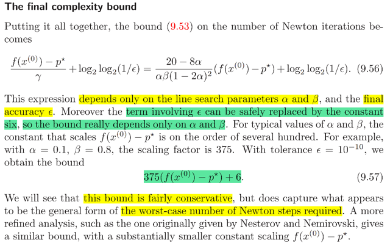</kbd>

> [!NOTE]
> Nói chung là kết hợp các kết qủa lại thì ta có thể suy ra kết quả 9.53 (là
> giới hạn ta đã chứng minh rằng số iterations cần thiết để đạt accuracy
> f(x) - p* ≤ ε sẽ không quá [f(x0) - p*]/γ + log_2 [log_2(1/ ε)]
>
> Thì cái thay γ vô ý chính nói rằng cái này sẽ chỉ phụ thuộc α và β

 

- **Thí nghiệm tối ưu hàm log**

<kbd>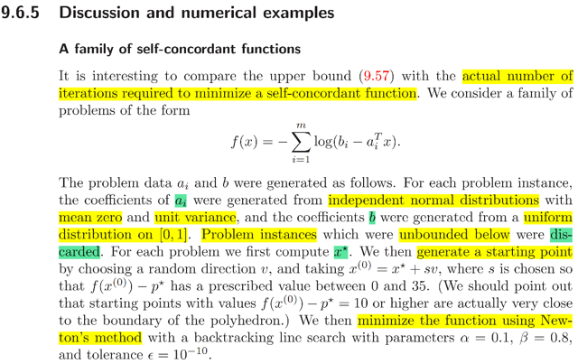</kbd>

> [!NOTE]
> Không có gì khó hiểu. Đại khái là người ta làm thí nghiệm.
>
> Xét một họ các problem f(x) = - Σi=1:m log(bi - aiTx)
>
> với ai được sampling từ N(0,1) và bi sampling từ Unif(0,1)
>
> Có nghĩa là ta sẽ tạo ra rất nhiều bộ giá trị của a, b, tương 
> ứng là nhiều function f(x). 
>
> Sau đó, họ mới bỏ đi các f(x) mà bị unbound below, vì đây là
> những cái mà khi ta giải bài toán optimization minimize f(x) thì
> sẽ không thể ra nghiệm
>
> Những cái còn lại, họ sẽ tính x* cho mỗi cái. Rồi từ đó chọn một
> điểm starting point bằng cách từ x* di chuyển theo  hướng bất kì 
> sao cho đừng xa quá (giới hạn f(x*) - f(x0) trong khoảng nào đó 
> thôi) (vì xa quá, ta sẽ ra khỏi phạm vi domain của f
>
> Nên nhớ domain của f là bi - aiTx > 0 và đây sẽ là intersection của
> các half-plane, tạo nên một Polyhedron, và việc giải bài toán sẽ là
> tìm trong polyhedron này điểm nào minimize f. Và cũng có thể hiểu
> nếu cho x(0) = x* + sv mà f(x0) - f(x*) lớn qúa thì ta có thể ra khỏi
> Polyhedron.
>
> Rồi, cuối cùng với mỗi bài toán, ta giải nó bằng Newton's method 
> với backtracking line search với α = .1, β = .8 và ε = 10e-10

 

<kbd>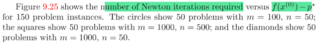</kbd>

<kbd>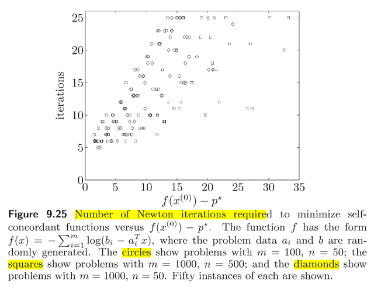</kbd>

<kbd>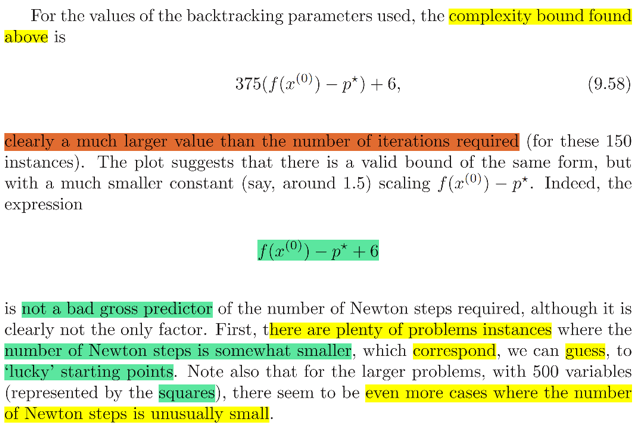</kbd>

<kbd>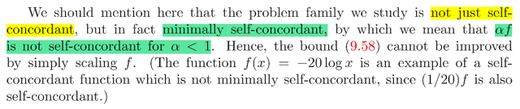</kbd>

> [!NOTE]
> Rồi, đại khái là người ta tạo ra các problem instance như đã mô ta,
> nhưng với 3 độ lớn khác nhau.
>
> Và vẽ đồ thị giữa "số Newton iteration cần thiết (để đạt f(x) - p* ≤ ε) với
> khoảng cách của x(0) cách p*
>
> Nhận xét đầu tiên rằng, so với cái giới hạn về lí thuyết mà ta đã có của
> số iteration cần thiết, theo công thức 375(f(x0 - p*) + 6 thì có thể thấy
> số iteration cần thiết thực tế nhỏ hơn nhiều cái bound lí thuyết này. Để
> rồi thay vì công thức đó, ta có thể dùng f(x0) - p* + 6 là cũng không
> phải là tệ.
>
> Rồi, quan sát khác đó là có nhiều case mà số iteration cần thiết rất nhỏ
> ví dụ như xét trong cùng một loại độ lớn (tròn, hay vuông) và cùng một
> mức giữa f(x0) - p*. Thì có những cái có số iteration nhỏ (nằm ở dưới
> thấp) hơn những cái khác. Đây có thể là ứng với những lucky starting
> point -  ý là những starting point tốt khiến quá trình apply nEwton
> method thuận lợi. Và khi độ lớn problem lớn thì càng có nhiều lucky
> start
>
> Khúc cuối chưa hiểu lắm

 

<kbd>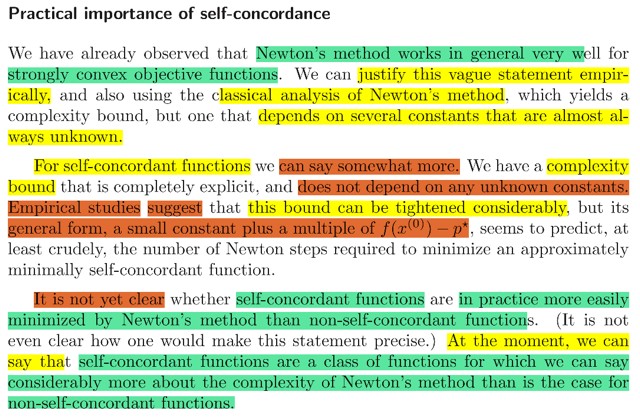</kbd>

> [!NOTE]
> rồi, đại khái là, phần đầu mình đã quan sát rằng Newton method sẽ
> nói chung là tốt đối với function có tính strongly convex.
>
> Và ta cũng đã trải qua bước analysis để cho thấy complexity bound
> (giới hạn của số iteration cần thiết) dù rằng trong phương pháp  đó ta
> thấy nó phụ thuộc vài hằng số mà hầu như ta không biết.
>
> Còn với self-concordant function, thì ít nhất ta có kết quả phân tích
> của complexity bound không phụ thuộc những hằng số không biết
> đó.
>
> Bên cạnh đó như ví dụ vùa rồi, đóng vai empirical studies đề nghị
> rằng ta có thể bóp cái upper bound của (số iteration required) lại nhỏ
> hơn, ví dụ như chỉ dùng một constant nhỏ nhân với f(x0) - p* là được.
>
> Tuy vậy trong thực tế cũng chưa rõ rằng liệu self-concordant function
> có dễ minimize với Newton's method hơn là non-self concordant
> function hay không
>
> Tất cả những gì ta có thể nói đó là với self concordant function thì 
> ta có thể nói nhiều hơn về complexity của Newton's method hơn là
> non-self-concordant

 

<kbd>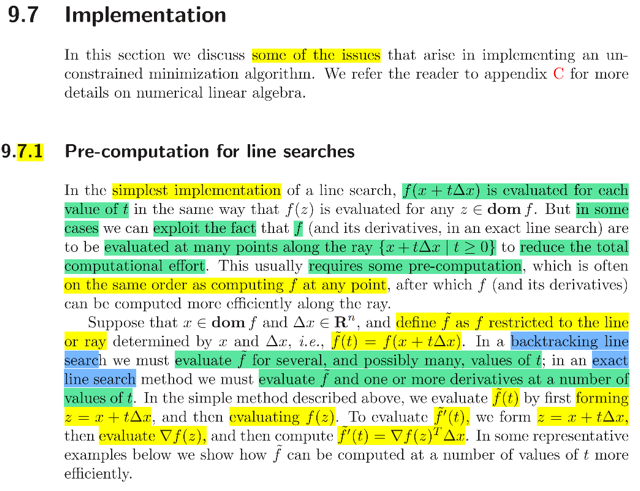</kbd>

> [!NOTE]
> Nói chung là phần này ta sẽ bàn về việc trong thực tế ta sẽ có
> những  chiến thuật gì để tối thiểu chi phí tính toán trong việc giải
> bài toán tối ưu dùng Newton's method
>
> Đại khái là ta đã biết thuật toán Newton's method thì đại để là có
> những bước tính toán chính như: Tính newton step Δx_nt. Sau đó
> trong line search, nếu như với backtracking thì ta sẽ tính f(x + t
> Δx_nt) với nhiều t khác nhau để check xem khi nào thì thỏa exit
> condition.
>
> Còn với exact line search thì ta giải bài toán tối ưu khác nên ta sẽ
> cần tính cả ∇f(x + t Δx_nt)
>
> Thế thì thay vì làm một cách đơn giản là với mỗi t ta tính z = x + t
> Δx rồi tính f(z)... thì ta có thể có những cách thức giúp giảm só chi
> phí tính toán

 

<kbd>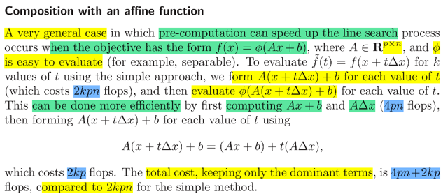</kbd>

> [!NOTE]
> Một case đầu tiên mà ta có thể có các "tiết kiệm" là khi function có
> dạng f(x) = Φ(Ax + b) với A ∈ R^(p,n) và Φ là hàm dễ tính.
>
> Thế thì nếu làm theo cách đơn giản, thì việc tính f~(t) = f(x + t Δx)
> với k values khác nhau của t sẽ tốn 2kpn flops.
>
> Vì sao? Với mỗi k, đầu tiên tính x + t Δx bao gồm t Δx là nhân scalar
> với vector R^n ⇨ tốn n flops. x + t Δx là cộng hai R^n vector elementwise
> ⇨ tốn n flops, tổng cộng là 2n flops. Bỏ vào f(x) = Φ(Ax + b)
>
> Ax + b: Ax là nhân matrix [p,n] với vector Rn: thử lập luận lại số flops:
> Đơn giản nhất là "nhìn theo góc nhìn component i của vector Ax, Ax_i
> sẽ là dot product của hàng i của A và vector x, tốn n flops cho nhân hai
> scalar, và n-1 flops cho phép cộng scalar ⇨ (2n-1) flops. Và với p hàng
> thì tổng cộng là p(2n-1) flops. 
>
> Sau đó là cộng b, tốn p flops cho phép cộng scalar 
>
> ⇨ p(2n-1) + p = p(2n-1)+1) = 2pn coi như pn
>
> Cuối cùng bỏ vào Φ thì vì Φ rất dễ nên bỏ qua.
>
> Vậy mỗi t tốn pn ⇨ có k giá trị của t thì tốn kpn flops
>
> ====
>
> Thay vào đó, thay vì tính x + t Δx, rồi tính A(x + t Δx) + b thì ta tính 
> (Ax + b) + t(AΔx) với các t khác nhau, có nghĩa là chỉ tính Ax + b, và AΔx
> một lần ròi dùng nó với các t khác nhau. thì tốn:
>
> A Δx: là nhân matrix [p,n] với Rn vector ⇨ tốn p(2n-1) như trên coi như 
> 2pn flops 
>
> t(A Δx): Nhân scalar với Rp vector: tốn p flops, với k giá trị t khác nhau
> tốn tổng cộng là kp flops
>
> (Ax + b): tốn 2pn flops như trên.
>
> t(A Δx) + (Ax + b) là cộng hai R^p vector tốn p flops cho mỗi t, có k t
> tốn kp flops
>
> Vậy tổng cộng là 2pn + 2pn + kp + kp = 4pn + 2kp
>
> Và cái này nhỏ hơn kpn

 

<kbd>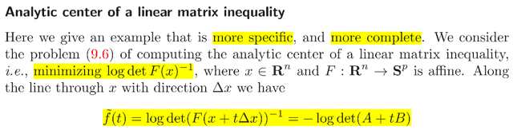</kbd>

<kbd>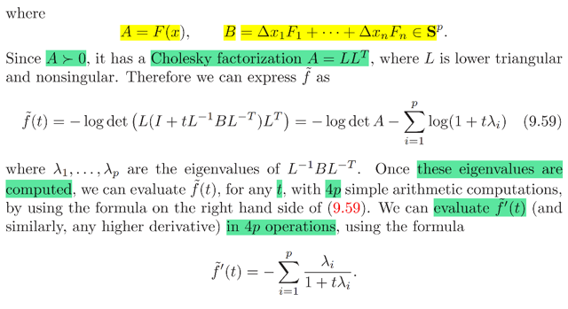</kbd>

> [!NOTE]
> Vì dài quá nên chỉ note Vài điểm giúp làm rõ:
>
> *) Vì sao f~(t) = log det F(x + t Δx)_inv = -log det (A + tB)
>
> det Finv = 1/det F ⇨ log det Finv = log(1/detF) = log(1) - log(detF) 
>
> = 0 - log(detF) = -log(detF)
>
> ⇨ log det F(x + t Δx) = - log det(F(x) + F(tΔx)
>
> ====
>
> Ở đây F R^n -> S^p is affine là thứ mà mình phải biết thêm: 
>
> Đại khái là nó có nghĩa là F(x) = F0 + F1x1 + ...Fnxn
>
> Nên F(x + tΔx) = F0 + Σi=1:n Fi (x + t Δx)i
>
> = F0 + Σi Fixi + Σi Fi t Δxi 
>
> = A + tB | Đặt A = F0 + Σi Fixi, đây chính là F(x), B =  t Σi Fi t Δxi
>
> ===
>
> Tiếp vì A ≻ 0 nên nó có thể có Cholesky factorization: A = L(LT)
>
> ⇨ A + tB = L(LT) + tB = L(LT) + LLinv tB (Linv)T LT
>
> = L [I + Linv t B (Linv)T] LT
>
> ⇨ -log det(A + tB) = - log det L [I + Linv t B (Linv)T] LT
>
> = - log  det(L) . det[I + Linv t B (Linv)T] . det(LT)   | Dùng det(AB) = det(A)det(B)
>
> = - log det(L) - log det[I + Linv t B (Linv)T] - log det(LT) | Dùng log(AB) = log(A) + log(B)
>
> = - log det(L) - log det(LT) - log det[I + Linv t B (Linv)T]
>
> = - [log det(L) + log det(LT)] - log det[I + Linv t B (Linv)T]
>
> = - log det[L(LT)] - log det[I + Linv t B (Linv)T]
>
> = - log det(A) - log det[I + Linv t B (Linv)T]
>
> = - log det(A) - log Π λ(I + Linv t B (Linv)T)i | det A = Πi λ(A)_i
>
> = - log det(A) - log Πi [1 + λ(Linv t B (Linv)T)i]  | λ(I + A)_i = 1 + λ(A)_i
>
> = - log det(A) - Σi log [1 + λ(Linv t B (Linv)T)i]
>
> = - log det(A) - Σi log [1 + tλi]  với λi là eigenvalues của Linv B (Linv)T
>
> Đây là 9.59
>
> ====
>
> Tiếp họ nói ta có thể tìm các λi. Thì sau đó với mọi t ta sẽ tính f~(t) tốn 4p. Là sao?
>
> Có thể ta bỏ qua - log det A (đã có rồi chẳng hạn). Còn - Σi=1:p log (1 + t λi) chính
> là tốn p - 1 (cho p - 1 phép cộng) + 3p (cho việc tính p log (1 + t λi) flops ≈ 4p
>
> ====
>
> Sau đó là tính f~'(t) = -Σi=1:p λi / (1 + t λi) và tốn 4p Là sao? 
>
> f~(t) = - log det A - Σ  log (1 + t λi) ⇨ d/dt f~(t) = d/dt [- log det A - Σ  log (1 + t λi)]
>
> = d/dt [-Σ  log (1 + t λi)] = -Σ d/dt [log (1 + t λi)] 
>
> = -Σ  d/d(1 + t λi) [log (1 + t λi)] . d/dt (1 + t λi) 
>
> = -Σ  1/(1 + t λi) . λi  = - Σi=1:p λi/(1 + t λi)
>
> Và cái này tốn p [phép λi/(1 + t λi), tốn 3 flops mỗi cái] + (p-1) flops cho phép cộng
>
> ⇨ 3p + p - 1≈ 4p flops

 

<kbd>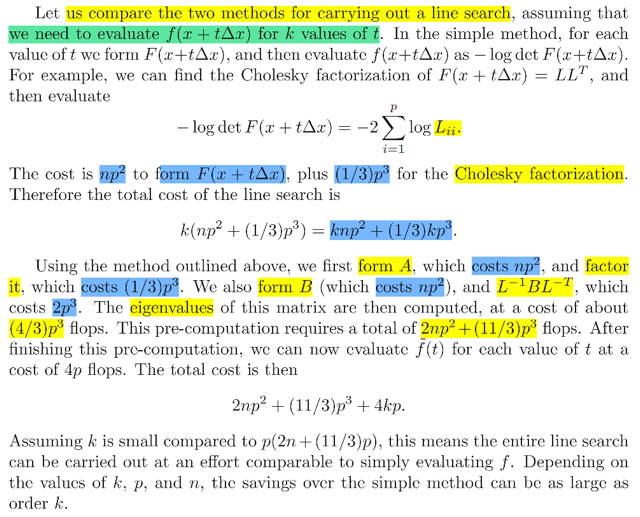</kbd>

> [!NOTE]
> Sau đó là so sánh cost của việc evaluate f(x + t Δx) với k giá trị khác
> nhau của t
>
> Nếu làm theo cách naive, thì
>
> 1) đầu tiên ta sẽ form F(x + t Δx) tốn np^2:
>
> x + t Δx: t Δx tốn n flops, + x tốn thêm n flops là 2n flops. Gọi là z đi, bỏ
> vào F(z) = F0 + Σi=1:n zi Fi
>
> ziFi là scalar * matrix pxp tốn p^2 flops, Σi=1:n ziFi tốn (n-1) phép cộng
> matrix, mỗi cái tốn p^2 flops ⇨ n-1 cái tốn (n-1)p^2. + F0 tốn thêm p^2
> flops nữa. TỔng cộng p^2 + (n-1)p^2 + p^2 = p^2(1+n-1+1) = (n+1)p^2
> = np^2 + p^2 coi như np^2.
>
> 2) Cholesky factorization matrix F(z) = L(LT) cái này trong phần
> Appendix nói rằng với matrix nxn nó tốn (1/3)n^3 nên ở đây ta có
> (1/3)p^3
>
> 3) Tính - log det F(x + t Δx) = -2 Σi=1:p log Lii
>
> Sau khi factor F = L(LT) ⇨ - log det F = - log det L(LT)
>
> = - log [ det L det LT]  | det AB = det A det B
>
> = - log [ (Πi Lii) (Πi Lii)] | L is triangular matrix, eigenvalues nằm trên
>
> = - log (Πi Lii^2) = = - Σi log Lii^2 = - Σi 2 log Lii = - 2 Σi log Lii
>
> Và cái này tốn p flops cho log Lii, p - 1 flops cho p - 1 phép cộng
> là ~ 2p flops
>
> Tóm lại là tốn np^2 + (1/3)p^3 (2p nhỏ nên bỏ qua)
>
> ====
>
> Còn tính theo cách tính F = A + tB thì sao:
>
> 1) Form A = F(x), tốn np^2 y như step 1 của pp trên, vì F(x) = F0 + Σi=1:n xi Fi
>
> 2) Form B = Σi=1:n Δxi Fi, mỗi cái Δxi Fi tốn p^2 flops, có n cái tốn np^2. Cộng
> lại hết tốn n-1 phép cộng, mỗi phép cộng tốn p^2 flops, là hết (n-1)p^2. Tổng
> cộng np^2 + (n-1)p^2 = np^2 + np^2 - p^2 coi như 2np^2 hoặc coi như np^2
> cũng được
>
> 3) Form LinvB(Linv)T tốn 2p^3: là sao?
>
> QUAY LẠI SAU, CÒN TIẾP
>
> NHƯNG NÓI CHUNG LÀ CÁCH NÀY SẼ TỐN ÍT HƠN CÁCH NAIVE

 

<kbd>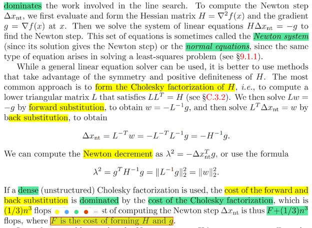</kbd>

<kbd>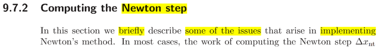</kbd>

<kbd>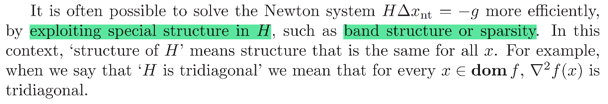</kbd>

> [!NOTE]
> Phần này đại khái là nói về chi phí tính Newton step.
>
> Ta biết công thức của nó là Δx_nt = -∇^2f(x)inv∇f(x) = -Hinv g
>
> (H = ∇^2f(x), g = ∇f(x))
>
> Vậy thì để tìm Δx_nt, chính là ta giải hệ HΔx_nt = -g, hệ này được
> gọi là Newton system hoặc normal equation.
>
> Giải H Δx_nt = -g có thể dùng các cách làm tổng quát ví dụ như
> Gaussian elimination. Ta có thể tận dụng cấu trúc đặc  biệt của H:
> symmetric positive definite để factor H = L(LT)
>
> Bước này sẽ tốn (1/3n^3)
>
> Từ đó giải H Δx_nt = - g ⇔ L (LT) Δx_nt = -g
>
> ⇔ Giải L y = -g trước: đây là forward substitution theo EE364A còn
> nhớ cái này tốn n^2 (1 + 3 + 5 + ...2n-1 = 2n(n-1)/2 ≈ n^2) 
>
> Sau đó giải LT Δx_nt = y, đây là back substitution tốn n^2
>
> Hai cái bước forward/back substitution không đáng kể so với 1/3 n^3
> nên về cơ bản chi phí sẽ chỉ là factoring cost 1/3 n^3 cộng với cost
> của việc forming H và g
>
> Nếu có thể tận dụng khai thác cấu trúc đặc biệt khác của H như
> sparsity hay banded thì có thể còn giảm cost hơn nữa

 

<kbd>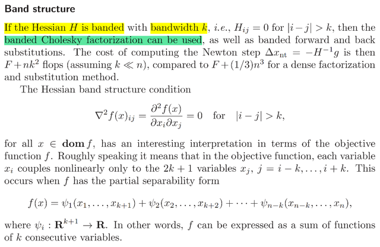</kbd>

<kbd>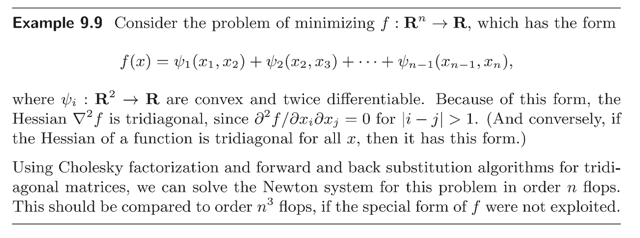</kbd>

> [!NOTE]
> đại khái là khi H có dạng banded với bandwidth k thì thay vì dùng 
> Cholesky factorization ta có thể dùng banded Cholesky factorization
> chỉ tốn nk^2 thay vì n^3/3 (k nhỏ hơn n nhiều)
>
> Và đại ý là H sẽ có dạng này khi objective có dạng tổng của
> các hàm số mà mỗi hàm số chỉ là hàm của không phải tất cả các 
> biến xj mà chỉ là hàm của một bộ các biến xj liền kề nhau thôi (đại 
> khái là vậy)

 

<kbd>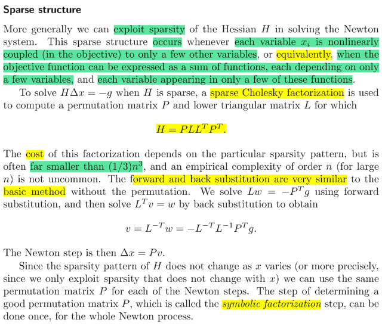</kbd>

> [!NOTE]
> Tương tự, nếu H sparse (xuất phát từ objective function có dạng là
> tổng của nhiều function mà mỗi cái chỉ là hàm của vài biến, và mỗi
> biến chỉ xuất hiện trong một vài function, để rồi tạo ra hệ quả là mỗi
> biến chỉ quan hệ Φ tuyến với một vài biến khác)
>
> Khi đó dùng sparse Cholesky factorization chỉ tốn ít hơn nhiều so 1/3
> n^3.
>
> Khúc cuối đại ý là nói về việc ta còn nhớ rằng P là permutation matrix,
> cơ bản là ta có thể chọn để sao cho có lợi giúp L trở nên sparse hơn
> ⇨ giảm cost
>
> (theo link để xem appendix)
>
> Thế thì vì P (tốt nhất) như thế nào thì chỉ phụ thuộc vào bản thân H,
> mà H không đổi. Nên ta có thể tính P trước và dùng nhiều lần Đại
> khái là vậy

**🔗 See also:** [linked note](./appendix_c.md#node-f6w6yif)

 

<kbd>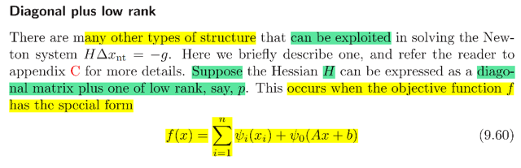</kbd>

<kbd>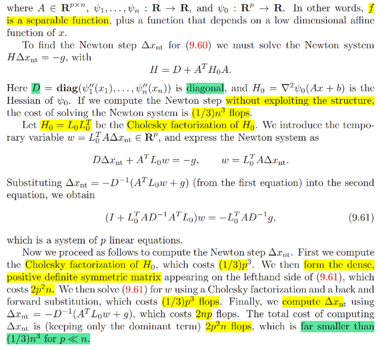</kbd>

> [!NOTE]
> QUAY LẠI SAU

 

