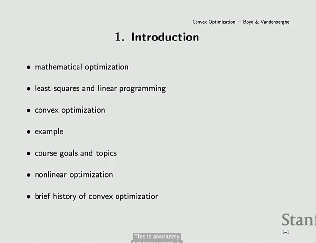
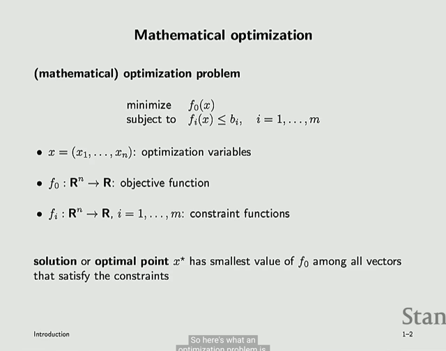
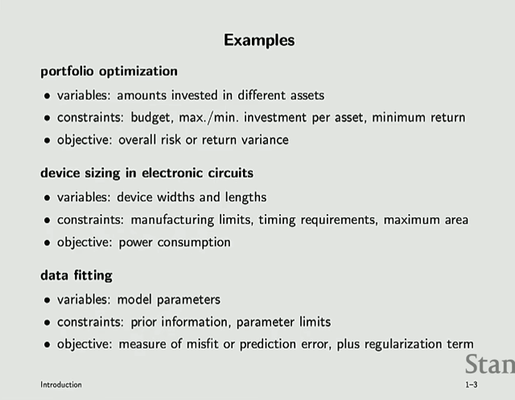
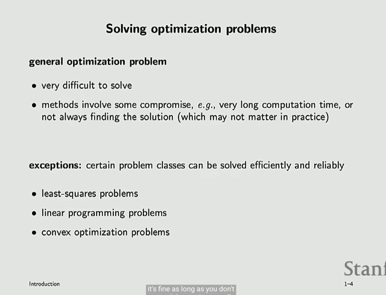
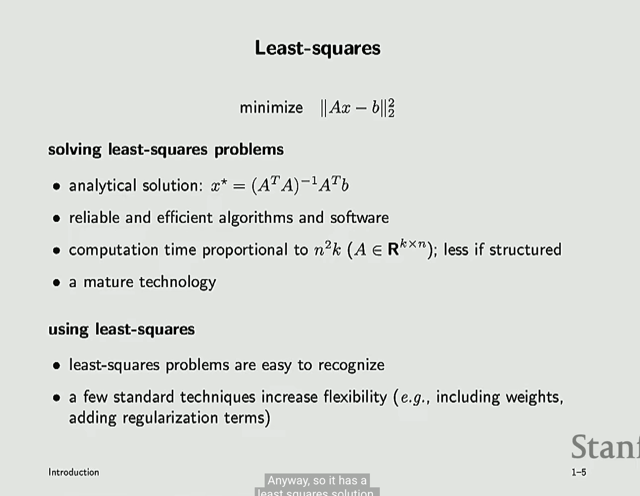
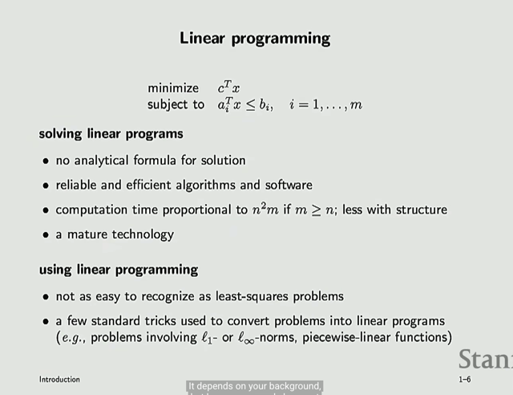
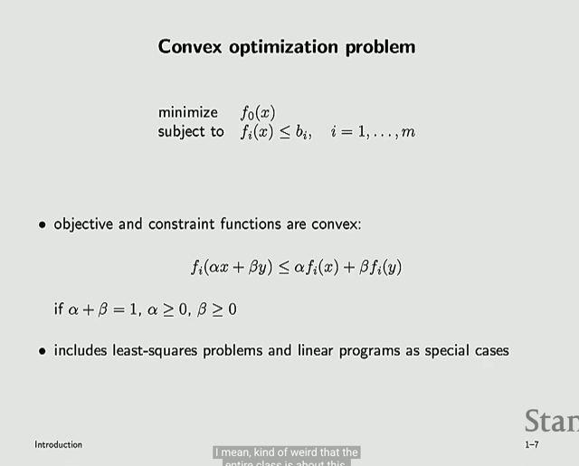
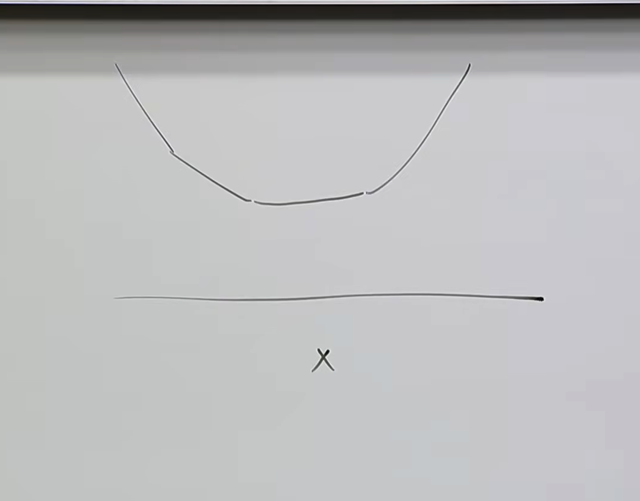
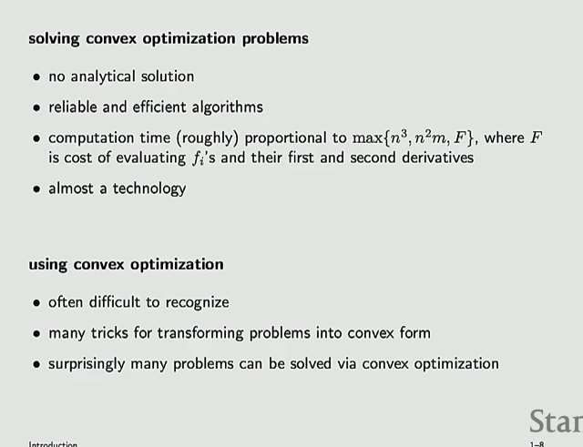
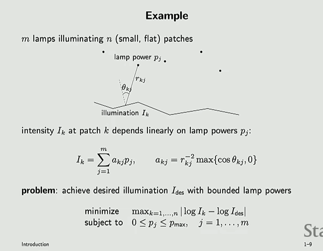

# Lec 1

📊 **Progress:** `7` Notes | `10` Screenshots | `1` AI Reviews

---

## Lec 1

 

<kbd></kbd>

> [!NOTE]
> đầu tiên ta sẽ nói về việc

 

<kbd></kbd>

> [!NOTE]
> Đầu tiên, bài này gs chỉ lướt qua sơ những thứ sẽ học trong class này
>
> Đầu tiên là về mathematical optimization.
>
> Đại khái là, vấn đề đặt ra là ta có một **objective function f0** map R^n input và output scalar R. 
>
> Đây là cái mà ta muốn minimize.
>
> Và nhiều **constrain function f_i** cũng là R^n -> R functions. Và ta muốn minimize f0 với các constrains: f_i(x) <= b_i với mọi i.
>
> Bài toán đặt ra là ta muốn tìm giá trị của x (gọi là optimization variables)  sao cho f0(x*) có giá trị nhỏ nhất và thỏa các constrains f_i(x*) <= b_i
>
> Gs cho biết có **nhiều biến thể (variant)** và ta sẽ nói rõ sau

> [!TIP]
> **🤖 AI Feedback** — ⚠️ Score: **75/100**
>
> Phần tóm tắt của sinh viên khá chính xác về các khái niệm cơ bản của bài toán tối ưu toán học. Tuy nhiên, còn thiếu sót về mặt hình thức và độ chính xác trong việc phân biệt các ký hiệu.

 

<kbd></kbd>

> [!NOTE]
> Gs nói qua một số ví dụ mà optimization sẽ hữu ích. Ví dụ như tối ưu hóa danh mục đầu tư, trong đó variables sẽ là số lượng tiền được đầu tư vào các kênh đầu tư khác nhau. 
>
> Objective là giảm thiểu rủi ro hay biến động tổng thể. Và constraints là budget,
> minimum return ....
>
> Hay việc design kích thước của các electronic circuits. Variables sẽ là kích thước của device. Objective là giảm thiểu mức tiêu thụ năng lượng. Với constraints là không gian tối đa cho phép chẳng hạn.
>
> Và ví dụ mà mình quan tâm nhất đương nhiên là trong lĩnh vực học máy. Trong đó variables chính là **model parameters **mà ta cần train (thật ra chính là thực hiện bài toán optimization). 
>
> Objective là giảm **loss function** (mức sai sót của model) với constrains
> là **prior information** mà gs nhắc tới ví dụ như ta cần đảm bảo covariance matrix giữ tính chất là một symmetric semi-definite matrix chẳng hạn.
>
> Nói chung ta sẽ đi qua rất nhiều ví dụ ở các lĩnh vực khác nhau.
>
> Mà trong phần đầu gs đã nói lớp này áp dụng cho rất nhiều lĩnh vực

 

<kbd></kbd>

> [!NOTE]
> Tiếp theo đại khái gs nói là khi học lớp này xong ta có thể giật mình nhận ra nơi đâu cũng là bài toán tối ưu.
>
> Thế thì, vấn đề là, **phần lớn các optimization problem nói chung là rất khó thậm chí không thể giải quyết triệt để**. Và các phương pháp tiếp cận thường sẽ bao gồm một số thỏa hiệp nào đó (compromise)
>
> Tuy nhiên gs cho rằng, đôi khi người ta không cần tìm giải pháp tuyệt đối. 
>
> Đại ý gs là, ví dụ như trong machine learning,** objective function thường là sự thay thế (surrogate) cho mong muốn nào đó của con người** (ví dụ dự đoán chính xác để kiếm tìền
> được thay bằng giảm thiểu prediction error, loss). 
>
> Và nói chung là, **có thể ta không cần solution tuyệt đối tốt** (global minima) mà chỉ
> cần tương đối tốt (local minima) là được.
>
> Tuy vậy, có những ngoại lệ, là những bài toán optimization có thể gỉai được hoàn toàn (TRACTABLE).
>
> Ví dụ least-square problems, linear programming và convex optimization problems

 

<kbd></kbd>

> [!NOTE]
> Gs nói sơ về **least square** (thật ra gs không nói gì về bài toán này mà chỉ nói sơ về lịch sử của nó, việc giải nó rất nhanh và đáng tin cậy)
>
> Còn bài toán này, mình đã học trong 1806, có thể review một chút:
>
> Đại khái bối cảnh là ta **cần giải một hệ phương trình tuyến tính** (system of linear equations) thể hiện bởi Ax = b. 
>
> Có điều, vấn đề là có thể **ta có nhiều equations hơn số variables**, khiến cho bài toán
> vô nghiệm. Theo góc nhìn của đại số tuyến tính, matrix A là matrix cao ốm, có nhiều hàng hơn số cột. Cho rằng matrix A là matrix [m,n] và có n cột độc lập, thì các **cột của nó chỉ span được một n-dimension subspace của R^m**. 
>
> Do đó v**ector b thuộc R^m có thể nằm ngoài C(A)** khiến không tồn tại phép kết hợp tuyến tính nào giữa các cột của A cho ra b, nên không tồn tại nghiệm của Ax=b.
>
> Giải pháp là least-square, **tìm solution tốt nhất** có thể: bằng cách tìm xhat là solution của A xhat = **p với p là projection của b lên C(A)**, xhat sẽ là solution mà error nhỏ nhất. Từ đó ta có công thức least square solution như sau:
>
> Project b lên C(A), được p, tức p ∈ C(A): nên tồn tại linear combination của các cột của A tạo ra p: p = A x_hat, phần dư (residual) của b sau khi project lên C(A), tức e, sẽ vuông góc với C(A), đồng nghĩa nó sẽ thuộc complement của C(A), tức left-nullspace của A, N(AT).
>
> Nói cách khác nó sẽ là solution của ta có (AT)e = 0:
>
> Từ đó ta có AT(b-Ax^) = 0 ⇔ ATb = ATAx^ (normal equation) 
>
> ⇔ x^ = (ATA)inv ATb
>
> Đây chính là least square solution, và nó giúp minimize error là sai
> khác giữa b và p tức minimize residual e = Ax - b

 

<kbd></kbd>

 

<kbd></kbd>

> [!NOTE]
> Và exception thứ 3 chính là cái ta sẽ học trong lớp
> này - Convex optimization problem

 

<kbd></kbd>

> [!NOTE]
> đại khái là ta sẽ deal với các function có đường cong không có
> curvatuve âm (gọi là concave up)

 

<kbd></kbd>

 

<kbd></kbd>

 

