# Lec 1

📊 **Progress:** `51` Notes | `63` Screenshots

---

## Lec 1

 

<kbd>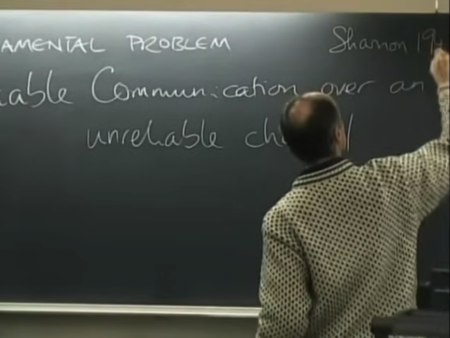</kbd>

> [!NOTE]
> Đầu tiên ta sẽ nói về RELIABLE COMMUNICATION over a
> UNRELIABLE CHANNEL

 

<kbd>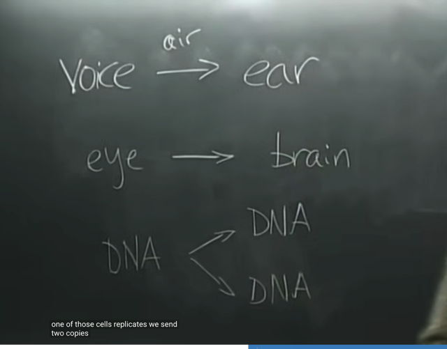</kbd>

> [!NOTE]
> Gs cho một số ví dụ về channel: như âm thanh nói ra tryền
> đến tai, thông qua không khí

 

<kbd>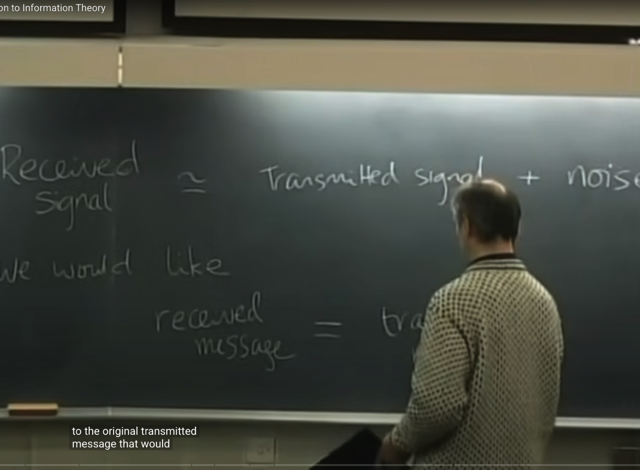</kbd>

> [!NOTE]
> Thế thì gs cho rằng ta có thể cho rằng tín hiệu nhận được có thể
> được coi như gần bằng tín hiệu truyền đi cộng thêm nhiễu (noise)
>
> Và dĩ nhiên điều ta mong muốn là tín hiệu nhận được bằng đúng
> tín hiệu truyền đi

 

<kbd></kbd>

> [!NOTE]
> Thế thì giải pháp bao gồm giải pháp vật lý trong đó ta có thể thay thế
> các dây tín hiệu bằng chất liệu tốt hơn giúp giảm noise, đại loại vậy
>
> Bên cạnh đó ta có giải pháp hệ thống (system solutions) trong đó ta
> sẽ vẫn chấp nhận nhiễu, và thiết kế encoder / decoder để loại bỏ 
> nhiễu

 

<kbd>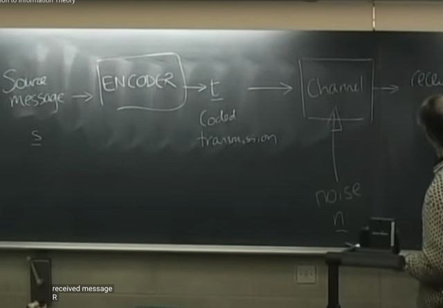</kbd>

<kbd>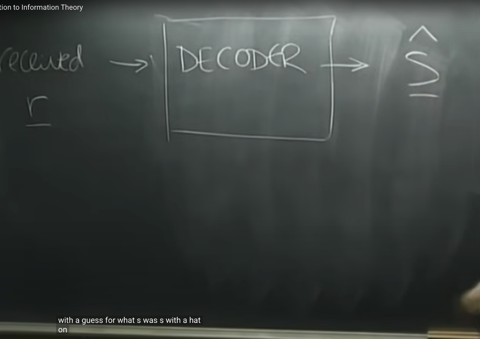</kbd>

<kbd>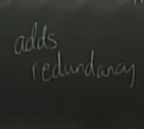</kbd>

<kbd>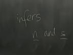</kbd>

> [!NOTE]
> Source message sẽ được encoder encode, để có t (coded transmission),
>
> Sau đó coded transmission sẽ được truyền đi thông qua  channel và lúc này có
> thể có nhiễu (noise n) được thêm vào.
>
> Tín hiệu nhận được sau khi truyền tới r sẽ được decoder decode để có thông
> tin s^
>
> Encoder sẽ add thêm redundancy và decoder sẽ infer để tách n và s

 

<kbd>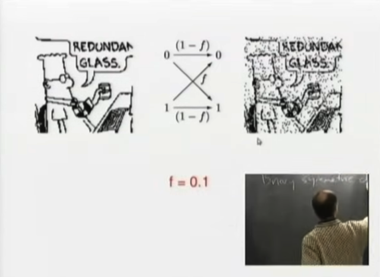</kbd>

> [!NOTE]
> Ta sẽ qua một ví dụ gọi là BINARY
> SYMMETRIC CHANNEL

 

<kbd>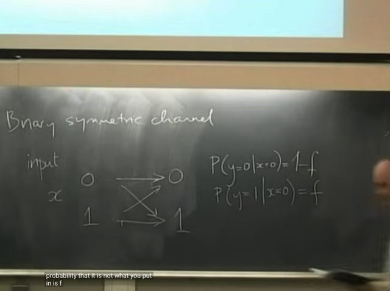</kbd>

> [!NOTE]
> Đại khái là input (source signal) chỉ có binary value (tức là 1 hoặc 0)
> và output (tín hiệu nhận được) sẽ "bị chi phối" như sau:
>
> Xác suất mà thông tin nhận được bằng với thông tin truyền đi là 1-f
> ví dụ f = 0.1 thì đièu này có nghĩa là:
>
> Nếu input là 0, thì xác suất output y = 0 chỉ có 90% P(y=0|x=0) = 1-f
> và xác suất output y = 1, sẽ có 10% P(y=1|x=0) = f
>
> Ngược lại cũng vậy nếu input là 1, thì xác suất output y = 1 cũng là
> 90% P(y=1|x=1) = 1-f
>
> và P(y=0|x=1) = f
>
> Nói ngắn gọn, nếu input là 0, thì có 10% output là 1 và 90% output
> là 0.

 

<kbd>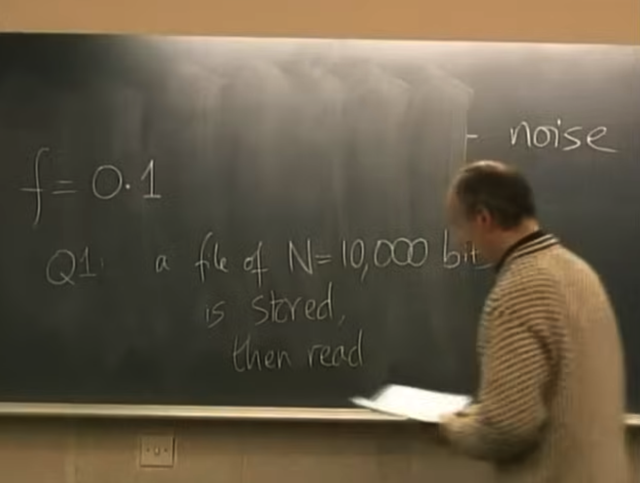</kbd>

<kbd>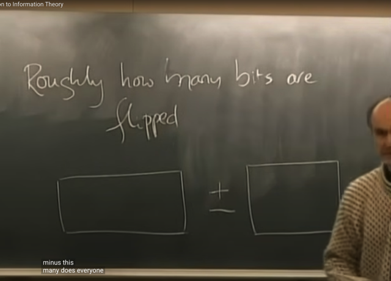</kbd>

> [!NOTE]
> Thế thì, câu hỏi gs đề nghị suy nghĩ là nếu có một file 10000 bits,
> được store và read (ý là trái qua quá trình input và output với xác
> suất bị flip = 10%) thì một cách gần đúng thì có bao nhiêu bit bị flip

 

<kbd>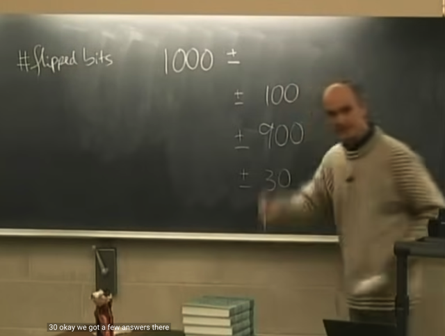</kbd>

> [!NOTE]
> Câu trả lời của
> một số sinh viên

 

<kbd>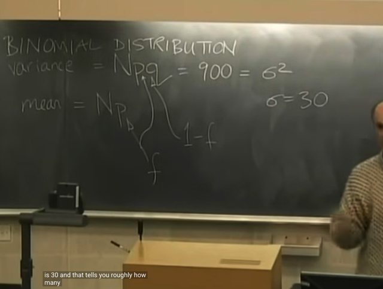</kbd>

> [!NOTE]
> Thế thì đáp án là số bit bị flip có thể cho rằng gần bằng Nf  và mức sai khác là
> σ = 30.
>
> Gs cho rằng để trả lời câu này ta chỉ cần dựa vào Binomial  distribution.
>
> Vậy ta hiểu như vầy: Nhờ Stat110 soi sáng mình đã biết về Binomial
> distribution. Mà story của nó, tức X~Bin(n,p)) là số trial success trong n i.i.d
> Bern(p) trials.
>
> Thế thì ở đây, gs đã nói là các bit independent nhau (khả năng bit này bị flip
> không ảnh hưởng đến bit khác) Thành ra ta hiểu N bits giống như ta có n=N
> Bern(p) trials độc lập, với p, là xác suất bị flip đều là bằng f (dù bit có là 0 hay
> 1 thì xác xuất bị flip đều là f)
>
> Vậy đây chính là bối cảnh của Bin(n,p) với n = N, p = f: ta có n=N iid Bern(p=f)
> trials và ta đang quan tâm số bị bị flip, chính là số trial thành công. Nên số bị
> flip X chính là một r.v X ~ Bin(n=N,p=f)
>
> Thế thì để trả lời câu hỏi "roughly speaking" số bit bị flip, ta sẽ đơn giản là tính
> kì vọng của X: EX
>
> Với Bin(n,p) thì ta cũng dễ dàng lập luận lại công thức kì vọng mà ko cần học
> thuộc lòng làm gì.
>
> Đó là, ta dựa vào story của X là TỔNG SỐ TRIAL SUCCESS TRONG n
> Bern(p) trials. Vậy gọi Xj là INDICATOR r.v gắn với event Aj là event [trial thứ j
> success] tức là Xj = 1 khi Aj xảy ra và Xj=0 khi Aj không xảy ra. Và đương
> nhiên xác suất event Aj xảy ra là p
>
> Khi đó EXj, theo định nghĩa expected value = weighted sum mọi possible
> value của Xj, với weight là xác suất mang value đó: EXj = Σi xi*P(Xj=xi) =
> 1*P(xj=1) + 0*P(xj=0) = 1*P(Aj) + 0*P(Aj^c) = 1*p + 0*(1-p) = p = P(Aj)
>
> Vậy EXj = P(Aj) (Đây chính là FUNDAMENTAL BRIDGE)
>
> Thế thì, từ đó ta có X = X1 + X2...Xn => EX = E(X1+X2...Xn)
>
> Theo linearity: E(X1+X2...Xn) = EX1 + EX2 + ...EXn =  Σj EXj, áp dụng kết quả
> trên EXj = P(Aj) = p (n Bern(p) iid) ta có EX = E(Σj Xj) = Σj EXj = Σj p = np
>
> Vậy expected value của X~Bin(n,p) = np, nên ở đây số bit bị flup ~= Nf =
> 10000*0.1 = 1000
>
> Tiếp theo ta thử derive lại variance của Bin(n,p) để trả lời cho ý hai, là sai số
>
> Var(X) = E[(X-EX)^2] = EX^2 - (EX)^2
>
> Ta sẽ tìm EX^2 trước
>
> Cũng dựa vào việc sẽ là tổng các indicator r.v gắn với các event Aj:
>
> X = X1 + X2 + ..Xn, => X^2 = (X1 + X2 + ..Xn)^2
>
> Theo Newton binomial nó sẽ = ΣXi^2 + Σi Σj, j!=i XiXj
>
> (có n term Xj^2, và  n(n-1) cross-term XiXj, điều này dễ hiểu vì i từ 1 đến n, j cũng
> từ 1 đến n nhưng j khác i, thành ra chọn Xi có n outcome, chọn Xj cho n-1
> outcome dẫn đến số cross-trem là n(n-1))
>
> Theo Linearity E(ΣXi^2 + Σi Σj, j!=i XiXj) = E(ΣXi^2) + E(ΣiΣj, j!=i XiXj)
>
> = Σi E(Xi^2) + ΣiΣj, j!=i E(XiXj) (1)
>
> E(Xi^2) thì có thể giải thích ngắn gọn theo LOTUS,
>
> = Σx x^2*P(Xi=x) = 1^2P(Xi=1) + 0^2P(Xi=0) = 1*p + 0*(1-p) = p
>
> E(XiXj): Dựa vào tính symmetric mọi E(XiXj) (i khác j( đều bằng nhau. Nên ta
> có thể xét E(X1X2)
>
> Thì X1,X2 là các indicator random variables nên X1X2 cũng là indicator random
> variables với các possible value:
>
> X1X2 = 1 khi X1=1 và X2=1 tương ứng với A1, A2 cùng xảy ra (A1, A2)
>
> Xét event (A1, A2) vì A1, A2 là hai sự kiện độc lập, theo định nghĩa independent
> event, nếu A, B độc lập thì P(A,B) = P(A)*P(B). 
>
> Vậy A1, A2 độc lập nên P(A1, A2) = P(A1)*P(A2) = p*p = p^2
>
> Vậy X1X2 = 1 với xác suất xảy ra là p^2
>
> X1X2 = 0 khi X1 và X2 không cùng bằng 1, tức là A1, A2 không cùng xảy ra, chính là event (A1, A2)^c
>
> Tuy không cần tính xác xuất X1X2 mang giá trị 0, vì dù sao khi nhân với possible value (=0) cũng = 0
> nhưng cứ thử lập luận cho vui
>
> (A1, A2)^c = A1^c U A2^c  (De morgan)
>
> = [ (A1^c, A2) U (A1^c, A2^c) ] U [ (A2^c, A1) U (A2^c, A1^c)]
>
> = (A1^c, A2) U (A1^c, A2^c) U (A2^c, A1) là union của 3 disjoint event 
>
> Theo Axiom 2 P(A1, A2)^c = P(A1, A2^c) + P(A1, A2^c) + P(A1^c, A2^c) = 
>
> = P(A1)P(A2^c) + P(A1)P(A2^c) + P(A1^c)P(A2^c) (theo định nghĩa independent event)
>
> = p*q + p*q + qq = 2pq + qq
>
>
> Vậy E(X1X2) = 1*P(X1X2=1) + 0*P(X1X2=0) = 1*p^2 + 0*(2pq + qq) = p^2
>
> Vậy ráp vô hết EX^2 = (1) = Σi p + n(n-1) p^2 = np + n(n-1)p^2 = np + (n^2-n)p^2 
>
> = np + n^2p^2 - np^2 = np(1-p) + (np)^2 = npq + (np)^2
>
> Từ đó Var(X) = EX^2 - (EX)^2 = npq + (np)^2 - (np)^2 = npq
>
> ====
>
> Quay lại bài toán, này, ta sẽ có variance của số bị bị flip = npq = Nf(1-f) = 10000*0.1*0.9 = 900
> => standard deviation = sqrt(900) =30 là sai số của ước lượng

 

<kbd>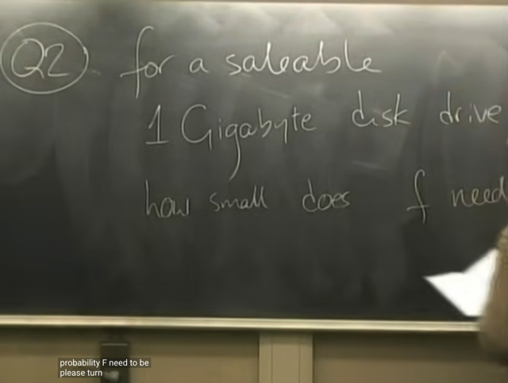</kbd>

> [!NOTE]
> Vấn đề đặt ra là để có một ổ cứng dung lượng 1 GB đủ tốt để bán
> được. Thì ta cần f nhỏ đến mức nào?

 

<kbd>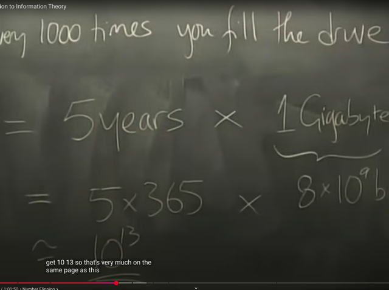</kbd>

> [!NOTE]
> Đại khái là gs tính là: lấy 5 năm = 5*365 ngày. 
>
> 1 Gb = 8 tỉ (8*10^9) bits
>
> Nhân lại ta ra con số 10^13. Tại sao nhân lại, là vì ý là cho rằng 
> khách hàng (người mua ổ cứng) sẽ xài hàng ngày trong 5 năm
> liền.
>
> Và mỗi ngày họ đều dùng ổ cứng để đọc dữ liệu (đọc dữ liệu từ
> ổ cứng thì chính là "send" dữ liệu để từ đó có thể bị flip đại khái
> là vậy)
>
> Vậy tính ra trong 5 năm số bit được send sẽ là 10^13

 

<kbd>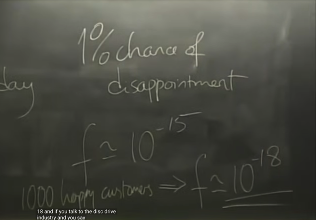</kbd>

> [!NOTE]
> Thế thì bên cạnh đó để chỉ có 1% khách hàng bị lỗi thì f
> phải ~ 10^-15
>
> Với 1000 happy customer thì f cần 10^-18
>
> Chưa hiểu tại sao?

 

<kbd>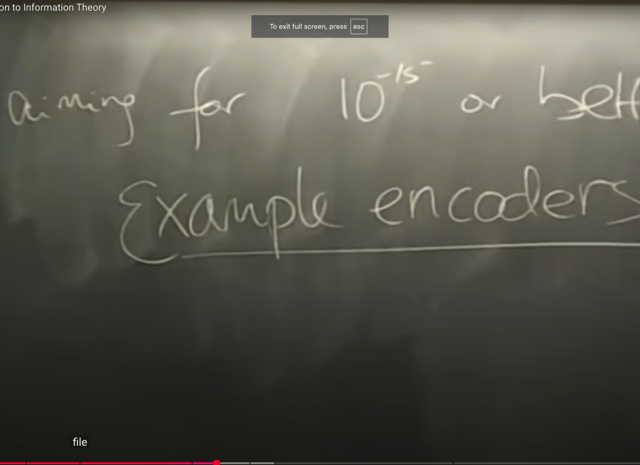</kbd>

> [!NOTE]
> Tiếp theo, ta sẽ lấy con số 10^-15 để làm mục tiêu hướng tới.
>
> Câu hỏi gs đặt ra là làm sao để encoder add thêm redundancy vào

 

<kbd>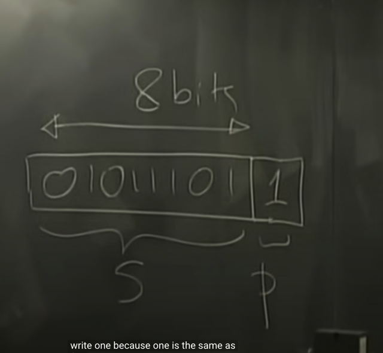</kbd>

> [!NOTE]
> Một cách gọi là PARITY ENCODING
>
> Chưa hiểu

 

<kbd>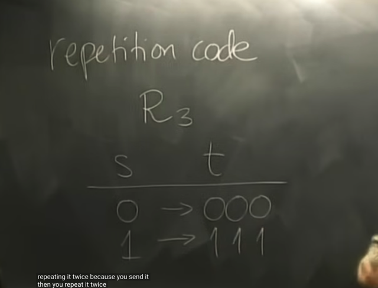</kbd>

> [!NOTE]
> Cách thứ hai là REPETITION CODE: tạm hiểu là nhân đôi
> nhân ba nó lên (repeat)

 

<kbd>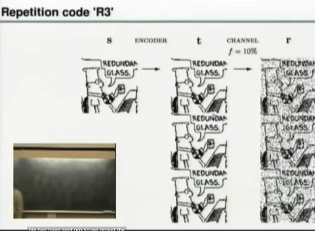</kbd>

> [!NOTE]
> Hình ảnh minh họa

 

<kbd>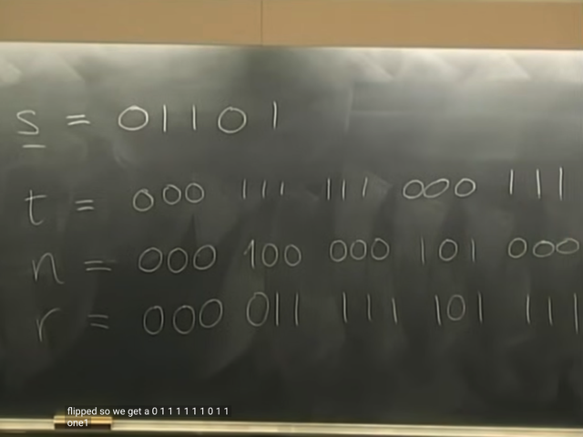</kbd>

> [!NOTE]
> Lấy ví dụ ta có source là chuỗi 
>
> s = 0 1 1 0 1
>
> Dùng repeat coding ta sẽ transmit chuỗi: 
>
> t = 000 111 111 000 111
>
> Và như đã biết noise sẽ được add vào trong quá trình transmit bởi
> channel.
>
> Lấy ví dụ chuỗi noise: 
>
> n = 000 100 000 101 000
>
> Và chuỗi tín hiệu nhận được sẽ là:
>
> r = 000 011 111 101 111

 

- **Phép cộng modulo 2**

<kbd>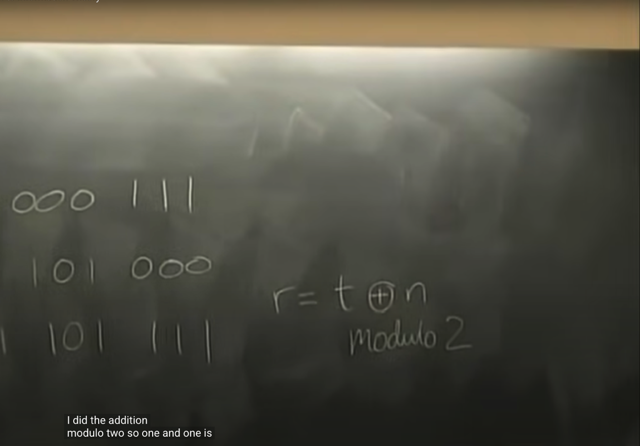</kbd>

> [!NOTE]
> và gs cho biết kết quả r chính là t + n
> modulo 2, trong đó 1 + 1 = 0.
>
> Chưa hiểu cái này là sao

 

<kbd>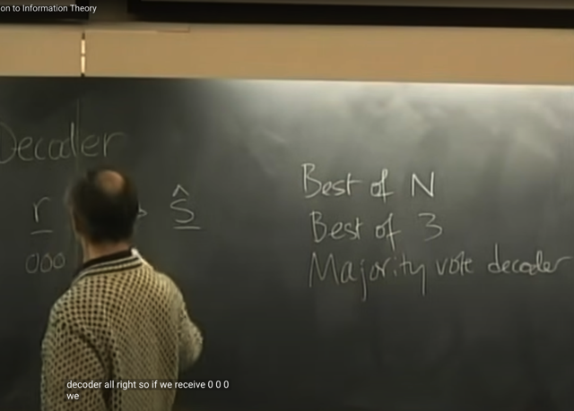</kbd>

<kbd>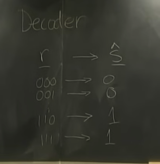</kbd>

> [!NOTE]
> Thế thì một phương án của decoder: đại khái là decoder sẽ xem thử
> trong nhóm 3 bits, cái nào xuất hiện nhiều nhất thì lấy. 
>
> Ví dụ 000 thì decode là 0, 110 thì decode là 1
>
> Nôm na là, tín hiệu gốc sau khi repeat 3 lần (ví dụ 0 -> 000) và sau đó
> add noise (vd 000 -> 100) thì hi vọng số 0 vẫn còn đủ nhiều để decoder
> biết source là 0
>
> Gọi là MAJORITY DECODER

 

<kbd>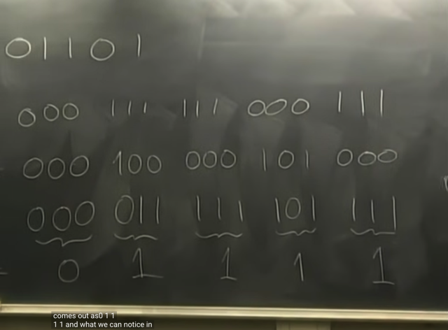</kbd>

> [!NOTE]
> Và theo cách này thì chuỗi r sẽ được decode thành:
>
> 0 1 1 1 1

 

<kbd>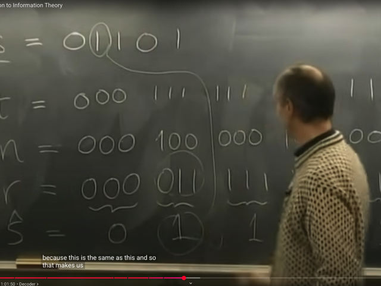</kbd>

> [!NOTE]
> Thế thì có thể thấy dù ở bit thứ 2 (1 -> 111 -> 011 -> 1) có flip xuất 
> hiện (khi noise 100 khiến source 111 trở thành 011) nhưng decoder
> vẫn decode đúng để ra lại 1

 

<kbd>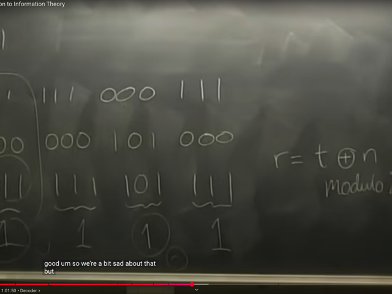</kbd>

> [!NOTE]
> Tuy nhiên ở bit thứ 4 (0 -> 000 -> 101 -> 1) thì noise đã khiến số
> đông từ 0 trở thành 1, nên decoder decode ra 1, trong khi source
> là 0
>
> Tuy vậy, gs cho rằng MAJORITY decoder vẫn có thể có tác dụng
> nào đó

 

<kbd>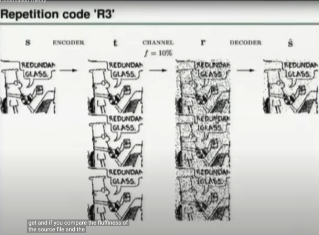</kbd>

> [!NOTE]
> Gs nói cái hình này cho thấy majority decoder cũng có tác dụng
> tương đối. Nhưng nó không đủ để đạt probability error nhỏ = 10^-15

 

<kbd>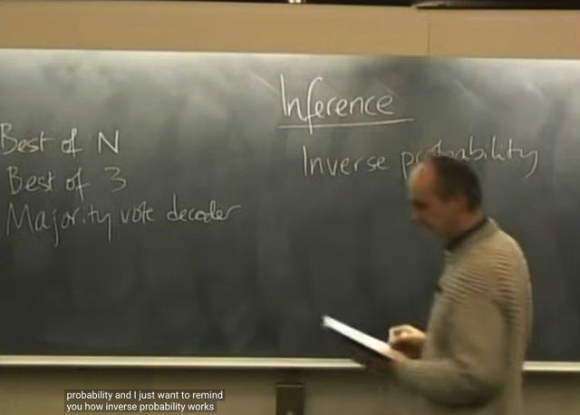</kbd>

> [!NOTE]
> Thế thì tiếp theo gs sẽ chứng minh tại sao majority vote decoder có
> tác dụng.
>
> Trước hết, ông cho biết quá trình decoder thực chất chính là
> INFERENCE 
>
> Và ta cần kiến thức về INVERSE PROBABILITY

 

<kbd>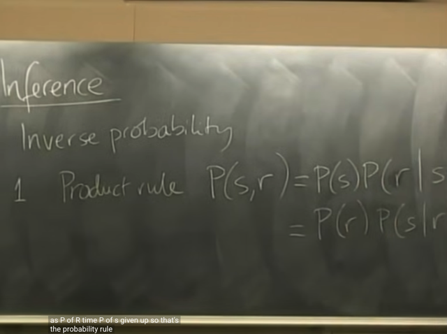</kbd>

> [!NOTE]
> Cụ thể ta cần product rule: P(s,r) = P(s)P(r|s) = P(r)P(s|r)
>
> Có thể thấy đây chính là CONDITIONAL PROBABILITY theorem ta
> đã học ở Stat110. Xuất phát từ ĐỊNH NHGHĨA của conditional
> probability P(A|B) = P(A,B)/P(B), ta suy ra (mà theo gs Blizstein cũng
> chính là chứng minh cho theorem: P(A,B) = P(A|B)*P(B)
>
> Và từ đó cũng có cái theorem thứ 2: 
>
> P(A,B) = P(B,A) = P(B|A)P(A)
>
> để rồi có cái theorem thứ 3 là Bayes theorem: 
>
> P(A|B)P(B) = P(B|A)PA
>
> Ở đây gs Mc Kay cũng nói đây chẳng qua là xuất phát từ definition of
> conditional probability.
>
> Thêm nữa, ông cũng nhắc lại điều ta đã biết đó là P(s,r) chính là / gọi
> là joint probability, P(s) gọi là marginal probability và P(s|r) là
> conditional probability

 

<kbd>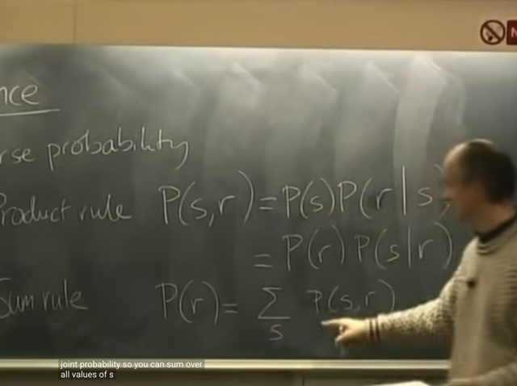</kbd>

> [!NOTE]
> Và rule thứ 2 là Sum rule: P(r) = Σs P(s,r)
>
> Cái này thì đơn giản chính là LOTP: Law of Total Probability
>
> Xuất phát từ r = Union mọi i (r, si) dựa trên lí thuyết set 
>
> (nếu A là event chứa mọi possible outcome trong sample space, và 
> A = A1 U A2 U ...An thì B = (B, A1) U (B, A2) ...U (B, An))
>
> => P(r) = P(Union mọi i (r, si))
>
> đây là union của các disjoint event, nên áp dụng axiom 2:
>
> = Σsi P(r, si)
>
> => P(r) =Σsi (r, si) (gs ghi như vậy Σs P(r,s) thì ý là các possible values s_i
> của s)

 

<kbd>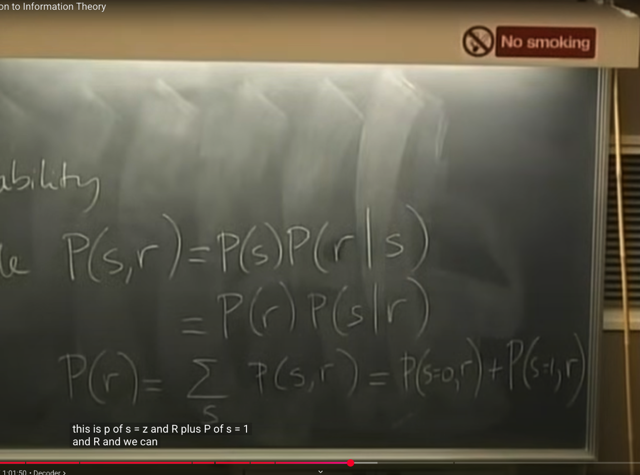</kbd>

> [!NOTE]
> Thế thì s, r ở đây là random variable đại diện cho source bit và
> receive bit.
>
> Nên s, là một bit trong source, ở bài toán này, đang là binary. Nên nó
> có 2 possible values là 1 và 0.
>
> Do đó P(r) = P(s=1, r) + P(s=0, r)
>
> Chỗ này phải hiểu: s, r là random variable thì tại sao lại chỉ nói P(r)
> khơi khơi vậy. Phải là P(r=rj) tức là xác suất của event r=rj chứ
>
> Thế thì ta nên hiểu ông đang nói về PMF tức là P(r) đang viết tắt
> của P(r=k) với k=1 hoặc k=0
>
> Để rồi ghi đầy đủ ra thì các product rule và sum rule vừa rồi phải là:
>
> P(r=r_i, s=s_j) = P(s=s_j | r=r_i)*P(r=r_i)
>
> và P(r=r_i) = Σj P(r=r_i, s=s_j), và với các possible values của s là 1,0
> ta có:
>
> P(r=r_i) = P(r=r_i, s=1) + P(r=r_i, s=0)

 

<kbd>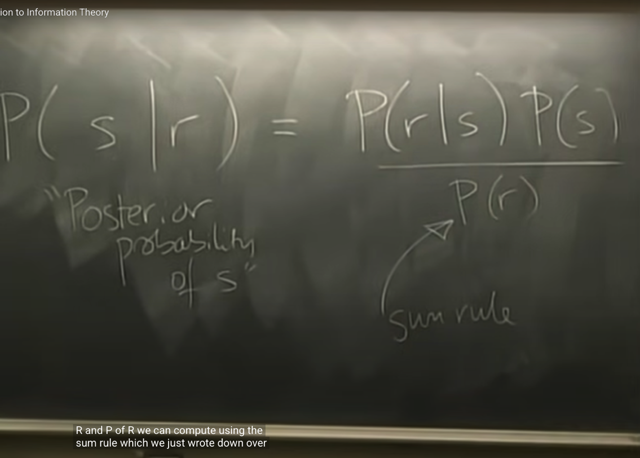</kbd>

> [!NOTE]
> Tiếp theo, dựa vào Bayes rule, ta sẽ tính P(s|r) (hay ghi rõ ra thì
> là P(s=s_j | r = r_i)
>
> như đã biết trong Stat110, chính là posterior distribution (PMF) 
> của s khi đã đã biết giá trị của r.
>
> P(s|r) = P(r|s)P(s) / P(r)   
>
> với P(r) tính bằng sum rule như vừa rồi
>
> (Mình viết cụ thể ra cho dễ:
>
> P(s=s_j | r=r_i) = P(r=r_i | s=s_j) * P(s=s_j) / P(r=r_i)

 

<kbd>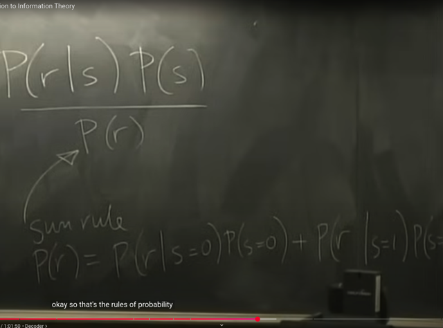</kbd>

> [!NOTE]
> P(r=r_i) = P(r=r_i, s=1) + P(r=r_i, s=0)
>
> dĩ nhiên như đã quen thuộc là ta sẽ dùng tiếp conditional
> probability theorem để trở thành
>
> = P(r=r_i | s=1)P(s=1) + P(r=r_i | s=0)P(s=0)

 

<kbd>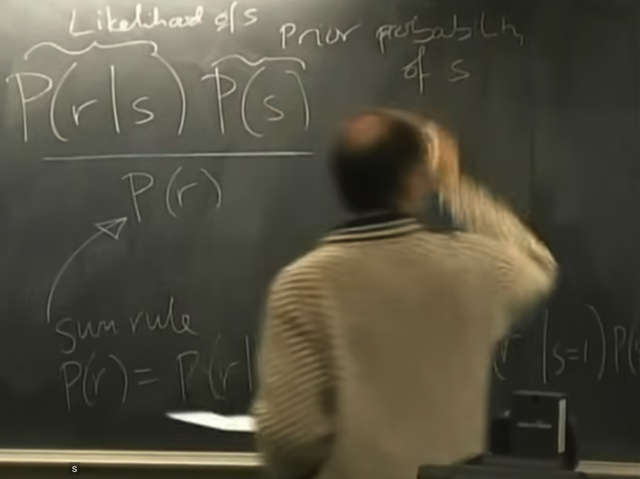</kbd>

> [!NOTE]
> Gs cho biết P(r|s) gọi là LIKELIHOOD OF S, và P(s) là PRIOR
> PROBABILITY OF S
>
> Cái này (likelihood) chưa từng nhắc đến trong Stat110, có lẽ
> sẽ nói về nó trong Stat111 (NPTEL)

 

<kbd>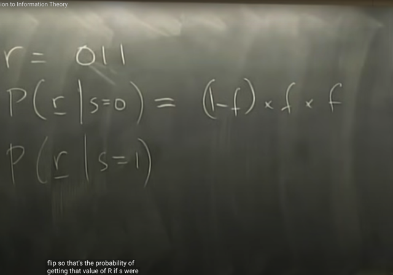</kbd>

> [!NOTE]
> Tiếp theo ta sẽ cần tính P(r | s=1) và P(r | s=0)
>
> Trước tiên ta sẽ lưu ý một chút để hiểu s là một bit, mang giá trị 0 hoặc 1.
>
> nhưng encoder sẽ repeat nó, channel add thêm noise, nên r sẽ là chuỗi
> 3 bit.
>
> Thành ra r không phải chỉ có possible value là 1 và 0. Mà nó sẽ là (trong
> ví dụ này) có thể là 000, 001, 010, 100, 011, 101, 110, 111
>
> giả sử r = 011, thế thì P(r=011 | s=0) sẽ tính ntn?
>
> Gọi r1,r2,r3 là các random variable mang giá trị 0 hoặc 1. 
>
> Có thể coi event r = 011 là cùng một event với (r1=0, r2=1, r3=1)
>
> (r=011) = (r1=0, r2=1, r3=1) 
>
> => P(r=011 | s=0) = P((r1=0, r2=1, r3=1) | s=0)
>
> Vì r1, r2, r3 độc lập (do việc flip giữa các bit không ảnh hưởng gì nhau,
> đây là giả định mà ta có thể cho) nên
>
> P((r1=0, r2=1, r3=1) | s=0) = P(r1=0 | s=0) * P(r2=1 | s=0) * P(r3=1 | s=0)
>
> P(r1=0 | s=0) thì ta đã biết, chính là 1-f, 
>
> và 
>
> P(r2=1 | s=0) = P(r3=1 | s=0) = f
>
> Do đó, P(r=011 | s=0) = P((r1=0, r2=1, r3=1) | s=0) 
>
> = P(r1=0 | s=0) * P(r2=1 | s=0) * P(r3=1 | s=0) = (1-f)*f*f = (1-f)f^2

 

<kbd>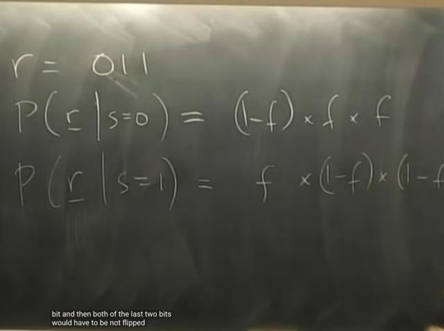</kbd>

> [!NOTE]
> Tương tự P(r=011 | s=1) = P((r1=0, r2=0, r3=1) | s=1)
>
> = P((r1=0, r2=1, r3=1) | s=1)
>
>  = P(r1=0 | s=1) * P(r2=1 | s=1) * P(r3=1 | s=1) = f(1-f)(1-f) = f(1-f)^2

 

<kbd>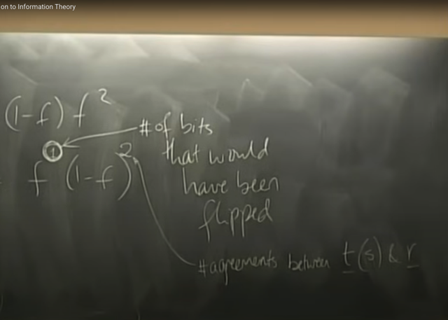</kbd>

> [!NOTE]
> Thế thì đến đây ta có:
>
> P(r=011 | s=1) = f^1 * (1-f)^2
>
> P(r=011 | s=0) = (1-f)^1 * f^2
>
> Ta cần hiểu quá trình này giờ là đang dùng xác suất để chứng minh
> majority decoding có thể có tác dụng. Mà cụ thể là ta sẽ chứng minh
> rằng, nó sẽ có xác suất cho kết quả đúng cao hơn.
>
> Thế thì ý đồ là muốn làm điều đó bằng cách cho thấy qua P(s|r)
>
> Như đã nói hồi nãy, theo Bayes rule P(s|r) = P(r|s)P(s)/P(r)
>
> Hay ghi ở dạng đầy đủ:
>
> P(s=s_j|r=r_i) = P(r=r_i|s=s_j)P(s=s_j) / P(r=r_i)
>
> Với s là r.v đại diện cho bit của source, nó có hai possible value 1 và 0
>
> Thì cái mà ta đang muốn làm là chứng minh rằng với một giá trị r_i
> (tức là một chuỗi thông tin nhận được cụ thể r_i nào đó) thì majority
> decoding sẽ chọn phương án có xác suất posterior P(s|r) cao hơn
>
> Thế thì nãy giờ ta làm việc trên một chuỗi r = 011. Mục đích làm xem 
> thử P(s=1|r=011) và P(s=0|r=011) cái nào cao hơn.Hay nói cách khác
> ta muốn chứng minh P(s=1|r=011) sẽ cao hơn, vì majority decoding
> sẽ decode 011 thành 1 vì số 1 chiếm đa số.
>
> Thế thì, có thể ghi lại:
>
> P(s=0|r=011) = P(r=011|s=0)P(s=0)/P(r=011)
>
> P(s=1|r=011) = P(r=011|s=1)P(s=1)/P(r=011)
>
> Và ta sẽ thấy:
>
> prior probability P(s=0) = P(s=1) = 1/2 vì một bit có thể bằng 0 hoặc bằng
> 1 với xác suất như nhau.
>
> Do đó P(s=0|r=011) ∝ P(r=011|s=0) và P(s=1|r=011) ∝ P(r=011|s=1)
>
> Từ đó, ta chỉ cần so sánh P(r=011|s=1) và P(r=011|s=0)
>
> Thế thì từ kết quả trên, ta xét tỉ số P(r=011|s=1) / P(r=011|s=0)
>
> = [f^1 * (1-f)^2] / [(1-f)^1 * f^2] = (1-f) / f
>
> Và từ đó cho nhận xét: vì 1-f thường lớn hơn f (tỉ lệ bị flip thường
> là thấp), nên P(r=011|s=1) / P(r=011|s=0) > 1
>
> hay  P(r=011|s=1) > P(r=011|s=0)
>
> biện minh cho majority decoding sẽ có tác dụng nếu flip rate nhỏ

 

<kbd>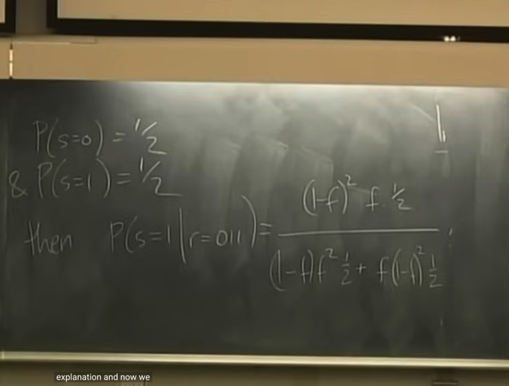</kbd>

<kbd>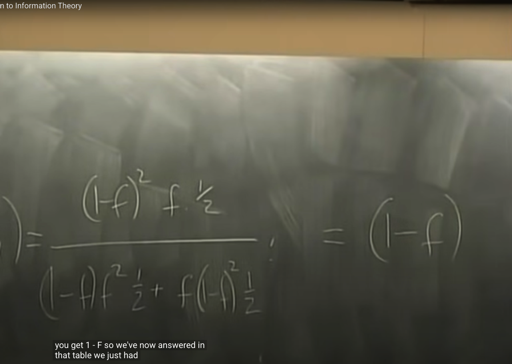</kbd>

> [!NOTE]
> Ở đây gs thế các giá trị vào luôn để tính ra P(s=1 |r=011) = 1-f

 

<kbd>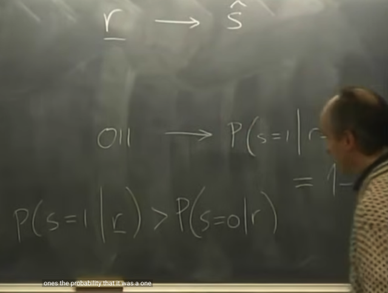</kbd>

> [!NOTE]
> Để rồi cũng ra kết luận là
> P(s=1|r=011) > P(s=0|r=011)

 

<kbd>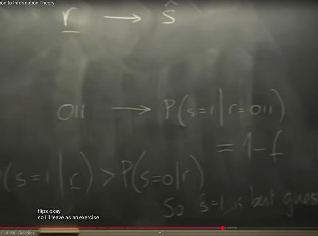</kbd>

> [!NOTE]
> Từ đó cho thấy s^ = 1 là dự đoán tốt
> nhất, đây cũng là dự đoán của
> Majority decoding strategy

 

<kbd>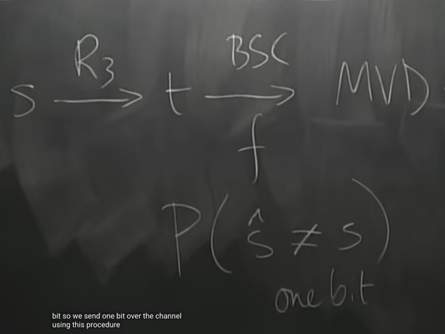</kbd>

> [!NOTE]
> Bài toán tiếp theo ta sẽ thảo luận là, nếu dùng R3 (đại khái repeat 3 lần) và dùng Majority
> Vote Decoding (MVD) thì xác suất mà predicted s (s^2) khác với s là bao nhiêu P(s^!=s)
>
> Đại khái là xác suất mà prediction sai là bao nhiêu?
>
> Thử suy nghĩ trước:
>
> P(s^!=s)
>
> Xét event s^!=s, có thể thấy nó là union của 2 event: (s^=1, s=0) và  (s^=0, s=1): (s^ khác
> s) = (s^=1, s=0) U (s^=0, s=1)
>
> => P(s^ khác s) = P[(s^=1, s=0) U (s^=0, s=1)]
>
> Vế phải là union của hai disjoint event, nên theo axiom 2:
>
> P(s^ khác s) = P(s^=1, s=0) + P(s^=0, s=1)
>
> (s^=1, s=0) = (r=011, s=0) U (r=111, s=0) U (r=101, s=0) U (r=110, s=0)
>
> => P(s^=1, s=0) = P(r=011, s=0) + P(r=111, s=0) + P(r=101, s=0) + P(r=110, s=0)
>
> = P(r=011|s=0)P(s=0) + P(r=111|s=0)P(s=0) + P(r=101|s=0)P(s=0) + P(r=110|s=0)P(s=0)
>
> = [P(r=011|s=0) + P(r=111|s=0) + P(r=101|s=0) + P(r=110|s=0)]P(s=0)
>
> = [(1-f)f^2 + f^3 + (1-f)f^2 + (1-f)f^2]1/2
>
> (s^=0, s=1) = (r=001, s=1) U (r=010, s=1) U(r=100, s=1) U (r=000, s=1)
>
> => P(s^=0, s=1) = P(r=001, s=1) + P(r=010, s=1) + P(r=100, s=1) + P(r=000, s=1)
>
> = P(r=001|s=1)P(s=1) + P(r=010|s=1)P(s=1) + P(r=100|s=1)P(s=1) + P(r=000|s=1)P(s=1)
>
> = [P(r=001|s=1) + P(r=010|s=1) + P(r=100|s=1) + P(r=000|s=1)]P(s=1)
>
> = [(1-f)f^2 + (1-f)f^2 + (1-f)f^2 + f^3]1/2
>
> Vậy P(s^ khác s) = (1-f)f^2 + (1-f)f^2 + (1-f)f^2 + f^3 = 3(1-f)f^2 + f^3

 

<kbd>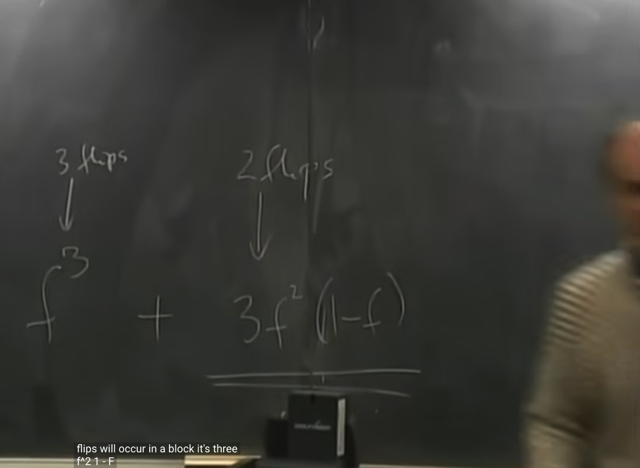</kbd>

<kbd>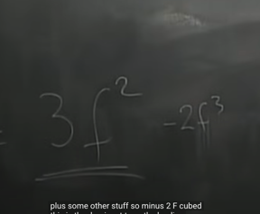</kbd>

> [!NOTE]
> Có thể lập luận cách khác, đó là dựa trên việc ta đã kết luận Số bit bị 
> flip trong n bit sẽ có story giống như số trial success trong n i.i.d Bern(p) 
> trials
>
> Vậy nếu gọi X là số bit bị flip trong 3 bit, X~Bin(3,f)
>
> Thế thì event (s^ khác s) tương đương event (X=3) U (X=2) (vì khi đó,
> wrong bit sẽ chiếm đa số)
>
> => P(s^ khác s) = P(X=3 U X=2) và đây là 2 disjoint event, nên theo 
> axiom 2, = P(X=3) + P(X=2)
>
> Với X~Bin(n,p), ta đã biết PMF của nó P(X=k) + (n choose k)p^kq^(1-k)
>
> => với X~(3,f): 
>
> P(X=3) = (3 choose 3)f^3q^0 = f^3
>
> P(X=2) = (3 choose 2)f^2q^1 = 3!/(2!1!) f^2(1-f) = 3f^2(1-f)
>
> Kết qủa ta cũng có P(s^ khác s) = f^3 + 3f^2(1-f)
>
> ====
>
> Và gs tính giùm ra rằng nó sẽ ~ 3f^2 (-2f^3 ít ảnh hưởng hơn)

 

<kbd>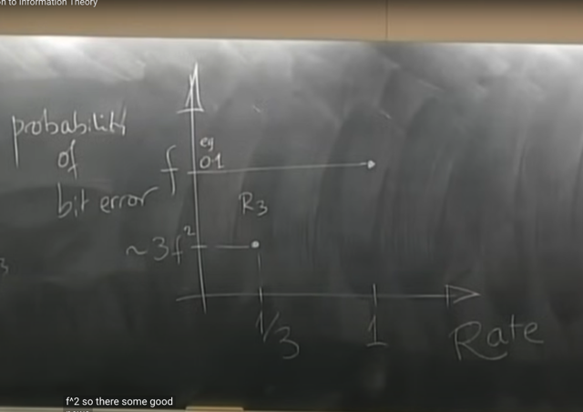</kbd>

> [!NOTE]
> Thế thì, gs mới vẽ cái biểu đồ như vầy: một trục là xác suất bit error, và
> một trục là rate
>
> Tại rate = 1. mang ý nghĩa là, mỗi lần send signal ta giữ nguyên, (ví dụ
> 1 bit thì gửi 1 bit, không có repeat gì cả), thì khi đó xác suất bit error
> = f. ví dụ như nãy giờ ta dùng = 0.1
>
> Nhưng với R3 (tức repeat 1 bit thành 3 bit), thì như vừa chứng minh,
> xác suất error giảm còn ~3f^2

 

<kbd>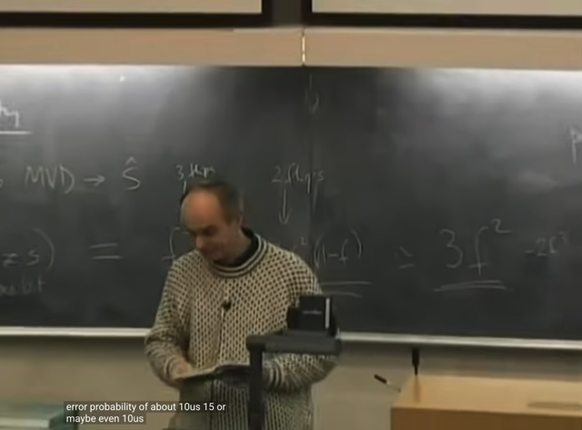</kbd>

> [!NOTE]
> Thế thì gs nhắc lại ta nên nhớ rằng ta đang muốn tìm một cách làm
> sao để đạt probability error = 10^-15 thậm chí 10^-18

 

<kbd>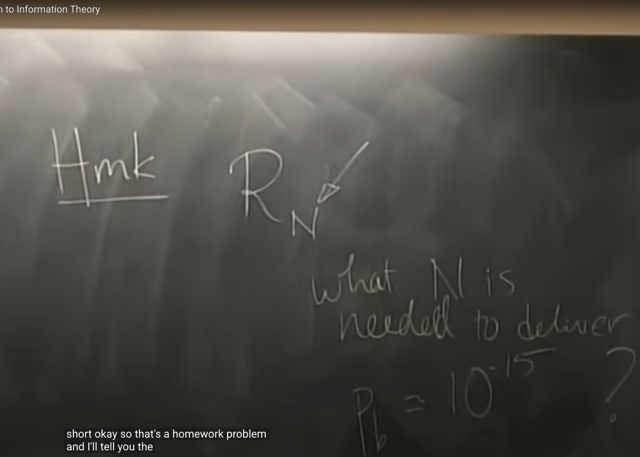</kbd>

> [!NOTE]
> Và một bài tập của ta là tìm N cần thiết (số lần repeat) để có được
> probability of error Pb = 10^-15
>
> (ông cho đáp án luôn, là 61)
>
> Suy nghĩ: Hướng giải dĩ nhiên là ta cần khái quát hóa bài toán, để
> tính Pb theo N (quay lại làm sau)

 

<kbd>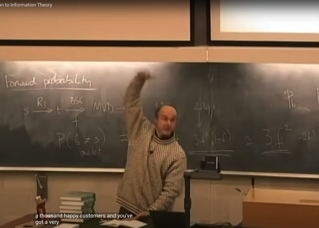</kbd>

> [!NOTE]
> Và khi đó, nếu dùng cách này, giống như ta sẽ phải làm một cái ổ cứng
> 61 GB, chỉ để chứa 1GB data. (bởi 1 bit cần được repeat thành 61 bit,
> thì 1GB thành 61 GB) thì khi dùng majority decoding thì ta sẽ có xác
> suất error nhỏ như mong muốn
>
> Rõ ràng đây không phải là gỉai pháp tốt

 

<kbd>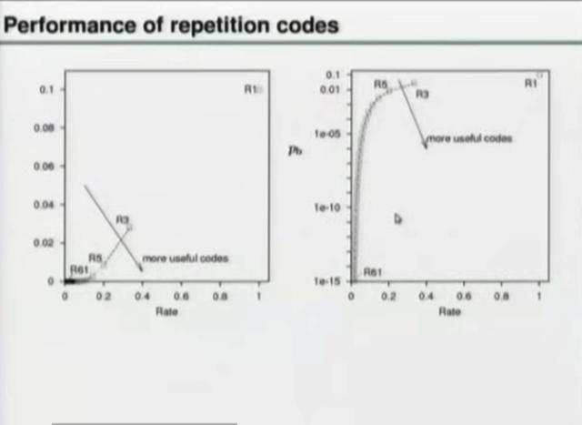</kbd>

 

<kbd>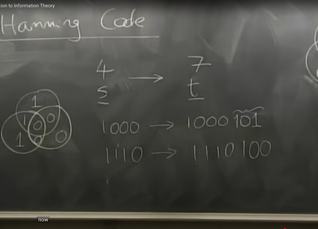</kbd>

<kbd>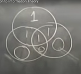</kbd>

> [!NOTE]
> Tiếp theo gs nói qua một method gọi là 4/7 Hamming Code:
>
> Cách làm là vẽ 3 vòng tròn giao nhau như vầy. để rồi một source
> chuỗi 4 bit ví dụ 1000 sẽ được encode thành 1000101
>
> Số 101 là đến từ như sau:
>
> Viết 1,0,0,0 vào 4 phần giao nhau của 3 đường tròn.
>
> Và 3 phần không giao nhau sẽ mang số 1 hoặc 0 tính như sau:
>
> = 1 nếu số lượng số 1 trong hình tròn là lẻ 
>
> = 0 nếu số lượng số 1 trong hình tròn là chẵn

 

<kbd>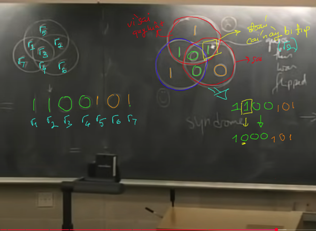</kbd>

> [!NOTE]
> Thế thì ý là, theo quy tắc này có thể giúp ta decode:
>
> Ví dụ s = 1000, được encode theo cách này, ta có 1000101
>
> Để rồi qua channel, bị add noise, nó thành ra r = 1100101
>
> Vậy thì decode sẽ như sau:
>
> Ta cũng viết r1, r2, r3, r4 vào 4 vùng giao nhau của 3 đường tròn 
>
> và r5, r6, r7 vào 3 vùng còn lại
>
> Thế thì bước tiếp theo là xác định xem đường tròn nào bị sai quy luật
> ví dụ như ở đây, hai cái màu đỏ là sai, vì ko theo quy luật số bit = 1
> chẵn thì số ở vùng không giao sẽ là 0, và ngược lại.
>
> (nôm na là đáng lẽ vị trí (không giao với hai đường tròn còn lại) của hai
> hình tròn đỏ phải là 0 và 1 mới đúng
>
> Còn cái hình tròn xanh là cái đúng rule.
>
> Từ đó ta mới nghi ngờ cái bit bị flip là cái giao giữa 2 đường tròn đỏ và
> ngoài đường tròn xanh. Chính là vị trí r2.
>
> => decode ra là 1000 và nó đúng với s là 1000

 

<kbd>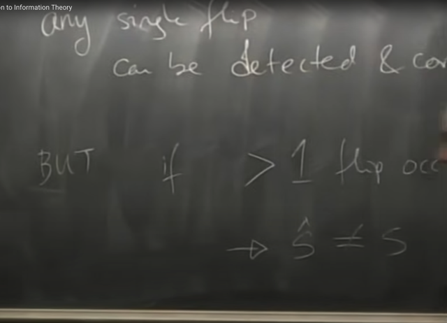</kbd>

> [!NOTE]
> Đại khái là nếu chỉ có 1 flip thì cách này có thể detect và sửa sai. 
>
> Nhưng nếu nhiều hơn 1 flip thì không (s^ khác s)

 

<kbd></kbd>

> [!NOTE]
> Đại khái là nó cũng có nhược điểm
> giống như Repeating encode

 

<kbd>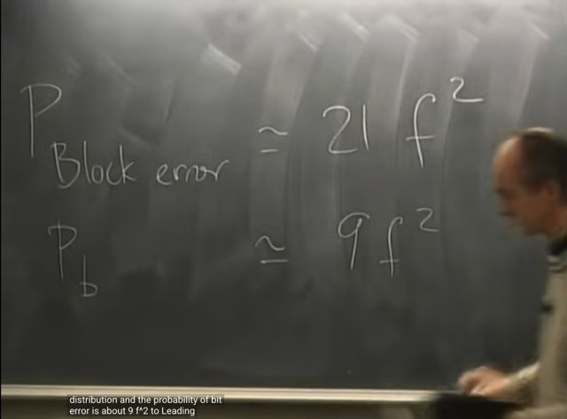</kbd>

> [!NOTE]
> Và gs nói bài tập cho ta là thử tính xác suất error gồm Block
> error và Bit error

 

<kbd>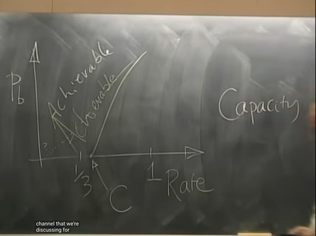</kbd>

> [!NOTE]
> Thế thì mấy phút cuối đại khái là gs nói về một theorem do ông
> Shanon chứng minh rằng ta có thể tìm ra / tồn tại một
> encoder/decoder sao cho đạt được rate chỉ chỉ khoảng > 1/3 mà
> vẫn có Pb nhỏ ~= 0 mong muốn

 

<kbd>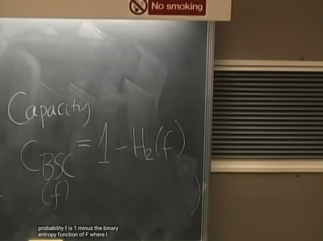</kbd>

> [!NOTE]
> Và tại đó gọi là Capacity của Channel, tính bằng công thức
> 1-H2(f) (các bài sau sẽ học)

 

<kbd>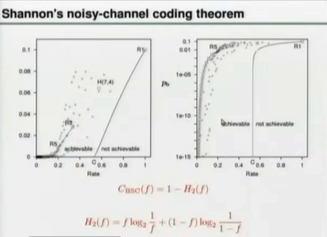</kbd>

 

<kbd>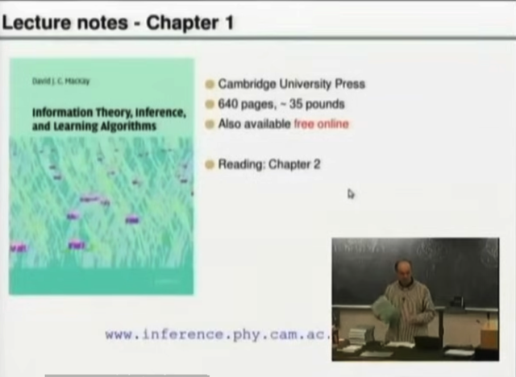</kbd>

> [!NOTE]
> Lecture note của bài này chính là
> chapter 1. Đọc chapter 1

 

<kbd>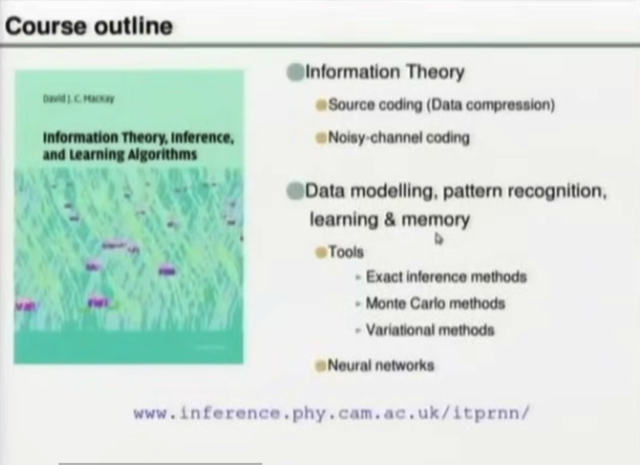</kbd>

 

<kbd>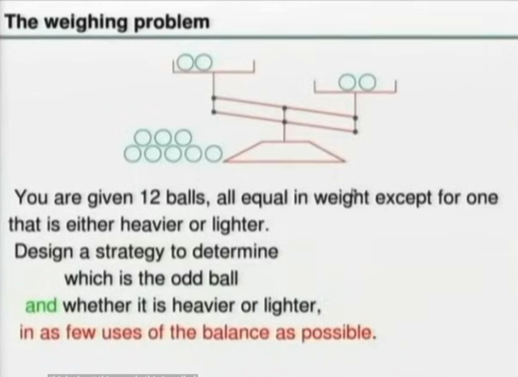</kbd>

 

