# Lec 10

📊 **Progress:** `35` Notes | `64` Screenshots

---

## Lec 10

 

<kbd>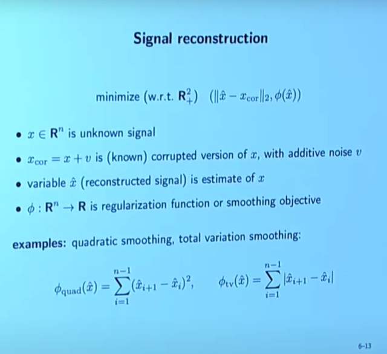</kbd>

> [!NOTE]
> Một ví dụ nữa trong phạm vi bài toán regularized approximation, là
> bài toán Signal reconstruction.
>
> Đại khái là ta muốn minimize khác biệt giữa corrupted signal x_cor và 
> giữa reconstructed signal x^ thể hiện bởi primary objective ||x^ - x_cor|| 
> (l2 norm).
>
> Nhưng secondary objective là ta muốn minimize Φ(x^), là function
> đại khái là thể hiện độ biến động của x^ (để rồi khi Φ(x^) nhỏ thì 
> x^ "smooth".
>
> Thì Φ(.) có thể dùng quadratic hoặc l1 sẽ dẫn đến các hiệu qủa khác
> nhau như đã biết

 

<kbd>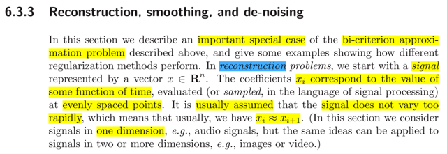</kbd>

<kbd>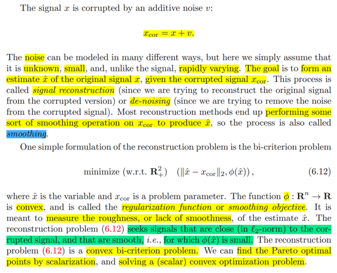</kbd>

> [!NOTE]
> Trong sách nói rõ hơn về bài toán Signal Reconstruction này.
>
> Đây là trong lĩnh vực Signal Processing (có lẽ ta cũng sẽ được
> học về cái này trong lớp của Mc Kay).
>
> Đại khái là, x là R^n vector sẽ represent chuỗi thông tin mà
> component của nó sẽ là một function theo thời gian, được
> sampled theo một chu kì đều đặn nào đó. Và người ta giả đinh là
> nó "mượt"
> - ý là, thông tin không có sự thay đổi đột ngột ở biên độ cao mà ở
> hai " time-step" liên tục nhau thì chúng không thay đổi nhiều:
>
> x_i+1 ~= x_i
>
> Thế thì khi bị truyền đi, thông tin bị nhiễu: ta có chuỗi dữ liệu /
> thông tin nhận được bị nhiễu còn nguyên vẹn nữa, thể hiện bởi
> x_cor = x + v (v là noise).
>
> Mình hiểu đại khái x_cor là thông tin đã bị làm cho nhiễu động
> khíến nó chỉ là phiên bản rời rạc của thông tin gốc (vốn dĩ liên
> tục). Do đó kiểu như ta có những dấu chấm, và giờ ta lấy cây viết
> nối chúng lại sao cho nó đi qua những dấu chấm đó, nhưng làm
> sao cho mượt nhất có thể.
>
> Thì việc này được thực hiện thông qua bài toán:
>
> minimize ||x^ - x_cor|| và Φ(x^). 
>
> Và đó chính là một bài toán thuộc loại bi-criterion problem
> (nằm trong phạm vi rộng hơn là bài toán Vector Optimization) 
> Để rồi như đã biết, bằng phương pháp Scalarization, ta sẽ
> chuyển nó thành equivalent problem, để rồi giải bài toán này,
> tìm được Optimal thì đồng nghĩa đó sẽ là Pareto Optimal của
> bài toán Bi-criterion

 

<kbd>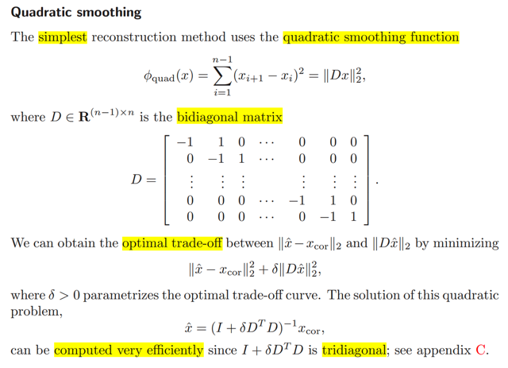</kbd>

> [!NOTE]
> Rồi, như trong bài giảng gs nhắc đến việc có thể dùng nhiều function
> Φ khác nhau. Thì đơn giản nhất là dùng quadratic: Nôm na là, ta sẽ 
> minimize tổng bình phương của chênh lệch giữa hai step liền kề:
>
> Φ(x) = Σi (x_i+1 - x_i)^2 Và cái này, thể hiện bởi ||Dx||^2 với D là 
> BIDIAGONAL matrix như trong sách.
>
> Cũng dễ hiểu rồi, nên nhớ x là R^n vector [x1, x2.....xn] trong đó 
> component xi là signal tại step i'th. Và D là matrix (n-1) hàng (n) cột
>
> Do đó Dx thì sẽ ra 1 vector, ta sẽ nhìn theo "cách nhìn": component
> thứ 1st của Dx là dot product của row 1st của D và x:
>
> <-1 1 0 0....0> <x1, x2, ....xn> = x2 - x1
>
> Tương tự, component thứ 2nd của Dx là x3 - x2.
>
> Nên tổng Σ (x_i+1 - x_i)^2 chính là tổng bình phương các component
> của Dx, chính là ||Dx||^2 = (Dx)T(Dx)
>
> ====
>
> Rồi, theo như ta đã biết đối diện với bài toán vector optimization
> nói chung và cụ thể là bi-criterion problem ta sẽ scalarization.
>
> Mà điển hình là minimize f0(x) = ||x - x_cor||^2 + δ||Dx||^2
>
> = (x-xc)T(x-xc) + δ(Dx)T(Dx)
>
> = (xT-xcT)(x-xc) + δxTDTDx 
>
> = xTx - xcTx - xTxc + xcTxc + δxTDTDx
>
> = xTx - 2xcTx + xcTxc + δxTDTDx
>
> = xT(1 + δDTD)x - 2xcTx + xcTxc. Đây là quadratic function 
>
> = xTPx + qx + v với P = 1 + δDTD, q = - 2xc, v = xcTxc
>
> Không khó để triển khai cho thấy với f(x) =  (1/2)xTPx + qTx + r
>
> => ∇f = (xTP+qT)T = PTx+q
>
> Vậy ở đây, ∇f = 2PTx + q = 2(1 + δDTD)Tx - 2xc
>
> = 2(1 + δDTD)x - 2xc   |   Do 1 +  δDTD symmetric
>
> ∇f = 0 <=>  2(1 + δDTD)x - 2xc = 0 
>
> <=> (1 + δDTD)x = xc <=> x = (1 + δDTD)invxc. Dĩ nhiên đây chính
> là optimal (minimum) vì f0(x) quadratic -> convex
>
> Và cuối cùng gs nói việc tính x^ theo công thức analytic trên rất 
> hiệu qủa vì ta chỉ deal với bi-diagonal matrix D. (khi nào xem Appendix
> thì quay lại sau)

 

<kbd>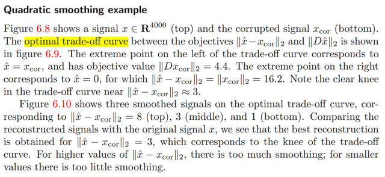</kbd>

<kbd>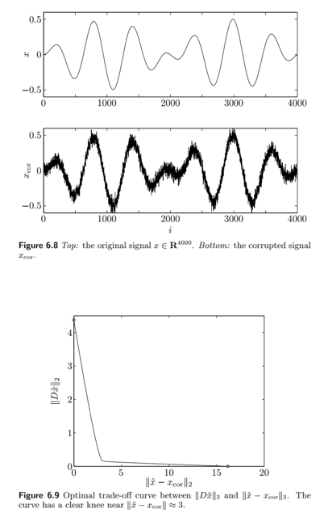</kbd>

<kbd>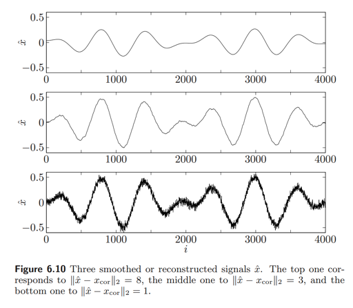</kbd>

> [!NOTE]
> Đại khái là hình 6.9 cho ta OPTIMAL TRADE-OFF CURVE. Khi với 
> các δ khác nhau, ta có các Pareto optimal khác nhau.
>
> Mà khi thay đổi thì ta sẽ "đánh đổi" (trade-off) giữa ĐỘ KHỚP (primary
> objective ||x^ - x_cor||^2) và ĐỘ MƯỢT (||Dx||^2)
>
> Để từ đó cho thấy với (δ sao cho) ||x^ - x_cor|| = 3 thì là ok nhất (tương
> ứng với pareto optimal tại điểm gấp khúc (knee)) của optimal trade off
> curve

 

<kbd>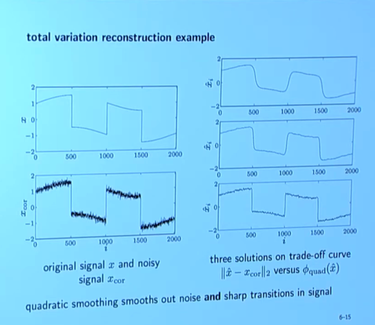</kbd>

 

<kbd>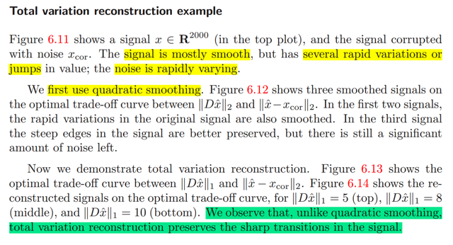</kbd>

> [!NOTE]
> Đại khái là khi dữ liệu gốc mà có những bước thay đổi đột ngột
> thì dùng quadratic smoothing ||Dx||^2 tỏ ra kém. Vì nó smooth
> out luôn những đặc tính này.
>
> Với dạng này, sẽ hiệu quả hơn khi dùng cái gọi là TOTAL
> VARIATION reconstruction:
>
> Trong đó vẫn dùng L2 cho primary objective:
>
> ||x^ - x_cor|| (nhưng không square)
>
> Và dùng l1 cho Dx^: ||Dx^||1

 

<kbd>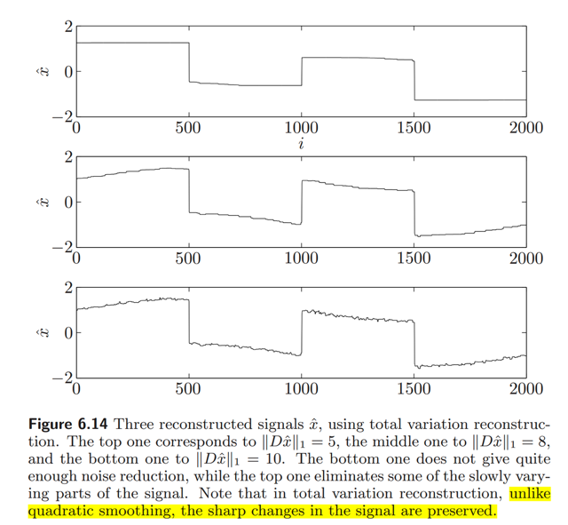</kbd>

<kbd>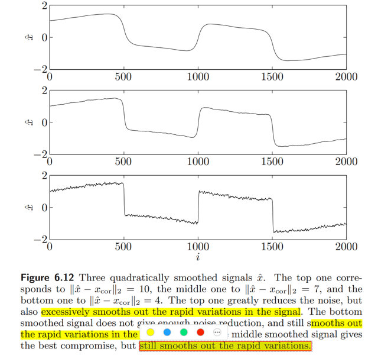</kbd>

> [!NOTE]
> Dùng ||Dx|| (l1 norm) thì đại khái là nó giữ được các bước
> nhảy (những biến động đột ngột, lớn của dữ liệu gốc) tốt hơn
> là ||Dx||^2
>
> Và ở đây cũng có một đặc điểm thể hiện trong hình trên cùng
> khi dùng L1 norm, là nó biến thành kiểu như piece-wise constant
> function
>
> Dùng ||Dx||2 (square l2 norm) thì có thể thấy nó smooth out đi 
> những bước nhảy đột ngột của dữ liệu / thông tin gốc. Đây là
> điểm mà ta ko muốn

 

<kbd>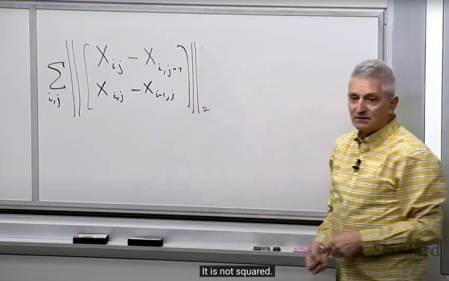</kbd>

> [!NOTE]
> Đại khái là gs nói có thể áp dụng với image và nó khá tốt. 
> Nhất là nhờ tính chất giữ được các "rapid variation" ví dụ như
> đường nét, cạnh (edge). Mà nếu như dùng Quadratic smoothing
> thì nó sẽ làm mờ đi

 

<kbd></kbd>

> [!NOTE]
> Cách người ta xử lý sự không chắc chắn trong thực tế
>
> Giảng viên nói rằng trong thực tế, phần lớn mọi người không xử lý
> sự không chắc chắn một cách cầu kỳ như trong sách vở. Ví dụ như
> ở Amazon, họ vẫn đang tính toán chuỗi cung ứng hàng ngày, quyết
> định sản phẩm nào sẽ đến các kho hàng. Nhưng họ không sử dụng
> mô hình xác suất phức tạp hay phân phối đầy đủ. Vậy họ làm gì?
>
> Student trả lời là: họ đoán.
>
> Có thể gọi là “educated guess” (đoán có cơ sở), nhưng thực chất
> là... họ phớt lờ sự không chắc chắn.
>
> Họ chọn một giá trị kỳ vọng (mean) nào đó của đầu vào (chẳng hạn
> như ma trận A trong mô hình) và giải bài toán tối ưu như thể nó là
> chính xác.
>
> Đó là cách 99% các hệ thống ngoài đời thực xử lý sự không chắc
> chắn.
>
> Tối thiểu bạn nên làm gì nếu buộc phải đoán?
>
> Lấy trung bình của nhiều kịch bản đầu vào khác nhau.
>
> Sau đó chạy mô phỏng (simulate) để xem lời giải ứng xử ra sao
> với các giá trị khác nhau của dữ liệu đầu vào.
>
> Nếu kết quả không thay đổi nhiều, bạn có thể chấp nhận lời giải
> đó.
>
> Cuối cùng, có một điều quan trọng: Trong thực tế, không ai tránh
> khỏi việc phải xử lý sự không chắc chắn. Dù họ không gọi tên nó,
> mọi người đều đang sử dụng các dạng regularization hay
> robustness. Tất cả các kỹ thuật regularization trong machine
> learning và thống kê thực chất là cách để xử lý sự không chắc
> chắn trong dữ liệu.

 

<kbd>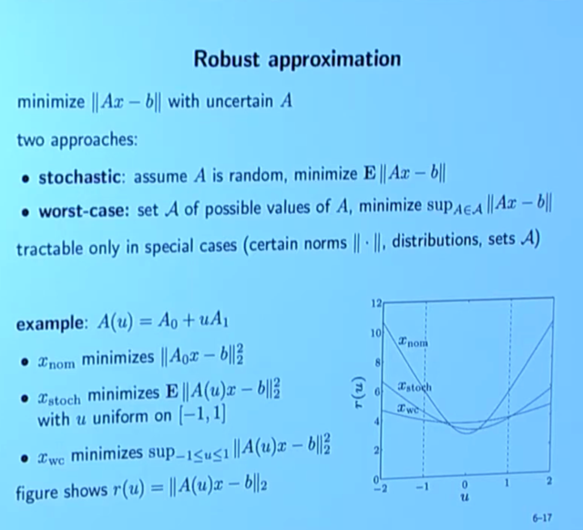</kbd>

 

<kbd>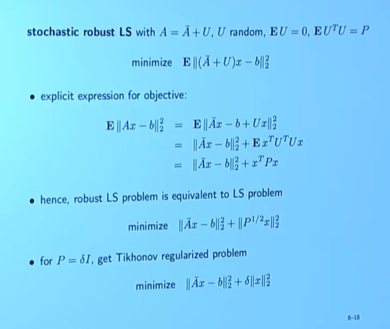</kbd>

 

<kbd>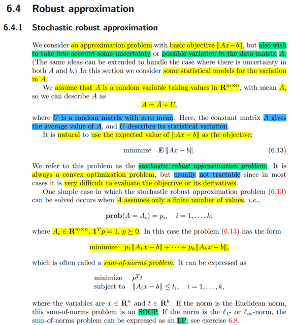</kbd>

> [!NOTE]
> Đại khái là, với cái này, thì bên cạnh objective quen thuộc là
> minimize ||Ax - b|| thì ta có thêm một tính chất là, A là một
> matrix chưa biết, hoặc, có thể nói A là matrix các random
> variables: A = A_bar + U với A_bar là mean (là constant)
> còn U là thể hiện variation.
>
> Thì một cách tự nhiên khi đối mặt với yếu tố không chắc chắn
> của random variable, ta sẽ dùng expectation. Nên objective sẽ
> là minimize E||Ax - b|| (l2 norm)
>
> Và bài toán này gọi là STOCHASTIC ROBUST APPROXIMATION 
> problem.
>
> Tuy nhiên họ nói, thường thì bài toán này không giải được.
>
> Nhưng nếu A đại khái là có hữu hạn các possible values Ai,
> mỗi cái gắn với xác suất P(A=Ai) = pi. 
>
> (dĩ nhiên Σ pi, tức 1Tp = 1, và pi >= 0 (hay p ≽ 0) 
>
> thì khi đó E||Ax - b|| = Σ pi||Ai - b||. (kết quả này nhờ Stat110, có 
> thể hiểu, đây chính là LOTUS:
>
> Sẵn ôn lại, trong Stat110 ta đã học mean của random variable X,
> hay expected value của discrete rv X, sẽ được tính bằng weighted
> Σ của các possible values của xi, với weight là xác suất tương ứng:
>
> EX = Σ xi P(X=xi)
>
> Thì nếu Y = g(X), LOTUS cho phép tính EY bằng pmf của X:
>
> EY = Eg(X) = Σxi g(xi) P(X=xi). Và ở đây chính là áp dụng cái này:
>
> E||Ax - b|| = Σ ||Aix - b||*pi )
>
> Khi đó bài toán minimize Σ ||Aix - b||*pi gọi là SUM OF NORM. 
>
> Và có thể giải được

 

- **Tối thiểu kỳ vọng bình phương điều hòa**

<kbd>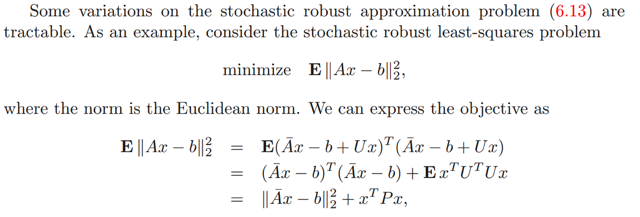</kbd>

<kbd>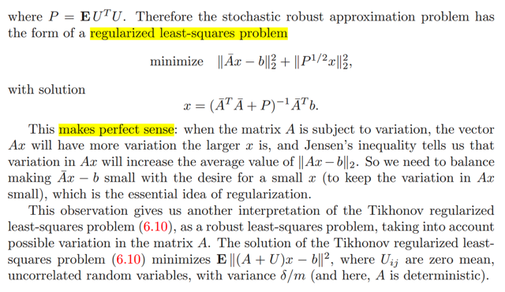</kbd>

> [!NOTE]
> Một phiên bản khác khi objective là minimize E||Ax - b||^2 (l2 norm, 
> square). Khi đó bài toán sẽ trở thành có dạng của bài toán regularized
> least-squares. (ko khó để triển khai objective ra dạng ||A^x-b||^2 + xTPx
> với A^ là constant - mean of A, P = E(UTU).
>
> Và với bài toán regularized least squared có thể dùng calculus để 
> cho ra analytic solution x = (A^TA^ + P)invA^Tb
>
> Và họ nói, kết quả này là hợp lí đại ý là vì khi A là biến, thì Ax cũng vậy
> và mức biến động của A sẽ được khuếch đại bởi x (trong Ax) và từ đó
> (theo Jensen's inequality) nói rằng giá trị trung bình của ||Ax - b|| cũng sẽ
> tăng lên. Do đó để giảm E||Ax - b||^2 thì việc ta nên làm chính là giảm
> A^x - b và cho x nhỏ.
>
> Hiểu sơ sơ vậy chứ cũng chưa rõ lắm. Quay lại sau

 

<kbd>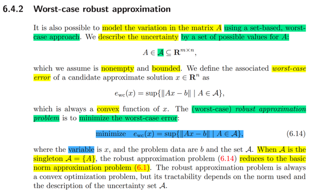</kbd>

> [!NOTE]
> Đại khái là, nếu như STOCHASTIC approach coi A như biến số,
> để rồi nó sẽ có một probability distribution, thì WORST-CASE
> approach sẽ handle sự biến động / chưa biết của A thông qua
> MỘT SET CÁC POSSIBLE VALUES CỦA A.
>
> Và dựa trên set A này, ta định nghĩa ra WORST-CASE ERROR:
>
> e_wc(x) = sup ||Ax - b|| | A ∈ A
>
> Và tiếp theo là ta sẽ giảm thiểu cái worst case error bằng cách
>  giải bài toán: minimize e_wc.
>
> Rồi, họ nói khi A là singleton tức là khi set A chỉ có một element
> dĩ nhiên khi đó sup ||Ax - b|| | A ∈ A chính là ||Ax - b|| thôi (bởi
> set A = A, chỉ có mỗi một cái.
>
> Và bài toán trở thành minimize ||Ax - b|| chính là bài toán NORM
> APPROXIMATION problem.
>
> Rồi, họ nói robust approximation luôn là convex, vì sao nhỉ?
> Có thể hiểu là bởi objective khi ta muốn minimize E(||Ax - b||)
> thì EXPECTATION là function PRESERVE CONVEXITY (norm là
> convex function rồi)

 

<kbd>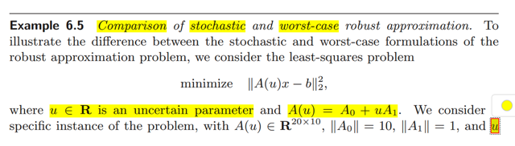</kbd>

<kbd>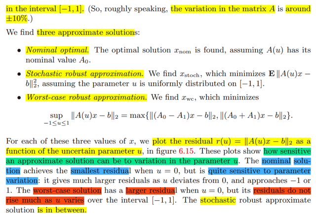</kbd>

<kbd>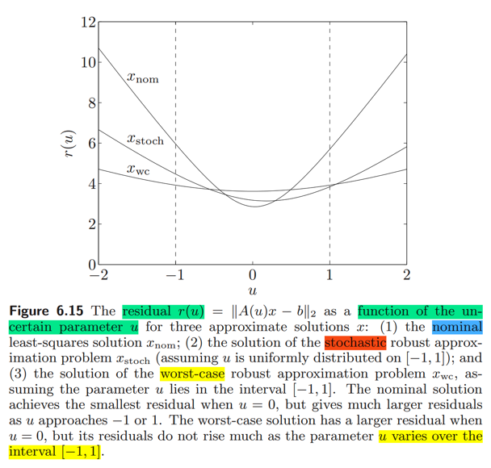</kbd>

> [!NOTE]
> đại khái là so sánh hai cái này. Dùng bài toán least-square:
>
> minimize ||A(u)x - b||^2.
>
> Có thêm một cái gọi là nominal optimal x_nom (nominal: danh
> nghĩa, mình đoán ý là, ta giả định rằng A(u), có một giá trị danh
> nghĩa là A0 nào đó, tức là bỏ qua sự bất định do u gây ra. thì
> x_nom là optimal của bài toán minimize ||A0x - b||^2.
>
> Còn x_stoch và x_wc là optimal của minimize E||A(u)x - b||^2 và
> minimize sup -1<=u<=1 ||A(u)x - b||
>
> Thì sau khi có kết quả ta mới vẽ đồ thị của residual ra
>
> r(u) = ||A(u)x - b||
>
> (để ta có 3 đường tương ứng với
>
> r1(u) = ||A(u)x_nom - b||
>
> r2(u) = ||A(u)x_stoch - b||
>
> r3(u) = ||A(u)x_wc - b||
>
> Thì thấy rằng tuy x_nom giúp residual đạt nhỏ nhất trong ba cái,
> nhưng khi u biến động (khiến A(u) biến động) thì r(u) cũng biến
> động nhiều nhất

 

<kbd>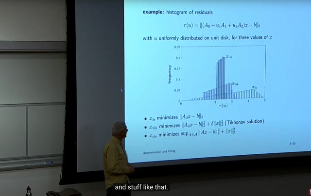</kbd>

> [!NOTE]
> Khúc này chả hiểu gì hết. Đọc sách sau.
>
> Mình sẽ qua luôn phần tiếp theo gs nói về chap 7 (tức là gs bỏ
> qua phần function fitting 6.5 luôn)

 

<kbd>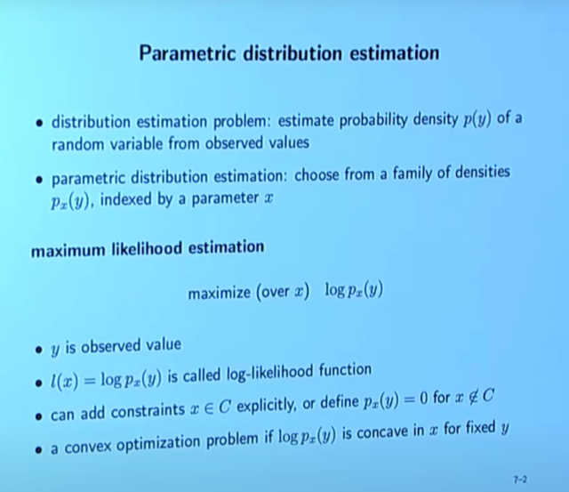</kbd>

> [!NOTE]
> Đại khái là nói về định nghĩa của LIKELIHOOD FUNCTION. Nó là
> một DENSITY FUNCTION (tức probability density, hay pdf mà ta
> đã học trong stat110, là cái mà khi integrat trên khoảng a:b thì ta
> sẽ có xác suất random variable X có giá trị thuộc khoảng này:
> P(X ∈ (a, b)) = ∫a:b f_X(t)dt f_X(t) là pdf của random variable X)
>
> Thế thì, như đã biết pdf cuả một số distribution phổ biến như Poisson,
> Gaussian,...(dĩ nhiên là continuous random variable), thì ta nhớ rằng
> một distribution ví dụ Gaussian thì nó có hai parameters là mean và
> variance. Nên với giá trị đã biết của hai parameters này ta sẽ có
> pdf và từ đó giúp tính density tại một điểm x nào đó fX(x). Điều đó
> cũng có nghĩa là, với pdf thì x là biến.
>
> Nhưng với likelihood function, thì parameters mới là biến. Do đó,
> ví dụ p(y) là density function với parameters x, thì ta có likelihood
> function p_x(y) là hàm theo x. Nên với các x khác nhau, thì p_x(y)
> sẽ có giá trị khác nhau - tức density của observed value y sẽ phụ
> thuộc vào parameters x. 
>
> Giống như lấy pdf của Exp(λ) đi, f(t) = λ*e^(-λt) Thì với pdf thì nó là
> hàm theo t. Nhưng likelihood, thì ta coi t là observed value, còn λ mới
> là biến để rồi đây là hàm theo λ. Từ đó mới thấy rằng / hiểu rằng cái
> việc maximize likelihood function, chính là ta tìm parameters (ví dụ)
> λ sao cho density của các observed value (data) là lớn nhất,
>
> ====
>
> Rồi tiếp, người ta thường làm việc với log likelihood thay cho likelihood
> (vì một số lí do gs ko nói ở đây, nhưng mình nhớ đại khái là trong các
> lớp như cs231n cũng đã từng nói sơ qua rằng lí do là vì làm việc với
> log giúp ổn định hơn, còn log dĩ nhiên là hàm monotonic nên maximize
> log likelihood thì equivalent với maximize likelihood)
>
> Ta cũng có thể add constraint (đối với x / parameter) một cách explicitly
> (khai báo cụ thể riêng biệt) hoặc implicitly (bằng cách biến likelihood
> thành dạng indicator function: p_x(y) = ... nếu x thỏa constraint, và = 0
> nếu x không thỏa constraint
>
> ====
>
> Một điểm quan trọng nữa là, tuy rằng ta biết nếu log p_x(y) là concave
> thì - log p_x(y) sẽ convex (mà ở đây ta maximize log p_x(y) thì equivalent
> minimize - log p_x(y)).
>
> Có điều gs lưu ý rằng, phải nhớ đây là hàm của parameter x, nên kiểu
> như giả sử ta có function f(x,y) với fixed x thì concave với y nhưng chưa
> chắc fixed y thì nó concave với x

 

<kbd>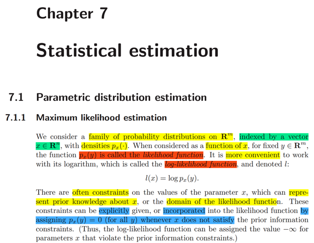</kbd>

<kbd>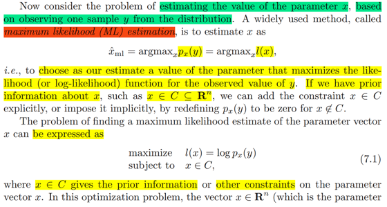</kbd>

<kbd>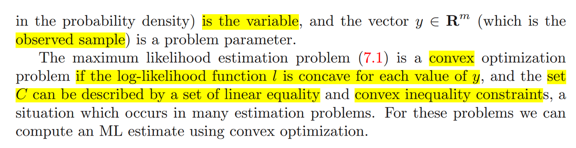</kbd>

> [!NOTE]
> Cũng như trong  bài gs đã nói hết rồi. Chỉ bổ sung thêm rằng việc
> add constraint cho x có thể để thể hiện một prior knowledge nào
> đó của x. mà trong bài gs ví dụ với Gaussian thì ta biết standard
> deviation σ phải không âm.
>
> Ngoài ra trong sách giúp ta hiểu rõ đầu đuôi hơn. Rằng ta muốn
> maximize likelihood function (hay log likelihood) thì có nghĩa là ta
> muốn tìm x^_ml (gọi là maximum likelihood estimator của
> parameter x) sao cho likelihood lớn nhất - tức là density của các
> observed data là lớn nhất.
>
> Kí hiệu là x^_ml = argmax x p_x(y) và cũng là argmax x l(x)
>
> (chú ý, kí hiệu p_x(y) là density function evaluate tại observed
> value y, nhưng đây là function theo x. đặt l(x) = log p_x(y) thì dĩ
> nhiên vì tính monotonic của log nên tìm x cho p_x(y) lớn nhất thì
> cũng là cho l(x) lớn nhất)
>
> Thế thì như đã nói, nếu ta có prior knowledge gì đối với x, thì ta
> có thể thể hiện nó qua explicit constraint: x ∈ C (C là nói chung
> cho một feasible set nào đó, ý là x phải thỏa cái này, có thể là tập
> nghiệm của một hệ nào đó) hoặc implicit là p_x(y) = 0 khi x không
> ∈ C như đã nói,
>
> Vậy thì ý chính là ta sẽ chuyển / thể hiện bài toán này thành dạng
> quen thuộc của bài toán optimization:
>
> maximize l(x) = log p_x(y) constraint c ∈ C.
>
> 7.1 PARAMETRIC DISTRIBUTION ESTIMATION
>
> 7.1.1 MAXIMUM LIKELIHOOD ESTIMATION

 

<kbd>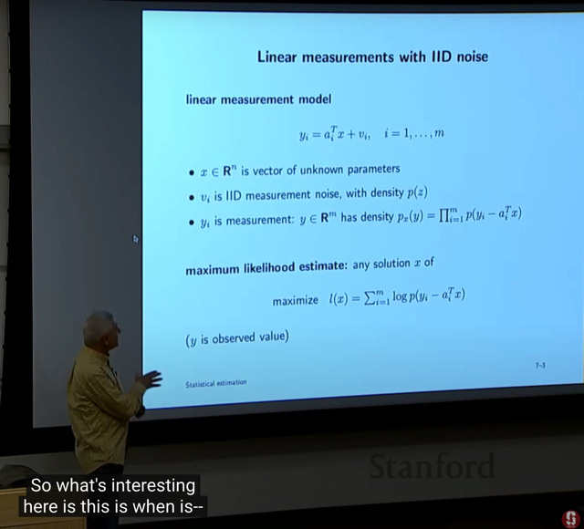</kbd>

> [!NOTE]
> gs nói qua một ví dụ là bài toán Linear measurements with IID noise
> (IID dĩ nhiên là independent identical distributed).
>
> Ta có một linear measurement model:
>
> yi = aiTx + vi, i = 1,2...m (hiểu nôm na là, ta có một quan hệ tuyến
> tính giữa a và y parameterized bởi x) với vi là nhiễu (noise) với density
> p(z)
>
> Vì vi độc lập (IID) nên yi với x fixed cũng sẽ independent nhau.
>
> Từ đó p(y) tức là p([y1, y2,...yi]) có thể hiểu là p(y1 ∩ y2 ∩ ....yi]) 
> là joint probability density (joint pdf) mà vì các yi independent, nên 
> nhờ stat110 ta đã biết joint pdf sẽ bằng tích các marginal pdf:
>
> p(y) = p([y1, y2,...yi]) = p(y1)p(y2)...p(yn) = Πi p(yi)
>
> Thế thì 
>
> Và ta nên nhớ đây là pdf (của yi), để "chuyển qua" likelihood thì nó 
> là function theo x (với fixed y): p_x(y) = Πi p_x(yi) 
>
> Thế thì ta đâu có pdf của yi? Nhưng ta có pdf của noise vi (bằng nhau
> đều là) = p. Và quan hệ yi = aiTx + vi
>
> Nhờ Stat110 ta nhớ khi có rv X với pdf f_X và Y là rv tạo bởi applying
> function g lên X: Y = g(X). Thì có thể dựa vào transformation theorem
> để có pdf của Y từ pdf của X: 
>
> f_Y(y) dy = f_X(x) dx (1) => f_Y(y) = f_X(x) dx/dy
>
> Và express vế phải theo y: f_Y(y) = f_X(ginv(y)) dx/dy
>
> Có chú ý nhỏ là (1) thật ra là cách viết cho dễ nhớ, trong stat110 gs 
> Blizstein có lưu ý ta là cách viết này ko đúng.
>
> Khi X, Y đều là vector thì công thức sẽ là f_Y(y) = |J| f_X(x) với J là
> Jacobian của X wrt Y 
>
> (Ôn lại một chút Jacobian là thứ mà khi ta triển khai df = f'(x)[dx]
> tức một linear operator act on vector dx để ra vector df. Thì khi đó
> linear operator act on dx này chỉ có thể là matrix nhân với vector dx.
> Và matrix đó gọi là Jacobian)
>
> Vậy quay lại đây ta có yi = aiTx + vi => d/dyi (vi) = 1. Vậy pdf của yi: 
> f_yi(y) = f_vi(vi) *d/dyi (vi) = p(vi) * 1 = p(vi)
>
> Thể hiện theo yi: f_yi(yi) = p(yi - aiTx) 
>
> Và do đó likelihood function sẽ là p_x(y) = Πi p_x(yi - aiTx)
>
> Và lấy log để có log likelihood
>
> Và gs nói ở đây ta có log concave

 

<kbd>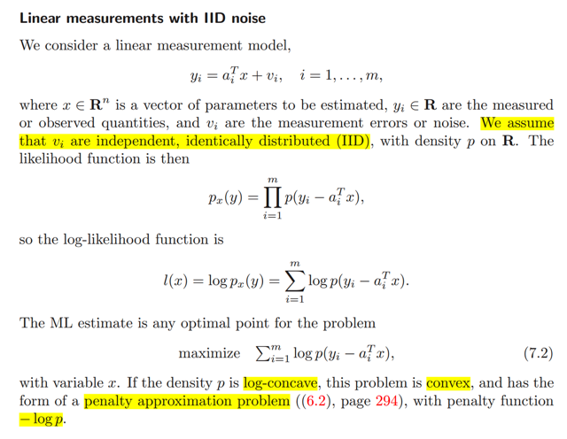</kbd>

> [!NOTE]
> trong sách có nói thêm là bài toán này sẽ là convex (optimization
> problem) nếu p log-concave. (lưu ý ta đâu biết p có công thức gì,
> nên việc bài toán có convex hay không thì tùy vào p)
>
> Ôn lại: hàm f gọi là log-concave đơn giản là khi log f là hàm concave.
>
> Và khi p có tính chất log-concave thì log p sẽ là concave và objective
>  là sum (cũng là function preserve convexity) các concave combine 
> with affine (yi - aiTx là affine của cả yi và x) cũng là concave. Và dùng 
> dấu - thì thành convex 
>
> (Lưu ý nói là maximize l(x) nhưng thể hiện theo bài toán tối ưu sẽ là
> minimize - l(x), nên objective là - l(x) là negative của concave thì là
> convex)
>
> Cái này có thể ôn lại chỗ log-concave - nằm trong nội dung các function
> preserve convexity

 

<kbd>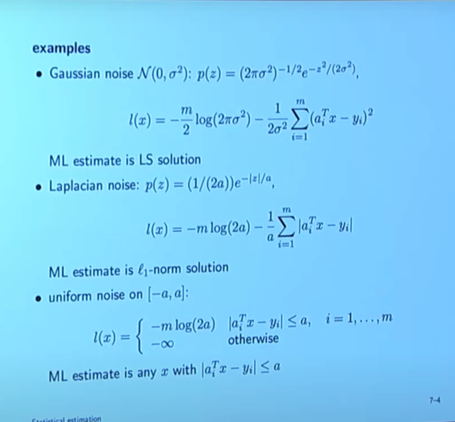</kbd>

> [!NOTE]
> Như đã nói, tùy tình hình p là gì. thì nếu ta có cái gọi là GAUSSIAN 
> NOISE N(0, σ^2) (hiểu đại khái là ta assume noise tuân theo Gaussian 
> distribution với zero mean, std chưa biết). Thì khi đó p(z) có công thức
> của Normal pdf như đã học trong stat110 rồi.
>
> f(z) = 1/√(2πσ^2)  e^-z^2/(2σ^2)
>
> Lắp vào l(x) = Σ log p(yi - aiTx) ta sẽ có
>
>  l(x) = - m/2 log(2πσ^2) - (1/2σ^2) Σ(aiTx - yi)^2 
>
> Và bài toán maximum likelihood estimation (sẽ là minimize over x cái
> này: m/2 log(2πσ^2) - (1/2σ^2) Σ(aiTx - yi)^2
>
> Và đây chính là m/2 log(2πσ^2) - (1/2σ^2) ||Ax - y||^2 chính là bài toán
> least - square approximation
>
> ====
>
> Tương tự trong trường hợp noise là Laplacian thì sẽ trở thành bài toán
> L1 estimation

 

<kbd>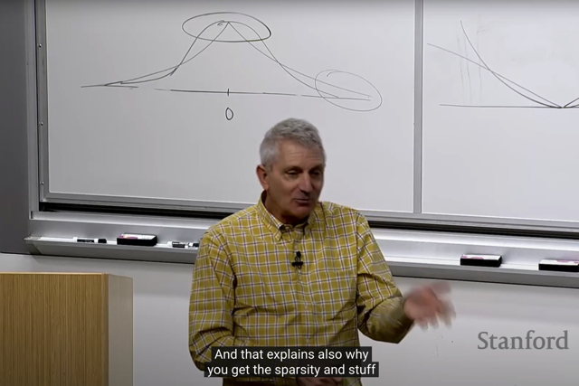</kbd>

> [!NOTE]
> đại khái là
>
> với / nếu dùng l2 norm penalty, thì kiểu như ta muốn nó phạt nặng với
> large  error / residual đồng nghĩa sensitive với large residual. Nhưng với
> small residual thì less sensitive / chill, bỏ qua, không khó tính
>
> còn nếu dùng l1 norm penalty thì với large residual thì ta cũng ko quá
> khắt khe, nhưng với small residual thì ta cũng không bỏ qua
>
> Thế thì ý gs là, việc chọn cách hành xử nào đối với residual ở trên
> (thông qua việc chọn penalty function gì) THẬT RA CŨNG TƯƠNG
> ĐƯƠNG VỚI VIỆC TA COI NOISE (BẢN CHẤT NOISE CHÍNH LÀ
> RESIDUAL) TUÂN THEO GAUSSIAN HAY LAPLACIAN
>
> Để rồi đại khái là nếu ta cho rằng noise ~ Laplacian tức là ta tin rằng
> NOISE CÓ GIÁ TRỊ LỚN SẼ CÓ THỂ XUẤT HIỆN NHIỀU (XÁC SUẤT
> KHÔNG NHỎ), THỂ HIỆN QUA CÁI ĐUÔI MẬP  CỦA LAPLACIAN
> DISTRIBUTION. Thế thì vì tin rằng trong bài toàn mà ta đang gặp có
> thể có noise lớn, nên ta sẽ chill / bớt khắt khe với noise lớn / residual
> lớn. Chính là tương ứng với việc dùng L1 norm penalty, để rồi khi tìm
> maximum likelihood estimator kết quả sẽ cho ra estimator cho phép xuất
> hiện các error / residual lớn (bởi vì ta bớt khắt khe, thể hiện qua việc
> penalty đối với mấy cái đó không quá lớn, nên kiểu như tụi nó được
> phép xảy ra)
>
> Ngược lại nếu ta tin noise ~ Gaussian, thì đồng nghĩa ta tin NOISE CÓ
> GIÁ TRỊ LỚN SẼ RẤT RẤT KHÓ XẢY RA - XÁC SUẤT RẤT THẤP  (CÁI
> ĐUÔI CỦA GAUSSIAN RẤT NHỎ) nên nếu có residual lớn thì ta không
> thể chấp nhận được => dùng l2 norm  penalty. Để rồi kết quả ml
> estimator sẽ không cho phép error lớn xảy ra vì loss / penalty đối với
> chúng rất lớn
>
> Gs nói do đó L1 NORM APPROXIMATION chính là khi ta đang FITTING 
> VỚI GIẢ ĐỊNH NOISE ~ Laplacian
>
> Và ngoài ra hình dạng của cái đỉnh cũng phải ánh điều này. Với
> Gaussian gs nói khi ta zoom in thì sẽ thấy nó giống Uniform, mang ý
> nghĩa là với giá trị nhỏ thì xác suất chúng như nhau cả, cái này tương
> ứng với l2 norm penalty khi ta quan sát thấy khi residual nhỏ thì penalty
> không  đáng kể, thể hiện rằng nếu penalty nhỏ thì coi như nhau, ko quan
> tâm lắm
>
> Nhưng nếu là Laplacian thì cái đỉnh nhọn sẽ thể hiện ngược lại, đó là
> cho dù residual nhỏ thì vẫn quan tâm chứ ko phớt lờ

 

<kbd></kbd>

> [!NOTE]
> Đại khái là Huber fitting (dùng Huber penalty - cái mà khi error nhỏ thì nó
> act như quadratic, lớn hơn mức nào đó thì nó như linear)
>
> thì chính là ta làm bài toán Maximum Likelihood Estimation với noise
> (thay vì assume theo Gaussian - gọi là Gaussian noise, hay Laplacian
> noise) thì nay được assume theo một distribution dị: khúc giữa là
> Gaussian nhưng cái đuôi mập (fat tail) của exponential distribution.

 

<kbd>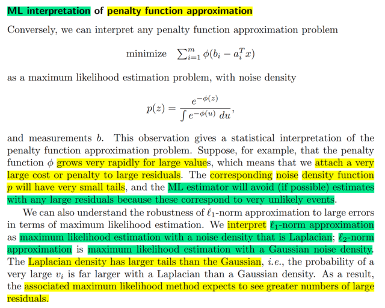</kbd>

> [!NOTE]
> Trong sách nói ý này cũng là gs cái đã nói trong bài. Rằng ta có thể
> giải thích (interpret) ý nghĩa của penalty functon theo bài toán
> maximum likelihood estimation.
>
> Mình nhớ lại, trong bài toán penalty function approximation ta minimize
> Σ Φ(bi - aiTx) (mà trước đó ta có tạm gọi là các phiên bản cụ thể là
> minimize ||Ax - b||^2 hoặc minimize ||Ax - b|| (l1 norm) có thể coi như là
> dùng Φ(r) = r^2 và Φ(r) = ||r||. Để rồi mỗi cái nó sẽ có cách hành xử
> khác nhau với residual.
>
> Thế thì như đã nói trong bài, khi dùng Φ(r) = r^2 thì chính là ta đang
> làm maximum likelihood với Gaussian noise. Cái này distribution này
> có tính chất là có cái đuôi ốm - tức là xác suất mà noise mang giá trị
> lớn là rất thấp. Cho nên ta không muốn / không cho phép kết qủa có
> error / residual lớn và vì vậy ta sẽ penalize mạnh với với các error này.
> Ngược lại, với noise có giá trị nhỏ thì ~= 0 thì xác suất xảy ra nhiều và
> xem xem nhau (thể hiện qua cái đầu tròn của Gaussian mà khi zoom
> lên trong vùng quanh mean trông giống uniform) nên ta chấp nhận là
> ml_estimator sẽ khiến cho phép có nhiều error nhỏ và ta làm vậy bằng
> cách penalize rất nhẹ với error nhỏ này.
>
> Còn khi dùng Φ(r) = |r| thì chính là ta đang làm mle với Laplacian noise
> Cái Laplacian distribution có đỉnh nhọn và hai cái đuôi mập hơn nhiều
> so với Gaussian. Do đó, với Laplacian noise, ta cho rằng / assume
> noise có giá trị lớn có thể xảy ra, nên ml estimator sẽ cho phép xuất
> hiện noise lớn, và nó làm vậy bằng cách penalize không qúa mạnh với
> noise lớn (l1 norm penalty chỉ tăng tuyến tính với độ lớn của residual
> thay vì quadratic như l2 norm penalty)
>
> Ngược lại, khi noise nhỏ, Laplacian distribution với cái đỉnh nhọn nói
> rằng ở phạm vi nhỏ thì xác suất của noise càng nhỏ sẽ tăng tuyến tính
> chứ không xem xem như nhau như bên Gaussian. Dẫn đến ml
> estimator kiểu như sẽ vẫn quan tâm khi error nhỏ chứ không "bỏ qua
> khi error nhỏ " (ý là với l2 norm penalty, error mà nhỏ tới mức nào đó
> rồi thì nó coi như nhau hết, còn l1 norm thì error có nhỏ mấy thì penalty
> vẫn khác nhau)
>
> Vậy thì với dạng khái  quát minimize Σi Φ(bi - aiTx) thì chính là ta đang
> coi noise tuân theo pdf là e^-Φ(z) / ∫e^-Φ(u)du. Để rồi ta quan sát thấy
> rằng khi z lớn mà Φ(z) tăng nhanh (tương ứng với việc ta tin rằng noise 
> lớn rất khó xảy ra, thì tương ứng chính là noise distribution rất nhỏ khi z
> lớn: Φ(z) lớn thì e^-Φ(z) sẽ nhỏ. Và ngược lại,

 

<kbd>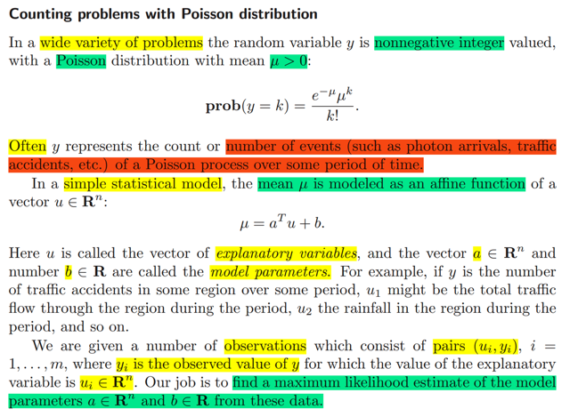</kbd>

<kbd>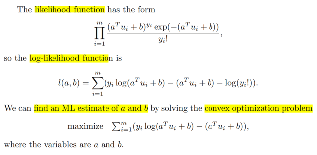</kbd>

> [!NOTE]
> Rồi, đại khái là đây chính là bài toán Poisson regression mà ta đã học trong ISL. Gs
> cho biết rất nhiều vấn đề mà ta cần một random variable có tính chất KHÔNG ÂM
> và là số NGUYÊN tuân theo Poisson distribution.
>
> Về poisson distribution, ta đã biết pmf của nó từ stat110 (Poisson là discrete
> distribution): X ~ Pois(λ): P(X = k) = e^-λ λ^k / k!
>
> Thế thì ở đây gọi y là random variable ~ Pois(μ) => P(y = k) = e^-μ μ^k / k!
>
> Và dĩ nhiên parameter của distribution này là mean μ và gs cho biết trong  một mô
> hình statistical đơn giản thì ta sẽ mô hình nó bằng một hàm tuyến tính μ = aTu + b
> trong đo a, b là parameters (là thứ ta cần tìm) và u là EXPLANATORY VARIABLES
> vector (mà trong machine learning ta gọi là features)
>
> Ví dụ như ta muốn dự đoán y là số vụ tai nạn, với giả định y ~ Pois(μ) và μ = aTu +
> b là hàm tuyến tính của u là feature vector chứa thông tin ví dụ như u1 là tổng số
> traffic trong một khoảng thời gian, u2 là lượng mưa
>
> Thế thì ta sẽ có data / observation: là các cặp (ui, yi): ui là vector features, yi là
> observed traffic accident. Và nhiệm vụ là ta cần estimate μ, cũng chính là estimate
> a, b. Và với các tiếp cận maximum likelihood estimation, ta sẽ estimate a, b sao cho
> tối đa hóa likelihood function.
>
> Thế thì, ôn lại một chút về likelihood function. Bắt đầu từ (probability) density
> function của y (mà ở đây là pmf vì y discrete), thì nó là function mà với giá trị của μ,
> giúp ta tính ra probability của một điểm k: P(y = k) = f_y(k) = e^-μ μ^k / k!
>
> Thế thì khi ta coi function này như function của μ, với y fixed đã biết, ta sẽ có
> likelihood. l(μ) = P_μ(y = k)
>
> = e^-μ μ^k / k! = e^- (aTu + b) (aTu + b)^k / k!
>
> Thế thì với các observed value ui, yi, ta nên hiểu là ta có n RANDOM VARIABLES
> Yi ~ Pois(μi) 
>
> (RANDOM SAMPLE CŨNG LÀ RANDOM VARIABLE, stat111 học rồi)
>
> Và ta có JOINT PMF: P(Y1 = y1, Y2 = y2,...,Yn = yn)
>
> Vì các rvs INDEPENDENT (sách ko nói nhưng thường là như vậy i.i.d), 
> từ Stat110 ta đã học một theorem nói rằng 
>
> "JOINT PMF = TÍCH CÁC MARGINAL PMF"
>
> P(Y1 = y1, Y2 = y2,...,Yn = yn) = Π P(Yi = yi) 
>
> = Π e^-μi μi^yi / yi! = Π e^-(aTu + b) (aTu + b)^yi / yi!
>
>
> => Likelihood function là khi ta đổi lại thay vì coi yi là biến thì chuyển sang 
> coi parameter (μ hoặc a, b) là biến:
>
> P_a, b(Y1 = y1, Y2 = y2,...,Yn = yn) = Π e^-(aTu + b) (aTu + b)^yi / yi!
>
>
>
> Log likelihood function: 
>
> l(a, b) = log [Π e^-(aTu + b) (aTu + b)^yi / yi! ]  
>
> = Σi [ log (e^-(aTui + b)) + log [(aTui + b)^yi - log(yi!) ]
>
> = Σ [ -(aTui + b) + yi log [(aTui + b) - log(yi!) ]
>
> Và bài toán tìm maximum likelihood estimator a, b trở thành bài toán optimization:
>
> maximize a, b Σ [ -(aTui + b) + yi log [(aTui + b)]   | - log(yi!) ko phụ thuôc a, b

 

<kbd>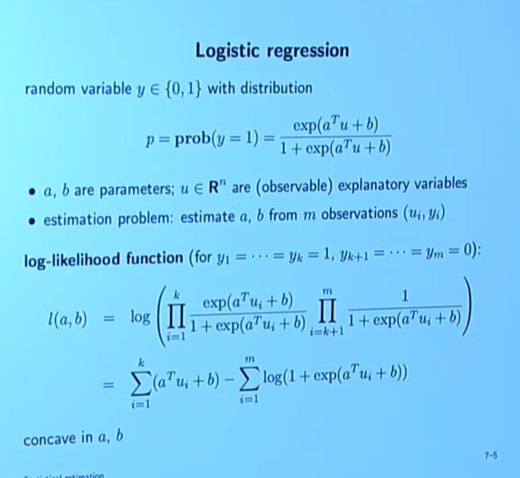</kbd>

> [!NOTE]
> Gs nói sơ sơ về Logistic Regression (thật ra là chả nói gì, xem
> slide / sách  tự hiểu)
>
> "1 là e^0, nên ta có log sum exp là concave function"

 

<kbd>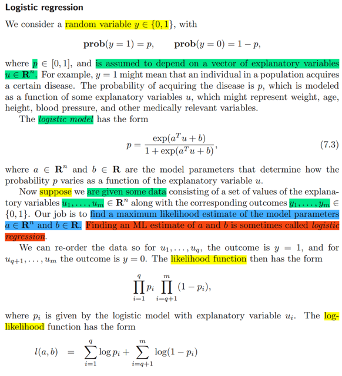</kbd>

<kbd>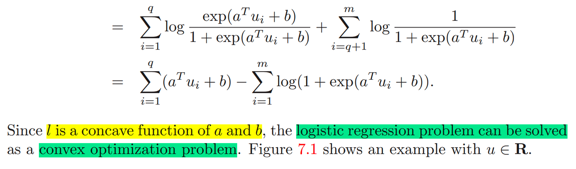</kbd>

> [!NOTE]
> Rồi, qua bài toán khác, khi thay vì ta muốn mô hình hóa một biến số y có tính chất là số nguyên
> không âm như bài toán kế trước (ví dụ muốn mô hình hóa số vụ tai nạn xảy ra) thì nay biến y mà
> ta muốn mô hình lại chỉ có hai possible value là 1 hoặc 0, với xác suất P(Y = 1) = p, và P(Y = 0) =
> 1 - p. Do đó trong bài toán này, Y (hay y, viết thường nhưng ta hiểu là random variable) thay vì
> cho rằng nó ~ Pois(μ) thì nay ta cho rằng nó ~ Bern(p).
>
> Thế thì như bài toán trước, ta tìm cách mô hình hóa mean của distribution của y, tức μ bằng một
> mô hình tuyến tính bởi tham số a, b và feature (explanatory variable u): μ = aTu + b. Thì ở bài
> toán này, người ta mô hình hóa p thông qua:
>
> p = exp(aTu + b) / [1 + exp(aTu + b)] trong đó hàm f(z) = exp(z) / [1 + exp(z)] có tên là logistic
> function.
>
> Cho nên việc mô hình p với công thức trên được gọi là LOGISTIC MODEL.
>
> Thế thì, again, ta cũng có dataset: các cặp ui - yi, với ui là explanatory variable / feature vector và
> yi là observed value.
>
> NHIỆM VỤ CỦA MÌNH SẼ LÀ ESTIMATE THAM SỐ a, b THEO CÁCH TIẾP CẬN LÀ TỐI ĐA
> HÓA LIKELIHOOD. Khi đó a, b có được gọi là maximum likelihood estimator.
>
> (nói thêm một chút, khi làm như vậy vốn dĩ ta đã đặt ra một vài giả định. Cái này phải ôn lại ISL
> mới được)
>
> Thử xem tại sao likelihood ra như vậy:
>
> Again, ta bắt đầu với pdf/pmf, ở đây là discrete distribution (Bern(p)) nên chỉ có pmf: P(Y = k) = p
> = exp(aTu + b) / [1 + exp(aTu + b)]
>
> Với random samples Yi independent Joint pmf:
>
> P(∩ Yi = yi) = Π P(Yi = yi)
>
> Thế thì giả sử trong n iid samples, có q observed value yi = 1 và  n - q observed value yj = 0.
>
> ..= Πi=1:q P(Yi = 1) Πi=q+1:n P(Yi = 0)
>
> = Πi=1:q pi Πj=q+1:n (1-pj)
>
> = Πi=1:q exp(aTui + b) / [1 + exp(aTui + b)] * Πi=q+1:n 1 / [1 + exp(aTui + b)]
>
> Dĩ nhiên coi a, b là biến thì công thức trên trở thành likelihood function
>
> Log likelihood:
>
> l(a,b) = log [ Πi=1:q exp(aTui + b) / [1 + exp(aTui + b)] * Πi=q+1:n 1 / [1 + exp(aTui + b)] ]
>
> = log [ Πi=1:q exp(aTui + b) / [1 + exp(aTui + b)] + log [ Πi=q+1:n 1 / [1 + exp(aTui + b)] ]
>
> = Σi=1:q log [exp(aTui + b) / [1 + exp(aTui + b)] + Σi=q+1:n log [1 / [1 + exp(aTui + b)]]
>
> = Σi=1:q log [exp(aTui + b)] - log [1 + exp(aTui + b)] + + Σi=q+1:n log [1] - log [1 + exp(aTui + b)]]
>
> = Σi=1:q [ (aTui + b) - log [1 + exp(aTui + b)]] + Σi=q+1:n [- log [1 + exp(aTui + b)]]
>
> = Σi=1:q [ (aTui + b) - log [1 + exp(aTui + b)]] + Σi=q+1:n [- log [1 + exp(aTui + b)]]
>
> = Σi=1:q (aTui + b) +  Σi=1:q [- log [1 + exp(aTui + b)]] + Σi=q+1:n [- log [1 + exp(aTui + b)]]
>
> = Σi=1:q (aTui + b) + Σi=1:n [- log [1 + exp(aTui + b)]] 
>
> tới đây là giống trong sách rồi
>
> Và hàm này là concave theo a, b (vì sao?) nên bài toán mle này trở thành convex optimization
> problem
>
> =====
>
> Nếu P(∩ Yi = yi) = Π P(Yi = yi) ta cứ để yi thì P(Yi = yi) có thể thể hiện = yi*pi + (1 - yi)*(1 - pi)
>
> thì log likelihood = log Πi [yi*π + (1 - yi)*(1 - pi)]
>
> = Σ log [yi*π + (1 - yi)*(1 - pi)]
>
> Nếu thay pi bằng θi: = Σ log [yiθi + (1 - yi)(1 - θi)] thì ta sẽ thấy công thức này quen

 

<kbd>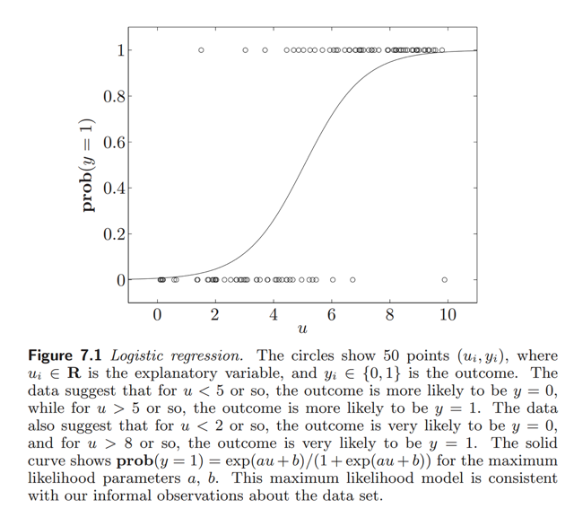</kbd>

 

<kbd>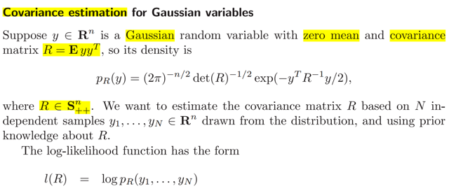</kbd>

<kbd>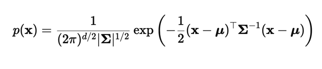</kbd>

<kbd>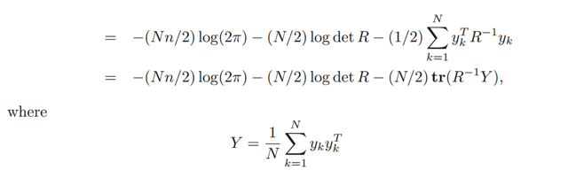</kbd>

<kbd>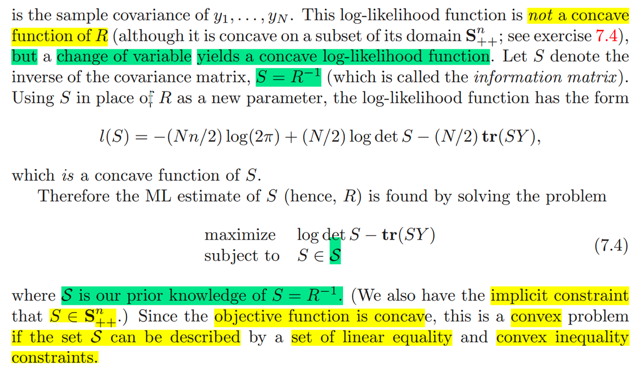</kbd>

> [!NOTE]
> Theo định nghĩa, covariance matrix của random variable vector x
> là matrix mà phần tử ij là covariance của x_i và x_j 
>
> Nếu gọi x = [X1, X2...Xn] thì phần tử ij là Cov(Xi, Xj), và theo công
> thức covariance của hai random variable đã học ở Stat110 Cov(Xi, Xj) 
> = E[(Xi - EXi)(Xj - EXj)]
>
> Thế thì nếu x là zero mean, tức E(x) = [EX1, EX2,...] = 0 => EX1 = EX2 = ...= 0
> Khi đó phần tử ij của sẽ là E[(Xi - 0)(Xj - 0)] = E(XiXj)
>
> Do đó covariance matrix của vector X sẽ là E[xxT] là matrix mà phần từ
> ij là E(XiXj)
>
> Vậy nên ở đây, ta có y là R^n random variable vector zero mean, thì
> covariance matrix R = E(yyT) là có thể hiểu được.
>
> Rồi, lí do gì mà R ∈ S^n ++, hay positive definite? 
>
> Thử xét quadratic form: xTRx = xTE(yyT)x 
>
> = xTE(yyTx) | linearity stat110 đã học cho phép E(aX) = aEX
>
> = E(xTyyTx) | cũng linearity
>
> = E[(xTy)^2] | vì xTy là scalar = yTx
>
> Vậy (xTy)^2 >= 0 => E[(xTy)^2] >= 0 Cái này nếu ai hỏi có thể trả lời như sau:
>
> Giả sử có rv X, và Y = X^2. Thì EX theo định nghĩa là weighted Σ các possible
> values của X: EX = Σx x*P(X=x). LOTUS cho phép tính EY không cần phải
> tìm pmf/pdf của Y: EY = Eg(X) = Σx g(x)*P(X=x) = Σx x^2P(X=x). Thế thì đây là
> tổng mà mỗi hạng tử x^2*P(X=x) là tích của hai giá trị không âm: x^2 không âm
> và P(X=x) không âm theo Axiom 1. Nên đương nhiên EY không âm.
>
> Thế thì mới chỉ kết luận xTRx >= 0 => R ≽ 0 (hay ∈ S^n+). Thì một điểm nữa
> giúp kết luận R ≻ 0 là R invertible (đây là yêu cầu xác định của pdf). Do đó 
> det R khác 0, hoặc tích các eigenvalue khác 0, vậy từ đó suy ra mọi eigenvalue
> đều dương (vì R ≽ 0 đã giúp kết luận eigenvalues ko âm)
>
> ====
>
> Rồi, log likelihood?
>
> (MÌNH SẼ DÙNG Y CHỮ HOA ĐỂ THỂ HIỆN R.V cho khỏi nhầm với component
> của vector, vì các rvs Y1, Y2...YN (tức là N random sample) ĐỀU LÀ VECTOR
>
> Again, cứ theo định nghĩa, ta cần tìm joint probability density của N rvs Y1, Y2,...Yn
> Rồi coi nó như function của paramters (trong trường hợp này chính là R, vì với
> multivariate Gaussian pdf , parameter là mean μ và covariance matrix Σ, nhưng μ = 0
> rồi)
>
> Rồi, again, vì các random variable Y1, Y2, ...YN independent nên joint pdf
>
> f_Y1, Y2, ...YN(y) hay ghi p(y) cũng được = tích marginal pdf: f_Y1(y)*f_Y2(y)*...f_Yn(y)
>
> Các Y1, Y2, ...YN đều có chung distribution Gaussian (0, R) 
>
> => pdf f_Yi(y) = (2π)^-n/2 det(R)^-0.5 exp(-yTRinvy/2)
>
> Vậy join pdf: 
>
> f_Y1, Y2, ...YN(y) = p(y) = Πi=1:N f_Yi(y) 
>
> = Πi=1:n [ (2π)^-n/2 det(R)^-0.5 exp(-yTRinvy/2) ]
>
> Và coi nó như function theo R và y là fixed value (các observed value Y1 = y1 Y2 = y2...)
>  thì ta có likelihood:
>
> p_R(y) = Πi=1:N [ (2π)^-n/2 det(R)^-0.5 exp(-yiTRinvyi/2) ]    |   y trở thành yi
>
> => log likelihood:
>
> l(R) = log Πi=1:N [ (2π)^-n/2 det(R)^-0.5 exp(-yiTRinvyi/2) ]
>
> = Σi=1:N log [ (2π)^-n/2 det(R)^-0.5 exp(-yiTRinvyi/2) ]
>
> = Σi=1:N [ log [ (2π)^-n/2 ] + log det(R)^-0.5 + log[ exp(-yiTRinvyi/2) ]
>
> = Σi=1:N [ (-n/2) log (2π) + -0.5 log det(R) - yiTRinvyi/2 ]
>
> = Σi=1:N [ (-n/2) log (2π) ] + Σi=1:N [-0.5 log det(R) ] + Σi=1:N [- yiTRinvyi/2 ]
>
> = - (Nn/2) log (2π) - 0.5N log det(R) - (1/2) Σi=1:N [ yiTRinvyi ]
>
> = - (Nn/2) log (2π) - 0.5N log det(R) - (N/2) tr(RinvY)
>
> Với Y = (1/N) Σi=1:N yyT. CHỖ NÀY TA SẼ GIẢI THÍCH RÕ HƠN SAU
>
> Thế thì tiếp theo đại khái là gs nói log likelihood function này ko concave
> đối  với R (nên nếu ta giải bài toán optimization là maximize l(R) thì đây
> không phải là convex, ta cần nó concave thì maximize l(R) tương đương
> minimize
> - l(R) mới là convex objective)
>
> Nhưng điều hay ho là khi ta đặt S = Rinv, và CHUYỂN BÀI TOÁN THÀNH
> maximize over S, thì l(S) lại là concave function.
>
> Như vậy từ bài toán maximize l(R), ta giải equivalent problem:
>
> maximize l(S) constraint S ∈ S, với S nào đó thể hiện prior knowledge
> nào đó của S, xuất phát từ prior knowledge nào đó của ta đối với R
>
> Thành ra tuy objective l(S) đã concave (- l(S) convex) nhưng để problem
> trở thành convex optimization problem thì vẫn cần thỏa yêu cầu là, set S
> được thể hiện thành inequality constraint thì nó phải convex, và equality
> constraint phải affine, Nên tập S trong constraint S ∈ S ta chưa biết
> phải thể hiện ở dạng cụ thể ra sao, nhưng nếu có phải thỏa ý trên

 

<kbd>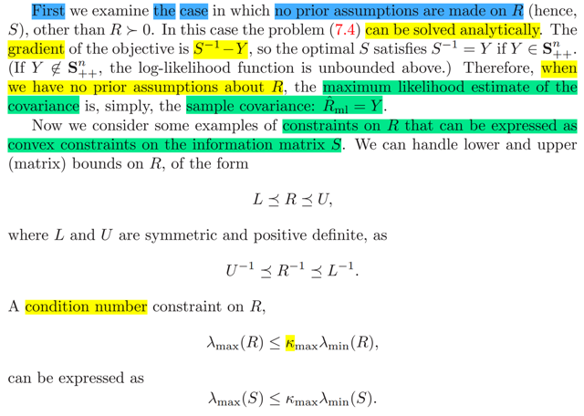</kbd>

<kbd>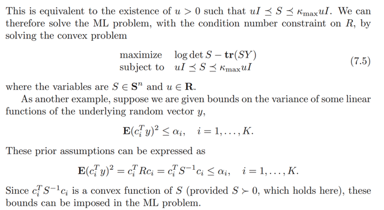</kbd>

> [!NOTE]
> đại khái là đầu tiên gs xét trường hợp mà ta ko có prior knowledge
> nào về R cả (ngoại trừ việc như đã nói R phải positive definite).
>
> Thì khi đó, có nghiã là ta ko có constraint nào với S (vì S = Rinv, thì
> nếu R có constraint gì đó để thể hiện prior knowledge đối với R thì khi
> đó mới hình thành nên constraint của S). Như vậy là bài toán này
> đơn giản chỉ việc tìm gradient của objective, và tìm điểm khiến
> gradient vanish thôi (objective như đã nói, là convex rồi)
>
> Kết quả cho thấy R chính là Y, mà Y = 1/N Σ yyT gs nói nó là
> SAMPLE COVARIANCE. Thì kết quả này cho thấy nếu ko có prior
> knowledge gì về R (R là Σ - Covariance matrix) thì ESTIMATOR TỐT
> NHẤT CHO  (POPULATION) COVARIANCE MATRIX CHÍNH LÀ
> SAMPLE COVARIANCE
>
>
> Khúc sau là một ví dụ mà kiểu như ta có PRIOR KNOWLEGE đối với
> R, từ đó hình thành nên constraint của S. Cái này có liên quan đến
> CONDITION NUMBER, chưa học, nên Quay lại sau

 

<kbd>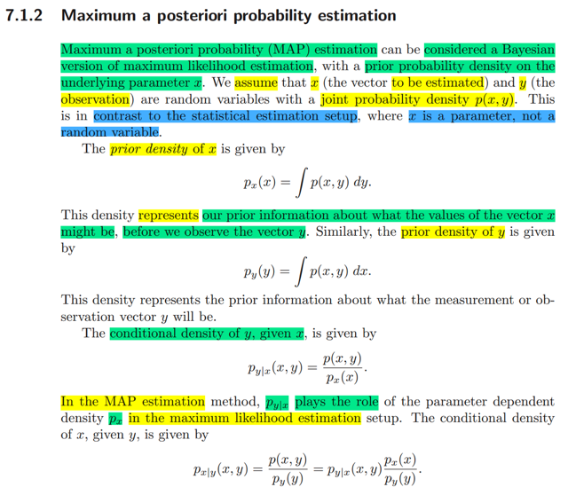</kbd>

<kbd>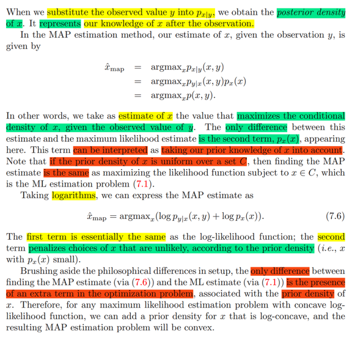</kbd>

> [!NOTE]
> Đầu tiên gs nói rằng MAP (maximum posteriori probability
> estimation) có thể được xem như một phiên bản của MLE mà làm
> theo phong cách, trường phái Bayesian
>
> Đầu tiên, đối chiếu với MLE, trong đó ta có observation y, và muốn
> estimate parameter x (ví dụ như muốn xây dựng mô hình  của y là
> một Poisson rv Pois(μ) với μ = aTu + b, dùng "dataset" (ui, yi), ta
> muốn estimate a, b sao cho maximize likelihood của observed data.
> Thì a, b ở đây đóng vai trò của x).
>
> Thế thì với MAP, nôm na là ta co a, b là random variable luôn tức x
> cũng là random variable luôn. Đây chính là cách tiếp cận của
> trường phái Bayesian: tích hợp tính không chắc chắn về x vào luôn
> thông qua việc coi nó là random variable luôn, từ đó ta có một
> probability distribution của nó: p_x.
>
> Thế thì, lập luận bắt đầu với việc xét joint density của x, y:
>
> p_x,y(x, y) (ko có gì, đây là joint pdf của x, y)
>
> Thì nhờ stat110 mình ko có gì khó hiểu khi gs viết
>
> p_x = ∫p(x,y)dy
>
> Đơn giản đây là hành động marginalize  joint pdf over mọi possible
> value của y để có marginal pdf của x
>
> (sẵn ôn lại luôn cái này: Bằng cách liên hệ nó với LOTP: Xét
> discrete case. pmf của X: fX(x) hay P(X=x) cũng được và pmf của
> Y: fY(y) hay P(Y=y). Ta có joint pmf của X, Y: fX,Y(x,y) = P(X=x,
> Y=y)
>
> Thế thì ta sẽ xây dựng pmf của X từ joint pmf:
>
> Xét event (X=x) thì:
>
> P(X=x) = P_X(X=x) = P({s ∈ S: X(s) = x})
>
> = P({s ∈ S: X(s) = x} ∩ S)  | vì {s ∈ S: X(s) = x} ⊆ S, nếu A ⊆ S => A =
> A ∩ S
>
> = P({s ∈ S: X(s) = x} ∩ [U mọi p.v yi của Y {s ∈ S: Y(s) = yi}] )
>
> = P(X=x ∩ (Ui Y=yi))
>
> = P[Ui (X=x ∩ Y=yi)]  | distributive
>
> = Σi P(X=x ∩ Y=yi)  | Axiom 3
>
> = Σyi P(X=x, Y=yi)
>
> mà phiên bản 'continuous': f_X(x) = ∫f_X,Y(x, y) dy )
>
> Tiếp, vậy p_x = ∫p(x, y)dy
>
> Và tương tự, p_y = ∫p(x, y)dx.
>
> Thế thì một điểm tiếp theo đó là p_y|x(x, y) = p_x,y(x, y) / p_x(x)
>
> Cái này là sao, thì trong stat110 ta đã được biết về định nghĩa của conditional
> probability: P(A|B) = P(A,B) / P(B). Cũng như là Bayes rule:
>
> P(A,B) = P(B,A) = P(A|B)P(B) = P(B|A)P(A)
>
> Thì từ đó ta sẽ có conditional pmf/pdf cũng như Bayes rule:
>
> P(Y=y | X=x) = P(Y=y, X=x) / P(X=x)
>
> f_Y|X(y, x) = f_Y,X(x, y) / f_X(x)
>
> Bayes rule: P(Y=y|X=x)P(X=x) = P(X=x|Y=y)P(Y=y)
>
> f_Y|X(y, x)f_X(x) = f_X|Y(x, y)f_Y(y)
>
> Vậy thì ta có áp dụng Bayes rule, ta có:
>
> p_y|x(x, y) p_x(x) = p_x|y(x, y) p_y(y)
>
> => p_x|y(x, y) = p_y|x(x, y) p_x(x) / p_y(y)
>
> Từ đây p_x|y(x, y) chính là POSTERIOR probability density của x, là thứ mà từ
> PRIOR density p_x(x), sau khi sử dụng observed data (y) ta có thể cập nhật lại
> density của x với thông tin quan sát được
>
> Như vậy, với MLE, ta maximize likelihood của observed value y: p_x(y) Còn
> với MAP, ta maximize conditional density p_x|y(x, y)
>
> Do đó khác biệt của MAP so với MLE chính là với MAP, trong công thức (mà ta sẽ
> maximize) p_x|y(x,y) = p_y|x(x, y) * p_x(x) / p_y(y) có thêm một term / một yếu tố
> là prior density của x: p_x(x).
>
> Điểm khác biệt này mang ý nghĩa: Vì với Bayesian approach, ta thể hiện tính
> không chắc chắc của x (parameters, thứ mà ta cần "tìm" / estimate) bằng cách:
>
> COI NÓ NHƯ RANDOM VARIABLES, từ đó có PROBABILITY DISTRIBUTION
> CHO NÓ.
>
> Cách tiếp cận này giúp ta có thể ĐƯA VÀO MỘT "KIẾN THỨC TIÊN NGHIỆM"
> (PRIOR KNOWLEDGE) - NÔM NA LÀ MỘT HIỂU BIẾT NHẤT ĐỊNH NÀO ĐÓ
> CỦA TA VỀ NÓ. THÔNG QUA CÁCH THỨC ĐÓ LÀ CHỌN PRIOR
> DISTRIBUTION p_x(x).
>
> Và với observed data (y) ta sẽ tìm x để MAXIMIZE POSTERIOR  DENSITY
> (p_x|y).
>
> Còn với MLE, ta sẽ CHỈ COI X LÀ PARAMETERS CẦN TÌM mà ta chưa
> biết để  rồi cần tìm x SAO CHO MAXIMIZE LIKELIHOOD OBSERVED DATA
> p_x(y)  (ghi p_x(y) ở đây khác với / không phải là density của x, mà là hàm
> likelihood (xuất xứ từ density của y nhưng coi biến là x thay vì y).
>
> Và với MLE ta có thể ĐƯA PRIOR KNOWLEDGE THÔNG QUA CONSTRAINT
> CỦA BÀI TOÁN  OPTIMIZATION: x ∈ C
>
> ====
>
> Và ta cũng sẽ lấy log (chú ý ko gọi là log likelihood nữa, vì đây không phải là likelihood
> function):
>
> log [p_y|x(x, y) p_x(x) / p_y(y)] = log p_y|x(x, y) + log p_x(x)  - log p_y(y)
>
> Và bài toán trở thành maximize x log p_y|x(x, y) + log p_x(x) |  bỏ đi term log p_y(y)
>
> So sánh với bài toán MLE: maximize log p_x(y) constraint c ∈ C.
>
> thì ta thấy khác biệt chỉ là MAP có thêm term log_p_x(x) như đã nói mang prior 
> knowledge của x. 
>
> Do đó, họ nói rằng, cứ mỗi khi ta có MLE, bằng cách thêm một extra term mang
> prior knowledge vào thì ta sẽ có bài toán MAP.

 

<kbd>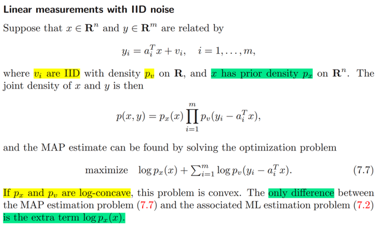</kbd>

<kbd>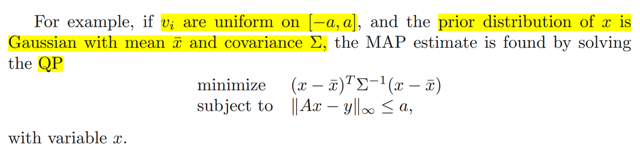</kbd>

<kbd></kbd>

<kbd>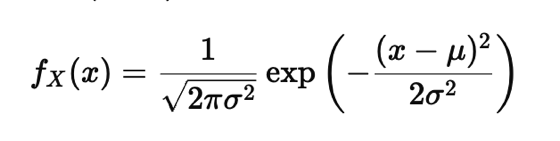</kbd>

> [!NOTE]
> Gặp lại bài toán này, nhưng ta làm theo MAP.
>
> Ôn lại nếu làm theo MLE thì ntn?
>
> Đầu tiên giả sử có R^n vector x, và R^m vector y liên hệ với nhau  một cách
> tuyến tính:
>
> y = Ax + v với v là noise: yi = aiTx + vi
>
> Yêu cầu đặt ra là estimate x dựa trên A đã biết và observed value y.
>
> Thể hiện theo machine learning giống như ta có dataset x(i),y(i) với x(i) là
> feature vector, y(i) là target. Và ta mô hình y bằng mô  hình tuyến tính:
>
> y(i) = x(i)Tw + vi => y = Xw + v với X, y đã biết, w là parameter cần estimate.
>
> (Và thường thì ta có thể có thêm bias term b: Để yi = xiTw + b + vi)
>
> thì khi đó ta mới đặt ra penalize function Φ(r) = r^2. Để rồi giải bài toán
> minimize Φ(Xw - y) = ||Xw - y||^2 để tìm W.
>
> Thì ý nghĩa của nó như đã biết chính là ta đang assume noise vi là Gaussian
> noise: vi ~ N(0, σ^2) và vì assume như vậy nên ta  ko tin dễ dàng xuất hiện
> error / residual / noise mang giá trị lớn và nhiều / dễ xuất hiện error mang giá
> trị nhỏ. Điều này phản ánh qua việc ta dùng Φ(r) = r^2, để nếu error lớn, loss
> sẽ rất lớn Khiến quá trình optimizing, sẽ (tìm ra w) không cho phép / ít cho
> phép  tạo ra error mang lớn. Ngược lại, khi error nhỏ, thì loss sẽ không đáng
> kể, khiến kết quả estimated x sẽ cho phép xuất hiện error nhỏ.
>
> Nên ở đây trong sách nói ta estimate x, thì x ở đây là đóng vai trò của w, là
> parameter cần tìm. Còn A là matrix mà mỗi hàng là ai đóng vai trò của X.
>
> Thì mình đã học như cái mô tuýp quen thuộc rằng ta sẽ gắn giá trị của xi, yi
> vào, để tính error (y^i - yi)^2 = (xiTw - yi)^2,  và total loss: Σ (xiTw - yi)^2 Rồi
> ta sẽ tính gradient, và dùng thuật toán gradient descent để adjust w để giảm
> loss.
>
> Thế thì ở đây mình hiểu sâu hơn tại sao lại dùng Φ(r) = r^2 hay |r| đã nói ở
> trên. Thì đến thời điểm này còn hiểu thêm một điểm nữa đó là cái mà ta
> đang làm chính là ĐANG THỰC HIỆN MAXIMUM LIKELIHOOD
> ESTIMATION.
>
> TẠI SAO FITTING LINEAR REGRESSION VỜI MSE LOSS CHÍNH LÀ
> MAXIMUM LIKELIHOOD ESTIMATION
>
> Vì sao, cái mà ta đang minimize mean squared error (MSE): thật  ra chính là
> likelihood function:
>
> Như đã nói, ta đang dùng mô hình tuyến tính: yi = wTxi + vi, tức là đại khái là
> ta đang cho rằng quan hệ giữa feature vector xi với target yi là quan hệ
> tuyến tính bởi parameter w.
>
> Và vì cho rằng / assume noise vi là Gaussian noise với zero mean (variance
> chưa biết σ^2) nên ta mới chọn Φ(r) = r^2 để penalize nặng khi residual /
> noise lớn và không đáng kể khi residual / noise nhỏ.
>
> Vậy với giả định đó đồng nghĩa ta đang assume vi ~ N(0, σ^2). Hay với thêm
> việc giả định các noise vi là iid, thì v ~ multi-variate Gaussian với (vector) μ =
> 0 (zero vector) và covariance matrix Σ có dạng DIAGONAL (thể hiện các
> vi, vj independent nhau, nên cov(vi, vj) = 0 với i khác j.
>
> Và density (probability density - pdf) của vi (f_vi(v)) là pdf của single variate
> Gaussian, hoặc density của v là pdf của multivariate Gaussian thì biết rồi
> f_v(v)
>
> Thế thì theo quy trình của việc giải bài toán maximum likelihood estimation
> ta sẽ thiết lập likelihood function:
>
> Bắt đầu từ density function (pdf của yi). Tất nhiên ta chưa biết distribution
> của yi. Nhưng ta có yi = wTxi + vi = g(vi). Nên theo transformation thoerem
> giúp ta tìm pdf của yi dựa trên pdf của vi.
>
> Với single variate case ta có f_yi(y) = f_vi(v) d/dyi (vi) = f_vi(v) * 1 = f_vi(v)
>
> f_yi(y) = f_vi(v) nhưng phải thể hiện theo y:
>
> = f_vi(yi - xiTw) 
>
> = [ (2π)^-1/2 σ^-1 exp( -(yi - xiTw)^2 / 2σ^2]
>
> Đièu này cho thấy yi ~ GAUSSIAN N(xiTw, σ^2)
>
> (đây là lí do mà trước đây ta thấy trong sách Deep Learning Yoshua Bengio
> hay Pattern Recognition, nói rằng trong bài toán Linear Regression ta đang
> assume y ~ Gaussian zero mean là như vậy)
>
> Joint density f_y1,...ym(y1,y2,...ym) = tích các pdf vì yi cũng independent
> do các vi independent
>
> = Π [ (2π)^-1/2 σ^-1 exp( -(yi - xiTw)^2 / 2σ^2]
>
> Rồi, vậy đây là (joint) density của y1, y2...ym. Giờ ta coi variable là w thì ta
> có likelihood, và lấy log để có log likelihood l(w):
>
> l(w) = log Π [ (2π)^-1/2 σ^-1 exp( -(yi - xiTw)^2 / 2σ^2]
>
> = Σ log [ (2π)^-1/2 σ^-1 exp( -(yi - xiTw)^2 / 2σ^2]
>
> = Σ log [ (2π)^-1/2 σ^-1] + log [ exp( -(yi - xiTw)^2 / 2σ^2]
>
> = Σ log [ (2π)^-1/2 + log [σ^-1] + log [ exp( -(yi - xiTw)^2 / 2σ^2]
>
> = Σ -1/2 log (2π) - log (σ) - (yi - xiTw)^2 / 2σ^2
>
> = Σ -1/2 log (2π) - Σ log (σ) - 1 / 2σ^2 Σ (yi - xiTw)^2 
>
> = - m/2 log (2π) - mlog (σ) - 1/2σ^2 Σ (yi - xiTw)^2 
>
> Và bài toán maximize likelihood sẽ là:
>
> maximize - Σ (yi - xiTw)^2 
>
> Tương đương với minimize Σ (yi - xiTw)^2 
>
> Mà Σ (yi - xiTw)^2  chính là gì? Chính là MSE mean squared error.
>
> Như vậy có thể thấy fitting linear regression với mse loss function
> chính là maximum likelihood estimation
>
> Vậy vừa rồi là có một số mục đích như sau:
>
> 1) Bài toán Linear measurement ở đây thật ra rất gần / chính là linear  regression
>
> yi = aiTx + vi: estimate x     tương đương     yi = xiTw + vi: estimate w
>
> 2) Giải bài toán này dùng cách tiếp cận maximize likelihood, và cho thấy nó chính là fitting linear
> regression với mse loss
>
> Bây giờ, mình sẽ nói tiếp, rằng ờ đây ta tiếp cận nó theo MAP: Maximize A Posterior probability.
>
> Và ta sẽ vẫn dùng notation yi = xiTw + vi, cho đồng nhất với phần note vừa rồi (tức là dùng w thay
> cho x trong sách và xi thay cho ai)
>
> Rồi, lập luận sẽ là với MAP, ta ko coi w là FIXED & UNKNOW PARAMETERS mà ta sẽ coi nó NHƯ
> RANDOM VARIABLE (như yi, và vi luôn. Nói thêm sở dĩ hồi nãy yi là random variable vì nó là
> function của random variable vi)
>
> Thế thì ta sẽ dựa vào Bayes theorem để hình thành công thức của posterior density của w:
>
> p_w|y(y, w) = p_y|w(y, w) p_w(w) / p_y(y)
>
> p_w(w) (trong sách là p_x(x)) là prior density của w. Đã cho.
>
> p_y(y) thì khỏi cần quan tâm vì nó không dính đến w. Nên khi maximizing theo  w thì không care cái
> này.
>
> p_y|w(y, w) thì ta dựa vào yi = xiTw + vi với vi ~ p_vi(v)
>
> Vậy thì tuy yi là function phụ thuộc random variable w và vi nhưng khi biết w, (conditioned on w) thì
> chỉ còn phụ thuộc vi. Và dùng transformation thoerem ta đã biết p_yi|w(y) = p_vi(v)
>
> Thể hiện theo y, = p_vi(yi - xiTw) = p_v(yi - xiTw) (mọi vi đều có chung density p_v)
>
> Vậy p_yi|w(y) = p_v(yi - xiTw)
>
> Nên joint conditional density p_y1,y2,....ym|w(y1, y2,...ym) = Πi=1:m p_v(yi - xiTw) (các rvs yi cũng
> independent khi x fixed và vi là iid => joint pdf  = tích marginal pdf)
>
> Và ráp vào ta có :
>
> p_w|y(y, w) = p_w(w) Πi=1:m p_v(yi - xiTw) / p_y(y)
>
> Và bài toán sẽ là maximize w p_w|y(y, w)
>
> = maximize w p_w(w) Πi=1:m p_v(yi - xiTw)   | p_y(y) không dính đến w nên ko care
>
> Và ta cũng lấy log:
>
> maximize w log [ p_w(w) Πi=1:m p_v(yi - xiTw) ]
>
> = log [ p_w(w) ] + log [ Πi=1:m p_v(yi - xiTw) ]
>
> = log [ p_w(w) ] + Σi=1:m log [ p_v(yi - xiTw) ]
>
> ====
>
> Rồi cuối cùng là, bài toàn optimization này, sẽ là convex optimization nếu objective là hàm convex,
> tức log [ p_w(w) ] + Σi=1:m log [ p_v(yi - xiTw) ] là concave, và như vậy p_w(.) và p_v(.) phải là hàm
> log-concave (hàm f mà log concave thì log f sẽ là hàm concave, thì - log f sẽ là convex )
>
> Rồi ví dụ như v ~ Unif(-a, a) thì khi đó pdf của v, nhờ stat110 ta đã học: nếu X~Unif(a,b) thì pdf
> của X: f_X(x) = constant = 1/(b-a). Vậy p_v(v) = 1/(a + a) = 1/2a
>
> Và ví dụ priori distribution của w là Gaussian (w^, Σ) tức w ~ N(w^, Σ) (w^ ý là w_bar, mean)
>
> Thì khi đó p_w(w) = (2π)^-n/2 |Σ|^-0.5 exp[-0.5(w - w^)TΣinv(w - w^)]
>
> Lắp vô để có objective function của bài toán optimization:
>
> log [ (2π)^-n/2 |Σ|^-0.5 exp[-0.5(w - w^)TΣinv(w - w^)] ] + Σi=1:m log [ 1/2a ]  
>
> = log [ (2π)^-n/2 ] +mlog [ |Σ|^-0.5] + log exp[-0.5(w - w^)TΣinv(w - w^)] ] + Σi=1:m log [ 1/2a ]
>
> = (-n/2) log (2π) + 0.5 log |Σ| - 0.5(w - w^)TΣinv(w - w^)] ] + Σi=1:m log [ 1/2a ]
>
> Again bỏ đi các term ko dính đến w:
>
> Để rồi objective là maximize - 0.5(w - w^)TΣinv(w - w^)]
>
> cũng là minimize f(w) = (w - w^)TΣinv(w - w^)
>
> Tóm lại bài toán trở thành (equivalent):
>
> minimize (w - w^)TΣinv(w - w^) 
>
> Tuy nhiên, vì vi ~ Unif(-a, a) nên v ∈ [-a, a] => -a<= vi <= a <=> -a <= xiTw - yi <= a
>
> <=> |xiTw - yi| <= a <=> ||Xw - y||inf <= a (infinity norm của vector là component có giá trị lớn nhất 
> vector đó)
>
> Thành ra ta sẽ constraint: ||Xw - y||inf <= a

 

<kbd>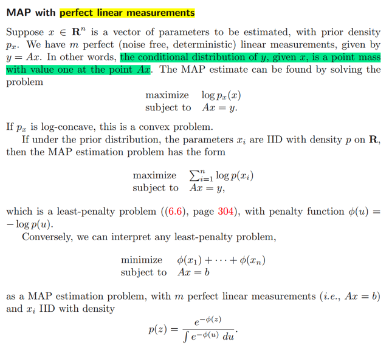</kbd>

> [!NOTE]
> QUAY LẠI SAU

 

<kbd>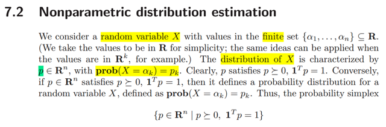</kbd>

<kbd>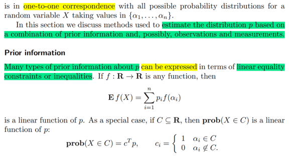</kbd>

<kbd>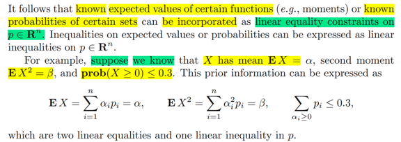</kbd>

> [!NOTE]
> Rồi, cái này đại khái là vầy: Ta xét random variable X có hữu hạn
> các possible values α1, α2, ...αn. Và nói cho nhanh là ta có pmf
> của nó, tức pi = P(X = αi). Làm thành vector p = [p1, p2, ...pn]
>
> Dĩ nhiên pi không âm (axiom 1) và tổng pi Σpi = 1 (là do đâu? câu
> trả lời là vì axiom 2: P(S) = 1 => P(Ui X = αi) = 1, theo axiom 3
> vế trái là xác suất của union các disjoint event => Σi P(X = αi) = 1
>
> Và thể hiện hai ý này là p ≻ 0 (Ôn lại: Cái này chính là cách viết
> rút gọn hợp lệ của p ≻R^n+ 0, tức là p ≻K 0, generalized inequality
> wrt cone K, với K = non-negative orthant R^n+, vì quá phổ biến
> nên có thể ghi ≻R^n+ là ≻. Mà theo định nghĩa u ≻K v sẽ đồng nghĩa
> u - v ∈ int K, vậy p ≻R^n+ 0 => p - 0 = p ∈ int R^n+, và điều này 
> đồng nghĩa mọi component của vector p đều dương: pj > 0 với mọi j
>
> Và ý thứ 2 pT1 = 1 đơn giản là Σ pj*1 = Σ pj = 1 (1 là vector [1, 1,...1]
>
> ====
>
> Rồi nói qua PRIOR INFORMATION, đại ý của mục này ý nói ta có
> thể thể hiện prior information DƯỚI DẠNG EQUALITY/
> INEQUALITY CONSTRAINTS
>
> Cụ thể giả dụ như ta biết mean của rv X hoặc mean của g(X): Eg(X)
> thế thì trong đây nói về cái ta đã học từ Stat110: LOTUS: Ôn lại không
> thừa: Theo định nghĩa expected value là weighted Σ mọi possible values
> x của X, với weight là xác suất P(X=x): EX = Σ x*P(X=x). P(X=x) là
> pmf của X.
>
> Thì nếu ta có rv Y tạo thành bởi applying function g(.) lên rv X, thì 
> LOTUS cho phép ta không cần tìm pmf của Y mà có thể tính EY thông
> qua pmf của X: Eg(X) = Σ g(x)P(X=x)
>
> Nên ở đây (với X có các possible values αi, với P(X = αi) = pi. Thì
> Ef(X) = Σ f(αi)pi
>
> Thế thì nếu ta có prior information liên quan đến Ef(X), ví dụ như biết EX
> = α, (đây coi như Ef(x) với f(u) = u) và EX^2 = β (stat1110 đã biết, cái này
> chính là second moment), tức là Eh(X) với h(u) = u^2 thì ta có thể thể
> hiện hai cái thông tin này dưới dạng EQUALITY CONSTRAINTS CỦA p:
>
> EX = α <=> Σ αipi = α,  EX^2 = β <=> Σ αi^2 pi = β
>
> Rồi, nếu như bên cạnh đó ta có thông tin kiểu như P(X >= 0) <= 0.3, tức
> là xác suất của việc X thuộc set A (ở đây A là set R+) thì ta cũng có thể
> thể hiện nó ở dạng constraint đối với p.
>
> Bởi vì P(X ∈ C) = cTp với c là vector mà component của nó mang giá
> trị 1 nếu αi ∈ C, và 0 nếu ngược lại. Lí giải cho việc này:
>
> X ∈ C = Ui (X = αi) | αi ∈ C  
>
> = P(X ∈ C) = P(Ui (X = αi) | αi ∈ C ) 
>
> và event ở vế phải là union của  các disjoint event nên theo Axiom 3:
>
> ..= Σαi ∈ C P(X = αi) = Σ αi ∈ C pi
>
> Vậy thì ở đây nếu ta có prior: P(X >= 0) <= 0.3
>
> ta sẽ thể hiẹn nó dưới dạng của constraint của p:
>
> Σ αi >= 0 pi <= 0.3

 

<kbd>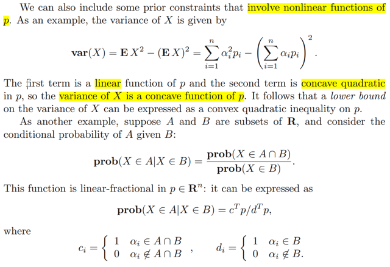</kbd>

<kbd>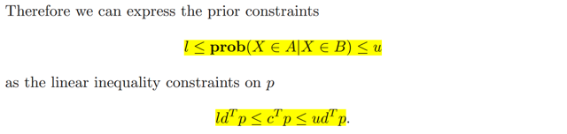</kbd>

> [!NOTE]
> một vài ví dụ khác, giả sử ta có prior info liên quan đến variance của X 
> thì từ công thức đã biết Var(X) = EX^2 - (EX)^2 thì ta có thể thể hiện
> nó thành quadratic function của p 
>
> Hoặc nếu prior infor liên quan tới conditional probability P(X ∈ A | X ∈ B), 
> thì nhờ dùng P(X ∈ A | X ∈ B) = P(X ∈ A, X ∈ B) / P(X ∈ B) 
> = P(X ∈ A ∩ B) / P(X ∈ A)
>
> = cTp / dTp với c, d là các vector quy định việc αi thuộc C, D hay không.
>
> Kết quả là giả sử ta có prior: l<= P(X ∈ A | X ∈ B) <= u ta sẽ thể hiện
> nó thành inequality constraint on p:
>
> l<= cTp / dTp <= u <=> ldTp <= cTp & cTp <= udTp

 

<kbd>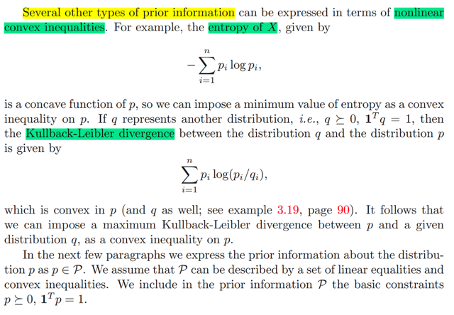</kbd>

> [!NOTE]
> đại ý là một số dạng prior info khác như entropy, Kullback-Leibler 
> divergence của hai distribution p, q. Đều có thể được thể hiện thành
> dạng CONVEX INEQUALITIES của p

 

<kbd>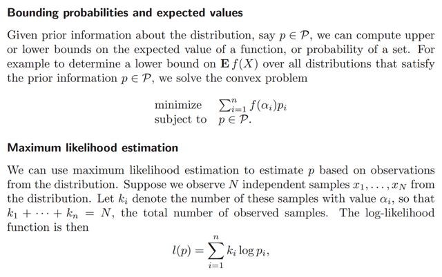</kbd>

<kbd>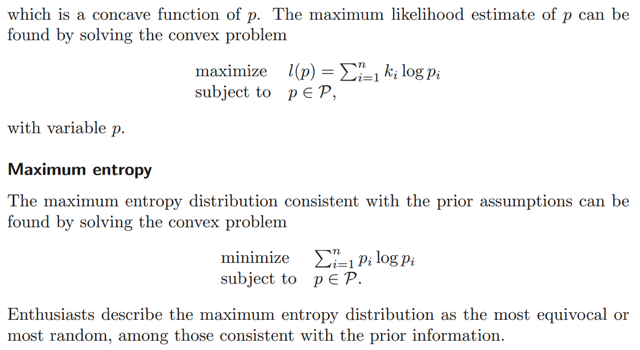</kbd>

> [!NOTE]
> QUAY LẠI SAU

 

<kbd>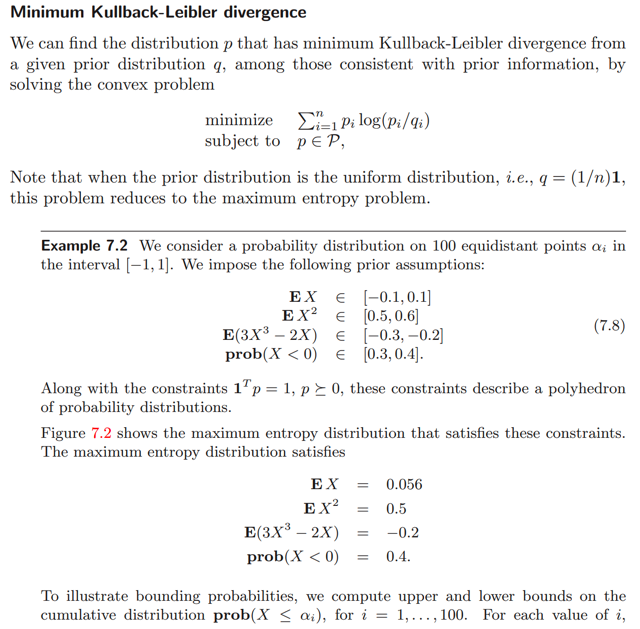</kbd>

<kbd>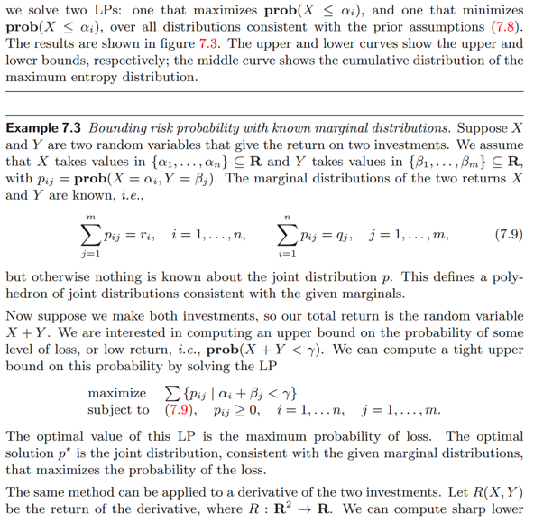</kbd>

> [!NOTE]
> QUAY LẠI SAU

 

<kbd>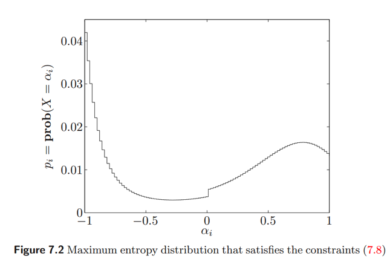</kbd>

<kbd>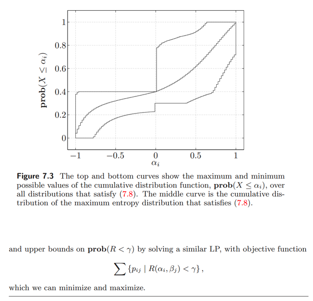</kbd>

> [!NOTE]
> QUAY LẠI SAU

 

