# Lec 11

📊 **Progress:** `48` Notes | `92` Screenshots

---

## Lec 11

 

<kbd>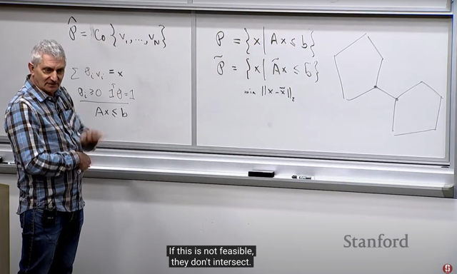</kbd>

> [!NOTE]
> Cho hay Polyhedron P và P~. 
>
> Làm sao biết P và P~ có giao nhau không?
>
> -> Giải bài toán feasible problem: minimize 0 constraint Ax <= b, A~x <= b~
> nếu problem feasible thì P có intersect P~
>
> Làm sao tìm distance giữa P, P~?
>
> -> Giải bài toán minimize ||x - x~|| (l2 norm) constraint Ax <= b, A~x~ <= b~
>
> Cho một Polyhedron khác, P^, có dạng là convex hull của các đỉnh v1,v2,...
> Cái này trong section về Polyhedron đã học, nó gọi là Simplexes được
> định nghĩa là convex hull của các vertices (đỉnh).
>
> Làm sao biết P^ có intersect P không?
>
> -> Giải bài toán feasible minimize 0, constraint Ax <= b, θ ≽ 0, 1Tθ = 1, θTv = x
>
> Là sao? Là vì lấy vector thuộc P^ thì theo định nghĩa của P^ là convex hull
> bởi {v1, ...vn} nên vector thuộc P^ phải là convex combination của v1, v2,..vn
>
> Tức là Σi θivi với θ >= 0 và Σ θi = 1 (định nghĩa của convex combination)
>
> Vậy thì nếu bài toán trên feasible, tức là tồn tại θ và x thỏa các constraint, 
> trong đó constraint θTv (tức Σi θivi) = x cho thấy tồn tại điểm chung của P và P^
> Do đó chúng có intersect nhau

 

<kbd>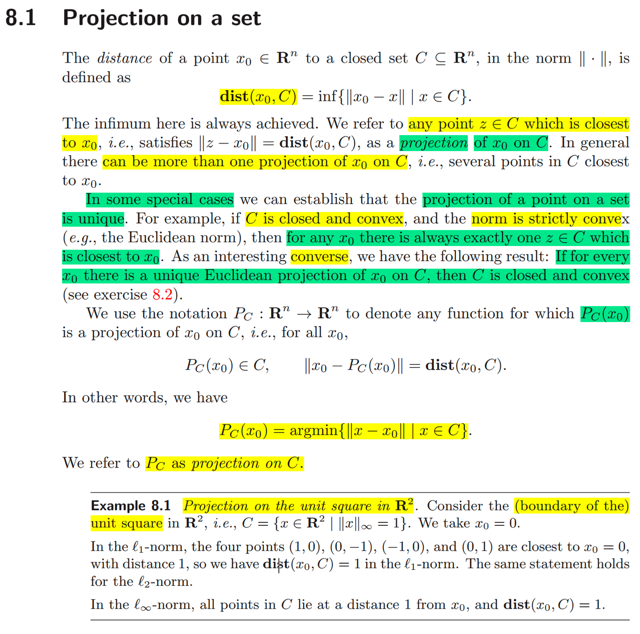</kbd>

> [!NOTE]
> Đại khái là ta có định nghĩa của distance từ x0 đến set C, là  inf x
> ∈ C {||x0 - x||}
>
> Tức là khoảng cách từ x0 đến C được định nghĩa là  khoảng
> cách từ x0 tới điểm trên C mà gần nhất tới x0
>
> Và ta gọi điểm trên C mà gần nhất tới x0 đó, là projection của x
> lên C.
>
> Một điểm cũng có thể không khó hình dung đó là nếu như C là
> convex set và norm là strictly convex function thì với x0 bất kì thì
> ta chỉ có đúng một projection duy nhất.
>
> Ngược lại, nếu có tính chất này thì C là convex set.
>
> Và định nghĩa của projection:
>
> PC(x0) ∈ C, ||x0 - PC(x0)|| = dist(x0, C)
>
> hoặc PC(x0) = argmin x {||x - x0||, x ∈ C}
>
> Nói chung cái này ko có gì phải nói nhiều, chỉ là định nghĩa của
> distance từ đó là projection
>
> 8. GEOMETRIC PROBLEM
>
> 8.1 PROJECTION ON A SET

 

<kbd>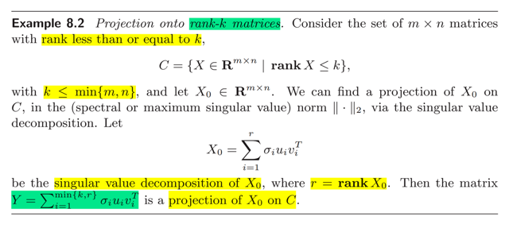</kbd>

> [!NOTE]
> QUAY LẠI SAU

 

<kbd>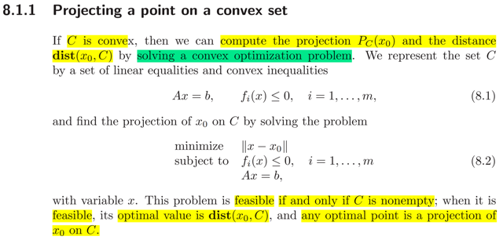</kbd>

<kbd>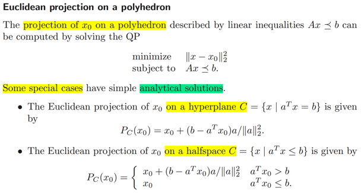</kbd>

<kbd>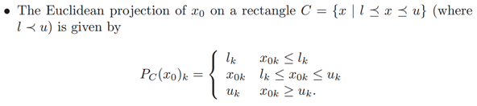</kbd>

> [!NOTE]
> Nếu C là convex thì việc tìm projection của x0 lên C, tức PC(x0) trở
> thành bài toán convex optimization.
>
> khi C là convex set, ta có thể thể hiện nó ở dạng intersection  của
> linear equalities và convex inequalities
>
> Ax = b và fi(x) <= 0
>
> khi đó bài toán minimize ||x - x0|| constraint fi(x) <= 0 Ax = b sẽ giúp
> tìm ra optimal point nếu có chính là projection PC(x0) và optimal value
> chính là dist(c0, C)
>
> ====
>
> Nói chung là nếu C là polyhedron define bởi Ax <= b thì ta có projection
> lên Polyhedron
>
> một số dạng đặc biết của P là hyperplane C = x | aTx = b hay haftspace
> C = x | aTx <= b thì ta có analytic solution
>
> Ví dụ projection x0 on hyperplane C = x | aTx <= b:
>
> Có thể được tìm thấy bằng bài toán:
>
> minimize ||x - x0||^2 constraint aTx - b =0 
>
> f0(x) = (x - x0)T(x - x0)
>
> Lagrangian L(x, λ, v) = f0(x) + Σi λi fi(x) + Σi vi hi(x)
>
> = (x - x0)T(x - x0) + v(aTx - b) 
>
> KKT conditions:
>
> - Primal feasibility: aTx = b
>
> - Dual constraint: Không có
>
> - Complementary slackness: Không có (ko có inequality)
>
> - Gradient Lagrangian ∇xL = 0
>
> dL = (x + dx - x0)T(x + dx - x0) + v(aTx + aTdx - b) - (x - x0)T(x - x0) - v(aTx - b) 
>
> = (xT + dxT - x0T)(x + dx - x0) + vaTx + vaTdx - vb - (xT - x0T)(x - x0) - vaTx - vb
>
> = xTx + dxTx - x0Tx + xTdx + dxTdx - x0Tdx - xTx0 - dxTx0 + x0Tx0 + vaTx + vaTdx - vb 
> - (xTx - x0Tx - xTx0 + x0Tx0) - vaTx + vb
>
> = xTx + dxTx - x0Tx + xTdx + dxTdx - x0Tdx - xTx0 - dxTx0 + x0Tx0 + vaTx + vaTdx - vb 
> - xTx + x0Tx + xTx0 - x0Tx0 - vaTx + vb
>
> = 2xTdx - 2x0Tdx = 2(x - x0)Tdx + vaTdx = [2(x - x0) + avT]Tdx
>
> => ∇xL = 2(x - x0) + avT
>
> ∇xf = 0 <=> 2(x - x0) + avT = 0 <=> 2x - 2x0 + avT = 0 
>
> <=> 2x = 2x0 - avT <=> x = x0 - avT/2
>
> Thế vào aTx - b = 0 Ta có aT(x0 - avT/2) = b <=> aTx0 - aTavT/2) = b
>
> <=> aTx0 - aTavT/2 = b <=> aTx0 - b = aTavT/2 <=> 2(aTx0 - b) = aTavT
>
> <=> 2(aTx0 - b)/aTa = vT
>
> <=> 2(aTx0 - b)T/aTa = v
>
> Vậy x (optimal, là PX(x0)) = x0 - avT/2 = x0 - a(2(aTx0 - b)/aTa)/2 
>
> = x0 - a(aTx0 - b)/aTa) = x0 + (b - aTx0)a/||a||^2

 

<kbd>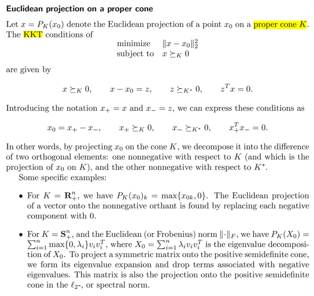</kbd>

> [!NOTE]
> QUAY LẠI SAU

 

<kbd>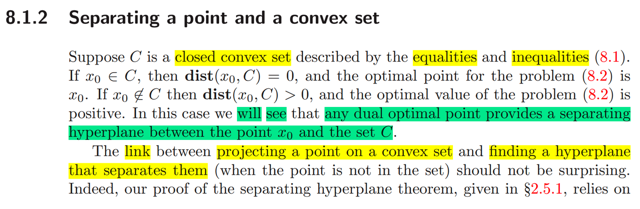</kbd>

<kbd>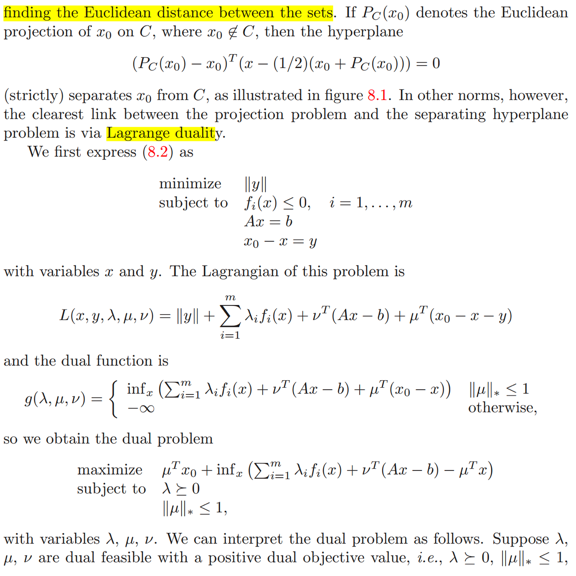</kbd>

<kbd>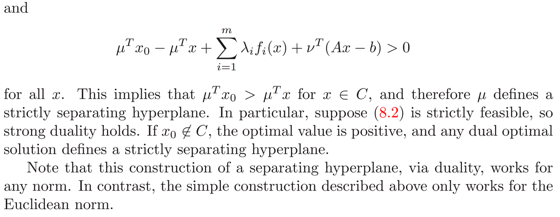</kbd>

> [!NOTE]
> Thế thì đại khái gs nói rằng nếu PC(x0) là projection của x0
> lên C thì ta có thể có một hyperplane có phương trình như vậy
> chia cắt x0 và C.
>
> Đầu tiên, (PC(x0) + x0)/2 là trung điểm của đoạn nối PC(x0),
> x0
>
> Phương trình của hyperplane đi qua x0 có vector pháp tuyến
> (normal vector) a là aTx = aTx0. Ở đây normal vector chính là
> PC(x0) - x0
>
> (PC(x0) - x0)Tx = (PC(x0) - x0)T(PC(x0) + x0)/2
>
> <=> (PC(x0) - x0)Tx - (PC(x0) - x0)T(PC(x0) + x0)/2 = 0
>
> <=> (PC(x0) - x0)T(x - (PC(x0) + x0)/2) = 0
>
> Tiếp, ý là nói norm khác thì liên hệ giữa Separating
> Hyperplane theorem và projection problem có thể được thấy
> qua Lagrange duality:
>
> Thế thì từ bài toán tìm projection on hyperplane thể hiện bởi
> các inequality constraint fi(x) <= 0 và equality Ax = b minimize
> ||x0 - x|| subject to fi(x) <= 0, Ax = b.
>
> Ta sẽ introduce new variable y = x0 - x và bài toán trở thành
> minimize ||y|| constraint có thêm y = x0 - x bên cạnh inequality
> constraint fi(x) <= 0, i=1,2... và equality constraint Ax = b
>
> Lagrangian: L = f0(x) + Σ λi fi(x) + Σ vi hi(x) + μT(x0 - x - y)
>
> = ||y|| + Σ λi fi(x) + vT(Ax - b) + μT(x0 - x - y)
>
> = ||y|| + Σ λi fi(x) + vT(Ax - b) + μT(x0 - x - y)
>
> = ||y|| + Σ λi fi(x) + vT(Ax - b) + μT(x0 - x - y)
>
> = ||y|| - μy + Σ λi fi(x) + vT(Ax - b) + μT(x0 - x) 
>
> Dual function = g(v, λ, μ) = inf x, y L(x, v, λ, μ)
>
> = inf x inf y ||y|| - μTy + Σ λi fi(x) + vT(Ax - b) + μT(x0 - x) 
>
> Xét inf y ||y|| - μTy + Σ λi fi(x) + vT(Ax - b) + μT(x0 - x) 
>
> inf y ||y|| - μTy + Σ λi fi(x) + vT(Ax - b) + μT(x0 - x) 
>
> = - sup y  μTy - ||y||  + Σ λi fi(x) + vT(Ax - b) + μT(x0 - x) 
>
> Áp dụng kết quả sup y μTy - ||y|| = 0 khi ||μ||* <= 1, và +infinity
> khi ||μ||* > 1 (chứng minh lại ở note bên):
>
> = a) 0 + Σ λi fi(x) + vT(Ax - b) + μT(x0 - x) nếu ||μ||* <= 1
>
> = b) - infinity nếu ||μ||* > 1
>
> Do đó g(v, λ, v) = ...
>
> = a) inf x Σ λi fi(x) + vT(Ax - b) + μT(x0 - x) nếu ||μ||* <= 1
>
> = b) -infinity nếu ||μ||* > 1
>
> Áp dụng cái này:
>
> sup x {μTy - ||y||} = ...:
>
> a) 0 khi ||μ||* <= 1
>
> b) +infinity khi ||μ||* > 1
>
> Lập luận nhanh:
>
> Theo ĐỊNH NGHĨA CỦA DUAL NORM:
>
> Ta có norm của μ là ||μ||, thì dual norm của μ:
>
> ||μ||* = sup y: ||y|| ≤1 { μTy }
>
> - Nếu ||μ||* ≤ 1 => μTy ≤ 1 ∀ y có ||y|| ≤ 1
>
> ⇔ μTy / ||y|| ≤ 1 ∀ y
>
> ⇔ μTy ≤ ||y|| ∀ y 
>
> ⇔ μTy - ||y|| ≤ 0 ∀ y
>
> => sup y {μTy - ||y||} = 0
>
> - Nếu ||u||* > 1 => tồn tại x có ||x|| ≤ 1 sao cho μTx > 1
>
> Mà như vậy có nghĩa là ||x|| < μTx ⇔ μTx - ||x|| > 0 
>
> Gọi y = αx, μTy - ||y|| = μTαx - α||x|| = α(μTx - ||x||)    
>
> Vì μTx - ||x|| > 0 nên khi cho α -> infinity thì 
>
> μTy - ||y|| = α(μTx - ||x||) -> infinity
>
> => sup y {μTy - ||y||} = infinity
>
> Từ đó sau khi đã có dual function:
>
> g(λ, ν, μ) =  inf x Σ λi fi(x) + vT(Ax - b) + μT(x0 - x) nếu ||μ||* ≤ 1
>
> Dual problem sẽ là:
>
> maximize inf x Σ λi fi(x) + vT(Ax - b) + μT(x0 - x) 
>
> constraint μ ≽ 0, ||μ||* ≤ 1
>
> Vậy tới đây họ giả sử ta có λ, v, μ đều DUAL FEASIBLE (review:
> tức là các dual variable này, đều thỏa dual constraint: λ ≽ 0, và 
> ở đây là có thêm ||μ||* ≤ 1. Lí do gọi là dual feasible là vì, như
> tên gọi, ta cần dual problem feasible, mà khi nói một problem
> feasible thì theo định nghĩa, thì có nghĩa là optimal value của nó
> khác infinity. Ví dụ như với optimization problem với constraint,
> thì khi không tồn tại point khiến thỏa constraint, ta gọi đó là feasible
> set rỗng, dẫn tối khi minimize objective trên một tập rỗng, theo
> quy ước, kết quả sẽ là +infinity. Và ta gọi đó là infeasible problem.
>
> Thì với dual problem cũng vậy, ta muốn maximize dual function
> over các dual variable λ, ν, μ. Thì constraint, là dual constraint
> đầu tiên sẽ có λ ≽ 0, và ở đây có thêm ||μ||* ≤ 1.
>
> Thế thì nếu λ không thỏa λ ≽ 0, thì khi xây dựng dual function,
> g = inf x L(x, λ..) thì cái vì fi(x) < 0 nên sẽ có ít nhất một cái Σ λi fi(x)
> trong mọi tích λi fi(x) (vì i = 1,2,...p) của Lagrangian sẽ mang giá
> trị âm, và điều đó khiến việc minimize L có thể cho ra kết quả -infinity
> Đó chính là khi g = -infinity thì như vây dual problem bị infeasible.
>
> Quay lại đây, ta mới giả sử là với các λ, v, μ đều DUAL FEASIBLE thì
> g ra giá trị dương. Có nghĩa là:
>
> Σ λi fi(x) + vT(Ax - b) + μT(x0 - x) > 0
>
> tạm hiểu là vì λi ≥ 0, fi(x) ≤ 0 (để thỏa constraint) => sum λi fi(x) < 0 
>
> và vT(Ax - b) = 0 vì x thỏa constraint
>
> Tóm lại là dẫn đến μT(x0 - x) > 0:
>
> ⇔ μT(x0 - x) > 0 ⇔ μTx0 > μTx
>
> Và μTx0 > μTx chính là cho thấy một separating hyperplane có 
> normal vector là μ

 

<kbd>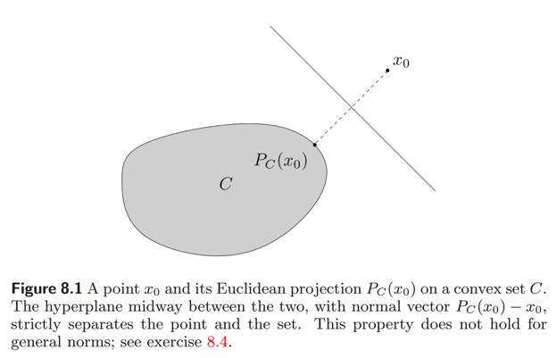</kbd>

 

<kbd>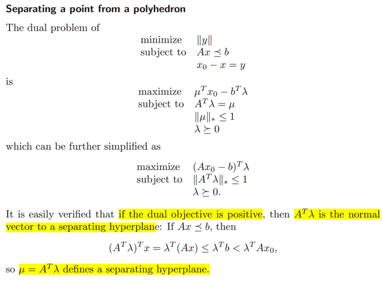</kbd>

> [!NOTE]
> đại khái là một ví dụ cụ thể của vừa rồi, với Polyhedron thể hiện bởi 
> inequality constraint Ax ≺ b.
>
> Ta thiết lập bài toán minimize ||x0 - x|| với constraint Ax ≺ b, và thay
> y = x0 - x. để thành minimize ||y|| constraint Ax ≺ b, y = x0 - x
>
> Thiết lập Lagrangian, và sau đó là Dual function:
>
> Kết quả cho thấy rằng nếu dual mà mang giá trị dương thì ta sẽ có 
> thể cho thấy một separating hyperplane separate x0 và feasible set
> tức Polyhedron
>
> Nói chung mục đích là liên hệ bài toán Projection on set C (cụ thể
> là Polyhedron) với việc tìm ra một Hyperplane separate chúng

 

- **Nói thêm chút về Hyperplane. Và Separating Hyperplane.

Phương trình của hyperplane với normal vector a:

aTx = b

Là tập hợp mọi điểm mà dot product với a bằng nhau và bằng b.

Nên nếu muốn hyperplane đi qua x0, thì có nghĩa là tập hợp mọi điểm
có dot product với a bằng nhau và bằng aTx0 (hay b = aTx0)

aTx = aTx0

Thế thì hyperplane aTx = b sẽ chia không gian thành 2 haft-space:

aTx ≥ b và aTx < b

Thì cái haft-space aTx ≥ b có chứa cái hyperplane aTx = b đóng vai
trò là boundary nên nó gọi là Closed haft-space.

Còn cái aTx < b là Open haft-space do không có boundary.

Vậy thì nếu \\*aTx < aTx0 với mọi x thuộc set C\\*, thì có nghĩa là \\*x0 nằm
ở một bên này\\* (cụ thể là nó nằm trong \\*closed half-space: aTx ≥ aTx0\\*,
vì nó \\*nằm trên boundary chính là hyperplane aTx = aTx0\\*)

Trong khi đó \\*mọi x thuộc C thì nằm trong half-space kia\\*: \\*aTx < aTx0\\*

Do đó \\*aTx = aTx0 sẽ chính là separating hyperplane giữa x0 và C\\***

 

<kbd>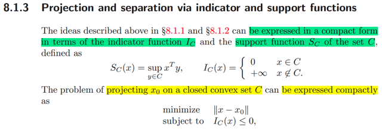</kbd>

<kbd>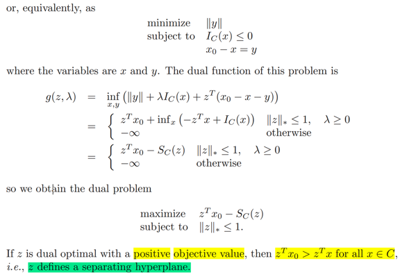</kbd>

> [!NOTE]
> Không khó hiểu. Đơn giản chỉ là ta có thể làm vấn đề này ở dạng
> compact (gọn) hơn bằng cách dùng indicator function IC: Với
> IC(x) = 0 nếu x ∈ C và = +infinity khi x không ∈ C
>
> Và SC(x) = sup y ∈ C xTy cái này là định nghĩa ra Support 
> function của set C: nôm na đó là cái function khi nhận vector x
> nó sẽ  lấy ra vector trong C mà có dot product lớn nhất với vector x
>
> Rồi, bài toán project x0 lên C có thể được thể hiện gọn hơn với
> IC: minimize ||x0 - x|| subject to IC(x) ≤ 0
>
> Tại sao constraint lại là IC(x) ≤ 0 thay vì IC(x) = 0?
>
> Giới thiệu y = x0 - x thì ta có equivalent problem: minimize ||y||
> subject to IC(x) ≤ 0, y = x0 - x
>
> Rồi, cũng xây dựng Lagrangian, và Dual function g = inf x,y  L
>
> Rồi sẽ gặp lại inf y ||y|| - zTy, cũng dùng lập luận 
>
> = - sup y zTy - ||y||
>
> = - 0 khi ||z||* ≤ 1 và - infinity khi ||z||* > 1
>
> Nên g = inf x,y  ||y|| + λIC(x) + zT(x0 - x - y)
>
> = inf x,y  ||y|| + λIC(x) + zTx0 - zTx - zTy 
>
> = inf y  ||y|| - zTy  +inf x  λIC(x) + zTx0 - zTx 
>
> = - sup y  zTy - ||y||  +inf x  λIC(x) + zTx0 - zTx 
>
> = - 0 + inf x  λIC(x) + zTx0 - zTx  khi ||z||* ≤ 1 và -inf khi ||z||* > 1
>
> = zTx0 + inf x  λIC(x) - zTx  khi ||z||* ≤ 1 và -inf khi ||z||* > 1
>
> = zTx0 - sup x  - λIC(x) + zTx  khi ||z||* ≤ 1 và -inf khi ||z||* > 1
>
> = zTx0 - sup x  - λIC(x) + zTx  khi ||z||* ≤ 1 và -inf khi ||z||* > 1
>
> = zTx0 - sup x  - λ*0 + zTx  khi ||z||* ≤ 1 và -inf khi ||z||* > 1
>
> x ∈ C => IC(x) = 0
>
> = zTx0 - sup x  zTx  khi ||z||* ≤ 1 và -inf khi ||z||* > 1
>
> = zTx0 - SC(x) khi ||z||* ≤ 1 và -inf khi ||z||* > 1
>
> Và tới đây, kết luận nếu dual function > 0 thì ta sẽ có thể định ra
> separating hyperplane:
>
> zTx0 > SC(x), mà SC(x) là sup z zTx
>
> => zTx0 > SC(x) ≥  zTx => zTx0 > zTx Do đó z là normal vector
> của separating hyperplane giữa x0 và C

 

<kbd>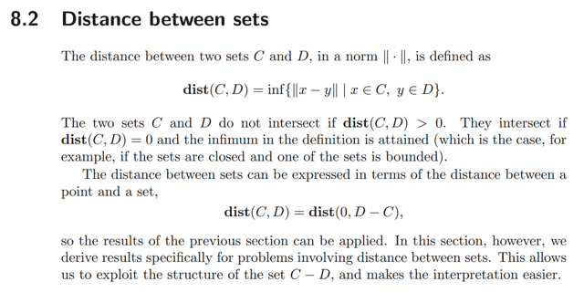</kbd>

> [!NOTE]
> 8. GEOMETRIC PROBLEM
>
> 8.2 DISTANCE BETWEEN SETS
>
> Định nghĩa của distance giữa hai set C, D. là khoảng cách
> nhỏ nhất giữa hai điểm thuộc mỗi set

 

<kbd>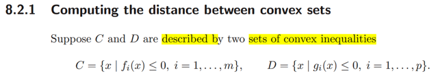</kbd>

<kbd>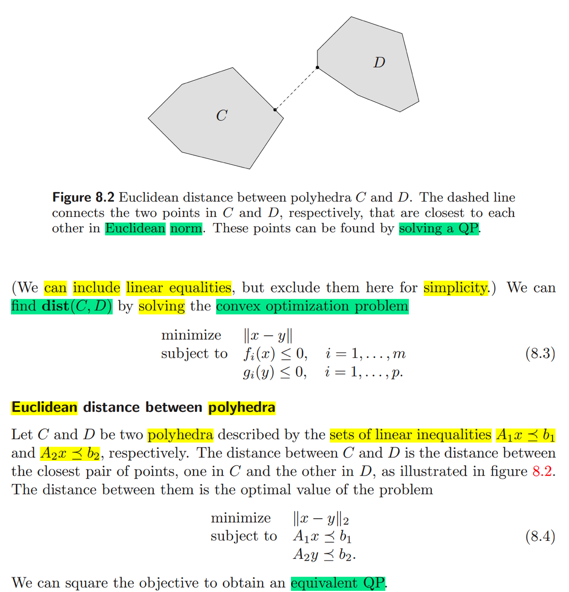</kbd>

> [!NOTE]
> Đại khái là từ định nghĩa đó không khó để ta thấy việc tìm distance
> có thể trở thành việc giải bài toán optimization.
>
> Ví dụ set C, D được định nghĩa bởi các inequalities fi(x) ≤ 0 và gi(x) ≤ 0
> thì bài toán tìm distance sẽ là bài toán optimization:
>
> minimize ||x - y|| constraint fi(x) ≤ 0 và gi(y) ≤ 0
>
> Ví dụ với C, D là các Poyhedra (định nghĩa bởi các linear inequalities)
> A1x ≺ b1 và A2x ≺ b2
>
> Khi đó bài toán giúp tìm distance của hai Polyhedra là:
>
> minimize ||x - y|| constraint A1x ≺ b1 và A2y ≺ b2
>
> Thì đây nếu bình phương ||x - y|| thì ta sẽ có QP: là khi objective
> là quadratic function, các constraint vẫn linear / affine

 

<kbd>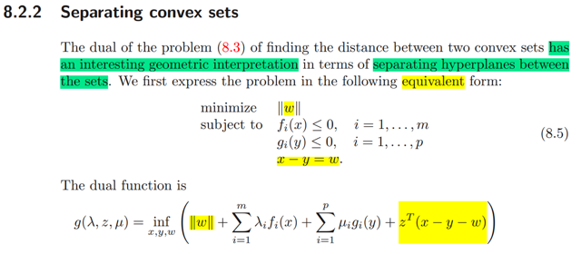</kbd>

<kbd>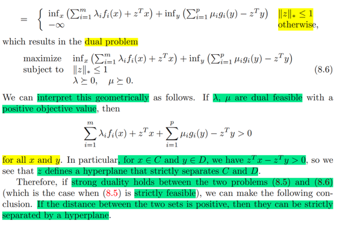</kbd>

> [!NOTE]
> Rồi, đại khái là cái này nói về việc dựa vào việc ta giải bài toán tìm distance
> của hai set C, D thì qua đó ta có thể dẫn đến kết luận liên quan đến việc tồn
> tại hay không hyperplane phân chia hoàn toàn hai set C, D:
>
> Như mới nói, để tìm distance giữa C, D mà mỗi set define bởi system các
> inequaulities fi(x) ≤ 0, gi(x) ≤ 0 ta có thể giải bài toán tối ưu:
>
> minimize ||x - y|| subject to fi(x) ≤ 0 và gi(y) ≤ 0
>
> introduce w = x - y thì thêm constraint w = x - y và objective là ||w||
>
> Cũng lập Lagrangian:
>
> L = ||w|| + Σ λi fi(x) + Σ μi gi(y) + zT(x - y - w)
>
> Và Dual function:
>
> g = inf x,y,w ||w|| + Σ λi fi(x) + Σ μi gi(y) + zT(x - y - w)
>
> = inf x,y,w ||w|| + Σ λi fi(x) + Σ μi gi(y) + zTx - zTy - zTw
>
> = inf x,y,w ||w|| + Σ λi fi(x) + Σ μi gi(y) + zTx - zTy - zTw
>
> = inf x,y,w ||w|| - zTw + Σ λi fi(x) + Σ μi gi(y) + zTx - zTy 
>
> = inf w ||w|| - zTw + inf x Σ λi fi(x) + zTx + inf y Σ μi gi(y)  - zTy
>
> Lại gặp dual norm:
>
> = - sup w zTw - ||w|| + inf x Σ λi fi(x) + zTx + inf y Σ μi gi(y)  - zTy
>
> = - 0 + inf x Σ λi fi(x) + zTx + inf y Σ μi gi(y)  - zTy nếu ||z||* ≤ 1
>
> hoặc - infinity + + inf x Σ λi fi(x) + zTx + inf y Σ μi gi(y)  - zTy nếu ||z||* > 1
>
> Nên dual problem là:
>
> maximize inf x Σ λi fi(x) + zTx + inf y Σ μi gi(y)  - zTy
>
> constraint λ, μ ≽ 0,  ||z||* ≤ 1
>
> Và ta sẽ lặp lại lập luận rằng nếu CÓ λ, μ dual feasible và dual function
> g(λ, μ) MANG GIÁ TRỊ DƯƠNG thì ta có:
>
> Σ λi fi(x) + zTx + Σ μi gi(y)  - zTy > 0
>
> Thì điều này cùng với việc Σ λi fi(x) ≤ 0, Σ μi gi(y) ≤ 0 chứng tỏ zTx - zTy
> phải > 0
>
> ⇔ zTx > zTy => z định ra một hyperplane chia tách hoàn toàn C và D.
>
> =====
>
> Do đó ta mới có một kết luận đại khái là nếu có strong duality thì ta có thể
> và khoảng cách giữa C, D dương thì sẽ chắc chắn tồn tại hyperplane tách
> rời  hoàn toàn C, D.
>
> Lí do đơn giản là vì muốn chắc chắn có thể kết luận rằng tồn tại hyperplane
> strictly separate C và D thì dấu = (0) ko xảy ra, mà phải chắc chắn là dấu >
> 0. Đồng nghĩa ta phải chắc chắn có d* (maximum của g) > 0. Thế thì dựa
> trên việc đã cho p*, tức distance của C, D > 0 rồi, thì muốn chắc chắn d*
> cũng > 0 thì chỉ có thể xảy ra khi d* = p* Chứ d* ≤ p* (weak duality) chưa
> chắc khiến d* > 0.
>
> Nên nếu có strong duality, và distance C, D  > 0, tức d* = p* > 0 thì suy
> ra kiểu gì cũng có λ, μ khiến Σ λi fi(x) + zTx + Σ μi gi(y)  - zTy > 0 
> và như đã lập luận, cái này giúp kết luận zTx > zTy => z định ra một hyperplane 
> chia tách hoàn toàn C và D.

 

<kbd>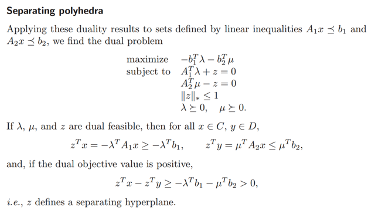</kbd>

<kbd>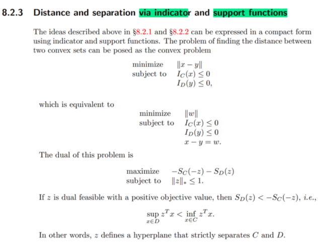</kbd>

> [!NOTE]
> Một ví dụ cụ thể hơn với C, D là polyhedron thôi ko có gì
>
> Và cách thể hiện dùng indicator và support function. Tương tự như hồi
> nãy thôi. Ko có gì

 

<kbd>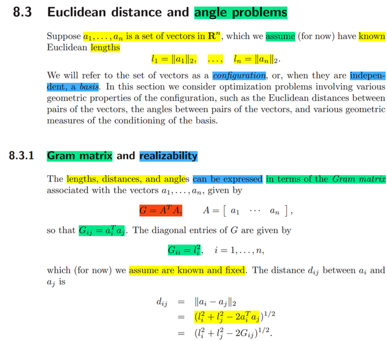</kbd>

<kbd>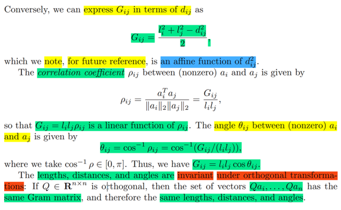</kbd>

> [!NOTE]
> 8. GEOMETRIC PROBLEM
>
> 8.3 EUCLIDEAN DISTANCE & ANGLE PROBLEM
>
> Rồi đại khái là ta giả sử có bộ basis vector a1, a2, ...an
> (gọi là một configuration)
>
> li là l2 norm của ai: li = ||ai||
>
> Ta gặp lại Gram matrix = ATA, với a là matrix mà cột là ai
>
> (Suy nghĩ: a1,..an là basis của Rn nên dĩ nhiên A full-rank)
>
> Thì khi xét ATA, thì component ij sẽ là dot product của [(AT) row i] 
> và [A's columns j] thì cũng là [A's column i] . [A's column j]
>
> Nên Gij = aiTaj phải rồi.
>
> Và trên đường chéo của nó tức Gii = aiTai chính là ||ai||^2 = li^2
>
> Rồi gọi dij là distance của ai, aj:
>
> Tại sao ||ai - aj|| = (li^2 + lj^2 - 2aiTaj)^1/2
>
> Vì ||ai - aj|| = [||ai - aj||^2]^1/2
>
> = [(ai - aj)T(ai - aj)]^1/2
>
> = [(aiT - ajT)(ai - aj)]^1/2
>
> = (aiTai - ajTai - aiTaj + ajTaj)^1/2
>
> = (||ai||^2 - 2ajTai + ||aj||^2)^1/2
>
> = (li^2 + lj^2 - 2aiTaj)^1/2 
>
> = (li^2 + lj^2 - 2Gij)^1/2
>
> Và từ đó Gij = 0.5[li^2 - lj^2 - ||ai - aj||^2] = (li^2 + lj^2 - dij^2)/2
>
> Học khái niệm mới CORRELATION COEFFICIENT 
>
> pij = aiTaj/||ai||||aj|| = Gij / lilj 
>
> Cái này thật ra chính là cos α(ai, aj), vì aiTaj = ||ai||aj||cos α(ai, aj)
>
> gọi là hệ số tương quan bởi nó phản ảnh sự tương quan giữa
> ai, aj.

 

<kbd>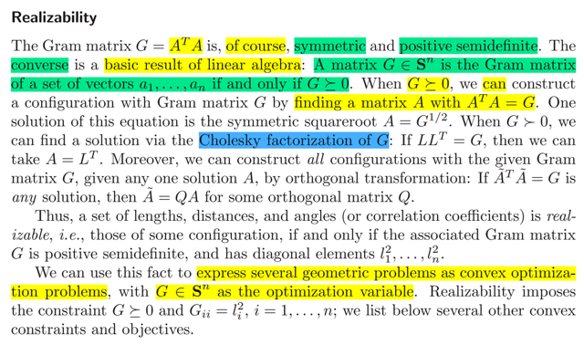</kbd>

> [!NOTE]
> Cái này đại khái nói là ta có thể có nhận định rằng nếu G là Gram
> matrix tức là nó có dạng ATA thì nó sẽ symmetric và positive
> semi-definite.
>
> Nhưng ngược lại cũng đúng, tức là bất kì một symmetric positive
> semi definite matrix nào cũng đều có thể express dưới dạng ATA với
> A là matrix nào đó.
>
> Chứng minh chiều đi thì dễ rồi, (ATA)T = ATA nên nó symmetric.
> xTATAx = ||Ax||^2 nên ≥ 0 ∀ x => ATA positive semi definite.
>
> Thì chiều ngược lại ở đây nói nếu ta có G là psd matrix thì chỉ việc
> tìm A sao cho ATA = G. Và việc này có thể bằng cách lấy A = G^1/2.
>
> Hoặc nếu G positive definite luôn, (G ≻ 0) thì ta có thể dựa vào một
> phép factorization gọi là Cholesky factorization để có G = LLT, thì khi
> đó A chính là LT.
>
> Hơn nữa nếu ta có A và A~ đều là solution (tức thỏa ATA = G) thì
> chắc chắc A~ = QA với Q là orthogonal matrix nào đó.
>
> Nói chung, đại khái là khái niệm realizable của một set các vectors
> sẽ yêu cầu G là matrix positive semi-definite. Từ đó ta có bài toán
> optimization
>
> TÓM LẠI, REALIZABILITY CÓ THỂ TẠM HIỂU LÀ MỘT TÍNH CHẤT
> CỦA MỘT BỘ VECTORS. Thì bài toán LÀM SAO ĐỂ CÓ TÍNH 
> CHẤT NÀY CÓ THỂ ĐƯỢC THỂ HIỆN THÀNH MỘT OPTIMIZATION
> PROBLEM VỚI OPTIMIZATION VARIABLE LÀ G

 

<kbd>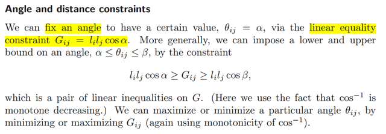</kbd>

<kbd>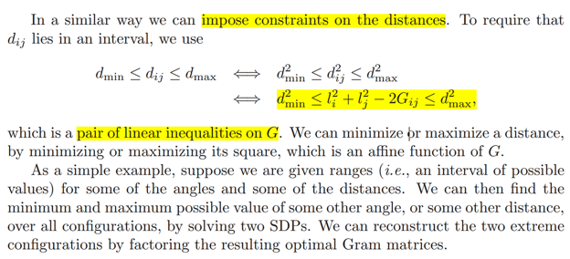</kbd>

> [!NOTE]
> Rồi, nếu ta muốn imply constraint đối với góc của các vector thì ta
> cũng có thể chuyển thành bài toán optimization constraint đối với G
>
> Ko khó hiểu gì, vì Gij = aiTaj = ||ai||||aj||cos(θij) (góc giữa hai vector
> ai aj) nên nếu muốn θij bằng α chẳng hạn thì ta sẽ thể hiện bằng 
> constraint Gij/||ai||||aj|| = Gij/lilj = cos(α). Đây là linear equality
> đối với G
>
> Hoặc, nếu muốn constraint θiij trong khoảng nào  thì cũng dễ hiểu
> là có thể thể hiện thành dạng linear inequality constraint đ/v G
>
> Rồi tương tự, nếu muốn constraint liên quan đến khoảng cách các
> vector ai, aj tức dij, thì ta cũng sẽ thể hiện nó là constraint đ.v G

 

<kbd>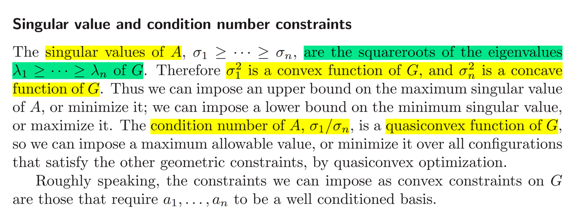</kbd>

> [!NOTE]
> Ta cũng có thể imply constraint lên singular value của A (như
> đã biết, nó chính là eigenvalues của ATA, tức G).
>
> Nói chung là gs đang liệt kê một số trường hợp mà ta có thể
> đặt ra mục tiêu là tính chất của A (cũng là set các vector ai, 
> gọi là configuration) sao đó bằng cách tạo ra constraint đv
> G.
>
> Ở đây ví dụ như ta muốn đặt lower bound cho singular value
> nhỏ nhất (rồi tối đa hóa nó) hoặc upper bound cho s.v lớn
> nhất rồi minimize nó.
>
> Hoặc là với condition number....
>
> (Khái niệm condition number để xem thêm sau)

 

<kbd>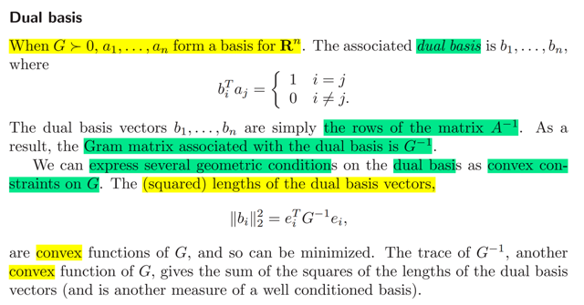</kbd>

> [!NOTE]
> Rồi, đại khái là ta biết khái niệm mới, gọi là DUAL BASIS, của một
> basis. Ví dụ a1,...an là một basis (xảy ra khi G = ATA ≻ 0, này dễ hiểu
> thôi, vì khi đó chứng tỏ A full-column rank / full rank hay a1,...an độc
> lập tuyến tính, mà có đủ n vector thì chính là một basis) thì b1,....bn
> là basis khi biTaj = 1 với i = j và biTaj = 0 khi i khác j
>
> Thế thì đơn giản ta quan sát AinvA = I, tức là [row i'th của Ainv] [columns
> i'th của A] = 1, và [row i'th của Ainv] [column j'th của A] = 0
>
> Nên b1,...bn chính là các row của Ainv.
>
> Vậy thì Gram matrix gắn với b1,...bn chính là AinvAinvT (b1, b2...là các
> cột của AinvT => Gram matrix = (AinvT)T(AinvT) = AinvAinvT
>
> Và cái này chính là Ginv. Vì sao? vì dựa vào tính chất (AB)inv = BinvAinv
> nên (ATA)inv = Ainv ATinv = Ainv AinvT
>
> Từ đó ta có thể thể hiện những điều kiện đối với dual basis của basis a1,..an
> thông qua constraint lên G và cụ thể nó là convex function của G.
>
> Ví dụ như giả sử ta muốn quy định điều kiện cho length của basis dual
>
> Thì ||bi||^2 = eiTGinvei là convex function của G.
>
> Vì sao? Vì bi như đã nói là row thứ i của Ainv. Và cái này có thể thể hiện
> bằng cách dùng unit vector: AinvTei (ei là vector mà số 1 ở vị trí thứ i, còn
> lại 0) nên AinvTei = linear combination các AinvT với coefficients là 0 hết
> chỉ có số 1 tại vị trí thứ i => lấy ra cột thứ i của AinvT, là hàng thứ i của Ainv)
>
> Nên ||bi||^2 = biTbi = (AinvTei)T(AinvTei) = eiTAinvAinvTei = eiTGinvei
>
> Có thể chứng minh nó là hàm convex sau.

 

<kbd>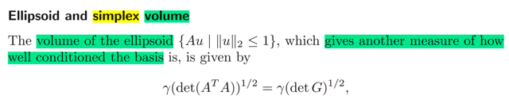</kbd>

<kbd>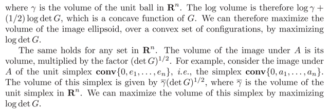</kbd>

> [!NOTE]
> Tương tự cái này cũng vậy. Đại khái là ta có thể express condition
> đối với VOLUME của ellipsoid và simplex thông qua constraint
> đối vói G

 

<kbd>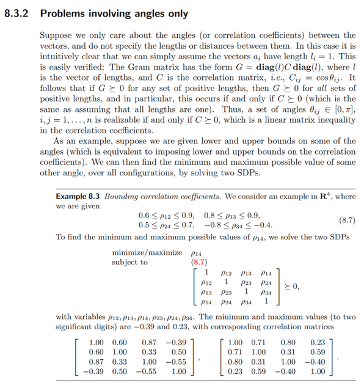</kbd>

> [!NOTE]
> QUAY LẠI SAU

 

<kbd>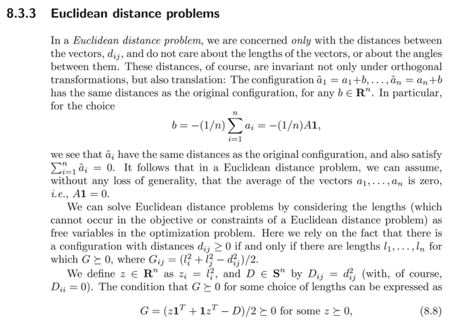</kbd>

<kbd>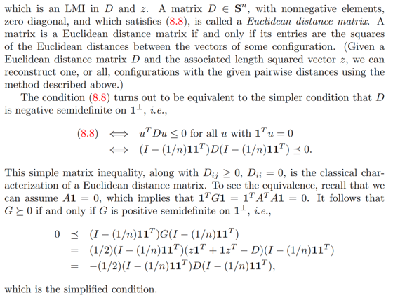</kbd>

<kbd>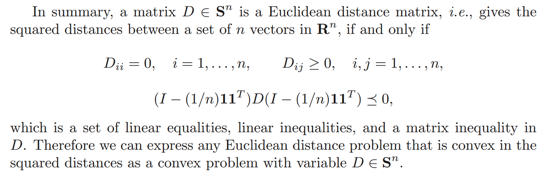</kbd>

> [!NOTE]
> QUAY LẠI SAU

 

<kbd>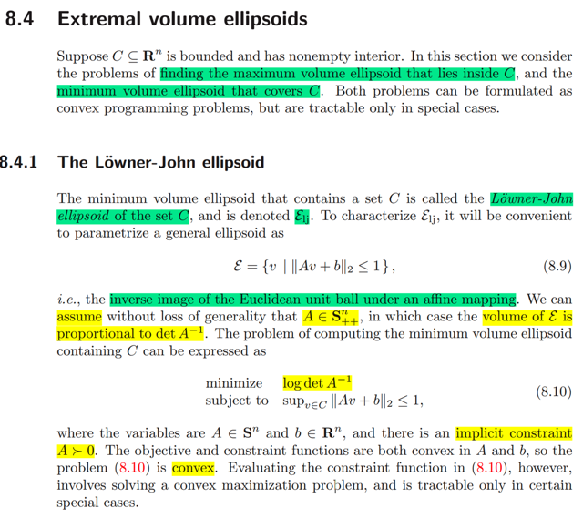</kbd>

> [!NOTE]
> đại khái là phần này ta sẽ xét một set C bị giới hạn và có interior
> không rỗng. Thì ta sẽ xét bài toán là tìm ellipsoid nội tiếp và ngoại tiếp
> của nó và thể hiện nó là bài toán tối ưu.
>
> Đầu tiên cái ellipsoid nhỏ nhất mà bao bọc set C có tên là
> Lowner-John ellipsoid, kí hiệu εlj.
>
> Thế thì người ta thể hiện một ellipsoid một cách khái quát là vầy:
>
> (nôm na là) tập những điểm mà sau khi bị transform bởi A và b trở
> thành một unit ball: {v: ||Av + b|| ≤ 1}.
>
> Thế thì cái ellipsoid LJ trên, nếu thể hiện bằng lời: là cái ellipsoid, có
> thể tích nhỏ nhất, mà mọi điểm trong set C đều không lọt ra ngoài.
>
> Từ đó ta "dịch" nó / chuyển nó thành một bài toán tối ưu như sau:
>
> Objective: Thể tích nhỏ nhất, quay lại nói sau.
>
> Là một ellipsoid, mà mọi điểm trong C đều ko vượt ra ngoài thì chính
> là mọi điểm trong C sao cho khi bị transform bởi A, b không vượt ra
> ngoài unit ball: sup v ∈ C ||Av + b|| ≤ 1
>
> Quay lại nói về thể tích của ellipsoid: HIểu thế này, A biến ellipsoid
> thành unit ball, thì Ainv biết unit ball lại thành ellipsoid. Mà ta đã biết
> trong một phép biến đổi không gian thì det của Jacobian, chính là thể
> tích. Nên det của Ainv chính là sẽ tỉ lệ thuận với thể tích của ellipsoid
> Do đó objective là minimize det Ainv. và như thường lệ người ta sẽ
> dùng log.
>
> Và đại khái là bài toán này là convex optimization problem.
>
> vì log det Ainv là convex
>
> cũng như constraint cũng convex
>
> (có thể xem lại tại sao nó convex sau)
>
> Nhưng gs cũng có nói ko phải lúc nào cũng giải được
>
> 8. GEOMETRIC PROBLEM
>
> 8.4 EXTREMAL VOLUME ELLIPSOIDS

 

<kbd>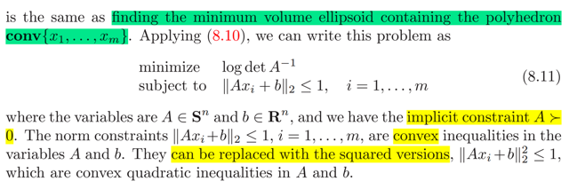</kbd>

<kbd>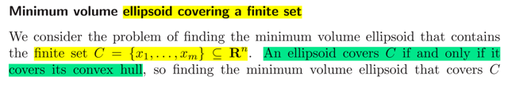</kbd>

> [!NOTE]
> đại khái là vừa rồi là nói set C khái quát, nay là nói set C là set hữu
> hạn  chứa các điểm x1,....xm
>
> Vậy thì ở đây cho biết thêm rằng một ellipsoid mà chứa set các 
> điểm thì nó cũng chứa luôn cái convex hull tạo bởi điểm đó.
>
> (Tính chất này biết vậy thôi, nhưng tạm đoán là vì ellipsoid là một
> convex set, nên nếu nó chứa các điểm thì nó cũng phải chứa mọi
> convex combination của chúng, mà đó chính là convex hull của 
> chúng)
>
> Tuy vậy thì ta cũng chỉ đơn giản là áp dụng "công thức" vừa rồi
> để có bài toán optimization giúp tìm ra εlj
>
> minimize log det Ainv subject to ||Axi + b|| ≤ 1 với i = 1, 2, ...m
>
> Và norm của Axi + b hoặc square norm đèu convex nên ta có
> convex problem

 

- **Tối ưu hóa L.J ellipsoid**

<kbd>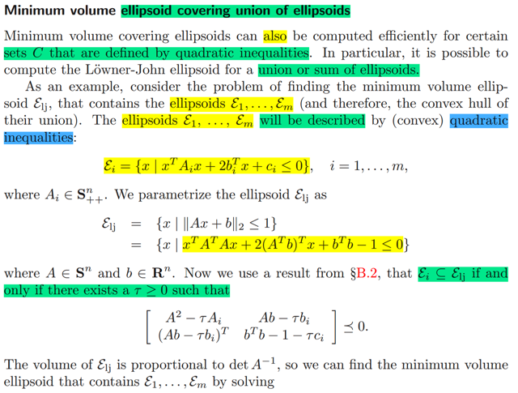</kbd>

<kbd>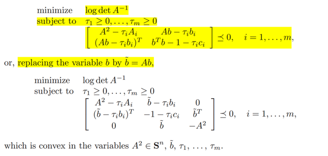</kbd>

> [!NOTE]
> rồi, cái này đại khái nói là ta cũng có thể tìm εlj của một set C mà bản
> thân C là được định nghĩa bởi hệ các quadratic inequalities. Cụ thể
> là khi C là union của các ellipsoid.
>
> Thế thì gọi ε1, ...εm là các ellipsoid được định nghĩa bởi các convex
> quadratic inequalities:
>
> εi = {x | xTAix + 2biTx + ci ≤ 0} i = 1, 2, ...m
>
> Trong đó Ai là symmetric positive definite matrix:
>
> Rồi, ta cũng có εlj được định nghĩa bởi:
>
> εlj = {x: ||Ax + b|| ≤ 1} ⇔ {x: xTATAx + 2(ATb)Tx + bTb - 1 ≤ 0}
>
> (cái này đơn giản là ||Ax + b|| ≤ 1 ⇔ ||Ax + b||^2 ≤ 1 ⇔ (Ax+b)T(Ax+b) ≤ 1
> triển khai ra)
>
> Tới đây ta mới dùng một kiến thức đại số tuyến tính từ phụ lúục B2. Đại 
> khái nói là để mà ε nằm trong ⊆ một εlj khác thì xảy ra khi và chỉ khi
> tồn tại t sao cho thỏa điều sau đây:
>
> [A^2 - tAi, Ab - tbi; (Ab - tbi)T, bTb - 1 - tci] ⪯ 0 
>
> (kiến thức này đọc phụ lục sau)
>
> Thành ra bài toán tìm L.J ellipsoid của union các ellipsoid εi thể hiện ở
> bài toán optimization:
>
> minimize log det Ainv 
>
> với constraint là 
>
> [A^2 - tAi, Ab - tbi; (Ab - tbi)T, bTb - 1 - tci] ⪯ 0
>
> cũng như implicit constraint là A phải ≻ 0
>
> Còn vài cái râu ria nhưng ý chính là vậy

 

<kbd>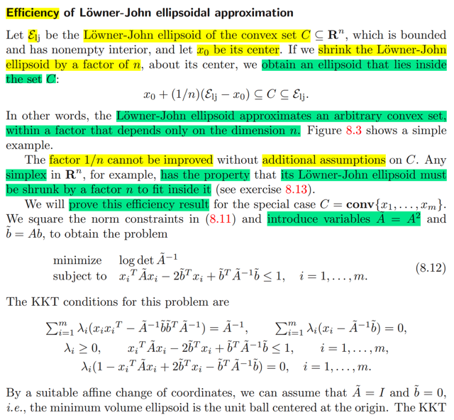</kbd>

<kbd>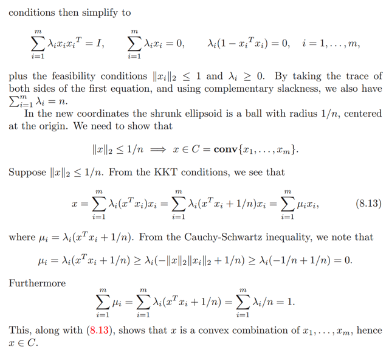</kbd>

> [!NOTE]
> QUAY LẠI SAU

 

<kbd>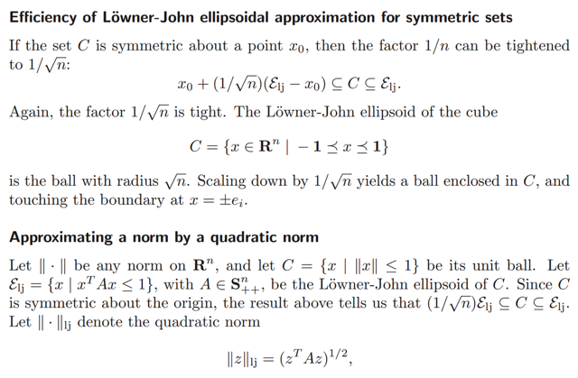</kbd>

<kbd>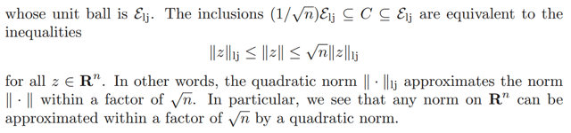</kbd>

> [!NOTE]
> QUAY LẠI SAU

 

<kbd>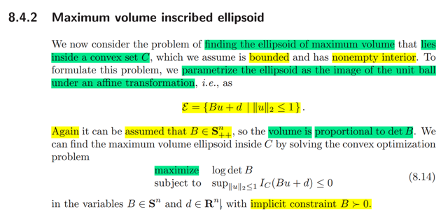</kbd>

<kbd>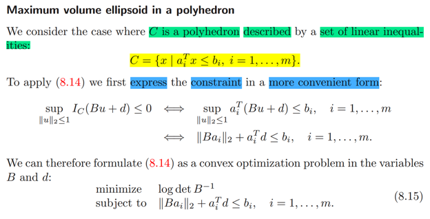</kbd>

> [!NOTE]
> Khi đã hiểu cái L.J ellipsoid rồi thì cái này - inscribed ellipsoid
> hoàn toàn tương tự. Chỉ khác đây là ellipsoid lớn nhất mà
> vẫn nằm trong set C (thay vì nhỏ nhất mà chứa set C)
>
> Với L.J ellipsoid thì εlj ta dùng định nghĩa nó là tập những điểm
> mà khi biến đổi bởi A, b cho ra unit ball {v: ||Av + b|| ≤ 1}
>
> Còn cái này thì người ta dùng định nghĩa là tập những điểm 
> mà sau khi ta biến đổi unit ball bởi B, d: {Bu + d : ||u|| ≤ 1}
>
> Thế thì việc tìm inscribed ellipsoid sẽ được thể hiện bởi bài
> toán optimization:
>
> maximize log det B (again, từ unit ball thông qua B, d cho ra 
> ellipsoid nên thể tích của nó sẽ tỉ lệ thuận vói det B)
>
> constraint nói bằng lời là, kết quả lớn nhất của một vector 
> thuộc unit ball sau khi biến đổi bởi B, d cũng vẫn không vượt
> quá ellipsoid, mà cái vụ vượt quá set C sẽ thể hiện nhờ 
> indicator function IC(x) ta nhớ nó = 0 khi x thuộc C và +infinity
> khi ngoài C
>
> Do đó constraint: sup ||u|| ≤ 1 IC(Bu + b) ≤ 0
>
> ====
>
> và cụ thể hóa khi set C là polyhedron định nghĩa bởi hệ các linear
> inequalities {aiTx ≤ bi, i = 1,2....m}
>
> Khúc dưới chẳng qua là thể hiện / biến đổi lại constraint chút xíu
> không khó hiểu lắm. Có thể quay lại xem kĩ hơn sau\

 

<kbd>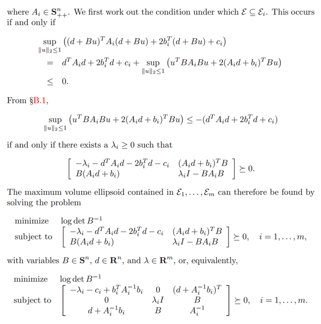</kbd>

<kbd>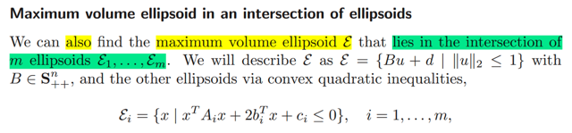</kbd>

> [!NOTE]
> Cái này cũng tương tự như khi ta có thể tìm L.J ellipsoid của một
> set C là  UNION các epplisoid.
>
> thì cái này cũng vậy, tìm inscribed ellipsoid của một set C là
> INTERSECTION của các ellipsoid.
>
> Ý tưởng chính là vậy, Cũng tương tự nên ta sẽ Quay lại sau

 

<kbd>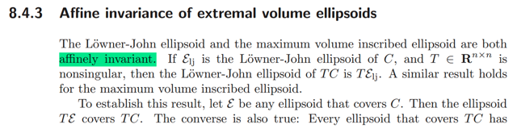</kbd>

<kbd>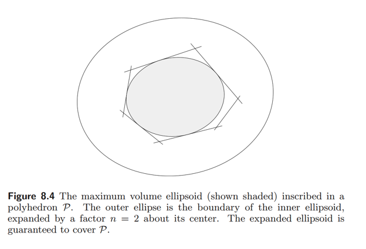</kbd>

<kbd>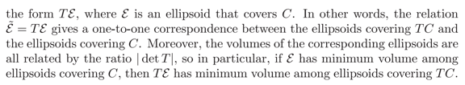</kbd>

<kbd>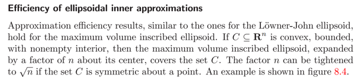</kbd>

> [!NOTE]
> QUAY LẠI SAU

 

<kbd>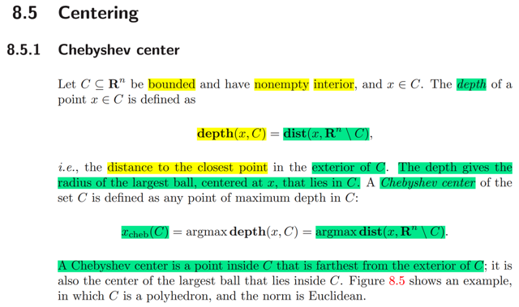</kbd>

<kbd>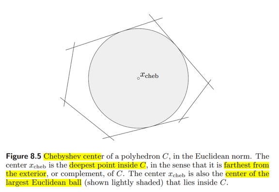</kbd>

> [!NOTE]
> Đại khái định nghĩa của depth - của một điểm đối với một set C
> là khoảng cách của nó đến điểm đến gần nhất không thuộc C
>
> Nôm na là nói về độ sâu của một điểm bên trong C là bao nhiêu.
>
> depth(x, C) = dist(x, R^n \ C)
>
> Thế thì cái điểm mà nằm sâu bên trong C nhất gọi là Chebyshev
> center.
>
> x_cheb(C) = argmax dict(x, R^n \ C)
>
> 8. GEOMETRIC PROBLEM
>
> 8.5 CENTERING

 

<kbd>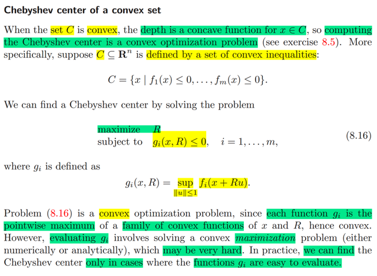</kbd>

<kbd>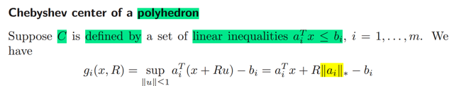</kbd>

<kbd>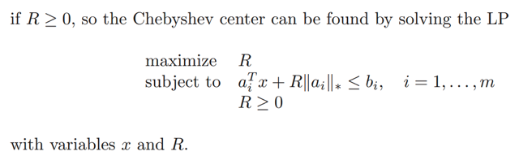</kbd>

> [!NOTE]
> Đại khái là khi set C convex thì bài toán tìm Chebyshev center có thể
> được thấy / nhìn nhận như một bài toán convex optimization problem.
>
> Người ta cho C là convex set define bởi các inequalities fi(x) ≤ 0
>
> Thế thì bài toán optimization có objective là R (R, và x sẽ là optimization
> variable - vì việc tìm Chebyshev center bao gồm việc tìm tâm và bán
> kính)
>
> constraint là gi(x, R) (= sup ||u|| ≤ 1 fi(x + Ru)) ≤ 0 i = 1,2...m
>
> có nghĩa là sao: Nôm na là ta muốn nói rằng (constraint): điểm xa nhất
> extend từ x (yếu tố sup ||u|| ≤ 1 và x + Ru trong sup ||u|| ≤ 1 fi(x + Ru) 
> vẫn thỏa mãn yêu cầu là nằm trong set C (thể hiện bởi fi(x + Ru) ≤ 0)
>
> Thì khi giải bài toán này tìm ra x, và R sao cho fi(x + Ru) là lớn nhất
> nhưng nó vẫn ≤ 0 thì tức là ta đã tìm ra điểm Chebyshev center
>
> Thế thì họ nói đây là convex vì gi là point-wise maximum của các convex
> function.
>
> Có điều giải bài toán này ko dễ, vì mỗi gi có thể thấy là bài toán maximization
> có thể rất khó.
>
> Nên ta chỉ có thể tìm thấy Chebyshev center ở những trường hợp mà gi dễ
> đánh giá mà thôi
>
> ====
>
> Rồi một ví dụ cụ thể khi C là polyhedron (defined bởi set các linear 
> inequalities aiTx ≤ bi)
>
> Khi đó gi(x, R) = sup ||u|| ≤ 1 aiT(x + Ru) - bi
>
> = sup ||u|| ≤ 1 aiTx + RaiTu - bi
>
> = aiTx + R sup ||u|| ≤ 1 { aiTu } - bi
>
> Mà sup ||u|| ≤ 1 { aiTu } chính là định nghĩa của ||ai||* (dual norm)
>
> (dual norm ||x||* = sup zTx ∀ z: ||z|| ≤ 1)
>
> Vậy gi(x, R) = aiTx + R||u||* - bi
>
> Thành ra ta có optimization problem:
>
> maximize R subject to aiTx + R||ai||* ≤ bi
>
> CHƯA HIỂU TẠI SAO PHÀI NÓI CẦN R ≥ 0

 

<kbd>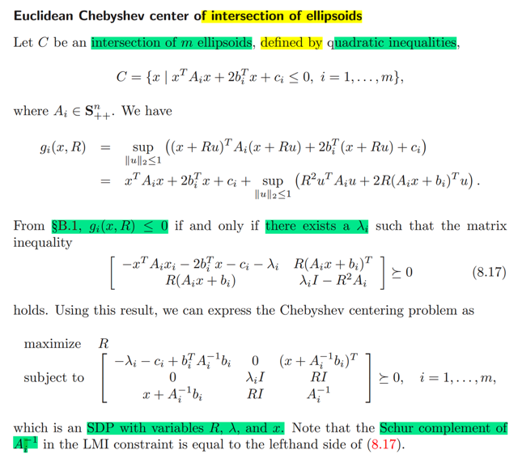</kbd>

> [!NOTE]
> Đại khái là nếu C là intersection của của các ellipsoids thì bài toán
> tìm chebyshev sẽ trở thành bài toán SDP
>
> Nói chung là C LÀ intersection các ellipsoids được định nghĩa là:
>
> {x: xTAix + 2biTx + ci ≤ 0, i = 1,..,m} với Ai ≻ 0
>
> Thì ta define gi(x, R), là sup ||u|| ≤ 1 fi(x + Ru)
>
> triển khai ra, gom những cái dính tới u lại (vì sup over ||u|| mà)
>
> Thế thì mới vận dụng điểm kiến thức trong Appendis nói rằng
> gi(x, R) này ≤ 0 khi và chỉ khi [...] ≽ 0
>
> Từ đó ta mới thể hiện nó là constraint của bài toán optimization
>
> Và nó trở thành bài táon SDP

 

<kbd>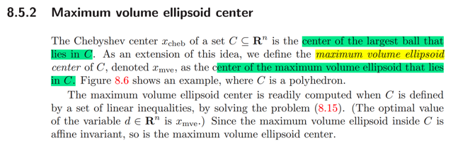</kbd>

<kbd>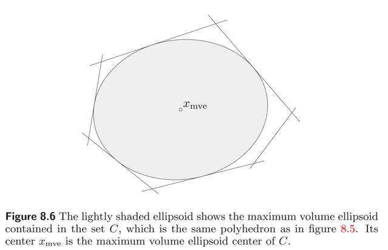</kbd>

> [!NOTE]
> đại khái là với x_che thì nó là điểm sâu nhất bên trong C, cũng là
> tâm của quả cầu lớn nhất chứa trong C.
>
> thì mở rộng cái này, nếu x là tâm của cái ellipsoid lớn nhất chứa
> trong C thì nó gọi là maximum volume ellipsoid.
>
> Thì cái ellipsoid lớn nhất chứa trong chính là cái mà phần trước đã
> nói. Chẳng qua ở đây nói về tâm của nó

 

<kbd>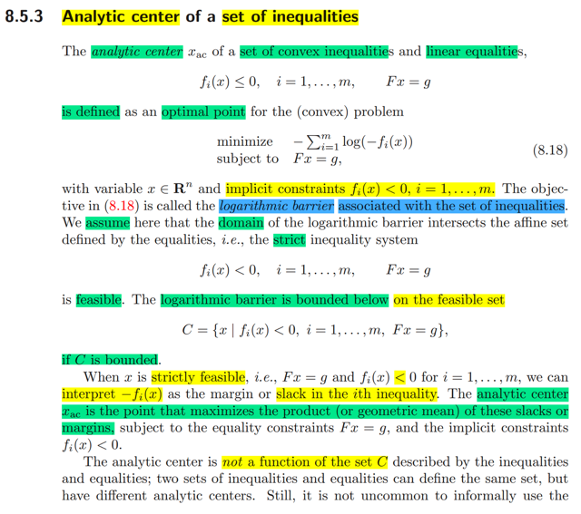</kbd>

<kbd>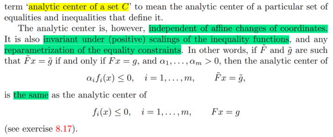</kbd>

> [!NOTE]
> đại khái là, ở đấy nói về một loại "center" mới / khác. Đó là Analytic
> center của một set các convex inequalities và linear equalities.
>
> Giả sử có một set các inequalities fi(x) ≤ 0 và equalities Fz = g
>
> Thì định nghĩa của analytic center của chúng là nó chính là solution của
> việc minimize - Σ log(-fi(x)) với constraint Fx = g.
>
> và objective gọi là logarithmic barrier.
>
> Vậy thì nhìn vào bài toán này, dễ hiểu ngoài constraint Fx = g, thì còn
> implicit constraint: -fi(x) > 0 ⇔ fi(x) < 0 nữa.
>
> Do đó, feasible set C, mà ta đã học theo định nghĩa nó sẽ là tập các
> điểm thỏa explicit constraint cũng như là các implicit constraint (x phải
> thuộc domain của problem = intersection của domain của objective và
> constraint functions) sẽ là: C = x: Fx = g; fi(x) ≤ 0 i = 1, 2..
>
> Thế thì ở đây gs nhận định rằng hàm objective sẽ bị bounded below nếu
> set C bounded below. Nói vậy là bởi objective nếu nhìn sơ qua thì nó có
> thể nhỏ đến vô cùng, vì - log (x) có thể nhỏ đến - infinity. Mà nếu vậy thì
> bài toán này sẽ không có optimal value. Tuy nhiên nếu set C bị chặn
> dưới, thì objective với x feasible sẽ cũng bị chặn dưới giúp bài toán có
> optimal value.
>
> Một điểm nữa đại khái nói về ý nghĩa của Analytic center.
>
> Đầu tiên set các inequalities fi(x) ≤ 0, và equalities: Fx = g. Thì ta giả sử
> tồn tại những điểm Strictly feasible, tức là chúng thỏa inequalities ở
> trạng thái strictly: fi(x) < 0 (và dĩ nhiên Fx = g)
>
> Thì hiểu nôm na là một điểm (∈ C) mà fi(x) càng nhỏ hơn 0 (hay -fi(x)
> càng lớn hơn 0), thì nó càng strictly feasible, và đối với inequalities fi(x)
> ≤ 0 nó càng có trạng thái" CHÙNG" (SLACKNESS).
>
> Và từ đó ta hiểu về analytic center chính là cái điểm mà tối đa trạng
> thái chùng này (bằng cách thông qua  minimize - Σ log [-fi(x)] (cũng là
> maximize Σ log [-fi(x)] , ý nghĩa là geometric mean của slackness).
>
> ====
>
> Khúc cuối đại khái nói là khái niệm analytic center thật ra ko gắn với
> set C, mà là set các inequalities và equalities. Nên dù hai set equa/inequalities
> có thể define chung một set C nhưng analytic center của chúng vẫn khác nhau
>
> Rồi cho biết thêm vài tính chất đại khái là, việc scale inequalities với scalar
> sẽ cho ra (set equa/inequalities) có cùng analytic center
>
> Ví dụ như nếu Fx = g ⇔ Ax = b thì set fi(x) ≤ 0, Fx = g sẽ có cùng analytic 
> center với Ax = b, αi fi(x) ≤ 0

 

<kbd>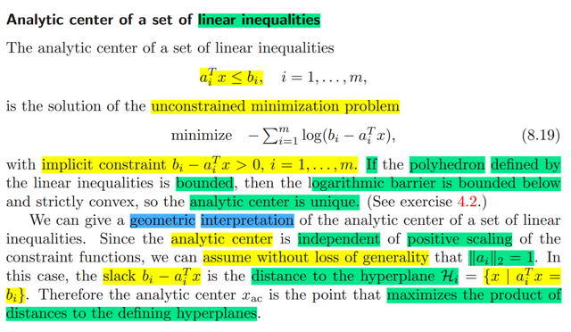</kbd>

> [!NOTE]
> đại khái là xét trường hợp set chỉ gồm các linear inequalities, không
> có equalities: aiTx ≤ bi i = 1,2....m
>
> Thì bài toán tìm analytic center trở thành unconstraint optimization
> problem: minimize - Σ log(bi - aiTx). Dĩ nhiên implicit constraint là
> bi - aiTx > 0
>
> Lúc này feasible set C là {x: aiTx < bi, i = 1,...m} sẽ là một Polyhedron
>
> Nếu nó bị chặn (bounded) thì như đã nói, hàm objective cũng sẽ bị
> chặn dưới (bài toán có optimal) 
>
> Thế thì ý nghĩa của analytic center có thể hiểu về mặt hình học trong
> trường hợp này:
>
> Xét một inequality: fi(x) ≤ 0 ⇔ aiTx ≤ bi mà ở đây phải thỏa implicit
> constraint nên chỉ được dấu <: aiTx < bi
>
> Thì x khiến aiTx - b < 0 sẽ là feasible, và x càng khiến aiTx - bi càng
> dưới 0 thì "càng slack"
>
> Mà ta đã derive việc tìm projection của x0 lên hyperplane C = aTx = b:
>
> PC(x0) = x0 + (b - aTx0)a/||a||^2
>
> Với gỉa định a (normal vector của hyperplane) có unit norm thì:
>
> PC(x0) = x0 + (b - aTx0)a
>
> => distance giữa x0 và hyperplane = ||x0 + (b - aTx0)a - x0|| = ||(b - aTx0)a||
>
> |(b - aTx0)|||a|| (vì (b - aTx0) là scalar: ||αu|| = |α|||u||)
>
> =  |b - aTx0| (vì ||a|| = 1)
>
> Có nghĩa là ta vừa chứng minh distance từ vector x0 với hyperplane aTx = b
> = |b - aTx0|
>
> vậy aiTx - bi càng dưới 0 tức |aiTx - bi| càng lớn chính là khoảng cách từ
> x đến hyperplane aiTx = bi càng lớn.
>
> Do đó analytic center chính là tìm cái điểm mà tích (geometric mean) của
> khoảng cách từ nó đến các "cạnh" của polyhedron lớn nhất

 

<kbd>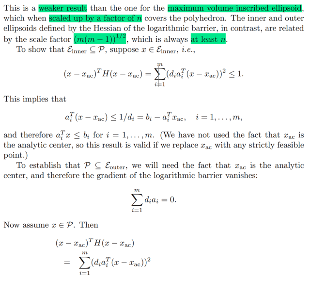</kbd>

<kbd>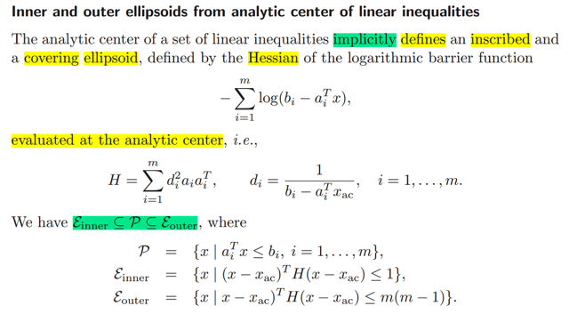</kbd>

<kbd>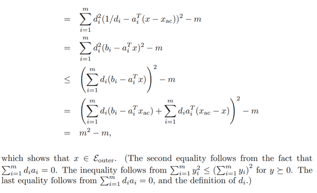</kbd>

> [!NOTE]
> Đại khái là cái analytic center của Polyhedron, sẽ "tạo ra" / là tâm
> của hai cái ellipsoid, một cái ε_inner chứa trong P và một cái 
> bao quanh / chứa P
>
> Và hai cái ellipsoid này được đĩnh nghĩa bởi Hessian của hàm log
> barrier
>
> ε_inner = {x: (x - xac)TH(x - xac) ≤ 1}
>
> ε_outer = {x: (x - xac)TH(x - xac) ≤ m(m-1)}
>
> Thế thì ta đã học về việc một set C, hay cụ thể là Polyhedron P
> có thể có inscribed ellipsoid là cái có thể tích lớn nhất chứa bên
> trong P và cái L.J ellipsoid là cái nhỏ nhất chứa P.
>
> Thì ỏ đây ý nói là cái ε_inner và ε_outer ở đây "yếu hơn" hai cái
> nói trên (ko hiểu yếu hơn là sao)
>
> Phần dưới đơn giản chỉ là chứng minh ε_inner ⊆ P ⊆ ε_outer
>
> Có thể quay lại sau

 

<kbd>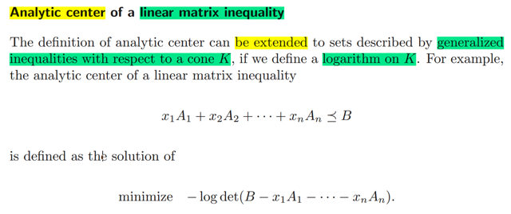</kbd>

> [!NOTE]
> Đại khái là cái này cũng có thể
> mở rộng ra với matrix

 

<kbd>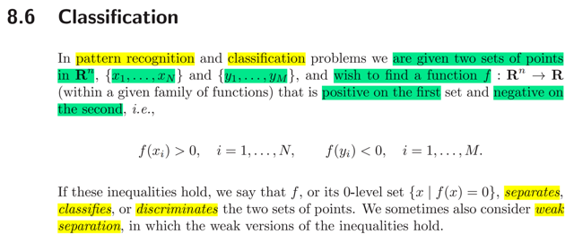</kbd>

<kbd>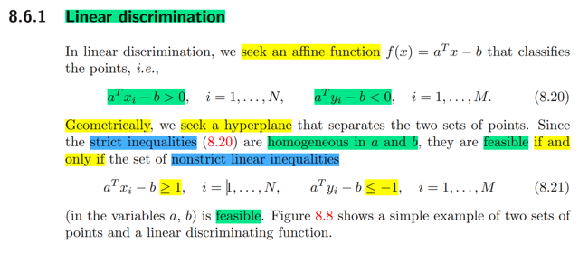</kbd>

> [!NOTE]
> Nói qua bài toán classification, trong đó ta có hai set x1,...xN và y1,
> ...yM
>
> (R^n vector). Yêu cầu là tìm hàm f sao cho f(xi) > 0 và f(yi) < 0
>
> Và ý nghĩa của nó là tập level set f(x) = 0: x: f(x) = 0 sẽ phân chia,
> tách  đôi set x1,...xN và y1, ..yM
>
> Đầu tiên là Linear discrimination, trong đó ta sẽ tìm hàm f có dạng
> tuyến  tính f(u) = aTu - b sao cho f(xi) = aTxi - b > 0 và f(yi) = aTyi - b
> < 0
>
> Về mặt hình học, dễ hiểu chính là ta tìm hyperplane chia tách hai set
> này
>
> Vậy thì ở đây có điểm cần hiểu là vầy:
>
> Nếu nói hàm f chia tách x1, ...xN và y1, ...yM khiến f(xi) < 0 và
> f(yi) > 0 tức là ta nói xi, và yi thuộc hai set: u: f(u) < 0 và v: f(v) > 0
>
> Hay A = u: aTu - b < 0 và B = u: aTu - b > 0
>
> Thế thì hiểu đại khái là, vì A và B là set mở (đây là hai half-space
> không chưa boundary aTu - b = 0) nên kiểu như sẽ có vài khó khăn
>
> Do đó người ta mới xét hai set khác là C: u: aTu - b ≤ 1 và D: u:
> aTu - b ≥ 1 là hai set "đóng" (closed)
>
> Tại sao chọn số "1": Có thể nghiên cứu sau.
>
> CŨNG CHƯA HIỂU LÀ TẠI SAO NHỜ TÍNH CHẤT HOMOGENEOUS 
> THEO a, b MÀ HỆ (1) FEASIBLE KHI VÀ CHỈ KHI HỆ (2) FEASIBLE
>
> Tạm hiểu đại khái là vầy: Muốn aTx - b > 0 => aTx - b ≥ 1 thì aTx - b
> phải có một tính  chất là khi scale nó với số dương bất kì thì nó vẫn
> lớn hơn 0:
>
> α(aTx - b) = (α*a)Tx - α*b > 0
>
> Do đó bài toán tìm a, b sao cho aTx - b > 0 và aTyi - b < 0 có thể
> tương đương tìm aTxi - b ≥ 1 và aTyi - b ≤ 1
>
> 8. GEOMETRIC PROBLEM
>
> 8.6 CLASSIFICATION

 

<kbd>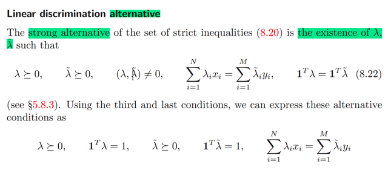</kbd>

<kbd>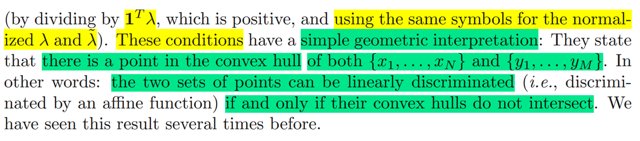</kbd>

> [!NOTE]
> Thế thì ở đây nói đến ALTERNATIVES.
>
> Quick review: Xét hệ fi(x) ≤ 0, hj(x) = 0, (tự hiểu có nhiều i, j)
>
> (gọi là non-strict) và hệ gọi là dual system λ ≽ 0, λ ≠ 0, g(λ, v) > 0
>
> hoặc hệ (strict) fi(x) < 0, hj(x) = 0 và hệ λ ≽ 0, g(λ, v) ≥ 0
>
> Thì "định lý alternative" nói rằng:
>
> Hai hệ (trong cả 2 case strict hay non-strict) này là sẽ có tính chất thế này:  Nếu
> cái này feasible thì suy ra cái còn lại. Đây gọi là Weak alternative
>
> Nếu như có thêm vài điều kiện kèm theo (gọi là qualification constraint),  và fi(.)
> là hàm convex, hi(.) là affine. Thì ta sẽ có Strong alternative:
>
> Cái này infeasible ⇔ Cái kia feasible, Cái này feasible <=> Cái còn lại infeasible
>
> ====
>
> Vậy thì quay lại đây ta có hệ gốc là:
>
> aTxi - b > 0 (⇔ b - aTxi ≤ 0) và aTyi - b < 0
>
> Ta sẽ xây dựng hệ alternative với nó, tức là phải tìm dual function g
>
> Lagrangian: Σ λi (b - aTxi) + Σ λ~i (aTyi - b)
>
> = Σ ( λi b - λi aTxi ) + Σ ( λ~i aTyi - λ~i b)
>
> = Σ λi b - Σ λi aTxi + Σ λ~i aTyi - Σλ~i b
>
> = (Σ λi - Σλ~i) b - aT (Σ λi xi - Σλ~i yi)
>
> = (1Tλ - 1Tλ) b - aT (Σ λi xi - Σλ~i yi)
>
> g(λ, λ~) = inf a, b  (1Tλ - 1Tλ) b - aT (Σ λi xi - Σλ~i yi) 
>
> g(λ, λ~) = inf a  inf b  (1Tλ - 1Tλ) b - aT (Σ λi xi - Σλ~i yi)  
>
> Đây là affine function của b nên
>
> +) Khi 1Tλ - 1Tλ = 0: inf a  inf b  - aT (Σ λi xi - Σλ~i yi)   (1)
>
> +) Khi 1Tλ - 1Tλ ≠ 0: - infinity
>
> Vì  ta cần g > -infinity nên chỉ xét (1) =...
>
> +) = 0 khi Σ λi xi - Σλ~i yi = 0
>
> +) = - infinity khi Σ λi xi - Σλ~i yi ≠ 0
>
> Vậy
>
> g = 0 khi 1Tλ - 1Tλ = 0 và Σ λi xi - Σλ~i yi = 0, và = -infinity otherwise
>
> Vậy alternative system của strict inequalities aTxi - b < 0 aTyi - b > 0 là:
>
> g = 0 ≥ 0; λ ≽ 0, λ~ ≽ 0, λ ≠ 0, λ~ ≠ 0, 1Tλ~ = 1Tλ, Σ λi xi = Σλ~i yi
>
> Và bỏ đi cái g = 0 ≥ 0 và không dùng λ ≠ 0, λ~ ≠ 0 (CHƯA HIỂU VÌ SAO)
> và normalizing λ và λ~ để cho 1Tλ = 1.
>
> λ ≽ 0, λ~ ≽ 0, , 1Tλ = 1,  1Tλ~ = 1, Σ λi xi = Σλ~i yi
>
> ====
>
> Kết luận:
>
> (1)  aTxi - b i = 1,2...N < 0, aTyj - b > 0 j = 1,2...M
>
> strong alternative với:
>
> (2)  λ ≽ 0, λ~ ≽ 0, , 1Tλ = 1,  1Tλ~ = 1, Σ λi xi = Σλ~i yi 
>
> Mà như vậy có nghĩa là nếu (1) feasible ⇔ (2) infeasible, và ngược lại
>
> (1) infeasible ⇔ (2) feasible
>
> Mà nếu (2) feasible có nghĩa là tồn tại λ, λ~ đóng vai coefficients tạo  ta các
> convex combination (do λi, λ~j > 0, và Σ λi = 1, Σ λ~j = 1)  Σ λi xi và Σ λ~j yj
> TRÙNG NHAU
>
> Mà như vậy có nghĩa là CONVEX HULL tạo bởi x1, x2 ...và bởi y1, y2,... CÓ
> GIAO NHAU.
>
> Như vậy nếu convex hull conv x1, x2... intersect với conv y1, y2... thì hệ (1)
> infeasible, đồng nghĩa x1, x2... và y1, y2,... KHÔNG THỂ PHÂN TÁCH
> TUYẾN TÍNH (LINEARLY SEPARABLE)
>
> Ngược lại, nếu convex hull của chúng KHÔNG GIAO NHAU, tức (2) infeasible, thì
> chúng LINEARLY SEPARABLE. (1) feasible

 

<kbd>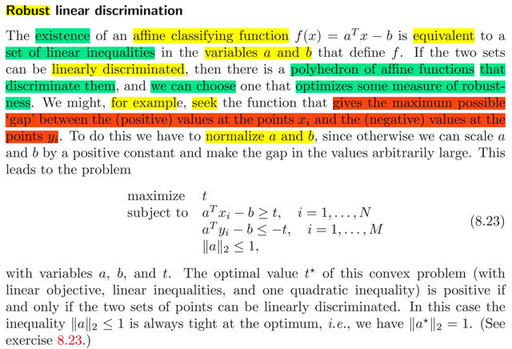</kbd>

<kbd>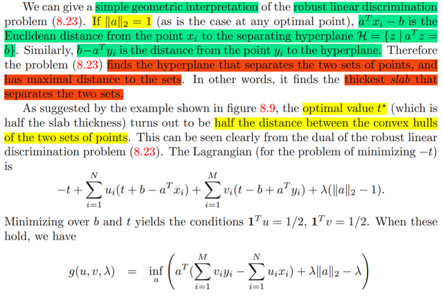</kbd>

<kbd>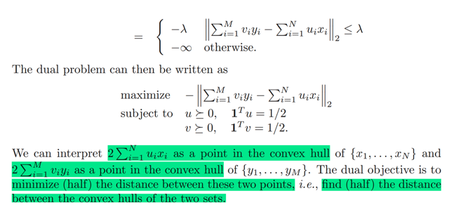</kbd>

> [!NOTE]
> Đại khái là như vừa thấy rằng, khi mà set {x1,..xN} và {y1,...yM} linearly separable,
> thì tức là system các inequalities aTxi - b > 0, aTyj - n < 0 là feasible, đồng nghĩa
> tồn tại a, b định ra function f = aTu - b, và cùng là định ra hyperplane phân tách hai
> set này.
>
> Thêm nữa có thể không chỉ có một mà có thể có nhiều bộ a, b như  vậy, và các
> hyperplane (bởi một bộ a, b) sẽ intersect nhau thành  một Polyhedron (theo định
> nghĩa Polyhedron là intersection của các hữu hạn các hyperplanes, half-spaces. Và
> như vậy khi đó hai set {xi} {yj} này bị chia tách bởi Polyhedron này.
>
> Và do đó ở đây nói rằng, ta có thể chọn ra, tìm kiếm cái nào mà chia tách tốt nhất,
> đánh giá dựa trên một tiêu chí nào đó. Chẳng hạn ví dụ như tiêu chí là ta muốn tối
> đa hóa khoảng cách (gap) giữa giá trị âm aTxi - b (> 0) và aTyj - b (< 0)
>
> Và để làm vậy thì ta cần đầu tiên là normalize a và b, mục đích đại khái là để loại
> bỏ yếu tố thay đổi gap nói trên thông qua việc scale vector a và b, mà chỉ còn dựa
> trên việc chọn "hướng" của a, và value của scalar b  mà thôi
>
> Và bài toán sẽ là:
>
> maximize t constraint aTxi - b ≥ t, aTyj - b ≤ -t và ||a|| ≤ 1
>
> bài toán này sẽ chỉ có p* dương khi và chỉ khi {xi} và {yj} linearly separable
>
> Đoạn nói về việc ||a|| ≤ 1 luôn tight at optimum chưa hiểu lắm nhưng hiểu đại khái
> là ở optimal thì a*sẽ có ||a*|| = 1 (chú ý, ở đây a, b là optimization variable)
>
> Đại khái là ta có thể có một cách giải thích hình học cho bài toán này, hoặc kết qủa
> của bài toán này. Đó là giả sử a*, b* là t* là các optimal value thì với việc ||a*|| = 1
> thì a*Txi - b* chính là khoảng cách từ hyperplane H = {a*Tz = b} tới xi. Và a*Tyj - b*
> là hyperplane H tới yj.
>
> Do đó khi ta maximize t, tức là ta đang maximize lower bound của dist(H, xi)  và
> dist(H, ykj) và cũng chính là maximize dist(H, xi) và dist(H, yj)
>
> Và hình 8.9 cho thấy kết quả nó sẽ "chọn ra" cái Hyperplane H sao cho t = 1/2 khoảng
> cách giữa convex hull bởi xi và yj
>
> ===
>
> Và ta có thể hiểu kết quả này:
>
> Lagrangian L(t, a, b, u, v, λ) = - t + Σ ui (t + b - aTxi) + Σ vi (t - b + aTyj) + λ (||a|| - 1)
>
> (các Lagrange multiplier là ui, vi, λ)
>
> Dual function g(u, v, λ) 
>
> = inf t, a, b { - t + Σ ui (t + b - aTxi) + Σ vj (t - b + aTyj) + λ (||a|| - a) }
>
> = inf t, a, b { - t + Σ ui t + Σ ui b - Σ ui aTxi + Σ vj t - Σ vj b + Σ vj aTyj + λ (||a|| - 1) }
>
> = inf t, a, b { - t + Σ ui t + Σ vj t + Σ ui b - Σ vj b - Σ ui aTxi + Σ vj aTyj + λ (||a|| - 1) }
>
> = inf t, { - t + Σ ui t + Σ vj t + inf a, b { Σ ui b - Σ vj b - Σ ui aTxi + Σ vj aTyj + λ (||a|| - 1) } }
>
> Xét inf a, b { Σ ui b - Σ vj b - Σ ui aTxi + Σ vj aTyj + λ (||a|| - 1) }
>
> = inf a, b { (Σ ui - Σ vj) b - aT (Σ ui xi - Σ vj yj) + λ (||a|| - 1) }
>
> infimum over b thì đây là affine function đối với b nên kết quả ra -infinity trừ khi hệ số gắn
> với b = 0
>
> = inf a { - aT (Σ ui xi - Σ vj yj) + λ (||a|| - a)  } khi Σ ui - Σ vj = 0 (và -infinity otherwise)
>
> = inf a { aT (Σ vj yj - Σ ui xi) + λ (||a|| - a)  } khi Σ ui - Σ vj = 0 (và -infinity otherwise)
>
> ⇨ g = inf t {- t + Σ ui t + Σ vj t + inf a { aT (Σ vj yj - Σ ui xi) + λ (||a|| - 1)  }} subject to Σ ui = Σ vj
>
> inf t { (-1 + Σ ui + Σ vj) t + inf a { aT (Σ vj yj - Σ ui xi) + λ (||a|| - 1)  }} subject to Σ ui = Σ vj
>
> (int over t thì đây linear function đối với t nên kết quả cũng ra -infinity trừ khi hệ số gắn với t = 0
> thì nó bằng 0)
>
> = {0 +  inf a { aT (Σ vj yj - Σ ui xi) + λ (||a|| - 1)  }} subject to (-1 + Σ ui + Σ vj) = 0 và Σ ui = Σ vj
>
> = inf a { aT (Σ vj yj - Σ ui xi) + λ (||a|| - 1) } subject to (-1 + Σ ui + Σ vj) = 0 và Σ ui = Σ vj
>
> = inf a { aT (Σ vj yj - Σ ui xi) + λ (||a|| - 1)  } subject to (-1 + Σ ui + Σ vj) = 0 và Σ ui = Σ vj
>
> Xét inf a { aT (Σ vj yj - Σ ui xi) + λ (||a|| - 1)  } 
>
> = inf a { aT (Σ vj yj - Σ ui xi) + λ ||a|| - λ } 
>
> = λ [ inf a { aT (Σ vj yj - Σ ui xi) / λ + ||a|| - 1 } ] 
>
> (chuyển thành - sup và đổi dấu mọi term trong {...}
>
> = - λ [ sup a { - aT (Σ vj yj - Σ ui xi) / λ - ||a|| } + 1 ] 
>
> = - λ [ sup a { aT (- Σ vj yj + Σ ui xi) / λ - ||a|| } + 1 ] 
>
> Đến đây áp dụng:
>
> sup x {yTx - ||x||} = :
>
> a) 0 khi ||y||* ≤ 1
>
> b) +infinity khi ||y||* > 1
>
> = 1) - λ (0 + 1) khi || - (Σ vj yj - Σ ui xi) / λ ||* ≤ 1  và -infinity otherwise
>
> ⇔ g = - λ khi || - (Σ vj yj - Σ ui xi)||* ≤ λ 
>
> Mà || - (Σ vj yj - Σ ui xi) / λ ||* = || (Σ vj yj - Σ ui xi) / λ ||* (Do ||u||* = ||-u||)
>
> Vậy g = - λ khi || (Σ vj yj - Σ ui xi) / λ ||*  ≤ λ và (-1 + Σ ui + Σ vj) = 0 và Σ ui = Σ vj
>
> (-1 + Σ ui + Σ vj) = 0 và  Σ ui = Σ vj ⇔  Σ ui = Σ vj = 1/2
>
> Bài toán dual problem sẽ là:
>
> maximize g = - λ 
>
> constraint || (Σ vj yj - Σ ui xi) / λ ||*  ≤ λ và 1Tu = 1Tv = 1/2, u, v ≽ 0
>
> Thì nó equivalent với:
>
> maximize  - || (Σ vj yj - Σ ui xi) / λ ||* constraint 1Tu = 1Tv = 1/2, u, v ≽ 0
>
> (vì λ ≥  || (Σ vj yj - Σ ui xi) / λ ||* , nên - λ ≤ - || (Σ vj yj - Σ ui xi) / λ ||* mang ý nghĩa là - λ 
> lớn nhất là = - || (Σ vj yj - Σ ui xi) / λ ||*, là upper bound. Nên để maximize λ ta sẽ đẩy cái
> upper bound này cao lên
> maximize  - || (Σ vj yj - Σ ui xi) / λ ||* constraint 1Tu = 1Tv = 1/2, u, v ≽ 0
>
> (vì λ ≥  || (Σ vj yj - Σ ui xi) / λ ||* , nên - λ ≤ - || (Σ vj yj - Σ ui xi) / λ ||* mang ý
> nghĩa là - λ  lớn nhất là = - || (Σ vj yj - Σ ui xi) / λ ||*, là upper bound. Nên để
> maximize λ ta sẽ đẩy cái upper bound này cao lên
>
> Và || Σ ui xi - Σ vj yj || với 1Tu = 1/2, 1Tv = 1/2 và u, v ≽ 0 thì chính là 1/2
> khoảng cách, giữa  hai điểm trong convex hull. Là sao.
>
>
>
> || Σ ui xi - Σ vj yj || = 1/2 || 2Σ ui xi - 2Σ vj yj || 
>
> và với 1Tu = 1/2 ⇨ 2*1Tu = 1, và 2*1Tv = 1 nên 2Σ ui xi, 2Σ vj yj chính là 2 convex combination
> của {xi}, {yj}. Cũng là 2 điểm trong convex hull tạo bởi hai set.
>
> Do đó objective của dual problem chính là đang minimize 1/2 khoảng cách giữa 2 điểm
> trong hai convex hull
>
> Và đó cũng chính là đang tìm khoảng cách giữa hai convex hull

 

<kbd>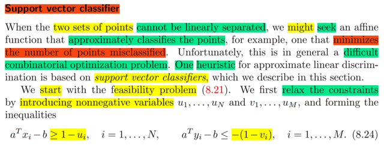</kbd>

<kbd>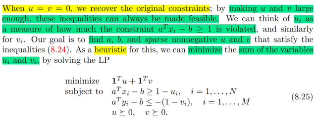</kbd>

> [!NOTE]
> Đại khái là nói về trường hợp mà hai set {x1,...xN} và {y1,...yM} không thể
> phân tách tuyến tính được (như lúc nãy đã nói, điều này xảy ra khi convex
> hull tạo bởi {xi} và convex hull bởi {yj} không giao nhau.
>
> Khi đó, đại khái là ta có thể classify theo tính chất ước lượng (chấp nhận có
> sai sót) mà điều đầu tiên có thể nghĩ đến đó là ước lượng theo kiểu tối thiểu
> hóa tỉ lệ misclassification.
>
> Tuy nhiên làm vậy khó.
>
> Do đó đại khái là có những cách thức mang tính chất heuristic (dựa vào kinh
> nghiệm) để cũng hướng tới mục tiêu này (nhưng ko phải là đặt objective cụ
> thể là giảm thiểu misclassification).
>
> Và cách làm đó, đại khái là vầy. Đầu tiên nói lại về bài toán hồi nãy tức là ta
> muốn tìm f(u) = aTu - b sao cho aTxi - b > 0 và aTyj - b < 0 (tất nhiên là ∀ xi,
> yj). Như đã nói, đang xét trường hợp hai set n{xi}, {yj} không linearly
> separable nên hệ này infeasible.
>
> Ngoài ra còn nhớ một cái nữa, đó là hệ (strictly inequality) aTxi - b > 0,  aTyj -
> b < 0 có thể equivalent với một hệ non-strict là aTxi - b ≥ 1, aTyj - b ≤ -1 Và dĩ
> nhiên là hệ non-strict này cũng infeasible luôn.
>
> Thế thì hệ gốc infeasible, không thể absolute classify nên ta mới phải
> approximate, và hướng làm là NỚI LỎNG BỚT YÊU CẦU (RELAXATION)
>
> Là sao, tức là nếu aTxi - b ≥ 1 không thể thõa mãn được, thì giảm vế phải xuống
> hoặc tăng vế trái lên, bằng cách cộng vào vế trái một số không âm ui:
>
> aTxi - b + ui ≥ 1, khi đó vế trái nó lớn hơn rồi thì khả năng nó thỏa (≥ 1) sẽ trở
> nên khả thi hơn. Và chắc chắn là chỉ cần ui lớn đến mức nào đó thì hệ sẽ
> thỏa. Y như vậy nếu aTyj - b ≤ -1 không thỏa thì ta sẽ cộng vào vế phải số
> không âm vj, thì nếu nó đủ lớn thì bất phương trình sẽ thỏa.
>
> Như vậy từ hệ gốc aTxi - b ≥ 1, aTyj - b ≤ -1 INFEASIBLE, ta có hệ sau đây
> aTxi - b ≥ 1 - ui, aTyj - b ≤ -1 + vj CÓ THỂ FEASIBLE
>
> Và ta có thể voi ui, vj LÀ MỨC ĐỘ NỚI LỎNG / VI PHẠM CONSTRAINT
> Ở CASE xi, yj (Vì nếu không chấp nhận vi phạm thì ko thể tìm ra a, b thỏa
> aTxi - b ≥ 1 và aTyj - b ≤ -1 được, nhưng chấp nhận thì có thể tìm a, b thỏa
> aTxi - b ≥ 1 - ui, aTyj - b ≤ -1 + vj)
>
> Và mục tiêu của bài toán sẽ là tìm ra a, b và u = [u1, ...uN], v = [v1, ...vM] sao 
> cho thỏa hệ aTxi - b ≥ 1 - ui, aTyj - b ≤ -1 + vj nhưng u, v SPARSE. Ý nghĩa là
> ta muốn nới lỏng constraint để có thể tìm ra a, b thỏa hệ, nhưng chỉ nới lỏng
> vừa đủ. Vì không phải với xi nào aTxi - b ≥ 1 cũng cần add thêm ui. Và kết quả
> ta muốn nói trên, ta sẽ có vector u, v với CÀNG ÍT VỊ TRÍ KHÁC 0 CÀNG TỐT
> = THƯA THỚT (SPARSE), mà những vị trí khác 0 cũng nên có giá trị nhỏ,
> còn những vị trí bằng 0 thể hiện aTxi - b ≥ 1 + ui với ui = 0 thể hiện "ở case"
> xi đó ta KHÔNG CẦN PHẢI NỚI LỎNG / VI PHẠM CONSTRAINT.
>
> Và CÁCH THỨC MANG TÍNH KINH NGHIỆM NGƯỜI TA SẼ DÙNG ĐÓ LÀ
> MINIMIZE TỔNG ui, vj: Σ ui + Σ vj = 1Tu + 1Tv
>
> Từ đó ta có bài toán optimization:
>
> minimize 1Tu + 1Tv constraint aTxi - b ≥ 1 - ui, aTyj - b ≤ -1 + vj, u ≽ 0, v ≽ 0

 

<kbd>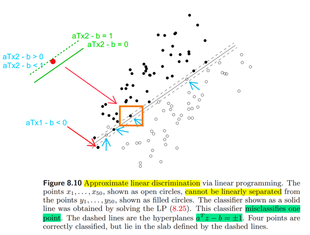</kbd>

<kbd>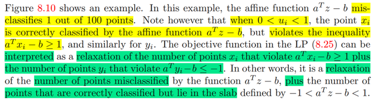</kbd>

> [!NOTE]
> Vậy thì đây là ví dụ mà kết qủa của bài toán minimize 1Tu + 1Tv
> constraint aTxi - b ≥ 1 - ui, aTyj - b ≤ -1 + vj
>
> Cho thấy nó phân tách hai set với 1 cái bị sai (misclassified)
>
> Thế thì họ nói rằng, xét 1 cái xi nào đó được phân tách đúng, tức
> là aTxi - b ≥ 1 - ui, thì nếu 0 < ui < 1 thì 1 - ui > 0. Nên aTxi - b > 0
> nhưng 
> Mà cái này nghĩa là, xi vẫn có thể được phân tách đúng bởi f(z)
> = aTz - b (vì bỏ xi vào nó vẫn ra aTxi - b > 0) NHƯNG nó không
> thỏa aTxi - b ≥ 1 (vì aTxi - b chỉ ≥ 1 - ui thôi, chưa chắc ≥ 1)
>
> Như vậy, câu chuyện là vầy:
>
> Ta bắt đầu với một hệ mà ta muốn thỏa (muốn tìm a, b để thỏa):
>
> aTxi - b > 0, aTyj - b < 0.
>
> Rồi ta mới làm việc với một hệ khác tương đương nhưng non-stritct:
>
> aTxi - b ≥ 1, aTyj - b ≤ -1
>
> Nhưng ta lại đang xét bài toán mà cả hai hệ này đều infeasible
>
> Nên ta mới nới lỏng / cho phép vi phạm constraint bằng cách xét hệ:
>
> aTxi - b ≥ 1 - ui, aTyj - b ≤ -1 + vj
>
> Để rồi khi tìm ra a, b, u, v khiến hệ (3) feasible thì có những xi khiến
> hệ (1) thỏa nhưng hệ (2) không thỏa
>
> Do đó việc giải hệ (3) coi như ta chấp nhận những trường hợp không
> thỏa hệ (2) (thỏa hệ (1) nhưng không thỏa hệ (2))
>
> Và bên cạnh đó, a, b giải từ hệ (3) vẫn có những xi yj bị classify sai
> bởi hệ (1).
>
> Nên tóm lại. Nói đầy đủ thì việc dùng hệ (3) để tìm a, b ta đã chấp
> nhận:
>
> a) Có những case mà hệ (1) không thỏa. Tức là classify sai: 
> ví dụ aTxi - b < 0
>
> b) Có những case mà hệ (1) thỏa, nhưng hệ (2) không thỏa:
> ví dụ aTxi - b > 0 nhưng aTxi - b < 1: 0 < aTxi - b < 1
>
> Và biểu hiện hình học là:
>
> Vẽ hyperplane f(z) = aTz - b ra. Và hai "biên" aTz - b + 1, aTz - b - 1
> ra. Thì sẽ có:
>
> a) Có những điểm bị sai ví dụ aTx1 - b < 0, nó là những xi (chấm đen
> mà nằm bên phía trắng)
>
> b) Có những điểm classify đúng (thỏa (1)) nhưng (không thỏa (2)) = 
> nằm bên trong phạm vi của miếng / dải (slab) aTx - b +/- 1.
>
> Ví dụ trong hình x2 thỏa aTx2 - b > 0, nhưng 0 < aTx1 - b < 1
>
> (vì nếu thỏa (2) luôn thì nó phải nằm ở trên dải này, tức nằm trên
> đường dash line aTx - b > 1)
>
> Vậy thì ta sẽ hiểu thế này.
>
> Ta muốn giảm (số lượng / mức độ) mà ta phải nới lỏng constraint
> hay, cũng là giảm số violate. Và như đã nói, nó bao gồm 2 thứ:
>
> a) Số điểm bị classify sai và b) Số điểm classify đúng nhưng không
> tự tin (thỏa hệ (1) nhưng không thỏa hệ (2))

 

<kbd>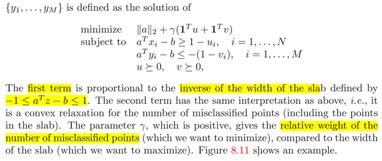</kbd>

<kbd>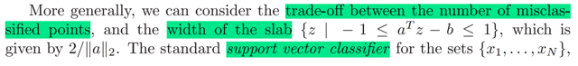</kbd>

<kbd>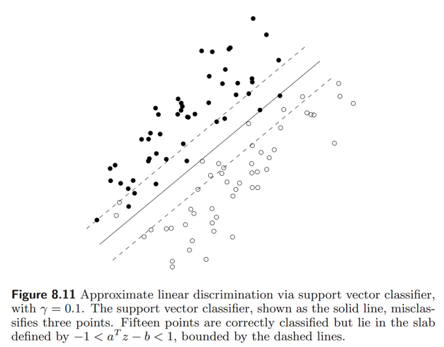</kbd>

> [!NOTE]
> Thế thì, khái quát / mở rộng hơn, ta còn muốn maximize bề rộng
> của slab nữa có nghĩa là ta muốn objective phản ánh những tiêu
> chí sau đây:
>
> + Bề rộng slab rộng nhất có thể để những một khi một điểm đã bị
> phân tách bởi slab này thì tức là nó được classify với mức độ tự tin
> cao
>
> + Số điểm nằm trong slab bao gồm bị classify đúng ít nhất có thể
> thể hiện ít điểm bị classify sai hoặc đúng nhưng ko tự tin
>
> Tất nhiên đây là những tiêu chí sẽ confict / constradict nhau dẫn
> đến bài toán sẽ kiểu như tìm ra pareto optimals / trade off giữa hai
>
> Và đó chính là objective: ||a|| + γ (1Tu + 1Tv)
>
> trong đó giảm ||a|| sẽ tăng bề rộng slab (hình dung nếu trong trường
> hợp f(x) = az - b đường thẳng (cũng là hyperplane) là a là độ dốc
> của đường tuyến tính az + b, thì a càng lớn thì đường càng dốc
> Và hình dung hai đường song song với nó, sao cho 3 đường này cắt
> trục tung ở một đoạn dài = 2 đơn vị. Thì nếu càng dốc, thì bề rộng
> của dải này càng hẹp
>
> còn giảm 1Tu + 1Tv chính là để thể hiện mong muốn giảm số sai sót
> hoặc số điểm đúng nhưng nằm trong slab
>
> Còn γ là trọng số (relative weight) để phản ánh mức độ mà ta sẽ
> muốn ưu tiên tiêu chí nào.
>
> Có thể nhớ đây có thể coi là một kiểu scalarization khi ta có bài
> toán vector optimization hay multi-criterion optimization problem
> trong đó ta muốn minimize 2 objective ||a||: cho bề rộng slab và
> 1Tu + 1Tv cho mức độ sai sót.
>
> Và ta kết hợp nó thành vector [F1 = ||a|| F2 = 1Tu + 1Tv] rồi scalarizing
> bằng cách dot product với vector [λ1 = 1, λ2 = γ]

 

<kbd>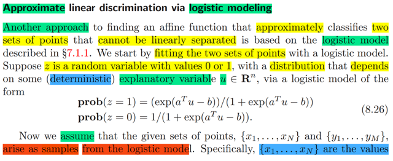</kbd>

<kbd>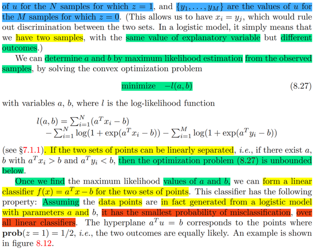</kbd>

<kbd>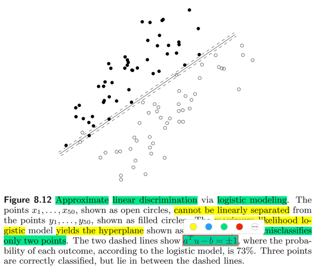</kbd>

> [!NOTE]
> đại khái là, bên cạnh cách tiếp cận bài toán approximate linear discrimination (nôm na là ta không
> phân tách tuyến tính một cách chính xác được, nên phải làm theo kiểu approximate, ước lượng xấp
> xỉ, gần đúng) theo support vector classifier. Thì một phương pháp khác là dùng logistic model.
>
> Thế thì, ta đã nói về logistic model trong phần maximum likelihood estimation.
>
> Đại khái là bắt đầu từ việc ta có các observed value y1,y2,....ym mang các giá trị 0 hoặc 1 tương ứng
> với các deterministic explanatory variable) u1, u2,..um.
>
> Và ta muốn mô hình hoá (liên hệ giữa ui và yi).
>
> Với logistic model ta sẽ mô hình như sau:
>
> P(y = 1) = p = exp(aTu - b) / 1 + exp(aTu - b)
>
> P(y = 0) = 1- p = 1 / 1 + exp(aTu - b)
>
> Có nghĩa là với fixed giá trị của a, b ta có function mà khi input vào  explanatory variable ui, output sẽ
> là xác suất yi = 1.
>
> Từ đó ta có likelihood function (coi ui, yi là fixed, và ta có function theo a, b để input vào a, b ta có
> likelihood của observed data ui, yi
>
> l(a, b).
>
> Cũng bắt đầu từ joint probability:
>
> Pa,b(Y1 = y1, Y2 = y2,....Ym = ym) (ta có m random sample, mang các observed value y1, y2,...)
>
> = Π Pa,b(Yi = yi)
>
> Giả sử trong đó có p observed value mang giá trị = 1, m - p mang giá trị 0:
>
> = Π (yi = 1) p Π (yj = 0) (1 - p)   |   Π (yi = 1) p ý là xét số random sample mang giá trị yi = 1
>
> Lấy log: Để có log likelihood:
>
> = log [ Π yi = 1 exp(aTui - b) / 1 + exp(aTui - b) Π yj = 0 1 / 1 + exp(aTui - b) ]
>
> = Σ (yi = 1)  log [ exp(aTui - b) ] - log [ 1 + exp(aTui - b) ]  + Σ (yj = 0) log 1 - log [ 1 + exp(aTui - b) ]
>
> = Σ (yi = 1) (aTui - b) - Σ (yi = 1) log [ 1 + exp(aTui - b) ] - Σ (yj = 0) [ log [ 1 + exp(aTui - b) ]
>
> Và giải bài toán optimization maximize l(a,b) ta sẽ có maximum likelihood estimator a, b
>
> ====
>
> Vậy thì áp dụng vào đây, khi ta có hai set x1, x2, ...xM và y1, y2, ...yN.
>
> Ta sẽ đổi lại kí hiệu, cho khỏi nhầm:
>
> Mô hình logistic sẽ là:
>
> P(z = 1) = p = exp(aTu - b) / 1 + exp(aTu - b)
>
> P(z = 0) = 1 - p = 1 / 1 + exp(aTu - b)
>
> Ta sẽ cho rằng chúng là các giá trị của ui và set x1,...xM gắn với observed value zi = 1, còn y1,..yN
> gắn với observed value zj = 0.
>
> Khi đó, likelihood function sẽ là:
>
> P(M observed value zi = 1, N observed values zj = 0)
>
> = Π i=1:M exp(aTxi - b) / 1 + exp(aTxi - b) Π j=1:N 1 / 1 + exp(aTyj - b)
>
> Log likelihood: l(a,b):
>
> = log Π i=1:M exp(aTxi - b) / 1 + exp(aTxi - b) Π j=1:N 1 / 1 + exp(aTyj - b)
>
> = Σ i=1:M log exp(aTxi - b) - Σ i=1:M log [ 1 + exp(aTxi - b) ] + Σ j=1:N log 1 - Σ j=1:N log [ 1 + exp(aTyj - b) ]
>
> = Σ i=1:M (aTxi - b) - Σ i=1:M log [ 1 + exp(aTxi - b) ] - Σ j=1:N log [ 1 + exp(aTyj - b) ]
>
> Và giải bài toán tối ưu: maximize l(a, b) sẽ cho ta maximum likelihood estimator
>
> Thế thì, họ nói rằng, khi ta giải bài toán này, nếu mà hai set này là linearly separable, thì
> bài toán này sẽ unbounded below, tức là ta sẽ không có optimal
>
> VÌ SAO? Trả lời bên dưới:
>
> Còn ngược lại, tức không linearly separable. Thì ta sẽ có optimal, tức a, b và khi đó
> hyperplane aTu - b sẽ là cái hyperplane mà thể hiện P(z = 1) = 1/2
>
> Có nghĩa là mọi điểm trên hyperplane aTu = b sẽ có exp(aTu - b) / [1 + exp(aTu - b)] = 1/2
>
> ====
>
> Tại sao khi set {x1,...xM} và {y1,...yN} linearly separable thì bài toán minimize - l(a,b) unbounded
> below?
>
> Đại khái là vầy: 
>
> xét l(a, b) = Σ i=1:M (aTxi - b) - Σ i=1:M log [ 1 + exp(aTxi - b) ] - Σ j=1:N log [ 1 + exp(aTyj - b) ]
>
> Thì khi hai set linearly separable, tức là tồn tại a, b tạo hyperplane aTz - b phân tách hoàn toàn
> hai set. Đồng nghĩa tồn tại a, b khiến hệ (1): aTxi - b > 0, aTyj - b < 0 thỏa.
>
>
> Xét hàm l(a,b) theo công thức ban đầu: l(a,b) = log [ Π i=1:M σ(aTxi - b) Π j=1:N [1 - σ(aTyj - b)] ]
>
> (σ(.) là kí hiệu của hàm sigmoid σ(u) = exp(u) / [1 + exp(u)]
>
> scale a,b với scalar α lớn dần thì (aTxi - b) sẽ -> + infinity khi đó σ(aTxi - b) -> +1 (vì hàm sigmoid
> ta biết rồi) ⇨ log σ(aTxi - b) -> log (1) = 0
>
> tương tự, aTyj - b < 0 ⇨ scale a, b với α lớn dần thì aTyj - b -> -infinity ⇨ σ(aTyj - b) -> 0
> ⇨ 1 - σ(aTyj - b) -> 1 ⇨ log [1 - σ(aTyj - b)] -> -infinity (*chỗ này quay lại sau)
>
> ⇨ -l(a,b) -> -infinity
>
> TẠM THỜI NHƯ VẬY, QUAY LẠI SAU

 

<kbd>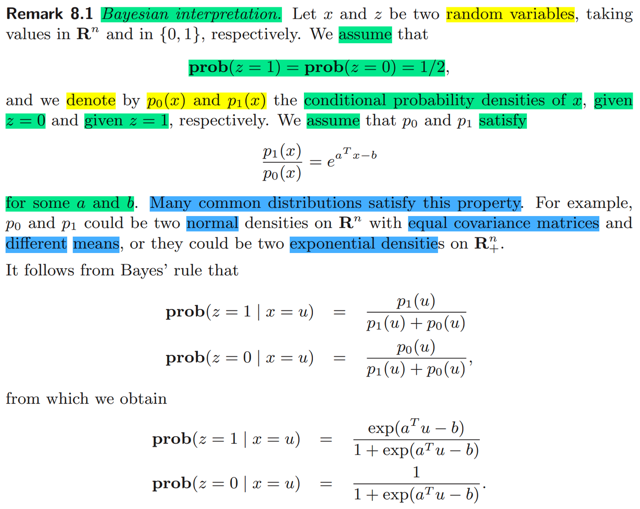</kbd>

<kbd>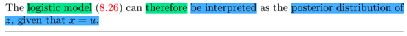</kbd>

> [!NOTE]
> QUAY LẠI SAU

 

<kbd>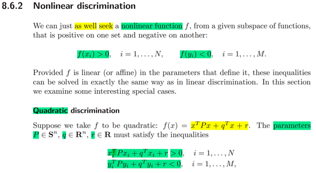</kbd>

<kbd>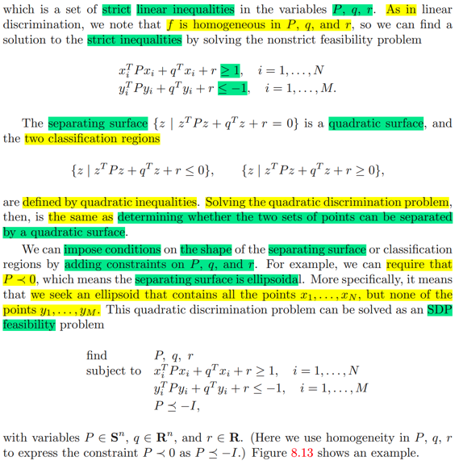</kbd>

> [!NOTE]
> Đại khái là ta có thể quy định f (cần tìm) không phải linear mà
> non-linear. Và ví dụ ta có thể tìm một hàm quadratic có  dạng f(x) =
> xTPx + qTx + r. Param cần tìm là P, q, r
>
> Thế thì, hoàn toàn tương tự, ta bắt đầu với việc muốn tìm P, q, r sao
> cho nó strictly separate {x1,..xN} và {y1,...yM} thông qua việc thỏa:
> xiTPxi + qTxi + r > 0 và yjTPyj + qTyj + r < 0.
>
> Rồi, ta cũng chuyển nó thành hệ non-strict tương đương:
>
> xiTPxi + qTxi + r ≥ 1 và yjTPyj + qTyj + r ≤ -1
>
> Thế thì, khi tìm ra P, q, r thỏa hệ này, tương tự khi với linear function
> ta có một hyperplane phân tách hai set. Ở đây ta sẽ có một Quadratic
> surface phân tách hai set.
>
> Thế thì người ta nói rằng, mình có thể tạo thêm / đặt ra thêm quy định
> về HÌNH DẠNG của separating surface thông qua việc add thêm
> constraint đối với P, q, r.
>
> Ví dụ như nếu ta yêu cầu P ≺ 0 (cũng chuyển thành P ⪯ I) là negative
> semi definite thì tức là ta muốn separating surface là một ellipsoid. Để
> rồi nếu phân tách thì nó sẽ  tìm ra một ellipsoid chứa một set (bao
> quanh nó) và set còn lại thì ở ngoài.

 

<kbd>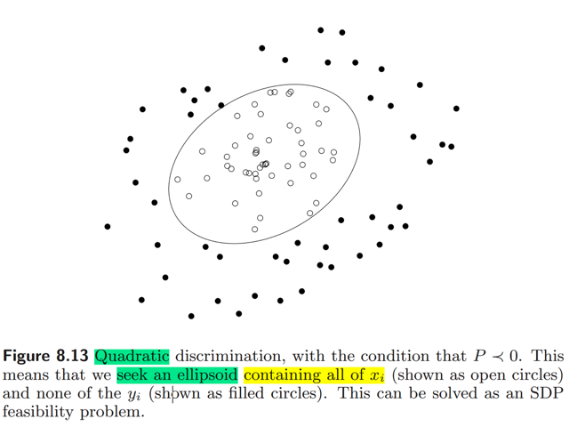</kbd>

 

<kbd>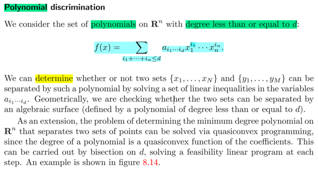</kbd>

<kbd>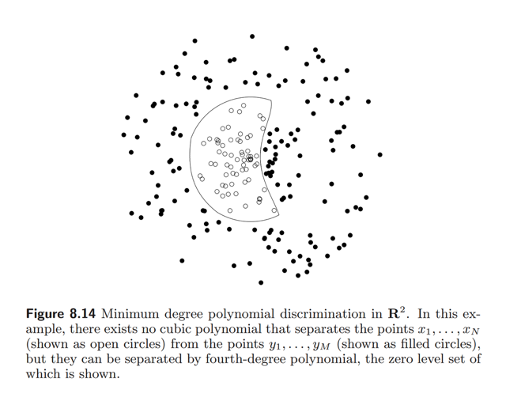</kbd>

> [!NOTE]
> QUAY LẠI SAU

 

<kbd>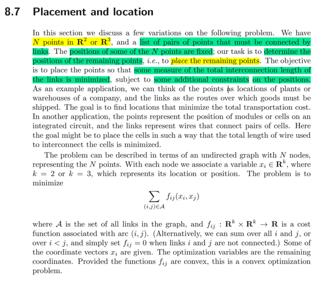</kbd>

> [!NOTE]
> QUAY LẠI SAU
>
> 8. GEOMETRIC PROBLEM
>
> 8.7 PLACEMENT & LOCATION

 

<kbd>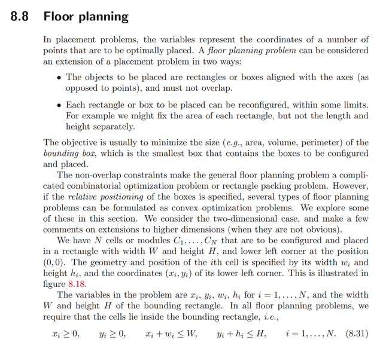</kbd>

> [!NOTE]
> QUAY LẠI SAU
>
> 8. GEOMETRIC PROBLEM
>
> 8.8 FLOOR PLANNING

 

