# Lec 2

📊 **Progress:** `55` Notes | `71` Screenshots | `14` AI Reviews

---

## Lec 2

 

<kbd>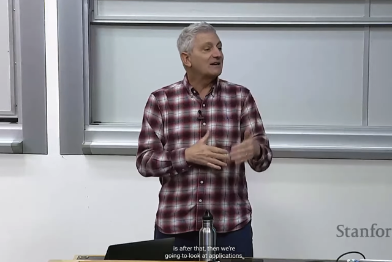</kbd>

> [!NOTE]
> Đại khái là 3 tuần đầu này chỉ toàn toán với toán thôi. Hiểu được sơ sơ là ok rồi. Qua các tuần sau với các ứng dụng ta sẽ hiểu rõ hơn.

 

<kbd>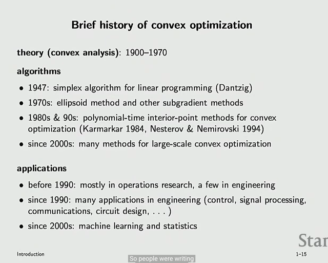</kbd>

> [!NOTE]
> Đại khái là nói sơ về lịch sử của môn này

 

<kbd>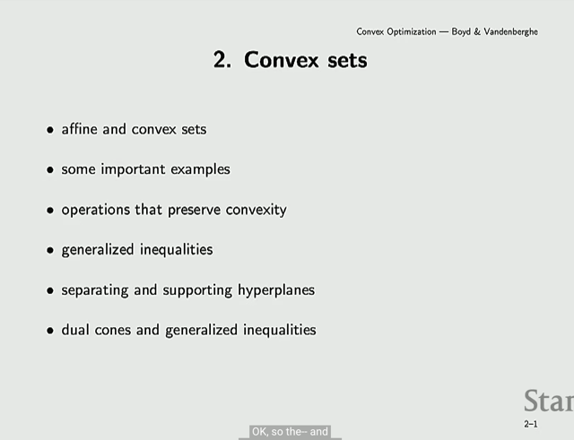</kbd>

> [!NOTE]
> Đại khái là đây không phải là lớp toán, mà là ứng dụng toán để giải quyết một vấn đề.
>
> Do đó, gs nói ta cần học được một skill là nhận ra được khi nào
> vấn đề đang đối mặt thuộc một CONVEX SETS, và tuần sau thì ta
> sẽ nói về CONVEX FUNCTION
>
> CHAPTER 2 - CONVEX SET

 

<kbd>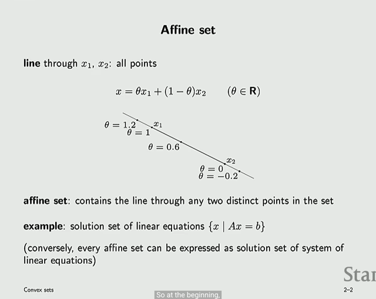</kbd>

> [!NOTE]
> Đầu tiên, ta sẽ nói về việc ta có hai vector x1, x2. Và ta sẽ thực hiện một **linear combination** của chúng với coefficients có tính chất đặc biệt là **tổng bằng 1**: 
>
> x = θx1 + (1 - θ)x2
>
> Và với các θ khác nhau ta có một đường thẳng đi qua x1, x2. Gs cho rằng đây có thể gọi là parameterized by θ, khi với các θ khác nhau ta có các điểm khác nhau trên đường thẳng.
>
> Thế thì ta đã biết **LINEAR COMBINATION**, nhưng khi các coefficients có tổng bằng 1 thì ta gọi nó là **AFFINE COMBINATION**.
>
> Ta biết với x1, x2 là hai vector khác nhau thì mọi linear combination của x1, x2 sẽ là một **2D subspace span bởi x1, x2**.
>
> Khi các coeffs có **thêm ràng buộc có tổng bằng 1** để thành **affine combination** thì tập hợp mọi affine combination trở thành **chỉ là đường thẳng đi qua hai điểm**.
>
> Với linear combination ta có khái niệm SUBSPACE, là set thỏa tính chất nếu x1, x2 thuộc subspace thì mọi linear combination của chúng cũng thuộc subspace
>
> Thì ở đây ta có AFFINE SET là set chứa mọi đường thẳng đi qua hai điểm bất kì trong set (hai khái quát hơn là mọi affine combination của mọi điểm bất kì trong set)
>
> Gs cho một ví dụ về affine set là tập hợp các solution của Ax = b mà gs đề nghị ta có thể check lại xem có phải là** giả sử x1, x2 là solution thì với θ bất kì thì θx1 + (1- θ)x2 có phải là solution** không:
>
> Thử check: 
>
> A[θx1+(1-θ)x2] 
>
> = Aθx1 + A(1-θ)x2 
>
> = Aθx1 + Ax2 - Aθx2 =
>
> θAx1 + Ax2 - θAx2 = θb + b - θb = b.
>
> (Do x1, x2 đều là solution nên Ax1 = Ax2 = b)
>
> Vậy đúng là **với θ bất kì thì x = θx1 + (1 - θ)x2 cũng thuộc solution set của Ax = b**, do đó solution set này là một AFFINE SET
>
> AFFINE SET

 

<kbd>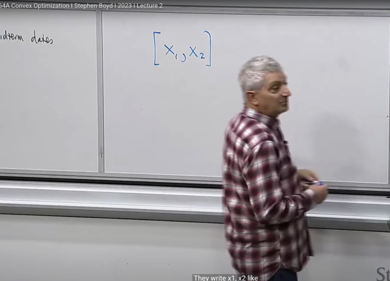</kbd>

> [!NOTE]
> Tiếp, gs cho biết nếu thêm ràng buộc **θ có giá trị từ 0 đến 1** thì khi đó các điểm x = θx1 + (1-θ)x2 sẽ tạo thành một **LINE SEGMENT** giữa x1, x2 (tạm hiểu là đoạn thẳng nối x1, x2)
>
> Và gs cho biết ta sẽ thấy người ta kí hiệu như vầy **[x1, x2]** 
>
> (chưa hiểu là tại sao phải nói cái này, vì ta đã luôn học kí hiệu [a,b] là tập hợp các điểm trên đoạn thẳng a b rồi.
>
> Gs cho biết, nó gọi là **CONVEX COMBINATION**, nhưng người ta còn gọi nó với cái tên **MIXTURE** 
>
> (hiểu nôm na là, trộn lẫn giữa x1, x2 ví dụ θ = 0.25 thì x = θx1+(1-θ)x2 sẽ mang ý nghĩa là trộn lẫn 25% của x1 và 75% của x2)
>
> Thật ra CONVEX COMBINATION là khi AFFINE COMBINATION (nơi mà coefficients của LINEAR COMBINATION có tính chất có TỔNG BẰNG 1) có thêm tính chất các coefficients **KHÔNG ÂM**
>
> (mà khi ta có hai coefficients có tổng bằng 1, thì việc chúng không âm đồng nghĩa mỗi thằng phải đều có giá trị từ 0 đến 1)
>
> Nên tóm lại, bắt đầu với linear combination, nếu tổng coeffs bằng 1 ta có affine combination, nếu các coeff đều không âm (đồng
> nghĩa các coeffs đều có giá trị từ 0 đến 1) thì ta có convex
> combination hay mixture

> [!TIP]
> **🤖 AI Feedback** — ✅ Score: **95/100**
>
> Bạn đã nắm vững định nghĩa và mối quan hệ giữa các loại tổ hợp (linear, affine, convex) một cách xuất sắc. Giải thích về ràng buộc hệ số và ý nghĩa của 'mixture' rất rõ ràng và sâu sắc, thể hiện sự am hiểu sâu rộng về khái niệm. Hãy suy nghĩ thêm về tầm quan trọng của việc nhấn mạnh ký hiệu [x1, x2] trong bối cảnh không gian vector để làm rõ sự khác biệt và tránh nhầm lẫn với tập hợp số thực.

 

<kbd>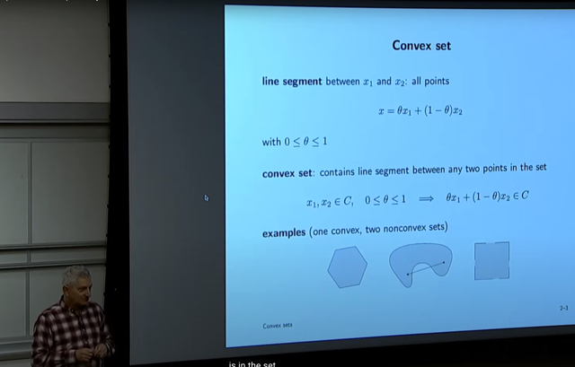</kbd>

> [!NOTE]
> Từ đó ta có **định nghĩa về CONVEX SET**: 
>
> Đại khái là convex set là tập mà thỏa tính chất sau **nếu hai điểm nằm trong set thì mọi điểm trên line segment (tức là convex combination hay mixture của chúng) đều thuộc set.**
>
> Thể hiện theo toán học là: Nếu x1, x2 thuộc C thì với mọi θ có giá trị từ 0 đến 1 thì:
>
> x = θx1 + (1-θ)x2 sẽ đều thuộc C
>
> CONVEX SET

> [!TIP]
> **🤖 AI Feedback** — ✅ Score: **95/100**
>
> Ghi chú này trình bày định nghĩa tập lồi một cách chính xác và đầy đủ, từ giải thích trực quan đến công thức toán học. Việc bổ sung thuật ngữ "convex combination hay mixture" thể hiện sự hiểu biết sâu sắc về khái niệm.

 

<kbd>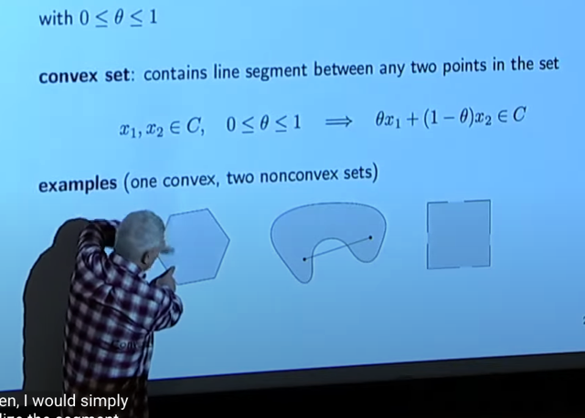</kbd>

<kbd>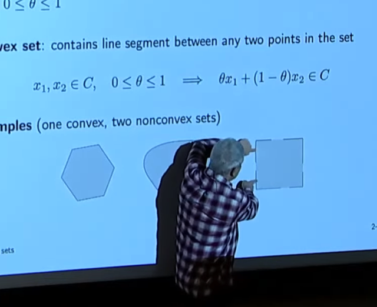</kbd>

> [!NOTE]
> Và ta có vài ví dụ, lục giác này là một CONVEX SET, vì lấy** hai điểm bất kì trong đó, thì mọi điểm trên đoạn thẳng nối hai điểm sẽ đều nằm trong lục giác** này.
>
> Nhưng hai hình bên thì không, hình chính giữa rõ ràng với hai điểm này thì không phải mọi điểm trên mixture của nó cũng đều thuộc hình đó.
>
> Với hình vuông thì vì boundary của nó ko closed, nên ví dụ lấy hai điểm trên cạnh thì có những điểm mixture của nó ko thuộc set

 

<kbd>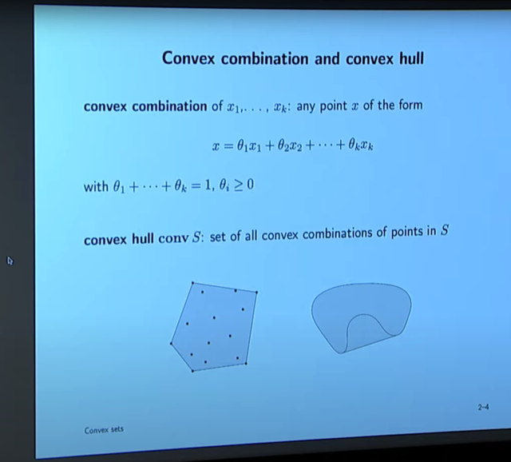</kbd>

> [!NOTE]
> Thế thì, khái quát với nhiều vector hơn: x1, x2...xk thì 
>
> x = θ1x1 + θ2x2 + ...θkxk
> Tức linear combination với các θi đều có **TỔNG BẰNG 1 và KHÔNG ÂM** thì ta có **CONVEX COMBINATION** hay **MIXTURE** CỦA x1, x2...xk
>
> Và gs cho biết, người ta có thể gọi nó bằng **WEIGHTED SUM**, mà ta có thể nhận ra đây nếu là trong xác suất, nó CHÍNH LÀ **EXPECTATION**
>
> Nhớ lại expectation đã học trong Stat110: Expected value của random variable X, EX là **weighted sum của mọi possible values của X**, **weight chính là xác xuất nó mang giá trị đó**, với X là discrete r.v có các possible value x1,...xn ta sẽ có công thức:
>
> EX = Σ_i=1:n x_i × P(X = x_i)
>
> Còn nếu là continous r.v thì EX = ∫-inf:inf xf(x)dx

> [!TIP]
> **🤖 AI Feedback** — ⚠️ Score: **70/100**
>
> Nội dung ghi chú về tổ hợp lồi và mối liên hệ với kỳ vọng thể hiện sự hiểu biết sâu sắc và khả năng mở rộng kiến thức tốt. Tuy nhiên, bài ghi chú đã bỏ sót hoàn toàn định nghĩa về 'bao lồi' (convex hull), một khái niệm trọng tâm được đề cập rõ ràng trên slide. Đây là một thiếu sót nghiêm trọng cần được khắc phục.

 

<kbd>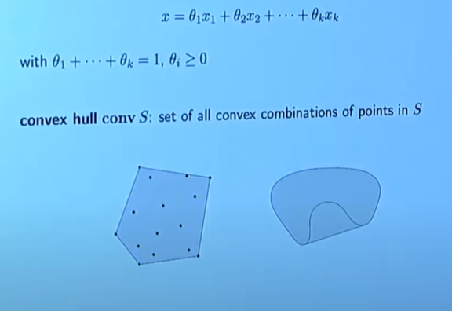</kbd>

<kbd>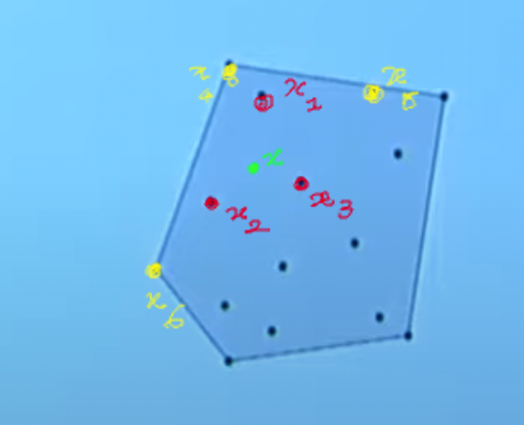</kbd>

> [!NOTE]
> Và **CONVEX HULL** được định nghĩa **là một set **CHỨA MỌI CONVEX COMBINATION của các điểm trong S**
>
> Ngẫm một chút sẽ có thể hiểu mọi điểm trong ngũ giác này đều là một convex combination của một bộ các điểm màu đen nào đó.
>
> Và với một điểm, ví dụ màu xanh, nó có thể là convex combination của nhiều bộ vector khác nhau với θ khác nhau.
>
> Ví dụ nó có thể là convex combination của x1, x2, x3. Nhưng cũng có thể là của x4, x5 x6 
>
> Thậm chí là một combination của mọi vector x với một coeffcients set nào đó

> [!TIP]
> **🤖 AI Feedback** — ⚠️ Score: **78/100**
>
> Bạn đã nắm vững định nghĩa của convex hull và thể hiện sự hiểu biết sâu sắc về các tổ hợp lồi, đặc biệt là việc một điểm có thể được biểu diễn bằng nhiều cách khác nhau. Tuy nhiên, hình đa giác bạn mô tả là "ngũ giác" thực chất là một "lục giác". Ngoài ra, cách diễn đạt cho định nghĩa và câu cuối cùng có thể trau chuốt hơn để đạt được sự chính xác tuyệt đối trong thuật ngữ toán học.

 

<kbd>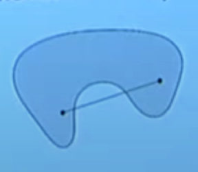</kbd>

<kbd>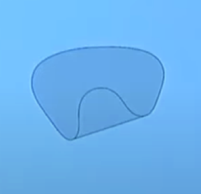</kbd>

> [!NOTE]
> Còn cái hình này, thì như nãy đã nói, nó không phải là convex set vì tồn tại hai điểm mà line segment / mixture của nó không nằm trong set.
>
> Tuy nhiên, nếu ta mở rộng nó, để nó bao gồm mọi line segment của hai điểm bất kì trong set, thì nó sẽ thành cái hình dưới, và đó theo định nghĩa sẽ là một CONVEX HULL
>
> Và ta sẽ hiểu **CONVEX HULL LÀ MỘT CONVEX SET,** và nó **LÀ CÁI CONVEX SET NHỎ NHẤT CHỨA CÁI SET ĐÓ**.
>
> CONVEX HULL

> [!TIP]
> **🤖 AI Feedback** — ✅ Score: **90/100**
>
> Phân tích của bạn về convex set và convex hull là rất chính xác và sâu sắc, đặc biệt là định nghĩa về convex hull là 'convex set nhỏ nhất chứa cái set đó'. Cần lưu ý sử dụng ngôn ngữ học thuật chặt chẽ hơn trong các bài viết, chẳng hạn như tránh dùng từ 'mixture' thay cho 'line segment' để tăng tính chuyên nghiệp.

 

<kbd>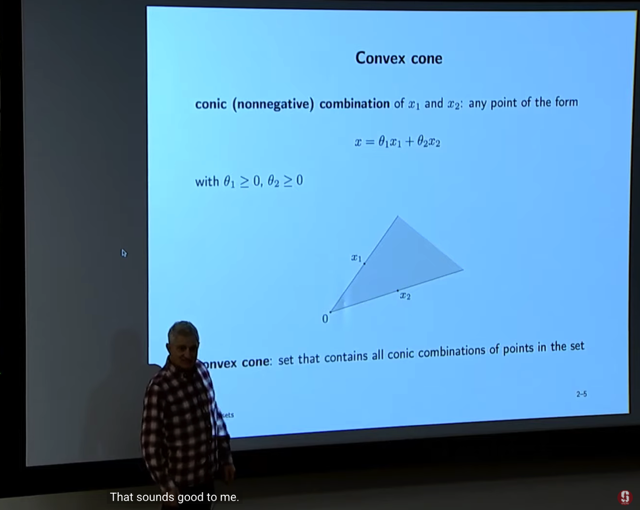</kbd>

> [!NOTE]
> Ta qua tiếp khái niệm **CONVEX CONE**: 
>
> Được định nghĩa là, giả sử có hai vector x1, x2 thì xét với mọi θ1, θ2 KHÔNG ÂM, tạo nên linear combination của x1, x2: θ1x1 + θ2x2 sẽ tạo ra **CONVEX CONE của x1, x2.**
>
> {y = θ1x1 + θ2x2, ∀θ1, θ2 ≥ 0}
>
> Nói rõ hơn chút: Với một bộ cụ thể θ1, θ2 không âm, thì θ1x1 + θ2x2 gọi là conic combination. Thì tập hợp chứa mọi conic combination như vậy sẽ tạo thành convex cone của x1, x2.
>
> Lưu ý là **vector 0 CÓ nằm trong convex cone**, vì theo định nghĩa **chỉ yêu cầu các θ không âm**, nên khi cả hai đều bằng 0 thì vẫn ok, và do đó CONVEX CONE CÓ CHỨA ZERO
>
> Còn **CONVEX SET** của x1, x2 thì các **coefficient phải CÓ TỔNG BẰNG 1.** 
>
> Sẽ tạo một đoạn thẳng nối x1, x2 có thể không chứa 0 nếu như x1, x2 độc lập tuyến tính (vì khi đó không thể linearly combine x1, x2 thành 0 với một bộ hệ số khác 0 được). Nhưng nếu x1, x2 phụ thuộc tuyến tính thì convex set của x1, x2 vẫn chứa 0 vì vẫn tồn tại αx1 + (1 - α)x2 = 0.
>
> Còn tại sao **CONVEX CONE lại không cần coefficients có tổng bằng 1** đơn giản là vì định nghĩa nó vậy
>
> CONVEX CONE

> [!TIP]
> **🤖 AI Feedback** — ✅ Score: **95/100**
>
> Bạn đã nắm vững khái niệm Convex Cone một cách rất chính xác và sâu sắc, thể hiện qua việc đưa ra các so sánh và giải thích chi tiết.

 

<kbd>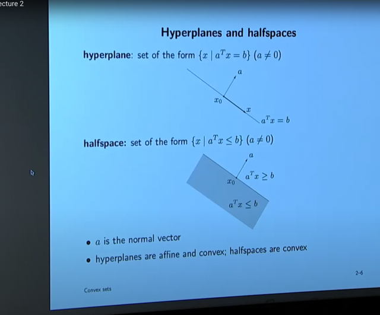</kbd>

> [!NOTE]
> Tiếp theo ta có khái niệm **HYPER-PLANE**
>
> Định nghĩa của nó là tập hợp các điểm x thỏa **aTx = b** tức là x là solution của single non-zero linear equation aTx = b.

 

<kbd>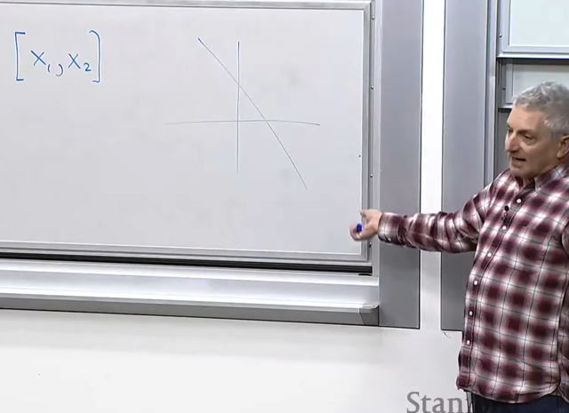</kbd>

> [!NOTE]
> Trong 2D space thì nó sẽ có dạng là một đường thẳng như vầy.

 

<kbd>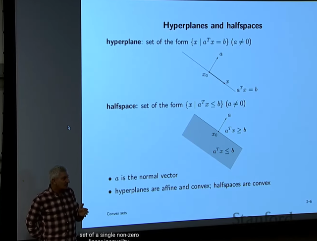</kbd>

> [!NOTE]
> Và ta có khái niệm HALF-SPACES: set các vector x thõa aTx ≤ b
>
> Chính là solution của một non-zero linear inequality (bất phương trình tuyến tính)
>
> Và đại khái là ta cũng biết, phương trình aTx = b sẽ chia mặt phẳng ra làm hai phần: Phía trên là nơi aTx > b và phía dưới là aTx < b
>
> Thì HALF-SPACES có thể coi là nửa mặt phẳng phía dưới, cộng với bản thân đường thẳng.
>
> Gs cho biết vector a, trong giải tích ta đã học gọi là NORMAL VECTOR thì ở đây ta gọi nó là OUTER NORMAL (normal nghĩa là vuông góc với hyperplane, và outer ý là nó hướng ra ngoài half-space)
>
> Thế thì đây là những loại convex set: hyperplanes là affine, và half-space là convex set

 

<kbd>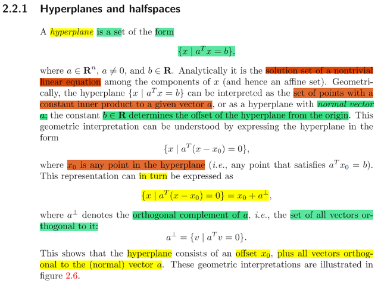</kbd>

<kbd>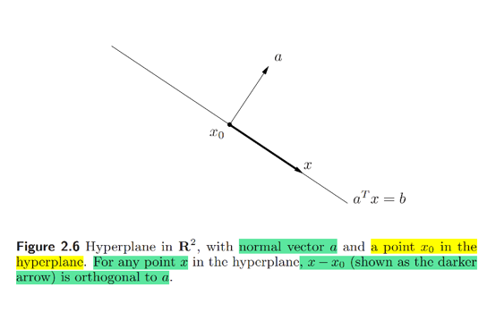</kbd>

<kbd>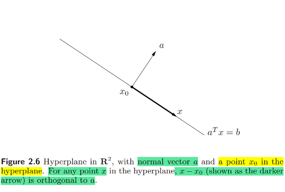</kbd>

> [!NOTE]
> Định nghĩa về Hyperplane thật ra không đơn giản chút nào.
>
> Nó là một set (tập) có dạng **{x | aTx = b}** với a là R^n vector khác 0 và b là scalar
>
> x thỏa aTx = b có thể **hiểu theo cách thứ nhất**: vector x, sao cho** các component của nó thỏa hệ phương trình a1x1 + a2x2 + ..= b.** Nên {x: aTx = b} có thể hiểu là **tập các solution của phương trình này.**
>
> Và dễ thấy ta có thể hiểu nó theo cách thứ hai là **tập các vector x sao cho dot product với a đều bằng b**
>
> Ngoài ra một cách hiểu quan trọng nữa của hyperplane: Cho rằng **x0 là một điểm thuộc tập này: Ta sẽ có aTx0 = b**
>
> Từ đó với mọi x thuộc {x | aTx = b} thì ta có: aTx = b. 
>
> ⇔ aTx = aTx0 
>
> ⇔ aT(x-x0) = 0
>
> Như vậy set **{x | aTx = b} = {x: aT(x-x0) = 0}** giúp ta có **cách hiểu thứ 3** về hyperplane {x | aTx = b} đó là:
>
> Tập **mọi điểm x sao cho (x - x0) vuông góc với vector a**:
>
> Và do đó có thể thể hiện theo {x | x - x0 = a⊥} = {x: x = x0 + a⊥}
>
> Với a⊥ là vector orthogonal complement, tức tập mọi vector vuông góc với a.
>
> Như vậy: theo cách hiểu này ta thấy như sau:
>
> Có thể xem aT là một 1-row matrix A (matrix chỉ có một hàng) là **rank 1 matrix**. Với **1 cột pivot và n - 1 cột tự do **
>
> Do đó, hệ aTx = b, hay Ax = b sẽ **có vô số nghiệm có dạng xc + xnull** với: 
>
> **xc ở đây chính là x0** - một non-zero vector thỏa Ax = b (vì **aTx0 = Ax0 = b**), và 
>
> **xnull là vector trong nullspace của A**
>
> Mà ta cũng đã biết Rank-Nullity theorem nói rằng **nullspace và rowspace orthogonal complement** nhau. Do đó, **mọi vector trong nullspace của A đều vuông góc với row của A, chính là vuông góc với a** 
>
> ⇨ x_null = a⊥ 
>
> Nhờ vậy mà ta hiểu rằng hyperplane x: aTx = b chính là **tập hợp mọi kết hợp giữa x0 và các nullspace vector của A (A là rank 1 matrix aT)**.
>
> (Chú ý không phải là nói hyperplane là nullspace của A, vì điều này chỉ đúng khi x0 cũng thuộc nullspace, tức Ax0 = 0 với x0 khác 0 tức là chỉ đúng khi b = 0. 
>
> Nên nếu ta có hyperplane {x| aTx = 0}, thì đây là hyperplane mà bản chất chính là nullspace của A = aT}

> [!TIP]
> **🤖 AI Feedback** — ✅ Score: **95/100**
>
> Bài làm xuất sắc, thể hiện sự hiểu biết sâu sắc và khả năng tích hợp nhuần nhuyễn các khái niệm đại số tuyến tính vào định nghĩa hyperplane. Độ sâu phân tích vượt trội so với tài liệu cung cấp, tuy nhiên cần lưu ý cách sử dụng ký hiệu tập hợp `{x | x - x0 = a⊥}` có thể diễn đạt chính xác hơn.

 

<kbd>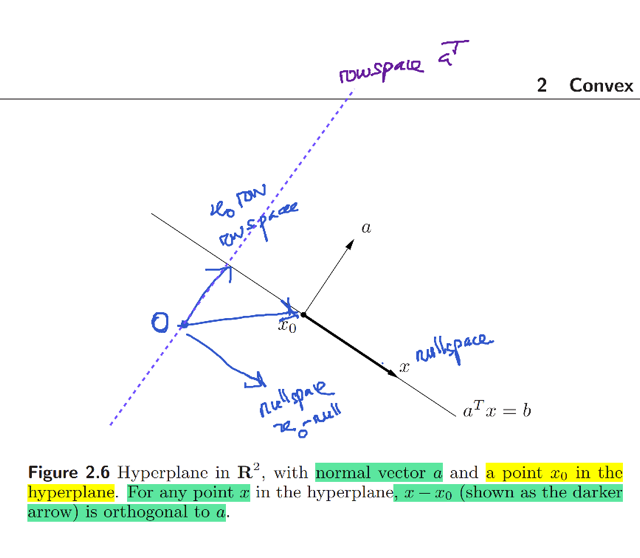</kbd>

> [!NOTE]
> Có thể thấy x0 là combine của một nullspace vector và một rowspace (của A = aT) vector. Còn x - x0 chắc chắn là nullspace vector (vì aT(x - x0) = aTx - aTx0 = b - b = 0
>
> Rồi hãy nhìn x0: Nó thỏa aTx = b: aTx0 = b, nếu ta tách nó thành một nullspace vector x0_null và một rowspace vector x0_row ta có: 
>
> aT(x0_null + x0_row) = b ⇔ aTx0_null + aTx0_row = b
>
> ⇔ 0 + aTx0_row = b 
>
> Mà x0_row dĩ nhiên nằm trong rowspace ⇨ là linear combination của a: x0_row = αa
>
> ⇨ aT αa = b ⇔ α = b / aTa ⇨ x0_row = (b/aTa)a 
>
> ||x0_row||^2 = x0_rowTx0_row = [(b/aTa)a]T[(b/aTa)a]
>
> = (b/aTa)aT(b/aTa)a = [b^2/(aTa)^2] (aTa) = b^2/aTa  
>
> Mà norm của x0_row có thể thấy chính là khoảng cách từ gốc 0 đến hyperplane {x: aTx = b} ⇨ b^2/aTa chính là khoảng cách này.
>
> ====
>
> Có thể lập luận theo cách khác: Chiếu x0 lên rowspace, tức (vector a):
>
> Hình chiếu của x0 lên span{a}: αa
>
> Phần dư x0 - αa sẽ vuông góc với a, nên ta có aT(x0-aα) = 0
>
> aT(x0-aα) = 0 ⇔ aTx0 = aTa α ⇨ α = aTx0 / aTa = b / aTa
>
> ⇨ ||aα||^2 = || α^2 aTa = [b^2 / (aTa)^2] aTa = b^2 / aTa
>
> Vậy có thể thấy khi normalize vector normal thì |b| chính là khoảng cách từ gốc đến hyperplane x: aTx = b
>
> Hay nói cách khác nếu aTa = 1 thì b là khoảng cách từ gốc đến hyperplane.
>
> Trong sách này ta đã biết bài toán distance từ gốc tọa độ đến hyperplane chính là một bài toán optimization như sau:
>
> d(0, H) = minimize x ∈ H {||x||} với H = {x | aTx = b}
>
> Nghĩa là, tìm điểm trên hyperplane H sao cho norm của nó nhỏ nhất, thì cái norm nhỏ nhất đó chính là định nghĩa của distance giữa gốc 0 và hyperplane H
>
> Thử giải bài này theo calculus:
>
> Bài toán equivalent với minimize x ∈ H {xTx} subject to aTx = b
>
> L = xTx + α(aTx - b) = xTx + αaTx - αb
>
> ∇L = (x+dx)T(x+dx) + αaT(x+dx) - αb - xTx - αaTx + αb
>
> = xTx+dxTx + xTdx+dxTdx + αaTx + αaTdx - xTx - αaTx
>
> = 2xTdx + αaTdx = (2xT + αaT)dx
>
> ⇨ ∇L = 2x + αa 
>
> Optimality condition ∇L = 2x + αa = 0 
>
> ⇔ x = - αa / 2 (tức solution là x* = - αa / 2)
>
> Dùng aTx = b, thay x = - αa / 2 vào ta có: 
>
> aTx = b 
>
> ⇔ aT(- αa / 2) = b
>
> ⇔ α aTa = -2b 
>
> ⇔ α = -2b / aTa
>
> Thay α vào x* = -αa / 2 = -α a/2 
>
> x* = -(-2b / aTa) a/2 = (b/aTa)a
>
> Và f(x*), tức x*Tx* sẽ là = [(b/aTa)a]T[(b/aTa)a] = (b/aTa)^2 aTa
>
> = b^2 / aTa
>
> ⇨ Như vậy khi x* x* = -αa / 2 thì f(x*) = x*Tx* nhỏ nhất, = b^2 / aTa.
>
> Và đây, như đã nói, là bài toán tìm distance giữa gốc tọa độ với hyperplane
>
> Kết qủa này confirm ý trên

> [!TIP]
> **🤖 AI Feedback** — ✅ Score: **98/100**
>
> Phân tích của bạn rất sâu sắc và chính xác, giải thích rõ ràng mối quan hệ giữa không gian null, không gian dòng và siêu phẳng. Bạn cũng đã xuất sắc chứng minh công thức khoảng cách từ gốc tọa độ đến siêu phẳng bằng cả phương pháp hình học và tối ưu hóa.

 

<kbd>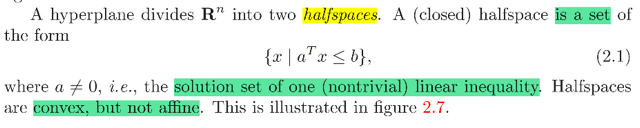</kbd>

<kbd>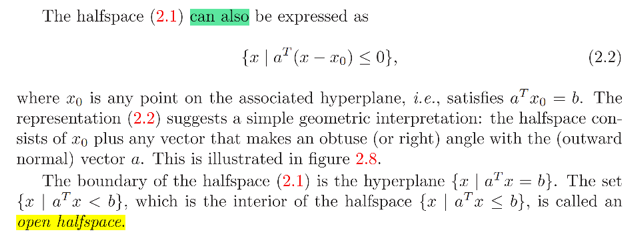</kbd>

<kbd>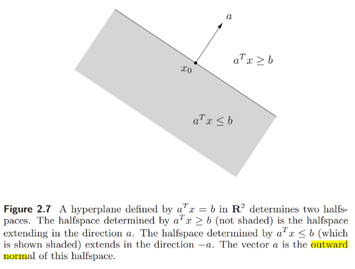</kbd>

<kbd>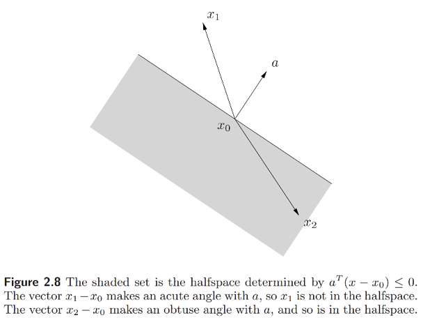</kbd>

> [!NOTE]
> Half space thì là set có dạng **{x | aTx ≤ b}**
>
> Cách thể hiện này cho thấy **góc nhìn thứ nhất** nó là **solution set của bất phương trình aTx ≤ b**
>
> Ngoài ra, với **x0 thuộc hyperplane {x: aTx = b}** ta có **aTx0 = b**
>
> ⇨ aTx ≤ b ⇔ aTx ≤ aTx0 ⇔ **aT(x-x0) ≤ 0**
>
> Từ đó {x | aTx ≤ b} có thể thể hiện bởi **{x | aT(x - x0) ≤ 0}**
>
> Cách thể hiện này mang đến **một góc nhìn thứ hai** về half-space:
>
> Va biết uTv = ||u||||v|| cos θ(u,v) nên uTv ≤ 0 ⇔ cos θ ≤ 0 và điều này tương đương θ là góc tù (obstute / ngược với acute góc nhọn)
>
> Vậy {x | aT(x - x0) ≤ 0} mang ý nghĩa là: 
>
> **Tập những điểm x sao cho vector x - x0 hợp với a một góc tù**.
>
> Mà như vậy thì có nghĩa là **khi vẽ halfspace là phần màu xám thì vector a sẽ HƯỚNG
> RA khỏi đó**. 
>
> Nên nhớ vector x - x0 sẽ có chiều đi từ x0 đến x. Nên hình ảnh sẽ là** từ x0 đi đến mọi điểm trong halfspace sẽ đều là đi theo hướng hợp với a góc tù**
>
> Vài câu hỏi:
>
> Tại sao hyperplane {x: aTx = b} lại chia không gian thành hai halfspace mà một bên là {x: aTx < b} và một bên là {x: aTx > b}
>
> Đầu tiên, **tại sao {x: aTx = b} lại là một hyperplane**, (ví dụ trong 2D space aTx = b lại là đường thẳng?): 
>
> Đó là vì aTx = b ⇔ a1x1 + a2x2 = b, và cái này **thể hiện một quan hệ tuyến tính giữa x1 và x2**. (Kiểu như ta có hàm tuyến tính x1 theo x2 và ngược lại: x1 = -(a2/a1)x2 + b và x2 = -(a1/a2)x1 + b, từ đó sẽ vẽ nên đường thẳng)
>
> Nói cách khác, **aTx = b, là một ràng buộc constraint**, mà **phản ánh quan hệ tuyến tính của các biến**. 
>
> Hoặc thể hiện theo cách khác: **{x: aT(x-x0) = 0}** cho thấy ý nghĩa của hyperplane là **tập các điểm mà vector x - x0 luôn vuông góc với a**. 
>
> Vậy rõ ràng điều này thể hiện rằng các vector này sẽ tạo nên đường thẳng, vuông góc với a thì cũng là cho thấy chúng phải là đường thẳng vì không thể có đường cong mà mọi vector x - x0 đều vuông góc với a được.
>
> Thế thì xét mọi điểm x ở một bên (xám), thì khi di chuyển trên hyperplane góc giữa x - x0 và a luôn là 90 độ, thì khi x ở bên xám, x - x0 sẽ hợp với a góc tù, nên cos θ(a, x - x0) sẽ âm
>
> Do đó (x-x0)Ta = ||x - x0||||a|| cos θ sẽ ≤ 0. Điều này tương đương:
>
> (x-x0)Ta ⇔ aTx ≤ x0Ta ⇔ aTx ≤  b
>
> Điều này cho thấy mọi điểm ở bên xám đều thỏa aTx ≤ b nên ta có thể định nghĩa nó là {x: aTx ≤ b}
>
> Ngược lại, mọi điểm ở một bên còn lại, sẽ đều tạo x - x0 hợp với a góc nhọn. Do đó cos θ(a, x - x0) luôn > 0
>
> ⇨ ||a||||x - x0|| cos θ > 0 (vì hai thừa số kia không âm)
>
> Do đó ta có mọi điểm bên còn lại này đều thỏa aT(x - x0) > 0 
>
> ⇔ aTx ≥ aTx0
>
> ⇔ aTx ≥ b. 
>
> Do đó ta có thể định nghĩa halfplane còn lại là {x: aTx > b}

> [!TIP]
> **🤖 AI Feedback** — ⚠️ Score: **85/100**
>
> Bài phân tích thể hiện sự hiểu biết rất sâu sắc về khái niệm halfspace, từ định nghĩa đại số đến diễn giải hình học qua góc giữa các vector. Các bước suy luận logic, chặt chẽ, và việc tự đặt câu hỏi để đào sâu kiến thức là điểm cộng lớn. Tuy nhiên, cần lưu ý một số điểm để đạt được độ chính xác tuyệt đối: có lỗi chính tả nhỏ ('obstute'), đôi khi dùng 'halfplane' thay vì 'halfspace'. Quan trọng hơn, cần phân biệt rõ ràng giữa halfspace mở ({x: aTx > b}) và halfspace đóng ({x: aTx >= b}) khi tham chiếu đến các hình vẽ và định nghĩa trong văn bản gốc. Hình 2.7 cho thấy hai halfspace đóng là {x: aTx <= b} và {x: aTx >= b}. Việc kết luận bên còn lại là {x: aTx > b} chưa hoàn toàn khớp với cách phân chia hai halfspace đóng được thể hiện.

 

<kbd>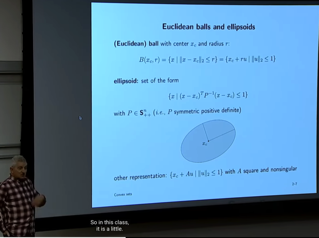</kbd>

> [!NOTE]
> Tiếp theo là khái niệm **EUCLIDEAN BALLS**, được định nghĩa là **tập hợp các vector x sao cho L2 distance của nó tới x_c (center) nhỏ hơn hoặc bằng r**. Với r là radius.
>
> Kí hiệu của Balls là: B(xc, r) = {x | ||x - x_c|| ≤ r}
>
> Tiếp theo là **EUCLIDEAN ELLIPSOIDS**. 
>
> Được định nghĩa là **tập hợp các vector x sao cho (x - x_c)T Pinv (x - x_c) ≤ 1**
>
> Gs nói ta có thể nhận ra (x - x_c)T Pinv (x - x_c) gọi là **quadratic form** 
>
> Có thể hiểu điều này, giống như trong 1806 ta có xTAx, và nếu ta có A là symmetric positive definite, thì xTAx sẽ luôn dương với mọi x khác 0, và chỉ bằng 0 khi x = 0.
>
> Gs nói thêm: P thuộc S^n ++ chính là nói P là POSITIVE DEFINITE  matrix. 
>
> (S^n là kí hiệu thể hiện symmetric matrix [n,n]) và ++ là thể hiện positive definite. (nếu chỉ có 1 dấu cộng) thì sẽ là positive semi-definite)
>
> Ngoài ra ta có thể thấy nếu P là I, thì định nghĩa này sẽ trở thành {x | ||x - xc|| ≤ r} và ellipsoids trở thành balls
>
> Ở lần review thứ 3 này có thể ghi thêm vài ý sau: Tại sao {x: (x - x_c)T Pinv (x - x_c)} ≤ 1} lại là ellipsoids:
>
> Đặt y = x - x_c, thì đây chỉ là hành động dời trục tọa độ tịnh tiến về x_c. Có nghĩa là x, x_c là tọa độ của điểm M,N ban đầu thì y = x - x_c sẽ là tọa độ của nó trong hệ trục mới mà tâm đặt tại N = x_c. 
>
> Pinv y chính là gì? Nhớ lại trong MIT806 đã học về change of basis matrix: Để chuyển tọa độ đang từ basis v's sang basis w's ta sẽ dùng matrix WinvV. Nói rõ hơn, hay ôn lại tí xíu: Nguyên tắc xây dựng matrix A đại diện cho linear transformation T(v) đó là: Chuẩn bị hai bộ basis của input và output space: v's và w's. Biến đổi (apply T lên) các basis v's. Và thể hiện kết quả theo output basis w's, thì hệ số của chúng sẽ là cột của A. Ví dụ T(v1) = a11 w1 + a12 w2 + ..., T(v2) = a21 w1 + a22 w2 + ...
>
> Thế thì xét Identity transformation: T(v) = v, có nghĩa là ko làm gì hết, chỉ đổi basis thôi.
> Thì ta sẽ có T(v1) = v1 = a11 w1 + a12 w2 + ..., T(v2) = v2 = a21 w1 + a22 w2 + ....
> Đặt v1, v2 .. thành các cột của V, w1, w2 ..thành các cột của W thì cái trên chính là:
>
> V's collumn 1 = W [A's column 1]
>
> V's collumn 2 = W [A's column 2]
>
> ...
>
> ⇨ V = W A ⇔ A = Winv V
>
> Rồi, quay lại đây: y = x - x_c đang trong basis e's (standard basis) nên V chính là I, thì Pinv y chính là Pinv I y sẽ chuyển tọa độ sang basis p's (tức là các cột của P)
>
> Và do đó tập hợp các điểm y sao cho yT Pinv y ≤ 1: {y: yT Pinv y ≤ 1} thật ra chỉ là cái Ball bán kính 1 trong basis p's.
>
> Nhưng ta có thể nói thêm: Vì P là ma trận đối xứng, nên có thể phân tách nó thành: Q Λ QT
>
> ⇨ Pinv = (Q Λ QT)inv = Q Λinv QT (không khó hiểu, vì Qinv = QT)
>
> Với Q là orthogonal matrix các eigenvectors của P, Λ là diagonal matrix các eigenvalues của P, và Λinv là diagonal matrix các eigenvalue của Pinv, cũng là bằng nghịch đảo eigenvalue λ của P: 1/λ
>
> ⇨ {y: yT Pinv y ≤ 1} = {y: yTQΛinvQTy ≤ 1}
>
> Phân tích cái này: QTy chính là Qinv y (QT = Qinv): Tương tự như trên, đậy chính là chuyển tọa độ từ basis e's sang eigenbasis của P (các cột của Q). Và hành động này chính là xoay hệ trục để cho nó trùng với các trục vuông góc q_i.
>
> Sau đó, ΛinvQTy sẽ chỉ là {1/λ_1 × (QTy)_1, 1/λ_2 × (QTy)_2, ...1/λ_n × (QTy)_n}, tức là nhân (stretch) các tọa độ của QTy bởi các factor là trị riêng tương ứng.
>
> Và cuối cùng Q(ΛQTy) chỉ đơn giản là chuyển các tọa độ về lại basis e's. Để rồi hành động
> này là xoay hệ trục về lại như cũ.
>
> Thế thì: nếu gọi u là QTy, thì {y: yTQTΛQy ≤ 1} chính là {u: uTΛu ≤ 1} 
>
> = {u: u1^2 / λ1 + u2^2 / λ2 + ... ≤ 1} 
>
> Còn nhớ phương trình ellipse: x^2/a^2 + y^2/b^2 = 1)
>
> Nên cái này giúp ta hiểu {u: u1^2 / λ1 + u2^2 / λ2 + ... ≤ 1} chính là dạng của ellipsoid:
>
> Trong 2D thì nó chính là cái hình elipse mà trục của nó thẳng trục với eigenvector cuả P 
>
> Và một điểm cũng quan trọng: Với hình ellipse x^2/a^2 + y^2/b^2 = 1 thì a mà càng lớn thì cái hình ellipse sẽ càng bị kéo dài ở cái phương x. Và nói chung là tỉ lệ a/b càng lớn thì cái hình elipse nó sẽ càng bị bẹp.
>
> Điều này cũng đúng khi khái quát lên.
>
> Từ đó ta mới hiểu một điều: tỉ lệ giữa λmax(P) và λmin(P) càng lớn thì cái hình ellipse càng dẹt. Và tỉ lệ này thì chính là condition number κ(P).
>
> ====
>
> Ôn 1806 chút xíu
>
> Ta có thể dùng diagonalization để liên hệ việc một symmetric positive definite matrix có quadratic form có tính chất như trên với tính chất khác là **positive definite matrix sẽ có mọi eigenvalue đều dương **như sau:
>
> xTAx = xT(QΛQT)x = xTQΛQTx = yTΛy = Σ λi*yi^2 với yi là các components của y = QTx. Và λi là các eigenvalues của A.
>
> Thế thì, vì với positive definite matrix A, mọi eigenvalues của nó đều dương.
>
> Đương nhiên ta thấy kết quả trên (quadratic form xTAx) luôn dương
>
> Và chỉ bằng 0 khi y = Qx = 0. Thế mà, Q là orthogonal matrix đương nhiên là full-rank, nên nullspace của nó chỉ có 0. Vậy Qx chỉ bằng 0 khi x = 0.
>
> Ở chiều ngược lại, nếu quadratic form luôn dương với x khác 0, ta suy ra mọi eigenvalues đều dương:
>
> xTAx > 0 với mọi x khác 0. Thì điều này dĩ nhiên cũng đúng với mọi eigenvector q_i của A: ta có q_i T A q_i > 0 với mọi eigenvector q_i
>
> ⇔ q_i λ_i q_i > 0 ⇔ λ_i q_i T q_i = λ_i ||q_i|| > 0 ⇨ λ_i > 0 với mọi λ_i
>
> Hoàn toàn tương tự, nếu quadratic form có thể bằng 0 với x khác 0, nó sẽ tương ứng với việc eigenvalue có thể bằng 0. Khi đó ta có positive semi definite

> [!TIP]
> **🤖 AI Feedback** — ⚠️ Score: **88/100**
>
> Bài phân tích thể hiện sự hiểu biết sâu sắc và khả năng kết nối xuất sắc với các khái niệm đại số tuyến tính như dạng toàn phương, giá trị riêng, vector riêng và số điều kiện, giải thích rõ ràng bản chất của ellipsoid. Tuy nhiên, bài viết chưa đề cập đến các biểu diễn thay thế của hình cầu (`{xc + ru | ||u||_2 <= 1}`) và hình elip (`{xc + Au | ||u||_2 <= 1}`) được trình bày rõ ràng trên slide.

> [!IMPORTANT]
> **🎤 Review Session 1** — Score: **25/100**
>
> Sinh viên đã nhầm lẫn nghiêm trọng giữa "Euclidean balls" và "Euclidean ellipsoids", thậm chí còn tự tạo ra một thuật ngữ không tồn tại ("quả banh Elip"). Mặc dù có thể nhớ được một phần định nghĩa của quả cầu, nhưng sinh viên đã hoàn toàn bỏ sót hoặc không hiểu khái niệm chính về hình elipxoit.

 

- **P và Pinv trong ellipsoid**

<kbd>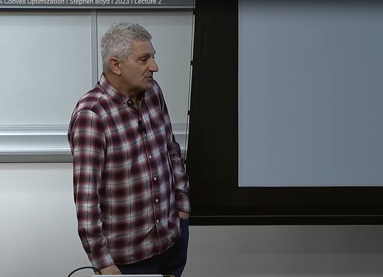</kbd>

> [!NOTE]
> Q: Tại **sao không dùng P mà dùng Pinv** (trong định nghĩa của ellipsoid)
>
> Gs cho rằng là bởi **dùng cái nào cũng được**, vì với **symmetric positive definite matrix thì inverse của nó cũng là symmetric positive definite matrix** 
>
> Và chỉ là đôi khi người ta **thấy tiện hơn khi dùng Pinv.**
>
> Suy nghĩ chút xíu: Ta có thể hiểu **tại sao nếu P positive definite** (nhắc lại gs Strang đã nói positive definite thì đương nhiên hiểu là symmetric) thì Pinv cũng vậy.
>
> Là vì, ta biết, nếu A invertible thì nếu λ là eigenvalue của A, thì 1/λ sẽ là eigenvalue của Ainv với cùng một eigenvector. Chứng minh nhanh:
>
> λ là eigenvector của A, nên Ax = λx. Vì A invertible, nên nhân hai vế cho Ainv: 
>
> AinvAx = Ainvλx  <=> x = Ainvλx <=> Ainvx = x/λ => chứng minh xong. 
>
> Vậy nếu A positive definite thì mọi eigenvalue λ đều dương, nên 1/λ cũng đều dương => Ainv cũng là positive definite.

> [!TIP]
> **🤖 AI Feedback** — ✅ Score: **95/100**
>
> Lý luận toán học rất chính xác và chứng minh về việc ma trận đối xứng xác định dương có ma trận nghịch đảo cũng xác định dương là rõ ràng và đúng đắn. Bài ghi thể hiện sự nắm vững các tính chất cơ bản liên quan đến tối ưu lồi.

 

<kbd>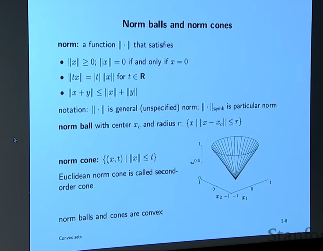</kbd>

> [!NOTE]
> Tiếp theo ta sẽ gặp lại khái niệm norm. Gs cho biết đại khái là** norm là định nghĩa của bất cứ function nào thỏa mãn các tính chất** như 
>
> 1) Luôn dương với x khác 0, chỉ bằng 0 khi x = 0
>
> 2) ||tx|| = |t|*||x|| t ∈ R
>
> 3) ||x + y|| <= ||x|| + ||y|| (triangular inequality)

 

<kbd>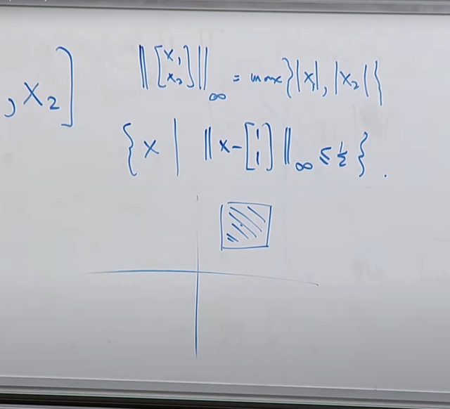</kbd>

> [!NOTE]
> Gs nói thêm, với L-infinity norm
>
> Giống như L2 norm thì kí hiệu là ||x||2 
>
> Thì kí hiệu ||x||inf, được định nghĩa là** giá trị lớn nhất trong các trị tuyệt đối của x's component.**
>
> ||[x1, x2]||inf = max {|x1|, |x2|}
>
> Khi đó ta thấy {x | ||x-(1,1)||inf ≤ 1/2} thì đó được gọi là
>
> **L-INFINITY NORM BALL**
>
> Và ý nghĩa là **tập mọi vector x sao cho khoảng cách của nó đến tâm (1,1) theo phương x hay y đều không vượt quá 1/2**
>
> Ngẫm một chút ta sẽ thấy hình ảnh của nó chính là hình vuông kích
> thước 1x1 tại tâm là (1,1) này

 

<kbd>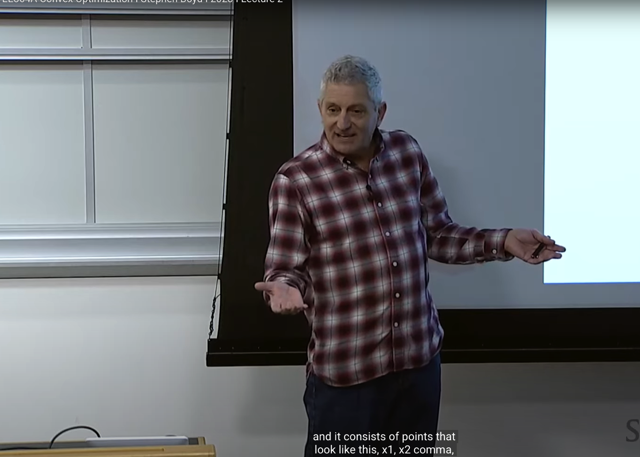</kbd>

> [!NOTE]
> Tiếp, đại khái gs nói là n**hiều lúc ta nói về R^2, nhưng thực ra ta thêm một chiều nữa để thành R3.**
>
> Ví dụ như khi ta nói về function f(x, y) thì để vẽ graph của hàm f ta sẽ
> vẽ nó trong R3, để một điểm sẽ có tọa độ là [x, y, f(x, y)]

 

<kbd>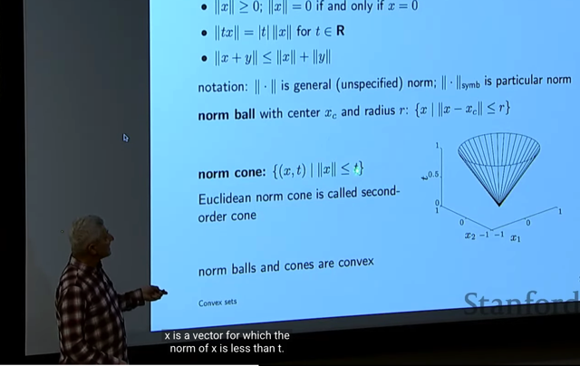</kbd>

> [!NOTE]
> Ta có khái niệm **NORM CONE** / **LORENTZIAN CONE **
>
> Tại sao cái hình cái nón ngược này lại là đồ thị của {(x, t) | ||x|| ≤ t} 
>
> Để ý ta có plane x1,x2 và trục đứng t.
>
> Thế thì khi t nhỏ ví dụ = 1 định nghĩa {(x,t) | ||x|| ≤ t} sẽ có ý nghĩa tập hợp các điểm (vector) x sao cho:
>
> ||x|| ≤ 1 ⇔ sqrt(x1^2 + x2^2) ≤ 1 ⇔ x1^2 + x2^2 ≤ 1
>
> Thế thì tập hợp này là thành một dĩa tròn bán kính 1, đương nhiên nếu thể hiện thêm sự thật rằng những điểm này có t = 1 nữa, thì ta sẽ có một **cái dĩa bán kính 1 tại độ cao t trong hệ trục x1,x2,t.**
>
> Thế thì **khi t lên cao thì dĩa tròn sqrt(x1^2 +x2^2) ≤ t sẽ mở rộng** và khi t nhỏ lại thì dĩa tròn cũng nhỏ lại. Từ đó ta hiểu rằng tập hợp {(x,t) | ||x|| ≤ t} với mọi t sẽ tạo ra một cái dạng hình nón như vậy.
>
> Gs cho biết, nó cũng có tên gọi là SECOND-ORDER CONE hay
> LORENTZIAN CONE

 

<kbd>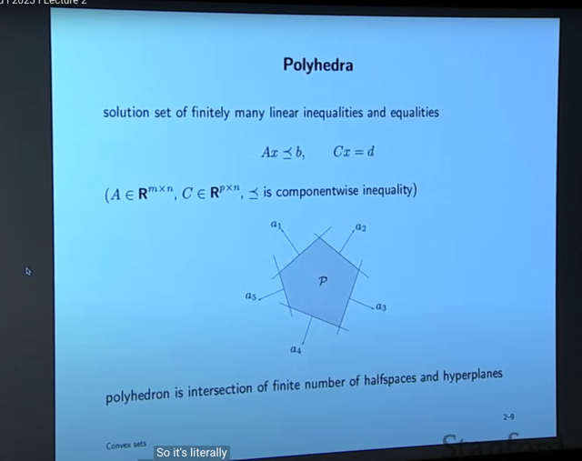</kbd>

> [!NOTE]
> Tiếp, ta qua một loại convex set nữa gọi là **POLYHEDRA**. Đại khái là thể hiện bằng **Ax ⪯ b** có nghĩa là, **các component của vector Ax sẽ đều nhỏ hơn hoặc bằng component tương ứng của vector b**
>
> Ax ⪯ b: Đọc là "**Ax is less or equal to b ELEMENT-WISE**"
>
> Thế thì, ta biết **Ax = b là system of linear equations**, thì Ax ⪯ b chính là thể hiện **system of linear inequalities.** 
>
> Về mặt hình học, mỗi bất phương trình, ví dụ a1Tx ≤ b1 (a1 là row 1 của A, b1 là component 1 của b) thì ta biết **a1 sẽ là normal vector của line a1Tx = b1**, và **a1Tx ≤ b1 sẽ biểu diễn phần nửa mặt phẳng (half-plane) ở bên dưới** (ngược lại hướng với vector a1). Tương tự như vậy với a2Tx ≤ b2,..
>
> Để rồi **Ax ⪯ b sẽ thể hiện phần intersection giữa tất cả các half-plane này**. Và nó tạo ra POLYHEDRA
>
> POLYHEDRA

 

<kbd>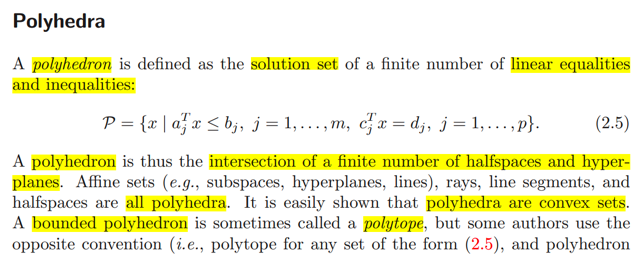</kbd>

> [!NOTE]
> Đọc sách về POLYHEDRA, theo định nghĩa là:
>
> P = {x | ajTx ≤ bj, j = 1,2....m, cjTx = dj, j = 1,...p}
>
> Dễ thấy theo đó thì Polyhedra là **tập hợp nghiệm của hệ hữu hạn các bất phương trình và phương trình tuyến tính**.
>
> Mà như đã biết (tập nghiệm của) phương trình tuyến tính thì thể hiện theo hình học tạo nên hyperplanes còn của bất phương trình tuyến tính thì tạo nên các haft-space.
>
> Do đó **polyhedra theo hình học là phần giao (intersection) của các haft-space và hyperplane**
>
> Ở đây có nói một ý đáng suy nghĩ là **AFFINE SET ĐỀU LÀ POLYHEDRA**. Thử giải thích tại sao (→ quay lại sau)
>
> Và nó **cũng là convex set** (cũng thử lập luận xem tại sao sau)
>
> Cuối cùng, **POLYTOPE** là từ người ta dùng để chỉ **BOUNDED POLYHEDRA**
>
> Thử giải thích tại sao (quay lại sau):

 

<kbd>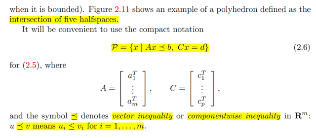</kbd>

<kbd>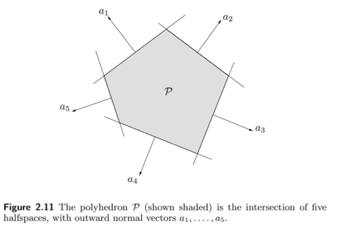</kbd>

> [!NOTE]
> Một ví dụ, có nhắc đến kí hiệu vector inequality (⪯, ≽)

 

<kbd>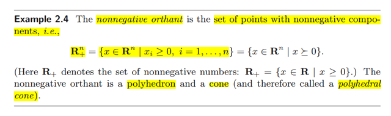</kbd>

> [!NOTE]
> Một ví dụ cho kí hiệu ≽ đó là, 
>
> {x ∈ R^n | xi ≥ 0 với i=1,2....n} 
>
> = {x ∈ R^n | x ≽ 0} 
>
> Tức là tập mọi vector mà mọi component đều không âm thì gọi là **NON-NEGATIVE ORTHANT**

 

<kbd>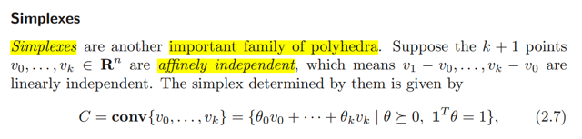</kbd>

<kbd>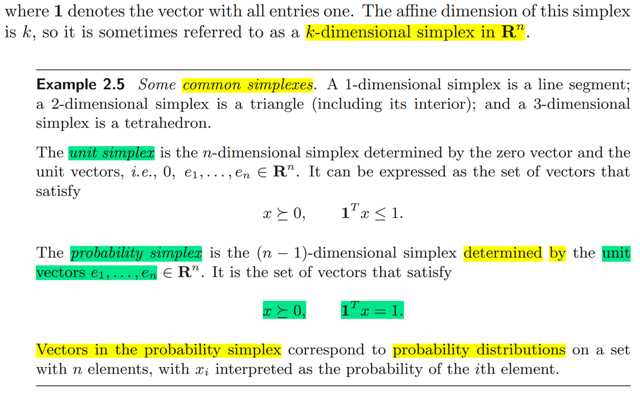</kbd>

> [!NOTE]
> Đây là cái trong bài gs ko nói. **SIMPLEXES** là một loại Polyhedra quan trọng.
>
> Định nghĩa hơi rắc rối, nhưng đại khái là ta có **k+1 vector v0, v1... vk**mà trong đó 
>
> **(v1 - v0), (v2 - v0)...(vk - v0) là linear independent**. 
>
> Và cái này gọi là **v0, v1, ...vk AFFINE INDEPENDENT.**
>
> Thì từ đám này ta có một SIMPLEXES: Chính là là **convex hull của tụi nó.**
>
> Mà convex hull thì đã biết theo định nghĩa là **tập mọi convex combination của chúng**. 
> (convex combination là khi các hệ số có **tổng bằng 1 và hệ số không âm**)
>
> ====
>
> Thế thì **hai loại Simplexes phổ biến**: **UNIT SIMPLEX và PROBABILITY SIMPLEX**.
>
> Xét cái này trước: 
>
> PROBABILITY SIMPLEX sách nói rằng **đó là khi các vector v1, v2...vn là các unit vector e1, e2..en**. 
>
> Thế thì, **từ định nghĩa của simplexes = convex hull của e1, e2,...en**. Như vậy, các **vector trong simplexes này sẽ là các convex combination của e1, e2, ...en**
>
> Xét một cái như vậy x = Σ θi ei (phải tự hiểu ei là vector θi là scalar nhé) 
>
> Thì có thể chứng minh 1Tx = 1 không?
>
> 1Tx = 1T(Σ θi ei) = 1T(Σ θi ei) = Σ (1Tθiei) = Σ θi(1Tei)
>
> Mà 1Tei = 1 do ei là unit vector có một chỗ bằng 1 , còn lại bằng 0.
>
> => 1Tx = Σ θi 
>
> = 1 (do θ1, θ2 ... là hệ số của convex combination)
>
> Còn x ≽ 0 thì dễ thấy rồi.
>
> vậy nên ta có với **Probability Simplex thì 1Tx = 1 và x ≽ 0**

> [!TIP]
> **🤖 AI Feedback** — ❌ Score: **65/100**
>
> Bạn đã nắm vững các khái niệm cơ bản về simplex và chứng minh tốt các tính chất của probability simplex. Tuy nhiên, bạn đã bỏ sót hoàn toàn simplex đơn vị và thiếu thông tin quan trọng về số chiều của probability simplex, điều này làm giảm đáng kể độ chính xác và đầy đủ của phân tích.

 

<kbd>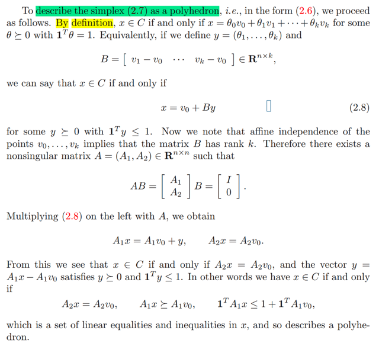</kbd>

> [!NOTE]
> Rồi cái này là giải thích **tại sao định nghĩa của SIMPLEX lại thật ra chính là POLYHEDRON**
>
> Tại sao nói x ∈ C ⇔ x = v0 + By
>
> By = (v1-v0)θ1 + ...(vk-v0)θk 
>
> = v1θ1 + ...+ vkθk - v0θ1 ... - v0θk
>
> = v1θ1 + ...+ vkθk - v0(θ1 ... + θk)
>
> = v1θ1 + ...+ vkθk - v0*1
>
> = v1θ1 + ...+ vkθk - v0
>
> => v0 + By = v1θ1 + ...+ vkθk = Σi viθi = x
>
> Tiếp vì v0, v1, ...vk AFFINE independent mà định nghĩa là (vi - v0) i = 1,2..k là LINEAR independent. Vậy các cột của B linear independent 
>
> => B FULL COLUMN RANK với rank = k
>
> Rồi, người ta nói vì B có rank k nên tồn tại A = [A1, A2]T sao cho AB = [I, 0]T là sao (hay vì sao)
>
> Đầu tiên AB = C thì row i'th của C là linear combination của rows của B với coefficient sets là row i'th của A, nếu gọi aiT là row thứ i'th của A thì aiTB = ciT
>
> Hoặc BTai = ci
>
> Thế thì B full column rank, tức các columns của nó independent, nhưng các row của nó thì không, chứng tỏ tồn tại coefficients khiến combines rows của B thành 0. Và đó là những nonzero vector của left nullspace của B: N(BT)
>
> Nên từ đây có thể hiểu A2 chính là matrix mà các rows là left-nullspace vector  của B.
>
> Còn A1? Vì A1B = I, nên A1 chính là left inverse (tồn tại khi B full column rank) của B.
>
> Và từ đây cũng cho biết A2 sẽ có số hàng là dimension của left nullspace N(BT)  cũng đúng bằng số dependent row của B = n - k. => A2 có shape (n-k, n)
>
> Còn A1 có shape (k,n).
>
> Rồi x ∈ C <=> x = v0 + By 
>
> <=> Ax = A(v0 + By) | nhân hai vế cho A
>
> <=> A1x = A1v0 + A1By và A2x = A2v0 + A2By
>
> <=> A1x = A1v0 + y và A2x = A2v0 (1)
>
> Dùng các điều kiện ban đầu là y ≽ 0 và 1Ty <= 1 ta có
>
> (1) <=> A1x ≽ A1v0 và 1T(A1x - A1v0) <= 1

 

<kbd>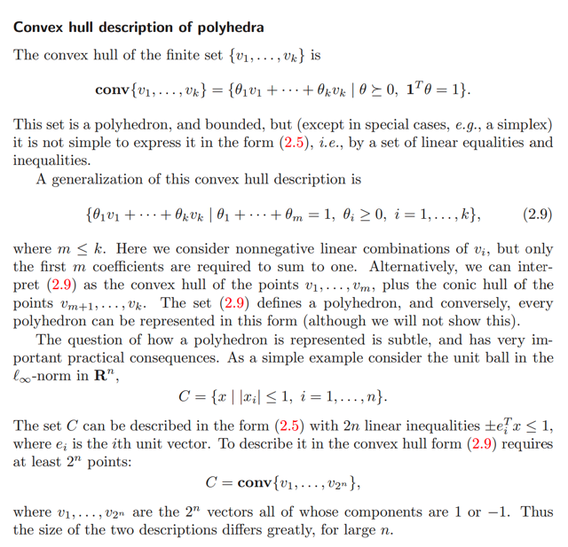</kbd>

 

<kbd>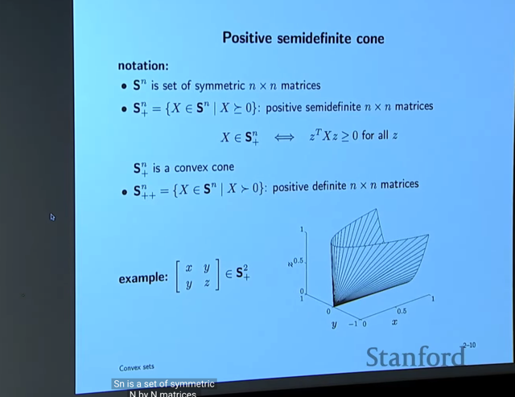</kbd>

> [!NOTE]
> Tiếp theo là POSITIVE SEMIDEFINITE CONE (PSD CONE) Ta gặp lại kí hiệu về  set các positive semi definite S^n + = X thuộc S^n (tập hợp các symmetric matrix) | X ≽ 0
>
> Với matrix thì không đọc larger or equal element wise mà đọc X ≽ 0 là: 
>
> "X is greater or equal to zero IN LOEWNER ORDER"
>
> Gs nói rằng với vector ⪯, hay ≽ 0 mang ý nghĩa là component-wise in-equal nhưng với matrix, thì nó mang ý nghĩa là positive / negative semi definite.
>
> Và như đã biết ở 1806, với symmetric positive semi-definite thì quadratic form zTXz >= 0 với mọi z. (có thể bằng 0 khi z khác 0, matrix có eigenvalues không âm)
>
> Còn nếu có thêm dấu cộng S^n ++ thì ta có matrix positive definite.
>
> Gs cũng nói một điều ta đã biết từ 1806, ví dụ matrix [x y; y z], để nó trở thành positive semi definite, thì x, z phải dương và det phải dương. (ở đây nhắc lại lời gs Strang một chút, thật ra không cần z phải dương, vì x dương và det =  xz - y^2  dương đã imply z phải dương rồi)
>
>
>
> Nói chung là mình có thể nói thêm về cái chuyện là tại sao một cái ma trận mà xác định dương thì cái đường chéo nó phải không âm. Nó là điều kiện cần, chưa đủ nhưng mà nó là điều kiện cần. Bởi vì nếu mà là ma trận xác định dương thì cái dạng toàn phương của nó phải luôn dương với vector khác không. Do đó chỉ cần sử dụng cái vector chuẩn tức là vector vector cơ sở chuẩn thì mình sẽ thấy ngay á là nếu mà sử dụng vector cơ sở chuẩn thì cái dạng toàn phương của một cái ma trận nó sẽ ra cái phần tử trên đường chéo, dẫn đến là mình sẽ có cái điều kiện cần đó là những cái phần tử trên đường chéo của một cái ma trận phải dương.

> [!TIP]
> **🤖 AI Feedback** — ✅ Score: **97/100**
>
> Ghi chú thể hiện sự hiểu biết sâu sắc về khái niệm hình nón bán xác định dương, từ định nghĩa ký hiệu đến giải thích ý nghĩa của thứ tự Loewner và điều kiện cho ma trận 2x2. Mặc dù có một chút lẫn lộn ban đầu giữa điều kiện cho ma trận bán xác định dương và xác định dương trong ví dụ 2x2, phần tự hiệu chỉnh đã làm rõ vấn đề một cách xuất sắc.

 

<kbd>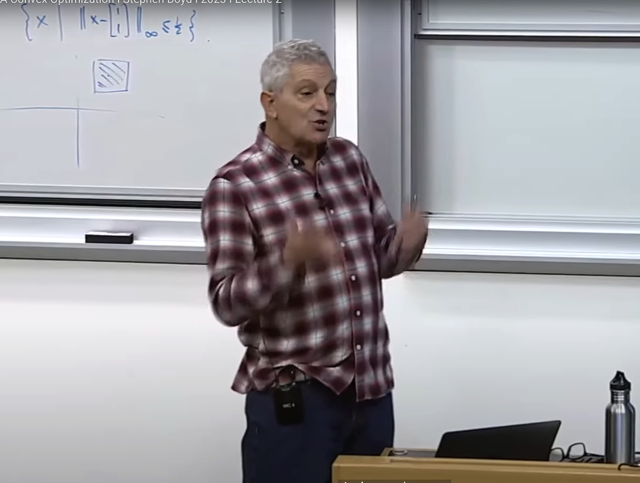</kbd>

> [!NOTE]
> Gs nói về calculus, đại khái ông nói là về cơ bản, trong calculus ta sẽ  học vài chục cái derivative của các basic function (như sin(x), cos(x), log(x)....) và áp dụng các rule như product rule, chain-rule, quotient-rule để từ đó có thể tính đạo hàm (take derivative) của mọi thứ

 

<kbd>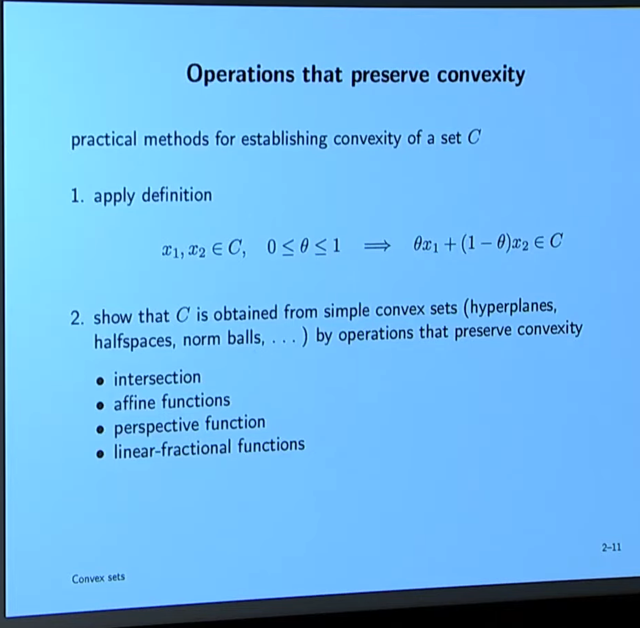</kbd>

> [!NOTE]
> Thế thì, đại khái là để trả lời câu hỏi **set C có convex hay không**.
>
> Theo gs đương nhiên có khi ta sẽ cần **dùng định nghĩa convexity**. 
>
> Đó là lấy x1, x2 thuộc C: Và một θ có giá trị từ 0 đến 1. Ta **cần lập luận để cho thấy θx1 + (1-θ)x2 (gọi là mixture hay convex combination của x1, x2) cũng thuộc C**.
>
> Tuy nhiên gs cho rằng **nên để cách tiếp cận này cuối cùng**.
>
> Mà các thông thường hơn đó là, ta sẽ **lấy set C, và represent nó dưới dạng một bunch các operation của các convex set mà ta đã biết như half-space, polyhedra....và các operation này có đặc tính là giữ nguyên tính convexity**

> [!TIP]
> **🤖 AI Feedback** — ❌ Score: **65/100**
>
> Bài làm đã nắm được hai phương pháp chính để xác định tính lồi của một tập hợp. Tuy nhiên, việc khẳng định phương pháp định nghĩa nên được để cuối cùng và phương pháp thứ hai thông thường hơn là không chính xác và không được hỗ trợ bởi nội dung slide.

 

<kbd>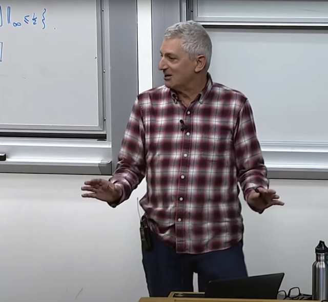</kbd>

> [!NOTE]
> Đại khái là gs nói về một phương pháp (để check tính convexity trong thực tế) kiểu như là ta viết một đoạn code để **generate hai điểm bất kì trong set C. Sau đó chọn một random θ từ 0 đến 1 để tính mixture của chúng. Và kiểm tra xem nó có còn trong set C hay không**.
>
> Ta sẽ chạy đoạn code và bỏ đi ăn trưa, đến khi quay lại nhìn vào kết quả thì chỉ cần tồn tại một violation (mixture ở bên ngoài C) thì lập tức ta có thể kết luận nó không convex.
>
> Tuy nhiên nếu không có violation thì dĩ nhiên là dù có chạy bao nhiêu lần cũng không đủ để kết luận là có convex. Đại khái là vậy

 

<kbd>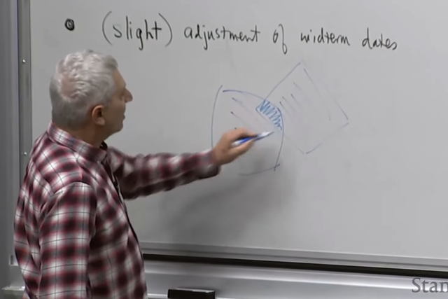</kbd>

 

<kbd>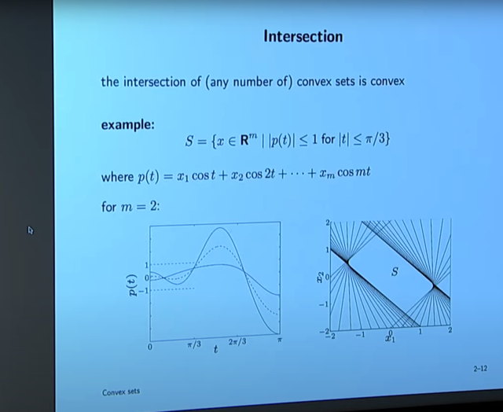</kbd>

> [!NOTE]
> Tiếp theo ta sẽ nói về **INTERSECTION**, ý là intersection của các convex set cũng là convex.
>
> Ví dụ trong hình là thế này, S = {x ∈ R^m : |p(t)| <= 1 for |t| <= π/3}  trong đó p(t) = x1cos(t) + x2cos(2t) + ....xmcos(mt)
>
> Hiểu đại khái là, đây là **tập hợp (set) các vector x thuộc R^m sao cho khi tạo ra các function cụ thể p(t) thì chúng có đặc điểm là trong đoạn t ∈ [-π/3, π/3] thì |p(t)| luôn nhỏ hơn 1.**
>
> Lấy ví dụ với m = 2, tức x ∈ R^2, để rồi các function p(t) sẽ có dạng:
>
> p(t) = x1cos(t) + x2cos(2t) thì trong hình là hai function (ứng với hai vector x) thỏa điều kiện - có thể thấy giá trị của function khi t từ 0 đến π/3 đều nằm trong [-1,1].
>
> Vậy thì, gs nói rằng, nếu phải chứng minh set trên là một convex set bằng định nghĩa, ta cũng có thể làm. Bằng cách lấy hai vector x, mỗi cái sẽ ứng với một function trong hình (thỏa các tính chất như trên). Nhiệm vụ của ta là lập luận để cho thấy rằng khi tính ra mixture của x1, x2, với θ ∈ [0,1] thì vector x mixture này, sẽ tạo một function cũng có đặc điểm thỏa điều kiện đồng nghĩa x cũng thuộc set C.
>
> Thế thì ta cũng không khó để lập luận, gỉai sử x1 = [x11, x12] tạo function p1(t) = x11cos(t) + x12cos(2t) và
>
>  x2 = [x21, x22] tạo function p2(t) = x21cos(t) + x22cos(2t)
>
> Thì mixture của x1, x2 x = θx1 + (1-θ)x2 = [θx11+(1-θ)x21, θx12 + (1-θ)x21] sẽ tạo function p(t) =  [θx11+(1-θ)x21]cos(t) + [θx12 + (1-θ)x21]cos(2t)
>
> Thế thì triển khai ra ta sẽ có 
>
> p(t) = θx11cos(t) + θx12cos(2t) + (1-θ)x21cos(t) + (1-θ)x22cos(2t)
>
> = θp1(t) + (1-θ)p2(t)
>
> p1(t) <= 1 <=> θp1(t) <= θ;  p2(t) <= 1 => (1-θ)p2(t) <= (1-θ)
>
> Từ đó suy ra θp1(t) + (1-θ)p2(t) <= θ + (1 - θ) = 1
>
> Tương tự ta cũng có thể chứng minh θp1(t) + (1-θ)p2(t) >= -1
>
> Từ đó kết luận x cũng thuộc set S => S convex****

 

<kbd>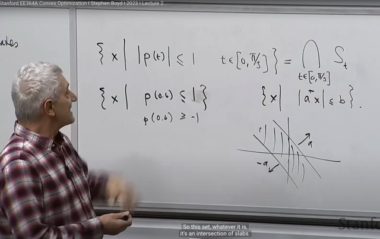</kbd>

> [!NOTE]
> Đại khái là ta có thể có cách lập luận khác, theo cách thứ hai, đó là **tìm cách represent S dưới dạng các operation của các convex set** mà ta đã biết.
>
> Đầu tiên ta cần hiểu  {x | |p(t)| ≤ 1} là cái gì. Và để dễ hơn, ta sẽ chọn một giá trị cụ thể của t = 0.6 (nằm trong [0, π/3])
>
> Thế thì, với x là vector (x1, x2) thì
>
> |p(0.6)| <= 1 
>
> ⇔ cos(0.6)x1 + cos(1.2)x2 <= 1 (Đây là một half-space)
>
> và
>
> cos(0.6)x1 + cos(1.2)x2 >= -1 (cũng là một half-space nữa)
>
> Vậy thì cùng nhau {x | |p(0.6)| ≤ 1} thì chúng chính là define tập hợp điểm (vector x)** thuộc intersection của hai half-space** 
>
> mà hai cái line này song song, nên vùng intersection tạo thành một SLAB (tạm dịch là miếng / phiến gỗ)
>
> Thế thì, với t là 0.6 thì x | |p(0.6)| <= 1 là một Slab, thì với mọi t từ [0, π/3] ta sẽ có INTERSECTION CŨA VÔ SỐ SLAB (INDEFINITELY)
>
> Cho nên gs kí hiệu nó là INTERSECTION t ∈ [0, π/3] St với St là một Slab ứng với một giá trị t cụ thể
>
> Như vậy, tới đây, ta đã **THỂ HIỆN S BAN ĐẦU DƯỚI DẠNG OPERATION (CỤ THỂ Ở ĐÂY LÀ INTERSECTION) CỦA CÁC SLAB**, MÀ TA BIẾT **MỖI SLAB LÀ INTERSECTION CỦA CÁC
> HAFT-SPACE - LÀ CONVEX SET)**
>
> Do đó có thể kết luận S là convex set

 

<kbd>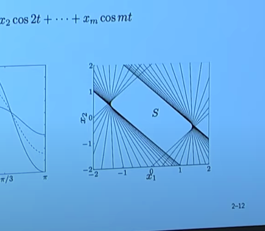</kbd>

> [!NOTE]
> Và hình ảnh này chính là intersection của vô số slab St vừa nói

 

<kbd>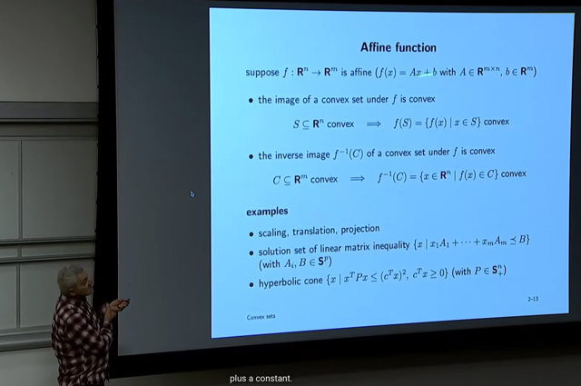</kbd>

> [!NOTE]
> Tiếp ta qua một operation nữa mà có tính chất preserve tính convex:
> AFFINE FUNCTION.
>
> Theo định nghĩa Affine function là function Rn -> Rm f(x) = Ax + b
> A ∈ R^mxn và b ∈ R^m.
>
> Đầu tiên theo gs và ta cũng có thể hiểu điều này, rằng, trong neural
> network, người ta gọi Wx + b là linear layer, linear function.
> Nhưng mình phải hiểu, nó không phải là linear function, mà nó là
> affine  function.
>
> Trong 1806 ta cũng đã học Ax + b không phải là linear
> transformation vì T(u+v) không bằng T(u) + T(v) (A(u+v)+b không
> bằng (Au + b) + (Av + b) = A(u+v) + 2b)
>
> Tuy nhiên, cũng nhiều lần được nghe từ Andrew Ng, hay gs Yan ,
> Maning, và ở đây gs cũng nói ta phải hiểu Ax + b không phải là linear
> function mà là affine function.
>
> Thế thì, affine function có tính chất, nếu S là một convex set, thì
> f(S) (tập hợp các vector có được khi apply function f lên mọi điểm
> của set S: f(x) | x ∈ S cũng sẽ convex.
>
> ===
>
> Bên cạnh đó, ta sẽ biết thêm về cái gọi là INVERSE IMAGE kí
> hiệu là f_inv(C) = x ∈ R^n | f(x) ∈ C với ý nghĩa là, tập hợp
> các vector x mà khi được map bởi function f nó thành một vector
> trong C thì tập hợp đó gọi là f_inv(C)
>
> Thế thì ta cũng sẽ có tính chất:
>
> Nếu C là convex set, thì f_inv(C) cũng là convex set
>
> AFFINE FUNCTION

 

<kbd>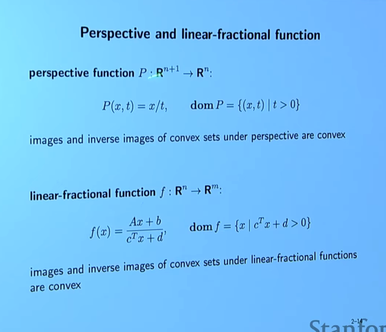</kbd>

> [!NOTE]
> Một operation lạ mà ta sẽ được biết là PERSPECTIVE
> function. Đại khái là nó sẽ nhận input một R^(n+1) vector (x,
> t), trong đó ta hiểu x là Rn vector, và t là number.
>
> Thế thì nó sẽ lấy n component đầu tiên chia cho component cuối
> để trả ra vector x/t có n component
>
> Và images và inverse images của một convex set sẽ được
> giữ nguyên tính convexity khi apply perspective function.
>
> ====
>
> Sau đó là LINEAR-FRACTIONAL function, được định nghĩa là
> function f(x) = (Ax + b) / cTx + d,  tức là một affine function
> chia cho một (cũng là) affine function nhưng c chỉ là
> vector, thay vì A là matrix.
>
> Sau đó gs nói một chút đại khái là về việc linear-fractional function
> xuất hiện ở nhiều nơi, như xác suất và vision
>
> PERSPECTIVE VÀ LINEAR-FRACTIONAL

 

<kbd>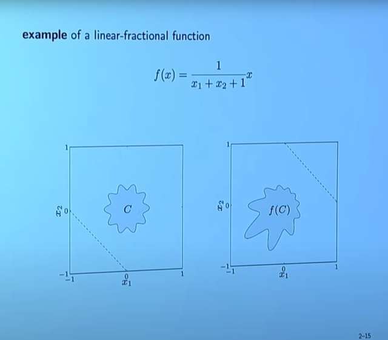</kbd>

> [!NOTE]
> Một ví dụ về linear-fractional function: f(x) = [1/(x1+x2+1)] * x
>
> Về cơ bản là ta scale x với scalar phụ thuộc bởi x1, x2.
>
> Hình ảnh bên trái là convex set C. Bên phải là set C được
> apply linear-fractional function f(x)
>
> Có thể thấy khi x1, x2 nhỏ thì scalar (fraction) lớn, khi x bị scale
> lớn ra (nôm na là vậy)
>
> Thì gs nói cách để hình dung hay nhất là tương tương ta có convex
> set C nằm trên mặt đất và ta nhìn nó bằng một cái drone bay ở
> trên. Thì khi drone ở gần đầu này hơn thì hình ảnh mà ta thấy 
> sẽ lớn hơn

 

<kbd>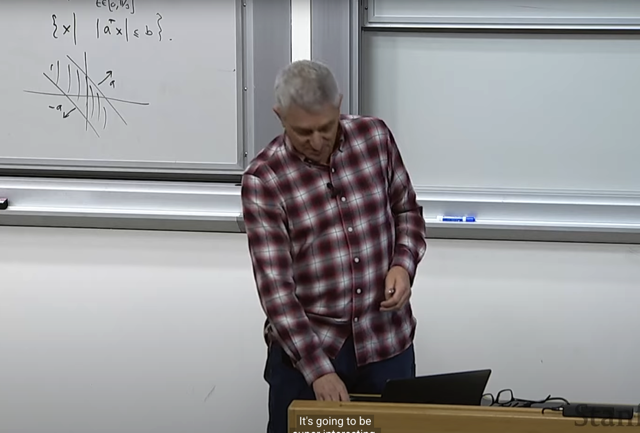</kbd>

> [!NOTE]
> Và gs nói ta tuy rằng có thể ko tin function này preserve
> convexity nhưng qua các bài sau ta sẽ thấy rất nhiều ví dụ (áp
> dụng cái này)

 

- **generalized inequalities**

<kbd>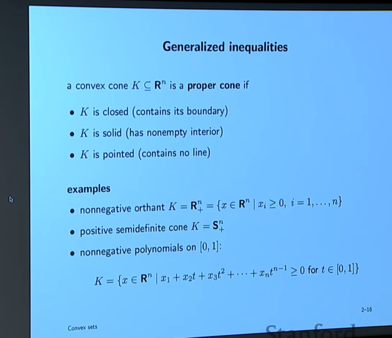</kbd>

> [!NOTE]
> Tiếp theo là **generalized inequalities **
>
> Nhưng trước tiên cần định nghĩa của **PROPER CONE**
>
> Hiểu đại khái là nếu một **convex cone K** có các tính chất như:
>
> - **CLOSED** (có nghĩa là nó **chứa boundary của nó**) 
>
> - **SOLID** (có non-empty interior, tạm hiểu là **tồn tại những điểm mà
> có thể vẽ một ball có bán kính dương nhỏ bất kì nằm trong set**) 
>
> - **POINTED** (**không chứa đường thẳng**, tạm biết vậy)
>
> Một ví dụ là **non-negative orthant K = R^n + = x ∈ R| xi >= 0** - hiểu là phần không gian R^n mà mọi component của vector đều
> không âm
>
> Hoặc K = S^n + (là tập mọi symmetric positive semi definite như
> đã biết ở các slide trước
>
> PROPER CONE

 

<kbd>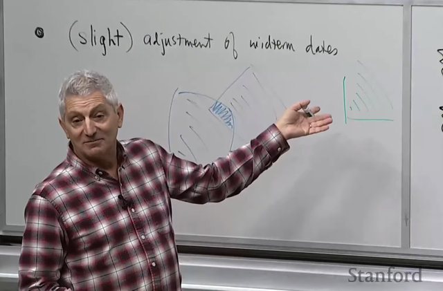</kbd>

> [!NOTE]
> non-negative orthant thì trong 2D chính là một **quadrant** - góc phần tư mà tọa độ đều không âm  này.

 

<kbd>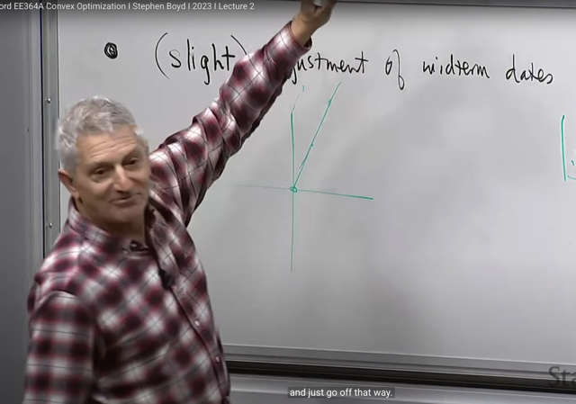</kbd>

<kbd>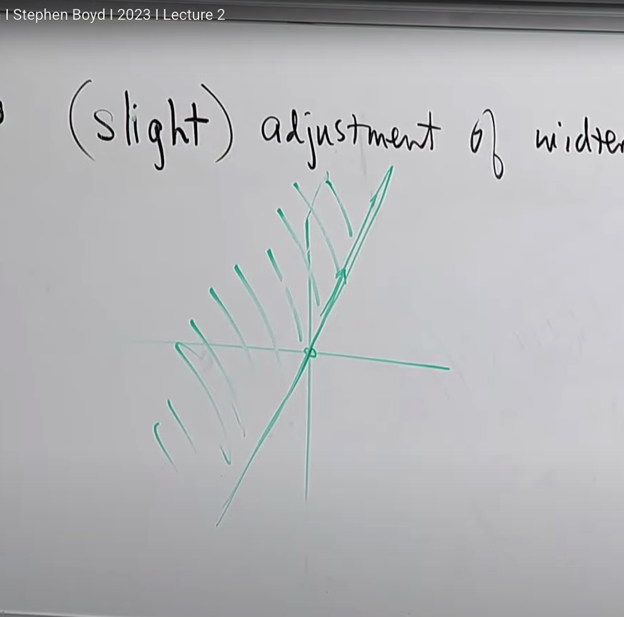</kbd>

> [!NOTE]
> Gs nói một số case không thỏa điều kiện nhân tiện đây, là** một ray (tia, hồi xưa học về khái niệm tia rồi) gs nói nó cũng chính là một cone.**
>
> Nhưng nó không phải là proper cone vì nó violate yêu cầu là solid,  dễ thấy ko thể có một điểm nào trên ray mà vẽ được cái ball có bán kính dương nhỏ bất kì vẫn nằm trong ray.
>
> Cũng như half-plane cũng không thỏa điều kiện vì nó chứa được ít nhất một line.

 

<kbd>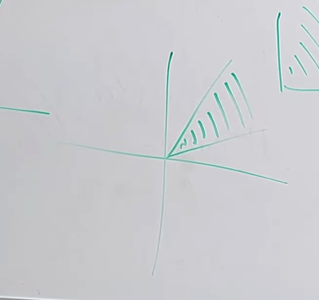</kbd>

> [!NOTE]
> Còn cái này thì là proper cone: Solid, Pointy và Closed

 

- **Bất đẳng thức tổng quát và Cone**

<kbd>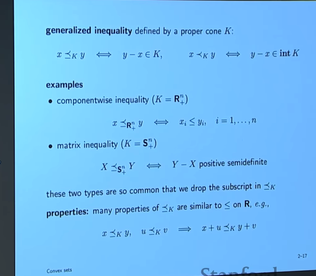</kbd>

> [!NOTE]
> Đại khái là, từ khái niệm proper cone K ta mới có định nghĩa của **GENERALIZED INEQUALITY**
>
> x ⪯K y (đọc là **x less than y with respect to cone K**) có nghĩa là:  
>
> **y - x thuộc cone K**
>
> Ví dụ:
>
> x ⪯R^n+ y thì có nghĩa là **y - x ∈ R^n+, đồng nghĩa mọi components đều không âm, và như vậy x ⪯R^n+ y sẽ có nghĩa là component của x nhỏ hơn component của y element-wise.**
>
> Và với matrix thì X ⪯S^n+ Y thì có nghĩa là **Y - X là matrix positive semi-definite**
>
> Theo thảo luận với GPT thì nó nói x ⪯ y đã có nghĩa là x less than y element-wise rồi, điều này có nghĩa là khi nói **x ⪯ y thì thật ra đang chính là nói x ⪯ y with respect to R^n+**
>
> (Những cái này, nếu có chưa hiểu để làm gì, thì như gs đã nói, chúng sẽ được rõ ràng hơn khi qua tuần 4 trở đi)
>
> Gs ko nói nhưng trao đổi với GPT ta cũng dễ hiểu: Nếu **x ≺ y thì y - x không chỉ nằm trong K mà còn nằm trong interior của K, kí hiệu int K** (mà cái này theo định nghĩa là nếu **có thể vẽ một quả banh bán kính nhỏ bất kì quanh nó mà quả banh vẫn nằm trong K**, hoặc hiểu nôm na là y - x không được nằm trên boundary của K) thì khi đó gọi là x strictly less than y with respect to K
>
> GENERALIZED INEQUALITY:  **x ⪯K y: x nhỏ hơn hoặc bằng y theo cone K**
>
> x ⪯R^n+ y: x nhỏ hơn hoặc bằng y theo R^n+ đồng nghĩa y - x ∈ R^n+ <=> x <= y element-wise
>
> Và khi nói x ⪯ y thì cũng ngầm hiểu nó là x ⪯ y wrt R^n +

 

<kbd>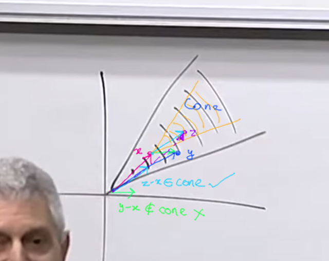</kbd>

> [!NOTE]
> Và hình ảnh của x ⪯K y là vầy, đó là nó phải thỏa hai điều kiện:
>
> **y - x phải ∈ K**. Nên ví dụ ta có vector x là điểm màu hồng.
>
> Thì không phải cứ thỏa (1) là đủ, vì ví dụ vector y (màu xanh), lớn hơn x component-wise, hay, mọi tọa độ của nó đều >= tọa độ tương ứng của x.
>
> Tuy nhiên, **y-x, là vector xanh lá, không nằm trong cone K. Do đó y không thỏa x ⪯K y**
>
> Còn **z, thì cũng lớn hơn x component-wise**, và **đồng thời z-x (vector tím) vẫn trong cone** K, do đó ta có x ⪯K z

 

<kbd>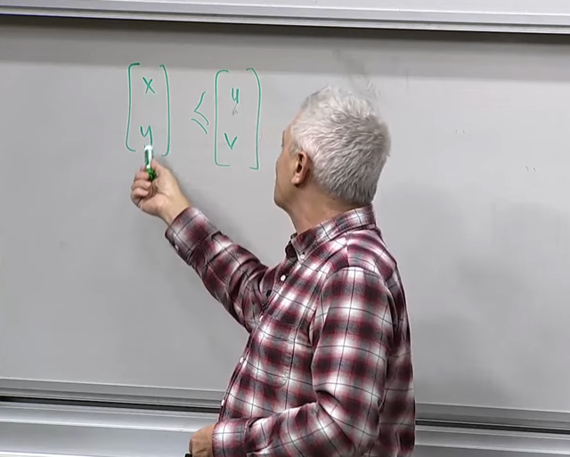</kbd>

> [!NOTE]
> Sau đó gs nói một chút về linear ordering. Hiểu đại khái là linear ordering có nghĩa là ví dụ như trong R, a chỉ lớn hơn b hoặc bé hơn b hoặc bằng b.
>
> Nhưng với vector thì không có tính chất đó (x có thể bé hơn u, nhưng y lớn hơn v)
>
> LINEAR ORDERING

 

<kbd>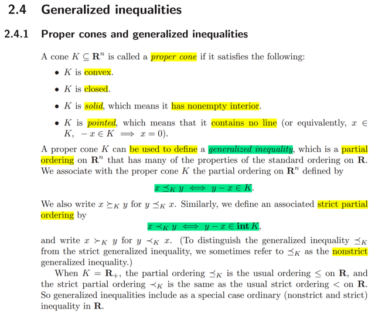</kbd>

> [!NOTE]
> Trong bài giảng đã nói đủ hết rồi. Chỉ thêm một ý nhỏ là **khi K trở thành R+** (tức trục số thực không âm) thì **phép so sánh thứ tự kiểu này (gọi là PARTIAL ORDERING), trở thành phép so thứ tự thông thường (USUAL ORDERING)**
>
> **x ⪯ R+ y cũng giống như x ≤ y**
>
> 2.4 GENERALIZED INEQUALITIES
>
> 2.4.1 PROPER CONES & GENERALIZED 
> INEQUALITIES

 

<kbd>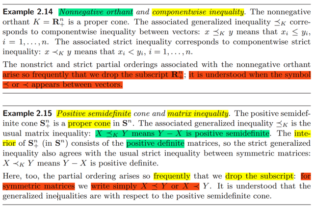</kbd>

> [!NOTE]
> Đây, nếu đọc sách chỗ này thì đã khỏi phải hỏi GPT: Đó là ở đây cho biết **KHI K = R^(n+), thì partial ordering sẽ mang ý nghĩa là COMPONENT-WISE INEQUALITY. **
>
> Tức là khi đó **x ⪯ R^(n+) y, theo định nghĩa sẽ là y - x ∈ R^(n+), ⇨ mọi component của (y - x) đều ≥ 0 ⇨ yi ≥ xi với mọi i**
>
> Và gs cũng cho biết **VÌ CÁI NÀY XUẤT HIỆN NHIỀU NÊN NGƯỜI TA BỎ R^(n+) luôn, ĐỂ KHI THẤY ⪯, HAY ≺, THÌ TỰ HIỂU LÀ K = R^(n+)**
>
> Cái này cũng giống như với l2 norm: Khi thấy ||u|| tự hiểu là L2 norm
>
> ====
>
> Tương tự, khi K = cone S^(n+), thì partial ordering **X ⪯ S^(n+) Y sẽ có nghĩa là Y - X ∈ S^(n+), tức là Y - X là POSITIVE SEMI-DEFINITE.**
>
> Và nếu là **strictly inequality X ≺ S^(n+) Y thì theo định nghĩa, Y - X ∈ interior
> của S^(n+),** 
>
> Và ta được học thêm rằng **interior của S^n+ chứa các POSITIVE DEFINITE matrix**. 
>
> Do đó **X ≺ S^(n+) Y ⇨ Y - X là PSD matrix**.
>
> Thế thì ta hay thấy kí hiệu nói matrix A positive semi definite là A ≽ 0, và A positive definite là A ≻ 0. Thì từ đây ta hiểu nó chính là bởi vì như đã nói, ** cái này cũng xuất hiện nhiều nên người ta tự hiểu khi ghi X ≽ Y thì nó chính là X ≽ S^(n+) Y**.
>
> Nên A ≽ 0 thì THỰC CHẤT LÀ A ≽S^n+ 0, và theo định nghĩa, nó tương
> đương A - 0 ∈ S^n+ => A ∈ S^n+ => A là positive semi definite.

 

- **Tính chất mở rộng bất đẳng thức**

<kbd>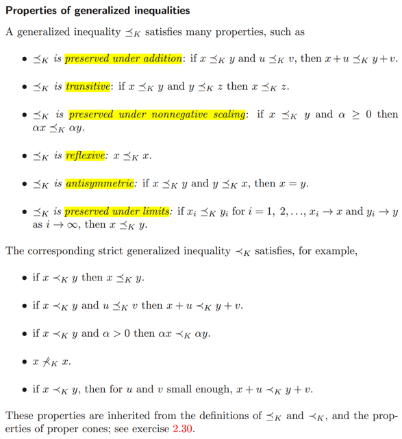</kbd>

> [!NOTE]
> Một số tính chất của generalized inequalities mà trong bài giảng không nói tới

 

<kbd>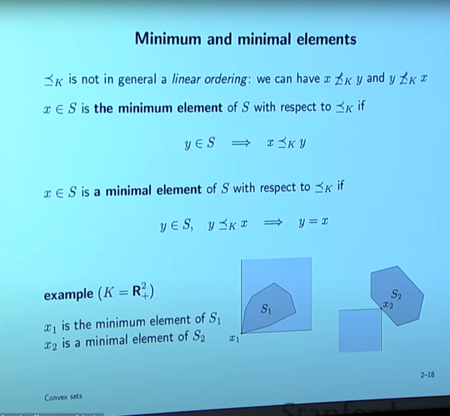</kbd>

> [!NOTE]
> Từ đó ta có khái niệm **MINIMUM** và **MINIMAL**
>
> MINIMUM có tính chất mạnh hơn: Khi nói **x là minimum của set S thì có nghĩa là mọi point s của S đều "tốt hơn" (≽K) x**
>
> Ví dụ x1 là minimum của S1, và trong ví dụ này K là R^(2+), như đã nói, có thể bỏ kí hiệu R^(2+):  x ⪯ y, và nó sẽ đồng nghĩa x ⪯ y component-wise),
>
> Thì hình ảnh này thể hiện rõ, x1 là vector có cả hoành độ và tung độ nhỏ nhất, nói cách khác, mọi vector trong S1 có hoành độ và tung độ đều lớn hơn x1: y ∈ S ⇨ x1 ⪯ y
>
> Còn MINIMAL thì yếu hơn, khi nói rằng: **nếu y ⪯K x thì y = x**, 
>
> hay hiểu nôm na, là **chỉ có một mình nó là nhỏ hơn hoặc bằng nó thôi**.
>
> Thế thì với định nghĩa này, xem thử x2, hoặc bất kì điểm nào trên cạnh chéo đang chứa x2 ta sẽ thấy **mọi điểm nào trong S2 mà có tung độ và hoành độ nhỏ hơn hoặc bằng x2 thì chỉ có thể là x2**.
>
> Nhưng **ko có nghĩa là x2 nhỏ hơn hết thảy** vì vẫn có những điẻm khác nhỏ hơn x2 về tung độ hoặc hoành độ. 
>
> Điều này cũng có nghĩa trong **hình 2 sẽ không có minimum, vì không có điểm nào mà nhỏ hơn hết thảy về cả hoành và tung độ.**
>
> **Nhưng có nhiều minimal** (như đã nói, là các điểm trên cạnh màu đỏ) vì
> nếu vẽ cái hình vuông thể hiện những điểm mà nhỏ hơn hoặc bằng cả
> tung độ lẫn hoành độ với nó thì chỉ có thể intersect với S2 tại chính điểm
> đó. Nói cách khác, không tồn tại điểm nào trong S2 mà nhỏ hơn cả hoành
> độ và tung độ ngoại trừ chính nó.
>
> MINIMUM VÀ MINIMAL

**🔗 See also:** [linked note](./lec_7.md#node-zawjzk1)

 

<kbd>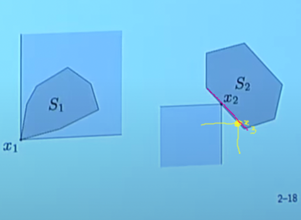</kbd>

> [!NOTE]
> cái này đại khái là mọi điểm ở trên cái cạnh màu hồng nó đều là Minimal mà ý nghĩa của Minimal thì biết rồi là cái điểm duy nhất ở trong cái tập mà "nhỏ hơn nó" ( ≤K) hơn nó chỉ là chính nó

 

<kbd>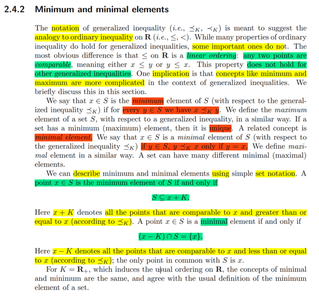</kbd>

> [!NOTE]
> Nói chung thì trong bài gs đã nói rồi, phần note của slide bài giảng cũng đã nắm bắt ý chính.
>
> Chỉ có cái trong sách nhấn mạnh rằng, GENERALIZED INEQUALITY dù **giữ phần lớn các tính chất của USUAL INEQUALITY, nhưng vẫn có vài thay đổi** mà trong đó là LINEAR ORDERING, nôm na là **không còn việc mọi vector đều có thể so sánh với nhau nữa**, mà có thể x vừa không ⪯K y và vừa không ≽K y.
>
> Điều này dẫn đến xuất hiện hai khái niệm **MINIMUM** VÀ **MINIMAL**.
>
> **Minimum** thì như đã hiểu, là khi **nó "thua mọi cái khác" trong S**.
>
> Thể hiện bằng toán học, nếu x là minimum của S thì: y ∈ S ⇨ y ≽K x
>
> Nhưng trong sách cho ta biết **thêm cách thể hiện dùng SET notation**:
>
> (nếu x là minimum của S): **S ⊆ (x + K)** 
>
> Với **(x + K) là set chứa mọi point better or equal x wrt K**. 
>
> Vậy thì mình hiểu khi **S ⊆ x + K** tức là **mọi điểm y trong S đều sẽ better or equal x**: y ∈ S ⇨ y ≽K x
>
> Còn Minimal, cách thể hiện toán học là:
>
> y ∈ S, y ≽K x ⇨ y = x
>
> Thì có thể thể hiện theo SET notation:
>
> **(x - K) ∩ S = x**
>
> x - K là điểm mà thua hoặc bằng x, để rồi cái này mang ý nghĩa chính là "**điểm trong S mà better or equal to s (wrt cone K) thì chỉ là chính nó**"

 

<kbd>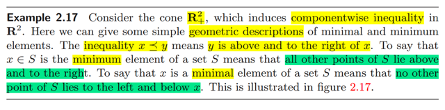</kbd>

<kbd>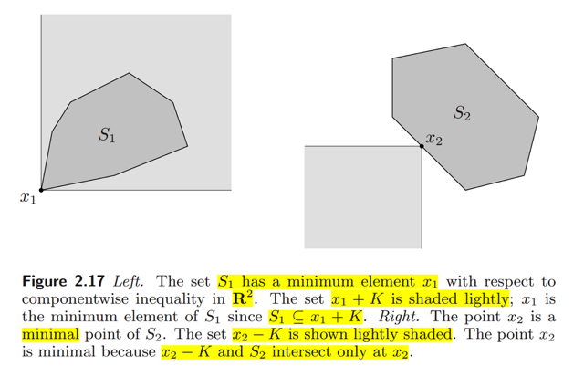</kbd>

> [!NOTE]
> Khi K = R^(n+) như đã biết  x ⪯R^(n+) y có thể ghi là x ⪯ y sẽ mang ý nghĩa  là x ≤ y component-wise. Và về mặt hình học, giả sử lấy R^(2+) thì sẽ là x nằm dưới và bên trái y.
>
> Nên trong hình này **x1 là MINIMUM của S1 vì MỌI ĐIỂM TRONG S ĐỀU NẦM TRÊN VÀ BÊN PHẢI x1.** S1 ⊆ x1 + (R^2+)
>
> Trong hình có thể thấy S1 nằm trong hình vuông màu xám (x1 + R^(2+))
>
> Và **x2 là MINIMAL của S2 vì KHÔNG CÓ ĐIỂM NÀO KHÁC TRONG S NGOÀI x2 NẰM DƯỚI VÀ BÊN TRÁI x2**: x2 - R^(2+) ∩ S2 = x2
>
> Trong hình thấy hình vuông màu xám (x2 - R^2+) chỉ giao với S2 tại môt điểm duy nhất là x2

 

<kbd>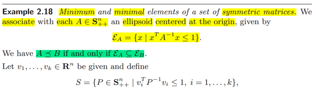</kbd>

<kbd>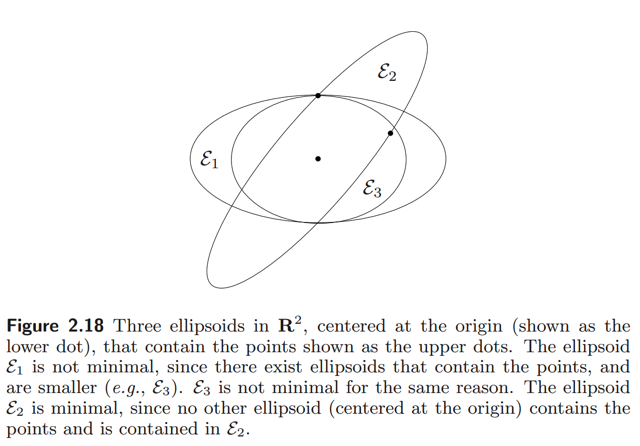</kbd>

<kbd>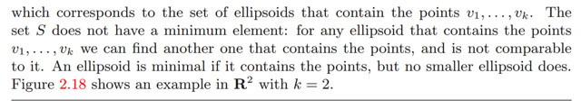</kbd>

> [!NOTE]
> SÁCH (XEM SAU)

 

