# Lec 3

📊 **Progress:** `60` Notes | `76` Screenshots | `17` AI Reviews

---

## Lec 3

 

<kbd>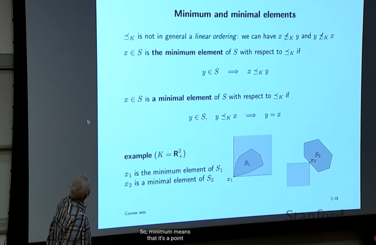</kbd>

> [!NOTE]
> Đại khái là, bài trước ta dừng lại ở đây, khi ta biết về các khái niệm như LINEAR ORDERING. 
>
> Đúng hơn là gs nói rằng, khác với phép so sánh trong R, vốn có tính chất LINEAR ORDERING hoặc còn gọi là **TOTAL ORDERING**, có nghĩa là chỉ có thể có x ≥ y hoặc x
> ≤ y.
>
> Nhưng với vector, tức phép so sánh ⪯K thì nó không có tính chất này
>
> Rồi, ta cũng đã biết các khái niệm **minimum** và **minimal** đối với** (with respect to) proper cone K**. Trong đó, nói **x minimum của S with respect to K có nghĩa là, với mọi y thuộc S thì x ⪯K y **
>
> Và ví dụ là **x1 là minimum của S1 with respect to cone K** với K trong trường hợp này là một **orthant R^(2+)** (góc phần tư trong 2D space ứng với mọi vector có tọa độ không âm). Thì ở đây, **mọi vector trong S1 đều có tung độ ≥ tung độ của x1, và hoành độ ≥
> hoành độ x1**
>
> Còn minimal, có định nghĩa yếu hơn, khi cho rằng, nếu trong S,** điểm duy nhất mà ⪯K nó chỉ là chính nó**, hay nói cách khác, **chỉ có nó mới nhỏ hơn hoặc bằng nó (dĩ nhiên element-wise) thì khi đó nó là minimal.**
>
> Trong hình bên phải, như đã nhận định ở bài trước, **mọi điểm trên cạnh đang chứa x2 đều là minimal**, vì mọi điểm ⪯ x (tạo ra tập hợp thể hiện bởi hình vuông) thì tập này chỉ giao với S2 tại đúng 1 điểm chính là S2, nên xét trong S2, chỉ có đúng một điểm thỏa tính chất ⪯K x2, và điểm đó chính là x2. Vậy x2 là minimal

 

<kbd>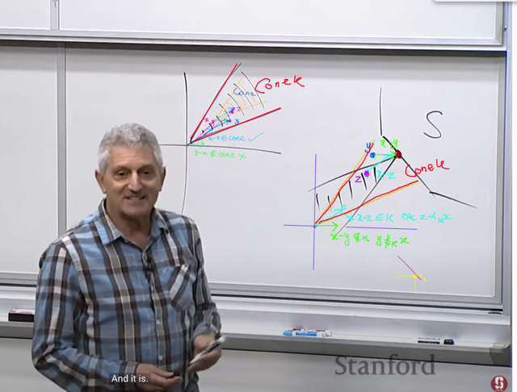</kbd>

> [!NOTE]
> Có câu hỏi, và gs nói, đại khái là nếu cone K thay vì R^(2+), tức thay vì góc tư không âm, mà bây giờ là cái này (thể hiện bởi vùng  vùng giữa hai đường màu đỏ.
>
> Khi đó, gs vẽ cái vùng y ⪯K x như vầy (giống như đối xứng lại cái  vùng màu đỏ). Thật ra ko khó hiểu, **quả thật đó chính là vùng chứa các vector ⪯ x with respect to K**.
>
> Ví dụ lấy y (màu blue), tuy nó cũng ⪯ x, nhưng x - y (xanh lá) có thể  thấy không thuộc cone K). Ngược lại z, nằm trong vùng gs vẽ thì cũng có ⪯ x, và x-z (vector xanh cyan) vẫn thuộc cone K.
>
> Nên quả thật vùng mà gs vẽ mới chính là tập các vector y thỏa y ⪯K x
>
> ====
>
> Quay lại vấn đề, thì có thể thấy những điểm trên 3 cạnh này của S, cũng là minimal with respect to cone K vì rõ ràng những điểm trên S mà thuộc cái vùng y⪯K x thì chỉ có mình nó

 

<kbd>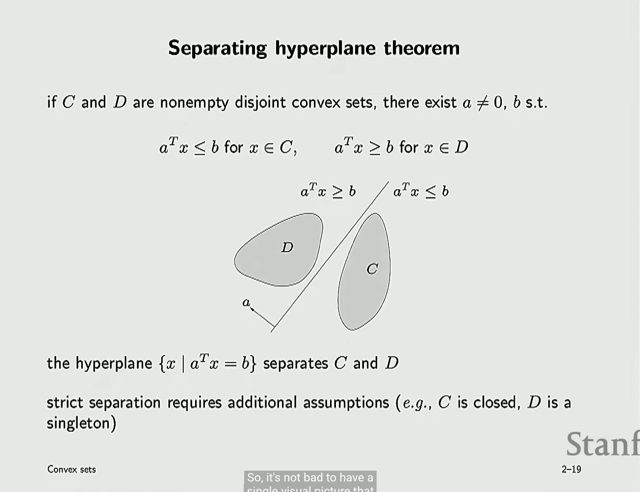</kbd>

> [!NOTE]
> Tiếp theo là một theorem, gọi là **SEPARATING HYPERPLANE THEOREM**:
>
> Nói rằng, nếu C, D là các **non-empty disjoint convex sets**, thì sẽ **TỒN TẠI a, b sao cho aTx = b (là một line trong R^2, hoặc một plane trong R^3, hoặc hyperplane trong R^n) CHIA TÁCH C, và D**
>
> Trong machine learning, gs nói ta có thể đã nghe nói về cụm từ **linearly separable**.
>
> Về mặt toán học, điều này có nghĩa là **với mọi x ∈ C thì aTx ≤ b và với mọi x ∈ D thì aTx ≥ b** (aTx - b ≥ 0)
>
> Ngoài ra gs cho viết còn vài variant (biến thể) ví dụ như khi với một số additional assumptions thì ta sẽ có **STRICT SEPARABLE**
>
> SEPARATING HYPERPLANE THEOREM

 

##### Supporting Hyper-plane

<kbd>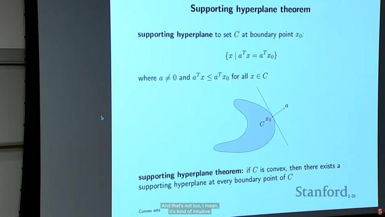</kbd>

> [!NOTE]
> Khái niệm **SUPPORTING HYPER-PLANE**:
>
> Đại khái là theo định nghĩa, cho set C (không cần là convex set) thì **supporting hyperplane của set C tại một điểm ở biên (boundary) x0 của nó sẽ là tập hợp các điểm x sao cho aTx = aTx0**
>
> Có nghĩa là {x | aTx = aTx0} define kiểu như một phương trình đường thẳng đi qua x0.
>
> Nhưng quan trọng hơn, là **VỚI MỌI x ∈ C THÌ aTx ≤ aTx0**, đây là điều kiện thể hiện support hyperplane sẽ là một hyperplane đi qua x0 nằm trên boundary và nó **KHIẾN MỌI ĐIỂM TRONG C ĐỀU NẰM MỘT BÊN** (haft plane / half space)
>
> Kể từ đó, theorem này nói rằng, **nếu MỌI BOUNDARY POINT ĐỀU TỒN TẠI một support hyperplane thì set C là convex set**
>
> (đây là mũi tên 2 chiều, điều kiện cần và đủ)
>
> Dễ thấy ví dụ như hình này, thì những điểm trên mặt trong của lữỡi liềm sẽ không thể có supporting hyperplane, nên đây không phải là convex set
>
> SUPPORTING HYPERPLANE THEOREM

**🔗 See also:** [Optimality criterion](./lec_5.md#node-bwy9own)

 

<kbd>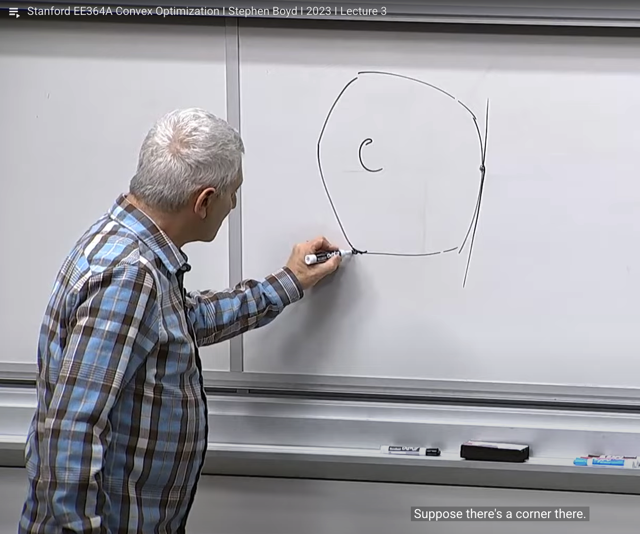</kbd>

> [!NOTE]
> Gs nói thêm rằng tại các điểm gọi là **KINK**, **các góc mà tại đó có sự thay đổi đột ngột độ dốc thì có nhiều hơn một support hyperplane**
>
> Trong 2D thì kiểu như tại đây có nhiều hơn một tiếp tuyến

 

- **2.5.1 Separating Hyperplane Theorem**

<kbd>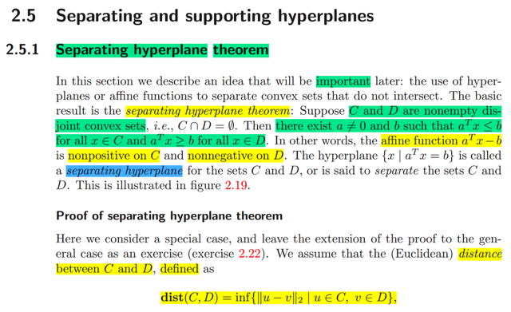</kbd>

<kbd>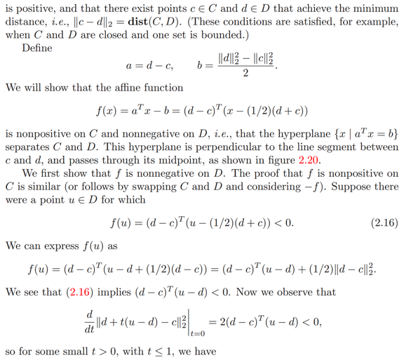</kbd>

<kbd>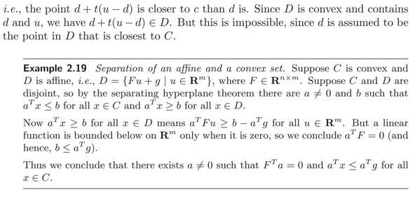</kbd>

<kbd>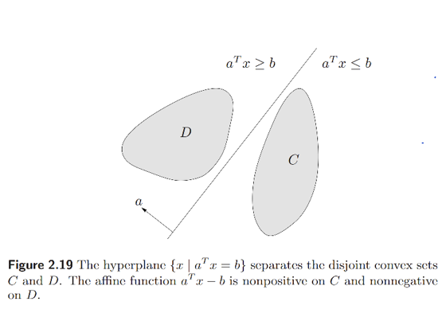</kbd>

> [!NOTE]
> CHAPTER 2.5 SEPARATING  & SUPPORTING HYPERPLANES
>
> 2.5.1 SEPARATING HYPERPLANE THEOREM
>
> Đây là một theorem quan trọng Separating Hyperplane theorem: Nói rằng **nếu hai convex set C và D disjoint** nhau thì chắc chắn **tồn tại một hyperplane {x: aTx = b} sao cho với mọi điểm trong C thì nó luôn nằm dưới hyperplane: ∀x ∈ C: aTx ≤ b** và với **mọi điểm trong D thì nó luôn nằm trên hyperplane: ∀ x ∈ D: aTx ≥ b.**
>
> Và cái hyperplane đó gọi là **SEPARATING HYPERPLANE**
>
> Nói về cái này: Ta đã biết **hyperplane {x: aTx = b} sẽ chia không gian thành hai halfspace {x: aTx ≤ b} và {x: aTx > b}**
>
> Do đó, DĨ NHIÊN nếu hai set C, D nằm ở hai halfspace đó thì mọi điểm trong C sẽ đều thỏa aTx ≤ b và mọi điểm trong D đều thỏa  aTx ≥ b, đơn giản vì C, và D là tập con của hai halfspace này
>
> Vấn đề là ta **cần chứng minh khi C, D disjoint thì TỒN TẠI HYPERPLANE như vậy**
>
> Đại khái cái proof là vầy: Đầu tiên **dựa trên điều ta có là C, và D là hai set disjoint**. 
>
> Khi đó, nếu ta **định nghĩa khoảng cách giữa hai set là khoảng cách giữa hai điểm thỏa bài toán tối ưu sau:**
>
> minimize c ∈ C, d ∈ D {||c - d||}. 
>
> Thì với việc C, và D disjoint cũng như là thỏa một vài điều kiện nữa thì ta sẽ **có thể chắc chắn là có tồn tại nghiệm của bài toán trên**, hay, **có thể tìm được hai điểm c, d sao cho khoảng cách của nó là khoảng cách ngắn nhất giữa hai điểm ở hai set** (và theo định nghĩa thì nó **cũng là khoảng cách giữa hai set**, cũng là khoảng cách giữa c tới D cũng như giữa d tới C.
>
> Có nghĩa là, **d khi đó là cái điểm ở trong D mà GẦN NHẤT VỚI C**, cũng như **c là điểm trong C và GẦN NHẤT VỚI D**
>
> Thế thì, ta mới **chứng minh bằng phản chứng** rằng, khi đó **cái hyperplane sau đây sẽ là separating hyperplane**: x: aTx = b với a = d - c và b = (||d||^2 - ||c||^2)/2
>
> Và theo định nghĩa separating hyperplane thì điều đó có nghĩa là** mọi điểm u trong D thì f(u) = aTu - b đều không âm**, và **mọi điểm v trong C thì f(v) đều không dương**.
>
> Ta sẽ chứng minh bẳng phản chứng: Giả sử có u khiến f(u) âm, ta sẽ chứng minh là điều này vô lý.
>
> Đầu tiên đơn giản hóa hàm f(z) = aTz - b một chút:
>
> Với a = d - c và b = (||d||^2 - ||c||^2)/2
>
> Thì  f(z) = aTz - b = (d-c)Tz - 0.5(||d||^2 - ||c||^2) 
>
> = (d-c)Tz - 0.5(d-c)T(d+c)
>
> (Vì (d-c)T(d+c) = (dT-cT)(d+c) = dTd-cTd+dTc-cTc = dTd - cTc = ||d||^2 - ||c||^2)
>
> ∴ = (d-c)T[z - 0.5(d+c)]
>
> Gỉa sử có u khiến f(u) âm, tức aTu - b < 0 ⇔ (d-c)T(u - 0.5(d+c)) < 0 
>
> Thể hiện f(u) khác một chút:
>
> = (d-c)T(u - 0.5(d+c)) = (d-c)T(u - 0.5d - 0.5c) 
>
> = (d-c)T(u - 0.5d - 0.5d + 0.5d - 0.5c)
>
> = (d-c)T(u - d + 0.5(d - c)) 
>
> = (d - c)T(u - d) + (d - c)T0.5(d - c))
>
> = (d-c)T(u - d) + 0.5||d - c||^2
>
> Như vậy với giả định là f(u) < 0 ta ⇔ (d-c)T(u - d) + 0.5||d - c||^2 < 0 
>
> ⇔ (d-c)T(u - d) < -0.5||d - c||^2  
>
> Mà ||d - c||^2 ≥ 0 ⇨ -0.5||d - c||^2 ≤ 0
>
> ⇨ (d-c)T(u - d) < 0
>
> Mà **cái này chính là (1/2) d/dt ||d + t(u - d) - c||^2**
>
> (không khó để thấy ||d + t(u - d) - c||^2 = [d + t(u - d) - c]T[d + t(u - d) - c]
>
> = [dT + t(u - d)T - cT][d + t(u - d) - c]
>
> = [dTd + t(u - d)Td - cTd + dTt(u - d) + t(u - d)Tt(u - d) - cTt(u - d) - dTc - t(u - d)Tc + cTc]
>
> = [dTd + t(u - d)Td - cTd + dTt(u - d) + t(u - d)Tt(u - d) - cTt(u - d) - dTc - t(u - d)Tc + cTc]
>
> ....
>
> triển khai ra và lấy đạo hàm theo t sẽ là 2(d - c)T(u - d))
>
> Vậy **điều này có nghĩa là hàm này đang giảm tại t**
>
> Mà xét d + t(u - d) giống như xét một đường đi / quỹ đạo từ d đến u parameterized bởi t, để t = 0 thì ta ở tại d, tăng dần t từ 0 đến 1 thì ta đi từ d tới u vậy.
>
> Và mấu chốt là: 
>
> 1) u là điểm ở trong D theo giả định. 
>
> Và hàm f(t) ở trên = ||d + t(u - d) - c||^2 chính là thể hiện **khoảng cách của một điểm trên quỹ đạo (đi từ d đến c) đến c**: Tại t = 0. điểm đứng ở d, khoảng cách đến c là ||d - c||,
> tại t = 1, ta đứng ở u, khoảng cách đến c là ||u - c|| 
>
> thì ta lại có d/dt f(t)|t=0 = là số âm, hiểu một cách đại khái thì điều chứng tỏ hàm đang giảm, có nghĩa là khi đi từ d đến u thì khoảng cách từ điểm đó đến c ngày càng nhỏ lại. Điều này chứng tỏ 
>
> Vậy suy ra **SO VỚI d THÌ u GẦN VỚI C HƠN. MÀ ĐIỀU NÀY MÂU THUẪN VỚI ĐIỀU KIỆN BAN ĐẦU LÀ d LÀ ĐIỂM GẦN NHẤT VỚI c MÀ**.
>
> TỚI ĐÂY TA ĐÃ CHỨNG MINH XONG rằng mọi điểm u trên D KHÔNG THỂ NÀO CÓ f(u) < 0 đươc. 
>
> Chứng minh tương tự với vế kia C
>
> VÍ DỤ QUAY LẠI SAU
>
> **Tại sao vector a sẽ hướng ra ngoài halfspace** {x: aTx ≤ aTx0} ?
>
> Vì như đã biết, hyperpane {x: aTx = b} có thể được thể hiện theo cách khác với x0 ∈ hyperlane: {x: aT(x - x0) = 0} 
>
> Để rồi  ta hiểu nó là **tập hợp các điểm sao cho vector x - x0 luôn vuông góc với a**, cũng là hợp với a góc 90 độ.
>
> Thế thì, khi đó nó sẽ **chia mặt phẳng làm hai nửa (halfspace)**. 
>
> Mà **một bên sẽ có tính chất là những điểm x trong đó sẽ luôn tạo vecotr x - x0 hợp với a góc tù** 
>
> Và **những điểm bên kia thì luôn tạo với a góc nhọn**
>
> Xét những điểm bên này c**húng sẽ luôn thỏa: {x: cos θ(a, x-x0) < 0}**
>
> Mà cos θ(a, x-x0) < 0 ⇨ ||a||||x - x0|| cos θ < 0 
>
> ⇔ aT(x - x0) < 0
>
> ⇔ aTx < aTx0 
>
> ⇔ aTx < b
>
> Vậy nên tất cả những điểm bên halfplane đó chính là tập:
>
> {x: aTx < b} và với tập này vector a sẽ hướng ra ngoài vì đây là tập các điểm x khiến x - x0 hợp với a góc tù.

> [!TIP]
> **🤖 AI Feedback** — ✅ Score: **90/100**
>
> Bài phân tích rất chi tiết và thể hiện sự hiểu biết sâu sắc về Định lý siêu phẳng phân tách và chứng minh của nó. Các bước suy luận và phép biến đổi đại số đều chính xác và rõ ràng. Một điểm nhỏ có thể cải thiện là mô tả phương pháp chứng minh tổng thể, vì chỉ một phần của chứng minh được thực hiện bằng phản chứng, chứ không phải toàn bộ.

 

- **Strict separation**

<kbd>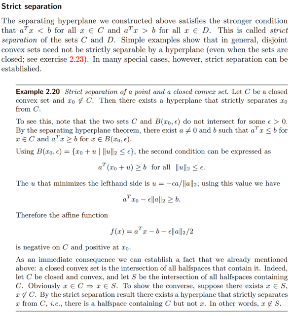</kbd>

> [!NOTE]
> Đại ý là tác giả nói rằng cái separating hyperplane mà ta xây dựng ở phần trước (với cái hình mà hai set C, D tách nhau hoàn toàn) nó thỏa tính chất "strong separation" khi với mọi x ∈ C thì aTx < b và với mọi x ∈ D thì aTx > b.
>
> Nhưng thực ra trong các trường hợp tổng quát thì việc C, D disjoint không nhất thiết phải có strict separation - tức là được phân tách một cách nghiêm ngặt bởi một hyperplane.
>
> Nhưng một số ca đặc biệt thì ta vẫn có strict separation, lấy ví dụ 2.20: Đại khái là cho một tập C là tập đóng (closed - tức là nó sẽ có bao gồm boundary) và là convex set. Và một điểm x0 nằm ∉ C. Khi đó tồn tại một hyperplane mà strictly separate x0 và C và ta sẽ chỉ ra nó là cái gì sau đây:
>
> Lập luận như sau: Vì x0 ∉ C nên tồn tại một "quả banh Euclide" B(x0, ε) (mà định nghĩa của nó là tập {x = x0 + r với ||r||2 ≤ ε}) sao cho với một ε nào đó B(x0, ε) không giao với C. Một cách hình tượng thì hình dung với 1 chấm nhỏ nằm ngoài tập C thì ta nhất định có thể vẽ một vòng tròn bán kính dương rất nhỏ để tạo thành một hình tròn không giao với C
>
> Thế thì, câu chuyện bấy giờ là ta có hai set: C và B(x0, ε) đều là convex set và chúng disjoint. Thì khi đó, ta có thể dùng Separating Hyperplane Theorem để nói rằng, tồn tại một hyperplane aTx = b sao cho nó separate (không cần stritcly) hai set này. Cụ thể là aTx ≤ b ∀ x ∈ C và aTx ≥ b ∀ x ∈ B(x0, ε)
>
> Rồi, bây giờ xét aTx ≥ b ∀ x ∈ B(x0, ε) (Nhớ rằng ta đang đi tìm cái hyperplane phân tách nghiêm ngặt x0 với C nhé)
>
> Với x ∈ B(x0, ε), tức {x0 + u (hay r) sao cho ||u||_2 ≤ ε}
>
> thì dĩ nhiên ta có thể thể hiện x bởi: x = x0 + u với ||u||_2 ≤ ε
>
> ⇨ aTx ≥ b ∀ B(x0, ε) 
>
> ⇔ aT(x0 + u) ≥ b với ||u||2 ≤ ε
>
> ⇔ aTx0 + aTu ≥ b với ||u||2 ≤ ε
>
> Xét vế trái, có hạng tử aTu = ||a|| ||u|| cos(a, u)
>
> mà vế trái ≥ b với mọi u có ||u|| ≤ ε thì gía trị nhỏ nhất của nó cũng ≥ b
>
> Vế trái đạt min khi aTu đạt min
>
> Và minimize aTu với constraint ||u|| ≤ ε
>
> aTu  = ||a|| . ||u|| . cos(a, u) ≥ ||a|| . ||u|| . (-1) (do cosine luôn ≥ -1)
>
> Và vì ||u|| ≤ ε ⇨ -||u|| ≥ -ε
>
> ⇨ ||a|| . ||u|| . (-1) = ||a|| . (-||u||) ≥ ||a|| (-ε)
>
> Vậy min_u aTu constraint ||u|| ≤ eps chính là -ε ||a||, xảy ra khi u = -aε/||a|| (tức ngược hướng với a và có norm = ε)
>
> Vậy là ta có: aT x0 - ε ||a|| - b ≥ 0 (1)
>
> Vậy tới đây ta có:
>
> Xét f(x) = aTx - b - ε||a||/2
>
> Với x0 thì f(x0) = aT x0 - b - ε||a||/2  
>
> Sử dụng điều ta đã có ở (1) thì ta có aTx0 - ε ||a|| - b ≥ 0
>
> ⇔ aTx0 - ε||a||/2 - ε||a||/2 - b ≥ 0
>
> ⇔ aTx0 - b - ε||a||/2 - ε||a||/2 ≥ 0
>
> ⇔ f(x0) - ε||a||/2 ≥ 0
>
> ⇔ f(x0) ≥ ε||a||/2
>
> Và tới đây vế phải, với ε > 0 và norm a thì dương vì a khác 0, do đó, suy ra f(x0) dương.
>
> Với x ∈ C thì f(x) = aTx - b - ε ||a||/2 < 0 do ta đã có aTx ≤ b ∀ x ∈ C rồi, nên trừ thêm ε ||a||/2 là một số dương thì nhất định phải âm.
>
> Vậy f(x) chính là hyperplane phân tách nghiêm ngặt giữa x0 và C mà ta đang tìm.

> [!TIP]
> **🤖 AI Feedback** — ✅ Score: **95/100**
>
> Học sinh đã trình bày một bản phân tích rất chi tiết và chính xác về ví dụ tách biệt nghiêm ngặt, thể hiện sự hiểu biết sâu sắc vượt xa việc chỉ tái hiện lại tài liệu gốc.

 

- **Converse separating hyperplane theorem**

<kbd>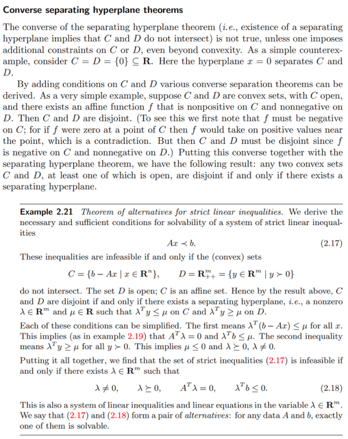</kbd>

> [!NOTE]
> Converse separating hy
> SÁCH (XEM SAU)

 

- **2.5.2 Supporting hyperplane theorem**

<kbd>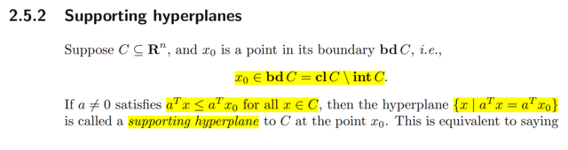</kbd>

<kbd>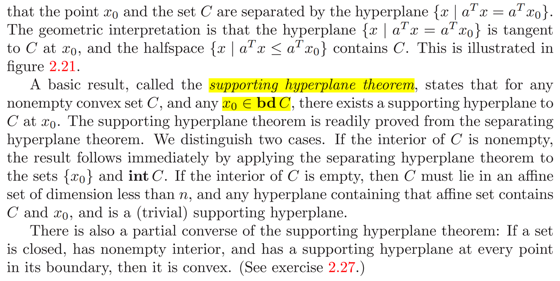</kbd>

<kbd>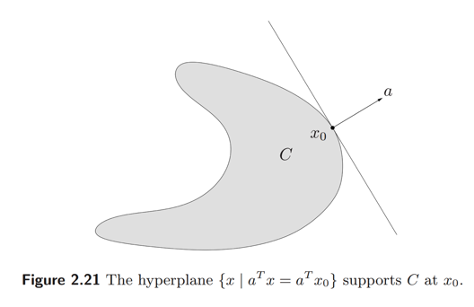</kbd>

> [!NOTE]
> Đại ý giới thiệu về khái niệm Supporting hyperplane: Được định nghĩa là với set C là tập con của R^n, và x0 là điểm nằm trên biên(boundary) của nó. Thì với a khác 0 sao cho aTx ≤ aTx0 với mọi x ∈ C thì {x: aTx = aTx0} được gọi là supporting hyperplane của C tại x0.
>
> Và về mặt hình học, ta có thể hiểu hyperplane này tiếp xúc với C tại x0 và phân không gian thành hai halfspace, và C nằm trong một halfspace.
>
> Dựa trên đó ta có một theorem: Supporting hyperplane theorem nói rằng: Nếu C là tập lồi và x0 nằm trên biên của nó thì chắc chắn luôn tồn tại một supporting hyperplane của C tại x0.
>
> Để chứng minh tác giả chia làm hai case:
>
> 1)  Xét C có interior không rỗng. Mà theo định nghĩa của iterior ta còn nhớ, đó là tập những điểm x mà có thể vẽ / dựng một ball sao cho nó nằm lọt trong C (nôm na là vậy), còn về toán học đại khái là B(x, r) không giao với boundary với một r dương nào đó.
>
> Vậy thì nếu interior không rỗng, ta có thể xét tập int C và một tập chỉ chứa x0. Vì theo định nghĩa của interior như vừa nói thì dĩ nhiên {x0} và int C phải disjoint. Và nhờ đó ta có thể dùng Separating Theorem (nhớ lại, theorem này nói nếu ta có hai convex set disjoint thì nhất định tồn tại một hyperplane separate chúng: aTx ≤ b ∀ x ∈ int C và aTx ≥ b ∀ x ∈ {x0})
>
> Vậy đến đây ta có aTx ≤ b ∀ x ∈ int C và aTx0 ≥ b
>
> Mà x0 là điểm nằm trên boundary. Nên phải tồn tại một chuỗi các điểm trong int C di chuyển dần về x0 (vì không thể nào có một hố sâu rỗng nào ngăn cách giữa biên và interior được). Với các điểm xk đó, vì nằm trong int C nên aTxk ≤ b, lấy lim xk → x0 ta cũng sẽ có lim xk → x0 aTxk = aTx0 ≤ b. Vậy ta có aTx0 ≤ b. Kết hợp với ý trên aTx0 ≥ b ta có aTx0 = b
>
> Vậy thì đến đây aTx = b (hoặc aT(x-x0) = 0) là hyperplane đi qua x0 và có aTx ≤ b với mọi x ∈ int C.
>
> Suy ra nó cũng đúng với mọi x ∈ C. Vậy nó chính là support hyperplane của C tại x0.
>
> 2) Xét trường hợp C có interior rỗng. Thì điều này có nghĩa là giống như quả banh trong không gian 3D bị dẹp lép như con tép, để mọi điểm của quả banh đều là boudary. Như vậy nó phải nằm trong một 2D subspace, tức một mặt phẳng. Và cái mặt phẳng này chứa C, dĩ nhiên chứa cả x0. Thì đây là một cái hyperplane đi qua x0 nên nó dạng aTx = aTx0. Và mọi x ∈ C cũng thỏa aTx = aTx0. Thì cái này cũng chính là aTx ≤ aTx0. Do đó đây cũng chính là support hyperplane của C tại x0.
>
> Vậy ta đã chứng minh xong.

> [!TIP]
> **🤖 AI Feedback** — ⚠️ Score: **75/100**
>
> Bài phân tích có nỗ lực đáng kể trong việc diễn giải và chứng minh, nhưng còn thiếu sót về độ chính xác và tính chặt chẽ toán học. Đặc biệt, định nghĩa về interior còn chưa chính xác và cần bổ sung điều kiện "nonempty" cho tập C trong định lý.

 

- **V_perp**

<kbd>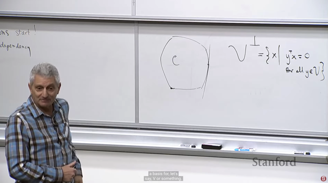</kbd>

> [!NOTE]
> Trước tiên gs remind một kiến thức linear algebra, kí hiệu chữ V với kí hiệu vuông góc đọc là "**V_perp**" (perpendicular), thì V là notation của **vector space**, và kí hiệu trên đầu chính là **orthogonal complement**
>
> Nên define {x | yTx = 0} với mọi y thuộc V chính là định nghĩa của ORTHOGONAL COMPLEMENT V, tức là **tập hợp mọi vector vuông  góc với V** (vuông góc với mọi y thuộc V, chính là vuông góc với V)
>
> Ví dụ điển hình là **nullspace** của matrix A N(A) và **rowspace**
> của A C(AT) là hai orthogonal complement subspace.

 

- **Định nghĩa dual cones**

<kbd>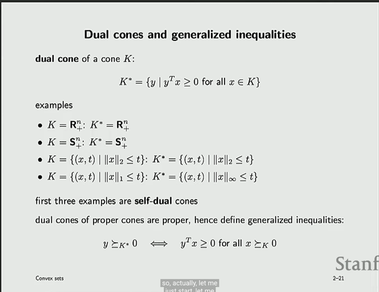</kbd>

> [!NOTE]
> Từ đó gs, nói khái niệm **dual cones** cũng giống vậy, nhưng khác là trong trạng thái inequality:
>
> K_perp = {y: yTx = 0} với mọi x ∈ K (dấu bằng)
>
> Thì **dual cone của K**:
>
> K* = {y | yTx ≥ 0} for all x ∈ K (dấu ≥)
>
> Dual cones của cone K là tập (set) **các điểm (vector) mà khi dot product với mọi vector của cone K đều ra không âm**

**🔗 See also:** [Chứng minh:  x là minimum của S wrt K ⇔ λTx unique minimize λTz với mọi λ thuộc int K*](#node-sniocip)

 

- **dual cones & generalized  inequalities**

<kbd>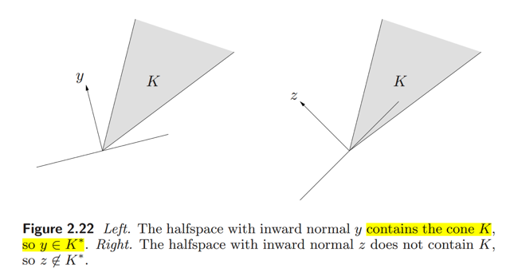</kbd>

<kbd>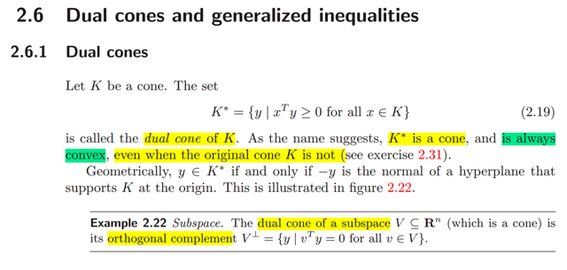</kbd>

> [!NOTE]
> Trong sách nói thêm, **dù k không convex thì k* luôn convex**
>
> Và về mặt hình học, **y thuộc K* khi (-y) là normal vector của  support hyperplane của K tại gốc O.**
>
> Là sao, đại khái là khi tại O, ta vẽ một hyperplane quy định bởi normal vector y. Thì cái phần haft-plane mà chứa "tia y" gọi là halfplane mà y là inward normal vector, nếu nó chứa cone K thì khi đó y sẽ thuộc dual cone K*. Vì khi cái halfplane chứa tia y mà chứa cone K, thì mọi vector trong cone K đều hợp với y một góc ≤ 90 độ. Do đó với mọi x trong K, yTx đều ≥ 0.
>
> Ngược lại như hình bên phải, half-plane chứa tia z không chứa cone K, nên có những vector nằm "bên kia", nó sẽ hợp với y góc > 90 dẫn đến dot product với y < 0
>
> Nói một cách dễ hiểu hơn: Ta vẽ một đường thẳng đi qua gốc O chia mặt phẳng làm hai halfspace, và cone K nằm một bên. Ta sẽ vẽ tiếp cái vector y vuông góc với đường thẳng tại O và chỉa về cùng bên với cone K. Thì đó chính là một vector y mà khi dot product với mọi vector trong cone K đều ra dương, dễ thấy là vì nó hợp với các vector trong cone K một góc nhọn. Thì dĩ nhiên -y sẽ hướng về bên kia, thì theo định nghĩa của support hyperplane: thì cái đường thẳng đó chính là support hyperplane của cone K với normal vector là -y (vì normal vector của support hyperplane luôn hướng ra ngoài)

> [!TIP]
> **🤖 AI Feedback** — ⚠️ Score: **85/100**
>
> Bài làm thể hiện sự hiểu biết sâu sắc và khả năng diễn giải rõ ràng các khái niệm về nón đối ngẫu và diễn giải hình học của nó, đặc biệt là mối liên hệ với nửa không gian và siêu phẳng hỗ trợ. Tuy nhiên, có một lỗi nhỏ về ký hiệu khi bạn dùng 'y' thay vì 'z' trong đoạn mô tả hình bên phải. Dù chỉ là lỗi đánh máy, nó vẫn làm giảm tính chính xác tuyệt đối.

 

- **SELF-DUAL cone**

<kbd>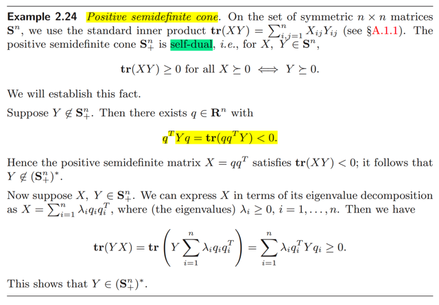</kbd>

> [!NOTE]
> Đại khái là cho biết K là **positive semidefinite cone** là một **self-dual cone**: 
>
> Tập những **matrix mà inner product với mọi matrix trong K** thì cũng chính là những psd matrix (K)
>
> Ôn lại chút, theo định nghĩa, inner product của matrix X, và Y ∑i,j XijYij và cái này cũng chính là  tr(XY) Và trace A = tổng các entries trên đường chéo của A.
>
> Để chứng minh, hay làm rõ điều này mình sẽ chứng minh với X là psd matrix bất kì, tức X ∈ S^n+ thì nếu như Y là matrix sao cho YX ≥ 0 (điều này, theo định nghĩa dual cone, cho thấy Y ∈ dual cone của S^n+) thì Y cũng sẽ là psd matrix. Khi đó giúp kết luận S^n+ là self dual cone.
>
> Theo định nghĩa vừa nhắc lại ở trên của inner product Y.X cũng là X.Y = tr(XY) = tr(YX)
>
> Ta sẽ chứng minh bằng phản chứng: Giả sử có Y khiến XY ≥ 0 với mọi X ∈ S^n+ nhưng Y không phải psd matrix, tức ∉ S^n+ thì sẽ dẫn đến điều vô lý.
>
> Rồi, giả sử Y không psd, điều này đồng nghĩa tồn tại q sao cho quadratic form qTYq < 0 (vì nếu Y psd thì quadratic form phải không âm)
>
> qTYq < 0, mà vế trái là scalar. Nên cũng bằng trace của nó: với scalar a thì a = tr(a)
>
> ∴ ⇔ tr(qTYq) < 0
>
> ⇔ tr(qqTY) < 0 (dùng tính chất tr(AB) = tr(BA))
>
> ⇔ [qqT] . Y < 0 
>
> tức là ta đã có matrix rank 1 U = qqT inner product với Y ra âm. Mà đang giả thiết Y có inner product với mọi X ∈ S^n+ ra kết quả không âm cơ mà, trong khi đó U chính là thuộc S^n+. Vậy đây là điều vô lý. Chứng minh xong.
>
> Đây là cách chứng minh phản chứng, nhanh hơn trong sách.
>
> Còn trong sách ổng chứng mình hai ý: Nếu Y không psd thì Y nhất định không thuộc dual cone của S^n+. Và sau đó chứng minh psd thì Y sẽ thuộc dual cone của S^n+:
>
> Chứng minh ý đầu: Giả sử Y không psd, lập luận như trên ta thấy tồn tại U = qqT khiến UY < 0. Điều này giúp kết luận Y không thuộc dual cone của S^n+ vì không thỏa định nghĩa.
>
> Còn ý sau: Giả sử Y psd, xét XY ta phải chứng minh với mọi X thì X.Y ≥ 0.
>
> YX = tr(YX) 
>
> Nhờ 1806 mình đã biết với symmetrix matrix.  luôn tồn tại đủ số lượng eigenvector độc lập, nên có thể phân tách thành dạng Q Λ QT với Q là matrix các orthogonal eigenvectors và Λ là diagonal matrix các trị riêng. ⇨ X = Q Λ QT. 
>
> Và cái này có thể thể hiện bởi [q1,..qn]diag(λ1,..λn)Q (
>
> = [λ1q1,..λnqn]QT
>
> Tới đây dùng góc nhìn thứ 4 khi nhân hai matrix đã được học trong MIT1806: AB = tổng các rank 1 matrix: [cột i của A] outer product [hàng i của B]
>
> ∴ = λ1q1q1T + ..λnqnqnT = ΣλiqiqiT
>
> Vậy quay lại đây ta có:
>
> = tr(Y Σi λiqiqiT) 
>
> = tr(Σi λiYqiqiT) 
>
> = Σi tr(λiYqiqiT)  (trace chỉ là tổng các entries đường chéo nên tr(A + B) = tr(A) + tr(B))
>
> = Σi λi tr(YqiqiT) (tr(αA) = αtr(A))
>
>  = Σi λi tr(qiTYqi) (tr(AB) = tr(BA))
>
>  = Σi λi (qiTYqi) (vì qiTYqi là scalar, tr(scalar) = scalar)
>
> Và tới đây xét cái tổng này, mỗi hạng tử là tích của λi là trị riêng của X, với X pdf thì λi không âm.
> Còn qiTYqi là quadratic form của Y, với Y psd thì cái này cũng không âm nốt.
>
> Vậy có thể kết luận tổng này không âm ⇨ chứng minh xong Y ∈ dual cone của S^n+

> [!TIP]
> **🤖 AI Feedback** — ✅ Score: **95/100**
>
> Bài làm xuất sắc, thể hiện sự hiểu biết sâu sắc về khái niệm nón tự đối ngẫu và các chứng minh liên quan. Cách trình bày mạch lạc, có giải thích rõ ràng các bước và liên hệ kiến thức nền tảng là rất đáng khen ngợi. Có một vài lỗi nhỏ về ký hiệu (ví dụ: "YX ">= 0" thay vì "tr(YX) ">= 0") và lỗi đánh máy ("X pdf" thay vì "X psd") cần chú ý để đạt độ chính xác tuyệt đối.

 

- **Dual of a norm cone (QUAY LẠI SAU)**

<kbd>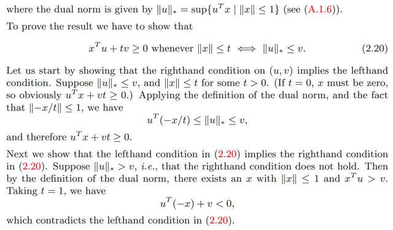</kbd>

<kbd>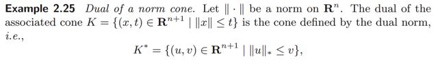</kbd>

> [!NOTE]
> SÁCH (XEM SAU)

 

- **Vài tính chất của DUAL CONE (QUAY LẠI SAU)**

<kbd>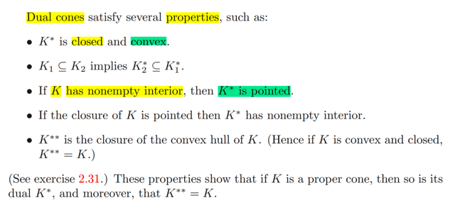</kbd>

> [!NOTE]
> vài tính chất của dual cone (quay lại sau)

 

- **Dual cone của {0} là R^2 và ngược lại**

<kbd>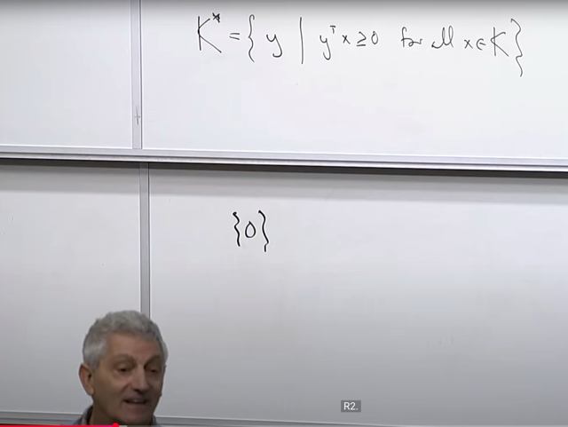</kbd>

> [!NOTE]
> Ông hỏi, cho một cone: {0} đây là stupid cone nhưng hoàn toàn valid cone. Câu hỏi là dual cone của nó là gì:
>
> Thử trả lời:
>
> Chiếu theo định nghĩa, dual cone (của cone K) sẽ là** tập hợp các vector y sao cho yTx ≥ 0 với mọi x trong cone**. 
>
> Vậy trong cone này có mỗi vector zero, vậy mọi vector mà dot product với zero vector ra giá trị không âm, thì dễ thấy **vector nào mà chẳng dot product với 0 ra ko âm** vì vector nào dot product với zero cũng ra zero. **Do đó dual cone của 0 chứa mọi vector**
>
> Vậy **dual cone của 0 chính là toàn bộ R^2** (gs đang nói trong R2)
>
> {0} là một cone, và dual cone của nó {0}* là R^2: {0}* = R^2
>
> **Ngược lại R^2 cũng là một cone, và dual cone của nó là {0}**:
>
> R^2* = {0}

> [!TIP]
> **🤖 AI Feedback** — ✅ Score: **95/100**
>
> Phân tích chính xác và lập luận rõ ràng. Việc suy luận dual cone của {0} và {0} của R^2 cho thấy sự hiểu biết sâu sắc về định nghĩa và tính chất của cone đối ngẫu.

 

- **0* =  R^2**

<kbd>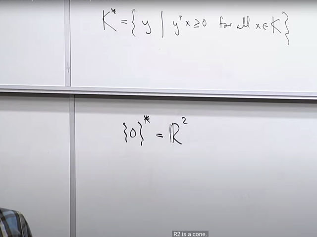</kbd>

> [!NOTE]
> Correct, và ta sẽ kí hiệu là 0* = R^2, và nó (R^2) cũng là một cone
>
> (nhớ lại định nghĩa cone là set C mà nếu x thuộc set C thì αx với mọi α ≥ 0) cũng thuộc set C

 

- **cone càng nhỏ thì dual cone càng lớn.**

<kbd>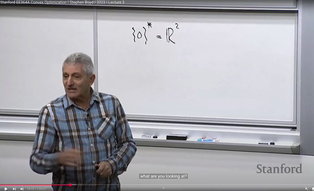</kbd>

> [!NOTE]
> Và từ đây ta quan sát thấy một quy luật đó là:
>
> **cone càng nhỏ thì dual cone càng lớn.**
>
> Ở đây 0 là cái cone nhỏ nhất có thể, thì dual cone của nó là toàn bộ R^2
>
> Và, ta liên hệ nó khái niệm **conjugate**.
>
> Và **Conjugate** có một tính chất là **khi ta làm 2 lần thì nó quay về vị trí cũ**. 
>
> Giống như **conjugate của conjugate của complex number là chính nó**. Hay với vector space:** orthogonal complement của orthogonal complement của vector space là chính nó**
>
> Khái niệm conjugate của complex number ta đã học ở 1806: đơn giản là một complex với phần ảo đổi dấu.
>
> Hay C(AT)_perp chính là N(A), và N(A)_perp cũng là [C(AT)_perp]_perp chính là C(AT)
>
> Và dễ thấy ở đây cũng vậy, dual cone của R^2 theo định nghĩa là tập hợp mọi vector mà dot product với mọi vector trong R^2 ra giá trị không âm, thì rõ ràng chỉ có zero mới vậy, nên 0 chính là dual cone của R^2
>
> Gs gọi là the **conjugate của dual của dual là chính nó**

 

- **một tia (ray) và nó là một cone**

<kbd>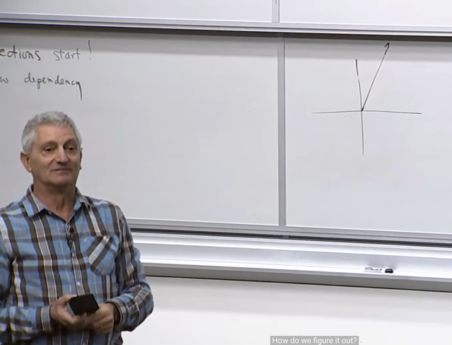</kbd>

<kbd>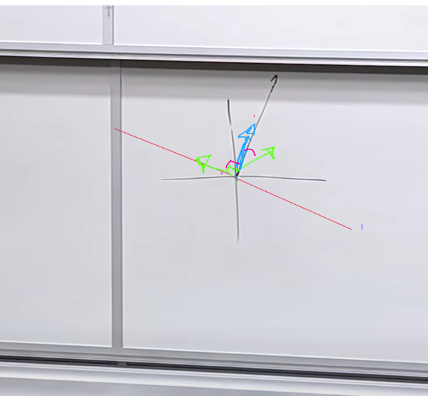</kbd>

> [!NOTE]
> Gs lấy ví dụ khác, như ta từng gặp, đây là **một tia (ray) và nó là một cone**. 
>
> **Dual cone của nó là gì?**
>
> Thử trả lời, **theo định nghĩa, dual cone của cái này là tập hợp các vector có dot product với mọi vector trên cone này đều không âm.**
>
> Thế thì ray là tập hợp mọi scaled của một vector với scale factor không âm (vì nếu âm thì nó đã không còn là tia, nó sẽ đi qua cả phía bên kia theo hướng ngược lại)
>
> Nên mình đoán dual cone của cái tia này, là một half-plane: **Vẽ đường thẳng vuông góc với tia, thì dual cone của tia này là half-plane chứa tia**. Vì trong đó, mọi vector khi dot product với mọi vector trong tia sẽ đều dương (hoặc bằng 0 khi vector vuông góc với tia)
>
> Lí do là vì dot product aTb = ||a||||b||cos(θ(a,b)), nên nếu các vector trong half-plane như vừa nói thì góc θ giữa nó với vector trong tia sẽ nhỏ hơn 90 độ ⇨ cosine không âm.
>
> Dual Cone của Ray (tia) là Half-plane chứa tia

> [!TIP]
> **🤖 AI Feedback** — ⚠️ Score: **70/100**
>
> Phần định nghĩa nón đối ngẫu và lý giải bằng tích vô hướng là chính xác. Tuy nhiên, mô tả hình học "half-plane chứa tia" chưa hoàn toàn đúng, vì tia gốc thường nằm trên biên của nón đối ngẫu chứ không phải được chứa trong lòng nó.

 

<kbd>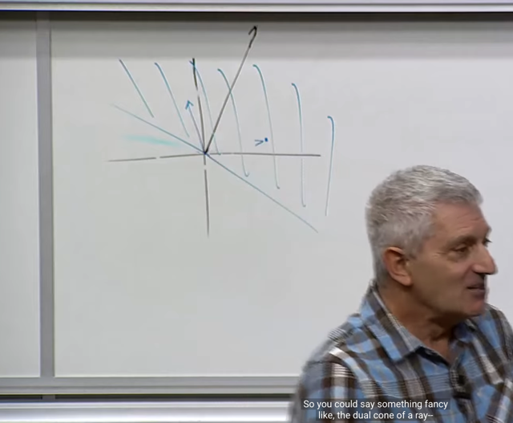</kbd>

> [!NOTE]
> Đúng vậy.

 

<kbd>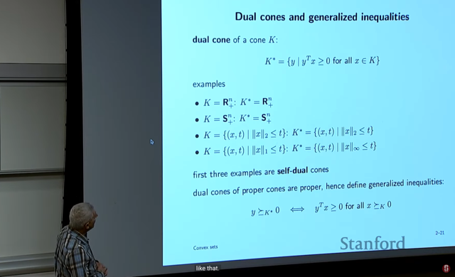</kbd>

> [!NOTE]
> Và quay lại đây ta có một ví dụ nữa là dual cone của non-negative orthant R^n +

 

- **R^n+ là self-dual cone**

<kbd>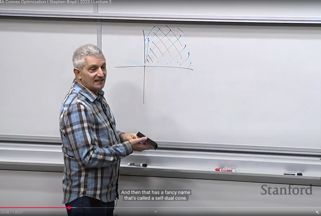</kbd>

> [!NOTE]
> Như đã biết R^n + , ví dụ trong R^2, thì R^2 + là góc phần tư không âm
>
> Thế thì để trả lời câu hỏi dual cone của nó là gì, ta chỉ việc thử vẽ vài vector và hỏi liệu nó có dot product với mọi vector trong góc phần tư này để ra không âm không.
>
> Từ đó có thể thấy chỉ có vector trong góc phần tư này, mới luôn tạo một góc nhỏ hơn hoặc bằng 90 độ với mọi vector trong góc phần tư không âm này.
>
> Thành ra với cái cone này R^n + , thì dual cone LÀ CHÍNH NÓ.
>
> Và do đó nó được gọi là self-dual cone
>
> dual cone của non-negative orthant r^n+ là chính nó
>
> nên **r^n+ là self-dual cone**

> [!TIP]
> **🤖 AI Feedback** — ✅ Score: **92/100**
>
> Bài làm rất chính xác và giải thích rõ ràng khái niệm self-dual cone cho trường hợp R^n+. Cách lập luận cho thấy sự hiểu biết sâu sắc về điều kiện dual cone.

 

- **Dual generalized inequalities**

<kbd>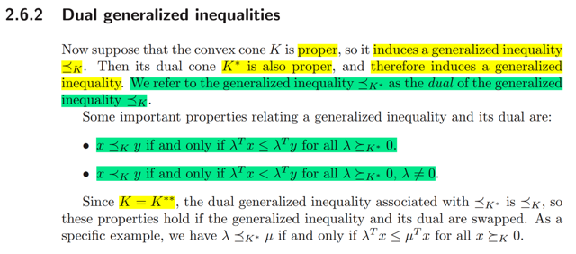</kbd>

> [!NOTE]
> Phần này có thể gs có nói trong bài mà ko theo kịp hay không để ý
>
> Đó là giả sử ta có **K là proper cone**, khi đó như đã biết, nó sẽ tạo ra phép **generalized inequality wrt K (⪯K)**
>
> Thế thì bây giờ ta biết: 
>
> **nếu K là proper cone thì dual cone của nó K* cũng là proper cone**. 
>
> Và do đó **cũng sẽ tạo ra generalized inequalities wrt K* (⪯K*)**
>
> Thế thì từ đó cái **generalized inequality ⪯K và ⪯K* LÀ DUAL CỦA NHAU.**
>
> Và từ đó có vài tính chất quan trọng: 
>
> x ⪯K y ⇔ λTx ≤ λTy với mọi λ ≽K* 0 
>
> tức là, nếu x ⪯K y thì λTx ≤ λTy với mọi λ thuộc dual cone K*.
>
> Và như trong bài gs đã nói, giống như complement của complement ra chính nó. Thì K** = K, nên như đã nói ở trên dual của ⪯K* cũng là ⪯K

 

- **Theorem of alternatives for linear strict generalized inequalities**

<kbd>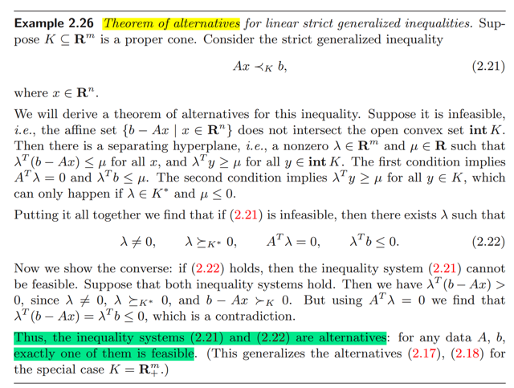</kbd>

> [!NOTE]
> Đã đọc qua, dù chưa hiểu ý nghĩa của cái này để làm gì nhưng có thể ghi chú vài điểm có thể gây khó hiểu trong đây:
>
> Hiểu đại khái thì đây là nói về "**định lí về tính thay thế**" của **inequality Ax ≺K b** 
>
> (tạm hiểu rằng, theorem of alternative nó sẽ nói rằng **cái này feasible thì cái kia infeasible và ngược lại**, chứ **không thể có vụ cả hai cùng feasible / infeasible**. 
>
> Vậy thì cụ thể cái này ta sẽ tìm ra cái hệ mà khi Ax ≺K b infeasible thì nó sẽ feasible và ngược lại.
>
> Rồi đầu tiên ta **giả sử Ax ≺K b infeasible**. 
>
> Infeasible thì có nghĩa là **không tồn tại x nào thỏa cái này** hết. 
>
> Mà cái inequality Ax ≺K b, theo định nghĩa của generalized inequality wrt K thì nó có nghĩa là b - Ax ∈ K.  (Chính xác hơn, vì đây là strict inequality ≺ nên phải là "b - Ax ∈ interior của cone K (int K)")
>
> Vậy khi ta giả sử hệ này không có nghiệm thì tức là không tồn tại x nào khiến b - Ax ∈ int K
>
> ⇔ với mọi x, thì b - Ax nằm ngoài int K 
>
> ⇔ affine set {b - Ax với x ∈ R^n} ∩ int K = ∅
>
> Và theo theorem of separating hyper-plane, thì sẽ tồn tại một hyperplane λTx = μ sao cho mọi điểm trong affine set {b - Ax | x ∈ R^n} sẽ nằm một bên, và mọi điểm trong cone K nằm bên kia:
>
> λTx ≤ μ với mọi x ∈ {b - Ax | x ∈ R^n}, và λTy ≥ μ với mọi y ∈ int K.
>
> ⇔ λT(b - Ax) ≤ μ với mọi  x ∈ R^n, và λTy ≥ μ với mọi y ∈ int K.
>
> Thế thì họ nói cái đầu tiên cho thấy ATλ = 0 và λTb ≤ μ là sao?
>
> Đó là vì λT(b - Ax) ≤ μ với mọi x ∈ R^n 
>
> ⇔ **λTb - λTAx ≤ μ ∀ x ∈ R^n**
>
> Mà vế trái là một affine function của x, nên **giống như đường thẳng px + q, mà muốn ≤ α với mọi x thì điều này chỉ xảy ra khi p = 0 và q ≤ α**. 
>
> **Đó là lí do mà ta có λTA = ATλ = 0, và λTb phải ≤ μ**
>
> Còn cái thứ hai, họ nói sẽ imply λ ∈ K* và μ ≤ 0 vì sao?
>
> Xét λTy ≥ μ với mọi y ∈ int K, ta nhớ định nghĩa của dual cone của K:
>
> Tập mọi λ sao cho λTy ≥ 0 với mọi y ∈ K. Thì theo gs nói, dựa vào đây, thì việc λTy ≥ μ với mọi y ∈ int K chỉ xảy ra khi λ ∈ K* và μ ≥ 0 (có vẻ hơi khiên cưỡng nhưng thôi đành nghe vậy)
>
> Rồi kết hợp lại ta sẽ có λTA = 0, λTb ≤ μ, λ ∈ K* và μ ≥ 0
>
> Kết hợp , λTb ≤ μ và  μ ≥ 0 thì ta có λTb ≤ 0
>
> ====
>
> Sau đó gs **chứng minh ngược lại rằng nếu hệ sau feasible thì hệ đầu infeasible**
>
> Đơn giản thôi: 
>
> Cách chứng minh là giả sửa cả hai hệ đều feasible, tức là tồn tại x thỏa hệ 2.21 và λ thoả 2.22
>
> Rồi, tồn tại x thoả 2.21 tức là Ax ≺K b, mà cái này như định nghĩa của generalized inequality ta biết nó có nghĩa là b - Ax ∈ K. Tiếp tục ta có λ thoả 2.22 thì trong đó có λ ≽K* 0, điều này đồng nghĩa λ ∈ K*. Thế thì K* là dual cone của K, theo định nghĩa, nó là mà "ai" thuộc nó thì sẽ đều dot product với vector bất kì thuộc K (trong đó có b - Ax) cho ra dương. Vậy ta có thể kết luận λT(b - Ax) > 0.
>
> Tiếp, λT(b - Ax) > 0 ⇔ λTb - λTAx > 0
>
> ⇔ λTb > λTAx
>
> Mà trong 2.22 có ATλ = 0
>
> nên λTb > λTAx ⇔ λTb > 0 Và cái này thì mâu thuẫn với ý thứ 4 của 2.22
>
> Vậy ta đã chứng minh xong hai hệ 2.21 và 2.22 không thể cùng feasible. Nói cách khác, 2.21 có nghiệm thì 2.22 vô nghiệm và ngược lại.

> [!TIP]
> **🤖 AI Feedback** — ⚠️ Score: **70/100**
>
> Bạn đã thể hiện sự hiểu biết sâu sắc về cấu trúc chứng minh và cung cấp giải thích chi tiết cho các bước, đặc biệt là việc suy ra ATλ = 0, điều này rất đáng khen ngợi. Tuy nhiên, có một lỗi nghiêm trọng trong việc xác định dấu của μ (μ ≤ 0 thay vì μ ≥ 0) khi áp dụng định lý siêu phẳng phân tách, và bạn cũng cần phân biệt rõ ràng hơn giữa K và int K trong định nghĩa bất đẳng thức.

 

- **Minimum & minimal elements via dual inequalities**

<kbd>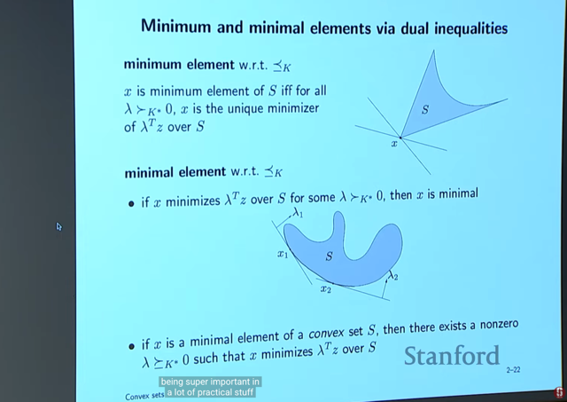</kbd>

> [!NOTE]
> Ta hiểu phát biểu về **MINIMUM w.r.t K** như sau:
>
> Hiểu ví dụ trước: Giả sử ta có **cone K là non-negative orthant R^2+**, như đã biết, đây là cái cone có tính chất **self-dual cone**, tức là **dual cone của nó cũng là nó luôn K = K***
>
> Thế thì, kí hiệu x ≻K* y có nghĩa là **x - y phải nằm trong interior của K***.
>
> Vậy với K là R^2+, thì chọn λ sao cho λ ≻K* 0 có nghĩa λ - 0 = λ phải thuộc int K* (với K là R^2+ thì int K* = int K (self-dual) = int R^2+ Vậy tức là cần vector λ có component dương)
>
> Thì nếu như ta thấy, 
>
> 1) Việc **tìm các điểm z trong S sao cho minimize λTz** - linear combination các coordinate của z với coefficients là component của λ thì ta luôn tìm ra cùng một điểm x. Và.. 
>
> 2) **Nếu với mọi λ đều như vậy thì x chính là minimum element w.r.t K của S**
>
> Từ đó ta hiểu định nghĩa này theo cách khái quát: đó là nếu và chỉ nếu như:
>
> i) Chọn vector λ ≻K* 0 (λ - 0, tức là λ nằm trong interior của K*)
>
> ii) Tìm hết trong S các vector z, để sao cho minimize λTz thì ta được x.
>
> iii) Mà λ nào ta làm vậy cũng ra x, nói cách khác, x là unique solution. Khi đó x chính là minimum element của S w.r.t K
>
> Định nghĩa ngắn gọn nhất có thể: Thỏa cái này thì x gọi là minimum wrt cone K của S nè:
>
> **Với mọi λ ≻K* 0 (cũng là λ ∈ int(K*)), x = unique solution của bài toán minimize_x ∈ S {λTz}**

> [!TIP]
> **🤖 AI Feedback** — ✅ Score: **92/100**
>
> Bài phân tích định nghĩa về 'minimum element w.r.t K' rất sâu sắc và chính xác, đặc biệt trong việc giải thích điều kiện 'for all' và 'unique minimizer'. Việc sử dụng ví dụ cụ thể với R^2+ giúp minh họa rõ ràng các khái niệm phức tạp. Một điểm nhỏ cần lưu ý là trong phần định nghĩa ngắn gọn cuối cùng, ký hiệu 'minimize_x ∈ S {λTz}' nên được viết là 'minimize_{z ∈ S} {λTz}' để thể hiện rõ hơn biến số đang được tối ưu.

 

- **Một student hỏi**

<kbd>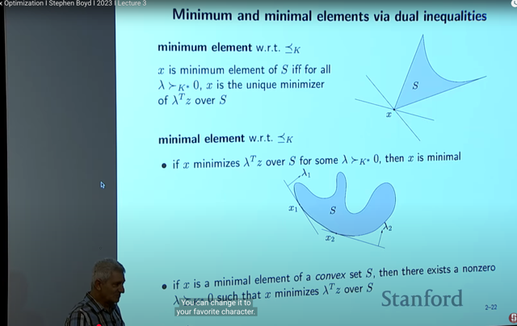</kbd>

> [!NOTE]
> Một student hỏi câu mà ta cũng thắc mắc là z là gì. 
>
> Gs: z là dummy variable, là cái thứ mà ví dụ khi ta gọi hàm f(z) = z^2 thì thật ra ta không care z, mà ta care f. Nên có thể nói f(u) = u^2 cũng được

 

- **Chứng minh:  x là minimum của S wrt K ⇔ λTx unique minimize λTz với mọi λ thuộc int K***

<kbd>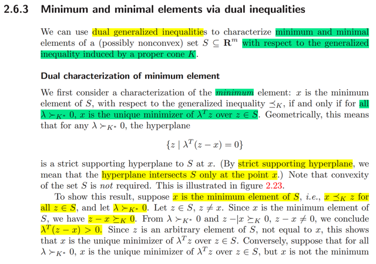</kbd>

<kbd>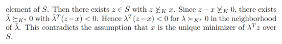</kbd>

> [!NOTE]
> Đọc sách ta có thể hiểu thêm phần Chứng minh: 
>
> **x là minimum của S wrt K ⇔ λTx unique minimize λTz với mọi λ thuộc int K***
>
> Chứng minh đại khái là vầy: 
>
> Chiều đi, hay điều kiện cần: Nếu x là minimum của S wrt K ⇨ λTx unique minimize λTz với mọi λ thuộc int K*
>
> Ta có x là minimum của S wrt K nên theo định nghĩa của minimum wrt K: 
>
> x ⪯K z với mọi z ∈ S, z ≠ x  
>
> ⇔ 0 ⪯K z - x ∀ z ∈ S, z ≠ x
>
> ⇔ z - x ∈ K \ {0} ∀ z ∈ S, z ≠ x
>
> (vì xét z khác x nên **z - x ≠ 0, nên z - x ∈ K \ {0}**)
>
> Theo **định nghĩa của dual cone**: K* = {λ: λTz ≥ 0 ∀ z ∈ K} 
>
> và nếu chỉ xét int K*, thì = {λ: λTz > 0 ∀ z ∈ K} 
>
> Do đó:
>
> λT(z - x) > 0 ∀ z - x ∈ K \ {0} ∀ λ ∈ int K*
>
> Vậy đến đây ta có λTz > λTx với mọi z ∈ S, z ≠ x
>
> ⇨ **x là unique minimizer của λTz, ∀ λ ∈ int K**
>
> ====
>
> Ở chiều ngược lại, tức điều kiện đủ: 
>
> Giả sử ta có ∀ λ ∈ int K* (tức λ ≻K* 0), x unique minimizer của λTz over z ∈ S. Ta sẽ chứng minh x là minimum của của S wrt K. 
>
> Dùng phương pháp phản chứng, giả sử  ∀ λ ∈ int K* (tức λ ≻K* 0), x unique minimizer của λTz over z ∈ S **nhưng x không phải minimum**
>
> Thế thì nếu x không phải minimum thì có nghĩa là tồn tại z ∈ S sao cho z ⋡K x. 
>
> Mà z ⋡K x ⇔ z - x ∉ K. 
>
> Quay lại định nghĩa của dual cone đã nói ở trên, **nếu z - x thuộc K thì nhất định λT(z - x) ≥ 0 với mọi λ thuộc K***, vậy mà nay z - x không thuộc K suy ra: 
>
> tồn tại λ_tilde ∈ K* khiến λ_tildeT(y - x) < 0. 
>
> Và vì hàm **f(λ) = λT(z - x) liên tục** nên tồn tại một khoảng lân cận quanh λ_tilde sao cho các λ trong vùng đó đều có λT(y - x) < 0. Mà điều này có nghĩa là, **ngay cả khi λ_tilde nằm ở biên của K*, thì sẽ vẫn chắc chắn là tồn tại điểm lân cận của nó sẽ nằm trong interior int K* thỏa điều trên.**
>
> Do đó cho phép ta kết luận **tồn tại λ ∈ int K* khiến: λTz < λTx**
>
> Và cái này **mâu thuẫn với giả định ban đầu là λTx là unique minimizer của λTz với mọi λ ∈ int K*.**
>
> Do đó ta kết luận, khi λTx minimize λTz với mọi λ thuộc int K* thì x là  minimum của S wrt K

> [!TIP]
> **🤖 AI Feedback** — ⚠️ Score: **85/100**
>
> Bài làm cho thấy sự hiểu biết sâu sắc và khả năng giải thích rõ ràng các khái niệm phức tạp, đặc biệt là phần chứng minh chiều ngược lại đã được diễn giải tốt hơn so với văn bản gốc. Tuy nhiên, định nghĩa về 'int K*' còn chưa hoàn toàn chính xác và có một lỗi chính tả nhỏ trong phần chứng minh nghịch đảo.

**🔗 See also:** [Định nghĩa dual cones](#node-ladwkad)

 

- **minimal w.r.t cone k**

<kbd>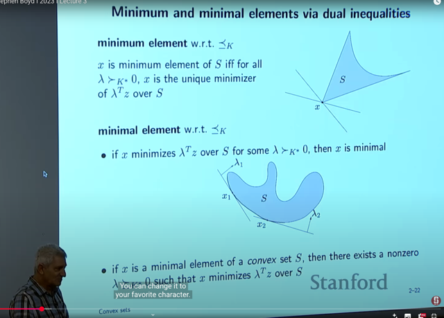</kbd>

> [!NOTE]
> Tiếp theo là **minimal w.r.t cone k** 
>
> đại khái nói rằng nếu ta chọn λ như trên (λ ≻K* 0) và minimize f_λ(z) = λTz, thì ta sẽ có **minimal element của S with respect to K**
>
> Gs nhắc lại, nếu không hiểu thì những bài sau khi ta áp dụng nó  vào các bài toán cụ thể thì ta sẽ hiểu thôi

 

- **Dual characterization of minimal elements**

<kbd>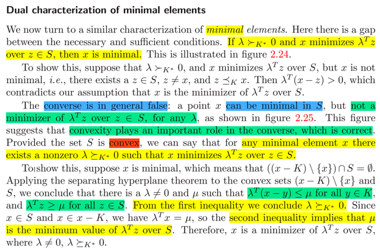</kbd>

> [!NOTE]
> Tiếp theo là liên quan đến **minimal**. 
>
> Như vừa rồi là **minimum**, ôn lại định nghĩa nếu x là **minimum của S wrt K **thì **x ⪯K y với mọi y ∈ S**. 
>
> Còn nếu x là **minimal của S wrt K** thì **x là điểm duy nhất trong S mà ⪯K x**: 
>
> y ⪯K x thì ⇨ y = x.
>
> Vậy thì theorem này như trong bài giảng đã nói: 
>
> **∀ λ ∈ int K* (λ ≻K* 0) và λTx là minimizer của λTz over all z ∈ S ⇨ x sẽ là minimal of S wrt K.**
>
> (Chiều ngược lại chỉ đúng nếu S convex và λ ∈ K* (chứ không phải int K*):
>
> **Nếu S convex, x là minimal of S wrt K ⇨ ∃ λ ∈ K*: x là minimizer của λTz over all z ∈ S)**
>
> ====
>
> Ta có thể chứng minh như sau:
>
> Giả sử **với  λ ∈ int K*, x là minimizer của λTz over all z ∈ S** mà **x lại không phải minimal**:
>
> Theo định nghĩa, **nếu x không phải minimal, thì ∃ z ∈ S, z ≠ x mà x ≽K z** 
>
> ⇔ x - z ∈ K, z ≠ x
>
> ⇔ x - z ∈ K, x - z ≠ 0
>
> ⇔ x - z ∈ K \ {0}
>
> Nhắc lại **định nghĩa của dual cone K*: {λ: λTu ≥ 0 ∀ u ∈ K} và int K* = {λ: λTu > 0 ∀ u ∈ K}**
>
> Vậy ở đây ta có x - z ∈ K \ {0} ⇨ λT(x - z) > 0 với mọi λ ∈ int K*
>
> ⇔ λTx > λTz với mọi λ ∈ int K* 
>
> ⇨ Vậy x không phải là minimizer của λTz over mọi z ∈ S, mâu thuẫn giả thiết (x là minimizer)
>
> Chứng minh xong chiều đi: **λTx là minimizer của λTz over all z ∈ x thì x là minimal**
>
> ====
>
> Tiếp theo ở chiều ngược lại thì nói chung là không đúng: 
>
> Nếu **x là minimal của S thì chưa chắc tồn tại λ ∈ K* sao cho λTx minimize λTz over all z ∈ S** 
>
> Và cái này thể hiện bởi hình ảnh kế tiếp.
>
> Thế thì từ hình ảnh đó đại khái ta có thể hình dung rằng, **nếu s là convex set, thì ta sẽ có chiều ngược lại: khi x là minimal của s thì tồn tại λ ∈ K* (K*, chứ phải int K*) khiến λTx minimize của λTz over S**  
>
> Tiếp ta có thể chứng minh cái này:
>
> Đại khái là **giả sử S là convex set và x là minimal**. 
>
> Ta còn nhớ theo **định nghĩa của minimal, nó sẽ là điểm duy nhất trong S mà "dở" hơn nó**, thể hiện bởi toán học là: 
>
> y ⪯K x ⇨ y = x. 
>
> Nhưng còn một cách thể hiện toán học dùng Set notation: (x - K) ∩ S = {x}
>
>  ⇔ {(x - K) \ {x}} ∩ S = ∅. 
>
> Vế trái, có nghĩa là là set (x - K) bỏ đi x. Thế thì vì {(x - K) \ {x}} ∩ S = ∅ nên theo **separating hyperplane theorem**, sẽ **tồn tại một hyperplane chia space làm hai mà mỗi set trên nằm một bên**. 
>
> Nói theo toán học sẽ là **tồn tại λ và μ (với λ đóng vai normal vector của hyperplane) sao cho** :
>
> (a) **λTz ≤ μ với mọi z ∈ {(x - K) \ {x}}** 
>
> (b) **λTy ≥ μ với mọi y ∈ S**
>
> Xét λTz ≤ μ với mọi z ∈ {(x - K) \ {x}}: 
>
> Đầu tiên cần hiểu z ∈ {(x - K) \ {x}} có nghĩa là:
>
> z ∈ (x - K) và z ≠ x. Và tập (x - K) là viết tắt của tập {z: z = x - k | k ∈ K}
>
> Nên λTz ≤ μ với mọi z ∈  {(x - K) \ {x}} 
>
> ⇔ λTz ≤ μ với mọi z ∈ {z: z = x - k | k ∈ K, z ≠ x}
>
> ⇔ λTz ≤ μ với mọi z ∈ {z: z = x - k | k ∈ K, x - z ≠ 0}
>
> ⇔ λT(x - k) ≤ μ với mọi k ∈ K, k ≠ 0. 
>
> Và cái này tương đương λTx - μ ≤ λTk với mọi k ∈ K (1)
>
> Xét siêu phẳng λTx - μ. 
>
> Ta có (x - K) ∩ S = {x}: Thế thì vì x vừa nằm trong (x - K) vừa nằm trong S, và bỏ x để (x - K) \ {x} ∩ S = ∅ để rồi có hyperplane giữa (x - K) \ {x} và S nên đương nhiên x **chính là nằm trên hyperplane này**. Do đó λTx = μ
>
> Vậy với λTx = μ thì (1) trở thành λTk ≥ 0 với mọi k ∈ K ⇨ λ ∈ K* (λ ≽K* 0) (theo định nghĩa dual cone K*)
>
> Còn xét ý (b) λTy ≥ μ với mọi y ∈ S, thì vì μ = λTx nên nó thành **λTy ≥ λTx với mọi y ∈ S**, ⇨ **x là minimizer của λTy over y ∈ set S.**
>
> Tới đây kết hợp hai ý ta sẽ có:
>
> (Đã chứng minh rằng) tồn tại λ ∈ K* và λ ≠ 0 sao cho x minimize λTy ∀ y ∈ S
>
> ⇨ đã chứng minh xong: khi x là minimal của S thì tồn tại λ ≽K* 0 khiến x là minimizer của λTy over y ∈ set S.

> [!TIP]
> **🤖 AI Feedback** — ❌ Score: **55/100**
>
> Bài phân tích đã bám sát cấu trúc chứng minh từ tài liệu gốc. Tuy nhiên, có những thiếu sót nghiêm trọng trong định nghĩa phần tử "minimal" và "không minimal", thể hiện sự thiếu chính xác về mặt toán học. Ngoài ra, các chứng minh còn bỏ qua điều kiện quan trọng rằng vector λ phải khác 0.

**🔗 See also:** [linked note](./lec_7.md#node-zk6bict)

 

- **Figure 2.25**

<kbd>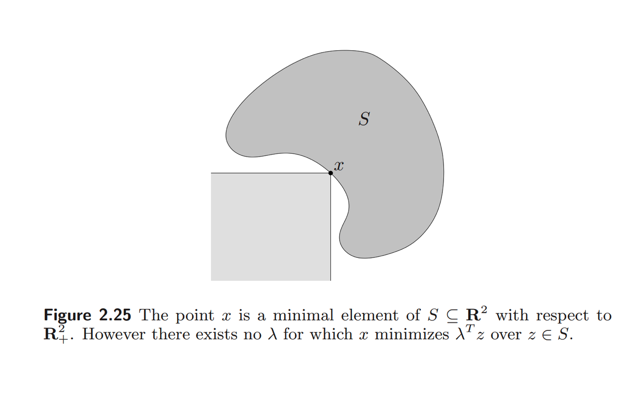</kbd>

> [!NOTE]
> HInh này cho thấy **x là minimal của S, nhưng không tồn tại λ khiến λTx minimize λTz over S, nếu S là convex set thì sẽ có**.
>
> Ta hiểu rằng nếu có thì ta sẽ có λTx ≤ λTz ⇔ λ(x - z) ≤ 0 và nó sẽ làm nên một  support hyperplane của S. Nhưng trong hình có thể thấy không thể có tiếp tuyến với S tại x

 

- **Chiều ngược chỉ đúng với lambda thuộc K*, không phải int K***

<kbd>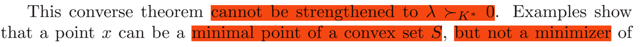</kbd>

<kbd>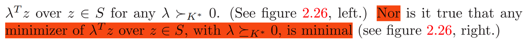</kbd>

<kbd>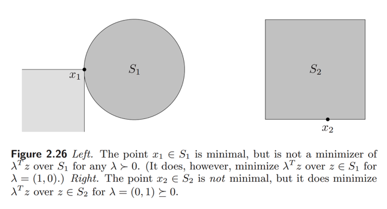</kbd>

> [!NOTE]
> Hai dòng này cũng rất đáng chú ý. Đại khái nói là cái theorem ở chiều ngược lại vừa rồi: nếu S convex, thì khi **x là minimal thì tồn tại λ ∈ K* (λ ⪰K* 0) sao cho x là minimizer của λTy over y ∈ S**)
>
> Thì đại khái là nói cái này **KHÔNG ĐÚNG NẾU SỬA LẠI LÀ λ ≻K* 0 (λ ∈ int K*)**
>
> Hình ảnh minh họa cho cái này là ta set K là R^n+, ta nhớ lúc này K* cũng là K là R^n+ luôn, và ≽R^n+ thì có thể chỉ ghi là ⪰ thôi, và x ≽ 0 tức là component của x đều không âm, x ≻ 0 thì tức là component cuả x đều dương)
>
> Vậy hình trái có thể thấy x1 là minimal của S, bởi nó thỏa (x1 - K) ∩ S = x1
>
> nhưng người ta nói nó không phải là minimizer của λTz over S với bất kì λ ≻ 0 nào. Tức là nếu dùng lambda ≽ 0 thì có, nhưng strictly ≻ thì không có.
>
> Bởi vậy mới nói cái **converse theorem này không đúng nếu dùng dấu strict inequality ≻K*.**
>
> Một cái nữa, đó là cái theorem chiều xuôi nhớ đọc kĩ, nó nói là nếu với  λ ≻K* 0 mà x minimize  λTz over z ∈ S thì x là minimal. Thì sẽ **không đúng nếu thay bằng** λ ≽K* 0.
>
> Minh họa bởi hình phải, khi x2 là minimizer của λTz over z thuộc S với λ = (0,1) (λ = (0,1) ≽K* 0 nhưng không ≻K* 0). thì lúc này x2 không phải là minimal (mọi điểm trong cạnh dưới, ở bên trái x2 đều nhỏ hơn nó, hay (x2 - K) ∩ S = nhiều điểm chứ không chỉ mỗi x2
>
> Tóm lại (khi là convex) ở chiều xuôi thì phải là dấu ≻K* mới đúng. Còn ở chiều ngược thì phải là dấu ≽K* mới đúng:
>
> Nếu ∃ λ ∈ int K*: x minimizer của λTz over z ∈ S ⇨ x là minimal of S
>
> Nếu S convex, và x là minimal of S ⇨ ∃ λ ∈ K*

> [!TIP]
> **🤖 AI Feedback** — ✅ Score: **95/100**
>
> Bài phân tích rất chính xác và chi tiết, thể hiện sự hiểu biết sâu sắc về các điều kiện của các định lý liên quan đến điểm tối thiểu và tối thiểu hóa hàm tuyến tính. Minh họa bằng hình ảnh được giải thích rõ ràng và mạch lạc. Tuy nhiên, trong phần tóm tắt cuối cùng về định lý đảo, cần làm rõ hơn rằng sự tồn tại của λ ∈ K* đi kèm với việc x là điểm tối thiểu hóa hàm λTz trên S.

 

- **Minimum and minimal elements via dual inequalities**

<kbd>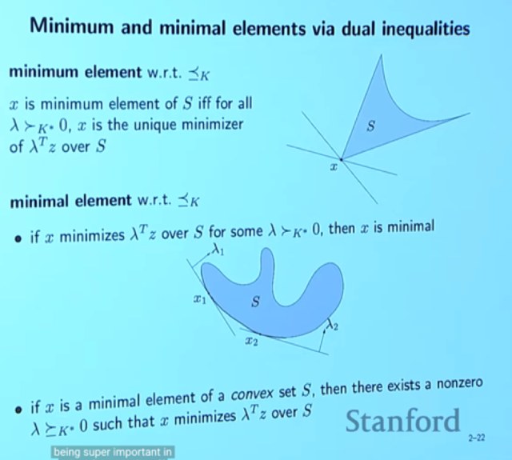</kbd>

> [!NOTE]
> Ví dụ K là R^2+ khi đó λ ≻K* 0 ⇔ λ ∈ int K* thì như đã nói λ chính là vector có component đều dương (λ1 > 0, λ2 > 0)
>
> Thế thì z là vector / điểm trong S, ví dụ như có component là (z1, z2) thì λTz chính là λ1z1 + λ2z2. Và giá trị của dot product này sẽ khác nhau với các z khác nhau. Và **với mỗi λ thì các λTz = c với c thay đổi sẽ tạo ra vô sô đường thẳng song song nhau và có normal vector là λ**.
>
> Vì vậy việc tìm ra z khiến minimize λTz sẽ giống như ta lấy cây thước, đặt nó theo hướng vuông góc với λ và di chuyển song song cây thước cho đến khi c = λTz nhỏ nhất.
>
> Nôm na là vầy: Thử nghĩ ta thay đổi z để c nhỏ nhất là sao: λ1z1 + λ2z2 = c. Cho z1 = 0 ⇨ z2 = c/λ1. Nên c điểm trên trục tung mà đường thằng λ1z1 + λ2z2 = c giao với trục tung. Nên việc trượt các đường thẳng này cho c nhỏ nhất chính là ta trượt các đường thẳng này sao cho nó vẫn dính với tập S nhưng hạ thấp (c) nhất có thể. 
>
> Và điểm đó chính là **minimal**. Như vậy dễ thấy với λ khác nhau ta có các minimal khác nhau. Chú ý rằng, đây là ta đang phát biểu theo chiều thuận: Nếu x minimize λTz over S với λ là vector nào đó nằm trong **int K** (K ở đây nhắc lại đang là R^2+ ⇨ int K là R^2++) thì x là một minimal của S wrt K. Nhấn mạnh chỗ **λ ∈ int K**, nên nếu lấy λ = (0, α) (dựng đứng, vuông góc với trục ngang) thì khi minimize xong ta chưa chắc là đã có minimal (hình vẽ minh họa, điểm màu xanh, là kết quả minimization, nó không phải minimal, vì dọc theo cái đoạn đi ngang của đường màu đỏ có vô số điểm tốt hơn nó, ví dụ như điểm màu cam)
>
> Ôn lại luôn ở chiều ngược lại, thì ta cần S convex và chỉ đúng với λ ∈ K* (không phải int K*): Nếu S convex, x là minimal của S wrt cone 
>
> Và nếu với mọi λ ∈ int K* khi làm vậy đều ra **cùng một điểm** như hình trên thì đó là **minimum** wrt cone K

> [!TIP]
> **🤖 AI Feedback** — ✅ Score: **92/100**
>
> Bài phân tích của bạn thể hiện sự hiểu biết sâu sắc về các yếu tố tối thiểu và cực tiểu thông qua song đối bất đẳng thức, đặc biệt là sự phân biệt tinh tế giữa các điều kiện cho λ.

 

- **nói sơ về ứng dụng**

<kbd>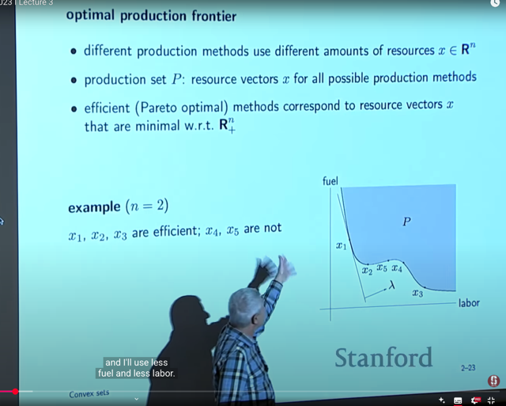</kbd>

> [!NOTE]
> đại khái là (cái này gs chỉ nói sơ, vì ta sẽ còn quay lại nói kĩ hơn nhiều ở các bài sau) minh họa cho minimal. Đúng hơn là ta sẽ lờ mờ thấy các ứng dụng của nó.
>
> Trên hình, tạm hiểu là mỗi vector x trong set P (gọi là production set) sẽ ứng với một cách thức sản xuất mà tọa độ của nó sẽ là mức tiêu thụ nhiên liệu (fuel) và số lao động cần thiết (labor)
>
> Thế thì đương nhiên, ta muốn tối ưu sự hiệu quả của sản xuất bằng cách giảm thiểu fuel và labor nhất có thể. Thế thì chính là việc ta phải minimize tọa độ của x
>
> Vậy soi chiếu theo định nghĩa minimal element wrt K, thì giả sử ta chọn λ là vector màu xanh, thì khi ta minimize λTz ta sẽ tìm được x1 là một minimal, là điểm mà đầu bài giảng ta đã học, theo định nghĩa của minimal, đó là cái điểm mà khi xét tập các điểm không thắng nó (⪯) trong S thì chỉ có thể là chính nó (y ∈ S: y ⪯K* x ⇨ y = x)

 

- **nếu x không phải là minimal, thì sẽ không thể có vector λ ∈ int K* nào khiến minimize λTz over S ra x được hết**

<kbd>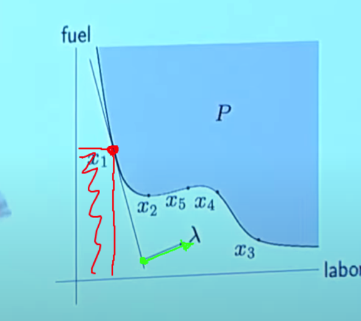</kbd>

<kbd>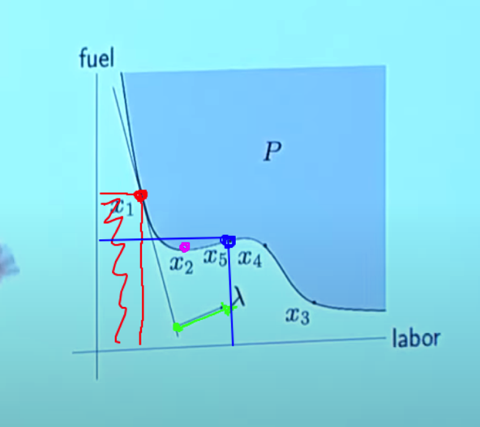</kbd>

> [!NOTE]
> Đây, x1, là điểm mà ta có thể tìm thấy λ ∈ int K* mà x1 sẽ giúp minimize λTz, x1 chính là một minimal. Vì như định nghĩa minimal, tập những điểm "không thắng" with respec to K (ở đây là non-negative orthant R^2 +) tạo thành hình màu đỏ, và nó chỉ intersect với P tại chính x1. (x1 - K) ∩ S = x1) Do đó x1 là minimal.
>
> Thì ý chính muốn nói, **nếu x không phải là minimal, thì sẽ không thể có vector λ ∈ int K* nào khiến minimize λTz over S ra x hết**. Ví dụ x5, không phải minimal (điều này dễ thấy bởi tập những điểm không thắng x5 wrt K (là hình trong phạm vi hai đường màu xanh dương ở hình bên) Có thể thấy nó intersect với P tại nhiều điểm chứ ko chỉ tại x5. Nên x5 ko phải minimal.
>
> Và chiếu theo định nghĩa ở đây, thì ta sẽ ko thể tìm ra λ nào mà minimize λTz để ra x5 cả.

> [!TIP]
> **🤖 AI Feedback** — ⚠️ Score: **88/100**
>
> Bài làm thể hiện sự hiểu biết sâu sắc về điểm tối thiểu (minimal element) trong tối ưu hóa vector và mối liên hệ với việc tối thiểu hóa hàm tuyến tính bằng cách sử dụng vector trong phần trong của nón đối ngẫu. Các lập luận về x1 là điểm tối thiểu và x5 không phải là điểm tối thiểu, cùng với việc áp dụng định lý scalarization tương ứng, đều chính xác và có chiều sâu. Tuy nhiên, mô tả hình ảnh 'hình màu đỏ' cho x1 có thể được diễn giải chính xác hơn để tránh gây nhầm lẫn với định nghĩa toán học của (x - K).

 

- **Pareto optimal production frontier**

<kbd>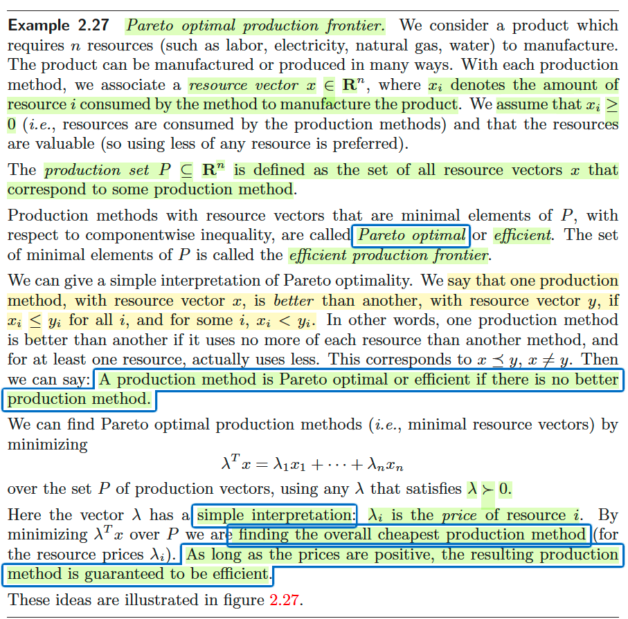</kbd>

<kbd>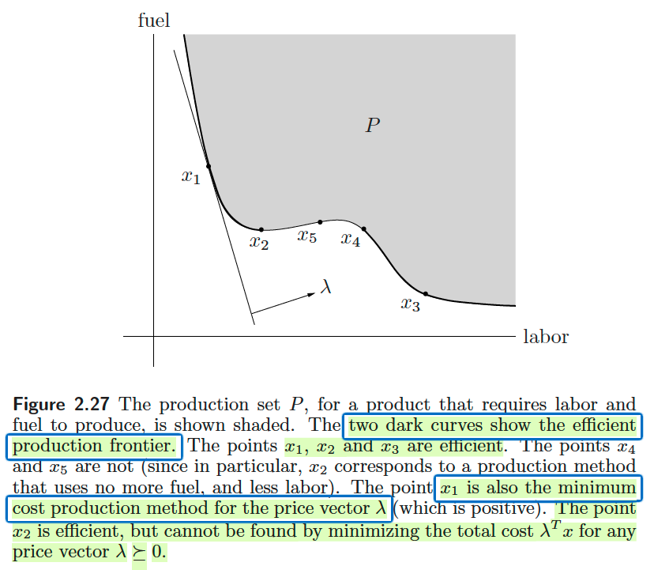</kbd>

> [!NOTE]
> Đây là đoạn trong sách nói về cái phần ứng dụng mà bài giảng thầy nói đến.
>
> Nói chung là có thể hiểu đại khái là vầy: Giả sử ta muốn làm ra một sản phẩm, ví dụ như làm bánh đi. Thì làm bánh cần đường và bột. Thế thì, đại ý là ta có thể có một tập P, là tập các giá trị x = [đường, bột] giúp làm ra cái bánh đạt tiêu chuẩn nào đó.
>
> Vậy nếu ta có x, và z là hai công thức. Thì z ⪰ x (⪰K, K = R^2+) trong bối cảnh này sẽ có nghĩa là cách công thức làm ra bánh của z cần nhiều bột và đường hơn của x tại ít nhất một loại nguyên liệu nào đó. Để rồi, nếu x = [10 đường, 5 bột] là minimal, thì có nghĩa là **xét trong số mọi công thức z ∈ P, thì cái mà cần ít hơn hoặc bằng 10 đường, và ít hơn hoặc bằng 5 bột chỉ có mỗi mình x**
>
> Có nghĩa là mấy cái z khác, **có thể xài ít đường hơn (ví dụ 8 đường) nhưng lại xài nhiều bột hơn là 5**, hoặc không thì **xài ít bột hơn ví dụ 4, nhưng lại xài nhiều đường hơn là 10** chứ **không có thằng nào xài ví dụ 9 đường và 4 bột cả**. Vậy thì, x, là minimal của P wrt K, và ở đây nó có tên gọi là là **Pareto optimal** vì không có cái nào trong P tốt hơn nó hẳn cả (ví dụ xài ít hơn nó ít nhất ở một loại nguyên liệu còn mấy cái khác thì ít nhất cũng bằng chứ không hơn)
>
> Vậy thì gọi λ = (λ1, λ2) là giá nguyên liệu đường và bột. Dĩ nhiên λTx chính là giá thành cần chi để làm ra 1 cái bánh. 
>
> Vậy thì, giả sử giá nguyên liệu là không âm (giả sử hợp lý thôi) ⇨ λ ∈ K (K = R^2 ++)
>
> Vậy thì khi đó, nếu mà ta chọn một vector giá (λ) ∈ và int K, và minimize over P f(z) = λTz, thì như đã biết, ta sẽ có một minimal (ví dụ x1). Thì hình ảnh chính là, với giá nguyên liệu λ đó, thì x 1 chính là "công thức" để làm ra cái bánh đạt chuẩn có giá thành nhỏ nhất có thể.
>
> Để rồi interpretation của việc x1 ⪯K z ∀ z ∈ P mang ý nghĩa là: cách sản xuất x1 (công thức x1) dùng 5 bột và 10 đường thì trong toàn P không có cái nào mà dùng ít hơn đường hơn và ít bột hơn cả. 
>
> Chú ý, không phải x1 ⪯ z với mọi z, mà chỉ là, x1 xài 5 bột 10 đường thì chả có thằng nào xài 5 bột 9 đường hoặc 4 bột 10 đường cả.
>
> Trong bài toán này không có cái nào ⪯ z ∀ z ∈ P, tức là không có minimum.
>
> Nhưng cũng chú ý là x1 không phải là Pareto optimal duy nhất, x2, x3 cũng là Pareto optimal. Và cái tập các minimal của P gọi là efficient prod

> [!TIP]
> **🤖 AI Feedback** — ⚠️ Score: **88/100**
>
> Bài phân tích rất chi tiết và cho thấy sự hiểu biết sâu sắc về Pareto optimality. Tuy nhiên, việc nhầm lẫn ký hiệu R^2++ với "không âm" và phát biểu x1 ⪯K z ∀ z ∈ P ban đầu là thiếu chính xác, dù bạn đã tự sửa chữa sau đó. Cần cẩn trọng hơn trong các định nghĩa.

 

- **Convex function**

<kbd>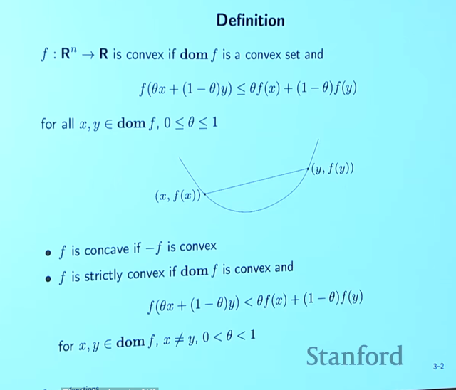</kbd>

> [!NOTE]
> Phần tiếp theo ta sẽ qua **convex function**. Được định nghĩa là function mà **DOM (tức domain) của nó là một convex set** đồng thời nó thỏa tính chất:
>
> f(θx + (1-θ)y) ≤ θf(x) + (1-θ)f(y),  0 ≤ θ ≤ 1
>
> Ở khía cạnh hình học thì điều này có nghĩa là **dây cung (chores) giữa hai điểm trên function graph luôn NẰM TRÊN trên đồ thị hàm f**.
>
> Gs nói thêm ta cũng có thể hiểu nó theo kiểu: **NON-NEGATIVE CURVATURE**, mà điều này thì như ta biết có nghĩa là đạo hàm cấp 2 của f ko âm
>
> Thêm nữa nếu **- f convex thì f gọi là concave**, ta cũng đã gặp khái niệm này ở MIT18.01 
>
> Ta cũng có thể thấy vế bên trái là f apply lên = mixture (của x, y), tức θx + (1-θ)y và vế phải là mixture của f(x), f(y) tức θf(x) + (1-θ)f(y)
>
> Nên từ đó ta có thể nhìn nhận f convex nếu **f của mixture luôn nhỏ hơn hoặc bằng mixture of f**.
>
> Và cuối cùng là nếu dấu bằng không xảy ra thì ta có STRICTLY CONVEX
>
> CONVEX FUNCTION

 

- **ax+b **vừa convex, vừa concave****

<kbd>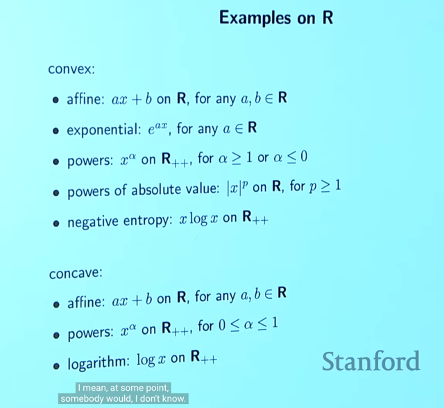</kbd>

<kbd>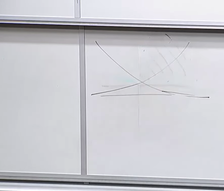</kbd>

> [!NOTE]
> Một số ví dụ về convex function. Gs cho rằng ta có thể chỉ cần vẽ nó ra (trong đầu) là có thể thấy đây là những function có tính non-negative curvature
>
> Đáng chú ý, **affine ax+b cũng là convex function**, vì **R tập số thực**, là domain của affine function là **convex set** và **hàm ax+b cũng thỏa tính chất "f của mixture" ≤ "mixture of f"**
>
> Cụ thể thì dây cung nối hai điểm bằng đúng đồ thị hàm f giữa hai điểm, nên nó **thỏa điều kiện là dây cung KHÔNG NẰM DƯỚI đồ thị**
>
> Mà đặc biệt, **nó CŨNG LÀ CONCAVE luôn** vì -ax-b tức -f là convex (**đơn giản là vì nó cũng là affine function**)
>
> Vậy ax+b **vừa convex, vừa concave**
>
> AFFINE FUNCTION f(x) = ax + b VỪA
> CONVEX VỪA CONCAVE

 

- **3.1 - Basis examples & properties**

<kbd>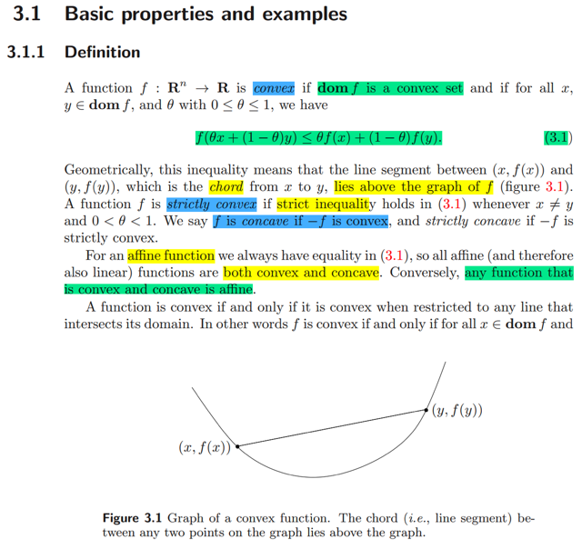</kbd>

<kbd>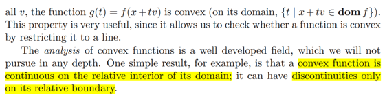</kbd>

> [!NOTE]
> CHAPTER 3 CONVEX FUNCTION
>
> 3.1 - basis examples & properties

 

- **Một số ví dụ convex function**

<kbd>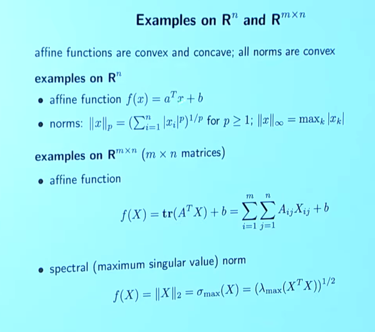</kbd>

> [!NOTE]
> Đây, gs confirm nhận định vừa rồi: Affine function vừa là convex vừa là concave (mà ông cho rằng cũng dễ hiểu bởi convex là non-negative curvature, và concave là non-positive curvature thì affine function có curvature = 0, nó nằm ở giữa hai case, nên thỏa cả hai)
>
> Bên cạnh đó **norm ||x||p** với định nghĩa là [Σ |xi|^p ]^1/p với p ≥ 0
>
> và ||x||inf = max k |xk|. Đây c**ũng là convex function.**
>
> Bên cạnh đó, ta cũng có các function take input là matrix, ví dụ **như function tính det, tính trace.**
>
> Thế thì affine function đối với matrix sẽ có công thức là:
>
> f(X) = tr(ATX) + b = Σi Σj AijXij + b cũng là affine function, và cũng convex

 

- **Gs phân tích giúp ta hiểu function f(X) = tr(ATX) + b.**

<kbd>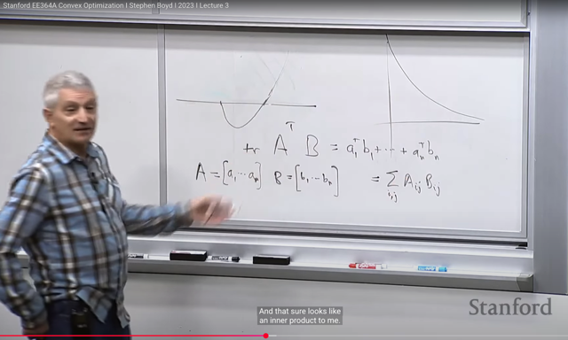</kbd>

> [!NOTE]
> Gs phân tích giúp ta hiểu function f(X) = tr(ATX) + b.
>
> trace, từ 1806 ta đã biết **trace là tổng các diagonal entries**.
>
> Thế thì xét matrix A có các columns A1,A2,...An và B có các columns B1, B2....Bm
>
> Thì ATB, dễ thấy các entries trên đường chéo sẽ là dot product của một hàng của AT (chính là một cột của A) với cột tương ứng (cùng vị trí)  của B
>
> nên tr(ATB) = A1TB1 + A2TB2 + ...AnTBn = Σi AiTBi và dot product của Ai và Bi đương nhiên là Σi Aij*Bij từ đó ta có tr(ATB) = Σi Σj
> Aij*Bij

 

- **flatten matrix A, B thành hai vector rồi dot product**

<kbd>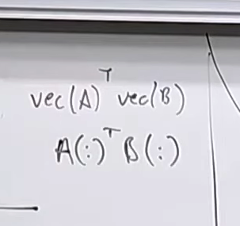</kbd>

> [!NOTE]
> và ta cũng có thể sẽ thấy người ta ghi như vầy.
>
> Tức là flatten matrix A, B thành hai
> vector rồi dot product

 

- **spectral norm (maximum singular value), cũng là convex function**

<kbd>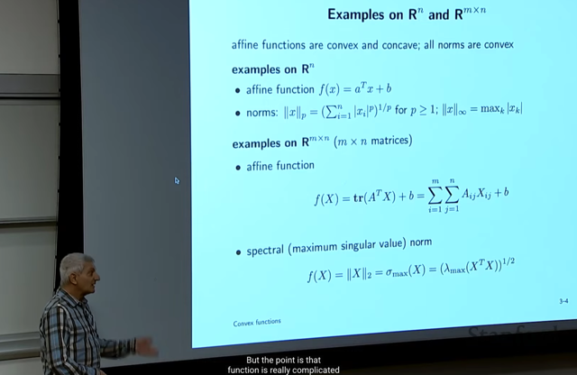</kbd>

> [!NOTE]
> Rồi, một cái nữa là spectral norm (maximum singular value).
>
> được định nghĩa là f(X) = ||X||2 = σmax(X) = [λmax(XTX)]^1/2
>
> Từ 1806 giúp ta hiểu cái này, ôn lại một tí về SVD (singular value decomposition) matrix A. Nói một cách ngắn gọn, ta **muốn tìm hai bộ orthonormal basis của rowspace C(AT) vi và column-space C(A) ui**, để rồi **Avi = σiui** với i = 1,2...r (r = rank A), hay AVr
> = UrΣ
>
> Từ đó **A có thể tách thành tổng của r matrix rank-1**: 
>
> A = ΣUVrT = Σi σiuiviT
>
> Thể hiện dưới dạng matrix: **AVr = UrΣ**, với Vr là matrix các row-space basis vi và Ur là matrix các column-space basis ui. Σ là matrix các stretching factor (singular values).
>
> Nếu thêm vào Vr các nullspace basis để thành V là orthogonal matrix chứa các basis của R^n và thêm vào Ur các left-nullspace basis để thành U là orthogonal matrix chứa basis của R^m thì ta có FULL SVD: AV = UΣ và vì V invertible ta có: A = UΣVT (V là orthogonal matrix nên
> Vinv = VT)
>
> U gọi là left-singular matrix of A, V là right singular matrix of A, và Σ là matrix of singular values.
>
> Thế thì, ta biết U, V sẽ tồn tại, vì matrix A hạng r, dim C(A) và C(AT) đều bằng r, và một vector trong row-space sẽ được map 1:1 với một vector trong columns-pace.
>
> Vấn đề là ta cần tìm hai bộ orthogonal basis của C(AT) và C(A) sao cho thỏa AVr = UrΣ.
>
> Và ta sẽ nhờ ATA và AAT, là hai symmetric, positive semi-definite matrix để tìm U và V.
>
> Xét ATA = (UΣVT)T(UΣVT) = VΣUTUΣVT = VΣΣTVT = VΣ^2VT.
>
> Thế thì, Σ là diagonal matrix, phép phân tách này cho thấy đây chính là** eigendecomposition của ATA**, hay nói cách khác, V chính là matrix các
> eigenvectors của ATA và Σ chính là matrix các eigenvalues của ATA.
>
> Như vậy left singular vectors của A chính là eigenvectors của ATA, và
> singular values của A chính là √ của eigenvalues của ATA.
>
> Tương tự thì right singular vectors của A chính là eigenvectors của AAT, và
> singular values của A chính là sqrt của eigenvalues của ATA
>
> Quay lại đây, thì đây là lí do mà hàm f(X) - spectral norm, hay maximum
> singular value, cái tên đã cho thấy, nó sẽ lấy ra singular value lớn nhất
> của X (σmax(X)) và nó làm việc này bằng cách lấy eigenvalue lớn nhất
> của XTX (λmax(XTX) và lấy sqrt

 

- **spectral norm và Frobenius norm**

<kbd>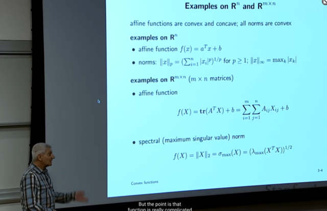</kbd>

> [!NOTE]
> Còn một điểm kiến thức Linear Algebra đáng chú ý nữa đó là ||X||2 tức spectral norm của matrix X được định nghĩa là singular value lớn nhất của X và cũng là √eigenvalue lớn nhất của ATA.
>
> Chú ý nó khác với Frobenius norm như đã biết, được tính bằng cách lấy tổng bình phương từng component của X và sau đó lấy sqrt, √(Σij Xij^2) và cái này cũng có thể thể hiện bằng √Tr(XTX) và cũng bằng √Tr(XXT)

 

- **Restrict of a convex function to a line**

<kbd>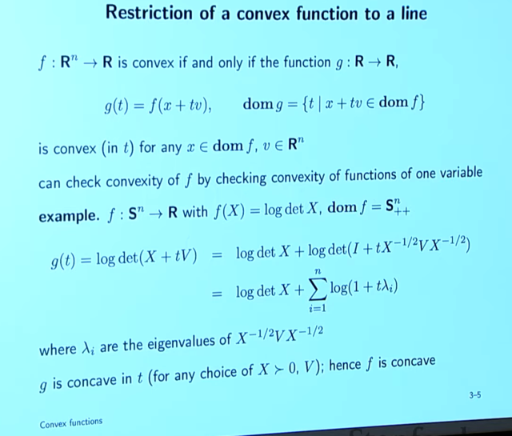</kbd>

> [!NOTE]
> Tiếp theo đại khái là giả sử ta có function **f là scalar function đa biến (n biến)** nhận vào vector Rn thì **một cách để ta check xem nó có convex hay không** đó là **dựa vào một function g khác**, là function đơn biến, được định nghĩa là **g(t) = f(x+tv)** với x ∈ domain của f và v là
> vector Rn. 
>
> Đại khái, **function f sẽ convex khi và chỉ khi g convex**
>
> Và **vì g là function đơn biến nên ta có thể plot nó ra**, và dùng kết quả để kiểm tra tính convex của f
>
> Và cái này gọi là **restrict of a convex function to a line**
>
> ====
>
> Gs lấy ví dụ f(X) là function **take input là một symmetric matrix S^n và tính ra scalar number: log det của X**. 
>
> Domain của f là các symmetric positive definite matrix S^n ++ vì log(u) chỉ xác định khi u dương, tức là log(det(X)) thì det(X) phải dương và đồng nghĩa X phải positive definite
>
> Thế thì ta **có thể check convexity của f bằng cách check function g(t) = log det (X + tV)**. V là symmetric, S^n nhưng không nhất thiết S^n++
>
> Cách làm đại khái là:
>
> X + tV = X^1 + t.V 
>
> = X^(1/2)X^(1/2) + t.X^(1/2).X^(-1/2)V
>
> = X^(1/2)[X^(1/2) + t.X^(-1/2)V]   |  đặt X^(1/2) làm thừa số chung bên trái
>
> = X^(1/2) . [I + t.X^(-1/2).V.X^(-1/2)] . X^(1/2) |  đặt X^(1/2) làm thừa số chung bên phải
>
> Và dùng tính chất của det: detAB = detAdetB
>
> ⇨ det(X+tV) = det X^(1/2) . det [I + tX^(-1/2)VX^(-1/2)] . det X^(1/2)
>
> = det X^(1/2) det X^(1/2) . det [I + tX^(-1/2)VX^(-1/2)]
>
> = det [X^(1/2)X^(1/2)] . det [I + tX^(-1/2)VX^(-1/2)]
>
> = det X det [I + tX^(-1/2)VX^(-1/2)]
>
> Rồi, đặt A = X^(-1/2).V.X^(-1/2) có các eigenvalues λ1, λ2..
>
> Ta lập luận như sau: nếu λ là eigenvalue của A, ứng với eigenvector x thì Ax = λx. Nhân hai vế cho t và cộng hai vế cho x:
>
> Ax = λx ⇔ tAx = tλx 
>
> ⇔ x + tAx = tλx + x
>
> ⇔ Ix + tAx = (tλ+1)x 
>
> ⇔ (I + tA)x = (1 + tλ)x
>
> ⇨ eigenvalues của I + tA sẽ là 1+ tλi, i = 1,2...
>
> Và det A = tích các eigenvalue, nên det (I + tA) = ∏i (1+tλi)
>
> Từ đó log [det X det (I + tA)] = log det X + log det (I + tA)
>
> = log det X + log ∏i (1+tλi) = log det X + Σi log (1+tλi)
>
> ====
>
> Và đại khái là gs cho biết **log(1+tλi) i=1,2.. là các convex function**, nên cơ bản là ta có** tổng các convex function nên cũng là convex**
>
> (log det X thì cũng là convex)

 

- **extended-value extension của f kí hiệu là f_tilde**

<kbd>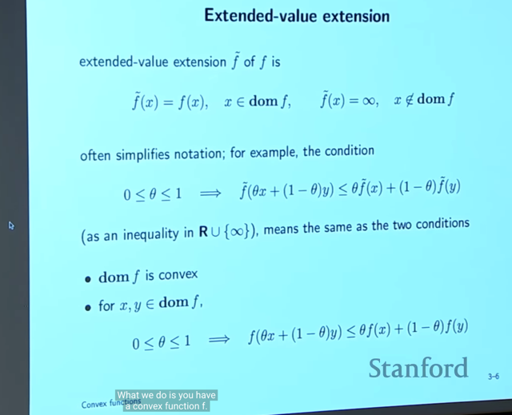</kbd>

> [!NOTE]
> Đầu tiên gs nói đại khái là giả sử ta có function f. Nếu ta gọi nó (evaluate nó) tại một điểm nằm trong domain của nó, thì ta sẽ có một giá trị. Nhưng nếu gọi nó **tại một điểm nằm ngoài domain
> của nó, thì thường (trên máy tính) sẽ trả về cho ta OOD** (out of domain) value (hay NAN not a number,...)
>
> Thế thì đại khái **extended-value extension của f kí hiệu là f_tilde ** là một function đơn giản là nếu **x thuộc domain của f thì f_tilde(x) = f(x), ngược lại nếu x không thuộc domain của f thì f_tilde(x) = inf**
>
> Khúc dưới gs ko giải thích nên chưa hiểu lắm. Có thể quay lại sau
>
> EXTENDED-VALUE EXTENSION

 

<kbd>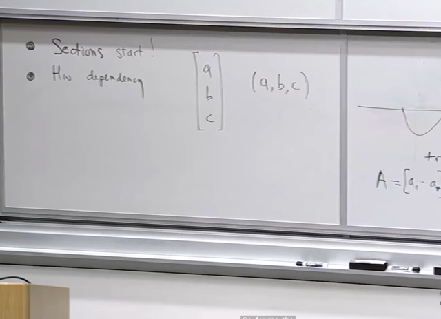</kbd>

> [!NOTE]
> Đại khái gs cho rằng ta có thể viết vector theo cột như này hoặc (a, b, c)

 

- **First-order condition**

<kbd>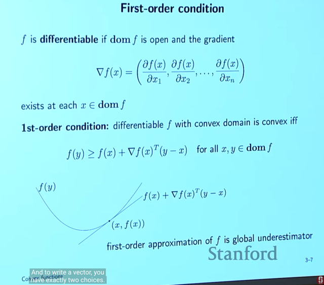</kbd>

> [!NOTE]
> Ta sẽ qua nội dung gọi là **first-order condition**. 
>
> Nói là nếu f khả vi (differentiable) nếu domain của f mở và tồn tại gradient vector tại mỗi điểm
> thuộc domain.
>
> **Gradient vector ∇f** thì ta đã được học từ MIT 18.02, là vector chứa các partial derivative. (Có student hỏi và ông xác nhận nó là **column vector**. Ko nên confused, trong MIT 18s096, các thầy vẫn nói **gradient vector là columns vector như thông thường, nhưng derivative vector thì là row vector**, tức là transpose của gradient vector. Qua 18s096 xem lại)
>
> Thế thì dựa vào calculus, gs cho rằng dễ thấy đây chính là first order approximation (hay linear approximation): 
>
> Dù chưa chính thức được học về Taylor expansion nhưng đã từng thấy gs 1802 nói.
>
> Ta có thể xuất phát từ **total differentiation**:
>
> df = f_x1 dx1 + f_x2 dx2, f là function f(x1,x2)
>
> Khi thay dx1, dx2 bởi Δx1, Δx2, phương trình trên trở thành linear approximation, cũng là kết quả của first order Taylor expansion
>
> Δf ≈ f_x Δx1 + f_x2 Δx2
>
> ⇔ f(y1,y2) - f(x1,x2) ≈ f_x(y1-x1) + f_y(y2-x2)
>
> ⇔ f(y) - f(x) ≈ ∇fT(y-x)
>
> ⇔ f(y) ≈ f(x) + ∇fT(y-x)
>
> Và thật ra dấu bằng sẽ xảy ra nếu ta có thêm các higher-order term
>
> f(y) = f(x) + ∇fT(y-x) + o(n^2)
>
> Thế thì, first-order condition nói rằng: 
>
> f(x) convex thì ⇔ f(y) ≥ f(x) + ∇fT(y-x)
>
> **với convex function thì fisrt order approximation sẽ chính là global under estimator **
>
> Đại khái là calculus cho phép ta nói rằng nếu y đủ gần x thì hàm f có thể được approximate bởi linear function Nhưng ý chính là, calculus chỉ cho phép nói như vậy.
>
> Còn với convex function, thì ta được phép nói rằng hàm f sẽ ko thể ở dưới linear function đó, đồng nghĩa nó cũng là một global under-estimator của function.
>
> =====
>
> Ở lần review này, mình có thể nói thêm vài ý, liên hệ tính chất Hessian xác định bán dương với First order condition:
>
> Đầu tiên là nhờ Numerical Optimization, mình nay đã biết Taylor theorem:
>
> Ở case 1 biến, idea là khi đi từ a đến b thì ta có: f(b) = f(a) + f'(a)(b - a) + (1/2) f''(c)(c)^2 với c ở đâu đó giữa a, b.
>
> Mở rộng quả case đa biến:
>
> f(x + d) = f(x) + ∇f(x)Td + (1/2)dT ∇^2f(x + αd) d for some α in [0,1]
>
> Thế thì, nếu hàm liên tục, thì xét trong phạm vi đủ gần thì Hessian tại x + αd sẽ xấp xỉ Hessian tại x: ∇^2f(x + αd) ≈ ∇^2f(x). Từ đó ta sẽ có second order approximation
>
> f(x + d) ≈ f(x) + ∇f(x)Td + (1/2)dT ∇^2f(x) d
>
> Đó là second order approx. còn quay lại công thức của Taylor theorem, ta sẽ nói thế này: Với hàm convex, Hessian luôn xác định bán dương ⇨ (1/2)dT ∇^2f(x + αd) d ≥ 0
>
> ⇨ f(x + d) - f(x) - ∇f(x)Td ≥ 0
>
> ⇔f(x + d) ≥ f(x) + ∇f(x)Td
>
> Đây không phải là chứng minh, chỉ là cách để dễ nhớ, liên hệ tính chất Hessian xác định bán dương với First order condition thôi, còn chứng minh thì phải như sách, xuất phát từ định nghĩa (p

> [!TIP]
> **🤖 AI Feedback** — ⚠️ Score: **83/100**
>
> Bài phân tích thể hiện độ sâu sắc vượt trội, đặc biệt là phần chứng minh điều kiện bậc nhất cho hàm lồi thông qua khai triển Taylor đa biến và tính chất của Hessian. Tuy nhiên, định nghĩa về vector gradient ∇f(x) trong bài viết của bạn là vector cột lại mâu thuẫn trực tiếp với cách nó được biểu diễn rõ ràng là vector hàng trong hình ảnh đã cung cấp. Đây là một điểm không chính xác đáng kể so với tài liệu gốc.

**🔗 See also:** [linked note](./lec_7.md#node-ie1twki)

 

- **(Sách) First order condition**

<kbd>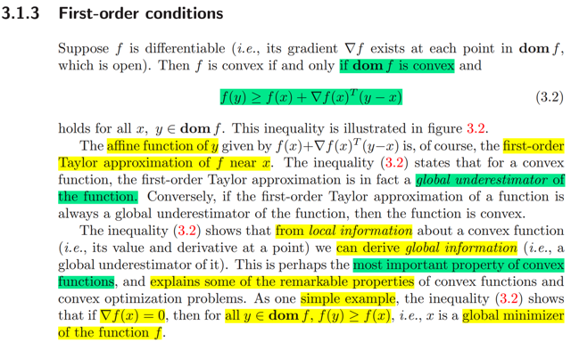</kbd>

<kbd>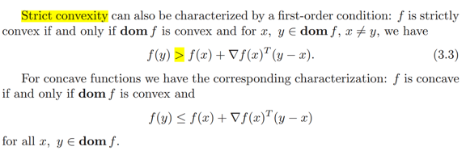</kbd>

> [!NOTE]
> Ý chính là, với hàm f(x) thì linear approximation (hay first-order Taylor approximation của f gần x) như đã biết đó là:
>
> f(y) ≈ f(x) + ∇f(x)T(y - x)
>
> Thì theorem này nói rằng hàm f(x) là convex khi và chỉ khi f(y) ≥ f(x) + ∇f(x)T(y - x) với mọi y ∈ dom f.
>
> Với Strictly Convex thì ta có dấu >

 

- **Chứng minh first order convexity condition**

<kbd>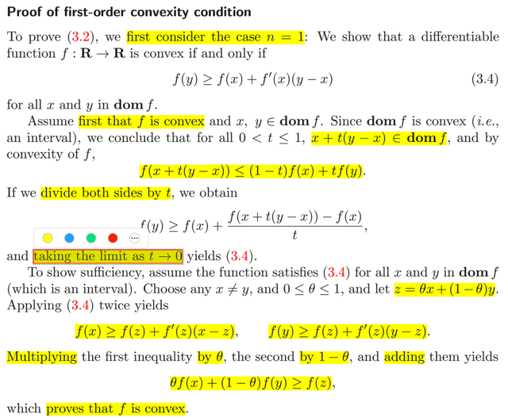</kbd>

> [!NOTE]
> Rồi, đầu tiên ta sẽ **chứng minh cái này ở case khi n = 1**. 
>
> Khi đó dĩ nhiên gradient ∇f(x) sẽ thay bằng **1st derivative f'(x)**.
>
> Ta sẽ chứng minh: **f convex ⇨ f(y) ≥ f(x) + f'(x)(y-x) (x, y ∈ dom f)**
>
> Khi f convex, **theo định nghĩa, dom f là convex set** ⇨ **x, y ∈ dom f thì mixture của nó** (hay line segment) θx + (1 - θ)y với 0 ≤ θ ≤ 1 **cũng thuộc dom f**. Hay ty + (1-t)x với t ∈ [0, 1] cũng vậy.  
>
> ty + (1-t)x = ty + x - tx = x + ty - tx = x + t(y - x)
>
> Vậy **x + t(y - x) ∈ dom f**.
>
> Và vì f convex, nên cũng theo định nghĩa, khi x, y ∈ dom f thì **"f của mixture ≤ mixture of f"**
>
> **f(θx + (1 - θ)y) ≤ θf(x) + (1 - θ)f(y)**
>
> áp dụng cho ty + (1-t)x:
>
> f(ty + (1-t)x) ≤ tf(y) + (1-t)f(x)
>
> Khai triển ty + (1-t)x = x + t(y - x)
>
> ⇔ f(x + t(y - x)) ≤ tf(y) + (1-t)f(x)   
>
> Chia hai vế cho t:
>
> f(x + t(y - x)) / t ≤ f(y) + (1-t)f(x) / t
>
> ⇔ f(x + t(y - x)) / t ≤ f(y) + f(x) / t - tf(x) / t
>
> ⇔ f(x + t(y - x)) / t ≤ f(y) + f(x) / t - f(x) 
>
> ⇔ [f(x + t(y - x)) - f(x)] / t ≤ f(y) - f(x) 
>
> ⇔ f(x) + [f(x + t(y - x)) - f(x)] / t ≤ f(y)  
>
> ⇔ f(y) ≥ f(x) + [f(x + t(y - x)) - f(x)] / t
>
> **lấy limit hai vế** khi t → 0 ta có:
>
> f(y) ≥ f(x) + lim t → 0 [f(x + t(y - x)) - f(x)] / t
>
> Thế thì ta đã biết định nghĩa của derivative: 
>
> f'(x) = lim ε → 0 [f(x + ε) - f(x)] / ε 
>
> Vậy giờ xét lim ε → 0 [f(x + ε*v) - f(x)] / ε thì bằng cách đặt h = εv
>
> ⇨ ε = h / v.
>
> ⇨  lim ε → 0 [f(x + ε*v) - f(x)] / ε 
>
> = lim h → 0 [f(x + h) - f(x)] / (h/v)
>
> = lim h → 0 v*[f(x + h) - f(x)] / h
>
> = v * [ lim h → 0 [f(x + h) - f(x)] / h]
>
> = v * f'(x)
>
> Vậy ở đây **lim t → 0 [f(x + t(y - x)) - f(x)] / t chính là f'(x)(y - x)**
>
> Vậy ta có **f(y) ≥ f(x) + f'(x)(y - x) và từ đây giúp chứng minh xong điều kiện cần:**
>
> Nếu f convex thì ta có first condition: f(y) ≥ f(x) + f'(x)(y - x)
>
> Còn **điều kiện đủ** như sau:
>
> **Giả sử ta có hàm f có f(y) ≥ f(x) + f'(x)(y - x)** với x, y ∈ dom f ta cần **chứng minh nó convex**.
>
> Mà như đã biết để chứng minh convex thì ta **phải chứng minh f của mixture ≤ mixture của f**. 
>
> Tức là nếu x, y ∈ dom f và θ ∈ [0, 1] thì:
>
> f[θx + (1 - θ)y] ≤ θf(x) + (1 - θ)f(y)
>
> Thế thì, ta đang assume x, y ∈ dom f. Xét z là mixture của nó:
>
> z = θx + (1 - θ)y. Áp dụng first condition nói rằng miễn u, v ∈ dom f thì f(u) ≥ f(v) + f'(v)(u - v),
> nên:
>
> **f(y) ≥ f(z) + f'(z)(y - z)** (a)
>
> **f(x) ≥ f(z) + f'(z)(x - z)** (b)
>
> **Nhân (a) cho θ ∈ [0, 1]** ko đổi chiều bdt:
>
> f(y) ≥ f(z) + f'(z)(y - z) ⇔ θf(y) ≥ θ[f(z) + f'(z)(y - z)]
>
> ⇔ θf(y) ≥ θf(z) + θf'(z)y - θf'(z)z
>
> **Nhân (b) cho (1 - θ)**:
>
> f(x) ≥ f(z) + f'(z)(x - z)
>
> ⇔ (1 - θ)f(x) ≥ (1 - θ)[f(z) + f'(z)(x - z)]
>
> ⇔ (1 - θ)f(x) ≥ (1 - θ)[f(z) + f'(z)x - f'(z)z]
>
> ⇔ (1 - θ)f(x) ≥ f(z) + f'(z)x - f'(z)z - θf(z) - θf'(z)x + θf'(z)z
>
> **Cộng vế theo vế** ta có:
>
> θf(y) + 1 - θ)f(x) ≥ θf(z) + θf'(z)y - θf'(z)z + f(z) + f'(z)x - f'(z)z - θf(z) - θf'(z)x + θf'(z)z
>
> ⇔ θf(y) + 1 - θ)f(x) ≥ θf'(z)y + f(z) + f'(z)x - f'(z)z - θf'(z)x
>
> ⇔ θf(y) + 1 - θ)f(x) ≥ f'(z)[θy + x - z - θx] + f(z)
>
> ⇔ θf(y) + 1 - θ)f(x) ≥ f'(z)[θy + x(1 - θ) - z] + f(z)
>
> ⇔ θf(y) + 1 - θ)f(x) ≥ f'(z)[z - z] + f(z)
>
> ⇔ θf(y) + 1 - θ)f(x) ≥ 0 + f(z)
>
> ⇔ **θf(y) + 1 - θ)f(x) ≥ f(θy + x(1 - θ))**
>
> Từ đây suy ra f là convex

**🔗 See also:** [Chứng minh optimality condition.](./lec_5.md#node-14hyln5)

 

- **Chứng minh first order condition R^n → R case**

<kbd>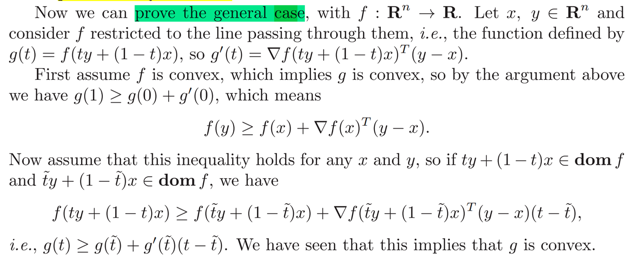</kbd>

> [!NOTE]
> rồi, để **chứng minh cho general case R^n → R function**. Ta dùng kết quả khi đã chứng minh cho R -> R case
>
> Giả sử có f convex. Thì theo một cái đã học, gọi là **restrict to line** 
>
> Nôm na là **khi R^n → R f(x) convex thì R → R g(t) = f(x + vt) với v ∈ R^n cũng sẽ là convex**.
>
> Nên ở đây **f(x) convex nên khi đặt hàm g(t) = f(ty + (1-t)x) thì nó cũng convex**.
>
> Và vì vậy ta áp dụng kết qủa chứng minh theorem này ở R → R case:
>
> g(u) ≥ g(v) + g'(v)(u - v)
>
> áp dụng g(u) ≥ g(v) + g'(v)(u - v) cho u = 1, v = 0:
>
> g(1) ≥ g(0) + g'(0) (1)
>
> Tính g': g(t) = f(ty + (1-t)x) = f(u) | u(t) = ty + (1-t)x
>
> Áp dụng chain rule:
>
> g'(t) = d/dt g(t) = df/du . du/dt = ∇f(u)T(y - x) = ∇f(ty + (1-t)x)T(y - x)
>
> Vậy (1) trở thành: f(1y + (1-1)x) ≥ f(0y + (1-0)x) + ∇f(0y + (1-0)x)T(y - x)
>
> ⇔ f(y) ≥ f(x) + ∇f(x)T(y - x) Đây là chứng minh xong điều kiện cần.
>
> Chứng minh chiều ngược (điều kiện đủ):
>
> Giả sử hàm f có tính chất f(y) ≥ f(x) + ∇f(x)T(y - x) với mọi x, y ∈ dom f.
>
> Thì bằng cách áp dụng cái này cho 2 điểm cũng thuộc dom f mà mỗi cái là một mixture của x, y với tỉ lệ khác nhau:
>
> a = ty + (1 - t)x và b = t'y + (1 - t')z
>
> Ta có f(a) ≥ f(b) + ∇f(b)T(a - b)
>
> ⇔ f(ty + (1 - t)x) ≥ f(t'y + (1 - t')z) + ∇f(t'y + (1 - t')z)T(ty + (1 - t)x - (t'y + (1 - t')z))
>
> Thì đại khái là **đây chính là g(t) ≥ g(t') + g'(t')(t - t')**
>
> Và ở R → R case ta **đã chứng minh điều này dẫn đến kết luận g là convex function**.
>
> Mà **g convex ⇨ f convex.** Chứng minh xong chiều ngược

 

- **Second order conditions**

<kbd>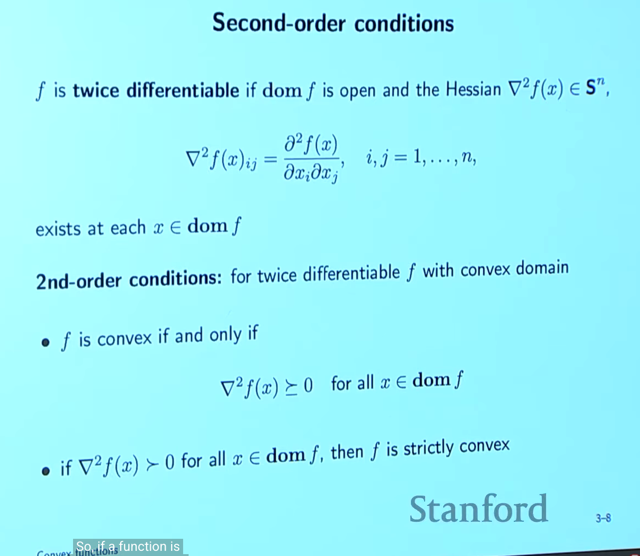</kbd>

> [!NOTE]
> Tiếp theo là ông nói về **second order conditions**
>
> Đại ý là đầu tiên nếu hàm **f twice differentiable**, **domain của f is open** và **tồn tại Hessian matrix ∇^2f(x) ∈ S^n** (tức là matrix Hessian là matrix đối xứng mang giá trị thực) **tại mọi điểm trong domain của f**.
>
> Thế thì từ đó nếu Hessian matrix tại mọi điểm trong domain của f đều là **positive semi definite** matrix ∇^2 f(x) ≽ 0 thì khi đó hàm f **convex**
>
> Còn nếu là **positive definite** ∇^2 f(x) ≻ 0 thì ta có f **strictly convex**
>
> Gs nói thêm rằng, điều này dễ hiểu, vì **Hessian matrix sẽ mang thông tin của curvature**.
>
> ====
>
> Liên hệ một chút, ở MIT 18.02 ta đã học về **second derivative test**, để check xem critical point là minimum hay maximum hay saddle point.
>
> Xét **f(x, y) = ax^2 + bxy + cy^2**. Dễ thấy nó có **critical point là (x0=0, y0=0)** (giải hệ hai phương trình first order neccesary condition: ∇f(x) = 0 ⇔ ∂f/∂x = 0 và ∂f/∂y = 0)
>
> Tiếp, ta sẽ **completing the square**:
>
> f= a[x^2 + b/a xy + c/a y^2]
>
> = a[x^2 + 2x(b/2a)y + (by/2a)^2 - (by/2a)^2 + (c/a)y^2]
>
> = a[x^2 + 2x(b/2a)y + (by/2a)^2] + a[-(by/2a)^2 + (c/a)y^2]
>
> = a(x+by/2a)^2 + a[-b^2y^2/4a^2 + (c/a)y^2]
>
> = a(x+by/2a)^2 + a[-b^2/4a^2 + (c/a)]y^2
>
> = a(x+by/2a)^2 + a[-b^2/4a^2 + 4ac/4a^2]y^2
>
> = a(x+by/2a)^2 + a[(-b^2 + 4ac)/4a^2]y^2
>
> = a(x+by/2a)^2 + a[(-b^2 + 4ac)/4a^2]y^2
>
> = 4a^2/4a(x+by/2a)^2 + [(-b^2 + 4ac)/4a]y^2
>
> = (1/4a) [4a^2(x+by/2a)^2 + (-b^2 + 4ac)y^2]
>
> = (1/4a) [4a^2(x+by/2a)^2 + (4ac-b^2)y^2]
>
> Xét H matrix [∂^2f/∂x^2 ∂^2f/∂x∂y; ∂^2f/∂y∂x ∂^2f/∂y^2]
>
> ∂^2f/∂x^2 = 2a;  ∂^2f/∂x∂y = b;  ∂^2f/∂y∂x = b;  ∂^2f/∂y^2 = 2c
>
> = [2a b; b 2c]
>
> det H = 2a2c - b^2 = 4ac - b^2.
>
> Case I) 4ac - b^2 > 0, tức **det H > 0**
>
> Ia) **Nếu a > 0**
>
> Và dựa vào kết quả completing the square, lúc này term 2 (4ac-b^2)y^2 ≥ 0 (chỉ = 0 khi y = 0). Và cả **function thì cũng luôn ≥ 0, chỉ bằng 0 tại critical point**.
>
> Kết luận: **local min tại critical point**.
>
> Lúc này matrix H thỏa điều kiện của một **positive definite** vì các leading
> principal đều dương (det của các sub-matrix)
>
> Ib) Nếu a < 0 
>
> Completing the square, ta vẫn có tổng hai square, nhưng a âm nên f luôn < 0 khi x, y
> khác critical point
>
> Kết luận: **local max** tại critical point
>
> Matrix H là một **negative definite** vì leading principal bậc lẻ âm, bậc chẵn dương.
>
> Case II) 4ac - b^2 < 0
>
> Completing the square cho thấy ta có **hiệu hai square**, nên f có thể âm, có thể dương cho nên critical point là **saddle point**.
>
> Với det < 0, H là **indefinite** matrix
>
> Case III) 4ac - b^2 = 0
>
> Completing the square cho thấy w trở thành (1/4a) [4a^2(x+by/2a)^2]. Đây là case **degenerate critical point, khi ta có vô số critical point. và sẽ đều là min nếu a dương và max nếu a âm.**
>
> **second order conditions**: Đại khái là nếu tồn tại Hessian của function tại mọi điểm và Hessian là **positive semi definite thì function là  convex** (hoặc strictly convex nếu là Positive Definite)

**🔗 See also:** [Partial minimization](./lec_4.md#node-znif4tu) · [Quadratic program](./lec_6.md#node-9yjta8o)

 

- **Vài ví dụ minh họa second order condition**

<kbd>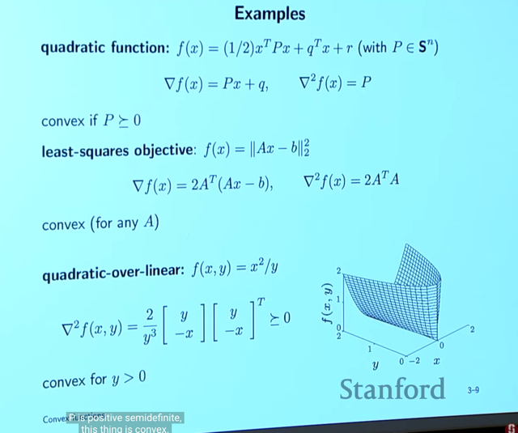</kbd>

> [!NOTE]
> Một số ví dụ, đầu tiên là** quadratic function f(x) = (1/2)xTPx + qTx + r** với P là symmetric matrix (∈ S^n)
>
> Thế thì, xTPx, như đã biết, gọi là **quadratic form,** thì khi cộng thêm với  qTx + r ta có quadratic function. Mà gs cho rằng nó **tương ứng với px^2 + qx + r trong 1D** vậy
>
> Ta có **gradient ∇f(x) = Px + q** và **Hessian ∇^2f(x) là P**
>
> (Thử dùng MIT 18.s096 để chứng minh lại: df = f(x+dx) - f(x) 
>
> = (1/2)(x+dx)TP(x+dx) + qT(x+dx) + r - (1/2)xTPx - qTx - r
>
> = (1/2)(dxT + xT)P(x + dx) + qTx + qTdx - (1/2)xTPx - qTx
>
> = (1/2)(dxTP + xTP)(x + dx) + qTdx - (1/2)xTPx 
>
> = (1/2)(dxTPx + dxTPdx + xTPx + xTPdx) + qTdx - (1/2)xTPx 
>
> bỏ higher order term dxTPdx
>
> = (1/2)(dxTPx + dxTPdx + xTPx + xTPdx) + qTdx - (1/2)xTPx  
>
> = (1/2)(2dxTPx + xTPx ) + qTdx - (1/2)xTPx 
>
> = dxTPx + (1/2)xTPx + qTdx - (1/2)xTPx 
>
> = dxTPx + qTdx = xTPdx + qTdx = (xTP + qT)dx
>
> =(PTx + q)Tdx
>
> Vậy df = (xTP + qT)dx nên derivative là row vector (PTx + q)T và gradient vector ∇f = PTx + q
>
> Còn Hessian thì dễ rồi, df' = P(x+dx) + q - Px - q = Px + Pdx + q - Px - q
>
> Derive Hessian theo MIT 18.s096: **Cách làm Bilinear form**
>
> Ta sẽ bắt đầu với d(f'(x)[dx]) cũng là d(∇fTdx):
>
> d'(∇fTdx) = d'((PTx + q)Tdx) = (PT(x+dx') + q)Tdx - (PTx + q)Tdx
>
> = (PTx + PTdx' + q)Tdx - (PTx + q)Tdx
>
> = (PTx)Tdx + (PTdx')Tdx + qTdx - (PTx)Tdx - qTdx
>
> = (PTdx')Tdx 
>
> = **dx'TPdx**. Đây chính là **bilinear form act on dx' dx**
>
> **Do đó f''(x)[dx, dx'] = dx'TPdx nên P chính là Hessian matrix **
>
> Nhưng cũng có thể làm theo cách khác, chứng minh P là Jacobian của ∇f:
>
> d(∇f(x)) = ∇f(x+dx) - ∇f(x) = PT(x+dx) + q - PTx - q = PTx + PTdx + q - PTx - q
>
> = PTdx 
>
> Và nếu coi ∇f là vector -> vector function thì d(∇f) = (∇f)'(x)[dx] là linear operator act on dx. Để map giữa vector dx thành vector d(∇f) thì  linear operator này chỉ có thể là một matrix J nhân dx, đó là Jacobian matrix do đó Jacobian của ∇f chính là PT.
>
> Và vì f'(x) = (∇f)T, nên Jacobian của f'(x), cũng là Hessian của f(x) chính là P
>
> Như vậy có thể nhận xét quadratic function có **constant curvature**
>
> Thế thì quay lại đây, khi P ≽ 0 (đây là kí hiệu của **positive semi definite**) thì quadratic function f là convex

 

- **Một ví dụ nữa là least-squares objective: f(x) = ||Ax-b||^2**

<kbd>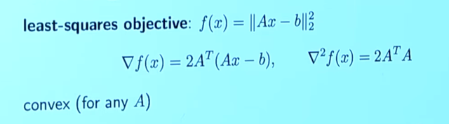</kbd>

> [!NOTE]
> Một ví dụ nữa là least-squares objective: f(x) = ||Ax-b||^2
>
> Là cái ta đã gặp ở mit 1806, rất quen thuộc, gọi là least-squares objective là bởi đây là
> function mà ta muốn minimize trong **bài toán least-square**
>
> **Lý luận lại bài toán least square**, đó là khi ta **muốn giải một hệ phương trình tuyến tính thể hiện bởi dạng ma trận Ax = b**. Trong đó, ta** có nhiều phương trình hơn biến**, thể hiện qua việc **matrix A có nhiều hàng hơn cột**: A shape [m,n], m >> n.
>
> Thế thì, vấn đề m > n khiến **b, là Rm vector có thể không nằm trong column space của A** (có dim = r ≤ n). Dẫn đến **có thể không tồn tại linear combination giữa các cột của A để tạo ra b**, đồng nghĩa **hệ phương trình không có nghiệm.**
>
> Cách tiếp cận least-square đó là, ta sẽ **tìm linear combination của các cột của A sao cho tối thiểu hóa sai khác giữa nó với b**. Gọi Ax = p, thì nói cách khác, ta **muốn tìm x sao cho minimize ||b-p|| = minimize ||Ax-b||**
>
> Thế thì ||Ax-b||, là **l2 norm của Ax-b**, sẽ bằng f = √(Ax-b)T(Ax-b)
>
> Vì hàm g(u) = u^2 đồng biến với u ≥ 0 nên ta có thể thay objective function bằng square norm:  
>
> f = (Ax-b)T(Ax-b)
>
> **Dựa trên kiến thức calculus**, ta sẽ **dựa vào first order neccesary condition để tìm critical point** dựa vào việc tìm x là solution của partial derivative của f = 0, tức ∇f (vector các partial derivatives) = 0
>
> Tìm ∇f: Theo cách làm của MIT 18.s096, ta tìm df = f(x+dx) - f(x) (*)
>
> = [A(x+dx)-b]T[A(x+dx)-b] - (Ax-b)T(Ax-b) = (Ax+Adx-b)T(Ax+Adx-b) - [(Ax)T-bT](Ax-b)
>
> = [(Ax)T+(Adx)T-bT](Ax+Adx-b) - (xTAT-bT)(Ax-b)
>
> = (xTAT+dxTAT-bT)(Ax+Adx-b) - (xTATAx-bTAx-xTATb+bTb)
>
> = xTATAx + dxTATAx - bTAx + xTATAdx + dxTATAdx - bTAdx - xTATb - dxTATb + bTb - xTATAx + bTAx + xTATb - bTb
>
> = dxTATAx + xTATAdx - bTAdx  - dxTATb
>
> Xét bTAdx shape [1,m][m,n][n,1] = [1,1] ⇨ scalar nên bTAdx = (bTAdx)T = dxTATb
>
> Tương tự xTATAdx cũng là scalar dễ thấy, nên tiếp tục trên
>
> = 2xTATAdx - 2bTAdx = 2(xTATA-bTA)dx
>
> Vậy **df = 2(xTATA-bTA)dx** 
>
> ⇨ gradient vector ∇f = [2(xTATA-bTA)]T
>
> = 2[(xTATA)T-(bTA)T] 
>
> = 2(ATAx-ATb) 
>
> = **2AT(Ax-b)**
>
> Tiếp, tìm Hessian ∇^2f(x), ta sẽ tìm df' = f'(x+dx) - f'(x)
>
> = 2AT(Ax + Adx - b) -2AT(Ax-b) = 2ATAdx
>
> ⇨ ∇^2f(x) = [2ATA]T = **2ATA**
>
> Tìm Hessian theo MIT 18s096:
>
> *Cách tiếp cận Bilinear form:
>
> d'(f'(x)[dx]) 
>
> (chú ý d' là ta bắt chước cách kí hiệu của gs Steve trong MIT 18s096, ý là d'f = f(x+dx') - f(x), nhằm phân biệt nó với dx, vậy thôi.
>
> = d'(2(xTATA-bTA)dx) 
>
> = 2((x+dx')TATA-bTA)dx - 2(xTATA-bTA)dx
>
> = 2(xTATA + dx'TATA - bTA)dx - 2(xTATA - bTA)dx
>
> = 2xTATAdx + 2dx'TATAdx - 2bTAdx - 2xTATAdx + 2bTAdx
>
> = 2dx'TATAdx = Đây là **bilinear form act on dx', dx** ⇨ **f''(x)[dx, dx'] = dx'T(2ATA)dx**
>
> ⇨ Hessian chính là 2ATA
>
> *Cách tiếp cận **tìm Jacobian của gradient:**
>
> d(∇f) = d(2AT(Ax-b)) = 2AT(A(x+dx)-b) - 2AT(Ax-b)
>
> = 2AT(Ax+Adx-b) - 2AT(Ax-b) = 2ATAx + 2ATAdx - 2ATb - 2ATAx + 2ATb
>
> = 2ATAdx
>
> ⇨ Jacobian của ∇f = 2ATA => Jacobian của f'(x) (f'(x) = (∇f)T) = (2ATA)T = 2ATA
>
> ⇨ Hessian của f = 2ATA
>
> Tiếp theo ta quay lại (*), để lập luận tiếp rằng ta cần tìm critical point:
>
> ∇f = 0 ⇔ 2AT(Ax-b) = 0 ⇔ 2ATAx - 2ATb = 0
>
> ⇔ **ATAx = ATb** 
>
> Đây chính là **normal equation**
>
>  ⇔ x = (ATA)inv ATb → critical point
>
> ⇨ Và với việc Hessian ∇^2f(x) là 2ATA là một symmetric **positive semi-definite** matrix 
>
> (chứng minh nhanh **xét quadratic form** xTATAx = (Ax)T(Ax) = ||Ax||^2 thế thì, xTATAx ≥ 0 với mọi x)
>
> Từ đó có thể kết luận **critical point là Minimum của f** nói cách khác nó là điểm minimize least square objective function
>
> ====
>
> Nói thêm, 2AT(Ax-b) = 0 ⇔ AT(Ax-b) = 0 cho thấy Ax-b chính là vector trong nullspace của A, C(A). Như vậy Ax chính là projection của b lên C(A).
>
>
> Quay lại nội dung bài giảng, thì ý chính là nói ** least square function luôn convex vì Hessian ATA là Positive Semi Definite**

 

- **Một ví dụ nữa là quadratic - over - linear f(x,y) = x^2/y**

<kbd>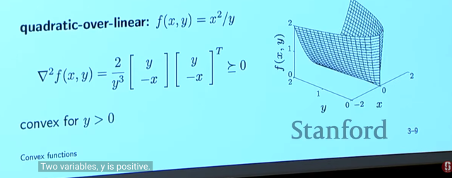</kbd>

> [!NOTE]
> Một ví dụ nữa là **quadratic - over - linear f(x,y) = x^2 / y**
>
> gs cho thấy khi tính Hessian matrix ∇^2f(x) thì nó như vầy (ông thể hiện dưới **dạng rank 1 matrix và ông nói vì H rank 1 nên tại mọi điểm chỉ có 1 hướng là có curvature** - chưa hiểu lắm chỗ này
>
> Đại khái là gs cho rằng ta có thể thấy: **nếu giữ y fixed, thì f convex vì ta có dạng scalar × x^2**. Còn **giữ x fixed, thì f cũng convex vì hàm 1/y convex**
>
> Và ông gọi nó là **jointly convex**. Nhưng gs chú ý là: 
>
> Nếu **function jointly convex thì nó convex ở từng variable, nhưng ngược
> lại thì không đúng.**

 

- **ví dụ này, f = xy**

<kbd>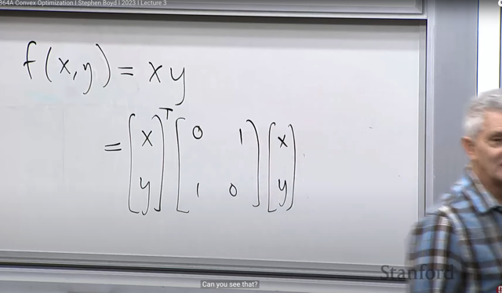</kbd>

> [!NOTE]
> Ông lấy ví dụ này, f = xy, hoàn toàn có thể thể hiện để thấy nó là một quadratic function = (1/2)[x y][0 1; 1 0][x y]T
>
> Nếu **giữ x fixed, thì f là linear theo y, như đã biết, nó convex (vừa convex vừa concave)**.
>
> Tương tự **nếu giữ y fixed, f cũng convex**
>
> Vậy **f = xy có convex không**?, và cụ thể là vì đây là quadratic function thì câu hỏi là **Hessian matrix [0 1; 1 0] có phải là positive semi-definite không?**
>
> Thử trả lời: Không, vì đây là **permutation matrix**, có det = -1 Vậy det Hessian < 0 ⇨ Hessian là **indefinite** matrix
>
> Nói thêm, 1806 ta đã học các phép thử để có positive (semi) definite:
>
> Thì dựa vào **det = -1 ⇨ có eigenvalue < 0 ⇨ ngay lập tức kết luận không phải positive semi definite.**
>
> Hoặc nội cái det < 0 à đã đủ kết luận rồi.
>
> Tóm lại đây là ví dụ cho thấy function **convex theo từng biến** (giữ y fixed, thì f(x,y) là hàm theo x, và nó convex, ngược lại giữ x fixed thì hàm thành hàm theo y, cũng convex) **nhưng không 
> jointly convex**

**🔗 See also:** [Nói thêm về jointly convex là điều kiện rất mạnh, không phải chỉ là convex theo mỗi biến](./lec_4.md#node-y2s0tnu)

 

- **Tiếp theo là log-sum-exp và geometric mean cũng có Hessian ≽ 0**

<kbd>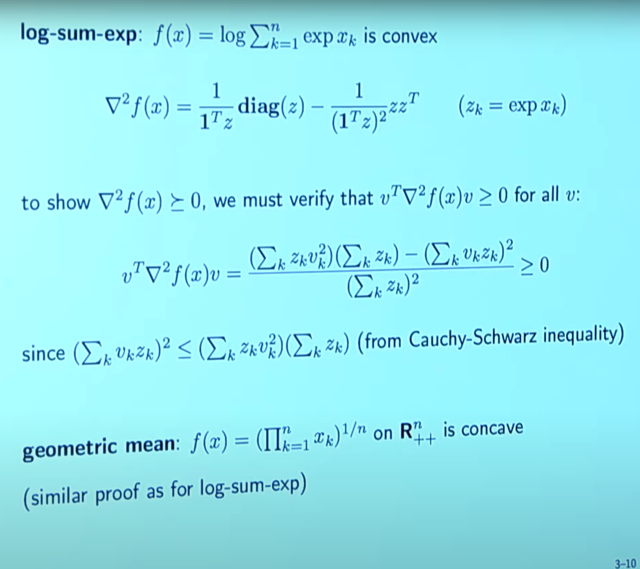</kbd>

> [!NOTE]
> Tiếp theo là **log-sum-exp và geometric mean cũng có Hessian ≽ 0**
>
> (từ giờ positive semi definite viết kí hiệu là ≽ 0)
>
> Có lẽ quay lại sau để triển khai thử các công thức chỗ này.
>
> f = log Σk exp(xk) = log 1Texp(x)
>
> Thử tìm gradient ∇f:
>
> Ta cần df = (...)dx
>
> Đặt **u = 1Texp(x)** ⇨ f(u) = log u, ⇨ df/du = 1/u ⇨ df = u/du
>
> df(u) = f(u+du) - f(u) 
>
> df(u) = log (u+du) - log(u)
>
> *Tính du theo dx:
>
> du = u(x+dx)-u(x)
>
> = 1Texp(x+dx) - 1Texp(x)
>
> = 1T(e^x ⊙ e^dx) - 1Te^x
>
> = (e^x)Te^dx - 1Te^x (1)
>
> Tới đây điểm quan trọng là: e^dx ≈ 1 + dx
>
> Áp dụng Taylor expansion: tại x0 = 0
>
> f(x) = f(x0) + f^(1)(x0)(x-x0) + (1/2)f^(2)(x0)(x-x0)^2 + (1/3!)f^(3)(x-x0)^3 + ...
>
> Với f(x) = e^x, ta có:
>
> e^x = e^0 + [e^(x)|x=x0]x + (1/2) [e^(x)|x=x0]x^2 + (1/3!) [e^(x)|x=x0]x^3 + ...
>
> ⇔ e^x = 1 + (e^0)x + (e^0)x^2/2 + (e^0)x^3/3! + ...
>
> ⇔ e^x = 1 + x + x^2/2 + x^3/3! + ...
>
> ⇨ e^dx = 1 + dx + (dx)^2/2 + (dx)^3/3! + ...
>
> Và ta có thể **bỏ higher order term của dx** ⇨ **e^dx = 1 + dx**
>
> Vậy quay lại đây (1) 
>
> ≈ (e^x)T(1+dx) - 1Te^x
>
> = (eT^x)T1 + (e^x)Tdx - 1Te^x
>
> = (e^x)Tdx
>
> ⇨ df = (e^x)Tdx / 1Te^x
>
> ⇨ **∇f = (e^x) / 1Te^x và đây chính là softmax(x)**
>
> Derive ∇^2f:
>
> Ta sẽ tìm derivative của ∇f = (e^x) / 1Te^x
>
> Gọi p = (e^x) / 1Te^x, 
>
> ====
>
> Đặt z = e^x ⇨ p(z) = z / 1Tz
>
> dz = de^x = e^(x+dx) - e^x 
>
> = e^x ⊙ e^dx - e^x ≈ e^x ⊙ (1+dx) - e^x
>
> = e^x + e^x ⊙ dx - e^x 
>
> = e^x ⊙ dx = diag(e^x) dx = diag(z)dx
>
> Vậy dz = diag(e^x)dx 
>
> ⇨ dzi = e^xi dxi
>
> ====
>
> Đặt u(z) = 1Tz. 
>
> Tính sẵn du = 1T(z+dz) - 1Tz 
>
> = 1Tz + 1Tdz - 1Tz 
>
> = 1Tdz
>
> ⇨ du = 1Tdz = 1T [diag(z)dx] hay 1T(z⊙dx) = zTdx (ngẫm sẽ thấy)
>
> ===
>
> p = z/u 
>
> pi = zi/u = zi(x)/u(z)
>
> dpi = ∂pi/∂zi dzi + ∂pi/∂u du (total differential)
>
> dpi = dzi/u + zi (-1/u^2) du = (dzi u - zi du) / u^2
>
> = (zi e^xi u - zi zTdx ) / u^2
>
> = zi (e^xi u - zTdx ) / u^2
>
> = (zi/u) (e^xi u - zTdx ) / u
>
> = pi (dxi u / u - zTdx / u) 
>
> = pi (dxi - zTdx / u) 
>
> = pi [dxi - (z/u)Tdx]
>
> = pi [dxi - (p)Tdx]
>
> => dpi = pi dxi -pi pTdx
>
> (dp1 = p1(dx1 - pTdx) = p1dx1 - p1pTdx
>
> dp2 = p2(dx2 - pTdx) = p2dx2 - p2pTdx)
>
> dp = p ⊙ dx + ppTdx = diag(p)dx - ppTdx = (diag(p) - ppT)dx
>
> Vậy ∇^2f = (diag(p) - ppT) 
>
> nếu thay lại p = z/u với z = e^x, u = 1Tz
>
> = diag(z/u) - (z/u)(z/u)T = diag(z) / u - zzT / u^2 
>
> = **(1/1Tz) diag(z) - 1/(1Tz)^2 zzT**
>
> Phần tiếp theo là chứng minh ∇^f = (1/1Tz) diag(z) - 1/(1Tz)^2 zzT ≽ 0 LÀM SAU
>
> VÍ DỤ KHÁC LOG SUM EXP & GEOMETRIC MEAN LÀ CÁC CONVEX
> DO THỎA SECOND ORDER CONDITION (CÓ HESSIAN PSD)

**🔗 See also:** [Ví dụ khác là log Σi exp gi(x)](./lec_4.md#node-2kpv2mn)

 

- **sub-level set**

<kbd>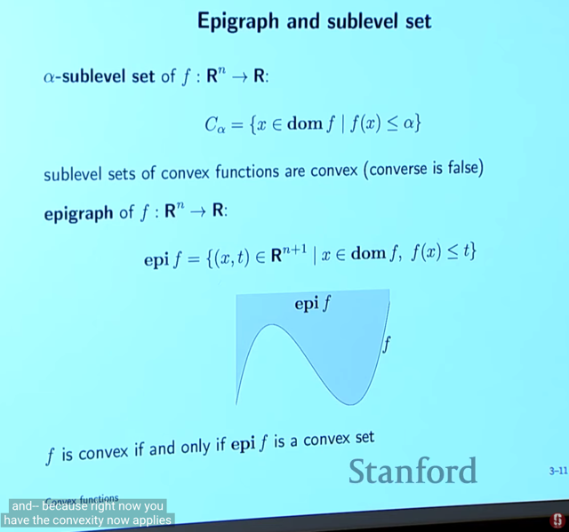</kbd>

> [!NOTE]
> Tiếp theo ta sẽ biết concept **sub-level set**, được định nghĩa là
>
> Cα là **tập hợp các điểm x thuộc domain f sao cho f(x) ≤ α** thì khi đó **Cα gọi là α-sublevel set of f**
>
> Và **nếu function convex thì sublevel set là convex set**
>
> Thế thì khái niệm tiếp theo là **epigraph**, gs nói ta đã biết **khi có function trong n-D (n biến) thì để vẽ graph của nó ta cần n+1 D** 
>
> Ví dụ như hình vẽ là **function 1 biến f(x) = sin(x) chẳng hạn. Thì graph của f sẽ vẽ trong 2D**, (bởi phải có thêm một axis để thể hiện value f(x)). Thì **epigraph là tập mọi mọi điểm ở bên trên graph f**
>
> epi f = {(x,t) ∈ R^n+1 | x ∈ dom f, f(x) ≤ t}
>
> Vậy thì ở đây cái chính muốn nói: 
>
> **f(x) convex function ⇔ epi-graph của nó là convex set**
>
> Do đó đây là nơi có **connection giữa convex function và convex set**
>
> **Sublevel set: Nếu f convex thì sub-level set của nó là convex set**
>
> **epi-graph: nếu f convex thì sub-level str là convex set**

 

- **Jensen's inequality f(E[z]) ≤ E[f(z)]**

<kbd>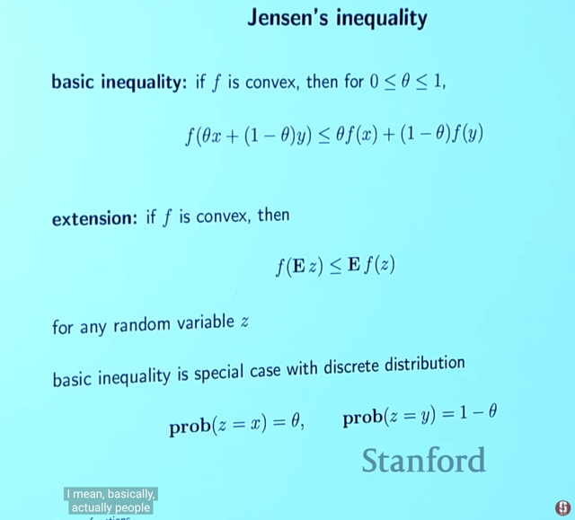</kbd>

> [!NOTE]
> Ta sẽ gặp lại một cái mà cs231n đã từng gặp: **Jensen's inequality**
>
> Gs nói nó đơn giản nói rằng **nếu f là convex function** thì: 
>
> **f của mixture ≤ mixture các f** (đây thực ra là định nghĩa của hàm convex đã biết)
>
> f(θx + (1-θ)y) ≤ θf(x) + (1-θ)f(y)
>
> Như đã biết nếu 0 ≤ θ ≤ 1 thì θx + (1-θ)y gọi là l**ine segment hay mixture / convex combination** của x, y
>
> Và **dạng mở rộng** của nó là: 
>
> **Nếu f convex thì f(E[z]) ≤ E[f(z)]** (z là random variable, ở đây ghi chữ thường đáng lí phải ghi chữ hoa Z như các lớp xác suất: f(E[Z]) ≤ E[f(Z)])
>
> Để rồi có thể thấy basis inequality f(θx + (1-θ)y) ≤ θf(x) + (1-θ)f(y) **chỉ là đang áp dụng công thức tổng quát cho z là một discrete r.v có 2 possible values là x, và y, với pmf P(z=x) = θ và P(z=y) = (1-θ)**
>
> Khi đó từ stat110 đã đã biết E[Z] là **weighted sum các possible values của z với weight là probability (pmf/pdf)**
>
> Ez = Σ possible values z_i của z z_i*P(z = z_i) 
>
> = xP(z=x) + yP(z=y) = xθ + y(1-θ)
>
> Còn E[f(z)] thì áp dụng **LOTUS** cho ta:
>
> Ef(z) = Σ possible values z_i của z f(z_i)P(z = z_i) = f(x)θ + f(y)(1-θ)

 

- **operation (on functions) preserve convexity**

<kbd>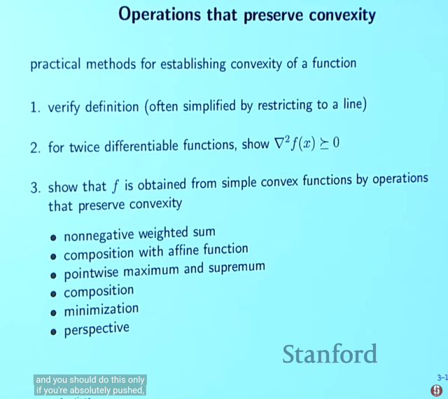</kbd>

> [!NOTE]
> Đại khái là lướt lại các **phương pháp để chứng minh tính convexity**.
>
> Đầu tiên là** dựa vào định nghĩa** đó là ta cần chứng minh nếu x,y thuộc domain của f, và chọn θ bất kì trong [0,1] thì f của mixture của x, y luôn bé  hơn hoặc bằng mixture của f(x), f(y). Tuy nhiên như đã nói **chỉ nên dùng khi ko còn cách nào khác**
>
> Cách thứ hai là **nếu function có đạo hàm cấp hai** (ở mọi điểm trong domain), tức "twice differentiable functions" thì ta có thể **xem Hessian của nó có ≽ 0** không 
>
> Ông cũng nói **phần lớn trường hợp ta cũng sẽ ko làm cách này trừ khi Hessian matrix đơn giản**.
>
> Và cách ta sẽ làm phần lớn trường hợp đó là chứng minh f là **kết qủa của các convex operation lên các simple convex function**
>
> giống như cách mà ta tính đạo hàm của các hàm phức tạp bằng các rule và đạo hàm các hàm cơ bản vậy

 

- **Các operation giữ nguyên tính convexity**

<kbd>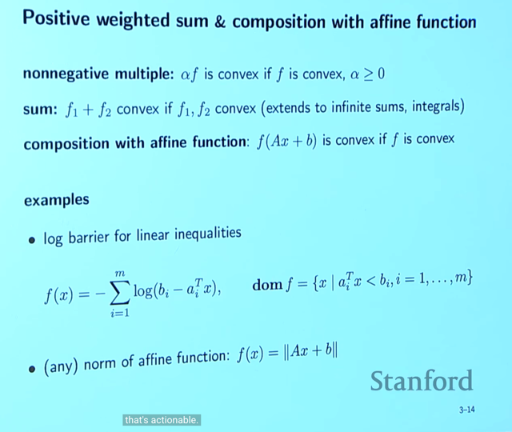</kbd>

> [!NOTE]
> Gs lướt qua vài ví dụ, đầu tiên trong **các operation giữ nguyên tính convexity**, thì ta có :
>
> i) **nhân với số không âm**, 
>
> ii) Σ: **tổng các convex là convex function**
>
> iii) và f(Ax+b) gọi là **composition with a affine function**: nếu **f(Ax+b) convex thì f convex.**
>
> Thì từ đó ta áp dụng để **xét tính convexity của function phức tạp này** gọi là **log barrier**: 
>
> **f(x) = - Σ log(bi - aiTx)** có domain là x | aiTx < b
>
> Thì đại khái ta sẽ phân tích như sau:
>
> **bi - aiTx là affine function**, như đã biết, nó sẽ convex và cũng concave
>
> **log là concave** ⇨ **concave của affine sẽ concave**
>
> => **Σ của concave là concave**
>
> Cuối cùng **nhân số âm với concave là thành convex**. Vậy đây là convex function

 

