# Lec 4

📊 **Progress:** `39` Notes | `43` Screenshots | `4` AI Reviews

---

## Lec 4

 

## Operations that preserve convexity

<kbd>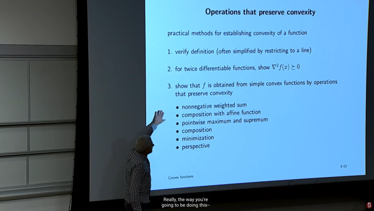</kbd>

> [!NOTE]
> Đại khái là tiếp nối bài trước ta đã nói về cách để chứng minh tính convexity trong đó **most of the time ta sẽ tìm cách cho thấy một function là kết quả của việc áp dụng các operation có tính chất bảo toàn tính convexity lên các convex function cơ bản**
>
> Điều này giống như trong calculus ta tìm đạo hàm bằng cách dùng các rule và đạo hàm của các hàm cơ bản vậy
>
> Thì một số operations có tính chất preserve convexity như:
>
> + nonnegative weighted sum
>
> + composition with affine function
>
> + point-wise maximum & supremum
>
> + composition
>
> + minimization
>
> + perspective
>
> ====
>
> Ở lần review này mình chợt nhận ra dù Lagragian function có thể không convex nhưng dual function g(λ, ν) = inf x L(x, λ, ν) thì là convex v

 

### Bbữa trước ta đã đi qua những operations đầu tiên

<kbd>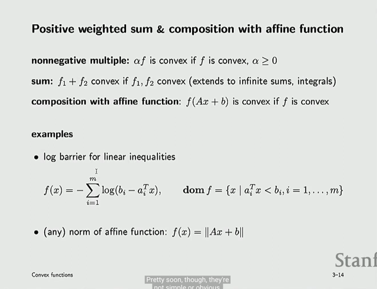</kbd>

> [!NOTE]
> Thế thì bữa trước ta đã đi qua những operations đầu tiên:
>
> - **non-negative multiply**: nhân với non-negative, sẽ giữ nguyên convexity: gs cho rằng điều này **dễ thấy** vì việc **nhân số không âm sẽ chỉ tăng thêm hoặc giảm bớt curvature, chứ không khiến đổi dấu**, nên dĩ nhiên nó sẽ** giữ nguyên tính convex**
>
> - **sum**: Tổng các convex function cũng là convex function
>
> - COMPOSITION WITH AFFINE: f(Ax+b), tức là **apply convex function f vào affine function** Ax+b **cũng tạo ra convex function**.
>
> Một vài ví dụ xài 3 loại operations trên (để giúp phân tích convexity) đó là **log barrier**, thì cơ bản là ta tổng các composition with affine function:
>
> f(x) = - Σi log (bi - aiTx) : Đầu tiên, log là concave function, nên - log là convex function.
>
> nên - log (bi - aiTx) là composition with affine: cũng là convex
>
> và f là tổng của các - log (bi - aiTx), nên cũng convex
>
> Ví dụ khác là norm của affine f(x) = ||Ax+b||: **norm là convex function**, nên **||Ax+b|| thực ra là apply norm function vào affine** nên thuộc vào mục **composition with affine**: nên cũng là convex

**🔗 See also:** [Gs nói thêm về equivalent convex problem](./lec_5.md#node-tzys8j7)

 

#### Một dạng operation nữa có tính preserve convexity:  point-wise maximum

<kbd>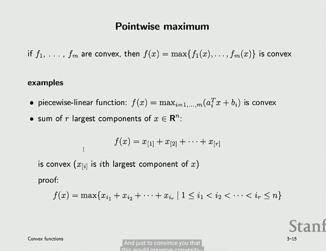</kbd>

> [!NOTE]
> Gs nói qua một dạng operation nữa có tính preserve convexity:
>
> point-wise maximum: 
>
> nếu ta có các **function f1, f2...fm convex. **
>
> thì **f(x) = max (f1(x), f2(x) ...fm(x)) cũng convex**
>
> ví dụ:
>
> - **piecewise-linear function**: f(x) = max i=1,2...m (aiTx + bi) là point-wise maximum function của các affine function aiTx+bi (dĩ nhiên affine function như đã biết là vừa convex vừa concave) nên cũng convex
>
> - **sum của r component lớn nhất của x**: f(x) = x[1] + x[2] + ...x[r]
>
> (x[i] là component lớn thứ i của vector x)
>
> thế thì f(x) cũng convex. và điều này có được là bởi ta có thể cho thấy / hiểu f(x) thực ra chính là point-wise maximum của nhiều function, mà mỗi function sẽ tính tổng của r component bất kì trong x, và gs nói chúng là các linear (cũng như affine, sẽ là convex function)
>
> f(x) = max x_i1 + x_i2 + ..x_ir | 1 ≤ i1 < i2 < ..ir **<=** n
>
> Và có (n choose r) function như vậy (chọn set có r component
> trong n component thì có (n choose r) set)
>
> (gs cho biết, ví dụ này ta có thể không thấy rõ lắm)
>
> OPERATION PRESERVE CONVEXITY:
>
> POINT-WISE MAXIMUM

 

##### gs vẽ minh họa nếu ta có hai function f1, f2 như vầy, thì point-wise maximum function

<kbd>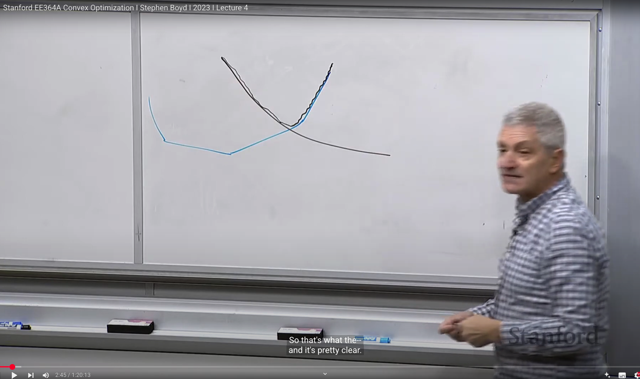</kbd>

> [!NOTE]
> gs vẽ minh họa nếu ta có hai function f1, f2 như vầy, thì point-wise maximum function của chúng sẽ là đường này

 

- **sum of 5.6 largest entries**

<kbd>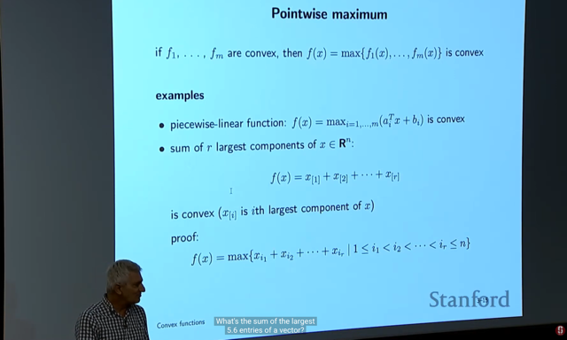</kbd>

> [!NOTE]
> gs nói thêm, ta có thể có function **sum of 5.6 largest entries nữa**: Và nó có nghĩa là, ta lấy **sum của 5 cái lớn nhất, và 0. 6*component lớn thứ 6**
> Và có thể thấy nó là function **khá kì cục, nhưng theo ý trên nó là convex function**

 

<kbd>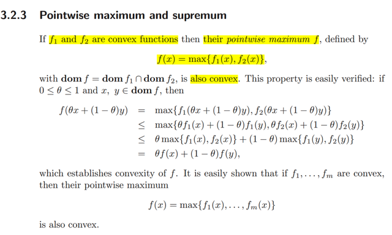</kbd>

> [!NOTE]
> Trong sách có nói thêm phần chứng minh cho theorem này, cũng đơn giản, chỉ làm theo cách chứng minh tiêu chuẩn cho convex function đó là chứng minh nó thỏa:
>
> f(mixture of x,y) ≤ mixture of f(x), f(y)
>
> Chứng minh pointwise maximum là convex

 

- **Hai ví dụ nữa, quay lại sau**

<kbd>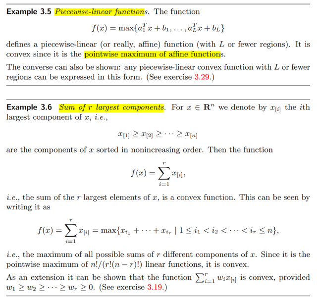</kbd>

> [!NOTE]
> Hai ví dụ nữa, quay lại sau

 

- **point-wise supremum**

<kbd>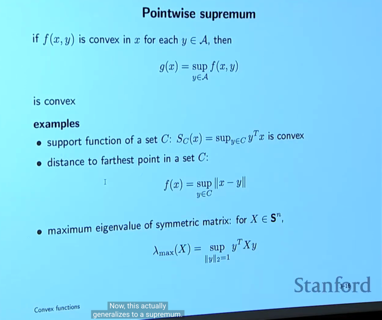</kbd>

> [!NOTE]
> Tiếp theo ta biết đến **point-wise supremum.**
>
> Khái niệm **supremum**, gs cho biết nếu chưa biết thì nó **đơn giản chỉ là maximum của vô số cái**. (gs nói ta **cứ thay sup bởi max cũng được**, hiểu đai khái là **khi có hũu hạn cái thì gọi là maximum còn khi có vô số cái thì gọi là supremum**)
>
> gs nói thêm f(x,y) dưới đây thì **x ở đây là vector, nhưng y có thể là bất cứ thứ gì**, như graph, path...để rồi ta có thể hiểu nó như **một family các function theo x parameterized bởi y.**
>
> Vậy thì theorem này nói rằng:
>
> nếu **f(x, y) convex theo x với mỗi y thuộc A** (không cần phải là convex set)  thì nếu ta lấy g(x):
>
> **g(x) = sup y ∈ A f(x,y)**
>
> mang ý nghĩa là trong mọi f(x, y) với y ∈ A, lấy cái max.
>
> Thì **g(x) là convex function.**
>
> A là một set nào đó
>
> Ví dụ **support function của set C**: Sc(x) = sup y ∈ C {yTx} là convex function
>
> Cái này tạm hiểu là, giả sử có set C, thì với mọi y trong C, lấy cái y khiến yTx lớn nhất thì cái y đó gọi là y*, sẽ tạo nên Sc(x) = y*Tx, và nó gọi là support function của C. Và theorem trên nói rằng Sc(x) là convex (again, gs đã nói y có thể là bất cứ thứ gì, ở trường hợp này có thể nó là vector)
>
> OPERATION PRESERVE CONVEXITY:
>
> POINT-WISE SUPREMUM.
>
> VÍ DỤ: SUPPORT FUNCTION CỦA SET C

**🔗 See also:** [conjugate function](#node-kr3qn6k)

 

- **mở rộng ra với **pointwise supremum****

<kbd>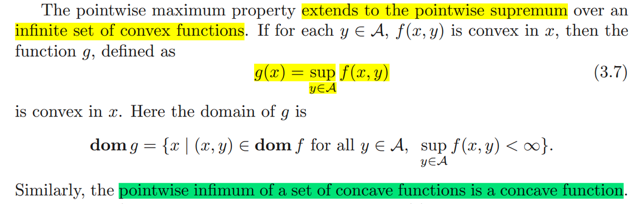</kbd>

> [!NOTE]
> mở rộng ra với **pointwise supremum**
>
> Đáng chú ý ở đây nói thêm là **tương tự, khi infimum của set các concave function thì ta có concave function**

**🔗 See also:** [linked note](./lec_7.md#node-ekh1tgc)

 

- **ví dụ: distance to the farthest point in c**

<kbd>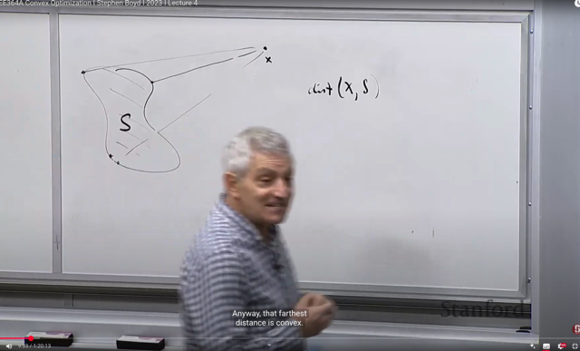</kbd>

> [!NOTE]
> Ví dụ nữa là **distance to the farthest point in set C**:
>
> f(x) = sup y∈C ||x-y||: dịch ra là, trong mọi y thuộc set C (ko nhất thiết set C convex). Lấy y sao cho L2 distance của nó tới x lớn nhất (đây chính là ý nghĩa của sup) thì đó là f(x) return
>
> Thế thì function f(x) là cái mechnishm như vậy, thì nó là convex function
>
> trên bảng là gs vẽ minh họa về distance function thông thường (là distance nhỏ nhất của một điểm trong set C tới x) và distance to the farthest point function
>
> POINT-WISE SUPREMUM.
>
> ví dụ: distance to the farthest point in c

 

- **Một ví dụ nữa là function "tính ra" cái lớn nhất trong các eigenvalues của symmetric matrix X**

<kbd></kbd>

> [!NOTE]
> Một ví dụ nữa là function **"tính ra" cái lớn nhất trong các eigenvalues của symmetric matrix X** (∈ S^n)
>
> Gs nói đại khái là như đã biết **để tìm eigenvalues, ta sẽ phải giải characteristic equation det (A-λI) = 0**. Với S^n matrix thì cơ bản đây là phương trình bậc n. Và ta sẽ **không có công thức để tìm nghiệm khi n = 4,5**
>
> **Nói chung ý nói function này λ_max (X) là function rất phức tạp**.
>
> Tại sao gs lại ghi là **λ_max(X) = sup ||y||=1 {yTXy}** ?
>
> Thì bởi ý nghĩa của nó là trong các unit vector y (thể hiện bởi ||y||=1),  thì ta sẽ tính yTXy và lấy cái lớn nhất. 
>
> Thế thì ta hiểu như vầy để thấy tại sao nó chính là function lấy ra eigenvalue lớn nhất:
>
> Bởi **X là symmetric matrix S^n, nên X luôn có thể đủ số vector riêng độc lập, luôn có thể phân rã eigendecomposition** (1806 ta đã học rằng symmetric matrix luôn có đủ n independent eigenvector và đặc biệt hơn nữa là chúng orthogonal)
>
> Do đó **X = SΛSinv**, và vì tính chất **orthogonal eigenvectors** nói trên nên S là orthogonal matrix. **Sinv = ST**, hay ta dùng Q để kí hiệu orthogonal matrix, để từ đó ta có diagonalization của symmetric matrix là
>
> **X = QΛQT**
>
> Thế thì từ đó yTXy = yTQΛQTy. Thế thì, đặt u = QTy, ta có function uTΛu = λ1u1^2+ λ2u2^2 + ...λnun^2 (u1, u2...un là các component của u)
>
> Mà ta có thể chứng minh λ_min ≤ Σ λi ui^2 ≤ λ_max như sau:
>
> λi ≤ λ_max 
>
> ⇨ λi ui^2 ≤ λ_max ui^2 với mọi i
>
> ⇨ Σ λi ui^2 ≤ Σ λ_max ui^2, 
>
> Tương tự, Σ λ_min ui^2 ≤ Σ λi ui^2
>
> ⇨ Σ λ_min ui^2 ≤ Σ λi ui^2 ≤ Σ λ_max ui^2
>
> ⇔ λ_min Σ ui^2 ≤ Σ λi ui^2 ≤ λ_max Σ ui^2
>
> ⇔ λ_min ||u||^2 ≤ Σ λi ui^2 ≤ λ_max ||u||^2
>
> ⇔ λ_min ≤ Σ λi ui^2 ≤ λ_max
>
> (do ||u||^2 = uTu = (QTy)T(QTy) = yTQQTy =yTy = 1)
>
> Vậy yTXy ≤ λ_max
>
> và nó bằng λ_max khi: y là eigenvector ứng với λ_max: Xy = λ_max y
>
> Xy = λ_max y ⇔ Xy = y λ_max ⇔ yTXy = yTy λ_max
>
> ⇔ yTXy = λ_max
>
> Do đó, sup ||y||=1 yTXy với ý nghĩa là tìm y sao cho yTXy max , và trả ra
> yTXy với cái y đó, thì chính là trả ra cho ta eigenvalue max
>
> POINT-WISE SUPREMUM.
>
> VÍ DỤ: FUNCTION TÌM RA EIGENVALUES LỚN NHẤT CỦA S^n 
> MATRIX X: λ_max(X) = sup ||y|| = 1 {yTXy}

 

- **gs lưu ý ta cần nhận ra, yTXy thật ra là **linear function theo x****

<kbd>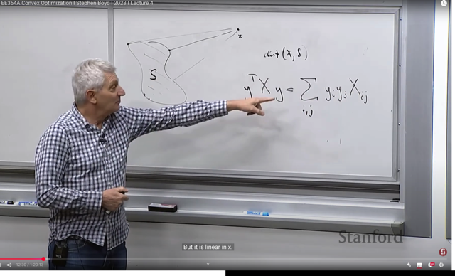</kbd>

> [!NOTE]
> Một điểm gs lưu ý ta cần nhận ra, yTXy thật ra là **linear function theo x**
>
> Do đó **nó convex theo x với mọi giá trị của y**
>
> Và trong bối cảnh point-wise supremum, thì hòan toàn thỏa yêu cầu f là convex IN X

 

- **một điểm kiến thức quan trọng:  composition with scalar function**

<kbd>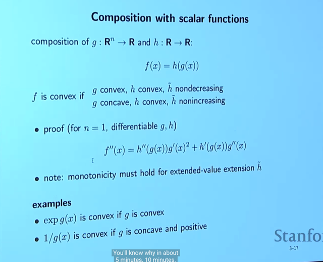</kbd>

> [!NOTE]
> Tiếp theo là một điểm kiến thức quan trọng:
>
> **composition with scalar function**
>
> Đại khái là ta sẽ có cái rule như sau: Cho hàm g: Rn -> R và hàm f: R -> R
>
> Thế thì, f = h(g(x)) sẽ convex nếu:
>
> 1) **g convex, h convex và h increasing (h~ non-decreasing, gs cho rằng có thể hiểu đại khái là h increasing)**
>
> 2) **g concave, h convex và h decreasing (h~ non-increasing)
> **
> Ví dụ exp g(x) nếu g convex, thì vì exp() là convex và là hàm tăng, nên exp g(x) convex
>
> Còn 1/g(x) thì vì 1/x convex nhưng nó giảm, nên 1/g(x) convex
>
> Thế thì gs nói thêm cái rule này ta đã gặp một case của nó khi g là affine, khi đó nếu f convex thì f(affine) convex
>
> Và ông cho rằng cái này, ta cơ bản là quan tâm dấu của các derivative bậc 0,1,2. Và khi ta xét dấu của f''(x) thì nó sẽ cho thấy cái rule ở trên
>
> f(x) = h(g(x)) => f'(x) = d/dx f = d/dx h(g(x)) = d/dg h(g) . d/dx g(x) (chain rule)
>
> f''(x) = d/dx [d/dg h(g) . d/dx g(x)]
>
> = d/dx [d/dg h(g)] d/dx g(x) + d/dg h(g) . d/dx [d/dx g(x)]   | product rule
>
> = d/dx [h'(g)]  g'(x) + h'(g) d/dx [g'(x)]
>
> = d/dg [h'(g)] d/dx [g(x)] g'(x) + h'(g) g''(x) | 
>
> (chain rule: d/dx [h'(g) = d/dg [h'(g)] d/dx [g(x)])
>
> = h''(g) g'(x)] g'(x) + h'(g) g''(x)
>
> f''(x) = h''(g) [g'(x)]^2 + h'(g) g''(x)
>
> Thì khi đó ta sẽ thấy cái rule này nó đúng:
>
> ví dụ g convex, h convex, h increasing
>
> thì g convex ⇨ g'' > 0, 
>
> h convex ⇨ h'' > 0, 
>
> h increasing ⇨ h' > 0,
>
> từ đó ta sẽ thấy f''(x) là tổng của hai cái tích, mỗi tích là tích của hai
> cái không âm ⇨ ko âm, mà đạo hàm cấp 2 không âm tức curvature
> không âm ⇨ convex
>
> OPERATION PRESERVE CONVEXITY:
>
> COMPOSITION WITH SCALAR FUNCTION

 

- **vector composition**

<kbd>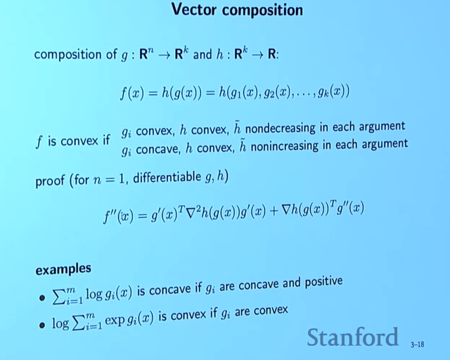</kbd>

> [!NOTE]
> Tiếp theo là **vector composition**: 
>
> Đại khái là cho Rn -> Rk function g: take input là Rn vector x,  g(x) sẽ là Rk vector: 
>
> g(x) = [g1(x), g2(x)....gk(x)]
>
> và Rk -> R function h: Take input là Rk vector: g(x) output là scalar:
>
> h(g(x)) = h([g1(x), g2(x), ...gk(x)])
>
> Thì rule sẽ là:
>
> nếu gi(x) convex, h convex và h~ non-decreasing in each argument
>
> (ý này có nghĩa là, khi tăng gi thì h(g1,g2..gi,..gk) không giảm)
>
> thì khi đó f sẽ convex
>
> Hoặc 
>
> nếu gi(x) concave, h convex và h~ non-increasing in each argument
>
> (ý này có nghĩa là, khi tăng gi thì h không tăng)
>
> thì f sẽ convex
>
> OPERATION PRESERVE CONVEXITY:
>
> VECTOR COMPOSITION

 

- **Gs lấy một ví dụ**

<kbd>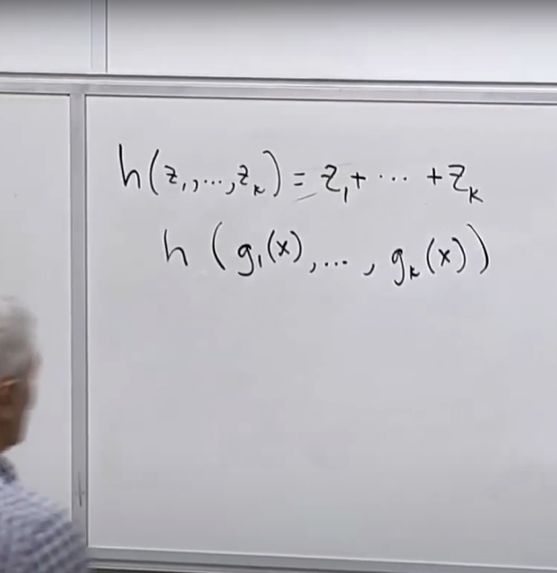</kbd>

> [!NOTE]
> Gs lấy một ví dụ tuy hiển nhiên nhưng hoàn valid để minh họa rule này.  đó là h là function h(z1, z2, ....) = z1 + z2 + .. + zk
>
> Ở đây g(.) là identity function: x = [z1, z2..., zk]
>
> g(x) = g([z1, z2..., zk]) = [z1, z2..., zk]
>
> Tức là g1(x) = z1, g2(x) = z2 ,...
>
> h(g(x)) = h([g1(x), g2(x), ...]) 
>
> = h([z1, z2..., zk]) = z1 + z2 + ...zk
>
> Thế thì g1(x) = z1, g2(x) = z2... là các convex / cũng là concave
> function (vì nó là affine)
>
> mà Σ của các convex hiển nhiên là convex
>
> nhưng chiếu theo rule vector composition ta sẽ thấy:
>
> h không giảm khi tăng zi, và zi convex, nên h convex

 

- **Tương tự max cũng vậy, h = max (z1, z2...)**

<kbd>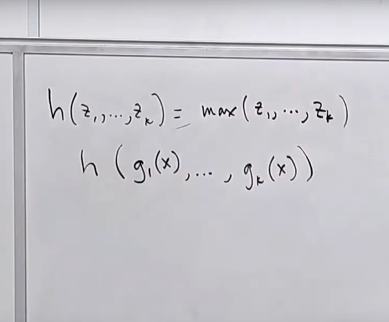</kbd>

> [!NOTE]
> Tương tự max cũng vậy, h = max (z1, z2...) cũng có tính chất **non-decreasing in each argument **- ý là khi **tăng zi thì tuy không phải lúc nào h cũng tăng (trừ khi giá trị zi lúc đó là max trong đám) nhưng chắc chắn nó không giảm**
>
> Và zi như đã nói là convex do đó h sẽ convex

 

- **Ví dụ khác là log Σi exp gi(x)**

<kbd>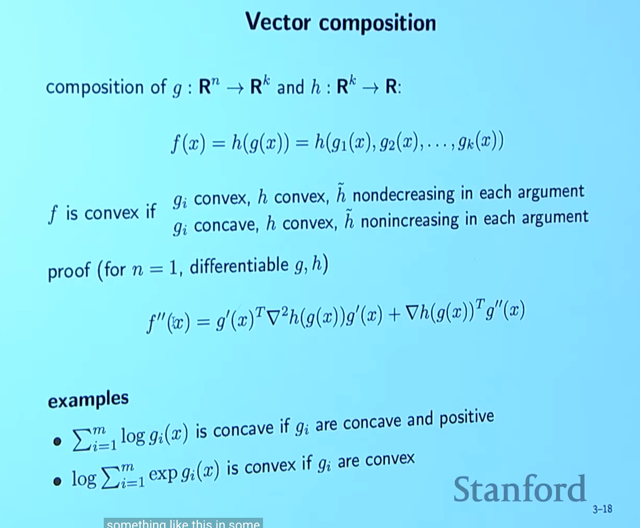</kbd>

> [!NOTE]
> Ví dụ khác là log Σi exp gi(x) - đây chính là loss function trong machine learning.
>
> Nó **convex nếu gi convex**, vì:
>
> f = h(k1(x), ...km(x))
>
> với h là **log sum exp là convex function** (search log sum exp là thấy)
>
> và **increasing in all argument: gi tăng thì log Σ exp gi không giảm**

**🔗 See also:** [Tiếp theo là log-sum-exp và geometric mean cũng có Hessian ≽ 0](./lec_3.md#node-zdlnun6)

 

- **các function kì quặc như này, ta không thể / không muốn dùng định nghĩa**

<kbd>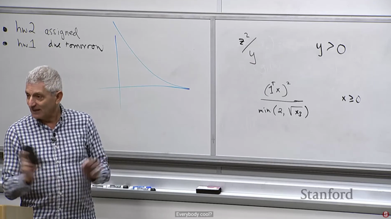</kbd>

> [!NOTE]
> vài phút sau đó chưa thật sự hiểu lắm, nhưng đại khái là gs cho một số ví dụ để nói rằng với **các function kì quặc như này, ta không thể / không muốn dùng định nghĩa, hoặc
> dựa trên Hessian matrix ≻ 0 để nói nó convex hay không mà ta chỉ có thể dùng các rule **như này

 

- **Partial minimization**

<kbd>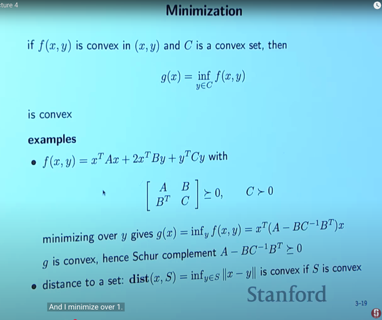</kbd>

> [!NOTE]
> tiếp theo, đại khái là nếu f(x,y) **jointly convex**. 
>
> Và C là **convex set**.
>
> Khi đó nếu ta có **g(x) bằng cách minimize over y f(x,y)** (tức là tìm y ∈ C để f(x, y) nhỏ nhất), thì với y* đó, ta có g(x) = f(x, y*)
>
> g(x) = inf y∈C {f(x, y)}
>
> **thì g(x) cũng là convex function**
>
> Người ta gọi nó là **partial minimization**
>
> Ổng cũng nói đây là **nguyên lý của Dynamic Programming**
>
> f(x,y) = xTAx + 2xTBy + yTCy
>
> Để tìm y khiến f(x,y) nhỏ nhất: Ta thử dùng calculus: 
>
> Bằng cách solve ∂f/∂y = 0 
>
> df = f(x, y+dy) - f(x, y)
>
> = xTAx + 2xTB(y+dy) + (y+dy)TC(y+dy) - xTAx - 2xTBy - yTCy
>
> = xTAx + 2xTBy + 2xTBdy + (y+dy)TC(y+dy) - xTAx - 2xTBy - yTCy
>
> = 2xTBdy + (y+dy)TC(y+dy) - yTCy
>
> = 2xTBdy + (yT+dyT)C(y+dy) - yTCy
>
> = 2xTBdy + (yTC+dyTC)(y+dy) - yTCy
>
> = 2xTBdy + yTCy + dyTCy + yTCdy + dyTCdy - yTCy
>
> = 2xTBdy + 2yTCdy = 2(xTB + yTC)dy
>
> ⇨ df_y = 2(xTB + yTC)dy 
>
> ⇨ ∂f/∂y = 2(xTB + yTC)T = 2(BTx + CTy)
>
> Vậy ∂f/∂y = 0 ⇔ 2(BTx+CTy) = 0 ⇔ BTx + CTy = 0 ⇔ CTy = -BTx
>
> ⇔ y = (CT)inv(-BTx) = Cinv(-BTx)   | vì C symmetric ⇨ CT = C
>
> Xét d(∂f/∂y) = 2(BTx+CT(y+dy)) - 2(BTx+CTy)
>
> = 2BTx + 2CTy + 2CTdy - 2BTx - 2CTy 
>
> = 2CTdy  
>
> ⇨ ∂^2f / ∂y^2 = 2CT 
>
> mà C là positive definite matrix nên CT cũng xác định dương 
>
> ⇨ **critical point là minimum giúp kết luận function đạt min theo y khi y = Cinv(-BTx)**
>
> Gọi D là Cinv cho gọn y* = -DBTx
>
> Lắp vào ta có f(x,y*) = xTAx + 2xTB(-DBTx) + (-DBTx)TC(-DBTx)
>
> = xTAx - 2xTBDBTx + (-DBTx)TC(-DBTx)
>
> = xTAx - 2xTBDBTx - (BTx)TDTC(-DBTx)
>
> = xTAx - 2xTBDBTx + (BTx)TDTCDBTx
>
> = xTAx - 2xTBDBTx + (xTBTT)DTCDBTx
>
> = xTAx - 2xTBDBTx + xTBDTCDBTx
>
> = xTAx - 2xTBDBTx + xTBDTBTx
>
> = xTAx - 2xTBDBTx + xTBDBTx  | DT = D do C symmetric ⇨ Cinv sym
>
> = xTAx - xTBDBTx 
>
> = xTAx - xTBCinvBTx
>
> = xT(Ax - BCinvBTx) 
>
> f(x,y*) = xT(A - BCinvBT)x 
>
> Thế thì theo lí thuyết nói rằng hàm f(x,y*) này, chính là f(x,y*) = g(x) = inf y ∈ C f(x,y) sẽ là convex
>
> Thế thì.. tới đây ta có hàm theo x và cái này có dạng **quadratic** 
>
> và như đã nói lí thuyết nói rằng hàm này convex, xem thử đúng không
>
> Thế thì vì nó convex nên **D = A - BCinvBT là positive semi definite**, đơn giản là vì với xTDx thì D chính là Hessian, theo lí thuyết bữa trước (cụ thể là **second order condition**) thì nếu function f tồn tại Hessian và Hessian là Positive Semi Definite thì f sẽ convex.
>
> Chứng minh Hessian chính là matrix D. 
>
> **Tìm Hessian theo MIT 18s096**:
>
> +Xây dựng **Bilinear form**: 
>
> Tìm first derivative: df = f(x+dx) - f(x) = (x+dx)TD(x+dx) - xTDx 
>
> = (xTD+dxTD)(x+dx) - xTDx = (xTDx + dxTDx + xTDdx + dxTDdx) - xTDx 
>
> = dxTDx + xTDdx
>
> = (dxTDx)T + xTDx   | và vì **dxTDx là scalar nên có thể transpose nó tùy ý**
>
> = xTDTdx + xTDdx 
>
> = **xT(DT + D)dx**
>
> Vì D symmetric (D = [A B; BT C] ⇨ D = DT ⇨ xTDdx = (xTDdx)T
>
> .. = **2xTDdx** 
>
> ⇨ ∇f = (2xTD)T = 2DTx, f' = 2xTD (= (∇f)T)
>
> d'(f'(x)[dx]) = d'(2xTDdx) = 2(x+dx')TDdx - 2xTDdx
>
> = 2xTDdx + 2dx'TDdx - 2xTDdx = 2dx'TDdx
>
> = f''(x)[dx', dx] = dx'T(2D)dx ⇨ Hessian chính là 2D
>
> +Làm cách khác: Xây dựng Jacobian của f'(x):
>
> d(∇f) = d(2DTx) = 2DT(x+dx) - 2DTx = 2DTdx = J dx
>
> => Jacobian J của ∇f = 2DT ⇨ Jacobian của f'(x), cũng là Hessian của f(x) = 2D
>
> Tóm lại, lí thuyết nói rằng hàm f(x,y*) = g(x) = xTDx phải convex từ đó ta suy ra D ≽ 0
>
> OPERATION PRESERVE CONVEXITY:
>
> PARTIAL MINIMIZATION

> [!TIP]
> **🤖 AI Feedback** — ✅ Score: **92/100**
>
> Bài làm cho thấy sự hiểu biết sâu sắc về khái niệm tối ưu hóa một phần và bảo toàn tính lồi, với các chứng minh chi tiết và chính xác. Cần chú ý hơn đến các lỗi dấu nhỏ trong quá trình tính toán.

**🔗 See also:** [Second order conditions](./lec_3.md#node-zmb0etz) · [linked note](./lec_7.md#node-7gcnhz7)

 

- **Nói thêm về jointly convex là điều kiện rất mạnh, không phải chỉ là convex theo mỗi biến**

<kbd>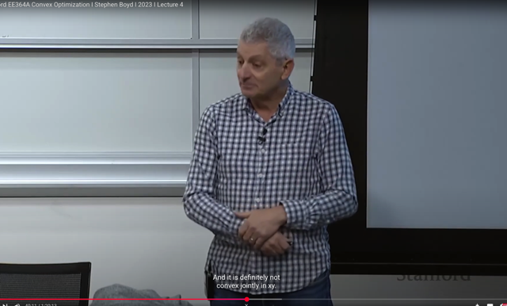</kbd>

> [!NOTE]
> Nói về vụ jointly convex: gs lấy ví dụ xy (cái này gs đã nói ở bài trước rồi)
>
> Với **mỗi y (fixed) thì f = xy là linear function, nên convex.**
>
> Ngược lại **với mỗi x fixed, thì f = xy theo y cũng convex**.
>
> Nhưng cùng nhau, **f = xy lại không convex **
>
> Nên ý nói **jointly convex là điều kiện rất mạnh**, không phải chỉ là convex theo mỗi biến
>
> hình dung một function mà ta đi theo 1 trục x hoặc y thì đều cong lên (convex theo từng biến, positive curvature) nhưng đi theo hướng kết hợp hai trục ví dụ 45 độ thì nó lại curve down). Đó là hình ảnh của function ko jointly convex

**🔗 See also:** [ví dụ này, f = xy](./lec_3.md#node-eot6wop)

 

- **Tiếp tục ví dụ function f(x, y) = xTAx + 2xTBy + yTCy**

<kbd>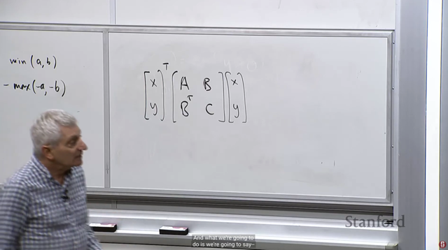</kbd>

<kbd>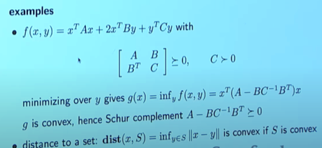</kbd>

> [!NOTE]
> Ví dụ, function f(x, y) = xTAx + 2xTBy + yTCy cơ bản là quadratic function [x y]T [A B; BT C][x y]
>
> Với matrix ABBTC này **positive semi-definite** thì f jointly convex (cái này đơn giản là vì **nó là Hessian của quadratic function f**)
>
> Và để minimizing over y, thì ta sẽ dùng first order neccesary condition: partial derivative ∂/∂y f(x,y) = 0, giải ra y. Và như đã làm trong note trước, ta cũng thấy đạo hàm cấp 2 của f đối với y, tức Hessian matrix chính là C, và với việc nó xác định dương 
>
>  và thế vào f để có function g(x) = inf y f(x,y) = xT(A-BCinvBT)x
>
> (Cái này thì mình vừa mới làm rồi đó)
>
> Và theo theorem này nó nói g(x) sẽ convex, mà g(x) có
> dạng quadratic form điều này cho thấy (A-BCinvBT) là một
> positive semi definite (again, vì A-BCinvBT cũng là Hessian
> của g(x))
>
> Và matrix này gọi là SCHUR COMPLEMENT

> [!TIP]
> **🤖 AI Feedback** — ⚠️ Score: **75/100**
>
> Bài làm thể hiện sự hiểu biết sâu sắc về các khái niệm liên quan đến hàm lồi và Schur Complement, các bước giải thích đều đi đúng hướng và có nền tảng vững chắc. Tuy nhiên, việc đặt tên ma trận khối là 'ABBTC' là không chính xác và thiếu chuyên nghiệp. Cần chú ý hơn đến tính chính xác trong ký hiệu và sử dụng ngôn ngữ học thuật hơn để bài viết đạt được sự chặt chẽ cần thiết.

 

- **Perspective**

<kbd>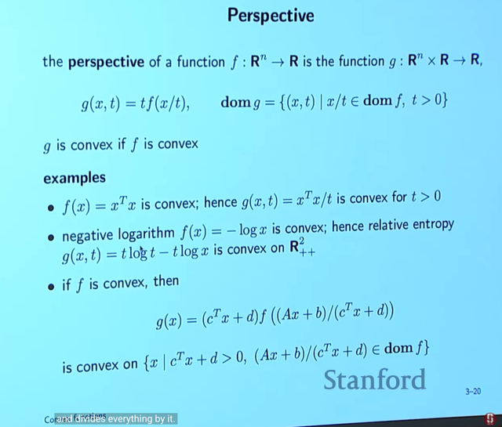</kbd>

> [!NOTE]
> Đại khái là ta sẽ biết một cái nữa trong chuỗi **những cái khô khan mà chưa biết học để làm cái con vẹo gì**: **perspective**.
>
> (Trong bài 2,3 **các operation preserve convexity cũng có perspective**, nhưng ta hiểu là **các operation này giữ nguyên tính convexity của set, tức convex set** → **thông qua các operation này tạo ra set cũng convex **còn ở đây là **các operation giữ tính convexity của function**)
>
> Đại khái nếu có function f Rn → R convex thì g(x,t) = t f(x/t) gọi là **perspective**, và g(x,t) convex. Biết vậy thôi.
>
> Ví dụ f(x) = xTx là function R^n -> R, nó dĩ nhiên là tổng bình phương các x's components. Và đương nhiên convex, vì nhìn nó ở dạng quadratic function xT I x, thì Hessian là I là ma trận xác định dương
>
> Thì theo theorem này nói rằng g(x,t) = tf(x/t) ở đây là xTx/t, cũng sẽ convex luôn.
>
> Một số ví dụ khác để xem sau

 

- **conjugate function**

<kbd>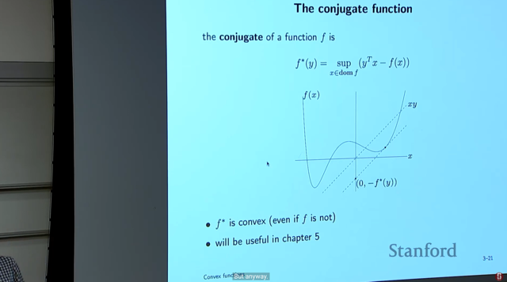</kbd>

> [!NOTE]
> Tiếp theo là thêm cái nữa ko biết để làm gì nhưng khầy nói cứ chờ mấy bài sau sẽ thấy nó có ích.
>
> Định nghĩa của **conjugate function f** là function:
>
> f*(y) = sup x ∈ dom f (yTx - f(x))
>
> ý nghĩa là tìm trong mọi x trong domain của f (f ko cần convex), ta sẽ **maximize yTx - f(x)**
>
> (ý nghĩa của sup - supremum cũng tương đương maximize như đã biết)
>
> thì **với một x cụ thể nào đó thì dễ thấy yTx - f(x) là một affine function của y**.
>
> Nên cái f*(y) này - tìm trong mọi x cái nào khiến xTy - f(x) lớn nhất, cơ bản chính là **maximize trong vô số các affine function (dĩ nhiên là các affine function thì  convex) thì theo link theorem trước (point-wise supremum), nó sẽ là convex**, dù cho function f ko convex

**🔗 See also:** [point-wise supremum](#node-4xr0k7s) · [linked note](./lec_8_a.md#node-iz4rv64)

 

- **Trong sách bổ sung thêm về domain của f*(y).**

<kbd>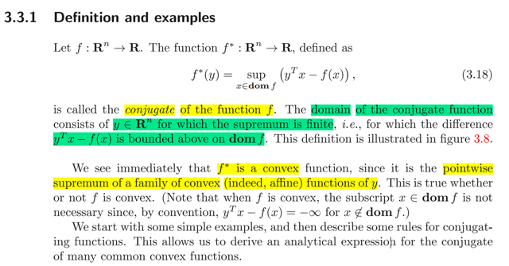</kbd>

> [!NOTE]
> Trong sách bổ sung thêm về domain của f*(y).
>
> Đại khái là vì theo định nghĩa f*(y) = inf x ∈ dom f {yTx - f(x)} nên **f*(y) xác định khi và chỉ khi inf x ∈ dom f  {yTx - f(x)} xác định**
>
> Mà như vậy đồng nghĩa sup x ∈ dom f {yTx - f(x)} **có giá trị khác +infinity**
>
> Vậy **domain của f*(y) là set {y ∈ R^n sao cho inf x ∈ dom f  {yTx - f(x)} ≠ ∞}**
>
> Nói cách khác y phải làm sao để **yTx - f(x) BỊ CHẶN TRÊN (BOUNDED ABOVE)**

 

- **Thêm vài ví dụ minh họa cho cái vụ conjugate function của f(x) = log(x) và f(x) = (1/2)xTQx**

<kbd>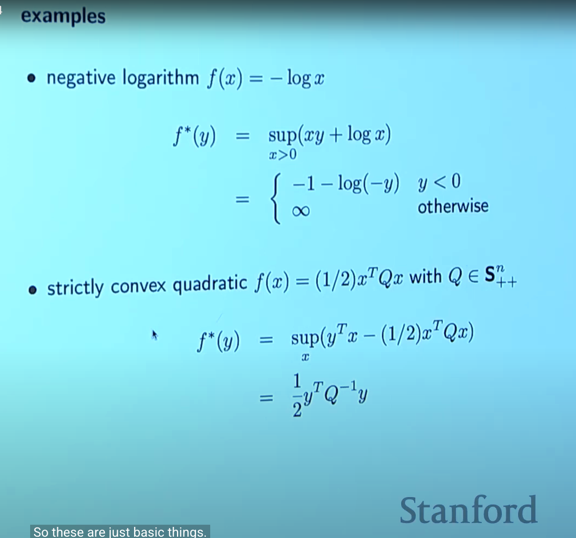</kbd>

> [!NOTE]
> Thêm vài ví dụ minh họa cho cái vụ conjugate function f(x) = log(x) và f(x) = (1/2)xTQx
>
> f(x,y) = xy + log(x)
>
> ∂f/∂x = y + 1/x
>
> ∂f/∂x = 0 ⇔ y + 1/x = 0 ⇔ x = -1/y
>
> *Dùng phương pháp **check các boundary và limit **
>
> domain của f: x ≥ 0 (tức x từ 0 đến infinity, do hàm log(x) chỉ xác định khi x > 0)
>
> lim x→0+ f(x) = 0 + log(0) = -infinity
>
> lim x→inf f(x):
>
> khi x→inf, xy → inf hoặc -inf tùy theo dấu của y
>
> Vậy chưa thể kết luận critical point là maximum vì khi x → inf chưa chắc f → -inf
>
> *Tính đạo hàm cấp hai:
>
> ∂^2f/∂x = -1/x^2 < 0 ⇨ **negative curvature**
>
> Đúng phải là: **nếu có critical point nằm trong domain của f thì nó sẽ là maximum**.
>
> Như vậy, cả hai bước check boundary và  đạo hàm cấp hai đều cho thấy rằng:
>
> Nếu y < 0, thì khi đó việc check boundary cho thấy khi x → infinity thì f → -infinity, do đó kết luận critical point x = -1/y chính là maximum Và điều này cũng là kết qủa mang lại khi check đạo hàm cấp 2: khi y < 0 thì x= -1/y > 0 ⇨ -1/y nằm trong domain (domain: x > 0) do đó đạo hàm cấp hai nói rằng nó chính là maximum. 
>
> Còn nếu y > 0, thì việc check boundary cho thấy khi x → infinity thì  f -> +infinity, nên maximum = +inf 
>
> Xét critical point lúc này ta thấy x = -1/y < 0: Ko nằm trong domain của f do đó không thể là maximum hay minimum gì cả.
>
> Như vậy f*(y) = (-1/y)y + log(-1/y) = -1+log(-y^-1) = -1-log(-y) khi y<0
>
> và = +inf khi y>0
>
> Đây chính là kết quả trong slide
>
> Nhưng ý chính là theo lí thuyết thì nhất định f*(y) là convex function 
>
> Và từ việc ta thấy kết quả f*(y) = -1 - log(-y) thì cũng xác nhận nó convex vì **log là concave, - log là convex, -y là affine, nên -log(-y) thuộc trường hợp convex function f apply lên affine f(Ax+b) nên cũng là convex**
>
> ====
>
> Xét f(x) = (1/2)xTQx, với **Q là positive definite **matrix S^n++, hay Q ≻ 0
>
> Thì **thử xem maximum yTx - f(x) over x là gì và nó có phải là convex function** theo lí thuyết nói ở đây không
>
> yTx - (1/2)xTQx
>
> Again, cũng dùng calculus thôi, **tìm critical point**:
>
> df = f(x+dx,y)-f(x,y) = yT(x+dx) - 0.5(x+dx)TQ(x+dx) - yTx + 0.5xTQx
>
> = yTx + yTdx - 0.5(xT+dxT)Q(x+dx) - yTx + 0.5xTQx
>
> = yTx + yTdx - 0.5(xTQ+dxTQ)(x+dx) - yTx + 0.5xTQx
>
> = yTx + yTdx - 0.5(xTQx+dxTQx+xTQdx+dxTQdx) - yTx + 0.5xTQx
>
> = yTdx - 0.5(xTQx+dxTQx+xTQdx+dxTQdx) + 0.5xTQx
>
> = yTdx - 0.5(xTQx+2xTQdx) + 0.5xTQx
>
> = yTdx - 0.5xTQx - xTQdx + 0.5xTQx
>
> = yTdx - xTQdx = (yT - xTQ)dx = (y - QTx)Tdx
>
> ∇_x f = (yT-xTQ)T = y-QTx
>
> ∇_x f = 0 ⇔ y-QTx = 0 ⇔ y = QTx ⇔ y = Qx 
>
> ⇔ x = Qinv y = QTy
>
> Hessian: df' = y - QTx - QTdx - y + QTx = - QTdx 
>
> ⇨ H = -Q
>
> Tìm Hessian theo cách tìm bilinear form của MIT 18s096:
>
> d'(f'(x)[dx]) = d'((y - QTx)Tdx) = (y - QTx - QTdx')Tdx - (y - QTx)Tdx
>
> = yTdx - (QTx)Tdx - (QTdx')Tdx - yTdx + (QTx)Tdx
>
> = - (QTdx')Tdx 
>
> **= dx'T(-Q)dx**  Đây chính là bilinear form act on [dx', dx], f''(x)[dx', dx]
>
> ⇨ Hessian = -Q
>
> Và vì **Q positive definite nên H negative definite** ⇨ **nếu critical point nằm trong domain thì nó là maximum.**
>
> **Dĩ nhiên x = QTy nằm trong domain** vì yTx - (1/2)xTQx **xác định với mọi x** nên **kết luận x = QTy là maximum** 
>
> Và maximum value là yTx* -0.5x*TQx* 
>
> = yT(Qinvy) - 0.5(Qinvy)TQQinvy 
>
> = yTQinvy - 0.5yTQinvTy
>
> = yTQinvy - 0.5yTQinvy  | QinvT = Qinv vì Qinv cũng đối xứng
>
> = 0.5yTQinvy
>
> Again, **cái chính cũng là theo lí thuyết thì f*(y), là maximum over y của yTx - f(x), nên cũng là convex**, 
>
> và ta xác nhận điều này vì **f*(y) là quadratic với Hessian Qinv 
> và vì Q là positive definite nên Qinv cũng là ≻ 0** ⇨ convex theo second order condition

 

- **Một số ví dụ khác về conjugate function**

<kbd>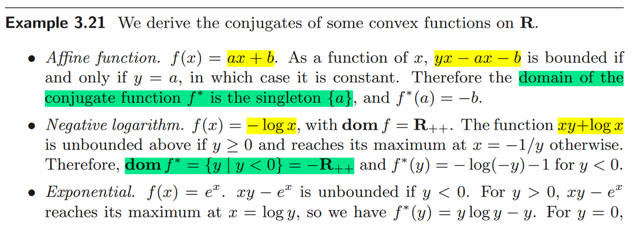</kbd>

<kbd>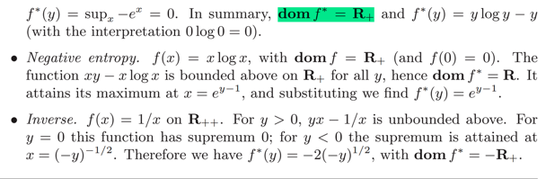</kbd>

> [!NOTE]
> Một số ví dụ khác về conjugate function (xem sau)
>
> Cũng không khó lắm: Ôn lại tí về domain của f*(y). Vì định nghĩa, f*(y) = sup_x {yTx - f(x)}, nên để f*(y) xác định (giá trị khác +/- ∞) thì dĩ nhiên sup_x {yTx + f(x)} phải xác định, tức là kết quả khác +/- ∞. Từ đó tập xác định (domain) của f*(y) là: {y: sup_x {yTx + f(x) ≠ +/- ∞}
>
> 1) Affine function f(x) = ax + b, thì hàm liên hợp là f*(y) = sup x {yx - ax - b}. Vậy thì với y fixed thì đây là hàm tuyến tính theo x, và để nó bị chặn trên (không vọt lên vô cùng) thì chỉ có thể là y bằng sao đó để yx + ax = 0, ⇔ y = a. 
>
> ⇨ **f*(y) = -b, và dom của nó là singleton: {a}**
>
> 2) f(x) = -log(x). ⇨ f*(y) = sup x {yx - log(x)}. Thế thì: Domain của log(x) là x ≥ 0. 
>
> nếu y ≥ 0: thì khi x → inf thì cả xy + log(x) → inf. Hàm không bị chặn trên. Vi phạm
>
> nếu y < 0, tính d/dx [yx + log(x)], = y + 1/x. Cho nó bằng 0 cho thấy x = -1/y sẽ là điểm mà đạo hàm theo x của [yx + log(x)] = 0. Thế thì, check hàm [yx + log(x)] tại x = -1/y thấy nó bằng: [y(-1/y) + log(-1/y)] = -1 + log(1 ) - log(-y) = -1 - log(-y). Và với y < 0 thì kết quả này xác định. 
>
> Điều này có nghĩa là, với y < 0 thì hàm [yx + log(x)] sẽ có một điểm critical point tại x = -1/y và tại đó giá trị của hàm là xác định. 
>
> Xét đạo hàm cấp 2: d/dx [y + 1/x] = 0 + -1/x^2 = -1/x^2, sẽ < 0 ⇨ x = -1/y là local maximum, và vì cũng chỉ có một critical point nên đây cũng là maximum duy nhất (vì không thể có việc đi xuống rồi đi lên lần nữa) ⇨ hàm bị chặn trên, không vọt lên ∞.  
>
> Vậy **domain f*(y) = (-inf, 0) và f*(y) = -1 - log(-y)**
>
> 3) Exponential: f(x) = e^x: 
>
> f*(y) = sup x ∈ dom f: {yx - e^x}
>
> Xét hàm g(x) = yx - e^x, d/dx g(x) = y - e^x
>
> d/dx g(x) = 0 ⇔ y = e^x
>
> Nếu y < 0 ⇨ y = e^x vô nghiệm, tức là hàm g không có critical point, và điều này đã đủ kết luận hàm sẽ vọt lên vô cùng. Tuy vậy ta có thể check thêm:
>
> lim x → +inf yx - e^x = +inf ⇨ unbounded above.
>
> Nếu y ≥ 0 thì y = e^x có nghiệm x = log y, tại đó hàm đạt giá trị ylog(y) - e^log(y) = ylog(y) - y là giá trị hữu hạn. 
>
> Xét đạo hàm cấp 2: d^2/dx^2 = - e^x < 0. Vậy g(x) đạt maximum tại x* = log(y), nên nó bị chặn trên, không thể vọt lên vô cùng lớn.
>
> Vậy **dom f*(y) là {y: y ≥ 0} = R+ và f*(y) = ylog(y) - y**
>
> ---
>
> Tiếp theo là **negative entropy f(x) = xlog(x)**
>
> (Ta sẽ học kĩ hơn về Entropy trong cuốn Information Theory của MacKay)
>
> Thế thì tương tự, định nghĩa của conjugate function của f(x):
>
> f*(y) = sup x ∈ dom f(x) {yTx - f(x)}, ở đây f(x) là R function, tức R → R nên:
>
> f*(y) = sup x ∈ dom f(x) {yx - xlog(x)} = sup x ∈ R+ {yx - xlog(x)}
>
> Thế thì xét function g(x,y) = yx - xlog(x), hoặc nếu xét một fixed value của y thì có thể coi function như g(x) = yx - xlog(x).
>
> Ta sẽ tìm critical point: d/dx g(x) = y - (log(x) + x/x) = y - log(x) - 1
>
> d/dx g(x) = 0 ⇔ y - log(x) - 1 = 0 
>
> ⇔ log(x) = y - 1 
>
> ⇔ x = e^(y-1)
>
> Giá trị g(x) tại critical point là:
>
> g(e^(y-1)) = y*e^(y-1) - e^(y-1)*log[e^(y-1)]
>
> = y*e^(y-1) - e^(y-1)*(y-1) 
>
> = [y - (y - 1)] * e^(y-1) 
>
> = e^(y-1) 
>
> Xét limit của function tại boundary: 
>
> lim x→0+ g(x) = lim x→0+ (yx - xlog(x)) = 0 - 0 = 0 (chú ý: lim x→0+ xlog(x) = 0 theo L'Hopital)
>
> lim x→inf g(x) = lim x→inf x(y - log(x)) = inf * (-inf) = -inf
>
> Vậy hàm số **đạt maximum tại critical point x = e^(y-1)** với giá trị cũng bằng e^(y-1).
>
> Vậy kết luận:
>
> **f*(y) = e^(y-1)**
>
> Và vì hàm số yx - xlog(x) luôn bounded above với mọi giá trị của y, nên:
>
> **dom f*(y) = {y: f*(y) < +infinity} = R**
>
> ---
>
> Xét tiếp f(x) = 1/x với x ∈ R++, tức x > 0.
>
> Theo định nghĩa, f*(y) = sup x ∈ dom f(x) {yx - f(x)} 
>
> = sup x ∈ R++ (yx - 1/x)
>
> Xét hàm g(x) = yx - 1/x (với một giá trị cố định của y)
>
> d/dx g(x) = y - (- 1/x^2) = y + 1/x^2
>
> Critical point:
>
> d/dx g(x) = 0 <=> y + 1/x^2 = 0
>
> <=> y = -1/x^2 
>
> <=> x^2 = -1/y 
>
> <=> x = +/- √(-1/y)

> [!TIP]
> **🤖 AI Feedback** — ⚠️ Score: **72/100**
>
> Bài làm cho thấy sự hiểu biết vững chắc về định nghĩa hàm liên hợp và phương pháp tính toán. Tuy nhiên, còn một số lỗi nhỏ về dấu, miền xác định của hàm gốc, và phân tích giới hạn chưa chính xác, cùng với một phần giải bài tập chưa hoàn thiện.

**🔗 See also:** [Entropy maximization](./lec_8_a.md#node-myefxtz)

 

- **Strictly convex quadratic function**

<kbd>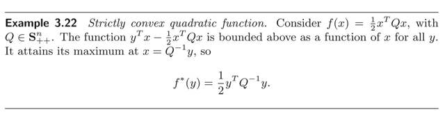</kbd>

> [!NOTE]
> Thử xem ví dụ này **strictly convex quadratic function** tại sao conjigate của nó là lại ra vậy:
>
> f(x) = (1/2)xTQx với Q positive definite S^n++ (hay Q ≻ 0). Thế thì theo định nghĩa conjugate function của f(x): 
>
> f*(y) = sup x ∈ dom f (yTx - f(x))
>
> Thì f*(y) = sup x ∈ dom f (yTx - (1/2)xTQx
>
> Tìm critical point của g(x) = yTx - (1/2)xTQx:
>
> dg = g(x+dx) - g(x) = yT(x+dx) - (1/2)(x+dx)TQ(x+dx) - yTx + (1/2)xTQx
>
> = yTx + yTdx - (1/2)(xTQ+dxTQ)(x+dx) - yTx + (1/2)xTQx
>
> = yTx + yTdx - (1/2)(xTQx + dxTQx + xTQdx + dxTQdx) - yTx + (1/2)xTQx
>
> = yTx + yTdx - (1/2)xTQx - (1/2)dxTQx - (1/2)xTQdx - (1/2)dxTQdx - yTx + (1/2)xTQx
>
> = yTdx - xTQdx  = (yT - xTQ)dx = (y - QTx)Tdx
>
> ⇨ ∇g(x) = y - QTx
>
> ∇g(x) = 0 ⇔ y - QTx = 0 ⇔ QTx = y 
>
> ⇔ Qx = y (do Q Symmetric Positive Definite, nên Q = QT)
>
> ⇔ x = Qinv y
>
> Tính Hessian: theo MIT 18s096, Dùng cách tiếp cận Jacobian của gradient:
>
> d(∇g) = d(y - QTx) =  y - QT(x + dx) -  y - QTx = -QTdx = J dx
>
> => Jacobian của ∇g = -QT, => Jacobian của g'(x), cũng là Hessian của g(x) 
>
> = (-QT)T = -Q
>
> => Hessian = -Q
>
> và vì Q ≻ 0 (positive definite) nên -Q ≺ 0 (NEGATIVE DEFINITE)
>
> Vậy hàm g(x) concave, và **x = Qinvy là maximum**.
>
> Vậy f*(y) =  sup x ∈ dom f yTx - f(x) 
>
> = yTQinvy - (1/2)(Qinvy)TQQinvy 
>
> = yTQinvy - (1/2)yTQinvQQinvy 
>
> = yTQinvy - (1/2)yTQinvy 
>
> **= (1/2)yT Qinv y**

 

- **Conjugate của log-det function: f(X) = log det (Xinv)**

<kbd>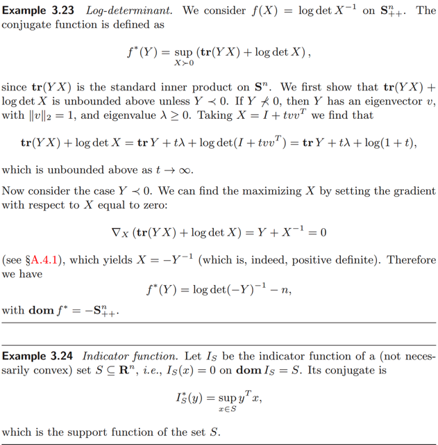</kbd>

> [!NOTE]
> Qua ví dụ này: Conjugate của log-det function: f(X) = log det (Xinv)
>
> như đã biết, định nghĩa của conjugate function của f(x) là kí hiệu f*(y) là function định nghĩa bởi: f*(y) = sup x {yTx - f(x)}
>
> Vậy để tìm conjugate của f(X) = log det (Xinv) ta cần giải bài toán:
>
> maximize over x {<Y.X> - f(X)} với <Y.X> đối với ma trận thì chính là: elementwise product: Σij (Xij × Yij)  và cái này chính là tr(XTY) (hoặc cũng là tr(YTX), nhưng vì X, Y ∈ S^n nên cũng là tr(XY)).
>
> Dùng tính chất: 
>
> X Xinv = I ⇔ det (X Xinv) = det I 
>
> Dùng tính chất det (AB) = det A det B đã học ở MIT 18.06 
>
> ∴ ⇔ det(X) det (Xinv) = 1 
>
> ⇔ det (Xinv) = 1/det(X) = [det(X)]^-1
>
> ⇨ log det(Xinv) = log [det(X)]^-1 = - log det(X) 
>
> ⇨ - log det(Xinv) = log det (X)
>
> Hàm log chỉ xác định khi det (X) ≥ 0 nhưng vì X invertible nên det X khác 0 → điều kiện xác định là det(X) > 0, điều này như đã học từ MIT 18.06: mọi eigenvalues đều dương → ma trận xác định dương: X ≻ 0
>
> Do đó f*(Y) = sup X ≻ 0 [tr(YX) + log det (X)] như trong sách ghi.
>
> Thế thì nhớ lại ta đang cần làm là giải bài toán maximize over mọi X xác định dương hàm [tr(YX) + log det (X)], khi đó ta sẽ được hàm f*(Y). Và tập xác định của hàm này, là những  Y khiến f*(Y) không bị không xác định (inf), thì điều đó có nghĩa là ta cần tìm tập các matrix Y sao cho nghiệm của bài toán trên không bị = infinity, hay nói nôm na là hàm [tr(YX) + log det (X)] không vọt lên vô cùng.
>
> Thế thì:
>
> Vì sao giáo sư ghi khi Y ko ≺ 0, thì Y có eigenvector v với ||v|| = 1, và eigenvalue λ ≥ 0? 
>
> Câu này phải hiểu là: Ta sẽ xét hai case Y not ≺ 0 và Y ≺ 0:
>
> Nếu Y not ≺ 0 ta sẽ chứng minh là sẽ khiến hàm trên vọt lên infi. Và ở case kia thì ta sẽ chứng minh solution của bài toán maximize sẽ là hữu hạn, nên kết luận tập Y khiến f*(Y) không bị  infinity sẽ là Y ≺ 0.
>
> Cụ thể chứng minh khi Y not ≺ 0 thì [tr(YX) + log det (X)] sẽ vọt lên infinity đại ý như sau:
>
> ta chỉ cần thay vì xét hết mọi X xác định dương thì ta chỉ cần xét X có dạng X  = I + tvvT (với v là unit eigenvector của Y ứng với eigenvalue λ dương) tức là X là một matrix xác định dương nhưng có dạng cụ thể như vậy. Thì logic là, nếu ta chứng minh khi Y not ≺ 0 thì maximize hàm trên với X có dạng này đã đủ cho kết quả infinity rồi, thì maximize với mọi S^n++ cũng đương nhiên sẽ cho kết quả infinity.
>
> Thế thì tr(YX) + log det X = tr(Y(I + tvvT)) + log det (I + tvvT)
>
> Dựa vào tính linearity của trace: tr(A + B) = tr(A) + tr(B):
>
> = tr(Y) + tr(YtvvT) + log det (I + tvvT)
>
> Xét tr(YtvvT), = tr(tYvvT) (t là scalar, move tùy ý)
>
> = t × tr(YvvT) = t × tr(vTYv) (tr(AB) = tr(BA)
>
> = t × tr(vTλv) (do Yv = λv)
>
> = t × λ × tr(vTv) 
>
> = t × λ × tr(||v||^2)
>
> = t × λ × tr(1)
>
> = t × λ
>
> Xét log det (I + tvvT) Thế thì, như đã biết det A = tích các trị riêng của nó.
> Vậy trị riêng của I + tvvT là gì?
>
> Thử nhân (tvvT) với v (xem nó ra gì): tvvTv = tv||v||^2 = tv × 1 = tv. À, vậy có nghĩa là v cũng chính là eigenvector và eigenvalue chính là 1. Và vì tvvT là rank 1 matrix nên chỉ có một trị riêng khác 0, và ở đây chính là t. Lí do là vì nếu x1, λ1 là vector riêng / trị riêng của A thì Ax = λx cho thấy x nằm trong C(A). Mà nếu A rank 1 tức dim C(A) = 1, điều này có nghĩa là chỉ có thể có chỉ có một vector độc lập (vì giả sử có thêm một trị riêng λ2 khác không nữa để Ax2 = λ2x2, thì x2 độc lập x1 sẽ khiến dim C(A) = 2  > 1, mâu thuẫn)
>
> Vậy trị riêng của tvvT là {1, 0.....0}. 
>
> Tiếp, ta có gọi λ và x là trị riêng, vector riêng của tvvT:
>
> tvvTx = λx 
>
> ⇔ Ix + tvvTx = Ix + λx
>
> ⇔ (I + tvvT)x = (1 + λ)x
>
> ⇨ eigenvalue của (I + tvvT) là 1 + λ 
>
> chính là (1 + t, 1, ...1)
>
> Từ đây suy ra det (I + tvvT) = (1 + t) × 1 ...× 1 = 1 + t 
>
> ⇨ log det X = log (1 + t)
>
> Tới đây viết lại tr(YX) + log det X = tr(Y) + tλ + log (1 + t) 
>
> Và tới đây đủ thấy khi thay đổi X, cụ thể là X có dạng X(t) = I + tvvT thì khi t → inf thì tr(YX) + log det X = tr(Y) + tλ + log (1 + t)  sẽ → inf. Điều này giúp chứng minh rằng để f*(Y) xác định thì đầu tiên nó phải không ≺ 0
>
> ====
>
> Xét case Y ≻ 0: Ta sẽ chứng minh rằng lúc này f*(Y) là một hàm mang giá trị hữu hạn theo Y:
>
> Xét hàm mục tiêu g(X) = tr(YX) + log det (X) mà ta cần maximize over X ≻ 0:
>
> Dùng điều kiện cần bậc 1: gradient = 0:
>
> Tìm ∇_X g(X):
>
> = ∇tr(YX) + ∇ log det(X)
>
> Tới đây: Ta có thể áp dụng các identity, nhưng cũng có thể tự derive lại nhờ MIT 18s096:
>
> Gradient của tr(YX):
>
> d(tr(YX)) = tr(Y(X + dX)) - tr(YX) = tr(YX + YdX) - tr(YX)
>
> = tr(YX) + tr(YdX) - tr(YX) | tính linearity của trace.
>
> = tr(YdX) = tr(YdX) (do Y, dX đối xứng: YdX = (YdX)TT = (dXTYT)T = (dXY)T = YTdXT = YdX
>
> = <Y . dX> ⇨ d(tr(YX)) = <Y . dX>, lập luận như MIT 18s096: X là matrix, tr(YX) là scalar,
> nên dtr(YX) cũng vậy, và để xác định gradient, ta cần tìm linear operator act on dX để ra scalar dtr(YX), và linear operator này chỉ có thể là lấy ma trix nào đó inner product với dX. Đó chính là Y. Vậy gradient chính là Y
>
> ⇨ ∇tr(YX) = Y.
>
> Còn gradient của f(X) = log det X: 
>
> df = log det (X + dX) - log det X
>
> = log det (X(I + Xinv dX)) - log det X | dùng cái mẹo, đặt nhân X chung, X ≻ 0, dĩ nhiên invertible
>
> = log [det X det (I + Xinv dX)] - log det X  | det (AB) = detA detB
>
> = log det X + log det (I + Xinv dX)] - log det X | log(AB) = log A + log B
>
> = log det (I + Xinv dX)
>
> Xét det (I + Xinv dX), = ∏i λ(I + Xinv dX)_i
>
> = ∏i (1 + λ(Xinv dX)_i)   | Tương tự như trên ta đã biết, λ(A + I) = 1 + λ(A)
>
> ⇨ log ∏i (1 + λ(Xinv dX)_i) = ∑i log (1 + λ(Xinv dX)_i) | Tính chất hàm log
>
> Tới đây dùng tính chất: ε rất nhỏ thì log(1 + ε) ≈ ε
>
> ⇨ ∑i log (λ(Xinv dX)_i) ≈ Σi [λ(Xinv dX)_i]
>
> (ta áp dụng điều trên là vì λ(Xinv dX)_i, eigenvalue của một matrix rất nhỏ thì cũng rất nhỏ)
>
> Và đây chính là trace(Xinv dX), như đã biết, cũng là <Xinv . dX>
>
> Lập lập tương tự ta kết luận ∇ log det X là Xinv.
>
> Vậy ∇[tr(YX) + log det X] = Y + Xinv
>
> Điều kiện cần bậc 1, tìm critical point: Y + Xinv = 0
>
> ⇔ Xinv = - Y 
>
> ⇔ XXinv = - XY 
>
> ⇔ I = -XY  
>
> ⇨ X = -Yinv
>
> Check xem X* = -Yinv tức critical point có thuộc domain của f(X) không: Nói cách khác, nó có xác định dương?
>
> Ta đang xét case Y xác định âm (≺0) ⇨ mọi λ(Y) < 0 ⇨ mọi 1/λ(Y) < 0 ⇨ Yinv xác định âm
>
> ⇨ quadratic form uTX*u = uT(-Yinv)u = - uTYinvu. Với Y xác định âm thì uTYinvu luôn âm với mọi u ⇨ -uTYinvu luôn dương với mọi u ⇨ X* xác định dương.
>
> Như vậy có nghĩa là, tại critical point, f(X*) xác định.
>
> Thay X* vào tr(YX) + log det X, ta có f*(Y): 
>
> = tr(X*Y) + log det X* 
>
> = tr(-YinvY) + log det (-Yinv)
>
> = tr(-I) + log det (-Yinv)
>
> = -n + 
>
> = log det (-Yinv) - n, là giá trị hữu hạn.
>
> Vậy tập xác định của f*(Y) = là Y ≺ 0, và f*(Y) = log det (-Yinv) - n

> [!TIP]
> **🤖 AI Feedback** — ✅ Score: **92/100**
>
> Bài làm thể hiện sự hiểu biết sâu sắc và khả năng phân tích tuyệt vời, với các đạo hàm và giải thích chi tiết vượt xa yêu cầu. Cần lưu ý sự chính xác trong việc giải thích trị riêng và nhất quán trong điều kiện của Y để đạt đến mức hoàn hảo.

 

- **Conjugate function của log-sum-exp**

<kbd>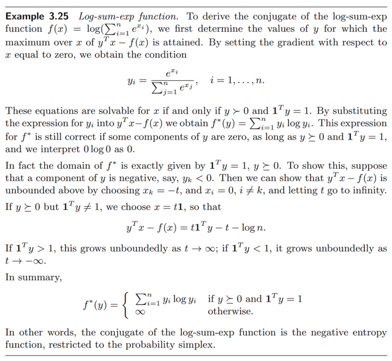</kbd>

> [!NOTE]
> Thử tìm conjugate function của log-sum-exp function f(x) = log(Σ e^xi)
>
> Theo định nghĩa conjugate of f(x): f*(y) = sup x ∈ dom f yTx - f(x)
>
> = sup x ∈ dom f yTx - log(Σ e^xi)
>
> Xét với một giá trị cố định của y, ta xét function g(x) = yTx - log(Σ e^xi)
>
> (Đặt tên g vậy thôi chứ nó không liên quan gì đến dual function)
>
> và vectorize nó:
>
> g(x) = yTx - log(1Te^x)
>
> Để tìm maximum, ta dùng calculus, tìm gradient của g(x):
>
> g(x) = yTx - log(1Te^x)
>
> ===
>
> Trước tiên tìm derivative của f(x) = log Σ e^x trước:
>
> Đặt u(x) = Σ e^x, f(u) = log(u)
>
> df = f(u+du) - f(u) = log(u+du) - log(u) ~= log(u) +du/u - log(u) = du/u
>
> du = u(x+dx) - u(x) = Σ e^(x+dx) - Σ e^x = Σ e^xi e^dxi - Σ e^xi
>
> = Σ e^xi (e^dxi - 1) = (e^x)T(e^dx - 1)
>
> Dùng linear approx của e^x: e^dx ~= 1 + dx
>
> = (e^x)T(1 + dx - 1) = (e^x)Tdx
>
> Vậy du = (e^x)Tdx
>
> => df = du/u = (e^x)Tdx / Σe^x = Σ e^xi dxi / Σ e^xi = (e^x)Tdx / 1Te^x
>
> => ∇f = [(e^x)T]T / 1Te^x = e^x / 1Te^x
>
> ====
>
> Vậy quay lại đây ta đã có d(log(1Te^x)) = (e^x)Tdx / 1Te^x
>
> d(yTx) = yT(x+dx) - yTx = yTdx
>
> => dg(x) = d(yTx - log(Σi e^xi)) = d(yTx) - d(log Σi e^xi)
>
> = d(yTx) - d(log(1Te^x))
>
> = yTdx - (e^x)Tdx / 1Te^x 
>
> = (yT - (e^x)T / 1Te^x)dx
>
> => ∇g = (yT - (e^x)T / 1Te^x)T = y - e^x / 1Te^x
>
> Cho ∇g = 0 <=> y - e^x / 1Te^x = 0 
>
> <=> y - e^x / 1Te^x = 0 
>
> <=> y = e^x / 1Te^x 
>
> <=> yi = e^xi / Σj e^xj với i = 1, 2, ...n (như trong sách) (1)
>
> Và cũng hiểu khi gs nói trong sách rằng để có nghiệm x thì yi phải dương (vì e^xi dương) và Σ yi phải bằng 1 <=> yT1 = 1 (2), vì Σ e^xi / Σ e^xj = 1
>
> yi = e^xi / Σj e^xj
>
> <=> yi Σj e^xj = e^xi 
>
> lấy log hai vế:
>
> <=> xi = log (yi Σj e^xj) = log (yi 1Te^x) 
>
> <=> xi = log yi + log(1Te^x)
>
> => x = log y + log (1Te^x)
>
> Thế x vào g(x) = yTx - log(1Te^x)
>
> = yT[log y + log (1Te^x)] - log(1Te^x)
>
> Để ý: y, log(y) là vector, log(1Te^x) là scalar, nên để phân phối yT vô
> ta phải biến nó thành vector
>
> = yT[log(y) + log(1Te^x).1] - log(1Te^x)
>
> = yTlog(y) + yT(log(1Te^x).1) - log(1Te^x)
>
> = yTlog(y) + log(1Te^x) yT1 - log(1Te^x)   
>
> vì log(1Te^x) là scalar nên đưa nó ra trước: uTαv = α uTv (với v là vector 1, u là y)
>
> = yTlog(y) + log(1Te^x) 1 - log(1Te^x)   |  do Σ yi = 1 nói ở trên (2) <=> yT1 = 1
>
> = yTlog(y) = Σ yi log(yi) như trong sách
>
> Khúc cuối gs nói về domain của f*(y). 
>
> Ôn lại chút, theo định nghĩa domain của conjugate function f*(y) là tập các y sao cho f*(y) khác +infinity và điều này đồng nghĩa là  yTx - f(x) phải bị chặn trên (bounded above)
>
> Hiểu nôm na là vì theo định nghĩa f*(y) = sup x ∈ dom f yTx - f(x) nên nếu yTx - f(x) không bị chặn trên (unbounded above) thì  có thể tìm x khiến yTx - f(x) lớn đến vô cùng.
>
> Thế thì ở bài toán này như đã thấy khi giải ra critical point bằng cách cho gradient (đối với x) của yTx - f(x) = 0, thì ta có:
>
> yi = e^xi / Σj e^xj, và điều này dẫn đến để tồn tại critical point x tức hệ phương trình này có thể giải được, thì yi phải dương, và Σ yi = 1. Nói theo vector từ y ≻ 0 và 1Ty = 1. Khi đó sẽ tồn tại 
> critical point x*, và đó cũng là maximum của yTx - f(x) (vì hàm này có Hessian negative definite, ta sẽ chứng minh sau)
>
> Vậy domain của f*(y) là y ≻ 0, và 1Ty = 1
>
> và f*(y) = yTlog(y) nếu y thuộc dom f*(y) và + infinity nếu ngược
> lại.
>
> ====
>
> Tại sao biết critical point là maximum: 
>
> Cách 1: Dùng kiến thức trong class này nói rằng yTx - f(x) là affine + concave
> (vì f(x) là log Σ exp là convex nên - log sum exp là concave) sẽ là concave
> function
>
> Cách 2: Bằng cách dùng second derivative test, chứng mình Hessian của
> nó ⪯ 0
>
> g = yTx - f(x) = yTx - log Σi e^xi
>
> Ta đã có dg = (yT - (e^x)T / 1Te^x)dx = g'(x)[dx]
>
> Theo GPT , đặt u(x) = (e^x)Tdx, v(x) = 1Te^x
>
> => dg = (yT - (e^x)T / 1Te^x)dx = yTx - (e^x)Tdx / 1Te^x
>
> <=> dg = yTdx - u(x) / v(x)
>
> cũng là g'(x)[dx] = yTdx - u(x) / v(x)
>
> Tìm Hessian theo MIT 18s096 đã học:
>
> d'(g'(x)[dx]) = yTdx - u(x+dx') / v(x+dx') - [yTdx - u(x) / v(x)]
>
> = - [ u(x+dx') / v(x+dx') - u(x) / v(x) ] cái này chính là - d'(u(x)/v(x))
>
> Dùng công thức d(u/v) = (duv - udv) / v^2
>
> => d'(u(x)/v(x)) = [d'u(x) v(x) - u(x)d'v(x)] / v(x)^2
>
> .. = - [d'u(x) v(x) - u(x)d'v(x)] / v(x)^2
>
> Giờ ta sẽ tính từng cái:
>
> *d'u(x) = u(x+dx') - u(x) = (e^(x+dx'))Tdx - (e^x)Tdx
>
> = Σi e^xi e^dx'i dxi - (e^x)Tdx
>
> = Σi e^xi (1 + dx'i) dxi - (e^x)Tdx
>
> = Σi (e^xi + e^xi dx'i) dxi - (e^x)Tdx
>
> = Σi (e^xi dxi + e^xi dx'i dxi) - (e^x)Tdx
>
> = Σi (e^xi dxi) + Σi (e^xi dx'i dxi) - (e^x)Tdx
>
> = (e^x)Tdx + d'xT diag(e^x) dx - (e^x)Tdx
>
> = d'xT diag(e^x) dx
>
> *d'v(x) = v(x+dx) - v(x)
>
> = 1Te^(x+dx') - 1Te^x
>
> = 1T(e^x e^dx') - 1Te^x = Σi e^xi e^d'xi - Σ e^xi
>
> = Σi e^xi e^d'xi - e^xi = Σi e^xi (e^d'xi - 1)
>
> = Σi e^xi (1 + d'xi - 1) = Σi e^xi d'xi = e^xTd'x
>
> Thế vô hết: d'(g'(x)[dx]) 
>
> = - [d'u(x) v(x) - u(x)d'v(x)] / v(x)^2
>
> = - [(d'xT diag(e^x) dx) (1Te^x) - ((e^x)Tdx) (e^xTd'x)] / (1Te^x)^2
>
> = - [(d'xT diag(e^x) dx) (1Te^x)] / (1Te^x)^2 - ((e^x)Tdx) (e^xTd'x)] / (1Te^x)^2
>
> Đặt s = e^x / 1Te^x (softmax function)
>
> Xét - [(d'xT diag(e^x) dx) (1Te^x)] / (1Te^x)^2
>
> = - [(d'xT diag(e^x) dx) ] / (1Te^x) = - [(d'xT diag(e^x / (1Te^x)) dx)] 
>
> = - d'xT diag(s) dx
>
> Xét - ((e^x)Tdx) (e^xTd'x)] / (1Te^x)^2
>
> = - [(e^x)Tdx) / (1Te^x)] [(e^xTd'x) / (1Te^x)]
>
> = - [(e^x / 1Te^x)Tdx) ] [(e^x / 1Te^x)Td'x]
>
> = - (sTdx) (sTd'x) = - d'xTs sTdx = - d'xT ssT dx
>
> Vậy kết quả là d'(g'(x)[dx]) = - d'xT diag(s) dx - d'xT ssT dx
>
> = - d'xT [ diag(s) - ssT ] dx, đây chính là g''(x)[dx', dx]
>
> Vậy Hessian = [ diag(s) - ssT ]
>
> Việc còn lại là chứng minh Hessian Negative Definite: (làm sau)

**🔗 See also:** [linked note](./lec_9.md#node-ehvdbod)

 

- **Conjugate function của norm**

<kbd>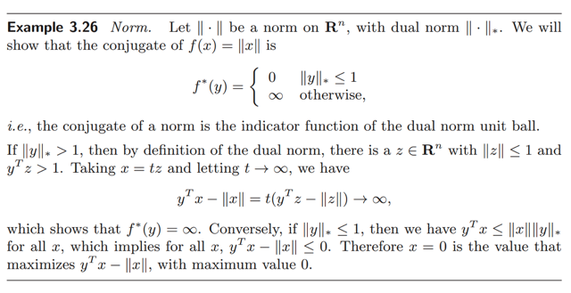</kbd>

> [!NOTE]
> Conjugate function của norm
>
> f(x) = ||x||
>
> => f*(y) = sup x yTx - ||x||
>
> Theo định nghĩa dual norm ||v||*: 
>
> ||v||*, tức l2 norm dual norm of v: ||v||* = sup ||u||<=1 uTv
>
> Nếu ||y||* > 1,
>
> <=> sup ||z||<=1 yTz > 1  |   Do định nghĩa của dual norm
>
> <=> Tồn tại z với ||z|| <= 1 sao cho yTz > 1
>
> Lấy x = tz: 
>
> => yTx - ||x|| = yT(tz) - ||tz|| = t(yTz - ||z||)
>
> Và vì ||z|| <= 1 và yTz > 1 => yTz > ||z|| <=> yTz - ||z|| > 0
>
> Và cho t chạy đến +infinity thì ta có:
>
> Khi t -> infinity thì t(yTz - ||z||) -> +infinity
>
> Do đó khi ||y||* > 1 thì f*(y) = sup x yTx - ||x|| = +infinity
>
> ====
>
> Nếu ||y||* <= 1 
>
> <=> sup ||z||<=1 yTz <= 1   |   Do ||y||* = sup ||z||<=1 yTz
>
> Mà cái này có nghĩa là yTz <= 1 với mọi z có ||z|| <= 1
>
> Hoặc yT(x/||x||) <= 1 với mọi x (vì x/||x|| là vector có norm <= 1, 
> chính xác là = 1)
>
> <=> yTx <= ||x|| 
>
> <=> yTx - ||x|| <= 0 
>
> => sup x yTx - ||x|| = 0, xảy ra khi x = 0
>
> Vậy tóm lại:
>
> sup x yTx - ||x|| = :
>
> a) 0 khi ||y||* <= 1
>
> b) +infinity khi ||y||* > 1
>
> OPERATION PRESERVE CONVEXITY:
>
> CONJUGATE FUNCTION
>
> EX: Conjugate function của norm ||x||

**🔗 See also:** [linked note](./lec_7.md#node-z9xoezp) · [linked note](./lec_8_a.md#node-xrwq4nc)

 

- **Conjugate function của norm squared**

<kbd>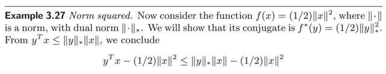</kbd>

<kbd>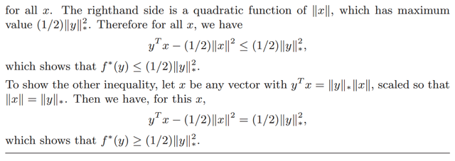</kbd>

> [!NOTE]
> Conjugate function của norm squared
>
> f(x) = (1/2)||x||^2, conjugate theo định nghĩa f(y) = sup x  yTx - f(x) 
>
> = sup x yTx - (1/2)||x||^2
>
> Ôn lại khái niệm dual norm: ||v||* = sup ||u|| <= 1 uTv
>
> Do định nghĩa nên ||v||* luôn >= uTv với mọi u có ||u|| <= 1
> điều này tương đương ||v||* >= uTv/||u|| với mọi u, vì u/||u|| đóng
> vai vector có norm <= 1.
>
> Do đó ta có ||y||* >= yTx/||x|| với mọi x => yTx <= (||y||*)||x||
>
> Trừ hai vế cho (1/2)||x||^2 ta có:
>
> yTx - (1/2)||x||^2 <= (||y||*)||x|| - (1/2)||x||^2
>
> Vế phải là quadratic function của ||x||, sách nói nó có maximum
> là (1/2)||y||*^2. Là sao?
>
> Đơn giản là xét hàm f(x) = ax - 1/2x^2, f'(x) = a - x => critical point
> x = a, và nó là maximum vì hàm số bậc 2 này f''(x) = -1 < 0 nên 
> concave down. maximum value = aa - 1/2aa = 1/2a^2. Nên áp dụng
> cái này thì maximum của vế phải chính là (1/2)(||y||*)^2
>
> Vậy yTx - (1/2)||x||^2 <= (1/2)(||y||*)^2 
>
> => sup x yTx - (1/2)||x||^2 <= (1/2)(||y||*)^2 
>
> <=> f*(y) <= (1/2)(||y||*)^2 
>
> ====
>
> Khúc dưới chưa hiểu lắm, quay lại sau, nhưng đại khái là họ
> chứng minh f*(y) >= (1/2)(||y||*)^2 
>
> Từ đó suy ra conjugate f(x) = (1/2)||x||^2 là f*(y) = (1/2)(||y||*)^2

**🔗 See also:** [linked note](./lec_9.md#node-hixhho4)

 

- **Ex. Revenue and profit function (QUAY LẠI SAU)**

<kbd>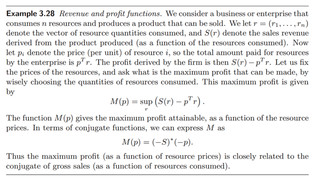</kbd>

> [!NOTE]
> SÁCH (XEM SAU)
>
> Ex. Revenue and profit function (QUAY LẠI SAU)

 

<kbd>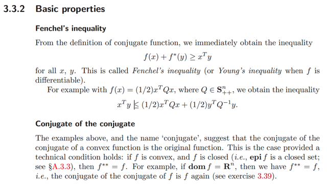</kbd>

 

- **Quasiconvex function**

<kbd>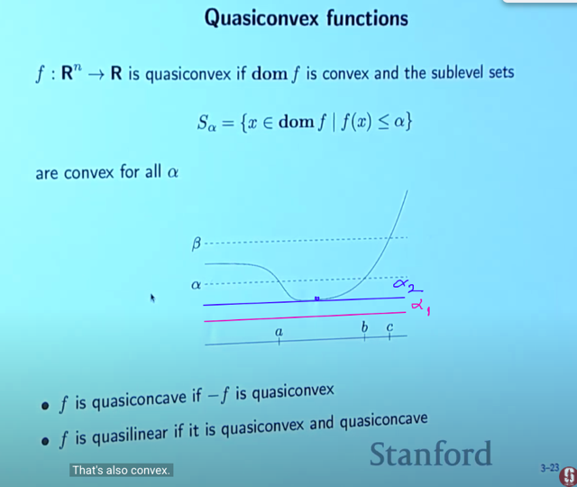</kbd>

> [!NOTE]
> tiếp theo cái quasiconvex function có thể hiểu vầy:
>
> Đầu tiên hiểu sublevel set Sα = {x ∈ dom f | f(x) ≤ α} là gì:
>
> Nó là set, là **tập hợp các x, sao cho f(x) nhỏ hơn mức nào đó (α)**.
>
> Nên Sα là là tập các x sao cho f(x) ≤ α.
>
> Sβ thì là tập các x sao cho f(x) ≤ β.
>
> Nói chung sub-level set là tập các x sao cho thỏa  mãn f(x) nhỏ hơn mức nào đó.
>
> Vậy nếu lấy Sα1 của hàm f có đồ thị như trong slide:
>
> Theo định nghĩa là tập các x sao cho f(x) < α1, mà rõ ràng hàm f luôn > α1 với mọi x, nên chả có ma x nào thỏa f(x) < α1 hết. Nên Sα1 = rỗng. Và **tập rỗng là convex set (cái này theo quy ước)**
>
> Xét Sα2, thì có một điểm, vì chỉ có tại x = x0, thì f(x) <= α2 thôi. Tập có 1 điểm, gọi là **singleton**, **cũng là convex set** 
>
> Nhắc lại chút, định nghĩa của convex set là set thỏa điều kiện là nó chứa mọi convex combination của mọi điểm bất kì trong set. Nên tập rỗng, và singleton đều thỏa điều kiện này, với tập rỗng thì vì nó chả chứa gì nên nó theo ý nghĩa nào đó nó cũng chứa mọi convex combination của các phần tử của nó (vốn dĩ ko có cái nào).
>
> Đến Sα. Thì ta có một **đoạn (interval)** chứa nhiều x thỏa f(x) ≤ α (Đoạn / line segment thì dễ thấy thỏa điều kiện của convex set)
>
> Đến Sβ thì lúc này ta có **một khoảng** từ (-inf đến c), là thỏa f(x) ≤ β gs gọi đó là **haft-infinite interval** (cũng là convex set)
>
> Ý chính là tập **rỗng, singleton, interval, haft-infinite interval đều là convex set nên hàm f này sẽ là quasi-convex**
>
> Thế thì khi hiểu vậy rồi, thì ta thấy, vì **mọi sub-level set đều là convex set, thì khi đó hàm f gọi là quasi-convex**
>
> Cái này có tên gọi là là Uni Modal gì đó
>
> nếu mọi sub-level set đều là convex set, thì khi đó
> hàm f gọi là quasi-convex
>
> CHAPTER 3.3 - QUASI-CONVEX
> FUNCTION

**🔗 See also:** [Convex representation of sublevel sets of f0](./lec_6.md#node-m2yj4il)

 

- **một ví dụ của haft-infinite interval**

<kbd>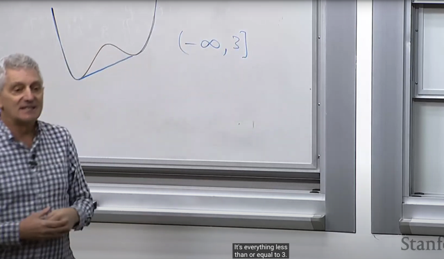</kbd>

> [!NOTE]
> đây là một ví dụ của haft-infinite interval

 

- **một số ví dụ**

<kbd>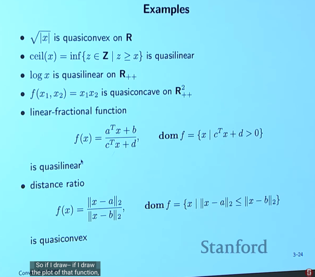</kbd>

> [!NOTE]
> một số ví dụ nhưng gs không nói qua hết, chỉ nói về các integer
> value convex function.

 

<kbd>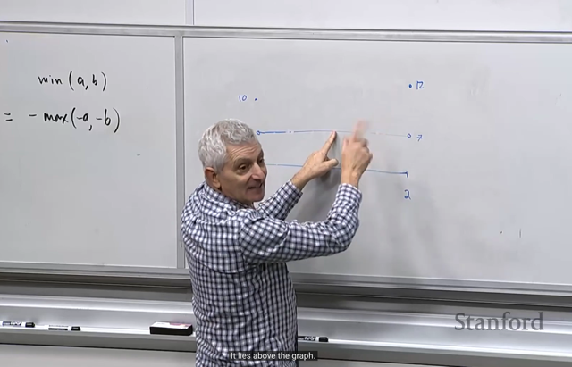</kbd>

> [!NOTE]
> Đây là một cái như vậy. Nó có giá trị = 7 khi x trong khoảng (-2,2) và
> = 10 khi x = -2 và = 12 khi x = 2.
>
> Nó convex vì theo cách lập luận dây cung nối hai điểm đều luôn 
> không nằm dưới đồ thị hàm f

 

- **ví dụ này ko hiểu. Quay lại sau**

<kbd>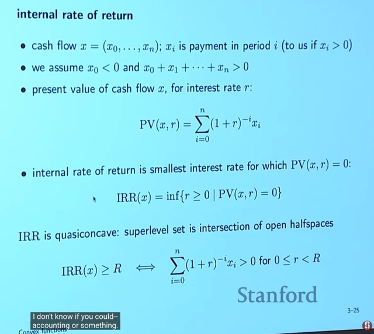</kbd>

> [!NOTE]
> gs nói về ví dụ này ko
> hiểu. Quay lại sau

 

- **Tính chất của quasi-convex**

<kbd>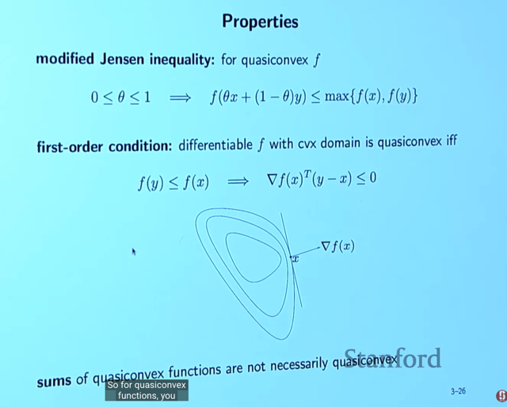</kbd>

> [!NOTE]
> Tính chất của quasi-convex
>
> đại khái là, với **quasi-convex thì jensen inequality thay đổi:**
>
> f của mixture ≤ mixture của f:
>
> f(θx + (1-θ)y) ≤ θf(x) + (1-θ)f(y)
>
> Trở thành:
>
> f(θx + (1-θ)y) ≤ max {f(x), f(y)" 
>
> **ngoài ra còn những thay đổi khác đối với first-order condition**

 

- **Hình ảnh minh họa quasi-convex function.**

<kbd>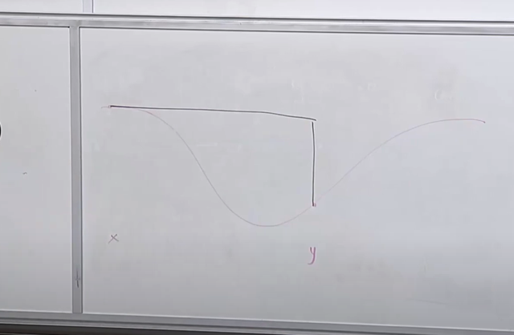</kbd>

> [!NOTE]
> Hình ảnh minh họa quasi-convex function. 
>
> Với convex ta biết **Jensen's inequality thể hiện bởi việc nối hai điểm trên đồ thị ta sẽ có dây cung luôn nằm trên  hoặc trùng với đồ thị.**
>
> Nhưng với quasi-convex, như ở đây nó không có tính chất này. (thử nối hai điểm thì ta sẽ thấy nó cắt đồ thị)
>
> Nhưng ta sẽ có đồ thị f sẽ **luôn nằm dưới mức cao nhất trong f(x) và f(y)**

 

