# Lec 6

📊 **Progress:** `31` Notes | `36` Screenshots | `2` AI Reviews

---

## Lec 6

 

## Quasi-convex optimization

<kbd>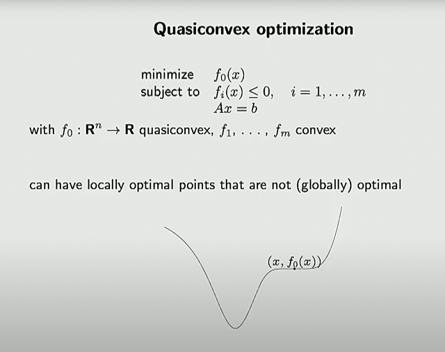</kbd>

> [!NOTE]
> Tiếp tục với bài trước về quasi-convex optimization. Đầu tiên ta nhớ lại định nghĩa của quasi-convex function đó là: Nó có **domain là convex set** và **mọi sub-level set đều cũng là convex set**.
>
> Sub-level set là một set, các x mà trong đó **mọi giá trị f(x) đều nhỏ hơn một số nào đó**.
>
> Ví dụ Sα là **mọi giá trị x trong domain** (miền xác định của f) sao cho **f(x) đều nhỏ hơn α**.
>
> Vậy thì nếu **mọi Sα đều là convex set** thì ta sẽ có **quasi-convex  function**.
>
> Thế thì như đã biết, gs nhắc lại, với convex set thì ta không có local optimal, mà chỉ có global optimal. Nhưng với quasi-convex thì ta có thể có local optimal

 

### Convex representation of sublevel sets of f0

<kbd>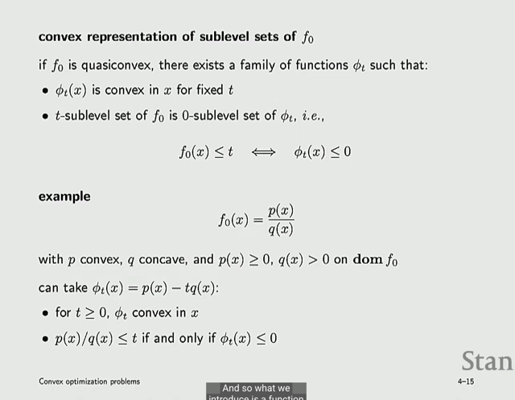</kbd>

> [!NOTE]
> Đại khái là cách giải bài toán này, nói một cách khái quát đó là ta (hãy tin rằng) **luôn có cách nào đó** để ta định nghĩa ra, **đặt ra một functon Φt(x) nào đó sao cho nó convex in x**, đồng thời **có sự tương ứng giữa sub-level set của Φt(x) và f0(x)**:
>
> Đó là f0(x) ≤ t ⇔ Φt(x) ≤ 0 có nghĩa là **t-sublevel set của f0 chính là 0-sublevel set của Φt**
>
> Để hiểu rõ hơn, ta lấy ví dụ function f0(x) = p(x) / q(x), 
>
> trong đó với p convex, q concave và p(x) không âm, q(x) dương thì f0(x) là quasi convex function.
>
> Thế thì, nếu ta define Φt(x) = p(x) - tq(x) thì khi đó Φt(x) với t ≥ 0 thì nó sẽ là convex function. (cái này dễ hiểu vì ta có tổng hai convex function p(x) và -tq(x))
>
> Và p(x) - tq(x) ≤ 0 sẽ tương đương p(x)/q(x) ≤ t nên 0-sublevel set của Φt(x) sẽ chính là t-sublevel set của f0(x)

**🔗 See also:** [Quasiconvex function](./lec_4.md#node-wut6uxw)

 

#### Bisection method for solving quasi-convex optimization

<kbd>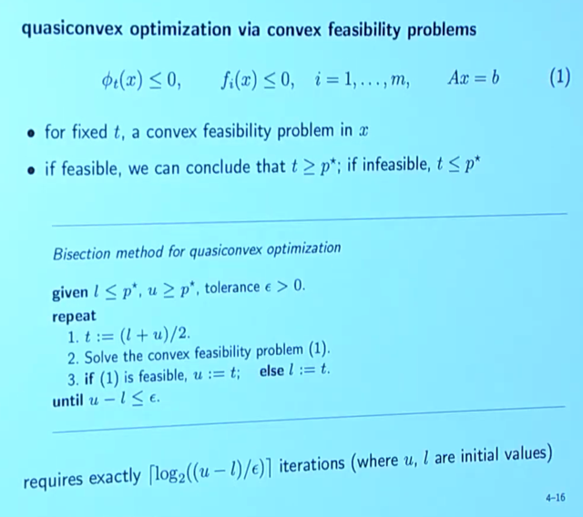</kbd>

> [!NOTE]
> Đại khái là p(x)/q(x) ≤ t tương đương p(x) - tq(x) ≤ 0 hay Φt(x) ≤ 0
>
> Nên với một giá trị t nào đó, nếu tồn tại feasible x (thỏa các constraint fi(x) ≤ 0), và thỏa luôn Φt(x) ≤ 0 thì lúc này sẽ dĩ nhiên đồng nghĩa là nó sẽ thỏa p(x)/q(x) ≤ t
>
> Mà như vậy từ việc p* = min x ∈ X f0(x) = p(x)/q(x) thì ta cũng có thể kết luận p* ≤ t  
>
> Ngược lại, nếu với t đó, không tồn tại x nào feasible và thỏa Φt(x) ≤ 0 thì điều này có nghĩa là:
>
> mọi feasible x đều khiến Φt(x) > 0:
>
> Φt(x) > 0 với mọi x ∈ X
>
> ⇔ p(x)/q(x) > t với mọi x ∈ X
>
> ⇨ p* > t
>
> Và từ đó ta sẽ tăng t lên. Hoặc giảm t xuống. Và ta lặp đi lặp lại việc này cho đến khi thu hẹp dần khoảng mà ta biết sẽ chứa p*. Đây gọi là chiến lược **bisection**
>
> Bisection method for solving quasi-convex optimization

 

##### Linear program (LP)

<kbd>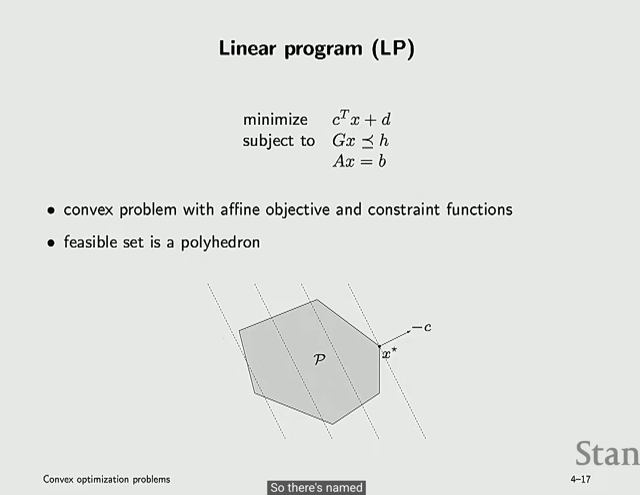</kbd>

> [!NOTE]
> Đại khái là giáo sư nói rằng ta nên biết về bài toán linear program (LP).
>
> Trong đó ta muốn minimize **objective function là một affine function cTx + d** với constraints **Gx ⪯ h và Ax = b**.
>
> Ax = b thì là **system các linear equation** thì biết rồi.
>
> Còn Gx ⪯ h là **system các linear inequalities**. Mà **solution set của nó tạo thành cái polyhedron như hình**.
>
> (**mỗi một bất phương trình sẽ tạo nên một haft-plane**, thành ra **intersection của chúng sẽ tạo một polyhedron**). Và dĩ nhiên dễ hiểu đây chính là **FEASIBLE SET X**
>
> Thành ra bài toán là **tìm x nằm trong đó để minimize objective**.
>
> Thì vì **objective ở bài toán này là affine, nên level curve của nó sẽ là các đường thẳng**: 
>
> cTx+d = constant ⇔ cTx + d - constant = 0
>
> Và vector c chính là normal vector của các linear level curve này, mà ko có gì lạ c cũng chính là gradient vector ∇f0:
>
> Nhờ MIT 18s096 đã biết cách tìm gradient rất dễ dàng:
>
> df = f(x+dx) - f(x) = cT(x+dx) + d - cTx + d = cTx + cTdx - cTx = cTdx
> ⇨ gradient ∇f = (cT)T = c.
>
> Thành ra việc tìm x* sẽ là **nhích dần nhích dần qua các level curve song song này theo hướng negative c để đến khi mọi điểm trong feasible set X đều nằm một bên.**

 

- **(Sách) 4.3 Linear optimization problem**

<kbd>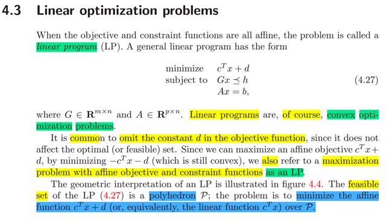</kbd>

<kbd>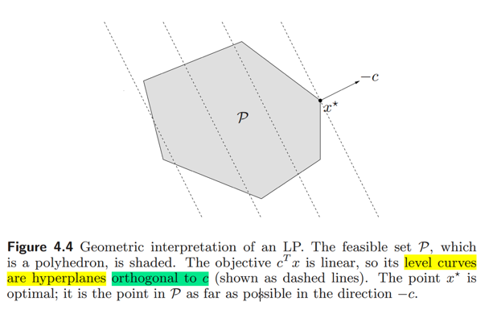</kbd>

<kbd>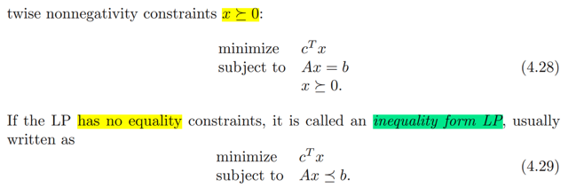</kbd>

<kbd>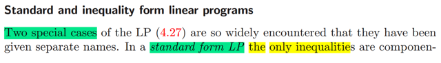</kbd>

> [!NOTE]
> Trong note trước đã nói đủ hết rồi
>
> Chỉ nói thêm một ý là nếu là bài toán maximize -cTx - d với affine constraint function thì nó cũng là LP vì maximize -cTx - d thì cũng là minimize cTx + d
>
> Thế thì một vài suy nghĩ (đã thảo luận với GPT):
>
> Sách nói feasible set là Polyhedron thì mình **nên hiểu nó là intersection của Polyhedron** (tạo bởi các linear inequality constraint Gx ⪯ h) và các Hyper-plane (tạo bởi các equality constraint Ax = b) Nhưng **intersection của Polyhedron và hyper-planes cũng là Poly-hedron thôi.**
>
> Một cái nữa, trong hình minh họa polyhedron là một hình khép kín (nói chính xác hơn là BỊ CHẶN, chứ theo định nghĩa CLOSED, thì miễn là có chứa boundary thì nó là CLOSE). Nhưng không phải lúc nào cũng vậy, nếu như ví dụ chỉ có một linear inequality constraint gx ≤ h thì Polyhedron nó là một Haft-space (Haft-space cũng là Polyhedron) khi đó nó không khép kín.
>
> Và **optimal cũng có thể không phải là 1 điểm như trong hình**. Mà ví dụ như khi **feasible set là haft-space** như trên vừa nói, thì có thể các level set của f0 có thể di chuyển song song theo hướng - c mãi mãi mà không  bao giờ trở thành support hyperplane của feasible set, tức là không có optimal value, và đây là case f0 **unbound below**.
>
> Hoặc là cũng có thể có trường hợp mà** kết qủa optimization trở thành kiểu như support hyperplane của P trùng với một cạnh của P**, khi đó mọi điểm trên cạnh đó đều là optimal, lúc này ta **có một set nhiều optimal points**
>
> Ngoài ra còn một ý nữa là có hai dạng đặc biệt của bài toán LP:
>
> Gọi là **STANDARD FORM LP** khi **INEQUALITIES CONSTRAINT CHỈ CÓ DẠNG COMPONENT-WISE** như x ≽ 0 
>
> Và **INEQUALITY LP** khi bài toán chỉ có inequality constraint mà **KHÔNG CÓ INEQUALITIES CONSTRAINT**

> [!TIP]
> **🤖 AI Feedback** — ⚠️ Score: **88/100**
>
> Bài viết của bạn thể hiện sự hiểu biết sâu sắc về các khái niệm lập trình tuyến tính (LP), đặc biệt là trong việc xem xét các trường hợp tập hợp khả thi không bị chặn hoặc có nhiều điểm tối ưu. Tuy nhiên, có một lỗi nhỏ trong định nghĩa của "INEQUALITY LP" – nó nên là "không có ràng buộc đẳng thức" thay vì "không có ràng buộc bất đẳng thức".

 

- **Converting LPs to standard form**

<kbd>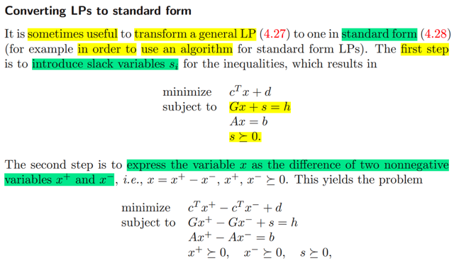</kbd>

<kbd>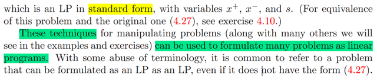</kbd>

> [!NOTE]
> Đại ý là đôi khi vì lí do nào đó mà sẽ có ích khi ta **chuyển một bài toán LP dạng khái quát thành dạng standard form LP**.
>
> Như đã biết bài toán LP khái quát là **minimize cTx + d constraint  Gx ⪯ h và Ax = b**. Để có dạng Standard form LP thì các **equality constraints phải có dạng component-wise u ≽ 0** với u là optimization variables.
>
> Do đó ta cần chuyển Gx ⪯ h thành dạng này. Cách làm là ta đầu tiên ta dùng một cách tiếp cận để **tạo equivalent problem** đã học - **Slack variable** trong đó nó giúp **eliminate inequality constraint fi(x) ≤ 0** bằng cách **thay bằng một equality constraint: fi(x) + si = 0** và **tạo thêm non-negative constraint si ≥ 0** (Xem link)
>
> Thì ở đây Gx ⪯ h ⇔ Gx - h ⪯ 0 sẽ thay bằng Gx - h + s = 0 và s ≽ 0.
>
> Thế thì có thể thắc mắc là tại sao không dừng ở đây mà còn phải làm  thêm bứơc sau là tách x thành x+ - x- để rồi có thêm x+ ≽ 0 và x- ≽ 0 Thì Chat GPT nói rằng bài toán ở bước 1 đã là Standard LP
>
> Nhưng bước sau là cái mà họ hay làm

**🔗 See also:** [(Sách) Cách tạo equivalent problem: Slack variables](./lec_5.md#node-6zywl35)

 

- **Một ví dụ của bài toán này**

<kbd>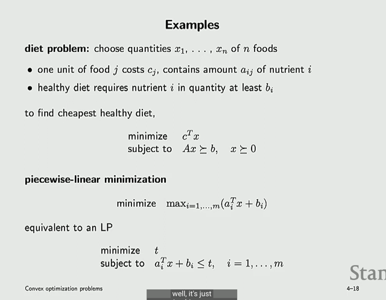</kbd>

> [!NOTE]
> Một ví dụ của bài toán này, đó là tối ưu cTx mang ý nghĩa kiểu như chi phí của bữa ăn cho lính mà vẫn đảm bảo constraints là hàm lượng dinh dưỡng đạt mức nào đó.

 

<kbd>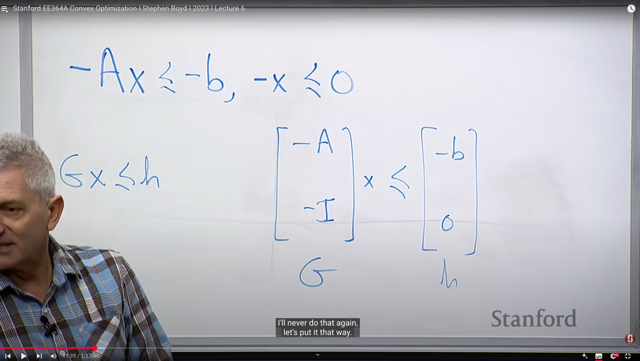</kbd>

> [!NOTE]
> Đại khái là bài toán vừa rồi thật ra ta thấy Ax ⪰ b, x ⪰ 0
>
> Nhưng ta chỉ cần chuyển đổi chút xíu để trở thành bài toán Linear Program:
>
> Từ Ax ⪰ b, x ⪰ 0 ⇔ -Ax ⪯ -b, -x ⪯ 0
>
> Từ đó chỉ việc gán G = [-A, I] và h = [-b, 0]
>
> [-A, I] là stack / gắn matrix -A với matrix I, và stack vector -b với 0 (thêm một phần tử 0 nữa vào vector b)
>
> Ý nói, chỉ **chuyển đổi tí xíu là ta đưa về lại bài toán linear program**

 

- **Một ví dụ nữa. Chưa hiểu lắm. Quay lại sau**

<kbd>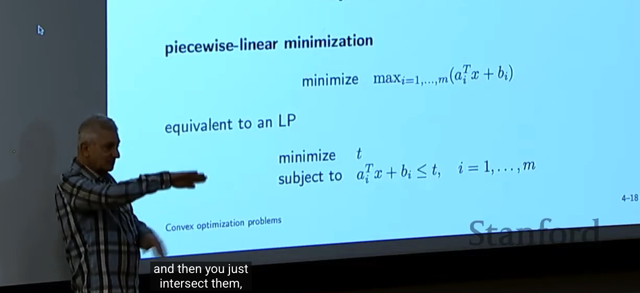</kbd>

> [!NOTE]
> Một ví dụ nữa. Chưa hiểu lắm. Quay lại sau

 

- **Chebyshev center of a polyhedron**

<kbd>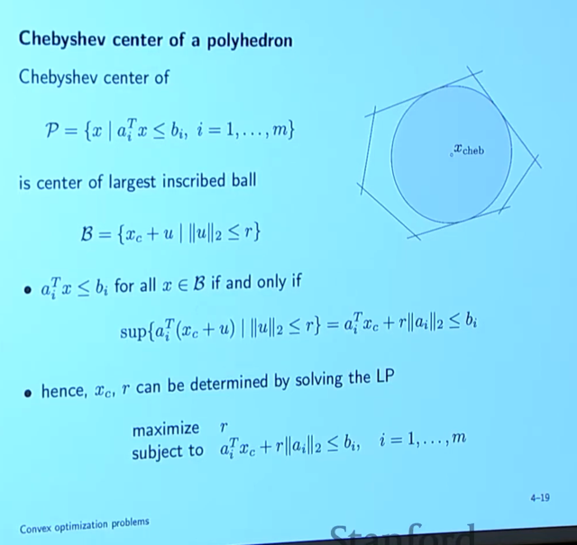</kbd>

> [!NOTE]
> Đầu tiên hiểu sup {aiT(xc+u) | ||u||≤r}  là ý nghĩa gì?
>
> sup {aiT(xc+u) | ||u||≤r} mang ý nghĩa chính là **tìm trong các vector u có ||u||≤r** thì cái nào **khiến aiT(xc + u) lớn nhất**. 
>
> Vậy cái này giống như ta hỏi: **Đang đứng ở xc. Đi hướng nào và với độ lớn không quá r thì tối đa gía trị của aiT(xc+u)**
>
> Hay nói cách khác, **trong các vector x thuộc ball B(xc, r) thì vector nào tạo ra u = x - xc
> khiến aiT(xc + u) nhỏ nhất.**
>
> Thế thì vì a1T(xc + u) = a1Txc + a1Tu. Thì trong đây a1Txc fixed rồi.
>
> Vấn đề là tìm u, là các vector miễn sao có norm ≤ r, sao cho maximize a1Tu thôi. 
>
> Mà a1 thì dĩ nhiên là vector cố định, có hướng cố định. Nên để a1Tu max thì u chính là vector sao cho nó trùng hướng với vector a1 (bởi vì a1Tu = ||a1||*||u||*cos(α(a1,u)). Và nó sẽ max khi cos α = 1)
>
> Và đồng thời cho u dài tối đa = r luôn (vì yêu cầu là ||u|| ≤ r mà)
>
> Để rồi ta có sup  {aiT(xc+u) | ||u||≤r}  = sup {aiTxc+aiTu) | ||u||≤r}  
>
> = {a1Txc + r*||a1||} 
>
> (khi chọn u trùng hướng a1 và dài r thì aiTu = ||ai||||u||cos(0) = ||ai||*r*1  = ||ai||*r)
>
> Và bằng cách khống chế a1Txc + r||a1|| ≤ b1 thì r sẽ sao đó khiến mọi điểm trong ball đều nằm một bên của đường thẳng này.
>
> Và khi làm việc này với mọi i. Thì ta sẽ có **ball có bán kính lớn nhất nhưng vẫn nằm trong poly-hedron**
>
> ...Chưa xong quay lại sau

 

<kbd>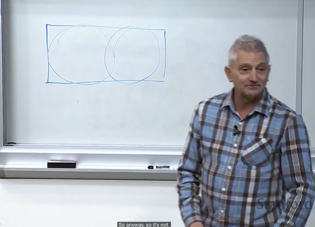</kbd>

> [!NOTE]
> và nó ko unique

 

- **Linear-fractional program  (Quay lại sau)**

<kbd>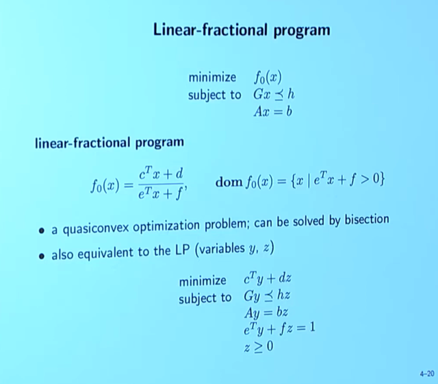</kbd>

> [!NOTE]
> Cái gs nói rất sơ sơ. Chưa hiểu. Chỉ biết ông nói bài toán này không dễ. Mà cần transform.
>
> Linear-fractional program

 

- **Generalized linear-fractional program (Quay lại sau)**

<kbd>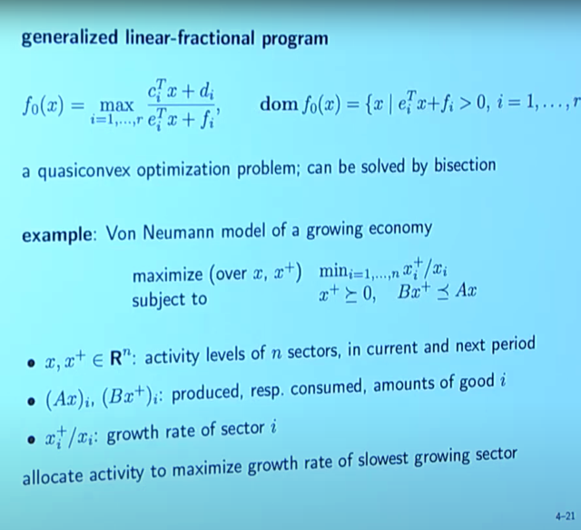</kbd>

> [!NOTE]
> Bài toán này cũng chưa hiểu lắm. Quay lại sau.
>
> Generalized linear-fractional program

 

- **Excercise 4.8**

<kbd>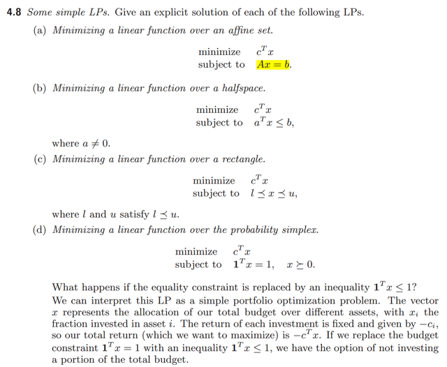</kbd>

> [!NOTE]
> Thử làm câu a:
>
> minimize cTx subject to Ax = b.
>
> ⇔ minimize over z cT(x0 + Fz) 
>
> x0 = (A^+)b
>
> Xét f(z) = cT(x0 + Fz) = cTx0 + cTFz
>
> Khi cTF = 0 thì f(z) ko phụ thuộc z ⇨ inf z {cTx0 + cTFz} = cTx0
>
> ⇨ p* = cTx0
>
> Còn khi cTF khác 0, hàm f(z)  unbound below ⇨ Không có optimal
>
> ====
>
> Câu d:
>
> minimize cTx subject to 1Tx = 1, x ≽ 0: 
>
> Đại khái là, feasible set {x: 1Tx = 1, x ≽ 0} chính là Probability Simplex, cũng là một Polyhedron được tạo bởi các đỉnh là các unit vector {e1, e2, ...en} (Cái này đơn giản là bởi định nghĩa của Probability Simplexes)
>
> Và đại khái là khi làm cái việc minimize f0(x) over x trong polyhedron P thì giá trị nhỏ nhất sẽ đạt tại đỉnh của Polyhedron / Simplexes. Và các đỉnh (tức các điểm là đỉnh của Probability Simplexes) đơn  giản là các unit vector ej
>
> Vậy nên việc đầu tiên đơn giản là xem f0(ej) nào là nhỏ nhất, đó chính là p*. và ej đó chính là x*
>
> f0(ej) = cTej mà cái này chính là cj
>
> cTej = Σ ci ej_i mà với unit vector ej thì các component đều bằng 0
> ngoại trừ component j. 
>
> Vậy xem j nào f0(ej) nhỏ nhất chính là xem j nào mà cj nhỏ nhất, tức là component nào nhỏ nhất của vector c.

 

- **Quadratic program**

<kbd>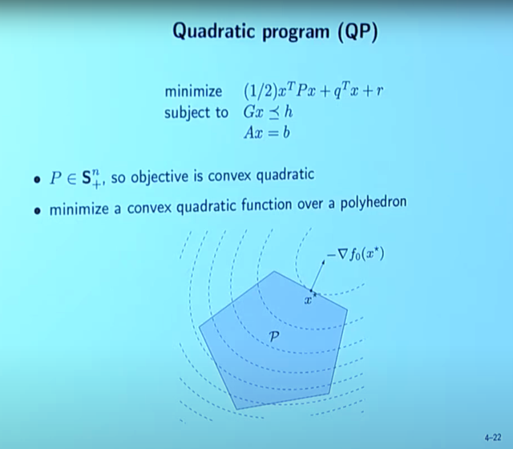</kbd>

> [!NOTE]
> Tiếp theo là bài toán rất nổi tiếng gọi là **Quadratic program**.
>
> Trong đó **objective function là một quadratic function**: 
>
> (1/2)xTPx + qTx + r
>
> Và constraints là các linear inequalities / equalities thể hiện bởi Gx ⪯ h và Ax = b.
>
> P ∈ S^n+, tức là một **positive semi-definite matrix**, do đó objective là convex function.
>
> (Bài trước ta đã học **second order condition**, có thể xác định function convex hay không dựa vào Hessian có phải là positive semi-definite tại mọi điểm không, ở đây P chính là Hessian:
>
> Thử tính: df = f(x+dx)-f(x) 
>
> = (1/2)(x+dx)TP(x+dx) + qT(x+dx) + r  - [(1/2)xTPx + qTx + r]
>
> = (1/2)(xT+dxT)P(x+dx) + qT(x+dx) + r  - [(1/2)xTPx + qTx + r]
>
> = (1/2)(xTP+dxTP)(x+dx) + qTx+qTdx + r  - (1/2)xTPx - qTx - r
>
> = (1/2)(xTPx+dxTPx+xTPdx+dxTPdx) + qTx+qTdx + r  - (1/2)xTPx - qTx - r
>
> = xTPdx +qTdx  = (xTP+qT)dx
>
> => ∇f = (xTP+qT)T = PTx+q
>
> *Hessian (theo cách làm Bilinear form)
>
> d(f'(x)[dx]) = d((xTP+qT)dx) = ((x+dx')TP+qT)dx - (xTP+qT)dx
>
> = xTPdx + dx'TPdx + qTdx - xTPdx - qTdx
>
> = dx'TPdx = f''(x)[dx' dx] ⇨ Hessian = P
>
> Thế thì **feasible set cũng là convex set, là một Polyhedron** (giống như trong bài toán Linear Program).
>
> Nên chỉ khác bài toán linear program ở chỗ ở đây **level set của objective function là các ellipsoid**, khác với các hyper-plane đối với linear program nơi objective là affine function.
>
> Và quá trình optimizing về cơ bản là ta sẽ **tìm ra cái điểm trong feasible set P sao cho nó tiếp xúc với level set thấp nhất**.
>
> Tại sao điểm x* trong hình là optimal point. Vì nó nằm tại điểm tiếp xúc giữa level set và cạnh của P. Mọi điểm trong P đều nằm một bên của level set này. Khi di chuyển trên level set f0 sẽ ko đổi, nên di chuyển về mọi hướng trong P từ x* sẽ đều là tạo nên một góc nhỏ hơn 90 độ với gradient vector ∇f0(x0), khiến f0 tăng lên.
>
> Gs cho biết thêm QP là bài toán rất phổ biến. Ông nói hầu như mọi quỹ đầu tư Hedge-fund đều giải những bài toán QP (tối ưu danh mục đầu tư). Thậm chí việc tên lửa Falcon đáp xuống của SpaceX gần đây cũng ứng dụng rất nhiều bài toán QP

**🔗 See also:** [Second order conditions](./lec_3.md#node-zmb0etz)

 

- **Một số ví dụ của bài toán Quadratic Programming**

<kbd>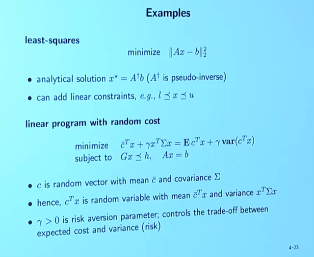</kbd>

> [!NOTE]
> Một số ví dụ của bài toán này là bài toán kinh điển **least-square** và **linear program with random cost**
>
> Nói chung gs cũng chỉ đang lướt qua các dạng vấn đề của convex optimization nên ta sẽ quay lại nói rất kĩ về các bài toán này sau.
>
> Ở đây chỉ có thể hiểu sơ. Với bài toán least square, gs ko nói nhiều nhưng từ 1806 mình đã biết, objective là minimize distance của Ax và b. Mà analytical solution là A^+b với A^+ là pseudo inverse của A.
>
> Là thế nào?
>
> Sẵn ôn lại luôn: Thật ra bài toán đặt ra là ta muốn giải một hệ các linear equation, thể hiện bởi Ax = b. Tuy nhiên, vấn đề là có những trường hợp khác nhau do A.
>
> Nếu A mà invertible, ta có thể tính Ainv và giải ra x ngay bằng x = Ainv b
>
> Hoặc phân tách A thành LU và giải LUx = b ⇔ Ux = Linv b ⇔ x = Uinv Linv b
>
> Tuy nhiên nếu A không invertible, không full-rank. Mà case đầu tiên là A là ma trận cao ốm và cho rằng A full-column rank, tức các cột độc lập. Thế thì vì b và các columns của A là vector thuộc R^m, và m > r = n, nên dim C(A) < m, nên C(A) chỉ là một subspace của R^m, từ đó có thể tồn tại b thuộc R^m nhưng nằm ngoài C(A). Lúc này không tồn tại linear combination các A's columns để ra b, nói cách khác, Ax = b vô nghiệm.
>
> Thế thì khi đó ta có thể tìm best solution, Ax^ sao cho different với b là tối thiểu, đó chính là lúc ta đặt ra bài toán optimization với objective function là L2 distance giữa Ax và b: ||Ax-b||^2.
>
> Việc giải bài toán này có thể dựa vào lập luận hình học rằng: À, nếu Ax^ gần nhất (có khoảng cách nhỏ nhất) với b, mà Ax^ là vector trong C(A), vậy, thì điều này đồng nghĩa Ax^ là hình chiếu (projection) của b lên C(A), để rồi ta sẽ phân tách b thành hai vector vuông góc, một nằm trên C(A), một vuông góc với C(A): b = Ax^ + e. Và e, gọi là phần dư sau khi chiếu b lên C(A): e = b-Ax^. 
>
> e sẽ vuông góc với C(A) và có thể nhận rằng vì ta biết có một subspace cũng vuông góc với C(A): Left null space N(AT), cho nên e chính là nằm trong N(AT). Nhưng dù sao, từ việc e vuông góc với C(A) nên ta có điều kiện: ATe = 0 (mà việc e nằm trong N(AT) cũng cho biết điều này, bởi ta biết N(AT) là tập hợp các solution của ATy = 0)
>
> Thế thì từ ATe = 0 ⇔ AT(b-Ax^) = 0 ⇔ ATb = ATAx^
>
> Đây chính là normal equation.
>
> Cái giải thứ hai là theo Calculus: Bằng cách tìm critical point của f(x) = ||Ax-b||^2  = (Ax-b)T(Ax-b) ta cũng sẽ cho ATAx = ATb
>
> Từ đây x^ = (ATA)invATb. Đây chính là least square solution.
>
> Và Ax^ = A(ATA)invATb chính là hình chiếu của b lên C(A) và 
>
> P = A(ATA)_invAT chính là Projection matrix onto C(A)
>
> Theo calculus ta sẽ còn cần phải xét check second derivative test để cho thấy critical point là minimum. Thì không khó để thấy Hessian là ATA, và nó là một positive semi definite (chứng minh nhanh xTATAx = (Ax)T(Ax) = ||Ax||^2 sẽ dĩ nhiên không âm với mọi x).
>
> Còn ở class này EE364A thì function có Hessian positive semi definite nên nó là convex function thành ra critical point chắc chắn là minimum
>
> Thế thì tới đây có thể nhận ra rằng, ATAinv tồn tại là bởi ta đang xét trường hợp A full column rank, khi đó các cột của nó độc lập nên cách duy nhất để kết hợp tuyến tính chúng ra 0 là bằng một bộ hệ số bằng 0. Điều này cũng chính là nói nullspace của A chỉ có zero vector: N(A) = 0. Mà điều này giúp liên quan gì đến ATA: Là bởi nếu xét ATAx = 0, thì về về cơ bản là ta muốn tìm x sao cho Ax nằm trong nullspace của AT, cũng là left nullspace của A, để mà AT(Ax) = 0.
>
> Thế thì hãy nghĩ về nullspace của AT, là left-nullspace của A, theo định lý Rank-Nullity, ta biết nó sẽ orthogonal complement với column-space C(A) và với việc dim C(A) < m thì có thể khẳng định dim N(AT) > 0, và bằng m - n (n = rank r).
>
> Tuy nhiên khi xét Ax, dĩ nhiên nó luôn luôn là vector trong columnspace C(A), nên để Ax nằm trong left nullspace N(AT) thì chỉ có Ax = 0 (columnspace và left nullspace  orthogonal complement và có chung vector zero). Thành ra, x trong nullspace của ATA
> cũng chính là x khiến Ax = 0. Từ đó giúp ta thấy ATA có cùng nullspace với A.
>
> Để rồi nếu nullspace của A chỉ có 0 thì ATA cũng vậy, khi đó ATA sẽ full-rank 
>
> Và do đó ATA tồn tại.
>
> Quay lại đây thì projection matrix P = (ATA)invAT cũng chính là LEFT-INVERSE của A
>
> ====
>
> Tuy nhiên, nếu A là matrix cao ốm nhưng không column rank thì sao? Khi đó nullspace của A không chỉ có trivial solution, mà còn có non-zero vector. Nó sẽ khiến Ax bằng 0, và ATAx=0, đồng nghĩa nó cũng là non-vector trong nullspace của ATA, nên ATA non-invertible. Và không tồn tại left-inverse matrix A, hay projection matrix P.  
>
> Và điều này cũng xảy ra nếu A là matrix mập lùn, nhiều cột hơn hàng, thì chắc chắn các cột không độc lập. Từ đó ATA cũng không full-rank. 
>
> Thế thì xét ATAx = ATb trong cả hai trường hợp đều gọi là bài toán least-square với dependent columns: Các columns của A đều dependent.
>
> Thế thì, vì ATA singular, nên N(ATA) khác 0: Tồn tại x_null khác 0. Bên cạnh đó, ATb nằm trong rowspace của A mà C(ATA) cũng chính là rowspace của A: 
>
> Thành ra ATb luôn nằm trong C(ATA) => ATAx = ATb luôn có nghiệm x_particular.
>
> Từ đó ATAx=ATb có vô số nghiệm. 
>
> Lúc này là lúc vai trò của PSEUDO-INVERSE A^+ xuất hiện giúp giải tìm least-square
> solution.
>
> A^+ có công thức là VΣ+(UT) với U, V là left-singular và right-singular matrix của A A^+ có đặc điểm là, nó sẽ map column-space vector về lại row-space và left-nullspace về 0.
> matrix Σ+ là diagonal matrix có các đường chéo là 1/σi là nghịch đảo của các singular
> value của
>
> Đương nhiên U, V, Σ liên quan đến Singular Value Decomposition matrix A: A = U Σ VT
> mà về bản chất là ta tìm ra hai orthogonal basis của rowspace (bỏ vào làm columns
> của Vr) và của column space (bỏ vào làm Ur) để rồi Avi = uiσi. Điều này khả thi với mọi
> ma trận vì ta biết rowspace và columnspace của mọi matrix đều mapping 1-1 với nhau.
> Để rồi ta sẽ có AVr = UrΣ, và vì Vr là matrix có các cột orthogonal, nên VrVrT = I_r =>
> AVr=UrΣ <=> A = UrΣ(VrT)
>
> Do đó nếu ta có một bộ orthogonal basis của rowspace, v1,2...vr thì qua A chúng sẽ cũng được map với một bộ orthogonal basis của column-space u1, u2...ur. Mà điều này thì  có thể tìm được V thông qua thực tế rằng: ATA = (UrΣVrT)T(UrΣVrT) =
> VrΣUrTUrΣVrT = Vr(Σ^2)(VrT) => Và đây chính là Eigen-decomposition của ATA, cho
> thấy Vr, right-singular của A, tức orthogonal basis của rowspace, chính là eigenvector
> của ATA, và singular values của A chính là eigenvalue không âm của ATA. Từ đó bằng
> cách tìm eigenvector và eigenvalues của ATA ta sẽ tìm được Vr, Σ từ đó có được Ur và
> nó cũng sẽ là là orthogonal basis của C(A)
>
> (uiTuj = (Avi)T(Avj) = viTATAvi = viTλivi = λi(viTvi) = 0, λi là eigenvalues của ATA)
>
> Và ta sẽ chứng minh pseudo-solution x^+= A^+b sẽ là nghiệm có chiều
> dài nhỏ nhất.
>
> ATAx = ATA(A^+b) = ATA[VΣ+(UT)]b) = VΣ^2(VT)V(Σ+)UTb =
> VΣ^2(Σ+)UTb = VΣUTb
>
> = [UΣ(VT)]Tb = ATb => A^+b là solution của ATAx=ATb
>
> Chứng minh nó có length nhỏ nhất:
>
> Vậy tại sao trong trường hợp A cao ốm lùn, để Ax=y có thể vô nghiệm 
> thì x = (A^+)y lại là solution khiến ||Ax-y|| nhỏ nhất:
>
> Xét ||Ax-y|| = ||UΣVTx-y|| 
>
> Đặt x = Vz <=> VTx = z, và đặt y' = UTy <=> Uy' = y
>
> ||UΣVTx-y|| = ||UΣz - Uy'|| = ||U(Σz-y')|| 
>
> và vì U là orthogonal matrix nên không thay đổi norm:
>
> ||U(Σz-y')|| = ||Σz-y'|| 
>
> Xét bình phương của ||Σz-y'||: ||Σz-y'||^2
>
> = (Σz-y')T(Σz-y') = Σi=1,2...m (σizi - y'i)^2
>
> = Σi=1,2...r (σizi - y'i)^2 + Σi=r+1,..m (0*zi - y'i)^2
>
> = Σi=1,2...r (σizi - y'i)^2 + Σi=r+1,..m (y'i)^2
>
> phần thứ 2 chỉ dính đến y' = UTy, là constant.
>
> nên để tối ưu ta chỉ quan tâm phần thứ 1: 
>
> Σi=1,2...r (σizi - y'i)^2
>
> đây là tổng của r term không âm, nên nó chỉ nhỏ nhất (=0) khi
> σizi - y'i với mọi i
>
> => zi = y'i/σi
>
> Vậy z* (z tối ưu) = [y'1/σ1, ...y'r/σr, 0,..0]T 
>
> Và z* chính là (Σ+)y' với Σ+ là diagonal matrix mxm với r diagonal
> entries đầu tiên là 1/σ1, 1/σ2...1/σr.
>
> =>x* (x tối ưu) = Vz* = V(Σ+)y' = V(Σ+)UTy
>
> Và đây chính là (A^+)y.
>
> Chứng minh xong
>
> Những ví dụ về least square gs nói ta sẽ tìm hiểu kĩ sau.
>
> ví dụ về linear program with random cost cũng ko hiểu lắm.
>
> Trong slide nói c là random vector, ok mình hiểu nó là vector các
> random variables c = (C1, C2...Cn) và c_bar là mean. Tức là 
> c_bar = E(c) và nó là vector [E(C1), E(C2)....E(Cn)]
>
> Và covariance matrix Σ.
>
> Thì thì họ nói cTx là random variable với mean c_barTx và variance
> xTΣx. Là sao nhỉ:
>
> cTx là scalar, và nó là function của các random variables Ci:
>
> Σi xiCi. Mà Stat110 đã cho mình biết function của random variables
> cũng là random variables. Nên cTx là r.v đúng rồi. Thử tính mean cTx
> mà mean ở đây là expected value:
>
> E(cTx):
>
> E(cTx) = E(x1C1 + x2C2 + ...+ xnCn) 
>
> = E(x1C1) + E(x2C2) + ...+ E(xnCn)    | linearity
>
> = x1EC1 + ..xnECn    |  linearity vì x1, x2 là các constant. 
>
> Và đã nói c_bar là vector [E(C1), E(C2)....E(Cn)]
>
> = x1c_bar_1 + ...xnc_bar_n = c_barTx
>
> Vậy E(cTx) = c_barTx tức mean của cTx là c_barTx
>
> ====
>
> Var(cTx) = E[(cTx - EcTx)^2] = E[(cTx - c_barTx)^2]
>
> Xét cTx - c_barTx = (cT - c_barT)x = (c - c_bar)Tx
>
> [(c - c_bar)Tx]^2 = (c - c_bar)Tx(c - c_bar)Tx
>
> mà (c - c_bar)Tx là scalar nên transpose nó tùy ý:
>
> = [(c - c_bar)Tx]T(c - c_bar)Tx
>
> = xT(c - c_bar)(c - c_bar)Tx 
>
> Vậy ta có E[(cTx - c_barTx)^2] = E[xT(c - c_bar)(c - c_bar)Tx]
>
> = xTE[(c - c_bar)(c - c_bar)T]x  | Linearity
>
> Rồi E[(c - c_bar)(c - c_bar)T] => Covariance matrix Σ 
> (kiến thức mới tạm biết vậy)
>
> Do đó kết qủa là = xTΣx
>
> Nhắc lại hầu như gs chỉ lướt sơ qua mấy cái này

> [!TIP]
> **🤖 AI Feedback** — ✅ Score: **100/100**
>
> Ghi chú của bạn cực kỳ chi tiết và sâu sắc, đặc biệt là phần giải thích về least-squares và pseudo-inverse, thể hiện sự hiểu biết toán học vững chắc vượt xa nội dung trên slide. Để tối ưu hóa cho việc tóm tắt bài giảng, bạn có thể cân nhắc cô đọng hơn một chút các chứng minh, nhưng đây là một tài liệu tự học xuất sắc.

 

<kbd>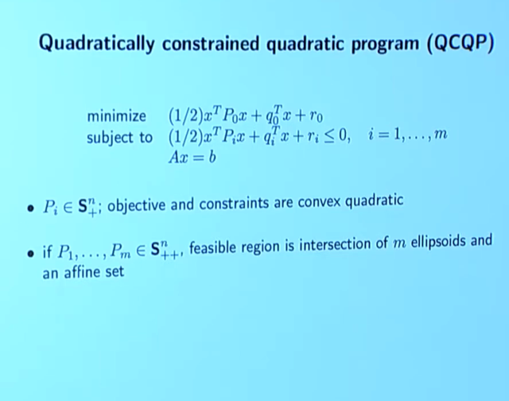</kbd>

> [!NOTE]
> Cái này ông cũng lướt qua luôn. Chả nói gì. Chỉ nói là "bạn
> có thể nghe người ta nói về cái này"
>
> QUADRATICALLY CONSTRAINED
> QUADRATIC PROGRAM

 

<kbd>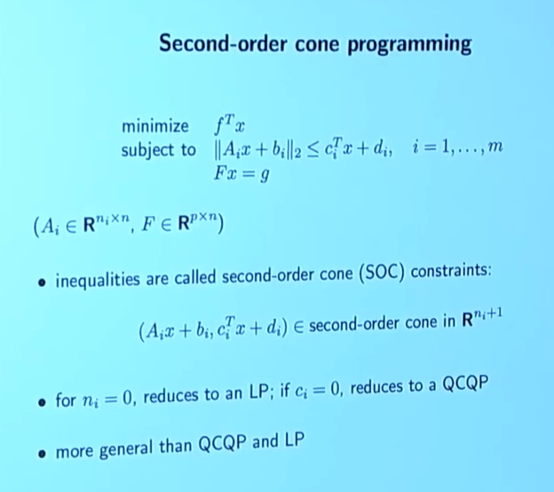</kbd>

> [!NOTE]
> qua cái này, đầu tiên gs lưu ý cái này không phải SQUARE của L2
> norm, ý nói vì nhiều lí do (để có analytical solution, để
> differentiable, ...nhưng thường chỉ vì yếu tố lịch sử) mà thường
> thường khi gặp l2  norm, ta thường bình phương nó lên,  ....nhưng
> ở đây không phải  squared norm.
>
> Tiếp, nếu Ai, bi = 0 thì vé trái bằng 0, và bài toán này thành ra lại
> bài toán linear program LP. Nên có thể coi cái này khái quát
> hơn của LP
>
> Gs cho biết Second order cone có nghĩa là: norm của u < v, v là
> scalar, u là vector
>
> Ông nói thêm vài cái ko hiểu lắm, nhưng nhấn mạnh là bài toán
> này rất phổ biến mà phần lớn các bài toán đều sẽ reduced về là
> thuộc cái này
>
> Và thêm nữa, bài toán này giống như là low-level language. đại khái
> là rất nhiều bài toán thực chất là bài toán này
>
> SECOND ORDER CONE PROGRAMMING

 

- **Tối ưu hóa dưới điều kiện bất định**

<kbd>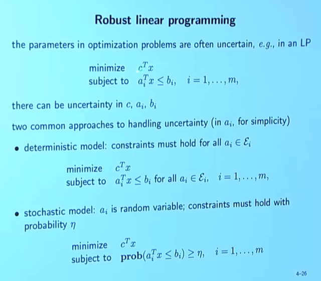</kbd>

> [!NOTE]
> đầu tiên ông nói về việc ta hiểu uncertainty inequalities là sao. ví
> dụ aiTx < bi mà ai bi đều là ko chắc chắn?
>
> gs ví dụ trong bài toán mà ta muốn tối ưu giá tiền thực phẩm với
> constraint là hàm lượng dinh dưỡng đạt mức tối thiểu nào đó. Thì ở
> đây hàm lượng dinh dưỡng trong thành phần cũng random, tùy
> theo từng đợt hàng. Thay vì cố định. HIểu đại khái là vậy
>
> Và ta cố gắng làm là tối ưu ngay cả trong điều kiện mà không chắc
> chắn như vậy. Đó gọi là Robust Linear Programming
>
> một ý cuối về stochastic model: đại ý là giống như trong Statistical
> inference class mình đang học về confidence interval, thì đại khái là
> cũng gặp cái vụ kiểu như muốn xác suất của cái gì đó lớn hơn  eta,
> bằng 0,95, 0.99
>
> ROBUST LINEAR PROGRAMMING

 

<kbd>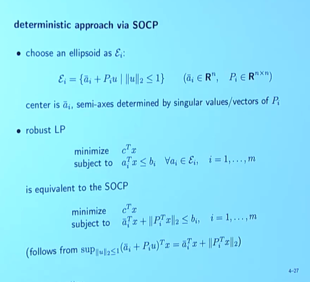</kbd>

> [!NOTE]
> một ví dụ của thể của deterministic approach via SOCP:
>
> đầu tiên chọn một ellipsoid: a_bar_i + Piu | u unit đây chỉ là mô tả cái
> ellipsoid: với a_bar_i là tâm, và nó cộng với vector unit được transform
> bởi matrix P. (Đây là cách define ellipsoid trong sách có nói)
>
> Nói chung đây là define một cái ellipsoid trong đó trục dài
> trục ngắn ra sao thực ra define bởi P
>
> thế thì bài toán robust LP trong đó như đã nói inequalities constraint
> cũng có yếu tố uncertainty. aiTx<=bi
>
> Thế thì với ellipsoid  đại khái là constraint này nó equivalent constrain
> a_bar_iTx + ||PiTx|| <= bi
>
> hiểu đại khái, có thể ko chính xác nhưng mình đoán có thể là vầy:
>
> cái elipsoid nó quy định các vector ai, để rồi aiTx <= bi sẽ trở thành
> tương đương với việc tìm ai sao cho maximize aiTx, và cho cái max đó
> cũng <= bi (vì cái lớn nhất mà bé hơn bi thì mọi cái sẽ bé hơn bi)
>
> Thành ra kiểu như ta mới xét cái ai khiến max aiTx, mà ai thì define bởi
> elipsoid, với cái tâm + Piu, nên maximize aiTx chính là maximize (tâm +
> Pi u)Tx, với ràng buộc là u là unit vector. Và việc tìm u để maximize cái
> này (tâm + Pi u)Tx, cũng là maximize PiuTx vì (tâm + Pi u)Tx = tâmTx +
> PiuTx mà tâmTx cố định (tâm là a_bar_i, ghi tâm cho nhanh)
>
> Cuối cùng tìm u để maximize PiuTx thì dễ thấy nó chính là u sao cho
> Piu (u transform bởi P) ra thành vector trùng hướng với x, thì khi đó dot
> product sẽ lớn nhất (vì việc tìm u chỉ là tìm hướng, chứ ||u|| = 1) Nên
> với u đó thì maximize ||PiuTx|| sẽ là ||PiTx||
>
> Rồi sau đó gs nói đại khái là cái PiTx sẽ giống như margin gì đó giúp
> cover cho yếu tố uncertainty của bài toán này.
>
> Còn lại thì khi nào đi sâu sẽ hiểu thêm

 

<kbd>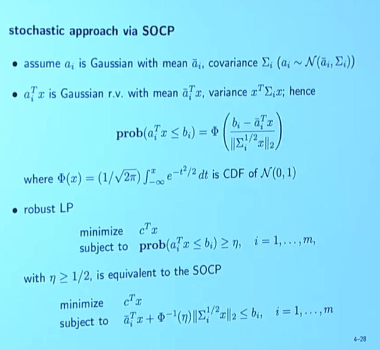</kbd>

> [!NOTE]
> rồi cái này gs nói cũng ko khó hiểu, ai là Gaussian (vector of 
> random variables) với mean a_bar_i, covariance Σi
>
> Thì aiTx cũng là một Gaussian (random variable) với 
> mean và variance là a_bar_iTx và xTΣx thì nãy ta có chứng minh rồi.
>
> Thế thì xác suất ở đây P(aiTx <= bi) với aiTx là rv, thì về cơ bản
> mình biết P(aiTx <= bi) là CDF của aiTx evaluate tại bi, tức F_aiTx(bi)
>
> (kí hiệu F_aiTx là CDF function của random variable aiTx)
>
> Mà với X~N(μ, σ) thì Y=(X-μ)/σ gọi là standardization thì Y~N(0,1)
> và thế thì X<bi <=> X-μ<bi-μ <=> (X-μ)/σ <= (bi-μ)/σ
>
> Nên P(X<bi) = P[(X-μ)/σ <= (bi-μ)/σ]
>
> = P(Y <= (bi-μ)/σ)
>
> Với μ ở đây chính là a_bar_iTx, và σ là standard deviation, 
>
> Xét variance σ^2 = xTΣx 
>
> = xT(Σ^1/2)T(Σ^1/2)x 
>
> = [Σ^1/2)x]T[Σ^1/2)x] = ||Σ^1/2)x||^2
>
> => σ = √σ^2 = ||Σ^1/2)x||
>
> Vậy P(X<=bi) = P[Y <= (bi-a_bar_iTx)/||Σ^1/2)x||]
>
> Và với N(0,1) thì người ta kí hiệu riêng CDF của nó là Φ
>
> Từ đó ta hiểu trong slide:
>
> P(aiTx<=bi) = Φ[(bi-a_bar_iTx)/||Σ^1/2)x||]
>
> ====
>
> Xong, đại khái là ta sẽ muốn cái xác suất này >= eta, và vì Φ là
> hàm monotonic, nên nó tương đương "cái term bi-...) >= Φ_inv(eta)
> và đại khái là ta sẽ có bài toán SOCP

 

<kbd>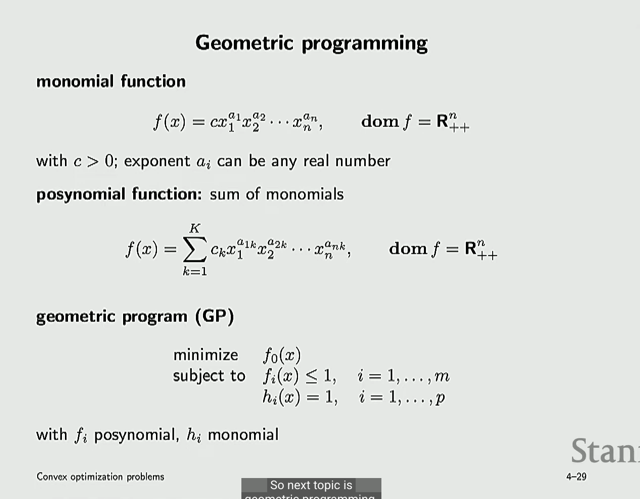</kbd>

> [!NOTE]
> đầu tiên đây đại khái là một bài toán có từ những năm 40. Nó
> ko convex nhưng ta sẽ transformation một chút để biến
> nó thành bài toán convex (equivalent)
>
> 4.5 GEOMETRIC OPTIMIZATION

 

<kbd>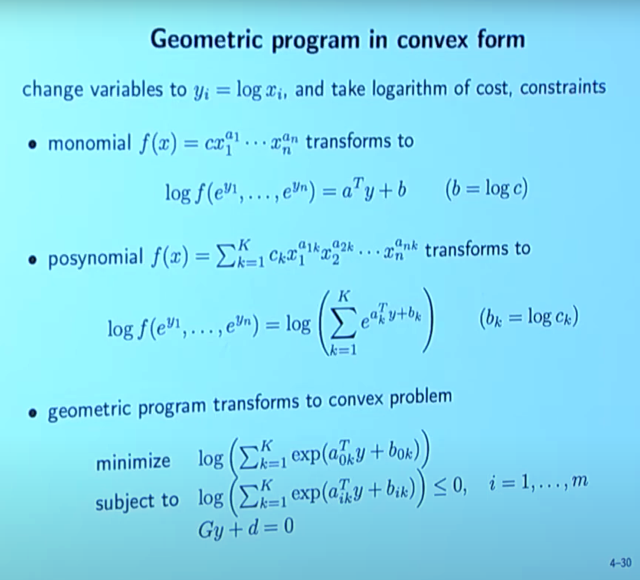</kbd>

> [!NOTE]
> và bằng cách dùng log, bài toán tương đương có các objective
> function và constraint function trở thành log Σ exp của affine. Là
> convex

 

<kbd>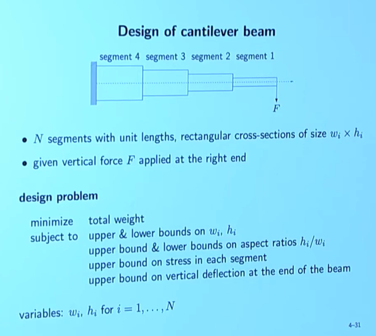</kbd>

> [!NOTE]
> môt ví dụ là vấn đề
> thiét kế cái dầm này

 

<kbd>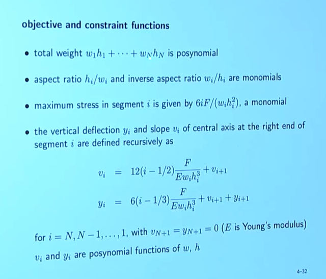</kbd>

 

<kbd>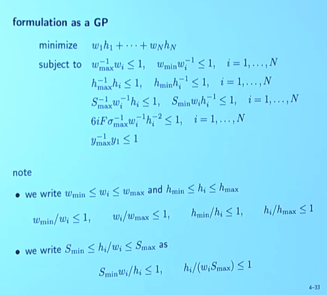</kbd>

> [!NOTE]
> đại khái là gs nói ko cần
> xem và hiểu cái này

 

<kbd>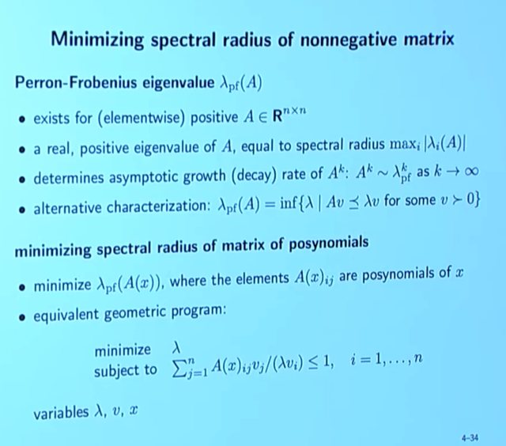</kbd>

> [!NOTE]
> Gs skip cái này để dành thời gian nói về một cái quan trọng hơn.
>
> Nhưng ông cho biết Geometric program là một trong những cái
> thuộc dạng non-convex problem nhưng có thể transform về
> convex problem để có thể solved được

 

<kbd>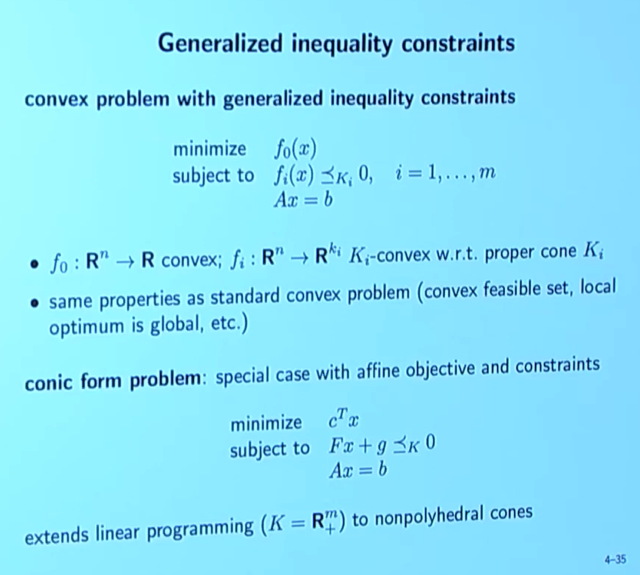</kbd>

> [!NOTE]
> Ta qua cái gọi là bài toán khái quát (generalized) của
> inequality constraints.
>
> Đại khái là nãy giờ với inequality constraints thì chúng là với
> scalar (fi(x) < 0), còn nay là với vector (fi(x) ⪯Ki 0, nhớ lại
> kí hiệu này có nghĩa là nếu y ≽K x,  thì y - x ∈ cone K)
>
> Vẫn có những tính chất là f0(x) convex, fi(x) Ki-convex w.r.t proper 
> cone Ki (khái niệm convex w.r.t cone K đã học trong phần Convexity
> w.r.t cone K)
>
> Và một bài toán tiêu biểu của cái này là CONIC FORM
> PROBLEM.
>
> Để rồi nếu K là non-negative orthant thì bài toán này trở về lại
> LP (linear program)
>
> 4.6 GENERALIZED INEQUALITY
> CONSTRAINTS
>
> GENERALIZED INEQUALITY
> CONSTRAINTS

 

<kbd>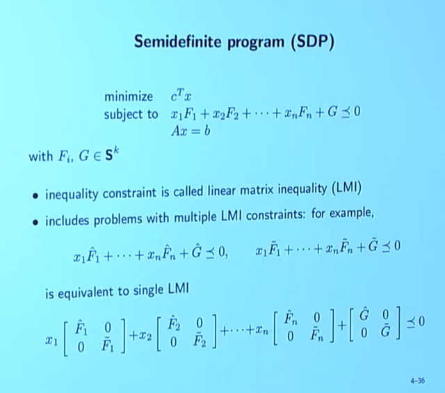</kbd>

> [!NOTE]
> trong cái Semidefinite programe, này gs nói cái subject
> x1F1+x2F2...+G ⪯ 0 đại khái là nói rằng (cái đó là linear
> combination của các matrix F) matrix bên trái phải là negative
> semi definite.
>
> Nói chung là gs lướt qua rất sơ sơ
>
> SEMI-DEFINITE PROGRAM (SDP)

 

<kbd>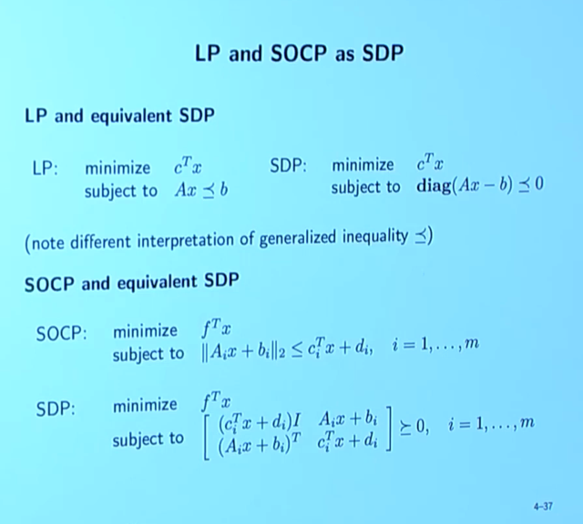</kbd>

> [!NOTE]
> Quay lại sau

 

<kbd>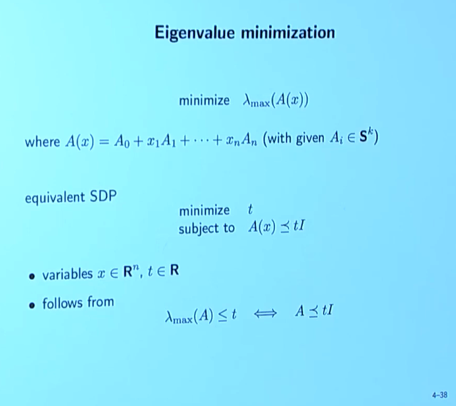</kbd>

> [!NOTE]
> Một ví dụ là ta có matrix A(x) là affine function của các symmetric
> matrix Ai. Và ta muốn tìm x để minimize eigenvalues của A(x)
>
> Thì bài toán này nó equivalent với SDP: là minimize t với constraint
> A(x) ⪯ tI
>
> Xuất phát từ việc λ_max(A) ⪯ t <=> A ⪯ tI 
>
> <=> tl-A ≽ 0
>
> tI-A ≽ 0 => (tI-A) is positive semi-definite => mọi eigenvalues của
> (tI - A) đều >= 0
>
> Ix = x <=> tIx = tx (1)
>
> Ax = λx <=> -Ax = -λx (2)
>
> (1) (2) => tIx - Ax = tx - λx <=> (tI - A)x = (t - λ)x
>
> => eigenvalue của (tI - A) = t - λ
>
> => eigenvalue(tI - A) = t - eigenvalue(A)
>
> Thành ra nếu eigenvalue(A) <= t <=> eigenvalue(A) - t <= 0
>
> <=> t - eigenvalue(A) >= 0
>
> <=> eigenvalue(tI - A) >= 0
>
> <=> tI - A là POSITIVE SEMI DEFINITE
>
> EIGENVALUE MINIMIZATION

 

<kbd>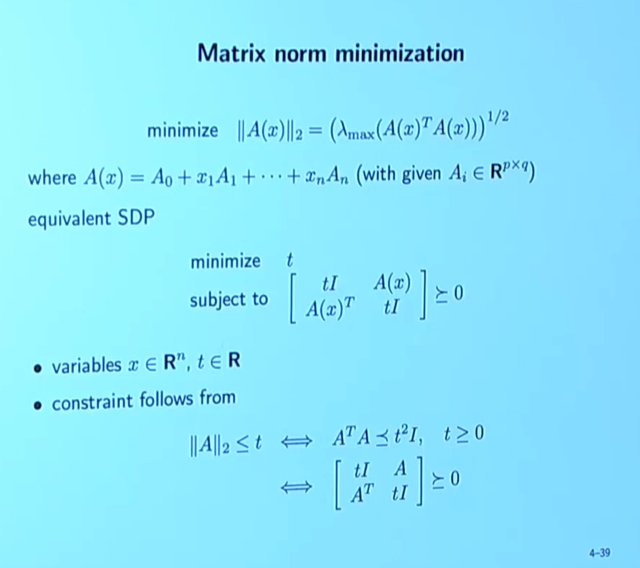</kbd>

> [!NOTE]
> Tương tự bài toán minimize matrix norm cũng vậy.
>
> có cái ta có thể hiểu là matrix norm cụ thể đây là SPECTRAL NORM (đã
> xem trong Kevin Murphy) được định nghĩa là cái singular value lớn nhất.
> mà singular value của A ta nhớ nó chính là căn bậc hai của  eigenvalue của
> ATA thành ra công thức của matrix norm ||A||2 = [λmax(ATA)]^1/2
>
> Thì đại khái là bài toán này nó có thể tương đương bài toán SDP thành ra
> có thể giải được
>
> Còn muốn hiểu nguồn cơn của nó thì y như vậv thôi:
>
> ||A|| <= t <=> σ_max(A) <= t <=> (λ_max(ATA)^1/2 <= t
>
> λ_max(ATA) <= t^2
>
> <=> eigenvalue(ATA) <= t^2
>
> <=> 0 <= t^2 - eigenvalue(ATA)
>
> <=> eigenvalue(t^2*I - ATA) >= 0
>
> <=>  t^2*I - ATA ≽ 0
>
> và điều này có nghĩa là matrix vế trái là một positive semi definite
>
> EIGENVALUE MINIMIZATION

 

