# Lec 7

📊 **Progress:** `56` Notes | `77` Screenshots

---

## Lec 7

 

<kbd>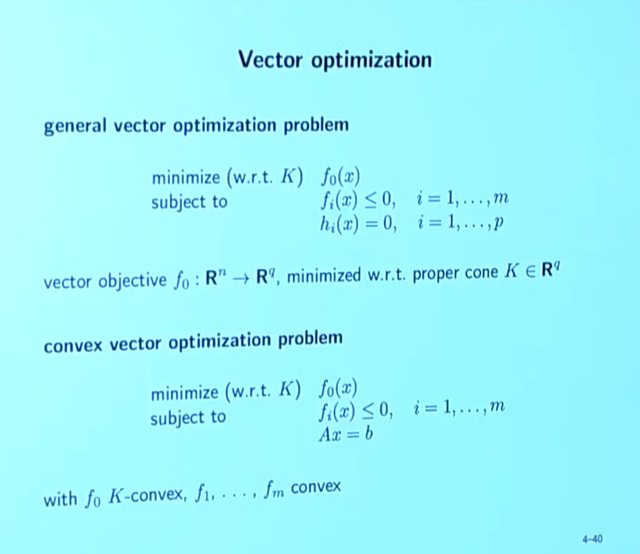</kbd>

> [!NOTE]
> Bài này ta sẽ nói về VECTOR OPTIMIZATION
>
> Đầu tiên gs nhắc lại về semantic của optimization problem (tại
> hiểu là ý nghĩa, hay tiêu chí) đó là ta có các constraints, thì ta
> phải thỏa mọi constraints (feasible problem), nếu không thỏa, 
> khỏi nói chuyện tiếp (infeasible problem).
>
> Nếu thỏa thì ta có những điểm gọi là feasible set. Thì trong đó cái
> nào khiến objective nhỏ nhất thì đó là optimal (tất nhiên phải có
> thêm vụ có thể đạt được optimal value hay không nữa vì có khi có
> optimal value nhưng unattainable)
>
> Thế thì qua vector optimization: OBJECTIVE FUNCTION f0(x)
> KHÔNG CÒN CHỈ LÀ SCALAR FUNCTION MÀ NÓ LÀ VECTOR.
>
> Để rồi việc minimize f0 w.r.t proper cone K cần phải hiểu chính
> xác
>
> 4.7 VECTOR OPTIMIZATION

 

<kbd>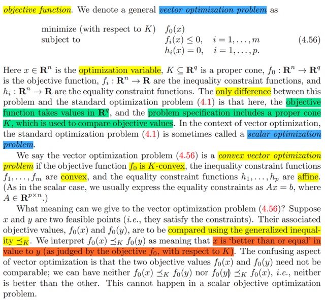</kbd>

<kbd>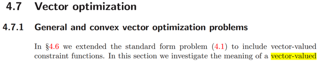</kbd>

> [!NOTE]
> trong sách nói rõ hơn một chút, đó là ở phần này, ta mở rộng qua bài
> toán mà  CẢ OBJECTIVE FUNCTION CŨNG LÀ VECTOR function.
>
> Thế thì, lúc này, giả sử có hai điểm trong feasible set x, y. Thì f0(x) và
> f0(y) sẽ phải so sánh với nhau DỰA TRÊN MỘT CONE K. Mà định
> nghĩa u ⪯ K v đọc là v better or equal to u wrt cone K đó là v - u
> ∈ cone K.
>
> Để rồi khi 
>
> a) f0 K-CONVEX (định nghĩa là domain của f0 convex và
> f0(θx + (1-θ)y) <= θf0(x) + (1-θ)f0(y)), 
>
> b) fi(x), tức các equality constraint (và có thể cũng là các vector 
> function luôn) CONVEX 
>
> c) hi(x) là các AFFINE.
>
> Thì khi đó ta có CONVEX VECTOR OPTIMIZATION PROBLEM
>
> 4.7 VECTOR OPTIMIZATION
>
> 4.7.1 GENERAL & CONVEX VECTOR 
> OPTIMIZATION  PROBLEMS

 

<kbd>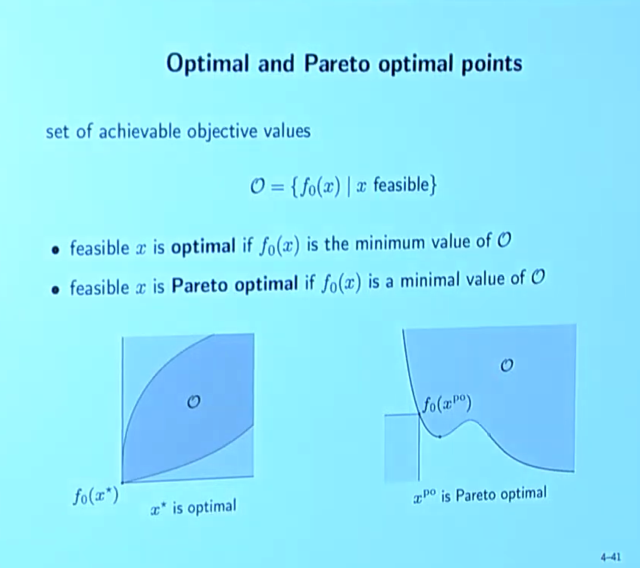</kbd>

> [!NOTE]
> Từ đó ta sẽ cần hiểu khái niệm **OPTIMAL** và **PARETO OPTIMAL**
>
> Đầu tiên gs nói ta hãy xét TẬP CÁC GIÁ TRỊ f0(x) VỚI x ∈ FEASIBLE SET X:
>
> O = {f(x) | x ∈ X}
>
> Thì **nếu f0 là scalar, thì O đơn giản là một interval (một khoảng / đoạn) trên trục R**. Và việc **lấy optimal value chỉ việc lấy điểm đầu hay cuối của nó thôi**.
>
> Còn bây giờ, **với việc f0(x) là vector thì O sẽ hơi lạ**.
>
> Đầu tiên, giả sử ta có O như trong hình trái, gs nói đại khái ta nên hiểu tình huống này **f0(x) càng xuống dưới, và càng qua trái thì càng tốt**. 
>
> **Ví dụ như, f0 là vector 2D, ta muốn hai component của nó càng nhỏ càng tốt.**
>
> Thế thì với O như vầy, dễ thấy điểm **x* chính là optimal vì nó là điểm thuộc feasible set - khiến f0 nằm trong O nhỏ hơn component-wise với mọi f0(x) khác trong O**. 
>
> Hay nói cách khác **f0(x*) là MINIMUM của O nên x* là OPTIMAL**.
>
> Nhớ lại định nghĩa MINIMUM, x là minimum của set S wrt K thì với mọi y thuộc S, x ⪯K y
>
> OPTIMAL & PARETO OPTIMAL

**🔗 See also:** [linked note](./lec_2.md#node-x7fv2jz)

 

<kbd>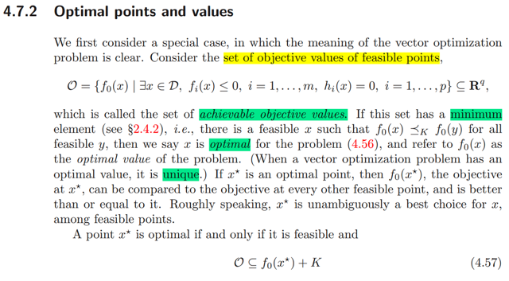</kbd>

<kbd>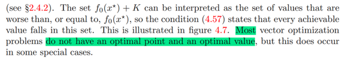</kbd>

> [!NOTE]
> Cũng như vừa nói, định nghĩa của OPTIMAL points, đó là đầu
> tiên ta sẽ định nghĩa ra set mọi value của f0(x) với x FEASIBLE.
>
> O = f0(x) | x ∈ D, fi(x) <= 0, hi(x) = 0
>
> Và tập này có tên là ACHIEVABLE OBJECTIVE VALUES
>
> Thế thì, nếu như tập này tồn tại MINIMUM, theo định nghĩa
> bữa trước, nếu ta có set S thì với mọi vector y trong S, x ⪯K y thì
> khi đó x là minimum, vậy ở đây khi f0(x*) ⪯ f0(x) với mọi x x thuộc
> feasible set (đồng nghĩa với mọi f0(x) thuộc set O ở trên) thì khi
> đó f0(x*) là MINIMUM của set O, và x* là OPTIMAL
>
> Một điểm nữa đó là, strong phần nói về định nghĩa của minimum
> và minimal. Thì có phần thể hiện bằng set notation. Đó là nếu x
> là minimum của S wrt cone K thì: S ⊆ (x + K). Mang ý nghĩa, mọi 
> điểm y trong S đều nằm trong tập "tốt hơn" x (y ∈ S => y ≽K x). Còn
> nếu x là minimal của S wrt cone K: (x - K) ∩ S = x mang ý nghĩa 
> "những điểm trong S mà tốt hơn x thì chỉ có thể là x
>
> Thì ở đây, f0(x) là minimum của O: O ⊆ (f0(x) + K).
>
> Gs cũng nói phần lớn các bài toán sẽ KHÔNG CÓ OPTIMAL
>
> 4.7 VECTOR OPTIMIZATION
>
> 4.7.2 OPTIMAL POINTS & VALUES

 

<kbd>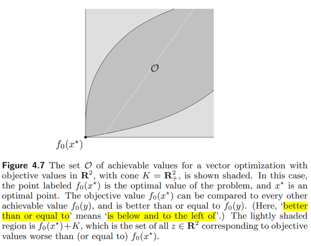</kbd>

> [!NOTE]
> HÌnh ảnh của định nghĩa về minimum theo set notation: 
>
> O ⊆ (f0(x*) + K) 
>
> Chú ý là nếu theo định nghĩa  thì f0(x*) + K là tập những điểm f0 
> better f0(x*) và better ở đây tức là f0 ≽K f0(x*).
>
> Nhưng dĩ nhiên trong bối cảnh là bài toán tối ưu thì f0 là tệ hơn

 

<kbd>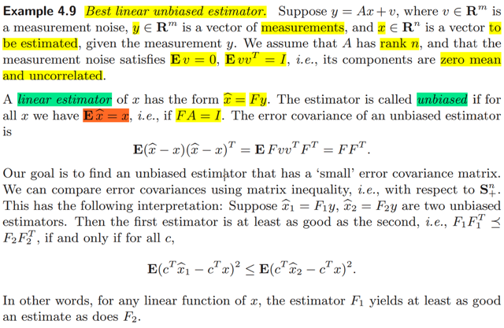</kbd>

<kbd>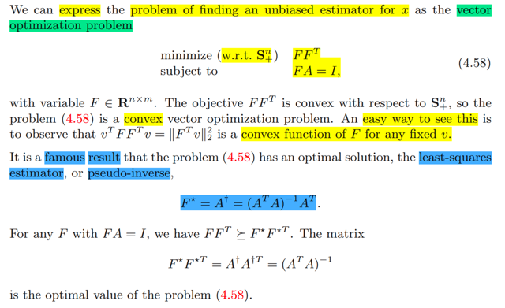</kbd>

> [!NOTE]
> Đại khái là ta có: y = Ax + v thể hiện một quan hệ giữa x và y, trong đó
> v là measurement noise có tính chất zero mean và uncorrelated thể
> hiện bởi E(v) = 0 và E(vvT) = I. 
>
> y là measurement, dữ liệu quan sát được. Còn x là variables, được map 
> với y thông qua linear function Ax + v. A là rank n matrix Và ta muốn estimate x.
>
> Thế thì ta sẽ có một linear estimator cho x: x^ = Fy.
>
> Thì như đã biết khái niệm UNBIASED ESTIMATOR từ Stat111: Đó là
> khi nó phải thỏa mãn nếu x^ là unbiased estimator của x E(x^) = x. 
>
> Và điều này sẽ xãy ra khi FA = I. Dễ thấy tại sao:
>
> Ex^ = x <=> E(Fy) = x  (x^ = Fy)
>
> <=> FEy = x | linearity
>
> Nói rõ hơn vìsao EFy = F(Ey):
>
> Fy cơ bản là Σ F(i)yi với F(i) là columns của F còn yi là component thứ 
> i của y
>
> nên EFy = E(Σ F(i)yi) = Σ EF(i)yi | linearity
>
> = Σ F(i) Eyi | linearity = F(Ey)
>
> <=> FE(Ax + v) = x 
>
> <=> F(EAx + Ev) = x 
>
> <=> FEAx = x 
>
> Nếu FEA = I <=> FA = I thì FEAx = x, nên nếu FA = I thì x^ = Fy là
> unbiased estimator
>
> Tiếp người ta cho biết ERROR COVARIANCE của unbiased estimator trên
> sẽ là: E[(x^-x)(x^-x)T (công thức này đã từng nói trong một số ví dụ
> trước, mình chưa chính thức được học từ Stat111 nhưng rồi sẽ thôi)
>
> = FFT.
>
> Tại sao:
>
> E[(x^-x)(x^-x)T] = E[(Fy-x)(Fy-x)T] = E[[F(Ax + v) - x][F(Ax + v) - x]T]
>
> = E[(FAx + Fv - x)(FAx + Fv - x)T]
>
> = E[(Ix + Fv - x)(Ix + Fv - x)T]
>
> = E[(Fv)(Fv)T] = E(FvvTFT) = FE(vvTFT) = FE(vvT)FT = FFT
>
> Thế thì, mục đích chính của ta sẽ là tìm UNBIASED estimator x^ = Fy
> sao cho ERROR COVARIANCE NHỎ NHẤT. Tức là tì F, sao cho FFT
> nhỏ nhất, dĩ nhiên để thỏa mãn Fy là unbiased estimator thì FA phải = I
>
> Chưa hiểu cái dòng E(cTx^1 - ....)
>
> Thành ra có thể chuyển bài toán này, thành bài toán tối ưu:
>
> minimize FFT với constraint FA = I và dĩ nhiên phải định nghĩa ra cone
> K (để có thể so sánh hai vector / matrix, ở đây là matrix. Thì cone K ở
> đây là S^n+: Tập các symmetric positive semi definite matrix)
>
> Và kết qủa nổi tiếng của bài toán này chính là pseudo-inverse A^+: 
>
> F* = A^+.
>
> (đây chỉ là ví dụ của vector optimization, còn giải bài toán này tại sao
> lại ra vậy thì ở đây ko nói)

 

<kbd>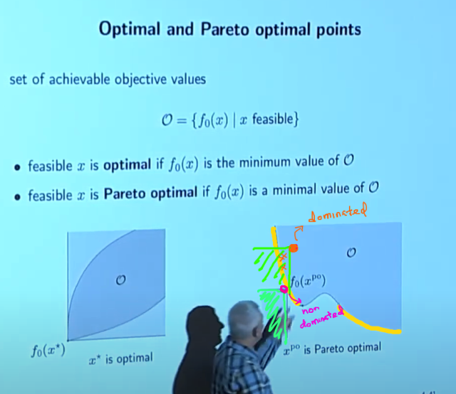</kbd>

> [!NOTE]
> Thế còn PARETO OPTIMAL. Đại khái là nó sẽ gắn với MINIMAL.
>
> Nhớ lại khái niệm MINIMAL, x là minimal của S wrt K nếu khi tìm
> mọi vector trong S mà better x wrt K (tức là tìm y ≽ x mà y - x ∈
> K) thì chỉ có mình x là thỏa: Nếu y ∈ S: y ⪯K x => y = x
>
> Hay nói cách khác, nếu xét tập CÁC ĐIỂM "TỐT HƠN x wrt K thì tập này
> CHỈ GIAO VỚI S TẠI MỖI MỘT MÌNH x. Khi đó x là MINIMAL, không
> phải MINIMUM, vì minimum thì nó phải ⪯K mọi y trong S. Thể hiện theo
> set notation: (x - K) ∩ S = x
>
> Thế thì, trong hình phải là ví dụ K là R^2+, non-negative orthant
> như đã biết, tức góc tư không âm, đồng nghĩa nói x ⪯R^2+ y tức
> là y-x phải thuộc R^2+, và cái này có nghĩa là x nằm ở vùng sao cho
> bên trái và bên dưới của tức tung độ và hoành độ đều ko lớn hơn y.
>
> Vậy có thể hiểu mọi điểm f0(x) trên đường biên màu vàng sẽ
> đều có đặc điểm là tập hợp các điểm "tốt hơn nó" giao với O chỉ là
> chính nó. Do đó chúng đều là minimal của O và do đó x sẽ là các
> PARETO OPTIMAL.
>
> Nó có cái tên NON-DOMINATED để đối lại với DOMINATED point. ví dụ
> như điểm màu cam, rõ ràng tập "tốt hơn nó" giao với O ở nhiều điểm
> khác, nên "có nhiều cái tốt hơn nó"

 

<kbd>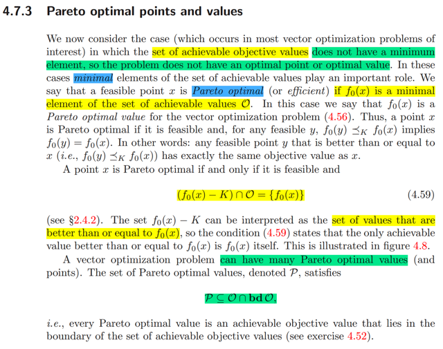</kbd>

<kbd>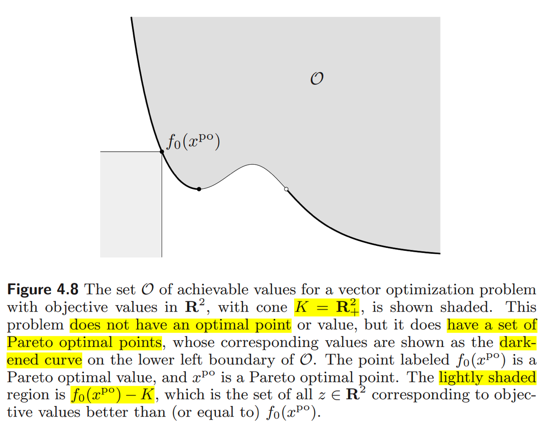</kbd>

> [!NOTE]
> như đã nói trong note của slide bài giảng.
>
> Chỉ có nói thêm cái ý về định nghĩa của Pareto optimal thể hiên
> tóán học của cái ý: x là minimal của set S khi những cái trong S tốt
> hơn hoặc bằng x chỉ có mình nó. Hay, xét tập những cái tốt hơn
> hoặc bằng x, thì tập này chỉ giao với S tại một mình x.
>
> Thì khi áp dụng vào đây:
>
> [f0(x) - K] ∩ O = f0(x), thì f0(x) - K là thể hiện set những cái tốt
> hơn hoặc bằng x (tốt hơn ở đây phải hiểu là có f0 ⪯K f0(x*) .
>
> Nếu xét K = R^n+ thì set f0(x) - K là cái hình chữ nhật màu xám.
> Để rồi ta thấy nó chỉ giao với O tại x.
>
> Cũng như trong bài học về minimal, minimum ta cũng đã biết
> thông thường thì khó có minimum, nhưng có nhiều minimal.  Thì ở
> đây cũng vậy, sẽ khó có optimal (ứng với f0(x*) là minimum của
> O), nhưng có thể có nhiều Pareto optimal (ứng với f0(x*) là
> minimal của O)
>
> 4.7 VECTOR OPTIMIZATION
>
> 4.7.3 PARETO OPTIMAL POINTS & VALUES

 

<kbd>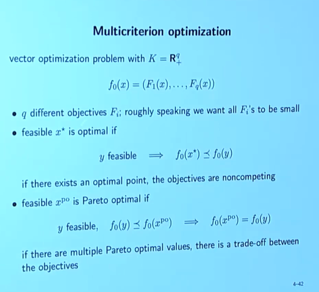</kbd>

> [!NOTE]
> thế thì từ đó ta đã có định nghĩa, hay hiểu ý nghĩa của objective với
> vector thì ta có cái gọi là MULTI-CRITERION OPTIMIZATION (tạm
> gọi là có nhiều tiêu chí, nhiều mục tiêu)
>
> Thì f0 là vector nhiều objective f0(x) = (F1(x), F2(x)...Fq(x)), nói
> nôm na  là ta muốn mọi Fi(x) đều nhỏ
>
> Thế thì đại khái gs nói rằng nếu mà ta CÓ THỂ TÌM THẤY
> OPTIMAL
>
> là cái gì thì đã biết đó là f0(x*) ⪯ f0(y) với mọi y thuộc feasible
> set
>
> THÌ ĐÂY LÀ TRƯỜNG HỢP MÀ CÁC OBJECTIVE Fi KHÔNG
> COMPETE NHAU:
>
> Ý là, ta có tình huống quá tốt, khi ta có thể tìm được điểm khiến
> minimize mọi Fi. Mà không phải đánh đổi (trade-off). Và tính
> huống này rất hiếm. Bởi lẽ thường ta phải trade off giữa cái này cái
> kia, nôm na là, thường thì các  objective compete, mâu thuẫn nhau,
> đối đầu nhau, để rồi muốn giảm cái này thì phải tăng cái kia: ví dụ
> muốn giảm mức tiêu hao nhiên liệu thì phải tăng mức tiền (xài nguyên
> liệu nhẹ hơn ví dụ vậy)
>
> Điều này lấy ví dụ như một design xe hơi với 12 tiêu chí thì ta có
> một design mà tốt hơn mọi design khác ở mọi tiêu chí.
>
> ====
>
> Còn KHI KHÔNG THỂ CÓ OPTIMAL, nhưng CÓ NHIỀU PARETO
> OPTIMAL  THÌ TỨC LÀ CÓ NHIỀU OBJECTIVES MÂU THUẪN
> NHAU
>
> Và tụi nó sẽ là "ko bị dominated" / "không bị embarrassed" vì không có
> cái nào mà "hơn hoặc bằng" nó ở mọi tiêu chí.
>
> MULTI-CRITERION OPTIMIZATION

 

<kbd>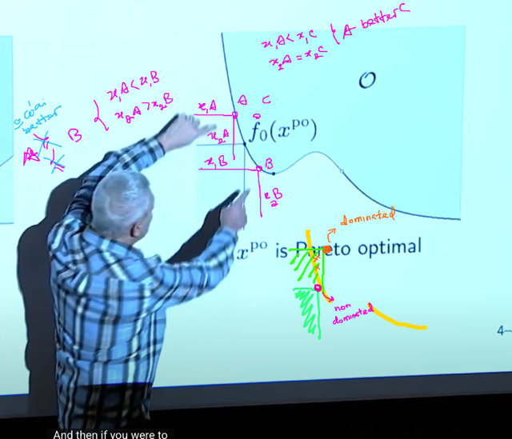</kbd>

> [!NOTE]
> ví dụ như ở đây điểm pareto optimal A có x1 nhỏ hơn nhưng
> pareto optimal Bi có x2 nhỏ hơn. thành ra 
>
> KHÔNG THỂ NÓI A TỐT HƠN B HAY B TỐT HƠN A
>
> Thành ra cái đám trên biên này ko có cái nào better cái nào (bởi
> better là phải nhỏ hơn cả ở hai tiêu chí x1, x2

 

<kbd>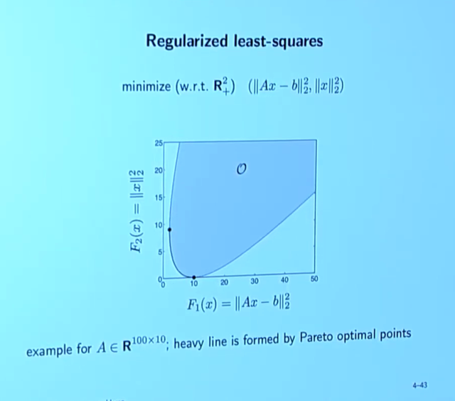</kbd>

> [!NOTE]
> môt ví dụ mà ta quan tâm trong machine learning / statistic
> (again, mấy cái này sẽ còn gặp lại) là REGULARIZED
> LEAST-SQUARES
>
> Objective như đã biết là ta muốn minimize loss function,
> ||Ax-b||^2 và muốn minimize ||x|| tức f0(x) = [F1(x), F2(x)]
> với F1 là ||Ax-b||^2 và F2 là ||x||^2.
>
> để rồi giả sử ta có O như thế này, thì vấn đề chỉ còn là TA SẼ
> CHỈ  QUAN TÂM CÁC PARETO OPTIMAL (VÌ KHÔNG CÓ
> OPTIMAL) nơi mà ko có cái nào tôt hơn cái nào, cái khiến
> giảm fitting error ||Ax-b|| thì sẽ đánh  đổi bởi tăng ||x|| (tăng nguy
> cơ overfit) và ngược lại giảm ||x|| (giảm nguy cơ overfit thì lại tăng
> ||Ax-b|| - tăng nguy cơ underfit)
>
> Mình nhận ra trade off này chính là Bias-Variance trade off nổi tiếng.
> khi muốn giảm fitting error thì ta sẽ phải hi sinh variance, tức là gặp
> nguy cơ overfit. Ngược lại muốn giảm overfit bằng cách khống chế
> ||x|| thì phải hi sinh fitting errror
>
> VÍ DỤ: REGULARIZED
> LEAST-SQUARE

 

<kbd>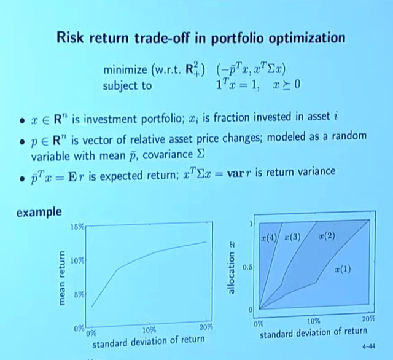</kbd>

> [!NOTE]
> x là vector tỉ lệ phân bổ tài sản, ví dụ 0.2 vào cổ phiếu X, 0.5 vào
> trái phiếu Y, 0.3 vào vàng. Nên ta hiểu Σxi = 1, thể hiện bởi 1Tx =
> 1 (1: [1, 1, 1]) và các components của x ko âm: x ≽ 0
>
> Thế thì p là vector thể hiện mức thay đổi của giá trị của các
> loại tài sản, ví dụ [0.01, -0,02, 0.03] ý và giá cổ tăng 1%, giá trái
> phiếu giảm 2%. khi đó r = pTx sẽ cho ta biết mức lỗ lãi của
> portfolio, tức là return.
>
> Thế thì E(r) = E(pTx) không khó để thấy, dựa trên linearity nó sẽ là
> E(p)Tx = p_barTx :
>
> E(pTx) = E(p1x1 + p2x2 ..) = E(p1x1) + E(p2x2) + ...= x1Ep1 +
> x2Ep2 +...
>
> = x1*p_bar_1 + x2*p_bar_2 + ... = p_barTx
>
> => Tóm lại ta hiểu p_barTx là E(r), objective là -p_barTx tức là ta
> muốn tăng expected return 
>
> Var(pTx) = E[(pTx - E(pTx))^2] = E[(pTx - p_barTx)^2]
>
> = E[(pTx - p_barTx)(pTx - p_barTx)]
>
> Do (pTx - p_barTx)^2 = (pTx - p_barTx)(pTx - p_barTx)
>
> = E[(pT - p_barT)x(pT - p_barT)x]   | (pTx - p_barTx) = (pT -
> p_barT)x
>
> = E[xT(p - p_bar)(pT - p_barT)x]    | (pT - p_barT)x = (p - p_bar)Tx
>
> và cũng bằng xT(p - p_bar)
>
> = E[xT(p - p_bar)(p - p_bar)Tx]
>
> = xTE[(p - p_bar)(p - p_bar)T]x  | linearity
>
> (E[xTa] = xT(Ea) | cái này chỉ là linearity chứng minh giống như
> triển khai trên
>
> E[xTAx] = xTE(Ax) (dựa vào cái trên, Ax đóng vai a)
>
> = xTE(A)x | cũng dựa vào cái trên E(Ax) = E(A)x )
>
> E[(p - p_bar)(p - p_bar)T] theo định nghĩa chính là Σ
>
> = xTΣx
>
> Tóm lại, ta hiểu xTΣx là variance của r, Var(r), và objective muốn
> giảm cái này là dễ hiểu: muốn giảm mức biến động của return
>
> Thế thì objective là minimize -p_barTx, và xTΣx, một cái là
> affine, cái kia là quadratic nên đều là convex.
>
> VÍ DỤ CỦA REGULARIZED LEAST-SQUARE: RISK
> RETURN TRADE OFF IN PORTFOLIO OPTIMIZATION

 

<kbd>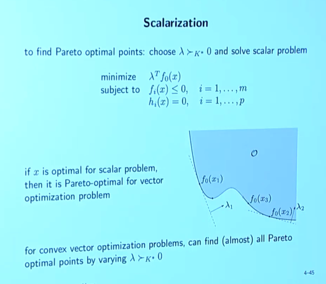</kbd>

> [!NOTE]
> Đại khái là để TÌM PARETO OPTIMAL, ta sẽ dùng cách sau, gọi là 
> SCALARIZATION.
>
> Review lại bữa trước kiến thức về DUAL CONE: Ta chọn
> (vector) λ trong dual cone của K (chính xác hơn là trong
> interior của K*, kí hiệu là λ ≻K* 0), 
>
> Và minimize λTz over z với z trong S, thì ta sẽ tìm được minimal 
> point (trong bối cảnh S là O, thì ta có Pareto optimal)
>
> Rồi gs nói nếu ta có λ positive thuộc dual cone (λ ≻K* 0), và f0 là
> K-convex function.
>
> (Nhắc lại, K-convex tức là domain convex và thỏa
>
> f(θx + (1-θ)y) ⪯K θf(x) + (1-θ)f(y), thì λTf0(x),
>
> Nói chung gs cũng chỉ lướt qua, ta sẽ còn gặp lại. Nhưng đại ý là
> Scalarization, là cách tiêu chuẩn để tìm ra Pareto optimal: khi di
> chuyển các line (define bởi normal vector vector λ) thì ta sẽ tìm
> được tiếp tuyến vói O tại x1 và x1 là optimal, khi đó nó sẽ là
> Pareto-optimal của bài toán vector optimization
>
> SCALARIZATION

 

<kbd>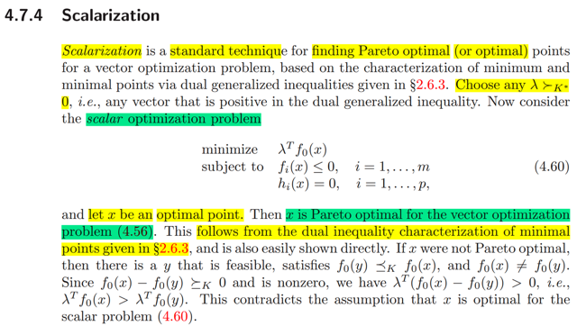</kbd>

> [!NOTE]
> Đại khái là phần này dựa vào một định lí mà ta đã học trong phần
> minimum / minimal. Đó là nếu ta chọn λ sao cho λ ≻K* 0 (mà theo
> định nghĩa, nó là λ ∈ interior của K*), rồi sau đó ta minimize λTz
> over z ∈ S, để được λTx thì x chính là minimal của S. (Ngược lại
> thì chưa chắc, tức là, nếu ta có x là minimal của S thì chưa chắc
> tồn tại λ ≻K* 0 khiến x là minimizer của λTz over z ∈ S, TRỪ KHI
> S LÀ CONVEX SET) Ta đã chứng minh cái này trong phần trước
> rồi (xem lại link)
>
> Thế thì từ đó, nó sinh ra việc ta có thể giải bài toán gốc minimize
> f0(x) với constraint fi(x) <= 0, hi(x) = 0 mà cụ thể là tìm Pareto
> optimal (chứ không phải tìm optimal). Bằng cách giải một bài toán
> equivalent:
>
> Chọn λ sao cho λ ≻K* 0 và minimize λTf0(x) với constraint fi(x) <=
> 0 và hi(x) = 0. Theo theorem trên nhất định ta sẽ tìm ra f0(x*) là
> minimum của O (tập Attainable Objective Value: {f0(x) | fi(x) <= 0,
> hi(x) = 0} thì x chính là Pareto Optimal của bài toán gốc (minimize
> f0(x))
>
> Người ta có đưa ra lập luận kiểu như chứng minh lại cái này
> (giống như chứng minh theorem này trong phần trước): Đó là giả
> sử ta có x* là minimizer của λTf0(x) của bài toán này mà nó lại
> không phải là Pareto optimal của bài toán gốc:
>
> Thì khi đó, vì nó không phải là Pareto optimal của bài toán gốc,
> nên tồn tại y ∈ feasible set sao cho f0(y) ⪯K f0(x*).
>
> Cái này <=> f0(y) - f0(x*) ⪯K 0 => f0(x*) - f0(y) ≽K 0  => f0(x*) -
> f(y)  ∈ cone K
>
> Mà nếu vậy thì, với λ ≻K* 0 thì λT[f0(x*) - f0(y)]  >= 0 (vì đây là
> định nghĩa của dual cone K*, là tập mà mọi vector λ trong nó đều
> sẽ có dot product không âm với mọi vector trong cone K)
>
> Vậy λTf0(x*) >= λTf(y) và như vậy x* không phải là minimizer của
> λTf0(x) mâu thuẫn với giả thiết đặt ra.
>
> Vậy, nếu x là minimizer (tức optimal) của bài toán equivalent -
> Scarlarization thì x sẽ là Pareto optimal của bài toán gốc
>
> 4.7 VECTOR OPTIMIZATION
>
> 4.7.4 SCALARIZATION

 

<kbd>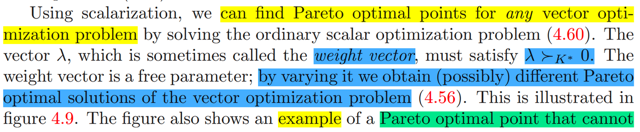</kbd>

<kbd>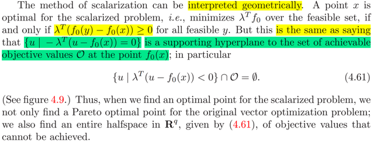</kbd>

<kbd>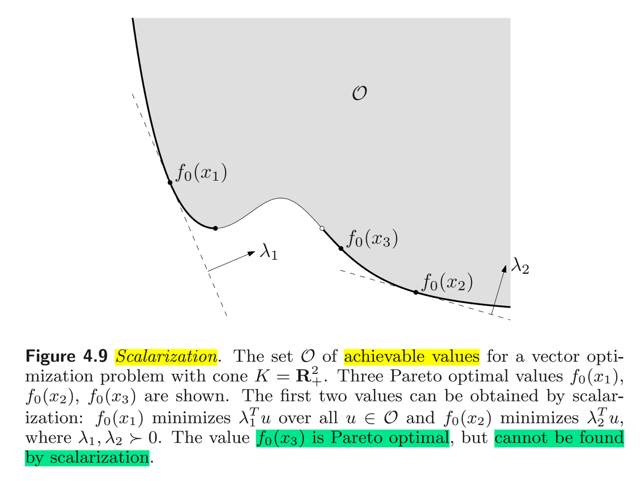</kbd>

> [!NOTE]
> Đại khái nói là dùng cách làm Scalarization, ta có thể tìm ra Pareto
> optimal của bất kì bài toán vector optimization nào. Và dễ thấy với
> mỗi lựa chọn của λ (phải thỏa λ ≻K* 0) thì ta sẽ tìm ra một Pareto
> optimal khác nhau.
>
> Tuy nhiên không phải là mọi Pareto optimal đều có thể tìm được
> bằng cách này, mà trong hình minh họa, x3 là một cái như vậy.
> Scalarization không thể tìm thấy x3, dù nó là một Pareto optimal.
>
> Cái này ta có thể hiểu vì liên hệ với bài bữa trước, mà lúc nãy cũng
> đã nhắc lại, đó là: Nếu x là minimizer của λTz over S wrt K với λ ≽K* 0
> thì suy ra x là MINIMAL của S. Nhưng ngược lại thì chưa chắc.
>
> Chỉ khi S convex, thì ta mới có chiều ngược lại (theo link tới bài trước
> mà ta đã chứng minh cái này)
>
> Ý cuối đại khái là giải thích về mặt hình học của phương pháp này.
> Dù chưa hiểu lắm nhưng có thể hiểu đại khái là làm vậy ta sẽ tìm
> ra support hyperplane của set O

**🔗 See also:** [Dual characterization of minimal elements](./lec_3.md#node-f5go1ga)

 

<kbd>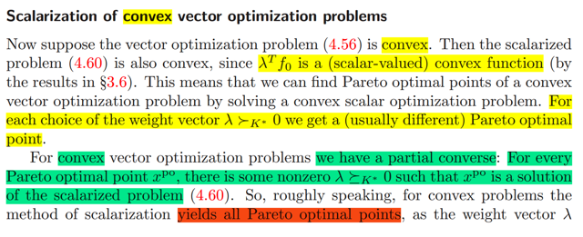</kbd>

<kbd>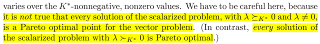</kbd>

> [!NOTE]
> Đại khái là nếu bài toán gốc là convex, thì bài toán scalarization cũng
> convex và thỏa mãn yếu tố là O trở thành convex set. Mà như đã
> vừa nói lại, rằng lúc này, bất cứ x là minimal nào thì cũng tồn tại λ
> ≽K* 0 khiến x là minimizer của λTf0(x) over f0(x) ∈ O.
>
> Tuy nhiên ta nhớ trong chương 2 cũng đã nói về một vấn đề, đó là,
> với convex case (và cả non-convex case) thì ở chiều xuôi phải là
> dấu  ≻K* (strictly better) còn ở chiều ngược lại thì phải là dấu ≽K*.
>
> Có nghĩa là, như đã biết cả convex hay không convex thì ta đều có
> chiều xuôi, rằng: Khi x là minimizer của λTz over z ∈ S với λ ≻K* 0 thì
> x là minimal của S. Thì phải chú ý λ phải ≻K* 0, tức λ ∈ interior của
> K*, mà trong trường hợp ta lấy K=R^n+, thì K* cũng là R^n+ (R^n+
> self dual) thì λ ∈ int R^n+ đồng nghĩa component của λ ĐỀU
> DƯƠNG CHỨ KHÔNG CHỈ KHÔNG ÂM.
>
> Còn ở chiều ngược lại (chỉ xảy ra khi convex case): Nếu x là
> minimal, thì tồn tại λ ≽K* 0 khiến x là minimizer của λTz  over z ∈ S.
> Thì nếu K = R^n+ thì λ CÓ THỂ CÓ COMPONENT KHÔNG.
>
> Do đó mới nói, nếu ta đi theo chiều xuôi, mà dùng dấu ≽K* thì chưa
> chắc ta tìm được Pareto optimal.

 

<kbd>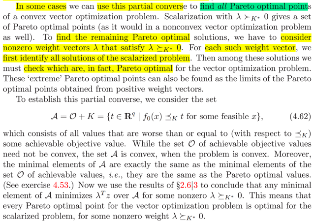</kbd>

> [!NOTE]
> Phần trên đại ý là, vì scalarization với λ ≻K* 0 dù chắc tìm ra Pareto 
> optimal nhưng ko đảm bảo tìm ra hết mọi cái. Còn nếu làm với λ ≽K* 0
> thì có thể sẽ giúp tìm ra những cái mà λ ≻ 0 không tìm ra, nhưng lại
> cũng có thể tìm ra những điẻm ko phải Pareto optimal.
>
> Vậy phương án thành ra sẽ là cứ dùng λ ≽K* 0, để tìm ra hết các 
> candidate, sau đó check lại xem cái nào là Pareto optimal.
>
> Còn đoạn cuối đại khái là lập luận để chứng minh khi S là convex
> thì ta có thể chắc chắn nếu có Pareto optimal x* thì sẽ có λ ≽K* 0 
> khiến f0(x*) đó là minimizer của λTf0(z)

 

<kbd>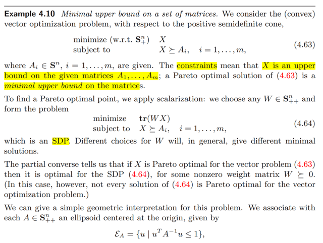</kbd>

<kbd>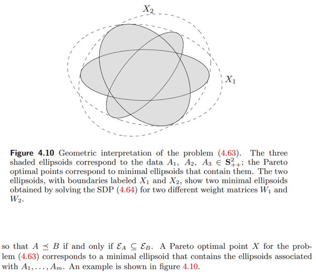</kbd>

> [!NOTE]
> một ví dụ, ta đối mặt bài toán vector optimization - như đã biết đó là
> khi objective function, là vector / matrix function. Trong trường hợp
> này, nó là matrix X. Và constraint là X ≽ Ai, mang ý nghĩa là X là
> chặn trên của Ai, và việc đặt ra bài toán này, là ta muốn tìm ra
> chặn trên tốt nhất, đồng nghĩa là tìm cách giảm thiểu chặn trên này
> xuống.
>
> Thế thì, ta sẽ áp dụng phương pháp scalarization, chọn λ ∈ int K*,
> rồi minimize λTf0(x) over archivable set O = {f0(x) | fi(x) <= 0; hi(x) = 0}
> thì khi ta tìm ra minimum của bài toán này sẽ là Pareto optimal của 
> bài toán gốc (minimize f0(x) with constraint). Thì ở đây, là matrix, và
> cone K là S^n+, thì đây là self-dual cone, nên K* cũng là S^n+.
>
> Để rồi ta sẽ chọn W ∈ int S^n+ chính là S^n++, tức W là positive
> definite matrix.
>
> Và objective của equivalent (scalarization) problem là tr(WX)
>
> Và lúc này ta trở về bài toán SDP.
>
> Khúc sau có nói về ý nghĩa hình học của bài toán này. Quay lại sau

 

<kbd>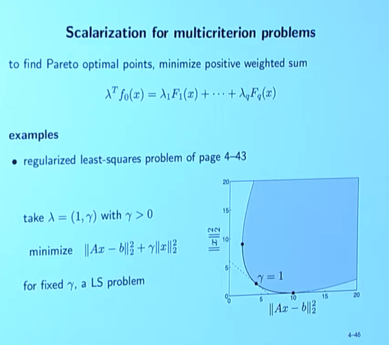</kbd>

> [!NOTE]
> một ví dụ là áp dụng nó vào bài toán multi-criterion (là bài
> toán mà objective f0(x) là vector các [F1(x),...Fq(x))]
>
> Để rồi ta sẽ "chuyển thành scalar" bằng cách chọn vector λ
> để và λTf0(x) sẽ CHO TA MỘT NUMBER (SCALARIZATION).
>
> Khi đó minimize con số này sẽ giúp ta tìm ra Pareto optimal
>
> Áp dụng vào ví dụ cụ thể của multi-criterion là là bài toán least
> square nơi mà F1(x), (gs nói có người gọi là first objective) là
> ||Ax-b||^2 và F2(x) là ||x||^2. ta sẽ chọn λ là <1, α> để rồi ta có
> scalar objective F1*1 +F2*α
>
> Again ta sẽ đi sâu vào sau.

 

<kbd>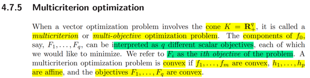</kbd>

> [!NOTE]
> Không có gì ghê gớm, nãy giờ ta đang trong phần nói về bài toán
> VECTOR OPTIMIZATION, khi objective function là vector/matrix, 
> mà vốn dĩ sự thay đổi này (từ scalar f0 đến vector, matrix f0) khiến
> cho việc so sánh (ordering) chuyển từ usual ordering thành partial
> ordering (gọi là generalized inequality).
>
> Thế thì bây giờ, nếu như f0 là vector R^p+, thì người ta gọi riêng
> nó là bài toán MULTI-CRITERION (mang ý nghĩa là thu hẹp lại,
> vì vector optimization là nói chung, khi f0 có thể là vector bất kì,
> hoặc matrix, thì nay chỉ là vector có component không âm thôi)
>
> Và sở dĩ có tên vậy là bởi nó khớp với bài toán mà giống như ta 
> muốn minimize nhiều tiêu chí, mỗi tiêu chí đều không âm, và chúng
> tạo thành vector f0(x) = [F1(x), ...Fp(x)]
>
> Dĩ nhiên là vì đây cũng là vector optimization nên những cái nãy h
> nói vẫn áp dụng,
>
> Và dễ hiểu khi f0 convex, xảy ra khi Fi(x) đều convex, các ineuality
> constraint fi(x) convex, và hi(x) affine thì ta sẽ có bài toán convex
> multicriterion
>
> 4.7 VECTOR OPTIMIZATION
>
> 4.7.5 MULTI-CRITERION OPTIMIZATION

 

<kbd>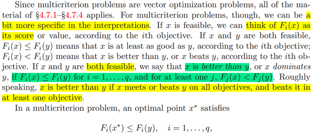</kbd>

<kbd>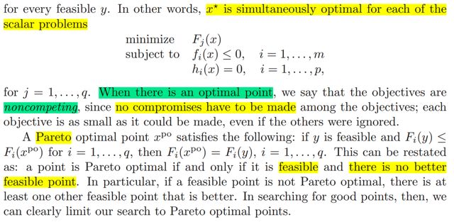</kbd>

> [!NOTE]
> Đại khái là, không có gì mới hết, chẳng qua chỉ là trong bối cảnh của
> bài  toán multi-criterion, thì ta có thể interpret một cách cụ thể hơn.
>
> Đó là, kiểu như nếu trong bài toán này ta tìm thấy OPTIMAL thì theo
> định nghĩa ta đã biết, nếu x* là optimal, tức f0(x*) là MINIMUM của O
> (set mọi attainable objective value f0(x) | x ∈ dom D, fi(x) <= 0, hi(x) =
> 0)) và theo định nghĩa, fo(x*) ⪯K f0(x) với mọi f0(x) ∈ O,
>
> Và K trong bài toán này là R^p+, nên f0(x*) ⪯K f0(x) có thể viết là f0(x*)
> ⪯ f0(x) <=> component của f0(x*) <= component tương ứng của f0(x).
>
> Với f0(x) = [F1(x), F2(x), ....Fp(x)]
>
> <=> F1(x*) <= F1(x), F2(x*) <= F2(x), ...Fp(x*) <= Fp(x) với mọi p
>
> Và phải hiểu rằng, ít nhất có một cái trong đây là dấu < (chứ nếu không
> thì thành ra f0(x) = f0(x).
>
> Và "diễn dịch" cái này có nghĩa là, "có ít nhất một tiêu chí j'th nào đó (j'
> th objective) của x* là tốt hơn y với mọi x thuộc feasible set" Fj(x*) <
> Fj(x)
>
> ====
>
> Thế thì khi tồn tại OPTIMAL, thì có nghĩa là ta có bài toán multicriterion
> mà trong đó các objective KHÔNG CẠNH TRANH NHAU, để rồi mọi
> tiêu chí đều có thể giảm mà không phải hi sinh cái khác.
>
> Ngược lại, nếu các objective CẠNH TRANH NHAU, thì không thể có
> OPTIMAL, vì khi đó kiểu như x1 tốt hơn x2 ở tiêu chí này thì lại kém
> (chứ không bằng) ở tiêu chí khác.

 

<kbd>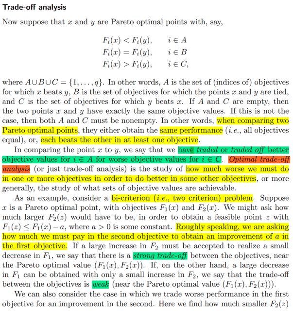</kbd>

<kbd>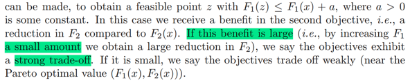</kbd>

> [!NOTE]
> Đại khái là có hai Pareto optimal x, y thì trừ trường hợp chúng
> bằng nhau (tức là Fi(x) = Fi(y) với mọi i). Còn lại thì hai thằng
> không cái nào chịu thua cái nào, với ý nghĩa là, trong hai vector
> f0(x) và f0(y) thì f0(x) sẽ có ít nhất một cái lớn hơn f0(y) và f0(y)
> cũng có ít nhất một cái lớn hơn f0(x)
>
> Tại sao lại như vậy. Đó là bởi vì, cả hai thằng đều là Pareto
> optimal. Nên f0(x) và f0(y) đều là MINIMAL của set O. Mà  theo
> định nghĩa minimal thì, khi f0(x) là minimal của O thì có nghĩa  là
> trong set O, không có thằng nào là nhỏ hơn (⪯K) nó cả.
>
> Thể hiện bởi hình học:
>
> (f0(x) - K) ∩ O = {f0(x)}
>
> và với việc đang xét K = R^2+ hình ảnh là không có điểm nào
> trong O mà nằm bên trái, và ở dưới f0(x) hết. Do đó f0(y) không
> "ở bên trái & ở bên dưới" f0(x). Và ngược lại f0(x) cũng không "
> ở bên trái & ở bên dưới f0(x)". Tức là hai vector f0(x), f0(y)
> không có chuyện mọi component của vector này đều >=
> component của vector kia. Mà thằng này lớn hơn ở F1(x) thì
> thằng kia lớn hơn ở F2(x)
>
> ====
>
> Sau đó nói về khái niệm OPTIMAL TRADE-OFF ANALYSIS
>
> Thì đại khái là, giả sử xét bài toán bi-criterion (chỉ có F1(x) và F2(x))
> thì STRONG TRADE-OFF là khi để giảm F2 một khoảng a nào 
> đó thì ta phải hi sinh - tăng F1 một khoảnh bự.
>
> Còn ngược lại để giảm F2 một khoảng cũng là a, nhưng chỉ cần tăng
> nhẹ F1 thì gọi là WEAK TRADE-OFF
>
> Cũng có thể giải thích theo kiểu khác, STRONG TRADE OFF là khi
> tăng F1 một khoảng nhỏ mà khiến F2 giảm một khoảng bự. Và 
> WEAK là khi tăng F1 khoảng bụ mà F2 giảm cũng ko bao nhiêu

 

<kbd>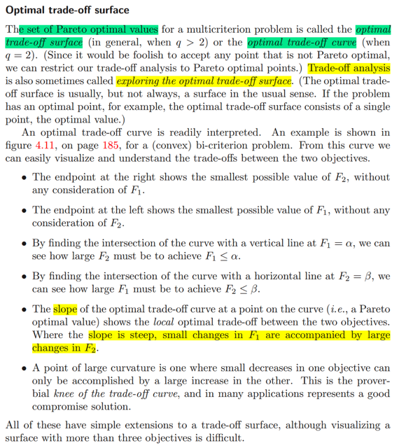</kbd>

<kbd>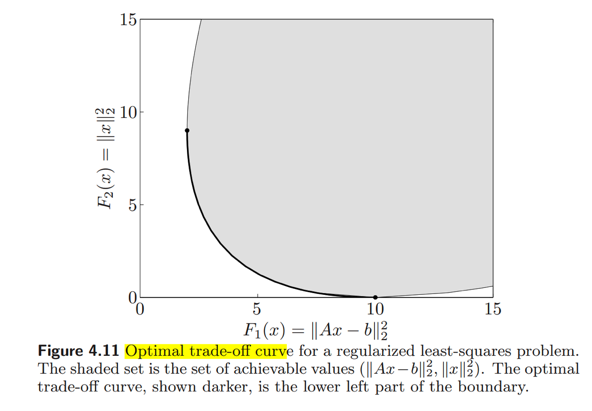</kbd>

> [!NOTE]
> Tập các Pareto optimal value được gọi là OPTIMAL
> TRADE-OFF SURFACE (HAY CURVE)
>
> Và bằng cách phân tích cái curve này ta có thể hiểu về trade-off
> của các objective.
>
> Ví dụ như trong cái hình dưới, là Optimal Trade-off curve của
> regularized least-square problem.
>
> Thì tập các Pareto optimal làm thành đoạn cong màu đen
>
> Điểm đầu bên trái là điểm có F2 lớn nhất, và điểm đầu bên phải 
> là điểm có F1 lớn nhất.
>
> thế thì bằng cách xem đoạn này giao với một đường thẳng
> đứng tại F1 = a chẳng hạn, thì độ cao của giao điểm (tức giá
> trị F2) sẽ cho ta biết muốn F1 nhỏ hơn a thì F2 phải lớn hơn
> mức đó.
>
> Ngược lại, bằng cách xem đoạn cong này giao với một đường
> ngang tại F2 = b chằng hạn, thì gía trị F1 của giao điểm sẽ cho
> ta biết muốn F2 nhỏ hơn b thì F1 phải lớn hơn bao nhiêu.
>
> Rồi, xét một điểm bất kì trong đoạn, thì nếu độ dốc của nó rất 
> lớn thì chứng tỏ phải chỉ tăng F1 chút xíu thì đã giảm F2 rất
> nhiều

 

<kbd>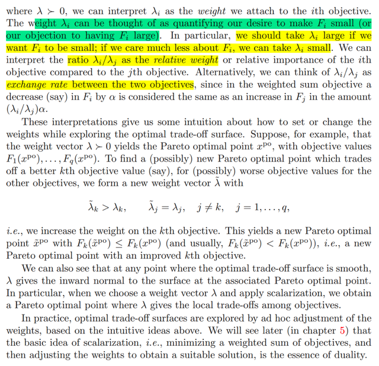</kbd>

<kbd>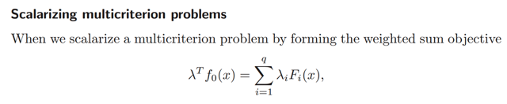</kbd>

> [!NOTE]
> đại khái là khi ta scalarizing (nhân f0(x) = <F1(x), F2(x)> với
> vector λ = <λ1, λ2> dĩ nhiên ta có thể thấy nó là weighted sum
> các Fi(x) với weight là λi.
>
> Thế thì ở đây nói khi ta muốn ưu tiên giảm F1, thì ta có thể cho
> λ1 lớn (lớn hơn tương đối so với λ2).
>
> Nhìn vào hình bên sẽ dễ hiểu.
>
> ====
>
> Và từ đó đại khái là giả sử đang có Pareto optimal x_po1 với
> λ(1), và ta muốn tìm Pareto optimal x_po2 có Fi(x) nhỏ hơn. Thì
> ta có thể tạo λ(2) có λ(2)i lớn hơn λ(1)i còn các λj khác thì giữ
> nguyên. Kết quả sẽ cho ra Pareto optimal có Fi(x) nhỏ hơn, đánh
> đổi là các Fj(x) khác thì tăng lên
>
> ====
>
> Khúc cuối nói rằng ta sẽ thấy việc chọn λ (cũng là điều chỉnh các
> weight) để có solution thích hợp thật ra chính là bài toán Dual
> problem.

 

<kbd>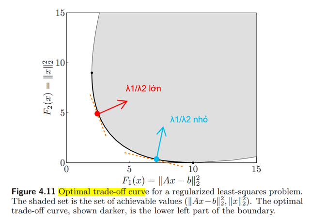</kbd>

<kbd>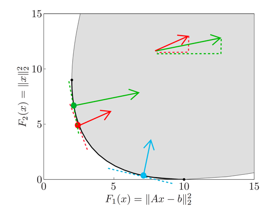</kbd>

> [!NOTE]
> có thể thấy khi chọn λ với λ1 lớn hơn nhiều so với λ2 (tức
> λ1/λ2 lớn), cũng là λ1 weight gắn với F1 lớn, weight λ2 gắn
> với F2 nhỏ. Thì kết quả có thể thấy ra Pareto optimal màu
> đỏ có F1 nhỏ, và F2 lớn
>
> Ngược lại, khi chọn λ với λ2 (weight gắn với F2) lớn, và λ1
> (weight gắn với F1) nhỏ thì Pareto optimal có F2 nhỏ, F1
> lớn
>
> Hình ảnh này minh họa cho việc, khi ta đang có Pareto optimal,
> màu đỏ, ứng với vector λ màu đỏ. Và ta muốn giảm F1, hi sinh
> F2,  thì ta có thể tạo λ mới bằng cách tăng λ1, giữ nguyên λ2.
> Để có vector λ xanh lục.
>
> Có thể thấy khi làm vậy (tăng λ1, giữ nguyên λ2) ta đã tăng
> relative weight λ1/λ2. Kết quả là Pareto optimal mới (xanh lục)
> có F1 nhỏ hơn và đánh đổi (trade off) là F2 lớn hơn

 

<kbd>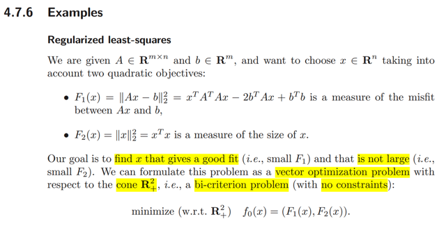</kbd>

<kbd>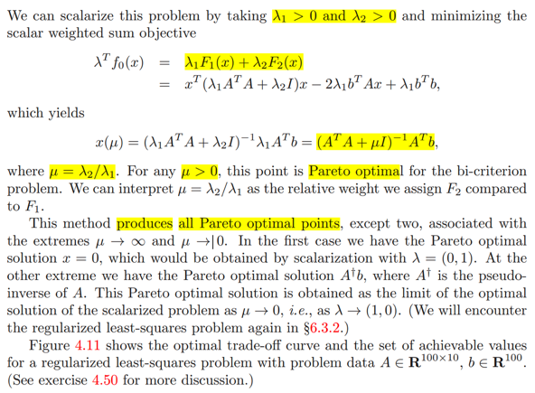</kbd>

> [!NOTE]
> 4.7 VECTOR OPTIMIZATION
>
> 4.7.5 EXAMPLE
>
> Rồi, xét một ví dụ của bài toán multi-criterion này:
>
> minimize F1(x) = ||Ax - b||^2 và F2(x) = ||x||^2] (||.|| là l2 norm)
>
> (không có constraint)
>
> Thế thì ta có thể đưa bài toán về dạng vector optimization:
>
> minimize f0(x) = [F1(x), F2(x)] wrt cone K = R^2+
>
> Và ta sẽ scalarize bài toán bằng cách chọn vector λ ∈ int R^2+ tức λ ≻ 0,
> hay λ1 > 0 và λ2 > 0. Và xây dựng bài toán scalarization:
>
> minimize λTf0(x) = λ1F1(X) + λ2F2(x). Và optimal của bài toán này  sẽ
> chính là Pareto optimal của bài toán gốc.
>
> (nếu quên nhắc lại, trong bài về Minimum, Minimal ta đã học, nếu chọn λ
> ≻K* 0 thì khi minimize λTz over z ∈ S, được x thì x là minimal của S. Và
> áp dụng cái này trong bài toán vector optimization, ta có nếu ta  chọn λ
> ≻K* 0, và minimize λTf0(x) over set O = f0(x) | x ∈ feasible set X thì khi ta
> có x là minimum của bài toán scalarization này thì x cũng chính là Pareto
> optimal của bài toán vector optimization)
>
> Thế thì xét f(x) = λTf0(x)) = λ1||Ax - b||^2 + λ2||x||^2 
>
> = λ1(Ax - b)T(Ax - b) + λ2xTx 
>
> = (λ1xTAT - λ1bT)(Ax - b) + λ2xTx 
>
> = λ1xTATAx - λ1bTAx - λ1xTATb + λ1bTb + λ2xTx 
>
> = λ1xTATAx - 2λ1bTAx + λ2xTx + λ1bTb 
>
> = λ1xTATAx + λ2xTx - 2λ1bTAx + λ1bTb 
>
> = xT(λ1ATA + λ2)x - 2λ1bTAx + λ1bTb 
>
> Giải bài toán này, ta sẽ dùng calculus: Xét g(x) = xTQx + pTx + v 
>
> ∇g: dg = f(x+dx) - f(x) = (x+dx)TQ(x+dx) + pT(x+dx) + v - xTQx - pTx - v
>
> = (xTQ+dxTQ)(x+dx) + pTdx - xTQx
>
> = xTQx+dxTQx+xTQdx+dxTQdx + pTdx - xTQx
>
> = 2xTQdx + pdx = (2QTx + p)Tdx => ∇g = 2QTx + p 
>
> Vậy ∇f = 2(λ1ATA + λ2)Tx - 2λ1bTA  
>
> ∇f = 0 <=>  2(λ1ATA + λ2)Tx - 2λ1bTA  = 0
>
> <=> 2(λ1ATA + λ2)Tx = 2λ1bTA
>
> <=> x = (λ1ATA + λ2)invλ1bTA
>
> Chỗ này khi λ1, λ2 đều dương thì λ1ATA + λ2 invertible, vì:
>
> (ATA ≽ 0 <=> λ1ATA ≽ 0 <=> λ1ATA + λ2 ≻= λ2 ≻ 0 => λ1 ATA + λ2 invertible,
> có thể chứng minh theo kiểu khác )     
>
> <=> x = (λ1ATA + λ2I)invλ1ATb
>
> <=> x = [λ1(ATA + (λ2/λ1)I)]invλ1ATb
>
> Đặt μ = λ2 / λ1:
>
> x = [λ1(ATA + μI)]invλ1ATb  
>
> = (1/λ1)(ATA + μI)invλ1ATb  |   (Aα)inv = 1/α Ainv 
>
> = (ATA + μI)invATb   | đây là kết quả trong sách
>
> Thế thì dĩ nhiên x là minimum của bài toán này (vì f là quadratic function,
> nên convex, hoặc thích thì xét Hessian của nó chính là ATA, và đây
> là positive semi definite matrix)
>
> Và miễn là μ dương - ứng với λ1, λ2 đều > 0 (λ ≻ ) thì x sẽ là minimum 
> của bài toán này và đồng thời sẽ là Pareto optimal của bài toán gốc

**🔗 See also:** [linked note](./lec_9b.md#node-uimksyy)

 

<kbd>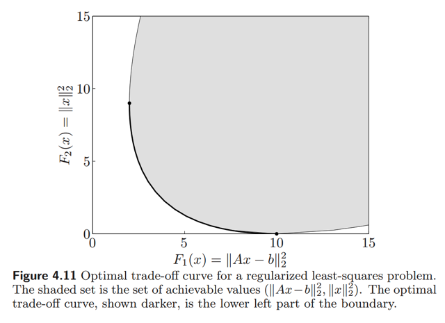</kbd>

> [!NOTE]
> SÁCH (XEM SAU)

 

<kbd>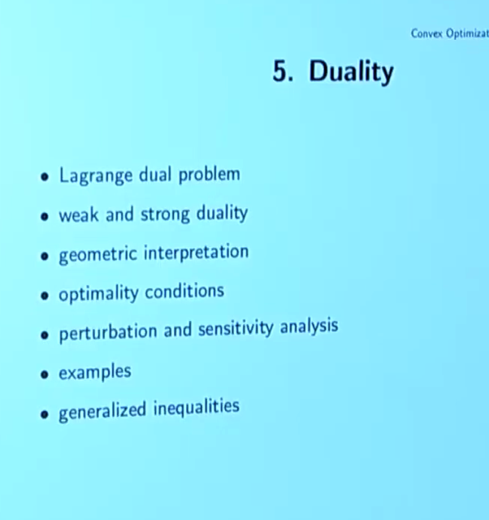</kbd>

> [!NOTE]
> Ta qua phần DUALITY.
>
> CHAPTER 5 - DUALITY
>
> 5.1 THE LAGRANGE DUAL FUNCTION

 

<kbd>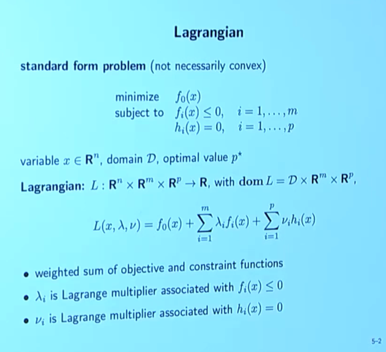</kbd>

> [!NOTE]
> Đầu tiên là LAGRANGIAN, một cái mà trong machine learning gặp
> nhiều. Đầu tiên, ta thấy Lagrangian là một function được xây dựng
> bằng cách cộng 
>
> OBJECTIVE f0(x), LINEAR COMBINATION CỦA CÁC
> EQUALITY CONSTRAINTS và LINEAR COMBINATION CÁC
> INEQUALITY CONSTRAINTS
>
> L(x, λ, v) = f0(x) + Σ λi fi(x) + Σ vihi(x) 
>
> Xong, gs đại khái là nếu ta violate cái constraint ví dụ fi(x)<0 thì λi
> dương sẽ là cái giá mà ta phải trả.
>
> Hiểu ý này là vầy, constraint là fi(x) phải âm. Vậy thì khi fi(x) dương là
> ta đang vi phạm constraint. Thì ta sẽ bị phạt, bị add một chi phí tăng
> thêm là λi*fi(x)
>
> LAGRANGIAN

 

<kbd>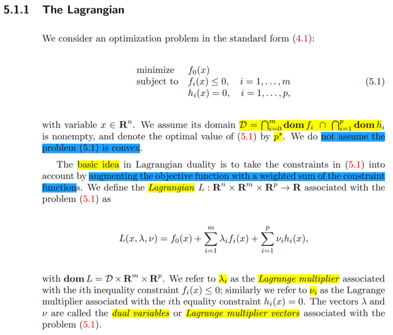</kbd>

> [!NOTE]
> Trong sách bổ sung một số ý sau:
>
> 1) Cần nhấn mạnh bài toán optimization gốc minimize f0(x)
> với các equality / inequality constraints KHÔNG CẦN PHẢI LÀ
> CONVEX PROBLEM.
>
> 2) Domain của Lagrangian function là intersection của objective
> function f0(x) và các constraint function fi(x) và hi(x)
>
> 3) Một số thuật ngữ:
>
> + λi, vi chính là LAGRANGE MULTIPLIER, là cái mà ta đã nghe trong
> MIT 18.02, quả thật trong 1802 ta đã học về việc dùng Langrange 
> multipler để giải bài toán tìm cực tiểu của hàm số f với ràng buộc g.
>
> + Vector λ, v gọi là DUAL VARIABLES (có thể hiểu vì nó là biến của
> hàm Dual function g(λ, v))
>
> 5.1 LAGRANGE DUAL FUNCTION
>
> 5.1.1 THE LAGRANGE DUAL FUNCTION

 

<kbd>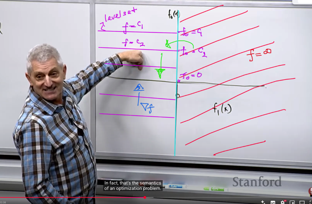</kbd>

> [!NOTE]
> đại khái là, một trục thể hiện (giá trị) f1(x) là inequality constraint
> function (f1(x)<0) và cái kia là f0(x) (objective).
>
> Gs nói nếu ta có một vector x, mà tính ra f1(x) nằm ở phần bên phải
> (tức là ứng với f1(x) > 0, thì đó là điều unacceptable, vì nó vi phạm
> constraint:  f1(x) < 0
>
> Ok có thể hiểu cái này, bởi constraint nói rằng là f1(x) phải âm. Và
> trong bài toán optimization thì ta cần phải thỏa constraints, để có feasible
> set sau đó mới chọn cái trong đó có giá trị objective f0(x) nhỏ nhất
>
> Và cũng hiểu luôn khi gs nói nếu ta ở bên trái, tức là khi đã thỏa
> constraint f1(x) < 0 thì khi đó ta muốn đi xuống càng thấp càng tốt,
> để minimize objective function f0(x)
>
> Chú ý rằng ta hiểu hình ảnh này là đang vẽ hàm f = f0 + I(f1(x)<=0)
> nhưng đáng lí phải vẽ trong 3D. Ở đây ta tưởng tượng một chiếc máy
> bay, mà hình chiếu của nó, tọa độ của nó thể hiện trên 2D coordinates và
> độ cao của nó là giá trị f. Thì khi nó ở phần bên phải, chỗ gạch gạch đó,
> thì độ cao của nó là vô cùng lớn. Khi nó bay vượt qua đường màu xanh,
> thì lập tức nó hạ độ cao xuống, có giá trị được tính bởi f0. Do đó nếu nó
> đi song song vói trục f1 (các đường màu tím) thì độ cao của nó giữ
> nguyên. Nếu nó đi (ở phần bên trái, theo hướng vuông góc với f1, và đi
> theo chiều mũi tên xanh lá -  đây chính ngược với gradient) thì nó sẽ
> giảm dần độ cao.

 

<kbd>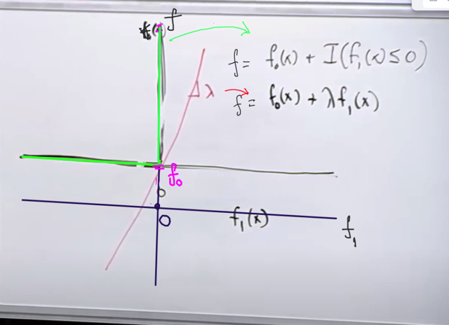</kbd>

> [!NOTE]
> Thế thì: Qua đây
>
> ta sẽ hiểu rằng, mình ko thể hiện trục f0 nữa. Thay vào đó là
> trục f, để hình ảnh bây giờ là quan hệ của f và f1 với f0 cố định
> (ứng với việc sau ta đi trên đường level set màu tím bên hình trước)
>
> Để rồi khi ta ở bầu trời bên phải (ứng với f1 > 0) thì độ cao (giá trị
> f) là vô cùng lớn. Khi bay qua mốc f1=0, qua vùng bên trái, thì
> độ cao hạ xuống bằng với f0 và ta giữ độ cao này
>
> Với I(f1(x) <= 0): bằng 0 nếu f1(x) âm (thỏa constraint) và bằng
> infinity nếu f1(x) > 0
>
> Và đồ thị của hàm số này là đường màu xanh lá này.
>
> Xong ông mới quay lại Lagrangian, L = f0(x) + λf1(x) thì ông
> nói nó sẽ thể hiện bởi đường màu đỏ, độ dốc chính là λ.
>
> Và ý nghĩa sẽ là, đường màu đỏ là APPROXIMATION cho
> đường màu xanh lá.

 

<kbd>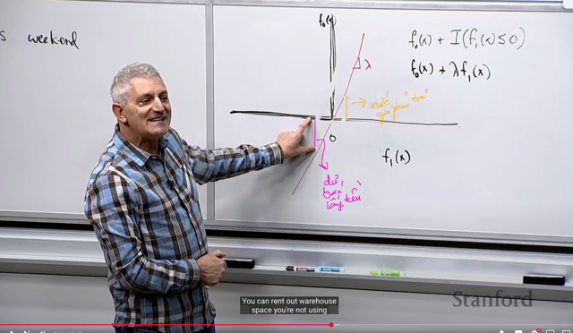</kbd>

> [!NOTE]
> Và rồi dĩ nhiên ta sẽ thấy mắc cười là rõ ràng đường màu đỏ khó
> mà approximate tốt cho đường màu xanh lá.
>
> Vì ý nghĩa của đường màu xanh lá, vốn là thể hiện bản chất của bài
> toán đó là: Nếu f1(x) âm, ta sẽ không phải trả giá gì, nhưng nếu
> f1(x) dương, tức violate constraint thì ta sẽ phải trả cái giá infinity,
> đồng nghĩa điều này unacceptable.
>
> Trong khi đó, với đường màu đỏ nó mang ý nghĩa khác. Giả sử bài
> toán là tối ưu cách sử dụng không gian của kho chứa hàng đi. Thì,
> khi ở bên phần f1(x) dương, thì λ1f1(x0) là cái giá phải trả mà khi
> f1(x) nhỏ thì cái giá phải trả không lớn (khác với việc f1(x) dương
> với đường màu đen thì dù nhỏ cũng là có cái gía infinity)
>
> Ngược lại, với f1(x) âm thì ta có phần dôi dư, giống như ta có thể
> xài không hết nhà kho và cho thuê lại lấy tiền vậy, điều này ko xảy
> ra ở đường màu xanh lá
>
> Ý NGHĨA MANG TÍNH APPROXIMATION CỦA
> LAGRANGIAN

 

<kbd>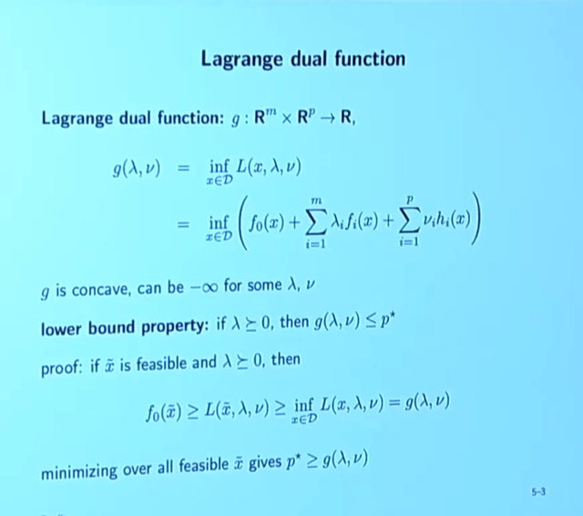</kbd>

> [!NOTE]
> Thế thì ta học qua LAGRANGE DUAL FUNCTION g(λ, v) là
> function của các Lagrange multipliers λi, vi (gọi là các
> Lagrange variables)
>
> Và nó là kết quả khi ta MINIMIZE LAGRANGIAN FUNCTION
> L(x, λ, v) tức là, ta sẽ tìm x* sao cho Lagrangian function nhỏ
> nhất, khi đó cái L(x*, λ, v) sẽ là g(λ, v)
>
> g(λ, v) = inf x ∈ D L(x, λ, v)
>
> Một điểm đáng lưu ý: g(λ, v) là CONCAVE function ngay cả khi
> vấn đề ban đầu không phải convex. Lí do là với mỗi giá trị cụ
> thể của x, thì f0(x) + Σ λifi(x) + Σ vihi(x) là AFFINE function
> của λi và vi.
>
> Và việc ta làm là tìm minimum (infimum) của các affine
> function thì sẽ được concave function. Đây là điểm đã học (theo
> link): nếu f(x,y) convex, C convex thì g(y) = inf x ∈ C f(x,y) sẽ cũng
> là convex. MÌnh đoán nếu f concave thì g cũng concave.
>
> Quan sát thứ hai là LOWER BOUND PROPERTY: đó là nếu λ ≽ 0
> thì: 
>
> g(λ, v) <= p* 
>
> Và nó TẠO NÊN CẬN DƯỚI CỦA (LOWER BOUND) CỦA OPTIMAL
> VALUE P*
>
>  (dĩ nhiên λ là vector các λi: coefficients gắn với inequalities constraints 
> function fi(x))
>
> Tại sao? Là bởi hãy xét cái Lagrangian trước, nó là tổng của objective
> function f0(x) và linear combination của fi(x) và gi(x).
>
> Để rồi, giả sử xét một FEASIBLE POINT x~, thì vì nó feasible nên nó thỏa
> constraints, nên: 
>
> Σvihi(x~) = 0 (do hi(x~) = 0) 
>
> và Σλifi(x~) <= 0 (do λi KHÔNG ÂM và fi(x) < 0)
>
> Vậy VỚI MỌI FEASIBLE POINT x~: 
>
> f0(x~) + Σλifi(x~) + Σ vihi(x~) <= f0(x~) 
>
> tức là: 
>
> L(x~, λ, v) <= f0(x~) 
>
> Mà g(λ, v) = inf L(x~, λ, v) => g(λ, v) <= L(x~, λ, v) với mọi x~
>
> Như vậy: g(λ, v) <= L(x~, λ, v) <= f0(x~) 
>
> => g(λ, v) <= f0(x~) với mọi x~
>
> và vì x* là một trong các feasible point x~ nên từ đây suy ra
>
> Do đó g(λ, v) <= f0(x*) 
>
> <=> g(λ, v) <= p* 
>
> ĐÂY LÀ LOWER BOUND PROPERTY, CÒN GỌI LÀ WEAK DUALITY
>
> (WEAK DUALITY LÀ d* <= p*, d* = sup (λ, v) ∈ dom g g(λ, v))
>
> LAGRANGE DUAL FUNCTION
>
> LOWER BOUND PROPERTY: g(λ,v) <= p*

**🔗 See also:** [Partial minimization](./lec_4.md#node-znif4tu)

 

<kbd>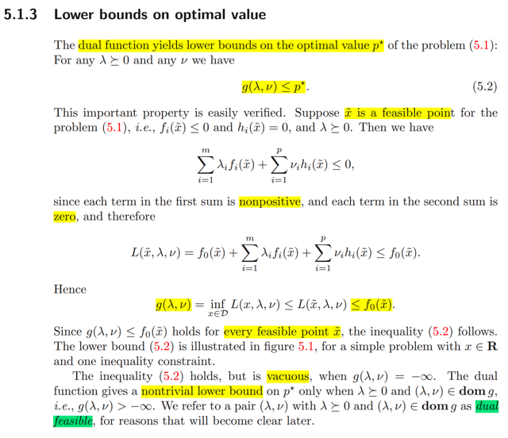</kbd>

> [!NOTE]
> Phần nói về LOWER BOUNDS PROPERTY trong sách, không có gì
> khác, chỉ bổ sung thêm rằng:
>
> Đại khái là nếu mà dual function g(λ, v) mà bằng -infinity (ta nhớ điều 
> này xảy ra khi Lagrangian L(x, λ, v) UNBOUNDED BELOW. Thì dễ
> hiểu rằng lúc này TÍNH CHẤT NÀY VÔ DỤNG (VACUOUS) bởi lẽ
> CHẢ ÍCH GÌ KHI NÓI p* LUÔN ≥ -infinity.
>
> Thành ra chỉ khi nào g(λ, v) > -infinity thì kiểu như ta mới có một ích
> lợi của tính chất này.
>
> Do đó, λ, v mà khiến g(λ, v) > -infinity thì nó gọi là DUAL FEASIBLE
>
> Và cái này giải thích sâu hơn vì sao λ phải thỏa λ ≽ 0, cũng như 
> λ, ν ∈ dom g được gọi là dual feasible 
>
> (vì khi λ, v không ∈ dom g thì dĩ nhiên g(λ, v) = -infinity (hàm số 
> không xác định thì cũng như là nói hàm số = -infinity)
>
> Nói thêm chút về λ: Đại khái là khi xây dựng Lagrangian, thì nếu λi mà
> âm, thì khi minimize x Lagrangian có term λi fi(x) sẽ khiến x có thể
> vi phạm constraint bằng cách cho fi(x) lớn lên và lớn hơn 0 mà vẫn giúp 
> giảm L do λi fi(x) vẫn giảm nhờ λi âm. Do đó λi ≥ 0 là yêu cầu đầu tiên
> với λ và đây là một trong hai điều kiện để gọi là dual feasible (đơn giản là
> định nghĩa là vậy)
>
> Và điều kiện thứ hai bên cạnh λ ≥ 0 đó là g(λ, v) > -infinity
>
> 5.1 LAGRANGE DUAL FUNCTION
>
> 5.1.3 LOWER BOUNDS ON OPTIMAL VALUE

**🔗 See also:** [linked note](./lec_8_a.md#node-3hxz63z)

 

<kbd>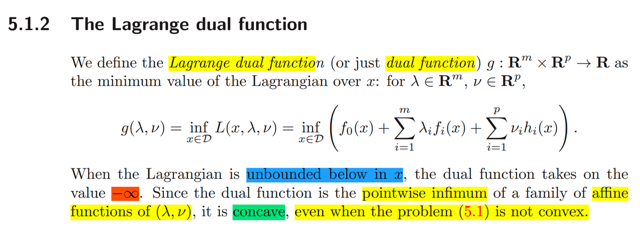</kbd>

> [!NOTE]
> Trong sách cho ta biết thêm:
>
> 1) Có thể gọi là LAGRANGE DUAL FUNCTION hoặc DUAL
> FUNCTION
>
> 2) Nếu Lagrangian mà UNBOUNDED BELOW, tức là muốn
> nó nhỏ bao nhiêu cũng được (khi minimized over x) thì hàm Dual
> g(λ,v) MANG GIÁ TRỊ -INFINITY
>
> 3) Khẳng định một điểm quan trọng: g(λ, v) CONCAVE vì nó
> là POINT-WISE INFIMUM CỦA CÁC AFFINE: 
>
> Bởi với mỗi giá trị x thì  Σ λi fi(x) + Σ vi hi(x) + f0(x) là affine
> function của λi và vi, nên point-wise infimum của các affine là
> concave (point-wise supremum của các affine là convex)
>
> 5.1 LAGRANGE DUAL FUNCTION
>
> 5.1.2 THE LAGRANGE DUAL FUNCTION

**🔗 See also:** [mở rộng ra với **pointwise supremum**](./lec_4.md#node-93dza2e) · [linked note](./lec_8_a.md#node-kjqyjrr)

 

<kbd>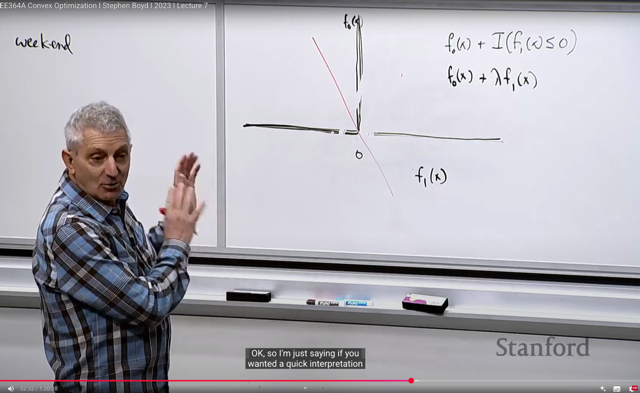</kbd>

> [!NOTE]
> gs dùng ví dụ này để lí giải tại sao λ phải dương. Vì nếu nó âm,
> đường màu đỏ với độ dốc âm sẽ như vầy. Hoàn toàn ridiculous khi
> nó nói rằng khi ta violate constraint thì lại được "thưởng" (giá trị
> dương của f1(x) nhân với λ âm ra âm, để rồi f1(x) càng dương càng
> tốt (vì ta đang minimize f0(x) + λf1(x))
>
> TẠI SAO λ PHẢI DƯƠNG

 

<kbd>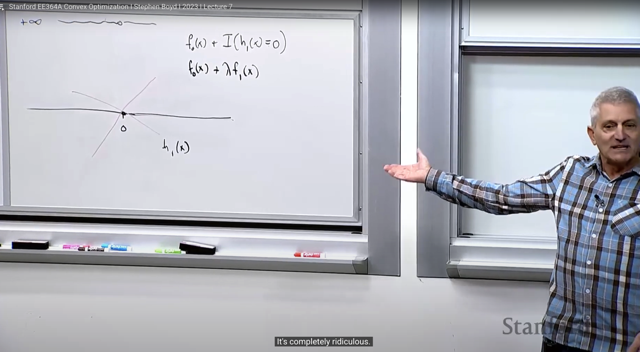</kbd>

> [!NOTE]
> Với equalities constraints thì cũng tương tự: Hình ảnh là ta có
> I(h1(x)=0)  bằng 0 khi h1(x) bằng 0 và infinity khi h1(x) khác 0.
>
> Hình ảnh sẽ giống như khi h1(x) đi -inf đến inf thì ta có hàm I đi ở
> trên cao (mức infinity) và khi h1(x) đi qua 0 thì nó nhảy xuống
> bằng 0 sau đó vọt lên lại
>
> Và ta sẽ cũng approximate cái đường trên cao này bằng một hàm
> tuyến tính nào đó.
>
> Ý chính gs muốn nói là ý nghĩa của cái Lagrangian là như vậy và nó
> khiến ta có thể thấy shock vì rõ ràng viẹc approx. như vậy rất không
> ổn

 

<kbd>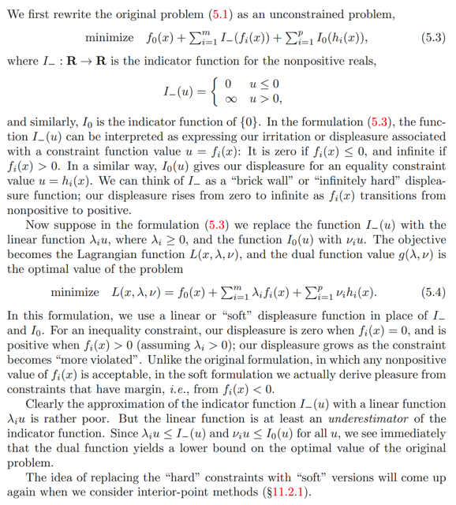</kbd>

<kbd>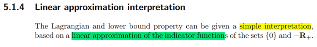</kbd>

> [!NOTE]
> SÁCH (XEM SAU)
>
> 5.1 LAGRANGE DUAL FUNCTION
>
> 5.1.4 LINEAR APPROXIMATION
> INTERPRETATION

 

<kbd>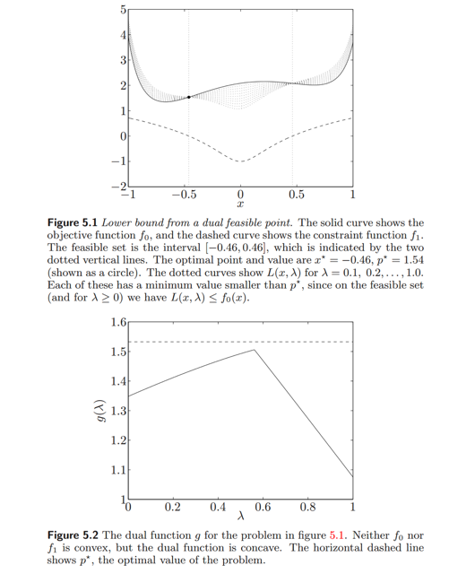</kbd>

> [!NOTE]
> SÁCH (XEM SAU)

 

<kbd>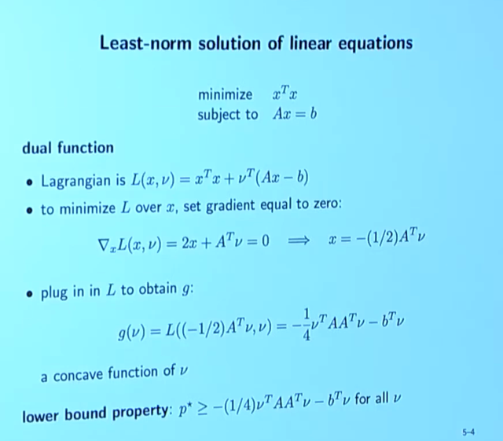</kbd>

> [!NOTE]
> Ta xét qua ví dụ này, minimize xTx với equality constraint
> Ax=b
>
> Thế thì đây là least-norm solution của linear equation system 
> (Giải Ax=b trong điều kiện b CÓ thuộc C(A) và có non-zero
> nullspace vector và normal equation ATAx = ATb có ATA không full
> rank vì các cột của A không độc lập để rồi ATAx = ATb có vô số
> nghiệm, và ta muốn tìm nghiệm có norm nhỏ nhất.  Có thể hiểu
> là ở đây ta dùng Lagrangian Dual function để cho  ra lower bound
> của optimal. Dù mình biết việc giải least-norm solution có thể dùng
> pseudo-inverse A^+.
>
> Ko khó hiểu mấy, ta set up Lagrangian f0(x) + vThi(x) (ko có
> inequality constraints) = xTx + vT(Ax - b) (equality Ax=b sẽ thể hiện
> thành h(x) = 0 => h(x) = Ax - b)
>
> Sau đó ta tìm Dual function g(v) = inf x ∈ D L(x, v). Mà cái này thì ta
> đơn giản là dùng calculus, tìm gradient theo x của L, set nó bằng 0,
> giải ra x (khỏi xét second derivative, vì đây là bài toán convex, các
> function đều convex thành ra critical point cũng là minimum - Đây
> là điều mà FIRST ORDER CONDITION cho phép)
>
> Thế x* vào L(x, v) ta có g(v) = L(x*, v)
>
> Từ đó ta có p* >= g(v)
>
> Chỗ này ghi chú chút xíu một điểm mà mà mình mới hiểu ra:
>
> Bài toán LEAST-NORM SOLUTION OF Ax=b: Nói ngắn gọn, đây là khi ta có cái gọi là
> under-deterministic system: Ax=b CÓ x_particular và CŨNG CÓ non-zero trong nullspace.
>
> Nên hệ CÓ VÔ SỐ NGHIỆM  ở dạng x = x_particular + c*x_null (c là constant tùy ý).
>
> Và ta muốn tìm x có norm nhỏ nhất. Thì NÓ CHÍNH LÀ x_particular.
>
> Vì sao: vì x_null trong nullspace, sẽ vuông góc với x_particular do nullspace và rowspace
> orthogonal complement, và x_particular dĩ nhiên là nằm trong rowspace vì thông qua A, nó được map với
> b khác 0 nằm trong column space.
>
> Vậy x_particular vuông góc với x_null, và x_complete chính là cạnh huyền của tam giác
> vuông.
>
> Để rồi norm x bằng √(||x_null||^2  + ||x_particular||^2) luôn >= ||x_particular|| và khi c = 0, thì
> ||x|| có giá trị nhỏ nhất = ||x_particular||
>
> Nhưng tìm x_particular thì 1806 ta biết là mình có thể Gaussian elimination để xác định pivot
> column và free column, từ đó gán 0 vào các free variable back-substitute để giải ra pivot variable để
> có x_particular.
>
> Nhưng pseudo-inverse A^+ cũng có thể giúp. Bởi ta biết nó là matrix giúp map ngược vector trong
> R^m về lại R^n, trong đó nullspace vector x_null sẽ được map về 0 và map column space vector về
> row space.
>
> Do đó đối diện với b, là vector trong column space, (A^+)b sẽ cho ra lại vector trong
> row-space: x_particular
>
>  A^+ = V Σ+ UT => (A^+)b = V Σ+ U+ b
>
> b = Ax_particular => A^+ b = A^+ Ax_particular = V Σ+ UT A x_particular
>
> = V Σ+ UT U Σ (VT) x_particular  | A = U Σ (VT) SVD of A
>
> = V Σ+ Σ VT x_particular | UT U = I, do U là matrix có các orthonormal columns - basis của A's columns
> space
>
> = V VT x_particular  | (Σ+)Σ = I, do Σ+ là diagonal matrix với đường chéo là 1/σi,
>
> σi là các singular value khác 0 của A.
>
> = x_particular  | do VVT = I, do V là matrix các orthonormal columns - các basis của A's rowspace
>
> Vậy A^+b = x_particular
>
> =====
>
> Thế thì khi AAT INVERTIBLE (khi A FUL ROW RANK)  thì A^+ chính là RIGHT INVERSE:
>
> A^+ = AT(AAT)inv và khi đó right inverse dùng để giải least norm solution
>
> A[AT(AAT)invb] = AAT(AAT)invb = b do (AAT)(AAT)inv = I
>
> => AT(AAT)invb là solution
>
> Mà AT(AAT)invb là vector trong column space của AT, cũng là rowspace của A, nên nó chính là
> x_particular - solution với norm nhỏ nhất theo lập luận trên.
>
> Chứng minh khi A full row rank thì A^+ chính là Right Inverse dùng SVD ta xem thử:
>
> A = U Σ VT  | SVD của A
>
> => AT = V ΣT UT  | transpose hai vế
>
> => AAT = U Σ VT V ΣT UT
>
> = U ΣΣT UT | vì VTV = I do V là matrix có các orthonorma columns là basis của A's rowspace
>
> và đây, U ΣΣT UT chính là eigen-decomposition của AAT với orthogonal eigenvectors matrix U
> và eigenvalue matrix ΣΣT (eigenvalue ko âm của A là bình phương singular value của A)
>
> Từ đó suy ra (ΣΣT)_inv là eigenvalue của (AAT)_inv
>
> (vì nếu λ là eigenvalue của A thì 1/λ là eigenvalue của Ainv: chứng minh nhanh Ax = λx <=> AinvAx
> = Ainvλx  <=> x/λ = Ainvx => 1/λ là eigenvalue của Ainv).
>
> Và cũng ta cũng vừa chứng minh AAT và (AAT)inv có chung eigenvectors:
>
> Vậy diagonalization của (AAT)inv: (AAT)inv = U(ΣΣT)invUT
>
> Vậy AT(AAT)inv = [ V ΣT UT ] [ U(ΣΣT)invUT ]   | AT = V ΣT UT, (AAT)inv = U(ΣΣT)invUT
>
> = V ΣT (ΣΣT)invUT   | UTU = I, đã nói ở trên
>
> = V ΣT (ΣΣT)inv UT
>
> Và ΣT (ΣΣT)inv chính là Σ+ nên V ΣT (ΣΣT)inv UT chính là V Σ+ UT chính là A^+
>
> ÁP DỤNG LAGRANGIAN DUAL FUNCTION 
>
> TÌM LOWER BOUND CỦA
>
>  LEAST-NORM SOLUTION FOR LINEAR EQUATIONS
>
> Sẵn nói luôn Bài toán LEAST-SQUARE khi A có DEPENDENT COLUMNS: Nói ngắn
> gọn Ax=b khi C(A) không span R^m, để b không thuộc C(A). Không thể tìm x_particular
> được. Lúc này ta tìm x khiến minimize ||Ax-b||. Dẫn đến Normal equation: ATAx = ATb. Nếu
> ATA nonsingular, thì x = (ATA)invATb, = LEFT-INVERSE matrix nhân b, và nó cũng là
> Projection onto C(A) matrix.
>
> Nhắc lại một điểm quan trọng. Nếu ATA invertible (khi A full-column rank) thì A^+ chính là
> LEFT-INVERSE (và cũng có thể chứng minh tương tự ở trên ta chứng minh khi AAT
> invertible thì A^+ chính là right inverse
>
> Nhưng nếu ATA singular, khi A không full column rank (dependent columns) thì ATAx = ATb
> có vô số nghiệm: Có x_particular, vì ATb ∈ rowspace của A, và nó rowspace của A cũng
> chính là column space của ATA. có x_null, vì ATA singular nên dim nullspace khác
> 0. Và ta sẽ muốn tìm solution có norm nhỏ nhất.
>
> Again, solution có norm nhỏ nhất đó cũng chính là x_particular của ATAx = ATb (chứng minh
> cũng như trên, nullspace của ATA cũng orthogonal với rowspace của ATA, và x_particular thì
> nằm trong đó)
>
> Thế thì x_particular của ATAx = ATb: ATAx_particular = ATb là least-square solution của
> Ax=b có norm nhỏ nhất.
>
> Và ta cũng lại dùng pseudo-inverse để tìm x_particular:
>
> x = (A^+)b. Vì sao nó chính là x_particular: Ta chứng minh nó là least square solution bằng
> cách chứng minh nó thỏa normal equation: ATAx = ATb
>
> ATA(A^+)b = AT (U Σ VT) (V Σ+ UT) b = AT U Σ Σ+ UT b = AT U UT b = ATb
>
> Vậy (A^+)b là least square solution.
>
> Tiếp theo ta chứng minh nó chính là x_particular bằng cách chỉ ra nó nằm trong row space
> của ATA: (A^+)b = V Σ+ UT b thì chắc chắn nó là linear combination của các rowspace basis
> v_i (các column của V).
>
> Mà một khi nó nằm trong rowspace thì nó chính là x_particular. Vì x_complete như đã nói là
> x_particular + x_null

**🔗 See also:** [First-order condition](./lec_3.md#node-l3oqmgj)

 

<kbd></kbd>

> [!NOTE]
> Thế thì quay lại đây, dù là có analytic solution (dùng A^+) thì ta cứ xét
> nó như bài toán optimization xem sao. Thế thì Lagrangian là như vầy,
> objective là là quadratic function, nên convex. Còn equality
> constraint là affine, cũng là convex. Nên L là convex function
>
> Và ta sẽ minimize nó over x để có DUAL function g(ν) (ở đây không có
> inequalities constraint nên không có λ)
>
> Và ta làm việc này bằng cách tìm critical points với quadratic function
> thì nó cũng là minimum. Và như đã biết từ 1802, để tìm critical point ta
> set partial derivative (đối với x) tức gradient ∇xL(x, ν) = 0
>
> Thử tìm ∇_xL theo MIT18s096: dL = L(x+dx, ν) - L(x, ν)
>
> = (x+dx)T(x+dx) + vT(Ax+Adx-b) - xTx - vT(Ax-b)
>
> = (xT+dxT)(x+dx) + vTAx + vTAdx - vTb - xTx - vTAx + vTb
>
> = xTx + xTdx + dxTx + dxTdx + vTAx + vTAdx - vTb - xTx - vTAx + vTb
>
> = xTdx + dxTx + vTAdx = 2xTdx + vTAdx = (2xT + vTA)dx
>
> => ∇xf = (2xT + vTA)T = 2x + ATv
>
> Cho nó bằng 0 giải ra x: 2x + ATv = 0 <=> 2x = -ATv
>
> <=> x = -(1/2)ATv
>
> Sau đó với x này, ta có dual function: g = L(-(1/2)ATv, v) thế vô ta
> sẽ có:
>
> g = [-(1/2)ATv]T[-(1/2)ATv] + vT(A[-(1/2)ATv] - b)
>
> = (1/4)vTAATv - (1/2)vTAATv - vTb = (-1/4)vTAATv - bTv
>
> Và đây là concave function vì ta có quadratic form vTAATv với
> AAT là positive semi definite nên convex (SECOND ORDER
> CONDITION: Hessian là PSD thì function convex) nên nhân số
> âm, thành concave. Cái -bTv thì là affine, cũng concave (và
> convex)
>
> Để rồi với giá trị nào đó của ν thì ta cũng có một lower bound của
> optimal (của function ban đầu)

 

<kbd>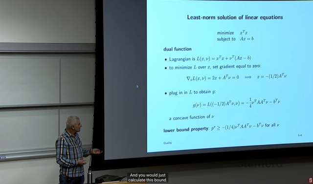</kbd>

> [!NOTE]
> và đại khái ví dụ như chọn ν = 0 ta có thể có quyền nói
> optimal p* sẽ phải >= 0 và gs cho rằng có rất nhiều
> ứng dụng từ cái này

 

<kbd>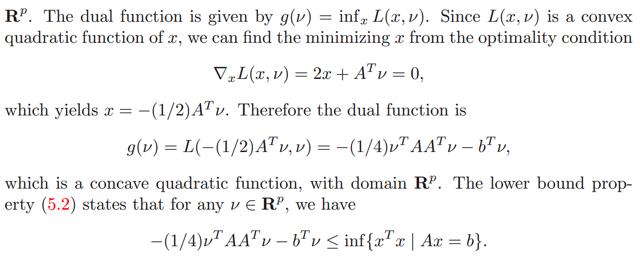</kbd>

<kbd>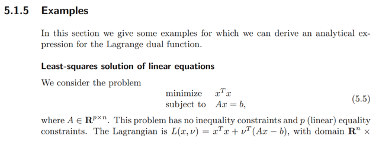</kbd>

> [!NOTE]
> SÁCH (XEM SAU)
>
> 5.1 LAGRANGE DUAL FUNCTION
>
> 5.1.5 EXAMPLES

 

<kbd>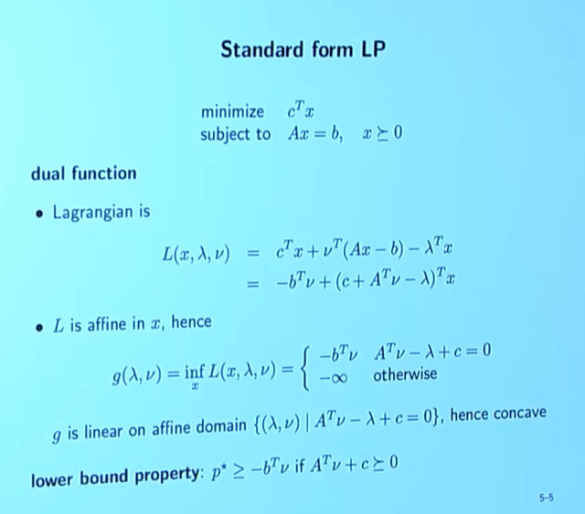</kbd>

> [!NOTE]
> Ta qua Standard form LP (ý là dùng Lagrangian để áp dụng
> vào LP)
>
> Như đã biết objective của LP là minimize cTx, và equality
> constraint là Ax = b còn inequality constraint sẽ là Cx ≽ d
>
> Còn ở standard form thì inequality constraint là x ≽ 0 (cái
> inequality constraint thì ta  sẽ đổi lại là -x ⪯ 0)
>
> Thế thì Lagrangian là L = cTx + vT(Ax-b) + λT(-x) = cTx +
> vT(Ax-b) - λTx
>
> = cTx + vTAx - vTb - λTx = (cT + cTA - λT)x - vTb
>
> = (c + ATv - λ)Tx - vTb = (ATv - λ + c)Tx - bTv
>
> Và ta sẽ minimize over x cái này để có dual function g(λ, v)
>
> g(λ, v) = inf x cTx + vT(Ax-b) - λTx
>
> Thế thì với affine function ví dụ pTx + q thì khi minimize nó, phần
> lớn trường hợp ta sẽ có -infinity (cái này dễ thấy). Nhưng trừ khi p
> = 0 thì minimize nó ra chính là q.
>
> Do đó g(λ, v) = inf_x L(x, λ, v) sẽ bằng -infinity khi ATv - λ + c
> khác 0 hoặc bằng -bTv khi ATv - λ + c = 0
>
> Và khi đó ta sẽ có lower bound -bTv <= p* nếu ATv + c ≽ 0
>
> STANDARD FORM LP: DÙNG LAGRANGIAN  GIẢI BÀI
> TOÁN LP Ở DẠNG CHUẨN

**🔗 See also:** [Bài toán đối ngẫu Lagrange](./lec_8_a.md#node-0ndyxau)

 

<kbd>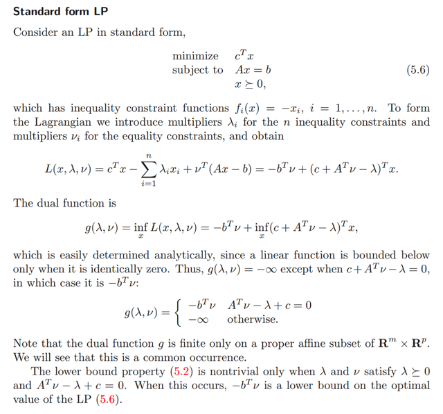</kbd>

> [!NOTE]
> SÁCH (XEM SAU)

 

<kbd>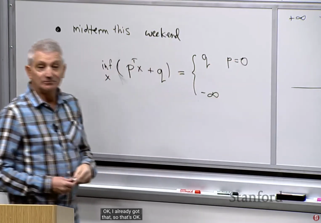</kbd>

**🔗 See also:** [linked note](./lec_9.md#node-x4apjy4)

 

<kbd>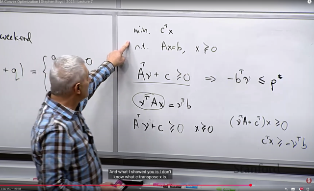</kbd>

> [!NOTE]
> Và đại khái là gs cho biết cái này xuất phát từ (như một cách để
> giải thích tại sao Lagrangian Dual cho ra kết quả như vậy)
>
> Ta có ATv + c ≽ 0, và đồng thời ta có x ≽ 0 nên dot product của hai
> vector này cũng sẽ >= 0: 
>
> (ATv + c)Tx >= 0 
>
> <=> vTAx + cTx >= 0
>
> Thay vTAx = vTb (do Ax = b) ta có: 
>
> vTb + cTx >= 0 
>
> <=> cTx >= -vTb (cũng là -bTv)
>
> Vậy cTx >= -bTv do đó optimal value của nó tức p* >= -bTv
>
> Thành ra ta ko biết cTx là gì nhưng ta biết nó >= -bTv

 

<kbd>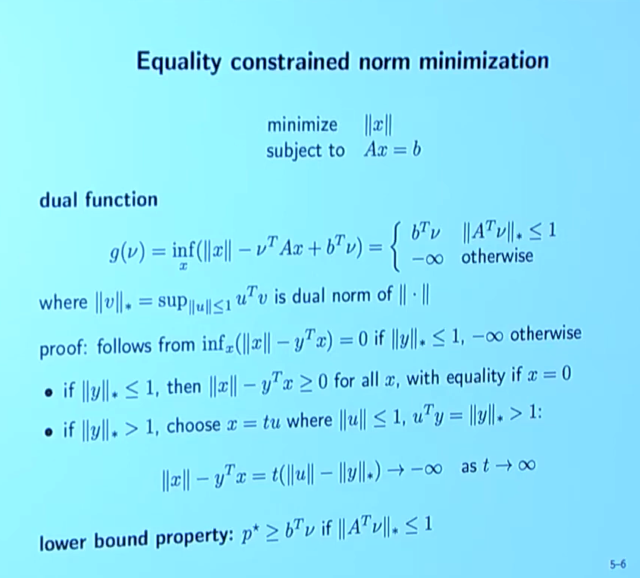</kbd>

> [!NOTE]
> Tiếp theo ta qua bài toán Equality constrained norm minization:
>
> Objective: minimize ||x|| subject to Ax = b.
>
> Cái này trông khá giống least norm solution của Ax = b, cũng là minimize ||x|| subject to Ax = b
> (cái kia là minimize xTx, chính là ||x||^2)
>
> Thì Lagrangian là ||x|| + νT(b-Ax) = ||x|| - vTAx + vTb  (Ta có thể define Lagrangian là ||x|| +
> vT(Ax - b) cũng được, vì với equality constraint Ax = b thì Ax - b = 0 hoặc b - Ax = 0 đều như nhau)
>
> Thế thì, như đã biết, ta sẽ minimize over x đối với Lagrangian function để có Dual function: 
>
> g(ν) = inf x ||x|| - νTAx + bTν
>
> = - sup x  - ||x|| + νTAx - bTν 
>
> = - sup x  νTAx - ||x||  + bTν
>
> = - sup x  (ATv)Tx - ||x||  + bTν
>
> Theo định nghĩa của conjugate function: 
>
> f*(y) = sup x  yTx - ||x||  
>
> nên sup x  (ATv)Tx - ||x||  chính là  f*(ATv)
>
> Và trong bài CONJUGATE FUNCTION (theo link), ta có conjugate của norm ||x|| là:
>
> f*(y) = sup x yTx - ||x|| sẽ bằng
>
> a) 0 khi ||y||* <= 1 
>
> b) +infinity khi ||y||* > 1
>
> -------
>
> Chứng minh nhanh lại cho nhớ:
>
> + Nếu ||y||* > 1 <=> sup z: ||z|| <= 1 (yTz) > 1 <=> Tồn tại z có norm <= 1 mà yTz > 1
>
> Và điều này đồng nghĩa yTz > ||z|| <=> yTz - ||z|| > 0
>
> Đặt x = tz => yTx - ||x|| = yTtz - ||tz|| = t(yTz - ||z||) và vì (yTz - ||z||) > 0 nên khi t -> infinity thì 
> yTx - ||x|| -> infinity => sup x yTx - ||x|| = +infinity
>
> + Nếu ||y||* <= 1 <=> sup z: ||z|| <= 1 (yTz) <= 1 <=> yTz <= 1 với mọi z có ||z|| <= 1. 
>
> Do đó yTx/||x|| <= 1 với mọi x vì (x/||x|| có norm <= 1). Và như vậy yTx - ||x|| <= 0 với mọi x 
>
> => sup x yTx - ||x|| = 0
>
> Ôn lại khái niệm gọi là DUAL NORM of l2 norm
>
> Ví dụ ||v||*, tức l2 norm dual norm of v: ||v||* = sup ||u||<=1 uTv
>
> Mang ý nghĩa là tìm trong các vector u có length <= 1 cái nào u* khiến uTv lớn nhất và
> tính u*Tv của cái đó (để có ||v||*)
>
> ---------
>
>
> Vậy quay lại đây, ta sẽ có f*(ATv) = sup x  (ATv)Tx - ||x||  sẽ bằng:
>
> a) 0 khi ||ATv||* <= 1
>
> b) +infinity khi ||ATv||* > 1
>
> Như vậy: 
>
> g(v) = - sup x  (ATv)Tx - ||x||  + bTν 
>
> = - f*(ATv) + bTv sẽ mang giá trị:
>
> a) - 0 + bTv = bTv khi ||ATv||* <= 1 
>
> b) - infinity + bTv = - infinity khi ||ATv||* > 1
>
> Như vậy thì p* > g(v) có lower bound là bTv khi ||ATv||* <= 1
>
> ÁP DỤNG LAGRANGIAN DUAL FUNCTION 
>
> TÌM LOWER BOUND CỦA 
>
> EQUALITY CONSTRAINED NORM MINIMIZATION

**🔗 See also:** [Conjugate function của norm](./lec_4.md#node-j3bjf6y)

 

<kbd>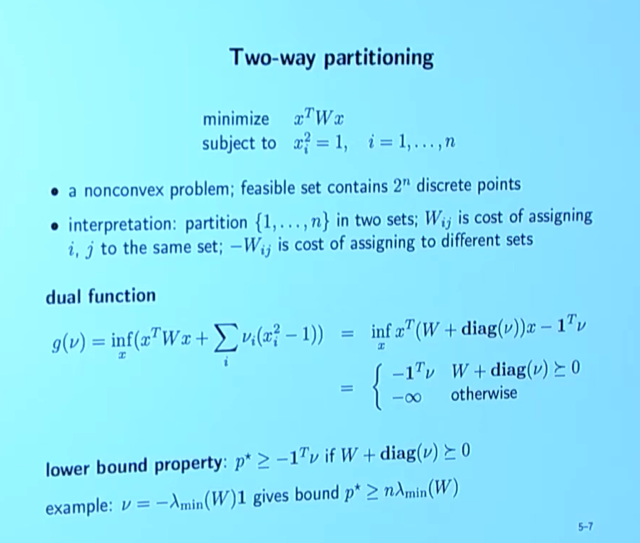</kbd>

> [!NOTE]
> Bài toán này objective là xTWx, equality constraints là xi^2 = 1,
> i=1,2,3... (tức bình phương component bằng 1) với W ∈ S^n (
> trong slide không nói nhưng trong sách có nói)
>
> Ổng nói đại khái là ta có n objects, và ta muốn chia nó thành 2
> phần việc chia sẽ được thực hiện bằng cách đánh dấu như
> sau: ta có vector x có n phần tử, để rồi ví dụ x1 = 1 sẽ thể hiện
> object 1 nằm trong group1 và x2 = -1 sẽ thể hiện object 2 nằm
> trong group 2, cứ thế.
>
> Tức là phần tử của vector x chỉ có hai giá trị 1 hoặc -1, thể hiện
> object tương ứng thuộc group nào
>
> ÁP DỤNG LAGRANGIAN DUAL FUNCTION 
>
> TÌM LOWER BOUND CỦA TWO WAY PARTITIONING

**🔗 See also:** [linked note](./lec_8_a.md#node-wab6bf3)

 

- **Phân tích tích quadratic xTWx**

<kbd>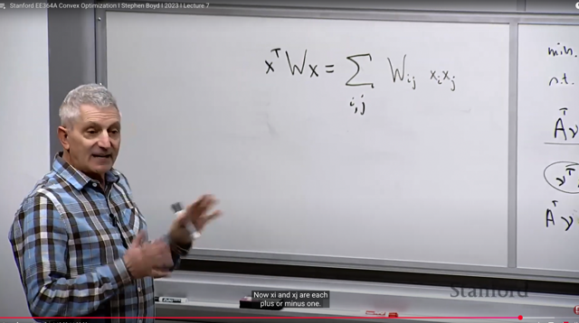</kbd>

> [!NOTE]
> Thử giải thích cái xTWx này:
>
> Wx ra một cột (vector cột), nên xT(Wx) là (1 hàng) x (1 cột)
> dĩ nhiên kết  quả là dot product của chúng Σi x_i * (Wx)_i
>
> Ta xem thử Wx_i là cái gì?
>
> Thế thì như đã biết, Wx là linear combination của các cột của W
> với hệ số là các component của x. Nhưng ở đây ta sẽ nhìn theo
> góc độ khác về Wx: matrix x matrix, tức coi x như matrix có 1
> cột.
>
> Thì Wx cũng sẽ là matrix có hàng thứ i là kết quả của việc
> linear combination các "hàng" của x với hệ số là hàng thứ i của
> W. Dĩ nhiên các hàng của x chỉ có 1 component, nhưng nó vẫn là
> các hàng. Và có thể thấy khi combine các hàng của (matrix) x, cũng
> chính là các component của vector x với  các hệ số là hàng thứ i
> của W, thì đó chính là dot product của vector x với hàng thứ i của
> W: Wx_i = Σ Wi:j x_j
>
> Vậy x_i * (Wx)_i = x_i * (Σj Wi:j x_j)
>
> Và do đó xTWx = Σi x_i (Wx)_i 
>
> = Σi x_i Σj Wi:j x_j 
>
> = Σi Σj x_i Wi:j x_j
>
> và với x_i Wi:j x_j thì ta có thể xắp xếp tùy ý vị trí các scalar (cả 3
> đều là scalar) cũng như gộp lại Σi Σj thành Σi,j
>
> xTWx = Σi,j Wi:j x_i x_j

 

<kbd>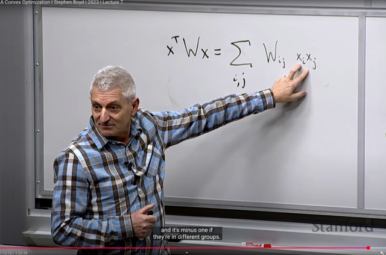</kbd>

> [!NOTE]
> Thế thì như vừa nói xi mang giá trị 1 nếu object i trong group 1 và
> mang giá trị -1 nếu object i nằm trong group 2. Do đó: xi*xj sẽ bằng
> 1 nếu xi, xj bằng nhau và thể hiện object i và object j ở chung một
> group. Ngược lại xi*xj = -1 sẽ thể hiện object i và object j khác group
>
> Và như vậy ta sẽ + Wij nếu object i và object j ở chung group và - Wij 
> nếu ngược lại.
>
> Do đó đây giống như ta assign Wij là COST khi object i, j ở chung 
> group, để rồi ví dụ như ta có bài toán chia 1 đám người vào 2 group
> thì nếu Wij dương sẽ thể hiện là ông i và ông j không ưa nhau, dẫn
> đến nếu hai ông mà chung group thì sẽ làm tăng COST (+ Wij)
>
> Ngược lại nếu Wij < 0 thể hiện việc cho ông i, ông j ở chung là tốt
> (- Wij, giảm tổng cost)

 

<kbd>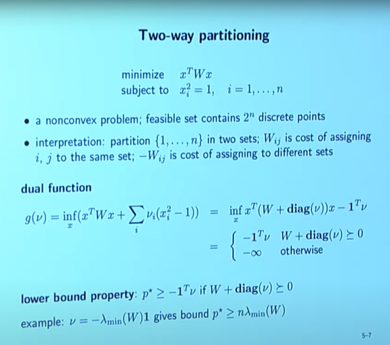</kbd>

<kbd></kbd>

> [!NOTE]
> CHỨNG MINH p* CÓ LOWER BOUND LÀ n λ_min(W)
>
> Thế thì như đã biết Lagrangian L sẽ là tổng của objective function 
> f0(x) = xTWx và linear combination của các constraint: 
>
> Σ νi fi(x) = Σ vi(xi^2 - 1)
>
> Để rồi ta sẽ minimize over x để có dual function g(ν):
>
> g(ν) = inf x (xTWx + Σi vi(xi^2-1))
>
> Thử làm xem tại sao nó ra như trong slide:
>
> xTWx + Σ vi(xi^2-1) = xTWx + Σ vi*xi^2 - Σ vi 
>
> = xTWx + vT(x^2) - 1Tv
>
> Tới đây Σ vi*xi^2 triển khai như sau:
>
> Σ vi*xi^2 = Σ xi*vi*xi = Σ xi*(vi*xi) = xT(v⊙x) = xT[diag(v)x] = xTdiag(v)x
>
> GPT: diag(v) nếu pass vector v vào thì ta có diagonal matrix đường
> chéo v ngược lại pass diagonal matrix vào thì ta có vector v.
>
> Và với diagonal matrix diag(σ) thì: 
>
> diag(σ)v = diag([σ1, σ2...])v = Σi σivi = σTv 
>
> => g(v) = inf x (xTWx + xTdiag(v)x - 1Tv)
>
> = inf x [xT(W + diag(v))x - 1Tv] 
>
> = inf x [xT(W + diag(v))x] - 1Tv |  bỏ -1Tv ra ngoài dấu infimum vì nó
> ko dính tới x.
>
> Và khi minimize cái này: xT(W + diag(v))x, thì đây rõ ràng là quadratic
> form. Với f(x) = xTAx thì df = (x+dx)TA(x+dx) - xTAx 
>
> = (xT+dxT)A(x+dx) - xTAx = (xTA+dxTA)(x+dx) - xTAx
>
> = xTAx+xTAdx+dxTAx+dxTAdx-xTAx = xTAdx+dxTAx = 2xTAdx
>
> => ∇f = (2xTA)T = 2ATx
>
> cho ∇f = 0 ta có 2ATx = 0 <=> x = 0, và nếu A positive semi definite
> thì x = 0 sẽ là minimum, cũng như f(0) là minimum value.
>
> Vậy nên nếu W + diag(v) là positive semi definite (kí hiệu W + diag(v) ≽ 0
>  thì: 
>
> inf x xT(W+diag(v))x = 0 (vì x = 0) 
>
> và do đó: inf x xT(W+diag(v))x - 1Tv SẼ BẰNG -1Tv
>
> Ngược lại nếu W + diag(v) không positive semi definite thì hàm số
> ko có minimum (tại critical point là saddle point) và nó sẽ có giá trị từ -inf
> đến inf khiến inf x [xT(W + diag(v))x] -1Tv SẼ BẰNG -INFINITY = VÔ DỤNG
>
> Rồi, vừa nói nếu W + diag(v) ≽ 0 thì: 
>
> inf x xT(W+diag(v))x - 1Tv = -1Tv 
>
> Và vì p* >= g(v), nên cũng đồng nghĩa là cũng chắc chắn p* >= -1Tv với mọi v
>
> Thế thì ta xét v = -λ_min(W)*1 thì sao nhỉ:
>
> -λmin(W)1 là tính λmin của W và nhân vector 1 (=[1,1,...1] thành vector 
> chứa mọi component là λmin của W.
>
> Ta biết nếu λ là eigenvalue của W ứng với eigenvector x thì:
>
> Wx = λx
>
> W + diag(v) = W + diag(-λmin(W)1)
>
> Thử tính: (W + diag(-λmin(W)1)x với x là eigenvector của W
>
> Ta có:
>
> [W + diag(-λmin(W)1)]x 
>
> = Wx + diag(-λmin(W)1)x
>
> = λx + diag(-λmin(W)1)x  | Wx = λx và nhớ lúc này diag(-λmin(W)1) đang là diagonal matrix
>
> = λx + (-λmin(W)1) ⊙ x  | diag(u)v = u⊙v
>
> = λx + -λmin(W) (1 ⊙ x)
>
> = λx + -λmin(W)x
>
> = [λ - λmin(W)]x
>
> Vậy [W + diag(-λmin(W)1)]x = [λ - λmin(W)]x
>
> Kết quả này cho thấy matrix W + diag(-λmin(W)1) CŨNG CÓ EIGENVECTOR
> x nhưng eigenvalue tương ứng là λ - λmin(W)
>
> Thế thì vì λ là eigenvalue của W, nên λ >= λmin(W)
>
> <=> λ - λmin(W) >= 0, 
>
> Việc λ - λmin(W) >= 0 với λ là eigenvalue bất kì của W, mang ý nghĩa rằng: 
>
> matrix W CÓ THỂ KHÔNG POSITIVE SEMI DEFINITE, với EIGENVALUE CÓ THỂ ÂM 
> nhưng W + diag(-λmin(W)1) THÌ CÓ EIGEN VALUE LUÔN KHÔNG ÂM, 
>
> NÊN [W + diag(-λmin(W)1)] SẼ LÀ POSITIVE SEMI DEFINITE.
>
> Khi đó, theo chứng minh vừa rồi, nói rằng nếu W + diag(v) positive semi definite
> thì p* >= -1Tv, 
>
> Vậy thì ta đã vừa chứng minh với v = -λmin(W)1 thì ta thỏa điều kiện: W + diag(v) sẽ ≽ 0, 
> từ đó giúp kết luận: 
>
> với v = -λmin(W)1, p* >= -1Tv 
>
> <=> p* >= -1T(-λmin(W)1)
>
> <=> p* >= 1T(λmin(W)1) 
>
> <=> p* >= Σi 1 * λmin(W) 
>
> <=> p* >= n λmin(W)
>
> VÀ ĐÂY CŨNG LÀ KẾT QUẢ MÀ TA CÓ TRONG BÀI TOÁN GỌI LÀ SPECTRAL
> PARTITIONING MÀ GS NÓI KẾ TIẾP

 

<kbd>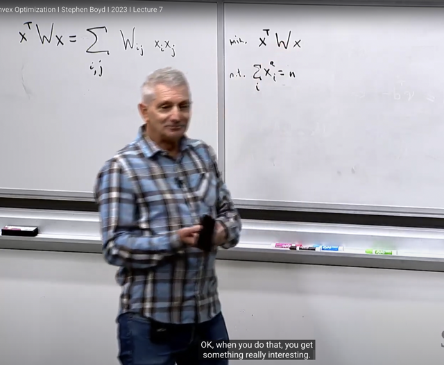</kbd>

> [!NOTE]
> gs nói về cái gọi là SPECTRAL PARTITIONING:
>
> đại khái là minimize xTWx, nhưng (khúc này tạm hiểu) là ta thay
> constraint bằng Σ xi^2 = n, bởi vì nếu constraint cũ là xi^2 = 1 (xi = 1
> hoặc -1) thì có thể suy ra (kiểu như để có constraint "mới" là tổng
> xi^2=n, dĩ nhiên  không suy ngược lại được)
>
> gs hỏi: minimize xTWx constraint Σi xi^2 = n
>
> thì constraint này chính là ||x||^2 = n
>
> xTWx = xTSΛSinvx | diagonalization matrix W
>
> GỈA SỬ W SYMMETRIC, W = QΛQT 
>
> xTWx = xTQΛQTx 
>
> = xTQ [diag(Λ) ⊙ (QTx)] 
>
> = Σi [(QTx)_i] * λ_i * [(QTx)_i]
>
> = Σi [(QTx)_i]^2 λ_i
>
> Vậy xTWx = Σi [(QTx)_i]^2 λ_i
>
> Và cái này: 
>
> Σi [(QTx)_i]^2 λ_min <= Σi [(QTx)_i]^2 λ_i   |   λ_min <= λ_i với mọi i
>
> <=> λ_min * [Σi [(QTx)_i]^2] <= Σi [(QTx)_i]^2 λ_i
>
> <=> λ_min ||QTx||^2 <= Σi [(QTx)_i]^2 λ_i
>
> <=> λ_min ||x||^2 <= Σi [(QTx)_i]^2 λ_i   
>
> (Orthonormal matrix Q không thay đổi norm: ||QTx||^2 = (QTx)T(QTx)
> = xTQQTx = xTx = ||x||^2)
>
> <=> λ_min * n <= Σi [(QTx)_i]^2 λ_i    |  Dùng constraints ||x||^2 = n
>
> Vậy minimize xTWx subject to Σi xi^2 = n sẽ bằng λ_min*n
>
> Và nó xảy ra khi x là eigenvector tương ứng λ_min của W: khi đó
> xTWx = xT λ_min x = λ_min * xTx
>
> = λ_min * ||x||^2 = λ_min * n
>
> => p* = λ_min * n
>
> Có thể thấy chỉ dùng eigenvalue decomposition cũng giúp giải
> ra lower bound của p*, và vì đại khái là bài toán Two-way partitioning
> có constraint xi^2 = 1 cũng imply constraint của bài toán này Σ xi^2 = n
> nên kiểu như ta cũng suy ra p* của bài toán two-way partitioning
> cũng là λ_min * n. Đây là kết qủa mà ta có được nhờ Lagrangian Dualk
>
> KHÔNG CẦN DÙNG LAGRANGIAN DUAL FUNCTION MÀ CHỈ DÙNG
> KIẾN THỨC EIGENVALUE DECOMPOSITION
>
> TA TÌM LOWER BOUND CỦA BÀI TOÁN SPECTRAL PARTITIONING
> EQUIVALENT VỚI BÀI TOÁN TWO-WAY PARTITIONING

 

<kbd>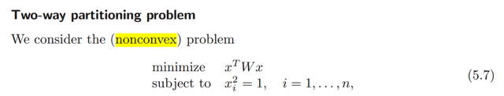</kbd>

<kbd>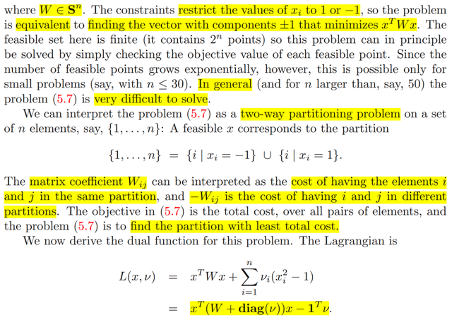</kbd>

<kbd>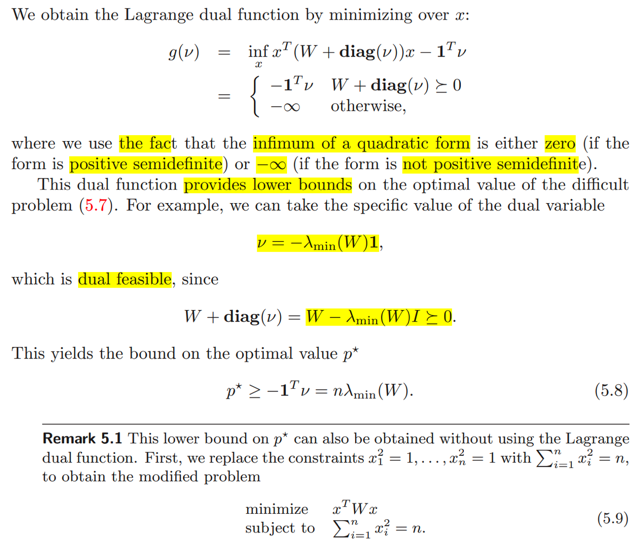</kbd>

<kbd>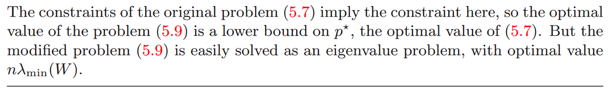</kbd>

> [!NOTE]
> Trong sách ko bổ sung gì so với bài giảng, trừ việc nó giúp mình hiểu
> bài toán TWO-WAY PARTITIONING problem là vấn đề NON-CONVEX vì W
> CHỈ SYMMETRIC, CHƯA CHẮC PSD. Và Lagrangian Dual function có thể
> GIÚP TÌM LOWER BOUND CỦA OPTIMAL VALUE p*
>
> Sau đó, đại khái là ta cũng có thể DÙNG MỘT BÀI TOÁN EQUIVALENT
> chính là Spectral Partitioning mà trong đó ta thay constraint từ xi^2 = 1 thành
> Σ xi^2 = n. Và bài toán này thì có thể tìm lower bound của p* KHÔNG CẦN
> DÙNG LAGRANGIAN DUAL mà CHỈ DÙNG EIGENVALUE DECOMPOSITION
>
> Và vì equivalent nên lower bound của p* cũng giống nhau

 

<kbd>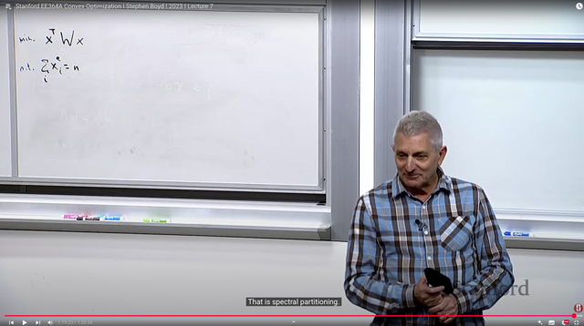</kbd>

> [!NOTE]
> Thế rồi đại khái gs nó để quay lại constraint gốc thì ta sẽ: làm tròn, và
> lấy sign. Hiểu đại khái là từ constraint Σ xi^2 = n ko thể suy ngược lại
> xi = +/-1 nhưng bằng cách round off và lấy sign thì ta có thể.
>
> (hiểu đại khái vậy, chứ chưa hiểu rõ lắm)
>
> Và ông nói bài toán Spectral Partitioning này rất useful

 

<kbd>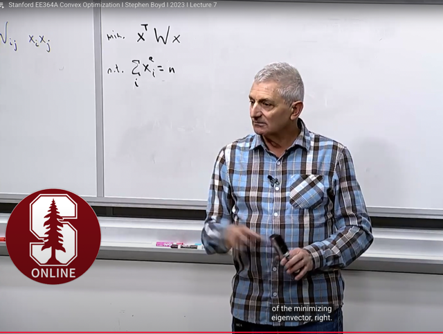</kbd>

> [!NOTE]
> ?: W có phải symmetric không và có phải PSD ko?
>
> Gs: Phải symmetric nhưng ko cần PSD.
>
> Mình nghĩ: vì với symmetric thì luôn diagonalizable (18.06: symmetric
> luôn có đủ n eigenvector độc lập và chúng vuông góc / hoặc có thể
> chọn được bộ vuông góc), nên xTWx = xTQΛQx và ta đã chứng minh
> nó đạt min khi x là eigenvector nhỏ nhất

 

