# Lec 8 A

📊 **Progress:** `45` Notes | `59` Screenshots

---

## Lec 8 A

 

<kbd>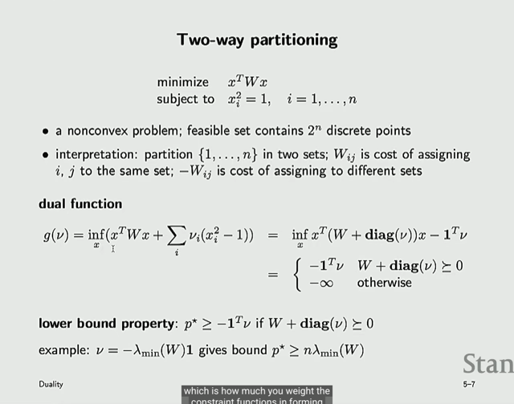</kbd>

> [!NOTE]
> Recap: Lagrangian có thể được nhìn nhận là cách ta TÍCH HỢP
> CONSTRAINT VÀO TRONG OBJECTIVE FUNCTION
>
> objective function f0(x) + linear combination các equalities và
> inequalities constraints Σ λi fi(x) + Σ vi hi(x)
>
> Để rồi khi ta minimize over x tức tìm x sao cho f0(x) + Σi λi fi(x) +
> Σi vi hi(x) nhỏ nhất, ta sẽ có DUAL FUNCTION: g(λ, ν)
>
> Ý nghĩa, đó là ta approximate constraint thành ra kiểu như add
> cost (tuyến tính) vào objective, để khi violate constraint thì tăng
> cost, satisfy constraint thì giảm cost.
>
> Để rồi từ đó ta có thể có được lower bound của original function: 
> p* >= g(λ, v)
>
> Và bài trước ta học về Two-way partitioning: trong đó gs lưu ý
> đặc điểm là trong objective function xTWx thì chưa chắc nó đã
> convex (W chưa chắc là positive semi definite) cũng như các
> equalities constraint không phải affine, ko convex.
>
> Rồi ta define Lagrangian, và sau đó cũng minimize over x
> Lagrangian để có Dual function g(λ, v)
>
> Và gs cho biết nếu W ≽ 0, khi đó quadratic form sẽ có minimum
> = 0, ngược lại nếu W có eigenvalue âm thì (nó là definite matrix)
> nó sẽ có min là -infinity.

 

<kbd></kbd>

> [!NOTE]
> gs: đại khái là bài toán gốc rất khó giải một cách chính xác.
> Nhưng thường thì ta cũng không cần phải làm vậy
>
> Và cái lower-bound mà ta có ở đây cho phép ta giải bài toán
> này (theo cách ko chính xác)

 

<kbd>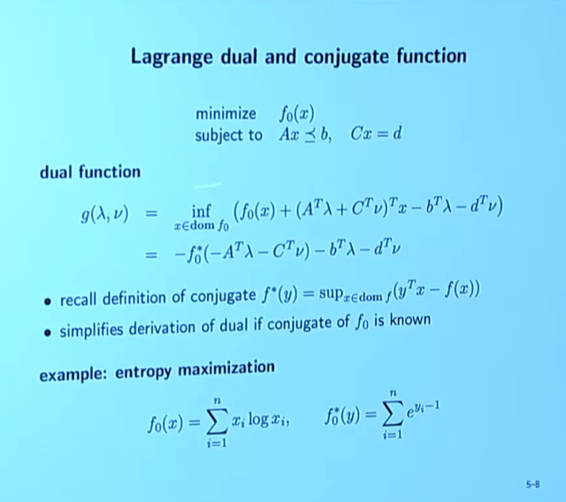</kbd>

> [!NOTE]
> Qua bài toán này: minimize f0(x) với equalities constraints Cx = d  và
> inequalities constraints Ax ⪯ b
>
> Lagrangian L(x, λ, ν) = f0(x) + (Ax-b)Tλ + (Cx-d)Tν
>
> = f0(x) + (Ax)Tλ - bTλ + (Cx)Tν - dTν
>
> = f0(x) + (Ax)Tλ + (Cx)Tν - bTλ - dTν
>
> = f0(x) + (ATλ + CTν)Tx - bTλ - dTν
>
> Và như đã biết ta sẽ minimize L over x để có Dual function.
>
> g(λ,ν) = inf x ∈ dom f0 (f0(x) + (ATλ + CTν)Tx - bTλ - dTν)
>
> Thế thì, bữa trước (theo link đỏ) ta đã học về CONJUGATE FUNCTION 
> CỦA f(x), được định nghĩa là:
>
> f*(y) = sup x ∈ dom yTx - f(x)
>
> Mang ý nghĩa là tìm x trong domain của f khiến maximize yTx - f(x) khi
> đó, hàm yTx-f(x) với x đó, sẽ gọi là conjugate function f*(y)
>
> Thế thì 
>
> g(λ, v) = inf x  f0(x) + (ATλ + CTν)Tx - bTλ - dTν)  
>
> = inf x  f0(x) + (ATλ + CTν)Tx  - bTλ - dTν)   |   Bỏ term không depend 
> x ra
>
> sẽ tương đương
>
> g(λ, v) = - sup x  - f0(x) - (ATλ + CTν)Tx - bTλ - dTν)   
>
> = - sup - (ATλ + CTν)Tx - f0(x)  - bTλ - dTν
>
> Và theo ĐỊNH NGHĨA CONJUGATE FUNCTION: sup [yTx - f(x)] = f*(y)
>
> thì sup [- (ATλ + CTν)Tx - f0(x)] CHÍNH LÀ là f0*[-(ATλ + CTν)]
>
> Do đó g(λ, v) = - f0*[- (ATλ + CTν)] - bTλ - dTν
>
> = - f0*(- ATλ - CTν)) - bTλ - dTν
>
> LAGRANGE DUAL FUNCTION &
> CONJUGATE FUNCTION

**🔗 See also:** [conjugate function](./lec_4.md#node-kr3qn6k)

 

<kbd>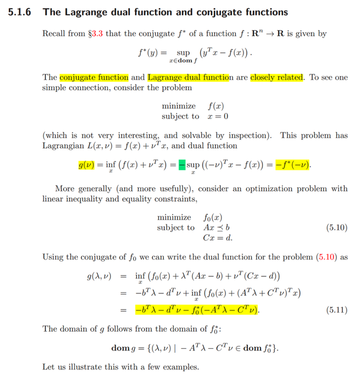</kbd>

> [!NOTE]
> Trong sách nói thêm một ý là dual function và conjugate
> function liên hệ khá gần gũi. Ngoài ra thì y như trong
> slide thôi
>
> 5.1.6 THE LAGRANGE DUAL FUNCTION &
> CONJUGATE FUNCTIONS

 

<kbd>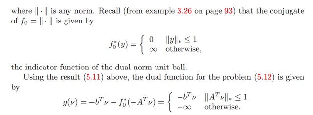</kbd>

<kbd>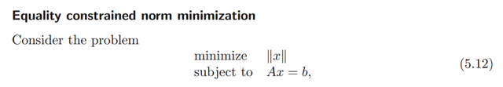</kbd>

<kbd>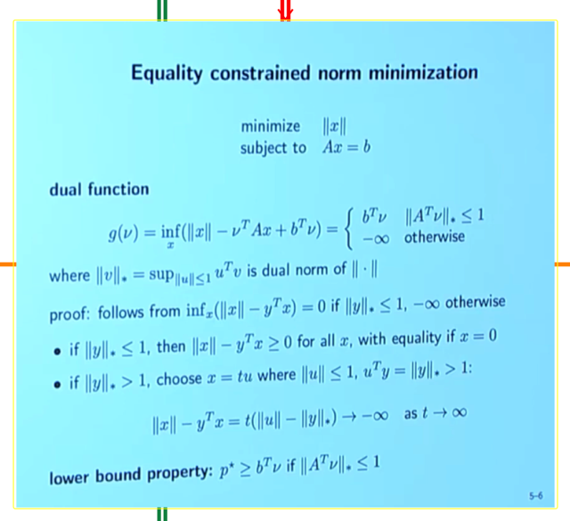</kbd>

> [!NOTE]
> Thử ví dụ này: f0(x) = ||x||, subject to Ax = b. Cái này đã gặp mấy lần, đây là việc giải
> tìm nghiệm nhỏ nhất (norm nhỏ nhất) trong các nghiệm của Ax = b. Dĩ nhiên nếu Ax = b
> vô nghiệm, khi b không thuộc C(A) thì bài toán optimization này INFEASIBLE.
>
> Nếu nó có nghiệm duy nhất thì dĩ nhiên nó cũng là optimal. Nhưng nếu nó có vô số
> nghiệm (có dạng x_xomplete = x_particular + x_null = x_p + Fz, F là matrix có các
> columns là nullspace N(A) basis) thì việc tìm ra nghiệm nhỏ nhất CHÍNH LÀ TÌM
> x_particular. Và theo MIT 1806 và EE263 ta đã biết có thể dùng pseudo-inverse A^+ để
> tìm ra x_particular từ x_complete
>
> x_p = A^+b
>
> Thế thì quay lại đây:
>
> Thiết lập Lagrangian function: L(x, v) = f0(x) + vTh(x)
>
> = ||x|| + vT(Ax - b) = ||x|| + vTAx - vTb
>
> Và Dual function: g(v) = inf x ||x|| + vTAx - vTb
>
> = inf x ||x|| + vTAx - vTb
>
> nó cũng sẽ tương đương:
>
> g(v) = - sup x  - ||x|| - vTAx  - vTb
>
> = - sup x  - vTAx - ||x||  - vTb
>
> = - sup x  (-ATv)Tx - ||x||  - vTb  Theo định nghĩa của CONJUGATE FUNCTION:
>
> f*(y) là conjugate function của f(x) sẽ bằng: sup x ∈ dom f yTx - f(x)
>
> thì với f(x) = ||x||, ta có conjugate function của norm ||x||, evaluate tại y:
>
> f*(y) = sup x yTx - ||x||
>
> Và cái này thì ta đã chứng minh được giá trị của nó:
>
> a) 0 khi ||y||* <= 1
>
> b) + infinity khi ||y||* > 1
>
> Do đó, áp dụng vào đây
>
> sup x  (-ATv)Tx - ||x||  chính là conjugate function của norm ||x|| evaluate tại -ATv:
> f*(-ATv)
>
> Và như vậy giá trị của nó sẽ là:
>
> a) 0 nếu ||-ATv||* <= 1
>
> b) +infinity nếu ||-ATv||* > 1
>
> Và từ đó với g(v) = - sup x  - (ATv)Tx - ||x||  - vTb
>
> = - f*(-ATv) - vTb sẽ bằng:
>
> a) - vTb nếu ||-ATv||* <= 1 (bTv hay vTb là một)
>
> b) - infinity nếu ||-ATv||* > 1
>
> Kết quả này thật ra là the same với trong slide, vì DUAL NORM CŨNG LÀ NORM.
> NÊN ||-ATv||* = ||ATv||*
>
> (Và thật ra khi ta thể hiện equality constraints Ax = b thành h(x) = 0 thì có thể cho h(x)
> = Ax - b hoặc h(x) = b - Ax đều được. Khi đó  thì trường hợp đầu sẽ cho ra g(v) = vTb
> nếu ||ATv||* <= 1 và  trường hợp sau sẽ cho ra g(v) = -vTb nếu ||-ATv||* <= 1
>
> GPT cho rằng hai kết quả đều đúng vì ||ATv|| = ||-ATv|| và vTb hay -vTb chẳng qua là
> vấn đề dấu của v mà thôi
>
> Có thể vì vậy mà trong lecture slide kết quả lại là g(v) = bTv khi ||ATv||* <= 1

**🔗 See also:** [Conjugate function của norm](./lec_4.md#node-j3bjf6y)

 

- **Entropy maximization**

<kbd>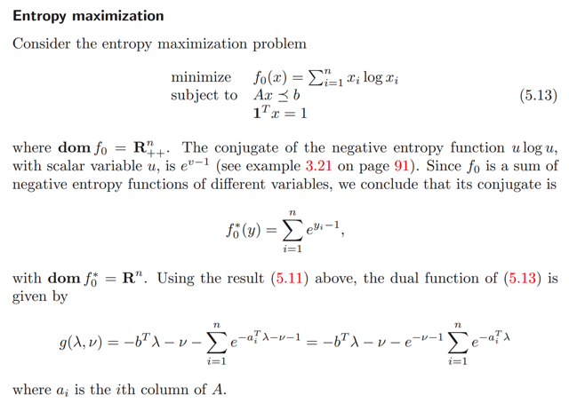</kbd>

> [!NOTE]
> Rồi, xét ví dụ này f0(x) = Σ xilog(xi).
>
> Bài trước trong phần conjugate function (theo link tím) ta đã derive để chứng minh **conjugate function của negative entropy f(x) = xlog(x) là f*(y) = e^(y-1)**
>
> Vậy giờ với f0(x) = Σ xi log(xi). Thử tìm conjugate của nó:
>
> theo định nghĩa conjugate của f(x): f*(y) = sup x ∈ dom f yTx - f(x)
>
> => conjugate của f0(x): f*(y) = sup x ∈ dom f yTx - Σ xi log(xi)
>
> = sup x ∈ dom f Σ yixi - Σ xi log(xi)
>
> = sup x ∈ dom f Σ (yixi - xilog(xi))
>
> = Σ [ sup x ∈ dom f  yixi - xilog(xi)  ]   | supremum của tổng
>
> = Σ e^(yi - 1)
>
> Vậy f*0(y) = Σ e^(yi - 1) (****)
>
> Thế thì trong bài trước ta đã cho thấy dom f*(y) = R (vì xy - xlog(x) luôn bounded above, tức
> sup x  yx - xlog(x)  luôn < +infinity.
>
> Thế thì bây giờ cái chính ở mục này là ta TÌM DUAL FUNCTION:
>
> Lagrangian L = Σxi log(xi) + λT(Ax - b) + vT(1Tx-1)
>
> = xTlog(x) + λTAx + vT1Tx - λTb - vT1
>
> g(λ, v) = inf x L(x, λ, v)
>
> ==== Cách 1 dùng kết quả Conjugate function ở trên (****): 
>
> = inf x  xTlog(x) + λTAx + vT1Tx - λTb - vT1 
>
> = - sup x  - xTlog(x) - λTAx - vT1Tx  - λTb - vT1 
>
> = - sup x  (- ATλ - 1Tv)Tx - xTlog(x)  - λTb - vT1
>
> = - sup x  Σ (- aiTλ - v)xi - xilog(xi)  - λTb - vT1
>
> = - Σ sup x  (- aiTλ - v)xi - xilog(xi)  - λTb - vT1
>
> = - Σ e^(- aiTλ - v - 1) - λTb - vT1
>
> = - Σ e^(- aiTλ) e^(- v - 1) - λTb - vT1
>
> = - e^(- v - 1) Σ e^(- aiTλ) - λTb - v
>
> = - v - λTb - e^(- v - 1) Σ e^(- aiTλ) 
>
> ==== Cách 2 Dùng calculus như thông thường
>
> tính gradient ∇x L(x, λ, v):
>
> dL = L(x+dx, λ, v) - L(x, λ, v)
>
> = (x+dx)Tlog(x+dx) + λTA(x+dx) + vT1T(x+dx) - λTb - vT1 - [xTlog(x)
> + λTAx + vT1Tx - λTb - vT1]
>
> = (x+dx)Tlog(x+dx) + λTA(x+dx) + vT1T(x+dx) - λTb - vT1 - xTlog(x) - λTAx - vT1Tx + λTb
> + vT1
>
> = (x+dx)Tlog(x+dx) + λTAx + λTAdx + vT1Tx + vT1Tdx - xTlog(x) - λTAx - vT1Tx
>
> = (x+dx)Tlog(x+dx) + λTAdx  + vT1Tdx - xTlog(x)
>
> = xTlog(x+dx) + dxTlog(x+dx) + λTAdx  + vT1Tdx - xTlog(x)
>
> = xT[log(x+dx) - log(x)] + dxTlog(x+dx) + λTAdx  + vT1Tdx
>
> Dùng linear approximation với log: log(x + dx) = log(x) + dx/x
>
> ~= xT[log(x) + dx/x - log(x)] + dxT[log(x) + dx/x] + λTAdx + vT1Tdx
>
> = xT(dx/x) + dxTlog(x) + dxTdx/x + λTAdx + vT1Tdx
>
> Xét xT(dx/x) = thì dx/x chính là phép chia element-wise: dx/x = [dx1/x1, dx2/x2....]
>
> xT(dx/x) = Σ xi * dxi / xi = Σ dxi = 1Tdx
>
> Tương tự dxTdx/x = Σ dxi * dxi / xi = Σ (dxi)^2 / xi, và cái này là bậc hai của dx vô cùng nhỏ
> nên coi như bằng 0: dxTdx/x = 0
>
> Vậy ta có:
>
> = 1Tdx + dxTlog(x) + λTAdx + vT1Tdx
>
> dL = (1 + log(x) + ATλ + 1Tv)Tdx
>
> Vậy ∇x_L = 1 + log(x) + ATλ + 1Tv
>
> Tới đây dù không sai như nhưng để ý v là scalar, vì nó là Lagrange multiplier của equality
> constraint: 1Tx = 1 <=> Σ xi = 1 tức là chỉ có một equality constraint. Nên v chỉ là một scalar. Vậy
> 1Tv = v
>
> Vậy ∇x_L = 1 + log(x) + ATλ + v
>
> Cho gradient = 0 để tìm critical point:
>
> ∇x_L = 1 + log(x) + ATλ + v = 0 <=> log(x) = - ATλ - v - 1 <=> x = e^(- ATλ - v - 1)
>
> Và với e^(- ATλ - v - 1), thì component ith sẽ là: e^(-aiTλ - v - 1) với ai là row thứ i'th của AT
> cũng là column thứ i'th của A
>
> Xét thêm Hessian, để xem critical point là minimum hay maximum:
>
> dL' = L'(x+dx) - L'(x) = 1 + log(x+dx) - 1 - log(x) = log(x+dx) - log(x) ~= log(x) + dx/x - log(x) = dx/x
>
> Nhờ MIT 18s096: Thử tìm Hessian theo cách tiếp cận Bilinear form:
>
> d(L'(x)[dx]) = d((1 + log(x) + ATλ + 1Tv)Tdx) = 
>
> = (1 + log(x+dx') + ATλ + 1Tv)Tdx - [(1 + log(x) + ATλ + 1Tv)Tdx]
>
> = (1 + log(x) + dx'/x + ATλ + 1Tv)Tdx - [(1 + log(x) + ATλ + 1Tv)Tdx]
>
> = 1Tdx + log(x)Tdx + (dx'/x)Tdx + (ATλ)Tdx + (1Tv)Tdx - 1Tdx - log(x)Tdx - (ATλ)Tdx - (1Tv)Tdx
>
> = (dx'/x)Tdx 
>
> = Σ (dx'i / xi) * dxi = (dx')T diag([1/x1, 1/x2, ...1/xn]) dx
>
> => Hessian = diag([1/x1, 1/x2, ...1/xn])
>
> => Với với x ≽ 0 (domain của L: xi phải >= 0) Do đó Hessian ≻ 0 (positive definite) (do tất cả các 
> eigenvalues đều dương)
>
>  => critical point là minimum
>
> Vậy g(λ, v) = inf x L(x, λ, v) = xTlog(x) + λTAx + vT1Tx - λTb - vT1 
>
> với x = e^(- ATλ - v - 1)
>
> = xT(- ATλ - v - 1) + λTAx + vT1Tx - λTb - vT1 
>
> = - xTATλ - xTv - xT1 + λTAx + vT1Tx - λTb - vT1 
>
> = - xT1 - λTb - vT1 
>
> = - v - bTλ - Σ e^(-aiTλ - v - 1)
>
> = - v - bTλ - Σ e^(-aiTλ)e^(- v - 1)
>
> = - v - bTλ - e^(- v - 1) * Σ e^(-aiTλ) 
>
> Đây là kết quả như trong slide nhưng derive dùng calculus

**🔗 See also:** [Một số ví dụ khác về conjugate function](./lec_4.md#node-hhpcqzh) · [linked note](./lec_8_b.md#node-3wciz9j)

 

<kbd>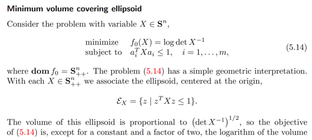</kbd>

<kbd>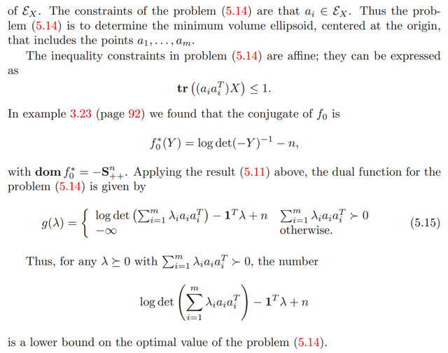</kbd>

> [!NOTE]
> SÁCH (XEM SAU)

 

<kbd></kbd>

> [!NOTE]
> Rồi, tới đây ta đang ở đâu:
>
> Ta có optimization problem, minimize f0(x) (objective) với constraint
> fi(x) <= 0 và hi(x) = 0
>
> Và ta tạo Lagrangian function. Là function theo x, λ, ν:
>
> L(x, λ, ν) = f0(x) + Σ λi fi(x) + Σ νi hi(x) mang ý nghĩa là ta tích hợp
> constraint và objective
>
> Rồi ta mới minimize nó over x thì ta có Dual function.
>
> Và ý nghĩa của Dual function là ta có LOWER BOUND của optimal
> p* >= g(v, λ)
>
> Từ đó với các ν λ khác nhau ta sẽ có các lower bound khác
> nhau.
>
> Và từ đó ta sẽ muốn tìm BEST LOWER BOUND
>
> CHAPTER 5 - DUALITY
>
> 5.2 THE LAGRANGE DUAL PROBLEM

 

- **Bài toán đối ngẫu Lagrange**

<kbd>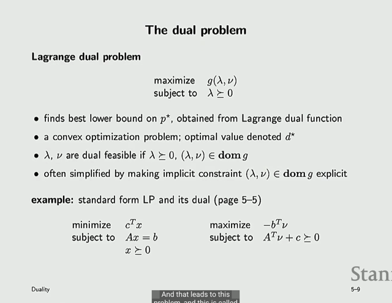</kbd>

> [!NOTE]
> Từ đó dẫn tới bài toán này: LAGRANGE DUAL PROBLEM. 
>
> Nói bằng lời đó là ta sẽ MAXIMIZE LOWER BOUND (g(λ, ν)) 
> sử dụng Lagrange Duality.
>
> Và điểm hay ho là ĐÂY LÀ CONVEX PROBLEM dù cho bài toán gốc, có
> thể không phải convex
>
> Chú ý là ta maximize g over cả λ, ν: tức là tìm λ, ν sao cho g(λ, ν) lớn
> nhất: khi đó ta có DUAL OPTIMAL VALUE
>
> d* = g(λ*, ν*) = sup λ, ν ∈ dom, λ ≽ 0 g(λ, ν)
>
> Một ví dụ là bài toán Standard LP và dual của nó (gs nói ta có thể hiểu
> hai bài toán này quan hệ gần gũi với nhau INTIMATE RELATED)
> Nhưng hiểu đại khái là:
>
> Bài toán gốc Standard LP, ta muốn minimize objective function cTx
> với equality constraint Ax = b và inequality constraint x ≽ 0.
>
> Lagrangian: cTx + vT(Ax-b) + λT(-x) = cTx + vT(Ax-b) - λTx  
>
> = cTx + vTAx - vTb - λTx 
>
> = (c - λ + ATv)Tx - vTb
>
> = (ATv - λ + c)Tx - vTb
>
> Và ta sẽ minimize over x cái này để có Dual function g(λ, v).
>
> g(λ, v) = inf x ∈ dom f0 (ATv - λ + c)Tx - vTb
>
> Thế thì với affine function ví dụ pTx + q thì khi minimize nó, phần lớn
> trường hợp ta sẽ có -infinity (cái này dễ thấy). nhưng trừ khi p = 0 thì
> minimize nó chính là q.
>
> Do đó: 
>
> g(λ, v) = inf_x L(x, λ, v) = -inf khi ATv - λ + c != 0 
>
> hoặc:
>
> g(λ, v) = inf_x L(x, λ, v) = -bTv khi ATv - λ + c = 0 <=> λ = ATv + c
>
> Và khi đó ta sẽ có lower bound p* >= g(λ, v) >= -bTv nếu ATv + c ≽ 0
>
> Và KẾT HỢP VỚI MỘT CONSTRAINT CỦA λ: MỌI λi phải không âm,
> ĐỒNG NGHĨA λ ≽ 0 (cái này là luôn là constraint của λ): 
>
> λ ≽ 0 <=> ATv + c ≽ 0
>
> Và bài toán DUAL PROBLEM là ta sẽ MAXIMIZE lower bound -bTv này với
> constraint λ ≽ 0 <=> ATv + c ≽ 0
>
> (TRONG QUÁ TRÌNH VỪA RỒI TA ĐÃ THỰC HIỆN MỘT ĐỘNG TÁC LÀ
> CHUYỂN BÀI TOÁN DUAL PROBLEM THÀNH MỘT EQUIVALENT
> PROBLEM TRONG ĐÓ TA EXPLICITLY THỂ HIỆN MỘT IMPLICIT
> CONSTRAINT: ĐÓ LÀ g(λ, v) PHẢI > -INFINITY. SẼ NÓI RÕ HƠN Ở 5.2.1
> (LINK TÍM)
>
> DUAL PROBLEM

**🔗 See also:** [linked note](./lec_7.md#node-5mls9ep) · [linked note](#node-3hxz63z)

 

<kbd>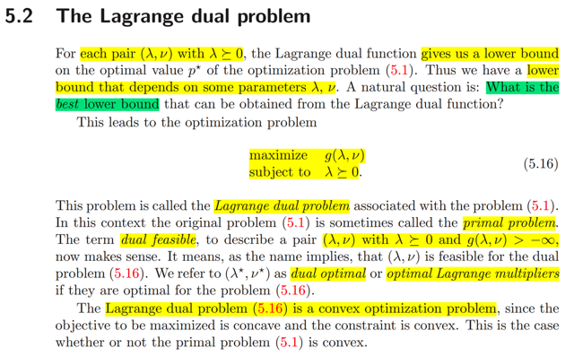</kbd>

> [!NOTE]
> Ngoài những điểm nói trong bài giảng, trong sách nói rõ hơn rằng
> cho dù bài toán gốc (gọi là PRIMAL PROBLEM) không convex thì
> bài toán DUAL PROBLEM VẪN CONVEX, do objective của nó:
>
> g(λ, v) là CONCAVE function còn constraint của nó λ ≽ 0 là
> AFFINE  (theo link xanh xem lại)
>
> Và để ý một số tên gọi:
>
> Bài toán maximize g(λ,v) subject to λ ≽ 0 gọi là LAGRANGE DUAL
> PROBLEM.
>
> Và thuật ngữ DUAL FEASIBLE chính là mô tả điều kiện 1) λ ≽ 0 và
>  2) λ, v sao cho g(λ, v) > -infinity.
>
> 5.2 LAGRANGE DUAL PROBLEM

**🔗 See also:** [linked note](./lec_7.md#node-ekh1tgc)

 

<kbd>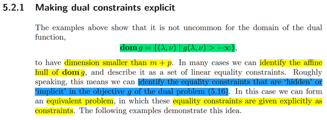</kbd>

> [!NOTE]
> đại khái là, bài trước, khi giới thiệu về Dual function (hay tên đầy đủ
> là Lagrange Dual function) g(λ, v) ta đã nhận định rằng: Nếu g(λ, v)
> = -infinity, thì tính chất Lower Bound Property p* >= g(λ, v) VÔ
> DỤNG.
>
> Do đó ta cần λ, v phải THỎA MÃN MỘT ĐIỀU KIỆN LÀ
>
> 1) λ ≥ 0 và
>
> 2) g(λ, v) > -infinity và λ, v thỏa điều kiện này thì gọi là DUAL
> FEASIBLE. Và ta gọi đó là DOMAIN của g: dom g = (λ, v):
> g(λ, v) > - infinity
>
> Thế thì ta sẽ kiểu như CHUYỂN BÀI TOÁN DUAL PROBLEM
> THÀNH EQUIVALENT PROBLEM MÀ TRONG ĐÓ TA THỂ HIỆN
> EXPLICITLY CÁI CONSTRAINT NÀY
>
> 5.2 LAGRANGE DUAL PROBLEM
>
> 5.2.1 MAKING DUAL CONSTRAINTS EXPLICIT

**🔗 See also:** [linked note](./lec_7.md#node-ilfy28d) · [Bài toán đối ngẫu Lagrange](#node-0ndyxau) · [linked note](./lec_9.md#node-x4apjy4)

 

<kbd>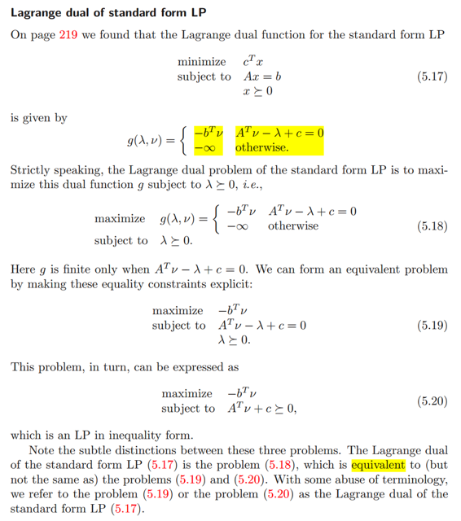</kbd>

> [!NOTE]
> Đây là ví dụ đã nói trong bài (cũng
> đã note kĩ) nên đã hiểu rồi.

 

<kbd>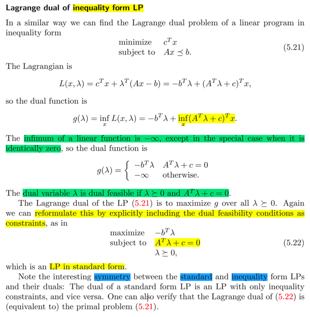</kbd>

> [!NOTE]
> Một ví dụ khác là bài toán gọi là INEQUALITY FORM LP
> đại khái là bài toán LP như đã biết có objective là cTx + d,
> và equality và inequality constraints function đều linear:
> Ax ⪯ b, Cx = d. 
>
> Thế thì ở đây xét bài toán minimize cTx với Ax ⪯ b (cũng là
> LP problem). Đại khái là sau khi xây dựng Lagrangian L(x, λ)
> (không có v vì không có equality constraint) và Dual function
> g(λ), thì ta sẽ thấy g(λ) sẽ bằng -bTλ nếu ATλ + c = 0 và bằng
> -infinity nếu ngược lại.
>
> Do đó, λ vốn đã có constraint λ ≽ 0 thì thật ra có một implicit
> constraint nữa: Phải DUAL FEASIBLE: thuộc Domain của g: 
>  λ: g(λ) > -infinity .
>
> Vậy nên ATλ + c phải = 0 Và bài toán Dual Problem từ việc chỉ là
> maximize g(λ) với constraint λ ≽ 0 thì nay thêm explicit constraint:
>
> ATλ + c = 0
>
> Khúc cuối có nói thêm về TÍNH ĐỐI XỨNG CỦA STANDARD LP
> VÀ INEQUALITY FORM LP: CHƯA HIỂU LẮM

 

<kbd>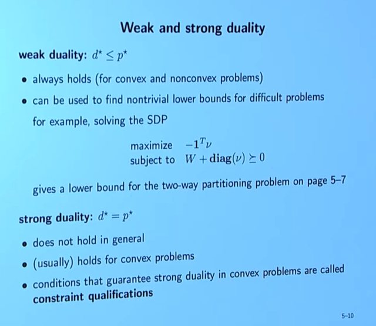</kbd>

> [!NOTE]
> d* là optimal value của bài toán dual problem, tức nó là cái lower
> bound lớn nhất. Và p* thì là optimal value của bài toán gốc
>
> Gs cho biết nếu d* là infinity thì ta sẽ kết luận p* cũng infinity. Để
> rồi cũng chính là nói bài toán gốc (PRIMAL PROBLEM) INFEASIBLE
> (ta có thể nhớ, nếu mà bài toán optimization with constraint không có x
> nào thỏa constraint, tức feasible set là tập rỗng dẫn tới f0(x), x ∈
> feasible set cũng là tập rỗng thì min của tập rỗng là +infinity)
>
> Còn nếu d* = -infinity, thì điều này có nghĩa là rơi vào trường hợp g(λ, v)
> = -infinity (khi đó d* = sup g(λ,v) cũng bằng -infinity) và ta nhớ nó xảy ra
> khi Lagrangian L(x, λ, v) UNBOUND BELOW. Thì như đã biết nếu g(λ,
> v) = - infinity thì có nghĩa là  dual feasible set rỗng, tức DUAL 
> PROBLEM INFEASIBLE
>
> Và ta có d* <= p*, đây là quan hệ LUÔN ĐÚNG, và nó gọi là
> WEAK DUALITY. Và như đã thấy những slide trước, cái này có thể
> giúp TÌM BEST LOWER BOUND CỦA OPTIMAL p* ĐỐI VỚI CÁC BÀI
> TOÁN KHÓ (khó tìm p*) 
>
> ====
>
> Còn khi d* = p*, không phải luôn đúng, và gs cho rằng VỚI
> CONVEX PROBLEM THÌ NÓ THƯỜNG LÀ ĐÚNG.
>
> Đây gọi là STRONG DUALITY, nó cho biết rằng TỒN TẠI λ, ν
> SAO CHO  d* = p*
>
> Và nói thêm rằng đại ý là CÓ MỘT SỐ ĐIỀU KIỆN NÀO ĐÓ ĐỂ
> STRONG DUALITY XẢY RA, và những điều kiện này được gọi là
> CONSTRAINT QUALIFICATION
>
> WEAK & STRONG DUALITY

**🔗 See also:** [Optimization in standard form](./lec_5.md#node-vrjdtqq)

 

<kbd>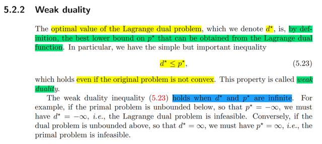</kbd>

<kbd>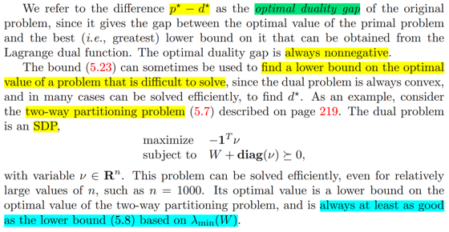</kbd>

> [!NOTE]
> Trong sách ko có gì khác, chỉ nói thêm về việc p* - d* gọi là
> OPTIMAL DUALITY GAP.
>
> DUALITY GAP thì chỉ là f0(x) - g(λ, v)
>
> Cũng như nhắc lại rằng cái này có thể có ích khi ta có những bài
> toán (optimization) NON-CONVEX PHỨC TẠP mà KHÓ TÌM
> OPTIMAL VALUE p*. Khi đó cái này giúp ta tìm  LOWER
> BOUND của p*, vốn là bài toán dễ hơn vì như đã biết DUAL
> PROBLEM LUÔN LÀ CONVEX PROBLEM (ôn lại cho nhớ do
> objective g là hàm CONCAVE, còn constraint λ ≽ 0 là AFFINE)
>
> Một ví dụ của bài toán như vậy là bài toán SDP mà ta đã note kĩ ở
> phần trước (theo link hồng): Nhắc lại một chút, theo link hồng, thì ta
> dùng LOWER BOUND PROPERTY p* >= g(v) để tìm lower bound
> của p*, dĩ nhiên là một hàm theo v. Để rồi ta cần v phải thỏa điều
> kiện (W + diag(v) là positive semi definite) thì lower bound mới KHÁC
> -infinity.
>
> (Đó là cái mà bây giờ ta gọi là IMPLICIT CONSTRAINT ĐỐI VỚI
> DUAL VARIABLE λ, v)
>
> Thế thì lúc đó ta CHỌN v = -λ_min(W)1 để W + diag(v) ≽ 0. Từ đó
> giúp lower bound = -1Tv.
>
> CÒN Ở ĐÂY Ý NÓI, TA CÓ THỂ GIẢI BÀI TOÁN DUAL
> PROBLEM: d* = inf v ∈ dom g g(v), và khi đó TA SẼ GIẢI RA d* ÍT
> NHẤT LÀ TỐT  BẰNG GIÁ TRỊ -1Tv MÀ TA CHỌN
>
> 5.2 LAGRANGE DUAL PROBLEM
>
> 5.2.2 WEAK DUALITY

**🔗 See also:** [linked note](./lec_7.md#node-2udlnvh)

 

<kbd>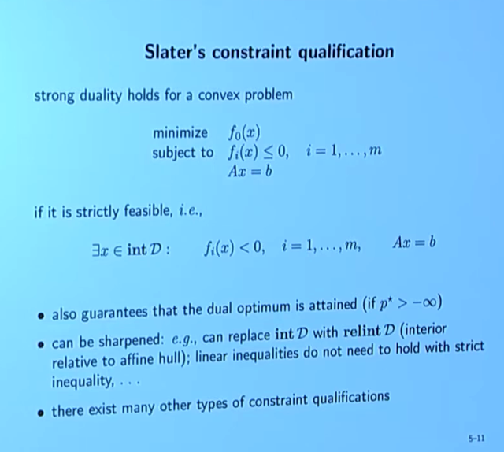</kbd>

> [!NOTE]
> Đại khái là gs nói sơ qua cái này, ví dụ trong đó ta có bài toán gốc là
> convex problem.
>
> Và nếu ta có thêm cái gọi là STRICTLY FEASIBLE, tức là nếu tồn tại
> x thuộc int D (interior của set D) sao cho fi(x) < 0 
>
> thì khi đó CHẮC CHẮN CÓ STRONG DUALITY d* = p*
>
> (nếu p* > -inf) có nghĩa hiểu đại khái là khi có thêm cái constraint
> qualification này thì ta sẽ đảm bảo có thể giải bài toán dual problem
> để tìm ra d* thì nó cũng chính là p*
>
> SLATER'S CONSTRAINT QUALIFICATION

 

<kbd>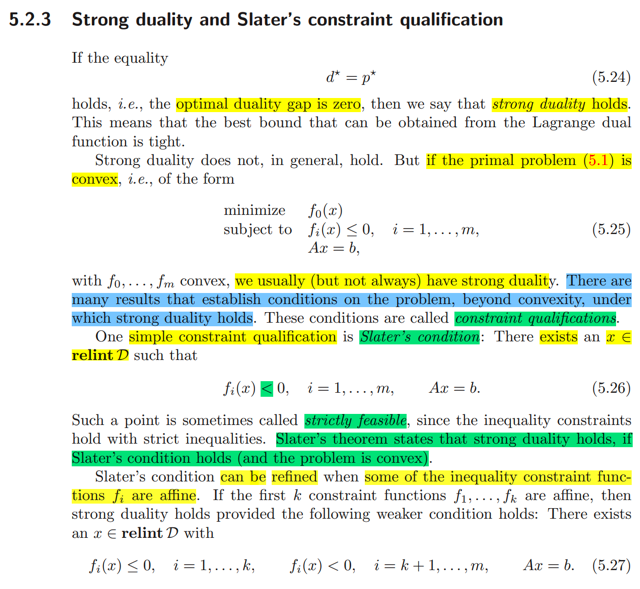</kbd>

> [!NOTE]
> Đọc sách giúp ta hiểu hơn chỗ này. Đại khái là vầy: Như đã nói,
> WEAK DUALITY d* <= p* THÌ LUÔN ĐÚNG DÙ PRIMAL
> PROBLEM CÓ CONVEX HAY KHÔNG.
>
> Nhưng STRONG DUALITY d* = p* THÌ KHÔNG. Tuy vậy, VỚI
> CONVEX PROBLEM THÌ NÓ THƯỜNG LÀ ĐÚNG.
>
> Nhưng cũng chỉ là thường đúng chứ chưa chắc luôn đúng. Thành ra
> CÓ MỘT SỐ "THEOREM" ĐÃ CHỨNG MINH, NẾU NGOÀI VIỆC
> CONVEX PRIMAL PROBLEM CÒN THỎA MỘT SỐ ĐIỀU KIỆN
> NÀO ĐÓ (GỌI LÀ CONSTRAINT QUALIFICATION) THÌ STRONG
> DUALITY SẼ ĐÚNG.
>
> Và một trong số đó là SLATER'S CONSTRAINT
> QUALIFICATION.
>
> Đại ý là, nó nói rằng, nếu các INEQUALITY FUNCTIONS fi(x)
> TỒN TẠI VECTOR / POINT x TRONG RELATIVE INTERIOR CỦA
> fi SAO CHO: fi(x) < 0 GỌI LÀ CÁC STRICTLY FEASIBLE, THÌ KHI
> ĐÓ STRONG DUALITY SẼ THỎA
>
> Có thể cần nói thêm để làm rõ hơn chỗ này. Thông thường, inequality
> constraint có nghĩa là: Cần tồn tại x sao cho fi(x) <= 0 (chú ý dấu <=) 
> thì nếu nó thỏa điều này và thỏa equality constraint Ax=b thì ta gọi
> nó là FEASIBLE. Cái này không có gì mới.
>
> Thì bây giờ SLATER'S CONDITION yêu cầu phải tồn tại x sao cho
> fi(x) < 0 (TỨC LÀ CHỈ <, GỌI LÀ STRICTLY FEASIBLE, STRICTLY
> INEQUALITY)
>
> XEM LẠI KHÁI NIỆM
> RELATIVE INTERIOR
>
> 5.2 LAGRANGE DUAL PROBLEM
>
> 5.2.3 STRONG DUALITY

 

<kbd>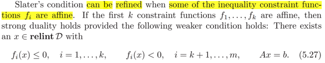</kbd>

<kbd>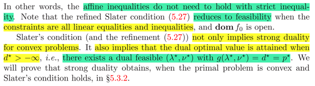</kbd>

> [!NOTE]
> Tiếp theo đại khái gs nói là nếu mà CONSTRAINT FUNCTION fi
> mà là AFFINE thì không cần thỏa STRICT INEQUALITY.
>
> Thành ra có thể dễ hiểu rằng nếu ta có bài toán convex mà chỉ có
> các LINEAR / AFFINE INEQUALITY CONSTRAINT, thì khi đó
> Slater's constraint kiểu như vô hiệu, và chỉ cần tồn tại feasible
> point thì nhất định là Strong duality sẽ thỏa (nên gs gọi là "reduces
> to feasibility")
>
> ====
>
> Một điểm đáng chú ý nữa là, Slater's condition KHÔNG CHỈ ĐẢM
> BẢO CONVEX PROBLEM SẼ THỎA STRONG DUALITY.
>
> Mà thật ra nó còn đảm bảo rằng TA CÓ THỂ TÌM ĐƯỢC DUAL
> OPTIMAL d*, cũng là TA CÓ THỂ TÌM ĐƯỢC λ*, v* sao cho 
>
> d* = g(λ*, v*) = p*

 

<kbd>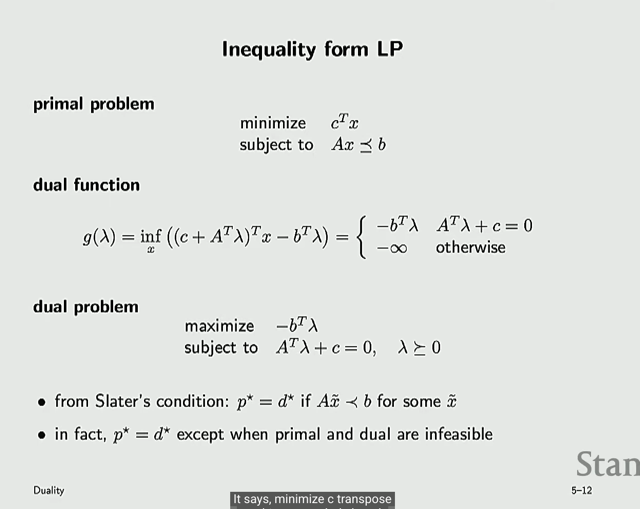</kbd>

> [!NOTE]
> ta gặp lại bài toán Inequality form LP, bài toán optimization gốc
> (primal problem) là minimize cTx với inequalities constraint Ax
> ⪯ b.
>
> Từ đó, như đã biết ta xây dựng Lagrangian:
>
> L = cTx + λT(Ax-b) = cTx + λTAx - λTb = (c + ATλ)Tx - λTb
>
> Đây là dạng affine qTx + p như đã nói bữa trước nếu mà (khi
> minimize over x, để có dual function) thì khi q = 0 thì ta sẽ có kết quả
> minimize là p và ngược lại thì sẽ là -infinity.
>
> Vậy nên dual function = inf x (c + ATλ)Tx - λTb sẽ
>
> = -λTb (cũng là - bTλ vì là scalar) nếu (c + ATλ) = 0
>
> = -infinity khi otherwise.
>
> Lúc nãy ta đã biết, về cái gọi là DUAL FEASIBLE, rằng có một IMPLICIT
> CONSTRAINT đối với DUAL VARIABLE λ, v rằng g(λ, v) phải > -infinity
> tạo nên DOMAIN của dual function g(λ, v): dom g =  (λ,v): g(λ,v) > -inf
>
> Thì sau đó ta biết rằng người ta sẽ chuyển thành EQUIVALENT problem
> cho Dual problem bằng cách đưa constraint này thành EXPLICIT:
>
> Để từ Dual problem gốc: maximize g(λ, v) constraint λ ≽ 0 thành
> equivalent problem: maximize g(λ, v) constraint λ ≽ 0 và explicit
> constraint
>
> Và cụ thể với bài toán này, khi mà g(λ) chỉ > -inf (và cụ thể là = -bTλ)
> nếu ATλ + c = 0 thì equivalent dual problem sẽ là:
>
> maximize g(λ) (khi đó = - bTλ) constraint λ ≽ 0 và ATλ + c = 0

 

<kbd>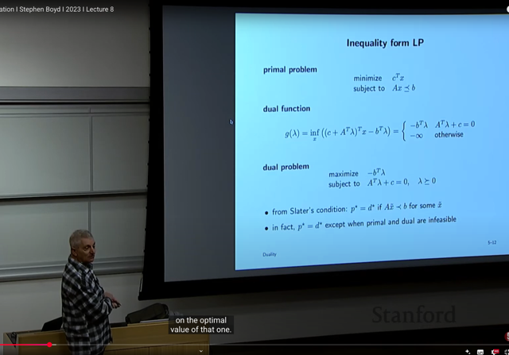</kbd>

> [!NOTE]
> Và ông nói rằng: ta có tính chất sau:
>
> Nếu mà tồn tại Ax ≺ b với thì bằng cách giải bài toán dual problem ta sẽ
> tìm được d* cũng chính là p*
>
> Có thể hiểu là đây là nói về Slater's condition. Theo đó thì nếu tồn tại x
> trong relative interior của problem domain D mà khiến gi(x) < 0
> (CHỈ NHỎ HƠN, STRICTLY LESS THAN ) thì những điểm đó gọi là
> STRICTLY FEASIBLE. Khi đó, cùng với việc primal problem là
> convex problem, thì Slater's condition này sẽ đảm bảo problem có
> STRONG DUALITY
>
> Tuy nhiên, có vẻ như ta có quyền dùng Weaker form of Slater's condition
> vì trong bài toán này, inequality constraints Ax ⪯ b là Affine. Nên thật ra
> chỉ cần tồn tại x thỏa Ax ⪯ b (tức là constraint gốc, hay chỉ cần feasible,
> không cần strictly feasible theo Slater's condition nói Ax ≺ b)

 

<kbd>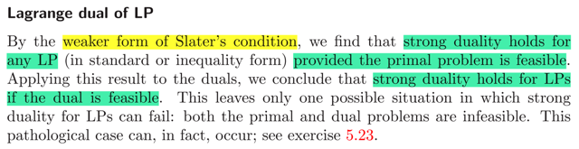</kbd>

> [!NOTE]
> Thế thì nhờ đọc sách mà ta hiểu được, tại sao gs nói tồn tại Ax ≺= b
> thì p* = d*
>
> Đại khái là vì với LP, các constraints ĐỀU LÀ LINEAR. Nói cách
> khác, inequality constraints function đều là AFFINE. Mà như đã nói
> vừa rồi, với affine thì kiểu như là Slater's condition "KHÔNG CẦN
> NỮA". Để rồi bản chất chỉ là, chỉ cần bài toán FEASIBLE, tức là
> miễn là có feasible point x thì khi đó sẽ chắc chắc có strong duality.
>
> Mà bài toán feasible thì tức là phải tồn tại x thỏa các constraints, 
> với Inequality form LP thì constraint là Ax ⪯ b
>
> Tuy nhiên gs nói vẫn có một trường hợp kì dị mà bài toán LP không
> thoả strong duality: khi cả primal và dual problem đều không feasible
> và ông để cái này thành bài tập

 

<kbd>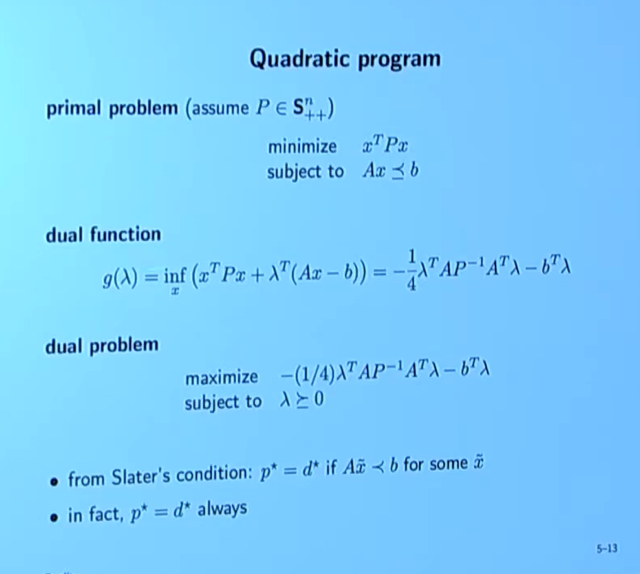</kbd>

> [!NOTE]
> Ví dụ gặp lại bài toán Quadratic program:
>
> minimize xTPx , P ≽ S^n++, với constraints Ax ⪯ b
>
> Lagrangian: L = xTPx + λT(Ax-b) = xTPx + λTAx - λTb
>
> Dual function: inf x (xTPx + λTAx - λTb)
>
> Tìm gradient: df = f(x+dx) - f(x) =
>
> (x+dx)TP(x+dx) + λTA(x+dx) - λTb - xTPx - λTAx + λTb
>
> = (xT+dxT)P(x+dx) + λTA(x+dx) - xTPx - λTAx
>
> = (xTP+dxTP)(x+dx) + λTAx + λTAdx - xTPx - λTAx
>
> = dxTPx + xTPdx + λTAdx
>
> = 2xTPdx + λTAdx = (2xTP + λTA)dx
>
> ∇xf = (2xTP + λTA)T = 2PTx + ATλ
>
> ∇xf = 0 <=> 2PTx + ATλ = 0 <=> 2PTx = -ATλ
>
> <=> x = -0.5(PTinv)ATλ = -0.5(Pinv)ATλ  | P symmetric
>
> Hessian 2P (Hessian của quadratic form function ta đã làm rồi) 
> ≽ 0 nên x là minimum.
>
> => L(x*) = [-0.5(Pinv)ATλ]TP[-0.5(Pinv)ATλ] + λT(A(-0.5(Pinv)ATλ) - λTb)
>
> = 0.25(ATλ)T(Pinv)TP(Pinv)ATλ - 0.5λTAPinvATλ - λTb
>
> = - (1/4)λTAPinvATλ - λTb
>
> Và bài toán dual problem sẽ là:
>
> maximize -(1/4)λTAPinvATλ - λTb với constraint λ ≽ 0
>
> Gs cho biết, trong bài toán này, ta có Slater's condition, tức tồn tại x sao cho Ax ≺
> b thành ra có Strong Duality p* = d*. Nên khi solve dual problem ta sẽ có d* cũng
> là p*.
>
> Vì sao tồn tại Ax ≺ b, là vì Ax ≺ b tạo nên (feasible set) là một Polyhedra, giao của các
> half-plane nên thì CHẮC CHẮN LÀ CÓ TỒN TẠI những điểm Ở TRONG
> POLYHEDRA
>
> Do đó thỏa mãn Slater's condition là: tồn tại x ∈ relint D sao cho fi(x) ≺ 0.
>
> Và cùng với việc PRIMAL PROBLEM LÀ CONVEX vì objective function là
> quadratic (dựa vào SECOND ORDER CONDITION, Hessian P ≽ 0, mà đề bài
> cho P ∈ S^n ++, tức P ≻ 0 là positive definite luôn, thì function convex) là convex
> function, và các constraint là affine nữa. Thì khi đó có thể chắc chắc STRONG
> DUALITY hold.
>
> Tuy nhiên tương tự, ở đây các constraints function đều là linear / affine, thì Slater's
> condition REDUCE THÀNH FEASIBILITY: Tức là khi đó chỉ cần bài toán có tính
> chất feasible (tồn tại x thỏa các constraint) thì Strong Duality sẽ thỏa: Mà
> constraint Ax ⪯ b thì luôn tồn tại x thỏa (feasible set là polyhedra) thành ra luôn
> có Strong Duality

 

<kbd>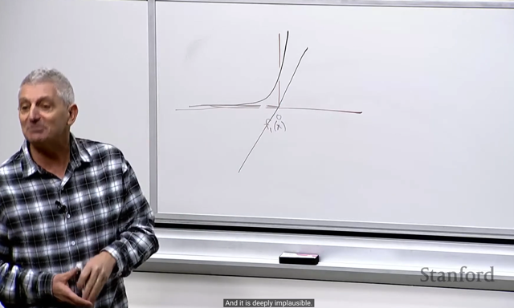</kbd>

> [!NOTE]
> đại khái là ta nhớ lại câu chuyện ban đầu về ý nghĩa của
> Lagrangian khi ta approximate cái đường màu đen chữ L
> ngược (vốn mang ý nghĩa là nếu ta ở bên phải, ứng với fi(x) >
> 0, tức violate inequality constraint fi(x) <= 0 thì cost sẽ là
> infinity, vô cùng lớn, là ko thể chấp nhận được (thể hiện bởi việc
> khi vừa đi qua mức > 0 là nó vọt lên vô cùng lớn) ngược lại khi
> thỏa constraint fi(x) < 0 thì cost = 0.
>
> Trong khi đó ta lại đi approx. nó với đường tuyến tính, để rồi
> khi fi(x) dương càng lớn thì cost càng lớn nhưng fi(x) dương ko
> lớn lắm thì cost cũng  nhỏ thôi (hoàn khác với việc cost vô cùng
> lớn bất kể violate nhiều ít)
>
> Nhưng điểm chính gs muốn nhấn mạnh đó là, khi ta adjust λ thì
> kiểu như sẽ rồi cũng tìm được cách approx tốt bài toán gốc. Đó là
> ý nghĩa

 

<kbd>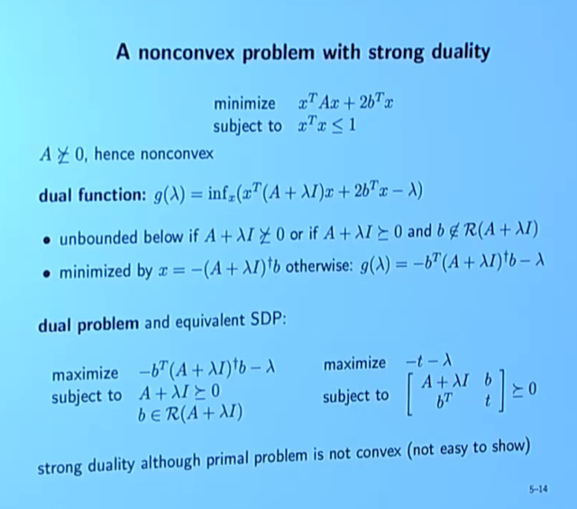</kbd>

> [!NOTE]
> gs nói sơ một ý quan trọng: Có nhiều bài toán NON-CONVEX nhưng
> lại có STRONG DUALITY
>
> Ví dụ điển hình như là bài toán non-convex quadratic function,
> (khi A, tức Hessian của quadratic function không phải positive semi 
> definite matrix thì function không convex). Tuy nhiên bài toán này ta
> lại có STRONG DUALITY
>
> Ông nói thêm điều này có nghĩa là mọi optimization problem với của hai 
> quadratic convex hay không, đều có thể gỉai được (tractable)

 

<kbd>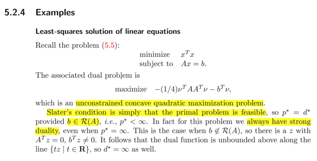</kbd>

> [!NOTE]
> Phần 5.2.4 trong sách xem xét một số ví dụ về vấn đề Strong
> Duality.
>
> Đầu tiên là bài toán Least-squares solution of linear equations,
> minimize xTx subject to Ax = b.
>
> Xây dựng Lagrangian function L = xTx + vT(Ax - b) và Dual
> function g(v) = inf x ∈ dom L(x, v) sẽ ra -(1/4)vTAATv - bTv
> (dùng calculus, không khó để ra kết quả này)
>
> Khi đó, vì không có λ, nên Dual problem chỉ không có constraint
> λ ≽ 0. Và objective của dual problem là negative quadratic function
> theo v, nên nó concave
>
>
> Thế thì vì bài toán gốc (primal problem) không có inequality 
> constraints nên Slater's condition không cần thiết, mà nó chỉ cần
> bài toán feasible thì sẽ đảm bảo Strong Duality.
>
> Thế thì, để feasible, tức tồn tại x thỏa equality constraint Ax = b
> thì điều này đồng nghĩa là b phải thuộc R(A) (hay C(A) - columns
> space của A)
>
> Tuy vậy, gs nói, trong bài toán này Strong Duality có thể được đảm
> bảo ngay cả khi b không thuộc C(A).
>
> Nếu b không thuộc C(A), thì có nghĩa là sao: từ mit1806 ta biết,
> có nghĩa là C(A) không span toàn bộ R^n, cũng là dim C(A) < n
> => dim N(AT) > 0, tức tồn tại non zero vector z của left nullspace:
>
> ATz = 0. Mà b không thuộc C(A) nên dĩ nhiên b không vuông góc
> với left null-space vector z (vì nếu nó vuông góc, nó phải thuộc C(A))
> Vậy bTz khác 0.
>
> Rồi dùng cái này ta sẽ nói rằng, nếu lấy v = tz, tức v là left nullspace
> vector, t là scalar.
>
> Thì g(v) = -(1/4)vTAATv - bTv = -(1/4)(tz)TAAT(tz) - bT(tz)
>
> = (1/4)zTtTAATtz - bTtz
>
> = (1/4)(ATtz)T(ATtz) - bTtz
>
> = (1/4)||ATtz||^2 - bTtz 
>
> = (t/4)||ATz||^2 - t(bTz)
>
> = (t/4)*0 - t(bTz) = -t(bTz)
>
> Và như vậy khi maximize g(v) mà bây giờ trở thành maximize g bằng
> các thay đổi t thì luôn có thể thấy g(v) lớn bao nhiêu cũng được.
>
> Hay d* = inf g(v) = +infinity
>
> Và với b không thuộc C(A) thì bài toán gốc cũng có p* là +infinity, vì sao
> vì ta nhớ khi optimization problem không có feasible point mà b không
> thuộc C(A) thì Ax = b thì hệ vô nghiệm. Thì khi đó optimal value sẽ là
> +infinity.
>
> Vậy ngay cả khi b không thuộc C(A) thì p* vẫn bằng d*
>
> 5.2 LAGRANGE DUAL PROBLEM
>
> 5.2.4 EXAMPLES

 

<kbd>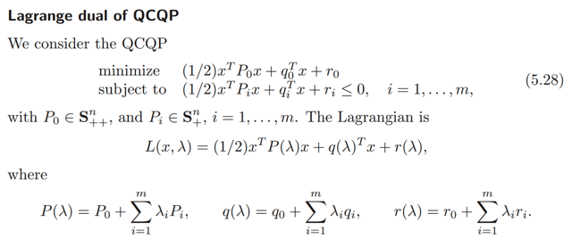</kbd>

<kbd>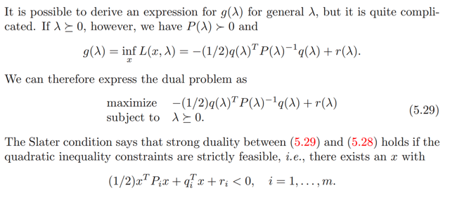</kbd>

> [!NOTE]
> SÁCH (XEM SAU)

 

<kbd>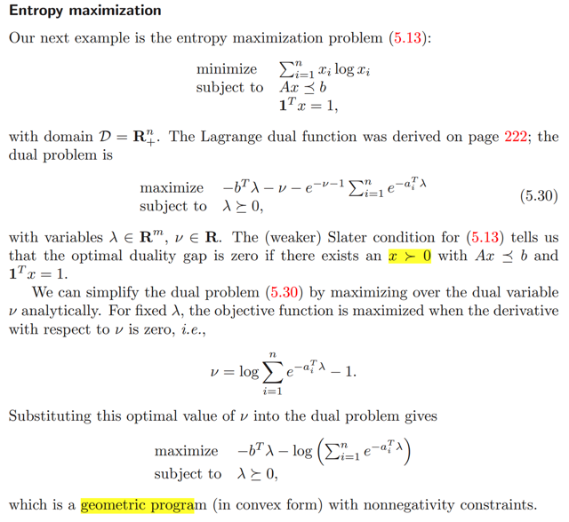</kbd>

<kbd>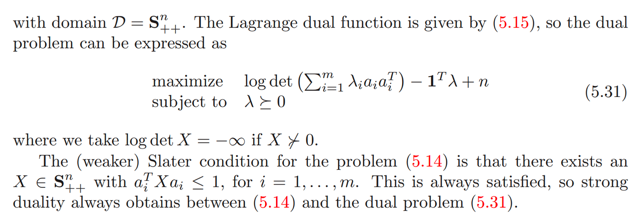</kbd>

> [!NOTE]
> SÁCH (XEM SAU)

 

<kbd>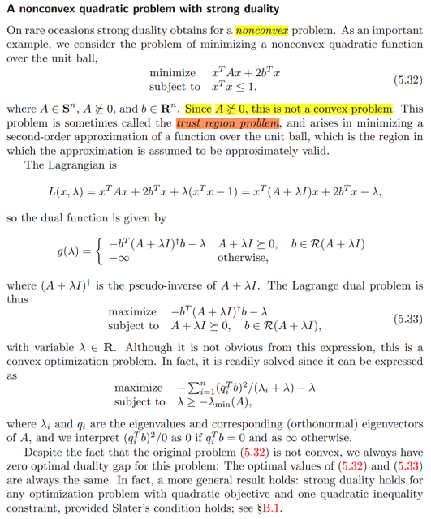</kbd>

> [!NOTE]
> SÁCH (XEM SAU)

 

<kbd>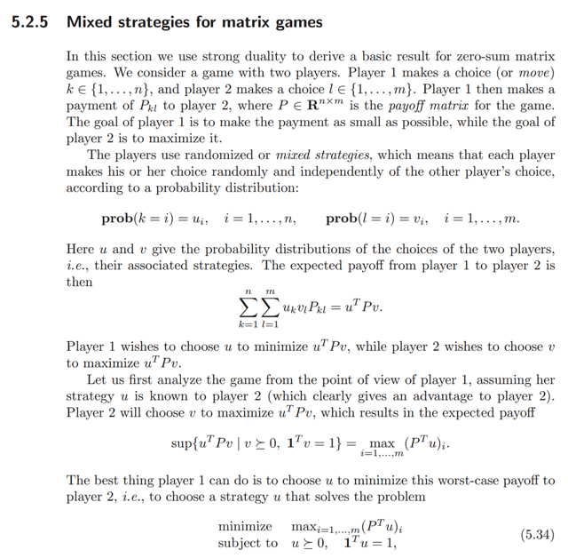</kbd>

> [!NOTE]
> SÁCH (XEM SAU)
>
> 5.2 LAGRANGE DUAL PROBLEM
>
> 5.2.5 MIXED STRATEGIES FOR
> MATRIX GAMES

 

<kbd>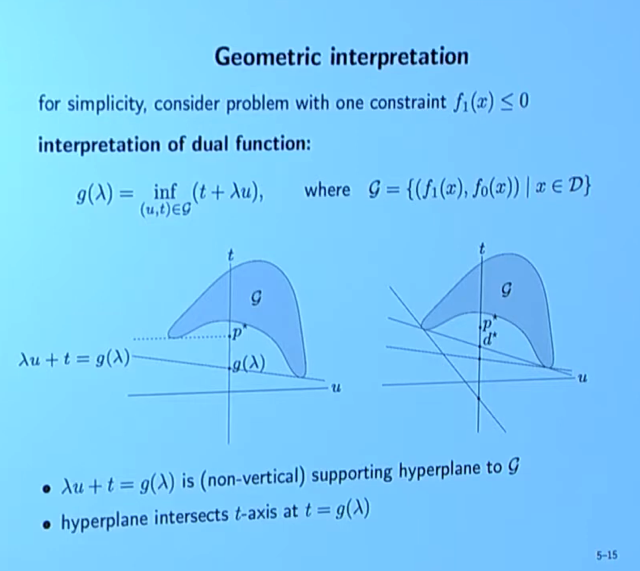</kbd>

> [!NOTE]
> G là set các điểm (f1(x), f0(x)) với x ∈ D. tức là, với các x khác nhau
> với mỗi x, ta tính objective function f0(x) và constraint
> function f1(x) thì với MỌI x ta có được mọi điểm (f1(x), f0(x))
> tạo thành G hình dạng như trong hình.
>
> Và trục hoành u là trục ứng với giá trị f1, để rồi với constraint là
> f1(x) <= 0 nên MỌI (f1(x), f0(x)) NẰM BÊN PHẢI ĐỀU
> UNACCEPTABLE
>
> Và trục tung, t là trục ứng với giá trị của objective function f0, và như đã
> biết, semantic của bài toán optimization là, càng xuống thấp càng
> tốt.
>
> CHAPTER 5 - DUALITY
>
> 5.3 GEOMETRIC INTERPRETATION

 

<kbd>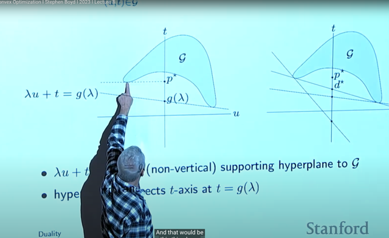</kbd>

> [!NOTE]
> Như vậy điều ta sẽ làm là: Ignore mọi điểm (f1, f0) trong blob ở
> bên phải (trục t), và trong phần bên trái, xem điểm nào thấp
> nhất. Đó chính là optimal p* = f0* (ý là f0 của điểm (f1, f0) đó

 

<kbd>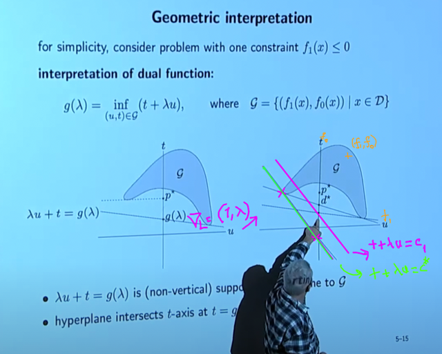</kbd>

> [!NOTE]
> Thế thì xét Lagrangian, L(x, λ) (đang xét ví dụ chỉ có inequality constraints), như đã
> biết:
>
> L = f0(x) + Σ λi fi(x)  + Σ vi hi(x)
>
> nhưng ở đây chỉ có inequality constraints f1(x) <= 0 thôi, nên
>
> L = f0(x) + λ f1(x)
>
> thành ra tuy x có thể là n-dimensional vector với n ko biết nhưng L chỉ là function của
> f0(x) và λ * f1(x), hay nói cách khác (với một fixed value λ) có thể coi L như là
> function của f0 và f1: L(f0, f1) = f0 + λ f1
>
> Và với mọi x thuộc domain (problem domain: là intersection của dom f0 và dom f1),
> thì ta có blob G chứa mọi cặp (f0, f1) (f0 = f0(x), f1 = f1(x))
>
> Rồi vậy L = L(f0, f1) = f0 + λf1 cũng có thể gọi là L(t, u) = t + λu với t, u ∈ G
>
> Ta có thể vẽ LEVEL SET của L trên hệ trục t, u (trục của f0 là trục tung và trục của f1 là
> trục hoành như nãy đã nói) - là tập hợp (f0, f1) sao cho L(f0, f1) = constant c dễ thấy
> nó sẽ là các đường thẳng t + λu = c
>
> Với fixed λ và các c khác nhau thì ta có các level curve là các đường song song
> như vầy. Và đương nhiên ta chỉ xét những điểm (t, u) nằm trong blob G, nói cách khác
> đường level set phải cắt blob G. Thành ra chỉ xét các đường song song nhưng
> trong phạm vi những cái có cắt blob G.
>
> t + λu = c1, t + λu = c2, .....
>
> Và ta muốn tìm cái ứng với c (cũng là L = t + λu) nhỏ nhất.
>
> Và và đó chính là cái đường xa nhất theo hướng ngược với gradient vector ∇L:
>
> Hướng gradient là hướng nào? L = f0 + f1λ thì:
>
> ∇L = (∂L/∂f0, ∂L/∂f1) = (1, λ) (chú ý λ ở đây là number, vì nó là lagrange multiplier 
> gắn với inequality constraint function f1(x), đúng ra thì nên gọi là λ1)
>
> và đi ngược hướng đó xa nhất mà vẫn còn tiếp xúc với blob ta có cái đường màu
> xanh:
>
> t + λu = c*
>
> Đây chính là SUPPORT HYPERPLANE của blob G.
>
> Đó là nơi mà từ điểm tiếp xúc, đi về hướng nào trong G cũng là đi theo hướng mà
> hợp với gradient góc nhỏ hơn 90 độ nên sẽ khiến tăng L.
>
> Và việc ta move trong các đường màu tím song song để đến khi có đường màu xanh,
> chính là việc ta tìm x sao cho L(x, λ) nhỏ nhất, và cũng tìm trong các điểm (t, u) ∈ G sao
> cho L nhỏ nhất, tức c nhỏ nhất. Hình dung cho đường thằng di chuyển song song sao
> cho vẫn còn dính blob G, thì tại mỗi vị trí, nó cắt blob G tại một đoạn, đoạn đó là tập  hợp
> các điểm có cùng L(t, u) = t + λu = c và khi ra xa hết cỡ thì c nhỏ nhất, lúc đó nó tiếp tuyến
> với G
>
> Và cái c nhỏ nhất này - c* chính là g(λ) (sẽ phụ thuộc λ vì với λ khác nhau, ta sẽ có các
> Lagrangian khác nhau, nên gradient ∇x sẽ khác nhau, và kết quả ta có các support 
> hyperplane khác nhau của blob G
>
> (vì g(λ) được định nghĩa là kết quả khi ta tìm hàm L(x, λ) nhỏ nhất bằng cách thay đổi x
> mà, nên khi ta có cái đường màu xanh t + λu = c* rồi THÌ CÁI CONSTANT c* CỦA NÓ
> CHÍNH LÀ g(λ) (và chú ý nãy giờ đang nói là ta chọn fixed value nào đó cho λ) 
>
> Và từ t + λu = c = g(λ), cho u = 0 (tìm giao điểm với trục t), thì t chính là g(λ)

 

<kbd>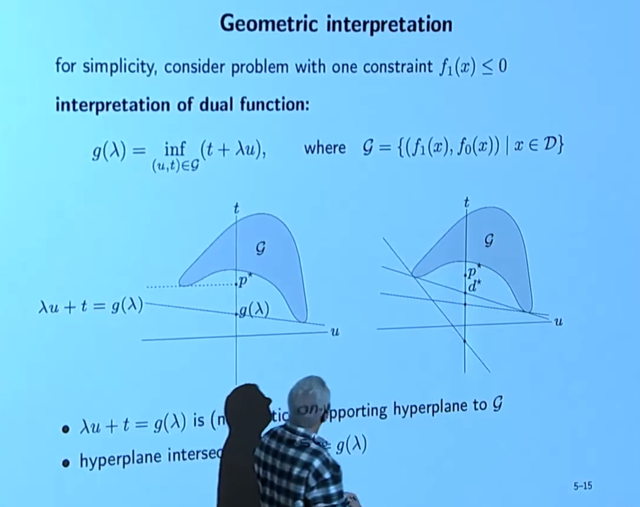</kbd>

> [!NOTE]
> Nếu λ lớn thì slope nhỏ:
>
> vì level set: t + λu = c, dùng implicit differentiation (vi phân hàm ẩn)
>
> d/du(t+λu) = dc/du
>
> <=> dt/du + λ = 0 <=> dt/du = -λ
>
> vậy khi λ lớn thì độ dốc càng nhỏ là đúng.
>
> Và λ dương (constraint phải vậy) thì các đường level set λu + t = c
> đều có độ dốc âm (t = -λu + c) Nên trong hình minh họa sau, mình
> có ghi chú là sẽ ko có mấy cái đường màu vàng bên phải

 

<kbd>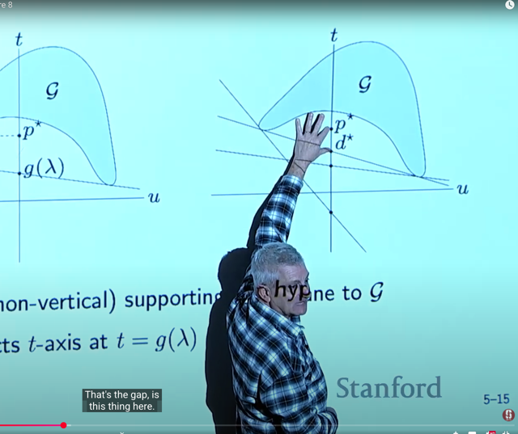</kbd>

> [!NOTE]
> Thế thì khi ta chuyển qua bài toán thứ 2 - dual problem: maximize
> g(λ) - mà ý nghĩa là tìm λ sao cho g(λ) lớn nhất thì ta sẽ thấy, với
> các λ khác nhau giống như ta sẽ có các optimal line (supporting
> hyperplane của G) khác nhau và chúng sẽ cắt t, tại các điểm mang
> giá trị t = g(λ)  khác nhau.
>
> ĐÂY CHÍNH LÀ CÁC LOWER BOUND CỦA P* KHÁC NHAU, PHỤ
> THUỘC λ: p* >= g(λ) 
>
> Hình ảnh sẽ là, khi các optimal line thay đổi, nó sẽ "kiểu như" quay "
> vòng vòng" xung quanh (và tiếp xúc) cái blob này, để rồi cái điểm giao
> với trục t, tức g(λ), sẽ cứ chạy lên chạy xuống.
>
> (Thật ra không hẳn là quay vòng vòng, xem hình kế minh họa nhiều
> đường optimal)
>
> Và khi nó chạy lên cao nhất, thì đó chính là d* thì nó gần p*
> nhất. Thì khoảng cách đó với p* chính là DUALITY GAP GIỮA d* VÀ p*
>
> Và gs nói, đó là lí do ta hiểu tại sao có gap giữa d* và p* (trong cái
> WEAK DUALITY: d* <= p*)

 

<kbd>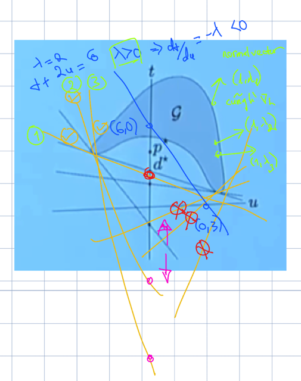</kbd>

> [!NOTE]
> Vì λ dương nên chỉ có những đường màu vàng bên trái thôi:
>
> Chọn λ dương, ví dụ λ1. Ta xác định được gradient vector (1,
> λ1)  của L_λ1 (t,u) = t + λ1u.
>
> Và cũng là normal vector của các level set:
>
> L_λ1 (t, u) = c <=> t + λ1u = c
>
> Rồi khi cho c nhỏ dần, cái đường này nó trượt song song
> (vuông góc với (1, λ1) cho theo hướng ngược lại với (1, λ1)
> cho đến khi chỉ còn dính với blob G tại một điểm: tiếp tuyến (1)
>
> Đó là hình ảnh của việc g(λ1) = inf x ∈ D L(x, λ) 
>
> = inf t, u ∈ G L_λ1 (u, v) = inf t, u ∈ G t + λu
>
> Và với nhiều λ khác nhau thì ta có các tiếp tuyến (1), (2) (3)...
>
> Tụi nó cắt trục t tại các điểm màu hồng, mà giá trị t chính
> là g(λ1) g(λ2) ....mà cái có giá trị lớn nhất chính là d*

 

<kbd>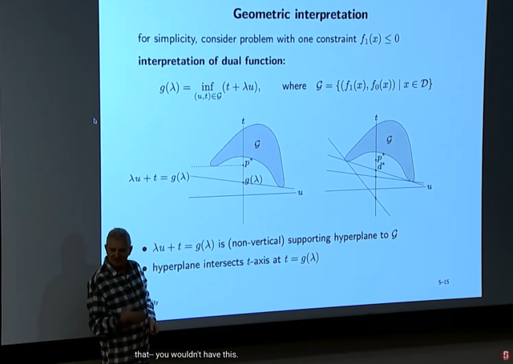</kbd>

> [!NOTE]
> Và từ đó giúp ta hiểu, cái gap đó là bởi trong cái ví dụ này, blob G
> KHÔNG PHẢI LÀ CONVEX SET, nó có hình như cái boomerang, và ta
> đã học convex set là gì, nối hai điểm giữa hai cánh boomerrang thì
> những điểm ở giữa ko nằm trong set.
>
> Nên PRIMAL PROBLEM KHÔNG PHẢI LÀ CONVEX PROBLEM
>
> Từ đó ta có thể hình dung nếu blob G là convex set, thì khi đó  sẽ
> KHÔNG CÓ GAP GIỮA d* và p*, tức là lúc supporting hyperplane
> thay đổi thì d* sẽ có lúc trùng p*.
>
> Và đó là khi ta có STRONG DUALITY

 

<kbd>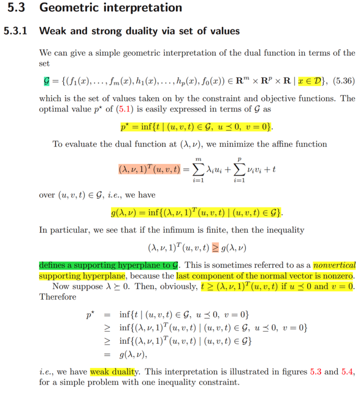</kbd>

<kbd>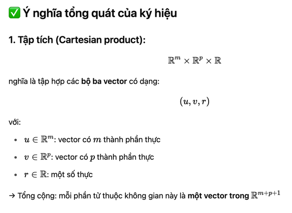</kbd>

> [!NOTE]
> Nội dung này cơ bản mình đã hiểu từ bài giảng. Ở đây chỉ có một số
> vấn đề bổ sung:
>
> Đầu tiên, là định nghĩa set G ở đây là trong trường hợp khái quát khi
> primal problem có objective function f0(x), inequality constraint
> functions f1(x), f2(x)....fm(x), và equality constraint functions h1(x),
> h2(x),....hp(x)
>
> Thì kí hiệu (f1,...fm, h1,...hp, f0) ∈ R^m x R^p x R ý là, ta có vector
> trong không gian R^(m+p+1) dimensions, nhưng lấy ví dụ như vector
> trong không gian 3D có thể được tách thành 1 vector trong subspace
> 2D và 1 vector trong subspace 1D để ghi là (u, v) ∈ R^2 x R thì ta
> hiểu (u, v) có u là vector 2D, v là scalar.
>
> Do đó (u, v, t) của G ∈ R^m x R^p x R thì ta hiểu u là R^m vector, v là
> R^n vector và t là scalar
>
> Bài toán primal problem: 
>
> minimize x f0(x) với constraint fi(x) ≤ 0 và hi(x) = 0 
>
> với optimal p* = inf x f0(x) | x ∈ D: fi(x) ≤ 0, hi(x) = 0
>
> Thì với các kí hiệu u, v, t trên ta có thể thể hiện p* hoàn toàn tương tự
>
> p* = inf (t | (u, v, t) ∈ G, u ⪯ 0, v = 0
>
> Kí hiệu nữa có thể mới thấy là (λ, v, 1)T(u, v, t) thì ta sẽ hiểu nó bằng:
>
> λTu + vTv + t (chú ý v đầu là "nu" - là dual variable)
>
> Và cái này là Lagrangian f0(x) + Σ λi fi(x) + Σ vi hi(x) thôi.
>
> Nên g(λ, v) = inf x L(x, λ, v) thể hiện theo u, v ,t ở đây sẽ là: 
>
> g(λ, v) = inf (λ, v, 1)T(u, v, t) | (u, v, t) ∈ G mang ý nghĩa là tìm trong hết các 
> (u, v, t) thuộc G (cũng là tìm trong các x khác nhau thuộc domain) xem
> cái nào giúp minimize L
>
> Để rồi vì định nghĩa của infimum nên dĩ nhiên ta có: 
>
> g(λ, v) ≤ L(u, v, t) ⇔ g(λ, v) ≤ (λ, v, 1)T(u, v, t)
>
> Thế thì với cách thể hiện này giúp ta thấy nó ĐỊNH RA MỘT SUPPORT
> HYPERPLANE CỦA G (có dạng giống giống như aTx > c)
>
>
>
>
> Và khúc cuối nói dễ thấy nếu u ⪯ 0 và v = 0 thì t >= (λ, v, 1)T(u, v, t) 
>
> là vì nếu mọi component của u: ui đều <= 0 (điều này là constraint 
> fi(x) < 0) thì ui * λi âm (λi dương), và vi = 0 nên dĩ nhiên:
>
> t + Σ ui λi + Σ vi vi sẽ phải < t vì t cộng với số âm phải nhỏ đi
>
> NÓI CHUNG, NGOẠI TRỪ VÀI NOTATION / CÁCH THỂ HIỆN 
> MÌNH MỚI BIẾT THÌ KHÔNG CÓ GÌ MỚI TRONG ĐÂY CẢ
>
> 5.3 GEOMETRIC INTERPRETATION
>
> 5.3.1 WEAK & STRONG DUALITY

 

<kbd>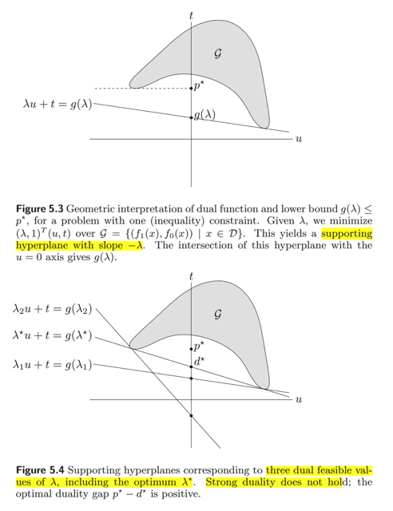</kbd>

 

- **Diễn giải về Epigraph**

<kbd>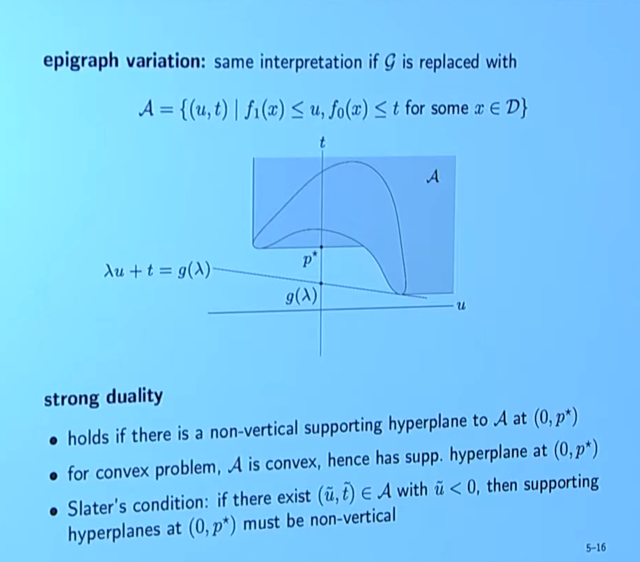</kbd>

> [!NOTE]
> Ko hiểu lắm chỉ biết nó là phiên bản mà ta dùng epigraph.
> Nhưng ta cũng có cùng cách interpretation như vậy

 

<kbd>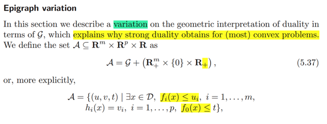</kbd>

<kbd>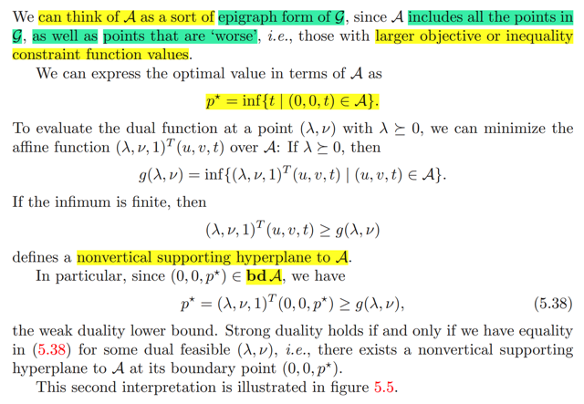</kbd>

> [!NOTE]
> Cái giải thích thứ hai, cũng
> tương tự, dựa vào epigraph

 

<kbd>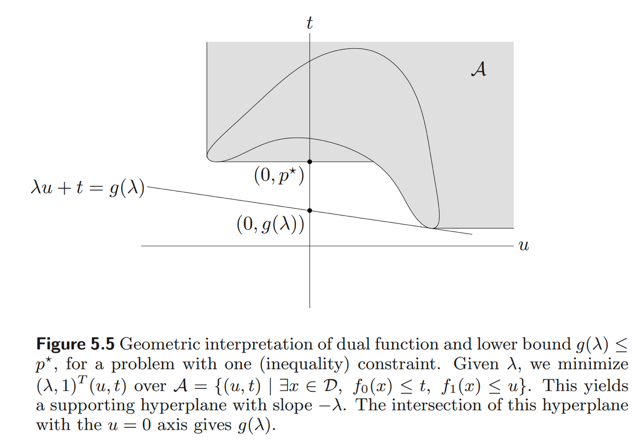</kbd>

 

<kbd>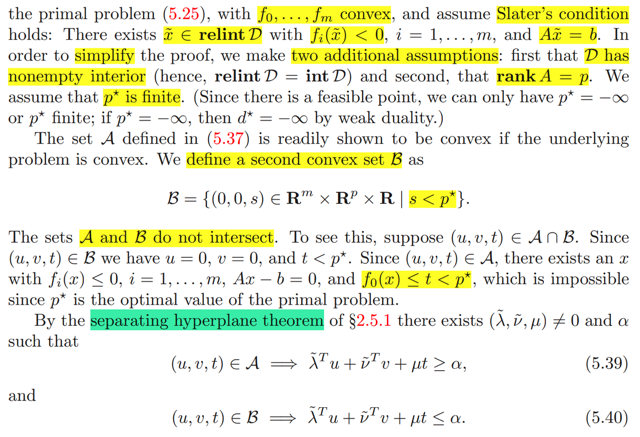</kbd>

<kbd>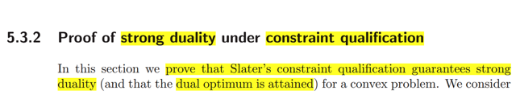</kbd>

> [!NOTE]
> Đại khái là phần này ta sẽ chứng minh rằng nếu convex primal problem 
> có thêm (việc thỏa mãn được) Slater's condition thì khi đó Strong Duality
> sẽ hold và như gs cũng đã nói, là Slater's condition không chỉ đảm bảo
> mà còn đảm bảo rằng Dual optimal sẽ attained / có thể đạt được để rồi
> ta có thể tìm thấy λ*, v* sao cho g(λ*, v*) = d* = p*
>
> Đầu tiên dĩ nhiên ta sẽ phải có convex primal problem, tức bài toán có
> các f0 (objective), f1, f2...fm (inequality constraint function) là convex.
> Và ta có thêm Slater's condition: Tồn tại x~ thuộc relative interior của problem
> domain D sao cho ta có TÌNH TRẠNG STRICTLY FEASIBLE: fi(x~) < 0 
> (dĩ nhiên x~ feasible thì nó phải thỏa equality constraints hi(x) = 0 mà với
> bài toán primal là convex thì đây là các affine function Ax = b, do đó ta có:
> Ax~ = b là vậy)
>
> Để đơn giản hóa bài toán ta sẽ đặt thêm gỉa định là D có non-empty interior,
> do đó relint D = int D (cái này là sao thì sẽ giải thích ở note khác) và rank A = p
> chính là nói rằng các linear equation Ax=b đều đôc lập.
>
> Và assume thêm p* hữu hạn, bởi ta đã giả định là đang thỏa Slater's condition
> mà điều này đồng nghĩa là có tồn tại feasible point. Và lúc trước đã nói, nếu
> bài toán infeasible thì p* = +infinity. Nên giờ bài toán feasible thì p* chỉ có thể
> là mang giá trị hữu hạn (finite) nào đó hoặc là -infinity
>
> Rồi, ta mới định nghĩa set A =
>
>
> ...QUAY LẠI SAU
>
> 5.3 GEOMETRIC INTERPRETATION
>
> 5.3.2 PROOF OF STRONG DUALITY UNDER 
> CONSTRAINT QUALIFICATION

 

<kbd>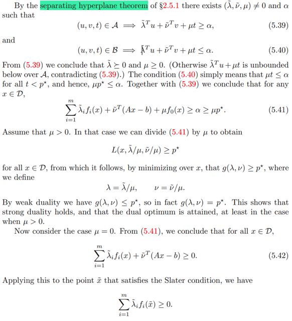</kbd>

> [!NOTE]
> SÁCH (XEM SAU)

 

<kbd>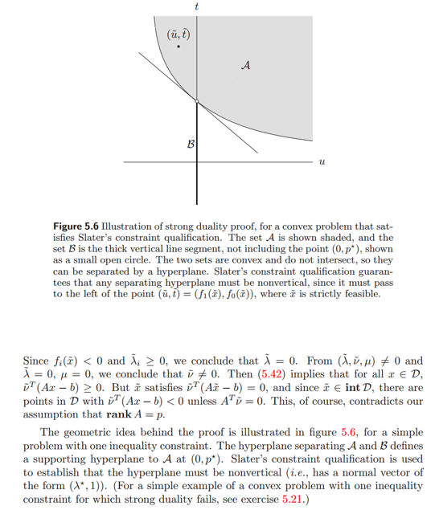</kbd>

> [!NOTE]
> SÁCH (XEM SAU)

 

<kbd>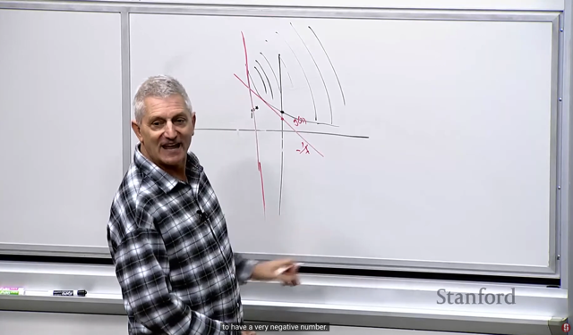</kbd>

<kbd>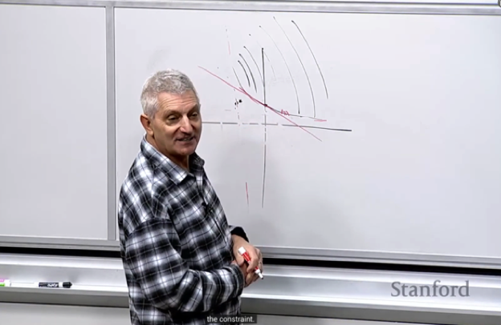</kbd>

> [!NOTE]
> Gs nói về case khi A convex, thì ta cũng có
> trạng thái tương tự đó là p* = d*

 

<kbd>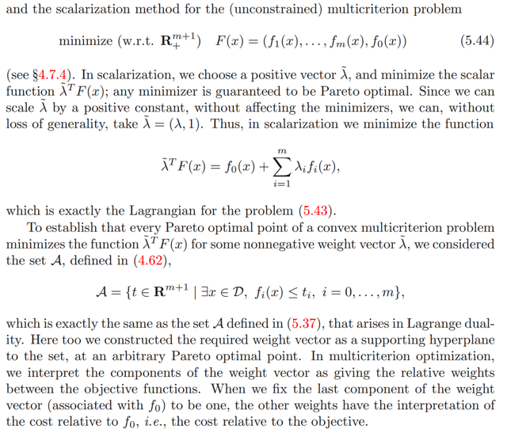</kbd>

<kbd>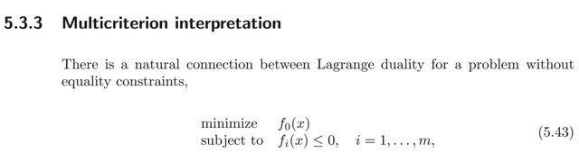</kbd>

> [!NOTE]
> SÁCH (XEM SAU)
>
> 5.3 GEOMETRIC INTERPRETATION
>
> 5.3.4 MULTI-CRITERION INTERPRETATION

 

<kbd>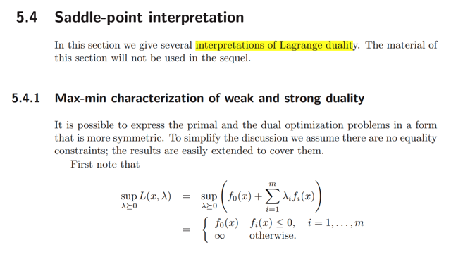</kbd>

> [!NOTE]
> CHAPTER 5 - DUALITY
>
> 5.4 SADDLE-POINT INTERPRETATION
>
> SÁCH (XEM SAU)

 

